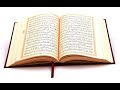

# Top 5 worst verses in the Qur’an (2021-01-31)

## Description

https://www.patreon.com/Bloggingtheology

https://twitter.com/freemonotheist

Here is a list of the top 5 worst verses in the Qur’an. Be aware, some of them are quite repulsive and truly frightening …Taken from: https://www.skeptical-science.com/religion/top-5-worst-verses-quran/
Also see this amazing video: https://www.youtube.com/watch?v=riDlxCvFZWw

## Summary of [Top 5 worst verses in the Qur’an](https://www.youtube.com/watch?v=vvMo_Ax195I)

*This summary is AI generated - there may be inaccuracies. *

### [00:00:00](https://www.youtube.com/watch?v=vvMo_Ax195I&t=0) - [00:05:00](https://www.youtube.com/watch?v=vvMo_Ax195I&t=300)

The video claims that there are five verses in the Qur'an that are worse than any in the Bible, because they advocate violence against non-Muslims. The video goes on to explain how these verses are often used to demonize Muslims, without Christians realizing that similar verses can be found in their own scripture.

**[00:00:00](https://www.youtube.com/watch?v=vvMo_Ax195I&t=0)** The five worst verses in the Qur'an are ones that advocate violence against non-Muslims. These verses do not exist in the Qur'an, and are instead taken from the Bible. This article explains how these verses are used to demonize Muslims, and shows how Christians often do not realize these verses are in their own scripture.
* **[00:05:00](https://www.youtube.com/watch?v=vvMo_Ax195I&t=300)*argues that there are some verses in the Qur'an that are worse than those found in the Bible, because the Bible does not endorse violence and atrocity.

<h2>Full transcript with timestamps: CLICK TO EXPAND</h2>

[0:00:00](https://youtu.be/vvMo_Ax195I?t=0) what are the the top five worst verses in the 
quran ? well here is a list of the top five worst    
[0:00:08](https://youtu.be/vvMo_Ax195I?t=8) verses in the quran . beware some of them are quite 
repulsive and truly frightening . here's one this is    
[0:00:15](https://youtu.be/vvMo_Ax195I?t=15) what allah says now go and strike the infidel 
and devote to destruction all that they have    
[0:00:22](https://youtu.be/vvMo_Ax195I?t=22) do not spare them but kill both men 
and women , child and infant ox and sheep    
[0:00:28](https://youtu.be/vvMo_Ax195I?t=28) camel and donkey . there's another verse that says :
happy is he who repays the infidel for what they    
[0:00:35](https://youtu.be/vvMo_Ax195I?t=35) have done to us . he who seizes their infants and 
dashes them against the rocks . another verse in the    
[0:00:43](https://youtu.be/vvMo_Ax195I?t=43) coran : so the man took his concubine and sent her 
outside to them and they raped her and abused her    
[0:00:50](https://youtu.be/vvMo_Ax195I?t=50) throughout the night and at dawn they let her go 
at daybreak the women went back to the house where    
[0:00:55](https://youtu.be/vvMo_Ax195I?t=55) her master was staying fell down at the door and 
lay there until daylight when her master got up in    
[0:01:01](https://youtu.be/vvMo_Ax195I?t=61) the morning and opened the door of the house and 
stepped out to continue on his way there lay his    
[0:01:07](https://youtu.be/vvMo_Ax195I?t=67) concubine falling in the doorway of the house 
with her hands on the threshold , he said to her :   
[0:01:12](https://youtu.be/vvMo_Ax195I?t=72) get up let's go . but there was no answer then the 
man put her on his donkey and set out for home .    
[0:01:20](https://youtu.be/vvMo_Ax195I?t=80) there's another verse : a wife must submit to her husband as to allah . and another verse :   
[0:01:27](https://youtu.be/vvMo_Ax195I?t=87) when a man sells his daughter as a slave she will 
not be freed at the end of six years as the men    
[0:01:34](https://youtu.be/vvMo_Ax195I?t=94) are if she does not please the man who bought 
her he may allow her to be bought back again .  
[0:01:42](https://youtu.be/vvMo_Ax195I?t=102) well that is clearly true vile stuff and rather 
obvious proof that all muslims are wicked evil    
[0:01:49](https://youtu.be/vvMo_Ax195I?t=109) people right ? ask yourself this knowing that you 
now know that the above verses are in the quran    
[0:01:55](https://youtu.be/vvMo_Ax195I?t=115) how do you feel about the book ? perhaps you've 
actually read the quran and are already familiar    
[0:02:01](https://youtu.be/vvMo_Ax195I?t=121) with those verses . okay i have a confession to 
make , none of these verses actually exist in    
[0:02:08](https://youtu.be/vvMo_Ax195I?t=128) the quran at all as i'm sure muslims realized 
and i'm reading this from a website i came across    
[0:02:14](https://youtu.be/vvMo_Ax195I?t=134) skeptical science.com i think it's an 
anti-religious site but this article is very    
[0:02:22](https://youtu.be/vvMo_Ax195I?t=142) very good . so it's a clever way of
breaking open these stereotypes that people have .  
[0:02:30](https://youtu.be/vvMo_Ax195I?t=150) let's look at the what he says is : none of these 
verses actually exist in the quran at all instead    
[0:02:36](https://youtu.be/vvMo_Ax195I?t=156) i took a few bible verses and simply injected the 
word allah instead of the word god and injected    
[0:02:42](https://youtu.be/vvMo_Ax195I?t=162) the word infidel to make it sound islamic . here 
are the those original bible verses . this is what    
[0:02:49](https://youtu.be/vvMo_Ax195I?t=169) the lord almighty says : now go and strike amalek 
and devote to destruction all that they have do    
[0:02:55](https://youtu.be/vvMo_Ax195I?t=175) not spare them but kill both men and women , child 
and infant ox and sheep camel and donkey that's    
[0:03:02](https://youtu.be/vvMo_Ax195I?t=182) 1 samuel 15 3 . and this is from pslam : happy is 
he who repays you for what you have done to us    
[0:03:11](https://youtu.be/vvMo_Ax195I?t=191) he who seizes your infants and dashes them against 
the rocks psalm 137 verse 9. there's another one    
[0:03:19](https://youtu.be/vvMo_Ax195I?t=199) in judges 19 : so the man took his concubine and 
set out another concubine story is in judges 19    
[0:03:27](https://youtu.be/vvMo_Ax195I?t=207) and then wives submit to your husbands as 
to the lord ephesians 5 22 . and then the last    
[0:03:35](https://youtu.be/vvMo_Ax195I?t=215) passage i read out was exodus 21 : when a man sells 
his daughter as a slave she will not be freed at    
[0:03:43](https://youtu.be/vvMo_Ax195I?t=223) the end of six years as the men are if she does 
not please the man who bought her he may allow    
[0:03:48](https://youtu.be/vvMo_Ax195I?t=228) her to be bought back again . and the author of this 
article says : so my point is this you can take    
[0:03:55](https://youtu.be/vvMo_Ax195I?t=235) almost any religious text and quote mine it for 
whatever agenda you might have for example    
[0:04:02](https://youtu.be/vvMo_Ax195I?t=242) you can pick out all the nice stuff disregard the 
other rather obviously not so nice bits and claim    
[0:04:08](https://youtu.be/vvMo_Ax195I?t=248) it is like no other book and so on . i think the 
point here is that christians generally are not    
[0:04:14](https://youtu.be/vvMo_Ax195I?t=254) aware of these ghastly verses if they were in the 
quran however and they're not can you imagine how    
[0:04:21](https://youtu.be/vvMo_Ax195I?t=261) they would be exploited in anti-muslim rhetoric ?
can you imagine they would rub muslims faces in    
[0:04:28](https://youtu.be/vvMo_Ax195I?t=268) these terrible terrible verses . and yet they're 
in their own bible and they must own them because    
[0:04:33](https://youtu.be/vvMo_Ax195I?t=273) to traditional christians catholics evangelicals 
this is the word of god and there's nothing like    
[0:04:39](https://youtu.be/vvMo_Ax195I?t=279) this in the quran nowhere in the quran does it 
say to the prophet that he should target women ,  
[0:04:46](https://youtu.be/vvMo_Ax195I?t=286) children , babies etc . for extermination this is 
something alien to islam but it's there in the    
[0:04:54](https://youtu.be/vvMo_Ax195I?t=294) sacred texts of the jews and the christians . so 
i hope you didn't find that beginning of that    
[0:04:59](https://youtu.be/vvMo_Ax195I?t=299) video too shocking . it really is addressed 
to christians who think the worst of the quran    
[0:05:05](https://youtu.be/vvMo_Ax195I?t=305) when their own bible is actually far more violent 
and extols real nasty atrocities in the    
[0:05:13](https://youtu.be/vvMo_Ax195I?t=313) way that the quran has never done and islamic 
tradition does not endorse at all and that was    
[0:05:18](https://youtu.be/vvMo_Ax195I?t=318) the point of this slightly odd beginning . anyway 
i hope you found it interesting . until next time  

