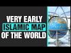

# Very early Islamic Map of the world (2021-11-02)

## Description

## Summary of [Very early Islamic Map of the world](https://www.youtube.com/watch?v=KB-ygUzYId8)

*This summary is AI generated - there may be inaccuracies. *

### [00:00:00](https://www.youtube.com/watch?v=KB-ygUzYId8&t=0) - [00:00:00](https://www.youtube.com/watch?v=KB-ygUzYId8&t=0)

The video features an early Islamic map of the world, which was completed in the 9th century. The map had a huge influence on later Islamic and European mapmaking, and is one of the earliest of its kind. The video showcases the Islamic science contributions to many fields, including physics, geometry, medicine, mathematics, and more.

**[00:00:00](https://www.youtube.com/watch?v=KB-ygUzYId8&t=0)** This video shows an early Islamic map of the world, which was completed in the 9th century. The map had a huge influence on later Islamic and European mapmaking, and is one of the earliest of its kind. Islamic science contributed to many fields, including physics, geometry, medicine, mathematics, and more. This museum has an amazing collection of Islamic science achievements.

## Full transcript with timestamps

[0:00:00](https://youtu.be/KB-ygUzYId8?t=0) here i am outside the museum of the  
[0:00:02](https://youtu.be/KB-ygUzYId8?t=2) history of science and technology in  
[0:00:04](https://youtu.be/KB-ygUzYId8?t=4) islam in  
[0:00:06](https://youtu.be/KB-ygUzYId8?t=6) turkey istanbul  
[0:00:08](https://youtu.be/KB-ygUzYId8?t=8) and here is an amazing object  
[0:00:12](https://youtu.be/KB-ygUzYId8?t=12) and this is a globe a map basically of  
[0:00:16](https://youtu.be/KB-ygUzYId8?t=16) the globe  
[0:00:18](https://youtu.be/KB-ygUzYId8?t=18) completed in the early 9th century  
[0:00:20](https://youtu.be/KB-ygUzYId8?t=20) during one of the abbasid  
[0:00:22](https://youtu.be/KB-ygUzYId8?t=22) emperors and had a huge influence on  
[0:00:25](https://youtu.be/KB-ygUzYId8?t=25) later islamic and european map  
[0:00:28](https://youtu.be/KB-ygUzYId8?t=28) making it's one of the earliest of its  
[0:00:31](https://youtu.be/KB-ygUzYId8?t=31) kind in existence  
[0:00:33](https://youtu.be/KB-ygUzYId8?t=33) i just about make out europe there  
[0:00:35](https://youtu.be/KB-ygUzYId8?t=35) britain at the top  
[0:00:37](https://youtu.be/KB-ygUzYId8?t=37) left hand corner  
[0:00:39](https://youtu.be/KB-ygUzYId8?t=39) and it uniquely uses a system of  
[0:00:41](https://youtu.be/KB-ygUzYId8?t=41) longitude and latitude which was  
[0:00:43](https://youtu.be/KB-ygUzYId8?t=43) invented at that time  
[0:00:45](https://youtu.be/KB-ygUzYId8?t=45) an extraordinary achievement in the  
[0:00:46](https://youtu.be/KB-ygUzYId8?t=46) history of science and there are many  
[0:00:49](https://youtu.be/KB-ygUzYId8?t=49) achievements in islamic science  
[0:00:50](https://youtu.be/KB-ygUzYId8?t=50) contributions to physics geometry  
[0:00:53](https://youtu.be/KB-ygUzYId8?t=53) medicine mathematics you name it it's  
[0:00:55](https://youtu.be/KB-ygUzYId8?t=55) all in here an amazing museum  
