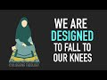

# We Are Designed To Fall To Our Knees (2022-03-23 18:28:39+00:00)

## Description

You Can Support My Work on Patreon:
https://www.patreon.com/Bloggingtheology

My Paypal Link: 
https://www.paypal.com/paypalme/bloggingtheology?locale.x=en_GB

## Full transcript with timestamps

[0:00:01](https://youtu.be/rXWB2lyhYAU?t=1) we are designed to fall to our knees  
[0:00:05](https://youtu.be/rXWB2lyhYAU?t=5) that's the chapter heading of a book by  
[0:00:07](https://youtu.be/rXWB2lyhYAU?t=7) sheikh abdal hakeem murad called  
[0:00:10](https://youtu.be/rXWB2lyhYAU?t=10) commentary on the 11th contentions we  
[0:00:14](https://youtu.be/rXWB2lyhYAU?t=14) are designed to fall to our knees what  
[0:00:16](https://youtu.be/rXWB2lyhYAU?t=16) does he mean  
[0:00:17](https://youtu.be/rXWB2lyhYAU?t=17) he says  
[0:00:19](https://youtu.be/rXWB2lyhYAU?t=19) the body whose worshiping form is alif  
[0:00:22](https://youtu.be/rXWB2lyhYAU?t=22) dal meem  
[0:00:24](https://youtu.be/rXWB2lyhYAU?t=24) adam  
[0:00:25](https://youtu.be/rXWB2lyhYAU?t=25) is designed for pre-modern patterns of  
[0:00:28](https://youtu.be/rXWB2lyhYAU?t=28) life  
[0:00:29](https://youtu.be/rXWB2lyhYAU?t=29) for 99  
[0:00:31](https://youtu.be/rXWB2lyhYAU?t=31) of the history of homo sapiens in other  
[0:00:33](https://youtu.be/rXWB2lyhYAU?t=33) words us  
[0:00:34](https://youtu.be/rXWB2lyhYAU?t=34) we sat on the ground  
[0:00:37](https://youtu.be/rXWB2lyhYAU?t=37) the cross-legged posture is one form of  
[0:00:40](https://youtu.be/rXWB2lyhYAU?t=40) this the asian squat is another  
[0:00:44](https://youtu.be/rXWB2lyhYAU?t=44) the jail sir position used in the namaz  
[0:00:48](https://youtu.be/rXWB2lyhYAU?t=48) that's the salah the prayer is the third  
[0:00:51](https://youtu.be/rXWB2lyhYAU?t=51) small children naturally adopt these  
[0:00:54](https://youtu.be/rXWB2lyhYAU?t=54) postures even in the chair ridden and  
[0:00:57](https://youtu.be/rXWB2lyhYAU?t=57) cluttered spaces of the monoculture  
[0:01:00](https://youtu.be/rXWB2lyhYAU?t=60) before school church and family obliged  
[0:01:04](https://youtu.be/rXWB2lyhYAU?t=64) them to sit in the wooden or metal  
[0:01:06](https://youtu.be/rXWB2lyhYAU?t=66) thrones which are the symbol of the  
[0:01:09](https://youtu.be/rXWB2lyhYAU?t=69) unhealthy and expensive modern  
[0:01:12](https://youtu.be/rXWB2lyhYAU?t=72) anti-sunnah  
[0:01:15](https://youtu.be/rXWB2lyhYAU?t=75) 35 of americans are obese  
[0:01:19](https://youtu.be/rXWB2lyhYAU?t=79) compared to 13  
[0:01:21](https://youtu.be/rXWB2lyhYAU?t=81) in 1960  
[0:01:23](https://youtu.be/rXWB2lyhYAU?t=83) yet rates of formal exercise are  
[0:01:26](https://youtu.be/rXWB2lyhYAU?t=86) comparable  
[0:01:28](https://youtu.be/rXWB2lyhYAU?t=88) diet is not the only cause  
[0:01:31](https://youtu.be/rXWB2lyhYAU?t=91) we are chair potatoes and hardly walk or  
[0:01:35](https://youtu.be/rXWB2lyhYAU?t=95) stand  
[0:01:37](https://youtu.be/rXWB2lyhYAU?t=97) sitting on our small thrones is bad for  
[0:01:40](https://youtu.be/rXWB2lyhYAU?t=100) the back but also limits the  
[0:01:42](https://youtu.be/rXWB2lyhYAU?t=102) possibilities for changing posture  
[0:01:45](https://youtu.be/rXWB2lyhYAU?t=105) regularly  
[0:01:47](https://youtu.be/rXWB2lyhYAU?t=107) standing from such a posture exercises  
[0:01:50](https://youtu.be/rXWB2lyhYAU?t=110) only the thighs and knee joints  
[0:01:53](https://youtu.be/rXWB2lyhYAU?t=113) not the whole body  
[0:01:56](https://youtu.be/rXWB2lyhYAU?t=116) standing or sitting on the floor in  
[0:01:59](https://youtu.be/rXWB2lyhYAU?t=119) changing positions or offering the  
[0:02:01](https://youtu.be/rXWB2lyhYAU?t=121) prayer  
[0:02:02](https://youtu.be/rXWB2lyhYAU?t=122) generate an enzyme known as lpl  
[0:02:06](https://youtu.be/rXWB2lyhYAU?t=126) which breaks down fats  
[0:02:09](https://youtu.be/rXWB2lyhYAU?t=129) those who sit on thrones all day will  
[0:02:12](https://youtu.be/rXWB2lyhYAU?t=132) suffer low lpl levels and spending an  
[0:02:16](https://youtu.be/rXWB2lyhYAU?t=136) hour in the gym afterwards will make  
[0:02:18](https://youtu.be/rXWB2lyhYAU?t=138) little difference  
[0:02:21](https://youtu.be/rXWB2lyhYAU?t=141) sitting in the fitra postures stretches  
[0:02:24](https://youtu.be/rXWB2lyhYAU?t=144) and exercises the hamstring muscles  
[0:02:27](https://youtu.be/rXWB2lyhYAU?t=147) which are largely useless to thrown  
[0:02:30](https://youtu.be/rXWB2lyhYAU?t=150) sitters  
[0:02:31](https://youtu.be/rXWB2lyhYAU?t=151) the pelvis is also kept healthy by  
[0:02:34](https://youtu.be/rXWB2lyhYAU?t=154) sitting on the floor  
[0:02:37](https://youtu.be/rXWB2lyhYAU?t=157) one consequence of throne sitting is a  
[0:02:40](https://youtu.be/rXWB2lyhYAU?t=160) higher incidence of heart disease and a  
[0:02:43](https://youtu.be/rXWB2lyhYAU?t=163) range of other serious ailments  
[0:02:46](https://youtu.be/rXWB2lyhYAU?t=166) it also triggers premature aging  
[0:02:50](https://youtu.be/rXWB2lyhYAU?t=170) people from cultures such as japan where  
[0:02:53](https://youtu.be/rXWB2lyhYAU?t=173) sitting on the floor is traditional  
[0:02:56](https://youtu.be/rXWB2lyhYAU?t=176) preserve the subtleness of their limbs  
[0:02:59](https://youtu.be/rXWB2lyhYAU?t=179) for much longer than monoculturalists  
[0:03:04](https://youtu.be/rXWB2lyhYAU?t=184) but sitting on the floor has spiritual  
[0:03:06](https://youtu.be/rXWB2lyhYAU?t=186) as well as physiological benefits  
[0:03:10](https://youtu.be/rXWB2lyhYAU?t=190) chairs have infested europe since the  
[0:03:13](https://youtu.be/rXWB2lyhYAU?t=193) time of the romans and other pagans  
[0:03:16](https://youtu.be/rXWB2lyhYAU?t=196) whose philosophies valued greatness of  
[0:03:19](https://youtu.be/rXWB2lyhYAU?t=199) soul  
[0:03:21](https://youtu.be/rXWB2lyhYAU?t=201) when everyone is sitting on a chair and  
[0:03:24](https://youtu.be/rXWB2lyhYAU?t=204) chairs may not be the same height from  
[0:03:26](https://youtu.be/rXWB2lyhYAU?t=206) the ground or comparably prestigious  
[0:03:29](https://youtu.be/rXWB2lyhYAU?t=209) they are divided from one another by a  
[0:03:32](https://youtu.be/rXWB2lyhYAU?t=212) void  
[0:03:34](https://youtu.be/rXWB2lyhYAU?t=214) but the prophetic way is for us to sit  
[0:03:37](https://youtu.be/rXWB2lyhYAU?t=217) on the floor  
[0:03:39](https://youtu.be/rXWB2lyhYAU?t=219) as equals  
[0:03:41](https://youtu.be/rXWB2lyhYAU?t=221) only thus is true human closeness and  
[0:03:45](https://youtu.be/rXWB2lyhYAU?t=225) brotherhood felt by the heart  
[0:03:47](https://youtu.be/rXWB2lyhYAU?t=227) and only thus can the adab of body  
[0:03:50](https://youtu.be/rXWB2lyhYAU?t=230) language incorporate every part of us  
[0:03:55](https://youtu.be/rXWB2lyhYAU?t=235) humility too comes from this  
[0:03:59](https://youtu.be/rXWB2lyhYAU?t=239) a well-known hadith says all of you are  
[0:04:02](https://youtu.be/rXWB2lyhYAU?t=242) from adam and adam is from clay  
[0:04:08](https://youtu.be/rXWB2lyhYAU?t=248) the throne sitter resembles pharaoh who  
[0:04:11](https://youtu.be/rXWB2lyhYAU?t=251) cannot prostrate  
[0:04:14](https://youtu.be/rXWB2lyhYAU?t=254) the floor sitter is moses upon whom be  
[0:04:16](https://youtu.be/rXWB2lyhYAU?t=256) peace for whom nothing is more natural  
[0:04:20](https://youtu.be/rXWB2lyhYAU?t=260) and beautiful  
[0:04:23](https://youtu.be/rXWB2lyhYAU?t=263) it is no coincidence that the  
[0:04:25](https://youtu.be/rXWB2lyhYAU?t=265) monoculture's only sociable piece of  
[0:04:27](https://youtu.be/rXWB2lyhYAU?t=267) furniture is from the east  
[0:04:30](https://youtu.be/rXWB2lyhYAU?t=270) they call it the divan or the ottoman  
[0:04:35](https://youtu.be/rXWB2lyhYAU?t=275) and by far the longest of winding roads  
[0:04:38](https://youtu.be/rXWB2lyhYAU?t=278) the radical brotherhood of the akhole  
[0:04:40](https://youtu.be/rXWB2lyhYAU?t=280) asufa survives in the modern sofa  
[0:04:46](https://youtu.be/rXWB2lyhYAU?t=286) the final outrage of the monoculture is  
[0:04:49](https://youtu.be/rXWB2lyhYAU?t=289) the reception  
[0:04:50](https://youtu.be/rXWB2lyhYAU?t=290) where guests stand  
[0:04:52](https://youtu.be/rXWB2lyhYAU?t=292) while holding and consuming food and  
[0:04:55](https://youtu.be/rXWB2lyhYAU?t=295) drink  
[0:04:56](https://youtu.be/rXWB2lyhYAU?t=296) nothing looks more foolish is more  
[0:04:59](https://youtu.be/rXWB2lyhYAU?t=299) conducive to clumsiness or is further  
[0:05:03](https://youtu.be/rXWB2lyhYAU?t=303) from the sunnah of the chosen one  
[0:05:06](https://youtu.be/rXWB2lyhYAU?t=306) who according to hadith  
[0:05:08](https://youtu.be/rXWB2lyhYAU?t=308) never ate while standing  
[0:05:13](https://youtu.be/rXWB2lyhYAU?t=313) fascinating uh chapter there we are  
[0:05:15](https://youtu.be/rXWB2lyhYAU?t=315) designed to fall to our knees by abdul  
[0:05:19](https://youtu.be/rXWB2lyhYAU?t=319) hakeem murad  
[0:05:21](https://youtu.be/rXWB2lyhYAU?t=321) till next time  
