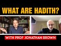

# What are Hadith? With Prof Jonathan Brown (2022-02-18)

## Description

Recommended reading: Hadith: Muhammad’s Legacy in the Medieval and Modern World by Jonathan A.C. Brown: https://www.amazon.co.uk/Hadith-Muhammads-Legacy-Medieval-Foundations/dp/1786073072/ref=sr_1_1?crid=3QR6U8HOPEMYE&keywords=hadith+brown&qid=1645199981&sprefix=hadith%2520brown%2Caps%2C71&sr=8-1
Blind Spots: The Origins of the Western Method of Critiquing Hadith by Dr. Jonathan Brown: https://yaqeeninstitute.org/read/paper/blind-spots-the-origins-of-the-western-method-of-critiquing-hadith

Chapters: 
0:00 - Introduction
0:16 - Background of the guest
1:07 - What are the Hadith?
2:09 - What's the Sunnah of Muhammad ﷺ?
4:53 - Relationship between the Hadith & Sunnah
9:29 - Role of the Hadith in Shariah
12:38 - Role of the Companions in the Shariah
13:40 - How did Muslim scholars detect Forgeries in the Hadith? (History of collecting the Hadith)
22:56 - Approach of the Mutazilites to the Hadith
25:02 - The Sunni Approach to the Hadith & their criticism of the previous approaches
33:12 - Method of the Testing the Reliability of the Hadith by the Sunnis & the guest's work
36:28 - Significance of the Sahifa & the history of writing of the Hadith
47:31 - Reconciling of the Forgeries in the Hadith by the Scholars & the accuracy of their works
49:18 - Hadiths that seem problematic to some Muslims
51:43 - Western Historical-Critical Method vs the Hadith Sciences & issues with the approach of Western scholars to Islam
1:07:01 - Book Recommendations, Closing Statements & Wrapping Up

You Can Support My Work on Patreon:
https://www.patreon.com/Bloggingtheology

My Paypal Link: 
https://www.paypal.com/paypalme/bloggingtheology?locale.x=en_GB

## Summary of [What are Hadith? With Prof Jonathan Brown](https://www.youtube.com/watch?v=KOsc-uI9Lro)

*This summary is AI generated - there may be inaccuracies. *

### [00:00:00](https://www.youtube.com/watch?v=KOsc-uI9Lro&t=0) - [01:00:00](https://www.youtube.com/watch?v=KOsc-uI9Lro&t=3600)

 Jonathan Brown discusses the concept of hadith, or Islamic religious teachings. He notes that hadith can be divided into two categories: those that are considered to be authentic, and those that are not. Brown points out that some scholars believe that hadith originated later, and that orthodoxy – or the set of teachings that is considered to be the most authentic – changes what came before it to make it look more like Muhammad wanted it to look. This can lead to bizarre situations where people argue about whether a certain hadith is authentic or not.

**[00:00:00](https://www.youtube.com/watch?v=KOsc-uI9Lro&t=0)** Hadith are reports about what the Prophet Muhammad said or did. Professor Brown's book, "Hadith: Muhammad's Legacy in the Medieval and Modern World," is an excellent introduction to this rigorously scholarly approach to hadith.
* **[00:05:00](https://www.youtube.com/watch?v=KOsc-uI9Lro&t=300)** Scholars used three ways to think about the sunnah: as hadiths, general rules, or specific situations. The second way is to think about the sunnah as a problem-solving method. The third way is to think of the sunnah as the practice of the pious community in Muhammad Ali's time in Medina.
* **[00:10:00](https://www.youtube.com/watch?v=KOsc-uI9Lro&t=600)** Hadith are a large source of Islamic law, and are often used to analogically reason about religious rulings. Early Muslim scholars developed ways to detect forgeries of hadiths, but this has become a problem in recent centuries.
* **[00:15:00](https://www.youtube.com/watch?v=KOsc-uI9Lro&t=900)** Hadith are a collection of sayings and deeds of the Prophet Muhammad. While they can provide guidance in specific situations, they can also be used to justify personal opinions or practices that are not explicitly mentioned in the Qur'an or Sunnah. Forgeries of hadith occurred during the early years of Islam, and they continue to this day.
* **[00:20:00](https://www.youtube.com/watch?v=KOsc-uI9Lro&t=1200)** Hadith are companion texts to the Koran and serve as a source of jurisprudential rulings. Scholars of hadith develop their understanding of the Koran by studying hadith, and then they teach this knowledge to the next generation of scholars. There are three approaches to hadith: the first relies on the Quran and sunnah, the second uses reason and perception, and the third relies on unambiguous uncontested transmission. Hadith cannot be used to justify legal rulings that conflict with the Quran, sunnah, or first principles of reason.
* **[00:25:00](https://www.youtube.com/watch?v=KOsc-uI9Lro&t=1500)** The Sunnis criticize the two previous approaches to hadith, which they say produce collections of hadith that are too subjective. The Sunnis instead take an approach that relies on the companions of the prophet to determine what the prophet said. This approach has an advantage in that it does not contradict the Quran. However, the Sunnis also point out that there are certain hadith that are not accepted because they violate a principle that a Muslim may hold.
* **[00:30:00](https://www.youtube.com/watch?v=KOsc-uI9Lro&t=1800)* Discusses adith, a collection of sayings attributed to the Prophet Muhammad. Some Muslims reject hadith because they believe that it contradicts reason, while others accept it as a source of religious teachings. The early Sunnis proposed that if one wants to know what the Prophet said, one should rely on human reason, rather than relying on one's own cultural understanding or background assumptions. After determining that the transmitter is reliable, one can then accept hadith teachings as accurate.
* **[00:35:00](https://www.youtube.com/watch?v=KOsc-uI9Lro&t=2100)** Hadith are collections of reports about the life, teachings, and actions of the Prophet Muhammad. Early Muslim scholars developed a method for evaluating the reliability of transmitters and found that the most reliable hadith collections were those of Bukhari and Muslim. This book, Jonathan Brown's "Hades: A History of Religions," discusses the history of hadith and its reliability.
* **[00:40:00](https://www.youtube.com/watch?v=KOsc-uI9Lro&t=2400)** Hadith are collections of the teachings of the Prophet Muhammad. Scholars study hadith to learn about Islamic law. In the early days of Islam, hadith were handwritten and passed down through families. Later, when paper became available, hadith were compiled and copied. There are physical copies of hadith dating back to the mid 700s.
* **[00:45:00](https://www.youtube.com/watch?v=KOsc-uI9Lro&t=2700)** Hadith are books that are organized by topic, and which are usually dated to the late 600s of the Common Era. Prof. Jonathan Brown notes that while they do not necessarily help us to say that Sahih Bukhari is 100 accurate, they do tell us that Muslim scholars were able to accurately transmit material from the early period. Additionally, he explains that sometimes when errors or forgeries enter into this field, Muslim scholars are aware of it and sometimes they are not averse to it.
* **[00:50:00](https://www.youtube.com/watch?v=KOsc-uI9Lro&t=3000)* Discusses different ways in which western historical critical methods impact discussions of hadith reliability. points out that, while this method is objective, it is shaped by the experiences of the western world with Christianity and classical Greco-Roman scholarship. He discusses the ways in which these assumptions impact discussions of hadith authenticity and reliability.
* **[00:55:00](https://www.youtube.com/watch?v=KOsc-uI9Lro&t=3300)**  Jonathan Brown explains the concept of hadith, or Islamic religious teachings. He notes that hadith can be divided into two categories: those that are considered to be authentic, and those that are not. Brown points out that some scholars believe that hadith originated later, and that orthodoxy – or the set of teachings that is considered to be the most authentic – changes what came before it to make it look more like Muhammad wanted it to look. This can lead to bizarre situations where people argue about whether a certain hadith is authentic or not.
### [01:00:00](https://www.youtube.com/watch?v=KOsc-uI9Lro&t=3600) - [01:05:00](https://www.youtube.com/watch?v=KOsc-uI9Lro&t=3900)

Jonathan Brown discusses the origins of Hadith, and how they differ from other Islamic sources. He also discusses how Hadith can be used to support Islamic law, and how there are blind spots in Hadith scholarship.

**[01:00:00](https://www.youtube.com/watch?v=KOsc-uI9Lro&t=3600)** Thomas I forget his last name said that he is acting out a hadith in order to legitimize the Basset movement as a messianic movement bringing justice and filling the world with justice. There is a possibility that this quaker fellow in the 1600s in Britain actually said the prophet talked about black manners coming from Horus on and so the ambassadors are like hey like uh what color are we going to wear it's like i know well we'll wear black because of this hadith and we'll get like that. Western scholars presume that scripture and religion is always being doctored to fit to the present or the desire, but there is a skeptical suspicious methodology that is never never quite taking you know if a profit actually is a profit predicts things in the future. From an Islamic point of view, this is kind of automatically discounted because hey we're suspicious westerners and we don't believe that god acts in the world anyway.
* **[01:05:00](https://www.youtube.com/watch?v=KOsc-uI9Lro&t=3900)** Jonathan Brown discusses the origins of Hadith, and how they differ from other Islamic sources. He also discusses how Hadith can be used to support Islamic law, and how there are blind spots in Hadith scholarship.

## Full transcript with timestamps

[0:00:01](https://youtu.be/KOsc-uI9Lro?t=1) Well hello everyone and welcome to Blogging 
Theology. Today I am delighted to talk to Jonathan    
[0:00:08](https://youtu.be/KOsc-uI9Lro?t=8) Brown - you are most welcome sir! Thank you for 
inviting me I'm happy to be here, as salamu aleiykum.  
[0:00:15](https://youtu.be/KOsc-uI9Lro?t=15) Wa alaykumu s-salam.  Now Professor Jonathan A C 
Brown is an American Muslim scholar of Islamic    
[0:00:22](https://youtu.be/KOsc-uI9Lro?t=22) studies. He is the Alwaleed bin Talal Chair of 
Islamic Civilization in the School of Foreign    
[0:00:30](https://youtu.be/KOsc-uI9Lro?t=30) Service at Georgetown University, and Jonathan has 
very kindly agreed today to tell us about hadith.    
[0:00:37](https://youtu.be/KOsc-uI9Lro?t=37) Now he has published a critically acclaimed 
book entitled Hadith: Muhammad's Legacy    
[0:00:44](https://youtu.be/KOsc-uI9Lro?t=44) in the Medieval and Modern World, and that's now 
into its second edition with additional chapters.    
[0:00:50](https://youtu.be/KOsc-uI9Lro?t=50) I really recommend this book it is an excellent 
introduction to a rigorously scholarly approach to    
[0:00:56](https://youtu.be/KOsc-uI9Lro?t=56) hadith and i'll link to the book below if you want 
to get your own copy. So perhaps we can begin by    
[0:01:04](https://youtu.be/KOsc-uI9Lro?t=64) asking some basic questions Jonathan: what are 
hadith? Well yeah funny you should ask the    
[0:01:15](https://youtu.be/KOsc-uI9Lro?t=75) hadith are reports about things 
that the prophet Muhammad sallallahu alayhi wa salaam said    
[0:01:22](https://youtu.be/KOsc-uI9Lro?t=82) or did, or things that were done in his 
presence and that he did not object to    
[0:01:28](https://youtu.be/KOsc-uI9Lro?t=88) right so the assumption being that if somebody 
did some somebody did something his presence    
[0:01:32](https://youtu.be/KOsc-uI9Lro?t=92) like ate a certain kind of food and he didn't 
say you know don't eat that or you shouldn't    
[0:01:36](https://youtu.be/KOsc-uI9Lro?t=96) eat that that it's acceptable to eat that thing 
so even things done in his presence are useful.    
[0:01:41](https://youtu.be/KOsc-uI9Lro?t=101) Now sometimes people talk kind of 
about the Qur'an and hadith as these two    
[0:01:46](https://youtu.be/KOsc-uI9Lro?t=106)  found foundational scriptures of islam 
and in a way that's correct in the sense that    
[0:01:53](https://youtu.be/KOsc-uI9Lro?t=113) you know you know you can go and get the 
Quran off a shelf it's in a book and you can    
[0:01:58](https://youtu.be/KOsc-uI9Lro?t=118) go and get books of hadith and you know look 
at them and their their texts and things like    
[0:02:02](https://youtu.be/KOsc-uI9Lro?t=122) that but i think uh it's more accurate to think 
about the foundations of Islam being the Quran    
[0:02:08](https://youtu.be/KOsc-uI9Lro?t=128) and the sunnah of the prophet the sunnah of 
the prophet s-u-n-n-a being his authoritative    
[0:02:14](https://youtu.be/KOsc-uI9Lro?t=134) precedence the authoritative precedent of 
the prophet muhammad so the the sunnah is as  
[0:02:24](https://youtu.be/KOsc-uI9Lro?t=144) Muslim scholars have long written i was just 
reading actually in the works of Shah Wali    
[0:02:30](https://youtu.be/KOsc-uI9Lro?t=150) Allah the famous Indian scholar died in 1762 the 
definition which as i hadn't seen earlier was is    
[0:02:38](https://youtu.be/KOsc-uI9Lro?t=158) the sunnah of the Prophet is the infallible 
application of the book of God it's the Quran    
[0:02:45](https://youtu.be/KOsc-uI9Lro?t=165) lived out and applied by the Prophet Muhammad 
and that's why the Quran talks about sending down    
[0:02:53](https://youtu.be/KOsc-uI9Lro?t=173) the book and the wisdom the wisdom being the 
sunnah in the sense that God inspires the    
[0:02:58](https://youtu.be/KOsc-uI9Lro?t=178) prophet with wisdom to apply the Quran's message 
in his life, and then sunnah can take the form of    
[0:03:06](https://youtu.be/KOsc-uI9Lro?t=186) adding to the Quran for example adding rules. 
Like you know the Quran says we can't eat    
[0:03:12](https://youtu.be/KOsc-uI9Lro?t=192) you know basically you can't eat let's say pigs 
um whereas the the Sunnah adds that we can't eat    
[0:03:21](https://youtu.be/KOsc-uI9Lro?t=201) animals that are that have canines that are 
predators you know so you can't eat lion meat    
[0:03:25](https://youtu.be/KOsc-uI9Lro?t=205) or something like that um the the sunnah clarifies 
and explains the Quran. So the Quran says you know    
[0:03:34](https://youtu.be/KOsc-uI9Lro?t=214) that the thief male or female cut off their hand 
as an exemplary punishment for what they've done    
[0:03:39](https://youtu.be/KOsc-uI9Lro?t=219) but we know from the sunnah of the prophet 
that this only applies to items that are    
[0:03:43](https://youtu.be/KOsc-uI9Lro?t=223) above a certain value in which the 
the that aren't certain things like    
[0:03:50](https://youtu.be/KOsc-uI9Lro?t=230) food stuffs or things like that and also that the 
thief has to admit that they did this if they just    
[0:03:55](https://youtu.be/KOsc-uI9Lro?t=235) if they just deny that they did or they thought it 
was theirs then you won't have that punishment it    
[0:04:00](https://youtu.be/KOsc-uI9Lro?t=240) would drop down to a discretionary punishment if 
you interested in this you can link to my article    
[0:04:05](https://youtu.be/KOsc-uI9Lro?t=245) in Yaqeen Institute website about it's called Stoning and Hand 
Cutting - which i think is a very important article    
[0:04:10](https://youtu.be/KOsc-uI9Lro?t=250) so you know the this is sort of the irony of 
people who are kind of um you know kind of    
[0:04:16](https://youtu.be/KOsc-uI9Lro?t=256) quran only or only want to understand the islam 
through the quran is that you would be left with  
[0:04:24](https://youtu.be/KOsc-uI9Lro?t=264) with having to punish any thief for you know 
stealing like a pen you'd have to cut their hand    
[0:04:28](https://youtu.be/KOsc-uI9Lro?t=268) off whereas this is absolutely not absolutely not 
the the understanding of islamic law and that that    
[0:04:33](https://youtu.be/KOsc-uI9Lro?t=273) that explanation and clarification comes from the 
sunnah of the prophet the son of the prophet so it    
[0:04:40](https://youtu.be/KOsc-uI9Lro?t=280) can uh add it can explain clarify it can restrict 
um and it can affirm the message of the quran now    
[0:04:53](https://youtu.be/KOsc-uI9Lro?t=293) the relationship between the sunnah and the hadith 
is sometimes people will get confused about this    
[0:04:57](https://youtu.be/KOsc-uI9Lro?t=297) hadith are a way of knowing about the sunnah of 
the prophet you can think really about muslim    
[0:05:02](https://youtu.be/KOsc-uI9Lro?t=302) scholars thought about the sunnah in you know 
three or four ways and they didn't talk about    
[0:05:08](https://youtu.be/KOsc-uI9Lro?t=308) this so much this is more my classification but 
i think it's useful and i think it's accurate    
[0:05:13](https://youtu.be/KOsc-uI9Lro?t=313) um first they thought about it you know as 
hadiths right so if you wanted to know about    
[0:05:18](https://youtu.be/KOsc-uI9Lro?t=318) the prophet's precedence how he acted what he 
said how he lived what his judgments were what    
[0:05:23](https://youtu.be/KOsc-uI9Lro?t=323) principles he lived by right how he understood the 
koran you could just go back and collect as many    
[0:05:29](https://youtu.be/KOsc-uI9Lro?t=329) reports about things he said and did and things 
that were done in his presence as possible    
[0:05:34](https://youtu.be/KOsc-uI9Lro?t=334) and then sort of like building a puzzle 
trying to figure out okay which piece    
[0:05:38](https://youtu.be/KOsc-uI9Lro?t=338) um fits with which you know which 
something he said it was a general    
[0:05:41](https://youtu.be/KOsc-uI9Lro?t=341) rule versus something he said it was for a 
specific situation or what's something he said    
[0:05:45](https://youtu.be/KOsc-uI9Lro?t=345) early on in islam and then the rules chained 
later on right or what's something he said    
[0:05:51](https://youtu.be/KOsc-uI9Lro?t=351) uh that applies to one group of people and not to 
another group of people um something he said that    
[0:05:55](https://youtu.be/KOsc-uI9Lro?t=355) maybe he was saying in a hyperbolic way like 
he's preaching people so he's using kind of    
[0:06:00](https://youtu.be/KOsc-uI9Lro?t=360) exaggerated language versus something where he's 
being very legally specific almost like a lawyer    
[0:06:06](https://youtu.be/KOsc-uI9Lro?t=366) speaking so and of course then as well i'm sure 
we'll discuss there's the challenge of figuring    
[0:06:11](https://youtu.be/KOsc-uI9Lro?t=371) out whether or not these reports are actually 
things the prophet said or not or if they were    
[0:06:16](https://youtu.be/KOsc-uI9Lro?t=376) invented later on but let's assume you could 
authenticate them all you would have a bunch of    
[0:06:20](https://youtu.be/KOsc-uI9Lro?t=380) pieces of a puzzle and then you'd be trying to 
fit these pieces of puzzle the puzzle together    
[0:06:24](https://youtu.be/KOsc-uI9Lro?t=384) and this is in fact what um one of the main 
ways that muslim scholars all muslim scholars    
[0:06:30](https://youtu.be/KOsc-uI9Lro?t=390) understood the sunnah the second way is to think 
about the sunnah as a um a kind of a a method of    
[0:06:38](https://youtu.be/KOsc-uI9Lro?t=398) problem solving a way of thinking a way uh but if 
you think about maybe like the letter of the law    
[0:06:43](https://youtu.be/KOsc-uI9Lro?t=403) versus the spirit of the law this would be more 
like the spirit of the law how would the how would    
[0:06:47](https://youtu.be/KOsc-uI9Lro?t=407) the prophet deal with the situation um and you 
can see this very clearly for example in the the    
[0:06:53](https://youtu.be/KOsc-uI9Lro?t=413) practice of the early muslim caliphs like abu 
bakr and omar uh especially omar because he    
[0:07:00](https://youtu.be/KOsc-uI9Lro?t=420) did so much legislating that he would see find a 
situation and he would sometimes he wouldn't quote    
[0:07:06](https://youtu.be/KOsc-uI9Lro?t=426) the prophet but he would come up with a rule that 
he thought that best implemented this is what the    
[0:07:13](https://youtu.be/KOsc-uI9Lro?t=433) prophet would do in the situation so for example 
he suggested when muslims started to encounter    
[0:07:18](https://youtu.be/KOsc-uI9Lro?t=438) a lot of non-muslims outside of arabia you know 
he was like you know he said i would discourage    
[0:07:24](https://youtu.be/KOsc-uI9Lro?t=444) muslim men from wearing marrying non-muslim women 
because as you can see like wait you know you    
[0:07:28](https://youtu.be/KOsc-uI9Lro?t=448) we were allowed to do this but now it 
seems like there's going to be a problem of    
[0:07:32](https://youtu.be/KOsc-uI9Lro?t=452) muslim women not having enough men 
to marry so we discouraged this    
[0:07:36](https://youtu.be/KOsc-uI9Lro?t=456) so that but that was you know you could 
see him sort of how would the prophet    
[0:07:40](https://youtu.be/KOsc-uI9Lro?t=460) have acted in this situation and what's 
interesting is you don't actually find a    
[0:07:44](https://youtu.be/KOsc-uI9Lro?t=464) lot of hadiths from the very senior companions of 
the prophets sometimes just because they die you    
[0:07:51](https://youtu.be/KOsc-uI9Lro?t=471) know abu bakr died only two years after the 
prophet said uh but people like omar or ali  
[0:08:04](https://youtu.be/KOsc-uI9Lro?t=484) don't see as many narrations from them nowhere    
[0:08:06](https://youtu.be/KOsc-uI9Lro?t=486) near as many as you see from younger 
companions like ibn abbas even omar  
[0:08:15](https://youtu.be/KOsc-uI9Lro?t=495) those senior companions they sort of lived 
the prophet sunnah and carried it on not by    
[0:08:22](https://youtu.be/KOsc-uI9Lro?t=502) remembering to the things he said but by like 
he his personality had acted sort of imprinted    
[0:08:27](https://youtu.be/KOsc-uI9Lro?t=507) on theirs like they had been shaped by their 
years with him by their many many years with him    
[0:08:32](https://youtu.be/KOsc-uI9Lro?t=512) and constant contact with him so you 
know one way you think about the sun is    
[0:08:37](https://youtu.be/KOsc-uI9Lro?t=517) hadith now the second way is kind of a method 
of problem solving the third one would be a    
[0:08:43](https://youtu.be/KOsc-uI9Lro?t=523) practice of a pious community that you know the 
muslim community that is built by muhammad ali    
[0:08:49](https://youtu.be/KOsc-uI9Lro?t=529) in medina actually its practice it's way of doing 
it how when you go into the mosque what do you do    
[0:08:57](https://youtu.be/KOsc-uI9Lro?t=537) when you're standing for prayer what do you do 
where do you stand how far apart do you stand    
[0:09:01](https://youtu.be/KOsc-uI9Lro?t=541) how does the prayer i mean actually describing 
to somebody exactly how to do a prayer is kind    
[0:09:06](https://youtu.be/KOsc-uI9Lro?t=546) of hard you know first you raise your hands 
up to the this part of your hand you put them    
[0:09:10](https://youtu.be/KOsc-uI9Lro?t=550) down it's kind of hard it's a lot easier to show 
somebody how to pray so the son of the prophet    
[0:09:15](https://youtu.be/KOsc-uI9Lro?t=555) as something that is just kind of practiced by 
the muslim community and of course this is very    
[0:09:21](https://youtu.be/KOsc-uI9Lro?t=561) as you see this in all the muslim schools 
of law they all talk about this but it's    
[0:09:25](https://youtu.be/KOsc-uI9Lro?t=565) especially prominent in the maliki school of law 
i'm just going to say absolutely i it is a really    
[0:09:30](https://youtu.be/KOsc-uI9Lro?t=570) important uh uh quote uh from your book that i 
mentioned you said contrary to popular opinion    
[0:09:36](https://youtu.be/KOsc-uI9Lro?t=576) and this is an opinion i've heard mentioned in the 
media both in america and elsewhere the bulk of    
[0:09:40](https://youtu.be/KOsc-uI9Lro?t=580) islamic law does not come from the koran but from 
hadith it's very remarkable and you've already    
[0:09:47](https://youtu.be/KOsc-uI9Lro?t=587) alluded to the way uh hadith in a sense qualify 
uh the rulings on cutting of thieves hands but    
[0:09:54](https://youtu.be/KOsc-uI9Lro?t=594) there are many other examples so so what is the 
great bulk of israel of islamic law comes from    
[0:10:00](https://youtu.be/KOsc-uI9Lro?t=600) the the president of the prophet and his teaching 
and so on i definitely i mean if you if you were    
[0:10:05](https://youtu.be/KOsc-uI9Lro?t=605) to kind of look at this proportion of the 
details of islamic law i mean a very small    
[0:10:10](https://youtu.be/KOsc-uI9Lro?t=610) portion would come from the quran i mean the 
quran doesn't isn't really a book of law i mean    
[0:10:15](https://youtu.be/KOsc-uI9Lro?t=615) one scholar even in the middle of sahani in the 
1700s and i think he counted about 80 to 100    
[0:10:21](https://youtu.be/KOsc-uI9Lro?t=621) verses in the quran that deal with with legal 
issues right uh i think amanda after he talked    
[0:10:26](https://youtu.be/KOsc-uI9Lro?t=626) about uh something like actually i'm gonna 
misquote it so i'm just gonna forget about that    
[0:10:32](https://youtu.be/KOsc-uI9Lro?t=632) but um uh yeah so i mean basic things like the 
you know the number of prayers how you pray i mean    
[0:10:39](https://youtu.be/KOsc-uI9Lro?t=639) these are basic parts of the religion that are 
not really either explicitly or mentioned or grant    
[0:10:44](https://youtu.be/KOsc-uI9Lro?t=644) or mentioned at all in the quran uh so um yeah 
definitely and then this hadiths are a huge you    
[0:10:51](https://youtu.be/KOsc-uI9Lro?t=651) know maybe like if you're thinking about a consent 
you know portions let's say of the of the sharia    
[0:10:56](https://youtu.be/KOsc-uI9Lro?t=656) a very small portion would come from the grand i 
know a big big chunk would come from hadith and    
[0:11:01](https://youtu.be/KOsc-uI9Lro?t=661) of course there you have a kind of maybe also a 
spectrum in the sense that um there are certain    
[0:11:08](https://youtu.be/KOsc-uI9Lro?t=668) hadiths that muslim scholars can all agree are 
reliably traceable back to the prophet there are    
[0:11:14](https://youtu.be/KOsc-uI9Lro?t=674) certain hadiths that are not really reliable or 
not as reliable but were really important for law    
[0:11:22](https://youtu.be/KOsc-uI9Lro?t=682) and that their main the main strength of 
those hadith isn't really that you could    
[0:11:28](https://youtu.be/KOsc-uI9Lro?t=688) find a chain of transmission that goes back to the 
prophet narrated by all reliable people who met    
[0:11:32](https://youtu.be/KOsc-uI9Lro?t=692) each other and etcetera has lots of corroboration 
for example that would make a hadith or sound    
[0:11:38](https://youtu.be/KOsc-uI9Lro?t=698) but its strength really comes from its communal 
practice uh for example i mean this is just an    
[0:11:44](https://youtu.be/KOsc-uI9Lro?t=704) obvious example but um there's you'll find in 
books of law or hadith you know that the murderer  
[0:11:54](https://youtu.be/KOsc-uI9Lro?t=714) the murderer does not inherit right so if you if 
somebody murders their dad quranically speaking    
[0:12:00](https://youtu.be/KOsc-uI9Lro?t=720) your son will automatically inherit from their 
father right it doesn't matter if the father    
[0:12:03](https://youtu.be/KOsc-uI9Lro?t=723) doesn't like them he can't there's nothing you 
can do but you know let's say oh i'd like to get    
[0:12:07](https://youtu.be/KOsc-uI9Lro?t=727) some money so i'm going to kill my dad and get 
inherited but if you murder somebody you can't    
[0:12:11](https://youtu.be/KOsc-uI9Lro?t=731) inherit from that person and um there's not really 
a reliable hadith about this but you find in books    
[0:12:18](https://youtu.be/KOsc-uI9Lro?t=738) of hadith in books of law that the prophet said 
the murderer does not inherit the strength of    
[0:12:24](https://youtu.be/KOsc-uI9Lro?t=744) that hadith is really that it's been this is you 
know all muslim scholars agree on this you know    
[0:12:29](https://youtu.be/KOsc-uI9Lro?t=749) this is sort of like it's its strength actually 
is is comes from communal practice so you see here    
[0:12:34](https://youtu.be/KOsc-uI9Lro?t=754) like a blending of hadith in communal practice 
uh then of course a huge chunk of uh islamic law    
[0:12:41](https://youtu.be/KOsc-uI9Lro?t=761) comes from either the opinions of the companions 
of the prophet or from and from and or from legal    
[0:12:51](https://youtu.be/KOsc-uI9Lro?t=771) reasoning based on the quran based on the son of 
the prophet based on the early muslim community    
[0:12:56](https://youtu.be/KOsc-uI9Lro?t=776) either through analogical reasoning so you know 
women don't have to breastfeed when they're um    
[0:13:04](https://youtu.be/KOsc-uI9Lro?t=784) you know when they're uh sorry you 
don't have to fast if you're traveling    
[0:13:09](https://youtu.be/KOsc-uI9Lro?t=789) oh you don't and you don't have to fast if you're 
sick therefore you don't have to fast if you're    
[0:13:13](https://youtu.be/KOsc-uI9Lro?t=793) breastfeeding so this is an analogical reason 
or uh you know and then of course other types of    
[0:13:19](https://youtu.be/KOsc-uI9Lro?t=799) um reasoning like um kind of what are the aims of 
the sharia what are its objectives um if we don't    
[0:13:26](https://youtu.be/KOsc-uI9Lro?t=806) have any evidence from the quran or the son of the 
prophet or the early muslim community you know can    
[0:13:29](https://youtu.be/KOsc-uI9Lro?t=809) we just sort of reason on our own to think about 
what would fulfill the aims of the sharia so    
[0:13:34](https://youtu.be/KOsc-uI9Lro?t=814) these are all different sources of islamic law 
but definitely hadith are a major major source    
[0:13:39](https://youtu.be/KOsc-uI9Lro?t=819) okay a natural question to ask is how did muslim 
scholars detect forgeries because i i've heard    
[0:13:45](https://youtu.be/KOsc-uI9Lro?t=825) that particularly in the early centuries it 
was like a veritable industry of uh pumping    
[0:13:50](https://youtu.be/KOsc-uI9Lro?t=830) out forged hades to justify certain practices or 
certain political agendas or certain sectarian    
[0:13:57](https://youtu.be/KOsc-uI9Lro?t=837) rivalries so this became a problem really early 
on so how did uh hadith scholars uh the the ummah    
[0:14:03](https://youtu.be/KOsc-uI9Lro?t=843) the muslim scholars actually go about detecting 
these uh these problems these forgeries yeah    
[0:14:10](https://youtu.be/KOsc-uI9Lro?t=850) yeah so i mean there's a the quran gets written 
down very early so the quran gets written down    
[0:14:16](https://youtu.be/KOsc-uI9Lro?t=856) i mean in an official form by 650 of the common 
era i mean so you're talking within two decades    
[0:14:23](https://youtu.be/KOsc-uI9Lro?t=863) of the death of the prophet that islam and there's 
not really any debate about what the contents of    
[0:14:28](https://youtu.be/KOsc-uI9Lro?t=868) the quran is there's not you know some you know 
alternative version of the quran that's that's    
[0:14:33](https://youtu.be/KOsc-uI9Lro?t=873) out there that people are citing or something 
um now you could people can argue until the    
[0:14:38](https://youtu.be/KOsc-uI9Lro?t=878) cows come home about what the quran means but 
that's as a source it's it's sort of bounded    
[0:14:45](https://youtu.be/KOsc-uI9Lro?t=885) and set in stone so to speak uh the hadiths are 
very different and all those notions of sunnah    
[0:14:50](https://youtu.be/KOsc-uI9Lro?t=890) that i talked about are very different because 
they're all um they all have strength and they    
[0:14:55](https://youtu.be/KOsc-uI9Lro?t=895) all have weaknesses the strength of the kind of 
sunnah as a way of problem solving is that it's    
[0:15:01](https://youtu.be/KOsc-uI9Lro?t=901) as i said it really kind of allows you to carry 
the spirit of the law into situations where the    
[0:15:06](https://youtu.be/KOsc-uI9Lro?t=906) letter of the lies a little bit is doesn't seem 
to apply it's not giving you a clear answer on    
[0:15:11](https://youtu.be/KOsc-uI9Lro?t=911) the problem with that is that this you know 
spirit of the law reasoning can be can kind    
[0:15:16](https://youtu.be/KOsc-uI9Lro?t=916) of get out of hand so you say well if you know 
if i'm allowed to not fast because of hardship    
[0:15:22](https://youtu.be/KOsc-uI9Lro?t=922) well you know it's hard to not drink coffee during 
ramadan like i really feel terrible if i don't    
[0:15:28](https://youtu.be/KOsc-uI9Lro?t=928) drink coffee and so i i kind of feel like i should 
not that's sort of like what god wants in this    
[0:15:32](https://youtu.be/KOsc-uI9Lro?t=932) situation and that's not very good argument right 
um or uh or you know um with communal practice    
[0:15:40](https://youtu.be/KOsc-uI9Lro?t=940) it's really sometimes especially as 
you get farther and farther out of    
[0:15:44](https://youtu.be/KOsc-uI9Lro?t=944) away from medina of the prophet's time in 
space and time you know what muslims do muslim  
[0:15:52](https://youtu.be/KOsc-uI9Lro?t=952) know i'm very peop and so you see people say you 
know in my in my muslim country you know men's    
[0:16:00](https://youtu.be/KOsc-uI9Lro?t=960) go out and play you know back 
or you know backgammon and drink    
[0:16:05](https://youtu.be/KOsc-uI9Lro?t=965) and smoke shisha and women sit at home and 
cook so that's the way islam should be well    
[0:16:08](https://youtu.be/KOsc-uI9Lro?t=968) that's not the way islam necessarily should 
be that's just one particular country right so    
[0:16:14](https://youtu.be/KOsc-uI9Lro?t=974) custom also is uh can be corrupted um with 
hadith the problem was it's very it's a great    
[0:16:21](https://youtu.be/KOsc-uI9Lro?t=981) way to get a really fine detailed description 
of things that prophet says and said and did    
[0:16:28](https://youtu.be/KOsc-uI9Lro?t=988) the problem is that um well one as i said you 
have to kind of be able to fit the pieces together    
[0:16:33](https://youtu.be/KOsc-uI9Lro?t=993) but also it becomes extremely clear in the 
time of the the successors so essentially by    
[0:16:40](https://youtu.be/KOsc-uI9Lro?t=1000) you know six uh the late 600s that um 
lots of hadiths are being forged and this    
[0:16:47](https://youtu.be/KOsc-uI9Lro?t=1007) makes i mean sometimes it can be mistakes 
right so sometimes somebody would sit would    
[0:16:52](https://youtu.be/KOsc-uI9Lro?t=1012) think they remember the prophet saying something 
when in reality it's one other companion saying    
[0:16:56](https://youtu.be/KOsc-uI9Lro?t=1016) something right or sometimes somebody could 
just get confused and mix two hadiths together    
[0:17:02](https://youtu.be/KOsc-uI9Lro?t=1022) and those are not necessarily forged i mean 
they are in effect forgeries in the sense    
[0:17:06](https://youtu.be/KOsc-uI9Lro?t=1026) that there was something that probably didn't 
say but they're they're they're unintentional    
[0:17:10](https://youtu.be/KOsc-uI9Lro?t=1030) they're byproducts of just the process of humans 
remembering and transmitting information uh but    
[0:17:16](https://youtu.be/KOsc-uI9Lro?t=1036) then you have intentional forgeries that was 
done remember muslims you know within the first  
[0:17:21](https://youtu.be/KOsc-uI9Lro?t=1041) 140 years of islamic history muslims fight three 
civil wars three major civil wars in addition    
[0:17:30](https://youtu.be/KOsc-uI9Lro?t=1050) they spread from the hijabs to spain and india and 
you know all the different cultures and religions    
[0:17:40](https://youtu.be/KOsc-uI9Lro?t=1060) and foods and clothings they encounter and people 
are starting to become muslim in north africa and    
[0:17:45](https://youtu.be/KOsc-uI9Lro?t=1065) india and all these places and of course they're 
bringing their own traditions their own questions    
[0:17:49](https://youtu.be/KOsc-uI9Lro?t=1069) their own agendas into the mix so you have 
political disputes sectarian disputes cultural    
[0:17:56](https://youtu.be/KOsc-uI9Lro?t=1076) disputes legal disputes etc etc etc and what 
better way to advance your cause or your ideas    
[0:18:01](https://youtu.be/KOsc-uI9Lro?t=1081) than by saying that the prophet of god said this 
or said that so there's a huge huge huge engine    
[0:18:07](https://youtu.be/KOsc-uI9Lro?t=1087) of forgery that just starts chugging especially 
in the early 700s and that really keeps chugging    
[0:18:13](https://youtu.be/KOsc-uI9Lro?t=1093) hard through the 800s and even into the 900s of 
the common eras i think when the really the bulk    
[0:18:19](https://youtu.be/KOsc-uI9Lro?t=1099) of this material is forged so muslim scholars have 
a challenge how do you sort out what's authentic    
[0:18:25](https://youtu.be/KOsc-uI9Lro?t=1105) authentically the words of the prophet 
and what's uh what's for forgery    
[0:18:29](https://youtu.be/KOsc-uI9Lro?t=1109) i'm happy to talk more about that unless you want 
to know i'm just very i'm just very interested    
[0:18:33](https://youtu.be/KOsc-uI9Lro?t=1113) because the role of the this word is a bit of 
technical jargon here uh what is the island    
[0:18:39](https://youtu.be/KOsc-uI9Lro?t=1119) and the problem of fortune snads as well but this 
idea of having a reliable transmission from person    
[0:18:45](https://youtu.be/KOsc-uI9Lro?t=1125) to person known people uh who who could have 
met each other did meet each other who were    
[0:18:50](https://youtu.be/KOsc-uI9Lro?t=1130) who were known to be reliable uh and so on and so 
on there are various kind of checks that were made    
[0:18:55](https://youtu.be/KOsc-uI9Lro?t=1135) weren't there to see if uh you know of this hadith 
and its alleged authenticity really was authentic    
[0:19:01](https://youtu.be/KOsc-uI9Lro?t=1141) and this is became quite a uh a serious academic 
scholarly pursuit hadith criticism you can call it    
[0:19:07](https://youtu.be/KOsc-uI9Lro?t=1147) yeah um and that produced ultimately these 
amazing you know what called sahih collections    
[0:19:12](https://youtu.be/KOsc-uI9Lro?t=1152) uh bukhari famously and muslim as well which 
are the the gold standard of hadiths uh today    
[0:19:20](https://youtu.be/KOsc-uI9Lro?t=1160) which everyone now looks to for you know really 
solidly reliable hadiths um but that but that    
[0:19:26](https://youtu.be/KOsc-uI9Lro?t=1166) came quite late didn't it and it was almost 
controversial these sahih collections before    
[0:19:31](https://youtu.be/KOsc-uI9Lro?t=1171) that they there weren't these sari collections 
there were all sorts of different kinds of hadees    
[0:19:37](https://youtu.be/KOsc-uI9Lro?t=1177) yeah um so you'd i think a good way to think about 
this is that you know muslims all muslim scholars    
[0:19:45](https://youtu.be/KOsc-uI9Lro?t=1185) like as muslims develop their own scholarly class 
so amongst the companions there's companions who    
[0:19:52](https://youtu.be/KOsc-uI9Lro?t=1192) are seen as particularly knowledgeable malaysia 
they dive in uh omar right um ibn abbas uh    
[0:20:01](https://youtu.be/KOsc-uI9Lro?t=1201) uh these are companions to really look to 
for their understanding of the the korans    
[0:20:07](https://youtu.be/KOsc-uI9Lro?t=1207) of the prophet and then they teach the next 
generation of scholars in medina like even museum    
[0:20:18](https://youtu.be/KOsc-uI9Lro?t=1218) harajuku and zeta  
[0:20:30](https://youtu.be/KOsc-uI9Lro?t=1230) in egypt in yemen in syria there's an and then you 
should have heard the second and third generations    
[0:20:36](https://youtu.be/KOsc-uI9Lro?t=1236) you really have these very clear scholarly figures 
emerge and they're all uh presented with this this    
[0:20:41](https://youtu.be/KOsc-uI9Lro?t=1241) problem which is okay we have a huge problem 
which is we don't know what is really saying    
[0:20:47](https://youtu.be/KOsc-uI9Lro?t=1247) to the prophet what isn't and there's you can 
kind of think of a couple different ways to solve    
[0:20:53](https://youtu.be/KOsc-uI9Lro?t=1253) this uh one is maybe the way that emerges really 
clearly in kufa especially around the thinking of    
[0:21:02](https://youtu.be/KOsc-uI9Lro?t=1262) the scholar named abu hanifo dies at the 150 
767 of the common year which is to say that    
[0:21:08](https://youtu.be/KOsc-uI9Lro?t=1268) you know in kufa you know i remember also this is 
really important which is that there's not like    
[0:21:14](https://youtu.be/KOsc-uI9Lro?t=1274) some uh internet you know there's not some book of 
hadith you can go to the library in kufa and check    
[0:21:19](https://youtu.be/KOsc-uI9Lro?t=1279) out right and there's no there's no if you're 
in kufa the way you know about islam is because    
[0:21:23](https://youtu.be/KOsc-uI9Lro?t=1283) a bunch of muslims showed up well they built 
the city of kufa right outside of hira in iraq    
[0:21:28](https://youtu.be/KOsc-uI9Lro?t=1288) and the muslims who happen to settle there are the 
ones who tell you about islam and if they remember    
[0:21:33](https://youtu.be/KOsc-uI9Lro?t=1293) certain things the prophet said and they forget 
other things and the guy in egypt the companions    
[0:21:37](https://youtu.be/KOsc-uI9Lro?t=1297) you remember certain things the prophet said and 
don't remember other things you're going to have    
[0:21:40](https://youtu.be/KOsc-uI9Lro?t=1300) kind of two different ver two different versions 
of islam in a way and of course they're not very    
[0:21:44](https://youtu.be/KOsc-uI9Lro?t=1304) different but that's one of the reasons we have 
different schools of law is because you have this    
[0:21:49](https://youtu.be/KOsc-uI9Lro?t=1309) early um plurality of remembering what the son of 
the prophet is so that someone like abu hanifa and    
[0:21:56](https://youtu.be/KOsc-uI9Lro?t=1316) kufra he's saying okay look we there's certain 
hadith that we have here and some of them really    
[0:22:02](https://youtu.be/KOsc-uI9Lro?t=1322) lay down clear principles uh you know really 
clear principles like um the prophet saying    
[0:22:07](https://youtu.be/KOsc-uI9Lro?t=1327) that the person who benefits from something is 
also liable for it or the person who's liable for    
[0:22:12](https://youtu.be/KOsc-uI9Lro?t=1332) something also benefits from it that seems like 
a principle and so when he comes across a hadith    
[0:22:19](https://youtu.be/KOsc-uI9Lro?t=1339) that doesn't seem to fit with that principle or 
they seem to contradict it contradict it he might    
[0:22:25](https://youtu.be/KOsc-uI9Lro?t=1345) not say i don't think the prophet said this he 
just doesn't think this is representative of the    
[0:22:28](https://youtu.be/KOsc-uI9Lro?t=1348) son of the prophet so they try to kind of look at 
the quran and look at the hadiths that they feel    
[0:22:34](https://youtu.be/KOsc-uI9Lro?t=1354) are kind of reliable in kufa and then 
extract from those sources some rules about    
[0:22:41](https://youtu.be/KOsc-uI9Lro?t=1361) law making about norms and then those rules are 
definitive and if you come across a hadith that    
[0:22:47](https://youtu.be/KOsc-uI9Lro?t=1367) seems to conflict with those you just sort of 
dismiss it it's probably not something the prophet    
[0:22:51](https://youtu.be/KOsc-uI9Lro?t=1371) said it doesn't make sense in the system they've 
established um other scholars who are actually    
[0:22:58](https://youtu.be/KOsc-uI9Lro?t=1378) more concerned with theology uh which is this 
group called the motezolites which emerge in the    
[0:23:03](https://youtu.be/KOsc-uI9Lro?t=1383) kind of mid to late mid 700s especially in basra 
and baghdad later on in baghdad they're uh they're    
[0:23:12](https://youtu.be/KOsc-uI9Lro?t=1392) much more influenced by kind of theological 
discussions coming out of the greco-roman    
[0:23:18](https://youtu.be/KOsc-uI9Lro?t=1398) near eastern world of christian theology of 
jewish theology of greco-roman philosophy    
[0:23:23](https://youtu.be/KOsc-uI9Lro?t=1403) where you have you know certain way how do you get 
certainty in life you get certainty through sense    
[0:23:28](https://youtu.be/KOsc-uI9Lro?t=1408) perception you get certainty through the first 
principles of reason you get certainty through    
[0:23:33](https://youtu.be/KOsc-uI9Lro?t=1413) uh just unambiguous uncontested transmission 
like you know i've never been to china i don't    
[0:23:40](https://youtu.be/KOsc-uI9Lro?t=1420) know if you've been to china but uh i mean i 
i'm prepared to say that china exists although    
[0:23:45](https://youtu.be/KOsc-uI9Lro?t=1425) i've never actually seen it right there's a we 
we are just we've just been bombarded with so    
[0:23:49](https://youtu.be/KOsc-uI9Lro?t=1429) much transmitted evidence that we don't we don't 
doubt this so they're much more concerned these    
[0:23:55](https://youtu.be/KOsc-uI9Lro?t=1435) more tesla's much more concerned with like these 
debating with with you know christians or jews    
[0:24:00](https://youtu.be/KOsc-uI9Lro?t=1440) and coming up with a way of of sort of rooting 
islam and epistemological uh and pistological    
[0:24:08](https://youtu.be/KOsc-uI9Lro?t=1448) sources that are certain and that are not going 
to to carry any doubt so they're very skeptical of    
[0:24:14](https://youtu.be/KOsc-uI9Lro?t=1454) somebody coming and saying you know so and so told 
me that someone so said that the prophet said this    
[0:24:19](https://youtu.be/KOsc-uI9Lro?t=1459) like ah that doesn't that's like for them it's 
like a game of telephone now they understand the    
[0:24:23](https://youtu.be/KOsc-uI9Lro?t=1463) sun of the prophet is essential they understand 
what is lights are muslim right these are not    
[0:24:27](https://youtu.be/KOsc-uI9Lro?t=1467) people who are you know insane heretics or 
something right they but they they were saying    
[0:24:32](https://youtu.be/KOsc-uI9Lro?t=1472) like look this is not really going to cut it right 
this is not really going to cut it for what we    
[0:24:36](https://youtu.be/KOsc-uI9Lro?t=1476) want especially for theology maybe for law you can 
get something from these rules but what they say    
[0:24:41](https://youtu.be/KOsc-uI9Lro?t=1481) is if you really want to know that the prophet 
said something it has to agree with the quran    
[0:24:46](https://youtu.be/KOsc-uI9Lro?t=1486) it has to agree with the established sunnah as 
we know it it has to agree with first principles    
[0:24:51](https://youtu.be/KOsc-uI9Lro?t=1491) of reason as we understand them and this is a big 
deal big difference and or has to be agreed upon    
[0:24:58](https://youtu.be/KOsc-uI9Lro?t=1498) by everybody and here is where you uh we get 
to the third group the sort of third approach    
[0:25:05](https://youtu.be/KOsc-uI9Lro?t=1505) which is criticizing both of the previous ones and 
this approach ends up being the sunni approach the    
[0:25:12](https://youtu.be/KOsc-uI9Lro?t=1512) approach that produces those hadith collections 
that you talked about like sahih bukhari    
[0:25:16](https://youtu.be/KOsc-uI9Lro?t=1516) muslim um and what this group says and it's uh you 
know forms around figures like uh abdallah mubarak  
[0:25:39](https://youtu.be/KOsc-uI9Lro?t=1539) what this group approach says is look here's a 
problem with these two approaches prior to this    
[0:25:46](https://youtu.be/KOsc-uI9Lro?t=1546) which is that they both are setting up sort of 
standards for deciding what the prophet said    
[0:25:56](https://youtu.be/KOsc-uI9Lro?t=1556) or didn't say that are too 
much the creation of their own    
[0:26:01](https://youtu.be/KOsc-uI9Lro?t=1561) worldview right so they're they're they're 
putting their own minds in a way their own minds    
[0:26:08](https://youtu.be/KOsc-uI9Lro?t=1568) in the position of being the judge 
of what the profit setter didn't say    
[0:26:11](https://youtu.be/KOsc-uI9Lro?t=1571) yeah yeah there's a problem here right which and 
this is a really good i mean they have a good    
[0:26:16](https://youtu.be/KOsc-uI9Lro?t=1576) point right if imagine this if i if i tell you 
that um there's more women in paradise than men    
[0:26:26](https://youtu.be/KOsc-uI9Lro?t=1586) or let me let me make it easier for you if i tell 
you that there's more men in paradise than women    
[0:26:32](https://youtu.be/KOsc-uI9Lro?t=1592) you're going to say i don't i don't think that's 
true that seems kind of sexist like that doesn't    
[0:26:35](https://youtu.be/KOsc-uI9Lro?t=1595) seem fair you know i'm not sexist i don't think 
that's fair but actually you have no idea and i    
[0:26:41](https://youtu.be/KOsc-uI9Lro?t=1601) haven't i mean you have no idea like if someone's 
a prophet of god and god tells them information    
[0:26:46](https://youtu.be/KOsc-uI9Lro?t=1606) that comes from the unseen what i mean for all we 
know there are more men or more women in paradise    
[0:26:52](https://youtu.be/KOsc-uI9Lro?t=1612) rather we don't know i mean we can say like this 
seems sexist or not but that's just us talking    
[0:26:56](https://youtu.be/KOsc-uI9Lro?t=1616) about what our values are so the problem is that 
there's certain you know if we were to generally    
[0:27:02](https://youtu.be/KOsc-uI9Lro?t=1622) like sit around and evaluate things we hear we 
could talk about notions of fairness or justice    
[0:27:08](https://youtu.be/KOsc-uI9Lro?t=1628) but really when it comes to things that are from 
the unseen we actually don't know the answers we    
[0:27:12](https://youtu.be/KOsc-uI9Lro?t=1632) don't know what the unseen is right um so 
that reason is starting to get humbled here    
[0:27:20](https://youtu.be/KOsc-uI9Lro?t=1640) second uh if for example if i say well hadith 
can't contradict the quran that makes sense by the    
[0:27:26](https://youtu.be/KOsc-uI9Lro?t=1646) way all muslim scholars agree on this but here's 
the problem and this is what the sunni scholars    
[0:27:31](https://youtu.be/KOsc-uI9Lro?t=1651) pointed out they said what's the difference 
between contradiction and explanation if i say    
[0:27:39](https://youtu.be/KOsc-uI9Lro?t=1659) that um you know the the quran says that carrion 
dead animals has been prohibited free that's what    
[0:27:46](https://youtu.be/KOsc-uI9Lro?t=1666) the quran says now we then refine hadith that 
the muslim companions of the prophet find a dead    
[0:27:51](https://youtu.be/KOsc-uI9Lro?t=1671) whale washed up on the beach for the red sea 
and that they eat from the meat of this whale    
[0:27:56](https://youtu.be/KOsc-uI9Lro?t=1676) and then they come back and tell the prophet they 
did this and he doesn't object to it this is fine    
[0:28:00](https://youtu.be/KOsc-uI9Lro?t=1680) this technically contradicts the koran 
but nobody actually rejects this hadith    
[0:28:06](https://youtu.be/KOsc-uI9Lro?t=1686) they say this as an explanation ah the 
koran is talking about land animals not    
[0:28:13](https://youtu.be/KOsc-uI9Lro?t=1693) sea animals in fact we have other hadiths that 
also talk about the contents of the ocean being    
[0:28:17](https://youtu.be/KOsc-uI9Lro?t=1697) pure to eat right so what's the difference between 
contradiction and explanation how do you know    
[0:28:24](https://youtu.be/KOsc-uI9Lro?t=1704) when something is concerning the grand versus 
explaining or creating an exception to a quranic    
[0:28:29](https://youtu.be/KOsc-uI9Lro?t=1709) rule or expanding a quranic rule the second uh so 
they would say to someone like the khufans someone    
[0:28:36](https://youtu.be/KOsc-uI9Lro?t=1716) like abu hanifa look we understand you have these 
principles that you've derived from hadiths and    
[0:28:43](https://youtu.be/KOsc-uI9Lro?t=1723) these actually might be good principles but 
you're rejecting this hadith because you think    
[0:28:48](https://youtu.be/KOsc-uI9Lro?t=1728) it violates your principle but actually it 
just might be an exception to your principle    
[0:28:53](https://youtu.be/KOsc-uI9Lro?t=1733) it might just be an exceptional 
situation the prophet is making to this    
[0:28:57](https://youtu.be/KOsc-uI9Lro?t=1737) rule the second objection they have this is 
more kind of to the more tesla likes is the    
[0:29:03](https://youtu.be/KOsc-uI9Lro?t=1743) montez lights for example were very confident in 
the ability of human reason to come to knowledge    
[0:29:09](https://youtu.be/KOsc-uI9Lro?t=1749) about god and to come to knowledge about right 
and wrong independent of revelation um now  
[0:29:18](https://youtu.be/KOsc-uI9Lro?t=1758) the problem is that as the stanley fish the 
literary scholar said you know reason always    
[0:29:22](https://youtu.be/KOsc-uI9Lro?t=1762) comes from somewhere there's reason isn't uh 
you know maybe there's certain basic fundamental    
[0:29:27](https://youtu.be/KOsc-uI9Lro?t=1767) things like the rule of non-contradiction a can't 
be a and not a at the same time in the same way    
[0:29:32](https://youtu.be/KOsc-uI9Lro?t=1772) okay that maybe everyone can agree on but other 
times of reason are really uh kind of culturally    
[0:29:37](https://youtu.be/KOsc-uI9Lro?t=1777) rooted or rooted in a certain tradition so for 
example the teslas were really they couldn't    
[0:29:42](https://youtu.be/KOsc-uI9Lro?t=1782) accept hadiths that talked about god moving 
around right so this one verse this one hadith    
[0:29:49](https://youtu.be/KOsc-uI9Lro?t=1789) in muslims another book says god in the very late 
at night god comes down to the lowest heavens    
[0:29:56](https://youtu.be/KOsc-uI9Lro?t=1796) and he listens to the prayers of those who 
are awake at night praying right um montez    
[0:30:02](https://youtu.be/KOsc-uI9Lro?t=1802) lights just could not they this sent 
them into apoplectic fit fits because    
[0:30:08](https://youtu.be/KOsc-uI9Lro?t=1808) the god's moving around what do you 
mean guys if god's moving around    
[0:30:12](https://youtu.be/KOsc-uI9Lro?t=1812) i mean god's in a body that means god's over 
here and he's not over here so what's that    
[0:30:16](https://youtu.be/KOsc-uI9Lro?t=1816) what is this shape what is the shape of god what 
is god's body like how does god move around does    
[0:30:21](https://youtu.be/KOsc-uI9Lro?t=1821) he have like a scooter you know what is what's 
going on i mean what this they couldn't accept    
[0:30:27](https://youtu.be/KOsc-uI9Lro?t=1827) because they came they had been so much so 
influenced by the kind of greco-roman tradition    
[0:30:33](https://youtu.be/KOsc-uI9Lro?t=1833) of uh of theology and of course philosophy yeah 
that talked about um let's say boethius talking    
[0:30:41](https://youtu.be/KOsc-uI9Lro?t=1841) about divine simplicity that god can't be you 
know god can't be composite because something    
[0:30:47](https://youtu.be/KOsc-uI9Lro?t=1847) that's composite can come into parts then those 
parts could exist separate from him and then you    
[0:30:51](https://youtu.be/KOsc-uI9Lro?t=1851) have things that are not god that are eternal 
or the idea of motion in the aristotelian cosmos  
[0:30:59](https://youtu.be/KOsc-uI9Lro?t=1859) the prime mover or in the kind of the theistic 
world god is outside of creation anything inside    
[0:31:06](https://youtu.be/KOsc-uI9Lro?t=1866) of creation inside the sphere of the fixed stars 
is part of the world of um change of time right    
[0:31:17](https://youtu.be/KOsc-uI9Lro?t=1877) um and something can't move around unless 
it's inside that world you can't talk about    
[0:31:24](https://youtu.be/KOsc-uI9Lro?t=1884) movement outside of the fear of the spirit 
of the big stars because that's like another    
[0:31:29](https://youtu.be/KOsc-uI9Lro?t=1889) another realm like god can't be moving around 
because that means he'd be part of our world    
[0:31:33](https://youtu.be/KOsc-uI9Lro?t=1893) in effect now um okay fair enough my teslites 
but uh what's all that got to do with islam i    
[0:31:41](https://youtu.be/KOsc-uI9Lro?t=1901) mean you go back and you read let's say 
the old testament and it's talking about    
[0:31:45](https://youtu.be/KOsc-uI9Lro?t=1905) god walking and god doing i'm not saying that 
that's accurate but my point is that clearly    
[0:31:49](https://youtu.be/KOsc-uI9Lro?t=1909) you know if you want to talk about kind of a 
semitic imagination they do not have a problem    
[0:31:54](https://youtu.be/KOsc-uI9Lro?t=1914) talking at least talking about modern language 
that is anthromorphically inflected at least uh    
[0:32:00](https://youtu.be/KOsc-uI9Lro?t=1920) metaphorically or figuratively so and then the the 
early sunni said to the montez lights by the way    
[0:32:07](https://youtu.be/KOsc-uI9Lro?t=1927) what tesolates you guys are not consistent 
because look you're muslims you believe    
[0:32:12](https://youtu.be/KOsc-uI9Lro?t=1932) in the quran we believe in the quran and the 
quran talks about you know god and his angels  
[0:32:20](https://youtu.be/KOsc-uI9Lro?t=1940) god and his i think it's right  
[0:32:26](https://youtu.be/KOsc-uI9Lro?t=1946) for god and his angels come in ranks they come 
in ranks so god's coming in ranks with the angels    
[0:32:33](https://youtu.be/KOsc-uI9Lro?t=1953) the tesla yeah yeah but that's figurative it's 
the power of god is coming it's like okay that's    
[0:32:39](https://youtu.be/KOsc-uI9Lro?t=1959) figurative why don't you do a figurative 
interpretation for that hadith that you    
[0:32:42](https://youtu.be/KOsc-uI9Lro?t=1962) reject maybe it's not god's you know uh coming 
down maybe it's god's mercy coming down and in    
[0:32:48](https://youtu.be/KOsc-uI9Lro?t=1968) fact this would be the interpretation of later 
ashari sunni scholars they'd say that it's not    
[0:32:53](https://youtu.be/KOsc-uI9Lro?t=1973) actually god coming down it's the mercy of god 
or the knowledge of god come approaching us um so    
[0:33:00](https://youtu.be/KOsc-uI9Lro?t=1980) the they were saying it you look you're willing 
to interpret the quran figuratively when it seems    
[0:33:04](https://youtu.be/KOsc-uI9Lro?t=1984) to go against your ideas of reason but you're not 
when it comes to hadith you just throw it out why    
[0:33:11](https://youtu.be/KOsc-uI9Lro?t=1991) so what the the early sunnis proposed is if you 
want if we want to figure out what the prophet    
[0:33:17](https://youtu.be/KOsc-uI9Lro?t=1997) said and what the prophet didn't say uh we we 
are saying that we're we're recognizing that    
[0:33:23](https://youtu.be/KOsc-uI9Lro?t=2003) human reason is a liability here uh it's it it 
means taking means sort of giving too much power    
[0:33:31](https://youtu.be/KOsc-uI9Lro?t=2011) to your own culture to your own understanding of 
reason to your own backdrop background assumptions    
[0:33:36](https://youtu.be/KOsc-uI9Lro?t=2016) so let's try and take reason out of the equation 
and let's just look at transmission let's see okay    
[0:33:42](https://youtu.be/KOsc-uI9Lro?t=2022) where did this material who who's who 
narrated this where did you get this hadith    
[0:33:46](https://youtu.be/KOsc-uI9Lro?t=2026) where did that person get where did that person 
get the hadith okay let's look at these people    
[0:33:51](https://youtu.be/KOsc-uI9Lro?t=2031) let's look at what they transmit um if so and 
so if paul let's say is narrating from uh uh    
[0:34:01](https://youtu.be/KOsc-uI9Lro?t=2041) his teacher and he narrates you know abc things 
then the other students in this teacher also    
[0:34:08](https://youtu.be/KOsc-uI9Lro?t=2048) narrate abc from this teacher but now like 
it seems like these guys are all narrating    
[0:34:13](https://youtu.be/KOsc-uI9Lro?t=2053) the same thing so you know they might be reliable 
but let's say one student narrates fg lmnop also    
[0:34:21](https://youtu.be/KOsc-uI9Lro?t=2061) from the teacher and that student only studied 
with that teacher for three months or something    
[0:34:25](https://youtu.be/KOsc-uI9Lro?t=2065) whereas you studied with him for 10 years whoa 
wait a second this this student is claiming    
[0:34:31](https://youtu.be/KOsc-uI9Lro?t=2071) things from the teacher that are not corroborated 
by the other students so once you start looking    
[0:34:36](https://youtu.be/KOsc-uI9Lro?t=2076) at what somebody narrates from their teachers is 
it crowded by other students of those teachers    
[0:34:41](https://youtu.be/KOsc-uI9Lro?t=2081) you can start to decide is that person a reliable 
transmitter once you've decided they're a reliable    
[0:34:45](https://youtu.be/KOsc-uI9Lro?t=2085) transmitter you can say things that come from this 
person from another person and we say this person    
[0:34:50](https://youtu.be/KOsc-uI9Lro?t=2090) met that person they lived at the same time in 
the same city they said i heard this from that    
[0:34:55](https://youtu.be/KOsc-uI9Lro?t=2095) guy right or that girl then uh that these people 
become reliable transmitters and through a process    
[0:35:02](https://youtu.be/KOsc-uI9Lro?t=2102) of evaluating the reliability of transmitters 
and then looking for corroboration or the lack    
[0:35:06](https://youtu.be/KOsc-uI9Lro?t=2106) of corroboration for reports we can decide what 
are reliable hades to profit and what aren't and    
[0:35:12](https://youtu.be/KOsc-uI9Lro?t=2112) so that was the method that was developed really 
in the hijaz uh and um iraq and uh horuson in the    
[0:35:22](https://youtu.be/KOsc-uI9Lro?t=2122) essentially late 700s early 800s and then really 
perfected in the mid 800s by scholars like bukhari    
[0:35:29](https://youtu.be/KOsc-uI9Lro?t=2129) and muslim and their students and they produced 
a set of collections that um you know were fairly    
[0:35:38](https://youtu.be/KOsc-uI9Lro?t=2138) quickly appreciated although a different not 
every collection was appreciated and valued    
[0:35:44](https://youtu.be/KOsc-uI9Lro?t=2144) in the same way at the same time but especially 
buhari muslims books really came to be seen as    
[0:35:49](https://youtu.be/KOsc-uI9Lro?t=2149) the pinnacle of the critical rigor of this process 
and seen as the most stringent um yeah in terms of    
[0:35:58](https://youtu.be/KOsc-uI9Lro?t=2158) what authenticating what the prophet said yeah and 
your phd is actually on that very subject isn't it    
[0:36:04](https://youtu.be/KOsc-uI9Lro?t=2164) the sahih collections of bukhari and muslim which 
yeah yeah how they were how they attained that    
[0:36:10](https://youtu.be/KOsc-uI9Lro?t=2170) position yeah which is what we're worth getting 
and can be purchased by the way on on this    
[0:36:14](https://youtu.be/KOsc-uI9Lro?t=2174) whole subject that jonathan just mentioned i do 
recommend uh his acclaimed book hadith muhammad's    
[0:36:20](https://youtu.be/KOsc-uI9Lro?t=2180) legacy in the medieval and modern world which i 
said before i will link uh to below it's really    
[0:36:25](https://youtu.be/KOsc-uI9Lro?t=2185) worth uh reading um just something that really 
interests me in that book i've just mentioned    
[0:36:31](https://youtu.be/KOsc-uI9Lro?t=2191) um i often hear by the way that uh particularly 
from christian missionaries for some reason i'm    
[0:36:37](https://youtu.be/KOsc-uI9Lro?t=2197) not sure why that we have no hadith that can be 
traced back to the companions of the prophet yet    
[0:36:43](https://youtu.be/KOsc-uI9Lro?t=2203) uh in your book you mentioned that we now have 
things called sahih or sahih apostrophe s if    
[0:36:50](https://youtu.be/KOsc-uI9Lro?t=2210) you add the english plural which are kind of these 
small notebooks um and there's a fascinating story    
[0:36:56](https://youtu.be/KOsc-uI9Lro?t=2216) here i i think where um you know i got a friend 
of mine who happens to be a muslim scholar in the    
[0:37:01](https://youtu.be/KOsc-uI9Lro?t=2221) hanover tradition and he said when i spoke to him 
about this that um the the ideas used to be passed    
[0:37:06](https://youtu.be/KOsc-uI9Lro?t=2226) on are passed on orally in his tradition and they 
have been like forever for generation generations    
[0:37:12](https://youtu.be/KOsc-uI9Lro?t=2232) and then in your book you mentioned that in 
the 20th century um an actual small notebook    
[0:37:19](https://youtu.be/KOsc-uI9Lro?t=2239) that ultimately uh traces its um the words back to 
herrera the companion of the prophet was actually    
[0:37:27](https://youtu.be/KOsc-uI9Lro?t=2247) physically discovered and the contents of that 
actually are the same as the orally transmitted    
[0:37:34](https://youtu.be/KOsc-uI9Lro?t=2254) hadiths that my muslim uh scholarly friend 
knew of from oral tradition so this kind of    
[0:37:40](https://youtu.be/KOsc-uI9Lro?t=2260) an extraordinary opportunity perhaps a rare 
one to confirm corroborate the reliability    
[0:37:46](https://youtu.be/KOsc-uI9Lro?t=2266) or the accuracy of oral tradition uh in handing 
down these cities but could you just say a bit    
[0:37:52](https://youtu.be/KOsc-uI9Lro?t=2272) more about these sahifa what they are and why and 
and that particular discovery in the 20th century    
[0:37:59](https://youtu.be/KOsc-uI9Lro?t=2279) yeah um so well you're partially right i guess 
in some ways i'm going to defeat some of your    
[0:38:06](https://youtu.be/KOsc-uI9Lro?t=2286) balloon but i think you're you're generally on 
the right track uh which is that you know um    
[0:38:14](https://youtu.be/KOsc-uI9Lro?t=2294) so first of all the the writing materials 
that the early muscles have are very primitive    
[0:38:19](https://youtu.be/KOsc-uI9Lro?t=2299) and they're not very permanent 
i mean things like a parchment    
[0:38:23](https://youtu.be/KOsc-uI9Lro?t=2303) and papyrus are very expensive 
sometimes you would write on  
[0:38:29](https://youtu.be/KOsc-uI9Lro?t=2309) essentially like the bark of palm trees you can 
kind of cut into sections uh and other uh sources    
[0:38:35](https://youtu.be/KOsc-uI9Lro?t=2315) as well so uh you know it was very expensive 
to write things down and a lot of this material    
[0:38:42](https://youtu.be/KOsc-uI9Lro?t=2322) you know there's a lot of movement a lot of change 
a lot of uh some of this a lot of early material    
[0:38:48](https://youtu.be/KOsc-uI9Lro?t=2328) doesn't really survive um we have some you know 
pages of most hops of the quran that come from    
[0:38:54](https://youtu.be/KOsc-uI9Lro?t=2334) extremely early from maybe even the lifetime of 
the companions of the prophet definitely from    
[0:38:58](https://youtu.be/KOsc-uI9Lro?t=2338) the lifetimes expanded probably you know certain 
pages of the quran but when it comes to hadiths    
[0:39:04](https://youtu.be/KOsc-uI9Lro?t=2344) you know we have uh there are certain uh hadith 
collections that have we actually so there's    
[0:39:11](https://youtu.be/KOsc-uI9Lro?t=2351) two questions here so one is um when are hadith 
written down in a more systematic way and    
[0:39:21](https://youtu.be/KOsc-uI9Lro?t=2361) the second question would be how reliable 
are how reliable or how confident can we be    
[0:39:29](https://youtu.be/KOsc-uI9Lro?t=2369) that a later book claiming to be accessing 
those early written collections is actually    
[0:39:35](https://youtu.be/KOsc-uI9Lro?t=2375) is that is that is that a sound claim yeah okay 
so uh in terms of muslims writing stuff down    
[0:39:42](https://youtu.be/KOsc-uI9Lro?t=2382) um they we know they're writing small things 
down because at least as far as we can tell    
[0:39:49](https://youtu.be/KOsc-uI9Lro?t=2389) they're talking about like a letter that 
the prophet let's say wrote to the people of    
[0:39:54](https://youtu.be/KOsc-uI9Lro?t=2394) yemen he writes a letter that he can that contains 
rulings about compensation payments for injuries    
[0:40:02](https://youtu.be/KOsc-uI9Lro?t=2402) and that letter is then transmitted in a family 
like from a dad to his son to his son right    
[0:40:07](https://youtu.be/KOsc-uI9Lro?t=2407) there's other reports that are that 
claim to be the sahifas sort of notebooks    
[0:40:14](https://youtu.be/KOsc-uI9Lro?t=2414) that are basically written i mean you can imagine 
imagine just like imagine you have one piece of    
[0:40:20](https://youtu.be/KOsc-uI9Lro?t=2420) parchment okay you have one sheet of parchment 
which is actually you know you can wash and like    
[0:40:26](https://youtu.be/KOsc-uI9Lro?t=2426) this these things are pretty rugged as long as you 
don't let it rot or something like that so you can    
[0:40:30](https://youtu.be/KOsc-uI9Lro?t=2430) imagine like a companion of the providence son 
or children writing down things that profits that    
[0:40:35](https://youtu.be/KOsc-uI9Lro?t=2435) this rules he said yeah and then this actually 
being handed down in a family yeah this is what    
[0:40:42](https://youtu.be/KOsc-uI9Lro?t=2442) a good example is of the uh which goes ultimately 
back to the companion abdullah muhammad alas    
[0:40:50](https://youtu.be/KOsc-uI9Lro?t=2450) from the quraish uh and you can see like you 
can in some hadith collections like the muslim    
[0:40:56](https://youtu.be/KOsc-uI9Lro?t=2456) humble you actually see a quotation of this 
sahih almost in its entirety like it's just    
[0:41:03](https://youtu.be/KOsc-uI9Lro?t=2463) a bunch of rules and sometimes they're not 
even connected just like rule rule rule rule um    
[0:41:10](https://youtu.be/KOsc-uI9Lro?t=2470) so uh clearly from what we can tell 
muslims start to write things down    
[0:41:17](https://youtu.be/KOsc-uI9Lro?t=2477) very early but these are very limited writings 
they're not systematic they're like done by    
[0:41:24](https://youtu.be/KOsc-uI9Lro?t=2484) a family or a person in a family and 
they kind of pass on in that family    
[0:41:28](https://youtu.be/KOsc-uI9Lro?t=2488) uh the companion of the prophet who narrates the 
most hadiths from him actually only knows the    
[0:41:33](https://youtu.be/KOsc-uI9Lro?t=2493) prophet for about two or three years he mostly 
is hearing other hadiths hearing from other    
[0:41:38](https://youtu.be/KOsc-uI9Lro?t=2498) companions saying that the prophet said and there 
are reports that he actually is also collecting    
[0:41:45](https://youtu.be/KOsc-uI9Lro?t=2505) and copying these sahipas that he can find 
right now um we have uh one such sahifa the    
[0:41:56](https://youtu.be/KOsc-uI9Lro?t=2516) from the student of abu hura but 
we don't we don't have like hamam's    
[0:42:03](https://youtu.be/KOsc-uI9Lro?t=2523) written version we have one that can be dated 
back to the early 800s right so let's say that    
[0:42:09](https://youtu.be/KOsc-uI9Lro?t=2529) would be about 70 years or so after hamam's death 
i see um maybe it's the rib we can date it back    
[0:42:18](https://youtu.be/KOsc-uI9Lro?t=2538) to that original um now that's not surprising 
right because if you want a book to survive    
[0:42:25](https://youtu.be/KOsc-uI9Lro?t=2545) anything to survive uh you have to i mean you can 
either put it in like a vacuum whatever sealed    
[0:42:32](https://youtu.be/KOsc-uI9Lro?t=2552) bag or something right but i mean eventually 
it's going to get worn down to pieces and so    
[0:42:37](https://youtu.be/KOsc-uI9Lro?t=2557) especially a few people are using it so you 
need to recopy it yeah so that gets us to the    
[0:42:42](https://youtu.be/KOsc-uI9Lro?t=2562) so we sorry sorry we have actual physical pages 
of hadith collections or of people's written    
[0:42:50](https://youtu.be/KOsc-uI9Lro?t=2570) compilations of hadith from the mid 
700s from the late 700s from the 800s    
[0:42:57](https://youtu.be/KOsc-uI9Lro?t=2577) right really going back to like kind of the mid 
700s is probably the earliest actual physical    
[0:43:04](https://youtu.be/KOsc-uI9Lro?t=2584) copies of things we have that have 
survived right okay um now in the time of    
[0:43:10](https://youtu.be/KOsc-uI9Lro?t=2590) the younger successors so around let's say 
the early 700s successors like azuhari said    
[0:43:20](https://youtu.be/KOsc-uI9Lro?t=2600) start to write down hadiths more systematic so 
now they're actually writing down more things    
[0:43:27](https://youtu.be/KOsc-uI9Lro?t=2607) they hear uh they're actually trying to write down 
a lot of their hadiths that they hear they're not    
[0:43:32](https://youtu.be/KOsc-uI9Lro?t=2612) just trusting that they're remembering them uh 
it's not just sahifa from their family they're    
[0:43:37](https://youtu.be/KOsc-uI9Lro?t=2617) writing they're actually trying to collect and 
compile but they're again they have very small    
[0:43:40](https://youtu.be/KOsc-uI9Lro?t=2620) amounts of material uh maybe uh their scrolls are 
about like uh you could carry it in their saddle    
[0:43:47](https://youtu.be/KOsc-uI9Lro?t=2627) bags on their camel would be no problem to do that 
whereas by the time you get to like ibn hambal um    
[0:43:53](https://youtu.be/KOsc-uI9Lro?t=2633) in the mid 800s i mean his library if hadith is 
like 12 and a half camel loads of books because by    
[0:43:59](https://youtu.be/KOsc-uI9Lro?t=2639) that time by the way by the time it's late 700's 
muslims have gotten paper the technology of paper    
[0:44:05](https://youtu.be/KOsc-uI9Lro?t=2645) which is cheap and you can write as much stuff as 
you want right it's not you don't just have like    
[0:44:10](https://youtu.be/KOsc-uI9Lro?t=2650) a small amount of papyrus or a small amount 
of parchment that you can write on okay so  
[0:44:17](https://youtu.be/KOsc-uI9Lro?t=2657) we have um  
[0:44:21](https://youtu.be/KOsc-uI9Lro?t=2661) texts like uh from the late 700s in actually the 
texts themselves dating back from the 1800s but    
[0:44:28](https://youtu.be/KOsc-uI9Lro?t=2668) very limited now um then the the final question 
is if you have later books later actual physical    
[0:44:37](https://youtu.be/KOsc-uI9Lro?t=2677) copies you can date like the 100s or something 
from the 900s um or the late 800s to what extent    
[0:44:45](https://youtu.be/KOsc-uI9Lro?t=2685) can you be confident that they're actually 
reproducing things from earlier uh there    
[0:44:51](https://youtu.be/KOsc-uI9Lro?t=2691) you know you have to look at the right works of 
scholars like harold monsky the later almost i    
[0:44:56](https://youtu.be/KOsc-uI9Lro?t=2696) think he died in about 2014. i'm not mistaken 
where he look he's looked at a lot of um of    
[0:45:02](https://youtu.be/KOsc-uI9Lro?t=2702) these what's early early with sun the fact books 
which are basically books organized by topic um  
[0:45:11](https://youtu.be/KOsc-uI9Lro?t=2711) who died i think around 827 of the 
common era of in the 1940s of um    
[0:45:19](https://youtu.be/KOsc-uI9Lro?t=2719) the seer of ibn is hawk and what he's what 
he's done by looking at all these different    
[0:45:25](https://youtu.be/KOsc-uI9Lro?t=2725) sources and sort of saying okay these people 
are claiming to narrate from a common link and    
[0:45:32](https://youtu.be/KOsc-uI9Lro?t=2732) they're all sort of narrating the same thing and 
then these other people are also narrating from    
[0:45:36](https://youtu.be/KOsc-uI9Lro?t=2736) the earlier generation they all kind of 
agree and then you start looking you see look    
[0:45:40](https://youtu.be/KOsc-uI9Lro?t=2740) here's a here's a version of the report that has 
you know the content has let's say a b and c in it    
[0:45:46](https://youtu.be/KOsc-uI9Lro?t=2746) and it's transmitted along certain paths 
and there's another version that has    
[0:45:50](https://youtu.be/KOsc-uI9Lro?t=2750) b c and d in it and that's transmitted along 
certain paths and if you look you don't see    
[0:45:56](https://youtu.be/KOsc-uI9Lro?t=2756) a on this path over here so you're seeing 
that the the contents of reports are really    
[0:46:02](https://youtu.be/KOsc-uI9Lro?t=2762) consistent with the change that 
they're getting transmitted by    
[0:46:05](https://youtu.be/KOsc-uI9Lro?t=2765) so and then maybe also some of those transmitters 
are saying things like like for example azure    
[0:46:11](https://youtu.be/KOsc-uI9Lro?t=2771) or his student uh alamo like his student um 
uh evangel age or something right they'll say    
[0:46:20](https://youtu.be/KOsc-uI9Lro?t=2780) i don't know what this word means or i 
don't understand what he meant by this    
[0:46:27](https://youtu.be/KOsc-uI9Lro?t=2787) or they'll transmit something that disagrees 
with what they think the correct idea is so    
[0:46:33](https://youtu.be/KOsc-uI9Lro?t=2793) why would somebody make up something and then say 
like i don't understand what he meant by this or    
[0:46:38](https://youtu.be/KOsc-uI9Lro?t=2798) i don't this is what he said i don't know what 
the word means or it just actually disagrees    
[0:46:42](https://youtu.be/KOsc-uI9Lro?t=2802) with my opinion so all these things together that 
i mentioned gave motski a sense of confidence that    
[0:46:48](https://youtu.be/KOsc-uI9Lro?t=2808) you could date specific reports not necessarily 
the entire hadith corpus but you could if you    
[0:46:54](https://youtu.be/KOsc-uI9Lro?t=2814) start just looking at individual reports you can 
start to date them back to the late 600s of the    
[0:46:59](https://youtu.be/KOsc-uI9Lro?t=2819) common year kind of the time that they're actually 
still companions of the prophet alive like    
[0:47:04](https://youtu.be/KOsc-uI9Lro?t=2824) malik and so that i think is the uh it doesn't 
necessarily it doesn't help you say that sahih    
[0:47:14](https://youtu.be/KOsc-uI9Lro?t=2834) bukhari is 100 accurate or the muatta of malik 
is 100 accurate but what it does tell you is that    
[0:47:22](https://youtu.be/KOsc-uI9Lro?t=2842) muslim scholars were able to accurately transmit 
material from the very early period and uh    
[0:47:31](https://youtu.be/KOsc-uI9Lro?t=2851) by the way what's interesting is that a lot of 
times when they are let's say when errors or    
[0:47:42](https://youtu.be/KOsc-uI9Lro?t=2862) misinformation or forgeries are entering into 
this sometimes it's uh well muslim scholars    
[0:47:47](https://youtu.be/KOsc-uI9Lro?t=2867) are aware of it and sometimes they were you know 
not necessarily averse to it i'll explain that in    
[0:47:54](https://youtu.be/KOsc-uI9Lro?t=2874) really quickly right so for you to say that for 
somebody to say you know is everything inside    
[0:47:59](https://youtu.be/KOsc-uI9Lro?t=2879) bukhari true did the prophet say everything 
is insane bukhari well i mean the answer is no    
[0:48:07](https://youtu.be/KOsc-uI9Lro?t=2887) but the question is wrong right the question is 
wrong because there are insane bukhari let's say    
[0:48:15](https://youtu.be/KOsc-uI9Lro?t=2895) sometimes five or six different versions 
of one hadith narrated by different chains    
[0:48:20](https://youtu.be/KOsc-uI9Lro?t=2900) of transmission and they might differ in details 
you know once as the prophet did trade two prayer    
[0:48:27](https://youtu.be/KOsc-uI9Lro?t=2907) cycles before he did this the other one said the 
prophet prayed the two prayer cycles after he did    
[0:48:32](https://youtu.be/KOsc-uI9Lro?t=2912) this um which one is correct uh is you know they 
might all have authentic change of transmission    
[0:48:41](https://youtu.be/KOsc-uI9Lro?t=2921) is somebody just misremembering something are both 
of them actually remembering something but they    
[0:48:46](https://youtu.be/KOsc-uI9Lro?t=2926) were on different occasions or who did someone 
in the change on the mission get confused so  
[0:48:54](https://youtu.be/KOsc-uI9Lro?t=2934) buhari himself will like talk about this and 
later scholars will talk about this but uh    
[0:48:59](https://youtu.be/KOsc-uI9Lro?t=2939) you uh they can't in one sense they can't both be 
true in a sort of digital sense of like you know    
[0:49:05](https://youtu.be/KOsc-uI9Lro?t=2945) either right wrong um but they're all like they're 
definitely giving you the most accurate possible    
[0:49:12](https://youtu.be/KOsc-uI9Lro?t=2952) picture of what people remember about 
the prophet sayings and his actions    
[0:49:17](https://youtu.be/KOsc-uI9Lro?t=2957) the second thing is that a lot of these 
reports that people are very suspicious about    
[0:49:23](https://youtu.be/KOsc-uI9Lro?t=2963) and you can i mean if you got if you gave the 
list of the hadiths that you know can people get    
[0:49:30](https://youtu.be/KOsc-uI9Lro?t=2970) people get upset about being and that says  
[0:49:36](https://youtu.be/KOsc-uI9Lro?t=2976) you could pretty much say that they all come 
from certain chapters of those books they all    
[0:49:40](https://youtu.be/KOsc-uI9Lro?t=2980) come from chapters about the beginning of time the 
end of the world the day of judgments they come    
[0:49:47](https://youtu.be/KOsc-uI9Lro?t=2987) on things about like uh campaigns of the prophet 
things that happen out on campaign uh the virtues    
[0:49:54](https://youtu.be/KOsc-uI9Lro?t=2994) of people like such and such a person is so good 
because of this right and those are topics as far    
[0:50:00](https://youtu.be/KOsc-uI9Lro?t=3000) as we as we can trace back the science of sunni 
hadith criticism sunni hadith scholars were saying    
[0:50:08](https://youtu.be/KOsc-uI9Lro?t=3008) haditha deal with law akam how you worship how you 
fast what you can eat or you can drink right what    
[0:50:16](https://youtu.be/KOsc-uI9Lro?t=3016) they saw is the core areas of the religion they 
were very strict about the islands for this they    
[0:50:22](https://youtu.be/KOsc-uI9Lro?t=3022) said on other issues like the virtues of people 
what happens at the end of time what happens at    
[0:50:30](https://youtu.be/KOsc-uI9Lro?t=3030) the beginning of time you know the rewards you 
get for certain actions et cetera et cetera    
[0:50:34](https://youtu.be/KOsc-uI9Lro?t=3034) manners duas you make right you know invocations 
you make they said we're we're relaxed about this    
[0:50:41](https://youtu.be/KOsc-uI9Lro?t=3041) because they didn't see this as core issues and 
you know like okay moses was so great that he    
[0:50:47](https://youtu.be/KOsc-uI9Lro?t=3047) did this we know moses is great already he's a 
prophet you know was he this great or that great    
[0:50:52](https://youtu.be/KOsc-uI9Lro?t=3052) i mean it doesn't it sort of doesn't matter um you 
know uh the prophet said that it's really good to    
[0:50:58](https://youtu.be/KOsc-uI9Lro?t=3058) teach your children good manners we know it's 
good to teach your children good manners that's    
[0:51:01](https://youtu.be/KOsc-uI9Lro?t=3061) not changing anything you know if teaching your 
child good manners gets you this reward in the day    
[0:51:05](https://youtu.be/KOsc-uI9Lro?t=3065) of judgment as opposed to that reward this is sort 
of not really a big deal for them because it's all    
[0:51:10](https://youtu.be/KOsc-uI9Lro?t=3070) it's not changing anything that's that they don't 
already know so uh that's where a lot of the    
[0:51:18](https://youtu.be/KOsc-uI9Lro?t=3078) sometimes not so much in like sahih bukhari 
but certainly in the other collections a lot    
[0:51:23](https://youtu.be/KOsc-uI9Lro?t=3083) of the material that people find problematic is 
actually in subject matters subject areas that    
[0:51:30](https://youtu.be/KOsc-uI9Lro?t=3090) muslim hadith critics themselves were admittedly 
lacks about because they didn't see it as as    
[0:51:36](https://youtu.be/KOsc-uI9Lro?t=3096) detrimental they didn't see themselves as 
betraying the sum of the profit in doing this    
[0:51:41](https://youtu.be/KOsc-uI9Lro?t=3101) okay that's very helpful but perhaps finally 
my final question as we uh as you've been uh    
[0:51:46](https://youtu.be/KOsc-uI9Lro?t=3106) discussing this for uh nearly an hour now um is to 
do with the western historical critical method you    
[0:51:52](https://youtu.be/KOsc-uI9Lro?t=3112) mentioned briefly how motsky this very uh esteemed 
german scholar who just died a couple of years ago    
[0:51:57](https://youtu.be/KOsc-uI9Lro?t=3117) hugely uh influential figure a western scholar 
non-muslim i think i assume he was non-muslim    
[0:52:04](https://youtu.be/KOsc-uI9Lro?t=3124) um but in terms of historical critical method 
which is distinct and separate from the uh the    
[0:52:10](https://youtu.be/KOsc-uI9Lro?t=3130) muslim hadith critical method what assumptions 
does the western historical method make about the    
[0:52:17](https://youtu.be/KOsc-uI9Lro?t=3137) world and about god and how does this impact 
on western discussions about the historical    
[0:52:22](https://youtu.be/KOsc-uI9Lro?t=3142) reliability of hadith because it tends to produce 
quite different conclusions i think in terms of uh    
[0:52:28](https://youtu.be/KOsc-uI9Lro?t=3148) what is and isn't accepted in the hadith so if 
you want to share with your uh audience there's    
[0:52:34](https://youtu.be/KOsc-uI9Lro?t=3154) on yourkeeninstitute.org there's a i think it's 
basically a a sample from my hadith book and i    
[0:52:41](https://youtu.be/KOsc-uI9Lro?t=3161) added material as well i think it's called blind 
spots if you look up kind of on your institute    
[0:52:46](https://youtu.be/KOsc-uI9Lro?t=3166) something called blind spots it's essentially the 
chapter of my hadith book on this circle critical    
[0:52:50](https://youtu.be/KOsc-uI9Lro?t=3170) method that i actually also add material to so 
sort of like an enhanced chapter and this will    
[0:52:55](https://youtu.be/KOsc-uI9Lro?t=3175) be good for your readers if for your viewers if 
they want to to learn more about this absolutely    
[0:53:01](https://youtu.be/KOsc-uI9Lro?t=3181) um the way that you know if you think about how 
like we you know we in the kind of modern west    
[0:53:07](https://youtu.be/KOsc-uI9Lro?t=3187) think about what's true and false in history 
what's true and false about religion uh this is    
[0:53:12](https://youtu.be/KOsc-uI9Lro?t=3192) not an objective methodology you know human beings 
don't drop out of the womb and automatically view    
[0:53:20](https://youtu.be/KOsc-uI9Lro?t=3200) the world the way a french person views the world 
today right or the american person views the world    
[0:53:24](https://youtu.be/KOsc-uI9Lro?t=3204) these are specific traditions they come from and 
if you look back at the way that if you look at    
[0:53:29](https://youtu.be/KOsc-uI9Lro?t=3209) the way that muslim western scholars approach 
not just their own religion but also islam and    
[0:53:34](https://youtu.be/KOsc-uI9Lro?t=3214) kind of questions of authenticity and reliability 
you see how it's shaped by the specific experience    
[0:53:41](https://youtu.be/KOsc-uI9Lro?t=3221) of western europe with christianity and the 
classical greco-roman tradition essentially    
[0:53:47](https://youtu.be/KOsc-uI9Lro?t=3227) from the renaissance until the modern period right 
just briefly i mean a few things that are really    
[0:53:52](https://youtu.be/KOsc-uI9Lro?t=3232) important are the discovery in the fifteen hundred 
and sixteen hundred and seventeen hundreds that    
[0:54:00](https://youtu.be/KOsc-uI9Lro?t=3240) there are a lot of gospels that weren't had 
totally different understandings of jesus's    
[0:54:07](https://youtu.be/KOsc-uI9Lro?t=3247) message that didn't make it into kind of 
the official christian corpus second that  
[0:54:19](https://youtu.be/KOsc-uI9Lro?t=3259) the early church christian church introduced 
a lot of ideas that were not present    
[0:54:27](https://youtu.be/KOsc-uI9Lro?t=3267) in the earliest material we can date back to let's 
say the christian community or jesus or you know    
[0:54:33](https://youtu.be/KOsc-uI9Lro?t=3273) et cetera et cetera right yep uh third that the 
old testament itself had was not the product of    
[0:54:40](https://youtu.be/KOsc-uI9Lro?t=3280) you know let's say the five books of moses 
were not written by murders but in fact were    
[0:54:44](https://youtu.be/KOsc-uI9Lro?t=3284) the product of um uh multiple authors in 
different contexts with different aims    
[0:54:51](https://youtu.be/KOsc-uI9Lro?t=3291) yeah uh so a couple of assumptions just that 
we can talk about quickly and i think your your    
[0:54:57](https://youtu.be/KOsc-uI9Lro?t=3297) viewers would benefit from reading the blind spots 
article um i think if they're interested in this    
[0:55:02](https://youtu.be/KOsc-uI9Lro?t=3302) yeah just do it and i think these are the 
ones that kind of end up being the most    
[0:55:06](https://youtu.be/KOsc-uI9Lro?t=3306) uh influential in the way people western scholars 
talk about islam today not all western scholars    
[0:55:11](https://youtu.be/KOsc-uI9Lro?t=3311) some western scholars is that uh there is this 
absolute conviction that religion change so    
[0:55:20](https://youtu.be/KOsc-uI9Lro?t=3320) what the original christianity the original 
message of jesus was not what eventually ended    
[0:55:27](https://youtu.be/KOsc-uI9Lro?t=3327) up being expressed in the four canonical gospels 
of the new testament right so that's sort of that    
[0:55:33](https://youtu.be/KOsc-uI9Lro?t=3333) becomes in some ways like an article of faith by 
the late 1700s in the early 1800s amongst western    
[0:55:40](https://youtu.be/KOsc-uI9Lro?t=3340) academic scholars of religion and then later 
on even by pious believers of those religions    
[0:55:48](https://youtu.be/KOsc-uI9Lro?t=3348) in some ways not all of them but some of 
them right um this idea that that orthodoxy    
[0:55:56](https://youtu.be/KOsc-uI9Lro?t=3356) is a historical creation and then orthodoxy goes 
back and changes what came before it to make it    
[0:56:03](https://youtu.be/KOsc-uI9Lro?t=3363) look like it wanted history to create some sacred 
history yeah uh that scriptures can't be intact    
[0:56:13](https://youtu.be/KOsc-uI9Lro?t=3373) because the bible is not intact so you know no 
other scripture you know just scriptures are are    
[0:56:20](https://youtu.be/KOsc-uI9Lro?t=3380) doctored they're forged they go through changes 
orthodoxy is a later creation it goes retro    
[0:56:25](https://youtu.be/KOsc-uI9Lro?t=3385) back projects uh its own vision of the religion 
and history on to the past and so they just    
[0:56:32](https://youtu.be/KOsc-uI9Lro?t=3392) assume this is the case for islam now there may be 
aspects of this that are true i mean there's this    
[0:56:40](https://youtu.be/KOsc-uI9Lro?t=3400) is a big discussion i mean there's clearly aspects 
of different schools of islamic theology that are    
[0:56:48](https://youtu.be/KOsc-uI9Lro?t=3408) later developments and not necessarily 
identifiable in the earliest song period    
[0:56:53](https://youtu.be/KOsc-uI9Lro?t=3413) so you you mentioned the mutasmalites who 
said were muslims and obviously they're    
[0:56:58](https://youtu.be/KOsc-uI9Lro?t=3418) influenced by hellenistic philosophy and their 
interpretation of hades presumably that doesn't go    
[0:57:02](https://youtu.be/KOsc-uI9Lro?t=3422) back to the original community yeah exactly i mean 
precisely this is what they were criticized for    
[0:57:07](https://youtu.be/KOsc-uI9Lro?t=3427) right um now however what this this end up with 
kind of bizarre situations where uh you know if    
[0:57:17](https://youtu.be/KOsc-uI9Lro?t=3437) you remember a few years ago when they did if the 
birmingham library birmingham university found the    
[0:57:22](https://youtu.be/KOsc-uI9Lro?t=3442) these pages of the most hops of quranic pages they 
had that they carbon dated back to like the time    
[0:57:28](https://youtu.be/KOsc-uI9Lro?t=3448) of abu bakr yeah right and then you saw some of 
these scholars like i think gabriel sayed reynolds    
[0:57:33](https://youtu.be/KOsc-uI9Lro?t=3453) is one of them a very kind of skeptical scholar 
at notre dame he's like this can't be right uh    
[0:57:38](https://youtu.be/KOsc-uI9Lro?t=3458) this must be later right um and then someone 
it came out that actually the range of dates    
[0:57:45](https://youtu.be/KOsc-uI9Lro?t=3465) was could be it could have been as early as 
like the 550s or something like before the    
[0:57:50](https://youtu.be/KOsc-uI9Lro?t=3470) life of the prophet and gabriel was like but it 
could be from the 500 so wait a second it can't    
[0:57:57](https://youtu.be/KOsc-uI9Lro?t=3477) it has to be either later or it's earlier than 
the prophet why not from the prophet's lifetime    
[0:58:02](https://youtu.be/KOsc-uI9Lro?t=3482) i mean why why is that such a quick look you can 
think you know non-muslim scholar we're talking to    
[0:58:08](https://youtu.be/KOsc-uI9Lro?t=3488) you don't have to believe muhammad was a prophet 
you can believe he was a total fraud you can    
[0:58:12](https://youtu.be/KOsc-uI9Lro?t=3492) believe he made up the whole quran right you know 
that's your opinion but what's so crazy about    
[0:58:18](https://youtu.be/KOsc-uI9Lro?t=3498) saying that the quran comes from his time i mean 
why is that such a ludicrous idea but it's almost    
[0:58:23](https://youtu.be/KOsc-uI9Lro?t=3503) like you can see this is almost a candidate like 
a reflex that they they push it to the extreme    
[0:58:29](https://youtu.be/KOsc-uI9Lro?t=3509) but not the obvious thing which is well maybe it 
came from his own lifetime why not you know yeah    
[0:58:35](https://youtu.be/KOsc-uI9Lro?t=3515) there's just this obsession with that or you 
know the thing is like you know you have um    
[0:58:42](https://youtu.be/KOsc-uI9Lro?t=3522) just the other day it's really 
funny i mean around the time that    
[0:58:46](https://youtu.be/KOsc-uI9Lro?t=3526) uh that the u.s pulled out of afghanistan and 
i think it was august or september of this year    
[0:58:52](https://youtu.be/KOsc-uI9Lro?t=3532) and there was you know there's this headline it 
was like u.s leaves bagram air leaves afghanistan    
[0:58:58](https://youtu.be/KOsc-uI9Lro?t=3538) in middle of night you know it's like bbc headline 
right you go back a couple of years the onion    
[0:59:05](https://youtu.be/KOsc-uI9Lro?t=3545) onion comic comedy newspaper had a headline from 
i think it's 2019. us leaves afghanistan in middle    
[0:59:12](https://youtu.be/KOsc-uI9Lro?t=3552) of night so over uh so what uh you know how do 
you know something is is made up like you know    
[0:59:23](https://youtu.be/KOsc-uI9Lro?t=3563) sometimes it's you know yes like you could make up 
something based on historical facts but sometimes    
[0:59:29](https://youtu.be/KOsc-uI9Lro?t=3569) it's not clear what comes first the historical 
fact or somebody imitating historical fact right    
[0:59:34](https://youtu.be/KOsc-uI9Lro?t=3574) so a good example of this is um like the in 
the when the quake i think his name is thomas    
[0:59:41](https://youtu.be/KOsc-uI9Lro?t=3581) naylor or something this quaker uh kind of 
leader in britain in the 1600s he enters i    
[0:59:48](https://youtu.be/KOsc-uI9Lro?t=3588) think the city of bristol and he's he enters 
it on a rioting a donkey and people are like    
[0:59:55](https://youtu.be/KOsc-uI9Lro?t=3595) throwing palm fronds in front of him so okay what 
if you were um okay that that's according to um  
[1:00:09](https://youtu.be/KOsc-uI9Lro?t=3609) according to like the way western scholars think 
about islam and islamic scripture right uh what    
[1:00:15](https://youtu.be/KOsc-uI9Lro?t=3615) that would mean is that they that guy's followers 
then wrote something in the bible that talked    
[1:00:23](https://youtu.be/KOsc-uI9Lro?t=3623) about jesus entering jerusalem all riding a donkey 
with people throwing pom-pons in front of them    
[1:00:30](https://youtu.be/KOsc-uI9Lro?t=3630) so they would go back and doctor scripture to 
make it sort of prefigure or presage this leader's    
[1:00:37](https://youtu.be/KOsc-uI9Lro?t=3637) entrance into bristol in the city in the in the 
1600s but of course that's ludicrous because we    
[1:00:43](https://youtu.be/KOsc-uI9Lro?t=3643) know that the i mean whatever that the 
wrongdoing the bible is it definitely    
[1:00:47](https://youtu.be/KOsc-uI9Lro?t=3647) comes from way earlier in the 1600s in britain 
right so um what's what's happening here is    
[1:00:53](https://youtu.be/KOsc-uI9Lro?t=3653) thomas i forget his last name i think it's if i'm 
wrong you'd be corrected in the in the i'm sure    
[1:01:00](https://youtu.be/KOsc-uI9Lro?t=3660) box underneath or whatever which is that what 
he's doing is he's acting out scripture yes    
[1:01:07](https://youtu.be/KOsc-uI9Lro?t=3667) so uh like in the case in in the case of hadith 
there's a hadith that talks about um the prophet    
[1:01:14](https://youtu.be/KOsc-uI9Lro?t=3674) talking about the black banners will come from the 
east like the kind of the mahdi the messiah will    
[1:01:19](https://youtu.be/KOsc-uI9Lro?t=3679) come the messianic figure will come from the 
east and coruscant and carrying black banners    
[1:01:26](https://youtu.be/KOsc-uI9Lro?t=3686) now the abbasid caliphate the ambassador 
revolution started in a horus on and their    
[1:01:31](https://youtu.be/KOsc-uI9Lro?t=3691) colors their banners were black their uniforms 
were black the bassett caleb's all wore black    
[1:01:36](https://youtu.be/KOsc-uI9Lro?t=3696) right um so what scholars western scholars 
would say is that this hadith was invented to    
[1:01:44](https://youtu.be/KOsc-uI9Lro?t=3704) kind of uh legitimize the basset movement as 
like this messianic movement bringing justice    
[1:01:51](https://youtu.be/KOsc-uI9Lro?t=3711) and filling the world with justice as it had 
been filled with injustice okay that's possible    
[1:01:56](https://youtu.be/KOsc-uI9Lro?t=3716) but it's also possible like this quaker fellow in 
in the 1600s in britain that there's an existing    
[1:02:04](https://youtu.be/KOsc-uI9Lro?t=3724) hadith that talks about black manners coming from 
horus on that maybe the prophet actually said    
[1:02:09](https://youtu.be/KOsc-uI9Lro?t=3729) and so the ambassadors are like hey like uh 
what color are we going to wear it's like i know    
[1:02:14](https://youtu.be/KOsc-uI9Lro?t=3734) well we'll wear black because of this hadith and 
we'll get like that well you know they might have    
[1:02:18](https://youtu.be/KOsc-uI9Lro?t=3738) actually structured their movement in part around 
that hadith so which comes first you know the    
[1:02:25](https://youtu.be/KOsc-uI9Lro?t=3745) chicken or the egg or that's not a good example 
because that's a conundrum but which comes first    
[1:02:30](https://youtu.be/KOsc-uI9Lro?t=3750) the scripture or the imitation or the reality 
creating scripture or scripture shaping reality    
[1:02:36](https://youtu.be/KOsc-uI9Lro?t=3756) the western kind of presumption or bias is that 
scripture and religion is always being doctored    
[1:02:44](https://youtu.be/KOsc-uI9Lro?t=3764) to fit to the present or the desire yeah there's 
any kind of skeptical suspicious methodology    
[1:02:51](https://youtu.be/KOsc-uI9Lro?t=3771) that's uh never never quite taking you know if a 
profit actually is a profit predicts things in the    
[1:02:56](https://youtu.be/KOsc-uI9Lro?t=3776) future i mean from an islamic point of view that's 
kind of automatically discounted because hey we're    
[1:03:02](https://youtu.be/KOsc-uI9Lro?t=3782) suspicious westerners and we we don't believe that 
god acts in the world anyway and there aren't real    
[1:03:06](https://youtu.be/KOsc-uI9Lro?t=3786) prophets that god speaks through and make actual 
predictions that actually come true so there's    
[1:03:10](https://youtu.be/KOsc-uI9Lro?t=3790) a whole world view here which is uh suspicious 
looking for ulterior motives looking for uh are    
[1:03:16](https://youtu.be/KOsc-uI9Lro?t=3796) the post-facto creations and you know retrofitting 
narratives and it's a very kind of conspiratorial    
[1:03:24](https://youtu.be/KOsc-uI9Lro?t=3804) um i mean i would say i would say it's 
conspiratorial and skeptical beyond even what    
[1:03:32](https://youtu.be/KOsc-uI9Lro?t=3812) their own premises would call for what i mean is 
that okay western scholar i know you're not muslim    
[1:03:39](https://youtu.be/KOsc-uI9Lro?t=3819) i know you don't believe the prophet muhammad 
was a prophet that's fine i understand okay    
[1:03:43](https://youtu.be/KOsc-uI9Lro?t=3823) but you've got to admit that even somebody who 
thinks they're a prophet or who says their prophet    
[1:03:48](https://youtu.be/KOsc-uI9Lro?t=3828) is going to do things like prophesy right they're 
going to say they'll come a day when x happens    
[1:03:53](https://youtu.be/KOsc-uI9Lro?t=3833) right so let's and if they did that and that 
there's these prophecies they made that are known    
[1:03:59](https://youtu.be/KOsc-uI9Lro?t=3839) in the community it's entirely possible that the 
abbasids let's say would shape or tailor literally    
[1:04:06](https://youtu.be/KOsc-uI9Lro?t=3846) tailor their clothing to fit that prophecy 
right so you know even like we're not even    
[1:04:11](https://youtu.be/KOsc-uI9Lro?t=3851) asking i'm not asking that non-muslim scholars 
all except prophets and all except revelations    
[1:04:16](https://youtu.be/KOsc-uI9Lro?t=3856) are like no but you know sometimes the skepticism 
goes beyond even what's called for by their uh    
[1:04:24](https://youtu.be/KOsc-uI9Lro?t=3864) their own premises their own uh sort of starting 
points to the point where sometimes it becomes    
[1:04:30](https://youtu.be/KOsc-uI9Lro?t=3870) more insane to believe what they're proposing 
than just to believe that like the prophet    
[1:04:36](https://youtu.be/KOsc-uI9Lro?t=3876) actually said something like the prophet clearly 
said something in 23 years of being a prophet he    
[1:04:40](https://youtu.be/KOsc-uI9Lro?t=3880) didn't just sit there and not say anything for 23 
years right but you'll find people like patricia    
[1:04:45](https://youtu.be/KOsc-uI9Lro?t=3885) cronus saying you know essentially every hadith 
cannot be is is cannot be assumed to be true    
[1:04:52](https://youtu.be/KOsc-uI9Lro?t=3892) i understand like you know you want me to 
believe that all this stuff was made up    
[1:04:59](https://youtu.be/KOsc-uI9Lro?t=3899) you know or as in my i wrote an article about this 
i think it's on my web page about tom hollands and    
[1:05:04](https://youtu.be/KOsc-uI9Lro?t=3904) his in the shade of oh sword right where he has 
this idea that the five daily prayers actually    
[1:05:09](https://youtu.be/KOsc-uI9Lro?t=3909) comes from zoroastrianism in like the 700s 
and his evidence is like a zoroastrian guy    
[1:05:16](https://youtu.be/KOsc-uI9Lro?t=3916) talking about how their astringent converts 
still like to drink after they become muslim    
[1:05:23](https://youtu.be/KOsc-uI9Lro?t=3923) okay i mean tom holland is a british historian 
almost must be very respectful towards british    
[1:05:29](https://youtu.be/KOsc-uI9Lro?t=3929) historians however uh your debate with him 
uh which you can see online i think is even    
[1:05:34](https://youtu.be/KOsc-uI9Lro?t=3934) on youtube or something absolutely hilarious 
and and the way you kind of unpicked and uh    
[1:05:39](https://youtu.be/KOsc-uI9Lro?t=3939) uh demonstrated the uh really extreme lengths he 
goes to avoid the obvious um is is almost i almost    
[1:05:46](https://youtu.be/KOsc-uI9Lro?t=3946) found it almost funny because i mean the fact of 
the matter is like look we the koran says that    
[1:05:53](https://youtu.be/KOsc-uI9Lro?t=3953) islam is building on existing religious traditions 
it literally says that right so it's i mean    
[1:06:00](https://youtu.be/KOsc-uI9Lro?t=3960) why is it that crazy to think that muslims have 
these five daily prayers i mean maybe they got who    
[1:06:05](https://youtu.be/KOsc-uI9Lro?t=3965) knows where it came from but the point is this 
is what god and the prophet commands right and    
[1:06:10](https://youtu.be/KOsc-uI9Lro?t=3970) is it that crazy to think that muslims why does 
everything have to be made up later on why does    
[1:06:14](https://youtu.be/KOsc-uI9Lro?t=3974) everything have to come from like some zoroastrian 
conspiracy in the 700s yeah you know i mean    
[1:06:20](https://youtu.be/KOsc-uI9Lro?t=3980) yeah i know we talked to um uh tom holland he's 
he's very respectful to people like tom wright    
[1:06:25](https://youtu.be/KOsc-uI9Lro?t=3985) uh former bishop adaram that uh very ultra 
conservative christian scholar i mean he's a    
[1:06:30](https://youtu.be/KOsc-uI9Lro?t=3990) great christian scholar um uh tom riley nt wright 
so he's kind of he he's very kind of um accepting    
[1:06:37](https://youtu.be/KOsc-uI9Lro?t=3997) and sympathetic towards that kind of biblical 
christian methodology when it comes to the    
[1:06:41](https://youtu.be/KOsc-uI9Lro?t=4001) gospels and the historicity but when it comes to 
islam there's a very different kind of methodology    
[1:06:46](https://youtu.be/KOsc-uI9Lro?t=4006) and uh darwin says skepticism uh to do with the 
sources there so there's a slight inconsistency    
[1:06:52](https://youtu.be/KOsc-uI9Lro?t=4012) i would suggest yeah um but um well perhaps 
we can draw that to a conclusion uh there um    
[1:07:00](https://youtu.be/KOsc-uI9Lro?t=4020) i've been absolutely fascinating uh jonathan thank 
you so much for uh sharing your expertise with us    
[1:07:05](https://youtu.be/KOsc-uI9Lro?t=4025) um i i you mentioned several items we can look to 
for further reading uh the blind spots and there's    
[1:07:11](https://youtu.be/KOsc-uI9Lro?t=4031) other articles and i'll link to those below but 
i also want to mention one of my favorite books    
[1:07:15](https://youtu.be/KOsc-uI9Lro?t=4035) which is this um misquoting muhammad the 
challenge and choices of interpreting the    
[1:07:21](https://youtu.be/KOsc-uI9Lro?t=4041) prophet's legacy which also covers all of these 
subjects the early hadith the community the quran  
[1:07:30](https://youtu.be/KOsc-uI9Lro?t=4050) so much for material i won't even go 
into it but this is a really excellent uh    
[1:07:33](https://youtu.be/KOsc-uI9Lro?t=4053) general book introduction to islam for the general 
reader um so i recommend that very much as well um    
[1:07:40](https://youtu.be/KOsc-uI9Lro?t=4060) so in conclusion jonathan you want just to say in 
summary before we conclude uh i mean i'm grateful    
[1:07:46](https://youtu.be/KOsc-uI9Lro?t=4066) for your work i follow it i enjoy it and um thank 
you keep doing keep doing what you do with people    
[1:07:51](https://youtu.be/KOsc-uI9Lro?t=4071) like me enjoy and benefit from it in charlotte 
well thank you for your incredible uh work oh i    
[1:07:57](https://youtu.be/KOsc-uI9Lro?t=4077) always ask uh well i try and always remember to 
ask uh the scholars i have on are you working on    
[1:08:02](https://youtu.be/KOsc-uI9Lro?t=4082) anything uh particularly now or have you just 
produced any work that we might yeah i just    
[1:08:06](https://youtu.be/KOsc-uI9Lro?t=4086) finished the book actually i'm just doing the last 
read-through right now of uh islam and blackness    
[1:08:11](https://youtu.be/KOsc-uI9Lro?t=4091) which is kind of a coda to my previous work a 
book islam and slavery yeah and slavery in islam    
[1:08:19](https://youtu.be/KOsc-uI9Lro?t=4099) sorry slavery islam and then islam and blackness 
and then after that i have to finish the book    
[1:08:24](https://youtu.be/KOsc-uI9Lro?t=4104) that i have sitting on the back burner which is 
almost done i've been on the back burner for now    
[1:08:30](https://youtu.be/KOsc-uI9Lro?t=4110) almost seven or eight years on uh on justice and 
islamic law the mavalam so madalem legal reform    
[1:08:38](https://youtu.be/KOsc-uI9Lro?t=4118) and legal reform right so it's basically about how 
muslims conceptually and institutionally deal with    
[1:08:44](https://youtu.be/KOsc-uI9Lro?t=4124) instances in which their kind of law body of 
law and expectations of justice don't match up  
[1:08:55](https://youtu.be/KOsc-uI9Lro?t=4135) is that due out imminently is that to be published 
this year yeah i'll submit it in you know once i'm    
[1:09:01](https://youtu.be/KOsc-uI9Lro?t=4141) done literally the pile of paper right behind my 
computer once i'm done reading that i'll send an    
[1:09:07](https://youtu.be/KOsc-uI9Lro?t=4147) email to the publisher and then they'll get it out 
whenever probably i think in the fall is my guess    
[1:09:12](https://youtu.be/KOsc-uI9Lro?t=4152) in trouble okay interesting i look forward to 
that well once again thank you so much sir and um    
[1:09:18](https://youtu.be/KOsc-uI9Lro?t=4158) uh as i always say until next time and thank 
you very much for your expertise today pleasure  
