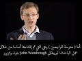

# What are Western scholars of the Qur'an doing? (2021-08-29 16:50:47+00:00)

## Description

Original video: https://www.youtube.com/watch?v=mXYMLut8WCI&t=0s
The Qur'an: A Historical-Critical Introduction (New Edinburgh Islamic Surveys) by Professor Nicolai Sinai https://www.amazon.co.uk/Quran-Historical-Critical-Introduction-Edinburgh-Islamic/dp/0748695761/ref=sr_1_1?dchild=1&keywords=nicolai+sinai+quran&qid=1630255676&sr=8-1

## Summary of [What are Western scholars of the Qur'an doing?](https://www.youtube.com/watch?v=9JSVA39PkS0)

*This is an AI generated summary. There may be inaccuracies. *

### [00:00:00](https://www.youtube.com/watch?v=9JSVA39PkS0&t=0) - [00:10:00](https://www.youtube.com/watch?v=9JSVA39PkS0&t=600)

Western scholars of the Qur'an have differing approaches to studying the text, but are united in their goals of furthering understanding of the Qur'an. Traditionalists see every verse as having a precise location in Muhammad's life, while revisionists question the connection between the Islamic version of events and the Qur'an. Neo-traditionalists accept the traditional narrative while still acknowledging some later influence. These scholars are working together on various projects to collect and study quranic manuscripts.

**[00:00:00](https://www.youtube.com/watch?v=9JSVA39PkS0&t=0)** This video introduces Western scholars of the Qur'an, and discusses their three main approaches to the Qur'an: the traditionalist, revisionist, and neo-traditionalist. The traditionalist approach sees every verse of the Qur'an having a precise location in the life of Prophet Muhammad, while the revisionist school finds little or no connection between the traditional Islamic version of the history of the events and the Qur'an. The third school, neo-traditionalism, sees value in the traditional Islamic narrative, but questions one or two aspects. Dr. Holger Zellington of Cambridge University, a neo-traditionalist scholar, shares his thoughts on the three schools of thought. Finally, Usman Sheikh, a friend of the presenter's, discusses theology on September 8th.
* **[00:05:00](https://www.youtube.com/watch?v=9JSVA39PkS0&t=300)** This video introduces the breadth of Quranic studies, with a focus on the three main schools of thought: traditionalism, revisionism, and neo-traditionalism. Dr. Holger Zellentine explains that, while all three schools accept the traditional narrative of the Quran as being partially given to Muhammad by God, revisionism goes too far and tries to discard all Muslim evidence, while neo-traditionalism moves closer to the traditional narrative while still accepting some later influence on the Quran.
* **[00:10:00](https://www.youtube.com/watch?v=9JSVA39PkS0&t=600)** This video discusses the various approaches to studying the Qur'an among Western scholars, and shows how collaborative projects are being undertaken to further research. It mentions the Corpus Chronicom project in Berlin, which is focused on collecting and studying quranic manuscripts. Another project, the Quran seminar run by Professor Gabriel Said Reynolds at the University of Notre Dame, is located in the middle ground between neotraditionalists and revisionists. The last school discussed is the Inara group at the University of Zürich, which focuses on Enlightenment views of the Qur'an. All of these scholars are working together to further understand the Qur'an.

## Full transcript with timestamps

[0:00:01](https://youtu.be/9JSVA39PkS0?t=1) in this video i want to share with you  
[0:00:03](https://youtu.be/9JSVA39PkS0?t=3) an overview of quranic studies um where  
[0:00:07](https://youtu.be/9JSVA39PkS0?t=7) they're at at the moment in the west and  
[0:00:10](https://youtu.be/9JSVA39PkS0?t=10) the different approaches there are  
[0:00:12](https://youtu.be/9JSVA39PkS0?t=12) and i'm going to share with you in a  
[0:00:14](https://youtu.be/9JSVA39PkS0?t=14) second a video you can watch it here  
[0:00:16](https://youtu.be/9JSVA39PkS0?t=16) it'll go straight into the videos about  
[0:00:18](https://youtu.be/9JSVA39PkS0?t=18) eight minutes long it's produced by the  
[0:00:20](https://youtu.be/9JSVA39PkS0?t=20) university of nottingham and they're  
[0:00:22](https://youtu.be/9JSVA39PkS0?t=22) interviewing a chap called dr holger  
[0:00:24](https://youtu.be/9JSVA39PkS0?t=24) zellington uh he's an academic at  
[0:00:27](https://youtu.be/9JSVA39PkS0?t=27) cambridge university also professor in  
[0:00:29](https://youtu.be/9JSVA39PkS0?t=29) germany he's a chronic scholar  
[0:00:32](https://youtu.be/9JSVA39PkS0?t=32) and he very helpfully outlines uh  
[0:00:35](https://youtu.be/9JSVA39PkS0?t=35) broadly the three schools of thought  
[0:00:37](https://youtu.be/9JSVA39PkS0?t=37) that currently exists in western  
[0:00:39](https://youtu.be/9JSVA39PkS0?t=39) scholars one is the traditionalist  
[0:00:41](https://youtu.be/9JSVA39PkS0?t=41) school and this is an approach by  
[0:00:43](https://youtu.be/9JSVA39PkS0?t=43) western scholars that pretty much sees  
[0:00:45](https://youtu.be/9JSVA39PkS0?t=45) every verse in the quran having a  
[0:00:47](https://youtu.be/9JSVA39PkS0?t=47) precise location in the prophet  
[0:00:50](https://youtu.be/9JSVA39PkS0?t=50) muhammad's life  
[0:00:52](https://youtu.be/9JSVA39PkS0?t=52) and then another school is the  
[0:00:53](https://youtu.be/9JSVA39PkS0?t=53) revisionist school which finds little or  
[0:00:55](https://youtu.be/9JSVA39PkS0?t=55) no connection with the traditional  
[0:00:57](https://youtu.be/9JSVA39PkS0?t=57) islamic version of the history of the  
[0:00:59](https://youtu.be/9JSVA39PkS0?t=59) events  
[0:01:00](https://youtu.be/9JSVA39PkS0?t=60) and this school famously associated with  
[0:01:02](https://youtu.be/9JSVA39PkS0?t=62) people like john wan's brother the  
[0:01:04](https://youtu.be/9JSVA39PkS0?t=64) british gol in the 1970s who said  
[0:01:06](https://youtu.be/9JSVA39PkS0?t=66) basically the quran nothing to do with  
[0:01:08](https://youtu.be/9JSVA39PkS0?t=68) muhammad it was written much much later  
[0:01:11](https://youtu.be/9JSVA39PkS0?t=71) centuries later connected with  
[0:01:12](https://youtu.be/9JSVA39PkS0?t=72) mesopotamia and so on these are people  
[0:01:15](https://youtu.be/9JSVA39PkS0?t=75) who you know severely challenge and  
[0:01:16](https://youtu.be/9JSVA39PkS0?t=76) reject the muslim sources about the  
[0:01:19](https://youtu.be/9JSVA39PkS0?t=79) quran and the life of the prophet and  
[0:01:22](https://youtu.be/9JSVA39PkS0?t=82) then the third school  
[0:01:24](https://youtu.be/9JSVA39PkS0?t=84) is the neo-traditionalist approach  
[0:01:27](https://youtu.be/9JSVA39PkS0?t=87) and they see a lot of value in the uh uh  
[0:01:30](https://youtu.be/9JSVA39PkS0?t=90) the traditional islamic narrative but  
[0:01:32](https://youtu.be/9JSVA39PkS0?t=92) they might question one or two aspects  
[0:01:35](https://youtu.be/9JSVA39PkS0?t=95) of it  
[0:01:37](https://youtu.be/9JSVA39PkS0?t=97) and this video as i say will hopefully  
[0:01:39](https://youtu.be/9JSVA39PkS0?t=99) give an overview of where chronic  
[0:01:41](https://youtu.be/9JSVA39PkS0?t=101) studies are at the moment and this would  
[0:01:43](https://youtu.be/9JSVA39PkS0?t=103) be of interest to you if you uh watch uh  
[0:01:46](https://youtu.be/9JSVA39PkS0?t=106) what western scholars are up to in this  
[0:01:48](https://youtu.be/9JSVA39PkS0?t=108) regard um now a friend of mine usman  
[0:01:51](https://youtu.be/9JSVA39PkS0?t=111) sheikh is coming on blogging theology  
[0:01:52](https://youtu.be/9JSVA39PkS0?t=112) i'm pleased to say on the 8th of  
[0:01:54](https://youtu.be/9JSVA39PkS0?t=114) september  
[0:01:55](https://youtu.be/9JSVA39PkS0?t=115) he's just completed post-graduate  
[0:01:57](https://youtu.be/9JSVA39PkS0?t=117) research at the university of oxford and  
[0:02:00](https://youtu.be/9JSVA39PkS0?t=120) his  
[0:02:01](https://youtu.be/9JSVA39PkS0?t=121) supervisor is the author of this book  
[0:02:04](https://youtu.be/9JSVA39PkS0?t=124) nicholas sinai is professor at the  
[0:02:06](https://youtu.be/9JSVA39PkS0?t=126) university of oxford and a fellow of  
[0:02:09](https://youtu.be/9JSVA39PkS0?t=129) pembridge college college and he's  
[0:02:11](https://youtu.be/9JSVA39PkS0?t=131) written the book the quran a historical  
[0:02:14](https://youtu.be/9JSVA39PkS0?t=134) critical introduction and i'll link to  
[0:02:16](https://youtu.be/9JSVA39PkS0?t=136) it in the description below i'm about a  
[0:02:18](https://youtu.be/9JSVA39PkS0?t=138) quarter of the way through it and he  
[0:02:21](https://youtu.be/9JSVA39PkS0?t=141) understand falls in the  
[0:02:22](https://youtu.be/9JSVA39PkS0?t=142) neo-traditionalist  
[0:02:24](https://youtu.be/9JSVA39PkS0?t=144) camp uh that school of thought and uh he  
[0:02:27](https://youtu.be/9JSVA39PkS0?t=147) was listening sheikh's supervisor at  
[0:02:29](https://youtu.be/9JSVA39PkS0?t=149) oxford and he's a young german scholar  
[0:02:32](https://youtu.be/9JSVA39PkS0?t=152) uh none of these people by the way apart  
[0:02:34](https://youtu.be/9JSVA39PkS0?t=154) from muslim sheikh are muslims they are  
[0:02:36](https://youtu.be/9JSVA39PkS0?t=156) western scholars who accept the  
[0:02:38](https://youtu.be/9JSVA39PkS0?t=158) historical critical method hcm as i like  
[0:02:41](https://youtu.be/9JSVA39PkS0?t=161) to call it  
[0:02:42](https://youtu.be/9JSVA39PkS0?t=162) and this hcm the historical critical  
[0:02:45](https://youtu.be/9JSVA39PkS0?t=165) method has some built-in assumptions  
[0:02:48](https://youtu.be/9JSVA39PkS0?t=168) which i think are problematic highly  
[0:02:50](https://youtu.be/9JSVA39PkS0?t=170) problematic for muslims and for others  
[0:02:52](https://youtu.be/9JSVA39PkS0?t=172) uh jews and christians too actually for  
[0:02:55](https://youtu.be/9JSVA39PkS0?t=175) example without going into too much  
[0:02:57](https://youtu.be/9JSVA39PkS0?t=177) detail here but one of the principles of  
[0:02:59](https://youtu.be/9JSVA39PkS0?t=179) this methodology is the denial of the  
[0:03:02](https://youtu.be/9JSVA39PkS0?t=182) supernatural denial that god inspires  
[0:03:04](https://youtu.be/9JSVA39PkS0?t=184) people inspires revelation or sends  
[0:03:07](https://youtu.be/9JSVA39PkS0?t=187) prophets and so the way they look at the  
[0:03:09](https://youtu.be/9JSVA39PkS0?t=189) crimes entirely in a secular way looking  
[0:03:11](https://youtu.be/9JSVA39PkS0?t=191) at purely  
[0:03:14](https://youtu.be/9JSVA39PkS0?t=194) history understood without any divine  
[0:03:16](https://youtu.be/9JSVA39PkS0?t=196) eruption into the world so the prophet  
[0:03:20](https://youtu.be/9JSVA39PkS0?t=200) muhammad is not a prophet in this  
[0:03:22](https://youtu.be/9JSVA39PkS0?t=202) understanding he is just a man and the  
[0:03:24](https://youtu.be/9JSVA39PkS0?t=204) quran is treated like any other book in  
[0:03:26](https://youtu.be/9JSVA39PkS0?t=206) history the bible or any other ancient  
[0:03:29](https://youtu.be/9JSVA39PkS0?t=209) text  
[0:03:30](https://youtu.be/9JSVA39PkS0?t=210) now this is obviously highly problematic  
[0:03:32](https://youtu.be/9JSVA39PkS0?t=212) from a muslim position however  
[0:03:35](https://youtu.be/9JSVA39PkS0?t=215) um there are um many as i've been  
[0:03:37](https://youtu.be/9JSVA39PkS0?t=217) reading but many interesting  
[0:03:38](https://youtu.be/9JSVA39PkS0?t=218) observations and insights still to be  
[0:03:40](https://youtu.be/9JSVA39PkS0?t=220) gained from the historical critical  
[0:03:43](https://youtu.be/9JSVA39PkS0?t=223) approach so i actually do recommend this  
[0:03:45](https://youtu.be/9JSVA39PkS0?t=225) it's uh the level is aimed at a kind of  
[0:03:47](https://youtu.be/9JSVA39PkS0?t=227) undergraduate level i guess i found it  
[0:03:49](https://youtu.be/9JSVA39PkS0?t=229) quite challenging as a relative newcomer  
[0:03:52](https://youtu.be/9JSVA39PkS0?t=232) to some of this scholarship um but it's  
[0:03:55](https://youtu.be/9JSVA39PkS0?t=235) absolutely fascinating lots of gems of  
[0:03:56](https://youtu.be/9JSVA39PkS0?t=236) knowledge in here and  
[0:03:58](https://youtu.be/9JSVA39PkS0?t=238) he's lots of powerful um rebuttals of  
[0:04:02](https://youtu.be/9JSVA39PkS0?t=242) the revisionist approach so he asserts  
[0:04:05](https://youtu.be/9JSVA39PkS0?t=245) that based on the best evidence muhammad  
[0:04:07](https://youtu.be/9JSVA39PkS0?t=247) did indeed exist uh he says also that  
[0:04:10](https://youtu.be/9JSVA39PkS0?t=250) the series that we have in the quran 114  
[0:04:14](https://youtu.be/9JSVA39PkS0?t=254) surahs on page  
[0:04:15](https://youtu.be/9JSVA39PkS0?t=255) 48 for example after a long discussion  
[0:04:18](https://youtu.be/9JSVA39PkS0?t=258) which i won't go into the simplest  
[0:04:20](https://youtu.be/9JSVA39PkS0?t=260) explanation for this would appear to be  
[0:04:22](https://youtu.be/9JSVA39PkS0?t=262) the assumption that the sirs took shape  
[0:04:24](https://youtu.be/9JSVA39PkS0?t=264) during the life of the muhammad of  
[0:04:26](https://youtu.be/9JSVA39PkS0?t=266) muhammad so he's saying basically the  
[0:04:28](https://youtu.be/9JSVA39PkS0?t=268) series we have in the quran the 114  
[0:04:30](https://youtu.be/9JSVA39PkS0?t=270) chapters are uh the chapters that  
[0:04:33](https://youtu.be/9JSVA39PkS0?t=273) muhammad himself had during his own  
[0:04:35](https://youtu.be/9JSVA39PkS0?t=275) lifetime and he uses good historical  
[0:04:37](https://youtu.be/9JSVA39PkS0?t=277) reasons why we should believe that and  
[0:04:40](https://youtu.be/9JSVA39PkS0?t=280) that of course is in contrast to the  
[0:04:42](https://youtu.be/9JSVA39PkS0?t=282) revisionists uh who would reject that  
[0:04:46](https://youtu.be/9JSVA39PkS0?t=286) so um  
[0:04:47](https://youtu.be/9JSVA39PkS0?t=287) he mentions uh coming back now to the  
[0:04:49](https://youtu.be/9JSVA39PkS0?t=289) video i'm about to show you dr holger uh  
[0:04:52](https://youtu.be/9JSVA39PkS0?t=292) mentions other fascinating projects that  
[0:04:54](https://youtu.be/9JSVA39PkS0?t=294) are underway he talks about the corpus  
[0:04:56](https://youtu.be/9JSVA39PkS0?t=296) chronicum  
[0:04:57](https://youtu.be/9JSVA39PkS0?t=297) nice latin phrase there this is a bunch  
[0:05:00](https://youtu.be/9JSVA39PkS0?t=300) of scholars in berlin in germany and  
[0:05:02](https://youtu.be/9JSVA39PkS0?t=302) there's an on a massive online project  
[0:05:04](https://youtu.be/9JSVA39PkS0?t=304) to  
[0:05:06](https://youtu.be/9JSVA39PkS0?t=306) produce a scholarly edition of the quran  
[0:05:08](https://youtu.be/9JSVA39PkS0?t=308) online talks about that and other  
[0:05:10](https://youtu.be/9JSVA39PkS0?t=310) schools of thought based in america  
[0:05:14](https://youtu.be/9JSVA39PkS0?t=314) and so on i won't go into all that it  
[0:05:15](https://youtu.be/9JSVA39PkS0?t=315) says eight minute video  
[0:05:17](https://youtu.be/9JSVA39PkS0?t=317) very accessible  
[0:05:19](https://youtu.be/9JSVA39PkS0?t=319) and um i hope you enjoy as much as i did  
[0:05:22](https://youtu.be/9JSVA39PkS0?t=322) until next time  
[0:05:24](https://youtu.be/9JSVA39PkS0?t=324) the field of quranic studies is a very  
[0:05:27](https://youtu.be/9JSVA39PkS0?t=327) wide one in  
[0:05:29](https://youtu.be/9JSVA39PkS0?t=329) western society today  
[0:05:32](https://youtu.be/9JSVA39PkS0?t=332) and to introduce the breadth that is  
[0:05:35](https://youtu.be/9JSVA39PkS0?t=335) involved in quranic studies i have dr  
[0:05:38](https://youtu.be/9JSVA39PkS0?t=338) holger zellentine  
[0:05:42](https://youtu.be/9JSVA39PkS0?t=342) holger  
[0:05:43](https://youtu.be/9JSVA39PkS0?t=343) the quran a single book the study of the  
[0:05:46](https://youtu.be/9JSVA39PkS0?t=346) quran takes many forms  
[0:05:49](https://youtu.be/9JSVA39PkS0?t=349) can you try and take us through  
[0:05:52](https://youtu.be/9JSVA39PkS0?t=352) the breadth of quranic studies  
[0:05:55](https://youtu.be/9JSVA39PkS0?t=355) i will do my best and  
[0:05:57](https://youtu.be/9JSVA39PkS0?t=357) i think the the best way to give a very  
[0:06:00](https://youtu.be/9JSVA39PkS0?t=360) brief lay of the land  
[0:06:02](https://youtu.be/9JSVA39PkS0?t=362) is by using  
[0:06:03](https://youtu.be/9JSVA39PkS0?t=363) the three categories that a colleague of  
[0:06:05](https://youtu.be/9JSVA39PkS0?t=365) mine in stanford behnam siddiqui  
[0:06:07](https://youtu.be/9JSVA39PkS0?t=367) has put forward  
[0:06:10](https://youtu.be/9JSVA39PkS0?t=370) he argues well that's basically within  
[0:06:11](https://youtu.be/9JSVA39PkS0?t=371) the western  
[0:06:13](https://youtu.be/9JSVA39PkS0?t=373) schools  
[0:06:14](https://youtu.be/9JSVA39PkS0?t=374) three  
[0:06:14](https://youtu.be/9JSVA39PkS0?t=374) approaches to the quran  
[0:06:16](https://youtu.be/9JSVA39PkS0?t=376) the first being traditionalist the  
[0:06:19](https://youtu.be/9JSVA39PkS0?t=379) second being revisionist the third being  
[0:06:22](https://youtu.be/9JSVA39PkS0?t=382) neo-traditionalists  
[0:06:23](https://youtu.be/9JSVA39PkS0?t=383) now what he means by that is that  
[0:06:26](https://youtu.be/9JSVA39PkS0?t=386) the  
[0:06:27](https://youtu.be/9JSVA39PkS0?t=387) traditional study of the quran  
[0:06:29](https://youtu.be/9JSVA39PkS0?t=389) approaches the quran through muslim  
[0:06:31](https://youtu.be/9JSVA39PkS0?t=391) tradition through the  
[0:06:33](https://youtu.be/9JSVA39PkS0?t=393) traditions attributed to the prophet  
[0:06:35](https://youtu.be/9JSVA39PkS0?t=395) muhammad  
[0:06:36](https://youtu.be/9JSVA39PkS0?t=396) through the  
[0:06:37](https://youtu.be/9JSVA39PkS0?t=397) [Music]  
[0:06:40](https://youtu.be/9JSVA39PkS0?t=400) traditional way in which the  
[0:06:42](https://youtu.be/9JSVA39PkS0?t=402) individual servers are related to the  
[0:06:44](https://youtu.be/9JSVA39PkS0?t=404) life of muhammad  
[0:06:45](https://youtu.be/9JSVA39PkS0?t=405) and to  
[0:06:47](https://youtu.be/9JSVA39PkS0?t=407) other  
[0:06:48](https://youtu.be/9JSVA39PkS0?t=408) early  
[0:06:49](https://youtu.be/9JSVA39PkS0?t=409) muslim traditions now  
[0:06:51](https://youtu.be/9JSVA39PkS0?t=411) the key factor here is that the quran is  
[0:06:55](https://youtu.be/9JSVA39PkS0?t=415) attributed exactly word by word  
[0:06:58](https://youtu.be/9JSVA39PkS0?t=418) to the prophet into specific  
[0:07:00](https://youtu.be/9JSVA39PkS0?t=420) moments in his life  
[0:07:02](https://youtu.be/9JSVA39PkS0?t=422) and that is the traditional school and  
[0:07:04](https://youtu.be/9JSVA39PkS0?t=424) for the most part uh western even  
[0:07:06](https://youtu.be/9JSVA39PkS0?t=426) critical scholars have followed that  
[0:07:08](https://youtu.be/9JSVA39PkS0?t=428) broadly they've constructed the quran as  
[0:07:10](https://youtu.be/9JSVA39PkS0?t=430) being partially given in makkah  
[0:07:12](https://youtu.be/9JSVA39PkS0?t=432) partially in medina  
[0:07:14](https://youtu.be/9JSVA39PkS0?t=434) and have even found a way to give an  
[0:07:16](https://youtu.be/9JSVA39PkS0?t=436) internal  
[0:07:18](https://youtu.be/9JSVA39PkS0?t=438) sequence of the service and that is what  
[0:07:20](https://youtu.be/9JSVA39PkS0?t=440) uh is called a traditionalist  
[0:07:23](https://youtu.be/9JSVA39PkS0?t=443) um  
[0:07:24](https://youtu.be/9JSVA39PkS0?t=444) now the revisionists  
[0:07:26](https://youtu.be/9JSVA39PkS0?t=446) were a school  
[0:07:28](https://youtu.be/9JSVA39PkS0?t=448) that basically was brought into being by  
[0:07:30](https://youtu.be/9JSVA39PkS0?t=450) this uh  
[0:07:31](https://youtu.be/9JSVA39PkS0?t=451) work of wansbro a british scholar um who  
[0:07:35](https://youtu.be/9JSVA39PkS0?t=455) said well if you look at the quran we  
[0:07:37](https://youtu.be/9JSVA39PkS0?t=457) cannot really use the muslim sources we  
[0:07:40](https://youtu.be/9JSVA39PkS0?t=460) have to discard any of the muslim  
[0:07:42](https://youtu.be/9JSVA39PkS0?t=462) evidence and we have to maybe look at  
[0:07:44](https://youtu.be/9JSVA39PkS0?t=464) its origins say hundreds of years later  
[0:07:47](https://youtu.be/9JSVA39PkS0?t=467) in in mesopotamia a quite radical move  
[0:07:51](https://youtu.be/9JSVA39PkS0?t=471) he had a it was very smart uh scholar  
[0:07:53](https://youtu.be/9JSVA39PkS0?t=473) and he has lots of interesting insights  
[0:07:55](https://youtu.be/9JSVA39PkS0?t=475) but of course he went a bit too fast  
[0:07:57](https://youtu.be/9JSVA39PkS0?t=477) people tend to do and this revisionism  
[0:08:00](https://youtu.be/9JSVA39PkS0?t=480) meaning to radically take the  
[0:08:02](https://youtu.be/9JSVA39PkS0?t=482) traditional muslim narrative out of  
[0:08:04](https://youtu.be/9JSVA39PkS0?t=484) quranic studies  
[0:08:06](https://youtu.be/9JSVA39PkS0?t=486) has probably found its peak in the  
[0:08:08](https://youtu.be/9JSVA39PkS0?t=488) famous book by patricia carone and  
[0:08:10](https://youtu.be/9JSVA39PkS0?t=490) michael cook  
[0:08:11](https://youtu.be/9JSVA39PkS0?t=491) called hagarism which also tried to  
[0:08:13](https://youtu.be/9JSVA39PkS0?t=493) discard the traditional evidence and  
[0:08:15](https://youtu.be/9JSVA39PkS0?t=495) to  
[0:08:16](https://youtu.be/9JSVA39PkS0?t=496) re-frame the quran as a much later  
[0:08:19](https://youtu.be/9JSVA39PkS0?t=499) document that is so revisionism in its  
[0:08:22](https://youtu.be/9JSVA39PkS0?t=502) in its purest  
[0:08:24](https://youtu.be/9JSVA39PkS0?t=504) of course any western scholar who does  
[0:08:26](https://youtu.be/9JSVA39PkS0?t=506) not accept a traditional narrative is  
[0:08:28](https://youtu.be/9JSVA39PkS0?t=508) somehow revisionist because one revises  
[0:08:31](https://youtu.be/9JSVA39PkS0?t=511) what is being  
[0:08:33](https://youtu.be/9JSVA39PkS0?t=513) put forth  
[0:08:34](https://youtu.be/9JSVA39PkS0?t=514) the third category therefore is very  
[0:08:36](https://youtu.be/9JSVA39PkS0?t=516) interesting it is the  
[0:08:37](https://youtu.be/9JSVA39PkS0?t=517) neo-traditionalists  
[0:08:38](https://youtu.be/9JSVA39PkS0?t=518) which would say well you know the um  
[0:08:42](https://youtu.be/9JSVA39PkS0?t=522) people like wensbroe and crony had good  
[0:08:45](https://youtu.be/9JSVA39PkS0?t=525) reasons to go too far but they went way  
[0:08:46](https://youtu.be/9JSVA39PkS0?t=526) too far  
[0:08:47](https://youtu.be/9JSVA39PkS0?t=527) and a critical historical study nowadays  
[0:08:51](https://youtu.be/9JSVA39PkS0?t=531) would actually  
[0:08:52](https://youtu.be/9JSVA39PkS0?t=532) move quite a bit along the lines of the  
[0:08:55](https://youtu.be/9JSVA39PkS0?t=535) traditional muslim narrative not to say  
[0:08:57](https://youtu.be/9JSVA39PkS0?t=537) that it's true word by word but to say  
[0:08:59](https://youtu.be/9JSVA39PkS0?t=539) well the broad concepts of a sequence of  
[0:09:03](https://youtu.be/9JSVA39PkS0?t=543) revelation of a sequence of uh also  
[0:09:06](https://youtu.be/9JSVA39PkS0?t=546) iteration and and reduction then would  
[0:09:09](https://youtu.be/9JSVA39PkS0?t=549) be historically verifiable which makes  
[0:09:12](https://youtu.be/9JSVA39PkS0?t=552) them neo-traditional as they go back not  
[0:09:14](https://youtu.be/9JSVA39PkS0?t=554) all the way but part the way to the  
[0:09:16](https://youtu.be/9JSVA39PkS0?t=556) um  
[0:09:18](https://youtu.be/9JSVA39PkS0?t=558) to the way that the quran has always  
[0:09:19](https://youtu.be/9JSVA39PkS0?t=559) been understood so those are the three  
[0:09:22](https://youtu.be/9JSVA39PkS0?t=562) broad schools  
[0:09:24](https://youtu.be/9JSVA39PkS0?t=564) traditionalists  
[0:09:25](https://youtu.be/9JSVA39PkS0?t=565) revisionists and neo-traditionalists  
[0:09:27](https://youtu.be/9JSVA39PkS0?t=567) according to just this free apartheid  
[0:09:29](https://youtu.be/9JSVA39PkS0?t=569) structure i think it's even a bit more  
[0:09:31](https://youtu.be/9JSVA39PkS0?t=571) complex because there would be people  
[0:09:33](https://youtu.be/9JSVA39PkS0?t=573) somewhere in between you know say  
[0:09:36](https://youtu.be/9JSVA39PkS0?t=576) neo-traditionalism and revisionism  
[0:09:38](https://youtu.be/9JSVA39PkS0?t=578) but  
[0:09:39](https://youtu.be/9JSVA39PkS0?t=579) there is  
[0:09:40](https://youtu.be/9JSVA39PkS0?t=580) actually  
[0:09:42](https://youtu.be/9JSVA39PkS0?t=582) i think a very  
[0:09:43](https://youtu.be/9JSVA39PkS0?t=583) rich discussion now going on in quranic  
[0:09:46](https://youtu.be/9JSVA39PkS0?t=586) studies that  
[0:09:48](https://youtu.be/9JSVA39PkS0?t=588) can be mapped quite nicely onto this  
[0:09:50](https://youtu.be/9JSVA39PkS0?t=590) this paradigm  
[0:09:52](https://youtu.be/9JSVA39PkS0?t=592) and  
[0:09:52](https://youtu.be/9JSVA39PkS0?t=592) [Music]  
[0:09:54](https://youtu.be/9JSVA39PkS0?t=594) the  
[0:09:55](https://youtu.be/9JSVA39PkS0?t=595) three schools  
[0:09:56](https://youtu.be/9JSVA39PkS0?t=596) that probably are the most active today  
[0:09:59](https://youtu.be/9JSVA39PkS0?t=599) are  
[0:10:01](https://youtu.be/9JSVA39PkS0?t=601) one um a school around the uh project of  
[0:10:05](https://youtu.be/9JSVA39PkS0?t=605) the corpus chronico in berlin uh  
[0:10:07](https://youtu.be/9JSVA39PkS0?t=607) initiated by professor angelica neuward  
[0:10:10](https://youtu.be/9JSVA39PkS0?t=610) and founded with the  
[0:10:11](https://youtu.be/9JSVA39PkS0?t=611) brandenburges academy of schaften  
[0:10:14](https://youtu.be/9JSVA39PkS0?t=614) this is a massive online  
[0:10:18](https://youtu.be/9JSVA39PkS0?t=618) project that collects  
[0:10:22](https://youtu.be/9JSVA39PkS0?t=622) many of the quranic manuscripts we have  
[0:10:24](https://youtu.be/9JSVA39PkS0?t=624) it collects  
[0:10:26](https://youtu.be/9JSVA39PkS0?t=626) sources that are pertinent to specific  
[0:10:28](https://youtu.be/9JSVA39PkS0?t=628) servers it gives you a transcription a  
[0:10:29](https://youtu.be/9JSVA39PkS0?t=629) translation  
[0:10:31](https://youtu.be/9JSVA39PkS0?t=631) it's a multi um  
[0:10:32](https://youtu.be/9JSVA39PkS0?t=632) a year undertaking  
[0:10:35](https://youtu.be/9JSVA39PkS0?t=635) that  
[0:10:36](https://youtu.be/9JSVA39PkS0?t=636) does two things one it shows the quran  
[0:10:38](https://youtu.be/9JSVA39PkS0?t=638) as in all its complexity  
[0:10:40](https://youtu.be/9JSVA39PkS0?t=640) but it also comes from an approach that  
[0:10:43](https://youtu.be/9JSVA39PkS0?t=643) sees the quran as  
[0:10:45](https://youtu.be/9JSVA39PkS0?t=645) given in sequences as  
[0:10:47](https://youtu.be/9JSVA39PkS0?t=647) being brought forth  
[0:10:48](https://youtu.be/9JSVA39PkS0?t=648) as  
[0:10:49](https://youtu.be/9JSVA39PkS0?t=649) along the traditional lines of  
[0:10:52](https://youtu.be/9JSVA39PkS0?t=652) um  
[0:10:55](https://youtu.be/9JSVA39PkS0?t=655) first the meccan and the median phase  
[0:10:57](https://youtu.be/9JSVA39PkS0?t=657) and which it sees very critically but  
[0:10:59](https://youtu.be/9JSVA39PkS0?t=659) still um as basically accurate let's see  
[0:11:02](https://youtu.be/9JSVA39PkS0?t=662) the people in berlin of course many more  
[0:11:05](https://youtu.be/9JSVA39PkS0?t=665) are part of that but it's based in  
[0:11:07](https://youtu.be/9JSVA39PkS0?t=667) berlin  
[0:11:08](https://youtu.be/9JSVA39PkS0?t=668) now a second group of scholars that  
[0:11:10](https://youtu.be/9JSVA39PkS0?t=670) i am personally affiliated with uh  
[0:11:13](https://youtu.be/9JSVA39PkS0?t=673) is  
[0:11:14](https://youtu.be/9JSVA39PkS0?t=674) located around the work of gabriel said  
[0:11:16](https://youtu.be/9JSVA39PkS0?t=676) reynolds at the university of notre dame  
[0:11:19](https://youtu.be/9JSVA39PkS0?t=679) who has current support from the melon  
[0:11:21](https://youtu.be/9JSVA39PkS0?t=681) foundation and runs the quran seminar  
[0:11:25](https://youtu.be/9JSVA39PkS0?t=685) and here we also come together and  
[0:11:27](https://youtu.be/9JSVA39PkS0?t=687) discuss individual servers  
[0:11:29](https://youtu.be/9JSVA39PkS0?t=689) but  
[0:11:30](https://youtu.be/9JSVA39PkS0?t=690) more with an emphasis on the  
[0:11:34](https://youtu.be/9JSVA39PkS0?t=694) quran as a text as a whole  
[0:11:36](https://youtu.be/9JSVA39PkS0?t=696) the way we have it  
[0:11:39](https://youtu.be/9JSVA39PkS0?t=699) many people not all by no means all but  
[0:11:41](https://youtu.be/9JSVA39PkS0?t=701) many people affiliated with this project  
[0:11:43](https://youtu.be/9JSVA39PkS0?t=703) a bit more reluctant to say we can see  
[0:11:46](https://youtu.be/9JSVA39PkS0?t=706) those layers of the ground we can see  
[0:11:47](https://youtu.be/9JSVA39PkS0?t=707) the sequence probably most of us would  
[0:11:50](https://youtu.be/9JSVA39PkS0?t=710) say well obviously it is a text it is  
[0:11:52](https://youtu.be/9JSVA39PkS0?t=712) has many many  
[0:11:53](https://youtu.be/9JSVA39PkS0?t=713) stages to it but we're not yet sure  
[0:11:56](https://youtu.be/9JSVA39PkS0?t=716) enough how to lay them out and me  
[0:11:58](https://youtu.be/9JSVA39PkS0?t=718) personally coming from the background of  
[0:12:00](https://youtu.be/9JSVA39PkS0?t=720) jewish studies  
[0:12:01](https://youtu.be/9JSVA39PkS0?t=721) um i'm a bit very about you know any  
[0:12:05](https://youtu.be/9JSVA39PkS0?t=725) precise attribution of a sequence i'm  
[0:12:07](https://youtu.be/9JSVA39PkS0?t=727) saying okay now this all makes sense but  
[0:12:08](https://youtu.be/9JSVA39PkS0?t=728) maybe we're holding the telescope the  
[0:12:10](https://youtu.be/9JSVA39PkS0?t=730) wrong way around  
[0:12:12](https://youtu.be/9JSVA39PkS0?t=732) so this school sees the quran as a whole  
[0:12:16](https://youtu.be/9JSVA39PkS0?t=736) and sees sequence but isn't is a bit  
[0:12:19](https://youtu.be/9JSVA39PkS0?t=739) uncertain about it  
[0:12:21](https://youtu.be/9JSVA39PkS0?t=741) and  
[0:12:22](https://youtu.be/9JSVA39PkS0?t=742) so i would say whereas um  
[0:12:25](https://youtu.be/9JSVA39PkS0?t=745) you would you could basically  
[0:12:27](https://youtu.be/9JSVA39PkS0?t=747) uh put the corpus chronicom in berlin  
[0:12:30](https://youtu.be/9JSVA39PkS0?t=750) within the neotraditionalists  
[0:12:32](https://youtu.be/9JSVA39PkS0?t=752) the uh project of reynolds i think you  
[0:12:34](https://youtu.be/9JSVA39PkS0?t=754) can place somewhere in between  
[0:12:36](https://youtu.be/9JSVA39PkS0?t=756) neotraditional and revisionists  
[0:12:39](https://youtu.be/9JSVA39PkS0?t=759) there's a third school that has  
[0:12:42](https://youtu.be/9JSVA39PkS0?t=762) received lots of attention  
[0:12:44](https://youtu.be/9JSVA39PkS0?t=764) also located in germany the university  
[0:12:46](https://youtu.be/9JSVA39PkS0?t=766) of zubrikind it's called the inara group  
[0:12:48](https://youtu.be/9JSVA39PkS0?t=768) the you know enlightenment group  
[0:12:50](https://youtu.be/9JSVA39PkS0?t=770) somebody needs to be enlightened in  
[0:12:51](https://youtu.be/9JSVA39PkS0?t=771) their view and  
[0:12:52](https://youtu.be/9JSVA39PkS0?t=772) it's uh  
[0:12:54](https://youtu.be/9JSVA39PkS0?t=774) don't want to be too critical about them  
[0:12:56](https://youtu.be/9JSVA39PkS0?t=776) there's wonderful scholars affiliated  
[0:12:57](https://youtu.be/9JSVA39PkS0?t=777) also with that group but they are most  
[0:13:00](https://youtu.be/9JSVA39PkS0?t=780) extreme in their revisionist  
[0:13:02](https://youtu.be/9JSVA39PkS0?t=782) uh approach and they try to take the  
[0:13:05](https://youtu.be/9JSVA39PkS0?t=785) quran really out of  
[0:13:07](https://youtu.be/9JSVA39PkS0?t=787) its context even try to take muhammad  
[0:13:09](https://youtu.be/9JSVA39PkS0?t=789) out of the quran  
[0:13:11](https://youtu.be/9JSVA39PkS0?t=791) and they  
[0:13:13](https://youtu.be/9JSVA39PkS0?t=793) probably are most  
[0:13:16](https://youtu.be/9JSVA39PkS0?t=796) clearly represented by the work of  
[0:13:18](https://youtu.be/9JSVA39PkS0?t=798) christoph luxembourg  
[0:13:20](https://youtu.be/9JSVA39PkS0?t=800) a scholar who wants to  
[0:13:23](https://youtu.be/9JSVA39PkS0?t=803) radically  
[0:13:24](https://youtu.be/9JSVA39PkS0?t=804) re-phrase the quran and to  
[0:13:27](https://youtu.be/9JSVA39PkS0?t=807) make it a document that is entirely  
[0:13:30](https://youtu.be/9JSVA39PkS0?t=810) dependent on previous sources so this is  
[0:13:32](https://youtu.be/9JSVA39PkS0?t=812) probably the most extreme of the  
[0:13:34](https://youtu.be/9JSVA39PkS0?t=814) revisionist school  
[0:13:37](https://youtu.be/9JSVA39PkS0?t=817) thank you holger for giving us that  
[0:13:38](https://youtu.be/9JSVA39PkS0?t=818) wonderful panorama  
[0:13:40](https://youtu.be/9JSVA39PkS0?t=820) of where quranic studies is at in the  
[0:13:44](https://youtu.be/9JSVA39PkS0?t=824) west today  
[0:13:45](https://youtu.be/9JSVA39PkS0?t=825) and the different approaches  
[0:13:48](https://youtu.be/9JSVA39PkS0?t=828) for myself as someone who's not a  
[0:13:50](https://youtu.be/9JSVA39PkS0?t=830) quranic scholar  
[0:13:52](https://youtu.be/9JSVA39PkS0?t=832) uh  
[0:13:54](https://youtu.be/9JSVA39PkS0?t=834) what i am  
[0:13:55](https://youtu.be/9JSVA39PkS0?t=835) most fascinated to learn from you is  
[0:13:58](https://youtu.be/9JSVA39PkS0?t=838) that  
[0:13:59](https://youtu.be/9JSVA39PkS0?t=839) all of these investigations are not  
[0:14:02](https://youtu.be/9JSVA39PkS0?t=842) being carried out by lone individuals  
[0:14:05](https://youtu.be/9JSVA39PkS0?t=845) but they're being carried out by teams  
[0:14:06](https://youtu.be/9JSVA39PkS0?t=846) of scholars working in great  
[0:14:08](https://youtu.be/9JSVA39PkS0?t=848) collaborative projects  
[0:14:10](https://youtu.be/9JSVA39PkS0?t=850) and  
[0:14:11](https://youtu.be/9JSVA39PkS0?t=851) well in christian studies we've seen  
[0:14:13](https://youtu.be/9JSVA39PkS0?t=853) that in things like the jesus seminar  
[0:14:16](https://youtu.be/9JSVA39PkS0?t=856) but it's still a way of working  
[0:14:19](https://youtu.be/9JSVA39PkS0?t=859) that  
[0:14:20](https://youtu.be/9JSVA39PkS0?t=860) so few of us are actually involved in so  
[0:14:23](https://youtu.be/9JSVA39PkS0?t=863) thank you number one  
[0:14:25](https://youtu.be/9JSVA39PkS0?t=865) for giving us the overview of quranic  
[0:14:27](https://youtu.be/9JSVA39PkS0?t=867) studies  
[0:14:28](https://youtu.be/9JSVA39PkS0?t=868) and thank you for scholars in other  
[0:14:30](https://youtu.be/9JSVA39PkS0?t=870) areas of theology and religious studies  
[0:14:32](https://youtu.be/9JSVA39PkS0?t=872) for maybe calling to mind that we should  
[0:14:34](https://youtu.be/9JSVA39PkS0?t=874) we too should be working in teams  
[0:14:37](https://youtu.be/9JSVA39PkS0?t=877) absolutely thank you  
