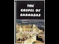

# What do I think of the Gospel of Barnabas? (2021-03-20 13:56:17+00:00)

## Description

It is clear that the Gospel of Barnabas contains a number of anachronisms and historical errors:

1) It has Jesus sailing across the Sea of Galilee to Nazareth which is actually inland - see chapters 20–21. 

2) Jesus is said to have been born during the rule of Pontius Pilate, which began after the year AD 26 - see chapter 3.

3) Barnabas appears not to know that "Christ" and "Messiah" are synonyms, "Christ" (khristos) being a Greek translation of the word messiah (mashiach), both having the meaning of "anointed". The Gospel of Barnabas makes a major error in describing Jesus as "Jesus Christ" (lit. "Messiah Jesus" in Greek), yet claiming that 'Jesus confessed and said the truth, "I am not the Messiah"' - see chapter 42. 

The Gospel of Barnabas has quotations from the Old Testament which correspond to the translation of the Latin Vulgate Bible rather than the Greek Septuagint or the Hebrew Masoretic Text. The Latin Vulgate translation was a work that Jerome began in 382 AD, centuries after the death of Barnabas.

No-one in the early centuries of the Church ever quotes from it. 

Not to be confused with the Epistle of Barnabas.

https://www.patreon.com/Bloggingtheology?fan_landing=true

https://twitter.com/freemonotheist

## Full transcript with timestamps

[0:00:02](https://youtu.be/nnB_41JpKEU?t=2) What do I think of the Gospel of Barnabas? Well I 
have my English translation here by Lonsdale and    
[0:00:10](https://youtu.be/nnB_41JpKEU?t=10) Laura Ragg. The manuscripts exist in Italian 
and Spanish and they date back to the 16th or    
[0:00:19](https://youtu.be/nnB_41JpKEU?t=19) early 17th century and the Raggs translated this 
from the Italian manuscript. We don't have any    
[0:00:27](https://youtu.be/nnB_41JpKEU?t=27) evidence or any copies or any quotes in any source 
whatsoever from before then, from the early church    
[0:00:34](https://youtu.be/nnB_41JpKEU?t=34) for the first one and a half thousand years. 
Ragg's own English translation was subsequently    
[0:00:41](https://youtu.be/nnB_41JpKEU?t=41) translated into Arabic and it remains a popular 
text there are websites dedicated to it by Muslims.    
[0:00:50](https://youtu.be/nnB_41JpKEU?t=50) Many Muslims still think that it's 
authentic and takes us back to the gospel    
[0:00:55](https://youtu.be/nnB_41JpKEU?t=55) of Barnabas. Well who was Barnabas? He was as the 
New Testament says a companion of Paul and he's    
[0:01:01](https://youtu.be/nnB_41JpKEU?t=61) mentioned quite a bit in the Acts of the Apostles 
and there's a reference that Paul himself makes    
[0:01:08](https://youtu.be/nnB_41JpKEU?t=68) in the Letter to the Galatians where 'men came 
from James', these Jewish Christians in Jerusalem    
[0:01:14](https://youtu.be/nnB_41JpKEU?t=74) came basically to sort out the mixing between Jews 
and Gentiles that was taking place and Barnabas, it    
[0:01:22](https://youtu.be/nnB_41JpKEU?t=82) says, and Peter and others sided with the Jews and 
separated themselves from the Gentiles. This upset    
[0:01:28](https://youtu.be/nnB_41JpKEU?t=88) Paul a great deal and he got very angry about 
that. One of the reasons why he wrote the Letter    
[0:01:33](https://youtu.be/nnB_41JpKEU?t=93) to the Galatians - NB it's not to be confused with 
the Epistle of Barnabas, the Letter of Barnabas.    
[0:01:42](https://youtu.be/nnB_41JpKEU?t=102) This I have in a translation in 'Early Christian 
Writings' and it is found in its complete form    
[0:01:49](https://youtu.be/nnB_41JpKEU?t=109) in the earliest complete copy of the New 
Testament that we have: The Codex Sinaiticus    
[0:01:54](https://youtu.be/nnB_41JpKEU?t=114) which is in the British Library not far from where 
I'm sitting. And it was considered certainly by the    
[0:01:59](https://youtu.be/nnB_41JpKEU?t=119) compilers of that Bible to be Holy Scripture 
because it's part of the New Testament.    
[0:02:04](https://youtu.be/nnB_41JpKEU?t=124) Scholars today commonly date it to the 
second century A.D. and it is not thought to be by    
[0:02:11](https://youtu.be/nnB_41JpKEU?t=131) Barnabas himself, but nevertheless it exists 
and it's definitely not the Gospel of Barnabas.   
[0:02:17](https://youtu.be/nnB_41JpKEU?t=137) I've read both of them and they're definitely 
not the same: one is just a letter it's not that    
[0:02:22](https://youtu.be/nnB_41JpKEU?t=142) long, the Gospel of Barnabas this text is 
about the size of all four canonical gospels    
[0:02:29](https://youtu.be/nnB_41JpKEU?t=149) in one - it's really really long.
So what do I think about it? Well here's some    
[0:02:37](https://youtu.be/nnB_41JpKEU?t=157) possible thoughts: it's clear to me that the Gospel 
of Barnabas contains a number of anachronisms    
[0:02:45](https://youtu.be/nnB_41JpKEU?t=165) and historical errors. Now an anachronism is when 
a person or a thing or an idea exists out of its    
[0:02:52](https://youtu.be/nnB_41JpKEU?t=172) time in history especially one that happened 
or existed later than the period being shown.    
[0:02:59](https://youtu.be/nnB_41JpKEU?t=179) For example, if you saw a documentary on YouTube 
about ancient Rome and it showed a soldier    
[0:03:06](https://youtu.be/nnB_41JpKEU?t=186) using a watch to tell the time that is an 
anachronism. Clearly it's not possible for soldiers    
[0:03:12](https://youtu.be/nnB_41JpKEU?t=192) to have used watches in ancient Rome they hadn't 
been invented yet! And there are anachronisms and    
[0:03:18](https://youtu.be/nnB_41JpKEU?t=198) historical errors in the Gospel of Barnabas which 
tell us a lot about whether or not this text    
[0:03:24](https://youtu.be/nnB_41JpKEU?t=204) is authentic or it's a much much later creation. 
And scholars today I have discovered usually date the Gospel of Barnabas, its creation, to the 16th or early 17th century    
[0:03:39](https://youtu.be/nnB_41JpKEU?t=219) partly, because of the errors, the anachronisms 
and there are many of those, but for other    
[0:03:44](https://youtu.be/nnB_41JpKEU?t=224) reasons as well which I won't go into. So these 
are some of my favourite errors and anachronisms:    
[0:03:50](https://youtu.be/nnB_41JpKEU?t=230) In chapters 20 and 21 it says that 
Jesus sailed across the sea of Galilee    
[0:04:00](https://youtu.be/nnB_41JpKEU?t=240) to Nazareth. Now Nazareth is not on by the 
sea - it's inland, and so here we go, in chapter 20 it says   
[0:04:10](https://youtu.be/nnB_41JpKEU?t=250) 'Jesus went to the sea of Galilee and having 
embarked in a ship sailed to the city of Nazareth' -    
[0:04:18](https://youtu.be/nnB_41JpKEU?t=258) if you look on a map you'll see that Nazareth, then 
and now, is actually inland so that's a mistake.    
[0:04:25](https://youtu.be/nnB_41JpKEU?t=265) Another good one is in chapter 
three and this is rather shocking    
[0:04:32](https://youtu.be/nnB_41JpKEU?t=272) it says here: 'The wonderful birth of 
Jesus and appearance of angels praising God.    
[0:04:40](https://youtu.be/nnB_41JpKEU?t=280) There reigned at that time in Judaea Herod, by 
decree of Caesar Augustus, and Pilate was governor    
[0:04:48](https://youtu.be/nnB_41JpKEU?t=288) in the priesthood of Annas and Caiaphas. Pilate! Now 
we know that Pontius Pilate - who was there    
[0:04:57](https://youtu.be/nnB_41JpKEU?t=297) at the trial of Jesus of course and condemned him 
to be crucified according to the New Testament -   
[0:05:04](https://youtu.be/nnB_41JpKEU?t=304) began being the Governor in the 
year 26 A.D. not in the year zero    
[0:05:13](https://youtu.be/nnB_41JpKEU?t=313) or before then (when Jesus was born) so that's just an error. But my favourite error of all is where Barnabas, the gospel of Barnabas, appears not to know 
that 'Christ' the word 'Christ' and the word 'messiah'    
[0:05:27](https://youtu.be/nnB_41JpKEU?t=327) are synonyms, i.e. they mean the same thing! Now 
we know the word Christ or 'Christos' in Greek, it's just a Greek translation of the word 
messiah 'Mašíaḥ' both having the same meaning of    
[0:05:40](https://youtu.be/nnB_41JpKEU?t=340) 'anointed', 'the anointed one'. The Gospel of Barnabas 
though makes a major error in describing Jesus    
[0:05:47](https://youtu.be/nnB_41JpKEU?t=347) as 'Jesus Christ'. Okay, so if I go to the Gospel of 
Barnabas and the very first chapter it says: 'True    
[0:05:57](https://youtu.be/nnB_41JpKEU?t=357) Gospel of Jesus, called Christ, a new Prophet sent 
by God to the world: according to the description    
[0:06:03](https://youtu.be/nnB_41JpKEU?t=363) of Barnabas his apostle. Barnabas, apostle of Jesus 
the Nazarene, called Christ.' And it also says: 'Dearly    
[0:06:10](https://youtu.be/nnB_41JpKEU?t=370) beloved, the greater wonderful God has during these 
past days visited us by his prophet Jesus Christ'.    
[0:06:19](https://youtu.be/nnB_41JpKEU?t=379) Right, so it's clearly establishing 
that he is Christ, and yet in chapter 42    
[0:06:26](https://youtu.be/nnB_41JpKEU?t=386) it says: 'Jesus is asked "Who are you?" and 
Jesus confessed, and said the truth: "I am not    
[0:06:34](https://youtu.be/nnB_41JpKEU?t=394) the Messiah." I am not the Messiah! Now according 
to the gospel he is the Messiah, i.e. the Christ so    
[0:06:41](https://youtu.be/nnB_41JpKEU?t=401) there's some confusion. No Jew would have made this 
mistake because in the original language they both    
[0:06:46](https://youtu.be/nnB_41JpKEU?t=406) mean the same thing, so in claiming that Jesus 
confessed and said the truth "I am not the Messiah"    
[0:06:52](https://youtu.be/nnB_41JpKEU?t=412) it's making an error. Now the Gospel of Barnabas 
also has quotations from the Old Testament    
[0:07:00](https://youtu.be/nnB_41JpKEU?t=420) which correspond to the translation 
of the Latin Vulgate Bible rather than    
[0:07:06](https://youtu.be/nnB_41JpKEU?t=426) the Greek Septuagint which is what the 
New Testament quotes from, or the Hebrew    
[0:07:11](https://youtu.be/nnB_41JpKEU?t=431) Masoretic text which is the standard Hebrew 
text. Now the Latin Vulgate translation    
[0:07:17](https://youtu.be/nnB_41JpKEU?t=437) was made by Jerome, the famous Church Father, and 
he started that in 382 A.D. in the fourth century    
[0:07:25](https://youtu.be/nnB_41JpKEU?t=445) so many centuries after the death of Barnabas. So 
the author of this is quoting from a translation    
[0:07:35](https://youtu.be/nnB_41JpKEU?t=455) made centuries after the death of Barnabas! 
And as I said no one in the early church or    
[0:07:41](https://youtu.be/nnB_41JpKEU?t=461) anywhere else ever quotes from this Gospel 
of Barnabas, no one knew anything about it.    
[0:07:50](https://youtu.be/nnB_41JpKEU?t=470) So that my view is that it's 
very clear there are many forgeries awash    
[0:07:58](https://youtu.be/nnB_41JpKEU?t=478) in the Christian world: we have a Gospel of 
Mary, the Gospel of Peter, the Gospel of Judas,    
[0:08:04](https://youtu.be/nnB_41JpKEU?t=484) etc., etc., all of these are much much later than the 
first century. But why would anyone choose to write    
[0:08:10](https://youtu.be/nnB_41JpKEU?t=490) this and this has his portrayal of Jesus is 
quite Islamic even though he denies the messiah    
[0:08:17](https://youtu.be/nnB_41JpKEU?t=497) and of course the Qur'an does say he is the messiah 
it has Jesus saved from death he didn't die on    
[0:08:23](https://youtu.be/nnB_41JpKEU?t=503) the cross. Judas Iscariot the man who betrayed 
Jesus is portrayed as taking on the appearance    
[0:08:31](https://youtu.be/nnB_41JpKEU?t=511) of Jesus by a miracle. God does that to Judas 
and if you actually read the story it's quite    
[0:08:36](https://youtu.be/nnB_41JpKEU?t=516) almost comical because Judas doesn't seem 
to realise he's been transformed so when the Roman    
[0:08:41](https://youtu.be/nnB_41JpKEU?t=521) soldiers come and arrest Jesus they see Jesus who 
they think is Jesus and it's actually Judas, and    
[0:08:48](https://youtu.be/nnB_41JpKEU?t=528) he protests "why, why are you arresting me? I'm Judas 
I'm Judas - go and arrest Jesus!" And they said HAHA    
[0:08:52](https://youtu.be/nnB_41JpKEU?t=532) its you obviously, you know you're out of your mind, 
you're Jesus, look at you, Jesus! He says no I'm not!    
[0:08:57](https://youtu.be/nnB_41JpKEU?t=537) and Judas can't understand what's 
going on, so it's quite comical in that way. Anyway    
[0:09:02](https://youtu.be/nnB_41JpKEU?t=542) he is ultimately crucified instead of Jesus 
in that gospel. And Jesus denied in the    
[0:09:14](https://youtu.be/nnB_41JpKEU?t=554) Gospel of Barnabas he denies he is God, he speaks 
of another who is to come, Muhammad of course.    
[0:09:21](https://youtu.be/nnB_41JpKEU?t=561) So it could be you know i'm trying to work out why 
would anyone write something like this. Well it's    
[0:09:26](https://youtu.be/nnB_41JpKEU?t=566) quite possible in the 16th and 17th centuries 
after people like Michael Servetus, these were unitarians,    
[0:09:34](https://youtu.be/nnB_41JpKEU?t=574) they wanted to forge links or build bridges between 
Christianity and Islam perhaps bring them close    
[0:09:40](https://youtu.be/nnB_41JpKEU?t=580) together as sister religions. And someone 
thought that they were they would create a gospel    
[0:09:47](https://youtu.be/nnB_41JpKEU?t=587) that was very Islamic in some ways but in other 
ways it's still kind of Christian in other ways    
[0:09:53](https://youtu.be/nnB_41JpKEU?t=593) so it's probably the authorship is probably a unitarian 
Christian who was very pro-muslim and was trying    
[0:09:59](https://youtu.be/nnB_41JpKEU?t=599) to uh you know harmonise or even create a a new 
kind of synthesis between Islam and Christianity.    
[0:10:07](https://youtu.be/nnB_41JpKEU?t=607) But much later in the 20th century 
thanks to Lonsdale and Laura Rag    
[0:10:11](https://youtu.be/nnB_41JpKEU?t=611) as I say it was translated into Arabic and became 
very popular and some Muslim scholars have quoted    
[0:10:18](https://youtu.be/nnB_41JpKEU?t=618) it as authentic because obviously 
it is very Islamic in many ways but    
[0:10:24](https://youtu.be/nnB_41JpKEU?t=624) the evidence the textual evidence the content of 
it and the manuscript evidence the anachronisms    
[0:10:32](https://youtu.be/nnB_41JpKEU?t=632) which are really serious and the historical 
errors all suggest um a late medieval work and    
[0:10:40](https://youtu.be/nnB_41JpKEU?t=640) as i say for me the most compelling evidence 
apart from the anachronisms which are amazing    
[0:10:46](https://youtu.be/nnB_41JpKEU?t=646) is that no one knew about this particular 
gospel before the 16th 17th centuries A.D.    
[0:10:54](https://youtu.be/nnB_41JpKEU?t=654) As I say it is not to be confused with the Epistle 
of Barnabas which is known, it is extant, and it's completely different.  That work is 
mostly allegory it's just looking through    
[0:11:04](https://youtu.be/nnB_41JpKEU?t=664) the Old Testament and seeing Jesus all over 
the place. Basically it's a very unfashionable    
[0:11:09](https://youtu.be/nnB_41JpKEU?t=669) way of reading the Old Testament, and it's very 
anti-Jewish, lots of anti-Jewish, anti-Judaism    
[0:11:16](https://youtu.be/nnB_41JpKEU?t=676) arguments and polemic. It's almost certainly second century - not by Barnabas -    
[0:11:22](https://youtu.be/nnB_41JpKEU?t=682) um and completely different from the Gospel of 
Barnabas. If you read them both you'll see how    
[0:11:27](https://youtu.be/nnB_41JpKEU?t=687) different they are. We have this - we don't have 
this - so I'm afraid it's a thumbs down for me    
[0:11:33](https://youtu.be/nnB_41JpKEU?t=693) for the Gospel of Barnabas. It's in my view 
a forgery and and to my knowledge the Muslims    
[0:11:41](https://youtu.be/nnB_41JpKEU?t=701) I know involved in da'wah, I don't know anyone 
 now who uses the Gospel of Barnabas    
[0:11:47](https://youtu.be/nnB_41JpKEU?t=707) to prove anything because it's discredited 
although it is still popular in the Arab world.    
[0:11:52](https://youtu.be/nnB_41JpKEU?t=712) And because its contents are similar in 
many ways to Islamic teaching and in some ways    
[0:11:59](https://youtu.be/nnB_41JpKEU?t=719) quite similar to the earliest Christian teaching 
about Jesus it's therefore promoted as authentic.    
[0:12:05](https://youtu.be/nnB_41JpKEU?t=725) But just because it has those similarities it 
doesn't mean it is authentic. People can still    
[0:12:10](https://youtu.be/nnB_41JpKEU?t=730) fabricate gospels, as this is one this is one 
example of that, so that's my view. Until next time.  
