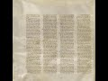

# What is Codex Sinaiticus? (2021-02-24 01:33:15+00:00)

## Description

https://www.patreon.com/Bloggingtheology?fan_landing=true

https://twitter.com/freemonotheist

https://codexsinaiticus.org/en/codex/

## Full transcript with timestamps

[0:00:01](https://youtu.be/AWyVj0R2jhU?t=1) what is the codex sinaiticus  
[0:00:03](https://youtu.be/AWyVj0R2jhU?t=3) and why does it matter to us today i  
[0:00:06](https://youtu.be/AWyVj0R2jhU?t=6) think it matters  
[0:00:07](https://youtu.be/AWyVj0R2jhU?t=7) for two really important reasons which  
[0:00:09](https://youtu.be/AWyVj0R2jhU?t=9) i'll come to  
[0:00:10](https://youtu.be/AWyVj0R2jhU?t=10) shortly but firstly what is it what is  
[0:00:13](https://youtu.be/AWyVj0R2jhU?t=13) the codex sinaiticus  
[0:00:15](https://youtu.be/AWyVj0R2jhU?t=15) to answer that question i'm going to  
[0:00:17](https://youtu.be/AWyVj0R2jhU?t=17) read from  
[0:00:18](https://youtu.be/AWyVj0R2jhU?t=18) in a monastery library preserving codex  
[0:00:20](https://youtu.be/AWyVj0R2jhU?t=20) sinaiticus and the greek  
[0:00:22](https://youtu.be/AWyVj0R2jhU?t=22) written heritage this is a  
[0:00:25](https://youtu.be/AWyVj0R2jhU?t=25) book or booklet produced by the british  
[0:00:27](https://youtu.be/AWyVj0R2jhU?t=27) library  
[0:00:28](https://youtu.be/AWyVj0R2jhU?t=28) here in london about a mile and a half  
[0:00:30](https://youtu.be/AWyVj0R2jhU?t=30) from where i am sitting  
[0:00:32](https://youtu.be/AWyVj0R2jhU?t=32) and they house they store and preserve  
[0:00:34](https://youtu.be/AWyVj0R2jhU?t=34) the codex sinaiticus it's usually on  
[0:00:36](https://youtu.be/AWyVj0R2jhU?t=36) display i've seen it many times  
[0:00:38](https://youtu.be/AWyVj0R2jhU?t=38) unfortunately the moment it's closed  
[0:00:40](https://youtu.be/AWyVj0R2jhU?t=40) like so many other things  
[0:00:42](https://youtu.be/AWyVj0R2jhU?t=42) but i hope one day it'll be open and we  
[0:00:43](https://youtu.be/AWyVj0R2jhU?t=43) can see it again there is a website  
[0:00:46](https://youtu.be/AWyVj0R2jhU?t=46) dedicated to this text the codex  
[0:00:48](https://youtu.be/AWyVj0R2jhU?t=48) sinaiticus  
[0:00:50](https://youtu.be/AWyVj0R2jhU?t=50) produced by the british library and i'll  
[0:00:51](https://youtu.be/AWyVj0R2jhU?t=51) link to it in the description  
[0:00:53](https://youtu.be/AWyVj0R2jhU?t=53) below so firstly what is it well  
[0:00:56](https://youtu.be/AWyVj0R2jhU?t=56) the codex sinaiticus is a treasure  
[0:00:59](https://youtu.be/AWyVj0R2jhU?t=59) beyond price often described in  
[0:01:02](https://youtu.be/AWyVj0R2jhU?t=62) superlatives  
[0:01:04](https://youtu.be/AWyVj0R2jhU?t=64) this handwritten book is hard to  
[0:01:07](https://youtu.be/AWyVj0R2jhU?t=67) overestimate for its deep and continuing  
[0:01:09](https://youtu.be/AWyVj0R2jhU?t=69) significance  
[0:01:11](https://youtu.be/AWyVj0R2jhU?t=71) for many scholars it is the preeminent  
[0:01:13](https://youtu.be/AWyVj0R2jhU?t=73) christian bible  
[0:01:15](https://youtu.be/AWyVj0R2jhU?t=75) known to them as aleph that's the first  
[0:01:17](https://youtu.be/AWyVj0R2jhU?t=77) letter of the hebrew alphabet  
[0:01:19](https://youtu.be/AWyVj0R2jhU?t=79) or number one amongst christians  
[0:01:22](https://youtu.be/AWyVj0R2jhU?t=82) worldwide it is renowned for containing  
[0:01:25](https://youtu.be/AWyVj0R2jhU?t=85) the earliest complete copy of the bible  
[0:01:28](https://youtu.be/AWyVj0R2jhU?t=88) of the new testament so this is uh not  
[0:01:31](https://youtu.be/AWyVj0R2jhU?t=91) the original this is a  
[0:01:32](https://youtu.be/AWyVj0R2jhU?t=92) copy but it's the very very earliest  
[0:01:34](https://youtu.be/AWyVj0R2jhU?t=94) that we have  
[0:01:36](https://youtu.be/AWyVj0R2jhU?t=96) arguably it is also the earliest  
[0:01:38](https://youtu.be/AWyVj0R2jhU?t=98) christian  
[0:01:39](https://youtu.be/AWyVj0R2jhU?t=99) bible the ultimate antecedent of all  
[0:01:42](https://youtu.be/AWyVj0R2jhU?t=102) printed editions of the bible in  
[0:01:45](https://youtu.be/AWyVj0R2jhU?t=105) whatever language  
[0:01:46](https://youtu.be/AWyVj0R2jhU?t=106) anywhere in the world as one of the  
[0:01:49](https://youtu.be/AWyVj0R2jhU?t=109) earliest  
[0:01:49](https://youtu.be/AWyVj0R2jhU?t=109) luxury codices that's bound books  
[0:01:53](https://youtu.be/AWyVj0R2jhU?t=113) codices is plural for books codex is  
[0:01:56](https://youtu.be/AWyVj0R2jhU?t=116) singular  
[0:01:57](https://youtu.be/AWyVj0R2jhU?t=117) for book uh it's one of the earliest to  
[0:01:59](https://youtu.be/AWyVj0R2jhU?t=119) survive  
[0:02:00](https://youtu.be/AWyVj0R2jhU?t=120) from history in the ancient world the  
[0:02:02](https://youtu.be/AWyVj0R2jhU?t=122) codex  
[0:02:03](https://youtu.be/AWyVj0R2jhU?t=123) forms one of the most important  
[0:02:05](https://youtu.be/AWyVj0R2jhU?t=125) landmarks in the history  
[0:02:07](https://youtu.be/AWyVj0R2jhU?t=127) of the book what is more is pages offer  
[0:02:10](https://youtu.be/AWyVj0R2jhU?t=130) some of the most direct links with a  
[0:02:13](https://youtu.be/AWyVj0R2jhU?t=133) crucial turning point in world history  
[0:02:15](https://youtu.be/AWyVj0R2jhU?t=135) the triumph of the emperor constantine  
[0:02:18](https://youtu.be/AWyVj0R2jhU?t=138) the great  
[0:02:19](https://youtu.be/AWyVj0R2jhU?t=139) at the battle of the milvian bridge in  
[0:02:21](https://youtu.be/AWyVj0R2jhU?t=141) ad312  
[0:02:23](https://youtu.be/AWyVj0R2jhU?t=143) and the edict of milan in ad  
[0:02:26](https://youtu.be/AWyVj0R2jhU?t=146) 313 in which constantine formally  
[0:02:29](https://youtu.be/AWyVj0R2jhU?t=149) recognized christianity  
[0:02:31](https://youtu.be/AWyVj0R2jhU?t=151) and urged tolerance rather than  
[0:02:33](https://youtu.be/AWyVj0R2jhU?t=153) persecution of christians  
[0:02:36](https://youtu.be/AWyVj0R2jhU?t=156) bridging more than 1 600 years  
[0:02:39](https://youtu.be/AWyVj0R2jhU?t=159) codex sinaiticus is a vivid testament  
[0:02:42](https://youtu.be/AWyVj0R2jhU?t=162) to human invention and spiritual  
[0:02:45](https://youtu.be/AWyVj0R2jhU?t=165) inspiration  
[0:02:47](https://youtu.be/AWyVj0R2jhU?t=167) now one of the reasons it's called the  
[0:02:49](https://youtu.be/AWyVj0R2jhU?t=169) codex finite  
[0:02:50](https://youtu.be/AWyVj0R2jhU?t=170) vatic sinaiticus i should say is because  
[0:02:53](https://youtu.be/AWyVj0R2jhU?t=173) of where  
[0:02:54](https://youtu.be/AWyVj0R2jhU?t=174) it was found in the monastery of saint  
[0:02:56](https://youtu.be/AWyVj0R2jhU?t=176) catherine  
[0:02:57](https://youtu.be/AWyVj0R2jhU?t=177) on mount sinai now that's in egypt  
[0:03:01](https://youtu.be/AWyVj0R2jhU?t=181) and reputedly the place where moses  
[0:03:04](https://youtu.be/AWyVj0R2jhU?t=184) according to the book of exodus in the  
[0:03:06](https://youtu.be/AWyVj0R2jhU?t=186) bible received  
[0:03:08](https://youtu.be/AWyVj0R2jhU?t=188) revelation from god the torah and had  
[0:03:10](https://youtu.be/AWyVj0R2jhU?t=190) that encounter  
[0:03:11](https://youtu.be/AWyVj0R2jhU?t=191) with god and that's why the monastery  
[0:03:13](https://youtu.be/AWyVj0R2jhU?t=193) was built there probably in the early  
[0:03:15](https://youtu.be/AWyVj0R2jhU?t=195) 4th century to  
[0:03:17](https://youtu.be/AWyVj0R2jhU?t=197) commemorate that extraordinary event  
[0:03:21](https://youtu.be/AWyVj0R2jhU?t=201) as it survives today the codex  
[0:03:23](https://youtu.be/AWyVj0R2jhU?t=203) sinaiticus  
[0:03:24](https://youtu.be/AWyVj0R2jhU?t=204) comprises just over 400 large leaves  
[0:03:28](https://youtu.be/AWyVj0R2jhU?t=208) of prepared animal skin in calf so  
[0:03:31](https://youtu.be/AWyVj0R2jhU?t=211) the book is made about animal skin  
[0:03:34](https://youtu.be/AWyVj0R2jhU?t=214) on the parchment leaves is written about  
[0:03:37](https://youtu.be/AWyVj0R2jhU?t=217) half of the old testament  
[0:03:39](https://youtu.be/AWyVj0R2jhU?t=219) and apocrypha the whole of the new  
[0:03:42](https://youtu.be/AWyVj0R2jhU?t=222) testament  
[0:03:43](https://youtu.be/AWyVj0R2jhU?t=223) and two early christian texts not found  
[0:03:46](https://youtu.be/AWyVj0R2jhU?t=226) in modern bibles an epistle  
[0:03:49](https://youtu.be/AWyVj0R2jhU?t=229) described ascribed to the apostle  
[0:03:52](https://youtu.be/AWyVj0R2jhU?t=232) barnabas and the shepherd by the early  
[0:03:56](https://youtu.be/AWyVj0R2jhU?t=236) 2nd century  
[0:03:57](https://youtu.be/AWyVj0R2jhU?t=237) roman writer hermas now  
[0:04:00](https://youtu.be/AWyVj0R2jhU?t=240) there's a bit of confusion here  
[0:04:01](https://youtu.be/AWyVj0R2jhU?t=241) potentially because  
[0:04:03](https://youtu.be/AWyVj0R2jhU?t=243) many people have heard of something  
[0:04:04](https://youtu.be/AWyVj0R2jhU?t=244) called the gospel of barnabas and some  
[0:04:06](https://youtu.be/AWyVj0R2jhU?t=246) muslims think that this is  
[0:04:08](https://youtu.be/AWyVj0R2jhU?t=248) uh an authentic text going back to the  
[0:04:11](https://youtu.be/AWyVj0R2jhU?t=251) apostle barnabas  
[0:04:12](https://youtu.be/AWyVj0R2jhU?t=252) well i'm afraid um every scholar in the  
[0:04:15](https://youtu.be/AWyVj0R2jhU?t=255) world who's ever looked at this  
[0:04:17](https://youtu.be/AWyVj0R2jhU?t=257) considers the gospel of barnabas that we  
[0:04:19](https://youtu.be/AWyVj0R2jhU?t=259) have  
[0:04:20](https://youtu.be/AWyVj0R2jhU?t=260) access to today to be a renaissance  
[0:04:22](https://youtu.be/AWyVj0R2jhU?t=262) forgery  
[0:04:23](https://youtu.be/AWyVj0R2jhU?t=263) it doesn't go back to the first century  
[0:04:25](https://youtu.be/AWyVj0R2jhU?t=265) barnabas being of course  
[0:04:26](https://youtu.be/AWyVj0R2jhU?t=266) a companion of paul who we had a big  
[0:04:28](https://youtu.be/AWyVj0R2jhU?t=268) falling out with that's another story  
[0:04:30](https://youtu.be/AWyVj0R2jhU?t=270) so no one thinks that no one who is an  
[0:04:32](https://youtu.be/AWyVj0R2jhU?t=272) expert in the field thinks the gospel of  
[0:04:34](https://youtu.be/AWyVj0R2jhU?t=274) barnabas is authentic i'm afraid  
[0:04:37](https://youtu.be/AWyVj0R2jhU?t=277) but the epistle of barnabas the letter  
[0:04:39](https://youtu.be/AWyVj0R2jhU?t=279) of barnabas  
[0:04:40](https://youtu.be/AWyVj0R2jhU?t=280) goes back to the uh the second century  
[0:04:43](https://youtu.be/AWyVj0R2jhU?t=283) or or earlier  
[0:04:44](https://youtu.be/AWyVj0R2jhU?t=284) and is found in this codex and was  
[0:04:46](https://youtu.be/AWyVj0R2jhU?t=286) considered part of the bible the new  
[0:04:48](https://youtu.be/AWyVj0R2jhU?t=288) testament  
[0:04:49](https://youtu.be/AWyVj0R2jhU?t=289) inspired by god and then we have this  
[0:04:52](https://youtu.be/AWyVj0R2jhU?t=292) thing called the shepherd of  
[0:04:53](https://youtu.be/AWyVj0R2jhU?t=293) the shepherd of hermes hermes was an  
[0:04:55](https://youtu.be/AWyVj0R2jhU?t=295) early second century roman  
[0:04:58](https://youtu.be/AWyVj0R2jhU?t=298) guy and his uh work uh his  
[0:05:01](https://youtu.be/AWyVj0R2jhU?t=301) uh is considered scripture by many in  
[0:05:04](https://youtu.be/AWyVj0R2jhU?t=304) the early church  
[0:05:05](https://youtu.be/AWyVj0R2jhU?t=305) as well but you will not find it  
[0:05:08](https://youtu.be/AWyVj0R2jhU?t=308) anywhere  
[0:05:08](https://youtu.be/AWyVj0R2jhU?t=308) in modern bibles this is my modern bible  
[0:05:10](https://youtu.be/AWyVj0R2jhU?t=310) and you will not find it anywhere here  
[0:05:12](https://youtu.be/AWyVj0R2jhU?t=312) or any other modern bible in the world  
[0:05:15](https://youtu.be/AWyVj0R2jhU?t=315) and this is one of the points i wanted  
[0:05:17](https://youtu.be/AWyVj0R2jhU?t=317) to  
[0:05:17](https://youtu.be/AWyVj0R2jhU?t=317) uh make about the significance of this  
[0:05:19](https://youtu.be/AWyVj0R2jhU?t=319) text and i'll come back to that in a  
[0:05:20](https://youtu.be/AWyVj0R2jhU?t=320) second  
[0:05:22](https://youtu.be/AWyVj0R2jhU?t=322) all of these texts in the new testament  
[0:05:24](https://youtu.be/AWyVj0R2jhU?t=324) of course are in greek  
[0:05:26](https://youtu.be/AWyVj0R2jhU?t=326) uh and the this is it appears in the  
[0:05:28](https://youtu.be/AWyVj0R2jhU?t=328) original  
[0:05:29](https://youtu.be/AWyVj0R2jhU?t=329) um vernacular language the language that  
[0:05:31](https://youtu.be/AWyVj0R2jhU?t=331) people spoke in the  
[0:05:33](https://youtu.be/AWyVj0R2jhU?t=333) roman empire which was called coiner  
[0:05:35](https://youtu.be/AWyVj0R2jhU?t=335) greek  
[0:05:36](https://youtu.be/AWyVj0R2jhU?t=336) so uh just ex uh  
[0:05:39](https://youtu.be/AWyVj0R2jhU?t=339) there's no there's no confusion the the  
[0:05:41](https://youtu.be/AWyVj0R2jhU?t=341) romans typically didn't speak latin they  
[0:05:43](https://youtu.be/AWyVj0R2jhU?t=343) spoke greek  
[0:05:45](https://youtu.be/AWyVj0R2jhU?t=345) uh coin or greek and the old testament  
[0:05:48](https://youtu.be/AWyVj0R2jhU?t=348) in this version is also in greek  
[0:05:50](https://youtu.be/AWyVj0R2jhU?t=350) although  
[0:05:50](https://youtu.be/AWyVj0R2jhU?t=350) it's in a slightly different form of  
[0:05:53](https://youtu.be/AWyVj0R2jhU?t=353) greek called the septuagint  
[0:05:55](https://youtu.be/AWyVj0R2jhU?t=355) and that goes back to the second and  
[0:05:56](https://youtu.be/AWyVj0R2jhU?t=356) third centuries bc when it was  
[0:05:58](https://youtu.be/AWyVj0R2jhU?t=358) translated  
[0:05:59](https://youtu.be/AWyVj0R2jhU?t=359) and in amongst these books in the codex  
[0:06:02](https://youtu.be/AWyVj0R2jhU?t=362) santiagos are  
[0:06:03](https://youtu.be/AWyVj0R2jhU?t=363) tobit judith 1 and 4 maccabees the book  
[0:06:06](https://youtu.be/AWyVj0R2jhU?t=366) of wisdom the book of tobit  
[0:06:08](https://youtu.be/AWyVj0R2jhU?t=368) and 2 esdras now all these books  
[0:06:11](https://youtu.be/AWyVj0R2jhU?t=371) are in the modern catholic canon well  
[0:06:14](https://youtu.be/AWyVj0R2jhU?t=374) apart from four maccabees they've only  
[0:06:16](https://youtu.be/AWyVj0R2jhU?t=376) got  
[0:06:16](https://youtu.be/AWyVj0R2jhU?t=376) one and two maccabees four maccabees is  
[0:06:19](https://youtu.be/AWyVj0R2jhU?t=379) in the orthodox canon the russian and  
[0:06:21](https://youtu.be/AWyVj0R2jhU?t=381) greek orthodox  
[0:06:22](https://youtu.be/AWyVj0R2jhU?t=382) but what one of the points um i wanted  
[0:06:25](https://youtu.be/AWyVj0R2jhU?t=385) to make here  
[0:06:26](https://youtu.be/AWyVj0R2jhU?t=386) is the is just to emphasize that what  
[0:06:29](https://youtu.be/AWyVj0R2jhU?t=389) makes  
[0:06:29](https://youtu.be/AWyVj0R2jhU?t=389) up the bible the books that comes to con  
[0:06:32](https://youtu.be/AWyVj0R2jhU?t=392) that make up the canon  
[0:06:33](https://youtu.be/AWyVj0R2jhU?t=393) of the christian bible uh differ  
[0:06:36](https://youtu.be/AWyVj0R2jhU?t=396) depending on which era you're asking the  
[0:06:39](https://youtu.be/AWyVj0R2jhU?t=399) question of  
[0:06:40](https://youtu.be/AWyVj0R2jhU?t=400) and which church you're asking uh  
[0:06:43](https://youtu.be/AWyVj0R2jhU?t=403) christians have different bibles with  
[0:06:44](https://youtu.be/AWyVj0R2jhU?t=404) different books  
[0:06:46](https://youtu.be/AWyVj0R2jhU?t=406) even the new testament is different uh  
[0:06:49](https://youtu.be/AWyVj0R2jhU?t=409) in some respects has different books  
[0:06:51](https://youtu.be/AWyVj0R2jhU?t=411) in it so it's a much more open-ended um  
[0:06:55](https://youtu.be/AWyVj0R2jhU?t=415) process and it was never fixed uh like  
[0:06:58](https://youtu.be/AWyVj0R2jhU?t=418) the quran is with  
[0:06:59](https://youtu.be/AWyVj0R2jhU?t=419) a certain number of chapters that all  
[0:07:01](https://youtu.be/AWyVj0R2jhU?t=421) people agree on  
[0:07:02](https://youtu.be/AWyVj0R2jhU?t=422) and christians still disagree today on  
[0:07:04](https://youtu.be/AWyVj0R2jhU?t=424) which books go up the bi  
[0:07:06](https://youtu.be/AWyVj0R2jhU?t=426) make up the bible and this has doctrinal  
[0:07:08](https://youtu.be/AWyVj0R2jhU?t=428) implications because the catholic canon  
[0:07:10](https://youtu.be/AWyVj0R2jhU?t=430) includes one maccabees for example which  
[0:07:14](https://youtu.be/AWyVj0R2jhU?t=434) um they understand to teach the doctrine  
[0:07:16](https://youtu.be/AWyVj0R2jhU?t=436) of purgatory  
[0:07:17](https://youtu.be/AWyVj0R2jhU?t=437) and the legitimacy of praying to saints  
[0:07:20](https://youtu.be/AWyVj0R2jhU?t=440) that's a different subject  
[0:07:21](https://youtu.be/AWyVj0R2jhU?t=441) so it matters which books make up the  
[0:07:23](https://youtu.be/AWyVj0R2jhU?t=443) bible it creates  
[0:07:25](https://youtu.be/AWyVj0R2jhU?t=445) informs doctrine of the churches  
[0:07:28](https://youtu.be/AWyVj0R2jhU?t=448) so that's one of the really important  
[0:07:30](https://youtu.be/AWyVj0R2jhU?t=450) reasons  
[0:07:31](https://youtu.be/AWyVj0R2jhU?t=451) but the another reason is is what's not  
[0:07:35](https://youtu.be/AWyVj0R2jhU?t=455) in  
[0:07:35](https://youtu.be/AWyVj0R2jhU?t=455) the codex sinaiticus lots of things are  
[0:07:38](https://youtu.be/AWyVj0R2jhU?t=458) not in this  
[0:07:38](https://youtu.be/AWyVj0R2jhU?t=458) codex which are in modern bibles for  
[0:07:40](https://youtu.be/AWyVj0R2jhU?t=460) example  
[0:07:41](https://youtu.be/AWyVj0R2jhU?t=461) the really famous story of the woman  
[0:07:44](https://youtu.be/AWyVj0R2jhU?t=464) caught in adultery  
[0:07:46](https://youtu.be/AWyVj0R2jhU?t=466) in john's gospel uh chapter seven  
[0:07:48](https://youtu.be/AWyVj0R2jhU?t=468) chapter eight  
[0:07:49](https://youtu.be/AWyVj0R2jhU?t=469) which is in all modern bibles but it's  
[0:07:51](https://youtu.be/AWyVj0R2jhU?t=471) not in the codex sonyaticus that's  
[0:07:54](https://youtu.be/AWyVj0R2jhU?t=474) because it wasn't part  
[0:07:55](https://youtu.be/AWyVj0R2jhU?t=475) of john's gospel then another  
[0:07:59](https://youtu.be/AWyVj0R2jhU?t=479) thing that's missing are the  
[0:08:00](https://youtu.be/AWyVj0R2jhU?t=480) resurrection appearances believe it or  
[0:08:02](https://youtu.be/AWyVj0R2jhU?t=482) not  
[0:08:02](https://youtu.be/AWyVj0R2jhU?t=482) in the earliest gospel of mark there are  
[0:08:04](https://youtu.be/AWyVj0R2jhU?t=484) no resurrection appearances  
[0:08:06](https://youtu.be/AWyVj0R2jhU?t=486) in the earliest gospel according to the  
[0:08:08](https://youtu.be/AWyVj0R2jhU?t=488) earliest new testament  
[0:08:10](https://youtu.be/AWyVj0R2jhU?t=490) what else is different um there are a  
[0:08:12](https://youtu.be/AWyVj0R2jhU?t=492) number the famous trinity verse  
[0:08:14](https://youtu.be/AWyVj0R2jhU?t=494) of uh 1 john 5 7. it goes without saying  
[0:08:18](https://youtu.be/AWyVj0R2jhU?t=498) is not  
[0:08:19](https://youtu.be/AWyVj0R2jhU?t=499) in the earliest new testament we have  
[0:08:21](https://youtu.be/AWyVj0R2jhU?t=501) that's a  
[0:08:22](https://youtu.be/AWyVj0R2jhU?t=502) much much later medieval uh insertion  
[0:08:25](https://youtu.be/AWyVj0R2jhU?t=505) into the text now there are dozens of  
[0:08:28](https://youtu.be/AWyVj0R2jhU?t=508) other much  
[0:08:28](https://youtu.be/AWyVj0R2jhU?t=508) smaller differences which i'm not going  
[0:08:30](https://youtu.be/AWyVj0R2jhU?t=510) to list uh you can discover for yourself  
[0:08:33](https://youtu.be/AWyVj0R2jhU?t=513) if you go on the website where the codex  
[0:08:36](https://youtu.be/AWyVj0R2jhU?t=516) differs from  
[0:08:37](https://youtu.be/AWyVj0R2jhU?t=517) modern bibles um so that this  
[0:08:40](https://youtu.be/AWyVj0R2jhU?t=520) causes them to question the whole idea  
[0:08:42](https://youtu.be/AWyVj0R2jhU?t=522) of of the preservation of the bible  
[0:08:44](https://youtu.be/AWyVj0R2jhU?t=524) and what is and what isn't the word of  
[0:08:46](https://youtu.be/AWyVj0R2jhU?t=526) god which books are scripture and  
[0:08:48](https://youtu.be/AWyVj0R2jhU?t=528) inspired by god well  
[0:08:49](https://youtu.be/AWyVj0R2jhU?t=529) depends who you ask and it matters as i  
[0:08:52](https://youtu.be/AWyVj0R2jhU?t=532) say  
[0:08:52](https://youtu.be/AWyVj0R2jhU?t=532) for doctrine and some really important  
[0:08:56](https://youtu.be/AWyVj0R2jhU?t=536) much much love stories like the woman  
[0:08:58](https://youtu.be/AWyVj0R2jhU?t=538) caught in adultery  
[0:08:59](https://youtu.be/AWyVj0R2jhU?t=539) are simply not part of the early bible  
[0:09:01](https://youtu.be/AWyVj0R2jhU?t=541) manuscripts certainly not our earliest  
[0:09:03](https://youtu.be/AWyVj0R2jhU?t=543) one  
[0:09:04](https://youtu.be/AWyVj0R2jhU?t=544) and uh it was it became part of the  
[0:09:06](https://youtu.be/AWyVj0R2jhU?t=546) bible much later  
[0:09:09](https://youtu.be/AWyVj0R2jhU?t=549) so um that's all i want to say about  
[0:09:12](https://youtu.be/AWyVj0R2jhU?t=552) this  
[0:09:12](https://youtu.be/AWyVj0R2jhU?t=552) now i do recommend you look into this  
[0:09:14](https://youtu.be/AWyVj0R2jhU?t=554) more  
[0:09:15](https://youtu.be/AWyVj0R2jhU?t=555) and i just want to emphasize as i say  
[0:09:17](https://youtu.be/AWyVj0R2jhU?t=557) the idea that the canon of scripture is  
[0:09:19](https://youtu.be/AWyVj0R2jhU?t=559) not  
[0:09:20](https://youtu.be/AWyVj0R2jhU?t=560) fixed it depends on which church you go  
[0:09:22](https://youtu.be/AWyVj0R2jhU?t=562) to and what you want to believe  
[0:09:24](https://youtu.be/AWyVj0R2jhU?t=564) and this affects doctrine and secondly  
[0:09:27](https://youtu.be/AWyVj0R2jhU?t=567) that the earliest manuscript that we  
[0:09:28](https://youtu.be/AWyVj0R2jhU?t=568) have is missing some really key  
[0:09:31](https://youtu.be/AWyVj0R2jhU?t=571) passages the resurrection appearances in  
[0:09:34](https://youtu.be/AWyVj0R2jhU?t=574) the gospel of mark  
[0:09:35](https://youtu.be/AWyVj0R2jhU?t=575) the woman caught on adultery the  
[0:09:37](https://youtu.be/AWyVj0R2jhU?t=577) trinitarian verse and so on they're all  
[0:09:40](https://youtu.be/AWyVj0R2jhU?t=580) missing  
[0:09:40](https://youtu.be/AWyVj0R2jhU?t=580) from this manuscript and the trini and  
[0:09:43](https://youtu.be/AWyVj0R2jhU?t=583) the codex sonyasakas is their most  
[0:09:45](https://youtu.be/AWyVj0R2jhU?t=585) important single manuscript  
[0:09:48](https://youtu.be/AWyVj0R2jhU?t=588) in the world this is the the mother of  
[0:09:51](https://youtu.be/AWyVj0R2jhU?t=591) all manuscripts  
[0:09:53](https://youtu.be/AWyVj0R2jhU?t=593) so i hope that was of interest until  
[0:09:55](https://youtu.be/AWyVj0R2jhU?t=595) next time  
