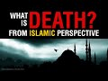

# What is Death? | From The Islamic Perspective | Paul Williams (2021-09-09)

## Description

What is Death? | From The Islamic Perspective | Paul Williams

I read from Man and the Universe: An Islamic Perspective by Dr Mostafa Al-Badawi. 
Please consider supporting my work on Patreon https://www.patreon.com/Bloggingtheology?fan_landing=true
and PayPal https://paypal.me/bloggingtheology?locale.x=en_GB

Paul Williams at Blogging Theology

## Summary of [What is Death? | From The Islamic Perspective | Paul Williams](https://www.youtube.com/watch?v=5ReVKmGz-LE)

*This summary is AI generated - there may be inaccuracies. *

### [00:00:00](https://www.youtube.com/watch?v=5ReVKmGz-LE&t=0) - [00:10:00](https://www.youtube.com/watch?v=5ReVKmGz-LE&t=600)

 psychiatrist Paul Williams talks about the Islamic perspective on death. He explains that Muslims see death as a natural passage from one dimension of existence to another, and that it is the responsibility of the believer to be prepared for it. He recommends performing wudu, reciting the Quran, and giving charity on behalf of the deceased as ways of helping the deceased to prepare for the hereafter.

**[00:00:00](https://www.youtube.com/watch?v=5ReVKmGz-LE&t=0)** This psychiatrist says that in Islam, death is nothing more than the passage from one dimension of existence into another, and the believer knows that as the hadith states, "the world is the prison of the believer and the garden of the disbeliever." He encourages regular visits to the cemetery to remember death. This attitude of detachment from the world and meditation on the hereafter is gradually forced on them, so that when the time comes, they are thoroughly prepared.
* **[00:05:00](https://www.youtube.com/watch?v=5ReVKmGz-LE&t=300)**  Dr. Paul Williams talks about the Islamic perspective on death. He discusses how Muslims view death as a natural process that should be attended by godly people who will remind the deceased to say Allah by simply repeating it in his ear. He also discusses the importance of performing wudu and reciting the Quran during the dying process. Finally, he discusses the importance of family visiting the deceased's tomb, giving charity on behalf of the deceased, and praying for them.
* **[00:10:00](https://www.youtube.com/watch?v=5ReVKmGz-LE&t=600)**  Paul Williams discusses what death is from an Islamic perspective. He discusses the wisdom behind the concept and recommends a book on the topic.

<h2>Full transcript with timestamps: CLICK TO EXPAND</h2>

[0:00:01](https://youtu.be/5ReVKmGz-LE?t=1) if we watch the western media we see an  
[0:00:03](https://youtu.be/5ReVKmGz-LE?t=3) ever increasing pressure to accept  
[0:00:06](https://youtu.be/5ReVKmGz-LE?t=6) euthanasia and so-called assisted  
[0:00:09](https://youtu.be/5ReVKmGz-LE?t=9) suicide  
[0:00:10](https://youtu.be/5ReVKmGz-LE?t=10) and i want to share with you some very  
[0:00:12](https://youtu.be/5ReVKmGz-LE?t=12) insightful comments by a distinguished  
[0:00:14](https://youtu.be/5ReVKmGz-LE?t=14) psychiatrist mustafa al-badawi in his  
[0:00:17](https://youtu.be/5ReVKmGz-LE?t=17) book man and the universe an islamic  
[0:00:20](https://youtu.be/5ReVKmGz-LE?t=20) perspective  
[0:00:21](https://youtu.be/5ReVKmGz-LE?t=21) he's a consultant psychiatrist and  
[0:00:23](https://youtu.be/5ReVKmGz-LE?t=23) member of the royal college of  
[0:00:25](https://youtu.be/5ReVKmGz-LE?t=25) psychiatrists  
[0:00:27](https://youtu.be/5ReVKmGz-LE?t=27) and in this book on page 122 he writes  
[0:00:32](https://youtu.be/5ReVKmGz-LE?t=32) we have said earlier that death is  
[0:00:34](https://youtu.be/5ReVKmGz-LE?t=34) nothing more than the passage from one  
[0:00:36](https://youtu.be/5ReVKmGz-LE?t=36) dimension of existence into another  
[0:00:39](https://youtu.be/5ReVKmGz-LE?t=39) and the believer knows that as the  
[0:00:42](https://youtu.be/5ReVKmGz-LE?t=42) hadith states the world is the prison of  
[0:00:45](https://youtu.be/5ReVKmGz-LE?t=45) the believer and the garden of the  
[0:00:48](https://youtu.be/5ReVKmGz-LE?t=48) disbeliever such an interesting haditha  
[0:00:51](https://youtu.be/5ReVKmGz-LE?t=51) those who long to meet their lord in the  
[0:00:54](https://youtu.be/5ReVKmGz-LE?t=54) perfection of the life to come  
[0:00:57](https://youtu.be/5ReVKmGz-LE?t=57) experience the world's distractions and  
[0:00:59](https://youtu.be/5ReVKmGz-LE?t=59) pleasures as so many obstacles standing  
[0:01:03](https://youtu.be/5ReVKmGz-LE?t=63) between them and their goal  
[0:01:06](https://youtu.be/5ReVKmGz-LE?t=66) they struggle against their own egos and  
[0:01:09](https://youtu.be/5ReVKmGz-LE?t=69) feel their brother's sufferings as  
[0:01:11](https://youtu.be/5ReVKmGz-LE?t=71) acutely as they feel their own  
[0:01:15](https://youtu.be/5ReVKmGz-LE?t=75) they are constantly resisting the  
[0:01:17](https://youtu.be/5ReVKmGz-LE?t=77) downward pull of the world and are  
[0:01:19](https://youtu.be/5ReVKmGz-LE?t=79) offended and aggrieved by deviant  
[0:01:21](https://youtu.be/5ReVKmGz-LE?t=81) behavior in others  
[0:01:24](https://youtu.be/5ReVKmGz-LE?t=84) they also know that quote those who love  
[0:01:27](https://youtu.be/5ReVKmGz-LE?t=87) to meet god god loves to meet them  
[0:01:30](https://youtu.be/5ReVKmGz-LE?t=90) that's a hadith in muslim  
[0:01:33](https://youtu.be/5ReVKmGz-LE?t=93) and they know of the peace and delights  
[0:01:36](https://youtu.be/5ReVKmGz-LE?t=96) of the garden and the beatific vision of  
[0:01:39](https://youtu.be/5ReVKmGz-LE?t=99) the divine countenance  
[0:01:42](https://youtu.be/5ReVKmGz-LE?t=102) the weaker a man's faith and the greater  
[0:01:44](https://youtu.be/5ReVKmGz-LE?t=104) his ignorance of these matters  
[0:01:47](https://youtu.be/5ReVKmGz-LE?t=107) the greater will be his attachment to  
[0:01:49](https://youtu.be/5ReVKmGz-LE?t=109) the world and reluctance to separate  
[0:01:52](https://youtu.be/5ReVKmGz-LE?t=112) from it this is why we are strongly  
[0:01:55](https://youtu.be/5ReVKmGz-LE?t=115) encouraged to remember death frequently  
[0:01:58](https://youtu.be/5ReVKmGz-LE?t=118) remember often the defeater of death  
[0:02:01](https://youtu.be/5ReVKmGz-LE?t=121) remember often the defeater of pleasures  
[0:02:04](https://youtu.be/5ReVKmGz-LE?t=124) death that's a hadith in eternity said  
[0:02:07](https://youtu.be/5ReVKmGz-LE?t=127) the prophet  
[0:02:08](https://youtu.be/5ReVKmGz-LE?t=128) may god's blessings and peace be upon  
[0:02:10](https://youtu.be/5ReVKmGz-LE?t=130) him  
[0:02:12](https://youtu.be/5ReVKmGz-LE?t=132) and when asked  
[0:02:13](https://youtu.be/5ReVKmGz-LE?t=133) who among believers are the most  
[0:02:15](https://youtu.be/5ReVKmGz-LE?t=135) sagacious sagacious means wise he  
[0:02:19](https://youtu.be/5ReVKmGz-LE?t=139) replied  
[0:02:20](https://youtu.be/5ReVKmGz-LE?t=140) those who remember death most often and  
[0:02:23](https://youtu.be/5ReVKmGz-LE?t=143) are the best in preparing for what  
[0:02:25](https://youtu.be/5ReVKmGz-LE?t=145) follows it  
[0:02:26](https://youtu.be/5ReVKmGz-LE?t=146) those are the sagacious  
[0:02:29](https://youtu.be/5ReVKmGz-LE?t=149) that's hadith  
[0:02:33](https://youtu.be/5ReVKmGz-LE?t=153) he encouraged regular visits to the  
[0:02:36](https://youtu.be/5ReVKmGz-LE?t=156) cemetery for the same reason  
[0:02:38](https://youtu.be/5ReVKmGz-LE?t=158) the remembrance of death detaches one  
[0:02:41](https://youtu.be/5ReVKmGz-LE?t=161) from the world reduces everything in it  
[0:02:43](https://youtu.be/5ReVKmGz-LE?t=163) to its proper proportions and renders  
[0:02:46](https://youtu.be/5ReVKmGz-LE?t=166) death and the events that are to follow  
[0:02:49](https://youtu.be/5ReVKmGz-LE?t=169) it familiar and much less frightening  
[0:02:53](https://youtu.be/5ReVKmGz-LE?t=173) this makes death itself much easier  
[0:02:57](https://youtu.be/5ReVKmGz-LE?t=177) most muslims nowadays however are  
[0:03:00](https://youtu.be/5ReVKmGz-LE?t=180) ignorant of these things and others  
[0:03:02](https://youtu.be/5ReVKmGz-LE?t=182) horrified by the mere mention of death  
[0:03:06](https://youtu.be/5ReVKmGz-LE?t=186) their attitude is thus the exact  
[0:03:08](https://youtu.be/5ReVKmGz-LE?t=188) opposite of what it ought to be  
[0:03:11](https://youtu.be/5ReVKmGz-LE?t=191) they come that much closer to the  
[0:03:13](https://youtu.be/5ReVKmGz-LE?t=193) disbelievers stance  
[0:03:16](https://youtu.be/5ReVKmGz-LE?t=196) who because they know of no paradise  
[0:03:19](https://youtu.be/5ReVKmGz-LE?t=199) apart from this life  
[0:03:21](https://youtu.be/5ReVKmGz-LE?t=201) are exceedingly reluctant to leave it  
[0:03:23](https://youtu.be/5ReVKmGz-LE?t=203) and can never understand that someone in  
[0:03:26](https://youtu.be/5ReVKmGz-LE?t=206) his right mind should be eager to do so  
[0:03:31](https://youtu.be/5ReVKmGz-LE?t=211) one of the obvious mercies that god  
[0:03:33](https://youtu.be/5ReVKmGz-LE?t=213) bestows upon his nation  
[0:03:36](https://youtu.be/5ReVKmGz-LE?t=216) is that many of those muslims who live  
[0:03:39](https://youtu.be/5ReVKmGz-LE?t=219) in forgetfulness of their lives to come  
[0:03:42](https://youtu.be/5ReVKmGz-LE?t=222) are made to suffer a long illness before  
[0:03:45](https://youtu.be/5ReVKmGz-LE?t=225) their death  
[0:03:46](https://youtu.be/5ReVKmGz-LE?t=226) when i read this sentence by the way  
[0:03:48](https://youtu.be/5ReVKmGz-LE?t=228) when i first read it i was  
[0:03:50](https://youtu.be/5ReVKmGz-LE?t=230) wow that's such an extraordinary thing  
[0:03:52](https://youtu.be/5ReVKmGz-LE?t=232) to say and so  
[0:03:54](https://youtu.be/5ReVKmGz-LE?t=234) you know it's a paradigm shift in how we  
[0:03:56](https://youtu.be/5ReVKmGz-LE?t=236) perceive illness and death just read it  
[0:03:58](https://youtu.be/5ReVKmGz-LE?t=238) again i think it's such an amazing  
[0:04:00](https://youtu.be/5ReVKmGz-LE?t=240) statement one of the obvious mercies he  
[0:04:02](https://youtu.be/5ReVKmGz-LE?t=242) says  
[0:04:03](https://youtu.be/5ReVKmGz-LE?t=243) that god bestows upon his nation in  
[0:04:05](https://youtu.be/5ReVKmGz-LE?t=245) other words the ummah the worldwide  
[0:04:07](https://youtu.be/5ReVKmGz-LE?t=247) group of muslims is that many of those  
[0:04:09](https://youtu.be/5ReVKmGz-LE?t=249) muslims who live in forget in  
[0:04:11](https://youtu.be/5ReVKmGz-LE?t=251) forgetfulness of their lives to come  
[0:04:15](https://youtu.be/5ReVKmGz-LE?t=255) are made to suffer a long illness before  
[0:04:18](https://youtu.be/5ReVKmGz-LE?t=258) their death  
[0:04:20](https://youtu.be/5ReVKmGz-LE?t=260) the result is that detachment from the  
[0:04:22](https://youtu.be/5ReVKmGz-LE?t=262) world and meditation on the hereafter is  
[0:04:25](https://youtu.be/5ReVKmGz-LE?t=265) gradually forced on them  
[0:04:27](https://youtu.be/5ReVKmGz-LE?t=267) so that when the time comes they are  
[0:04:30](https://youtu.be/5ReVKmGz-LE?t=270) thoroughly prepared so that's why this  
[0:04:33](https://youtu.be/5ReVKmGz-LE?t=273) psychiatrist says it's a mercy long  
[0:04:35](https://youtu.be/5ReVKmGz-LE?t=275) illness because it makes you face the  
[0:04:37](https://youtu.be/5ReVKmGz-LE?t=277) realities rather than a quick end  
[0:04:40](https://youtu.be/5ReVKmGz-LE?t=280) that is why the notion he writes of  
[0:04:42](https://youtu.be/5ReVKmGz-LE?t=282) euthanasia  
[0:04:44](https://youtu.be/5ReVKmGz-LE?t=284) does not arise in a muslim climate  
[0:04:48](https://youtu.be/5ReVKmGz-LE?t=288) some of the west's current attitude that  
[0:04:50](https://youtu.be/5ReVKmGz-LE?t=290) life must be prolonged at any cost has  
[0:04:53](https://youtu.be/5ReVKmGz-LE?t=293) crept in  
[0:04:55](https://youtu.be/5ReVKmGz-LE?t=295) however especially among muslim medical  
[0:04:58](https://youtu.be/5ReVKmGz-LE?t=298) practitioners of course this author is a  
[0:05:00](https://youtu.be/5ReVKmGz-LE?t=300) doctor himself so he's talking about his  
[0:05:02](https://youtu.be/5ReVKmGz-LE?t=302) colleagues  
[0:05:04](https://youtu.be/5ReVKmGz-LE?t=304) and by the same token the islamic  
[0:05:05](https://youtu.be/5ReVKmGz-LE?t=305) concern in providing the muslim with a  
[0:05:08](https://youtu.be/5ReVKmGz-LE?t=308) dignified death has weakened  
[0:05:11](https://youtu.be/5ReVKmGz-LE?t=311) to insist on saving someone's life at  
[0:05:15](https://youtu.be/5ReVKmGz-LE?t=315) all costs may mean in many instances  
[0:05:18](https://youtu.be/5ReVKmGz-LE?t=318) keeping him in intensive care with tubes  
[0:05:21](https://youtu.be/5ReVKmGz-LE?t=321) coming out of every single orifice  
[0:05:24](https://youtu.be/5ReVKmGz-LE?t=324) unable to speak or say the shahada  
[0:05:27](https://youtu.be/5ReVKmGz-LE?t=327) and distracted by the frantic activities  
[0:05:30](https://youtu.be/5ReVKmGz-LE?t=330) of the staff isn't that a horrible image  
[0:05:33](https://youtu.be/5ReVKmGz-LE?t=333) you know but seeking to prolong life  
[0:05:36](https://youtu.be/5ReVKmGz-LE?t=336) what how whatever cost however degrading  
[0:05:39](https://youtu.be/5ReVKmGz-LE?t=339) it may be for the dignity of the person  
[0:05:42](https://youtu.be/5ReVKmGz-LE?t=342) this extraordinary um image and that's  
[0:05:44](https://youtu.be/5ReVKmGz-LE?t=344) where we're at today in hospitals in the  
[0:05:46](https://youtu.be/5ReVKmGz-LE?t=346) west  
[0:05:48](https://youtu.be/5ReVKmGz-LE?t=348) it is much more important to allow a  
[0:05:50](https://youtu.be/5ReVKmGz-LE?t=350) muslim to die as he should  
[0:05:52](https://youtu.be/5ReVKmGz-LE?t=352) than to try to save his life at the cost  
[0:05:54](https://youtu.be/5ReVKmGz-LE?t=354) of robbing him of his opportunity to do  
[0:05:58](https://youtu.be/5ReVKmGz-LE?t=358) so  
[0:05:59](https://youtu.be/5ReVKmGz-LE?t=359) for dying should be attended by godly  
[0:06:02](https://youtu.be/5ReVKmGz-LE?t=362) people who will remind him to say allah  
[0:06:06](https://youtu.be/5ReVKmGz-LE?t=366) by simply repeating it in his ear not by  
[0:06:09](https://youtu.be/5ReVKmGz-LE?t=369) commanding him to say it  
[0:06:11](https://youtu.be/5ReVKmGz-LE?t=371) they should also recite yah sin as a  
[0:06:14](https://youtu.be/5ReVKmGz-LE?t=374) chapter in the quran and other portions  
[0:06:17](https://youtu.be/5ReVKmGz-LE?t=377) of the quran and continuously pray for  
[0:06:19](https://youtu.be/5ReVKmGz-LE?t=379) him  
[0:06:21](https://youtu.be/5ReVKmGz-LE?t=381) the dying should be helped to remain in  
[0:06:23](https://youtu.be/5ReVKmGz-LE?t=383) a state of ritual purity and to repeat  
[0:06:26](https://youtu.be/5ReVKmGz-LE?t=386) their wudu  
[0:06:27](https://youtu.be/5ReVKmGz-LE?t=387) whenever broken and they should be  
[0:06:29](https://youtu.be/5ReVKmGz-LE?t=389) reminded of the immensity of god's mercy  
[0:06:33](https://youtu.be/5ReVKmGz-LE?t=393) of the expected intercession by the  
[0:06:35](https://youtu.be/5ReVKmGz-LE?t=395) prophet upon whom be peace and of other  
[0:06:38](https://youtu.be/5ReVKmGz-LE?t=398) hopeful things  
[0:06:39](https://youtu.be/5ReVKmGz-LE?t=399) in this way the dying person may die  
[0:06:43](https://youtu.be/5ReVKmGz-LE?t=403) hoping for god's mercy and expecting his  
[0:06:46](https://youtu.be/5ReVKmGz-LE?t=406) forgiveness for god says in the hadith  
[0:06:49](https://youtu.be/5ReVKmGz-LE?t=409) could see  
[0:06:50](https://youtu.be/5ReVKmGz-LE?t=410) i am as my servant thinks me to be  
[0:06:56](https://youtu.be/5ReVKmGz-LE?t=416) that's a hadith by the way in bukhari  
[0:06:58](https://youtu.be/5ReVKmGz-LE?t=418) and muslim  
[0:07:00](https://youtu.be/5ReVKmGz-LE?t=420) as for the family of the deceased they  
[0:07:03](https://youtu.be/5ReVKmGz-LE?t=423) should be attended to by comforting them  
[0:07:06](https://youtu.be/5ReVKmGz-LE?t=426) and assisting them through their  
[0:07:07](https://youtu.be/5ReVKmGz-LE?t=427) mourning  
[0:07:09](https://youtu.be/5ReVKmGz-LE?t=429) the expression of sorrow pain and anger  
[0:07:12](https://youtu.be/5ReVKmGz-LE?t=432) is encouraged and accepted providing it  
[0:07:15](https://youtu.be/5ReVKmGz-LE?t=435) does not turn into histrionics which are  
[0:07:18](https://youtu.be/5ReVKmGz-LE?t=438) strictly forbidden and sometimes you get  
[0:07:21](https://youtu.be/5ReVKmGz-LE?t=441) these images of people wailing and  
[0:07:23](https://youtu.be/5ReVKmGz-LE?t=443) screaming and you know basically going  
[0:07:25](https://youtu.be/5ReVKmGz-LE?t=445) insane when someone pop this in islam is  
[0:07:28](https://youtu.be/5ReVKmGz-LE?t=448) completely unacceptable  
[0:07:31](https://youtu.be/5ReVKmGz-LE?t=451) in islam as he says they are allowed to  
[0:07:33](https://youtu.be/5ReVKmGz-LE?t=453) weep and mourn in full but never to slap  
[0:07:35](https://youtu.be/5ReVKmGz-LE?t=455) their faces or to rend their clothes  
[0:07:38](https://youtu.be/5ReVKmGz-LE?t=458) ripping on ripping their clothes  
[0:07:39](https://youtu.be/5ReVKmGz-LE?t=459) although it obviously happens at times  
[0:07:42](https://youtu.be/5ReVKmGz-LE?t=462) they are reminded that quote god is more  
[0:07:45](https://youtu.be/5ReVKmGz-LE?t=465) compassionate to them than a mother is  
[0:07:48](https://youtu.be/5ReVKmGz-LE?t=468) to her infant that's a quote from ibn  
[0:07:51](https://youtu.be/5ReVKmGz-LE?t=471) maja hadith  
[0:07:53](https://youtu.be/5ReVKmGz-LE?t=473) that this is another trial that they  
[0:07:56](https://youtu.be/5ReVKmGz-LE?t=476) must suffer and that if they would only  
[0:07:58](https://youtu.be/5ReVKmGz-LE?t=478) allow him that god god will help them  
[0:08:02](https://youtu.be/5ReVKmGz-LE?t=482) and fortitude and put fortitude in their  
[0:08:05](https://youtu.be/5ReVKmGz-LE?t=485) hearts forgive their sins and raise  
[0:08:08](https://youtu.be/5ReVKmGz-LE?t=488) their degrees for it  
[0:08:10](https://youtu.be/5ReVKmGz-LE?t=490) they are reminded that no loss equals  
[0:08:12](https://youtu.be/5ReVKmGz-LE?t=492) that of the prophet upon him be peace  
[0:08:15](https://youtu.be/5ReVKmGz-LE?t=495) and that even he had to suffer the death  
[0:08:17](https://youtu.be/5ReVKmGz-LE?t=497) of all his children but one  
[0:08:20](https://youtu.be/5ReVKmGz-LE?t=500) fatima may allah be pleased with her  
[0:08:23](https://youtu.be/5ReVKmGz-LE?t=503) and of many of his loved ones  
[0:08:28](https://youtu.be/5ReVKmGz-LE?t=508) all those who come to offer their  
[0:08:29](https://youtu.be/5ReVKmGz-LE?t=509) condolences are expected to participate  
[0:08:32](https://youtu.be/5ReVKmGz-LE?t=512) in this assuaging process each in his  
[0:08:35](https://youtu.be/5ReVKmGz-LE?t=515) own manner  
[0:08:37](https://youtu.be/5ReVKmGz-LE?t=517) the neighbors and relatives are expected  
[0:08:39](https://youtu.be/5ReVKmGz-LE?t=519) to take over the task of preparing food  
[0:08:42](https://youtu.be/5ReVKmGz-LE?t=522) for the visitors seeing to the household  
[0:08:45](https://youtu.be/5ReVKmGz-LE?t=525) needs and remaining alert for any kind  
[0:08:47](https://youtu.be/5ReVKmGz-LE?t=527) of practical help that may be required  
[0:08:50](https://youtu.be/5ReVKmGz-LE?t=530) of them at any time  
[0:08:53](https://youtu.be/5ReVKmGz-LE?t=533) the family will be encouraged to visit  
[0:08:55](https://youtu.be/5ReVKmGz-LE?t=535) the tomb give away charity on behalf of  
[0:08:58](https://youtu.be/5ReVKmGz-LE?t=538) the deceased pray for him recite the  
[0:09:01](https://youtu.be/5ReVKmGz-LE?t=541) quran and if required perform hajj and  
[0:09:04](https://youtu.be/5ReVKmGz-LE?t=544) umrah on his behalf  
[0:09:07](https://youtu.be/5ReVKmGz-LE?t=547) until recently people of both sexes were  
[0:09:10](https://youtu.be/5ReVKmGz-LE?t=550) encouraged to remarry not very long  
[0:09:12](https://youtu.be/5ReVKmGz-LE?t=552) after losing their spouse  
[0:09:14](https://youtu.be/5ReVKmGz-LE?t=554) this resulted in the effective  
[0:09:16](https://youtu.be/5ReVKmGz-LE?t=556) reorganization of their lives materially  
[0:09:19](https://youtu.be/5ReVKmGz-LE?t=559) and emotionally and the adequate  
[0:09:22](https://youtu.be/5ReVKmGz-LE?t=562) fulfillment of the children's needs  
[0:09:24](https://youtu.be/5ReVKmGz-LE?t=564) isn't that interesting  
[0:09:26](https://youtu.be/5ReVKmGz-LE?t=566) anger and resentment against heaven and  
[0:09:29](https://youtu.be/5ReVKmGz-LE?t=569) the possibility of psychological  
[0:09:31](https://youtu.be/5ReVKmGz-LE?t=571) dysfunction are again more likely to  
[0:09:34](https://youtu.be/5ReVKmGz-LE?t=574) occur the more remote the bereaved  
[0:09:37](https://youtu.be/5ReVKmGz-LE?t=577) person's cognitive structure is from the  
[0:09:40](https://youtu.be/5ReVKmGz-LE?t=580) islamic values and principles outlined  
[0:09:43](https://youtu.be/5ReVKmGz-LE?t=583) earlier  
[0:09:45](https://youtu.be/5ReVKmGz-LE?t=585) obviously such people will need more  
[0:09:48](https://youtu.be/5ReVKmGz-LE?t=588) intensive attention  
[0:09:50](https://youtu.be/5ReVKmGz-LE?t=590) let's end of that isn't that  
[0:09:51](https://youtu.be/5ReVKmGz-LE?t=591) extraordinary um  
[0:09:53](https://youtu.be/5ReVKmGz-LE?t=593) this book is full of most amazing  
[0:09:55](https://youtu.be/5ReVKmGz-LE?t=595) insights into a different way an  
[0:09:57](https://youtu.be/5ReVKmGz-LE?t=597) alternative vision of how to live our  
[0:10:00](https://youtu.be/5ReVKmGz-LE?t=600) lives for those of us who live in the  
[0:10:01](https://youtu.be/5ReVKmGz-LE?t=601) west we won't hear about this  
[0:10:03](https://youtu.be/5ReVKmGz-LE?t=603) perspective normally muslims in the  
[0:10:05](https://youtu.be/5ReVKmGz-LE?t=605) headlines are obviously uh associated  
[0:10:08](https://youtu.be/5ReVKmGz-LE?t=608) with uh egregious uh activities but here  
[0:10:11](https://youtu.be/5ReVKmGz-LE?t=611) here we have uh  
[0:10:13](https://youtu.be/5ReVKmGz-LE?t=613) wisdom deep wisdom from an islamic  
[0:10:15](https://youtu.be/5ReVKmGz-LE?t=615) perspective so i do recommend this book  
[0:10:17](https://youtu.be/5ReVKmGz-LE?t=617) until next time  

