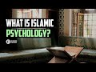

# What is Islamic psychology? With Dr Abdallah Rothman (2022-12-15 19:15:32+00:00)

## Description

Dr. Abdallah Rothman - Midnight Moments: https://youtube.com/playlist?list=PLjx2FfgGpKruHhLfDe2cJQREHBqicTRVO

Cambridge Muslim College https://www.cambridgemuslimcollege.ac.uk/

You Can Support My Work on Patreon:
https://www.patreon.com/Bloggingtheology

My Paypal Link: 
https://www.paypal.com/paypalme/bloggingtheology?locale.x=en_GB

## Summary of [What is Islamic psychology? With Dr Abdallah Rothman](https://www.youtube.com/watch?v=dYGFhqdQfdI)

*This is an AI generated summary. There may be inaccuracies. *

### [00:00:00](https://www.youtube.com/watch?v=dYGFhqdQfdI&t=0) - [00:40:00](https://www.youtube.com/watch?v=dYGFhqdQfdI&t=2400)

This video discusses Islamic psychology, with a focus on the work of Dr. Abdallah Rothman. Dr. Rothman discusses the importance of engaging in honest and authentic dialogue, and discusses the Cambridge Muslim College.

**[00:00:00](https://www.youtube.com/watch?v=dYGFhqdQfdI&t=0)** Islamic psychology is a field that deals with the understanding of the human soul from an Islamic perspective. It draws from ontological and epistemological assumptions based on the Quran and Islamic tradition. In addition to understanding mental processes and behavior, it examines big concepts like epistemology and the nature of knowledge. This research often looks at conventional psychology from a materialist perspective, focusing on behavior and cognition.
* **[00:05:00](https://www.youtube.com/watch?v=dYGFhqdQfdI&t=300)** Islamic psychology takes into account the Unseen World, recognizing knowledge that comes from things that we can't understand unless it comes from Revelation. There is disagreement among Islamic psychologists on the location of the soul, but it is one thing.
* **[00:10:00](https://www.youtube.com/watch?v=dYGFhqdQfdI&t=600)** Islamic psychology emphasizes the importance of the heart as a spiritual center, and points to the Quran as evidence for this understanding of human beings. The heart is located in the chest, and is connected to the organ of the heart.
* **[00:15:00](https://www.youtube.com/watch?v=dYGFhqdQfdI&t=900)** Islamic psychology differs from Western psychology in its focus on the pre- and post-natal stages of a person's life. It also differs in its view of the human being as a highly calibrated spiritual and physical being. This orientation towards God consciousness allows for a more transcendent understanding of one's self and the world.
* **[00:20:00](https://www.youtube.com/watch?v=dYGFhqdQfdI&t=1200)** Islamic psychology is the study of the human soul and its disposition, as well as how to achieve a perfect life. It is grounded in the understanding that Sufism is an important aspect of Islam, and that it has changed over time.
* **[00:25:00](https://www.youtube.com/watch?v=dYGFhqdQfdI&t=1500)** Sufism is the inner reality of Islam, which includes the esoteric and theological aspects of the practice. In Sufism, the spiritual journey of the Soul is all about understanding the inner and transforming what is within oneself. Western psychology can learn a lot from Sufism, regardless of whether the person becomes Muslim or not.
* **[00:30:00](https://www.youtube.com/watch?v=dYGFhqdQfdI&t=1800)** Islamic psychology is a field of psychology that focuses on the human being in a way that is open to the heart rather than just dealing with thoughts. Abdallah Rothman provides resources for people interested in learning more about Islamic psychology.
* **[00:35:00](https://www.youtube.com/watch?v=dYGFhqdQfdI&t=2100)** Abdallah Rothman discusses Islamic psychology, which is a model of the soul that draws from traditional Islamic scholarship and Western academic thought. He sees the future of the Cambridge Muslim College as being one that engages both Islamic tradition and the contemporary world, and helps young leaders to understand both Islamic and Western thought.
* **[00:40:00](https://www.youtube.com/watch?v=dYGFhqdQfdI&t=2400)** This video discusses Islamic psychology, with a focus on the work of Dr. Abdallah Rothman. Dr. Rothman discusses the importance of engaging in honest and authentic dialogue, and discusses the Cambridge Muslim College.

## Full transcript with timestamps

[0:00:04](https://youtu.be/dYGFhqdQfdI?t=4) hello everyone and welcome to blogging  
[0:00:06](https://youtu.be/dYGFhqdQfdI?t=6) theology today I am delighted to talk to  
[0:00:09](https://youtu.be/dYGFhqdQfdI?t=9) Dr Abdullah Rothman you are most welcome  
[0:00:11](https://youtu.be/dYGFhqdQfdI?t=11) sir  
[0:00:12](https://youtu.be/dYGFhqdQfdI?t=12) thank you good to be here great great to  
[0:00:15](https://youtu.be/dYGFhqdQfdI?t=15) have you uh Dr Abdullah Rothman is a  
[0:00:18](https://youtu.be/dYGFhqdQfdI?t=18) psychologist and the principal of  
[0:00:21](https://youtu.be/dYGFhqdQfdI?t=21) Cambridge Muslim College here in England  
[0:00:23](https://youtu.be/dYGFhqdQfdI?t=23) he holds a PhD in Psychology from  
[0:00:26](https://youtu.be/dYGFhqdQfdI?t=26) Kingston University in London  
[0:00:30](https://youtu.be/dYGFhqdQfdI?t=30) his clinical practice as well as his  
[0:00:33](https://youtu.be/dYGFhqdQfdI?t=33) academic research focus on approaching  
[0:00:36](https://youtu.be/dYGFhqdQfdI?t=36) counseling and Psychotherapy from within  
[0:00:39](https://youtu.be/dYGFhqdQfdI?t=39) an Islamic Paradigm and establishing an  
[0:00:43](https://youtu.be/dYGFhqdQfdI?t=43) Islamic theoretical orientation to human  
[0:00:46](https://youtu.be/dYGFhqdQfdI?t=46) psychology that's grounded in the  
[0:00:48](https://youtu.be/dYGFhqdQfdI?t=48) knowledge of the soul from an Islamic  
[0:00:51](https://youtu.be/dYGFhqdQfdI?t=51) tradition  
[0:00:52](https://youtu.be/dYGFhqdQfdI?t=52) in addition to his academic training he  
[0:00:55](https://youtu.be/dYGFhqdQfdI?t=55) has studied privately with a number of  
[0:00:57](https://youtu.be/dYGFhqdQfdI?t=57) traditional Islamic scholars throughout  
[0:01:00](https://youtu.be/dYGFhqdQfdI?t=60) the Muslim world so today Dr Abdullah  
[0:01:03](https://youtu.be/dYGFhqdQfdI?t=63) has kindly agreed to introduce us to  
[0:01:05](https://youtu.be/dYGFhqdQfdI?t=65) this fascinating subject of Islamic  
[0:01:07](https://youtu.be/dYGFhqdQfdI?t=67) psychology so could you perhaps explain  
[0:01:10](https://youtu.be/dYGFhqdQfdI?t=70) to us exactly what is Islamic psychology  
[0:01:14](https://youtu.be/dYGFhqdQfdI?t=74) sure I can I can try to encapsulate it  
[0:01:17](https://youtu.be/dYGFhqdQfdI?t=77) it's a it's obviously a a big topic and  
[0:01:20](https://youtu.be/dYGFhqdQfdI?t=80) it's something that has become a sort of  
[0:01:23](https://youtu.be/dYGFhqdQfdI?t=83) Hot Topic as of late in the past few  
[0:01:26](https://youtu.be/dYGFhqdQfdI?t=86) years where it's giving a lot of  
[0:01:27](https://youtu.be/dYGFhqdQfdI?t=87) attention and because of that it is  
[0:01:31](https://youtu.be/dYGFhqdQfdI?t=91) in some ways we can say it's a new field  
[0:01:34](https://youtu.be/dYGFhqdQfdI?t=94) and then other ways we can say it's a  
[0:01:36](https://youtu.be/dYGFhqdQfdI?t=96) very old field and  
[0:01:39](https://youtu.be/dYGFhqdQfdI?t=99) um there tends to be some  
[0:01:42](https://youtu.be/dYGFhqdQfdI?t=102) confusion and lack of clarity on people  
[0:01:45](https://youtu.be/dYGFhqdQfdI?t=105) understanding or agreeing on what we're  
[0:01:48](https://youtu.be/dYGFhqdQfdI?t=108) referring to when we say Islamic  
[0:01:50](https://youtu.be/dYGFhqdQfdI?t=110) psychology but I think where that stems  
[0:01:53](https://youtu.be/dYGFhqdQfdI?t=113) from ironically perhaps is more in the  
[0:01:57](https://youtu.be/dYGFhqdQfdI?t=117) word psychology than it is in the word  
[0:01:59](https://youtu.be/dYGFhqdQfdI?t=119) Islamic in the sense that you know uh  
[0:02:03](https://youtu.be/dYGFhqdQfdI?t=123) for the most part people when they think  
[0:02:05](https://youtu.be/dYGFhqdQfdI?t=125) of psychology we're thinking what we're  
[0:02:08](https://youtu.be/dYGFhqdQfdI?t=128) taught in the western Academia if you  
[0:02:11](https://youtu.be/dYGFhqdQfdI?t=131) were to take a course on psychology  
[0:02:13](https://youtu.be/dYGFhqdQfdI?t=133) you'd be  
[0:02:15](https://youtu.be/dYGFhqdQfdI?t=135) studying a field that sort of started in  
[0:02:17](https://youtu.be/dYGFhqdQfdI?t=137) the  
[0:02:18](https://youtu.be/dYGFhqdQfdI?t=138) 18th century uh and  
[0:02:22](https://youtu.be/dYGFhqdQfdI?t=142) that is about the the study of the mind  
[0:02:25](https://youtu.be/dYGFhqdQfdI?t=145) and behavior right so it's really  
[0:02:28](https://youtu.be/dYGFhqdQfdI?t=148) defined as the study of mental processes  
[0:02:32](https://youtu.be/dYGFhqdQfdI?t=152) and behavior  
[0:02:34](https://youtu.be/dYGFhqdQfdI?t=154) um but I think when we put the word  
[0:02:36](https://youtu.be/dYGFhqdQfdI?t=156) Islamic in front of it what we're what  
[0:02:39](https://youtu.be/dYGFhqdQfdI?t=159) we're talking about is from the  
[0:02:42](https://youtu.be/dYGFhqdQfdI?t=162) ontological and epistemological  
[0:02:45](https://youtu.be/dYGFhqdQfdI?t=165) framework so the assumptions that we  
[0:02:49](https://youtu.be/dYGFhqdQfdI?t=169) that we make based on the world view  
[0:02:52](https://youtu.be/dYGFhqdQfdI?t=172) that the Quran posits  
[0:02:55](https://youtu.be/dYGFhqdQfdI?t=175) how do we understand the human being and  
[0:02:58](https://youtu.be/dYGFhqdQfdI?t=178) therefore how does that inform our  
[0:03:01](https://youtu.be/dYGFhqdQfdI?t=181) understanding of the trajectory of the  
[0:03:04](https://youtu.be/dYGFhqdQfdI?t=184) human being both understanding the  
[0:03:06](https://youtu.be/dYGFhqdQfdI?t=186) nature of a human being and the process  
[0:03:08](https://youtu.be/dYGFhqdQfdI?t=188) of of change and how we make sense of  
[0:03:11](https://youtu.be/dYGFhqdQfdI?t=191) difficulty psychological problems or  
[0:03:14](https://youtu.be/dYGFhqdQfdI?t=194) imbalances and so  
[0:03:17](https://youtu.be/dYGFhqdQfdI?t=197) what we're looking at is more I would  
[0:03:20](https://youtu.be/dYGFhqdQfdI?t=200) say  
[0:03:22](https://youtu.be/dYGFhqdQfdI?t=202) what the words psychology actually means  
[0:03:25](https://youtu.be/dYGFhqdQfdI?t=205) which you know the Greek it means the  
[0:03:27](https://youtu.be/dYGFhqdQfdI?t=207) study of the psyche and the psyche is  
[0:03:30](https://youtu.be/dYGFhqdQfdI?t=210) really the soul so it's the study of the  
[0:03:33](https://youtu.be/dYGFhqdQfdI?t=213) Soul right uh and we have from before  
[0:03:37](https://youtu.be/dYGFhqdQfdI?t=217) even the Western Academy has been  
[0:03:40](https://youtu.be/dYGFhqdQfdI?t=220) talking about and dealing with  
[0:03:41](https://youtu.be/dYGFhqdQfdI?t=221) psychology as a field we have had in the  
[0:03:43](https://youtu.be/dYGFhqdQfdI?t=223) Islamic tradition uh illness which is  
[0:03:47](https://youtu.be/dYGFhqdQfdI?t=227) essentially the Arabic for the same term  
[0:03:50](https://youtu.be/dYGFhqdQfdI?t=230) study of the Soul  
[0:03:53](https://youtu.be/dYGFhqdQfdI?t=233) um and so when we look at it from that  
[0:03:56](https://youtu.be/dYGFhqdQfdI?t=236) perspective  
[0:03:58](https://youtu.be/dYGFhqdQfdI?t=238) we are then understanding what is the  
[0:04:01](https://youtu.be/dYGFhqdQfdI?t=241) soul from an Islamic perspective yes and  
[0:04:04](https://youtu.be/dYGFhqdQfdI?t=244) from that perspective it is much more  
[0:04:07](https://youtu.be/dYGFhqdQfdI?t=247) than just mental processes and behavior  
[0:04:10](https://youtu.be/dYGFhqdQfdI?t=250) so I think  
[0:04:11](https://youtu.be/dYGFhqdQfdI?t=251) it zooms out and looks at these big big  
[0:04:15](https://youtu.be/dYGFhqdQfdI?t=255) Concepts like epistemology how do we  
[0:04:18](https://youtu.be/dYGFhqdQfdI?t=258) know what we know right how do we how do  
[0:04:20](https://youtu.be/dYGFhqdQfdI?t=260) we  
[0:04:21](https://youtu.be/dYGFhqdQfdI?t=261) um understand what we count as knowledge  
[0:04:24](https://youtu.be/dYGFhqdQfdI?t=264) and that has a lot to do with you know  
[0:04:27](https://youtu.be/dYGFhqdQfdI?t=267) then it starts to unravel on and look at  
[0:04:31](https://youtu.be/dYGFhqdQfdI?t=271) um the the conventional approach to  
[0:04:34](https://youtu.be/dYGFhqdQfdI?t=274) psychology tends to be limited to the  
[0:04:38](https://youtu.be/dYGFhqdQfdI?t=278) scientific Paradigm which is really  
[0:04:41](https://youtu.be/dYGFhqdQfdI?t=281) focused on what can be seen and measured  
[0:04:44](https://youtu.be/dYGFhqdQfdI?t=284) right so this is why the focus tends to  
[0:04:47](https://youtu.be/dYGFhqdQfdI?t=287) be on behavior and cognition because  
[0:04:49](https://youtu.be/dYGFhqdQfdI?t=289) these are things that are much easier to  
[0:04:53](https://youtu.be/dYGFhqdQfdI?t=293) understand and study and look at the  
[0:04:56](https://youtu.be/dYGFhqdQfdI?t=296) causes of these things from a  
[0:04:59](https://youtu.be/dYGFhqdQfdI?t=299) materialist perspective without really  
[0:05:02](https://youtu.be/dYGFhqdQfdI?t=302) taking seriously the Unseen World right  
[0:05:06](https://youtu.be/dYGFhqdQfdI?t=306) so recognizing knowledge that comes from  
[0:05:09](https://youtu.be/dYGFhqdQfdI?t=309) things that we can't understand  
[0:05:12](https://youtu.be/dYGFhqdQfdI?t=312) unless without  
[0:05:14](https://youtu.be/dYGFhqdQfdI?t=314) Revelation essentially right certainly  
[0:05:17](https://youtu.be/dYGFhqdQfdI?t=317) well in Islamic psychology what is the  
[0:05:19](https://youtu.be/dYGFhqdQfdI?t=319) human soul or where is it located you  
[0:05:22](https://youtu.be/dYGFhqdQfdI?t=322) mentioned the Unseen and you mentioned  
[0:05:24](https://youtu.be/dYGFhqdQfdI?t=324) the Western emphasis on the empirical  
[0:05:25](https://youtu.be/dYGFhqdQfdI?t=325) the observable the empirically testable  
[0:05:28](https://youtu.be/dYGFhqdQfdI?t=328) but where is it and what what does it  
[0:05:30](https://youtu.be/dYGFhqdQfdI?t=330) consist of if that's a a question we can  
[0:05:33](https://youtu.be/dYGFhqdQfdI?t=333) even address  
[0:05:34](https://youtu.be/dYGFhqdQfdI?t=334) yeah I can address it and it's not as  
[0:05:37](https://youtu.be/dYGFhqdQfdI?t=337) straightforward because like many things  
[0:05:39](https://youtu.be/dYGFhqdQfdI?t=339) when we deal with this thing that is  
[0:05:41](https://youtu.be/dYGFhqdQfdI?t=341) unseen and esoteric and and you can't  
[0:05:44](https://youtu.be/dYGFhqdQfdI?t=344) measure it then what we get to into the  
[0:05:46](https://youtu.be/dYGFhqdQfdI?t=346) world of  
[0:05:48](https://youtu.be/dYGFhqdQfdI?t=348) um a lot of trying to understand  
[0:05:50](https://youtu.be/dYGFhqdQfdI?t=350) something and from from the Islamic  
[0:05:53](https://youtu.be/dYGFhqdQfdI?t=353) tradition we're we're looking to the  
[0:05:55](https://youtu.be/dYGFhqdQfdI?t=355) Quran and the the prophetic tradition to  
[0:05:58](https://youtu.be/dYGFhqdQfdI?t=358) understand what we what we know or piece  
[0:06:03](https://youtu.be/dYGFhqdQfdI?t=363) together of the soul and so some of that  
[0:06:06](https://youtu.be/dYGFhqdQfdI?t=366) can remain uh ambiguous sometimes even  
[0:06:10](https://youtu.be/dYGFhqdQfdI?t=370) secretive and then you get a lot of  
[0:06:13](https://youtu.be/dYGFhqdQfdI?t=373) different  
[0:06:14](https://youtu.be/dYGFhqdQfdI?t=374) um different opinions or different  
[0:06:16](https://youtu.be/dYGFhqdQfdI?t=376) positions or maybe even  
[0:06:20](https://youtu.be/dYGFhqdQfdI?t=380) um disagreements from different schools  
[0:06:21](https://youtu.be/dYGFhqdQfdI?t=381) of thought right but I would say when  
[0:06:24](https://youtu.be/dYGFhqdQfdI?t=384) we're speaking of the sort of majority  
[0:06:26](https://youtu.be/dYGFhqdQfdI?t=386) of Scholars and the ones who have really  
[0:06:29](https://youtu.be/dYGFhqdQfdI?t=389) spent the most time unpacking and  
[0:06:32](https://youtu.be/dYGFhqdQfdI?t=392) understanding the nature of the Soul  
[0:06:34](https://youtu.be/dYGFhqdQfdI?t=394) for instance in the field of Islamic  
[0:06:37](https://youtu.be/dYGFhqdQfdI?t=397) psychology  
[0:06:39](https://youtu.be/dYGFhqdQfdI?t=399) um  
[0:06:40](https://youtu.be/dYGFhqdQfdI?t=400) al-razali is is referenced quite a lot  
[0:06:42](https://youtu.be/dYGFhqdQfdI?t=402) yeah and the reason for that is because  
[0:06:45](https://youtu.be/dYGFhqdQfdI?t=405) he did so much  
[0:06:47](https://youtu.be/dYGFhqdQfdI?t=407) writing on really understanding a the  
[0:06:52](https://youtu.be/dYGFhqdQfdI?t=412) um sort of esoteric aspects of the  
[0:06:54](https://youtu.be/dYGFhqdQfdI?t=414) exoteric  
[0:06:56](https://youtu.be/dYGFhqdQfdI?t=416) parts of the Islamic tradition of the of  
[0:06:59](https://youtu.be/dYGFhqdQfdI?t=419) the Deen of the religion and through  
[0:07:02](https://youtu.be/dYGFhqdQfdI?t=422) that then really elucidating this this  
[0:07:06](https://youtu.be/dYGFhqdQfdI?t=426) unseen reality or substance of the soul  
[0:07:09](https://youtu.be/dYGFhqdQfdI?t=429) and so what  
[0:07:11](https://youtu.be/dYGFhqdQfdI?t=431) um  
[0:07:12](https://youtu.be/dYGFhqdQfdI?t=432) but also many other Scholars even before  
[0:07:15](https://youtu.be/dYGFhqdQfdI?t=435) him and after him who sort of align and  
[0:07:18](https://youtu.be/dYGFhqdQfdI?t=438) agree with this is that the soul  
[0:07:22](https://youtu.be/dYGFhqdQfdI?t=442) is often referred to with these four  
[0:07:25](https://youtu.be/dYGFhqdQfdI?t=445) terms of nuffs  
[0:07:29](https://youtu.be/dYGFhqdQfdI?t=449) and often the the nuts is interpreted as  
[0:07:34](https://youtu.be/dYGFhqdQfdI?t=454) self some people say lower self and I'll  
[0:07:37](https://youtu.be/dYGFhqdQfdI?t=457) explain that in in a minute and then  
[0:07:40](https://youtu.be/dYGFhqdQfdI?t=460) which is often translated as spirit and  
[0:07:45](https://youtu.be/dYGFhqdQfdI?t=465) which is translated as intellect and  
[0:07:48](https://youtu.be/dYGFhqdQfdI?t=468) Kalb which is the heart and so it can  
[0:07:51](https://youtu.be/dYGFhqdQfdI?t=471) get rather confusing with all these  
[0:07:54](https://youtu.be/dYGFhqdQfdI?t=474) terms and we can start to think and what  
[0:07:56](https://youtu.be/dYGFhqdQfdI?t=476) we what we tend to do and this is sort  
[0:07:59](https://youtu.be/dYGFhqdQfdI?t=479) of you know um illustrative of why we  
[0:08:03](https://youtu.be/dYGFhqdQfdI?t=483) get stuck in well are we talking about  
[0:08:05](https://youtu.be/dYGFhqdQfdI?t=485) the Western psychology of materialism or  
[0:08:09](https://youtu.be/dYGFhqdQfdI?t=489) are we talking about this unseen worlds  
[0:08:10](https://youtu.be/dYGFhqdQfdI?t=490) we tend to  
[0:08:12](https://youtu.be/dYGFhqdQfdI?t=492) want to reduce things and understand  
[0:08:14](https://youtu.be/dYGFhqdQfdI?t=494) things in separation  
[0:08:16](https://youtu.be/dYGFhqdQfdI?t=496) right so we're having these elements of  
[0:08:19](https://youtu.be/dYGFhqdQfdI?t=499) this of the human being and we tend to  
[0:08:21](https://youtu.be/dYGFhqdQfdI?t=501) think of them as separate things whereas  
[0:08:26](https://youtu.be/dYGFhqdQfdI?t=506) what we learn from the from the Quran  
[0:08:29](https://youtu.be/dYGFhqdQfdI?t=509) and the scholars elucidating this is  
[0:08:30](https://youtu.be/dYGFhqdQfdI?t=510) that really it's one thing so  
[0:08:33](https://youtu.be/dYGFhqdQfdI?t=513) particularly hazali talks about these  
[0:08:35](https://youtu.be/dYGFhqdQfdI?t=515) four terms and he sometimes uses them  
[0:08:37](https://youtu.be/dYGFhqdQfdI?t=517) interchangeably right right so you'll be  
[0:08:40](https://youtu.be/dYGFhqdQfdI?t=520) he'll be talking about the the soul and  
[0:08:43](https://youtu.be/dYGFhqdQfdI?t=523) they'll be using the word and then he'll  
[0:08:47](https://youtu.be/dYGFhqdQfdI?t=527) um talk about a correlation to that the  
[0:08:50](https://youtu.be/dYGFhqdQfdI?t=530) Cub like that that what he really means  
[0:08:52](https://youtu.be/dYGFhqdQfdI?t=532) is the cult  
[0:08:53](https://youtu.be/dYGFhqdQfdI?t=533) and so it can get it can get confusing  
[0:08:57](https://youtu.be/dYGFhqdQfdI?t=537) but I think what what helps  
[0:09:00](https://youtu.be/dYGFhqdQfdI?t=540) um bring it into focus is if we try to  
[0:09:04](https://youtu.be/dYGFhqdQfdI?t=544) understand from the perspective of what  
[0:09:07](https://youtu.be/dYGFhqdQfdI?t=547) we have come to know as psychology where  
[0:09:09](https://youtu.be/dYGFhqdQfdI?t=549) we have this notion that we the self  
[0:09:13](https://youtu.be/dYGFhqdQfdI?t=553) is this independent being and we hear  
[0:09:16](https://youtu.be/dYGFhqdQfdI?t=556) terms like the ego and we have terms  
[0:09:20](https://youtu.be/dYGFhqdQfdI?t=560) um like  
[0:09:22](https://youtu.be/dYGFhqdQfdI?t=562) our thoughts are become who we are right  
[0:09:25](https://youtu.be/dYGFhqdQfdI?t=565) this is something that sort of when you  
[0:09:27](https://youtu.be/dYGFhqdQfdI?t=567) study psychology the assumption is  
[0:09:29](https://youtu.be/dYGFhqdQfdI?t=569) there's this notion that we are our  
[0:09:31](https://youtu.be/dYGFhqdQfdI?t=571) thoughts Consciousness is in the mind  
[0:09:34](https://youtu.be/dYGFhqdQfdI?t=574) um right and so  
[0:09:37](https://youtu.be/dYGFhqdQfdI?t=577) what an Islamic perspective does is it  
[0:09:41](https://youtu.be/dYGFhqdQfdI?t=581) is it includes many more elements  
[0:09:45](https://youtu.be/dYGFhqdQfdI?t=585) than just thinking and thought as a  
[0:09:48](https://youtu.be/dYGFhqdQfdI?t=588) definition of Consciousness and and  
[0:09:51](https://youtu.be/dYGFhqdQfdI?t=591) self-identification right and the remain  
[0:09:54](https://youtu.be/dYGFhqdQfdI?t=594) distinguishing feature is the concept of  
[0:09:59](https://youtu.be/dYGFhqdQfdI?t=599) is this  
[0:10:01](https://youtu.be/dYGFhqdQfdI?t=601) um you know we know that the that Allah  
[0:10:04](https://youtu.be/dYGFhqdQfdI?t=604) breathed into the human being  
[0:10:06](https://youtu.be/dYGFhqdQfdI?t=606) from his uh spirit and this is what gave  
[0:10:11](https://youtu.be/dYGFhqdQfdI?t=611) us  
[0:10:13](https://youtu.be/dYGFhqdQfdI?t=613) um life and  
[0:10:16](https://youtu.be/dYGFhqdQfdI?t=616) this so in the Quran  
[0:10:20](https://youtu.be/dYGFhqdQfdI?t=620) is referenced as something pure  
[0:10:23](https://youtu.be/dYGFhqdQfdI?t=623) something that is not  
[0:10:26](https://youtu.be/dYGFhqdQfdI?t=626) um is not uh corrupted and cannot be  
[0:10:30](https://youtu.be/dYGFhqdQfdI?t=630) corrupted but then when the nafs is  
[0:10:32](https://youtu.be/dYGFhqdQfdI?t=632) referred to even though the nuffs is  
[0:10:35](https://youtu.be/dYGFhqdQfdI?t=635) also something that is beautiful and has  
[0:10:37](https://youtu.be/dYGFhqdQfdI?t=637) uh has the ability to be elevated it  
[0:10:42](https://youtu.be/dYGFhqdQfdI?t=642) also is something that can be corrupted  
[0:10:46](https://youtu.be/dYGFhqdQfdI?t=646) and then the Cub is this aspect of the  
[0:10:50](https://youtu.be/dYGFhqdQfdI?t=650) heart where is the center of the human  
[0:10:52](https://youtu.be/dYGFhqdQfdI?t=652) being this is this is what I think  
[0:10:55](https://youtu.be/dYGFhqdQfdI?t=655) potentially is fundamentally different  
[0:10:57](https://youtu.be/dYGFhqdQfdI?t=657) than a western notion of psychology is  
[0:11:01](https://youtu.be/dYGFhqdQfdI?t=661) that we understand that the the Cub the  
[0:11:04](https://youtu.be/dYGFhqdQfdI?t=664) heart being the center of the human  
[0:11:07](https://youtu.be/dYGFhqdQfdI?t=667) being  
[0:11:08](https://youtu.be/dYGFhqdQfdI?t=668) means that the in intellect and the  
[0:11:11](https://youtu.be/dYGFhqdQfdI?t=671) thinking is an aspect of the human being  
[0:11:14](https://youtu.be/dYGFhqdQfdI?t=674) but it's not the primary uh heart of the  
[0:11:18](https://youtu.be/dYGFhqdQfdI?t=678) Consciousness or identity of the human  
[0:11:20](https://youtu.be/dYGFhqdQfdI?t=680) being that's one of the things I found  
[0:11:22](https://youtu.be/dYGFhqdQfdI?t=682) in talking to non-muslims westerners  
[0:11:25](https://youtu.be/dYGFhqdQfdI?t=685) about uh the Islamic understanding of  
[0:11:27](https://youtu.be/dYGFhqdQfdI?t=687) the heart and many traditional societies  
[0:11:29](https://youtu.be/dYGFhqdQfdI?t=689) use similar kinds of language that the  
[0:11:31](https://youtu.be/dYGFhqdQfdI?t=691) heart uh can be blinded uh or the hearts  
[0:11:35](https://youtu.be/dYGFhqdQfdI?t=695) can understand and they say what is this  
[0:11:37](https://youtu.be/dYGFhqdQfdI?t=697) what is this language what is language  
[0:11:39](https://youtu.be/dYGFhqdQfdI?t=699) the heart is is just a physical organ  
[0:11:41](https://youtu.be/dYGFhqdQfdI?t=701) that pumps blood around our bodies and  
[0:11:44](https://youtu.be/dYGFhqdQfdI?t=704) and there's this very materialist  
[0:11:46](https://youtu.be/dYGFhqdQfdI?t=706) understanding of of what we are as a  
[0:11:50](https://youtu.be/dYGFhqdQfdI?t=710) species and I'm just reminded of a quote  
[0:11:52](https://youtu.be/dYGFhqdQfdI?t=712) from the Quran here uh have these people  
[0:11:54](https://youtu.be/dYGFhqdQfdI?t=714) not travel through the land with hearts  
[0:11:56](https://youtu.be/dYGFhqdQfdI?t=716) to understand and ears to hear it is not  
[0:11:59](https://youtu.be/dYGFhqdQfdI?t=719) people's eyes that are blind but their  
[0:12:02](https://youtu.be/dYGFhqdQfdI?t=722) hearts within their breasts so the heart  
[0:12:05](https://youtu.be/dYGFhqdQfdI?t=725) is not just almost like a cognitive of  
[0:12:08](https://youtu.be/dYGFhqdQfdI?t=728) Faculty as a spiritual organ but also  
[0:12:11](https://youtu.be/dYGFhqdQfdI?t=731) has a location uh interestingly within  
[0:12:13](https://youtu.be/dYGFhqdQfdI?t=733) their breasts presumably within the uh  
[0:12:15](https://youtu.be/dYGFhqdQfdI?t=735) to be very physical for a second so it's  
[0:12:19](https://youtu.be/dYGFhqdQfdI?t=739) similar to the heart but not the same as  
[0:12:21](https://youtu.be/dYGFhqdQfdI?t=741) the heart located in the same area but  
[0:12:23](https://youtu.be/dYGFhqdQfdI?t=743) it has a much more elevated spiritual  
[0:12:26](https://youtu.be/dYGFhqdQfdI?t=746) function in the mere physical organ that  
[0:12:29](https://youtu.be/dYGFhqdQfdI?t=749) in the west we just tend to assume is  
[0:12:31](https://youtu.be/dYGFhqdQfdI?t=751) the heart  
[0:12:33](https://youtu.be/dYGFhqdQfdI?t=753) yes this is a really important point  
[0:12:36](https://youtu.be/dYGFhqdQfdI?t=756) in that  
[0:12:39](https://youtu.be/dYGFhqdQfdI?t=759) what what by by pointing us to the the  
[0:12:42](https://youtu.be/dYGFhqdQfdI?t=762) chest  
[0:12:43](https://youtu.be/dYGFhqdQfdI?t=763) it's locating like you said where is the  
[0:12:46](https://youtu.be/dYGFhqdQfdI?t=766) soul it's locating the soul or the the  
[0:12:50](https://youtu.be/dYGFhqdQfdI?t=770) core of the human being  
[0:12:51](https://youtu.be/dYGFhqdQfdI?t=771) and its ability to perceive in a  
[0:12:55](https://youtu.be/dYGFhqdQfdI?t=775) physical location in the body and so  
[0:12:58](https://youtu.be/dYGFhqdQfdI?t=778) it's a really different notion of  
[0:13:02](https://youtu.be/dYGFhqdQfdI?t=782) psychology being sort of this only  
[0:13:04](https://youtu.be/dYGFhqdQfdI?t=784) mental processes where the body is sort  
[0:13:07](https://youtu.be/dYGFhqdQfdI?t=787) of just a casing for the soul  
[0:13:10](https://youtu.be/dYGFhqdQfdI?t=790) and we often think of ourselves as uh  
[0:13:12](https://youtu.be/dYGFhqdQfdI?t=792) it's almost like we we operate as these  
[0:13:15](https://youtu.be/dYGFhqdQfdI?t=795) from the head up you know and the the  
[0:13:17](https://youtu.be/dYGFhqdQfdI?t=797) rest of our body is is relatively in  
[0:13:21](https://youtu.be/dYGFhqdQfdI?t=801) um  
[0:13:22](https://youtu.be/dYGFhqdQfdI?t=802) uh  
[0:13:23](https://youtu.be/dYGFhqdQfdI?t=803) disconnected from our sense of self and  
[0:13:26](https://youtu.be/dYGFhqdQfdI?t=806) what this is doing is when it when when  
[0:13:28](https://youtu.be/dYGFhqdQfdI?t=808) the Quran is referencing in their chest  
[0:13:32](https://youtu.be/dYGFhqdQfdI?t=812) do they not have hearts with which they  
[0:13:34](https://youtu.be/dYGFhqdQfdI?t=814) perceive the the term used is is yaki  
[0:13:37](https://youtu.be/dYGFhqdQfdI?t=817) Luna and so this is of  
[0:13:40](https://youtu.be/dYGFhqdQfdI?t=820) a form of akko the Arabic word AKO and  
[0:13:44](https://youtu.be/dYGFhqdQfdI?t=824) so when we use we talk about  
[0:13:45](https://youtu.be/dYGFhqdQfdI?t=825) intelligence or intellect  
[0:13:48](https://youtu.be/dYGFhqdQfdI?t=828) and we do have rational thought and we  
[0:13:51](https://youtu.be/dYGFhqdQfdI?t=831) do have logic and that is in in ways  
[0:13:55](https://youtu.be/dYGFhqdQfdI?t=835) connected to our our mental capacity in  
[0:13:58](https://youtu.be/dYGFhqdQfdI?t=838) in the brain but then we also have it's  
[0:14:02](https://youtu.be/dYGFhqdQfdI?t=842) not one or the other it's in addition to  
[0:14:04](https://youtu.be/dYGFhqdQfdI?t=844) we have the ability to see things as  
[0:14:07](https://youtu.be/dYGFhqdQfdI?t=847) they are so whereas our logic is sort of  
[0:14:11](https://youtu.be/dYGFhqdQfdI?t=851) deducing Based on data and trying to  
[0:14:13](https://youtu.be/dYGFhqdQfdI?t=853) understand something from a removed  
[0:14:16](https://youtu.be/dYGFhqdQfdI?t=856) place of can I try to put together based  
[0:14:20](https://youtu.be/dYGFhqdQfdI?t=860) on this data to come up with a an answer  
[0:14:24](https://youtu.be/dYGFhqdQfdI?t=864) versus where when we're talking about  
[0:14:28](https://youtu.be/dYGFhqdQfdI?t=868) when the Quran is referencing do they  
[0:14:29](https://youtu.be/dYGFhqdQfdI?t=869) not see with their heart it is this  
[0:14:32](https://youtu.be/dYGFhqdQfdI?t=872) ability to actually perceive what is  
[0:14:35](https://youtu.be/dYGFhqdQfdI?t=875) and almost in this Shahid like as a  
[0:14:39](https://youtu.be/dYGFhqdQfdI?t=879) witness to what is rather than as a  
[0:14:41](https://youtu.be/dYGFhqdQfdI?t=881) thinking or cognitive deducing of  
[0:14:44](https://youtu.be/dYGFhqdQfdI?t=884) possibility yes and that that that  
[0:14:48](https://youtu.be/dYGFhqdQfdI?t=888) actually is something that  
[0:14:50](https://youtu.be/dYGFhqdQfdI?t=890) has a physical location and it is  
[0:14:53](https://youtu.be/dYGFhqdQfdI?t=893) connected to the uh to the organ of the  
[0:14:57](https://youtu.be/dYGFhqdQfdI?t=897) heart  
[0:14:57](https://youtu.be/dYGFhqdQfdI?t=897) right so and this is the I think the  
[0:14:59](https://youtu.be/dYGFhqdQfdI?t=899) beautiful thing is that the Islamic  
[0:15:02](https://youtu.be/dYGFhqdQfdI?t=902) Paradigm is so much within this realm of  
[0:15:06](https://youtu.be/dYGFhqdQfdI?t=906) tawheed right so the notion of Oneness  
[0:15:09](https://youtu.be/dYGFhqdQfdI?t=909) is pervades the theological framework  
[0:15:13](https://youtu.be/dYGFhqdQfdI?t=913) that Islam posits and so everything from  
[0:15:17](https://youtu.be/dYGFhqdQfdI?t=917) that perspective is interconnected and  
[0:15:20](https://youtu.be/dYGFhqdQfdI?t=920) so we don't make a separation between  
[0:15:22](https://youtu.be/dYGFhqdQfdI?t=922) Body and Soul  
[0:15:24](https://youtu.be/dYGFhqdQfdI?t=924) and so when we so something I like that  
[0:15:28](https://youtu.be/dYGFhqdQfdI?t=928) I think makes the most sense when we try  
[0:15:30](https://youtu.be/dYGFhqdQfdI?t=930) to make sense of this mind-body problem  
[0:15:33](https://youtu.be/dYGFhqdQfdI?t=933) right that that is often talked about in  
[0:15:35](https://youtu.be/dYGFhqdQfdI?t=935) in philosophy  
[0:15:37](https://youtu.be/dYGFhqdQfdI?t=937) uh Mula sadra  
[0:15:40](https://youtu.be/dYGFhqdQfdI?t=940) said that the the soul is a dense  
[0:15:44](https://youtu.be/dYGFhqdQfdI?t=944) manifestation sorry that the body is a  
[0:15:48](https://youtu.be/dYGFhqdQfdI?t=948) dense manifestation of the soul in this  
[0:15:50](https://youtu.be/dYGFhqdQfdI?t=950) worldly Dimension right  
[0:15:53](https://youtu.be/dYGFhqdQfdI?t=953) and so what it does is it doesn't see it  
[0:15:55](https://youtu.be/dYGFhqdQfdI?t=955) as just a casing for the soul rather but  
[0:15:58](https://youtu.be/dYGFhqdQfdI?t=958) rather it  
[0:15:59](https://youtu.be/dYGFhqdQfdI?t=959) um recognizes that in order to engage  
[0:16:02](https://youtu.be/dYGFhqdQfdI?t=962) the soul  
[0:16:03](https://youtu.be/dYGFhqdQfdI?t=963) and in order to open to this  
[0:16:08](https://youtu.be/dYGFhqdQfdI?t=968) seeing with the heart  
[0:16:10](https://youtu.be/dYGFhqdQfdI?t=970) one must  
[0:16:12](https://youtu.be/dYGFhqdQfdI?t=972) be embodied  
[0:16:14](https://youtu.be/dYGFhqdQfdI?t=974) um  
[0:16:15](https://youtu.be/dYGFhqdQfdI?t=975) and and this this strikes me as going  
[0:16:18](https://youtu.be/dYGFhqdQfdI?t=978) against a central tenant or kind of the  
[0:16:20](https://youtu.be/dYGFhqdQfdI?t=980) western tradition uh stemming perhaps  
[0:16:22](https://youtu.be/dYGFhqdQfdI?t=982) some descar the famous French  
[0:16:24](https://youtu.be/dYGFhqdQfdI?t=984) philosopher uh back in the 16th century  
[0:16:26](https://youtu.be/dYGFhqdQfdI?t=986) the idea that that uh the separation  
[0:16:29](https://youtu.be/dYGFhqdQfdI?t=989) between the mind and the body you know I  
[0:16:31](https://youtu.be/dYGFhqdQfdI?t=991) think therefore I am you know I am I am  
[0:16:33](https://youtu.be/dYGFhqdQfdI?t=993) just this cerebral mental uh awareness  
[0:16:37](https://youtu.be/dYGFhqdQfdI?t=997) rather than a more holistic  
[0:16:38](https://youtu.be/dYGFhqdQfdI?t=998) understanding of a mind and the body  
[0:16:40](https://youtu.be/dYGFhqdQfdI?t=1000) together uh with with the heart uh as  
[0:16:44](https://youtu.be/dYGFhqdQfdI?t=1004) having  
[0:16:44](https://youtu.be/dYGFhqdQfdI?t=1004) um an emotional cognitive awareness as  
[0:16:47](https://youtu.be/dYGFhqdQfdI?t=1007) well and and this kind of uh you know  
[0:16:49](https://youtu.be/dYGFhqdQfdI?t=1009) the body is just like a machine animals  
[0:16:51](https://youtu.be/dYGFhqdQfdI?t=1011) are just machines they're not for  
[0:16:53](https://youtu.be/dYGFhqdQfdI?t=1013) Descartes they were not even sentient  
[0:16:54](https://youtu.be/dYGFhqdQfdI?t=1014) beings  
[0:16:56](https://youtu.be/dYGFhqdQfdI?t=1016) um that led to a great arguably a great  
[0:16:58](https://youtu.be/dYGFhqdQfdI?t=1018) degradation or an impoverishment of our  
[0:17:01](https://youtu.be/dYGFhqdQfdI?t=1021) understanding of the world and this is  
[0:17:03](https://youtu.be/dYGFhqdQfdI?t=1023) something that  
[0:17:04](https://youtu.be/dYGFhqdQfdI?t=1024) um Islam and it's not just Muslims other  
[0:17:07](https://youtu.be/dYGFhqdQfdI?t=1027) people have been pushing back against  
[0:17:08](https://youtu.be/dYGFhqdQfdI?t=1028) this  
[0:17:09](https://youtu.be/dYGFhqdQfdI?t=1029) um mechanistic understanding of the  
[0:17:11](https://youtu.be/dYGFhqdQfdI?t=1031) human beings as well  
[0:17:13](https://youtu.be/dYGFhqdQfdI?t=1033) yeah and and  
[0:17:16](https://youtu.be/dYGFhqdQfdI?t=1036) when we  
[0:17:17](https://youtu.be/dYGFhqdQfdI?t=1037) when we look deeper into instead of I  
[0:17:21](https://youtu.be/dYGFhqdQfdI?t=1041) think therefore I am  
[0:17:23](https://youtu.be/dYGFhqdQfdI?t=1043) that you know my thoughts Define  
[0:17:27](https://youtu.be/dYGFhqdQfdI?t=1047) my my experience and my existence and it  
[0:17:31](https://youtu.be/dYGFhqdQfdI?t=1051) sort of contained within that is that  
[0:17:34](https://youtu.be/dYGFhqdQfdI?t=1054) when we look at this notion of the the  
[0:17:37](https://youtu.be/dYGFhqdQfdI?t=1057) heart having the ability to not just  
[0:17:41](https://youtu.be/dYGFhqdQfdI?t=1061) Define itself but to actually open to  
[0:17:46](https://youtu.be/dYGFhqdQfdI?t=1066) truth and reality and be able to  
[0:17:49](https://youtu.be/dYGFhqdQfdI?t=1069) perceive what is almost like having a  
[0:17:52](https://youtu.be/dYGFhqdQfdI?t=1072) connection to a uh God Consciousness  
[0:17:58](https://youtu.be/dYGFhqdQfdI?t=1078) right right and what that what that  
[0:18:01](https://youtu.be/dYGFhqdQfdI?t=1081) positions us is the ability to be  
[0:18:03](https://youtu.be/dYGFhqdQfdI?t=1083) Transcendent transcending the  
[0:18:06](https://youtu.be/dYGFhqdQfdI?t=1086) limitations of the separate self  
[0:18:09](https://youtu.be/dYGFhqdQfdI?t=1089) and being able to connect through the  
[0:18:12](https://youtu.be/dYGFhqdQfdI?t=1092) the function of the heart being able to  
[0:18:15](https://youtu.be/dYGFhqdQfdI?t=1095) perceive it what is it perceiving  
[0:18:17](https://youtu.be/dYGFhqdQfdI?t=1097) if it's seeing things as it they are  
[0:18:20](https://youtu.be/dYGFhqdQfdI?t=1100) then the perception is seeing that not  
[0:18:23](https://youtu.be/dYGFhqdQfdI?t=1103) only that God is one  
[0:18:26](https://youtu.be/dYGFhqdQfdI?t=1106) but that we as human beings are Servants  
[0:18:29](https://youtu.be/dYGFhqdQfdI?t=1109) of God or slaves of God and so that  
[0:18:32](https://youtu.be/dYGFhqdQfdI?t=1112) fundamental  
[0:18:34](https://youtu.be/dYGFhqdQfdI?t=1114) um uh Consciousness that we have the  
[0:18:36](https://youtu.be/dYGFhqdQfdI?t=1116) ability to uncover to puts us in right  
[0:18:40](https://youtu.be/dYGFhqdQfdI?t=1120) balance with the the definition of our  
[0:18:43](https://youtu.be/dYGFhqdQfdI?t=1123) existence  
[0:18:45](https://youtu.be/dYGFhqdQfdI?t=1125) sorry the quran's understanding of fitra  
[0:18:48](https://youtu.be/dYGFhqdQfdI?t=1128) it's there in the Hadith as well that  
[0:18:49](https://youtu.be/dYGFhqdQfdI?t=1129) there are very nature our human  
[0:18:51](https://youtu.be/dYGFhqdQfdI?t=1131) condition is orientated to to God to  
[0:18:54](https://youtu.be/dYGFhqdQfdI?t=1134) truth to Justice and so on it's not just  
[0:18:57](https://youtu.be/dYGFhqdQfdI?t=1137) a top of the Rose a blank slate which  
[0:18:59](https://youtu.be/dYGFhqdQfdI?t=1139) again has been a very popular  
[0:19:01](https://youtu.be/dYGFhqdQfdI?t=1141) post-enlightenment Western idea that we  
[0:19:03](https://youtu.be/dYGFhqdQfdI?t=1143) bring we don't bring anything into the  
[0:19:05](https://youtu.be/dYGFhqdQfdI?t=1145) world we're just written upon by our  
[0:19:07](https://youtu.be/dYGFhqdQfdI?t=1147) culture our families our education and  
[0:19:09](https://youtu.be/dYGFhqdQfdI?t=1149) that produces us but the Islamic content  
[0:19:11](https://youtu.be/dYGFhqdQfdI?t=1151) is very different actually we are highly  
[0:19:13](https://youtu.be/dYGFhqdQfdI?t=1153) calibrated spiritual physical beings  
[0:19:16](https://youtu.be/dYGFhqdQfdI?t=1156) right from the get-go and and this  
[0:19:18](https://youtu.be/dYGFhqdQfdI?t=1158) orientates us as you say to God  
[0:19:20](https://youtu.be/dYGFhqdQfdI?t=1160) Consciousness as well yes and it's  
[0:19:22](https://youtu.be/dYGFhqdQfdI?t=1162) what's what's really interesting is it's  
[0:19:25](https://youtu.be/dYGFhqdQfdI?t=1165) even before from the a get-go I I think  
[0:19:27](https://youtu.be/dYGFhqdQfdI?t=1167) and this is another fundamental  
[0:19:29](https://youtu.be/dYGFhqdQfdI?t=1169) difference in an Islamic psychology  
[0:19:32](https://youtu.be/dYGFhqdQfdI?t=1172) versus a western notion is that we're  
[0:19:35](https://youtu.be/dYGFhqdQfdI?t=1175) not just taking from birth to the  
[0:19:37](https://youtu.be/dYGFhqdQfdI?t=1177) present moment as the definition of the  
[0:19:40](https://youtu.be/dYGFhqdQfdI?t=1180) human being's existence but we're  
[0:19:43](https://youtu.be/dYGFhqdQfdI?t=1183) looking at prenatal and post-mortem  
[0:19:45](https://youtu.be/dYGFhqdQfdI?t=1185) right so the the trajectory of the human  
[0:19:48](https://youtu.be/dYGFhqdQfdI?t=1188) being actually started before this life  
[0:19:51](https://youtu.be/dYGFhqdQfdI?t=1191) and everything that we're doing and  
[0:19:54](https://youtu.be/dYGFhqdQfdI?t=1194) everything that we're moving towards is  
[0:19:55](https://youtu.be/dYGFhqdQfdI?t=1195) with the Assumption and the knowledge  
[0:19:57](https://youtu.be/dYGFhqdQfdI?t=1197) that it will continue after this life  
[0:19:59](https://youtu.be/dYGFhqdQfdI?t=1199) and when we go to this fitra and  
[0:20:02](https://youtu.be/dYGFhqdQfdI?t=1202) understanding our natural disposition  
[0:20:04](https://youtu.be/dYGFhqdQfdI?t=1204) what is our natural disposition of the  
[0:20:07](https://youtu.be/dYGFhqdQfdI?t=1207) of the rule essentially the soul that is  
[0:20:11](https://youtu.be/dYGFhqdQfdI?t=1211) Unbound by this separate experience you  
[0:20:16](https://youtu.be/dYGFhqdQfdI?t=1216) know this experience of separateness in  
[0:20:18](https://youtu.be/dYGFhqdQfdI?t=1218) this world is that before we came into  
[0:20:20](https://youtu.be/dYGFhqdQfdI?t=1220) these bodies in this Dunya we existed  
[0:20:24](https://youtu.be/dYGFhqdQfdI?t=1224) meaning Every Soul that has ever and  
[0:20:27](https://youtu.be/dYGFhqdQfdI?t=1227) ever will be created by God existed on  
[0:20:30](https://youtu.be/dYGFhqdQfdI?t=1230) this plane of alest right and so in the  
[0:20:33](https://youtu.be/dYGFhqdQfdI?t=1233) Quran it says Allah said Allah become am  
[0:20:37](https://youtu.be/dYGFhqdQfdI?t=1237) I not your lord and all of the souls  
[0:20:41](https://youtu.be/dYGFhqdQfdI?t=1241) answered Bella  
[0:20:43](https://youtu.be/dYGFhqdQfdI?t=1243) certainly we we witness shahidna we you  
[0:20:47](https://youtu.be/dYGFhqdQfdI?t=1247) know Shaheed is is very different than  
[0:20:51](https://youtu.be/dYGFhqdQfdI?t=1251) We Believe or we cognitively recognize  
[0:20:54](https://youtu.be/dYGFhqdQfdI?t=1254) From A Distant perspective that we're  
[0:20:57](https://youtu.be/dYGFhqdQfdI?t=1257) believing but it is witnessing reality  
[0:21:01](https://youtu.be/dYGFhqdQfdI?t=1261) so it's a it's a visceral experiential  
[0:21:03](https://youtu.be/dYGFhqdQfdI?t=1263) knowing and what we're knowing is that  
[0:21:07](https://youtu.be/dYGFhqdQfdI?t=1267) Allah is one Allah is our Lord and that  
[0:21:12](https://youtu.be/dYGFhqdQfdI?t=1272) we are slaves of of God and so then that  
[0:21:17](https://youtu.be/dYGFhqdQfdI?t=1277) knowledge is contained within us always  
[0:21:20](https://youtu.be/dYGFhqdQfdI?t=1280) within the mechanism or the the aspect  
[0:21:23](https://youtu.be/dYGFhqdQfdI?t=1283) of us  
[0:21:24](https://youtu.be/dYGFhqdQfdI?t=1284) this this this part of ourselves that  
[0:21:27](https://youtu.be/dYGFhqdQfdI?t=1287) cannot be  
[0:21:28](https://youtu.be/dYGFhqdQfdI?t=1288) um corrupted but what happens is when we  
[0:21:31](https://youtu.be/dYGFhqdQfdI?t=1291) come into this world we get veiled from  
[0:21:33](https://youtu.be/dYGFhqdQfdI?t=1293) that witnessing  
[0:21:35](https://youtu.be/dYGFhqdQfdI?t=1295) and we're suddenly in this separate  
[0:21:38](https://youtu.be/dYGFhqdQfdI?t=1298) experience that's a great I like the way  
[0:21:40](https://youtu.be/dYGFhqdQfdI?t=1300) you you just expressed that very uh very  
[0:21:43](https://youtu.be/dYGFhqdQfdI?t=1303) dramatic  
[0:21:45](https://youtu.be/dYGFhqdQfdI?t=1305) coming into the body is almost being  
[0:21:47](https://youtu.be/dYGFhqdQfdI?t=1307) trapped in this Corporation yeah exactly  
[0:21:50](https://youtu.be/dYGFhqdQfdI?t=1310) yeah and it's it's just sort of we  
[0:21:52](https://youtu.be/dYGFhqdQfdI?t=1312) instantly go from  
[0:21:54](https://youtu.be/dYGFhqdQfdI?t=1314) seeing seeing things as they are to  
[0:21:57](https://youtu.be/dYGFhqdQfdI?t=1317) being being covered over right we're  
[0:22:00](https://youtu.be/dYGFhqdQfdI?t=1320) covering over yes and so then our  
[0:22:02](https://youtu.be/dYGFhqdQfdI?t=1322) journey is to I  
[0:22:06](https://youtu.be/dYGFhqdQfdI?t=1326) I guess for lack of a better term to  
[0:22:08](https://youtu.be/dYGFhqdQfdI?t=1328) come back into this witnessing to to  
[0:22:11](https://youtu.be/dYGFhqdQfdI?t=1331) connect back with our fitra but the  
[0:22:13](https://youtu.be/dYGFhqdQfdI?t=1333) beautiful thing here is that  
[0:22:15](https://youtu.be/dYGFhqdQfdI?t=1335) we actually have the potential in this  
[0:22:17](https://youtu.be/dYGFhqdQfdI?t=1337) life to to not just go back but to go  
[0:22:21](https://youtu.be/dYGFhqdQfdI?t=1341) forward so it's not that we're just only  
[0:22:23](https://youtu.be/dYGFhqdQfdI?t=1343) coming back into this fitra state of  
[0:22:26](https://youtu.be/dYGFhqdQfdI?t=1346) witnessing but that we have the the  
[0:22:29](https://youtu.be/dYGFhqdQfdI?t=1349) potential of elevating and maximizing  
[0:22:32](https://youtu.be/dYGFhqdQfdI?t=1352) our potential and this is where we have  
[0:22:35](https://youtu.be/dYGFhqdQfdI?t=1355) the example of the Prophet sallallahu  
[0:22:37](https://youtu.be/dYGFhqdQfdI?t=1357) alaihi wasallam which is the perfected  
[0:22:40](https://youtu.be/dYGFhqdQfdI?t=1360) human being that we use as the the goal  
[0:22:45](https://youtu.be/dYGFhqdQfdI?t=1365) to emulate his character to build  
[0:22:47](https://youtu.be/dYGFhqdQfdI?t=1367) towards uh becoming you know going from  
[0:22:51](https://youtu.be/dYGFhqdQfdI?t=1371) what we are to what we can become I mean  
[0:22:55](https://youtu.be/dYGFhqdQfdI?t=1375) we we find informations of this  
[0:22:58](https://youtu.be/dYGFhqdQfdI?t=1378) um in the western tradition in Plato for  
[0:22:59](https://youtu.be/dYGFhqdQfdI?t=1379) example what intimations of immortality  
[0:23:02](https://youtu.be/dYGFhqdQfdI?t=1382) the sense that  
[0:23:03](https://youtu.be/dYGFhqdQfdI?t=1383) um our existence in this world is uh  
[0:23:06](https://youtu.be/dYGFhqdQfdI?t=1386) forgetting um we have a lively sense of  
[0:23:08](https://youtu.be/dYGFhqdQfdI?t=1388) this in our childhood in infancy as we  
[0:23:11](https://youtu.be/dYGFhqdQfdI?t=1391) get older we lose the sense of where we  
[0:23:13](https://youtu.be/dYGFhqdQfdI?t=1393) have come from in our corporeal life but  
[0:23:17](https://youtu.be/dYGFhqdQfdI?t=1397) that we will go back to it and is they  
[0:23:18](https://youtu.be/dYGFhqdQfdI?t=1398) even there in in Western philosophy in  
[0:23:21](https://youtu.be/dYGFhqdQfdI?t=1401) Plato although it's not these days  
[0:23:22](https://youtu.be/dYGFhqdQfdI?t=1402) obviously a a theme that's taken  
[0:23:24](https://youtu.be/dYGFhqdQfdI?t=1404) seriously in our materialist  
[0:23:27](https://youtu.be/dYGFhqdQfdI?t=1407) dunya-centered perspective in the West  
[0:23:30](https://youtu.be/dYGFhqdQfdI?t=1410) yeah yeah  
[0:23:31](https://youtu.be/dYGFhqdQfdI?t=1411) the um yeah go ahead  
[0:23:35](https://youtu.be/dYGFhqdQfdI?t=1415) no I was just going to ask from what you  
[0:23:37](https://youtu.be/dYGFhqdQfdI?t=1417) mentioned Al gazali obviously who's a a  
[0:23:39](https://youtu.be/dYGFhqdQfdI?t=1419) very famous proponent of Sufism but is  
[0:23:42](https://youtu.be/dYGFhqdQfdI?t=1422) there a sense in what sense is is that  
[0:23:44](https://youtu.be/dYGFhqdQfdI?t=1424) Islamic psychology the same as super  
[0:23:46](https://youtu.be/dYGFhqdQfdI?t=1426) zoom or does it have a more  
[0:23:48](https://youtu.be/dYGFhqdQfdI?t=1428) um we'll put a better term or scientific  
[0:23:50](https://youtu.be/dYGFhqdQfdI?t=1430) more academically grounded theoretical  
[0:23:52](https://youtu.be/dYGFhqdQfdI?t=1432) basis or is it just simply super zoom in  
[0:23:54](https://youtu.be/dYGFhqdQfdI?t=1434) our modern times  
[0:23:56](https://youtu.be/dYGFhqdQfdI?t=1436) yeah that's that's a thing that people  
[0:23:58](https://youtu.be/dYGFhqdQfdI?t=1438) grapple with and a question that often  
[0:24:00](https://youtu.be/dYGFhqdQfdI?t=1440) gets asked and I think  
[0:24:02](https://youtu.be/dYGFhqdQfdI?t=1442) you know to answer it in in the way that  
[0:24:05](https://youtu.be/dYGFhqdQfdI?t=1445) it's asked is is difficult because it  
[0:24:08](https://youtu.be/dYGFhqdQfdI?t=1448) sort of puts  
[0:24:09](https://youtu.be/dYGFhqdQfdI?t=1449) it it  
[0:24:11](https://youtu.be/dYGFhqdQfdI?t=1451) is grounded in I think a  
[0:24:13](https://youtu.be/dYGFhqdQfdI?t=1453) misunderstanding of what Sufism is and  
[0:24:15](https://youtu.be/dYGFhqdQfdI?t=1455) then we carry forward with that  
[0:24:18](https://youtu.be/dYGFhqdQfdI?t=1458) assumption and it is sort of a  
[0:24:20](https://youtu.be/dYGFhqdQfdI?t=1460) reductionist notion of of what Sufism is  
[0:24:23](https://youtu.be/dYGFhqdQfdI?t=1463) because our relationship to our  
[0:24:27](https://youtu.be/dYGFhqdQfdI?t=1467) understanding of and the integration of  
[0:24:30](https://youtu.be/dYGFhqdQfdI?t=1470) Sufism within the  
[0:24:33](https://youtu.be/dYGFhqdQfdI?t=1473) ummah currently has been  
[0:24:36](https://youtu.be/dYGFhqdQfdI?t=1476) has changed a lot in the past hundred  
[0:24:38](https://youtu.be/dYGFhqdQfdI?t=1478) years  
[0:24:39](https://youtu.be/dYGFhqdQfdI?t=1479) and so you know before a hundred years  
[0:24:42](https://youtu.be/dYGFhqdQfdI?t=1482) ago or within there was no there wasn't  
[0:24:46](https://youtu.be/dYGFhqdQfdI?t=1486) this sense that Sufism is this um is  
[0:24:50](https://youtu.be/dYGFhqdQfdI?t=1490) this uh sort of uh un unknown strange  
[0:24:56](https://youtu.be/dYGFhqdQfdI?t=1496) aspect of of Islam that may or may not  
[0:24:59](https://youtu.be/dYGFhqdQfdI?t=1499) be part of Islam and you know some  
[0:25:00](https://youtu.be/dYGFhqdQfdI?t=1500) people have this notion that it is Bida  
[0:25:03](https://youtu.be/dYGFhqdQfdI?t=1503) it's Innovation and you know this has  
[0:25:06](https://youtu.be/dYGFhqdQfdI?t=1506) really happened uh over time as this has  
[0:25:09](https://youtu.be/dYGFhqdQfdI?t=1509) become hidden away and sort of taken out  
[0:25:12](https://youtu.be/dYGFhqdQfdI?t=1512) of the mainstream experience of the  
[0:25:14](https://youtu.be/dYGFhqdQfdI?t=1514) Muslim Community and it used to be that  
[0:25:18](https://youtu.be/dYGFhqdQfdI?t=1518) you know the the science of to sell wolf  
[0:25:21](https://youtu.be/dYGFhqdQfdI?t=1521) and I think this is where maybe we get  
[0:25:23](https://youtu.be/dYGFhqdQfdI?t=1523) confused is when we say Sufism what  
[0:25:26](https://youtu.be/dYGFhqdQfdI?t=1526) people are often talking about when they  
[0:25:29](https://youtu.be/dYGFhqdQfdI?t=1529) reference that term is all of this uh  
[0:25:33](https://youtu.be/dYGFhqdQfdI?t=1533) Notions of tariqah and certain Sufi  
[0:25:36](https://youtu.be/dYGFhqdQfdI?t=1536) tarikas and what they do and their  
[0:25:38](https://youtu.be/dYGFhqdQfdI?t=1538) practices and then their relationship to  
[0:25:40](https://youtu.be/dYGFhqdQfdI?t=1540) a Sheikh and and that that's fine that's  
[0:25:43](https://youtu.be/dYGFhqdQfdI?t=1543) that's one thing and a lot of that has  
[0:25:46](https://youtu.be/dYGFhqdQfdI?t=1546) been uh cultural manifestations in  
[0:25:48](https://youtu.be/dYGFhqdQfdI?t=1548) different places and that's really like  
[0:25:50](https://youtu.be/dYGFhqdQfdI?t=1550) tariqa  
[0:25:51](https://youtu.be/dYGFhqdQfdI?t=1551) but then Tessa wolf  
[0:25:54](https://youtu.be/dYGFhqdQfdI?t=1554) is was a science it's really the science  
[0:25:57](https://youtu.be/dYGFhqdQfdI?t=1557) of the soul the science of the inner  
[0:25:59](https://youtu.be/dYGFhqdQfdI?t=1559) reality the hakika  
[0:26:01](https://youtu.be/dYGFhqdQfdI?t=1561) and it is  
[0:26:04](https://youtu.be/dYGFhqdQfdI?t=1564) it was always sort of accepted and  
[0:26:07](https://youtu.be/dYGFhqdQfdI?t=1567) understood that you couldn't really  
[0:26:08](https://youtu.be/dYGFhqdQfdI?t=1568) understand Fick without understanding to  
[0:26:11](https://youtu.be/dYGFhqdQfdI?t=1571) sell wolf and you couldn't understand  
[0:26:13](https://youtu.be/dYGFhqdQfdI?t=1573) tesaw wolf without understanding FIP and  
[0:26:16](https://youtu.be/dYGFhqdQfdI?t=1576) the reality of that is because that the  
[0:26:18](https://youtu.be/dYGFhqdQfdI?t=1578) Sharia the exoteric aspect of the  
[0:26:22](https://youtu.be/dYGFhqdQfdI?t=1582) practices of Islam and the theological  
[0:26:24](https://youtu.be/dYGFhqdQfdI?t=1584) uh uh aspects of it is not separate from  
[0:26:30](https://youtu.be/dYGFhqdQfdI?t=1590) the hakika the inner reality  
[0:26:34](https://youtu.be/dYGFhqdQfdI?t=1594) and that you can't have one without the  
[0:26:36](https://youtu.be/dYGFhqdQfdI?t=1596) other and and what we tend to do and  
[0:26:38](https://youtu.be/dYGFhqdQfdI?t=1598) this is a lot from this post maybe  
[0:26:41](https://youtu.be/dYGFhqdQfdI?t=1601) modernity and you know maybe even being  
[0:26:44](https://youtu.be/dYGFhqdQfdI?t=1604) influenced by this Cartesian thought and  
[0:26:47](https://youtu.be/dYGFhqdQfdI?t=1607) the Renaissance that we start to look at  
[0:26:49](https://youtu.be/dYGFhqdQfdI?t=1609) things in this material detached way and  
[0:26:52](https://youtu.be/dYGFhqdQfdI?t=1612) so then we're looking at just the Sharia  
[0:26:54](https://youtu.be/dYGFhqdQfdI?t=1614) just the outer form of things the  
[0:26:57](https://youtu.be/dYGFhqdQfdI?t=1617) exoteric and what happens is we become  
[0:26:59](https://youtu.be/dYGFhqdQfdI?t=1619) everything becomes sort of transactional  
[0:27:02](https://youtu.be/dYGFhqdQfdI?t=1622) in our relationship to Islam versus we  
[0:27:05](https://youtu.be/dYGFhqdQfdI?t=1625) miss out on the transformational aspect  
[0:27:07](https://youtu.be/dYGFhqdQfdI?t=1627) and I think what Sufism is or what to  
[0:27:10](https://youtu.be/dYGFhqdQfdI?t=1630) sell wolf is is that inner  
[0:27:12](https://youtu.be/dYGFhqdQfdI?t=1632) transformational reality of  
[0:27:14](https://youtu.be/dYGFhqdQfdI?t=1634) understanding what Allah has set out for  
[0:27:18](https://youtu.be/dYGFhqdQfdI?t=1638) the Muslim to do  
[0:27:19](https://youtu.be/dYGFhqdQfdI?t=1639) and all of these external behaviors that  
[0:27:23](https://youtu.be/dYGFhqdQfdI?t=1643) were supposed to do things were supposed  
[0:27:25](https://youtu.be/dYGFhqdQfdI?t=1645) to believe ways we're supposed to orient  
[0:27:27](https://youtu.be/dYGFhqdQfdI?t=1647) that those are  
[0:27:29](https://youtu.be/dYGFhqdQfdI?t=1649) um in order to evoke transformation to  
[0:27:33](https://youtu.be/dYGFhqdQfdI?t=1653) change what is within ourselves and and  
[0:27:37](https://youtu.be/dYGFhqdQfdI?t=1657) I think it's it's it would be very  
[0:27:39](https://youtu.be/dYGFhqdQfdI?t=1659) difficult to think of a  
[0:27:42](https://youtu.be/dYGFhqdQfdI?t=1662) psychology or an Islamic psychology that  
[0:27:45](https://youtu.be/dYGFhqdQfdI?t=1665) doesn't involve the esoteric doesn't  
[0:27:48](https://youtu.be/dYGFhqdQfdI?t=1668) involve the inner reality of things  
[0:27:50](https://youtu.be/dYGFhqdQfdI?t=1670) because  
[0:27:51](https://youtu.be/dYGFhqdQfdI?t=1671) by Essence that's kind of what we're  
[0:27:53](https://youtu.be/dYGFhqdQfdI?t=1673) talking about when we're talking about  
[0:27:54](https://youtu.be/dYGFhqdQfdI?t=1674) the study of the soul and the the  
[0:27:57](https://youtu.be/dYGFhqdQfdI?t=1677) changing what is within oneself in that  
[0:27:59](https://youtu.be/dYGFhqdQfdI?t=1679) journey of the Soul it is all about the  
[0:28:02](https://youtu.be/dYGFhqdQfdI?t=1682) inner and it's all about this unseen  
[0:28:04](https://youtu.be/dYGFhqdQfdI?t=1684) process of transformation and I think  
[0:28:07](https://youtu.be/dYGFhqdQfdI?t=1687) that is what Sufism or tasawolf is a is  
[0:28:12](https://youtu.be/dYGFhqdQfdI?t=1692) a legacy and a treasure Trove of of  
[0:28:15](https://youtu.be/dYGFhqdQfdI?t=1695) wisdom practice and understanding for  
[0:28:19](https://youtu.be/dYGFhqdQfdI?t=1699) just that uh okay inner work okay well  
[0:28:23](https://youtu.be/dYGFhqdQfdI?t=1703) it's not a different question I I I'm a  
[0:28:26](https://youtu.be/dYGFhqdQfdI?t=1706) bit perplexed to know what the answer  
[0:28:27](https://youtu.be/dYGFhqdQfdI?t=1707) can be I I mean what kind of  
[0:28:29](https://youtu.be/dYGFhqdQfdI?t=1709) contemporary Western psychology learn  
[0:28:32](https://youtu.be/dYGFhqdQfdI?t=1712) from Islamic psychology because so far  
[0:28:35](https://youtu.be/dYGFhqdQfdI?t=1715) you've rooted it in in explicitly  
[0:28:36](https://youtu.be/dYGFhqdQfdI?t=1716) Islamic Islamic Paradigm you've  
[0:28:39](https://youtu.be/dYGFhqdQfdI?t=1719) mentioned our existence before our  
[0:28:41](https://youtu.be/dYGFhqdQfdI?t=1721) corporeal existence on Earth We're  
[0:28:43](https://youtu.be/dYGFhqdQfdI?t=1723) bearing witness before God and after our  
[0:28:45](https://youtu.be/dYGFhqdQfdI?t=1725) death you know what we will return to  
[0:28:48](https://youtu.be/dYGFhqdQfdI?t=1728) God and so on so yeah does Western  
[0:28:51](https://youtu.be/dYGFhqdQfdI?t=1731) psychology have to convert to Islam  
[0:28:53](https://youtu.be/dYGFhqdQfdI?t=1733) basically to benefit from it or is there  
[0:28:56](https://youtu.be/dYGFhqdQfdI?t=1736) are other aspects of it that can enrich  
[0:29:00](https://youtu.be/dYGFhqdQfdI?t=1740) um the Contemporary Western psychology  
[0:29:03](https://youtu.be/dYGFhqdQfdI?t=1743) how do you answer that kind of question  
[0:29:06](https://youtu.be/dYGFhqdQfdI?t=1746) I mean maybe how I answer it would be  
[0:29:08](https://youtu.be/dYGFhqdQfdI?t=1748) different than others because I think it  
[0:29:10](https://youtu.be/dYGFhqdQfdI?t=1750) can be a contentious thing to to but I I  
[0:29:13](https://youtu.be/dYGFhqdQfdI?t=1753) very very much do believe that um  
[0:29:17](https://youtu.be/dYGFhqdQfdI?t=1757) there's quite a lot that the Western  
[0:29:18](https://youtu.be/dYGFhqdQfdI?t=1758) psychology Western psychology can take  
[0:29:21](https://youtu.be/dYGFhqdQfdI?t=1761) from and learn from Islam regardless of  
[0:29:23](https://youtu.be/dYGFhqdQfdI?t=1763) whether  
[0:29:24](https://youtu.be/dYGFhqdQfdI?t=1764) uh the a person becomes Muslim or not I  
[0:29:28](https://youtu.be/dYGFhqdQfdI?t=1768) mean is because  
[0:29:32](https://youtu.be/dYGFhqdQfdI?t=1772) um when from my experience as a  
[0:29:34](https://youtu.be/dYGFhqdQfdI?t=1774) practitioner and being trained in  
[0:29:36](https://youtu.be/dYGFhqdQfdI?t=1776) Western psychology  
[0:29:38](https://youtu.be/dYGFhqdQfdI?t=1778) there's a lot that has been developed  
[0:29:41](https://youtu.be/dYGFhqdQfdI?t=1781) that is really good and is really useful  
[0:29:43](https://youtu.be/dYGFhqdQfdI?t=1783) and is in many ways really aligned with  
[0:29:45](https://youtu.be/dYGFhqdQfdI?t=1785) an Islamic Paradigm and what you tend to  
[0:29:49](https://youtu.be/dYGFhqdQfdI?t=1789) find is that people these techniques or  
[0:29:52](https://youtu.be/dYGFhqdQfdI?t=1792) these uh approaches to us psychology  
[0:29:55](https://youtu.be/dYGFhqdQfdI?t=1795) which are rooted in in a theological or  
[0:29:58](https://youtu.be/dYGFhqdQfdI?t=1798) theoretical orientation to how we  
[0:30:00](https://youtu.be/dYGFhqdQfdI?t=1800) understand the human being  
[0:30:02](https://youtu.be/dYGFhqdQfdI?t=1802) is that it is almost in this black box  
[0:30:05](https://youtu.be/dYGFhqdQfdI?t=1805) right right it only because we're only  
[0:30:07](https://youtu.be/dYGFhqdQfdI?t=1807) dealing with  
[0:30:09](https://youtu.be/dYGFhqdQfdI?t=1809) um from birth to right now and without  
[0:30:12](https://youtu.be/dYGFhqdQfdI?t=1812) anything else and without the Unseen  
[0:30:14](https://youtu.be/dYGFhqdQfdI?t=1814) sort of reality what your what you're  
[0:30:17](https://youtu.be/dYGFhqdQfdI?t=1817) finding is that people are still coming  
[0:30:18](https://youtu.be/dYGFhqdQfdI?t=1818) up against those questions and those  
[0:30:20](https://youtu.be/dYGFhqdQfdI?t=1820) realities of meaning and purpose and who  
[0:30:23](https://youtu.be/dYGFhqdQfdI?t=1823) am I really and what am I here for but  
[0:30:25](https://youtu.be/dYGFhqdQfdI?t=1825) then also on a on a practical level  
[0:30:27](https://youtu.be/dYGFhqdQfdI?t=1827) people tend to  
[0:30:30](https://youtu.be/dYGFhqdQfdI?t=1830) um come up against their difficulties  
[0:30:33](https://youtu.be/dYGFhqdQfdI?t=1833) their tribulations their psychological  
[0:30:35](https://youtu.be/dYGFhqdQfdI?t=1835) imbalances they can open to them they  
[0:30:38](https://youtu.be/dYGFhqdQfdI?t=1838) can unpack them they can understand them  
[0:30:41](https://youtu.be/dYGFhqdQfdI?t=1841) and then what tends to happen is you  
[0:30:43](https://youtu.be/dYGFhqdQfdI?t=1843) find people cycling back so what they're  
[0:30:46](https://youtu.be/dYGFhqdQfdI?t=1846) doing more is coping rather than  
[0:30:48](https://youtu.be/dYGFhqdQfdI?t=1848) transforming and transcending right  
[0:30:51](https://youtu.be/dYGFhqdQfdI?t=1851) right and so what regardless of the  
[0:30:55](https://youtu.be/dYGFhqdQfdI?t=1855) theological things there are certain  
[0:30:57](https://youtu.be/dYGFhqdQfdI?t=1857) approaches to psychology that if people  
[0:31:00](https://youtu.be/dYGFhqdQfdI?t=1860) experience and I have the I have direct  
[0:31:02](https://youtu.be/dYGFhqdQfdI?t=1862) experience because I've worked with  
[0:31:03](https://youtu.be/dYGFhqdQfdI?t=1863) non-muslims and I would say that I do  
[0:31:05](https://youtu.be/dYGFhqdQfdI?t=1865) Islamic psychology but I don't use  
[0:31:07](https://youtu.be/dYGFhqdQfdI?t=1867) Islamic term Arabic terms and I'm not  
[0:31:10](https://youtu.be/dYGFhqdQfdI?t=1870) trying to get them to be Muslim I'm  
[0:31:12](https://youtu.be/dYGFhqdQfdI?t=1872) simply dealing with the human being in a  
[0:31:15](https://youtu.be/dYGFhqdQfdI?t=1875) way that's opening to The Heart rather  
[0:31:17](https://youtu.be/dYGFhqdQfdI?t=1877) than just dealing with thoughts right  
[0:31:19](https://youtu.be/dYGFhqdQfdI?t=1879) and so I'm guiding them to their chest  
[0:31:22](https://youtu.be/dYGFhqdQfdI?t=1882) um getting them to get in touch with the  
[0:31:25](https://youtu.be/dYGFhqdQfdI?t=1885) emotional material that exists  
[0:31:27](https://youtu.be/dYGFhqdQfdI?t=1887) physically in this place just like when  
[0:31:28](https://youtu.be/dYGFhqdQfdI?t=1888) we get anxiety our chest caves in you  
[0:31:30](https://youtu.be/dYGFhqdQfdI?t=1890) know and we get constricted  
[0:31:33](https://youtu.be/dYGFhqdQfdI?t=1893) so I'm getting them to breathe expand  
[0:31:36](https://youtu.be/dYGFhqdQfdI?t=1896) their chest open to the emotional  
[0:31:38](https://youtu.be/dYGFhqdQfdI?t=1898) material that's here right and then  
[0:31:41](https://youtu.be/dYGFhqdQfdI?t=1901) trying to in the while we're uncovering  
[0:31:44](https://youtu.be/dYGFhqdQfdI?t=1904) to these  
[0:31:46](https://youtu.be/dYGFhqdQfdI?t=1906) um pain and and difficulty from maybe  
[0:31:49](https://youtu.be/dYGFhqdQfdI?t=1909) past experiences we are  
[0:31:53](https://youtu.be/dYGFhqdQfdI?t=1913) um putting in some aspects some whatever  
[0:31:56](https://youtu.be/dYGFhqdQfdI?t=1916) makes sense to them of of connecting to  
[0:32:01](https://youtu.be/dYGFhqdQfdI?t=1921) something Beyond themselves  
[0:32:04](https://youtu.be/dYGFhqdQfdI?t=1924) right and and  
[0:32:07](https://youtu.be/dYGFhqdQfdI?t=1927) um  
[0:32:09](https://youtu.be/dYGFhqdQfdI?t=1929) finding a an uncovering to the truth to  
[0:32:13](https://youtu.be/dYGFhqdQfdI?t=1933) be able to to to witnessing what's  
[0:32:16](https://youtu.be/dYGFhqdQfdI?t=1936) actually at the core of what has been  
[0:32:20](https://youtu.be/dYGFhqdQfdI?t=1940) covered up and so what happens is  
[0:32:23](https://youtu.be/dYGFhqdQfdI?t=1943) people have their own make their own  
[0:32:25](https://youtu.be/dYGFhqdQfdI?t=1945) sense of God or you know some people say  
[0:32:28](https://youtu.be/dYGFhqdQfdI?t=1948) the universe or some people but most  
[0:32:31](https://youtu.be/dYGFhqdQfdI?t=1951) people even people who say that they're  
[0:32:33](https://youtu.be/dYGFhqdQfdI?t=1953) atheists when you speak to them at best  
[0:32:35](https://youtu.be/dYGFhqdQfdI?t=1955) they're most usually agnostic yes  
[0:32:39](https://youtu.be/dYGFhqdQfdI?t=1959) um and they have they they don't like  
[0:32:41](https://youtu.be/dYGFhqdQfdI?t=1961) the way that  
[0:32:42](https://youtu.be/dYGFhqdQfdI?t=1962) the language that has been used around  
[0:32:45](https://youtu.be/dYGFhqdQfdI?t=1965) religion and God because they perceive  
[0:32:47](https://youtu.be/dYGFhqdQfdI?t=1967) it as Gods like a god that is acting up  
[0:32:51](https://youtu.be/dYGFhqdQfdI?t=1971) within its it within creation and so I  
[0:32:54](https://youtu.be/dYGFhqdQfdI?t=1974) think  
[0:32:55](https://youtu.be/dYGFhqdQfdI?t=1975) there's a lot of Education of just  
[0:32:57](https://youtu.be/dYGFhqdQfdI?t=1977) understanding what God is even for  
[0:32:59](https://youtu.be/dYGFhqdQfdI?t=1979) Muslims to be honest  
[0:33:00](https://youtu.be/dYGFhqdQfdI?t=1980) and then the language becomes less  
[0:33:03](https://youtu.be/dYGFhqdQfdI?t=1983) important and people are tapping into  
[0:33:05](https://youtu.be/dYGFhqdQfdI?t=1985) actually their own sense of fitra  
[0:33:08](https://youtu.be/dYGFhqdQfdI?t=1988) right and there's a lot that can be  
[0:33:10](https://youtu.be/dYGFhqdQfdI?t=1990) worked with within people's own  
[0:33:13](https://youtu.be/dYGFhqdQfdI?t=1993) experience and the way that they make  
[0:33:14](https://youtu.be/dYGFhqdQfdI?t=1994) sense of that own experience of that  
[0:33:16](https://youtu.be/dYGFhqdQfdI?t=1996) experience that can then shift  
[0:33:19](https://youtu.be/dYGFhqdQfdI?t=1999) their uh their orientation to the heart  
[0:33:22](https://youtu.be/dYGFhqdQfdI?t=2002) and to transformation and transcending  
[0:33:25](https://youtu.be/dYGFhqdQfdI?t=2005) problems rather than just coping with  
[0:33:27](https://youtu.be/dYGFhqdQfdI?t=2007) them fascinating now if people wanted to  
[0:33:30](https://youtu.be/dYGFhqdQfdI?t=2010) take this further uh what resources are  
[0:33:32](https://youtu.be/dYGFhqdQfdI?t=2012) there for us to access Maybe videos or  
[0:33:35](https://youtu.be/dYGFhqdQfdI?t=2015) books and so on how how can we take the  
[0:33:37](https://youtu.be/dYGFhqdQfdI?t=2017) next step to learn more about Islamic  
[0:33:39](https://youtu.be/dYGFhqdQfdI?t=2019) psychology  
[0:33:40](https://youtu.be/dYGFhqdQfdI?t=2020) so there is a uh there's the  
[0:33:42](https://youtu.be/dYGFhqdQfdI?t=2022) International Association of Islamic  
[0:33:44](https://youtu.be/dYGFhqdQfdI?t=2024) psychology uh it's islamicpsychology.org  
[0:33:49](https://youtu.be/dYGFhqdQfdI?t=2029) and there's quite a lot of information  
[0:33:52](https://youtu.be/dYGFhqdQfdI?t=2032) on about what is like what is Islamic  
[0:33:55](https://youtu.be/dYGFhqdQfdI?t=2035) psychology but then there's also a page  
[0:33:57](https://youtu.be/dYGFhqdQfdI?t=2037) on uh Publications and so there's books  
[0:34:00](https://youtu.be/dYGFhqdQfdI?t=2040) and articles so there's plenty of  
[0:34:02](https://youtu.be/dYGFhqdQfdI?t=2042) reading where somebody could get into uh  
[0:34:05](https://youtu.be/dYGFhqdQfdI?t=2045) learning more uh and then also  
[0:34:08](https://youtu.be/dYGFhqdQfdI?t=2048) we at Cambridge Muslim College we last  
[0:34:12](https://youtu.be/dYGFhqdQfdI?t=2052) year started a diploma in Islamic  
[0:34:15](https://youtu.be/dYGFhqdQfdI?t=2055) psychology so you can do a one-year  
[0:34:17](https://youtu.be/dYGFhqdQfdI?t=2057) diploma and it is really unpacking from  
[0:34:21](https://youtu.be/dYGFhqdQfdI?t=2061) the from the beginning historically  
[0:34:23](https://youtu.be/dYGFhqdQfdI?t=2063) where uh the the the classical early  
[0:34:27](https://youtu.be/dYGFhqdQfdI?t=2067) Scholars that contributed to the to this  
[0:34:29](https://youtu.be/dYGFhqdQfdI?t=2069) field understanding all of the the roots  
[0:34:33](https://youtu.be/dYGFhqdQfdI?t=2073) and Foundations from the Islamic  
[0:34:35](https://youtu.be/dYGFhqdQfdI?t=2075) theologies taught by Scholars of epis of  
[0:34:38](https://youtu.be/dYGFhqdQfdI?t=2078) Islamic epistemology and collab  
[0:34:41](https://youtu.be/dYGFhqdQfdI?t=2081) and really going deep into building from  
[0:34:44](https://youtu.be/dYGFhqdQfdI?t=2084) the ground up and understanding of an  
[0:34:47](https://youtu.be/dYGFhqdQfdI?t=2087) indigenous approach to Islamic  
[0:34:49](https://youtu.be/dYGFhqdQfdI?t=2089) psychology  
[0:34:50](https://youtu.be/dYGFhqdQfdI?t=2090) uh and so and then from that we also do  
[0:34:53](https://youtu.be/dYGFhqdQfdI?t=2093) we're starting to do more sort of public  
[0:34:55](https://youtu.be/dYGFhqdQfdI?t=2095) facing for people that don't want to  
[0:34:57](https://youtu.be/dYGFhqdQfdI?t=2097) dive that deep into a diploma  
[0:34:59](https://youtu.be/dYGFhqdQfdI?t=2099) um we do we do  
[0:35:02](https://youtu.be/dYGFhqdQfdI?t=2102) um  
[0:35:02](https://youtu.be/dYGFhqdQfdI?t=2102) talks and then I have a lot of Articles  
[0:35:05](https://youtu.be/dYGFhqdQfdI?t=2105) and videos uh on videos on YouTube that  
[0:35:09](https://youtu.be/dYGFhqdQfdI?t=2109) to explain the model of the soul that  
[0:35:12](https://youtu.be/dYGFhqdQfdI?t=2112) explain Islamic psychology that actually  
[0:35:14](https://youtu.be/dYGFhqdQfdI?t=2114) uh couple ramadans ago I did a program  
[0:35:18](https://youtu.be/dYGFhqdQfdI?t=2118) called Midnight moments and it's much  
[0:35:21](https://youtu.be/dYGFhqdQfdI?t=2121) more practical for the lay person to  
[0:35:24](https://youtu.be/dYGFhqdQfdI?t=2124) actually Implement some of these uh  
[0:35:27](https://youtu.be/dYGFhqdQfdI?t=2127) approaches in our daily life okay I'll  
[0:35:30](https://youtu.be/dYGFhqdQfdI?t=2130) I'll link to these I'm taking notes I'll  
[0:35:32](https://youtu.be/dYGFhqdQfdI?t=2132) link to these in the description below  
[0:35:33](https://youtu.be/dYGFhqdQfdI?t=2133) so people can uh investigate further I  
[0:35:36](https://youtu.be/dYGFhqdQfdI?t=2136) mean you touch briefly on the on the  
[0:35:38](https://youtu.be/dYGFhqdQfdI?t=2138) Cambridge Muslim College in the diploma  
[0:35:40](https://youtu.be/dYGFhqdQfdI?t=2140) there but you actually the new principal  
[0:35:41](https://youtu.be/dYGFhqdQfdI?t=2141) of the Cambridge Muslim College  
[0:35:43](https://youtu.be/dYGFhqdQfdI?t=2143) alhamdulillah um how do you see the  
[0:35:45](https://youtu.be/dYGFhqdQfdI?t=2145) future or this incredible institution uh  
[0:35:47](https://youtu.be/dYGFhqdQfdI?t=2147) in the future what what where is it  
[0:35:49](https://youtu.be/dYGFhqdQfdI?t=2149) going well I mean briefly what is it  
[0:35:51](https://youtu.be/dYGFhqdQfdI?t=2151) about well what's this Horizon Dex or if  
[0:35:52](https://youtu.be/dYGFhqdQfdI?t=2152) you like  
[0:35:53](https://youtu.be/dYGFhqdQfdI?t=2153) um where do you see it going in the  
[0:35:55](https://youtu.be/dYGFhqdQfdI?t=2155) future  
[0:35:56](https://youtu.be/dYGFhqdQfdI?t=2156) so the college it's been we're in our  
[0:35:58](https://youtu.be/dYGFhqdQfdI?t=2158) 12th year and the the mission of the  
[0:36:03](https://youtu.be/dYGFhqdQfdI?t=2163) college the purpose of it is to have an  
[0:36:06](https://youtu.be/dYGFhqdQfdI?t=2166) institution that engages both the  
[0:36:09](https://youtu.be/dYGFhqdQfdI?t=2169) Islamic tradition in the in the  
[0:36:10](https://youtu.be/dYGFhqdQfdI?t=2170) traditional sense of scholar Islamic  
[0:36:12](https://youtu.be/dYGFhqdQfdI?t=2172) scholarship and the sort of best of that  
[0:36:15](https://youtu.be/dYGFhqdQfdI?t=2175) world that we have from our legacies of  
[0:36:18](https://youtu.be/dYGFhqdQfdI?t=2178) from Baghdad and Syria and Damascus and  
[0:36:20](https://youtu.be/dYGFhqdQfdI?t=2180) and really  
[0:36:22](https://youtu.be/dYGFhqdQfdI?t=2182) um not only bringing that to Cambridge  
[0:36:24](https://youtu.be/dYGFhqdQfdI?t=2184) this this university city that is sort  
[0:36:27](https://youtu.be/dYGFhqdQfdI?t=2187) of  
[0:36:28](https://youtu.be/dYGFhqdQfdI?t=2188) um this Legacy of Western Academia  
[0:36:31](https://youtu.be/dYGFhqdQfdI?t=2191) but having the our approach to Islamic  
[0:36:36](https://youtu.be/dYGFhqdQfdI?t=2196) Studies be integrated with an  
[0:36:39](https://youtu.be/dYGFhqdQfdI?t=2199) understanding with contemporary issues  
[0:36:41](https://youtu.be/dYGFhqdQfdI?t=2201) and Western Academia and so what we're  
[0:36:43](https://youtu.be/dYGFhqdQfdI?t=2203) trying to do is really equip  
[0:36:45](https://youtu.be/dYGFhqdQfdI?t=2205) young leaders  
[0:36:48](https://youtu.be/dYGFhqdQfdI?t=2208) um  
[0:36:49](https://youtu.be/dYGFhqdQfdI?t=2209) to not only understand the tradition  
[0:36:52](https://youtu.be/dYGFhqdQfdI?t=2212) like thick and Kalam and qurans and  
[0:36:55](https://youtu.be/dYGFhqdQfdI?t=2215) Hadith which they study but then they're  
[0:36:57](https://youtu.be/dYGFhqdQfdI?t=2217) also understanding Western philosophy  
[0:36:59](https://youtu.be/dYGFhqdQfdI?t=2219) and theories of Science and contemporary  
[0:37:02](https://youtu.be/dYGFhqdQfdI?t=2222) issues and psychology and really  
[0:37:06](https://youtu.be/dYGFhqdQfdI?t=2226) to be able to not only speak to today's  
[0:37:09](https://youtu.be/dYGFhqdQfdI?t=2229) people but to Grapple with some of these  
[0:37:11](https://youtu.be/dYGFhqdQfdI?t=2231) really difficult issues of our  
[0:37:14](https://youtu.be/dYGFhqdQfdI?t=2234) contemporary time and understand that  
[0:37:15](https://youtu.be/dYGFhqdQfdI?t=2235) the tradition  
[0:37:18](https://youtu.be/dYGFhqdQfdI?t=2238) um is a living tradition it is something  
[0:37:22](https://youtu.be/dYGFhqdQfdI?t=2242) that is supposed to be revived and  
[0:37:24](https://youtu.be/dYGFhqdQfdI?t=2244) re-understood in every uh day and age  
[0:37:28](https://youtu.be/dYGFhqdQfdI?t=2248) not that we change it but that we you  
[0:37:32](https://youtu.be/dYGFhqdQfdI?t=2252) know what tradition you know what we  
[0:37:34](https://youtu.be/dYGFhqdQfdI?t=2254) often would shake up the Hakeem who has  
[0:37:36](https://youtu.be/dYGFhqdQfdI?t=2256) founded the college often says is what  
[0:37:39](https://youtu.be/dYGFhqdQfdI?t=2259) we're doing is more traditional than the  
[0:37:40](https://youtu.be/dYGFhqdQfdI?t=2260) traditionalists  
[0:37:42](https://youtu.be/dYGFhqdQfdI?t=2262) in the sense that you know the the the  
[0:37:44](https://youtu.be/dYGFhqdQfdI?t=2264) original Scholars of Islam were always  
[0:37:47](https://youtu.be/dYGFhqdQfdI?t=2267) engaged with the Contemporary thought of  
[0:37:49](https://youtu.be/dYGFhqdQfdI?t=2269) the time and really were able to  
[0:37:52](https://youtu.be/dYGFhqdQfdI?t=2272) integrate it always using the Quran as  
[0:37:55](https://youtu.be/dYGFhqdQfdI?t=2275) the as the photocon as the Criterion  
[0:37:59](https://youtu.be/dYGFhqdQfdI?t=2279) hmm and so this is so we have programs  
[0:38:02](https://youtu.be/dYGFhqdQfdI?t=2282) we have a ba in Islamic Studies which is  
[0:38:04](https://youtu.be/dYGFhqdQfdI?t=2284) a three-year in-person program where  
[0:38:06](https://youtu.be/dYGFhqdQfdI?t=2286) where the students are learning  
[0:38:08](https://youtu.be/dYGFhqdQfdI?t=2288) traditional traditional curriculum of  
[0:38:10](https://youtu.be/dYGFhqdQfdI?t=2290) Islamic Studies based on like what you  
[0:38:12](https://youtu.be/dYGFhqdQfdI?t=2292) would find at al-azhar but integrated  
[0:38:15](https://youtu.be/dYGFhqdQfdI?t=2295) with these Western academic uh uh  
[0:38:18](https://youtu.be/dYGFhqdQfdI?t=2298) studies  
[0:38:20](https://youtu.be/dYGFhqdQfdI?t=2300) these courses are open to the public to  
[0:38:22](https://youtu.be/dYGFhqdQfdI?t=2302) to the not just to imams and uh people  
[0:38:26](https://youtu.be/dYGFhqdQfdI?t=2306) that they are open to the public you  
[0:38:29](https://youtu.be/dYGFhqdQfdI?t=2309) apply you get a ba some of our students  
[0:38:31](https://youtu.be/dYGFhqdQfdI?t=2311) had a background in economics before or  
[0:38:33](https://youtu.be/dYGFhqdQfdI?t=2313) they were GPS or uh and then we also so  
[0:38:36](https://youtu.be/dYGFhqdQfdI?t=2316) that's that's a ba program it's three  
[0:38:39](https://youtu.be/dYGFhqdQfdI?t=2319) years and then we have a one-year  
[0:38:40](https://youtu.be/dYGFhqdQfdI?t=2320) diploma that is for imams that is for  
[0:38:43](https://youtu.be/dYGFhqdQfdI?t=2323) people who have graduated or finished  
[0:38:45](https://youtu.be/dYGFhqdQfdI?t=2325) their studies in like Darla Loom or  
[0:38:47](https://youtu.be/dYGFhqdQfdI?t=2327) madrasa and then this program is more  
[0:38:50](https://youtu.be/dYGFhqdQfdI?t=2330) focused on the the contextual studies of  
[0:38:53](https://youtu.be/dYGFhqdQfdI?t=2333) Western intellectual thought because  
[0:38:55](https://youtu.be/dYGFhqdQfdI?t=2335) they already have the foundation of the  
[0:38:57](https://youtu.be/dYGFhqdQfdI?t=2337) Islamic uh sciences and then we all also  
[0:39:00](https://youtu.be/dYGFhqdQfdI?t=2340) have a this online diploma in Islamic  
[0:39:03](https://youtu.be/dYGFhqdQfdI?t=2343) psychology which I mentioned  
[0:39:05](https://youtu.be/dYGFhqdQfdI?t=2345) extraordinary it's very very exciting  
[0:39:07](https://youtu.be/dYGFhqdQfdI?t=2347) indeed I think it's the only one of its  
[0:39:09](https://youtu.be/dYGFhqdQfdI?t=2349) kind in Britain and I'll speak to  
[0:39:12](https://youtu.be/dYGFhqdQfdI?t=2352) someone just yesterday from Belgium  
[0:39:14](https://youtu.be/dYGFhqdQfdI?t=2354) actually he's a a convert himself  
[0:39:17](https://youtu.be/dYGFhqdQfdI?t=2357) um and um he said there was nothing like  
[0:39:20](https://youtu.be/dYGFhqdQfdI?t=2360) that in Belgium at all I mean not the  
[0:39:21](https://youtu.be/dYGFhqdQfdI?t=2361) Belgium I'm not singling out of that  
[0:39:23](https://youtu.be/dYGFhqdQfdI?t=2363) country but it seems that it's  
[0:39:24](https://youtu.be/dYGFhqdQfdI?t=2364) pioneering as I'm trying to say here and  
[0:39:27](https://youtu.be/dYGFhqdQfdI?t=2367) that many other countries hopefully  
[0:39:29](https://youtu.be/dYGFhqdQfdI?t=2369) might take um inspiration from this uh  
[0:39:31](https://youtu.be/dYGFhqdQfdI?t=2371) and maybe adopt some of the best  
[0:39:33](https://youtu.be/dYGFhqdQfdI?t=2373) practices of the college and this will  
[0:39:35](https://youtu.be/dYGFhqdQfdI?t=2375) enrich an Islamic uh European or Western  
[0:39:39](https://youtu.be/dYGFhqdQfdI?t=2379) discourse elevating it above  
[0:39:42](https://youtu.be/dYGFhqdQfdI?t=2382) um some other kinds of discourse that we  
[0:39:44](https://youtu.be/dYGFhqdQfdI?t=2384) see today and refining our understanding  
[0:39:46](https://youtu.be/dYGFhqdQfdI?t=2386) of knowledge uh in a way that's not um  
[0:39:50](https://youtu.be/dYGFhqdQfdI?t=2390) hostile it's not like rejections to the  
[0:39:52](https://youtu.be/dYGFhqdQfdI?t=2392) West it's not just saying Haram or this  
[0:39:55](https://youtu.be/dYGFhqdQfdI?t=2395) is but but seeing the the drawing on the  
[0:39:58](https://youtu.be/dYGFhqdQfdI?t=2398) strengths because there are strengths in  
[0:39:59](https://youtu.be/dYGFhqdQfdI?t=2399) the western tradition  
[0:40:01](https://youtu.be/dYGFhqdQfdI?t=2401) and things to learn as well as things to  
[0:40:04](https://youtu.be/dYGFhqdQfdI?t=2404) avoid as well perhaps right and it's  
[0:40:06](https://youtu.be/dYGFhqdQfdI?t=2406) engaging in in honest authentic dialogue  
[0:40:09](https://youtu.be/dYGFhqdQfdI?t=2409) that uh that honors both sides and that  
[0:40:13](https://youtu.be/dYGFhqdQfdI?t=2413) really gives gives critical thought to  
[0:40:16](https://youtu.be/dYGFhqdQfdI?t=2416) to that process of dialogue  
[0:40:20](https://youtu.be/dYGFhqdQfdI?t=2420) okay well that's what that's well we'll  
[0:40:22](https://youtu.be/dYGFhqdQfdI?t=2422) leave it there I I do appreciate you  
[0:40:24](https://youtu.be/dYGFhqdQfdI?t=2424) your time uh doctor thank you very much  
[0:40:26](https://youtu.be/dYGFhqdQfdI?t=2426) indeed I say you are the the principal  
[0:40:28](https://youtu.be/dYGFhqdQfdI?t=2428) of the Cambridge uh Muslim College uh if  
[0:40:30](https://youtu.be/dYGFhqdQfdI?t=2430) you don't know about it I'll link to  
[0:40:31](https://youtu.be/dYGFhqdQfdI?t=2431) that as well do do check it out  
[0:40:34](https://youtu.be/dYGFhqdQfdI?t=2434) um it's an incredible institution as you  
[0:40:36](https://youtu.be/dYGFhqdQfdI?t=2436) say founded by uh Sheikh Abdul Hakeem  
[0:40:39](https://youtu.be/dYGFhqdQfdI?t=2439) otherwise known as Tim winter of course  
[0:40:41](https://youtu.be/dYGFhqdQfdI?t=2441) he's a an English convert to Islam uh  
[0:40:44](https://youtu.be/dYGFhqdQfdI?t=2444) known as a great scholar at Cambridge  
[0:40:46](https://youtu.be/dYGFhqdQfdI?t=2446) University but he has now this uh a  
[0:40:48](https://youtu.be/dYGFhqdQfdI?t=2448) related institution in the same city of  
[0:40:51](https://youtu.be/dYGFhqdQfdI?t=2451) Cambridge so  
[0:40:53](https://youtu.be/dYGFhqdQfdI?t=2453) um thank you very much sir for your time  
[0:40:55](https://youtu.be/dYGFhqdQfdI?t=2455) really appreciate it my pleasure nice to  
[0:40:57](https://youtu.be/dYGFhqdQfdI?t=2457) be with you thank you  
