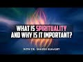

# What is Spirituality and why is it important? With Dr. Shadee Elmasry (2022-06-23)

## Description

Safina Society: https://www.safinasociety.org/

You Can Support My Work on Patreon:
https://www.patreon.com/Bloggingtheology

My Paypal Link: 
https://www.paypal.com/paypalme/bloggingtheology?locale.x=en_GB

## Summary of [What is Spirituality and why is it important? With Dr. Shadee Elmasry](https://www.youtube.com/watch?v=IFxvXl8f6sk)

*This summary is AI generated - there may be inaccuracies. *

### [00:00:00](https://www.youtube.com/watch?v=IFxvXl8f6sk&t=0) - [00:55:00](https://www.youtube.com/watch?v=IFxvXl8f6sk&t=3300)

This video discusses the importance of spirituality and how it can help improve a person's mental and physical health. also discusses the traditional Islamic practice of Ramadan, and how it can help improve one's spirituality.

**[00:00:00](https://www.youtube.com/watch?v=IFxvXl8f6sk&t=0)** Dr. Shadee Elmasry discusses spirituality and its importance to humans. He says that a person can be satisficed intellectually and that this requires reason and proofs. He also says that there are many ways to talk about spirituality, but one of the best ways to look at it is that a person can be spiritually thirsty. He goes on to say that there are many people who are spiritually thirsty but are looking for an intellectual answer instead of finding fulfillment in spiritual practice. Finally, he talks about how spiritual practice can be free and how within a few days, people are transformed.
* **[00:05:00](https://www.youtube.com/watch?v=IFxvXl8f6sk&t=300)** Spirituality is important because it provides individuals with a sense of purpose and helps them to function well in their daily lives. It is also important to remember that humans are not just physical beings and that there is more to life than just physical experiences.
* **[00:10:00](https://www.youtube.com/watch?v=IFxvXl8f6sk&t=600)** Dr. Shadee Elmasry discusses the importance of spirituality, and how it can help improve one's mental and physical health. She also discusses the traditional Islamic practice of Ramadan, and how it can help improve one's spirituality.
* **[00:15:00](https://www.youtube.com/watch?v=IFxvXl8f6sk&t=900)** This video discusses the importance of spirituality and how it affects a person's mental health. points to verses from the Quran that talk about the impact of Allah's name on a person before they become Muslim, and from the Prophet Muhammad's example of leaving a pagan chief tied to a pillar in the mosque for 15 days to show that he had changed. concludes that Christianity and other religions have survived because of the belief in an afterlife and the communication of Allah to humans.
* **[00:20:00](https://www.youtube.com/watch?v=IFxvXl8f6sk&t=1200)** argues that spirituality is important because it can expel demons, attract sakina, and help resolve life issues. They also mention that a religious figure does not represent God, and that people who don't believe in God often have emotional problems because they cling to false associations.
* **[00:25:00](https://www.youtube.com/watch?v=IFxvXl8f6sk&t=1500)** Spirituality is important because it helps people connect with their innate disposition and sense of justice in the world. It is also important because it provides people with a basis for belief that does not settle based on emotions.
* **[00:30:00](https://www.youtube.com/watch?v=IFxvXl8f6sk&t=1800)** Dr. Shadee Elmasry discusses spirituality and why it is important. She points out that there are rational arguments and that if a person is coming with the chess board set, there is no point in engaging them. She also notes that theologians must answer every riddle put forth in Islam, as it is part of their job. Finally, she discusses the example of a high schooler who thought asking a question about God was silly, and how someone coming to college would be able to answer such a question.
* **[00:35:00](https://www.youtube.com/watch?v=IFxvXl8f6sk&t=2100)** This 1-paragraph summary of the video discusses how spirituality is important because it can provide a definition for god that is beyond the laws of this world. It also points out that some atheists employ the word god without actually defining it, which can be a problem because it leaves the definition up to interpretation. By reading and studying the work of Ashari scholars, however, a Muslim can gain a better understanding of what god is and how to prove it using reason.
* **[00:40:00](https://www.youtube.com/watch?v=IFxvXl8f6sk&t=2400)** Spirituality is important because it allows for individuals to connect with their inner selves, and it can help prevent conflicts between different groups.
* **[00:45:00](https://www.youtube.com/watch?v=IFxvXl8f6sk&t=2700)** This video discusses the importance of spirituality and the role of prophets in guiding people towards righteousness. It notes that belief in a creator gives people a strong footing in regards to their faith, but that it is also important to have a understanding of what the creator wants from us and to have a messenger who can help us understand this.
* **[00:50:00](https://www.youtube.com/watch?v=IFxvXl8f6sk&t=3000)** discusses what spirituality is and why it is important. says that spirituality includes having faith in Allah and the Prophet Muhammad, and recognizing that humans are created in the image of Allah. also discusses the importance of having good deeds to Guide one to Allah on the Day of Judgment.
* **[00:55:00](https://www.youtube.com/watch?v=IFxvXl8f6sk&t=3300)** Dr. Shadee Elmasry discusses the importance of spirituality and how it can be helpful in one's life. She also provides a link to the Safina Society, which is an organization she is very active in.

## Full transcript with timestamps

[0:00:02](https://youtu.be/IFxvXl8f6sk?t=2) hello everyone and welcome to blogging  
[0:00:05](https://youtu.be/IFxvXl8f6sk?t=5) theology today i am delighted to talk to  
[0:00:08](https://youtu.be/IFxvXl8f6sk?t=8) dr shady alma sri you are most welcome  
[0:00:11](https://youtu.be/IFxvXl8f6sk?t=11) sir  
[0:00:12](https://youtu.be/IFxvXl8f6sk?t=12) thank you for having me and it's been a  
[0:00:14](https://youtu.be/IFxvXl8f6sk?t=14) pleasure watching your latest uh  
[0:00:16](https://youtu.be/IFxvXl8f6sk?t=16) movement with um  
[0:00:18](https://youtu.be/IFxvXl8f6sk?t=18) no design  
[0:00:19](https://youtu.be/IFxvXl8f6sk?t=19) yeah yes indeed uh yeah they've been  
[0:00:21](https://youtu.be/IFxvXl8f6sk?t=21) great fun to produce uh actually  
[0:00:24](https://youtu.be/IFxvXl8f6sk?t=24) well dr shetty who don't know was born  
[0:00:26](https://youtu.be/IFxvXl8f6sk?t=26) and raised in new jersey in the united  
[0:00:28](https://youtu.be/IFxvXl8f6sk?t=28) states he began studying the traditional  
[0:00:31](https://youtu.be/IFxvXl8f6sk?t=31) sciences rigorously at age 19.  
[0:00:34](https://youtu.be/IFxvXl8f6sk?t=34) he studied in yemen mecca and medina  
[0:00:38](https://youtu.be/IFxvXl8f6sk?t=38) london and cairo under several veteran  
[0:00:40](https://youtu.be/IFxvXl8f6sk?t=40) ulama  
[0:00:41](https://youtu.be/IFxvXl8f6sk?t=41) and he studied arabic maliki thick usual  
[0:00:45](https://youtu.be/IFxvXl8f6sk?t=45) akida and saluk  
[0:00:47](https://youtu.be/IFxvXl8f6sk?t=47) uh in addition to traditional learning  
[0:00:50](https://youtu.be/IFxvXl8f6sk?t=50) uh dr shady did his phd at soas in the  
[0:00:54](https://youtu.be/IFxvXl8f6sk?t=54) university of london which is not far  
[0:00:56](https://youtu.be/IFxvXl8f6sk?t=56) from why i am just a couple of miles  
[0:00:58](https://youtu.be/IFxvXl8f6sk?t=58) east uh where i'm in london he did it on  
[0:01:00](https://youtu.be/IFxvXl8f6sk?t=60) dawa in the works of imam abdullah ibn  
[0:01:04](https://youtu.be/IFxvXl8f6sk?t=64) or bin alawi al haddad  
[0:01:07](https://youtu.be/IFxvXl8f6sk?t=67) so forgive me for uh mispronouncing that  
[0:01:11](https://youtu.be/IFxvXl8f6sk?t=71) dr shady went on to teach at several  
[0:01:13](https://youtu.be/IFxvXl8f6sk?t=73) universities including yale soas trinity  
[0:01:16](https://youtu.be/IFxvXl8f6sk?t=76) college hartford seminary manhattanville  
[0:01:19](https://youtu.be/IFxvXl8f6sk?t=79) college  
[0:01:20](https://youtu.be/IFxvXl8f6sk?t=80) currently he has found his way back home  
[0:01:22](https://youtu.be/IFxvXl8f6sk?t=82) as scholar in residence and director of  
[0:01:25](https://youtu.be/IFxvXl8f6sk?t=85) education  
[0:01:26](https://youtu.be/IFxvXl8f6sk?t=86) at the new brunswick islamic center in  
[0:01:28](https://youtu.be/IFxvXl8f6sk?t=88) new jersey  
[0:01:30](https://youtu.be/IFxvXl8f6sk?t=90) and he is also the founder and head of  
[0:01:32](https://youtu.be/IFxvXl8f6sk?t=92) safina society which are linked to in  
[0:01:35](https://youtu.be/IFxvXl8f6sk?t=95) the description below an institution  
[0:01:37](https://youtu.be/IFxvXl8f6sk?t=97) dedicated to disseminating  
[0:01:41](https://youtu.be/IFxvXl8f6sk?t=101) knowledge live and online very very  
[0:01:44](https://youtu.be/IFxvXl8f6sk?t=104) active  
[0:01:45](https://youtu.be/IFxvXl8f6sk?t=105) organization as you are indeed yourself  
[0:01:47](https://youtu.be/IFxvXl8f6sk?t=107) sir  
[0:01:48](https://youtu.be/IFxvXl8f6sk?t=108) so today dr shady has kindly agreed to  
[0:01:52](https://youtu.be/IFxvXl8f6sk?t=112) talk about  
[0:01:53](https://youtu.be/IFxvXl8f6sk?t=113) spirituality  
[0:01:55](https://youtu.be/IFxvXl8f6sk?t=115) now what i'd like to ask is what is  
[0:01:58](https://youtu.be/IFxvXl8f6sk?t=118) spirituality and why is it important to  
[0:02:01](https://youtu.be/IFxvXl8f6sk?t=121) being a human being  
[0:02:04](https://youtu.be/IFxvXl8f6sk?t=124) so uh first of all thank you for having  
[0:02:06](https://youtu.be/IFxvXl8f6sk?t=126) me on your uh your program and your  
[0:02:08](https://youtu.be/IFxvXl8f6sk?t=128) podcast  
[0:02:10](https://youtu.be/IFxvXl8f6sk?t=130) i've watched a lot of your other  
[0:02:11](https://youtu.be/IFxvXl8f6sk?t=131) podcasts with some uh really thoughtful  
[0:02:13](https://youtu.be/IFxvXl8f6sk?t=133) and insightful guests so it's great to  
[0:02:15](https://youtu.be/IFxvXl8f6sk?t=135) be here and i look forward to this  
[0:02:16](https://youtu.be/IFxvXl8f6sk?t=136) coming hour or so  
[0:02:18](https://youtu.be/IFxvXl8f6sk?t=138) absolutely  
[0:02:26](https://youtu.be/IFxvXl8f6sk?t=146) there's a lot of different ways to talk  
[0:02:27](https://youtu.be/IFxvXl8f6sk?t=147) about spirituality but  
[0:02:30](https://youtu.be/IFxvXl8f6sk?t=150) one of the best ways to look at it is  
[0:02:31](https://youtu.be/IFxvXl8f6sk?t=151) that  
[0:02:33](https://youtu.be/IFxvXl8f6sk?t=153) a person can be intellectually satisfied  
[0:02:36](https://youtu.be/IFxvXl8f6sk?t=156) and intellectual satisfaction requires  
[0:02:39](https://youtu.be/IFxvXl8f6sk?t=159) reason and proofs  
[0:02:41](https://youtu.be/IFxvXl8f6sk?t=161) i was talking to someone a question or  
[0:02:43](https://youtu.be/IFxvXl8f6sk?t=163) the other day because the message has  
[0:02:45](https://youtu.be/IFxvXl8f6sk?t=165) like a hotline almost like a free number  
[0:02:48](https://youtu.be/IFxvXl8f6sk?t=168) you can call and it routes to my phone  
[0:02:50](https://youtu.be/IFxvXl8f6sk?t=170) wow  
[0:02:51](https://youtu.be/IFxvXl8f6sk?t=171) so i picked up the call and this woman  
[0:02:52](https://youtu.be/IFxvXl8f6sk?t=172) she said i have this issue this issue  
[0:02:54](https://youtu.be/IFxvXl8f6sk?t=174) this year she owned them and i need you  
[0:02:55](https://youtu.be/IFxvXl8f6sk?t=175) to answer these questions so i answered  
[0:02:57](https://youtu.be/IFxvXl8f6sk?t=177) these questions  
[0:02:59](https://youtu.be/IFxvXl8f6sk?t=179) and she really had nothing to say  
[0:03:01](https://youtu.be/IFxvXl8f6sk?t=181) but she said something's still inside of  
[0:03:02](https://youtu.be/IFxvXl8f6sk?t=182) me is not satisfied  
[0:03:05](https://youtu.be/IFxvXl8f6sk?t=185) so i said that's because  
[0:03:07](https://youtu.be/IFxvXl8f6sk?t=187) there's intellectual thirst  
[0:03:10](https://youtu.be/IFxvXl8f6sk?t=190) just as there's physical thirst right  
[0:03:12](https://youtu.be/IFxvXl8f6sk?t=192) and there's spiritual thirst  
[0:03:15](https://youtu.be/IFxvXl8f6sk?t=195) so i  
[0:03:17](https://youtu.be/IFxvXl8f6sk?t=197) did a little  
[0:03:18](https://youtu.be/IFxvXl8f6sk?t=198) like um assessment in my own assessment  
[0:03:21](https://youtu.be/IFxvXl8f6sk?t=201) quick assessment is that  
[0:03:23](https://youtu.be/IFxvXl8f6sk?t=203) you're you all you do have these  
[0:03:24](https://youtu.be/IFxvXl8f6sk?t=204) questions but your real thirst is a  
[0:03:27](https://youtu.be/IFxvXl8f6sk?t=207) spiritual thirst right  
[0:03:29](https://youtu.be/IFxvXl8f6sk?t=209) and it's it you're looking for some  
[0:03:31](https://youtu.be/IFxvXl8f6sk?t=211) intellectual answer to fill a void but  
[0:03:33](https://youtu.be/IFxvXl8f6sk?t=213) that's not what's going to fill the void  
[0:03:36](https://youtu.be/IFxvXl8f6sk?t=216) and she was this was a concept she'd  
[0:03:38](https://youtu.be/IFxvXl8f6sk?t=218) never heard of  
[0:03:39](https://youtu.be/IFxvXl8f6sk?t=219) so i said look  
[0:03:41](https://youtu.be/IFxvXl8f6sk?t=221) you can't talk about water  
[0:03:43](https://youtu.be/IFxvXl8f6sk?t=223) when you're thirsty  
[0:03:44](https://youtu.be/IFxvXl8f6sk?t=224) you need to drink water  
[0:03:46](https://youtu.be/IFxvXl8f6sk?t=226) and you don't need to know what's inside  
[0:03:48](https://youtu.be/IFxvXl8f6sk?t=228) the water and why it's making you happy  
[0:03:50](https://youtu.be/IFxvXl8f6sk?t=230) satisfied you don't need to know right  
[0:03:53](https://youtu.be/IFxvXl8f6sk?t=233) you just know that it works  
[0:03:55](https://youtu.be/IFxvXl8f6sk?t=235) so in the same vein human beings i find  
[0:03:57](https://youtu.be/IFxvXl8f6sk?t=237) a lot of human beings a lot of  
[0:03:59](https://youtu.be/IFxvXl8f6sk?t=239) intellectuals  
[0:04:00](https://youtu.be/IFxvXl8f6sk?t=240) what they're actually looking for  
[0:04:03](https://youtu.be/IFxvXl8f6sk?t=243) is spiritual  
[0:04:04](https://youtu.be/IFxvXl8f6sk?t=244) yeah but the route the only route that  
[0:04:06](https://youtu.be/IFxvXl8f6sk?t=246) they've been trained to go  
[0:04:08](https://youtu.be/IFxvXl8f6sk?t=248) is physical but there's also  
[0:04:10](https://youtu.be/IFxvXl8f6sk?t=250) a lot of people who go  
[0:04:12](https://youtu.be/IFxvXl8f6sk?t=252) the route of material  
[0:04:14](https://youtu.be/IFxvXl8f6sk?t=254) so a lot of wealth a lot of showing off  
[0:04:17](https://youtu.be/IFxvXl8f6sk?t=257) a lot of cars  
[0:04:18](https://youtu.be/IFxvXl8f6sk?t=258) thinking that it's going to fill a  
[0:04:19](https://youtu.be/IFxvXl8f6sk?t=259) spiritual void  
[0:04:21](https://youtu.be/IFxvXl8f6sk?t=261) and not going the two steps right next  
[0:04:24](https://youtu.be/IFxvXl8f6sk?t=264) to you is a spiritual practice that you  
[0:04:26](https://youtu.be/IFxvXl8f6sk?t=266) could pick up right now it's free  
[0:04:29](https://youtu.be/IFxvXl8f6sk?t=269) you don't have to use a single muscle  
[0:04:31](https://youtu.be/IFxvXl8f6sk?t=271) except your tongue  
[0:04:33](https://youtu.be/IFxvXl8f6sk?t=273) and within a few days  
[0:04:35](https://youtu.be/IFxvXl8f6sk?t=275) people are just completely transformed  
[0:04:38](https://youtu.be/IFxvXl8f6sk?t=278) and we know that this is true  
[0:04:40](https://youtu.be/IFxvXl8f6sk?t=280) because in the world of surgery you  
[0:04:42](https://youtu.be/IFxvXl8f6sk?t=282) could have a problem  
[0:04:43](https://youtu.be/IFxvXl8f6sk?t=283) that you don't even know you have  
[0:04:46](https://youtu.be/IFxvXl8f6sk?t=286) and then within  
[0:04:47](https://youtu.be/IFxvXl8f6sk?t=287) 25 minutes of a procedure  
[0:04:49](https://youtu.be/IFxvXl8f6sk?t=289) your life is altered forever  
[0:04:51](https://youtu.be/IFxvXl8f6sk?t=291) how many people's like their eyesight  
[0:04:53](https://youtu.be/IFxvXl8f6sk?t=293) they don't even know that their eyes are  
[0:04:54](https://youtu.be/IFxvXl8f6sk?t=294) actually getting slowly worse and worse  
[0:04:56](https://youtu.be/IFxvXl8f6sk?t=296) and worse  
[0:04:57](https://youtu.be/IFxvXl8f6sk?t=297) then a doctor within literally 25  
[0:05:00](https://youtu.be/IFxvXl8f6sk?t=300) minutes procedure it's like he has no  
[0:05:02](https://youtu.be/IFxvXl8f6sk?t=302) eyes  
[0:05:03](https://youtu.be/IFxvXl8f6sk?t=303) you have no eyes you have a new life  
[0:05:05](https://youtu.be/IFxvXl8f6sk?t=305) some people with you know different  
[0:05:06](https://youtu.be/IFxvXl8f6sk?t=306) organs physically we see this all the  
[0:05:08](https://youtu.be/IFxvXl8f6sk?t=308) time  
[0:05:09](https://youtu.be/IFxvXl8f6sk?t=309) well the embia and the ulama they came  
[0:05:11](https://youtu.be/IFxvXl8f6sk?t=311) with this  
[0:05:13](https://youtu.be/IFxvXl8f6sk?t=313) the prophets and scholars  
[0:05:15](https://youtu.be/IFxvXl8f6sk?t=315) scholars being the inheritors of  
[0:05:16](https://youtu.be/IFxvXl8f6sk?t=316) prophets they came with this knowledge  
[0:05:18](https://youtu.be/IFxvXl8f6sk?t=318) and this idea that people have spiritual  
[0:05:21](https://youtu.be/IFxvXl8f6sk?t=321) ailments that are quite easy to fix they  
[0:05:23](https://youtu.be/IFxvXl8f6sk?t=323) don't know that they have the ailment  
[0:05:25](https://youtu.be/IFxvXl8f6sk?t=325) and they don't know what the cure is  
[0:05:27](https://youtu.be/IFxvXl8f6sk?t=327) right it's all a big mystery  
[0:05:29](https://youtu.be/IFxvXl8f6sk?t=329) until they learn right and then all of a  
[0:05:31](https://youtu.be/IFxvXl8f6sk?t=331) sudden you ask how was i even living  
[0:05:34](https://youtu.be/IFxvXl8f6sk?t=334) back in the past like how was i even  
[0:05:36](https://youtu.be/IFxvXl8f6sk?t=336) alive  
[0:05:38](https://youtu.be/IFxvXl8f6sk?t=338) how was i was uh functioning  
[0:05:40](https://youtu.be/IFxvXl8f6sk?t=340) not knowing i had this and not using  
[0:05:43](https://youtu.be/IFxvXl8f6sk?t=343) this  
[0:05:44](https://youtu.be/IFxvXl8f6sk?t=344) treatment  
[0:05:45](https://youtu.be/IFxvXl8f6sk?t=345) and that's where i feel a lot of people  
[0:05:47](https://youtu.be/IFxvXl8f6sk?t=347) they're looking for  
[0:05:49](https://youtu.be/IFxvXl8f6sk?t=349) sexuality they're looking towards  
[0:05:51](https://youtu.be/IFxvXl8f6sk?t=351) identity they're looking towards  
[0:05:54](https://youtu.be/IFxvXl8f6sk?t=354) materialism they're looking for ideas  
[0:05:58](https://youtu.be/IFxvXl8f6sk?t=358) and now there's magical astronomical  
[0:06:01](https://youtu.be/IFxvXl8f6sk?t=361) thinking  
[0:06:02](https://youtu.be/IFxvXl8f6sk?t=362) but all they need is something far  
[0:06:04](https://youtu.be/IFxvXl8f6sk?t=364) simpler than that  
[0:06:06](https://youtu.be/IFxvXl8f6sk?t=366) in their spiritual life which they don't  
[0:06:08](https://youtu.be/IFxvXl8f6sk?t=368) may not even believe exists  
[0:06:10](https://youtu.be/IFxvXl8f6sk?t=370) so that's how  
[0:06:12](https://youtu.be/IFxvXl8f6sk?t=372) that's the frame or the the framework by  
[0:06:15](https://youtu.be/IFxvXl8f6sk?t=375) which i wanted to i want to look at  
[0:06:17](https://youtu.be/IFxvXl8f6sk?t=377) spirituality today and examine it today  
[0:06:19](https://youtu.be/IFxvXl8f6sk?t=379) i mean i like what you're doing though  
[0:06:20](https://youtu.be/IFxvXl8f6sk?t=380) you're talking about there's a certain  
[0:06:22](https://youtu.be/IFxvXl8f6sk?t=382) constants in the in the in our species  
[0:06:24](https://youtu.be/IFxvXl8f6sk?t=384) as a species so we have a need for drink  
[0:06:27](https://youtu.be/IFxvXl8f6sk?t=387) we have certain physical constant need  
[0:06:29](https://youtu.be/IFxvXl8f6sk?t=389) for food and so on but this also is what  
[0:06:32](https://youtu.be/IFxvXl8f6sk?t=392) a spiritual uh uh constant  
[0:06:35](https://youtu.be/IFxvXl8f6sk?t=395) which is necessary for the flourishing  
[0:06:38](https://youtu.be/IFxvXl8f6sk?t=398) and functioning well-being of a human  
[0:06:41](https://youtu.be/IFxvXl8f6sk?t=401) being so this is not some kind of airy  
[0:06:43](https://youtu.be/IFxvXl8f6sk?t=403) fairy extra for those who like to  
[0:06:45](https://youtu.be/IFxvXl8f6sk?t=405) meditate no you're saying this is these  
[0:06:48](https://youtu.be/IFxvXl8f6sk?t=408) other things like as you mentioned  
[0:06:50](https://youtu.be/IFxvXl8f6sk?t=410) material goods and so on ideologies are  
[0:06:53](https://youtu.be/IFxvXl8f6sk?t=413) not going to as christians sometimes put  
[0:06:55](https://youtu.be/IFxvXl8f6sk?t=415) it they're not going to fill that  
[0:06:56](https://youtu.be/IFxvXl8f6sk?t=416) god-shaped hole in in the human heart  
[0:07:00](https://youtu.be/IFxvXl8f6sk?t=420) that's why spirituality is so important  
[0:07:02](https://youtu.be/IFxvXl8f6sk?t=422) to a human being then  
[0:07:03](https://youtu.be/IFxvXl8f6sk?t=423) that's the idea so as you mentioned  
[0:07:06](https://youtu.be/IFxvXl8f6sk?t=426) earlier from the time of the first human  
[0:07:08](https://youtu.be/IFxvXl8f6sk?t=428) being  
[0:07:09](https://youtu.be/IFxvXl8f6sk?t=429) we needed water  
[0:07:11](https://youtu.be/IFxvXl8f6sk?t=431) that no one's gonna debate that  
[0:07:13](https://youtu.be/IFxvXl8f6sk?t=433) and this got me thinking also that you  
[0:07:15](https://youtu.be/IFxvXl8f6sk?t=435) know there's this clever rabbi he puts  
[0:07:17](https://youtu.be/IFxvXl8f6sk?t=437) these really nice things out there lee  
[0:07:18](https://youtu.be/IFxvXl8f6sk?t=438) weissman  
[0:07:20](https://youtu.be/IFxvXl8f6sk?t=440) puts his stuff out there and one thing  
[0:07:22](https://youtu.be/IFxvXl8f6sk?t=442) he said that why do we want uniformity  
[0:07:25](https://youtu.be/IFxvXl8f6sk?t=445) when we're all different now on one hand  
[0:07:26](https://youtu.be/IFxvXl8f6sk?t=446) that is  
[0:07:27](https://youtu.be/IFxvXl8f6sk?t=447) that is true right certain things  
[0:07:30](https://youtu.be/IFxvXl8f6sk?t=450) human beings have been made different  
[0:07:33](https://youtu.be/IFxvXl8f6sk?t=453) every cheetah has its own spots every  
[0:07:35](https://youtu.be/IFxvXl8f6sk?t=455) zebra has its own stripes no zebra has  
[0:07:37](https://youtu.be/IFxvXl8f6sk?t=457) the same two stripes no human being i  
[0:07:39](https://youtu.be/IFxvXl8f6sk?t=459) didn't know that by the way that that's  
[0:07:40](https://youtu.be/IFxvXl8f6sk?t=460) interesting i've learned something to  
[0:07:41](https://youtu.be/IFxvXl8f6sk?t=461) say no zebra has the same thrives okay  
[0:07:44](https://youtu.be/IFxvXl8f6sk?t=464) there's not a single repetition of  
[0:07:46](https://youtu.be/IFxvXl8f6sk?t=466) striped pattern  
[0:07:47](https://youtu.be/IFxvXl8f6sk?t=467) uh snowflakes no snowflake is the same  
[0:07:50](https://youtu.be/IFxvXl8f6sk?t=470) yep  
[0:07:50](https://youtu.be/IFxvXl8f6sk?t=470) even i've heard that even sand when it  
[0:07:53](https://youtu.be/IFxvXl8f6sk?t=473) breaks up it's impossible to get an  
[0:07:55](https://youtu.be/IFxvXl8f6sk?t=475) identical grain of sand if you put these  
[0:07:58](https://youtu.be/IFxvXl8f6sk?t=478) all under a microscope everyone's a  
[0:07:59](https://youtu.be/IFxvXl8f6sk?t=479) different shape and the human being  
[0:08:01](https://youtu.be/IFxvXl8f6sk?t=481) the face of a human is not  
[0:08:03](https://youtu.be/IFxvXl8f6sk?t=483) you can count the number of things in  
[0:08:05](https://youtu.be/IFxvXl8f6sk?t=485) the face right which is the skull the  
[0:08:07](https://youtu.be/IFxvXl8f6sk?t=487) eyebrows the eyes  
[0:08:09](https://youtu.be/IFxvXl8f6sk?t=489) skulls all seem to look the same right  
[0:08:11](https://youtu.be/IFxvXl8f6sk?t=491) if you notice skulls they seem to all  
[0:08:13](https://youtu.be/IFxvXl8f6sk?t=493) look the same but every human face is  
[0:08:16](https://youtu.be/IFxvXl8f6sk?t=496) different  
[0:08:16](https://youtu.be/IFxvXl8f6sk?t=496) so  
[0:08:17](https://youtu.be/IFxvXl8f6sk?t=497) this is showing that the creator has  
[0:08:19](https://youtu.be/IFxvXl8f6sk?t=499) will  
[0:08:20](https://youtu.be/IFxvXl8f6sk?t=500) okay he also has deep knowledge because  
[0:08:23](https://youtu.be/IFxvXl8f6sk?t=503) there are certain things that will never  
[0:08:24](https://youtu.be/IFxvXl8f6sk?t=504) change we all need oxygen  
[0:08:27](https://youtu.be/IFxvXl8f6sk?t=507) and we all need water  
[0:08:29](https://youtu.be/IFxvXl8f6sk?t=509) we all need sleep  
[0:08:31](https://youtu.be/IFxvXl8f6sk?t=511) but the human being is not just physical  
[0:08:34](https://youtu.be/IFxvXl8f6sk?t=514) okay  
[0:08:35](https://youtu.be/IFxvXl8f6sk?t=515) we have brains and we have  
[0:08:37](https://youtu.be/IFxvXl8f6sk?t=517) hearts we have souls and these hearts  
[0:08:39](https://youtu.be/IFxvXl8f6sk?t=519) and souls  
[0:08:40](https://youtu.be/IFxvXl8f6sk?t=520) they also need treatment and that's one  
[0:08:42](https://youtu.be/IFxvXl8f6sk?t=522) of the problems of the modern world  
[0:08:44](https://youtu.be/IFxvXl8f6sk?t=524) is this  
[0:08:45](https://youtu.be/IFxvXl8f6sk?t=525) the naturalism and the materialism  
[0:08:48](https://youtu.be/IFxvXl8f6sk?t=528) that is telling us that you know you're  
[0:08:50](https://youtu.be/IFxvXl8f6sk?t=530) just  
[0:08:51](https://youtu.be/IFxvXl8f6sk?t=531) a machine  
[0:08:52](https://youtu.be/IFxvXl8f6sk?t=532) that needs to be pumped in with the  
[0:08:53](https://youtu.be/IFxvXl8f6sk?t=533) right chemicals but no we say  
[0:08:56](https://youtu.be/IFxvXl8f6sk?t=536) maybe you're right but you're missing a  
[0:08:58](https://youtu.be/IFxvXl8f6sk?t=538) point  
[0:08:59](https://youtu.be/IFxvXl8f6sk?t=539) and all over the quran there's this  
[0:09:00](https://youtu.be/IFxvXl8f6sk?t=540) concept of sukina and the concept of  
[0:09:02](https://youtu.be/IFxvXl8f6sk?t=542) sukina is that it is a light that allah  
[0:09:05](https://youtu.be/IFxvXl8f6sk?t=545) brings down  
[0:09:06](https://youtu.be/IFxvXl8f6sk?t=546) and it hovers upon the person who who  
[0:09:08](https://youtu.be/IFxvXl8f6sk?t=548) does  
[0:09:10](https://youtu.be/IFxvXl8f6sk?t=550) of allah who remembers allah  
[0:09:13](https://youtu.be/IFxvXl8f6sk?t=553) okay  
[0:09:14](https://youtu.be/IFxvXl8f6sk?t=554) we say oh materialists you're actually  
[0:09:17](https://youtu.be/IFxvXl8f6sk?t=557) not 100 far off because sakina is a  
[0:09:19](https://youtu.be/IFxvXl8f6sk?t=559) physical substance but it's very subtle  
[0:09:22](https://youtu.be/IFxvXl8f6sk?t=562) we can't see it  
[0:09:24](https://youtu.be/IFxvXl8f6sk?t=564) that shouldn't be a problem we don't see  
[0:09:25](https://youtu.be/IFxvXl8f6sk?t=565) microwaves either but you see the effect  
[0:09:27](https://youtu.be/IFxvXl8f6sk?t=567) of microwaves  
[0:09:28](https://youtu.be/IFxvXl8f6sk?t=568) you don't see radio waves but you see  
[0:09:30](https://youtu.be/IFxvXl8f6sk?t=570) the effect of radio waves you don't see  
[0:09:32](https://youtu.be/IFxvXl8f6sk?t=572) light waves  
[0:09:34](https://youtu.be/IFxvXl8f6sk?t=574) but you see the effect of light waves  
[0:09:37](https://youtu.be/IFxvXl8f6sk?t=577) sekina you won't see it either but you  
[0:09:39](https://youtu.be/IFxvXl8f6sk?t=579) will see an effect and i wish that  
[0:09:41](https://youtu.be/IFxvXl8f6sk?t=581) someone would do some kind of experiment  
[0:09:43](https://youtu.be/IFxvXl8f6sk?t=583) of a person and said listen  
[0:09:46](https://youtu.be/IFxvXl8f6sk?t=586) i wonder what the ruling would be  
[0:09:48](https://youtu.be/IFxvXl8f6sk?t=588) don't do zikr beside salah from midnight  
[0:09:52](https://youtu.be/IFxvXl8f6sk?t=592) until today until you come to the  
[0:09:55](https://youtu.be/IFxvXl8f6sk?t=595) uh experiment you're gonna come in with  
[0:09:56](https://youtu.be/IFxvXl8f6sk?t=596) a bad mood right  
[0:09:58](https://youtu.be/IFxvXl8f6sk?t=598) and then we're gonna node you up and  
[0:10:01](https://youtu.be/IFxvXl8f6sk?t=601) we're gonna assess you  
[0:10:03](https://youtu.be/IFxvXl8f6sk?t=603) for another hour  
[0:10:05](https://youtu.be/IFxvXl8f6sk?t=605) and then i want you to start doing but  
[0:10:07](https://youtu.be/IFxvXl8f6sk?t=607) it has to be someone trained in someone  
[0:10:09](https://youtu.be/IFxvXl8f6sk?t=609) where they could impact them right  
[0:10:11](https://youtu.be/IFxvXl8f6sk?t=611) we may do this on a thousand people  
[0:10:14](https://youtu.be/IFxvXl8f6sk?t=614) now start doing just  
[0:10:16](https://youtu.be/IFxvXl8f6sk?t=616) a  
[0:10:21](https://youtu.be/IFxvXl8f6sk?t=621) and let's node this person up and see  
[0:10:23](https://youtu.be/IFxvXl8f6sk?t=623) what happens to his blood to his heart  
[0:10:26](https://youtu.be/IFxvXl8f6sk?t=626) to his skin to everything possible  
[0:10:28](https://youtu.be/IFxvXl8f6sk?t=628) physically  
[0:10:30](https://youtu.be/IFxvXl8f6sk?t=630) because we're telling you sakina will  
[0:10:32](https://youtu.be/IFxvXl8f6sk?t=632) come down upon this person okay  
[0:10:35](https://youtu.be/IFxvXl8f6sk?t=635) they will change  
[0:10:37](https://youtu.be/IFxvXl8f6sk?t=637) anybody who's been to ramadan masajid in  
[0:10:40](https://youtu.be/IFxvXl8f6sk?t=640) ramadan  
[0:10:42](https://youtu.be/IFxvXl8f6sk?t=642) they know i'm different when this when  
[0:10:45](https://youtu.be/IFxvXl8f6sk?t=645) i'm in the prayer for that many days in  
[0:10:47](https://youtu.be/IFxvXl8f6sk?t=647) a row  
[0:10:48](https://youtu.be/IFxvXl8f6sk?t=648) then when i'm outside of ramadan right i  
[0:10:50](https://youtu.be/IFxvXl8f6sk?t=650) know i'm different right  
[0:10:52](https://youtu.be/IFxvXl8f6sk?t=652) we know this  
[0:10:54](https://youtu.be/IFxvXl8f6sk?t=654) but in order to communicate this with  
[0:10:55](https://youtu.be/IFxvXl8f6sk?t=655) like the materialists let's i would  
[0:10:58](https://youtu.be/IFxvXl8f6sk?t=658) really curious of how the vital signs of  
[0:11:00](https://youtu.be/IFxvXl8f6sk?t=660) the person the brain activity of the  
[0:11:02](https://youtu.be/IFxvXl8f6sk?t=662) person completely transforms  
[0:11:05](https://youtu.be/IFxvXl8f6sk?t=665) the mood of the person your  
[0:11:06](https://youtu.be/IFxvXl8f6sk?t=666) interpretation of things  
[0:11:08](https://youtu.be/IFxvXl8f6sk?t=668) will become positive everything will be  
[0:11:10](https://youtu.be/IFxvXl8f6sk?t=670) to a positive interpretation  
[0:11:12](https://youtu.be/IFxvXl8f6sk?t=672) forgiving interpretation that's because  
[0:11:15](https://youtu.be/IFxvXl8f6sk?t=675) a substance which the revelation is  
[0:11:17](https://youtu.be/IFxvXl8f6sk?t=677) informing us of  
[0:11:19](https://youtu.be/IFxvXl8f6sk?t=679) we would have never known this we may be  
[0:11:21](https://youtu.be/IFxvXl8f6sk?t=681) suspicious about it but we had never  
[0:11:22](https://youtu.be/IFxvXl8f6sk?t=682) known that there is a substance called  
[0:11:25](https://youtu.be/IFxvXl8f6sk?t=685) anur  
[0:11:26](https://youtu.be/IFxvXl8f6sk?t=686) it is allah's light  
[0:11:29](https://youtu.be/IFxvXl8f6sk?t=689) is the result of it tranquility and both  
[0:11:31](https://youtu.be/IFxvXl8f6sk?t=691) are used interchangeably  
[0:11:35](https://youtu.be/IFxvXl8f6sk?t=695) and the prophet said  
[0:11:38](https://youtu.be/IFxvXl8f6sk?t=698) the angels surround them so there is a  
[0:11:41](https://youtu.be/IFxvXl8f6sk?t=701) third element it's all synonymous  
[0:11:43](https://youtu.be/IFxvXl8f6sk?t=703) because it's the angels they're composed  
[0:11:45](https://youtu.be/IFxvXl8f6sk?t=705) of light and they bring it down  
[0:11:48](https://youtu.be/IFxvXl8f6sk?t=708) the light causes tranquility the angels  
[0:11:50](https://youtu.be/IFxvXl8f6sk?t=710) cause tranquility  
[0:11:52](https://youtu.be/IFxvXl8f6sk?t=712) okay  
[0:11:53](https://youtu.be/IFxvXl8f6sk?t=713) and they surround the person until  
[0:11:56](https://youtu.be/IFxvXl8f6sk?t=716) they're completely tranquil they've  
[0:11:58](https://youtu.be/IFxvXl8f6sk?t=718) transformed  
[0:12:00](https://youtu.be/IFxvXl8f6sk?t=720) and you're physically will transform too  
[0:12:03](https://youtu.be/IFxvXl8f6sk?t=723) diseases can be cured by this right  
[0:12:06](https://youtu.be/IFxvXl8f6sk?t=726) sicknesses can be avoided by this  
[0:12:08](https://youtu.be/IFxvXl8f6sk?t=728) in the same way that i've watched videos  
[0:12:10](https://youtu.be/IFxvXl8f6sk?t=730) which i totally am convinced by  
[0:12:13](https://youtu.be/IFxvXl8f6sk?t=733) where skin rashes  
[0:12:15](https://youtu.be/IFxvXl8f6sk?t=735) and various disorders of the skin  
[0:12:18](https://youtu.be/IFxvXl8f6sk?t=738) have solely been healed by positive  
[0:12:20](https://youtu.be/IFxvXl8f6sk?t=740) thinking  
[0:12:22](https://youtu.be/IFxvXl8f6sk?t=742) by the medicine  
[0:12:24](https://youtu.be/IFxvXl8f6sk?t=744) of thinking of of realizing you're  
[0:12:27](https://youtu.be/IFxvXl8f6sk?t=747) causing your own skin rash  
[0:12:29](https://youtu.be/IFxvXl8f6sk?t=749) your own autoimmune disease is almost  
[0:12:31](https://youtu.be/IFxvXl8f6sk?t=751) like self-inflicted by negative thoughts  
[0:12:34](https://youtu.be/IFxvXl8f6sk?t=754) and the person buys into it  
[0:12:36](https://youtu.be/IFxvXl8f6sk?t=756) and every time they get a negative  
[0:12:37](https://youtu.be/IFxvXl8f6sk?t=757) thought they displace it with a positive  
[0:12:39](https://youtu.be/IFxvXl8f6sk?t=759) thought well we we have the same sunnah  
[0:12:41](https://youtu.be/IFxvXl8f6sk?t=761) from the prophet peace be upon him  
[0:12:43](https://youtu.be/IFxvXl8f6sk?t=763) but then the rash goes away  
[0:12:45](https://youtu.be/IFxvXl8f6sk?t=765) right it's on netflix these shows  
[0:12:49](https://youtu.be/IFxvXl8f6sk?t=769) 50 of them are a bit wild right  
[0:12:52](https://youtu.be/IFxvXl8f6sk?t=772) but this one i was convinced by is  
[0:12:54](https://youtu.be/IFxvXl8f6sk?t=774) convinced by because  
[0:12:56](https://youtu.be/IFxvXl8f6sk?t=776) you see it in people right  
[0:12:58](https://youtu.be/IFxvXl8f6sk?t=778) you start look better because you're  
[0:13:00](https://youtu.be/IFxvXl8f6sk?t=780) thinking positive you're optimistic  
[0:13:01](https://youtu.be/IFxvXl8f6sk?t=781) about the future  
[0:13:03](https://youtu.be/IFxvXl8f6sk?t=783) so that's all the mercy that anybody can  
[0:13:06](https://youtu.be/IFxvXl8f6sk?t=786) access but the sukina the nur the vikr  
[0:13:09](https://youtu.be/IFxvXl8f6sk?t=789) is the mercy that is only accessed  
[0:13:10](https://youtu.be/IFxvXl8f6sk?t=790) through the quran in other words you  
[0:13:12](https://youtu.be/IFxvXl8f6sk?t=792) have to believe in the quran  
[0:13:14](https://youtu.be/IFxvXl8f6sk?t=794) well that was my point actually the back  
[0:13:15](https://youtu.be/IFxvXl8f6sk?t=795) of my mind thinking you know all this  
[0:13:17](https://youtu.be/IFxvXl8f6sk?t=797) sounds great  
[0:13:18](https://youtu.be/IFxvXl8f6sk?t=798) but you've got to be a muslim to  
[0:13:19](https://youtu.be/IFxvXl8f6sk?t=799) practice this haven't you you've got to  
[0:13:20](https://youtu.be/IFxvXl8f6sk?t=800) believe in the quran uh you can't just  
[0:13:22](https://youtu.be/IFxvXl8f6sk?t=802) be there's not a technology that you can  
[0:13:24](https://youtu.be/IFxvXl8f6sk?t=804) detach from uh these practices and  
[0:13:27](https://youtu.be/IFxvXl8f6sk?t=807) somehow  
[0:13:28](https://youtu.be/IFxvXl8f6sk?t=808) um like a kind of a quasi or pseudo-sufi  
[0:13:31](https://youtu.be/IFxvXl8f6sk?t=811) practice which is devoid uh divorce and  
[0:13:34](https://youtu.be/IFxvXl8f6sk?t=814) the creed and the beliefs of islam so  
[0:13:37](https://youtu.be/IFxvXl8f6sk?t=817) that this is rooted in islam the  
[0:13:38](https://youtu.be/IFxvXl8f6sk?t=818) traditional practices and beliefs you  
[0:13:40](https://youtu.be/IFxvXl8f6sk?t=820) mentioned ramadan of course which which  
[0:13:42](https://youtu.be/IFxvXl8f6sk?t=822) is obviously uh one of the pillars of  
[0:13:44](https://youtu.be/IFxvXl8f6sk?t=824) islam  
[0:13:45](https://youtu.be/IFxvXl8f6sk?t=825) here's that's a good question or a good  
[0:13:47](https://youtu.be/IFxvXl8f6sk?t=827) point and there's no doubt that  
[0:13:50](https://youtu.be/IFxvXl8f6sk?t=830) in order to be rewarded by allah  
[0:13:53](https://youtu.be/IFxvXl8f6sk?t=833) you must first submit to allah  
[0:13:56](https://youtu.be/IFxvXl8f6sk?t=836) that's there's no doubt about that  
[0:13:58](https://youtu.be/IFxvXl8f6sk?t=838) and there's no doubt that beliefs  
[0:14:00](https://youtu.be/IFxvXl8f6sk?t=840) themselves  
[0:14:02](https://youtu.be/IFxvXl8f6sk?t=842) are part of our spiritual health like to  
[0:14:05](https://youtu.be/IFxvXl8f6sk?t=845) believe that i'm going somewhere  
[0:14:07](https://youtu.be/IFxvXl8f6sk?t=847) better than this world  
[0:14:10](https://youtu.be/IFxvXl8f6sk?t=850) that just that belief  
[0:14:12](https://youtu.be/IFxvXl8f6sk?t=852) relieves a lot of anxiety  
[0:14:15](https://youtu.be/IFxvXl8f6sk?t=855) regarding aging right  
[0:14:17](https://youtu.be/IFxvXl8f6sk?t=857) just the belief that when my soul leaves  
[0:14:19](https://youtu.be/IFxvXl8f6sk?t=859) my body the soul never gets old  
[0:14:22](https://youtu.be/IFxvXl8f6sk?t=862) yeah i'm going to be youth again  
[0:14:25](https://youtu.be/IFxvXl8f6sk?t=865) right i'm going to be a youth again in  
[0:14:27](https://youtu.be/IFxvXl8f6sk?t=867) the bazaar the barzak is the realm  
[0:14:29](https://youtu.be/IFxvXl8f6sk?t=869) between life and resurrection  
[0:14:32](https://youtu.be/IFxvXl8f6sk?t=872) all those souls they have no age there's  
[0:14:34](https://youtu.be/IFxvXl8f6sk?t=874) no age there's no old people and young  
[0:14:35](https://youtu.be/IFxvXl8f6sk?t=875) people the body may have been old and  
[0:14:37](https://youtu.be/IFxvXl8f6sk?t=877) young there's no old people young people  
[0:14:39](https://youtu.be/IFxvXl8f6sk?t=879) the face that i'm given the body that  
[0:14:41](https://youtu.be/IFxvXl8f6sk?t=881) i'm given if i'm resurrected righteous  
[0:14:44](https://youtu.be/IFxvXl8f6sk?t=884) if i'm righteous and resurrected it's  
[0:14:46](https://youtu.be/IFxvXl8f6sk?t=886) going to be a perfect body  
[0:14:48](https://youtu.be/IFxvXl8f6sk?t=888) the way i like it exactly to be so just  
[0:14:51](https://youtu.be/IFxvXl8f6sk?t=891) that belief  
[0:14:53](https://youtu.be/IFxvXl8f6sk?t=893) is a form of spirituality because it  
[0:14:55](https://youtu.be/IFxvXl8f6sk?t=895) removes from the human being this  
[0:14:57](https://youtu.be/IFxvXl8f6sk?t=897) abstract source of anxiety aging okay  
[0:15:01](https://youtu.be/IFxvXl8f6sk?t=901) but there's another thing though  
[0:15:03](https://youtu.be/IFxvXl8f6sk?t=903) which allah alludes to in the quran  
[0:15:07](https://youtu.be/IFxvXl8f6sk?t=907) the mere mention of the name of allah  
[0:15:09](https://youtu.be/IFxvXl8f6sk?t=909) subhanahu wa  
[0:15:11](https://youtu.be/IFxvXl8f6sk?t=911) does have an impact on a person before  
[0:15:14](https://youtu.be/IFxvXl8f6sk?t=914) they enter islam  
[0:15:15](https://youtu.be/IFxvXl8f6sk?t=915) and what's the proof of that  
[0:15:17](https://youtu.be/IFxvXl8f6sk?t=917) the proof of that i will give you from  
[0:15:18](https://youtu.be/IFxvXl8f6sk?t=918) the quran but also give you proof from  
[0:15:19](https://youtu.be/IFxvXl8f6sk?t=919) the seerah  
[0:15:21](https://youtu.be/IFxvXl8f6sk?t=921) the prophet sallallahu alaihi wasallam  
[0:15:22](https://youtu.be/IFxvXl8f6sk?t=922) took a pagan chief  
[0:15:24](https://youtu.be/IFxvXl8f6sk?t=924) who was fighting against the muslims  
[0:15:27](https://youtu.be/IFxvXl8f6sk?t=927) and he told the army leave him to me  
[0:15:30](https://youtu.be/IFxvXl8f6sk?t=930) he took him  
[0:15:32](https://youtu.be/IFxvXl8f6sk?t=932) and he  
[0:15:33](https://youtu.be/IFxvXl8f6sk?t=933) tied him up  
[0:15:34](https://youtu.be/IFxvXl8f6sk?t=934) to a pillar in the mosque  
[0:15:36](https://youtu.be/IFxvXl8f6sk?t=936) and he would have people bring him food  
[0:15:38](https://youtu.be/IFxvXl8f6sk?t=938) a couple times throughout the day and he  
[0:15:41](https://youtu.be/IFxvXl8f6sk?t=941) left him there for 15 days  
[0:15:44](https://youtu.be/IFxvXl8f6sk?t=944) and he observed him and he would talk to  
[0:15:46](https://youtu.be/IFxvXl8f6sk?t=946) him  
[0:15:47](https://youtu.be/IFxvXl8f6sk?t=947) and he said to the man  
[0:15:49](https://youtu.be/IFxvXl8f6sk?t=949) after the 15 days do you now see that  
[0:15:51](https://youtu.be/IFxvXl8f6sk?t=951) this is the truth  
[0:15:54](https://youtu.be/IFxvXl8f6sk?t=954) the prophet had seen the man completely  
[0:15:56](https://youtu.be/IFxvXl8f6sk?t=956) changed and the muslims saw him change  
[0:15:57](https://youtu.be/IFxvXl8f6sk?t=957) wow he said no it is not the truth i do  
[0:16:00](https://youtu.be/IFxvXl8f6sk?t=960) not submit to it  
[0:16:02](https://youtu.be/IFxvXl8f6sk?t=962) so the prophet saws untied him and let  
[0:16:04](https://youtu.be/IFxvXl8f6sk?t=964) him go  
[0:16:07](https://youtu.be/IFxvXl8f6sk?t=967) that man walked out  
[0:16:09](https://youtu.be/IFxvXl8f6sk?t=969) outside uh the precinct of the city of  
[0:16:12](https://youtu.be/IFxvXl8f6sk?t=972) medina  
[0:16:13](https://youtu.be/IFxvXl8f6sk?t=973) okay  
[0:16:14](https://youtu.be/IFxvXl8f6sk?t=974) where everyone could see him then walked  
[0:16:17](https://youtu.be/IFxvXl8f6sk?t=977) right back in and took his testimony of  
[0:16:19](https://youtu.be/IFxvXl8f6sk?t=979) fate wow  
[0:16:21](https://youtu.be/IFxvXl8f6sk?t=981) and he said oh messenger of allah this  
[0:16:22](https://youtu.be/IFxvXl8f6sk?t=982) is so that nobody says  
[0:16:25](https://youtu.be/IFxvXl8f6sk?t=985) that i did this to get out of the  
[0:16:27](https://youtu.be/IFxvXl8f6sk?t=987) shackles i wanted to show everyone i'm  
[0:16:29](https://youtu.be/IFxvXl8f6sk?t=989) free i can leave and i'm coming  
[0:16:31](https://youtu.be/IFxvXl8f6sk?t=991) willingly wow  
[0:16:32](https://youtu.be/IFxvXl8f6sk?t=992) so what happened he's a pagan  
[0:16:34](https://youtu.be/IFxvXl8f6sk?t=994) yet the remembrance of allah the  
[0:16:36](https://youtu.be/IFxvXl8f6sk?t=996) surrounding environment affects the  
[0:16:38](https://youtu.be/IFxvXl8f6sk?t=998) person  
[0:16:40](https://youtu.be/IFxvXl8f6sk?t=1000) and we point to this in the quran in  
[0:16:42](https://youtu.be/IFxvXl8f6sk?t=1002) which allah says  
[0:16:44](https://youtu.be/IFxvXl8f6sk?t=1004) [Music]  
[0:16:48](https://youtu.be/IFxvXl8f6sk?t=1008) it is  
[0:16:50](https://youtu.be/IFxvXl8f6sk?t=1010) [Music]  
[0:16:57](https://youtu.be/IFxvXl8f6sk?t=1017) so here in this verse allah actually is  
[0:17:00](https://youtu.be/IFxvXl8f6sk?t=1020) oh he's fair and he gives credit where  
[0:17:02](https://youtu.be/IFxvXl8f6sk?t=1022) credit is due and it explains a lot to  
[0:17:05](https://youtu.be/IFxvXl8f6sk?t=1025) us muslims  
[0:17:06](https://youtu.be/IFxvXl8f6sk?t=1026) why christianity judaism has survived  
[0:17:09](https://youtu.be/IFxvXl8f6sk?t=1029) and given some degree  
[0:17:11](https://youtu.be/IFxvXl8f6sk?t=1031) of spiritual mental stability to its  
[0:17:13](https://youtu.be/IFxvXl8f6sk?t=1033) people because allah says if it was not  
[0:17:16](https://youtu.be/IFxvXl8f6sk?t=1036) one party rectifying another party then  
[0:17:19](https://youtu.be/IFxvXl8f6sk?t=1039) there have been much corruption on the  
[0:17:20](https://youtu.be/IFxvXl8f6sk?t=1040) earth and many churches synagogues and  
[0:17:22](https://youtu.be/IFxvXl8f6sk?t=1042) temples  
[0:17:24](https://youtu.be/IFxvXl8f6sk?t=1044) would have been destroyed  
[0:17:25](https://youtu.be/IFxvXl8f6sk?t=1045) oh in which the name of allah is  
[0:17:28](https://youtu.be/IFxvXl8f6sk?t=1048) mentioned exactly exactly  
[0:17:30](https://youtu.be/IFxvXl8f6sk?t=1050) so why is it that there is you can you  
[0:17:32](https://youtu.be/IFxvXl8f6sk?t=1052) can't doubt that the mental health if i  
[0:17:34](https://youtu.be/IFxvXl8f6sk?t=1054) tell you there's a village of all  
[0:17:36](https://youtu.be/IFxvXl8f6sk?t=1056) christians here practicing christians  
[0:17:38](https://youtu.be/IFxvXl8f6sk?t=1058) another village of all  
[0:17:41](https://youtu.be/IFxvXl8f6sk?t=1061) uh left-wing uh liberals of tick-tock  
[0:17:45](https://youtu.be/IFxvXl8f6sk?t=1065) right  
[0:17:46](https://youtu.be/IFxvXl8f6sk?t=1066) are they a try by the way i didn't know  
[0:17:48](https://youtu.be/IFxvXl8f6sk?t=1068) they were a tribe but we we need to make  
[0:17:50](https://youtu.be/IFxvXl8f6sk?t=1070) them a tribe to contain these people  
[0:17:52](https://youtu.be/IFxvXl8f6sk?t=1072) right  
[0:17:53](https://youtu.be/IFxvXl8f6sk?t=1073) which one of them is going to have  
[0:17:54](https://youtu.be/IFxvXl8f6sk?t=1074) better mental health do you think oh  
[0:17:56](https://youtu.be/IFxvXl8f6sk?t=1076) that's  
[0:17:57](https://youtu.be/IFxvXl8f6sk?t=1077) right the christians right yes they're  
[0:17:59](https://youtu.be/IFxvXl8f6sk?t=1079) not we don't say it's true but they're  
[0:18:01](https://youtu.be/IFxvXl8f6sk?t=1081) going to have better mental health why  
[0:18:02](https://youtu.be/IFxvXl8f6sk?t=1082) because the name of allah is mentioned  
[0:18:05](https://youtu.be/IFxvXl8f6sk?t=1085) the concept of afterlife is mentioned  
[0:18:07](https://youtu.be/IFxvXl8f6sk?t=1087) the concept of a caring god exists  
[0:18:10](https://youtu.be/IFxvXl8f6sk?t=1090) the concept of his communication to us  
[0:18:12](https://youtu.be/IFxvXl8f6sk?t=1092) exists  
[0:18:13](https://youtu.be/IFxvXl8f6sk?t=1093) [Music]  
[0:18:15](https://youtu.be/IFxvXl8f6sk?t=1095) gives the credit where credit is due  
[0:18:18](https://youtu.be/IFxvXl8f6sk?t=1098) pointing to that they do say the word  
[0:18:19](https://youtu.be/IFxvXl8f6sk?t=1099) allah  
[0:18:21](https://youtu.be/IFxvXl8f6sk?t=1101) i'll tell you another one this is  
[0:18:22](https://youtu.be/IFxvXl8f6sk?t=1102) totally my theory it has nothing to do  
[0:18:24](https://youtu.be/IFxvXl8f6sk?t=1104) with truth but it's my theory  
[0:18:27](https://youtu.be/IFxvXl8f6sk?t=1107) i watched a story about a uh a priest  
[0:18:30](https://youtu.be/IFxvXl8f6sk?t=1110) how did this man become a pastor or  
[0:18:32](https://youtu.be/IFxvXl8f6sk?t=1112) priest or whatever  
[0:18:33](https://youtu.be/IFxvXl8f6sk?t=1113) he ends up saying that he was  
[0:18:35](https://youtu.be/IFxvXl8f6sk?t=1115) an athlete he was a star athlete and he  
[0:18:37](https://youtu.be/IFxvXl8f6sk?t=1117) was into all sorts of athletics but he  
[0:18:39](https://youtu.be/IFxvXl8f6sk?t=1119) was an atheist  
[0:18:41](https://youtu.be/IFxvXl8f6sk?t=1121) he had a skydiving accident  
[0:18:44](https://youtu.be/IFxvXl8f6sk?t=1124) in which his parachute  
[0:18:47](https://youtu.be/IFxvXl8f6sk?t=1127) was faulty  
[0:18:48](https://youtu.be/IFxvXl8f6sk?t=1128) and he came down and he broke his hips  
[0:18:51](https://youtu.be/IFxvXl8f6sk?t=1131) and he had a terrible it was in a  
[0:18:52](https://youtu.be/IFxvXl8f6sk?t=1132) terrible coma  
[0:18:54](https://youtu.be/IFxvXl8f6sk?t=1134) he said in this coma  
[0:18:57](https://youtu.be/IFxvXl8f6sk?t=1137) i s i had this experience  
[0:18:59](https://youtu.be/IFxvXl8f6sk?t=1139) where i'm laying down and demons came  
[0:19:02](https://youtu.be/IFxvXl8f6sk?t=1142) and they're scratching away at my body  
[0:19:04](https://youtu.be/IFxvXl8f6sk?t=1144) scratching away my body i'm in uh the  
[0:19:07](https://youtu.be/IFxvXl8f6sk?t=1147) worst pain you can imagine  
[0:19:09](https://youtu.be/IFxvXl8f6sk?t=1149) these demons  
[0:19:10](https://youtu.be/IFxvXl8f6sk?t=1150) and then i said to myself i can't think  
[0:19:12](https://youtu.be/IFxvXl8f6sk?t=1152) of anything i don't know any prayer i  
[0:19:14](https://youtu.be/IFxvXl8f6sk?t=1154) don't even know  
[0:19:15](https://youtu.be/IFxvXl8f6sk?t=1155) how to pray  
[0:19:17](https://youtu.be/IFxvXl8f6sk?t=1157) but he said i remembered one thing from  
[0:19:18](https://youtu.be/IFxvXl8f6sk?t=1158) sunday school  
[0:19:20](https://youtu.be/IFxvXl8f6sk?t=1160) jesus  
[0:19:21](https://youtu.be/IFxvXl8f6sk?t=1161) so i kept saying jesus jesus  
[0:19:23](https://youtu.be/IFxvXl8f6sk?t=1163) i kept shouting the word jesus  
[0:19:26](https://youtu.be/IFxvXl8f6sk?t=1166) every time i shout the word jesus these  
[0:19:28](https://youtu.be/IFxvXl8f6sk?t=1168) demons  
[0:19:30](https://youtu.be/IFxvXl8f6sk?t=1170) would be in pain  
[0:19:31](https://youtu.be/IFxvXl8f6sk?t=1171) and more pain and more pain until the  
[0:19:33](https://youtu.be/IFxvXl8f6sk?t=1173) more i was sincere in calling out jesus  
[0:19:36](https://youtu.be/IFxvXl8f6sk?t=1176) more pain  
[0:19:37](https://youtu.be/IFxvXl8f6sk?t=1177) until they were burning and they had to  
[0:19:39](https://youtu.be/IFxvXl8f6sk?t=1179) flee  
[0:19:40](https://youtu.be/IFxvXl8f6sk?t=1180) the guy wakes up he goes through his  
[0:19:42](https://youtu.be/IFxvXl8f6sk?t=1182) coma he he he  
[0:19:44](https://youtu.be/IFxvXl8f6sk?t=1184) goes through his therapy he keeps  
[0:19:46](https://youtu.be/IFxvXl8f6sk?t=1186) thinking about this this this experience  
[0:19:47](https://youtu.be/IFxvXl8f6sk?t=1187) he had  
[0:19:49](https://youtu.be/IFxvXl8f6sk?t=1189) until he becomes a priest right how do  
[0:19:51](https://youtu.be/IFxvXl8f6sk?t=1191) we as muslims explain this number one i  
[0:19:53](https://youtu.be/IFxvXl8f6sk?t=1193) could say he's lying  
[0:19:54](https://youtu.be/IFxvXl8f6sk?t=1194) it's possible  
[0:19:55](https://youtu.be/IFxvXl8f6sk?t=1195) i personally  
[0:19:57](https://youtu.be/IFxvXl8f6sk?t=1197) chose to accept his testimony  
[0:20:00](https://youtu.be/IFxvXl8f6sk?t=1200) i interpret it very simply the names of  
[0:20:03](https://youtu.be/IFxvXl8f6sk?t=1203) prophets are blessings  
[0:20:05](https://youtu.be/IFxvXl8f6sk?t=1205) the names of prophets not the belief  
[0:20:07](https://youtu.be/IFxvXl8f6sk?t=1207) about him  
[0:20:08](https://youtu.be/IFxvXl8f6sk?t=1208) the name of a prophet is a blessing  
[0:20:11](https://youtu.be/IFxvXl8f6sk?t=1211) the name of a messenger  
[0:20:14](https://youtu.be/IFxvXl8f6sk?t=1214) is  
[0:20:15](https://youtu.be/IFxvXl8f6sk?t=1215) and it has it has expelled demons  
[0:20:18](https://youtu.be/IFxvXl8f6sk?t=1218) there's light connected to the mere name  
[0:20:20](https://youtu.be/IFxvXl8f6sk?t=1220) of a prophet  
[0:20:21](https://youtu.be/IFxvXl8f6sk?t=1221) don't we have a saying in islam upon the  
[0:20:23](https://youtu.be/IFxvXl8f6sk?t=1223) mention of the righteous the mercy of  
[0:20:25](https://youtu.be/IFxvXl8f6sk?t=1225) allah descends so now he wakes up and he  
[0:20:28](https://youtu.be/IFxvXl8f6sk?t=1228) interprets it that  
[0:20:30](https://youtu.be/IFxvXl8f6sk?t=1230) the trinity is what saved me no  
[0:20:32](https://youtu.be/IFxvXl8f6sk?t=1232) the trinity doctrine didn't save you  
[0:20:33](https://youtu.be/IFxvXl8f6sk?t=1233) just the name of jesus was enough  
[0:20:36](https://youtu.be/IFxvXl8f6sk?t=1236) right  
[0:20:37](https://youtu.be/IFxvXl8f6sk?t=1237) that's my interpretation of that event  
[0:20:40](https://youtu.be/IFxvXl8f6sk?t=1240) so just the mere remembrance of the name  
[0:20:43](https://youtu.be/IFxvXl8f6sk?t=1243) of allah  
[0:20:44](https://youtu.be/IFxvXl8f6sk?t=1244) and the names of prophets  
[0:20:47](https://youtu.be/IFxvXl8f6sk?t=1247) okay is something that  
[0:20:50](https://youtu.be/IFxvXl8f6sk?t=1250) also  
[0:20:51](https://youtu.be/IFxvXl8f6sk?t=1251) calls down and attracts  
[0:20:53](https://youtu.be/IFxvXl8f6sk?t=1253) sakina and this is very interesting you  
[0:20:55](https://youtu.be/IFxvXl8f6sk?t=1255) mentioned that he was an atheist before  
[0:20:57](https://youtu.be/IFxvXl8f6sk?t=1257) his dramatic uh experience and then  
[0:20:59](https://youtu.be/IFxvXl8f6sk?t=1259) subsequent turning to to god and he's a  
[0:21:01](https://youtu.be/IFxvXl8f6sk?t=1261) priest as you say but  
[0:21:03](https://youtu.be/IFxvXl8f6sk?t=1263) what is your view about atheists i mean  
[0:21:06](https://youtu.be/IFxvXl8f6sk?t=1266) there are ideas around and i think they  
[0:21:08](https://youtu.be/IFxvXl8f6sk?t=1268) have some credence that  
[0:21:10](https://youtu.be/IFxvXl8f6sk?t=1270) many atheists not all atheists  
[0:21:12](https://youtu.be/IFxvXl8f6sk?t=1272) um  
[0:21:13](https://youtu.be/IFxvXl8f6sk?t=1273) are not really pure materialist see  
[0:21:16](https://youtu.be/IFxvXl8f6sk?t=1276) these people deep down are angry  
[0:21:18](https://youtu.be/IFxvXl8f6sk?t=1278) uh that they are they may have uh  
[0:21:20](https://youtu.be/IFxvXl8f6sk?t=1280) emotional uh intense emotional issues to  
[0:21:23](https://youtu.be/IFxvXl8f6sk?t=1283) do with the existence of god and there  
[0:21:26](https://youtu.be/IFxvXl8f6sk?t=1286) may be an element for some of them at  
[0:21:27](https://youtu.be/IFxvXl8f6sk?t=1287) least of what's the worst thing you can  
[0:21:29](https://youtu.be/IFxvXl8f6sk?t=1289) do to someone is it to hate someone well  
[0:21:32](https://youtu.be/IFxvXl8f6sk?t=1292) no maybe the worst thing you can do to  
[0:21:33](https://youtu.be/IFxvXl8f6sk?t=1293) someone you're angry with is to wipe  
[0:21:36](https://youtu.be/IFxvXl8f6sk?t=1296) them out of your consciousness to say  
[0:21:38](https://youtu.be/IFxvXl8f6sk?t=1298) they do not exist  
[0:21:40](https://youtu.be/IFxvXl8f6sk?t=1300) so someone who did believe in god may  
[0:21:43](https://youtu.be/IFxvXl8f6sk?t=1303) have had a very traumatic experience  
[0:21:45](https://youtu.be/IFxvXl8f6sk?t=1305) maybe a breakdown of a relationship or a  
[0:21:47](https://youtu.be/IFxvXl8f6sk?t=1307) great disappointment lost their job or  
[0:21:49](https://youtu.be/IFxvXl8f6sk?t=1309) health issue whatever and they have  
[0:21:51](https://youtu.be/IFxvXl8f6sk?t=1311) blamed god for this and the ultimate way  
[0:21:54](https://youtu.be/IFxvXl8f6sk?t=1314) of just destroying god in their life is  
[0:21:57](https://youtu.be/IFxvXl8f6sk?t=1317) to deny his existence and so they're not  
[0:22:00](https://youtu.be/IFxvXl8f6sk?t=1320) really atheists in a kind of serene  
[0:22:02](https://youtu.be/IFxvXl8f6sk?t=1322) philosophical sense they're people with  
[0:22:04](https://youtu.be/IFxvXl8f6sk?t=1324) unresolved uh life issues and which is  
[0:22:07](https://youtu.be/IFxvXl8f6sk?t=1327) why some atheists or even many of his  
[0:22:09](https://youtu.be/IFxvXl8f6sk?t=1329) appear to be obsessed with religion  
[0:22:11](https://youtu.be/IFxvXl8f6sk?t=1331) constantly wanting to attack religion  
[0:22:13](https://youtu.be/IFxvXl8f6sk?t=1333) you think they'd be serenely indifferent  
[0:22:15](https://youtu.be/IFxvXl8f6sk?t=1335) to her but oh no uh their passion in  
[0:22:17](https://youtu.be/IFxvXl8f6sk?t=1337) life i know what one atheist is actually  
[0:22:19](https://youtu.be/IFxvXl8f6sk?t=1339) a friend of mine i won't mention him who  
[0:22:21](https://youtu.be/IFxvXl8f6sk?t=1341) um i know from speaker's corner i mean  
[0:22:23](https://youtu.be/IFxvXl8f6sk?t=1343) he pursues me around twitter all over  
[0:22:25](https://youtu.be/IFxvXl8f6sk?t=1345) the place he's constantly he's been  
[0:22:26](https://youtu.be/IFxvXl8f6sk?t=1346) doing this for like a year or two or my  
[0:22:28](https://youtu.be/IFxvXl8f6sk?t=1348) no design post this guy is obsessed with  
[0:22:31](https://youtu.be/IFxvXl8f6sk?t=1351) god and yet for him he is an absolute  
[0:22:34](https://youtu.be/IFxvXl8f6sk?t=1354) convinced atheist yeah right  
[0:22:36](https://youtu.be/IFxvXl8f6sk?t=1356) yeah exactly strange phenomena isn't it  
[0:22:39](https://youtu.be/IFxvXl8f6sk?t=1359) it's so kind of weird you know this oh  
[0:22:41](https://youtu.be/IFxvXl8f6sk?t=1361) it's totally telling right yeah now let  
[0:22:43](https://youtu.be/IFxvXl8f6sk?t=1363) me ask i have some guys in the room too  
[0:22:45](https://youtu.be/IFxvXl8f6sk?t=1365) uh and yourself can you name three greek  
[0:22:48](https://youtu.be/IFxvXl8f6sk?t=1368) gods  
[0:22:50](https://youtu.be/IFxvXl8f6sk?t=1370) can you name three hindu gods like which  
[0:22:53](https://youtu.be/IFxvXl8f6sk?t=1373) is god is the god of what can you name a  
[0:22:55](https://youtu.be/IFxvXl8f6sk?t=1375) single native american god  
[0:22:56](https://youtu.be/IFxvXl8f6sk?t=1376) right can you name a single  
[0:22:59](https://youtu.be/IFxvXl8f6sk?t=1379) what are the chinese even worship who  
[0:23:00](https://youtu.be/IFxvXl8f6sk?t=1380) knows right like you don't even know  
[0:23:02](https://youtu.be/IFxvXl8f6sk?t=1382) this stuff because you don't believe in  
[0:23:04](https://youtu.be/IFxvXl8f6sk?t=1384) it  
[0:23:04](https://youtu.be/IFxvXl8f6sk?t=1384) the real sign of that you don't believe  
[0:23:06](https://youtu.be/IFxvXl8f6sk?t=1386) in something because you don't even  
[0:23:07](https://youtu.be/IFxvXl8f6sk?t=1387) bother looking at it right yeah yeah  
[0:23:10](https://youtu.be/IFxvXl8f6sk?t=1390) that's the real reaction if you truly  
[0:23:12](https://youtu.be/IFxvXl8f6sk?t=1392) don't believe in god  
[0:23:14](https://youtu.be/IFxvXl8f6sk?t=1394) that's the most that's the that's the  
[0:23:16](https://youtu.be/IFxvXl8f6sk?t=1396) reaction that truly tells me you don't  
[0:23:18](https://youtu.be/IFxvXl8f6sk?t=1398) believe this is true is that you never  
[0:23:20](https://youtu.be/IFxvXl8f6sk?t=1400) even investigated but someone spending  
[0:23:23](https://youtu.be/IFxvXl8f6sk?t=1403) hours and hours and and and  
[0:23:25](https://youtu.be/IFxvXl8f6sk?t=1405) amounts of emotion  
[0:23:28](https://youtu.be/IFxvXl8f6sk?t=1408) time and energy  
[0:23:30](https://youtu.be/IFxvXl8f6sk?t=1410) tells me  
[0:23:31](https://youtu.be/IFxvXl8f6sk?t=1411) you don't have a theological issue you  
[0:23:33](https://youtu.be/IFxvXl8f6sk?t=1413) actually have an emotional problem and  
[0:23:34](https://youtu.be/IFxvXl8f6sk?t=1414) that emotional problem  
[0:23:36](https://youtu.be/IFxvXl8f6sk?t=1416) is a false association  
[0:23:38](https://youtu.be/IFxvXl8f6sk?t=1418) and a false association  
[0:23:41](https://youtu.be/IFxvXl8f6sk?t=1421) is the idea that something bad happened  
[0:23:43](https://youtu.be/IFxvXl8f6sk?t=1423) to you  
[0:23:44](https://youtu.be/IFxvXl8f6sk?t=1424) in the periphery or in the view was  
[0:23:47](https://youtu.be/IFxvXl8f6sk?t=1427) maybe a priest was maybe a muslim was  
[0:23:49](https://youtu.be/IFxvXl8f6sk?t=1429) maybe a religious figure of some sort  
[0:23:53](https://youtu.be/IFxvXl8f6sk?t=1433) and you  
[0:23:54](https://youtu.be/IFxvXl8f6sk?t=1434) may be very subconsciously or maybe not  
[0:23:57](https://youtu.be/IFxvXl8f6sk?t=1437) you attach the two together now so the  
[0:23:59](https://youtu.be/IFxvXl8f6sk?t=1439) first thing is i would say that  
[0:24:01](https://youtu.be/IFxvXl8f6sk?t=1441) religious figure  
[0:24:02](https://youtu.be/IFxvXl8f6sk?t=1442) a religious person does not represent  
[0:24:04](https://youtu.be/IFxvXl8f6sk?t=1444) god  
[0:24:05](https://youtu.be/IFxvXl8f6sk?t=1445) right  
[0:24:07](https://youtu.be/IFxvXl8f6sk?t=1447) no religious person alive we could say  
[0:24:09](https://youtu.be/IFxvXl8f6sk?t=1449) represents the totality of god's will  
[0:24:12](https://youtu.be/IFxvXl8f6sk?t=1452) so that's the first false association  
[0:24:13](https://youtu.be/IFxvXl8f6sk?t=1453) that's been made  
[0:24:15](https://youtu.be/IFxvXl8f6sk?t=1455) the second false association is that god  
[0:24:18](https://youtu.be/IFxvXl8f6sk?t=1458) in any way is involved in the hardships  
[0:24:20](https://youtu.be/IFxvXl8f6sk?t=1460) of your life  
[0:24:21](https://youtu.be/IFxvXl8f6sk?t=1461) i think you put up the other day  
[0:24:23](https://youtu.be/IFxvXl8f6sk?t=1463) like i don't know who put it up but  
[0:24:25](https://youtu.be/IFxvXl8f6sk?t=1465) it may have been your page the other day  
[0:24:27](https://youtu.be/IFxvXl8f6sk?t=1467) that a man sat at the barber's  
[0:24:29](https://youtu.be/IFxvXl8f6sk?t=1469) chair  
[0:24:31](https://youtu.be/IFxvXl8f6sk?t=1471) and he said you know what uh i don't  
[0:24:33](https://youtu.be/IFxvXl8f6sk?t=1473) believe in barbarus  
[0:24:35](https://youtu.be/IFxvXl8f6sk?t=1475) he said how i'm right here  
[0:24:37](https://youtu.be/IFxvXl8f6sk?t=1477) he said well i mean i look outside and a  
[0:24:40](https://youtu.be/IFxvXl8f6sk?t=1480) lot of people are unkempt  
[0:24:41](https://youtu.be/IFxvXl8f6sk?t=1481) their hair's too long and they're not  
[0:24:43](https://youtu.be/IFxvXl8f6sk?t=1483) trimmed he said they don't come to me he  
[0:24:45](https://youtu.be/IFxvXl8f6sk?t=1485) said the same thing with god and  
[0:24:46](https://youtu.be/IFxvXl8f6sk?t=1486) atheists right like why would you just  
[0:24:48](https://youtu.be/IFxvXl8f6sk?t=1488) because there are bad things that  
[0:24:50](https://youtu.be/IFxvXl8f6sk?t=1490) happens in the world  
[0:24:52](https://youtu.be/IFxvXl8f6sk?t=1492) that's because people didn't follow  
[0:24:53](https://youtu.be/IFxvXl8f6sk?t=1493) god's guidance  
[0:24:54](https://youtu.be/IFxvXl8f6sk?t=1494) right  
[0:24:55](https://youtu.be/IFxvXl8f6sk?t=1495) and when people say uh why didn't god  
[0:24:57](https://youtu.be/IFxvXl8f6sk?t=1497) stop evil he said he did by sending you  
[0:25:00](https://youtu.be/IFxvXl8f6sk?t=1500) a law right  
[0:25:02](https://youtu.be/IFxvXl8f6sk?t=1502) but he asked for some respect for your  
[0:25:04](https://youtu.be/IFxvXl8f6sk?t=1504) willpower and said you follow it on your  
[0:25:05](https://youtu.be/IFxvXl8f6sk?t=1505) own  
[0:25:07](https://youtu.be/IFxvXl8f6sk?t=1507) right so when god's law comes and says  
[0:25:09](https://youtu.be/IFxvXl8f6sk?t=1509) don't do this you get upset  
[0:25:10](https://youtu.be/IFxvXl8f6sk?t=1510) when you don't follow god and you fall  
[0:25:13](https://youtu.be/IFxvXl8f6sk?t=1513) into a pitfall  
[0:25:14](https://youtu.be/IFxvXl8f6sk?t=1514) you say where was god it doesn't work  
[0:25:16](https://youtu.be/IFxvXl8f6sk?t=1516) like this he's going to send you a law  
[0:25:18](https://youtu.be/IFxvXl8f6sk?t=1518) you follow it to the best of your  
[0:25:19](https://youtu.be/IFxvXl8f6sk?t=1519) capability he's not going to force you  
[0:25:21](https://youtu.be/IFxvXl8f6sk?t=1521) because then there'll be no punishment  
[0:25:22](https://youtu.be/IFxvXl8f6sk?t=1522) no reward  
[0:25:23](https://youtu.be/IFxvXl8f6sk?t=1523) if he forced you  
[0:25:25](https://youtu.be/IFxvXl8f6sk?t=1525) this is the idea that a lot of the  
[0:25:27](https://youtu.be/IFxvXl8f6sk?t=1527) atheists are  
[0:25:29](https://youtu.be/IFxvXl8f6sk?t=1529) they have an emotional issue which some  
[0:25:31](https://youtu.be/IFxvXl8f6sk?t=1531) of these emotional issues can really be  
[0:25:33](https://youtu.be/IFxvXl8f6sk?t=1533) tackled rationally speaking  
[0:25:35](https://youtu.be/IFxvXl8f6sk?t=1535) um  
[0:25:36](https://youtu.be/IFxvXl8f6sk?t=1536) and maybe like we can assess it  
[0:25:39](https://youtu.be/IFxvXl8f6sk?t=1539) rationally  
[0:25:40](https://youtu.be/IFxvXl8f6sk?t=1540) we can assess it rationally what it but  
[0:25:43](https://youtu.be/IFxvXl8f6sk?t=1543) how to how to heal someone from from you  
[0:25:46](https://youtu.be/IFxvXl8f6sk?t=1546) know their emotional traumas  
[0:25:48](https://youtu.be/IFxvXl8f6sk?t=1548) i don't know exactly how that is  
[0:25:49](https://youtu.be/IFxvXl8f6sk?t=1549) supposed to work but rationally we can  
[0:25:51](https://youtu.be/IFxvXl8f6sk?t=1551) analyze  
[0:25:52](https://youtu.be/IFxvXl8f6sk?t=1552) what's going on with them like if i have  
[0:25:54](https://youtu.be/IFxvXl8f6sk?t=1554) a guy who's a total normal guy but that  
[0:25:57](https://youtu.be/IFxvXl8f6sk?t=1557) every time you bring up beards he flies  
[0:26:00](https://youtu.be/IFxvXl8f6sk?t=1560) off the handle  
[0:26:01](https://youtu.be/IFxvXl8f6sk?t=1561) i know something happened with him in  
[0:26:02](https://youtu.be/IFxvXl8f6sk?t=1562) beards  
[0:26:04](https://youtu.be/IFxvXl8f6sk?t=1564) otherwise it's not it's not there's no  
[0:26:05](https://youtu.be/IFxvXl8f6sk?t=1565) other interpretation something in him  
[0:26:07](https://youtu.be/IFxvXl8f6sk?t=1567) happened in beards maybe someone blamed  
[0:26:09](https://youtu.be/IFxvXl8f6sk?t=1569) him maybe they looked down upon him  
[0:26:11](https://youtu.be/IFxvXl8f6sk?t=1571) maybe they called him  
[0:26:13](https://youtu.be/IFxvXl8f6sk?t=1573) names because he didn't have a beard so  
[0:26:15](https://youtu.be/IFxvXl8f6sk?t=1575) he flies off the handle on the subject  
[0:26:17](https://youtu.be/IFxvXl8f6sk?t=1577) of beards  
[0:26:19](https://youtu.be/IFxvXl8f6sk?t=1579) right and i think every every one of us  
[0:26:21](https://youtu.be/IFxvXl8f6sk?t=1581) knows  
[0:26:22](https://youtu.be/IFxvXl8f6sk?t=1582) somebody that before you meet this  
[0:26:25](https://youtu.be/IFxvXl8f6sk?t=1585) person you guys say listen don't bring  
[0:26:26](https://youtu.be/IFxvXl8f6sk?t=1586) this up right he's going to fly off the  
[0:26:28](https://youtu.be/IFxvXl8f6sk?t=1588) handle in an irrational manner he's got  
[0:26:30](https://youtu.be/IFxvXl8f6sk?t=1590) some issues  
[0:26:32](https://youtu.be/IFxvXl8f6sk?t=1592) regarding that subject right  
[0:26:34](https://youtu.be/IFxvXl8f6sk?t=1594) and that subject i believe that you know  
[0:26:35](https://youtu.be/IFxvXl8f6sk?t=1595) you could trace that's what therapists  
[0:26:37](https://youtu.be/IFxvXl8f6sk?t=1597) are for trace back your issues  
[0:26:40](https://youtu.be/IFxvXl8f6sk?t=1600) until you break that false connection  
[0:26:43](https://youtu.be/IFxvXl8f6sk?t=1603) there's a false connection between you  
[0:26:46](https://youtu.be/IFxvXl8f6sk?t=1606) and uh  
[0:26:47](https://youtu.be/IFxvXl8f6sk?t=1607) you know and and this issue  
[0:26:49](https://youtu.be/IFxvXl8f6sk?t=1609) that you connected  
[0:26:51](https://youtu.be/IFxvXl8f6sk?t=1611) well i i think i mean in some of the the  
[0:26:53](https://youtu.be/IFxvXl8f6sk?t=1613) dow accounts the people i know who uh  
[0:26:55](https://youtu.be/IFxvXl8f6sk?t=1615) talk about islam uh to the general  
[0:26:57](https://youtu.be/IFxvXl8f6sk?t=1617) public uh here in london i came across  
[0:26:59](https://youtu.be/IFxvXl8f6sk?t=1619) one brother a while ago obviously they  
[0:27:00](https://youtu.be/IFxvXl8f6sk?t=1620) won't say where and when or anything but  
[0:27:02](https://youtu.be/IFxvXl8f6sk?t=1622) he he had discovered um he's a bright  
[0:27:04](https://youtu.be/IFxvXl8f6sk?t=1624) young guy i think he was a medical  
[0:27:06](https://youtu.be/IFxvXl8f6sk?t=1626) student he had discovered the  
[0:27:07](https://youtu.be/IFxvXl8f6sk?t=1627) ontological argument okay well i won't  
[0:27:10](https://youtu.be/IFxvXl8f6sk?t=1630) go into the ontological argument but  
[0:27:11](https://youtu.be/IFxvXl8f6sk?t=1631) it's a a particularly clever argument  
[0:27:14](https://youtu.be/IFxvXl8f6sk?t=1634) seemingly for the existence of god and  
[0:27:17](https://youtu.be/IFxvXl8f6sk?t=1637) and he was ready to deploy this argument  
[0:27:19](https://youtu.be/IFxvXl8f6sk?t=1639) on on the innocent public  
[0:27:21](https://youtu.be/IFxvXl8f6sk?t=1641) um if he came across an atheist i mean  
[0:27:24](https://youtu.be/IFxvXl8f6sk?t=1644) and i said to him i think well that's  
[0:27:26](https://youtu.be/IFxvXl8f6sk?t=1646) great but i don't think it's gonna make  
[0:27:28](https://youtu.be/IFxvXl8f6sk?t=1648) much difference because having studied a  
[0:27:30](https://youtu.be/IFxvXl8f6sk?t=1650) little bit of philosophy myself  
[0:27:32](https://youtu.be/IFxvXl8f6sk?t=1652) you know all any argument whether it be  
[0:27:34](https://youtu.be/IFxvXl8f6sk?t=1654) cosmological argument ontological  
[0:27:35](https://youtu.be/IFxvXl8f6sk?t=1655) argument and so on you come up with  
[0:27:37](https://youtu.be/IFxvXl8f6sk?t=1657) there are counter arguments available  
[0:27:40](https://youtu.be/IFxvXl8f6sk?t=1660) now the counter arguments may not be  
[0:27:42](https://youtu.be/IFxvXl8f6sk?t=1662) good you may not be persuaded they're  
[0:27:43](https://youtu.be/IFxvXl8f6sk?t=1663) any good but they do exist and so  
[0:27:46](https://youtu.be/IFxvXl8f6sk?t=1666) every assertion meets a counter  
[0:27:48](https://youtu.be/IFxvXl8f6sk?t=1668) assertion every point the counterpoint  
[0:27:50](https://youtu.be/IFxvXl8f6sk?t=1670) and you're in this eternal struggle  
[0:27:53](https://youtu.be/IFxvXl8f6sk?t=1673) between between two people who are  
[0:27:55](https://youtu.be/IFxvXl8f6sk?t=1675) arguing and arguing forever now now  
[0:27:58](https://youtu.be/IFxvXl8f6sk?t=1678) faith is not based on arguments i i  
[0:28:00](https://youtu.be/IFxvXl8f6sk?t=1680) don't think or or rational proofs in  
[0:28:02](https://youtu.be/IFxvXl8f6sk?t=1682) that sense of logical arguments that  
[0:28:04](https://youtu.be/IFxvXl8f6sk?t=1684) god's exist it is also uh those two with  
[0:28:06](https://youtu.be/IFxvXl8f6sk?t=1686) the fitness you know you feature rather  
[0:28:08](https://youtu.be/IFxvXl8f6sk?t=1688) your  
[0:28:09](https://youtu.be/IFxvXl8f6sk?t=1689) innate disposition natural belief in a  
[0:28:11](https://youtu.be/IFxvXl8f6sk?t=1691) transcendent uh god and a sense of  
[0:28:13](https://youtu.be/IFxvXl8f6sk?t=1693) justice and so on and is that and that's  
[0:28:16](https://youtu.be/IFxvXl8f6sk?t=1696) one of the things i like about these  
[0:28:18](https://youtu.be/IFxvXl8f6sk?t=1698) amazing pictures of of nature of whether  
[0:28:21](https://youtu.be/IFxvXl8f6sk?t=1701) it be birds or  
[0:28:22](https://youtu.be/IFxvXl8f6sk?t=1702) moss or or uh insects because they speak  
[0:28:26](https://youtu.be/IFxvXl8f6sk?t=1706) that speak to me uh well i speak to  
[0:28:28](https://youtu.be/IFxvXl8f6sk?t=1708) everyone ayat of signs in creation they  
[0:28:31](https://youtu.be/IFxvXl8f6sk?t=1711) indicate a transcendent intelligence and  
[0:28:33](https://youtu.be/IFxvXl8f6sk?t=1713) design uh and and just a marvel i just  
[0:28:36](https://youtu.be/IFxvXl8f6sk?t=1716) to marvel at the uh the glory of a  
[0:28:39](https://youtu.be/IFxvXl8f6sk?t=1719) creator who has created this  
[0:28:41](https://youtu.be/IFxvXl8f6sk?t=1721) extraordinary abundance in our universe  
[0:28:43](https://youtu.be/IFxvXl8f6sk?t=1723) and i found that and if people don't  
[0:28:44](https://youtu.be/IFxvXl8f6sk?t=1724) want to pick up pick up on that if they  
[0:28:46](https://youtu.be/IFxvXl8f6sk?t=1726) say no there's no god this is all  
[0:28:49](https://youtu.be/IFxvXl8f6sk?t=1729) meaningless and accidental i say okay  
[0:28:51](https://youtu.be/IFxvXl8f6sk?t=1731) that's your deal because an argument's  
[0:28:53](https://youtu.be/IFxvXl8f6sk?t=1733) not going to persuade them in my view  
[0:28:55](https://youtu.be/IFxvXl8f6sk?t=1735) you can't shoehorn people into faith if  
[0:28:58](https://youtu.be/IFxvXl8f6sk?t=1738) they if for some reason they're not  
[0:29:00](https://youtu.be/IFxvXl8f6sk?t=1740) willing to see what is blindingly  
[0:29:02](https://youtu.be/IFxvXl8f6sk?t=1742) obvious to everyone else that they have  
[0:29:05](https://youtu.be/IFxvXl8f6sk?t=1745) it's almost like a sickness that they  
[0:29:06](https://youtu.be/IFxvXl8f6sk?t=1746) have  
[0:29:07](https://youtu.be/IFxvXl8f6sk?t=1747) something has stopped them from seeing  
[0:29:09](https://youtu.be/IFxvXl8f6sk?t=1749) the obvious like a person who's sick  
[0:29:10](https://youtu.be/IFxvXl8f6sk?t=1750) can't eat tasty food and appreciate  
[0:29:12](https://youtu.be/IFxvXl8f6sk?t=1752) their nourishment and the goodness it  
[0:29:14](https://youtu.be/IFxvXl8f6sk?t=1754) gives them that ugh this food's horrible  
[0:29:17](https://youtu.be/IFxvXl8f6sk?t=1757) it may be perfectly good  
[0:29:18](https://youtu.be/IFxvXl8f6sk?t=1758) it's a similar kind of dynamic going on  
[0:29:20](https://youtu.be/IFxvXl8f6sk?t=1760) i think  
[0:29:21](https://youtu.be/IFxvXl8f6sk?t=1761) and uh it's great it's what you say  
[0:29:23](https://youtu.be/IFxvXl8f6sk?t=1763) about dealing with these atheists with  
[0:29:24](https://youtu.be/IFxvXl8f6sk?t=1764) the rational arguments  
[0:29:26](https://youtu.be/IFxvXl8f6sk?t=1766) so because allah created our intellect  
[0:29:29](https://youtu.be/IFxvXl8f6sk?t=1769) and he created the world around us and  
[0:29:31](https://youtu.be/IFxvXl8f6sk?t=1771) he revealed the book  
[0:29:32](https://youtu.be/IFxvXl8f6sk?t=1772) all three of these must be aligned  
[0:29:35](https://youtu.be/IFxvXl8f6sk?t=1775) it's impossible for there to be  
[0:29:36](https://youtu.be/IFxvXl8f6sk?t=1776) contradiction  
[0:29:38](https://youtu.be/IFxvXl8f6sk?t=1778) when a person comes to you with the  
[0:29:40](https://youtu.be/IFxvXl8f6sk?t=1780) attitude of an argument  
[0:29:43](https://youtu.be/IFxvXl8f6sk?t=1783) there's no point  
[0:29:44](https://youtu.be/IFxvXl8f6sk?t=1784) the the the beauty  
[0:29:47](https://youtu.be/IFxvXl8f6sk?t=1787) of the rational of basis for belief  
[0:29:51](https://youtu.be/IFxvXl8f6sk?t=1791) does not settle in the heart that wants  
[0:29:52](https://youtu.be/IFxvXl8f6sk?t=1792) to argue  
[0:29:54](https://youtu.be/IFxvXl8f6sk?t=1794) it settles in the heart it's just like  
[0:29:56](https://youtu.be/IFxvXl8f6sk?t=1796) normal  
[0:29:57](https://youtu.be/IFxvXl8f6sk?t=1797) yeah right it's in a normal state and i  
[0:30:00](https://youtu.be/IFxvXl8f6sk?t=1800) find the most effective use of these  
[0:30:01](https://youtu.be/IFxvXl8f6sk?t=1801) arguments  
[0:30:03](https://youtu.be/IFxvXl8f6sk?t=1803) is not even framed as an argument it's  
[0:30:04](https://youtu.be/IFxvXl8f6sk?t=1804) like  
[0:30:06](https://youtu.be/IFxvXl8f6sk?t=1806) while we're not even discussing theology  
[0:30:09](https://youtu.be/IFxvXl8f6sk?t=1809) someone brings up hey if one equals plus  
[0:30:12](https://youtu.be/IFxvXl8f6sk?t=1812) one equals two  
[0:30:14](https://youtu.be/IFxvXl8f6sk?t=1814) and two plus three equals five right  
[0:30:16](https://youtu.be/IFxvXl8f6sk?t=1816) then five plus three must equal eight  
[0:30:19](https://youtu.be/IFxvXl8f6sk?t=1819) and in passing right it's that's what  
[0:30:21](https://youtu.be/IFxvXl8f6sk?t=1821) settles in a person's minds he's like  
[0:30:23](https://youtu.be/IFxvXl8f6sk?t=1823) yeah that does make sense right because  
[0:30:25](https://youtu.be/IFxvXl8f6sk?t=1825) if you think about the  
[0:30:26](https://youtu.be/IFxvXl8f6sk?t=1826) allah is of the outwardly apparent and  
[0:30:29](https://youtu.be/IFxvXl8f6sk?t=1829) the inwardly hinden  
[0:30:30](https://youtu.be/IFxvXl8f6sk?t=1830) how is he outwardly apparent and  
[0:30:32](https://youtu.be/IFxvXl8f6sk?t=1832) inwardly hidden  
[0:30:33](https://youtu.be/IFxvXl8f6sk?t=1833) certain attributes  
[0:30:35](https://youtu.be/IFxvXl8f6sk?t=1835) are apparent to anyone who has a sound  
[0:30:37](https://youtu.be/IFxvXl8f6sk?t=1837) mind  
[0:30:39](https://youtu.be/IFxvXl8f6sk?t=1839) and certain attributes  
[0:30:41](https://youtu.be/IFxvXl8f6sk?t=1841) are not apparent unless you study the  
[0:30:43](https://youtu.be/IFxvXl8f6sk?t=1843) revelation right and someone transmitted  
[0:30:45](https://youtu.be/IFxvXl8f6sk?t=1845) to you the revelation  
[0:30:46](https://youtu.be/IFxvXl8f6sk?t=1846) his existence  
[0:30:48](https://youtu.be/IFxvXl8f6sk?t=1848) his knowledge his creative power  
[0:30:51](https://youtu.be/IFxvXl8f6sk?t=1851) it's apparent to anybody who has a sound  
[0:30:54](https://youtu.be/IFxvXl8f6sk?t=1854) mind yep exactly his name  
[0:30:56](https://youtu.be/IFxvXl8f6sk?t=1856) how he wants to be worshipped his 99  
[0:30:59](https://youtu.be/IFxvXl8f6sk?t=1859) names that is hidden until some a  
[0:31:02](https://youtu.be/IFxvXl8f6sk?t=1862) prophet  
[0:31:03](https://youtu.be/IFxvXl8f6sk?t=1863) transmits a book to the people right the  
[0:31:05](https://youtu.be/IFxvXl8f6sk?t=1865) heavenly book so we have to study  
[0:31:07](https://youtu.be/IFxvXl8f6sk?t=1867) we have to read transmitted knowledge  
[0:31:10](https://youtu.be/IFxvXl8f6sk?t=1870) to gain that knowledge  
[0:31:12](https://youtu.be/IFxvXl8f6sk?t=1872) uh then there's madipa or gnosis which  
[0:31:14](https://youtu.be/IFxvXl8f6sk?t=1874) is a spiritual knowledge of god that is  
[0:31:16](https://youtu.be/IFxvXl8f6sk?t=1876) also hidden until you do a lot of  
[0:31:17](https://youtu.be/IFxvXl8f6sk?t=1877) worship and when you do a lot of  
[0:31:19](https://youtu.be/IFxvXl8f6sk?t=1879) remembrance of allah privately between  
[0:31:21](https://youtu.be/IFxvXl8f6sk?t=1881) yourself and him  
[0:31:22](https://youtu.be/IFxvXl8f6sk?t=1882) that stuff unveils itself to you right  
[0:31:25](https://youtu.be/IFxvXl8f6sk?t=1885) inside of your heart and so  
[0:31:28](https://youtu.be/IFxvXl8f6sk?t=1888) the rational arguments  
[0:31:30](https://youtu.be/IFxvXl8f6sk?t=1890) i always look at the attitude of the  
[0:31:31](https://youtu.be/IFxvXl8f6sk?t=1891) person if he's coming  
[0:31:33](https://youtu.be/IFxvXl8f6sk?t=1893) with the chess board set there's no  
[0:31:35](https://youtu.be/IFxvXl8f6sk?t=1895) point  
[0:31:36](https://youtu.be/IFxvXl8f6sk?t=1896) and the only time i would engage him is  
[0:31:38](https://youtu.be/IFxvXl8f6sk?t=1898) to see what kind of artillery he has  
[0:31:41](https://youtu.be/IFxvXl8f6sk?t=1901) because the theologians have to answer  
[0:31:42](https://youtu.be/IFxvXl8f6sk?t=1902) everything  
[0:31:43](https://youtu.be/IFxvXl8f6sk?t=1903) in islam the theologians must answer  
[0:31:46](https://youtu.be/IFxvXl8f6sk?t=1906) every riddle that they put because what  
[0:31:47](https://youtu.be/IFxvXl8f6sk?t=1907) they're putting forth is riddles right  
[0:31:49](https://youtu.be/IFxvXl8f6sk?t=1909) uh they're putting forth chess moves  
[0:31:50](https://youtu.be/IFxvXl8f6sk?t=1910) there is an answer to every chess move  
[0:31:53](https://youtu.be/IFxvXl8f6sk?t=1913) so  
[0:31:54](https://youtu.be/IFxvXl8f6sk?t=1914) they can mislead many people and the  
[0:31:56](https://youtu.be/IFxvXl8f6sk?t=1916) scholars must have answers to this so  
[0:31:58](https://youtu.be/IFxvXl8f6sk?t=1918) for example can god create a rock that  
[0:31:59](https://youtu.be/IFxvXl8f6sk?t=1919) he cannot lift  
[0:32:01](https://youtu.be/IFxvXl8f6sk?t=1921) this is a riddle  
[0:32:02](https://youtu.be/IFxvXl8f6sk?t=1922) how can i undo this riddle okay  
[0:32:05](https://youtu.be/IFxvXl8f6sk?t=1925) you got to sit down on the theologians  
[0:32:07](https://youtu.be/IFxvXl8f6sk?t=1927) figured it out first of all there's no  
[0:32:08](https://youtu.be/IFxvXl8f6sk?t=1928) such thing as an unliftable rock it's  
[0:32:09](https://youtu.be/IFxvXl8f6sk?t=1929) not a quality of rocks  
[0:32:11](https://youtu.be/IFxvXl8f6sk?t=1931) quality of rock is a weight right  
[0:32:14](https://youtu.be/IFxvXl8f6sk?t=1934) secondly who said that god why do you  
[0:32:17](https://youtu.be/IFxvXl8f6sk?t=1937) assume god lifts  
[0:32:19](https://youtu.be/IFxvXl8f6sk?t=1939) where's this assumption that god lifts  
[0:32:21](https://youtu.be/IFxvXl8f6sk?t=1941) stuff right so there's many snuck  
[0:32:23](https://youtu.be/IFxvXl8f6sk?t=1943) premises in that yes exactly  
[0:32:25](https://youtu.be/IFxvXl8f6sk?t=1945) secondly thirdly what you're truly  
[0:32:28](https://youtu.be/IFxvXl8f6sk?t=1948) asking  
[0:32:29](https://youtu.be/IFxvXl8f6sk?t=1949) is  
[0:32:30](https://youtu.be/IFxvXl8f6sk?t=1950) can god make himself not powerful  
[0:32:32](https://youtu.be/IFxvXl8f6sk?t=1952) essentially  
[0:32:34](https://youtu.be/IFxvXl8f6sk?t=1954) and we say that what you're asking is  
[0:32:36](https://youtu.be/IFxvXl8f6sk?t=1956) for a contradiction so you use the word  
[0:32:38](https://youtu.be/IFxvXl8f6sk?t=1958) god you must accept all of the meanings  
[0:32:40](https://youtu.be/IFxvXl8f6sk?t=1960) of god you can't then say can god not be  
[0:32:43](https://youtu.be/IFxvXl8f6sk?t=1963) god essentially can the all-powerful not  
[0:32:45](https://youtu.be/IFxvXl8f6sk?t=1965) be powerful your your question itself is  
[0:32:47](https://youtu.be/IFxvXl8f6sk?t=1967) null and void on that grounds  
[0:32:49](https://youtu.be/IFxvXl8f6sk?t=1969) so there's two snuck premises and the  
[0:32:51](https://youtu.be/IFxvXl8f6sk?t=1971) entire thing is a uh null and void  
[0:32:54](https://youtu.be/IFxvXl8f6sk?t=1974) because you're truly asking for a  
[0:32:55](https://youtu.be/IFxvXl8f6sk?t=1975) contradiction right  
[0:32:57](https://youtu.be/IFxvXl8f6sk?t=1977) can a square have three sides  
[0:32:59](https://youtu.be/IFxvXl8f6sk?t=1979) well you just said square  
[0:33:01](https://youtu.be/IFxvXl8f6sk?t=1981) you have to accept the rest of your  
[0:33:02](https://youtu.be/IFxvXl8f6sk?t=1982) statement has to accept the definition  
[0:33:04](https://youtu.be/IFxvXl8f6sk?t=1984) of squareness yeah so  
[0:33:07](https://youtu.be/IFxvXl8f6sk?t=1987) this is the chess of theology right  
[0:33:10](https://youtu.be/IFxvXl8f6sk?t=1990) if we don't have some theologians who  
[0:33:12](https://youtu.be/IFxvXl8f6sk?t=1992) say this many many many people  
[0:33:15](https://youtu.be/IFxvXl8f6sk?t=1995) will go astray and i met saudis  
[0:33:19](https://youtu.be/IFxvXl8f6sk?t=1999) i met a saudi guy  
[0:33:21](https://youtu.be/IFxvXl8f6sk?t=2001) he himself was a palestinian he went to  
[0:33:22](https://youtu.be/IFxvXl8f6sk?t=2002) school with the saudi guy  
[0:33:24](https://youtu.be/IFxvXl8f6sk?t=2004) he said in the class  
[0:33:26](https://youtu.be/IFxvXl8f6sk?t=2006) the saudi kid would ask in high school  
[0:33:30](https://youtu.be/IFxvXl8f6sk?t=2010) uh what do we say if someone says  
[0:33:32](https://youtu.be/IFxvXl8f6sk?t=2012) what if god can god make himself not  
[0:33:34](https://youtu.be/IFxvXl8f6sk?t=2014) exist can god make another god  
[0:33:37](https://youtu.be/IFxvXl8f6sk?t=2017) all these questions right  
[0:33:39](https://youtu.be/IFxvXl8f6sk?t=2019) and because the saudi curriculum it does  
[0:33:41](https://youtu.be/IFxvXl8f6sk?t=2021) not allow for them their culture they  
[0:33:42](https://youtu.be/IFxvXl8f6sk?t=2022) don't even know what kalam is anymore  
[0:33:45](https://youtu.be/IFxvXl8f6sk?t=2025) the new generation that they raised  
[0:33:47](https://youtu.be/IFxvXl8f6sk?t=2027) the teacher  
[0:33:48](https://youtu.be/IFxvXl8f6sk?t=2028) said we don't ask such  
[0:33:50](https://youtu.be/IFxvXl8f6sk?t=2030) questions okay fast forward  
[0:33:54](https://youtu.be/IFxvXl8f6sk?t=2034) time and by the way high schoolers they  
[0:33:56](https://youtu.be/IFxvXl8f6sk?t=2036) don't really think about this just it  
[0:33:57](https://youtu.be/IFxvXl8f6sk?t=2037) was a thought right in his passing  
[0:33:59](https://youtu.be/IFxvXl8f6sk?t=2039) thought of a high schooler  
[0:34:01](https://youtu.be/IFxvXl8f6sk?t=2041) okay  
[0:34:02](https://youtu.be/IFxvXl8f6sk?t=2042) but he never got an answer so what  
[0:34:04](https://youtu.be/IFxvXl8f6sk?t=2044) happens if a little germ enters your  
[0:34:07](https://youtu.be/IFxvXl8f6sk?t=2047) body and you never expel it by bathing  
[0:34:10](https://youtu.be/IFxvXl8f6sk?t=2050) or whatever yeah it grows and grows and  
[0:34:12](https://youtu.be/IFxvXl8f6sk?t=2052) grows that young man  
[0:34:14](https://youtu.be/IFxvXl8f6sk?t=2054) fast forward came to college both came  
[0:34:16](https://youtu.be/IFxvXl8f6sk?t=2056) to america and he found him an atheist  
[0:34:18](https://youtu.be/IFxvXl8f6sk?t=2058) morse  
[0:34:20](https://youtu.be/IFxvXl8f6sk?t=2060) he said those teachers those islamic  
[0:34:23](https://youtu.be/IFxvXl8f6sk?t=2063) studies they were the dumbest people i  
[0:34:24](https://youtu.be/IFxvXl8f6sk?t=2064) ever met  
[0:34:25](https://youtu.be/IFxvXl8f6sk?t=2065) right  
[0:34:27](https://youtu.be/IFxvXl8f6sk?t=2067) so it's because at some level you have  
[0:34:30](https://youtu.be/IFxvXl8f6sk?t=2070) to be able to to answer the curve ball  
[0:34:34](https://youtu.be/IFxvXl8f6sk?t=2074) of a of the atheists so that's the  
[0:34:36](https://youtu.be/IFxvXl8f6sk?t=2076) function no well one of my favorite uh  
[0:34:39](https://youtu.be/IFxvXl8f6sk?t=2079) on my under my twitter handle i'm not  
[0:34:41](https://youtu.be/IFxvXl8f6sk?t=2081) advertising my twitter handle i'm just  
[0:34:42](https://youtu.be/IFxvXl8f6sk?t=2082) saying  
[0:34:43](https://youtu.be/IFxvXl8f6sk?t=2083) i've got a quote here uh atheist if god  
[0:34:46](https://youtu.be/IFxvXl8f6sk?t=2086) created the universe then who created  
[0:34:48](https://youtu.be/IFxvXl8f6sk?t=2088) god  
[0:34:49](https://youtu.be/IFxvXl8f6sk?t=2089) very popular question  
[0:34:51](https://youtu.be/IFxvXl8f6sk?t=2091) and me inverted commerce if a baker  
[0:34:54](https://youtu.be/IFxvXl8f6sk?t=2094) baked a cake then who baked the baker  
[0:34:56](https://youtu.be/IFxvXl8f6sk?t=2096) yeah exactly now that this is a very  
[0:34:58](https://youtu.be/IFxvXl8f6sk?t=2098) kind of succinct and kind of amusing way  
[0:35:00](https://youtu.be/IFxvXl8f6sk?t=2100) of putting it but there's a pedigree  
[0:35:02](https://youtu.be/IFxvXl8f6sk?t=2102) mistake that they who made god that is a  
[0:35:05](https://youtu.be/IFxvXl8f6sk?t=2105) fundamental error in in thinking and so  
[0:35:07](https://youtu.be/IFxvXl8f6sk?t=2107) you know if the baker baked a cake and  
[0:35:09](https://youtu.be/IFxvXl8f6sk?t=2109) who baked the baker well obviously no  
[0:35:10](https://youtu.be/IFxvXl8f6sk?t=2110) one did and that's the point  
[0:35:12](https://youtu.be/IFxvXl8f6sk?t=2112) people don't make bakers  
[0:35:15](https://youtu.be/IFxvXl8f6sk?t=2115) people it was not made could not be made  
[0:35:17](https://youtu.be/IFxvXl8f6sk?t=2117) he is the uncaused cause of all things  
[0:35:20](https://youtu.be/IFxvXl8f6sk?t=2120) the eternal uncaused so but but it's a  
[0:35:22](https://youtu.be/IFxvXl8f6sk?t=2122) very common question if god created the  
[0:35:24](https://youtu.be/IFxvXl8f6sk?t=2124) universe and who created god is  
[0:35:26](https://youtu.be/IFxvXl8f6sk?t=2126) something that surprisingly even when  
[0:35:28](https://youtu.be/IFxvXl8f6sk?t=2128) you answer atheists still bring it up  
[0:35:29](https://youtu.be/IFxvXl8f6sk?t=2129) over and over and over  
[0:35:31](https://youtu.be/IFxvXl8f6sk?t=2131) because the uh definition of god with a  
[0:35:33](https://youtu.be/IFxvXl8f6sk?t=2133) capital g  
[0:35:34](https://youtu.be/IFxvXl8f6sk?t=2134) is a very simple yet limited definition  
[0:35:37](https://youtu.be/IFxvXl8f6sk?t=2137) yeah we can say the philosophical  
[0:35:40](https://youtu.be/IFxvXl8f6sk?t=2140) definition or or description of the word  
[0:35:43](https://youtu.be/IFxvXl8f6sk?t=2143) god  
[0:35:44](https://youtu.be/IFxvXl8f6sk?t=2144) one of those definitions is that the  
[0:35:47](https://youtu.be/IFxvXl8f6sk?t=2147) laws of this world do not apply to him  
[0:35:49](https://youtu.be/IFxvXl8f6sk?t=2149) he made them  
[0:35:50](https://youtu.be/IFxvXl8f6sk?t=2150) he is therefore  
[0:35:52](https://youtu.be/IFxvXl8f6sk?t=2152) uncaused and exists by necessity in the  
[0:35:55](https://youtu.be/IFxvXl8f6sk?t=2155) same way that aristotle and these guys  
[0:35:57](https://youtu.be/IFxvXl8f6sk?t=2157) said the world exists by necessity  
[0:35:59](https://youtu.be/IFxvXl8f6sk?t=2159) the universe exists by necessity  
[0:36:01](https://youtu.be/IFxvXl8f6sk?t=2161) so we say no the creator exists by  
[0:36:04](https://youtu.be/IFxvXl8f6sk?t=2164) necessity all of the  
[0:36:06](https://youtu.be/IFxvXl8f6sk?t=2166) laws cause and effect time space and  
[0:36:08](https://youtu.be/IFxvXl8f6sk?t=2168) matter  
[0:36:09](https://youtu.be/IFxvXl8f6sk?t=2169) he made them therefore they don't apply  
[0:36:11](https://youtu.be/IFxvXl8f6sk?t=2171) to him  
[0:36:12](https://youtu.be/IFxvXl8f6sk?t=2172) that's the meaning of transcendence  
[0:36:14](https://youtu.be/IFxvXl8f6sk?t=2174) so oftentimes you have philosophers  
[0:36:16](https://youtu.be/IFxvXl8f6sk?t=2176) atheists employing the word god  
[0:36:19](https://youtu.be/IFxvXl8f6sk?t=2179) not actually anywhere in their book  
[0:36:22](https://youtu.be/IFxvXl8f6sk?t=2182) defining  
[0:36:23](https://youtu.be/IFxvXl8f6sk?t=2183) what this word is it's like what is a  
[0:36:25](https://youtu.be/IFxvXl8f6sk?t=2185) woman  
[0:36:26](https://youtu.be/IFxvXl8f6sk?t=2186) that's today 100 years ago it should  
[0:36:28](https://youtu.be/IFxvXl8f6sk?t=2188) have been what he's got right very good  
[0:36:30](https://youtu.be/IFxvXl8f6sk?t=2190) very good yeah every atheist tell me  
[0:36:32](https://youtu.be/IFxvXl8f6sk?t=2192) give me the definition of god  
[0:36:34](https://youtu.be/IFxvXl8f6sk?t=2194) no we will give you the airtight  
[0:36:37](https://youtu.be/IFxvXl8f6sk?t=2197) definition of god when we say that we're  
[0:36:39](https://youtu.be/IFxvXl8f6sk?t=2199) talking about is  
[0:36:40](https://youtu.be/IFxvXl8f6sk?t=2200) what reason itself will come up with  
[0:36:43](https://youtu.be/IFxvXl8f6sk?t=2203) okay  
[0:36:45](https://youtu.be/IFxvXl8f6sk?t=2205) allah is a different description the  
[0:36:47](https://youtu.be/IFxvXl8f6sk?t=2207) word allah it adds that to everything  
[0:36:50](https://youtu.be/IFxvXl8f6sk?t=2210) the prophet bought  
[0:36:52](https://youtu.be/IFxvXl8f6sk?t=2212) so they're not the same  
[0:36:54](https://youtu.be/IFxvXl8f6sk?t=2214) right the word god describes  
[0:36:58](https://youtu.be/IFxvXl8f6sk?t=2218) the deity that we have a deity the  
[0:37:00](https://youtu.be/IFxvXl8f6sk?t=2220) creator  
[0:37:02](https://youtu.be/IFxvXl8f6sk?t=2222) there is a definition we can give with  
[0:37:04](https://youtu.be/IFxvXl8f6sk?t=2224) our minds  
[0:37:05](https://youtu.be/IFxvXl8f6sk?t=2225) transcendent beyond this cause and  
[0:37:06](https://youtu.be/IFxvXl8f6sk?t=2226) effect he's the first  
[0:37:08](https://youtu.be/IFxvXl8f6sk?t=2228) he is the first creator  
[0:37:10](https://youtu.be/IFxvXl8f6sk?t=2230) and he's uncaused he exists by necessity  
[0:37:13](https://youtu.be/IFxvXl8f6sk?t=2233) he is one right etc etc that's the  
[0:37:17](https://youtu.be/IFxvXl8f6sk?t=2237) definition of god and for each one we  
[0:37:19](https://youtu.be/IFxvXl8f6sk?t=2239) can give a very simple proof from reason  
[0:37:21](https://youtu.be/IFxvXl8f6sk?t=2241) or observation or both that's what a  
[0:37:23](https://youtu.be/IFxvXl8f6sk?t=2243) cosmology is reason and observation  
[0:37:25](https://youtu.be/IFxvXl8f6sk?t=2245) equals conclusion  
[0:37:27](https://youtu.be/IFxvXl8f6sk?t=2247) the definition of the name allah is  
[0:37:29](https://youtu.be/IFxvXl8f6sk?t=2249) different now  
[0:37:31](https://youtu.be/IFxvXl8f6sk?t=2251) or the description of the name allah  
[0:37:34](https://youtu.be/IFxvXl8f6sk?t=2254) some people don't like to use the word  
[0:37:35](https://youtu.be/IFxvXl8f6sk?t=2255) definition  
[0:37:37](https://youtu.be/IFxvXl8f6sk?t=2257) but the description of the name of allah  
[0:37:39](https://youtu.be/IFxvXl8f6sk?t=2259) it adds to that now all that the quran  
[0:37:42](https://youtu.be/IFxvXl8f6sk?t=2262) and the sunnah brought  
[0:37:44](https://youtu.be/IFxvXl8f6sk?t=2264) so there's a philosophical because a  
[0:37:46](https://youtu.be/IFxvXl8f6sk?t=2266) philosopher he doesn't use quran  
[0:37:48](https://youtu.be/IFxvXl8f6sk?t=2268) so we're just dealing with reason here  
[0:37:50](https://youtu.be/IFxvXl8f6sk?t=2270) and so we have to give him his proofs  
[0:37:51](https://youtu.be/IFxvXl8f6sk?t=2271) with reason  
[0:37:52](https://youtu.be/IFxvXl8f6sk?t=2272) and i'm telling you what the benefit of  
[0:37:54](https://youtu.be/IFxvXl8f6sk?t=2274) a muslim youth is  
[0:37:56](https://youtu.be/IFxvXl8f6sk?t=2276) i'm telling you when i read that when i  
[0:37:57](https://youtu.be/IFxvXl8f6sk?t=2277) picked up the ashari books  
[0:38:00](https://youtu.be/IFxvXl8f6sk?t=2280) and i first didn't know about the  
[0:38:01](https://youtu.be/IFxvXl8f6sk?t=2281) ashari's  
[0:38:02](https://youtu.be/IFxvXl8f6sk?t=2282) i first was just picking up the regular  
[0:38:04](https://youtu.be/IFxvXl8f6sk?t=2284) books like many  
[0:38:06](https://youtu.be/IFxvXl8f6sk?t=2286) most the default was selfie right so  
[0:38:09](https://youtu.be/IFxvXl8f6sk?t=2289) pick up those books  
[0:38:10](https://youtu.be/IFxvXl8f6sk?t=2290) i went to college and i started picking  
[0:38:12](https://youtu.be/IFxvXl8f6sk?t=2292) up the philosopher's books  
[0:38:14](https://youtu.be/IFxvXl8f6sk?t=2294) it really bothered me  
[0:38:16](https://youtu.be/IFxvXl8f6sk?t=2296) that i really believed these scholars of  
[0:38:19](https://youtu.be/IFxvXl8f6sk?t=2299) islam cannot answer these philosophers  
[0:38:21](https://youtu.be/IFxvXl8f6sk?t=2301) they can nominate playing on the same  
[0:38:23](https://youtu.be/IFxvXl8f6sk?t=2303) level  
[0:38:24](https://youtu.be/IFxvXl8f6sk?t=2304) and i was right right  
[0:38:26](https://youtu.be/IFxvXl8f6sk?t=2306) most of those efforty transmission only  
[0:38:29](https://youtu.be/IFxvXl8f6sk?t=2309) they cannot even play ball they wouldn't  
[0:38:30](https://youtu.be/IFxvXl8f6sk?t=2310) even know where the pitch came from  
[0:38:33](https://youtu.be/IFxvXl8f6sk?t=2313) it would strike out on three strikes  
[0:38:36](https://youtu.be/IFxvXl8f6sk?t=2316) three pitches  
[0:38:38](https://youtu.be/IFxvXl8f6sk?t=2318) until i opened the ashati books and met  
[0:38:41](https://youtu.be/IFxvXl8f6sk?t=2321) some ashadi scholars  
[0:38:43](https://youtu.be/IFxvXl8f6sk?t=2323) and then i felt like  
[0:38:45](https://youtu.be/IFxvXl8f6sk?t=2325) we have our own soldiers  
[0:38:49](https://youtu.be/IFxvXl8f6sk?t=2329) i see what you're saying but also to be  
[0:38:50](https://youtu.be/IFxvXl8f6sk?t=2330) fair to the authority view perhaps i  
[0:38:52](https://youtu.be/IFxvXl8f6sk?t=2332) mean i'm not a scholar so who might say  
[0:38:54](https://youtu.be/IFxvXl8f6sk?t=2334) but someone like ibn tamir it strikes me  
[0:38:57](https://youtu.be/IFxvXl8f6sk?t=2337) having read a little bit of his work was  
[0:38:58](https://youtu.be/IFxvXl8f6sk?t=2338) an incredibly supple and subtle thinker  
[0:39:01](https://youtu.be/IFxvXl8f6sk?t=2341) who did use reason uh to very powerful  
[0:39:04](https://youtu.be/IFxvXl8f6sk?t=2344) effect he wouldn't have retreated um  
[0:39:06](https://youtu.be/IFxvXl8f6sk?t=2346) from engaging these issues on the  
[0:39:08](https://youtu.be/IFxvXl8f6sk?t=2348) contrary he was very engaged so he  
[0:39:11](https://youtu.be/IFxvXl8f6sk?t=2351) wasn't like the caricature salafi who  
[0:39:13](https://youtu.be/IFxvXl8f6sk?t=2353) said oh kalam kalam run away  
[0:39:16](https://youtu.be/IFxvXl8f6sk?t=2356) he was someone who uh engaged using  
[0:39:19](https://youtu.be/IFxvXl8f6sk?t=2359) reason and rationality pointing out the  
[0:39:21](https://youtu.be/IFxvXl8f6sk?t=2361) problems with a certain understanding of  
[0:39:24](https://youtu.be/IFxvXl8f6sk?t=2364) rational discourse that he associated  
[0:39:26](https://youtu.be/IFxvXl8f6sk?t=2366) with certain eminent uh um  
[0:39:29](https://youtu.be/IFxvXl8f6sk?t=2369) i think that he's in a he's actually an  
[0:39:31](https://youtu.be/IFxvXl8f6sk?t=2371) exception  
[0:39:32](https://youtu.be/IFxvXl8f6sk?t=2372) he fathered a movement  
[0:39:34](https://youtu.be/IFxvXl8f6sk?t=2374) there was no son like him  
[0:39:36](https://youtu.be/IFxvXl8f6sk?t=2376) even  
[0:39:38](https://youtu.be/IFxvXl8f6sk?t=2378) dr hatseman  
[0:39:40](https://youtu.be/IFxvXl8f6sk?t=2380) i'm i'm pretty sure like verbatim in my  
[0:39:43](https://youtu.be/IFxvXl8f6sk?t=2383) explanati uh uh  
[0:39:45](https://youtu.be/IFxvXl8f6sk?t=2385) my my talk with him  
[0:39:48](https://youtu.be/IFxvXl8f6sk?t=2388) said that even tamiya  
[0:39:50](https://youtu.be/IFxvXl8f6sk?t=2390) he used reason  
[0:39:52](https://youtu.be/IFxvXl8f6sk?t=2392) yes right yeah to fight against reason  
[0:39:55](https://youtu.be/IFxvXl8f6sk?t=2395) right well it's a certain understanding  
[0:39:57](https://youtu.be/IFxvXl8f6sk?t=2397) certain elements reason itself but a  
[0:39:59](https://youtu.be/IFxvXl8f6sk?t=2399) certain understanding of certain  
[0:40:00](https://youtu.be/IFxvXl8f6sk?t=2400) elements certain elements  
[0:40:02](https://youtu.be/IFxvXl8f6sk?t=2402) the man was a theologian of kalam  
[0:40:05](https://youtu.be/IFxvXl8f6sk?t=2405) right  
[0:40:06](https://youtu.be/IFxvXl8f6sk?t=2406) he  
[0:40:07](https://youtu.be/IFxvXl8f6sk?t=2407) he didn't come to the conclusions that  
[0:40:09](https://youtu.be/IFxvXl8f6sk?t=2409) the other kalam scholars but he  
[0:40:11](https://youtu.be/IFxvXl8f6sk?t=2411) definitely utilized reason  
[0:40:13](https://youtu.be/IFxvXl8f6sk?t=2413) and his brain could have  
[0:40:16](https://youtu.be/IFxvXl8f6sk?t=2416) uh captured and absorbed all of what  
[0:40:19](https://youtu.be/IFxvXl8f6sk?t=2419) these philosophers say without a doubt  
[0:40:22](https://youtu.be/IFxvXl8f6sk?t=2422) like if you put him in tamiya up against  
[0:40:23](https://youtu.be/IFxvXl8f6sk?t=2423) the greatest philosophers you shouldn't  
[0:40:25](https://youtu.be/IFxvXl8f6sk?t=2425) worry  
[0:40:26](https://youtu.be/IFxvXl8f6sk?t=2426) in the sense that you might not get the  
[0:40:27](https://youtu.be/IFxvXl8f6sk?t=2427) conclusion you want as uh like  
[0:40:29](https://youtu.be/IFxvXl8f6sk?t=2429) maturities but he will and he will not  
[0:40:31](https://youtu.be/IFxvXl8f6sk?t=2431) be schooled by them  
[0:40:33](https://youtu.be/IFxvXl8f6sk?t=2433) whereas  
[0:40:34](https://youtu.be/IFxvXl8f6sk?t=2434) your average  
[0:40:35](https://youtu.be/IFxvXl8f6sk?t=2435) either the average theologian that  
[0:40:36](https://youtu.be/IFxvXl8f6sk?t=2436) studies no kadam whatsoever  
[0:40:39](https://youtu.be/IFxvXl8f6sk?t=2439) he will be completely flustered  
[0:40:41](https://youtu.be/IFxvXl8f6sk?t=2441) to the point that the confidence of a  
[0:40:43](https://youtu.be/IFxvXl8f6sk?t=2443) muslim youth  
[0:40:44](https://youtu.be/IFxvXl8f6sk?t=2444) what is this why are we getting smashed  
[0:40:46](https://youtu.be/IFxvXl8f6sk?t=2446) by these guys right  
[0:40:48](https://youtu.be/IFxvXl8f6sk?t=2448) like you're not even in the game you're  
[0:40:50](https://youtu.be/IFxvXl8f6sk?t=2450) not answering any of these questions so  
[0:40:52](https://youtu.be/IFxvXl8f6sk?t=2452) as myself as someone very curious and  
[0:40:55](https://youtu.be/IFxvXl8f6sk?t=2455) others who are very curious could not  
[0:40:56](https://youtu.be/IFxvXl8f6sk?t=2456) respect such a scholar so we came upon  
[0:40:59](https://youtu.be/IFxvXl8f6sk?t=2459) like  
[0:41:02](https://youtu.be/IFxvXl8f6sk?t=2462) i said okay these people are able to  
[0:41:04](https://youtu.be/IFxvXl8f6sk?t=2464) take these pitches that's a curveball  
[0:41:06](https://youtu.be/IFxvXl8f6sk?t=2466) that pitch doesn't even count right and  
[0:41:08](https://youtu.be/IFxvXl8f6sk?t=2468) this one will smash it out this way  
[0:41:10](https://youtu.be/IFxvXl8f6sk?t=2470) we'll smash out this one to left field  
[0:41:12](https://youtu.be/IFxvXl8f6sk?t=2472) center field right down the middle blah  
[0:41:14](https://youtu.be/IFxvXl8f6sk?t=2474) blah blah  
[0:41:15](https://youtu.be/IFxvXl8f6sk?t=2475) it gives you confidence even when i was  
[0:41:17](https://youtu.be/IFxvXl8f6sk?t=2477) young i didn't understand any of the  
[0:41:18](https://youtu.be/IFxvXl8f6sk?t=2478) shady arguments  
[0:41:20](https://youtu.be/IFxvXl8f6sk?t=2480) i think even tell me i did say somewhere  
[0:41:22](https://youtu.be/IFxvXl8f6sk?t=2482) that there was actually compared to the  
[0:41:24](https://youtu.be/IFxvXl8f6sk?t=2484) position at his position in the ashrae  
[0:41:26](https://youtu.be/IFxvXl8f6sk?t=2486) position were actually quite close  
[0:41:28](https://youtu.be/IFxvXl8f6sk?t=2488) compared to  
[0:41:29](https://youtu.be/IFxvXl8f6sk?t=2489) the position of the philosophers uh it  
[0:41:32](https://youtu.be/IFxvXl8f6sk?t=2492) had been seen in others who uh his view  
[0:41:34](https://youtu.be/IFxvXl8f6sk?t=2494) you know was steps outside of islam  
[0:41:36](https://youtu.be/IFxvXl8f6sk?t=2496) because they denied uh god's knowledge  
[0:41:38](https://youtu.be/IFxvXl8f6sk?t=2498) of particulars they deny the positive  
[0:41:39](https://youtu.be/IFxvXl8f6sk?t=2499) oddly resurrection they deny and so this  
[0:41:41](https://youtu.be/IFxvXl8f6sk?t=2501) was like whoa outside so compared to  
[0:41:44](https://youtu.be/IFxvXl8f6sk?t=2504) that actually the the ashrae and the  
[0:41:46](https://youtu.be/IFxvXl8f6sk?t=2506) jimmy are actually quite close  
[0:41:48](https://youtu.be/IFxvXl8f6sk?t=2508) but now under these certain magnifying  
[0:41:50](https://youtu.be/IFxvXl8f6sk?t=2510) glass it looks as if they're actually a  
[0:41:52](https://youtu.be/IFxvXl8f6sk?t=2512) long way apart but even tamiya didn't  
[0:41:54](https://youtu.be/IFxvXl8f6sk?t=2514) think so he saw them as very close  
[0:41:56](https://youtu.be/IFxvXl8f6sk?t=2516) really compared to the other um options  
[0:41:59](https://youtu.be/IFxvXl8f6sk?t=2519) uh that were available at that time and  
[0:42:02](https://youtu.be/IFxvXl8f6sk?t=2522) also  
[0:42:03](https://youtu.be/IFxvXl8f6sk?t=2523) the earl the for the more back you go in  
[0:42:05](https://youtu.be/IFxvXl8f6sk?t=2525) islam  
[0:42:06](https://youtu.be/IFxvXl8f6sk?t=2526) the less new issues came like why do we  
[0:42:08](https://youtu.be/IFxvXl8f6sk?t=2528) have so many groups today people may ask  
[0:42:11](https://youtu.be/IFxvXl8f6sk?t=2531) this question why don't we just unify  
[0:42:12](https://youtu.be/IFxvXl8f6sk?t=2532) again well  
[0:42:14](https://youtu.be/IFxvXl8f6sk?t=2534) islam came as one and the muslims were  
[0:42:17](https://youtu.be/IFxvXl8f6sk?t=2537) one  
[0:42:18](https://youtu.be/IFxvXl8f6sk?t=2538) until a new issue came  
[0:42:22](https://youtu.be/IFxvXl8f6sk?t=2542) the world is always  
[0:42:24](https://youtu.be/IFxvXl8f6sk?t=2544) in flux right there's new pitches coming  
[0:42:26](https://youtu.be/IFxvXl8f6sk?t=2546) at you new curveballs coming to the  
[0:42:28](https://youtu.be/IFxvXl8f6sk?t=2548) ummah  
[0:42:29](https://youtu.be/IFxvXl8f6sk?t=2549) how to answer these curveballs is where  
[0:42:31](https://youtu.be/IFxvXl8f6sk?t=2551) the muslims got divided they didn't get  
[0:42:33](https://youtu.be/IFxvXl8f6sk?t=2553) divided on the essence right  
[0:42:35](https://youtu.be/IFxvXl8f6sk?t=2555) they get divided on the essence  
[0:42:37](https://youtu.be/IFxvXl8f6sk?t=2557) but every new curve ball that comes  
[0:42:39](https://youtu.be/IFxvXl8f6sk?t=2559) along  
[0:42:41](https://youtu.be/IFxvXl8f6sk?t=2561) splinters the muslims even further  
[0:42:43](https://youtu.be/IFxvXl8f6sk?t=2563) not on the essence of islam but how to  
[0:42:46](https://youtu.be/IFxvXl8f6sk?t=2566) answer this curveball right that's true  
[0:42:48](https://youtu.be/IFxvXl8f6sk?t=2568) how do we deal with philosophers right  
[0:42:50](https://youtu.be/IFxvXl8f6sk?t=2570) it's basically someone says well i don't  
[0:42:52](https://youtu.be/IFxvXl8f6sk?t=2572) even talk to them now we got to answer  
[0:42:54](https://youtu.be/IFxvXl8f6sk?t=2574) them right how do we answer them then  
[0:42:56](https://youtu.be/IFxvXl8f6sk?t=2576) this way no that way so  
[0:42:58](https://youtu.be/IFxvXl8f6sk?t=2578) the further back you go you find that  
[0:43:01](https://youtu.be/IFxvXl8f6sk?t=2581) there was more much more unity  
[0:43:03](https://youtu.be/IFxvXl8f6sk?t=2583) amongst the muslims because there were  
[0:43:04](https://youtu.be/IFxvXl8f6sk?t=2584) less problems right there were less  
[0:43:06](https://youtu.be/IFxvXl8f6sk?t=2586) problems and there were less  
[0:43:08](https://youtu.be/IFxvXl8f6sk?t=2588) common folk pitching into the  
[0:43:10](https://youtu.be/IFxvXl8f6sk?t=2590) conversation too  
[0:43:14](https://youtu.be/IFxvXl8f6sk?t=2594) of course his father was a big  
[0:43:16](https://youtu.be/IFxvXl8f6sk?t=2596) ashari scholar  
[0:43:17](https://youtu.be/IFxvXl8f6sk?t=2597) and he said that his neighbor was a  
[0:43:19](https://youtu.be/IFxvXl8f6sk?t=2599) hambury  
[0:43:20](https://youtu.be/IFxvXl8f6sk?t=2600) they used to walk to the prayer together  
[0:43:22](https://youtu.be/IFxvXl8f6sk?t=2602) if i'm not mistaken that's the story he  
[0:43:24](https://youtu.be/IFxvXl8f6sk?t=2604) told me and they would have the heated  
[0:43:26](https://youtu.be/IFxvXl8f6sk?t=2606) debates in theology  
[0:43:28](https://youtu.be/IFxvXl8f6sk?t=2608) but nobody would know these things like  
[0:43:30](https://youtu.be/IFxvXl8f6sk?t=2610) these debates would happen he learned of  
[0:43:32](https://youtu.be/IFxvXl8f6sk?t=2612) these debates later on in life right  
[0:43:35](https://youtu.be/IFxvXl8f6sk?t=2615) which reminded me of the story of the  
[0:43:37](https://youtu.be/IFxvXl8f6sk?t=2617) kennedys in america just to show that  
[0:43:38](https://youtu.be/IFxvXl8f6sk?t=2618) with civilization when it's small  
[0:43:41](https://youtu.be/IFxvXl8f6sk?t=2621) the discord is less the more it grows  
[0:43:44](https://youtu.be/IFxvXl8f6sk?t=2624) the discord is more i remember one of  
[0:43:46](https://youtu.be/IFxvXl8f6sk?t=2626) the kennedys telling me  
[0:43:47](https://youtu.be/IFxvXl8f6sk?t=2627) that  
[0:43:48](https://youtu.be/IFxvXl8f6sk?t=2628) it was like an issue for them  
[0:43:50](https://youtu.be/IFxvXl8f6sk?t=2630) [Music]  
[0:43:51](https://youtu.be/IFxvXl8f6sk?t=2631) when they reached a certain age and they  
[0:43:53](https://youtu.be/IFxvXl8f6sk?t=2633) realize there's democrats and  
[0:43:54](https://youtu.be/IFxvXl8f6sk?t=2634) republicans  
[0:43:56](https://youtu.be/IFxvXl8f6sk?t=2636) and that they don't see eye to eye he  
[0:43:58](https://youtu.be/IFxvXl8f6sk?t=2638) said because  
[0:43:59](https://youtu.be/IFxvXl8f6sk?t=2639) their  
[0:44:01](https://youtu.be/IFxvXl8f6sk?t=2641) father in massachusetts would have  
[0:44:03](https://youtu.be/IFxvXl8f6sk?t=2643) the democrats and republicans for lunch  
[0:44:06](https://youtu.be/IFxvXl8f6sk?t=2646) all the time they were always over  
[0:44:08](https://youtu.be/IFxvXl8f6sk?t=2648) they're always for tennis country club  
[0:44:10](https://youtu.be/IFxvXl8f6sk?t=2650) and the kid never knew there's a  
[0:44:11](https://youtu.be/IFxvXl8f6sk?t=2651) difference we're just americans right  
[0:44:13](https://youtu.be/IFxvXl8f6sk?t=2653) we're fighting the russians  
[0:44:15](https://youtu.be/IFxvXl8f6sk?t=2655) until time passed i learned oh my gosh  
[0:44:18](https://youtu.be/IFxvXl8f6sk?t=2658) they fight in the senate  
[0:44:20](https://youtu.be/IFxvXl8f6sk?t=2660) and in the congress right i thought we  
[0:44:22](https://youtu.be/IFxvXl8f6sk?t=2662) only fight the russians and we're all  
[0:44:23](https://youtu.be/IFxvXl8f6sk?t=2663) americans right so likewise the more you  
[0:44:26](https://youtu.be/IFxvXl8f6sk?t=2666) go back in any civilization there's less  
[0:44:29](https://youtu.be/IFxvXl8f6sk?t=2669) problems  
[0:44:30](https://youtu.be/IFxvXl8f6sk?t=2670) and they're still just trying to survive  
[0:44:32](https://youtu.be/IFxvXl8f6sk?t=2672) so there's a lot more unity  
[0:44:34](https://youtu.be/IFxvXl8f6sk?t=2674) and the more things that shaitaan is  
[0:44:37](https://youtu.be/IFxvXl8f6sk?t=2677) throwing and the world is throwing at us  
[0:44:39](https://youtu.be/IFxvXl8f6sk?t=2679) and the failure  
[0:44:40](https://youtu.be/IFxvXl8f6sk?t=2680) of the ummah  
[0:44:42](https://youtu.be/IFxvXl8f6sk?t=2682) is throwing at us  
[0:44:43](https://youtu.be/IFxvXl8f6sk?t=2683) the more we're going to be divided on  
[0:44:44](https://youtu.be/IFxvXl8f6sk?t=2684) everything  
[0:44:46](https://youtu.be/IFxvXl8f6sk?t=2686) covet master no mass in the mosque  
[0:44:49](https://youtu.be/IFxvXl8f6sk?t=2689) separate the rose you're not fitna ev  
[0:44:51](https://youtu.be/IFxvXl8f6sk?t=2691) everything that you have fitness  
[0:44:53](https://youtu.be/IFxvXl8f6sk?t=2693) right  
[0:44:55](https://youtu.be/IFxvXl8f6sk?t=2695) so it's it is a true that in the past  
[0:44:58](https://youtu.be/IFxvXl8f6sk?t=2698) these divides and these issues were very  
[0:45:01](https://youtu.be/IFxvXl8f6sk?t=2701) subtle and oftentimes only between the  
[0:45:03](https://youtu.be/IFxvXl8f6sk?t=2703) scholars  
[0:45:05](https://youtu.be/IFxvXl8f6sk?t=2705) i'm thinking i i mean although this is  
[0:45:08](https://youtu.be/IFxvXl8f6sk?t=2708) already true i mean i i meant privilege  
[0:45:10](https://youtu.be/IFxvXl8f6sk?t=2710) of uh  
[0:45:11](https://youtu.be/IFxvXl8f6sk?t=2711) doing a video uh several days ago um  
[0:45:14](https://youtu.be/IFxvXl8f6sk?t=2714) with a distinguished  
[0:45:16](https://youtu.be/IFxvXl8f6sk?t=2716) scholar dr karl sharif al tukki  
[0:45:19](https://youtu.be/IFxvXl8f6sk?t=2719) from brandeis university on islam and lg  
[0:45:24](https://youtu.be/IFxvXl8f6sk?t=2724) lgbtq in inverted commerce gender  
[0:45:27](https://youtu.be/IFxvXl8f6sk?t=2727) sexuality morality and identity  
[0:45:29](https://youtu.be/IFxvXl8f6sk?t=2729) which has proved to be a phenomenally  
[0:45:32](https://youtu.be/IFxvXl8f6sk?t=2732) important uh video and i i really  
[0:45:33](https://youtu.be/IFxvXl8f6sk?t=2733) believe i'm not just saying it really is  
[0:45:35](https://youtu.be/IFxvXl8f6sk?t=2735) a significant contribution to the  
[0:45:37](https://youtu.be/IFxvXl8f6sk?t=2737) contemporary debate the reason i mention  
[0:45:39](https://youtu.be/IFxvXl8f6sk?t=2739) this is because  
[0:45:41](https://youtu.be/IFxvXl8f6sk?t=2741) this is where a lot of the battleground  
[0:45:44](https://youtu.be/IFxvXl8f6sk?t=2744) is now  
[0:45:45](https://youtu.be/IFxvXl8f6sk?t=2745) and there's a and these ideas lgbtq  
[0:45:48](https://youtu.be/IFxvXl8f6sk?t=2748) ideas are um  
[0:45:51](https://youtu.be/IFxvXl8f6sk?t=2751) are  
[0:45:51](https://youtu.be/IFxvXl8f6sk?t=2751) universal they're they're pumped out by  
[0:45:53](https://youtu.be/IFxvXl8f6sk?t=2753) governments corporations by the media by  
[0:45:56](https://youtu.be/IFxvXl8f6sk?t=2756) the american embassies in kuwait putting  
[0:45:58](https://youtu.be/IFxvXl8f6sk?t=2758) up flags and tweets to the kuwaiti i  
[0:46:01](https://youtu.be/IFxvXl8f6sk?t=2761) mean it really is big time  
[0:46:04](https://youtu.be/IFxvXl8f6sk?t=2764) western imperialism you know we're going  
[0:46:06](https://youtu.be/IFxvXl8f6sk?t=2766) to convert the world to this ideology  
[0:46:09](https://youtu.be/IFxvXl8f6sk?t=2769) you know debates about the attributes of  
[0:46:10](https://youtu.be/IFxvXl8f6sk?t=2770) god you know and you know are they  
[0:46:13](https://youtu.be/IFxvXl8f6sk?t=2773) literal are they metaphor you know which  
[0:46:14](https://youtu.be/IFxvXl8f6sk?t=2774) is obviously here seem really uh to have  
[0:46:18](https://youtu.be/IFxvXl8f6sk?t=2778) been left behind where fundamentals of  
[0:46:20](https://youtu.be/IFxvXl8f6sk?t=2780) the faith are now under direct attack  
[0:46:23](https://youtu.be/IFxvXl8f6sk?t=2783) uh by  
[0:46:24](https://youtu.be/IFxvXl8f6sk?t=2784) all of the organs of civil society it  
[0:46:27](https://youtu.be/IFxvXl8f6sk?t=2787) seems to me i don't i think it's  
[0:46:28](https://youtu.be/IFxvXl8f6sk?t=2788) impossible to exaggerate actually it's  
[0:46:30](https://youtu.be/IFxvXl8f6sk?t=2790) become total now  
[0:46:32](https://youtu.be/IFxvXl8f6sk?t=2792) um and and you know that th this seems  
[0:46:35](https://youtu.be/IFxvXl8f6sk?t=2795) to be the new reality  
[0:46:37](https://youtu.be/IFxvXl8f6sk?t=2797) where the the ummah exists in now and  
[0:46:39](https://youtu.be/IFxvXl8f6sk?t=2799) there's nowhere you can hide from it as  
[0:46:41](https://youtu.be/IFxvXl8f6sk?t=2801) i mentioned kuwait i mentioned um uh  
[0:46:44](https://youtu.be/IFxvXl8f6sk?t=2804) obviously americans are muslims in  
[0:46:46](https://youtu.be/IFxvXl8f6sk?t=2806) america and britain and france and  
[0:46:48](https://youtu.be/IFxvXl8f6sk?t=2808) germany and everywhere um we're expected  
[0:46:51](https://youtu.be/IFxvXl8f6sk?t=2811) the religion is expected to change in  
[0:46:53](https://youtu.be/IFxvXl8f6sk?t=2813) fundamental ways because the west says  
[0:46:56](https://youtu.be/IFxvXl8f6sk?t=2816) so  
[0:46:57](https://youtu.be/IFxvXl8f6sk?t=2817) and there's no possible room for dissent  
[0:47:00](https://youtu.be/IFxvXl8f6sk?t=2820) or disagreement or saying excuse me i'd  
[0:47:02](https://youtu.be/IFxvXl8f6sk?t=2822) rather not because my faith takes  
[0:47:04](https://youtu.be/IFxvXl8f6sk?t=2824) precedence that's not an excuse anymore  
[0:47:06](https://youtu.be/IFxvXl8f6sk?t=2826) no you will change your faith or you're  
[0:47:08](https://youtu.be/IFxvXl8f6sk?t=2828) a really bad person you could be  
[0:47:10](https://youtu.be/IFxvXl8f6sk?t=2830) platformed you can lose your job you'll  
[0:47:11](https://youtu.be/IFxvXl8f6sk?t=2831) be ostracized or worse anyway i just  
[0:47:14](https://youtu.be/IFxvXl8f6sk?t=2834) want to throw that out there because it  
[0:47:15](https://youtu.be/IFxvXl8f6sk?t=2835) seems to be a huge issue now i wish it  
[0:47:17](https://youtu.be/IFxvXl8f6sk?t=2837) wasn't but um  
[0:47:19](https://youtu.be/IFxvXl8f6sk?t=2839) it makes atheism seem like a  
[0:47:22](https://youtu.be/IFxvXl8f6sk?t=2842) tea party compared to what's going on  
[0:47:24](https://youtu.be/IFxvXl8f6sk?t=2844) totally it totally does and and uh let  
[0:47:26](https://youtu.be/IFxvXl8f6sk?t=2846) me tell you one time uh and i want to  
[0:47:28](https://youtu.be/IFxvXl8f6sk?t=2848) close before uh when we close the uh  
[0:47:31](https://youtu.be/IFxvXl8f6sk?t=2851) chapter on the uh  
[0:47:33](https://youtu.be/IFxvXl8f6sk?t=2853) uh  
[0:47:34](https://youtu.be/IFxvXl8f6sk?t=2854) rational  
[0:47:35](https://youtu.be/IFxvXl8f6sk?t=2855) proofs yes sorry of course rational  
[0:47:37](https://youtu.be/IFxvXl8f6sk?t=2857) proofs is almost like the excedrin you  
[0:47:39](https://youtu.be/IFxvXl8f6sk?t=2859) have to have in your cabinet right  
[0:47:42](https://youtu.be/IFxvXl8f6sk?t=2862) you have to know when to take it out and  
[0:47:44](https://youtu.be/IFxvXl8f6sk?t=2864) when to use it right  
[0:47:46](https://youtu.be/IFxvXl8f6sk?t=2866) but  
[0:47:48](https://youtu.be/IFxvXl8f6sk?t=2868) the contemplation and the observation of  
[0:47:50](https://youtu.be/IFxvXl8f6sk?t=2870) the creation is going to be the 95  
[0:47:55](https://youtu.be/IFxvXl8f6sk?t=2875) of what  
[0:47:57](https://youtu.be/IFxvXl8f6sk?t=2877) puts in the heart of a person  
[0:47:59](https://youtu.be/IFxvXl8f6sk?t=2879) there's an amazing creator exactly  
[0:48:01](https://youtu.be/IFxvXl8f6sk?t=2881) exactly and i see like a little type of  
[0:48:04](https://youtu.be/IFxvXl8f6sk?t=2884) bird  
[0:48:05](https://youtu.be/IFxvXl8f6sk?t=2885) that has  
[0:48:06](https://youtu.be/IFxvXl8f6sk?t=2886) 10 colors  
[0:48:08](https://youtu.be/IFxvXl8f6sk?t=2888) and then some of them fluorescent they  
[0:48:10](https://youtu.be/IFxvXl8f6sk?t=2890) change based on how the sun is it's  
[0:48:12](https://youtu.be/IFxvXl8f6sk?t=2892) almost like i don't know what the word  
[0:48:13](https://youtu.be/IFxvXl8f6sk?t=2893) is  
[0:48:14](https://youtu.be/IFxvXl8f6sk?t=2894) but it's it's not one color  
[0:48:17](https://youtu.be/IFxvXl8f6sk?t=2897) and then you have like  
[0:48:19](https://youtu.be/IFxvXl8f6sk?t=2899) five feathers or blue  
[0:48:20](https://youtu.be/IFxvXl8f6sk?t=2900) on top of his head  
[0:48:23](https://youtu.be/IFxvXl8f6sk?t=2903) it just tells you that there's such a  
[0:48:25](https://youtu.be/IFxvXl8f6sk?t=2905) care  
[0:48:26](https://youtu.be/IFxvXl8f6sk?t=2906) of beauty and care to attention and  
[0:48:28](https://youtu.be/IFxvXl8f6sk?t=2908) details by this creator  
[0:48:31](https://youtu.be/IFxvXl8f6sk?t=2911) so  
[0:48:32](https://youtu.be/IFxvXl8f6sk?t=2912) just to close that point in that  
[0:48:35](https://youtu.be/IFxvXl8f6sk?t=2915) it's 95 of the time it is awe and it's  
[0:48:39](https://youtu.be/IFxvXl8f6sk?t=2919) also spiritual experience spiritual  
[0:48:41](https://youtu.be/IFxvXl8f6sk?t=2921) experience  
[0:48:43](https://youtu.be/IFxvXl8f6sk?t=2923) is prayers that are answered  
[0:48:45](https://youtu.be/IFxvXl8f6sk?t=2925) that's what betresses a person's  
[0:48:48](https://youtu.be/IFxvXl8f6sk?t=2928) faith  
[0:48:49](https://youtu.be/IFxvXl8f6sk?t=2929) now  
[0:48:50](https://youtu.be/IFxvXl8f6sk?t=2930) the bridge to this and how to handle the  
[0:48:53](https://youtu.be/IFxvXl8f6sk?t=2933) lgbtq because belief in the creator  
[0:48:56](https://youtu.be/IFxvXl8f6sk?t=2936) is it only gives you half the battle  
[0:48:59](https://youtu.be/IFxvXl8f6sk?t=2939) you need to now know what the creator  
[0:49:00](https://youtu.be/IFxvXl8f6sk?t=2940) wants from us right how do we know that  
[0:49:03](https://youtu.be/IFxvXl8f6sk?t=2943) that's only going to come  
[0:49:06](https://youtu.be/IFxvXl8f6sk?t=2946) in the same way that we're giving  
[0:49:08](https://youtu.be/IFxvXl8f6sk?t=2948) observe observing the creation to know  
[0:49:10](https://youtu.be/IFxvXl8f6sk?t=2950) the creator  
[0:49:11](https://youtu.be/IFxvXl8f6sk?t=2951) to know the creator's will we need to  
[0:49:13](https://youtu.be/IFxvXl8f6sk?t=2953) know his messenger  
[0:49:15](https://youtu.be/IFxvXl8f6sk?t=2955) and so to do if imagine if you took 50  
[0:49:18](https://youtu.be/IFxvXl8f6sk?t=2958) of your energy and you looked at the  
[0:49:20](https://youtu.be/IFxvXl8f6sk?t=2960) creation you're gonna have full amen  
[0:49:22](https://youtu.be/IFxvXl8f6sk?t=2962) your amen is going to be very strong  
[0:49:24](https://youtu.be/IFxvXl8f6sk?t=2964) if you take the other 50 now and dive  
[0:49:27](https://youtu.be/IFxvXl8f6sk?t=2967) that into  
[0:49:29](https://youtu.be/IFxvXl8f6sk?t=2969) the messenger he sent  
[0:49:30](https://youtu.be/IFxvXl8f6sk?t=2970) and the book that he sent  
[0:49:32](https://youtu.be/IFxvXl8f6sk?t=2972) now you're going to have certainty  
[0:49:35](https://youtu.be/IFxvXl8f6sk?t=2975) in his will what does he want me to do  
[0:49:38](https://youtu.be/IFxvXl8f6sk?t=2978) right what's right and wrong exactly  
[0:49:41](https://youtu.be/IFxvXl8f6sk?t=2981) so the prophet  
[0:49:43](https://youtu.be/IFxvXl8f6sk?t=2983) and the book that he brought  
[0:49:44](https://youtu.be/IFxvXl8f6sk?t=2984) is what's the energy to that is going to  
[0:49:47](https://youtu.be/IFxvXl8f6sk?t=2987) cement that amen  
[0:49:50](https://youtu.be/IFxvXl8f6sk?t=2990) why is that important because  
[0:49:52](https://youtu.be/IFxvXl8f6sk?t=2992) you can totally believe in a creator and  
[0:49:53](https://youtu.be/IFxvXl8f6sk?t=2993) have no issue with lgbtq  
[0:49:56](https://youtu.be/IFxvXl8f6sk?t=2996) who's to say what's right and wrong  
[0:49:58](https://youtu.be/IFxvXl8f6sk?t=2998) it's prophethood  
[0:50:00](https://youtu.be/IFxvXl8f6sk?t=3000) and revelation  
[0:50:01](https://youtu.be/IFxvXl8f6sk?t=3001) cemented in the hearts of the muslims  
[0:50:04](https://youtu.be/IFxvXl8f6sk?t=3004) that is going to make them simply  
[0:50:08](https://youtu.be/IFxvXl8f6sk?t=3008) immovable  
[0:50:09](https://youtu.be/IFxvXl8f6sk?t=3009) regarding their book and their beliefs  
[0:50:12](https://youtu.be/IFxvXl8f6sk?t=3012) okay you can move my hand you can move  
[0:50:15](https://youtu.be/IFxvXl8f6sk?t=3015) but you can't change my mind right  
[0:50:17](https://youtu.be/IFxvXl8f6sk?t=3017) because my mind is fixed  
[0:50:19](https://youtu.be/IFxvXl8f6sk?t=3019) the prophet muhammad is true  
[0:50:22](https://youtu.be/IFxvXl8f6sk?t=3022) the quran is true  
[0:50:24](https://youtu.be/IFxvXl8f6sk?t=3024) so and is crystal clear on this subject  
[0:50:27](https://youtu.be/IFxvXl8f6sk?t=3027) matter of lgbtq  
[0:50:29](https://youtu.be/IFxvXl8f6sk?t=3029) and so  
[0:50:31](https://youtu.be/IFxvXl8f6sk?t=3031) all that muslims have to do is keep  
[0:50:33](https://youtu.be/IFxvXl8f6sk?t=3033) hammering home  
[0:50:35](https://youtu.be/IFxvXl8f6sk?t=3035) at every turn  
[0:50:37](https://youtu.be/IFxvXl8f6sk?t=3037) watering the pot  
[0:50:39](https://youtu.be/IFxvXl8f6sk?t=3039) and watering the seeds  
[0:50:40](https://youtu.be/IFxvXl8f6sk?t=3040) of your prophet  
[0:50:42](https://youtu.be/IFxvXl8f6sk?t=3042) and your book  
[0:50:44](https://youtu.be/IFxvXl8f6sk?t=3044) so that you not only you know that  
[0:50:45](https://youtu.be/IFxvXl8f6sk?t=3045) there's a creator  
[0:50:47](https://youtu.be/IFxvXl8f6sk?t=3047) you know what he wants to and what he  
[0:50:48](https://youtu.be/IFxvXl8f6sk?t=3048) loves  
[0:50:50](https://youtu.be/IFxvXl8f6sk?t=3050) and what he hates  
[0:50:52](https://youtu.be/IFxvXl8f6sk?t=3052) they say how could your creator hate  
[0:50:54](https://youtu.be/IFxvXl8f6sk?t=3054) anytime a christian says  
[0:50:56](https://youtu.be/IFxvXl8f6sk?t=3056) our god doesn't hate  
[0:50:57](https://youtu.be/IFxvXl8f6sk?t=3057) he doesn't hate hitler  
[0:51:00](https://youtu.be/IFxvXl8f6sk?t=3060) there's nate trump  
[0:51:01](https://youtu.be/IFxvXl8f6sk?t=3061) you got you hate him so much right you  
[0:51:03](https://youtu.be/IFxvXl8f6sk?t=3063) guys hate these guys so much  
[0:51:06](https://youtu.be/IFxvXl8f6sk?t=3066) but your god doesn't hate uh the silence  
[0:51:08](https://youtu.be/IFxvXl8f6sk?t=3068) wait he god doesn't hate trump hitler he  
[0:51:10](https://youtu.be/IFxvXl8f6sk?t=3070) can't say it you you literally it's  
[0:51:12](https://youtu.be/IFxvXl8f6sk?t=3072) kufur to say that  
[0:51:14](https://youtu.be/IFxvXl8f6sk?t=3074) anything sympathetic to hitler right  
[0:51:15](https://youtu.be/IFxvXl8f6sk?t=3075) that's the whole western civilization is  
[0:51:17](https://youtu.be/IFxvXl8f6sk?t=3077) based upon that starting point yeah  
[0:51:19](https://youtu.be/IFxvXl8f6sk?t=3079) that's the definition of evil right  
[0:51:21](https://youtu.be/IFxvXl8f6sk?t=3081) hitler did a favor for western  
[0:51:22](https://youtu.be/IFxvXl8f6sk?t=3082) civilization in the sense of  
[0:51:25](https://youtu.be/IFxvXl8f6sk?t=3085) uh not in a good way but in the sense in  
[0:51:27](https://youtu.be/IFxvXl8f6sk?t=3087) the functional way of  
[0:51:29](https://youtu.be/IFxvXl8f6sk?t=3089) drawing a line of what is evil  
[0:51:31](https://youtu.be/IFxvXl8f6sk?t=3091) now we can define ourselves on the  
[0:51:32](https://youtu.be/IFxvXl8f6sk?t=3092) opposite like you need a bad guy and  
[0:51:35](https://youtu.be/IFxvXl8f6sk?t=3095) every civilization needs a bad guy yeah  
[0:51:37](https://youtu.be/IFxvXl8f6sk?t=3097) islam it was quraish  
[0:51:38](https://youtu.be/IFxvXl8f6sk?t=3098) every time that we talk about islam we  
[0:51:40](https://youtu.be/IFxvXl8f6sk?t=3100) say  
[0:51:42](https://youtu.be/IFxvXl8f6sk?t=3102) this is the evil we move forward moses  
[0:51:45](https://youtu.be/IFxvXl8f6sk?t=3105) pharaoh western civilization it's hitler  
[0:51:48](https://youtu.be/IFxvXl8f6sk?t=3108) so god hates too what does he hate he  
[0:51:50](https://youtu.be/IFxvXl8f6sk?t=3110) hates everything that nullifies what he  
[0:51:52](https://youtu.be/IFxvXl8f6sk?t=3112) loves  
[0:51:53](https://youtu.be/IFxvXl8f6sk?t=3113) so if he loves faith he hates disbelief  
[0:51:57](https://youtu.be/IFxvXl8f6sk?t=3117) if he loves the sound intellect of a  
[0:51:59](https://youtu.be/IFxvXl8f6sk?t=3119) human being because it leads him to good  
[0:52:01](https://youtu.be/IFxvXl8f6sk?t=3121) he hates alcohol  
[0:52:03](https://youtu.be/IFxvXl8f6sk?t=3123) right he hates drunkenness i should say  
[0:52:06](https://youtu.be/IFxvXl8f6sk?t=3126) right  
[0:52:07](https://youtu.be/IFxvXl8f6sk?t=3127) if he loves angels he hates demons  
[0:52:09](https://youtu.be/IFxvXl8f6sk?t=3129) so if he loves that which reproduces  
[0:52:12](https://youtu.be/IFxvXl8f6sk?t=3132) and is healthy and is with the fitrah  
[0:52:14](https://youtu.be/IFxvXl8f6sk?t=3134) between a man and a woman then he hates  
[0:52:15](https://youtu.be/IFxvXl8f6sk?t=3135) the opposite right so you everyone who  
[0:52:18](https://youtu.be/IFxvXl8f6sk?t=3138) loves one thing must hate its opposite  
[0:52:21](https://youtu.be/IFxvXl8f6sk?t=3141) or what negates it at least  
[0:52:23](https://youtu.be/IFxvXl8f6sk?t=3143) so yeah we say god hates  
[0:52:25](https://youtu.be/IFxvXl8f6sk?t=3145) allah says  
[0:52:27](https://youtu.be/IFxvXl8f6sk?t=3147) and what is the hatred of allah it's not  
[0:52:28](https://youtu.be/IFxvXl8f6sk?t=3148) like our hatred  
[0:52:30](https://youtu.be/IFxvXl8f6sk?t=3150) uh sit around talking badly about them  
[0:52:32](https://youtu.be/IFxvXl8f6sk?t=3152) and stuff like that that's our hatred  
[0:52:34](https://youtu.be/IFxvXl8f6sk?t=3154) it's a feeling in the heart the hatred  
[0:52:36](https://youtu.be/IFxvXl8f6sk?t=3156) of allah is that this thing will attract  
[0:52:40](https://youtu.be/IFxvXl8f6sk?t=3160) what is painful  
[0:52:41](https://youtu.be/IFxvXl8f6sk?t=3161) he has created for this thing it will  
[0:52:44](https://youtu.be/IFxvXl8f6sk?t=3164) attract his punishment and his  
[0:52:46](https://youtu.be/IFxvXl8f6sk?t=3166) wrath  
[0:52:47](https://youtu.be/IFxvXl8f6sk?t=3167) and what he loves it will attract what  
[0:52:49](https://youtu.be/IFxvXl8f6sk?t=3169) he loves and his reward and what is  
[0:52:51](https://youtu.be/IFxvXl8f6sk?t=3171) pleasurable and what is good and  
[0:52:53](https://youtu.be/IFxvXl8f6sk?t=3173) peaceful  
[0:52:54](https://youtu.be/IFxvXl8f6sk?t=3174) so that's so that nobody imagines oh you  
[0:52:56](https://youtu.be/IFxvXl8f6sk?t=3176) have a god who's get red in the face and  
[0:52:58](https://youtu.be/IFxvXl8f6sk?t=3178) he hates gays no  
[0:52:59](https://youtu.be/IFxvXl8f6sk?t=3179) the hatred of god it means the  
[0:53:02](https://youtu.be/IFxvXl8f6sk?t=3182) attraction  
[0:53:03](https://youtu.be/IFxvXl8f6sk?t=3183) of pain and punishment  
[0:53:05](https://youtu.be/IFxvXl8f6sk?t=3185) he's created that thing to attract pain  
[0:53:07](https://youtu.be/IFxvXl8f6sk?t=3187) and punishment  
[0:53:09](https://youtu.be/IFxvXl8f6sk?t=3189) and the love of god  
[0:53:11](https://youtu.be/IFxvXl8f6sk?t=3191) it includes his reward right it's his  
[0:53:13](https://youtu.be/IFxvXl8f6sk?t=3193) pleasure and his reward so  
[0:53:16](https://youtu.be/IFxvXl8f6sk?t=3196) i think that the muslims way forward  
[0:53:18](https://youtu.be/IFxvXl8f6sk?t=3198) practically is very difficult and it's  
[0:53:20](https://youtu.be/IFxvXl8f6sk?t=3200) very hard to even begin  
[0:53:22](https://youtu.be/IFxvXl8f6sk?t=3202) but  
[0:53:24](https://youtu.be/IFxvXl8f6sk?t=3204) spiritually speaking  
[0:53:26](https://youtu.be/IFxvXl8f6sk?t=3206) it should be easy  
[0:53:28](https://youtu.be/IFxvXl8f6sk?t=3208) a lot of learning  
[0:53:30](https://youtu.be/IFxvXl8f6sk?t=3210) and recitation of the book of allah and  
[0:53:32](https://youtu.be/IFxvXl8f6sk?t=3212) the  
[0:53:34](https://youtu.be/IFxvXl8f6sk?t=3214) mention of his messenger sallallahu  
[0:53:36](https://youtu.be/IFxvXl8f6sk?t=3216) alaihis now why do i mention the prophet  
[0:53:37](https://youtu.be/IFxvXl8f6sk?t=3217) sallallahu alaihi wasallam because a  
[0:53:39](https://youtu.be/IFxvXl8f6sk?t=3219) book the idea of a book is abstract  
[0:53:42](https://youtu.be/IFxvXl8f6sk?t=3222) but a human is easy for humans to love  
[0:53:44](https://youtu.be/IFxvXl8f6sk?t=3224) humans love other humans  
[0:53:45](https://youtu.be/IFxvXl8f6sk?t=3225) right  
[0:53:48](https://youtu.be/IFxvXl8f6sk?t=3228) and so to put this all in a human has  
[0:53:51](https://youtu.be/IFxvXl8f6sk?t=3231) been a great gift that allah has given  
[0:53:52](https://youtu.be/IFxvXl8f6sk?t=3232) us  
[0:53:53](https://youtu.be/IFxvXl8f6sk?t=3233) said asha said the messenger sallallahu  
[0:53:55](https://youtu.be/IFxvXl8f6sk?t=3235) alaihi wasallam he's the quran  
[0:53:57](https://youtu.be/IFxvXl8f6sk?t=3237) walking  
[0:53:59](https://youtu.be/IFxvXl8f6sk?t=3239) okay  
[0:54:00](https://youtu.be/IFxvXl8f6sk?t=3240) because the quran  
[0:54:02](https://youtu.be/IFxvXl8f6sk?t=3242) can i  
[0:54:03](https://youtu.be/IFxvXl8f6sk?t=3243) can i talk to it but what do i do it's  
[0:54:06](https://youtu.be/IFxvXl8f6sk?t=3246) yes it's the quran of course  
[0:54:08](https://youtu.be/IFxvXl8f6sk?t=3248) but allah gave us a human  
[0:54:10](https://youtu.be/IFxvXl8f6sk?t=3250) and and humans do human things the quran  
[0:54:13](https://youtu.be/IFxvXl8f6sk?t=3253) doesn't eat i don't know how to eat  
[0:54:15](https://youtu.be/IFxvXl8f6sk?t=3255) the quran doesn't marry i don't know how  
[0:54:16](https://youtu.be/IFxvXl8f6sk?t=3256) to marry right  
[0:54:18](https://youtu.be/IFxvXl8f6sk?t=3258) but he gave us a human and so they're  
[0:54:20](https://youtu.be/IFxvXl8f6sk?t=3260) the  
[0:54:21](https://youtu.be/IFxvXl8f6sk?t=3261) emphasis on the prophet salallahu  
[0:54:24](https://youtu.be/IFxvXl8f6sk?t=3264) is more emotional  
[0:54:26](https://youtu.be/IFxvXl8f6sk?t=3266) than with the quran  
[0:54:28](https://youtu.be/IFxvXl8f6sk?t=3268) so human being can say could you disobey  
[0:54:30](https://youtu.be/IFxvXl8f6sk?t=3270) the quran i can reinterpret it okay  
[0:54:33](https://youtu.be/IFxvXl8f6sk?t=3273) you but if you raise a child on the love  
[0:54:35](https://youtu.be/IFxvXl8f6sk?t=3275) of the messenger so you don't want to  
[0:54:37](https://youtu.be/IFxvXl8f6sk?t=3277) meet the messenger on the day of  
[0:54:38](https://youtu.be/IFxvXl8f6sk?t=3278) judgment like that  
[0:54:40](https://youtu.be/IFxvXl8f6sk?t=3280) and we believe  
[0:54:41](https://youtu.be/IFxvXl8f6sk?t=3281) the prophet has shown your deeds this is  
[0:54:42](https://youtu.be/IFxvXl8f6sk?t=3282) spirituality for us the prophet has  
[0:54:44](https://youtu.be/IFxvXl8f6sk?t=3284) hadith i'm shown your deeds  
[0:54:47](https://youtu.be/IFxvXl8f6sk?t=3287) your deeds are shown to me do you want  
[0:54:49](https://youtu.be/IFxvXl8f6sk?t=3289) the prophet to see this deed or do you  
[0:54:50](https://youtu.be/IFxvXl8f6sk?t=3290) want to see good deeds  
[0:54:53](https://youtu.be/IFxvXl8f6sk?t=3293) she said from that hadith  
[0:54:55](https://youtu.be/IFxvXl8f6sk?t=3295) is my motivation to pray to hajju i want  
[0:54:58](https://youtu.be/IFxvXl8f6sk?t=3298) the prophet to know i'm praying  
[0:55:00](https://youtu.be/IFxvXl8f6sk?t=3300) i wanted to be proud  
[0:55:02](https://youtu.be/IFxvXl8f6sk?t=3302) it's so easy to have that relation with  
[0:55:03](https://youtu.be/IFxvXl8f6sk?t=3303) a human  
[0:55:05](https://youtu.be/IFxvXl8f6sk?t=3305) much harder with an abstract idea  
[0:55:09](https://youtu.be/IFxvXl8f6sk?t=3309) yeah  
[0:55:10](https://youtu.be/IFxvXl8f6sk?t=3310) yep that's very good  
[0:55:12](https://youtu.be/IFxvXl8f6sk?t=3312) well perhaps we can uh draw it to a  
[0:55:15](https://youtu.be/IFxvXl8f6sk?t=3315) conclusion there um  
[0:55:17](https://youtu.be/IFxvXl8f6sk?t=3317) thank you very much indeed uh dr shetty  
[0:55:20](https://youtu.be/IFxvXl8f6sk?t=3320) for your time just to stress that he's  
[0:55:22](https://youtu.be/IFxvXl8f6sk?t=3322) the head of the safina society um which  
[0:55:25](https://youtu.be/IFxvXl8f6sk?t=3325) i'll link to in the description below  
[0:55:26](https://youtu.be/IFxvXl8f6sk?t=3326) it's certainly worth investigating very  
[0:55:28](https://youtu.be/IFxvXl8f6sk?t=3328) very active on youtube on twitter  
[0:55:30](https://youtu.be/IFxvXl8f6sk?t=3330) facebook  
[0:55:32](https://youtu.be/IFxvXl8f6sk?t=3332) as a website as well um doing amazing  
[0:55:35](https://youtu.be/IFxvXl8f6sk?t=3335) work um uh live online as well um  
[0:55:40](https://youtu.be/IFxvXl8f6sk?t=3340) so thank you very much indeed uh for  
[0:55:42](https://youtu.be/IFxvXl8f6sk?t=3342) your time dr shelley for today my  
[0:55:44](https://youtu.be/IFxvXl8f6sk?t=3344) pleasure my pleasure thank you very much  
[0:55:46](https://youtu.be/IFxvXl8f6sk?t=3346) and uh inshallah we could do it again  
[0:55:48](https://youtu.be/IFxvXl8f6sk?t=3348) sometime actually we should do the  
[0:55:49](https://youtu.be/IFxvXl8f6sk?t=3349) opposite too we come on to our live  
[0:55:51](https://youtu.be/IFxvXl8f6sk?t=3351) stream charlotte oh that'd be fun yeah  
[0:55:53](https://youtu.be/IFxvXl8f6sk?t=3353) thank you well that'd be amazing thank  
[0:55:54](https://youtu.be/IFxvXl8f6sk?t=3354) you very much all right well until then  
[0:55:55](https://youtu.be/IFxvXl8f6sk?t=3355) until next time thank you okay my  
[0:55:57](https://youtu.be/IFxvXl8f6sk?t=3357) pleasure thank you very much  
