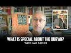

# What is special about the Qur'an? With Gai Eaton (2022-08-14)

## Description

You Can Support My Work on Patreon:
https://www.patreon.com/Bloggingtheology

My Paypal Link: 
https://www.paypal.com/paypalme/bloggingtheology?locale.x=en_GB

## Summary of [What is special about the Qur'an? With Gai Eaton](https://www.youtube.com/watch?v=Osc1p4wW-v8)

*This summary is AI generated - there may be inaccuracies. *

### [00:00:00](https://www.youtube.com/watch?v=Osc1p4wW-v8&t=0) - [00:05:00](https://www.youtube.com/watch?v=Osc1p4wW-v8&t=300)

Gai Eaton discusses the significance of the Quran and its ability to provide salvation to people of all backgrounds. He shares a short excerpt from his book Islam and the Destiny of Man in which he discusses the Quran's use of images, symbols, and parables. Eaton believes that the Quran is the perfect book for conveying divine messages to humanity due to its unique properties.

**[00:00:00](https://www.youtube.com/watch?v=Osc1p4wW-v8&t=0)** The author, Gai Eaton, discusses the significance of the Quran and why it is special. He shares a short excerpt from his book Islam and the Destiny of Man in which he discusses the Quran's use of images, symbols, and parables. Eaton believes that no book of human authorship can be for everyone, but the Quran fulfills its purpose by providing salvation to people of all backgrounds.
* **[00:05:00](https://www.youtube.com/watch?v=Osc1p4wW-v8&t=300)** discusses the unique properties of the Qur'an, which make it the perfect tool for conveying divine messages to humanity. The text is effective in transforming its readers, and its effects have been seen throughout history in the lives of millions of people.

## Full transcript with timestamps

[0:00:03](https://youtu.be/Osc1p4wW-v8?t=3) In this video I just wanted to share with you 
some words of someone who has been called the    
[0:00:08](https://youtu.be/Osc1p4wW-v8?t=8) grandfather of British Islam his name is Gai Eaton 
and he sadly passed away just a few years ago he    
[0:00:17](https://youtu.be/Osc1p4wW-v8?t=17) was a Muslim for over 50 years at the time of 
his death and he had a very distinguished career    
[0:00:22](https://youtu.be/Osc1p4wW-v8?t=22) he was a British diplomat he was a consultant 
at regent's park mosque here in London    
[0:00:28](https://youtu.be/Osc1p4wW-v8?t=28) and he was above all for me and a superb writer 
of the English language and he wrote some    
[0:00:35](https://youtu.be/Osc1p4wW-v8?t=35) celebrated works which have had a profound effect    
[0:00:38](https://youtu.be/Osc1p4wW-v8?t=38) on countless people particularly uh 
English-speaking people who are not    
[0:00:42](https://youtu.be/Osc1p4wW-v8?t=42) Muslims and has led many of them to embrace 
Islam and perhaps his crowning work is this    
[0:00:50](https://youtu.be/Osc1p4wW-v8?t=50) book called Islam and the destiny of man it 
was one of the first books I ever read actually    
[0:00:56](https://youtu.be/Osc1p4wW-v8?t=56) before I became a Muslim and it had a profound 
impact on me and I do highly recommend it still.  
[0:01:11](https://youtu.be/Osc1p4wW-v8?t=71) I just want to read to you a short extract from 
this book where he discusses the significance    
[0:01:17](https://youtu.be/Osc1p4wW-v8?t=77) of the Quran why is it such a special book 
and he gives his interpretation his views    
[0:01:23](https://youtu.be/Osc1p4wW-v8?t=83) on this and I think what he has to say is very 
very interesting so I want just to share with you    
[0:01:28](https://youtu.be/Osc1p4wW-v8?t=88) some words from his book and he begins this 
particular section on page 90 with some words    
[0:01:35](https://youtu.be/Osc1p4wW-v8?t=95) in English from the Quran and he says and if all 
the trees on earth were pens and the sea with    
[0:01:44](https://youtu.be/Osc1p4wW-v8?t=104) seven seas added were ink yet the words of Allah 
could not be exhausted that's the Quran 31 27    
[0:01:54](https://youtu.be/Osc1p4wW-v8?t=114) and he continues for the Quran to contain more 
than a thimble full of the message it must rely    
[0:02:02](https://youtu.be/Osc1p4wW-v8?t=122) upon images symbols and parables which are wind 
open windows onto a vast landscape of meaning    
[0:02:12](https://youtu.be/Osc1p4wW-v8?t=132) but which are inevitably liable to 
misinterpretation the Prophet's wives once    
[0:02:19](https://youtu.be/Osc1p4wW-v8?t=139) asked him which of them would be the first 
to die the one with the longest arm he said    
[0:02:26](https://youtu.be/Osc1p4wW-v8?t=146) they set about measuring each other's arms with 
great seriousness and not until long afterwards    
[0:02:33](https://youtu.be/Osc1p4wW-v8?t=153) did they understand that he meant the one 
who extended her arm furthest in acts of    
[0:02:39](https://youtu.be/Osc1p4wW-v8?t=159) charity there have always been Muslims who like 
the prophet's wives have taken figures of speech    
[0:02:47](https://youtu.be/Osc1p4wW-v8?t=167) literally and others who have maintained that the 
inner meaning of the text will be revealed to us    
[0:02:53](https://youtu.be/Osc1p4wW-v8?t=173) only on the last day when the secrets of hearts 
are exposed together with the secrets of the book    
[0:03:03](https://youtu.be/Osc1p4wW-v8?t=183) others again have regarded the literal meaning 
as a veil covering the majesty of the content    
[0:03:09](https://youtu.be/Osc1p4wW-v8?t=189) and protecting it from profane eyes the disputes 
which have arisen on this subject lead nowhere    
[0:03:18](https://youtu.be/Osc1p4wW-v8?t=198) and are therefore of no consequence each man 
must follow his way according to his nature    
[0:03:27](https://youtu.be/Osc1p4wW-v8?t=207) but in whatever sense it may be understood 
superficially or in depth a scripture    
[0:03:34](https://youtu.be/Osc1p4wW-v8?t=214) such as the Quran provides a rope of 
salvation for people of every kind    
[0:03:41](https://youtu.be/Osc1p4wW-v8?t=221) the stupid as well as the intelligent and limited 
interpretations do not diminish its efficacy    
[0:03:48](https://youtu.be/Osc1p4wW-v8?t=228) provided they satisfy the 
needs of particular souls    
[0:03:54](https://youtu.be/Osc1p4wW-v8?t=234) no book of human authorship can be for everyone 
but this is precisely the function of a revealed    
[0:04:02](https://youtu.be/Osc1p4wW-v8?t=242) scripture and for this reason it cannot be read 
in the way that works of human origin are read    
[0:04:10](https://youtu.be/Osc1p4wW-v8?t=250) the sun and the moon are for everyone the 
rain too but their action in relation to    
[0:04:17](https://youtu.be/Osc1p4wW-v8?t=257) each individual is different and ultimately 
to some they bring life and to some death    
[0:04:27](https://youtu.be/Osc1p4wW-v8?t=267) it could be said that the quran 
is like these natural phenomena    
[0:04:32](https://youtu.be/Osc1p4wW-v8?t=272) but it would be more exact to say that they are 
like the Quran they have one and the same author    
[0:04:39](https://youtu.be/Osc1p4wW-v8?t=279) and are as it were illustrations 
inserted between the pages of the book.  
[0:04:47](https://youtu.be/Osc1p4wW-v8?t=287) It is an article of faith in Islam 
that the Quran is inimitable try as he    
[0:04:54](https://youtu.be/Osc1p4wW-v8?t=294) may no man can write a paragraph which is 
comparable with a verse of the revealed    
[0:05:00](https://youtu.be/Osc1p4wW-v8?t=300) book this has little to do with the literary merit 
of the text in fact a perfect work of literature    
[0:05:10](https://youtu.be/Osc1p4wW-v8?t=310) could never be sacred precisely on account of 
the adequacy of its language to its content    
[0:05:18](https://youtu.be/Osc1p4wW-v8?t=318) no conjunction of words however excellent 
could ever be adequate to a revealed content    
[0:05:26](https://youtu.be/Osc1p4wW-v8?t=326) it is the efficacy of the words they're 
transforming and saving power that is inevitable    
[0:05:35](https://youtu.be/Osc1p4wW-v8?t=335) since no human being can provide others with 
a rope of salvation made from strands of his    
[0:05:43](https://youtu.be/Osc1p4wW-v8?t=343) own person and his own thoughts the quran set on 
a shelf with other books has a function entirely    
[0:05:52](https://youtu.be/Osc1p4wW-v8?t=352) different to theirs and exists in a different 
dimension it moves an illiterate shepherd to tears    
[0:06:01](https://youtu.be/Osc1p4wW-v8?t=361) when recited to him and it has shaped the lives 
of millions of simple people over the course of 14    
[0:06:10](https://youtu.be/Osc1p4wW-v8?t=370) centuries it has nourished some of the most 
powerful intellects known to the human record    
[0:06:17](https://youtu.be/Osc1p4wW-v8?t=377) it has stopped sophisticates in their tracks 
and made saints of them and it has been the    
[0:06:24](https://youtu.be/Osc1p4wW-v8?t=384) source of the most subtle philosophy and of 
an art which expresses its deepest meaning    
[0:06:32](https://youtu.be/Osc1p4wW-v8?t=392) in visual terms it has brought the wandering 
tribes of mankind together in communities and    
[0:06:40](https://youtu.be/Osc1p4wW-v8?t=400) civilizations upon which its imprint is is 
apparent even to the most casual observer    
[0:06:49](https://youtu.be/Osc1p4wW-v8?t=409) the Muslims regardless of race and national 
identity the Muslim is unlike anyone    
[0:06:56](https://youtu.be/Osc1p4wW-v8?t=416) else because he has undergone the impact 
of the Quran and has been formed by it  
[0:07:06](https://youtu.be/Osc1p4wW-v8?t=426) other books are passive the reader 
taking the initiative but revelation    
[0:07:12](https://youtu.be/Osc1p4wW-v8?t=432) is an act a command from on high comparable 
to a lightning flash which obeys no man's whim    
[0:07:23](https://youtu.be/Osc1p4wW-v8?t=443) as such it acts upon those who are responsive 
to it reminding them of their true function as    
[0:07:31](https://youtu.be/Osc1p4wW-v8?t=451) vice regents of god on earth restoring to them the 
use of faculties which have become atrophied like    
[0:07:40](https://youtu.be/Osc1p4wW-v8?t=460) unused muscles and showing them not least by the 
example of the prophet what they are meant to be    
[0:07:50](https://youtu.be/Osc1p4wW-v8?t=470) to say this is to say that revelation within the 
limits of what is possible in our fallen condition    
[0:07:58](https://youtu.be/Osc1p4wW-v8?t=478) restores to us the condition of fitra 
it gives back to the intelligence    
[0:08:06](https://youtu.be/Osc1p4wW-v8?t=486) its lost capacity to perceive and to 
comprehend supernatural truths gives back    
[0:08:14](https://youtu.be/Osc1p4wW-v8?t=494) to the world its lost capacity to command the 
warring factions of the soul and it gives back    
[0:08:23](https://youtu.be/Osc1p4wW-v8?t=503) to sentiment its lost capacity to love God 
and to love everything that reminds us of him  
[0:08:34](https://youtu.be/Osc1p4wW-v8?t=514) very powerful staring words there from 
this book by Gai Eaton and the book is    
[0:08:39](https://youtu.be/Osc1p4wW-v8?t=519) like this from beginning to end it's 
the most extraordinary tour de force a    
[0:08:43](https://youtu.be/Osc1p4wW-v8?t=523) one of the most beautiful books in the English 
language about any religion I would argue    
[0:08:50](https://youtu.be/Osc1p4wW-v8?t=530) there is again Islam and the 
destiny of man, until next time.  
