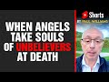

# When Angels Take Souls of unbelievers at Death #shorts (2021-12-01)

## Description

You Can Support My Work on Patreon:
https://www.patreon.com/Bloggingtheology

My Paypal Link: 
https://www.paypal.com/paypalme/bloggingtheology?locale.x=en_GB

Follow me on Instagram:
https://www.instagram.com/bloggingtheology1

Follow me on TikTok:
https://www.tiktok.com/@bloggingtheology?lang=en

Follow me on Twitter:
https://twitter.com/freemonotheist

## Summary of [When Angels Take Souls of unbelievers at Death #shorts](https://www.youtube.com/watch?v=Bz8iTXuRv-Y)

*This summary is AI generated - there may be inaccuracies. *

### [00:00:00](https://www.youtube.com/watch?v=Bz8iTXuRv-Y&t=0) - [00:00:00](https://www.youtube.com/watch?v=Bz8iTXuRv-Y&t=0)

The Muslim in the video explains that angels take the souls of unbelievers at death, and that the unbelievers taste the punishment of the blazing fire because of their actions.

**[00:00:00](https://www.youtube.com/watch?v=Bz8iTXuRv-Y&t=0)** In the video, a Muslim talks about how angels take the souls of unbelievers at death. He says that the angels smite their faces and backs, and that the unbelievers taste the punishment of the blazing fire because of their own actions.

## Full transcript with timestamps

[0:00:00](https://youtu.be/Bz8iTXuRv-Y?t=0) and god says in his book lo the  
[0:00:03](https://youtu.be/Bz8iTXuRv-Y?t=3) hypocrites say and those in whose hearts  
[0:00:06](https://youtu.be/Bz8iTXuRv-Y?t=6) is a disease  
[0:00:08](https://youtu.be/Bz8iTXuRv-Y?t=8) these people their religion has misled  
[0:00:10](https://youtu.be/Bz8iTXuRv-Y?t=10) them  
[0:00:12](https://youtu.be/Bz8iTXuRv-Y?t=12) but if any trust in allah behold allah  
[0:00:15](https://youtu.be/Bz8iTXuRv-Y?t=15) is exalted in might wise  
[0:00:19](https://youtu.be/Bz8iTXuRv-Y?t=19) if thou could see when the angels take  
[0:00:21](https://youtu.be/Bz8iTXuRv-Y?t=21) the souls of the unbelievers at death  
[0:00:24](https://youtu.be/Bz8iTXuRv-Y?t=24) how they smite their faces and their  
[0:00:27](https://youtu.be/Bz8iTXuRv-Y?t=27) backs saying  
[0:00:29](https://youtu.be/Bz8iTXuRv-Y?t=29) taste the penalty of the blazing fire  
[0:00:32](https://youtu.be/Bz8iTXuRv-Y?t=32) because of the deeds which your own  
[0:00:34](https://youtu.be/Bz8iTXuRv-Y?t=34) hands sent forth  
[0:00:36](https://youtu.be/Bz8iTXuRv-Y?t=36) for allah is never unjust to his  
[0:00:39](https://youtu.be/Bz8iTXuRv-Y?t=39) servants  
[0:00:41](https://youtu.be/Bz8iTXuRv-Y?t=41) surah 8 verses 49 onwards  
