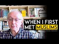

# When I First Met Muslims (2021-11-21 15:46:01+00:00)

## Description

The original video: https://www.youtube.com/watch?v=Kz6btHlXxb4

## Summary of [When I First Met Muslims](https://www.youtube.com/watch?v=w13UZhOOOd0)

*This is an AI generated summary. There may be inaccuracies. *

### [00:00:00](https://www.youtube.com/watch?v=w13UZhOOOd0&t=0) - [00:00:00](https://www.youtube.com/watch?v=w13UZhOOOd0&t=0)

The speaker visits a mosque in London and learns about Islam from the Muslims she meets there. She is surprised to find that Islam is more than just a religion of terrorists, and that Muhammad was a unique and interesting figure. This experience changes her perspective on Islam and Muslims.

**[00:00:00](https://www.youtube.com/watch?v=w13UZhOOOd0&t=0)** The speaker visits a mosque in London and meets real Muslims who teach her about Islam. This revelation changes her perspective on the religion, which she finds to be more than just a terrorist religion. She also learns about Islam's founder, Muhammad, and how unique he was as an individual.

## Full transcript with timestamps

[0:00:01](https://youtu.be/w13UZhOOOd0?t=1) well i i before i came in contact with  
[0:00:04](https://youtu.be/w13UZhOOOd0?t=4) actual muslims in my local mosque in  
[0:00:06](https://youtu.be/w13UZhOOOd0?t=6) london i i was quite i was very  
[0:00:08](https://youtu.be/w13UZhOOOd0?t=8) islamophobic so i i believe that um  
[0:00:12](https://youtu.be/w13UZhOOOd0?t=12) islam was a terrorist religion you know  
[0:00:14](https://youtu.be/w13UZhOOOd0?t=14) after 9 11 this is and uh  
[0:00:16](https://youtu.be/w13UZhOOOd0?t=16) dangers to the west and um and so on  
[0:00:19](https://youtu.be/w13UZhOOOd0?t=19) so um  
[0:00:21](https://youtu.be/w13UZhOOOd0?t=21) i decided um because i thought  
[0:00:24](https://youtu.be/w13UZhOOOd0?t=24) sometimes i i knew that some sometimes  
[0:00:26](https://youtu.be/w13UZhOOOd0?t=26) the media misrepresented the truth and i  
[0:00:28](https://youtu.be/w13UZhOOOd0?t=28) was getting my information from the  
[0:00:30](https://youtu.be/w13UZhOOOd0?t=30) usual suspects and i thought i'm going  
[0:00:32](https://youtu.be/w13UZhOOOd0?t=32) to go and talk to muslims to find out  
[0:00:34](https://youtu.be/w13UZhOOOd0?t=34) what's really going on so i went to my  
[0:00:35](https://youtu.be/w13UZhOOOd0?t=35) local mosque regents park mosque in  
[0:00:37](https://youtu.be/w13UZhOOOd0?t=37) london  
[0:00:38](https://youtu.be/w13UZhOOOd0?t=38) and met real muslims i was a christian  
[0:00:40](https://youtu.be/w13UZhOOOd0?t=40) at the time and um  
[0:00:42](https://youtu.be/w13UZhOOOd0?t=42) and so learned about islam and that was  
[0:00:43](https://youtu.be/w13UZhOOOd0?t=43) quite a revelation and i um  
[0:00:46](https://youtu.be/w13UZhOOOd0?t=46) it was discovery that the spiritual  
[0:00:48](https://youtu.be/w13UZhOOOd0?t=48) depth that i saw in christianity the  
[0:00:50](https://youtu.be/w13UZhOOOd0?t=50) spirituality  
[0:00:52](https://youtu.be/w13UZhOOOd0?t=52) um which was very important to me also  
[0:00:54](https://youtu.be/w13UZhOOOd0?t=54) existed in islam as well and it may  
[0:00:56](https://youtu.be/w13UZhOOOd0?t=56) sound really naive to say but  
[0:00:58](https://youtu.be/w13UZhOOOd0?t=58) it really was a revelation to me  
[0:01:01](https://youtu.be/w13UZhOOOd0?t=61) um and that  
[0:01:02](https://youtu.be/w13UZhOOOd0?t=62) in many ways at the heart of  
[0:01:04](https://youtu.be/w13UZhOOOd0?t=64) christianity uh you see the same kinds  
[0:01:07](https://youtu.be/w13UZhOOOd0?t=67) of  
[0:01:08](https://youtu.be/w13UZhOOOd0?t=68) concerns and dynamics and  
[0:01:10](https://youtu.be/w13UZhOOOd0?t=70) uh even concepts that you find in much  
[0:01:12](https://youtu.be/w13UZhOOOd0?t=72) of christianity and in islam as well so  
[0:01:16](https://youtu.be/w13UZhOOOd0?t=76) that commonality forced me to  
[0:01:18](https://youtu.be/w13UZhOOOd0?t=78) reassess  
[0:01:20](https://youtu.be/w13UZhOOOd0?t=80) my position towards islam and also  
[0:01:22](https://youtu.be/w13UZhOOOd0?t=82) discover this completely unknown thing  
[0:01:24](https://youtu.be/w13UZhOOOd0?t=84) about islam which was this man called  
[0:01:27](https://youtu.be/w13UZhOOOd0?t=87) muhammad  
[0:01:28](https://youtu.be/w13UZhOOOd0?t=88) who i had been taught precisely nothing  
[0:01:30](https://youtu.be/w13UZhOOOd0?t=90) about at school  
[0:01:31](https://youtu.be/w13UZhOOOd0?t=91) and  
[0:01:32](https://youtu.be/w13UZhOOOd0?t=92) um so to learn about his his life as  
[0:01:35](https://youtu.be/w13UZhOOOd0?t=95) sierra obviously hadith and so on was uh  
[0:01:38](https://youtu.be/w13UZhOOOd0?t=98) quite extraordinary and those it was  
[0:01:40](https://youtu.be/w13UZhOOOd0?t=100) shocking how ignorant i was and how we  
[0:01:42](https://youtu.be/w13UZhOOOd0?t=102) generally are in the west you know we  
[0:01:43](https://youtu.be/w13UZhOOOd0?t=103) learned about  
[0:01:45](https://youtu.be/w13UZhOOOd0?t=105) julius caesar uh alexander the great who  
[0:01:47](https://youtu.be/w13UZhOOOd0?t=107) conquered you know so many countries  
[0:01:49](https://youtu.be/w13UZhOOOd0?t=109) he's called the great by the way even  
[0:01:50](https://youtu.be/w13UZhOOOd0?t=110) though he conquered a lot of people or  
[0:01:52](https://youtu.be/w13UZhOOOd0?t=112) we learn about you know here in france  
[0:01:54](https://youtu.be/w13UZhOOOd0?t=114) napoleon is is it's french stamps new  
[0:01:56](https://youtu.be/w13UZhOOOd0?t=116) stamps coming out now with pigeons of  
[0:01:59](https://youtu.be/w13UZhOOOd0?t=119) napoleon on i mean he was a dictator  
[0:02:03](https://youtu.be/w13UZhOOOd0?t=123) um but  
[0:02:05](https://youtu.be/w13UZhOOOd0?t=125) no one is mentioning  
[0:02:06](https://youtu.be/w13UZhOOOd0?t=126) muhammad and yeah you know he he he  
[0:02:09](https://youtu.be/w13UZhOOOd0?t=129) surpassed  
[0:02:11](https://youtu.be/w13UZhOOOd0?t=131) he was he excelled in every area as a  
[0:02:15](https://youtu.be/w13UZhOOOd0?t=135) military leader as a general as a  
[0:02:18](https://youtu.be/w13UZhOOOd0?t=138) head of state  
[0:02:19](https://youtu.be/w13UZhOOOd0?t=139) as a father as a prophet as a spiritual  
[0:02:23](https://youtu.be/w13UZhOOOd0?t=143) mystic almost um  
[0:02:25](https://youtu.be/w13UZhOOOd0?t=145) and so on and so on he he just excelled  
[0:02:28](https://youtu.be/w13UZhOOOd0?t=148) in so many areas looking at it purely  
[0:02:30](https://youtu.be/w13UZhOOOd0?t=150) humanly here  
[0:02:31](https://youtu.be/w13UZhOOOd0?t=151) um so whilst you can compare him to  
[0:02:33](https://youtu.be/w13UZhOOOd0?t=153) individuals great individuals in history  
[0:02:36](https://youtu.be/w13UZhOOOd0?t=156) they excelled in any one area perhaps  
[0:02:38](https://youtu.be/w13UZhOOOd0?t=158) like alexander the great was a great  
[0:02:39](https://youtu.be/w13UZhOOOd0?t=159) general yeah  
[0:02:41](https://youtu.be/w13UZhOOOd0?t=161) but mohammed was a great general too and  
[0:02:43](https://youtu.be/w13UZhOOOd0?t=163) he was all these other things as well so  
[0:02:45](https://youtu.be/w13UZhOOOd0?t=165) as an all-rounder interdisciplinary  
[0:02:47](https://youtu.be/w13UZhOOOd0?t=167) genius um  
[0:02:48](https://youtu.be/w13UZhOOOd0?t=168) he  
[0:02:49](https://youtu.be/w13UZhOOOd0?t=169) is pretty unique i don't know anyone  
[0:02:51](https://youtu.be/w13UZhOOOd0?t=171) else historically who can match him  
[0:02:55](https://youtu.be/w13UZhOOOd0?t=175) just on a purely human level i mean and  
[0:02:57](https://youtu.be/w13UZhOOOd0?t=177) yet we don't read anything about him in  
[0:02:59](https://youtu.be/w13UZhOOOd0?t=179) the west  
[0:03:00](https://youtu.be/w13UZhOOOd0?t=180) except bad things perhaps  
