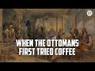

# When the Ottomans first tried coffee (2022-10-16)

## Description

The Ottomans: A Cultural Legacy by Diana Darke https://www.amazon.co.uk/Ottomans-Cultural-Legacy-Diana-Darke/dp/0500252661/ref=sr_1_1?crid=2DSCIF1N0PFVZ&keywords=diana+darke&qid=1665918704&qu=eyJxc2MiOiIyLjc4IiwicXNhIjoiMi4zMSIsInFzcCI6IjIuMDcifQ%3D%3D&sprefix=diana%2520darke%2Caps%2C55&sr=8-1

You Can Support My Work on Patreon:
https://www.patreon.com/Bloggingtheology

My Paypal Link: 
https://www.paypal.com/paypalme/bloggingtheology?locale.x=en_GB

## Summary of [When the Ottomans first tried coffee](https://www.youtube.com/watch?v=hIixS9zaUhE)

*This summary is AI generated - there may be inaccuracies. *

### [00:00:00](https://www.youtube.com/watch?v=hIixS9zaUhE&t=0) - [00:15:00](https://www.youtube.com/watch?v=hIixS9zaUhE&t=900)

The video discusses the history of coffee, and how it has become popular around the world. It also includes short vignettes about different aspects of Ottoman culture and history.

**[00:00:00](https://www.youtube.com/watch?v=hIixS9zaUhE&t=0)** The book, Ottomans: A Cultural Legacy, by Diana Dark, details the rich culture of the Ottoman Empire, which spanned from Yemen to the gates of Vienna. Western perceptions of the Ottomans have often been distorted by orientalism, characterizing their rule as oppressive and destructive while seeing their culture as exotic and incomprehensible. By unearthing a vibrant and sophisticated civilization that embraced both Arts and Sciences, as well as welcoming refugees from all ethnicities and religions, Dark celebrates the culture of the Ottoman Empire. One significant aspect of the Ottoman Empire's culture was its love of coffee. The popularity of coffee across the empire went back to the 1550s, when the first coffee shop was opened in Istanbul by two Yemenis during the reign of Suleiman the Magnificent himself. Coffee was also banned at the behest of the Ottoman authorities in 1546, but it was reinstated later that year. In 1571, coffee was banned again, this time in Cairo, but it was again reinstated the following year. Finally, in 1587, coffee was banned once and for all in Mecca. In the book, Dark investigates the important role that coffee played in supporting the empire and increasing its cultural reach. She also highlights the diverse religious literary and musical traditions
* **[00:05:00](https://www.youtube.com/watch?v=hIixS9zaUhE&t=300)** In the 16th and 17th centuries, coffee was popular in Damascus and Istanbul, and spread to the rest of Europe. In London, coffee became popular in 1700 and by 1729, there were over 500 coffee houses. Coffee was originally sold in coffee houses called Edward Lloyd's Coffee House.
* **[00:10:00](https://www.youtube.com/watch?v=hIixS9zaUhE&t=600)** The video discusses the history of coffee and its various incarnations, including its Ottoman origins. The drink was seen as a challenge to traditional Islamic values and was therefore met with resistance. Coffeehouses became popular as meeting places for different groups of people, depending on their location. In this 1-paragraph summary, the author mentions that cappuccino was inspired by an Italian priest who mixed coffee with cream and honey to make it more palatable, and that it only became popular in Italy in the 1930s.
* **[00:15:00](https://www.youtube.com/watch?v=hIixS9zaUhE&t=900)** This video discusses the history of coffee, and how it has become popular around the world. It also includes short vignettes about different aspects of Ottoman culture and history.

<h2>Full transcript with timestamps: CLICK TO EXPAND</h2>

[0:00:03](https://youtu.be/hIixS9zaUhE?t=3) I want to share with you an exciting new  
[0:00:05](https://youtu.be/hIixS9zaUhE?t=5) book that's just come out here it is and  
[0:00:08](https://youtu.be/hIixS9zaUhE?t=8) it's called the Ottomans a cultural  
[0:00:10](https://youtu.be/hIixS9zaUhE?t=10) Legacy by Diana dark who has been an  
[0:00:13](https://youtu.be/hIixS9zaUhE?t=13) honor guest on blogging theology before  
[0:00:15](https://youtu.be/hIixS9zaUhE?t=15) and this has just been published  
[0:00:17](https://youtu.be/hIixS9zaUhE?t=17) actually and it's a fantastic book just  
[0:00:20](https://youtu.be/hIixS9zaUhE?t=20) read to you what it says on the inside  
[0:00:22](https://youtu.be/hIixS9zaUhE?t=22) cover  
[0:00:24](https://youtu.be/hIixS9zaUhE?t=24) at its height the Ottoman empire spread  
[0:00:27](https://youtu.be/hIixS9zaUhE?t=27) from Yemen to the gates of Vienna  
[0:00:30](https://youtu.be/hIixS9zaUhE?t=30) Western perceptions of the Ottomans have  
[0:00:34](https://youtu.be/hIixS9zaUhE?t=34) often been distorted by orientalism  
[0:00:37](https://youtu.be/hIixS9zaUhE?t=37) characterizing their rule as oppressive  
[0:00:40](https://youtu.be/hIixS9zaUhE?t=40) and destructive while seeing their  
[0:00:42](https://youtu.be/hIixS9zaUhE?t=42) culture as exotic and incomprehensible  
[0:00:47](https://youtu.be/hIixS9zaUhE?t=47) based on a lifetime's experience of  
[0:00:50](https://youtu.be/hIixS9zaUhE?t=50) living and working across its former  
[0:00:53](https://youtu.be/hIixS9zaUhE?t=53) provinces Dino dark who by the way is an  
[0:00:56](https://youtu.be/hIixS9zaUhE?t=56) English lady living in England offers a  
[0:00:59](https://youtu.be/hIixS9zaUhE?t=59) unique overview of the Ottoman Empire's  
[0:01:02](https://youtu.be/hIixS9zaUhE?t=62) cultural Legacy one century after its  
[0:01:06](https://youtu.be/hIixS9zaUhE?t=66) disillusion  
[0:01:07](https://youtu.be/hIixS9zaUhE?t=67) she uncovers a vibrant sophisticated  
[0:01:10](https://youtu.be/hIixS9zaUhE?t=70) civilization that embraced both Arts and  
[0:01:13](https://youtu.be/hIixS9zaUhE?t=73) Sciences whilst welcoming refugees from  
[0:01:16](https://youtu.be/hIixS9zaUhE?t=76) all ethnicities and religions notably  
[0:01:19](https://youtu.be/hIixS9zaUhE?t=79) Christians and Jews  
[0:01:22](https://youtu.be/hIixS9zaUhE?t=82) Diner dark celebrates the culture of the  
[0:01:25](https://youtu.be/hIixS9zaUhE?t=85) Ottoman Empire from its Aesthetics and  
[0:01:28](https://youtu.be/hIixS9zaUhE?t=88) architecture to its scientific and  
[0:01:31](https://youtu.be/hIixS9zaUhE?t=91) medical Innovations including the first  
[0:01:34](https://youtu.be/hIixS9zaUhE?t=94) vaccinations  
[0:01:36](https://youtu.be/hIixS9zaUhE?t=96) she investigates The crucial role that  
[0:01:39](https://youtu.be/hIixS9zaUhE?t=99) Commerce and trade played in supporting  
[0:01:41](https://youtu.be/hIixS9zaUhE?t=101) the Empire and increasing its cultural  
[0:01:44](https://youtu.be/hIixS9zaUhE?t=104) reach highlighting this significant role  
[0:01:47](https://youtu.be/hIixS9zaUhE?t=107) of women as well as the diverse  
[0:01:50](https://youtu.be/hIixS9zaUhE?t=110) religious literary and musical  
[0:01:52](https://youtu.be/hIixS9zaUhE?t=112) Traditions that proliferated throughout  
[0:01:55](https://youtu.be/hIixS9zaUhE?t=115) the empire  
[0:01:56](https://youtu.be/hIixS9zaUhE?t=116) beautifully Illustrated with the  
[0:01:58](https://youtu.be/hIixS9zaUhE?t=118) manuscripts Miniatures and paintings and  
[0:02:01](https://youtu.be/hIixS9zaUhE?t=121) photographs the Ottomans a cultural  
[0:02:04](https://youtu.be/hIixS9zaUhE?t=124) Legacy presents a presents the  
[0:02:07](https://youtu.be/hIixS9zaUhE?t=127) Magnificent achievements of an Empire  
[0:02:09](https://youtu.be/hIixS9zaUhE?t=129) that lasted over 600 years and income  
[0:02:13](https://youtu.be/hIixS9zaUhE?t=133) encompassed Asian European and African  
[0:02:17](https://youtu.be/hIixS9zaUhE?t=137) cultures shedding new light on its  
[0:02:20](https://youtu.be/hIixS9zaUhE?t=140) complex Legacy  
[0:02:22](https://youtu.be/hIixS9zaUhE?t=142) now there are 149 illustrations in this  
[0:02:25](https://youtu.be/hIixS9zaUhE?t=145) book and um you're really going to have  
[0:02:26](https://youtu.be/hIixS9zaUhE?t=146) to get it to see for yourself  
[0:02:28](https://youtu.be/hIixS9zaUhE?t=148) beautifully Illustrated but I wonder if  
[0:02:30](https://youtu.be/hIixS9zaUhE?t=150) just focus on one subject like what I  
[0:02:32](https://youtu.be/hIixS9zaUhE?t=152) could have focused on literally one of  
[0:02:34](https://youtu.be/hIixS9zaUhE?t=154) thousands of possible subjects there's  
[0:02:36](https://youtu.be/hIixS9zaUhE?t=156) the subject of coffee which is of  
[0:02:39](https://youtu.be/hIixS9zaUhE?t=159) universal interest I think and the uh  
[0:02:41](https://youtu.be/hIixS9zaUhE?t=161) this was a favorite ottoman drink and uh  
[0:02:44](https://youtu.be/hIixS9zaUhE?t=164) predates the European uh encounter with  
[0:02:47](https://youtu.be/hIixS9zaUhE?t=167) coffee and very interesting insights  
[0:02:49](https://youtu.be/hIixS9zaUhE?t=169) here about this subject  
[0:02:51](https://youtu.be/hIixS9zaUhE?t=171) and she writes on page  
[0:02:53](https://youtu.be/hIixS9zaUhE?t=173) 237 about uh coffee she says the  
[0:02:57](https://youtu.be/hIixS9zaUhE?t=177) popularity of coffee across the Ottoman  
[0:03:01](https://youtu.be/hIixS9zaUhE?t=181) Empire goes back to the 1550s when the  
[0:03:05](https://youtu.be/hIixS9zaUhE?t=185) first coffee shop was opened in Istanbul  
[0:03:08](https://youtu.be/hIixS9zaUhE?t=188) by two yemenis during the reign of  
[0:03:11](https://youtu.be/hIixS9zaUhE?t=191) Suleiman the Magnificent himself a great  
[0:03:14](https://youtu.be/hIixS9zaUhE?t=194) lover of the drink  
[0:03:16](https://youtu.be/hIixS9zaUhE?t=196) he instituted the position of Chief  
[0:03:19](https://youtu.be/hIixS9zaUhE?t=199) coffee maker what a job eh who was  
[0:03:22](https://youtu.be/hIixS9zaUhE?t=202) responsible for preparing the Sultan's  
[0:03:25](https://youtu.be/hIixS9zaUhE?t=205) coffee and the utensils needed to make  
[0:03:28](https://youtu.be/hIixS9zaUhE?t=208) the perfect cup of coffee  
[0:03:30](https://youtu.be/hIixS9zaUhE?t=210) the furniture of Ottoman palaces evolved  
[0:03:34](https://youtu.be/hIixS9zaUhE?t=214) to enable guests to enjoy the coffee  
[0:03:36](https://youtu.be/hIixS9zaUhE?t=216) ritual  
[0:03:38](https://youtu.be/hIixS9zaUhE?t=218) guests sat on a low bench or Divan built  
[0:03:42](https://youtu.be/hIixS9zaUhE?t=222) against the wall while trays of food and  
[0:03:44](https://youtu.be/hIixS9zaUhE?t=224) drink were set before them on  
[0:03:47](https://youtu.be/hIixS9zaUhE?t=227) beautifully decorated tables  
[0:03:49](https://youtu.be/hIixS9zaUhE?t=229) one such table dating from 1560 is on  
[0:03:53](https://youtu.be/hIixS9zaUhE?t=233) display in London's Victoria and Albert  
[0:03:56](https://youtu.be/hIixS9zaUhE?t=236) Museum  
[0:03:58](https://youtu.be/hIixS9zaUhE?t=238) made of Ebony and faced with mother of  
[0:04:01](https://youtu.be/hIixS9zaUhE?t=241) pearl an ivory inlay it is topped with  
[0:04:05](https://youtu.be/hIixS9zaUhE?t=245) exquisite is neck tiles  
[0:04:07](https://youtu.be/hIixS9zaUhE?t=247) the Kilns of cotea south of isnic were  
[0:04:12](https://youtu.be/hIixS9zaUhE?t=252) also kept busy producing beautifully  
[0:04:14](https://youtu.be/hIixS9zaUhE?t=254) decorated coffee cups some of which can  
[0:04:17](https://youtu.be/hIixS9zaUhE?t=257) also be seen in the same collection  
[0:04:20](https://youtu.be/hIixS9zaUhE?t=260) before reaching the ottoman Capital  
[0:04:23](https://youtu.be/hIixS9zaUhE?t=263) coffee had arrived in Syria in 1534 from  
[0:04:29](https://youtu.be/hIixS9zaUhE?t=269) Moka in Yemen but in 1546 it was banned  
[0:04:34](https://youtu.be/hIixS9zaUhE?t=274) at the behest of the Ottoman authorities  
[0:04:37](https://youtu.be/hIixS9zaUhE?t=277) and certain Pious muftes who considered  
[0:04:41](https://youtu.be/hIixS9zaUhE?t=281) its influence to be suspect  
[0:04:44](https://youtu.be/hIixS9zaUhE?t=284) fearing that coffee houses would become  
[0:04:47](https://youtu.be/hIixS9zaUhE?t=287) places for disreputable practices no  
[0:04:50](https://youtu.be/hIixS9zaUhE?t=290) idea what they had in mind what happened  
[0:04:51](https://youtu.be/hIixS9zaUhE?t=291) in these coffee houses  
[0:04:53](https://youtu.be/hIixS9zaUhE?t=293) previous attempts have been made to ban  
[0:04:55](https://youtu.be/hIixS9zaUhE?t=295) it in Mecca and Cairo  
[0:04:58](https://youtu.be/hIixS9zaUhE?t=298) the first recorded coffee houses in  
[0:05:01](https://youtu.be/hIixS9zaUhE?t=301) Damascus were located in the banks of  
[0:05:03](https://youtu.be/hIixS9zaUhE?t=303) the banada near the suleiman's dervish  
[0:05:06](https://youtu.be/hIixS9zaUhE?t=306) Lodge and could house hundreds of  
[0:05:09](https://youtu.be/hIixS9zaUhE?t=309) customers at a time often pilgrimage  
[0:05:12](https://youtu.be/hIixS9zaUhE?t=312) pilgrims gathering for the Hajj  
[0:05:15](https://youtu.be/hIixS9zaUhE?t=315) only one survives from that early phase  
[0:05:19](https://youtu.be/hIixS9zaUhE?t=319) the cafe now pharah in the Eastern  
[0:05:22](https://youtu.be/hIixS9zaUhE?t=322) Gateway to the Temple of Jupiter today  
[0:05:25](https://youtu.be/hIixS9zaUhE?t=325) the great umiyad mosque  
[0:05:28](https://youtu.be/hIixS9zaUhE?t=328) by the end of the 16th century there  
[0:05:31](https://youtu.be/hIixS9zaUhE?t=331) were over 600 coffee houses in Istanbul  
[0:05:34](https://youtu.be/hIixS9zaUhE?t=334) a number that Rose to 2 500 by the end  
[0:05:39](https://youtu.be/hIixS9zaUhE?t=339) of the 19th century when the  
[0:05:42](https://youtu.be/hIixS9zaUhE?t=342) introduction of tea demoted it to Second  
[0:05:45](https://youtu.be/hIixS9zaUhE?t=345) Place as the favorite drink across the  
[0:05:48](https://youtu.be/hIixS9zaUhE?t=348) empire  
[0:05:50](https://youtu.be/hIixS9zaUhE?t=350) coffee was introduced to France with the  
[0:05:53](https://youtu.be/hIixS9zaUhE?t=353) 1669 visit of the Turkish Ambassador  
[0:05:56](https://youtu.be/hIixS9zaUhE?t=356) suleima agar to the court of Louis XIV  
[0:06:01](https://youtu.be/hIixS9zaUhE?t=361) consumed in Europe in the traditional  
[0:06:03](https://youtu.be/hIixS9zaUhE?t=363) Muslim way it was made by boiling a  
[0:06:07](https://youtu.be/hIixS9zaUhE?t=367) mixture of coffee powder sugar and water  
[0:06:10](https://youtu.be/hIixS9zaUhE?t=370) which left a residue in the bottom of  
[0:06:13](https://youtu.be/hIixS9zaUhE?t=373) the cup because it was not filtered what  
[0:06:16](https://youtu.be/hIixS9zaUhE?t=376) we still call today Turkish coffee  
[0:06:20](https://youtu.be/hIixS9zaUhE?t=380) coffee reached the austro-hungarian  
[0:06:22](https://youtu.be/hIixS9zaUhE?t=382) empire in 1683 following the siege of  
[0:06:26](https://youtu.be/hIixS9zaUhE?t=386) Vienna by a huge and well-equipped  
[0:06:30](https://youtu.be/hIixS9zaUhE?t=390) Ottoman empire under the command of the  
[0:06:33](https://youtu.be/hIixS9zaUhE?t=393) grand vizier Kara Mustafa  
[0:06:36](https://youtu.be/hIixS9zaUhE?t=396) after months of bombardment and just as  
[0:06:41](https://youtu.be/hIixS9zaUhE?t=401) the fortifications of the city seem to  
[0:06:43](https://youtu.be/hIixS9zaUhE?t=403) be giving way The Siege was lifted owing  
[0:06:47](https://youtu.be/hIixS9zaUhE?t=407) to the arrival of forces under Prince  
[0:06:50](https://youtu.be/hIixS9zaUhE?t=410) Sobieski of Poland and Charles Duke of  
[0:06:54](https://youtu.be/hIixS9zaUhE?t=414) Lorraine  
[0:06:55](https://youtu.be/hIixS9zaUhE?t=415) in a remarkable reverse reversal the  
[0:06:59](https://youtu.be/hIixS9zaUhE?t=419) besieging ottoman Army was routed and  
[0:07:02](https://youtu.be/hIixS9zaUhE?t=422) its entire Camp captured including  
[0:07:06](https://youtu.be/hIixS9zaUhE?t=426) almost all its armaments and Provisions  
[0:07:10](https://youtu.be/hIixS9zaUhE?t=430) Viennese officials were amazed at the  
[0:07:13](https://youtu.be/hIixS9zaUhE?t=433) copious amounts of material and  
[0:07:15](https://youtu.be/hIixS9zaUhE?t=435) foodstuffs the camp contained especially  
[0:07:19](https://youtu.be/hIixS9zaUhE?t=439) the quote prodigious stores of victuals  
[0:07:23](https://youtu.be/hIixS9zaUhE?t=443) in their inventory of the spoils the  
[0:07:26](https://youtu.be/hIixS9zaUhE?t=446) Viennese Chronicles listed coffee beans  
[0:07:29](https://youtu.be/hIixS9zaUhE?t=449) among the grain flour butter bread lard  
[0:07:32](https://youtu.be/hIixS9zaUhE?t=452) rice sugar honey cooking oil and  
[0:07:36](https://youtu.be/hIixS9zaUhE?t=456) kitchenware as well as live camels  
[0:07:39](https://youtu.be/hIixS9zaUhE?t=459) buffaloes mules oxen and sheep  
[0:07:43](https://youtu.be/hIixS9zaUhE?t=463) the starving Viennese must have feasted  
[0:07:46](https://youtu.be/hIixS9zaUhE?t=466) for days  
[0:07:48](https://youtu.be/hIixS9zaUhE?t=468) one polish officer was rewarded for his  
[0:07:52](https://youtu.be/hIixS9zaUhE?t=472) bravery in undertaking dangerous  
[0:07:54](https://youtu.be/hIixS9zaUhE?t=474) Espionage during the battle with bags of  
[0:07:57](https://youtu.be/hIixS9zaUhE?t=477) coffee beans which no one had any idea  
[0:08:00](https://youtu.be/hIixS9zaUhE?t=480) how to use  
[0:08:02](https://youtu.be/hIixS9zaUhE?t=482) the officer was said to have been an  
[0:08:05](https://youtu.be/hIixS9zaUhE?t=485) ottoman prisoner for two years and  
[0:08:07](https://youtu.be/hIixS9zaUhE?t=487) therefore knew what to do with them  
[0:08:10](https://youtu.be/hIixS9zaUhE?t=490) he was able to sell coffee to the  
[0:08:13](https://youtu.be/hIixS9zaUhE?t=493) Viennese citizensary giving them a taste  
[0:08:16](https://youtu.be/hIixS9zaUhE?t=496) for the distinctive drink  
[0:08:18](https://youtu.be/hIixS9zaUhE?t=498) the first actual Viennese coffee house  
[0:08:21](https://youtu.be/hIixS9zaUhE?t=501) was not opened until 1685 by a Cali  
[0:08:26](https://youtu.be/hIixS9zaUhE?t=506) Armenian Merchant who had applied for  
[0:08:28](https://youtu.be/hIixS9zaUhE?t=508) and been granted the sole privilege of  
[0:08:32](https://youtu.be/hIixS9zaUhE?t=512) preparing an offering for sale the  
[0:08:34](https://youtu.be/hIixS9zaUhE?t=514) Oriental drink for a period of 20 years  
[0:08:39](https://youtu.be/hIixS9zaUhE?t=519) thereafter the sale of coffee remained  
[0:08:42](https://youtu.be/hIixS9zaUhE?t=522) carefully controlled in that City so by  
[0:08:45](https://youtu.be/hIixS9zaUhE?t=525) 1729 there were still only 11 licensed  
[0:08:50](https://youtu.be/hIixS9zaUhE?t=530) concessionary concessionaires  
[0:08:53](https://youtu.be/hIixS9zaUhE?t=533) a Turkish Merchant in 1650 was the first  
[0:08:57](https://youtu.be/hIixS9zaUhE?t=537) to bring coffee commercially into the  
[0:09:00](https://youtu.be/hIixS9zaUhE?t=540) United Kingdom  
[0:09:01](https://youtu.be/hIixS9zaUhE?t=541) selling it in a coffee house in George  
[0:09:04](https://youtu.be/hIixS9zaUhE?t=544) yard Lombard Street here in London  
[0:09:08](https://youtu.be/hIixS9zaUhE?t=548) another coffee called sultanas Head  
[0:09:11](https://youtu.be/hIixS9zaUhE?t=551) opened another Cafe called sultana's  
[0:09:15](https://youtu.be/hIixS9zaUhE?t=555) Head opened eight years later in  
[0:09:17](https://youtu.be/hIixS9zaUhE?t=557) cornhill  
[0:09:19](https://youtu.be/hIixS9zaUhE?t=559) the insurance company Lloyds of London  
[0:09:22](https://youtu.be/hIixS9zaUhE?t=562) was originally a coffee shop I didn't  
[0:09:25](https://youtu.be/hIixS9zaUhE?t=565) know this called Edward Lloyd's coffee  
[0:09:28](https://youtu.be/hIixS9zaUhE?t=568) house so this vast huge Global Insurance  
[0:09:32](https://youtu.be/hIixS9zaUhE?t=572) Company lawyers of London was originally  
[0:09:34](https://youtu.be/hIixS9zaUhE?t=574) a coffee house called Edward Lloyd's  
[0:09:37](https://youtu.be/hIixS9zaUhE?t=577) Coffee House  
[0:09:38](https://youtu.be/hIixS9zaUhE?t=578) by 1700 there were around 500 coffee  
[0:09:42](https://youtu.be/hIixS9zaUhE?t=582) houses in London and nearly 3 000 in the  
[0:09:45](https://youtu.be/hIixS9zaUhE?t=585) whole of England you see how quickly it  
[0:09:48](https://youtu.be/hIixS9zaUhE?t=588) spread how popular it was all over the  
[0:09:50](https://youtu.be/hIixS9zaUhE?t=590) country  
[0:09:51](https://youtu.be/hIixS9zaUhE?t=591) and interestingly they were known as  
[0:09:53](https://youtu.be/hIixS9zaUhE?t=593) Penny universities because you could  
[0:09:55](https://youtu.be/hIixS9zaUhE?t=595) listen and talk to the great minds of  
[0:09:58](https://youtu.be/hIixS9zaUhE?t=598) the day for the price of a coffee which  
[0:10:00](https://youtu.be/hIixS9zaUhE?t=600) cost one penny what a beautiful idea  
[0:10:04](https://youtu.be/hIixS9zaUhE?t=604) in the Ottoman Empire the drinking of  
[0:10:06](https://youtu.be/hIixS9zaUhE?t=606) coffee was a controversial issue  
[0:10:09](https://youtu.be/hIixS9zaUhE?t=609) aside from the stimulating properties of  
[0:10:13](https://youtu.be/hIixS9zaUhE?t=613) the drink itself  
[0:10:14](https://youtu.be/hIixS9zaUhE?t=614) coffee at coffee houses were seen as  
[0:10:17](https://youtu.be/hIixS9zaUhE?t=617) meeting places that challenge the  
[0:10:20](https://youtu.be/hIixS9zaUhE?t=620) traditional role of mosques  
[0:10:23](https://youtu.be/hIixS9zaUhE?t=623) in the mid 1500s many ships cargos of  
[0:10:27](https://youtu.be/hIixS9zaUhE?t=627) coffee beans were tipped into the sea  
[0:10:31](https://youtu.be/hIixS9zaUhE?t=631) the drink was the subject of an ottoman  
[0:10:34](https://youtu.be/hIixS9zaUhE?t=634) treaties by sarri mehmed Pasha Treasurer  
[0:10:38](https://youtu.be/hIixS9zaUhE?t=638) to Ahmed III who reigned from 1703 to  
[0:10:42](https://youtu.be/hIixS9zaUhE?t=642) 30. in which he explained how coffee  
[0:10:45](https://youtu.be/hIixS9zaUhE?t=645) first came to Anatolia by sea and met  
[0:10:49](https://youtu.be/hIixS9zaUhE?t=649) with a hostile reception and he wrote  
[0:10:53](https://youtu.be/hIixS9zaUhE?t=653) and I quote  
[0:10:55](https://youtu.be/hIixS9zaUhE?t=655) but these strictures and prohibitions  
[0:10:58](https://youtu.be/hIixS9zaUhE?t=658) Avail nothing the fatwas the talk made  
[0:11:02](https://youtu.be/hIixS9zaUhE?t=662) no impression on the people  
[0:11:04](https://youtu.be/hIixS9zaUhE?t=664) one coffee house was opened after  
[0:11:07](https://youtu.be/hIixS9zaUhE?t=667) another and men would gather together  
[0:11:10](https://youtu.be/hIixS9zaUhE?t=670) with great eagerness and enthusiasm to  
[0:11:13](https://youtu.be/hIixS9zaUhE?t=673) drink  
[0:11:15](https://youtu.be/hIixS9zaUhE?t=675) to those of dry temperament he writes  
[0:11:18](https://youtu.be/hIixS9zaUhE?t=678) especially to the man of melancholic  
[0:11:21](https://youtu.be/hIixS9zaUhE?t=681) temperament another person given to  
[0:11:23](https://youtu.be/hIixS9zaUhE?t=683) sadness  
[0:11:24](https://youtu.be/hIixS9zaUhE?t=684) large quantities are unsuitable and  
[0:11:28](https://youtu.be/hIixS9zaUhE?t=688) maybe repugnant  
[0:11:30](https://youtu.be/hIixS9zaUhE?t=690) taken in excess it causes insomnia and  
[0:11:35](https://youtu.be/hIixS9zaUhE?t=695) melancholic anxiety  
[0:11:38](https://youtu.be/hIixS9zaUhE?t=698) if drunk at all it should be drunk with  
[0:11:40](https://youtu.be/hIixS9zaUhE?t=700) sugar  
[0:11:42](https://youtu.be/hIixS9zaUhE?t=702) to those of moist temperament no idea  
[0:11:45](https://youtu.be/hIixS9zaUhE?t=705) what he means by that to those of moist  
[0:11:47](https://youtu.be/hIixS9zaUhE?t=707) temperament and especially of women it  
[0:11:50](https://youtu.be/hIixS9zaUhE?t=710) is highly suited they should drink a  
[0:11:53](https://youtu.be/hIixS9zaUhE?t=713) great deal of strong coffee he writes  
[0:11:56](https://youtu.be/hIixS9zaUhE?t=716) access of it will do them no harm so  
[0:11:59](https://youtu.be/hIixS9zaUhE?t=719) long as they are not melancholic  
[0:12:02](https://youtu.be/hIixS9zaUhE?t=722) so presumably insomnia doesn't affect  
[0:12:04](https://youtu.be/hIixS9zaUhE?t=724) women at all according to him end of  
[0:12:07](https://youtu.be/hIixS9zaUhE?t=727) quote  
[0:12:09](https://youtu.be/hIixS9zaUhE?t=729) public coffee houses did indeed play a  
[0:12:12](https://youtu.be/hIixS9zaUhE?t=732) role as meeting places for different  
[0:12:14](https://youtu.be/hIixS9zaUhE?t=734) groups of people depending on their  
[0:12:16](https://youtu.be/hIixS9zaUhE?t=736) locations  
[0:12:18](https://youtu.be/hIixS9zaUhE?t=738) those frequented by a Craftsmen tend to  
[0:12:21](https://youtu.be/hIixS9zaUhE?t=741) be tended to be located in fattier  
[0:12:24](https://youtu.be/hIixS9zaUhE?t=744) bazizit and socheki for instance while  
[0:12:28](https://youtu.be/hIixS9zaUhE?t=748) many janissaries opened their own  
[0:12:31](https://youtu.be/hIixS9zaUhE?t=751) establishments to supplement their  
[0:12:33](https://youtu.be/hIixS9zaUhE?t=753) salaries  
[0:12:35](https://youtu.be/hIixS9zaUhE?t=755) some had live singers some had  
[0:12:37](https://youtu.be/hIixS9zaUhE?t=757) storytellers and others became known as  
[0:12:40](https://youtu.be/hIixS9zaUhE?t=760) venues where intellectuals discuss  
[0:12:43](https://youtu.be/hIixS9zaUhE?t=763) politics  
[0:12:45](https://youtu.be/hIixS9zaUhE?t=765) at times of unrest  
[0:12:48](https://youtu.be/hIixS9zaUhE?t=768) ottoman rulers would close such places  
[0:12:50](https://youtu.be/hIixS9zaUhE?t=770) down to stop plotting people plotting  
[0:12:53](https://youtu.be/hIixS9zaUhE?t=773) subterfuge  
[0:12:55](https://youtu.be/hIixS9zaUhE?t=775) one 17th century ottoman chronicler  
[0:12:58](https://youtu.be/hIixS9zaUhE?t=778) wrote and I quote  
[0:13:01](https://youtu.be/hIixS9zaUhE?t=781) these shops became meeting places of a  
[0:13:04](https://youtu.be/hIixS9zaUhE?t=784) circle of Pleasure Seekers and idlers  
[0:13:07](https://youtu.be/hIixS9zaUhE?t=787) and also of some wits from among the men  
[0:13:10](https://youtu.be/hIixS9zaUhE?t=790) of letters and Literati and they're used  
[0:13:13](https://youtu.be/hIixS9zaUhE?t=793) to meeting groups of about 20 or 30.  
[0:13:17](https://youtu.be/hIixS9zaUhE?t=797) some read books and fine writings some  
[0:13:21](https://youtu.be/hIixS9zaUhE?t=801) were busy with backgammon and chess some  
[0:13:25](https://youtu.be/hIixS9zaUhE?t=805) brought new poems and talked of  
[0:13:27](https://youtu.be/hIixS9zaUhE?t=807) literature end quote  
[0:13:31](https://youtu.be/hIixS9zaUhE?t=811) attempts to shut the coffee houses  
[0:13:33](https://youtu.be/hIixS9zaUhE?t=813) simply meant that they moved to back  
[0:13:36](https://youtu.be/hIixS9zaUhE?t=816) streets and alleys but the authorities  
[0:13:39](https://youtu.be/hIixS9zaUhE?t=819) finally accepted them not least since  
[0:13:42](https://youtu.be/hIixS9zaUhE?t=822) they were important sources of revenue  
[0:13:44](https://youtu.be/hIixS9zaUhE?t=824) through taxes and license fees  
[0:13:48](https://youtu.be/hIixS9zaUhE?t=828) and in this last paragraph Diana dark  
[0:13:51](https://youtu.be/hIixS9zaUhE?t=831) talks about the origins of cappuccino  
[0:13:54](https://youtu.be/hIixS9zaUhE?t=834) coffee  
[0:13:55](https://youtu.be/hIixS9zaUhE?t=835) which I just had no idea of this until I  
[0:13:57](https://youtu.be/hIixS9zaUhE?t=837) read it just now here  
[0:13:58](https://youtu.be/hIixS9zaUhE?t=838) in a further evolution of coffee  
[0:14:01](https://youtu.be/hIixS9zaUhE?t=841) drinking culture cappuccino coffee was  
[0:14:04](https://youtu.be/hIixS9zaUhE?t=844) inspired by an Italian priest from the  
[0:14:08](https://youtu.be/hIixS9zaUhE?t=848) Capuchin monastic order who had fought  
[0:14:10](https://youtu.be/hIixS9zaUhE?t=850) against the Turks besieging Vienna in  
[0:14:13](https://youtu.be/hIixS9zaUhE?t=853) 1683.  
[0:14:15](https://youtu.be/hIixS9zaUhE?t=855) he acquired some of the coffee beans  
[0:14:18](https://youtu.be/hIixS9zaUhE?t=858) captured from the Ottomans spoiled and  
[0:14:21](https://youtu.be/hIixS9zaUhE?t=861) began experimenting  
[0:14:24](https://youtu.be/hIixS9zaUhE?t=864) finding it too strong for his taste he  
[0:14:28](https://youtu.be/hIixS9zaUhE?t=868) mixed it with cream and honey  
[0:14:31](https://youtu.be/hIixS9zaUhE?t=871) which gave it the same flavor the same  
[0:14:34](https://youtu.be/hIixS9zaUhE?t=874) color brown as the capuchin's robes the  
[0:14:37](https://youtu.be/hIixS9zaUhE?t=877) monastic robes and it lented a smoother  
[0:14:41](https://youtu.be/hIixS9zaUhE?t=881) taste  
[0:14:43](https://youtu.be/hIixS9zaUhE?t=883) the Viennese named it the coup pizzas  
[0:14:46](https://youtu.be/hIixS9zaUhE?t=886) though or the cooperzina in German  
[0:14:49](https://youtu.be/hIixS9zaUhE?t=889) presumably in honor of the capuchins  
[0:14:52](https://youtu.be/hIixS9zaUhE?t=892) hence the Italian cappuccino  
[0:14:55](https://youtu.be/hIixS9zaUhE?t=895) though the drink became popular in Italy  
[0:14:58](https://youtu.be/hIixS9zaUhE?t=898) only in the 1930s so quite a while to  
[0:15:01](https://youtu.be/hIixS9zaUhE?t=901) catch on now it's of course globally  
[0:15:03](https://youtu.be/hIixS9zaUhE?t=903) popular and I'll leave it there this  
[0:15:06](https://youtu.be/hIixS9zaUhE?t=906) book is just fascinating uh vignette's  
[0:15:09](https://youtu.be/hIixS9zaUhE?t=909) stories accounts of of uh cultural facts  
[0:15:13](https://youtu.be/hIixS9zaUhE?t=913) and and points of relevance between the  
[0:15:15](https://youtu.be/hIixS9zaUhE?t=915) ottoman past and the present days I  
[0:15:18](https://youtu.be/hIixS9zaUhE?t=918) highly recommended until next time  

