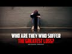

# Who are those who suffer the greatest loss? (2022-10-24 19:33:34+00:00)

## Description

You Can Support My Work on Patreon:
https://www.patreon.com/Bloggingtheology

My Paypal Link: 
https://www.paypal.com/paypalme/bloggingtheology?locale.x=en_GB

## Summary of [Who are those who suffer the greatest loss?](https://www.youtube.com/watch?v=awFP8HAdCgE)

*This is an AI generated summary. There may be inaccuracies. *

### [00:00:00](https://www.youtube.com/watch?v=awFP8HAdCgE&t=0) - [00:00:00](https://www.youtube.com/watch?v=awFP8HAdCgE&t=0)

Abu DHA relates that the Prophet said that those who suffer the greatest loss are those who have the most wealth, except for those who give in every way they can. Abu DHA concludes that few people exemplify this latter category.

**[00:00:00](https://www.youtube.com/watch?v=awFP8HAdCgE&t=0)** Abu DHA relates that he heard the Prophet say that those who suffer the greatest loss are those who have the most wealth, except for those who give in every way they can. Few people exemplify this latter category, Abu DHA concludes.

## Full transcript with timestamps

[0:00:00](https://youtu.be/awFP8HAdCgE?t=0) Abu DHA said I came to the prophet upon  
[0:00:04](https://youtu.be/awFP8HAdCgE?t=4) whom be peace when he was sitting in the  
[0:00:06](https://youtu.be/awFP8HAdCgE?t=6) shade of the Kaaba and I heard him say  
[0:00:09](https://youtu.be/awFP8HAdCgE?t=9) by the lord of the Kaaba they are the  
[0:00:13](https://youtu.be/awFP8HAdCgE?t=13) ones who suffer the greatest loss  
[0:00:17](https://youtu.be/awFP8HAdCgE?t=17) I wondered if something was wrong with  
[0:00:19](https://youtu.be/awFP8HAdCgE?t=19) me and if he meant me  
[0:00:21](https://youtu.be/awFP8HAdCgE?t=21) so I sat next to him and could not  
[0:00:24](https://youtu.be/awFP8HAdCgE?t=24) remain silent and so I said to him I  
[0:00:28](https://youtu.be/awFP8HAdCgE?t=28) would sacrifice my mother and father for  
[0:00:31](https://youtu.be/awFP8HAdCgE?t=31) you who are they he replied they are  
[0:00:36](https://youtu.be/awFP8HAdCgE?t=36) those who have the most wealth except  
[0:00:40](https://youtu.be/awFP8HAdCgE?t=40) those who give in every way they can but  
[0:00:43](https://youtu.be/awFP8HAdCgE?t=43) how very few those are  
[0:00:48](https://youtu.be/awFP8HAdCgE?t=48) Hadith from bakari and Muslim  
