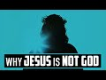

# Why Jesus is not God (2022-06-01)

## Description

You Can Support My Work on Patreon:
https://www.patreon.com/Bloggingtheology

My Paypal Link: 
https://www.paypal.com/paypalme/bloggingtheology?locale.x=en_GB

## Summary of [Why Jesus is not God](https://www.youtube.com/watch?v=8WtWjyqoDFA)

*This summary is AI generated - there may be inaccuracies. *

### [00:00:00](https://www.youtube.com/watch?v=8WtWjyqoDFA&t=0) - [00:00:00](https://www.youtube.com/watch?v=8WtWjyqoDFA&t=0)

argues that Jesus is not God, based on the differences between Jesus and Allah, and on the fact that Jesus is not considered to be God by Jews and Christians.

**[00:00:00](https://www.youtube.com/watch?v=8WtWjyqoDFA&t=0)** argues that there are major differences between Jesus and Allah, and that Allah is far more powerful and capable than Jesus. He also points out that Jesus is not considered to be God by the Jews and Christians, and that Allah is the only true god.

<h2>Full transcript with timestamps: CLICK TO EXPAND</h2>

[0:00:00](https://youtu.be/8WtWjyqoDFA?t=0) indeed those who say allah is the  
[0:00:02](https://youtu.be/8WtWjyqoDFA?t=2) messiah son of mary have fallen into  
[0:00:05](https://youtu.be/8WtWjyqoDFA?t=5) disbelief  
[0:00:06](https://youtu.be/8WtWjyqoDFA?t=6) say o prophet who has the power to  
[0:00:09](https://youtu.be/8WtWjyqoDFA?t=9) prevent allah if he chose to destroy the  
[0:00:12](https://youtu.be/8WtWjyqoDFA?t=12) messiah son of mary his mother and  
[0:00:14](https://youtu.be/8WtWjyqoDFA?t=14) everyone else in the world all together  
[0:00:17](https://youtu.be/8WtWjyqoDFA?t=17) to allah alone belongs the kingdom of  
[0:00:19](https://youtu.be/8WtWjyqoDFA?t=19) the heavens and the earth and everything  
[0:00:22](https://youtu.be/8WtWjyqoDFA?t=22) in between he creates whatever he wills  
[0:00:25](https://youtu.be/8WtWjyqoDFA?t=25) and allah is most capable of everything  
[0:00:29](https://youtu.be/8WtWjyqoDFA?t=29) the jews and the christians each say we  
[0:00:32](https://youtu.be/8WtWjyqoDFA?t=32) are the children of allah his most  
[0:00:33](https://youtu.be/8WtWjyqoDFA?t=33) beloved say o prophet why then does he  
[0:00:37](https://youtu.be/8WtWjyqoDFA?t=37) punish you for your sins no you are only  
[0:00:40](https://youtu.be/8WtWjyqoDFA?t=40) humans like others of his own making he  
[0:00:43](https://youtu.be/8WtWjyqoDFA?t=43) forgives whoever he wills and punishes  
[0:00:46](https://youtu.be/8WtWjyqoDFA?t=46) whoever he wills to allah alone belongs  
[0:00:49](https://youtu.be/8WtWjyqoDFA?t=49) the kingdom of the heavens and the earth  
[0:00:51](https://youtu.be/8WtWjyqoDFA?t=51) and everything in between and to him is  
[0:00:55](https://youtu.be/8WtWjyqoDFA?t=55) the final return  

