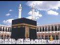

# Why should we Westerners bother to understand Islam? (2021-01-24 14:49:31+00:00)

## Description

I recommend the following works:

The Qur'an (Oxford World's Classics) translated by M. A. S. Abdel Haleem

Muhammad: His Life Based on the Earliest Sources by Martin Lings 

Islam and the Destiny of Man by Gai Eaton

Misquoting Muhammad: The Challenge and Choices of Interpreting the Prophet’s Legacy by Jonathan A.C. Brown

## Summary of [Why should we Westerners bother to understand Islam?](https://www.youtube.com/watch?v=INNV-NVO8jM)

*This is an AI generated summary. There may be inaccuracies. *

### [00:00:00](https://www.youtube.com/watch?v=INNV-NVO8jM&t=0) - [00:05:00](https://www.youtube.com/watch?v=INNV-NVO8jM&t=300)

in this video argues that it is important for Westerners to take the time to learn about Islam, as it is a religion with a universal mission that has clashed with the Western world throughout history. He believes that by understanding Islam, we can help to bring peace and order to our world and promote coexistence between different cultures.

**[00:00:00](https://www.youtube.com/watch?v=INNV-NVO8jM&t=0)** Islam is a religion with a universal mission, and it has clashed with the Western world throughout history. Today, the clash between Islam and the secular Western world is again resurfacing, as Islam claims a universal mandate. To understand Islam, it is important to begin by reading translations of the Quran into English, which can be found in books like "Muhammad: His Life Based on the Earliest Sources" by Martin Ling and "Guidance for Classic Work: Islam and the Destiny of Man" by Professor Ac Jonathan Brown.
* **[00:05:00](https://www.youtube.com/watch?v=INNV-NVO8jM&t=300)** argues that Islam is not just a religion, but a way of life that we should all strive to understand and learn more about. He believes that by doing so, we can help to bring peace and order to our world, and help to promote coexistence between different cultures.

## Full transcript with timestamps

[0:00:01](https://youtu.be/INNV-NVO8jM?t=1) why should we westerners 
bother to understand islam    
[0:00:06](https://youtu.be/INNV-NVO8jM?t=6) there has been one constant factor in human 
history over the past 13 centuries this is    
[0:00:12](https://youtu.be/INNV-NVO8jM?t=12) the confrontation between islam and what was once 
christendom and is now the secular western world    
[0:00:20](https://youtu.be/INNV-NVO8jM?t=20) during the relatively brief period of european 
imperialism this rivalry between the two faiths    
[0:00:26](https://youtu.be/INNV-NVO8jM?t=26) the two cultures could be forgotten while the cold 
war dominated international politics it was of    
[0:00:33](https://youtu.be/INNV-NVO8jM?t=33) minor consequence it has now resurfaced as it was 
bound to do sooner or later since islam claims a    
[0:00:41](https://youtu.be/INNV-NVO8jM?t=41) universal mission as does western civilization 
the motto of the ottoman sultans one world    
[0:00:49](https://youtu.be/INNV-NVO8jM?t=49) one faith one ruler is echoed today in the 
talk of one world or the new world order    
[0:00:56](https://youtu.be/INNV-NVO8jM?t=56) but which world is it to be is peaceful 
and fruitful coexistence possible    
[0:01:03](https://youtu.be/INNV-NVO8jM?t=63) this must depend upon mutual understanding 
and since decisions depend upon the power to    
[0:01:10](https://youtu.be/INNV-NVO8jM?t=70) execute them it is on the western side of the 
frontier the understanding is most essential  
[0:01:19](https://youtu.be/INNV-NVO8jM?t=79) europeans and americans are so deeply convinced of 
the superiority of their secular liberal culture    
[0:01:26](https://youtu.be/INNV-NVO8jM?t=86) that it is to say the least difficult for them 
to empathize with a profoundly different system    
[0:01:33](https://youtu.be/INNV-NVO8jM?t=93) and yet understanding requires some degree 
of empathy they may ask why should we bother    
[0:01:41](https://youtu.be/INNV-NVO8jM?t=101) the answer i believe is that the peace and good 
order of our world in the 21st century depend    
[0:01:47](https://youtu.be/INNV-NVO8jM?t=107) upon this understanding the muslim uma that's 
the community the global community of believers    
[0:01:55](https://youtu.be/INNV-NVO8jM?t=115) is today weak it's confused and 
divided it will not always be so    
[0:02:03](https://youtu.be/INNV-NVO8jM?t=123) and now is the time for the people of what 
is for the moment the dominant civilization    
[0:02:10](https://youtu.be/INNV-NVO8jM?t=130) to make the necessary intellectual and imaginative 
effort to glimpse the world and human destiny    
[0:02:16](https://youtu.be/INNV-NVO8jM?t=136) from a different perspective to the 
one they take for granted now for us    
[0:02:23](https://youtu.be/INNV-NVO8jM?t=143) readers who love books what can we do to begin 
to become acquainted with this different way of    
[0:02:30](https://youtu.be/INNV-NVO8jM?t=150) seeing the world the obvious place to start is a 
really good translation of the quran in english    
[0:02:37](https://youtu.be/INNV-NVO8jM?t=157) this is a new translation by abdal haleem 
published by oxford university press it's    
[0:02:42](https://youtu.be/INNV-NVO8jM?t=162) one i get the sense that scholars do 
tend in the western university setting    
[0:02:47](https://youtu.be/INNV-NVO8jM?t=167) tend to prefer this translation as the best on the 
market there's a very good introduction and some    
[0:02:53](https://youtu.be/INNV-NVO8jM?t=173) excellent footnotes as well halima's professor 
of islamic studies at soas the school of african    
[0:02:59](https://youtu.be/INNV-NVO8jM?t=179) oriental studies here in london and is a very 
esteemed scholar of the arabic quran the next    
[0:03:07](https://youtu.be/INNV-NVO8jM?t=187) book i would recommend as a an outstanding 
introduction to the life of the prophet of    
[0:03:14](https://youtu.be/INNV-NVO8jM?t=194) islam muhammad is a book by martin ling's called 
muhammad his life based on the earliest sources    
[0:03:22](https://youtu.be/INNV-NVO8jM?t=202) this book is very special the the language the 
english is a literary masterpiece in its own right    
[0:03:28](https://youtu.be/INNV-NVO8jM?t=208) it's almost shakespearean in his eloquence and his 
beauty for that alone i'd recommend it as a as an    
[0:03:34](https://youtu.be/INNV-NVO8jM?t=214) outstanding biography but it but in terms of uh 
the source the sources he uses they're impeccable    
[0:03:40](https://youtu.be/INNV-NVO8jM?t=220) he uses hadith from bukhari and muslim and so 
on so i do recommend uh that book uh as a very    
[0:03:48](https://youtu.be/INNV-NVO8jM?t=228) uh good and readable introduction to the 
life of this extraordinary human being    
[0:03:55](https://youtu.be/INNV-NVO8jM?t=235) for a more traditional perhaps more sufi 
orientated introduction to islam is guidance    
[0:04:01](https://youtu.be/INNV-NVO8jM?t=241) classic work islam and the destiny of man this 
again is an extraordinary book written by a    
[0:04:08](https://youtu.be/INNV-NVO8jM?t=248) someone who knew was friends with martin lings who 
sadly passed away just a few years ago and lastly    
[0:04:15](https://youtu.be/INNV-NVO8jM?t=255) i mean there are hundreds of books one could 
recommend but it to understand islam in its uh    
[0:04:20](https://youtu.be/INNV-NVO8jM?t=260) the challenges that it has in the in this 
part of the 20th 21st century particularly    
[0:04:26](https://youtu.be/INNV-NVO8jM?t=266) uh the hadiths and the quran this book misquoting 
hamad the challenge and choices of interpreting    
[0:04:33](https://youtu.be/INNV-NVO8jM?t=273) the prophet's legacy by professor ac jonathan a.c 
brown of georgetown university is a outstanding    
[0:04:40](https://youtu.be/INNV-NVO8jM?t=280) book um and uh he very kindly wrote a little uh 
a few words for me on his uh on the cover there    
[0:04:48](https://youtu.be/INNV-NVO8jM?t=288) this is an amazing book and i do 
recommend this is available in paperback    
[0:04:52](https://youtu.be/INNV-NVO8jM?t=292) as well so um those are the books i recommend 
us westerners to begin with to understand    
[0:05:00](https://youtu.be/INNV-NVO8jM?t=300) islam not that we should all become muslims 
but that we should understand each other better    
[0:05:06](https://youtu.be/INNV-NVO8jM?t=306) and thus bringing good order and peaceful 
coexistence to our divided world until next time  
