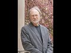

# World-Class New Testament Scholar Professor Dale Allison on the historical Jesus (2021-06-04 20:56:48+00:00)

## Description

Dale C. Allison is an American New Testament scholar, historian of Early Christianity, and Christian theologian. He is currently the Richard J. Dearborn Professor of New Testament Studies at Princeton Theological Seminary and an ordained elder in the Presbyterian Church (USA). His latest book is The Resurrection of Jesus: Apologetics, Polemics https://www.amazon.co.uk/Resurrection-Jesus-Apologetics-Polemics-History/dp/0567697576

## Full transcript with timestamps

[0:00:02](https://youtu.be/SNm0D0I5gdQ?t=2) great good evening everyone and welcome  
[0:00:04](https://youtu.be/SNm0D0I5gdQ?t=4) to  
[0:00:05](https://youtu.be/SNm0D0I5gdQ?t=5) uh very special uh edition of blogging  
[0:00:07](https://youtu.be/SNm0D0I5gdQ?t=7) theology where  
[0:00:09](https://youtu.be/SNm0D0I5gdQ?t=9) um i'm very honored to have as a guest  
[0:00:12](https://youtu.be/SNm0D0I5gdQ?t=12) um dale allison from the united states  
[0:00:15](https://youtu.be/SNm0D0I5gdQ?t=15) um now for those of you who don't know  
[0:00:18](https://youtu.be/SNm0D0I5gdQ?t=18) if there are such people um  
[0:00:19](https://youtu.be/SNm0D0I5gdQ?t=19) adele is an american new testament  
[0:00:21](https://youtu.be/SNm0D0I5gdQ?t=21) scholar  
[0:00:22](https://youtu.be/SNm0D0I5gdQ?t=22) uh an historian of early christianity  
[0:00:25](https://youtu.be/SNm0D0I5gdQ?t=25) and a christian  
[0:00:26](https://youtu.be/SNm0D0I5gdQ?t=26) theologian who for many years served as  
[0:00:28](https://youtu.be/SNm0D0I5gdQ?t=28) a professor of new testament  
[0:00:30](https://youtu.be/SNm0D0I5gdQ?t=30) exegesis and early christianity at  
[0:00:32](https://youtu.be/SNm0D0I5gdQ?t=32) pittsburgh  
[0:00:33](https://youtu.be/SNm0D0I5gdQ?t=33) theological seminary but now he is the  
[0:00:37](https://youtu.be/SNm0D0I5gdQ?t=37) richard j dearborn professor of new  
[0:00:39](https://youtu.be/SNm0D0I5gdQ?t=39) testament studies at princeton  
[0:00:41](https://youtu.be/SNm0D0I5gdQ?t=41) theological seminary and he's also an  
[0:00:44](https://youtu.be/SNm0D0I5gdQ?t=44) ordained elder in the presbyterian  
[0:00:46](https://youtu.be/SNm0D0I5gdQ?t=46) church  
[0:00:47](https://youtu.be/SNm0D0I5gdQ?t=47) in the usa so that's uh quite a quite a  
[0:00:50](https://youtu.be/SNm0D0I5gdQ?t=50) cv  
[0:00:51](https://youtu.be/SNm0D0I5gdQ?t=51) so you're most welcome dale to to to the  
[0:00:54](https://youtu.be/SNm0D0I5gdQ?t=54) program  
[0:00:55](https://youtu.be/SNm0D0I5gdQ?t=55) happy to be here paul thank you so much  
[0:00:57](https://youtu.be/SNm0D0I5gdQ?t=57) and uh i just wanted just to share a few  
[0:00:59](https://youtu.be/SNm0D0I5gdQ?t=59) of the books that which i personally  
[0:01:01](https://youtu.be/SNm0D0I5gdQ?t=61) have which  
[0:01:02](https://youtu.be/SNm0D0I5gdQ?t=62) i do want to other people to be aware of  
[0:01:04](https://youtu.be/SNm0D0I5gdQ?t=64) now i call these my bricks now  
[0:01:06](https://youtu.be/SNm0D0I5gdQ?t=66) these are commentary it's a commentary  
[0:01:09](https://youtu.be/SNm0D0I5gdQ?t=69) on the gospel of matthew okay  
[0:01:11](https://youtu.be/SNm0D0I5gdQ?t=71) which uh dale has written this is  
[0:01:13](https://youtu.be/SNm0D0I5gdQ?t=73) matthew one to seven you can see it's  
[0:01:15](https://youtu.be/SNm0D0I5gdQ?t=75) pretty thick  
[0:01:16](https://youtu.be/SNm0D0I5gdQ?t=76) and then the second volume eight to  
[0:01:17](https://youtu.be/SNm0D0I5gdQ?t=77) eight eight to eighteen  
[0:01:19](https://youtu.be/SNm0D0I5gdQ?t=79) and another volume which takes you all  
[0:01:21](https://youtu.be/SNm0D0I5gdQ?t=81) the way to the end to  
[0:01:22](https://youtu.be/SNm0D0I5gdQ?t=82) matthew 28. this is a huge  
[0:01:28](https://youtu.be/SNm0D0I5gdQ?t=88) now many scholars uh jimmy dunn for  
[0:01:30](https://youtu.be/SNm0D0I5gdQ?t=90) example who sadly passed away recently  
[0:01:32](https://youtu.be/SNm0D0I5gdQ?t=92) sees this  
[0:01:33](https://youtu.be/SNm0D0I5gdQ?t=93) pretty much the definitive uh scholarly  
[0:01:35](https://youtu.be/SNm0D0I5gdQ?t=95) commentary on  
[0:01:37](https://youtu.be/SNm0D0I5gdQ?t=97) the gospel of matthew and uh it is  
[0:01:39](https://youtu.be/SNm0D0I5gdQ?t=99) absolutely extra it's the go-to text for  
[0:01:41](https://youtu.be/SNm0D0I5gdQ?t=101) academics of course and for  
[0:01:43](https://youtu.be/SNm0D0I5gdQ?t=103) all students now if you don't want  
[0:01:45](https://youtu.be/SNm0D0I5gdQ?t=105) something as heavy as that  
[0:01:47](https://youtu.be/SNm0D0I5gdQ?t=107) dale has produced this concise version  
[0:01:50](https://youtu.be/SNm0D0I5gdQ?t=110) that's what it's called the shorter  
[0:01:51](https://youtu.be/SNm0D0I5gdQ?t=111) commentary which as you can see is  
[0:01:53](https://youtu.be/SNm0D0I5gdQ?t=113) much shorter of the same text he's  
[0:01:55](https://youtu.be/SNm0D0I5gdQ?t=115) managed to condense  
[0:01:57](https://youtu.be/SNm0D0I5gdQ?t=117) all of that into this um and i recommend  
[0:01:59](https://youtu.be/SNm0D0I5gdQ?t=119) both this is really really handy if you  
[0:02:01](https://youtu.be/SNm0D0I5gdQ?t=121) want a quick reference without all the  
[0:02:03](https://youtu.be/SNm0D0I5gdQ?t=123) the greek perhaps and uh so on um  
[0:02:06](https://youtu.be/SNm0D0I5gdQ?t=126) his most recent book is this one the  
[0:02:09](https://youtu.be/SNm0D0I5gdQ?t=129) resurrection of jesus apologetics  
[0:02:10](https://youtu.be/SNm0D0I5gdQ?t=130) polemics and history  
[0:02:12](https://youtu.be/SNm0D0I5gdQ?t=132) published in the uk back in just march a  
[0:02:14](https://youtu.be/SNm0D0I5gdQ?t=134) few months i don't know when it was  
[0:02:15](https://youtu.be/SNm0D0I5gdQ?t=135) available in the states but uh  
[0:02:17](https://youtu.be/SNm0D0I5gdQ?t=137) it's certainly a new book and um i  
[0:02:20](https://youtu.be/SNm0D0I5gdQ?t=140) haven't read all of that i had a chance  
[0:02:21](https://youtu.be/SNm0D0I5gdQ?t=141) to but i've read bits of it and there's  
[0:02:22](https://youtu.be/SNm0D0I5gdQ?t=142) one chapter  
[0:02:23](https://youtu.be/SNm0D0I5gdQ?t=143) i want to just discuss with dale uh  
[0:02:26](https://youtu.be/SNm0D0I5gdQ?t=146) shortly  
[0:02:27](https://youtu.be/SNm0D0I5gdQ?t=147) but before we begin all of that um  
[0:02:30](https://youtu.be/SNm0D0I5gdQ?t=150) actually is one of my favorite books and  
[0:02:31](https://youtu.be/SNm0D0I5gdQ?t=151) this is  
[0:02:32](https://youtu.be/SNm0D0I5gdQ?t=152) ultra slim but actually it's ultra  
[0:02:34](https://youtu.be/SNm0D0I5gdQ?t=154) packed full of  
[0:02:36](https://youtu.be/SNm0D0I5gdQ?t=156) dynamite theological dynamite um  
[0:02:39](https://youtu.be/SNm0D0I5gdQ?t=159) and it's called the historical christ  
[0:02:41](https://youtu.be/SNm0D0I5gdQ?t=161) and the theological jesus  
[0:02:44](https://youtu.be/SNm0D0I5gdQ?t=164) and this is a series of very fascinating  
[0:02:47](https://youtu.be/SNm0D0I5gdQ?t=167) reflections on the nature of biblical  
[0:02:49](https://youtu.be/SNm0D0I5gdQ?t=169) scholarship and  
[0:02:50](https://youtu.be/SNm0D0I5gdQ?t=170) christianity and christology how to  
[0:02:53](https://youtu.be/SNm0D0I5gdQ?t=173) understand the  
[0:02:53](https://youtu.be/SNm0D0I5gdQ?t=173) the bible and so on and so on very very  
[0:02:56](https://youtu.be/SNm0D0I5gdQ?t=176) interesting  
[0:02:57](https://youtu.be/SNm0D0I5gdQ?t=177) and i just wanted to start by quoting  
[0:03:00](https://youtu.be/SNm0D0I5gdQ?t=180) um some of dale's observations  
[0:03:03](https://youtu.be/SNm0D0I5gdQ?t=183) about um you know this for several  
[0:03:06](https://youtu.be/SNm0D0I5gdQ?t=186) centuries now there's been this  
[0:03:08](https://youtu.be/SNm0D0I5gdQ?t=188) academic discipline scholarly discipline  
[0:03:10](https://youtu.be/SNm0D0I5gdQ?t=190) called biblical scholarship  
[0:03:12](https://youtu.be/SNm0D0I5gdQ?t=192) uh particularly since the enlightenment  
[0:03:14](https://youtu.be/SNm0D0I5gdQ?t=194) has really taken off  
[0:03:15](https://youtu.be/SNm0D0I5gdQ?t=195) but very few people it seems outside of  
[0:03:18](https://youtu.be/SNm0D0I5gdQ?t=198) this rarefied world  
[0:03:20](https://youtu.be/SNm0D0I5gdQ?t=200) are aware of the contents and the  
[0:03:23](https://youtu.be/SNm0D0I5gdQ?t=203) implications and the results of biblical  
[0:03:26](https://youtu.be/SNm0D0I5gdQ?t=206) scholarship  
[0:03:27](https://youtu.be/SNm0D0I5gdQ?t=207) and he says uh on page three of this  
[0:03:29](https://youtu.be/SNm0D0I5gdQ?t=209) book remarkably many  
[0:03:31](https://youtu.be/SNm0D0I5gdQ?t=211) sorry many pew sitters are happily  
[0:03:34](https://youtu.be/SNm0D0I5gdQ?t=214) oblivious  
[0:03:35](https://youtu.be/SNm0D0I5gdQ?t=215) happily oblivious of what has been going  
[0:03:38](https://youtu.be/SNm0D0I5gdQ?t=218) on in the thinking world  
[0:03:39](https://youtu.be/SNm0D0I5gdQ?t=219) for two and a half centuries they have  
[0:03:42](https://youtu.be/SNm0D0I5gdQ?t=222) somehow avoided  
[0:03:43](https://youtu.be/SNm0D0I5gdQ?t=223) most or even all of the serious  
[0:03:45](https://youtu.be/SNm0D0I5gdQ?t=225) intellectual commentary on the gospels  
[0:03:47](https://youtu.be/SNm0D0I5gdQ?t=227) since the enlightenment perhaps  
[0:03:50](https://youtu.be/SNm0D0I5gdQ?t=230) typically typical of the two churches i  
[0:03:52](https://youtu.be/SNm0D0I5gdQ?t=232) grew up in says dale  
[0:03:53](https://youtu.be/SNm0D0I5gdQ?t=233) one presbyterian and one  
[0:03:54](https://youtu.be/SNm0D0I5gdQ?t=234) congregationalist never in sunday school  
[0:03:57](https://youtu.be/SNm0D0I5gdQ?t=237) or from the pulpit did i hear anything  
[0:03:59](https://youtu.be/SNm0D0I5gdQ?t=239) of the modern debates surrounding jesus  
[0:04:01](https://youtu.be/SNm0D0I5gdQ?t=241) and the gospels and then a little later  
[0:04:04](https://youtu.be/SNm0D0I5gdQ?t=244) on he says  
[0:04:05](https://youtu.be/SNm0D0I5gdQ?t=245) of people who perhaps who do hear  
[0:04:07](https://youtu.be/SNm0D0I5gdQ?t=247) perhaps of the media or through  
[0:04:09](https://youtu.be/SNm0D0I5gdQ?t=249) public broadcasting a little bit of what  
[0:04:11](https://youtu.be/SNm0D0I5gdQ?t=251) uh has been going on the scholarly world  
[0:04:14](https://youtu.be/SNm0D0I5gdQ?t=254) and he says these people may for  
[0:04:16](https://youtu.be/SNm0D0I5gdQ?t=256) instance fret  
[0:04:17](https://youtu.be/SNm0D0I5gdQ?t=257) upon learning that many modern scholars  
[0:04:19](https://youtu.be/SNm0D0I5gdQ?t=259) do not believe  
[0:04:20](https://youtu.be/SNm0D0I5gdQ?t=260) that matthew wrote matthew or that jesus  
[0:04:23](https://youtu.be/SNm0D0I5gdQ?t=263) spoke the discourses in john  
[0:04:25](https://youtu.be/SNm0D0I5gdQ?t=265) they may also depending on their  
[0:04:27](https://youtu.be/SNm0D0I5gdQ?t=267) background find themselves  
[0:04:29](https://youtu.be/SNm0D0I5gdQ?t=269) vexed upon becoming persuaded  
[0:04:32](https://youtu.be/SNm0D0I5gdQ?t=272) that the old props miracles eyewitness  
[0:04:35](https://youtu.be/SNm0D0I5gdQ?t=275) origins the proof and prophecy  
[0:04:37](https://youtu.be/SNm0D0I5gdQ?t=277) have seemingly failed to the fallen to  
[0:04:39](https://youtu.be/SNm0D0I5gdQ?t=279) the ground  
[0:04:40](https://youtu.be/SNm0D0I5gdQ?t=280) and are in need of being propped up or  
[0:04:44](https://youtu.be/SNm0D0I5gdQ?t=284) or maybe abandoned as everlasting ruins  
[0:04:47](https://youtu.be/SNm0D0I5gdQ?t=287) such individuals have awakened from  
[0:04:50](https://youtu.be/SNm0D0I5gdQ?t=290) their dogmatic slumbers  
[0:04:52](https://youtu.be/SNm0D0I5gdQ?t=292) i think there's a reference to kant  
[0:04:53](https://youtu.be/SNm0D0I5gdQ?t=293) there when he's talking about hume  
[0:04:55](https://youtu.be/SNm0D0I5gdQ?t=295) and cannot go back to sleep  
[0:04:58](https://youtu.be/SNm0D0I5gdQ?t=298) wow i mean it's a great bit of rhetoric  
[0:05:00](https://youtu.be/SNm0D0I5gdQ?t=300) actually this is not dry and dust  
[0:05:01](https://youtu.be/SNm0D0I5gdQ?t=301) academic stuff it's uh  
[0:05:03](https://youtu.be/SNm0D0I5gdQ?t=303) it's almost poetic uh in its uh and  
[0:05:06](https://youtu.be/SNm0D0I5gdQ?t=306) references there i think to cans and so  
[0:05:08](https://youtu.be/SNm0D0I5gdQ?t=308) on  
[0:05:08](https://youtu.be/SNm0D0I5gdQ?t=308) i this is is this not really a scandal  
[0:05:12](https://youtu.be/SNm0D0I5gdQ?t=312) that there is such a chasm  
[0:05:14](https://youtu.be/SNm0D0I5gdQ?t=314) between your world but you're in a  
[0:05:17](https://youtu.be/SNm0D0I5gdQ?t=317) seminary so you're teaching ministers  
[0:05:19](https://youtu.be/SNm0D0I5gdQ?t=319) and  
[0:05:19](https://youtu.be/SNm0D0I5gdQ?t=319) the pastors of the future but the  
[0:05:21](https://youtu.be/SNm0D0I5gdQ?t=321) congregations at the at the lay level  
[0:05:23](https://youtu.be/SNm0D0I5gdQ?t=323) you don't seem to know much about this  
[0:05:25](https://youtu.be/SNm0D0I5gdQ?t=325) material so in my experience a lot of  
[0:05:30](https://youtu.be/SNm0D0I5gdQ?t=330) pastors get a seminary education and  
[0:05:32](https://youtu.be/SNm0D0I5gdQ?t=332) they forget a lot of it  
[0:05:33](https://youtu.be/SNm0D0I5gdQ?t=333) once they walk out the door  
[0:05:37](https://youtu.be/SNm0D0I5gdQ?t=337) let me give you a couple of brief brief  
[0:05:39](https://youtu.be/SNm0D0I5gdQ?t=339) stories here  
[0:05:41](https://youtu.be/SNm0D0I5gdQ?t=341) i did have a student once a number of  
[0:05:42](https://youtu.be/SNm0D0I5gdQ?t=342) years ago 15 years ago or so  
[0:05:44](https://youtu.be/SNm0D0I5gdQ?t=344) come into my office and he had been  
[0:05:47](https://youtu.be/SNm0D0I5gdQ?t=347) taking  
[0:05:48](https://youtu.be/SNm0D0I5gdQ?t=348) a class i was teaching on the historical  
[0:05:50](https://youtu.be/SNm0D0I5gdQ?t=350) jesus  
[0:05:51](https://youtu.be/SNm0D0I5gdQ?t=351) and he said professor allison this is  
[0:05:53](https://youtu.be/SNm0D0I5gdQ?t=353) fascinating  
[0:05:54](https://youtu.be/SNm0D0I5gdQ?t=354) i really really want to learn this stuff  
[0:05:58](https://youtu.be/SNm0D0I5gdQ?t=358) but i've decided i won't because i'm a  
[0:06:01](https://youtu.be/SNm0D0I5gdQ?t=361) pastor  
[0:06:02](https://youtu.be/SNm0D0I5gdQ?t=362) and it won't work in my church and it  
[0:06:04](https://youtu.be/SNm0D0I5gdQ?t=364) won't go with my wife  
[0:06:06](https://youtu.be/SNm0D0I5gdQ?t=366) so i'm walking away and i'm not going to  
[0:06:08](https://youtu.be/SNm0D0I5gdQ?t=368) pay any attention to it  
[0:06:10](https://youtu.be/SNm0D0I5gdQ?t=370) any more and from what  
[0:06:13](https://youtu.be/SNm0D0I5gdQ?t=373) uh i know of him he did he just walked  
[0:06:17](https://youtu.be/SNm0D0I5gdQ?t=377) away from it he thought it was too  
[0:06:19](https://youtu.be/SNm0D0I5gdQ?t=379) challenging i also knew another  
[0:06:21](https://youtu.be/SNm0D0I5gdQ?t=381) pastor who uh told me  
[0:06:25](https://youtu.be/SNm0D0I5gdQ?t=385) that he was very proud of the fact that  
[0:06:26](https://youtu.be/SNm0D0I5gdQ?t=386) he had gone to seminary  
[0:06:28](https://youtu.be/SNm0D0I5gdQ?t=388) and learned nothing in other words he  
[0:06:30](https://youtu.be/SNm0D0I5gdQ?t=390) wanted to  
[0:06:31](https://youtu.be/SNm0D0I5gdQ?t=391) walk out of seminary with exactly what  
[0:06:34](https://youtu.be/SNm0D0I5gdQ?t=394) he took in  
[0:06:35](https://youtu.be/SNm0D0I5gdQ?t=395) and he gave the the professors what they  
[0:06:37](https://youtu.be/SNm0D0I5gdQ?t=397) wanted on their tests but he didn't  
[0:06:39](https://youtu.be/SNm0D0I5gdQ?t=399) believe  
[0:06:40](https://youtu.be/SNm0D0I5gdQ?t=400) any of it now i i'm just talking about  
[0:06:42](https://youtu.be/SNm0D0I5gdQ?t=402) the situation in america i don't know  
[0:06:44](https://youtu.be/SNm0D0I5gdQ?t=404) what it is like  
[0:06:46](https://youtu.be/SNm0D0I5gdQ?t=406) uh elsewhere but i will say that at  
[0:06:49](https://youtu.be/SNm0D0I5gdQ?t=409) least  
[0:06:49](https://youtu.be/SNm0D0I5gdQ?t=409) once a week i do get uh  
[0:06:53](https://youtu.be/SNm0D0I5gdQ?t=413) a letter uh an email from somebody who  
[0:06:56](https://youtu.be/SNm0D0I5gdQ?t=416) has discovered this  
[0:06:58](https://youtu.be/SNm0D0I5gdQ?t=418) new world of the quest and they're  
[0:07:01](https://youtu.be/SNm0D0I5gdQ?t=421) panicked and they want guidance  
[0:07:03](https://youtu.be/SNm0D0I5gdQ?t=423) or they'll tell me they discovered it  
[0:07:05](https://youtu.be/SNm0D0I5gdQ?t=425) and then became an atheist but now  
[0:07:07](https://youtu.be/SNm0D0I5gdQ?t=427) they're rethinking things can i help  
[0:07:09](https://youtu.be/SNm0D0I5gdQ?t=429) them and so on but i get these  
[0:07:11](https://youtu.be/SNm0D0I5gdQ?t=431) heartfelt letters all the time and  
[0:07:14](https://youtu.be/SNm0D0I5gdQ?t=434) they are almost all from people who grew  
[0:07:17](https://youtu.be/SNm0D0I5gdQ?t=437) up in very conservative churches  
[0:07:20](https://youtu.be/SNm0D0I5gdQ?t=440) and then they discover this world that  
[0:07:22](https://youtu.be/SNm0D0I5gdQ?t=442) nobody ever told them about and they  
[0:07:25](https://youtu.be/SNm0D0I5gdQ?t=445) feel cheated  
[0:07:26](https://youtu.be/SNm0D0I5gdQ?t=446) and they feel threatened and they are  
[0:07:29](https://youtu.be/SNm0D0I5gdQ?t=449) often very very uh confused  
[0:07:32](https://youtu.be/SNm0D0I5gdQ?t=452) that was sort of my own experience as i  
[0:07:35](https://youtu.be/SNm0D0I5gdQ?t=455) recounted at the beginning of that book  
[0:07:38](https://youtu.be/SNm0D0I5gdQ?t=458) uh what happened to me is i was actually  
[0:07:40](https://youtu.be/SNm0D0I5gdQ?t=460) in a methodist church  
[0:07:42](https://youtu.be/SNm0D0I5gdQ?t=462) and in the methodist church library i  
[0:07:44](https://youtu.be/SNm0D0I5gdQ?t=464) was 16 years old  
[0:07:46](https://youtu.be/SNm0D0I5gdQ?t=466) maybe 17 and i saw this book  
[0:07:49](https://youtu.be/SNm0D0I5gdQ?t=469) and i saw the name schweitzer on the  
[0:07:51](https://youtu.be/SNm0D0I5gdQ?t=471) cover  
[0:07:52](https://youtu.be/SNm0D0I5gdQ?t=472) and i i said what's that i've heard of  
[0:07:54](https://youtu.be/SNm0D0I5gdQ?t=474) this guy i don't know why he's famous  
[0:07:56](https://youtu.be/SNm0D0I5gdQ?t=476) and i guess he was a good person  
[0:07:58](https://youtu.be/SNm0D0I5gdQ?t=478) i just pulled it off and said whoa i  
[0:07:59](https://youtu.be/SNm0D0I5gdQ?t=479) don't know any of this and i  
[0:08:01](https://youtu.be/SNm0D0I5gdQ?t=481) read it i read the quest  
[0:08:04](https://youtu.be/SNm0D0I5gdQ?t=484) of the historical jesus and when i put  
[0:08:07](https://youtu.be/SNm0D0I5gdQ?t=487) it down  
[0:08:08](https://youtu.be/SNm0D0I5gdQ?t=488) i thought this book's uh this book is  
[0:08:12](https://youtu.be/SNm0D0I5gdQ?t=492) 70 years old nobody's ever  
[0:08:15](https://youtu.be/SNm0D0I5gdQ?t=495) told me about any of this stuff i really  
[0:08:18](https://youtu.be/SNm0D0I5gdQ?t=498) felt  
[0:08:19](https://youtu.be/SNm0D0I5gdQ?t=499) not that my parents had cheated me but  
[0:08:21](https://youtu.be/SNm0D0I5gdQ?t=501) that my christian education had cheated  
[0:08:23](https://youtu.be/SNm0D0I5gdQ?t=503) me  
[0:08:24](https://youtu.be/SNm0D0I5gdQ?t=504) and my spiritual mentors had cheated me  
[0:08:27](https://youtu.be/SNm0D0I5gdQ?t=507) and what happened was i had to figure  
[0:08:30](https://youtu.be/SNm0D0I5gdQ?t=510) things out for myself  
[0:08:32](https://youtu.be/SNm0D0I5gdQ?t=512) i was completely on my own we didn't  
[0:08:34](https://youtu.be/SNm0D0I5gdQ?t=514) have email back then so i couldn't  
[0:08:36](https://youtu.be/SNm0D0I5gdQ?t=516) i couldn't email anybody albert  
[0:08:38](https://youtu.be/SNm0D0I5gdQ?t=518) schweitzer was dead  
[0:08:40](https://youtu.be/SNm0D0I5gdQ?t=520) if he'd been alive we'd had email i  
[0:08:42](https://youtu.be/SNm0D0I5gdQ?t=522) would have emailed  
[0:08:44](https://youtu.be/SNm0D0I5gdQ?t=524) by the way albert uh tried to answer  
[0:08:46](https://youtu.be/SNm0D0I5gdQ?t=526) every letter that was written to him  
[0:08:48](https://youtu.be/SNm0D0I5gdQ?t=528) even by high school kids  
[0:08:50](https://youtu.be/SNm0D0I5gdQ?t=530) and uh he stayed up late at night  
[0:08:52](https://youtu.be/SNm0D0I5gdQ?t=532) without a secretary writing by hand  
[0:08:54](https://youtu.be/SNm0D0I5gdQ?t=534) responding to everybody uh anyway so he  
[0:08:58](https://youtu.be/SNm0D0I5gdQ?t=538) would have responded to me  
[0:09:00](https://youtu.be/SNm0D0I5gdQ?t=540) but he uh he died in what 65 so it was  
[0:09:03](https://youtu.be/SNm0D0I5gdQ?t=543) too late for me  
[0:09:05](https://youtu.be/SNm0D0I5gdQ?t=545) that's extraordinary sorry i could  
[0:09:07](https://youtu.be/SNm0D0I5gdQ?t=547) imagine him because he he was a  
[0:09:08](https://youtu.be/SNm0D0I5gdQ?t=548) a true polymath and he was a great organ  
[0:09:10](https://youtu.be/SNm0D0I5gdQ?t=550) scholar he was a missionary  
[0:09:13](https://youtu.be/SNm0D0I5gdQ?t=553) he worked in africa as a doctor as a  
[0:09:15](https://youtu.be/SNm0D0I5gdQ?t=555) missionary as a doctor a medical doctor  
[0:09:17](https://youtu.be/SNm0D0I5gdQ?t=557) yeah so i visions of him sitting in  
[0:09:19](https://youtu.be/SNm0D0I5gdQ?t=559) africa in the  
[0:09:21](https://youtu.be/SNm0D0I5gdQ?t=561) know 1950s writing these letters to  
[0:09:22](https://youtu.be/SNm0D0I5gdQ?t=562) students in america i mean what a guy  
[0:09:24](https://youtu.be/SNm0D0I5gdQ?t=564) extraordinary human being i i think uh  
[0:09:27](https://youtu.be/SNm0D0I5gdQ?t=567) albert schweitzer is  
[0:09:28](https://youtu.be/SNm0D0I5gdQ?t=568) what i call a mutant that is he he's  
[0:09:31](https://youtu.be/SNm0D0I5gdQ?t=571) advanced  
[0:09:32](https://youtu.be/SNm0D0I5gdQ?t=572) beyond us he had a a mind that most of  
[0:09:34](https://youtu.be/SNm0D0I5gdQ?t=574) us  
[0:09:35](https://youtu.be/SNm0D0I5gdQ?t=575) can only aspire to he also had more  
[0:09:38](https://youtu.be/SNm0D0I5gdQ?t=578) energy just pure physical energy  
[0:09:40](https://youtu.be/SNm0D0I5gdQ?t=580) than than anybody you'll run into in in  
[0:09:43](https://youtu.be/SNm0D0I5gdQ?t=583) his 70s he's  
[0:09:44](https://youtu.be/SNm0D0I5gdQ?t=584) he's out there working on the roads you  
[0:09:46](https://youtu.be/SNm0D0I5gdQ?t=586) know outside his hospital  
[0:09:48](https://youtu.be/SNm0D0I5gdQ?t=588) lifting boulders and doing all this sort  
[0:09:50](https://youtu.be/SNm0D0I5gdQ?t=590) of thing he's the pharmacist  
[0:09:52](https://youtu.be/SNm0D0I5gdQ?t=592) as well as the doctor uh  
[0:09:55](https://youtu.be/SNm0D0I5gdQ?t=595) and he's still in the midst of all this  
[0:09:57](https://youtu.be/SNm0D0I5gdQ?t=597) about i can tell you this  
[0:09:59](https://youtu.be/SNm0D0I5gdQ?t=599) so i did know somebody who visited  
[0:10:01](https://youtu.be/SNm0D0I5gdQ?t=601) schweitzer  
[0:10:02](https://youtu.be/SNm0D0I5gdQ?t=602) in 63 or 64 right you know right before  
[0:10:05](https://youtu.be/SNm0D0I5gdQ?t=605) he died he was  
[0:10:06](https://youtu.be/SNm0D0I5gdQ?t=606) still old and this was a pastor from the  
[0:10:08](https://youtu.be/SNm0D0I5gdQ?t=608) states and so  
[0:10:10](https://youtu.be/SNm0D0I5gdQ?t=610) he went over there to meet the great man  
[0:10:12](https://youtu.be/SNm0D0I5gdQ?t=612) and he showed up  
[0:10:14](https://youtu.be/SNm0D0I5gdQ?t=614) and uh he was there for for for dinner  
[0:10:18](https://youtu.be/SNm0D0I5gdQ?t=618) and schweitzer said i want you to come  
[0:10:20](https://youtu.be/SNm0D0I5gdQ?t=620) back to my cabin  
[0:10:22](https://youtu.be/SNm0D0I5gdQ?t=622) uh at whatever it was nine o'clock or  
[0:10:24](https://youtu.be/SNm0D0I5gdQ?t=624) something like that so the pastor goes  
[0:10:25](https://youtu.be/SNm0D0I5gdQ?t=625) back there he gets to  
[0:10:27](https://youtu.be/SNm0D0I5gdQ?t=627) meet the world famous person and what's  
[0:10:29](https://youtu.be/SNm0D0I5gdQ?t=629) and this was the methodist pastor and  
[0:10:31](https://youtu.be/SNm0D0I5gdQ?t=631) what schweitzer proceeded to do was to  
[0:10:33](https://youtu.be/SNm0D0I5gdQ?t=633) pull out a synopsis  
[0:10:35](https://youtu.be/SNm0D0I5gdQ?t=635) a greek synopsis and try to convince  
[0:10:37](https://youtu.be/SNm0D0I5gdQ?t=637) this pastor  
[0:10:38](https://youtu.be/SNm0D0I5gdQ?t=638) that matthew was the first gospel not  
[0:10:41](https://youtu.be/SNm0D0I5gdQ?t=641) mark  
[0:10:42](https://youtu.be/SNm0D0I5gdQ?t=642) and i love this story because here you  
[0:10:44](https://youtu.be/SNm0D0I5gdQ?t=644) have this  
[0:10:45](https://youtu.be/SNm0D0I5gdQ?t=645) this world famous man who still can't  
[0:10:48](https://youtu.be/SNm0D0I5gdQ?t=648) get away from the gospels and the  
[0:10:50](https://youtu.be/SNm0D0I5gdQ?t=650) questions about jesus and in his old age  
[0:10:52](https://youtu.be/SNm0D0I5gdQ?t=652) he's still going through his synopsis  
[0:10:54](https://youtu.be/SNm0D0I5gdQ?t=654) trying trying to figure things out  
[0:10:57](https://youtu.be/SNm0D0I5gdQ?t=657) that's amazing  
[0:10:58](https://youtu.be/SNm0D0I5gdQ?t=658) i i i like your quote there's a quote at  
[0:11:00](https://youtu.be/SNm0D0I5gdQ?t=660) the beginning of the fourth chapter by  
[0:11:01](https://youtu.be/SNm0D0I5gdQ?t=661) william james the great american  
[0:11:03](https://youtu.be/SNm0D0I5gdQ?t=663) psychologist and he says we  
[0:11:06](https://youtu.be/SNm0D0I5gdQ?t=666) instinctively recoil from seeing an  
[0:11:08](https://youtu.be/SNm0D0I5gdQ?t=668) object to which our emotions and our  
[0:11:10](https://youtu.be/SNm0D0I5gdQ?t=670) affections are committed  
[0:11:12](https://youtu.be/SNm0D0I5gdQ?t=672) handled by the intellect as any other  
[0:11:15](https://youtu.be/SNm0D0I5gdQ?t=675) object  
[0:11:15](https://youtu.be/SNm0D0I5gdQ?t=675) is handled and i got absolutely right i  
[0:11:19](https://youtu.be/SNm0D0I5gdQ?t=679) mean maybe this is the root of the  
[0:11:20](https://youtu.be/SNm0D0I5gdQ?t=680) problem that people don't want  
[0:11:22](https://youtu.be/SNm0D0I5gdQ?t=682) uh you know their sacred texts treated  
[0:11:25](https://youtu.be/SNm0D0I5gdQ?t=685) like any other old text in the world and  
[0:11:27](https://youtu.be/SNm0D0I5gdQ?t=687) they recoil from this and that maybe is  
[0:11:29](https://youtu.be/SNm0D0I5gdQ?t=689) part of the  
[0:11:30](https://youtu.be/SNm0D0I5gdQ?t=690) reason why it's not caught fire with the  
[0:11:32](https://youtu.be/SNm0D0I5gdQ?t=692) population at large  
[0:11:34](https://youtu.be/SNm0D0I5gdQ?t=694) what do you think um  
[0:11:38](https://youtu.be/SNm0D0I5gdQ?t=698) i don't i don't know i'm not a social  
[0:11:40](https://youtu.be/SNm0D0I5gdQ?t=700) psychologist so i don't really  
[0:11:42](https://youtu.be/SNm0D0I5gdQ?t=702) i don't really under understand so so my  
[0:11:45](https://youtu.be/SNm0D0I5gdQ?t=705) case  
[0:11:46](https://youtu.be/SNm0D0I5gdQ?t=706) was like this i discovered this  
[0:11:49](https://youtu.be/SNm0D0I5gdQ?t=709) um area this field of knowledge  
[0:11:52](https://youtu.be/SNm0D0I5gdQ?t=712) and i had nobody to help me so i went to  
[0:11:55](https://youtu.be/SNm0D0I5gdQ?t=715) the library  
[0:11:56](https://youtu.be/SNm0D0I5gdQ?t=716) and then i went to bookstores and then i  
[0:11:59](https://youtu.be/SNm0D0I5gdQ?t=719) got book catalogs  
[0:12:01](https://youtu.be/SNm0D0I5gdQ?t=721) and i just read and i read and i read  
[0:12:03](https://youtu.be/SNm0D0I5gdQ?t=723) and i was often confused and i was  
[0:12:05](https://youtu.be/SNm0D0I5gdQ?t=725) sometimes threatened  
[0:12:06](https://youtu.be/SNm0D0I5gdQ?t=726) but the truth is this turned out to be a  
[0:12:08](https://youtu.be/SNm0D0I5gdQ?t=728) great intellectual  
[0:12:10](https://youtu.be/SNm0D0I5gdQ?t=730) and spiritual adventure and  
[0:12:13](https://youtu.be/SNm0D0I5gdQ?t=733) i i've i've had a great life and i've  
[0:12:15](https://youtu.be/SNm0D0I5gdQ?t=735) had a great time  
[0:12:17](https://youtu.be/SNm0D0I5gdQ?t=737) uh learning and a great time studying  
[0:12:20](https://youtu.be/SNm0D0I5gdQ?t=740) and and so for me um it's puzzling when  
[0:12:24](https://youtu.be/SNm0D0I5gdQ?t=744) people just want to  
[0:12:26](https://youtu.be/SNm0D0I5gdQ?t=746) to stay where they are i i have friends  
[0:12:28](https://youtu.be/SNm0D0I5gdQ?t=748) very good close friends  
[0:12:29](https://youtu.be/SNm0D0I5gdQ?t=749) whose theological thoughts today in  
[0:12:32](https://youtu.be/SNm0D0I5gdQ?t=752) their 60s  
[0:12:33](https://youtu.be/SNm0D0I5gdQ?t=753) are exactly the same as they were  
[0:12:36](https://youtu.be/SNm0D0I5gdQ?t=756) when they were teenagers and i don't  
[0:12:39](https://youtu.be/SNm0D0I5gdQ?t=759) understand that you know in every other  
[0:12:41](https://youtu.be/SNm0D0I5gdQ?t=761) area of life you grow and learn and  
[0:12:43](https://youtu.be/SNm0D0I5gdQ?t=763) mature  
[0:12:44](https://youtu.be/SNm0D0I5gdQ?t=764) but there's something about religion  
[0:12:46](https://youtu.be/SNm0D0I5gdQ?t=766) which makes  
[0:12:47](https://youtu.be/SNm0D0I5gdQ?t=767) a lot of people think i just want to  
[0:12:49](https://youtu.be/SNm0D0I5gdQ?t=769) stay where i  
[0:12:51](https://youtu.be/SNm0D0I5gdQ?t=771) am and anything else um is bad or  
[0:12:54](https://youtu.be/SNm0D0I5gdQ?t=774) or evil um the reason why that might  
[0:12:58](https://youtu.be/SNm0D0I5gdQ?t=778) that might be a problem though because  
[0:13:00](https://youtu.be/SNm0D0I5gdQ?t=780) okay you're a teenager  
[0:13:02](https://youtu.be/SNm0D0I5gdQ?t=782) in your twenties and you convert to a  
[0:13:03](https://youtu.be/SNm0D0I5gdQ?t=783) religion uh that uh  
[0:13:06](https://youtu.be/SNm0D0I5gdQ?t=786) has a central creedal affirmation of the  
[0:13:08](https://youtu.be/SNm0D0I5gdQ?t=788) the nicene creed say  
[0:13:10](https://youtu.be/SNm0D0I5gdQ?t=790) that that jesus is god he is the son  
[0:13:12](https://youtu.be/SNm0D0I5gdQ?t=792) consubstantial with the father  
[0:13:14](https://youtu.be/SNm0D0I5gdQ?t=794) or the calzodonian creed and then you  
[0:13:16](https://youtu.be/SNm0D0I5gdQ?t=796) study uh new testament studies and you  
[0:13:19](https://youtu.be/SNm0D0I5gdQ?t=799) you learn from maybe from yourself or  
[0:13:20](https://youtu.be/SNm0D0I5gdQ?t=800) any  
[0:13:20](https://youtu.be/SNm0D0I5gdQ?t=800) any other respected scholar that it  
[0:13:23](https://youtu.be/SNm0D0I5gdQ?t=803) seems that  
[0:13:24](https://youtu.be/SNm0D0I5gdQ?t=804) matthew the gospel of matthew has used  
[0:13:26](https://youtu.be/SNm0D0I5gdQ?t=806) the gospel of mark in its in the writing  
[0:13:28](https://youtu.be/SNm0D0I5gdQ?t=808) of his own gospel  
[0:13:29](https://youtu.be/SNm0D0I5gdQ?t=809) and he has deliberately heightened the  
[0:13:32](https://youtu.be/SNm0D0I5gdQ?t=812) christology  
[0:13:33](https://youtu.be/SNm0D0I5gdQ?t=813) that we find in mark for example in mark  
[0:13:36](https://youtu.be/SNm0D0I5gdQ?t=816) chapter 10  
[0:13:37](https://youtu.be/SNm0D0I5gdQ?t=817) we read a man came to jesus and said  
[0:13:39](https://youtu.be/SNm0D0I5gdQ?t=819) good teacher what must i do to inherit  
[0:13:41](https://youtu.be/SNm0D0I5gdQ?t=821) eternal life  
[0:13:42](https://youtu.be/SNm0D0I5gdQ?t=822) jesus replies why do you call me good  
[0:13:44](https://youtu.be/SNm0D0I5gdQ?t=824) there's no one good  
[0:13:45](https://youtu.be/SNm0D0I5gdQ?t=825) but god alone and then we look at the  
[0:13:47](https://youtu.be/SNm0D0I5gdQ?t=827) passage  
[0:13:48](https://youtu.be/SNm0D0I5gdQ?t=828) in matthew's redaction his editing and  
[0:13:52](https://youtu.be/SNm0D0I5gdQ?t=832) matthew changes the words and he has  
[0:13:53](https://youtu.be/SNm0D0I5gdQ?t=833) well why do you ask me about what is  
[0:13:55](https://youtu.be/SNm0D0I5gdQ?t=835) good  
[0:13:56](https://youtu.be/SNm0D0I5gdQ?t=836) uh there's no one good but goal alone uh  
[0:13:58](https://youtu.be/SNm0D0I5gdQ?t=838) seemingly therefore  
[0:13:59](https://youtu.be/SNm0D0I5gdQ?t=839) to to mitigate or water down the  
[0:14:02](https://youtu.be/SNm0D0I5gdQ?t=842) implications  
[0:14:03](https://youtu.be/SNm0D0I5gdQ?t=843) of mark 10 that jesus is somehow not god  
[0:14:06](https://youtu.be/SNm0D0I5gdQ?t=846) and that's one of many examples one  
[0:14:07](https://youtu.be/SNm0D0I5gdQ?t=847) could give now that this  
[0:14:09](https://youtu.be/SNm0D0I5gdQ?t=849) the implication is that you have a  
[0:14:11](https://youtu.be/SNm0D0I5gdQ?t=851) trajectory does does it not  
[0:14:13](https://youtu.be/SNm0D0I5gdQ?t=853) of of uh accelerating or embellishment  
[0:14:16](https://youtu.be/SNm0D0I5gdQ?t=856) over time from mark to to matthew and  
[0:14:19](https://youtu.be/SNm0D0I5gdQ?t=859) then  
[0:14:19](https://youtu.be/SNm0D0I5gdQ?t=859) let alone john which has a very very  
[0:14:21](https://youtu.be/SNm0D0I5gdQ?t=861) high explicit christology  
[0:14:23](https://youtu.be/SNm0D0I5gdQ?t=863) and and this the implications of this is  
[0:14:26](https://youtu.be/SNm0D0I5gdQ?t=866) not just  
[0:14:26](https://youtu.be/SNm0D0I5gdQ?t=866) ivory tower is it not it implies that if  
[0:14:29](https://youtu.be/SNm0D0I5gdQ?t=869) you rewind the clock backwards  
[0:14:31](https://youtu.be/SNm0D0I5gdQ?t=871) to the earliest jesus tradition you have  
[0:14:34](https://youtu.be/SNm0D0I5gdQ?t=874) a non-divine jesus you have a jesus who  
[0:14:36](https://youtu.be/SNm0D0I5gdQ?t=876) said why do you call me good there's no  
[0:14:38](https://youtu.be/SNm0D0I5gdQ?t=878) one good by god alone  
[0:14:39](https://youtu.be/SNm0D0I5gdQ?t=879) and then in john you have i am the way  
[0:14:42](https://youtu.be/SNm0D0I5gdQ?t=882) the truth and the life before abraham  
[0:14:43](https://youtu.be/SNm0D0I5gdQ?t=883) was i  
[0:14:44](https://youtu.be/SNm0D0I5gdQ?t=884) am etcetera see it is threatening is it  
[0:14:46](https://youtu.be/SNm0D0I5gdQ?t=886) not to that  
[0:14:48](https://youtu.be/SNm0D0I5gdQ?t=888) that creedal faith the faith in nicaea  
[0:14:50](https://youtu.be/SNm0D0I5gdQ?t=890) chaosdon etc  
[0:14:52](https://youtu.be/SNm0D0I5gdQ?t=892) it's not what without a cost a price  
[0:14:55](https://youtu.be/SNm0D0I5gdQ?t=895) that pay  
[0:14:55](https://youtu.be/SNm0D0I5gdQ?t=895) one pays no so as a christian i would  
[0:14:59](https://youtu.be/SNm0D0I5gdQ?t=899) say it leads you to  
[0:15:00](https://youtu.be/SNm0D0I5gdQ?t=900) maybe reinterpret the creeds or view  
[0:15:02](https://youtu.be/SNm0D0I5gdQ?t=902) them in a new way but it doesn't  
[0:15:03](https://youtu.be/SNm0D0I5gdQ?t=903) necessitate that you  
[0:15:05](https://youtu.be/SNm0D0I5gdQ?t=905) throw them away or that you pay no  
[0:15:07](https://youtu.be/SNm0D0I5gdQ?t=907) attention to them  
[0:15:08](https://youtu.be/SNm0D0I5gdQ?t=908) at all now i agree with you that there  
[0:15:11](https://youtu.be/SNm0D0I5gdQ?t=911) is an evolutionary history here and  
[0:15:14](https://youtu.be/SNm0D0I5gdQ?t=914) uh and a development actually uh  
[0:15:17](https://youtu.be/SNm0D0I5gdQ?t=917) well i was raised on the old uh standard  
[0:15:20](https://youtu.be/SNm0D0I5gdQ?t=920) german model  
[0:15:21](https://youtu.be/SNm0D0I5gdQ?t=921) last half of the 20th century so the the  
[0:15:23](https://youtu.be/SNm0D0I5gdQ?t=923) model  
[0:15:24](https://youtu.be/SNm0D0I5gdQ?t=924) was this this is what you find in uh  
[0:15:27](https://youtu.be/SNm0D0I5gdQ?t=927) ferdinand han's great old book titles of  
[0:15:29](https://youtu.be/SNm0D0I5gdQ?t=929) jesus and christology so  
[0:15:30](https://youtu.be/SNm0D0I5gdQ?t=930) the pre-easter jesus is an  
[0:15:32](https://youtu.be/SNm0D0I5gdQ?t=932) eschatological prophet  
[0:15:34](https://youtu.be/SNm0D0I5gdQ?t=934) that's an exalted position but that's  
[0:15:36](https://youtu.be/SNm0D0I5gdQ?t=936) all it is  
[0:15:37](https://youtu.be/SNm0D0I5gdQ?t=937) then after easter they decide he was the  
[0:15:40](https://youtu.be/SNm0D0I5gdQ?t=940) messiah  
[0:15:40](https://youtu.be/SNm0D0I5gdQ?t=940) because he's risen from the dead and  
[0:15:43](https://youtu.be/SNm0D0I5gdQ?t=943) once you have  
[0:15:44](https://youtu.be/SNm0D0I5gdQ?t=944) davidic messiah then you can get some  
[0:15:46](https://youtu.be/SNm0D0I5gdQ?t=946) sun language because there is sunship  
[0:15:48](https://youtu.be/SNm0D0I5gdQ?t=948) language associated with  
[0:15:50](https://youtu.be/SNm0D0I5gdQ?t=950) the the son of david second samuel  
[0:15:54](https://youtu.be/SNm0D0I5gdQ?t=954) 7 uh the prophecy about solomon which  
[0:15:57](https://youtu.be/SNm0D0I5gdQ?t=957) was understood messianically  
[0:15:59](https://youtu.be/SNm0D0I5gdQ?t=959) so i'll be his father he'll be a son to  
[0:16:01](https://youtu.be/SNm0D0I5gdQ?t=961) me then you get sun language  
[0:16:03](https://youtu.be/SNm0D0I5gdQ?t=963) and then once you get sun language then  
[0:16:05](https://youtu.be/SNm0D0I5gdQ?t=965) that goes in all sorts of directions for  
[0:16:07](https://youtu.be/SNm0D0I5gdQ?t=967) all sorts of reasons then you end up  
[0:16:08](https://youtu.be/SNm0D0I5gdQ?t=968) with pre-existence and then finally you  
[0:16:10](https://youtu.be/SNm0D0I5gdQ?t=970) end up with  
[0:16:12](https://youtu.be/SNm0D0I5gdQ?t=972) uh divinity but you also must know  
[0:16:16](https://youtu.be/SNm0D0I5gdQ?t=976) there's been a pushback against that  
[0:16:18](https://youtu.be/SNm0D0I5gdQ?t=978) and i'm not completely against that the  
[0:16:20](https://youtu.be/SNm0D0I5gdQ?t=980) the proponents of early  
[0:16:22](https://youtu.be/SNm0D0I5gdQ?t=982) so-called early high christology and  
[0:16:25](https://youtu.be/SNm0D0I5gdQ?t=985) um i think that that evolutionary  
[0:16:28](https://youtu.be/SNm0D0I5gdQ?t=988) process if it's true took place  
[0:16:30](https://youtu.be/SNm0D0I5gdQ?t=990) um in a much shorter time period than i  
[0:16:33](https://youtu.be/SNm0D0I5gdQ?t=993) was taught  
[0:16:33](https://youtu.be/SNm0D0I5gdQ?t=993) but but paul here's the other oh you're  
[0:16:35](https://youtu.be/SNm0D0I5gdQ?t=995) going to interrupt me before i  
[0:16:37](https://youtu.be/SNm0D0I5gdQ?t=997) i agree with you i think we have a very  
[0:16:39](https://youtu.be/SNm0D0I5gdQ?t=999) high early christology in paul  
[0:16:41](https://youtu.be/SNm0D0I5gdQ?t=1001) uh which is then continued if you like  
[0:16:44](https://youtu.be/SNm0D0I5gdQ?t=1004) with john  
[0:16:45](https://youtu.be/SNm0D0I5gdQ?t=1005) so i'm not saying early is low high  
[0:16:48](https://youtu.be/SNm0D0I5gdQ?t=1008) is therefore late we have very high  
[0:16:50](https://youtu.be/SNm0D0I5gdQ?t=1010) early but i was talking about the  
[0:16:52](https://youtu.be/SNm0D0I5gdQ?t=1012) gospels themselves really  
[0:16:54](https://youtu.be/SNm0D0I5gdQ?t=1014) the gospel trajectory but but i think  
[0:16:56](https://youtu.be/SNm0D0I5gdQ?t=1016) paul jumps  
[0:16:57](https://youtu.be/SNm0D0I5gdQ?t=1017) on to john you have a natural but the  
[0:17:00](https://youtu.be/SNm0D0I5gdQ?t=1020) synoptics  
[0:17:01](https://youtu.be/SNm0D0I5gdQ?t=1021) the way we see matthew editing uh mark  
[0:17:04](https://youtu.be/SNm0D0I5gdQ?t=1024) and  
[0:17:04](https://youtu.be/SNm0D0I5gdQ?t=1024) the way john heightens even further in  
[0:17:07](https://youtu.be/SNm0D0I5gdQ?t=1027) an unprecedented way near the i am  
[0:17:08](https://youtu.be/SNm0D0I5gdQ?t=1028) saying she's not found  
[0:17:10](https://youtu.be/SNm0D0I5gdQ?t=1030) in the synoptic tradition there we have  
[0:17:12](https://youtu.be/SNm0D0I5gdQ?t=1032) the trajectory i would argue  
[0:17:14](https://youtu.be/SNm0D0I5gdQ?t=1034) i i agree with that but i've never known  
[0:17:16](https://youtu.be/SNm0D0I5gdQ?t=1036) you can ask this question nobody has the  
[0:17:18](https://youtu.be/SNm0D0I5gdQ?t=1038) answer and i don't know  
[0:17:20](https://youtu.be/SNm0D0I5gdQ?t=1040) uh what would matthew have thought if he  
[0:17:22](https://youtu.be/SNm0D0I5gdQ?t=1042) had read john's gospel  
[0:17:24](https://youtu.be/SNm0D0I5gdQ?t=1044) would he have thought this is fantastic  
[0:17:26](https://youtu.be/SNm0D0I5gdQ?t=1046) or  
[0:17:27](https://youtu.be/SNm0D0I5gdQ?t=1047) is this terrible or i'm just confused by  
[0:17:30](https://youtu.be/SNm0D0I5gdQ?t=1050) it  
[0:17:31](https://youtu.be/SNm0D0I5gdQ?t=1051) it's an interesting question so  
[0:17:34](https://youtu.be/SNm0D0I5gdQ?t=1054) what if one of the things this doesn't  
[0:17:36](https://youtu.be/SNm0D0I5gdQ?t=1056) change what you're saying but maybe it  
[0:17:38](https://youtu.be/SNm0D0I5gdQ?t=1058) adds a nuance  
[0:17:39](https://youtu.be/SNm0D0I5gdQ?t=1059) so let's take this idea of pre-existence  
[0:17:42](https://youtu.be/SNm0D0I5gdQ?t=1062) yeah so i don't know if you know uh  
[0:17:45](https://youtu.be/SNm0D0I5gdQ?t=1065) simon gather call he's a fine scholar  
[0:17:47](https://youtu.be/SNm0D0I5gdQ?t=1067) but he's  
[0:17:48](https://youtu.be/SNm0D0I5gdQ?t=1068) he's here in cambridge okay so  
[0:17:51](https://youtu.be/SNm0D0I5gdQ?t=1071) yeah he's a nice guy but he's more  
[0:17:53](https://youtu.be/SNm0D0I5gdQ?t=1073) importantly he's a fine scholar and so  
[0:17:55](https://youtu.be/SNm0D0I5gdQ?t=1075) he wrote a book arguing that  
[0:17:57](https://youtu.be/SNm0D0I5gdQ?t=1077) you can find pre-existence in matthew  
[0:17:58](https://youtu.be/SNm0D0I5gdQ?t=1078) mark and luke now  
[0:18:00](https://youtu.be/SNm0D0I5gdQ?t=1080) i've read it yeah he hasn't convinced  
[0:18:02](https://youtu.be/SNm0D0I5gdQ?t=1082) most people and he didn't convince me  
[0:18:04](https://youtu.be/SNm0D0I5gdQ?t=1084) okay but here's the puzzle for me  
[0:18:09](https://youtu.be/SNm0D0I5gdQ?t=1089) pre-existence i think is already there  
[0:18:11](https://youtu.be/SNm0D0I5gdQ?t=1091) in paul  
[0:18:12](https://youtu.be/SNm0D0I5gdQ?t=1092) actually i think it's in philippians 2  
[0:18:15](https://youtu.be/SNm0D0I5gdQ?t=1095) and i'm with the crowd who thinks that  
[0:18:18](https://youtu.be/SNm0D0I5gdQ?t=1098) the  
[0:18:18](https://youtu.be/SNm0D0I5gdQ?t=1098) so-called uh him there can uses him  
[0:18:22](https://youtu.be/SNm0D0I5gdQ?t=1102) is pre-pauline so i think this notion of  
[0:18:25](https://youtu.be/SNm0D0I5gdQ?t=1105) jesus's pre-existence  
[0:18:26](https://youtu.be/SNm0D0I5gdQ?t=1106) is pre-pauline i think it's very early  
[0:18:30](https://youtu.be/SNm0D0I5gdQ?t=1110) yes so so what does it mean that it's  
[0:18:33](https://youtu.be/SNm0D0I5gdQ?t=1113) not  
[0:18:34](https://youtu.be/SNm0D0I5gdQ?t=1114) in mark or matthew or luke but it's  
[0:18:37](https://youtu.be/SNm0D0I5gdQ?t=1117) clearly in john um  
[0:18:42](https://youtu.be/SNm0D0I5gdQ?t=1122) did these three evangelists not know  
[0:18:44](https://youtu.be/SNm0D0I5gdQ?t=1124) this idea i find that  
[0:18:46](https://youtu.be/SNm0D0I5gdQ?t=1126) hard to think that all three of them  
[0:18:48](https://youtu.be/SNm0D0I5gdQ?t=1128) were unfamiliar with it  
[0:18:50](https://youtu.be/SNm0D0I5gdQ?t=1130) i don't think these people live in  
[0:18:52](https://youtu.be/SNm0D0I5gdQ?t=1132) isolated backwaters  
[0:18:54](https://youtu.be/SNm0D0I5gdQ?t=1134) i think early christianity is a movement  
[0:18:57](https://youtu.be/SNm0D0I5gdQ?t=1137) full of itinerance  
[0:18:58](https://youtu.be/SNm0D0I5gdQ?t=1138) and i think it's a fairly small movement  
[0:19:00](https://youtu.be/SNm0D0I5gdQ?t=1140) and i think people know what's going on  
[0:19:02](https://youtu.be/SNm0D0I5gdQ?t=1142) everywhere  
[0:19:03](https://youtu.be/SNm0D0I5gdQ?t=1143) just read the end of romans paul's never  
[0:19:05](https://youtu.be/SNm0D0I5gdQ?t=1145) been to rome and how many people does he  
[0:19:07](https://youtu.be/SNm0D0I5gdQ?t=1147) know there  
[0:19:07](https://youtu.be/SNm0D0I5gdQ?t=1147) it's it's unbelievable right  
[0:19:10](https://youtu.be/SNm0D0I5gdQ?t=1150) so did they not know this idea matthew's  
[0:19:13](https://youtu.be/SNm0D0I5gdQ?t=1153) writing 85 or 90. it's been around for  
[0:19:16](https://youtu.be/SNm0D0I5gdQ?t=1156) half a century  
[0:19:17](https://youtu.be/SNm0D0I5gdQ?t=1157) how can he not know it so is it that all  
[0:19:21](https://youtu.be/SNm0D0I5gdQ?t=1161) three of them didn't know it and  
[0:19:22](https://youtu.be/SNm0D0I5gdQ?t=1162) rejected it  
[0:19:24](https://youtu.be/SNm0D0I5gdQ?t=1164) or is it that all three of them knew it  
[0:19:26](https://youtu.be/SNm0D0I5gdQ?t=1166) and it just doesn't come up at any  
[0:19:28](https://youtu.be/SNm0D0I5gdQ?t=1168) appropriate place in the gospel  
[0:19:30](https://youtu.be/SNm0D0I5gdQ?t=1170) i do think you have to make a  
[0:19:31](https://youtu.be/SNm0D0I5gdQ?t=1171) distinction and this makes our work  
[0:19:33](https://youtu.be/SNm0D0I5gdQ?t=1173) impossible really between what is in the  
[0:19:36](https://youtu.be/SNm0D0I5gdQ?t=1176) gospel text and  
[0:19:38](https://youtu.be/SNm0D0I5gdQ?t=1178) what an author thought so you can't take  
[0:19:41](https://youtu.be/SNm0D0I5gdQ?t=1181) romans and say this is what  
[0:19:43](https://youtu.be/SNm0D0I5gdQ?t=1183) paul thought even though it's sort of  
[0:19:45](https://youtu.be/SNm0D0I5gdQ?t=1185) systematic and  
[0:19:46](https://youtu.be/SNm0D0I5gdQ?t=1186) in some ways comprehensive in a big  
[0:19:48](https://youtu.be/SNm0D0I5gdQ?t=1188) vision it leaves out all sorts of stuff  
[0:19:50](https://youtu.be/SNm0D0I5gdQ?t=1190) that's in first corinthians right and  
[0:19:52](https://youtu.be/SNm0D0I5gdQ?t=1192) it's really important and central to  
[0:19:53](https://youtu.be/SNm0D0I5gdQ?t=1193) paul like the  
[0:19:54](https://youtu.be/SNm0D0I5gdQ?t=1194) the lord's supper so maybe pre-existence  
[0:19:58](https://youtu.be/SNm0D0I5gdQ?t=1198) it just wasn't in the exorcism stories  
[0:20:01](https://youtu.be/SNm0D0I5gdQ?t=1201) and it wasn't in the sayings of q  
[0:20:02](https://youtu.be/SNm0D0I5gdQ?t=1202) and it wasn't in the passion narrative  
[0:20:04](https://youtu.be/SNm0D0I5gdQ?t=1204) it's just not in the materials to hand  
[0:20:07](https://youtu.be/SNm0D0I5gdQ?t=1207) and so an author could write a book  
[0:20:10](https://youtu.be/SNm0D0I5gdQ?t=1210) and it not uh be there  
[0:20:13](https://youtu.be/SNm0D0I5gdQ?t=1213) um but i find it  
[0:20:16](https://youtu.be/SNm0D0I5gdQ?t=1216) i find it hard to think that matthew  
[0:20:18](https://youtu.be/SNm0D0I5gdQ?t=1218) mark and luke  
[0:20:20](https://youtu.be/SNm0D0I5gdQ?t=1220) all three of them were ignorant of this  
[0:20:22](https://youtu.be/SNm0D0I5gdQ?t=1222) idea which is old by the time they're  
[0:20:24](https://youtu.be/SNm0D0I5gdQ?t=1224) writing  
[0:20:25](https://youtu.be/SNm0D0I5gdQ?t=1225) or that all three of them just happen to  
[0:20:27](https://youtu.be/SNm0D0I5gdQ?t=1227) agree that it was nonsense  
[0:20:29](https://youtu.be/SNm0D0I5gdQ?t=1229) i think either they've given it little  
[0:20:32](https://youtu.be/SNm0D0I5gdQ?t=1232) thought or they might have believed it  
[0:20:34](https://youtu.be/SNm0D0I5gdQ?t=1234) and it's just not there let me let me do  
[0:20:37](https://youtu.be/SNm0D0I5gdQ?t=1237) something else this is  
[0:20:38](https://youtu.be/SNm0D0I5gdQ?t=1238) more picky but you're you're the one who  
[0:20:40](https://youtu.be/SNm0D0I5gdQ?t=1240) introduced it here  
[0:20:42](https://youtu.be/SNm0D0I5gdQ?t=1242) so you're introducing mark 10 why do you  
[0:20:44](https://youtu.be/SNm0D0I5gdQ?t=1244) call me good no one is good but god  
[0:20:45](https://youtu.be/SNm0D0I5gdQ?t=1245) alone so that's in the gospel of mark  
[0:20:48](https://youtu.be/SNm0D0I5gdQ?t=1248) right and matthew does rewrite that yes  
[0:20:50](https://youtu.be/SNm0D0I5gdQ?t=1250) i think luke leaves that story out  
[0:20:52](https://youtu.be/SNm0D0I5gdQ?t=1252) doesn't he  
[0:20:53](https://youtu.be/SNm0D0I5gdQ?t=1253) anyway so what's the deal here  
[0:20:57](https://youtu.be/SNm0D0I5gdQ?t=1257) this idea of jesus's sinlessness  
[0:21:01](https://youtu.be/SNm0D0I5gdQ?t=1261) is in paul you know he who  
[0:21:05](https://youtu.be/SNm0D0I5gdQ?t=1265) knew no sin right it's it it's in  
[0:21:08](https://youtu.be/SNm0D0I5gdQ?t=1268) first peter it's in hebrews it's in  
[0:21:11](https://youtu.be/SNm0D0I5gdQ?t=1271) first john looks like it's a fairly  
[0:21:13](https://youtu.be/SNm0D0I5gdQ?t=1273) widespread  
[0:21:14](https://youtu.be/SNm0D0I5gdQ?t=1274) idea and paul probably didn't invent it  
[0:21:17](https://youtu.be/SNm0D0I5gdQ?t=1277) so it's an idea that's been around for  
[0:21:18](https://youtu.be/SNm0D0I5gdQ?t=1278) two or three  
[0:21:20](https://youtu.be/SNm0D0I5gdQ?t=1280) decades before mark not only that but  
[0:21:22](https://youtu.be/SNm0D0I5gdQ?t=1282) there's a tradition in judaism  
[0:21:24](https://youtu.be/SNm0D0I5gdQ?t=1284) of talking about abraham or the  
[0:21:25](https://youtu.be/SNm0D0I5gdQ?t=1285) patriarchs or certain  
[0:21:27](https://youtu.be/SNm0D0I5gdQ?t=1287) exalted people as though they were  
[0:21:29](https://youtu.be/SNm0D0I5gdQ?t=1289) sinless all right there is  
[0:21:31](https://youtu.be/SNm0D0I5gdQ?t=1291) there are a couple dozen texts which  
[0:21:33](https://youtu.be/SNm0D0I5gdQ?t=1293) talk about  
[0:21:34](https://youtu.be/SNm0D0I5gdQ?t=1294) the sinless or the perfect or blameless  
[0:21:37](https://youtu.be/SNm0D0I5gdQ?t=1297) people  
[0:21:37](https://youtu.be/SNm0D0I5gdQ?t=1297) i didn't know that's interesting okay  
[0:21:39](https://youtu.be/SNm0D0I5gdQ?t=1299) yeah so i don't think  
[0:21:41](https://youtu.be/SNm0D0I5gdQ?t=1301) and by the way uh if we have these texts  
[0:21:44](https://youtu.be/SNm0D0I5gdQ?t=1304) with say  
[0:21:45](https://youtu.be/SNm0D0I5gdQ?t=1305) that jesus was sinless i know of no  
[0:21:47](https://youtu.be/SNm0D0I5gdQ?t=1307) early christian text that says he was a  
[0:21:48](https://youtu.be/SNm0D0I5gdQ?t=1308) sinner  
[0:21:50](https://youtu.be/SNm0D0I5gdQ?t=1310) so if mark didn't think he was sinless  
[0:21:53](https://youtu.be/SNm0D0I5gdQ?t=1313) as far as i know he'd probably be the  
[0:21:55](https://youtu.be/SNm0D0I5gdQ?t=1315) only character i think it's implicit in  
[0:21:57](https://youtu.be/SNm0D0I5gdQ?t=1317) matthew  
[0:21:58](https://youtu.be/SNm0D0I5gdQ?t=1318) so for me i i i j this just puzzles me  
[0:22:01](https://youtu.be/SNm0D0I5gdQ?t=1321) so does mark think jesus is sinless  
[0:22:05](https://youtu.be/SNm0D0I5gdQ?t=1325) and he just doesn't sense the tension  
[0:22:07](https://youtu.be/SNm0D0I5gdQ?t=1327) with  
[0:22:08](https://youtu.be/SNm0D0I5gdQ?t=1328) mark 10 or being baptized jesus is  
[0:22:10](https://youtu.be/SNm0D0I5gdQ?t=1330) baptized  
[0:22:14](https://youtu.be/SNm0D0I5gdQ?t=1334) for the repentance baptism of repentance  
[0:22:18](https://youtu.be/SNm0D0I5gdQ?t=1338) for the remission of sins  
[0:22:19](https://youtu.be/SNm0D0I5gdQ?t=1339) that just doesn't bother him he doesn't  
[0:22:21](https://youtu.be/SNm0D0I5gdQ?t=1341) put two to two and two together  
[0:22:22](https://youtu.be/SNm0D0I5gdQ?t=1342) or is he just never thought about it  
[0:22:25](https://youtu.be/SNm0D0I5gdQ?t=1345) anyway my point  
[0:22:26](https://youtu.be/SNm0D0I5gdQ?t=1346) is this is really complicated and i i  
[0:22:28](https://youtu.be/SNm0D0I5gdQ?t=1348) don't have the answer to these things  
[0:22:30](https://youtu.be/SNm0D0I5gdQ?t=1350) matthew you are right is editing mark  
[0:22:33](https://youtu.be/SNm0D0I5gdQ?t=1353) and he does it in  
[0:22:34](https://youtu.be/SNm0D0I5gdQ?t=1354) lots of ways and john uh is even a  
[0:22:36](https://youtu.be/SNm0D0I5gdQ?t=1356) bigger step  
[0:22:37](https://youtu.be/SNm0D0I5gdQ?t=1357) but what exactly mark is thinking i  
[0:22:41](https://youtu.be/SNm0D0I5gdQ?t=1361) i really don't know no i don't know we  
[0:22:44](https://youtu.be/SNm0D0I5gdQ?t=1364) only have  
[0:22:44](https://youtu.be/SNm0D0I5gdQ?t=1364) words on a page and we're interpreting  
[0:22:46](https://youtu.be/SNm0D0I5gdQ?t=1366) uh through 2000 years of history and  
[0:22:49](https://youtu.be/SNm0D0I5gdQ?t=1369) tradition and  
[0:22:50](https://youtu.be/SNm0D0I5gdQ?t=1370) human experience i think i think maybe  
[0:22:52](https://youtu.be/SNm0D0I5gdQ?t=1372) there might be some answers i can be  
[0:22:53](https://youtu.be/SNm0D0I5gdQ?t=1373) bold enough to suggest something oh  
[0:22:55](https://youtu.be/SNm0D0I5gdQ?t=1375) okay dare i what a fool i am um  
[0:22:59](https://youtu.be/SNm0D0I5gdQ?t=1379) in luke uh chapter one verse thirty five  
[0:23:01](https://youtu.be/SNm0D0I5gdQ?t=1381) and  
[0:23:02](https://youtu.be/SNm0D0I5gdQ?t=1382) i mean we're not going to go into the  
[0:23:03](https://youtu.be/SNm0D0I5gdQ?t=1383) greek here but it is based on the greek  
[0:23:04](https://youtu.be/SNm0D0I5gdQ?t=1384) i've read this and raymond brown and  
[0:23:06](https://youtu.be/SNm0D0I5gdQ?t=1386) joseph fitzmeyers comments on this very  
[0:23:09](https://youtu.be/SNm0D0I5gdQ?t=1389) passage  
[0:23:10](https://youtu.be/SNm0D0I5gdQ?t=1390) um their understanding i think jimmy  
[0:23:12](https://youtu.be/SNm0D0I5gdQ?t=1392) dunn says the same  
[0:23:13](https://youtu.be/SNm0D0I5gdQ?t=1393) is that uh the greek clearly suggests  
[0:23:16](https://youtu.be/SNm0D0I5gdQ?t=1396) that the son  
[0:23:17](https://youtu.be/SNm0D0I5gdQ?t=1397) is uh not incarnate that he is created  
[0:23:20](https://youtu.be/SNm0D0I5gdQ?t=1400) at that moment he comes  
[0:23:21](https://youtu.be/SNm0D0I5gdQ?t=1401) into being uh now i'm not saying you  
[0:23:24](https://youtu.be/SNm0D0I5gdQ?t=1404) have to agree with this but that's their  
[0:23:25](https://youtu.be/SNm0D0I5gdQ?t=1405) exegesis of the greek  
[0:23:27](https://youtu.be/SNm0D0I5gdQ?t=1407) if that is the case uh and it seems  
[0:23:29](https://youtu.be/SNm0D0I5gdQ?t=1409) pretty reasonable to me  
[0:23:31](https://youtu.be/SNm0D0I5gdQ?t=1411) then we don't have um the the  
[0:23:34](https://youtu.be/SNm0D0I5gdQ?t=1414) pre-existent jesus here he he  
[0:23:36](https://youtu.be/SNm0D0I5gdQ?t=1416) not just as acquired jesus but choi son  
[0:23:38](https://youtu.be/SNm0D0I5gdQ?t=1418) comes into existence  
[0:23:40](https://youtu.be/SNm0D0I5gdQ?t=1420) at that point according to luke 1 35 so  
[0:23:43](https://youtu.be/SNm0D0I5gdQ?t=1423) that would  
[0:23:44](https://youtu.be/SNm0D0I5gdQ?t=1424) answer the point about uh so that would  
[0:23:46](https://youtu.be/SNm0D0I5gdQ?t=1426) be a response say to  
[0:23:47](https://youtu.be/SNm0D0I5gdQ?t=1427) uh paul's pre-existent son uh luke is  
[0:23:50](https://youtu.be/SNm0D0I5gdQ?t=1430) saying  
[0:23:51](https://youtu.be/SNm0D0I5gdQ?t=1431) no he came into being at that point  
[0:23:54](https://youtu.be/SNm0D0I5gdQ?t=1434) if one goes along with the exegesis of  
[0:23:56](https://youtu.be/SNm0D0I5gdQ?t=1436) those scholars i mentioned  
[0:23:57](https://youtu.be/SNm0D0I5gdQ?t=1437) the other point about mark 10 uh i would  
[0:24:01](https://youtu.be/SNm0D0I5gdQ?t=1441) venture suggest and again this is my own  
[0:24:03](https://youtu.be/SNm0D0I5gdQ?t=1443) idea i've not really read this  
[0:24:04](https://youtu.be/SNm0D0I5gdQ?t=1444) is that jesus i believe jesus was an  
[0:24:06](https://youtu.be/SNm0D0I5gdQ?t=1446) estological prophet  
[0:24:07](https://youtu.be/SNm0D0I5gdQ?t=1447) i go along with that uh idea i think the  
[0:24:10](https://youtu.be/SNm0D0I5gdQ?t=1450) evidence  
[0:24:11](https://youtu.be/SNm0D0I5gdQ?t=1451) kind of points mostly in that direction  
[0:24:13](https://youtu.be/SNm0D0I5gdQ?t=1453) and jesus  
[0:24:14](https://youtu.be/SNm0D0I5gdQ?t=1454) being a god-fearing torah observant jew  
[0:24:17](https://youtu.be/SNm0D0I5gdQ?t=1457) in that context  
[0:24:19](https://youtu.be/SNm0D0I5gdQ?t=1459) would if he was being very pious shall  
[0:24:22](https://youtu.be/SNm0D0I5gdQ?t=1462) we say  
[0:24:23](https://youtu.be/SNm0D0I5gdQ?t=1463) have have sought would have fought shy  
[0:24:26](https://youtu.be/SNm0D0I5gdQ?t=1466) of  
[0:24:26](https://youtu.be/SNm0D0I5gdQ?t=1466) the simple attribute of god being  
[0:24:29](https://youtu.be/SNm0D0I5gdQ?t=1469) applied in this very  
[0:24:31](https://youtu.be/SNm0D0I5gdQ?t=1471) bland that very clear way to him good  
[0:24:34](https://youtu.be/SNm0D0I5gdQ?t=1474) teacher he's sort of saying look only  
[0:24:37](https://youtu.be/SNm0D0I5gdQ?t=1477) god is good i i'm  
[0:24:39](https://youtu.be/SNm0D0I5gdQ?t=1479) you know he's it's expression of  
[0:24:41](https://youtu.be/SNm0D0I5gdQ?t=1481) humility  
[0:24:42](https://youtu.be/SNm0D0I5gdQ?t=1482) it's not an expression mark isn't saying  
[0:24:44](https://youtu.be/SNm0D0I5gdQ?t=1484) thereby that  
[0:24:46](https://youtu.be/SNm0D0I5gdQ?t=1486) he's not implying thereby that he  
[0:24:48](https://youtu.be/SNm0D0I5gdQ?t=1488) believes jesus is a sinner  
[0:24:50](https://youtu.be/SNm0D0I5gdQ?t=1490) in any way shape or form but he's  
[0:24:52](https://youtu.be/SNm0D0I5gdQ?t=1492) recognizing his creaturely status  
[0:24:54](https://youtu.be/SNm0D0I5gdQ?t=1494) vis-a-vis holy god  
[0:24:56](https://youtu.be/SNm0D0I5gdQ?t=1496) and so he said don't don't use this  
[0:24:58](https://youtu.be/SNm0D0I5gdQ?t=1498) language of me so  
[0:24:59](https://youtu.be/SNm0D0I5gdQ?t=1499) promiscuously and loosely only god is  
[0:25:02](https://youtu.be/SNm0D0I5gdQ?t=1502) good in that absolute sense he's kind of  
[0:25:04](https://youtu.be/SNm0D0I5gdQ?t=1504) making a point  
[0:25:05](https://youtu.be/SNm0D0I5gdQ?t=1505) so i don't see that compatible with his  
[0:25:07](https://youtu.be/SNm0D0I5gdQ?t=1507) sinlessness  
[0:25:08](https://youtu.be/SNm0D0I5gdQ?t=1508) humility as a creature before god can  
[0:25:11](https://youtu.be/SNm0D0I5gdQ?t=1511) evoke that response why'd you call me  
[0:25:13](https://youtu.be/SNm0D0I5gdQ?t=1513) good only god is really good  
[0:25:14](https://youtu.be/SNm0D0I5gdQ?t=1514) do you know what i mean yeah yeah i have  
[0:25:16](https://youtu.be/SNm0D0I5gdQ?t=1516) no problem with that at all  
[0:25:17](https://youtu.be/SNm0D0I5gdQ?t=1517) um but i mean what we have to do is we  
[0:25:20](https://youtu.be/SNm0D0I5gdQ?t=1520) have to remember that all this is  
[0:25:22](https://youtu.be/SNm0D0I5gdQ?t=1522) is messy all right the reason that we  
[0:25:24](https://youtu.be/SNm0D0I5gdQ?t=1524) have so many christological debates is  
[0:25:26](https://youtu.be/SNm0D0I5gdQ?t=1526) because the data  
[0:25:28](https://youtu.be/SNm0D0I5gdQ?t=1528) is confusing if you go if you go and  
[0:25:31](https://youtu.be/SNm0D0I5gdQ?t=1531) read  
[0:25:31](https://youtu.be/SNm0D0I5gdQ?t=1531) uh athanasius and look at his debates  
[0:25:34](https://youtu.be/SNm0D0I5gdQ?t=1534) with arius arius is often right and  
[0:25:36](https://youtu.be/SNm0D0I5gdQ?t=1536) sometimes athanasius is right  
[0:25:39](https://youtu.be/SNm0D0I5gdQ?t=1539) they're they're both right and they're  
[0:25:41](https://youtu.be/SNm0D0I5gdQ?t=1541) both wrong and it's because  
[0:25:43](https://youtu.be/SNm0D0I5gdQ?t=1543) the data aren't perfectly clear and and  
[0:25:48](https://youtu.be/SNm0D0I5gdQ?t=1548) so let me let me let me go back to  
[0:25:51](https://youtu.be/SNm0D0I5gdQ?t=1551) matthew so  
[0:25:53](https://youtu.be/SNm0D0I5gdQ?t=1553) you were very kind at the beginning i'm  
[0:25:54](https://youtu.be/SNm0D0I5gdQ?t=1554) supposed to be  
[0:25:56](https://youtu.be/SNm0D0I5gdQ?t=1556) uh an expert so-called expert on matthew  
[0:25:59](https://youtu.be/SNm0D0I5gdQ?t=1559) so  
[0:25:59](https://youtu.be/SNm0D0I5gdQ?t=1559) if you ask me about matthew's  
[0:26:01](https://youtu.be/SNm0D0I5gdQ?t=1561) christology which i've been  
[0:26:03](https://youtu.be/SNm0D0I5gdQ?t=1563) studying and writing about for decades  
[0:26:05](https://youtu.be/SNm0D0I5gdQ?t=1565) what do i think well i'm not  
[0:26:06](https://youtu.be/SNm0D0I5gdQ?t=1566) sure i'm not sure so i know what matthew  
[0:26:11](https://youtu.be/SNm0D0I5gdQ?t=1571) thinks about uh  
[0:26:14](https://youtu.be/SNm0D0I5gdQ?t=1574) jesus as messiah son of david i think i  
[0:26:17](https://youtu.be/SNm0D0I5gdQ?t=1577) do and i think i know what matthew is up  
[0:26:18](https://youtu.be/SNm0D0I5gdQ?t=1578) to with son of man  
[0:26:20](https://youtu.be/SNm0D0I5gdQ?t=1580) but when it comes to the sun language  
[0:26:22](https://youtu.be/SNm0D0I5gdQ?t=1582) the son of god language  
[0:26:24](https://youtu.be/SNm0D0I5gdQ?t=1584) i'm really not sure the gospel  
[0:26:27](https://youtu.be/SNm0D0I5gdQ?t=1587) ends with baptism in the name of  
[0:26:30](https://youtu.be/SNm0D0I5gdQ?t=1590) the father and the son and the holy  
[0:26:33](https://youtu.be/SNm0D0I5gdQ?t=1593) spirit  
[0:26:34](https://youtu.be/SNm0D0I5gdQ?t=1594) now that's wow that's either  
[0:26:36](https://youtu.be/SNm0D0I5gdQ?t=1596) trinitarianism  
[0:26:38](https://youtu.be/SNm0D0I5gdQ?t=1598) or proto-trinitarianism right so what is  
[0:26:41](https://youtu.be/SNm0D0I5gdQ?t=1601) that doing  
[0:26:42](https://youtu.be/SNm0D0I5gdQ?t=1602) in matthew's gospel  
[0:26:45](https://youtu.be/SNm0D0I5gdQ?t=1605) um and again uh you can ask matthew what  
[0:26:49](https://youtu.be/SNm0D0I5gdQ?t=1609) he thought of john but the question that  
[0:26:51](https://youtu.be/SNm0D0I5gdQ?t=1611) i've often thought is what would what  
[0:26:53](https://youtu.be/SNm0D0I5gdQ?t=1613) would matthew do if you sat him down and  
[0:26:55](https://youtu.be/SNm0D0I5gdQ?t=1615) you said  
[0:26:56](https://youtu.be/SNm0D0I5gdQ?t=1616) because you're a time traveler you said  
[0:26:58](https://youtu.be/SNm0D0I5gdQ?t=1618) to him  
[0:26:59](https://youtu.be/SNm0D0I5gdQ?t=1619) do you think jesus is god  
[0:27:02](https://youtu.be/SNm0D0I5gdQ?t=1622) now there are four answers i've thought  
[0:27:04](https://youtu.be/SNm0D0I5gdQ?t=1624) about this there are four answers  
[0:27:06](https://youtu.be/SNm0D0I5gdQ?t=1626) one is of course not of course not  
[0:27:11](https://youtu.be/SNm0D0I5gdQ?t=1631) the second answer would be yeah yeah i  
[0:27:14](https://youtu.be/SNm0D0I5gdQ?t=1634) think so  
[0:27:15](https://youtu.be/SNm0D0I5gdQ?t=1635) the third answer would be you know i've  
[0:27:18](https://youtu.be/SNm0D0I5gdQ?t=1638) never thought about that that's an  
[0:27:19](https://youtu.be/SNm0D0I5gdQ?t=1639) interesting question and you always have  
[0:27:22](https://youtu.be/SNm0D0I5gdQ?t=1642) to keep that in mind because we're  
[0:27:23](https://youtu.be/SNm0D0I5gdQ?t=1643) always reading through the fourth  
[0:27:24](https://youtu.be/SNm0D0I5gdQ?t=1644) century  
[0:27:25](https://youtu.be/SNm0D0I5gdQ?t=1645) we're always reading through the the  
[0:27:27](https://youtu.be/SNm0D0I5gdQ?t=1647) creeds we're always asking questions  
[0:27:28](https://youtu.be/SNm0D0I5gdQ?t=1648) that maybe these people never asked  
[0:27:31](https://youtu.be/SNm0D0I5gdQ?t=1651) exactly but the fourth response that  
[0:27:33](https://youtu.be/SNm0D0I5gdQ?t=1653) matthew  
[0:27:34](https://youtu.be/SNm0D0I5gdQ?t=1654) might give is you know i've been  
[0:27:37](https://youtu.be/SNm0D0I5gdQ?t=1657) thinking about that for a long time and  
[0:27:38](https://youtu.be/SNm0D0I5gdQ?t=1658) i can't figure it out  
[0:27:40](https://youtu.be/SNm0D0I5gdQ?t=1660) what why do we think these people had  
[0:27:43](https://youtu.be/SNm0D0I5gdQ?t=1663) clear and distinct  
[0:27:44](https://youtu.be/SNm0D0I5gdQ?t=1664) ideas about everything right are they  
[0:27:47](https://youtu.be/SNm0D0I5gdQ?t=1667) like dick descartes you know clear and  
[0:27:49](https://youtu.be/SNm0D0I5gdQ?t=1669) distinct idea about this and that maybe  
[0:27:51](https://youtu.be/SNm0D0I5gdQ?t=1671) not  
[0:27:51](https://youtu.be/SNm0D0I5gdQ?t=1671) i don't have clear distinct ideas about  
[0:27:54](https://youtu.be/SNm0D0I5gdQ?t=1674) everything  
[0:27:54](https://youtu.be/SNm0D0I5gdQ?t=1674) maybe there's a fifth response and that  
[0:27:56](https://youtu.be/SNm0D0I5gdQ?t=1676) is that would be my response is  
[0:27:58](https://youtu.be/SNm0D0I5gdQ?t=1678) what do you mean by god because we have  
[0:28:01](https://youtu.be/SNm0D0I5gdQ?t=1681) this  
[0:28:02](https://youtu.be/SNm0D0I5gdQ?t=1682) you know clear binary understanding you  
[0:28:04](https://youtu.be/SNm0D0I5gdQ?t=1684) know god's the creator  
[0:28:05](https://youtu.be/SNm0D0I5gdQ?t=1685) we're not but in the ancient world as  
[0:28:07](https://youtu.be/SNm0D0I5gdQ?t=1687) you know far better than i there was a  
[0:28:08](https://youtu.be/SNm0D0I5gdQ?t=1688) spectrum of understandings many  
[0:28:10](https://youtu.be/SNm0D0I5gdQ?t=1690) different kinds of being were addressed  
[0:28:12](https://youtu.be/SNm0D0I5gdQ?t=1692) as god including  
[0:28:13](https://youtu.be/SNm0D0I5gdQ?t=1693) moses in philo the jewish uh writer  
[0:28:16](https://youtu.be/SNm0D0I5gdQ?t=1696) in the bible the the king is addressed  
[0:28:18](https://youtu.be/SNm0D0I5gdQ?t=1698) in the coronation psalms  
[0:28:20](https://youtu.be/SNm0D0I5gdQ?t=1700) psalm 45 uh as god uh elohim is used to  
[0:28:24](https://youtu.be/SNm0D0I5gdQ?t=1704) people as well  
[0:28:25](https://youtu.be/SNm0D0I5gdQ?t=1705) and you know and let alone in  
[0:28:27](https://youtu.be/SNm0D0I5gdQ?t=1707) non-canonical jewish literature and  
[0:28:29](https://youtu.be/SNm0D0I5gdQ?t=1709) beyond that of course there were sons of  
[0:28:31](https://youtu.be/SNm0D0I5gdQ?t=1711) gods and divine beings  
[0:28:32](https://youtu.be/SNm0D0I5gdQ?t=1712) so to say is he god it is an incredibly  
[0:28:34](https://youtu.be/SNm0D0I5gdQ?t=1714) complicated and perplexing question i  
[0:28:36](https://youtu.be/SNm0D0I5gdQ?t=1716) don't even know what the question means  
[0:28:38](https://youtu.be/SNm0D0I5gdQ?t=1718) yeah yeah you are absolutely right  
[0:28:40](https://youtu.be/SNm0D0I5gdQ?t=1720) you're absolutely right there  
[0:28:42](https://youtu.be/SNm0D0I5gdQ?t=1722) and that is i i think one of the the  
[0:28:45](https://youtu.be/SNm0D0I5gdQ?t=1725) pluses of maybe the last 20 years of  
[0:28:47](https://youtu.be/SNm0D0I5gdQ?t=1727) scholarship is it's  
[0:28:48](https://youtu.be/SNm0D0I5gdQ?t=1728) it's shook us up about this question the  
[0:28:51](https://youtu.be/SNm0D0I5gdQ?t=1731) the meaning of god is not self-evident  
[0:28:53](https://youtu.be/SNm0D0I5gdQ?t=1733) within first century judaism  
[0:28:55](https://youtu.be/SNm0D0I5gdQ?t=1735) or within the early church and you have  
[0:28:57](https://youtu.be/SNm0D0I5gdQ?t=1737) people like  
[0:28:58](https://youtu.be/SNm0D0I5gdQ?t=1738) uh daniel boyaran the jewish scholar  
[0:29:02](https://youtu.be/SNm0D0I5gdQ?t=1742) yeah who who thinks that some sort of  
[0:29:05](https://youtu.be/SNm0D0I5gdQ?t=1745) binatarianism uh is completely jewish  
[0:29:09](https://youtu.be/SNm0D0I5gdQ?t=1749) i mean he looks at daniel 7 whether he's  
[0:29:12](https://youtu.be/SNm0D0I5gdQ?t=1752) right and he sees  
[0:29:13](https://youtu.be/SNm0D0I5gdQ?t=1753) the remnant of an old canaanite myth  
[0:29:15](https://youtu.be/SNm0D0I5gdQ?t=1755) where the old  
[0:29:16](https://youtu.be/SNm0D0I5gdQ?t=1756) god gives way to the new god and he  
[0:29:19](https://youtu.be/SNm0D0I5gdQ?t=1759) thinks that there  
[0:29:20](https://youtu.be/SNm0D0I5gdQ?t=1760) are two sorts of divinities here in the  
[0:29:22](https://youtu.be/SNm0D0I5gdQ?t=1762) text  
[0:29:23](https://youtu.be/SNm0D0I5gdQ?t=1763) and that when jesus and the early  
[0:29:25](https://youtu.be/SNm0D0I5gdQ?t=1765) christians plug into that  
[0:29:27](https://youtu.be/SNm0D0I5gdQ?t=1767) then justin martyr the second of the  
[0:29:29](https://youtu.be/SNm0D0I5gdQ?t=1769) lesser god that justin martyr talks  
[0:29:31](https://youtu.be/SNm0D0I5gdQ?t=1771) about in a second  
[0:29:32](https://youtu.be/SNm0D0I5gdQ?t=1772) yeah so once once you have jesus plugged  
[0:29:35](https://youtu.be/SNm0D0I5gdQ?t=1775) into this unitarian  
[0:29:37](https://youtu.be/SNm0D0I5gdQ?t=1777) tradition or scheme you can you can go  
[0:29:39](https://youtu.be/SNm0D0I5gdQ?t=1779) places  
[0:29:40](https://youtu.be/SNm0D0I5gdQ?t=1780) so your your question is actually spot  
[0:29:43](https://youtu.be/SNm0D0I5gdQ?t=1783) on  
[0:29:43](https://youtu.be/SNm0D0I5gdQ?t=1783) if i were which i'm not if i were to  
[0:29:45](https://youtu.be/SNm0D0I5gdQ?t=1785) focus on this today i would be trying to  
[0:29:48](https://youtu.be/SNm0D0I5gdQ?t=1788) figure out  
[0:29:49](https://youtu.be/SNm0D0I5gdQ?t=1789) jewish conceptions of god and there are  
[0:29:51](https://youtu.be/SNm0D0I5gdQ?t=1791) there's a lot of interesting recent work  
[0:29:53](https://youtu.be/SNm0D0I5gdQ?t=1793) on that how it evolves  
[0:29:55](https://youtu.be/SNm0D0I5gdQ?t=1795) how there are different ideas in the  
[0:29:56](https://youtu.be/SNm0D0I5gdQ?t=1796) hebrew bible uh  
[0:29:59](https://youtu.be/SNm0D0I5gdQ?t=1799) and so on and and so on the rabbis are  
[0:30:01](https://youtu.be/SNm0D0I5gdQ?t=1801) complicated every everybody's  
[0:30:02](https://youtu.be/SNm0D0I5gdQ?t=1802) complicated what you  
[0:30:04](https://youtu.be/SNm0D0I5gdQ?t=1804) follow in his commentaries on the bible  
[0:30:06](https://youtu.be/SNm0D0I5gdQ?t=1806) the language he uses of moses  
[0:30:08](https://youtu.be/SNm0D0I5gdQ?t=1808) and so on is extraordinarily exalted and  
[0:30:10](https://youtu.be/SNm0D0I5gdQ?t=1810) yet i don't believe he means that  
[0:30:12](https://youtu.be/SNm0D0I5gdQ?t=1812) to use our language as a metaphysical  
[0:30:14](https://youtu.be/SNm0D0I5gdQ?t=1814) hard metaphysical reality he's not  
[0:30:16](https://youtu.be/SNm0D0I5gdQ?t=1816) saying  
[0:30:16](https://youtu.be/SNm0D0I5gdQ?t=1816) moses literally yahweh he's he's using  
[0:30:19](https://youtu.be/SNm0D0I5gdQ?t=1819) great greek language to honor a great  
[0:30:23](https://youtu.be/SNm0D0I5gdQ?t=1823) man in the way you would honor  
[0:30:24](https://youtu.be/SNm0D0I5gdQ?t=1824) i don't know a sporting hero a celebrity  
[0:30:26](https://youtu.be/SNm0D0I5gdQ?t=1826) today it's not meant to be taken in a  
[0:30:28](https://youtu.be/SNm0D0I5gdQ?t=1828) literal way no but but  
[0:30:32](https://youtu.be/SNm0D0I5gdQ?t=1832) so if you look at ezekiel the tragedian  
[0:30:34](https://youtu.be/SNm0D0I5gdQ?t=1834) so this is  
[0:30:35](https://youtu.be/SNm0D0I5gdQ?t=1835) before philo probably an alexandrian  
[0:30:38](https://youtu.be/SNm0D0I5gdQ?t=1838) text also there is a vision  
[0:30:42](https://youtu.be/SNm0D0I5gdQ?t=1842) in which uh moses  
[0:30:46](https://youtu.be/SNm0D0I5gdQ?t=1846) appears to sit on the throne of god  
[0:30:49](https://youtu.be/SNm0D0I5gdQ?t=1849) after god  
[0:30:50](https://youtu.be/SNm0D0I5gdQ?t=1850) leaves it and then he seems to hold the  
[0:30:52](https://youtu.be/SNm0D0I5gdQ?t=1852) scepter of the universe  
[0:30:54](https://youtu.be/SNm0D0I5gdQ?t=1854) yeah and then it looks like he knows the  
[0:30:56](https://youtu.be/SNm0D0I5gdQ?t=1856) number of stars in the heavens which is  
[0:30:58](https://youtu.be/SNm0D0I5gdQ?t=1858) something only god can know and and the  
[0:31:00](https://youtu.be/SNm0D0I5gdQ?t=1860) angelic host bow before him  
[0:31:03](https://youtu.be/SNm0D0I5gdQ?t=1863) so that seems to me to be more than just  
[0:31:06](https://youtu.be/SNm0D0I5gdQ?t=1866) a  
[0:31:06](https://youtu.be/SNm0D0I5gdQ?t=1866) you know true i i and i actually i don't  
[0:31:10](https://youtu.be/SNm0D0I5gdQ?t=1870) know what's going on there richard  
[0:31:12](https://youtu.be/SNm0D0I5gdQ?t=1872) blockham has  
[0:31:12](https://youtu.be/SNm0D0I5gdQ?t=1872) argued that um you know we can't take  
[0:31:16](https://youtu.be/SNm0D0I5gdQ?t=1876) this  
[0:31:16](https://youtu.be/SNm0D0I5gdQ?t=1876) literally it's a dream sequence but i  
[0:31:19](https://youtu.be/SNm0D0I5gdQ?t=1879) think it has more than than he suspects  
[0:31:22](https://youtu.be/SNm0D0I5gdQ?t=1882) uh but philo isn't the only person  
[0:31:25](https://youtu.be/SNm0D0I5gdQ?t=1885) to or the only text or source to have  
[0:31:28](https://youtu.be/SNm0D0I5gdQ?t=1888) exalted ideas about moses actually  
[0:31:31](https://youtu.be/SNm0D0I5gdQ?t=1891) the the phrase you quoted goes back to  
[0:31:33](https://youtu.be/SNm0D0I5gdQ?t=1893) exodus  
[0:31:34](https://youtu.be/SNm0D0I5gdQ?t=1894) you will be uh as a god to pharaoh  
[0:31:37](https://youtu.be/SNm0D0I5gdQ?t=1897) right chapter seven verse one elohim  
[0:31:40](https://youtu.be/SNm0D0I5gdQ?t=1900) yeah exactly  
[0:31:42](https://youtu.be/SNm0D0I5gdQ?t=1902) so there are all sorts of stories about  
[0:31:44](https://youtu.be/SNm0D0I5gdQ?t=1904) moses uh  
[0:31:45](https://youtu.be/SNm0D0I5gdQ?t=1905) you know when he's on sinai is actually  
[0:31:48](https://youtu.be/SNm0D0I5gdQ?t=1908) in heaven  
[0:31:49](https://youtu.be/SNm0D0I5gdQ?t=1909) and and so on but can i just quote just  
[0:31:52](https://youtu.be/SNm0D0I5gdQ?t=1912) a short paragraph from you your  
[0:31:54](https://youtu.be/SNm0D0I5gdQ?t=1914) uh this book uh page 86 was kind of  
[0:31:56](https://youtu.be/SNm0D0I5gdQ?t=1916) relevant which i thought  
[0:31:57](https://youtu.be/SNm0D0I5gdQ?t=1917) you bring in the whole global situation  
[0:31:59](https://youtu.be/SNm0D0I5gdQ?t=1919) you say the reverent imaginations of  
[0:32:01](https://youtu.be/SNm0D0I5gdQ?t=1921) some jews bestowed omniscience upon  
[0:32:04](https://youtu.be/SNm0D0I5gdQ?t=1924) moses  
[0:32:05](https://youtu.be/SNm0D0I5gdQ?t=1925) and gave him a seat in the heavens in  
[0:32:08](https://youtu.be/SNm0D0I5gdQ?t=1928) mahayana buddhism  
[0:32:09](https://youtu.be/SNm0D0I5gdQ?t=1929) the proclaimer became the proclaimed  
[0:32:11](https://youtu.be/SNm0D0I5gdQ?t=1931) when some adherents identify  
[0:32:13](https://youtu.be/SNm0D0I5gdQ?t=1933) gutama with the absolute deathless  
[0:32:16](https://youtu.be/SNm0D0I5gdQ?t=1936) reality beyond all things  
[0:32:18](https://youtu.be/SNm0D0I5gdQ?t=1938) more to the point matthew amended mark  
[0:32:21](https://youtu.be/SNm0D0I5gdQ?t=1941) to advance a higher christology  
[0:32:23](https://youtu.be/SNm0D0I5gdQ?t=1943) and ideological tinkering must have gone  
[0:32:26](https://youtu.be/SNm0D0I5gdQ?t=1946) on from the start  
[0:32:27](https://youtu.be/SNm0D0I5gdQ?t=1947) the questions all this raises are  
[0:32:29](https://youtu.be/SNm0D0I5gdQ?t=1949) obvious and  
[0:32:31](https://youtu.be/SNm0D0I5gdQ?t=1951) really vexing to use your words  
[0:32:34](https://youtu.be/SNm0D0I5gdQ?t=1954) vexatious  
[0:32:35](https://youtu.be/SNm0D0I5gdQ?t=1955) worries um but no you bring in um  
[0:32:38](https://youtu.be/SNm0D0I5gdQ?t=1958) the idea of proclaiming becoming the  
[0:32:39](https://youtu.be/SNm0D0I5gdQ?t=1959) proclaimed and that's obvious to do with  
[0:32:41](https://youtu.be/SNm0D0I5gdQ?t=1961) jesus but  
[0:32:41](https://youtu.be/SNm0D0I5gdQ?t=1961) in other religions and you you're  
[0:32:43](https://youtu.be/SNm0D0I5gdQ?t=1963) probably aware in islam as well during  
[0:32:46](https://youtu.be/SNm0D0I5gdQ?t=1966) the lifetime  
[0:32:47](https://youtu.be/SNm0D0I5gdQ?t=1967) of ali the son-in-law of the prophet  
[0:32:49](https://youtu.be/SNm0D0I5gdQ?t=1969) muhammad  
[0:32:50](https://youtu.be/SNm0D0I5gdQ?t=1970) um some of ali's um  
[0:32:53](https://youtu.be/SNm0D0I5gdQ?t=1973) devotees or companions  
[0:32:56](https://youtu.be/SNm0D0I5gdQ?t=1976) said that he they thought he was the  
[0:32:58](https://youtu.be/SNm0D0I5gdQ?t=1978) incarnation of  
[0:32:59](https://youtu.be/SNm0D0I5gdQ?t=1979) allah this is during ali's lifetime  
[0:33:02](https://youtu.be/SNm0D0I5gdQ?t=1982) and uh he he treated them uh with uh  
[0:33:05](https://youtu.be/SNm0D0I5gdQ?t=1985) predictable you know absolutely adam out  
[0:33:08](https://youtu.be/SNm0D0I5gdQ?t=1988) of my presence he would not tolerate  
[0:33:10](https://youtu.be/SNm0D0I5gdQ?t=1990) that so this tendency to to  
[0:33:13](https://youtu.be/SNm0D0I5gdQ?t=1993) uh the apotheosis the defecation of  
[0:33:15](https://youtu.be/SNm0D0I5gdQ?t=1995) people even in the lifetime of those  
[0:33:17](https://youtu.be/SNm0D0I5gdQ?t=1997) individuals i'm thinking also  
[0:33:19](https://youtu.be/SNm0D0I5gdQ?t=1999) that haley lazy the uh the egyptian  
[0:33:22](https://youtu.be/SNm0D0I5gdQ?t=2002) um ethiopian i beg your problem uh  
[0:33:25](https://youtu.be/SNm0D0I5gdQ?t=2005) statesman  
[0:33:26](https://youtu.be/SNm0D0I5gdQ?t=2006) who uh also was accorded uh divine  
[0:33:28](https://youtu.be/SNm0D0I5gdQ?t=2008) honours in his lifetime as well much to  
[0:33:30](https://youtu.be/SNm0D0I5gdQ?t=2010) his  
[0:33:31](https://youtu.be/SNm0D0I5gdQ?t=2011) uh anger he didn't they didn't tolerate  
[0:33:33](https://youtu.be/SNm0D0I5gdQ?t=2013) that so it kind of happens  
[0:33:35](https://youtu.be/SNm0D0I5gdQ?t=2015) uh a lot not just in judaism well  
[0:33:39](https://youtu.be/SNm0D0I5gdQ?t=2019) that's true actually there's a an  
[0:33:41](https://youtu.be/SNm0D0I5gdQ?t=2021) ongoing example  
[0:33:42](https://youtu.be/SNm0D0I5gdQ?t=2022) uh in our own time i don't know if you  
[0:33:45](https://youtu.be/SNm0D0I5gdQ?t=2025) know much about the lubavitchers  
[0:33:47](https://youtu.be/SNm0D0I5gdQ?t=2027) this uh it's a messianic messianic  
[0:33:50](https://youtu.be/SNm0D0I5gdQ?t=2030) jewish movement  
[0:33:52](https://youtu.be/SNm0D0I5gdQ?t=2032) rabbi is there their guy  
[0:33:55](https://youtu.be/SNm0D0I5gdQ?t=2035) and they there was talk of him being  
[0:33:57](https://youtu.be/SNm0D0I5gdQ?t=2037) messiah while he was alive  
[0:33:58](https://youtu.be/SNm0D0I5gdQ?t=2038) and he he didn't he didn't say this out  
[0:34:02](https://youtu.be/SNm0D0I5gdQ?t=2042) loud but he didn't reject it so he  
[0:34:03](https://youtu.be/SNm0D0I5gdQ?t=2043) implicitly accepted it  
[0:34:05](https://youtu.be/SNm0D0I5gdQ?t=2045) but since he died he's actually becoming  
[0:34:08](https://youtu.be/SNm0D0I5gdQ?t=2048) a cosmic figure it's really interesting  
[0:34:10](https://youtu.be/SNm0D0I5gdQ?t=2050) to see how exalted he is  
[0:34:12](https://youtu.be/SNm0D0I5gdQ?t=2052) so within a very short time this happens  
[0:34:14](https://youtu.be/SNm0D0I5gdQ?t=2054) again i don't know the social  
[0:34:16](https://youtu.be/SNm0D0I5gdQ?t=2056) social psychological reason but here's  
[0:34:19](https://youtu.be/SNm0D0I5gdQ?t=2059) why it's not  
[0:34:20](https://youtu.be/SNm0D0I5gdQ?t=2060) so simple i think that is  
[0:34:23](https://youtu.be/SNm0D0I5gdQ?t=2063) i don't think that in jesus's case i may  
[0:34:26](https://youtu.be/SNm0D0I5gdQ?t=2066) be wrong but i don't  
[0:34:27](https://youtu.be/SNm0D0I5gdQ?t=2067) think it is just  
[0:34:31](https://youtu.be/SNm0D0I5gdQ?t=2071) post easter that's exalting him i do  
[0:34:35](https://youtu.be/SNm0D0I5gdQ?t=2075) see things that happen in the tradition  
[0:34:38](https://youtu.be/SNm0D0I5gdQ?t=2078) but for good or bad  
[0:34:41](https://youtu.be/SNm0D0I5gdQ?t=2081) i think jesus probably had  
[0:34:45](https://youtu.be/SNm0D0I5gdQ?t=2085) a striking self-concept conception  
[0:34:48](https://youtu.be/SNm0D0I5gdQ?t=2088) actually  
[0:34:48](https://youtu.be/SNm0D0I5gdQ?t=2088) you can't find any place in the gospels  
[0:34:51](https://youtu.be/SNm0D0I5gdQ?t=2091) where he doesn't seem to have  
[0:34:54](https://youtu.be/SNm0D0I5gdQ?t=2094) uh himself at the center of the  
[0:34:57](https://youtu.be/SNm0D0I5gdQ?t=2097) eschatological scenario  
[0:34:59](https://youtu.be/SNm0D0I5gdQ?t=2099) or think that he's uh  
[0:35:03](https://youtu.be/SNm0D0I5gdQ?t=2103) somebody special okay yeah so  
[0:35:06](https://youtu.be/SNm0D0I5gdQ?t=2106) robert funk in the jesus seminar got rid  
[0:35:08](https://youtu.be/SNm0D0I5gdQ?t=2108) of all of the  
[0:35:09](https://youtu.be/SNm0D0I5gdQ?t=2109) the christology that's in the gospels i  
[0:35:12](https://youtu.be/SNm0D0I5gdQ?t=2112) don't think that's  
[0:35:13](https://youtu.be/SNm0D0I5gdQ?t=2113) uh correct i think this gets started in  
[0:35:17](https://youtu.be/SNm0D0I5gdQ?t=2117) part because jesus already has  
[0:35:19](https://youtu.be/SNm0D0I5gdQ?t=2119) highfalutin ideas about himself  
[0:35:22](https://youtu.be/SNm0D0I5gdQ?t=2122) uh now i think to think that you are  
[0:35:26](https://youtu.be/SNm0D0I5gdQ?t=2126) destined to be the king of  
[0:35:27](https://youtu.be/SNm0D0I5gdQ?t=2127) israel is to have a high self-conception  
[0:35:32](https://youtu.be/SNm0D0I5gdQ?t=2132) and i think that he also sees himself in  
[0:35:35](https://youtu.be/SNm0D0I5gdQ?t=2135) daniel 7 which means  
[0:35:37](https://youtu.be/SNm0D0I5gdQ?t=2137) that there's the potential there for  
[0:35:40](https://youtu.be/SNm0D0I5gdQ?t=2140) for for a lot my problem  
[0:35:44](https://youtu.be/SNm0D0I5gdQ?t=2144) is nobody else's problem but i've never  
[0:35:46](https://youtu.be/SNm0D0I5gdQ?t=2146) been able to figure out exactly what  
[0:35:48](https://youtu.be/SNm0D0I5gdQ?t=2148) some  
[0:35:49](https://youtu.be/SNm0D0I5gdQ?t=2149) language is doing with jesus himself  
[0:35:53](https://youtu.be/SNm0D0I5gdQ?t=2153) that is i think it may be connected in  
[0:35:55](https://youtu.be/SNm0D0I5gdQ?t=2155) part to davidic  
[0:35:56](https://youtu.be/SNm0D0I5gdQ?t=2156) messianism but their points at which it  
[0:35:58](https://youtu.be/SNm0D0I5gdQ?t=2158) goes beyond that  
[0:36:00](https://youtu.be/SNm0D0I5gdQ?t=2160) uh matthew 11 you know only the father  
[0:36:03](https://youtu.be/SNm0D0I5gdQ?t=2163) knows the son  
[0:36:03](https://youtu.be/SNm0D0I5gdQ?t=2163) and uh only the son knows the father  
[0:36:06](https://youtu.be/SNm0D0I5gdQ?t=2166) there's a q text i mean it's really as  
[0:36:08](https://youtu.be/SNm0D0I5gdQ?t=2168) early as we can get  
[0:36:10](https://youtu.be/SNm0D0I5gdQ?t=2170) is the johanna bolt from the blue is it  
[0:36:12](https://youtu.be/SNm0D0I5gdQ?t=2172) something yeah what is it  
[0:36:14](https://youtu.be/SNm0D0I5gdQ?t=2174) matthew why is it that yeah yeah what is  
[0:36:17](https://youtu.be/SNm0D0I5gdQ?t=2177) it it's in luke  
[0:36:18](https://youtu.be/SNm0D0I5gdQ?t=2178) it's in q it's from q if you believe in  
[0:36:20](https://youtu.be/SNm0D0I5gdQ?t=2180) q yeah  
[0:36:21](https://youtu.be/SNm0D0I5gdQ?t=2181) it's a really high christology and is it  
[0:36:24](https://youtu.be/SNm0D0I5gdQ?t=2184) just  
[0:36:25](https://youtu.be/SNm0D0I5gdQ?t=2185) um you know somebody after easter say  
[0:36:28](https://youtu.be/SNm0D0I5gdQ?t=2188) this is a good one uh we'll put it in  
[0:36:31](https://youtu.be/SNm0D0I5gdQ?t=2191) cue  
[0:36:31](https://youtu.be/SNm0D0I5gdQ?t=2191) or does it reflect some something jesus  
[0:36:34](https://youtu.be/SNm0D0I5gdQ?t=2194) was thinking  
[0:36:35](https://youtu.be/SNm0D0I5gdQ?t=2195) and just to be candid i don't know i  
[0:36:37](https://youtu.be/SNm0D0I5gdQ?t=2197) don't have the answer  
[0:36:38](https://youtu.be/SNm0D0I5gdQ?t=2198) i'm not comfortable simply saying well i  
[0:36:40](https://youtu.be/SNm0D0I5gdQ?t=2200) know that's just added by some  
[0:36:43](https://youtu.be/SNm0D0I5gdQ?t=2203) tradant of q but i'm not  
[0:36:46](https://youtu.be/SNm0D0I5gdQ?t=2206) really comfortable saying i know jesus  
[0:36:48](https://youtu.be/SNm0D0I5gdQ?t=2208) said this  
[0:36:50](https://youtu.be/SNm0D0I5gdQ?t=2210) but because of that and some other  
[0:36:52](https://youtu.be/SNm0D0I5gdQ?t=2212) things i'm  
[0:36:53](https://youtu.be/SNm0D0I5gdQ?t=2213) just not sure what to do with the sun  
[0:36:55](https://youtu.be/SNm0D0I5gdQ?t=2215) language which means  
[0:36:56](https://youtu.be/SNm0D0I5gdQ?t=2216) i can't pin down jesus's uh  
[0:37:00](https://youtu.be/SNm0D0I5gdQ?t=2220) self-conception uh to my own  
[0:37:03](https://youtu.be/SNm0D0I5gdQ?t=2223) satisfaction  
[0:37:04](https://youtu.be/SNm0D0I5gdQ?t=2224) i'm still asking questions i'm still  
[0:37:06](https://youtu.be/SNm0D0I5gdQ?t=2226) asking questions after all these  
[0:37:09](https://youtu.be/SNm0D0I5gdQ?t=2229) absolutely and they're very very good  
[0:37:11](https://youtu.be/SNm0D0I5gdQ?t=2231) it's not part of the problem the gospels  
[0:37:12](https://youtu.be/SNm0D0I5gdQ?t=2232) we have we're talking about matthew are  
[0:37:14](https://youtu.be/SNm0D0I5gdQ?t=2234) suffused with the the later faith  
[0:37:16](https://youtu.be/SNm0D0I5gdQ?t=2236) of christians who are writing in the 80s  
[0:37:18](https://youtu.be/SNm0D0I5gdQ?t=2238) or 90s a.d  
[0:37:20](https://youtu.be/SNm0D0I5gdQ?t=2240) a good half century after jesus so we're  
[0:37:23](https://youtu.be/SNm0D0I5gdQ?t=2243) not reading  
[0:37:23](https://youtu.be/SNm0D0I5gdQ?t=2243) modern biographies if you like which at  
[0:37:25](https://youtu.be/SNm0D0I5gdQ?t=2245) least attempt to  
[0:37:26](https://youtu.be/SNm0D0I5gdQ?t=2246) well could never be disinterested but  
[0:37:28](https://youtu.be/SNm0D0I5gdQ?t=2248) the leaders are trying to provide  
[0:37:30](https://youtu.be/SNm0D0I5gdQ?t=2250) sources that go back to the origin  
[0:37:32](https://youtu.be/SNm0D0I5gdQ?t=2252) we know that matthew and this comes back  
[0:37:34](https://youtu.be/SNm0D0I5gdQ?t=2254) to uh not comes back it moves forward to  
[0:37:36](https://youtu.be/SNm0D0I5gdQ?t=2256) your book on the  
[0:37:38](https://youtu.be/SNm0D0I5gdQ?t=2258) resurrection it's a nice segue now it  
[0:37:39](https://youtu.be/SNm0D0I5gdQ?t=2259) passes into into your book here  
[0:37:41](https://youtu.be/SNm0D0I5gdQ?t=2261) uh there's a chapter here chapter seven  
[0:37:43](https://youtu.be/SNm0D0I5gdQ?t=2263) the resurrected holy ones  
[0:37:45](https://youtu.be/SNm0D0I5gdQ?t=2265) which um absolutely fascinating  
[0:37:47](https://youtu.be/SNm0D0I5gdQ?t=2267) discussion um  
[0:37:49](https://youtu.be/SNm0D0I5gdQ?t=2269) this is an extraordinary story at the  
[0:37:51](https://youtu.be/SNm0D0I5gdQ?t=2271) moment of jesus  
[0:37:52](https://youtu.be/SNm0D0I5gdQ?t=2272) own death as crucifixion uh in ad 30  
[0:37:57](https://youtu.be/SNm0D0I5gdQ?t=2277) at that point according to matthew the  
[0:37:59](https://youtu.be/SNm0D0I5gdQ?t=2279) earth shook and i'm reading here from  
[0:38:00](https://youtu.be/SNm0D0I5gdQ?t=2280) your translation  
[0:38:02](https://youtu.be/SNm0D0I5gdQ?t=2282) uh the rocks were split and the tombs  
[0:38:05](https://youtu.be/SNm0D0I5gdQ?t=2285) were opened  
[0:38:06](https://youtu.be/SNm0D0I5gdQ?t=2286) and many bodies of the saints who had  
[0:38:08](https://youtu.be/SNm0D0I5gdQ?t=2288) fallen asleep were raised  
[0:38:10](https://youtu.be/SNm0D0I5gdQ?t=2290) and coming out of the tombs after his  
[0:38:13](https://youtu.be/SNm0D0I5gdQ?t=2293) resurrection  
[0:38:14](https://youtu.be/SNm0D0I5gdQ?t=2294) they went into the holy city and they  
[0:38:16](https://youtu.be/SNm0D0I5gdQ?t=2296) appeared  
[0:38:17](https://youtu.be/SNm0D0I5gdQ?t=2297) to many now two extraordinary  
[0:38:21](https://youtu.be/SNm0D0I5gdQ?t=2301) verses and you swiftly say along with  
[0:38:24](https://youtu.be/SNm0D0I5gdQ?t=2304) virtually all other scholars apart from  
[0:38:26](https://youtu.be/SNm0D0I5gdQ?t=2306) tom wright who gets a  
[0:38:27](https://youtu.be/SNm0D0I5gdQ?t=2307) a good whipping in the chapter um no not  
[0:38:30](https://youtu.be/SNm0D0I5gdQ?t=2310) away that's not  
[0:38:31](https://youtu.be/SNm0D0I5gdQ?t=2311) um that this is this is fiction uh why  
[0:38:34](https://youtu.be/SNm0D0I5gdQ?t=2314) is it fiction  
[0:38:35](https://youtu.be/SNm0D0I5gdQ?t=2315) well because no one else mentions it you  
[0:38:37](https://youtu.be/SNm0D0I5gdQ?t=2317) know the other gospels didn't mention it  
[0:38:39](https://youtu.be/SNm0D0I5gdQ?t=2319) paul doesn't mention it acts as a  
[0:38:40](https://youtu.be/SNm0D0I5gdQ?t=2320) mention of josephus the jewish historian  
[0:38:42](https://youtu.be/SNm0D0I5gdQ?t=2322) from  
[0:38:42](https://youtu.be/SNm0D0I5gdQ?t=2322) jerusalem doesn't mention it no one else  
[0:38:44](https://youtu.be/SNm0D0I5gdQ?t=2324) mentions this and it was written towards  
[0:38:45](https://youtu.be/SNm0D0I5gdQ?t=2325) the end of the first century  
[0:38:47](https://youtu.be/SNm0D0I5gdQ?t=2327) and if we look it doesn't make any sense  
[0:38:49](https://youtu.be/SNm0D0I5gdQ?t=2329) you know they're coming out of their  
[0:38:50](https://youtu.be/SNm0D0I5gdQ?t=2330) graves  
[0:38:51](https://youtu.be/SNm0D0I5gdQ?t=2331) and when jesus dies utters his last  
[0:38:55](https://youtu.be/SNm0D0I5gdQ?t=2335) breath gives up his spirit they come out  
[0:38:56](https://youtu.be/SNm0D0I5gdQ?t=2336) of their grave  
[0:38:57](https://youtu.be/SNm0D0I5gdQ?t=2337) and they hang around until sunday  
[0:39:00](https://youtu.be/SNm0D0I5gdQ?t=2340) seemingly  
[0:39:01](https://youtu.be/SNm0D0I5gdQ?t=2341) and then they go into jerusalem just  
[0:39:03](https://youtu.be/SNm0D0I5gdQ?t=2343) down the road and what are they doing  
[0:39:05](https://youtu.be/SNm0D0I5gdQ?t=2345) with are they sitting around  
[0:39:06](https://youtu.be/SNm0D0I5gdQ?t=2346) are they doing other things are they  
[0:39:09](https://youtu.be/SNm0D0I5gdQ?t=2349) what are they doing you know and and why  
[0:39:10](https://youtu.be/SNm0D0I5gdQ?t=2350) does no one else mention this  
[0:39:12](https://youtu.be/SNm0D0I5gdQ?t=2352) because as you rightly say if this is  
[0:39:14](https://youtu.be/SNm0D0I5gdQ?t=2354) historical  
[0:39:15](https://youtu.be/SNm0D0I5gdQ?t=2355) it's by far the most stupendous and  
[0:39:18](https://youtu.be/SNm0D0I5gdQ?t=2358) amazing miracle in the entire new  
[0:39:20](https://youtu.be/SNm0D0I5gdQ?t=2360) testament  
[0:39:21](https://youtu.be/SNm0D0I5gdQ?t=2361) because here you have many people coming  
[0:39:23](https://youtu.be/SNm0D0I5gdQ?t=2363) out of their graves  
[0:39:25](https://youtu.be/SNm0D0I5gdQ?t=2365) um and so it really stretches  
[0:39:28](https://youtu.be/SNm0D0I5gdQ?t=2368) credibility and the reason i mentioned  
[0:39:29](https://youtu.be/SNm0D0I5gdQ?t=2369) this we're talking about jesus and  
[0:39:31](https://youtu.be/SNm0D0I5gdQ?t=2371) christology and so on  
[0:39:32](https://youtu.be/SNm0D0I5gdQ?t=2372) is that if as you as you rightly say i  
[0:39:35](https://youtu.be/SNm0D0I5gdQ?t=2375) think this is legend or myth and  
[0:39:37](https://youtu.be/SNm0D0I5gdQ?t=2377) even mike lacona who writes a very um  
[0:39:40](https://youtu.be/SNm0D0I5gdQ?t=2380) positive review on the back of your book  
[0:39:42](https://youtu.be/SNm0D0I5gdQ?t=2382) now he's he teaches at the houston  
[0:39:45](https://youtu.be/SNm0D0I5gdQ?t=2385) baptist university in the usa a  
[0:39:46](https://youtu.be/SNm0D0I5gdQ?t=2386) well-known evangelical conservative  
[0:39:48](https://youtu.be/SNm0D0I5gdQ?t=2388) evangelical  
[0:39:49](https://youtu.be/SNm0D0I5gdQ?t=2389) writer and uh apologist if that's the  
[0:39:51](https://youtu.be/SNm0D0I5gdQ?t=2391) right word even he  
[0:39:53](https://youtu.be/SNm0D0I5gdQ?t=2393) now kind of gives up the the defense of  
[0:39:57](https://youtu.be/SNm0D0I5gdQ?t=2397) that  
[0:39:58](https://youtu.be/SNm0D0I5gdQ?t=2398) uh and has come into under under much  
[0:40:00](https://youtu.be/SNm0D0I5gdQ?t=2400) criticism from his inheritance  
[0:40:02](https://youtu.be/SNm0D0I5gdQ?t=2402) really conservative colleagues for  
[0:40:04](https://youtu.be/SNm0D0I5gdQ?t=2404) abandoning this you know we must defend  
[0:40:06](https://youtu.be/SNm0D0I5gdQ?t=2406) at all costs  
[0:40:07](https://youtu.be/SNm0D0I5gdQ?t=2407) but as you say if this is fiction once  
[0:40:09](https://youtu.be/SNm0D0I5gdQ?t=2409) you let the nose of fiction into the  
[0:40:11](https://youtu.be/SNm0D0I5gdQ?t=2411) tents i forget  
[0:40:12](https://youtu.be/SNm0D0I5gdQ?t=2412) the message who you use really the whole  
[0:40:14](https://youtu.be/SNm0D0I5gdQ?t=2414) body gets in as well because  
[0:40:16](https://youtu.be/SNm0D0I5gdQ?t=2416) where do you draw the line and and if  
[0:40:18](https://youtu.be/SNm0D0I5gdQ?t=2418) matthew could make stuff up  
[0:40:20](https://youtu.be/SNm0D0I5gdQ?t=2420) about jesus at the you know the the  
[0:40:22](https://youtu.be/SNm0D0I5gdQ?t=2422) resurrect the res  
[0:40:23](https://youtu.be/SNm0D0I5gdQ?t=2423) the crucifixion of jesus and  
[0:40:24](https://youtu.be/SNm0D0I5gdQ?t=2424) resurrection having such an impact  
[0:40:26](https://youtu.be/SNm0D0I5gdQ?t=2426) seemingly  
[0:40:27](https://youtu.be/SNm0D0I5gdQ?t=2427) on other dead people if you make stories  
[0:40:30](https://youtu.be/SNm0D0I5gdQ?t=2430) about like that up how can he be trusted  
[0:40:33](https://youtu.be/SNm0D0I5gdQ?t=2433) to tell us the god-given gospel truth  
[0:40:35](https://youtu.be/SNm0D0I5gdQ?t=2435) and everything else  
[0:40:37](https://youtu.be/SNm0D0I5gdQ?t=2437) well that's what that's why there's a  
[0:40:39](https://youtu.be/SNm0D0I5gdQ?t=2439) quest for the historical jesus  
[0:40:41](https://youtu.be/SNm0D0I5gdQ?t=2441) that's why it gets started or at least  
[0:40:43](https://youtu.be/SNm0D0I5gdQ?t=2443) why it continues because people look at  
[0:40:45](https://youtu.be/SNm0D0I5gdQ?t=2445) the gospels and they say well i can't  
[0:40:47](https://youtu.be/SNm0D0I5gdQ?t=2447) believe a and i can't believe b is there  
[0:40:50](https://youtu.be/SNm0D0I5gdQ?t=2450) anything else i can believe and that's  
[0:40:52](https://youtu.be/SNm0D0I5gdQ?t=2452) why scholars develop  
[0:40:53](https://youtu.be/SNm0D0I5gdQ?t=2453) um methods for for separating additions  
[0:40:57](https://youtu.be/SNm0D0I5gdQ?t=2457) and and so on  
[0:40:59](https://youtu.be/SNm0D0I5gdQ?t=2459) one of the books you didn't mention that  
[0:41:01](https://youtu.be/SNm0D0I5gdQ?t=2461) that i wrote several years ago is called  
[0:41:03](https://youtu.be/SNm0D0I5gdQ?t=2463) constructing  
[0:41:04](https://youtu.be/SNm0D0I5gdQ?t=2464) jesus and it starts out with  
[0:41:08](https://youtu.be/SNm0D0I5gdQ?t=2468) given all the problems given all the  
[0:41:10](https://youtu.be/SNm0D0I5gdQ?t=2470) obstacles how do we  
[0:41:12](https://youtu.be/SNm0D0I5gdQ?t=2472) find the history here behind the text  
[0:41:16](https://youtu.be/SNm0D0I5gdQ?t=2476) but this has been going on for you know  
[0:41:18](https://youtu.be/SNm0D0I5gdQ?t=2478) three centuries now one two four  
[0:41:20](https://youtu.be/SNm0D0I5gdQ?t=2480) centuries now  
[0:41:21](https://youtu.be/SNm0D0I5gdQ?t=2481) four centuries gosh and uh i  
[0:41:25](https://youtu.be/SNm0D0I5gdQ?t=2485) i'm not a skeptic so i think it's  
[0:41:27](https://youtu.be/SNm0D0I5gdQ?t=2487) possible to say lots of things about  
[0:41:29](https://youtu.be/SNm0D0I5gdQ?t=2489) jesus but i think you have to be careful  
[0:41:31](https://youtu.be/SNm0D0I5gdQ?t=2491) i think you have to  
[0:41:32](https://youtu.be/SNm0D0I5gdQ?t=2492) play by the historical rules i think you  
[0:41:35](https://youtu.be/SNm0D0I5gdQ?t=2495) um  
[0:41:36](https://youtu.be/SNm0D0I5gdQ?t=2496) have to have an open mind and there are  
[0:41:38](https://youtu.be/SNm0D0I5gdQ?t=2498) lots of questions and  
[0:41:40](https://youtu.be/SNm0D0I5gdQ?t=2500) you have to to conclude at the beginning  
[0:41:44](https://youtu.be/SNm0D0I5gdQ?t=2504) that there are  
[0:41:45](https://youtu.be/SNm0D0I5gdQ?t=2505) there are things there's more than just  
[0:41:48](https://youtu.be/SNm0D0I5gdQ?t=2508) memory going on here right there's more  
[0:41:50](https://youtu.be/SNm0D0I5gdQ?t=2510) than just  
[0:41:51](https://youtu.be/SNm0D0I5gdQ?t=2511) unsullied memory uh  
[0:41:54](https://youtu.be/SNm0D0I5gdQ?t=2514) going on by the way let me elaborate if  
[0:41:56](https://youtu.be/SNm0D0I5gdQ?t=2516) if you let me do this  
[0:41:58](https://youtu.be/SNm0D0I5gdQ?t=2518) just because i wanted to distinguish my  
[0:42:01](https://youtu.be/SNm0D0I5gdQ?t=2521) myself from from mike mike lacona there  
[0:42:04](https://youtu.be/SNm0D0I5gdQ?t=2524) are a number of evangelicals today  
[0:42:07](https://youtu.be/SNm0D0I5gdQ?t=2527) who take his view and what they say is  
[0:42:09](https://youtu.be/SNm0D0I5gdQ?t=2529) this is part of the theological  
[0:42:11](https://youtu.be/SNm0D0I5gdQ?t=2531) stage setting of matthew's gospel  
[0:42:14](https://youtu.be/SNm0D0I5gdQ?t=2534) matthew's not  
[0:42:15](https://youtu.be/SNm0D0I5gdQ?t=2535) trying to say that this is historical uh  
[0:42:18](https://youtu.be/SNm0D0I5gdQ?t=2538) this is just like all those wonders that  
[0:42:21](https://youtu.be/SNm0D0I5gdQ?t=2541) uh the rabbis associate with the death  
[0:42:23](https://youtu.be/SNm0D0I5gdQ?t=2543) of great rabbis and greco-roman writers  
[0:42:26](https://youtu.be/SNm0D0I5gdQ?t=2546) associate with  
[0:42:27](https://youtu.be/SNm0D0I5gdQ?t=2547) the deaths of great great uh human  
[0:42:30](https://youtu.be/SNm0D0I5gdQ?t=2550) beings  
[0:42:31](https://youtu.be/SNm0D0I5gdQ?t=2551) my difference here is that i agree that  
[0:42:34](https://youtu.be/SNm0D0I5gdQ?t=2554) it didn't happen  
[0:42:35](https://youtu.be/SNm0D0I5gdQ?t=2555) but i think matthew thought it did i  
[0:42:37](https://youtu.be/SNm0D0I5gdQ?t=2557) actually argue that matthew didn't make  
[0:42:38](https://youtu.be/SNm0D0I5gdQ?t=2558) this up i think this is a story before  
[0:42:40](https://youtu.be/SNm0D0I5gdQ?t=2560) matthew  
[0:42:41](https://youtu.be/SNm0D0I5gdQ?t=2561) and that he thinks it happens and so  
[0:42:43](https://youtu.be/SNm0D0I5gdQ?t=2563) that's what differentiates me  
[0:42:45](https://youtu.be/SNm0D0I5gdQ?t=2565) from uh the more conservative group  
[0:42:48](https://youtu.be/SNm0D0I5gdQ?t=2568) and it it it's why you have the rest of  
[0:42:52](https://youtu.be/SNm0D0I5gdQ?t=2572) the book  
[0:42:52](https://youtu.be/SNm0D0I5gdQ?t=2572) if you look at the the gospel accounts  
[0:42:55](https://youtu.be/SNm0D0I5gdQ?t=2575) and you say you have  
[0:42:56](https://youtu.be/SNm0D0I5gdQ?t=2576) fiction here and fiction there then  
[0:42:59](https://youtu.be/SNm0D0I5gdQ?t=2579) you've got to become a historian that's  
[0:43:02](https://youtu.be/SNm0D0I5gdQ?t=2582) it  
[0:43:03](https://youtu.be/SNm0D0I5gdQ?t=2583) right but it'll  
[0:43:06](https://youtu.be/SNm0D0I5gdQ?t=2586) i mean i haven't read i mean maybe it's  
[0:43:08](https://youtu.be/SNm0D0I5gdQ?t=2588) a cheeky question because i haven't read  
[0:43:09](https://youtu.be/SNm0D0I5gdQ?t=2589) it all  
[0:43:09](https://youtu.be/SNm0D0I5gdQ?t=2589) what is your conclusion do you believe  
[0:43:11](https://youtu.be/SNm0D0I5gdQ?t=2591) that uh do you believe in an objectively  
[0:43:14](https://youtu.be/SNm0D0I5gdQ?t=2594) mind-independent resurrected jesus  
[0:43:17](https://youtu.be/SNm0D0I5gdQ?t=2597) in some form and if so is it more like  
[0:43:19](https://youtu.be/SNm0D0I5gdQ?t=2599) the poor line conception which is  
[0:43:21](https://youtu.be/SNm0D0I5gdQ?t=2601) this spiritual body whatever that means  
[0:43:24](https://youtu.be/SNm0D0I5gdQ?t=2604) or is it more like uh  
[0:43:26](https://youtu.be/SNm0D0I5gdQ?t=2606) luke or john which has a a hard  
[0:43:28](https://youtu.be/SNm0D0I5gdQ?t=2608) corporeal almost like a resuscitation  
[0:43:30](https://youtu.be/SNm0D0I5gdQ?t=2610) reservoir so no i'm not in the luke john  
[0:43:33](https://youtu.be/SNm0D0I5gdQ?t=2613) uh  
[0:43:34](https://youtu.be/SNm0D0I5gdQ?t=2614) tom wright camp i'm not i'm not in that  
[0:43:36](https://youtu.be/SNm0D0I5gdQ?t=2616) camp which is also where my  
[0:43:38](https://youtu.be/SNm0D0I5gdQ?t=2618) my clicona is um i'm more closely  
[0:43:42](https://youtu.be/SNm0D0I5gdQ?t=2622) related to pondenberg with a difference  
[0:43:44](https://youtu.be/SNm0D0I5gdQ?t=2624) so ah maybe i'm wrong i  
[0:43:47](https://youtu.be/SNm0D0I5gdQ?t=2627) try to be humble about this um but i  
[0:43:50](https://youtu.be/SNm0D0I5gdQ?t=2630) i say that my conclusions within the  
[0:43:52](https://youtu.be/SNm0D0I5gdQ?t=2632) context of broader new testament  
[0:43:54](https://youtu.be/SNm0D0I5gdQ?t=2634) studies are embarrassingly and to  
[0:43:55](https://youtu.be/SNm0D0I5gdQ?t=2635) deluvian  
[0:43:57](https://youtu.be/SNm0D0I5gdQ?t=2637) by which i mean i think that  
[0:44:00](https://youtu.be/SNm0D0I5gdQ?t=2640) somebody named joseph of arimathea  
[0:44:02](https://youtu.be/SNm0D0I5gdQ?t=2642) buried jesus i think  
[0:44:04](https://youtu.be/SNm0D0I5gdQ?t=2644) some women found the tomb empty and  
[0:44:08](https://youtu.be/SNm0D0I5gdQ?t=2648) i think that shortly thereafter uh some  
[0:44:11](https://youtu.be/SNm0D0I5gdQ?t=2651) people  
[0:44:11](https://youtu.be/SNm0D0I5gdQ?t=2651) saw jesus alive now my own personal  
[0:44:14](https://youtu.be/SNm0D0I5gdQ?t=2654) belief  
[0:44:15](https://youtu.be/SNm0D0I5gdQ?t=2655) that's what you're asking for is that  
[0:44:18](https://youtu.be/SNm0D0I5gdQ?t=2658) the disciples saw jesus and jesus saw  
[0:44:20](https://youtu.be/SNm0D0I5gdQ?t=2660) them so i think that he is  
[0:44:22](https://youtu.be/SNm0D0I5gdQ?t=2662) real but i don't think he's in a  
[0:44:25](https://youtu.be/SNm0D0I5gdQ?t=2665) physical body the way you and i are  
[0:44:27](https://youtu.be/SNm0D0I5gdQ?t=2667) and as far as the explanation of the  
[0:44:30](https://youtu.be/SNm0D0I5gdQ?t=2670) empty tomb goes i simply don't know  
[0:44:32](https://youtu.be/SNm0D0I5gdQ?t=2672) if god did it that's fine with me if  
[0:44:35](https://youtu.be/SNm0D0I5gdQ?t=2675) something else happened  
[0:44:37](https://youtu.be/SNm0D0I5gdQ?t=2677) that's not the domino that wrecks my  
[0:44:40](https://youtu.be/SNm0D0I5gdQ?t=2680) faith if that  
[0:44:41](https://youtu.be/SNm0D0I5gdQ?t=2681) if that goes so i have  
[0:44:44](https://youtu.be/SNm0D0I5gdQ?t=2684) a jesus who  
[0:44:49](https://youtu.be/SNm0D0I5gdQ?t=2689) can be encountered but i think this is  
[0:44:52](https://youtu.be/SNm0D0I5gdQ?t=2692) in a visionary form i think that these  
[0:44:54](https://youtu.be/SNm0D0I5gdQ?t=2694) stories  
[0:44:55](https://youtu.be/SNm0D0I5gdQ?t=2695) go back to two visions uh i'm of the  
[0:44:58](https://youtu.be/SNm0D0I5gdQ?t=2698) opinion  
[0:44:59](https://youtu.be/SNm0D0I5gdQ?t=2699) that some visions can be verifiable that  
[0:45:02](https://youtu.be/SNm0D0I5gdQ?t=2702) is they could have  
[0:45:02](https://youtu.be/SNm0D0I5gdQ?t=2702) content beyond the the subjective  
[0:45:05](https://youtu.be/SNm0D0I5gdQ?t=2705) imagination of  
[0:45:06](https://youtu.be/SNm0D0I5gdQ?t=2706) of the viewer and so that's that's what  
[0:45:09](https://youtu.be/SNm0D0I5gdQ?t=2709) i say in this book  
[0:45:10](https://youtu.be/SNm0D0I5gdQ?t=2710) but as an historian um  
[0:45:13](https://youtu.be/SNm0D0I5gdQ?t=2713) i try to play devil's advocate and i i  
[0:45:16](https://youtu.be/SNm0D0I5gdQ?t=2716) don't think the evidence compels you  
[0:45:18](https://youtu.be/SNm0D0I5gdQ?t=2718) to become a christian here i disagree  
[0:45:20](https://youtu.be/SNm0D0I5gdQ?t=2720) with my more conservative apologetical  
[0:45:23](https://youtu.be/SNm0D0I5gdQ?t=2723) friends  
[0:45:24](https://youtu.be/SNm0D0I5gdQ?t=2724) um i think everything depends upon the  
[0:45:26](https://youtu.be/SNm0D0I5gdQ?t=2726) framework that you  
[0:45:28](https://youtu.be/SNm0D0I5gdQ?t=2728) live within and the presuppositions you  
[0:45:30](https://youtu.be/SNm0D0I5gdQ?t=2730) bring and  
[0:45:32](https://youtu.be/SNm0D0I5gdQ?t=2732) uh what you do with the resurrection  
[0:45:35](https://youtu.be/SNm0D0I5gdQ?t=2735) depends on everything else you you  
[0:45:38](https://youtu.be/SNm0D0I5gdQ?t=2738) believe i don't see  
[0:45:40](https://youtu.be/SNm0D0I5gdQ?t=2740) i don't think you can prove that jesus  
[0:45:43](https://youtu.be/SNm0D0I5gdQ?t=2743) somehow rose from the dead and then  
[0:45:44](https://youtu.be/SNm0D0I5gdQ?t=2744) deduce a bunch of things  
[0:45:46](https://youtu.be/SNm0D0I5gdQ?t=2746) from this i think it's part of a network  
[0:45:48](https://youtu.be/SNm0D0I5gdQ?t=2748) of  
[0:45:49](https://youtu.be/SNm0D0I5gdQ?t=2749) of beliefs and uh it may inform  
[0:45:53](https://youtu.be/SNm0D0I5gdQ?t=2753) other beliefs but it's not a sort of  
[0:45:54](https://youtu.be/SNm0D0I5gdQ?t=2754) standalone  
[0:45:56](https://youtu.be/SNm0D0I5gdQ?t=2756) and it's nothing from which you can  
[0:45:57](https://youtu.be/SNm0D0I5gdQ?t=2757) derive um anything else actually one of  
[0:46:01](https://youtu.be/SNm0D0I5gdQ?t=2761) the things i do at the end i'll be  
[0:46:02](https://youtu.be/SNm0D0I5gdQ?t=2762) interested to see what people do with it  
[0:46:05](https://youtu.be/SNm0D0I5gdQ?t=2765) is i say while resurrection may be at  
[0:46:08](https://youtu.be/SNm0D0I5gdQ?t=2768) the center  
[0:46:09](https://youtu.be/SNm0D0I5gdQ?t=2769) of christian faith not that much  
[0:46:12](https://youtu.be/SNm0D0I5gdQ?t=2772) follows from it by which i mean  
[0:46:15](https://youtu.be/SNm0D0I5gdQ?t=2775) by which i mean um it doesn't tell you  
[0:46:18](https://youtu.be/SNm0D0I5gdQ?t=2778) whether arius or athanasius was right  
[0:46:21](https://youtu.be/SNm0D0I5gdQ?t=2781) it doesn't tell you what to think about  
[0:46:23](https://youtu.be/SNm0D0I5gdQ?t=2783) the bible doesn't tell you what to think  
[0:46:25](https://youtu.be/SNm0D0I5gdQ?t=2785) about  
[0:46:25](https://youtu.be/SNm0D0I5gdQ?t=2785) the canon it doesn't tell you whether  
[0:46:27](https://youtu.be/SNm0D0I5gdQ?t=2787) you should be  
[0:46:28](https://youtu.be/SNm0D0I5gdQ?t=2788) eastern orthodox or a baptist i mean all  
[0:46:31](https://youtu.be/SNm0D0I5gdQ?t=2791) the differences that christians  
[0:46:33](https://youtu.be/SNm0D0I5gdQ?t=2793) hold are held by people who believe  
[0:46:36](https://youtu.be/SNm0D0I5gdQ?t=2796) jesus rose from the dead  
[0:46:38](https://youtu.be/SNm0D0I5gdQ?t=2798) so believing that doesn't resolve  
[0:46:40](https://youtu.be/SNm0D0I5gdQ?t=2800) actually any of the interesting  
[0:46:42](https://youtu.be/SNm0D0I5gdQ?t=2802) theological questions we've been  
[0:46:43](https://youtu.be/SNm0D0I5gdQ?t=2803) fighting about  
[0:46:45](https://youtu.be/SNm0D0I5gdQ?t=2805) for for 2 000 years although paul would  
[0:46:48](https://youtu.be/SNm0D0I5gdQ?t=2808) say of course in his letters that an  
[0:46:49](https://youtu.be/SNm0D0I5gdQ?t=2809) awful lot does ride on this in terms of  
[0:46:51](https://youtu.be/SNm0D0I5gdQ?t=2811) forgiveness of sin and  
[0:46:52](https://youtu.be/SNm0D0I5gdQ?t=2812) the death itself being defeated and so  
[0:46:54](https://youtu.be/SNm0D0I5gdQ?t=2814) on and so forth  
[0:46:56](https://youtu.be/SNm0D0I5gdQ?t=2816) yeah but that's not what that's not what  
[0:46:58](https://youtu.be/SNm0D0I5gdQ?t=2818) i i'm saying here i'm saying that  
[0:47:01](https://youtu.be/SNm0D0I5gdQ?t=2821) it is not the sole epistemological  
[0:47:05](https://youtu.be/SNm0D0I5gdQ?t=2825) stand-alone  
[0:47:06](https://youtu.be/SNm0D0I5gdQ?t=2826) foundation for everything else  
[0:47:10](https://youtu.be/SNm0D0I5gdQ?t=2830) actually another point here is i know  
[0:47:13](https://youtu.be/SNm0D0I5gdQ?t=2833) hindus  
[0:47:14](https://youtu.be/SNm0D0I5gdQ?t=2834) who think jesus rose from the dead it  
[0:47:16](https://youtu.be/SNm0D0I5gdQ?t=2836) doesn't bother their theology at all  
[0:47:17](https://youtu.be/SNm0D0I5gdQ?t=2837) he's an avatar  
[0:47:19](https://youtu.be/SNm0D0I5gdQ?t=2839) he's an incarnation of krishna he's the  
[0:47:21](https://youtu.be/SNm0D0I5gdQ?t=2841) same as krishna  
[0:47:22](https://youtu.be/SNm0D0I5gdQ?t=2842) christian is christ they're having  
[0:47:24](https://youtu.be/SNm0D0I5gdQ?t=2844) problems with it  
[0:47:25](https://youtu.be/SNm0D0I5gdQ?t=2845) so even saying that god raised us from  
[0:47:28](https://youtu.be/SNm0D0I5gdQ?t=2848) the dead  
[0:47:28](https://youtu.be/SNm0D0I5gdQ?t=2848) doesn't tell you what religion to belong  
[0:47:31](https://youtu.be/SNm0D0I5gdQ?t=2851) to there are tibetan buddhists i have  
[0:47:33](https://youtu.be/SNm0D0I5gdQ?t=2853) all chapter on this weird phenomenon in  
[0:47:35](https://youtu.be/SNm0D0I5gdQ?t=2855) tibetan buddhism  
[0:47:36](https://youtu.be/SNm0D0I5gdQ?t=2856) of bodies that disintegrate and the  
[0:47:37](https://youtu.be/SNm0D0I5gdQ?t=2857) masters who then appear and give  
[0:47:39](https://youtu.be/SNm0D0I5gdQ?t=2859) instructions  
[0:47:40](https://youtu.be/SNm0D0I5gdQ?t=2860) to their their people i know tibetan  
[0:47:42](https://youtu.be/SNm0D0I5gdQ?t=2862) buddhists who have no trouble with the  
[0:47:44](https://youtu.be/SNm0D0I5gdQ?t=2864) resurrection narratives  
[0:47:45](https://youtu.be/SNm0D0I5gdQ?t=2865) of course he achieved what they call  
[0:47:47](https://youtu.be/SNm0D0I5gdQ?t=2867) rainbow body  
[0:47:48](https://youtu.be/SNm0D0I5gdQ?t=2868) uh now they may be totally wrong but my  
[0:47:51](https://youtu.be/SNm0D0I5gdQ?t=2871) point is  
[0:47:52](https://youtu.be/SNm0D0I5gdQ?t=2872) in the abstract you can interpret this  
[0:47:55](https://youtu.be/SNm0D0I5gdQ?t=2875) these narratives in the new testament in  
[0:47:57](https://youtu.be/SNm0D0I5gdQ?t=2877) any number of ways  
[0:47:59](https://youtu.be/SNm0D0I5gdQ?t=2879) and you can read them as a unitarian you  
[0:48:01](https://youtu.be/SNm0D0I5gdQ?t=2881) could read them as a catholic you could  
[0:48:02](https://youtu.be/SNm0D0I5gdQ?t=2882) read them as a  
[0:48:03](https://youtu.be/SNm0D0I5gdQ?t=2883) mennonite um so it gives you less than  
[0:48:07](https://youtu.be/SNm0D0I5gdQ?t=2887) you would hope  
[0:48:09](https://youtu.be/SNm0D0I5gdQ?t=2889) um also if you say god raised jesus from  
[0:48:12](https://youtu.be/SNm0D0I5gdQ?t=2892) the dead you still have to define those  
[0:48:13](https://youtu.be/SNm0D0I5gdQ?t=2893) two terms who the heck is god  
[0:48:16](https://youtu.be/SNm0D0I5gdQ?t=2896) right but is this it's a separate being  
[0:48:18](https://youtu.be/SNm0D0I5gdQ?t=2898) from jesus then you you you that  
[0:48:20](https://youtu.be/SNm0D0I5gdQ?t=2900) that statement itself i would suggest is  
[0:48:22](https://youtu.be/SNm0D0I5gdQ?t=2902) a unitarian statement god raised  
[0:48:24](https://youtu.be/SNm0D0I5gdQ?t=2904) okay well there you go you think it's a  
[0:48:26](https://youtu.be/SNm0D0I5gdQ?t=2906) unitarian statement  
[0:48:27](https://youtu.be/SNm0D0I5gdQ?t=2907) uh athanasius thought it was a  
[0:48:29](https://youtu.be/SNm0D0I5gdQ?t=2909) trinitarian statement  
[0:48:31](https://youtu.be/SNm0D0I5gdQ?t=2911) uh but it doesn't itself  
[0:48:34](https://youtu.be/SNm0D0I5gdQ?t=2914) tell you who god is really it doesn't  
[0:48:36](https://youtu.be/SNm0D0I5gdQ?t=2916) because  
[0:48:37](https://youtu.be/SNm0D0I5gdQ?t=2917) fundamentalist baptists who are sending  
[0:48:39](https://youtu.be/SNm0D0I5gdQ?t=2919) everybody to hell  
[0:48:40](https://youtu.be/SNm0D0I5gdQ?t=2920) uh agree with that and david bentley  
[0:48:43](https://youtu.be/SNm0D0I5gdQ?t=2923) heart who has everybody in heaven in the  
[0:48:45](https://youtu.be/SNm0D0I5gdQ?t=2925) afterlife  
[0:48:46](https://youtu.be/SNm0D0I5gdQ?t=2926) does he believe it also yeah right  
[0:48:50](https://youtu.be/SNm0D0I5gdQ?t=2930) uh and and also jesus is into fixed  
[0:48:52](https://youtu.be/SNm0D0I5gdQ?t=2932) quantity who is jesus god raised jesus  
[0:48:54](https://youtu.be/SNm0D0I5gdQ?t=2934) from the dead  
[0:48:55](https://youtu.be/SNm0D0I5gdQ?t=2935) well we've got the quest for the  
[0:48:56](https://youtu.be/SNm0D0I5gdQ?t=2936) historical jesus who's jesus  
[0:48:58](https://youtu.be/SNm0D0I5gdQ?t=2938) is this uh is this the jesus of the  
[0:49:01](https://youtu.be/SNm0D0I5gdQ?t=2941) canon  
[0:49:01](https://youtu.be/SNm0D0I5gdQ?t=2941) is this jesus or the synoptics this is  
[0:49:03](https://youtu.be/SNm0D0I5gdQ?t=2943) the jesus of an historian  
[0:49:05](https://youtu.be/SNm0D0I5gdQ?t=2945) really i'm not trying to be over  
[0:49:07](https://youtu.be/SNm0D0I5gdQ?t=2947) critical or  
[0:49:08](https://youtu.be/SNm0D0I5gdQ?t=2948) deconstructive here but if you think  
[0:49:11](https://youtu.be/SNm0D0I5gdQ?t=2951) critically  
[0:49:11](https://youtu.be/SNm0D0I5gdQ?t=2951) i this is very complicated  
[0:49:15](https://youtu.be/SNm0D0I5gdQ?t=2955) and uh it's just not so  
[0:49:18](https://youtu.be/SNm0D0I5gdQ?t=2958) simple right i i i i i'm  
[0:49:21](https://youtu.be/SNm0D0I5gdQ?t=2961) just a slightly cheeky question you're a  
[0:49:24](https://youtu.be/SNm0D0I5gdQ?t=2964) presbyterian minister and you are  
[0:49:25](https://youtu.be/SNm0D0I5gdQ?t=2965) in in the seminary you work at you you  
[0:49:28](https://youtu.be/SNm0D0I5gdQ?t=2968) are preparing  
[0:49:29](https://youtu.be/SNm0D0I5gdQ?t=2969) the future pastors and ministers and  
[0:49:31](https://youtu.be/SNm0D0I5gdQ?t=2971) priests uh  
[0:49:32](https://youtu.be/SNm0D0I5gdQ?t=2972) you know in the parishes around the  
[0:49:34](https://youtu.be/SNm0D0I5gdQ?t=2974) states what  
[0:49:36](https://youtu.be/SNm0D0I5gdQ?t=2976) what how what is their take away from  
[0:49:38](https://youtu.be/SNm0D0I5gdQ?t=2978) this now i know intellectually what i  
[0:49:40](https://youtu.be/SNm0D0I5gdQ?t=2980) take away you've explained it  
[0:49:41](https://youtu.be/SNm0D0I5gdQ?t=2981) but in terms of actual pastors of souls  
[0:49:44](https://youtu.be/SNm0D0I5gdQ?t=2984) preaching on a sunday what are they to  
[0:49:46](https://youtu.be/SNm0D0I5gdQ?t=2986) say they can't say  
[0:49:48](https://youtu.be/SNm0D0I5gdQ?t=2988) it's all very complicated and it depends  
[0:49:49](https://youtu.be/SNm0D0I5gdQ?t=2989) on you know the synoptic jesus you're  
[0:49:51](https://youtu.be/SNm0D0I5gdQ?t=2991) the johanna jesus do you want the  
[0:49:52](https://youtu.be/SNm0D0I5gdQ?t=2992) historians jesus do you want this that  
[0:49:54](https://youtu.be/SNm0D0I5gdQ?t=2994) you could you can't preach that from the  
[0:49:55](https://youtu.be/SNm0D0I5gdQ?t=2995) pulpit can you well maybe you can i mean  
[0:49:57](https://youtu.be/SNm0D0I5gdQ?t=2997) what do you do now  
[0:49:59](https://youtu.be/SNm0D0I5gdQ?t=2999) and and and first of all i say in this  
[0:50:01](https://youtu.be/SNm0D0I5gdQ?t=3001) book that i do a little theology but  
[0:50:03](https://youtu.be/SNm0D0I5gdQ?t=3003) this is an historian's book so this is  
[0:50:05](https://youtu.be/SNm0D0I5gdQ?t=3005) this is an exercise in the limits of  
[0:50:07](https://youtu.be/SNm0D0I5gdQ?t=3007) historical criticism it's not really  
[0:50:09](https://youtu.be/SNm0D0I5gdQ?t=3009) theology  
[0:50:11](https://youtu.be/SNm0D0I5gdQ?t=3011) and what a theologian would make of it  
[0:50:13](https://youtu.be/SNm0D0I5gdQ?t=3013) well that's up to the theologian  
[0:50:15](https://youtu.be/SNm0D0I5gdQ?t=3015) i'm only an amateur theologian i'm not a  
[0:50:17](https://youtu.be/SNm0D0I5gdQ?t=3017) professional theologian so  
[0:50:19](https://youtu.be/SNm0D0I5gdQ?t=3019) uh so i don't do that but the thing for  
[0:50:22](https://youtu.be/SNm0D0I5gdQ?t=3022) me is that this is not  
[0:50:23](https://youtu.be/SNm0D0I5gdQ?t=3023) the only fact or series of facts  
[0:50:27](https://youtu.be/SNm0D0I5gdQ?t=3027) that goes to make up uh your christian  
[0:50:29](https://youtu.be/SNm0D0I5gdQ?t=3029) universe there are  
[0:50:31](https://youtu.be/SNm0D0I5gdQ?t=3031) all sorts of other things to ponder and  
[0:50:33](https://youtu.be/SNm0D0I5gdQ?t=3033) and and  
[0:50:34](https://youtu.be/SNm0D0I5gdQ?t=3034) think about uh my next book has nothing  
[0:50:37](https://youtu.be/SNm0D0I5gdQ?t=3037) to do with this  
[0:50:37](https://youtu.be/SNm0D0I5gdQ?t=3037) absolutely nothing my next book is a  
[0:50:39](https://youtu.be/SNm0D0I5gdQ?t=3039) book on religious experience  
[0:50:41](https://youtu.be/SNm0D0I5gdQ?t=3041) and this just there's no overlap between  
[0:50:45](https://youtu.be/SNm0D0I5gdQ?t=3045) the two  
[0:50:45](https://youtu.be/SNm0D0I5gdQ?t=3045) are very little overlap between the two  
[0:50:48](https://youtu.be/SNm0D0I5gdQ?t=3048) i think this subject is important  
[0:50:50](https://youtu.be/SNm0D0I5gdQ?t=3050) but there are also other uh  
[0:50:53](https://youtu.be/SNm0D0I5gdQ?t=3053) subjects that are very important so um  
[0:50:57](https://youtu.be/SNm0D0I5gdQ?t=3057) are you updating william james by the  
[0:50:59](https://youtu.be/SNm0D0I5gdQ?t=3059) way are you writing a 21st century  
[0:51:00](https://youtu.be/SNm0D0I5gdQ?t=3060) william james the varieties of religious  
[0:51:02](https://youtu.be/SNm0D0I5gdQ?t=3062) well the title of the book is the  
[0:51:04](https://youtu.be/SNm0D0I5gdQ?t=3064) persistence of religious experience so  
[0:51:06](https://youtu.be/SNm0D0I5gdQ?t=3066) that's an  
[0:51:07](https://youtu.be/SNm0D0I5gdQ?t=3067) uh homage to uh to william james  
[0:51:11](https://youtu.be/SNm0D0I5gdQ?t=3071) and uh he is one of my intellectual  
[0:51:13](https://youtu.be/SNm0D0I5gdQ?t=3073) heroes i think he was a  
[0:51:15](https://youtu.be/SNm0D0I5gdQ?t=3075) a great intellect a great person and  
[0:51:18](https://youtu.be/SNm0D0I5gdQ?t=3078) uh he's one of those people every time i  
[0:51:22](https://youtu.be/SNm0D0I5gdQ?t=3082) read him whether i'm reading a chapter  
[0:51:24](https://youtu.be/SNm0D0I5gdQ?t=3084) from a book or an essay i take something  
[0:51:26](https://youtu.be/SNm0D0I5gdQ?t=3086) important away i think he was  
[0:51:28](https://youtu.be/SNm0D0I5gdQ?t=3088) um uh he was above the rest of us  
[0:51:32](https://youtu.be/SNm0D0I5gdQ?t=3092) in in several ways is one of the uh the  
[0:51:36](https://youtu.be/SNm0D0I5gdQ?t=3096) mutants of humankind  
[0:51:37](https://youtu.be/SNm0D0I5gdQ?t=3097) yeah he's a he's a mutant and you know  
[0:51:40](https://youtu.be/SNm0D0I5gdQ?t=3100) we all stand  
[0:51:41](https://youtu.be/SNm0D0I5gdQ?t=3101) we stand on the shoulders of mutants  
[0:51:45](https://youtu.be/SNm0D0I5gdQ?t=3105) you rewrite newton as a yes very good  
[0:51:48](https://youtu.be/SNm0D0I5gdQ?t=3108) um i thought i was going to say that no  
[0:51:50](https://youtu.be/SNm0D0I5gdQ?t=3110) um so just the final point  
[0:51:52](https://youtu.be/SNm0D0I5gdQ?t=3112) how then do your students who are  
[0:51:55](https://youtu.be/SNm0D0I5gdQ?t=3115) becoming professors  
[0:51:56](https://youtu.be/SNm0D0I5gdQ?t=3116) integrate their experience then okay  
[0:51:59](https://youtu.be/SNm0D0I5gdQ?t=3119) they've got  
[0:51:59](https://youtu.be/SNm0D0I5gdQ?t=3119) they've got the historical jesus they've  
[0:52:01](https://youtu.be/SNm0D0I5gdQ?t=3121) got you know the religious experiences  
[0:52:05](https://youtu.be/SNm0D0I5gdQ?t=3125) how do they come out as rounded people  
[0:52:08](https://youtu.be/SNm0D0I5gdQ?t=3128) who can preach to  
[0:52:09](https://youtu.be/SNm0D0I5gdQ?t=3129) and power to people i don't get it i  
[0:52:11](https://youtu.be/SNm0D0I5gdQ?t=3131) don't get it it seems  
[0:52:12](https://youtu.be/SNm0D0I5gdQ?t=3132) it's too fragmented and too unconnected  
[0:52:16](https://youtu.be/SNm0D0I5gdQ?t=3136) uh to be a coherent i don't know  
[0:52:19](https://youtu.be/SNm0D0I5gdQ?t=3139) so we have lots of students who just  
[0:52:21](https://youtu.be/SNm0D0I5gdQ?t=3141) ignore me and that's fine they take  
[0:52:23](https://youtu.be/SNm0D0I5gdQ?t=3143) me in the introduction and they never  
[0:52:24](https://youtu.be/SNm0D0I5gdQ?t=3144) see me again because they don't know  
[0:52:26](https://youtu.be/SNm0D0I5gdQ?t=3146) what to make of it  
[0:52:27](https://youtu.be/SNm0D0I5gdQ?t=3147) so uh this strange new world is one that  
[0:52:29](https://youtu.be/SNm0D0I5gdQ?t=3149) they  
[0:52:30](https://youtu.be/SNm0D0I5gdQ?t=3150) they exit um then i have other students  
[0:52:33](https://youtu.be/SNm0D0I5gdQ?t=3153) who  
[0:52:35](https://youtu.be/SNm0D0I5gdQ?t=3155) take classes with me on the historical  
[0:52:37](https://youtu.be/SNm0D0I5gdQ?t=3157) jesus and  
[0:52:38](https://youtu.be/SNm0D0I5gdQ?t=3158) then i just tell them that  
[0:52:41](https://youtu.be/SNm0D0I5gdQ?t=3161) that i'm only one teacher and i'm one  
[0:52:43](https://youtu.be/SNm0D0I5gdQ?t=3163) point of view and it's their job to take  
[0:52:46](https://youtu.be/SNm0D0I5gdQ?t=3166) whatever they've learned  
[0:52:47](https://youtu.be/SNm0D0I5gdQ?t=3167) and spend the spend the rest of their  
[0:52:49](https://youtu.be/SNm0D0I5gdQ?t=3169) lives trying to put things together  
[0:52:51](https://youtu.be/SNm0D0I5gdQ?t=3171) now maybe that's not fair maybe that's  
[0:52:53](https://youtu.be/SNm0D0I5gdQ?t=3173) too hard but it's what was left to me  
[0:52:55](https://youtu.be/SNm0D0I5gdQ?t=3175) and i don't know anything else to say i  
[0:52:57](https://youtu.be/SNm0D0I5gdQ?t=3177) don't have  
[0:52:58](https://youtu.be/SNm0D0I5gdQ?t=3178) the easy answers i i also tell them i'm  
[0:53:01](https://youtu.be/SNm0D0I5gdQ?t=3181) one faculty member  
[0:53:02](https://youtu.be/SNm0D0I5gdQ?t=3182) and this is this is a seminary and there  
[0:53:05](https://youtu.be/SNm0D0I5gdQ?t=3185) are 40  
[0:53:06](https://youtu.be/SNm0D0I5gdQ?t=3186) of us and you need to listen to all of  
[0:53:08](https://youtu.be/SNm0D0I5gdQ?t=3188) us  
[0:53:09](https://youtu.be/SNm0D0I5gdQ?t=3189) and figure out what you buy and what  
[0:53:11](https://youtu.be/SNm0D0I5gdQ?t=3191) works and what doesn't  
[0:53:13](https://youtu.be/SNm0D0I5gdQ?t=3193) and of course in the end it is up to  
[0:53:15](https://youtu.be/SNm0D0I5gdQ?t=3195) them anyway  
[0:53:16](https://youtu.be/SNm0D0I5gdQ?t=3196) you know a a seminary curriculum  
[0:53:19](https://youtu.be/SNm0D0I5gdQ?t=3199) is in the its modern form it's a  
[0:53:22](https://youtu.be/SNm0D0I5gdQ?t=3202) smorgasbord  
[0:53:23](https://youtu.be/SNm0D0I5gdQ?t=3203) you get to decide apart from the  
[0:53:25](https://youtu.be/SNm0D0I5gdQ?t=3205) required classes what you're going to  
[0:53:26](https://youtu.be/SNm0D0I5gdQ?t=3206) take and  
[0:53:28](https://youtu.be/SNm0D0I5gdQ?t=3208) uh if people don't like what i'm selling  
[0:53:30](https://youtu.be/SNm0D0I5gdQ?t=3210) they don't come  
[0:53:32](https://youtu.be/SNm0D0I5gdQ?t=3212) but is that not just i mean i i get your  
[0:53:34](https://youtu.be/SNm0D0I5gdQ?t=3214) point because seriously  
[0:53:35](https://youtu.be/SNm0D0I5gdQ?t=3215) that's fair enough by the way i'm not uh  
[0:53:37](https://youtu.be/SNm0D0I5gdQ?t=3217) that's fair enough but  
[0:53:39](https://youtu.be/SNm0D0I5gdQ?t=3219) the is it a slight whiff of  
[0:53:40](https://youtu.be/SNm0D0I5gdQ?t=3220) post-modernism about that that there is  
[0:53:43](https://youtu.be/SNm0D0I5gdQ?t=3223) these  
[0:53:43](https://youtu.be/SNm0D0I5gdQ?t=3223) different truths and you know what we're  
[0:53:45](https://youtu.be/SNm0D0I5gdQ?t=3225) all just in a sea of relative  
[0:53:47](https://youtu.be/SNm0D0I5gdQ?t=3227) epistemologies and we never quite know  
[0:53:49](https://youtu.be/SNm0D0I5gdQ?t=3229) where we're going  
[0:53:51](https://youtu.be/SNm0D0I5gdQ?t=3231) you know is there not a little bit of  
[0:53:52](https://youtu.be/SNm0D0I5gdQ?t=3232) that in the background of post-modernist  
[0:53:54](https://youtu.be/SNm0D0I5gdQ?t=3234) sort of i don't  
[0:53:57](https://youtu.be/SNm0D0I5gdQ?t=3237) know i don't think i'm a post-modernist  
[0:53:59](https://youtu.be/SNm0D0I5gdQ?t=3239) uh  
[0:54:00](https://youtu.be/SNm0D0I5gdQ?t=3240) what i would want to what i would hope  
[0:54:04](https://youtu.be/SNm0D0I5gdQ?t=3244) is that i'm modest and humble  
[0:54:07](https://youtu.be/SNm0D0I5gdQ?t=3247) and that's it i'm not a postmodernist  
[0:54:10](https://youtu.be/SNm0D0I5gdQ?t=3250) and so  
[0:54:10](https://youtu.be/SNm0D0I5gdQ?t=3250) what what i share with students is the  
[0:54:14](https://youtu.be/SNm0D0I5gdQ?t=3254) the book you started with the book  
[0:54:16](https://youtu.be/SNm0D0I5gdQ?t=3256) the historical christ they read that  
[0:54:19](https://youtu.be/SNm0D0I5gdQ?t=3259) uh in one of my classes they you still  
[0:54:21](https://youtu.be/SNm0D0I5gdQ?t=3261) read this today  
[0:54:23](https://youtu.be/SNm0D0I5gdQ?t=3263) yeah it's i just taught a class and they  
[0:54:26](https://youtu.be/SNm0D0I5gdQ?t=3266) have to read it  
[0:54:26](https://youtu.be/SNm0D0I5gdQ?t=3266) and they have to write uh uh an analysis  
[0:54:29](https://youtu.be/SNm0D0I5gdQ?t=3269) of every chapter  
[0:54:30](https://youtu.be/SNm0D0I5gdQ?t=3270) in in that book right  
[0:54:34](https://youtu.be/SNm0D0I5gdQ?t=3274) so um that book's the best i can do paul  
[0:54:38](https://youtu.be/SNm0D0I5gdQ?t=3278) that is i i don't have all the answers  
[0:54:40](https://youtu.be/SNm0D0I5gdQ?t=3280) maybe somebody else does that's fine  
[0:54:42](https://youtu.be/SNm0D0I5gdQ?t=3282) i i i don't um i don't have some  
[0:54:47](https://youtu.be/SNm0D0I5gdQ?t=3287) giant uh idea that puts it all together  
[0:54:50](https://youtu.be/SNm0D0I5gdQ?t=3290) let's just work on this and then i work  
[0:54:52](https://youtu.be/SNm0D0I5gdQ?t=3292) on that and i think about this  
[0:54:54](https://youtu.be/SNm0D0I5gdQ?t=3294) and um it's for other people to to put  
[0:54:59](https://youtu.be/SNm0D0I5gdQ?t=3299) everything together  
[0:55:03](https://youtu.be/SNm0D0I5gdQ?t=3303) wow right and i just share my struggles  
[0:55:05](https://youtu.be/SNm0D0I5gdQ?t=3305) with them and  
[0:55:06](https://youtu.be/SNm0D0I5gdQ?t=3306) um you know one of the things i do  
[0:55:08](https://youtu.be/SNm0D0I5gdQ?t=3308) usually is i write a book and then i  
[0:55:10](https://youtu.be/SNm0D0I5gdQ?t=3310) just go on i  
[0:55:11](https://youtu.be/SNm0D0I5gdQ?t=3311) i you know i don't defend it i'm not  
[0:55:13](https://youtu.be/SNm0D0I5gdQ?t=3313) real really interested in the  
[0:55:15](https://youtu.be/SNm0D0I5gdQ?t=3315) conversations that come from it i've  
[0:55:17](https://youtu.be/SNm0D0I5gdQ?t=3317) just given it my best shot it's up to  
[0:55:18](https://youtu.be/SNm0D0I5gdQ?t=3318) everybody else to  
[0:55:20](https://youtu.be/SNm0D0I5gdQ?t=3320) to figure out whether there's anything  
[0:55:21](https://youtu.be/SNm0D0I5gdQ?t=3321) worthwhile or not and then i'm just on  
[0:55:22](https://youtu.be/SNm0D0I5gdQ?t=3322) to the next subject  
[0:55:24](https://youtu.be/SNm0D0I5gdQ?t=3324) all right strawberry absolutely  
[0:55:26](https://youtu.be/SNm0D0I5gdQ?t=3326) fascinating insight into  
[0:55:28](https://youtu.be/SNm0D0I5gdQ?t=3328) everything there um just just finally  
[0:55:31](https://youtu.be/SNm0D0I5gdQ?t=3331) then on a completely different uh  
[0:55:33](https://youtu.be/SNm0D0I5gdQ?t=3333) subject and this is out of the blue so  
[0:55:34](https://youtu.be/SNm0D0I5gdQ?t=3334) forgive me but uh  
[0:55:37](https://youtu.be/SNm0D0I5gdQ?t=3337) do you think that muhammad was a prophet  
[0:55:40](https://youtu.be/SNm0D0I5gdQ?t=3340) of god  
[0:55:44](https://youtu.be/SNm0D0I5gdQ?t=3344) do i think muhammad was a prophet of god  
[0:55:47](https://youtu.be/SNm0D0I5gdQ?t=3347) so i'm going to weasel out of that to  
[0:55:49](https://youtu.be/SNm0D0I5gdQ?t=3349) say i'm not an expert and i would say  
[0:55:51](https://youtu.be/SNm0D0I5gdQ?t=3351) it's quite possible  
[0:55:53](https://youtu.be/SNm0D0I5gdQ?t=3353) right i i um  
[0:55:56](https://youtu.be/SNm0D0I5gdQ?t=3356) i really like justin martyr's idea of  
[0:55:59](https://youtu.be/SNm0D0I5gdQ?t=3359) the  
[0:56:00](https://youtu.be/SNm0D0I5gdQ?t=3360) sporadicos logos the idea of a universal  
[0:56:04](https://youtu.be/SNm0D0I5gdQ?t=3364) word  
[0:56:04](https://youtu.be/SNm0D0I5gdQ?t=3364) of god communicating to all people and  
[0:56:08](https://youtu.be/SNm0D0I5gdQ?t=3368) um the idea doesn't bother me at all  
[0:56:13](https://youtu.be/SNm0D0I5gdQ?t=3373) right right so the idea of a prophet  
[0:56:16](https://youtu.be/SNm0D0I5gdQ?t=3376) outside of the  
[0:56:17](https://youtu.be/SNm0D0I5gdQ?t=3377) jewish stream of prophets coming to a  
[0:56:20](https://youtu.be/SNm0D0I5gdQ?t=3380) different people in another part of the  
[0:56:21](https://youtu.be/SNm0D0I5gdQ?t=3381) world preach  
[0:56:22](https://youtu.be/SNm0D0I5gdQ?t=3382) preaching a similar message is not  
[0:56:23](https://youtu.be/SNm0D0I5gdQ?t=3383) problematic obviously no actually i love  
[0:56:26](https://youtu.be/SNm0D0I5gdQ?t=3386) the bhagavad gita  
[0:56:27](https://youtu.be/SNm0D0I5gdQ?t=3387) right uh i love certain hindu texts um  
[0:56:31](https://youtu.be/SNm0D0I5gdQ?t=3391) i love uh the old greek philosophers  
[0:56:34](https://youtu.be/SNm0D0I5gdQ?t=3394) so i have justin's view that uh  
[0:56:38](https://youtu.be/SNm0D0I5gdQ?t=3398) wherever you find truth uh it  
[0:56:41](https://youtu.be/SNm0D0I5gdQ?t=3401) you can attribute it to the logos so  
[0:56:45](https://youtu.be/SNm0D0I5gdQ?t=3405) uh i i begin too isn't it the vatican ii  
[0:56:47](https://youtu.be/SNm0D0I5gdQ?t=3407) said something quite similar  
[0:56:49](https://youtu.be/SNm0D0I5gdQ?t=3409) it's a little vatican too right um i'm  
[0:56:52](https://youtu.be/SNm0D0I5gdQ?t=3412) not happy with the anonymous christian  
[0:56:54](https://youtu.be/SNm0D0I5gdQ?t=3414) language  
[0:56:54](https://youtu.be/SNm0D0I5gdQ?t=3414) um that's still interpreting everybody  
[0:56:57](https://youtu.be/SNm0D0I5gdQ?t=3417) in your  
[0:56:58](https://youtu.be/SNm0D0I5gdQ?t=3418) terms uh and uh the logos thing is a  
[0:57:01](https://youtu.be/SNm0D0I5gdQ?t=3421) little  
[0:57:02](https://youtu.be/SNm0D0I5gdQ?t=3422) a little less of that it's still my term  
[0:57:05](https://youtu.be/SNm0D0I5gdQ?t=3425) but it's a little less than that  
[0:57:07](https://youtu.be/SNm0D0I5gdQ?t=3427) yeah i mean it comes from the stoics  
[0:57:08](https://youtu.be/SNm0D0I5gdQ?t=3428) ultimately so i'm reading everybody  
[0:57:10](https://youtu.be/SNm0D0I5gdQ?t=3430) through the stoics  
[0:57:13](https://youtu.be/SNm0D0I5gdQ?t=3433) well it's all mixed up so you when is  
[0:57:15](https://youtu.be/SNm0D0I5gdQ?t=3435) your next book um  
[0:57:16](https://youtu.be/SNm0D0I5gdQ?t=3436) jews be published so have you finished  
[0:57:18](https://youtu.be/SNm0D0I5gdQ?t=3438) it i should say i am finishing it this  
[0:57:20](https://youtu.be/SNm0D0I5gdQ?t=3440) summer  
[0:57:20](https://youtu.be/SNm0D0I5gdQ?t=3440) it'll be out next year right and will it  
[0:57:23](https://youtu.be/SNm0D0I5gdQ?t=3443) be a  
[0:57:24](https://youtu.be/SNm0D0I5gdQ?t=3444) uh similar to william james's i mean  
[0:57:27](https://youtu.be/SNm0D0I5gdQ?t=3447) we're investigating  
[0:57:28](https://youtu.be/SNm0D0I5gdQ?t=3448) the diversity of religious experiences  
[0:57:30](https://youtu.be/SNm0D0I5gdQ?t=3450) in an empirical way because he's an  
[0:57:32](https://youtu.be/SNm0D0I5gdQ?t=3452) empiricist obviously  
[0:57:33](https://youtu.be/SNm0D0I5gdQ?t=3453) or are you going to be more reflective  
[0:57:35](https://youtu.be/SNm0D0I5gdQ?t=3455) and theological in your  
[0:57:36](https://youtu.be/SNm0D0I5gdQ?t=3456) i'm going to be both so it's empirical  
[0:57:39](https://youtu.be/SNm0D0I5gdQ?t=3459) i'm looking empirically  
[0:57:41](https://youtu.be/SNm0D0I5gdQ?t=3461) at a set of six or seven um recurrent  
[0:57:44](https://youtu.be/SNm0D0I5gdQ?t=3464) experiences  
[0:57:45](https://youtu.be/SNm0D0I5gdQ?t=3465) types of experiences things that happen  
[0:57:48](https://youtu.be/SNm0D0I5gdQ?t=3468) fairly frequently to people even if we  
[0:57:50](https://youtu.be/SNm0D0I5gdQ?t=3470) don't talk about them that much  
[0:57:52](https://youtu.be/SNm0D0I5gdQ?t=3472) and then i'm trying to theorize about  
[0:57:55](https://youtu.be/SNm0D0I5gdQ?t=3475) them  
[0:57:55](https://youtu.be/SNm0D0I5gdQ?t=3475) i ask uh questions about the theology  
[0:57:59](https://youtu.be/SNm0D0I5gdQ?t=3479) but i'll tell you what my main agenda is  
[0:58:01](https://youtu.be/SNm0D0I5gdQ?t=3481) my main agenda  
[0:58:02](https://youtu.be/SNm0D0I5gdQ?t=3482) is that we still live in a world less  
[0:58:04](https://youtu.be/SNm0D0I5gdQ?t=3484) than we used to but we still live in a  
[0:58:06](https://youtu.be/SNm0D0I5gdQ?t=3486) world  
[0:58:06](https://youtu.be/SNm0D0I5gdQ?t=3486) in which a number of people have  
[0:58:08](https://youtu.be/SNm0D0I5gdQ?t=3488) extraordinary experiences  
[0:58:10](https://youtu.be/SNm0D0I5gdQ?t=3490) and feel an implicit censorship yes  
[0:58:13](https://youtu.be/SNm0D0I5gdQ?t=3493) they may have a mystical experience or  
[0:58:15](https://youtu.be/SNm0D0I5gdQ?t=3495) an encounter with they they think of an  
[0:58:17](https://youtu.be/SNm0D0I5gdQ?t=3497) evil spirit or something  
[0:58:19](https://youtu.be/SNm0D0I5gdQ?t=3499) and given their christian context maybe  
[0:58:22](https://youtu.be/SNm0D0I5gdQ?t=3502) their protestant context or their  
[0:58:23](https://youtu.be/SNm0D0I5gdQ?t=3503) secular context or whatever  
[0:58:25](https://youtu.be/SNm0D0I5gdQ?t=3505) they can't talk to people and they don't  
[0:58:28](https://youtu.be/SNm0D0I5gdQ?t=3508) know that  
[0:58:28](https://youtu.be/SNm0D0I5gdQ?t=3508) other people have had this experience  
[0:58:30](https://youtu.be/SNm0D0I5gdQ?t=3510) and that there's a literature on it and  
[0:58:32](https://youtu.be/SNm0D0I5gdQ?t=3512) so on  
[0:58:32](https://youtu.be/SNm0D0I5gdQ?t=3512) so this is an attempt to destigmatize or  
[0:58:36](https://youtu.be/SNm0D0I5gdQ?t=3516) further destigmatize a number of  
[0:58:39](https://youtu.be/SNm0D0I5gdQ?t=3519) experiences that still get stigmatized  
[0:58:43](https://youtu.be/SNm0D0I5gdQ?t=3523) in my experience in many religious  
[0:58:47](https://youtu.be/SNm0D0I5gdQ?t=3527) circles even though the people who have  
[0:58:49](https://youtu.be/SNm0D0I5gdQ?t=3529) them regard them as  
[0:58:50](https://youtu.be/SNm0D0I5gdQ?t=3530) maybe life-changing profound uh  
[0:58:52](https://youtu.be/SNm0D0I5gdQ?t=3532) religious experiences  
[0:58:54](https://youtu.be/SNm0D0I5gdQ?t=3534) i've had some experiences of my own that  
[0:58:57](https://youtu.be/SNm0D0I5gdQ?t=3537) you might want to call mystical  
[0:58:59](https://youtu.be/SNm0D0I5gdQ?t=3539) and they were pretty much private my  
[0:59:00](https://youtu.be/SNm0D0I5gdQ?t=3540) whole life because i just had no  
[0:59:03](https://youtu.be/SNm0D0I5gdQ?t=3543) nobody to talk to about them i just  
[0:59:05](https://youtu.be/SNm0D0I5gdQ?t=3545) didn't run into people  
[0:59:06](https://youtu.be/SNm0D0I5gdQ?t=3546) and that's one of the reasons i've  
[0:59:08](https://youtu.be/SNm0D0I5gdQ?t=3548) always loved william james i said oh  
[0:59:10](https://youtu.be/SNm0D0I5gdQ?t=3550) there's somebody who  
[0:59:11](https://youtu.be/SNm0D0I5gdQ?t=3551) who sees a lot of things the way i do he  
[0:59:14](https://youtu.be/SNm0D0I5gdQ?t=3554) understands me better my pastor does  
[0:59:16](https://youtu.be/SNm0D0I5gdQ?t=3556) and he doesn't william james doesn't  
[0:59:18](https://youtu.be/SNm0D0I5gdQ?t=3558) judge the people he no matter how  
[0:59:20](https://youtu.be/SNm0D0I5gdQ?t=3560) you know you know whether it be an  
[0:59:21](https://youtu.be/SNm0D0I5gdQ?t=3561) ordinary laborer you know in new york  
[0:59:23](https://youtu.be/SNm0D0I5gdQ?t=3563) state in the 19  
[0:59:24](https://youtu.be/SNm0D0I5gdQ?t=3564) he doesn't judge these people he  
[0:59:26](https://youtu.be/SNm0D0I5gdQ?t=3566) recounts them respectfully  
[0:59:28](https://youtu.be/SNm0D0I5gdQ?t=3568) tells their story and lets the reader  
[0:59:30](https://youtu.be/SNm0D0I5gdQ?t=3570) judge and i think that  
[0:59:31](https://youtu.be/SNm0D0I5gdQ?t=3571) that's true kind of scientific approach  
[0:59:34](https://youtu.be/SNm0D0I5gdQ?t=3574) that's scientific but i also there's a  
[0:59:36](https://youtu.be/SNm0D0I5gdQ?t=3576) further step there  
[0:59:37](https://youtu.be/SNm0D0I5gdQ?t=3577) james rejects what he calls medical  
[0:59:39](https://youtu.be/SNm0D0I5gdQ?t=3579) materialism  
[0:59:40](https://youtu.be/SNm0D0I5gdQ?t=3580) yes so he was not a reductionist i'm  
[0:59:43](https://youtu.be/SNm0D0I5gdQ?t=3583) also an  
[0:59:43](https://youtu.be/SNm0D0I5gdQ?t=3583) open-minded uh person who who  
[0:59:47](https://youtu.be/SNm0D0I5gdQ?t=3587) who is an odd medical materialist  
[0:59:50](https://youtu.be/SNm0D0I5gdQ?t=3590) yeah and i this book also includes some  
[0:59:52](https://youtu.be/SNm0D0I5gdQ?t=3592) arguments for  
[0:59:53](https://youtu.be/SNm0D0I5gdQ?t=3593) a non-reductionistic view of some  
[0:59:56](https://youtu.be/SNm0D0I5gdQ?t=3596) experiences  
[0:59:57](https://youtu.be/SNm0D0I5gdQ?t=3597) okay and what about near-death  
[0:59:58](https://youtu.be/SNm0D0I5gdQ?t=3598) experiences because these were  
[0:59:59](https://youtu.be/SNm0D0I5gdQ?t=3599) experiences that some people had  
[1:00:01](https://youtu.be/SNm0D0I5gdQ?t=3601) a long long time and that they didn't  
[1:00:03](https://youtu.be/SNm0D0I5gdQ?t=3603) want to speak about them for fear of  
[1:00:05](https://youtu.be/SNm0D0I5gdQ?t=3605) being thought crazy  
[1:00:06](https://youtu.be/SNm0D0I5gdQ?t=3606) or they were just illusions and these  
[1:00:08](https://youtu.be/SNm0D0I5gdQ?t=3608) are powerful life-transforming  
[1:00:09](https://youtu.be/SNm0D0I5gdQ?t=3609) experiences  
[1:00:10](https://youtu.be/SNm0D0I5gdQ?t=3610) and particularly in recent years now  
[1:00:13](https://youtu.be/SNm0D0I5gdQ?t=3613) there's a  
[1:00:14](https://youtu.be/SNm0D0I5gdQ?t=3614) burgeoning literature uh peer-reviewed  
[1:00:16](https://youtu.be/SNm0D0I5gdQ?t=3616) even scientific literature now and  
[1:00:18](https://youtu.be/SNm0D0I5gdQ?t=3618) you know many many people have had this  
[1:00:20](https://youtu.be/SNm0D0I5gdQ?t=3620) globally it's not just americans it's  
[1:00:22](https://youtu.be/SNm0D0I5gdQ?t=3622) chinese and everyone else and and some  
[1:00:24](https://youtu.be/SNm0D0I5gdQ?t=3624) of these accounts are  
[1:00:26](https://youtu.be/SNm0D0I5gdQ?t=3626) i don't mean just a spectacular divine  
[1:00:27](https://youtu.be/SNm0D0I5gdQ?t=3627) ones but where people have out of body  
[1:00:29](https://youtu.be/SNm0D0I5gdQ?t=3629) experience and are able to  
[1:00:30](https://youtu.be/SNm0D0I5gdQ?t=3630) accurately account uh tell when they're  
[1:00:33](https://youtu.be/SNm0D0I5gdQ?t=3633) revived exactly what happened around  
[1:00:35](https://youtu.be/SNm0D0I5gdQ?t=3635) them who said what and what happened  
[1:00:36](https://youtu.be/SNm0D0I5gdQ?t=3636) they seem to have a great credibility to  
[1:00:38](https://youtu.be/SNm0D0I5gdQ?t=3638) my eyes now and there's a burgeoning  
[1:00:40](https://youtu.be/SNm0D0I5gdQ?t=3640) literature as i say and people are  
[1:00:42](https://youtu.be/SNm0D0I5gdQ?t=3642) perhaps coming out of the closet  
[1:00:43](https://youtu.be/SNm0D0I5gdQ?t=3643) and saying i had an nde uh and i'm not  
[1:00:47](https://youtu.be/SNm0D0I5gdQ?t=3647) insane and other people have now and uh  
[1:00:49](https://youtu.be/SNm0D0I5gdQ?t=3649) yeah did you cover that in your book  
[1:00:51](https://youtu.be/SNm0D0I5gdQ?t=3651) yeah there's a there's a whole chapter  
[1:00:53](https://youtu.be/SNm0D0I5gdQ?t=3653) on that  
[1:00:54](https://youtu.be/SNm0D0I5gdQ?t=3654) i am familiar with the literature and i  
[1:00:56](https://youtu.be/SNm0D0I5gdQ?t=3656) take the theologians to the woodshed at  
[1:00:58](https://youtu.be/SNm0D0I5gdQ?t=3658) that point because in our culture at  
[1:01:00](https://youtu.be/SNm0D0I5gdQ?t=3660) this time and place  
[1:01:01](https://youtu.be/SNm0D0I5gdQ?t=3661) when you ask people what they think of  
[1:01:03](https://youtu.be/SNm0D0I5gdQ?t=3663) the afterlife this actually is the first  
[1:01:05](https://youtu.be/SNm0D0I5gdQ?t=3665) thing that comes to mind  
[1:01:06](https://youtu.be/SNm0D0I5gdQ?t=3666) and if the theologians ignore this yes  
[1:01:09](https://youtu.be/SNm0D0I5gdQ?t=3669) they  
[1:01:10](https://youtu.be/SNm0D0I5gdQ?t=3670) are just being irrelevant in in my  
[1:01:12](https://youtu.be/SNm0D0I5gdQ?t=3672) engagement  
[1:01:13](https://youtu.be/SNm0D0I5gdQ?t=3673) so i think this is a huge mistake and i  
[1:01:16](https://youtu.be/SNm0D0I5gdQ?t=3676) think these  
[1:01:16](https://youtu.be/SNm0D0I5gdQ?t=3676) i think we've reached the point where we  
[1:01:19](https://youtu.be/SNm0D0I5gdQ?t=3679) need to take these seriously  
[1:01:21](https://youtu.be/SNm0D0I5gdQ?t=3681) one of the things i do is i i think  
[1:01:22](https://youtu.be/SNm0D0I5gdQ?t=3682) there are about 10 of them maybe 11 or  
[1:01:24](https://youtu.be/SNm0D0I5gdQ?t=3684) 12  
[1:01:25](https://youtu.be/SNm0D0I5gdQ?t=3685) where i i found in the sources  
[1:01:28](https://youtu.be/SNm0D0I5gdQ?t=3688) testimonies from  
[1:01:29](https://youtu.be/SNm0D0I5gdQ?t=3689) doctors who were in surgery  
[1:01:32](https://youtu.be/SNm0D0I5gdQ?t=3692) and the patient woke up and told them  
[1:01:34](https://youtu.be/SNm0D0I5gdQ?t=3694) things and in each  
[1:01:35](https://youtu.be/SNm0D0I5gdQ?t=3695) each case the surgeon or the neurologist  
[1:01:38](https://youtu.be/SNm0D0I5gdQ?t=3698) or the anesthesiologist or the nurse  
[1:01:41](https://youtu.be/SNm0D0I5gdQ?t=3701) says i can't figure this out  
[1:01:42](https://youtu.be/SNm0D0I5gdQ?t=3702) they can't possibly have known this and  
[1:01:45](https://youtu.be/SNm0D0I5gdQ?t=3705) my question is how many of these does it  
[1:01:47](https://youtu.be/SNm0D0I5gdQ?t=3707) take  
[1:01:47](https://youtu.be/SNm0D0I5gdQ?t=3707) before we decide there really is  
[1:01:49](https://youtu.be/SNm0D0I5gdQ?t=3709) something here  
[1:01:50](https://youtu.be/SNm0D0I5gdQ?t=3710) and my claim is we've actually we've  
[1:01:52](https://youtu.be/SNm0D0I5gdQ?t=3712) probably crossed that threshold  
[1:01:54](https://youtu.be/SNm0D0I5gdQ?t=3714) absolutely i heard exactly i thought  
[1:01:57](https://youtu.be/SNm0D0I5gdQ?t=3717) several years ago that we we've crossed  
[1:01:58](https://youtu.be/SNm0D0I5gdQ?t=3718) that threshold the evidence  
[1:02:00](https://youtu.be/SNm0D0I5gdQ?t=3720) the empirical evidence of very respected  
[1:02:02](https://youtu.be/SNm0D0I5gdQ?t=3722) sources you know surgeons neurosurgeons  
[1:02:04](https://youtu.be/SNm0D0I5gdQ?t=3724) doctors it's not wacky people  
[1:02:06](https://youtu.be/SNm0D0I5gdQ?t=3726) who said over and over again how could  
[1:02:08](https://youtu.be/SNm0D0I5gdQ?t=3728) they have known this  
[1:02:09](https://youtu.be/SNm0D0I5gdQ?t=3729) what we need is a pat well the paradigm  
[1:02:11](https://youtu.be/SNm0D0I5gdQ?t=3731) shift the thomas kern thing a paradigm  
[1:02:12](https://youtu.be/SNm0D0I5gdQ?t=3732) shift we need to move  
[1:02:13](https://youtu.be/SNm0D0I5gdQ?t=3733) away from this reductionist materialist  
[1:02:15](https://youtu.be/SNm0D0I5gdQ?t=3735) understanding of the psyche  
[1:02:16](https://youtu.be/SNm0D0I5gdQ?t=3736) to perhaps some more what i would call  
[1:02:18](https://youtu.be/SNm0D0I5gdQ?t=3738) ideal idealist understanding  
[1:02:20](https://youtu.be/SNm0D0I5gdQ?t=3740) but this is pregnant waiting to happen  
[1:02:22](https://youtu.be/SNm0D0I5gdQ?t=3742) but it hasn't happened yet  
[1:02:23](https://youtu.be/SNm0D0I5gdQ?t=3743) in our culture and but the theologians  
[1:02:26](https://youtu.be/SNm0D0I5gdQ?t=3746) are  
[1:02:26](https://youtu.be/SNm0D0I5gdQ?t=3746) also behind here so one of the things i  
[1:02:28](https://youtu.be/SNm0D0I5gdQ?t=3748) try to argue there  
[1:02:29](https://youtu.be/SNm0D0I5gdQ?t=3749) is that it may be a bit like genesis so  
[1:02:32](https://youtu.be/SNm0D0I5gdQ?t=3752) i say it used to be when we talked about  
[1:02:34](https://youtu.be/SNm0D0I5gdQ?t=3754) the creation and the beginning of the  
[1:02:35](https://youtu.be/SNm0D0I5gdQ?t=3755) world everything that you know came  
[1:02:37](https://youtu.be/SNm0D0I5gdQ?t=3757) before  
[1:02:38](https://youtu.be/SNm0D0I5gdQ?t=3758) we we used to have the bible and it was  
[1:02:40](https://youtu.be/SNm0D0I5gdQ?t=3760) the property of the theologians  
[1:02:42](https://youtu.be/SNm0D0I5gdQ?t=3762) but eventually they said well we got to  
[1:02:43](https://youtu.be/SNm0D0I5gdQ?t=3763) pay attention to the scientists we've  
[1:02:45](https://youtu.be/SNm0D0I5gdQ?t=3765) got to pay attention to the  
[1:02:46](https://youtu.be/SNm0D0I5gdQ?t=3766) cosmologists we can't just read genesis  
[1:02:49](https://youtu.be/SNm0D0I5gdQ?t=3769) anymore  
[1:02:50](https://youtu.be/SNm0D0I5gdQ?t=3770) but they're still just reading  
[1:02:51](https://youtu.be/SNm0D0I5gdQ?t=3771) theological texts and they're ignoring  
[1:02:53](https://youtu.be/SNm0D0I5gdQ?t=3773) this stuff  
[1:02:53](https://youtu.be/SNm0D0I5gdQ?t=3773) which may actually at some point begin  
[1:02:56](https://youtu.be/SNm0D0I5gdQ?t=3776) to  
[1:02:57](https://youtu.be/SNm0D0I5gdQ?t=3777) say a few things about what might lie  
[1:02:59](https://youtu.be/SNm0D0I5gdQ?t=3779) beyond and they shouldn't be ignoring it  
[1:03:02](https://youtu.be/SNm0D0I5gdQ?t=3782) they need to figure out how to interpret  
[1:03:03](https://youtu.be/SNm0D0I5gdQ?t=3783) it theologically and i think they're  
[1:03:05](https://youtu.be/SNm0D0I5gdQ?t=3785) derelict in their duties  
[1:03:07](https://youtu.be/SNm0D0I5gdQ?t=3787) if they're if they don't start doing  
[1:03:09](https://youtu.be/SNm0D0I5gdQ?t=3789) this there are some recent books  
[1:03:11](https://youtu.be/SNm0D0I5gdQ?t=3791) uh on christian eschatology which pay no  
[1:03:13](https://youtu.be/SNm0D0I5gdQ?t=3793) attention to this  
[1:03:14](https://youtu.be/SNm0D0I5gdQ?t=3794) they're just not there as though  
[1:03:19](https://youtu.be/SNm0D0I5gdQ?t=3799) it's it's weird to me and so yeah i  
[1:03:22](https://youtu.be/SNm0D0I5gdQ?t=3802) i'm i'm on board with you there no  
[1:03:25](https://youtu.be/SNm0D0I5gdQ?t=3805) i'm enthusiastically on board i'm so  
[1:03:28](https://youtu.be/SNm0D0I5gdQ?t=3808) pleased i didn't know you were writing  
[1:03:29](https://youtu.be/SNm0D0I5gdQ?t=3809) this i'm certainly going to get that uh  
[1:03:31](https://youtu.be/SNm0D0I5gdQ?t=3811) because this is  
[1:03:33](https://youtu.be/SNm0D0I5gdQ?t=3813) one of my hobby horses this this uh this  
[1:03:36](https://youtu.be/SNm0D0I5gdQ?t=3816) quite public denial of the the relevancy  
[1:03:38](https://youtu.be/SNm0D0I5gdQ?t=3818) and the significance of what's happening  
[1:03:40](https://youtu.be/SNm0D0I5gdQ?t=3820) and  
[1:03:40](https://youtu.be/SNm0D0I5gdQ?t=3820) as it's becoming really well researched  
[1:03:43](https://youtu.be/SNm0D0I5gdQ?t=3823) and quantified now this is no longer  
[1:03:45](https://youtu.be/SNm0D0I5gdQ?t=3825) just hearsay  
[1:03:46](https://youtu.be/SNm0D0I5gdQ?t=3826) that crazy people have when they've had  
[1:03:47](https://youtu.be/SNm0D0I5gdQ?t=3827) a near-death experience you know the uh  
[1:03:49](https://youtu.be/SNm0D0I5gdQ?t=3829) there's a guy in new york city the  
[1:03:50](https://youtu.be/SNm0D0I5gdQ?t=3830) professor of neuropsychiatry i forget  
[1:03:52](https://youtu.be/SNm0D0I5gdQ?t=3832) his name  
[1:03:53](https://youtu.be/SNm0D0I5gdQ?t=3833) he himself had a near-death experience  
[1:03:55](https://youtu.be/SNm0D0I5gdQ?t=3835) and he he was a skeptic  
[1:03:57](https://youtu.be/SNm0D0I5gdQ?t=3837) a materialist before it and now he's a  
[1:04:00](https://youtu.be/SNm0D0I5gdQ?t=3840) great advocate of the reality of this  
[1:04:02](https://youtu.be/SNm0D0I5gdQ?t=3842) and he's exam  
[1:04:02](https://youtu.be/SNm0D0I5gdQ?t=3842) you know he applied skepticism and  
[1:04:05](https://youtu.be/SNm0D0I5gdQ?t=3845) scientific doubt methodological doubt to  
[1:04:07](https://youtu.be/SNm0D0I5gdQ?t=3847) his own experience to try and find  
[1:04:08](https://youtu.be/SNm0D0I5gdQ?t=3848) explanations of  
[1:04:10](https://youtu.be/SNm0D0I5gdQ?t=3850) uh neurological explanations and he he  
[1:04:12](https://youtu.be/SNm0D0I5gdQ?t=3852) concluded no this is  
[1:04:13](https://youtu.be/SNm0D0I5gdQ?t=3853) absolutely real uh in an objective mind  
[1:04:16](https://youtu.be/SNm0D0I5gdQ?t=3856) independent sense  
[1:04:17](https://youtu.be/SNm0D0I5gdQ?t=3857) uh so he converted and he's on top of  
[1:04:19](https://youtu.be/SNm0D0I5gdQ?t=3859) his he's at harvard or yale or something  
[1:04:20](https://youtu.be/SNm0D0I5gdQ?t=3860) he's uh  
[1:04:22](https://youtu.be/SNm0D0I5gdQ?t=3862) there so you know some serious players  
[1:04:24](https://youtu.be/SNm0D0I5gdQ?t=3864) are coming and not just yourself but  
[1:04:25](https://youtu.be/SNm0D0I5gdQ?t=3865) some  
[1:04:26](https://youtu.be/SNm0D0I5gdQ?t=3866) uh scientists who yep i i don't know  
[1:04:30](https://youtu.be/SNm0D0I5gdQ?t=3870) what to say amen  
[1:04:32](https://youtu.be/SNm0D0I5gdQ?t=3872) amen amen i like that i said something  
[1:04:35](https://youtu.be/SNm0D0I5gdQ?t=3875) you said amen good uh i'm pleased all  
[1:04:37](https://youtu.be/SNm0D0I5gdQ?t=3877) right well um  
[1:04:38](https://youtu.be/SNm0D0I5gdQ?t=3878) i i guess uh we ought to uh conclude now  
[1:04:41](https://youtu.be/SNm0D0I5gdQ?t=3881) i mean there's anything else you wanted  
[1:04:42](https://youtu.be/SNm0D0I5gdQ?t=3882) just to say in conclusion about  
[1:04:44](https://youtu.be/SNm0D0I5gdQ?t=3884) uh your work or what you're working on  
[1:04:47](https://youtu.be/SNm0D0I5gdQ?t=3887) or  
[1:04:48](https://youtu.be/SNm0D0I5gdQ?t=3888) to correct anything i might have said  
[1:04:49](https://youtu.be/SNm0D0I5gdQ?t=3889) that was no you didn't you didn't get  
[1:04:52](https://youtu.be/SNm0D0I5gdQ?t=3892) anything wrong ah  
[1:04:53](https://youtu.be/SNm0D0I5gdQ?t=3893) no i'm um i'm happy  
[1:04:56](https://youtu.be/SNm0D0I5gdQ?t=3896) um for you to have me and uh  
[1:05:02](https://youtu.be/SNm0D0I5gdQ?t=3902) i i can say this this i suppose this is  
[1:05:05](https://youtu.be/SNm0D0I5gdQ?t=3905) shameless  
[1:05:06](https://youtu.be/SNm0D0I5gdQ?t=3906) self-promotion but i really like my book  
[1:05:08](https://youtu.be/SNm0D0I5gdQ?t=3908) on resurrection  
[1:05:09](https://youtu.be/SNm0D0I5gdQ?t=3909) you know books are not like children  
[1:05:13](https://youtu.be/SNm0D0I5gdQ?t=3913) when you have children you love them all  
[1:05:15](https://youtu.be/SNm0D0I5gdQ?t=3915) equally but some of my books like better  
[1:05:17](https://youtu.be/SNm0D0I5gdQ?t=3917) than others i really like this book  
[1:05:19](https://youtu.be/SNm0D0I5gdQ?t=3919) i think it's good and i think it's  
[1:05:21](https://youtu.be/SNm0D0I5gdQ?t=3921) interesting  
[1:05:23](https://youtu.be/SNm0D0I5gdQ?t=3923) why is it your favorite child if you  
[1:05:24](https://youtu.be/SNm0D0I5gdQ?t=3924) want to have a favorite show compared to  
[1:05:26](https://youtu.be/SNm0D0I5gdQ?t=3926) all your other  
[1:05:27](https://youtu.be/SNm0D0I5gdQ?t=3927) many works what's special about this  
[1:05:28](https://youtu.be/SNm0D0I5gdQ?t=3928) book then uh  
[1:05:30](https://youtu.be/SNm0D0I5gdQ?t=3930) i really have been thinking about this  
[1:05:32](https://youtu.be/SNm0D0I5gdQ?t=3932) subject since the 1970s  
[1:05:34](https://youtu.be/SNm0D0I5gdQ?t=3934) and um  
[1:05:39](https://youtu.be/SNm0D0I5gdQ?t=3939) relentlessly i've been thinking about  
[1:05:40](https://youtu.be/SNm0D0I5gdQ?t=3940) this i think  
[1:05:44](https://youtu.be/SNm0D0I5gdQ?t=3944) gosh i think i i know the secondary  
[1:05:47](https://youtu.be/SNm0D0I5gdQ?t=3947) literature on this  
[1:05:48](https://youtu.be/SNm0D0I5gdQ?t=3948) as well as anybody ever i tried to read  
[1:05:52](https://youtu.be/SNm0D0I5gdQ?t=3952) everything  
[1:05:53](https://youtu.be/SNm0D0I5gdQ?t=3953) i tried to read everything and  
[1:05:56](https://youtu.be/SNm0D0I5gdQ?t=3956) uh it's got lots of stuff you won't find  
[1:05:59](https://youtu.be/SNm0D0I5gdQ?t=3959) anywhere else  
[1:06:01](https://youtu.be/SNm0D0I5gdQ?t=3961) that isn't in the literature that isn't  
[1:06:02](https://youtu.be/SNm0D0I5gdQ?t=3962) discussed in the literature  
[1:06:04](https://youtu.be/SNm0D0I5gdQ?t=3964) so um i think it's a lot of fun  
[1:06:07](https://youtu.be/SNm0D0I5gdQ?t=3967) and it's different it's not polemics  
[1:06:10](https://youtu.be/SNm0D0I5gdQ?t=3970) it's  
[1:06:10](https://youtu.be/SNm0D0I5gdQ?t=3970) not uh apologetics it's  
[1:06:13](https://youtu.be/SNm0D0I5gdQ?t=3973) history with a lot of weird things  
[1:06:16](https://youtu.be/SNm0D0I5gdQ?t=3976) thrown on top of it  
[1:06:18](https://youtu.be/SNm0D0I5gdQ?t=3978) um that sounds like you're writing in a  
[1:06:20](https://youtu.be/SNm0D0I5gdQ?t=3980) positive one  
[1:06:21](https://youtu.be/SNm0D0I5gdQ?t=3981) it's it's a it's very readable it's not  
[1:06:23](https://youtu.be/SNm0D0I5gdQ?t=3983) dull uh  
[1:06:24](https://youtu.be/SNm0D0I5gdQ?t=3984) i guess a lot of new testament scholars  
[1:06:26](https://youtu.be/SNm0D0I5gdQ?t=3986) are can be rather dry  
[1:06:28](https://youtu.be/SNm0D0I5gdQ?t=3988) um dare i say your writing is never like  
[1:06:30](https://youtu.be/SNm0D0I5gdQ?t=3990) that and  
[1:06:31](https://youtu.be/SNm0D0I5gdQ?t=3991) it's always it's quite eclectic it tends  
[1:06:33](https://youtu.be/SNm0D0I5gdQ?t=3993) to draw on a lot of feels a lot of  
[1:06:35](https://youtu.be/SNm0D0I5gdQ?t=3995) thoughts you  
[1:06:35](https://youtu.be/SNm0D0I5gdQ?t=3995) you pull in stuff from all over the  
[1:06:37](https://youtu.be/SNm0D0I5gdQ?t=3997) place and it's a very it's a papori of  
[1:06:40](https://youtu.be/SNm0D0I5gdQ?t=4000) it's a feast for the mind uh quite often  
[1:06:42](https://youtu.be/SNm0D0I5gdQ?t=4002) and um  
[1:06:44](https://youtu.be/SNm0D0I5gdQ?t=4004) if i may put it that way that's lovely  
[1:06:46](https://youtu.be/SNm0D0I5gdQ?t=4006) to hear by the way when i was small what  
[1:06:48](https://youtu.be/SNm0D0I5gdQ?t=4008) i wanted to be when i  
[1:06:49](https://youtu.be/SNm0D0I5gdQ?t=4009) grew up was a writer and i've never been  
[1:06:52](https://youtu.be/SNm0D0I5gdQ?t=4012) able to be a writer by which i meant  
[1:06:54](https://youtu.be/SNm0D0I5gdQ?t=4014) by which i mean just sitting down at  
[1:06:56](https://youtu.be/SNm0D0I5gdQ?t=4016) your desk every day and doing nothing  
[1:06:58](https://youtu.be/SNm0D0I5gdQ?t=4018) else that's  
[1:06:59](https://youtu.be/SNm0D0I5gdQ?t=4019) really what i would have done with my  
[1:07:00](https://youtu.be/SNm0D0I5gdQ?t=4020) life if i could have  
[1:07:02](https://youtu.be/SNm0D0I5gdQ?t=4022) anyway i care about senses and my  
[1:07:04](https://youtu.be/SNm0D0I5gdQ?t=4024) favorite part of writing  
[1:07:05](https://youtu.be/SNm0D0I5gdQ?t=4025) is not producing the book it's actually  
[1:07:08](https://youtu.be/SNm0D0I5gdQ?t=4028) going back and rewriting sentences at  
[1:07:09](https://youtu.be/SNm0D0I5gdQ?t=4029) the end  
[1:07:10](https://youtu.be/SNm0D0I5gdQ?t=4030) to make them sound right that's my  
[1:07:12](https://youtu.be/SNm0D0I5gdQ?t=4032) favorite part of writing a book  
[1:07:14](https://youtu.be/SNm0D0I5gdQ?t=4034) um so i should have been a writer i'm a  
[1:07:16](https://youtu.be/SNm0D0I5gdQ?t=4036) i'm a failure  
[1:07:18](https://youtu.be/SNm0D0I5gdQ?t=4038) no no you're not you're you're not of  
[1:07:19](https://youtu.be/SNm0D0I5gdQ?t=4039) course you're not no i i can see what  
[1:07:21](https://youtu.be/SNm0D0I5gdQ?t=4041) you mean you're not you're not just a  
[1:07:22](https://youtu.be/SNm0D0I5gdQ?t=4042) uh a draw academic is having to churn  
[1:07:24](https://youtu.be/SNm0D0I5gdQ?t=4044) out the stuff you have  
[1:07:25](https://youtu.be/SNm0D0I5gdQ?t=4045) there's a there's a creative creativity  
[1:07:27](https://youtu.be/SNm0D0I5gdQ?t=4047) uh and fecundity about your  
[1:07:30](https://youtu.be/SNm0D0I5gdQ?t=4050) work which uh yeah that makes a lot of  
[1:07:35](https://youtu.be/SNm0D0I5gdQ?t=4055) you've just well thank you so much  
[1:07:37](https://youtu.be/SNm0D0I5gdQ?t=4057) indeed sir  
[1:07:38](https://youtu.be/SNm0D0I5gdQ?t=4058) um oh yeah so you've just frozen that  
[1:07:42](https://youtu.be/SNm0D0I5gdQ?t=4062) yeah i just froze for a second but we're  
[1:07:43](https://youtu.be/SNm0D0I5gdQ?t=4063) okay now aren't we  
[1:07:46](https://youtu.be/SNm0D0I5gdQ?t=4066) yeah maybe it's the weather atlanta yep  
[1:07:48](https://youtu.be/SNm0D0I5gdQ?t=4068) no we're we're fluid we  
[1:07:50](https://youtu.be/SNm0D0I5gdQ?t=4070) there was a little okay yeah we did we  
[1:07:51](https://youtu.be/SNm0D0I5gdQ?t=4071) froze for a few seconds there but anyway  
[1:07:53](https://youtu.be/SNm0D0I5gdQ?t=4073) thank you thank you so much for having  
[1:07:54](https://youtu.be/SNm0D0I5gdQ?t=4074) me this was enjoyable  
[1:07:56](https://youtu.be/SNm0D0I5gdQ?t=4076) uh and you too thank you very much i'm  
[1:07:58](https://youtu.be/SNm0D0I5gdQ?t=4078) sure the viewers will love it and uh  
[1:08:00](https://youtu.be/SNm0D0I5gdQ?t=4080) keep writing because uh you're one of  
[1:08:02](https://youtu.be/SNm0D0I5gdQ?t=4082) those scholars who  
[1:08:03](https://youtu.be/SNm0D0I5gdQ?t=4083) actually entertains as well as informs  
[1:08:05](https://youtu.be/SNm0D0I5gdQ?t=4085) and that's an interesting unusual  
[1:08:06](https://youtu.be/SNm0D0I5gdQ?t=4086) combination  
[1:08:07](https://youtu.be/SNm0D0I5gdQ?t=4087) so thank you so much dale for your time  
[1:08:09](https://youtu.be/SNm0D0I5gdQ?t=4089) thank you thank you  
