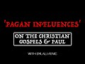

# 'Pagan influences' on the Christian Gospels & Paul (2022-02-01 15:04:03+00:00)

## Description

You Can Support My Work on Patreon:
https://www.patreon.com/Bloggingtheology

My Paypal Link: 
https://www.paypal.com/paypalme/bloggingtheology?locale.x=en_GB

## Summary of ['Pagan influences' on the Christian Gospels & Paul](https://www.youtube.com/watch?v=w83Gf6Ldavs)

*This is an AI generated summary. There may be inaccuracies. *

### [00:00:00](https://www.youtube.com/watch?v=w83Gf6Ldavs&t=0) - [00:20:00](https://www.youtube.com/watch?v=w83Gf6Ldavs&t=1200)

The video discusses how pagan influences can be found in the Christian Gospels and Paul, noting that Middle Platonic thought heavily influenced John's gospel. It explains how Justin Martyr admitted that the similarities between pagan myths and Christian doctrines, claiming that the devil created fake pagan myths to emulate Christ.

**[00:00:00](https://www.youtube.com/watch?v=w83Gf6Ldavs&t=0)** Pagan influences are found in the Christian Gospels and Paul, with Paul particularly borrowing from Philo of Alexandria. The doctrine of the Trinity was likely derived from middle Platonic philosophy, and John's gospel was influenced by middle Platonic thought.
* **[00:05:00](https://www.youtube.com/watch?v=w83Gf6Ldavs&t=300)** In Middle Platonic thought, the "Logos" (Word) was believed to be the second god, generated from within the one himself. This theology is found in John's gospel and is explained in greater detail in Philo's work "Deuterostas." Justin Martyr, father of Logos theology, acknowledges these similarities between his Christology and pagan myths, and claims that the devil emulated Christ by creating fake myths about pagan gods.
* **[00:10:00](https://www.youtube.com/watch?v=w83Gf6Ldavs&t=600)** In this video, John talks about the 'logos' - a lesser god who mediates between the unseen perfect being and humanity by becoming a human sacrifice in the gospels and Paul. Middle Platonism and Stoicism taught that there is a hierarchy of being, with god at the top, and Christ at the bottom. This is not trinitarianism, as Christ is not ontologically equal to the Father.
* **[00:15:00](https://www.youtube.com/watch?v=w83Gf6Ldavs&t=900)** In this video, Erman discusses how the New Testament portrays Jesus as a divine being, son of God, and savior. He notes that the four gospels present Jesus in different ways, but nonetheless he is a divine being in all four texts.
* **[00:20:00](https://www.youtube.com/watch?v=w83Gf6Ldavs&t=1200)** The video discusses the influence of paganism on the Christian Gospels and Paul, noting that Judaism was heavily influenced by Greek philosophy and culture before Jesus' time. The later Gospels, written by authors who were influenced by Greek thought, portray Jesus in a more divine light than the earlier, Mark-written Gospel. The Roman centurion who proclaims Jesus as the Son of God at the foot of the cross is an example of this change.

## Full transcript with timestamps

[0:00:02](https://youtu.be/w83Gf6Ldavs?t=2) okay so i i want to begin  
[0:00:05](https://youtu.be/w83Gf6Ldavs?t=5) sort of uh setting the table as it were  
[0:00:07](https://youtu.be/w83Gf6Ldavs?t=7) theologically okay  
[0:00:09](https://youtu.be/w83Gf6Ldavs?t=9) so i mentioned in a previous podcast  
[0:00:11](https://youtu.be/w83Gf6Ldavs?t=11) that that paul's christology um not you  
[0:00:14](https://youtu.be/w83Gf6Ldavs?t=14) paul paul paul of tarsus  
[0:00:18](https://youtu.be/w83Gf6Ldavs?t=18) by the way but it's not the same as the  
[0:00:19](https://youtu.be/w83Gf6Ldavs?t=19) apostle paul  
[0:00:21](https://youtu.be/w83Gf6Ldavs?t=21) yeah  
[0:00:22](https://youtu.be/w83Gf6Ldavs?t=22) paul's christology in essence  
[0:00:25](https://youtu.be/w83Gf6Ldavs?t=25) was a composite of jewish and greek  
[0:00:27](https://youtu.be/w83Gf6Ldavs?t=27) ideas okay that is to say jewish and  
[0:00:29](https://youtu.be/w83Gf6Ldavs?t=29) pagan beliefs and by pagan i simply mean  
[0:00:32](https://youtu.be/w83Gf6Ldavs?t=32) non-jewish i'm not using the word a  
[0:00:34](https://youtu.be/w83Gf6Ldavs?t=34) pagan necessarily in a derogatory sense  
[0:00:37](https://youtu.be/w83Gf6Ldavs?t=37) okay so paul created this new hybrid  
[0:00:39](https://youtu.be/w83Gf6Ldavs?t=39) religion and religion in the hellenistic  
[0:00:41](https://youtu.be/w83Gf6Ldavs?t=41) world  
[0:00:42](https://youtu.be/w83Gf6Ldavs?t=42) tended to be syncretistic i mean they  
[0:00:44](https://youtu.be/w83Gf6Ldavs?t=44) would mix and match different elements  
[0:00:46](https://youtu.be/w83Gf6Ldavs?t=46) this was normal  
[0:00:47](https://youtu.be/w83Gf6Ldavs?t=47) and paul was schooled in hellenistic  
[0:00:49](https://youtu.be/w83Gf6Ldavs?t=49) philosophy paul quoted pagan poets  
[0:00:52](https://youtu.be/w83Gf6Ldavs?t=52) according to the new testament to  
[0:00:53](https://youtu.be/w83Gf6Ldavs?t=53) support his christology he quoted pagan  
[0:00:56](https://youtu.be/w83Gf6Ldavs?t=56) poets in the new testament to support  
[0:00:58](https://youtu.be/w83Gf6Ldavs?t=58) his christology this is something that  
[0:01:00](https://youtu.be/w83Gf6Ldavs?t=60) christian apologists don't like to talk  
[0:01:02](https://youtu.be/w83Gf6Ldavs?t=62) about and most casual bible readers are  
[0:01:04](https://youtu.be/w83Gf6Ldavs?t=64) not even aware of this they just read  
[0:01:06](https://youtu.be/w83Gf6Ldavs?t=66) the text they don't know what paul's  
[0:01:07](https://youtu.be/w83Gf6Ldavs?t=67) saying paul quoted the final mean as  
[0:01:10](https://youtu.be/w83Gf6Ldavs?t=70) hymn to zeus by the pagan poet and stoic  
[0:01:13](https://youtu.be/w83Gf6Ldavs?t=73) eritis of soli according to acts 17 28  
[0:01:16](https://youtu.be/w83Gf6Ldavs?t=76) at the aeropocus  
[0:01:18](https://youtu.be/w83Gf6Ldavs?t=78) and he also quoted the poet manander in  
[0:01:20](https://youtu.be/w83Gf6Ldavs?t=80) first corinthians 15 33. i mean talk  
[0:01:23](https://youtu.be/w83Gf6Ldavs?t=83) about the satanic verses  
[0:01:26](https://youtu.be/w83Gf6Ldavs?t=86) no i'm just kidding um  
[0:01:29](https://youtu.be/w83Gf6Ldavs?t=89) paul made christ right the jewish  
[0:01:31](https://youtu.be/w83Gf6Ldavs?t=91) messiah  
[0:01:33](https://youtu.be/w83Gf6Ldavs?t=93) the locus the intersection of two pagan  
[0:01:35](https://youtu.be/w83Gf6Ldavs?t=95) beliefs so christ is both the dying and  
[0:01:38](https://youtu.be/w83Gf6Ldavs?t=98) rising savior man god as well as the  
[0:01:40](https://youtu.be/w83Gf6Ldavs?t=100) divine mediator between the god and  
[0:01:43](https://youtu.be/w83Gf6Ldavs?t=103) humanity and by the god i mean  
[0:01:46](https://youtu.be/w83Gf6Ldavs?t=106) the perfect being who is at the top of  
[0:01:48](https://youtu.be/w83Gf6Ldavs?t=108) this ontological hierarchy or pyramid  
[0:01:52](https://youtu.be/w83Gf6Ldavs?t=112) that permeates all existence so this  
[0:01:54](https://youtu.be/w83Gf6Ldavs?t=114) this hierarchy or or chain of being  
[0:01:57](https://youtu.be/w83Gf6Ldavs?t=117) is absolutely central to both middle and  
[0:01:59](https://youtu.be/w83Gf6Ldavs?t=119) neoplatonism  
[0:02:01](https://youtu.be/w83Gf6Ldavs?t=121) okay and i want to make a request of the  
[0:02:03](https://youtu.be/w83Gf6Ldavs?t=123) audience to study middle and  
[0:02:06](https://youtu.be/w83Gf6Ldavs?t=126) neoplatonism and you will come to know  
[0:02:09](https://youtu.be/w83Gf6Ldavs?t=129) the true origins of the trinity i mean  
[0:02:11](https://youtu.be/w83Gf6Ldavs?t=131) christian apologists will say that the  
[0:02:13](https://youtu.be/w83Gf6Ldavs?t=133) doctrine of the trinity is firmly  
[0:02:14](https://youtu.be/w83Gf6Ldavs?t=134) grounded in the tanakh  
[0:02:16](https://youtu.be/w83Gf6Ldavs?t=136) in my view that's a red herring  
[0:02:18](https://youtu.be/w83Gf6Ldavs?t=138) they want to throw you off the scent of  
[0:02:20](https://youtu.be/w83Gf6Ldavs?t=140) greek metaphysics and study philo of  
[0:02:23](https://youtu.be/w83Gf6Ldavs?t=143) alexandria okay so he was a jewish  
[0:02:25](https://youtu.be/w83Gf6Ldavs?t=145) middle platonic philosopher living in  
[0:02:28](https://youtu.be/w83Gf6Ldavs?t=148) egypt in the first century he died  
[0:02:29](https://youtu.be/w83Gf6Ldavs?t=149) around 40 of the common era before the  
[0:02:31](https://youtu.be/w83Gf6Ldavs?t=151) writing of the new testament okay  
[0:02:33](https://youtu.be/w83Gf6Ldavs?t=153) there's no doubt  
[0:02:35](https://youtu.be/w83Gf6Ldavs?t=155) that philo's writings influenced the  
[0:02:37](https://youtu.be/w83Gf6Ldavs?t=157) doctrine of the trinity in a significant  
[0:02:39](https://youtu.be/w83Gf6Ldavs?t=159) way  
[0:02:40](https://youtu.be/w83Gf6Ldavs?t=160) even william lane craig admits this you  
[0:02:42](https://youtu.be/w83Gf6Ldavs?t=162) know dr craig is their champion the  
[0:02:44](https://youtu.be/w83Gf6Ldavs?t=164) christian apologists you know they love  
[0:02:46](https://youtu.be/w83Gf6Ldavs?t=166) him the early christian greek fathers  
[0:02:48](https://youtu.be/w83Gf6Ldavs?t=168) they used philo's writings  
[0:02:50](https://youtu.be/w83Gf6Ldavs?t=170) as a basis with which to formulate their  
[0:02:52](https://youtu.be/w83Gf6Ldavs?t=172) logos christology people like justin and  
[0:02:55](https://youtu.be/w83Gf6Ldavs?t=175) irenaeus eusebius who was constantine's  
[0:02:58](https://youtu.be/w83Gf6Ldavs?t=178) sort of spin doctor uh even claimed that  
[0:03:01](https://youtu.be/w83Gf6Ldavs?t=181) philo met peter right i mean it's a  
[0:03:03](https://youtu.be/w83Gf6Ldavs?t=183) total fabrication i mean this was  
[0:03:05](https://youtu.be/w83Gf6Ldavs?t=185) eusebius's way of bolstering philo's  
[0:03:07](https://youtu.be/w83Gf6Ldavs?t=187) authority similar to paul claiming that  
[0:03:10](https://youtu.be/w83Gf6Ldavs?t=190) he met with peter and james maybe he did  
[0:03:12](https://youtu.be/w83Gf6Ldavs?t=192) i mean it doesn't end well according to  
[0:03:14](https://youtu.be/w83Gf6Ldavs?t=194) acts 21 but craig says that  
[0:03:17](https://youtu.be/w83Gf6Ldavs?t=197) the dogma at nicea was quote a synthesis  
[0:03:20](https://youtu.be/w83Gf6Ldavs?t=200) between john's gospel  
[0:03:22](https://youtu.be/w83Gf6Ldavs?t=202) and the thought of philo of alexandria  
[0:03:25](https://youtu.be/w83Gf6Ldavs?t=205) and the middle platonism that he  
[0:03:27](https://youtu.be/w83Gf6Ldavs?t=207) represented end quote i mean i would go  
[0:03:30](https://youtu.be/w83Gf6Ldavs?t=210) even further and say that  
[0:03:32](https://youtu.be/w83Gf6Ldavs?t=212) john's gospel itself was clearly  
[0:03:34](https://youtu.be/w83Gf6Ldavs?t=214) influenced by middle platonism  
[0:03:37](https://youtu.be/w83Gf6Ldavs?t=217) so so  
[0:03:38](https://youtu.be/w83Gf6Ldavs?t=218) so dr craig even downplays in my opinion  
[0:03:42](https://youtu.be/w83Gf6Ldavs?t=222) the reality of the vast influence that  
[0:03:44](https://youtu.be/w83Gf6Ldavs?t=224) greek metaphysics had on both christian  
[0:03:46](https://youtu.be/w83Gf6Ldavs?t=226) doctrine and christian scripture and  
[0:03:49](https://youtu.be/w83Gf6Ldavs?t=229) we'll and we'll see that okay  
[0:03:51](https://youtu.be/w83Gf6Ldavs?t=231) this is a common place in um historical  
[0:03:54](https://youtu.be/w83Gf6Ldavs?t=234) theologies it's not just you and william  
[0:03:56](https://youtu.be/w83Gf6Ldavs?t=236) lane craig this is  
[0:03:58](https://youtu.be/w83Gf6Ldavs?t=238) very very standard understanding and  
[0:04:00](https://youtu.be/w83Gf6Ldavs?t=240) explanation of the origins of the way  
[0:04:01](https://youtu.be/w83Gf6Ldavs?t=241) the doctrine is formulated uh yeah this  
[0:04:04](https://youtu.be/w83Gf6Ldavs?t=244) is very very standard very very standard  
[0:04:06](https://youtu.be/w83Gf6Ldavs?t=246) across the board right  
[0:04:08](https://youtu.be/w83Gf6Ldavs?t=248) um so any honest historian or theologian  
[0:04:11](https://youtu.be/w83Gf6Ldavs?t=251) you know they will point this out so so  
[0:04:13](https://youtu.be/w83Gf6Ldavs?t=253) according to this platonic metaphysical  
[0:04:15](https://youtu.be/w83Gf6Ldavs?t=255) system at the top of this hierarchy of  
[0:04:17](https://youtu.be/w83Gf6Ldavs?t=257) being  
[0:04:18](https://youtu.be/w83Gf6Ldavs?t=258) is the one right tahen as platinus uh  
[0:04:22](https://youtu.be/w83Gf6Ldavs?t=262) referred to him the church father origin  
[0:04:24](https://youtu.be/w83Gf6Ldavs?t=264) of alexandria called him the auto theos  
[0:04:27](https://youtu.be/w83Gf6Ldavs?t=267) right the very god  
[0:04:29](https://youtu.be/w83Gf6Ldavs?t=269) of course philo called him hathaos with  
[0:04:31](https://youtu.be/w83Gf6Ldavs?t=271) the definite article the god and this is  
[0:04:33](https://youtu.be/w83Gf6Ldavs?t=273) also what john's gospel calls the father  
[0:04:36](https://youtu.be/w83Gf6Ldavs?t=276) ha theos okay with the definite article  
[0:04:39](https://youtu.be/w83Gf6Ldavs?t=279) um you know the the uh  
[0:04:42](https://youtu.be/w83Gf6Ldavs?t=282) the author of john's gospel never refers  
[0:04:44](https://youtu.be/w83Gf6Ldavs?t=284) to jesus or the son as ha theos in an  
[0:04:47](https://youtu.be/w83Gf6Ldavs?t=287) absolute and unqualified way  
[0:04:50](https://youtu.be/w83Gf6Ldavs?t=290) and thomas's so-called confession in  
[0:04:52](https://youtu.be/w83Gf6Ldavs?t=292) john 20 is not an exception to this so  
[0:04:54](https://youtu.be/w83Gf6Ldavs?t=294) john refers to jesus as the logos and a  
[0:04:58](https://youtu.be/w83Gf6Ldavs?t=298) theos a god so if you look at john 1 1  
[0:05:00](https://youtu.be/w83Gf6Ldavs?t=300) right nrk ain't halagas  
[0:05:03](https://youtu.be/w83Gf6Ldavs?t=303) kai halagas prastantheon  
[0:05:05](https://youtu.be/w83Gf6Ldavs?t=305) right so so in the beginning was the  
[0:05:07](https://youtu.be/w83Gf6Ldavs?t=307) word and the word was with the god tan  
[0:05:10](https://youtu.be/w83Gf6Ldavs?t=310) is a definite article here in the  
[0:05:11](https://youtu.be/w83Gf6Ldavs?t=311) accusative tan theon kai theos and a god  
[0:05:15](https://youtu.be/w83Gf6Ldavs?t=315) was the logos so middle platonism  
[0:05:18](https://youtu.be/w83Gf6Ldavs?t=318) explains what john meant here much more  
[0:05:20](https://youtu.be/w83Gf6Ldavs?t=320) coherently than tanaki judaism or  
[0:05:23](https://youtu.be/w83Gf6Ldavs?t=323) trinitarianism  
[0:05:25](https://youtu.be/w83Gf6Ldavs?t=325) in middle platonism the logos was  
[0:05:26](https://youtu.be/w83Gf6Ldavs?t=326) believed to be the second god a second  
[0:05:29](https://youtu.be/w83Gf6Ldavs?t=329) level of being who was generated  
[0:05:32](https://youtu.be/w83Gf6Ldavs?t=332) from within the one himself in  
[0:05:34](https://youtu.be/w83Gf6Ldavs?t=334) pre-eternality so since the logos was  
[0:05:36](https://youtu.be/w83Gf6Ldavs?t=336) generated or caused by  
[0:05:38](https://youtu.be/w83Gf6Ldavs?t=338) the god the logos is not as great as the  
[0:05:41](https://youtu.be/w83Gf6Ldavs?t=341) god the logos is the divine mediator  
[0:05:44](https://youtu.be/w83Gf6Ldavs?t=344) between the god and humanity  
[0:05:47](https://youtu.be/w83Gf6Ldavs?t=347) hence you know the father is greater  
[0:05:49](https://youtu.be/w83Gf6Ldavs?t=349) than i says john's incarnated logos yet  
[0:05:52](https://youtu.be/w83Gf6Ldavs?t=352) he also says the father and i are one so  
[0:05:54](https://youtu.be/w83Gf6Ldavs?t=354) christian apologists armed with the  
[0:05:56](https://youtu.be/w83Gf6Ldavs?t=356) nomenclature of nicaea they went back to  
[0:05:59](https://youtu.be/w83Gf6Ldavs?t=359) these texts and said okay when he said  
[0:06:02](https://youtu.be/w83Gf6Ldavs?t=362) the father is greater than i the logos  
[0:06:04](https://youtu.be/w83Gf6Ldavs?t=364) was talking about his hypothesis his  
[0:06:06](https://youtu.be/w83Gf6Ldavs?t=366) person but when he said the father and i  
[0:06:08](https://youtu.be/w83Gf6Ldavs?t=368) are one he was referring to his ucia his  
[0:06:10](https://youtu.be/w83Gf6Ldavs?t=370) essence so they incorporate this this  
[0:06:12](https://youtu.be/w83Gf6Ldavs?t=372) convoluted language and retroactively  
[0:06:15](https://youtu.be/w83Gf6Ldavs?t=375) import  
[0:06:17](https://youtu.be/w83Gf6Ldavs?t=377) a trinitarian hermeneutic upon john upon  
[0:06:20](https://youtu.be/w83Gf6Ldavs?t=380) john's gospel and does completely  
[0:06:22](https://youtu.be/w83Gf6Ldavs?t=382) decontextualize it i mean it's a nice  
[0:06:24](https://youtu.be/w83Gf6Ldavs?t=384) little slide of hand but read john in  
[0:06:26](https://youtu.be/w83Gf6Ldavs?t=386) its context right john's underlying  
[0:06:28](https://youtu.be/w83Gf6Ldavs?t=388) metaphysic is middle platonism  
[0:06:31](https://youtu.be/w83Gf6Ldavs?t=391) and in fact 70 years before john wrote  
[0:06:33](https://youtu.be/w83Gf6Ldavs?t=393) about the logos  
[0:06:35](https://youtu.be/w83Gf6Ldavs?t=395) philo wrote about the logos and philo  
[0:06:38](https://youtu.be/w83Gf6Ldavs?t=398) referred to the logos as a second god  
[0:06:42](https://youtu.be/w83Gf6Ldavs?t=402) deuterostas and origen would use the  
[0:06:44](https://youtu.be/w83Gf6Ldavs?t=404) same phrase some 200 years later but  
[0:06:47](https://youtu.be/w83Gf6Ldavs?t=407) still before nicea you know he said the  
[0:06:48](https://youtu.be/w83Gf6Ldavs?t=408) father is otto theos the very god the  
[0:06:51](https://youtu.be/w83Gf6Ldavs?t=411) son is important because the language  
[0:06:53](https://youtu.be/w83Gf6Ldavs?t=413) that john uses actually has a precedent  
[0:06:55](https://youtu.be/w83Gf6Ldavs?t=415) in um in the pagan language found on the  
[0:06:58](https://youtu.be/w83Gf6Ldavs?t=418) lips of philo of alexandria so it's not  
[0:07:01](https://youtu.be/w83Gf6Ldavs?t=421) a it's this continuity this connection  
[0:07:03](https://youtu.be/w83Gf6Ldavs?t=423) is really important i think it is very  
[0:07:06](https://youtu.be/w83Gf6Ldavs?t=426) important and you know origen also he  
[0:07:08](https://youtu.be/w83Gf6Ldavs?t=428) uses like you said he uses that phrase  
[0:07:10](https://youtu.be/w83Gf6Ldavs?t=430) from philo deuteros  
[0:07:12](https://youtu.be/w83Gf6Ldavs?t=432) that the logos is a second god but  
[0:07:14](https://youtu.be/w83Gf6Ldavs?t=434) johanna and jesus right  
[0:07:16](https://youtu.be/w83Gf6Ldavs?t=436) or john's logos refers to his father as  
[0:07:19](https://youtu.be/w83Gf6Ldavs?t=439) theon moo my god right  
[0:07:22](https://youtu.be/w83Gf6Ldavs?t=442) my god in mark in matthew jesus you know  
[0:07:24](https://youtu.be/w83Gf6Ldavs?t=444) the cry of their election  
[0:07:28](https://youtu.be/w83Gf6Ldavs?t=448) my god my god so the logos who's  
[0:07:30](https://youtu.be/w83Gf6Ldavs?t=450) supposed to be god capital g according  
[0:07:32](https://youtu.be/w83Gf6Ldavs?t=452) to trinitarians has a god so this is  
[0:07:35](https://youtu.be/w83Gf6Ldavs?t=455) clearly two gods and both men philo and  
[0:07:38](https://youtu.be/w83Gf6Ldavs?t=458) origen they hail from alexandria and you  
[0:07:40](https://youtu.be/w83Gf6Ldavs?t=460) know the name says it all you know this  
[0:07:42](https://youtu.be/w83Gf6Ldavs?t=462) is why imam al-ghazali vehemently  
[0:07:44](https://youtu.be/w83Gf6Ldavs?t=464) condemned the metaphysical positions of  
[0:07:46](https://youtu.be/w83Gf6Ldavs?t=466) the hellenistic muslim philosophers of  
[0:07:48](https://youtu.be/w83Gf6Ldavs?t=468) his day because he recognized that  
[0:07:50](https://youtu.be/w83Gf6Ldavs?t=470) platonic metaphysics  
[0:07:52](https://youtu.be/w83Gf6Ldavs?t=472) acted as a gateway to the theological  
[0:07:54](https://youtu.be/w83Gf6Ldavs?t=474) deviations and idolatry of the people of  
[0:07:56](https://youtu.be/w83Gf6Ldavs?t=476) the book both jews and christians of the  
[0:07:58](https://youtu.be/w83Gf6Ldavs?t=478) past not just christians but also jews  
[0:08:01](https://youtu.be/w83Gf6Ldavs?t=481) and as i said for philo the logos was  
[0:08:03](https://youtu.be/w83Gf6Ldavs?t=483) the highest of the intermediary beings  
[0:08:06](https://youtu.be/w83Gf6Ldavs?t=486) okay the begotten son of god he says  
[0:08:09](https://youtu.be/w83Gf6Ldavs?t=489) philo says he says his firstborn he says  
[0:08:12](https://youtu.be/w83Gf6Ldavs?t=492) the celestial high priest right who was  
[0:08:15](https://youtu.be/w83Gf6Ldavs?t=495) often symbolized in the tanakh by an  
[0:08:17](https://youtu.be/w83Gf6Ldavs?t=497) angel  
[0:08:18](https://youtu.be/w83Gf6Ldavs?t=498) all right this is according to philo the  
[0:08:19](https://youtu.be/w83Gf6Ldavs?t=499) logos as the mind of god as it were was  
[0:08:22](https://youtu.be/w83Gf6Ldavs?t=502) neither uncreated in the same sense as  
[0:08:24](https://youtu.be/w83Gf6Ldavs?t=504) the god nor created in the same sense as  
[0:08:27](https://youtu.be/w83Gf6Ldavs?t=507) the cosmos the logos was caused from the  
[0:08:30](https://youtu.be/w83Gf6Ldavs?t=510) very essence of the god  
[0:08:32](https://youtu.be/w83Gf6Ldavs?t=512) meaning the logos was eternally  
[0:08:34](https://youtu.be/w83Gf6Ldavs?t=514) generated i.e begotten not made before  
[0:08:38](https://youtu.be/w83Gf6Ldavs?t=518) all the ages sounds very very familiar  
[0:08:40](https://youtu.be/w83Gf6Ldavs?t=520) sounds like the nicene creed you know  
[0:08:42](https://youtu.be/w83Gf6Ldavs?t=522) justin martyr the father of logos  
[0:08:44](https://youtu.be/w83Gf6Ldavs?t=524) theology he he admits that there are  
[0:08:46](https://youtu.be/w83Gf6Ldavs?t=526) disturbing parallels between his  
[0:08:48](https://youtu.be/w83Gf6Ldavs?t=528) christology and the pagan myths of  
[0:08:50](https://youtu.be/w83Gf6Ldavs?t=530) bacchus that's dionysius  
[0:08:53](https://youtu.be/w83Gf6Ldavs?t=533) and and hercules and and esclepius and  
[0:08:55](https://youtu.be/w83Gf6Ldavs?t=535) perseus and mithras  
[0:08:57](https://youtu.be/w83Gf6Ldavs?t=537) and in his dialogue with trifo justin  
[0:08:59](https://youtu.be/w83Gf6Ldavs?t=539) accounts for these similarities by  
[0:09:00](https://youtu.be/w83Gf6Ldavs?t=540) claiming well the devil sort of emulated  
[0:09:02](https://youtu.be/w83Gf6Ldavs?t=542) the prophecies of christ by inventing  
[0:09:04](https://youtu.be/w83Gf6Ldavs?t=544) these sort of fake fables  
[0:09:06](https://youtu.be/w83Gf6Ldavs?t=546) about their pagan gods in order to cause  
[0:09:08](https://youtu.be/w83Gf6Ldavs?t=548) christians to go astray i mean justin  
[0:09:10](https://youtu.be/w83Gf6Ldavs?t=550) also says that the angel that  
[0:09:12](https://youtu.be/w83Gf6Ldavs?t=552) jacob wrestled in genesis  
[0:09:14](https://youtu.be/w83Gf6Ldavs?t=554) and beat no less was the pre-incarnate  
[0:09:18](https://youtu.be/w83Gf6Ldavs?t=558) christ the logos so so john 1 1 is the  
[0:09:21](https://youtu.be/w83Gf6Ldavs?t=561) beginning of the prologue of john's  
[0:09:22](https://youtu.be/w83Gf6Ldavs?t=562) gospel that's called the hymn to the  
[0:09:24](https://youtu.be/w83Gf6Ldavs?t=564) logos how does the hymn end right so the  
[0:09:27](https://youtu.be/w83Gf6Ldavs?t=567) most authentic reading according to new  
[0:09:29](https://youtu.be/w83Gf6Ldavs?t=569) testament textual critics like the  
[0:09:31](https://youtu.be/w83Gf6Ldavs?t=571) united bible society nestle allen and so  
[0:09:33](https://youtu.be/w83Gf6Ldavs?t=573) on and so forth is the following so it's  
[0:09:35](https://youtu.be/w83Gf6Ldavs?t=575) john 1 18 right john 1 18 that's the end  
[0:09:38](https://youtu.be/w83Gf6Ldavs?t=578) of the hymn to the logos it says  
[0:09:42](https://youtu.be/w83Gf6Ldavs?t=582) so no one has ever seen god and the  
[0:09:45](https://youtu.be/w83Gf6Ldavs?t=585) context clearly suggests that john is  
[0:09:47](https://youtu.be/w83Gf6Ldavs?t=587) talking about the first level of being  
[0:09:49](https://youtu.be/w83Gf6Ldavs?t=589) the father the god  
[0:09:51](https://youtu.be/w83Gf6Ldavs?t=591) because then he says monogenes theos a  
[0:09:55](https://youtu.be/w83Gf6Ldavs?t=595) unique god  
[0:09:57](https://youtu.be/w83Gf6Ldavs?t=597) a one of a kind god a uniquely generated  
[0:10:00](https://youtu.be/w83Gf6Ldavs?t=600) god and now john is talking about the  
[0:10:02](https://youtu.be/w83Gf6Ldavs?t=602) logos the logos is another god  
[0:10:04](https://youtu.be/w83Gf6Ldavs?t=604) because he was seen the first god he  
[0:10:06](https://youtu.be/w83Gf6Ldavs?t=606) mentioned has never been seen right the  
[0:10:08](https://youtu.be/w83Gf6Ldavs?t=608) monogamy's theos it's it goes on to say  
[0:10:12](https://youtu.be/w83Gf6Ldavs?t=612) who is in the heart of the father it  
[0:10:14](https://youtu.be/w83Gf6Ldavs?t=614) says ekinas exegesato that one exegetes  
[0:10:17](https://youtu.be/w83Gf6Ldavs?t=617) or explains or reveals the father so the  
[0:10:20](https://youtu.be/w83Gf6Ldavs?t=620) son is the divine  
[0:10:22](https://youtu.be/w83Gf6Ldavs?t=622) mediator and then john 3 16 for god so  
[0:10:24](https://youtu.be/w83Gf6Ldavs?t=624) loved the world he gave his only  
[0:10:26](https://youtu.be/w83Gf6Ldavs?t=626) begotten son the son is a savior man god  
[0:10:28](https://youtu.be/w83Gf6Ldavs?t=628) a human sacrifice  
[0:10:31](https://youtu.be/w83Gf6Ldavs?t=631) so then the second level of being  
[0:10:33](https://youtu.be/w83Gf6Ldavs?t=633) referred to as the logos by middle  
[0:10:35](https://youtu.be/w83Gf6Ldavs?t=635) platonic writers such as philo and john  
[0:10:37](https://youtu.be/w83Gf6Ldavs?t=637) is still a divine being he is a theos  
[0:10:40](https://youtu.be/w83Gf6Ldavs?t=640) he's a god but he's not haphaos he's not  
[0:10:43](https://youtu.be/w83Gf6Ldavs?t=643) the god or the otto theos the very god  
[0:10:46](https://youtu.be/w83Gf6Ldavs?t=646) so this is called henotheistic  
[0:10:48](https://youtu.be/w83Gf6Ldavs?t=648) polytheism okay this is not the yeti  
[0:10:51](https://youtu.be/w83Gf6Ldavs?t=651) this is not the unitarian you know  
[0:10:53](https://youtu.be/w83Gf6Ldavs?t=653) monotheism of the tanakh  
[0:10:55](https://youtu.be/w83Gf6Ldavs?t=655) nor is this the trinitarian monotheism  
[0:10:57](https://youtu.be/w83Gf6Ldavs?t=657) of the fourth century of the common era  
[0:10:59](https://youtu.be/w83Gf6Ldavs?t=659) this is a henotheistic polytheism this  
[0:11:02](https://youtu.be/w83Gf6Ldavs?t=662) is what the gospels and pauline epistles  
[0:11:05](https://youtu.be/w83Gf6Ldavs?t=665) teach in my view okay  
[0:11:06](https://youtu.be/w83Gf6Ldavs?t=666) the gospels suffused with greek ideas  
[0:11:10](https://youtu.be/w83Gf6Ldavs?t=670) and influenced by paul's gospel teach  
[0:11:13](https://youtu.be/w83Gf6Ldavs?t=673) that jesus is another god a lesser god  
[0:11:16](https://youtu.be/w83Gf6Ldavs?t=676) who mediates between the unseen perfect  
[0:11:18](https://youtu.be/w83Gf6Ldavs?t=678) being and humanity by becoming a human  
[0:11:20](https://youtu.be/w83Gf6Ldavs?t=680) sacrifice so he is the son of god not  
[0:11:22](https://youtu.be/w83Gf6Ldavs?t=682) god the son right and of course paul  
[0:11:24](https://youtu.be/w83Gf6Ldavs?t=684) wrote first timothy chapter 2 verses  
[0:11:27](https://youtu.be/w83Gf6Ldavs?t=687) five really that's pseudo paul right  
[0:11:29](https://youtu.be/w83Gf6Ldavs?t=689) first timothy two five and six but this  
[0:11:31](https://youtu.be/w83Gf6Ldavs?t=691) represents paul's thinking uh for there  
[0:11:33](https://youtu.be/w83Gf6Ldavs?t=693) is one god and one mediator between god  
[0:11:36](https://youtu.be/w83Gf6Ldavs?t=696) and man the man jesus christ and then he  
[0:11:38](https://youtu.be/w83Gf6Ldavs?t=698) goes on who gave himself as a ransom for  
[0:11:41](https://youtu.be/w83Gf6Ldavs?t=701) all people so we have the mediating  
[0:11:42](https://youtu.be/w83Gf6Ldavs?t=702) logos dying for our sins now paul never  
[0:11:45](https://youtu.be/w83Gf6Ldavs?t=705) referred to the mediator as the logos  
[0:11:48](https://youtu.be/w83Gf6Ldavs?t=708) but clearly this is the concept he has  
[0:11:50](https://youtu.be/w83Gf6Ldavs?t=710) in mind  
[0:11:51](https://youtu.be/w83Gf6Ldavs?t=711) paul didn't refer to christ as the  
[0:11:54](https://youtu.be/w83Gf6Ldavs?t=714) wisdom of god theo sophian and of course  
[0:11:57](https://youtu.be/w83Gf6Ldavs?t=717) philo had already identified chokma in  
[0:12:00](https://youtu.be/w83Gf6Ldavs?t=720) the old testament divine wisdom as being  
[0:12:02](https://youtu.be/w83Gf6Ldavs?t=722) the logos explicitly right like in  
[0:12:04](https://youtu.be/w83Gf6Ldavs?t=724) proverbs chapter eight right the  
[0:12:06](https://youtu.be/w83Gf6Ldavs?t=726) personified and expressive  
[0:12:08](https://youtu.be/w83Gf6Ldavs?t=728) logos according to philo spoke of its  
[0:12:10](https://youtu.be/w83Gf6Ldavs?t=730) origin the lord possessed me at the  
[0:12:11](https://youtu.be/w83Gf6Ldavs?t=731) beginning of his way before his work of  
[0:12:14](https://youtu.be/w83Gf6Ldavs?t=734) creation i was poured forth from  
[0:12:16](https://youtu.be/w83Gf6Ldavs?t=736) eternity from from before the creation  
[0:12:18](https://youtu.be/w83Gf6Ldavs?t=738) of the earth and paul being a highly  
[0:12:21](https://youtu.be/w83Gf6Ldavs?t=741) hellenized jew that he was echoed this  
[0:12:24](https://youtu.be/w83Gf6Ldavs?t=744) phelonic uh sentiment i mean paul wrote  
[0:12:26](https://youtu.be/w83Gf6Ldavs?t=746) to the corinthians that he was speaking  
[0:12:27](https://youtu.be/w83Gf6Ldavs?t=747) of the wisdom of god and mystery which  
[0:12:29](https://youtu.be/w83Gf6Ldavs?t=749) was ordained by god before the ages of  
[0:12:31](https://youtu.be/w83Gf6Ldavs?t=751) our glory  
[0:12:33](https://youtu.be/w83Gf6Ldavs?t=753) in this in the pseudo-pauline book of  
[0:12:34](https://youtu.be/w83Gf6Ldavs?t=754) colossians the author said and he the  
[0:12:36](https://youtu.be/w83Gf6Ldavs?t=756) son is before all things and by him all  
[0:12:39](https://youtu.be/w83Gf6Ldavs?t=759) things are held together this is middle  
[0:12:41](https://youtu.be/w83Gf6Ldavs?t=761) platonism this is stoicism okay  
[0:12:44](https://youtu.be/w83Gf6Ldavs?t=764) additionally  
[0:12:46](https://youtu.be/w83Gf6Ldavs?t=766) and again in imitation of middle  
[0:12:47](https://youtu.be/w83Gf6Ldavs?t=767) platonism paul envisioned a henotheistic  
[0:12:51](https://youtu.be/w83Gf6Ldavs?t=771) and hierarchical scheme of divinity with  
[0:12:54](https://youtu.be/w83Gf6Ldavs?t=774) god our father at the top and then the  
[0:12:56](https://youtu.be/w83Gf6Ldavs?t=776) lord jesus christ the wisdom of god i.e  
[0:12:59](https://youtu.be/w83Gf6Ldavs?t=779) the logos just below him right so paul  
[0:13:02](https://youtu.be/w83Gf6Ldavs?t=782) wrote in first corinthians he says  
[0:13:03](https://youtu.be/w83Gf6Ldavs?t=783) pantas andros ethale  
[0:13:06](https://youtu.be/w83Gf6Ldavs?t=786) so he says the head of every man is  
[0:13:08](https://youtu.be/w83Gf6Ldavs?t=788) christ  
[0:13:12](https://youtu.be/w83Gf6Ldavs?t=792) and the head of of the woman is the man  
[0:13:15](https://youtu.be/w83Gf6Ldavs?t=795) right so the feminist they don't they  
[0:13:17](https://youtu.be/w83Gf6Ldavs?t=797) don't like this verse uh  
[0:13:20](https://youtu.be/w83Gf6Ldavs?t=800) it's extraordinary passage because the  
[0:13:21](https://youtu.be/w83Gf6Ldavs?t=801) hierarchy the divine hierarchy and the  
[0:13:23](https://youtu.be/w83Gf6Ldavs?t=803) human hierarchy is is ontological we're  
[0:13:27](https://youtu.be/w83Gf6Ldavs?t=807) dealing here with jesus after his  
[0:13:28](https://youtu.be/w83Gf6Ldavs?t=808) resurrection after the ascension this is  
[0:13:31](https://youtu.be/w83Gf6Ldavs?t=811) the theology that paul really believes  
[0:13:33](https://youtu.be/w83Gf6Ldavs?t=813) in and that is god christ and then  
[0:13:36](https://youtu.be/w83Gf6Ldavs?t=816) subservient to that man and woman and uh  
[0:13:39](https://youtu.be/w83Gf6Ldavs?t=819) there's nothing trinitarian about it at  
[0:13:41](https://youtu.be/w83Gf6Ldavs?t=821) all on the contrary is as you say  
[0:13:43](https://youtu.be/w83Gf6Ldavs?t=823) exactly is a hierarchy of being and the  
[0:13:45](https://youtu.be/w83Gf6Ldavs?t=825) head of christ is  
[0:13:47](https://youtu.be/w83Gf6Ldavs?t=827) ha theos he says at the end  
[0:13:51](https://youtu.be/w83Gf6Ldavs?t=831) the god yes the father is the god jesus  
[0:13:53](https://youtu.be/w83Gf6Ldavs?t=833) christ is the lord these two are not  
[0:13:55](https://youtu.be/w83Gf6Ldavs?t=835) ontologically equal for paul  
[0:13:58](https://youtu.be/w83Gf6Ldavs?t=838) just just say uh so just so people  
[0:14:00](https://youtu.be/w83Gf6Ldavs?t=840) understand here how christians deal with  
[0:14:01](https://youtu.be/w83Gf6Ldavs?t=841) this i i i've had the honor and the  
[0:14:03](https://youtu.be/w83Gf6Ldavs?t=843) privilege also to speak to professor  
[0:14:05](https://youtu.be/w83Gf6Ldavs?t=845) dale martin from uh yale university he's  
[0:14:07](https://youtu.be/w83Gf6Ldavs?t=847) one of the world's great uh new  
[0:14:09](https://youtu.be/w83Gf6Ldavs?t=849) testament scholars he's also a christian  
[0:14:11](https://youtu.be/w83Gf6Ldavs?t=851) theologian and a trinitarian  
[0:14:13](https://youtu.be/w83Gf6Ldavs?t=853) and he discusses this very very passage  
[0:14:15](https://youtu.be/w83Gf6Ldavs?t=855) and how he deals with it in his uh most  
[0:14:18](https://youtu.be/w83Gf6Ldavs?t=858) uh recent work which is addressed to  
[0:14:20](https://youtu.be/w83Gf6Ldavs?t=860) these whole car all these home and  
[0:14:21](https://youtu.be/w83Gf6Ldavs?t=861) musical issues how do we how do we be  
[0:14:23](https://youtu.be/w83Gf6Ldavs?t=863) trinitarian christians in the light of  
[0:14:24](https://youtu.be/w83Gf6Ldavs?t=864) what you're saying dr alietai and he  
[0:14:27](https://youtu.be/w83Gf6Ldavs?t=867) says well when you read passages like  
[0:14:28](https://youtu.be/w83Gf6Ldavs?t=868) that what you do is you read them in a  
[0:14:30](https://youtu.be/w83Gf6Ldavs?t=870) trinitarian way and you insert  
[0:14:32](https://youtu.be/w83Gf6Ldavs?t=872) the the son and father language you  
[0:14:34](https://youtu.be/w83Gf6Ldavs?t=874) understand it in that way you read it in  
[0:14:37](https://youtu.be/w83Gf6Ldavs?t=877) a trinitarian way so he's very explicit  
[0:14:40](https://youtu.be/w83Gf6Ldavs?t=880) he's very open and candid about what you  
[0:14:42](https://youtu.be/w83Gf6Ldavs?t=882) do you don't take paul's meaning you  
[0:14:45](https://youtu.be/w83Gf6Ldavs?t=885) take the later meaning and you read it  
[0:14:47](https://youtu.be/w83Gf6Ldavs?t=887) in  
[0:14:48](https://youtu.be/w83Gf6Ldavs?t=888) and he's not he's very open about it  
[0:14:50](https://youtu.be/w83Gf6Ldavs?t=890) he's very yeah he's very honest and open  
[0:14:52](https://youtu.be/w83Gf6Ldavs?t=892) that's exactly how how you read it i  
[0:14:54](https://youtu.be/w83Gf6Ldavs?t=894) mean on the surface the plain meaning  
[0:14:56](https://youtu.be/w83Gf6Ldavs?t=896) here is very clear you know the one who  
[0:14:58](https://youtu.be/w83Gf6Ldavs?t=898) has authority over christ a god is the  
[0:15:01](https://youtu.be/w83Gf6Ldavs?t=901) god  
[0:15:02](https://youtu.be/w83Gf6Ldavs?t=902) and this is further made clear by paul's  
[0:15:03](https://youtu.be/w83Gf6Ldavs?t=903) statement he says whether paul or  
[0:15:05](https://youtu.be/w83Gf6Ldavs?t=905) apollos or kephas or the world or life  
[0:15:07](https://youtu.be/w83Gf6Ldavs?t=907) or death  
[0:15:08](https://youtu.be/w83Gf6Ldavs?t=908) or things now or things to come all  
[0:15:11](https://youtu.be/w83Gf6Ldavs?t=911) things belong to you and you belong to  
[0:15:12](https://youtu.be/w83Gf6Ldavs?t=912) christ and christ belongs to god  
[0:15:16](https://youtu.be/w83Gf6Ldavs?t=916) right it's very good finally we read in  
[0:15:18](https://youtu.be/w83Gf6Ldavs?t=918) in the pseudo-pauline book of ephesians  
[0:15:21](https://youtu.be/w83Gf6Ldavs?t=921) the god of our lord jesus christ the god  
[0:15:24](https://youtu.be/w83Gf6Ldavs?t=924) just think about this thing the god of  
[0:15:26](https://youtu.be/w83Gf6Ldavs?t=926) our lord jesus christ the father of  
[0:15:29](https://youtu.be/w83Gf6Ldavs?t=929) glory again in john the logos the johann  
[0:15:31](https://youtu.be/w83Gf6Ldavs?t=931) and jesus refers to the father as my god  
[0:15:35](https://youtu.be/w83Gf6Ldavs?t=935) as well as the only one who is truly god  
[0:15:38](https://youtu.be/w83Gf6Ldavs?t=938) in in john 17 3.  
[0:15:40](https://youtu.be/w83Gf6Ldavs?t=940) of course trinitarians will disagree  
[0:15:42](https://youtu.be/w83Gf6Ldavs?t=942) with these assertions they will quote  
[0:15:44](https://youtu.be/w83Gf6Ldavs?t=944) paul's famous hymn to christ in  
[0:15:45](https://youtu.be/w83Gf6Ldavs?t=945) philippians 2 as being sort of a proof  
[0:15:47](https://youtu.be/w83Gf6Ldavs?t=947) text of their position that paul  
[0:15:49](https://youtu.be/w83Gf6Ldavs?t=949) maintained that christ was essentially  
[0:15:51](https://youtu.be/w83Gf6Ldavs?t=951) equal to god so paul said uh he said  
[0:15:54](https://youtu.be/w83Gf6Ldavs?t=954) that jesus christ he said being in the  
[0:15:56](https://youtu.be/w83Gf6Ldavs?t=956) form of god did not think it was robbery  
[0:15:58](https://youtu.be/w83Gf6Ldavs?t=958) to be equal with god  
[0:16:00](https://youtu.be/w83Gf6Ldavs?t=960) but but here's a problem if if christ  
[0:16:02](https://youtu.be/w83Gf6Ldavs?t=962) was god  
[0:16:03](https://youtu.be/w83Gf6Ldavs?t=963) the god why would he even consider the  
[0:16:05](https://youtu.be/w83Gf6Ldavs?t=965) notion that it was robbery to be equal  
[0:16:07](https://youtu.be/w83Gf6Ldavs?t=967) to himself this is nonsense  
[0:16:10](https://youtu.be/w83Gf6Ldavs?t=970) you see paul was neither a trinitarian  
[0:16:12](https://youtu.be/w83Gf6Ldavs?t=972) nor a unitarian okay so from the greater  
[0:16:15](https://youtu.be/w83Gf6Ldavs?t=975) context of the passage i mean it's clear  
[0:16:17](https://youtu.be/w83Gf6Ldavs?t=977) that paul believed that christ was  
[0:16:19](https://youtu.be/w83Gf6Ldavs?t=979) somehow divine in fact worthy of worship  
[0:16:22](https://youtu.be/w83Gf6Ldavs?t=982) it seems to me that when paul wrote that  
[0:16:23](https://youtu.be/w83Gf6Ldavs?t=983) christ was both the morphe feiyu the  
[0:16:26](https://youtu.be/w83Gf6Ldavs?t=986) form of a god and the morphe dulu the  
[0:16:30](https://youtu.be/w83Gf6Ldavs?t=990) form of a servant he meant a physical  
[0:16:32](https://youtu.be/w83Gf6Ldavs?t=992) god a deity in the appearance of human  
[0:16:34](https://youtu.be/w83Gf6Ldavs?t=994) flesh however christ as lord and savior  
[0:16:38](https://youtu.be/w83Gf6Ldavs?t=998) did not consider it robbery to be equal  
[0:16:40](https://youtu.be/w83Gf6Ldavs?t=1000) to the god precisely because he was not  
[0:16:43](https://youtu.be/w83Gf6Ldavs?t=1003) the god  
[0:16:45](https://youtu.be/w83Gf6Ldavs?t=1005) christ was the divine son of god whose  
[0:16:46](https://youtu.be/w83Gf6Ldavs?t=1006) level of authority on earth was equal to  
[0:16:49](https://youtu.be/w83Gf6Ldavs?t=1009) the god because the latter sent him to  
[0:16:51](https://youtu.be/w83Gf6Ldavs?t=1011) communicate his will to die for the sins  
[0:16:53](https://youtu.be/w83Gf6Ldavs?t=1013) of humanity so for paul christ was not  
[0:16:55](https://youtu.be/w83Gf6Ldavs?t=1015) equal to god sorry christ was equal to  
[0:16:58](https://youtu.be/w83Gf6Ldavs?t=1018) god but not identical to god and this is  
[0:17:00](https://youtu.be/w83Gf6Ldavs?t=1020) a very very crucial distinction i'll say  
[0:17:02](https://youtu.be/w83Gf6Ldavs?t=1022) it again for paul christ was equal to  
[0:17:04](https://youtu.be/w83Gf6Ldavs?t=1024) god but not identical okay therefore  
[0:17:07](https://youtu.be/w83Gf6Ldavs?t=1027) paul was a hellenized you know jewish  
[0:17:09](https://youtu.be/w83Gf6Ldavs?t=1029) you know soft polytheist a henotheist  
[0:17:11](https://youtu.be/w83Gf6Ldavs?t=1031) really he was neither a trinitarian nor  
[0:17:14](https://youtu.be/w83Gf6Ldavs?t=1034) unitarian now the major difference  
[0:17:16](https://youtu.be/w83Gf6Ldavs?t=1036) between paul and john on one side and  
[0:17:19](https://youtu.be/w83Gf6Ldavs?t=1039) philo on the other  
[0:17:21](https://youtu.be/w83Gf6Ldavs?t=1041) is that paul and john believed that the  
[0:17:24](https://youtu.be/w83Gf6Ldavs?t=1044) wisdom or the logos had incarnated into  
[0:17:26](https://youtu.be/w83Gf6Ldavs?t=1046) human flesh as a jewish messiah while  
[0:17:29](https://youtu.be/w83Gf6Ldavs?t=1049) philo did not speak of specific  
[0:17:30](https://youtu.be/w83Gf6Ldavs?t=1050) incarnations but philo did say that the  
[0:17:33](https://youtu.be/w83Gf6Ldavs?t=1053) meaning of the statement man was made in  
[0:17:35](https://youtu.be/w83Gf6Ldavs?t=1055) the image of god he said that man was  
[0:17:37](https://youtu.be/w83Gf6Ldavs?t=1057) made in the image of the second god the  
[0:17:39](https://youtu.be/w83Gf6Ldavs?t=1059) logos and adam was made in the uh  
[0:17:43](https://youtu.be/w83Gf6Ldavs?t=1063) adam was not made in the image of the  
[0:17:45](https://youtu.be/w83Gf6Ldavs?t=1065) god because the god is the supreme and  
[0:17:47](https://youtu.be/w83Gf6Ldavs?t=1067) absolutely transcendent mystery you know  
[0:17:50](https://youtu.be/w83Gf6Ldavs?t=1070) just as john said no one has it ever no  
[0:17:52](https://youtu.be/w83Gf6Ldavs?t=1072) one has ever seen god because he is the  
[0:17:55](https://youtu.be/w83Gf6Ldavs?t=1075) absolutely transcendent mystery the  
[0:17:57](https://youtu.be/w83Gf6Ldavs?t=1077) logos who is seen reveals him so even  
[0:18:00](https://youtu.be/w83Gf6Ldavs?t=1080) there there's a bit of a similarity and  
[0:18:01](https://youtu.be/w83Gf6Ldavs?t=1081) just one last thing before we get to  
[0:18:03](https://youtu.be/w83Gf6Ldavs?t=1083) daniel sort of laying down this sort of  
[0:18:06](https://youtu.be/w83Gf6Ldavs?t=1086) theological  
[0:18:08](https://youtu.be/w83Gf6Ldavs?t=1088) foundation here is that  
[0:18:11](https://youtu.be/w83Gf6Ldavs?t=1091) and this is all related to daniel and  
[0:18:12](https://youtu.be/w83Gf6Ldavs?t=1092) the son of man by the way i'll get to  
[0:18:14](https://youtu.be/w83Gf6Ldavs?t=1094) that in my view and this is something  
[0:18:15](https://youtu.be/w83Gf6Ldavs?t=1095) that maybe uh many muslim duat many  
[0:18:19](https://youtu.be/w83Gf6Ldavs?t=1099) muslim callers to the faith will not  
[0:18:20](https://youtu.be/w83Gf6Ldavs?t=1100) agree with  
[0:18:22](https://youtu.be/w83Gf6Ldavs?t=1102) okay in my view jesus is portrayed as a  
[0:18:24](https://youtu.be/w83Gf6Ldavs?t=1104) divine being a god  
[0:18:27](https://youtu.be/w83Gf6Ldavs?t=1107) in all four gospels in the new testament  
[0:18:29](https://youtu.be/w83Gf6Ldavs?t=1109) okay this is my view that he is the  
[0:18:31](https://youtu.be/w83Gf6Ldavs?t=1111) divine son of god and savior who will  
[0:18:33](https://youtu.be/w83Gf6Ldavs?t=1113) eventually judge mankind in all four  
[0:18:35](https://youtu.be/w83Gf6Ldavs?t=1115) gospels this is how the gospels present  
[0:18:37](https://youtu.be/w83Gf6Ldavs?t=1117) him  
[0:18:38](https://youtu.be/w83Gf6Ldavs?t=1118) he's not the god right the closest he  
[0:18:41](https://youtu.be/w83Gf6Ldavs?t=1121) gets to the god is in john but he never  
[0:18:43](https://youtu.be/w83Gf6Ldavs?t=1123) actually reaches him  
[0:18:44](https://youtu.be/w83Gf6Ldavs?t=1124) the new testament jesus is clearly  
[0:18:46](https://youtu.be/w83Gf6Ldavs?t=1126) inferior to the god whom he calls the  
[0:18:49](https://youtu.be/w83Gf6Ldavs?t=1129) father but he's also clearly not just a  
[0:18:51](https://youtu.be/w83Gf6Ldavs?t=1131) man  
[0:18:52](https://youtu.be/w83Gf6Ldavs?t=1132) okay so the gospels were not written by  
[0:18:54](https://youtu.be/w83Gf6Ldavs?t=1134) trinitarians that's anachronistic  
[0:18:56](https://youtu.be/w83Gf6Ldavs?t=1136) nor were they written by pharisaic jews  
[0:18:59](https://youtu.be/w83Gf6Ldavs?t=1139) nor were they written by jamesonian you  
[0:19:01](https://youtu.be/w83Gf6Ldavs?t=1141) know nazarenes or ebionites so i don't  
[0:19:03](https://youtu.be/w83Gf6Ldavs?t=1143) believe that the four gospels are  
[0:19:05](https://youtu.be/w83Gf6Ldavs?t=1145) teaching a theology that is totally  
[0:19:06](https://youtu.be/w83Gf6Ldavs?t=1146) consistent with islam or unitarian  
[0:19:09](https://youtu.be/w83Gf6Ldavs?t=1149) christianity or traditional uh judaism i  
[0:19:12](https://youtu.be/w83Gf6Ldavs?t=1152) believe that jesus attains divine status  
[0:19:14](https://youtu.be/w83Gf6Ldavs?t=1154) in different ways in the gospels right  
[0:19:16](https://youtu.be/w83Gf6Ldavs?t=1156) but nonetheless he is a divine being in  
[0:19:18](https://youtu.be/w83Gf6Ldavs?t=1158) all four gospels right yeah so you know  
[0:19:20](https://youtu.be/w83Gf6Ldavs?t=1160) you know  
[0:19:21](https://youtu.be/w83Gf6Ldavs?t=1161) yeah  
[0:19:22](https://youtu.be/w83Gf6Ldavs?t=1162) erman has uh explained this in great  
[0:19:24](https://youtu.be/w83Gf6Ldavs?t=1164) detail  
[0:19:25](https://youtu.be/w83Gf6Ldavs?t=1165) jesus in some sense and this is a  
[0:19:27](https://youtu.be/w83Gf6Ldavs?t=1167) crucial caveat yeah nowhere is jesus  
[0:19:30](https://youtu.be/w83Gf6Ldavs?t=1170) yahweh in any of the gospels but he  
[0:19:33](https://youtu.be/w83Gf6Ldavs?t=1173) according to the understandings of the  
[0:19:35](https://youtu.be/w83Gf6Ldavs?t=1175) use of this language in the greek aroma  
[0:19:36](https://youtu.be/w83Gf6Ldavs?t=1176) world and even in judaism at the time  
[0:19:38](https://youtu.be/w83Gf6Ldavs?t=1178) the language of divinity was very  
[0:19:40](https://youtu.be/w83Gf6Ldavs?t=1180) elastic and could and did apply to human  
[0:19:42](https://youtu.be/w83Gf6Ldavs?t=1182) beings as well and within that kind of  
[0:19:44](https://youtu.be/w83Gf6Ldavs?t=1184) matrix jesus does find the setting but  
[0:19:47](https://youtu.be/w83Gf6Ldavs?t=1187) not as yahweh jesus never yahweh in the  
[0:19:49](https://youtu.be/w83Gf6Ldavs?t=1189) new testament he would say yeah  
[0:19:51](https://youtu.be/w83Gf6Ldavs?t=1191) yeah and we do see that evolution of  
[0:19:53](https://youtu.be/w83Gf6Ldavs?t=1193) christology in the gospel i mean the  
[0:19:54](https://youtu.be/w83Gf6Ldavs?t=1194) earlier the gospel  
[0:19:56](https://youtu.be/w83Gf6Ldavs?t=1196) the the later jesus becomes the divine  
[0:19:58](https://youtu.be/w83Gf6Ldavs?t=1198) son of god in the timeline or to put it  
[0:20:00](https://youtu.be/w83Gf6Ldavs?t=1200) in another way the later the gospel the  
[0:20:02](https://youtu.be/w83Gf6Ldavs?t=1202) earlier jesus becomes divine yes now the  
[0:20:04](https://youtu.be/w83Gf6Ldavs?t=1204) under the underlying influences of  
[0:20:06](https://youtu.be/w83Gf6Ldavs?t=1206) mark's gospel which is the earliest of  
[0:20:08](https://youtu.be/w83Gf6Ldavs?t=1208) the quartet  
[0:20:09](https://youtu.be/w83Gf6Ldavs?t=1209) are greek metaphysics enochic tradition  
[0:20:12](https://youtu.be/w83Gf6Ldavs?t=1212) and pauline christology so judaism is  
[0:20:14](https://youtu.be/w83Gf6Ldavs?t=1214) very much sort of in the back row it's  
[0:20:16](https://youtu.be/w83Gf6Ldavs?t=1216) just kind of a veneer  
[0:20:18](https://youtu.be/w83Gf6Ldavs?t=1218) the disciples in mark are are totally  
[0:20:20](https://youtu.be/w83Gf6Ldavs?t=1220) inept unable to understand anything you  
[0:20:23](https://youtu.be/w83Gf6Ldavs?t=1223) know they're cowards who forsake jesus  
[0:20:25](https://youtu.be/w83Gf6Ldavs?t=1225) and flee  
[0:20:26](https://youtu.be/w83Gf6Ldavs?t=1226) why because they're jews mark is making  
[0:20:29](https://youtu.be/w83Gf6Ldavs?t=1229) a statement here um you will not  
[0:20:31](https://youtu.be/w83Gf6Ldavs?t=1231) understand jesus at least his jesus the  
[0:20:34](https://youtu.be/w83Gf6Ldavs?t=1234) mark in jesus through jewish eyes you  
[0:20:37](https://youtu.be/w83Gf6Ldavs?t=1237) need greco-roman eyes  
[0:20:39](https://youtu.be/w83Gf6Ldavs?t=1239) and at the end of mark it is a roman  
[0:20:41](https://youtu.be/w83Gf6Ldavs?t=1241) centurion who confesses  
[0:20:43](https://youtu.be/w83Gf6Ldavs?t=1243) you know at the foot of the cross truly  
[0:20:44](https://youtu.be/w83Gf6Ldavs?t=1244) this man was a son of god  
[0:20:46](https://youtu.be/w83Gf6Ldavs?t=1246) you see he gets it not the jewish  
[0:20:49](https://youtu.be/w83Gf6Ldavs?t=1249) disciples in a mark mary and jesus's  
[0:20:52](https://youtu.be/w83Gf6Ldavs?t=1252) family think he's insane  
[0:20:54](https://youtu.be/w83Gf6Ldavs?t=1254) you know if mary was visited by an angel  
[0:20:57](https://youtu.be/w83Gf6Ldavs?t=1257) why does she think jesus was insane why  
[0:20:59](https://youtu.be/w83Gf6Ldavs?t=1259) because she was a jew so mark is telling  
[0:21:01](https://youtu.be/w83Gf6Ldavs?t=1261) us that that jesus is the son of god  
[0:21:04](https://youtu.be/w83Gf6Ldavs?t=1264) really in a greco-roman sense now what  
[0:21:07](https://youtu.be/w83Gf6Ldavs?t=1267) is the roman conception of a son of god  
[0:21:09](https://youtu.be/w83Gf6Ldavs?t=1269) you know augustus was called the son of  
[0:21:11](https://youtu.be/w83Gf6Ldavs?t=1271) god he was a divine being but no roman  
[0:21:13](https://youtu.be/w83Gf6Ldavs?t=1273) believed that augustus was equal in all  
[0:21:16](https://youtu.be/w83Gf6Ldavs?t=1276) respects to jupiter to zeus who is the  
[0:21:19](https://youtu.be/w83Gf6Ldavs?t=1279) god okay so keep that in mind so so so  
[0:21:22](https://youtu.be/w83Gf6Ldavs?t=1282) when we study um jewish history we see  
[0:21:25](https://youtu.be/w83Gf6Ldavs?t=1285) that that pre-christian north african  
[0:21:28](https://youtu.be/w83Gf6Ldavs?t=1288) and palestinian judaism had already been  
[0:21:31](https://youtu.be/w83Gf6Ldavs?t=1291) significantly influenced by greek  
[0:21:33](https://youtu.be/w83Gf6Ldavs?t=1293) metaphysics ever since the beginning of  
[0:21:36](https://youtu.be/w83Gf6Ldavs?t=1296) the hellenistic period in the 4th  
[0:21:37](https://youtu.be/w83Gf6Ldavs?t=1297) century bce so philo and paul and john  
[0:21:40](https://youtu.be/w83Gf6Ldavs?t=1300) they're just sort of the tip of the  
[0:21:41](https://youtu.be/w83Gf6Ldavs?t=1301) iceberg  
[0:21:42](https://youtu.be/w83Gf6Ldavs?t=1302) the invasion of all things greek and  
[0:21:45](https://youtu.be/w83Gf6Ldavs?t=1305) palestine  
[0:21:46](https://youtu.be/w83Gf6Ldavs?t=1306) even led to a massive  
[0:21:48](https://youtu.be/w83Gf6Ldavs?t=1308) inter-jewish conflict right with  
[0:21:50](https://youtu.be/w83Gf6Ldavs?t=1310) maccabean purists on one side and then  
[0:21:53](https://youtu.be/w83Gf6Ldavs?t=1313) the the cyro grecian the you know the  
[0:21:55](https://youtu.be/w83Gf6Ldavs?t=1315) celeste empire along with their jewish  
[0:21:58](https://youtu.be/w83Gf6Ldavs?t=1318) sympathizers on the other side i mean  
[0:22:00](https://youtu.be/w83Gf6Ldavs?t=1320) they were jewish men i don't know how on  
[0:22:02](https://youtu.be/w83Gf6Ldavs?t=1322) earth they were able to do this but  
[0:22:03](https://youtu.be/w83Gf6Ldavs?t=1323) there were jewish men who reversed their  
[0:22:05](https://youtu.be/w83Gf6Ldavs?t=1325) circumcisions  
[0:22:06](https://youtu.be/w83Gf6Ldavs?t=1326) so that they could look like  
[0:22:08](https://youtu.be/w83Gf6Ldavs?t=1328) a wrestler in the gymnasium and stuff i  
[0:22:10](https://youtu.be/w83Gf6Ldavs?t=1330) never got that but i thought that's not  
[0:22:12](https://youtu.be/w83Gf6Ldavs?t=1332) to bring too much into these details but  
[0:22:13](https://youtu.be/w83Gf6Ldavs?t=1333) somehow they did it so somehow they  
[0:22:16](https://youtu.be/w83Gf6Ldavs?t=1336) managed to pull it off some kind of  
[0:22:18](https://youtu.be/w83Gf6Ldavs?t=1338) reconstructive surgery and they were  
[0:22:20](https://youtu.be/w83Gf6Ldavs?t=1340) able to like yeah you wrestle in the  
[0:22:21](https://youtu.be/w83Gf6Ldavs?t=1341) gymnasium compete in the greek olympics  
[0:22:23](https://youtu.be/w83Gf6Ldavs?t=1343) yeah in the end the maccabees gained the  
[0:22:25](https://youtu.be/w83Gf6Ldavs?t=1345) upper hand at least politically yeah and  
[0:22:27](https://youtu.be/w83Gf6Ldavs?t=1347) in 164 bce the temple was repaired and  
[0:22:30](https://youtu.be/w83Gf6Ldavs?t=1350) cleansed and rededicated to god thus  
[0:22:31](https://youtu.be/w83Gf6Ldavs?t=1351) hanukkah was born  
