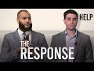

# Challenge to Ben Shapiro on Muslim Myth (2020-06-27)

## Description

Ben Shapiro's academic dishonesty exposed. From faulty definitions, hasty generalisations to ignoring racism. It's time you debated someone other than college kids. 

Twitter: https://twitter.com/mohammed_hijab?s=20
Instagram: https://www.instagram.com/mohammedhijabofficial/?hl=en
Facebook: https://www.facebook.com/brothermohammedhijab/
Soundcloud: https://soundcloud.com/mohammed-hijab-465985305

Time stamps 
0:00 Intro 1
1:21 Female genital mutilation
2:34 Intro 2
3:21 Ben's definition of radical beliefs
4:33 Blaming someone else for 9/11
5:26 Shariah law
10:44 Honour killings
11:58 Biggest Muslim survey
13:34 Jewish racism 
17:38 Challenge
18:55 Bloopers

## Summary of [Challenge to Ben Shapiro on Muslim Myth](https://www.youtube.com/watch?v=88CwPZAssIQ)

*This summary is AI generated - there may be inaccuracies. *

### [00:00:00](https://www.youtube.com/watch?v=88CwPZAssIQ&t=0) - [00:20:00](https://www.youtube.com/watch?v=88CwPZAssIQ&t=1200)

Ben Shapiro is challenged on his beliefs about Muslims. He is asked to explain why he believes that all Muslims are radicalized, and he cites the example of Indonesia as proof that this is not the case. He is also challenged to a discussion on the topic of racism in Muslim communities, and he is shown to be hesitant in prosecuting the killer of George Floyd.

**[00:00:00](https://www.youtube.com/watch?v=88CwPZAssIQ&t=0)**  Ben Shapiro challenges the idea that all Muslims are radicalized. He points to Indonesia, the world's most populous Muslim country, as evidence that not all Muslims are radicalized.
* **[00:05:00](https://www.youtube.com/watch?v=88CwPZAssIQ&t=300)**  Ben Shapiro challenges Muslim extremists by pointing out that many of the punitive laws in Islam are also found in the Bible. Shapiro also asks Ben Gionta if Orthodox Jews who believe in Biblical punishments are radicals, and Gionta says that they are not.
* **[00:10:00](https://www.youtube.com/watch?v=88CwPZAssIQ&t=600)** Ben Shapiro challenges a radical definition of Islam put forth by himself, citing lack of peer review and problems with applicability to broader Muslim population. Shapiro also cites examples of Muslims who do not support honor killings or terrorism.
* **[00:15:00](https://www.youtube.com/watch?v=88CwPZAssIQ&t=900)**  Ben Shapiro is challenged to a discussion on the topic of racism in Muslim communities. Shapiro claims that there is no racism in Muslim communities, but the video shows data that suggests otherwise. Shapiro is also challenged to a discussion on the matter of murder, and he is shown to be hesitant in prosecuting the killer of George Floyd.
* **[00:20:00](https://www.youtube.com/watch?v=88CwPZAssIQ&t=1200)** In this challenge, Ben Shapiro is asked to explain the common Muslim myths. He does a good job of debunking them, and shows that there is no basis to the myths.

<h2>Full transcript with timestamps: CLICK TO EXPAND</h2>

[0:00:00](https://youtu.be/88CwPZAssIQ?t=0) yes a challenging you pigeon hearted  
[0:00:03](https://youtu.be/88CwPZAssIQ?t=3) pusillanimous weasel academic weasel  
[0:00:06](https://youtu.be/88CwPZAssIQ?t=6) fraud so I've always wanted to reply to  
[0:00:14](https://youtu.be/88CwPZAssIQ?t=14) this video this video that ben shapiro  
[0:00:16](https://youtu.be/88CwPZAssIQ?t=16) he put forward this video where he is  
[0:00:18](https://youtu.be/88CwPZAssIQ?t=18) talking about islam and muslims and he's  
[0:00:21](https://youtu.be/88CwPZAssIQ?t=21) trying to represent muslims in a certain  
[0:00:24](https://youtu.be/88CwPZAssIQ?t=24) way he hastily generalizes in a really  
[0:00:27](https://youtu.be/88CwPZAssIQ?t=27) unacquainted are with this kind of hasty  
[0:00:33](https://youtu.be/88CwPZAssIQ?t=33) generalization but before we do so let's  
[0:00:35](https://youtu.be/88CwPZAssIQ?t=35) take a look at actually some of the  
[0:00:37](https://youtu.be/88CwPZAssIQ?t=37) claims that he's making first of all as  
[0:00:40](https://youtu.be/88CwPZAssIQ?t=40) we can see in this video he speaks about  
[0:00:42](https://youtu.be/88CwPZAssIQ?t=42) the Old Testament and the New Testament  
[0:00:43](https://youtu.be/88CwPZAssIQ?t=43) and when he speaks about people who  
[0:00:46](https://youtu.be/88CwPZAssIQ?t=46) believe in these things he acknowledges  
[0:00:48](https://youtu.be/88CwPZAssIQ?t=48) that there are violent passages he says  
[0:00:50](https://youtu.be/88CwPZAssIQ?t=50) in those books why he says there's  
[0:00:52](https://youtu.be/88CwPZAssIQ?t=52) plenty of violent material in the Old  
[0:00:54](https://youtu.be/88CwPZAssIQ?t=54) and New Testaments hey I'm an Orthodox  
[0:00:55](https://youtu.be/88CwPZAssIQ?t=55) Jew I read the Old Testament a lot but  
[0:00:57](https://youtu.be/88CwPZAssIQ?t=57) believers in those particular texts are  
[0:00:59](https://youtu.be/88CwPZAssIQ?t=59) not currently ramming airliners into  
[0:01:00](https://youtu.be/88CwPZAssIQ?t=60) towers or beheading journalists or  
[0:01:03](https://youtu.be/88CwPZAssIQ?t=63) mutilating female genitalia  
[0:01:04](https://youtu.be/88CwPZAssIQ?t=64) so why mention these examples is it  
[0:01:06](https://youtu.be/88CwPZAssIQ?t=66) because you're trying to otherwise or  
[0:01:08](https://youtu.be/88CwPZAssIQ?t=68) associate Muslims with particular acts  
[0:01:10](https://youtu.be/88CwPZAssIQ?t=70) it's clear here that those three  
[0:01:13](https://youtu.be/88CwPZAssIQ?t=73) examples are carefully chosen by  
[0:01:15](https://youtu.be/88CwPZAssIQ?t=75) yourself and actually funny enough nor  
[0:01:18](https://youtu.be/88CwPZAssIQ?t=78) even generalizable to Muslims let's take  
[0:01:20](https://youtu.be/88CwPZAssIQ?t=80) your third example for example you talk  
[0:01:22](https://youtu.be/88CwPZAssIQ?t=82) about female genital mutilation well  
[0:01:24](https://youtu.be/88CwPZAssIQ?t=84) there is no evidence whatsoever that  
[0:01:25](https://youtu.be/88CwPZAssIQ?t=85) most only Muslim countries practice this  
[0:01:28](https://youtu.be/88CwPZAssIQ?t=88) act for example with the OPA is East  
[0:01:30](https://youtu.be/88CwPZAssIQ?t=90) Africa many of those populations are  
[0:01:32](https://youtu.be/88CwPZAssIQ?t=92) majority Christian populations yet the  
[0:01:35](https://youtu.be/88CwPZAssIQ?t=95) act is very much or the practice of  
[0:01:38](https://youtu.be/88CwPZAssIQ?t=98) female genital mutilation is very much  
[0:01:40](https://youtu.be/88CwPZAssIQ?t=100) rampant in fact one of the books I've  
[0:01:42](https://youtu.be/88CwPZAssIQ?t=102) written called fifth wave feminism I  
[0:01:43](https://youtu.be/88CwPZAssIQ?t=103) dedicate an entire chapter on these  
[0:01:46](https://youtu.be/88CwPZAssIQ?t=106) kinds of Acts our practices and how  
[0:01:48](https://youtu.be/88CwPZAssIQ?t=108) they're committed in in the Western  
[0:01:52](https://youtu.be/88CwPZAssIQ?t=112) world like for example if you look at  
[0:01:53](https://youtu.be/88CwPZAssIQ?t=113) the WH old definition of what is in fact  
[0:01:56](https://youtu.be/88CwPZAssIQ?t=116) considered female genital mutilation it  
[0:01:59](https://youtu.be/88CwPZAssIQ?t=119) would be things like a labiaplasty why  
[0:02:01](https://youtu.be/88CwPZAssIQ?t=121) is that not concerned and by the way  
[0:02:03](https://youtu.be/88CwPZAssIQ?t=123) labiaplasty and clitoridectomy z' these  
[0:02:06](https://youtu.be/88CwPZAssIQ?t=126) kinds of things are done right here in  
[0:02:09](https://youtu.be/88CwPZAssIQ?t=129) the West and they're done at an alarming  
[0:02:11](https://youtu.be/88CwPZAssIQ?t=131) rate more so than  
[0:02:13](https://youtu.be/88CwPZAssIQ?t=133) any other place in the world so why is  
[0:02:15](https://youtu.be/88CwPZAssIQ?t=135) that not referred to as female genital  
[0:02:17](https://youtu.be/88CwPZAssIQ?t=137) mutilation and has that got anything to  
[0:02:18](https://youtu.be/88CwPZAssIQ?t=138) do with Muslims no it's got nothing to  
[0:02:20](https://youtu.be/88CwPZAssIQ?t=140) do with Muslims even that pacings pacing  
[0:02:23](https://youtu.be/88CwPZAssIQ?t=143) of vagina is referred to as a kind of  
[0:02:26](https://youtu.be/88CwPZAssIQ?t=146) mutilation by the w-h-o standard if we  
[0:02:29](https://youtu.be/88CwPZAssIQ?t=149) take once again that measure what would  
[0:02:31](https://youtu.be/88CwPZAssIQ?t=151) we say that that happens more in the  
[0:02:33](https://youtu.be/88CwPZAssIQ?t=153) West or does that happen more in these  
[0:02:34](https://youtu.be/88CwPZAssIQ?t=154) so once again I think you're trying to  
[0:02:37](https://youtu.be/88CwPZAssIQ?t=157) create an image you're trying to create  
[0:02:39](https://youtu.be/88CwPZAssIQ?t=159) a picture of a peculiar Muslim right and  
[0:02:43](https://youtu.be/88CwPZAssIQ?t=163) it's a very failed image because when we  
[0:02:46](https://youtu.be/88CwPZAssIQ?t=166) fact check some of the stuff that you're  
[0:02:48](https://youtu.be/88CwPZAssIQ?t=168) saying quickly right as we're gonna find  
[0:02:51](https://youtu.be/88CwPZAssIQ?t=171) out when we go through this one by one  
[0:02:53](https://youtu.be/88CwPZAssIQ?t=173) bit by bit piece by piece then  
[0:02:56](https://youtu.be/88CwPZAssIQ?t=176) everything like a stack of cards breaks  
[0:03:00](https://youtu.be/88CwPZAssIQ?t=180) down in front of your very face let's  
[0:03:02](https://youtu.be/88CwPZAssIQ?t=182) take a look at the next thing that you  
[0:03:03](https://youtu.be/88CwPZAssIQ?t=183) say so you say that and this is so  
[0:03:08](https://youtu.be/88CwPZAssIQ?t=188) important because you run with this okay  
[0:03:10](https://youtu.be/88CwPZAssIQ?t=190) and in fact I would go as far as to say  
[0:03:12](https://youtu.be/88CwPZAssIQ?t=192) is the majority of your video is based  
[0:03:15](https://youtu.be/88CwPZAssIQ?t=195) on this faulty and unrecognized  
[0:03:18](https://youtu.be/88CwPZAssIQ?t=198) definition which you don't even do a  
[0:03:20](https://youtu.be/88CwPZAssIQ?t=200) good job in defining radical beliefs are  
[0:03:22](https://youtu.be/88CwPZAssIQ?t=202) a lot broader than terrorists and  
[0:03:23](https://youtu.be/88CwPZAssIQ?t=203) anybody who argues otherwise is being  
[0:03:25](https://youtu.be/88CwPZAssIQ?t=205) naive or foolish or disingenuous but  
[0:03:27](https://youtu.be/88CwPZAssIQ?t=207) defining what radical beliefs are not is  
[0:03:30](https://youtu.be/88CwPZAssIQ?t=210) not defining what they are so by saying  
[0:03:33](https://youtu.be/88CwPZAssIQ?t=213) radical beliefs are much wider than  
[0:03:35](https://youtu.be/88CwPZAssIQ?t=215) terrorism what you're free to do as  
[0:03:38](https://youtu.be/88CwPZAssIQ?t=218) we're gonna see in this video is  
[0:03:39](https://youtu.be/88CwPZAssIQ?t=219) basically define a multiplicity of  
[0:03:42](https://youtu.be/88CwPZAssIQ?t=222) things all radical beliefs but why  
[0:03:45](https://youtu.be/88CwPZAssIQ?t=225) should we accept your chosen definition  
[0:03:48](https://youtu.be/88CwPZAssIQ?t=228) in fact in the literature in the  
[0:03:50](https://youtu.be/88CwPZAssIQ?t=230) political science literature when we  
[0:03:51](https://youtu.be/88CwPZAssIQ?t=231) read the works of action or Pape or sage  
[0:03:54](https://youtu.be/88CwPZAssIQ?t=234) men or any other they don't agree with  
[0:03:56](https://youtu.be/88CwPZAssIQ?t=236) you in terms of that definition when we  
[0:03:58](https://youtu.be/88CwPZAssIQ?t=238) talk about the process of radicalization  
[0:04:00](https://youtu.be/88CwPZAssIQ?t=240) we're not talking about someone who for  
[0:04:03](https://youtu.be/88CwPZAssIQ?t=243) example is we're gonna come to see with  
[0:04:04](https://youtu.be/88CwPZAssIQ?t=244) your with your kind of pseudo  
[0:04:07](https://youtu.be/88CwPZAssIQ?t=247) definitions that believes in or an acts  
[0:04:11](https://youtu.be/88CwPZAssIQ?t=251) kind of Sharia law who agrees with this  
[0:04:13](https://youtu.be/88CwPZAssIQ?t=253) definition it's not something which is  
[0:04:15](https://youtu.be/88CwPZAssIQ?t=255) unanimous in the literature by any means  
[0:04:17](https://youtu.be/88CwPZAssIQ?t=257) so you start with this faulty definition  
[0:04:19](https://youtu.be/88CwPZAssIQ?t=259) and then you proceed in a way which  
[0:04:22](https://youtu.be/88CwPZAssIQ?t=262) builds your faulty castle or your  
[0:04:26](https://youtu.be/88CwPZAssIQ?t=266) Gosselaar on a thin air you building an  
[0:04:28](https://youtu.be/88CwPZAssIQ?t=268) argument on a faulty premise and that's  
[0:04:31](https://youtu.be/88CwPZAssIQ?t=271) what we're gonna expose today Indonesia  
[0:04:34](https://youtu.be/88CwPZAssIQ?t=274) is the world's most populous Muslim  
[0:04:35](https://youtu.be/88CwPZAssIQ?t=275) country it's got almost 205 million  
[0:04:37](https://youtu.be/88CwPZAssIQ?t=277) Muslims living there and 70 percent  
[0:04:39](https://youtu.be/88CwPZAssIQ?t=279) blamed the United States Israel or  
[0:04:41](https://youtu.be/88CwPZAssIQ?t=281) somebody else for 9/11 so you make that  
[0:04:43](https://youtu.be/88CwPZAssIQ?t=283) calculation it's about 143 million  
[0:04:45](https://youtu.be/88CwPZAssIQ?t=285) people who are radicalized you scared  
[0:04:48](https://youtu.be/88CwPZAssIQ?t=288) yet you know we're just getting started  
[0:04:49](https://youtu.be/88CwPZAssIQ?t=289) so if it's true that someone who blames  
[0:04:53](https://youtu.be/88CwPZAssIQ?t=293) the u.s. Israel or someone else for 9/11  
[0:04:55](https://youtu.be/88CwPZAssIQ?t=295) is a radical as you're alluding to here  
[0:05:00](https://youtu.be/88CwPZAssIQ?t=300) or you're kind to trying to suggest here  
[0:05:01](https://youtu.be/88CwPZAssIQ?t=301) then all of those families who are whose  
[0:05:05](https://youtu.be/88CwPZAssIQ?t=305) family member was killed on 9/11 who are  
[0:05:10](https://youtu.be/88CwPZAssIQ?t=310) part of the truth movements in the  
[0:05:11](https://youtu.be/88CwPZAssIQ?t=311) United States and all those kind of  
[0:05:13](https://youtu.be/88CwPZAssIQ?t=313) things are you willing to come out and  
[0:05:14](https://youtu.be/88CwPZAssIQ?t=314) say that they're radicals as well well  
[0:05:16](https://youtu.be/88CwPZAssIQ?t=316) in fact you'd have to do that come out  
[0:05:18](https://youtu.be/88CwPZAssIQ?t=318) and say that they are radicals those  
[0:05:20](https://youtu.be/88CwPZAssIQ?t=320) people in America part of the truth  
[0:05:23](https://youtu.be/88CwPZAssIQ?t=323) movements that they're all radicals if  
[0:05:25](https://youtu.be/88CwPZAssIQ?t=325) that's what your definition entails  
[0:05:26](https://youtu.be/88CwPZAssIQ?t=326) Bangladesh another 82% want Sharia to be  
[0:05:29](https://youtu.be/88CwPZAssIQ?t=329) the official law of the country hey  
[0:05:31](https://youtu.be/88CwPZAssIQ?t=331) Egypt 80 million Muslims according to  
[0:05:33](https://youtu.be/88CwPZAssIQ?t=333) that same 2009 poll it showed that 65%  
[0:05:36](https://youtu.be/88CwPZAssIQ?t=336) were on strict Sharia law in every  
[0:05:37](https://youtu.be/88CwPZAssIQ?t=337) Islamic country the second aspects  
[0:05:40](https://youtu.be/88CwPZAssIQ?t=340) strict support for Sharia law so I want  
[0:05:42](https://youtu.be/88CwPZAssIQ?t=342) to know what exactly about Sharia law do  
[0:05:45](https://youtu.be/88CwPZAssIQ?t=345) you think make someone a radical because  
[0:05:47](https://youtu.be/88CwPZAssIQ?t=347) if you're saying Sharia law makes  
[0:05:50](https://youtu.be/88CwPZAssIQ?t=350) someone a radical what exactly now I am  
[0:05:54](https://youtu.be/88CwPZAssIQ?t=354) gonna assume that you're gonna say the  
[0:05:56](https://youtu.be/88CwPZAssIQ?t=356) punitive laws because that's the most  
[0:05:58](https://youtu.be/88CwPZAssIQ?t=358) controversial aspect of Sharia law now I  
[0:06:01](https://youtu.be/88CwPZAssIQ?t=361) want you to answer me a question if  
[0:06:04](https://youtu.be/88CwPZAssIQ?t=364) people believe the punitive and penal  
[0:06:07](https://youtu.be/88CwPZAssIQ?t=367) laws of Islam and that makes them a  
[0:06:09](https://youtu.be/88CwPZAssIQ?t=369) radical then what you say of Orthodox  
[0:06:12](https://youtu.be/88CwPZAssIQ?t=372) Jews who read Exodus chapter 20 who read  
[0:06:16](https://youtu.be/88CwPZAssIQ?t=376) Leviticus chapter 20 who read first  
[0:06:19](https://youtu.be/88CwPZAssIQ?t=379) Samuels 15/3 and you can check those  
[0:06:22](https://youtu.be/88CwPZAssIQ?t=382) references in your own time in The Book  
[0:06:24](https://youtu.be/88CwPZAssIQ?t=384) of Numbers chapter 30 verse 8 check him  
[0:06:26](https://youtu.be/88CwPZAssIQ?t=386) to check those number those reference  
[0:06:27](https://youtu.be/88CwPZAssIQ?t=387) Gionta what about those individuals who  
[0:06:29](https://youtu.be/88CwPZAssIQ?t=389) believe in those things they believe in  
[0:06:31](https://youtu.be/88CwPZAssIQ?t=391) the capital punishment for murder for  
[0:06:33](https://youtu.be/88CwPZAssIQ?t=393) adultery for in fact let me tell you Ben  
[0:06:35](https://youtu.be/88CwPZAssIQ?t=395) let me tell you something Ben let me  
[0:06:38](https://youtu.be/88CwPZAssIQ?t=398) tell you something Ben listen to me a  
[0:06:39](https://youtu.be/88CwPZAssIQ?t=399) look at me  
[0:06:40](https://youtu.be/88CwPZAssIQ?t=400) I am willing to say that all of the  
[0:06:42](https://youtu.be/88CwPZAssIQ?t=402) punitive laws that are mentioned  
[0:06:44](https://youtu.be/88CwPZAssIQ?t=404) classically in the text the primary text  
[0:06:47](https://youtu.be/88CwPZAssIQ?t=407) of Islam and subsequently mentioned by  
[0:06:50](https://youtu.be/88CwPZAssIQ?t=410) medieval scholars for example in  
[0:06:51](https://youtu.be/88CwPZAssIQ?t=411) classical Jews potential texts they also  
[0:06:54](https://youtu.be/88CwPZAssIQ?t=414) mentioned more severely yes more  
[0:06:58](https://youtu.be/88CwPZAssIQ?t=418) severely in the halacha  
[0:06:59](https://youtu.be/88CwPZAssIQ?t=419) texts of the Jewish Orthodox Jews so can  
[0:07:03](https://youtu.be/88CwPZAssIQ?t=423) you now say that they are radicals all  
[0:07:05](https://youtu.be/88CwPZAssIQ?t=425) of those Orthodox Jews who believe word  
[0:07:07](https://youtu.be/88CwPZAssIQ?t=427) for word letter for letter the the  
[0:07:12](https://youtu.be/88CwPZAssIQ?t=432) biblical discourse as it relates to  
[0:07:14](https://youtu.be/88CwPZAssIQ?t=434) Penal goes you would probably come back  
[0:07:15](https://youtu.be/88CwPZAssIQ?t=435) and say what hold on that's why it says  
[0:07:18](https://youtu.be/88CwPZAssIQ?t=438) in the book but in terms of  
[0:07:20](https://youtu.be/88CwPZAssIQ?t=440) implementation there's a difference and  
[0:07:23](https://youtu.be/88CwPZAssIQ?t=443) we say the same thing we're not going  
[0:07:24](https://youtu.be/88CwPZAssIQ?t=444) around saying well let's go cut  
[0:07:26](https://youtu.be/88CwPZAssIQ?t=446) everyone's hands off and go and do these  
[0:07:28](https://youtu.be/88CwPZAssIQ?t=448) things which are penal laws these things  
[0:07:30](https://youtu.be/88CwPZAssIQ?t=450) as we know have a complex discussion or  
[0:07:33](https://youtu.be/88CwPZAssIQ?t=453) how they are implemented but in the  
[0:07:35](https://youtu.be/88CwPZAssIQ?t=455) modern world we're not saying let's go  
[0:07:36](https://youtu.be/88CwPZAssIQ?t=456) and do a killing spree or do a murder  
[0:07:39](https://youtu.be/88CwPZAssIQ?t=459) this and capital punishments know where  
[0:07:41](https://youtu.be/88CwPZAssIQ?t=461) there's a complex discussion Muslim  
[0:07:43](https://youtu.be/88CwPZAssIQ?t=463) scholars are having it just like Jewish  
[0:07:45](https://youtu.be/88CwPZAssIQ?t=465) scholars are having it and there's a  
[0:07:47](https://youtu.be/88CwPZAssIQ?t=467) spectrum of different opinion how  
[0:07:49](https://youtu.be/88CwPZAssIQ?t=469) implementation can be done if it is at  
[0:07:51](https://youtu.be/88CwPZAssIQ?t=471) all done in Muslim lands so if this  
[0:07:54](https://youtu.be/88CwPZAssIQ?t=474) makes Muslims radicals and surely it  
[0:07:57](https://youtu.be/88CwPZAssIQ?t=477) should be able to make Orthodox Jews  
[0:07:59](https://youtu.be/88CwPZAssIQ?t=479) radicals as well because I say this  
[0:08:01](https://youtu.be/88CwPZAssIQ?t=481) again almost all of the punitive laws  
[0:08:03](https://youtu.be/88CwPZAssIQ?t=483) almost all of the penal laws are  
[0:08:07](https://youtu.be/88CwPZAssIQ?t=487) iterated in the Old Testament almost all  
[0:08:10](https://youtu.be/88CwPZAssIQ?t=490) of in fact more of them are there more  
[0:08:13](https://youtu.be/88CwPZAssIQ?t=493) of their mother so that's what you tried  
[0:08:16](https://youtu.be/88CwPZAssIQ?t=496) to skip in the beginning of the video  
[0:08:17](https://youtu.be/88CwPZAssIQ?t=497) didn't you try to weasel from that one  
[0:08:20](https://youtu.be/88CwPZAssIQ?t=500) try to scramble from that one try to  
[0:08:22](https://youtu.be/88CwPZAssIQ?t=502) squirm from that one try to run away  
[0:08:23](https://youtu.be/88CwPZAssIQ?t=503) from that one oh this violent passages  
[0:08:26](https://youtu.be/88CwPZAssIQ?t=506) in the Old Testament do you not think  
[0:08:28](https://youtu.be/88CwPZAssIQ?t=508) that some of these individuals who  
[0:08:30](https://youtu.be/88CwPZAssIQ?t=510) believe in those violent passages maybe  
[0:08:32](https://youtu.be/88CwPZAssIQ?t=512) could have a propensity to be inspired  
[0:08:36](https://youtu.be/88CwPZAssIQ?t=516) as they were historically  
[0:08:38](https://youtu.be/88CwPZAssIQ?t=518) contemporaneously to do any acts of  
[0:08:40](https://youtu.be/88CwPZAssIQ?t=520) violence like the Ergun who killed 91  
[0:08:43](https://youtu.be/88CwPZAssIQ?t=523) individuals innocent individuals in the  
[0:08:45](https://youtu.be/88CwPZAssIQ?t=525) kingdom Solomon hotel who were a Jewish  
[0:08:48](https://youtu.be/88CwPZAssIQ?t=528) terrorist group yes who then became  
[0:08:52](https://youtu.be/88CwPZAssIQ?t=532) basically the guy  
[0:08:54](https://youtu.be/88CwPZAssIQ?t=534) for intents and purposes the Luke it  
[0:08:56](https://youtu.be/88CwPZAssIQ?t=536) party is now an extension from this  
[0:08:59](https://youtu.be/88CwPZAssIQ?t=539) terrorist organization now you keep  
[0:09:00](https://youtu.be/88CwPZAssIQ?t=540) mentioning who sama bin Laden in your in  
[0:09:03](https://youtu.be/88CwPZAssIQ?t=543) your in your video and almost seventy  
[0:09:06](https://youtu.be/88CwPZAssIQ?t=546) percent said that they had positive or  
[0:09:07](https://youtu.be/88CwPZAssIQ?t=547) mixed feelings about bin Laden I imagine  
[0:09:10](https://youtu.be/88CwPZAssIQ?t=550) begin who was who wrote this book called  
[0:09:13](https://youtu.be/88CwPZAssIQ?t=553) the revolt he himself became the Prime  
[0:09:16](https://youtu.be/88CwPZAssIQ?t=556) Minister of Israel now if that is the  
[0:09:19](https://youtu.be/88CwPZAssIQ?t=559) case now you imagine after Osama bin  
[0:09:21](https://youtu.be/88CwPZAssIQ?t=561) Laden has committed all of his attacks  
[0:09:24](https://youtu.be/88CwPZAssIQ?t=564) he becomes the prime minister of some  
[0:09:26](https://youtu.be/88CwPZAssIQ?t=566) country and he has an allied  
[0:09:28](https://youtu.be/88CwPZAssIQ?t=568) relationship with the West so don't  
[0:09:30](https://youtu.be/88CwPZAssIQ?t=570) don't please don't throw stones when you  
[0:09:32](https://youtu.be/88CwPZAssIQ?t=572) live in the Glass House do you not know  
[0:09:33](https://youtu.be/88CwPZAssIQ?t=573) your history and you not know your  
[0:09:35](https://youtu.be/88CwPZAssIQ?t=575) religious book you claim you're an  
[0:09:37](https://youtu.be/88CwPZAssIQ?t=577) Orthodox Jew but what exactly are you  
[0:09:40](https://youtu.be/88CwPZAssIQ?t=580) advocating in terms of belief Nigeria  
[0:09:44](https://youtu.be/88CwPZAssIQ?t=584) seventy five point seven million Muslims  
[0:09:46](https://youtu.be/88CwPZAssIQ?t=586) live there 71% favor Sharia law that's  
[0:09:49](https://youtu.be/88CwPZAssIQ?t=589) fifty three point seven million people  
[0:09:50](https://youtu.be/88CwPZAssIQ?t=590) Iran seventy four point eight million  
[0:09:53](https://youtu.be/88CwPZAssIQ?t=593) Muslims eighty three percent favor  
[0:09:55](https://youtu.be/88CwPZAssIQ?t=595) implementation of Sharia law as of last  
[0:09:57](https://youtu.be/88CwPZAssIQ?t=597) year so this is what he doesn't throw  
[0:09:58](https://youtu.be/88CwPZAssIQ?t=598) the video he looks at all the countries  
[0:10:00](https://youtu.be/88CwPZAssIQ?t=600) that believe in a strict go the majority  
[0:10:02](https://youtu.be/88CwPZAssIQ?t=602) population believing the strict  
[0:10:03](https://youtu.be/88CwPZAssIQ?t=603) compliance to Sharia law and he labels  
[0:10:06](https://youtu.be/88CwPZAssIQ?t=606) them as radical but of course he  
[0:10:08](https://youtu.be/88CwPZAssIQ?t=608) wouldn't have the same attitude to  
[0:10:10](https://youtu.be/88CwPZAssIQ?t=610) Orthodox Jews who believe in very  
[0:10:12](https://youtu.be/88CwPZAssIQ?t=612) similar things so I want to know first  
[0:10:16](https://youtu.be/88CwPZAssIQ?t=616) of all who peer reviewed your definition  
[0:10:18](https://youtu.be/88CwPZAssIQ?t=618) of radicalism who peer reviewed it  
[0:10:20](https://youtu.be/88CwPZAssIQ?t=620) because when I was looking in the  
[0:10:21](https://youtu.be/88CwPZAssIQ?t=621) academic literature I didn't find your  
[0:10:24](https://youtu.be/88CwPZAssIQ?t=624) pseudo definition of radicalism it  
[0:10:26](https://youtu.be/88CwPZAssIQ?t=626) doesn't actually exist number two why  
[0:10:31](https://youtu.be/88CwPZAssIQ?t=631) are you not applying the same standards  
[0:10:33](https://youtu.be/88CwPZAssIQ?t=633) on the Orthodox Jewish community if  
[0:10:35](https://youtu.be/88CwPZAssIQ?t=635) that's what radicalism entails so it  
[0:10:38](https://youtu.be/88CwPZAssIQ?t=638) seems like your presupposition is a  
[0:10:39](https://youtu.be/88CwPZAssIQ?t=639) false one and therefore your  
[0:10:41](https://youtu.be/88CwPZAssIQ?t=641) understanding is a problematic one  
[0:10:43](https://youtu.be/88CwPZAssIQ?t=643) Bangladesh and two thirds said honor  
[0:10:46](https://youtu.be/88CwPZAssIQ?t=646) killings of women can sometimes be  
[0:10:49](https://youtu.be/88CwPZAssIQ?t=649) justified honor killings I looked at Pew  
[0:10:51](https://youtu.be/88CwPZAssIQ?t=651) Research to see exactly what they're  
[0:10:53](https://youtu.be/88CwPZAssIQ?t=653) talking about and what in fact they're  
[0:10:54](https://youtu.be/88CwPZAssIQ?t=654) talking about in fact let me give you an  
[0:10:56](https://youtu.be/88CwPZAssIQ?t=656) example  
[0:10:57](https://youtu.be/88CwPZAssIQ?t=657) Indonesia says males it has Iran  
[0:11:01](https://youtu.be/88CwPZAssIQ?t=661) achilles honor killing section talks  
[0:11:02](https://youtu.be/88CwPZAssIQ?t=662) about the capital punishment for a  
[0:11:03](https://youtu.be/88CwPZAssIQ?t=663) certain crime it says males for example  
[0:11:06](https://youtu.be/88CwPZAssIQ?t=666) eight  
[0:11:07](https://youtu.be/88CwPZAssIQ?t=667) 2% believed that they would be eligible  
[0:11:10](https://youtu.be/88CwPZAssIQ?t=670) for honor killings and also 82% of  
[0:11:12](https://youtu.be/88CwPZAssIQ?t=672) female so it's exactly the same it's not  
[0:11:14](https://youtu.be/88CwPZAssIQ?t=674) a female specific issue you're saying  
[0:11:16](https://youtu.be/88CwPZAssIQ?t=676) they believe in female honor killings  
[0:11:17](https://youtu.be/88CwPZAssIQ?t=677) but if you look at the biggest  
[0:11:19](https://youtu.be/88CwPZAssIQ?t=679) population of Muslims in the world  
[0:11:20](https://youtu.be/88CwPZAssIQ?t=680) Indonesia as an example but many of them  
[0:11:22](https://youtu.be/88CwPZAssIQ?t=682) are the same those who believe in such  
[0:11:24](https://youtu.be/88CwPZAssIQ?t=684) capital punishments usually believe in  
[0:11:26](https://youtu.be/88CwPZAssIQ?t=686) it for both sexes now what are we  
[0:11:28](https://youtu.be/88CwPZAssIQ?t=688) talking about when they say this are  
[0:11:29](https://youtu.be/88CwPZAssIQ?t=689) they're talking about something which is  
[0:11:31](https://youtu.be/88CwPZAssIQ?t=691) judicial it's a capital punishment for a  
[0:11:34](https://youtu.be/88CwPZAssIQ?t=694) certain certain kind of crime or are we  
[0:11:38](https://youtu.be/88CwPZAssIQ?t=698) talking about vigilantism oh and these  
[0:11:41](https://youtu.be/88CwPZAssIQ?t=701) are very important you want says you  
[0:11:42](https://youtu.be/88CwPZAssIQ?t=702) can't just skip by themselves they  
[0:11:44](https://youtu.be/88CwPZAssIQ?t=704) believe in honor killings for women but  
[0:11:46](https://youtu.be/88CwPZAssIQ?t=706) do they believe in I mean look at  
[0:11:47](https://youtu.be/88CwPZAssIQ?t=707) Indonesia I believe 82% of them but even  
[0:11:49](https://youtu.be/88CwPZAssIQ?t=709) honor killing for so-called Allah caliph  
[0:11:50](https://youtu.be/88CwPZAssIQ?t=710) over but also for men so what are  
[0:11:52](https://youtu.be/88CwPZAssIQ?t=712) they're talking about when they say this  
[0:11:53](https://youtu.be/88CwPZAssIQ?t=713) and do they all mean the same thing when  
[0:11:55](https://youtu.be/88CwPZAssIQ?t=715) they say these things these are nuances  
[0:11:57](https://youtu.be/88CwPZAssIQ?t=717) which are very important so there's a  
[0:11:58](https://youtu.be/88CwPZAssIQ?t=718) book called what a billion Muslims think  
[0:12:01](https://youtu.be/88CwPZAssIQ?t=721) okay and there's a survey of 50,000  
[0:12:03](https://youtu.be/88CwPZAssIQ?t=723) people Muslim people across I don't know  
[0:12:05](https://youtu.be/88CwPZAssIQ?t=725) how many countries John Esposito and  
[0:12:08](https://youtu.be/88CwPZAssIQ?t=728) Allium or more ga'head were part of this  
[0:12:10](https://youtu.be/88CwPZAssIQ?t=730) this project and when we look at the  
[0:12:12](https://youtu.be/88CwPZAssIQ?t=732) amount of Muslims who actually believe  
[0:12:15](https://youtu.be/88CwPZAssIQ?t=735) in terrorism and killing innocent people  
[0:12:18](https://youtu.be/88CwPZAssIQ?t=738) and civilians and stuff you will find  
[0:12:21](https://youtu.be/88CwPZAssIQ?t=741) this a marginal number if you look at  
[0:12:22](https://youtu.be/88CwPZAssIQ?t=742) page 97 to 98 of the book in the high  
[0:12:25](https://youtu.be/88CwPZAssIQ?t=745) 90s of people then the percentage of  
[0:12:28](https://youtu.be/88CwPZAssIQ?t=748) high 90% believe that that is a  
[0:12:30](https://youtu.be/88CwPZAssIQ?t=750) despicable crime and horrendous and so  
[0:12:31](https://youtu.be/88CwPZAssIQ?t=751) on and so forth now we know you have to  
[0:12:33](https://youtu.be/88CwPZAssIQ?t=753) remember something the Muslim  
[0:12:35](https://youtu.be/88CwPZAssIQ?t=755) communities like 1.8 billion now in 2020  
[0:12:38](https://youtu.be/88CwPZAssIQ?t=758) the Jewish community is not even 1% of  
[0:12:41](https://youtu.be/88CwPZAssIQ?t=761) that so it's not like for like I'm  
[0:12:42](https://youtu.be/88CwPZAssIQ?t=762) afraid if even 1% of the Muslim  
[0:12:47](https://youtu.be/88CwPZAssIQ?t=767) community becomes radicalized in a  
[0:12:50](https://youtu.be/88CwPZAssIQ?t=770) properly definitional sense in a violent  
[0:12:52](https://youtu.be/88CwPZAssIQ?t=772) sense it will have massive ramifications  
[0:12:55](https://youtu.be/88CwPZAssIQ?t=775) it's true and we do have a problem to  
[0:12:57](https://youtu.be/88CwPZAssIQ?t=777) deal with we're not denying this as the  
[0:12:59](https://youtu.be/88CwPZAssIQ?t=779) Muslim community we have to talk about  
[0:13:01](https://youtu.be/88CwPZAssIQ?t=781) these things about the tech feeding  
[0:13:03](https://youtu.be/88CwPZAssIQ?t=783) movements about those radical movements  
[0:13:04](https://youtu.be/88CwPZAssIQ?t=784) about those repugnant movement the  
[0:13:07](https://youtu.be/88CwPZAssIQ?t=787) monstrous crimes that they commit and  
[0:13:08](https://youtu.be/88CwPZAssIQ?t=788) how to theologically remedy what they're  
[0:13:10](https://youtu.be/88CwPZAssIQ?t=790) doing politically remedy what they're  
[0:13:11](https://youtu.be/88CwPZAssIQ?t=791) doing and ideologically remedy what  
[0:13:13](https://youtu.be/88CwPZAssIQ?t=793) they're doing but it's not fair for  
[0:13:16](https://youtu.be/88CwPZAssIQ?t=796) someone like you to come up and  
[0:13:18](https://youtu.be/88CwPZAssIQ?t=798) misrepresent an entire  
[0:13:19](https://youtu.be/88CwPZAssIQ?t=799) people religious community by hastily  
[0:13:23](https://youtu.be/88CwPZAssIQ?t=803) generalizing and giving false  
[0:13:25](https://youtu.be/88CwPZAssIQ?t=805) definitions and not applying the same  
[0:13:28](https://youtu.be/88CwPZAssIQ?t=808) standards of radicalization to one group  
[0:13:31](https://youtu.be/88CwPZAssIQ?t=811) of people rather than others I want to  
[0:13:34](https://youtu.be/88CwPZAssIQ?t=814) tell you something yes I've got  
[0:13:35](https://youtu.be/88CwPZAssIQ?t=815) something in my hand this is an  
[0:13:36](https://youtu.be/88CwPZAssIQ?t=816) unpublished paper that I wrote back in  
[0:13:38](https://youtu.be/88CwPZAssIQ?t=818) 2014 when I was doing one of my post  
[0:13:41](https://youtu.be/88CwPZAssIQ?t=821) graduates in fact I was in the Leo Beck  
[0:13:43](https://youtu.be/88CwPZAssIQ?t=823) Institute which is a situation such as  
[0:13:46](https://youtu.be/88CwPZAssIQ?t=826) you probably more you should know let me  
[0:13:49](https://youtu.be/88CwPZAssIQ?t=829) tell you something I was doing work to  
[0:13:51](https://youtu.be/88CwPZAssIQ?t=831) see the extent of Jewish racism and in  
[0:13:54](https://youtu.be/88CwPZAssIQ?t=834) fact I might publish this because when I  
[0:13:56](https://youtu.be/88CwPZAssIQ?t=836) went on the Peace Index website it seems  
[0:13:58](https://youtu.be/88CwPZAssIQ?t=838) to me that they're not working anymore  
[0:14:00](https://youtu.be/88CwPZAssIQ?t=840) but this was one of the most robust  
[0:14:03](https://youtu.be/88CwPZAssIQ?t=843) organizations that are teaming up with  
[0:14:05](https://youtu.be/88CwPZAssIQ?t=845) Tel Aviv University  
[0:14:06](https://youtu.be/88CwPZAssIQ?t=846) I remember referencing them now in this  
[0:14:09](https://youtu.be/88CwPZAssIQ?t=849) and I was looking at the extent of the  
[0:14:12](https://youtu.be/88CwPZAssIQ?t=852) problem of racism in the Jewish  
[0:14:14](https://youtu.be/88CwPZAssIQ?t=854) community not look at this I want to  
[0:14:17](https://youtu.be/88CwPZAssIQ?t=857) show you something yes I want you to  
[0:14:19](https://youtu.be/88CwPZAssIQ?t=859) know something look at the amount of  
[0:14:20](https://youtu.be/88CwPZAssIQ?t=860) racism you have in in the in the Jewish  
[0:14:24](https://youtu.be/88CwPZAssIQ?t=864) come in the Israeli Jewish community  
[0:14:26](https://youtu.be/88CwPZAssIQ?t=866) according to Peace Index survey  
[0:14:28](https://youtu.be/88CwPZAssIQ?t=868) conducted in 2012 some sixty five point  
[0:14:31](https://youtu.be/88CwPZAssIQ?t=871) two percent of Israeli Jews were either  
[0:14:34](https://youtu.be/88CwPZAssIQ?t=874) moderately or greatly disturbed that  
[0:14:37](https://youtu.be/88CwPZAssIQ?t=877) they were there were foreign workers who  
[0:14:39](https://youtu.be/88CwPZAssIQ?t=879) came from countries like Sudan and  
[0:14:41](https://youtu.be/88CwPZAssIQ?t=881) Eritrea so we're talking about greatly  
[0:14:44](https://youtu.be/88CwPZAssIQ?t=884) 40.5% that they had foreign neighbors  
[0:14:49](https://youtu.be/88CwPZAssIQ?t=889) who came from Eritrea Sudan and Eritrea  
[0:14:50](https://youtu.be/88CwPZAssIQ?t=890) in particular three black countries as  
[0:14:53](https://youtu.be/88CwPZAssIQ?t=893) you know now I've never seen you come  
[0:14:56](https://youtu.be/88CwPZAssIQ?t=896) out and talk about the clear racism in  
[0:15:01](https://youtu.be/88CwPZAssIQ?t=901) Israel all we've do all we've seen with  
[0:15:05](https://youtu.be/88CwPZAssIQ?t=905) you is you attacking the black rights  
[0:15:07](https://youtu.be/88CwPZAssIQ?t=907) movement all but all black rights matter  
[0:15:11](https://youtu.be/88CwPZAssIQ?t=911) movement but we don't haven't seen from  
[0:15:13](https://youtu.be/88CwPZAssIQ?t=913) your attack any Jewish anti black  
[0:15:16](https://youtu.be/88CwPZAssIQ?t=916) sentiments which we can see here with  
[0:15:18](https://youtu.be/88CwPZAssIQ?t=918) this survey data or the survey data is  
[0:15:21](https://youtu.be/88CwPZAssIQ?t=921) quite rampant same likewise as we know  
[0:15:25](https://youtu.be/88CwPZAssIQ?t=925) with your own comment your anti-arab  
[0:15:26](https://youtu.be/88CwPZAssIQ?t=926) comment when you're saying that Jews  
[0:15:28](https://youtu.be/88CwPZAssIQ?t=928) like to build things and Arabs like to  
[0:15:30](https://youtu.be/88CwPZAssIQ?t=930) bomb crap or something like this when  
[0:15:32](https://youtu.be/88CwPZAssIQ?t=932) you learn and  
[0:15:33](https://youtu.be/88CwPZAssIQ?t=933) Neels show 50% of Jews would not live in  
[0:15:38](https://youtu.be/88CwPZAssIQ?t=938) the same building as Arabs and the  
[0:15:40](https://youtu.be/88CwPZAssIQ?t=940) number fifty percent said they would  
[0:15:42](https://youtu.be/88CwPZAssIQ?t=942) they would encourage their Arab  
[0:15:43](https://youtu.be/88CwPZAssIQ?t=943) neighbors to emigrate to another land  
[0:15:45](https://youtu.be/88CwPZAssIQ?t=945) what kind of numbers are these what kind  
[0:15:48](https://youtu.be/88CwPZAssIQ?t=948) of things are these well I don't see is  
[0:15:50](https://youtu.be/88CwPZAssIQ?t=950) that radicalism I won't ask a question  
[0:15:52](https://youtu.be/88CwPZAssIQ?t=952) actually is that racism is can we say  
[0:15:54](https://youtu.be/88CwPZAssIQ?t=954) that the majority based on the states  
[0:15:57](https://youtu.be/88CwPZAssIQ?t=957) are here which conveniently the website  
[0:15:59](https://youtu.be/88CwPZAssIQ?t=959) has sought it's not working right now  
[0:16:01](https://youtu.be/88CwPZAssIQ?t=961) the Peace Index website because people  
[0:16:02](https://youtu.be/88CwPZAssIQ?t=962) are using it like me to prove certain  
[0:16:05](https://youtu.be/88CwPZAssIQ?t=965) things or to make sound claims but can I  
[0:16:07](https://youtu.be/88CwPZAssIQ?t=967) say I've got this don't worry so but  
[0:16:11](https://youtu.be/88CwPZAssIQ?t=971) it's all I have all I've taken  
[0:16:12](https://youtu.be/88CwPZAssIQ?t=972) screenshots and I'm gonna show it to you  
[0:16:14](https://youtu.be/88CwPZAssIQ?t=974) right now but when I say when I say this  
[0:16:17](https://youtu.be/88CwPZAssIQ?t=977) can we say can we generalize the the  
[0:16:19](https://youtu.be/88CwPZAssIQ?t=979) Jewish community in Israel Iser a racist  
[0:16:21](https://youtu.be/88CwPZAssIQ?t=981) community by large and if this is  
[0:16:24](https://youtu.be/88CwPZAssIQ?t=984) something we can say why don't you start  
[0:16:25](https://youtu.be/88CwPZAssIQ?t=985) doing work against this using your  
[0:16:27](https://youtu.be/88CwPZAssIQ?t=987) platform using your social media  
[0:16:30](https://youtu.be/88CwPZAssIQ?t=990) influence instead of continually  
[0:16:32](https://youtu.be/88CwPZAssIQ?t=992) attacking black people black people  
[0:16:33](https://youtu.be/88CwPZAssIQ?t=993) black people or but the Blackfriars way  
[0:16:35](https://youtu.be/88CwPZAssIQ?t=995) you don't want to admit even that the  
[0:16:38](https://youtu.be/88CwPZAssIQ?t=998) guy who killed George Floyd was doing so  
[0:16:40](https://youtu.be/88CwPZAssIQ?t=1000) for racial reasons and you are at one  
[0:16:42](https://youtu.be/88CwPZAssIQ?t=1002) point hesitant on the fact that I should  
[0:16:44](https://youtu.be/88CwPZAssIQ?t=1004) he be  
[0:16:44](https://youtu.be/88CwPZAssIQ?t=1004) should he be prosecuted or not for  
[0:16:46](https://youtu.be/88CwPZAssIQ?t=1006) murder you were questioning this at one  
[0:16:49](https://youtu.be/88CwPZAssIQ?t=1009) point I'm not sure if you've changed  
[0:16:50](https://youtu.be/88CwPZAssIQ?t=1010) your mind  
[0:16:50](https://youtu.be/88CwPZAssIQ?t=1010) but do you I want ask a genuine question  
[0:16:53](https://youtu.be/88CwPZAssIQ?t=1013) I mean are you affected by this kind of  
[0:16:55](https://youtu.be/88CwPZAssIQ?t=1015) thing because you're yourself came up  
[0:16:57](https://youtu.be/88CwPZAssIQ?t=1017) with racist rhetoric so why not be open  
[0:17:00](https://youtu.be/88CwPZAssIQ?t=1020) and honest if we're going to be academic  
[0:17:02](https://youtu.be/88CwPZAssIQ?t=1022) about these things and we're going to be  
[0:17:03](https://youtu.be/88CwPZAssIQ?t=1023) open and honest yes we have a problem  
[0:17:04](https://youtu.be/88CwPZAssIQ?t=1024) with in Muslim communities but not all  
[0:17:06](https://youtu.be/88CwPZAssIQ?t=1026) Muslim communities are the same we're  
[0:17:08](https://youtu.be/88CwPZAssIQ?t=1028) talking about like you said 50 countries  
[0:17:10](https://youtu.be/88CwPZAssIQ?t=1030) with Muslim majority populations we're  
[0:17:12](https://youtu.be/88CwPZAssIQ?t=1032) talking about according to Pew that you  
[0:17:14](https://youtu.be/88CwPZAssIQ?t=1034) like to read to quote a religious  
[0:17:17](https://youtu.be/88CwPZAssIQ?t=1037) population that in the end of the  
[0:17:18](https://youtu.be/88CwPZAssIQ?t=1038) century will amount to one third of the  
[0:17:20](https://youtu.be/88CwPZAssIQ?t=1040) world's population and you want to  
[0:17:22](https://youtu.be/88CwPZAssIQ?t=1042) generalize those that's one third one  
[0:17:24](https://youtu.be/88CwPZAssIQ?t=1044) out of every three you can't even  
[0:17:26](https://youtu.be/88CwPZAssIQ?t=1046) compare them with Jewish people they're  
[0:17:27](https://youtu.be/88CwPZAssIQ?t=1047) like what thirty million people  
[0:17:29](https://youtu.be/88CwPZAssIQ?t=1049) worldwide there's more people in Morocco  
[0:17:32](https://youtu.be/88CwPZAssIQ?t=1052) than there are Jews in the world  
[0:17:33](https://youtu.be/88CwPZAssIQ?t=1053) so I mean please please be fair so the  
[0:17:38](https://youtu.be/88CwPZAssIQ?t=1058) reason why you only want to deal with  
[0:17:41](https://youtu.be/88CwPZAssIQ?t=1061) college students young ones untrained  
[0:17:44](https://youtu.be/88CwPZAssIQ?t=1064) ones little ones  
[0:17:46](https://youtu.be/88CwPZAssIQ?t=1066) weak ones in uneven situations and  
[0:17:51](https://youtu.be/88CwPZAssIQ?t=1071) settings is because your apostle animus  
[0:17:55](https://youtu.be/88CwPZAssIQ?t=1075) what did you say says you're a  
[0:17:58](https://youtu.be/88CwPZAssIQ?t=1078) pusillanimous timorous pusillanimous  
[0:18:01](https://youtu.be/88CwPZAssIQ?t=1081) ultra krappa Darien dilettante and you  
[0:18:05](https://youtu.be/88CwPZAssIQ?t=1085) don't want to face someone who can put  
[0:18:07](https://youtu.be/88CwPZAssIQ?t=1087) you in your place  
[0:18:08](https://youtu.be/88CwPZAssIQ?t=1088) yes I challenge you you pigeon hearted  
[0:18:12](https://youtu.be/88CwPZAssIQ?t=1092) pusillanimous weasel academic weasel  
[0:18:15](https://youtu.be/88CwPZAssIQ?t=1095) fraud you're a fraud you're a fraud and  
[0:18:21](https://youtu.be/88CwPZAssIQ?t=1101) I put you in your place I know you think  
[0:18:23](https://youtu.be/88CwPZAssIQ?t=1103) damn this guy's I was hoping I'll get  
[0:18:26](https://youtu.be/88CwPZAssIQ?t=1106) away with it if it wasn't for those  
[0:18:28](https://youtu.be/88CwPZAssIQ?t=1108) meddling kids you know what you're  
[0:18:35](https://youtu.be/88CwPZAssIQ?t=1115) finished finished you're finished you're  
[0:18:41](https://youtu.be/88CwPZAssIQ?t=1121) finished and you wouldn't come in death  
[0:18:44](https://youtu.be/88CwPZAssIQ?t=1124) even be in the same proximity as me and  
[0:18:47](https://youtu.be/88CwPZAssIQ?t=1127) I know you know that and that's all I  
[0:18:49](https://youtu.be/88CwPZAssIQ?t=1129) have to say on the matter  
[0:18:51](https://youtu.be/88CwPZAssIQ?t=1131) Salam aleikum wa rahmatullah hear what I  
[0:18:53](https://youtu.be/88CwPZAssIQ?t=1133) get  
[0:18:57](https://youtu.be/88CwPZAssIQ?t=1137) now having now that we've dealt with  
[0:18:59](https://youtu.be/88CwPZAssIQ?t=1139) this of the pusillanimous kind a  
[0:19:08](https://youtu.be/88CwPZAssIQ?t=1148) challenge you to a discussion on those  
[0:19:11](https://youtu.be/88CwPZAssIQ?t=1151) matters you see even though even this I  
[0:19:17](https://youtu.be/88CwPZAssIQ?t=1157) challenge the pusillanimous yes I  
[0:19:33](https://youtu.be/88CwPZAssIQ?t=1173) challenge you you pusillanimous  
[0:19:41](https://youtu.be/88CwPZAssIQ?t=1181) I know you're shivering  
[0:19:51](https://youtu.be/88CwPZAssIQ?t=1191) pigeon hearted pusillanimous of the  
[0:19:54](https://youtu.be/88CwPZAssIQ?t=1194) third degree  
[0:20:06](https://youtu.be/88CwPZAssIQ?t=1206) you  

