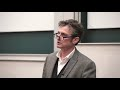

# Darwinist Professor Agrees with Muslim (2019-08-04)

## Description

An exceptional presentation from both Saboor Ahmed and Professor Prichard on evolution and its implications on theism. This helps dispel the common narrative that darwinian evolution is an argument against the existence of God. 

Don't forget to subscribe to Saboor Ahmed's channel - https://www.youtube.com/channel/UCRkKHyivwGmz36qGgXnZHjQ

## Summary of [Darwinist Professor Agrees with Muslim](https://www.youtube.com/watch?v=LsdgFrlRIrI)

*This summary is AI generated - there may be inaccuracies. *

### [00:00:00](https://www.youtube.com/watch?v=LsdgFrlRIrI&t=0) - [01:00:00](https://www.youtube.com/watch?v=LsdgFrlRIrI&t=3600)

 discusses the implications of Darwin's theory of evolution, with a focus on how it relates to religious beliefs. Professor Jeremy Pritchard argues that, while Darwin's theory does undermine the existence of a creator, it does not disprove the existence of evolution. Ahmed discusses how he sees science evolving, and how this understanding helps to understand the nature of the question posed by tonight's speaker, Professor Ahmed.

**[00:00:00](https://www.youtube.com/watch?v=LsdgFrlRIrI&t=0)**  a variety of speakers discuss the relationship between religion and science, with a focus on Darwin's theory of evolution. Professor Jeremy Pritchard states that, while Darwin's theory does undermine the existence of a creator, it does not disprove the existence of evolution. Ahmed discusses how he sees science evolving, and how this understanding helps to understand the nature of the question posed by tonight's speaker, Professor Ahmed.
* **[00:05:00](https://www.youtube.com/watch?v=LsdgFrlRIrI&t=300)* Discusses how Darwin's theory of evolution is connected to ideas of change, which are seen as dangerous by some.  also discusses how the development of these ideas was connected to the Golden Age of Islamic science, and how these ideas were later banned in the West.
* **[00:10:00](https://www.youtube.com/watch?v=LsdgFrlRIrI&t=600)* Discusses theory of evolution, and how it was developed by scientist and philosopher, Linnaeus. He defined species, and gave clear species descriptions, which allowed for the study of natural theology - the study of the living world to study the creation. This in turn led to the idea of natural selection, which explained the diversity of organisms on earth. In the late 18th and early 19th centuries, scientists began to question the theory of evolution, mainly because of the idea that it was dangerous - it could lead to revolutions in society. However, with the development of modern science, these fears have largely been allayed.
* **[00:15:00](https://www.youtube.com/watch?v=LsdgFrlRIrI&t=900)** This 1-paragraph summary of the video discusses how, according to the video's presenter, the development of science comes out of a religious view of the world in which there is a separation between what we can know through observation of the natural world and what we can know about God. This debate, which is reflected in the poem "Nature Red in Tooth and Claw" by Thomas Aquinas, has been ongoing for centuries.
* **[00:20:00](https://www.youtube.com/watch?v=LsdgFrlRIrI&t=1200)* Discusses how Darwinian evolution does not undermine God, despite popular belief. Professor Jeremy Pritchard from Birmingham argues that Darwinian evolution is a valid scientific model, theory, and paradigm. He also argues that intelligent design and creation science are not scientific theories.
* **[00:25:00](https://www.youtube.com/watch?v=LsdgFrlRIrI&t=1500)** This 1-paragraph summary of the video discusses the changing views of a devout theist, an evolutionist, and an atheist regarding the existence of God. The atheist, John Headley, argues that because evolution is a natural process, it does not rule out the existence of a God who does not interfere in the natural world. The theist, Ardent Spencer, became an agnostic later in life because of the problem of evil. Spencer also argues that because evolution is neutral in regards to the second definition of naturalism, it is not science to attribute intelligence to a designer beyond nature. Finally, evolutionary biologist Scott Todd explains that although all data points to the existence of an intelligent designer, such a hypothesis is excluded from science because it is not naturalistic.
* **[00:30:00](https://www.youtube.com/watch?v=LsdgFrlRIrI&t=1800)* Discusses theory of evolution and how it does not undermine the Abrahamic God. It says that evolution is based on a probabilistic framework and has assumptions that are valid scientific disputes. A philosophy of biology textbook explains this in more detail.
* **[00:35:00](https://www.youtube.com/watch?v=LsdgFrlRIrI&t=2100)* Discusses difference between methodological and philosophical naturalism, saying that while evolution does not undermine a deistic concept of God, it does undermine an Abrahamic concept of God. He goes on to say that while science cannot always provide absolute answers, it is still a valuable tool.
* **[00:40:00](https://www.youtube.com/watch?v=LsdgFrlRIrI&t=2400)** A Darwinist professor discusses how Darwin's complex relationship with God stemmed from his observations of nature and his drive to equality.
* **[00:45:00](https://www.youtube.com/watch?v=LsdgFrlRIrI&t=2700)** This 1-paragraph summary of the video discusses how Professor Thomas S. Kuhn, a philosopher of science, believes that Darwin's theory of evolution undermined God. Kuhn argues that Darwin's theory is based on methodological naturalism, which is the belief that natural phenomena can be explained without reference to supernatural forces. However, Kuhn points out that Darwin was wrong about a number of things, including his belief that genetics was based on quantitative changes rather than qualitative changes, and that it was not until later that scientists came to understand the full power of genes. Kuhn argues that this distinction between methodological and philosophical naturalism is important for narrowing the gap between the popular understanding of science and the academic understanding.
* **[00:50:00](https://www.youtube.com/watch?v=LsdgFrlRIrI&t=3000)** A Darwinist professor agrees with Muslim philosophers that there are different ways of looking at the world and that science can never be 100% certain. He also warns against using science to try to understand morality.
* **[00:55:00](https://www.youtube.com/watch?v=LsdgFrlRIrI&t=3300)* Discusses moral implications of free will, with a Darwinist professor agreeing with a Muslim that there may be a genetic basis to some kinds of evil. While the professor recognizes that genetics cannot fully explain evil, he argues that it nevertheless presents an opportunity for moral reflection.
### [01:00:00](https://www.youtube.com/watch?v=LsdgFrlRIrI&t=3600) - [01:15:00](https://www.youtube.com/watch?v=LsdgFrlRIrI&t=4500)

features two professors discussing the theory of evolution from a Darwinian perspective. The Darwinist professor agrees with the Muslim professor that there is no "better than" or "worse than" in the natural world. The professor also discusses the problem of evil and how it relates to Islam.

**[01:00:00](https://www.youtube.com/watch?v=LsdgFrlRIrI&t=3600)** In a video discussing the debate between two evolutionary biologists, Wilson argues that scientists should not accept paradigm shifts, as this can be difficult. He also argues that scientists should not rely on faith, but rather evidence and understanding. Dawkins, in response, argues that scientists should be open to paradigm shifts and that there is evidence for naturalistic processes leading up to the Big Bang.
* **[01:05:00](https://www.youtube.com/watch?v=LsdgFrlRIrI&t=3900)* Discusses conflict between science and the Quran: a scientist disagrees with the theory of evolution, and a Muslim may choose to reject science altogether in order to adhere to their religious beliefs. However, the scientist advises accepting the theory of evolution as valid, and working within the scientific community.
* **[01:10:00](https://www.youtube.com/watch?v=LsdgFrlRIrI&t=4200)** features a professor discussing how he agrees with Muslims that it is important to focus on science, instead of theological discussions. He believes that this practical solution can be applied in everyday lives.
* **[01:15:00](https://www.youtube.com/watch?v=LsdgFrlRIrI&t=4500)** In a discussion on campus, a Darwinist professor agrees with a Muslim professor that, from a Darwinian perspective, there is no "better than" or " worse than" in the natural world. The professor also discusses the problem of evil and how it relates to Islam.

## Full transcript with timestamps

[0:00:00](https://youtu.be/LsdgFrlRIrI?t=0) I like to start by giving everybody a  
[0:00:03](https://youtu.be/LsdgFrlRIrI?t=3) form of prayer may God's peace and  
[0:00:06](https://youtu.be/LsdgFrlRIrI?t=6) blessings be upon every single one of  
[0:00:08](https://youtu.be/LsdgFrlRIrI?t=8) you and welcome to tonight's discussion  
[0:00:11](https://youtu.be/LsdgFrlRIrI?t=11) and I think it's a very important topic  
[0:00:13](https://youtu.be/LsdgFrlRIrI?t=13) it's an important topic between  
[0:00:15](https://youtu.be/LsdgFrlRIrI?t=15) believers atheists skeptics and those in  
[0:00:20](https://youtu.be/LsdgFrlRIrI?t=20) between the discussion tonight will  
[0:00:23](https://youtu.be/LsdgFrlRIrI?t=23) examine whether the belief in evolution  
[0:00:25](https://youtu.be/LsdgFrlRIrI?t=25) disproves the existence of a creator and  
[0:00:29](https://youtu.be/LsdgFrlRIrI?t=29) how Darwin's theory of evolution is  
[0:00:32](https://youtu.be/LsdgFrlRIrI?t=32) utilized understood and conveyed in  
[0:00:36](https://youtu.be/LsdgFrlRIrI?t=36) contemporary society the structure is  
[0:00:39](https://youtu.be/LsdgFrlRIrI?t=39) going to be very simple we're gonna have  
[0:00:41](https://youtu.be/LsdgFrlRIrI?t=41) approximately 20 minutes each from each  
[0:00:44](https://youtu.be/LsdgFrlRIrI?t=44) of the speakers then there'll be a  
[0:00:47](https://youtu.be/LsdgFrlRIrI?t=47) discussion between the speakers followed  
[0:00:50](https://youtu.be/LsdgFrlRIrI?t=50) by a question-and-answer session  
[0:00:54](https://youtu.be/LsdgFrlRIrI?t=54) everyone is mature everyone is polite  
[0:00:59](https://youtu.be/LsdgFrlRIrI?t=59) everyone is tolerant everyone is  
[0:01:00](https://youtu.be/LsdgFrlRIrI?t=60) compassionate everyone is a decent human  
[0:01:03](https://youtu.be/LsdgFrlRIrI?t=63) being we've all evolved to become get  
[0:01:07](https://youtu.be/LsdgFrlRIrI?t=67) the drunk milk alright so basically let  
[0:01:11](https://youtu.be/LsdgFrlRIrI?t=71) me introduce our respected speakers we  
[0:01:13](https://youtu.be/LsdgFrlRIrI?t=73) have on my right professor Jeremy  
[0:01:18](https://youtu.be/LsdgFrlRIrI?t=78) Pritchard he's an active biologist and a  
[0:01:21](https://youtu.be/LsdgFrlRIrI?t=81) senior lecturer in the school of  
[0:01:23](https://youtu.be/LsdgFrlRIrI?t=83) Biosciences at the University of  
[0:01:26](https://youtu.be/LsdgFrlRIrI?t=86) Birmingham his research career started  
[0:01:29](https://youtu.be/LsdgFrlRIrI?t=89) in Wales and currently he focused  
[0:01:31](https://youtu.be/LsdgFrlRIrI?t=91) focuses on aphids in Birmingham with  
[0:01:34](https://youtu.be/LsdgFrlRIrI?t=94) stops in the USA New Zealand and Europe  
[0:01:37](https://youtu.be/LsdgFrlRIrI?t=97) he has published in many prominent  
[0:01:40](https://youtu.be/LsdgFrlRIrI?t=100) journals including the Journal of  
[0:01:42](https://youtu.be/LsdgFrlRIrI?t=102) Experimental Biology global change  
[0:01:45](https://youtu.be/LsdgFrlRIrI?t=105) biology and biotechnology Letters his  
[0:01:48](https://youtu.be/LsdgFrlRIrI?t=108) expertise is in how plants grow and are  
[0:01:52](https://youtu.be/LsdgFrlRIrI?t=112) affected by changes in environment the  
[0:01:55](https://youtu.be/LsdgFrlRIrI?t=115) stress including insect pests his  
[0:02:00](https://youtu.be/LsdgFrlRIrI?t=120) expertise is also in evolution and  
[0:02:03](https://youtu.be/LsdgFrlRIrI?t=123) creationism and he teaches and in  
[0:02:05](https://youtu.be/LsdgFrlRIrI?t=125) teaching and learning strategies at the  
[0:02:07](https://youtu.be/LsdgFrlRIrI?t=127) school and university he's a  
[0:02:10](https://youtu.be/LsdgFrlRIrI?t=130) card-carrying Darwinist I don't know  
[0:02:13](https://youtu.be/LsdgFrlRIrI?t=133) what that  
[0:02:13](https://youtu.be/LsdgFrlRIrI?t=133) maybe we'll find out today and is  
[0:02:15](https://youtu.be/LsdgFrlRIrI?t=135) involved in teaching evolution on all  
[0:02:17](https://youtu.be/LsdgFrlRIrI?t=137) levels from primary school to university  
[0:02:21](https://youtu.be/LsdgFrlRIrI?t=141) of the Third Age please give him a warm  
[0:02:26](https://youtu.be/LsdgFrlRIrI?t=146) welcome also to my right we have support  
[0:02:37](https://youtu.be/LsdgFrlRIrI?t=157) Ahmed he is a well-known public speaker  
[0:02:40](https://youtu.be/LsdgFrlRIrI?t=160) and writer who has debated prominent  
[0:02:43](https://youtu.be/LsdgFrlRIrI?t=163) academics on philosophy and science  
[0:02:46](https://youtu.be/LsdgFrlRIrI?t=166) he is currently pursuing postgraduate  
[0:02:49](https://youtu.be/LsdgFrlRIrI?t=169) studies and philosophy and has a  
[0:02:51](https://youtu.be/LsdgFrlRIrI?t=171) particular interest in the philosophy of  
[0:02:53](https://youtu.be/LsdgFrlRIrI?t=173) biology and is specializing in this  
[0:02:56](https://youtu.be/LsdgFrlRIrI?t=176) field he is also the co-author of a  
[0:02:59](https://youtu.be/LsdgFrlRIrI?t=179) forthcoming book called failed  
[0:03:01](https://youtu.be/LsdgFrlRIrI?t=181) hypothesis essays on the philosophy of  
[0:03:04](https://youtu.be/LsdgFrlRIrI?t=184) science  
[0:03:05](https://youtu.be/LsdgFrlRIrI?t=185) atheism consciousness Darwinism and  
[0:03:08](https://youtu.be/LsdgFrlRIrI?t=188) Islam so I don't know who's going first  
[0:03:13](https://youtu.be/LsdgFrlRIrI?t=193) I do apologize professor professor if  
[0:03:16](https://youtu.be/LsdgFrlRIrI?t=196) you don't mind please the audience thank  
[0:03:19](https://youtu.be/LsdgFrlRIrI?t=199) you thank you  
[0:03:22](https://youtu.be/LsdgFrlRIrI?t=202) [Music]  
[0:03:23](https://youtu.be/LsdgFrlRIrI?t=203) ok so nice to be here nice to talk to  
[0:03:28](https://youtu.be/LsdgFrlRIrI?t=208) you about this the question wasn't quite  
[0:03:30](https://youtu.be/LsdgFrlRIrI?t=210) as specific as you just had as opposed  
[0:03:33](https://youtu.be/LsdgFrlRIrI?t=213) to me was does evolution undermined God  
[0:03:38](https://youtu.be/LsdgFrlRIrI?t=218) and in my philosophy no it doesn't so  
[0:03:44](https://youtu.be/LsdgFrlRIrI?t=224) you know we can all go home now and I  
[0:03:51](https://youtu.be/LsdgFrlRIrI?t=231) have beliefs and not beliefs and I have  
[0:03:54](https://youtu.be/LsdgFrlRIrI?t=234) a view of the world but I thought what  
[0:03:57](https://youtu.be/LsdgFrlRIrI?t=237) would be useful is to briefly if we're  
[0:04:00](https://youtu.be/LsdgFrlRIrI?t=240) talking about the relationship between  
[0:04:01](https://youtu.be/LsdgFrlRIrI?t=241) religion and science I thought it would  
[0:04:05](https://youtu.be/LsdgFrlRIrI?t=245) be useful to briefly give an overview of  
[0:04:08](https://youtu.be/LsdgFrlRIrI?t=248) how I see science is coming to where it  
[0:04:11](https://youtu.be/LsdgFrlRIrI?t=251) is now from say the ancient Greeks okay  
[0:04:14](https://youtu.be/LsdgFrlRIrI?t=254) because I think I'm picking an  
[0:04:16](https://youtu.be/LsdgFrlRIrI?t=256) understanding where we are now and how  
[0:04:18](https://youtu.be/LsdgFrlRIrI?t=258) we look back helps us understand that  
[0:04:20](https://youtu.be/LsdgFrlRIrI?t=260) the type of question that you're posing  
[0:04:22](https://youtu.be/LsdgFrlRIrI?t=262) tonight so Darwin's great in  
[0:04:27](https://youtu.be/LsdgFrlRIrI?t=267) site from my view is that he provides us  
[0:04:31](https://youtu.be/LsdgFrlRIrI?t=271) with the so-called Tree of Life he  
[0:04:34](https://youtu.be/LsdgFrlRIrI?t=274) provides us with a coherent view of how  
[0:04:37](https://youtu.be/LsdgFrlRIrI?t=277) organisms are related how they've  
[0:04:39](https://youtu.be/LsdgFrlRIrI?t=279) changed through time and importantly and  
[0:04:42](https://youtu.be/LsdgFrlRIrI?t=282) people often overlook this how all  
[0:04:44](https://youtu.be/LsdgFrlRIrI?t=284) organisms are equal at sea for ends of  
[0:04:47](https://youtu.be/LsdgFrlRIrI?t=287) the branches of these trees of this tree  
[0:04:49](https://youtu.be/LsdgFrlRIrI?t=289) before Darwin people tended to think  
[0:04:53](https://youtu.be/LsdgFrlRIrI?t=293) about the organizing the world the  
[0:04:55](https://youtu.be/LsdgFrlRIrI?t=295) living world and then the inanimate  
[0:04:57](https://youtu.be/LsdgFrlRIrI?t=297) world as a hierarchy with some things  
[0:05:00](https://youtu.be/LsdgFrlRIrI?t=300) higher than others and and better than  
[0:05:03](https://youtu.be/LsdgFrlRIrI?t=303) others  
[0:05:05](https://youtu.be/LsdgFrlRIrI?t=305) Darwin's theory joins ideas that we  
[0:05:08](https://youtu.be/LsdgFrlRIrI?t=308) largely accept today are a mechanism of  
[0:05:12](https://youtu.be/LsdgFrlRIrI?t=312) biological change over the history of  
[0:05:16](https://youtu.be/LsdgFrlRIrI?t=316) how we came to the position that we  
[0:05:20](https://youtu.be/LsdgFrlRIrI?t=320) accept largely today the history of this  
[0:05:25](https://youtu.be/LsdgFrlRIrI?t=325) is not the history of how the mechanism  
[0:05:28](https://youtu.be/LsdgFrlRIrI?t=328) developed the ideas that Darwin had but  
[0:05:32](https://youtu.be/LsdgFrlRIrI?t=332) whether change had happened at all  
[0:05:35](https://youtu.be/LsdgFrlRIrI?t=335) biologically or even in the geological  
[0:05:38](https://youtu.be/LsdgFrlRIrI?t=338) world what I'm going to argue is in fact  
[0:05:44](https://youtu.be/LsdgFrlRIrI?t=344) that the development of those ideas of  
[0:05:46](https://youtu.be/LsdgFrlRIrI?t=346) change was dangerous to society and that  
[0:05:51](https://youtu.be/LsdgFrlRIrI?t=351) to some extent that was encapsulated in  
[0:05:53](https://youtu.be/LsdgFrlRIrI?t=353) the relationship and the developing  
[0:05:55](https://youtu.be/LsdgFrlRIrI?t=355) relationship and to some extent the  
[0:05:57](https://youtu.be/LsdgFrlRIrI?t=357) existing relationship between science  
[0:05:59](https://youtu.be/LsdgFrlRIrI?t=359) and religion science and God so the  
[0:06:02](https://youtu.be/LsdgFrlRIrI?t=362) Greeks for example would look at the  
[0:06:03](https://youtu.be/LsdgFrlRIrI?t=363) world and see the world like we do  
[0:06:05](https://youtu.be/LsdgFrlRIrI?t=365) organisms all around them they would see  
[0:06:08](https://youtu.be/LsdgFrlRIrI?t=368) stones beetles worms people maybe even  
[0:06:13](https://youtu.be/LsdgFrlRIrI?t=373) the gods and they would organize them  
[0:06:15](https://youtu.be/LsdgFrlRIrI?t=375) they would see that there was some  
[0:06:17](https://youtu.be/LsdgFrlRIrI?t=377) things were simple some things were  
[0:06:19](https://youtu.be/LsdgFrlRIrI?t=379) complicated and they would organize them  
[0:06:20](https://youtu.be/LsdgFrlRIrI?t=380) into a hierarchy like a ladder it's  
[0:06:23](https://youtu.be/LsdgFrlRIrI?t=383) simple things at the bottom and  
[0:06:24](https://youtu.be/LsdgFrlRIrI?t=384) complicated things at the top important  
[0:06:28](https://youtu.be/LsdgFrlRIrI?t=388) thing about this ladder is it's static  
[0:06:30](https://youtu.be/LsdgFrlRIrI?t=390) you can't move up it okay it's not like  
[0:06:33](https://youtu.be/LsdgFrlRIrI?t=393) a escalator and you Street Station  
[0:06:35](https://youtu.be/LsdgFrlRIrI?t=395) although they're often static these days  
[0:06:37](https://youtu.be/LsdgFrlRIrI?t=397) as you may well well know if you take  
[0:06:39](https://youtu.be/LsdgFrlRIrI?t=399) the train through new Street  
[0:06:40](https://youtu.be/LsdgFrlRIrI?t=400) however the important thing about this  
[0:06:43](https://youtu.be/LsdgFrlRIrI?t=403) is did this disconnected the living  
[0:06:46](https://youtu.be/LsdgFrlRIrI?t=406) world it was what we've referred to as  
[0:06:49](https://youtu.be/LsdgFrlRIrI?t=409) the Guru preached referred to as the  
[0:06:51](https://youtu.be/LsdgFrlRIrI?t=411) great chain of being and it gives us an  
[0:06:53](https://youtu.be/LsdgFrlRIrI?t=413) organization it means that things are  
[0:06:55](https://youtu.be/LsdgFrlRIrI?t=415) not random but it gives us some things  
[0:06:58](https://youtu.be/LsdgFrlRIrI?t=418) that we carry through today often in  
[0:07:01](https://youtu.be/LsdgFrlRIrI?t=421) error for example that complex things  
[0:07:03](https://youtu.be/LsdgFrlRIrI?t=423) are better which isn't necessarily true  
[0:07:05](https://youtu.be/LsdgFrlRIrI?t=425) and it gives us this idea of progress  
[0:07:07](https://youtu.be/LsdgFrlRIrI?t=427) that we should strive to move upwards  
[0:07:09](https://youtu.be/LsdgFrlRIrI?t=429) even though this this ladder does not  
[0:07:13](https://youtu.be/LsdgFrlRIrI?t=433) move so there's some concepts there that  
[0:07:15](https://youtu.be/LsdgFrlRIrI?t=435) are subsequently picked up in  
[0:07:18](https://youtu.be/LsdgFrlRIrI?t=438) particularly in Western medival society  
[0:07:22](https://youtu.be/LsdgFrlRIrI?t=442) and in Western society at that time in a  
[0:07:27](https://youtu.be/LsdgFrlRIrI?t=447) medieval time it was a feudal society  
[0:07:30](https://youtu.be/LsdgFrlRIrI?t=450) and you had all the money or the power  
[0:07:33](https://youtu.be/LsdgFrlRIrI?t=453) at the top of that hierarchy with the  
[0:07:36](https://youtu.be/LsdgFrlRIrI?t=456) slaves the serfs that workers at the  
[0:07:38](https://youtu.be/LsdgFrlRIrI?t=458) bottom with very little money it's in  
[0:07:40](https://youtu.be/LsdgFrlRIrI?t=460) the interest of a society like that that  
[0:07:43](https://youtu.be/LsdgFrlRIrI?t=463) nothing changes because if things change  
[0:07:45](https://youtu.be/LsdgFrlRIrI?t=465) the people in power lose some of that  
[0:07:48](https://youtu.be/LsdgFrlRIrI?t=468) power that influence and this you can  
[0:07:51](https://youtu.be/LsdgFrlRIrI?t=471) argue is encapsulated in in the Bible  
[0:07:55](https://youtu.be/LsdgFrlRIrI?t=475) story in the creation story and  
[0:07:58](https://youtu.be/LsdgFrlRIrI?t=478) Christian thought in which the world is  
[0:08:01](https://youtu.be/LsdgFrlRIrI?t=481) created in six days and then remains  
[0:08:04](https://youtu.be/LsdgFrlRIrI?t=484) like that subsequently things are  
[0:08:07](https://youtu.be/LsdgFrlRIrI?t=487) constant things do not change things are  
[0:08:11](https://youtu.be/LsdgFrlRIrI?t=491) always apt as they have been and to the  
[0:08:14](https://youtu.be/LsdgFrlRIrI?t=494) people at the bottom of the pile you  
[0:08:15](https://youtu.be/LsdgFrlRIrI?t=495) will receive your reward in heaven  
[0:08:18](https://youtu.be/LsdgFrlRIrI?t=498) so change is dangerous if you want some  
[0:08:24](https://youtu.be/LsdgFrlRIrI?t=504) evidence that that that is the case of  
[0:08:27](https://youtu.be/LsdgFrlRIrI?t=507) course at this time it was the  
[0:08:30](https://youtu.be/LsdgFrlRIrI?t=510) burgeoning of the of the the Islamic  
[0:08:33](https://youtu.be/LsdgFrlRIrI?t=513) science Golden Age and there were people  
[0:08:37](https://youtu.be/LsdgFrlRIrI?t=517) working like Philosopher's al-biruni  
[0:08:40](https://youtu.be/LsdgFrlRIrI?t=520) working on lots of things very famous in  
[0:08:43](https://youtu.be/LsdgFrlRIrI?t=523) fact it's got a crater named after him  
[0:08:45](https://youtu.be/LsdgFrlRIrI?t=525) on the moon Dark Side of the Moon so you  
[0:08:46](https://youtu.be/LsdgFrlRIrI?t=526) have to go around the moon in a  
[0:08:48](https://youtu.be/LsdgFrlRIrI?t=528) spacecraft to see it but he was thinking  
[0:08:51](https://youtu.be/LsdgFrlRIrI?t=531) about lots of things including simple  
[0:08:53](https://youtu.be/LsdgFrlRIrI?t=533) things what we might  
[0:08:54](https://youtu.be/LsdgFrlRIrI?t=534) nice is simple that rivers erode valleys  
[0:08:58](https://youtu.be/LsdgFrlRIrI?t=538) and carry the silt down the mountain and  
[0:09:01](https://youtu.be/LsdgFrlRIrI?t=541) deposited in a delta at the bottom  
[0:09:04](https://youtu.be/LsdgFrlRIrI?t=544) rivers changed the environment gradually  
[0:09:07](https://youtu.be/LsdgFrlRIrI?t=547) very simple idea and through a  
[0:09:10](https://youtu.be/LsdgFrlRIrI?t=550) convoluted series of because of the  
[0:09:14](https://youtu.be/LsdgFrlRIrI?t=554) library Alexandria burning down and the  
[0:09:18](https://youtu.be/LsdgFrlRIrI?t=558) Moors and the Christians in southern  
[0:09:20](https://youtu.be/LsdgFrlRIrI?t=560) Spain and libraries in Granada and so on  
[0:09:22](https://youtu.be/LsdgFrlRIrI?t=562) these ideas came to be picked up in the  
[0:09:24](https://youtu.be/LsdgFrlRIrI?t=564) West and developed and that they've been  
[0:09:26](https://youtu.be/LsdgFrlRIrI?t=566) picked up been used from the Greeks  
[0:09:28](https://youtu.be/LsdgFrlRIrI?t=568) through our balloons back to the West  
[0:09:30](https://youtu.be/LsdgFrlRIrI?t=570) and these are picked up in 1200 s by the  
[0:09:35](https://youtu.be/LsdgFrlRIrI?t=575) Pope and these were recognized as  
[0:09:37](https://youtu.be/LsdgFrlRIrI?t=577) dangerous ideas because they were ideas  
[0:09:39](https://youtu.be/LsdgFrlRIrI?t=579) about change  
[0:09:40](https://youtu.be/LsdgFrlRIrI?t=580) very simple we might think and they were  
[0:09:42](https://youtu.be/LsdgFrlRIrI?t=582) banned because the logical conclusion of  
[0:09:45](https://youtu.be/LsdgFrlRIrI?t=585) that if you follow it through is change  
[0:09:48](https://youtu.be/LsdgFrlRIrI?t=588) has happened and that what it says in  
[0:09:50](https://youtu.be/LsdgFrlRIrI?t=590) the Bible is not in fact true so ideas  
[0:09:54](https://youtu.be/LsdgFrlRIrI?t=594) have changed dangerous even in the West  
[0:09:57](https://youtu.be/LsdgFrlRIrI?t=597) at that time there was people studied  
[0:10:01](https://youtu.be/LsdgFrlRIrI?t=601) nature but they didn't study net and  
[0:10:03](https://youtu.be/LsdgFrlRIrI?t=603) it's the basis of modern science what we  
[0:10:05](https://youtu.be/LsdgFrlRIrI?t=605) would they refer to as natural theology  
[0:10:07](https://youtu.be/LsdgFrlRIrI?t=607) that we study the living world to study  
[0:10:10](https://youtu.be/LsdgFrlRIrI?t=610) the creation and therefore get to know  
[0:10:12](https://youtu.be/LsdgFrlRIrI?t=612) God better and in this we have people  
[0:10:15](https://youtu.be/LsdgFrlRIrI?t=615) like Linnaeus phil ozz scientists like  
[0:10:18](https://youtu.be/LsdgFrlRIrI?t=618) Linnaeus who give us the definition of a  
[0:10:21](https://youtu.be/LsdgFrlRIrI?t=621) species they look at the world and they  
[0:10:24](https://youtu.be/LsdgFrlRIrI?t=624) see that there are some things that are  
[0:10:26](https://youtu.be/LsdgFrlRIrI?t=626) pigeons there are some things that are  
[0:10:28](https://youtu.be/LsdgFrlRIrI?t=628) Eagles there are some things L donkeys  
[0:10:31](https://youtu.be/LsdgFrlRIrI?t=631) and there they're different they're  
[0:10:33](https://youtu.be/LsdgFrlRIrI?t=633) definable and they're always the same  
[0:10:35](https://youtu.be/LsdgFrlRIrI?t=635) and we can say we can therefore give it  
[0:10:38](https://youtu.be/LsdgFrlRIrI?t=638) a Latin name Homo sapiens whatever  
[0:10:40](https://youtu.be/LsdgFrlRIrI?t=640) because we can define that thing and it  
[0:10:43](https://youtu.be/LsdgFrlRIrI?t=643) remains the same so he gives us this  
[0:10:47](https://youtu.be/LsdgFrlRIrI?t=647) idea that species are fixed and he gives  
[0:10:49](https://youtu.be/LsdgFrlRIrI?t=649) us clear species descriptions so it well  
[0:10:52](https://youtu.be/LsdgFrlRIrI?t=652) defines that that were and that is the  
[0:10:56](https://youtu.be/LsdgFrlRIrI?t=656) framework into which natural theology  
[0:10:59](https://youtu.be/LsdgFrlRIrI?t=659) the study of the natural world comes  
[0:11:01](https://youtu.be/LsdgFrlRIrI?t=661) along indeed it gives us even the  
[0:11:07](https://youtu.be/LsdgFrlRIrI?t=667) the idea of that we can natural theology  
[0:11:12](https://youtu.be/LsdgFrlRIrI?t=672) can can be used to almost argue for the  
[0:11:16](https://youtu.be/LsdgFrlRIrI?t=676) existence of God say the idea that  
[0:11:17](https://youtu.be/LsdgFrlRIrI?t=677) watchmaker argument that if we look at a  
[0:11:21](https://youtu.be/LsdgFrlRIrI?t=681) watch we would deduce that a watchmaker  
[0:11:23](https://youtu.be/LsdgFrlRIrI?t=683) had designed it because of its  
[0:11:25](https://youtu.be/LsdgFrlRIrI?t=685) complexity and its function and we have  
[0:11:28](https://youtu.be/LsdgFrlRIrI?t=688) we can have the same that the natural  
[0:11:30](https://youtu.be/LsdgFrlRIrI?t=690) theologist would argue the same about  
[0:11:32](https://youtu.be/LsdgFrlRIrI?t=692) observing something complex like an eye  
[0:11:34](https://youtu.be/LsdgFrlRIrI?t=694) that has clearly been apparently  
[0:11:37](https://youtu.be/LsdgFrlRIrI?t=697) designed in order to see in a complex  
[0:11:39](https://youtu.be/LsdgFrlRIrI?t=699) way and the designer therefore is God so  
[0:11:43](https://youtu.be/LsdgFrlRIrI?t=703) intelligent design was one of the  
[0:11:45](https://youtu.be/LsdgFrlRIrI?t=705) consequences of that but we're not there  
[0:11:51](https://youtu.be/LsdgFrlRIrI?t=711) at the moment now things have changed in  
[0:11:55](https://youtu.be/LsdgFrlRIrI?t=715) in the way that we view the world and in  
[0:11:59](https://youtu.be/LsdgFrlRIrI?t=719) a sense the seeds of that change was  
[0:12:01](https://youtu.be/LsdgFrlRIrI?t=721) sowed in a way by Linnaeus because by  
[0:12:04](https://youtu.be/LsdgFrlRIrI?t=724) describing species very clearly people  
[0:12:08](https://youtu.be/LsdgFrlRIrI?t=728) started to be able to see that the world  
[0:12:10](https://youtu.be/LsdgFrlRIrI?t=730) wasn't random but that there were if you  
[0:12:13](https://youtu.be/LsdgFrlRIrI?t=733) looked at these species and organized  
[0:12:15](https://youtu.be/LsdgFrlRIrI?t=735) and some species were more similar to  
[0:12:17](https://youtu.be/LsdgFrlRIrI?t=737) each other than others so the Eagle is  
[0:12:20](https://youtu.be/LsdgFrlRIrI?t=740) more similar than it is to to the pigeon  
[0:12:23](https://youtu.be/LsdgFrlRIrI?t=743) than it is to the donkey and so an  
[0:12:26](https://youtu.be/LsdgFrlRIrI?t=746) organization starts to emerge and so  
[0:12:30](https://youtu.be/LsdgFrlRIrI?t=750) what people start to say well why are  
[0:12:32](https://youtu.be/LsdgFrlRIrI?t=752) some things more similar to each other  
[0:12:34](https://youtu.be/LsdgFrlRIrI?t=754) than others and one of the answers was  
[0:12:39](https://youtu.be/LsdgFrlRIrI?t=759) descent with modification from a common  
[0:12:42](https://youtu.be/LsdgFrlRIrI?t=762) ancestor so there was a common ancestor  
[0:12:43](https://youtu.be/LsdgFrlRIrI?t=763) and there were changes to this ancestor  
[0:12:45](https://youtu.be/LsdgFrlRIrI?t=765) there was a split between our two  
[0:12:47](https://youtu.be/LsdgFrlRIrI?t=767) species and so on down them so that  
[0:12:50](https://youtu.be/LsdgFrlRIrI?t=770) diversity comes from descent with  
[0:12:52](https://youtu.be/LsdgFrlRIrI?t=772) modification from a common ancestor it  
[0:12:53](https://youtu.be/LsdgFrlRIrI?t=773) was not at that mechanism for that  
[0:12:57](https://youtu.be/LsdgFrlRIrI?t=777) necessarily it was just a description of  
[0:13:00](https://youtu.be/LsdgFrlRIrI?t=780) a potential phenomena I know the things  
[0:13:04](https://youtu.be/LsdgFrlRIrI?t=784) happened  
[0:13:04](https://youtu.be/LsdgFrlRIrI?t=784) Galileo removes the world from the  
[0:13:07](https://youtu.be/LsdgFrlRIrI?t=787) center of the perfect universe the  
[0:13:09](https://youtu.be/LsdgFrlRIrI?t=789) perfect spheres the microscope sees new  
[0:13:12](https://youtu.be/LsdgFrlRIrI?t=792) worlds in drops of water voyages of  
[0:13:15](https://youtu.be/LsdgFrlRIrI?t=795) discovery to the other side of the world  
[0:13:17](https://youtu.be/LsdgFrlRIrI?t=797) sea by sea organisms animals not  
[0:13:19](https://youtu.be/LsdgFrlRIrI?t=799) mentioned in the Bible  
[0:13:21](https://youtu.be/LsdgFrlRIrI?t=801) and so on and within society we started  
[0:13:25](https://youtu.be/LsdgFrlRIrI?t=805) particularly in Birmingham with the  
[0:13:26](https://youtu.be/LsdgFrlRIrI?t=806) Lunar Society we started to get ideas  
[0:13:29](https://youtu.be/LsdgFrlRIrI?t=809) about change in society the Lunar  
[0:13:31](https://youtu.be/LsdgFrlRIrI?t=811) Society a group of people used to meet  
[0:13:33](https://youtu.be/LsdgFrlRIrI?t=813) in Birmingham discuss ideas ideas about  
[0:13:35](https://youtu.be/LsdgFrlRIrI?t=815) change in machinery ideas of that change  
[0:13:38](https://youtu.be/LsdgFrlRIrI?t=818) in society anti-slavery campaigners for  
[0:13:42](https://youtu.be/LsdgFrlRIrI?t=822) example in the Lunar Society which ties  
[0:13:45](https://youtu.be/LsdgFrlRIrI?t=825) into Darwin's ideas about equality of  
[0:13:48](https://youtu.be/LsdgFrlRIrI?t=828) organisms direct links there but these  
[0:13:53](https://youtu.be/LsdgFrlRIrI?t=833) ideas again we're still seen as  
[0:13:54](https://youtu.be/LsdgFrlRIrI?t=834) dangerous  
[0:13:55](https://youtu.be/LsdgFrlRIrI?t=835) so the Lunar Society for example some of  
[0:13:57](https://youtu.be/LsdgFrlRIrI?t=837) the Lunar Society their houses were  
[0:13:59](https://youtu.be/LsdgFrlRIrI?t=839) attacked by mobs and they were burnt  
[0:14:01](https://youtu.be/LsdgFrlRIrI?t=841) down in hansworth because they were  
[0:14:04](https://youtu.be/LsdgFrlRIrI?t=844) thinking about change of people  
[0:14:05](https://youtu.be/LsdgFrlRIrI?t=845) particularly in England saw change is  
[0:14:08](https://youtu.be/LsdgFrlRIrI?t=848) dangerous because in France there was  
[0:14:10](https://youtu.be/LsdgFrlRIrI?t=850) revolution going on one of the most  
[0:14:12](https://youtu.be/LsdgFrlRIrI?t=852) serious sorts of or of change changes  
[0:14:16](https://youtu.be/LsdgFrlRIrI?t=856) dangerous so at this point we had then a  
[0:14:22](https://youtu.be/LsdgFrlRIrI?t=862) world in which either the world had been  
[0:14:25](https://youtu.be/LsdgFrlRIrI?t=865) created and then things like volcanoes  
[0:14:27](https://youtu.be/LsdgFrlRIrI?t=867) and earthquakes happened catastrophes  
[0:14:30](https://youtu.be/LsdgFrlRIrI?t=870) and so the world was pop it is but then  
[0:14:33](https://youtu.be/LsdgFrlRIrI?t=873) pockmarked by these catastrophes people  
[0:14:35](https://youtu.be/LsdgFrlRIrI?t=875) could see volcanoes people could see  
[0:14:37](https://youtu.be/LsdgFrlRIrI?t=877) earthquake but then people were also  
[0:14:40](https://youtu.be/LsdgFrlRIrI?t=880) picking up those ideas about gradual  
[0:14:42](https://youtu.be/LsdgFrlRIrI?t=882) change to think sort of things that  
[0:14:43](https://youtu.be/LsdgFrlRIrI?t=883) al-biruni had talked about that the  
[0:14:46](https://youtu.be/LsdgFrlRIrI?t=886) gradual change happened and we had a  
[0:14:48](https://youtu.be/LsdgFrlRIrI?t=888) phenomena called uniformitarianism in  
[0:14:51](https://youtu.be/LsdgFrlRIrI?t=891) that the world that we see about it with  
[0:14:53](https://youtu.be/LsdgFrlRIrI?t=893) the processes that operate in the world  
[0:14:55](https://youtu.be/LsdgFrlRIrI?t=895) in both the geological and potentially  
[0:14:57](https://youtu.be/LsdgFrlRIrI?t=897) the biological world  
[0:14:58](https://youtu.be/LsdgFrlRIrI?t=898) are the same processes that have always  
[0:15:00](https://youtu.be/LsdgFrlRIrI?t=900) operated there is a consistency there  
[0:15:03](https://youtu.be/LsdgFrlRIrI?t=903) isn't this big bang and it's changing  
[0:15:05](https://youtu.be/LsdgFrlRIrI?t=905) and we wait for the next earthquake  
[0:15:06](https://youtu.be/LsdgFrlRIrI?t=906) things change gradually over time so on  
[0:15:13](https://youtu.be/LsdgFrlRIrI?t=913) I'm obviously skating very quickly over  
[0:15:16](https://youtu.be/LsdgFrlRIrI?t=916) this but once that changed particularly  
[0:15:19](https://youtu.be/LsdgFrlRIrI?t=919) in the biological world has been  
[0:15:20](https://youtu.be/LsdgFrlRIrI?t=920) established as a fact then you have to  
[0:15:24](https://youtu.be/LsdgFrlRIrI?t=924) think as a scientist about well how do  
[0:15:26](https://youtu.be/LsdgFrlRIrI?t=926) we how does that work we describe  
[0:15:27](https://youtu.be/LsdgFrlRIrI?t=927) something and it what's the mechanism by  
[0:15:29](https://youtu.be/LsdgFrlRIrI?t=929) which which that change occurs and there  
[0:15:32](https://youtu.be/LsdgFrlRIrI?t=932) were lots of suggestions about this  
[0:15:35](https://youtu.be/LsdgFrlRIrI?t=935) and Darwin himself comes up with the  
[0:15:37](https://youtu.be/LsdgFrlRIrI?t=937) theory that we now uses the baseline  
[0:15:39](https://youtu.be/LsdgFrlRIrI?t=939) today and it's very simple Darwin noted  
[0:15:44](https://youtu.be/LsdgFrlRIrI?t=944) that more individuals were that produced  
[0:15:47](https://youtu.be/LsdgFrlRIrI?t=947) by most organisms than can possibly  
[0:15:49](https://youtu.be/LsdgFrlRIrI?t=949) survive and so there's a lot of them  
[0:15:51](https://youtu.be/LsdgFrlRIrI?t=951) died he noted that individuals have  
[0:15:55](https://youtu.be/LsdgFrlRIrI?t=955) different from each other the  
[0:15:57](https://youtu.be/LsdgFrlRIrI?t=957) individuals vary and he also noted that  
[0:16:03](https://youtu.be/LsdgFrlRIrI?t=963) those variations are inherited the key  
[0:16:07](https://youtu.be/LsdgFrlRIrI?t=967) thing is that he suggested that the  
[0:16:11](https://youtu.be/LsdgFrlRIrI?t=971) possession of a certain variation might  
[0:16:14](https://youtu.be/LsdgFrlRIrI?t=974) allow you to survive rather than another  
[0:16:17](https://youtu.be/LsdgFrlRIrI?t=977) ones so the chance of survival of those  
[0:16:21](https://youtu.be/LsdgFrlRIrI?t=981) overproduced individuals is not a random  
[0:16:23](https://youtu.be/LsdgFrlRIrI?t=983) process it's a process if you like in  
[0:16:26](https://youtu.be/LsdgFrlRIrI?t=986) inverted commas of selection some of  
[0:16:29](https://youtu.be/LsdgFrlRIrI?t=989) them are selected by the environment to  
[0:16:31](https://youtu.be/LsdgFrlRIrI?t=991) survive and so on so if it was cold and  
[0:16:34](https://youtu.be/LsdgFrlRIrI?t=994) you had a set of organisms some who  
[0:16:36](https://youtu.be/LsdgFrlRIrI?t=996) randomly had furry coats and some of  
[0:16:38](https://youtu.be/LsdgFrlRIrI?t=998) them who didn't the ones with furry  
[0:16:41](https://youtu.be/LsdgFrlRIrI?t=1001) coats would survive because they can  
[0:16:43](https://youtu.be/LsdgFrlRIrI?t=1003) keep warmer their survival is not random  
[0:16:45](https://youtu.be/LsdgFrlRIrI?t=1005) they just said that because they can  
[0:16:47](https://youtu.be/LsdgFrlRIrI?t=1007) keep warm because randomly they have a  
[0:16:49](https://youtu.be/LsdgFrlRIrI?t=1009) coat so at the time Darwin was writing  
[0:17:01](https://youtu.be/LsdgFrlRIrI?t=1021) the Victorians viewed the world as a if  
[0:17:06](https://youtu.be/LsdgFrlRIrI?t=1026) you like one view of it as a pastoral  
[0:17:08](https://youtu.be/LsdgFrlRIrI?t=1028) it'll it was a beautiful place  
[0:17:10](https://youtu.be/LsdgFrlRIrI?t=1030) nature was lovely we had lambs gambling  
[0:17:13](https://youtu.be/LsdgFrlRIrI?t=1033) in the fields trees we had grass and  
[0:17:16](https://youtu.be/LsdgFrlRIrI?t=1036) waterfalls  
[0:17:17](https://youtu.be/LsdgFrlRIrI?t=1037) birds singing beautiful place to be a  
[0:17:21](https://youtu.be/LsdgFrlRIrI?t=1041) lot of the reaction to these mechanistic  
[0:17:26](https://youtu.be/LsdgFrlRIrI?t=1046) ideas about biological change come from  
[0:17:30](https://youtu.be/LsdgFrlRIrI?t=1050) a reaction against that how can beauty  
[0:17:33](https://youtu.be/LsdgFrlRIrI?t=1053) be created by death and destruction and  
[0:17:36](https://youtu.be/LsdgFrlRIrI?t=1056) so this is why you may be familiar you  
[0:17:40](https://youtu.be/LsdgFrlRIrI?t=1060) may be familiar with the phrase but if  
[0:17:42](https://youtu.be/LsdgFrlRIrI?t=1062) not the poem but the phrase nature red  
[0:17:45](https://youtu.be/LsdgFrlRIrI?t=1065) in tooth and claw by Tennyson and it's  
[0:17:48](https://youtu.be/LsdgFrlRIrI?t=1068) essentially  
[0:17:49](https://youtu.be/LsdgFrlRIrI?t=1069) the a diatribe 42 strong word but a cry  
[0:17:55](https://youtu.be/LsdgFrlRIrI?t=1075) of despair from a man who feels that his  
[0:18:00](https://youtu.be/LsdgFrlRIrI?t=1080) religion has been taken away that God  
[0:18:02](https://youtu.be/LsdgFrlRIrI?t=1082) has been taken out of the equation  
[0:18:04](https://youtu.be/LsdgFrlRIrI?t=1084) because God has now been separated from  
[0:18:08](https://youtu.be/LsdgFrlRIrI?t=1088) the from the physical world and it's  
[0:18:11](https://youtu.be/LsdgFrlRIrI?t=1091) interesting actually and I didn't  
[0:18:13](https://youtu.be/LsdgFrlRIrI?t=1093) realize this until quite late because I  
[0:18:15](https://youtu.be/LsdgFrlRIrI?t=1095) thought Tennyson's poem and this tribe  
[0:18:18](https://youtu.be/LsdgFrlRIrI?t=1098) reflected this debate that was going on  
[0:18:21](https://youtu.be/LsdgFrlRIrI?t=1101) in society at the time I thought it was  
[0:18:23](https://youtu.be/LsdgFrlRIrI?t=1103) post Darwin's publication that Darwin  
[0:18:26](https://youtu.be/LsdgFrlRIrI?t=1106) published in 1859  
[0:18:27](https://youtu.be/LsdgFrlRIrI?t=1107) but that poem by Tennyson was published  
[0:18:30](https://youtu.be/LsdgFrlRIrI?t=1110) in 1842 so it wasn't just Darwin who  
[0:18:33](https://youtu.be/LsdgFrlRIrI?t=1113) came up with it these ideas have been  
[0:18:35](https://youtu.be/LsdgFrlRIrI?t=1115) developing and recurrent and people's  
[0:18:38](https://youtu.be/LsdgFrlRIrI?t=1118) thoughts for a while so I think that the  
[0:18:47](https://youtu.be/LsdgFrlRIrI?t=1127) idea I think what just in that brief  
[0:18:49](https://youtu.be/LsdgFrlRIrI?t=1129) overview and obviously it's late  
[0:18:51](https://youtu.be/LsdgFrlRIrI?t=1131) information I think my colleague  
[0:18:53](https://youtu.be/LsdgFrlRIrI?t=1133) probably knows a lot more about it than  
[0:18:54](https://youtu.be/LsdgFrlRIrI?t=1134) I do but I think it's interesting to see  
[0:18:57](https://youtu.be/LsdgFrlRIrI?t=1137) how we move from or the development of  
[0:19:01](https://youtu.be/LsdgFrlRIrI?t=1141) science comes out of that natural  
[0:19:03](https://youtu.be/LsdgFrlRIrI?t=1143) theology that religious view of the  
[0:19:05](https://youtu.be/LsdgFrlRIrI?t=1145) world and that there's a separation  
[0:19:08](https://youtu.be/LsdgFrlRIrI?t=1148) there potentially depends on how you  
[0:19:11](https://youtu.be/LsdgFrlRIrI?t=1151) want to live your life what your  
[0:19:13](https://youtu.be/LsdgFrlRIrI?t=1153) philosophy is and I think people like  
[0:19:17](https://youtu.be/LsdgFrlRIrI?t=1157) Thomas Aquinas the Christian philosopher  
[0:19:20](https://youtu.be/LsdgFrlRIrI?t=1160) actually articulated that quite well  
[0:19:23](https://youtu.be/LsdgFrlRIrI?t=1163) that you can only come to know your God  
[0:19:27](https://youtu.be/LsdgFrlRIrI?t=1167) by a revelation whereas the net you  
[0:19:30](https://youtu.be/LsdgFrlRIrI?t=1170) can't come to me to understand that  
[0:19:32](https://youtu.be/LsdgFrlRIrI?t=1172) through observation of the natural world  
[0:19:35](https://youtu.be/LsdgFrlRIrI?t=1175) these two things were separated and I  
[0:19:39](https://youtu.be/LsdgFrlRIrI?t=1179) have Christian friends that I speak to  
[0:19:41](https://youtu.be/LsdgFrlRIrI?t=1181) about this and that is their view that  
[0:19:43](https://youtu.be/LsdgFrlRIrI?t=1183) is their view of their world that they  
[0:19:45](https://youtu.be/LsdgFrlRIrI?t=1185) study evolution they're comfortable with  
[0:19:47](https://youtu.be/LsdgFrlRIrI?t=1187) it the processes that we may talk about  
[0:19:49](https://youtu.be/LsdgFrlRIrI?t=1189) later but they're there their religion  
[0:19:53](https://youtu.be/LsdgFrlRIrI?t=1193) is a personal internal thing and their  
[0:19:55](https://youtu.be/LsdgFrlRIrI?t=1195) God is is not physically in the world  
[0:19:59](https://youtu.be/LsdgFrlRIrI?t=1199) like that not my not my words the words  
[0:20:03](https://youtu.be/LsdgFrlRIrI?t=1203) of  
[0:20:03](https://youtu.be/LsdgFrlRIrI?t=1203) other people anyway I hope that is an  
[0:20:07](https://youtu.be/LsdgFrlRIrI?t=1207) interesting overview of where I see some  
[0:20:10](https://youtu.be/LsdgFrlRIrI?t=1210) of these ideas come from interested in  
[0:20:13](https://youtu.be/LsdgFrlRIrI?t=1213) people's thoughts and follow up thank  
[0:20:15](https://youtu.be/LsdgFrlRIrI?t=1215) you for listening  
[0:20:20](https://youtu.be/LsdgFrlRIrI?t=1220) when Esaias Muslims do assalamu alaykum  
[0:20:23](https://youtu.be/LsdgFrlRIrI?t=1223) peace be upon you  
[0:20:25](https://youtu.be/LsdgFrlRIrI?t=1225) first I'd like to thank professor Jeremy  
[0:20:27](https://youtu.be/LsdgFrlRIrI?t=1227) Pritchard for taking part of this  
[0:20:30](https://youtu.be/LsdgFrlRIrI?t=1230) dialogue and also the Prophet Muhammad  
[0:20:33](https://youtu.be/LsdgFrlRIrI?t=1233) peace be upon him said whoever doesn't  
[0:20:35](https://youtu.be/LsdgFrlRIrI?t=1235) thank the people does not thank God so  
[0:20:38](https://youtu.be/LsdgFrlRIrI?t=1238) alongside him the Birmingham I sock and  
[0:20:41](https://youtu.be/LsdgFrlRIrI?t=1241) also beacons of sanctity and all of you  
[0:20:43](https://youtu.be/LsdgFrlRIrI?t=1243) tonight for attending so he star in the  
[0:20:46](https://youtu.be/LsdgFrlRIrI?t=1246) name of God the Lord of mercy the giver  
[0:20:48](https://youtu.be/LsdgFrlRIrI?t=1248) of mercy so I'm gonna pretty much of  
[0:20:52](https://youtu.be/LsdgFrlRIrI?t=1252) course I'm gonna agree with Professor  
[0:20:54](https://youtu.be/LsdgFrlRIrI?t=1254) Jeremy Pritchard here that Darwinian  
[0:20:57](https://youtu.be/LsdgFrlRIrI?t=1257) evolution does not undermine God but  
[0:20:59](https://youtu.be/LsdgFrlRIrI?t=1259) maybe for different reasons which we can  
[0:21:01](https://youtu.be/LsdgFrlRIrI?t=1261) discuss now my case is the following  
[0:21:04](https://youtu.be/LsdgFrlRIrI?t=1264) Darwinian evolution does not undermine  
[0:21:06](https://youtu.be/LsdgFrlRIrI?t=1266) God evolutionary biology works in a  
[0:21:10](https://youtu.be/LsdgFrlRIrI?t=1270) neutral framework in a metaphysically  
[0:21:12](https://youtu.be/LsdgFrlRIrI?t=1272) neutral framework what does that mean  
[0:21:14](https://youtu.be/LsdgFrlRIrI?t=1274) that means they are dealing with  
[0:21:17](https://youtu.be/LsdgFrlRIrI?t=1277) real-life problems which impact every  
[0:21:20](https://youtu.be/LsdgFrlRIrI?t=1280) single person in this room and every  
[0:21:22](https://youtu.be/LsdgFrlRIrI?t=1282) single person in the world which is anti  
[0:21:24](https://youtu.be/LsdgFrlRIrI?t=1284) biotic resistance they are not involved  
[0:21:28](https://youtu.be/LsdgFrlRIrI?t=1288) in trying to spread atheism  
[0:21:30](https://youtu.be/LsdgFrlRIrI?t=1290) they're trying to stop the spread of  
[0:21:31](https://youtu.be/LsdgFrlRIrI?t=1291) bacteria humbler not humbler greater  
[0:21:35](https://youtu.be/LsdgFrlRIrI?t=1295) goals and to when we actually speak my  
[0:21:38](https://youtu.be/LsdgFrlRIrI?t=1298) evolution what are we actually referring  
[0:21:40](https://youtu.be/LsdgFrlRIrI?t=1300) to because evolution can mean many  
[0:21:41](https://youtu.be/LsdgFrlRIrI?t=1301) different things in many different  
[0:21:42](https://youtu.be/LsdgFrlRIrI?t=1302) contexts so we're actually speaking  
[0:21:44](https://youtu.be/LsdgFrlRIrI?t=1304) about Darwinian evolution which is the  
[0:21:47](https://youtu.be/LsdgFrlRIrI?t=1307) twin claim that all of life bacteria  
[0:21:51](https://youtu.be/LsdgFrlRIrI?t=1311) human-beings leopards  
[0:21:53](https://youtu.be/LsdgFrlRIrI?t=1313) Lady gaga everything going back goes  
[0:21:56](https://youtu.be/LsdgFrlRIrI?t=1316) back to a single common ancestor  
[0:21:58](https://youtu.be/LsdgFrlRIrI?t=1318) alongside that how did this change  
[0:22:00](https://youtu.be/LsdgFrlRIrI?t=1320) happen how did we get how do we get from  
[0:22:02](https://youtu.be/LsdgFrlRIrI?t=1322) bacteria to elephants how do we how do  
[0:22:06](https://youtu.be/LsdgFrlRIrI?t=1326) we have a link between philosophers and  
[0:22:08](https://youtu.be/LsdgFrlRIrI?t=1328) primates is actually through the  
[0:22:10](https://youtu.be/LsdgFrlRIrI?t=1330) mechanism of natural selection now I'm  
[0:22:13](https://youtu.be/LsdgFrlRIrI?t=1333) just going to be a frank about my  
[0:22:15](https://youtu.be/LsdgFrlRIrI?t=1335) position I believe Darwin  
[0:22:17](https://youtu.be/LsdgFrlRIrI?t=1337) evolution to be a valid scientific model  
[0:22:20](https://youtu.be/LsdgFrlRIrI?t=1340) theory and paradigm I do not believe  
[0:22:23](https://youtu.be/LsdgFrlRIrI?t=1343) intelligent design or creation science  
[0:22:26](https://youtu.be/LsdgFrlRIrI?t=1346) or anything like that is a valid  
[0:22:28](https://youtu.be/LsdgFrlRIrI?t=1348) scientific theory now that's what this  
[0:22:32](https://youtu.be/LsdgFrlRIrI?t=1352) debate is what this debate is actually  
[0:22:34](https://youtu.be/LsdgFrlRIrI?t=1354) about is about the PR problem that is  
[0:22:37](https://youtu.be/LsdgFrlRIrI?t=1357) associated with Darwinian evolution now  
[0:22:40](https://youtu.be/LsdgFrlRIrI?t=1360) the problem is there is a difference  
[0:22:41](https://youtu.be/LsdgFrlRIrI?t=1361) between the public understanding which  
[0:22:43](https://youtu.be/LsdgFrlRIrI?t=1363) some of us have and the academic  
[0:22:46](https://youtu.be/LsdgFrlRIrI?t=1366) understanding now the public  
[0:22:48](https://youtu.be/LsdgFrlRIrI?t=1368) understanding this looks like a pretty  
[0:22:51](https://youtu.be/LsdgFrlRIrI?t=1371) much atheistic theory for example in the  
[0:22:55](https://youtu.be/LsdgFrlRIrI?t=1375) very popular book sapiens written by the  
[0:22:58](https://youtu.be/LsdgFrlRIrI?t=1378) Atheist biologist Yuval Noah Hariri this  
[0:23:02](https://youtu.be/LsdgFrlRIrI?t=1382) is what he says there are no gods in the  
[0:23:04](https://youtu.be/LsdgFrlRIrI?t=1384) universe no nations no money no human  
[0:23:07](https://youtu.be/LsdgFrlRIrI?t=1387) rights no laws and no justice outside  
[0:23:09](https://youtu.be/LsdgFrlRIrI?t=1389) the common imagination of human beings  
[0:23:13](https://youtu.be/LsdgFrlRIrI?t=1393) now that is a statement written in a  
[0:23:16](https://youtu.be/LsdgFrlRIrI?t=1396) science book by a scientist but clearly  
[0:23:19](https://youtu.be/LsdgFrlRIrI?t=1399) that's not a scientific statement or  
[0:23:21](https://youtu.be/LsdgFrlRIrI?t=1401) take the late evolutionary biologist and  
[0:23:24](https://youtu.be/LsdgFrlRIrI?t=1404) atheist philosopher Julian Huxley not to  
[0:23:27](https://youtu.be/LsdgFrlRIrI?t=1407) be confused not to be confused with th  
[0:23:29](https://youtu.be/LsdgFrlRIrI?t=1409) Huxley by he was his grandson this is  
[0:23:31](https://youtu.be/LsdgFrlRIrI?t=1411) what he wrote in his book religion  
[0:23:34](https://youtu.be/LsdgFrlRIrI?t=1414) without revelation this was published in  
[0:23:36](https://youtu.be/LsdgFrlRIrI?t=1416) 1927 a long time ago but this particular  
[0:23:41](https://youtu.be/LsdgFrlRIrI?t=1421) statement I believe is very important  
[0:23:44](https://youtu.be/LsdgFrlRIrI?t=1424) for reasons which you might mention  
[0:23:45](https://youtu.be/LsdgFrlRIrI?t=1425) later on it will soon be impossible for  
[0:23:49](https://youtu.be/LsdgFrlRIrI?t=1429) an intelligent educated man or woman to  
[0:23:53](https://youtu.be/LsdgFrlRIrI?t=1433) believe in a God as it is now to believe  
[0:23:55](https://youtu.be/LsdgFrlRIrI?t=1435) that the earth is flat so again we have  
[0:23:58](https://youtu.be/LsdgFrlRIrI?t=1438) a evolutionary biologist writing for the  
[0:24:01](https://youtu.be/LsdgFrlRIrI?t=1441) public and the statement obviously is  
[0:24:03](https://youtu.be/LsdgFrlRIrI?t=1443) not a scientific statement and take the  
[0:24:06](https://youtu.be/LsdgFrlRIrI?t=1446) most popular atheist manual if you like  
[0:24:09](https://youtu.be/LsdgFrlRIrI?t=1449) or book that we have in the world The  
[0:24:11](https://youtu.be/LsdgFrlRIrI?t=1451) God Delusion the central argument of The  
[0:24:14](https://youtu.be/LsdgFrlRIrI?t=1454) God Delusion is based upon Darwinian  
[0:24:16](https://youtu.be/LsdgFrlRIrI?t=1456) evolution and Richard Dawkins he's a  
[0:24:19](https://youtu.be/LsdgFrlRIrI?t=1459) great writer and one of his most I I  
[0:24:22](https://youtu.be/LsdgFrlRIrI?t=1462) think it's his best work the blind  
[0:24:23](https://youtu.be/LsdgFrlRIrI?t=1463) watchmaker which is actually what made  
[0:24:25](https://youtu.be/LsdgFrlRIrI?t=1465) him famous he actually has this  
[0:24:26](https://youtu.be/LsdgFrlRIrI?t=1466) statement Darwin made it possible  
[0:24:30](https://youtu.be/LsdgFrlRIrI?t=1470) to be an intellectually satisfied  
[0:24:32](https://youtu.be/LsdgFrlRIrI?t=1472) atheist now again this is a book about  
[0:24:36](https://youtu.be/LsdgFrlRIrI?t=1476) science written by a scientist from  
[0:24:38](https://youtu.be/LsdgFrlRIrI?t=1478) Oxford but it is not exactly a  
[0:24:40](https://youtu.be/LsdgFrlRIrI?t=1480) scientific statement and why this is  
[0:24:43](https://youtu.be/LsdgFrlRIrI?t=1483) important is because this is the view  
[0:24:45](https://youtu.be/LsdgFrlRIrI?t=1485) that I'm going to be challenging today I  
[0:24:47](https://youtu.be/LsdgFrlRIrI?t=1487) do not think this is a view which is  
[0:24:49](https://youtu.be/LsdgFrlRIrI?t=1489) even shared by Darwin because Darwin was  
[0:24:52](https://youtu.be/LsdgFrlRIrI?t=1492) never an intellectually satisfied  
[0:24:54](https://youtu.be/LsdgFrlRIrI?t=1494) atheist in fact Darwin said it seems to  
[0:24:58](https://youtu.be/LsdgFrlRIrI?t=1498) me absurd to doubt that a man may be an  
[0:25:00](https://youtu.be/LsdgFrlRIrI?t=1500) ardent theist and an evolutionist now  
[0:25:03](https://youtu.be/LsdgFrlRIrI?t=1503) Darwin had a very complex so  
[0:25:06](https://youtu.be/LsdgFrlRIrI?t=1506) relationship with God and we need to  
[0:25:08](https://youtu.be/LsdgFrlRIrI?t=1508) take into account the words of John  
[0:25:09](https://youtu.be/LsdgFrlRIrI?t=1509) Headley from Oxford University a  
[0:25:11](https://youtu.be/LsdgFrlRIrI?t=1511) professor of science and religion there  
[0:25:13](https://youtu.be/LsdgFrlRIrI?t=1513) we should be careful about pigeon holing  
[0:25:16](https://youtu.be/LsdgFrlRIrI?t=1516) a man who wouldn't pigeonhole pigeons so  
[0:25:19](https://youtu.be/LsdgFrlRIrI?t=1519) I'm just going to be pigeon holing him  
[0:25:21](https://youtu.be/LsdgFrlRIrI?t=1521) for sake of brevity but we can go into  
[0:25:24](https://youtu.be/LsdgFrlRIrI?t=1524) details about why he went through those  
[0:25:27](https://youtu.be/LsdgFrlRIrI?t=1527) transitional changes later he first off  
[0:25:29](https://youtu.be/LsdgFrlRIrI?t=1529) started off as a Christian now as a  
[0:25:31](https://youtu.be/LsdgFrlRIrI?t=1531) Christian he actually wanted to have one  
[0:25:34](https://youtu.be/LsdgFrlRIrI?t=1534) point as Professor Pritchard knows or  
[0:25:36](https://youtu.be/LsdgFrlRIrI?t=1536) you may have briefly spoken about he  
[0:25:38](https://youtu.be/LsdgFrlRIrI?t=1538) actually wanted to become a priest later  
[0:25:42](https://youtu.be/LsdgFrlRIrI?t=1542) on he became a dis now what is it deist  
[0:25:44](https://youtu.be/LsdgFrlRIrI?t=1544) a deist is somebody who believes in God  
[0:25:48](https://youtu.be/LsdgFrlRIrI?t=1548) but does not believe in religion he just  
[0:25:51](https://youtu.be/LsdgFrlRIrI?t=1551) believes in God later on in life he  
[0:25:54](https://youtu.be/LsdgFrlRIrI?t=1554) became an agnostic because of the  
[0:25:56](https://youtu.be/LsdgFrlRIrI?t=1556) problem of evil so nothing to do with  
[0:25:59](https://youtu.be/LsdgFrlRIrI?t=1559) science what's really interesting is  
[0:26:02](https://youtu.be/LsdgFrlRIrI?t=1562) Darwin actually said in my most extreme  
[0:26:06](https://youtu.be/LsdgFrlRIrI?t=1566) fluctuations I have never been an  
[0:26:08](https://youtu.be/LsdgFrlRIrI?t=1568) atheist in the sense of denying the  
[0:26:11](https://youtu.be/LsdgFrlRIrI?t=1571) existence of God in fact this is a very  
[0:26:13](https://youtu.be/LsdgFrlRIrI?t=1573) interesting incident when a reviewer  
[0:26:16](https://youtu.be/LsdgFrlRIrI?t=1576) wrote a review about Darwin's book  
[0:26:20](https://youtu.be/LsdgFrlRIrI?t=1580) Origin of Species and he said this  
[0:26:22](https://youtu.be/LsdgFrlRIrI?t=1582) conception that the Creator makes the  
[0:26:25](https://youtu.be/LsdgFrlRIrI?t=1585) initial creation which then evolves  
[0:26:27](https://youtu.be/LsdgFrlRIrI?t=1587) naturally into all the forms of life  
[0:26:28](https://youtu.be/LsdgFrlRIrI?t=1588) that we have today is just as noble of a  
[0:26:31](https://youtu.be/LsdgFrlRIrI?t=1591) thing for God to do as for God to create  
[0:26:34](https://youtu.be/LsdgFrlRIrI?t=1594) every species individually Darwin was so  
[0:26:37](https://youtu.be/LsdgFrlRIrI?t=1597) impressed by these words he actually  
[0:26:38](https://youtu.be/LsdgFrlRIrI?t=1598) included it in his second edition of the  
[0:26:40](https://youtu.be/LsdgFrlRIrI?t=1600) Origin of Species  
[0:26:41](https://youtu.be/LsdgFrlRIrI?t=1601) so clearly he was not an intellectually  
[0:26:43](https://youtu.be/LsdgFrlRIrI?t=1603) beside atheist and I don't think he  
[0:26:45](https://youtu.be/LsdgFrlRIrI?t=1605) would agree with this sort of taking his  
[0:26:49](https://youtu.be/LsdgFrlRIrI?t=1609) theory and making it into a atheistic  
[0:26:51](https://youtu.be/LsdgFrlRIrI?t=1611) type of thing in fact he explicitly  
[0:26:52](https://youtu.be/LsdgFrlRIrI?t=1612) we're oh and this is in a book a very  
[0:26:56](https://youtu.be/LsdgFrlRIrI?t=1616) important book I think written by Nick  
[0:26:58](https://youtu.be/LsdgFrlRIrI?t=1618) Spencer Darwin and God darn particularly  
[0:27:01](https://youtu.be/LsdgFrlRIrI?t=1621) wrote I had no intention or writing  
[0:27:03](https://youtu.be/LsdgFrlRIrI?t=1623) atheistic Lee now I believe Darwin is  
[0:27:06](https://youtu.be/LsdgFrlRIrI?t=1626) correct and the popularizers like  
[0:27:08](https://youtu.be/LsdgFrlRIrI?t=1628) Richard Dawkins and Julian Huxley and  
[0:27:10](https://youtu.be/LsdgFrlRIrI?t=1630) others are incorrect in regards to  
[0:27:12](https://youtu.be/LsdgFrlRIrI?t=1632) theology in terms of undermining  
[0:27:14](https://youtu.be/LsdgFrlRIrI?t=1634) evolution undermining the existence of  
[0:27:16](https://youtu.be/LsdgFrlRIrI?t=1636) God because of the conflation of two  
[0:27:18](https://youtu.be/LsdgFrlRIrI?t=1638) types of naturalism there is  
[0:27:20](https://youtu.be/LsdgFrlRIrI?t=1640) methodological naturalism and  
[0:27:22](https://youtu.be/LsdgFrlRIrI?t=1642) philosophical naturalism now  
[0:27:24](https://youtu.be/LsdgFrlRIrI?t=1644) methodological naturalism very simple  
[0:27:26](https://youtu.be/LsdgFrlRIrI?t=1646) we're all scientists we walk into this  
[0:27:28](https://youtu.be/LsdgFrlRIrI?t=1648) science room and we all have a working  
[0:27:31](https://youtu.be/LsdgFrlRIrI?t=1651) assumption whenever we look at nature  
[0:27:33](https://youtu.be/LsdgFrlRIrI?t=1653) we're going to use natural effects being  
[0:27:36](https://youtu.be/LsdgFrlRIrI?t=1656) explained by natural causes very simple  
[0:27:39](https://youtu.be/LsdgFrlRIrI?t=1659) thing so we're not going to refer to  
[0:27:40](https://youtu.be/LsdgFrlRIrI?t=1660) that in an immaterial mind the sole god  
[0:27:43](https://youtu.be/LsdgFrlRIrI?t=1663) anything like that the second type of  
[0:27:45](https://youtu.be/LsdgFrlRIrI?t=1665) naturalism is philosophical naturalism  
[0:27:48](https://youtu.be/LsdgFrlRIrI?t=1668) which is outside of this room as a  
[0:27:50](https://youtu.be/LsdgFrlRIrI?t=1670) belief system we only believe that  
[0:27:53](https://youtu.be/LsdgFrlRIrI?t=1673) nature exists and there is no God there  
[0:27:55](https://youtu.be/LsdgFrlRIrI?t=1675) is no soul there is no objective morals  
[0:27:56](https://youtu.be/LsdgFrlRIrI?t=1676) or anything like that  
[0:27:57](https://youtu.be/LsdgFrlRIrI?t=1677) obviously these are two different things  
[0:27:59](https://youtu.be/LsdgFrlRIrI?t=1679) one is a working assumption in science  
[0:28:01](https://youtu.be/LsdgFrlRIrI?t=1681) and to philosophical naturalism is  
[0:28:05](https://youtu.be/LsdgFrlRIrI?t=1685) actually a belief now methodological  
[0:28:07](https://youtu.be/LsdgFrlRIrI?t=1687) naturalism is actually very  
[0:28:09](https://youtu.be/LsdgFrlRIrI?t=1689) controversial well it's not  
[0:28:10](https://youtu.be/LsdgFrlRIrI?t=1690) controversial it's been made to appear  
[0:28:12](https://youtu.be/LsdgFrlRIrI?t=1692) controversial but this is the very  
[0:28:14](https://youtu.be/LsdgFrlRIrI?t=1694) reason why I mentioned earlier that I do  
[0:28:16](https://youtu.be/LsdgFrlRIrI?t=1696) not believe intelligent design as a  
[0:28:17](https://youtu.be/LsdgFrlRIrI?t=1697) theory to be science because it's not in  
[0:28:20](https://youtu.be/LsdgFrlRIrI?t=1700) line with methodological naturalism  
[0:28:22](https://youtu.be/LsdgFrlRIrI?t=1702) now what Elias sobah an atheist  
[0:28:24](https://youtu.be/LsdgFrlRIrI?t=1704) prominent philosopher of biology where  
[0:28:26](https://youtu.be/LsdgFrlRIrI?t=1706) he explains about this particular  
[0:28:27](https://youtu.be/LsdgFrlRIrI?t=1707) conflation as this evolutionary theory  
[0:28:30](https://youtu.be/LsdgFrlRIrI?t=1710) is neutral in regards to the second  
[0:28:33](https://youtu.be/LsdgFrlRIrI?t=1713) definition of naturalism which is  
[0:28:36](https://youtu.be/LsdgFrlRIrI?t=1716) philosophical naturalism he only adopts  
[0:28:38](https://youtu.be/LsdgFrlRIrI?t=1718) the first he also has a very important  
[0:28:41](https://youtu.be/LsdgFrlRIrI?t=1721) statement about this the theory of  
[0:28:44](https://youtu.be/LsdgFrlRIrI?t=1724) evolution does not read us not rule out  
[0:28:46](https://youtu.be/LsdgFrlRIrI?t=1726) deism the thesis that God starts the  
[0:28:49](https://youtu.be/LsdgFrlRIrI?t=1729) universe in motion and forever after  
[0:28:50](https://youtu.be/LsdgFrlRIrI?t=1730) declines to intervene but the theory  
[0:28:53](https://youtu.be/LsdgFrlRIrI?t=1733) does not also rule out a more active God  
[0:28:56](https://youtu.be/LsdgFrlRIrI?t=1736) whose intervention  
[0:28:57](https://youtu.be/LsdgFrlRIrI?t=1737) into nature fly under the radar of  
[0:29:00](https://youtu.be/LsdgFrlRIrI?t=1740) evolutionary biology so this is very  
[0:29:02](https://youtu.be/LsdgFrlRIrI?t=1742) important to understand what whenever a  
[0:29:05](https://youtu.be/LsdgFrlRIrI?t=1745) scientist is working within his field a  
[0:29:07](https://youtu.be/LsdgFrlRIrI?t=1747) reference to God or anything  
[0:29:10](https://youtu.be/LsdgFrlRIrI?t=1750) metaphysical is something that they  
[0:29:12](https://youtu.be/LsdgFrlRIrI?t=1752) obviously cannot do and Scott todd has  
[0:29:14](https://youtu.be/LsdgFrlRIrI?t=1754) he's another evolutionary biologist and  
[0:29:16](https://youtu.be/LsdgFrlRIrI?t=1756) he explains this and I think in a bit  
[0:29:18](https://youtu.be/LsdgFrlRIrI?t=1758) more clearer terms even if all the data  
[0:29:21](https://youtu.be/LsdgFrlRIrI?t=1761) points to an intelligent designer such a  
[0:29:24](https://youtu.be/LsdgFrlRIrI?t=1764) hypothesis is excluded from science  
[0:29:26](https://youtu.be/LsdgFrlRIrI?t=1766) because it is not naturalistic so that's  
[0:29:28](https://youtu.be/LsdgFrlRIrI?t=1768) methodological naturalism of course the  
[0:29:31](https://youtu.be/LsdgFrlRIrI?t=1771) scientist as an individual is free to  
[0:29:33](https://youtu.be/LsdgFrlRIrI?t=1773) embrace a reality that transcends  
[0:29:35](https://youtu.be/LsdgFrlRIrI?t=1775) naturalism so just to give you a brief  
[0:29:37](https://youtu.be/LsdgFrlRIrI?t=1777) example Darwin was against slavery he  
[0:29:40](https://youtu.be/LsdgFrlRIrI?t=1780) actually hated slavery he considered it  
[0:29:43](https://youtu.be/LsdgFrlRIrI?t=1783) one of the great evils now obviously  
[0:29:45](https://youtu.be/LsdgFrlRIrI?t=1785) that is not something which is based on  
[0:29:49](https://youtu.be/LsdgFrlRIrI?t=1789) science that is his philosophy that is  
[0:29:50](https://youtu.be/LsdgFrlRIrI?t=1790) you know a view that he owns doesn't  
[0:29:54](https://youtu.be/LsdgFrlRIrI?t=1794) nothing to do with methodological  
[0:29:55](https://youtu.be/LsdgFrlRIrI?t=1795) naturalism because from a methodological  
[0:29:58](https://youtu.be/LsdgFrlRIrI?t=1798) naturalism point of view evolution has  
[0:30:01](https://youtu.be/LsdgFrlRIrI?t=1801) made us be moral purely as a collective  
[0:30:04](https://youtu.be/LsdgFrlRIrI?t=1804) fiction to help us survive now obviously  
[0:30:07](https://youtu.be/LsdgFrlRIrI?t=1807) you can have moral views outside of  
[0:30:09](https://youtu.be/LsdgFrlRIrI?t=1809) holding methodological naturalistic  
[0:30:12](https://youtu.be/LsdgFrlRIrI?t=1812) views now the idea that evolution  
[0:30:15](https://youtu.be/LsdgFrlRIrI?t=1815) undermines God that's obviously been  
[0:30:18](https://youtu.be/LsdgFrlRIrI?t=1818) cleared but I want to do in my last  
[0:30:20](https://youtu.be/LsdgFrlRIrI?t=1820) couple of minutes is focus upon I think  
[0:30:24](https://youtu.be/LsdgFrlRIrI?t=1824) a more important question which is does  
[0:30:29](https://youtu.be/LsdgFrlRIrI?t=1829) evolution undermine the Abrahamic God  
[0:30:32](https://youtu.be/LsdgFrlRIrI?t=1832) because obviously as we mentioned  
[0:30:34](https://youtu.be/LsdgFrlRIrI?t=1834) earlier it doesn't undermine the deistic  
[0:30:37](https://youtu.be/LsdgFrlRIrI?t=1837) concept of God it doesn't undermine the  
[0:30:40](https://youtu.be/LsdgFrlRIrI?t=1840) theistic concept of God but does we  
[0:30:42](https://youtu.be/LsdgFrlRIrI?t=1842) undermine the Abrahamic conception of  
[0:30:45](https://youtu.be/LsdgFrlRIrI?t=1845) God and the answer is very simple yes  
[0:30:48](https://youtu.be/LsdgFrlRIrI?t=1848) and no it's yes if somebody has a  
[0:30:53](https://youtu.be/LsdgFrlRIrI?t=1853) misunderstanding about what science can  
[0:30:55](https://youtu.be/LsdgFrlRIrI?t=1855) achieve and if somebody thinks that  
[0:30:57](https://youtu.be/LsdgFrlRIrI?t=1857) science gives us absolute results which  
[0:30:59](https://youtu.be/LsdgFrlRIrI?t=1859) do not change no if they have an  
[0:31:02](https://youtu.be/LsdgFrlRIrI?t=1862) academic understanding of science if  
[0:31:05](https://youtu.be/LsdgFrlRIrI?t=1865) they actually understand the philosophy  
[0:31:06](https://youtu.be/LsdgFrlRIrI?t=1866) of science which is that science gives  
[0:31:09](https://youtu.be/LsdgFrlRIrI?t=1869) us working model  
[0:31:10](https://youtu.be/LsdgFrlRIrI?t=1870) about the world which are then replaced  
[0:31:13](https://youtu.be/LsdgFrlRIrI?t=1873) by other models and science has a  
[0:31:16](https://youtu.be/LsdgFrlRIrI?t=1876) working assumption of methodological  
[0:31:17](https://youtu.be/LsdgFrlRIrI?t=1877) naturalism and it also has many other  
[0:31:19](https://youtu.be/LsdgFrlRIrI?t=1879) multiple assumptions in the theories  
[0:31:21](https://youtu.be/LsdgFrlRIrI?t=1881) they actually proposes this is explained  
[0:31:24](https://youtu.be/LsdgFrlRIrI?t=1884) well in philosophy of science a new  
[0:31:26](https://youtu.be/LsdgFrlRIrI?t=1886) introduction by Oxford University this  
[0:31:28](https://youtu.be/LsdgFrlRIrI?t=1888) is all mainstream stuff by the  
[0:31:29](https://youtu.be/LsdgFrlRIrI?t=1889) philosopher Gillian Barker and Phillip  
[0:31:31](https://youtu.be/LsdgFrlRIrI?t=1891) Geeta Sciences revisable hence to talk  
[0:31:35](https://youtu.be/LsdgFrlRIrI?t=1895) of scientific proof is dangerous because  
[0:31:38](https://youtu.be/LsdgFrlRIrI?t=1898) the term Foster's the idea of  
[0:31:40](https://youtu.be/LsdgFrlRIrI?t=1900) conclusions that are graven in stone so  
[0:31:43](https://youtu.be/LsdgFrlRIrI?t=1903) whether you I'm gonna do some  
[0:31:44](https://youtu.be/LsdgFrlRIrI?t=1904) complicated language I can explain a bit  
[0:31:46](https://youtu.be/LsdgFrlRIrI?t=1906) later whether you hold the view of  
[0:31:47](https://youtu.be/LsdgFrlRIrI?t=1907) scientific realism or what's known as  
[0:31:50](https://youtu.be/LsdgFrlRIrI?t=1910) scientific anti-realism both camps and  
[0:31:52](https://youtu.be/LsdgFrlRIrI?t=1912) this is a pretty much consensus in the  
[0:31:55](https://youtu.be/LsdgFrlRIrI?t=1915) philosophy of science that science  
[0:31:57](https://youtu.be/LsdgFrlRIrI?t=1917) doesn't give you absolute results which  
[0:32:00](https://youtu.be/LsdgFrlRIrI?t=1920) are written in stone theories can be  
[0:32:03](https://youtu.be/LsdgFrlRIrI?t=1923) revised theories can be changed and if  
[0:32:05](https://youtu.be/LsdgFrlRIrI?t=1925) you look at the history of science if we  
[0:32:07](https://youtu.be/LsdgFrlRIrI?t=1927) look at chemistry physics and biology we  
[0:32:09](https://youtu.be/LsdgFrlRIrI?t=1929) have this constant evolution we have  
[0:32:11](https://youtu.be/LsdgFrlRIrI?t=1931) this constant change like the professor  
[0:32:13](https://youtu.be/LsdgFrlRIrI?t=1933) was highlighting this is even  
[0:32:15](https://youtu.be/LsdgFrlRIrI?t=1935) highlighted by the oxford professor  
[0:32:18](https://youtu.be/LsdgFrlRIrI?t=1938) Richard Dawkins in his book a devil's  
[0:32:20](https://youtu.be/LsdgFrlRIrI?t=1940) chaplain we must acknowledge the  
[0:32:23](https://youtu.be/LsdgFrlRIrI?t=1943) possibility that new facts may come to  
[0:32:25](https://youtu.be/LsdgFrlRIrI?t=1945) light which will force our successes of  
[0:32:27](https://youtu.be/LsdgFrlRIrI?t=1947) the 21st century to abandon Darwinism or  
[0:32:31](https://youtu.be/LsdgFrlRIrI?t=1951) modify beyond recognition that's the  
[0:32:33](https://youtu.be/LsdgFrlRIrI?t=1953) first time I mentioned the word  
[0:32:34](https://youtu.be/LsdgFrlRIrI?t=1954) Darwinism so if you we need to separate  
[0:32:39](https://youtu.be/LsdgFrlRIrI?t=1959) out some things evolution simply means  
[0:32:41](https://youtu.be/LsdgFrlRIrI?t=1961) biological change over time and Darwin  
[0:32:45](https://youtu.be/LsdgFrlRIrI?t=1965) proposed the idea of universal common  
[0:32:47](https://youtu.be/LsdgFrlRIrI?t=1967) ancestry along with natural selection  
[0:32:50](https://youtu.be/LsdgFrlRIrI?t=1970) being the main driving force but as the  
[0:32:51](https://youtu.be/LsdgFrlRIrI?t=1971) professor pointed out the idea of common  
[0:32:55](https://youtu.be/LsdgFrlRIrI?t=1975) ancestor for your universal common  
[0:32:57](https://youtu.be/LsdgFrlRIrI?t=1977) ancestry was known before Darwin in fact  
[0:33:00](https://youtu.be/LsdgFrlRIrI?t=1980) professor Monier  
[0:33:01](https://youtu.be/LsdgFrlRIrI?t=1981) Williams from Oxford University a  
[0:33:04](https://youtu.be/LsdgFrlRIrI?t=1984) professor of Sanskrit at the time of  
[0:33:06](https://youtu.be/LsdgFrlRIrI?t=1986) Darwin he actually said the ancient  
[0:33:08](https://youtu.be/LsdgFrlRIrI?t=1988) hindus were Darwinist three thousand  
[0:33:11](https://youtu.be/LsdgFrlRIrI?t=1991) years before Darwin so the idea of  
[0:33:14](https://youtu.be/LsdgFrlRIrI?t=1994) universal common ancestry goes back  
[0:33:15](https://youtu.be/LsdgFrlRIrI?t=1995) obviously before but Darwin proposed the  
[0:33:18](https://youtu.be/LsdgFrlRIrI?t=1998) actual mechanism which is sometimes  
[0:33:20](https://youtu.be/LsdgFrlRIrI?t=2000) referred to as doorman ISM sometimes  
[0:33:21](https://youtu.be/LsdgFrlRIrI?t=2001) referred to as neo-darwinism  
[0:33:25](https://youtu.be/LsdgFrlRIrI?t=2005) so we should not neglect the philosophy  
[0:33:28](https://youtu.be/LsdgFrlRIrI?t=2008) or biology in the philosophy of science  
[0:33:29](https://youtu.be/LsdgFrlRIrI?t=2009) when we are trying to understand these  
[0:33:32](https://youtu.be/LsdgFrlRIrI?t=2012) issues so Darwinian evolution does not  
[0:33:34](https://youtu.be/LsdgFrlRIrI?t=2014) undermine three ism deism or even the  
[0:33:37](https://youtu.be/LsdgFrlRIrI?t=2017) Abrahamic God you can be somebody who  
[0:33:40](https://youtu.be/LsdgFrlRIrI?t=2020) believes and I actually know of Muslims  
[0:33:42](https://youtu.be/LsdgFrlRIrI?t=2022) who are working within the field of  
[0:33:43](https://youtu.be/LsdgFrlRIrI?t=2023) evolutionary biology they're working  
[0:33:45](https://youtu.be/LsdgFrlRIrI?t=2025) with the Quranic paradigm which is that  
[0:33:47](https://youtu.be/LsdgFrlRIrI?t=2027) if you save a life you save the lives of  
[0:33:49](https://youtu.be/LsdgFrlRIrI?t=2029) all where the evolutionary biologists  
[0:33:52](https://youtu.be/LsdgFrlRIrI?t=2032) are working across the world they're  
[0:33:53](https://youtu.be/LsdgFrlRIrI?t=2033) trying to save lives they're not  
[0:33:54](https://youtu.be/LsdgFrlRIrI?t=2034) involved in these sort of theological  
[0:33:55](https://youtu.be/LsdgFrlRIrI?t=2035) disputes so you can say yes common  
[0:33:58](https://youtu.be/LsdgFrlRIrI?t=2038) ancestry in some aspects in terms of the  
[0:34:00](https://youtu.be/LsdgFrlRIrI?t=2040) tree of life not all obviously when some  
[0:34:03](https://youtu.be/LsdgFrlRIrI?t=2043) aspects may conflict with my personal  
[0:34:04](https://youtu.be/LsdgFrlRIrI?t=2044) belief but I can accept it as a valid  
[0:34:07](https://youtu.be/LsdgFrlRIrI?t=2047) scientific model and contribute to this  
[0:34:09](https://youtu.be/LsdgFrlRIrI?t=2049) field now Darwinian evolution according  
[0:34:13](https://youtu.be/LsdgFrlRIrI?t=2053) to a mainstream understanding of the  
[0:34:15](https://youtu.be/LsdgFrlRIrI?t=2055) philosophy of biology is a framework  
[0:34:18](https://youtu.be/LsdgFrlRIrI?t=2058) which is based on a probabilistic  
[0:34:20](https://youtu.be/LsdgFrlRIrI?t=2060) framework which has assumptions and they  
[0:34:23](https://youtu.be/LsdgFrlRIrI?t=2063) are valid disputes are conceptual and a  
[0:34:26](https://youtu.be/LsdgFrlRIrI?t=2066) scientific level now philosopher of  
[0:34:30](https://youtu.be/LsdgFrlRIrI?t=2070) science philosophy of biology sorry  
[0:34:32](https://youtu.be/LsdgFrlRIrI?t=2072) Elias sobah he explains this in his book  
[0:34:34](https://youtu.be/LsdgFrlRIrI?t=2074) evidence and evolution published by  
[0:34:37](https://youtu.be/LsdgFrlRIrI?t=2077) Cambridge University again a mainstream  
[0:34:40](https://youtu.be/LsdgFrlRIrI?t=2080) textbook on this issue the philosophy  
[0:34:42](https://youtu.be/LsdgFrlRIrI?t=2082) herbology and he explains the tree of  
[0:34:44](https://youtu.be/LsdgFrlRIrI?t=2084) life is based on a probabilistic  
[0:34:46](https://youtu.be/LsdgFrlRIrI?t=2086) framework so like the professor was  
[0:34:48](https://youtu.be/LsdgFrlRIrI?t=2088) mentioning earlier things we should look  
[0:34:50](https://youtu.be/LsdgFrlRIrI?t=2090) similar there's the assumption that they  
[0:34:52](https://youtu.be/LsdgFrlRIrI?t=2092) have a common ancestor which is known as  
[0:34:53](https://youtu.be/LsdgFrlRIrI?t=2093) homology but that assumption of homology  
[0:34:56](https://youtu.be/LsdgFrlRIrI?t=2096) is something which has a which has not  
[0:35:01](https://youtu.be/LsdgFrlRIrI?t=2101) arrival but there's a complexity in  
[0:35:03](https://youtu.be/LsdgFrlRIrI?t=2103) there there is a challenge in there  
[0:35:05](https://youtu.be/LsdgFrlRIrI?t=2105) which is homo crazy that we have  
[0:35:07](https://youtu.be/LsdgFrlRIrI?t=2107) similarities a biochemical level a  
[0:35:09](https://youtu.be/LsdgFrlRIrI?t=2109) genetic level at a anatomical level and  
[0:35:12](https://youtu.be/LsdgFrlRIrI?t=2112) linguistic level even at psychological  
[0:35:14](https://youtu.be/LsdgFrlRIrI?t=2114) level which are not due to common  
[0:35:16](https://youtu.be/LsdgFrlRIrI?t=2116) ancestry so what he says in regards to  
[0:35:19](https://youtu.be/LsdgFrlRIrI?t=2119) this is both of the following thoughts  
[0:35:22](https://youtu.be/LsdgFrlRIrI?t=2122) are therefore naive humans and chimps  
[0:35:25](https://youtu.be/LsdgFrlRIrI?t=2125) must share a common ancestor because  
[0:35:27](https://youtu.be/LsdgFrlRIrI?t=2127) they're so similar and humans and  
[0:35:29](https://youtu.be/LsdgFrlRIrI?t=2129) mushrooms must have arisen independently  
[0:35:32](https://youtu.be/LsdgFrlRIrI?t=2132) because they are so different  
[0:35:34](https://youtu.be/LsdgFrlRIrI?t=2134) there is no must within a probabilistic  
[0:35:36](https://youtu.be/LsdgFrlRIrI?t=2136) framework now  
[0:35:37](https://youtu.be/LsdgFrlRIrI?t=2137) not to take his words our context he  
[0:35:39](https://youtu.be/LsdgFrlRIrI?t=2139) does believe in human chain ancestry and  
[0:35:42](https://youtu.be/LsdgFrlRIrI?t=2142) he does believe it to be true in the  
[0:35:44](https://youtu.be/LsdgFrlRIrI?t=2144) literal sense what he's saying here is  
[0:35:46](https://youtu.be/LsdgFrlRIrI?t=2146) from a scientific point of view from a  
[0:35:48](https://youtu.be/LsdgFrlRIrI?t=2148) philosopher from a philosophy or biology  
[0:35:50](https://youtu.be/LsdgFrlRIrI?t=2150) point of view what science can lead you  
[0:35:53](https://youtu.be/LsdgFrlRIrI?t=2153) to is it's based on a probabilistic  
[0:35:55](https://youtu.be/LsdgFrlRIrI?t=2155) framework there are also assumptions  
[0:35:57](https://youtu.be/LsdgFrlRIrI?t=2157) within the theory it is based upon the  
[0:35:59](https://youtu.be/LsdgFrlRIrI?t=2159) assumption of gradualism and also that  
[0:36:02](https://youtu.be/LsdgFrlRIrI?t=2162) natural selection is the main mechanism  
[0:36:04](https://youtu.be/LsdgFrlRIrI?t=2164) but obviously there are other things at  
[0:36:06](https://youtu.be/LsdgFrlRIrI?t=2166) play like genetic drift and that  
[0:36:08](https://youtu.be/LsdgFrlRIrI?t=2168) mutations are random there it was a  
[0:36:12](https://youtu.be/LsdgFrlRIrI?t=2172) conference in 2016 in November in the  
[0:36:15](https://youtu.be/LsdgFrlRIrI?t=2175) world with the Royal Society members  
[0:36:17](https://youtu.be/LsdgFrlRIrI?t=2177) where they came together the oldest and  
[0:36:18](https://youtu.be/LsdgFrlRIrI?t=2178) the most prestigious Society in the  
[0:36:20](https://youtu.be/LsdgFrlRIrI?t=2180) world and the central question that they  
[0:36:22](https://youtu.be/LsdgFrlRIrI?t=2182) were discussing was was Darwin right  
[0:36:24](https://youtu.be/LsdgFrlRIrI?t=2184) into the natural selection now some of  
[0:36:26](https://youtu.be/LsdgFrlRIrI?t=2186) the biologists were saying yes yes some  
[0:36:28](https://youtu.be/LsdgFrlRIrI?t=2188) of them were saying no right now as it  
[0:36:30](https://youtu.be/LsdgFrlRIrI?t=2190) stands I would say the vast majority of  
[0:36:32](https://youtu.be/LsdgFrlRIrI?t=2192) biologists across the world believe  
[0:36:34](https://youtu.be/LsdgFrlRIrI?t=2194) Darwinian evolution is the correct  
[0:36:36](https://youtu.be/LsdgFrlRIrI?t=2196) mechanism the reason why I'm  
[0:36:37](https://youtu.be/LsdgFrlRIrI?t=2197) highlighting these changes in these  
[0:36:39](https://youtu.be/LsdgFrlRIrI?t=2199) differences is to show that that's just  
[0:36:41](https://youtu.be/LsdgFrlRIrI?t=2201) the way that science actually works and  
[0:36:44](https://youtu.be/LsdgFrlRIrI?t=2204) till today we still have biologists like  
[0:36:48](https://youtu.be/LsdgFrlRIrI?t=2208) Masatoshi nye and like Eva Joe Blanca  
[0:36:51](https://youtu.be/LsdgFrlRIrI?t=2211) who are trying to put forth mechanisms  
[0:36:53](https://youtu.be/LsdgFrlRIrI?t=2213) which they believe are alternative to  
[0:36:56](https://youtu.be/LsdgFrlRIrI?t=2216) Darwin such as neo mutation ISM and neo  
[0:36:59](https://youtu.be/LsdgFrlRIrI?t=2219) Lamarckism now I am not endorsing any of  
[0:37:02](https://youtu.be/LsdgFrlRIrI?t=2222) them I am only highlighting that they  
[0:37:04](https://youtu.be/LsdgFrlRIrI?t=2224) exist this is to show that that's the  
[0:37:07](https://youtu.be/LsdgFrlRIrI?t=2227) way that science actually works now the  
[0:37:09](https://youtu.be/LsdgFrlRIrI?t=2229) view that somebody can actually hold as  
[0:37:11](https://youtu.be/LsdgFrlRIrI?t=2231) I mentioned earlier is the view that you  
[0:37:14](https://youtu.be/LsdgFrlRIrI?t=2234) can accept Darwinian evolution to be a  
[0:37:16](https://youtu.be/LsdgFrlRIrI?t=2236) working model Theory paradigm you can  
[0:37:19](https://youtu.be/LsdgFrlRIrI?t=2239) accept that this particular theory is  
[0:37:20](https://youtu.be/LsdgFrlRIrI?t=2240) based on a probabilistic framework which  
[0:37:22](https://youtu.be/LsdgFrlRIrI?t=2242) has assumptions and there's disputes our  
[0:37:24](https://youtu.be/LsdgFrlRIrI?t=2244) conceptual and a scientific level but  
[0:37:26](https://youtu.be/LsdgFrlRIrI?t=2246) you can accept it as the best thing that  
[0:37:28](https://youtu.be/LsdgFrlRIrI?t=2248) we have currently in science but not to  
[0:37:31](https://youtu.be/LsdgFrlRIrI?t=2251) be absolutely true so you don't have to  
[0:37:32](https://youtu.be/LsdgFrlRIrI?t=2252) accept it theologically now the lay a  
[0:37:35](https://youtu.be/LsdgFrlRIrI?t=2255) theist philosopher of science  
[0:37:37](https://youtu.be/LsdgFrlRIrI?t=2257) David stove he was an atheist and  
[0:37:39](https://youtu.be/LsdgFrlRIrI?t=2259) eminent philosopher in his book  
[0:37:40](https://youtu.be/LsdgFrlRIrI?t=2260) Darwinian fairytales he was a critic of  
[0:37:43](https://youtu.be/LsdgFrlRIrI?t=2263) Darwinian evolution but he mentioned  
[0:37:46](https://youtu.be/LsdgFrlRIrI?t=2266) something which I think we can agree  
[0:37:48](https://youtu.be/LsdgFrlRIrI?t=2268) with whether we agree with Darwin we  
[0:37:49](https://youtu.be/LsdgFrlRIrI?t=2269) don't  
[0:37:51](https://youtu.be/LsdgFrlRIrI?t=2271) always explanation of evolution even  
[0:37:53](https://youtu.be/LsdgFrlRIrI?t=2273) though it is still the best one  
[0:37:55](https://youtu.be/LsdgFrlRIrI?t=2275) available is not true  
[0:37:58](https://youtu.be/LsdgFrlRIrI?t=2278) so what's he basically saying here like  
[0:38:01](https://youtu.be/LsdgFrlRIrI?t=2281) I mentioned previously there's two  
[0:38:02](https://youtu.be/LsdgFrlRIrI?t=2282) particular ideas here there's universal  
[0:38:05](https://youtu.be/LsdgFrlRIrI?t=2285) common ancestry which is pre-darwinian  
[0:38:07](https://youtu.be/LsdgFrlRIrI?t=2287) but Darwin also endorsed a and there's  
[0:38:09](https://youtu.be/LsdgFrlRIrI?t=2289) the Darwinian mechanism so he's  
[0:38:11](https://youtu.be/LsdgFrlRIrI?t=2291) referring to the Darwinian mechanism he  
[0:38:13](https://youtu.be/LsdgFrlRIrI?t=2293) thinks it's the best one available but  
[0:38:15](https://youtu.be/LsdgFrlRIrI?t=2295) it is not true in the absolute sense so  
[0:38:19](https://youtu.be/LsdgFrlRIrI?t=2299) just to summarize evolution does not  
[0:38:22](https://youtu.be/LsdgFrlRIrI?t=2302) undermine God this is based on a  
[0:38:25](https://youtu.be/LsdgFrlRIrI?t=2305) conflation of two types of naturalism  
[0:38:27](https://youtu.be/LsdgFrlRIrI?t=2307) methodological and philosophical  
[0:38:30](https://youtu.be/LsdgFrlRIrI?t=2310) naturalism evolution does not undermine  
[0:38:32](https://youtu.be/LsdgFrlRIrI?t=2312) a deistic concept of God a theistic  
[0:38:34](https://youtu.be/LsdgFrlRIrI?t=2314) concept of God and nor does it undermine  
[0:38:37](https://youtu.be/LsdgFrlRIrI?t=2317) an Abrahamic concept of God this is  
[0:38:41](https://youtu.be/LsdgFrlRIrI?t=2321) based on the misunderstanding that  
[0:38:44](https://youtu.be/LsdgFrlRIrI?t=2324) science gives absolute truth science is  
[0:38:47](https://youtu.be/LsdgFrlRIrI?t=2327) based upon what is known as the problem  
[0:38:50](https://youtu.be/LsdgFrlRIrI?t=2330) is based upon induction where you take a  
[0:38:53](https://youtu.be/LsdgFrlRIrI?t=2333) set of observations and you make a  
[0:38:55](https://youtu.be/LsdgFrlRIrI?t=2335) general conclusion now you can always  
[0:38:58](https://youtu.be/LsdgFrlRIrI?t=2338) have a new data which can challenge your  
[0:39:02](https://youtu.be/LsdgFrlRIrI?t=2342) previous data and you can always have a  
[0:39:04](https://youtu.be/LsdgFrlRIrI?t=2344) new interpretation which can challenge  
[0:39:06](https://youtu.be/LsdgFrlRIrI?t=2346) your previous interpretation so the  
[0:39:09](https://youtu.be/LsdgFrlRIrI?t=2349) problem of induction is a reason why  
[0:39:12](https://youtu.be/LsdgFrlRIrI?t=2352) science can never give you absolutely  
[0:39:15](https://youtu.be/LsdgFrlRIrI?t=2355) absolutely certain results which never  
[0:39:17](https://youtu.be/LsdgFrlRIrI?t=2357) change in fact there was an interesting  
[0:39:20](https://youtu.be/LsdgFrlRIrI?t=2360) discussion with the philosopher Stephen  
[0:39:23](https://youtu.be/LsdgFrlRIrI?t=2363) law and Richard Dawkins which you can  
[0:39:25](https://youtu.be/LsdgFrlRIrI?t=2365) watch on YouTube and a questioner asked  
[0:39:27](https://youtu.be/LsdgFrlRIrI?t=2367) Richard Dawkins how can we read certain  
[0:39:29](https://youtu.be/LsdgFrlRIrI?t=2369) in science when is based upon induction  
[0:39:32](https://youtu.be/LsdgFrlRIrI?t=2372) and he said well science works the  
[0:39:36](https://youtu.be/LsdgFrlRIrI?t=2376) problem with that is that induction so  
[0:39:38](https://youtu.be/LsdgFrlRIrI?t=2378) you can't use induction to you prove  
[0:39:40](https://youtu.be/LsdgFrlRIrI?t=2380) induction that circular reasoning David  
[0:39:42](https://youtu.be/LsdgFrlRIrI?t=2382) Hume who highlighted the problem of  
[0:39:44](https://youtu.be/LsdgFrlRIrI?t=2384) induction still took science as a  
[0:39:46](https://youtu.be/LsdgFrlRIrI?t=2386) working model we still have the problem  
[0:39:48](https://youtu.be/LsdgFrlRIrI?t=2388) of induction in science today but it  
[0:39:51](https://youtu.be/LsdgFrlRIrI?t=2391) doesn't mean we throw out the baby with  
[0:39:52](https://youtu.be/LsdgFrlRIrI?t=2392) the bathwater we go where the science  
[0:39:54](https://youtu.be/LsdgFrlRIrI?t=2394) leads us but we don't have to accept the  
[0:39:56](https://youtu.be/LsdgFrlRIrI?t=2396) results are absolutely certain now what  
[0:40:00](https://youtu.be/LsdgFrlRIrI?t=2400) I'd like to end upon is a statement of  
[0:40:02](https://youtu.be/LsdgFrlRIrI?t=2402) Darwin from like like I mentioned  
[0:40:04](https://youtu.be/LsdgFrlRIrI?t=2404) earlier the book  
[0:40:05](https://youtu.be/LsdgFrlRIrI?t=2405) by an expense that Darwin in God now  
[0:40:07](https://youtu.be/LsdgFrlRIrI?t=2407) Darwin had a very complex relationship  
[0:40:11](https://youtu.be/LsdgFrlRIrI?t=2411) with God and he had some very  
[0:40:13](https://youtu.be/LsdgFrlRIrI?t=2413) interesting philosophical ideas about  
[0:40:14](https://youtu.be/LsdgFrlRIrI?t=2414) freewill and predestination and so on  
[0:40:16](https://youtu.be/LsdgFrlRIrI?t=2416) and so forth but there's one aspect  
[0:40:18](https://youtu.be/LsdgFrlRIrI?t=2418) which I really want you to highlight  
[0:40:20](https://youtu.be/LsdgFrlRIrI?t=2420) because when I read this in that book I  
[0:40:22](https://youtu.be/LsdgFrlRIrI?t=2422) just thought okay this I I can resonate  
[0:40:24](https://youtu.be/LsdgFrlRIrI?t=2424) with Darwin here because this is the  
[0:40:26](https://youtu.be/LsdgFrlRIrI?t=2426) type of all attack of all when a person  
[0:40:29](https://youtu.be/LsdgFrlRIrI?t=2429) looks into nature as God says in the  
[0:40:31](https://youtu.be/LsdgFrlRIrI?t=2431) Quran in the creation of the heavens and  
[0:40:33](https://youtu.be/LsdgFrlRIrI?t=2433) the earth and the alternation of night  
[0:40:35](https://youtu.be/LsdgFrlRIrI?t=2435) and day there are signs for those with  
[0:40:36](https://youtu.be/LsdgFrlRIrI?t=2436) intelligence so when someone looks into  
[0:40:38](https://youtu.be/LsdgFrlRIrI?t=2438) nature it should be something which  
[0:40:40](https://youtu.be/LsdgFrlRIrI?t=2440) brings them closer to God so Darwin said  
[0:40:43](https://youtu.be/LsdgFrlRIrI?t=2443) a statement which I really felt close to  
[0:40:45](https://youtu.be/LsdgFrlRIrI?t=2445) I cannot persuade myself that  
[0:40:48](https://youtu.be/LsdgFrlRIrI?t=2448) electricity acts that the tree grows  
[0:40:51](https://youtu.be/LsdgFrlRIrI?t=2451) that man aspires to the loftiest  
[0:40:54](https://youtu.be/LsdgFrlRIrI?t=2454) conceptions all from blind brute force  
[0:40:58](https://youtu.be/LsdgFrlRIrI?t=2458) everything good I have said is from God  
[0:41:00](https://youtu.be/LsdgFrlRIrI?t=2460) every mistake is my own thank you very  
[0:41:02](https://youtu.be/LsdgFrlRIrI?t=2462) much okay ladies and gentlemen brothers  
[0:41:05](https://youtu.be/LsdgFrlRIrI?t=2465) and sisters and Friends I learned a lot  
[0:41:09](https://youtu.be/LsdgFrlRIrI?t=2469) I've been writing notes I know a lot  
[0:41:11](https://youtu.be/LsdgFrlRIrI?t=2471) from professor no not from brother sabor  
[0:41:14](https://youtu.be/LsdgFrlRIrI?t=2474) thank you for that one  
[0:41:16](https://youtu.be/LsdgFrlRIrI?t=2476) so now is the time for us to have a  
[0:41:19](https://youtu.be/LsdgFrlRIrI?t=2479) brief discussion I'm gonna slightly move  
[0:41:21](https://youtu.be/LsdgFrlRIrI?t=2481) my check my check I don't have a check  
[0:41:24](https://youtu.be/LsdgFrlRIrI?t=2484) my chair rather backwards and if you  
[0:41:28](https://youtu.be/LsdgFrlRIrI?t=2488) could just slightly turn here professor  
[0:41:29](https://youtu.be/LsdgFrlRIrI?t=2489) so I think the way to start this off is  
[0:41:32](https://youtu.be/LsdgFrlRIrI?t=2492) with the question from yourself  
[0:41:34](https://youtu.be/LsdgFrlRIrI?t=2494) professor to suborn and just have a  
[0:41:35](https://youtu.be/LsdgFrlRIrI?t=2495) discussion and if there's if there's any  
[0:41:38](https://youtu.be/LsdgFrlRIrI?t=2498) swords drawn I'm in the middle so I'm  
[0:41:41](https://youtu.be/LsdgFrlRIrI?t=2501) going to be a silent spectator for now  
[0:41:42](https://youtu.be/LsdgFrlRIrI?t=2502) so professor think of anything  
[0:41:50](https://youtu.be/LsdgFrlRIrI?t=2510) specifically I don't I think the ideas  
[0:41:55](https://youtu.be/LsdgFrlRIrI?t=2515) about Darwin that you talk about a right  
[0:41:58](https://youtu.be/LsdgFrlRIrI?t=2518) I mean I I think I think he he didn't  
[0:42:01](https://youtu.be/LsdgFrlRIrI?t=2521) want to be a clergyman I think he was  
[0:42:04](https://youtu.be/LsdgFrlRIrI?t=2524) part of a society in which the people of  
[0:42:06](https://youtu.be/LsdgFrlRIrI?t=2526) that class had to look for a I think he  
[0:42:10](https://youtu.be/LsdgFrlRIrI?t=2530) studied medicine in in Edinburgh and  
[0:42:12](https://youtu.be/LsdgFrlRIrI?t=2532) couldn't stand the sight of blood and  
[0:42:15](https://youtu.be/LsdgFrlRIrI?t=2535) when his father found out that he wasn't  
[0:42:17](https://youtu.be/LsdgFrlRIrI?t=2537) going to be a  
[0:42:17](https://youtu.be/LsdgFrlRIrI?t=2537) - anymore he pulled his money and  
[0:42:19](https://youtu.be/LsdgFrlRIrI?t=2539) brought him home and for somebody of his  
[0:42:21](https://youtu.be/LsdgFrlRIrI?t=2541) class I think being a cleric was the  
[0:42:25](https://youtu.be/LsdgFrlRIrI?t=2545) next thing he could go shooting and  
[0:42:27](https://youtu.be/LsdgFrlRIrI?t=2547) collect beetles which was one of his  
[0:42:28](https://youtu.be/LsdgFrlRIrI?t=2548) things and so he did actually qualify  
[0:42:32](https://youtu.be/LsdgFrlRIrI?t=2552) because it's a religion religion but  
[0:42:36](https://youtu.be/LsdgFrlRIrI?t=2556) just before he had to go back to  
[0:42:38](https://youtu.be/LsdgFrlRIrI?t=2558) Shrewsbury and find a church he managed  
[0:42:40](https://youtu.be/LsdgFrlRIrI?t=2560) to get himself a berth on the Beagle and  
[0:42:42](https://youtu.be/LsdgFrlRIrI?t=2562) the whole course of his life changed - I  
[0:42:45](https://youtu.be/LsdgFrlRIrI?t=2565) haven't got any specific rapier-like  
[0:42:48](https://youtu.be/LsdgFrlRIrI?t=2568) questions sure to defend against I mean  
[0:42:50](https://youtu.be/LsdgFrlRIrI?t=2570) there's a discussion yeah but so no I  
[0:42:53](https://youtu.be/LsdgFrlRIrI?t=2573) mean I admire Darwin for being a  
[0:42:55](https://youtu.be/LsdgFrlRIrI?t=2575) scientist and being somebody who III did  
[0:42:58](https://youtu.be/LsdgFrlRIrI?t=2578) some work and putting together an idea  
[0:43:00](https://youtu.be/LsdgFrlRIrI?t=2580) about these ideas of how change came  
[0:43:03](https://youtu.be/LsdgFrlRIrI?t=2583) about and I'm quite fascinated by the  
[0:43:05](https://youtu.be/LsdgFrlRIrI?t=2585) ideas that these ideas have changed  
[0:43:07](https://youtu.be/LsdgFrlRIrI?t=2587) dangerous and and they influence what we  
[0:43:09](https://youtu.be/LsdgFrlRIrI?t=2589) the way we interpret these things now  
[0:43:12](https://youtu.be/LsdgFrlRIrI?t=2592) but I tried to trace it through and look  
[0:43:15](https://youtu.be/LsdgFrlRIrI?t=2595) at people writing about this stuff and  
[0:43:18](https://youtu.be/LsdgFrlRIrI?t=2598) you know through the 1700s and and and  
[0:43:21](https://youtu.be/LsdgFrlRIrI?t=2601) looking at where did Darwin's ideas  
[0:43:23](https://youtu.be/LsdgFrlRIrI?t=2603) actually come from and they you may  
[0:43:26](https://youtu.be/LsdgFrlRIrI?t=2606) disagree but I can't see anywhere where  
[0:43:29](https://youtu.be/LsdgFrlRIrI?t=2609) they just they're part of a sequence he  
[0:43:32](https://youtu.be/LsdgFrlRIrI?t=2612) seems to have had that inside himself  
[0:43:34](https://youtu.be/LsdgFrlRIrI?t=2614) building on the stuff of others but he  
[0:43:37](https://youtu.be/LsdgFrlRIrI?t=2617) builds something new from what was lying  
[0:43:39](https://youtu.be/LsdgFrlRIrI?t=2619) around and this idea that before even  
[0:43:42](https://youtu.be/LsdgFrlRIrI?t=2622) Lamarck  
[0:43:43](https://youtu.be/LsdgFrlRIrI?t=2623) for example talked about hierarchies and  
[0:43:46](https://youtu.be/LsdgFrlRIrI?t=2626) ladders and things he made the ladder  
[0:43:48](https://youtu.be/LsdgFrlRIrI?t=2628) move yeah but he still got a hierarchy  
[0:43:52](https://youtu.be/LsdgFrlRIrI?t=2632) and I think I think I think so Darwin  
[0:43:55](https://youtu.be/LsdgFrlRIrI?t=2635) does does come up with this this new  
[0:43:57](https://youtu.be/LsdgFrlRIrI?t=2637) stuff with the tree and I like the idea  
[0:43:59](https://youtu.be/LsdgFrlRIrI?t=2639) that you talked about about slavery that  
[0:44:01](https://youtu.be/LsdgFrlRIrI?t=2641) was very important to do and there are  
[0:44:02](https://youtu.be/LsdgFrlRIrI?t=2642) some new biographies about him where  
[0:44:05](https://youtu.be/LsdgFrlRIrI?t=2645) that's a drive that idea of equality if  
[0:44:07](https://youtu.be/LsdgFrlRIrI?t=2647) you look into the Origin of Species the  
[0:44:09](https://youtu.be/LsdgFrlRIrI?t=2649) only picture is that of a tree but it's  
[0:44:11](https://youtu.be/LsdgFrlRIrI?t=2651) not a tree like we would have with the  
[0:44:13](https://youtu.be/LsdgFrlRIrI?t=2653) branches all around it's flat and I  
[0:44:15](https://youtu.be/LsdgFrlRIrI?t=2655) think that's deliberate that everything  
[0:44:17](https://youtu.be/LsdgFrlRIrI?t=2657) on the end of those branches is equal  
[0:44:20](https://youtu.be/LsdgFrlRIrI?t=2660) because at Darwin's time there were  
[0:44:21](https://youtu.be/LsdgFrlRIrI?t=2661) philosophies around that there were 27  
[0:44:23](https://youtu.be/LsdgFrlRIrI?t=2663) different species of human which of  
[0:44:25](https://youtu.be/LsdgFrlRIrI?t=2665) course was promulgated by the West as  
[0:44:27](https://youtu.be/LsdgFrlRIrI?t=2667) part of their  
[0:44:28](https://youtu.be/LsdgFrlRIrI?t=2668) in predominant imperialist exactly yeah  
[0:44:31](https://youtu.be/LsdgFrlRIrI?t=2671) yeah I mean it's interesting you  
[0:44:33](https://youtu.be/LsdgFrlRIrI?t=2673) speaking about Darwin's belief his  
[0:44:36](https://youtu.be/LsdgFrlRIrI?t=2676) disability not disbelief because he  
[0:44:38](https://youtu.be/LsdgFrlRIrI?t=2678) never became an atheist but his doubts  
[0:44:40](https://youtu.be/LsdgFrlRIrI?t=2680) about God started with the death of his  
[0:44:43](https://youtu.be/LsdgFrlRIrI?t=2683) basically daughter and also his son  
[0:44:46](https://youtu.be/LsdgFrlRIrI?t=2686) passed away two days before he actually  
[0:44:48](https://youtu.be/LsdgFrlRIrI?t=2688) gave his paper to like the Royal Society  
[0:44:50](https://youtu.be/LsdgFrlRIrI?t=2690) and what's really interesting is that  
[0:44:52](https://youtu.be/LsdgFrlRIrI?t=2692) throughout near the end of his life he  
[0:44:54](https://youtu.be/LsdgFrlRIrI?t=2694) became an agnostic because of the  
[0:44:55](https://youtu.be/LsdgFrlRIrI?t=2695) problem of evil but he was constantly  
[0:44:57](https://youtu.be/LsdgFrlRIrI?t=2697) going back and forth and what's  
[0:44:59](https://youtu.be/LsdgFrlRIrI?t=2699) interesting is that Elias sobah writes  
[0:45:01](https://youtu.be/LsdgFrlRIrI?t=2701) about him that he was a methodological  
[0:45:02](https://youtu.be/LsdgFrlRIrI?t=2702) naturalist so he said okay that's like  
[0:45:04](https://youtu.be/LsdgFrlRIrI?t=2704) nature I can't like I'm not going to  
[0:45:06](https://youtu.be/LsdgFrlRIrI?t=2706) assume that God intervenes but he was  
[0:45:09](https://youtu.be/LsdgFrlRIrI?t=2709) never settled with the idea that this is  
[0:45:12](https://youtu.be/LsdgFrlRIrI?t=2712) all purposeless that is that there's the  
[0:45:15](https://youtu.be/LsdgFrlRIrI?t=2715) universe is all the product of some sort  
[0:45:18](https://youtu.be/LsdgFrlRIrI?t=2718) of blind brute force right what I'm  
[0:45:22](https://youtu.be/LsdgFrlRIrI?t=2722) really interested in is why he became a  
[0:45:25](https://youtu.be/LsdgFrlRIrI?t=2725) beacon for the sort of secular atheistic  
[0:45:28](https://youtu.be/LsdgFrlRIrI?t=2728) sore crusade against religion and  
[0:45:29](https://youtu.be/LsdgFrlRIrI?t=2729) Christianity in particular and today  
[0:45:32](https://youtu.be/LsdgFrlRIrI?t=2732) when you mentioned Darwin's personal  
[0:45:33](https://youtu.be/LsdgFrlRIrI?t=2733) beliefs people are very surprised  
[0:45:35](https://youtu.be/LsdgFrlRIrI?t=2735) they're like okay so he's no longer you  
[0:45:37](https://youtu.be/LsdgFrlRIrI?t=2737) know pigeon-holed healthy the head of  
[0:45:41](https://youtu.be/LsdgFrlRIrI?t=2741) this sort of movement and when I read  
[0:45:43](https://youtu.be/LsdgFrlRIrI?t=2743) works like if you consider it works The  
[0:45:47](https://youtu.be/LsdgFrlRIrI?t=2747) God Delusion  
[0:45:47](https://youtu.be/LsdgFrlRIrI?t=2747) and you just find dominant Darwin so  
[0:45:50](https://youtu.be/LsdgFrlRIrI?t=2750) prominent in there and I think Darwin  
[0:45:52](https://youtu.be/LsdgFrlRIrI?t=2752) would not be happy with that with his  
[0:45:54](https://youtu.be/LsdgFrlRIrI?t=2754) name being used in such a manner yeah I  
[0:45:56](https://youtu.be/LsdgFrlRIrI?t=2756) think that's right I mean I think Darwin  
[0:45:58](https://youtu.be/LsdgFrlRIrI?t=2758) has become this cipher that we defend  
[0:46:02](https://youtu.be/LsdgFrlRIrI?t=2762) and you know you can't say that because  
[0:46:03](https://youtu.be/LsdgFrlRIrI?t=2763) Darwin said it in an almost you know  
[0:46:05](https://youtu.be/LsdgFrlRIrI?t=2765) religious fervor sort of way it's worth  
[0:46:08](https://youtu.be/LsdgFrlRIrI?t=2768) remembering Darwin was wrong about a lot  
[0:46:10](https://youtu.be/LsdgFrlRIrI?t=2770) of things the 6th edition of the Origin  
[0:46:13](https://youtu.be/LsdgFrlRIrI?t=2773) of Species actually  
[0:46:16](https://youtu.be/LsdgFrlRIrI?t=2776) Darwin was which is the last one that  
[0:46:18](https://youtu.be/LsdgFrlRIrI?t=2778) Darwin contributed to Darwin was  
[0:46:21](https://youtu.be/LsdgFrlRIrI?t=2781) searching for a mechanism because you  
[0:46:23](https://youtu.be/LsdgFrlRIrI?t=2783) mentioned neo-darwinism which is the the  
[0:46:25](https://youtu.be/LsdgFrlRIrI?t=2785) synthesis of modern genetics with  
[0:46:27](https://youtu.be/LsdgFrlRIrI?t=2787) Darwin's ideas about differential  
[0:46:29](https://youtu.be/LsdgFrlRIrI?t=2789) survival he didn't really like the  
[0:46:31](https://youtu.be/LsdgFrlRIrI?t=2791) phrase natural selection because it  
[0:46:34](https://youtu.be/LsdgFrlRIrI?t=2794) implied a selector whereas it's actually  
[0:46:36](https://youtu.be/LsdgFrlRIrI?t=2796) life or death depending on the the  
[0:46:39](https://youtu.be/LsdgFrlRIrI?t=2799) environment and Darwin Darwin was  
[0:46:42](https://youtu.be/LsdgFrlRIrI?t=2802) looking  
[0:46:42](https://youtu.be/LsdgFrlRIrI?t=2802) for a mechanism by which this variation  
[0:46:45](https://youtu.be/LsdgFrlRIrI?t=2805) is inherited and Lamarck's ideas which  
[0:46:48](https://youtu.be/LsdgFrlRIrI?t=2808) were obviously wrong about inheritance  
[0:46:50](https://youtu.be/LsdgFrlRIrI?t=2810) of acquired characteristics the classic  
[0:46:52](https://youtu.be/LsdgFrlRIrI?t=2812) thing of a giraffe stretching its neck  
[0:46:54](https://youtu.be/LsdgFrlRIrI?t=2814) to reach some leaves and therefore then  
[0:46:56](https://youtu.be/LsdgFrlRIrI?t=2816) having an offspring with a longer neck  
[0:46:58](https://youtu.be/LsdgFrlRIrI?t=2818) had been disproved before if you cut the  
[0:47:01](https://youtu.be/LsdgFrlRIrI?t=2821) tail off a mouse it doesn't have a baby  
[0:47:03](https://youtu.be/LsdgFrlRIrI?t=2823) with no tail if you lose your finger you  
[0:47:06](https://youtu.be/LsdgFrlRIrI?t=2826) don't have children with no fingers this  
[0:47:08](https://youtu.be/LsdgFrlRIrI?t=2828) inheritance of quite characteristic  
[0:47:10](https://youtu.be/LsdgFrlRIrI?t=2830) isn't true but Darwin came up with an  
[0:47:12](https://youtu.be/LsdgFrlRIrI?t=2832) idea and puts it's called germ Ewell's  
[0:47:14](https://youtu.be/LsdgFrlRIrI?t=2834) and and pan-pan genesis and it's in it's  
[0:47:17](https://youtu.be/LsdgFrlRIrI?t=2837) in the Origin of Species  
[0:47:19](https://youtu.be/LsdgFrlRIrI?t=2839) it's been disproven yeah and it's it  
[0:47:20](https://youtu.be/LsdgFrlRIrI?t=2840) although it's interesting I I used to  
[0:47:24](https://youtu.be/LsdgFrlRIrI?t=2844) think that and I'd still do broadly but  
[0:47:27](https://youtu.be/LsdgFrlRIrI?t=2847) I set my first two students an essay  
[0:47:28](https://youtu.be/LsdgFrlRIrI?t=2848) called is Lamar is epigenetics the new  
[0:47:31](https://youtu.be/LsdgFrlRIrI?t=2851) Lamarckism yeah because there is  
[0:47:34](https://youtu.be/LsdgFrlRIrI?t=2854) therefore it those of you know about  
[0:47:35](https://youtu.be/LsdgFrlRIrI?t=2855) genetics that your genes could be  
[0:47:37](https://youtu.be/LsdgFrlRIrI?t=2857) switched on or off because it's cold or  
[0:47:39](https://youtu.be/LsdgFrlRIrI?t=2859) warm and it helps you adapt to the  
[0:47:41](https://youtu.be/LsdgFrlRIrI?t=2861) environment and people of now finding  
[0:47:43](https://youtu.be/LsdgFrlRIrI?t=2863) out that some organisms their offspring  
[0:47:45](https://youtu.be/LsdgFrlRIrI?t=2865) be they plants or people have unaltered  
[0:47:49](https://youtu.be/LsdgFrlRIrI?t=2869) those genes are still switched off so  
[0:47:51](https://youtu.be/LsdgFrlRIrI?t=2871) the environment they've acquired a  
[0:47:53](https://youtu.be/LsdgFrlRIrI?t=2873) characteristic because of the  
[0:47:56](https://youtu.be/LsdgFrlRIrI?t=2876) environment and then they passed that on  
[0:47:57](https://youtu.be/LsdgFrlRIrI?t=2877) to their offspring and my some  
[0:47:59](https://youtu.be/LsdgFrlRIrI?t=2879) definitions that's Lamarckism yeah of  
[0:48:01](https://youtu.be/LsdgFrlRIrI?t=2881) course it doesn't cascade down the  
[0:48:02](https://youtu.be/LsdgFrlRIrI?t=2882) generations in the same way and it  
[0:48:04](https://youtu.be/LsdgFrlRIrI?t=2884) doesn't change the genetic code it's  
[0:48:06](https://youtu.be/LsdgFrlRIrI?t=2886) definitely not progressive because  
[0:48:07](https://youtu.be/LsdgFrlRIrI?t=2887) that's one of the ideas of Lamarque  
[0:48:08](https://youtu.be/LsdgFrlRIrI?t=2888) which yeah we don't have evidence for  
[0:48:10](https://youtu.be/LsdgFrlRIrI?t=2890) that things are getting more and  
[0:48:13](https://youtu.be/LsdgFrlRIrI?t=2893) complexity's obviously confusing but  
[0:48:16](https://youtu.be/LsdgFrlRIrI?t=2896) what's really interesting is when it  
[0:48:18](https://youtu.be/LsdgFrlRIrI?t=2898) comes to actually Lamarck's ideas and  
[0:48:21](https://youtu.be/LsdgFrlRIrI?t=2901) and you know the way he was ridiculed  
[0:48:23](https://youtu.be/LsdgFrlRIrI?t=2903) for almost 200 years if you read Darwin  
[0:48:25](https://youtu.be/LsdgFrlRIrI?t=2905) Darwin actually flirts with the idea of  
[0:48:27](https://youtu.be/LsdgFrlRIrI?t=2907) quiet characteristics he's finding it  
[0:48:30](https://youtu.be/LsdgFrlRIrI?t=2910) difficult to understand the inheritance  
[0:48:32](https://youtu.be/LsdgFrlRIrI?t=2912) yellow says because there was no  
[0:48:34](https://youtu.be/LsdgFrlRIrI?t=2914) mechanism as the time Dan was writing  
[0:48:36](https://youtu.be/LsdgFrlRIrI?t=2916) Mendel had done his genetics so the  
[0:48:39](https://youtu.be/LsdgFrlRIrI?t=2919) genetics was there but nobody'd realized  
[0:48:42](https://youtu.be/LsdgFrlRIrI?t=2922) the significance partly because Mendel  
[0:48:43](https://youtu.be/LsdgFrlRIrI?t=2923) was talking about round and wrinkly Peas  
[0:48:46](https://youtu.be/LsdgFrlRIrI?t=2926) so you you were either this or you were  
[0:48:49](https://youtu.be/LsdgFrlRIrI?t=2929) this whereas as you said in your  
[0:48:51](https://youtu.be/LsdgFrlRIrI?t=2931) presentation we're talking about  
[0:48:53](https://youtu.be/LsdgFrlRIrI?t=2933) gradualism and that you can't be a  
[0:48:55](https://youtu.be/LsdgFrlRIrI?t=2935) little bit more  
[0:48:56](https://youtu.be/LsdgFrlRIrI?t=2936) so the genetics was wrong it was  
[0:48:58](https://youtu.be/LsdgFrlRIrI?t=2938) qualitative changes rather than  
[0:49:00](https://youtu.be/LsdgFrlRIrI?t=2940) quantitative changes and it wasn't until  
[0:49:02](https://youtu.be/LsdgFrlRIrI?t=2942) later that we came to understand that  
[0:49:04](https://youtu.be/LsdgFrlRIrI?t=2944) genes can have many effects and many  
[0:49:05](https://youtu.be/LsdgFrlRIrI?t=2945) genes can have single affects so many  
[0:49:08](https://youtu.be/LsdgFrlRIrI?t=2948) genes affect your height for example you  
[0:49:10](https://youtu.be/LsdgFrlRIrI?t=2950) wouldn't be this tall or digital there's  
[0:49:12](https://youtu.be/LsdgFrlRIrI?t=2952) a whole gradation and when that came  
[0:49:15](https://youtu.be/LsdgFrlRIrI?t=2955) people realized in the 20s and 30s that  
[0:49:18](https://youtu.be/LsdgFrlRIrI?t=2958) that was it could be combined with that  
[0:49:21](https://youtu.be/LsdgFrlRIrI?t=2961) that was the mechanism then we get the  
[0:49:24](https://youtu.be/LsdgFrlRIrI?t=2964) neo-darwinism days as you say the  
[0:49:26](https://youtu.be/LsdgFrlRIrI?t=2966) paradigm today you know what's I think  
[0:49:30](https://youtu.be/LsdgFrlRIrI?t=2970) very important for people to take away  
[0:49:32](https://youtu.be/LsdgFrlRIrI?t=2972) as well is the distinction between  
[0:49:33](https://youtu.be/LsdgFrlRIrI?t=2973) methodological and philosophical  
[0:49:35](https://youtu.be/LsdgFrlRIrI?t=2975) naturalism because that is I think  
[0:49:38](https://youtu.be/LsdgFrlRIrI?t=2978) central to the whole confusion between  
[0:49:42](https://youtu.be/LsdgFrlRIrI?t=2982) science undermining God Darwinian  
[0:49:45](https://youtu.be/LsdgFrlRIrI?t=2985) evolution undermining God and this is  
[0:49:47](https://youtu.be/LsdgFrlRIrI?t=2987) why I think it's very important to bring  
[0:49:49](https://youtu.be/LsdgFrlRIrI?t=2989) in philosophy of science within science  
[0:49:50](https://youtu.be/LsdgFrlRIrI?t=2990) this will narrow the gap as you know  
[0:49:55](https://youtu.be/LsdgFrlRIrI?t=2995) between the popular understanding and  
[0:49:57](https://youtu.be/LsdgFrlRIrI?t=2997) the academic understanding and also that  
[0:50:00](https://youtu.be/LsdgFrlRIrI?t=3000) it'll help people to appreciate that  
[0:50:02](https://youtu.be/LsdgFrlRIrI?t=3002) there's different ways of looking at the  
[0:50:04](https://youtu.be/LsdgFrlRIrI?t=3004) world it's not just you know let me just  
[0:50:06](https://youtu.be/LsdgFrlRIrI?t=3006) put on these lenses of science right  
[0:50:08](https://youtu.be/LsdgFrlRIrI?t=3008) there's other ways of actually acquiring  
[0:50:09](https://youtu.be/LsdgFrlRIrI?t=3009) a truth I remember a few years ago I had  
[0:50:11](https://youtu.be/LsdgFrlRIrI?t=3011) a conversation with someone and I said  
[0:50:14](https://youtu.be/LsdgFrlRIrI?t=3014) do you believe in God and he said I  
[0:50:16](https://youtu.be/LsdgFrlRIrI?t=3016) believe in science he said in a  
[0:50:18](https://youtu.be/LsdgFrlRIrI?t=3018) religious way but you know can science  
[0:50:20](https://youtu.be/LsdgFrlRIrI?t=3020) pay your bills can science tell you  
[0:50:22](https://youtu.be/LsdgFrlRIrI?t=3022) what's right and wrong can science tell  
[0:50:23](https://youtu.be/LsdgFrlRIrI?t=3023) you if you had if Plato existed you know  
[0:50:25](https://youtu.be/LsdgFrlRIrI?t=3025) that's testimony so there's many  
[0:50:27](https://youtu.be/LsdgFrlRIrI?t=3027) different roots of knowledge and I think  
[0:50:28](https://youtu.be/LsdgFrlRIrI?t=3028) this is why it's science has done so  
[0:50:31](https://youtu.be/LsdgFrlRIrI?t=3031) many great things in our contemporary  
[0:50:32](https://youtu.be/LsdgFrlRIrI?t=3032) society that you know we we just put all  
[0:50:37](https://youtu.be/LsdgFrlRIrI?t=3037) our eggs in that one basket so how do  
[0:50:39](https://youtu.be/LsdgFrlRIrI?t=3039) you see that sort of playing out in the  
[0:50:41](https://youtu.be/LsdgFrlRIrI?t=3041) next couple of years and the way people  
[0:50:42](https://youtu.be/LsdgFrlRIrI?t=3042) think well I I think I think the key  
[0:50:44](https://youtu.be/LsdgFrlRIrI?t=3044) point is the one that you made when you  
[0:50:46](https://youtu.be/LsdgFrlRIrI?t=3046) spoke about about uncertainty and  
[0:50:49](https://youtu.be/LsdgFrlRIrI?t=3049) science and and proof we can never prove  
[0:50:53](https://youtu.be/LsdgFrlRIrI?t=3053) anything in science because we work with  
[0:50:55](https://youtu.be/LsdgFrlRIrI?t=3055) statistics we work with probability so  
[0:50:58](https://youtu.be/LsdgFrlRIrI?t=3058) you know and that's why scientists don't  
[0:51:00](https://youtu.be/LsdgFrlRIrI?t=3060) come over very well on a radio when  
[0:51:01](https://youtu.be/LsdgFrlRIrI?t=3061) they're against some politician you know  
[0:51:03](https://youtu.be/LsdgFrlRIrI?t=3063) and say well if I eat this food will it  
[0:51:07](https://youtu.be/LsdgFrlRIrI?t=3067) give me cancer and somebody might say  
[0:51:09](https://youtu.be/LsdgFrlRIrI?t=3069) yes  
[0:51:10](https://youtu.be/LsdgFrlRIrI?t=3070) because it happened to my child and the  
[0:51:12](https://youtu.be/LsdgFrlRIrI?t=3072) scientists will say well and the  
[0:51:13](https://youtu.be/LsdgFrlRIrI?t=3073) interviewer will say well does it cause  
[0:51:16](https://youtu.be/LsdgFrlRIrI?t=3076) cancer well it might do and you might be  
[0:51:20](https://youtu.be/LsdgFrlRIrI?t=3080) one in a hundred chance of it ah so you  
[0:51:22](https://youtu.be/LsdgFrlRIrI?t=3082) can't say it doesn't you know and I  
[0:51:23](https://youtu.be/LsdgFrlRIrI?t=3083) think that that understanding of  
[0:51:25](https://youtu.be/LsdgFrlRIrI?t=3085) Sciences as a way of dealing with  
[0:51:27](https://youtu.be/LsdgFrlRIrI?t=3087) uncertainty and I'm trying to in a way  
[0:51:30](https://youtu.be/LsdgFrlRIrI?t=3090) Sciences is is a way of understanding  
[0:51:34](https://youtu.be/LsdgFrlRIrI?t=3094) how uncertain we are yeah in in  
[0:51:37](https://youtu.be/LsdgFrlRIrI?t=3097) something that we observe and and and  
[0:51:41](https://youtu.be/LsdgFrlRIrI?t=3101) that that's how we reorganize the world  
[0:51:44](https://youtu.be/LsdgFrlRIrI?t=3104) I think I think I think the thing the  
[0:51:46](https://youtu.be/LsdgFrlRIrI?t=3106) thing of the interesting we haven't  
[0:51:48](https://youtu.be/LsdgFrlRIrI?t=3108) really touched on it on some of these  
[0:51:49](https://youtu.be/LsdgFrlRIrI?t=3109) ideas but I mean you mentioned a bit  
[0:51:51](https://youtu.be/LsdgFrlRIrI?t=3111) about morality for example so as an  
[0:51:54](https://youtu.be/LsdgFrlRIrI?t=3114) evolutionist I would I would want to be  
[0:51:58](https://youtu.be/LsdgFrlRIrI?t=3118) able to what we call reverse engineer  
[0:52:01](https://youtu.be/LsdgFrlRIrI?t=3121) any characteristic okay so you you would  
[0:52:05](https://youtu.be/LsdgFrlRIrI?t=3125) say and I I don't like using the word  
[0:52:08](https://youtu.be/LsdgFrlRIrI?t=3128) why in in an evolutionary context I try  
[0:52:11](https://youtu.be/LsdgFrlRIrI?t=3131) and persuade people that evolutionists  
[0:52:13](https://youtu.be/LsdgFrlRIrI?t=3133) should be saying how does something  
[0:52:15](https://youtu.be/LsdgFrlRIrI?t=3135) improve the fitness of an organism what  
[0:52:17](https://youtu.be/LsdgFrlRIrI?t=3137) is the selective advantage of that not  
[0:52:19](https://youtu.be/LsdgFrlRIrI?t=3139) why does a bird have wings right but we  
[0:52:22](https://youtu.be/LsdgFrlRIrI?t=3142) use it as shorthand why is a  
[0:52:24](https://youtu.be/LsdgFrlRIrI?t=3144) philosophical question  
[0:52:25](https://youtu.be/LsdgFrlRIrI?t=3145) but why does a bird have wish he says  
[0:52:28](https://youtu.be/LsdgFrlRIrI?t=3148) happening you explained himself the bird  
[0:52:30](https://youtu.be/LsdgFrlRIrI?t=3150) has wings because if it has wings it can  
[0:52:31](https://youtu.be/LsdgFrlRIrI?t=3151) fly away and not be eaten and the genes  
[0:52:33](https://youtu.be/LsdgFrlRIrI?t=3153) for having wings will be maintained in  
[0:52:36](https://youtu.be/LsdgFrlRIrI?t=3156) the population that's a reverse  
[0:52:37](https://youtu.be/LsdgFrlRIrI?t=3157) engineering idea that sets up a  
[0:52:39](https://youtu.be/LsdgFrlRIrI?t=3159) hypothesis but we can also set up we can  
[0:52:45](https://youtu.be/LsdgFrlRIrI?t=3165) reverse engineer anything it doesn't  
[0:52:47](https://youtu.be/LsdgFrlRIrI?t=3167) mean that that thing has a function so  
[0:52:50](https://youtu.be/LsdgFrlRIrI?t=3170) you could say what's the point of a chin  
[0:52:52](https://youtu.be/LsdgFrlRIrI?t=3172) right well see that is but that was a  
[0:52:55](https://youtu.be/LsdgFrlRIrI?t=3175) function of a chin well he might have no  
[0:52:57](https://youtu.be/LsdgFrlRIrI?t=3177) function you could think of a function  
[0:52:59](https://youtu.be/LsdgFrlRIrI?t=3179) you could probably ask you all and you  
[0:53:00](https://youtu.be/LsdgFrlRIrI?t=3180) could come up with different ideas it  
[0:53:02](https://youtu.be/LsdgFrlRIrI?t=3182) sets about but a chin may be just the  
[0:53:04](https://youtu.be/LsdgFrlRIrI?t=3184) result of development in a way our teeth  
[0:53:06](https://youtu.be/LsdgFrlRIrI?t=3186) are and how our jaw has to be so not  
[0:53:09](https://youtu.be/LsdgFrlRIrI?t=3189) everything as you said has to be have an  
[0:53:12](https://youtu.be/LsdgFrlRIrI?t=3192) eeveelution Airy explanation I mean we  
[0:53:14](https://youtu.be/LsdgFrlRIrI?t=3194) also have like Stephen Jay Gould wrote  
[0:53:17](https://youtu.be/LsdgFrlRIrI?t=3197) about this extensively we have these  
[0:53:20](https://youtu.be/LsdgFrlRIrI?t=3200) so-called Maillard mal adaptations that  
[0:53:23](https://youtu.be/LsdgFrlRIrI?t=3203) we  
[0:53:24](https://youtu.be/LsdgFrlRIrI?t=3204) this evolution byproducts and you know  
[0:53:27](https://youtu.be/LsdgFrlRIrI?t=3207) the chin may be a by-product or this or  
[0:53:30](https://youtu.be/LsdgFrlRIrI?t=3210) whatever the actual hypothesis is but  
[0:53:32](https://youtu.be/LsdgFrlRIrI?t=3212) this is why it gets very dangerous when  
[0:53:33](https://youtu.be/LsdgFrlRIrI?t=3213) someone takes scientific ideas and then  
[0:53:36](https://youtu.be/LsdgFrlRIrI?t=3216) tries to understand morality through  
[0:53:38](https://youtu.be/LsdgFrlRIrI?t=3218) them like the philosopher Michael ruse  
[0:53:40](https://youtu.be/LsdgFrlRIrI?t=3220) he says about morality that this is an  
[0:53:44](https://youtu.be/LsdgFrlRIrI?t=3224) illusion created by the genes now this  
[0:53:47](https://youtu.be/LsdgFrlRIrI?t=3227) is actually quite dangerous territory  
[0:53:48](https://youtu.be/LsdgFrlRIrI?t=3228) because imagine telling a  
[0:53:50](https://youtu.be/LsdgFrlRIrI?t=3230) fifteen-year-old  
[0:53:50](https://youtu.be/LsdgFrlRIrI?t=3230) you know in inner-city Birmingham that  
[0:53:53](https://youtu.be/LsdgFrlRIrI?t=3233) your morality is the illusion of your  
[0:53:55](https://youtu.be/LsdgFrlRIrI?t=3235) genes I mean that is not going to go  
[0:53:57](https://youtu.be/LsdgFrlRIrI?t=3237) down too well yeah so we should be  
[0:53:59](https://youtu.be/LsdgFrlRIrI?t=3239) careful about what science to take its  
[0:54:02](https://youtu.be/LsdgFrlRIrI?t=3242) conclusions and then use that as a sort  
[0:54:04](https://youtu.be/LsdgFrlRIrI?t=3244) of asset to burn away theological ideas  
[0:54:05](https://youtu.be/LsdgFrlRIrI?t=3245) yeah you know there's many different  
[0:54:07](https://youtu.be/LsdgFrlRIrI?t=3247) ways of looking at the world yeah and I  
[0:54:09](https://youtu.be/LsdgFrlRIrI?t=3249) think it's very very important to  
[0:54:11](https://youtu.be/LsdgFrlRIrI?t=3251) separate those out and one thing that we  
[0:54:14](https://youtu.be/LsdgFrlRIrI?t=3254) should you know try and do is as  
[0:54:16](https://youtu.be/LsdgFrlRIrI?t=3256) educators as people who want to narrow  
[0:54:19](https://youtu.be/LsdgFrlRIrI?t=3259) the gap between the public and the  
[0:54:20](https://youtu.be/LsdgFrlRIrI?t=3260) public and academic understanding is get  
[0:54:23](https://youtu.be/LsdgFrlRIrI?t=3263) people to start reading because we just  
[0:54:25](https://youtu.be/LsdgFrlRIrI?t=3265) listen all the time you know you hear  
[0:54:26](https://youtu.be/LsdgFrlRIrI?t=3266) someone say I mean how many times have  
[0:54:29](https://youtu.be/LsdgFrlRIrI?t=3269) you heard this is the gene for X but  
[0:54:32](https://youtu.be/LsdgFrlRIrI?t=3272) you'll never find a credible scientific  
[0:54:35](https://youtu.be/LsdgFrlRIrI?t=3275) journal saying okay that is the gene for  
[0:54:37](https://youtu.be/LsdgFrlRIrI?t=3277) you know bad behavior so we need to  
[0:54:40](https://youtu.be/LsdgFrlRIrI?t=3280) educate ourselves in that and we need to  
[0:54:42](https://youtu.be/LsdgFrlRIrI?t=3282) understand that for us to actually just  
[0:54:46](https://youtu.be/LsdgFrlRIrI?t=3286) to benefit from Sciences not enough if  
[0:54:47](https://youtu.be/LsdgFrlRIrI?t=3287) you really do want to be grateful to  
[0:54:49](https://youtu.be/LsdgFrlRIrI?t=3289) science then we should understand how it  
[0:54:50](https://youtu.be/LsdgFrlRIrI?t=3290) works and also the philosophy side of it  
[0:54:52](https://youtu.be/LsdgFrlRIrI?t=3292) and what the philosophers actually say  
[0:54:55](https://youtu.be/LsdgFrlRIrI?t=3295) about what is based upon where you can  
[0:54:58](https://youtu.be/LsdgFrlRIrI?t=3298) achieve and what it can't actually is  
[0:54:59](https://youtu.be/LsdgFrlRIrI?t=3299) you know I think that's right I mean I  
[0:55:01](https://youtu.be/LsdgFrlRIrI?t=3301) think I think it's an interesting  
[0:55:02](https://youtu.be/LsdgFrlRIrI?t=3302) discussion to have about morality and  
[0:55:05](https://youtu.be/LsdgFrlRIrI?t=3305) and free will is you touched on because  
[0:55:09](https://youtu.be/LsdgFrlRIrI?t=3309) our brains give us a much more nuanced  
[0:55:13](https://youtu.be/LsdgFrlRIrI?t=3313) view of the world and we have a view of  
[0:55:16](https://youtu.be/LsdgFrlRIrI?t=3316) the future we have view of the cell of  
[0:55:18](https://youtu.be/LsdgFrlRIrI?t=3318) ourselves we have empathy which most  
[0:55:22](https://youtu.be/LsdgFrlRIrI?t=3322) organisms don't have and it's important  
[0:55:24](https://youtu.be/LsdgFrlRIrI?t=3324) for society and our previous evolution  
[0:55:27](https://youtu.be/LsdgFrlRIrI?t=3327) in groups and to be successful in the  
[0:55:28](https://youtu.be/LsdgFrlRIrI?t=3328) environment which we came through as a  
[0:55:30](https://youtu.be/LsdgFrlRIrI?t=3330) group where we could share tasks but  
[0:55:34](https://youtu.be/LsdgFrlRIrI?t=3334) that also gives us a responsibility and  
[0:55:37](https://youtu.be/LsdgFrlRIrI?t=3337) an opportunity and if there was a gene  
[0:55:40](https://youtu.be/LsdgFrlRIrI?t=3340) that meant that you didn't have empathy  
[0:55:42](https://youtu.be/LsdgFrlRIrI?t=3342) I know right there are people who lack  
[0:55:44](https://youtu.be/LsdgFrlRIrI?t=3344) empathy psychopaths I know there may  
[0:55:48](https://youtu.be/LsdgFrlRIrI?t=3348) well be a genetic basis to that it isn't  
[0:55:50](https://youtu.be/LsdgFrlRIrI?t=3350) a single gene it will be like your hai a  
[0:55:51](https://youtu.be/LsdgFrlRIrI?t=3351) combination of genes but you know does  
[0:55:54](https://youtu.be/LsdgFrlRIrI?t=3354) that make that person evil or not evil  
[0:55:56](https://youtu.be/LsdgFrlRIrI?t=3356) because it's not their fault and and  
[0:55:59](https://youtu.be/LsdgFrlRIrI?t=3359) that that is immoral Jo and there's also  
[0:56:00](https://youtu.be/LsdgFrlRIrI?t=3360) a legal distinction if you have a gene  
[0:56:03](https://youtu.be/LsdgFrlRIrI?t=3363) that makes you do something and you and  
[0:56:05](https://youtu.be/LsdgFrlRIrI?t=3365) you kill somebody are you guilty of  
[0:56:06](https://youtu.be/LsdgFrlRIrI?t=3366) murder or is it not your fault because  
[0:56:08](https://youtu.be/LsdgFrlRIrI?t=3368) of your genetics and that that because  
[0:56:11](https://youtu.be/LsdgFrlRIrI?t=3371) of where we are in our evolutionary  
[0:56:13](https://youtu.be/LsdgFrlRIrI?t=3373) trajectory in a way it's a curse it's a  
[0:56:16](https://youtu.be/LsdgFrlRIrI?t=3376) responsibility because you have to  
[0:56:18](https://youtu.be/LsdgFrlRIrI?t=3378) develop a philosophical moral view that  
[0:56:22](https://youtu.be/LsdgFrlRIrI?t=3382) takes that biology into account but  
[0:56:25](https://youtu.be/LsdgFrlRIrI?t=3385) because we are more complicated not not  
[0:56:28](https://youtu.be/LsdgFrlRIrI?t=3388) only that I mean that's a bit less very  
[0:56:29](https://youtu.be/LsdgFrlRIrI?t=3389) interesting insight but also that when  
[0:56:32](https://youtu.be/LsdgFrlRIrI?t=3392) there are scientific ideas those  
[0:56:36](https://youtu.be/LsdgFrlRIrI?t=3396) scientific ideas have a basis and that  
[0:56:39](https://youtu.be/LsdgFrlRIrI?t=3399) basis if you give someone that  
[0:56:40](https://youtu.be/LsdgFrlRIrI?t=3400) scientific idea without giving them that  
[0:56:42](https://youtu.be/LsdgFrlRIrI?t=3402) actual basis then they can use those to  
[0:56:45](https://youtu.be/LsdgFrlRIrI?t=3405) actually run away and come up with  
[0:56:46](https://youtu.be/LsdgFrlRIrI?t=3406) conclusions which don't make any sense  
[0:56:48](https://youtu.be/LsdgFrlRIrI?t=3408) like when with the the famous Selfish  
[0:56:52](https://youtu.be/LsdgFrlRIrI?t=3412) Gene book came out some people  
[0:56:54](https://youtu.be/LsdgFrlRIrI?t=3414) misinterpreted that as a type of  
[0:56:58](https://youtu.be/LsdgFrlRIrI?t=3418) vindicate vinification of morality right  
[0:57:02](https://youtu.be/LsdgFrlRIrI?t=3422) you it was like okay we we can be  
[0:57:04](https://youtu.be/LsdgFrlRIrI?t=3424) selfish greed is good  
[0:57:05](https://youtu.be/LsdgFrlRIrI?t=3425) but anybody who understands the  
[0:57:08](https://youtu.be/LsdgFrlRIrI?t=3428) philosophy side of things will  
[0:57:09](https://youtu.be/LsdgFrlRIrI?t=3429) understand okay wait hang on a second  
[0:57:10](https://youtu.be/LsdgFrlRIrI?t=3430) that's based on the idea of The Selfish  
[0:57:13](https://youtu.be/LsdgFrlRIrI?t=3433) Gene which is that gene is the unit of  
[0:57:16](https://youtu.be/LsdgFrlRIrI?t=3436) selection and that basically that's just  
[0:57:19](https://youtu.be/LsdgFrlRIrI?t=3439) a model that we have within population  
[0:57:22](https://youtu.be/LsdgFrlRIrI?t=3442) genetics and you cannot get a ort from n  
[0:57:26](https://youtu.be/LsdgFrlRIrI?t=3446) is even the stern naturalistic fallacy  
[0:57:28](https://youtu.be/LsdgFrlRIrI?t=3448) people don't get that people don't get  
[0:57:29](https://youtu.be/LsdgFrlRIrI?t=3449) what it's based upon what the framework  
[0:57:31](https://youtu.be/LsdgFrlRIrI?t=3451) is what you can't do and what you can't  
[0:57:34](https://youtu.be/LsdgFrlRIrI?t=3454) do you just get you know we even have  
[0:57:37](https://youtu.be/LsdgFrlRIrI?t=3457) this joke in the office sometimes when  
[0:57:38](https://youtu.be/LsdgFrlRIrI?t=3458) someone's doing something very selfish  
[0:57:39](https://youtu.be/LsdgFrlRIrI?t=3459) we say oh it's The Selfish Gene right  
[0:57:41](https://youtu.be/LsdgFrlRIrI?t=3461) and that's why it's it's very very  
[0:57:44](https://youtu.be/LsdgFrlRIrI?t=3464) important it's very very important to  
[0:57:45](https://youtu.be/LsdgFrlRIrI?t=3465) have these sort of discussions where  
[0:57:47](https://youtu.be/LsdgFrlRIrI?t=3467) people from a  
[0:57:48](https://youtu.be/LsdgFrlRIrI?t=3468) background of science and philosophy can  
[0:57:50](https://youtu.be/LsdgFrlRIrI?t=3470) come together and say okay let's try and  
[0:57:53](https://youtu.be/LsdgFrlRIrI?t=3473) mitigate the difference between the  
[0:57:55](https://youtu.be/LsdgFrlRIrI?t=3475) public and the academic the idea of  
[0:57:58](https://youtu.be/LsdgFrlRIrI?t=3478) altruism is something that I think that  
[0:58:00](https://youtu.be/LsdgFrlRIrI?t=3480) was a big problem in the development of  
[0:58:02](https://youtu.be/LsdgFrlRIrI?t=3482) evolutionary theory because you say that  
[0:58:04](https://youtu.be/LsdgFrlRIrI?t=3484) you get your genes through to the next  
[0:58:06](https://youtu.be/LsdgFrlRIrI?t=3486) generation is the objective of evolution  
[0:58:09](https://youtu.be/LsdgFrlRIrI?t=3489) if I can give it a face but we see  
[0:58:12](https://youtu.be/LsdgFrlRIrI?t=3492) altruistic behavior where an organism my  
[0:58:15](https://youtu.be/LsdgFrlRIrI?t=3495) sacrifice itself or spend energy that it  
[0:58:18](https://youtu.be/LsdgFrlRIrI?t=3498) could have spent on itself helping  
[0:58:21](https://youtu.be/LsdgFrlRIrI?t=3501) somebody else to reproduce right so I  
[0:58:23](https://youtu.be/LsdgFrlRIrI?t=3503) mean you know a bird my it's been  
[0:58:27](https://youtu.be/LsdgFrlRIrI?t=3507) observed that birds are bringing up  
[0:58:30](https://youtu.be/LsdgFrlRIrI?t=3510) fledglings in a nest that another bird  
[0:58:33](https://youtu.be/LsdgFrlRIrI?t=3513) might help them why would that bird help  
[0:58:36](https://youtu.be/LsdgFrlRIrI?t=3516) them when it could go away and have its  
[0:58:38](https://youtu.be/LsdgFrlRIrI?t=3518) own nest and get its own through genes  
[0:58:40](https://youtu.be/LsdgFrlRIrI?t=3520) to the next generation so it looks like  
[0:58:43](https://youtu.be/LsdgFrlRIrI?t=3523) altruistic non selfish behavior but of  
[0:58:45](https://youtu.be/LsdgFrlRIrI?t=3525) course the reason is that bird is  
[0:58:47](https://youtu.be/LsdgFrlRIrI?t=3527) related to the other birds and while it  
[0:58:50](https://youtu.be/LsdgFrlRIrI?t=3530) might not be in a position to have a  
[0:58:51](https://youtu.be/LsdgFrlRIrI?t=3531) nest itself maybe it was too late than  
[0:58:53](https://youtu.be/LsdgFrlRIrI?t=3533) getting a food or a nesting site by  
[0:58:56](https://youtu.be/LsdgFrlRIrI?t=3536) helping its parents have more success  
[0:58:59](https://youtu.be/LsdgFrlRIrI?t=3539) with its own eggs it's getting more of  
[0:59:01](https://youtu.be/LsdgFrlRIrI?t=3541) its own genes through to the next  
[0:59:02](https://youtu.be/LsdgFrlRIrI?t=3542) generation even if they're not in the  
[0:59:05](https://youtu.be/LsdgFrlRIrI?t=3545) bird itself and I think that's some of  
[0:59:08](https://youtu.be/LsdgFrlRIrI?t=3548) the selfish gene just about the selfish  
[0:59:10](https://youtu.be/LsdgFrlRIrI?t=3550) you know you say just genes the unit of  
[0:59:12](https://youtu.be/LsdgFrlRIrI?t=3552) selection one of the things that Dawkins  
[0:59:14](https://youtu.be/LsdgFrlRIrI?t=3554) gets wrong there is the gene isn't the  
[0:59:16](https://youtu.be/LsdgFrlRIrI?t=3556) obvious selection because the  
[0:59:18](https://youtu.be/LsdgFrlRIrI?t=3558) consequences of all the genes working  
[0:59:20](https://youtu.be/LsdgFrlRIrI?t=3560) together to make a body that's what the  
[0:59:23](https://youtu.be/LsdgFrlRIrI?t=3563) environment seized with a woolly coat or  
[0:59:24](https://youtu.be/LsdgFrlRIrI?t=3564) not would eco and that's what lives or  
[0:59:26](https://youtu.be/LsdgFrlRIrI?t=3566) dies not the individual gene yeah and  
[0:59:29](https://youtu.be/LsdgFrlRIrI?t=3569) this is also very important because the  
[0:59:32](https://youtu.be/LsdgFrlRIrI?t=3572) selfish gene idea was WD Hammond hammer  
[0:59:35](https://youtu.be/LsdgFrlRIrI?t=3575) Hamilton he popularized it and it's been  
[0:59:38](https://youtu.be/LsdgFrlRIrI?t=3578) dominating in evolutionary biology for  
[0:59:41](https://youtu.be/LsdgFrlRIrI?t=3581) decades and when you're Wilson's book  
[0:59:44](https://youtu.be/LsdgFrlRIrI?t=3584) came out the social conquest of Earth  
[0:59:46](https://youtu.be/LsdgFrlRIrI?t=3586) and he challenged that with his  
[0:59:48](https://youtu.be/LsdgFrlRIrI?t=3588) alternative group selection there was a  
[0:59:49](https://youtu.be/LsdgFrlRIrI?t=3589) big online spat which I I'm sure you're  
[0:59:52](https://youtu.be/LsdgFrlRIrI?t=3592) aware of with the Richard Dawkins and  
[0:59:53](https://youtu.be/LsdgFrlRIrI?t=3593) Elliot so Wilson so they're having this  
[0:59:58](https://youtu.be/LsdgFrlRIrI?t=3598) old dispute and I'm only sort of  
[1:00:01](https://youtu.be/LsdgFrlRIrI?t=3601) interested in this  
[1:00:02](https://youtu.be/LsdgFrlRIrI?t=3602) philosophy side of things here so we're  
[1:00:03](https://youtu.be/LsdgFrlRIrI?t=3603) having a shift according to some in  
[1:00:06](https://youtu.be/LsdgFrlRIrI?t=3606) evolutionary biology about the unit  
[1:00:08](https://youtu.be/LsdgFrlRIrI?t=3608) selection is it selfish or is it is it  
[1:00:12](https://youtu.be/LsdgFrlRIrI?t=3612) the gene or is it group now what's  
[1:00:14](https://youtu.be/LsdgFrlRIrI?t=3614) interesting is that when they were going  
[1:00:16](https://youtu.be/LsdgFrlRIrI?t=3616) back and forth Sir Richard Dawkins  
[1:00:17](https://youtu.be/LsdgFrlRIrI?t=3617) obviously is very upset you have The  
[1:00:19](https://youtu.be/LsdgFrlRIrI?t=3619) Selfish Gene idea and he's he's got the  
[1:00:21](https://youtu.be/LsdgFrlRIrI?t=3621) social conquest honor of the earth group  
[1:00:24](https://youtu.be/LsdgFrlRIrI?t=3624) selection idea when they're going back  
[1:00:26](https://youtu.be/LsdgFrlRIrI?t=3626) and forth on line this is when a  
[1:00:27](https://youtu.be/LsdgFrlRIrI?t=3627) philosopher can watch ok what's going on  
[1:00:29](https://youtu.be/LsdgFrlRIrI?t=3629) so there's two scientists having this  
[1:00:30](https://youtu.be/LsdgFrlRIrI?t=3630) ought to be and the interesting thing  
[1:00:32](https://youtu.be/LsdgFrlRIrI?t=3632) about the debate was he was about not  
[1:00:35](https://youtu.be/LsdgFrlRIrI?t=3635) accepting a paradigm change because  
[1:00:37](https://youtu.be/LsdgFrlRIrI?t=3637) that's sometimes hard for scientists to  
[1:00:39](https://youtu.be/LsdgFrlRIrI?t=3639) do when when they stuck within a  
[1:00:40](https://youtu.be/LsdgFrlRIrI?t=3640) paradigm they're looking at the world  
[1:00:41](https://youtu.be/LsdgFrlRIrI?t=3641) throughout their paradigm now  
[1:00:43](https://youtu.be/LsdgFrlRIrI?t=3643) yo Wilson got very upset because of  
[1:00:46](https://youtu.be/LsdgFrlRIrI?t=3646) Richard Dawkins challenging him on that  
[1:00:48](https://youtu.be/LsdgFrlRIrI?t=3648) particular issue and Richard Dawkins  
[1:00:51](https://youtu.be/LsdgFrlRIrI?t=3651) says you know you shouldn't read his  
[1:00:52](https://youtu.be/LsdgFrlRIrI?t=3652) book and yo Wilson replied back saying  
[1:00:56](https://youtu.be/LsdgFrlRIrI?t=3656) well you know if science worked in this  
[1:00:57](https://youtu.be/LsdgFrlRIrI?t=3657) particular way where you know it was all  
[1:01:00](https://youtu.be/LsdgFrlRIrI?t=3660) about votes right because you know  
[1:01:01](https://youtu.be/LsdgFrlRIrI?t=3661) Dawkins got all these people saying  
[1:01:02](https://youtu.be/LsdgFrlRIrI?t=3662) these are people who actually support me  
[1:01:04](https://youtu.be/LsdgFrlRIrI?t=3664) he said we would still be burning things  
[1:01:06](https://youtu.be/LsdgFrlRIrI?t=3666) believing in phlogiston and using  
[1:01:08](https://youtu.be/LsdgFrlRIrI?t=3668) geocentric maps so sometimes scientists  
[1:01:10](https://youtu.be/LsdgFrlRIrI?t=3670) and an incredible scientist can get  
[1:01:13](https://youtu.be/LsdgFrlRIrI?t=3673) involved in discussions because they get  
[1:01:15](https://youtu.be/LsdgFrlRIrI?t=3675) stuck within a paradigm and Thomas Kuhn  
[1:01:18](https://youtu.be/LsdgFrlRIrI?t=3678) wrote a very important book about the  
[1:01:21](https://youtu.be/LsdgFrlRIrI?t=3681) scientific structure of revolutions is  
[1:01:24](https://youtu.be/LsdgFrlRIrI?t=3684) that sometimes scientists can get  
[1:01:26](https://youtu.be/LsdgFrlRIrI?t=3686) involved in what's known as normal  
[1:01:27](https://youtu.be/LsdgFrlRIrI?t=3687) science so they're getting involved in  
[1:01:28](https://youtu.be/LsdgFrlRIrI?t=3688) this process and they're looking at the  
[1:01:30](https://youtu.be/LsdgFrlRIrI?t=3690) world through a paradigm and then Bic  
[1:01:32](https://youtu.be/LsdgFrlRIrI?t=3692) when a new paradigm comes like say  
[1:01:34](https://youtu.be/LsdgFrlRIrI?t=3694) Darwinian evolution is being as a  
[1:01:36](https://youtu.be/LsdgFrlRIrI?t=3696) mechanism is being challenged by neo  
[1:01:39](https://youtu.be/LsdgFrlRIrI?t=3699) Lamarckian evolution or Masatoshi knives  
[1:01:42](https://youtu.be/LsdgFrlRIrI?t=3702) and new mutation ism or or evolution by  
[1:01:45](https://youtu.be/LsdgFrlRIrI?t=3705) self by genetic engineering by I forgot  
[1:01:49](https://youtu.be/LsdgFrlRIrI?t=3709) his name so any of those paradigms it's  
[1:01:53](https://youtu.be/LsdgFrlRIrI?t=3713) actually according to Thomas Kuhn a  
[1:01:54](https://youtu.be/LsdgFrlRIrI?t=3714) almost impossible religious experience  
[1:01:57](https://youtu.be/LsdgFrlRIrI?t=3717) right to change from one paradigm to  
[1:02:00](https://youtu.be/LsdgFrlRIrI?t=3720) another because it's been working so  
[1:02:01](https://youtu.be/LsdgFrlRIrI?t=3721) well and we saw this at the beginning of  
[1:02:02](https://youtu.be/LsdgFrlRIrI?t=3722) the 20th century with quantum theory and  
[1:02:06](https://youtu.be/LsdgFrlRIrI?t=3726) classical mechanics Newtonian mechanics  
[1:02:07](https://youtu.be/LsdgFrlRIrI?t=3727) that some of the scientists just did not  
[1:02:10](https://youtu.be/LsdgFrlRIrI?t=3730) want to accept and plate tectonics so I  
[1:02:12](https://youtu.be/LsdgFrlRIrI?t=3732) will have to do  
[1:02:15](https://youtu.be/LsdgFrlRIrI?t=3735) paradigm shift right now and I think  
[1:02:18](https://youtu.be/LsdgFrlRIrI?t=3738) it's time we have about seven minutes  
[1:02:19](https://youtu.be/LsdgFrlRIrI?t=3739) for question answers that was an amazing  
[1:02:22](https://youtu.be/LsdgFrlRIrI?t=3742) discussion nothing around a pause for  
[1:02:23](https://youtu.be/LsdgFrlRIrI?t=3743) that so we're gonna take it from the  
[1:02:31](https://youtu.be/LsdgFrlRIrI?t=3751) floor we're gonna start with questions  
[1:02:34](https://youtu.be/LsdgFrlRIrI?t=3754) for professor and then we'll move on to  
[1:02:38](https://youtu.be/LsdgFrlRIrI?t=3758) questions force aboard or if you have  
[1:02:40](https://youtu.be/LsdgFrlRIrI?t=3760) questions that apply to both they could  
[1:02:41](https://youtu.be/LsdgFrlRIrI?t=3761) both answer as well so first question  
[1:02:45](https://youtu.be/LsdgFrlRIrI?t=3765) yes the gentleman at the back with the  
[1:02:49](https://youtu.be/LsdgFrlRIrI?t=3769) hand the you yes okay good for the sake  
[1:03:01](https://youtu.be/LsdgFrlRIrI?t=3781) of the orders you didn't hear that if  
[1:03:03](https://youtu.be/LsdgFrlRIrI?t=3783) science doesn't undermine God why do  
[1:03:05](https://youtu.be/LsdgFrlRIrI?t=3785) people like me and you refer to Dawkins  
[1:03:07](https://youtu.be/LsdgFrlRIrI?t=3787) and others why did it continue to you  
[1:03:09](https://youtu.be/LsdgFrlRIrI?t=3789) basically push this narrative so  
[1:03:11](https://youtu.be/LsdgFrlRIrI?t=3791) professor you'd have to was talking I  
[1:03:14](https://youtu.be/LsdgFrlRIrI?t=3794) mean I mean I think I think he's put  
[1:03:20](https://youtu.be/LsdgFrlRIrI?t=3800) himself in a very radical position yeah  
[1:03:22](https://youtu.be/LsdgFrlRIrI?t=3802) I'll come clean right I'm an atheist  
[1:03:24](https://youtu.be/LsdgFrlRIrI?t=3804) right I I had an experience when I was  
[1:03:28](https://youtu.be/LsdgFrlRIrI?t=3808) very young in school being told by the  
[1:03:32](https://youtu.be/LsdgFrlRIrI?t=3812) priest you have to believe this or  
[1:03:34](https://youtu.be/LsdgFrlRIrI?t=3814) you'll go to hell a nice to lie awake at  
[1:03:37](https://youtu.be/LsdgFrlRIrI?t=3817) night forcing myself to believe and I  
[1:03:41](https://youtu.be/LsdgFrlRIrI?t=3821) couldn't and it wasn't until I was  
[1:03:43](https://youtu.be/LsdgFrlRIrI?t=3823) fifteen that I result on this I don't  
[1:03:45](https://youtu.be/LsdgFrlRIrI?t=3825) have to do this so for me I don't it  
[1:03:50](https://youtu.be/LsdgFrlRIrI?t=3830) doesn't it doesn't worry me for Dawkins  
[1:03:53](https://youtu.be/LsdgFrlRIrI?t=3833) I don't know maybe he's got some issue I  
[1:03:56](https://youtu.be/LsdgFrlRIrI?t=3836) don't know okay  
[1:03:57](https://youtu.be/LsdgFrlRIrI?t=3837) I mean he doesn't I like him a lot  
[1:04:00](https://youtu.be/LsdgFrlRIrI?t=3840) and I like I don't know the man but I  
[1:04:02](https://youtu.be/LsdgFrlRIrI?t=3842) mean I like what he writes and I think  
[1:04:03](https://youtu.be/LsdgFrlRIrI?t=3843) it's provocative and it stimulates  
[1:04:05](https://youtu.be/LsdgFrlRIrI?t=3845) debate and that's helpful but I think  
[1:04:07](https://youtu.be/LsdgFrlRIrI?t=3847) the position and we were talking about  
[1:04:09](https://youtu.be/LsdgFrlRIrI?t=3849) it earlier I think the position that you  
[1:04:12](https://youtu.be/LsdgFrlRIrI?t=3852) can know everything for certain is not  
[1:04:14](https://youtu.be/LsdgFrlRIrI?t=3854) my experience of science it's about  
[1:04:16](https://youtu.be/LsdgFrlRIrI?t=3856) dealing with uncertainty and you could  
[1:04:19](https://youtu.be/LsdgFrlRIrI?t=3859) push everything back naturalistic  
[1:04:21](https://youtu.be/LsdgFrlRIrI?t=3861) processes all the way to the Big Bang if  
[1:04:23](https://youtu.be/LsdgFrlRIrI?t=3863) you wanted to you could make those  
[1:04:24](https://youtu.be/LsdgFrlRIrI?t=3864) arguments what's before that I don't  
[1:04:26](https://youtu.be/LsdgFrlRIrI?t=3866) know I know I think they're not  
[1:04:29](https://youtu.be/LsdgFrlRIrI?t=3869) processes that we don't understand it  
[1:04:30](https://youtu.be/LsdgFrlRIrI?t=3870) may never understand it could be God but  
[1:04:33](https://youtu.be/LsdgFrlRIrI?t=3873) I don't think it is but it could be so I  
[1:04:36](https://youtu.be/LsdgFrlRIrI?t=3876) think you you can't know that you can  
[1:04:39](https://youtu.be/LsdgFrlRIrI?t=3879) know it by faith but you can't know it  
[1:04:42](https://youtu.be/LsdgFrlRIrI?t=3882) by study question for support yes sir  
[1:04:57](https://youtu.be/LsdgFrlRIrI?t=3897) good question so as I mentioned earlier  
[1:05:00](https://youtu.be/LsdgFrlRIrI?t=3900) this evolution doesn't obviously  
[1:05:02](https://youtu.be/LsdgFrlRIrI?t=3902) undermine the the deistic concept of God  
[1:05:04](https://youtu.be/LsdgFrlRIrI?t=3904) the theistic concept of God does it  
[1:05:07](https://youtu.be/LsdgFrlRIrI?t=3907) undermine the Abrahamic concept of God  
[1:05:09](https://youtu.be/LsdgFrlRIrI?t=3909) now evolution can mean many different  
[1:05:11](https://youtu.be/LsdgFrlRIrI?t=3911) things so for example in sub-saharan  
[1:05:12](https://youtu.be/LsdgFrlRIrI?t=3912) Africa you we have people with certain  
[1:05:15](https://youtu.be/LsdgFrlRIrI?t=3915) mutations which can actually in they  
[1:05:18](https://youtu.be/LsdgFrlRIrI?t=3918) become immune to malaria that's the type  
[1:05:21](https://youtu.be/LsdgFrlRIrI?t=3921) of evolution if you like human evolution  
[1:05:23](https://youtu.be/LsdgFrlRIrI?t=3923) so what you're actually particularly  
[1:05:25](https://youtu.be/LsdgFrlRIrI?t=3925) talking by is human chimp ancestry which  
[1:05:27](https://youtu.be/LsdgFrlRIrI?t=3927) if you look at the tree of life as a  
[1:05:29](https://youtu.be/LsdgFrlRIrI?t=3929) whole as a Muslim looking at the Quran  
[1:05:31](https://youtu.be/LsdgFrlRIrI?t=3931) you can't say much about the tree of  
[1:05:33](https://youtu.be/LsdgFrlRIrI?t=3933) life in general so though the you know  
[1:05:38](https://youtu.be/LsdgFrlRIrI?t=3938) the whale may have had him a a mammal  
[1:05:42](https://youtu.be/LsdgFrlRIrI?t=3942) like a common ancestor right we can't  
[1:05:45](https://youtu.be/LsdgFrlRIrI?t=3945) say how many origins right Darwinian  
[1:05:48](https://youtu.be/LsdgFrlRIrI?t=3948) theory at the moment says one but in  
[1:05:50](https://youtu.be/LsdgFrlRIrI?t=3950) terms of the human chimp ancestry and  
[1:05:53](https://youtu.be/LsdgFrlRIrI?t=3953) the Quran Quranic scholars say that's  
[1:05:56](https://youtu.be/LsdgFrlRIrI?t=3956) not possible  
[1:05:57](https://youtu.be/LsdgFrlRIrI?t=3957) now you know wherever you know relate  
[1:05:58](https://youtu.be/LsdgFrlRIrI?t=3958) this species that species that's not  
[1:06:00](https://youtu.be/LsdgFrlRIrI?t=3960) possible  
[1:06:00](https://youtu.be/LsdgFrlRIrI?t=3960) so how do you reconcile that because  
[1:06:02](https://youtu.be/LsdgFrlRIrI?t=3962) that is obviously a direct conflict in  
[1:06:04](https://youtu.be/LsdgFrlRIrI?t=3964) one particular area now the way I see is  
[1:06:07](https://youtu.be/LsdgFrlRIrI?t=3967) it's not conflict it's a conflict if you  
[1:06:10](https://youtu.be/LsdgFrlRIrI?t=3970) believe science gives you absolute  
[1:06:11](https://youtu.be/LsdgFrlRIrI?t=3971) certainties because you have two  
[1:06:12](https://youtu.be/LsdgFrlRIrI?t=3972) different ways of looking at the world  
[1:06:13](https://youtu.be/LsdgFrlRIrI?t=3973) so one way of looking at the world is  
[1:06:15](https://youtu.be/LsdgFrlRIrI?t=3975) this okay I'm only going to use science  
[1:06:17](https://youtu.be/LsdgFrlRIrI?t=3977) now what does science actually say about  
[1:06:19](https://youtu.be/LsdgFrlRIrI?t=3979) human chimpanzee story regardless of  
[1:06:21](https://youtu.be/LsdgFrlRIrI?t=3981) what you hear on you know YouTube videos  
[1:06:24](https://youtu.be/LsdgFrlRIrI?t=3984) refuting evolution there's this  
[1:06:26](https://youtu.be/LsdgFrlRIrI?t=3986) scientist who disagrees a scientist  
[1:06:28](https://youtu.be/LsdgFrlRIrI?t=3988) disagrees it's actually a complete  
[1:06:29](https://youtu.be/LsdgFrlRIrI?t=3989) consensus amongst eeveelution biologists  
[1:06:31](https://youtu.be/LsdgFrlRIrI?t=3991) at human chain ancestry is it's true  
[1:06:35](https://youtu.be/LsdgFrlRIrI?t=3995) from a like I mentioned earlier based  
[1:06:38](https://youtu.be/LsdgFrlRIrI?t=3998) upon the assumption of homology their  
[1:06:39](https://youtu.be/LsdgFrlRIrI?t=3999) similarities are due to common descent  
[1:06:42](https://youtu.be/LsdgFrlRIrI?t=4002) that's there it is there's no skirting  
[1:06:45](https://youtu.be/LsdgFrlRIrI?t=4005) them so how do you reconcile that well  
[1:06:47](https://youtu.be/LsdgFrlRIrI?t=4007) if you believe that that's based on a  
[1:06:49](https://youtu.be/LsdgFrlRIrI?t=4009) probabilistic framework right and that's  
[1:06:51](https://youtu.be/LsdgFrlRIrI?t=4011) based upon the assumption of homology  
[1:06:53](https://youtu.be/LsdgFrlRIrI?t=4013) that similarities are due to common  
[1:06:54](https://youtu.be/LsdgFrlRIrI?t=4014) descent and like I mentioned previously  
[1:06:56](https://youtu.be/LsdgFrlRIrI?t=4016) we also have the problem of homo lazy  
[1:06:58](https://youtu.be/LsdgFrlRIrI?t=4018) that we have similarities at biochemical  
[1:07:01](https://youtu.be/LsdgFrlRIrI?t=4021) genetic and anatomical level which are  
[1:07:03](https://youtu.be/LsdgFrlRIrI?t=4023) not due to common ancestry and there's  
[1:07:05](https://youtu.be/LsdgFrlRIrI?t=4025) lots of evolutionary biologists have  
[1:07:07](https://youtu.be/LsdgFrlRIrI?t=4027) written about this so you'd actually  
[1:07:09](https://youtu.be/LsdgFrlRIrI?t=4029) have to do a self epistemic Wang right  
[1:07:11](https://youtu.be/LsdgFrlRIrI?t=4031) so we have science which is based which  
[1:07:14](https://youtu.be/LsdgFrlRIrI?t=4034) is giving us one particular idea which  
[1:07:16](https://youtu.be/LsdgFrlRIrI?t=4036) as Elliot Sauber mentioned is based on a  
[1:07:18](https://youtu.be/LsdgFrlRIrI?t=4038) probabilistic framework which is based  
[1:07:20](https://youtu.be/LsdgFrlRIrI?t=4040) upon the assumption of homology which is  
[1:07:22](https://youtu.be/LsdgFrlRIrI?t=4042) also based upon the assumption of  
[1:07:24](https://youtu.be/LsdgFrlRIrI?t=4044) methodological naturalism which is also  
[1:07:26](https://youtu.be/LsdgFrlRIrI?t=4046) based upon the assumption and natural  
[1:07:27](https://youtu.be/LsdgFrlRIrI?t=4047) selection is the driving force which is  
[1:07:29](https://youtu.be/LsdgFrlRIrI?t=4049) also based upon the assumption that  
[1:07:30](https://youtu.be/LsdgFrlRIrI?t=4050) random mutations is the fodder for that  
[1:07:32](https://youtu.be/LsdgFrlRIrI?t=4052) natural selection and so on and so forth  
[1:07:34](https://youtu.be/LsdgFrlRIrI?t=4054) I'm not knocking that I'm just saying  
[1:07:37](https://youtu.be/LsdgFrlRIrI?t=4057) that's just the way it is and you have  
[1:07:38](https://youtu.be/LsdgFrlRIrI?t=4058) the Quran okay so which one do you go  
[1:07:40](https://youtu.be/LsdgFrlRIrI?t=4060) with do you say okay let me throw out  
[1:07:42](https://youtu.be/LsdgFrlRIrI?t=4062) the baby with the bathwater reject  
[1:07:43](https://youtu.be/LsdgFrlRIrI?t=4063) science completely you could just say  
[1:07:45](https://youtu.be/LsdgFrlRIrI?t=4065) well okay I'm a Muslim I believe the  
[1:07:47](https://youtu.be/LsdgFrlRIrI?t=4067) Quran is true I believe is personally  
[1:07:49](https://youtu.be/LsdgFrlRIrI?t=4069) true because of these particular reasons  
[1:07:51](https://youtu.be/LsdgFrlRIrI?t=4071) I believe it because of this particular  
[1:07:53](https://youtu.be/LsdgFrlRIrI?t=4073) miracle of the Quran oh this particular  
[1:07:54](https://youtu.be/LsdgFrlRIrI?t=4074) prophecy of the Prophet Muhammad peace  
[1:07:56](https://youtu.be/LsdgFrlRIrI?t=4076) be upon him or whatever so you have that  
[1:07:58](https://youtu.be/LsdgFrlRIrI?t=4078) sort of thing there and you have this so  
[1:08:00](https://youtu.be/LsdgFrlRIrI?t=4080) you can say you know what I'm just going  
[1:08:01](https://youtu.be/LsdgFrlRIrI?t=4081) to accept it as a working model I'm  
[1:08:04](https://youtu.be/LsdgFrlRIrI?t=4084) going to accept this as valid a valid  
[1:08:07](https://youtu.be/LsdgFrlRIrI?t=4087) scientific theory model paradigm I'm  
[1:08:09](https://youtu.be/LsdgFrlRIrI?t=4089) gonna work within that field and  
[1:08:11](https://youtu.be/LsdgFrlRIrI?t=4091) contribute to that field and I'm gonna  
[1:08:13](https://youtu.be/LsdgFrlRIrI?t=4093) do what God wants us to do which is to  
[1:08:15](https://youtu.be/LsdgFrlRIrI?t=4095) save lives what's very important is not  
[1:08:18](https://youtu.be/LsdgFrlRIrI?t=4098) to do what actually happened in I'm not  
[1:08:20](https://youtu.be/LsdgFrlRIrI?t=4100) gonna mention name of the University in  
[1:08:21](https://youtu.be/LsdgFrlRIrI?t=4101) London where there was an evolutionary a  
[1:08:24](https://youtu.be/LsdgFrlRIrI?t=4104) a class on human evolution and the  
[1:08:26](https://youtu.be/LsdgFrlRIrI?t=4106) Muslim students walked up because they  
[1:08:28](https://youtu.be/LsdgFrlRIrI?t=4108) said this conflicts with our faith now  
[1:08:29](https://youtu.be/LsdgFrlRIrI?t=4109) how are you gonna live in the world if  
[1:08:32](https://youtu.be/LsdgFrlRIrI?t=4112) if there's is something and science  
[1:08:34](https://youtu.be/LsdgFrlRIrI?t=4114) which conflicts with your worldview and  
[1:08:35](https://youtu.be/LsdgFrlRIrI?t=4115) you decide right because this scientific  
[1:08:38](https://youtu.be/LsdgFrlRIrI?t=4118) idea conflicts with my personable  
[1:08:40](https://youtu.be/LsdgFrlRIrI?t=4120) worldview I'm just gonna work out walk  
[1:08:42](https://youtu.be/LsdgFrlRIrI?t=4122) out you're obviously not going to get  
[1:08:44](https://youtu.be/LsdgFrlRIrI?t=4124) where you fall so the simple thing is  
[1:08:46](https://youtu.be/LsdgFrlRIrI?t=4126) accept it as a working paradigm accept  
[1:08:48](https://youtu.be/LsdgFrlRIrI?t=4128) it as valid science do not you don't  
[1:08:50](https://youtu.be/LsdgFrlRIrI?t=4130) need to get rid of your theological  
[1:08:52](https://youtu.be/LsdgFrlRIrI?t=4132) beliefs and also understand that human  
[1:08:55](https://youtu.be/LsdgFrlRIrI?t=4135) chimp ancestry  
[1:08:55](https://youtu.be/LsdgFrlRIrI?t=4135) to be honest in terms of science is a  
[1:08:57](https://youtu.be/LsdgFrlRIrI?t=4137) very small discrepancy in terms of the  
[1:09:01](https://youtu.be/LsdgFrlRIrI?t=4141) quran and science there's a much bigger  
[1:09:02](https://youtu.be/LsdgFrlRIrI?t=4142) discrepancy which existed in the 50s in  
[1:09:05](https://youtu.be/LsdgFrlRIrI?t=4145) the 50s the vast majority of biologists  
[1:09:08](https://youtu.be/LsdgFrlRIrI?t=4148) sorry physicists in fact all of them  
[1:09:10](https://youtu.be/LsdgFrlRIrI?t=4150) believed in the static state model they  
[1:09:12](https://youtu.be/LsdgFrlRIrI?t=4152) believed the universe is eternal it  
[1:09:14](https://youtu.be/LsdgFrlRIrI?t=4154) always existed and always will exist  
[1:09:16](https://youtu.be/LsdgFrlRIrI?t=4156) even Einstein Niels Bohr all these great  
[1:09:18](https://youtu.be/LsdgFrlRIrI?t=4158) guys right now the static state model  
[1:09:20](https://youtu.be/LsdgFrlRIrI?t=4160) says the universe has no beginning and  
[1:09:22](https://youtu.be/LsdgFrlRIrI?t=4162) they obviously had scientific predictive  
[1:09:25](https://youtu.be/LsdgFrlRIrI?t=4165) model their predictions which came true  
[1:09:27](https://youtu.be/LsdgFrlRIrI?t=4167) and so on and so forth now that  
[1:09:29](https://youtu.be/LsdgFrlRIrI?t=4169) contradicts the Quran which says the  
[1:09:31](https://youtu.be/LsdgFrlRIrI?t=4171) universe has a beginning now what would  
[1:09:33](https://youtu.be/LsdgFrlRIrI?t=4173) you do if you're a scientist in the 50s  
[1:09:35](https://youtu.be/LsdgFrlRIrI?t=4175) reject the science refuse to do physics  
[1:09:36](https://youtu.be/LsdgFrlRIrI?t=4176) no you'd carry on you'd say okay let's  
[1:09:39](https://youtu.be/LsdgFrlRIrI?t=4179) let's see where this goes  
[1:09:40](https://youtu.be/LsdgFrlRIrI?t=4180) later on the Big Bang came and that's  
[1:09:42](https://youtu.be/LsdgFrlRIrI?t=4182) more in line with the Quran fifty years  
[1:09:44](https://youtu.be/LsdgFrlRIrI?t=4184) from now the Big Bang may be replaced by  
[1:09:46](https://youtu.be/LsdgFrlRIrI?t=4186) the static state model so what do you do  
[1:09:48](https://youtu.be/LsdgFrlRIrI?t=4188) you simply do an epistemic weighing you  
[1:09:50](https://youtu.be/LsdgFrlRIrI?t=4190) don't throw out the baby with the  
[1:09:52](https://youtu.be/LsdgFrlRIrI?t=4192) bathwater what we shouldn't do and I  
[1:09:54](https://youtu.be/LsdgFrlRIrI?t=4194) believe and I'm gonna be very frank  
[1:09:55](https://youtu.be/LsdgFrlRIrI?t=4195) about this  
[1:09:55](https://youtu.be/LsdgFrlRIrI?t=4195) I don't believe Muslims should be  
[1:09:57](https://youtu.be/LsdgFrlRIrI?t=4197) supporting intelligent design I see a  
[1:09:59](https://youtu.be/LsdgFrlRIrI?t=4199) lot of them do I don't believe we should  
[1:10:01](https://youtu.be/LsdgFrlRIrI?t=4201) be supporting creation science or any of  
[1:10:03](https://youtu.be/LsdgFrlRIrI?t=4203) those things and I don't believe that  
[1:10:05](https://youtu.be/LsdgFrlRIrI?t=4205) those discussions which happen like  
[1:10:07](https://youtu.be/LsdgFrlRIrI?t=4207) dov'è in America and so on and so forth  
[1:10:09](https://youtu.be/LsdgFrlRIrI?t=4209) where they've made the universities and  
[1:10:11](https://youtu.be/LsdgFrlRIrI?t=4211) the schools into a battleground of  
[1:10:12](https://youtu.be/LsdgFrlRIrI?t=4212) religion versus science and they've even  
[1:10:15](https://youtu.be/LsdgFrlRIrI?t=4215) taken this at a level where even the  
[1:10:17](https://youtu.be/LsdgFrlRIrI?t=4217) vice president of in America Mike Pence  
[1:10:22](https://youtu.be/LsdgFrlRIrI?t=4222) you can watch a video of him actually  
[1:10:24](https://youtu.be/LsdgFrlRIrI?t=4224) trying to get rid of Darwinian evolution  
[1:10:26](https://youtu.be/LsdgFrlRIrI?t=4226) and replace it with creation science  
[1:10:29](https://youtu.be/LsdgFrlRIrI?t=4229) just google it this is a few years ago  
[1:10:31](https://youtu.be/LsdgFrlRIrI?t=4231) we don't want Muslims to get involved in  
[1:10:33](https://youtu.be/LsdgFrlRIrI?t=4233) those or discussions we just want them  
[1:10:34](https://youtu.be/LsdgFrlRIrI?t=4234) to get involved in science do science  
[1:10:38](https://youtu.be/LsdgFrlRIrI?t=4238) try to save lives do what you can and  
[1:10:40](https://youtu.be/LsdgFrlRIrI?t=4240) understand that something which you know  
[1:10:44](https://youtu.be/LsdgFrlRIrI?t=4244) is made up in terms of okay this is what  
[1:10:47](https://youtu.be/LsdgFrlRIrI?t=4247) we believe that happened  
[1:10:48](https://youtu.be/LsdgFrlRIrI?t=4248) billions of years ago millions of years  
[1:10:50](https://youtu.be/LsdgFrlRIrI?t=4250) ago 67 million years ago there was a  
[1:10:55](https://youtu.be/LsdgFrlRIrI?t=4255) split between human beings and  
[1:10:57](https://youtu.be/LsdgFrlRIrI?t=4257) chimpanzees or whatever how is that  
[1:10:59](https://youtu.be/LsdgFrlRIrI?t=4259) going to stop you on a day-to-day level  
[1:11:01](https://youtu.be/LsdgFrlRIrI?t=4261) to not get involved in things like  
[1:11:03](https://youtu.be/LsdgFrlRIrI?t=4263) antibiotic resistance which if we don't  
[1:11:05](https://youtu.be/LsdgFrlRIrI?t=4265) solve will actually take us back to a  
[1:11:08](https://youtu.be/LsdgFrlRIrI?t=4268) new Dark Ages  
[1:11:09](https://youtu.be/LsdgFrlRIrI?t=4269) and just a few months ago I had a  
[1:11:11](https://youtu.be/LsdgFrlRIrI?t=4271) meeting with a prominent and one of the  
[1:11:14](https://youtu.be/LsdgFrlRIrI?t=4274) most prominent people working in this  
[1:11:17](https://youtu.be/LsdgFrlRIrI?t=4277) field at the moment doctor Farid Hahn  
[1:11:18](https://youtu.be/LsdgFrlRIrI?t=4278) and he's an evolutionary biologist who's  
[1:11:20](https://youtu.be/LsdgFrlRIrI?t=4280) a Muslim who's working on this  
[1:11:21](https://youtu.be/LsdgFrlRIrI?t=4281) particular issue of antibiotic  
[1:11:22](https://youtu.be/LsdgFrlRIrI?t=4282) resistance he's dedicated his life to  
[1:11:25](https://youtu.be/LsdgFrlRIrI?t=4285) the field of evolutionary biology  
[1:11:27](https://youtu.be/LsdgFrlRIrI?t=4287) because he believes and he said this  
[1:11:29](https://youtu.be/LsdgFrlRIrI?t=4289) himself the Quran says saving one life  
[1:11:31](https://youtu.be/LsdgFrlRIrI?t=4291) is like saving all imagine if he said  
[1:11:34](https://youtu.be/LsdgFrlRIrI?t=4294) right I'm not gonna get involved in this  
[1:11:35](https://youtu.be/LsdgFrlRIrI?t=4295) field because this contradicts my belief  
[1:11:36](https://youtu.be/LsdgFrlRIrI?t=4296) you get knowing so we're trying to give  
[1:11:39](https://youtu.be/LsdgFrlRIrI?t=4299) people a pragmatic approach where they  
[1:11:42](https://youtu.be/LsdgFrlRIrI?t=4302) can contribute and they can actually  
[1:11:45](https://youtu.be/LsdgFrlRIrI?t=4305) understand that it's not their role to  
[1:11:47](https://youtu.be/LsdgFrlRIrI?t=4307) get involved in those theological  
[1:11:49](https://youtu.be/LsdgFrlRIrI?t=4309) discussions they can just take this  
[1:11:51](https://youtu.be/LsdgFrlRIrI?t=4311) practical solution and apply in their  
[1:11:53](https://youtu.be/LsdgFrlRIrI?t=4313) lives okay we have time for one final  
[1:11:56](https://youtu.be/LsdgFrlRIrI?t=4316) question it's gonna be a question for  
[1:11:57](https://youtu.be/LsdgFrlRIrI?t=4317) both  
[1:11:58](https://youtu.be/LsdgFrlRIrI?t=4318) has anyone got a question that could be  
[1:12:00](https://youtu.be/LsdgFrlRIrI?t=4320) applied to both this is Professor and  
[1:12:02](https://youtu.be/LsdgFrlRIrI?t=4322) sabor except for both sister that's fine  
[1:12:08](https://youtu.be/LsdgFrlRIrI?t=4328) oh you have one for both okay one for  
[1:12:12](https://youtu.be/LsdgFrlRIrI?t=4332) both sorry I do apologize maybe you  
[1:12:13](https://youtu.be/LsdgFrlRIrI?t=4333) could ask him off sorry  
[1:12:38](https://youtu.be/LsdgFrlRIrI?t=4358) question I think there's two aspects to  
[1:12:42](https://youtu.be/LsdgFrlRIrI?t=4362) that I think firstly his family  
[1:12:45](https://youtu.be/LsdgFrlRIrI?t=4365) background I mentioned the Lunar Society  
[1:12:46](https://youtu.be/LsdgFrlRIrI?t=4366) he's both his grandfather's Josiah  
[1:12:48](https://youtu.be/LsdgFrlRIrI?t=4368) Wedgwood and Erasmus Darwin we're  
[1:12:50](https://youtu.be/LsdgFrlRIrI?t=4370) members of the Lunar Society so he had a  
[1:12:53](https://youtu.be/LsdgFrlRIrI?t=4373) history of understanding change and and  
[1:12:55](https://youtu.be/LsdgFrlRIrI?t=4375) what the impact of these would be as you  
[1:12:58](https://youtu.be/LsdgFrlRIrI?t=4378) said he trained as a cleric so he knew  
[1:13:00](https://youtu.be/LsdgFrlRIrI?t=4380) the current paradigm of what those ideas  
[1:13:03](https://youtu.be/LsdgFrlRIrI?t=4383) of change would do when he was on the  
[1:13:05](https://youtu.be/LsdgFrlRIrI?t=4385) Beagle Captain Fitzroy he was a  
[1:13:10](https://youtu.be/LsdgFrlRIrI?t=4390) creationist who Darwin sat across the  
[1:13:13](https://youtu.be/LsdgFrlRIrI?t=4393) table from and heard the consequences  
[1:13:15](https://youtu.be/LsdgFrlRIrI?t=4395) Darwin's own wife Emma was effectively  
[1:13:19](https://youtu.be/LsdgFrlRIrI?t=4399) what we would recognize as a born-again  
[1:13:20](https://youtu.be/LsdgFrlRIrI?t=4400) Christian today so he was exposed to  
[1:13:23](https://youtu.be/LsdgFrlRIrI?t=4403) those ideas and you could argue that you  
[1:13:26](https://youtu.be/LsdgFrlRIrI?t=4406) know some of the reluctance but some  
[1:13:29](https://youtu.be/LsdgFrlRIrI?t=4409) people do some people disagree the  
[1:13:30](https://youtu.be/LsdgFrlRIrI?t=4410) reluctance to publish the way that he  
[1:13:33](https://youtu.be/LsdgFrlRIrI?t=4413) exposed individual bits of the theory to  
[1:13:36](https://youtu.be/LsdgFrlRIrI?t=4416) the scientific community community  
[1:13:38](https://youtu.be/LsdgFrlRIrI?t=4418) without revealing the whole can  
[1:13:39](https://youtu.be/LsdgFrlRIrI?t=4419) partially be explained by that  
[1:13:41](https://youtu.be/LsdgFrlRIrI?t=4421) understanding rumor he's writing in the  
[1:13:43](https://youtu.be/LsdgFrlRIrI?t=4423) time around the 1840s where people in in  
[1:13:47](https://youtu.be/LsdgFrlRIrI?t=4427) in Ireland a dying of famine for  
[1:13:49](https://youtu.be/LsdgFrlRIrI?t=4429) biological reasons so the biological  
[1:13:51](https://youtu.be/LsdgFrlRIrI?t=4431) impact of that the death of people who  
[1:13:54](https://youtu.be/LsdgFrlRIrI?t=4434) were riots in London it's you know and  
[1:13:56](https://youtu.be/LsdgFrlRIrI?t=4436) so that change and this idea the stories  
[1:13:59](https://youtu.be/LsdgFrlRIrI?t=4439) that are coming from his grandfather  
[1:14:00](https://youtu.be/LsdgFrlRIrI?t=4440) about the lunar society and their  
[1:14:02](https://youtu.be/LsdgFrlRIrI?t=4442) burning of the house others that but I  
[1:14:05](https://youtu.be/LsdgFrlRIrI?t=4445) also think you can flip it and and  
[1:14:07](https://youtu.be/LsdgFrlRIrI?t=4447) talked about the slavery and things and  
[1:14:09](https://youtu.be/LsdgFrlRIrI?t=4449) and the fact that he's thinking about  
[1:14:12](https://youtu.be/LsdgFrlRIrI?t=4452) his biology and his ideas of change and  
[1:14:16](https://youtu.be/LsdgFrlRIrI?t=4456) how things are and we touched on the  
[1:14:20](https://youtu.be/LsdgFrlRIrI?t=4460) morality a little bit and the way that  
[1:14:22](https://youtu.be/LsdgFrlRIrI?t=4462) organisms are equal and that humans are  
[1:14:27](https://youtu.be/LsdgFrlRIrI?t=4467) equal I think he was very aware of that  
[1:14:29](https://youtu.be/LsdgFrlRIrI?t=4469) and to a certain extent that was one of  
[1:14:33](https://youtu.be/LsdgFrlRIrI?t=4473) his the things that he wanted he  
[1:14:35](https://youtu.be/LsdgFrlRIrI?t=4475) science to say and I think he would have  
[1:14:37](https://youtu.be/LsdgFrlRIrI?t=4477) been very disappointed with the way that  
[1:14:39](https://youtu.be/LsdgFrlRIrI?t=4479) there was a there was a direct  
[1:14:41](https://youtu.be/LsdgFrlRIrI?t=4481) relationship with the waves of his ideas  
[1:14:43](https://youtu.be/LsdgFrlRIrI?t=4483) of superiority and strength was used all  
[1:14:47](https://youtu.be/LsdgFrlRIrI?t=4487) the way through to the Nazis and the  
[1:14:49](https://youtu.be/LsdgFrlRIrI?t=4489) final solution which can be directly  
[1:14:51](https://youtu.be/LsdgFrlRIrI?t=4491) traced back through philosophers like  
[1:14:52](https://youtu.be/LsdgFrlRIrI?t=4492) Nietzsche  
[1:14:53](https://youtu.be/LsdgFrlRIrI?t=4493) I mean that would have really upset him  
[1:14:56](https://youtu.be/LsdgFrlRIrI?t=4496) so it's a very very important question  
[1:15:00](https://youtu.be/LsdgFrlRIrI?t=4500) and I'm sure you know more than me on  
[1:15:02](https://youtu.be/LsdgFrlRIrI?t=4502) this topic but he was reading thomas  
[1:15:04](https://youtu.be/LsdgFrlRIrI?t=4504) malthus's book on you know essentially  
[1:15:09](https://youtu.be/LsdgFrlRIrI?t=4509) economy how it works and about demand  
[1:15:12](https://youtu.be/LsdgFrlRIrI?t=4512) and supply and how you always have a lot  
[1:15:14](https://youtu.be/LsdgFrlRIrI?t=4514) more demand than there is supply and  
[1:15:16](https://youtu.be/LsdgFrlRIrI?t=4516) that's actually what some historians say  
[1:15:19](https://youtu.be/LsdgFrlRIrI?t=4519) how he developed his ideas of natural  
[1:15:22](https://youtu.be/LsdgFrlRIrI?t=4522) selection that you have this this huge  
[1:15:25](https://youtu.be/LsdgFrlRIrI?t=4525) huge amount of demand and very little  
[1:15:27](https://youtu.be/LsdgFrlRIrI?t=4527) supply and which creates competition and  
[1:15:29](https://youtu.be/LsdgFrlRIrI?t=4529) then the majority have to basically fall  
[1:15:31](https://youtu.be/LsdgFrlRIrI?t=4531) by the wayside so he was impacted by  
[1:15:33](https://youtu.be/LsdgFrlRIrI?t=4533) those ideas and interestingly he was  
[1:15:35](https://youtu.be/LsdgFrlRIrI?t=4535) also impacted by the general idea within  
[1:15:38](https://youtu.be/LsdgFrlRIrI?t=4538) society which was that they were moving  
[1:15:42](https://youtu.be/LsdgFrlRIrI?t=4542) away from this type of well they were  
[1:15:46](https://youtu.be/LsdgFrlRIrI?t=4546) moving towards this this this or belief  
[1:15:48](https://youtu.be/LsdgFrlRIrI?t=4548) about the world about progress right the  
[1:15:51](https://youtu.be/LsdgFrlRIrI?t=4551) things get progressively better and like  
[1:15:53](https://youtu.be/LsdgFrlRIrI?t=4553) professor Jeremy Pritchard explains in  
[1:15:56](https://youtu.be/LsdgFrlRIrI?t=4556) his he explained today but also he's got  
[1:15:57](https://youtu.be/LsdgFrlRIrI?t=4557) really important TED talk on this where  
[1:16:01](https://youtu.be/LsdgFrlRIrI?t=4561) he explains about how everything is on  
[1:16:03](https://youtu.be/LsdgFrlRIrI?t=4563) the same level from a from a Darwinian  
[1:16:05](https://youtu.be/LsdgFrlRIrI?t=4565) point of view that you don't have this  
[1:16:07](https://youtu.be/LsdgFrlRIrI?t=4567) is better than that interestingly enough  
[1:16:09](https://youtu.be/LsdgFrlRIrI?t=4569) there there's some academics have  
[1:16:12](https://youtu.be/LsdgFrlRIrI?t=4572) interpreted that he had some of the old  
[1:16:15](https://youtu.be/LsdgFrlRIrI?t=4575) remnants of the ideas of the great chain  
[1:16:17](https://youtu.be/LsdgFrlRIrI?t=4577) of being he still believed in these sort  
[1:16:19](https://youtu.be/LsdgFrlRIrI?t=4579) of ideas of progress and today Darwin in  
[1:16:22](https://youtu.be/LsdgFrlRIrI?t=4582) neo-darwinism would totally reject the  
[1:16:25](https://youtu.be/LsdgFrlRIrI?t=4585) whole idea of progress so he was  
[1:16:26](https://youtu.be/LsdgFrlRIrI?t=4586) definitely a product of his own times  
[1:16:29](https://youtu.be/LsdgFrlRIrI?t=4589) though I want to focus on more in just  
[1:16:32](https://youtu.be/LsdgFrlRIrI?t=4592) to summarize is is on his theology his  
[1:16:35](https://youtu.be/LsdgFrlRIrI?t=4595) theology if you actually look at some of  
[1:16:37](https://youtu.be/LsdgFrlRIrI?t=4597) the and there isn't really much much  
[1:16:39](https://youtu.be/LsdgFrlRIrI?t=4599) work on this but if you look at the  
[1:16:41](https://youtu.be/LsdgFrlRIrI?t=4601) letters that he wrote personally to  
[1:16:43](https://youtu.be/LsdgFrlRIrI?t=4603) people like ASA gray and and others  
[1:16:45](https://youtu.be/LsdgFrlRIrI?t=4605) he actually said my theology is muddled  
[1:16:49](https://youtu.be/LsdgFrlRIrI?t=4609) because he wasn't happy with the idea  
[1:16:50](https://youtu.be/LsdgFrlRIrI?t=4610) there is nothing like the total  
[1:16:53](https://youtu.be/LsdgFrlRIrI?t=4613) philosophical naturalism he wasn't happy  
[1:16:55](https://youtu.be/LsdgFrlRIrI?t=4615) with that  
[1:16:55](https://youtu.be/LsdgFrlRIrI?t=4615) but then at the same time he just  
[1:16:57](https://youtu.be/LsdgFrlRIrI?t=4617) couldn't understand why there was so  
[1:16:58](https://youtu.be/LsdgFrlRIrI?t=4618) much suffering and he had gone through  
[1:17:00](https://youtu.be/LsdgFrlRIrI?t=4620) personal suffering in terms of his own  
[1:17:02](https://youtu.be/LsdgFrlRIrI?t=4622) illness and in terms of the the death of  
[1:17:04](https://youtu.be/LsdgFrlRIrI?t=4624) his daughter Emma Wedgwood who she would  
[1:17:06](https://youtu.be/LsdgFrlRIrI?t=4626) and not Emma Wedgwood Emma don't Darwin  
[1:17:09](https://youtu.be/LsdgFrlRIrI?t=4629) and that was his wife wasn't it so she's  
[1:17:15](https://youtu.be/LsdgFrlRIrI?t=4635) buried in Malvern so that really hit him  
[1:17:20](https://youtu.be/LsdgFrlRIrI?t=4640) in in fact you know that you could  
[1:17:23](https://youtu.be/LsdgFrlRIrI?t=4643) because it's quite hard to read  
[1:17:25](https://youtu.be/LsdgFrlRIrI?t=4645) you know reverse-engineer what basically  
[1:17:26](https://youtu.be/LsdgFrlRIrI?t=4646) happened but the problem of evil is a  
[1:17:28](https://youtu.be/LsdgFrlRIrI?t=4648) big problem for him and I just like to  
[1:17:31](https://youtu.be/LsdgFrlRIrI?t=4651) just highlight there that the problem of  
[1:17:34](https://youtu.be/LsdgFrlRIrI?t=4654) evil I think is it's something that you  
[1:17:37](https://youtu.be/LsdgFrlRIrI?t=4657) know we should look into the views of  
[1:17:39](https://youtu.be/LsdgFrlRIrI?t=4659) Darwin and also consider as Muslims that  
[1:17:42](https://youtu.be/LsdgFrlRIrI?t=4662) the Quran gives us an answer about the  
[1:17:44](https://youtu.be/LsdgFrlRIrI?t=4664) problem of evil in chapter 18 about God  
[1:17:47](https://youtu.be/LsdgFrlRIrI?t=4667) being their wise it's not just about you  
[1:17:51](https://youtu.be/LsdgFrlRIrI?t=4671) know God being all-powerful all-loving  
[1:17:52](https://youtu.be/LsdgFrlRIrI?t=4672) and in fact Darwin just keeps bringing  
[1:17:54](https://youtu.be/LsdgFrlRIrI?t=4674) up this issue again and again he just  
[1:17:56](https://youtu.be/LsdgFrlRIrI?t=4676) keeps saying I just do not understand  
[1:17:58](https://youtu.be/LsdgFrlRIrI?t=4678) how God can be all loving when this  
[1:18:01](https://youtu.be/LsdgFrlRIrI?t=4681) particular suffering is taking place now  
[1:18:04](https://youtu.be/LsdgFrlRIrI?t=4684) interestingly enough he was reading a  
[1:18:06](https://youtu.be/LsdgFrlRIrI?t=4686) lot about philosophy he was actually  
[1:18:08](https://youtu.be/LsdgFrlRIrI?t=4688) reading about what's the name of that  
[1:18:11](https://youtu.be/LsdgFrlRIrI?t=4691) philosopher Kant he was reading about  
[1:18:13](https://youtu.be/LsdgFrlRIrI?t=4693) corn and reading about others and  
[1:18:15](https://youtu.be/LsdgFrlRIrI?t=4695) reading about free will and  
[1:18:16](https://youtu.be/LsdgFrlRIrI?t=4696) predestination and so you know he was a  
[1:18:18](https://youtu.be/LsdgFrlRIrI?t=4698) product of his time definitely and I  
[1:18:21](https://youtu.be/LsdgFrlRIrI?t=4701) believe that if he was here today  
[1:18:22](https://youtu.be/LsdgFrlRIrI?t=4702) then on the minimum he'd want to I  
[1:18:26](https://youtu.be/LsdgFrlRIrI?t=4706) believe read the Quran simply because he  
[1:18:28](https://youtu.be/LsdgFrlRIrI?t=4708) wasn't afraid of reading other people's  
[1:18:31](https://youtu.be/LsdgFrlRIrI?t=4711) worldviews in order to sort of get a  
[1:18:35](https://youtu.be/LsdgFrlRIrI?t=4715) more broader picture and which is  
[1:18:37](https://youtu.be/LsdgFrlRIrI?t=4717) actually one of the things which you can  
[1:18:39](https://youtu.be/LsdgFrlRIrI?t=4719) say about Darwin was that he was a  
[1:18:41](https://youtu.be/LsdgFrlRIrI?t=4721) compiler in a synthesizer because he  
[1:18:43](https://youtu.be/LsdgFrlRIrI?t=4723) took his ideas from people like Charles  
[1:18:46](https://youtu.be/LsdgFrlRIrI?t=4726) Lyell which was about plate tectonics  
[1:18:49](https://youtu.be/LsdgFrlRIrI?t=4729) essentially how old the earth is he took  
[1:18:52](https://youtu.be/LsdgFrlRIrI?t=4732) ideas from theories about economics  
[1:18:55](https://youtu.be/LsdgFrlRIrI?t=4735) that's how you got to be of natural  
[1:18:56](https://youtu.be/LsdgFrlRIrI?t=4736) selection  
[1:18:57](https://youtu.be/LsdgFrlRIrI?t=4737) he took certain ideas for about language  
[1:19:00](https://youtu.be/LsdgFrlRIrI?t=4740) and he applied that to evolution and he  
[1:19:02](https://youtu.be/LsdgFrlRIrI?t=4742) a comparison between the evolution of  
[1:19:04](https://youtu.be/LsdgFrlRIrI?t=4744) language and the evolution of species so  
[1:19:08](https://youtu.be/LsdgFrlRIrI?t=4748) here's a synthesizer and I believe that  
[1:19:10](https://youtu.be/LsdgFrlRIrI?t=4750) we should we should all in that way  
[1:19:12](https://youtu.be/LsdgFrlRIrI?t=4752) be open to read the works of other  
[1:19:15](https://youtu.be/LsdgFrlRIrI?t=4755) people so we can actually gain more  
[1:19:16](https://youtu.be/LsdgFrlRIrI?t=4756) knowledge that's a really good note to  
[1:19:18](https://youtu.be/LsdgFrlRIrI?t=4758) end I think it was an amazing discussion  
[1:19:21](https://youtu.be/LsdgFrlRIrI?t=4761) these are the type of discussions that  
[1:19:22](https://youtu.be/LsdgFrlRIrI?t=4762) we all should be having a special on  
[1:19:24](https://youtu.be/LsdgFrlRIrI?t=4764) campus and I'd like to thank professor  
[1:19:26](https://youtu.be/LsdgFrlRIrI?t=4766) Pritchard and sabor Ahmed for being very  
[1:19:30](https://youtu.be/LsdgFrlRIrI?t=4770) polite and courteous and it was an  
[1:19:34](https://youtu.be/LsdgFrlRIrI?t=4774) amazing discussion I've learned a lot  
[1:19:35](https://youtu.be/LsdgFrlRIrI?t=4775) thank you very much for your time we're  
[1:19:37](https://youtu.be/LsdgFrlRIrI?t=4777) slightly over time I do apologize but I  
[1:19:41](https://youtu.be/LsdgFrlRIrI?t=4781) think we they both deserve another round  
[1:19:43](https://youtu.be/LsdgFrlRIrI?t=4783) of applause so have a great evening  
[1:19:51](https://youtu.be/LsdgFrlRIrI?t=4791) thank you for coming  
