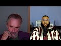

# Dr. Jordan Peterson Clears Up Warlord Comment (2021-12-16)

## Description

Full Podcast Here: https://www.youtube.com/watch?v=qgYMuRqXPr0&t=3128s

## Summary of [Dr. Jordan Peterson Clears Up Warlord Comment](https://www.youtube.com/watch?v=v0qZCupZ2SU)

*This summary is AI generated - there may be inaccuracies. *

### [00:00:00](https://www.youtube.com/watch?v=v0qZCupZ2SU&t=0) - [00:10:00](https://www.youtube.com/watch?v=v0qZCupZ2SU&t=600)

 Dr. Jordan Peterson discusses the Islamic conquest of Mecca and argues that Muhammad was not a warlord. He also argues that the expansion of the Islamic empire was accomplished through a tremendous amount of war-like activity.

**[00:00:00](https://www.youtube.com/watch?v=v0qZCupZ2SU&t=0)** Dr. Jordan Peterson discusses the wars that took place in the early Islamic period, specifically before the conquest of Mecca. He points out that most of these wars were defensive, and that after Muhammad's death, there was a great fracturing among the people who were closely allied with him. This led to the establishment of two major branches of Islam, and the beginning of a long period of armed conflict.
* **[00:05:00](https://www.youtube.com/watch?v=v0qZCupZ2SU&t=300)**  Dr. Jordan Peterson discusses the term "warlord." He argues that Muhammad was not a warlord, as he was able to conquer Mecca through peaceful means. He also argues that, historically, the expansion of the Islamic empire was accomplished through a tremendous amount of war-like activity.
* **[00:10:00](https://www.youtube.com/watch?v=v0qZCupZ2SU&t=600)** Dr. Jordan Peterson discusses the problems of reconciling Islam's teachings of turning the other cheek and fighting only in self-defense with the reality of Islamic empires' expansive warfare. He argues that Islam has a capability of being expansive and making peace treaties, and that it should do whatever is in its best interest, just like every country should do in the pre-modern world.

<h2>Full transcript with timestamps: CLICK TO EXPAND</h2>

[0:00:00](https://youtu.be/v0qZCupZ2SU?t=0) uh there was a time of persecution and  
[0:00:02](https://youtu.be/v0qZCupZ2SU?t=2) then after that  
[0:00:03](https://youtu.be/v0qZCupZ2SU?t=3) um  
[0:00:04](https://youtu.be/v0qZCupZ2SU?t=4) he went he went to different places he  
[0:00:06](https://youtu.be/v0qZCupZ2SU?t=6) went to tariff  
[0:00:07](https://youtu.be/v0qZCupZ2SU?t=7) which is a place outside of mecca he  
[0:00:09](https://youtu.be/v0qZCupZ2SU?t=9) went to el salvador two clans two tribes  
[0:00:13](https://youtu.be/v0qZCupZ2SU?t=13) and what it was is that he was he was  
[0:00:15](https://youtu.be/v0qZCupZ2SU?t=15) trying to get support for his project or  
[0:00:18](https://youtu.be/v0qZCupZ2SU?t=18) the monotheistic project because he was  
[0:00:20](https://youtu.be/v0qZCupZ2SU?t=20) being boycotted et cetera he eventually  
[0:00:22](https://youtu.be/v0qZCupZ2SU?t=22) got it from us  
[0:00:24](https://youtu.be/v0qZCupZ2SU?t=24) these two tribes because they actually  
[0:00:25](https://youtu.be/v0qZCupZ2SU?t=25) believed in the religion of islam this  
[0:00:27](https://youtu.be/v0qZCupZ2SU?t=27) is documented like without a shadow of a  
[0:00:29](https://youtu.be/v0qZCupZ2SU?t=29) doubt this is what happened and then is  
[0:00:31](https://youtu.be/v0qZCupZ2SU?t=31) this in the medina is this the medina  
[0:00:33](https://youtu.be/v0qZCupZ2SU?t=33) period that you're speaking out so this  
[0:00:34](https://youtu.be/v0qZCupZ2SU?t=34) is actually technically the meccan  
[0:00:36](https://youtu.be/v0qZCupZ2SU?t=36) period  
[0:00:37](https://youtu.be/v0qZCupZ2SU?t=37) okay still the meccan period yeah so  
[0:00:39](https://youtu.be/v0qZCupZ2SU?t=39) right before medina literally was  
[0:00:40](https://youtu.be/v0qZCupZ2SU?t=40) established because medina is the it was  
[0:00:42](https://youtu.be/v0qZCupZ2SU?t=42) it was so called after the prophet  
[0:00:44](https://youtu.be/v0qZCupZ2SU?t=44) because medina just literally means the  
[0:00:46](https://youtu.be/v0qZCupZ2SU?t=46) city in arabic it was called the  
[0:00:48](https://youtu.be/v0qZCupZ2SU?t=48) ethereum before and then they changed it  
[0:00:49](https://youtu.be/v0qZCupZ2SU?t=49) into madina to nebi like the city of the  
[0:00:51](https://youtu.be/v0qZCupZ2SU?t=51) prophet and so that's why it was kind of  
[0:00:53](https://youtu.be/v0qZCupZ2SU?t=53) called medina after that  
[0:00:55](https://youtu.be/v0qZCupZ2SU?t=55) in that time period so you've got 13  
[0:00:57](https://youtu.be/v0qZCupZ2SU?t=57) years of medina  
[0:00:58](https://youtu.be/v0qZCupZ2SU?t=58) the vast majority i'm not going to say  
[0:01:00](https://youtu.be/v0qZCupZ2SU?t=60) all about the vast majority of wars that  
[0:01:02](https://youtu.be/v0qZCupZ2SU?t=62) took place  
[0:01:03](https://youtu.be/v0qZCupZ2SU?t=63) and in fact all of the wars that took  
[0:01:04](https://youtu.be/v0qZCupZ2SU?t=64) place before the conquest of mecca were  
[0:01:06](https://youtu.be/v0qZCupZ2SU?t=66) defensive so the pagan arabs went to  
[0:01:09](https://youtu.be/v0qZCupZ2SU?t=69) medina and tried to siege it  
[0:01:14](https://youtu.be/v0qZCupZ2SU?t=74) and all of these are names of wars in  
[0:01:16](https://youtu.be/v0qZCupZ2SU?t=76) fact there was according to monschola  
[0:01:18](https://youtu.be/v0qZCupZ2SU?t=78) there were 19 such wars  
[0:01:20](https://youtu.be/v0qZCupZ2SU?t=80) in 10 years so that's almost an average  
[0:01:23](https://youtu.be/v0qZCupZ2SU?t=83) of two wars every year and for me i see  
[0:01:26](https://youtu.be/v0qZCupZ2SU?t=86) that actually as an evidence for prophet  
[0:01:27](https://youtu.be/v0qZCupZ2SU?t=87) because the prophet was actually  
[0:01:28](https://youtu.be/v0qZCupZ2SU?t=88) fighting in these wars he wasn't just  
[0:01:30](https://youtu.be/v0qZCupZ2SU?t=90) you know throwing people around telling  
[0:01:31](https://youtu.be/v0qZCupZ2SU?t=91) him to fight for him he was fighting in  
[0:01:33](https://youtu.be/v0qZCupZ2SU?t=93) them and there were defensive wars  
[0:01:35](https://youtu.be/v0qZCupZ2SU?t=95) um  
[0:01:36](https://youtu.be/v0qZCupZ2SU?t=96) so in that time period what happened was  
[0:01:38](https://youtu.be/v0qZCupZ2SU?t=98) i'll give you one okay so okay so let me  
[0:01:40](https://youtu.be/v0qZCupZ2SU?t=100) let me interject something there because  
[0:01:42](https://youtu.be/v0qZCupZ2SU?t=102) that's  
[0:01:43](https://youtu.be/v0qZCupZ2SU?t=103) that's that's very that's a very hard  
[0:01:44](https://youtu.be/v0qZCupZ2SU?t=104) thing for me to  
[0:01:46](https://youtu.be/v0qZCupZ2SU?t=106) to get straight in my mind yes now  
[0:01:49](https://youtu.be/v0qZCupZ2SU?t=109) um  
[0:01:50](https://youtu.be/v0qZCupZ2SU?t=110) i would say that and the division in  
[0:01:53](https://youtu.be/v0qZCupZ2SU?t=113) islam that occurred almost immediately  
[0:01:55](https://youtu.be/v0qZCupZ2SU?t=115) upon muhammad's death and which has not  
[0:01:58](https://youtu.be/v0qZCupZ2SU?t=118) been rectified to this day quite the  
[0:02:00](https://youtu.be/v0qZCupZ2SU?t=120) contrary that's also you know that's a  
[0:02:02](https://youtu.be/v0qZCupZ2SU?t=122) problem for everyone it's a problem for  
[0:02:04](https://youtu.be/v0qZCupZ2SU?t=124) muslims it's a problem for christians  
[0:02:05](https://youtu.be/v0qZCupZ2SU?t=125) it's a problem for everyone and it's a  
[0:02:07](https://youtu.be/v0qZCupZ2SU?t=127) problem that could really get out of  
[0:02:08](https://youtu.be/v0qZCupZ2SU?t=128) hand now it's not like i don't know that  
[0:02:10](https://youtu.be/v0qZCupZ2SU?t=130) the protestants and the catholics were  
[0:02:11](https://youtu.be/v0qZCupZ2SU?t=131) at each other's throats for you know  
[0:02:13](https://youtu.be/v0qZCupZ2SU?t=133) hundreds of years so  
[0:02:14](https://youtu.be/v0qZCupZ2SU?t=134) but that's that's not the issue at the  
[0:02:17](https://youtu.be/v0qZCupZ2SU?t=137) moment so  
[0:02:19](https://youtu.be/v0qZCupZ2SU?t=139) now in in islam there's a tremendous  
[0:02:21](https://youtu.be/v0qZCupZ2SU?t=141) emphasis on christ's doctrines as well  
[0:02:24](https://youtu.be/v0qZCupZ2SU?t=144) and there isn't any evidence that christ  
[0:02:26](https://youtu.be/v0qZCupZ2SU?t=146) himself took part in let's say wars  
[0:02:30](https://youtu.be/v0qZCupZ2SU?t=150) okay so  
[0:02:31](https://youtu.be/v0qZCupZ2SU?t=151) it's hard  
[0:02:32](https://youtu.be/v0qZCupZ2SU?t=152) and i mean  
[0:02:33](https://youtu.be/v0qZCupZ2SU?t=153) what do you mean okay well if you if you  
[0:02:35](https://youtu.be/v0qZCupZ2SU?t=155) analyze christ as an archetype  
[0:02:37](https://youtu.be/v0qZCupZ2SU?t=157) when he comes back in his second coming  
[0:02:39](https://youtu.be/v0qZCupZ2SU?t=159) he is going to dominate the world  
[0:02:42](https://youtu.be/v0qZCupZ2SU?t=162) and one can say well that's not the  
[0:02:43](https://youtu.be/v0qZCupZ2SU?t=163) historical christ but when we're when  
[0:02:45](https://youtu.be/v0qZCupZ2SU?t=165) we're looking at him in the way  
[0:02:47](https://youtu.be/v0qZCupZ2SU?t=167) look that's a reasonable that's a  
[0:02:48](https://youtu.be/v0qZCupZ2SU?t=168) reasonable objective  
[0:02:50](https://youtu.be/v0qZCupZ2SU?t=170) and i understand that a judge a judge  
[0:02:52](https://youtu.be/v0qZCupZ2SU?t=172) has a judge has that that martial  
[0:02:55](https://youtu.be/v0qZCupZ2SU?t=175) element and i don't think it's  
[0:02:56](https://youtu.be/v0qZCupZ2SU?t=176) reasonable to use the archetypal  
[0:02:58](https://youtu.be/v0qZCupZ2SU?t=178) representation as an argument against  
[0:03:00](https://youtu.be/v0qZCupZ2SU?t=180) the historical reality and look i'm not  
[0:03:02](https://youtu.be/v0qZCupZ2SU?t=182) saying to you that i know that what  
[0:03:05](https://youtu.be/v0qZCupZ2SU?t=185) muhammad did was wrong that isn't what  
[0:03:07](https://youtu.be/v0qZCupZ2SU?t=187) i'm saying i'm saying that i don't  
[0:03:10](https://youtu.be/v0qZCupZ2SU?t=190) understand  
[0:03:11](https://youtu.be/v0qZCupZ2SU?t=191) how  
[0:03:12](https://youtu.be/v0qZCupZ2SU?t=192) participation in those defense of wars  
[0:03:15](https://youtu.be/v0qZCupZ2SU?t=195) let's say but then that was also  
[0:03:16](https://youtu.be/v0qZCupZ2SU?t=196) followed by a tremendous explosion of  
[0:03:18](https://youtu.be/v0qZCupZ2SU?t=198) islamic expansion right the biggest  
[0:03:20](https://youtu.be/v0qZCupZ2SU?t=200) empire the world had ever seen in a very  
[0:03:22](https://youtu.be/v0qZCupZ2SU?t=202) short period of time  
[0:03:23](https://youtu.be/v0qZCupZ2SU?t=203) right at right at europe's doors  
[0:03:26](https://youtu.be/v0qZCupZ2SU?t=206) and so  
[0:03:27](https://youtu.be/v0qZCupZ2SU?t=207) and that was also followed by the  
[0:03:29](https://youtu.be/v0qZCupZ2SU?t=209) severance of the islamic faith into two  
[0:03:31](https://youtu.be/v0qZCupZ2SU?t=211) major categories and and interned  
[0:03:33](https://youtu.be/v0qZCupZ2SU?t=213) conflict there and so there's that that  
[0:03:35](https://youtu.be/v0qZCupZ2SU?t=215) stream of of  
[0:03:37](https://youtu.be/v0qZCupZ2SU?t=217) of armed conflict activity i i think  
[0:03:41](https://youtu.be/v0qZCupZ2SU?t=221) that you're  
[0:03:42](https://youtu.be/v0qZCupZ2SU?t=222) with respect i i don't think you're  
[0:03:43](https://youtu.be/v0qZCupZ2SU?t=223) getting the history fully right here  
[0:03:45](https://youtu.be/v0qZCupZ2SU?t=225) because well  
[0:03:46](https://youtu.be/v0qZCupZ2SU?t=226) go yep that's fine cool yeah the the the  
[0:03:49](https://youtu.be/v0qZCupZ2SU?t=229) the war in germany that the wars between  
[0:03:51](https://youtu.be/v0qZCupZ2SU?t=231) shia and sunnah or what would then be  
[0:03:54](https://youtu.be/v0qZCupZ2SU?t=234) it's not really between sunnah because  
[0:03:55](https://youtu.be/v0qZCupZ2SU?t=235) quite frankly shiism had not been  
[0:03:57](https://youtu.be/v0qZCupZ2SU?t=237) established does it but the the the wars  
[0:03:59](https://youtu.be/v0qZCupZ2SU?t=239) of the companions how many people died  
[0:04:01](https://youtu.be/v0qZCupZ2SU?t=241) in those wars  
[0:04:03](https://youtu.be/v0qZCupZ2SU?t=243) do we have any numbers  
[0:04:04](https://youtu.be/v0qZCupZ2SU?t=244) for maximum we can say but it's but  
[0:04:07](https://youtu.be/v0qZCupZ2SU?t=247) fair look fair enough man and it's not  
[0:04:09](https://youtu.be/v0qZCupZ2SU?t=249) like it's not chris it's not like  
[0:04:10](https://youtu.be/v0qZCupZ2SU?t=250) christianity hasn't been rife with  
[0:04:12](https://youtu.be/v0qZCupZ2SU?t=252) internecine conflict yes  
[0:04:15](https://youtu.be/v0qZCupZ2SU?t=255) but but the fact is is that it was  
[0:04:17](https://youtu.be/v0qZCupZ2SU?t=257) almost immediately after muhammad's  
[0:04:19](https://youtu.be/v0qZCupZ2SU?t=259) death that this fracturing took place  
[0:04:20](https://youtu.be/v0qZCupZ2SU?t=260) among the people that were closely  
[0:04:22](https://youtu.be/v0qZCupZ2SU?t=262) allied with him and it was a bloody  
[0:04:23](https://youtu.be/v0qZCupZ2SU?t=263) fracturing and it isn't obvious that  
[0:04:25](https://youtu.be/v0qZCupZ2SU?t=265) it's been wrapped  
[0:04:27](https://youtu.be/v0qZCupZ2SU?t=267) how bloody was it well how bloody does  
[0:04:29](https://youtu.be/v0qZCupZ2SU?t=269) it have to be you know it doesn't take  
[0:04:30](https://youtu.be/v0qZCupZ2SU?t=270) much  
[0:04:31](https://youtu.be/v0qZCupZ2SU?t=271) okay  
[0:04:32](https://youtu.be/v0qZCupZ2SU?t=272) well let's be honest let's be fair yeah  
[0:04:34](https://youtu.be/v0qZCupZ2SU?t=274) yeah  
[0:04:35](https://youtu.be/v0qZCupZ2SU?t=275) let's be fair right with with with with  
[0:04:37](https://youtu.be/v0qZCupZ2SU?t=277) the wars that took place 30 to 40 years  
[0:04:39](https://youtu.be/v0qZCupZ2SU?t=279) and it wasn't immediately after because  
[0:04:40](https://youtu.be/v0qZCupZ2SU?t=280) you said that in the video the day he  
[0:04:42](https://youtu.be/v0qZCupZ2SU?t=282) died that's wrong he didn't happen the  
[0:04:44](https://youtu.be/v0qZCupZ2SU?t=284) day he died it happened 30 to four years  
[0:04:45](https://youtu.be/v0qZCupZ2SU?t=285) after  
[0:04:46](https://youtu.be/v0qZCupZ2SU?t=286) it happened 30 to 40 years after and how  
[0:04:48](https://youtu.be/v0qZCupZ2SU?t=288) long how how many people how many  
[0:04:50](https://youtu.be/v0qZCupZ2SU?t=290) members of muhammad's immediate family  
[0:04:52](https://youtu.be/v0qZCupZ2SU?t=292) survived during that 30 years  
[0:04:55](https://youtu.be/v0qZCupZ2SU?t=295) my understanding was that most of his  
[0:04:56](https://youtu.be/v0qZCupZ2SU?t=296) immediate family died in armed conflict  
[0:04:59](https://youtu.be/v0qZCupZ2SU?t=299) relatively immediate family died in his  
[0:05:00](https://youtu.be/v0qZCupZ2SU?t=300) own lifetime  
[0:05:02](https://youtu.be/v0qZCupZ2SU?t=302) yes well i'm not speaking of them but  
[0:05:04](https://youtu.be/v0qZCupZ2SU?t=304) i'm speaking of what happened after he  
[0:05:05](https://youtu.be/v0qZCupZ2SU?t=305) died that's right because yeah okay look  
[0:05:08](https://youtu.be/v0qZCupZ2SU?t=308) first first fact  
[0:05:10](https://youtu.be/v0qZCupZ2SU?t=310) muhammad  
[0:05:11](https://youtu.be/v0qZCupZ2SU?t=311) uh salah sallam we say salah meaning  
[0:05:13](https://youtu.be/v0qZCupZ2SU?t=313) peace and blessings upon him  
[0:05:16](https://youtu.be/v0qZCupZ2SU?t=316) all of his children died in his life  
[0:05:19](https://youtu.be/v0qZCupZ2SU?t=319) okay except for one  
[0:05:21](https://youtu.be/v0qZCupZ2SU?t=321) so most of the members of his immediate  
[0:05:23](https://youtu.be/v0qZCupZ2SU?t=323) family and his wife died khadija died  
[0:05:25](https://youtu.be/v0qZCupZ2SU?t=325) his uncle abu talib died his other uncle  
[0:05:27](https://youtu.be/v0qZCupZ2SU?t=327) hamza died they all died within his  
[0:05:30](https://youtu.be/v0qZCupZ2SU?t=330) lifetime either due to illness or due to  
[0:05:33](https://youtu.be/v0qZCupZ2SU?t=333) some other some other cause war for  
[0:05:35](https://youtu.be/v0qZCupZ2SU?t=335) example like one of the defensive was  
[0:05:37](https://youtu.be/v0qZCupZ2SU?t=337) hamza died  
[0:05:38](https://youtu.be/v0qZCupZ2SU?t=338) and by the way muhammad forgave his  
[0:05:40](https://youtu.be/v0qZCupZ2SU?t=340) killer and that's something which which  
[0:05:41](https://youtu.be/v0qZCupZ2SU?t=341) goes against the warlord thesis because  
[0:05:44](https://youtu.be/v0qZCupZ2SU?t=344) when he then conquered mecca  
[0:05:46](https://youtu.be/v0qZCupZ2SU?t=346) when he conquered mecca he was actually  
[0:05:48](https://youtu.be/v0qZCupZ2SU?t=348) no fighting i'm not sure if you know  
[0:05:49](https://youtu.be/v0qZCupZ2SU?t=349) this it's called fat  
[0:05:51](https://youtu.be/v0qZCupZ2SU?t=351) when he went into and conquered mecca he  
[0:05:53](https://youtu.be/v0qZCupZ2SU?t=353) didn't fight anybody  
[0:05:55](https://youtu.be/v0qZCupZ2SU?t=355) it was no fighting there were a few  
[0:05:56](https://youtu.be/v0qZCupZ2SU?t=356) people that that were exempted but he  
[0:05:59](https://youtu.be/v0qZCupZ2SU?t=359) actually quoted what joseph quoted to  
[0:06:01](https://youtu.be/v0qZCupZ2SU?t=361) his brothers in the quran in the quran  
[0:06:04](https://youtu.be/v0qZCupZ2SU?t=364) which is letter 3 by alaikum that no  
[0:06:06](https://youtu.be/v0qZCupZ2SU?t=366) blame is on you today and so and this by  
[0:06:09](https://youtu.be/v0qZCupZ2SU?t=369) the way is a bedrock example of  
[0:06:11](https://youtu.be/v0qZCupZ2SU?t=371) forgiveness in islam because these were  
[0:06:13](https://youtu.be/v0qZCupZ2SU?t=373) people that were persecuting him for 13  
[0:06:15](https://youtu.be/v0qZCupZ2SU?t=375) years these are people that were that  
[0:06:17](https://youtu.be/v0qZCupZ2SU?t=377) killed his uncle like i said there's one  
[0:06:18](https://youtu.be/v0qZCupZ2SU?t=378) person called washi  
[0:06:20](https://youtu.be/v0qZCupZ2SU?t=380) who um who literally killed his uncle  
[0:06:23](https://youtu.be/v0qZCupZ2SU?t=383) and uh and mutilated his body and he  
[0:06:26](https://youtu.be/v0qZCupZ2SU?t=386) said  
[0:06:27](https://youtu.be/v0qZCupZ2SU?t=387) to ashi i forgive you but i can't i  
[0:06:29](https://youtu.be/v0qZCupZ2SU?t=389) can't see your face because of how  
[0:06:31](https://youtu.be/v0qZCupZ2SU?t=391) how  
[0:06:32](https://youtu.be/v0qZCupZ2SU?t=392) he said  
[0:06:37](https://youtu.be/v0qZCupZ2SU?t=397) he said can you keep your face away from  
[0:06:38](https://youtu.be/v0qZCupZ2SU?t=398) me because i can't psychologically i  
[0:06:40](https://youtu.be/v0qZCupZ2SU?t=400) can't bring my faith but i do forgive  
[0:06:41](https://youtu.be/v0qZCupZ2SU?t=401) you he said so he forgave people that  
[0:06:43](https://youtu.be/v0qZCupZ2SU?t=403) killed his own family members  
[0:06:46](https://youtu.be/v0qZCupZ2SU?t=406) and this was after he he himself  
[0:06:48](https://youtu.be/v0qZCupZ2SU?t=408) attempted a treaty with the pagans  
[0:06:50](https://youtu.be/v0qZCupZ2SU?t=410) called hodebiya  
[0:06:52](https://youtu.be/v0qZCupZ2SU?t=412) and so they broke the treaty and that's  
[0:06:54](https://youtu.be/v0qZCupZ2SU?t=414) what initiated the conquest of mecca  
[0:06:55](https://youtu.be/v0qZCupZ2SU?t=415) which was  
[0:06:57](https://youtu.be/v0qZCupZ2SU?t=417) not a conquest that was  
[0:06:58](https://youtu.be/v0qZCupZ2SU?t=418) fighting now if you compare this because  
[0:07:00](https://youtu.be/v0qZCupZ2SU?t=420) i think the comparison if there's any  
[0:07:02](https://youtu.be/v0qZCupZ2SU?t=422) comparison that can be or should be made  
[0:07:04](https://youtu.be/v0qZCupZ2SU?t=424) it's the it's jesus's second coming with  
[0:07:07](https://youtu.be/v0qZCupZ2SU?t=427) muhammad in the medinan period not in  
[0:07:09](https://youtu.be/v0qZCupZ2SU?t=429) the meccan period in the meccan period  
[0:07:11](https://youtu.be/v0qZCupZ2SU?t=431) both were being persecuted jesus in his  
[0:07:13](https://youtu.be/v0qZCupZ2SU?t=433) life and muhammad in his in the meccan  
[0:07:16](https://youtu.be/v0qZCupZ2SU?t=436) period but jesus when he comes back he  
[0:07:18](https://youtu.be/v0qZCupZ2SU?t=438) will then get authority and he will be i  
[0:07:20](https://youtu.be/v0qZCupZ2SU?t=440) uh he will be ruling with the iron  
[0:07:22](https://youtu.be/v0qZCupZ2SU?t=442) scepter according to the bible he would  
[0:07:24](https://youtu.be/v0qZCupZ2SU?t=444) be crushing his uh  
[0:07:26](https://youtu.be/v0qZCupZ2SU?t=446) he will be crushing his enemies as it  
[0:07:28](https://youtu.be/v0qZCupZ2SU?t=448) says in corinthians under his for  
[0:07:30](https://youtu.be/v0qZCupZ2SU?t=450) humbling his enemies under his foot uh  
[0:07:32](https://youtu.be/v0qZCupZ2SU?t=452) and killing and violent violent stuff so  
[0:07:34](https://youtu.be/v0qZCupZ2SU?t=454) in fact  
[0:07:36](https://youtu.be/v0qZCupZ2SU?t=456) i will actually argue today that the new  
[0:07:38](https://youtu.be/v0qZCupZ2SU?t=458) testament representation of jesus christ  
[0:07:41](https://youtu.be/v0qZCupZ2SU?t=461) in his second coming is way more violent  
[0:07:44](https://youtu.be/v0qZCupZ2SU?t=464) than muhammad's  
[0:07:45](https://youtu.be/v0qZCupZ2SU?t=465) conquests in the medina okay well look  
[0:07:48](https://youtu.be/v0qZCupZ2SU?t=468) like i said i wasn't i wasn't trying to  
[0:07:50](https://youtu.be/v0qZCupZ2SU?t=470) make the case i wasn't trying to make  
[0:07:52](https://youtu.be/v0qZCupZ2SU?t=472) the case that  
[0:07:54](https://youtu.be/v0qZCupZ2SU?t=474) what happened in mecca or medina was  
[0:07:56](https://youtu.be/v0qZCupZ2SU?t=476) wrong like so let me explain that a  
[0:07:58](https://youtu.be/v0qZCupZ2SU?t=478) little bit  
[0:08:00](https://youtu.be/v0qZCupZ2SU?t=480) so  
[0:08:01](https://youtu.be/v0qZCupZ2SU?t=481) christian europe fought a defensive war  
[0:08:03](https://youtu.be/v0qZCupZ2SU?t=483) against the nazis  
[0:08:05](https://youtu.be/v0qZCupZ2SU?t=485) it isn't obvious that that was wrong i  
[0:08:07](https://youtu.be/v0qZCupZ2SU?t=487) don't think that was i wouldn't say  
[0:08:08](https://youtu.be/v0qZCupZ2SU?t=488) that's defensive  
[0:08:10](https://youtu.be/v0qZCupZ2SU?t=490) well okay fine but but i understand the  
[0:08:12](https://youtu.be/v0qZCupZ2SU?t=492) concept of defense of war  
[0:08:16](https://youtu.be/v0qZCupZ2SU?t=496) america  
[0:08:17](https://youtu.be/v0qZCupZ2SU?t=497) america when america got involved in  
[0:08:18](https://youtu.be/v0qZCupZ2SU?t=498) world war ii  
[0:08:20](https://youtu.be/v0qZCupZ2SU?t=500) it was not under immediate threat by  
[0:08:21](https://youtu.be/v0qZCupZ2SU?t=501) germany and they colonized it and here's  
[0:08:24](https://youtu.be/v0qZCupZ2SU?t=504) the thing caught it it overtook western  
[0:08:27](https://youtu.be/v0qZCupZ2SU?t=507) germany you see and well  
[0:08:29](https://youtu.be/v0qZCupZ2SU?t=509) here's the thing the term warlord that  
[0:08:31](https://youtu.be/v0qZCupZ2SU?t=511) you use with the prophet you've never  
[0:08:32](https://youtu.be/v0qZCupZ2SU?t=512) used with harry truman you've never used  
[0:08:35](https://youtu.be/v0qZCupZ2SU?t=515) with uh  
[0:08:36](https://youtu.be/v0qZCupZ2SU?t=516) with uh roosevelt you've never used with  
[0:08:38](https://youtu.be/v0qZCupZ2SU?t=518) winston churchill all of which conquered  
[0:08:40](https://youtu.be/v0qZCupZ2SU?t=520) countries literally in wars because i  
[0:08:43](https://youtu.be/v0qZCupZ2SU?t=523) feel like there is there is a bias there  
[0:08:45](https://youtu.be/v0qZCupZ2SU?t=525) and you actually never used it with  
[0:08:47](https://youtu.be/v0qZCupZ2SU?t=527) anybody else aside from the prophet  
[0:08:48](https://youtu.be/v0qZCupZ2SU?t=528) muhammad in your public output and i  
[0:08:50](https://youtu.be/v0qZCupZ2SU?t=530) think that's unjustifiable i think that  
[0:08:52](https://youtu.be/v0qZCupZ2SU?t=532) you have biblical prophets like moses  
[0:08:54](https://youtu.be/v0qZCupZ2SU?t=534) you have biblical prophets  
[0:08:56](https://youtu.be/v0qZCupZ2SU?t=536) like um joshua you have you have the  
[0:08:59](https://youtu.be/v0qZCupZ2SU?t=539) jesus in his second coming all of which  
[0:09:01](https://youtu.be/v0qZCupZ2SU?t=541) were warrior prophets  
[0:09:03](https://youtu.be/v0qZCupZ2SU?t=543) and and and and you've only used the  
[0:09:06](https://youtu.be/v0qZCupZ2SU?t=546) term uh  
[0:09:07](https://youtu.be/v0qZCupZ2SU?t=547) warlord with the prophet muhammad i  
[0:09:08](https://youtu.be/v0qZCupZ2SU?t=548) think that is unjustifiable i think if  
[0:09:11](https://youtu.be/v0qZCupZ2SU?t=551) what is it that caught  
[0:09:12](https://youtu.be/v0qZCupZ2SU?t=552) what makes someone a warlord in you  
[0:09:15](https://youtu.be/v0qZCupZ2SU?t=555) then if if it's conquering lands then  
[0:09:17](https://youtu.be/v0qZCupZ2SU?t=557) harry truman is a warlord then uh  
[0:09:20](https://youtu.be/v0qZCupZ2SU?t=560) you know and so on and so forth in fact  
[0:09:23](https://youtu.be/v0qZCupZ2SU?t=563) i guess that's a real that's a real  
[0:09:24](https://youtu.be/v0qZCupZ2SU?t=564) tough question isn't it what makes a  
[0:09:26](https://youtu.be/v0qZCupZ2SU?t=566) warlord and what makes it just war it's  
[0:09:28](https://youtu.be/v0qZCupZ2SU?t=568) not like any of us have the precise  
[0:09:30](https://youtu.be/v0qZCupZ2SU?t=570) answers to that i think that's what  
[0:09:31](https://youtu.be/v0qZCupZ2SU?t=571) partly what we're trying to hash out the  
[0:09:32](https://youtu.be/v0qZCupZ2SU?t=572) definitions of the word warlords the  
[0:09:34](https://youtu.be/v0qZCupZ2SU?t=574) definition of the word woodward  
[0:09:35](https://youtu.be/v0qZCupZ2SU?t=575) according to collins is that someone who  
[0:09:37](https://youtu.be/v0qZCupZ2SU?t=577) acquires force by aggressivity and  
[0:09:39](https://youtu.be/v0qZCupZ2SU?t=579) violence  
[0:09:42](https://youtu.be/v0qZCupZ2SU?t=582) and you push back on me so i'll push  
[0:09:43](https://youtu.be/v0qZCupZ2SU?t=583) back on you to some degree okay well  
[0:09:46](https://youtu.be/v0qZCupZ2SU?t=586) it's certainly the case that the  
[0:09:47](https://youtu.be/v0qZCupZ2SU?t=587) expansion of the islamic empire was  
[0:09:50](https://youtu.be/v0qZCupZ2SU?t=590) accomplished by a tremendous amount of  
[0:09:52](https://youtu.be/v0qZCupZ2SU?t=592) war-like activity and that wasn't  
[0:09:53](https://youtu.be/v0qZCupZ2SU?t=593) defensive  
[0:09:55](https://youtu.be/v0qZCupZ2SU?t=595) now look i understand that monotheism is  
[0:09:57](https://youtu.be/v0qZCupZ2SU?t=597) a difficult state to attain  
[0:10:00](https://youtu.be/v0qZCupZ2SU?t=600) and that monotheistic societies have  
[0:10:02](https://youtu.be/v0qZCupZ2SU?t=602) emerged in the midst of conflict  
[0:10:03](https://youtu.be/v0qZCupZ2SU?t=603) throughout human society i understand  
[0:10:05](https://youtu.be/v0qZCupZ2SU?t=605) that and i'm not even saying that  
[0:10:06](https://youtu.be/v0qZCupZ2SU?t=606) there's something exceptional in that  
[0:10:08](https://youtu.be/v0qZCupZ2SU?t=608) regard about islam although the rate at  
[0:10:10](https://youtu.be/v0qZCupZ2SU?t=610) which it happened was quite remarkable  
[0:10:12](https://youtu.be/v0qZCupZ2SU?t=612) but it still it presents us with a  
[0:10:14](https://youtu.be/v0qZCupZ2SU?t=614) problem doesn't it  
[0:10:15](https://youtu.be/v0qZCupZ2SU?t=615) i mean everyone it presents everyone  
[0:10:17](https://youtu.be/v0qZCupZ2SU?t=617) with a problem  
[0:10:18](https://youtu.be/v0qZCupZ2SU?t=618) and the problem is well for example the  
[0:10:20](https://youtu.be/v0qZCupZ2SU?t=620) problem is reconciling the idea of  
[0:10:22](https://youtu.be/v0qZCupZ2SU?t=622) turning the other cheek with the idea of  
[0:10:24](https://youtu.be/v0qZCupZ2SU?t=624) a just war a defensive war or an expanse  
[0:10:26](https://youtu.be/v0qZCupZ2SU?t=626) of war for that matter and of course  
[0:10:28](https://youtu.be/v0qZCupZ2SU?t=628) that issue is relevant to islam because  
[0:10:30](https://youtu.be/v0qZCupZ2SU?t=630) islam exploded outward and produced the  
[0:10:33](https://youtu.be/v0qZCupZ2SU?t=633) biggest empire the world had ever seen  
[0:10:34](https://youtu.be/v0qZCupZ2SU?t=634) in in the in the space of a few short  
[0:10:36](https://youtu.be/v0qZCupZ2SU?t=636) centuries  
[0:10:39](https://youtu.be/v0qZCupZ2SU?t=639) so then well so then you ask well what's  
[0:10:42](https://youtu.be/v0qZCupZ2SU?t=642) the spirit what is the spirit that  
[0:10:44](https://youtu.be/v0qZCupZ2SU?t=644) animated that and is that attributable  
[0:10:46](https://youtu.be/v0qZCupZ2SU?t=646) to the islamic doctrines themselves  
[0:10:49](https://youtu.be/v0qZCupZ2SU?t=649) i don't know the answer to that now let  
[0:10:51](https://youtu.be/v0qZCupZ2SU?t=651) me tell you the answer to that okay  
[0:10:53](https://youtu.be/v0qZCupZ2SU?t=653) and this is what i want to tell you  
[0:10:54](https://youtu.be/v0qZCupZ2SU?t=654) conclusively and this will help build  
[0:10:56](https://youtu.be/v0qZCupZ2SU?t=656) bridges honestly because we can maintain  
[0:10:58](https://youtu.be/v0qZCupZ2SU?t=658) the warlord thesis we can maintain the  
[0:10:59](https://youtu.be/v0qZCupZ2SU?t=659) expansionist thesis but here's what i'll  
[0:11:01](https://youtu.be/v0qZCupZ2SU?t=661) tell you  
[0:11:02](https://youtu.be/v0qZCupZ2SU?t=662) islam has a has a capability to be  
[0:11:05](https://youtu.be/v0qZCupZ2SU?t=665) expansive  
[0:11:07](https://youtu.be/v0qZCupZ2SU?t=667) and it also has a capability of making  
[0:11:09](https://youtu.be/v0qZCupZ2SU?t=669) peace treaties  
[0:11:10](https://youtu.be/v0qZCupZ2SU?t=670) and it does and it should do whatever is  
[0:11:12](https://youtu.be/v0qZCupZ2SU?t=672) in his best interest just like every  
[0:11:14](https://youtu.be/v0qZCupZ2SU?t=674) country should do ever in his best  
[0:11:16](https://youtu.be/v0qZCupZ2SU?t=676) interest in the pre-modern world we did  
[0:11:19](https://youtu.be/v0qZCupZ2SU?t=679) not i think this is highly anachronistic  
[0:11:21](https://youtu.be/v0qZCupZ2SU?t=681) in the pre-modern world there was no  
[0:11:23](https://youtu.be/v0qZCupZ2SU?t=683) such thing as un it was a realist  
[0:11:25](https://youtu.be/v0qZCupZ2SU?t=685) international relations framework  
[0:11:27](https://youtu.be/v0qZCupZ2SU?t=687) whereby everybody was fighting everyone  
[0:11:30](https://youtu.be/v0qZCupZ2SU?t=690) the roman empire didn't care  
[0:11:32](https://youtu.be/v0qZCupZ2SU?t=692) about what it didn't care about you  
[0:11:34](https://youtu.be/v0qZCupZ2SU?t=694) quite frankly it was expanding itself  
[0:11:36](https://youtu.be/v0qZCupZ2SU?t=696) the persian empire was expanding itself  
[0:11:38](https://youtu.be/v0qZCupZ2SU?t=698) and the and the arabian peninsula was in  
[0:11:40](https://youtu.be/v0qZCupZ2SU?t=700) between both and so it could have either  
[0:11:42](https://youtu.be/v0qZCupZ2SU?t=702) been swallowed by those two other  
[0:11:44](https://youtu.be/v0qZCupZ2SU?t=704) empires or it could decide to in fact we  
[0:11:46](https://youtu.be/v0qZCupZ2SU?t=706) will impose our government on them  
[0:11:48](https://youtu.be/v0qZCupZ2SU?t=708) before they impose it on us and it  
[0:11:50](https://youtu.be/v0qZCupZ2SU?t=710) decided the former rather than the  
[0:11:52](https://youtu.be/v0qZCupZ2SU?t=712) latter it decided to expand and in fact  
[0:11:54](https://youtu.be/v0qZCupZ2SU?t=714) the prophet in his weakest of times he  
[0:11:56](https://youtu.be/v0qZCupZ2SU?t=716) predicted that that would happen  
[0:11:58](https://youtu.be/v0qZCupZ2SU?t=718) you know there was one more in  
[0:11:59](https://youtu.be/v0qZCupZ2SU?t=719) particular where they were they were  
[0:12:01](https://youtu.be/v0qZCupZ2SU?t=721) starving and it's called khandak and he  
[0:12:03](https://youtu.be/v0qZCupZ2SU?t=723) hit iraq and he said  
[0:12:07](https://youtu.be/v0qZCupZ2SU?t=727) the roman empire has been conquered he  
[0:12:09](https://youtu.be/v0qZCupZ2SU?t=729) hit another iraq again he said forte had  
[0:12:11](https://youtu.be/v0qZCupZ2SU?t=731) fairest that the persian empire has been  
[0:12:13](https://youtu.be/v0qZCupZ2SU?t=733) conquered and then he knocked the rock  
[0:12:14](https://youtu.be/v0qZCupZ2SU?t=734) again he said he said this in his  
[0:12:16](https://youtu.be/v0qZCupZ2SU?t=736) weakest moment he said that the yemen  
[0:12:18](https://youtu.be/v0qZCupZ2SU?t=738) has been conquered i see that the  
[0:12:20](https://youtu.be/v0qZCupZ2SU?t=740) expansion of the islamic empire is a  
[0:12:22](https://youtu.be/v0qZCupZ2SU?t=742) proof of islam and you know it's not  
[0:12:23](https://youtu.be/v0qZCupZ2SU?t=743) just me even historians say this how  
[0:12:25](https://youtu.be/v0qZCupZ2SU?t=745) barnaby rogerson he said the fact that  
[0:12:27](https://youtu.be/v0qZCupZ2SU?t=747) islam spread  
[0:12:29](https://youtu.be/v0qZCupZ2SU?t=749) to the roman empire and the persian  
[0:12:31](https://youtu.be/v0qZCupZ2SU?t=751) empire is equivalent to  
[0:12:33](https://youtu.be/v0qZCupZ2SU?t=753) the the is equivalent to eskimos taking  
[0:12:36](https://youtu.be/v0qZCupZ2SU?t=756) over russia and america i believe it's  
[0:12:37](https://youtu.be/v0qZCupZ2SU?t=757) miraculous if anything that this  
[0:12:39](https://youtu.be/v0qZCupZ2SU?t=759) happened i don't think it's  
[0:12:40](https://youtu.be/v0qZCupZ2SU?t=760) unjustifiable i think actually during  
[0:12:42](https://youtu.be/v0qZCupZ2SU?t=762) peace and to be then  
[0:12:43](https://youtu.be/v0qZCupZ2SU?t=763) stop it why did it stop at europe's  
[0:12:45](https://youtu.be/v0qZCupZ2SU?t=765) borders so to speak  
[0:12:48](https://youtu.be/v0qZCupZ2SU?t=768) if it was the worst  
[0:12:49](https://youtu.be/v0qZCupZ2SU?t=769) yeah  
[0:12:50](https://youtu.be/v0qZCupZ2SU?t=770) because of uh  
[0:12:51](https://youtu.be/v0qZCupZ2SU?t=771) it wasn't successful there it wasn't it  
[0:12:54](https://youtu.be/v0qZCupZ2SU?t=774) it stopped where it it  
[0:12:55](https://youtu.be/v0qZCupZ2SU?t=775) couldn't go further but the point is is  
[0:12:58](https://youtu.be/v0qZCupZ2SU?t=778) that it's not like the christians at  
[0:12:59](https://youtu.be/v0qZCupZ2SU?t=779) that time in  
[0:13:00](https://youtu.be/v0qZCupZ2SU?t=780) rome cared i mean they did the same  
[0:13:03](https://youtu.be/v0qZCupZ2SU?t=783) thing for years they were expanding  
[0:13:04](https://youtu.be/v0qZCupZ2SU?t=784) themselves well that's why i said that's  
[0:13:06](https://youtu.be/v0qZCupZ2SU?t=786) why i said i wasn't making a private  
[0:13:07](https://youtu.be/v0qZCupZ2SU?t=787) fancy case that this was wrong i'm  
[0:13:09](https://youtu.be/v0qZCupZ2SU?t=789) trying to understand it and so and you  
[0:13:11](https://youtu.be/v0qZCupZ2SU?t=791) objected to my  
[0:13:12](https://youtu.be/v0qZCupZ2SU?t=792) use of the term warlord and perhaps  
[0:13:14](https://youtu.be/v0qZCupZ2SU?t=794) rightly so you know perhaps that was an  
[0:13:16](https://youtu.be/v0qZCupZ2SU?t=796) injudicious comment i was rather shocked  
[0:13:19](https://youtu.be/v0qZCupZ2SU?t=799) when i was reading islamic history when  
[0:13:21](https://youtu.be/v0qZCupZ2SU?t=801) i  
[0:13:22](https://youtu.be/v0qZCupZ2SU?t=802) encountered the degree of violence that  
[0:13:25](https://youtu.be/v0qZCupZ2SU?t=805) surrounded these events and so you know  
[0:13:26](https://youtu.be/v0qZCupZ2SU?t=806) maybe i was like i was appreciative you  
[0:13:29](https://youtu.be/v0qZCupZ2SU?t=809) said that i think this that shows real  
[0:13:30](https://youtu.be/v0qZCupZ2SU?t=810) sincerity in it and it's it's one step  
[0:13:33](https://youtu.be/v0qZCupZ2SU?t=813) closer to creating real  
[0:13:35](https://youtu.be/v0qZCupZ2SU?t=815) uh meaningful relationships between uh  
[0:13:38](https://youtu.be/v0qZCupZ2SU?t=818) well i think and i think you're you know  
[0:13:40](https://youtu.be/v0qZCupZ2SU?t=820) your defense that well the world was a  
[0:13:42](https://youtu.be/v0qZCupZ2SU?t=822) battleground of empires and you know if  
[0:13:44](https://youtu.be/v0qZCupZ2SU?t=824) it's if it's push out from our territory  
[0:13:47](https://youtu.be/v0qZCupZ2SU?t=827) be encroached upon and dominated then it  
[0:13:49](https://youtu.be/v0qZCupZ2SU?t=829) isn't obvious that being encroached upon  
[0:13:51](https://youtu.be/v0qZCupZ2SU?t=831) and dominated is the right  
[0:13:53](https://youtu.be/v0qZCupZ2SU?t=833) approach the correct approach the most  
[0:13:55](https://youtu.be/v0qZCupZ2SU?t=835) moral approach let's say um especially  
[0:13:58](https://youtu.be/v0qZCupZ2SU?t=838) because there'd be no shortage of  
[0:13:59](https://youtu.be/v0qZCupZ2SU?t=839) bloodshed that would also accompany that  
[0:14:01](https://youtu.be/v0qZCupZ2SU?t=841) so sometimes you're in a bad place and  
[0:14:03](https://youtu.be/v0qZCupZ2SU?t=843) but you know it's not an easy thing for  
[0:14:05](https://youtu.be/v0qZCupZ2SU?t=845) any of us to  
[0:14:06](https://youtu.be/v0qZCupZ2SU?t=846) what would you say mediate between  
[0:14:08](https://youtu.be/v0qZCupZ2SU?t=848) doctrines like turn the other cheek and  
[0:14:10](https://youtu.be/v0qZCupZ2SU?t=850) love your enemy and also at the same  
[0:14:12](https://youtu.be/v0qZCupZ2SU?t=852) time discuss the necessity of both  
[0:14:14](https://youtu.be/v0qZCupZ2SU?t=854) defensive and sometimes expansive  
[0:14:16](https://youtu.be/v0qZCupZ2SU?t=856) expansionist wars right we all have to  
[0:14:18](https://youtu.be/v0qZCupZ2SU?t=858) contend with that and and  
[0:14:21](https://youtu.be/v0qZCupZ2SU?t=861) and it's very difficult to contend with  
[0:14:22](https://youtu.be/v0qZCupZ2SU?t=862) it the arguments are extremely  
[0:14:24](https://youtu.be/v0qZCupZ2SU?t=864) complicated you're absolutely right and  
[0:14:25](https://youtu.be/v0qZCupZ2SU?t=865) i  

