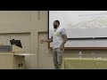

# Feminist Contradictions || Malaysia Lecture 2019 (2019-03-27)

## Description

This is a lecture which aims to showcase some of the epesemic/methodological contradictions of feminism. 
 
It also asks the question - to what extent is Islam compatible with feminism and vice versa?

## Summary of [Feminist Contradictions || Malaysia Lecture 2019](https://www.youtube.com/watch?v=DAa67Pw6Zpg)

*This summary is AI generated - there may be inaccuracies. *

### [00:00:00](https://www.youtube.com/watch?v=DAa67Pw6Zpg&t=0) - [00:45:00](https://www.youtube.com/watch?v=DAa67Pw6Zpg&t=2700)

 discusses contradictions in feminism, specifically focusing on Malaysia's current situation where there is a lack of balance in rights and equality between men and women. It also touches on the issue of maternity leave, which is currently not required in Malaysia but is in England where it is discriminatory. Finally, the speaker discusses the Islamic concept of an all-powerful, all-knowing, and all-wise god, which has exceptions that apply in specific cases.

**[00:00:00](https://www.youtube.com/watch?v=DAa67Pw6Zpg&t=0)** This lecture discusses feminist contradictions in Malaysia, focusing on traditionalist and second-wave assumptions about women and sex. It addresses the problem of dependency, as well as the difference between equity and equality between men and women. Finally, it describes intersectional feminism, which is important for Muslims to understand and use to their advantage.
* **[00:05:00](https://www.youtube.com/watch?v=DAa67Pw6Zpg&t=300)** Second-wave feminists argue that there are biological and anatomical differences between men and women, but ultimately believe that there should be equality between the sexes. Islamic discourse, on the other hand, believes that there should be an equality between men and women in front of the law, with certain exceptions.
* **[00:10:00](https://www.youtube.com/watch?v=DAa67Pw6Zpg&t=600)**  Simone de Beauvoir discusses the inconsistencies between feminism and the idea of equality. She argues that despite physical differences between men and women, there should be equality between the genders. She gives three examples of how this inconsistency can be problematic, including the idea of transgendered athletes.
* **[00:15:00](https://www.youtube.com/watch?v=DAa67Pw6Zpg&t=900)** This feminist argues that, in some cases, feminists want equality of opportunity, but also want equal outcomes, or "equality of outcome." She equates this with "selective invocation," or using arguments selectively to support a particular viewpoint.

The feminist points out that, in some cases, feminists want segregation in sports, in order to give advantage to certain groups, but they also want equality of opportunity. She argues that this isn't consistent, and that feminists need to be more consistent in their positions. She also points out that, in war, there is a higher risk of death and injury, and that feminists should be fighting for equality in all spheres, not just in sports.
* **[00:20:00](https://www.youtube.com/watch?v=DAa67Pw6Zpg&t=1200)**  feminist contradictions are addressed. First, the history of male dominance in the military is discussed. Then, feminism's first principles are discussed, and examples of inconsistencies within the movement are given. Intersectional feminism is introduced, and its negative effects on second-wave feminism are highlighted. Finally, the history of colonization in Malaysia is discussed.
* **[00:25:00](https://www.youtube.com/watch?v=DAa67Pw6Zpg&t=1500)** This lecture discusses how early feminism was divided into "stands" based on how important various aspects of women's lives were to them. One stand, "intersectional feminism," considers not only gender, but also race, class, and sexuality. This perspective has the potential to help women see their lives from a more holistic perspective, and it is often met with resistance from those who prioritize only gender-based issues.
* **[00:30:00](https://www.youtube.com/watch?v=DAa67Pw6Zpg&t=1800)* Discusses contradictions between feminist understandings of gender, Eurocentric understandings of gender, and Islamic understandings of gender. She says that if feminism is true, then it should allow women to consent to be in a patriarchal structure, where their decisions are hidden from male eyes. She argues that obedience is severely curtailed in Islamic households, and that this leaves the woman with much stress.
* **[00:35:00](https://www.youtube.com/watch?v=DAa67Pw6Zpg&t=2100)* Discusses feminist contradictions in Malaysia, specifically highlighting the idea that women should be paid for their role as "wrighters of the family," as well as the problem of gridlock that would result from having equal decision-making power within a relationship.
* **[00:40:00](https://www.youtube.com/watch?v=DAa67Pw6Zpg&t=2400)* Discusses contradictions in feminism, specifically focusing on Malaysia's current situation where there is a lack of balance in rights and equality between men and women. It also touches on the issue of maternity leave, which is currently not required in Malaysia but is in England where it is discriminatory. Finally, the speaker discusses the Islamic concept of an all-powerful, all-knowing, and all-wise god, which has exceptions that apply in specific cases.
* **[00:45:00](https://www.youtube.com/watch?v=DAa67Pw6Zpg&t=2700)* Discusses feminism and contradictions. He points out that, despite the efforts of some feminists, there are still many differences between men and women, and that some feminists consider these differences to be advantages. He advises readers to make a decision about whether they want to submit to the law or not and to escape the "sessional" form of feminism.

<h2>Full transcript with timestamps: CLICK TO EXPAND</h2>

[0:00:00](https://youtu.be/DAa67Pw6Zpg?t=0) it's not you please start off this very  
[0:00:03](https://youtu.be/DAa67Pw6Zpg?t=3) evening by this time a TV sentence and  
[0:00:07](https://youtu.be/DAa67Pw6Zpg?t=7) curtsied also kind of that my dear  
[0:00:14](https://youtu.be/DAa67Pw6Zpg?t=14) friends tonight's event  
[0:00:16](https://youtu.be/DAa67Pw6Zpg?t=16) it is very simply put on poster that we  
[0:00:20](https://youtu.be/DAa67Pw6Zpg?t=20) see abundantly whether it was through  
[0:00:23](https://youtu.be/DAa67Pw6Zpg?t=23) social media through a poster or through  
[0:00:25](https://youtu.be/DAa67Pw6Zpg?t=25) the word of mouth of a very close friend  
[0:00:28](https://youtu.be/DAa67Pw6Zpg?t=28) equality and equity equality or equity  
[0:00:32](https://youtu.be/DAa67Pw6Zpg?t=32) this series or definitions have been  
[0:00:36](https://youtu.be/DAa67Pw6Zpg?t=36) very much sing it out in different movie  
[0:00:39](https://youtu.be/DAa67Pw6Zpg?t=39) winners there example whether if you  
[0:00:41](https://youtu.be/DAa67Pw6Zpg?t=41) keep on speaking of equality these from  
[0:00:43](https://youtu.be/DAa67Pw6Zpg?t=43) your mistakes of people especially in  
[0:00:46](https://youtu.be/DAa67Pw6Zpg?t=46) says rights and opportunity however we  
[0:00:49](https://youtu.be/DAa67Pw6Zpg?t=49) don't do the complicit you're pretending  
[0:00:50](https://youtu.be/DAa67Pw6Zpg?t=50) these are talking about equity is  
[0:00:53](https://youtu.be/DAa67Pw6Zpg?t=53) certainly not the value of shares is you  
[0:00:55](https://youtu.be/DAa67Pw6Zpg?t=55) buy a company however it is truly the  
[0:00:58](https://youtu.be/DAa67Pw6Zpg?t=58) value and tricks of behavior and  
[0:01:02](https://youtu.be/DAa67Pw6Zpg?t=62) impartial equity energy all they are two  
[0:01:05](https://youtu.be/DAa67Pw6Zpg?t=65) very important strategy you start  
[0:01:07](https://youtu.be/DAa67Pw6Zpg?t=67) together exact same effort can make the  
[0:01:10](https://youtu.be/DAa67Pw6Zpg?t=70) hurdle and achieve fairness however what  
[0:01:13](https://youtu.be/DAa67Pw6Zpg?t=73) is the problem what is the problem when  
[0:01:16](https://youtu.be/DAa67Pw6Zpg?t=76) it comes from religious perspective are  
[0:01:18](https://youtu.be/DAa67Pw6Zpg?t=78) we talking about equality and equity  
[0:01:19](https://youtu.be/DAa67Pw6Zpg?t=79) dependents are we talking about equality  
[0:01:22](https://youtu.be/DAa67Pw6Zpg?t=82) equity between men and women I'm talking  
[0:01:26](https://youtu.be/DAa67Pw6Zpg?t=86) about only in equity between two  
[0:01:28](https://youtu.be/DAa67Pw6Zpg?t=88) different parties that are not related  
[0:01:30](https://youtu.be/DAa67Pw6Zpg?t=90) here  
[0:01:31](https://youtu.be/DAa67Pw6Zpg?t=91) now these questions are quite sure to  
[0:01:34](https://youtu.be/DAa67Pw6Zpg?t=94) your mind that you're pretty much  
[0:01:36](https://youtu.be/DAa67Pw6Zpg?t=96) already put in front please first sure  
[0:01:39](https://youtu.be/DAa67Pw6Zpg?t=99) that all your questions especially  
[0:01:41](https://youtu.be/DAa67Pw6Zpg?t=101) questions from our friends from  
[0:01:43](https://youtu.be/DAa67Pw6Zpg?t=103) different faiths are very much  
[0:01:44](https://youtu.be/DAa67Pw6Zpg?t=104) prioritize because this event is  
[0:01:47](https://youtu.be/DAa67Pw6Zpg?t=107) demanding questions that can help us  
[0:01:50](https://youtu.be/DAa67Pw6Zpg?t=110) reach a place of comfort and really try  
[0:01:54](https://youtu.be/DAa67Pw6Zpg?t=114) as much as possible to make sure  
[0:02:09](https://youtu.be/DAa67Pw6Zpg?t=129) earlier today in politics in history  
[0:02:48](https://youtu.be/DAa67Pw6Zpg?t=168) which is currently doing research  
[0:03:05](https://youtu.be/DAa67Pw6Zpg?t=185) University while it gets so the question  
[0:03:38](https://youtu.be/DAa67Pw6Zpg?t=218) on equality or equity and whether one  
[0:03:43](https://youtu.be/DAa67Pw6Zpg?t=223) intell's the other that's the crux of  
[0:03:45](https://youtu.be/DAa67Pw6Zpg?t=225) the question is fresh in relation to  
[0:03:47](https://youtu.be/DAa67Pw6Zpg?t=227) gender or sex or both and will come to  
[0:03:51](https://youtu.be/DAa67Pw6Zpg?t=231) describing the sanctions between those  
[0:03:54](https://youtu.be/DAa67Pw6Zpg?t=234) categories if there are this legs are  
[0:03:57](https://youtu.be/DAa67Pw6Zpg?t=237) going to be divided into three different  
[0:03:58](https://youtu.be/DAa67Pw6Zpg?t=238) parts inshallah the first part is going  
[0:04:03](https://youtu.be/DAa67Pw6Zpg?t=243) to be an examination of the first  
[0:04:06](https://youtu.be/DAa67Pw6Zpg?t=246) principles of feminism and of  
[0:04:10](https://youtu.be/DAa67Pw6Zpg?t=250) traditionalist Islam the second part of  
[0:04:14](https://youtu.be/DAa67Pw6Zpg?t=254) the  
[0:04:14](https://youtu.be/DAa67Pw6Zpg?t=254) lecture will be what I deem our  
[0:04:18](https://youtu.be/DAa67Pw6Zpg?t=258) inconsistencies in the application of  
[0:04:22](https://youtu.be/DAa67Pw6Zpg?t=262) those first principles and the third  
[0:04:25](https://youtu.be/DAa67Pw6Zpg?t=265) part of this lecture will be talking  
[0:04:28](https://youtu.be/DAa67Pw6Zpg?t=268) about what's referred to as  
[0:04:29](https://youtu.be/DAa67Pw6Zpg?t=269) intersectional feminism and that's going  
[0:04:32](https://youtu.be/DAa67Pw6Zpg?t=272) to be an important part of this lecture  
[0:04:34](https://youtu.be/DAa67Pw6Zpg?t=274) and it's important for the Muslim  
[0:04:35](https://youtu.be/DAa67Pw6Zpg?t=275) community to know what that means  
[0:04:37](https://youtu.be/DAa67Pw6Zpg?t=277) and how it can be effective both for us  
[0:04:42](https://youtu.be/DAa67Pw6Zpg?t=282) and how it's contradictory in many ways  
[0:04:47](https://youtu.be/DAa67Pw6Zpg?t=287) as well so to draw kind of like um a  
[0:04:52](https://youtu.be/DAa67Pw6Zpg?t=292) generic sketch of what second wave in  
[0:04:57](https://youtu.be/DAa67Pw6Zpg?t=297) particular second wave feminist  
[0:04:58](https://youtu.be/DAa67Pw6Zpg?t=298) assumptions Intel and I've made this  
[0:05:02](https://youtu.be/DAa67Pw6Zpg?t=302) point before and many other lectures the  
[0:05:05](https://youtu.be/DAa67Pw6Zpg?t=305) idea is that there are biological and  
[0:05:09](https://youtu.be/DAa67Pw6Zpg?t=309) anatomical differences between men and  
[0:05:12](https://youtu.be/DAa67Pw6Zpg?t=312) women but despite those differences a  
[0:05:14](https://youtu.be/DAa67Pw6Zpg?t=314) second where feminists would argue like  
[0:05:16](https://youtu.be/DAa67Pw6Zpg?t=316) Simone de Beauvoir famously argued there  
[0:05:18](https://youtu.be/DAa67Pw6Zpg?t=318) should be equality of opportunity this  
[0:05:21](https://youtu.be/DAa67Pw6Zpg?t=321) is the presupposition now before I start  
[0:05:26](https://youtu.be/DAa67Pw6Zpg?t=326) talking about this in more depth it's  
[0:05:28](https://youtu.be/DAa67Pw6Zpg?t=328) important to note that feminism and  
[0:05:30](https://youtu.be/DAa67Pw6Zpg?t=330) women's rights are not interchangeable  
[0:05:32](https://youtu.be/DAa67Pw6Zpg?t=332) terms feminism is a political ideology  
[0:05:36](https://youtu.be/DAa67Pw6Zpg?t=336) which most of which has has its writings  
[0:05:41](https://youtu.be/DAa67Pw6Zpg?t=341) based in the Western Hemisphere  
[0:05:44](https://youtu.be/DAa67Pw6Zpg?t=344) some say it's divided into three waves  
[0:05:47](https://youtu.be/DAa67Pw6Zpg?t=347) and it has its own conceptions of  
[0:05:51](https://youtu.be/DAa67Pw6Zpg?t=351) women's rights it does not have a  
[0:05:54](https://youtu.be/DAa67Pw6Zpg?t=354) monopoly of that so you can have a non  
[0:05:57](https://youtu.be/DAa67Pw6Zpg?t=357) feminist understanding of women's rights  
[0:06:01](https://youtu.be/DAa67Pw6Zpg?t=361) and that's a possibility because to  
[0:06:05](https://youtu.be/DAa67Pw6Zpg?t=365) argue otherwise we'll be arguing  
[0:06:06](https://youtu.be/DAa67Pw6Zpg?t=366) actually in a circle or we had circular  
[0:06:08](https://youtu.be/DAa67Pw6Zpg?t=368) argument so  
[0:06:12](https://youtu.be/DAa67Pw6Zpg?t=372) when we say as Muslims that there are  
[0:06:15](https://youtu.be/DAa67Pw6Zpg?t=375) tensions and contradictions and this  
[0:06:17](https://youtu.be/DAa67Pw6Zpg?t=377) will this is definitely something we're  
[0:06:19](https://youtu.be/DAa67Pw6Zpg?t=379) going to put forward today between  
[0:06:20](https://youtu.be/DAa67Pw6Zpg?t=380) especially second-wave feminists ik  
[0:06:22](https://youtu.be/DAa67Pw6Zpg?t=382) discourse and traditionalists Islamic  
[0:06:25](https://youtu.be/DAa67Pw6Zpg?t=385) discourse this is an important note to  
[0:06:30](https://youtu.be/DAa67Pw6Zpg?t=390) make that we are not saying that from a  
[0:06:33](https://youtu.be/DAa67Pw6Zpg?t=393) traditional Islamic perspective from our  
[0:06:35](https://youtu.be/DAa67Pw6Zpg?t=395) perspective as Muslims we're against  
[0:06:37](https://youtu.be/DAa67Pw6Zpg?t=397) women's rights we cannot say this  
[0:06:40](https://youtu.be/DAa67Pw6Zpg?t=400) because the Quran is very clear about  
[0:06:43](https://youtu.be/DAa67Pw6Zpg?t=403) the fact that women's rights is a  
[0:06:45](https://youtu.be/DAa67Pw6Zpg?t=405) project it's something that Muslims must  
[0:06:49](https://youtu.be/DAa67Pw6Zpg?t=409) adhere to just like men's rights just  
[0:06:55](https://youtu.be/DAa67Pw6Zpg?t=415) like the deity's rights allows rights  
[0:06:57](https://youtu.be/DAa67Pw6Zpg?t=417) animal rights and so on and so a Muslim  
[0:07:03](https://youtu.be/DAa67Pw6Zpg?t=423) cannot say we're against women's rights  
[0:07:04](https://youtu.be/DAa67Pw6Zpg?t=424) this is actually counter textual it goes  
[0:07:08](https://youtu.be/DAa67Pw6Zpg?t=428) against the sacred Texas this the sacred  
[0:07:11](https://youtu.be/DAa67Pw6Zpg?t=431) texts for example where lots of Hanna  
[0:07:15](https://youtu.be/DAa67Pw6Zpg?t=435) harlots is no Quran in the law halay of  
[0:07:16](https://youtu.be/DAa67Pw6Zpg?t=436) the emblem and I mean come in Becker in  
[0:07:19](https://youtu.be/DAa67Pw6Zpg?t=439) alpha Bob local min Bob that certainly  
[0:07:22](https://youtu.be/DAa67Pw6Zpg?t=442) Allah does not let to waste any deed of  
[0:07:27](https://youtu.be/DAa67Pw6Zpg?t=447) those who does good from you whether  
[0:07:31](https://youtu.be/DAa67Pw6Zpg?t=451) you're a man or a woman and both of you  
[0:07:34](https://youtu.be/DAa67Pw6Zpg?t=454) are from each other in other words there  
[0:07:39](https://youtu.be/DAa67Pw6Zpg?t=459) is an equality in spiritual opportunity  
[0:07:42](https://youtu.be/DAa67Pw6Zpg?t=462) between men and women and Islam and  
[0:07:45](https://youtu.be/DAa67Pw6Zpg?t=465) there even is a general equality in  
[0:07:48](https://youtu.be/DAa67Pw6Zpg?t=468) front of the law because the Prophet  
[0:07:51](https://youtu.be/DAa67Pw6Zpg?t=471) Muhammad sallallaahu arias alum he says  
[0:07:52](https://youtu.be/DAa67Pw6Zpg?t=472) in them and he said was a higher court  
[0:07:54](https://youtu.be/DAa67Pw6Zpg?t=474) region and he said this in the context  
[0:07:57](https://youtu.be/DAa67Pw6Zpg?t=477) where a woman was doing the prophets  
[0:07:59](https://youtu.be/DAa67Pw6Zpg?t=479) wife was doing with law and she asked is  
[0:08:01](https://youtu.be/DAa67Pw6Zpg?t=481) it the same for men and women so he  
[0:08:04](https://youtu.be/DAa67Pw6Zpg?t=484) turned around he says certainly in them  
[0:08:07](https://youtu.be/DAa67Pw6Zpg?t=487) and he sell she - agenda it's the same  
[0:08:09](https://youtu.be/DAa67Pw6Zpg?t=489) for men and women women men and women  
[0:08:10](https://youtu.be/DAa67Pw6Zpg?t=490) are equal in this regards meaning in  
[0:08:13](https://youtu.be/DAa67Pw6Zpg?t=493) front of the law now this is a general  
[0:08:16](https://youtu.be/DAa67Pw6Zpg?t=496) equality but of course the tensions will  
[0:08:19](https://youtu.be/DAa67Pw6Zpg?t=499) arise when we say we'll hold on there  
[0:08:21](https://youtu.be/DAa67Pw6Zpg?t=501) are exceptions  
[0:08:23](https://youtu.be/DAa67Pw6Zpg?t=503) according to Islamic jurisprudence for  
[0:08:26](https://youtu.be/DAa67Pw6Zpg?t=506) example what women wear is different to  
[0:08:29](https://youtu.be/DAa67Pw6Zpg?t=509) what women what men wear there is a from  
[0:08:33](https://youtu.be/DAa67Pw6Zpg?t=513) an Islamic perspective a justified  
[0:08:35](https://youtu.be/DAa67Pw6Zpg?t=515) binary between men and women we should  
[0:08:36](https://youtu.be/DAa67Pw6Zpg?t=516) start by saying that that we do believe  
[0:08:38](https://youtu.be/DAa67Pw6Zpg?t=518) in the category of man and the category  
[0:08:42](https://youtu.be/DAa67Pw6Zpg?t=522) of woman and that there are certain  
[0:08:44](https://youtu.be/DAa67Pw6Zpg?t=524) regulations that apply to men that don't  
[0:08:47](https://youtu.be/DAa67Pw6Zpg?t=527) apply to women and vice-versa  
[0:08:49](https://youtu.be/DAa67Pw6Zpg?t=529) and those are the exception to the rule  
[0:08:51](https://youtu.be/DAa67Pw6Zpg?t=531) of equality now if you pick up a locker  
[0:08:57](https://youtu.be/DAa67Pw6Zpg?t=537) maybe a popular book on feminism like  
[0:09:02](https://youtu.be/DAa67Pw6Zpg?t=542) this one when we go to in the UK a books  
[0:09:05](https://youtu.be/DAa67Pw6Zpg?t=545) bookstore there they're almost like  
[0:09:08](https://youtu.be/DAa67Pw6Zpg?t=548) right next to that where you're going to  
[0:09:09](https://youtu.be/DAa67Pw6Zpg?t=549) pay the money for the book it's like  
[0:09:11](https://youtu.be/DAa67Pw6Zpg?t=551) forcing you to buy it  
[0:09:12](https://youtu.be/DAa67Pw6Zpg?t=552) what's this book a it's a it's a it's a  
[0:09:15](https://youtu.be/DAa67Pw6Zpg?t=555) new popular it's not really an academic  
[0:09:16](https://youtu.be/DAa67Pw6Zpg?t=556) work it's called the feminist manifesto  
[0:09:19](https://youtu.be/DAa67Pw6Zpg?t=559) my Anu Ghazi she's very famous now in  
[0:09:22](https://youtu.be/DAa67Pw6Zpg?t=562) terms of popular feminists and in the  
[0:09:25](https://youtu.be/DAa67Pw6Zpg?t=565) front like things the first five pages  
[0:09:27](https://youtu.be/DAa67Pw6Zpg?t=567) or something she candidly makes it clear  
[0:09:29](https://youtu.be/DAa67Pw6Zpg?t=569) that we believe in an absolute equality  
[0:09:32](https://youtu.be/DAa67Pw6Zpg?t=572) where there's no exception whatsoever  
[0:09:35](https://youtu.be/DAa67Pw6Zpg?t=575) there's no exception whatsoever and I  
[0:09:38](https://youtu.be/DAa67Pw6Zpg?t=578) think she made the exception of breast  
[0:09:39](https://youtu.be/DAa67Pw6Zpg?t=579) milk and she talked about what breast  
[0:09:42](https://youtu.be/DAa67Pw6Zpg?t=582) milk might be an exception but this is  
[0:09:44](https://youtu.be/DAa67Pw6Zpg?t=584) that in the other right now this brings  
[0:09:51](https://youtu.be/DAa67Pw6Zpg?t=591) us to our first point in examining  
[0:09:54](https://youtu.be/DAa67Pw6Zpg?t=594) especially second wave feminists ik  
[0:09:56](https://youtu.be/DAa67Pw6Zpg?t=596) discourse it's clear the premises the  
[0:10:01](https://youtu.be/DAa67Pw6Zpg?t=601) premises there are physical differences  
[0:10:04](https://youtu.be/DAa67Pw6Zpg?t=604) Simone de Beauvoir makes that candidly  
[0:10:06](https://youtu.be/DAa67Pw6Zpg?t=606) clear there are physical differences  
[0:10:09](https://youtu.be/DAa67Pw6Zpg?t=609) between men and women we know them we're  
[0:10:13](https://youtu.be/DAa67Pw6Zpg?t=613) not ignorant to them  
[0:10:14](https://youtu.be/DAa67Pw6Zpg?t=614) she even mentions emotional differences  
[0:10:16](https://youtu.be/DAa67Pw6Zpg?t=616) in her book the second sex in her chats  
[0:10:20](https://youtu.be/DAa67Pw6Zpg?t=620) on biology she says even biological  
[0:10:22](https://youtu.be/DAa67Pw6Zpg?t=622) differences anatomical differences  
[0:10:24](https://youtu.be/DAa67Pw6Zpg?t=624) physiological differences psychological  
[0:10:27](https://youtu.be/DAa67Pw6Zpg?t=627) differences emotional differences but  
[0:10:29](https://youtu.be/DAa67Pw6Zpg?t=629) the argument goes as follows despite  
[0:10:30](https://youtu.be/DAa67Pw6Zpg?t=630) those differences there should be  
[0:10:33](https://youtu.be/DAa67Pw6Zpg?t=633) equality  
[0:10:35](https://youtu.be/DAa67Pw6Zpg?t=635) does that make sense so far so if a  
[0:10:38](https://youtu.be/DAa67Pw6Zpg?t=638) second wave feminist would say despite  
[0:10:41](https://youtu.be/DAa67Pw6Zpg?t=641) those differences there should be  
[0:10:43](https://youtu.be/DAa67Pw6Zpg?t=643) equality afforded  
[0:10:45](https://youtu.be/DAa67Pw6Zpg?t=645) what kind of equality political equality  
[0:10:48](https://youtu.be/DAa67Pw6Zpg?t=648) social equality economic equality this  
[0:10:53](https://youtu.be/DAa67Pw6Zpg?t=653) is pretty much in a nutshell what the  
[0:10:57](https://youtu.be/DAa67Pw6Zpg?t=657) argument is now obviously one could  
[0:10:59](https://youtu.be/DAa67Pw6Zpg?t=659) justifiably ask what's the proof of that  
[0:11:02](https://youtu.be/DAa67Pw6Zpg?t=662) what's the evidence for that why should  
[0:11:05](https://youtu.be/DAa67Pw6Zpg?t=665) that be the case how's that entailment  
[0:11:07](https://youtu.be/DAa67Pw6Zpg?t=667) made from first principles Rousseff and  
[0:11:12](https://youtu.be/DAa67Pw6Zpg?t=672) supports how can you justify that and  
[0:11:16](https://youtu.be/DAa67Pw6Zpg?t=676) that's really not a question that there  
[0:11:19](https://youtu.be/DAa67Pw6Zpg?t=679) is any answer to frankly well that there  
[0:11:21](https://youtu.be/DAa67Pw6Zpg?t=681) is any formula given for us on how to  
[0:11:23](https://youtu.be/DAa67Pw6Zpg?t=683) answer those questions however and this  
[0:11:29](https://youtu.be/DAa67Pw6Zpg?t=689) is moving on now to the second part of  
[0:11:31](https://youtu.be/DAa67Pw6Zpg?t=691) the lecture which I spend a little bit  
[0:11:32](https://youtu.be/DAa67Pw6Zpg?t=692) of time on are we consistent or are  
[0:11:39](https://youtu.be/DAa67Pw6Zpg?t=699) feminists consistent in particular  
[0:11:42](https://youtu.be/DAa67Pw6Zpg?t=702) second where families are they  
[0:11:43](https://youtu.be/DAa67Pw6Zpg?t=703) consistent in the application of those  
[0:11:47](https://youtu.be/DAa67Pw6Zpg?t=707) principles now there are three things  
[0:11:50](https://youtu.be/DAa67Pw6Zpg?t=710) three live examples I want to give you  
[0:11:54](https://youtu.be/DAa67Pw6Zpg?t=714) to show you how problematic these  
[0:11:57](https://youtu.be/DAa67Pw6Zpg?t=717) assumptions are for feminists the first  
[0:12:00](https://youtu.be/DAa67Pw6Zpg?t=720) one relates and I'm sure many of you  
[0:12:02](https://youtu.be/DAa67Pw6Zpg?t=722) might have been exposed to this it's a  
[0:12:06](https://youtu.be/DAa67Pw6Zpg?t=726) big thing on the news now actually  
[0:12:07](https://youtu.be/DAa67Pw6Zpg?t=727) that's why I'm bringing it up it's the  
[0:12:09](https://youtu.be/DAa67Pw6Zpg?t=729) idea of transgendered sports now I'm not  
[0:12:14](https://youtu.be/DAa67Pw6Zpg?t=734) sure if this is kind of them spill over  
[0:12:16](https://youtu.be/DAa67Pw6Zpg?t=736) to Malaysia but this is certainly  
[0:12:19](https://youtu.be/DAa67Pw6Zpg?t=739) something a hot topic in the West in  
[0:12:21](https://youtu.be/DAa67Pw6Zpg?t=741) America and in the UK Western Europe the  
[0:12:24](https://youtu.be/DAa67Pw6Zpg?t=744) question is say for instance you have  
[0:12:27](https://youtu.be/DAa67Pw6Zpg?t=747) someone who identifies and who is  
[0:12:30](https://youtu.be/DAa67Pw6Zpg?t=750) identified biologically as a man they do  
[0:12:34](https://youtu.be/DAa67Pw6Zpg?t=754) a gender reassignment surgery and they  
[0:12:37](https://youtu.be/DAa67Pw6Zpg?t=757) become self-identified as a woman okay  
[0:12:42](https://youtu.be/DAa67Pw6Zpg?t=762) so they do a gender reassignment surgery  
[0:12:44](https://youtu.be/DAa67Pw6Zpg?t=764) and they become self-identified as a  
[0:12:47](https://youtu.be/DAa67Pw6Zpg?t=767) woman  
[0:12:48](https://youtu.be/DAa67Pw6Zpg?t=768) can they participate in sports with  
[0:12:52](https://youtu.be/DAa67Pw6Zpg?t=772) women now second wave feminists on the  
[0:12:56](https://youtu.be/DAa67Pw6Zpg?t=776) whole seem adverse to the idea now you  
[0:12:59](https://youtu.be/DAa67Pw6Zpg?t=779) can't make a generalization with  
[0:13:00](https://youtu.be/DAa67Pw6Zpg?t=780) anything but big-time second wave  
[0:13:03](https://youtu.be/DAa67Pw6Zpg?t=783) feminists like Germaine Greer who wrote  
[0:13:05](https://youtu.be/DAa67Pw6Zpg?t=785) the book in 1971 the Female Eunuch she's  
[0:13:08](https://youtu.be/DAa67Pw6Zpg?t=788) like one of the founding mothers of  
[0:13:12](https://youtu.be/DAa67Pw6Zpg?t=792) feminism and she in an interview she  
[0:13:16](https://youtu.be/DAa67Pw6Zpg?t=796) completely rejected the idea and guess  
[0:13:19](https://youtu.be/DAa67Pw6Zpg?t=799) what she invoked she invoked anatomical  
[0:13:23](https://youtu.be/DAa67Pw6Zpg?t=803) and biological advantage wait a minute  
[0:13:27](https://youtu.be/DAa67Pw6Zpg?t=807) hold on now  
[0:13:29](https://youtu.be/DAa67Pw6Zpg?t=809) hold on now let me hear the argument yes  
[0:13:35](https://youtu.be/DAa67Pw6Zpg?t=815) so the argument goes now since the  
[0:13:38](https://youtu.be/DAa67Pw6Zpg?t=818) person and this is a very sensible  
[0:13:40](https://youtu.be/DAa67Pw6Zpg?t=820) argument to me as a non feminist right  
[0:13:43](https://youtu.be/DAa67Pw6Zpg?t=823) the argument goes since men have  
[0:13:47](https://youtu.be/DAa67Pw6Zpg?t=827) anatomical biological advantages  
[0:13:50](https://youtu.be/DAa67Pw6Zpg?t=830) hormonal advantages and even haven't  
[0:13:54](https://youtu.be/DAa67Pw6Zpg?t=834) gone through that process and then the  
[0:13:58](https://youtu.be/DAa67Pw6Zpg?t=838) assignment the gender reassignment  
[0:13:59](https://youtu.be/DAa67Pw6Zpg?t=839) happens if they now compete with women  
[0:14:02](https://youtu.be/DAa67Pw6Zpg?t=842) it will give them an unfair advantage  
[0:14:05](https://youtu.be/DAa67Pw6Zpg?t=845) and it will give them an entitled of a  
[0:14:08](https://youtu.be/DAa67Pw6Zpg?t=848) privileged position in that context wait  
[0:14:12](https://youtu.be/DAa67Pw6Zpg?t=852) a minute this is important now I thought  
[0:14:16](https://youtu.be/DAa67Pw6Zpg?t=856) you said sex was not sex because that's  
[0:14:20](https://youtu.be/DAa67Pw6Zpg?t=860) a third wave construct some say that sex  
[0:14:23](https://youtu.be/DAa67Pw6Zpg?t=863) is a social construct Judith Butler  
[0:14:25](https://youtu.be/DAa67Pw6Zpg?t=865) hinted to this in her book gender  
[0:14:26](https://youtu.be/DAa67Pw6Zpg?t=866) troubles 1990 but not this some do say  
[0:14:30](https://youtu.be/DAa67Pw6Zpg?t=870) that I thought you said gender was a  
[0:14:33](https://youtu.be/DAa67Pw6Zpg?t=873) social construct no and you know it  
[0:14:39](https://youtu.be/DAa67Pw6Zpg?t=879) becomes even more problematic do you  
[0:14:42](https://youtu.be/DAa67Pw6Zpg?t=882) know when it becomes more problematic  
[0:14:43](https://youtu.be/DAa67Pw6Zpg?t=883) when we start to see so the question is  
[0:14:48](https://youtu.be/DAa67Pw6Zpg?t=888) now should there be an equality of  
[0:14:49](https://youtu.be/DAa67Pw6Zpg?t=889) opportunity for men and women  
[0:14:54](https://youtu.be/DAa67Pw6Zpg?t=894) in certain sports should we or should we  
[0:14:59](https://youtu.be/DAa67Pw6Zpg?t=899) segregate and separate them you don't  
[0:15:04](https://youtu.be/DAa67Pw6Zpg?t=904) like segregation but you have it in  
[0:15:06](https://youtu.be/DAa67Pw6Zpg?t=906) sports but no no it's justified for  
[0:15:09](https://youtu.be/DAa67Pw6Zpg?t=909) anatomical and biological reasons so  
[0:15:11](https://youtu.be/DAa67Pw6Zpg?t=911) you're saying they're on biological and  
[0:15:14](https://youtu.be/DAa67Pw6Zpg?t=914) anatomical grounds you can justify  
[0:15:16](https://youtu.be/DAa67Pw6Zpg?t=916) separation well hold on now but men will  
[0:15:21](https://youtu.be/DAa67Pw6Zpg?t=921) be given an advantage why don't you make  
[0:15:24](https://youtu.be/DAa67Pw6Zpg?t=924) that argument in all context of  
[0:15:27](https://youtu.be/DAa67Pw6Zpg?t=927) categories for instance if you look at  
[0:15:30](https://youtu.be/DAa67Pw6Zpg?t=930) the 100-meter dash and I made this  
[0:15:34](https://youtu.be/DAa67Pw6Zpg?t=934) argument before I make here again the  
[0:15:36](https://youtu.be/DAa67Pw6Zpg?t=936) 100 meter sprints in the last 100 years  
[0:15:38](https://youtu.be/DAa67Pw6Zpg?t=938) I don't know of one white man who's won  
[0:15:41](https://youtu.be/DAa67Pw6Zpg?t=941) that no I don't know I don't know of one  
[0:15:47](https://youtu.be/DAa67Pw6Zpg?t=947) white man that's one that it's dominated  
[0:15:49](https://youtu.be/DAa67Pw6Zpg?t=949) by black people no only just black  
[0:15:51](https://youtu.be/DAa67Pw6Zpg?t=951) people West Africans and Jamaicans  
[0:15:55](https://youtu.be/DAa67Pw6Zpg?t=955) should we separate the blacks from the  
[0:15:57](https://youtu.be/DAa67Pw6Zpg?t=957) whites now if you say we shouldn't  
[0:16:01](https://youtu.be/DAa67Pw6Zpg?t=961) separate the blacks from the whites  
[0:16:03](https://youtu.be/DAa67Pw6Zpg?t=963) you're contradicting yourself you know  
[0:16:05](https://youtu.be/DAa67Pw6Zpg?t=965) why because you said in cases where  
[0:16:08](https://youtu.be/DAa67Pw6Zpg?t=968) there is biological and anatomical  
[0:16:11](https://youtu.be/DAa67Pw6Zpg?t=971) advantages for one category of person  
[0:16:14](https://youtu.be/DAa67Pw6Zpg?t=974) over another category of person there  
[0:16:17](https://youtu.be/DAa67Pw6Zpg?t=977) should be separation so why should that  
[0:16:19](https://youtu.be/DAa67Pw6Zpg?t=979) be the case only for gender why  
[0:16:22](https://youtu.be/DAa67Pw6Zpg?t=982) shouldn't it also be the case for race  
[0:16:24](https://youtu.be/DAa67Pw6Zpg?t=984) because you've recalled racist  
[0:16:26](https://youtu.be/DAa67Pw6Zpg?t=986) this is selective invocation you see  
[0:16:30](https://youtu.be/DAa67Pw6Zpg?t=990) they are not even consistent with their  
[0:16:33](https://youtu.be/DAa67Pw6Zpg?t=993) principles East Africans are very good  
[0:16:37](https://youtu.be/DAa67Pw6Zpg?t=997) at long-distance you know we have  
[0:16:39](https://youtu.be/DAa67Pw6Zpg?t=999) someone called noir Farah very good  
[0:16:42](https://youtu.be/DAa67Pw6Zpg?t=1002) runner you know they have an advantage  
[0:16:46](https://youtu.be/DAa67Pw6Zpg?t=1006) East Africans both early they have a  
[0:16:48](https://youtu.be/DAa67Pw6Zpg?t=1008) broadening advantage white people have  
[0:16:51](https://youtu.be/DAa67Pw6Zpg?t=1011) an advantage in something swimming and I  
[0:16:53](https://youtu.be/DAa67Pw6Zpg?t=1013) want to be controversial but I've never  
[0:16:55](https://youtu.be/DAa67Pw6Zpg?t=1015) seen a black man win that swimming race  
[0:16:57](https://youtu.be/DAa67Pw6Zpg?t=1017) I was a hallmark of Michael Phelps how  
[0:17:00](https://youtu.be/DAa67Pw6Zpg?t=1020) many sounds is in you on it  
[0:17:02](https://youtu.be/DAa67Pw6Zpg?t=1022) while we're gonna separate the blacks  
[0:17:04](https://youtu.be/DAa67Pw6Zpg?t=1024) from the whites we're not gonna separate  
[0:17:06](https://youtu.be/DAa67Pw6Zpg?t=1026) the blacks from the whites so what kind  
[0:17:09](https://youtu.be/DAa67Pw6Zpg?t=1029) of record did you wanna so some  
[0:17:11](https://youtu.be/DAa67Pw6Zpg?t=1031) feminists would say we want equality of  
[0:17:13](https://youtu.be/DAa67Pw6Zpg?t=1033) opportunity and some would actually say  
[0:17:16](https://youtu.be/DAa67Pw6Zpg?t=1036) we want equality of outcome what all  
[0:17:23](https://youtu.be/DAa67Pw6Zpg?t=1043) right so yeah someone's saying we want  
[0:17:25](https://youtu.be/DAa67Pw6Zpg?t=1045) an equality of opportunity but almost  
[0:17:29](https://youtu.be/DAa67Pw6Zpg?t=1049) all feminists would say that in fact so  
[0:17:32](https://youtu.be/DAa67Pw6Zpg?t=1052) why don't you have an equality of  
[0:17:33](https://youtu.be/DAa67Pw6Zpg?t=1053) opportunity in sports  
[0:17:38](https://youtu.be/DAa67Pw6Zpg?t=1058) why don't we arrange parameters that  
[0:17:41](https://youtu.be/DAa67Pw6Zpg?t=1061) mean that people of the same weight  
[0:17:44](https://youtu.be/DAa67Pw6Zpg?t=1064) whether they're men and women they go  
[0:17:47](https://youtu.be/DAa67Pw6Zpg?t=1067) together in competition we could do that  
[0:17:53](https://youtu.be/DAa67Pw6Zpg?t=1073) it's not difficult it's not difficult in  
[0:17:57](https://youtu.be/DAa67Pw6Zpg?t=1077) boxing for example you don't think  
[0:17:59](https://youtu.be/DAa67Pw6Zpg?t=1079) there's 75 kilogram women that's the  
[0:18:02](https://youtu.be/DAa67Pw6Zpg?t=1082) most popular category for men let's  
[0:18:04](https://youtu.be/DAa67Pw6Zpg?t=1084) bring them together right you want  
[0:18:06](https://youtu.be/DAa67Pw6Zpg?t=1086) equality of opportunity no but that's  
[0:18:08](https://youtu.be/DAa67Pw6Zpg?t=1088) advantage men but the way he said the  
[0:18:11](https://youtu.be/DAa67Pw6Zpg?t=1091) anatomical thing you see it is really  
[0:18:13](https://youtu.be/DAa67Pw6Zpg?t=1093) problematic you have segregation  
[0:18:16](https://youtu.be/DAa67Pw6Zpg?t=1096) acquiesce segregation in some spheres  
[0:18:23](https://youtu.be/DAa67Pw6Zpg?t=1103) where are the feminists we need we need  
[0:18:28](https://youtu.be/DAa67Pw6Zpg?t=1108) a sign against this seriously if your  
[0:18:32](https://youtu.be/DAa67Pw6Zpg?t=1112) preview are principally averse to a  
[0:18:35](https://youtu.be/DAa67Pw6Zpg?t=1115) biological anatomical arguments arranged  
[0:18:39](https://youtu.be/DAa67Pw6Zpg?t=1119) parameters which does not discriminate  
[0:18:43](https://youtu.be/DAa67Pw6Zpg?t=1123) on gender in the field of sports but  
[0:18:46](https://youtu.be/DAa67Pw6Zpg?t=1126) they'll never do that because it's not  
[0:18:49](https://youtu.be/DAa67Pw6Zpg?t=1129) about equality  
[0:18:51](https://youtu.be/DAa67Pw6Zpg?t=1131) it's about entitlement it's about where  
[0:18:55](https://youtu.be/DAa67Pw6Zpg?t=1135) can we find the advantages that's the  
[0:18:59](https://youtu.be/DAa67Pw6Zpg?t=1139) problem  
[0:19:00](https://youtu.be/DAa67Pw6Zpg?t=1140) and this case becomes more exacerbated  
[0:19:04](https://youtu.be/DAa67Pw6Zpg?t=1144) when we look at war we need to rectify  
[0:19:09](https://youtu.be/DAa67Pw6Zpg?t=1149) the social ills problems of the past  
[0:19:15](https://youtu.be/DAa67Pw6Zpg?t=1155) patriarchal society and we need to have  
[0:19:20](https://youtu.be/DAa67Pw6Zpg?t=1160) equality of opportunity in all spheres  
[0:19:24](https://youtu.be/DAa67Pw6Zpg?t=1164) in all industries political social and  
[0:19:26](https://youtu.be/DAa67Pw6Zpg?t=1166) economic there should be absolutely no  
[0:19:30](https://youtu.be/DAa67Pw6Zpg?t=1170) exception to that but war that entails  
[0:19:35](https://youtu.be/DAa67Pw6Zpg?t=1175) death that entails injury we don't  
[0:19:40](https://youtu.be/DAa67Pw6Zpg?t=1180) really know about that one I've never  
[0:19:44](https://youtu.be/DAa67Pw6Zpg?t=1184) actually come across their movements  
[0:19:49](https://youtu.be/DAa67Pw6Zpg?t=1189) that aims to rectify a historic  
[0:19:54](https://youtu.be/DAa67Pw6Zpg?t=1194) accumulation of gender discrimination  
[0:20:00](https://youtu.be/DAa67Pw6Zpg?t=1200) against men in the field of war almost  
[0:20:05](https://youtu.be/DAa67Pw6Zpg?t=1205) every military in every country in the  
[0:20:09](https://youtu.be/DAa67Pw6Zpg?t=1209) world in all of history has been  
[0:20:11](https://youtu.be/DAa67Pw6Zpg?t=1211) male-dominated men have died now if  
[0:20:15](https://youtu.be/DAa67Pw6Zpg?t=1215) we're being honest we should say that's  
[0:20:19](https://youtu.be/DAa67Pw6Zpg?t=1219) a severe matriarchy you have force meant  
[0:20:23](https://youtu.be/DAa67Pw6Zpg?t=1223) to be society inclined or forced to kill  
[0:20:27](https://youtu.be/DAa67Pw6Zpg?t=1227) themselves and fight themselves so for  
[0:20:31](https://youtu.be/DAa67Pw6Zpg?t=1231) the protection of the country so on  
[0:20:33](https://youtu.be/DAa67Pw6Zpg?t=1233) feminism if there's an equality of  
[0:20:35](https://youtu.be/DAa67Pw6Zpg?t=1235) opportunity we should address that  
[0:20:37](https://youtu.be/DAa67Pw6Zpg?t=1237) historic discrimination and we should  
[0:20:41](https://youtu.be/DAa67Pw6Zpg?t=1241) look at all the walls now men were  
[0:20:43](https://youtu.be/DAa67Pw6Zpg?t=1243) dominating the armies in them and we  
[0:20:46](https://youtu.be/DAa67Pw6Zpg?t=1246) should have female only conscription and  
[0:20:51](https://youtu.be/DAa67Pw6Zpg?t=1251) draft forcing the women to fight for the  
[0:20:54](https://youtu.be/DAa67Pw6Zpg?t=1254) men for at least the amount of time that  
[0:20:56](https://youtu.be/DAa67Pw6Zpg?t=1256) would equalize the historic imbalance no  
[0:21:02](https://youtu.be/DAa67Pw6Zpg?t=1262) but brother  
[0:21:05](https://youtu.be/DAa67Pw6Zpg?t=1265) [Music]  
[0:21:36](https://youtu.be/DAa67Pw6Zpg?t=1296) what about the dangerous shows which  
[0:21:40](https://youtu.be/DAa67Pw6Zpg?t=1300) have been flooded by males men is that  
[0:21:47](https://youtu.be/DAa67Pw6Zpg?t=1307) HIV or is the actual matriarch what's  
[0:21:50](https://youtu.be/DAa67Pw6Zpg?t=1310) your color Mecca felt the need to go to  
[0:21:54](https://youtu.be/DAa67Pw6Zpg?t=1314) mining talks doing all kinds of  
[0:21:59](https://youtu.be/DAa67Pw6Zpg?t=1319) dangerous work the whole spa so if we're  
[0:22:03](https://youtu.be/DAa67Pw6Zpg?t=1323) going to go to the Equality premise  
[0:22:05](https://youtu.be/DAa67Pw6Zpg?t=1325) should we rectify that the problem is  
[0:22:09](https://youtu.be/DAa67Pw6Zpg?t=1329) guys it's just too selective you choose  
[0:22:14](https://youtu.be/DAa67Pw6Zpg?t=1334) want to be absolutely equal and you  
[0:22:17](https://youtu.be/DAa67Pw6Zpg?t=1337) choose you're in session this is the  
[0:22:20](https://youtu.be/DAa67Pw6Zpg?t=1340) father  
[0:22:22](https://youtu.be/DAa67Pw6Zpg?t=1342) so these are some clear examples of  
[0:22:25](https://youtu.be/DAa67Pw6Zpg?t=1345) inconsistencies even using the first  
[0:22:28](https://youtu.be/DAa67Pw6Zpg?t=1348) principles of feminism even using  
[0:22:31](https://youtu.be/DAa67Pw6Zpg?t=1351) exactly what they're talking about  
[0:22:35](https://youtu.be/DAa67Pw6Zpg?t=1355) now we've monogamous discussion I want  
[0:22:42](https://youtu.be/DAa67Pw6Zpg?t=1362) to talk about something which recently  
[0:22:44](https://youtu.be/DAa67Pw6Zpg?t=1364) has come about which is called  
[0:22:46](https://youtu.be/DAa67Pw6Zpg?t=1366) intersectional feminism and this is  
[0:22:50](https://youtu.be/DAa67Pw6Zpg?t=1370) coined a tournament was called by  
[0:22:52](https://youtu.be/DAa67Pw6Zpg?t=1372) someone called kimberlé crenshaw  
[0:22:55](https://youtu.be/DAa67Pw6Zpg?t=1375) and the feminists have had a battery  
[0:23:01](https://youtu.be/DAa67Pw6Zpg?t=1381) from different groups within because of  
[0:23:06](https://youtu.be/DAa67Pw6Zpg?t=1386) their colonialists and white supremacist  
[0:23:11](https://youtu.be/DAa67Pw6Zpg?t=1391) inclination so in the beginning as you  
[0:23:13](https://youtu.be/DAa67Pw6Zpg?t=1393) know the first wave feminism was  
[0:23:15](https://youtu.be/DAa67Pw6Zpg?t=1395) concerned with universal suffrage it was  
[0:23:18](https://youtu.be/DAa67Pw6Zpg?t=1398) concerned with giving women the right to  
[0:23:19](https://youtu.be/DAa67Pw6Zpg?t=1399) vote  
[0:23:20](https://youtu.be/DAa67Pw6Zpg?t=1400) which is a very not saying I mean I  
[0:23:22](https://youtu.be/DAa67Pw6Zpg?t=1402) don't think anyone in this room will  
[0:23:24](https://youtu.be/DAa67Pw6Zpg?t=1404) have any problem was that you know women  
[0:23:27](https://youtu.be/DAa67Pw6Zpg?t=1407) have the right to vote men have a right  
[0:23:28](https://youtu.be/DAa67Pw6Zpg?t=1408) to vote whatever other women vote myself  
[0:23:31](https://youtu.be/DAa67Pw6Zpg?t=1411) I don't care about voting but you know  
[0:23:34](https://youtu.be/DAa67Pw6Zpg?t=1414) it's not something we care about you  
[0:23:36](https://youtu.be/DAa67Pw6Zpg?t=1416) know you know the point is this  
[0:23:43](https://youtu.be/DAa67Pw6Zpg?t=1423) in the 60s many blacks preschool black  
[0:23:48](https://youtu.be/DAa67Pw6Zpg?t=1428) feminism kind of like a movement one of  
[0:23:50](https://youtu.be/DAa67Pw6Zpg?t=1430) the many people I think it's still alive  
[0:23:52](https://youtu.be/DAa67Pw6Zpg?t=1432) her name is billhooks she wrote really  
[0:23:55](https://youtu.be/DAa67Pw6Zpg?t=1435) books talking about the fact that really  
[0:23:58](https://youtu.be/DAa67Pw6Zpg?t=1438) the truth is the experience of second  
[0:24:01](https://youtu.be/DAa67Pw6Zpg?t=1441) wave feminism has been a white  
[0:24:02](https://youtu.be/DAa67Pw6Zpg?t=1442) experience it doesn't include the black  
[0:24:05](https://youtu.be/DAa67Pw6Zpg?t=1445) woman and it doesn't include the  
[0:24:08](https://youtu.be/DAa67Pw6Zpg?t=1448) underprivileged and so on and so there  
[0:24:12](https://youtu.be/DAa67Pw6Zpg?t=1452) was a hammering troop with him it was a  
[0:24:14](https://youtu.be/DAa67Pw6Zpg?t=1454) term folks was colonial feminism the  
[0:24:16](https://youtu.be/DAa67Pw6Zpg?t=1456) idea that this is actually the idea of  
[0:24:19](https://youtu.be/DAa67Pw6Zpg?t=1459) white women wanting to privilege  
[0:24:21](https://youtu.be/DAa67Pw6Zpg?t=1461) themselves they don't really care about  
[0:24:23](https://youtu.be/DAa67Pw6Zpg?t=1463) in their books and their arts was  
[0:24:25](https://youtu.be/DAa67Pw6Zpg?t=1465) enacted in academic pieces they were  
[0:24:27](https://youtu.be/DAa67Pw6Zpg?t=1467) making the argument for the woman of  
[0:24:29](https://youtu.be/DAa67Pw6Zpg?t=1469) color they were it was lacking in the  
[0:24:31](https://youtu.be/DAa67Pw6Zpg?t=1471) literature  
[0:24:33](https://youtu.be/DAa67Pw6Zpg?t=1473) laughing altogether of that figure on  
[0:24:36](https://youtu.be/DAa67Pw6Zpg?t=1476) the first where feminism was Italian  
[0:24:38](https://youtu.be/DAa67Pw6Zpg?t=1478) where British Empire but there was never  
[0:24:42](https://youtu.be/DAa67Pw6Zpg?t=1482) a cool for decolonization of the colored  
[0:24:47](https://youtu.be/DAa67Pw6Zpg?t=1487) things on me this country was colonized  
[0:24:50](https://youtu.be/DAa67Pw6Zpg?t=1490) by the British Empire that time wasn't  
[0:24:52](https://youtu.be/DAa67Pw6Zpg?t=1492) it or in 1957 them was a freed from the  
[0:24:56](https://youtu.be/DAa67Pw6Zpg?t=1496) shackles of colonial administration and  
[0:25:00](https://youtu.be/DAa67Pw6Zpg?t=1500) so at that time what about the white  
[0:25:03](https://youtu.be/DAa67Pw6Zpg?t=1503) feminists in America and in Britain and  
[0:25:08](https://youtu.be/DAa67Pw6Zpg?t=1508) in France saying well you know our women  
[0:25:11](https://youtu.be/DAa67Pw6Zpg?t=1511) in Malaysia in Indonesia in India in  
[0:25:16](https://youtu.be/DAa67Pw6Zpg?t=1516) Africa they need to be freed in fact  
[0:25:21](https://youtu.be/DAa67Pw6Zpg?t=1521) they were saying what was the things  
[0:25:22](https://youtu.be/DAa67Pw6Zpg?t=1522) they were saying now how can he keep  
[0:25:25](https://youtu.be/DAa67Pw6Zpg?t=1525) black people to vote before you give us  
[0:25:29](https://youtu.be/DAa67Pw6Zpg?t=1529) the ball and so on and they were making  
[0:25:30](https://youtu.be/DAa67Pw6Zpg?t=1530) racial comments about the Aborigines  
[0:25:33](https://youtu.be/DAa67Pw6Zpg?t=1533) about black people kind of things it was  
[0:25:35](https://youtu.be/DAa67Pw6Zpg?t=1535) a racist movement  
[0:25:36](https://youtu.be/DAa67Pw6Zpg?t=1536) to a large extent and explain this to  
[0:25:38](https://youtu.be/DAa67Pw6Zpg?t=1538) one of my lecturers called it stands at  
[0:25:41](https://youtu.be/DAa67Pw6Zpg?t=1541) that face of feminism on YouTube is what  
[0:25:43](https://youtu.be/DAa67Pw6Zpg?t=1543) to watch it is them and the duckface  
[0:25:46](https://youtu.be/DAa67Pw6Zpg?t=1546) or feminism some of the history of early  
[0:25:49](https://youtu.be/DAa67Pw6Zpg?t=1549) feminism but because of the fact that  
[0:25:53](https://youtu.be/DAa67Pw6Zpg?t=1553) they were kind of battered from within  
[0:25:54](https://youtu.be/DAa67Pw6Zpg?t=1554) right so a little forced at around like  
[0:25:58](https://youtu.be/DAa67Pw6Zpg?t=1558) say seventies or eighties or something  
[0:26:00](https://youtu.be/DAa67Pw6Zpg?t=1560) right to consider this idea  
[0:26:02](https://youtu.be/DAa67Pw6Zpg?t=1562) intersectional feminism and so  
[0:26:05](https://youtu.be/DAa67Pw6Zpg?t=1565) intersectional feminism considers not  
[0:26:06](https://youtu.be/DAa67Pw6Zpg?t=1566) only gender it says that the way a  
[0:26:11](https://youtu.be/DAa67Pw6Zpg?t=1571) person identifies themselves this month  
[0:26:14](https://youtu.be/DAa67Pw6Zpg?t=1574) primarily reduces agenda they might this  
[0:26:17](https://youtu.be/DAa67Pw6Zpg?t=1577) is true they might identify themselves  
[0:26:21](https://youtu.be/DAa67Pw6Zpg?t=1581) according to race they're gonna mention  
[0:26:24](https://youtu.be/DAa67Pw6Zpg?t=1584) religion fact about race class and  
[0:26:27](https://youtu.be/DAa67Pw6Zpg?t=1587) sexuality usually focus on those three  
[0:26:29](https://youtu.be/DAa67Pw6Zpg?t=1589) yeah  
[0:26:29](https://youtu.be/DAa67Pw6Zpg?t=1589) race class and sexuality yeah they will  
[0:26:34](https://youtu.be/DAa67Pw6Zpg?t=1594) say they will say that we have to  
[0:26:38](https://youtu.be/DAa67Pw6Zpg?t=1598) consider all of these entangled and  
[0:26:40](https://youtu.be/DAa67Pw6Zpg?t=1600) interlocking identify us we can't just  
[0:26:45](https://youtu.be/DAa67Pw6Zpg?t=1605) think about race or the kind of thing  
[0:26:47](https://youtu.be/DAa67Pw6Zpg?t=1607) you are definitely war we have to think  
[0:26:49](https://youtu.be/DAa67Pw6Zpg?t=1609) about gender in conjunction with race we  
[0:26:51](https://youtu.be/DAa67Pw6Zpg?t=1611) have to think about gender in  
[0:26:53](https://youtu.be/DAa67Pw6Zpg?t=1613) conjunction with class and so on and so  
[0:26:58](https://youtu.be/DAa67Pw6Zpg?t=1618) on this thesis I don't know you know  
[0:27:06](https://youtu.be/DAa67Pw6Zpg?t=1626) Sam here or something yeah who is  
[0:27:08](https://youtu.be/DAa67Pw6Zpg?t=1628) underprivileged in her all societies  
[0:27:10](https://youtu.be/DAa67Pw6Zpg?t=1630) years of the proletariat cheese working  
[0:27:15](https://youtu.be/DAa67Pw6Zpg?t=1635) class she's a completely different  
[0:27:18](https://youtu.be/DAa67Pw6Zpg?t=1638) category than a white woman they're two  
[0:27:23](https://youtu.be/DAa67Pw6Zpg?t=1643) separate categories of deceased if  
[0:27:25](https://youtu.be/DAa67Pw6Zpg?t=1645) they're two separate categories they  
[0:27:27](https://youtu.be/DAa67Pw6Zpg?t=1647) should be looked at differently  
[0:27:28](https://youtu.be/DAa67Pw6Zpg?t=1648) according to this that's true why are we  
[0:27:31](https://youtu.be/DAa67Pw6Zpg?t=1651) only looking at one parameter gender why  
[0:27:34](https://youtu.be/DAa67Pw6Zpg?t=1654) so the issue is the terms the sectional  
[0:27:37](https://youtu.be/DAa67Pw6Zpg?t=1657) feminism is a conservation because you  
[0:27:40](https://youtu.be/DAa67Pw6Zpg?t=1660) prioritize  
[0:27:41](https://youtu.be/DAa67Pw6Zpg?t=1661) [Music]  
[0:27:43](https://youtu.be/DAa67Pw6Zpg?t=1663) what who gave you the right to say  
[0:27:45](https://youtu.be/DAa67Pw6Zpg?t=1665) feminism there  
[0:27:46](https://youtu.be/DAa67Pw6Zpg?t=1666) why have you prioritize now the first  
[0:27:50](https://youtu.be/DAa67Pw6Zpg?t=1670) thing to say on their worldview they  
[0:27:52](https://youtu.be/DAa67Pw6Zpg?t=1672) believe in self possession and they  
[0:27:55](https://youtu.be/DAa67Pw6Zpg?t=1675) believe in self-determination would be  
[0:27:58](https://youtu.be/DAa67Pw6Zpg?t=1678) the first thing to say would be let the  
[0:28:02](https://youtu.be/DAa67Pw6Zpg?t=1682) woman decide for herself  
[0:28:04](https://youtu.be/DAa67Pw6Zpg?t=1684) watch the men decide from self what they  
[0:28:08](https://youtu.be/DAa67Pw6Zpg?t=1688) think  
[0:28:09](https://youtu.be/DAa67Pw6Zpg?t=1689) yes what they think are the most  
[0:28:11](https://youtu.be/DAa67Pw6Zpg?t=1691) important identifies for them in the  
[0:28:15](https://youtu.be/DAa67Pw6Zpg?t=1695) order that they think is most important  
[0:28:18](https://youtu.be/DAa67Pw6Zpg?t=1698) for them but this is a hybridization  
[0:28:23](https://youtu.be/DAa67Pw6Zpg?t=1703) which to do superbook's by colonial  
[0:28:26](https://youtu.be/DAa67Pw6Zpg?t=1706) feminist discourse in other words white  
[0:28:31](https://youtu.be/DAa67Pw6Zpg?t=1711) feminists in England and in the USA and  
[0:28:35](https://youtu.be/DAa67Pw6Zpg?t=1715) in France it's as if they're saying let  
[0:28:40](https://youtu.be/DAa67Pw6Zpg?t=1720) us prioritize your ideas for you the  
[0:28:45](https://youtu.be/DAa67Pw6Zpg?t=1725) most important thing you have to think  
[0:28:46](https://youtu.be/DAa67Pw6Zpg?t=1726) about your analysis is gender then after  
[0:28:49](https://youtu.be/DAa67Pw6Zpg?t=1729) that maybe is read that after that  
[0:28:50](https://youtu.be/DAa67Pw6Zpg?t=1730) lady's class and a masters will have  
[0:28:52](https://youtu.be/DAa67Pw6Zpg?t=1732) something different to say about that  
[0:28:54](https://youtu.be/DAa67Pw6Zpg?t=1734) and you know I ran into her have  
[0:28:56](https://youtu.be/DAa67Pw6Zpg?t=1736) something different to say about that  
[0:28:57](https://youtu.be/DAa67Pw6Zpg?t=1737) and so on yes but what are you making  
[0:29:01](https://youtu.be/DAa67Pw6Zpg?t=1741) that high authorization who gives you  
[0:29:03](https://youtu.be/DAa67Pw6Zpg?t=1743) the right to try this I stand up no one  
[0:29:09](https://youtu.be/DAa67Pw6Zpg?t=1749) gave you the right you cannot serve it  
[0:29:12](https://youtu.be/DAa67Pw6Zpg?t=1752) you want to be fair you conduct a survey  
[0:29:16](https://youtu.be/DAa67Pw6Zpg?t=1756) yeah with him believe me yes and ask  
[0:29:20](https://youtu.be/DAa67Pw6Zpg?t=1760) them in order  
[0:29:22](https://youtu.be/DAa67Pw6Zpg?t=1762) what other things do once you identify  
[0:29:27](https://youtu.be/DAa67Pw6Zpg?t=1767) as the most so for example of the  
[0:29:31](https://youtu.be/DAa67Pw6Zpg?t=1771) polygamous a than one religion number to  
[0:29:34](https://youtu.be/DAa67Pw6Zpg?t=1774) Nationals number three German a  
[0:29:36](https://youtu.be/DAa67Pw6Zpg?t=1776) photographer then you have no right to  
[0:29:39](https://youtu.be/DAa67Pw6Zpg?t=1779) say to her that she should be a feminist  
[0:29:41](https://youtu.be/DAa67Pw6Zpg?t=1781) because I love you on her worldview  
[0:29:46](https://youtu.be/DAa67Pw6Zpg?t=1786) she has prioritized religion over above  
[0:29:52](https://youtu.be/DAa67Pw6Zpg?t=1792) the thing about intersectional feminism  
[0:29:55](https://youtu.be/DAa67Pw6Zpg?t=1795) is it has a propensity to  
[0:29:58](https://youtu.be/DAa67Pw6Zpg?t=1798) philosophically self-enclosed just like  
[0:30:00](https://youtu.be/DAa67Pw6Zpg?t=1800) the mothers so otherwise if you really  
[0:30:04](https://youtu.be/DAa67Pw6Zpg?t=1804) want to give someone the opportunity and  
[0:30:08](https://youtu.be/DAa67Pw6Zpg?t=1808) chance to make a decision for themselves  
[0:30:11](https://youtu.be/DAa67Pw6Zpg?t=1811) when they make a decision which falls in  
[0:30:14](https://youtu.be/DAa67Pw6Zpg?t=1814) line with a dominant discourse for some  
[0:30:16](https://youtu.be/DAa67Pw6Zpg?t=1816) source you have to remove that you can't  
[0:30:19](https://youtu.be/DAa67Pw6Zpg?t=1819) tell them now no you should always  
[0:30:21](https://youtu.be/DAa67Pw6Zpg?t=1821) prioritize this now what is there is a  
[0:30:23](https://youtu.be/DAa67Pw6Zpg?t=1823) tension and contradiction between what  
[0:30:26](https://youtu.be/DAa67Pw6Zpg?t=1826) feminists understanding of gender  
[0:30:28](https://youtu.be/DAa67Pw6Zpg?t=1828) Eurocentric understanding of gender and  
[0:30:32](https://youtu.be/DAa67Pw6Zpg?t=1832) Islamic understanding of gender which  
[0:30:34](https://youtu.be/DAa67Pw6Zpg?t=1834) there are what should the Zulu if she's  
[0:30:36](https://youtu.be/DAa67Pw6Zpg?t=1836) my taxes a slap on intersectional  
[0:30:40](https://youtu.be/DAa67Pw6Zpg?t=1840) feminism just to follow it  
[0:30:43](https://youtu.be/DAa67Pw6Zpg?t=1843) so the question we usually ask guys and  
[0:30:47](https://youtu.be/DAa67Pw6Zpg?t=1847) that is usually asked of us is how  
[0:30:51](https://youtu.be/DAa67Pw6Zpg?t=1851) accommodate for feminism that's the  
[0:30:54](https://youtu.be/DAa67Pw6Zpg?t=1854) question and they force people you know  
[0:30:57](https://youtu.be/DAa67Pw6Zpg?t=1857) no it's not the feminism this coalition  
[0:31:00](https://youtu.be/DAa67Pw6Zpg?t=1860) you know come to the society I'm also  
[0:31:05](https://youtu.be/DAa67Pw6Zpg?t=1865) doing it but the point is this well I'll  
[0:31:22](https://youtu.be/DAa67Pw6Zpg?t=1882) just say no all right so the witness is  
[0:31:26](https://youtu.be/DAa67Pw6Zpg?t=1886) right  
[0:31:26](https://youtu.be/DAa67Pw6Zpg?t=1886) if you give her the choice and she says  
[0:31:32](https://youtu.be/DAa67Pw6Zpg?t=1892) actually prioritize religion over your  
[0:31:35](https://youtu.be/DAa67Pw6Zpg?t=1895) conception of China then message the  
[0:31:40](https://youtu.be/DAa67Pw6Zpg?t=1900) question therefore how should this slam  
[0:31:43](https://youtu.be/DAa67Pw6Zpg?t=1903) accommodate feminism this is the  
[0:31:46](https://youtu.be/DAa67Pw6Zpg?t=1906) question is how feminism accommodate for  
[0:31:48](https://youtu.be/DAa67Pw6Zpg?t=1908) snap yes it's not how she slap when I  
[0:31:55](https://youtu.be/DAa67Pw6Zpg?t=1915) come to accommodate sorry okay  
[0:31:56](https://youtu.be/DAa67Pw6Zpg?t=1916) that's how that's my personal choice  
[0:32:00](https://youtu.be/DAa67Pw6Zpg?t=1920) I'm looking about to anyone and this is  
[0:32:03](https://youtu.be/DAa67Pw6Zpg?t=1923) hopefully what many women will also  
[0:32:06](https://youtu.be/DAa67Pw6Zpg?t=1926) agree with I hope they do whether it is  
[0:32:08](https://youtu.be/DAa67Pw6Zpg?t=1928) a contradiction we will prefer religious  
[0:32:12](https://youtu.be/DAa67Pw6Zpg?t=1932) narratives over and above Eurocentric SS  
[0:32:16](https://youtu.be/DAa67Pw6Zpg?t=1936) big ones and yes to another and if you  
[0:32:20](https://youtu.be/DAa67Pw6Zpg?t=1940) disagree with that you're against your  
[0:32:21](https://youtu.be/DAa67Pw6Zpg?t=1941) principles your colonialist your  
[0:32:25](https://youtu.be/DAa67Pw6Zpg?t=1945) agreement nourish will force your  
[0:32:27](https://youtu.be/DAa67Pw6Zpg?t=1947) fundamentals your fundamentalism you  
[0:32:32](https://youtu.be/DAa67Pw6Zpg?t=1952) have your understanding of pizza which  
[0:32:35](https://youtu.be/DAa67Pw6Zpg?t=1955) we've already shown a spoon but let's go  
[0:32:37](https://youtu.be/DAa67Pw6Zpg?t=1957) with it if feminism is true and fabulous  
[0:32:42](https://youtu.be/DAa67Pw6Zpg?t=1962) it was truly giving women the right to  
[0:32:44](https://youtu.be/DAa67Pw6Zpg?t=1964) self-determination then they should  
[0:32:47](https://youtu.be/DAa67Pw6Zpg?t=1967) allow a woman to consent to be in a  
[0:32:50](https://youtu.be/DAa67Pw6Zpg?t=1970) patriarchal structure where hidden that  
[0:32:53](https://youtu.be/DAa67Pw6Zpg?t=1973) sounds a bit like a boo right it's wrong  
[0:32:55](https://youtu.be/DAa67Pw6Zpg?t=1975) well the story is nothing if yes if  
[0:32:59](https://youtu.be/DAa67Pw6Zpg?t=1979) feminism proposed to give women the  
[0:33:05](https://youtu.be/DAa67Pw6Zpg?t=1985) right to make their own decisions if  
[0:33:08](https://youtu.be/DAa67Pw6Zpg?t=1988) they decide to live within biggest  
[0:33:12](https://youtu.be/DAa67Pw6Zpg?t=1992) constructions that is actually a  
[0:33:14](https://youtu.be/DAa67Pw6Zpg?t=1994) tightness embolism the she's made no  
[0:33:16](https://youtu.be/DAa67Pw6Zpg?t=1996) decision and if your job was to make to  
[0:33:20](https://youtu.be/DAa67Pw6Zpg?t=2000) make your own decision the job is done  
[0:33:22](https://youtu.be/DAa67Pw6Zpg?t=2002) leave us alone  
[0:33:24](https://youtu.be/DAa67Pw6Zpg?t=2004) your job is done if you want to feel the  
[0:33:29](https://youtu.be/DAa67Pw6Zpg?t=2009) space for a woman to make the decision  
[0:33:30](https://youtu.be/DAa67Pw6Zpg?t=2010) then when she makes a decision which  
[0:33:33](https://youtu.be/DAa67Pw6Zpg?t=2013) goes against your central axis don't be  
[0:33:35](https://youtu.be/DAa67Pw6Zpg?t=2015) disappointed  
[0:33:36](https://youtu.be/DAa67Pw6Zpg?t=2016) leave them alone don't be disappointed  
[0:33:40](https://youtu.be/DAa67Pw6Zpg?t=2020) that's how it is  
[0:33:48](https://youtu.be/DAa67Pw6Zpg?t=2028) if the husband can be powerful  
[0:33:51](https://youtu.be/DAa67Pw6Zpg?t=2031) what did you say now manipulate across  
[0:33:56](https://youtu.be/DAa67Pw6Zpg?t=2036) the table by the way this whole idea of  
[0:33:59](https://youtu.be/DAa67Pw6Zpg?t=2039) big obedience to the husband is a  
[0:34:01](https://youtu.be/DAa67Pw6Zpg?t=2041) caricature one yes it is no really this  
[0:34:05](https://youtu.be/DAa67Pw6Zpg?t=2045) control of the idea of a husband  
[0:34:13](https://youtu.be/DAa67Pw6Zpg?t=2053) exercising them tropical icing them and  
[0:34:16](https://youtu.be/DAa67Pw6Zpg?t=2056) the Muslims will be this woman there are  
[0:34:19](https://youtu.be/DAa67Pw6Zpg?t=2059) shadows and the man she is the small  
[0:34:22](https://youtu.be/DAa67Pw6Zpg?t=2062) happens in there this is justice'  
[0:34:25](https://youtu.be/DAa67Pw6Zpg?t=2065) squadrons in Islamic households this is  
[0:34:31](https://youtu.be/DAa67Pw6Zpg?t=2071) the capital ready ready that's what they  
[0:34:34](https://youtu.be/DAa67Pw6Zpg?t=2074) say something serious more into this  
[0:34:42](https://youtu.be/DAa67Pw6Zpg?t=2082) image obedience is severely curtailed  
[0:34:50](https://youtu.be/DAa67Pw6Zpg?t=2090) I'll tell you of a few things  
[0:34:53](https://youtu.be/DAa67Pw6Zpg?t=2093) some piece of stress for the Ramos  
[0:34:55](https://youtu.be/DAa67Pw6Zpg?t=2095) consider wrote about this and ethos  
[0:34:57](https://youtu.be/DAa67Pw6Zpg?t=2097) Islamic ethos the focus has left after a  
[0:35:00](https://youtu.be/DAa67Pw6Zpg?t=2100) group it's muscle car alone you cannot  
[0:35:03](https://youtu.be/DAa67Pw6Zpg?t=2103) obey the creation and the disobedience  
[0:35:05](https://youtu.be/DAa67Pw6Zpg?t=2105) to the traitor this is a very important  
[0:35:08](https://youtu.be/DAa67Pw6Zpg?t=2108) principle is too much because  
[0:35:10](https://youtu.be/DAa67Pw6Zpg?t=2110) unrecovered are overlooked do you think  
[0:35:13](https://youtu.be/DAa67Pw6Zpg?t=2113) that Muslim men and just a woman to go  
[0:35:17](https://youtu.be/DAa67Pw6Zpg?t=2117) and do this no it's against the Koran  
[0:35:21](https://youtu.be/DAa67Pw6Zpg?t=2121) I'm not gonna do it you do it yeah if  
[0:35:24](https://youtu.be/DAa67Pw6Zpg?t=2124) it's against the party has no problem I  
[0:35:26](https://youtu.be/DAa67Pw6Zpg?t=2126) mean you're only here to advise me on  
[0:35:30](https://youtu.be/DAa67Pw6Zpg?t=2130) what you think the Koran says I agree  
[0:35:33](https://youtu.be/DAa67Pw6Zpg?t=2133) with you I will yes okay if you say  
[0:35:38](https://youtu.be/DAa67Pw6Zpg?t=2138) something cool drink I'll come on let's  
[0:35:41](https://youtu.be/DAa67Pw6Zpg?t=2141) go updater and it's happened by the way  
[0:35:42](https://youtu.be/DAa67Pw6Zpg?t=2142) take your camera off someday use husband  
[0:35:46](https://youtu.be/DAa67Pw6Zpg?t=2146) so this is why so the problem here is  
[0:35:54](https://youtu.be/DAa67Pw6Zpg?t=2154) they think that obedience this idea  
[0:35:58](https://youtu.be/DAa67Pw6Zpg?t=2158) which spin  
[0:35:59](https://youtu.be/DAa67Pw6Zpg?t=2159) tropical eyes is fully interruptions now  
[0:36:05](https://youtu.be/DAa67Pw6Zpg?t=2165) it's not waba if you go she gets her ice  
[0:36:07](https://youtu.be/DAa67Pw6Zpg?t=2167) what does Mogens writes on a slap so if  
[0:36:11](https://youtu.be/DAa67Pw6Zpg?t=2171) you go for this couple  
[0:36:13](https://youtu.be/DAa67Pw6Zpg?t=2173) this is not marriage by the way  
[0:36:16](https://youtu.be/DAa67Pw6Zpg?t=2176) chica if she doesn't like money and  
[0:36:19](https://youtu.be/DAa67Pw6Zpg?t=2179) that's the decision that the family has  
[0:36:20](https://youtu.be/DAa67Pw6Zpg?t=2180) taken she could take that money for  
[0:36:22](https://youtu.be/DAa67Pw6Zpg?t=2182) herself  
[0:36:22](https://youtu.be/DAa67Pw6Zpg?t=2182) it's not a suit well that's why it was  
[0:36:27](https://youtu.be/DAa67Pw6Zpg?t=2187) by the way that's not for an affirmative  
[0:36:29](https://youtu.be/DAa67Pw6Zpg?t=2189) so if Jesus is I don't want to work man  
[0:36:35](https://youtu.be/DAa67Pw6Zpg?t=2195) says look you say we keep cool I'm gonna  
[0:36:37](https://youtu.be/DAa67Pw6Zpg?t=2197) pay off the bill you pay off the bill  
[0:36:39](https://youtu.be/DAa67Pw6Zpg?t=2199) justice I'm not really interested in  
[0:36:41](https://youtu.be/DAa67Pw6Zpg?t=2201) that because they will have to be  
[0:36:45](https://youtu.be/DAa67Pw6Zpg?t=2205) obedient to me no comment is under one  
[0:36:51](https://youtu.be/DAa67Pw6Zpg?t=2211) plus one of examples but there is an  
[0:36:55](https://youtu.be/DAa67Pw6Zpg?t=2215) aspect and there's nothing of such  
[0:36:58](https://youtu.be/DAa67Pw6Zpg?t=2218) religious or whatever girls gets her  
[0:37:04](https://youtu.be/DAa67Pw6Zpg?t=2224) there's no Tommy Morrison kissing her so  
[0:37:08](https://youtu.be/DAa67Pw6Zpg?t=2228) he says that we pulled up I don't know  
[0:37:12](https://youtu.be/DAa67Pw6Zpg?t=2232) we're the same this man G will be the  
[0:37:16](https://youtu.be/DAa67Pw6Zpg?t=2236) father or something and she's like I  
[0:37:20](https://youtu.be/DAa67Pw6Zpg?t=2240) love the boulder to obedience past them  
[0:37:27](https://youtu.be/DAa67Pw6Zpg?t=2247) you have to lift the boulder yes she  
[0:37:31](https://youtu.be/DAa67Pw6Zpg?t=2251) says you know at the moment when you use  
[0:37:34](https://youtu.be/DAa67Pw6Zpg?t=2254) the mother really it's tough nose huh  
[0:37:37](https://youtu.be/DAa67Pw6Zpg?t=2257) she goes to touch this Ebola Chancellor  
[0:37:39](https://youtu.be/DAa67Pw6Zpg?t=2259) you know she has from October it's not  
[0:37:44](https://youtu.be/DAa67Pw6Zpg?t=2264) this is what mine with accessories ha  
[0:37:49](https://youtu.be/DAa67Pw6Zpg?t=2269) mm what is the thought I'm talking about  
[0:37:53](https://youtu.be/DAa67Pw6Zpg?t=2273) well there's a consultation process  
[0:37:54](https://youtu.be/DAa67Pw6Zpg?t=2274) which is so nervous by the way and there  
[0:37:57](https://youtu.be/DAa67Pw6Zpg?t=2277) are some tenants right and then he  
[0:38:01](https://youtu.be/DAa67Pw6Zpg?t=2281) decides to over just internal issues  
[0:38:04](https://youtu.be/DAa67Pw6Zpg?t=2284) whether he forgets the quality my friend  
[0:38:10](https://youtu.be/DAa67Pw6Zpg?t=2290) there should be a perfect democracy on  
[0:38:12](https://youtu.be/DAa67Pw6Zpg?t=2292) feminism  
[0:38:14](https://youtu.be/DAa67Pw6Zpg?t=2294) there should be 50 50 percent decision  
[0:38:17](https://youtu.be/DAa67Pw6Zpg?t=2297) making this is the objection fifty fifty  
[0:38:22](https://youtu.be/DAa67Pw6Zpg?t=2302) percent is just amazing so what if what  
[0:38:26](https://youtu.be/DAa67Pw6Zpg?t=2306) would that create gridlock tell me what  
[0:38:27](https://youtu.be/DAa67Pw6Zpg?t=2307) polymer there in the world that wears  
[0:38:29](https://youtu.be/DAa67Pw6Zpg?t=2309) like  
[0:38:30](https://youtu.be/DAa67Pw6Zpg?t=2310) you did every partner tries to forge  
[0:38:33](https://youtu.be/DAa67Pw6Zpg?t=2313) photography even even the ones that  
[0:38:35](https://youtu.be/DAa67Pw6Zpg?t=2315) labels proportional representation  
[0:38:37](https://youtu.be/DAa67Pw6Zpg?t=2317) Israel assistant I think what PR  
[0:38:40](https://youtu.be/DAa67Pw6Zpg?t=2320) presentation although there's not the  
[0:38:43](https://youtu.be/DAa67Pw6Zpg?t=2323) focus today other reasons and I like the  
[0:38:46](https://youtu.be/DAa67Pw6Zpg?t=2326) relation you know that's or something  
[0:38:48](https://youtu.be/DAa67Pw6Zpg?t=2328) yes from YouTube say some of the things  
[0:38:54](https://youtu.be/DAa67Pw6Zpg?t=2334) about exactly yes what you used to avoid  
[0:39:02](https://youtu.be/DAa67Pw6Zpg?t=2342) it right so how we're gonna break the  
[0:39:04](https://youtu.be/DAa67Pw6Zpg?t=2344) deadlock oh it's not actually allows to  
[0:39:07](https://youtu.be/DAa67Pw6Zpg?t=2347) be said there are some exceptions who's  
[0:39:10](https://youtu.be/DAa67Pw6Zpg?t=2350) a powerful relationship wrestler is her  
[0:39:12](https://youtu.be/DAa67Pw6Zpg?t=2352) body they provide their process that's a  
[0:39:15](https://youtu.be/DAa67Pw6Zpg?t=2355) two dollar offer from some become for  
[0:39:18](https://youtu.be/DAa67Pw6Zpg?t=2358) SuperSpeed a my way this is interesting  
[0:39:21](https://youtu.be/DAa67Pw6Zpg?t=2361) I was reading some books of the Hannibal  
[0:39:22](https://youtu.be/DAa67Pw6Zpg?t=2362) addresses which is the the method I and  
[0:39:26](https://youtu.be/DAa67Pw6Zpg?t=2366) kind of follow for the most part they  
[0:39:30](https://youtu.be/DAa67Pw6Zpg?t=2370) says woman because we know the most part  
[0:39:35](https://youtu.be/DAa67Pw6Zpg?t=2375) she should be pays for that wrestler but  
[0:39:37](https://youtu.be/DAa67Pw6Zpg?t=2377) I married well yes she should also be  
[0:39:40](https://youtu.be/DAa67Pw6Zpg?t=2380) things buzzes from here with opinion  
[0:39:43](https://youtu.be/DAa67Pw6Zpg?t=2383) let's go go without it the idea is the  
[0:39:50](https://youtu.be/DAa67Pw6Zpg?t=2390) point I'm making is that it's poking  
[0:39:53](https://youtu.be/DAa67Pw6Zpg?t=2393) through Texas but there are cases there  
[0:39:55](https://youtu.be/DAa67Pw6Zpg?t=2395) are cases because a woman has certain  
[0:40:00](https://youtu.be/DAa67Pw6Zpg?t=2400) passages firefighter or mother as well  
[0:40:03](https://youtu.be/DAa67Pw6Zpg?t=2403) as messages there were technical  
[0:40:08](https://youtu.be/DAa67Pw6Zpg?t=2408) advantages and by the way mother is a  
[0:40:10](https://youtu.be/DAa67Pw6Zpg?t=2410) big kind of underscore the way finis  
[0:40:13](https://youtu.be/DAa67Pw6Zpg?t=2413) particular because they thought the  
[0:40:14](https://youtu.be/DAa67Pw6Zpg?t=2414) final so what's a mother someone who  
[0:40:18](https://youtu.be/DAa67Pw6Zpg?t=2418) gives birth to someone else or than a  
[0:40:21](https://youtu.be/DAa67Pw6Zpg?t=2421) foolishness and some cool differences  
[0:40:23](https://youtu.be/DAa67Pw6Zpg?t=2423) yes apology is it relevant ways they are  
[0:40:28](https://youtu.be/DAa67Pw6Zpg?t=2428) very clear that mom one that takes the  
[0:40:31](https://youtu.be/DAa67Pw6Zpg?t=2431) babies were strong enough what adoption  
[0:40:33](https://youtu.be/DAa67Pw6Zpg?t=2433) all of that is mother them right do you  
[0:40:36](https://youtu.be/DAa67Pw6Zpg?t=2436) even have a clear understanding all of  
[0:40:38](https://youtu.be/DAa67Pw6Zpg?t=2438) this  
[0:40:38](https://youtu.be/DAa67Pw6Zpg?t=2438) you don't have decided on it since you  
[0:40:40](https://youtu.be/DAa67Pw6Zpg?t=2440) company mother's rights if you don't  
[0:40:42](https://youtu.be/DAa67Pw6Zpg?t=2442) buzz off  
[0:40:45](https://youtu.be/DAa67Pw6Zpg?t=2445) but the idea is his son the mother is  
[0:40:51](https://youtu.be/DAa67Pw6Zpg?t=2451) the flange  
[0:40:52](https://youtu.be/DAa67Pw6Zpg?t=2452) what it gives birth to the child and so  
[0:40:58](https://youtu.be/DAa67Pw6Zpg?t=2458) when doing give birth to the child there  
[0:41:01](https://youtu.be/DAa67Pw6Zpg?t=2461) are certain rights that are afforded to  
[0:41:02](https://youtu.be/DAa67Pw6Zpg?t=2462) her by virtue of being a mother they are  
[0:41:05](https://youtu.be/DAa67Pw6Zpg?t=2465) not afforded to the man but she has the  
[0:41:09](https://youtu.be/DAa67Pw6Zpg?t=2469) three tiny pool Brian and software or  
[0:41:12](https://youtu.be/DAa67Pw6Zpg?t=2472) companionship were from the natal the  
[0:41:15](https://youtu.be/DAa67Pw6Zpg?t=2475) chaplain definitely gonna be in most  
[0:41:17](https://youtu.be/DAa67Pw6Zpg?t=2477) cases more influenced by rather than the  
[0:41:20](https://youtu.be/DAa67Pw6Zpg?t=2480) father how do you this is an imbalance  
[0:41:24](https://youtu.be/DAa67Pw6Zpg?t=2484) of equality is balance how do you  
[0:41:28](https://youtu.be/DAa67Pw6Zpg?t=2488) rectify that hurts so you give the man  
[0:41:30](https://youtu.be/DAa67Pw6Zpg?t=2490) some rice man  
[0:41:31](https://youtu.be/DAa67Pw6Zpg?t=2491) give him some rice women boost so it can  
[0:41:33](https://youtu.be/DAa67Pw6Zpg?t=2493) be good agreeable is with no even if  
[0:41:39](https://youtu.be/DAa67Pw6Zpg?t=2499) they say no this is our system the  
[0:41:43](https://youtu.be/DAa67Pw6Zpg?t=2503) question which talk also special today  
[0:41:45](https://youtu.be/DAa67Pw6Zpg?t=2505) is 38 minutes of lecture and I try and  
[0:41:49](https://youtu.be/DAa67Pw6Zpg?t=2509) keep things to maximum or 45 because I  
[0:41:51](https://youtu.be/DAa67Pw6Zpg?t=2511) know that the special session because  
[0:41:56](https://youtu.be/DAa67Pw6Zpg?t=2516) this probably is go some questions look  
[0:41:58](https://youtu.be/DAa67Pw6Zpg?t=2518) at me yes the question is to what it  
[0:42:16](https://youtu.be/DAa67Pw6Zpg?t=2536) says if any so neurosis is a piece of  
[0:42:20](https://youtu.be/DAa67Pw6Zpg?t=2540) him no evil to us except if any should  
[0:42:25](https://youtu.be/DAa67Pw6Zpg?t=2545) remove and biological differences as  
[0:42:28](https://youtu.be/DAa67Pw6Zpg?t=2548) well as psychological physiological ones  
[0:42:30](https://youtu.be/DAa67Pw6Zpg?t=2550) and counters for mobile society  
[0:42:37](https://youtu.be/DAa67Pw6Zpg?t=2557) prescription  
[0:42:39](https://youtu.be/DAa67Pw6Zpg?t=2559) two accents and they are found in our  
[0:42:43](https://youtu.be/DAa67Pw6Zpg?t=2563) looking at the first principles of  
[0:42:45](https://youtu.be/DAa67Pw6Zpg?t=2565) second wave feminism in particular the  
[0:42:49](https://youtu.be/DAa67Pw6Zpg?t=2569) answer is to no extent whatsoever they  
[0:42:52](https://youtu.be/DAa67Pw6Zpg?t=2572) should have absolutely no say but when  
[0:42:56](https://youtu.be/DAa67Pw6Zpg?t=2576) in application that thesis is presented  
[0:43:00](https://youtu.be/DAa67Pw6Zpg?t=2580) to them the first people to talk about  
[0:43:02](https://youtu.be/DAa67Pw6Zpg?t=2582) maternity leave a motion of the force of  
[0:43:04](https://youtu.be/DAa67Pw6Zpg?t=2584) society is the society my family signing  
[0:43:06](https://youtu.be/DAa67Pw6Zpg?t=2586) in England is the one that does it  
[0:43:09](https://youtu.be/DAa67Pw6Zpg?t=2589) without necessity was in discriminatory  
[0:43:12](https://youtu.be/DAa67Pw6Zpg?t=2592) practice in England one year for  
[0:43:15](https://youtu.be/DAa67Pw6Zpg?t=2595) emotions the year now or what they've  
[0:43:16](https://youtu.be/DAa67Pw6Zpg?t=2596) changed those of the that - two weeks  
[0:43:18](https://youtu.be/DAa67Pw6Zpg?t=2598) paternity all obviously disparity  
[0:43:20](https://youtu.be/DAa67Pw6Zpg?t=2600) let's hope based on quality and many  
[0:43:24](https://youtu.be/DAa67Pw6Zpg?t=2604) feminists derivative so love some  
[0:43:26](https://youtu.be/DAa67Pw6Zpg?t=2606) examples are counter to the absolute  
[0:43:30](https://youtu.be/DAa67Pw6Zpg?t=2610) equality premise and so reading is added  
[0:43:33](https://youtu.be/DAa67Pw6Zpg?t=2613) the thing we know with difference but  
[0:43:36](https://youtu.be/DAa67Pw6Zpg?t=2616) we'll take the advantages we will find  
[0:43:38](https://youtu.be/DAa67Pw6Zpg?t=2618) them Mormon  
[0:43:41](https://youtu.be/DAa67Pw6Zpg?t=2621) this is fallacious contradictory  
[0:43:44](https://youtu.be/DAa67Pw6Zpg?t=2624) problematic and that's why we say that  
[0:43:49](https://youtu.be/DAa67Pw6Zpg?t=2629) is why we say that Islam proposes the  
[0:43:55](https://youtu.be/DAa67Pw6Zpg?t=2635) following idea that there is an  
[0:43:58](https://youtu.be/DAa67Pw6Zpg?t=2638) all-knowing all-wise all-powerful entity  
[0:44:02](https://youtu.be/DAa67Pw6Zpg?t=2642) we call Allah who revealed and a message  
[0:44:07](https://youtu.be/DAa67Pw6Zpg?t=2647) to his final customers of our epsilon a  
[0:44:10](https://youtu.be/DAa67Pw6Zpg?t=2650) message which has all of the requires  
[0:44:16](https://youtu.be/DAa67Pw6Zpg?t=2656) rules and regulations regarding to  
[0:44:18](https://youtu.be/DAa67Pw6Zpg?t=2658) whether there should be an accessory we  
[0:44:21](https://youtu.be/DAa67Pw6Zpg?t=2661) both agree that this is the exceptions  
[0:44:23](https://youtu.be/DAa67Pw6Zpg?t=2663) in a way yes but the person is virtually  
[0:44:27](https://youtu.be/DAa67Pw6Zpg?t=2667) the exceptions be things like trust  
[0:44:32](https://youtu.be/DAa67Pw6Zpg?t=2672) rules for the most part extra  
[0:44:35](https://youtu.be/DAa67Pw6Zpg?t=2675) analytics of Russia in a public roads is  
[0:44:38](https://youtu.be/DAa67Pw6Zpg?t=2678) completely different  
[0:44:40](https://youtu.be/DAa67Pw6Zpg?t=2680) in taxes I remember what time just to go  
[0:44:44](https://youtu.be/DAa67Pw6Zpg?t=2684) to attention for the other time I was  
[0:44:48](https://youtu.be/DAa67Pw6Zpg?t=2688) closed in Leicester Square this in  
[0:44:51](https://youtu.be/DAa67Pw6Zpg?t=2691) central London who give him dollar to  
[0:44:54](https://youtu.be/DAa67Pw6Zpg?t=2694) the nominal speakers and so speaking to  
[0:44:57](https://youtu.be/DAa67Pw6Zpg?t=2697) The pieman petition to slammer trying to  
[0:45:00](https://youtu.be/DAa67Pw6Zpg?t=2700) educate people about statsoft and the  
[0:45:05](https://youtu.be/DAa67Pw6Zpg?t=2705) woman was there I think she's a bit  
[0:45:07](https://youtu.be/DAa67Pw6Zpg?t=2707) tipsy maybe they're drunk so she was  
[0:45:12](https://youtu.be/DAa67Pw6Zpg?t=2712) talking to me when I thought Miller she  
[0:45:14](https://youtu.be/DAa67Pw6Zpg?t=2714) talks a lot but she can do this and I  
[0:45:16](https://youtu.be/DAa67Pw6Zpg?t=2716) thought they were a few ounces if I find  
[0:45:19](https://youtu.be/DAa67Pw6Zpg?t=2719) that she talked contains this  
[0:45:20](https://youtu.be/DAa67Pw6Zpg?t=2720) conversation I'm trying to make it  
[0:45:22](https://youtu.be/DAa67Pw6Zpg?t=2722) should retreat so she said why is it I  
[0:45:25](https://youtu.be/DAa67Pw6Zpg?t=2725) wouldn't have to wear my cap basically  
[0:45:26](https://youtu.be/DAa67Pw6Zpg?t=2726) that was my question  
[0:45:27](https://youtu.be/DAa67Pw6Zpg?t=2727) that's it look I said but most of us  
[0:45:32](https://youtu.be/DAa67Pw6Zpg?t=2732) agree that anatomical differences have a  
[0:45:37](https://youtu.be/DAa67Pw6Zpg?t=2737) say in what we wear most of us agree to  
[0:45:40](https://youtu.be/DAa67Pw6Zpg?t=2740) that so socially and culturally the  
[0:45:43](https://youtu.be/DAa67Pw6Zpg?t=2743) right and I gave her the example I said  
[0:45:46](https://youtu.be/DAa67Pw6Zpg?t=2746) for instance in most cultures even  
[0:45:48](https://youtu.be/DAa67Pw6Zpg?t=2748) Western ones semantics of assuring me  
[0:45:50](https://youtu.be/DAa67Pw6Zpg?t=2750) summertime and augmentation for sure  
[0:45:54](https://youtu.be/DAa67Pw6Zpg?t=2754) when a man does it is seen as absolutely  
[0:45:57](https://youtu.be/DAa67Pw6Zpg?t=2757) noble to be honest with you yes  
[0:46:00](https://youtu.be/DAa67Pw6Zpg?t=2760) stop seeing us especially in London  
[0:46:02](https://youtu.be/DAa67Pw6Zpg?t=2762) what'd they take - sheriff in the park  
[0:46:04](https://youtu.be/DAa67Pw6Zpg?t=2764) no problem especially in beaches which  
[0:46:07](https://youtu.be/DAa67Pw6Zpg?t=2767) is a different paradigm together but in  
[0:46:10](https://youtu.be/DAa67Pw6Zpg?t=2770) my Foreman does it is seen as public see  
[0:46:16](https://youtu.be/DAa67Pw6Zpg?t=2776) if we don't agree with that  
[0:46:17](https://youtu.be/DAa67Pw6Zpg?t=2777) a lot of us would agree that and some of  
[0:46:20](https://youtu.be/DAa67Pw6Zpg?t=2780) them said we understand but the idea is  
[0:46:23](https://youtu.be/DAa67Pw6Zpg?t=2783) that if particular isin specified a slab  
[0:46:26](https://youtu.be/DAa67Pw6Zpg?t=2786) as a discourse of analysis if you have a  
[0:46:28](https://youtu.be/DAa67Pw6Zpg?t=2788) problem with men and women dressing  
[0:46:32](https://youtu.be/DAa67Pw6Zpg?t=2792) differently you should think about the  
[0:46:33](https://youtu.be/DAa67Pw6Zpg?t=2793) slapping because in your own culture you  
[0:46:35](https://youtu.be/DAa67Pw6Zpg?t=2795) have that that's the issue just that  
[0:46:37](https://youtu.be/DAa67Pw6Zpg?t=2797) that's the argument so the witness is to  
[0:46:43](https://youtu.be/DAa67Pw6Zpg?t=2803) finalize the discussion we spoke about a  
[0:46:46](https://youtu.be/DAa67Pw6Zpg?t=2806) fact  
[0:46:47](https://youtu.be/DAa67Pw6Zpg?t=2807) the Amazon all the differences despite  
[0:46:49](https://youtu.be/DAa67Pw6Zpg?t=2809) us trying to run away from as much as we  
[0:46:51](https://youtu.be/DAa67Pw6Zpg?t=2811) can have shaped everything almost from A  
[0:46:56](https://youtu.be/DAa67Pw6Zpg?t=2816) to Z even for feminists they consider it  
[0:47:00](https://youtu.be/DAa67Pw6Zpg?t=2820) very closely they recover the advantages  
[0:47:03](https://youtu.be/DAa67Pw6Zpg?t=2823) are and they strategically play on those  
[0:47:05](https://youtu.be/DAa67Pw6Zpg?t=2825) advantages probably the most consistent  
[0:47:09](https://youtu.be/DAa67Pw6Zpg?t=2829) feminists in this regard are third wave  
[0:47:11](https://youtu.be/DAa67Pw6Zpg?t=2831) feminist queer feminists and so on who  
[0:47:17](https://youtu.be/DAa67Pw6Zpg?t=2837) actually do make the argument for  
[0:47:20](https://youtu.be/DAa67Pw6Zpg?t=2840) example the trans example that a trans  
[0:47:24](https://youtu.be/DAa67Pw6Zpg?t=2844) person fact participate in the sports if  
[0:47:30](https://youtu.be/DAa67Pw6Zpg?t=2850) they have done the gender reassignment  
[0:47:31](https://youtu.be/DAa67Pw6Zpg?t=2851) surgery fact we talked about the  
[0:47:36](https://youtu.be/DAa67Pw6Zpg?t=2856) discourse  
[0:47:37](https://youtu.be/DAa67Pw6Zpg?t=2857) Muslim societies now seem to have  
[0:47:39](https://youtu.be/DAa67Pw6Zpg?t=2859) pressures on them Muslims within those  
[0:47:42](https://youtu.be/DAa67Pw6Zpg?t=2862) societies seem to be facing those  
[0:47:43](https://youtu.be/DAa67Pw6Zpg?t=2863) pressures to feminize and this should be  
[0:47:47](https://youtu.be/DAa67Pw6Zpg?t=2867) seen as a Eurocentric type of colonial  
[0:47:49](https://youtu.be/DAa67Pw6Zpg?t=2869) expansionism of ideological proportions  
[0:47:52](https://youtu.be/DAa67Pw6Zpg?t=2872) and we should realize that this is now  
[0:47:56](https://youtu.be/DAa67Pw6Zpg?t=2876) they are doing that at you simple as  
[0:48:01](https://youtu.be/DAa67Pw6Zpg?t=2881) that they are trying to invite you to  
[0:48:03](https://youtu.be/DAa67Pw6Zpg?t=2883) their way and this might well feminist  
[0:48:05](https://youtu.be/DAa67Pw6Zpg?t=2885) narrative of is compatible with Islam  
[0:48:08](https://youtu.be/DAa67Pw6Zpg?t=2888) and let's come in through you know this  
[0:48:12](https://youtu.be/DAa67Pw6Zpg?t=2892) means a song is a false one for so many  
[0:48:15](https://youtu.be/DAa67Pw6Zpg?t=2895) reasons we will discuss them for most of  
[0:48:18](https://youtu.be/DAa67Pw6Zpg?t=2898) the manual for most of the woman in  
[0:48:20](https://youtu.be/DAa67Pw6Zpg?t=2900) order to remove all cognitive dissonance  
[0:48:22](https://youtu.be/DAa67Pw6Zpg?t=2902) and cognitive dissonance is the idea  
[0:48:25](https://youtu.be/DAa67Pw6Zpg?t=2905) that you say one thing but believe  
[0:48:26](https://youtu.be/DAa67Pw6Zpg?t=2906) another and it gives you a psychological  
[0:48:28](https://youtu.be/DAa67Pw6Zpg?t=2908) kind of problem to remove that of your  
[0:48:31](https://youtu.be/DAa67Pw6Zpg?t=2911) life and it's a piece for mind  
[0:48:33](https://youtu.be/DAa67Pw6Zpg?t=2913) seriously you really do have to decide  
[0:48:36](https://youtu.be/DAa67Pw6Zpg?t=2916) to make the decision whether you want to  
[0:48:39](https://youtu.be/DAa67Pw6Zpg?t=2919) submit to the law or not just a bit to  
[0:48:42](https://youtu.be/DAa67Pw6Zpg?t=2922) the war Allah to the structures to the  
[0:48:46](https://youtu.be/DAa67Pw6Zpg?t=2926) mind Texas oh no and you can escape  
[0:48:51](https://youtu.be/DAa67Pw6Zpg?t=2931) sessional feminism as we've discussed  
[0:48:53](https://youtu.be/DAa67Pw6Zpg?t=2933) and they can't say anything about allah  
[0:48:57](https://youtu.be/DAa67Pw6Zpg?t=2937) but you have to have that decision made  
[0:49:01](https://youtu.be/DAa67Pw6Zpg?t=2941) in your mind and with that I will leave  
[0:49:05](https://youtu.be/DAa67Pw6Zpg?t=2945) the floor score 5 minutes exactly I  
[0:49:07](https://youtu.be/DAa67Pw6Zpg?t=2947) leave the floor gel off for questions  
[0:49:09](https://youtu.be/DAa67Pw6Zpg?t=2949) and answers  

