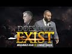

# Full Debate - Mohammed Hijab vs Edward Tabash || Does God Exist? | PART 1 (2019-04-11 04:13:11+00:00)

## Description

A much anticipated debate on the topic: Does God Exist? 
Edward Tabash (Atheist) vs Mohammed Hijab (Muslim Theist ) LIVE in US California

Part 2 (Q&A): https://www.youtube.com/watch?v=1N7OXkisWwc
Debate review: https://www.youtube.com/watch?v=ta7c9RMsMQo

Twitter: https://twitter.com/mohammed_hijab?s=20
Instagram: https://www.instagram.com/mohammedhijabofficial/?hl=en
Facebook: https://www.facebook.com/brothermohammedhijab/
Soundcloud: https://soundcloud.com/mohammed-hijab-465985305

## Summary of [Full Debate - Mohammed Hijab vs Edward Tabash || Does God Exist? | PART 1](https://www.youtube.com/watch?v=dm46FPgRGbQ)

*This is an AI generated summary. There may be inaccuracies. *

### [00:00:00](https://www.youtube.com/watch?v=dm46FPgRGbQ&t=0) - [01:00:00](https://www.youtube.com/watch?v=dm46FPgRGbQ&t=3600)

, Mohammed Hijab and Edward Tabash debate the existence of God. Hijab argues that the universe is uniform and coherent, which is presupposed by science. He also argues that there is a need for external explanations for these phenomena, which is a common argument for the existence of God. Tabash counters that if it was an infinite series, then the world would still be necessary, as it could be conceived that the series could be arranged in another way. They eventually reach a consensus that God, or an eternal, independent thing, is required for any existence to exist.

**[00:00:00](https://www.youtube.com/watch?v=dm46FPgRGbQ&t=0)** recites verses from the Quran, one of which is about wisdom being given to man by Allah. then goes on to give advice to a son on how to treat Allah properly. He starts by saying that associating anything with Allah is a great injustice, and the first advice he gives is to not associate anything with Allah. He then goes on to give other advice, including the belief in Allah, before concluding the talk.
* **[00:05:00](https://www.youtube.com/watch?v=dm46FPgRGbQ&t=300)** The UC Davis Muslim Student Association is hosting a debate on the existence of God. Mohammed Hijab, a proponent of atheism, and Edward Tabash, a Muslim believer, discuss the importance of parents and the correct way to raise children. Tabash stresses the importance of prayer and warns against arrogance and self-delusion. Dawa, the speaker, discusses the dangers of hate speech and the need for Muslims to fight against false narratives.
* **[00:10:00](https://www.youtube.com/watch?v=dm46FPgRGbQ&t=600)** Brother Mohammad discusses the existence of God, and Eddie Tabash defends the position that there is no God. The two discuss the differences between possible and necessary existence, and Brother Mohammad emphasizes the importance of materialism in determining the existence of God.
* **[00:15:00](https://www.youtube.com/watch?v=dm46FPgRGbQ&t=900)** , Mohammed Hijab and Edward Tabash debate the existence of God. Tabash argues that there cannot be a world with only possible existences, as this would require a series of dependent things to exist. Hijab counters that if it was an infinite series, then the world would still be necessary, as it could be conceived that the series could be arranged in another way. They eventually reach a consensus that God, or an eternal, independent thing, is required for any existence to exist.
* **[00:20:00](https://www.youtube.com/watch?v=dm46FPgRGbQ&t=1200)** The presenter argues that the existence of a God is logically possible, based on four options that are either impossible or inconceivable on atheism. The presenter also argues that the physical coherence of the universe is evidence of a God, as it is not possible for something to be coherent if it did not come from a higher power.
* **[00:25:00](https://www.youtube.com/watch?v=dm46FPgRGbQ&t=1500)** Mohammed Hijab argues that the universe is uniform and coherent, which is presupposed by science. He also argues that there is a need for external explanations for these phenomena, which is a common argument for the existence of God.
* **[00:30:00](https://www.youtube.com/watch?v=dm46FPgRGbQ&t=1800)* DiscussesEpicurus' argument against the existence of a God with three attributes, and how it applies to the Islamic perspective. then presents the positive arguments for the existence of a God, concluding that the evidence in our physical universe points towards a supernatural conscious personal being that is all-good, all-knowing, and all-powerful.
* **[00:35:00](https://www.youtube.com/watch?v=dm46FPgRGbQ&t=2100)** The five arguments presented in this video are the argument from non-occurrence of miracles, the argument from the dependence of conscious minds on a physical body and brain, the argument from evolution, the argument from evil, and Mohammed Hijab's argument from prophecy. Each of these arguments has flaws which make them less likely to be true. The evidence for the existence of God is not based on any of these arguments.
* **[00:40:00](https://www.youtube.com/watch?v=dm46FPgRGbQ&t=2400)** , a debate is held between Mohammed Hijab and Edward Tabash on the existence of God. Hijab argues that God can make whatever he wants happen and prevent anything he doesn't want from happening, so there is no need for a concentration camp like Auschwitz. Tabash points out that malaria is a terrible disease, and if one has inherited a gene that provides an effective defense against malaria, they also have sickle cell anemia. He argues that this is evidence that God exists, because if he didn't, then one would not be able to benefit from the gene. Tabash also argues that God knows our minds and would not allow such rampant confusion over who God is and what God wants if he wanted us to believe in him. He argues that the presence of such confusion is more likely if God doesn't exist than if he does.
* **[00:45:00](https://www.youtube.com/watch?v=dm46FPgRGbQ&t=2700)**  two atheists debate the existence of God. The first atheist argues that because there are different versions of the hadith, Muhammad's successors should not be chosen based on qualifications alone but rather need to have direct bloodline to Muhammad. The second atheist argues that because modern humans have learned that there is no reason for men to be in charge of women, the Quran and Bible are incorrect in their teachings on this issue. Additionally, the first atheist argues that because the Quran and Bible talk about Hell for those who don't believe in the religion, each Revelation is promoting false beliefs.
* **[00:50:00](https://www.youtube.com/watch?v=dm46FPgRGbQ&t=3000)**  two debaters discuss the arguments for and against the existence of God. Muhammad Hijab argues that evidence points towards the existence of a supernatural God, while Edward Tabash argues that the evidence does not support this belief.
* **[00:55:00](https://www.youtube.com/watch?v=dm46FPgRGbQ&t=3300)** The five points raised in this YouTube video are that evolution does not contradict theism, that the argument from evil does not exist, that we are all born predisposed to believe in God, that there is evidence for the existence of a God who is not anthropomorphic, and that the idea of free will is meaningful on a naturalistic worldview.
### [01:00:00](https://www.youtube.com/watch?v=dm46FPgRGbQ&t=3600) - [01:10:00](https://www.youtube.com/watch?v=dm46FPgRGbQ&t=4200)

 Muhammad Hijab and Edward Tabash debate the existence of God. Hijab argues that the universe is contingent and therefore there must be a necessary being (God) for it. Tabash counters by saying that a necessary being cannot entail a contingent fact without introducing a new contingent fact, which in turn requires explanation. Hijab then argues that if consciousness could exist apart from the brain, diseases and anesthetics would eclipse consciousness, and we can infer the existence of God from the functioning of the universe, then there is no need for a God. Tabash argues that if we accept naturalism, then everything must be explained by natural causes and the existence of a God is not necessary for this explanation.  concludes with a question and answer session between the two debaters.

**[01:00:00](https://www.youtube.com/watch?v=dm46FPgRGbQ&t=3600)** Mohammed Hijab argues that, because the universe is contingent, there must be a necessary being for it. He goes on to say that, because the Quran says that God abandoned humans and mended them, naturalism is false. He argues that liberalism is based on a myth and is not scientific.
* **[01:05:00](https://www.youtube.com/watch?v=dm46FPgRGbQ&t=3900)** In this debate, Mohammed Hijab and Edward Tabash debate the existence of God. Hijab argues that without a necessary being, there can be no explanation for contingent facts and therefore, God does not exist. Tabash counters by pointing out that a necessary fact cannot entail a contingent fact without introducing a new contingent fact, which in turn requires explanation. Hijab then argues that if consciousness could exist apart from the brain, diseases and anesthetics would eclipse consciousness, and we can infer the existence of God from the functioning of the universe, then there is no need for a God. Tabash argues that if we accept naturalism, then everything must be explained by natural causes and the existence of a God is not necessary for this explanation.
* **[01:10:00](https://www.youtube.com/watch?v=dm46FPgRGbQ&t=4200)**  two debaters discuss the evidence for and against the existence of God. Muhammad argues that, based on the laws of nature, there cannot be a God who violates those laws, while Edward Tabash argues that there are cases in which the natural explanation for an event fails, leading one to conclude that a supernatural event must have occurred.  concludes with a question and answer session between the two debaters.

## Full transcript with timestamps

[0:00:04](https://youtu.be/dm46FPgRGbQ?t=4) we're gonna begin with the recitation of  
[0:00:07](https://youtu.be/dm46FPgRGbQ?t=7) the Quran just to remind us about Allah  
[0:00:10](https://youtu.be/dm46FPgRGbQ?t=10) Muhammad Allah's words and that's how  
[0:00:12](https://youtu.be/dm46FPgRGbQ?t=12) we're gonna be starting this event sha  
[0:00:13](https://youtu.be/dm46FPgRGbQ?t=13) Allah I will be reciting some Hyatt or  
[0:00:16](https://youtu.be/dm46FPgRGbQ?t=16) some verses from Chapter number 31 and  
[0:00:21](https://youtu.be/dm46FPgRGbQ?t=21) these verses are going to be talking  
[0:00:23](https://youtu.be/dm46FPgRGbQ?t=23) about the advice that milkman gave to  
[0:00:27](https://youtu.be/dm46FPgRGbQ?t=27) his son and look man the scholars differ  
[0:00:30](https://youtu.be/dm46FPgRGbQ?t=30) about who he was some say that he was a  
[0:00:32](https://youtu.be/dm46FPgRGbQ?t=32) prophet allah subhanaw taala talks about  
[0:00:34](https://youtu.be/dm46FPgRGbQ?t=34) him as a wise person so inshallah I will  
[0:00:38](https://youtu.be/dm46FPgRGbQ?t=38) begin with the Arabic and then  
[0:00:39](https://youtu.be/dm46FPgRGbQ?t=39) translated in English Ruby la mina  
[0:00:47](https://youtu.be/dm46FPgRGbQ?t=47) sh-shaytani r-rajim bismillahi rahmani  
[0:00:53](https://youtu.be/dm46FPgRGbQ?t=53) raheem  
[0:00:56](https://youtu.be/dm46FPgRGbQ?t=56) voila father attained a logo Manik Mehta  
[0:01:00](https://youtu.be/dm46FPgRGbQ?t=60) and score lil wah - Corphish rule in FC  
[0:01:11](https://youtu.be/dm46FPgRGbQ?t=71) wanka father-in-law Havana you need what  
[0:01:20](https://youtu.be/dm46FPgRGbQ?t=80) is a local man only Benny he was ye who  
[0:01:24](https://youtu.be/dm46FPgRGbQ?t=84) you own a Jana - shriek billah ya  
[0:01:29](https://youtu.be/dm46FPgRGbQ?t=89) una yella - Shrek belong in a circle a  
[0:01:34](https://youtu.be/dm46FPgRGbQ?t=94) whole menagerie  
[0:01:37](https://youtu.be/dm46FPgRGbQ?t=97) while was slain in Sanibel Waleed a  
[0:01:43](https://youtu.be/dm46FPgRGbQ?t=103) Himalayan an R&R one Wafi asado hoofy  
[0:01:51](https://youtu.be/dm46FPgRGbQ?t=111) romania initially Wally Wally de que la  
[0:01:56](https://youtu.be/dm46FPgRGbQ?t=116) Elmo's lead Mahut jihad a Kerala toast  
[0:02:05](https://youtu.be/dm46FPgRGbQ?t=125) Rica be male Celica be here in Fela  
[0:02:10](https://youtu.be/dm46FPgRGbQ?t=130) Totoro Mumma was horrible Murphy dunya  
[0:02:14](https://youtu.be/dm46FPgRGbQ?t=134) Maroof what be recipe lemon and a fait  
[0:02:20](https://youtu.be/dm46FPgRGbQ?t=140) la some a la more Jericho muna b.o.b  
[0:02:27](https://youtu.be/dm46FPgRGbQ?t=147) makuta Merriman  
[0:02:31](https://youtu.be/dm46FPgRGbQ?t=151) yeah bonia in Takumi's haha Batum in  
[0:02:39](https://youtu.be/dm46FPgRGbQ?t=159) hora de lavit a coupie chakra  
[0:02:45](https://youtu.be/dm46FPgRGbQ?t=165) photography so rotten office sama where  
[0:02:49](https://youtu.be/dm46FPgRGbQ?t=169) the a fill or black t be hollow in law  
[0:02:56](https://youtu.be/dm46FPgRGbQ?t=176) hello - hobby yeah buna yeah a famous  
[0:03:02](https://youtu.be/dm46FPgRGbQ?t=182) toilet ever mono bill Maroof even her an  
[0:03:06](https://youtu.be/dm46FPgRGbQ?t=186) Eden moon was barren  
[0:03:12](https://youtu.be/dm46FPgRGbQ?t=192) I saw back in Natalie Caminos mill well  
[0:03:21](https://youtu.be/dm46FPgRGbQ?t=201) - sorry what Decca in c1 Adam she feel  
[0:03:26](https://youtu.be/dm46FPgRGbQ?t=206) horribly maloha in allaha yuhibbu  
[0:03:32](https://youtu.be/dm46FPgRGbQ?t=212) Coulomb Oh tell you what Casa de FEMA  
[0:03:39](https://youtu.be/dm46FPgRGbQ?t=219) she would mean so take in anger on us  
[0:03:46](https://youtu.be/dm46FPgRGbQ?t=226) well I mean so in this verse says allah  
[0:03:56](https://youtu.be/dm46FPgRGbQ?t=236) subhanaw taala begins by talking about  
[0:04:01](https://youtu.be/dm46FPgRGbQ?t=241) doc man mentioning that and we have  
[0:04:03](https://youtu.be/dm46FPgRGbQ?t=243) certainly given we referring to Allah  
[0:04:05](https://youtu.be/dm46FPgRGbQ?t=245) subhana WA Ta'ala we have certainly  
[0:04:07](https://youtu.be/dm46FPgRGbQ?t=247) given look man wisdom and said be  
[0:04:10](https://youtu.be/dm46FPgRGbQ?t=250) grateful to Allah and whoever is  
[0:04:13](https://youtu.be/dm46FPgRGbQ?t=253) grateful is grateful for the benefit of  
[0:04:14](https://youtu.be/dm46FPgRGbQ?t=254) himself and whoever denies a lost favor  
[0:04:18](https://youtu.be/dm46FPgRGbQ?t=258) and indeed Allah is free of need and  
[0:04:20](https://youtu.be/dm46FPgRGbQ?t=260) praiseworthy and mention o Muhammad when  
[0:04:26](https://youtu.be/dm46FPgRGbQ?t=266) local man said to his son while he was  
[0:04:29](https://youtu.be/dm46FPgRGbQ?t=269) instructing him so now doc man begins  
[0:04:31](https://youtu.be/dm46FPgRGbQ?t=271) that is his advice to his son he begins  
[0:04:34](https://youtu.be/dm46FPgRGbQ?t=274) by saying o my son do not associate  
[0:04:37](https://youtu.be/dm46FPgRGbQ?t=277) anything with Allah indeed associating  
[0:04:39](https://youtu.be/dm46FPgRGbQ?t=279) with him is a great injustice  
[0:04:40](https://youtu.be/dm46FPgRGbQ?t=280) so the first advice that he gives him is  
[0:04:42](https://youtu.be/dm46FPgRGbQ?t=282) that he's already starting off with the  
[0:04:46](https://youtu.be/dm46FPgRGbQ?t=286) fact that associating anything with  
[0:04:48](https://youtu.be/dm46FPgRGbQ?t=288) allah subhana wa ta'ala is one of the  
[0:04:50](https://youtu.be/dm46FPgRGbQ?t=290) greatest atrocity someone can commit and  
[0:04:52](https://youtu.be/dm46FPgRGbQ?t=292) this is the foundation of a visit by  
[0:04:55](https://youtu.be/dm46FPgRGbQ?t=295) said he begins with before telling him  
[0:04:56](https://youtu.be/dm46FPgRGbQ?t=296) anything else is his belief in allah  
[0:04:58](https://youtu.be/dm46FPgRGbQ?t=298) subhanho wa taala  
[0:05:01](https://youtu.be/dm46FPgRGbQ?t=301) and we have enjoyed upon man care for  
[0:05:04](https://youtu.be/dm46FPgRGbQ?t=304) his parents his mother carried him  
[0:05:06](https://youtu.be/dm46FPgRGbQ?t=306) increasing her in weakness upon weakness  
[0:05:08](https://youtu.be/dm46FPgRGbQ?t=308) and his weaning is in two years be  
[0:05:11](https://youtu.be/dm46FPgRGbQ?t=311) grateful to me and to your parents and  
[0:05:13](https://youtu.be/dm46FPgRGbQ?t=313) to me is the final destination but if  
[0:05:18](https://youtu.be/dm46FPgRGbQ?t=318) they endeavor to make you associate with  
[0:05:19](https://youtu.be/dm46FPgRGbQ?t=319) me that of which you have no knowledge  
[0:05:21](https://youtu.be/dm46FPgRGbQ?t=321) do not obey them but accompany them in  
[0:05:25](https://youtu.be/dm46FPgRGbQ?t=325) this world  
[0:05:25](https://youtu.be/dm46FPgRGbQ?t=325) with appropriate kindness and follow the  
[0:05:28](https://youtu.be/dm46FPgRGbQ?t=328) way of those who turn back to me in  
[0:05:29](https://youtu.be/dm46FPgRGbQ?t=329) repentance then to me will be your  
[0:05:32](https://youtu.be/dm46FPgRGbQ?t=332) return and I will inform you about what  
[0:05:34](https://youtu.be/dm46FPgRGbQ?t=334) you used to do and so now a loss and now  
[0:05:37](https://youtu.be/dm46FPgRGbQ?t=337) the man is giving advice to a son about  
[0:05:39](https://youtu.be/dm46FPgRGbQ?t=339) the importance of parents and how after  
[0:05:42](https://youtu.be/dm46FPgRGbQ?t=342) having your belief in allah subhanaw  
[0:05:45](https://youtu.be/dm46FPgRGbQ?t=345) taala and understanding that you're not  
[0:05:47](https://youtu.be/dm46FPgRGbQ?t=347) allowed to associate anything with him  
[0:05:48](https://youtu.be/dm46FPgRGbQ?t=348) the advice he gives them is having  
[0:05:50](https://youtu.be/dm46FPgRGbQ?t=350) kindness towards your parents regardless  
[0:05:53](https://youtu.be/dm46FPgRGbQ?t=353) of what they tell you to do or how they  
[0:05:54](https://youtu.be/dm46FPgRGbQ?t=354) act towards you with the exception of  
[0:05:56](https://youtu.be/dm46FPgRGbQ?t=356) them nullifying the first advice that  
[0:05:59](https://youtu.be/dm46FPgRGbQ?t=359) local man gave which was to associate  
[0:06:01](https://youtu.be/dm46FPgRGbQ?t=361) partners with allah subhana wa ta'ala  
[0:06:03](https://youtu.be/dm46FPgRGbQ?t=363) and local man said o my son indeed if  
[0:06:07](https://youtu.be/dm46FPgRGbQ?t=367) wrong should be the way of a mustard  
[0:06:09](https://youtu.be/dm46FPgRGbQ?t=369) seed and should be within a rock or  
[0:06:11](https://youtu.be/dm46FPgRGbQ?t=371) anywhere in the heaven or in the earth  
[0:06:13](https://youtu.be/dm46FPgRGbQ?t=373) Allah will bring it forth indeed Allah  
[0:06:16](https://youtu.be/dm46FPgRGbQ?t=376) is subtle and acquainted oh my son  
[0:06:19](https://youtu.be/dm46FPgRGbQ?t=379) established prayer enjoin what is right  
[0:06:22](https://youtu.be/dm46FPgRGbQ?t=382) forbid what is wrong and be patient over  
[0:06:24](https://youtu.be/dm46FPgRGbQ?t=384) what befalls you indeed all that is of  
[0:06:27](https://youtu.be/dm46FPgRGbQ?t=387) the matters requiring determination so  
[0:06:30](https://youtu.be/dm46FPgRGbQ?t=390) now he's giving his son that the  
[0:06:31](https://youtu.be/dm46FPgRGbQ?t=391) importance of our prayer that we have 5  
[0:06:33](https://youtu.be/dm46FPgRGbQ?t=393) times a day and that we need to  
[0:06:35](https://youtu.be/dm46FPgRGbQ?t=395) establish and make sure that we're  
[0:06:36](https://youtu.be/dm46FPgRGbQ?t=396) keeping up with our with our with our  
[0:06:38](https://youtu.be/dm46FPgRGbQ?t=398) daily prayers and the importance of when  
[0:06:42](https://youtu.be/dm46FPgRGbQ?t=402) you see something that is good that you  
[0:06:44](https://youtu.be/dm46FPgRGbQ?t=404) encourage that good and that you enjoin  
[0:06:46](https://youtu.be/dm46FPgRGbQ?t=406) and be part of that good and that when  
[0:06:47](https://youtu.be/dm46FPgRGbQ?t=407) you see something evil you do everything  
[0:06:49](https://youtu.be/dm46FPgRGbQ?t=409) in your power to stop what that evil  
[0:06:51](https://youtu.be/dm46FPgRGbQ?t=411) action is do not turn your cheek and  
[0:06:54](https://youtu.be/dm46FPgRGbQ?t=414) contempt toward people and do not walk  
[0:06:57](https://youtu.be/dm46FPgRGbQ?t=417) through the earth earth excellently  
[0:06:59](https://youtu.be/dm46FPgRGbQ?t=419) indeed Allah does not like everyone  
[0:07:01](https://youtu.be/dm46FPgRGbQ?t=421) self-deluded and boastful essentially  
[0:07:04](https://youtu.be/dm46FPgRGbQ?t=424) warning his son from being arrogant and  
[0:07:05](https://youtu.be/dm46FPgRGbQ?t=425) acting like he is something when in  
[0:07:08](https://youtu.be/dm46FPgRGbQ?t=428) reality all we are are the slaves of  
[0:07:09](https://youtu.be/dm46FPgRGbQ?t=429) allah subhanahu wa tada  
[0:07:10](https://youtu.be/dm46FPgRGbQ?t=430) and be moderate in your pace and lower  
[0:07:13](https://youtu.be/dm46FPgRGbQ?t=433) your voice indeed the most disputable of  
[0:07:15](https://youtu.be/dm46FPgRGbQ?t=435) sounds is the voice of donkeys and  
[0:07:18](https://youtu.be/dm46FPgRGbQ?t=438) indeed Allah soprano Dada has spoken the  
[0:07:20](https://youtu.be/dm46FPgRGbQ?t=440) truth  
[0:07:20](https://youtu.be/dm46FPgRGbQ?t=440) starting from what happened to lawyer  
[0:07:22](https://youtu.be/dm46FPgRGbQ?t=442) but I got to  
[0:07:28](https://youtu.be/dm46FPgRGbQ?t=448) so now I wanna come so now I wanna come  
[0:07:33](https://youtu.be/dm46FPgRGbQ?t=453) everyone's like a little later for  
[0:07:34](https://youtu.be/dm46FPgRGbQ?t=454) coming everyone thank you so much for  
[0:07:35](https://youtu.be/dm46FPgRGbQ?t=455) coming we really appreciate it  
[0:07:37](https://youtu.be/dm46FPgRGbQ?t=457) welcome to the UC Davis Muslim Student  
[0:07:39](https://youtu.be/dm46FPgRGbQ?t=459) Association is very first debate and we  
[0:07:42](https://youtu.be/dm46FPgRGbQ?t=462) are very excited to be holding it today  
[0:07:43](https://youtu.be/dm46FPgRGbQ?t=463) and we're very honored that you all took  
[0:07:45](https://youtu.be/dm46FPgRGbQ?t=465) the time on a weekday to come out and  
[0:07:47](https://youtu.be/dm46FPgRGbQ?t=467) listen to this beautiful debate we're  
[0:07:48](https://youtu.be/dm46FPgRGbQ?t=468) extremely excited to be hosting these  
[0:07:50](https://youtu.be/dm46FPgRGbQ?t=470) two amazing debaters who are very kind  
[0:07:53](https://youtu.be/dm46FPgRGbQ?t=473) very knowledgeable and have spared their  
[0:07:54](https://youtu.be/dm46FPgRGbQ?t=474) time in the middle of the week to come  
[0:07:56](https://youtu.be/dm46FPgRGbQ?t=476) and speak to us and with that we are  
[0:07:58](https://youtu.be/dm46FPgRGbQ?t=478) going to be debate or they're going to  
[0:08:00](https://youtu.be/dm46FPgRGbQ?t=480) be debating the concept or the existence  
[0:08:02](https://youtu.be/dm46FPgRGbQ?t=482) of God and before I give them a proper  
[0:08:05](https://youtu.be/dm46FPgRGbQ?t=485) well do introduction I will be passing  
[0:08:08](https://youtu.be/dm46FPgRGbQ?t=488) off the microphone to Ali Dawa who will  
[0:08:11](https://youtu.be/dm46FPgRGbQ?t=491) be talking about Saddam  
[0:08:15](https://youtu.be/dm46FPgRGbQ?t=495) [Applause]  
[0:08:32](https://youtu.be/dm46FPgRGbQ?t=512) Selam stands for sharing an affection  
[0:08:34](https://youtu.be/dm46FPgRGbQ?t=514) love and mercy that's what we do  
[0:08:37](https://youtu.be/dm46FPgRGbQ?t=517) insha'Allah specific specific at the  
[0:08:40](https://youtu.be/dm46FPgRGbQ?t=520) time of Asia we live where Haiti's been  
[0:08:42](https://youtu.be/dm46FPgRGbQ?t=522) hate it's being spread by the name of  
[0:08:45](https://youtu.be/dm46FPgRGbQ?t=525) given freedom of speech and this  
[0:08:47](https://youtu.be/dm46FPgRGbQ?t=527) sometimes comes at the cost of innocent  
[0:08:48](https://youtu.be/dm46FPgRGbQ?t=528) people dying and we saw at Christchurch  
[0:08:51](https://youtu.be/dm46FPgRGbQ?t=531) we saw that in London where we're from  
[0:08:54](https://youtu.be/dm46FPgRGbQ?t=534) innocent people getting killed Muslim or  
[0:08:56](https://youtu.be/dm46FPgRGbQ?t=536) non-muslim and we want to put an end to  
[0:08:58](https://youtu.be/dm46FPgRGbQ?t=538) this and one of our objectives is to  
[0:09:00](https://youtu.be/dm46FPgRGbQ?t=540) deconstruct false narratives and  
[0:09:02](https://youtu.be/dm46FPgRGbQ?t=542) reconstruct pure minds and that's our  
[0:09:05](https://youtu.be/dm46FPgRGbQ?t=545) main objective and I was wondering every  
[0:09:08](https://youtu.be/dm46FPgRGbQ?t=548) single one of you guys coming you can  
[0:09:09](https://youtu.be/dm46FPgRGbQ?t=549) check our websites around the world or  
[0:09:11](https://youtu.be/dm46FPgRGbQ?t=551) UK inshallah were planning on setting up  
[0:09:13](https://youtu.be/dm46FPgRGbQ?t=553) a team in California  
[0:09:18](https://youtu.be/dm46FPgRGbQ?t=558) [Music]  
[0:09:40](https://youtu.be/dm46FPgRGbQ?t=580) [Applause]  
[0:10:00](https://youtu.be/dm46FPgRGbQ?t=600) [Applause]  
[0:10:11](https://youtu.be/dm46FPgRGbQ?t=611) thank you very much for that hello hey  
[0:10:13](https://youtu.be/dm46FPgRGbQ?t=613) so first we'll be introducing brother  
[0:10:17](https://youtu.be/dm46FPgRGbQ?t=617) Mohammed hey job is a debater and public  
[0:10:20](https://youtu.be/dm46FPgRGbQ?t=620) speaker who engages in discussions and  
[0:10:22](https://youtu.be/dm46FPgRGbQ?t=622) polemics on a wide variety of topics  
[0:10:23](https://youtu.be/dm46FPgRGbQ?t=623) including religion politics and society  
[0:10:26](https://youtu.be/dm46FPgRGbQ?t=626) he completed a politics degree and a  
[0:10:28](https://youtu.be/dm46FPgRGbQ?t=628) master's in the history in history from  
[0:10:30](https://youtu.be/dm46FPgRGbQ?t=630) Queen Mary University he has taught and  
[0:10:32](https://youtu.be/dm46FPgRGbQ?t=632) instructed courses on humanities and  
[0:10:34](https://youtu.be/dm46FPgRGbQ?t=634) languages in many contexts he has come  
[0:10:36](https://youtu.be/dm46FPgRGbQ?t=636) he has numerous Jazz's and some Islamic  
[0:10:38](https://youtu.be/dm46FPgRGbQ?t=638) Sciences and his study and numerous  
[0:10:40](https://youtu.be/dm46FPgRGbQ?t=640) Islamic seminaries including the shin  
[0:10:42](https://youtu.be/dm46FPgRGbQ?t=642) plate the Institute which employs a  
[0:10:44](https://youtu.be/dm46FPgRGbQ?t=644) traditional Mauritian style of teaching  
[0:10:45](https://youtu.be/dm46FPgRGbQ?t=645) of the sacred sciences  
[0:10:47](https://youtu.be/dm46FPgRGbQ?t=647) Edward Eddy tabash is a constitutional  
[0:10:50](https://youtu.be/dm46FPgRGbQ?t=650) lawyer in the Los Angeles area he  
[0:10:52](https://youtu.be/dm46FPgRGbQ?t=652) graduated from UCLA in 1973 Magnum [ __ ]  
[0:10:55](https://youtu.be/dm46FPgRGbQ?t=655) laude with a bachelor's degree in  
[0:10:57](https://youtu.be/dm46FPgRGbQ?t=657) political science he graduated from  
[0:10:59](https://youtu.be/dm46FPgRGbQ?t=659) Loyola Law School of Los Angeles in 1973  
[0:11:02](https://youtu.be/dm46FPgRGbQ?t=662) he is a son of an Orthodox rabbi from  
[0:11:05](https://youtu.be/dm46FPgRGbQ?t=665) Lithuania and an Auschwitz surviving  
[0:11:06](https://youtu.be/dm46FPgRGbQ?t=666) mother from Hungary after decades of  
[0:11:08](https://youtu.be/dm46FPgRGbQ?t=668) spiritual reflection and seeking he has  
[0:11:10](https://youtu.be/dm46FPgRGbQ?t=670) determined that the universe is natural  
[0:11:12](https://youtu.be/dm46FPgRGbQ?t=672) with no supernatural being or beings no  
[0:11:15](https://youtu.be/dm46FPgRGbQ?t=675) god or gods involved in the creation or  
[0:11:17](https://youtu.be/dm46FPgRGbQ?t=677) perpetuation of our existence he chairs  
[0:11:19](https://youtu.be/dm46FPgRGbQ?t=679) the board of directors of the center of  
[0:11:21](https://youtu.be/dm46FPgRGbQ?t=681) Inquirer transnational a worldwide  
[0:11:23](https://youtu.be/dm46FPgRGbQ?t=683) organization of secular humanists and  
[0:11:25](https://youtu.be/dm46FPgRGbQ?t=685) scientific sceptics he's also known for  
[0:11:27](https://youtu.be/dm46FPgRGbQ?t=687) his legal work and separation of church  
[0:11:29](https://youtu.be/dm46FPgRGbQ?t=689) and state cases in which we seek to  
[0:11:30](https://youtu.be/dm46FPgRGbQ?t=690) preserve the equality before the law of  
[0:11:32](https://youtu.be/dm46FPgRGbQ?t=692) both believers and non-believers he  
[0:11:34](https://youtu.be/dm46FPgRGbQ?t=694) promotes a secular society based in  
[0:11:36](https://youtu.be/dm46FPgRGbQ?t=696) science reason and inquiry maintaining  
[0:11:39](https://youtu.be/dm46FPgRGbQ?t=699) strong conviction in this he's an  
[0:11:40](https://youtu.be/dm46FPgRGbQ?t=700) integral leader to several associations  
[0:11:42](https://youtu.be/dm46FPgRGbQ?t=702) which exists to separate church and  
[0:11:44](https://youtu.be/dm46FPgRGbQ?t=704) state a part of his work and separation  
[0:11:46](https://youtu.be/dm46FPgRGbQ?t=706) of church and state has specifically  
[0:11:48](https://youtu.be/dm46FPgRGbQ?t=708) been in opposing Trump's Muslims ban and  
[0:11:51](https://youtu.be/dm46FPgRGbQ?t=711) mosh although they're both extremely  
[0:11:53](https://youtu.be/dm46FPgRGbQ?t=713) qualified and we're very  
[0:11:54](https://youtu.be/dm46FPgRGbQ?t=714) excited to have them both in this debate  
[0:11:56](https://youtu.be/dm46FPgRGbQ?t=716) and for this reason we would like to  
[0:11:58](https://youtu.be/dm46FPgRGbQ?t=718) also request a certain level of  
[0:12:01](https://youtu.be/dm46FPgRGbQ?t=721) boundaries and guidelines for the event  
[0:12:03](https://youtu.be/dm46FPgRGbQ?t=723) and shot to make sure that it goes as  
[0:12:04](https://youtu.be/dm46FPgRGbQ?t=724) smooth as possible for both of our  
[0:12:06](https://youtu.be/dm46FPgRGbQ?t=726) speakers and that we ask that everyone  
[0:12:08](https://youtu.be/dm46FPgRGbQ?t=728) be as respectful as possible to both of  
[0:12:10](https://youtu.be/dm46FPgRGbQ?t=730) our speakers by doing a number of few  
[0:12:13](https://youtu.be/dm46FPgRGbQ?t=733) things so we would like everyone to  
[0:12:14](https://youtu.be/dm46FPgRGbQ?t=734) please if possible please do not shout  
[0:12:17](https://youtu.be/dm46FPgRGbQ?t=737) heckle Boo screen cause any form of  
[0:12:21](https://youtu.be/dm46FPgRGbQ?t=741) ruckus against either speakers you know  
[0:12:23](https://youtu.be/dm46FPgRGbQ?t=743) to in order to respect their time their  
[0:12:25](https://youtu.be/dm46FPgRGbQ?t=745) knowledge and everything that they're  
[0:12:26](https://youtu.be/dm46FPgRGbQ?t=746) doing for us today if people are causing  
[0:12:29](https://youtu.be/dm46FPgRGbQ?t=749) issues unfortunately we will have to  
[0:12:31](https://youtu.be/dm46FPgRGbQ?t=751) have security escort you out in a  
[0:12:33](https://youtu.be/dm46FPgRGbQ?t=753) respect for both of our speakers also  
[0:12:35](https://youtu.be/dm46FPgRGbQ?t=755) another request that we have is that if  
[0:12:37](https://youtu.be/dm46FPgRGbQ?t=757) you would like to clap please feel free  
[0:12:38](https://youtu.be/dm46FPgRGbQ?t=758) to but only after the speaker is  
[0:12:40](https://youtu.be/dm46FPgRGbQ?t=760) completed whether what they're saying  
[0:12:42](https://youtu.be/dm46FPgRGbQ?t=762) simply because there is a time frame  
[0:12:44](https://youtu.be/dm46FPgRGbQ?t=764) that each of them has to be able to get  
[0:12:45](https://youtu.be/dm46FPgRGbQ?t=765) their points across and we do not want  
[0:12:47](https://youtu.be/dm46FPgRGbQ?t=767) to disadvantage either speaker by  
[0:12:49](https://youtu.be/dm46FPgRGbQ?t=769) limiting the other speakers and with  
[0:12:54](https://youtu.be/dm46FPgRGbQ?t=774) that and said please do not go off hey  
[0:12:55](https://youtu.be/dm46FPgRGbQ?t=775) thank you so much for coming thank you  
[0:12:57](https://youtu.be/dm46FPgRGbQ?t=777) everyone I really appreciate it and then  
[0:12:59](https://youtu.be/dm46FPgRGbQ?t=779) I will be passing off our the microphone  
[0:13:01](https://youtu.be/dm46FPgRGbQ?t=781) to our moderator which is ID number was  
[0:13:06](https://youtu.be/dm46FPgRGbQ?t=786) [Applause]  
[0:13:14](https://youtu.be/dm46FPgRGbQ?t=794) hello everyone thank you for joining us  
[0:13:17](https://youtu.be/dm46FPgRGbQ?t=797) as I mentioned I will be moderating  
[0:13:19](https://youtu.be/dm46FPgRGbQ?t=799) moderating the debate we will start off  
[0:13:22](https://youtu.be/dm46FPgRGbQ?t=802) with opening statements each speaker  
[0:13:24](https://youtu.be/dm46FPgRGbQ?t=804) will have 20 minutes to give theirs and  
[0:13:26](https://youtu.be/dm46FPgRGbQ?t=806) we will begin with brother Mohammad hey  
[0:13:28](https://youtu.be/dm46FPgRGbQ?t=808) Jeb so the Malik and what happens a  
[0:13:43](https://youtu.be/dm46FPgRGbQ?t=823) light or a kettle first of all I want to  
[0:13:46](https://youtu.be/dm46FPgRGbQ?t=826) thank every single one of you for coming  
[0:13:48](https://youtu.be/dm46FPgRGbQ?t=828) down here I want to thank the University  
[0:13:49](https://youtu.be/dm46FPgRGbQ?t=829) and of course I want to thank Eddie's  
[0:13:51](https://youtu.be/dm46FPgRGbQ?t=831) have a she's a really prolific you know  
[0:13:54](https://youtu.be/dm46FPgRGbQ?t=834) formidable opponent and a very  
[0:13:56](https://youtu.be/dm46FPgRGbQ?t=836) experienced atheist opponent for many  
[0:13:58](https://youtu.be/dm46FPgRGbQ?t=838) years and so I'm very happy that all of  
[0:14:00](https://youtu.be/dm46FPgRGbQ?t=840) you are here today to proceed there's no  
[0:14:05](https://youtu.be/dm46FPgRGbQ?t=845) doubt that there is existence there is  
[0:14:09](https://youtu.be/dm46FPgRGbQ?t=849) no doubt that there is existence  
[0:14:13](https://youtu.be/dm46FPgRGbQ?t=853) existence is divided into two things  
[0:14:17](https://youtu.be/dm46FPgRGbQ?t=857) possible existence and necessary  
[0:14:20](https://youtu.be/dm46FPgRGbQ?t=860) existence possible existence is  
[0:14:23](https://youtu.be/dm46FPgRGbQ?t=863) existence that otherwise doesn't need to  
[0:14:27](https://youtu.be/dm46FPgRGbQ?t=867) exist and its existence that could be  
[0:14:32](https://youtu.be/dm46FPgRGbQ?t=872) arranged in any other way its existence  
[0:14:36](https://youtu.be/dm46FPgRGbQ?t=876) which is dependent for example I'm  
[0:14:38](https://youtu.be/dm46FPgRGbQ?t=878) wearing a blue blazer this is a possible  
[0:14:41](https://youtu.be/dm46FPgRGbQ?t=881) existence doesn't have to exist it could  
[0:14:44](https://youtu.be/dm46FPgRGbQ?t=884) be arranged in another way and it's  
[0:14:49](https://youtu.be/dm46FPgRGbQ?t=889) dependent upon materials that were  
[0:14:51](https://youtu.be/dm46FPgRGbQ?t=891) created used to create it necessary  
[0:14:55](https://youtu.be/dm46FPgRGbQ?t=895) existence on the other hand is existence  
[0:14:57](https://youtu.be/dm46FPgRGbQ?t=897) which is couldn't be any other way  
[0:15:00](https://youtu.be/dm46FPgRGbQ?t=900) existence which could not be any other  
[0:15:02](https://youtu.be/dm46FPgRGbQ?t=902) way is independent self-sufficient and  
[0:15:06](https://youtu.be/dm46FPgRGbQ?t=906) could not be how of existence now the  
[0:15:12](https://youtu.be/dm46FPgRGbQ?t=912) main argument today is this there cannot  
[0:15:16](https://youtu.be/dm46FPgRGbQ?t=916) be a world with only possible existences  
[0:15:19](https://youtu.be/dm46FPgRGbQ?t=919) that is the main idea there cannot be a  
[0:15:22](https://youtu.be/dm46FPgRGbQ?t=922) world with  
[0:15:24](https://youtu.be/dm46FPgRGbQ?t=924) possible existences why because we're  
[0:15:30](https://youtu.be/dm46FPgRGbQ?t=930) it'd be using the port a little bit it  
[0:15:32](https://youtu.be/dm46FPgRGbQ?t=932) is only possible existences you would  
[0:15:34](https://youtu.be/dm46FPgRGbQ?t=934) have dependent things depending upon  
[0:15:36](https://youtu.be/dm46FPgRGbQ?t=936) other dependent things now this can be  
[0:15:39](https://youtu.be/dm46FPgRGbQ?t=939) reasoned physically ontological and  
[0:15:42](https://youtu.be/dm46FPgRGbQ?t=942) cosmological this series existed in its  
[0:15:57](https://youtu.be/dm46FPgRGbQ?t=957) by itself it would require something  
[0:16:00](https://youtu.be/dm46FPgRGbQ?t=960) outside an independent thing in order  
[0:16:05](https://youtu.be/dm46FPgRGbQ?t=965) for that series to exist now let's say  
[0:16:11](https://youtu.be/dm46FPgRGbQ?t=971) if it was an infinite series we'll get  
[0:16:14](https://youtu.be/dm46FPgRGbQ?t=974) to that in what follows now let's use a  
[0:16:21](https://youtu.be/dm46FPgRGbQ?t=981) cosmological example we have a tree it's  
[0:16:25](https://youtu.be/dm46FPgRGbQ?t=985) very beautiful trees here by the way in  
[0:16:26](https://youtu.be/dm46FPgRGbQ?t=986) California like for integrity beautiful  
[0:16:31](https://youtu.be/dm46FPgRGbQ?t=991) that tree requires the Sun to  
[0:16:34](https://youtu.be/dm46FPgRGbQ?t=994) photosynthesize in order to exist I  
[0:16:36](https://youtu.be/dm46FPgRGbQ?t=996) think it's fair to say it's a tree  
[0:16:38](https://youtu.be/dm46FPgRGbQ?t=998) didn't exist or for something exists the  
[0:16:40](https://youtu.be/dm46FPgRGbQ?t=1000) tree would know exists  
[0:16:41](https://youtu.be/dm46FPgRGbQ?t=1001) it's fair to say yes so long listed the  
[0:16:44](https://youtu.be/dm46FPgRGbQ?t=1004) Sun is required or so long as the tree  
[0:16:47](https://youtu.be/dm46FPgRGbQ?t=1007) exists the Sun will exist even if that  
[0:16:50](https://youtu.be/dm46FPgRGbQ?t=1010) was for an infinite amount of fine now  
[0:16:53](https://youtu.be/dm46FPgRGbQ?t=1013) the Sun itself is part of its own order  
[0:16:57](https://youtu.be/dm46FPgRGbQ?t=1017) and it's part of its own sense now it  
[0:17:04](https://youtu.be/dm46FPgRGbQ?t=1024) requires other things in order to exist  
[0:17:06](https://youtu.be/dm46FPgRGbQ?t=1026) and the end of this what is required  
[0:17:09](https://youtu.be/dm46FPgRGbQ?t=1029) once again is an independent thing  
[0:17:12](https://youtu.be/dm46FPgRGbQ?t=1032) that's this independent thing can only  
[0:17:16](https://youtu.be/dm46FPgRGbQ?t=1036) be one wait a minute why is that because  
[0:17:21](https://youtu.be/dm46FPgRGbQ?t=1041) if there was more than one necessary  
[0:17:23](https://youtu.be/dm46FPgRGbQ?t=1043) existence it wouldn't be a necessary  
[0:17:25](https://youtu.be/dm46FPgRGbQ?t=1045) existence because it could be conceived  
[0:17:28](https://youtu.be/dm46FPgRGbQ?t=1048) that it can be arranged in another way  
[0:17:30](https://youtu.be/dm46FPgRGbQ?t=1050) and you can't have two things which are  
[0:17:33](https://youtu.be/dm46FPgRGbQ?t=1053) independent because which one is  
[0:17:35](https://youtu.be/dm46FPgRGbQ?t=1055) dependent on which  
[0:17:38](https://youtu.be/dm46FPgRGbQ?t=1058) therefore whether you conceptualize this  
[0:17:43](https://youtu.be/dm46FPgRGbQ?t=1063) ontologically cosmologically or  
[0:17:45](https://youtu.be/dm46FPgRGbQ?t=1065) materialism dualism idealism you must  
[0:17:50](https://youtu.be/dm46FPgRGbQ?t=1070) conclude that what is required in order  
[0:17:53](https://youtu.be/dm46FPgRGbQ?t=1073) for any existence to exist as an  
[0:17:56](https://youtu.be/dm46FPgRGbQ?t=1076) independent thing that is one that is  
[0:18:02](https://youtu.be/dm46FPgRGbQ?t=1082) always in existence why because if it  
[0:18:04](https://youtu.be/dm46FPgRGbQ?t=1084) wasn't in existence if it could be  
[0:18:07](https://youtu.be/dm46FPgRGbQ?t=1087) conceived that this thing is not in  
[0:18:08](https://youtu.be/dm46FPgRGbQ?t=1088) existence it wouldn't be necessary so it  
[0:18:12](https://youtu.be/dm46FPgRGbQ?t=1092) has to be eternal and it cannot be made  
[0:18:16](https://youtu.be/dm46FPgRGbQ?t=1096) up of all parts  
[0:18:17](https://youtu.be/dm46FPgRGbQ?t=1097) why because anything which is a compound  
[0:18:20](https://youtu.be/dm46FPgRGbQ?t=1100) is generated anything that's made up of  
[0:18:23](https://youtu.be/dm46FPgRGbQ?t=1103) parts is dependent on those parts that's  
[0:18:26](https://youtu.be/dm46FPgRGbQ?t=1106) point number one  
[0:18:27](https://youtu.be/dm46FPgRGbQ?t=1107) and point number two if it was a  
[0:18:30](https://youtu.be/dm46FPgRGbQ?t=1110) possible existence if it's made up of  
[0:18:31](https://youtu.be/dm46FPgRGbQ?t=1111) parts you can imagine those parts being  
[0:18:33](https://youtu.be/dm46FPgRGbQ?t=1113) arranged in a different way therefore it  
[0:18:36](https://youtu.be/dm46FPgRGbQ?t=1116) falls into the category of possible  
[0:18:37](https://youtu.be/dm46FPgRGbQ?t=1117) existence to summarize you require any  
[0:18:40](https://youtu.be/dm46FPgRGbQ?t=1120) independent thing outside of the series  
[0:18:45](https://youtu.be/dm46FPgRGbQ?t=1125) of dependent things in motor for any  
[0:18:49](https://youtu.be/dm46FPgRGbQ?t=1129) existence to exist this thing must be  
[0:18:51](https://youtu.be/dm46FPgRGbQ?t=1131) one it cannot have parts  
[0:18:54](https://youtu.be/dm46FPgRGbQ?t=1134) it must be immaterial in Cupra well  
[0:18:58](https://youtu.be/dm46FPgRGbQ?t=1138) suppose to be  
[0:18:59](https://youtu.be/dm46FPgRGbQ?t=1139) it must be eternal now this is what the  
[0:19:02](https://youtu.be/dm46FPgRGbQ?t=1142) quran says in this basic definition of  
[0:19:03](https://youtu.be/dm46FPgRGbQ?t=1143) god who allah say is God one and only  
[0:19:07](https://youtu.be/dm46FPgRGbQ?t=1147) Allah who summoned the one who is  
[0:19:11](https://youtu.be/dm46FPgRGbQ?t=1151) independent self-sufficient everything  
[0:19:13](https://youtu.be/dm46FPgRGbQ?t=1153) depends upon him and he depends upon  
[0:19:15](https://youtu.be/dm46FPgRGbQ?t=1155) nothing  
[0:19:16](https://youtu.be/dm46FPgRGbQ?t=1156) let me end it well immunity baguettes  
[0:19:19](https://youtu.be/dm46FPgRGbQ?t=1159) not nor is He begotten he is the eternal  
[0:19:22](https://youtu.be/dm46FPgRGbQ?t=1162) one  
[0:19:23](https://youtu.be/dm46FPgRGbQ?t=1163) three eternal post eternal well a mere  
[0:19:25](https://youtu.be/dm46FPgRGbQ?t=1165) could never put on a hat and there is  
[0:19:27](https://youtu.be/dm46FPgRGbQ?t=1167) nothing like him he's in material he's  
[0:19:30](https://youtu.be/dm46FPgRGbQ?t=1170) not composed of parts he's in copra so  
[0:19:34](https://youtu.be/dm46FPgRGbQ?t=1174) you see this is the argument if this  
[0:19:36](https://youtu.be/dm46FPgRGbQ?t=1176) argument is tracked I have lost in the  
[0:19:39](https://youtu.be/dm46FPgRGbQ?t=1179) bay this is my main argument everything  
[0:19:42](https://youtu.be/dm46FPgRGbQ?t=1182) goes back to this argument which goes  
[0:19:44](https://youtu.be/dm46FPgRGbQ?t=1184) back to the basic definition of God one  
[0:19:47](https://youtu.be/dm46FPgRGbQ?t=1187) must be presented is  
[0:19:50](https://youtu.be/dm46FPgRGbQ?t=1190) a formulation whether it's a  
[0:19:52](https://youtu.be/dm46FPgRGbQ?t=1192) cosmological one or an ontological one  
[0:19:55](https://youtu.be/dm46FPgRGbQ?t=1195) which shows us how it's possible their  
[0:19:57](https://youtu.be/dm46FPgRGbQ?t=1197) only possible existences can exist  
[0:19:59](https://youtu.be/dm46FPgRGbQ?t=1199) without the independent if that's done  
[0:20:01](https://youtu.be/dm46FPgRGbQ?t=1201) I'm ready to be an atheist today now the  
[0:20:06](https://youtu.be/dm46FPgRGbQ?t=1206) quran says in chapter 53 verse 35 I'm  
[0:20:08](https://youtu.be/dm46FPgRGbQ?t=1208) holding woman why are you shaking I'm  
[0:20:11](https://youtu.be/dm46FPgRGbQ?t=1211) Hollywood  
[0:20:12](https://youtu.be/dm46FPgRGbQ?t=1212) I'm not a semi-wet you'll out ballet  
[0:20:14](https://youtu.be/dm46FPgRGbQ?t=1214) open or were they created from nothing  
[0:20:17](https://youtu.be/dm46FPgRGbQ?t=1217) who were they themselves the creators of  
[0:20:20](https://youtu.be/dm46FPgRGbQ?t=1220) themselves did they create the heavens  
[0:20:22](https://youtu.be/dm46FPgRGbQ?t=1222) and the earth certainly they have no  
[0:20:24](https://youtu.be/dm46FPgRGbQ?t=1224) certainty saying that the atheistic  
[0:20:27](https://youtu.be/dm46FPgRGbQ?t=1227) position is one of male speculation you  
[0:20:30](https://youtu.be/dm46FPgRGbQ?t=1230) can never achieve certainty with atheism  
[0:20:32](https://youtu.be/dm46FPgRGbQ?t=1232) why because in this logical disjunction  
[0:20:34](https://youtu.be/dm46FPgRGbQ?t=1234) you have four options either the  
[0:20:37](https://youtu.be/dm46FPgRGbQ?t=1237) universe came from nothing which is  
[0:20:38](https://youtu.be/dm46FPgRGbQ?t=1238) impossible ontological  
[0:20:41](https://youtu.be/dm46FPgRGbQ?t=1241) mathematically and cosmologically  
[0:20:43](https://youtu.be/dm46FPgRGbQ?t=1243) possible no one has argued this really  
[0:20:46](https://youtu.be/dm46FPgRGbQ?t=1246) it's a weak argument I don't think my  
[0:20:49](https://youtu.be/dm46FPgRGbQ?t=1249) interlocutor with his experience will go  
[0:20:50](https://youtu.be/dm46FPgRGbQ?t=1250) there he's very prominent and very  
[0:20:53](https://youtu.be/dm46FPgRGbQ?t=1253) experienced you won't go there and oh is  
[0:20:57](https://youtu.be/dm46FPgRGbQ?t=1257) it a channel can it be eternal well  
[0:21:01](https://youtu.be/dm46FPgRGbQ?t=1261) let's say it is wait a minute what did  
[0:21:04](https://youtu.be/dm46FPgRGbQ?t=1264) you say did you consider that yes no  
[0:21:06](https://youtu.be/dm46FPgRGbQ?t=1266) problem even if it was a turnip for the  
[0:21:08](https://youtu.be/dm46FPgRGbQ?t=1268) sake of argument dependent or  
[0:21:11](https://youtu.be/dm46FPgRGbQ?t=1271) independent you still have the problem  
[0:21:13](https://youtu.be/dm46FPgRGbQ?t=1273) here but my interlocutors a naturalist  
[0:21:18](https://youtu.be/dm46FPgRGbQ?t=1278) so he believes in the beginning of the  
[0:21:19](https://youtu.be/dm46FPgRGbQ?t=1279) universe so that's not a problem for us  
[0:21:24](https://youtu.be/dm46FPgRGbQ?t=1284) what other option do we have  
[0:21:25](https://youtu.be/dm46FPgRGbQ?t=1285) is it self created like my friend Thomas  
[0:21:28](https://youtu.be/dm46FPgRGbQ?t=1288) also says is it possible for something  
[0:21:31](https://youtu.be/dm46FPgRGbQ?t=1291) to exist an artist at the same time he  
[0:21:32](https://youtu.be/dm46FPgRGbQ?t=1292) gives the example of a mother giving  
[0:21:34](https://youtu.be/dm46FPgRGbQ?t=1294) birth to herself  
[0:21:36](https://youtu.be/dm46FPgRGbQ?t=1296) is that possible no it's not possible so  
[0:21:40](https://youtu.be/dm46FPgRGbQ?t=1300) the other thing is it was put into  
[0:21:42](https://youtu.be/dm46FPgRGbQ?t=1302) existence by something which had the  
[0:21:45](https://youtu.be/dm46FPgRGbQ?t=1305) ability to do so now the question is  
[0:21:49](https://youtu.be/dm46FPgRGbQ?t=1309) what are the attributes of that thing  
[0:21:53](https://youtu.be/dm46FPgRGbQ?t=1313) which had the ability to put the  
[0:21:55](https://youtu.be/dm46FPgRGbQ?t=1315) universe into existence how do we reason  
[0:21:59](https://youtu.be/dm46FPgRGbQ?t=1319) this by inference we say well if I had  
[0:22:01](https://youtu.be/dm46FPgRGbQ?t=1321) the ability to put the  
[0:22:02](https://youtu.be/dm46FPgRGbQ?t=1322) of us into existence it must have power  
[0:22:06](https://youtu.be/dm46FPgRGbQ?t=1326) because that is required for that kind  
[0:22:08](https://youtu.be/dm46FPgRGbQ?t=1328) of thing  
[0:22:08](https://youtu.be/dm46FPgRGbQ?t=1328) it must have creative capacity it must  
[0:22:11](https://youtu.be/dm46FPgRGbQ?t=1331) have knowledge it must have knowledge so  
[0:22:19](https://youtu.be/dm46FPgRGbQ?t=1339) you see we start to have a formulation a  
[0:22:23](https://youtu.be/dm46FPgRGbQ?t=1343) question now we have to ask its why is  
[0:22:27](https://youtu.be/dm46FPgRGbQ?t=1347) the universe one way and not another way  
[0:22:31](https://youtu.be/dm46FPgRGbQ?t=1351) it's conceivable for example you see you  
[0:22:33](https://youtu.be/dm46FPgRGbQ?t=1353) have Celestials disappears in the  
[0:22:35](https://youtu.be/dm46FPgRGbQ?t=1355) universe they're rotating in one  
[0:22:37](https://youtu.be/dm46FPgRGbQ?t=1357) direction we can conceive and imagine of  
[0:22:40](https://youtu.be/dm46FPgRGbQ?t=1360) the possibility of all of the celestial  
[0:22:44](https://youtu.be/dm46FPgRGbQ?t=1364) spheres in the universe going the other  
[0:22:45](https://youtu.be/dm46FPgRGbQ?t=1365) way for example we could imagine that so  
[0:22:50](https://youtu.be/dm46FPgRGbQ?t=1370) why is the universe one way rather than  
[0:22:52](https://youtu.be/dm46FPgRGbQ?t=1372) another way I will tell you that the  
[0:22:55](https://youtu.be/dm46FPgRGbQ?t=1375) only rational explanation for that is  
[0:22:59](https://youtu.be/dm46FPgRGbQ?t=1379) that there is an external particular  
[0:23:01](https://youtu.be/dm46FPgRGbQ?t=1381) Iser  
[0:23:02](https://youtu.be/dm46FPgRGbQ?t=1382) of the universe say that one more time  
[0:23:03](https://youtu.be/dm46FPgRGbQ?t=1383) that there must be an external  
[0:23:05](https://youtu.be/dm46FPgRGbQ?t=1385) particular Iser of the universe to  
[0:23:08](https://youtu.be/dm46FPgRGbQ?t=1388) choose between different options  
[0:23:11](https://youtu.be/dm46FPgRGbQ?t=1391) possible options because then you have  
[0:23:13](https://youtu.be/dm46FPgRGbQ?t=1393) no explanation for why the universe is  
[0:23:15](https://youtu.be/dm46FPgRGbQ?t=1395) one way rather than another way you have  
[0:23:18](https://youtu.be/dm46FPgRGbQ?t=1398) to have an external sorting agents you  
[0:23:23](https://youtu.be/dm46FPgRGbQ?t=1403) have to have an external sorting agents  
[0:23:25](https://youtu.be/dm46FPgRGbQ?t=1405) that decides X rather than Y otherwise  
[0:23:28](https://youtu.be/dm46FPgRGbQ?t=1408) the question will be to the atheists how  
[0:23:32](https://youtu.be/dm46FPgRGbQ?t=1412) can you prove on naturalism or how can  
[0:23:35](https://youtu.be/dm46FPgRGbQ?t=1415) you explain on naturalism that the  
[0:23:37](https://youtu.be/dm46FPgRGbQ?t=1417) universe is one way rather than another  
[0:23:39](https://youtu.be/dm46FPgRGbQ?t=1419) way it's a very straightforward question  
[0:23:41](https://youtu.be/dm46FPgRGbQ?t=1421) now here's the thing if we know that  
[0:23:46](https://youtu.be/dm46FPgRGbQ?t=1426) there is an external sorting agent this  
[0:23:49](https://youtu.be/dm46FPgRGbQ?t=1429) implies will of this agent and if there  
[0:23:53](https://youtu.be/dm46FPgRGbQ?t=1433) was more than one will there would be a  
[0:23:55](https://youtu.be/dm46FPgRGbQ?t=1435) chaotic universe as the process by the  
[0:23:58](https://youtu.be/dm46FPgRGbQ?t=1438) other blemishes are low  
[0:24:05](https://youtu.be/dm46FPgRGbQ?t=1445) along with at first and that first over  
[0:24:09](https://youtu.be/dm46FPgRGbQ?t=1449) Honolulu mobile on GLC fool if there was  
[0:24:15](https://youtu.be/dm46FPgRGbQ?t=1455) more than one of them the universe would  
[0:24:17](https://youtu.be/dm46FPgRGbQ?t=1457) have been corrupted they happened to  
[0:24:18](https://youtu.be/dm46FPgRGbQ?t=1458) need us would have been corrupted  
[0:24:20](https://youtu.be/dm46FPgRGbQ?t=1460) chapter 21 verse 22 how because if  
[0:24:24](https://youtu.be/dm46FPgRGbQ?t=1464) there's more than one will ultimately  
[0:24:25](https://youtu.be/dm46FPgRGbQ?t=1465) which one is steering the ship there  
[0:24:28](https://youtu.be/dm46FPgRGbQ?t=1468) would be chaotic order but I'm also says  
[0:24:33](https://youtu.be/dm46FPgRGbQ?t=1473) baa-baa in chapter 23 verse 91 if there  
[0:24:38](https://youtu.be/dm46FPgRGbQ?t=1478) was one more than one Almighty they  
[0:24:41](https://youtu.be/dm46FPgRGbQ?t=1481) would have outstripped one another  
[0:24:42](https://youtu.be/dm46FPgRGbQ?t=1482) attempted to outstrip one another for  
[0:24:44](https://youtu.be/dm46FPgRGbQ?t=1484) power so in otherwise you can't have  
[0:24:45](https://youtu.be/dm46FPgRGbQ?t=1485) more than one of those things for those  
[0:24:47](https://youtu.be/dm46FPgRGbQ?t=1487) reasons as well and this brings me to my  
[0:24:52](https://youtu.be/dm46FPgRGbQ?t=1492) third point which is the argument of the  
[0:24:58](https://youtu.be/dm46FPgRGbQ?t=1498) physical coherence of the universe which  
[0:25:00](https://youtu.be/dm46FPgRGbQ?t=1500) is a Quranic argument because today  
[0:25:17](https://youtu.be/dm46FPgRGbQ?t=1517) [Music]  
[0:25:27](https://youtu.be/dm46FPgRGbQ?t=1527) young funny very they can bust a move or  
[0:25:30](https://youtu.be/dm46FPgRGbQ?t=1530) see how our hands here  
[0:25:33](https://youtu.be/dm46FPgRGbQ?t=1533) that chapter 67 verse 3 look at the  
[0:25:37](https://youtu.be/dm46FPgRGbQ?t=1537) universe look up in the sky look at the  
[0:25:41](https://youtu.be/dm46FPgRGbQ?t=1541) sky look at the coherence of the  
[0:25:45](https://youtu.be/dm46FPgRGbQ?t=1545) universe do you see any inconsistencies  
[0:25:48](https://youtu.be/dm46FPgRGbQ?t=1548) look again but I says 'women it look  
[0:25:51](https://youtu.be/dm46FPgRGbQ?t=1551) again let me look let me see  
[0:25:53](https://youtu.be/dm46FPgRGbQ?t=1553) is there any inconsistencies now I  
[0:25:56](https://youtu.be/dm46FPgRGbQ?t=1556) thought about this verse and this verse  
[0:25:58](https://youtu.be/dm46FPgRGbQ?t=1558) is telling us that there is a uniformity  
[0:26:02](https://youtu.be/dm46FPgRGbQ?t=1562) of nature a consistency of nature a  
[0:26:04](https://youtu.be/dm46FPgRGbQ?t=1564) coherence of nature the fact that the  
[0:26:08](https://youtu.be/dm46FPgRGbQ?t=1568) universe is uniform coherence it is not  
[0:26:11](https://youtu.be/dm46FPgRGbQ?t=1571) known by science its presupposed by  
[0:26:13](https://youtu.be/dm46FPgRGbQ?t=1573) science wait a minute what did you say  
[0:26:16](https://youtu.be/dm46FPgRGbQ?t=1576) let me say one more time if you look for  
[0:26:18](https://youtu.be/dm46FPgRGbQ?t=1578) example any introductory guide to the  
[0:26:20](https://youtu.be/dm46FPgRGbQ?t=1580) scientific method like you got here on  
[0:26:22](https://youtu.be/dm46FPgRGbQ?t=1582) the illustrated guide to the scientific  
[0:26:24](https://youtu.be/dm46FPgRGbQ?t=1584) method he said that the fact that you  
[0:26:26](https://youtu.be/dm46FPgRGbQ?t=1586) have rationalize able actors that can  
[0:26:28](https://youtu.be/dm46FPgRGbQ?t=1588) see the universe and see it's  
[0:26:29](https://youtu.be/dm46FPgRGbQ?t=1589) consistency means that there's a  
[0:26:32](https://youtu.be/dm46FPgRGbQ?t=1592) presupposition of science and what is  
[0:26:33](https://youtu.be/dm46FPgRGbQ?t=1593) that crystal position that science is  
[0:26:35](https://youtu.be/dm46FPgRGbQ?t=1595) uniform that the universe is uniform is  
[0:26:38](https://youtu.be/dm46FPgRGbQ?t=1598) rationalizing Albert Einstein said in  
[0:26:41](https://youtu.be/dm46FPgRGbQ?t=1601) his letters to solve them he said the  
[0:26:44](https://youtu.be/dm46FPgRGbQ?t=1604) most incomprehensible thing about the  
[0:26:47](https://youtu.be/dm46FPgRGbQ?t=1607) universe is that it is comprehendible so  
[0:26:52](https://youtu.be/dm46FPgRGbQ?t=1612) I'm not making a fine-tuning argument  
[0:26:54](https://youtu.be/dm46FPgRGbQ?t=1614) today because we've heard enough of that  
[0:26:55](https://youtu.be/dm46FPgRGbQ?t=1615) every atheist and every what's this  
[0:27:00](https://youtu.be/dm46FPgRGbQ?t=1620) fine-tuning argument the argument is  
[0:27:02](https://youtu.be/dm46FPgRGbQ?t=1622) look at the constants of nature yes you  
[0:27:07](https://youtu.be/dm46FPgRGbQ?t=1627) have these constants which one a  
[0:27:09](https://youtu.be/dm46FPgRGbQ?t=1629) Goldilocks zone of life permitting range  
[0:27:14](https://youtu.be/dm46FPgRGbQ?t=1634) if there were any way this way or that  
[0:27:17](https://youtu.be/dm46FPgRGbQ?t=1637) way they would not the universe would  
[0:27:19](https://youtu.be/dm46FPgRGbQ?t=1639) not just and life would not be  
[0:27:21](https://youtu.be/dm46FPgRGbQ?t=1641) impossible minimis like Martin Rees  
[0:27:25](https://youtu.be/dm46FPgRGbQ?t=1645) arose just six numbers and he says n  
[0:27:27](https://youtu.be/dm46FPgRGbQ?t=1647) which is capital n and number talking  
[0:27:30](https://youtu.be/dm46FPgRGbQ?t=1650) about you know the natural forces he  
[0:27:32](https://youtu.be/dm46FPgRGbQ?t=1652) says is a Billy  
[0:27:33](https://youtu.be/dm46FPgRGbQ?t=1653) billion billion billion and had any  
[0:27:35](https://youtu.be/dm46FPgRGbQ?t=1655) zeroes been taken away yes then that  
[0:27:38](https://youtu.be/dm46FPgRGbQ?t=1658) would have been the universe would have  
[0:27:40](https://youtu.be/dm46FPgRGbQ?t=1660) been completely different  
[0:27:41](https://youtu.be/dm46FPgRGbQ?t=1661) e is another letter that he talks about  
[0:27:44](https://youtu.be/dm46FPgRGbQ?t=1664) the conversion of hydrogen into helium  
[0:27:46](https://youtu.be/dm46FPgRGbQ?t=1666) he says that this conversion is 0.007  
[0:27:50](https://youtu.be/dm46FPgRGbQ?t=1670) had it been 0.006 or 0.08 we would not  
[0:27:56](https://youtu.be/dm46FPgRGbQ?t=1676) exist this is exactly right that's not  
[0:27:59](https://youtu.be/dm46FPgRGbQ?t=1679) why I'm writing I'm not cosmologists  
[0:28:00](https://youtu.be/dm46FPgRGbQ?t=1680) right it's why he writes that's the  
[0:28:03](https://youtu.be/dm46FPgRGbQ?t=1683) argument from probability that's an  
[0:28:06](https://youtu.be/dm46FPgRGbQ?t=1686) interesting argument I think the  
[0:28:08](https://youtu.be/dm46FPgRGbQ?t=1688) interesting thing is that many people  
[0:28:10](https://youtu.be/dm46FPgRGbQ?t=1690) theists an aunty a theists accept the  
[0:28:13](https://youtu.be/dm46FPgRGbQ?t=1693) fine-tuning of the universe Stephen  
[0:28:15](https://youtu.be/dm46FPgRGbQ?t=1695) Hawking's accepted it Richard Dawkins  
[0:28:17](https://youtu.be/dm46FPgRGbQ?t=1697) accepted it so it's not really an area  
[0:28:19](https://youtu.be/dm46FPgRGbQ?t=1699) of controversy my argument is about the  
[0:28:22](https://youtu.be/dm46FPgRGbQ?t=1702) uniformity of nature the coherence of  
[0:28:24](https://youtu.be/dm46FPgRGbQ?t=1704) nature which is presupposed by the  
[0:28:26](https://youtu.be/dm46FPgRGbQ?t=1706) universe by the by the scientific method  
[0:28:29](https://youtu.be/dm46FPgRGbQ?t=1709) the question is therefore on naturalism  
[0:28:33](https://youtu.be/dm46FPgRGbQ?t=1713) on naturalism  
[0:28:35](https://youtu.be/dm46FPgRGbQ?t=1715) how can you account for the coherence of  
[0:28:38](https://youtu.be/dm46FPgRGbQ?t=1718) the universe you can't say well the  
[0:28:41](https://youtu.be/dm46FPgRGbQ?t=1721) universe just is like Bertrand Russell  
[0:28:42](https://youtu.be/dm46FPgRGbQ?t=1722) said because that is a circular argument  
[0:28:45](https://youtu.be/dm46FPgRGbQ?t=1725) frankly so cop-out I'm asking for an  
[0:28:48](https://youtu.be/dm46FPgRGbQ?t=1728) external explanation we're rational  
[0:28:50](https://youtu.be/dm46FPgRGbQ?t=1730) people we should be able to explain if  
[0:28:53](https://youtu.be/dm46FPgRGbQ?t=1733) nationally if naturalism has the ability  
[0:28:56](https://youtu.be/dm46FPgRGbQ?t=1736) to to give us these answers then surely  
[0:28:58](https://youtu.be/dm46FPgRGbQ?t=1738) we should be entitled to such answers  
[0:29:01](https://youtu.be/dm46FPgRGbQ?t=1741) now I've got five minutes left and I've  
[0:29:05](https://youtu.be/dm46FPgRGbQ?t=1745) made my arguments to reiterate my main  
[0:29:08](https://youtu.be/dm46FPgRGbQ?t=1748) argument today is the argument from  
[0:29:10](https://youtu.be/dm46FPgRGbQ?t=1750) contingency and it's not one that  
[0:29:12](https://youtu.be/dm46FPgRGbQ?t=1752) liveness formulated it's a different  
[0:29:15](https://youtu.be/dm46FPgRGbQ?t=1755) kind of argument from contingency that  
[0:29:18](https://youtu.be/dm46FPgRGbQ?t=1758) many Western people are not familiar  
[0:29:20](https://youtu.be/dm46FPgRGbQ?t=1760) with it's from our tradition and frankly  
[0:29:25](https://youtu.be/dm46FPgRGbQ?t=1765) the main question is this the question  
[0:29:29](https://youtu.be/dm46FPgRGbQ?t=1769) is how can you explain a world either  
[0:29:33](https://youtu.be/dm46FPgRGbQ?t=1773) ontological or cosmologically naturally  
[0:29:37](https://youtu.be/dm46FPgRGbQ?t=1777) that only has possibly that's the  
[0:29:43](https://youtu.be/dm46FPgRGbQ?t=1783) question if you can prove it you've  
[0:29:44](https://youtu.be/dm46FPgRGbQ?t=1784) cracked the argument now I know  
[0:29:46](https://youtu.be/dm46FPgRGbQ?t=1786) I've been watching his videos he's an  
[0:29:48](https://youtu.be/dm46FPgRGbQ?t=1788) incredible speaker and because he's a  
[0:29:50](https://youtu.be/dm46FPgRGbQ?t=1790) lawyer he's got that charisma that if  
[0:29:53](https://youtu.be/dm46FPgRGbQ?t=1793) when you start speaking I might have to  
[0:29:54](https://youtu.be/dm46FPgRGbQ?t=1794) run away actually incredible speaking  
[0:29:57](https://youtu.be/dm46FPgRGbQ?t=1797) but I know I have the feeling of what  
[0:30:00](https://youtu.be/dm46FPgRGbQ?t=1800) he's gonna talk about and I think it's  
[0:30:02](https://youtu.be/dm46FPgRGbQ?t=1802) gonna be the problem of evil right now  
[0:30:05](https://youtu.be/dm46FPgRGbQ?t=1805) Epicurus an old Hellenistic philosopher  
[0:30:09](https://youtu.be/dm46FPgRGbQ?t=1809) he had the logical form of the problem  
[0:30:12](https://youtu.be/dm46FPgRGbQ?t=1812) of evil and the logical form as follows  
[0:30:16](https://youtu.be/dm46FPgRGbQ?t=1816) that if God is omnipotent and all good  
[0:30:19](https://youtu.be/dm46FPgRGbQ?t=1819) then if he's omnipotent why does he not  
[0:30:23](https://youtu.be/dm46FPgRGbQ?t=1823) stop the evil if he's all good then how  
[0:30:25](https://youtu.be/dm46FPgRGbQ?t=1825) come evil exists the answer our question  
[0:30:30](https://youtu.be/dm46FPgRGbQ?t=1830) is as follows I'm going to give it to  
[0:30:31](https://youtu.be/dm46FPgRGbQ?t=1831) you right now God is not just those two  
[0:30:33](https://youtu.be/dm46FPgRGbQ?t=1833) things he's also also all-wise  
[0:30:35](https://youtu.be/dm46FPgRGbQ?t=1835) so in order for the problem of evil from  
[0:30:39](https://youtu.be/dm46FPgRGbQ?t=1839) an Islamic traditions perspective to be  
[0:30:41](https://youtu.be/dm46FPgRGbQ?t=1841) unlocked or to make sense from a logical  
[0:30:43](https://youtu.be/dm46FPgRGbQ?t=1843) perspective you have to show logically  
[0:30:45](https://youtu.be/dm46FPgRGbQ?t=1845) or naturalistically or cosmologically or  
[0:30:48](https://youtu.be/dm46FPgRGbQ?t=1848) mathematically or inductively  
[0:30:49](https://youtu.be/dm46FPgRGbQ?t=1849) objectively any way possible  
[0:30:51](https://youtu.be/dm46FPgRGbQ?t=1851) how how evil the existence of evil  
[0:30:56](https://youtu.be/dm46FPgRGbQ?t=1856) contradicts the divine wisdom that's how  
[0:31:00](https://youtu.be/dm46FPgRGbQ?t=1860) it goes if we don't believe in a God  
[0:31:01](https://youtu.be/dm46FPgRGbQ?t=1861) with three attributes goodness or two  
[0:31:03](https://youtu.be/dm46FPgRGbQ?t=1863) attribution and omnipotence only that's  
[0:31:06](https://youtu.be/dm46FPgRGbQ?t=1866) not the god we believe it so you have to  
[0:31:07](https://youtu.be/dm46FPgRGbQ?t=1867) show otherwise it's an emotional  
[0:31:09](https://youtu.be/dm46FPgRGbQ?t=1869) argument now the other thing he talks  
[0:31:12](https://youtu.be/dm46FPgRGbQ?t=1872) about is the divine hide earnest  
[0:31:14](https://youtu.be/dm46FPgRGbQ?t=1874) why is God hidden from us now we believe  
[0:31:18](https://youtu.be/dm46FPgRGbQ?t=1878) in the fifth arise Muslims the immediate  
[0:31:20](https://youtu.be/dm46FPgRGbQ?t=1880) knowledge of God the intuitive knowledge  
[0:31:22](https://youtu.be/dm46FPgRGbQ?t=1882) of God and by the way this is the Muslim  
[0:31:25](https://youtu.be/dm46FPgRGbQ?t=1885) specific belief we believe that we are  
[0:31:29](https://youtu.be/dm46FPgRGbQ?t=1889) born believing in God we have the  
[0:31:32](https://youtu.be/dm46FPgRGbQ?t=1892) immediate knowledge of God and that  
[0:31:35](https://youtu.be/dm46FPgRGbQ?t=1895) society strains us away from that  
[0:31:38](https://youtu.be/dm46FPgRGbQ?t=1898) knowledge of God  
[0:31:39](https://youtu.be/dm46FPgRGbQ?t=1899) so the Quran for instance or the  
[0:31:41](https://youtu.be/dm46FPgRGbQ?t=1901) prophets come to reinforce what we  
[0:31:45](https://youtu.be/dm46FPgRGbQ?t=1905) already knew prime moodily if you like  
[0:31:47](https://youtu.be/dm46FPgRGbQ?t=1907) prime modelling from a psycho spiritual  
[0:31:50](https://youtu.be/dm46FPgRGbQ?t=1910) perspective so God is not hiding in fact  
[0:31:52](https://youtu.be/dm46FPgRGbQ?t=1912) he's reminding us and the Quran says  
[0:31:54](https://youtu.be/dm46FPgRGbQ?t=1914) remark own moral demeanor  
[0:31:56](https://youtu.be/dm46FPgRGbQ?t=1916) hat Tanabata Rasul Allah  
[0:31:58](https://youtu.be/dm46FPgRGbQ?t=1918) atheist Isis an atheist and according to  
[0:32:01](https://youtu.be/dm46FPgRGbQ?t=1921) us he ties an atheist has not heard the  
[0:32:03](https://youtu.be/dm46FPgRGbQ?t=1923) message of Islam he does not go to helm  
[0:32:05](https://youtu.be/dm46FPgRGbQ?t=1925) straight away because he knows it's not  
[0:32:07](https://youtu.be/dm46FPgRGbQ?t=1927) a belief so God is not hiding according  
[0:32:10](https://youtu.be/dm46FPgRGbQ?t=1930) to us so these are the two things I'm  
[0:32:11](https://youtu.be/dm46FPgRGbQ?t=1931) anticipating he's gonna be raising up  
[0:32:13](https://youtu.be/dm46FPgRGbQ?t=1933) some pre-empting it  
[0:32:15](https://youtu.be/dm46FPgRGbQ?t=1935) and finally what I want to say and we'll  
[0:32:19](https://youtu.be/dm46FPgRGbQ?t=1939) talk about this by the way the Fatah the  
[0:32:21](https://youtu.be/dm46FPgRGbQ?t=1941) immediate knowledge of God because there  
[0:32:23](https://youtu.be/dm46FPgRGbQ?t=1943) is empirical evidence of that by the way  
[0:32:24](https://youtu.be/dm46FPgRGbQ?t=1944) Justin Barrett made an interesting has  
[0:32:26](https://youtu.be/dm46FPgRGbQ?t=1946) many interesting books on this he says  
[0:32:29](https://youtu.be/dm46FPgRGbQ?t=1949) that there is a there is a divine  
[0:32:32](https://youtu.be/dm46FPgRGbQ?t=1952) receptivity to God and he done you know  
[0:32:36](https://youtu.be/dm46FPgRGbQ?t=1956) studies with children cross-culturally  
[0:32:38](https://youtu.be/dm46FPgRGbQ?t=1958) and found that children naturally  
[0:32:39](https://youtu.be/dm46FPgRGbQ?t=1959) believe in God so atheism on this idea  
[0:32:42](https://youtu.be/dm46FPgRGbQ?t=1962) is a social construct atheism was a  
[0:32:44](https://youtu.be/dm46FPgRGbQ?t=1964) cultural construct so finally I want to  
[0:32:47](https://youtu.be/dm46FPgRGbQ?t=1967) say that the Quran promises us in  
[0:32:49](https://youtu.be/dm46FPgRGbQ?t=1969) Chapter number forty-one that Allah will  
[0:32:52](https://youtu.be/dm46FPgRGbQ?t=1972) show us all the way in otherwise his  
[0:32:54](https://youtu.be/dm46FPgRGbQ?t=1974) science he says but other blemishes on  
[0:32:57](https://youtu.be/dm46FPgRGbQ?t=1977) him generally he never had and know that  
[0:33:21](https://youtu.be/dm46FPgRGbQ?t=2001) we will certainly show them our signs in  
[0:33:23](https://youtu.be/dm46FPgRGbQ?t=2003) the horizons and in themselves until  
[0:33:27](https://youtu.be/dm46FPgRGbQ?t=2007) it's made patently clear that this is  
[0:33:31](https://youtu.be/dm46FPgRGbQ?t=2011) the truth I hope today we can be as  
[0:33:33](https://youtu.be/dm46FPgRGbQ?t=2013) sincere as possible and be open to this  
[0:33:35](https://youtu.be/dm46FPgRGbQ?t=2015) and I hope now that we go back to that  
[0:33:40](https://youtu.be/dm46FPgRGbQ?t=2020) question of how they can be only  
[0:33:41](https://youtu.be/dm46FPgRGbQ?t=2021) possible existences I leave it to  
[0:33:46](https://youtu.be/dm46FPgRGbQ?t=2026) [Applause]  
[0:34:13](https://youtu.be/dm46FPgRGbQ?t=2053) is there some other mic I'm supposed to  
[0:34:16](https://youtu.be/dm46FPgRGbQ?t=2056) be okay good evening everybody I want to  
[0:34:21](https://youtu.be/dm46FPgRGbQ?t=2061) thank the Muslim Student Association for  
[0:34:24](https://youtu.be/dm46FPgRGbQ?t=2064) putting on this debate and I want to  
[0:34:26](https://youtu.be/dm46FPgRGbQ?t=2066) thank Mohammed for debating me I will  
[0:34:29](https://youtu.be/dm46FPgRGbQ?t=2069) respond to his arguments in my rebuttal  
[0:34:31](https://youtu.be/dm46FPgRGbQ?t=2071) but I will now present my positive  
[0:34:34](https://youtu.be/dm46FPgRGbQ?t=2074) arguments for why it is more likely than  
[0:34:37](https://youtu.be/dm46FPgRGbQ?t=2077) not that the evidence in our physical  
[0:34:39](https://youtu.be/dm46FPgRGbQ?t=2079) universe clearly makes it so that a  
[0:34:43](https://youtu.be/dm46FPgRGbQ?t=2083) supernatural conscious personal being  
[0:34:46](https://youtu.be/dm46FPgRGbQ?t=2086) that is an Allgood all-knowing and  
[0:34:49](https://youtu.be/dm46FPgRGbQ?t=2089) all-powerful deity the standard-issue  
[0:34:52](https://youtu.be/dm46FPgRGbQ?t=2092) god of Judaism Christianity and Islam  
[0:34:54](https://youtu.be/dm46FPgRGbQ?t=2094) does not exist argument won the argument  
[0:34:58](https://youtu.be/dm46FPgRGbQ?t=2098) that from the way our world operates it  
[0:35:01](https://youtu.be/dm46FPgRGbQ?t=2101) is much more likely that there is  
[0:35:03](https://youtu.be/dm46FPgRGbQ?t=2103) nothing beyond the physical the evidence  
[0:35:05](https://youtu.be/dm46FPgRGbQ?t=2105) shows that it is much more likely that  
[0:35:07](https://youtu.be/dm46FPgRGbQ?t=2107) the universe is not impacted by any  
[0:35:09](https://youtu.be/dm46FPgRGbQ?t=2109) invisible realms or by intentional  
[0:35:12](https://youtu.be/dm46FPgRGbQ?t=2112) actions by immaterial beings the history  
[0:35:15](https://youtu.be/dm46FPgRGbQ?t=2115) of scientific discovery has shown that  
[0:35:18](https://youtu.be/dm46FPgRGbQ?t=2118) whenever we attributed phenomena to  
[0:35:20](https://youtu.be/dm46FPgRGbQ?t=2120) paranormal creatures or gods further  
[0:35:23](https://youtu.be/dm46FPgRGbQ?t=2123) examinations showed such beings did not  
[0:35:26](https://youtu.be/dm46FPgRGbQ?t=2126) cause what was happening we learned that  
[0:35:28](https://youtu.be/dm46FPgRGbQ?t=2128) lightning is not caused by an angry god  
[0:35:31](https://youtu.be/dm46FPgRGbQ?t=2131) or gods diseases are not caused by evil  
[0:35:33](https://youtu.be/dm46FPgRGbQ?t=2133) spirits and by germs and demonic  
[0:35:36](https://youtu.be/dm46FPgRGbQ?t=2136) possession has nothing to do with mental  
[0:35:38](https://youtu.be/dm46FPgRGbQ?t=2138) illness as humanity has gone forward  
[0:35:41](https://youtu.be/dm46FPgRGbQ?t=2141) natural explanations have always evicted  
[0:35:44](https://youtu.be/dm46FPgRGbQ?t=2144) previously believed supernatural ones it  
[0:35:48](https://youtu.be/dm46FPgRGbQ?t=2148) has never been the other way around  
[0:35:50](https://youtu.be/dm46FPgRGbQ?t=2150) there's no verifiable evidence of  
[0:35:52](https://youtu.be/dm46FPgRGbQ?t=2152) anything supernatural which there should  
[0:35:55](https://youtu.be/dm46FPgRGbQ?t=2155) be if the supernatural existed since we  
[0:35:58](https://youtu.be/dm46FPgRGbQ?t=2158) have no background information of  
[0:36:00](https://youtu.be/dm46FPgRGbQ?t=2160) supernatural beings or events there is a  
[0:36:02](https://youtu.be/dm46FPgRGbQ?t=2162) very low  
[0:36:04](https://youtu.be/dm46FPgRGbQ?t=2164) prior probability of them this means  
[0:36:07](https://youtu.be/dm46FPgRGbQ?t=2167) that for instance if we were to use  
[0:36:09](https://youtu.be/dm46FPgRGbQ?t=2169) Bayes probability theory we would be  
[0:36:12](https://youtu.be/dm46FPgRGbQ?t=2172) predicting only natural explanations for  
[0:36:16](https://youtu.be/dm46FPgRGbQ?t=2176) phenomena though we have never seen a  
[0:36:18](https://youtu.be/dm46FPgRGbQ?t=2178) quark  
[0:36:19](https://youtu.be/dm46FPgRGbQ?t=2179) we know that the category of subatomic  
[0:36:22](https://youtu.be/dm46FPgRGbQ?t=2182) article's particles do exist evidence  
[0:36:25](https://youtu.be/dm46FPgRGbQ?t=2185) for the existence of quarks has been  
[0:36:27](https://youtu.be/dm46FPgRGbQ?t=2187) steadily increasing one indication of  
[0:36:30](https://youtu.be/dm46FPgRGbQ?t=2190) the soundness of the quark model is its  
[0:36:33](https://youtu.be/dm46FPgRGbQ?t=2193) success in predicting the outcome of  
[0:36:35](https://youtu.be/dm46FPgRGbQ?t=2195) high-energy collisions of an electron  
[0:36:38](https://youtu.be/dm46FPgRGbQ?t=2198) and positron there are no such  
[0:36:40](https://youtu.be/dm46FPgRGbQ?t=2200) equivalent empirically verifiable  
[0:36:42](https://youtu.be/dm46FPgRGbQ?t=2202) indications of God's existence so we  
[0:36:46](https://youtu.be/dm46FPgRGbQ?t=2206) cannot infer the supernatural from a  
[0:36:49](https://youtu.be/dm46FPgRGbQ?t=2209) mere observation of the natural number  
[0:36:53](https://youtu.be/dm46FPgRGbQ?t=2213) two the argument from the non occurrence  
[0:36:55](https://youtu.be/dm46FPgRGbQ?t=2215) of miracles claims of miracles have the  
[0:36:57](https://youtu.be/dm46FPgRGbQ?t=2217) initial problem of bearing witness  
[0:36:59](https://youtu.be/dm46FPgRGbQ?t=2219) against themselves since by their very  
[0:37:02](https://youtu.be/dm46FPgRGbQ?t=2222) content they are violations of the laws  
[0:37:04](https://youtu.be/dm46FPgRGbQ?t=2224) of nature that are not supposed to be  
[0:37:06](https://youtu.be/dm46FPgRGbQ?t=2226) violated all the supposed miracles that  
[0:37:09](https://youtu.be/dm46FPgRGbQ?t=2229) are claimed to verify God's intervention  
[0:37:11](https://youtu.be/dm46FPgRGbQ?t=2231) and human affairs allegedly took place  
[0:37:14](https://youtu.be/dm46FPgRGbQ?t=2234) in a pre-scientific era  
[0:37:16](https://youtu.be/dm46FPgRGbQ?t=2236) why don't we moderns have the same  
[0:37:18](https://youtu.be/dm46FPgRGbQ?t=2238) opportunity to observe these miracles  
[0:37:20](https://youtu.be/dm46FPgRGbQ?t=2240) today no verifiable events in today's  
[0:37:24](https://youtu.be/dm46FPgRGbQ?t=2244) world correspond to the types of  
[0:37:26](https://youtu.be/dm46FPgRGbQ?t=2246) miracles that monotheistic religions  
[0:37:29](https://youtu.be/dm46FPgRGbQ?t=2249) claim happened in ancient times thus the  
[0:37:32](https://youtu.be/dm46FPgRGbQ?t=2252) probability that a miracle happened  
[0:37:35](https://youtu.be/dm46FPgRGbQ?t=2255) regardless of which religion makes the  
[0:37:37](https://youtu.be/dm46FPgRGbQ?t=2257) claim will always be lower than the  
[0:37:40](https://youtu.be/dm46FPgRGbQ?t=2260) probability that a miracle has not  
[0:37:42](https://youtu.be/dm46FPgRGbQ?t=2262) occurred number three the argument from  
[0:37:45](https://youtu.be/dm46FPgRGbQ?t=2265) the dependence of conscious minds on a  
[0:37:48](https://youtu.be/dm46FPgRGbQ?t=2268) physical body and brain there is  
[0:37:50](https://youtu.be/dm46FPgRGbQ?t=2270) overwhelming evidence that conscious  
[0:37:52](https://youtu.be/dm46FPgRGbQ?t=2272) thought and awareness cannot occur  
[0:37:54](https://youtu.be/dm46FPgRGbQ?t=2274) without a functioning physical brain  
[0:37:57](https://youtu.be/dm46FPgRGbQ?t=2277) with operative cortical neurons and  
[0:37:59](https://youtu.be/dm46FPgRGbQ?t=2279) synapses believing in a disembodied  
[0:38:03](https://youtu.be/dm46FPgRGbQ?t=2283) super intelligence and in life after  
[0:38:05](https://youtu.be/dm46FPgRGbQ?t=2285) death creates a serious dilemma if even  
[0:38:08](https://youtu.be/dm46FPgRGbQ?t=2288) Alzheimer's disease can destroy  
[0:38:10](https://youtu.be/dm46FPgRGbQ?t=2290) conscious awareness how can that very  
[0:38:13](https://youtu.be/dm46FPgRGbQ?t=2293) same conscious awareness survive the  
[0:38:15](https://youtu.be/dm46FPgRGbQ?t=2295) destruction of the entire body and  
[0:38:17](https://youtu.be/dm46FPgRGbQ?t=2297) at death this would entail believing  
[0:38:20](https://youtu.be/dm46FPgRGbQ?t=2300) that if certain portions of our physical  
[0:38:22](https://youtu.be/dm46FPgRGbQ?t=2302) brains are damaged we lose the awareness  
[0:38:25](https://youtu.be/dm46FPgRGbQ?t=2305) contained in those portions but if you  
[0:38:28](https://youtu.be/dm46FPgRGbQ?t=2308) destroy the entire brain by death your  
[0:38:31](https://youtu.be/dm46FPgRGbQ?t=2311) awareness will somehow reappear fully  
[0:38:34](https://youtu.be/dm46FPgRGbQ?t=2314) intact in some immaterial form highly  
[0:38:37](https://youtu.be/dm46FPgRGbQ?t=2317) unlikely if consciousness could survive  
[0:38:39](https://youtu.be/dm46FPgRGbQ?t=2319) independently of the brain diseases  
[0:38:42](https://youtu.be/dm46FPgRGbQ?t=2322) brain injuries and anesthetics would not  
[0:38:45](https://youtu.be/dm46FPgRGbQ?t=2325) eclipse consciousness like they do since  
[0:38:48](https://youtu.be/dm46FPgRGbQ?t=2328) the evidence shows there is no conscious  
[0:38:51](https://youtu.be/dm46FPgRGbQ?t=2331) self-awareness or thought without a  
[0:38:53](https://youtu.be/dm46FPgRGbQ?t=2333) functional brain with operative cortical  
[0:38:56](https://youtu.be/dm46FPgRGbQ?t=2336) neurons and synapses  
[0:38:58](https://youtu.be/dm46FPgRGbQ?t=2338) we cannot be expected to believe in any  
[0:39:00](https://youtu.be/dm46FPgRGbQ?t=2340) God that is supposed to have a  
[0:39:02](https://youtu.be/dm46FPgRGbQ?t=2342) disembodied thinking mind number four  
[0:39:05](https://youtu.be/dm46FPgRGbQ?t=2345) the argument from evolution though many  
[0:39:08](https://youtu.be/dm46FPgRGbQ?t=2348) theists believe in evolution because of  
[0:39:10](https://youtu.be/dm46FPgRGbQ?t=2350) its sloppiness and trial and error  
[0:39:13](https://youtu.be/dm46FPgRGbQ?t=2353) features evolution by natural selection  
[0:39:16](https://youtu.be/dm46FPgRGbQ?t=2356) is more likely if there is no God more  
[0:39:22](https://youtu.be/dm46FPgRGbQ?t=2362) than 99% of all species that have ever  
[0:39:24](https://youtu.be/dm46FPgRGbQ?t=2364) existed are now extinct this is wasteful  
[0:39:27](https://youtu.be/dm46FPgRGbQ?t=2367) we have useless components in our bodies  
[0:39:30](https://youtu.be/dm46FPgRGbQ?t=2370) that indeed do more harm than good like  
[0:39:33](https://youtu.be/dm46FPgRGbQ?t=2373) the appendix known to most of us only  
[0:39:35](https://youtu.be/dm46FPgRGbQ?t=2375) when it's about to burst evolution by  
[0:39:38](https://youtu.be/dm46FPgRGbQ?t=2378) natural selection is established by the  
[0:39:40](https://youtu.be/dm46FPgRGbQ?t=2380) weight of the evidence for instance  
[0:39:42](https://youtu.be/dm46FPgRGbQ?t=2382) there is a 100% match of DNA sequences  
[0:39:45](https://youtu.be/dm46FPgRGbQ?t=2385) in the pseudogene region of beta globin  
[0:39:48](https://youtu.be/dm46FPgRGbQ?t=2388) that is proof that humans and gorillas  
[0:39:51](https://youtu.be/dm46FPgRGbQ?t=2391) had a common ancestor number 5 as  
[0:39:55](https://youtu.be/dm46FPgRGbQ?t=2395) Mohammed predicted in his prophetic  
[0:39:58](https://youtu.be/dm46FPgRGbQ?t=2398) wisdom the argument from evil the  
[0:40:00](https://youtu.be/dm46FPgRGbQ?t=2400) evidential argument from evil God can  
[0:40:03](https://youtu.be/dm46FPgRGbQ?t=2403) make whatever he wants happen and  
[0:40:05](https://youtu.be/dm46FPgRGbQ?t=2405) prevent anything he doesn't want from  
[0:40:07](https://youtu.be/dm46FPgRGbQ?t=2407) occurring so why are there holocaust  
[0:40:09](https://youtu.be/dm46FPgRGbQ?t=2409) extremely dangerous and violent people  
[0:40:11](https://youtu.be/dm46FPgRGbQ?t=2411) horrible diseases extreme poverty and  
[0:40:14](https://youtu.be/dm46FPgRGbQ?t=2414) destructive natural disasters if we  
[0:40:17](https://youtu.be/dm46FPgRGbQ?t=2417) humans need discipline we could benefit  
[0:40:19](https://youtu.be/dm46FPgRGbQ?t=2419) from a military-style training camp not  
[0:40:22](https://youtu.be/dm46FPgRGbQ?t=2422) a concentration camp there was no  
[0:40:25](https://youtu.be/dm46FPgRGbQ?t=2425) benefit from my mother's having been in  
[0:40:26](https://youtu.be/dm46FPgRGbQ?t=2426) Auschwitz  
[0:40:27](https://youtu.be/dm46FPgRGbQ?t=2427) another example malaria is a terrible  
[0:40:30](https://youtu.be/dm46FPgRGbQ?t=2430) disease  
[0:40:30](https://youtu.be/dm46FPgRGbQ?t=2430) there's a gene though that provides an  
[0:40:32](https://youtu.be/dm46FPgRGbQ?t=2432) effective defense against malaria  
[0:40:34](https://youtu.be/dm46FPgRGbQ?t=2434) it works by destroying any red  
[0:40:36](https://youtu.be/dm46FPgRGbQ?t=2436) corpuscles that have been occupied by  
[0:40:39](https://youtu.be/dm46FPgRGbQ?t=2439) any of the types of parasitic protozoans  
[0:40:42](https://youtu.be/dm46FPgRGbQ?t=2442) that cause malaria but if one has  
[0:40:44](https://youtu.be/dm46FPgRGbQ?t=2444) inherited this gene from both parents it  
[0:40:46](https://youtu.be/dm46FPgRGbQ?t=2446) also causes sickle cell anemia why did  
[0:40:49](https://youtu.be/dm46FPgRGbQ?t=2449) God have to set it up this way or allow  
[0:40:52](https://youtu.be/dm46FPgRGbQ?t=2452) it to work this way to attempt to  
[0:40:55](https://youtu.be/dm46FPgRGbQ?t=2455) justify or explain the horrendous evil  
[0:40:57](https://youtu.be/dm46FPgRGbQ?t=2457) and suffering in the world the theist  
[0:41:00](https://youtu.be/dm46FPgRGbQ?t=2460) must be able to show that God even with  
[0:41:02](https://youtu.be/dm46FPgRGbQ?t=2462) unlimited power could not have prevented  
[0:41:05](https://youtu.be/dm46FPgRGbQ?t=2465) an even greater evil but for the  
[0:41:06](https://youtu.be/dm46FPgRGbQ?t=2466) horrible evil and suffering he actually  
[0:41:09](https://youtu.be/dm46FPgRGbQ?t=2469) created or allowed or with unlimited  
[0:41:11](https://youtu.be/dm46FPgRGbQ?t=2471) power God could not have brought about a  
[0:41:13](https://youtu.be/dm46FPgRGbQ?t=2473) very great good but for the horrible  
[0:41:16](https://youtu.be/dm46FPgRGbQ?t=2476) evil and suffering God actually created  
[0:41:18](https://youtu.be/dm46FPgRGbQ?t=2478) or allowed here the theist must also be  
[0:41:21](https://youtu.be/dm46FPgRGbQ?t=2481) able to show that the very great good  
[0:41:23](https://youtu.be/dm46FPgRGbQ?t=2483) that could not but for this horrible  
[0:41:26](https://youtu.be/dm46FPgRGbQ?t=2486) evil and suffering take place was indeed  
[0:41:29](https://youtu.be/dm46FPgRGbQ?t=2489) such a great good as to morally justify  
[0:41:33](https://youtu.be/dm46FPgRGbQ?t=2493) subjecting the victims to the agonizing  
[0:41:35](https://youtu.be/dm46FPgRGbQ?t=2495) pain they have to endure if we take the  
[0:41:39](https://youtu.be/dm46FPgRGbQ?t=2499) concept of God's omnipotence seriously  
[0:41:41](https://youtu.be/dm46FPgRGbQ?t=2501) this is a very high burden for a  
[0:41:44](https://youtu.be/dm46FPgRGbQ?t=2504) supposedly omnipotent being to meet the  
[0:41:48](https://youtu.be/dm46FPgRGbQ?t=2508) argument number six from divine  
[0:41:50](https://youtu.be/dm46FPgRGbQ?t=2510) hiddenness a God that wants us to know  
[0:41:52](https://youtu.be/dm46FPgRGbQ?t=2512) that this God exists and wants a  
[0:41:54](https://youtu.be/dm46FPgRGbQ?t=2514) relationship with us would not withhold  
[0:41:56](https://youtu.be/dm46FPgRGbQ?t=2516) evidence of the divine existence and  
[0:41:58](https://youtu.be/dm46FPgRGbQ?t=2518) would understand just what evidence many  
[0:42:01](https://youtu.be/dm46FPgRGbQ?t=2521) of us would need in order to be able to  
[0:42:03](https://youtu.be/dm46FPgRGbQ?t=2523) believe if God exists and created me God  
[0:42:07](https://youtu.be/dm46FPgRGbQ?t=2527) knows my mind and knows that right now  
[0:42:09](https://youtu.be/dm46FPgRGbQ?t=2529) I couldn't believe in God regardless how  
[0:42:11](https://youtu.be/dm46FPgRGbQ?t=2531) much I wanted to just like I couldn't  
[0:42:14](https://youtu.be/dm46FPgRGbQ?t=2534) believe in space alien visitations to  
[0:42:16](https://youtu.be/dm46FPgRGbQ?t=2536) earth because of the absence of any  
[0:42:19](https://youtu.be/dm46FPgRGbQ?t=2539) evidence showing these things to be true  
[0:42:21](https://youtu.be/dm46FPgRGbQ?t=2541) God's not being forthcoming with the  
[0:42:24](https://youtu.be/dm46FPgRGbQ?t=2544) evidence that would enable me to believe  
[0:42:26](https://youtu.be/dm46FPgRGbQ?t=2546) that God exists while knowing that I  
[0:42:29](https://youtu.be/dm46FPgRGbQ?t=2549) can't believe in the absence of such  
[0:42:31](https://youtu.be/dm46FPgRGbQ?t=2551) evidence is more consistent with God's  
[0:42:33](https://youtu.be/dm46FPgRGbQ?t=2553) non-existence than with the existence of  
[0:42:36](https://youtu.be/dm46FPgRGbQ?t=2556) a God that wants me to know him/her or  
[0:42:38](https://youtu.be/dm46FPgRGbQ?t=2558) it if your mother told you that your  
[0:42:40](https://youtu.be/dm46FPgRGbQ?t=2560) father whom you've never met or spoken  
[0:42:42](https://youtu.be/dm46FPgRGbQ?t=2562) to loves you marry very  
[0:42:44](https://youtu.be/dm46FPgRGbQ?t=2564) and wants a father-child relationship  
[0:42:46](https://youtu.be/dm46FPgRGbQ?t=2566) with you but just has been too busy to  
[0:42:48](https://youtu.be/dm46FPgRGbQ?t=2568) ever come to see you ever since you were  
[0:42:50](https://youtu.be/dm46FPgRGbQ?t=2570) born let's say around your 18th birthday  
[0:42:53](https://youtu.be/dm46FPgRGbQ?t=2573) you would probably conclude that your  
[0:42:55](https://youtu.be/dm46FPgRGbQ?t=2575) dad really doesn't want a relationship  
[0:42:56](https://youtu.be/dm46FPgRGbQ?t=2576) with you we can actually see the reality  
[0:42:59](https://youtu.be/dm46FPgRGbQ?t=2579) of human fathers on a daily basis so  
[0:43:01](https://youtu.be/dm46FPgRGbQ?t=2581) even if the dad and the above scenario  
[0:43:04](https://youtu.be/dm46FPgRGbQ?t=2584) is always absent we can believe he  
[0:43:06](https://youtu.be/dm46FPgRGbQ?t=2586) exists we don't have the same evidence  
[0:43:08](https://youtu.be/dm46FPgRGbQ?t=2588) that a God exists so if we are told  
[0:43:10](https://youtu.be/dm46FPgRGbQ?t=2590) there is a God who loves us and wants  
[0:43:12](https://youtu.be/dm46FPgRGbQ?t=2592) relationship with us but that God never  
[0:43:15](https://youtu.be/dm46FPgRGbQ?t=2595) provides us with direct evidence that it  
[0:43:17](https://youtu.be/dm46FPgRGbQ?t=2597) exists when such an all-powerful God  
[0:43:20](https://youtu.be/dm46FPgRGbQ?t=2600) could easily provide that direct  
[0:43:22](https://youtu.be/dm46FPgRGbQ?t=2602) evidence we are justified in doubting  
[0:43:24](https://youtu.be/dm46FPgRGbQ?t=2604) the existence of that God and doubting  
[0:43:27](https://youtu.be/dm46FPgRGbQ?t=2607) the desire of any such God to want a  
[0:43:29](https://youtu.be/dm46FPgRGbQ?t=2609) relationship with us divine hiddenness  
[0:43:32](https://youtu.be/dm46FPgRGbQ?t=2612) also furthers the argument from evil if  
[0:43:34](https://youtu.be/dm46FPgRGbQ?t=2614) God exists such a being would know that  
[0:43:37](https://youtu.be/dm46FPgRGbQ?t=2617) unanswered questions about why there is  
[0:43:39](https://youtu.be/dm46FPgRGbQ?t=2619) so much evil and suffering prevent many  
[0:43:41](https://youtu.be/dm46FPgRGbQ?t=2621) of us from believing in such a God we  
[0:43:43](https://youtu.be/dm46FPgRGbQ?t=2623) have a right to expect that a perfectly  
[0:43:45](https://youtu.be/dm46FPgRGbQ?t=2625) good God would not allow such horrendous  
[0:43:47](https://youtu.be/dm46FPgRGbQ?t=2627) evil and suffering without morally  
[0:43:50](https://youtu.be/dm46FPgRGbQ?t=2630) sufficient reasons if we are not told  
[0:43:53](https://youtu.be/dm46FPgRGbQ?t=2633) what those morally sufficient reasons  
[0:43:54](https://youtu.be/dm46FPgRGbQ?t=2634) are then it is more probable that a  
[0:43:58](https://youtu.be/dm46FPgRGbQ?t=2638) perfectly good God that wants to be  
[0:44:00](https://youtu.be/dm46FPgRGbQ?t=2640) believed in and worship does not exist 6  
[0:44:04](https://youtu.be/dm46FPgRGbQ?t=2644) point 1 the argument from religious  
[0:44:06](https://youtu.be/dm46FPgRGbQ?t=2646) confusion a subset of divine hiddenness  
[0:44:09](https://youtu.be/dm46FPgRGbQ?t=2649) there's so much a green disagreement  
[0:44:11](https://youtu.be/dm46FPgRGbQ?t=2651) over which religion is true and even if  
[0:44:13](https://youtu.be/dm46FPgRGbQ?t=2653) over which branch of a given religion is  
[0:44:16](https://youtu.be/dm46FPgRGbQ?t=2656) true if God exists and wants us to know  
[0:44:20](https://youtu.be/dm46FPgRGbQ?t=2660) its will and follow divine decrees we  
[0:44:23](https://youtu.be/dm46FPgRGbQ?t=2663) are justified in expecting that this  
[0:44:25](https://youtu.be/dm46FPgRGbQ?t=2665) deity would not allow so much confusion  
[0:44:27](https://youtu.be/dm46FPgRGbQ?t=2667) over who that God is what that God wants  
[0:44:31](https://youtu.be/dm46FPgRGbQ?t=2671) us to believe in and what that God wants  
[0:44:33](https://youtu.be/dm46FPgRGbQ?t=2673) us to do the presence of such rampant  
[0:44:36](https://youtu.be/dm46FPgRGbQ?t=2676) confusion is more likely if a God that  
[0:44:39](https://youtu.be/dm46FPgRGbQ?t=2679) wants us to know its will does not exist  
[0:44:42](https://youtu.be/dm46FPgRGbQ?t=2682) so Catholics believe that when the Pope  
[0:44:44](https://youtu.be/dm46FPgRGbQ?t=2684) speaks ex cathedra he's infallible  
[0:44:47](https://youtu.be/dm46FPgRGbQ?t=2687) Protestants reject the concept of a Pope  
[0:44:49](https://youtu.be/dm46FPgRGbQ?t=2689) if only one of these is true God should  
[0:44:52](https://youtu.be/dm46FPgRGbQ?t=2692) make clear to Christians which one it is  
[0:44:57](https://youtu.be/dm46FPgRGbQ?t=2697) Sunni and Shiite Muslims began to  
[0:45:00](https://youtu.be/dm46FPgRGbQ?t=2700) disagree over whether Muhammad's  
[0:45:02](https://youtu.be/dm46FPgRGbQ?t=2702) successors should be chosen by  
[0:45:04](https://youtu.be/dm46FPgRGbQ?t=2704) qualifications alone or need to have  
[0:45:07](https://youtu.be/dm46FPgRGbQ?t=2707) direct bloodline to Muhammad Shiites  
[0:45:10](https://youtu.be/dm46FPgRGbQ?t=2710) believed that the 12th Imam in the 10th  
[0:45:12](https://youtu.be/dm46FPgRGbQ?t=2712) century was taken into hiding by God in  
[0:45:15](https://youtu.be/dm46FPgRGbQ?t=2715) a process called occultation and will  
[0:45:17](https://youtu.be/dm46FPgRGbQ?t=2717) return at the end of time in a full  
[0:45:19](https://youtu.be/dm46FPgRGbQ?t=2719) messianic capacity to facilitate the  
[0:45:22](https://youtu.be/dm46FPgRGbQ?t=2722) final and full understanding of the  
[0:45:24](https://youtu.be/dm46FPgRGbQ?t=2724) Quran and the prophets message Sunnis do  
[0:45:28](https://youtu.be/dm46FPgRGbQ?t=2728) not accept this now even though the  
[0:45:30](https://youtu.be/dm46FPgRGbQ?t=2730) Sunnis and Shiites share the Quran they  
[0:45:33](https://youtu.be/dm46FPgRGbQ?t=2733) have different versions of the hadith  
[0:45:35](https://youtu.be/dm46FPgRGbQ?t=2735) which are very important to Islamic  
[0:45:38](https://youtu.be/dm46FPgRGbQ?t=2738) interpretation of the deeds and  
[0:45:40](https://youtu.be/dm46FPgRGbQ?t=2740) traditions of the Prophet so if one of  
[0:45:45](https://youtu.be/dm46FPgRGbQ?t=2745) these is true and the other is false God  
[0:45:48](https://youtu.be/dm46FPgRGbQ?t=2748) should make clear to Muslims which one  
[0:45:50](https://youtu.be/dm46FPgRGbQ?t=2750) it is  
[0:45:51](https://youtu.be/dm46FPgRGbQ?t=2751) now the other also derived from divine  
[0:45:55](https://youtu.be/dm46FPgRGbQ?t=2755) hiddenness argument from unreliable  
[0:45:57](https://youtu.be/dm46FPgRGbQ?t=2757) revelations and translations from  
[0:46:00](https://youtu.be/dm46FPgRGbQ?t=2760) defects and errors in the Bible and the  
[0:46:03](https://youtu.be/dm46FPgRGbQ?t=2763) Quran if God exists we are justified and  
[0:46:07](https://youtu.be/dm46FPgRGbQ?t=2767) expecting that this God will provide us  
[0:46:09](https://youtu.be/dm46FPgRGbQ?t=2769) with a reliable revelation if there are  
[0:46:11](https://youtu.be/dm46FPgRGbQ?t=2771) problems with the revelation then it's  
[0:46:13](https://youtu.be/dm46FPgRGbQ?t=2773) more consistent with the God that is not  
[0:46:15](https://youtu.be/dm46FPgRGbQ?t=2775) perfect both the Bible and Quran talk  
[0:46:18](https://youtu.be/dm46FPgRGbQ?t=2778) clearly about male dominion over women  
[0:46:21](https://youtu.be/dm46FPgRGbQ?t=2781) Genesis 3:16 says and thy desire shall  
[0:46:24](https://youtu.be/dm46FPgRGbQ?t=2784) be to thy husband and he shall rule over  
[0:46:26](https://youtu.be/dm46FPgRGbQ?t=2786) the surah 434 Pickthall says men are in  
[0:46:32](https://youtu.be/dm46FPgRGbQ?t=2792) charge of women because Allah hath made  
[0:46:34](https://youtu.be/dm46FPgRGbQ?t=2794) the one of them excel the other  
[0:46:36](https://youtu.be/dm46FPgRGbQ?t=2796) well we modern humans have learned that  
[0:46:39](https://youtu.be/dm46FPgRGbQ?t=2799) there is no reason for men to be in  
[0:46:42](https://youtu.be/dm46FPgRGbQ?t=2802) charge of women because women are the  
[0:46:44](https://youtu.be/dm46FPgRGbQ?t=2804) intellectual and moral equals of men so  
[0:46:48](https://youtu.be/dm46FPgRGbQ?t=2808) this itself this itself shows that both  
[0:46:52](https://youtu.be/dm46FPgRGbQ?t=2812) the Bible and the Quran are incorrect  
[0:46:55](https://youtu.be/dm46FPgRGbQ?t=2815) insofar as they vest the man with more  
[0:46:58](https://youtu.be/dm46FPgRGbQ?t=2818) power over the woman than the woman is  
[0:47:00](https://youtu.be/dm46FPgRGbQ?t=2820) vested over the man also both the Bible  
[0:47:04](https://youtu.be/dm46FPgRGbQ?t=2824) and the Quran talk about Hell  
[0:47:10](https://youtu.be/dm46FPgRGbQ?t=2830) for those who don't believe in the  
[0:47:12](https://youtu.be/dm46FPgRGbQ?t=2832) religion each Revelation is promoting  
[0:47:16](https://youtu.be/dm46FPgRGbQ?t=2836) well they can't both be true it can't be  
[0:47:19](https://youtu.be/dm46FPgRGbQ?t=2839) true that you'll go to hell forever if  
[0:47:21](https://youtu.be/dm46FPgRGbQ?t=2841) you are not a Christian and you'll go to  
[0:47:25](https://youtu.be/dm46FPgRGbQ?t=2845) hell forever if you're not a Muslim so  
[0:47:28](https://youtu.be/dm46FPgRGbQ?t=2848) if in fact there is a God that bases our  
[0:47:33](https://youtu.be/dm46FPgRGbQ?t=2853) eternity on whether we choose  
[0:47:34](https://youtu.be/dm46FPgRGbQ?t=2854) Christianity or Islam then that God  
[0:47:38](https://youtu.be/dm46FPgRGbQ?t=2858) should tell us which one and not let us  
[0:47:41](https://youtu.be/dm46FPgRGbQ?t=2861) make the honest and sincere mistake of  
[0:47:44](https://youtu.be/dm46FPgRGbQ?t=2864) picking the wrong one and falling  
[0:47:46](https://youtu.be/dm46FPgRGbQ?t=2866) through the trap door into eternal  
[0:47:48](https://youtu.be/dm46FPgRGbQ?t=2868) horror so the very fact that God doesn't  
[0:47:54](https://youtu.be/dm46FPgRGbQ?t=2874) make this clear to us and give us a  
[0:47:57](https://youtu.be/dm46FPgRGbQ?t=2877) clear choice is more consistent with  
[0:47:59](https://youtu.be/dm46FPgRGbQ?t=2879) there not being a god that wants us to  
[0:48:01](https://youtu.be/dm46FPgRGbQ?t=2881) find the truth now also if Islam is true  
[0:48:06](https://youtu.be/dm46FPgRGbQ?t=2886) those of us who do not speak Arabic and  
[0:48:09](https://youtu.be/dm46FPgRGbQ?t=2889) those of us who can't read the Koran in  
[0:48:12](https://youtu.be/dm46FPgRGbQ?t=2892) its original should be given a clear  
[0:48:15](https://youtu.be/dm46FPgRGbQ?t=2895) unambiguous translation which is the  
[0:48:20](https://youtu.be/dm46FPgRGbQ?t=2900) functional equivalent of Arabic or God  
[0:48:22](https://youtu.be/dm46FPgRGbQ?t=2902) should have revealed the Quran in every  
[0:48:24](https://youtu.be/dm46FPgRGbQ?t=2904) major language Muhammad Pickthall was  
[0:48:27](https://youtu.be/dm46FPgRGbQ?t=2907) one of the most prominent translators of  
[0:48:29](https://youtu.be/dm46FPgRGbQ?t=2909) the Quran into English in the 20th  
[0:48:33](https://youtu.be/dm46FPgRGbQ?t=2913) century and in his translators forward  
[0:48:36](https://youtu.be/dm46FPgRGbQ?t=2916) it's a direct quote the Quran cannot be  
[0:48:39](https://youtu.be/dm46FPgRGbQ?t=2919) translated every effort has been made to  
[0:48:41](https://youtu.be/dm46FPgRGbQ?t=2921) choose befitting language but the result  
[0:48:44](https://youtu.be/dm46FPgRGbQ?t=2924) is not the glorious quran it can never  
[0:48:47](https://youtu.be/dm46FPgRGbQ?t=2927) take the place of the quran in arabic  
[0:48:49](https://youtu.be/dm46FPgRGbQ?t=2929) but then if god wants me to be a muslim  
[0:48:53](https://youtu.be/dm46FPgRGbQ?t=2933) god should provide me with the proper  
[0:48:55](https://youtu.be/dm46FPgRGbQ?t=2935) translation so i don't make any errors  
[0:48:58](https://youtu.be/dm46FPgRGbQ?t=2938) now another argument from divine  
[0:49:02](https://youtu.be/dm46FPgRGbQ?t=2942) hiddenness a subset is the argument for  
[0:49:04](https://youtu.be/dm46FPgRGbQ?t=2944) moral confusion so many people acting in  
[0:49:08](https://youtu.be/dm46FPgRGbQ?t=2948) good faith even members of the same  
[0:49:10](https://youtu.be/dm46FPgRGbQ?t=2950) religion disagree about what is right  
[0:49:12](https://youtu.be/dm46FPgRGbQ?t=2952) and what is wrong in a bewildering  
[0:49:15](https://youtu.be/dm46FPgRGbQ?t=2955) variety of situations both the Bible and  
[0:49:18](https://youtu.be/dm46FPgRGbQ?t=2958) the Quran condemn gay sex but most of us  
[0:49:24](https://youtu.be/dm46FPgRGbQ?t=2964) know gay couples and our reason and  
[0:49:27](https://youtu.be/dm46FPgRGbQ?t=2967) experience tell us that same-sex  
[0:49:31](https://youtu.be/dm46FPgRGbQ?t=2971) relationships are no worse than  
[0:49:35](https://youtu.be/dm46FPgRGbQ?t=2975) heterosexual relationships just like our  
[0:49:38](https://youtu.be/dm46FPgRGbQ?t=2978) reason and experience tell us there's no  
[0:49:41](https://youtu.be/dm46FPgRGbQ?t=2981) reason for men to be in charge of women  
[0:49:43](https://youtu.be/dm46FPgRGbQ?t=2983) or rule over women as opposed to women  
[0:49:46](https://youtu.be/dm46FPgRGbQ?t=2986) being in charge of men and ruling over  
[0:49:49](https://youtu.be/dm46FPgRGbQ?t=2989) men so if either or both the Quran and  
[0:49:52](https://youtu.be/dm46FPgRGbQ?t=2992) the Bible were infallibly true and in  
[0:49:55](https://youtu.be/dm46FPgRGbQ?t=2995) errant they wouldn't say these things  
[0:49:59](https://youtu.be/dm46FPgRGbQ?t=2999) argument seven argument from scale or  
[0:50:01](https://youtu.be/dm46FPgRGbQ?t=3001) the argument from human insignificance  
[0:50:04](https://youtu.be/dm46FPgRGbQ?t=3004) 68% of the universe is dark energy 27%  
[0:50:07](https://youtu.be/dm46FPgRGbQ?t=3007) is dark matter so a scant five percent  
[0:50:10](https://youtu.be/dm46FPgRGbQ?t=3010) of the universe is even conceptually  
[0:50:12](https://youtu.be/dm46FPgRGbQ?t=3012) accessible by us of that five percent  
[0:50:14](https://youtu.be/dm46FPgRGbQ?t=3014) virtually all of it is comprised of  
[0:50:16](https://youtu.be/dm46FPgRGbQ?t=3016) empty space which is instantly lethal to  
[0:50:20](https://youtu.be/dm46FPgRGbQ?t=3020) human beings  
[0:50:20](https://youtu.be/dm46FPgRGbQ?t=3020) so ninety-nine point thirty five nines  
[0:50:23](https://youtu.be/dm46FPgRGbQ?t=3023) of the universe is basically off-limits  
[0:50:26](https://youtu.be/dm46FPgRGbQ?t=3026) to humans our galaxy contains around 300  
[0:50:29](https://youtu.be/dm46FPgRGbQ?t=3029) billion stars our galaxy is one of 100  
[0:50:32](https://youtu.be/dm46FPgRGbQ?t=3032) billion galaxies in the observable  
[0:50:34](https://youtu.be/dm46FPgRGbQ?t=3034) universe and we have no access to any of  
[0:50:37](https://youtu.be/dm46FPgRGbQ?t=3037) this mathematically we are just one part  
[0:50:40](https://youtu.be/dm46FPgRGbQ?t=3040) in a hundred followed by 39 zeroes of  
[0:50:43](https://youtu.be/dm46FPgRGbQ?t=3043) the universe there are twenty septillion  
[0:50:46](https://youtu.be/dm46FPgRGbQ?t=3046) planets in the universe that's 20  
[0:50:48](https://youtu.be/dm46FPgRGbQ?t=3048) followed by 24 zeroes why would God need  
[0:50:51](https://youtu.be/dm46FPgRGbQ?t=3051) such a literally astronomical number of  
[0:50:55](https://youtu.be/dm46FPgRGbQ?t=3055) excess planets that we are the core of  
[0:50:56](https://youtu.be/dm46FPgRGbQ?t=3056) God's creation and concern the universe  
[0:51:00](https://youtu.be/dm46FPgRGbQ?t=3060) is 13.7 billion years old the earth is  
[0:51:03](https://youtu.be/dm46FPgRGbQ?t=3063) 4.6 billion years old  
[0:51:05](https://youtu.be/dm46FPgRGbQ?t=3065) we humans have been around for maybe  
[0:51:07](https://youtu.be/dm46FPgRGbQ?t=3067) 200,000 years if we are at the center of  
[0:51:10](https://youtu.be/dm46FPgRGbQ?t=3070) creation and of God's concern why did  
[0:51:13](https://youtu.be/dm46FPgRGbQ?t=3073) God wait 13.7 billion years for us to  
[0:51:17](https://youtu.be/dm46FPgRGbQ?t=3077) appear an all-powerful engineer would  
[0:51:19](https://youtu.be/dm46FPgRGbQ?t=3079) not have needed to suffer this kind of  
[0:51:24](https://youtu.be/dm46FPgRGbQ?t=3084) inefficiency remember we are speaking of  
[0:51:27](https://youtu.be/dm46FPgRGbQ?t=3087) a God that's supposed to be all-powerful  
[0:51:30](https://youtu.be/dm46FPgRGbQ?t=3090) argument number eight the argument  
[0:51:32](https://youtu.be/dm46FPgRGbQ?t=3092) against the existence of a train  
[0:51:33](https://youtu.be/dm46FPgRGbQ?t=3093) send in person a person is by very  
[0:51:35](https://youtu.be/dm46FPgRGbQ?t=3095) definition of being who thinks and  
[0:51:37](https://youtu.be/dm46FPgRGbQ?t=3097) performs actions and that in turn  
[0:51:39](https://youtu.be/dm46FPgRGbQ?t=3099) requires being in time so how could God  
[0:51:42](https://youtu.be/dm46FPgRGbQ?t=3102) have deliberately created anything if  
[0:51:44](https://youtu.be/dm46FPgRGbQ?t=3104) there wasn't an environment of time and  
[0:51:46](https://youtu.be/dm46FPgRGbQ?t=3106) space in which to operate sequentially  
[0:51:49](https://youtu.be/dm46FPgRGbQ?t=3109) so a could cause be if the theist says  
[0:51:52](https://youtu.be/dm46FPgRGbQ?t=3112) that God exists in and functions and  
[0:51:56](https://youtu.be/dm46FPgRGbQ?t=3116) some unknowable metaphysical time for  
[0:51:58](https://youtu.be/dm46FPgRGbQ?t=3118) which of course there's no proof then  
[0:52:00](https://youtu.be/dm46FPgRGbQ?t=3120) the theist is conceding that God is not  
[0:52:02](https://youtu.be/dm46FPgRGbQ?t=3122) completely transcendent since God  
[0:52:05](https://youtu.be/dm46FPgRGbQ?t=3125) operates in some nebulous context which  
[0:52:07](https://youtu.be/dm46FPgRGbQ?t=3127) corresponds to time a being out that is  
[0:52:12](https://youtu.be/dm46FPgRGbQ?t=3132) outside space and time is not working  
[0:52:15](https://youtu.be/dm46FPgRGbQ?t=3135) within a framework in which anything can  
[0:52:17](https://youtu.be/dm46FPgRGbQ?t=3137) be caused by anything else so we can see  
[0:52:22](https://youtu.be/dm46FPgRGbQ?t=3142) that the overwhelming weight of the  
[0:52:25](https://youtu.be/dm46FPgRGbQ?t=3145) evidence in our physical universe makes  
[0:52:27](https://youtu.be/dm46FPgRGbQ?t=3147) the predictive power of atheism much  
[0:52:30](https://youtu.be/dm46FPgRGbQ?t=3150) stronger than that of theism we see for  
[0:52:34](https://youtu.be/dm46FPgRGbQ?t=3154) instance that the universe is not  
[0:52:36](https://youtu.be/dm46FPgRGbQ?t=3156) perfect most of it is lethal we also see  
[0:52:40](https://youtu.be/dm46FPgRGbQ?t=3160) that within 5 billion years the Sun will  
[0:52:43](https://youtu.be/dm46FPgRGbQ?t=3163) burn out which means the earth will seek  
[0:52:46](https://youtu.be/dm46FPgRGbQ?t=3166) to exist I don't see much perfection in  
[0:52:49](https://youtu.be/dm46FPgRGbQ?t=3169) that so probabilistically taking the  
[0:52:53](https://youtu.be/dm46FPgRGbQ?t=3173) totality of the evidence it's far more  
[0:52:55](https://youtu.be/dm46FPgRGbQ?t=3175) likely than not that we live in a  
[0:52:57](https://youtu.be/dm46FPgRGbQ?t=3177) natural not a supernatural universe and  
[0:53:00](https://youtu.be/dm46FPgRGbQ?t=3180) that an all-powerful Allgood all-knowing  
[0:53:03](https://youtu.be/dm46FPgRGbQ?t=3183) self conscious God does not exist thank  
[0:53:06](https://youtu.be/dm46FPgRGbQ?t=3186) you  
[0:53:14](https://youtu.be/dm46FPgRGbQ?t=3194) thank you so much for both of our  
[0:53:16](https://youtu.be/dm46FPgRGbQ?t=3196) speakers at the next section will be the  
[0:53:18](https://youtu.be/dm46FPgRGbQ?t=3198) rebuttal section each speaker will have  
[0:53:20](https://youtu.be/dm46FPgRGbQ?t=3200) ten minutes to counter the other  
[0:53:23](https://youtu.be/dm46FPgRGbQ?t=3203) speakers argument that was presented  
[0:53:24](https://youtu.be/dm46FPgRGbQ?t=3204) during the open state opening statement  
[0:53:26](https://youtu.be/dm46FPgRGbQ?t=3206) we will begin with Muhammad a jab and  
[0:53:29](https://youtu.be/dm46FPgRGbQ?t=3209) then Edward tabash so on the job  
[0:53:47](https://youtu.be/dm46FPgRGbQ?t=3227) I'll begin with everyone inspired  
[0:53:53](https://youtu.be/dm46FPgRGbQ?t=3233) alright so everyone made a points a  
[0:53:56](https://youtu.be/dm46FPgRGbQ?t=3236) arguments I'm gonna respond to each and  
[0:53:58](https://youtu.be/dm46FPgRGbQ?t=3238) every sing one of them the first one the  
[0:54:00](https://youtu.be/dm46FPgRGbQ?t=3240) verifiable evidence of something which  
[0:54:02](https://youtu.be/dm46FPgRGbQ?t=3242) is supernatural which leads to the  
[0:54:03](https://youtu.be/dm46FPgRGbQ?t=3243) second point which is the non evidence  
[0:54:05](https://youtu.be/dm46FPgRGbQ?t=3245) of miracle I'm gonna prove today that  
[0:54:06](https://youtu.be/dm46FPgRGbQ?t=3246) Edward believes in miracles what did you  
[0:54:09](https://youtu.be/dm46FPgRGbQ?t=3249) say let me say again  
[0:54:10](https://youtu.be/dm46FPgRGbQ?t=3250) Edward believes in miracles what as a  
[0:54:12](https://youtu.be/dm46FPgRGbQ?t=3252) miracle according to Edward according to  
[0:54:14](https://youtu.be/dm46FPgRGbQ?t=3254) David Hume it's a violation of the laws  
[0:54:17](https://youtu.be/dm46FPgRGbQ?t=3257) of nature is a violation of the laws of  
[0:54:18](https://youtu.be/dm46FPgRGbQ?t=3258) nature what is a miracle something which  
[0:54:21](https://youtu.be/dm46FPgRGbQ?t=3261) goes outside the five senses which can't  
[0:54:24](https://youtu.be/dm46FPgRGbQ?t=3264) be really detected by science because  
[0:54:26](https://youtu.be/dm46FPgRGbQ?t=3266) naturalism according to the Oxford  
[0:54:27](https://youtu.be/dm46FPgRGbQ?t=3267) concise companion is or philosophy is  
[0:54:31](https://youtu.be/dm46FPgRGbQ?t=3271) something which can only be seen by  
[0:54:33](https://youtu.be/dm46FPgRGbQ?t=3273) science the club responds it says I am I  
[0:54:50](https://youtu.be/dm46FPgRGbQ?t=3290) [Music]  
[0:54:53](https://youtu.be/dm46FPgRGbQ?t=3293) mm wah-wah because me [ __ ] I mean he  
[0:54:58](https://youtu.be/dm46FPgRGbQ?t=3298) says they say to us  
[0:55:00](https://youtu.be/dm46FPgRGbQ?t=3300) they say he's strict strong for example  
[0:55:04](https://youtu.be/dm46FPgRGbQ?t=3304) and they say who's gonna raise the tents  
[0:55:06](https://youtu.be/dm46FPgRGbQ?t=3306) when it becomes dusters the one who gave  
[0:55:10](https://youtu.be/dm46FPgRGbQ?t=3310) him like the first time now let's think  
[0:55:12](https://youtu.be/dm46FPgRGbQ?t=3312) of this have we ever seen the transition  
[0:55:16](https://youtu.be/dm46FPgRGbQ?t=3316) from chemistry to biology no this is  
[0:55:20](https://youtu.be/dm46FPgRGbQ?t=3320) referred to as a B or Genesis yes  
[0:55:22](https://youtu.be/dm46FPgRGbQ?t=3322) when chemistry becomes biology every  
[0:55:25](https://youtu.be/dm46FPgRGbQ?t=3325) study of biology presupposes this  
[0:55:27](https://youtu.be/dm46FPgRGbQ?t=3327) because if there's no such thing as a  
[0:55:29](https://youtu.be/dm46FPgRGbQ?t=3329) movement from chemistry topology they  
[0:55:31](https://youtu.be/dm46FPgRGbQ?t=3331) cannot be biology therefore the dead  
[0:55:34](https://youtu.be/dm46FPgRGbQ?t=3334) became the living have you seen that no  
[0:55:37](https://youtu.be/dm46FPgRGbQ?t=3337) have you sensed that no is it scientific  
[0:55:39](https://youtu.be/dm46FPgRGbQ?t=3339) no do you believe me yes it's a miracle  
[0:55:42](https://youtu.be/dm46FPgRGbQ?t=3342) just like Jesus raising the dead it's a  
[0:55:44](https://youtu.be/dm46FPgRGbQ?t=3344) miracle just like the day of  
[0:55:46](https://youtu.be/dm46FPgRGbQ?t=3346) resurrection it's a miracle  
[0:55:47](https://youtu.be/dm46FPgRGbQ?t=3347) so just as it were those things will  
[0:55:49](https://youtu.be/dm46FPgRGbQ?t=3349) happen the Quran says you can believe in  
[0:55:53](https://youtu.be/dm46FPgRGbQ?t=3353) all of that its premise on the movement  
[0:55:56](https://youtu.be/dm46FPgRGbQ?t=3356) from nonliving chemistry to a biology  
[0:55:58](https://youtu.be/dm46FPgRGbQ?t=3358) you believe in then we all believe in  
[0:56:00](https://youtu.be/dm46FPgRGbQ?t=3360) miracles if that is how its defined and  
[0:56:03](https://youtu.be/dm46FPgRGbQ?t=3363) that's how you define it number three  
[0:56:05](https://youtu.be/dm46FPgRGbQ?t=3365) the dependence of conscious minds on the  
[0:56:08](https://youtu.be/dm46FPgRGbQ?t=3368) brain which is a philosophical  
[0:56:11](https://youtu.be/dm46FPgRGbQ?t=3371) discussion frankly raymond Tallis who  
[0:56:14](https://youtu.be/dm46FPgRGbQ?t=3374) wrote a book called aping mankind he's a  
[0:56:16](https://youtu.be/dm46FPgRGbQ?t=3376) neuroscientist he asked a question if  
[0:56:19](https://youtu.be/dm46FPgRGbQ?t=3379) consciousness is in the brain where is  
[0:56:21](https://youtu.be/dm46FPgRGbQ?t=3381) it in the brain what's the natural  
[0:56:23](https://youtu.be/dm46FPgRGbQ?t=3383) explanation for where consciousness is  
[0:56:25](https://youtu.be/dm46FPgRGbQ?t=3385) in the brain really frankly the idea  
[0:56:28](https://youtu.be/dm46FPgRGbQ?t=3388) that you can lose consciousness through  
[0:56:31](https://youtu.be/dm46FPgRGbQ?t=3391) anaesthetic and then being not in the  
[0:56:33](https://youtu.be/dm46FPgRGbQ?t=3393) self consciousness is refuted by dreams  
[0:56:35](https://youtu.be/dm46FPgRGbQ?t=3395) the existence of dreams  
[0:56:39](https://youtu.be/dm46FPgRGbQ?t=3399) you know I closed my eyes you know why I  
[0:56:42](https://youtu.be/dm46FPgRGbQ?t=3402) see how can you explain dreams this is  
[0:56:46](https://youtu.be/dm46FPgRGbQ?t=3406) the problem of hard consciousness the  
[0:56:49](https://youtu.be/dm46FPgRGbQ?t=3409) hard problem of consciousness you can't  
[0:56:50](https://youtu.be/dm46FPgRGbQ?t=3410) bypass the academics this is something  
[0:56:53](https://youtu.be/dm46FPgRGbQ?t=3413) that philosophers have been talking  
[0:56:54](https://youtu.be/dm46FPgRGbQ?t=3414) about since time began  
[0:56:56](https://youtu.be/dm46FPgRGbQ?t=3416) number four that the argument for  
[0:57:01](https://youtu.be/dm46FPgRGbQ?t=3421) evolution  
[0:57:02](https://youtu.be/dm46FPgRGbQ?t=3422) evolution doesn't contradict theism but  
[0:57:04](https://youtu.be/dm46FPgRGbQ?t=3424) which evolution are we talking about  
[0:57:05](https://youtu.be/dm46FPgRGbQ?t=3425) Darwinian evolution after 1960's one  
[0:57:08](https://youtu.be/dm46FPgRGbQ?t=3428) thing will refute this the problem of  
[0:57:12](https://youtu.be/dm46FPgRGbQ?t=3432) induction science has the problem of the  
[0:57:15](https://youtu.be/dm46FPgRGbQ?t=3435) relatedness of induction interpretation  
[0:57:18](https://youtu.be/dm46FPgRGbQ?t=3438) all of these things you can't say that  
[0:57:20](https://youtu.be/dm46FPgRGbQ?t=3440) it's definite and he didn't say that he  
[0:57:21](https://youtu.be/dm46FPgRGbQ?t=3441) was careful in his wording says most  
[0:57:23](https://youtu.be/dm46FPgRGbQ?t=3443) likely but that could be reformulated if  
[0:57:26](https://youtu.be/dm46FPgRGbQ?t=3446) new data is found it could be  
[0:57:28](https://youtu.be/dm46FPgRGbQ?t=3448) reinterpreted it has to be interpretated  
[0:57:30](https://youtu.be/dm46FPgRGbQ?t=3450) in fact there's more likelihood that our  
[0:57:34](https://youtu.be/dm46FPgRGbQ?t=3454) evolutionary conceptions will change so  
[0:57:37](https://youtu.be/dm46FPgRGbQ?t=3457) you can't really use this as an argument  
[0:57:40](https://youtu.be/dm46FPgRGbQ?t=3460) the argument from evil what is evil  
[0:57:43](https://youtu.be/dm46FPgRGbQ?t=3463) here's the thing ladies and gentlemen on  
[0:57:45](https://youtu.be/dm46FPgRGbQ?t=3465) naturalism evil does not exist it's a  
[0:57:51](https://youtu.be/dm46FPgRGbQ?t=3471) social construct look at the works of  
[0:57:53](https://youtu.be/dm46FPgRGbQ?t=3473) Bertrand Russell of Nietzsche post  
[0:57:55](https://youtu.be/dm46FPgRGbQ?t=3475) modernists even Richard Dawkins and the  
[0:57:57](https://youtu.be/dm46FPgRGbQ?t=3477) blind watchmaker he says there's no such  
[0:57:58](https://youtu.be/dm46FPgRGbQ?t=3478) thing as good there's no such thing as  
[0:58:00](https://youtu.be/dm46FPgRGbQ?t=3480) evil it's all business  
[0:58:02](https://youtu.be/dm46FPgRGbQ?t=3482) indifference that's what he says why  
[0:58:04](https://youtu.be/dm46FPgRGbQ?t=3484) because on naturalism  
[0:58:06](https://youtu.be/dm46FPgRGbQ?t=3486) you cannot put morality under a  
[0:58:09](https://youtu.be/dm46FPgRGbQ?t=3489) microscope there's no way of  
[0:58:12](https://youtu.be/dm46FPgRGbQ?t=3492) ascertaining that there is any morals or  
[0:58:14](https://youtu.be/dm46FPgRGbQ?t=3494) naturalism there is no objective  
[0:58:17](https://youtu.be/dm46FPgRGbQ?t=3497) morality why even are you talking about  
[0:58:19](https://youtu.be/dm46FPgRGbQ?t=3499) but for the sake of argument I say okay  
[0:58:22](https://youtu.be/dm46FPgRGbQ?t=3502) evil exists but we said it's not  
[0:58:25](https://youtu.be/dm46FPgRGbQ?t=3505) incompatible with wisdom of God the  
[0:58:28](https://youtu.be/dm46FPgRGbQ?t=3508) Quran says again o Allah Allah Allah  
[0:58:31](https://youtu.be/dm46FPgRGbQ?t=3511) Delhi Italia voluma umass and one he's  
[0:58:37](https://youtu.be/dm46FPgRGbQ?t=3517) the one who has created life and death  
[0:58:39](https://youtu.be/dm46FPgRGbQ?t=3519) to see which one of you it's best in  
[0:58:41](https://youtu.be/dm46FPgRGbQ?t=3521) these if there was no evil that would be  
[0:58:42](https://youtu.be/dm46FPgRGbQ?t=3522) no test if there would be no evil there  
[0:58:44](https://youtu.be/dm46FPgRGbQ?t=3524) would be no free will  
[0:58:45](https://youtu.be/dm46FPgRGbQ?t=3525) what's the point of life then what is  
[0:58:47](https://youtu.be/dm46FPgRGbQ?t=3527) the purpose of this call never seen  
[0:58:54](https://youtu.be/dm46FPgRGbQ?t=3534) Oh whatever gonna shove you in Hawaii  
[0:59:00](https://youtu.be/dm46FPgRGbQ?t=3540) Pfitzner ye laying there to rot down  
[0:59:05](https://youtu.be/dm46FPgRGbQ?t=3545) everyone's gonna die nonsense wait a  
[0:59:08](https://youtu.be/dm46FPgRGbQ?t=3548) minute  
[0:59:08](https://youtu.be/dm46FPgRGbQ?t=3548) everyone's gonna die I'm gonna die  
[0:59:10](https://youtu.be/dm46FPgRGbQ?t=3550) Eddie's gonna die you're gonna die and  
[0:59:13](https://youtu.be/dm46FPgRGbQ?t=3553) we will test you with good and evil as a  
[0:59:17](https://youtu.be/dm46FPgRGbQ?t=3557) as a test and then you'll come back to  
[0:59:19](https://youtu.be/dm46FPgRGbQ?t=3559) us it's a test without evil the remote  
[0:59:21](https://youtu.be/dm46FPgRGbQ?t=3561) test next Devine wilderness we've  
[0:59:26](https://youtu.be/dm46FPgRGbQ?t=3566) already covered this the fifth one we're  
[0:59:28](https://youtu.be/dm46FPgRGbQ?t=3568) all born with the predisposition of God  
[0:59:30](https://youtu.be/dm46FPgRGbQ?t=3570) there is evidence for this poor blue  
[0:59:33](https://youtu.be/dm46FPgRGbQ?t=3573) Justin barren many people have already  
[0:59:35](https://youtu.be/dm46FPgRGbQ?t=3575) said we have seen we have analyzing  
[0:59:38](https://youtu.be/dm46FPgRGbQ?t=3578) critical evidence of children how they  
[0:59:41](https://youtu.be/dm46FPgRGbQ?t=3581) what is their natural instinct they is  
[0:59:44](https://youtu.be/dm46FPgRGbQ?t=3584) mentioned just embarrasses they have a  
[0:59:48](https://youtu.be/dm46FPgRGbQ?t=3588) natural receptivity they has a natural  
[0:59:52](https://youtu.be/dm46FPgRGbQ?t=3592) receptivity to divine to the divine and  
[0:59:54](https://youtu.be/dm46FPgRGbQ?t=3594) non anthropomorphic God not Jesus no  
[0:59:59](https://youtu.be/dm46FPgRGbQ?t=3599) Buddha they have a net we have natural  
[1:00:01](https://youtu.be/dm46FPgRGbQ?t=3601) inclination to God and the NASS  
[1:00:04](https://youtu.be/dm46FPgRGbQ?t=3604) reinforced by the prophets that's the  
[1:00:06](https://youtu.be/dm46FPgRGbQ?t=3606) Islamic narrative the prophets came to  
[1:00:08](https://youtu.be/dm46FPgRGbQ?t=3608) remind us of what we already knew it  
[1:00:10](https://youtu.be/dm46FPgRGbQ?t=3610) says that the Quran is a reminder just  
[1:00:13](https://youtu.be/dm46FPgRGbQ?t=3613) like if you were separated from your  
[1:00:16](https://youtu.be/dm46FPgRGbQ?t=3616) parents or your mother and then you're  
[1:00:19](https://youtu.be/dm46FPgRGbQ?t=3619) reunited with a he is by natural  
[1:00:21](https://youtu.be/dm46FPgRGbQ?t=3621) instinct and the same thing with God so  
[1:00:26](https://youtu.be/dm46FPgRGbQ?t=3626) we talked about divine from confusion or  
[1:00:29](https://youtu.be/dm46FPgRGbQ?t=3629) so unreliable revelations I do at this  
[1:00:30](https://youtu.be/dm46FPgRGbQ?t=3630) point  
[1:00:31](https://youtu.be/dm46FPgRGbQ?t=3631) there are unreliable revelations but I  
[1:00:34](https://youtu.be/dm46FPgRGbQ?t=3634) would want to see how that is the case  
[1:00:35](https://youtu.be/dm46FPgRGbQ?t=3635) with the Quran there was no argument  
[1:00:38](https://youtu.be/dm46FPgRGbQ?t=3638) there  
[1:00:39](https://youtu.be/dm46FPgRGbQ?t=3639) chapter 4 verse 34 bad translation when  
[1:00:41](https://youtu.be/dm46FPgRGbQ?t=3641) in charge of woman there's only one  
[1:00:43](https://youtu.be/dm46FPgRGbQ?t=3643) translation I think or two it's men are  
[1:00:44](https://youtu.be/dm46FPgRGbQ?t=3644) maintained as and protectors of women  
[1:00:46](https://youtu.be/dm46FPgRGbQ?t=3646) and frankly if you didn't believe this  
[1:00:49](https://youtu.be/dm46FPgRGbQ?t=3649) you wouldn't draft men to the army in  
[1:00:50](https://youtu.be/dm46FPgRGbQ?t=3650) America men protect women and they have  
[1:00:53](https://youtu.be/dm46FPgRGbQ?t=3653) done so it's not saying that they are  
[1:00:55](https://youtu.be/dm46FPgRGbQ?t=3655) better than them the Quran in the  
[1:00:57](https://youtu.be/dm46FPgRGbQ?t=3657) prophets and in the many saraphilo  
[1:00:59](https://youtu.be/dm46FPgRGbQ?t=3659) Rogell men are equal to women so I mean  
[1:01:04](https://youtu.be/dm46FPgRGbQ?t=3664) the Quran says  
[1:01:06](https://youtu.be/dm46FPgRGbQ?t=3666) in in the Lyle area how many me come in  
[1:01:09](https://youtu.be/dm46FPgRGbQ?t=3669) second and almost about to come Bob that  
[1:01:11](https://youtu.be/dm46FPgRGbQ?t=3671) God does not let to waste any action of  
[1:01:14](https://youtu.be/dm46FPgRGbQ?t=3674) a man or woman both me but anyways  
[1:01:15](https://youtu.be/dm46FPgRGbQ?t=3675) go back to the idea of natural selection  
[1:01:18](https://youtu.be/dm46FPgRGbQ?t=3678) or natural selection the patriarchy on  
[1:01:22](https://youtu.be/dm46FPgRGbQ?t=3682) feminism is justified because if men can  
[1:01:25](https://youtu.be/dm46FPgRGbQ?t=3685) dominate women that's a natural thing  
[1:01:27](https://youtu.be/dm46FPgRGbQ?t=3687) what's the problem on naturalism  
[1:01:29](https://youtu.be/dm46FPgRGbQ?t=3689) how can he justify feminism second wave  
[1:01:32](https://youtu.be/dm46FPgRGbQ?t=3692) feminism or naturalism that's an  
[1:01:35](https://youtu.be/dm46FPgRGbQ?t=3695) impossibility you cannot do it why not  
[1:01:38](https://youtu.be/dm46FPgRGbQ?t=3698) third wave feminism why not the works of  
[1:01:40](https://youtu.be/dm46FPgRGbQ?t=3700) Judith Butler why not please Siri why  
[1:01:42](https://youtu.be/dm46FPgRGbQ?t=3702) not LGBT why have to be second wave  
[1:01:44](https://youtu.be/dm46FPgRGbQ?t=3704) equal the Eurocentric understanding of  
[1:01:47](https://youtu.be/dm46FPgRGbQ?t=3707) equality how does that natural happen  
[1:01:49](https://youtu.be/dm46FPgRGbQ?t=3709) that realistic I want to see how he  
[1:01:50](https://youtu.be/dm46FPgRGbQ?t=3710) mechanistically shows us that he'll  
[1:01:52](https://youtu.be/dm46FPgRGbQ?t=3712) eternity what both of us can be Muslims  
[1:01:55](https://youtu.be/dm46FPgRGbQ?t=3715) and Christians can be in a both right to  
[1:01:58](https://youtu.be/dm46FPgRGbQ?t=3718) right about that but listen solve any  
[1:02:00](https://youtu.be/dm46FPgRGbQ?t=3720) issue doesn't quite any problem the  
[1:02:01](https://youtu.be/dm46FPgRGbQ?t=3721) translation problem only one way to  
[1:02:03](https://youtu.be/dm46FPgRGbQ?t=3723) understand the language there's a  
[1:02:06](https://youtu.be/dm46FPgRGbQ?t=3726) translation problem with mathematics is  
[1:02:08](https://youtu.be/dm46FPgRGbQ?t=3728) mathematics false therefore it's a  
[1:02:10](https://youtu.be/dm46FPgRGbQ?t=3730) language if that's a translatable thing  
[1:02:13](https://youtu.be/dm46FPgRGbQ?t=3733) it becomes false because of its content  
[1:02:15](https://youtu.be/dm46FPgRGbQ?t=3735) and has to be translated than  
[1:02:16](https://youtu.be/dm46FPgRGbQ?t=3736) mathematics is false more confusion I  
[1:02:20](https://youtu.be/dm46FPgRGbQ?t=3740) mean yes there's more confusion but just  
[1:02:22](https://youtu.be/dm46FPgRGbQ?t=3742) because there's controversy of something  
[1:02:24](https://youtu.be/dm46FPgRGbQ?t=3744) it doesn't make you false as a fallacy a  
[1:02:27](https://youtu.be/dm46FPgRGbQ?t=3747) living from scale he says 99 quizzes  
[1:02:29](https://youtu.be/dm46FPgRGbQ?t=3749) 99.9% of the universe is not just  
[1:02:33](https://youtu.be/dm46FPgRGbQ?t=3753) repeatable to human life he's made the  
[1:02:34](https://youtu.be/dm46FPgRGbQ?t=3754) fine-tuning argument for me and we were  
[1:02:37](https://youtu.be/dm46FPgRGbQ?t=3757) on the 0.01 so why is there possibility  
[1:02:39](https://youtu.be/dm46FPgRGbQ?t=3759) of that real I agree with you a  
[1:02:43](https://youtu.be/dm46FPgRGbQ?t=3763) transcendent person a transcendent  
[1:02:46](https://youtu.be/dm46FPgRGbQ?t=3766) person he defines person in a certain  
[1:02:49](https://youtu.be/dm46FPgRGbQ?t=3769) way he says well God controls time and  
[1:02:50](https://youtu.be/dm46FPgRGbQ?t=3770) space simple as that  
[1:02:51](https://youtu.be/dm46FPgRGbQ?t=3771) I mean it's not really an argument and I  
[1:02:53](https://youtu.be/dm46FPgRGbQ?t=3773) think I've got a minute left and we go  
[1:02:58](https://youtu.be/dm46FPgRGbQ?t=3778) I'm in left well well well you know  
[1:03:06](https://youtu.be/dm46FPgRGbQ?t=3786) here's the thing guys don't be swayed by  
[1:03:09](https://youtu.be/dm46FPgRGbQ?t=3789) the red herring the red herring is a  
[1:03:11](https://youtu.be/dm46FPgRGbQ?t=3791) moral red herring the Quran says  
[1:03:13](https://youtu.be/dm46FPgRGbQ?t=3793) disavowed mended them here's the thing  
[1:03:16](https://youtu.be/dm46FPgRGbQ?t=3796) on naturalism no one is born equal yes  
[1:03:21](https://youtu.be/dm46FPgRGbQ?t=3801) why because actually liberalism is an  
[1:03:24](https://youtu.be/dm46FPgRGbQ?t=3804) outgrowth of something which is called  
[1:03:26](https://youtu.be/dm46FPgRGbQ?t=3806) the state of nature it's a fictitious  
[1:03:28](https://youtu.be/dm46FPgRGbQ?t=3808) mythological construct which John Locke  
[1:03:30](https://youtu.be/dm46FPgRGbQ?t=3810) and Thomas Hobbes wrote in their books  
[1:03:32](https://youtu.be/dm46FPgRGbQ?t=3812) it's not scientific we came out of the  
[1:03:34](https://youtu.be/dm46FPgRGbQ?t=3814) state a state of nature and we became  
[1:03:36](https://youtu.be/dm46FPgRGbQ?t=3816) one we became connected socially  
[1:03:38](https://youtu.be/dm46FPgRGbQ?t=3818) contractually into the same this saw the  
[1:03:41](https://youtu.be/dm46FPgRGbQ?t=3821) whole of liberalism and human rights by  
[1:03:42](https://youtu.be/dm46FPgRGbQ?t=3822) extension is the myth it's a little mini  
[1:03:46](https://youtu.be/dm46FPgRGbQ?t=3826) showing on naturalism how liberalism is  
[1:03:49](https://youtu.be/dm46FPgRGbQ?t=3829) true how we are all born equal the fact  
[1:03:51](https://youtu.be/dm46FPgRGbQ?t=3831) I'm told you know your average high  
[1:03:54](https://youtu.be/dm46FPgRGbQ?t=3834) we're all different  
[1:03:56](https://youtu.be/dm46FPgRGbQ?t=3836) or naturalism were all different  
[1:04:11](https://youtu.be/dm46FPgRGbQ?t=3851) Mohamad initially said that his main  
[1:04:15](https://youtu.be/dm46FPgRGbQ?t=3855) point tonight was the argument from  
[1:04:18](https://youtu.be/dm46FPgRGbQ?t=3858) contingency the problem is to say that  
[1:04:22](https://youtu.be/dm46FPgRGbQ?t=3862) there must be a necessary being for  
[1:04:24](https://youtu.be/dm46FPgRGbQ?t=3864) everything that is contingent requires  
[1:04:27](https://youtu.be/dm46FPgRGbQ?t=3867) that the necessary contingent situation  
[1:04:32](https://youtu.be/dm46FPgRGbQ?t=3872) plays out in an environment with cause  
[1:04:34](https://youtu.be/dm46FPgRGbQ?t=3874) and effect and yet Mohammed has always  
[1:04:36](https://youtu.be/dm46FPgRGbQ?t=3876) said that the universe had a beginning  
[1:04:40](https://youtu.be/dm46FPgRGbQ?t=3880) and there was nothing before and that  
[1:04:44](https://youtu.be/dm46FPgRGbQ?t=3884) God created the universe out of nothing  
[1:04:46](https://youtu.be/dm46FPgRGbQ?t=3886) here is the problem you cannot analogize  
[1:04:50](https://youtu.be/dm46FPgRGbQ?t=3890) from cause-and-effect and necessary and  
[1:04:54](https://youtu.be/dm46FPgRGbQ?t=3894) contingent beings from within time and  
[1:04:58](https://youtu.be/dm46FPgRGbQ?t=3898) space as opposed to the very coming into  
[1:05:01](https://youtu.be/dm46FPgRGbQ?t=3901) being of time and space in the first  
[1:05:03](https://youtu.be/dm46FPgRGbQ?t=3903) place if in fact the Big Bang as is most  
[1:05:08](https://youtu.be/dm46FPgRGbQ?t=3908) likely nothing preceded it there was no  
[1:05:11](https://youtu.be/dm46FPgRGbQ?t=3911) time and space you can have no cause and  
[1:05:14](https://youtu.be/dm46FPgRGbQ?t=3914) effect and we can't even speak of cause  
[1:05:16](https://youtu.be/dm46FPgRGbQ?t=3916) and effect because there was no  
[1:05:18](https://youtu.be/dm46FPgRGbQ?t=3918) environment for a to cause B now with  
[1:05:23](https://youtu.be/dm46FPgRGbQ?t=3923) respect to the notion of a necessary and  
[1:05:26](https://youtu.be/dm46FPgRGbQ?t=3926) contingent being there's a problem with  
[1:05:29](https://youtu.be/dm46FPgRGbQ?t=3929) the concept of a necessary being the  
[1:05:31](https://youtu.be/dm46FPgRGbQ?t=3931) problem is that a necessary fact cannot  
[1:05:33](https://youtu.be/dm46FPgRGbQ?t=3933) explain a contingent fact without  
[1:05:36](https://youtu.be/dm46FPgRGbQ?t=3936) introducing a new contingent fact in  
[1:05:38](https://youtu.be/dm46FPgRGbQ?t=3938) need of explanation now let's see why  
[1:05:40](https://youtu.be/dm46FPgRGbQ?t=3940) this is so if a necessary fact cannot  
[1:05:43](https://youtu.be/dm46FPgRGbQ?t=3943) explain a contingent fact except by  
[1:05:45](https://youtu.be/dm46FPgRGbQ?t=3945) entailing it because any fact entailed  
[1:05:48](https://youtu.be/dm46FPgRGbQ?t=3948) by necessary fact must itself be  
[1:05:51](https://youtu.be/dm46FPgRGbQ?t=3951) necessary  
[1:05:52](https://youtu.be/dm46FPgRGbQ?t=3952) however the necessary fact does not  
[1:05:54](https://youtu.be/dm46FPgRGbQ?t=3954) entail the contingent fact then the  
[1:05:56](https://youtu.be/dm46FPgRGbQ?t=3956) explanatory connection it has to the  
[1:05:58](https://youtu.be/dm46FPgRGbQ?t=3958) contingent fact must be a contingent one  
[1:06:01](https://youtu.be/dm46FPgRGbQ?t=3961) which introduces a new contingent fact  
[1:06:04](https://youtu.be/dm46FPgRGbQ?t=3964) in need of explanation and if the Fenner  
[1:06:06](https://youtu.be/dm46FPgRGbQ?t=3966) of the argument replies that this new  
[1:06:08](https://youtu.be/dm46FPgRGbQ?t=3968) contingent fact can also explain by the  
[1:06:12](https://youtu.be/dm46FPgRGbQ?t=3972) necessary fact then the same reasoning  
[1:06:15](https://youtu.be/dm46FPgRGbQ?t=3975) will apply introducing yet another new  
[1:06:17](https://youtu.be/dm46FPgRGbQ?t=3977) contingent fact in need of explanation  
[1:06:19](https://youtu.be/dm46FPgRGbQ?t=3979) and so ad infinitum but the whole reason  
[1:06:23](https://youtu.be/dm46FPgRGbQ?t=3983) for introducing necessary fact in the  
[1:06:27](https://youtu.be/dm46FPgRGbQ?t=3987) first place was to avoid an infinite  
[1:06:31](https://youtu.be/dm46FPgRGbQ?t=3991) regress of explanations now Mohammed  
[1:06:34](https://youtu.be/dm46FPgRGbQ?t=3994) said that we cannot even call something  
[1:06:38](https://youtu.be/dm46FPgRGbQ?t=3998) evil unless we have a moral foundation  
[1:06:41](https://youtu.be/dm46FPgRGbQ?t=4001) implying that objective moral values can  
[1:06:45](https://youtu.be/dm46FPgRGbQ?t=4005) only exist with a supernatural being but  
[1:06:49](https://youtu.be/dm46FPgRGbQ?t=4009) he doesn't explain what the connection  
[1:06:51](https://youtu.be/dm46FPgRGbQ?t=4011) is for instance I've shown you in the  
[1:06:53](https://youtu.be/dm46FPgRGbQ?t=4013) Bible and the Quran where though  
[1:06:57](https://youtu.be/dm46FPgRGbQ?t=4017) Muhammad resists it men are supposed to  
[1:06:59](https://youtu.be/dm46FPgRGbQ?t=4019) be in charge of women I've showed you in  
[1:07:01](https://youtu.be/dm46FPgRGbQ?t=4021) both the Bible and the Quran where  
[1:07:04](https://youtu.be/dm46FPgRGbQ?t=4024) people are sent to hell forever for not  
[1:07:07](https://youtu.be/dm46FPgRGbQ?t=4027) just choosing the right respective  
[1:07:10](https://youtu.be/dm46FPgRGbQ?t=4030) religion to say that we are in no  
[1:07:13](https://youtu.be/dm46FPgRGbQ?t=4033) position to judge whether God's doing  
[1:07:16](https://youtu.be/dm46FPgRGbQ?t=4036) that is right or wrong  
[1:07:17](https://youtu.be/dm46FPgRGbQ?t=4037) totally eclipses human reason and  
[1:07:20](https://youtu.be/dm46FPgRGbQ?t=4040) there's another problem with that to say  
[1:07:22](https://youtu.be/dm46FPgRGbQ?t=4042) objective moral values depend on God you  
[1:07:25](https://youtu.be/dm46FPgRGbQ?t=4045) have to ask is something good just  
[1:07:29](https://youtu.be/dm46FPgRGbQ?t=4049) because God says it is then it's  
[1:07:31](https://youtu.be/dm46FPgRGbQ?t=4051) arbitrary and even sending sincere  
[1:07:34](https://youtu.be/dm46FPgRGbQ?t=4054) people to hell forever for not believing  
[1:07:36](https://youtu.be/dm46FPgRGbQ?t=4056) in the right religion would be okay just  
[1:07:39](https://youtu.be/dm46FPgRGbQ?t=4059) because God said it or to always tell us  
[1:07:43](https://youtu.be/dm46FPgRGbQ?t=4063) to do what is good but the standard of  
[1:07:45](https://youtu.be/dm46FPgRGbQ?t=4065) the good is independent of God then it  
[1:07:49](https://youtu.be/dm46FPgRGbQ?t=4069) means that objective moral values exist  
[1:07:53](https://youtu.be/dm46FPgRGbQ?t=4073) without being created by God by God  
[1:07:56](https://youtu.be/dm46FPgRGbQ?t=4076) recognizes them and you can't get out of  
[1:07:59](https://youtu.be/dm46FPgRGbQ?t=4079) it by saying well no the good comes from  
[1:08:01](https://youtu.be/dm46FPgRGbQ?t=4081) God's perfect nature because we don't  
[1:08:03](https://youtu.be/dm46FPgRGbQ?t=4083) see that perfect nature now as far as  
[1:08:06](https://youtu.be/dm46FPgRGbQ?t=4086) the dependence of consciousness on the  
[1:08:08](https://youtu.be/dm46FPgRGbQ?t=4088) physical brain is concerned nothing  
[1:08:11](https://youtu.be/dm46FPgRGbQ?t=4091) mental happens without anything physical  
[1:08:15](https://youtu.be/dm46FPgRGbQ?t=4095) happening there is no thought or  
[1:08:18](https://youtu.be/dm46FPgRGbQ?t=4098) awareness that comes into the human  
[1:08:21](https://youtu.be/dm46FPgRGbQ?t=4101) brain without a physical event in the  
[1:08:24](https://youtu.be/dm46FPgRGbQ?t=4104) brain this is very very important  
[1:08:27](https://youtu.be/dm46FPgRGbQ?t=4107) again if consciousness could exist apart  
[1:08:30](https://youtu.be/dm46FPgRGbQ?t=4110) from the brain  
[1:08:32](https://youtu.be/dm46FPgRGbQ?t=4112) then diseases and anesthetics wouldn't  
[1:08:35](https://youtu.be/dm46FPgRGbQ?t=4115) eclipse consciousness now he talks about  
[1:08:38](https://youtu.be/dm46FPgRGbQ?t=4118) the coherence of the universe and he  
[1:08:42](https://youtu.be/dm46FPgRGbQ?t=4122) thinks the argument from scale is not a  
[1:08:45](https://youtu.be/dm46FPgRGbQ?t=4125) problem but it certainly is if as a  
[1:08:50](https://youtu.be/dm46FPgRGbQ?t=4130) somebody who believes in the Quran  
[1:08:52](https://youtu.be/dm46FPgRGbQ?t=4132) because he quotes the Quran a lot he  
[1:08:55](https://youtu.be/dm46FPgRGbQ?t=4135) believes in a God for whom humans is  
[1:08:58](https://youtu.be/dm46FPgRGbQ?t=4138) central in concern then why all these  
[1:09:01](https://youtu.be/dm46FPgRGbQ?t=4141) excess septillion x' of planets also if  
[1:09:05](https://youtu.be/dm46FPgRGbQ?t=4145) in fact the universe is so perfectly put  
[1:09:09](https://youtu.be/dm46FPgRGbQ?t=4149) together why will the star upon which we  
[1:09:12](https://youtu.be/dm46FPgRGbQ?t=4152) depend the Sun burn out in a very short  
[1:09:16](https://youtu.be/dm46FPgRGbQ?t=4156) span of time and then after that we will  
[1:09:21](https://youtu.be/dm46FPgRGbQ?t=4161) die because the earth will no longer  
[1:09:24](https://youtu.be/dm46FPgRGbQ?t=4164) have the Sun and there can't be life on  
[1:09:27](https://youtu.be/dm46FPgRGbQ?t=4167) Earth without the Sun also with respect  
[1:09:31](https://youtu.be/dm46FPgRGbQ?t=4171) to the whole concept of naturalism  
[1:09:34](https://youtu.be/dm46FPgRGbQ?t=4174) Muhammed can't just like I saw in one of  
[1:09:38](https://youtu.be/dm46FPgRGbQ?t=4178) his tapes he tried to say that we can  
[1:09:40](https://youtu.be/dm46FPgRGbQ?t=4180) infer the existence of God from the  
[1:09:42](https://youtu.be/dm46FPgRGbQ?t=4182) functioning of the universe just like we  
[1:09:44](https://youtu.be/dm46FPgRGbQ?t=4184) can infer the existence of gravity from  
[1:09:48](https://youtu.be/dm46FPgRGbQ?t=4188) the way gravity operates but you see  
[1:09:50](https://youtu.be/dm46FPgRGbQ?t=4190) definitionally gravity as I dropped  
[1:09:53](https://youtu.be/dm46FPgRGbQ?t=4193) something it hits the floor or hits the  
[1:09:56](https://youtu.be/dm46FPgRGbQ?t=4196) table  
[1:09:57](https://youtu.be/dm46FPgRGbQ?t=4197) but that doesn't show that there is a  
[1:09:59](https://youtu.be/dm46FPgRGbQ?t=4199) supernatural source behind it in terms  
[1:10:04](https://youtu.be/dm46FPgRGbQ?t=4204) of the laws of nature the constants and  
[1:10:07](https://youtu.be/dm46FPgRGbQ?t=4207) the fine-tuning as far as that's  
[1:10:10](https://youtu.be/dm46FPgRGbQ?t=4210) concerned  
[1:10:11](https://youtu.be/dm46FPgRGbQ?t=4211) well the laws of physics as they appear  
[1:10:14](https://youtu.be/dm46FPgRGbQ?t=4214) cannot be violated but if they are and  
[1:10:17](https://youtu.be/dm46FPgRGbQ?t=4217) if you change one constant and the other  
[1:10:20](https://youtu.be/dm46FPgRGbQ?t=4220) studies have shown you can still have  
[1:10:22](https://youtu.be/dm46FPgRGbQ?t=4222) life for instance there was a study that  
[1:10:25](https://youtu.be/dm46FPgRGbQ?t=4225) showed that you can eliminate the weak  
[1:10:27](https://youtu.be/dm46FPgRGbQ?t=4227) nuclear force one of the four forces and  
[1:10:30](https://youtu.be/dm46FPgRGbQ?t=4230) stars could still form ifs could form  
[1:10:33](https://youtu.be/dm46FPgRGbQ?t=4233) and explode becoming supernovae then  
[1:10:36](https://youtu.be/dm46FPgRGbQ?t=4236) planets could still come about we've  
[1:10:39](https://youtu.be/dm46FPgRGbQ?t=4239) also seen that there is a argument from  
[1:10:44](https://youtu.be/dm46FPgRGbQ?t=4244) cosmic inflation which  
[1:10:46](https://youtu.be/dm46FPgRGbQ?t=4246) demonstrated the Cosmic Microwave  
[1:10:48](https://youtu.be/dm46FPgRGbQ?t=4248) Background and the way inflation works  
[1:10:51](https://youtu.be/dm46FPgRGbQ?t=4251) with quantum mechanics that are could be  
[1:10:53](https://youtu.be/dm46FPgRGbQ?t=4253) a multiverse numbers and numbers of  
[1:10:56](https://youtu.be/dm46FPgRGbQ?t=4256) individual universes each with their own  
[1:10:59](https://youtu.be/dm46FPgRGbQ?t=4259) pockets of different physical laws this  
[1:11:02](https://youtu.be/dm46FPgRGbQ?t=4262) hasn't been established by proof but yet  
[1:11:04](https://youtu.be/dm46FPgRGbQ?t=4264) it is a better argument than theism  
[1:11:07](https://youtu.be/dm46FPgRGbQ?t=4267) because it has a Basics in physics and  
[1:11:10](https://youtu.be/dm46FPgRGbQ?t=4270) it has natural laws that are explainable  
[1:11:13](https://youtu.be/dm46FPgRGbQ?t=4273) the other thing that Muhammad has not  
[1:11:15](https://youtu.be/dm46FPgRGbQ?t=4275) yet addressed is he would have to admit  
[1:11:19](https://youtu.be/dm46FPgRGbQ?t=4279) that in 99% of all instances in human  
[1:11:24](https://youtu.be/dm46FPgRGbQ?t=4284) technological process when science has  
[1:11:27](https://youtu.be/dm46FPgRGbQ?t=4287) looked for an answer it has found a  
[1:11:30](https://youtu.be/dm46FPgRGbQ?t=4290) natural answer so what would be those  
[1:11:34](https://youtu.be/dm46FPgRGbQ?t=4294) instances that differentiate the need  
[1:11:37](https://youtu.be/dm46FPgRGbQ?t=4297) for a natural answer to a supernatural  
[1:11:40](https://youtu.be/dm46FPgRGbQ?t=4300) one in other words if we look at a cell  
[1:11:44](https://youtu.be/dm46FPgRGbQ?t=4304) or a bacteria the way it behaves natural  
[1:11:47](https://youtu.be/dm46FPgRGbQ?t=4307) explanation but we look at something  
[1:11:49](https://youtu.be/dm46FPgRGbQ?t=4309) else and our answer is only God did it  
[1:11:52](https://youtu.be/dm46FPgRGbQ?t=4312) there's a world of difference between  
[1:11:54](https://youtu.be/dm46FPgRGbQ?t=4314) looking at the fact that planets revolve  
[1:11:59](https://youtu.be/dm46FPgRGbQ?t=4319) around the Sun and that stars don't fall  
[1:12:03](https://youtu.be/dm46FPgRGbQ?t=4323) out of the sky  
[1:12:03](https://youtu.be/dm46FPgRGbQ?t=4323) except when they explode as supernovae  
[1:12:05](https://youtu.be/dm46FPgRGbQ?t=4325) and going outside right now and seeing  
[1:12:09](https://youtu.be/dm46FPgRGbQ?t=4329) the constellations saying Eddie and  
[1:12:12](https://youtu.be/dm46FPgRGbQ?t=4332) Muhammad you're both wrong you better  
[1:12:14](https://youtu.be/dm46FPgRGbQ?t=4334) become Mormons there's a world of  
[1:12:16](https://youtu.be/dm46FPgRGbQ?t=4336) difference between those two that would  
[1:12:19](https://youtu.be/dm46FPgRGbQ?t=4339) be a supernatural event also Muhammad  
[1:12:23](https://youtu.be/dm46FPgRGbQ?t=4343) has never been able to and I don't blame  
[1:12:25](https://youtu.be/dm46FPgRGbQ?t=4345) him because no one can can show how if  
[1:12:28](https://youtu.be/dm46FPgRGbQ?t=4348) in fact consciousness depends on a  
[1:12:31](https://youtu.be/dm46FPgRGbQ?t=4351) physical brain how the greatest  
[1:12:34](https://youtu.be/dm46FPgRGbQ?t=4354) intelligence in the universe can exist  
[1:12:37](https://youtu.be/dm46FPgRGbQ?t=4357) and think and function without a  
[1:12:40](https://youtu.be/dm46FPgRGbQ?t=4360) physical brain how can there be a God  
[1:12:43](https://youtu.be/dm46FPgRGbQ?t=4363) that doesn't have cortical neurons and  
[1:12:46](https://youtu.be/dm46FPgRGbQ?t=4366) synapses how does God think when all the  
[1:12:49](https://youtu.be/dm46FPgRGbQ?t=4369) evidence shows that the occurrence of  
[1:12:51](https://youtu.be/dm46FPgRGbQ?t=4371) thought requires cortical neurons and  
[1:12:54](https://youtu.be/dm46FPgRGbQ?t=4374) synapses and also if God is outside of  
[1:12:57](https://youtu.be/dm46FPgRGbQ?t=4377) space and time God cannot be  
[1:12:59](https://youtu.be/dm46FPgRGbQ?t=4379) personal being because by very  
[1:13:01](https://youtu.be/dm46FPgRGbQ?t=4381) definition a personal being is defined  
[1:13:04](https://youtu.be/dm46FPgRGbQ?t=4384) as something within space and time that  
[1:13:08](https://youtu.be/dm46FPgRGbQ?t=4388) has limits  
[1:13:09](https://youtu.be/dm46FPgRGbQ?t=4389) so again naturalism prevails over  
[1:13:13](https://youtu.be/dm46FPgRGbQ?t=4393) supernaturalism by the weight of the  
[1:13:15](https://youtu.be/dm46FPgRGbQ?t=4395) evidence and we can see that there has  
[1:13:20](https://youtu.be/dm46FPgRGbQ?t=4400) never been any verified supernatural  
[1:13:22](https://youtu.be/dm46FPgRGbQ?t=4402) occurrences and we have seen no evidence  
[1:13:25](https://youtu.be/dm46FPgRGbQ?t=4405) of any mental process that can exist in  
[1:13:30](https://youtu.be/dm46FPgRGbQ?t=4410) a disembodied state so the evidence to  
[1:13:33](https://youtu.be/dm46FPgRGbQ?t=4413) date makes it more likely than not the  
[1:13:35](https://youtu.be/dm46FPgRGbQ?t=4415) universe is natural not supernatural and  
[1:13:37](https://youtu.be/dm46FPgRGbQ?t=4417) there is no God thank you  
[1:13:39](https://youtu.be/dm46FPgRGbQ?t=4419) [Applause]  
[1:13:49](https://youtu.be/dm46FPgRGbQ?t=4429) thank you very much to both of the  
[1:13:51](https://youtu.be/dm46FPgRGbQ?t=4431) debaters both brother Muhammad a job and  
[1:13:53](https://youtu.be/dm46FPgRGbQ?t=4433) Edward tabash so the next session would  
[1:13:56](https://youtu.be/dm46FPgRGbQ?t=4436) be the question and answer between them  
[1:13:58](https://youtu.be/dm46FPgRGbQ?t=4438) both however just because of the timing  
[1:14:00](https://youtu.be/dm46FPgRGbQ?t=4440) and because not  
