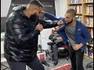

# How to Fight a Bigger Man - Firas Zahabi (2022-03-18)

## Description

DONATE NOW: https://www.saveiman.com/fb?affiliate_id=3414212 ⬅

The Prophet ﷺ said: “𝙒𝙝𝙤𝙚𝙫𝙚𝙧 𝙗𝙪𝙞𝙡𝙙𝙨 𝙖 𝙈𝙤𝙨𝙦𝙪𝙚 𝙛𝙤𝙧 𝘼𝙡𝙡𝙖𝙝, 𝘼𝙡𝙡𝙖𝙝 𝙬𝙞𝙡𝙡 𝙗𝙪𝙞𝙡𝙙 𝙛𝙤𝙧 𝙝𝙞𝙢 𝙖 𝙨𝙞𝙢𝙞𝙡𝙖𝙧 𝙝𝙤𝙪𝙨𝙚 𝙞𝙣 𝙅𝙖𝙣𝙣𝙖𝙝.”

If you support this project, you will in sha Allah get a house in Jannah and share in the rewards of all the people:

✅ Praying in the Masjid!
✅ Making Dhikr!
✅ Memorizing the Qur’an!

Please donate and help establish this Masjid and earn your reward ➡ https://www.saveiman.com/fb?affiliate_id=3414212 ⬅

#SaveIman

## Summary of [How to Fight a Bigger Man - Firas Zahabi](https://www.youtube.com/watch?v=1l-jS2LDxEw)

*This summary is AI generated - there may be inaccuracies. *

### [00:00:00](https://www.youtube.com/watch?v=1l-jS2LDxEw&t=0) - [00:20:00](https://www.youtube.com/watch?v=1l-jS2LDxEw&t=1200)

 demonstrates how Firas Zahabi, a world-renowned MMA fighter, uses takedowns to defeat bigger opponents. The techniques demonstrated include body lock takedowns, hip toss takedowns, and ankle pick knee pig takedowns. There is a risk associated with using these takedowns, but they are useful in dire circumstances.

**[00:00:00](https://www.youtube.com/watch?v=1l-jS2LDxEw&t=0)** Muslims in Norway are establishing a mosque and Dawah center to enhance the Norwegian Dawah. Donating to this course will ensure that Allah reap the rewards of thousands of Muslims coming back to Islam.

Firas Zahabi is a trainer and  coach of tri-state gym, one of the best in the world.  he discusses how to defeat a bigger opponent using a variety of techniques. He emphasizes the importance of conditioning and staying mobile to avoid being boxed in and taking advantage of the taller opponent's reach. Most importantly, he emphasizes the importance of breaking the opponent's rhythm and avoiding getting into a grapple where they can apply a guillotine choke.
* **[00:05:00](https://www.youtube.com/watch?v=1l-jS2LDxEw&t=300)**  demonstrates how Firas Zahabi, a world-renowned MMA fighter, uses takedowns to defeat bigger opponents. The techniques demonstrated include body lock takedowns, hip toss takedowns, and ankle pick knee pig takedowns. There is a risk associated with using these takedowns, but they are useful in dire circumstances.
* **[00:10:00](https://www.youtube.com/watch?v=1l-jS2LDxEw&t=600)* Discusses how tall men can beat shorter men in fights by using their reach advantage and jabbing. The taller man must be aware of the shorter man's kicks and punches, and use his  and shoulder to keep the shorter man at a distance.
* **[00:15:00](https://www.youtube.com/watch?v=1l-jS2LDxEw&t=900)** Firas Zahabi demonstrates how to fight a bigger man using body blocks and underhooks, as well as trilemma chokes and arm triangles. He also discusses heel hooks and armbars, explaining that he has an advantage in each.
* **[00:20:00](https://www.youtube.com/watch?v=1l-jS2LDxEw&t=1200)**  "How to Fight a Bigger Man - Firas Zahabi" discusses how to fight larger opponents by using techniques learned in a book.  also explains how to use one's mind to overcome the opponent.

<h2>Full transcript with timestamps: CLICK TO EXPAND</h2>

[0:00:00](https://youtu.be/1l-jS2LDxEw?t=0) muslims in norway are now establishing a  
[0:00:02](https://youtu.be/1l-jS2LDxEw?t=2) masjid and dawa center to enhance the  
[0:00:04](https://youtu.be/1l-jS2LDxEw?t=4) norwegian dawah if you donate to this  
[0:00:06](https://youtu.be/1l-jS2LDxEw?t=6) course you will ensure allah reap the  
[0:00:08](https://youtu.be/1l-jS2LDxEw?t=8) rewards of thousands of muslims coming  
[0:00:11](https://youtu.be/1l-jS2LDxEw?t=11) back to islam and many of those who  
[0:00:13](https://youtu.be/1l-jS2LDxEw?t=13) become dwight and invite to islam so  
[0:00:15](https://youtu.be/1l-jS2LDxEw?t=15) click the link and donate now and share  
[0:00:18](https://youtu.be/1l-jS2LDxEw?t=18) the video for extra rewards  
[0:00:20](https://youtu.be/1l-jS2LDxEw?t=20) i'm joined with the legend the man the  
[0:00:22](https://youtu.be/1l-jS2LDxEw?t=22) legend the steel man the historical  
[0:00:24](https://youtu.be/1l-jS2LDxEw?t=24) figure  
[0:00:25](https://youtu.be/1l-jS2LDxEw?t=25) [Laughter]  
[0:00:28](https://youtu.be/1l-jS2LDxEw?t=28) for us many of you would have known this  
[0:00:31](https://youtu.be/1l-jS2LDxEw?t=31) is the trainer  
[0:00:33](https://youtu.be/1l-jS2LDxEw?t=33) head trainer head coach in tri-state gym  
[0:00:35](https://youtu.be/1l-jS2LDxEw?t=35) it seems one of the best if not the best  
[0:00:37](https://youtu.be/1l-jS2LDxEw?t=37) you could argue uh trainer in the world  
[0:00:39](https://youtu.be/1l-jS2LDxEw?t=39) in mma now  
[0:00:41](https://youtu.be/1l-jS2LDxEw?t=41) this video is about how  
[0:00:43](https://youtu.be/1l-jS2LDxEw?t=43) to defeat a bigger opponent now i'm  
[0:00:45](https://youtu.be/1l-jS2LDxEw?t=45) noticeably sizable compared to uh for us  
[0:00:49](https://youtu.be/1l-jS2LDxEw?t=49) but obviously not skillful you don't  
[0:00:51](https://youtu.be/1l-jS2LDxEw?t=51) need to go into that details  
[0:00:52](https://youtu.be/1l-jS2LDxEw?t=52) so with someone like me for us how would  
[0:00:54](https://youtu.be/1l-jS2LDxEw?t=54) you so say for example i'm covering that  
[0:00:56](https://youtu.be/1l-jS2LDxEw?t=56) can you grab that  
[0:00:58](https://youtu.be/1l-jS2LDxEw?t=58) [Laughter]  
[0:01:03](https://youtu.be/1l-jS2LDxEw?t=63) [Music]  
[0:01:03](https://youtu.be/1l-jS2LDxEw?t=63) [Laughter]  
[0:01:12](https://youtu.be/1l-jS2LDxEw?t=72) okay so if i'm coming at you right  
[0:01:14](https://youtu.be/1l-jS2LDxEw?t=74) so i'm coming at you right now first  
[0:01:16](https://youtu.be/1l-jS2LDxEw?t=76) thing is i don't want to be on the same  
[0:01:18](https://youtu.be/1l-jS2LDxEw?t=78) line so your feet are pointing towards  
[0:01:19](https://youtu.be/1l-jS2LDxEw?t=79) me my feet are pointing towards you yeah  
[0:01:21](https://youtu.be/1l-jS2LDxEw?t=81) if we exchange your fist is likely to  
[0:01:23](https://youtu.be/1l-jS2LDxEw?t=83) land before mine because you've got a  
[0:01:24](https://youtu.be/1l-jS2LDxEw?t=84) longer reach yeah you got bigger weights  
[0:01:26](https://youtu.be/1l-jS2LDxEw?t=86) so one thing i like to do is like to  
[0:01:27](https://youtu.be/1l-jS2LDxEw?t=87) circle when you point your feet towards  
[0:01:29](https://youtu.be/1l-jS2LDxEw?t=89) me that's when i'm going to change back  
[0:01:30](https://youtu.be/1l-jS2LDxEw?t=90) direction as your feet lift the ground  
[0:01:32](https://youtu.be/1l-jS2LDxEw?t=92) to change direction okay that's what i'm  
[0:01:34](https://youtu.be/1l-jS2LDxEw?t=94) going to attack yourself so if i'm  
[0:01:35](https://youtu.be/1l-jS2LDxEw?t=95) constantly circling i'm sorry  
[0:01:37](https://youtu.be/1l-jS2LDxEw?t=97) certainly yeah so now look because  
[0:01:38](https://youtu.be/1l-jS2LDxEw?t=98) you're circling with me yeah i'm going  
[0:01:40](https://youtu.be/1l-jS2LDxEw?t=100) to go this way no i'm going to circle  
[0:01:41](https://youtu.be/1l-jS2LDxEw?t=101) this way now you're circling that way  
[0:01:43](https://youtu.be/1l-jS2LDxEw?t=103) i'm constantly  
[0:01:44](https://youtu.be/1l-jS2LDxEw?t=104) breaking the line i call it breaking  
[0:01:45](https://youtu.be/1l-jS2LDxEw?t=105) noise so if you put your fist like this  
[0:01:47](https://youtu.be/1l-jS2LDxEw?t=107) i want to be aimed for my face here i  
[0:01:48](https://youtu.be/1l-jS2LDxEw?t=108) want to be here and when you turn your  
[0:01:50](https://youtu.be/1l-jS2LDxEw?t=110) face your fist towards me i want to be  
[0:01:52](https://youtu.be/1l-jS2LDxEw?t=112) here enough i never want to be yeah face  
[0:01:55](https://youtu.be/1l-jS2LDxEw?t=115) to face with exactly and now i want to  
[0:01:57](https://youtu.be/1l-jS2LDxEw?t=117) create that i want to create that cut  
[0:01:59](https://youtu.be/1l-jS2LDxEw?t=119) back we call it a cutback so you go  
[0:02:00](https://youtu.be/1l-jS2LDxEw?t=120) right then to the left left then to the  
[0:02:03](https://youtu.be/1l-jS2LDxEw?t=123) right so we're talking about working in  
[0:02:05](https://youtu.be/1l-jS2LDxEw?t=125) circles here that's why i like to shadow  
[0:02:06](https://youtu.be/1l-jS2LDxEw?t=126) box oftentimes what i do is i put an  
[0:02:08](https://youtu.be/1l-jS2LDxEw?t=128) object on the floor like a boxing glove  
[0:02:10](https://youtu.be/1l-jS2LDxEw?t=130) yeah and i just teach my fighters to to  
[0:02:11](https://youtu.be/1l-jS2LDxEw?t=131) box around that glove  
[0:02:13](https://youtu.be/1l-jS2LDxEw?t=133) always circling always moving my head  
[0:02:15](https://youtu.be/1l-jS2LDxEw?t=135) because  
[0:02:16](https://youtu.be/1l-jS2LDxEw?t=136) his reach is longer yeah  
[0:02:18](https://youtu.be/1l-jS2LDxEw?t=138) but  
[0:02:19](https://youtu.be/1l-jS2LDxEw?t=139) but if i get here if i get here  
[0:02:22](https://youtu.be/1l-jS2LDxEw?t=142) the shorter man has an advantage now on  
[0:02:24](https://youtu.be/1l-jS2LDxEw?t=144) the outside you have the advantage yeah  
[0:02:26](https://youtu.be/1l-jS2LDxEw?t=146) on the inside if you watch this look if  
[0:02:28](https://youtu.be/1l-jS2LDxEw?t=148) you if you keep your shoulders up and i  
[0:02:29](https://youtu.be/1l-jS2LDxEw?t=149) put my shoulders down and we push each  
[0:02:30](https://youtu.be/1l-jS2LDxEw?t=150) other push push  
[0:02:32](https://youtu.be/1l-jS2LDxEw?t=152) look i'm stronger only because i'm lower  
[0:02:34](https://youtu.be/1l-jS2LDxEw?t=154) yeah my center of gravity is lower right  
[0:02:35](https://youtu.be/1l-jS2LDxEw?t=155) so when i get close to you you're going  
[0:02:37](https://youtu.be/1l-jS2LDxEw?t=157) to want to go down my height yeah now or  
[0:02:39](https://youtu.be/1l-jS2LDxEw?t=159) even if you push each other say we're  
[0:02:41](https://youtu.be/1l-jS2LDxEw?t=161) even okay now we're even so i want to  
[0:02:43](https://youtu.be/1l-jS2LDxEw?t=163) catch him tall yeah i'm circling i'm  
[0:02:45](https://youtu.be/1l-jS2LDxEw?t=165) circling and you if if you were trying  
[0:02:48](https://youtu.be/1l-jS2LDxEw?t=168) to chase me like this it's kind of very  
[0:02:49](https://youtu.be/1l-jS2LDxEw?t=169) tiring on the legs right yeah so you  
[0:02:51](https://youtu.be/1l-jS2LDxEw?t=171) have to relax your legs i want to catch  
[0:02:52](https://youtu.be/1l-jS2LDxEw?t=172) you tall i have a window of opportunity  
[0:02:54](https://youtu.be/1l-jS2LDxEw?t=174) when i come in here yeah now i'm going  
[0:02:56](https://youtu.be/1l-jS2LDxEw?t=176) to throw up then i got to get out again  
[0:02:58](https://youtu.be/1l-jS2LDxEw?t=178) because you're going to sit down with me  
[0:02:59](https://youtu.be/1l-jS2LDxEw?t=179) or you're going to grab me except right  
[0:03:00](https://youtu.be/1l-jS2LDxEw?t=180) so when you're fighting a taller  
[0:03:01](https://youtu.be/1l-jS2LDxEw?t=181) opponent one thing i really like to do  
[0:03:03](https://youtu.be/1l-jS2LDxEw?t=183) we're assuming this is not just a  
[0:03:04](https://youtu.be/1l-jS2LDxEw?t=184) striking affair right right right we're  
[0:03:06](https://youtu.be/1l-jS2LDxEw?t=186) gonna get to yeah wrestling soon yeah  
[0:03:08](https://youtu.be/1l-jS2LDxEw?t=188) but striking i can't stand in front of  
[0:03:09](https://youtu.be/1l-jS2LDxEw?t=189) you you have to circle okay because if i  
[0:03:11](https://youtu.be/1l-jS2LDxEw?t=191) stand here so you're either out or in  
[0:03:13](https://youtu.be/1l-jS2LDxEw?t=193) yeah  
[0:03:14](https://youtu.be/1l-jS2LDxEw?t=194) you've got a longer job than me if you  
[0:03:15](https://youtu.be/1l-jS2LDxEw?t=195) see if i try to punch you and you punch  
[0:03:16](https://youtu.be/1l-jS2LDxEw?t=196) me you're going to beat me every time  
[0:03:18](https://youtu.be/1l-jS2LDxEw?t=198) yeah so i got a circle i got a circle i  
[0:03:20](https://youtu.be/1l-jS2LDxEw?t=200) got to get you stepping i got to keep  
[0:03:21](https://youtu.be/1l-jS2LDxEw?t=201) the ranges off yeah i got to cut i got  
[0:03:22](https://youtu.be/1l-jS2LDxEw?t=202) to catch you want to cut back yeah okay  
[0:03:25](https://youtu.be/1l-jS2LDxEw?t=205) you know i got to catch you and come  
[0:03:26](https://youtu.be/1l-jS2LDxEw?t=206) back now when i fight a taller guy yeah  
[0:03:29](https://youtu.be/1l-jS2LDxEw?t=209) i like to shoot doubles but when i shoot  
[0:03:30](https://youtu.be/1l-jS2LDxEw?t=210) a double yeah i don't shoot and lift  
[0:03:34](https://youtu.be/1l-jS2LDxEw?t=214) because  
[0:03:35](https://youtu.be/1l-jS2LDxEw?t=215) their legs are so long that when you  
[0:03:36](https://youtu.be/1l-jS2LDxEw?t=216) lift they're still on the floor  
[0:03:38](https://youtu.be/1l-jS2LDxEw?t=218) unless they're heavy  
[0:03:39](https://youtu.be/1l-jS2LDxEw?t=219) so we're going to kosotogi so a trip so  
[0:03:41](https://youtu.be/1l-jS2LDxEw?t=221) watch out here i put my hook behind your  
[0:03:43](https://youtu.be/1l-jS2LDxEw?t=223) ankle like this  
[0:03:45](https://youtu.be/1l-jS2LDxEw?t=225) and now i don't have to lift you see i  
[0:03:46](https://youtu.be/1l-jS2LDxEw?t=226) would trip you down to the floor here's  
[0:03:47](https://youtu.be/1l-jS2LDxEw?t=227) what you call kasotogaki should i go  
[0:03:49](https://youtu.be/1l-jS2LDxEw?t=229) down  
[0:03:49](https://youtu.be/1l-jS2LDxEw?t=229) well yeah just be careful because all  
[0:03:51](https://youtu.be/1l-jS2LDxEw?t=231) right yeah so i want to trap their leg  
[0:03:53](https://youtu.be/1l-jS2LDxEw?t=233) as i shoot a double so i shoot  
[0:03:56](https://youtu.be/1l-jS2LDxEw?t=236) into a trap here i am like this  
[0:03:59](https://youtu.be/1l-jS2LDxEw?t=239) now i don't have to worry so much about  
[0:04:00](https://youtu.be/1l-jS2LDxEw?t=240) guillotine because even if you trap my  
[0:04:02](https://youtu.be/1l-jS2LDxEw?t=242) neck  
[0:04:03](https://youtu.be/1l-jS2LDxEw?t=243) because for you to make that guillotine  
[0:04:04](https://youtu.be/1l-jS2LDxEw?t=244) work you need your legs around my body  
[0:04:06](https://youtu.be/1l-jS2LDxEw?t=246) yeah i'm not going to let you put your  
[0:04:07](https://youtu.be/1l-jS2LDxEw?t=247) legs around my body see yeah because  
[0:04:09](https://youtu.be/1l-jS2LDxEw?t=249) that guilt is very weak  
[0:04:11](https://youtu.be/1l-jS2LDxEw?t=251) it lets you have your legs around my  
[0:04:12](https://youtu.be/1l-jS2LDxEw?t=252) body you have to put me inside the  
[0:04:14](https://youtu.be/1l-jS2LDxEw?t=254) garbage if you're getting into combat  
[0:04:16](https://youtu.be/1l-jS2LDxEw?t=256) god is it oh yeah if here if you have  
[0:04:17](https://youtu.be/1l-jS2LDxEw?t=257) any guilty no i could have a lot of  
[0:04:18](https://youtu.be/1l-jS2LDxEw?t=258) danger  
[0:04:20](https://youtu.be/1l-jS2LDxEw?t=260) yeah no i'm gonna want a baby here but  
[0:04:22](https://youtu.be/1l-jS2LDxEw?t=262) if i trip your leg yep  
[0:04:24](https://youtu.be/1l-jS2LDxEw?t=264) try to put me together okay now  
[0:04:26](https://youtu.be/1l-jS2LDxEw?t=266) try to choke me  
[0:04:29](https://youtu.be/1l-jS2LDxEw?t=269) because it's very difficult  
[0:04:31](https://youtu.be/1l-jS2LDxEw?t=271) because you don't have your legs wrapped  
[0:04:32](https://youtu.be/1l-jS2LDxEw?t=272) around my body yep see i'm gonna pump a  
[0:04:34](https://youtu.be/1l-jS2LDxEw?t=274) lot of your legs yeah so the two major  
[0:04:37](https://youtu.be/1l-jS2LDxEw?t=277) benefits is  
[0:04:38](https://youtu.be/1l-jS2LDxEw?t=278) when you shoot a double egg on a taller  
[0:04:39](https://youtu.be/1l-jS2LDxEw?t=279) guy you don't have to lift them if you  
[0:04:41](https://youtu.be/1l-jS2LDxEw?t=281) trip yeah  
[0:04:42](https://youtu.be/1l-jS2LDxEw?t=282) you give me those guys now all the tips  
[0:04:45](https://youtu.be/1l-jS2LDxEw?t=285) because you're so tall it's easier for  
[0:04:47](https://youtu.be/1l-jS2LDxEw?t=287) me to get to your ankle right but if you  
[0:04:49](https://youtu.be/1l-jS2LDxEw?t=289) were my height it would be lower because  
[0:04:50](https://youtu.be/1l-jS2LDxEw?t=290) your arms and shoulders would be easily  
[0:04:51](https://youtu.be/1l-jS2LDxEw?t=291) double for me then on my side  
[0:04:53](https://youtu.be/1l-jS2LDxEw?t=293) i'm trying to screw that's it  
[0:04:55](https://youtu.be/1l-jS2LDxEw?t=295) guys for taller guys i like when you're  
[0:04:57](https://youtu.be/1l-jS2LDxEw?t=297) the taller man i like body lock and trip  
[0:04:58](https://youtu.be/1l-jS2LDxEw?t=298) so if you body lock me because the thing  
[0:05:00](https://youtu.be/1l-jS2LDxEw?t=300) is my legs are too far if you go for my  
[0:05:01](https://youtu.be/1l-jS2LDxEw?t=301) legs it's too much too much of a  
[0:05:03](https://youtu.be/1l-jS2LDxEw?t=303) distance to get all the way down yeah  
[0:05:06](https://youtu.be/1l-jS2LDxEw?t=306) so i'm coming here yeah i really like it  
[0:05:08](https://youtu.be/1l-jS2LDxEw?t=308) like this yeah well now you could trip  
[0:05:09](https://youtu.be/1l-jS2LDxEw?t=309) my my my right leg with your left yeah  
[0:05:12](https://youtu.be/1l-jS2LDxEw?t=312) no no no you're with your left  
[0:05:14](https://youtu.be/1l-jS2LDxEw?t=314) hook  
[0:05:15](https://youtu.be/1l-jS2LDxEw?t=315) yeah you could you could put your foot  
[0:05:16](https://youtu.be/1l-jS2LDxEw?t=316) in the middle yeah and then kind of  
[0:05:18](https://youtu.be/1l-jS2LDxEw?t=318) throw me with your hip yeah like this go  
[0:05:19](https://youtu.be/1l-jS2LDxEw?t=319) up here i really like this for taller  
[0:05:21](https://youtu.be/1l-jS2LDxEw?t=321) guys  
[0:05:22](https://youtu.be/1l-jS2LDxEw?t=322) yeah so we're here like this body lock  
[0:05:24](https://youtu.be/1l-jS2LDxEw?t=324) yeah you put your leg inside and you  
[0:05:25](https://youtu.be/1l-jS2LDxEw?t=325) start to hit yeah  
[0:05:27](https://youtu.be/1l-jS2LDxEw?t=327) yeah yeah that's good for me no i mean  
[0:05:29](https://youtu.be/1l-jS2LDxEw?t=329) if you're coming to a double leg for me  
[0:05:31](https://youtu.be/1l-jS2LDxEw?t=331) yes how much around the front i like the  
[0:05:33](https://youtu.be/1l-jS2LDxEw?t=333) underhook so like can you shoot all my  
[0:05:34](https://youtu.be/1l-jS2LDxEw?t=334) legs  
[0:05:35](https://youtu.be/1l-jS2LDxEw?t=335) under hook see yeah this is one of many  
[0:05:38](https://youtu.be/1l-jS2LDxEw?t=338) ways okay and then you can get into your  
[0:05:39](https://youtu.be/1l-jS2LDxEw?t=339) body lock oh okay so if i shoot on you  
[0:05:41](https://youtu.be/1l-jS2LDxEw?t=341) you're gonna put your hands like this  
[0:05:42](https://youtu.be/1l-jS2LDxEw?t=342) all right  
[0:05:44](https://youtu.be/1l-jS2LDxEw?t=344) yeah you elevate me here there you go  
[0:05:45](https://youtu.be/1l-jS2LDxEw?t=345) now you can turn the tables on me  
[0:05:47](https://youtu.be/1l-jS2LDxEw?t=347) right exactly okay  
[0:05:49](https://youtu.be/1l-jS2LDxEw?t=349) what we call an ukigoshi hip one hip  
[0:05:52](https://youtu.be/1l-jS2LDxEw?t=352) because typically as kids they teach you  
[0:05:54](https://youtu.be/1l-jS2LDxEw?t=354) ogoshi which is two hips yeah but if i  
[0:05:57](https://youtu.be/1l-jS2LDxEw?t=357) do that you can grab my body and lift me  
[0:05:58](https://youtu.be/1l-jS2LDxEw?t=358) here yeah i'm too committed yeah so we  
[0:06:00](https://youtu.be/1l-jS2LDxEw?t=360) just go one hip like see i see one hip  
[0:06:02](https://youtu.be/1l-jS2LDxEw?t=362) and now we can ankle pick knee pig yeah  
[0:06:05](https://youtu.be/1l-jS2LDxEw?t=365) snap down etc  
[0:06:06](https://youtu.be/1l-jS2LDxEw?t=366) yeah so if i shoot on you  
[0:06:09](https://youtu.be/1l-jS2LDxEw?t=369) so if you're boxing yeah you got to be  
[0:06:11](https://youtu.be/1l-jS2LDxEw?t=371) quick to your other yeah exactly  
[0:06:13](https://youtu.be/1l-jS2LDxEw?t=373) there you go now i'm in trouble here now  
[0:06:15](https://youtu.be/1l-jS2LDxEw?t=375) you have a variety of takedowns one of  
[0:06:16](https://youtu.be/1l-jS2LDxEw?t=376) them being the hip toss  
[0:06:18](https://youtu.be/1l-jS2LDxEw?t=378) that's what we call ukigoshi what we've  
[0:06:20](https://youtu.be/1l-jS2LDxEw?t=380) seen you do as well  
[0:06:22](https://youtu.be/1l-jS2LDxEw?t=382) and this might be  
[0:06:24](https://youtu.be/1l-jS2LDxEw?t=384) we don't do a lot to be honest in the uk  
[0:06:26](https://youtu.be/1l-jS2LDxEw?t=386) because a lot of the  
[0:06:28](https://youtu.be/1l-jS2LDxEw?t=388) kind of gyms don't allow it they're more  
[0:06:30](https://youtu.be/1l-jS2LDxEw?t=390) traditional yeah which is heel hooks yes  
[0:06:34](https://youtu.be/1l-jS2LDxEw?t=394) and we've seen you do a lot of these  
[0:06:35](https://youtu.be/1l-jS2LDxEw?t=395) yeah yeah yeah you're you're known for  
[0:06:37](https://youtu.be/1l-jS2LDxEw?t=397) that i was in the heart club yeah it's  
[0:06:38](https://youtu.be/1l-jS2LDxEw?t=398) known for that so  
[0:06:40](https://youtu.be/1l-jS2LDxEw?t=400) with someone big like me  
[0:06:42](https://youtu.be/1l-jS2LDxEw?t=402) to what extent  
[0:06:44](https://youtu.be/1l-jS2LDxEw?t=404) would it make sense for you to go for a  
[0:06:45](https://youtu.be/1l-jS2LDxEw?t=405) hill hook  
[0:06:46](https://youtu.be/1l-jS2LDxEw?t=406) uh very like look look at the size of  
[0:06:48](https://youtu.be/1l-jS2LDxEw?t=408) our feet here put your foot here yeah  
[0:06:50](https://youtu.be/1l-jS2LDxEw?t=410) look he's got a much longer left lever  
[0:06:52](https://youtu.be/1l-jS2LDxEw?t=412) it's much easier for me to break your  
[0:06:53](https://youtu.be/1l-jS2LDxEw?t=413) leg than it is for you to break mine you  
[0:06:55](https://youtu.be/1l-jS2LDxEw?t=415) know what they say  
[0:06:59](https://youtu.be/1l-jS2LDxEw?t=419) good point  
[0:07:01](https://youtu.be/1l-jS2LDxEw?t=421) think about breaking a long branch or  
[0:07:03](https://youtu.be/1l-jS2LDxEw?t=423) breaking a small branch you can only  
[0:07:04](https://youtu.be/1l-jS2LDxEw?t=424) think the smaller branch have less  
[0:07:05](https://youtu.be/1l-jS2LDxEw?t=425) leverage so it's easier for me to grab  
[0:07:07](https://youtu.be/1l-jS2LDxEw?t=427) and break that so how would you go like  
[0:07:09](https://youtu.be/1l-jS2LDxEw?t=429) say for example i'm coming at you well  
[0:07:10](https://youtu.be/1l-jS2LDxEw?t=430) if we're standing i like to do something  
[0:07:11](https://youtu.be/1l-jS2LDxEw?t=431) called ashy slide okay so like i pretend  
[0:07:13](https://youtu.be/1l-jS2LDxEw?t=433) like i'm doing a double legs i'll do it  
[0:07:15](https://youtu.be/1l-jS2LDxEw?t=435) real slow okay yeah i'm shooting double  
[0:07:16](https://youtu.be/1l-jS2LDxEw?t=436) leg but then i slide underneath like  
[0:07:18](https://youtu.be/1l-jS2LDxEw?t=438) this oh nice and then what i do is i  
[0:07:20](https://youtu.be/1l-jS2LDxEw?t=440) like to push inside your thigh here like  
[0:07:21](https://youtu.be/1l-jS2LDxEw?t=441) this oh beautiful see now if you try to  
[0:07:22](https://youtu.be/1l-jS2LDxEw?t=442) punch me you won't be able to yeah no  
[0:07:24](https://youtu.be/1l-jS2LDxEw?t=444) chance you have no shot and i'll look  
[0:07:25](https://youtu.be/1l-jS2LDxEw?t=445) where your heel is yeah nowadays because  
[0:07:27](https://youtu.be/1l-jS2LDxEw?t=447) that thigh try to resist me it's  
[0:07:29](https://youtu.be/1l-jS2LDxEw?t=449) impossible yeah exactly you're just  
[0:07:30](https://youtu.be/1l-jS2LDxEw?t=450) you're just bringing yourself down to  
[0:07:31](https://youtu.be/1l-jS2LDxEw?t=451) the mat so that's the first thing i do i  
[0:07:33](https://youtu.be/1l-jS2LDxEw?t=453) can push inside the thigh now look at  
[0:07:35](https://youtu.be/1l-jS2LDxEw?t=455) that lever that we're talking about look  
[0:07:37](https://youtu.be/1l-jS2LDxEw?t=457) i'm breaking this ankle quite easily  
[0:07:38](https://youtu.be/1l-jS2LDxEw?t=458) it's beautiful yeah it's very very  
[0:07:39](https://youtu.be/1l-jS2LDxEw?t=459) difficult you try  
[0:07:40](https://youtu.be/1l-jS2LDxEw?t=460) here  
[0:07:41](https://youtu.be/1l-jS2LDxEw?t=461) you got nothing if i start cranking yeah  
[0:07:43](https://youtu.be/1l-jS2LDxEw?t=463) you won't be able to reach my body or  
[0:07:44](https://youtu.be/1l-jS2LDxEw?t=464) face  
[0:07:46](https://youtu.be/1l-jS2LDxEw?t=466) with that  
[0:07:48](https://youtu.be/1l-jS2LDxEw?t=468) do you feel like it's a good idea in the  
[0:07:49](https://youtu.be/1l-jS2LDxEw?t=469) mma setting because we've seen it not  
[0:07:50](https://youtu.be/1l-jS2LDxEw?t=470) work as well yeah of course of course of  
[0:07:52](https://youtu.be/1l-jS2LDxEw?t=472) course there's a there's a risk with  
[0:07:54](https://youtu.be/1l-jS2LDxEw?t=474) everything you know yeah i personally i  
[0:07:55](https://youtu.be/1l-jS2LDxEw?t=475) like to use that as a surprise once in a  
[0:07:57](https://youtu.be/1l-jS2LDxEw?t=477) while yeah i would prefer using the  
[0:07:58](https://youtu.be/1l-jS2LDxEw?t=478) double egg with the kosovo  
[0:08:00](https://youtu.be/1l-jS2LDxEw?t=480) yeah i want to be on top because you  
[0:08:01](https://youtu.be/1l-jS2LDxEw?t=481) can't hit me  
[0:08:02](https://youtu.be/1l-jS2LDxEw?t=482) when i'm on top you can but it's not  
[0:08:04](https://youtu.be/1l-jS2LDxEw?t=484) really effective yeah uh the other thing  
[0:08:05](https://youtu.be/1l-jS2LDxEw?t=485) i like to do is i like to duck under on  
[0:08:07](https://youtu.be/1l-jS2LDxEw?t=487) top guys like this  
[0:08:08](https://youtu.be/1l-jS2LDxEw?t=488) and get behind the wipes i'm in a  
[0:08:10](https://youtu.be/1l-jS2LDxEw?t=490) position of safety and would you go into  
[0:08:11](https://youtu.be/1l-jS2LDxEw?t=491) like a heel hook position from here  
[0:08:13](https://youtu.be/1l-jS2LDxEw?t=493) because from here from here i have a  
[0:08:14](https://youtu.be/1l-jS2LDxEw?t=494) variety of uh takedowns but the one i  
[0:08:15](https://youtu.be/1l-jS2LDxEw?t=495) like first is blocking the knee just  
[0:08:17](https://youtu.be/1l-jS2LDxEw?t=497) like this yeah and trying to get your  
[0:08:19](https://youtu.be/1l-jS2LDxEw?t=499) hands on the mat you see i'm blocking  
[0:08:21](https://youtu.be/1l-jS2LDxEw?t=501) your knee i'm putting my weight forward  
[0:08:22](https://youtu.be/1l-jS2LDxEw?t=502) and i'll have you in what we call a gut  
[0:08:23](https://youtu.be/1l-jS2LDxEw?t=503) wrench yeah from here i can climb to the  
[0:08:25](https://youtu.be/1l-jS2LDxEw?t=505) back  
[0:08:26](https://youtu.be/1l-jS2LDxEw?t=506) i can uh force you down to the mat  
[0:08:28](https://youtu.be/1l-jS2LDxEw?t=508) khabib business all the time of course  
[0:08:29](https://youtu.be/1l-jS2LDxEw?t=509) he's the master of gut wrench because  
[0:08:30](https://youtu.be/1l-jS2LDxEw?t=510) you can you can do  
[0:08:32](https://youtu.be/1l-jS2LDxEw?t=512) i might be wrong here but  
[0:08:34](https://youtu.be/1l-jS2LDxEw?t=514) you can drop down here  
[0:08:36](https://youtu.be/1l-jS2LDxEw?t=516) and you can you can but that's risky  
[0:08:38](https://youtu.be/1l-jS2LDxEw?t=518) that's risky because especially when  
[0:08:39](https://youtu.be/1l-jS2LDxEw?t=519) things are slippery when you do that i'm  
[0:08:40](https://youtu.be/1l-jS2LDxEw?t=520) just going to piss my legs up  
[0:08:42](https://youtu.be/1l-jS2LDxEw?t=522) you're on the floor i like those things  
[0:08:44](https://youtu.be/1l-jS2LDxEw?t=524) once in a while by surprise like if you  
[0:08:46](https://youtu.be/1l-jS2LDxEw?t=526) see that move that you did yeah shogun  
[0:08:47](https://youtu.be/1l-jS2LDxEw?t=527) tried it on jon jones in the title fight  
[0:08:49](https://youtu.be/1l-jS2LDxEw?t=529) oh yeah i thought it was a major mistake  
[0:08:51](https://youtu.be/1l-jS2LDxEw?t=531) because yeah he got to the waist of john  
[0:08:54](https://youtu.be/1l-jS2LDxEw?t=534) yeah he sat down and john just got to  
[0:08:56](https://youtu.be/1l-jS2LDxEw?t=536) lift his leg up because things are  
[0:08:57](https://youtu.be/1l-jS2LDxEw?t=537) slippery yeah yeah yeah and there's  
[0:08:58](https://youtu.be/1l-jS2LDxEw?t=538) punches involved why take the risk  
[0:08:59](https://youtu.be/1l-jS2LDxEw?t=539) you're behind the guy i'm in the safe  
[0:09:01](https://youtu.be/1l-jS2LDxEw?t=541) here  
[0:09:02](https://youtu.be/1l-jS2LDxEw?t=542) look i'm in such a safe position why  
[0:09:03](https://youtu.be/1l-jS2LDxEw?t=543) would i go here where you can now punch  
[0:09:05](https://youtu.be/1l-jS2LDxEw?t=545) me yeah boom like why would i put myself  
[0:09:07](https://youtu.be/1l-jS2LDxEw?t=547) in the line of fire when i'm behind you  
[0:09:09](https://youtu.be/1l-jS2LDxEw?t=549) and you can't hit me so i find it  
[0:09:11](https://youtu.be/1l-jS2LDxEw?t=551) strategically a mistake yeah it should  
[0:09:13](https://youtu.be/1l-jS2LDxEw?t=553) only be used in the most  
[0:09:15](https://youtu.be/1l-jS2LDxEw?t=555) dire circumstances you're losing you  
[0:09:16](https://youtu.be/1l-jS2LDxEw?t=556) need to break the guy's leg in the next  
[0:09:18](https://youtu.be/1l-jS2LDxEw?t=558) 30 seconds or we lose okay take the same  
[0:09:20](https://youtu.be/1l-jS2LDxEw?t=560) thing with the foot looks and stuff yeah  
[0:09:21](https://youtu.be/1l-jS2LDxEw?t=561) exactly i'll use it because the thing is  
[0:09:23](https://youtu.be/1l-jS2LDxEw?t=563) technique  
[0:09:24](https://youtu.be/1l-jS2LDxEw?t=564) always has to be  
[0:09:26](https://youtu.be/1l-jS2LDxEw?t=566) uh  
[0:09:27](https://youtu.be/1l-jS2LDxEw?t=567) under strategy yeah i can't just oh i'll  
[0:09:29](https://youtu.be/1l-jS2LDxEw?t=569) do any technique no no no  
[0:09:31](https://youtu.be/1l-jS2LDxEw?t=571) we have a bunch of tools which tools do  
[0:09:33](https://youtu.be/1l-jS2LDxEw?t=573) we need to do this particular job  
[0:09:35](https://youtu.be/1l-jS2LDxEw?t=575) we have to scrutinize what tool you're  
[0:09:36](https://youtu.be/1l-jS2LDxEw?t=576) going to use don't just bring out the  
[0:09:37](https://youtu.be/1l-jS2LDxEw?t=577) chainsaw when we're trying to glue two  
[0:09:39](https://youtu.be/1l-jS2LDxEw?t=579) pieces together chainsaw's useless so  
[0:09:42](https://youtu.be/1l-jS2LDxEw?t=582) i think i try to put you on your back i  
[0:09:44](https://youtu.be/1l-jS2LDxEw?t=584) try to box you if i can't and i'm losing  
[0:09:46](https://youtu.be/1l-jS2LDxEw?t=586) then i'll do something more high risk  
[0:09:47](https://youtu.be/1l-jS2LDxEw?t=587) yeah  
[0:09:48](https://youtu.be/1l-jS2LDxEw?t=588) now  
[0:09:49](https://youtu.be/1l-jS2LDxEw?t=589) this is a good video uh this is uh  
[0:09:51](https://youtu.be/1l-jS2LDxEw?t=591) many people could be taking notes but  
[0:09:53](https://youtu.be/1l-jS2LDxEw?t=593) the guys on the outside the big guys  
[0:09:56](https://youtu.be/1l-jS2LDxEw?t=596) that's all guys are gonna feel this is  
[0:09:58](https://youtu.be/1l-jS2LDxEw?t=598) ridiculous they're gonna say now for us  
[0:10:00](https://youtu.be/1l-jS2LDxEw?t=600) telling all these smaller people how to  
[0:10:01](https://youtu.be/1l-jS2LDxEw?t=601) be the big guys but he hasn't said  
[0:10:03](https://youtu.be/1l-jS2LDxEw?t=603) anything about how the taller guys can  
[0:10:04](https://youtu.be/1l-jS2LDxEw?t=604) beat the smaller guys you don't need any  
[0:10:06](https://youtu.be/1l-jS2LDxEw?t=606) help look at me  
[0:10:08](https://youtu.be/1l-jS2LDxEw?t=608) but they say that yeah you know we  
[0:10:10](https://youtu.be/1l-jS2LDxEw?t=610) haven't had that much success in the ufc  
[0:10:13](https://youtu.be/1l-jS2LDxEw?t=613) um so what would you uh  
[0:10:15](https://youtu.be/1l-jS2LDxEw?t=615) say i like the job okay so like yeah i  
[0:10:16](https://youtu.be/1l-jS2LDxEw?t=616) think georgia had the longest switch in  
[0:10:18](https://youtu.be/1l-jS2LDxEw?t=618) this division that's why i really  
[0:10:19](https://youtu.be/1l-jS2LDxEw?t=619) designed this game to be a jabber so  
[0:10:21](https://youtu.be/1l-jS2LDxEw?t=621) number one rule about jabbing see look  
[0:10:22](https://youtu.be/1l-jS2LDxEw?t=622) look at my reach here yeah the second  
[0:10:24](https://youtu.be/1l-jS2LDxEw?t=624) i'm touch your hand to the wall the  
[0:10:26](https://youtu.be/1l-jS2LDxEw?t=626) second i punch at an angle towards the  
[0:10:29](https://youtu.be/1l-jS2LDxEw?t=629) ground  
[0:10:30](https://youtu.be/1l-jS2LDxEw?t=630) see i lost reach i'll go here here i  
[0:10:32](https://youtu.be/1l-jS2LDxEw?t=632) have maximum reach  
[0:10:34](https://youtu.be/1l-jS2LDxEw?t=634) here just punching downwards  
[0:10:37](https://youtu.be/1l-jS2LDxEw?t=637) is really really bad for me so if i'm  
[0:10:38](https://youtu.be/1l-jS2LDxEw?t=638) fighting a guy who's shorter than me and  
[0:10:40](https://youtu.be/1l-jS2LDxEw?t=640) i'm jabbing at an angle downwards i'm  
[0:10:42](https://youtu.be/1l-jS2LDxEw?t=642) actually not using my reach right i have  
[0:10:44](https://youtu.be/1l-jS2LDxEw?t=644) to get what we call eye level okay so  
[0:10:45](https://youtu.be/1l-jS2LDxEw?t=645) are you coming down yeah i'm coming down  
[0:10:47](https://youtu.be/1l-jS2LDxEw?t=647) to his level okay however that leaves me  
[0:10:48](https://youtu.be/1l-jS2LDxEw?t=648) more susceptible to kicks i have to be  
[0:10:50](https://youtu.be/1l-jS2LDxEw?t=650) aware of that i have a question here  
[0:10:51](https://youtu.be/1l-jS2LDxEw?t=651) yeah if you go down  
[0:10:53](https://youtu.be/1l-jS2LDxEw?t=653) for on the one hand yeah if he goes down  
[0:10:56](https://youtu.be/1l-jS2LDxEw?t=656) he's gonna have more reach well on the  
[0:10:58](https://youtu.be/1l-jS2LDxEw?t=658) other hand if you come and hit me now  
[0:11:00](https://youtu.be/1l-jS2LDxEw?t=660) are you not now  
[0:11:02](https://youtu.be/1l-jS2LDxEw?t=662) me being taller isn't that me forcing  
[0:11:04](https://youtu.be/1l-jS2LDxEw?t=664) you to extend your arm which requires  
[0:11:06](https://youtu.be/1l-jS2LDxEw?t=666) more reach well for the shorter guy i  
[0:11:07](https://youtu.be/1l-jS2LDxEw?t=667) want to close the distance then punch  
[0:11:09](https://youtu.be/1l-jS2LDxEw?t=669) common mistake this guy's punch on the  
[0:11:10](https://youtu.be/1l-jS2LDxEw?t=670) way in like great example mcgregor and  
[0:11:12](https://youtu.be/1l-jS2LDxEw?t=672) uh  
[0:11:15](https://youtu.be/1l-jS2LDxEw?t=675) jose jose aldo yeah  
[0:11:19](https://youtu.be/1l-jS2LDxEw?t=679) leaps in with a punch steps back home  
[0:11:20](https://youtu.be/1l-jS2LDxEw?t=680) catches him on the way in a taller guy  
[0:11:22](https://youtu.be/1l-jS2LDxEw?t=682) yeah you're the taller guy if i punch  
[0:11:24](https://youtu.be/1l-jS2LDxEw?t=684) from here you're gonna beat me because  
[0:11:25](https://youtu.be/1l-jS2LDxEw?t=685) your reach is longer yeah i gotta close  
[0:11:26](https://youtu.be/1l-jS2LDxEw?t=686) the distance like we talked about yeah  
[0:11:28](https://youtu.be/1l-jS2LDxEw?t=688) then i have to have the discipline to  
[0:11:30](https://youtu.be/1l-jS2LDxEw?t=690) withstand  
[0:11:30](https://youtu.be/1l-jS2LDxEw?t=690) to delay my strikes right now once i  
[0:11:33](https://youtu.be/1l-jS2LDxEw?t=693) close the distance now i actually have  
[0:11:34](https://youtu.be/1l-jS2LDxEw?t=694) more leverage than you yeah yeah yeah if  
[0:11:36](https://youtu.be/1l-jS2LDxEw?t=696) we punch each other from here i have  
[0:11:37](https://youtu.be/1l-jS2LDxEw?t=697) actually superiority a bunch of  
[0:11:39](https://youtu.be/1l-jS2LDxEw?t=699) uppercuts yeah uppercut is dangerous but  
[0:11:41](https://youtu.be/1l-jS2LDxEw?t=701) i still have more remember if we push  
[0:11:42](https://youtu.be/1l-jS2LDxEw?t=702) each other here push yeah who generates  
[0:11:43](https://youtu.be/1l-jS2LDxEw?t=703) more power yeah the guy who's shorter so  
[0:11:46](https://youtu.be/1l-jS2LDxEw?t=706) shorter guy has more leverage on the  
[0:11:47](https://youtu.be/1l-jS2LDxEw?t=707) inside taller guy has more leverage on  
[0:11:49](https://youtu.be/1l-jS2LDxEw?t=709) the outside correct yeah so to you to  
[0:11:51](https://youtu.be/1l-jS2LDxEw?t=711) maximize that job of yours you need to  
[0:11:52](https://youtu.be/1l-jS2LDxEw?t=712) get as short as me so what's going on  
[0:11:54](https://youtu.be/1l-jS2LDxEw?t=714) yeah if you look at georgetown pierre  
[0:11:55](https://youtu.be/1l-jS2LDxEw?t=715) versus matt sarah the rematch  
[0:11:58](https://youtu.be/1l-jS2LDxEw?t=718) george was short by sarah  
[0:12:00](https://youtu.be/1l-jS2LDxEw?t=720) okay he came in the first match where he  
[0:12:01](https://youtu.be/1l-jS2LDxEw?t=721) got knocked out he was tall and sarah  
[0:12:03](https://youtu.be/1l-jS2LDxEw?t=723) caught him with that oh  
[0:12:04](https://youtu.be/1l-jS2LDxEw?t=724) and dropped him and wobbled him and then  
[0:12:06](https://youtu.be/1l-jS2LDxEw?t=726) we corrected it's actually very good  
[0:12:07](https://youtu.be/1l-jS2LDxEw?t=727) yeah  
[0:12:13](https://youtu.be/1l-jS2LDxEw?t=733) yeah so calm down because you have the  
[0:12:15](https://youtu.be/1l-jS2LDxEw?t=735) you have the reach advantage i would use  
[0:12:16](https://youtu.be/1l-jS2LDxEw?t=736) the jab yeah exactly and i would be  
[0:12:17](https://youtu.be/1l-jS2LDxEw?t=737) using i'd be coming down you want to be  
[0:12:19](https://youtu.be/1l-jS2LDxEw?t=739) as short as me it's going to say level  
[0:12:21](https://youtu.be/1l-jS2LDxEw?t=741) you have to be at my level okay good so  
[0:12:23](https://youtu.be/1l-jS2LDxEw?t=743) now your job's in my way if i want to  
[0:12:24](https://youtu.be/1l-jS2LDxEw?t=744) get to you the job's in the way if  
[0:12:26](https://youtu.be/1l-jS2LDxEw?t=746) you're punching from up there yeah your  
[0:12:28](https://youtu.be/1l-jS2LDxEw?t=748) jab is actually not reaching me yeah  
[0:12:29](https://youtu.be/1l-jS2LDxEw?t=749) because it's actually it's much easier  
[0:12:30](https://youtu.be/1l-jS2LDxEw?t=750) for me to get get closer to you yeah  
[0:12:32](https://youtu.be/1l-jS2LDxEw?t=752) whereas if you get eye level i have to  
[0:12:34](https://youtu.be/1l-jS2LDxEw?t=754) do my my blitz or my closing this is  
[0:12:36](https://youtu.be/1l-jS2LDxEw?t=756) from further out so the the margin of  
[0:12:38](https://youtu.be/1l-jS2LDxEw?t=758) error is greater for me so i'm  
[0:12:39](https://youtu.be/1l-jS2LDxEw?t=759) constantly now i have that job between  
[0:12:41](https://youtu.be/1l-jS2LDxEw?t=761) between me and you you're keeping that  
[0:12:43](https://youtu.be/1l-jS2LDxEw?t=763) job between me and you at all times so  
[0:12:45](https://youtu.be/1l-jS2LDxEw?t=765) every time i try to sidestep and cut in  
[0:12:46](https://youtu.be/1l-jS2LDxEw?t=766) you're trying to pick me off with a job  
[0:12:48](https://youtu.be/1l-jS2LDxEw?t=768) okay so there's the same thing about  
[0:12:49](https://youtu.be/1l-jS2LDxEw?t=769) kicking range because kicking range is  
[0:12:50](https://youtu.be/1l-jS2LDxEw?t=770) different right when you squat down like  
[0:12:52](https://youtu.be/1l-jS2LDxEw?t=772) that yeah it's dangerous to do it  
[0:12:53](https://youtu.be/1l-jS2LDxEw?t=773) against a very strong kicker oh okay  
[0:12:55](https://youtu.be/1l-jS2LDxEw?t=775) sarah is not a strong kicker so it's a  
[0:12:57](https://youtu.be/1l-jS2LDxEw?t=777) perfect example when george fought beat  
[0:12:58](https://youtu.be/1l-jS2LDxEw?t=778) japan we did the same thing bjp mostly a  
[0:13:00](https://youtu.be/1l-jS2LDxEw?t=780) boxer not a kicker okay if you're  
[0:13:02](https://youtu.be/1l-jS2LDxEw?t=782) fighting a very very good kicker i  
[0:13:04](https://youtu.be/1l-jS2LDxEw?t=784) wouldn't recommend you getting that  
[0:13:05](https://youtu.be/1l-jS2LDxEw?t=785) short because you'll get your legs with  
[0:13:06](https://youtu.be/1l-jS2LDxEw?t=786) the body okay i see i see so watch i'll  
[0:13:08](https://youtu.be/1l-jS2LDxEw?t=788) just stay high and just uh you want to  
[0:13:10](https://youtu.be/1l-jS2LDxEw?t=790) find you want to find the balance i mean  
[0:13:11](https://youtu.be/1l-jS2LDxEw?t=791) i like to bring my legs up so i can  
[0:13:13](https://youtu.be/1l-jS2LDxEw?t=793) check immediately so i never put my  
[0:13:14](https://youtu.be/1l-jS2LDxEw?t=794) weight on the lead leg because then you  
[0:13:15](https://youtu.be/1l-jS2LDxEw?t=795) can you can kick it out from underneath  
[0:13:16](https://youtu.be/1l-jS2LDxEw?t=796) me see  
[0:13:18](https://youtu.be/1l-jS2LDxEw?t=798) so i'm always i'm always lifting my feet  
[0:13:19](https://youtu.be/1l-jS2LDxEw?t=799) when i walk okay you know i'm always  
[0:13:21](https://youtu.be/1l-jS2LDxEw?t=801) lifting my feet so if you kick my leg's  
[0:13:23](https://youtu.be/1l-jS2LDxEw?t=803) going to be out of the way  
[0:13:24](https://youtu.be/1l-jS2LDxEw?t=804) yeah exactly i'm always legs out of the  
[0:13:26](https://youtu.be/1l-jS2LDxEw?t=806) way see i'm never planted i don't like  
[0:13:28](https://youtu.be/1l-jS2LDxEw?t=808) to fight like that because i feel like i  
[0:13:29](https://youtu.be/1l-jS2LDxEw?t=809) can get  
[0:13:30](https://youtu.be/1l-jS2LDxEw?t=810) double leg kicked so that's the job what  
[0:13:32](https://youtu.be/1l-jS2LDxEw?t=812) else would you advise for people  
[0:13:34](https://youtu.be/1l-jS2LDxEw?t=814) um a good left hook  
[0:13:36](https://youtu.be/1l-jS2LDxEw?t=816) good left hook yeah told you bro yeah he  
[0:13:38](https://youtu.be/1l-jS2LDxEw?t=818) told me that's totally fantastic  
[0:13:39](https://youtu.be/1l-jS2LDxEw?t=819) i like your jab with your left hook the  
[0:13:41](https://youtu.be/1l-jS2LDxEw?t=821) left hook the way i like to throw it is  
[0:13:43](https://youtu.be/1l-jS2LDxEw?t=823) from here if i'm tall i put it here so  
[0:13:45](https://youtu.be/1l-jS2LDxEw?t=825) every time the guy comes forward yeah i  
[0:13:47](https://youtu.be/1l-jS2LDxEw?t=827) hooked like this from the head nice yeah  
[0:13:49](https://youtu.be/1l-jS2LDxEw?t=829) i don't do it doesn't even look it's not  
[0:13:50](https://youtu.be/1l-jS2LDxEw?t=830) telegraph something  
[0:13:52](https://youtu.be/1l-jS2LDxEw?t=832) if i'm much taller than my punch from  
[0:13:53](https://youtu.be/1l-jS2LDxEw?t=833) here yeah  
[0:13:54](https://youtu.be/1l-jS2LDxEw?t=834) it's a bit like what tyson fury does  
[0:13:56](https://youtu.be/1l-jS2LDxEw?t=836) right yeah exactly so now every time you  
[0:13:57](https://youtu.be/1l-jS2LDxEw?t=837) try to punch me i sweep  
[0:13:59](https://youtu.be/1l-jS2LDxEw?t=839) i sweep with my hook  
[0:14:01](https://youtu.be/1l-jS2LDxEw?t=841) it's not a it's not a short hook  
[0:14:03](https://youtu.be/1l-jS2LDxEw?t=843) it's a long slapping look even like if  
[0:14:05](https://youtu.be/1l-jS2LDxEw?t=845) you're looking  
[0:14:06](https://youtu.be/1l-jS2LDxEw?t=846) how are you doing are you chuckling  
[0:14:08](https://youtu.be/1l-jS2LDxEw?t=848) chocolate i used to do a reverse knuckle  
[0:14:09](https://youtu.be/1l-jS2LDxEw?t=849) okay because you used to because you  
[0:14:11](https://youtu.be/1l-jS2LDxEw?t=851) have more reach with a reverse knuckle  
[0:14:12](https://youtu.be/1l-jS2LDxEw?t=852) so here you see i lose a few inches here  
[0:14:15](https://youtu.be/1l-jS2LDxEw?t=855) i'm a little bit longer see  
[0:14:17](https://youtu.be/1l-jS2LDxEw?t=857) yeah well he's doing that yeah but if  
[0:14:19](https://youtu.be/1l-jS2LDxEw?t=859) you throw it from the hip yeah you could  
[0:14:20](https://youtu.be/1l-jS2LDxEw?t=860) really hurt me so get sideways a second  
[0:14:22](https://youtu.be/1l-jS2LDxEw?t=862) so if you punch from here with your jab  
[0:14:24](https://youtu.be/1l-jS2LDxEw?t=864) no no  
[0:14:25](https://youtu.be/1l-jS2LDxEw?t=865) boom that's it  
[0:14:27](https://youtu.be/1l-jS2LDxEw?t=867) and then if you see me reach the  
[0:14:28](https://youtu.be/1l-jS2LDxEw?t=868) distance you can throw your hook but  
[0:14:29](https://youtu.be/1l-jS2LDxEw?t=869) step step to the right sorry uh to my  
[0:14:31](https://youtu.be/1l-jS2LDxEw?t=871) right pivot no no with your with your  
[0:14:33](https://youtu.be/1l-jS2LDxEw?t=873) trail legs so the back leg here so watch  
[0:14:35](https://youtu.be/1l-jS2LDxEw?t=875) your you have your spot and one hand  
[0:14:37](https://youtu.be/1l-jS2LDxEw?t=877) again  
[0:14:38](https://youtu.be/1l-jS2LDxEw?t=878) oh okay  
[0:14:39](https://youtu.be/1l-jS2LDxEw?t=879) famous instance is uh mayweather  
[0:14:41](https://youtu.be/1l-jS2LDxEw?t=881) knockout ricky hatton like this yes  
[0:14:44](https://youtu.be/1l-jS2LDxEw?t=884) exactly you call it the checkbook so  
[0:14:45](https://youtu.be/1l-jS2LDxEw?t=885) every time i try to come inside try to  
[0:14:46](https://youtu.be/1l-jS2LDxEw?t=886) fight you keep your arm down here yeah  
[0:14:48](https://youtu.be/1l-jS2LDxEw?t=888) keep your shoulder pointed on my chin  
[0:14:49](https://youtu.be/1l-jS2LDxEw?t=889) that's it okay now when i come in here  
[0:14:51](https://youtu.be/1l-jS2LDxEw?t=891) you just throw that hook  
[0:14:53](https://youtu.be/1l-jS2LDxEw?t=893) now another important detail is your  
[0:14:55](https://youtu.be/1l-jS2LDxEw?t=895) head has to go over the trail knee right  
[0:14:56](https://youtu.be/1l-jS2LDxEw?t=896) here so you create a distance you're  
[0:14:58](https://youtu.be/1l-jS2LDxEw?t=898) using your reach  
[0:14:59](https://youtu.be/1l-jS2LDxEw?t=899) and you can see that my face is  
[0:15:01](https://youtu.be/1l-jS2LDxEw?t=901) underneath my shoulder so even if you  
[0:15:02](https://youtu.be/1l-jS2LDxEw?t=902) got passed you wouldn't catch up to me i  
[0:15:04](https://youtu.be/1l-jS2LDxEw?t=904) don't want my head up here i want my  
[0:15:05](https://youtu.be/1l-jS2LDxEw?t=905) head down here yeah see so that's two  
[0:15:07](https://youtu.be/1l-jS2LDxEw?t=907) things you've told me the jab yeah and  
[0:15:09](https://youtu.be/1l-jS2LDxEw?t=909) the the left hook the check  
[0:15:16](https://youtu.be/1l-jS2LDxEw?t=916) yeah um take downs you can even i mean  
[0:15:19](https://youtu.be/1l-jS2LDxEw?t=919) it's not wrong to shoot doubles it's  
[0:15:20](https://youtu.be/1l-jS2LDxEw?t=920) just further away so you have to be for  
[0:15:21](https://youtu.be/1l-jS2LDxEw?t=921) me so for a taller person you're saying  
[0:15:23](https://youtu.be/1l-jS2LDxEw?t=923) number one is body blocks and number two  
[0:15:25](https://youtu.be/1l-jS2LDxEw?t=925) is what singles because it's quite i  
[0:15:26](https://youtu.be/1l-jS2LDxEw?t=926) mean um my arms are quite long so if if  
[0:15:28](https://youtu.be/1l-jS2LDxEw?t=928) the person comes a bit  
[0:15:30](https://youtu.be/1l-jS2LDxEw?t=930) i like i like  
[0:15:31](https://youtu.be/1l-jS2LDxEw?t=931) i like singles i like underhooks i like  
[0:15:33](https://youtu.be/1l-jS2LDxEw?t=933) body locks i like it all yeah for a tall  
[0:15:35](https://youtu.be/1l-jS2LDxEw?t=935) guy i really like underhook yeah so when  
[0:15:37](https://youtu.be/1l-jS2LDxEw?t=937) i'm on the hook like this yeah i want to  
[0:15:39](https://youtu.be/1l-jS2LDxEw?t=939) keep our feet perpendicular i want to  
[0:15:40](https://youtu.be/1l-jS2LDxEw?t=940) try to avoid it's not always possible  
[0:15:42](https://youtu.be/1l-jS2LDxEw?t=942) but being chest to chest like this you  
[0:15:44](https://youtu.be/1l-jS2LDxEw?t=944) know okay so i want to be here like this  
[0:15:45](https://youtu.be/1l-jS2LDxEw?t=945) now from here i'm going to lift this  
[0:15:47](https://youtu.be/1l-jS2LDxEw?t=947) and i'm going to trap your far knee so i  
[0:15:49](https://youtu.be/1l-jS2LDxEw?t=949) have a diagonal control i have control  
[0:15:50](https://youtu.be/1l-jS2LDxEw?t=950) over your left side now i have control  
[0:15:51](https://youtu.be/1l-jS2LDxEw?t=951) over your right side  
[0:15:53](https://youtu.be/1l-jS2LDxEw?t=953) so now i have a diagonal control if i  
[0:15:54](https://youtu.be/1l-jS2LDxEw?t=954) run you over here you're going to fall  
[0:15:55](https://youtu.be/1l-jS2LDxEw?t=955) it's called a knee tap this is one very  
[0:15:57](https://youtu.be/1l-jS2LDxEw?t=957) important technique yeah so when i do  
[0:15:59](https://youtu.be/1l-jS2LDxEw?t=959) that if you would draw your leg if you  
[0:16:00](https://youtu.be/1l-jS2LDxEw?t=960) would drive i'd pull you in for a  
[0:16:02](https://youtu.be/1l-jS2LDxEw?t=962) headlock yeah so you're kind of caught  
[0:16:04](https://youtu.be/1l-jS2LDxEw?t=964) in a dilemma so if you under hook me  
[0:16:06](https://youtu.be/1l-jS2LDxEw?t=966) here you have control of my right side  
[0:16:07](https://youtu.be/1l-jS2LDxEw?t=967) now you want to control my left side so  
[0:16:09](https://youtu.be/1l-jS2LDxEw?t=969) you would control my left knee here yeah  
[0:16:11](https://youtu.be/1l-jS2LDxEw?t=971) and throw my right side over my left  
[0:16:13](https://youtu.be/1l-jS2LDxEw?t=973) right side over the left throw my  
[0:16:15](https://youtu.be/1l-jS2LDxEw?t=975) shoulder yeah exactly so you would be  
[0:16:17](https://youtu.be/1l-jS2LDxEw?t=977) exactly exactly there so you're bringing  
[0:16:19](https://youtu.be/1l-jS2LDxEw?t=979) me down to the oh god it's called anita  
[0:16:21](https://youtu.be/1l-jS2LDxEw?t=981) that's him over so here so here in here  
[0:16:24](https://youtu.be/1l-jS2LDxEw?t=984) yeah exactly yep now if i resist that  
[0:16:27](https://youtu.be/1l-jS2LDxEw?t=987) yeah  
[0:16:28](https://youtu.be/1l-jS2LDxEw?t=988) my feeble knee tap try to grab the back  
[0:16:30](https://youtu.be/1l-jS2LDxEw?t=990) of my knee pull on it pull it yeah if i  
[0:16:31](https://youtu.be/1l-jS2LDxEw?t=991) resist it by going here boom you pull me  
[0:16:33](https://youtu.be/1l-jS2LDxEw?t=993) in for a headlock so you have the guy in  
[0:16:34](https://youtu.be/1l-jS2LDxEw?t=994) a type of dilemma yeah  
[0:16:36](https://youtu.be/1l-jS2LDxEw?t=996) now you can make it a trilemma okay by  
[0:16:38](https://youtu.be/1l-jS2LDxEw?t=998) going here yep snap down or here like  
[0:16:41](https://youtu.be/1l-jS2LDxEw?t=1001) what we did earlier yep so i have this  
[0:16:43](https://youtu.be/1l-jS2LDxEw?t=1003) triple attack that's brilliant and so  
[0:16:45](https://youtu.be/1l-jS2LDxEw?t=1005) i'm here before the guy takes this away  
[0:16:46](https://youtu.be/1l-jS2LDxEw?t=1006) back up  
[0:16:48](https://youtu.be/1l-jS2LDxEw?t=1008) he takes the head away yeah  
[0:16:50](https://youtu.be/1l-jS2LDxEw?t=1010) boom okay i have a triple attack yeah  
[0:16:54](https://youtu.be/1l-jS2LDxEw?t=1014) that i can change yeah now you've got  
[0:16:55](https://youtu.be/1l-jS2LDxEw?t=1015) the car wrenches  
[0:16:57](https://youtu.be/1l-jS2LDxEw?t=1017) yeah yeah so the nice sequence of  
[0:16:58](https://youtu.be/1l-jS2LDxEw?t=1018) attacks it's beautiful  
[0:17:00](https://youtu.be/1l-jS2LDxEw?t=1020) yeah it doesn't make sense for big guys  
[0:17:02](https://youtu.be/1l-jS2LDxEw?t=1022) to go down and do like heel hooks  
[0:17:03](https://youtu.be/1l-jS2LDxEw?t=1023) nothing though no no it does it does  
[0:17:05](https://youtu.be/1l-jS2LDxEw?t=1025) there's a time and place for that but uh  
[0:17:07](https://youtu.be/1l-jS2LDxEw?t=1027) i feel like if our legs are so different  
[0:17:09](https://youtu.be/1l-jS2LDxEw?t=1029) in size it's very hard for each one of  
[0:17:10](https://youtu.be/1l-jS2LDxEw?t=1030) us to like like one another yeah there's  
[0:17:11](https://youtu.be/1l-jS2LDxEw?t=1031) a weakness to every submission yes if i  
[0:17:14](https://youtu.be/1l-jS2LDxEw?t=1034) see your legs are that long yeah  
[0:17:16](https://youtu.be/1l-jS2LDxEw?t=1036) i feel you can't really legalize me it's  
[0:17:17](https://youtu.be/1l-jS2LDxEw?t=1037) gonna be hard not impossible very hard  
[0:17:18](https://youtu.be/1l-jS2LDxEw?t=1038) because my feet are smaller my legs are  
[0:17:20](https://youtu.be/1l-jS2LDxEw?t=1040) shorter but i can like lock you so yeah  
[0:17:23](https://youtu.be/1l-jS2LDxEw?t=1043) leg lock wars i have the advantage  
[0:17:25](https://youtu.be/1l-jS2LDxEw?t=1045) triangle chokes you're much more  
[0:17:27](https://youtu.be/1l-jS2LDxEw?t=1047) superior than me because you have longer  
[0:17:28](https://youtu.be/1l-jS2LDxEw?t=1048) legs yeah arm triangle i don't want to  
[0:17:30](https://youtu.be/1l-jS2LDxEw?t=1050) be i don't know  
[0:17:33](https://youtu.be/1l-jS2LDxEw?t=1053) but even let's say i shoot on you i  
[0:17:34](https://youtu.be/1l-jS2LDxEw?t=1054) really worry because whenever i see a  
[0:17:36](https://youtu.be/1l-jS2LDxEw?t=1056) guy with long arms the anaconda choke  
[0:17:37](https://youtu.be/1l-jS2LDxEw?t=1057) the dark strokes are usually very  
[0:17:38](https://youtu.be/1l-jS2LDxEw?t=1058) dangerous yeah  
[0:17:39](https://youtu.be/1l-jS2LDxEw?t=1059) not as much guillotine guillotines more  
[0:17:41](https://youtu.be/1l-jS2LDxEw?t=1061) shorter guys shorter arms yeah yeah yeah  
[0:17:43](https://youtu.be/1l-jS2LDxEw?t=1063) so you have we each have advantages and  
[0:17:44](https://youtu.be/1l-jS2LDxEw?t=1064) disadvantages now armbar i can break  
[0:17:46](https://youtu.be/1l-jS2LDxEw?t=1066) your arm much more easily yeah sure then  
[0:17:48](https://youtu.be/1l-jS2LDxEw?t=1068) you can break mines your arm is longer  
[0:17:49](https://youtu.be/1l-jS2LDxEw?t=1069) yeah so in an armbar i actually have an  
[0:17:51](https://youtu.be/1l-jS2LDxEw?t=1071) advantage armbar escape so  
[0:17:54](https://youtu.be/1l-jS2LDxEw?t=1074) if i had the choice to give you triangle  
[0:17:55](https://youtu.be/1l-jS2LDxEw?t=1075) or armor i'll offer you armbar wow  
[0:17:57](https://youtu.be/1l-jS2LDxEw?t=1077) because you have less chance to finish  
[0:17:59](https://youtu.be/1l-jS2LDxEw?t=1079) my arm yeah yeah  
[0:18:01](https://youtu.be/1l-jS2LDxEw?t=1081) it's harder to triangle one last thing i  
[0:18:02](https://youtu.be/1l-jS2LDxEw?t=1082) wanted to ask you because you know i  
[0:18:04](https://youtu.be/1l-jS2LDxEw?t=1084) know your time's gonna take but you know  
[0:18:06](https://youtu.be/1l-jS2LDxEw?t=1086) in terms of the heel hook escape  
[0:18:09](https://youtu.be/1l-jS2LDxEw?t=1089) how am i getting out of that because you  
[0:18:10](https://youtu.be/1l-jS2LDxEw?t=1090) told me how to do it or that you would  
[0:18:11](https://youtu.be/1l-jS2LDxEw?t=1091) do it but then how am i getting can you  
[0:18:13](https://youtu.be/1l-jS2LDxEw?t=1093) lay down it's actually pretty  
[0:18:15](https://youtu.be/1l-jS2LDxEw?t=1095) let's do a 50 50 level okay it's  
[0:18:17](https://youtu.be/1l-jS2LDxEw?t=1097) actually pretty dangerous  
[0:18:18](https://youtu.be/1l-jS2LDxEw?t=1098) okay it's actually so if you he'll hook  
[0:18:20](https://youtu.be/1l-jS2LDxEw?t=1100) me now can you hear me it's actually  
[0:18:21](https://youtu.be/1l-jS2LDxEw?t=1101) great  
[0:18:22](https://youtu.be/1l-jS2LDxEw?t=1102) if i hold you here like this try to  
[0:18:24](https://youtu.be/1l-jS2LDxEw?t=1104) break my leg here go ahead try to break  
[0:18:25](https://youtu.be/1l-jS2LDxEw?t=1105) now this yeah try to make a chair  
[0:18:31](https://youtu.be/1l-jS2LDxEw?t=1111) i'm holding on your arms it's actually  
[0:18:32](https://youtu.be/1l-jS2LDxEw?t=1112) really difficult  
[0:18:33](https://youtu.be/1l-jS2LDxEw?t=1113) if if i'm if i'm close enough to hold  
[0:18:35](https://youtu.be/1l-jS2LDxEw?t=1115) your hands yeah  
[0:18:37](https://youtu.be/1l-jS2LDxEw?t=1117) how would you break my leg now go ahead  
[0:18:38](https://youtu.be/1l-jS2LDxEw?t=1118) here i'll try to get rid of this right  
[0:18:40](https://youtu.be/1l-jS2LDxEw?t=1120) let's give you that  
[0:18:43](https://youtu.be/1l-jS2LDxEw?t=1123) scrambled against your heel up go ahead  
[0:18:45](https://youtu.be/1l-jS2LDxEw?t=1125) yeah try to heal with me i can't do it  
[0:18:46](https://youtu.be/1l-jS2LDxEw?t=1126) now try  
[0:18:47](https://youtu.be/1l-jS2LDxEw?t=1127) okay look let's see how look yeah go go  
[0:18:49](https://youtu.be/1l-jS2LDxEw?t=1129) ahead go ahead go ahead  
[0:18:50](https://youtu.be/1l-jS2LDxEw?t=1130) look i'm holding your arms go ahead  
[0:18:52](https://youtu.be/1l-jS2LDxEw?t=1132) it makes it very vulnerable  
[0:18:54](https://youtu.be/1l-jS2LDxEw?t=1134) try it's right it's actually very  
[0:18:56](https://youtu.be/1l-jS2LDxEw?t=1136) difficult yeah if i'm holding your arms  
[0:18:59](https://youtu.be/1l-jS2LDxEw?t=1139) see i'm hiding my feet so  
[0:19:01](https://youtu.be/1l-jS2LDxEw?t=1141) do it  
[0:19:06](https://youtu.be/1l-jS2LDxEw?t=1146) yeah that's not easy at all come on  
[0:19:09](https://youtu.be/1l-jS2LDxEw?t=1149) i like to hold the hands like  
[0:19:11](https://youtu.be/1l-jS2LDxEw?t=1151) gary toner versus tom lee yeah that's  
[0:19:13](https://youtu.be/1l-jS2LDxEw?t=1153) what he's holding the hand okay and he  
[0:19:14](https://youtu.be/1l-jS2LDxEw?t=1154) pushed down from there  
[0:19:16](https://youtu.be/1l-jS2LDxEw?t=1156) you twist away i'm gonna hide my feet  
[0:19:18](https://youtu.be/1l-jS2LDxEw?t=1158) and then separate your legs now i'm  
[0:19:19](https://youtu.be/1l-jS2LDxEw?t=1159) gonna start separating your legs once  
[0:19:20](https://youtu.be/1l-jS2LDxEw?t=1160) your legs are separated try to reconnect  
[0:19:22](https://youtu.be/1l-jS2LDxEw?t=1162) your legs together it's not easy  
[0:19:28](https://youtu.be/1l-jS2LDxEw?t=1168) okay my knee yeah yeah so what i do is  
[0:19:32](https://youtu.be/1l-jS2LDxEw?t=1172) i try to intercept the hands yeah  
[0:19:34](https://youtu.be/1l-jS2LDxEw?t=1174) i try to get out two on one  
[0:19:37](https://youtu.be/1l-jS2LDxEw?t=1177) two hands as many hands i can grab yeah  
[0:19:39](https://youtu.be/1l-jS2LDxEw?t=1179) i get up on my foot yeah when my hips  
[0:19:41](https://youtu.be/1l-jS2LDxEw?t=1181) are off the floor it's harder not  
[0:19:43](https://youtu.be/1l-jS2LDxEw?t=1183) impossible yeah  
[0:19:44](https://youtu.be/1l-jS2LDxEw?t=1184) but much harder for your leg up with me  
[0:19:46](https://youtu.be/1l-jS2LDxEw?t=1186) that's good from there i try to separate  
[0:19:48](https://youtu.be/1l-jS2LDxEw?t=1188) the feet yeah once i separate the feet i  
[0:19:50](https://youtu.be/1l-jS2LDxEw?t=1190) try to scrape my knee beautiful this is  
[0:19:52](https://youtu.be/1l-jS2LDxEw?t=1192) one way to go about it that's fantastic  
[0:19:54](https://youtu.be/1l-jS2LDxEw?t=1194) man  
[0:19:57](https://youtu.be/1l-jS2LDxEw?t=1197) that's how you do it okay  
[0:19:59](https://youtu.be/1l-jS2LDxEw?t=1199) if you if you even took  
[0:20:01](https://youtu.be/1l-jS2LDxEw?t=1201) like  
[0:20:02](https://youtu.be/1l-jS2LDxEw?t=1202) 10 of that 20 30  
[0:20:05](https://youtu.be/1l-jS2LDxEw?t=1205) that might save your life one day  
[0:20:07](https://youtu.be/1l-jS2LDxEw?t=1207) but most important can you hear me in  
[0:20:08](https://youtu.be/1l-jS2LDxEw?t=1208) that book which one  
[0:20:10](https://youtu.be/1l-jS2LDxEw?t=1210) some people never learned  
[0:20:13](https://youtu.be/1l-jS2LDxEw?t=1213) some people will never learn  
[0:20:15](https://youtu.be/1l-jS2LDxEw?t=1215) wow that's what he does explains the  
[0:20:17](https://youtu.be/1l-jS2LDxEw?t=1217) good nature of people  
[0:20:18](https://youtu.be/1l-jS2LDxEw?t=1218) now you know i'm in his head you see  
[0:20:20](https://youtu.be/1l-jS2LDxEw?t=1220) i mean  
[0:20:22](https://youtu.be/1l-jS2LDxEw?t=1222) all right guys it's like a naive child  
[0:20:23](https://youtu.be/1l-jS2LDxEw?t=1223) to me you see how can we how can we get  
[0:20:25](https://youtu.be/1l-jS2LDxEw?t=1225) your stuff where is it on uh check out  
[0:20:27](https://youtu.be/1l-jS2LDxEw?t=1227) jujiclub.com yeah and you've got your  
[0:20:30](https://youtu.be/1l-jS2LDxEw?t=1230) youtube channel is  
[0:20:31](https://youtu.be/1l-jS2LDxEw?t=1231) uh tristar gym check out tristar gym i  
[0:20:33](https://youtu.be/1l-jS2LDxEw?t=1233) do a lot of uh tutorials and stuff like  
[0:20:35](https://youtu.be/1l-jS2LDxEw?t=1235) that fantastic guys make sure you  
[0:20:37](https://youtu.be/1l-jS2LDxEw?t=1237) subscribe to this channel and mine as  
[0:20:39](https://youtu.be/1l-jS2LDxEw?t=1239) well so i want to come after live  
[0:20:42](https://youtu.be/1l-jS2LDxEw?t=1242) muslims in norway are now establishing a  
[0:20:44](https://youtu.be/1l-jS2LDxEw?t=1244) masjid and our center to enhance the  
[0:20:47](https://youtu.be/1l-jS2LDxEw?t=1247) norwegian dawah if you donate to this  
[0:20:49](https://youtu.be/1l-jS2LDxEw?t=1249) course you will ensure allah reap the  
[0:20:51](https://youtu.be/1l-jS2LDxEw?t=1251) rewards of thousands of muslims coming  
[0:20:53](https://youtu.be/1l-jS2LDxEw?t=1253) back to islam and many of those who  
[0:20:55](https://youtu.be/1l-jS2LDxEw?t=1255) become dwight and invite to islam so  
[0:20:58](https://youtu.be/1l-jS2LDxEw?t=1258) click the link and donate now and share  
[0:21:01](https://youtu.be/1l-jS2LDxEw?t=1261) the video for extra rewards  

