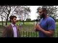

# Intellectual Man Asks Muslim All The Right Questions (2017-10-03)

## Description

Thanks to brothers from guidance avenue for providing this video.

## Summary of [Intellectual Man Asks Muslim All The Right Questions](https://www.youtube.com/watch?v=nbbMxzYWP2o)

*This summary is AI generated - there may be inaccuracies. *

### [00:00:00](https://www.youtube.com/watch?v=nbbMxzYWP2o&t=0) - [00:35:00](https://www.youtube.com/watch?v=nbbMxzYWP2o&t=2100)

 discusses the difference between a theologian and a prophet, and how a theologian is allowed to interpret scripture in a different way than a prophet.  also mentions that there have never been any theological controversies surrounding the idea that God is one.

**[00:00:00](https://www.youtube.com/watch?v=nbbMxzYWP2o&t=0)* Discusses difference between a theologian and a prophet, and how a theologian is allowed to interpret scripture in a different way than a prophet.  also mentions that there have never been any theological controversies surrounding the idea that God is one.
* **[00:05:00](https://www.youtube.com/watch?v=nbbMxzYWP2o&t=300)** The Intellectual Man Asks Muslim All The Right Questions video asks Muslims to think about the possible interpretations of passages in the Quran, and how those interpretations could be challenged by other theologians. The layman argues that from a layman's perspective, it is impossible to conceive of what God would look like, as based on the Quran's description of God, he would be an all-powerful entity which is created, continues to maintain, and creates the human being. He asks Muslims what they would do if they woke up on a train and saw people living their lives.
* **[00:10:00](https://www.youtube.com/watch?v=nbbMxzYWP2o&t=600)* Discusses questions that a "intellectual man" asks about life and existence. He says that these questions are not being asked and urges everyone, including himself, to ask them. He talks about one example of a reality that a person can experience that is more real than a dream, and is a metaphysical reality. He says that only two of the world's major religions are actually trying to convert people. says that Judaism and Christianity are the only two religions that attempt to convert everyone, and that Hinduism and Sikhism are not really proselytizing religions.
* **[00:15:00](https://www.youtube.com/watch?v=nbbMxzYWP2o&t=900)**  "Intellectual Man Asks Muslim All The Right Questions" presents two religious candidates, Islam and Christianity, and asks the Muslim all the right questions in order to determine which is the more logical and rational religion. Islam fares better in this regard, as its basic theology is more in line with modern science and philosophy. Furthermore, Islam makes numerous predictions which have come to pass, while Christianity has a history of false predictions in the Bible.
* **[00:20:00](https://www.youtube.com/watch?v=nbbMxzYWP2o&t=1200)* Discusses how the Quran is a perfect text that was created using an imperfect language. It goes on to say that this challenge is something that needs to be taken seriously because it has the potential to change the world.
* **[00:25:00](https://www.youtube.com/watch?v=nbbMxzYWP2o&t=1500)* Discusses theory that human beings have an innate ability to create grammatical structures that are more than the input. It also discusses the idea that there are two schools of thought in linguistics - the empirical school, which suggests that human beings can only output what they have input, and the universal grammar school, which believes that human beings have the ability to create something more with the grammatical structures they have. Noam Chomsky, a noted philosopher and linguist, is discussed. According to Chomsky, the output is more than the input in language, and the first civilization ever to exist was about 8,000-9,000 years old.
* **[00:30:00](https://www.youtube.com/watch?v=nbbMxzYWP2o&t=1800)**  a Muslim man discusses why it makes sense to believe in God and in the oneness of God. He also explains why it is not reasonable to embrace Islam at this stage.
* **[00:35:00](https://www.youtube.com/watch?v=nbbMxzYWP2o&t=2100)* Discusses process of becoming a Muslim and the requirements that must be met. It also discusses how to pray, as the quicker the better is recommended. Finally, the video provides a number for those with questions.

## Full transcript with timestamps

[0:00:07](https://youtu.be/nbbMxzYWP2o?t=7) assalamu alaikum warahmatullahi wa but I  
[0:00:10](https://youtu.be/nbbMxzYWP2o?t=10) care - you're here with your brother  
[0:00:11](https://youtu.be/nbbMxzYWP2o?t=11) Muhammad oh he here at guidance Avenue  
[0:00:13](https://youtu.be/nbbMxzYWP2o?t=13) and I am joined today with Sebastian and  
[0:00:15](https://youtu.be/nbbMxzYWP2o?t=15) have it and I'm gonna leave you to it  
[0:00:16](https://youtu.be/nbbMxzYWP2o?t=16) guys so the question that I was talking  
[0:00:20](https://youtu.be/nbbMxzYWP2o?t=20) with my friends earlier yeah unlike the  
[0:00:22](https://youtu.be/nbbMxzYWP2o?t=22) Bible which has got a lot of different a  
[0:00:24](https://youtu.be/nbbMxzYWP2o?t=24) lot of different versions to it the  
[0:00:26](https://youtu.be/nbbMxzYWP2o?t=26) Quran has always had the same text  
[0:00:27](https://youtu.be/nbbMxzYWP2o?t=27) throughout history so we also along with  
[0:00:30](https://youtu.be/nbbMxzYWP2o?t=30) that bear in mind we were talking about  
[0:00:32](https://youtu.be/nbbMxzYWP2o?t=32) if you follow let's say 90% of the  
[0:00:35](https://youtu.be/nbbMxzYWP2o?t=35) teachers we don't follow 10% does that  
[0:00:36](https://youtu.be/nbbMxzYWP2o?t=36) qualify you to be good in the eyes of  
[0:00:38](https://youtu.be/nbbMxzYWP2o?t=38) God so we were asking the question every  
[0:00:41](https://youtu.be/nbbMxzYWP2o?t=41) single person on the planet has a  
[0:00:42](https://youtu.be/nbbMxzYWP2o?t=42) different language because even though  
[0:00:44](https://youtu.be/nbbMxzYWP2o?t=44) you can write something in the same  
[0:00:45](https://youtu.be/nbbMxzYWP2o?t=45) script there's seven billion different  
[0:00:47](https://youtu.be/nbbMxzYWP2o?t=47) interpretations of a language so if I  
[0:00:49](https://youtu.be/nbbMxzYWP2o?t=49) say the word water for example to you it  
[0:00:51](https://youtu.be/nbbMxzYWP2o?t=51) might mean completely different things  
[0:00:52](https://youtu.be/nbbMxzYWP2o?t=52) to you let's say if you had a like a  
[0:00:54](https://youtu.be/nbbMxzYWP2o?t=54) terrible accident in water it means  
[0:00:55](https://youtu.be/nbbMxzYWP2o?t=55) different thing to you as it does to me  
[0:00:56](https://youtu.be/nbbMxzYWP2o?t=56) and every single word can be like that  
[0:00:58](https://youtu.be/nbbMxzYWP2o?t=58) in a language so how is it possible to  
[0:01:00](https://youtu.be/nbbMxzYWP2o?t=60) follow the exact teachings of the Quran  
[0:01:02](https://youtu.be/nbbMxzYWP2o?t=62) if every single person has a slightly  
[0:01:04](https://youtu.be/nbbMxzYWP2o?t=64) different interpretation of it and that  
[0:01:06](https://youtu.be/nbbMxzYWP2o?t=66) means that every single person is a  
[0:01:07](https://youtu.be/nbbMxzYWP2o?t=67) slightly different interpretation of  
[0:01:08](https://youtu.be/nbbMxzYWP2o?t=68) their belief thank you very much is a  
[0:01:10](https://youtu.be/nbbMxzYWP2o?t=70) brilliant question it's actually a  
[0:01:11](https://youtu.be/nbbMxzYWP2o?t=71) question that a lot of scholars in many  
[0:01:14](https://youtu.be/nbbMxzYWP2o?t=74) different fields have actually grappled  
[0:01:15](https://youtu.be/nbbMxzYWP2o?t=75) with but the good thing about the Quran  
[0:01:18](https://youtu.be/nbbMxzYWP2o?t=78) is that actually gives us a instruction  
[0:01:19](https://youtu.be/nbbMxzYWP2o?t=79) manual how to deal with this issue so it  
[0:01:21](https://youtu.be/nbbMxzYWP2o?t=81) says in chapter 3 verse number 7 well  
[0:01:23](https://youtu.be/nbbMxzYWP2o?t=83) let the ends are like little min who is  
[0:01:26](https://youtu.be/nbbMxzYWP2o?t=86) and Amazon who normal Khattab he is the  
[0:01:29](https://youtu.be/nbbMxzYWP2o?t=89) one who sent down the book with with  
[0:01:31](https://youtu.be/nbbMxzYWP2o?t=91) basically verses in it  
[0:01:33](https://youtu.be/nbbMxzYWP2o?t=93) that are foundational verses and these  
[0:01:36](https://youtu.be/nbbMxzYWP2o?t=96) are the mother of the book of the  
[0:01:38](https://youtu.be/nbbMxzYWP2o?t=98) foundational verses of the book well  
[0:01:40](https://youtu.be/nbbMxzYWP2o?t=100) o-haru mutashabihat and other verses  
[0:01:42](https://youtu.be/nbbMxzYWP2o?t=102) which are ambiguous family dina fuqua  
[0:01:44](https://youtu.be/nbbMxzYWP2o?t=104) Luba him Zion fat tubby I own a master  
[0:01:46](https://youtu.be/nbbMxzYWP2o?t=106) Shaba Haman who would've our outfit not  
[0:01:48](https://youtu.be/nbbMxzYWP2o?t=108) really my alma mater will Allah  
[0:01:50](https://youtu.be/nbbMxzYWP2o?t=110) basically it says that those who want to  
[0:01:53](https://youtu.be/nbbMxzYWP2o?t=113) follow their own desire oh the kind of  
[0:01:55](https://youtu.be/nbbMxzYWP2o?t=115) corruptive  
[0:01:56](https://youtu.be/nbbMxzYWP2o?t=116) elements or try and create some kind of  
[0:01:58](https://youtu.be/nbbMxzYWP2o?t=118) confusion and they all follow the  
[0:02:01](https://youtu.be/nbbMxzYWP2o?t=121) ambiguous verses and create them make  
[0:02:03](https://youtu.be/nbbMxzYWP2o?t=123) them as kind of foundational so because  
[0:02:05](https://youtu.be/nbbMxzYWP2o?t=125) they're there they are  
[0:02:06](https://youtu.be/nbbMxzYWP2o?t=126) open to interpretation so it's clear  
[0:02:08](https://youtu.be/nbbMxzYWP2o?t=128) that you can have more one  
[0:02:09](https://youtu.be/nbbMxzYWP2o?t=129) interpretation these individuals will  
[0:02:12](https://youtu.be/nbbMxzYWP2o?t=132) try and use those verses as if  
[0:02:13](https://youtu.be/nbbMxzYWP2o?t=133) they are foundational verses so let's  
[0:02:15](https://youtu.be/nbbMxzYWP2o?t=135) give you some live examples right  
[0:02:17](https://youtu.be/nbbMxzYWP2o?t=137) in the history of Islam there has never  
[0:02:19](https://youtu.be/nbbMxzYWP2o?t=139) been a controversy surrounding the fact  
[0:02:22](https://youtu.be/nbbMxzYWP2o?t=142) that God is one  
[0:02:22](https://youtu.be/nbbMxzYWP2o?t=142) for example there's never been a  
[0:02:24](https://youtu.be/nbbMxzYWP2o?t=144) theological controversy surrounding that  
[0:02:26](https://youtu.be/nbbMxzYWP2o?t=146) and the Quran is very clear call Allahu  
[0:02:28](https://youtu.be/nbbMxzYWP2o?t=148) Ahad say he's God want the one and only  
[0:02:30](https://youtu.be/nbbMxzYWP2o?t=150) so there has never been a Muslim who has  
[0:02:33](https://youtu.be/nbbMxzYWP2o?t=153) ever been who has ever claimed to be a  
[0:02:35](https://youtu.be/nbbMxzYWP2o?t=155) Muslim that has said that the Quran is  
[0:02:37](https://youtu.be/nbbMxzYWP2o?t=157) anything that sorry that God is anything  
[0:02:38](https://youtu.be/nbbMxzYWP2o?t=158) but one God same in chapter 40 in the  
[0:02:42](https://youtu.be/nbbMxzYWP2o?t=162) final verse of the of that chapter says  
[0:02:45](https://youtu.be/nbbMxzYWP2o?t=165) Muhammad Rasul Allah that Prophet  
[0:02:46](https://youtu.be/nbbMxzYWP2o?t=166) Muhammad is the final Messenger of Allah  
[0:02:48](https://youtu.be/nbbMxzYWP2o?t=168) so there's never been a controversy on  
[0:02:50](https://youtu.be/nbbMxzYWP2o?t=170) that that makes sense so in a nutshell  
[0:02:53](https://youtu.be/nbbMxzYWP2o?t=173) how do we kind of navigate from  
[0:02:55](https://youtu.be/nbbMxzYWP2o?t=175) interpretation and that which is clear  
[0:02:57](https://youtu.be/nbbMxzYWP2o?t=177) is we look at the foundational verses of  
[0:02:59](https://youtu.be/nbbMxzYWP2o?t=179) the scripture and we we basically try  
[0:03:03](https://youtu.be/nbbMxzYWP2o?t=183) and make a theology out of that those  
[0:03:06](https://youtu.be/nbbMxzYWP2o?t=186) ambiguous verses have to fit into the  
[0:03:08](https://youtu.be/nbbMxzYWP2o?t=188) context of the foundational verses okay  
[0:03:12](https://youtu.be/nbbMxzYWP2o?t=192) so it's almost as if there's certain  
[0:03:14](https://youtu.be/nbbMxzYWP2o?t=194) things that you can you don't need to  
[0:03:16](https://youtu.be/nbbMxzYWP2o?t=196) argue about because they're very  
[0:03:17](https://youtu.be/nbbMxzYWP2o?t=197) clear-cut and that you can look at for  
[0:03:20](https://youtu.be/nbbMxzYWP2o?t=200) instruction on the things that are less  
[0:03:21](https://youtu.be/nbbMxzYWP2o?t=201) clear okay  
[0:03:25](https://youtu.be/nbbMxzYWP2o?t=205) I can't think of a better answer that  
[0:03:27](https://youtu.be/nbbMxzYWP2o?t=207) question that's fantastic thank you so  
[0:03:34](https://youtu.be/nbbMxzYWP2o?t=214) what else we talked okay so we talked  
[0:03:35](https://youtu.be/nbbMxzYWP2o?t=215) about was the particular the 41  
[0:03:39](https://youtu.be/nbbMxzYWP2o?t=219) different theologians so we were talking  
[0:03:46](https://youtu.be/nbbMxzYWP2o?t=226) about so often obviously after the  
[0:03:49](https://youtu.be/nbbMxzYWP2o?t=229) prophet there was a different  
[0:03:51](https://youtu.be/nbbMxzYWP2o?t=231) theologians throughout Islamic history  
[0:03:54](https://youtu.be/nbbMxzYWP2o?t=234) yeah  
[0:03:57](https://youtu.be/nbbMxzYWP2o?t=237) yes we're essentially talking about  
[0:03:59](https://youtu.be/nbbMxzYWP2o?t=239) people who are are not of God but they  
[0:04:03](https://youtu.be/nbbMxzYWP2o?t=243) are obviously they're religious and  
[0:04:04](https://youtu.be/nbbMxzYWP2o?t=244) they've interpreted it so what I asked  
[0:04:07](https://youtu.be/nbbMxzYWP2o?t=247) was God is perfect right and do we  
[0:04:11](https://youtu.be/nbbMxzYWP2o?t=251) believe that human beings are perfect  
[0:04:14](https://youtu.be/nbbMxzYWP2o?t=254) right so yeah other human beings aren't  
[0:04:26](https://youtu.be/nbbMxzYWP2o?t=266) perfect and that means that logically  
[0:04:28](https://youtu.be/nbbMxzYWP2o?t=268) anything that comes from these human  
[0:04:29](https://youtu.be/nbbMxzYWP2o?t=269) beings also cannot be perfect including  
[0:04:32](https://youtu.be/nbbMxzYWP2o?t=272) any religious interpretations or  
[0:04:33](https://youtu.be/nbbMxzYWP2o?t=273) arguments everything from you know  
[0:04:35](https://youtu.be/nbbMxzYWP2o?t=275) straight theology to jurisprudence so  
[0:04:38](https://youtu.be/nbbMxzYWP2o?t=278) the question that I have is when you're  
[0:04:40](https://youtu.be/nbbMxzYWP2o?t=280) not following the hadith or the Koran or  
[0:04:43](https://youtu.be/nbbMxzYWP2o?t=283) any other or the Word of God or a  
[0:04:46](https://youtu.be/nbbMxzYWP2o?t=286) prophet for example when it's a  
[0:04:47](https://youtu.be/nbbMxzYWP2o?t=287) theologian you are allowed to interpret  
[0:04:51](https://youtu.be/nbbMxzYWP2o?t=291) is that would that be correct so you can  
[0:04:52](https://youtu.be/nbbMxzYWP2o?t=292) take it you can argue with the  
[0:04:54](https://youtu.be/nbbMxzYWP2o?t=294) theologian not in the same way that you  
[0:04:55](https://youtu.be/nbbMxzYWP2o?t=295) would argue with the world of the Quran  
[0:04:57](https://youtu.be/nbbMxzYWP2o?t=297) yeah exactly so if the erosions  
[0:05:00](https://youtu.be/nbbMxzYWP2o?t=300) verdict so to speak is not binding on  
[0:05:02](https://youtu.be/nbbMxzYWP2o?t=302) every individual so you're you're you're  
[0:05:05](https://youtu.be/nbbMxzYWP2o?t=305) open to kind of challenge the theologian  
[0:05:07](https://youtu.be/nbbMxzYWP2o?t=307) and ask them why they've come to that  
[0:05:09](https://youtu.be/nbbMxzYWP2o?t=309) conclusion  
[0:05:09](https://youtu.be/nbbMxzYWP2o?t=309) because they could have very well  
[0:05:11](https://youtu.be/nbbMxzYWP2o?t=311) interpreted the the text of the Quran in  
[0:05:13](https://youtu.be/nbbMxzYWP2o?t=313) the incorrect way so from that  
[0:05:15](https://youtu.be/nbbMxzYWP2o?t=315) perspective that's where we have  
[0:05:16](https://youtu.be/nbbMxzYWP2o?t=316) discussion but what from from like a  
[0:05:18](https://youtu.be/nbbMxzYWP2o?t=318) layman's perspective or someone who's  
[0:05:20](https://youtu.be/nbbMxzYWP2o?t=320) new to Islam really the way this was  
[0:05:22](https://youtu.be/nbbMxzYWP2o?t=322) kind of actualize in reality is you  
[0:05:24](https://youtu.be/nbbMxzYWP2o?t=324) would you would follow that which you  
[0:05:27](https://youtu.be/nbbMxzYWP2o?t=327) feel is most correct yeah and you would  
[0:05:29](https://youtu.be/nbbMxzYWP2o?t=329) not be judged for that which you get  
[0:05:31](https://youtu.be/nbbMxzYWP2o?t=331) wrong because at the end of the day you  
[0:05:34](https://youtu.be/nbbMxzYWP2o?t=334) have a limited ability to do things in  
[0:05:37](https://youtu.be/nbbMxzYWP2o?t=337) this world so it's not the if you are  
[0:05:39](https://youtu.be/nbbMxzYWP2o?t=339) not able to get the correct  
[0:05:40](https://youtu.be/nbbMxzYWP2o?t=340) interpretation on every single let's say  
[0:05:43](https://youtu.be/nbbMxzYWP2o?t=343) jurisprudent situation it doesn't mean  
[0:05:46](https://youtu.be/nbbMxzYWP2o?t=346) to say that now you're going to be  
[0:05:47](https://youtu.be/nbbMxzYWP2o?t=347) punished for that because that would be  
[0:05:48](https://youtu.be/nbbMxzYWP2o?t=348) an unfair thing to do and that's why I  
[0:05:50](https://youtu.be/nbbMxzYWP2o?t=350) got this as you could say an accent in  
[0:05:53](https://youtu.be/nbbMxzYWP2o?t=353) Islam like you can live Allah who and  
[0:05:55](https://youtu.be/nbbMxzYWP2o?t=355) I've sent Laos I like God does not  
[0:05:56](https://youtu.be/nbbMxzYWP2o?t=356) overburden a soul with more than it can  
[0:05:58](https://youtu.be/nbbMxzYWP2o?t=358) handle you see what I mean but if I were  
[0:06:02](https://youtu.be/nbbMxzYWP2o?t=362) to ask you now I mean would you accept I  
[0:06:04](https://youtu.be/nbbMxzYWP2o?t=364) mean what's your position on on God  
[0:06:06](https://youtu.be/nbbMxzYWP2o?t=366) would you accept that there was a God  
[0:06:08](https://youtu.be/nbbMxzYWP2o?t=368) actually that created the universe and  
[0:06:10](https://youtu.be/nbbMxzYWP2o?t=370) is maintaining the universe  
[0:06:11](https://youtu.be/nbbMxzYWP2o?t=371) or this idea of an entity that's  
[0:06:13](https://youtu.be/nbbMxzYWP2o?t=373) creating and maintaining the universe  
[0:06:15](https://youtu.be/nbbMxzYWP2o?t=375) fashioning everything that has been  
[0:06:16](https://youtu.be/nbbMxzYWP2o?t=376) created etc etcetera you on the side of  
[0:06:20](https://youtu.be/nbbMxzYWP2o?t=380) there would have to be a creator I  
[0:06:22](https://youtu.be/nbbMxzYWP2o?t=382) wasn't raised like that it's just the  
[0:06:24](https://youtu.be/nbbMxzYWP2o?t=384) kind of conclusion to reach I'm not sure  
[0:06:25](https://youtu.be/nbbMxzYWP2o?t=385) there would be a guy with a beard in the  
[0:06:26](https://youtu.be/nbbMxzYWP2o?t=386) sky like a painting yeah of course I  
[0:06:28](https://youtu.be/nbbMxzYWP2o?t=388) would agree with that I mean I don't  
[0:06:29](https://youtu.be/nbbMxzYWP2o?t=389) think it would be a guy I mean from an  
[0:06:31](https://youtu.be/nbbMxzYWP2o?t=391) Islamic perspective the Quran says led  
[0:06:34](https://youtu.be/nbbMxzYWP2o?t=394) to a little absurd or you'll do a  
[0:06:36](https://youtu.be/nbbMxzYWP2o?t=396) collapse our that vision cannot  
[0:06:38](https://youtu.be/nbbMxzYWP2o?t=398) encapsulate God and he encapsulates all  
[0:06:41](https://youtu.be/nbbMxzYWP2o?t=401) vision and it says in chapter 42 verse  
[0:06:44](https://youtu.be/nbbMxzYWP2o?t=404) number 11 that LASIK admittedly he shake  
[0:06:46](https://youtu.be/nbbMxzYWP2o?t=406) a horse mei-hua see of that there's  
[0:06:48](https://youtu.be/nbbMxzYWP2o?t=408) nothing like him at all and he is the  
[0:06:50](https://youtu.be/nbbMxzYWP2o?t=410) all-seeing all hearing so in other words  
[0:06:52](https://youtu.be/nbbMxzYWP2o?t=412) any image that we've gotten from let's  
[0:06:54](https://youtu.be/nbbMxzYWP2o?t=414) say the Western media or any other media  
[0:06:56](https://youtu.be/nbbMxzYWP2o?t=416) or any image generally speaking that we  
[0:06:59](https://youtu.be/nbbMxzYWP2o?t=419) got from what what constitutes God would  
[0:07:02](https://youtu.be/nbbMxzYWP2o?t=422) not be a correct image and if you can  
[0:07:03](https://youtu.be/nbbMxzYWP2o?t=423) imagine including your imagination so  
[0:07:06](https://youtu.be/nbbMxzYWP2o?t=426) you can't actually conceive of what God  
[0:07:07](https://youtu.be/nbbMxzYWP2o?t=427) would physically look like because it's  
[0:07:08](https://youtu.be/nbbMxzYWP2o?t=428) me yes exactly it's not it's not  
[0:07:10](https://youtu.be/nbbMxzYWP2o?t=430) possible to conceive what God looks like  
[0:07:12](https://youtu.be/nbbMxzYWP2o?t=432) based on those verses unless of the  
[0:07:15](https://youtu.be/nbbMxzYWP2o?t=435) recoil absolute the club star that  
[0:07:17](https://youtu.be/nbbMxzYWP2o?t=437) vision cannot encapsulate him but he  
[0:07:19](https://youtu.be/nbbMxzYWP2o?t=439) encapsulate all vision there and the  
[0:07:22](https://youtu.be/nbbMxzYWP2o?t=442) same thing  
[0:07:23](https://youtu.be/nbbMxzYWP2o?t=443) LASIK chemistry he shakes so our  
[0:07:25](https://youtu.be/nbbMxzYWP2o?t=445) perception of God or our idea of God is  
[0:07:27](https://youtu.be/nbbMxzYWP2o?t=447) not an ant is not a God which has has  
[0:07:30](https://youtu.be/nbbMxzYWP2o?t=450) basically been made into a human being  
[0:07:32](https://youtu.be/nbbMxzYWP2o?t=452) or any kind of creation so this is  
[0:07:35](https://youtu.be/nbbMxzYWP2o?t=455) called anthropomorphism so we don't be  
[0:07:37](https://youtu.be/nbbMxzYWP2o?t=457) believe in anthropomorphize to God  
[0:07:39](https://youtu.be/nbbMxzYWP2o?t=459) we don't believe it in a Jesus type God  
[0:07:41](https://youtu.be/nbbMxzYWP2o?t=461) we would say that Jesus Christ is a  
[0:07:43](https://youtu.be/nbbMxzYWP2o?t=463) human being right and you'll be it's  
[0:07:47](https://youtu.be/nbbMxzYWP2o?t=467) interesting to find that throughout  
[0:07:48](https://youtu.be/nbbMxzYWP2o?t=468) history you'll find that there has been  
[0:07:50](https://youtu.be/nbbMxzYWP2o?t=470) anthropomorphised  
[0:07:51](https://youtu.be/nbbMxzYWP2o?t=471) versions of God from Hercules to Zeus to  
[0:07:54](https://youtu.be/nbbMxzYWP2o?t=474) Jesus all of them have something in  
[0:07:56](https://youtu.be/nbbMxzYWP2o?t=476) common  
[0:07:56](https://youtu.be/nbbMxzYWP2o?t=476) in the case of Hercules and Jesus is  
[0:07:59](https://youtu.be/nbbMxzYWP2o?t=479) that there was son of God or there are  
[0:08:01](https://youtu.be/nbbMxzYWP2o?t=481) son of a higher God and obviously God  
[0:08:03](https://youtu.be/nbbMxzYWP2o?t=483) themselves in a sense in the case of  
[0:08:05](https://youtu.be/nbbMxzYWP2o?t=485) Jesus I mean once again they're all  
[0:08:08](https://youtu.be/nbbMxzYWP2o?t=488) anthropomorphized or you say that our  
[0:08:10](https://youtu.be/nbbMxzYWP2o?t=490) conception of God is a non  
[0:08:12](https://youtu.be/nbbMxzYWP2o?t=492) anthropomorphize God that which cannot  
[0:08:16](https://youtu.be/nbbMxzYWP2o?t=496) reach human being in terms of  
[0:08:17](https://youtu.be/nbbMxzYWP2o?t=497) imagination and so from that perspective  
[0:08:20](https://youtu.be/nbbMxzYWP2o?t=500) we will say that God you cannot imagine  
[0:08:23](https://youtu.be/nbbMxzYWP2o?t=503) God anything you can imagine is not  
[0:08:27](https://youtu.be/nbbMxzYWP2o?t=507) there's no there's no way you could get  
[0:08:29](https://youtu.be/nbbMxzYWP2o?t=509) rounded or like you're not imagining it  
[0:08:30](https://youtu.be/nbbMxzYWP2o?t=510) right it we just lack the if you like  
[0:08:32](https://youtu.be/nbbMxzYWP2o?t=512) the processing power of the abilities to  
[0:08:34](https://youtu.be/nbbMxzYWP2o?t=514) do in the first place exactly exactly so  
[0:08:36](https://youtu.be/nbbMxzYWP2o?t=516) that's one thing so we can't we can't we  
[0:08:40](https://youtu.be/nbbMxzYWP2o?t=520) can't imagine god that's one thing God  
[0:08:43](https://youtu.be/nbbMxzYWP2o?t=523) is all-powerful our conception of God is  
[0:08:45](https://youtu.be/nbbMxzYWP2o?t=525) as follows God is an all-powerful entity  
[0:08:46](https://youtu.be/nbbMxzYWP2o?t=526) which is created all that exists  
[0:08:48](https://youtu.be/nbbMxzYWP2o?t=528) continues to maintain it and creates the  
[0:08:51](https://youtu.be/nbbMxzYWP2o?t=531) human being allowed him to basically  
[0:08:55](https://youtu.be/nbbMxzYWP2o?t=535) exist let me ask you guys a question I  
[0:08:57](https://youtu.be/nbbMxzYWP2o?t=537) mean let's open this up a little bit  
[0:08:59](https://youtu.be/nbbMxzYWP2o?t=539) never ask I was thinking about this I  
[0:09:01](https://youtu.be/nbbMxzYWP2o?t=541) tried this with a little bit of with  
[0:09:03](https://youtu.be/nbbMxzYWP2o?t=543) some people before but let me try it  
[0:09:04](https://youtu.be/nbbMxzYWP2o?t=544) again yeah I want you to imagine the  
[0:09:08](https://youtu.be/nbbMxzYWP2o?t=548) following Sebastian okay  
[0:09:10](https://youtu.be/nbbMxzYWP2o?t=550) imagine when you go to sleep yeah you  
[0:09:14](https://youtu.be/nbbMxzYWP2o?t=554) wake up in your bed isn't it I wake up I  
[0:09:17](https://youtu.be/nbbMxzYWP2o?t=557) go to sleep I wake up in my bed where I  
[0:09:19](https://youtu.be/nbbMxzYWP2o?t=559) slept initially but I want you to  
[0:09:22](https://youtu.be/nbbMxzYWP2o?t=562) imagine the following example okay I  
[0:09:24](https://youtu.be/nbbMxzYWP2o?t=564) want you to imagine that you go to sleep  
[0:09:27](https://youtu.be/nbbMxzYWP2o?t=567) wherever you go to sleep and you wake up  
[0:09:30](https://youtu.be/nbbMxzYWP2o?t=570) and you find yourself in a in a train on  
[0:09:32](https://youtu.be/nbbMxzYWP2o?t=572) a train yeah  
[0:09:34](https://youtu.be/nbbMxzYWP2o?t=574) now I want you to ask answer the  
[0:09:36](https://youtu.be/nbbMxzYWP2o?t=576) following question what would you ask  
[0:09:38](https://youtu.be/nbbMxzYWP2o?t=578) what's the first thing you'd ask  
[0:09:39](https://youtu.be/nbbMxzYWP2o?t=579) yourself how did I get here how did I  
[0:09:42](https://youtu.be/nbbMxzYWP2o?t=582) get here what else would you ask who put  
[0:09:43](https://youtu.be/nbbMxzYWP2o?t=583) me here who put you here what else would  
[0:09:45](https://youtu.be/nbbMxzYWP2o?t=585) you ask where's the train going okay  
[0:09:49](https://youtu.be/nbbMxzYWP2o?t=589) thank you very much now let me say  
[0:09:50](https://youtu.be/nbbMxzYWP2o?t=590) something right what would you do if you  
[0:09:55](https://youtu.be/nbbMxzYWP2o?t=595) woke up on the train and you saw people  
[0:09:58](https://youtu.be/nbbMxzYWP2o?t=598) you know just living life and you just  
[0:10:00](https://youtu.be/nbbMxzYWP2o?t=600) started doing what they do and you had  
[0:10:03](https://youtu.be/nbbMxzYWP2o?t=603) these questions that you want to tell  
[0:10:05](https://youtu.be/nbbMxzYWP2o?t=605) how did I get here where all these  
[0:10:06](https://youtu.be/nbbMxzYWP2o?t=606) things but you just suppress them what  
[0:10:07](https://youtu.be/nbbMxzYWP2o?t=607) would you say what person who suppresses  
[0:10:08](https://youtu.be/nbbMxzYWP2o?t=608) these questions I'd say they become  
[0:10:10](https://youtu.be/nbbMxzYWP2o?t=610) unhappy at some point they won't be able  
[0:10:11](https://youtu.be/nbbMxzYWP2o?t=611) to suppress it any longer that's a good  
[0:10:13](https://youtu.be/nbbMxzYWP2o?t=613) point would you also say that that  
[0:10:15](https://youtu.be/nbbMxzYWP2o?t=615) person is critical or uncritical in  
[0:10:17](https://youtu.be/nbbMxzYWP2o?t=617) their being and the existential being  
[0:10:19](https://youtu.be/nbbMxzYWP2o?t=619) completely uncritical uncritical is it  
[0:10:22](https://youtu.be/nbbMxzYWP2o?t=622) justified to be on critical in that way  
[0:10:24](https://youtu.be/nbbMxzYWP2o?t=624) okay and the parable of the train is the  
[0:10:27](https://youtu.be/nbbMxzYWP2o?t=627) parable of life  
[0:10:29](https://youtu.be/nbbMxzYWP2o?t=629) we woke up to a life we woke up to a  
[0:10:32](https://youtu.be/nbbMxzYWP2o?t=632) being here in this world but we see now  
[0:10:35](https://youtu.be/nbbMxzYWP2o?t=635) the Western not not to be to kind of  
[0:10:38](https://youtu.be/nbbMxzYWP2o?t=638) knock Western culture but I'm just  
[0:10:40](https://youtu.be/nbbMxzYWP2o?t=640) saying that it's promoted nowadays that  
[0:10:43](https://youtu.be/nbbMxzYWP2o?t=643) we should really think about these  
[0:10:44](https://youtu.be/nbbMxzYWP2o?t=644) ultimate questions we're on the train of  
[0:10:46](https://youtu.be/nbbMxzYWP2o?t=646) life we don't know whether that we know  
[0:10:49](https://youtu.be/nbbMxzYWP2o?t=649) one thing we're gonna die we're on the  
[0:10:50](https://youtu.be/nbbMxzYWP2o?t=650) train of life we woke up and we're  
[0:10:53](https://youtu.be/nbbMxzYWP2o?t=653) distracted by everything around us but  
[0:10:55](https://youtu.be/nbbMxzYWP2o?t=655) the questions which are most fundamental  
[0:10:57](https://youtu.be/nbbMxzYWP2o?t=657) to exist exist enchi being how did I get  
[0:11:00](https://youtu.be/nbbMxzYWP2o?t=660) here where am I going Who am I where am  
[0:11:01](https://youtu.be/nbbMxzYWP2o?t=661) I all of these questions that you asked  
[0:11:03](https://youtu.be/nbbMxzYWP2o?t=663) yourself these questions are not being  
[0:11:05](https://youtu.be/nbbMxzYWP2o?t=665) asked and I urge everyone including  
[0:11:08](https://youtu.be/nbbMxzYWP2o?t=668) yourself to ask these questions so if I  
[0:11:10](https://youtu.be/nbbMxzYWP2o?t=670) ask you how did I get here that question  
[0:11:12](https://youtu.be/nbbMxzYWP2o?t=672) if we apply it to the context of  
[0:11:15](https://youtu.be/nbbMxzYWP2o?t=675) speakers corner London not just weakest  
[0:11:17](https://youtu.be/nbbMxzYWP2o?t=677) corner London let's just say to the  
[0:11:19](https://youtu.be/nbbMxzYWP2o?t=679) world that we live in how did you get  
[0:11:22](https://youtu.be/nbbMxzYWP2o?t=682) the atheistic responses you got here in  
[0:11:26](https://youtu.be/nbbMxzYWP2o?t=686) a way which we can't really understand  
[0:11:27](https://youtu.be/nbbMxzYWP2o?t=687) it could be the multiverse it could be  
[0:11:29](https://youtu.be/nbbMxzYWP2o?t=689) that nothing created something it could  
[0:11:31](https://youtu.be/nbbMxzYWP2o?t=691) be like Krauss actually says a universe  
[0:11:34](https://youtu.be/nbbMxzYWP2o?t=694) from nothing that's just for me it's an  
[0:11:37](https://youtu.be/nbbMxzYWP2o?t=697) unsatisfactory response how did we get  
[0:11:41](https://youtu.be/nbbMxzYWP2o?t=701) here  
[0:11:42](https://youtu.be/nbbMxzYWP2o?t=702) well you know don't worry about it too  
[0:11:44](https://youtu.be/nbbMxzYWP2o?t=704) much don't think about it you know what  
[0:11:46](https://youtu.be/nbbMxzYWP2o?t=706) are we doing here  
[0:11:47](https://youtu.be/nbbMxzYWP2o?t=707) you make your own purpose my friend no I  
[0:11:49](https://youtu.be/nbbMxzYWP2o?t=709) mean it doesn't seem that logical does  
[0:11:52](https://youtu.be/nbbMxzYWP2o?t=712) it it doesn't follow if you are under  
[0:11:54](https://youtu.be/nbbMxzYWP2o?t=714) train you would not accept that  
[0:11:56](https://youtu.be/nbbMxzYWP2o?t=716) particular logic so I will ask you the  
[0:11:57](https://youtu.be/nbbMxzYWP2o?t=717) question what makes the best does it  
[0:12:01](https://youtu.be/nbbMxzYWP2o?t=721) make sense to say does it make sense to  
[0:12:02](https://youtu.be/nbbMxzYWP2o?t=722) say how did you get here you are created  
[0:12:05](https://youtu.be/nbbMxzYWP2o?t=725) by an all-knowing entity what are you  
[0:12:08](https://youtu.be/nbbMxzYWP2o?t=728) doing here that all-knowing entity has  
[0:12:10](https://youtu.be/nbbMxzYWP2o?t=730) assigned and fixed a purpose for you and  
[0:12:13](https://youtu.be/nbbMxzYWP2o?t=733) where are you going you're gonna die and  
[0:12:16](https://youtu.be/nbbMxzYWP2o?t=736) there is something that's gonna happen  
[0:12:18](https://youtu.be/nbbMxzYWP2o?t=738) off to death let me tell you something  
[0:12:21](https://youtu.be/nbbMxzYWP2o?t=741) you know the human experience a lot of  
[0:12:24](https://youtu.be/nbbMxzYWP2o?t=744) people say well how can you prove that  
[0:12:25](https://youtu.be/nbbMxzYWP2o?t=745) it's gonna be something that happens  
[0:12:26](https://youtu.be/nbbMxzYWP2o?t=746) after death all we can know is that  
[0:12:28](https://youtu.be/nbbMxzYWP2o?t=748) which we can empirically justify  
[0:12:31](https://youtu.be/nbbMxzYWP2o?t=751) I say I disagree with that when we go to  
[0:12:34](https://youtu.be/nbbMxzYWP2o?t=754) sleep and we close our eyes and we dream  
[0:12:38](https://youtu.be/nbbMxzYWP2o?t=758) yeah dreaming is a it's an experience  
[0:12:42](https://youtu.be/nbbMxzYWP2o?t=762) that most human beings have experienced  
[0:12:44](https://youtu.be/nbbMxzYWP2o?t=764) which has no sensual reaction you don't  
[0:12:47](https://youtu.be/nbbMxzYWP2o?t=767) open your eyes but you still see you  
[0:12:50](https://youtu.be/nbbMxzYWP2o?t=770) don't need to try and hear someone  
[0:12:52](https://youtu.be/nbbMxzYWP2o?t=772) physically saying that but you still  
[0:12:53](https://youtu.be/nbbMxzYWP2o?t=773) here dreaming and this is why Freud by  
[0:12:56](https://youtu.be/nbbMxzYWP2o?t=776) the way he wrote a book on dreaming it's  
[0:12:58](https://youtu.be/nbbMxzYWP2o?t=778) a really interesting human experience  
[0:13:00](https://youtu.be/nbbMxzYWP2o?t=780) the human experience has shown us when  
[0:13:03](https://youtu.be/nbbMxzYWP2o?t=783) we are in the state of unconsciousness  
[0:13:05](https://youtu.be/nbbMxzYWP2o?t=785) we can still have realities and dreaming  
[0:13:09](https://youtu.be/nbbMxzYWP2o?t=789) is an ample example of that reality what  
[0:13:12](https://youtu.be/nbbMxzYWP2o?t=792) we're saying is this when you lose  
[0:13:13](https://youtu.be/nbbMxzYWP2o?t=793) overall consciousness when you're dead  
[0:13:16](https://youtu.be/nbbMxzYWP2o?t=796) and everyone will die  
[0:13:18](https://youtu.be/nbbMxzYWP2o?t=798) yeah when you lose overall consciousness  
[0:13:21](https://youtu.be/nbbMxzYWP2o?t=801) it won't be the case that things will  
[0:13:23](https://youtu.be/nbbMxzYWP2o?t=803) stop we say that there will be a reality  
[0:13:26](https://youtu.be/nbbMxzYWP2o?t=806) that you will then experience just like  
[0:13:29](https://youtu.be/nbbMxzYWP2o?t=809) a dream but it's more real than a dream  
[0:13:31](https://youtu.be/nbbMxzYWP2o?t=811) and will be more prolonged than just a  
[0:13:33](https://youtu.be/nbbMxzYWP2o?t=813) dream and that reality will be a  
[0:13:35](https://youtu.be/nbbMxzYWP2o?t=815) metaphysical reality that the entity  
[0:13:39](https://youtu.be/nbbMxzYWP2o?t=819) that we discussed before that created  
[0:13:41](https://youtu.be/nbbMxzYWP2o?t=821) you will assign for you will create for  
[0:13:43](https://youtu.be/nbbMxzYWP2o?t=823) you will allow for you to have and this  
[0:13:45](https://youtu.be/nbbMxzYWP2o?t=825) is the whole idea of the Day of Judgment  
[0:13:47](https://youtu.be/nbbMxzYWP2o?t=827) heaven hell all of that is there I'm not  
[0:13:49](https://youtu.be/nbbMxzYWP2o?t=829) saying these things are dreams I'm  
[0:13:50](https://youtu.be/nbbMxzYWP2o?t=830) saying these things are realities but  
[0:13:54](https://youtu.be/nbbMxzYWP2o?t=834) those realities don't depend upon the  
[0:13:57](https://youtu.be/nbbMxzYWP2o?t=837) existential five senses being of a human  
[0:14:01](https://youtu.be/nbbMxzYWP2o?t=841) being and five senses these things they  
[0:14:03](https://youtu.be/nbbMxzYWP2o?t=843) can be rearranged so here does it make  
[0:14:05](https://youtu.be/nbbMxzYWP2o?t=845) sense for us to say today that the  
[0:14:09](https://youtu.be/nbbMxzYWP2o?t=849) reason why you here is because you were  
[0:14:10](https://youtu.be/nbbMxzYWP2o?t=850) created what you're doing here is that  
[0:14:13](https://youtu.be/nbbMxzYWP2o?t=853) you have a purpose and your purpose is  
[0:14:16](https://youtu.be/nbbMxzYWP2o?t=856) going to super is gonna extend to your  
[0:14:20](https://youtu.be/nbbMxzYWP2o?t=860) after death experience does that make  
[0:14:22](https://youtu.be/nbbMxzYWP2o?t=862) sense  
[0:14:23](https://youtu.be/nbbMxzYWP2o?t=863) and does it make sense now look I say  
[0:14:27](https://youtu.be/nbbMxzYWP2o?t=867) for example I'm an unbiased individual  
[0:14:29](https://youtu.be/nbbMxzYWP2o?t=869) yeah I want to find out which is the  
[0:14:31](https://youtu.be/nbbMxzYWP2o?t=871) correct religion there are six major  
[0:14:32](https://youtu.be/nbbMxzYWP2o?t=872) world religions honestly yeah I just  
[0:14:34](https://youtu.be/nbbMxzYWP2o?t=874) want to find out which one is this is  
[0:14:35](https://youtu.be/nbbMxzYWP2o?t=875) truth everyone is claiming to be dr I  
[0:14:38](https://youtu.be/nbbMxzYWP2o?t=878) swear to God  
[0:14:40](https://youtu.be/nbbMxzYWP2o?t=880) it doesn't take that long to find out  
[0:14:42](https://youtu.be/nbbMxzYWP2o?t=882) the answer you know why  
[0:14:43](https://youtu.be/nbbMxzYWP2o?t=883) of the six major world religions only  
[0:14:46](https://youtu.be/nbbMxzYWP2o?t=886) two are proselytizing only two only one  
[0:14:49](https://youtu.be/nbbMxzYWP2o?t=889) only two religions actually attempt to  
[0:14:52](https://youtu.be/nbbMxzYWP2o?t=892) have you as wherever they are and that's  
[0:14:54](https://youtu.be/nbbMxzYWP2o?t=894) Christianity and Islam Judaism is not a  
[0:14:56](https://youtu.be/nbbMxzYWP2o?t=896) personal ties in religion Hinduism is  
[0:14:58](https://youtu.be/nbbMxzYWP2o?t=898) not really a proselytizing religion  
[0:14:59](https://youtu.be/nbbMxzYWP2o?t=899) Sikhism is not really a personal science  
[0:15:00](https://youtu.be/nbbMxzYWP2o?t=900) religion and they're all regional  
[0:15:02](https://youtu.be/nbbMxzYWP2o?t=902) religions yeah and they're all religions  
[0:15:04](https://youtu.be/nbbMxzYWP2o?t=904) which have backgrounds in some kind of  
[0:15:07](https://youtu.be/nbbMxzYWP2o?t=907) let's just say some mythology and  
[0:15:09](https://youtu.be/nbbMxzYWP2o?t=909) sometimes they'll be open about it like  
[0:15:10](https://youtu.be/nbbMxzYWP2o?t=910) Hindus are very open about their  
[0:15:12](https://youtu.be/nbbMxzYWP2o?t=912) mythology and the mythology is very  
[0:15:16](https://youtu.be/nbbMxzYWP2o?t=916) similar to Greek mythology to be honest  
[0:15:17](https://youtu.be/nbbMxzYWP2o?t=917) with you yeah so here we have two  
[0:15:20](https://youtu.be/nbbMxzYWP2o?t=920) candidates Islam and Christianity for me  
[0:15:23](https://youtu.be/nbbMxzYWP2o?t=923) to narrow the gap all I have to do is  
[0:15:26](https://youtu.be/nbbMxzYWP2o?t=926) look at the basic theology forget about  
[0:15:27](https://youtu.be/nbbMxzYWP2o?t=927) everything else just look at the basic  
[0:15:29](https://youtu.be/nbbMxzYWP2o?t=929) theology if I want to look at the basic  
[0:15:31](https://youtu.be/nbbMxzYWP2o?t=931) theology of Christianity and Islam I see  
[0:15:33](https://youtu.be/nbbMxzYWP2o?t=933) that Christianity is a religion which  
[0:15:34](https://youtu.be/nbbMxzYWP2o?t=934) which talks about the Trinity three and  
[0:15:36](https://youtu.be/nbbMxzYWP2o?t=936) one and one and three that Jesus is God  
[0:15:38](https://youtu.be/nbbMxzYWP2o?t=938) that the Holy Spirit is God the Father  
[0:15:40](https://youtu.be/nbbMxzYWP2o?t=940) has got all three are one I would argue  
[0:15:42](https://youtu.be/nbbMxzYWP2o?t=942) that this is a fundamentally flawed  
[0:15:44](https://youtu.be/nbbMxzYWP2o?t=944) theology and the idea that God is one is  
[0:15:48](https://youtu.be/nbbMxzYWP2o?t=948) only really pleasant present in its  
[0:15:51](https://youtu.be/nbbMxzYWP2o?t=951) purest and truest form in this most  
[0:15:53](https://youtu.be/nbbMxzYWP2o?t=953) logical form in the religion of Islam  
[0:15:55](https://youtu.be/nbbMxzYWP2o?t=955) based on that logic if we accept the  
[0:15:58](https://youtu.be/nbbMxzYWP2o?t=958) premise of revelation through human  
[0:15:59](https://youtu.be/nbbMxzYWP2o?t=959) beings it does make sense that God is  
[0:16:02](https://youtu.be/nbbMxzYWP2o?t=962) one and that there were a long line of  
[0:16:04](https://youtu.be/nbbMxzYWP2o?t=964) prophets which is the Islamic narrative  
[0:16:06](https://youtu.be/nbbMxzYWP2o?t=966) there were a long line of prophets sign  
[0:16:08](https://youtu.be/nbbMxzYWP2o?t=968) with Adam up until the final point which  
[0:16:10](https://youtu.be/nbbMxzYWP2o?t=970) we call Muhammad all of which testified  
[0:16:13](https://youtu.be/nbbMxzYWP2o?t=973) that there's only one God worthy of  
[0:16:14](https://youtu.be/nbbMxzYWP2o?t=974) worship does that make sense so here  
[0:16:18](https://youtu.be/nbbMxzYWP2o?t=978) does it make sense or would you accept  
[0:16:20](https://youtu.be/nbbMxzYWP2o?t=980) that Islam therefore is from a  
[0:16:23](https://youtu.be/nbbMxzYWP2o?t=983) theological or philosophical perspective  
[0:16:25](https://youtu.be/nbbMxzYWP2o?t=985) the most rational recourse I mean you've  
[0:16:28](https://youtu.be/nbbMxzYWP2o?t=988) given me one example I would yeah I  
[0:16:30](https://youtu.be/nbbMxzYWP2o?t=990) agree with you on our I think the Holy  
[0:16:32](https://youtu.be/nbbMxzYWP2o?t=992) Trinity thing is very strange about the  
[0:16:33](https://youtu.be/nbbMxzYWP2o?t=993) Catholic Church admits it themselves  
[0:16:35](https://youtu.be/nbbMxzYWP2o?t=995) yeah and as you've mentioned before  
[0:16:36](https://youtu.be/nbbMxzYWP2o?t=996) another example is in terms of preserved  
[0:16:38](https://youtu.be/nbbMxzYWP2o?t=998) texts aslam has the only preserved text  
[0:16:41](https://youtu.be/nbbMxzYWP2o?t=1001) let me tell you something I'll defy  
[0:16:42](https://youtu.be/nbbMxzYWP2o?t=1002) anyone and by the way I'm here every  
[0:16:45](https://youtu.be/nbbMxzYWP2o?t=1005) week you know I'm here every week and  
[0:16:46](https://youtu.be/nbbMxzYWP2o?t=1006) people can always challenge me on this  
[0:16:49](https://youtu.be/nbbMxzYWP2o?t=1009) I say the following I say that Islam is  
[0:16:51](https://youtu.be/nbbMxzYWP2o?t=1011) the only religion where there has not  
[0:16:54](https://youtu.be/nbbMxzYWP2o?t=1014) been a controversy among Muslim  
[0:16:57](https://youtu.be/nbbMxzYWP2o?t=1017) theologians on the truthfulness or on  
[0:17:00](https://youtu.be/nbbMxzYWP2o?t=1020) the preservation of the Koran everyone  
[0:17:03](https://youtu.be/nbbMxzYWP2o?t=1023) attests that that the Quran that they  
[0:17:05](https://youtu.be/nbbMxzYWP2o?t=1025) have is the Koran that we have so now in  
[0:17:08](https://youtu.be/nbbMxzYWP2o?t=1028) other words is no controversy in the  
[0:17:09](https://youtu.be/nbbMxzYWP2o?t=1029) Quran the only religion which has a  
[0:17:11](https://youtu.be/nbbMxzYWP2o?t=1031) logical theology the only religion which  
[0:17:13](https://youtu.be/nbbMxzYWP2o?t=1033) has a preserved text the only religion  
[0:17:15](https://youtu.be/nbbMxzYWP2o?t=1035) which makes a series of predictions all  
[0:17:18](https://youtu.be/nbbMxzYWP2o?t=1038) of which actualize you know the Quran  
[0:17:21](https://youtu.be/nbbMxzYWP2o?t=1041) makes a series of predictions about  
[0:17:24](https://youtu.be/nbbMxzYWP2o?t=1044) empires I'm not sure if you've heard of  
[0:17:26](https://youtu.be/nbbMxzYWP2o?t=1046) this for example the Roman Empire in the  
[0:17:27](https://youtu.be/nbbMxzYWP2o?t=1047) Persian Empire we're in a war and the  
[0:17:29](https://youtu.be/nbbMxzYWP2o?t=1049) comics are shockingly precise prediction  
[0:17:32](https://youtu.be/nbbMxzYWP2o?t=1052) that in three to nine years the Roman  
[0:17:34](https://youtu.be/nbbMxzYWP2o?t=1054) Empire will defeat the defeat the  
[0:17:35](https://youtu.be/nbbMxzYWP2o?t=1055) Persian Empire in a nearby closed land  
[0:17:37](https://youtu.be/nbbMxzYWP2o?t=1057) the Prophet makes predictions about the  
[0:17:40](https://youtu.be/nbbMxzYWP2o?t=1060) future about where Islam will spread he  
[0:17:42](https://youtu.be/nbbMxzYWP2o?t=1062) tells us Islamic spread to Egypt he  
[0:17:44](https://youtu.be/nbbMxzYWP2o?t=1064) tells Islam was spread to Syria to  
[0:17:46](https://youtu.be/nbbMxzYWP2o?t=1066) Jordan to Yemen to India to Pakistan to  
[0:17:50](https://youtu.be/nbbMxzYWP2o?t=1070) all of the places where we find Islam  
[0:17:51](https://youtu.be/nbbMxzYWP2o?t=1071) there has been a prediction from the  
[0:17:54](https://youtu.be/nbbMxzYWP2o?t=1074) Prophet or in the Koran that Islam was  
[0:17:56](https://youtu.be/nbbMxzYWP2o?t=1076) spread in these places the Quran makes a  
[0:17:59](https://youtu.be/nbbMxzYWP2o?t=1079) series of predictions about the fact for  
[0:18:01](https://youtu.be/nbbMxzYWP2o?t=1081) example that the Muslims will occupy the  
[0:18:03](https://youtu.be/nbbMxzYWP2o?t=1083) Arabian Peninsula and I will happen  
[0:18:06](https://youtu.be/nbbMxzYWP2o?t=1086) within a period of time these  
[0:18:09](https://youtu.be/nbbMxzYWP2o?t=1089) predictions from a probabilistic  
[0:18:10](https://youtu.be/nbbMxzYWP2o?t=1090) perspective gears another layer of  
[0:18:12](https://youtu.be/nbbMxzYWP2o?t=1092) argument another evidence base which is  
[0:18:14](https://youtu.be/nbbMxzYWP2o?t=1094) really this which is that it cannot be  
[0:18:18](https://youtu.be/nbbMxzYWP2o?t=1098) the case right I would argue it cannot  
[0:18:20](https://youtu.be/nbbMxzYWP2o?t=1100) be the case that all of these  
[0:18:24](https://youtu.be/nbbMxzYWP2o?t=1104) predictions from probabilistic  
[0:18:25](https://youtu.be/nbbMxzYWP2o?t=1105) perspective are are completely accurate  
[0:18:27](https://youtu.be/nbbMxzYWP2o?t=1107) look at all the other religions there  
[0:18:30](https://youtu.be/nbbMxzYWP2o?t=1110) are false predictions in the Bible there  
[0:18:32](https://youtu.be/nbbMxzYWP2o?t=1112) are false predictions in the biblical  
[0:18:34](https://youtu.be/nbbMxzYWP2o?t=1114) text I can tell you some of them but I  
[0:18:36](https://youtu.be/nbbMxzYWP2o?t=1116) don't wanna waste a lot of my time a lot  
[0:18:38](https://youtu.be/nbbMxzYWP2o?t=1118) of a lot of them are very well known  
[0:18:39](https://youtu.be/nbbMxzYWP2o?t=1119) even Jehovah's Witnesses I was making  
[0:18:40](https://youtu.be/nbbMxzYWP2o?t=1120) this point before 1977 they said the end  
[0:18:43](https://youtu.be/nbbMxzYWP2o?t=1123) of the world is going to take place they  
[0:18:45](https://youtu.be/nbbMxzYWP2o?t=1125) cool and then when it didn't happen they  
[0:18:46](https://youtu.be/nbbMxzYWP2o?t=1126) called it the great disappointment the  
[0:18:48](https://youtu.be/nbbMxzYWP2o?t=1128) point is predictions are a reasonable  
[0:18:50](https://youtu.be/nbbMxzYWP2o?t=1130) way for a person to see and decipher  
[0:18:52](https://youtu.be/nbbMxzYWP2o?t=1132) whether the person who claims to have  
[0:18:54](https://youtu.be/nbbMxzYWP2o?t=1134) knowledge from the all-knowing is  
[0:18:56](https://youtu.be/nbbMxzYWP2o?t=1136) telling the truth or not  
[0:18:57](https://youtu.be/nbbMxzYWP2o?t=1137) and I'm saying that Islam has the best  
[0:19:00](https://youtu.be/nbbMxzYWP2o?t=1140) or in fact a blemishless record on this  
[0:19:02](https://youtu.be/nbbMxzYWP2o?t=1142) it has no flaw in its record whenever  
[0:19:05](https://youtu.be/nbbMxzYWP2o?t=1145) Islam tells us something will happen it  
[0:19:07](https://youtu.be/nbbMxzYWP2o?t=1147) happens so if that's the case with every  
[0:19:09](https://youtu.be/nbbMxzYWP2o?t=1149) worldly situation in Scenario why  
[0:19:12](https://youtu.be/nbbMxzYWP2o?t=1152) wouldn't it be the case for something  
[0:19:13](https://youtu.be/nbbMxzYWP2o?t=1153) which is metaphysical and extra worldly  
[0:19:15](https://youtu.be/nbbMxzYWP2o?t=1155) if you like yeah and that's why we say  
[0:19:17](https://youtu.be/nbbMxzYWP2o?t=1157) that we have real rational reason to  
[0:19:21](https://youtu.be/nbbMxzYWP2o?t=1161) believe in Islam not just because of  
[0:19:23](https://youtu.be/nbbMxzYWP2o?t=1163) these things but just because of that  
[0:19:26](https://youtu.be/nbbMxzYWP2o?t=1166) God is one all that but because there's  
[0:19:28](https://youtu.be/nbbMxzYWP2o?t=1168) a real evidence base of it moreover  
[0:19:30](https://youtu.be/nbbMxzYWP2o?t=1170) Islam I would argue as well as LOM makes  
[0:19:35](https://youtu.be/nbbMxzYWP2o?t=1175) challenges to humanity it tells the  
[0:19:37](https://youtu.be/nbbMxzYWP2o?t=1177) Quran says when quantum theory me man as  
[0:19:40](https://youtu.be/nbbMxzYWP2o?t=1180) el mal Abaddon I felt to be so lost in  
[0:19:42](https://youtu.be/nbbMxzYWP2o?t=1182) my misery what I'm sure without coming  
[0:19:43](https://youtu.be/nbbMxzYWP2o?t=1183) to like Otis other kinda if you want any  
[0:19:45](https://youtu.be/nbbMxzYWP2o?t=1185) doubt of what we have revealed to our  
[0:19:47](https://youtu.be/nbbMxzYWP2o?t=1187) slave then print bring something like it  
[0:19:49](https://youtu.be/nbbMxzYWP2o?t=1189) so this constitutes what is referred to  
[0:19:51](https://youtu.be/nbbMxzYWP2o?t=1191) as the inevitability challenge in other  
[0:19:52](https://youtu.be/nbbMxzYWP2o?t=1192) words the Quran claims to be inimitable  
[0:19:55](https://youtu.be/nbbMxzYWP2o?t=1195) and it claims that no one can produce  
[0:19:57](https://youtu.be/nbbMxzYWP2o?t=1197) anything like it in other words and this  
[0:19:59](https://youtu.be/nbbMxzYWP2o?t=1199) challenge is still open now and you'll  
[0:20:01](https://youtu.be/nbbMxzYWP2o?t=1201) say and someone may be a skeptic will  
[0:20:03](https://youtu.be/nbbMxzYWP2o?t=1203) say well I don't see this is I see this  
[0:20:05](https://youtu.be/nbbMxzYWP2o?t=1205) quite subjective challenge this has  
[0:20:07](https://youtu.be/nbbMxzYWP2o?t=1207) clear quantifiable ways of measuring him  
[0:20:11](https://youtu.be/nbbMxzYWP2o?t=1211) Islam is the only religion I mean think  
[0:20:14](https://youtu.be/nbbMxzYWP2o?t=1214) about this if I wanted to make a youtube  
[0:20:15](https://youtu.be/nbbMxzYWP2o?t=1215) video today yep theoretically let's say  
[0:20:20](https://youtu.be/nbbMxzYWP2o?t=1220) we make a youtube video we make it as  
[0:20:22](https://youtu.be/nbbMxzYWP2o?t=1222) clickbait as possible and all that kind  
[0:20:24](https://youtu.be/nbbMxzYWP2o?t=1224) of stuff how many how many Guardians  
[0:20:26](https://youtu.be/nbbMxzYWP2o?t=1226) Avenue OSC Dawa or le in any channel  
[0:20:29](https://youtu.be/nbbMxzYWP2o?t=1229) right now what kind of views am I gonna  
[0:20:31](https://youtu.be/nbbMxzYWP2o?t=1231) get if I'm lucky a hundred thousand one  
[0:20:33](https://youtu.be/nbbMxzYWP2o?t=1233) hundred fifty thousand that kind of  
[0:20:34](https://youtu.be/nbbMxzYWP2o?t=1234) those kind of numbers were talking about  
[0:20:36](https://youtu.be/nbbMxzYWP2o?t=1236) yeah and then after about two three  
[0:20:39](https://youtu.be/nbbMxzYWP2o?t=1239) years it will be forgotten  
[0:20:40](https://youtu.be/nbbMxzYWP2o?t=1240) yeah now imagine this someone has come  
[0:20:45](https://youtu.be/nbbMxzYWP2o?t=1245) with a book which in the case of the  
[0:20:47](https://youtu.be/nbbMxzYWP2o?t=1247) Quran and here we are in West Europe  
[0:20:52](https://youtu.be/nbbMxzYWP2o?t=1252) speakers corner 2017 some 1439 years  
[0:20:59](https://youtu.be/nbbMxzYWP2o?t=1259) after this person has come with this  
[0:21:01](https://youtu.be/nbbMxzYWP2o?t=1261) book still talking about this book  
[0:21:05](https://youtu.be/nbbMxzYWP2o?t=1265) that is a powerful thing someone will  
[0:21:07](https://youtu.be/nbbMxzYWP2o?t=1267) say well the same is true with the Bible  
[0:21:08](https://youtu.be/nbbMxzYWP2o?t=1268) the same is true with the Bible because  
[0:21:10](https://youtu.be/nbbMxzYWP2o?t=1270) we would say the Bible there's parts of  
[0:21:12](https://youtu.be/nbbMxzYWP2o?t=1272) it which are in fact revelation we agree  
[0:21:15](https://youtu.be/nbbMxzYWP2o?t=1275) with that premise okay you're right yeah  
[0:21:17](https://youtu.be/nbbMxzYWP2o?t=1277) some of it is revelation some of it is  
[0:21:20](https://youtu.be/nbbMxzYWP2o?t=1280) from God the same is true with the  
[0:21:22](https://youtu.be/nbbMxzYWP2o?t=1282) bhagavad-gita yeah okay some of it might  
[0:21:23](https://youtu.be/nbbMxzYWP2o?t=1283) be revelation we're not saying it's not  
[0:21:25](https://youtu.be/nbbMxzYWP2o?t=1285) all it's all false there's some bits of  
[0:21:27](https://youtu.be/nbbMxzYWP2o?t=1287) it which are true but it's remained  
[0:21:29](https://youtu.be/nbbMxzYWP2o?t=1289) regional Sikhism remains regional Islam  
[0:21:31](https://youtu.be/nbbMxzYWP2o?t=1291) is the only religion the Abrahamic  
[0:21:33](https://youtu.be/nbbMxzYWP2o?t=1293) religions really are the only religions  
[0:21:35](https://youtu.be/nbbMxzYWP2o?t=1295) which have become international and  
[0:21:36](https://youtu.be/nbbMxzYWP2o?t=1296) Islam is the only religion where that I  
[0:21:38](https://youtu.be/nbbMxzYWP2o?t=1298) promise you guys there's no second that  
[0:21:41](https://youtu.be/nbbMxzYWP2o?t=1301) goes by in any day where there's someone  
[0:21:44](https://youtu.be/nbbMxzYWP2o?t=1304) that's not mentioning the name of  
[0:21:45](https://youtu.be/nbbMxzYWP2o?t=1305) Muhammad or Allah in any part of the  
[0:21:47](https://youtu.be/nbbMxzYWP2o?t=1307) world you know how profound that is in  
[0:21:49](https://youtu.be/nbbMxzYWP2o?t=1309) the Quran it says water Farnell akattak  
[0:21:51](https://youtu.be/nbbMxzYWP2o?t=1311) rock about Prophet Muhammad we have  
[0:21:52](https://youtu.be/nbbMxzYWP2o?t=1312) raised your status and you're mentioning  
[0:21:55](https://youtu.be/nbbMxzYWP2o?t=1315) lick from means mentioning in other  
[0:21:57](https://youtu.be/nbbMxzYWP2o?t=1317) words look at this if I say here now and  
[0:21:59](https://youtu.be/nbbMxzYWP2o?t=1319) it's a challenge let's put it into a let  
[0:22:01](https://youtu.be/nbbMxzYWP2o?t=1321) me relate it to the people of today the  
[0:22:03](https://youtu.be/nbbMxzYWP2o?t=1323) youtubers yeah the YouTube I'm saying to  
[0:22:06](https://youtu.be/nbbMxzYWP2o?t=1326) the youtubers come out make a video I  
[0:22:09](https://youtu.be/nbbMxzYWP2o?t=1329) don't care if your name is I don't know  
[0:22:11](https://youtu.be/nbbMxzYWP2o?t=1331) what yeah make a video that stays  
[0:22:14](https://youtu.be/nbbMxzYWP2o?t=1334) relevant for a thousand four hundred and  
[0:22:16](https://youtu.be/nbbMxzYWP2o?t=1336) thirty nine years make a video make a  
[0:22:19](https://youtu.be/nbbMxzYWP2o?t=1339) video do it do it then also say I'm  
[0:22:23](https://youtu.be/nbbMxzYWP2o?t=1343) going to be mentioned by the by everyone  
[0:22:26](https://youtu.be/nbbMxzYWP2o?t=1346) for that period of time what I find  
[0:22:28](https://youtu.be/nbbMxzYWP2o?t=1348) eloquent a clerk is mentioned in Chapter  
[0:22:29](https://youtu.be/nbbMxzYWP2o?t=1349) number 94 of the Quran we have raised  
[0:22:31](https://youtu.be/nbbMxzYWP2o?t=1351) your status can you imagine the kind of  
[0:22:34](https://youtu.be/nbbMxzYWP2o?t=1354) profound effect this book has had it's  
[0:22:36](https://youtu.be/nbbMxzYWP2o?t=1356) like from a quantifiable perspective  
[0:22:38](https://youtu.be/nbbMxzYWP2o?t=1358) this is not something which is  
[0:22:39](https://youtu.be/nbbMxzYWP2o?t=1359) qualitative which is subjective we're  
[0:22:42](https://youtu.be/nbbMxzYWP2o?t=1362) talking about sociological  
[0:22:44](https://youtu.be/nbbMxzYWP2o?t=1364) transformation people are talking about  
[0:22:46](https://youtu.be/nbbMxzYWP2o?t=1366) now in almost any university you go in  
[0:22:48](https://youtu.be/nbbMxzYWP2o?t=1368) this in this country let's talk about  
[0:22:49](https://youtu.be/nbbMxzYWP2o?t=1369) political Islam any media is talking  
[0:22:52](https://youtu.be/nbbMxzYWP2o?t=1372) about Islam why is it so relevant why  
[0:22:54](https://youtu.be/nbbMxzYWP2o?t=1374) they don't talk about Sikhism why did  
[0:22:56](https://youtu.be/nbbMxzYWP2o?t=1376) not talking about Buddhism talk about  
[0:22:58](https://youtu.be/nbbMxzYWP2o?t=1378) something else it cannot stop pervading  
[0:23:01](https://youtu.be/nbbMxzYWP2o?t=1381) the minds of men Islam is a religion  
[0:23:03](https://youtu.be/nbbMxzYWP2o?t=1383) which cannot stop pervading the minds of  
[0:23:06](https://youtu.be/nbbMxzYWP2o?t=1386) men why because Allah has told us that  
[0:23:09](https://youtu.be/nbbMxzYWP2o?t=1389) that's a prediction what a finale Cathy  
[0:23:12](https://youtu.be/nbbMxzYWP2o?t=1392) correct we have raised your status make  
[0:23:14](https://youtu.be/nbbMxzYWP2o?t=1394) a prediction like that do it  
[0:23:16](https://youtu.be/nbbMxzYWP2o?t=1396) in the immutability challenge we have to  
[0:23:18](https://youtu.be/nbbMxzYWP2o?t=1398) take this challenge seriously because  
[0:23:20](https://youtu.be/nbbMxzYWP2o?t=1400) this challenge is serious it's a make  
[0:23:21](https://youtu.be/nbbMxzYWP2o?t=1401) something like it produce three lines  
[0:23:23](https://youtu.be/nbbMxzYWP2o?t=1403) that change the world produced rewrite  
[0:23:26](https://youtu.be/nbbMxzYWP2o?t=1406) make me say your name make my children  
[0:23:29](https://youtu.be/nbbMxzYWP2o?t=1409) say your name make my grandchildren say  
[0:23:31](https://youtu.be/nbbMxzYWP2o?t=1411) your name make my great-grandchildren  
[0:23:32](https://youtu.be/nbbMxzYWP2o?t=1412) say your name believe me all of your  
[0:23:34](https://youtu.be/nbbMxzYWP2o?t=1414) great-grandchildren  
[0:23:35](https://youtu.be/nbbMxzYWP2o?t=1415) whether you are non-muslim or not or a  
[0:23:37](https://youtu.be/nbbMxzYWP2o?t=1417) Muslim have said the word Mohammed  
[0:23:38](https://youtu.be/nbbMxzYWP2o?t=1418) before all of them have said it all of  
[0:23:40](https://youtu.be/nbbMxzYWP2o?t=1420) them have said it how comes none of you  
[0:23:42](https://youtu.be/nbbMxzYWP2o?t=1422) will ever say none of you can never make  
[0:23:44](https://youtu.be/nbbMxzYWP2o?t=1424) any book that will ever say anything  
[0:23:46](https://youtu.be/nbbMxzYWP2o?t=1426) other than no one will mention you  
[0:23:48](https://youtu.be/nbbMxzYWP2o?t=1428) you're nothing  
[0:23:48](https://youtu.be/nbbMxzYWP2o?t=1428) Plato Aristotle all of these individuals  
[0:23:52](https://youtu.be/nbbMxzYWP2o?t=1432) they are foreign in their in their minds  
[0:23:54](https://youtu.be/nbbMxzYWP2o?t=1434) and tongues of men of many men and they  
[0:23:58](https://youtu.be/nbbMxzYWP2o?t=1438) are by the by by by the consensus of  
[0:24:00](https://youtu.be/nbbMxzYWP2o?t=1440) logicians probably the highest of  
[0:24:02](https://youtu.be/nbbMxzYWP2o?t=1442) logicians and thinkers this is what  
[0:24:06](https://youtu.be/nbbMxzYWP2o?t=1446) we've got to think about do you see what  
[0:24:09](https://youtu.be/nbbMxzYWP2o?t=1449) I'm talking about bro this so we talked  
[0:24:13](https://youtu.be/nbbMxzYWP2o?t=1453) earlier how human beings being imperfect  
[0:24:15](https://youtu.be/nbbMxzYWP2o?t=1455) cannot create anything that's perfect  
[0:24:17](https://youtu.be/nbbMxzYWP2o?t=1457) themselves and naturally the like any  
[0:24:20](https://youtu.be/nbbMxzYWP2o?t=1460) language that we use is as a result of  
[0:24:23](https://youtu.be/nbbMxzYWP2o?t=1463) human societies it evolves and languages  
[0:24:26](https://youtu.be/nbbMxzYWP2o?t=1466) and perfect language has exceptions  
[0:24:27](https://youtu.be/nbbMxzYWP2o?t=1467) English is classic it's not even  
[0:24:29](https://youtu.be/nbbMxzYWP2o?t=1469) phonetically pronounced so it's a real  
[0:24:31](https://youtu.be/nbbMxzYWP2o?t=1471) havoc to try and navigate the English  
[0:24:33](https://youtu.be/nbbMxzYWP2o?t=1473) language yeah  
[0:24:34](https://youtu.be/nbbMxzYWP2o?t=1474) I'm not so sure about Arabic or Farsi or  
[0:24:36](https://youtu.be/nbbMxzYWP2o?t=1476) any of the other Middle East language so  
[0:24:38](https://youtu.be/nbbMxzYWP2o?t=1478) around the time when the Quran was  
[0:24:41](https://youtu.be/nbbMxzYWP2o?t=1481) written there was a language being used  
[0:24:42](https://youtu.be/nbbMxzYWP2o?t=1482) by that society it's naturally imperfect  
[0:24:45](https://youtu.be/nbbMxzYWP2o?t=1485) it's not it doesn't perfectly convey  
[0:24:47](https://youtu.be/nbbMxzYWP2o?t=1487) ideas okay and yet God has the challenge  
[0:24:49](https://youtu.be/nbbMxzYWP2o?t=1489) of creating a perfect text because they  
[0:24:51](https://youtu.be/nbbMxzYWP2o?t=1491) think it comes from God is perfect  
[0:24:53](https://youtu.be/nbbMxzYWP2o?t=1493) necessarily necessarily here so how is  
[0:24:57](https://youtu.be/nbbMxzYWP2o?t=1497) it that God is able to create a perfect  
[0:24:58](https://youtu.be/nbbMxzYWP2o?t=1498) text using an imperfect language how  
[0:25:01](https://youtu.be/nbbMxzYWP2o?t=1501) those two things reconcile okay do you  
[0:25:02](https://youtu.be/nbbMxzYWP2o?t=1502) notice a really interesting question and  
[0:25:04](https://youtu.be/nbbMxzYWP2o?t=1504) this goes into the field of linguistics  
[0:25:06](https://youtu.be/nbbMxzYWP2o?t=1506) and I swear there's lots of interesting  
[0:25:07](https://youtu.be/nbbMxzYWP2o?t=1507) things you can read about this yeah and  
[0:25:09](https://youtu.be/nbbMxzYWP2o?t=1509) I'll refer you to Noam Chomsky's  
[0:25:11](https://youtu.be/nbbMxzYWP2o?t=1511) universal grammar yeah because it is an  
[0:25:12](https://youtu.be/nbbMxzYWP2o?t=1512) interesting thing it's such a deep  
[0:25:15](https://youtu.be/nbbMxzYWP2o?t=1515) discussion that basically what he says  
[0:25:17](https://youtu.be/nbbMxzYWP2o?t=1517) is this there are two schools of thought  
[0:25:19](https://youtu.be/nbbMxzYWP2o?t=1519) and linguists in linguistics yeah  
[0:25:21](https://youtu.be/nbbMxzYWP2o?t=1521) there's called the empirical school of  
[0:25:22](https://youtu.be/nbbMxzYWP2o?t=1522) thought and there's a kind of Chomsky's  
[0:25:24](https://youtu.be/nbbMxzYWP2o?t=1524) universal grammar school of thought the  
[0:25:26](https://youtu.be/nbbMxzYWP2o?t=1526) empirical school of thought is that you  
[0:25:28](https://youtu.be/nbbMxzYWP2o?t=1528) you  
[0:25:28](https://youtu.be/nbbMxzYWP2o?t=1528) suggesting that you can only output that  
[0:25:30](https://youtu.be/nbbMxzYWP2o?t=1530) which you've input so in other words you  
[0:25:32](https://youtu.be/nbbMxzYWP2o?t=1532) see a tree you see this you're told what  
[0:25:35](https://youtu.be/nbbMxzYWP2o?t=1535) that thing is called you can only output  
[0:25:37](https://youtu.be/nbbMxzYWP2o?t=1537) that which is input a lot of people have  
[0:25:39](https://youtu.be/nbbMxzYWP2o?t=1539) written books about this it's called the  
[0:25:41](https://youtu.be/nbbMxzYWP2o?t=1541) empirical school of thought on the other  
[0:25:43](https://youtu.be/nbbMxzYWP2o?t=1543) hand you have Noam Chomsky who argues  
[0:25:45](https://youtu.be/nbbMxzYWP2o?t=1545) and others like him universal grammar  
[0:25:47](https://youtu.be/nbbMxzYWP2o?t=1547) ist's if you work well people that  
[0:25:48](https://youtu.be/nbbMxzYWP2o?t=1548) believe in the universal grammar school  
[0:25:50](https://youtu.be/nbbMxzYWP2o?t=1550) of thought they say that actually human  
[0:25:53](https://youtu.be/nbbMxzYWP2o?t=1553) being has an innate ability to create  
[0:25:55](https://youtu.be/nbbMxzYWP2o?t=1555) something more with the grammatical  
[0:25:57](https://youtu.be/nbbMxzYWP2o?t=1557) constructions that they have so in other  
[0:25:59](https://youtu.be/nbbMxzYWP2o?t=1559) words the input is not as much as the  
[0:26:01](https://youtu.be/nbbMxzYWP2o?t=1561) output and he says that the output is  
[0:26:02](https://youtu.be/nbbMxzYWP2o?t=1562) more than the input language is a really  
[0:26:05](https://youtu.be/nbbMxzYWP2o?t=1565) interesting thing is there is a very  
[0:26:08](https://youtu.be/nbbMxzYWP2o?t=1568) powerful mechanism by which and through  
[0:26:10](https://youtu.be/nbbMxzYWP2o?t=1570) which we communicate with with other  
[0:26:12](https://youtu.be/nbbMxzYWP2o?t=1572) people and obviously that's something  
[0:26:14](https://youtu.be/nbbMxzYWP2o?t=1574) which is specified to the human being  
[0:26:16](https://youtu.be/nbbMxzYWP2o?t=1576) animals don't have language in the same  
[0:26:18](https://youtu.be/nbbMxzYWP2o?t=1578) way that human beings and they have  
[0:26:19](https://youtu.be/nbbMxzYWP2o?t=1579) sounds that they make but it I have  
[0:26:20](https://youtu.be/nbbMxzYWP2o?t=1580) language now you're talking about Arabic  
[0:26:23](https://youtu.be/nbbMxzYWP2o?t=1583) and and all these different imperfect  
[0:26:26](https://youtu.be/nbbMxzYWP2o?t=1586) look I would make up I would make a  
[0:26:28](https://youtu.be/nbbMxzYWP2o?t=1588) point  
[0:26:28](https://youtu.be/nbbMxzYWP2o?t=1588) they're actually Arabic in terms of his  
[0:26:30](https://youtu.be/nbbMxzYWP2o?t=1590) grammar structure is I Arabic and Hebrew  
[0:26:34](https://youtu.be/nbbMxzYWP2o?t=1594) I'll say the Semitic languages and this  
[0:26:36](https://youtu.be/nbbMxzYWP2o?t=1596) is my opinion are the most logical  
[0:26:39](https://youtu.be/nbbMxzYWP2o?t=1599) grounded and mathematical Liang Liang  
[0:26:41](https://youtu.be/nbbMxzYWP2o?t=1601) was in the world I'll tell you why if  
[0:26:43](https://youtu.be/nbbMxzYWP2o?t=1603) now I say look there's a big red bus in  
[0:26:47](https://youtu.be/nbbMxzYWP2o?t=1607) English language I'm saying look it's a  
[0:26:49](https://youtu.be/nbbMxzYWP2o?t=1609) big red bus if I said a red big bus does  
[0:26:52](https://youtu.be/nbbMxzYWP2o?t=1612) that make sense no it doesn't it has  
[0:26:54](https://youtu.be/nbbMxzYWP2o?t=1614) there's a grammatical code there's an  
[0:26:55](https://youtu.be/nbbMxzYWP2o?t=1615) algorithm in English language which  
[0:26:57](https://youtu.be/nbbMxzYWP2o?t=1617) makes it necessary for us a big red bus  
[0:26:59](https://youtu.be/nbbMxzYWP2o?t=1619) size color adjectives or or the thing  
[0:27:02](https://youtu.be/nbbMxzYWP2o?t=1622) being a noun that the common or proper  
[0:27:04](https://youtu.be/nbbMxzYWP2o?t=1624) noun has to be like that why it's an  
[0:27:06](https://youtu.be/nbbMxzYWP2o?t=1626) arbitrary thing because English English  
[0:27:08](https://youtu.be/nbbMxzYWP2o?t=1628) language is a result of different  
[0:27:11](https://youtu.be/nbbMxzYWP2o?t=1631) languages like Old English French you  
[0:27:13](https://youtu.be/nbbMxzYWP2o?t=1633) know when the Normans came in all these  
[0:27:16](https://youtu.be/nbbMxzYWP2o?t=1636) different languages are pretty much  
[0:27:17](https://youtu.be/nbbMxzYWP2o?t=1637) amalgamated into this kind of confusing  
[0:27:19](https://youtu.be/nbbMxzYWP2o?t=1639) language which is now English we know it  
[0:27:22](https://youtu.be/nbbMxzYWP2o?t=1642) but the truth is is grammatical  
[0:27:24](https://youtu.be/nbbMxzYWP2o?t=1644) structures are not perfect and they're  
[0:27:25](https://youtu.be/nbbMxzYWP2o?t=1645) not mathematical in the same way as the  
[0:27:27](https://youtu.be/nbbMxzYWP2o?t=1647) somatic languages are because the  
[0:27:28](https://youtu.be/nbbMxzYWP2o?t=1648) somatic languages have a pure line of  
[0:27:31](https://youtu.be/nbbMxzYWP2o?t=1651) transmission you could say really  
[0:27:34](https://youtu.be/nbbMxzYWP2o?t=1654) the linguist say that there is one when  
[0:27:37](https://youtu.be/nbbMxzYWP2o?t=1657) they call it the mother somatic language  
[0:27:39](https://youtu.be/nbbMxzYWP2o?t=1659) and from it you have Syriana and you  
[0:27:41](https://youtu.be/nbbMxzYWP2o?t=1661) have Hebrew  
[0:27:41](https://youtu.be/nbbMxzYWP2o?t=1661) and you have our make and you have  
[0:27:43](https://youtu.be/nbbMxzYWP2o?t=1663) Arabic and all of these different things  
[0:27:45](https://youtu.be/nbbMxzYWP2o?t=1665) and all of these different things I  
[0:27:46](https://youtu.be/nbbMxzYWP2o?t=1666) thought this guy was talking to me all  
[0:27:48](https://youtu.be/nbbMxzYWP2o?t=1668) of these things are somatic languages  
[0:27:49](https://youtu.be/nbbMxzYWP2o?t=1669) now you'll find that the somatic  
[0:27:51](https://youtu.be/nbbMxzYWP2o?t=1671) languages have often been chosen by God  
[0:27:53](https://youtu.be/nbbMxzYWP2o?t=1673) to communicate the message of whatever  
[0:27:56](https://youtu.be/nbbMxzYWP2o?t=1676) is he's trying to communicate there's a  
[0:27:58](https://youtu.be/nbbMxzYWP2o?t=1678) real reason for that because actually it  
[0:28:00](https://youtu.be/nbbMxzYWP2o?t=1680) has the purest line to the to the star  
[0:28:03](https://youtu.be/nbbMxzYWP2o?t=1683) of civilization in terms of language the  
[0:28:07](https://youtu.be/nbbMxzYWP2o?t=1687) first thing we have written down is  
[0:28:08](https://youtu.be/nbbMxzYWP2o?t=1688) about 8,000 years old 8,000 years old  
[0:28:11](https://youtu.be/nbbMxzYWP2o?t=1691) yeah that's the first thing we have  
[0:28:12](https://youtu.be/nbbMxzYWP2o?t=1692) written down about 8300 whatever it may  
[0:28:16](https://youtu.be/nbbMxzYWP2o?t=1696) be 400 years old the first civilization  
[0:28:19](https://youtu.be/nbbMxzYWP2o?t=1699) ever came into existence was about 8,000  
[0:28:21](https://youtu.be/nbbMxzYWP2o?t=1701) 9,000 years old yeah we don't the cradle  
[0:28:24](https://youtu.be/nbbMxzYWP2o?t=1704) of the earth as it was called it's about  
[0:28:25](https://youtu.be/nbbMxzYWP2o?t=1705) 8,000 9,000 years old the oldest  
[0:28:27](https://youtu.be/nbbMxzYWP2o?t=1707) civilization it's probably the mass of  
[0:28:30](https://youtu.be/nbbMxzYWP2o?t=1710) Mesopotamian civilization followed by  
[0:28:32](https://youtu.be/nbbMxzYWP2o?t=1712) the Egyptians followed by the Indus  
[0:28:34](https://youtu.be/nbbMxzYWP2o?t=1714) River civilization followed by the  
[0:28:35](https://youtu.be/nbbMxzYWP2o?t=1715) ancient Greeks the Minoans and the  
[0:28:38](https://youtu.be/nbbMxzYWP2o?t=1718) Mycenaeans and they and etc etc yeah and  
[0:28:41](https://youtu.be/nbbMxzYWP2o?t=1721) then you have the Persians coming in and  
[0:28:42](https://youtu.be/nbbMxzYWP2o?t=1722) then all these things afterwards what am  
[0:28:44](https://youtu.be/nbbMxzYWP2o?t=1724) I telling you this because actually if  
[0:28:46](https://youtu.be/nbbMxzYWP2o?t=1726) we assume that the first thing we have  
[0:28:48](https://youtu.be/nbbMxzYWP2o?t=1728) in terms of language is about eight  
[0:28:50](https://youtu.be/nbbMxzYWP2o?t=1730) thousand four hundred years old and in  
[0:28:53](https://youtu.be/nbbMxzYWP2o?t=1733) Mesopotamia they had eight they had an  
[0:28:56](https://youtu.be/nbbMxzYWP2o?t=1736) Oracle at sodium they had am was it a  
[0:28:59](https://youtu.be/nbbMxzYWP2o?t=1739) somatic language which was in their case  
[0:29:01](https://youtu.be/nbbMxzYWP2o?t=1741) the yes yeah they had that was somatic  
[0:29:06](https://youtu.be/nbbMxzYWP2o?t=1746) language of some sorts yeah if that's  
[0:29:08](https://youtu.be/nbbMxzYWP2o?t=1748) the case then we know now that this has  
[0:29:11](https://youtu.be/nbbMxzYWP2o?t=1751) a closer linked to the Islamic with  
[0:29:13](https://youtu.be/nbbMxzYWP2o?t=1753) chronic narrative the Quran says well  
[0:29:15](https://youtu.be/nbbMxzYWP2o?t=1755) let my other melasma could let him out  
[0:29:17](https://youtu.be/nbbMxzYWP2o?t=1757) of the home a little malaika c4 column  
[0:29:19](https://youtu.be/nbbMxzYWP2o?t=1759) but only because not you had all I  
[0:29:20](https://youtu.be/nbbMxzYWP2o?t=1760) include those other things in the Quran  
[0:29:21](https://youtu.be/nbbMxzYWP2o?t=1761) in chapters of the qur'an the beginning  
[0:29:23](https://youtu.be/nbbMxzYWP2o?t=1763) of the chapter  
[0:29:24](https://youtu.be/nbbMxzYWP2o?t=1764) I think verse 23 or something like this  
[0:29:25](https://youtu.be/nbbMxzYWP2o?t=1765) it says that God to Adam they as Matt  
[0:29:30](https://youtu.be/nbbMxzYWP2o?t=1770) the nouns how did he teach them through  
[0:29:33](https://youtu.be/nbbMxzYWP2o?t=1773) the agents of the Angels  
[0:29:34](https://youtu.be/nbbMxzYWP2o?t=1774) language therefore is not something  
[0:29:36](https://youtu.be/nbbMxzYWP2o?t=1776) which is imperfect in his essence is  
[0:29:40](https://youtu.be/nbbMxzYWP2o?t=1780) something which is taught by God to to  
[0:29:43](https://youtu.be/nbbMxzYWP2o?t=1783) the first human being and that's Adam  
[0:29:45](https://youtu.be/nbbMxzYWP2o?t=1785) and then it's transmitted and so we say  
[0:29:49](https://youtu.be/nbbMxzYWP2o?t=1789) the purest of languages are those which  
[0:29:51](https://youtu.be/nbbMxzYWP2o?t=1791) God has chosen  
[0:29:52](https://youtu.be/nbbMxzYWP2o?t=1792) - to narrate the Quran and that's why  
[0:29:54](https://youtu.be/nbbMxzYWP2o?t=1794) one of our scholars asleep he says he  
[0:29:58](https://youtu.be/nbbMxzYWP2o?t=1798) calls it hasta hello hotties with one of  
[0:30:00](https://youtu.be/nbbMxzYWP2o?t=1800) the most purest and clears languages  
[0:30:03](https://youtu.be/nbbMxzYWP2o?t=1803) Arabic for that reason does that make  
[0:30:06](https://youtu.be/nbbMxzYWP2o?t=1806) sense  
[0:30:06](https://youtu.be/nbbMxzYWP2o?t=1806) that's a fantastic answer I had no idea  
[0:30:09](https://youtu.be/nbbMxzYWP2o?t=1809) it was that um complex and delicate  
[0:30:10](https://youtu.be/nbbMxzYWP2o?t=1810) that's brilliant  
[0:30:11](https://youtu.be/nbbMxzYWP2o?t=1811) yeah so now we've talked about why  
[0:30:15](https://youtu.be/nbbMxzYWP2o?t=1815) believing in God is makes sense we've  
[0:30:17](https://youtu.be/nbbMxzYWP2o?t=1817) talked about why believing in the  
[0:30:18](https://youtu.be/nbbMxzYWP2o?t=1818) oneness of God makes sense we've talked  
[0:30:20](https://youtu.be/nbbMxzYWP2o?t=1820) about reasons to believe in revelation I  
[0:30:22](https://youtu.be/nbbMxzYWP2o?t=1822) don't ask you a question Sebastian does  
[0:30:24](https://youtu.be/nbbMxzYWP2o?t=1824) it not make sense now at this stage to  
[0:30:28](https://youtu.be/nbbMxzYWP2o?t=1828) embrace Islam it's a huge question I'll  
[0:30:33](https://youtu.be/nbbMxzYWP2o?t=1833) tell you something what happens when you  
[0:30:35](https://youtu.be/nbbMxzYWP2o?t=1835) embrace Islam is you're literally just  
[0:30:37](https://youtu.be/nbbMxzYWP2o?t=1837) saying two things what happens when  
[0:30:38](https://youtu.be/nbbMxzYWP2o?t=1838) people were coming to us lemon they come  
[0:30:40](https://youtu.be/nbbMxzYWP2o?t=1840) almost every week now into Islam they  
[0:30:42](https://youtu.be/nbbMxzYWP2o?t=1842) say let me just I'll tell you absolutely  
[0:30:46](https://youtu.be/nbbMxzYWP2o?t=1846) about this and what happens is that they  
[0:30:49](https://youtu.be/nbbMxzYWP2o?t=1849) they say that God is one they admit that  
[0:30:52](https://youtu.be/nbbMxzYWP2o?t=1852) God is worthy of worship when we say  
[0:30:54](https://youtu.be/nbbMxzYWP2o?t=1854) worship we're saying that in terms of  
[0:30:56](https://youtu.be/nbbMxzYWP2o?t=1856) ultimate authority that goes to God  
[0:30:58](https://youtu.be/nbbMxzYWP2o?t=1858) ultimate authority should go to God yeah  
[0:31:01](https://youtu.be/nbbMxzYWP2o?t=1861) Rousseau said man is born free but  
[0:31:04](https://youtu.be/nbbMxzYWP2o?t=1864) everywhere in Chains we're saying the  
[0:31:07](https://youtu.be/nbbMxzYWP2o?t=1867) way to undo the chains the shackles of  
[0:31:10](https://youtu.be/nbbMxzYWP2o?t=1870) civilization and to free yourself and  
[0:31:13](https://youtu.be/nbbMxzYWP2o?t=1873) liberate yourself is the free yourself  
[0:31:15](https://youtu.be/nbbMxzYWP2o?t=1875) from the authority of man or the  
[0:31:17](https://youtu.be/nbbMxzYWP2o?t=1877) creation and put yourself into the  
[0:31:20](https://youtu.be/nbbMxzYWP2o?t=1880) authority of the creator so we say that  
[0:31:23](https://youtu.be/nbbMxzYWP2o?t=1883) when the two things you got to admit is  
[0:31:26](https://youtu.be/nbbMxzYWP2o?t=1886) that God is worthy of worship and that  
[0:31:28](https://youtu.be/nbbMxzYWP2o?t=1888) Performa Hamid is his final messenger  
[0:31:30](https://youtu.be/nbbMxzYWP2o?t=1890) that there were a long line of  
[0:31:31](https://youtu.be/nbbMxzYWP2o?t=1891) messengers Adam Moses Jesus all of these  
[0:31:34](https://youtu.be/nbbMxzYWP2o?t=1894) individuals were human beings and that  
[0:31:38](https://youtu.be/nbbMxzYWP2o?t=1898) those human beings were given a message  
[0:31:39](https://youtu.be/nbbMxzYWP2o?t=1899) and that message was the same thing I'm  
[0:31:41](https://youtu.be/nbbMxzYWP2o?t=1901) telling you now they had to transmit it  
[0:31:43](https://youtu.be/nbbMxzYWP2o?t=1903) to their communities people and they had  
[0:31:44](https://youtu.be/nbbMxzYWP2o?t=1904) evidences to show why their message is  
[0:31:46](https://youtu.be/nbbMxzYWP2o?t=1906) true at the end of it people would  
[0:31:48](https://youtu.be/nbbMxzYWP2o?t=1908) accept or reject so my question to you  
[0:31:50](https://youtu.be/nbbMxzYWP2o?t=1910) is does that sound reasonable  
[0:31:52](https://youtu.be/nbbMxzYWP2o?t=1912) it does indeed yes  
[0:31:56](https://youtu.be/nbbMxzYWP2o?t=1916) so I would say that what you do is you  
[0:31:59](https://youtu.be/nbbMxzYWP2o?t=1919) say two short phrases in Arabic this  
[0:32:02](https://youtu.be/nbbMxzYWP2o?t=1922) will initiate you into becoming a Muslim  
[0:32:04](https://youtu.be/nbbMxzYWP2o?t=1924) it's a no baptism required don't worry  
[0:32:05](https://youtu.be/nbbMxzYWP2o?t=1925) about this yeah although if you do want  
[0:32:08](https://youtu.be/nbbMxzYWP2o?t=1928) to have a shower and you go home it's  
[0:32:09](https://youtu.be/nbbMxzYWP2o?t=1929) recommended yes in the I will sorry I  
[0:32:16](https://youtu.be/nbbMxzYWP2o?t=1936) should have told him that yes in the  
[0:32:18](https://youtu.be/nbbMxzYWP2o?t=1938) Quran in chapter 2 verse 256 it says  
[0:32:20](https://youtu.be/nbbMxzYWP2o?t=1940) like Ruffini Katarina Rostova Nell - my  
[0:32:23](https://youtu.be/nbbMxzYWP2o?t=1943) ex Roberta hood when we left um second  
[0:32:25](https://youtu.be/nbbMxzYWP2o?t=1945) blood water loss column for Sam Allah it  
[0:32:26](https://youtu.be/nbbMxzYWP2o?t=1946) says that there's no compulsion of  
[0:32:28](https://youtu.be/nbbMxzYWP2o?t=1948) religion that the truth is made clear  
[0:32:30](https://youtu.be/nbbMxzYWP2o?t=1950) from falsehood yeah and whoever is  
[0:32:32](https://youtu.be/nbbMxzYWP2o?t=1952) disbelieves in the false gods and  
[0:32:34](https://youtu.be/nbbMxzYWP2o?t=1954) believes in the one God then he has hold  
[0:32:36](https://youtu.be/nbbMxzYWP2o?t=1956) on to the to the tight grip and there is  
[0:32:40](https://youtu.be/nbbMxzYWP2o?t=1960) no releasing that grip so that's what  
[0:32:42](https://youtu.be/nbbMxzYWP2o?t=1962) the Quran says about not Iran is not a  
[0:32:45](https://youtu.be/nbbMxzYWP2o?t=1965) Muslim country my friend nothing  
[0:32:53](https://youtu.be/nbbMxzYWP2o?t=1973) happened I should say that half my  
[0:32:56](https://youtu.be/nbbMxzYWP2o?t=1976) family lives in Iran and they're all  
[0:32:58](https://youtu.be/nbbMxzYWP2o?t=1978) pretty much a theist so your case your  
[0:33:01](https://youtu.be/nbbMxzYWP2o?t=1981) conception that they all hang each other  
[0:33:02](https://youtu.be/nbbMxzYWP2o?t=1982) from cranes because they have nothing  
[0:33:04](https://youtu.be/nbbMxzYWP2o?t=1984) better to do is quite it's quite false  
[0:33:06](https://youtu.be/nbbMxzYWP2o?t=1986) to be honest it does have a large  
[0:33:17](https://youtu.be/nbbMxzYWP2o?t=1997) Christian population you talk about the  
[0:33:18](https://youtu.be/nbbMxzYWP2o?t=1998) bastion of civilization as well so I  
[0:33:21](https://youtu.be/nbbMxzYWP2o?t=2001) also don't know you don't try and put me  
[0:33:23](https://youtu.be/nbbMxzYWP2o?t=2003) in a box on the one hand I don't agree  
[0:33:25](https://youtu.be/nbbMxzYWP2o?t=2005) with the media narrative on the other  
[0:33:26](https://youtu.be/nbbMxzYWP2o?t=2006) hand I don't agree with everything that  
[0:33:27](https://youtu.be/nbbMxzYWP2o?t=2007) anyone else says but there is a balance  
[0:33:30](https://youtu.be/nbbMxzYWP2o?t=2010) and I should like okay just just for  
[0:33:34](https://youtu.be/nbbMxzYWP2o?t=2014) example I just have to put it out there  
[0:33:36](https://youtu.be/nbbMxzYWP2o?t=2016) I have a cousin she goes night clubbing  
[0:33:37](https://youtu.be/nbbMxzYWP2o?t=2017) in Iran she's also doing a veterinary  
[0:33:39](https://youtu.be/nbbMxzYWP2o?t=2019) degree and like they have access to yes  
[0:33:42](https://youtu.be/nbbMxzYWP2o?t=2022) they have access to beer if they want to  
[0:33:43](https://youtu.be/nbbMxzYWP2o?t=2023) use it not that they would it's not as  
[0:33:46](https://youtu.be/nbbMxzYWP2o?t=2026) savage as everyone this is a good point  
[0:33:48](https://youtu.be/nbbMxzYWP2o?t=2028) because actually in countries like your  
[0:33:49](https://youtu.be/nbbMxzYWP2o?t=2029) countries like Iran I love people don't  
[0:33:51](https://youtu.be/nbbMxzYWP2o?t=2031) notice well in countries like Iran there  
[0:33:54](https://youtu.be/nbbMxzYWP2o?t=2034) are two there are two kinds of I would  
[0:33:56](https://youtu.be/nbbMxzYWP2o?t=2036) say just oversimplify it there are  
[0:33:58](https://youtu.be/nbbMxzYWP2o?t=2038) people who are completely are not  
[0:33:59](https://youtu.be/nbbMxzYWP2o?t=2039) religious there they don't actually live  
[0:34:01](https://youtu.be/nbbMxzYWP2o?t=2041) a religious life style whatsoever and  
[0:34:03](https://youtu.be/nbbMxzYWP2o?t=2043) they're allowed to exist it's not like  
[0:34:04](https://youtu.be/nbbMxzYWP2o?t=2044) they're all  
[0:34:05](https://youtu.be/nbbMxzYWP2o?t=2045) you stop hanging from printing anyways  
[0:34:09](https://youtu.be/nbbMxzYWP2o?t=2049) they're not killed rather we spoke  
[0:34:14](https://youtu.be/nbbMxzYWP2o?t=2054) earlier we just said the that there  
[0:34:16](https://youtu.be/nbbMxzYWP2o?t=2056) being no compulsion in religion if a  
[0:34:17](https://youtu.be/nbbMxzYWP2o?t=2057) religion exists there to test your  
[0:34:19](https://youtu.be/nbbMxzYWP2o?t=2059) virtues in your faith  
[0:34:21](https://youtu.be/nbbMxzYWP2o?t=2061) then obviously if you compel so if you  
[0:34:22](https://youtu.be/nbbMxzYWP2o?t=2062) make someone follow the rules of any  
[0:34:24](https://youtu.be/nbbMxzYWP2o?t=2064) particular thing then you're not testing  
[0:34:26](https://youtu.be/nbbMxzYWP2o?t=2066) whether they're a virtuous person there  
[0:34:28](https://youtu.be/nbbMxzYWP2o?t=2068) in fact what you're doing is if you say  
[0:34:29](https://youtu.be/nbbMxzYWP2o?t=2069) I'm going to punish you if you don't  
[0:34:31](https://youtu.be/nbbMxzYWP2o?t=2071) follow my rules then the only reason  
[0:34:33](https://youtu.be/nbbMxzYWP2o?t=2073) they're following their rules is for  
[0:34:34](https://youtu.be/nbbMxzYWP2o?t=2074) pure self-interest which is the exact  
[0:34:36](https://youtu.be/nbbMxzYWP2o?t=2076) opposite of the some of the virtues that  
[0:34:37](https://youtu.be/nbbMxzYWP2o?t=2077) religion teaches so any religion any at  
[0:34:39](https://youtu.be/nbbMxzYWP2o?t=2079) all necessarily must say that you have  
[0:34:42](https://youtu.be/nbbMxzYWP2o?t=2082) that there is choice anything do you  
[0:34:45](https://youtu.be/nbbMxzYWP2o?t=2085) know I want to say in addition to that  
[0:34:46](https://youtu.be/nbbMxzYWP2o?t=2086) is that this point is a really  
[0:34:49](https://youtu.be/nbbMxzYWP2o?t=2089) interesting theological point we say  
[0:34:51](https://youtu.be/nbbMxzYWP2o?t=2091) that the the best reason to worship God  
[0:34:54](https://youtu.be/nbbMxzYWP2o?t=2094) is because that is the most appropriate  
[0:34:57](https://youtu.be/nbbMxzYWP2o?t=2097) thing to do there's a beautiful verse in  
[0:35:01](https://youtu.be/nbbMxzYWP2o?t=2101) the Quran chapter 76 verse 1 where it  
[0:35:06](https://youtu.be/nbbMxzYWP2o?t=2106) says about the intent the human being  
[0:35:09](https://youtu.be/nbbMxzYWP2o?t=2109) lemmya could Shaitan Mistura he was not  
[0:35:12](https://youtu.be/nbbMxzYWP2o?t=2112) something which was mentioned the point  
[0:35:14](https://youtu.be/nbbMxzYWP2o?t=2114) being is that whether human being is  
[0:35:16](https://youtu.be/nbbMxzYWP2o?t=2116) there or not  
[0:35:17](https://youtu.be/nbbMxzYWP2o?t=2117) God still deserves praise and that's why  
[0:35:19](https://youtu.be/nbbMxzYWP2o?t=2119) in the first very first chapter in the  
[0:35:22](https://youtu.be/nbbMxzYWP2o?t=2122) very first verse in the Quran it says al  
[0:35:24](https://youtu.be/nbbMxzYWP2o?t=2124) hamdu lillahi rabbil aalameen  
[0:35:25](https://youtu.be/nbbMxzYWP2o?t=2125) praise be to God Lord of the Worlds and  
[0:35:28](https://youtu.be/nbbMxzYWP2o?t=2128) that's not connected to anything or  
[0:35:30](https://youtu.be/nbbMxzYWP2o?t=2130) anyone in other words no human being  
[0:35:32](https://youtu.be/nbbMxzYWP2o?t=2132) needs to praise God in order for him to  
[0:35:34](https://youtu.be/nbbMxzYWP2o?t=2134) have praise belong to him it's the most  
[0:35:36](https://youtu.be/nbbMxzYWP2o?t=2136) appropriate thing it's the most  
[0:35:39](https://youtu.be/nbbMxzYWP2o?t=2139) appropriate thing to describe God in the  
[0:35:40](https://youtu.be/nbbMxzYWP2o?t=2140) first place worthy of praise now going  
[0:35:43](https://youtu.be/nbbMxzYWP2o?t=2143) back to what we were saying before the  
[0:35:45](https://youtu.be/nbbMxzYWP2o?t=2145) initiation process is literally two  
[0:35:48](https://youtu.be/nbbMxzYWP2o?t=2148) statements that would make you a Muslim  
[0:35:50](https://youtu.be/nbbMxzYWP2o?t=2150) then after that you'd learn how to pray  
[0:35:54](https://youtu.be/nbbMxzYWP2o?t=2154) obviously the quicker the better and you  
[0:35:58](https://youtu.be/nbbMxzYWP2o?t=2158) don't need to learn every single mind  
[0:36:00](https://youtu.be/nbbMxzYWP2o?t=2160) you like little detail about it but we  
[0:36:02](https://youtu.be/nbbMxzYWP2o?t=2162) would support you with I'll give you my  
[0:36:03](https://youtu.be/nbbMxzYWP2o?t=2163) number after that sound all right yes of  
[0:36:06](https://youtu.be/nbbMxzYWP2o?t=2166) course so you can follow what I say in  
[0:36:08](https://youtu.be/nbbMxzYWP2o?t=2168) Arabic and then afterwards I'll  
[0:36:09](https://youtu.be/nbbMxzYWP2o?t=2169) translate in English sure a shadow  
[0:36:12](https://youtu.be/nbbMxzYWP2o?t=2172) like wait what's going oh I'll say in  
[0:36:15](https://youtu.be/nbbMxzYWP2o?t=2175) English is the conversion yes yes I  
[0:36:17](https://youtu.be/nbbMxzYWP2o?t=2177) think I'm gonna have to spend a lot more  
[0:36:19](https://youtu.be/nbbMxzYWP2o?t=2179) time talking because I as I said to you  
[0:36:21](https://youtu.be/nbbMxzYWP2o?t=2181) I think I need to talk more about it but  
[0:36:23](https://youtu.be/nbbMxzYWP2o?t=2183) that's no it wouldn't be the right thing  
[0:36:24](https://youtu.be/nbbMxzYWP2o?t=2184) for you to do at the time okay  
[0:36:25](https://youtu.be/nbbMxzYWP2o?t=2185) perhaps after more speakers corner  
[0:36:26](https://youtu.be/nbbMxzYWP2o?t=2186) sessions no problem yes yes take your  
[0:36:30](https://youtu.be/nbbMxzYWP2o?t=2190) time no listen that's one thing we would  
[0:36:31](https://youtu.be/nbbMxzYWP2o?t=2191) like to emphasize now if you're not  
[0:36:33](https://youtu.be/nbbMxzYWP2o?t=2193) ready to do it it's not something you  
[0:36:35](https://youtu.be/nbbMxzYWP2o?t=2195) want to force upon you so just take your  
[0:36:36](https://youtu.be/nbbMxzYWP2o?t=2196) time think about it I'll still give you  
[0:36:38](https://youtu.be/nbbMxzYWP2o?t=2198) my number if you have any questions yeah  
[0:36:40](https://youtu.be/nbbMxzYWP2o?t=2200) yeah that where you form by the way what  
[0:36:41](https://youtu.be/nbbMxzYWP2o?t=2201) comes you and I grew up in the UK but as  
[0:36:43](https://youtu.be/nbbMxzYWP2o?t=2203) I said I'm half British half Iranian oh  
[0:36:45](https://youtu.be/nbbMxzYWP2o?t=2205) interesting yeah okay no I'll give you  
[0:36:47](https://youtu.be/nbbMxzYWP2o?t=2207) my number obviously I will give you the  
[0:36:49](https://youtu.be/nbbMxzYWP2o?t=2209) number as well it's been fantastic  
[0:36:50](https://youtu.be/nbbMxzYWP2o?t=2210) talking to you thank you very much  
[0:36:53](https://youtu.be/nbbMxzYWP2o?t=2213) [Music]  
