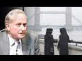

# MUST WATCH: The questions NO EVOLUTIONIST can answer ||Br. Mohammed Hijab (2016-03-18)

## Description

Visit our website now: http://www.sirateducation.com/

Richard Dawkins and other new age atheists commonly make the claim that evolution is certain truth. 

In this presentation there is a direct challenge to this proposition with compelling arguments made against this idea. The presentation starts with an islamic conceptualisation of science and moves on to evolution as a specific example. 

Throughout the presentation Brother Mohammed is clear to make a distinction between Islam and Christianity as many in the west have only been exposed to either Christian/Atheistic narratives.

## Summary of [MUST WATCH: The questions NO EVOLUTIONIST can answer ||Br. Mohammed Hijab](https://www.youtube.com/watch?v=CN14qAKJsEA)

*This summary is AI generated - there may be inaccuracies. *

### [00:00:00](https://www.youtube.com/watch?v=CN14qAKJsEA&t=0) - [00:10:00](https://www.youtube.com/watch?v=CN14qAKJsEA&t=600)

discusses the contradictions in mainstream science, and how evolutionary theory cannot account for certain details in the Quran. It argues that, because of this, the Quran should be taken seriously as a source of knowledge about the creation of the world.

**[00:00:00](https://www.youtube.com/watch?v=CN14qAKJsEA&t=0)** The first point to make is that science itself is not immune to change, with paradigm shifts happening from time to time. The second point is that there are many problems with induction, which makes it difficult to make reliable estimates based on past experience or extrapolation into the future. If evolution is taken as an unchangeable fact on ultimate truth, then Muslims would have no problem rejecting it.
* **[00:05:00](https://www.youtube.com/watch?v=CN14qAKJsEA&t=300)**  Br. Mohammed Hijab asks evolutionists several questions that they cannot answer, such as whether they can guarantee that there will be no paradigm shift in biology and whether they can solve the problem of induction. He then asks them to fight back and write articles or make visual responses to the questions. He argues that because evolution is based on a long evolutionary process, it is constantly changing and cannot be said to be a "fact."
* **[00:10:00](https://www.youtube.com/watch?v=CN14qAKJsEA&t=600)* Discusses the contradictions in mainstream science, and how evolutionary theory cannot account for certain details in the Quran. It argues that, because of this, the Quran should be taken seriously as a source of knowledge about the creation of the world.

<h2>Full transcript with timestamps: CLICK TO EXPAND</h2>

[0:00:00](https://youtu.be/CN14qAKJsEA?t=0) and public leaders feel so me or so  
[0:00:05](https://youtu.be/CN14qAKJsEA?t=5) dirty or do I either would you me I  
[0:00:09](https://youtu.be/CN14qAKJsEA?t=9) thought all right so the first thing  
[0:00:12](https://youtu.be/CN14qAKJsEA?t=12) that needs to be understood is that as  
[0:00:15](https://youtu.be/CN14qAKJsEA?t=15) Muslims we see science as a positive  
[0:00:17](https://youtu.be/CN14qAKJsEA?t=17) thing that is because we believe it cut  
[0:00:19](https://youtu.be/CN14qAKJsEA?t=19) it attempts to come to terms with what  
[0:00:22](https://youtu.be/CN14qAKJsEA?t=22) we believe is God's natural creation  
[0:00:24](https://youtu.be/CN14qAKJsEA?t=24) also unlike a Christian counterparts we  
[0:00:28](https://youtu.be/CN14qAKJsEA?t=28) have made this wolf history where you  
[0:00:30](https://youtu.be/CN14qAKJsEA?t=30) have a massive divide between the  
[0:00:32](https://youtu.be/CN14qAKJsEA?t=32) religious institutions and science and  
[0:00:35](https://youtu.be/CN14qAKJsEA?t=35) also on Michael Christian counterparts  
[0:00:37](https://youtu.be/CN14qAKJsEA?t=37) we haven't had to retreat in our home  
[0:00:42](https://youtu.be/CN14qAKJsEA?t=42) neuticle approach in other words the  
[0:00:44](https://youtu.be/CN14qAKJsEA?t=44) verses that talk about the heavens and  
[0:00:46](https://youtu.be/CN14qAKJsEA?t=46) the earth the verses that talk about the  
[0:00:47](https://youtu.be/CN14qAKJsEA?t=47) creations of the Emmons and the earthen  
[0:00:50](https://youtu.be/CN14qAKJsEA?t=50) and the things that God has really  
[0:00:52](https://youtu.be/CN14qAKJsEA?t=52) created those verses we maintain a  
[0:00:55](https://youtu.be/CN14qAKJsEA?t=55) literalistic account of those verses and  
[0:00:57](https://youtu.be/CN14qAKJsEA?t=57) we have had to resort to metaphor izing  
[0:01:00](https://youtu.be/CN14qAKJsEA?t=60) those verses when they are clearly not  
[0:01:03](https://youtu.be/CN14qAKJsEA?t=63) intended as metaphors now whilst Muslims  
[0:01:07](https://youtu.be/CN14qAKJsEA?t=67) will maintain that there is a close  
[0:01:08](https://youtu.be/CN14qAKJsEA?t=68) relationship between the Quran or Islam  
[0:01:12](https://youtu.be/CN14qAKJsEA?t=72) and science we will also say they ought  
[0:01:17](https://youtu.be/CN14qAKJsEA?t=77) not to be a perfect relationship between  
[0:01:19](https://youtu.be/CN14qAKJsEA?t=79) the Quran slam and science and this  
[0:01:23](https://youtu.be/CN14qAKJsEA?t=83) brings me to my main point that science  
[0:01:25](https://youtu.be/CN14qAKJsEA?t=85) itself is not perfect and I'm going to  
[0:01:27](https://youtu.be/CN14qAKJsEA?t=87) outline two reasons why I believe that  
[0:01:30](https://youtu.be/CN14qAKJsEA?t=90) is the case  
[0:01:33](https://youtu.be/CN14qAKJsEA?t=93) right so the first point I want to make  
[0:01:35](https://youtu.be/CN14qAKJsEA?t=95) is what Thomas Kuhn called a paradigm  
[0:01:38](https://youtu.be/CN14qAKJsEA?t=98) shift now science can undergo always  
[0:01:40](https://youtu.be/CN14qAKJsEA?t=100) referred to as a paradigm shift and a  
[0:01:43](https://youtu.be/CN14qAKJsEA?t=103) paradigm shift is literally know that no  
[0:01:46](https://youtu.be/CN14qAKJsEA?t=106) two scientific facts change actual  
[0:01:49](https://youtu.be/CN14qAKJsEA?t=109) scientific facts but the whole framework  
[0:01:52](https://youtu.be/CN14qAKJsEA?t=112) through which these facts operate also  
[0:01:54](https://youtu.be/CN14qAKJsEA?t=114) change now that happened at the time of  
[0:01:58](https://youtu.be/CN14qAKJsEA?t=118) sort of Newton / Einstein so there was a  
[0:02:01](https://youtu.be/CN14qAKJsEA?t=121) shift a complete paradigm shift from  
[0:02:05](https://youtu.be/CN14qAKJsEA?t=125) Newtonian physics to Einstein in physics  
[0:02:08](https://youtu.be/CN14qAKJsEA?t=128) that's an established reality and people  
[0:02:13](https://youtu.be/CN14qAKJsEA?t=133) of philosophy of science will know this  
[0:02:15](https://youtu.be/CN14qAKJsEA?t=135) another example is the fact that you  
[0:02:17](https://youtu.be/CN14qAKJsEA?t=137) know you had the assumption that the  
[0:02:19](https://youtu.be/CN14qAKJsEA?t=139) universe always existed and this is  
[0:02:21](https://youtu.be/CN14qAKJsEA?t=141) called steady state theory and this  
[0:02:24](https://youtu.be/CN14qAKJsEA?t=144) moved to the expanding universe model  
[0:02:26](https://youtu.be/CN14qAKJsEA?t=146) big bang / extent expanding universe  
[0:02:29](https://youtu.be/CN14qAKJsEA?t=149) model which of course meant the  
[0:02:32](https://youtu.be/CN14qAKJsEA?t=152) following him and I at one stage to put  
[0:02:35](https://youtu.be/CN14qAKJsEA?t=155) on contradicted science because the  
[0:02:37](https://youtu.be/CN14qAKJsEA?t=157) Quran makes it very clear that the  
[0:02:39](https://youtu.be/CN14qAKJsEA?t=159) universe did indeed have an explicit  
[0:02:41](https://youtu.be/CN14qAKJsEA?t=161) beginning steady state theory was  
[0:02:45](https://youtu.be/CN14qAKJsEA?t=165) completely against that and thus there  
[0:02:48](https://youtu.be/CN14qAKJsEA?t=168) was no reconciliation whatsoever between  
[0:02:51](https://youtu.be/CN14qAKJsEA?t=171) steady state theory and the Quran so I  
[0:02:54](https://youtu.be/CN14qAKJsEA?t=174) once saved in Islamic narrative  
[0:02:56](https://youtu.be/CN14qAKJsEA?t=176) contradicted established facts  
[0:02:59](https://youtu.be/CN14qAKJsEA?t=179) scientific fact but it science came to  
[0:03:03](https://youtu.be/CN14qAKJsEA?t=183) agree with the credit narrative  
[0:03:04](https://youtu.be/CN14qAKJsEA?t=184) afterwards so this is the first point  
[0:03:08](https://youtu.be/CN14qAKJsEA?t=188) right so the second point that I want to  
[0:03:12](https://youtu.be/CN14qAKJsEA?t=192) make is what is commonly referred to as  
[0:03:14](https://youtu.be/CN14qAKJsEA?t=194) the problem of induction now induction  
[0:03:17](https://youtu.be/CN14qAKJsEA?t=197) attempts to make sort broad  
[0:03:20](https://youtu.be/CN14qAKJsEA?t=200) generalizations on specific samples now  
[0:03:23](https://youtu.be/CN14qAKJsEA?t=203) the problems of induction are many which  
[0:03:26](https://youtu.be/CN14qAKJsEA?t=206) has 12 enumerated by David Hume one of  
[0:03:29](https://youtu.be/CN14qAKJsEA?t=209) them is that it's very difficult to make  
[0:03:32](https://youtu.be/CN14qAKJsEA?t=212) estimations based on a select sample or  
[0:03:36](https://youtu.be/CN14qAKJsEA?t=216) is very difficult to make estimations  
[0:03:39](https://youtu.be/CN14qAKJsEA?t=219) based on past experiences on future  
[0:03:43](https://youtu.be/CN14qAKJsEA?t=223) events so these all sort of problems are  
[0:03:46](https://youtu.be/CN14qAKJsEA?t=226) associated with induction and these  
[0:03:49](https://youtu.be/CN14qAKJsEA?t=229) problems cause deep and dangerous  
[0:03:53](https://youtu.be/CN14qAKJsEA?t=233) complications for those who see science  
[0:03:56](https://youtu.be/CN14qAKJsEA?t=236) or the theory of evolution to be more  
[0:03:59](https://youtu.be/CN14qAKJsEA?t=239) specific here and use a contemporary  
[0:04:01](https://youtu.be/CN14qAKJsEA?t=241) example a theory of evolution as an  
[0:04:04](https://youtu.be/CN14qAKJsEA?t=244) absolute certainty that is not prone to  
[0:04:08](https://youtu.be/CN14qAKJsEA?t=248) any kind of change now Muslims unlike  
[0:04:12](https://youtu.be/CN14qAKJsEA?t=252) our Christian literalist young earth  
[0:04:14](https://youtu.be/CN14qAKJsEA?t=254) creationist counterparts we don't have  
[0:04:16](https://youtu.be/CN14qAKJsEA?t=256) to believe for example that the universe  
[0:04:18](https://youtu.be/CN14qAKJsEA?t=258) is only you know a couple of days old or  
[0:04:21](https://youtu.be/CN14qAKJsEA?t=261) a couple of thousand years old we can  
[0:04:24](https://youtu.be/CN14qAKJsEA?t=264) come to the conclusion that the universe  
[0:04:27](https://youtu.be/CN14qAKJsEA?t=267) is expedient whether is years old and we  
[0:04:30](https://youtu.be/CN14qAKJsEA?t=270) don't have any problem in rejecting  
[0:04:32](https://youtu.be/CN14qAKJsEA?t=272) things like adaptation or speciation or  
[0:04:35](https://youtu.be/CN14qAKJsEA?t=275) the fact that dinosaurs you know existed  
[0:04:37](https://youtu.be/CN14qAKJsEA?t=277) or any of these things but we clearly  
[0:04:39](https://youtu.be/CN14qAKJsEA?t=279) are under obligation to reject human  
[0:04:43](https://youtu.be/CN14qAKJsEA?t=283) evolution  
[0:04:46](https://youtu.be/CN14qAKJsEA?t=286) right so bearing this in mind I hope you  
[0:04:48](https://youtu.be/CN14qAKJsEA?t=288) have only two questions to ask someone  
[0:04:51](https://youtu.be/CN14qAKJsEA?t=291) who takes evolution as an unchangeable  
[0:04:54](https://youtu.be/CN14qAKJsEA?t=294) certainty on ultimate truth to which if  
[0:04:58](https://youtu.be/CN14qAKJsEA?t=298) you can answer in the positive only then  
[0:05:02](https://youtu.be/CN14qAKJsEA?t=302) can you quench my skeptical thirst  
[0:05:04](https://youtu.be/CN14qAKJsEA?t=304) so our first question is can you  
[0:05:08](https://youtu.be/CN14qAKJsEA?t=308) guarantee that there will be no paradigm  
[0:05:10](https://youtu.be/CN14qAKJsEA?t=310) shift in the field of biology that I  
[0:05:12](https://youtu.be/CN14qAKJsEA?t=312) like of which we've already witnessed in  
[0:05:14](https://youtu.be/CN14qAKJsEA?t=314) physics that's the first question the  
[0:05:17](https://youtu.be/CN14qAKJsEA?t=317) second question is can you solve the  
[0:05:21](https://youtu.be/CN14qAKJsEA?t=321) problem of induction so they can get  
[0:05:24](https://youtu.be/CN14qAKJsEA?t=324) enough sample evidences to make a  
[0:05:27](https://youtu.be/CN14qAKJsEA?t=327) complete generalization in evolution or  
[0:05:30](https://youtu.be/CN14qAKJsEA?t=330) human evolution in particular these are  
[0:05:34](https://youtu.be/CN14qAKJsEA?t=334) my questions and is my case and I really  
[0:05:37](https://youtu.be/CN14qAKJsEA?t=337) want to ask you for a favor really have  
[0:05:41](https://youtu.be/CN14qAKJsEA?t=341) a request to make to you and it consists  
[0:05:45](https://youtu.be/CN14qAKJsEA?t=345) of two words fire back that's right  
[0:05:52](https://youtu.be/CN14qAKJsEA?t=352) fight back I've made my points clear  
[0:05:55](https://youtu.be/CN14qAKJsEA?t=355) I've elucidated on my questions so it's  
[0:05:59](https://youtu.be/CN14qAKJsEA?t=359) time for you to fight back write an  
[0:06:01](https://youtu.be/CN14qAKJsEA?t=361) article make a visual response let's see  
[0:06:05](https://youtu.be/CN14qAKJsEA?t=365) what you have to say to these questions  
[0:06:08](https://youtu.be/CN14qAKJsEA?t=368) that I posed so I've been describing  
[0:06:11](https://youtu.be/CN14qAKJsEA?t=371) evolution as if it's a fact as if it's a  
[0:06:14](https://youtu.be/CN14qAKJsEA?t=374) fact really I've been taking that for  
[0:06:15](https://youtu.be/CN14qAKJsEA?t=375) granted effect of science whether  
[0:06:18](https://youtu.be/CN14qAKJsEA?t=378) evolution can by its very nature cuz it  
[0:06:21](https://youtu.be/CN14qAKJsEA?t=381) takes millions of years to take place  
[0:06:22](https://youtu.be/CN14qAKJsEA?t=382) fulfill this scientific sort of textbook  
[0:06:25](https://youtu.be/CN14qAKJsEA?t=385) definition of science something which is  
[0:06:27](https://youtu.be/CN14qAKJsEA?t=387) a observed phenomena I'll leave that up  
[0:06:30](https://youtu.be/CN14qAKJsEA?t=390) to the viewer I'm not gonna you know  
[0:06:31](https://youtu.be/CN14qAKJsEA?t=391) just go back and forth for you guys  
[0:06:34](https://youtu.be/CN14qAKJsEA?t=394) you can decide that it was actually  
[0:06:36](https://youtu.be/CN14qAKJsEA?t=396) respected there's a matter it's because  
[0:06:39](https://youtu.be/CN14qAKJsEA?t=399) then you'd still have the two questions  
[0:06:41](https://youtu.be/CN14qAKJsEA?t=401) that you have to answer even if it is a  
[0:06:42](https://youtu.be/CN14qAKJsEA?t=402) fact but you have to understand that  
[0:06:45](https://youtu.be/CN14qAKJsEA?t=405) biologists understanding of our  
[0:06:48](https://youtu.be/CN14qAKJsEA?t=408) evolution has undergone a kind of  
[0:06:50](https://youtu.be/CN14qAKJsEA?t=410) cosmetic surgery in the 20th century  
[0:06:52](https://youtu.be/CN14qAKJsEA?t=412) that is because basically you had  
[0:06:55](https://youtu.be/CN14qAKJsEA?t=415) microbiology and sort of new  
[0:06:57](https://youtu.be/CN14qAKJsEA?t=417) understanding of genetics which had  
[0:06:59](https://youtu.be/CN14qAKJsEA?t=419) be incorporated into Darwinism or  
[0:07:02](https://youtu.be/CN14qAKJsEA?t=422) Darwinian evolution to create what you  
[0:07:04](https://youtu.be/CN14qAKJsEA?t=424) call the neo-darwinian evolution your  
[0:07:07](https://youtu.be/CN14qAKJsEA?t=427) Darwinian evolution your Darwinian  
[0:07:10](https://youtu.be/CN14qAKJsEA?t=430) evolution so as a result of these  
[0:07:12](https://youtu.be/CN14qAKJsEA?t=432) changes one can I still come to the  
[0:07:15](https://youtu.be/CN14qAKJsEA?t=435) conclusion that evolution is evolving  
[0:07:17](https://youtu.be/CN14qAKJsEA?t=437) it's changing it is moving around even I  
[0:07:22](https://youtu.be/CN14qAKJsEA?t=442) mean if you look at the fossil record  
[0:07:24](https://youtu.be/CN14qAKJsEA?t=444) because evolution a big part of the  
[0:07:25](https://youtu.be/CN14qAKJsEA?t=445) theory really depends upon the fossil  
[0:07:27](https://youtu.be/CN14qAKJsEA?t=447) record and there have been massive  
[0:07:29](https://youtu.be/CN14qAKJsEA?t=449) changes as a result of the new  
[0:07:32](https://youtu.be/CN14qAKJsEA?t=452) discoveries you know new fossil  
[0:07:34](https://youtu.be/CN14qAKJsEA?t=454) discoveries a full sample of Lucy Lucy  
[0:07:37](https://youtu.be/CN14qAKJsEA?t=457) obviously discovered in 1974 is a fossil  
[0:07:41](https://youtu.be/CN14qAKJsEA?t=461) and people actually know bandages had to  
[0:07:44](https://youtu.be/CN14qAKJsEA?t=464) come back to the drawing board  
[0:07:44](https://youtu.be/CN14qAKJsEA?t=464) continuously go back to the drawing  
[0:07:46](https://youtu.be/CN14qAKJsEA?t=466) board and try and reconfigure the third  
[0:07:48](https://youtu.be/CN14qAKJsEA?t=468) evolution based on this new fossil  
[0:07:50](https://youtu.be/CN14qAKJsEA?t=470) another another change that took place  
[0:07:52](https://youtu.be/CN14qAKJsEA?t=472) in order for men and now instead of it  
[0:07:55](https://youtu.be/CN14qAKJsEA?t=475) being a new fossil that take that people  
[0:07:58](https://youtu.be/CN14qAKJsEA?t=478) are found its new classifications now so  
[0:08:01](https://youtu.be/CN14qAKJsEA?t=481) a Neanderthal man was our anatomical  
[0:08:05](https://youtu.be/CN14qAKJsEA?t=485) cousin right and then he was  
[0:08:07](https://youtu.be/CN14qAKJsEA?t=487) reclassified to being anatomical brother  
[0:08:12](https://youtu.be/CN14qAKJsEA?t=492) I mean even to be honest a very famous  
[0:08:15](https://youtu.be/CN14qAKJsEA?t=495) controversy within the twenty sort of  
[0:08:19](https://youtu.be/CN14qAKJsEA?t=499) early 21st century could say what 20/20  
[0:08:23](https://youtu.be/CN14qAKJsEA?t=503) first century is the sort of  
[0:08:25](https://youtu.be/CN14qAKJsEA?t=505) controversial decade Stephen Gould  
[0:08:28](https://youtu.be/CN14qAKJsEA?t=508) so he made a theory of thesis called  
[0:08:31](https://youtu.be/CN14qAKJsEA?t=511) punctuated equilibrium with punctuated  
[0:08:33](https://youtu.be/CN14qAKJsEA?t=513) equilibrium which is actually contrasted  
[0:08:36](https://youtu.be/CN14qAKJsEA?t=516) it's a contrast to neo Darwinian  
[0:08:39](https://youtu.be/CN14qAKJsEA?t=519) evolution one can say he steps out of  
[0:08:41](https://youtu.be/CN14qAKJsEA?t=521) not new Darwinian evolution so there's a  
[0:08:44](https://youtu.be/CN14qAKJsEA?t=524) new explanation now for how human being  
[0:08:46](https://youtu.be/CN14qAKJsEA?t=526) or how different creatures evolved which  
[0:08:49](https://youtu.be/CN14qAKJsEA?t=529) is not the standard Darwinian evolution  
[0:08:53](https://youtu.be/CN14qAKJsEA?t=533) explanation so look at the changes are  
[0:08:55](https://youtu.be/CN14qAKJsEA?t=535) taking place and continuously change  
[0:08:57](https://youtu.be/CN14qAKJsEA?t=537) already with the theory of evolution  
[0:09:00](https://youtu.be/CN14qAKJsEA?t=540) there are so many changes that is it's  
[0:09:04](https://youtu.be/CN14qAKJsEA?t=544) really it's very hard to maintain that  
[0:09:06](https://youtu.be/CN14qAKJsEA?t=546) there won't be any new fossils or the  
[0:09:08](https://youtu.be/CN14qAKJsEA?t=548) one being you  
[0:09:09](https://youtu.be/CN14qAKJsEA?t=549) reclassifications that will render parts  
[0:09:12](https://youtu.be/CN14qAKJsEA?t=552) of the theory perhaps another would you  
[0:09:15](https://youtu.be/CN14qAKJsEA?t=555) know so think about that the fact that  
[0:09:17](https://youtu.be/CN14qAKJsEA?t=557) evolution is evolving is a testament to  
[0:09:20](https://youtu.be/CN14qAKJsEA?t=560) the fact really that it can continue to  
[0:09:23](https://youtu.be/CN14qAKJsEA?t=563) change and part new evidences can come  
[0:09:26](https://youtu.be/CN14qAKJsEA?t=566) in and be incorporated and undermined  
[0:09:28](https://youtu.be/CN14qAKJsEA?t=568) all evidences how can you maintain a  
[0:09:30](https://youtu.be/CN14qAKJsEA?t=570) certain reality in this case and if you  
[0:09:33](https://youtu.be/CN14qAKJsEA?t=573) want to maintain that is certain in the  
[0:09:36](https://youtu.be/CN14qAKJsEA?t=576) city so thing that happens for sure you  
[0:09:39](https://youtu.be/CN14qAKJsEA?t=579) still have to take a step back and you  
[0:09:41](https://youtu.be/CN14qAKJsEA?t=581) still did have to be open-minded and  
[0:09:43](https://youtu.be/CN14qAKJsEA?t=583) think all of these changes have happened  
[0:09:45](https://youtu.be/CN14qAKJsEA?t=585) what is guaranteeing us that continuous  
[0:09:48](https://youtu.be/CN14qAKJsEA?t=588) change will not continue to happen think  
[0:09:51](https://youtu.be/CN14qAKJsEA?t=591) about it  
[0:09:53](https://youtu.be/CN14qAKJsEA?t=593) so what really astonishes me is that  
[0:09:57](https://youtu.be/CN14qAKJsEA?t=597) people really do take evolution is  
[0:10:00](https://youtu.be/CN14qAKJsEA?t=600) almost like a religion become so deeply  
[0:10:01](https://youtu.be/CN14qAKJsEA?t=601) entrenched in people's mind they become  
[0:10:03](https://youtu.be/CN14qAKJsEA?t=603) loners like religion and the scientists  
[0:10:06](https://youtu.be/CN14qAKJsEA?t=606) job is going to be to attempt to falsify  
[0:10:09](https://youtu.be/CN14qAKJsEA?t=609) evidences but unfortunately because of  
[0:10:12](https://youtu.be/CN14qAKJsEA?t=612) the atmosphere that has been created in  
[0:10:15](https://youtu.be/CN14qAKJsEA?t=615) 21st century with eighteen or new New  
[0:10:18](https://youtu.be/CN14qAKJsEA?t=618) Age atheism it is like a stubborn  
[0:10:21](https://youtu.be/CN14qAKJsEA?t=621) vehement like stubbornness about ideas  
[0:10:24](https://youtu.be/CN14qAKJsEA?t=624) this is create an atmosphere where  
[0:10:26](https://youtu.be/CN14qAKJsEA?t=626) people actually want to go and create a  
[0:10:28](https://youtu.be/CN14qAKJsEA?t=628) self-fulfilling prophecy in relation to  
[0:10:30](https://youtu.be/CN14qAKJsEA?t=630) this field of evolution and this makes  
[0:10:33](https://youtu.be/CN14qAKJsEA?t=633) them who look but this makes people look  
[0:10:34](https://youtu.be/CN14qAKJsEA?t=634) really bad like Lord Kelvin you know  
[0:10:38](https://youtu.be/CN14qAKJsEA?t=638) it's meant to be um you know massive  
[0:10:40](https://youtu.be/CN14qAKJsEA?t=640) scientist he made it speech publicly in  
[0:10:42](https://youtu.be/CN14qAKJsEA?t=642) the nineteen hundreds and he said that  
[0:10:44](https://youtu.be/CN14qAKJsEA?t=644) we know everything we need to know about  
[0:10:45](https://youtu.be/CN14qAKJsEA?t=645) physics and then five or six four or  
[0:10:48](https://youtu.be/CN14qAKJsEA?t=648) five years later Einstein came with a  
[0:10:50](https://youtu.be/CN14qAKJsEA?t=650) special theory of relativity so you have  
[0:10:53](https://youtu.be/CN14qAKJsEA?t=653) to understand that science is an  
[0:10:55](https://youtu.be/CN14qAKJsEA?t=655) instrumental way of understanding the  
[0:10:57](https://youtu.be/CN14qAKJsEA?t=657) world around us it's pragmatic it  
[0:10:59](https://youtu.be/CN14qAKJsEA?t=659) changes so I mean that's what you have  
[0:11:02](https://youtu.be/CN14qAKJsEA?t=662) to understand but look if you like me  
[0:11:05](https://youtu.be/CN14qAKJsEA?t=665) appreciate the scientific method we  
[0:11:08](https://youtu.be/CN14qAKJsEA?t=668) appreciate the sensitive something that  
[0:11:09](https://youtu.be/CN14qAKJsEA?t=669) unites people it's a rational recourse  
[0:11:12](https://youtu.be/CN14qAKJsEA?t=672) and you're and you're someone who  
[0:11:15](https://youtu.be/CN14qAKJsEA?t=675) appreciates it then realize that the  
[0:11:17](https://youtu.be/CN14qAKJsEA?t=677) science itself is not concerned with  
[0:11:20](https://youtu.be/CN14qAKJsEA?t=680) certain things  
[0:11:21](https://youtu.be/CN14qAKJsEA?t=681) like meaning  
[0:11:23](https://youtu.be/CN14qAKJsEA?t=683) it doesn't concern those things at all  
[0:11:27](https://youtu.be/CN14qAKJsEA?t=687) so if you have like this kind of like  
[0:11:29](https://youtu.be/CN14qAKJsEA?t=689) craving for certainty that can only be  
[0:11:33](https://youtu.be/CN14qAKJsEA?t=693) satiated with the question what is my  
[0:11:37](https://youtu.be/CN14qAKJsEA?t=697) purpose in life that can only be  
[0:11:38](https://youtu.be/CN14qAKJsEA?t=698) questioned associated with that question  
[0:11:41](https://youtu.be/CN14qAKJsEA?t=701) and look going back to science if we  
[0:11:44](https://youtu.be/CN14qAKJsEA?t=704) related to the quranic narrative the  
[0:11:48](https://youtu.be/CN14qAKJsEA?t=708) quranic narrative is interestingly  
[0:11:51](https://youtu.be/CN14qAKJsEA?t=711) despite all the things we've said it can  
[0:11:54](https://youtu.be/CN14qAKJsEA?t=714) be if you look at all of the verses that  
[0:11:56](https://youtu.be/CN14qAKJsEA?t=716) talk about creation literally in the  
[0:11:58](https://youtu.be/CN14qAKJsEA?t=718) front those verses can be correlated  
[0:12:01](https://youtu.be/CN14qAKJsEA?t=721) with even in the light like of 21st  
[0:12:04](https://youtu.be/CN14qAKJsEA?t=724) century scientific discovery in other  
[0:12:06](https://youtu.be/CN14qAKJsEA?t=726) words you can appreciate those verses in  
[0:12:08](https://youtu.be/CN14qAKJsEA?t=728) the light of 21st century discoveries so  
[0:12:12](https://youtu.be/CN14qAKJsEA?t=732) this is really an interesting part of  
[0:12:14](https://youtu.be/CN14qAKJsEA?t=734) the quranic narrative and it shows you  
[0:12:16](https://youtu.be/CN14qAKJsEA?t=736) and we should really strong case speedy  
[0:12:18](https://youtu.be/CN14qAKJsEA?t=738) for the timelessness of the quran are  
[0:12:27](https://youtu.be/CN14qAKJsEA?t=747) you going to subscribe wha-hey you gonna  
[0:12:31](https://youtu.be/CN14qAKJsEA?t=751) just become of the channel and you don't  
[0:12:33](https://youtu.be/CN14qAKJsEA?t=753) do i'm not subscribe you got to  
[0:12:36](https://youtu.be/CN14qAKJsEA?t=756) subscribe to the jump  
[0:12:46](https://youtu.be/CN14qAKJsEA?t=766) but Lina  
[0:12:53](https://youtu.be/CN14qAKJsEA?t=773) would you be a dog  

