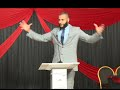

# liberalism: White Colonialist's New Religion (2018-10-12 17:08:34+00:00)

## Description

This lecture discusses the history of liberalism and some of its fundamental epistemological flaws. it does so especially in the context of the relationship between Islam and the West. 

You can view an article I wrote here -http://www.salam.org.uk/2018/10/01/the-problems-with-liberalism/

## Summary of [liberalism: White Colonialist's New Religion](https://www.youtube.com/watch?v=2Dyzc282ZFE)

*This summary is AI generated - there may be inaccuracies. *

### [00:00:00](https://www.youtube.com/watch?v=2Dyzc282ZFE&t=0) - [00:30:00](https://www.youtube.com/watch?v=2Dyzc282ZFE&t=1800)

Marco Logic discusses liberalism, which he argues is a white colonialist's new religion. He discusses the important questions that need to be asked about liberalism, and how Muslims and Westerners need to question the assumptions behind these questions. He also discusses how liberalism has problematic presuppositions, and how it needs to be confronted in order to be reformed.

**[00:00:00](https://www.youtube.com/watch?v=2Dyzc282ZFE&t=0)** Marco Logic discusses liberalism, which he argues is a white colonialist's new religion. He discusses the important questions that need to be asked about liberalism, and how Muslims and Westerners need to question the assumptions behind these questions. He also discusses how liberalism has problematic presuppositions, and how it needs to be confronted in order to be reformed.
* **[00:05:00](https://www.youtube.com/watch?v=2Dyzc282ZFE&t=300)** John Locke argued in his book "The Two Treatises of Government" that humans are born free and equal, and that governments are justified by this natural right. In the United States Declaration of Independence, Locke's words are used to support the idea of self-government.
* **[00:10:00](https://www.youtube.com/watch?v=2Dyzc282ZFE&t=600)** John Stuart Mill argued that humans are born free and equal, and that pleasure is the only moral justification for doing anything. He also argued that morality should be based on the greatest happiness of the largest number of people, and that harm should not be a concern in decisions made about personal liberties.
* **[00:15:00](https://www.youtube.com/watch?v=2Dyzc282ZFE&t=900)** of the video argues that liberalism is not true, as it is based on faulty first principles. He points to the Western European colonization of the world, as well as the spread of liberalism by force, as proof that it is not based on anything concrete. He goes on to say that Muslims have become apologetic about their faith, and that this is a sign of weakness.
* **[00:20:00](https://www.youtube.com/watch?v=2Dyzc282ZFE&t=1200)* Discusses how ancient Greeks believed in different gods without justification, and how liberalism is based on these same beliefs. It argues that this is not a way for critical inquiry, and that instead we should be aware of the myths and legends that are used to justify liberalism.
* **[00:25:00](https://www.youtube.com/watch?v=2Dyzc282ZFE&t=1500)* Discusses how Muslims believe in free speech, but also have principles that restrict what speech is permissible. It argues that these principles come from first principles, and that those who doubt Allah or the messenger are old and doubting.
* **[00:30:00](https://www.youtube.com/watch?v=2Dyzc282ZFE&t=1800)* Discusses correlation between liberalism and suicide rates, as well as the West's attempt to impose its own values on others. It argues that people should not blindly believe in anything, but rather question and find truth for themselves.

## Full transcript with timestamps

[0:00:00](https://youtu.be/2Dyzc282ZFE?t=0) to come to the state to deliver his  
[0:00:02](https://youtu.be/2Dyzc282ZFE?t=2) lecture intellectual doubts about Islam  
[0:00:05](https://youtu.be/2Dyzc282ZFE?t=5) Marco logic Salam aleikum wa rahmatullah  
[0:00:27](https://youtu.be/2Dyzc282ZFE?t=27) our heads you know in the West we're  
[0:00:34](https://youtu.be/2Dyzc282ZFE?t=34) asked a lot of questions as Muslims were  
[0:00:37](https://youtu.be/2Dyzc282ZFE?t=37) asked many questions regularly pressing  
[0:00:41](https://youtu.be/2Dyzc282ZFE?t=41) important questions and these questions  
[0:00:44](https://youtu.be/2Dyzc282ZFE?t=44) usually have something to do with what I  
[0:00:49](https://youtu.be/2Dyzc282ZFE?t=49) refer to as post enlightenment ideas and  
[0:00:53](https://youtu.be/2Dyzc282ZFE?t=53) it's connection with Islam so don't give  
[0:00:56](https://youtu.be/2Dyzc282ZFE?t=56) an example someone will ask why is it  
[0:01:01](https://youtu.be/2Dyzc282ZFE?t=61) that in Islam for example Muslims get  
[0:01:05](https://youtu.be/2Dyzc282ZFE?t=65) offended when a picture is drawn of the  
[0:01:09](https://youtu.be/2Dyzc282ZFE?t=69) Prophet Muhammad isn't this freedom of  
[0:01:12](https://youtu.be/2Dyzc282ZFE?t=72) expression and freedom of speech and why  
[0:01:17](https://youtu.be/2Dyzc282ZFE?t=77) are Muslims in this regard against  
[0:01:20](https://youtu.be/2Dyzc282ZFE?t=80) freedom of expression and freedom of  
[0:01:23](https://youtu.be/2Dyzc282ZFE?t=83) speech isn't Islam therefore the  
[0:01:27](https://youtu.be/2Dyzc282ZFE?t=87) argument goes a backwards religion that  
[0:01:31](https://youtu.be/2Dyzc282ZFE?t=91) needs to be reformed do we not need to  
[0:01:35](https://youtu.be/2Dyzc282ZFE?t=95) have a reform within Islam because  
[0:01:37](https://youtu.be/2Dyzc282ZFE?t=97) actually you'll find that Islam has  
[0:01:41](https://youtu.be/2Dyzc282ZFE?t=101) aspects of it which are against  
[0:01:43](https://youtu.be/2Dyzc282ZFE?t=103) enlightenment values against liberalism  
[0:01:47](https://youtu.be/2Dyzc282ZFE?t=107) against freedom of expression against  
[0:01:51](https://youtu.be/2Dyzc282ZFE?t=111) freedom of speech our thing is these are  
[0:01:55](https://youtu.be/2Dyzc282ZFE?t=115) very important questions to be asked but  
[0:02:00](https://youtu.be/2Dyzc282ZFE?t=120) what Muslims need to do and what  
[0:02:03](https://youtu.be/2Dyzc282ZFE?t=123) Westerners also need to do is they need  
[0:02:06](https://youtu.be/2Dyzc282ZFE?t=126) to question the question I has a point  
[0:02:11](https://youtu.be/2Dyzc282ZFE?t=131) every question has a presupposition what  
[0:02:15](https://youtu.be/2Dyzc282ZFE?t=135) is a presupposition it is an assumption  
[0:02:18](https://youtu.be/2Dyzc282ZFE?t=138) it is an assumption obviously with these  
[0:02:22](https://youtu.be/2Dyzc282ZFE?t=142) questions some Muslims they go  
[0:02:26](https://youtu.be/2Dyzc282ZFE?t=146) immediately on the backfoot  
[0:02:29](https://youtu.be/2Dyzc282ZFE?t=149) immediately there on the back foot and  
[0:02:32](https://youtu.be/2Dyzc282ZFE?t=152) just like the Western colonial powers  
[0:02:39](https://youtu.be/2Dyzc282ZFE?t=159) came into our grandfathers Nations and  
[0:02:45](https://youtu.be/2Dyzc282ZFE?t=165) attempted to force them to believe in  
[0:02:47](https://youtu.be/2Dyzc282ZFE?t=167) what they believe in  
[0:02:49](https://youtu.be/2Dyzc282ZFE?t=169) militarily now the post-colonial Western  
[0:02:58](https://youtu.be/2Dyzc282ZFE?t=178) masters are doing so using different  
[0:03:01](https://youtu.be/2Dyzc282ZFE?t=181) techniques and there are different  
[0:03:04](https://youtu.be/2Dyzc282ZFE?t=184) responses from Muslims and others some  
[0:03:07](https://youtu.be/2Dyzc282ZFE?t=187) will literally bow at the knee they will  
[0:03:10](https://youtu.be/2Dyzc282ZFE?t=190) literally bow at the knee surrender give  
[0:03:14](https://youtu.be/2Dyzc282ZFE?t=194) up yes you're right sir there is a  
[0:03:17](https://youtu.be/2Dyzc282ZFE?t=197) problem we need to fix it we need to  
[0:03:19](https://youtu.be/2Dyzc282ZFE?t=199) have revivalism in Islam we need to have  
[0:03:21](https://youtu.be/2Dyzc282ZFE?t=201) reform we need to clean it up you're  
[0:03:24](https://youtu.be/2Dyzc282ZFE?t=204) right  
[0:03:25](https://youtu.be/2Dyzc282ZFE?t=205) some will say we must reject this  
[0:03:29](https://youtu.be/2Dyzc282ZFE?t=209) completely there is this is a poison a  
[0:03:31](https://youtu.be/2Dyzc282ZFE?t=211) poisonous ideology and we must remove it  
[0:03:35](https://youtu.be/2Dyzc282ZFE?t=215) and what we're going to be doing in  
[0:03:37](https://youtu.be/2Dyzc282ZFE?t=217) charla in the next three days it will be  
[0:03:41](https://youtu.be/2Dyzc282ZFE?t=221) arguing that the question itself is  
[0:03:45](https://youtu.be/2Dyzc282ZFE?t=225) problematic all the questions that are  
[0:03:48](https://youtu.be/2Dyzc282ZFE?t=228) asked are problematic questions so the  
[0:03:50](https://youtu.be/2Dyzc282ZFE?t=230) first day I'm going to be dealing with  
[0:03:51](https://youtu.be/2Dyzc282ZFE?t=231) liberalism I know it's on the third day  
[0:03:53](https://youtu.be/2Dyzc282ZFE?t=233) on your pamphlet but I'm gonna do it  
[0:03:55](https://youtu.be/2Dyzc282ZFE?t=235) first in Chara I'm gonna be dealing with  
[0:03:57](https://youtu.be/2Dyzc282ZFE?t=237) questions which deal with liberal  
[0:03:59](https://youtu.be/2Dyzc282ZFE?t=239) presuppositions the second day we're  
[0:04:03](https://youtu.be/2Dyzc282ZFE?t=243) going to be dealing with democracy which  
[0:04:04](https://youtu.be/2Dyzc282ZFE?t=244) is very important and the third day  
[0:04:07](https://youtu.be/2Dyzc282ZFE?t=247) we're going to be dealing with feminism  
[0:04:12](https://youtu.be/2Dyzc282ZFE?t=252) and that's why I did on the third day  
[0:04:13](https://youtu.be/2Dyzc282ZFE?t=253) because if anything happens I can just  
[0:04:15](https://youtu.be/2Dyzc282ZFE?t=255) go I'm going back to London anyways  
[0:04:24](https://youtu.be/2Dyzc282ZFE?t=264) today inshallah I'll be talking about  
[0:04:27](https://youtu.be/2Dyzc282ZFE?t=267) liberalism and by the way I've written  
[0:04:29](https://youtu.be/2Dyzc282ZFE?t=269) an article on this and I'm planning to  
[0:04:31](https://youtu.be/2Dyzc282ZFE?t=271) write an article on all three lectures  
[0:04:34](https://youtu.be/2Dyzc282ZFE?t=274) so I'll be writing written an article  
[0:04:36](https://youtu.be/2Dyzc282ZFE?t=276) liberalism will be published on it  
[0:04:38](https://youtu.be/2Dyzc282ZFE?t=278) should be online on Monday Anza Lambda  
[0:04:40](https://youtu.be/2Dyzc282ZFE?t=280) org dot uk' salaam and inshallah we'll  
[0:04:43](https://youtu.be/2Dyzc282ZFE?t=283) put the description somewhere so if you  
[0:04:45](https://youtu.be/2Dyzc282ZFE?t=285) want to do further reading you can do  
[0:04:46](https://youtu.be/2Dyzc282ZFE?t=286) that there  
[0:04:47](https://youtu.be/2Dyzc282ZFE?t=287) and moreover there'll be an article  
[0:04:50](https://youtu.be/2Dyzc282ZFE?t=290) written on each of the topics that I'll  
[0:04:52](https://youtu.be/2Dyzc282ZFE?t=292) be covering today as well now let's get  
[0:04:55](https://youtu.be/2Dyzc282ZFE?t=295) straight into it today I'm just gonna go  
[0:04:59](https://youtu.be/2Dyzc282ZFE?t=299) into three different things I'm going to  
[0:05:01](https://youtu.be/2Dyzc282ZFE?t=301) do three things today in Charlotte the  
[0:05:02](https://youtu.be/2Dyzc282ZFE?t=302) first thing is I'm going to give you a  
[0:05:04](https://youtu.be/2Dyzc282ZFE?t=304) brief history of liberalism a brief  
[0:05:07](https://youtu.be/2Dyzc282ZFE?t=307) history so you understand what it is  
[0:05:08](https://youtu.be/2Dyzc282ZFE?t=308) number two we're going to be talking  
[0:05:11](https://youtu.be/2Dyzc282ZFE?t=311) about the premises of liberalism the  
[0:05:15](https://youtu.be/2Dyzc282ZFE?t=315) first principles of liberalism where do  
[0:05:18](https://youtu.be/2Dyzc282ZFE?t=318) we start with liberalism and number  
[0:05:21](https://youtu.be/2Dyzc282ZFE?t=321) three we'll be talking about the  
[0:05:22](https://youtu.be/2Dyzc282ZFE?t=322) implications of this on Islam and  
[0:05:25](https://youtu.be/2Dyzc282ZFE?t=325) Muslims and the discourse between Islam  
[0:05:28](https://youtu.be/2Dyzc282ZFE?t=328) and Muslims in the Western context  
[0:05:30](https://youtu.be/2Dyzc282ZFE?t=330) especially so we'll start you see all of  
[0:05:36](https://youtu.be/2Dyzc282ZFE?t=336) these slogans that you've you're very  
[0:05:38](https://youtu.be/2Dyzc282ZFE?t=338) well aware of freedom of expression  
[0:05:40](https://youtu.be/2Dyzc282ZFE?t=340) freedom of speech they're extensions of  
[0:05:43](https://youtu.be/2Dyzc282ZFE?t=343) the liberal philosophical framework okay  
[0:05:45](https://youtu.be/2Dyzc282ZFE?t=345) so if someone is asking you a question  
[0:05:49](https://youtu.be/2Dyzc282ZFE?t=349) that presupposes liberalism like these  
[0:05:54](https://youtu.be/2Dyzc282ZFE?t=354) questions the question would be this  
[0:05:57](https://youtu.be/2Dyzc282ZFE?t=357) what if your ideology is baseless wait a  
[0:06:03](https://youtu.be/2Dyzc282ZFE?t=363) minute  
[0:06:04](https://youtu.be/2Dyzc282ZFE?t=364) say that one more time okay what if your  
[0:06:09](https://youtu.be/2Dyzc282ZFE?t=369) ideology is baseless what if there is no  
[0:06:14](https://youtu.be/2Dyzc282ZFE?t=374) way to prove the very beginnings or the  
[0:06:19](https://youtu.be/2Dyzc282ZFE?t=379) very starting points the very premises  
[0:06:21](https://youtu.be/2Dyzc282ZFE?t=381) of liberalism therefore the question  
[0:06:24](https://youtu.be/2Dyzc282ZFE?t=384) becomes obsolete  
[0:06:25](https://youtu.be/2Dyzc282ZFE?t=385) why does Islam why do Muslims get upset  
[0:06:29](https://youtu.be/2Dyzc282ZFE?t=389) with the drawing of the Prophet Muhammad  
[0:06:30](https://youtu.be/2Dyzc282ZFE?t=390) why not  
[0:06:31](https://youtu.be/2Dyzc282ZFE?t=391) could be the easy answer well it needs  
[0:06:34](https://youtu.be/2Dyzc282ZFE?t=394) to be in line with liberalism and well  
[0:06:36](https://youtu.be/2Dyzc282ZFE?t=396) if we can demonstrate that liberalism is  
[0:06:41](https://youtu.be/2Dyzc282ZFE?t=401) in fact based on what you call  
[0:06:44](https://youtu.be/2Dyzc282ZFE?t=404) corrigible presuppositions meaning they  
[0:06:48](https://youtu.be/2Dyzc282ZFE?t=408) are capable of reform or improvement  
[0:06:53](https://youtu.be/2Dyzc282ZFE?t=413) then there is no need to ask the  
[0:06:55](https://youtu.be/2Dyzc282ZFE?t=415) question because you're asking me a  
[0:06:57](https://youtu.be/2Dyzc282ZFE?t=417) question based on baseless foundations  
[0:07:00](https://youtu.be/2Dyzc282ZFE?t=420) so let's start with the brief history of  
[0:07:03](https://youtu.be/2Dyzc282ZFE?t=423) liberalism you see there was a man  
[0:07:07](https://youtu.be/2Dyzc282ZFE?t=427) called John Locke very famous man he's  
[0:07:12](https://youtu.be/2Dyzc282ZFE?t=432) actually one of the most influential  
[0:07:14](https://youtu.be/2Dyzc282ZFE?t=434) people who ever lived in my opinion he  
[0:07:16](https://youtu.be/2Dyzc282ZFE?t=436) died in 1704 he wrote many books one of  
[0:07:20](https://youtu.be/2Dyzc282ZFE?t=440) the most famous or if not the most  
[0:07:21](https://youtu.be/2Dyzc282ZFE?t=441) famous one hero is a book called the two  
[0:07:22](https://youtu.be/2Dyzc282ZFE?t=442) treatises of government and in this book  
[0:07:25](https://youtu.be/2Dyzc282ZFE?t=445) he argued the case for a social contract  
[0:07:27](https://youtu.be/2Dyzc282ZFE?t=447) he said we are all born equal we are all  
[0:07:31](https://youtu.be/2Dyzc282ZFE?t=451) born free interesting Locke John Locke  
[0:07:34](https://youtu.be/2Dyzc282ZFE?t=454) believed in God in fact he believes in  
[0:07:36](https://youtu.be/2Dyzc282ZFE?t=456) one God he was a Unitarian who's a  
[0:07:38](https://youtu.be/2Dyzc282ZFE?t=458) nonconformist Christine didn't believe  
[0:07:40](https://youtu.be/2Dyzc282ZFE?t=460) in the Trinity but he based much of his  
[0:07:43](https://youtu.be/2Dyzc282ZFE?t=463) philosophy on God and that's why a lot  
[0:07:49](https://youtu.be/2Dyzc282ZFE?t=469) of the governments of his day Britain  
[0:07:52](https://youtu.be/2Dyzc282ZFE?t=472) France and of course the United States  
[0:07:55](https://youtu.be/2Dyzc282ZFE?t=475) of America they incorporated literally  
[0:07:58](https://youtu.be/2Dyzc282ZFE?t=478) what he said in that the two treatises  
[0:08:01](https://youtu.be/2Dyzc282ZFE?t=481) of government into the for example the  
[0:08:05](https://youtu.be/2Dyzc282ZFE?t=485) US Declaration of Independence the Bill  
[0:08:08](https://youtu.be/2Dyzc282ZFE?t=488) of Rights in the in the United Kingdom  
[0:08:10](https://youtu.be/2Dyzc282ZFE?t=490) which was written in 1688 his words  
[0:08:14](https://youtu.be/2Dyzc282ZFE?t=494) which is one of the most important  
[0:08:17](https://youtu.be/2Dyzc282ZFE?t=497) documents and all of British history  
[0:08:19](https://youtu.be/2Dyzc282ZFE?t=499) it's called the Bill of Rights and of  
[0:08:22](https://youtu.be/2Dyzc282ZFE?t=502) course the u.s. Declaration of  
[0:08:23](https://youtu.be/2Dyzc282ZFE?t=503) Independence one of the most important  
[0:08:25](https://youtu.be/2Dyzc282ZFE?t=505) documents in all of American government  
[0:08:28](https://youtu.be/2Dyzc282ZFE?t=508) and politics so for example  
[0:08:35](https://youtu.be/2Dyzc282ZFE?t=515) the famous phrase that we hold these  
[0:08:38](https://youtu.be/2Dyzc282ZFE?t=518) truths to be self-evident that all men  
[0:08:41](https://youtu.be/2Dyzc282ZFE?t=521) are created equal and that they have on  
[0:08:47](https://youtu.be/2Dyzc282ZFE?t=527) any unalienable rights of life liberty  
[0:08:50](https://youtu.be/2Dyzc282ZFE?t=530) and the pursuit of happiness this is the  
[0:08:53](https://youtu.be/2Dyzc282ZFE?t=533) US Declaration of Independence it's  
[0:08:54](https://youtu.be/2Dyzc282ZFE?t=534) taken from or slightly adjusted it's  
[0:08:58](https://youtu.be/2Dyzc282ZFE?t=538) taken from John Locke so a lot of these  
[0:09:00](https://youtu.be/2Dyzc282ZFE?t=540) ideas human beings being born free  
[0:09:03](https://youtu.be/2Dyzc282ZFE?t=543) freedom etc is taken from directly from  
[0:09:06](https://youtu.be/2Dyzc282ZFE?t=546) John Locke and the thing is about John  
[0:09:09](https://youtu.be/2Dyzc282ZFE?t=549) Locke is that he believed in God and if  
[0:09:13](https://youtu.be/2Dyzc282ZFE?t=553) you look at the wording of what he said  
[0:09:15](https://youtu.be/2Dyzc282ZFE?t=555) in the two treatises of government he  
[0:09:17](https://youtu.be/2Dyzc282ZFE?t=557) justified that for example human beings  
[0:09:20](https://youtu.be/2Dyzc282ZFE?t=560) are born equal and that they are born  
[0:09:22](https://youtu.be/2Dyzc282ZFE?t=562) free because he said that they were  
[0:09:24](https://youtu.be/2Dyzc282ZFE?t=564) endowed by the creator and this is part  
[0:09:27](https://youtu.be/2Dyzc282ZFE?t=567) of the US declaration independence they  
[0:09:29](https://youtu.be/2Dyzc282ZFE?t=569) were given this by God they were given  
[0:09:33](https://youtu.be/2Dyzc282ZFE?t=573) freedom and equality by God he had two  
[0:09:38](https://youtu.be/2Dyzc282ZFE?t=578) or three principles that he believed in  
[0:09:40](https://youtu.be/2Dyzc282ZFE?t=580) one was a theological belief so he  
[0:09:43](https://youtu.be/2Dyzc282ZFE?t=583) believed that all human beings were  
[0:09:45](https://youtu.be/2Dyzc282ZFE?t=585) endowed equality by God they were given  
[0:09:50](https://youtu.be/2Dyzc282ZFE?t=590) equality and freedoms by God but he also  
[0:09:53](https://youtu.be/2Dyzc282ZFE?t=593) believed he also believed in something  
[0:09:56](https://youtu.be/2Dyzc282ZFE?t=596) called the hedonistic principle and this  
[0:09:59](https://youtu.be/2Dyzc282ZFE?t=599) will be a very important point which I  
[0:10:01](https://youtu.be/2Dyzc282ZFE?t=601) want you to really pay attention to the  
[0:10:03](https://youtu.be/2Dyzc282ZFE?t=603) hedonistic principle is the idea that  
[0:10:06](https://youtu.be/2Dyzc282ZFE?t=606) the ultimate morality is pain and  
[0:10:09](https://youtu.be/2Dyzc282ZFE?t=609) pleasure  
[0:10:11](https://youtu.be/2Dyzc282ZFE?t=611) so what's ultimately good is what feels  
[0:10:14](https://youtu.be/2Dyzc282ZFE?t=614) good or what is pleasurable or desirable  
[0:10:17](https://youtu.be/2Dyzc282ZFE?t=617) to you this would be the cornerstone of  
[0:10:20](https://youtu.be/2Dyzc282ZFE?t=620) liberal moral philosophy it's called the  
[0:10:23](https://youtu.be/2Dyzc282ZFE?t=623) hedonistic principle so after John Locke  
[0:10:28](https://youtu.be/2Dyzc282ZFE?t=628) came about and he had such an influence  
[0:10:31](https://youtu.be/2Dyzc282ZFE?t=631) because of the English Civil War which  
[0:10:33](https://youtu.be/2Dyzc282ZFE?t=633) took place in 1642 to 1651 where the  
[0:10:37](https://youtu.be/2Dyzc282ZFE?t=637) Royalists and the parliamentarians were  
[0:10:40](https://youtu.be/2Dyzc282ZFE?t=640) attacking each other  
[0:10:41](https://youtu.be/2Dyzc282ZFE?t=641) Parliament reconstituted itself using a  
[0:10:45](https://youtu.be/2Dyzc282ZFE?t=645) lot of the Lockean principles sold in  
[0:10:48](https://youtu.be/2Dyzc282ZFE?t=648) and so did the US and France and these  
[0:10:51](https://youtu.be/2Dyzc282ZFE?t=651) countries they took these liberal  
[0:10:53](https://youtu.be/2Dyzc282ZFE?t=653) principles and then they became very  
[0:10:54](https://youtu.be/2Dyzc282ZFE?t=654) normative it became the norm now anyone  
[0:10:58](https://youtu.be/2Dyzc282ZFE?t=658) who speaks against the liberal  
[0:11:00](https://youtu.be/2Dyzc282ZFE?t=660) principles is AB is speaking in  
[0:11:04](https://youtu.be/2Dyzc282ZFE?t=664) aberration to the social and cultural  
[0:11:07](https://youtu.be/2Dyzc282ZFE?t=667) norms of the West that must must be  
[0:11:10](https://youtu.be/2Dyzc282ZFE?t=670) understood after John Locke you had many  
[0:11:12](https://youtu.be/2Dyzc282ZFE?t=672) different philosophers that came and  
[0:11:14](https://youtu.be/2Dyzc282ZFE?t=674) advanced his theory like Montesquieu or  
[0:11:16](https://youtu.be/2Dyzc282ZFE?t=676) Rousseau or for example Tocqueville who  
[0:11:20](https://youtu.be/2Dyzc282ZFE?t=680) wrote democracy and America which will  
[0:11:22](https://youtu.be/2Dyzc282ZFE?t=682) cover tomorrow and others and these  
[0:11:27](https://youtu.be/2Dyzc282ZFE?t=687) individuals just expanded the theory  
[0:11:29](https://youtu.be/2Dyzc282ZFE?t=689) most notably I was our I would argue is  
[0:11:32](https://youtu.be/2Dyzc282ZFE?t=692) John Stuart Mill who came in the  
[0:11:35](https://youtu.be/2Dyzc282ZFE?t=695) Victorian era and he talked about the  
[0:11:37](https://youtu.be/2Dyzc282ZFE?t=697) harm principle so about two you know  
[0:11:40](https://youtu.be/2Dyzc282ZFE?t=700) hundred two hundred years later this man  
[0:11:41](https://youtu.be/2Dyzc282ZFE?t=701) came John Stuart Mill and he advanced he  
[0:11:44](https://youtu.be/2Dyzc282ZFE?t=704) said yes he left the whole theological  
[0:11:48](https://youtu.be/2Dyzc282ZFE?t=708) discussion he didn't say that we were  
[0:11:50](https://youtu.be/2Dyzc282ZFE?t=710) born equal a free he took yes he  
[0:11:52](https://youtu.be/2Dyzc282ZFE?t=712) believed that we were born equal but he  
[0:11:53](https://youtu.be/2Dyzc282ZFE?t=713) didn't say it's from God some say he was  
[0:11:56](https://youtu.be/2Dyzc282ZFE?t=716) agnostic even he didn't believe me maybe  
[0:11:57](https://youtu.be/2Dyzc282ZFE?t=717) didn't believe in God the law Allen God  
[0:11:59](https://youtu.be/2Dyzc282ZFE?t=719) knows best if you believed in God or not  
[0:12:00](https://youtu.be/2Dyzc282ZFE?t=720) yeah but here's a problem this is a very  
[0:12:05](https://youtu.be/2Dyzc282ZFE?t=725) big problem for liberals if initially my  
[0:12:09](https://youtu.be/2Dyzc282ZFE?t=729) question first question if initially the  
[0:12:12](https://youtu.be/2Dyzc282ZFE?t=732) justification for human beings being  
[0:12:15](https://youtu.be/2Dyzc282ZFE?t=735) born equal and free was based on  
[0:12:18](https://youtu.be/2Dyzc282ZFE?t=738) theology ie God how could a succession  
[0:12:24](https://youtu.be/2Dyzc282ZFE?t=744) of philosophers inherit the same belief  
[0:12:27](https://youtu.be/2Dyzc282ZFE?t=747) system without basing upon the same  
[0:12:29](https://youtu.be/2Dyzc282ZFE?t=749) principle in other words John Stuart  
[0:12:32](https://youtu.be/2Dyzc282ZFE?t=752) Mill yes he said we believe that we were  
[0:12:35](https://youtu.be/2Dyzc282ZFE?t=755) born equal that were born free but he  
[0:12:36](https://youtu.be/2Dyzc282ZFE?t=756) didn't say anything about God so the  
[0:12:38](https://youtu.be/2Dyzc282ZFE?t=758) question would be how can you prove that  
[0:12:39](https://youtu.be/2Dyzc282ZFE?t=759) were born equal or that we were born  
[0:12:42](https://youtu.be/2Dyzc282ZFE?t=762) free this is a very important question  
[0:12:44](https://youtu.be/2Dyzc282ZFE?t=764) and what do you mean when you say who  
[0:12:47](https://youtu.be/2Dyzc282ZFE?t=767) are born equal or we were born free even  
[0:12:50](https://youtu.be/2Dyzc282ZFE?t=770) John Stuart Locke John Mill sorry does  
[0:12:52](https://youtu.be/2Dyzc282ZFE?t=772) John Locke himself said this is not in  
[0:12:55](https://youtu.be/2Dyzc282ZFE?t=775) all cases the Creator might decide that  
[0:12:58](https://youtu.be/2Dyzc282ZFE?t=778) we are not born you're born equal for  
[0:12:59](https://youtu.be/2Dyzc282ZFE?t=779) example so what do we mean well we're  
[0:13:01](https://youtu.be/2Dyzc282ZFE?t=781) not born  
[0:13:02](https://youtu.be/2Dyzc282ZFE?t=782) what do we mean with Zbornak we are not  
[0:13:05](https://youtu.be/2Dyzc282ZFE?t=785) born equal if we look at it on the face  
[0:13:07](https://youtu.be/2Dyzc282ZFE?t=787) of it because really some of us are born  
[0:13:08](https://youtu.be/2Dyzc282ZFE?t=788) in impoverished places some of us are  
[0:13:11](https://youtu.be/2Dyzc282ZFE?t=791) born in very you know bad places rich  
[0:13:13](https://youtu.be/2Dyzc282ZFE?t=793) places poor places some of us are born  
[0:13:15](https://youtu.be/2Dyzc282ZFE?t=795) with disabilities some of us are born as  
[0:13:17](https://youtu.be/2Dyzc282ZFE?t=797) men woman black why this that where is  
[0:13:21](https://youtu.be/2Dyzc282ZFE?t=801) the Equality is differences all I see is  
[0:13:23](https://youtu.be/2Dyzc282ZFE?t=803) inequalities everywhere so what do we  
[0:13:25](https://youtu.be/2Dyzc282ZFE?t=805) mean by equality so someone will come  
[0:13:27](https://youtu.be/2Dyzc282ZFE?t=807) and say actually we mean equality of  
[0:13:29](https://youtu.be/2Dyzc282ZFE?t=809) opportunity and some others will say no  
[0:13:30](https://youtu.be/2Dyzc282ZFE?t=810) equality of outcome well they've had to  
[0:13:33](https://youtu.be/2Dyzc282ZFE?t=813) adjust that because they realized the  
[0:13:35](https://youtu.be/2Dyzc282ZFE?t=815) fallacious nature of just saying that we  
[0:13:38](https://youtu.be/2Dyzc282ZFE?t=818) were born equal what does it mean what  
[0:13:41](https://youtu.be/2Dyzc282ZFE?t=821) do we actually mean what do we mean by  
[0:13:42](https://youtu.be/2Dyzc282ZFE?t=822) we were born free almost all  
[0:13:45](https://youtu.be/2Dyzc282ZFE?t=825) philosophers agree that everything is  
[0:13:49](https://youtu.be/2Dyzc282ZFE?t=829) determined even atheist philosophers  
[0:13:51](https://youtu.be/2Dyzc282ZFE?t=831) believe this that is determined by  
[0:13:53](https://youtu.be/2Dyzc282ZFE?t=833) genetics and environment so what is free  
[0:13:55](https://youtu.be/2Dyzc282ZFE?t=835) freedom what do you mean explain so  
[0:13:58](https://youtu.be/2Dyzc282ZFE?t=838) already it sounds nice what they say but  
[0:14:00](https://youtu.be/2Dyzc282ZFE?t=840) it has no real evidence base John Stuart  
[0:14:03](https://youtu.be/2Dyzc282ZFE?t=843) Mill did try and prove something called  
[0:14:05](https://youtu.be/2Dyzc282ZFE?t=845) utilitarianism utilitarianism is the  
[0:14:08](https://youtu.be/2Dyzc282ZFE?t=848) idea it's really the has a mystic  
[0:14:10](https://youtu.be/2Dyzc282ZFE?t=850) principle so you pleasure for you but  
[0:14:13](https://youtu.be/2Dyzc282ZFE?t=853) pleasure for them for the for the  
[0:14:15](https://youtu.be/2Dyzc282ZFE?t=855) largest amount of people the great is  
[0:14:17](https://youtu.be/2Dyzc282ZFE?t=857) good for the greatest number so it's  
[0:14:20](https://youtu.be/2Dyzc282ZFE?t=860) going back to what's pleasurable for you  
[0:14:23](https://youtu.be/2Dyzc282ZFE?t=863) and this became really the most  
[0:14:26](https://youtu.be/2Dyzc282ZFE?t=866) normative way of describing liberalism  
[0:14:27](https://youtu.be/2Dyzc282ZFE?t=867) the most normative way of describing  
[0:14:30](https://youtu.be/2Dyzc282ZFE?t=870) liberalism is through the hedonistic  
[0:14:32](https://youtu.be/2Dyzc282ZFE?t=872) principle all the extension of that  
[0:14:34](https://youtu.be/2Dyzc282ZFE?t=874) which is utilitarianism and then he put  
[0:14:36](https://youtu.be/2Dyzc282ZFE?t=876) into it the harm principle so he says  
[0:14:38](https://youtu.be/2Dyzc282ZFE?t=878) that you can do whatever you want so  
[0:14:40](https://youtu.be/2Dyzc282ZFE?t=880) long as you don't harm anyone else do  
[0:14:42](https://youtu.be/2Dyzc282ZFE?t=882) whatever you want isn't this what you  
[0:14:43](https://youtu.be/2Dyzc282ZFE?t=883) hear okay or why is homosexuality not a  
[0:14:47](https://youtu.be/2Dyzc282ZFE?t=887) problem in society because we are  
[0:14:50](https://youtu.be/2Dyzc282ZFE?t=890) liberals and we believe you can do  
[0:14:52](https://youtu.be/2Dyzc282ZFE?t=892) whatever you want that makes you feel  
[0:14:54](https://youtu.be/2Dyzc282ZFE?t=894) good so long as you don't harm someone  
[0:14:58](https://youtu.be/2Dyzc282ZFE?t=898) else this is John Stuart Mill basically  
[0:15:01](https://youtu.be/2Dyzc282ZFE?t=901) that's where he got it from  
[0:15:02](https://youtu.be/2Dyzc282ZFE?t=902) that's where society accepted it from he  
[0:15:07](https://youtu.be/2Dyzc282ZFE?t=907) had a part of his book he's got a book  
[0:15:09](https://youtu.be/2Dyzc282ZFE?t=909) called on utilitarianism and a part of  
[0:15:11](https://youtu.be/2Dyzc282ZFE?t=911) it is proving utilitarianism he actually  
[0:15:13](https://youtu.be/2Dyzc282ZFE?t=913) puts this as as the  
[0:15:15](https://youtu.be/2Dyzc282ZFE?t=915) they're heading he says proving  
[0:15:17](https://youtu.be/2Dyzc282ZFE?t=917) utilitarianism and you know this is the  
[0:15:20](https://youtu.be/2Dyzc282ZFE?t=920) one of the most attacked segments in all  
[0:15:23](https://youtu.be/2Dyzc282ZFE?t=923) of philosophy circular reasoning  
[0:15:26](https://youtu.be/2Dyzc282ZFE?t=926) everyone's attacking him saying what  
[0:15:28](https://youtu.be/2Dyzc282ZFE?t=928) you're talking about he said and you can  
[0:15:30](https://youtu.be/2Dyzc282ZFE?t=930) read the article for more information  
[0:15:31](https://youtu.be/2Dyzc282ZFE?t=931) but basically he had a circular  
[0:15:33](https://youtu.be/2Dyzc282ZFE?t=933) reasoning in his approach to try and  
[0:15:35](https://youtu.be/2Dyzc282ZFE?t=935) prove utilitarianism therefore almost  
[0:15:38](https://youtu.be/2Dyzc282ZFE?t=938) all serious liberal thinkers are of the  
[0:15:43](https://youtu.be/2Dyzc282ZFE?t=943) opinion that there is no way of proving  
[0:15:46](https://youtu.be/2Dyzc282ZFE?t=946) hedonism utilitarianism so the first  
[0:15:49](https://youtu.be/2Dyzc282ZFE?t=949) principles of liberalism are corrigible  
[0:15:53](https://youtu.be/2Dyzc282ZFE?t=953) now what does that mean if the first  
[0:15:56](https://youtu.be/2Dyzc282ZFE?t=956) principles of liberalism are not fixed  
[0:16:00](https://youtu.be/2Dyzc282ZFE?t=960) objective absolute or true one more time  
[0:16:04](https://youtu.be/2Dyzc282ZFE?t=964) okay the first principles of liberalism  
[0:16:09](https://youtu.be/2Dyzc282ZFE?t=969) are not fixed they are not objective  
[0:16:12](https://youtu.be/2Dyzc282ZFE?t=972) they are not absolute and they are not  
[0:16:15](https://youtu.be/2Dyzc282ZFE?t=975) true if the foundations of something is  
[0:16:22](https://youtu.be/2Dyzc282ZFE?t=982) shaky then that thing itself will be  
[0:16:25](https://youtu.be/2Dyzc282ZFE?t=985) shaky therefore John Stuart Mill who  
[0:16:33](https://youtu.be/2Dyzc282ZFE?t=993) expanded freedom of expression in his  
[0:16:36](https://youtu.be/2Dyzc282ZFE?t=996) book on liberalism and others like him  
[0:16:38](https://youtu.be/2Dyzc282ZFE?t=998) it's not just simple ten others many  
[0:16:40](https://youtu.be/2Dyzc282ZFE?t=1000) many philosophers freedom of expression  
[0:16:41](https://youtu.be/2Dyzc282ZFE?t=1001) freedom of speech freedom to this  
[0:16:43](https://youtu.be/2Dyzc282ZFE?t=1003) freedom of that they all based it on  
[0:16:45](https://youtu.be/2Dyzc282ZFE?t=1005) corrigible baseless foundations can you  
[0:16:50](https://youtu.be/2Dyzc282ZFE?t=1010) imagine and the Muslim in the West is  
[0:16:56](https://youtu.be/2Dyzc282ZFE?t=1016) compelled to answer the question what  
[0:16:58](https://youtu.be/2Dyzc282ZFE?t=1018) what question on a moral philosophical  
[0:17:01](https://youtu.be/2Dyzc282ZFE?t=1021) basis your question has no basis proved  
[0:17:04](https://youtu.be/2Dyzc282ZFE?t=1024) to me liberalism is true that's what you  
[0:17:06](https://youtu.be/2Dyzc282ZFE?t=1026) should say to him why is it that Muslims  
[0:17:09](https://youtu.be/2Dyzc282ZFE?t=1029) they don't believe that drawing a  
[0:17:11](https://youtu.be/2Dyzc282ZFE?t=1031) cartoon of their prophet isn't this a  
[0:17:13](https://youtu.be/2Dyzc282ZFE?t=1033) hindrance of freedom of speech yes it is  
[0:17:15](https://youtu.be/2Dyzc282ZFE?t=1035) proved to me why liberalism is true  
[0:17:18](https://youtu.be/2Dyzc282ZFE?t=1038) that's the answer  
[0:17:20](https://youtu.be/2Dyzc282ZFE?t=1040) proof to me that liberalism is true well  
[0:17:25](https://youtu.be/2Dyzc282ZFE?t=1045) Muslims if they leave the religion this  
[0:17:28](https://youtu.be/2Dyzc282ZFE?t=1048) and  
[0:17:28](https://youtu.be/2Dyzc282ZFE?t=1048) and apostasy and whatever okay no  
[0:17:30](https://youtu.be/2Dyzc282ZFE?t=1050) problem prove to me that liberalism is  
[0:17:32](https://youtu.be/2Dyzc282ZFE?t=1052) true your question is based on a liberal  
[0:17:35](https://youtu.be/2Dyzc282ZFE?t=1055) presupposition your presupposition is is  
[0:17:37](https://youtu.be/2Dyzc282ZFE?t=1057) based on first principles which are  
[0:17:40](https://youtu.be/2Dyzc282ZFE?t=1060) courage of or baseless or otherwise  
[0:17:42](https://youtu.be/2Dyzc282ZFE?t=1062) faulty therefore your question  
[0:17:45](https://youtu.be/2Dyzc282ZFE?t=1065) carries no epistemic weight don't ask me  
[0:17:48](https://youtu.be/2Dyzc282ZFE?t=1068) the question let me ask you the question  
[0:17:49](https://youtu.be/2Dyzc282ZFE?t=1069) proof to me that liberalism is true from  
[0:17:53](https://youtu.be/2Dyzc282ZFE?t=1073) first principles from the premises is  
[0:17:55](https://youtu.be/2Dyzc282ZFE?t=1075) there only true because you had a  
[0:17:59](https://youtu.be/2Dyzc282ZFE?t=1079) succession of wars by Western European  
[0:18:03](https://youtu.be/2Dyzc282ZFE?t=1083) countries that decided to go eastward  
[0:18:06](https://youtu.be/2Dyzc282ZFE?t=1086) and westward and spread liberalism by  
[0:18:08](https://youtu.be/2Dyzc282ZFE?t=1088) the sword and put liberalism in every  
[0:18:12](https://youtu.be/2Dyzc282ZFE?t=1092) crevice of our society and because  
[0:18:15](https://youtu.be/2Dyzc282ZFE?t=1095) because white people have decided that's  
[0:18:17](https://youtu.be/2Dyzc282ZFE?t=1097) true we must believe it's true in some  
[0:18:20](https://youtu.be/2Dyzc282ZFE?t=1100) and some societies is it true because  
[0:18:25](https://youtu.be/2Dyzc282ZFE?t=1105) even though you had liberals who  
[0:18:29](https://youtu.be/2Dyzc282ZFE?t=1109) believed in freedom they colonized the  
[0:18:32](https://youtu.be/2Dyzc282ZFE?t=1112) people going against what they believe  
[0:18:33](https://youtu.be/2Dyzc282ZFE?t=1113) in and they enslaved others in the  
[0:18:36](https://youtu.be/2Dyzc282ZFE?t=1116) triangular slave trade for hundreds of  
[0:18:39](https://youtu.be/2Dyzc282ZFE?t=1119) years and it's only true when when it  
[0:18:42](https://youtu.be/2Dyzc282ZFE?t=1122) benefits the white man is that the kind  
[0:18:46](https://youtu.be/2Dyzc282ZFE?t=1126) of liberalism you want to bring back  
[0:18:47](https://youtu.be/2Dyzc282ZFE?t=1127) what kind of liberalism is it what  
[0:18:49](https://youtu.be/2Dyzc282ZFE?t=1129) you're talking about  
[0:18:50](https://youtu.be/2Dyzc282ZFE?t=1130) proof to me that liberalism is true  
[0:18:52](https://youtu.be/2Dyzc282ZFE?t=1132) simple as that you know let me tell you  
[0:18:55](https://youtu.be/2Dyzc282ZFE?t=1135) something most of the questions will lie  
[0:19:01](https://youtu.be/2Dyzc282ZFE?t=1141) that we receive about Muslims having  
[0:19:06](https://youtu.be/2Dyzc282ZFE?t=1146) shaky faith or Muslims on their way out  
[0:19:11](https://youtu.be/2Dyzc282ZFE?t=1151) of Islam or people not coming into Islam  
[0:19:15](https://youtu.be/2Dyzc282ZFE?t=1155) because there is some kind of barrier to  
[0:19:16](https://youtu.be/2Dyzc282ZFE?t=1156) entry to Islam is based on a doubt that  
[0:19:21](https://youtu.be/2Dyzc282ZFE?t=1161) they have because of a question that was  
[0:19:23](https://youtu.be/2Dyzc282ZFE?t=1163) posed which has a presupposition of a  
[0:19:26](https://youtu.be/2Dyzc282ZFE?t=1166) Western enlightenment philosophy and  
[0:19:28](https://youtu.be/2Dyzc282ZFE?t=1168) liberalism is number one on the list so  
[0:19:31](https://youtu.be/2Dyzc282ZFE?t=1171) if we can show that liberalism is not  
[0:19:33](https://youtu.be/2Dyzc282ZFE?t=1173) true or it cannot be proven to be true  
[0:19:36](https://youtu.be/2Dyzc282ZFE?t=1176) therefore the doubt is unjustified you  
[0:19:41](https://youtu.be/2Dyzc282ZFE?t=1181) should doubt what you're saying the  
[0:19:42](https://youtu.be/2Dyzc282ZFE?t=1182) question you're asking about that don't  
[0:19:45](https://youtu.be/2Dyzc282ZFE?t=1185) doubt the answer of the question  
[0:19:48](https://youtu.be/2Dyzc282ZFE?t=1188) the truth is Muslims have become overly  
[0:19:51](https://youtu.be/2Dyzc282ZFE?t=1191) apologetic yes and do it you're bowing  
[0:19:55](https://youtu.be/2Dyzc282ZFE?t=1195) at the knee you're bowing at the knee so  
[0:20:01](https://youtu.be/2Dyzc282ZFE?t=1201) here I want you to really think about  
[0:20:04](https://youtu.be/2Dyzc282ZFE?t=1204) something you know in ancient societies  
[0:20:12](https://youtu.be/2Dyzc282ZFE?t=1212) like for example the ancient Greeks the  
[0:20:14](https://youtu.be/2Dyzc282ZFE?t=1214) ancient Greeks they had mythology  
[0:20:19](https://youtu.be/2Dyzc282ZFE?t=1219) mythologies defined in two ways primary  
[0:20:21](https://youtu.be/2Dyzc282ZFE?t=1221) ways in the dictionary one of them is  
[0:20:25](https://youtu.be/2Dyzc282ZFE?t=1225) one of the ways of defining mythology is  
[0:20:27](https://youtu.be/2Dyzc282ZFE?t=1227) like a story or some kind of tradition  
[0:20:29](https://youtu.be/2Dyzc282ZFE?t=1229) which is not really it's fictitious it's  
[0:20:31](https://youtu.be/2Dyzc282ZFE?t=1231) not real but which helps bring forward a  
[0:20:34](https://youtu.be/2Dyzc282ZFE?t=1234) kind of moral another way of defining  
[0:20:36](https://youtu.be/2Dyzc282ZFE?t=1236) mythology is something which is false  
[0:20:38](https://youtu.be/2Dyzc282ZFE?t=1238) something which is not true so let's put  
[0:20:41](https://youtu.be/2Dyzc282ZFE?t=1241) ourselves on a time machine go back to  
[0:20:43](https://youtu.be/2Dyzc282ZFE?t=1243) the ancient Greeks they believed in gods  
[0:20:45](https://youtu.be/2Dyzc282ZFE?t=1245) different gods Athena  
[0:20:47](https://youtu.be/2Dyzc282ZFE?t=1247) Zeus Hercules you know you've heard of  
[0:20:49](https://youtu.be/2Dyzc282ZFE?t=1249) these gods yes you've heard of these  
[0:20:51](https://youtu.be/2Dyzc282ZFE?t=1251) gods and they believed in those gods  
[0:20:55](https://youtu.be/2Dyzc282ZFE?t=1255) without real justification no one proved  
[0:20:57](https://youtu.be/2Dyzc282ZFE?t=1257) to them the existence or the worthiness  
[0:20:59](https://youtu.be/2Dyzc282ZFE?t=1259) or of Athena or Zeus or Hercules they  
[0:21:02](https://youtu.be/2Dyzc282ZFE?t=1262) believed in those got no problem no  
[0:21:04](https://youtu.be/2Dyzc282ZFE?t=1264) argument there is no cosmological  
[0:21:06](https://youtu.be/2Dyzc282ZFE?t=1266) argument equivalent for Athena there  
[0:21:08](https://youtu.be/2Dyzc282ZFE?t=1268) isn't so they believed in those gods and  
[0:21:11](https://youtu.be/2Dyzc282ZFE?t=1271) they believed in those things  
[0:21:14](https://youtu.be/2Dyzc282ZFE?t=1274) axiomatically as it were they lived a  
[0:21:18](https://youtu.be/2Dyzc282ZFE?t=1278) life it was part of their culture they  
[0:21:20](https://youtu.be/2Dyzc282ZFE?t=1280) were you know they were absorbing all of  
[0:21:22](https://youtu.be/2Dyzc282ZFE?t=1282) those things and then for example to  
[0:21:27](https://youtu.be/2Dyzc282ZFE?t=1287) give you an example when it came to the  
[0:21:29](https://youtu.be/2Dyzc282ZFE?t=1289) introduction of Christianity if you look  
[0:21:31](https://youtu.be/2Dyzc282ZFE?t=1291) at Christianity and when it was  
[0:21:34](https://youtu.be/2Dyzc282ZFE?t=1294) introduced to the Roman Empire you'll  
[0:21:36](https://youtu.be/2Dyzc282ZFE?t=1296) see I mean this is all over the  
[0:21:37](https://youtu.be/2Dyzc282ZFE?t=1297) historical works there was now synthesis  
[0:21:40](https://youtu.be/2Dyzc282ZFE?t=1300) the syncretic model you know  
[0:21:42](https://youtu.be/2Dyzc282ZFE?t=1302) Christianity amalgamated with those old  
[0:21:45](https://youtu.be/2Dyzc282ZFE?t=1305) gods of the Greeks why because it was so  
[0:21:48](https://youtu.be/2Dyzc282ZFE?t=1308) deeply entrenched into their psyches and  
[0:21:50](https://youtu.be/2Dyzc282ZFE?t=1310) psychologies that they could not  
[0:21:52](https://youtu.be/2Dyzc282ZFE?t=1312) separate themselves from these false  
[0:21:53](https://youtu.be/2Dyzc282ZFE?t=1313) gods  
[0:21:54](https://youtu.be/2Dyzc282ZFE?t=1314) they couldn't I wanna ask a question  
[0:22:01](https://youtu.be/2Dyzc282ZFE?t=1321) what is the real epistemic difference  
[0:22:05](https://youtu.be/2Dyzc282ZFE?t=1325) between an ancient Westerner who  
[0:22:11](https://youtu.be/2Dyzc282ZFE?t=1331) believes in Zeus because his forefathers  
[0:22:15](https://youtu.be/2Dyzc282ZFE?t=1335) believed in Zeus without any evidence  
[0:22:19](https://youtu.be/2Dyzc282ZFE?t=1339) without any reasoning actual logical  
[0:22:23](https://youtu.be/2Dyzc282ZFE?t=1343) deduction induction abduction or  
[0:22:25](https://youtu.be/2Dyzc282ZFE?t=1345) everyone what is the real difference  
[0:22:27](https://youtu.be/2Dyzc282ZFE?t=1347) between that individual and the  
[0:22:30](https://youtu.be/2Dyzc282ZFE?t=1350) Westerner who is born into a liberal  
[0:22:33](https://youtu.be/2Dyzc282ZFE?t=1353) household who believes in liberalism  
[0:22:35](https://youtu.be/2Dyzc282ZFE?t=1355) axiomatically without any justification  
[0:22:38](https://youtu.be/2Dyzc282ZFE?t=1358) what's the difference something it's the  
[0:22:40](https://youtu.be/2Dyzc282ZFE?t=1360) only difference that one has a religious  
[0:22:42](https://youtu.be/2Dyzc282ZFE?t=1362) connotation and the other one doesn't  
[0:22:43](https://youtu.be/2Dyzc282ZFE?t=1363) because that is one of the only  
[0:22:45](https://youtu.be/2Dyzc282ZFE?t=1365) differences I can seem to think about in  
[0:22:48](https://youtu.be/2Dyzc282ZFE?t=1368) terms of epistemology very similar the  
[0:22:51](https://youtu.be/2Dyzc282ZFE?t=1371) Western man three thousand years ago has  
[0:22:54](https://youtu.be/2Dyzc282ZFE?t=1374) not changed much from the Western man  
[0:22:56](https://youtu.be/2Dyzc282ZFE?t=1376) today they're very similar individuals  
[0:23:00](https://youtu.be/2Dyzc282ZFE?t=1380) so now the question is why should we  
[0:23:04](https://youtu.be/2Dyzc282ZFE?t=1384) have why should we absorb this nonsense  
[0:23:07](https://youtu.be/2Dyzc282ZFE?t=1387) as it were really why should we respond  
[0:23:10](https://youtu.be/2Dyzc282ZFE?t=1390) to this nonsense it's better to show the  
[0:23:15](https://youtu.be/2Dyzc282ZFE?t=1395) baselessness of it and subhanAllah I was  
[0:23:19](https://youtu.be/2Dyzc282ZFE?t=1399) once reading the book of Jeremy Bentham  
[0:23:22](https://youtu.be/2Dyzc282ZFE?t=1402) who is one of the seniors of John Stuart  
[0:23:24](https://youtu.be/2Dyzc282ZFE?t=1404) Mill he knew his dad James mill anyways  
[0:23:28](https://youtu.be/2Dyzc282ZFE?t=1408) he wrote a book called utilitarianism  
[0:23:30](https://youtu.be/2Dyzc282ZFE?t=1410) and he believed in the great is good for  
[0:23:31](https://youtu.be/2Dyzc282ZFE?t=1411) the greatest number and he basically put  
[0:23:33](https://youtu.be/2Dyzc282ZFE?t=1413) this I remember reading this he  
[0:23:35](https://youtu.be/2Dyzc282ZFE?t=1415) literally said you have two Lords you  
[0:23:39](https://youtu.be/2Dyzc282ZFE?t=1419) have two laws one of them is the Lord of  
[0:23:42](https://youtu.be/2Dyzc282ZFE?t=1422) pleasure and the other one is the Lord  
[0:23:44](https://youtu.be/2Dyzc282ZFE?t=1424) of pain this is what to be honest with  
[0:23:49](https://youtu.be/2Dyzc282ZFE?t=1429) you a lot of the Western world is now  
[0:23:50](https://youtu.be/2Dyzc282ZFE?t=1430) the premise of the you know the Western  
[0:23:53](https://youtu.be/2Dyzc282ZFE?t=1433) philosophy of liberalism the Quran says  
[0:23:56](https://youtu.be/2Dyzc282ZFE?t=1436) our for our item Anita father Allah who  
[0:23:58](https://youtu.be/2Dyzc282ZFE?t=1438) who I have you seen the one who takes  
[0:24:01](https://youtu.be/2Dyzc282ZFE?t=1441) his desires as his Lord Allah Akbar have  
[0:24:06](https://youtu.be/2Dyzc282ZFE?t=1446) you seen the one  
[0:24:08](https://youtu.be/2Dyzc282ZFE?t=1448) who takes his desires as his god we see  
[0:24:16](https://youtu.be/2Dyzc282ZFE?t=1456) them well lie we see them but you must  
[0:24:19](https://youtu.be/2Dyzc282ZFE?t=1459) be aware of them because they will they  
[0:24:22](https://youtu.be/2Dyzc282ZFE?t=1462) will wrap their ideology in the garment  
[0:24:24](https://youtu.be/2Dyzc282ZFE?t=1464) of rationality so that they can push it  
[0:24:28](https://youtu.be/2Dyzc282ZFE?t=1468) to you yes this is rationality your  
[0:24:30](https://youtu.be/2Dyzc282ZFE?t=1470) religion is again what do you mean it's  
[0:24:32](https://youtu.be/2Dyzc282ZFE?t=1472) rationality proof Tamizh rationality  
[0:24:33](https://youtu.be/2Dyzc282ZFE?t=1473) prove it prove it do you think we're  
[0:24:39](https://youtu.be/2Dyzc282ZFE?t=1479) going to be just like the people of old  
[0:24:42](https://youtu.be/2Dyzc282ZFE?t=1482) we're going to absorb the mythologies  
[0:24:44](https://youtu.be/2Dyzc282ZFE?t=1484) and the legends of the white man just  
[0:24:47](https://youtu.be/2Dyzc282ZFE?t=1487) because he has the bigger gun and the  
[0:24:50](https://youtu.be/2Dyzc282ZFE?t=1490) greats of social influence no no this is  
[0:24:54](https://youtu.be/2Dyzc282ZFE?t=1494) not the way of critical inquiry this is  
[0:24:57](https://youtu.be/2Dyzc282ZFE?t=1497) not the way of critical inquiry and so  
[0:25:04](https://youtu.be/2Dyzc282ZFE?t=1504) when someone asks now are you against  
[0:25:06](https://youtu.be/2Dyzc282ZFE?t=1506) freedom of speech are you against  
[0:25:08](https://youtu.be/2Dyzc282ZFE?t=1508) freedom of expression we say we're not  
[0:25:10](https://youtu.be/2Dyzc282ZFE?t=1510) against freedom of speech in as much as  
[0:25:14](https://youtu.be/2Dyzc282ZFE?t=1514) it is not against Islam the Quran  
[0:25:18](https://youtu.be/2Dyzc282ZFE?t=1518) prohibits certain speech no doubt for  
[0:25:21](https://youtu.be/2Dyzc282ZFE?t=1521) example Allah says in the Quran about  
[0:25:24](https://youtu.be/2Dyzc282ZFE?t=1524) their parents what a thoughtful Lahoma  
[0:25:25](https://youtu.be/2Dyzc282ZFE?t=1525) off well I turned her home and don't say  
[0:25:28](https://youtu.be/2Dyzc282ZFE?t=1528) to your parents off since this is a  
[0:25:31](https://youtu.be/2Dyzc282ZFE?t=1531) censorship you're not allowed to insult  
[0:25:33](https://youtu.be/2Dyzc282ZFE?t=1533) your parents in Islam it's a kind of  
[0:25:35](https://youtu.be/2Dyzc282ZFE?t=1535) restriction well that's a bullet in here  
[0:25:38](https://youtu.be/2Dyzc282ZFE?t=1538) down I mean doing it lying behind well  
[0:25:41](https://youtu.be/2Dyzc282ZFE?t=1541) at the Cibola DNA at the owner don't  
[0:25:44](https://youtu.be/2Dyzc282ZFE?t=1544) curse the ones who they they worship  
[0:25:50](https://youtu.be/2Dyzc282ZFE?t=1550) other than God  
[0:25:51](https://youtu.be/2Dyzc282ZFE?t=1551) fire soup Allahu either one behind the  
[0:25:53](https://youtu.be/2Dyzc282ZFE?t=1553) island that they may come back and curse  
[0:25:55](https://youtu.be/2Dyzc282ZFE?t=1555) Allah without any knowledge so we're not  
[0:25:58](https://youtu.be/2Dyzc282ZFE?t=1558) even allowed to we have censorship  
[0:26:00](https://youtu.be/2Dyzc282ZFE?t=1560) self-censorship in Islam we're not  
[0:26:02](https://youtu.be/2Dyzc282ZFE?t=1562) allowed to curse the gods of other  
[0:26:03](https://youtu.be/2Dyzc282ZFE?t=1563) religions we're not allowed there's lots  
[0:26:06](https://youtu.be/2Dyzc282ZFE?t=1566) of things we're not allowed to do of  
[0:26:07](https://youtu.be/2Dyzc282ZFE?t=1567) course we're not allowed to is blasphemy  
[0:26:09](https://youtu.be/2Dyzc282ZFE?t=1569) to the highest degree to talk about any  
[0:26:11](https://youtu.be/2Dyzc282ZFE?t=1571) of the prophets and we're not going to  
[0:26:13](https://youtu.be/2Dyzc282ZFE?t=1573) apologize for that or allow you to do  
[0:26:16](https://youtu.be/2Dyzc282ZFE?t=1576) that without without any resistance just  
[0:26:18](https://youtu.be/2Dyzc282ZFE?t=1578) because you have a different paradigm to  
[0:26:20](https://youtu.be/2Dyzc282ZFE?t=1580) us yes we believe in  
[0:26:21](https://youtu.be/2Dyzc282ZFE?t=1581) of speech and yes you believe in freedom  
[0:26:23](https://youtu.be/2Dyzc282ZFE?t=1583) of speech in fear especially but you  
[0:26:24](https://youtu.be/2Dyzc282ZFE?t=1584) have not proven to us from first  
[0:26:26](https://youtu.be/2Dyzc282ZFE?t=1586) principles that they are something which  
[0:26:27](https://youtu.be/2Dyzc282ZFE?t=1587) is which is rational rationalize able  
[0:26:30](https://youtu.be/2Dyzc282ZFE?t=1590) intelligible coherent consistent true so  
[0:26:35](https://youtu.be/2Dyzc282ZFE?t=1595) therefore we don't want to accept it I  
[0:26:37](https://youtu.be/2Dyzc282ZFE?t=1597) have the freedom of speech to say I  
[0:26:39](https://youtu.be/2Dyzc282ZFE?t=1599) don't agree with all the freedom of  
[0:26:40](https://youtu.be/2Dyzc282ZFE?t=1600) speech and I have logical rational and  
[0:26:44](https://youtu.be/2Dyzc282ZFE?t=1604) philosophical reasons not to but you  
[0:26:50](https://youtu.be/2Dyzc282ZFE?t=1610) find people now protecting freedom of  
[0:26:52](https://youtu.be/2Dyzc282ZFE?t=1612) speech or line in a religious way let  
[0:26:55](https://youtu.be/2Dyzc282ZFE?t=1615) him say whatever he wants let them do  
[0:26:58](https://youtu.be/2Dyzc282ZFE?t=1618) whatever they want this that kids going  
[0:27:02](https://youtu.be/2Dyzc282ZFE?t=1622) to school and almost all schools in  
[0:27:05](https://youtu.be/2Dyzc282ZFE?t=1625) Europe vine or the racism is not allowed  
[0:27:07](https://youtu.be/2Dyzc282ZFE?t=1627) so they don't allow it on an  
[0:27:09](https://youtu.be/2Dyzc282ZFE?t=1629) institutional level but they allow it on  
[0:27:11](https://youtu.be/2Dyzc282ZFE?t=1631) a public one is it contradictions  
[0:27:13](https://youtu.be/2Dyzc282ZFE?t=1633) everywhere even they know public freedom  
[0:27:15](https://youtu.be/2Dyzc282ZFE?t=1635) of speech is limited they've limited for  
[0:27:18](https://youtu.be/2Dyzc282ZFE?t=1638) example sexual imagery of children they  
[0:27:21](https://youtu.be/2Dyzc282ZFE?t=1641) know it's there's certain things you  
[0:27:22](https://youtu.be/2Dyzc282ZFE?t=1642) cannot do and you cannot say it's  
[0:27:24](https://youtu.be/2Dyzc282ZFE?t=1644) against morality a poison gas if I had  
[0:27:28](https://youtu.be/2Dyzc282ZFE?t=1648) their ingredients for a poison gas that  
[0:27:30](https://youtu.be/2Dyzc282ZFE?t=1650) you know if I put put it online everyone  
[0:27:32](https://youtu.be/2Dyzc282ZFE?t=1652) can make a poison gas you know would  
[0:27:36](https://youtu.be/2Dyzc282ZFE?t=1656) this be published it would be an allowed  
[0:27:37](https://youtu.be/2Dyzc282ZFE?t=1657) this allowed for it to be published how  
[0:27:39](https://youtu.be/2Dyzc282ZFE?t=1659) to make a bomb I can't just make a  
[0:27:41](https://youtu.be/2Dyzc282ZFE?t=1661) YouTube video how to make a bomb from  
[0:27:44](https://youtu.be/2Dyzc282ZFE?t=1664) raw materials because if I did I'd be  
[0:27:45](https://youtu.be/2Dyzc282ZFE?t=1665) arrested and why is that because it  
[0:27:49](https://youtu.be/2Dyzc282ZFE?t=1669) endangers the people there's lots of  
[0:27:52](https://youtu.be/2Dyzc282ZFE?t=1672) examples of limited of where we  
[0:27:57](https://youtu.be/2Dyzc282ZFE?t=1677) shouldn't have so anyways they know this  
[0:27:58](https://youtu.be/2Dyzc282ZFE?t=1678) from societal experience but we're  
[0:28:00](https://youtu.be/2Dyzc282ZFE?t=1680) saying is even deeper than that  
[0:28:01](https://youtu.be/2Dyzc282ZFE?t=1681) it's from first principles so here the  
[0:28:05](https://youtu.be/2Dyzc282ZFE?t=1685) point we're trying to say is as Muslims  
[0:28:07](https://youtu.be/2Dyzc282ZFE?t=1687) we have an epistemic way of  
[0:28:09](https://youtu.be/2Dyzc282ZFE?t=1689) rationalizing our religion simply Allah  
[0:28:11](https://youtu.be/2Dyzc282ZFE?t=1691) knows best Allah who we can prove  
[0:28:16](https://youtu.be/2Dyzc282ZFE?t=1696) through predisposition we believe every  
[0:28:19](https://youtu.be/2Dyzc282ZFE?t=1699) man being is born with the fetlock with  
[0:28:22](https://youtu.be/2Dyzc282ZFE?t=1702) a predisposition to believe in God and  
[0:28:25](https://youtu.be/2Dyzc282ZFE?t=1705) there is evidence to suggest this and  
[0:28:26](https://youtu.be/2Dyzc282ZFE?t=1706) also rationalize ibly fine-tuning  
[0:28:28](https://youtu.be/2Dyzc282ZFE?t=1708) argument cosmological are all these  
[0:28:30](https://youtu.be/2Dyzc282ZFE?t=1710) arguments you can rationalize it you can  
[0:28:33](https://youtu.be/2Dyzc282ZFE?t=1713) rationalize Allah you can rationalize  
[0:28:35](https://youtu.be/2Dyzc282ZFE?t=1715) and therefore if you believe in Allah he  
[0:28:38](https://youtu.be/2Dyzc282ZFE?t=1718) is the all knowing he's the all-powerful  
[0:28:40](https://youtu.be/2Dyzc282ZFE?t=1720) he's the most wise his injunctions must  
[0:28:43](https://youtu.be/2Dyzc282ZFE?t=1723) be all perfect  
[0:28:45](https://youtu.be/2Dyzc282ZFE?t=1725) therefore the failures of philosophers  
[0:28:48](https://youtu.be/2Dyzc282ZFE?t=1728) and men cannot be equated and should not  
[0:28:53](https://youtu.be/2Dyzc282ZFE?t=1733) be equated with with with a lot words  
[0:28:59](https://youtu.be/2Dyzc282ZFE?t=1739) what he says the injunctions he put  
[0:29:01](https://youtu.be/2Dyzc282ZFE?t=1741) forward the real truth is this the  
[0:29:04](https://youtu.be/2Dyzc282ZFE?t=1744) people who are afraid of these questions  
[0:29:06](https://youtu.be/2Dyzc282ZFE?t=1746) have not internalized let Allah and  
[0:29:07](https://youtu.be/2Dyzc282ZFE?t=1747) Allah strong enough  
[0:29:08](https://youtu.be/2Dyzc282ZFE?t=1748) well I a lot of them have not they don't  
[0:29:12](https://youtu.be/2Dyzc282ZFE?t=1752) believe fully enough the more you  
[0:29:13](https://youtu.be/2Dyzc282ZFE?t=1753) believe in Allah and the messenger the  
[0:29:16](https://youtu.be/2Dyzc282ZFE?t=1756) less you will have any of these  
[0:29:17](https://youtu.be/2Dyzc282ZFE?t=1757) questions why this and you feel old  
[0:29:20](https://youtu.be/2Dyzc282ZFE?t=1760) doubt oh you know my heart I come I'm  
[0:29:23](https://youtu.be/2Dyzc282ZFE?t=1763) gonna leave Islam you know how many  
[0:29:24](https://youtu.be/2Dyzc282ZFE?t=1764) times I get messages I'm glad I had a  
[0:29:26](https://youtu.be/2Dyzc282ZFE?t=1766) message very recently someone I'm gonna  
[0:29:28](https://youtu.be/2Dyzc282ZFE?t=1768) leave Islam why because of this and this  
[0:29:31](https://youtu.be/2Dyzc282ZFE?t=1771) all of the questions they had what to do  
[0:29:34](https://youtu.be/2Dyzc282ZFE?t=1774) with these things that we've talked  
[0:29:36](https://youtu.be/2Dyzc282ZFE?t=1776) about we've been talking about you've  
[0:29:39](https://youtu.be/2Dyzc282ZFE?t=1779) been indoctrinated guys somehow laughs  
[0:29:41](https://youtu.be/2Dyzc282ZFE?t=1781) we've been indoctrinated we've been  
[0:29:45](https://youtu.be/2Dyzc282ZFE?t=1785) conditioned we've been brainwashed to  
[0:29:48](https://youtu.be/2Dyzc282ZFE?t=1788) believe in the mythologies of the  
[0:29:50](https://youtu.be/2Dyzc282ZFE?t=1790) Western man can you imagine this can you  
[0:29:56](https://youtu.be/2Dyzc282ZFE?t=1796) imagine this and so what I want to bring  
[0:30:01](https://youtu.be/2Dyzc282ZFE?t=1801) forward to you guys is another point  
[0:30:02](https://youtu.be/2Dyzc282ZFE?t=1802) which is really important look at these  
[0:30:05](https://youtu.be/2Dyzc282ZFE?t=1805) Scandinavian countries look at the  
[0:30:08](https://youtu.be/2Dyzc282ZFE?t=1808) Western world in general look at the  
[0:30:09](https://youtu.be/2Dyzc282ZFE?t=1809) European world look at it has liberalism  
[0:30:13](https://youtu.be/2Dyzc282ZFE?t=1813) worked for them they are the most  
[0:30:14](https://youtu.be/2Dyzc282ZFE?t=1814) depressed people well lie there is a  
[0:30:18](https://youtu.be/2Dyzc282ZFE?t=1818) positive correlation as with where  
[0:30:20](https://youtu.be/2Dyzc282ZFE?t=1820) liberalism and atheism is present in a  
[0:30:22](https://youtu.be/2Dyzc282ZFE?t=1822) country and the rates of suicides go and  
[0:30:24](https://youtu.be/2Dyzc282ZFE?t=1824) look at the whu-oh World Health  
[0:30:26](https://youtu.be/2Dyzc282ZFE?t=1826) Organization they're more liberalism is  
[0:30:29](https://youtu.be/2Dyzc282ZFE?t=1829) present in a country the more people  
[0:30:31](https://youtu.be/2Dyzc282ZFE?t=1831) want to kill themselves from depression  
[0:30:34](https://youtu.be/2Dyzc282ZFE?t=1834) another study that was conducted by the  
[0:30:37](https://youtu.be/2Dyzc282ZFE?t=1837) w-h-o and the Forbes magazine they said  
[0:30:41](https://youtu.be/2Dyzc282ZFE?t=1841) the 20 most depressed countries in the  
[0:30:43](https://youtu.be/2Dyzc282ZFE?t=1843) world and they realized that 19 of 20 of  
[0:30:46](https://youtu.be/2Dyzc282ZFE?t=1846) them are liberal Western countries  
[0:30:49](https://youtu.be/2Dyzc282ZFE?t=1849) there is a failure of liberalism and a  
[0:30:51](https://youtu.be/2Dyzc282ZFE?t=1851) failure of the American dream because  
[0:30:52](https://youtu.be/2Dyzc282ZFE?t=1852) there is no meaning attached to people's  
[0:30:54](https://youtu.be/2Dyzc282ZFE?t=1854) lives anymore people are acting beasts  
[0:30:56](https://youtu.be/2Dyzc282ZFE?t=1856) ele people are acting as per their whims  
[0:30:59](https://youtu.be/2Dyzc282ZFE?t=1859) and desires and they are not recognizing  
[0:31:02](https://youtu.be/2Dyzc282ZFE?t=1862) the true purpose of life that's why  
[0:31:03](https://youtu.be/2Dyzc282ZFE?t=1863) Islam alike it's an illuminating light  
[0:31:05](https://youtu.be/2Dyzc282ZFE?t=1865) to those individuals who want to step  
[0:31:08](https://youtu.be/2Dyzc282ZFE?t=1868) away from the darkness of  
[0:31:10](https://youtu.be/2Dyzc282ZFE?t=1870) self-indulgence and an undisciplined  
[0:31:13](https://youtu.be/2Dyzc282ZFE?t=1873) life and into the light of meaning and  
[0:31:17](https://youtu.be/2Dyzc282ZFE?t=1877) purpose and Islam gives you a rational  
[0:31:21](https://youtu.be/2Dyzc282ZFE?t=1881) and spiritual reason to be so here what  
[0:31:27](https://youtu.be/2Dyzc282ZFE?t=1887) we should do is we should not accept the  
[0:31:32](https://youtu.be/2Dyzc282ZFE?t=1892) sanctimonious ramblings of the West the  
[0:31:36](https://youtu.be/2Dyzc282ZFE?t=1896) archetype of the archetypal  
[0:31:39](https://youtu.be/2Dyzc282ZFE?t=1899) post-colonial Western irrigator  
[0:31:42](https://youtu.be/2Dyzc282ZFE?t=1902) who decides that his truth is the truth  
[0:31:45](https://youtu.be/2Dyzc282ZFE?t=1905) this is a post enlightenment dogma as  
[0:31:48](https://youtu.be/2Dyzc282ZFE?t=1908) Karl Marx once remarked regarding these  
[0:31:51](https://youtu.be/2Dyzc282ZFE?t=1911) things supposed to like him and dogma  
[0:31:53](https://youtu.be/2Dyzc282ZFE?t=1913) that they're trying to shove down your  
[0:31:54](https://youtu.be/2Dyzc282ZFE?t=1914) throat in all it always possible but  
[0:31:57](https://youtu.be/2Dyzc282ZFE?t=1917) there is no way they can prove it they  
[0:32:00](https://youtu.be/2Dyzc282ZFE?t=1920) will never try and prove it they will  
[0:32:02](https://youtu.be/2Dyzc282ZFE?t=1922) just axiomatically throw it at you you  
[0:32:04](https://youtu.be/2Dyzc282ZFE?t=1924) should believe it no we will not believe  
[0:32:06](https://youtu.be/2Dyzc282ZFE?t=1926) it  
[0:32:06](https://youtu.be/2Dyzc282ZFE?t=1926) will believe it to the extent to which  
[0:32:09](https://youtu.be/2Dyzc282ZFE?t=1929) it agrees with Islam Allah says not for  
[0:32:11](https://youtu.be/2Dyzc282ZFE?t=1931) unlike Rahim for example there's no  
[0:32:13](https://youtu.be/2Dyzc282ZFE?t=1933) compulsion in religion  
[0:32:14](https://youtu.be/2Dyzc282ZFE?t=1934) come on share a failure at me no I'm not  
[0:32:16](https://youtu.be/2Dyzc282ZFE?t=1936) sure I fell yet for whoever wants to  
[0:32:19](https://youtu.be/2Dyzc282ZFE?t=1939) come believe whoever wants to can this  
[0:32:20](https://youtu.be/2Dyzc282ZFE?t=1940) belief although some scholars say this  
[0:32:22](https://youtu.be/2Dyzc282ZFE?t=1942) is steady then to know you Allah is  
[0:32:25](https://youtu.be/2Dyzc282ZFE?t=1945) telling you to believe but this steadied  
[0:32:26](https://youtu.be/2Dyzc282ZFE?t=1946) if you want to disbelieve Allah will  
[0:32:27](https://youtu.be/2Dyzc282ZFE?t=1947) punish you by the way but yeah we don't  
[0:32:33](https://youtu.be/2Dyzc282ZFE?t=1953) force the people to become Muslim and we  
[0:32:35](https://youtu.be/2Dyzc282ZFE?t=1955) believe in freedom of speech in as much  
[0:32:38](https://youtu.be/2Dyzc282ZFE?t=1958) as it helps someone's inquiry to truth  
[0:32:42](https://youtu.be/2Dyzc282ZFE?t=1962) ask whatever you want so long as you're  
[0:32:48](https://youtu.be/2Dyzc282ZFE?t=1968) sincerely questing the truth as for  
[0:32:51](https://youtu.be/2Dyzc282ZFE?t=1971) those individuals who are trying to use  
[0:32:55](https://youtu.be/2Dyzc282ZFE?t=1975) freedom of speech to cause injury and  
[0:32:58](https://youtu.be/2Dyzc282ZFE?t=1978) insult to individuals we don't believe  
[0:33:00](https://youtu.be/2Dyzc282ZFE?t=1980) in that  
[0:33:00](https://youtu.be/2Dyzc282ZFE?t=1980) how about that we don't believe in that  
[0:33:02](https://youtu.be/2Dyzc282ZFE?t=1982) whether it be to Muslims or non-muslims  
[0:33:04](https://youtu.be/2Dyzc282ZFE?t=1984) whether you be cursing someone's mother  
[0:33:06](https://youtu.be/2Dyzc282ZFE?t=1986) or cursing someone's God we don't  
[0:33:08](https://youtu.be/2Dyzc282ZFE?t=1988) believe in that we would censor  
[0:33:09](https://youtu.be/2Dyzc282ZFE?t=1989) ourselves from this and we will say to  
[0:33:11](https://youtu.be/2Dyzc282ZFE?t=1991) the Western world  
[0:33:12](https://youtu.be/2Dyzc282ZFE?t=1992) listen it's high time you realize that  
[0:33:15](https://youtu.be/2Dyzc282ZFE?t=1995) your ideology has not been working out  
[0:33:18](https://youtu.be/2Dyzc282ZFE?t=1998) for you either on an individual  
[0:33:19](https://youtu.be/2Dyzc282ZFE?t=1999) psychological level or on a societal  
[0:33:23](https://youtu.be/2Dyzc282ZFE?t=2003) level and it's time for you to really  
[0:33:26](https://youtu.be/2Dyzc282ZFE?t=2006) quest and ask for the purpose of life  
[0:33:29](https://youtu.be/2Dyzc282ZFE?t=2009) and that is knowing who Allah subhana WA  
[0:33:32](https://youtu.be/2Dyzc282ZFE?t=2012) tell you who your Creator is where you  
[0:33:33](https://youtu.be/2Dyzc282ZFE?t=2013) came from who you are where you're going  
[0:33:35](https://youtu.be/2Dyzc282ZFE?t=2015) if you know this firmly then you will be  
[0:33:39](https://youtu.be/2Dyzc282ZFE?t=2019) able to insha Allah insha Allah make  
[0:33:43](https://youtu.be/2Dyzc282ZFE?t=2023) something out of your life I've got one  
[0:33:47](https://youtu.be/2Dyzc282ZFE?t=2027) minute and 52 seconds left I'm going to  
[0:33:49](https://youtu.be/2Dyzc282ZFE?t=2029) end here and in that time maybe she can  
[0:33:52](https://youtu.be/2Dyzc282ZFE?t=2032) ask some questions  
