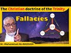

# Dr Muhammad Al-Massari: The Christian doctrine of the Trinity (2021-11-28)

## Description

Dr Nuhammad Al-Massari: The Christian doctrine of the Trinity

## Summary of [Dr Muhammad Al-Massari: The Christian doctrine of the Trinity](https://www.youtube.com/watch?v=JYzWuiGNIOo)

*This summary is AI generated - there may be inaccuracies. *

### [00:00:00](https://www.youtube.com/watch?v=JYzWuiGNIOo&t=0) - [01:00:00](https://www.youtube.com/watch?v=JYzWuiGNIOo&t=3600)

Dr. Muhammad Al-Massari discusses the Christian doctrine of the Trinity. He argues that the doctrine is based on a flawed idea that there is a single essence or being that exists within multiple "parts." He goes on to say that the Trinity is a result of humans trying to understand too much, and that it is not necessary for reality to be composed of parts.

**[00:00:00](https://www.youtube.com/watch?v=JYzWuiGNIOo&t=0)** The Toledo Conference was a local council held in Toledo, Spain in 685 AD which adopted the creed of the Trinity. The creed is a statement of the Christian doctrine of the Trinity.
* **[00:05:00](https://www.youtube.com/watch?v=JYzWuiGNIOo&t=300)** The Christian doctrine of the Trinity states that there is one God who is three persons: Father, Son, and Holy Spirit. The Father is not begotten, but the Son is. The Son is not created, but the Father is. The Father and Son are one in essence, and the Son is equal to the Father in all things.
* **[00:10:00](https://www.youtube.com/watch?v=JYzWuiGNIOo&t=600)** discusses the Christian doctrine of the Trinity, which holds that there is one God who is threefold in nature – Father, Son, and Holy Spirit. While each person in the Trinity is distinctly God, they are not three Gods.
* **[00:15:00](https://www.youtube.com/watch?v=JYzWuiGNIOo&t=900)** Dr. Muhammad Al-Massari discusses the Christian doctrine of the Trinity and how it differs from the Islamic doctrine. He notes that while the three persons in the Christian doctrine are not equal, they are nonetheless one by nature. He goes on to say that this doctrine is difficult to understand, but is essential to understanding the religion.
* **[00:20:00](https://www.youtube.com/watch?v=JYzWuiGNIOo&t=1200)** The history of the doctrine of the Trinity can be traced back to ancient Greece and the world council of Constantinople in 323 AD. Aristotle and Plato were strongly influenced by Jewish scholars and prophets, and the doctrine of the Trinity was finally formulated and added to the creed in 380 AD.
* **[00:25:00](https://www.youtube.com/watch?v=JYzWuiGNIOo&t=1500)**  Dr. Muhammad Al-Massari discusses the Christian doctrine of the Trinity. He explains that, according to this doctrine, there is only one being that cannot be divided into two parts. He argues that this is logically impossible, and that therefore, there cannot be a godhead or a category of being called divine.
* **[00:30:00](https://www.youtube.com/watch?v=JYzWuiGNIOo&t=1800)** The Christian doctrine of the Trinity states that there is one God who is three-in-one: Father, Son, and Holy Spirit. This doctrine is based on the idea that there is multiplicity in nature, and that there is no difference between being and this sense. The being is the sense that this is the being, while in the care of a human being we can say this definitely being that's the you for example lacks that's your being and your exterior are essential in a sense.
* **[00:35:00](https://www.youtube.com/watch?v=JYzWuiGNIOo&t=2100)** The Trinity is an important doctrine in Christianity, and Dr. Muhammad Al-Massari discusses its flaws. He states that the doctrine is based on a flawed idea that there is a single essence or being that exists within multiple "parts." He argues that this concept is impossible, and that it is only through the proper compositions of the three individuals that this being becomes real. He goes on to say that the Trinity is a result of humans trying to understand too much, and that it is not necessary for reality to be composed of parts.
* **[00:40:00](https://www.youtube.com/watch?v=JYzWuiGNIOo&t=2400)* Discusses Dr. Muhammad Al-Massari's argument that Christianity's doctrine of the Trinity is logically flawed. He points out that the doctrine is internally contradictory and not conceivable, which leads to the conclusion that it cannot be the basis for an ontological proof of the existence of God. Instead, he recommends developing an ontological argument based on the concept of necessarily existing and acting by necessity.
* **[00:45:00](https://www.youtube.com/watch?v=JYzWuiGNIOo&t=2700)** The Christian doctrine of the Trinity states that God is three persons: Father, Son, and Holy Spirit. In this doctrine, the three persons are "one god by nature of one substance of one nature."
* **[00:50:00](https://www.youtube.com/watch?v=JYzWuiGNIOo&t=3000)**  Dr. Muhammad Al-Massari explains the Christian doctrine of the Trinity. He states that the Father, Son, and Holy Spirit are one entity by nature, and that each has a separate but equal role in the Godhead. He also discusses the issue of time, and how it does not have a beginning or end. He concludes by stating that the doctrine of the Trinity is clear and original.
* **[00:55:00](https://www.youtube.com/watch?v=JYzWuiGNIOo&t=3300)** discusses the concept of godhead and how it is not a category. He goes on to explain that there is only one entity that can be called godhead and that it is a necessarily existing entity with absolute freedom and omnipotence.
### [01:00:00](https://www.youtube.com/watch?v=JYzWuiGNIOo&t=3600) - [02:00:00](https://www.youtube.com/watch?v=JYzWuiGNIOo&t=7200)

 discusses the Christian doctrine of the Trinity, which is that there is one God who is three persons.  points out that this doctrine is not mentioned in the Bible, and that it is a philosophical discourse that developed later.  then discusses the history of the doctrine, and how it came to be controversial. It states that the philosopher Alexandria was President of the Church of Alexandria, and was excommunicated for his beliefs.

**[01:00:00](https://www.youtube.com/watch?v=JYzWuiGNIOo&t=3600)**  Dr. Muhammad Al-Massari discusses the Christian doctrine of the Trinity. He points out that this doctrine undermines the meaning of necessarily existing, as it makes it impossible to say that a god is the genius that can be instantiated. He also points out that this doctrine comes from the pagan idea that there is a god that can be defined in many ways or entities.
* **[01:05:00](https://www.youtube.com/watch?v=JYzWuiGNIOo&t=3900)**  Dr. Muhammad Al-Massari discusses the Christian doctrine of the Trinity. He points out that if the Father is necessarily existing, it cannot be divided in a spirit. He also argues that the model is more complicated than it needs to be and that it fails to account for the fact that humans are created in God's image. He argues that the Father, Son, and Holy Spirit are all existing beings and that the Son has a self-image. The Father and Son have a relation of admiration or love, and the Holy Spirit is related to acceptance or recognition. He says that this model can be applied to prayer and that it can be helpful in understanding the relationship between the Father, Son, and Holy Spirit.
* **[01:10:00](https://www.youtube.com/watch?v=JYzWuiGNIOo&t=4200)** Dr. Muhammad Al-Massari discusses the Christian doctrine of the Trinity, which states that there is a God, a Son, and a Holy Spirit. He argues that this doctrine is paradoxical and that it is impossible to understand it in its entirety. He then goes on to discuss how the relationship between the Father and Son is supposed to be the Holy Spirit.
* **[01:15:00](https://www.youtube.com/watch?v=JYzWuiGNIOo&t=4500)**  Dr. Muhammad Al-Massari discusses the Christian doctrine of the Trinity. He explains that the self-image of a person is not another person, but rather an image of the father present in the father's consciousness and mind. He goes on to say that this model is not good because it does not explain the beginnings of things. He provides a practical example of this concept in which a man takes a picture of himself in a mirror and sees himself at the infinitive level. This example shows that it is not possible to go beyond the one level of self-recognition that is possible in eternity.
* **[01:20:00](https://www.youtube.com/watch?v=JYzWuiGNIOo&t=4800)** discusses the doctrine of the Trinity, which states that there is one God in three persons. points out that this doctrine is confusing because it creates a distinction between the Father and Son, which is impossible. argues that the doctrine of the Trinity should be dropped because it adds to the confusion of the Christian faith.
* **[01:25:00](https://www.youtube.com/watch?v=JYzWuiGNIOo&t=5100)** The Christian doctrine of the Trinity is explained by Dr. Muhammad Al-Massari. He says that the divine being is one, and that he did not beget something different from himself. He says that this is all fatherhood in the heavens and the earth.
* **[01:30:00](https://www.youtube.com/watch?v=JYzWuiGNIOo&t=5400)**  Dr. Muhammad Al-Massari discusses the Christian doctrine of the Trinity. He notes that the concept is not easy to understand and that it can be confusing to distinguish between the different aspects of the Trinity. He also points out that the idea of equality among the different members of the Trinity is not always clear.
* **[01:35:00](https://www.youtube.com/watch?v=JYzWuiGNIOo&t=5700)**  Dr. Muhammad Al-Massari discusses the Christian doctrine of the Trinity. He points out that, while the doctrine may appear to be different, the concepts behind it are actually the same. This is because the Father, Son, and Holy Spirit are all aspects of the same entity. He also discusses how this doctrine can lead to problems, such as the idea that one person can sin against another and that a sin can actually die.
* **[01:40:00](https://www.youtube.com/watch?v=JYzWuiGNIOo&t=6000)** Dr. Muhammad Al-Massari discusses the origins of the doctrine of the Trinity in Christianity and how it became gradually blown out of proportion. He also points out that the doctrine of the Trinity is not found in the original gospels and that it was developed primarily by Saint Paul.
* **[01:45:00](https://www.youtube.com/watch?v=JYzWuiGNIOo&t=6300)** This Youtube video discusses the Christian doctrine of the Trinity, which states that there is one God in three persons. of the video cites a recent example of this doctrine being disproven by science. also argues that this doctrine should be scrutinized further, and that parts of it should be used to cross-examine each other.
* **[01:50:00](https://www.youtube.com/watch?v=JYzWuiGNIOo&t=6600)** discusses cross-examination and how it can be used to expose contradictions in religious texts. He also mentions atheists who neglect the Islamic history, specifically in philosophy and the sciences. argues that the main fault is with the church, which put Europe behind the high iron curtain for centuries. advises Muslims to adopt the philosophy of William Greg and to continue presenting their intellectual achievements to the public.
* **[01:55:00](https://www.youtube.com/watch?v=JYzWuiGNIOo&t=6900)* Discusses the Christian doctrine of the Trinity, which is that there is one God who is three Persons: the Father, the Son, and the Holy Spirit. It explains that this doctrine is not explicitly mentioned in the Bible, and that it is a philosophical discourse that developed later.  then discusses the history of the doctrine, and how it came to be controversial. It states that the philosopher Alexandria was President of the Church of Alexandria, and was excommunicated for his beliefs.
### [02:00:00](https://www.youtube.com/watch?v=JYzWuiGNIOo&t=7200) - [02:45:00](https://www.youtube.com/watch?v=JYzWuiGNIOo&t=9900)

 discusses the Christian doctrine of the Trinity, and how it has been used to justify eternity. The atheist criticizes this doctrine as an example of a mental construct, reasoning that because the attributes of God do not exist outside of the mind, they cannot exist objectively. The Christian argues that the essence of God does not exist in any physical form, but instead exists as a reference in the mind. The Trinity has been formulated by various theologians throughout history, but the critic insists that it does not solve the problem of how the three persons are related.

**[02:00:00](https://www.youtube.com/watch?v=JYzWuiGNIOo&t=7200)**  Dr. Muhammad Al-Massari discusses the Christian doctrine of the Trinity. He discusses how this doctrine allows for eternity to be justified, as there is a tribute connected with the being for all eternity. He also notes that, despite holy integration, the doctrine of the Trinity is essentially a dispute over verbal disagreement.
* **[02:05:00](https://www.youtube.com/watch?v=JYzWuiGNIOo&t=7500)* Discusses the Christian doctrine of the Trinity, which states that there exists one God in three persons. The atheist criticizes this doctrine as an example of a mental construct, reasoning that because the attributes of God do not exist outside of the mind, they cannot exist objectively. The Christian argues that the essence of God does not exist in any physical form, but instead exists as a reference in the mind. The Trinity has been formulated by various theologians throughout history, but the critic insists that it does not solve the problem of how the three persons are related.
* **[02:10:00](https://www.youtube.com/watch?v=JYzWuiGNIOo&t=7800)** The Christian doctrine of the Trinity is discussed in this YouTube video, which points out that there is a fundamental difference between the concept of the Trinity in Islam and Christianity. The professor notes that while Muslims believe in three distinct gods, Christians believe in one God who is also three distinct persons.
* **[02:15:00](https://www.youtube.com/watch?v=JYzWuiGNIOo&t=8100)** The Christian doctrine of the Trinity states that there are three persons in God, namely, the Father, the Son, and the Holy Spirit. These three persons are co-equal and co-eternal, and they are one God. This doctrine is found in the Old Testament and is clarified in the Quran. It is argued that this doctrine is trivial and that it is contradicted by other parts of Scripture.
* **[02:20:00](https://www.youtube.com/watch?v=JYzWuiGNIOo&t=8400)** Dr. Muhammad Al-Massari discusses the importance of examining Christian doctrine of the Trinity critically in order to understand its origins and motivations. He points out that many of the texts used to support the doctrine are likely fabricated, and that if we don't do this, we will be headed down a dangerous path.
* **[02:25:00](https://www.youtube.com/watch?v=JYzWuiGNIOo&t=8700)** Dr. Muhammad Al-Massari discusses the Christian doctrine of the Trinity, discussing how saint Augustine developed the concept. He also discusses how the concepts of divinity and Christ were assimilated by the Jews, and how the printing press allowed for the dissemination of different religious texts.
* **[02:30:00](https://www.youtube.com/watch?v=JYzWuiGNIOo&t=9000)** Dr. Muhammad Al-Massari discusses the Christian doctrine of the Trinity, which he believes was influenced by Mithraism. He goes on to say that this doctrine opened the door for Christianity's level of success due to the fact that it addressed the concerns of the gentiles and spoke to their intellects.
* **[02:35:00](https://www.youtube.com/watch?v=JYzWuiGNIOo&t=9300)* Discusses the early history of Christianity, specifically the persecution of Christians and the development of different Christian doctrines. It also discusses the relationship between Christianity and Islam, as both religions were developed as a result of the persecution of Christians. In the end, the speaker suggests that a more accurate understanding of Christianity can be achieved by looking to the teachings of the prophet Jesus Christ and the Quran, rather than focusing on individual saints or theologians.
* **[02:40:00](https://www.youtube.com/watch?v=JYzWuiGNIOo&t=9600)** Dr. Muhammad Al-Massari discusses the Christian doctrine of the Trinity, stressing that Asa ibn Yehosef, the author of the Acts of the Apostles, was an extremist character who was devoted to a cause. He goes on to say that the doctrine of the Trinity was not preached by Asa ibn Yehosef nor by the other disciples of Jesus, and that even the acts of the apostles, while having many contradictions, are clear evidence that Jesus was not a deity. He finishes by saying that, if Muslims are serious about studying the Old Testament, they need to focus more on the history and textual analysis of the text, rather than relying on tradition or infallibility.
* **[02:45:00](https://www.youtube.com/watch?v=JYzWuiGNIOo&t=9900)* Discusses the differences between the historical Jesus and the Jesus portrayed in the Bible. argues that the Jesus of history is vastly different than the Jesus portrayed in the Bible, and that this difference is due to the fact that the authors of the Bible took the so-called "faith's point of view" under which you can't take on belief just because it's believed to be true.

## Full transcript with timestamps

[0:00:00](https://youtu.be/JYzWuiGNIOo?t=0) [Music]  
[0:00:24](https://youtu.be/JYzWuiGNIOo?t=24) um  
[0:00:36](https://youtu.be/JYzWuiGNIOo?t=36) there are various  
[0:00:38](https://youtu.be/JYzWuiGNIOo?t=38) entries to the issue of  
[0:00:40](https://youtu.be/JYzWuiGNIOo?t=40) of uh trinity  
[0:00:42](https://youtu.be/JYzWuiGNIOo?t=42) uh one of it is to read what is the  
[0:00:45](https://youtu.be/JYzWuiGNIOo?t=45) classical uh statement about trinity and  
[0:00:48](https://youtu.be/JYzWuiGNIOo?t=48) uh  
[0:00:50](https://youtu.be/JYzWuiGNIOo?t=50) discusses the logical and other grounds  
[0:00:54](https://youtu.be/JYzWuiGNIOo?t=54) and one is to see if it is  
[0:00:55](https://youtu.be/JYzWuiGNIOo?t=55) if it makes any sense even to to discuss  
[0:00:58](https://youtu.be/JYzWuiGNIOo?t=58) trinity because it's essentially  
[0:01:00](https://youtu.be/JYzWuiGNIOo?t=60) historically based on  
[0:01:02](https://youtu.be/JYzWuiGNIOo?t=62) the  
[0:01:03](https://youtu.be/JYzWuiGNIOo?t=63) before the nicene uh  
[0:01:06](https://youtu.be/JYzWuiGNIOo?t=66) council  
[0:01:07](https://youtu.be/JYzWuiGNIOo?t=67) it was uh  
[0:01:08](https://youtu.be/JYzWuiGNIOo?t=68) the issue was really the divinity of  
[0:01:10](https://youtu.be/JYzWuiGNIOo?t=70) christ trinity was not the main issue  
[0:01:12](https://youtu.be/JYzWuiGNIOo?t=72) although some trinitarian statements  
[0:01:14](https://youtu.be/JYzWuiGNIOo?t=74) were here and there the issue especially  
[0:01:16](https://youtu.be/JYzWuiGNIOo?t=76) in the first second century was the  
[0:01:18](https://youtu.be/JYzWuiGNIOo?t=78) divinity of christ  
[0:01:20](https://youtu.be/JYzWuiGNIOo?t=80) and that is based on  
[0:01:22](https://youtu.be/JYzWuiGNIOo?t=82) on the theory of atonement and the  
[0:01:26](https://youtu.be/JYzWuiGNIOo?t=86) original sin etc so another approach  
[0:01:28](https://youtu.be/JYzWuiGNIOo?t=88) should start from the  
[0:01:29](https://youtu.be/JYzWuiGNIOo?t=89) original sin and these issues and show  
[0:01:31](https://youtu.be/JYzWuiGNIOo?t=91) that  
[0:01:32](https://youtu.be/JYzWuiGNIOo?t=92) that the whole understanding of the  
[0:01:34](https://youtu.be/JYzWuiGNIOo?t=94) scripture and  
[0:01:36](https://youtu.be/JYzWuiGNIOo?t=96) the whole reliability is in question  
[0:01:39](https://youtu.be/JYzWuiGNIOo?t=99) so what is what's very variable should  
[0:01:41](https://youtu.be/JYzWuiGNIOo?t=101) we start maybe reading the classical uh  
[0:01:44](https://youtu.be/JYzWuiGNIOo?t=104) formulation of the trendy maybe  
[0:01:46](https://youtu.be/JYzWuiGNIOo?t=106) not about the idea  
[0:01:48](https://youtu.be/JYzWuiGNIOo?t=108) yes okay  
[0:01:50](https://youtu.be/JYzWuiGNIOo?t=110) let me just post it  
[0:01:55](https://youtu.be/JYzWuiGNIOo?t=115) yes so can you give us just a small  
[0:01:58](https://youtu.be/JYzWuiGNIOo?t=118) understand before we start about this  
[0:02:00](https://youtu.be/JYzWuiGNIOo?t=120) toledo conference and it's only 17  
[0:02:02](https://youtu.be/JYzWuiGNIOo?t=122) bishop so what is it exactly and what's  
[0:02:05](https://youtu.be/JYzWuiGNIOo?t=125) the idea  
[0:02:06](https://youtu.be/JYzWuiGNIOo?t=126) is it seems to be it seems to be from  
[0:02:09](https://youtu.be/JYzWuiGNIOo?t=129) the date it's it is dated 685  
[0:02:12](https://youtu.be/JYzWuiGNIOo?t=132) it seems to be  
[0:02:14](https://youtu.be/JYzWuiGNIOo?t=134) after the islamic conquest of the uh of  
[0:02:16](https://youtu.be/JYzWuiGNIOo?t=136) of uh the relevant  
[0:02:18](https://youtu.be/JYzWuiGNIOo?t=138) sham  
[0:02:20](https://youtu.be/JYzWuiGNIOo?t=140) and the  
[0:02:21](https://youtu.be/JYzWuiGNIOo?t=141) the fall of egypt in muslim hand family  
[0:02:23](https://youtu.be/JYzWuiGNIOo?t=143) and also north africa by the way which  
[0:02:24](https://youtu.be/JYzWuiGNIOo?t=144) has fallen muslim hunt also  
[0:02:26](https://youtu.be/JYzWuiGNIOo?t=146) because of the  
[0:02:28](https://youtu.be/JYzWuiGNIOo?t=148) civil war between uh uh investigated by  
[0:02:31](https://youtu.be/JYzWuiGNIOo?t=151) maui against ali and so on some retreat  
[0:02:34](https://youtu.be/JYzWuiGNIOo?t=154) from the far west has happened but but  
[0:02:36](https://youtu.be/JYzWuiGNIOo?t=156) actually the followers was conquered up  
[0:02:38](https://youtu.be/JYzWuiGNIOo?t=158) to the tanja tanjir  
[0:02:40](https://youtu.be/JYzWuiGNIOo?t=160) in the time of man  
[0:02:42](https://youtu.be/JYzWuiGNIOo?t=162) there was somebody there and also where  
[0:02:44](https://youtu.be/JYzWuiGNIOo?t=164) the european christianity has started to  
[0:02:47](https://youtu.be/JYzWuiGNIOo?t=167) conservatives consolidate itself and and  
[0:02:50](https://youtu.be/JYzWuiGNIOo?t=170) uh  
[0:02:51](https://youtu.be/JYzWuiGNIOo?t=171) try to  
[0:02:52](https://youtu.be/JYzWuiGNIOo?t=172) move ahead against uh  
[0:02:54](https://youtu.be/JYzWuiGNIOo?t=174) unitarian and one of these  
[0:02:56](https://youtu.be/JYzWuiGNIOo?t=176) attempts which have become again alive  
[0:03:01](https://youtu.be/JYzWuiGNIOo?t=181) because of the muslims because of the  
[0:03:02](https://youtu.be/JYzWuiGNIOo?t=182) islamic conquest and so on and  
[0:03:04](https://youtu.be/JYzWuiGNIOo?t=184) especially in spain it seems to be  
[0:03:06](https://youtu.be/JYzWuiGNIOo?t=186) although the the this local council did  
[0:03:09](https://youtu.be/JYzWuiGNIOo?t=189) not mention very much about that but  
[0:03:11](https://youtu.be/JYzWuiGNIOo?t=191) it's clearly they don't mention that the  
[0:03:12](https://youtu.be/JYzWuiGNIOo?t=192) mission just agreed in front because  
[0:03:14](https://youtu.be/JYzWuiGNIOo?t=194) there was a conflict there that conflict  
[0:03:16](https://youtu.be/JYzWuiGNIOo?t=196) led later  
[0:03:18](https://youtu.be/JYzWuiGNIOo?t=198) uh some uh  
[0:03:20](https://youtu.be/JYzWuiGNIOo?t=200) possibly maybe like like half a century  
[0:03:22](https://youtu.be/JYzWuiGNIOo?t=202) after that maybe even before that maybe  
[0:03:24](https://youtu.be/JYzWuiGNIOo?t=204) even before that led to uh  
[0:03:27](https://youtu.be/JYzWuiGNIOo?t=207) some kingdoms there who are where where  
[0:03:30](https://youtu.be/JYzWuiGNIOo?t=210) are you  
[0:03:31](https://youtu.be/JYzWuiGNIOo?t=211) no  
[0:03:41](https://youtu.be/JYzWuiGNIOo?t=221) some conflicts and other issues also  
[0:03:43](https://youtu.be/JYzWuiGNIOo?t=223) obviously fight on kingdom and power but  
[0:03:45](https://youtu.be/JYzWuiGNIOo?t=225) also religious fight about trendy etc to  
[0:03:48](https://youtu.be/JYzWuiGNIOo?t=228) invite muslims to help them against him  
[0:03:50](https://youtu.be/JYzWuiGNIOo?t=230) which led to the muslim incursion or  
[0:03:52](https://youtu.be/JYzWuiGNIOo?t=232) conquest whatever you call it in spain  
[0:03:55](https://youtu.be/JYzWuiGNIOo?t=235) and uh  
[0:03:57](https://youtu.be/JYzWuiGNIOo?t=237) so maybe in the in the pre  
[0:04:00](https://youtu.be/JYzWuiGNIOo?t=240) the time before that these issues were  
[0:04:02](https://youtu.be/JYzWuiGNIOo?t=242) where we're hot maybe that's the reason  
[0:04:04](https://youtu.be/JYzWuiGNIOo?t=244) this these 17 bishops decided it's a  
[0:04:07](https://youtu.be/JYzWuiGNIOo?t=247) good idea to start with articulating the  
[0:04:09](https://youtu.be/JYzWuiGNIOo?t=249) creed and the articulation has been  
[0:04:11](https://youtu.be/JYzWuiGNIOo?t=251) adopted everywhere as very beautiful and  
[0:04:13](https://youtu.be/JYzWuiGNIOo?t=253) very  
[0:04:14](https://youtu.be/JYzWuiGNIOo?t=254) very expressive  
[0:04:15](https://youtu.be/JYzWuiGNIOo?t=255) so maybe the best is just if you read  
[0:04:17](https://youtu.be/JYzWuiGNIOo?t=257) them  
[0:04:18](https://youtu.be/JYzWuiGNIOo?t=258) you think okay  
[0:04:20](https://youtu.be/JYzWuiGNIOo?t=260) okay so yeah all right  
[0:04:23](https://youtu.be/JYzWuiGNIOo?t=263) uh guys it's also in in  
[0:04:26](https://youtu.be/JYzWuiGNIOo?t=266) professor mohammad masari at the tab on  
[0:04:28](https://youtu.be/JYzWuiGNIOo?t=268) him and the sources are there  
[0:04:31](https://youtu.be/JYzWuiGNIOo?t=271) the 11th  
[0:04:32](https://youtu.be/JYzWuiGNIOo?t=272) 11th council of toledo symbol of faith  
[0:04:36](https://youtu.be/JYzWuiGNIOo?t=276) 675.  
[0:04:37](https://youtu.be/JYzWuiGNIOo?t=277) this small local council attended by  
[0:04:39](https://youtu.be/JYzWuiGNIOo?t=279) only 17 bishops has little significance  
[0:04:42](https://youtu.be/JYzWuiGNIOo?t=282) today except for the beautiful  
[0:04:44](https://youtu.be/JYzWuiGNIOo?t=284) confession of faith which was recited  
[0:04:47](https://youtu.be/JYzWuiGNIOo?t=287) at its opening the official value of  
[0:04:49](https://youtu.be/JYzWuiGNIOo?t=289) this document consists of the fact that  
[0:04:51](https://youtu.be/JYzWuiGNIOo?t=291) the subsequent century it was kept in  
[0:04:54](https://youtu.be/JYzWuiGNIOo?t=294) high regard and scootered and considered  
[0:04:56](https://youtu.be/JYzWuiGNIOo?t=296) a genuine expression of the trinitarian  
[0:04:58](https://youtu.be/JYzWuiGNIOo?t=298) faith it is one of the important  
[0:05:00](https://youtu.be/JYzWuiGNIOo?t=300) formulas of the doctrine  
[0:05:02](https://youtu.be/JYzWuiGNIOo?t=302) in fact hardly anywhere is a reflection  
[0:05:05](https://youtu.be/JYzWuiGNIOo?t=305) of the early church on the trinitarian  
[0:05:07](https://youtu.be/JYzWuiGNIOo?t=307) ministry  
[0:05:08](https://youtu.be/JYzWuiGNIOo?t=308) mystery and on crowd expressed with such  
[0:05:12](https://youtu.be/JYzWuiGNIOo?t=312) precision  
[0:05:13](https://youtu.be/JYzWuiGNIOo?t=313) and a common uh uh as in this creed  
[0:05:16](https://youtu.be/JYzWuiGNIOo?t=316) which sums up the tradition of the  
[0:05:18](https://youtu.be/JYzWuiGNIOo?t=318) earlier council and patristic theology  
[0:05:21](https://youtu.be/JYzWuiGNIOo?t=321) of the west that's it obviously  
[0:05:34](https://youtu.be/JYzWuiGNIOo?t=334) okay  
[0:05:35](https://youtu.be/JYzWuiGNIOo?t=335) we confess and believe that's what the  
[0:05:37](https://youtu.be/JYzWuiGNIOo?t=337) bishop said that's in their opening and  
[0:05:39](https://youtu.be/JYzWuiGNIOo?t=339) that's what's part of the council the  
[0:05:41](https://youtu.be/JYzWuiGNIOo?t=341) proceedings yeah  
[0:05:43](https://youtu.be/JYzWuiGNIOo?t=343) we convince we confess and believe the  
[0:05:46](https://youtu.be/JYzWuiGNIOo?t=346) holy and and fabled trinity father son  
[0:05:50](https://youtu.be/JYzWuiGNIOo?t=350) and holy spirit is one god by nature  
[0:05:54](https://youtu.be/JYzWuiGNIOo?t=354) of one substance  
[0:05:56](https://youtu.be/JYzWuiGNIOo?t=356) of one nature  
[0:05:58](https://youtu.be/JYzWuiGNIOo?t=358) as also of one majesty and power  
[0:06:02](https://youtu.be/JYzWuiGNIOo?t=362) and we profess that the father is not  
[0:06:05](https://youtu.be/JYzWuiGNIOo?t=365) begotten  
[0:06:06](https://youtu.be/JYzWuiGNIOo?t=366) not created but unbegotten  
[0:06:09](https://youtu.be/JYzWuiGNIOo?t=369) for he himself  
[0:06:11](https://youtu.be/JYzWuiGNIOo?t=371) from whom the son has received his birth  
[0:06:15](https://youtu.be/JYzWuiGNIOo?t=375) and the holy spirit his procession  
[0:06:19](https://youtu.be/JYzWuiGNIOo?t=379) this comment because  
[0:06:20](https://youtu.be/JYzWuiGNIOo?t=380) in in the classical uh definition is  
[0:06:23](https://youtu.be/JYzWuiGNIOo?t=383) that the sun is begotten born  
[0:06:26](https://youtu.be/JYzWuiGNIOo?t=386) from the father and the holy spirit is  
[0:06:29](https://youtu.be/JYzWuiGNIOo?t=389) not born is what proceeds emanates like  
[0:06:32](https://youtu.be/JYzWuiGNIOo?t=392) like light from a light bulb or  
[0:06:33](https://youtu.be/JYzWuiGNIOo?t=393) something like that  
[0:06:35](https://youtu.be/JYzWuiGNIOo?t=395) the explanation for that but we don't go  
[0:06:37](https://youtu.be/JYzWuiGNIOo?t=397) into these things just going to the  
[0:06:39](https://youtu.be/JYzWuiGNIOo?t=399) description of these entities and what  
[0:06:41](https://youtu.be/JYzWuiGNIOo?t=401) they are yeah  
[0:06:43](https://youtu.be/JYzWuiGNIOo?t=403) for he himself  
[0:06:44](https://youtu.be/JYzWuiGNIOo?t=404) from whom the son has defeated received  
[0:06:47](https://youtu.be/JYzWuiGNIOo?t=407) his birth and the holy spirit his  
[0:06:49](https://youtu.be/JYzWuiGNIOo?t=409) procession  
[0:06:51](https://youtu.be/JYzWuiGNIOo?t=411) he has his origin from no one  
[0:06:54](https://youtu.be/JYzWuiGNIOo?t=414) he is therefore the source and the  
[0:06:57](https://youtu.be/JYzWuiGNIOo?t=417) origin of the whole godhead  
[0:07:00](https://youtu.be/JYzWuiGNIOo?t=420) he himself is the father  
[0:07:02](https://youtu.be/JYzWuiGNIOo?t=422) of his own essence  
[0:07:04](https://youtu.be/JYzWuiGNIOo?t=424) who is an in  
[0:07:07](https://youtu.be/JYzWuiGNIOo?t=427) infable way  
[0:07:08](https://youtu.be/JYzWuiGNIOo?t=428) has begotten the son from his infable  
[0:07:11](https://youtu.be/JYzWuiGNIOo?t=431) substance  
[0:07:12](https://youtu.be/JYzWuiGNIOo?t=432) yet he did not beget something different  
[0:07:16](https://youtu.be/JYzWuiGNIOo?t=436) allude from what he himself is  
[0:07:19](https://youtu.be/JYzWuiGNIOo?t=439) god has begotten god  
[0:07:21](https://youtu.be/JYzWuiGNIOo?t=441) light has begotten light from him  
[0:07:24](https://youtu.be/JYzWuiGNIOo?t=444) therefore is all fatherhood in heaven  
[0:07:27](https://youtu.be/JYzWuiGNIOo?t=447) and on earth  
[0:07:30](https://youtu.be/JYzWuiGNIOo?t=450) carry on yeah we'll finish it and then  
[0:07:33](https://youtu.be/JYzWuiGNIOo?t=453) we'll go from the beginning until we  
[0:07:34](https://youtu.be/JYzWuiGNIOo?t=454) have it to the end so maybe  
[0:07:37](https://youtu.be/JYzWuiGNIOo?t=457) we also confess that the son was born  
[0:07:40](https://youtu.be/JYzWuiGNIOo?t=460) but not made from the substance of the  
[0:07:43](https://youtu.be/JYzWuiGNIOo?t=463) father without beginning before all ages  
[0:07:46](https://youtu.be/JYzWuiGNIOo?t=466) for  
[0:07:47](https://youtu.be/JYzWuiGNIOo?t=467) for at no time did the father exist  
[0:07:49](https://youtu.be/JYzWuiGNIOo?t=469) without the son nor the son without the  
[0:07:51](https://youtu.be/JYzWuiGNIOo?t=471) father yet the father is not from the  
[0:07:54](https://youtu.be/JYzWuiGNIOo?t=474) son  
[0:07:55](https://youtu.be/JYzWuiGNIOo?t=475) as the son  
[0:07:56](https://youtu.be/JYzWuiGNIOo?t=476) is from the father because the father  
[0:07:59](https://youtu.be/JYzWuiGNIOo?t=479) was not generated by the son but the son  
[0:08:02](https://youtu.be/JYzWuiGNIOo?t=482) by the father the son therefore is god  
[0:08:06](https://youtu.be/JYzWuiGNIOo?t=486) from the father  
[0:08:07](https://youtu.be/JYzWuiGNIOo?t=487) and the father is god but not from the  
[0:08:10](https://youtu.be/JYzWuiGNIOo?t=490) son  
[0:08:11](https://youtu.be/JYzWuiGNIOo?t=491) he is indeed the father of the son  
[0:08:14](https://youtu.be/JYzWuiGNIOo?t=494) not god for the son but the later is the  
[0:08:17](https://youtu.be/JYzWuiGNIOo?t=497) son of the father  
[0:08:19](https://youtu.be/JYzWuiGNIOo?t=499) and god from the father  
[0:08:22](https://youtu.be/JYzWuiGNIOo?t=502) yet in all things the son is equal to  
[0:08:25](https://youtu.be/JYzWuiGNIOo?t=505) god the father  
[0:08:26](https://youtu.be/JYzWuiGNIOo?t=506) for he has never begun nor cease to be  
[0:08:29](https://youtu.be/JYzWuiGNIOo?t=509) born  
[0:08:30](https://youtu.be/JYzWuiGNIOo?t=510) we also believe that he is one  
[0:08:33](https://youtu.be/JYzWuiGNIOo?t=513) substance with the father  
[0:08:35](https://youtu.be/JYzWuiGNIOo?t=515) wherefore he is called  
[0:08:37](https://youtu.be/JYzWuiGNIOo?t=517) homos with the father that is of the  
[0:08:41](https://youtu.be/JYzWuiGNIOo?t=521) same being as the father for homos in  
[0:08:44](https://youtu.be/JYzWuiGNIOo?t=524) greek mean one  
[0:08:45](https://youtu.be/JYzWuiGNIOo?t=525) and ocean means being and joy together  
[0:08:49](https://youtu.be/JYzWuiGNIOo?t=529) they mean one in being we must believe  
[0:08:52](https://youtu.be/JYzWuiGNIOo?t=532) that the sun  
[0:08:53](https://youtu.be/JYzWuiGNIOo?t=533) is begotten or born not from nothing or  
[0:08:56](https://youtu.be/JYzWuiGNIOo?t=536) from any other substance but from the  
[0:08:59](https://youtu.be/JYzWuiGNIOo?t=539) womb of the father  
[0:09:01](https://youtu.be/JYzWuiGNIOo?t=541) that  
[0:09:02](https://youtu.be/JYzWuiGNIOo?t=542) is from his substance  
[0:09:04](https://youtu.be/JYzWuiGNIOo?t=544) therefore the father is eternal and the  
[0:09:07](https://youtu.be/JYzWuiGNIOo?t=547) son is also eternal if he was always  
[0:09:10](https://youtu.be/JYzWuiGNIOo?t=550) father he always had a son whose father  
[0:09:12](https://youtu.be/JYzWuiGNIOo?t=552) he was and therefore we confess that the  
[0:09:15](https://youtu.be/JYzWuiGNIOo?t=555) son was born from the father without  
[0:09:17](https://youtu.be/JYzWuiGNIOo?t=557) beginning  
[0:09:18](https://youtu.be/JYzWuiGNIOo?t=558) we do not call we do not  
[0:09:21](https://youtu.be/JYzWuiGNIOo?t=561) call the same son of god a part of  
[0:09:24](https://youtu.be/JYzWuiGNIOo?t=564) divided nature because he was generated  
[0:09:27](https://youtu.be/JYzWuiGNIOo?t=567) from the father but we assert  
[0:09:30](https://youtu.be/JYzWuiGNIOo?t=570) that the perfect father has begotten the  
[0:09:33](https://youtu.be/JYzWuiGNIOo?t=573) perfect son without  
[0:09:35](https://youtu.be/JYzWuiGNIOo?t=575) diminution or division  
[0:09:38](https://youtu.be/JYzWuiGNIOo?t=578) for it pertains to the godhead alone not  
[0:09:41](https://youtu.be/JYzWuiGNIOo?t=581) to have an inequal son  
[0:09:43](https://youtu.be/JYzWuiGNIOo?t=583) this son of god is also son by nature  
[0:09:47](https://youtu.be/JYzWuiGNIOo?t=587) not by adoption of him we must also  
[0:09:50](https://youtu.be/JYzWuiGNIOo?t=590) believe that god the father  
[0:09:53](https://youtu.be/JYzWuiGNIOo?t=593) begot him neither by an act of will nor  
[0:09:56](https://youtu.be/JYzWuiGNIOo?t=596) out of necessity  
[0:09:58](https://youtu.be/JYzWuiGNIOo?t=598) for in god there is no necessity  
[0:10:01](https://youtu.be/JYzWuiGNIOo?t=601) nor does will precede wisdom  
[0:10:05](https://youtu.be/JYzWuiGNIOo?t=605) nor does we precede wisdom  
[0:10:08](https://youtu.be/JYzWuiGNIOo?t=608) okay we also believe  
[0:10:11](https://youtu.be/JYzWuiGNIOo?t=611) that the holy spirit the third person  
[0:10:13](https://youtu.be/JYzWuiGNIOo?t=613) the trinity is god  
[0:10:16](https://youtu.be/JYzWuiGNIOo?t=616) and one and equal with god the father  
[0:10:18](https://youtu.be/JYzWuiGNIOo?t=618) and the son  
[0:10:20](https://youtu.be/JYzWuiGNIOo?t=620) of one substance and of one nature  
[0:10:23](https://youtu.be/JYzWuiGNIOo?t=623) not however begotten nor created but  
[0:10:26](https://youtu.be/JYzWuiGNIOo?t=626) proceeding from both  
[0:10:28](https://youtu.be/JYzWuiGNIOo?t=628) and that he is the spirit of both of  
[0:10:32](https://youtu.be/JYzWuiGNIOo?t=632) of this holy spirit we also believe that  
[0:10:34](https://youtu.be/JYzWuiGNIOo?t=634) he is neither unbegotten nor begotten  
[0:10:37](https://youtu.be/JYzWuiGNIOo?t=637) for if we called him unbegotten we would  
[0:10:40](https://youtu.be/JYzWuiGNIOo?t=640) assert two fathers or if begotten we  
[0:10:42](https://youtu.be/JYzWuiGNIOo?t=642) would appear to preach two sons yet he  
[0:10:44](https://youtu.be/JYzWuiGNIOo?t=644) is called the spirit  
[0:10:46](https://youtu.be/JYzWuiGNIOo?t=646) not of the father alone not of the son  
[0:10:48](https://youtu.be/JYzWuiGNIOo?t=648) alone but of paul father and son  
[0:10:52](https://youtu.be/JYzWuiGNIOo?t=652) for does not proceed from the father  
[0:10:54](https://youtu.be/JYzWuiGNIOo?t=654) to the son nor from the son to sanctify  
[0:10:57](https://youtu.be/JYzWuiGNIOo?t=657) creature but he is shown to have  
[0:11:00](https://youtu.be/JYzWuiGNIOo?t=660) proceeded from both at once because he  
[0:11:03](https://youtu.be/JYzWuiGNIOo?t=663) is known as the love or the sanctity of  
[0:11:05](https://youtu.be/JYzWuiGNIOo?t=665) both hence we believe the holy spirit is  
[0:11:09](https://youtu.be/JYzWuiGNIOo?t=669) sent by both and the son is sent by the  
[0:11:11](https://youtu.be/JYzWuiGNIOo?t=671) father  
[0:11:12](https://youtu.be/JYzWuiGNIOo?t=672) but he is not less than the father and  
[0:11:14](https://youtu.be/JYzWuiGNIOo?t=674) the son  
[0:11:16](https://youtu.be/JYzWuiGNIOo?t=676) in the way in which the son on account  
[0:11:18](https://youtu.be/JYzWuiGNIOo?t=678) of the body which he has assumed  
[0:11:20](https://youtu.be/JYzWuiGNIOo?t=680) testified that he is less than the  
[0:11:22](https://youtu.be/JYzWuiGNIOo?t=682) father  
[0:11:23](https://youtu.be/JYzWuiGNIOo?t=683) and the holy spirit  
[0:11:32](https://youtu.be/JYzWuiGNIOo?t=692) this way of speaking about the holy  
[0:11:34](https://youtu.be/JYzWuiGNIOo?t=694) trinity  
[0:11:35](https://youtu.be/JYzWuiGNIOo?t=695) as it has been handed down  
[0:11:38](https://youtu.be/JYzWuiGNIOo?t=698) one must not call  
[0:11:40](https://youtu.be/JYzWuiGNIOo?t=700) it or believe it to be threefold but  
[0:11:43](https://youtu.be/JYzWuiGNIOo?t=703) trinity  
[0:11:45](https://youtu.be/JYzWuiGNIOo?t=705) nor can it properly be said that in the  
[0:11:48](https://youtu.be/JYzWuiGNIOo?t=708) one god there is the trinity  
[0:11:50](https://youtu.be/JYzWuiGNIOo?t=710) but the one god is the trinity  
[0:11:54](https://youtu.be/JYzWuiGNIOo?t=714) and the relative names of the person the  
[0:11:55](https://youtu.be/JYzWuiGNIOo?t=715) father is related to the son  
[0:11:58](https://youtu.be/JYzWuiGNIOo?t=718) the son to the father and the holy  
[0:12:00](https://youtu.be/JYzWuiGNIOo?t=720) spirit to both  
[0:12:02](https://youtu.be/JYzWuiGNIOo?t=722) while they are called three persons in  
[0:12:04](https://youtu.be/JYzWuiGNIOo?t=724) view of the relationship we believe in  
[0:12:07](https://youtu.be/JYzWuiGNIOo?t=727) one nature or substance  
[0:12:09](https://youtu.be/JYzWuiGNIOo?t=729) although we profess three persons we do  
[0:12:12](https://youtu.be/JYzWuiGNIOo?t=732) not profess three substances but one  
[0:12:14](https://youtu.be/JYzWuiGNIOo?t=734) substance and three person for the  
[0:12:17](https://youtu.be/JYzWuiGNIOo?t=737) father is the father not with respect to  
[0:12:19](https://youtu.be/JYzWuiGNIOo?t=739) herself  
[0:12:21](https://youtu.be/JYzWuiGNIOo?t=741) but  
[0:12:23](https://youtu.be/JYzWuiGNIOo?t=743) not to the but  
[0:12:24](https://youtu.be/JYzWuiGNIOo?t=744) sorry  
[0:12:25](https://youtu.be/JYzWuiGNIOo?t=745) hence we believe that the holy spirit uh  
[0:12:27](https://youtu.be/JYzWuiGNIOo?t=747) so this is  
[0:12:29](https://youtu.be/JYzWuiGNIOo?t=749) i missed  
[0:12:31](https://youtu.be/JYzWuiGNIOo?t=751) one line  
[0:12:32](https://youtu.be/JYzWuiGNIOo?t=752) and  
[0:12:33](https://youtu.be/JYzWuiGNIOo?t=753) what he considered  
[0:12:35](https://youtu.be/JYzWuiGNIOo?t=755) we did okay although we profess three  
[0:12:37](https://youtu.be/JYzWuiGNIOo?t=757) persons we do not profess three  
[0:12:38](https://youtu.be/JYzWuiGNIOo?t=758) substances but one substance and three  
[0:12:40](https://youtu.be/JYzWuiGNIOo?t=760) person for the father is the father not  
[0:12:42](https://youtu.be/JYzWuiGNIOo?t=762) with respect to himself but to the son  
[0:12:45](https://youtu.be/JYzWuiGNIOo?t=765) and the son is the son not  
[0:12:47](https://youtu.be/JYzWuiGNIOo?t=767) to himself but in relationship to the  
[0:12:49](https://youtu.be/JYzWuiGNIOo?t=769) father and likewise the holy spirit is  
[0:12:51](https://youtu.be/JYzWuiGNIOo?t=771) not referred to himself but is related  
[0:12:53](https://youtu.be/JYzWuiGNIOo?t=773) to the father and the son  
[0:12:56](https://youtu.be/JYzWuiGNIOo?t=776) inasmuch as he is called the spirit of  
[0:12:59](https://youtu.be/JYzWuiGNIOo?t=779) the father and the son so when we say  
[0:13:01](https://youtu.be/JYzWuiGNIOo?t=781) god this does not express a relationship  
[0:13:03](https://youtu.be/JYzWuiGNIOo?t=783) to another  
[0:13:04](https://youtu.be/JYzWuiGNIOo?t=784) as of the father to the son or of the  
[0:13:06](https://youtu.be/JYzWuiGNIOo?t=786) son of the father out of the holy spirit  
[0:13:10](https://youtu.be/JYzWuiGNIOo?t=790) to the father and the son but god refers  
[0:13:12](https://youtu.be/JYzWuiGNIOo?t=792) to himself only  
[0:13:14](https://youtu.be/JYzWuiGNIOo?t=794) for if we are asked about the single  
[0:13:16](https://youtu.be/JYzWuiGNIOo?t=796) persons we must confess that each is god  
[0:13:19](https://youtu.be/JYzWuiGNIOo?t=799) therefore we say that the father is god  
[0:13:21](https://youtu.be/JYzWuiGNIOo?t=801) the son is god the holy spirit is god  
[0:13:23](https://youtu.be/JYzWuiGNIOo?t=803) each one distinctly yet there are not  
[0:13:26](https://youtu.be/JYzWuiGNIOo?t=806) three gods but one god similarly we say  
[0:13:29](https://youtu.be/JYzWuiGNIOo?t=809) that the father is almighty the son is  
[0:13:31](https://youtu.be/JYzWuiGNIOo?t=811) almighty the holy spirit is almighty  
[0:13:33](https://youtu.be/JYzWuiGNIOo?t=813) each one distinctly yet there are no  
[0:13:36](https://youtu.be/JYzWuiGNIOo?t=816) three almighty ones but one almighty as  
[0:13:39](https://youtu.be/JYzWuiGNIOo?t=819) we profess  
[0:13:40](https://youtu.be/JYzWuiGNIOo?t=820) one light and one principle hence we  
[0:13:42](https://youtu.be/JYzWuiGNIOo?t=822) convince and believe that each person  
[0:13:45](https://youtu.be/JYzWuiGNIOo?t=825) distinctly is fully god and the three  
[0:13:48](https://youtu.be/JYzWuiGNIOo?t=828) persons together are one god  
[0:13:51](https://youtu.be/JYzWuiGNIOo?t=831) there there is an undivided and equal  
[0:13:54](https://youtu.be/JYzWuiGNIOo?t=834) godhead majesty and power which is  
[0:13:56](https://youtu.be/JYzWuiGNIOo?t=836) neither diminished  
[0:13:58](https://youtu.be/JYzWuiGNIOo?t=838) in the single person  
[0:13:59](https://youtu.be/JYzWuiGNIOo?t=839) nor increased in the three for it is not  
[0:14:02](https://youtu.be/JYzWuiGNIOo?t=842) less when each person is called god  
[0:14:04](https://youtu.be/JYzWuiGNIOo?t=844) separately nor is it greater when all  
[0:14:07](https://youtu.be/JYzWuiGNIOo?t=847) three person are called one god  
[0:14:09](https://youtu.be/JYzWuiGNIOo?t=849) this holy trinity which is the one true  
[0:14:12](https://youtu.be/JYzWuiGNIOo?t=852) god is not without number  
[0:14:14](https://youtu.be/JYzWuiGNIOo?t=854) yet it is not compromised by number  
[0:14:17](https://youtu.be/JYzWuiGNIOo?t=857) because in the relationship of the  
[0:14:19](https://youtu.be/JYzWuiGNIOo?t=859) person there appears number but in the  
[0:14:21](https://youtu.be/JYzWuiGNIOo?t=861) substance of the godhead nothing is  
[0:14:23](https://youtu.be/JYzWuiGNIOo?t=863) compromised that could be counted  
[0:14:26](https://youtu.be/JYzWuiGNIOo?t=866) therefore  
[0:14:27](https://youtu.be/JYzWuiGNIOo?t=867) therefore they imply numbers only is so  
[0:14:30](https://youtu.be/JYzWuiGNIOo?t=870) far as they are mutually related but  
[0:14:33](https://youtu.be/JYzWuiGNIOo?t=873) they lack number  
[0:14:34](https://youtu.be/JYzWuiGNIOo?t=874) in so far as they by themselves  
[0:14:38](https://youtu.be/JYzWuiGNIOo?t=878) for this holy for this holy trinity has  
[0:14:41](https://youtu.be/JYzWuiGNIOo?t=881) so much one name referring to its nature  
[0:14:43](https://youtu.be/JYzWuiGNIOo?t=883) that it cannot be used in the plural  
[0:14:46](https://youtu.be/JYzWuiGNIOo?t=886) with relationship to the three persons  
[0:14:48](https://youtu.be/JYzWuiGNIOo?t=888) this then is in our faith the meaning of  
[0:14:52](https://youtu.be/JYzWuiGNIOo?t=892) saying holy scripture great is our lord  
[0:14:54](https://youtu.be/JYzWuiGNIOo?t=894) bonded in power and his wisdom there is  
[0:14:57](https://youtu.be/JYzWuiGNIOo?t=897) no number  
[0:14:59](https://youtu.be/JYzWuiGNIOo?t=899) however though we have said that these  
[0:15:01](https://youtu.be/JYzWuiGNIOo?t=901) three persons are one god we are not  
[0:15:03](https://youtu.be/JYzWuiGNIOo?t=903) allowed to say that  
[0:15:04](https://youtu.be/JYzWuiGNIOo?t=904) the same one is the father who is the  
[0:15:07](https://youtu.be/JYzWuiGNIOo?t=907) son or that he is the son who is the  
[0:15:09](https://youtu.be/JYzWuiGNIOo?t=909) father or that he who is the holy spirit  
[0:15:11](https://youtu.be/JYzWuiGNIOo?t=911) is either the father of the son for he  
[0:15:14](https://youtu.be/JYzWuiGNIOo?t=914) is not the father who is the son nor the  
[0:15:17](https://youtu.be/JYzWuiGNIOo?t=917) son  
[0:15:17](https://youtu.be/JYzWuiGNIOo?t=917) he  
[0:15:18](https://youtu.be/JYzWuiGNIOo?t=918) who the father  
[0:15:20](https://youtu.be/JYzWuiGNIOo?t=920) nor is the holy spirit he  
[0:15:22](https://youtu.be/JYzWuiGNIOo?t=922) who is the father or the son even though  
[0:15:25](https://youtu.be/JYzWuiGNIOo?t=925) the father is that which the son is the  
[0:15:28](https://youtu.be/JYzWuiGNIOo?t=928) son that which the father is the father  
[0:15:32](https://youtu.be/JYzWuiGNIOo?t=932) and the son that which the holy spirit  
[0:15:34](https://youtu.be/JYzWuiGNIOo?t=934) is  
[0:15:35](https://youtu.be/JYzWuiGNIOo?t=935) that is one god by nature  
[0:15:40](https://youtu.be/JYzWuiGNIOo?t=940) for when we say who is the father  
[0:15:42](https://youtu.be/JYzWuiGNIOo?t=942) is not the son we refer to the  
[0:15:45](https://youtu.be/JYzWuiGNIOo?t=945) distinction of person but when we say  
[0:15:47](https://youtu.be/JYzWuiGNIOo?t=947) the father is that which the son is the  
[0:15:50](https://youtu.be/JYzWuiGNIOo?t=950) son which is the father is and the holy  
[0:15:52](https://youtu.be/JYzWuiGNIOo?t=952) spirit which the father and the son is  
[0:15:55](https://youtu.be/JYzWuiGNIOo?t=955) this clearly refers to the nature or  
[0:15:58](https://youtu.be/JYzWuiGNIOo?t=958) substance whereby god exists  
[0:16:01](https://youtu.be/JYzWuiGNIOo?t=961) since in substance they are one for we  
[0:16:04](https://youtu.be/JYzWuiGNIOo?t=964) distinguish the person but we do not  
[0:16:06](https://youtu.be/JYzWuiGNIOo?t=966) divide the godhead  
[0:16:08](https://youtu.be/JYzWuiGNIOo?t=968) hence we recognize the trinity  
[0:16:10](https://youtu.be/JYzWuiGNIOo?t=970) in the distinction of person and we  
[0:16:12](https://youtu.be/JYzWuiGNIOo?t=972) profess the unity on account of the  
[0:16:14](https://youtu.be/JYzWuiGNIOo?t=974) nature or substance thus the three are  
[0:16:17](https://youtu.be/JYzWuiGNIOo?t=977) one by nature not as person  
[0:16:20](https://youtu.be/JYzWuiGNIOo?t=980) nevertheless these three persons are not  
[0:16:23](https://youtu.be/JYzWuiGNIOo?t=983) to be considered separable since  
[0:16:25](https://youtu.be/JYzWuiGNIOo?t=985) according to our belief none of them  
[0:16:27](https://youtu.be/JYzWuiGNIOo?t=987) ever existed or acted before another  
[0:16:30](https://youtu.be/JYzWuiGNIOo?t=990) after another without another or they  
[0:16:32](https://youtu.be/JYzWuiGNIOo?t=992) are inseparable both  
[0:16:35](https://youtu.be/JYzWuiGNIOo?t=995) in what they are and what they do  
[0:16:37](https://youtu.be/JYzWuiGNIOo?t=997) because according to our faith between  
[0:16:39](https://youtu.be/JYzWuiGNIOo?t=999) the father who generated the son who is  
[0:16:41](https://youtu.be/JYzWuiGNIOo?t=1001) generated or the holy spirit who  
[0:16:43](https://youtu.be/JYzWuiGNIOo?t=1003) proceeds  
[0:16:45](https://youtu.be/JYzWuiGNIOo?t=1005) there has not been an interval of time  
[0:16:47](https://youtu.be/JYzWuiGNIOo?t=1007) in which  
[0:16:48](https://youtu.be/JYzWuiGNIOo?t=1008) that one who generate  
[0:16:50](https://youtu.be/JYzWuiGNIOo?t=1010) would precede the one who is generated  
[0:16:53](https://youtu.be/JYzWuiGNIOo?t=1013) or there would be no  
[0:16:55](https://youtu.be/JYzWuiGNIOo?t=1015) no begotten unto him who begets or the  
[0:16:59](https://youtu.be/JYzWuiGNIOo?t=1019) holy spirit in his proceeding would  
[0:17:01](https://youtu.be/JYzWuiGNIOo?t=1021) appear later  
[0:17:03](https://youtu.be/JYzWuiGNIOo?t=1023) than father or son for this reason we  
[0:17:06](https://youtu.be/JYzWuiGNIOo?t=1026) profess and believe that this trinity is  
[0:17:09](https://youtu.be/JYzWuiGNIOo?t=1029) inseparable and instinct  
[0:17:12](https://youtu.be/JYzWuiGNIOo?t=1032) we say therefore of these three person  
[0:17:15](https://youtu.be/JYzWuiGNIOo?t=1035) as our forefathers defined it  
[0:17:17](https://youtu.be/JYzWuiGNIOo?t=1037) that they should be acknowledged  
[0:17:20](https://youtu.be/JYzWuiGNIOo?t=1040) not separated for if we will listen to  
[0:17:23](https://youtu.be/JYzWuiGNIOo?t=1043) the holy scripture says about wisdom  
[0:17:26](https://youtu.be/JYzWuiGNIOo?t=1046) she is a reflection of the eternal light  
[0:17:29](https://youtu.be/JYzWuiGNIOo?t=1049) we see that the reflection belongs  
[0:17:31](https://youtu.be/JYzWuiGNIOo?t=1051) inseparable to the light  
[0:17:33](https://youtu.be/JYzWuiGNIOo?t=1053) so two according to our confession the  
[0:17:36](https://youtu.be/JYzWuiGNIOo?t=1056) son cannot be separated from the father  
[0:17:38](https://youtu.be/JYzWuiGNIOo?t=1058) therefore neither do we confuse these  
[0:17:41](https://youtu.be/JYzWuiGNIOo?t=1061) three persons whose nature is one and  
[0:17:43](https://youtu.be/JYzWuiGNIOo?t=1063) inseparable nor do we preach  
[0:17:46](https://youtu.be/JYzWuiGNIOo?t=1066) nor do we  
[0:17:50](https://youtu.be/JYzWuiGNIOo?t=1070) nor sorry  
[0:17:52](https://youtu.be/JYzWuiGNIOo?t=1072) nor do we preach that they are in any  
[0:17:55](https://youtu.be/JYzWuiGNIOo?t=1075) way separable the holy truth itself has  
[0:17:57](https://youtu.be/JYzWuiGNIOo?t=1077) indeed designed clearly to veer to us  
[0:18:00](https://youtu.be/JYzWuiGNIOo?t=1080) in these names by which he wanted the  
[0:18:03](https://youtu.be/JYzWuiGNIOo?t=1083) single person to be known it is  
[0:18:05](https://youtu.be/JYzWuiGNIOo?t=1085) impossible to understand one person  
[0:18:07](https://youtu.be/JYzWuiGNIOo?t=1087) without the other  
[0:18:08](https://youtu.be/JYzWuiGNIOo?t=1088) one cannot conceive the father without  
[0:18:10](https://youtu.be/JYzWuiGNIOo?t=1090) the son nor can the son be found without  
[0:18:12](https://youtu.be/JYzWuiGNIOo?t=1092) the father indeed the very relationship  
[0:18:14](https://youtu.be/JYzWuiGNIOo?t=1094) expressed in the personal names  
[0:18:16](https://youtu.be/JYzWuiGNIOo?t=1096) forbid us to separate the person  
[0:18:19](https://youtu.be/JYzWuiGNIOo?t=1099) for though it does not name them  
[0:18:22](https://youtu.be/JYzWuiGNIOo?t=1102) together it implies them  
[0:18:24](https://youtu.be/JYzWuiGNIOo?t=1104) no one can hear any of these names  
[0:18:26](https://youtu.be/JYzWuiGNIOo?t=1106) without necessarily understanding also  
[0:18:28](https://youtu.be/JYzWuiGNIOo?t=1108) the other  
[0:18:29](https://youtu.be/JYzWuiGNIOo?t=1109) one  
[0:18:30](https://youtu.be/JYzWuiGNIOo?t=1110) then these three are one and  
[0:18:34](https://youtu.be/JYzWuiGNIOo?t=1114) this one is three each of the person  
[0:18:36](https://youtu.be/JYzWuiGNIOo?t=1116) between his own characteristics father  
[0:18:39](https://youtu.be/JYzWuiGNIOo?t=1119) has eternity without birth and the son  
[0:18:42](https://youtu.be/JYzWuiGNIOo?t=1122) has eternity with birth the holy spirit  
[0:18:44](https://youtu.be/JYzWuiGNIOo?t=1124) has procession without birth with  
[0:18:47](https://youtu.be/JYzWuiGNIOo?t=1127) eternity  
[0:18:49](https://youtu.be/JYzWuiGNIOo?t=1129) so so is that  
[0:18:52](https://youtu.be/JYzWuiGNIOo?t=1132) who would it make you make any sense out  
[0:18:53](https://youtu.be/JYzWuiGNIOo?t=1133) of this  
[0:18:54](https://youtu.be/JYzWuiGNIOo?t=1134) yeah it was a bit confusing but the main  
[0:18:57](https://youtu.be/JYzWuiGNIOo?t=1137) point is the distinction between like  
[0:18:59](https://youtu.be/JYzWuiGNIOo?t=1139) the nature yeah and the proteins no  
[0:19:02](https://youtu.be/JYzWuiGNIOo?t=1142) that's so that  
[0:19:04](https://youtu.be/JYzWuiGNIOo?t=1144) to summarize uh sometimes it's made like  
[0:19:07](https://youtu.be/JYzWuiGNIOo?t=1147) a triangle  
[0:19:08](https://youtu.be/JYzWuiGNIOo?t=1148) we have uh the head the  
[0:19:10](https://youtu.be/JYzWuiGNIOo?t=1150) the britishers of the triangle we have  
[0:19:12](https://youtu.be/JYzWuiGNIOo?t=1152) the father  
[0:19:13](https://youtu.be/JYzWuiGNIOo?t=1153) the son and the holy spirit  
[0:19:16](https://youtu.be/JYzWuiGNIOo?t=1156) and  
[0:19:17](https://youtu.be/JYzWuiGNIOo?t=1157) along the external it's  
[0:19:19](https://youtu.be/JYzWuiGNIOo?t=1159) actually somewhere there's a drawing i  
[0:19:21](https://youtu.be/JYzWuiGNIOo?t=1161) couldn't find it at the moment i think i  
[0:19:23](https://youtu.be/JYzWuiGNIOo?t=1163) saw it i have it i even once tweeted it  
[0:19:25](https://youtu.be/JYzWuiGNIOo?t=1165) but i couldn't find it now easily it's  
[0:19:27](https://youtu.be/JYzWuiGNIOo?t=1167) an interesting drawing along the  
[0:19:30](https://youtu.be/JYzWuiGNIOo?t=1170) the  
[0:19:31](https://youtu.be/JYzWuiGNIOo?t=1171) uh  
[0:19:33](https://youtu.be/JYzWuiGNIOo?t=1173) the sides of the triangle  
[0:19:35](https://youtu.be/JYzWuiGNIOo?t=1175) you would say  
[0:19:37](https://youtu.be/JYzWuiGNIOo?t=1177) you would say that the  
[0:19:38](https://youtu.be/JYzWuiGNIOo?t=1178) that the the fathers on the top  
[0:19:40](https://youtu.be/JYzWuiGNIOo?t=1180) obviously on the sun maybe to the right  
[0:19:42](https://youtu.be/JYzWuiGNIOo?t=1182) or the left and the holy spirit to the  
[0:19:43](https://youtu.be/JYzWuiGNIOo?t=1183) other one are not equal as persons they  
[0:19:46](https://youtu.be/JYzWuiGNIOo?t=1186) are different  
[0:19:47](https://youtu.be/JYzWuiGNIOo?t=1187) and but  
[0:19:49](https://youtu.be/JYzWuiGNIOo?t=1189) internally somehow they are the same  
[0:19:52](https://youtu.be/JYzWuiGNIOo?t=1192) it was stated more in a similar language  
[0:19:55](https://youtu.be/JYzWuiGNIOo?t=1195) it is essentially that  
[0:19:57](https://youtu.be/JYzWuiGNIOo?t=1197) the the whole things go around the  
[0:19:59](https://youtu.be/JYzWuiGNIOo?t=1199) following uh  
[0:20:01](https://youtu.be/JYzWuiGNIOo?t=1201) problem i want to refer to the historic  
[0:20:03](https://youtu.be/JYzWuiGNIOo?t=1203) development how it came to that because  
[0:20:04](https://youtu.be/JYzWuiGNIOo?t=1204) it because obviously that is one god  
[0:20:07](https://youtu.be/JYzWuiGNIOo?t=1207) according to the old testament also the  
[0:20:09](https://youtu.be/JYzWuiGNIOo?t=1209) statement of isa  
[0:20:11](https://youtu.be/JYzWuiGNIOo?t=1211) in the new testament and even even even  
[0:20:14](https://youtu.be/JYzWuiGNIOo?t=1214) paul who who seems to the one who  
[0:20:21](https://youtu.be/JYzWuiGNIOo?t=1221) the praise of jesus and they were  
[0:20:23](https://youtu.be/JYzWuiGNIOo?t=1223) generification glorification into orbit  
[0:20:26](https://youtu.be/JYzWuiGNIOo?t=1226) he's still insisting everywhere there's  
[0:20:28](https://youtu.be/JYzWuiGNIOo?t=1228) only one god  
[0:20:29](https://youtu.be/JYzWuiGNIOo?t=1229) so that's nobody can violate that  
[0:20:31](https://youtu.be/JYzWuiGNIOo?t=1231) otherwise it will be paganism and many  
[0:20:33](https://youtu.be/JYzWuiGNIOo?t=1233) gods and as they didn't say we cannot  
[0:20:35](https://youtu.be/JYzWuiGNIOo?t=1235) say that three gods is only one god  
[0:20:40](https://youtu.be/JYzWuiGNIOo?t=1240) but but this dictated them to say that  
[0:20:42](https://youtu.be/JYzWuiGNIOo?t=1242) the the  
[0:20:43](https://youtu.be/JYzWuiGNIOo?t=1243) but the son is a god  
[0:20:45](https://youtu.be/JYzWuiGNIOo?t=1245) the holy spirit is god and the father is  
[0:20:47](https://youtu.be/JYzWuiGNIOo?t=1247) god but they are not three is one the  
[0:20:49](https://youtu.be/JYzWuiGNIOo?t=1249) godhead and substance is one i think  
[0:20:52](https://youtu.be/JYzWuiGNIOo?t=1252) this starts from  
[0:20:53](https://youtu.be/JYzWuiGNIOo?t=1253) uh  
[0:20:54](https://youtu.be/JYzWuiGNIOo?t=1254) fundamental fallacy is that  
[0:20:56](https://youtu.be/JYzWuiGNIOo?t=1256) we are dealing here uh with with a  
[0:20:59](https://youtu.be/JYzWuiGNIOo?t=1259) monotheistic theory uh  
[0:21:02](https://youtu.be/JYzWuiGNIOo?t=1262) studying uh the godhead in the in the  
[0:21:04](https://youtu.be/JYzWuiGNIOo?t=1264) sense of the old scripture and his  
[0:21:06](https://youtu.be/JYzWuiGNIOo?t=1266) feather development philosophical  
[0:21:07](https://youtu.be/JYzWuiGNIOo?t=1267) developments of the scripture talking  
[0:21:08](https://youtu.be/JYzWuiGNIOo?t=1268) about simple language which that anyone  
[0:21:10](https://youtu.be/JYzWuiGNIOo?t=1270) can understand but if we develop  
[0:21:12](https://youtu.be/JYzWuiGNIOo?t=1272) philosophically we're talking about our  
[0:21:14](https://youtu.be/JYzWuiGNIOo?t=1274) divine being which is necessarily  
[0:21:16](https://youtu.be/JYzWuiGNIOo?t=1276) existing we're not talking about an  
[0:21:18](https://youtu.be/JYzWuiGNIOo?t=1278) accidental or born in time divine beings  
[0:21:21](https://youtu.be/JYzWuiGNIOo?t=1281) like the pagans have the parents they  
[0:21:22](https://youtu.be/JYzWuiGNIOo?t=1282) have gods who are born and can disappear  
[0:21:25](https://youtu.be/JYzWuiGNIOo?t=1285) so for them the concept of necessarily  
[0:21:27](https://youtu.be/JYzWuiGNIOo?t=1287) existing does not apply  
[0:21:29](https://youtu.be/JYzWuiGNIOo?t=1289) but if you develop a philosophical  
[0:21:33](https://youtu.be/JYzWuiGNIOo?t=1293) human thinkings one step forward  
[0:21:36](https://youtu.be/JYzWuiGNIOo?t=1296) like which has been  
[0:21:38](https://youtu.be/JYzWuiGNIOo?t=1298) made  
[0:21:39](https://youtu.be/JYzWuiGNIOo?t=1299) in a certain advanced level uh in a for  
[0:21:42](https://youtu.be/JYzWuiGNIOo?t=1302) in in the athenian school of philosophy  
[0:21:44](https://youtu.be/JYzWuiGNIOo?t=1304) socrates plato and then aristotle's  
[0:21:48](https://youtu.be/JYzWuiGNIOo?t=1308) then we are forced  
[0:21:50](https://youtu.be/JYzWuiGNIOo?t=1310) to to distinguish between we first  
[0:21:54](https://youtu.be/JYzWuiGNIOo?t=1314) to study ontology and we we are forced  
[0:21:56](https://youtu.be/JYzWuiGNIOo?t=1316) to distinguish between the contingent  
[0:21:58](https://youtu.be/JYzWuiGNIOo?t=1318) being and certainly existing being  
[0:22:01](https://youtu.be/JYzWuiGNIOo?t=1321) and  
[0:22:02](https://youtu.be/JYzWuiGNIOo?t=1322) then  
[0:22:03](https://youtu.be/JYzWuiGNIOo?t=1323) by necessity of reason  
[0:22:05](https://youtu.be/JYzWuiGNIOo?t=1325) uh  
[0:22:07](https://youtu.be/JYzWuiGNIOo?t=1327) that says something exists is obvious  
[0:22:08](https://youtu.be/JYzWuiGNIOo?t=1328) because the mere fact that we think  
[0:22:11](https://youtu.be/JYzWuiGNIOo?t=1331) according to er kogito air cogito el  
[0:22:13](https://youtu.be/JYzWuiGNIOo?t=1333) gosam later formulated by descartes not  
[0:22:16](https://youtu.be/JYzWuiGNIOo?t=1336) a very good formulation but what means  
[0:22:18](https://youtu.be/JYzWuiGNIOo?t=1338) that the mere fact that i think i  
[0:22:20](https://youtu.be/JYzWuiGNIOo?t=1340) recognize immediately without any  
[0:22:22](https://youtu.be/JYzWuiGNIOo?t=1342) further any  
[0:22:24](https://youtu.be/JYzWuiGNIOo?t=1344) intermediary of any conclusion that i  
[0:22:26](https://youtu.be/JYzWuiGNIOo?t=1346) exist even if i doubt my existence my  
[0:22:28](https://youtu.be/JYzWuiGNIOo?t=1348) doubt itself prove the existence because  
[0:22:31](https://youtu.be/JYzWuiGNIOo?t=1351) my doubt is an act of thinking act of or  
[0:22:34](https://youtu.be/JYzWuiGNIOo?t=1354) pondering  
[0:22:35](https://youtu.be/JYzWuiGNIOo?t=1355) so and you recognize immediately  
[0:22:38](https://youtu.be/JYzWuiGNIOo?t=1358) obviously you need to have a certain  
[0:22:39](https://youtu.be/JYzWuiGNIOo?t=1359) level of physical sophistication as a  
[0:22:41](https://youtu.be/JYzWuiGNIOo?t=1361) person but all humans or humanities as  
[0:22:44](https://youtu.be/JYzWuiGNIOo?t=1364) generally as a humanity or as a historic  
[0:22:47](https://youtu.be/JYzWuiGNIOo?t=1367) development i don't expect that like  
[0:22:49](https://youtu.be/JYzWuiGNIOo?t=1369) foreign time that people have developed  
[0:22:52](https://youtu.be/JYzWuiGNIOo?t=1372) that generally such concept and wedding  
[0:22:54](https://youtu.be/JYzWuiGNIOo?t=1374) but later on slowly it emerged i think  
[0:22:56](https://youtu.be/JYzWuiGNIOo?t=1376) starting with ibrahim i regarded by him  
[0:22:58](https://youtu.be/JYzWuiGNIOo?t=1378) as the first philosopher in history and  
[0:23:00](https://youtu.be/JYzWuiGNIOo?t=1380) then developed further especially in in  
[0:23:02](https://youtu.be/JYzWuiGNIOo?t=1382) in  
[0:23:03](https://youtu.be/JYzWuiGNIOo?t=1383) the children of israel under the ancient  
[0:23:06](https://youtu.be/JYzWuiGNIOo?t=1386) civilization before the catastrophes and  
[0:23:08](https://youtu.be/JYzWuiGNIOo?t=1388) the under the the attacks of the  
[0:23:10](https://youtu.be/JYzWuiGNIOo?t=1390) and came etc for reasons which we don't  
[0:23:12](https://youtu.be/JYzWuiGNIOo?t=1392) want to discuss obviously  
[0:23:14](https://youtu.be/JYzWuiGNIOo?t=1394) and then later on it seems to me there's  
[0:23:16](https://youtu.be/JYzWuiGNIOo?t=1396) very good evidence that that aristotle  
[0:23:19](https://youtu.be/JYzWuiGNIOo?t=1399) and plato has been influenced also by  
[0:23:20](https://youtu.be/JYzWuiGNIOo?t=1400) jewish influence and jewish scholars and  
[0:23:23](https://youtu.be/JYzWuiGNIOo?t=1403) even prophets who are in egypt like  
[0:23:25](https://youtu.be/JYzWuiGNIOo?t=1405) jeremy as well but this is some  
[0:23:27](https://youtu.be/JYzWuiGNIOo?t=1407) historical thinking  
[0:23:29](https://youtu.be/JYzWuiGNIOo?t=1409) so all of that developed into more  
[0:23:31](https://youtu.be/JYzWuiGNIOo?t=1411) sophisticated level of expression and  
[0:23:33](https://youtu.be/JYzWuiGNIOo?t=1413) greek philosophy  
[0:23:36](https://youtu.be/JYzWuiGNIOo?t=1416) we recognize that  
[0:23:38](https://youtu.be/JYzWuiGNIOo?t=1418) it's impossible for for anything to  
[0:23:40](https://youtu.be/JYzWuiGNIOo?t=1420) exist unless there is one at least one  
[0:23:42](https://youtu.be/JYzWuiGNIOo?t=1422) necessary existing being which is the  
[0:23:44](https://youtu.be/JYzWuiGNIOo?t=1424) source of other beings while the  
[0:23:46](https://youtu.be/JYzWuiGNIOo?t=1426) contingent being either by act of  
[0:23:47](https://youtu.be/JYzWuiGNIOo?t=1427) creation by by by will  
[0:23:50](https://youtu.be/JYzWuiGNIOo?t=1430) that would be something which could be  
[0:23:52](https://youtu.be/JYzWuiGNIOo?t=1432) called divine being  
[0:23:54](https://youtu.be/JYzWuiGNIOo?t=1434) genuinely divine being not pagan type  
[0:23:56](https://youtu.be/JYzWuiGNIOo?t=1436) divine beings which are just just fixed  
[0:23:58](https://youtu.be/JYzWuiGNIOo?t=1438) of imagination essentially that the  
[0:23:59](https://youtu.be/JYzWuiGNIOo?t=1439) description is internally contradictory  
[0:24:02](https://youtu.be/JYzWuiGNIOo?t=1442) or it is uh  
[0:24:04](https://youtu.be/JYzWuiGNIOo?t=1444) a nature which is we can't call that it  
[0:24:07](https://youtu.be/JYzWuiGNIOo?t=1447) is dead def mute nature  
[0:24:09](https://youtu.be/JYzWuiGNIOo?t=1449) there's a two option secondly by the  
[0:24:12](https://youtu.be/JYzWuiGNIOo?t=1452) definition of a necessarily existing  
[0:24:14](https://youtu.be/JYzWuiGNIOo?t=1454) being it dictates by necessity that  
[0:24:17](https://youtu.be/JYzWuiGNIOo?t=1457) that's what had been missed at that time  
[0:24:19](https://youtu.be/JYzWuiGNIOo?t=1459) before the pre-pre night scene three  
[0:24:21](https://youtu.be/JYzWuiGNIOo?t=1461) that's essentially the 193 as developed  
[0:24:23](https://youtu.be/JYzWuiGNIOo?t=1463) further in the in the world council of  
[0:24:26](https://youtu.be/JYzWuiGNIOo?t=1466) constantinople and three everywhere  
[0:24:27](https://youtu.be/JYzWuiGNIOo?t=1467) scene was the 323 was it for 324 and uh  
[0:24:32](https://youtu.be/JYzWuiGNIOo?t=1472) andrew domini and the the  
[0:24:35](https://youtu.be/JYzWuiGNIOo?t=1475) the addition of them the final  
[0:24:37](https://youtu.be/JYzWuiGNIOo?t=1477) conclusion about the holy spirit was  
[0:24:40](https://youtu.be/JYzWuiGNIOo?t=1480) finally formulated and added to the next  
[0:24:42](https://youtu.be/JYzWuiGNIOo?t=1482) incred in 380 something 85 or something  
[0:24:45](https://youtu.be/JYzWuiGNIOo?t=1485) like that  
[0:24:47](https://youtu.be/JYzWuiGNIOo?t=1487) the  
[0:24:49](https://youtu.be/JYzWuiGNIOo?t=1489) at that time  
[0:24:52](https://youtu.be/JYzWuiGNIOo?t=1492) nobody really elaborated very much about  
[0:24:54](https://youtu.be/JYzWuiGNIOo?t=1494) this there was some some liberation from  
[0:24:56](https://youtu.be/JYzWuiGNIOo?t=1496) from from uh  
[0:24:58](https://youtu.be/JYzWuiGNIOo?t=1498) from arias totals and so on that that  
[0:25:01](https://youtu.be/JYzWuiGNIOo?t=1501) that  
[0:25:02](https://youtu.be/JYzWuiGNIOo?t=1502) that uh that the one or the the from  
[0:25:04](https://youtu.be/JYzWuiGNIOo?t=1504) which is it but the the one seems to be  
[0:25:07](https://youtu.be/JYzWuiGNIOo?t=1507) in is somehow independent from time and  
[0:25:09](https://youtu.be/JYzWuiGNIOo?t=1509) time is separate like this so the  
[0:25:10](https://youtu.be/JYzWuiGNIOo?t=1510) ancient things or things which have no  
[0:25:12](https://youtu.be/JYzWuiGNIOo?t=1512) beginning a time the one what he called  
[0:25:14](https://youtu.be/JYzWuiGNIOo?t=1514) the one the original one the mover who  
[0:25:17](https://youtu.be/JYzWuiGNIOo?t=1517) doesn't move et cetera and  
[0:25:19](https://youtu.be/JYzWuiGNIOo?t=1519) what and  
[0:25:20](https://youtu.be/JYzWuiGNIOo?t=1520) the matter is also eternal and then it  
[0:25:22](https://youtu.be/JYzWuiGNIOo?t=1522) has to get a shape by the huli et cetera  
[0:25:24](https://youtu.be/JYzWuiGNIOo?t=1524) things like that  
[0:25:25](https://youtu.be/JYzWuiGNIOo?t=1525) so  
[0:25:26](https://youtu.be/JYzWuiGNIOo?t=1526) the the the philosophical discourse in  
[0:25:29](https://youtu.be/JYzWuiGNIOo?t=1529) anthology did not proceed to the level  
[0:25:31](https://youtu.be/JYzWuiGNIOo?t=1531) to recognize what has been proven later  
[0:25:33](https://youtu.be/JYzWuiGNIOo?t=1533) especially in islamic scholarship but  
[0:25:35](https://youtu.be/JYzWuiGNIOo?t=1535) also until now  
[0:25:36](https://youtu.be/JYzWuiGNIOo?t=1536) that the necessary extreme by definition  
[0:25:38](https://youtu.be/JYzWuiGNIOo?t=1538) being necessarily existing meaning  
[0:25:41](https://youtu.be/JYzWuiGNIOo?t=1541) his being is is they exist by necessity  
[0:25:45](https://youtu.be/JYzWuiGNIOo?t=1545) but in that case  
[0:25:47](https://youtu.be/JYzWuiGNIOo?t=1547) if you analyze the concept further i  
[0:25:49](https://youtu.be/JYzWuiGNIOo?t=1549) have that in the book of the read in  
[0:25:51](https://youtu.be/JYzWuiGNIOo?t=1551) detail just it takes only half phase  
[0:25:52](https://youtu.be/JYzWuiGNIOo?t=1552) essentially  
[0:25:56](https://youtu.be/JYzWuiGNIOo?t=1556) cannot be two necessarily existing  
[0:25:58](https://youtu.be/JYzWuiGNIOo?t=1558) beings it's impossible to have two  
[0:26:00](https://youtu.be/JYzWuiGNIOo?t=1560) because  
[0:26:01](https://youtu.be/JYzWuiGNIOo?t=1561) if if if they if we have we have two  
[0:26:03](https://youtu.be/JYzWuiGNIOo?t=1563) different ones then they must differ in  
[0:26:05](https://youtu.be/JYzWuiGNIOo?t=1565) some aspect in one at least in one  
[0:26:07](https://youtu.be/JYzWuiGNIOo?t=1567) aspect so that we can say this is this  
[0:26:10](https://youtu.be/JYzWuiGNIOo?t=1570) is a and this is b oh this is number one  
[0:26:12](https://youtu.be/JYzWuiGNIOo?t=1572) that is number two if there is  
[0:26:13](https://youtu.be/JYzWuiGNIOo?t=1573) absolutely no difference and  
[0:26:14](https://youtu.be/JYzWuiGNIOo?t=1574) distinguishable every respect  
[0:26:17](https://youtu.be/JYzWuiGNIOo?t=1577) then  
[0:26:18](https://youtu.be/JYzWuiGNIOo?t=1578) then uh then if it's essentially one it  
[0:26:21](https://youtu.be/JYzWuiGNIOo?t=1581) cannot be two that's the same they say  
[0:26:22](https://youtu.be/JYzWuiGNIOo?t=1582) same for the same evidence is usually uh  
[0:26:26](https://youtu.be/JYzWuiGNIOo?t=1586) brought forward for example you start  
[0:26:27](https://youtu.be/JYzWuiGNIOo?t=1587) group theory in mathematics then you  
[0:26:29](https://youtu.be/JYzWuiGNIOo?t=1589) prove that the the so-called identity or  
[0:26:31](https://youtu.be/JYzWuiGNIOo?t=1591) the unity element cannot be two unit  
[0:26:34](https://youtu.be/JYzWuiGNIOo?t=1594) theorems it's only one you possibly just  
[0:26:36](https://youtu.be/JYzWuiGNIOo?t=1596) say one facet there's an unit element e1  
[0:26:38](https://youtu.be/JYzWuiGNIOo?t=1598) and another e2 and then based on the  
[0:26:40](https://youtu.be/JYzWuiGNIOo?t=1600) basic axiom of the group theory of the  
[0:26:43](https://youtu.be/JYzWuiGNIOo?t=1603) group then you prove that e1 is equal to  
[0:26:45](https://youtu.be/JYzWuiGNIOo?t=1605) minuses it can't have two or two  
[0:26:47](https://youtu.be/JYzWuiGNIOo?t=1607) identity elements  
[0:26:49](https://youtu.be/JYzWuiGNIOo?t=1609) if it's a group with the basic axioms of  
[0:26:51](https://youtu.be/JYzWuiGNIOo?t=1611) the goal the same here it's impossible  
[0:26:53](https://youtu.be/JYzWuiGNIOo?t=1613) because if they distinguishing  
[0:26:55](https://youtu.be/JYzWuiGNIOo?t=1615) themselves in one of them the strongest  
[0:26:57](https://youtu.be/JYzWuiGNIOo?t=1617) have said the attributes which the other  
[0:26:58](https://youtu.be/JYzWuiGNIOo?t=1618) does not have the meaning the other one  
[0:27:00](https://youtu.be/JYzWuiGNIOo?t=1620) kind of business has existed because  
[0:27:02](https://youtu.be/JYzWuiGNIOo?t=1622) that attribute for for number one  
[0:27:05](https://youtu.be/JYzWuiGNIOo?t=1625) is part of his necessary existence  
[0:27:07](https://youtu.be/JYzWuiGNIOo?t=1627) but the other one must have it but this  
[0:27:09](https://youtu.be/JYzWuiGNIOo?t=1629) is the answer anyway you can flesh out  
[0:27:11](https://youtu.be/JYzWuiGNIOo?t=1631) the evidence  
[0:27:13](https://youtu.be/JYzWuiGNIOo?t=1633) and develop it mathematically almost to  
[0:27:15](https://youtu.be/JYzWuiGNIOo?t=1635) mathematical precision that the  
[0:27:16](https://youtu.be/JYzWuiGNIOo?t=1636) necessarily existing being is only one  
[0:27:19](https://youtu.be/JYzWuiGNIOo?t=1639) and hence  
[0:27:20](https://youtu.be/JYzWuiGNIOo?t=1640) since only one is unconceivable  
[0:27:22](https://youtu.be/JYzWuiGNIOo?t=1642) decisively dictate that and rational  
[0:27:24](https://youtu.be/JYzWuiGNIOo?t=1644) rationalistic dictator and logically  
[0:27:26](https://youtu.be/JYzWuiGNIOo?t=1646) dictate that  
[0:27:28](https://youtu.be/JYzWuiGNIOo?t=1648) there cannot be any any talk about  
[0:27:31](https://youtu.be/JYzWuiGNIOo?t=1651) about the  
[0:27:32](https://youtu.be/JYzWuiGNIOo?t=1652) the concept of necessary existing or  
[0:27:34](https://youtu.be/JYzWuiGNIOo?t=1654) let's call it god hit now  
[0:27:36](https://youtu.be/JYzWuiGNIOo?t=1656) leave nature i would assume that next  
[0:27:37](https://youtu.be/JYzWuiGNIOo?t=1657) that we have concluded that this by by  
[0:27:39](https://youtu.be/JYzWuiGNIOo?t=1659) some other evidence which may be when  
[0:27:42](https://youtu.be/JYzWuiGNIOo?t=1662) they will be worked out that an assessed  
[0:27:45](https://youtu.be/JYzWuiGNIOo?t=1665) existing being  
[0:27:46](https://youtu.be/JYzWuiGNIOo?t=1666) can either be acting by  
[0:27:48](https://youtu.be/JYzWuiGNIOo?t=1668) by  
[0:27:51](https://youtu.be/JYzWuiGNIOo?t=1671) by without choice with the end by  
[0:27:52](https://youtu.be/JYzWuiGNIOo?t=1672) decision by his own nature  
[0:27:55](https://youtu.be/JYzWuiGNIOo?t=1675) or acting absolutely by some free free  
[0:27:57](https://youtu.be/JYzWuiGNIOo?t=1677) will  
[0:27:58](https://youtu.be/JYzWuiGNIOo?t=1678) the one who should absolute free will is  
[0:28:00](https://youtu.be/JYzWuiGNIOo?t=1680) what we call a god the other one will be  
[0:28:02](https://youtu.be/JYzWuiGNIOo?t=1682) what we can call a nature  
[0:28:03](https://youtu.be/JYzWuiGNIOo?t=1683) let's assume we have excluded nature we  
[0:28:05](https://youtu.be/JYzWuiGNIOo?t=1685) have an evidence for that somewhat then  
[0:28:07](https://youtu.be/JYzWuiGNIOo?t=1687) we have evidence for that but let's  
[0:28:08](https://youtu.be/JYzWuiGNIOo?t=1688) assume that  
[0:28:11](https://youtu.be/JYzWuiGNIOo?t=1691) then we have only one being so it does  
[0:28:14](https://youtu.be/JYzWuiGNIOo?t=1694) not make any sense to talk about godhead  
[0:28:16](https://youtu.be/JYzWuiGNIOo?t=1696) or a category of being being divine or  
[0:28:19](https://youtu.be/JYzWuiGNIOo?t=1699) being godhead does not make any sense  
[0:28:21](https://youtu.be/JYzWuiGNIOo?t=1701) it's not like when we talk about about  
[0:28:23](https://youtu.be/JYzWuiGNIOo?t=1703) animals we say being animal or being  
[0:28:25](https://youtu.be/JYzWuiGNIOo?t=1705) that humans are  
[0:28:27](https://youtu.be/JYzWuiGNIOo?t=1707) animals who are having the capability of  
[0:28:29](https://youtu.be/JYzWuiGNIOo?t=1709) thinking and speaking while there are  
[0:28:31](https://youtu.be/JYzWuiGNIOo?t=1711) other animals because they share certain  
[0:28:33](https://youtu.be/JYzWuiGNIOo?t=1713) characters god could we could call  
[0:28:34](https://youtu.be/JYzWuiGNIOo?t=1714) animal hood  
[0:28:36](https://youtu.be/JYzWuiGNIOo?t=1716) uh  
[0:28:37](https://youtu.be/JYzWuiGNIOo?t=1717) that's that's what what the what usually  
[0:28:39](https://youtu.be/JYzWuiGNIOo?t=1719) uh what usually is studied they never  
[0:28:42](https://youtu.be/JYzWuiGNIOo?t=1722) studied in philosophy as as the issue of  
[0:28:46](https://youtu.be/JYzWuiGNIOo?t=1726) sense  
[0:28:47](https://youtu.be/JYzWuiGNIOo?t=1727) essence and accident and attributes and  
[0:28:49](https://youtu.be/JYzWuiGNIOo?t=1729) essentials and and added subdividing  
[0:28:53](https://youtu.be/JYzWuiGNIOo?t=1733) i think subdividing beings and according  
[0:28:55](https://youtu.be/JYzWuiGNIOo?t=1735) to  
[0:28:56](https://youtu.be/JYzWuiGNIOo?t=1736) to a higher level uh category lower  
[0:28:59](https://youtu.be/JYzWuiGNIOo?t=1739) levels etc  
[0:29:02](https://youtu.be/JYzWuiGNIOo?t=1742) this is the thing i don't understand  
[0:29:04](https://youtu.be/JYzWuiGNIOo?t=1744) because when  
[0:29:05](https://youtu.be/JYzWuiGNIOo?t=1745) christians try to explain it they say  
[0:29:07](https://youtu.be/JYzWuiGNIOo?t=1747) okay look at you relaxed you are human  
[0:29:10](https://youtu.be/JYzWuiGNIOo?t=1750) so you are you know in nature  
[0:29:16](https://youtu.be/JYzWuiGNIOo?t=1756) why did you group me on humanity why  
[0:29:18](https://youtu.be/JYzWuiGNIOo?t=1758) didn't you group me that  
[0:29:20](https://youtu.be/JYzWuiGNIOo?t=1760) a mammal with a right hand yeah no no  
[0:29:22](https://youtu.be/JYzWuiGNIOo?t=1762) problem no problem with that but why  
[0:29:23](https://youtu.be/JYzWuiGNIOo?t=1763) humanity i'm not discussing this  
[0:29:25](https://youtu.be/JYzWuiGNIOo?t=1765) i'm not discussing this point i'm  
[0:29:26](https://youtu.be/JYzWuiGNIOo?t=1766) discussing the fundamental point is that  
[0:29:28](https://youtu.be/JYzWuiGNIOo?t=1768) we can't define something like humanity  
[0:29:30](https://youtu.be/JYzWuiGNIOo?t=1770) shared by all humans  
[0:29:32](https://youtu.be/JYzWuiGNIOo?t=1772) so common characteristics  
[0:29:34](https://youtu.be/JYzWuiGNIOo?t=1774) we may discuss it does this exist only  
[0:29:36](https://youtu.be/JYzWuiGNIOo?t=1776) in the mind or it is in external reality  
[0:29:38](https://youtu.be/JYzWuiGNIOo?t=1778) it's something called humanity this is  
[0:29:39](https://youtu.be/JYzWuiGNIOo?t=1779) another issue of philosophy which does  
[0:29:42](https://youtu.be/JYzWuiGNIOo?t=1782) not interest us whatever it is is it in  
[0:29:44](https://youtu.be/JYzWuiGNIOo?t=1784) our minds only and that's the way we  
[0:29:46](https://youtu.be/JYzWuiGNIOo?t=1786) have divide things analyze them and find  
[0:29:48](https://youtu.be/JYzWuiGNIOo?t=1788) the common shared respect but we  
[0:29:50](https://youtu.be/JYzWuiGNIOo?t=1790) certainly know that there are various  
[0:29:52](https://youtu.be/JYzWuiGNIOo?t=1792) human beings which we can't find the  
[0:29:53](https://youtu.be/JYzWuiGNIOo?t=1793) common characteristic and call it  
[0:29:54](https://youtu.be/JYzWuiGNIOo?t=1794) humanity and the same between humans and  
[0:29:57](https://youtu.be/JYzWuiGNIOo?t=1797) animals animality and between animals  
[0:30:00](https://youtu.be/JYzWuiGNIOo?t=1800) and plants what we call grow with living  
[0:30:02](https://youtu.be/JYzWuiGNIOo?t=1802) living living things which grow and  
[0:30:04](https://youtu.be/JYzWuiGNIOo?t=1804) procreate but not necessarily they don't  
[0:30:07](https://youtu.be/JYzWuiGNIOo?t=1807) sense and they don't move for example  
[0:30:09](https://youtu.be/JYzWuiGNIOo?t=1809) animals essentially for all practical  
[0:30:12](https://youtu.be/JYzWuiGNIOo?t=1812) purposes they don't seem to have a uh  
[0:30:14](https://youtu.be/JYzWuiGNIOo?t=1814) uh organs of of sensing and and and  
[0:30:18](https://youtu.be/JYzWuiGNIOo?t=1818) although there's doubt about that but it  
[0:30:20](https://youtu.be/JYzWuiGNIOo?t=1820) seems superior there's no organs of  
[0:30:21](https://youtu.be/JYzWuiGNIOo?t=1821) sensing and they are unable to move in  
[0:30:24](https://youtu.be/JYzWuiGNIOo?t=1824) that sense unless they are carried by  
[0:30:26](https://youtu.be/JYzWuiGNIOo?t=1826) the air although some some low bacteria  
[0:30:28](https://youtu.be/JYzWuiGNIOo?t=1828) may be able to have some uh i don't  
[0:30:30](https://youtu.be/JYzWuiGNIOo?t=1830) think bacteria have that but  
[0:30:32](https://youtu.be/JYzWuiGNIOo?t=1832) low level animals they have  
[0:30:34](https://youtu.be/JYzWuiGNIOo?t=1834) they have uh um  
[0:30:36](https://youtu.be/JYzWuiGNIOo?t=1836) something like  
[0:30:37](https://youtu.be/JYzWuiGNIOo?t=1837) things like like like uh like uh  
[0:30:40](https://youtu.be/JYzWuiGNIOo?t=1840) like whips and so on with usually they  
[0:30:41](https://youtu.be/JYzWuiGNIOo?t=1841) move so they are animals they are not  
[0:30:43](https://youtu.be/JYzWuiGNIOo?t=1843) bacteria but in but anyway because we  
[0:30:45](https://youtu.be/JYzWuiGNIOo?t=1845) have multiple multiplicity of these  
[0:30:47](https://youtu.be/JYzWuiGNIOo?t=1847) contingent things and they differ in  
[0:30:49](https://youtu.be/JYzWuiGNIOo?t=1849) certain aspects we can find the common  
[0:30:51](https://youtu.be/JYzWuiGNIOo?t=1851) shade and then we can define a category  
[0:30:53](https://youtu.be/JYzWuiGNIOo?t=1853) like animal wood and so on  
[0:30:55](https://youtu.be/JYzWuiGNIOo?t=1855) the case of necessity extreme being  
[0:30:56](https://youtu.be/JYzWuiGNIOo?t=1856) because the only one is just extreme  
[0:30:58](https://youtu.be/JYzWuiGNIOo?t=1858) being which you can exist it is nature  
[0:31:00](https://youtu.be/JYzWuiGNIOo?t=1860) or being a divine type a person type  
[0:31:03](https://youtu.be/JYzWuiGNIOo?t=1863) something which can will and so on  
[0:31:05](https://youtu.be/JYzWuiGNIOo?t=1865) that we cannot define a cutter we call  
[0:31:07](https://youtu.be/JYzWuiGNIOo?t=1867) godhead this is a pharisee there's  
[0:31:09](https://youtu.be/JYzWuiGNIOo?t=1869) nothing called godhead it's only one  
[0:31:10](https://youtu.be/JYzWuiGNIOo?t=1870) there's only one god one entity  
[0:31:13](https://youtu.be/JYzWuiGNIOo?t=1873) that dictated by necessity there is no  
[0:31:16](https://youtu.be/JYzWuiGNIOo?t=1876) category of  
[0:31:17](https://youtu.be/JYzWuiGNIOo?t=1877) of of of  
[0:31:19](https://youtu.be/JYzWuiGNIOo?t=1879) which you can calcify according to so  
[0:31:21](https://youtu.be/JYzWuiGNIOo?t=1881) this is the first point which at that  
[0:31:24](https://youtu.be/JYzWuiGNIOo?t=1884) time we can excuse the people this  
[0:31:26](https://youtu.be/JYzWuiGNIOo?t=1886) concept has not been developed that's  
[0:31:27](https://youtu.be/JYzWuiGNIOo?t=1887) not been developed essentially later in  
[0:31:30](https://youtu.be/JYzWuiGNIOo?t=1890) in philosophical scholarships which are  
[0:31:31](https://youtu.be/JYzWuiGNIOo?t=1891) in the muslim world and later in uh  
[0:31:34](https://youtu.be/JYzWuiGNIOo?t=1894) continuous continuously partly in in and  
[0:31:37](https://youtu.be/JYzWuiGNIOo?t=1897) especially in the shia tradition  
[0:31:39](https://youtu.be/JYzWuiGNIOo?t=1899) they attend to philosophy and give it a  
[0:31:41](https://youtu.be/JYzWuiGNIOo?t=1901) considerable importance and all  
[0:31:43](https://youtu.be/JYzWuiGNIOo?t=1903) philosophical uh  
[0:31:45](https://youtu.be/JYzWuiGNIOo?t=1905) classes and so on especially in the shia  
[0:31:48](https://youtu.be/JYzWuiGNIOo?t=1908) tradition they cover these issues when  
[0:31:50](https://youtu.be/JYzWuiGNIOo?t=1910) they discuss the nature what is this is  
[0:31:52](https://youtu.be/JYzWuiGNIOo?t=1912) that existing and how many could exist  
[0:31:54](https://youtu.be/JYzWuiGNIOo?t=1914) etc and  
[0:31:56](https://youtu.be/JYzWuiGNIOo?t=1916) so there is there is no there  
[0:31:58](https://youtu.be/JYzWuiGNIOo?t=1918) they express that and say there's no  
[0:32:00](https://youtu.be/JYzWuiGNIOo?t=1920) difference between being and this sense  
[0:32:02](https://youtu.be/JYzWuiGNIOo?t=1922) the being is the sense that this is the  
[0:32:03](https://youtu.be/JYzWuiGNIOo?t=1923) being while in the care in the case of a  
[0:32:07](https://youtu.be/JYzWuiGNIOo?t=1927) a human being we can say this definitely  
[0:32:09](https://youtu.be/JYzWuiGNIOo?t=1929) being that's the you for example lacks  
[0:32:11](https://youtu.be/JYzWuiGNIOo?t=1931) that's your being and your exterior are  
[0:32:13](https://youtu.be/JYzWuiGNIOo?t=1933) essential in a sense a human being with  
[0:32:17](https://youtu.be/JYzWuiGNIOo?t=1937) which it is sharing this characteristic  
[0:32:18](https://youtu.be/JYzWuiGNIOo?t=1938) with others because there are there are  
[0:32:20](https://youtu.be/JYzWuiGNIOo?t=1940) multiplicity of human beings and you're  
[0:32:22](https://youtu.be/JYzWuiGNIOo?t=1942) also sharing certain characteristics  
[0:32:23](https://youtu.be/JYzWuiGNIOo?t=1943) with animals with a multiple multiple of  
[0:32:25](https://youtu.be/JYzWuiGNIOo?t=1945) animal species et cetera  
[0:32:28](https://youtu.be/JYzWuiGNIOo?t=1948) that does not exist for us so this is  
[0:32:30](https://youtu.be/JYzWuiGNIOo?t=1950) the first the first point which we have  
[0:32:32](https://youtu.be/JYzWuiGNIOo?t=1952) which have to be settled fast before  
[0:32:34](https://youtu.be/JYzWuiGNIOo?t=1954) that that's until now unfortunately  
[0:32:36](https://youtu.be/JYzWuiGNIOo?t=1956) western scholarship when there is cause  
[0:32:38](https://youtu.be/JYzWuiGNIOo?t=1958) trinity and other issues they still and  
[0:32:40](https://youtu.be/JYzWuiGNIOo?t=1960) assume assume like in a world in which  
[0:32:42](https://youtu.be/JYzWuiGNIOo?t=1962) student selects it instead of existing  
[0:32:45](https://youtu.be/JYzWuiGNIOo?t=1965) being there or three years old that  
[0:32:47](https://youtu.be/JYzWuiGNIOo?t=1967) assumption is virious you could don't  
[0:32:48](https://youtu.be/JYzWuiGNIOo?t=1968) start with this one  
[0:32:50](https://youtu.be/JYzWuiGNIOo?t=1970) no no conceivable wealth or  
[0:32:53](https://youtu.be/JYzWuiGNIOo?t=1973) or  
[0:32:54](https://youtu.be/JYzWuiGNIOo?t=1974) well-meaning collection of beings not  
[0:32:56](https://youtu.be/JYzWuiGNIOo?t=1976) not necessarily a cosmos a complete  
[0:32:58](https://youtu.be/JYzWuiGNIOo?t=1978) comprehensive world  
[0:32:59](https://youtu.be/JYzWuiGNIOo?t=1979) no  
[0:33:00](https://youtu.be/JYzWuiGNIOo?t=1980) there is no conceivable word in which  
[0:33:02](https://youtu.be/JYzWuiGNIOo?t=1982) there is an uh only contingent beings  
[0:33:04](https://youtu.be/JYzWuiGNIOo?t=1984) that's impossible it's russian  
[0:33:06](https://youtu.be/JYzWuiGNIOo?t=1986) impossible and there's in every possible  
[0:33:08](https://youtu.be/JYzWuiGNIOo?t=1988) world there must be a necessary extreme  
[0:33:09](https://youtu.be/JYzWuiGNIOo?t=1989) being and only one there's no way  
[0:33:13](https://youtu.be/JYzWuiGNIOo?t=1993) don't you think that christians would  
[0:33:14](https://youtu.be/JYzWuiGNIOo?t=1994) tell you that there is no  
[0:33:16](https://youtu.be/JYzWuiGNIOo?t=1996) no  
[0:33:17](https://youtu.be/JYzWuiGNIOo?t=1997) like even the thing we read there's no  
[0:33:22](https://youtu.be/JYzWuiGNIOo?t=2002) natures multiple natures they don't say  
[0:33:23](https://youtu.be/JYzWuiGNIOo?t=2003) that there's not an advert of nature's  
[0:33:25](https://youtu.be/JYzWuiGNIOo?t=2005) hadeem but they say it's one nature and  
[0:33:28](https://youtu.be/JYzWuiGNIOo?t=2008) person it's not nature  
[0:33:30](https://youtu.be/JYzWuiGNIOo?t=2010) no no no the the proof is being entity  
[0:33:34](https://youtu.be/JYzWuiGNIOo?t=2014) being not nature nature is a  
[0:33:36](https://youtu.be/JYzWuiGNIOo?t=2016) categorization the other what i call  
[0:33:38](https://youtu.be/JYzWuiGNIOo?t=2018) nature in the case that for the the  
[0:33:40](https://youtu.be/JYzWuiGNIOo?t=2020) atheist solution that the whole reality  
[0:33:43](https://youtu.be/JYzWuiGNIOo?t=2023) goes back to something called nature  
[0:33:45](https://youtu.be/JYzWuiGNIOo?t=2025) it's just a summary name for the  
[0:33:47](https://youtu.be/JYzWuiGNIOo?t=2027) necessarily existing which is acting by  
[0:33:49](https://youtu.be/JYzWuiGNIOo?t=2029) necessity  
[0:33:50](https://youtu.be/JYzWuiGNIOo?t=2030) for that thing we call it nature just a  
[0:33:53](https://youtu.be/JYzWuiGNIOo?t=2033) lack of another name what we're supposed  
[0:33:55](https://youtu.be/JYzWuiGNIOo?t=2035) to call it  
[0:33:58](https://youtu.be/JYzWuiGNIOo?t=2038) should we call it matter fine  
[0:34:02](https://youtu.be/JYzWuiGNIOo?t=2042) should we call it method maybe call it  
[0:34:04](https://youtu.be/JYzWuiGNIOo?t=2044) whatever you want we have to give it a  
[0:34:06](https://youtu.be/JYzWuiGNIOo?t=2046) name well the other one is a god or a  
[0:34:08](https://youtu.be/JYzWuiGNIOo?t=2048) person with will and and  
[0:34:10](https://youtu.be/JYzWuiGNIOo?t=2050) and  
[0:34:11](https://youtu.be/JYzWuiGNIOo?t=2051) and  
[0:34:12](https://youtu.be/JYzWuiGNIOo?t=2052) knowledge and decision making  
[0:34:15](https://youtu.be/JYzWuiGNIOo?t=2055) you see because that because in matter  
[0:34:17](https://youtu.be/JYzWuiGNIOo?t=2057) and matter of this because because it's  
[0:34:20](https://youtu.be/JYzWuiGNIOo?t=2060) clearly that the the universe in which  
[0:34:22](https://youtu.be/JYzWuiGNIOo?t=2062) we live now for example  
[0:34:24](https://youtu.be/JYzWuiGNIOo?t=2064) an example of them is not only the one  
[0:34:25](https://youtu.be/JYzWuiGNIOo?t=2065) we can conceive in our mind the one we  
[0:34:27](https://youtu.be/JYzWuiGNIOo?t=2067) live on is clearly that that that we as  
[0:34:30](https://youtu.be/JYzWuiGNIOo?t=2070) as individual beings are contingent it's  
[0:34:33](https://youtu.be/JYzWuiGNIOo?t=2073) clearly that the stars are zone are  
[0:34:34](https://youtu.be/JYzWuiGNIOo?t=2074) contingent they have a beginning at the  
[0:34:36](https://youtu.be/JYzWuiGNIOo?t=2076) end et cetera until we go to the  
[0:34:38](https://youtu.be/JYzWuiGNIOo?t=2078) beginning of the of the questions in the  
[0:34:39](https://youtu.be/JYzWuiGNIOo?t=2079) big bang  
[0:34:42](https://youtu.be/JYzWuiGNIOo?t=2082) that must end in a necessary existing  
[0:34:44](https://youtu.be/JYzWuiGNIOo?t=2084) beings either something we may call give  
[0:34:47](https://youtu.be/JYzWuiGNIOo?t=2087) it the name nature which is acting by  
[0:34:49](https://youtu.be/JYzWuiGNIOo?t=2089) necessity is is an entity which is  
[0:34:54](https://youtu.be/JYzWuiGNIOo?t=2094) described by our own languages neither  
[0:34:56](https://youtu.be/JYzWuiGNIOo?t=2096) neither having a mind  
[0:34:58](https://youtu.be/JYzWuiGNIOo?t=2098) it's not conscious it's dead  
[0:35:01](https://youtu.be/JYzWuiGNIOo?t=2101) we can't call it dead  
[0:35:04](https://youtu.be/JYzWuiGNIOo?t=2104) as essence  
[0:35:08](https://youtu.be/JYzWuiGNIOo?t=2108) it has to be because it's necessary to  
[0:35:10](https://youtu.be/JYzWuiGNIOo?t=2110) be one one entity  
[0:35:12](https://youtu.be/JYzWuiGNIOo?t=2112) we can't talk about about a sense  
[0:35:14](https://youtu.be/JYzWuiGNIOo?t=2114) because the  
[0:35:16](https://youtu.be/JYzWuiGNIOo?t=2116) the word essence is essentially derived  
[0:35:18](https://youtu.be/JYzWuiGNIOo?t=2118) from comparison many individuals  
[0:35:20](https://youtu.be/JYzWuiGNIOo?t=2120) belonging to a certain category and  
[0:35:22](https://youtu.be/JYzWuiGNIOo?t=2122) extracting the essence or recognizing  
[0:35:24](https://youtu.be/JYzWuiGNIOo?t=2124) the excesses which shared between them  
[0:35:26](https://youtu.be/JYzWuiGNIOo?t=2126) it's outside the mind whatever you think  
[0:35:28](https://youtu.be/JYzWuiGNIOo?t=2128) philosophical point we will take is it  
[0:35:31](https://youtu.be/JYzWuiGNIOo?t=2131) is the sense really outside and i'm  
[0:35:33](https://youtu.be/JYzWuiGNIOo?t=2133) seeing it and extracting and describing  
[0:35:36](https://youtu.be/JYzWuiGNIOo?t=2136) it or it is only in my projection of my  
[0:35:38](https://youtu.be/JYzWuiGNIOo?t=2138) mind in the reality to classify these  
[0:35:40](https://youtu.be/JYzWuiGNIOo?t=2140) individuals which are uh to give them  
[0:35:42](https://youtu.be/JYzWuiGNIOo?t=2142) some kind of relation so the word  
[0:35:44](https://youtu.be/JYzWuiGNIOo?t=2144) essence relates usually to  
[0:35:46](https://youtu.be/JYzWuiGNIOo?t=2146) categorization  
[0:35:48](https://youtu.be/JYzWuiGNIOo?t=2148) yeah  
[0:35:50](https://youtu.be/JYzWuiGNIOo?t=2150) that's that's what it comes really some  
[0:35:52](https://youtu.be/JYzWuiGNIOo?t=2152) people use them as a substance and a  
[0:35:54](https://youtu.be/JYzWuiGNIOo?t=2154) sense in in place of entity or being  
[0:35:58](https://youtu.be/JYzWuiGNIOo?t=2158) something is used so but we have to  
[0:36:00](https://youtu.be/JYzWuiGNIOo?t=2160) distinguish that  
[0:36:03](https://youtu.be/JYzWuiGNIOo?t=2163) we have also brother nitrous here he's  
[0:36:07](https://youtu.be/JYzWuiGNIOo?t=2167) uh you know  
[0:36:08](https://youtu.be/JYzWuiGNIOo?t=2168) he's a loomer a bit of a killer so if  
[0:36:11](https://youtu.be/JYzWuiGNIOo?t=2171) you also like involve him in the  
[0:36:12](https://youtu.be/JYzWuiGNIOo?t=2172) discussion so  
[0:36:14](https://youtu.be/JYzWuiGNIOo?t=2174) we can enrich it  
[0:36:15](https://youtu.be/JYzWuiGNIOo?t=2175) no problem no problem it is welcome but  
[0:36:17](https://youtu.be/JYzWuiGNIOo?t=2177) i'm saying we have that that's that  
[0:36:19](https://youtu.be/JYzWuiGNIOo?t=2179) that's the first thing where it starts  
[0:36:21](https://youtu.be/JYzWuiGNIOo?t=2181) at that time of the presidency and then  
[0:36:23](https://youtu.be/JYzWuiGNIOo?t=2183) postnasa and  
[0:36:25](https://youtu.be/JYzWuiGNIOo?t=2185) creed formulation and things like that  
[0:36:27](https://youtu.be/JYzWuiGNIOo?t=2187) the the philosophical discourse was not  
[0:36:29](https://youtu.be/JYzWuiGNIOo?t=2189) advanced enough yet this was this  
[0:36:31](https://youtu.be/JYzWuiGNIOo?t=2191) advancement of that and that the  
[0:36:33](https://youtu.be/JYzWuiGNIOo?t=2193) necessary extreme being can be only one  
[0:36:35](https://youtu.be/JYzWuiGNIOo?t=2195) this advancement happened in the islamic  
[0:36:37](https://youtu.be/JYzWuiGNIOo?t=2197) in the islamic development of philosophy  
[0:36:39](https://youtu.be/JYzWuiGNIOo?t=2199) starting from al-khindi beginning of it  
[0:36:41](https://youtu.be/JYzWuiGNIOo?t=2201) and developed fada  
[0:36:43](https://youtu.be/JYzWuiGNIOo?t=2203) and expanded for example by al-razi and  
[0:36:45](https://youtu.be/JYzWuiGNIOo?t=2205) also by the by the shia villa the  
[0:36:49](https://youtu.be/JYzWuiGNIOo?t=2209) scholars of kalam and also philosophy  
[0:36:50](https://youtu.be/JYzWuiGNIOo?t=2210) because philosophy is a very important  
[0:36:52](https://youtu.be/JYzWuiGNIOo?t=2212) subject  
[0:36:53](https://youtu.be/JYzWuiGNIOo?t=2213) for the sunni they have neglected that  
[0:36:55](https://youtu.be/JYzWuiGNIOo?t=2215) to some part but it's in the islamic  
[0:36:57](https://youtu.be/JYzWuiGNIOo?t=2217) world  
[0:36:57](https://youtu.be/JYzWuiGNIOo?t=2217) so these evidences and these  
[0:36:59](https://youtu.be/JYzWuiGNIOo?t=2219) developments are there where we have  
[0:37:00](https://youtu.be/JYzWuiGNIOo?t=2220) talked about we cannot blame the people  
[0:37:03](https://youtu.be/JYzWuiGNIOo?t=2223) i'm saying we can't believe the people  
[0:37:04](https://youtu.be/JYzWuiGNIOo?t=2224) at that time but we have if we want to  
[0:37:06](https://youtu.be/JYzWuiGNIOo?t=2226) securize things and advance one step  
[0:37:09](https://youtu.be/JYzWuiGNIOo?t=2229) forward  
[0:37:10](https://youtu.be/JYzWuiGNIOo?t=2230) we have to recognize that that it does  
[0:37:12](https://youtu.be/JYzWuiGNIOo?t=2232) not make any sense to talk about godhead  
[0:37:15](https://youtu.be/JYzWuiGNIOo?t=2235) or substance of godhead  
[0:37:17](https://youtu.be/JYzWuiGNIOo?t=2237) it's only one entity  
[0:37:19](https://youtu.be/JYzWuiGNIOo?t=2239) one being i have a question uh yeah  
[0:37:22](https://youtu.be/JYzWuiGNIOo?t=2242) that's right so uh you mentioned um  
[0:37:24](https://youtu.be/JYzWuiGNIOo?t=2244) we're not talking about nature right  
[0:37:26](https://youtu.be/JYzWuiGNIOo?t=2246) we're tweaking that they believe in  
[0:37:27](https://youtu.be/JYzWuiGNIOo?t=2247) multiple beings and not  
[0:37:29](https://youtu.be/JYzWuiGNIOo?t=2249) believing in multiple natures now the  
[0:37:31](https://youtu.be/JYzWuiGNIOo?t=2251) question is when it comes to catholics  
[0:37:33](https://youtu.be/JYzWuiGNIOo?t=2253) for example um you have for example the  
[0:37:36](https://youtu.be/JYzWuiGNIOo?t=2256) school of  
[0:37:37](https://youtu.be/JYzWuiGNIOo?t=2257) thomas aquinas yeah and what they  
[0:37:39](https://youtu.be/JYzWuiGNIOo?t=2259) believe is  
[0:37:41](https://youtu.be/JYzWuiGNIOo?t=2261) they believe in this distinction between  
[0:37:42](https://youtu.be/JYzWuiGNIOo?t=2262) nowhere uh knowledge no or none right  
[0:37:45](https://youtu.be/JYzWuiGNIOo?t=2265) um so they would say there's one being  
[0:37:47](https://youtu.be/JYzWuiGNIOo?t=2267) and this one being knows himself and  
[0:37:50](https://youtu.be/JYzWuiGNIOo?t=2270) since his nose and sauce he has three  
[0:37:52](https://youtu.be/JYzWuiGNIOo?t=2272) relations  
[0:37:54](https://youtu.be/JYzWuiGNIOo?t=2274) we'll come to that we'll come we'll come  
[0:37:55](https://youtu.be/JYzWuiGNIOo?t=2275) to about this interpretation of the  
[0:37:57](https://youtu.be/JYzWuiGNIOo?t=2277) trinity now i'm just that the  
[0:37:59](https://youtu.be/JYzWuiGNIOo?t=2279) formulation i'm discussing the general  
[0:38:00](https://youtu.be/JYzWuiGNIOo?t=2280) formulation before i go to the very  
[0:38:03](https://youtu.be/JYzWuiGNIOo?t=2283) queen's point of view is having its own  
[0:38:04](https://youtu.be/JYzWuiGNIOo?t=2284) merits etc we'll come to that i'm just  
[0:38:07](https://youtu.be/JYzWuiGNIOo?t=2287) preparing the ground for that yeah  
[0:38:10](https://youtu.be/JYzWuiGNIOo?t=2290) preparing the jungle for that so all  
[0:38:12](https://youtu.be/JYzWuiGNIOo?t=2292) right  
[0:38:13](https://youtu.be/JYzWuiGNIOo?t=2293) so that formulation is starting having  
[0:38:15](https://youtu.be/JYzWuiGNIOo?t=2295) from the beginning some kind of fallacy  
[0:38:17](https://youtu.be/JYzWuiGNIOo?t=2297) so some comedy in the people mind that  
[0:38:18](https://youtu.be/JYzWuiGNIOo?t=2298) there's something that like god head is  
[0:38:20](https://youtu.be/JYzWuiGNIOo?t=2300) something like like a genus or like a  
[0:38:22](https://youtu.be/JYzWuiGNIOo?t=2302) like a specification which can fit  
[0:38:24](https://youtu.be/JYzWuiGNIOo?t=2304) various beings it can't be  
[0:38:26](https://youtu.be/JYzWuiGNIOo?t=2306) it can fit only one being  
[0:38:29](https://youtu.be/JYzWuiGNIOo?t=2309) which also occurs have obviously  
[0:38:31](https://youtu.be/JYzWuiGNIOo?t=2311) recognized and those have recognized  
[0:38:33](https://youtu.be/JYzWuiGNIOo?t=2313) that this being has to be universally be  
[0:38:34](https://youtu.be/JYzWuiGNIOo?t=2314) symbol why simple because if it's  
[0:38:37](https://youtu.be/JYzWuiGNIOo?t=2317) composed  
[0:38:39](https://youtu.be/JYzWuiGNIOo?t=2319) inside the in the proper compositions is  
[0:38:41](https://youtu.be/JYzWuiGNIOo?t=2321) that it's two two two to two parts which  
[0:38:44](https://youtu.be/JYzWuiGNIOo?t=2324) can be separated  
[0:38:46](https://youtu.be/JYzWuiGNIOo?t=2326) yeah it can be really separated  
[0:38:49](https://youtu.be/JYzWuiGNIOo?t=2329) genuinely is about not stimulated in  
[0:38:50](https://youtu.be/JYzWuiGNIOo?t=2330) this course like stimulating for example  
[0:38:52](https://youtu.be/JYzWuiGNIOo?t=2332) an entity and this description that's a  
[0:38:54](https://youtu.be/JYzWuiGNIOo?t=2334) separation into in the mental discourse  
[0:38:57](https://youtu.be/JYzWuiGNIOo?t=2337) not in the reality but they can separate  
[0:38:58](https://youtu.be/JYzWuiGNIOo?t=2338) the reality like for example uh what  
[0:39:01](https://youtu.be/JYzWuiGNIOo?t=2341) else like for example uh a water  
[0:39:04](https://youtu.be/JYzWuiGNIOo?t=2344) molecule it can be separated into an  
[0:39:05](https://youtu.be/JYzWuiGNIOo?t=2345) oxygen atom and two hydrogen atoms two  
[0:39:08](https://youtu.be/JYzWuiGNIOo?t=2348) separate entities which we can separate  
[0:39:11](https://youtu.be/JYzWuiGNIOo?t=2351) it  
[0:39:11](https://youtu.be/JYzWuiGNIOo?t=2351) we could do it by electrolysis and then  
[0:39:13](https://youtu.be/JYzWuiGNIOo?t=2353) we can collect the hydrogen separately  
[0:39:15](https://youtu.be/JYzWuiGNIOo?t=2355) and oxygen separately and so clearly it  
[0:39:17](https://youtu.be/JYzWuiGNIOo?t=2357) can be divided  
[0:39:19](https://youtu.be/JYzWuiGNIOo?t=2359) if it is so then by then by done then  
[0:39:22](https://youtu.be/JYzWuiGNIOo?t=2362) then we face the problem for the sexy  
[0:39:24](https://youtu.be/JYzWuiGNIOo?t=2364) being that we that since we are probably  
[0:39:26](https://youtu.be/JYzWuiGNIOo?t=2366) only one it can exist  
[0:39:28](https://youtu.be/JYzWuiGNIOo?t=2368) that mean  
[0:39:30](https://youtu.be/JYzWuiGNIOo?t=2370) how how how we could should we describe  
[0:39:32](https://youtu.be/JYzWuiGNIOo?t=2372) the two components or there will be two  
[0:39:33](https://youtu.be/JYzWuiGNIOo?t=2373) or more components  
[0:39:35](https://youtu.be/JYzWuiGNIOo?t=2375) each of the is is one of them is  
[0:39:36](https://youtu.be/JYzWuiGNIOo?t=2376) necessarily existing and the other one  
[0:39:38](https://youtu.be/JYzWuiGNIOo?t=2378) is the exit that's not possible because  
[0:39:40](https://youtu.be/JYzWuiGNIOo?t=2380) there's only one state existing being uh  
[0:39:42](https://youtu.be/JYzWuiGNIOo?t=2382) is is one of the necessary and  
[0:39:44](https://youtu.be/JYzWuiGNIOo?t=2384) contingent how can the consistent need  
[0:39:46](https://youtu.be/JYzWuiGNIOo?t=2386) to be composed the contingent to produce  
[0:39:47](https://youtu.be/JYzWuiGNIOo?t=2387) something real necessary is complete by  
[0:39:49](https://youtu.be/JYzWuiGNIOo?t=2389) self does not need any addition of  
[0:39:51](https://youtu.be/JYzWuiGNIOo?t=2391) contingent otherwise  
[0:39:53](https://youtu.be/JYzWuiGNIOo?t=2393) so  
[0:39:54](https://youtu.be/JYzWuiGNIOo?t=2394) following that analysis which also  
[0:39:56](https://youtu.be/JYzWuiGNIOo?t=2396) discussed very very extensively in in in  
[0:40:00](https://youtu.be/JYzWuiGNIOo?t=2400) in philosophical islamics university  
[0:40:02](https://youtu.be/JYzWuiGNIOo?t=2402) literature especially the later shia  
[0:40:03](https://youtu.be/JYzWuiGNIOo?t=2403) developments which is quite well  
[0:40:05](https://youtu.be/JYzWuiGNIOo?t=2405) advanced many people unfortunately are  
[0:40:07](https://youtu.be/JYzWuiGNIOo?t=2407) not aware of what i thought it has not  
[0:40:09](https://youtu.be/JYzWuiGNIOo?t=2409) have been uh translated to the western  
[0:40:11](https://youtu.be/JYzWuiGNIOo?t=2411) uh uh philosophical circles yet so  
[0:40:14](https://youtu.be/JYzWuiGNIOo?t=2414) nobody is benefiting from that to the as  
[0:40:16](https://youtu.be/JYzWuiGNIOo?t=2416) it were it should be it should be done i  
[0:40:17](https://youtu.be/JYzWuiGNIOo?t=2417) think now now it's the time to do it do  
[0:40:19](https://youtu.be/JYzWuiGNIOo?t=2419) you have any papers you you recommend us  
[0:40:21](https://youtu.be/JYzWuiGNIOo?t=2421) to read yeah so we understand  
[0:40:29](https://youtu.be/JYzWuiGNIOo?t=2429) for example over 100 videos and there  
[0:40:31](https://youtu.be/JYzWuiGNIOo?t=2431) are also books about that i i will get i  
[0:40:33](https://youtu.be/JYzWuiGNIOo?t=2433) have a list of books and then i can i  
[0:40:35](https://youtu.be/JYzWuiGNIOo?t=2435) can put it for this for this  
[0:40:37](https://youtu.be/JYzWuiGNIOo?t=2437) philosophical aspect  
[0:40:38](https://youtu.be/JYzWuiGNIOo?t=2438) so  
[0:40:40](https://youtu.be/JYzWuiGNIOo?t=2440) it has to be and if queerness is right  
[0:40:41](https://youtu.be/JYzWuiGNIOo?t=2441) it has to be absolutely simple and  
[0:40:43](https://youtu.be/JYzWuiGNIOo?t=2443) impossible to divide impossible to break  
[0:40:45](https://youtu.be/JYzWuiGNIOo?t=2445) in in parts that's impossible it is  
[0:40:47](https://youtu.be/JYzWuiGNIOo?t=2447) completely simple and completely without  
[0:40:50](https://youtu.be/JYzWuiGNIOo?t=2450) voids that's what  
[0:40:51](https://youtu.be/JYzWuiGNIOo?t=2451) i mentioned the quran now just casually  
[0:40:53](https://youtu.be/JYzWuiGNIOo?t=2453) just as uh regarded as a literature  
[0:40:56](https://youtu.be/JYzWuiGNIOo?t=2456) somehow  
[0:40:57](https://youtu.be/JYzWuiGNIOo?t=2457) somewhat is the same uh word like samat  
[0:41:00](https://youtu.be/JYzWuiGNIOo?t=2460) musmat  
[0:41:01](https://youtu.be/JYzWuiGNIOo?t=2461) whole without owner uh is empty of any  
[0:41:06](https://youtu.be/JYzWuiGNIOo?t=2466) vacuum or any any any holes etc is  
[0:41:09](https://youtu.be/JYzWuiGNIOo?t=2469) absolutely solid this is obviously  
[0:41:11](https://youtu.be/JYzWuiGNIOo?t=2471) metaphorical thinking for material world  
[0:41:13](https://youtu.be/JYzWuiGNIOo?t=2473) the absolutely solid things are more  
[0:41:14](https://youtu.be/JYzWuiGNIOo?t=2474) stronger and the resistance of breaking  
[0:41:17](https://youtu.be/JYzWuiGNIOo?t=2477) to the things which are having a cavity  
[0:41:19](https://youtu.be/JYzWuiGNIOo?t=2479) or a hole and imagine something we said  
[0:41:21](https://youtu.be/JYzWuiGNIOo?t=2481) absolutely solid without any  
[0:41:25](https://youtu.be/JYzWuiGNIOo?t=2485) gaps or any deficiency whatsoever into  
[0:41:27](https://youtu.be/JYzWuiGNIOo?t=2487) the absolute unbreakable that's almost  
[0:41:30](https://youtu.be/JYzWuiGNIOo?t=2490) like a mathematical point  
[0:41:32](https://youtu.be/JYzWuiGNIOo?t=2492) so that's that's when we do that that's  
[0:41:35](https://youtu.be/JYzWuiGNIOo?t=2495) applies by the way for for for for the  
[0:41:38](https://youtu.be/JYzWuiGNIOo?t=2498) godhead and apply also for the for god  
[0:41:40](https://youtu.be/JYzWuiGNIOo?t=2500) and also apply for nature which makes  
[0:41:42](https://youtu.be/JYzWuiGNIOo?t=2502) also which may be a part of an evidence  
[0:41:44](https://youtu.be/JYzWuiGNIOo?t=2504) that what what is called what is called  
[0:41:47](https://youtu.be/JYzWuiGNIOo?t=2507) nature  
[0:41:48](https://youtu.be/JYzWuiGNIOo?t=2508) for the atheist claim that nature is the  
[0:41:50](https://youtu.be/JYzWuiGNIOo?t=2510) origin of the whole what we see the  
[0:41:51](https://youtu.be/JYzWuiGNIOo?t=2511) whole universe that the what they  
[0:41:54](https://youtu.be/JYzWuiGNIOo?t=2514) present as nature is actually a set of  
[0:41:56](https://youtu.be/JYzWuiGNIOo?t=2516) equation plus  
[0:41:57](https://youtu.be/JYzWuiGNIOo?t=2517) initial conditions  
[0:41:59](https://youtu.be/JYzWuiGNIOo?t=2519) even if they are presented and their  
[0:42:02](https://youtu.be/JYzWuiGNIOo?t=2522) and and even the initial conditions are  
[0:42:04](https://youtu.be/JYzWuiGNIOo?t=2524) dictated by necessity by the equation  
[0:42:06](https://youtu.be/JYzWuiGNIOo?t=2526) even if that which is impossible but  
[0:42:08](https://youtu.be/JYzWuiGNIOo?t=2528) let's assume that it's still it still  
[0:42:10](https://youtu.be/JYzWuiGNIOo?t=2530) does not look like  
[0:42:12](https://youtu.be/JYzWuiGNIOo?t=2532) likely that why is this certain  
[0:42:14](https://youtu.be/JYzWuiGNIOo?t=2534) situation and none at all for all muscle  
[0:42:16](https://youtu.be/JYzWuiGNIOo?t=2536) ima and infinitely minister of equation  
[0:42:19](https://youtu.be/JYzWuiGNIOo?t=2539) is the one which is which produce and  
[0:42:21](https://youtu.be/JYzWuiGNIOo?t=2541) invest and the other ones are not  
[0:42:22](https://youtu.be/JYzWuiGNIOo?t=2542) realized  
[0:42:24](https://youtu.be/JYzWuiGNIOo?t=2544) so because it's composed composed about  
[0:42:26](https://youtu.be/JYzWuiGNIOo?t=2546) as certain parts of the equation  
[0:42:28](https://youtu.be/JYzWuiGNIOo?t=2548) composed of certain entities there  
[0:42:30](https://youtu.be/JYzWuiGNIOo?t=2550) that's the problem but but this this may  
[0:42:32](https://youtu.be/JYzWuiGNIOo?t=2552) this may be a we may be able to develop  
[0:42:35](https://youtu.be/JYzWuiGNIOo?t=2555) that as an  
[0:42:36](https://youtu.be/JYzWuiGNIOo?t=2556) ontological and new ontological evidence  
[0:42:38](https://youtu.be/JYzWuiGNIOo?t=2558) for the existence of god that this  
[0:42:39](https://youtu.be/JYzWuiGNIOo?t=2559) entity called nature  
[0:42:41](https://youtu.be/JYzWuiGNIOo?t=2561) it cannot exist as i already said  
[0:42:43](https://youtu.be/JYzWuiGNIOo?t=2563) exiting me it's a fallacy  
[0:42:45](https://youtu.be/JYzWuiGNIOo?t=2565) that would be a good uh additional which  
[0:42:48](https://youtu.be/JYzWuiGNIOo?t=2568) we does not need really to go to  
[0:42:49](https://youtu.be/JYzWuiGNIOo?t=2569) cosmology but for the moment we have the  
[0:42:51](https://youtu.be/JYzWuiGNIOo?t=2571) cosmological evidence for for for the  
[0:42:53](https://youtu.be/JYzWuiGNIOo?t=2573) existence of god we have also the uh  
[0:42:56](https://youtu.be/JYzWuiGNIOo?t=2576) under uh which indeed which requires  
[0:42:58](https://youtu.be/JYzWuiGNIOo?t=2578) also a refutation of of  
[0:43:01](https://youtu.be/JYzWuiGNIOo?t=2581) hawkins claim of  
[0:43:02](https://youtu.be/JYzWuiGNIOo?t=2582) of this quantum fluctuation which  
[0:43:04](https://youtu.be/JYzWuiGNIOo?t=2584) phillips one of the  
[0:43:06](https://youtu.be/JYzWuiGNIOo?t=2586) space dimensions into time which we  
[0:43:09](https://youtu.be/JYzWuiGNIOo?t=2589) discussed last time and made a little  
[0:43:10](https://youtu.be/JYzWuiGNIOo?t=2590) bit jokes about it and also refutes uh  
[0:43:14](https://youtu.be/JYzWuiGNIOo?t=2594) refutes penrose in a never-ending  
[0:43:16](https://youtu.be/JYzWuiGNIOo?t=2596) circular universe which has no beginning  
[0:43:18](https://youtu.be/JYzWuiGNIOo?t=2598) and end which is circular communication  
[0:43:20](https://youtu.be/JYzWuiGNIOo?t=2600) quality impossible  
[0:43:22](https://youtu.be/JYzWuiGNIOo?t=2602) both can be reputed  
[0:43:23](https://youtu.be/JYzWuiGNIOo?t=2603) so that we have already enough evidence  
[0:43:25](https://youtu.be/JYzWuiGNIOo?t=2605) i think to refute atheism leave this  
[0:43:28](https://youtu.be/JYzWuiGNIOo?t=2608) aside but it will be good to develop an  
[0:43:30](https://youtu.be/JYzWuiGNIOo?t=2610) ontological evidence which based on the  
[0:43:34](https://youtu.be/JYzWuiGNIOo?t=2614) analysis of the concept of necessarily  
[0:43:36](https://youtu.be/JYzWuiGNIOo?t=2616) existing and acting by necessity and  
[0:43:38](https://youtu.be/JYzWuiGNIOo?t=2618) showing that  
[0:43:39](https://youtu.be/JYzWuiGNIOo?t=2619) that's it's impossible to be the  
[0:43:41](https://youtu.be/JYzWuiGNIOo?t=2621) attributes of this existing being that  
[0:43:43](https://youtu.be/JYzWuiGNIOo?t=2623) would be a genuine ontological proof  
[0:43:45](https://youtu.be/JYzWuiGNIOo?t=2625) there's always the ontological attempt  
[0:43:47](https://youtu.be/JYzWuiGNIOo?t=2627) of saint anselm but that has been shown  
[0:43:49](https://youtu.be/JYzWuiGNIOo?t=2629) to be to be a failure  
[0:43:51](https://youtu.be/JYzWuiGNIOo?t=2631) because of the issue of modality and so  
[0:43:53](https://youtu.be/JYzWuiGNIOo?t=2633) on so let's go there so to the divine  
[0:43:55](https://youtu.be/JYzWuiGNIOo?t=2635) being which is obviously not composed  
[0:43:57](https://youtu.be/JYzWuiGNIOo?t=2637) and symbol et cetera so it's only one  
[0:44:00](https://youtu.be/JYzWuiGNIOo?t=2640) entity that should have  
[0:44:02](https://youtu.be/JYzWuiGNIOo?t=2642) to start with the proof  
[0:44:04](https://youtu.be/JYzWuiGNIOo?t=2644) now the way they try to combine this one  
[0:44:07](https://youtu.be/JYzWuiGNIOo?t=2647) entity  
[0:44:08](https://youtu.be/JYzWuiGNIOo?t=2648) with uh with the  
[0:44:10](https://youtu.be/JYzWuiGNIOo?t=2650) with the the already concluded and  
[0:44:13](https://youtu.be/JYzWuiGNIOo?t=2653) accepted and regarded as absolute  
[0:44:16](https://youtu.be/JYzWuiGNIOo?t=2656) divinity of christ  
[0:44:17](https://youtu.be/JYzWuiGNIOo?t=2657) is what clears the problem of that what  
[0:44:19](https://youtu.be/JYzWuiGNIOo?t=2659) we have attentive that we have something  
[0:44:21](https://youtu.be/JYzWuiGNIOo?t=2661) which is internally contradictory and  
[0:44:23](https://youtu.be/JYzWuiGNIOo?t=2663) not conceivable so start now we go maybe  
[0:44:26](https://youtu.be/JYzWuiGNIOo?t=2666) by like a sentence by sentence or no  
[0:44:28](https://youtu.be/JYzWuiGNIOo?t=2668) sentence like a group of sentences  
[0:44:30](https://youtu.be/JYzWuiGNIOo?t=2670) together and see where the fallacy there  
[0:44:32](https://youtu.be/JYzWuiGNIOo?t=2672) so start again now we read that all of  
[0:44:34](https://youtu.be/JYzWuiGNIOo?t=2674) it so if if the people can make any  
[0:44:36](https://youtu.be/JYzWuiGNIOo?t=2676) sense of it and let's just start with  
[0:44:38](https://youtu.be/JYzWuiGNIOo?t=2678) that  
[0:44:39](https://youtu.be/JYzWuiGNIOo?t=2679) again guys please uh check it you have  
[0:44:42](https://youtu.be/JYzWuiGNIOo?t=2682) the text in front of you again this is  
[0:44:44](https://youtu.be/JYzWuiGNIOo?t=2684) the famous one this is the famous uh  
[0:44:47](https://youtu.be/JYzWuiGNIOo?t=2687) council of toledo the second council of  
[0:44:49](https://youtu.be/JYzWuiGNIOo?t=2689) toledo which has this uh which the  
[0:44:51](https://youtu.be/JYzWuiGNIOo?t=2691) writer there say it's a very beautiful  
[0:44:53](https://youtu.be/JYzWuiGNIOo?t=2693) formulation i will i will comment also  
[0:44:55](https://youtu.be/JYzWuiGNIOo?t=2695) some things about the beauty of the  
[0:44:56](https://youtu.be/JYzWuiGNIOo?t=2696) formulation elsewhere but let's go let's  
[0:44:59](https://youtu.be/JYzWuiGNIOo?t=2699) go with the with with it and go with a  
[0:45:01](https://youtu.be/JYzWuiGNIOo?t=2701) bit  
[0:45:03](https://youtu.be/JYzWuiGNIOo?t=2703) does it have it  
[0:45:05](https://youtu.be/JYzWuiGNIOo?t=2705) or no does not have the because the text  
[0:45:08](https://youtu.be/JYzWuiGNIOo?t=2708) you got me where did you exactly  
[0:45:10](https://youtu.be/JYzWuiGNIOo?t=2710) get it from i i have i have the  
[0:45:12](https://youtu.be/JYzWuiGNIOo?t=2712) reference for it it's not a problem i'll  
[0:45:14](https://youtu.be/JYzWuiGNIOo?t=2714) give you another reference i'll go to  
[0:45:16](https://youtu.be/JYzWuiGNIOo?t=2716) not for that because i'm trying to copy  
[0:45:17](https://youtu.be/JYzWuiGNIOo?t=2717) it and just give me a second oh yeah i i  
[0:45:20](https://youtu.be/JYzWuiGNIOo?t=2720) can't get yeah  
[0:45:23](https://youtu.be/JYzWuiGNIOo?t=2723) do you want me to give it like a text  
[0:45:24](https://youtu.be/JYzWuiGNIOo?t=2724) file is that more convenient  
[0:45:26](https://youtu.be/JYzWuiGNIOo?t=2726) if you you can do that i can give it to  
[0:45:29](https://youtu.be/JYzWuiGNIOo?t=2729) telegram  
[0:45:30](https://youtu.be/JYzWuiGNIOo?t=2730) yes if you can do that that's perfect  
[0:45:33](https://youtu.be/JYzWuiGNIOo?t=2733) because copying from telegram is  
[0:45:35](https://youtu.be/JYzWuiGNIOo?t=2735) difficult but the text file is maybe  
[0:45:36](https://youtu.be/JYzWuiGNIOo?t=2736) easier let me open it  
[0:45:38](https://youtu.be/JYzWuiGNIOo?t=2738) i think i closed the folder no they are  
[0:45:40](https://youtu.be/JYzWuiGNIOo?t=2740) still open  
[0:45:41](https://youtu.be/JYzWuiGNIOo?t=2741) where is that folder  
[0:45:48](https://youtu.be/JYzWuiGNIOo?t=2748) like this one i think i closed the  
[0:45:50](https://youtu.be/JYzWuiGNIOo?t=2750) folders  
[0:45:52](https://youtu.be/JYzWuiGNIOo?t=2752) no it's still here good good  
[0:45:57](https://youtu.be/JYzWuiGNIOo?t=2757) uh guys  
[0:45:58](https://youtu.be/JYzWuiGNIOo?t=2758) yeah  
[0:46:08](https://youtu.be/JYzWuiGNIOo?t=2768) i posted something there where's the  
[0:46:10](https://youtu.be/JYzWuiGNIOo?t=2770) text file where are you text file where  
[0:46:13](https://youtu.be/JYzWuiGNIOo?t=2773) are you  
[0:46:15](https://youtu.be/JYzWuiGNIOo?t=2775) i should have oh no i have the wrong  
[0:46:17](https://youtu.be/JYzWuiGNIOo?t=2777) order because i just edited it so it  
[0:46:20](https://youtu.be/JYzWuiGNIOo?t=2780) should be in the top yeah here it is  
[0:46:25](https://youtu.be/JYzWuiGNIOo?t=2785) okay  
[0:46:54](https://youtu.be/JYzWuiGNIOo?t=2814) second  
[0:47:05](https://youtu.be/JYzWuiGNIOo?t=2825) guys if you can share also the youtube  
[0:47:07](https://youtu.be/JYzWuiGNIOo?t=2827) link  
[0:47:08](https://youtu.be/JYzWuiGNIOo?t=2828) so more people can join i'll put  
[0:47:13](https://youtu.be/JYzWuiGNIOo?t=2833) i'll put the youtube link also  
[0:47:16](https://youtu.be/JYzWuiGNIOo?t=2836) okay  
[0:47:21](https://youtu.be/JYzWuiGNIOo?t=2841) it's in discussions  
[0:47:25](https://youtu.be/JYzWuiGNIOo?t=2845) let me just get this  
[0:47:29](https://youtu.be/JYzWuiGNIOo?t=2849) put it  
[0:47:31](https://youtu.be/JYzWuiGNIOo?t=2851) but it is  
[0:47:32](https://youtu.be/JYzWuiGNIOo?t=2852) what's another thing so i better put  
[0:47:34](https://youtu.be/JYzWuiGNIOo?t=2854) this in the front of the file  
[0:47:36](https://youtu.be/JYzWuiGNIOo?t=2856) so you don't have a problem with that  
[0:47:40](https://youtu.be/JYzWuiGNIOo?t=2860) it will be the top one in the file there  
[0:47:42](https://youtu.be/JYzWuiGNIOo?t=2862) are other things in the file also i  
[0:47:44](https://youtu.be/JYzWuiGNIOo?t=2864) don't want to delete them leave them  
[0:47:45](https://youtu.be/JYzWuiGNIOo?t=2865) maybe they'll be useful for another this  
[0:47:47](https://youtu.be/JYzWuiGNIOo?t=2867) course  
[0:47:48](https://youtu.be/JYzWuiGNIOo?t=2868) okay  
[0:47:50](https://youtu.be/JYzWuiGNIOo?t=2870) now drop that in telegram  
[0:47:58](https://youtu.be/JYzWuiGNIOo?t=2878) okay  
[0:48:08](https://youtu.be/JYzWuiGNIOo?t=2888) okay  
[0:48:13](https://youtu.be/JYzWuiGNIOo?t=2893) okay  
[0:48:16](https://youtu.be/JYzWuiGNIOo?t=2896) here we go here you go here it is coming  
[0:48:19](https://youtu.be/JYzWuiGNIOo?t=2899) have a long name but don't worry about  
[0:48:21](https://youtu.be/JYzWuiGNIOo?t=2901) the long name  
[0:48:22](https://youtu.be/JYzWuiGNIOo?t=2902) thank you it's a copy actually because i  
[0:48:25](https://youtu.be/JYzWuiGNIOo?t=2905) needed to organize it so that what we  
[0:48:26](https://youtu.be/JYzWuiGNIOo?t=2906) were reading it is in the top because it  
[0:48:28](https://youtu.be/JYzWuiGNIOo?t=2908) was in the middle  
[0:48:29](https://youtu.be/JYzWuiGNIOo?t=2909) okay  
[0:48:31](https://youtu.be/JYzWuiGNIOo?t=2911) so we can't give it to the  
[0:48:32](https://youtu.be/JYzWuiGNIOo?t=2912) guys and it has other things below that  
[0:48:35](https://youtu.be/JYzWuiGNIOo?t=2915) which some of them are interesting also  
[0:48:37](https://youtu.be/JYzWuiGNIOo?t=2917) for trinity but the one we are reading  
[0:48:39](https://youtu.be/JYzWuiGNIOo?t=2919) is this one  
[0:48:40](https://youtu.be/JYzWuiGNIOo?t=2920) okay  
[0:48:42](https://youtu.be/JYzWuiGNIOo?t=2922) perfect it's a hashtag mohammed masali  
[0:48:45](https://youtu.be/JYzWuiGNIOo?t=2925) check it there guys please it's existing  
[0:48:48](https://youtu.be/JYzWuiGNIOo?t=2928) knowledge it says  
[0:48:49](https://youtu.be/JYzWuiGNIOo?t=2929) dash copy.txt it's a text file the wrong  
[0:48:52](https://youtu.be/JYzWuiGNIOo?t=2932) name i know the long name just just open  
[0:48:54](https://youtu.be/JYzWuiGNIOo?t=2934) it  
[0:48:55](https://youtu.be/JYzWuiGNIOo?t=2935) then they can everyone can read  
[0:48:58](https://youtu.be/JYzWuiGNIOo?t=2938) so you want to read from the top  
[0:49:00](https://youtu.be/JYzWuiGNIOo?t=2940) perfect yes i'll start reading  
[0:49:02](https://youtu.be/JYzWuiGNIOo?t=2942) maybe maybe i should open with you so i  
[0:49:04](https://youtu.be/JYzWuiGNIOo?t=2944) can also  
[0:49:10](https://youtu.be/JYzWuiGNIOo?t=2950) all right  
[0:49:12](https://youtu.be/JYzWuiGNIOo?t=2952) maybe to really  
[0:49:13](https://youtu.be/JYzWuiGNIOo?t=2953) leave the forward of the man and so on  
[0:49:16](https://youtu.be/JYzWuiGNIOo?t=2956) yeah yeah from we confess yeah  
[0:49:19](https://youtu.be/JYzWuiGNIOo?t=2959) we confess and believe  
[0:49:21](https://youtu.be/JYzWuiGNIOo?t=2961) that the holy and in infable trinity  
[0:49:25](https://youtu.be/JYzWuiGNIOo?t=2965) father son and holy spirit is one god by  
[0:49:28](https://youtu.be/JYzWuiGNIOo?t=2968) nature of one substance of one nature as  
[0:49:33](https://youtu.be/JYzWuiGNIOo?t=2973) also of one majesty and power  
[0:49:36](https://youtu.be/JYzWuiGNIOo?t=2976) so  
[0:49:37](https://youtu.be/JYzWuiGNIOo?t=2977) he is the lord any further meaning i  
[0:49:40](https://youtu.be/JYzWuiGNIOo?t=2980) think meaning is you you cannot describe  
[0:49:42](https://youtu.be/JYzWuiGNIOo?t=2982) it or undescribable or unconceivable or  
[0:49:44](https://youtu.be/JYzWuiGNIOo?t=2984) something yeah is that anything do i  
[0:49:46](https://youtu.be/JYzWuiGNIOo?t=2986) mean  
[0:49:49](https://youtu.be/JYzWuiGNIOo?t=2989) it cannot be grasped cannot be expressed  
[0:49:51](https://youtu.be/JYzWuiGNIOo?t=2991) in words i think so it says it again  
[0:49:53](https://youtu.be/JYzWuiGNIOo?t=2993) the from the beginning there they stress  
[0:49:55](https://youtu.be/JYzWuiGNIOo?t=2995) essentially that's a mystery check  
[0:49:57](https://youtu.be/JYzWuiGNIOo?t=2997) what's the meaning of inevitable i think  
[0:49:58](https://youtu.be/JYzWuiGNIOo?t=2998) what's the synonym  
[0:50:01](https://youtu.be/JYzWuiGNIOo?t=3001) yeah  
[0:50:03](https://youtu.be/JYzWuiGNIOo?t=3003) [Music]  
[0:50:04](https://youtu.be/JYzWuiGNIOo?t=3004) well  
[0:50:05](https://youtu.be/JYzWuiGNIOo?t=3005) of course the text files don't support  
[0:50:07](https://youtu.be/JYzWuiGNIOo?t=3007) the synonymous easily but you have to go  
[0:50:08](https://youtu.be/JYzWuiGNIOo?t=3008) to word or something i think it's info  
[0:50:10](https://youtu.be/JYzWuiGNIOo?t=3010) but that's the meaning of it  
[0:50:12](https://youtu.be/JYzWuiGNIOo?t=3012) so in the beginning  
[0:50:14](https://youtu.be/JYzWuiGNIOo?t=3014) they're lifting the white flag that it  
[0:50:16](https://youtu.be/JYzWuiGNIOo?t=3016) is unspeakable and  
[0:50:20](https://youtu.be/JYzWuiGNIOo?t=3020) okay  
[0:50:21](https://youtu.be/JYzWuiGNIOo?t=3021) uh too great or extreme to be expressed  
[0:50:24](https://youtu.be/JYzWuiGNIOo?t=3024) or described in words  
[0:50:26](https://youtu.be/JYzWuiGNIOo?t=3026) yeah yeah the ineffable mysteries of the  
[0:50:29](https://youtu.be/JYzWuiGNIOo?t=3029) soul  
[0:50:30](https://youtu.be/JYzWuiGNIOo?t=3030) who great or extremely  
[0:50:32](https://youtu.be/JYzWuiGNIOo?t=3032) to be expressed or described in words  
[0:50:34](https://youtu.be/JYzWuiGNIOo?t=3034) indescribable  
[0:50:36](https://youtu.be/JYzWuiGNIOo?t=3036) beyond description  
[0:50:38](https://youtu.be/JYzWuiGNIOo?t=3038) okay  
[0:50:39](https://youtu.be/JYzWuiGNIOo?t=3039) so uh um  
[0:50:42](https://youtu.be/JYzWuiGNIOo?t=3042) trinity father son and the holy spirit  
[0:50:44](https://youtu.be/JYzWuiGNIOo?t=3044) is one god by nature one of substance  
[0:50:47](https://youtu.be/JYzWuiGNIOo?t=3047) of one nature and also of one majesty  
[0:50:49](https://youtu.be/JYzWuiGNIOo?t=3049) and power so this is  
[0:50:51](https://youtu.be/JYzWuiGNIOo?t=3051) this here's the problem she just  
[0:50:52](https://youtu.be/JYzWuiGNIOo?t=3052) addressed that they're talking about of  
[0:50:54](https://youtu.be/JYzWuiGNIOo?t=3054) one  
[0:50:55](https://youtu.be/JYzWuiGNIOo?t=3055) nature and they avoid using maybe at  
[0:50:58](https://youtu.be/JYzWuiGNIOo?t=3058) that time the the concept of entity was  
[0:51:00](https://youtu.be/JYzWuiGNIOo?t=3060) not yet developed but we have to have  
[0:51:04](https://youtu.be/JYzWuiGNIOo?t=3064) that  
[0:51:06](https://youtu.be/JYzWuiGNIOo?t=3066) it is  
[0:51:07](https://youtu.be/JYzWuiGNIOo?t=3067) it is it must be one entity  
[0:51:10](https://youtu.be/JYzWuiGNIOo?t=3070) and then one once  
[0:51:11](https://youtu.be/JYzWuiGNIOo?t=3071) if we allow us to use the word substance  
[0:51:13](https://youtu.be/JYzWuiGNIOo?t=3073) or nature is one entity of one  
[0:51:15](https://youtu.be/JYzWuiGNIOo?t=3075) attributes etc  
[0:51:17](https://youtu.be/JYzWuiGNIOo?t=3077) now you have to that one entity you have  
[0:51:18](https://youtu.be/JYzWuiGNIOo?t=3078) to get three character three personality  
[0:51:21](https://youtu.be/JYzWuiGNIOo?t=3081) in that entity somehow  
[0:51:23](https://youtu.be/JYzWuiGNIOo?t=3083) so that's that's okay that's until now  
[0:51:25](https://youtu.be/JYzWuiGNIOo?t=3085) we don't have any accepted that the  
[0:51:27](https://youtu.be/JYzWuiGNIOo?t=3087) clearly the the the intellectual or the  
[0:51:30](https://youtu.be/JYzWuiGNIOo?t=3090) philosophical development of entities  
[0:51:32](https://youtu.be/JYzWuiGNIOo?t=3092) and this is existing is not woven and  
[0:51:34](https://youtu.be/JYzWuiGNIOo?t=3094) yet maybe at the time it was not  
[0:51:36](https://youtu.be/JYzWuiGNIOo?t=3096) developed yet enough but it's anyway  
[0:51:38](https://youtu.be/JYzWuiGNIOo?t=3098) that's how it stands  
[0:51:40](https://youtu.be/JYzWuiGNIOo?t=3100) uh next one  
[0:51:41](https://youtu.be/JYzWuiGNIOo?t=3101) and we profess the f that the  
[0:51:44](https://youtu.be/JYzWuiGNIOo?t=3104) father is not begotten  
[0:51:46](https://youtu.be/JYzWuiGNIOo?t=3106) not created but unbegotten  
[0:51:52](https://youtu.be/JYzWuiGNIOo?t=3112) is not born it's not begotten it's not  
[0:51:54](https://youtu.be/JYzWuiGNIOo?t=3114) created is  
[0:51:56](https://youtu.be/JYzWuiGNIOo?t=3116) exists from eternity  
[0:51:58](https://youtu.be/JYzWuiGNIOo?t=3118) independence what we really got eternity  
[0:52:00](https://youtu.be/JYzWuiGNIOo?t=3120) of the time we discuss the time issue is  
[0:52:02](https://youtu.be/JYzWuiGNIOo?t=3122) time without any beginning or it has a  
[0:52:04](https://youtu.be/JYzWuiGNIOo?t=3124) beginning in a point which is no time  
[0:52:06](https://youtu.be/JYzWuiGNIOo?t=3126) but just as absolute zero of time which  
[0:52:08](https://youtu.be/JYzWuiGNIOo?t=3128) we can call eternity whatever it is  
[0:52:11](https://youtu.be/JYzWuiGNIOo?t=3131) uh either either either one will or will  
[0:52:14](https://youtu.be/JYzWuiGNIOo?t=3134) overcome the capabilities of one mind we  
[0:52:17](https://youtu.be/JYzWuiGNIOo?t=3137) can express it maybe in a mathematical  
[0:52:19](https://youtu.be/JYzWuiGNIOo?t=3139) form but we are unable to to have any  
[0:52:21](https://youtu.be/JYzWuiGNIOo?t=3141) any mental grasp because we are we are  
[0:52:24](https://youtu.be/JYzWuiGNIOo?t=3144) time limited beings we can imagine a  
[0:52:26](https://youtu.be/JYzWuiGNIOo?t=3146) time time interval time before time but  
[0:52:29](https://youtu.be/JYzWuiGNIOo?t=3149) then we either go to minus infinity or  
[0:52:31](https://youtu.be/JYzWuiGNIOo?t=3151) without beginning which is observed or  
[0:52:33](https://youtu.be/JYzWuiGNIOo?t=3153) you go to a starting point  
[0:52:35](https://youtu.be/JYzWuiGNIOo?t=3155) which is for us  
[0:52:38](https://youtu.be/JYzWuiGNIOo?t=3158) and and  
[0:52:39](https://youtu.be/JYzWuiGNIOo?t=3159) and phytomobile we can we cannot make  
[0:52:41](https://youtu.be/JYzWuiGNIOo?t=3161) any mental image out of it either it is  
[0:52:45](https://youtu.be/JYzWuiGNIOo?t=3165) the  
[0:52:46](https://youtu.be/JYzWuiGNIOo?t=3166) the father or god that's the one who is  
[0:52:48](https://youtu.be/JYzWuiGNIOo?t=3168) supposed to be yahuwah in the old  
[0:52:49](https://youtu.be/JYzWuiGNIOo?t=3169) testament that's the way the creator of  
[0:52:51](https://youtu.be/JYzWuiGNIOo?t=3171) heaven is originally according to old  
[0:52:53](https://youtu.be/JYzWuiGNIOo?t=3173) testament  
[0:52:54](https://youtu.be/JYzWuiGNIOo?t=3174) that one exists  
[0:52:56](https://youtu.be/JYzWuiGNIOo?t=3176) in eternity  
[0:52:57](https://youtu.be/JYzWuiGNIOo?t=3177) from eternity without being created or  
[0:53:00](https://youtu.be/JYzWuiGNIOo?t=3180) being begotten by anyone else so that's  
[0:53:02](https://youtu.be/JYzWuiGNIOo?t=3182) no that's not controversial that's  
[0:53:04](https://youtu.be/JYzWuiGNIOo?t=3184) that's what the old testament dictates  
[0:53:08](https://youtu.be/JYzWuiGNIOo?t=3188) for he himself  
[0:53:10](https://youtu.be/JYzWuiGNIOo?t=3190) for he himself  
[0:53:11](https://youtu.be/JYzWuiGNIOo?t=3191) from whom the son has received his birth  
[0:53:14](https://youtu.be/JYzWuiGNIOo?t=3194) and the holy spirit his procession  
[0:53:18](https://youtu.be/JYzWuiGNIOo?t=3198) has his origin from no one yeah okay  
[0:53:21](https://youtu.be/JYzWuiGNIOo?t=3201) that's right so yeah  
[0:53:23](https://youtu.be/JYzWuiGNIOo?t=3203) yes that's clear and original of the  
[0:53:25](https://youtu.be/JYzWuiGNIOo?t=3205) whole godhead yeah  
[0:53:28](https://youtu.be/JYzWuiGNIOo?t=3208) so that's just an issue is the only  
[0:53:30](https://youtu.be/JYzWuiGNIOo?t=3210) thing is done  
[0:53:32](https://youtu.be/JYzWuiGNIOo?t=3212) they claim there is something called the  
[0:53:33](https://youtu.be/JYzWuiGNIOo?t=3213) son who has received birth from him okay  
[0:53:36](https://youtu.be/JYzWuiGNIOo?t=3216) we'll we'll discuss how how the how this  
[0:53:38](https://youtu.be/JYzWuiGNIOo?t=3218) receiving this and supposedly before  
[0:53:40](https://youtu.be/JYzWuiGNIOo?t=3220) time timeless and these under the beget  
[0:53:43](https://youtu.be/JYzWuiGNIOo?t=3223) the process of beginning was an eternity  
[0:53:46](https://youtu.be/JYzWuiGNIOo?t=3226) absolute zero of time  
[0:53:48](https://youtu.be/JYzWuiGNIOo?t=3228) and  
[0:53:49](https://youtu.be/JYzWuiGNIOo?t=3229) the beginning is continuously for all  
[0:53:50](https://youtu.be/JYzWuiGNIOo?t=3230) the tendencies right so the beginning  
[0:53:52](https://youtu.be/JYzWuiGNIOo?t=3232) the begetting process is supposed to be  
[0:53:55](https://youtu.be/JYzWuiGNIOo?t=3235) also eternal and set same type of  
[0:53:57](https://youtu.be/JYzWuiGNIOo?t=3237) process which is  
[0:53:58](https://youtu.be/JYzWuiGNIOo?t=3238) contains also  
[0:54:00](https://youtu.be/JYzWuiGNIOo?t=3240) a fundamental difficulty but we'll go to  
[0:54:02](https://youtu.be/JYzWuiGNIOo?t=3242) that more in detail  
[0:54:07](https://youtu.be/JYzWuiGNIOo?t=3247) origin from no one he is therefore the  
[0:54:09](https://youtu.be/JYzWuiGNIOo?t=3249) source and the religion of the whole  
[0:54:11](https://youtu.be/JYzWuiGNIOo?t=3251) godhead he himself that's again the same  
[0:54:13](https://youtu.be/JYzWuiGNIOo?t=3253) problem originally the whole good hit as  
[0:54:15](https://youtu.be/JYzWuiGNIOo?t=3255) the as if there's the the the the  
[0:54:18](https://youtu.be/JYzWuiGNIOo?t=3258) godhead is some some entity  
[0:54:21](https://youtu.be/JYzWuiGNIOo?t=3261) if we understand the godhead as an  
[0:54:22](https://youtu.be/JYzWuiGNIOo?t=3262) entity that's okay but the godhead is is  
[0:54:25](https://youtu.be/JYzWuiGNIOo?t=3265) is used as if it said as if it's a  
[0:54:27](https://youtu.be/JYzWuiGNIOo?t=3267) classification like animal hood humanity  
[0:54:29](https://youtu.be/JYzWuiGNIOo?t=3269) and things that which is not true god  
[0:54:31](https://youtu.be/JYzWuiGNIOo?t=3271) hate cannot be like that because we are  
[0:54:34](https://youtu.be/JYzWuiGNIOo?t=3274) talking about the godhead  
[0:54:35](https://youtu.be/JYzWuiGNIOo?t=3275) of type of necessary existing type the  
[0:54:37](https://youtu.be/JYzWuiGNIOo?t=3277) one of of the old testament and the one  
[0:54:39](https://youtu.be/JYzWuiGNIOo?t=3279) of the philosopher not the one of the  
[0:54:41](https://youtu.be/JYzWuiGNIOo?t=3281) pagans the one of the pagans it's a  
[0:54:43](https://youtu.be/JYzWuiGNIOo?t=3283) genus it's a type  
[0:54:45](https://youtu.be/JYzWuiGNIOo?t=3285) there's a father there are sons there  
[0:54:47](https://youtu.be/JYzWuiGNIOo?t=3287) are cousins there are the procreation  
[0:54:49](https://youtu.be/JYzWuiGNIOo?t=3289) some of the gods are punished some were  
[0:54:51](https://youtu.be/JYzWuiGNIOo?t=3291) killed some were eliminated some are  
[0:54:53](https://youtu.be/JYzWuiGNIOo?t=3293) imprisoned that can happen there because  
[0:54:56](https://youtu.be/JYzWuiGNIOo?t=3296) because for them uh  
[0:54:58](https://youtu.be/JYzWuiGNIOo?t=3298) it is it is it's a genus it is a species  
[0:55:01](https://youtu.be/JYzWuiGNIOo?t=3301) you can you can't classify individuals  
[0:55:03](https://youtu.be/JYzWuiGNIOo?t=3303) under that  
[0:55:05](https://youtu.be/JYzWuiGNIOo?t=3305) for the monthly religion judah is once  
[0:55:07](https://youtu.be/JYzWuiGNIOo?t=3307) one even before the what christianity  
[0:55:10](https://youtu.be/JYzWuiGNIOo?t=3310) was was  
[0:55:12](https://youtu.be/JYzWuiGNIOo?t=3312) the advent of christianity there have  
[0:55:14](https://youtu.be/JYzWuiGNIOo?t=3314) been sufficient philosophical  
[0:55:15](https://youtu.be/JYzWuiGNIOo?t=3315) development in in the jewish  
[0:55:18](https://youtu.be/JYzWuiGNIOo?t=3318) uh  
[0:55:20](https://youtu.be/JYzWuiGNIOo?t=3320) the people of the jewish religion like  
[0:55:23](https://youtu.be/JYzWuiGNIOo?t=3323) fear of alexandria and others who  
[0:55:25](https://youtu.be/JYzWuiGNIOo?t=3325) did  
[0:55:27](https://youtu.be/JYzWuiGNIOo?t=3327) indeed discuss issues related to  
[0:55:30](https://youtu.be/JYzWuiGNIOo?t=3330) to the divinity and things like that so  
[0:55:32](https://youtu.be/JYzWuiGNIOo?t=3332) the good head or the divinity  
[0:55:34](https://youtu.be/JYzWuiGNIOo?t=3334) uh  
[0:55:35](https://youtu.be/JYzWuiGNIOo?t=3335) the wording here is seems to be uh  
[0:55:38](https://youtu.be/JYzWuiGNIOo?t=3338) indicating that they're talking about  
[0:55:40](https://youtu.be/JYzWuiGNIOo?t=3340) genus which is by itself a fallacy but  
[0:55:42](https://youtu.be/JYzWuiGNIOo?t=3342) let us  
[0:55:43](https://youtu.be/JYzWuiGNIOo?t=3343) assume that uh  
[0:55:45](https://youtu.be/JYzWuiGNIOo?t=3345) be kind and say it is one entity you're  
[0:55:47](https://youtu.be/JYzWuiGNIOo?t=3347) talking about entity and one being  
[0:55:51](https://youtu.be/JYzWuiGNIOo?t=3351) yeah okay  
[0:55:53](https://youtu.be/JYzWuiGNIOo?t=3353) so it's you're saying one being and  
[0:55:55](https://youtu.be/JYzWuiGNIOo?t=3355) three persons  
[0:55:57](https://youtu.be/JYzWuiGNIOo?t=3357) no no the word god did i'm just  
[0:55:59](https://youtu.be/JYzWuiGNIOo?t=3359) discussing the word good  
[0:56:00](https://youtu.be/JYzWuiGNIOo?t=3360) it's confusing  
[0:56:03](https://youtu.be/JYzWuiGNIOo?t=3363) i'm just trying to clarify the wording  
[0:56:05](https://youtu.be/JYzWuiGNIOo?t=3365) and the concept because you can you can  
[0:56:08](https://youtu.be/JYzWuiGNIOo?t=3368) we remember many times mentioned it's  
[0:56:09](https://youtu.be/JYzWuiGNIOo?t=3369) easy linguistically you can you can have  
[0:56:11](https://youtu.be/JYzWuiGNIOo?t=3371) statements which point to nothing to  
[0:56:13](https://youtu.be/JYzWuiGNIOo?t=3373) absolutely impossible things nothing is  
[0:56:15](https://youtu.be/JYzWuiGNIOo?t=3375) like for example the uh the sentence  
[0:56:18](https://youtu.be/JYzWuiGNIOo?t=3378) this beautiful uh square circle for  
[0:56:21](https://youtu.be/JYzWuiGNIOo?t=3381) example it's a very nice uh  
[0:56:23](https://youtu.be/JYzWuiGNIOo?t=3383) linguistically would make  
[0:56:25](https://youtu.be/JYzWuiGNIOo?t=3385) you enjoy it even in in some sort of  
[0:56:28](https://youtu.be/JYzWuiGNIOo?t=3388) literary sense but it does not point to  
[0:56:30](https://youtu.be/JYzWuiGNIOo?t=3390) any existing or any possible existence  
[0:56:33](https://youtu.be/JYzWuiGNIOo?t=3393) it's nothing but it's it's null pointer  
[0:56:35](https://youtu.be/JYzWuiGNIOo?t=3395) so if godhead  
[0:56:38](https://youtu.be/JYzWuiGNIOo?t=3398) the meaning here of godhead is is is is  
[0:56:42](https://youtu.be/JYzWuiGNIOo?t=3402) a type or genus  
[0:56:44](https://youtu.be/JYzWuiGNIOo?t=3404) or a  
[0:56:46](https://youtu.be/JYzWuiGNIOo?t=3406) descriptive term  
[0:56:48](https://youtu.be/JYzWuiGNIOo?t=3408) it does not make any sense  
[0:56:50](https://youtu.be/JYzWuiGNIOo?t=3410) except everything  
[0:56:52](https://youtu.be/JYzWuiGNIOo?t=3412) they say  
[0:56:53](https://youtu.be/JYzWuiGNIOo?t=3413) in relation to that the sun comes from  
[0:56:56](https://youtu.be/JYzWuiGNIOo?t=3416) him  
[0:56:57](https://youtu.be/JYzWuiGNIOo?t=3417) and that the holy spirit comes from him  
[0:57:00](https://youtu.be/JYzWuiGNIOo?t=3420) independent of that  
[0:57:02](https://youtu.be/JYzWuiGNIOo?t=3422) the  
[0:57:04](https://youtu.be/JYzWuiGNIOo?t=3424) the mere use of godhead is like abuse of  
[0:57:06](https://youtu.be/JYzWuiGNIOo?t=3426) humanity animality  
[0:57:09](https://youtu.be/JYzWuiGNIOo?t=3429) but this is possible for this is  
[0:57:13](https://youtu.be/JYzWuiGNIOo?t=3433) that's possible yeah but this is i'm  
[0:57:15](https://youtu.be/JYzWuiGNIOo?t=3435) going to a deeper level that's possible  
[0:57:17](https://youtu.be/JYzWuiGNIOo?t=3437) only for contingent being for  
[0:57:19](https://youtu.be/JYzWuiGNIOo?t=3439) necessarily exiting being there's no  
[0:57:20](https://youtu.be/JYzWuiGNIOo?t=3440) such categorization because the existing  
[0:57:23](https://youtu.be/JYzWuiGNIOo?t=3443) being is only one  
[0:57:24](https://youtu.be/JYzWuiGNIOo?t=3444) so there's no way to classify it there's  
[0:57:26](https://youtu.be/JYzWuiGNIOo?t=3446) no classification  
[0:57:30](https://youtu.be/JYzWuiGNIOo?t=3450) yes we're talking about the  
[0:57:31](https://youtu.be/JYzWuiGNIOo?t=3451) instantiations of uh so basically the  
[0:57:35](https://youtu.be/JYzWuiGNIOo?t=3455) uh father and so on and see it will  
[0:57:37](https://youtu.be/JYzWuiGNIOo?t=3457) become particular we'll come to  
[0:57:40](https://youtu.be/JYzWuiGNIOo?t=3460) i'm just discussing the word godhead it  
[0:57:43](https://youtu.be/JYzWuiGNIOo?t=3463) seems to be in their back mind somehow  
[0:57:46](https://youtu.be/JYzWuiGNIOo?t=3466) they conceived that there's something  
[0:57:48](https://youtu.be/JYzWuiGNIOo?t=3468) like godhead is something called genus  
[0:57:50](https://youtu.be/JYzWuiGNIOo?t=3470) in which various persons very  
[0:57:52](https://youtu.be/JYzWuiGNIOo?t=3472) entertained could be categorized  
[0:57:54](https://youtu.be/JYzWuiGNIOo?t=3474) that's not true all what we can see if  
[0:57:56](https://youtu.be/JYzWuiGNIOo?t=3476) we are talking about godhead in the  
[0:57:58](https://youtu.be/JYzWuiGNIOo?t=3478) sense of the scripture  
[0:57:59](https://youtu.be/JYzWuiGNIOo?t=3479) of the old testament scripture and the  
[0:58:01](https://youtu.be/JYzWuiGNIOo?t=3481) sense of the philosophical discourse it  
[0:58:04](https://youtu.be/JYzWuiGNIOo?t=3484) is unsafe it is a necessarily existing  
[0:58:07](https://youtu.be/JYzWuiGNIOo?t=3487) entity  
[0:58:08](https://youtu.be/JYzWuiGNIOo?t=3488) which has  
[0:58:10](https://youtu.be/JYzWuiGNIOo?t=3490) absolute freedom and and and the  
[0:58:13](https://youtu.be/JYzWuiGNIOo?t=3493) sovereignty and the necessary obviously  
[0:58:15](https://youtu.be/JYzWuiGNIOo?t=3495) omnipotence etc and knowledge etc so it  
[0:58:18](https://youtu.be/JYzWuiGNIOo?t=3498) can create it  
[0:58:19](https://youtu.be/JYzWuiGNIOo?t=3499) that one  
[0:58:20](https://youtu.be/JYzWuiGNIOo?t=3500) is not is not a category it is one  
[0:58:23](https://youtu.be/JYzWuiGNIOo?t=3503) entity  
[0:58:24](https://youtu.be/JYzWuiGNIOo?t=3504) there could not be exist any other  
[0:58:25](https://youtu.be/JYzWuiGNIOo?t=3505) entities  
[0:58:29](https://youtu.be/JYzWuiGNIOo?t=3509) i see  
[0:58:31](https://youtu.be/JYzWuiGNIOo?t=3511) like let me give an american example of  
[0:58:32](https://youtu.be/JYzWuiGNIOo?t=3512) a group in a group for example a  
[0:58:34](https://youtu.be/JYzWuiGNIOo?t=3514) multiplicative group like the the  
[0:58:36](https://youtu.be/JYzWuiGNIOo?t=3516) numbers except the zero are a  
[0:58:38](https://youtu.be/JYzWuiGNIOo?t=3518) multiplicative group  
[0:58:40](https://youtu.be/JYzWuiGNIOo?t=3520) for the multiplication there's only one  
[0:58:42](https://youtu.be/JYzWuiGNIOo?t=3522) one or one one neutral element if you  
[0:58:45](https://youtu.be/JYzWuiGNIOo?t=3525) multiply anything with that element it  
[0:58:47](https://youtu.be/JYzWuiGNIOo?t=3527) doesn't change the element that's number  
[0:58:49](https://youtu.be/JYzWuiGNIOo?t=3529) one  
[0:58:50](https://youtu.be/JYzWuiGNIOo?t=3530) one time a is equal to a times one equal  
[0:58:52](https://youtu.be/JYzWuiGNIOo?t=3532) a so it's neutral it doesn't affect the  
[0:58:55](https://youtu.be/JYzWuiGNIOo?t=3535) multiplication and also the inverse is  
[0:58:57](https://youtu.be/JYzWuiGNIOo?t=3537) only one inverse for every element it's  
[0:58:59](https://youtu.be/JYzWuiGNIOo?t=3539) only one  
[0:59:01](https://youtu.be/JYzWuiGNIOo?t=3541) you cannot talk about inverse hood or  
[0:59:03](https://youtu.be/JYzWuiGNIOo?t=3543) oneness  
[0:59:04](https://youtu.be/JYzWuiGNIOo?t=3544) because only one there's no category  
[0:59:06](https://youtu.be/JYzWuiGNIOo?t=3546) like that but we can talk about prime  
[0:59:09](https://youtu.be/JYzWuiGNIOo?t=3549) being prime prime numbers that's a  
[0:59:10](https://youtu.be/JYzWuiGNIOo?t=3550) category  
[0:59:12](https://youtu.be/JYzWuiGNIOo?t=3552) many primes  
[0:59:14](https://youtu.be/JYzWuiGNIOo?t=3554) you see you see what i'm trying to  
[0:59:16](https://youtu.be/JYzWuiGNIOo?t=3556) explain without going into a very deep  
[0:59:18](https://youtu.be/JYzWuiGNIOo?t=3558) philosophical wedding and so on  
[0:59:20](https://youtu.be/JYzWuiGNIOo?t=3560) something called mixed sense yeah a  
[0:59:22](https://youtu.be/JYzWuiGNIOo?t=3562) primary being prime yeah being prime is  
[0:59:24](https://youtu.be/JYzWuiGNIOo?t=3564) a category there are many prime numbers  
[0:59:26](https://youtu.be/JYzWuiGNIOo?t=3566) being even is a category two four sixes  
[0:59:28](https://youtu.be/JYzWuiGNIOo?t=3568) these even numbers  
[0:59:30](https://youtu.be/JYzWuiGNIOo?t=3570) let's let's fix our just whole numbers  
[0:59:32](https://youtu.be/JYzWuiGNIOo?t=3572) yeah okay  
[0:59:34](https://youtu.be/JYzWuiGNIOo?t=3574) but being a one  
[0:59:36](https://youtu.be/JYzWuiGNIOo?t=3576) is is not a categories there's only one  
[0:59:38](https://youtu.be/JYzWuiGNIOo?t=3578) one  
[0:59:39](https://youtu.be/JYzWuiGNIOo?t=3579) by evidence the only one neutral element  
[0:59:41](https://youtu.be/JYzWuiGNIOo?t=3581) for the multiplication obviously the  
[0:59:42](https://youtu.be/JYzWuiGNIOo?t=3582) zero is the neutral element for the  
[0:59:44](https://youtu.be/JYzWuiGNIOo?t=3584) addition  
[0:59:45](https://youtu.be/JYzWuiGNIOo?t=3585) zero plus a  
[0:59:47](https://youtu.be/JYzWuiGNIOo?t=3587) equal a plus zero equal a  
[0:59:50](https://youtu.be/JYzWuiGNIOo?t=3590) for concerning the addition the zero is  
[0:59:52](https://youtu.be/JYzWuiGNIOo?t=3592) the neutral element you add it to  
[0:59:54](https://youtu.be/JYzWuiGNIOo?t=3594) anything it doesn't change that thing  
[0:59:56](https://youtu.be/JYzWuiGNIOo?t=3596) in addition but not in multiplication  
[0:59:58](https://youtu.be/JYzWuiGNIOo?t=3598) it's not neutral obviously it's  
[0:59:59](https://youtu.be/JYzWuiGNIOo?t=3599) devastating and multiplication  
[1:00:02](https://youtu.be/JYzWuiGNIOo?t=3602) so we cannot always zero this it's only  
[1:00:04](https://youtu.be/JYzWuiGNIOo?t=3604) one zero  
[1:00:07](https://youtu.be/JYzWuiGNIOo?t=3607) which is the new element of addition  
[1:00:12](https://youtu.be/JYzWuiGNIOo?t=3612) yeah  
[1:00:13](https://youtu.be/JYzWuiGNIOo?t=3613) so so when you talk about godhead it  
[1:00:15](https://youtu.be/JYzWuiGNIOo?t=3615) gives the impression i'm not saying i'm  
[1:00:17](https://youtu.be/JYzWuiGNIOo?t=3617) not accusing the people that they  
[1:00:18](https://youtu.be/JYzWuiGNIOo?t=3618) believe that that you are talking about  
[1:00:20](https://youtu.be/JYzWuiGNIOo?t=3620) like a genus  
[1:00:22](https://youtu.be/JYzWuiGNIOo?t=3622) like being prime primary things like no  
[1:00:24](https://youtu.be/JYzWuiGNIOo?t=3624) it's not  
[1:00:26](https://youtu.be/JYzWuiGNIOo?t=3626) in it according to the old testament  
[1:00:28](https://youtu.be/JYzWuiGNIOo?t=3628) plus philosophical discord that god did  
[1:00:31](https://youtu.be/JYzWuiGNIOo?t=3631) is  
[1:00:32](https://youtu.be/JYzWuiGNIOo?t=3632) for this by resisting the old testament  
[1:00:33](https://youtu.be/JYzWuiGNIOo?t=3633) also via the new instrument of the quran  
[1:00:35](https://youtu.be/JYzWuiGNIOo?t=3635) by necessity this goddess is a  
[1:00:37](https://youtu.be/JYzWuiGNIOo?t=3637) necessarily existing meek  
[1:00:39](https://youtu.be/JYzWuiGNIOo?t=3639) parents have appeared does not have this  
[1:00:41](https://youtu.be/JYzWuiGNIOo?t=3641) concept for them gods are not  
[1:00:43](https://youtu.be/JYzWuiGNIOo?t=3643) necessarily they are born and they may  
[1:00:44](https://youtu.be/JYzWuiGNIOo?t=3644) be die they could even die  
[1:00:48](https://youtu.be/JYzWuiGNIOo?t=3648) yeah there's no problem for them or they  
[1:00:50](https://youtu.be/JYzWuiGNIOo?t=3650) may be eternal but after born they go  
[1:00:52](https://youtu.be/JYzWuiGNIOo?t=3652) they start existing after they didn't  
[1:00:54](https://youtu.be/JYzWuiGNIOo?t=3654) exist there's no problem the temporal  
[1:00:56](https://youtu.be/JYzWuiGNIOo?t=3656) being  
[1:00:57](https://youtu.be/JYzWuiGNIOo?t=3657) so there's a whole category you can  
[1:00:59](https://youtu.be/JYzWuiGNIOo?t=3659) classify them  
[1:01:01](https://youtu.be/JYzWuiGNIOo?t=3661) great god smaller gods  
[1:01:03](https://youtu.be/JYzWuiGNIOo?t=3663) good gods bad gods we can't classify  
[1:01:05](https://youtu.be/JYzWuiGNIOo?t=3665) them  
[1:01:07](https://youtu.be/JYzWuiGNIOo?t=3667) you know now it's so common  
[1:01:09](https://youtu.be/JYzWuiGNIOo?t=3669) uh people to be pagans you know these  
[1:01:12](https://youtu.be/JYzWuiGNIOo?t=3672) americans they think it's cool you know  
[1:01:15](https://youtu.be/JYzWuiGNIOo?t=3675) yeah a lot of them are now becoming  
[1:01:17](https://youtu.be/JYzWuiGNIOo?t=3677) pagan subhanallah unfortunately  
[1:01:20](https://youtu.be/JYzWuiGNIOo?t=3680) and you have for example they're called  
[1:01:23](https://youtu.be/JYzWuiGNIOo?t=3683) the good article the god kid the the god  
[1:01:26](https://youtu.be/JYzWuiGNIOo?t=3686) the uh  
[1:01:27](https://youtu.be/JYzWuiGNIOo?t=3687) the god crypto and things that  
[1:01:29](https://youtu.be/JYzWuiGNIOo?t=3689) crypt was appreciating massively and  
[1:01:31](https://youtu.be/JYzWuiGNIOo?t=3691) things like that this is really i would  
[1:01:34](https://youtu.be/JYzWuiGNIOo?t=3694) say this is  
[1:01:35](https://youtu.be/JYzWuiGNIOo?t=3695) this and  
[1:01:36](https://youtu.be/JYzWuiGNIOo?t=3696) is pagan maybe it starts with like like  
[1:01:38](https://youtu.be/JYzWuiGNIOo?t=3698) verbal paganism but it degenerates into  
[1:01:40](https://youtu.be/JYzWuiGNIOo?t=3700) genuine paganism it should should be  
[1:01:42](https://youtu.be/JYzWuiGNIOo?t=3702) avoided the word the  
[1:01:44](https://youtu.be/JYzWuiGNIOo?t=3704) the the extra description as a god  
[1:01:46](https://youtu.be/JYzWuiGNIOo?t=3706) should be reserved really for god  
[1:01:47](https://youtu.be/JYzWuiGNIOo?t=3707) almighty should not be given  
[1:01:50](https://youtu.be/JYzWuiGNIOo?t=3710) and  
[1:01:51](https://youtu.be/JYzWuiGNIOo?t=3711) are even games called god game and  
[1:01:52](https://youtu.be/JYzWuiGNIOo?t=3712) things like that god level who i call it  
[1:01:56](https://youtu.be/JYzWuiGNIOo?t=3716) and things like that this is all  
[1:01:57](https://youtu.be/JYzWuiGNIOo?t=3717) disrespecting and this comes partly it  
[1:02:00](https://youtu.be/JYzWuiGNIOo?t=3720) comes from the i'd  
[1:02:01](https://youtu.be/JYzWuiGNIOo?t=3721) pagan idea that there is  
[1:02:03](https://youtu.be/JYzWuiGNIOo?t=3723) god is like a general description which  
[1:02:05](https://youtu.be/JYzWuiGNIOo?t=3725) can fit many things or many entities  
[1:02:08](https://youtu.be/JYzWuiGNIOo?t=3728) but it's not it's not the genuine one  
[1:02:10](https://youtu.be/JYzWuiGNIOo?t=3730) they were generally talking about the  
[1:02:11](https://youtu.be/JYzWuiGNIOo?t=3731) old testament  
[1:02:12](https://youtu.be/JYzWuiGNIOo?t=3732) and the  
[1:02:14](https://youtu.be/JYzWuiGNIOo?t=3734) new testament and islam obviously after  
[1:02:16](https://youtu.be/JYzWuiGNIOo?t=3736) being polished and sophisticated by by  
[1:02:20](https://youtu.be/JYzWuiGNIOo?t=3740) i'm just commenting on the word uh  
[1:02:23](https://youtu.be/JYzWuiGNIOo?t=3743) the way though it got hit it could be it  
[1:02:25](https://youtu.be/JYzWuiGNIOo?t=3745) could be a dangerous point in which many  
[1:02:27](https://youtu.be/JYzWuiGNIOo?t=3747) things hang  
[1:02:28](https://youtu.be/JYzWuiGNIOo?t=3748) if we notice this point maybe some of  
[1:02:31](https://youtu.be/JYzWuiGNIOo?t=3751) the pitfalls which will come later we'll  
[1:02:33](https://youtu.be/JYzWuiGNIOo?t=3753) be clarified by this but let's continue  
[1:02:36](https://youtu.be/JYzWuiGNIOo?t=3756) okay he himself is the father  
[1:02:38](https://youtu.be/JYzWuiGNIOo?t=3758) nitrous do you have any question before  
[1:02:40](https://youtu.be/JYzWuiGNIOo?t=3760) we go quickly  
[1:02:42](https://youtu.be/JYzWuiGNIOo?t=3762) no this is very clear he's basically  
[1:02:43](https://youtu.be/JYzWuiGNIOo?t=3763) distinguishing like he's making clear  
[1:02:45](https://youtu.be/JYzWuiGNIOo?t=3765) that when it comes to the godhead we  
[1:02:47](https://youtu.be/JYzWuiGNIOo?t=3767) cannot feel there's a genius that can be  
[1:02:49](https://youtu.be/JYzWuiGNIOo?t=3769) instantiated yeah  
[1:02:50](https://youtu.be/JYzWuiGNIOo?t=3770) uh  
[1:02:51](https://youtu.be/JYzWuiGNIOo?t=3771) so he's making clear you know it's  
[1:02:53](https://youtu.be/JYzWuiGNIOo?t=3773) impossible it undermines the meaning of  
[1:02:55](https://youtu.be/JYzWuiGNIOo?t=3775) necessarily existing yeah okay  
[1:02:58](https://youtu.be/JYzWuiGNIOo?t=3778) as i said godhead in the in the sense of  
[1:03:00](https://youtu.be/JYzWuiGNIOo?t=3780) the old testament youth seven and quran  
[1:03:02](https://youtu.be/JYzWuiGNIOo?t=3782) is really is connected with necessarily  
[1:03:04](https://youtu.be/JYzWuiGNIOo?t=3784) existence not in the sense of pagans  
[1:03:06](https://youtu.be/JYzWuiGNIOo?t=3786) vegans they have they have they are  
[1:03:08](https://youtu.be/JYzWuiGNIOo?t=3788) liberal about god's mother yeah  
[1:03:10](https://youtu.be/JYzWuiGNIOo?t=3790) the words are born they died  
[1:03:13](https://youtu.be/JYzWuiGNIOo?t=3793) he himself is the father of his own  
[1:03:15](https://youtu.be/JYzWuiGNIOo?t=3795) essence  
[1:03:17](https://youtu.be/JYzWuiGNIOo?t=3797) uh this is who  
[1:03:18](https://youtu.be/JYzWuiGNIOo?t=3798) this is that question father of his  
[1:03:20](https://youtu.be/JYzWuiGNIOo?t=3800) honest sense i don't know what does this  
[1:03:22](https://youtu.be/JYzWuiGNIOo?t=3802) make any sense  
[1:03:24](https://youtu.be/JYzWuiGNIOo?t=3804) father of his own  
[1:03:27](https://youtu.be/JYzWuiGNIOo?t=3807) as if he has been getting himself it  
[1:03:29](https://youtu.be/JYzWuiGNIOo?t=3809) does not make any sense  
[1:03:31](https://youtu.be/JYzWuiGNIOo?t=3811) i think christians usually explain it  
[1:03:33](https://youtu.be/JYzWuiGNIOo?t=3813) that like they're all necessary they all  
[1:03:35](https://youtu.be/JYzWuiGNIOo?t=3815) like kind of rely on each other  
[1:03:40](https://youtu.be/JYzWuiGNIOo?t=3820) yeah i agree maybe that's the meaning  
[1:03:41](https://youtu.be/JYzWuiGNIOo?t=3821) but the wording is poetic it's not is  
[1:03:43](https://youtu.be/JYzWuiGNIOo?t=3823) nearly really a sound philosophically or  
[1:03:46](https://youtu.be/JYzWuiGNIOo?t=3826) theologically in a calam way  
[1:03:48](https://youtu.be/JYzWuiGNIOo?t=3828) you have to be more precise yeah  
[1:03:51](https://youtu.be/JYzWuiGNIOo?t=3831) you cannot say he's the father of his  
[1:03:52](https://youtu.be/JYzWuiGNIOo?t=3832) own sense he exists  
[1:03:55](https://youtu.be/JYzWuiGNIOo?t=3835) by necessity that's it  
[1:03:58](https://youtu.be/JYzWuiGNIOo?t=3838) that's all that you can say about  
[1:04:00](https://youtu.be/JYzWuiGNIOo?t=3840) incidents yeah this is the only thing  
[1:04:01](https://youtu.be/JYzWuiGNIOo?t=3841) you can understand from it yeah  
[1:04:04](https://youtu.be/JYzWuiGNIOo?t=3844) okay  
[1:04:05](https://youtu.be/JYzWuiGNIOo?t=3845) who is an  
[1:04:06](https://youtu.be/JYzWuiGNIOo?t=3846) in a nf fable way  
[1:04:09](https://youtu.be/JYzWuiGNIOo?t=3849) has begotten the sun from his enough  
[1:04:12](https://youtu.be/JYzWuiGNIOo?t=3852) ineffable substance so that's now  
[1:04:15](https://youtu.be/JYzWuiGNIOo?t=3855) they're running away to the infer bull  
[1:04:17](https://youtu.be/JYzWuiGNIOo?t=3857) and making it a mystery  
[1:04:19](https://youtu.be/JYzWuiGNIOo?t=3859) so what is this beginning  
[1:04:22](https://youtu.be/JYzWuiGNIOo?t=3862) now uh the only model let's see  
[1:04:25](https://youtu.be/JYzWuiGNIOo?t=3865) in the reality of the universe also  
[1:04:27](https://youtu.be/JYzWuiGNIOo?t=3867) where we can extract some some phenomena  
[1:04:30](https://youtu.be/JYzWuiGNIOo?t=3870) which we can give like some model which  
[1:04:32](https://youtu.be/JYzWuiGNIOo?t=3872) we can make some mental image or  
[1:04:36](https://youtu.be/JYzWuiGNIOo?t=3876) because the wording here do not make  
[1:04:37](https://youtu.be/JYzWuiGNIOo?t=3877) much any sense so the word ineffable  
[1:04:39](https://youtu.be/JYzWuiGNIOo?t=3879) unspeakable but we are speaking about  
[1:04:41](https://youtu.be/JYzWuiGNIOo?t=3881) something so we are contradicting  
[1:04:43](https://youtu.be/JYzWuiGNIOo?t=3883) ourselves so we have to have a little  
[1:04:45](https://youtu.be/JYzWuiGNIOo?t=3885) bit more model which what else do we  
[1:04:47](https://youtu.be/JYzWuiGNIOo?t=3887) have for for the process of beginning  
[1:04:50](https://youtu.be/JYzWuiGNIOo?t=3890) we have for example the process of uh  
[1:04:54](https://youtu.be/JYzWuiGNIOo?t=3894) over let's say the simplest one like  
[1:04:56](https://youtu.be/JYzWuiGNIOo?t=3896) like an amoeba it splits itself but  
[1:04:58](https://youtu.be/JYzWuiGNIOo?t=3898) definitely that's not the what what's  
[1:05:00](https://youtu.be/JYzWuiGNIOo?t=3900) thought because because if the father is  
[1:05:04](https://youtu.be/JYzWuiGNIOo?t=3904) is  
[1:05:04](https://youtu.be/JYzWuiGNIOo?t=3904) is necessarily existing  
[1:05:07](https://youtu.be/JYzWuiGNIOo?t=3907) it cannot be divided in a spirit  
[1:05:10](https://youtu.be/JYzWuiGNIOo?t=3910) and his power does not relate to that  
[1:05:12](https://youtu.be/JYzWuiGNIOo?t=3912) because this control the definition of  
[1:05:14](https://youtu.be/JYzWuiGNIOo?t=3914) this election  
[1:05:15](https://youtu.be/JYzWuiGNIOo?t=3915) so that's not possible another one  
[1:05:18](https://youtu.be/JYzWuiGNIOo?t=3918) they say at the christians  
[1:05:20](https://youtu.be/JYzWuiGNIOo?t=3920) they say that  
[1:05:22](https://youtu.be/JYzWuiGNIOo?t=3922) you know imagine you are  
[1:05:25](https://youtu.be/JYzWuiGNIOo?t=3925) looking at yourself to the mirror yeah  
[1:05:27](https://youtu.be/JYzWuiGNIOo?t=3927) okay  
[1:05:28](https://youtu.be/JYzWuiGNIOo?t=3928) now this is you when when you speak  
[1:05:32](https://youtu.be/JYzWuiGNIOo?t=3932) that speech that that's the the force  
[1:05:36](https://youtu.be/JYzWuiGNIOo?t=3936) that does thing  
[1:05:37](https://youtu.be/JYzWuiGNIOo?t=3937) is is is the sun  
[1:05:39](https://youtu.be/JYzWuiGNIOo?t=3939) and you know the holy spirit is you  
[1:05:41](https://youtu.be/JYzWuiGNIOo?t=3941) thinking of this  
[1:05:44](https://youtu.be/JYzWuiGNIOo?t=3944) so you mean the following model it is  
[1:05:46](https://youtu.be/JYzWuiGNIOo?t=3946) it is uh  
[1:05:48](https://youtu.be/JYzWuiGNIOo?t=3948) he looks at himself  
[1:05:50](https://youtu.be/JYzWuiGNIOo?t=3950) his that his his own image is the son  
[1:05:53](https://youtu.be/JYzWuiGNIOo?t=3953) yeah  
[1:05:54](https://youtu.be/JYzWuiGNIOo?t=3954) and yeah exactly  
[1:05:56](https://youtu.be/JYzWuiGNIOo?t=3956) and the relation to the admiration to  
[1:05:58](https://youtu.be/JYzWuiGNIOo?t=3958) the self-admiration or admission to the  
[1:06:01](https://youtu.be/JYzWuiGNIOo?t=3961) son is the holy spirit  
[1:06:04](https://youtu.be/JYzWuiGNIOo?t=3964) okay how about jesus like how about it's  
[1:06:08](https://youtu.be/JYzWuiGNIOo?t=3968) an opposite mirror like it becomes real  
[1:06:10](https://youtu.be/JYzWuiGNIOo?t=3970) from both sides no  
[1:06:12](https://youtu.be/JYzWuiGNIOo?t=3972) leave that  
[1:06:13](https://youtu.be/JYzWuiGNIOo?t=3973) make it much simpler just in that basic  
[1:06:14](https://youtu.be/JYzWuiGNIOo?t=3974) model you are making the model more  
[1:06:16](https://youtu.be/JYzWuiGNIOo?t=3976) complicated but but  
[1:06:20](https://youtu.be/JYzWuiGNIOo?t=3980) but this model  
[1:06:22](https://youtu.be/JYzWuiGNIOo?t=3982) the problem with this model is that you  
[1:06:23](https://youtu.be/JYzWuiGNIOo?t=3983) are looking into a mirror you have quite  
[1:06:25](https://youtu.be/JYzWuiGNIOo?t=3985) an external things which reflect to you  
[1:06:27](https://youtu.be/JYzWuiGNIOo?t=3987) but obviously  
[1:06:28](https://youtu.be/JYzWuiGNIOo?t=3988) in eternity there was nothing except the  
[1:06:30](https://youtu.be/JYzWuiGNIOo?t=3990) father  
[1:06:32](https://youtu.be/JYzWuiGNIOo?t=3992) this is existing being  
[1:06:34](https://youtu.be/JYzWuiGNIOo?t=3994) so he's looking in himself he's looking  
[1:06:36](https://youtu.be/JYzWuiGNIOo?t=3996) at himself  
[1:06:38](https://youtu.be/JYzWuiGNIOo?t=3998) not the father  
[1:06:41](https://youtu.be/JYzWuiGNIOo?t=4001) they all of them father son and the holy  
[1:06:43](https://youtu.be/JYzWuiGNIOo?t=4003) spirit we're starting with the father  
[1:06:44](https://youtu.be/JYzWuiGNIOo?t=4004) fest because we have to get the sun  
[1:06:46](https://youtu.be/JYzWuiGNIOo?t=4006) first  
[1:06:48](https://youtu.be/JYzWuiGNIOo?t=4008) besides because of beginning is a  
[1:06:49](https://youtu.be/JYzWuiGNIOo?t=4009) process  
[1:06:51](https://youtu.be/JYzWuiGNIOo?t=4011) although it is not not received but they  
[1:06:53](https://youtu.be/JYzWuiGNIOo?t=4013) say it's  
[1:06:54](https://youtu.be/JYzWuiGNIOo?t=4014) they say it's not preceded by any time  
[1:06:56](https://youtu.be/JYzWuiGNIOo?t=4016) fine we go to that but let's assume uh  
[1:06:59](https://youtu.be/JYzWuiGNIOo?t=4019) we  
[1:07:00](https://youtu.be/JYzWuiGNIOo?t=4020) we are able to think timeless so  
[1:07:05](https://youtu.be/JYzWuiGNIOo?t=4025) by insisting he exists and he looks in  
[1:07:07](https://youtu.be/JYzWuiGNIOo?t=4027) himself he recognizes himself  
[1:07:09](https://youtu.be/JYzWuiGNIOo?t=4029) that recognition that recognition  
[1:07:12](https://youtu.be/JYzWuiGNIOo?t=4032) becomes  
[1:07:14](https://youtu.be/JYzWuiGNIOo?t=4034) the sun  
[1:07:18](https://youtu.be/JYzWuiGNIOo?t=4038) becomes the sun  
[1:07:22](https://youtu.be/JYzWuiGNIOo?t=4042) that recognizes self-image the  
[1:07:23](https://youtu.be/JYzWuiGNIOo?t=4043) self-image is where the self-image is  
[1:07:25](https://youtu.be/JYzWuiGNIOo?t=4045) the sun  
[1:07:33](https://youtu.be/JYzWuiGNIOo?t=4053) his admiration or love to his own  
[1:07:35](https://youtu.be/JYzWuiGNIOo?t=4055) self-image or self-glorification  
[1:07:37](https://youtu.be/JYzWuiGNIOo?t=4057) is the holy spirit okay it's the whole  
[1:07:39](https://youtu.be/JYzWuiGNIOo?t=4059) right oh yeah okay then the question  
[1:07:42](https://youtu.be/JYzWuiGNIOo?t=4062) will be  
[1:07:44](https://youtu.be/JYzWuiGNIOo?t=4064) are these really  
[1:07:45](https://youtu.be/JYzWuiGNIOo?t=4065) another persona which can't be addressed  
[1:07:48](https://youtu.be/JYzWuiGNIOo?t=4068) as as  
[1:07:49](https://youtu.be/JYzWuiGNIOo?t=4069) as  
[1:07:50](https://youtu.be/JYzWuiGNIOo?t=4070) and can be can be invoked in prayers and  
[1:07:52](https://youtu.be/JYzWuiGNIOo?t=4072) can be addressed separately from from  
[1:07:54](https://youtu.be/JYzWuiGNIOo?t=4074) the  
[1:08:03](https://youtu.be/JYzWuiGNIOo?t=4083) in which sense in which sense the the  
[1:08:06](https://youtu.be/JYzWuiGNIOo?t=4086) self image the self image is having  
[1:08:08](https://youtu.be/JYzWuiGNIOo?t=4088) obviously he recognized himself as  
[1:08:11](https://youtu.be/JYzWuiGNIOo?t=4091) himself so it helps them he's just a  
[1:08:12](https://youtu.be/JYzWuiGNIOo?t=4092) copy of himself  
[1:08:17](https://youtu.be/JYzWuiGNIOo?t=4097) but  
[1:08:21](https://youtu.be/JYzWuiGNIOo?t=4101) they say it in a more and you don't take  
[1:08:22](https://youtu.be/JYzWuiGNIOo?t=4102) it  
[1:08:29](https://youtu.be/JYzWuiGNIOo?t=4109) analogy that's the right to the  
[1:08:30](https://youtu.be/JYzWuiGNIOo?t=4110) description of the training  
[1:08:34](https://youtu.be/JYzWuiGNIOo?t=4114) maybe the analogy is faulty  
[1:08:36](https://youtu.be/JYzWuiGNIOo?t=4116) it's  
[1:08:38](https://youtu.be/JYzWuiGNIOo?t=4118) how about that why it's can we  
[1:08:41](https://youtu.be/JYzWuiGNIOo?t=4121) say it attack it from a way that why is  
[1:08:43](https://youtu.be/JYzWuiGNIOo?t=4123) it only three persons  
[1:08:47](https://youtu.be/JYzWuiGNIOo?t=4127) let's let's let's  
[1:08:50](https://youtu.be/JYzWuiGNIOo?t=4130) someone could say someone he is he he is  
[1:08:52](https://youtu.be/JYzWuiGNIOo?t=4132) he he he has his own self-image is the  
[1:08:55](https://youtu.be/JYzWuiGNIOo?t=4135) son okay fine  
[1:08:56](https://youtu.be/JYzWuiGNIOo?t=4136) and the relation to the admiration of  
[1:08:59](https://youtu.be/JYzWuiGNIOo?t=4139) the son  
[1:09:00](https://youtu.be/JYzWuiGNIOo?t=4140) is  
[1:09:02](https://youtu.be/JYzWuiGNIOo?t=4142) is  
[1:09:03](https://youtu.be/JYzWuiGNIOo?t=4143) is the holy spirit  
[1:09:05](https://youtu.be/JYzWuiGNIOo?t=4145) but he can he can obviously recognize  
[1:09:08](https://youtu.be/JYzWuiGNIOo?t=4148) and see the holy spirit  
[1:09:12](https://youtu.be/JYzWuiGNIOo?t=4152) as as as a relation  
[1:09:17](https://youtu.be/JYzWuiGNIOo?t=4157) so that's what they call proceeding okay  
[1:09:19](https://youtu.be/JYzWuiGNIOo?t=4159) fine  
[1:09:20](https://youtu.be/JYzWuiGNIOo?t=4160) if he if he sees that what's the  
[1:09:21](https://youtu.be/JYzWuiGNIOo?t=4161) relation to the holy spirit  
[1:09:24](https://youtu.be/JYzWuiGNIOo?t=4164) there must be some relation there  
[1:09:25](https://youtu.be/JYzWuiGNIOo?t=4165) admiration acceptance was there so this  
[1:09:27](https://youtu.be/JYzWuiGNIOo?t=4167) is a fourth entity  
[1:09:29](https://youtu.be/JYzWuiGNIOo?t=4169) and then the fourth entity here  
[1:09:31](https://youtu.be/JYzWuiGNIOo?t=4171) is conscious of this false entity  
[1:09:35](https://youtu.be/JYzWuiGNIOo?t=4175) so that it should be it should be a  
[1:09:37](https://youtu.be/JYzWuiGNIOo?t=4177) never-ending infinite mirrors  
[1:09:40](https://youtu.be/JYzWuiGNIOo?t=4180) it should become an infinite  
[1:09:41](https://youtu.be/JYzWuiGNIOo?t=4181) multiplicity this way  
[1:09:43](https://youtu.be/JYzWuiGNIOo?t=4183) can you repeat that so we can't  
[1:09:45](https://youtu.be/JYzWuiGNIOo?t=4185) formulate i mean if it's a good argument  
[1:09:47](https://youtu.be/JYzWuiGNIOo?t=4187) we can you know just uh he he looks to  
[1:09:50](https://youtu.be/JYzWuiGNIOo?t=4190) the side he looks the sun and the sun is  
[1:09:52](https://youtu.be/JYzWuiGNIOo?t=4192) his own self-image fine  
[1:09:53](https://youtu.be/JYzWuiGNIOo?t=4193) like instead of because he has to look  
[1:09:55](https://youtu.be/JYzWuiGNIOo?t=4195) in himself and recognize that and love  
[1:09:58](https://youtu.be/JYzWuiGNIOo?t=4198) it or admire it  
[1:10:00](https://youtu.be/JYzWuiGNIOo?t=4200) that here is also the admiration itself  
[1:10:03](https://youtu.be/JYzWuiGNIOo?t=4203) the relation is capable of recognizing  
[1:10:05](https://youtu.be/JYzWuiGNIOo?t=4205) the relation  
[1:10:09](https://youtu.be/JYzWuiGNIOo?t=4209) that recognizing the relation is another  
[1:10:13](https://youtu.be/JYzWuiGNIOo?t=4213) additional  
[1:10:14](https://youtu.be/JYzWuiGNIOo?t=4214) persona or addis additional entity or  
[1:10:16](https://youtu.be/JYzWuiGNIOo?t=4216) additional uh uh  
[1:10:19](https://youtu.be/JYzWuiGNIOo?t=4219) uh  
[1:10:22](https://youtu.be/JYzWuiGNIOo?t=4222) further further element in the process  
[1:10:24](https://youtu.be/JYzWuiGNIOo?t=4224) so we have that the self-image we have  
[1:10:25](https://youtu.be/JYzWuiGNIOo?t=4225) the recognition and the admiration of  
[1:10:27](https://youtu.be/JYzWuiGNIOo?t=4227) the self-image then we have the  
[1:10:28](https://youtu.be/JYzWuiGNIOo?t=4228) recognition of the relation  
[1:10:31](https://youtu.be/JYzWuiGNIOo?t=4231) and then the relation to the relation  
[1:10:33](https://youtu.be/JYzWuiGNIOo?t=4233) and it goes at infinity  
[1:10:38](https://youtu.be/JYzWuiGNIOo?t=4238) what makes it stop there and they say  
[1:10:40](https://youtu.be/JYzWuiGNIOo?t=4240) because you then insisted it be it says  
[1:10:41](https://youtu.be/JYzWuiGNIOo?t=4241) the existing being these all must be  
[1:10:43](https://youtu.be/JYzWuiGNIOo?t=4243) necessary present at the same time so  
[1:10:45](https://youtu.be/JYzWuiGNIOo?t=4245) why why is sector number three then  
[1:10:49](https://youtu.be/JYzWuiGNIOo?t=4249) this is the question that i asked yeah  
[1:10:51](https://youtu.be/JYzWuiGNIOo?t=4251) exactly why you're restricted to three  
[1:10:53](https://youtu.be/JYzWuiGNIOo?t=4253) but  
[1:10:56](https://youtu.be/JYzWuiGNIOo?t=4256) explain it again explain it the last  
[1:10:57](https://youtu.be/JYzWuiGNIOo?t=4257) time  
[1:10:58](https://youtu.be/JYzWuiGNIOo?t=4258) one time again he has his  
[1:11:01](https://youtu.be/JYzWuiGNIOo?t=4261) he sees himself as his self-image  
[1:11:03](https://youtu.be/JYzWuiGNIOo?t=4263) present in his knowledge from eternity  
[1:11:06](https://youtu.be/JYzWuiGNIOo?t=4266) okay that that's that's seeing this his  
[1:11:09](https://youtu.be/JYzWuiGNIOo?t=4269) own say that  
[1:11:11](https://youtu.be/JYzWuiGNIOo?t=4271) seeing that  
[1:11:13](https://youtu.be/JYzWuiGNIOo?t=4273) that self-image which he sees that  
[1:11:15](https://youtu.be/JYzWuiGNIOo?t=4275) process of seeing the self-image let's  
[1:11:17](https://youtu.be/JYzWuiGNIOo?t=4277) call it let us call it begetting okay  
[1:11:20](https://youtu.be/JYzWuiGNIOo?t=4280) accept the word beginning we don't want  
[1:11:22](https://youtu.be/JYzWuiGNIOo?t=4282) to fight about the white beginning  
[1:11:23](https://youtu.be/JYzWuiGNIOo?t=4283) although it's an odd word it doesn't fit  
[1:11:25](https://youtu.be/JYzWuiGNIOo?t=4285) there but let's accept it  
[1:11:27](https://youtu.be/JYzWuiGNIOo?t=4287) and then  
[1:11:28](https://youtu.be/JYzWuiGNIOo?t=4288) supposedly according to he or he the  
[1:11:30](https://youtu.be/JYzWuiGNIOo?t=4290) relation between the admiration of the  
[1:11:32](https://youtu.be/JYzWuiGNIOo?t=4292) son or the love to the son  
[1:11:34](https://youtu.be/JYzWuiGNIOo?t=4294) is the holy spirit  
[1:11:38](https://youtu.be/JYzWuiGNIOo?t=4298) the relationship between the  
[1:11:41](https://youtu.be/JYzWuiGNIOo?t=4301) the father and the son is supposed to be  
[1:11:43](https://youtu.be/JYzWuiGNIOo?t=4303) the holy spirit  
[1:11:47](https://youtu.be/JYzWuiGNIOo?t=4307) is  
[1:11:49](https://youtu.be/JYzWuiGNIOo?t=4309) is proceeds from him and the man is from  
[1:11:51](https://youtu.be/JYzWuiGNIOo?t=4311) the sun from both sides and that's the  
[1:11:53](https://youtu.be/JYzWuiGNIOo?t=4313) formulation  
[1:11:55](https://youtu.be/JYzWuiGNIOo?t=4315) okay this will come later okay so what  
[1:11:58](https://youtu.be/JYzWuiGNIOo?t=4318) what happens if  
[1:12:00](https://youtu.be/JYzWuiGNIOo?t=4320) about if he looks at  
[1:12:03](https://youtu.be/JYzWuiGNIOo?t=4323) at the holy spirit  
[1:12:05](https://youtu.be/JYzWuiGNIOo?t=4325) what's the relation with him to the holy  
[1:12:06](https://youtu.be/JYzWuiGNIOo?t=4326) spirit this is a relation  
[1:12:09](https://youtu.be/JYzWuiGNIOo?t=4329) he can internalize this relation and  
[1:12:12](https://youtu.be/JYzWuiGNIOo?t=4332) make another relation to the relation  
[1:12:17](https://youtu.be/JYzWuiGNIOo?t=4337) so you're saying what's the relationship  
[1:12:19](https://youtu.be/JYzWuiGNIOo?t=4339) of the father  
[1:12:20](https://youtu.be/JYzWuiGNIOo?t=4340) to the holy spirit  
[1:12:22](https://youtu.be/JYzWuiGNIOo?t=4342) now he recognized the holy spirit as a  
[1:12:24](https://youtu.be/JYzWuiGNIOo?t=4344) relation that recognition is is is  
[1:12:27](https://youtu.be/JYzWuiGNIOo?t=4347) another category of of of uh  
[1:12:30](https://youtu.be/JYzWuiGNIOo?t=4350) produced something similar to self-image  
[1:12:32](https://youtu.be/JYzWuiGNIOo?t=4352) self-image was the son was the  
[1:12:34](https://youtu.be/JYzWuiGNIOo?t=4354) self-image of the whole father of a  
[1:12:36](https://youtu.be/JYzWuiGNIOo?t=4356) whole is all existence fine no except  
[1:12:38](https://youtu.be/JYzWuiGNIOo?t=4358) like looking in the mirror you see  
[1:12:40](https://youtu.be/JYzWuiGNIOo?t=4360) yourself completely there fine  
[1:12:42](https://youtu.be/JYzWuiGNIOo?t=4362) but he looks in himself because there's  
[1:12:44](https://youtu.be/JYzWuiGNIOo?t=4364) no mirror obviously no other entity in  
[1:12:45](https://youtu.be/JYzWuiGNIOo?t=4365) existence who looks in himself  
[1:12:47](https://youtu.be/JYzWuiGNIOo?t=4367) looking in himself is the beginning  
[1:12:49](https://youtu.be/JYzWuiGNIOo?t=4369) process  
[1:12:50](https://youtu.be/JYzWuiGNIOo?t=4370) so he sees himself  
[1:12:54](https://youtu.be/JYzWuiGNIOo?t=4374) then  
[1:12:55](https://youtu.be/JYzWuiGNIOo?t=4375) he admires himself  
[1:12:58](https://youtu.be/JYzWuiGNIOo?t=4378) or his image that's the holy spirit  
[1:13:00](https://youtu.be/JYzWuiGNIOo?t=4380) that's what's called proceeding  
[1:13:02](https://youtu.be/JYzWuiGNIOo?t=4382) now he looks at the holy spirit  
[1:13:08](https://youtu.be/JYzWuiGNIOo?t=4388) but they say it's both from the son and  
[1:13:10](https://youtu.be/JYzWuiGNIOo?t=4390) from the father yeah see leave the sun  
[1:13:12](https://youtu.be/JYzWuiGNIOo?t=4392) aside let's just form the father's side  
[1:13:13](https://youtu.be/JYzWuiGNIOo?t=4393) we will go over the sun sight sunshine  
[1:13:15](https://youtu.be/JYzWuiGNIOo?t=4395) will be the same problem because the sun  
[1:13:17](https://youtu.be/JYzWuiGNIOo?t=4397) is also again  
[1:13:18](https://youtu.be/JYzWuiGNIOo?t=4398) is capable if he's capable of knowledge  
[1:13:20](https://youtu.be/JYzWuiGNIOo?t=4400) and capable of then the problem will  
[1:13:23](https://youtu.be/JYzWuiGNIOo?t=4403) have it assume it's not capable it is  
[1:13:26](https://youtu.be/JYzWuiGNIOo?t=4406) just like an image  
[1:13:28](https://youtu.be/JYzWuiGNIOo?t=4408) let's assume to start with all that's  
[1:13:30](https://youtu.be/JYzWuiGNIOo?t=4410) contradictory being a person i will come  
[1:13:31](https://youtu.be/JYzWuiGNIOo?t=4411) to that but it just so why stop the  
[1:13:34](https://youtu.be/JYzWuiGNIOo?t=4414) process there  
[1:13:35](https://youtu.be/JYzWuiGNIOo?t=4415) now he  
[1:13:36](https://youtu.be/JYzWuiGNIOo?t=4416) looks in himself  
[1:13:38](https://youtu.be/JYzWuiGNIOo?t=4418) as being looking at himself and having  
[1:13:40](https://youtu.be/JYzWuiGNIOo?t=4420) this relation  
[1:13:41](https://youtu.be/JYzWuiGNIOo?t=4421) that's another  
[1:13:44](https://youtu.be/JYzWuiGNIOo?t=4424) image image of a feather image  
[1:13:48](https://youtu.be/JYzWuiGNIOo?t=4428) like taking a snapshot of narrower then  
[1:13:50](https://youtu.be/JYzWuiGNIOo?t=4430) he is capable of taking a snapshot of  
[1:13:52](https://youtu.be/JYzWuiGNIOo?t=4432) himself and the mirror and the relation  
[1:13:53](https://youtu.be/JYzWuiGNIOo?t=4433) to the mirror for another another level  
[1:13:55](https://youtu.be/JYzWuiGNIOo?t=4435) of snapshot  
[1:13:57](https://youtu.be/JYzWuiGNIOo?t=4437) but that is very very very well possible  
[1:13:59](https://youtu.be/JYzWuiGNIOo?t=4439) it is done for example in in certain in  
[1:14:01](https://youtu.be/JYzWuiGNIOo?t=4441) certain computer programs the programs  
[1:14:03](https://youtu.be/JYzWuiGNIOo?t=4443) make a snapshot of himself and then  
[1:14:05](https://youtu.be/JYzWuiGNIOo?t=4445) another substitute of the snapshot of  
[1:14:07](https://youtu.be/JYzWuiGNIOo?t=4447) himself and keep pushing it down that's  
[1:14:09](https://youtu.be/JYzWuiGNIOo?t=4449) down the stack that's possible  
[1:14:11](https://youtu.be/JYzWuiGNIOo?t=4451) mathematically and then even the  
[1:14:12](https://youtu.be/JYzWuiGNIOo?t=4452) computer programming is that interesting  
[1:14:15](https://youtu.be/JYzWuiGNIOo?t=4455) is done also for some some some  
[1:14:17](https://youtu.be/JYzWuiGNIOo?t=4457) cryptocurrencies  
[1:14:28](https://youtu.be/JYzWuiGNIOo?t=4468) so  
[1:14:30](https://youtu.be/JYzWuiGNIOo?t=4470) there must be there must be some  
[1:14:32](https://youtu.be/JYzWuiGNIOo?t=4472) fundamental one preventing that from  
[1:14:33](https://youtu.be/JYzWuiGNIOo?t=4473) happening so that we stop a tree  
[1:14:35](https://youtu.be/JYzWuiGNIOo?t=4475) i don't see anything making it store  
[1:14:37](https://youtu.be/JYzWuiGNIOo?t=4477) three  
[1:14:41](https://youtu.be/JYzWuiGNIOo?t=4481) and then if the sun is capable if the  
[1:14:43](https://youtu.be/JYzWuiGNIOo?t=4483) sun is having  
[1:14:44](https://youtu.be/JYzWuiGNIOo?t=4484) his own personality and so on  
[1:14:47](https://youtu.be/JYzWuiGNIOo?t=4487) how how what happens if he looks at the  
[1:14:49](https://youtu.be/JYzWuiGNIOo?t=4489) father  
[1:14:54](https://youtu.be/JYzWuiGNIOo?t=4494) is saying it can it can go what's that  
[1:14:56](https://youtu.be/JYzWuiGNIOo?t=4496) for mirror tomorrow tomorrow  
[1:14:59](https://youtu.be/JYzWuiGNIOo?t=4499) it will go at the inference it can't  
[1:15:01](https://youtu.be/JYzWuiGNIOo?t=4501) stop anywhere so the mirror model is not  
[1:15:04](https://youtu.be/JYzWuiGNIOo?t=4504) good  
[1:15:05](https://youtu.be/JYzWuiGNIOo?t=4505) it will not help  
[1:15:09](https://youtu.be/JYzWuiGNIOo?t=4509) yeah besides if you look at the  
[1:15:11](https://youtu.be/JYzWuiGNIOo?t=4511) individual into yourself let's take the  
[1:15:12](https://youtu.be/JYzWuiGNIOo?t=4512) analogy a little bit more more seriously  
[1:15:15](https://youtu.be/JYzWuiGNIOo?t=4515) yeah  
[1:15:16](https://youtu.be/JYzWuiGNIOo?t=4516) that  
[1:15:17](https://youtu.be/JYzWuiGNIOo?t=4517) your self-image there is not another  
[1:15:20](https://youtu.be/JYzWuiGNIOo?t=4520) person  
[1:15:22](https://youtu.be/JYzWuiGNIOo?t=4522) it's just an image of a person but  
[1:15:23](https://youtu.be/JYzWuiGNIOo?t=4523) that's not what what the training is  
[1:15:25](https://youtu.be/JYzWuiGNIOo?t=4525) supposed to be because the son is  
[1:15:26](https://youtu.be/JYzWuiGNIOo?t=4526) distinct from the father  
[1:15:30](https://youtu.be/JYzWuiGNIOo?t=4530) it's not the father  
[1:15:32](https://youtu.be/JYzWuiGNIOo?t=4532) otherwise called the the image the image  
[1:15:34](https://youtu.be/JYzWuiGNIOo?t=4534) of the father just a copy of the father  
[1:15:37](https://youtu.be/JYzWuiGNIOo?t=4537) as present in the the father's  
[1:15:39](https://youtu.be/JYzWuiGNIOo?t=4539) consciousness and  
[1:15:40](https://youtu.be/JYzWuiGNIOo?t=4540) mind  
[1:15:43](https://youtu.be/JYzWuiGNIOo?t=4543) yeah it should be reflexive of course  
[1:15:45](https://youtu.be/JYzWuiGNIOo?t=4545) like you can't have a relation to  
[1:15:47](https://youtu.be/JYzWuiGNIOo?t=4547) yourself like you can have this  
[1:15:48](https://youtu.be/JYzWuiGNIOo?t=4548) non-reflexive relation that's absurd you  
[1:15:50](https://youtu.be/JYzWuiGNIOo?t=4550) need to reflect yourself so yeah  
[1:15:52](https://youtu.be/JYzWuiGNIOo?t=4552) obviously  
[1:15:54](https://youtu.be/JYzWuiGNIOo?t=4554) uh you you look into the mirror you see  
[1:15:56](https://youtu.be/JYzWuiGNIOo?t=4556) yourself you don't see some other person  
[1:15:58](https://youtu.be/JYzWuiGNIOo?t=4558) there yeah  
[1:15:59](https://youtu.be/JYzWuiGNIOo?t=4559) absolutely so it is so that that model  
[1:16:01](https://youtu.be/JYzWuiGNIOo?t=4561) is not is not good  
[1:16:04](https://youtu.be/JYzWuiGNIOo?t=4564) now let's go back to the beginning so  
[1:16:06](https://youtu.be/JYzWuiGNIOo?t=4566) how how do we get because beginning is  
[1:16:08](https://youtu.be/JYzWuiGNIOo?t=4568) an act  
[1:16:13](https://youtu.be/JYzWuiGNIOo?t=4573) it can't be an act  
[1:16:15](https://youtu.be/JYzWuiGNIOo?t=4575) unless it is somehow in in in even if it  
[1:16:18](https://youtu.be/JYzWuiGNIOo?t=4578) is in  
[1:16:19](https://youtu.be/JYzWuiGNIOo?t=4579) start in eternity like the creation act  
[1:16:21](https://youtu.be/JYzWuiGNIOo?t=4581) of the universe start  
[1:16:22](https://youtu.be/JYzWuiGNIOo?t=4582) infinitesimally after if we want to use  
[1:16:24](https://youtu.be/JYzWuiGNIOo?t=4584) non-standard mathematics maybe or if we  
[1:16:27](https://youtu.be/JYzWuiGNIOo?t=4587) use standard mathematics we look from  
[1:16:29](https://youtu.be/JYzWuiGNIOo?t=4589) from later times we go there to the  
[1:16:31](https://youtu.be/JYzWuiGNIOo?t=4591) limit that's the other expression one  
[1:16:33](https://youtu.be/JYzWuiGNIOo?t=4593) expression is that you are an eternity  
[1:16:35](https://youtu.be/JYzWuiGNIOo?t=4595) which we cannot conceive obviously or  
[1:16:37](https://youtu.be/JYzWuiGNIOo?t=4597) imagine and then in fifths very time  
[1:16:40](https://youtu.be/JYzWuiGNIOo?t=4600) after that the universe emerges  
[1:16:43](https://youtu.be/JYzWuiGNIOo?t=4603) because then  
[1:16:45](https://youtu.be/JYzWuiGNIOo?t=4605) getting is an act is not a state  
[1:16:50](https://youtu.be/JYzWuiGNIOo?t=4610) while while the the mirror the mirror  
[1:16:52](https://youtu.be/JYzWuiGNIOo?t=4612) model is is much better in the sense  
[1:16:54](https://youtu.be/JYzWuiGNIOo?t=4614) that it's if we say the brigade is like  
[1:16:56](https://youtu.be/JYzWuiGNIOo?t=4616) looking in a moral he looks in himself  
[1:16:58](https://youtu.be/JYzWuiGNIOo?t=4618) he's conscious of himself as he exists  
[1:17:00](https://youtu.be/JYzWuiGNIOo?t=4620) this is consciousness that's not an act  
[1:17:03](https://youtu.be/JYzWuiGNIOo?t=4623) that's that's that's the recognition  
[1:17:06](https://youtu.be/JYzWuiGNIOo?t=4626) self-image recognizing himself is  
[1:17:09](https://youtu.be/JYzWuiGNIOo?t=4629) definitely the case in eternity and all  
[1:17:11](https://youtu.be/JYzWuiGNIOo?t=4631) the way until the future  
[1:17:17](https://youtu.be/JYzWuiGNIOo?t=4637) so we have a problem with this model  
[1:17:19](https://youtu.be/JYzWuiGNIOo?t=4639) that we must look for another better  
[1:17:20](https://youtu.be/JYzWuiGNIOo?t=4640) model  
[1:17:25](https://youtu.be/JYzWuiGNIOo?t=4645) to explain that if it's explainable  
[1:17:32](https://youtu.be/JYzWuiGNIOo?t=4652) description of beginnings because they  
[1:17:34](https://youtu.be/JYzWuiGNIOo?t=4654) will come to the details of the  
[1:17:35](https://youtu.be/JYzWuiGNIOo?t=4655) beginning later and the indian  
[1:17:37](https://youtu.be/JYzWuiGNIOo?t=4657) contradiction could ever the begetting  
[1:17:39](https://youtu.be/JYzWuiGNIOo?t=4659) is a process  
[1:17:41](https://youtu.be/JYzWuiGNIOo?t=4661) and the process can be only even if it  
[1:17:42](https://youtu.be/JYzWuiGNIOo?t=4662) starts in in in eternity like the  
[1:17:45](https://youtu.be/JYzWuiGNIOo?t=4665) creation of the word that's that's the  
[1:17:46](https://youtu.be/JYzWuiGNIOo?t=4666) reason many philosopher the problem with  
[1:17:48](https://youtu.be/JYzWuiGNIOo?t=4668) that is the time  
[1:17:50](https://youtu.be/JYzWuiGNIOo?t=4670) or not  
[1:17:51](https://youtu.be/JYzWuiGNIOo?t=4671) in arabic station is it eternal or not  
[1:17:53](https://youtu.be/JYzWuiGNIOo?t=4673) eternal it's italian since that has  
[1:17:55](https://youtu.be/JYzWuiGNIOo?t=4675) started in eternity must not attend  
[1:17:57](https://youtu.be/JYzWuiGNIOo?t=4677) because the point of eternity is the  
[1:17:59](https://youtu.be/JYzWuiGNIOo?t=4679) limit point of the time  
[1:18:01](https://youtu.be/JYzWuiGNIOo?t=4681) that's very difficult but only only if  
[1:18:02](https://youtu.be/JYzWuiGNIOo?t=4682) you do it mathematically you can you can  
[1:18:04](https://youtu.be/JYzWuiGNIOo?t=4684) conceive it  
[1:18:05](https://youtu.be/JYzWuiGNIOo?t=4685) doctor we have a actual  
[1:18:07](https://youtu.be/JYzWuiGNIOo?t=4687) example of this i'm gonna post it in  
[1:18:10](https://youtu.be/JYzWuiGNIOo?t=4690) also a hashtag  
[1:18:12](https://youtu.be/JYzWuiGNIOo?t=4692) i'll send it to you on telegram picture  
[1:18:15](https://youtu.be/JYzWuiGNIOo?t=4695) guy taking a picture of a mirror  
[1:18:18](https://youtu.be/JYzWuiGNIOo?t=4698) let me send it to you on telegram also  
[1:18:22](https://youtu.be/JYzWuiGNIOo?t=4702) it like explains what you're saying  
[1:18:23](https://youtu.be/JYzWuiGNIOo?t=4703) practically  
[1:18:27](https://youtu.be/JYzWuiGNIOo?t=4707) yeah  
[1:18:29](https://youtu.be/JYzWuiGNIOo?t=4709) yeah you see it you see it goes at the  
[1:18:31](https://youtu.be/JYzWuiGNIOo?t=4711) infinitive  
[1:18:32](https://youtu.be/JYzWuiGNIOo?t=4712) yeah infinite regress yeah  
[1:18:37](https://youtu.be/JYzWuiGNIOo?t=4717) okay obviously  
[1:18:50](https://youtu.be/JYzWuiGNIOo?t=4730) a mathematical proof or something but  
[1:18:51](https://youtu.be/JYzWuiGNIOo?t=4731) this is clearly shows  
[1:18:57](https://youtu.be/JYzWuiGNIOo?t=4737) shows that it is is not  
[1:18:59](https://youtu.be/JYzWuiGNIOo?t=4739) it's not conceivable  
[1:19:01](https://youtu.be/JYzWuiGNIOo?t=4741) it's not possible to do that  
[1:19:05](https://youtu.be/JYzWuiGNIOo?t=4745) on stopping at any any number stopping  
[1:19:07](https://youtu.be/JYzWuiGNIOo?t=4747) at a number is just arbitrary  
[1:19:09](https://youtu.be/JYzWuiGNIOo?t=4749) [Music]  
[1:19:11](https://youtu.be/JYzWuiGNIOo?t=4751) for a necessarily existing being that  
[1:19:13](https://youtu.be/JYzWuiGNIOo?t=4753) these things are that only in eternity  
[1:19:15](https://youtu.be/JYzWuiGNIOo?t=4755) because of their divine lazily divine  
[1:19:17](https://youtu.be/JYzWuiGNIOo?t=4757) nature of  
[1:19:20](https://youtu.be/JYzWuiGNIOo?t=4760) recognizing himself having his own  
[1:19:22](https://youtu.be/JYzWuiGNIOo?t=4762) self-image seeing himself in full  
[1:19:25](https://youtu.be/JYzWuiGNIOo?t=4765) uh and  
[1:19:26](https://youtu.be/JYzWuiGNIOo?t=4766) and  
[1:19:28](https://youtu.be/JYzWuiGNIOo?t=4768) relating to himself  
[1:19:29](https://youtu.be/JYzWuiGNIOo?t=4769) all will go at the infinity  
[1:19:32](https://youtu.be/JYzWuiGNIOo?t=4772) professor if we take this model of the  
[1:19:34](https://youtu.be/JYzWuiGNIOo?t=4774) mirror if we take the  
[1:19:37](https://youtu.be/JYzWuiGNIOo?t=4777) the correct way is to say his self-image  
[1:19:40](https://youtu.be/JYzWuiGNIOo?t=4780) he he recognized himself  
[1:19:42](https://youtu.be/JYzWuiGNIOo?t=4782) not not like looking in a mirror is some  
[1:19:44](https://youtu.be/JYzWuiGNIOo?t=4784) kind of another kind of consciousness  
[1:19:46](https://youtu.be/JYzWuiGNIOo?t=4786) and recognition  
[1:19:49](https://youtu.be/JYzWuiGNIOo?t=4789) and this this this terminates it has  
[1:19:50](https://youtu.be/JYzWuiGNIOo?t=4790) only one level like uh it has actually  
[1:19:53](https://youtu.be/JYzWuiGNIOo?t=4793) yeah one or two levels maximum like the  
[1:19:55](https://youtu.be/JYzWuiGNIOo?t=4795) language we refer to things and then the  
[1:19:58](https://youtu.be/JYzWuiGNIOo?t=4798) language can refer to itself and it's  
[1:20:00](https://youtu.be/JYzWuiGNIOo?t=4800) closed  
[1:20:02](https://youtu.be/JYzWuiGNIOo?t=4802) we don't need to have a language  
[1:20:03](https://youtu.be/JYzWuiGNIOo?t=4803) referring to another language referring  
[1:20:05](https://youtu.be/JYzWuiGNIOo?t=4805) to another language the language is  
[1:20:06](https://youtu.be/JYzWuiGNIOo?t=4806) sufficient  
[1:20:08](https://youtu.be/JYzWuiGNIOo?t=4808) so we have the language referring to  
[1:20:09](https://youtu.be/JYzWuiGNIOo?t=4809) other entities  
[1:20:11](https://youtu.be/JYzWuiGNIOo?t=4811) and it can refer to itself inside itself  
[1:20:13](https://youtu.be/JYzWuiGNIOo?t=4813) without going in infinite address  
[1:20:16](https://youtu.be/JYzWuiGNIOo?t=4816) and the languages is some kind of  
[1:20:18](https://youtu.be/JYzWuiGNIOo?t=4818) expression of the knowledge or the the  
[1:20:20](https://youtu.be/JYzWuiGNIOo?t=4820) consciousness in some sense or another  
[1:20:23](https://youtu.be/JYzWuiGNIOo?t=4823) but anyway this is this is a  
[1:20:26](https://youtu.be/JYzWuiGNIOo?t=4826) really  
[1:20:27](https://youtu.be/JYzWuiGNIOo?t=4827) gets  
[1:20:28](https://youtu.be/JYzWuiGNIOo?t=4828) gets get get you in a nightmare an  
[1:20:30](https://youtu.be/JYzWuiGNIOo?t=4830) attempt to construct a divinity of the  
[1:20:33](https://youtu.be/JYzWuiGNIOo?t=4833) sun without making me make making him  
[1:20:35](https://youtu.be/JYzWuiGNIOo?t=4835) exactly allah god  
[1:20:38](https://youtu.be/JYzWuiGNIOo?t=4838) making him forgotten so you have to  
[1:20:41](https://youtu.be/JYzWuiGNIOo?t=4841) you have to save the day you have to to  
[1:20:43](https://youtu.be/JYzWuiGNIOo?t=4843) drop to drop that begotten completely  
[1:20:46](https://youtu.be/JYzWuiGNIOo?t=4846) but then you have that you have the  
[1:20:48](https://youtu.be/JYzWuiGNIOo?t=4848) problem that that the sun is definitely  
[1:20:49](https://youtu.be/JYzWuiGNIOo?t=4849) simpler than the father  
[1:20:52](https://youtu.be/JYzWuiGNIOo?t=4852) so he is different but not different  
[1:20:54](https://youtu.be/JYzWuiGNIOo?t=4854) yeah which is impossible  
[1:20:58](https://youtu.be/JYzWuiGNIOo?t=4858) so the only way is to say that  
[1:21:00](https://youtu.be/JYzWuiGNIOo?t=4860) genuinely that that the spirit inside  
[1:21:03](https://youtu.be/JYzWuiGNIOo?t=4863) ease or whatever it is is is the full  
[1:21:06](https://youtu.be/JYzWuiGNIOo?t=4866) good hit  
[1:21:07](https://youtu.be/JYzWuiGNIOo?t=4867) and then there's no reason that then  
[1:21:08](https://youtu.be/JYzWuiGNIOo?t=4868) there will be the problem obviously  
[1:21:10](https://youtu.be/JYzWuiGNIOo?t=4870) because why did they include the holy  
[1:21:12](https://youtu.be/JYzWuiGNIOo?t=4872) spirit in this whole mess  
[1:21:13](https://youtu.be/JYzWuiGNIOo?t=4873) is because  
[1:21:14](https://youtu.be/JYzWuiGNIOo?t=4874) there are various uh  
[1:21:16](https://youtu.be/JYzWuiGNIOo?t=4876) statements in in the new testament and  
[1:21:18](https://youtu.be/JYzWuiGNIOo?t=4878) so on in which asa says clearly that he  
[1:21:20](https://youtu.be/JYzWuiGNIOo?t=4880) is  
[1:21:21](https://youtu.be/JYzWuiGNIOo?t=4881) lesser than the father and then the holy  
[1:21:23](https://youtu.be/JYzWuiGNIOo?t=4883) spirit so if he is less than the holy  
[1:21:25](https://youtu.be/JYzWuiGNIOo?t=4885) spirit then the holy spirit must be  
[1:21:26](https://youtu.be/JYzWuiGNIOo?t=4886) higher than him and if he is divine the  
[1:21:28](https://youtu.be/JYzWuiGNIOo?t=4888) holy spirit as a foreign divine that's  
[1:21:30](https://youtu.be/JYzWuiGNIOo?t=4890) the only reason and few other places  
[1:21:32](https://youtu.be/JYzWuiGNIOo?t=4892) like that which forced  
[1:21:34](https://youtu.be/JYzWuiGNIOo?t=4894) to  
[1:21:35](https://youtu.be/JYzWuiGNIOo?t=4895) lift the whole holy spirit into a divine  
[1:21:37](https://youtu.be/JYzWuiGNIOo?t=4897) rank  
[1:21:39](https://youtu.be/JYzWuiGNIOo?t=4899) incident very  
[1:21:41](https://youtu.be/JYzWuiGNIOo?t=4901) through the interpretation  
[1:21:43](https://youtu.be/JYzWuiGNIOo?t=4903) it never addresses the holy spirit just  
[1:21:46](https://youtu.be/JYzWuiGNIOo?t=4906) addresses like  
[1:21:49](https://youtu.be/JYzWuiGNIOo?t=4909) this is the thing we get a lot from the  
[1:21:50](https://youtu.be/JYzWuiGNIOo?t=4910) christians that the holy spirit is never  
[1:21:52](https://youtu.be/JYzWuiGNIOo?t=4912) addressed is at rest  
[1:22:07](https://youtu.be/JYzWuiGNIOo?t=4927) the business is done and the holy spirit  
[1:22:10](https://youtu.be/JYzWuiGNIOo?t=4930) is clearly it clearly said  
[1:22:12](https://youtu.be/JYzWuiGNIOo?t=4932) that the holy spirit is one of the  
[1:22:14](https://youtu.be/JYzWuiGNIOo?t=4934) angels  
[1:22:15](https://youtu.be/JYzWuiGNIOo?t=4935) most precisely or most likely is gabriel  
[1:22:20](https://youtu.be/JYzWuiGNIOo?t=4940) the angel of revelation whatever the age  
[1:22:22](https://youtu.be/JYzWuiGNIOo?t=4942) of relation is is really a conscious  
[1:22:25](https://youtu.be/JYzWuiGNIOo?t=4945) being or it is just a mechanism of  
[1:22:26](https://youtu.be/JYzWuiGNIOo?t=4946) communication we don't know in subspace  
[1:22:28](https://youtu.be/JYzWuiGNIOo?t=4948) whether we're not all good to go into  
[1:22:30](https://youtu.be/JYzWuiGNIOo?t=4950) these fine points but it refers to a  
[1:22:32](https://youtu.be/JYzWuiGNIOo?t=4952) certain entities which is classified as  
[1:22:34](https://youtu.be/JYzWuiGNIOo?t=4954) an ancient  
[1:22:38](https://youtu.be/JYzWuiGNIOo?t=4958) ancients have wings uh share flights  
[1:22:42](https://youtu.be/JYzWuiGNIOo?t=4962) these are highly they're correct where  
[1:22:44](https://youtu.be/JYzWuiGNIOo?t=4964) to say they have 600  
[1:22:46](https://youtu.be/JYzWuiGNIOo?t=4966) china there's another 676 million  
[1:22:50](https://youtu.be/JYzWuiGNIOo?t=4970) don't worry about this what what the  
[1:22:51](https://youtu.be/JYzWuiGNIOo?t=4971) genes means what even the quran the  
[1:22:54](https://youtu.be/JYzWuiGNIOo?t=4974) quran says  
[1:22:57](https://youtu.be/JYzWuiGNIOo?t=4977) two wings three women's followings what  
[1:22:59](https://youtu.be/JYzWuiGNIOo?t=4979) are these waves what are these we don't  
[1:23:01](https://youtu.be/JYzWuiGNIOo?t=4981) know  
[1:23:03](https://youtu.be/JYzWuiGNIOo?t=4983) okay but  
[1:23:05](https://youtu.be/JYzWuiGNIOo?t=4985) in the depiction of over because the  
[1:23:07](https://youtu.be/JYzWuiGNIOo?t=4987) christians have taken greatly what is  
[1:23:09](https://youtu.be/JYzWuiGNIOo?t=4989) the depicting them in human form so they  
[1:23:11](https://youtu.be/JYzWuiGNIOo?t=4991) they do the word with the wings  
[1:23:14](https://youtu.be/JYzWuiGNIOo?t=4994) like they have wings of bats but who  
[1:23:16](https://youtu.be/JYzWuiGNIOo?t=4996) said that they really wings like beds or  
[1:23:18](https://youtu.be/JYzWuiGNIOo?t=4998) they look like humans  
[1:23:21](https://youtu.be/JYzWuiGNIOo?t=5001) by the way there's a very nice  
[1:23:25](https://youtu.be/JYzWuiGNIOo?t=5005) artwork from  
[1:23:27](https://youtu.be/JYzWuiGNIOo?t=5007) i think i think it's last century  
[1:23:29](https://youtu.be/JYzWuiGNIOo?t=5009) century before even two centuries back  
[1:23:32](https://youtu.be/JYzWuiGNIOo?t=5012) in which saint michael the uh uh uh uh  
[1:23:36](https://youtu.be/JYzWuiGNIOo?t=5016) angel michael is defeating the devil and  
[1:23:38](https://youtu.be/JYzWuiGNIOo?t=5018) putting uh putting an arrow  
[1:23:40](https://youtu.be/JYzWuiGNIOo?t=5020) about to kill him with an arrow or  
[1:23:42](https://youtu.be/JYzWuiGNIOo?t=5022) something like that  
[1:23:43](https://youtu.be/JYzWuiGNIOo?t=5023) and the one who is being killed with the  
[1:23:45](https://youtu.be/JYzWuiGNIOo?t=5025) arrow his face is almost identical to  
[1:23:47](https://youtu.be/JYzWuiGNIOo?t=5027) the face of muhammad wizaid  
[1:23:51](https://youtu.be/JYzWuiGNIOo?t=5031) you might have seen that i tweeted that  
[1:23:54](https://youtu.be/JYzWuiGNIOo?t=5034) i originally i thought it's photoshop  
[1:23:55](https://youtu.be/JYzWuiGNIOo?t=5035) but it's genuine it's a genuine  
[1:24:02](https://youtu.be/JYzWuiGNIOo?t=5042) an amazing coincidence coincidence but  
[1:24:05](https://youtu.be/JYzWuiGNIOo?t=5045) saint michael looks very very beautiful  
[1:24:07](https://youtu.be/JYzWuiGNIOo?t=5047) and very nice i don't know  
[1:24:09](https://youtu.be/JYzWuiGNIOo?t=5049) who's i don't know any person of that  
[1:24:11](https://youtu.be/JYzWuiGNIOo?t=5051) such a similar  
[1:24:13](https://youtu.be/JYzWuiGNIOo?t=5053) without being excessive he's very very  
[1:24:15](https://youtu.be/JYzWuiGNIOo?t=5055) very handsome looking  
[1:24:17](https://youtu.be/JYzWuiGNIOo?t=5057) lovely man  
[1:24:18](https://youtu.be/JYzWuiGNIOo?t=5058) with wings obviously  
[1:24:20](https://youtu.be/JYzWuiGNIOo?t=5060) while the demons also have wings but the  
[1:24:22](https://youtu.be/JYzWuiGNIOo?t=5062) picture did not accommodate to show his  
[1:24:24](https://youtu.be/JYzWuiGNIOo?t=5064) tail or hooves or something like that  
[1:24:27](https://youtu.be/JYzWuiGNIOo?t=5067) anyway let's go  
[1:24:29](https://youtu.be/JYzWuiGNIOo?t=5069) cover this is the depiction this is the  
[1:24:30](https://youtu.be/JYzWuiGNIOo?t=5070) imagination of the artist which is okay  
[1:24:33](https://youtu.be/JYzWuiGNIOo?t=5073) no problem with that i don't know i  
[1:24:34](https://youtu.be/JYzWuiGNIOo?t=5074) don't have much grudges with these  
[1:24:36](https://youtu.be/JYzWuiGNIOo?t=5076) things as long as we know we know it's  
[1:24:38](https://youtu.be/JYzWuiGNIOo?t=5078) imagination and we control it don't  
[1:24:40](https://youtu.be/JYzWuiGNIOo?t=5080) project more reality in that  
[1:24:43](https://youtu.be/JYzWuiGNIOo?t=5083) okay so for he himself from whom the son  
[1:24:46](https://youtu.be/JYzWuiGNIOo?t=5086) has received his birth  
[1:24:48](https://youtu.be/JYzWuiGNIOo?t=5088) and the holy spirit his procession so  
[1:24:50](https://youtu.be/JYzWuiGNIOo?t=5090) they make a distinction between this is  
[1:24:52](https://youtu.be/JYzWuiGNIOo?t=5092) born and this is proceeded from the  
[1:24:53](https://youtu.be/JYzWuiGNIOo?t=5093) father  
[1:24:55](https://youtu.be/JYzWuiGNIOo?t=5095) has his origin from no one  
[1:24:58](https://youtu.be/JYzWuiGNIOo?t=5098) okay  
[1:25:00](https://youtu.be/JYzWuiGNIOo?t=5100) the vision of the whole godhead  
[1:25:03](https://youtu.be/JYzWuiGNIOo?t=5103) uh that's again using the word of  
[1:25:05](https://youtu.be/JYzWuiGNIOo?t=5105) godhead again that's it  
[1:25:07](https://youtu.be/JYzWuiGNIOo?t=5107) that's maybe maybe this is this with  
[1:25:09](https://youtu.be/JYzWuiGNIOo?t=5109) this this give us the key where the  
[1:25:11](https://youtu.be/JYzWuiGNIOo?t=5111) confusion  
[1:25:13](https://youtu.be/JYzWuiGNIOo?t=5113) i'm not accusing the people of any bad  
[1:25:15](https://youtu.be/JYzWuiGNIOo?t=5115) intention this actually they wanted  
[1:25:16](https://youtu.be/JYzWuiGNIOo?t=5116) really to protect what they thought is  
[1:25:18](https://youtu.be/JYzWuiGNIOo?t=5118) the real belief  
[1:25:19](https://youtu.be/JYzWuiGNIOo?t=5119) and uh  
[1:25:20](https://youtu.be/JYzWuiGNIOo?t=5120) somehow they in their mind  
[1:25:22](https://youtu.be/JYzWuiGNIOo?t=5122) the  
[1:25:23](https://youtu.be/JYzWuiGNIOo?t=5123) the godhead is something like a genus or  
[1:25:26](https://youtu.be/JYzWuiGNIOo?t=5126) or or  
[1:25:27](https://youtu.be/JYzWuiGNIOo?t=5127) a general attribute is not there's  
[1:25:30](https://youtu.be/JYzWuiGNIOo?t=5130) it does not  
[1:25:31](https://youtu.be/JYzWuiGNIOo?t=5131) it does not  
[1:25:34](https://youtu.be/JYzWuiGNIOo?t=5134) threat philosophical developments which  
[1:25:36](https://youtu.be/JYzWuiGNIOo?t=5136) matured later obviously we can't believe  
[1:25:38](https://youtu.be/JYzWuiGNIOo?t=5138) that people they didn't have there's  
[1:25:40](https://youtu.be/JYzWuiGNIOo?t=5140) nothing that we can't call god hit  
[1:25:42](https://youtu.be/JYzWuiGNIOo?t=5142) divinity or something although we can  
[1:25:44](https://youtu.be/JYzWuiGNIOo?t=5144) use it linguistically to describe what  
[1:25:46](https://youtu.be/JYzWuiGNIOo?t=5146) we would call divinity is that review so  
[1:25:48](https://youtu.be/JYzWuiGNIOo?t=5148) on so on that makes you divine  
[1:25:50](https://youtu.be/JYzWuiGNIOo?t=5150) but strictly speaking  
[1:25:52](https://youtu.be/JYzWuiGNIOo?t=5152) the divine being is only one and there's  
[1:25:54](https://youtu.be/JYzWuiGNIOo?t=5154) no no no it doesn't make any sense to  
[1:25:56](https://youtu.be/JYzWuiGNIOo?t=5156) talk about the good head other we can't  
[1:25:58](https://youtu.be/JYzWuiGNIOo?t=5158) talk about dividing  
[1:25:59](https://youtu.be/JYzWuiGNIOo?t=5159) what makes a divine being and  
[1:26:02](https://youtu.be/JYzWuiGNIOo?t=5162) in the in in  
[1:26:03](https://youtu.be/JYzWuiGNIOo?t=5163) the conclusion of the quran and the  
[1:26:06](https://youtu.be/JYzWuiGNIOo?t=5166) philosophical discourse after that and  
[1:26:07](https://youtu.be/JYzWuiGNIOo?t=5167) also the old testament is that the  
[1:26:09](https://youtu.be/JYzWuiGNIOo?t=5169) divine being is a necessarily existing  
[1:26:11](https://youtu.be/JYzWuiGNIOo?t=5171) being who acting by absolute civilian  
[1:26:13](https://youtu.be/JYzWuiGNIOo?t=5173) free will  
[1:26:15](https://youtu.be/JYzWuiGNIOo?t=5175) and then as fruit north and from that  
[1:26:17](https://youtu.be/JYzWuiGNIOo?t=5177) obviously because he is the one creating  
[1:26:19](https://youtu.be/JYzWuiGNIOo?t=5179) universe he has sufficient power to do  
[1:26:20](https://youtu.be/JYzWuiGNIOo?t=5180) that this is omnipotent  
[1:26:23](https://youtu.be/JYzWuiGNIOo?t=5183) capable doing everything and also  
[1:26:25](https://youtu.be/JYzWuiGNIOo?t=5185) sufficient knowledge to  
[1:26:27](https://youtu.be/JYzWuiGNIOo?t=5187) to recognize all creatable universes and  
[1:26:29](https://youtu.be/JYzWuiGNIOo?t=5189) choose one of them according to his will  
[1:26:32](https://youtu.be/JYzWuiGNIOo?t=5192) not to any city dictated to him  
[1:26:38](https://youtu.be/JYzWuiGNIOo?t=5198) okay has his origin from no one he is  
[1:26:40](https://youtu.be/JYzWuiGNIOo?t=5200) therefore the source of the origin of  
[1:26:42](https://youtu.be/JYzWuiGNIOo?t=5202) the god he himself is the father of his  
[1:26:45](https://youtu.be/JYzWuiGNIOo?t=5205) own essence well objectively that his  
[1:26:47](https://youtu.be/JYzWuiGNIOo?t=5207) issue should not be stated this way  
[1:26:49](https://youtu.be/JYzWuiGNIOo?t=5209) father is on his sense  
[1:26:51](https://youtu.be/JYzWuiGNIOo?t=5211) he is that's that's the only that's  
[1:26:53](https://youtu.be/JYzWuiGNIOo?t=5213) actually what what the word yahwah means  
[1:26:55](https://youtu.be/JYzWuiGNIOo?t=5215) it seems to me that meaning when musa  
[1:26:57](https://youtu.be/JYzWuiGNIOo?t=5217) asked in mount sinai or whom should i  
[1:27:00](https://youtu.be/JYzWuiGNIOo?t=5220) tell the people because they will have  
[1:27:01](https://youtu.be/JYzWuiGNIOo?t=5221) so many gods and so on there's a  
[1:27:03](https://youtu.be/JYzWuiGNIOo?t=5223) conversation it's an interesting one if  
[1:27:05](https://youtu.be/JYzWuiGNIOo?t=5225) you go to the old testament and see the  
[1:27:07](https://youtu.be/JYzWuiGNIOo?t=5227) conversation that's always in genesis  
[1:27:09](https://youtu.be/JYzWuiGNIOo?t=5229) before he went to egypt  
[1:27:11](https://youtu.be/JYzWuiGNIOo?t=5231) and uh he said i was known to your  
[1:27:13](https://youtu.be/JYzWuiGNIOo?t=5233) grandfather's  
[1:27:15](https://youtu.be/JYzWuiGNIOo?t=5235) ibrahim and so on at the time as elashad  
[1:27:18](https://youtu.be/JYzWuiGNIOo?t=5238) shaddai the strong god the tough god  
[1:27:21](https://youtu.be/JYzWuiGNIOo?t=5241) compared to the other weak gods  
[1:27:22](https://youtu.be/JYzWuiGNIOo?t=5242) they're just fake they are not real gods  
[1:27:25](https://youtu.be/JYzWuiGNIOo?t=5245) but for you  
[1:27:26](https://youtu.be/JYzWuiGNIOo?t=5246) i am the one who is  
[1:27:30](https://youtu.be/JYzWuiGNIOo?t=5250) yahuwah  
[1:27:36](https://youtu.be/JYzWuiGNIOo?t=5256) i am the one who exists i am the one who  
[1:27:39](https://youtu.be/JYzWuiGNIOo?t=5259) is tell them the one who is fed me to be  
[1:27:42](https://youtu.be/JYzWuiGNIOo?t=5262) the one who exists eternally the one who  
[1:27:44](https://youtu.be/JYzWuiGNIOo?t=5264) exists necessarily so already the the  
[1:27:47](https://youtu.be/JYzWuiGNIOo?t=5267) the the embarional concept of necessary  
[1:27:50](https://youtu.be/JYzWuiGNIOo?t=5270) existing and eternal is already there i  
[1:27:53](https://youtu.be/JYzWuiGNIOo?t=5273) am the eternal i am the one who exists i  
[1:27:56](https://youtu.be/JYzWuiGNIOo?t=5276) the one who exists send me yahuwah  
[1:28:12](https://youtu.be/JYzWuiGNIOo?t=5292) going to discuss now buddha and  
[1:28:14](https://youtu.be/JYzWuiGNIOo?t=5294) something like that secondary  
[1:28:16](https://youtu.be/JYzWuiGNIOo?t=5296) legalistic issues but that has been uh  
[1:28:19](https://youtu.be/JYzWuiGNIOo?t=5299) used by minus  
[1:28:22](https://youtu.be/JYzWuiGNIOo?t=5302) the one who is the one who is the one  
[1:28:24](https://youtu.be/JYzWuiGNIOo?t=5304) who is the one who is  
[1:28:26](https://youtu.be/JYzWuiGNIOo?t=5306) and it sounds like yeah  
[1:28:30](https://youtu.be/JYzWuiGNIOo?t=5310) that's the one who sent me  
[1:28:32](https://youtu.be/JYzWuiGNIOo?t=5312) so did not say that  
[1:28:34](https://youtu.be/JYzWuiGNIOo?t=5314) i'm the father of my essentially  
[1:28:35](https://youtu.be/JYzWuiGNIOo?t=5315) anything like that it's i am the one  
[1:28:39](https://youtu.be/JYzWuiGNIOo?t=5319) who is  
[1:28:40](https://youtu.be/JYzWuiGNIOo?t=5320) i am the one who is  
[1:28:45](https://youtu.be/JYzWuiGNIOo?t=5325) yet he did not beget something different  
[1:28:48](https://youtu.be/JYzWuiGNIOo?t=5328) allude from  
[1:28:50](https://youtu.be/JYzWuiGNIOo?t=5330) what he  
[1:28:51](https://youtu.be/JYzWuiGNIOo?t=5331) himself is  
[1:28:53](https://youtu.be/JYzWuiGNIOo?t=5333) god has begotten god  
[1:28:55](https://youtu.be/JYzWuiGNIOo?t=5335) light has begotten light and that's from  
[1:28:57](https://youtu.be/JYzWuiGNIOo?t=5337) him this is therefore all fatherhood in  
[1:29:00](https://youtu.be/JYzWuiGNIOo?t=5340) the heavens and the earth this is  
[1:29:01](https://youtu.be/JYzWuiGNIOo?t=5341) obviously poetry but that doesn't have  
[1:29:04](https://youtu.be/JYzWuiGNIOo?t=5344) his father  
[1:29:05](https://youtu.be/JYzWuiGNIOo?t=5345) it doesn't forgotten anything else  
[1:29:07](https://youtu.be/JYzWuiGNIOo?t=5347) outside himself or something like it's  
[1:29:08](https://youtu.be/JYzWuiGNIOo?t=5348) essentially like looking in the mirror  
[1:29:11](https://youtu.be/JYzWuiGNIOo?t=5351) he replicated himself somehow  
[1:29:14](https://youtu.be/JYzWuiGNIOo?t=5354) without without separation or division  
[1:29:17](https://youtu.be/JYzWuiGNIOo?t=5357) or the only model we can what you  
[1:29:19](https://youtu.be/JYzWuiGNIOo?t=5359) mentioned this there are other models  
[1:29:21](https://youtu.be/JYzWuiGNIOo?t=5361) obviously  
[1:29:22](https://youtu.be/JYzWuiGNIOo?t=5362) which may be  
[1:29:23](https://youtu.be/JYzWuiGNIOo?t=5363) before the time rushes us maybe i  
[1:29:25](https://youtu.be/JYzWuiGNIOo?t=5365) mentioned few of them before you  
[1:29:26](https://youtu.be/JYzWuiGNIOo?t=5366) continue discussing the details the  
[1:29:28](https://youtu.be/JYzWuiGNIOo?t=5368) details are just a repetition and  
[1:29:30](https://youtu.be/JYzWuiGNIOo?t=5370) attempt to to make the the unconceivable  
[1:29:33](https://youtu.be/JYzWuiGNIOo?t=5373) conceivable the nf will effable somehow  
[1:29:36](https://youtu.be/JYzWuiGNIOo?t=5376) uh is that there are there are various  
[1:29:38](https://youtu.be/JYzWuiGNIOo?t=5378) categories of attempt one category is uh  
[1:29:41](https://youtu.be/JYzWuiGNIOo?t=5381) that with uh uh obviously uh uh  
[1:29:44](https://youtu.be/JYzWuiGNIOo?t=5384) heavyweight philosoph like south  
[1:29:46](https://youtu.be/JYzWuiGNIOo?t=5386) augustine or augustine and uh sometimes  
[1:29:49](https://youtu.be/JYzWuiGNIOo?t=5389) the augustine in arabic south augustan  
[1:29:52](https://youtu.be/JYzWuiGNIOo?t=5392) is a very heavy heavyweight philosoph  
[1:29:55](https://youtu.be/JYzWuiGNIOo?t=5395) one of the biggest philosophies of  
[1:29:56](https://youtu.be/JYzWuiGNIOo?t=5396) history definitely he's the bishop of  
[1:29:58](https://youtu.be/JYzWuiGNIOo?t=5398) hippo hippo is somewhere in algeria i  
[1:30:00](https://youtu.be/JYzWuiGNIOo?t=5400) think now it's extinct it doesn't exist  
[1:30:03](https://youtu.be/JYzWuiGNIOo?t=5403) as a city maybe a city exists in this  
[1:30:05](https://youtu.be/JYzWuiGNIOo?t=5405) place now  
[1:30:06](https://youtu.be/JYzWuiGNIOo?t=5406) maybe someone can do research what's  
[1:30:07](https://youtu.be/JYzWuiGNIOo?t=5407) hippo now or the current name of hippo  
[1:30:10](https://youtu.be/JYzWuiGNIOo?t=5410) he was the archbishop of hippo  
[1:30:12](https://youtu.be/JYzWuiGNIOo?t=5412) and he was struggling with trinity for a  
[1:30:14](https://youtu.be/JYzWuiGNIOo?t=5414) long time  
[1:30:17](https://youtu.be/JYzWuiGNIOo?t=5417) and  
[1:30:18](https://youtu.be/JYzWuiGNIOo?t=5418) his writing about the trinity and so on  
[1:30:20](https://youtu.be/JYzWuiGNIOo?t=5420) is more  
[1:30:21](https://youtu.be/JYzWuiGNIOo?t=5421) it seems to be more trying to make it  
[1:30:24](https://youtu.be/JYzWuiGNIOo?t=5424) something you can't benefit from it  
[1:30:25](https://youtu.be/JYzWuiGNIOo?t=5425) spiritually identify somehow your  
[1:30:27](https://youtu.be/JYzWuiGNIOo?t=5427) relation to the father understand the  
[1:30:29](https://youtu.be/JYzWuiGNIOo?t=5429) holy spirit more than explaining it but  
[1:30:31](https://youtu.be/JYzWuiGNIOo?t=5431) whatever example he gives  
[1:30:33](https://youtu.be/JYzWuiGNIOo?t=5433) seems to be  
[1:30:35](https://youtu.be/JYzWuiGNIOo?t=5435) essentially  
[1:30:36](https://youtu.be/JYzWuiGNIOo?t=5436) making it what they call they call the  
[1:30:38](https://youtu.be/JYzWuiGNIOo?t=5438) modal danger it is aspects of the same  
[1:30:40](https://youtu.be/JYzWuiGNIOo?t=5440) being it's not severe but it's not real  
[1:30:42](https://youtu.be/JYzWuiGNIOo?t=5442) personalities  
[1:30:44](https://youtu.be/JYzWuiGNIOo?t=5444) like for example there are many  
[1:30:46](https://youtu.be/JYzWuiGNIOo?t=5446) trinities in mind and life  
[1:30:48](https://youtu.be/JYzWuiGNIOo?t=5448) and the most important it says that the  
[1:30:50](https://youtu.be/JYzWuiGNIOo?t=5450) one who loves the beloved one and the  
[1:30:52](https://youtu.be/JYzWuiGNIOo?t=5452) love between them  
[1:30:55](https://youtu.be/JYzWuiGNIOo?t=5455) that's the the most prominent example he  
[1:30:57](https://youtu.be/JYzWuiGNIOo?t=5457) gives  
[1:30:58](https://youtu.be/JYzWuiGNIOo?t=5458) actually in the text file if you go down  
[1:31:01](https://youtu.be/JYzWuiGNIOo?t=5461) it's mentioned i think somewhere in this  
[1:31:02](https://youtu.be/JYzWuiGNIOo?t=5462) text file or it was in another place  
[1:31:06](https://youtu.be/JYzWuiGNIOo?t=5466) uh here it's  
[1:31:08](https://youtu.be/JYzWuiGNIOo?t=5468) after that after the pluses pluses and  
[1:31:10](https://youtu.be/JYzWuiGNIOo?t=5470) so on  
[1:31:10](https://youtu.be/JYzWuiGNIOo?t=5470) a bit i think i copied from where  
[1:31:13](https://youtu.be/JYzWuiGNIOo?t=5473) somewhere it contains the the santa  
[1:31:15](https://youtu.be/JYzWuiGNIOo?t=5475) augustine attempts  
[1:31:16](https://youtu.be/JYzWuiGNIOo?t=5476) so if you are listed love  
[1:31:19](https://youtu.be/JYzWuiGNIOo?t=5479) lover  
[1:31:20](https://youtu.be/JYzWuiGNIOo?t=5480) love object or the beloved one and the  
[1:31:23](https://youtu.be/JYzWuiGNIOo?t=5483) love the lover's love  
[1:31:26](https://youtu.be/JYzWuiGNIOo?t=5486) for the object  
[1:31:27](https://youtu.be/JYzWuiGNIOo?t=5487) that's one he says in page 255 in his  
[1:31:30](https://youtu.be/JYzWuiGNIOo?t=5490) famous book  
[1:31:31](https://youtu.be/JYzWuiGNIOo?t=5491) and then another one is the mind it's  
[1:31:34](https://youtu.be/JYzWuiGNIOo?t=5494) knowledge and it is love  
[1:31:38](https://youtu.be/JYzWuiGNIOo?t=5498) similar essentially the mind its  
[1:31:40](https://youtu.be/JYzWuiGNIOo?t=5500) knowledge and its love the mind itself  
[1:31:42](https://youtu.be/JYzWuiGNIOo?t=5502) as it as  
[1:31:43](https://youtu.be/JYzWuiGNIOo?t=5503) as as a tribute or  
[1:31:46](https://youtu.be/JYzWuiGNIOo?t=5506) but for the  
[1:31:47](https://youtu.be/JYzWuiGNIOo?t=5507) existing being the mind is not separate  
[1:31:48](https://youtu.be/JYzWuiGNIOo?t=5508) from the being the whole being of the  
[1:31:50](https://youtu.be/JYzWuiGNIOo?t=5510) divine is mind the whole being is power  
[1:31:53](https://youtu.be/JYzWuiGNIOo?t=5513) the whole being is is dynamic activism  
[1:31:55](https://youtu.be/JYzWuiGNIOo?t=5515) the whole being is free will  
[1:32:00](https://youtu.be/JYzWuiGNIOo?t=5520) or we separate these attributes in our  
[1:32:02](https://youtu.be/JYzWuiGNIOo?t=5522) mind for study but they are  
[1:32:03](https://youtu.be/JYzWuiGNIOo?t=5523) eternally  
[1:32:05](https://youtu.be/JYzWuiGNIOo?t=5525) stated differently in in in non non  
[1:32:08](https://youtu.be/JYzWuiGNIOo?t=5528) necessarily existing being attribute  
[1:32:10](https://youtu.be/JYzWuiGNIOo?t=5530) could be separated even outside from for  
[1:32:12](https://youtu.be/JYzWuiGNIOo?t=5532) example why do we say attribute like for  
[1:32:15](https://youtu.be/JYzWuiGNIOo?t=5535) example we say this this wall is green  
[1:32:18](https://youtu.be/JYzWuiGNIOo?t=5538) because we know  
[1:32:19](https://youtu.be/JYzWuiGNIOo?t=5539) from experience that the greenness is  
[1:32:21](https://youtu.be/JYzWuiGNIOo?t=5541) actually only a color outside we can't  
[1:32:23](https://youtu.be/JYzWuiGNIOo?t=5543) scrub that color and change the color so  
[1:32:25](https://youtu.be/JYzWuiGNIOo?t=5545) it's a separator but because why is that  
[1:32:27](https://youtu.be/JYzWuiGNIOo?t=5547) the case because the greenness actually  
[1:32:29](https://youtu.be/JYzWuiGNIOo?t=5549) is a is an attribute of the molecules or  
[1:32:32](https://youtu.be/JYzWuiGNIOo?t=5552) the of the of the paint not of the  
[1:32:34](https://youtu.be/JYzWuiGNIOo?t=5554) stones of the wall themselves and then  
[1:32:37](https://youtu.be/JYzWuiGNIOo?t=5557) we put the paint on there so it's we're  
[1:32:38](https://youtu.be/JYzWuiGNIOo?t=5558) composing that composition  
[1:32:40](https://youtu.be/JYzWuiGNIOo?t=5560) makes it like  
[1:32:42](https://youtu.be/JYzWuiGNIOo?t=5562) then  
[1:32:43](https://youtu.be/JYzWuiGNIOo?t=5563) analyzing these things we got in the  
[1:32:45](https://youtu.be/JYzWuiGNIOo?t=5565) habit that that may that we got  
[1:32:47](https://youtu.be/JYzWuiGNIOo?t=5567) attribute as separate from the entity  
[1:32:50](https://youtu.be/JYzWuiGNIOo?t=5570) but in the case of this extreme being  
[1:32:52](https://youtu.be/JYzWuiGNIOo?t=5572) attributes are not certainty is they are  
[1:32:54](https://youtu.be/JYzWuiGNIOo?t=5574) the entity themselves but the but uh but  
[1:32:57](https://youtu.be/JYzWuiGNIOo?t=5577) the the analytical discourse of human  
[1:32:59](https://youtu.be/JYzWuiGNIOo?t=5579) beings does not allow us  
[1:33:01](https://youtu.be/JYzWuiGNIOo?t=5581) to uh  
[1:33:02](https://youtu.be/JYzWuiGNIOo?t=5582) to  
[1:33:03](https://youtu.be/JYzWuiGNIOo?t=5583) to work like that it's difficult to work  
[1:33:05](https://youtu.be/JYzWuiGNIOo?t=5585) like that so we have to work separately  
[1:33:07](https://youtu.be/JYzWuiGNIOo?t=5587) discuss about divine homopotency divine  
[1:33:10](https://youtu.be/JYzWuiGNIOo?t=5590) power divider but this it is only he is  
[1:33:14](https://youtu.be/JYzWuiGNIOo?t=5594) with all these attributes of this as i  
[1:33:16](https://youtu.be/JYzWuiGNIOo?t=5596) just wanted to inform his full knowledge  
[1:33:18](https://youtu.be/JYzWuiGNIOo?t=5598) he is full power he is full will it's  
[1:33:22](https://youtu.be/JYzWuiGNIOo?t=5602) not like something is available  
[1:33:24](https://youtu.be/JYzWuiGNIOo?t=5604) although we may separate it in studying  
[1:33:26](https://youtu.be/JYzWuiGNIOo?t=5606) at the discourse but it is not separable  
[1:33:28](https://youtu.be/JYzWuiGNIOo?t=5608) in in  
[1:33:29](https://youtu.be/JYzWuiGNIOo?t=5609) outside that the discuss on the mental  
[1:33:31](https://youtu.be/JYzWuiGNIOo?t=5611) imagination  
[1:33:33](https://youtu.be/JYzWuiGNIOo?t=5613) so this is an attempt of also there but  
[1:33:36](https://youtu.be/JYzWuiGNIOo?t=5616) clearly this is these things are are  
[1:33:39](https://youtu.be/JYzWuiGNIOo?t=5619) the the level and the beloved object and  
[1:33:42](https://youtu.be/JYzWuiGNIOo?t=5622) the love the lover's love between them  
[1:33:44](https://youtu.be/JYzWuiGNIOo?t=5624) is similar to the issue of the mirror it  
[1:33:46](https://youtu.be/JYzWuiGNIOo?t=5626) is friends of her who is and what's  
[1:33:49](https://youtu.be/JYzWuiGNIOo?t=5629) about the objective the objectives is a  
[1:33:51](https://youtu.be/JYzWuiGNIOo?t=5631) person and then he has a love for the  
[1:33:53](https://youtu.be/JYzWuiGNIOo?t=5633) lover  
[1:33:54](https://youtu.be/JYzWuiGNIOo?t=5634) and then there's another relation  
[1:33:56](https://youtu.be/JYzWuiGNIOo?t=5636) which is definitely the love the love of  
[1:33:58](https://youtu.be/JYzWuiGNIOo?t=5638) the son to the father is not the same  
[1:34:00](https://youtu.be/JYzWuiGNIOo?t=5640) not identical copy of the love of the  
[1:34:02](https://youtu.be/JYzWuiGNIOo?t=5642) father to the son  
[1:34:05](https://youtu.be/JYzWuiGNIOo?t=5645) it's not or it is it is no it should not  
[1:34:07](https://youtu.be/JYzWuiGNIOo?t=5647) be if it does nothing exactly then the  
[1:34:09](https://youtu.be/JYzWuiGNIOo?t=5649) son is the father the father is done and  
[1:34:11](https://youtu.be/JYzWuiGNIOo?t=5651) what but this is contradicted as usual  
[1:34:13](https://youtu.be/JYzWuiGNIOo?t=5653) statement of the training the trinity  
[1:34:15](https://youtu.be/JYzWuiGNIOo?t=5655) says although they share the good head  
[1:34:18](https://youtu.be/JYzWuiGNIOo?t=5658) the father is not the son understand is  
[1:34:19](https://youtu.be/JYzWuiGNIOo?t=5659) not the holy spirit  
[1:34:21](https://youtu.be/JYzWuiGNIOo?t=5661) and the holy spirit is is not the father  
[1:34:24](https://youtu.be/JYzWuiGNIOo?t=5664) but at the same time  
[1:34:26](https://youtu.be/JYzWuiGNIOo?t=5666) the father is god the holy spirit is god  
[1:34:29](https://youtu.be/JYzWuiGNIOo?t=5669) and the son is god but they are not  
[1:34:31](https://youtu.be/JYzWuiGNIOo?t=5671) equal  
[1:34:35](https://youtu.be/JYzWuiGNIOo?t=5675) they say they are equal but they are not  
[1:34:38](https://youtu.be/JYzWuiGNIOo?t=5678) equal in the term of the hypostasis  
[1:34:41](https://youtu.be/JYzWuiGNIOo?t=5681) yeah  
[1:34:42](https://youtu.be/JYzWuiGNIOo?t=5682) you know  
[1:34:43](https://youtu.be/JYzWuiGNIOo?t=5683) they are unequal just  
[1:34:45](https://youtu.be/JYzWuiGNIOo?t=5685) just in that they exist in the  
[1:34:48](https://youtu.be/JYzWuiGNIOo?t=5688) hypostasis but then  
[1:34:50](https://youtu.be/JYzWuiGNIOo?t=5690) this negates the point of having the  
[1:34:52](https://youtu.be/JYzWuiGNIOo?t=5692) akane because they're saying  
[1:34:54](https://youtu.be/JYzWuiGNIOo?t=5694) the difference between them is that they  
[1:34:56](https://youtu.be/JYzWuiGNIOo?t=5696) exist in the  
[1:34:57](https://youtu.be/JYzWuiGNIOo?t=5697) father is not begotten but the son for  
[1:35:00](https://youtu.be/JYzWuiGNIOo?t=5700) example  
[1:35:00](https://youtu.be/JYzWuiGNIOo?t=5700) is  
[1:35:01](https://youtu.be/JYzWuiGNIOo?t=5701) begotten yeah but but problem is the  
[1:35:04](https://youtu.be/JYzWuiGNIOo?t=5704) problem is they're saying  
[1:35:06](https://youtu.be/JYzWuiGNIOo?t=5706) this is the difference between them yet  
[1:35:10](https://youtu.be/JYzWuiGNIOo?t=5710) these things that  
[1:35:11](https://youtu.be/JYzWuiGNIOo?t=5711) does not produce any differences so yeah  
[1:35:15](https://youtu.be/JYzWuiGNIOo?t=5715) they are contradicting each other  
[1:35:17](https://youtu.be/JYzWuiGNIOo?t=5717) look at is that if you simplify it in  
[1:35:20](https://youtu.be/JYzWuiGNIOo?t=5720) the following  
[1:35:21](https://youtu.be/JYzWuiGNIOo?t=5721) the the the father is definitely not the  
[1:35:23](https://youtu.be/JYzWuiGNIOo?t=5723) sun and the sun is definitely not the  
[1:35:25](https://youtu.be/JYzWuiGNIOo?t=5725) holy spirit is not the father so this is  
[1:35:27](https://youtu.be/JYzWuiGNIOo?t=5727) not not not not equal put them as  
[1:35:29](https://youtu.be/JYzWuiGNIOo?t=5729) equations  
[1:35:30](https://youtu.be/JYzWuiGNIOo?t=5730) father f is not equal s  
[1:35:32](https://youtu.be/JYzWuiGNIOo?t=5732) s is nothing but h and this is not f huh  
[1:35:36](https://youtu.be/JYzWuiGNIOo?t=5736) for f is the father set up  
[1:35:38](https://youtu.be/JYzWuiGNIOo?t=5738) but on the hadad each one of his god but  
[1:35:42](https://youtu.be/JYzWuiGNIOo?t=5742) they are not different gods there's only  
[1:35:43](https://youtu.be/JYzWuiGNIOo?t=5743) one god so they are equal  
[1:35:45](https://youtu.be/JYzWuiGNIOo?t=5745) and they say equal in godhead but god is  
[1:35:48](https://youtu.be/JYzWuiGNIOo?t=5748) a godhead is only one entity  
[1:35:51](https://youtu.be/JYzWuiGNIOo?t=5751) yeah so they are  
[1:35:53](https://youtu.be/JYzWuiGNIOo?t=5753) exactly other names of the same entity  
[1:35:55](https://youtu.be/JYzWuiGNIOo?t=5755) so they're just merely names or mainly  
[1:35:58](https://youtu.be/JYzWuiGNIOo?t=5758) aspects that's essentially that's  
[1:36:00](https://youtu.be/JYzWuiGNIOo?t=5760) essentially what augustine is ending to  
[1:36:02](https://youtu.be/JYzWuiGNIOo?t=5762) that they become essentially uh  
[1:36:05](https://youtu.be/JYzWuiGNIOo?t=5765) essentially what they call the modern  
[1:36:10](https://youtu.be/JYzWuiGNIOo?t=5770) only resolution which makes sense is the  
[1:36:12](https://youtu.be/JYzWuiGNIOo?t=5772) augustinian one and in that case then we  
[1:36:15](https://youtu.be/JYzWuiGNIOo?t=5775) have  
[1:36:16](https://youtu.be/JYzWuiGNIOo?t=5776) we have done all the problems with with  
[1:36:18](https://youtu.be/JYzWuiGNIOo?t=5778) the incarnation and the sacrifice and  
[1:36:20](https://youtu.be/JYzWuiGNIOo?t=5780) all of these things  
[1:36:24](https://youtu.be/JYzWuiGNIOo?t=5784) so professor to summarize is that  
[1:36:27](https://youtu.be/JYzWuiGNIOo?t=5787) they introduced these akane these  
[1:36:29](https://youtu.be/JYzWuiGNIOo?t=5789) hypostases  
[1:36:31](https://youtu.be/JYzWuiGNIOo?t=5791) okay  
[1:36:32](https://youtu.be/JYzWuiGNIOo?t=5792) they're saying that this is what  
[1:36:34](https://youtu.be/JYzWuiGNIOo?t=5794) differentiates them  
[1:36:36](https://youtu.be/JYzWuiGNIOo?t=5796) yet in practicality  
[1:36:38](https://youtu.be/JYzWuiGNIOo?t=5798) they it does not differentiate them  
[1:36:40](https://youtu.be/JYzWuiGNIOo?t=5800) anything because it's just a mystery you  
[1:36:42](https://youtu.be/JYzWuiGNIOo?t=5802) don't know what begot mean  
[1:36:44](https://youtu.be/JYzWuiGNIOo?t=5804) you know you have it that's  
[1:36:46](https://youtu.be/JYzWuiGNIOo?t=5806) it  
[1:36:47](https://youtu.be/JYzWuiGNIOo?t=5807) you don't know what proceeding mean  
[1:36:49](https://youtu.be/JYzWuiGNIOo?t=5809) it's just a word that you put it's just  
[1:36:51](https://youtu.be/JYzWuiGNIOo?t=5811) something you made just just empty words  
[1:36:53](https://youtu.be/JYzWuiGNIOo?t=5813) it's point this is a statement social  
[1:36:55](https://youtu.be/JYzWuiGNIOo?t=5815) which are a pointer for nothing not  
[1:36:58](https://youtu.be/JYzWuiGNIOo?t=5818) nothing not none  
[1:36:59](https://youtu.be/JYzWuiGNIOo?t=5819) yeah no  
[1:37:01](https://youtu.be/JYzWuiGNIOo?t=5821) this is the uh  
[1:37:03](https://youtu.be/JYzWuiGNIOo?t=5823) like  
[1:37:03](https://youtu.be/JYzWuiGNIOo?t=5823) for example the catholics they believe  
[1:37:06](https://youtu.be/JYzWuiGNIOo?t=5826) this is something weird right they  
[1:37:07](https://youtu.be/JYzWuiGNIOo?t=5827) believe the the hypostasis are identical  
[1:37:10](https://youtu.be/JYzWuiGNIOo?t=5830) to the same essence  
[1:37:12](https://youtu.be/JYzWuiGNIOo?t=5832) and then you ask them like how are they  
[1:37:13](https://youtu.be/JYzWuiGNIOo?t=5833) different  
[1:37:15](https://youtu.be/JYzWuiGNIOo?t=5835) yeah in relation they say that  
[1:37:17](https://youtu.be/JYzWuiGNIOo?t=5837) there are different  
[1:37:20](https://youtu.be/JYzWuiGNIOo?t=5840) it seems with the only way to escape is  
[1:37:22](https://youtu.be/JYzWuiGNIOo?t=5842) that is the more that what they call the  
[1:37:23](https://youtu.be/JYzWuiGNIOo?t=5843) move but the more the danger will  
[1:37:25](https://youtu.be/JYzWuiGNIOo?t=5845) undermine all the issues of sacrifice  
[1:37:27](https://youtu.be/JYzWuiGNIOo?t=5847) and so on because if if if it's only  
[1:37:30](https://youtu.be/JYzWuiGNIOo?t=5850) modes or way or aspects of the same  
[1:37:33](https://youtu.be/JYzWuiGNIOo?t=5853) being and the same person it's not  
[1:37:35](https://youtu.be/JYzWuiGNIOo?t=5855) really a separate person  
[1:37:37](https://youtu.be/JYzWuiGNIOo?t=5857) then the question is that then adam  
[1:37:39](https://youtu.be/JYzWuiGNIOo?t=5859) sinned against the son and the son is  
[1:37:41](https://youtu.be/JYzWuiGNIOo?t=5861) the father and the father and the one  
[1:37:43](https://youtu.be/JYzWuiGNIOo?t=5863) who sacrificed is a whole sacrifice is  
[1:37:46](https://youtu.be/JYzWuiGNIOo?t=5866) god so god sacrificed himself  
[1:37:48](https://youtu.be/JYzWuiGNIOo?t=5868) and then if he sacrificed selfie and  
[1:37:50](https://youtu.be/JYzWuiGNIOo?t=5870) died really died genuinely then how can  
[1:37:53](https://youtu.be/JYzWuiGNIOo?t=5873) the universe  
[1:37:54](https://youtu.be/JYzWuiGNIOo?t=5874) continue existing how can a sin existing  
[1:37:57](https://youtu.be/JYzWuiGNIOo?t=5877) uh die  
[1:37:58](https://youtu.be/JYzWuiGNIOo?t=5878) it's a nightmare it comes from it comes  
[1:38:00](https://youtu.be/JYzWuiGNIOo?t=5880) from that fundamental point it's come  
[1:38:02](https://youtu.be/JYzWuiGNIOo?t=5882) from the declaring is a divine  
[1:38:05](https://youtu.be/JYzWuiGNIOo?t=5885) and and the reason for declaring him  
[1:38:07](https://youtu.be/JYzWuiGNIOo?t=5887) divine is originally praising him over  
[1:38:09](https://youtu.be/JYzWuiGNIOo?t=5889) overboard which by the way happens in  
[1:38:11](https://youtu.be/JYzWuiGNIOo?t=5891) the muslim in some muslim circles i know  
[1:38:13](https://youtu.be/JYzWuiGNIOo?t=5893) somebody we who claim that the light of  
[1:38:15](https://youtu.be/JYzWuiGNIOo?t=5895) muhammad is eternal  
[1:38:17](https://youtu.be/JYzWuiGNIOo?t=5897) before time this is bordering  
[1:38:20](https://youtu.be/JYzWuiGNIOo?t=5900) dangerous to cover and and and uh having  
[1:38:23](https://youtu.be/JYzWuiGNIOo?t=5903) another divine entity similar to what  
[1:38:25](https://youtu.be/JYzWuiGNIOo?t=5905) the christian have or it's already there  
[1:38:27](https://youtu.be/JYzWuiGNIOo?t=5907) and there are also some shia factions  
[1:38:29](https://youtu.be/JYzWuiGNIOo?t=5909) especially ismaili they have something  
[1:38:31](https://youtu.be/JYzWuiGNIOo?t=5911) about the imam not all financially but  
[1:38:33](https://youtu.be/JYzWuiGNIOo?t=5913) they smiley they have some statement  
[1:38:36](https://youtu.be/JYzWuiGNIOo?t=5916) which result in clear and clear we call  
[1:38:38](https://youtu.be/JYzWuiGNIOo?t=5918) it clear cover in career uh  
[1:38:41](https://youtu.be/JYzWuiGNIOo?t=5921) multiple divinity and lead to the same  
[1:38:43](https://youtu.be/JYzWuiGNIOo?t=5923) issues of nightmare  
[1:38:47](https://youtu.be/JYzWuiGNIOo?t=5927) um  
[1:38:48](https://youtu.be/JYzWuiGNIOo?t=5928) this is something i was thinking so  
[1:38:50](https://youtu.be/JYzWuiGNIOo?t=5930) so i would say that's that's where  
[1:38:52](https://youtu.be/JYzWuiGNIOo?t=5932) disease started that has to be refuted  
[1:38:54](https://youtu.be/JYzWuiGNIOo?t=5934) first shown that is that is not  
[1:38:56](https://youtu.be/JYzWuiGNIOo?t=5936) warranted by the scripture there's no no  
[1:38:58](https://youtu.be/JYzWuiGNIOo?t=5938) pressure on us for the scripture to do  
[1:38:59](https://youtu.be/JYzWuiGNIOo?t=5939) that this is our own wink we we went  
[1:39:02](https://youtu.be/JYzWuiGNIOo?t=5942) overboard in in under and  
[1:39:05](https://youtu.be/JYzWuiGNIOo?t=5945) we went ballistic in these things and  
[1:39:06](https://youtu.be/JYzWuiGNIOo?t=5946) the beginning i think that the hadith of  
[1:39:08](https://youtu.be/JYzWuiGNIOo?t=5948) the prophet should also talk his prophet  
[1:39:10](https://youtu.be/JYzWuiGNIOo?t=5950) wouldn't fully say don't praise me like  
[1:39:12](https://youtu.be/JYzWuiGNIOo?t=5952) the christian or the nazarene  
[1:39:15](https://youtu.be/JYzWuiGNIOo?t=5955) i am a slave i am a servant say the  
[1:39:17](https://youtu.be/JYzWuiGNIOo?t=5957) servant of allah and his messenger then  
[1:39:20](https://youtu.be/JYzWuiGNIOo?t=5960) when you say a servant they should  
[1:39:21](https://youtu.be/JYzWuiGNIOo?t=5961) finish  
[1:39:22](https://youtu.be/JYzWuiGNIOo?t=5962) they never use the word servant is the  
[1:39:24](https://youtu.be/JYzWuiGNIOo?t=5964) lord  
[1:39:26](https://youtu.be/JYzWuiGNIOo?t=5966) the moment lord then the  
[1:39:28](https://youtu.be/JYzWuiGNIOo?t=5968) lord how how how high is the lordship  
[1:39:31](https://youtu.be/JYzWuiGNIOo?t=5971) especially in environment in the time of  
[1:39:33](https://youtu.be/JYzWuiGNIOo?t=5973) isa and the so-called crucifixion which  
[1:39:35](https://youtu.be/JYzWuiGNIOo?t=5975) happened to someone else but individuals  
[1:39:36](https://youtu.be/JYzWuiGNIOo?t=5976) happened to him someone else  
[1:39:38](https://youtu.be/JYzWuiGNIOo?t=5978) at the time tiberius was regarded the  
[1:39:40](https://youtu.be/JYzWuiGNIOo?t=5980) son of god the emperor the pagan emperor  
[1:39:42](https://youtu.be/JYzWuiGNIOo?t=5982) is the son of god  
[1:39:44](https://youtu.be/JYzWuiGNIOo?t=5984) and his his his his adopted father  
[1:39:46](https://youtu.be/JYzWuiGNIOo?t=5986) augustus the great augustus  
[1:39:48](https://youtu.be/JYzWuiGNIOo?t=5988) was declared divine by the senate  
[1:39:51](https://youtu.be/JYzWuiGNIOo?t=5991) it was supposed to be declared divine  
[1:39:53](https://youtu.be/JYzWuiGNIOo?t=5993) and uh  
[1:39:54](https://youtu.be/JYzWuiGNIOo?t=5994) upon his death but they were they were  
[1:39:57](https://youtu.be/JYzWuiGNIOo?t=5997) hesitating so to berius before the uh uh  
[1:40:00](https://youtu.be/JYzWuiGNIOo?t=6000) ascending the throne or sending the  
[1:40:02](https://youtu.be/JYzWuiGNIOo?t=6002) taking the position because he's not  
[1:40:03](https://youtu.be/JYzWuiGNIOo?t=6003) liaison he's not a king he's an emperor  
[1:40:06](https://youtu.be/JYzWuiGNIOo?t=6006) he's a head of state he's like a  
[1:40:07](https://youtu.be/JYzWuiGNIOo?t=6007) president  
[1:40:09](https://youtu.be/JYzWuiGNIOo?t=6009) he threatened the senate either you  
[1:40:10](https://youtu.be/JYzWuiGNIOo?t=6010) declare my my father his adopted father  
[1:40:13](https://youtu.be/JYzWuiGNIOo?t=6013) uh to be divine otherwise i will not  
[1:40:15](https://youtu.be/JYzWuiGNIOo?t=6015) come to rome and accept that and then  
[1:40:16](https://youtu.be/JYzWuiGNIOo?t=6016) the whole empire will be ever seen in  
[1:40:19](https://youtu.be/JYzWuiGNIOo?t=6019) this area and in danger so the senate  
[1:40:21](https://youtu.be/JYzWuiGNIOo?t=6021) was forced to declare uh to declare  
[1:40:23](https://youtu.be/JYzWuiGNIOo?t=6023) augustus divine  
[1:40:26](https://youtu.be/JYzWuiGNIOo?t=6026) so it was easier that they declare men  
[1:40:28](https://youtu.be/JYzWuiGNIOo?t=6028) even if a pagan head of state like  
[1:40:29](https://youtu.be/JYzWuiGNIOo?t=6029) tiberius can be divine and can be son of  
[1:40:32](https://youtu.be/JYzWuiGNIOo?t=6032) god who i should not lisa who is much  
[1:40:33](https://youtu.be/JYzWuiGNIOo?t=6033) more nobler and better so this was how  
[1:40:36](https://youtu.be/JYzWuiGNIOo?t=6036) the mentality developed and then become  
[1:40:38](https://youtu.be/JYzWuiGNIOo?t=6038) became more and more blown out of mind  
[1:40:41](https://youtu.be/JYzWuiGNIOo?t=6041) out of  
[1:40:43](https://youtu.be/JYzWuiGNIOo?t=6043) blown out of  
[1:40:44](https://youtu.be/JYzWuiGNIOo?t=6044) proportion  
[1:40:45](https://youtu.be/JYzWuiGNIOo?t=6045) and became their full divinity in the  
[1:40:47](https://youtu.be/JYzWuiGNIOo?t=6047) strict sense begotten not made  
[1:40:51](https://youtu.be/JYzWuiGNIOo?t=6051) and he has to be a son because obviously  
[1:40:53](https://youtu.be/JYzWuiGNIOo?t=6053) especially in the lighting of paul  
[1:40:55](https://youtu.be/JYzWuiGNIOo?t=6055) for example in the letter to the  
[1:40:57](https://youtu.be/JYzWuiGNIOo?t=6057) corinthian i think he may he called him  
[1:40:59](https://youtu.be/JYzWuiGNIOo?t=6059) the son of god maybe several hundred  
[1:41:01](https://youtu.be/JYzWuiGNIOo?t=6061) times  
[1:41:02](https://youtu.be/JYzWuiGNIOo?t=6062) well for example in the gospels like for  
[1:41:04](https://youtu.be/JYzWuiGNIOo?t=6064) example in in marcus there is no one who  
[1:41:07](https://youtu.be/JYzWuiGNIOo?t=6067) were mentioned as the son of god except  
[1:41:09](https://youtu.be/JYzWuiGNIOo?t=6069) in the opening this is the gospel of  
[1:41:11](https://youtu.be/JYzWuiGNIOo?t=6071) jesus christ the son of god only that  
[1:41:13](https://youtu.be/JYzWuiGNIOo?t=6073) header who is not part of the gospel  
[1:41:16](https://youtu.be/JYzWuiGNIOo?t=6076) not even the writer of the original  
[1:41:18](https://youtu.be/JYzWuiGNIOo?t=6078) the whole gospel from a to z does not  
[1:41:20](https://youtu.be/JYzWuiGNIOo?t=6080) mention the white son of god maybe in  
[1:41:22](https://youtu.be/JYzWuiGNIOo?t=6082) one place if a man was mistaken or no  
[1:41:24](https://youtu.be/JYzWuiGNIOo?t=6084) place the same with luke  
[1:41:27](https://youtu.be/JYzWuiGNIOo?t=6087) only in a couple of places even the  
[1:41:28](https://youtu.be/JYzWuiGNIOo?t=6088) crucifixion  
[1:41:30](https://youtu.be/JYzWuiGNIOo?t=6090) fiction  
[1:41:31](https://youtu.be/JYzWuiGNIOo?t=6091) he claims that they crucified the great  
[1:41:33](https://youtu.be/JYzWuiGNIOo?t=6093) prophet of god that's it  
[1:41:35](https://youtu.be/JYzWuiGNIOo?t=6095) and even the the roman man who  
[1:41:37](https://youtu.be/JYzWuiGNIOo?t=6097) recognized that is all unjust we are  
[1:41:39](https://youtu.be/JYzWuiGNIOo?t=6099) killing her and just we are we are  
[1:41:41](https://youtu.be/JYzWuiGNIOo?t=6101) killing a just man we are unjust we are  
[1:41:43](https://youtu.be/JYzWuiGNIOo?t=6103) killing a just man he doesn't have to be  
[1:41:45](https://youtu.be/JYzWuiGNIOo?t=6105) killed things like that  
[1:41:47](https://youtu.be/JYzWuiGNIOo?t=6107) so you know so it's paul really who who  
[1:41:50](https://youtu.be/JYzWuiGNIOo?t=6110) started the catapulting him out of the  
[1:41:52](https://youtu.be/JYzWuiGNIOo?t=6112) human realm into dividing him in  
[1:41:53](https://youtu.be/JYzWuiGNIOo?t=6113) excessive way  
[1:41:55](https://youtu.be/JYzWuiGNIOo?t=6115) and and then it will become more and  
[1:41:57](https://youtu.be/JYzWuiGNIOo?t=6117) more and more  
[1:42:00](https://youtu.be/JYzWuiGNIOo?t=6120) the thing is that um this is what i  
[1:42:02](https://youtu.be/JYzWuiGNIOo?t=6122) think like for example coin and stick  
[1:42:05](https://youtu.be/JYzWuiGNIOo?t=6125) one is right i think he he he just had  
[1:42:08](https://youtu.be/JYzWuiGNIOo?t=6128) to deal with his religious baggage right  
[1:42:10](https://youtu.be/JYzWuiGNIOo?t=6130) so he trains et cetera and he tried to  
[1:42:12](https://youtu.be/JYzWuiGNIOo?t=6132) reconcile this with you know the  
[1:42:14](https://youtu.be/JYzWuiGNIOo?t=6134) doctrine of divine simplicity for  
[1:42:15](https://youtu.be/JYzWuiGNIOo?t=6135) example but he knew it's it's  
[1:42:18](https://youtu.be/JYzWuiGNIOo?t=6138) he knew it it's it's hard to reconcile  
[1:42:21](https://youtu.be/JYzWuiGNIOo?t=6141) this especially when you look at now  
[1:42:22](https://youtu.be/JYzWuiGNIOo?t=6142) modern  
[1:42:23](https://youtu.be/JYzWuiGNIOo?t=6143) thomist for example edward phaser they  
[1:42:26](https://youtu.be/JYzWuiGNIOo?t=6146) admit it's a big mystery  
[1:42:28](https://youtu.be/JYzWuiGNIOo?t=6148) uh how can we like they they don't  
[1:42:30](https://youtu.be/JYzWuiGNIOo?t=6150) really have an answer to it the problem  
[1:42:32](https://youtu.be/JYzWuiGNIOo?t=6152) is that people have  
[1:42:34](https://youtu.be/JYzWuiGNIOo?t=6154) there are two problems for the european  
[1:42:36](https://youtu.be/JYzWuiGNIOo?t=6156) discourse uh it's happening because  
[1:42:38](https://youtu.be/JYzWuiGNIOo?t=6158) because the confrontation was was was  
[1:42:40](https://youtu.be/JYzWuiGNIOo?t=6160) short and violent and the defeat was  
[1:42:41](https://youtu.be/JYzWuiGNIOo?t=6161) devastating and relevant  
[1:42:44](https://youtu.be/JYzWuiGNIOo?t=6164) both in and and in in  
[1:42:47](https://youtu.be/JYzWuiGNIOo?t=6167) the main battle was yarmouk but before  
[1:42:49](https://youtu.be/JYzWuiGNIOo?t=6169) yarmouk by the way in yarmouk they were  
[1:42:50](https://youtu.be/JYzWuiGNIOo?t=6170) the the army was almost routed out  
[1:42:54](https://youtu.be/JYzWuiGNIOo?t=6174) the roman army lost i think forty  
[1:42:56](https://youtu.be/JYzWuiGNIOo?t=6176) thousand winners they were about two  
[1:42:58](https://youtu.be/JYzWuiGNIOo?t=6178) hundred thousand forty thousand were  
[1:42:59](https://youtu.be/JYzWuiGNIOo?t=6179) killed and so on it's a catastrophically  
[1:43:01](https://youtu.be/JYzWuiGNIOo?t=6181) but before that there were there was  
[1:43:03](https://youtu.be/JYzWuiGNIOo?t=6183) another one i would say  
[1:43:06](https://youtu.be/JYzWuiGNIOo?t=6186) maybe another battle in which they lost  
[1:43:08](https://youtu.be/JYzWuiGNIOo?t=6188) also a huge number like that  
[1:43:11](https://youtu.be/JYzWuiGNIOo?t=6191) so they have lost so so catastrophically  
[1:43:13](https://youtu.be/JYzWuiGNIOo?t=6193) then they were swept away in  
[1:43:15](https://youtu.be/JYzWuiGNIOo?t=6195) in in egypt completely and so on the  
[1:43:18](https://youtu.be/JYzWuiGNIOo?t=6198) north africa  
[1:43:19](https://youtu.be/JYzWuiGNIOo?t=6199) the shock was so deep  
[1:43:21](https://youtu.be/JYzWuiGNIOo?t=6201) and they went down into what we call the  
[1:43:24](https://youtu.be/JYzWuiGNIOo?t=6204) behind an iron curtain in which the  
[1:43:26](https://youtu.be/JYzWuiGNIOo?t=6206) church tried to survive because the only  
[1:43:28](https://youtu.be/JYzWuiGNIOo?t=6208) way they can do is either accept that  
[1:43:32](https://youtu.be/JYzWuiGNIOo?t=6212) the the  
[1:43:33](https://youtu.be/JYzWuiGNIOo?t=6213) that our uses are resurrected  
[1:43:35](https://youtu.be/JYzWuiGNIOo?t=6215) essentially under the divinity of christ  
[1:43:37](https://youtu.be/JYzWuiGNIOo?t=6217) is questionable  
[1:43:39](https://youtu.be/JYzWuiGNIOo?t=6219) and then the whole what has been built  
[1:43:41](https://youtu.be/JYzWuiGNIOo?t=6221) over several centuries is gone but it's  
[1:43:43](https://youtu.be/JYzWuiGNIOo?t=6223) very difficult or make an iron curtain  
[1:43:46](https://youtu.be/JYzWuiGNIOo?t=6226) and start comparing as islam as the  
[1:43:47](https://youtu.be/JYzWuiGNIOo?t=6227) classical enemy and invent stories and  
[1:43:50](https://youtu.be/JYzWuiGNIOo?t=6230) so etc while for example  
[1:43:52](https://youtu.be/JYzWuiGNIOo?t=6232) in the muslim world there were never any  
[1:43:54](https://youtu.be/JYzWuiGNIOo?t=6234) compulsion in a religion no never forced  
[1:43:56](https://youtu.be/JYzWuiGNIOo?t=6236) the conversion they were converting at  
[1:43:57](https://youtu.be/JYzWuiGNIOo?t=6237) liberty the rest of europe by by force  
[1:43:59](https://youtu.be/JYzWuiGNIOo?t=6239) converging just check forcing the conver  
[1:44:02](https://youtu.be/JYzWuiGNIOo?t=6242) the christianization of poland to see  
[1:44:04](https://youtu.be/JYzWuiGNIOo?t=6244) how much force forces conversion and  
[1:44:07](https://youtu.be/JYzWuiGNIOo?t=6247) executions and burning on the stake was  
[1:44:09](https://youtu.be/JYzWuiGNIOo?t=6249) ongoing there it's unbelievable and they  
[1:44:11](https://youtu.be/JYzWuiGNIOo?t=6251) put all that or the blame on islam so  
[1:44:13](https://youtu.be/JYzWuiGNIOo?t=6253) the islam became the normal enemy  
[1:44:15](https://youtu.be/JYzWuiGNIOo?t=6255) and anything adopted from islam which  
[1:44:18](https://youtu.be/JYzWuiGNIOo?t=6258) looks good they have they have to give  
[1:44:20](https://youtu.be/JYzWuiGNIOo?t=6260) it another name and attribute it either  
[1:44:22](https://youtu.be/JYzWuiGNIOo?t=6262) to the greek or the roman or to the  
[1:44:24](https://youtu.be/JYzWuiGNIOo?t=6264) indian or something and it must or  
[1:44:26](https://youtu.be/JYzWuiGNIOo?t=6266) like for example it is i think  
[1:44:30](https://youtu.be/JYzWuiGNIOo?t=6270) someone should dig that out i read some  
[1:44:32](https://youtu.be/JYzWuiGNIOo?t=6272) some time ago that  
[1:44:34](https://youtu.be/JYzWuiGNIOo?t=6274) one of the popes regarded that the legal  
[1:44:36](https://youtu.be/JYzWuiGNIOo?t=6276) situation  
[1:44:37](https://youtu.be/JYzWuiGNIOo?t=6277) between the various german tribes and  
[1:44:39](https://youtu.be/JYzWuiGNIOo?t=6279) the various  
[1:44:41](https://youtu.be/JYzWuiGNIOo?t=6281) and the various uh many states and so on  
[1:44:43](https://youtu.be/JYzWuiGNIOo?t=6283) is so miserable and there's a need for  
[1:44:45](https://youtu.be/JYzWuiGNIOo?t=6285) trafficking like a legal  
[1:44:51](https://youtu.be/JYzWuiGNIOo?t=6291) so he ordered one to be to to be  
[1:44:53](https://youtu.be/JYzWuiGNIOo?t=6293) developed and that one was developed  
[1:44:54](https://youtu.be/JYzWuiGNIOo?t=6294) essentially from malik  
[1:44:56](https://youtu.be/JYzWuiGNIOo?t=6296) of andalusia but he could not present  
[1:44:59](https://youtu.be/JYzWuiGNIOo?t=6299) will as malik vik so he he made the  
[1:45:01](https://youtu.be/JYzWuiGNIOo?t=6301) order that should be declared to be  
[1:45:03](https://youtu.be/JYzWuiGNIOo?t=6303) to be a roman law resurrecting roman law  
[1:45:07](https://youtu.be/JYzWuiGNIOo?t=6307) the people who accept that more easier  
[1:45:09](https://youtu.be/JYzWuiGNIOo?t=6309) than accepting that it is the adaptation  
[1:45:11](https://youtu.be/JYzWuiGNIOo?t=6311) from from islamic law  
[1:45:14](https://youtu.be/JYzWuiGNIOo?t=6314) and a funny story happened recently uh  
[1:45:16](https://youtu.be/JYzWuiGNIOo?t=6316) someone did research in one american  
[1:45:19](https://youtu.be/JYzWuiGNIOo?t=6319) station i think it's fox news  
[1:45:20](https://youtu.be/JYzWuiGNIOo?t=6320) they were discussing where did this  
[1:45:23](https://youtu.be/JYzWuiGNIOo?t=6323) jewelry system come from could they  
[1:45:24](https://youtu.be/JYzWuiGNIOo?t=6324) regard the jury system you know  
[1:45:26](https://youtu.be/JYzWuiGNIOo?t=6326) american the jewish system is almost  
[1:45:28](https://youtu.be/JYzWuiGNIOo?t=6328) holy  
[1:45:29](https://youtu.be/JYzWuiGNIOo?t=6329) a grand jury khalas this is the ultimate  
[1:45:33](https://youtu.be/JYzWuiGNIOo?t=6333) and the guy  
[1:45:35](https://youtu.be/JYzWuiGNIOo?t=6335) made a research and he gave it to the  
[1:45:37](https://youtu.be/JYzWuiGNIOo?t=6337) the broadcaster it's a lady she was  
[1:45:38](https://youtu.be/JYzWuiGNIOo?t=6338) reading it she was surprised she did not  
[1:45:40](https://youtu.be/JYzWuiGNIOo?t=6340) expect that and then he said it's  
[1:45:42](https://youtu.be/JYzWuiGNIOo?t=6342) originally coming from the man a man  
[1:45:44](https://youtu.be/JYzWuiGNIOo?t=6344) cody from england and this one has got  
[1:45:46](https://youtu.be/JYzWuiGNIOo?t=6346) it from him where he was serving in the  
[1:45:48](https://youtu.be/JYzWuiGNIOo?t=6348) in the in the court of one king of  
[1:45:50](https://youtu.be/JYzWuiGNIOo?t=6350) sicily who adopted it from muslims from  
[1:45:53](https://youtu.be/JYzWuiGNIOo?t=6353) from islamic spain  
[1:45:55](https://youtu.be/JYzWuiGNIOo?t=6355) which was called the fifth  
[1:45:58](https://youtu.be/JYzWuiGNIOo?t=6358) and when she was reading she was  
[1:45:59](https://youtu.be/JYzWuiGNIOo?t=6359) initially reading nicely  
[1:46:01](https://youtu.be/JYzWuiGNIOo?t=6361) and then when she came it was made by  
[1:46:03](https://youtu.be/JYzWuiGNIOo?t=6363) muslims her face became pale and she was  
[1:46:05](https://youtu.be/JYzWuiGNIOo?t=6365) a state of shock  
[1:46:07](https://youtu.be/JYzWuiGNIOo?t=6367) she could not stomach it the whole  
[1:46:09](https://youtu.be/JYzWuiGNIOo?t=6369) mental situation  
[1:46:11](https://youtu.be/JYzWuiGNIOo?t=6371) and but also partly is also negligent  
[1:46:13](https://youtu.be/JYzWuiGNIOo?t=6373) from muslim side i think that the  
[1:46:15](https://youtu.be/JYzWuiGNIOo?t=6375) achievement in philosophical discourse  
[1:46:17](https://youtu.be/JYzWuiGNIOo?t=6377) done by uh the shia scholars later and  
[1:46:19](https://youtu.be/JYzWuiGNIOo?t=6379) etc i think  
[1:46:21](https://youtu.be/JYzWuiGNIOo?t=6381) that has not been widely disseminated in  
[1:46:24](https://youtu.be/JYzWuiGNIOo?t=6384) the west and while but even if it's  
[1:46:25](https://youtu.be/JYzWuiGNIOo?t=6385) widely disseminated it will not be  
[1:46:26](https://youtu.be/JYzWuiGNIOo?t=6386) appreciated  
[1:46:29](https://youtu.be/JYzWuiGNIOo?t=6389) i i saw a video recently and where  
[1:46:32](https://youtu.be/JYzWuiGNIOo?t=6392) someone was discussing uh with the uh  
[1:46:34](https://youtu.be/JYzWuiGNIOo?t=6394) discussing the book of where the the  
[1:46:36](https://youtu.be/JYzWuiGNIOo?t=6396) last one of the atheists who was all his  
[1:46:38](https://youtu.be/JYzWuiGNIOo?t=6398) life either then at the end he  
[1:46:40](https://youtu.be/JYzWuiGNIOo?t=6400) recognized that's impossible for the  
[1:46:42](https://youtu.be/JYzWuiGNIOo?t=6402) universe to be understood at this frame  
[1:46:44](https://youtu.be/JYzWuiGNIOo?t=6404) i think so he came to the conclusion and  
[1:46:47](https://youtu.be/JYzWuiGNIOo?t=6407) i think it was even he had an interview  
[1:46:48](https://youtu.be/JYzWuiGNIOo?t=6408) with him or  
[1:46:50](https://youtu.be/JYzWuiGNIOo?t=6410) or have caught quite an interview anyway  
[1:46:52](https://youtu.be/JYzWuiGNIOo?t=6412) he said i came to the conclusion that we  
[1:46:55](https://youtu.be/JYzWuiGNIOo?t=6415) we we must have some kind of a system  
[1:46:57](https://youtu.be/JYzWuiGNIOo?t=6417) existing being like aristotle in time  
[1:46:59](https://youtu.be/JYzWuiGNIOo?t=6419) and so on like  
[1:47:01](https://youtu.be/JYzWuiGNIOo?t=6421) we we find in in the in the  
[1:47:04](https://youtu.be/JYzWuiGNIOo?t=6424) in the jewish and uh  
[1:47:06](https://youtu.be/JYzWuiGNIOo?t=6426) and  
[1:47:07](https://youtu.be/JYzWuiGNIOo?t=6427) uh christian theology and philosophy  
[1:47:10](https://youtu.be/JYzWuiGNIOo?t=6430) does not mention islamic one as if it  
[1:47:12](https://youtu.be/JYzWuiGNIOo?t=6432) doesn't exist and this man just died in  
[1:47:14](https://youtu.be/JYzWuiGNIOo?t=6434) this century  
[1:47:16](https://youtu.be/JYzWuiGNIOo?t=6436) for him the islamic world and islamic  
[1:47:18](https://youtu.be/JYzWuiGNIOo?t=6438) philosophy does not exist in his world  
[1:47:20](https://youtu.be/JYzWuiGNIOo?t=6440) completely he cannot conceive that  
[1:47:22](https://youtu.be/JYzWuiGNIOo?t=6442) there's anything of relevance comes from  
[1:47:24](https://youtu.be/JYzWuiGNIOo?t=6444) there  
[1:47:25](https://youtu.be/JYzWuiGNIOo?t=6445) and that's what what really prevented  
[1:47:27](https://youtu.be/JYzWuiGNIOo?t=6447) any real progress in these directions  
[1:47:30](https://youtu.be/JYzWuiGNIOo?t=6450) the progress is very simple  
[1:47:31](https://youtu.be/JYzWuiGNIOo?t=6451) straightforward  
[1:47:36](https://youtu.be/JYzWuiGNIOo?t=6456) uh the solution the solution is not i  
[1:47:37](https://youtu.be/JYzWuiGNIOo?t=6457) think discussing the trinity intricacies  
[1:47:39](https://youtu.be/JYzWuiGNIOo?t=6459) it's just most of it's manifestly  
[1:47:41](https://youtu.be/JYzWuiGNIOo?t=6461) absorbed the solution is really uh going  
[1:47:44](https://youtu.be/JYzWuiGNIOo?t=6464) by going back to  
[1:47:45](https://youtu.be/JYzWuiGNIOo?t=6465) to to  
[1:47:47](https://youtu.be/JYzWuiGNIOo?t=6467) what's the source what's why the  
[1:47:48](https://youtu.be/JYzWuiGNIOo?t=6468) divinity and why why asia has to be the  
[1:47:52](https://youtu.be/JYzWuiGNIOo?t=6472) declared divine  
[1:47:53](https://youtu.be/JYzWuiGNIOo?t=6473) at the same time being crucified for the  
[1:47:56](https://youtu.be/JYzWuiGNIOo?t=6476) initial for inherited sin if you go to  
[1:47:58](https://youtu.be/JYzWuiGNIOo?t=6478) the head that sin and the and and the  
[1:48:01](https://youtu.be/JYzWuiGNIOo?t=6481) and  
[1:48:02](https://youtu.be/JYzWuiGNIOo?t=6482) and the  
[1:48:02](https://youtu.be/JYzWuiGNIOo?t=6482) uh account in general genesis  
[1:48:06](https://youtu.be/JYzWuiGNIOo?t=6486) even if you implode maximum metaphorical  
[1:48:09](https://youtu.be/JYzWuiGNIOo?t=6489) interpretation and the leniency don't  
[1:48:11](https://youtu.be/JYzWuiGNIOo?t=6491) bother about the number of days or all  
[1:48:13](https://youtu.be/JYzWuiGNIOo?t=6493) these things even that it's it's clearly  
[1:48:16](https://youtu.be/JYzWuiGNIOo?t=6496) can't be all over the dry revelation  
[1:48:19](https://youtu.be/JYzWuiGNIOo?t=6499) somewhere it's divine revelation  
[1:48:20](https://youtu.be/JYzWuiGNIOo?t=6500) originally from the prophets and the  
[1:48:21](https://youtu.be/JYzWuiGNIOo?t=6501) people have expanded it maybe in their  
[1:48:23](https://youtu.be/JYzWuiGNIOo?t=6503) own language that's fine okay we agree  
[1:48:25](https://youtu.be/JYzWuiGNIOo?t=6505) on that but some is definitely taken  
[1:48:27](https://youtu.be/JYzWuiGNIOo?t=6507) from pagans  
[1:48:31](https://youtu.be/JYzWuiGNIOo?t=6511) when you look at islamic islamic  
[1:48:33](https://youtu.be/JYzWuiGNIOo?t=6513) revelation or what muhammad produced the  
[1:48:35](https://youtu.be/JYzWuiGNIOo?t=6515) quran unless you have the quran  
[1:48:37](https://youtu.be/JYzWuiGNIOo?t=6517) this man must have been an atmosphere  
[1:48:40](https://youtu.be/JYzWuiGNIOo?t=6520) because the whole creation story in the  
[1:48:41](https://youtu.be/JYzWuiGNIOo?t=6521) quran  
[1:48:42](https://youtu.be/JYzWuiGNIOo?t=6522) inhalate completely all the bases for  
[1:48:45](https://youtu.be/JYzWuiGNIOo?t=6525) that what what what the what what what  
[1:48:47](https://youtu.be/JYzWuiGNIOo?t=6527) the whole  
[1:48:48](https://youtu.be/JYzWuiGNIOo?t=6528) story of atonement and salvation but  
[1:48:50](https://youtu.be/JYzWuiGNIOo?t=6530) also plenty of what the jewish  
[1:48:52](https://youtu.be/JYzWuiGNIOo?t=6532) scholarship and the jewish  
[1:48:54](https://youtu.be/JYzWuiGNIOo?t=6534) self-image and the jewish  
[1:48:56](https://youtu.be/JYzWuiGNIOo?t=6536) legalistic doctrine is  
[1:48:58](https://youtu.be/JYzWuiGNIOo?t=6538) completely negated completely from the  
[1:49:00](https://youtu.be/JYzWuiGNIOo?t=6540) root  
[1:49:03](https://youtu.be/JYzWuiGNIOo?t=6543) so if it's not a revelation then this  
[1:49:05](https://youtu.be/JYzWuiGNIOo?t=6545) man is a super genius  
[1:49:11](https://youtu.be/JYzWuiGNIOo?t=6551) maybe we'll discuss next time how this  
[1:49:12](https://youtu.be/JYzWuiGNIOo?t=6552) one rebuilt the whole thing from the  
[1:49:14](https://youtu.be/JYzWuiGNIOo?t=6554) beginning we mentioned some of it  
[1:49:16](https://youtu.be/JYzWuiGNIOo?t=6556) casually when we discuss evolution but  
[1:49:18](https://youtu.be/JYzWuiGNIOo?t=6558) we may continue on on the ground not  
[1:49:20](https://youtu.be/JYzWuiGNIOo?t=6560) from issue of the history of revolution  
[1:49:22](https://youtu.be/JYzWuiGNIOo?t=6562) or not but from the grounds of  
[1:49:25](https://youtu.be/JYzWuiGNIOo?t=6565) that that was  
[1:49:27](https://youtu.be/JYzWuiGNIOo?t=6567) that genesis could not be written under  
[1:49:29](https://youtu.be/JYzWuiGNIOo?t=6569) the under and the divine protection  
[1:49:31](https://youtu.be/JYzWuiGNIOo?t=6571) it's definitely contained things which  
[1:49:33](https://youtu.be/JYzWuiGNIOo?t=6573) contradict  
[1:49:34](https://youtu.be/JYzWuiGNIOo?t=6574) with necessity whatever we have on the  
[1:49:37](https://youtu.be/JYzWuiGNIOo?t=6577) firm well established knowledge of  
[1:49:39](https://youtu.be/JYzWuiGNIOo?t=6579) science and also other other aspects of  
[1:49:41](https://youtu.be/JYzWuiGNIOo?t=6581) the scripture  
[1:49:43](https://youtu.be/JYzWuiGNIOo?t=6583) the resulting is that it's it's  
[1:49:46](https://youtu.be/JYzWuiGNIOo?t=6586) and it's resulting that we must  
[1:49:48](https://youtu.be/JYzWuiGNIOo?t=6588) acknowledge that this scripture  
[1:49:50](https://youtu.be/JYzWuiGNIOo?t=6590) must be must be scrutinized further they  
[1:49:52](https://youtu.be/JYzWuiGNIOo?t=6592) cannot be regarded as infallible that's  
[1:49:53](https://youtu.be/JYzWuiGNIOo?t=6593) number one secondly they should be the  
[1:49:56](https://youtu.be/JYzWuiGNIOo?t=6596) the various parts and verses should be  
[1:49:58](https://youtu.be/JYzWuiGNIOo?t=6598) used as  
[1:49:59](https://youtu.be/JYzWuiGNIOo?t=6599) cross-cross-examining each other  
[1:50:01](https://youtu.be/JYzWuiGNIOo?t=6601) cross-examination like exactly what they  
[1:50:02](https://youtu.be/JYzWuiGNIOo?t=6602) do in hadith science  
[1:50:04](https://youtu.be/JYzWuiGNIOo?t=6604) also the quran should be cross-examined  
[1:50:06](https://youtu.be/JYzWuiGNIOo?t=6606) quran says clearly ponder about the  
[1:50:08](https://youtu.be/JYzWuiGNIOo?t=6608) quran and try to find contradiction  
[1:50:09](https://youtu.be/JYzWuiGNIOo?t=6609) cross-examine it  
[1:50:11](https://youtu.be/JYzWuiGNIOo?t=6611) that's the way to go  
[1:50:14](https://youtu.be/JYzWuiGNIOo?t=6614) um  
[1:50:15](https://youtu.be/JYzWuiGNIOo?t=6615) but you mentioned that you know  
[1:50:18](https://youtu.be/JYzWuiGNIOo?t=6618) atheists at c20 west like did they they  
[1:50:20](https://youtu.be/JYzWuiGNIOo?t=6620) forget this the islamic history  
[1:50:23](https://youtu.be/JYzWuiGNIOo?t=6623) especially when it comes to philosophy  
[1:50:25](https://youtu.be/JYzWuiGNIOo?t=6625) and like what we have produced as  
[1:50:26](https://youtu.be/JYzWuiGNIOo?t=6626) muslims it's pretty it's pretty sad to  
[1:50:29](https://youtu.be/JYzWuiGNIOo?t=6629) see this and i think  
[1:50:30](https://youtu.be/JYzWuiGNIOo?t=6630) this is also our fault our like yeah  
[1:50:35](https://youtu.be/JYzWuiGNIOo?t=6635) we declined and we did not carry the  
[1:50:36](https://youtu.be/JYzWuiGNIOo?t=6636) message but but definitely the main  
[1:50:38](https://youtu.be/JYzWuiGNIOo?t=6638) fault is the main fault is that the  
[1:50:40](https://youtu.be/JYzWuiGNIOo?t=6640) church  
[1:50:41](https://youtu.be/JYzWuiGNIOo?t=6641) put put europe under behind the high  
[1:50:43](https://youtu.be/JYzWuiGNIOo?t=6643) iron curtain for centuries  
[1:50:45](https://youtu.be/JYzWuiGNIOo?t=6645) shielding it for me to wear it not for  
[1:50:48](https://youtu.be/JYzWuiGNIOo?t=6648) spain and some knowledge sneaking there  
[1:50:50](https://youtu.be/JYzWuiGNIOo?t=6650) bit by bit  
[1:50:51](https://youtu.be/JYzWuiGNIOo?t=6651) until until really that that allen  
[1:50:54](https://youtu.be/JYzWuiGNIOo?t=6654) curtain was torn later with the with the  
[1:50:56](https://youtu.be/JYzWuiGNIOo?t=6656) with the with the reformation for the  
[1:50:58](https://youtu.be/JYzWuiGNIOo?t=6658) reformation did did one one good step  
[1:51:00](https://youtu.be/JYzWuiGNIOo?t=6660) toward but could not do the all the  
[1:51:02](https://youtu.be/JYzWuiGNIOo?t=6662) steps all the way through  
[1:51:11](https://youtu.be/JYzWuiGNIOo?t=6671) how to proceed from here i think the  
[1:51:13](https://youtu.be/JYzWuiGNIOo?t=6673) best way the best way to proceed from  
[1:51:15](https://youtu.be/JYzWuiGNIOo?t=6675) there is just  
[1:51:17](https://youtu.be/JYzWuiGNIOo?t=6677) continue really uh presenting the the  
[1:51:22](https://youtu.be/JYzWuiGNIOo?t=6682) these these  
[1:51:25](https://youtu.be/JYzWuiGNIOo?t=6685) these philosophical achievement and  
[1:51:27](https://youtu.be/JYzWuiGNIOo?t=6687) like for example the adoptation of  
[1:51:29](https://youtu.be/JYzWuiGNIOo?t=6689) william greg for for the kalam argument  
[1:51:43](https://youtu.be/JYzWuiGNIOo?t=6703) of contingency and i would avoid the  
[1:51:45](https://youtu.be/JYzWuiGNIOo?t=6705) issue of time and so on  
[1:51:50](https://youtu.be/JYzWuiGNIOo?t=6710) do you agree with his  
[1:51:52](https://youtu.be/JYzWuiGNIOo?t=6712) ecological argument because i know that  
[1:51:54](https://youtu.be/JYzWuiGNIOo?t=6714) there is the the the basic thing that  
[1:51:57](https://youtu.be/JYzWuiGNIOo?t=6717) they build it on the is saying that  
[1:52:04](https://youtu.be/JYzWuiGNIOo?t=6724) in some sense there may be something  
[1:52:06](https://youtu.be/JYzWuiGNIOo?t=6726) correct there but that one that  
[1:52:07](https://youtu.be/JYzWuiGNIOo?t=6727) statement for islam as a starting point  
[1:52:09](https://youtu.be/JYzWuiGNIOo?t=6729) is not correct but he doesn't use that  
[1:52:11](https://youtu.be/JYzWuiGNIOo?t=6731) as a building but  
[1:52:12](https://youtu.be/JYzWuiGNIOo?t=6732) argument  
[1:52:14](https://youtu.be/JYzWuiGNIOo?t=6734) in a way he modified it and adopted in  
[1:52:16](https://youtu.be/JYzWuiGNIOo?t=6736) the later phase is much better but  
[1:52:19](https://youtu.be/JYzWuiGNIOo?t=6739) it would be fundamentally better and  
[1:52:22](https://youtu.be/JYzWuiGNIOo?t=6742) further going ahead if it has been  
[1:52:25](https://youtu.be/JYzWuiGNIOo?t=6745) modified like in in  
[1:52:27](https://youtu.be/JYzWuiGNIOo?t=6747) in the shia school of which employs  
[1:52:29](https://youtu.be/JYzWuiGNIOo?t=6749) philosophy and especially the concepts  
[1:52:31](https://youtu.be/JYzWuiGNIOo?t=6751) of contingency and necessarily existing  
[1:52:33](https://youtu.be/JYzWuiGNIOo?t=6753) but you don't know that  
[1:52:37](https://youtu.be/JYzWuiGNIOo?t=6757) i know i have one i know that i know  
[1:52:39](https://youtu.be/JYzWuiGNIOo?t=6759) that yeah i know that  
[1:52:40](https://youtu.be/JYzWuiGNIOo?t=6760) that's what salafi and so on i ignore  
[1:52:42](https://youtu.be/JYzWuiGNIOo?t=6762) these these  
[1:52:44](https://youtu.be/JYzWuiGNIOo?t=6764) every um  
[1:52:45](https://youtu.be/JYzWuiGNIOo?t=6765) christian jews muslims and whatever  
[1:52:47](https://youtu.be/JYzWuiGNIOo?t=6767) chinese confucian they have their fair  
[1:52:49](https://youtu.be/JYzWuiGNIOo?t=6769) share of donkeys we have our own donkeys  
[1:52:51](https://youtu.be/JYzWuiGNIOo?t=6771) also it's no problem  
[1:52:53](https://youtu.be/JYzWuiGNIOo?t=6773) we can survive that provided  
[1:52:56](https://youtu.be/JYzWuiGNIOo?t=6776) we recognize and classify them as  
[1:52:57](https://youtu.be/JYzWuiGNIOo?t=6777) donkeys that's it the problem if you  
[1:53:00](https://youtu.be/JYzWuiGNIOo?t=6780) declare donkeys to be to be to be the  
[1:53:02](https://youtu.be/JYzWuiGNIOo?t=6782) intellectual leadership that's it but  
[1:53:03](https://youtu.be/JYzWuiGNIOo?t=6783) there's no problem  
[1:53:05](https://youtu.be/JYzWuiGNIOo?t=6785) there's no way that you can have a whole  
[1:53:06](https://youtu.be/JYzWuiGNIOo?t=6786) nation or a whole culture which is the  
[1:53:09](https://youtu.be/JYzWuiGNIOo?t=6789) devoid of some some idiots we'll have  
[1:53:11](https://youtu.be/JYzWuiGNIOo?t=6791) our own shared facial fair share of  
[1:53:14](https://youtu.be/JYzWuiGNIOo?t=6794) idiots  
[1:53:16](https://youtu.be/JYzWuiGNIOo?t=6796) many hadith  
[1:53:18](https://youtu.be/JYzWuiGNIOo?t=6798) and many many of these uh  
[1:53:22](https://youtu.be/JYzWuiGNIOo?t=6802) sabai style shia and so on  
[1:53:26](https://youtu.be/JYzWuiGNIOo?t=6806) indulge such narration which is just  
[1:53:28](https://youtu.be/JYzWuiGNIOo?t=6808) this  
[1:53:29](https://youtu.be/JYzWuiGNIOo?t=6809) same human beings and believe it  
[1:53:33](https://youtu.be/JYzWuiGNIOo?t=6813) we have  
[1:53:34](https://youtu.be/JYzWuiGNIOo?t=6814) we have to we have we have we have to  
[1:53:36](https://youtu.be/JYzWuiGNIOo?t=6816) sort out our house also out there no  
[1:53:38](https://youtu.be/JYzWuiGNIOo?t=6818) doubt about that but still in  
[1:53:40](https://youtu.be/JYzWuiGNIOo?t=6820) international other nations rather you  
[1:53:42](https://youtu.be/JYzWuiGNIOo?t=6822) see what they have  
[1:53:44](https://youtu.be/JYzWuiGNIOo?t=6824) on duty but that's what the quranic  
[1:53:46](https://youtu.be/JYzWuiGNIOo?t=6826) injunction is  
[1:53:48](https://youtu.be/JYzWuiGNIOo?t=6828) they listen to you mention that whatever  
[1:53:50](https://youtu.be/JYzWuiGNIOo?t=6830) statement and they will pick up the best  
[1:53:52](https://youtu.be/JYzWuiGNIOo?t=6832) and ignore and refuse the the west  
[1:53:56](https://youtu.be/JYzWuiGNIOo?t=6836) but how do you know the best and so on  
[1:53:57](https://youtu.be/JYzWuiGNIOo?t=6837) by rational consideration by analysis  
[1:53:59](https://youtu.be/JYzWuiGNIOo?t=6839) because cross-examination  
[1:54:05](https://youtu.be/JYzWuiGNIOo?t=6845) anyway there's there are other attempts  
[1:54:07](https://youtu.be/JYzWuiGNIOo?t=6847) to explain for example it's not a mirror  
[1:54:08](https://youtu.be/JYzWuiGNIOo?t=6848) image there's another image for example  
[1:54:10](https://youtu.be/JYzWuiGNIOo?t=6850) one of it is called this is the i don't  
[1:54:12](https://youtu.be/JYzWuiGNIOo?t=6852) know what they give it says general  
[1:54:14](https://youtu.be/JYzWuiGNIOo?t=6854) headings one of it is that is what they  
[1:54:15](https://youtu.be/JYzWuiGNIOo?t=6855) call the soul so the attempt to make it  
[1:54:18](https://youtu.be/JYzWuiGNIOo?t=6858) like a like a social uh like like a  
[1:54:20](https://youtu.be/JYzWuiGNIOo?t=6860) family and so on but this has also its  
[1:54:23](https://youtu.be/JYzWuiGNIOo?t=6863) own pitfall another one is like someone  
[1:54:26](https://youtu.be/JYzWuiGNIOo?t=6866) gave an example that said that a cube is  
[1:54:28](https://youtu.be/JYzWuiGNIOo?t=6868) having four uh six sides  
[1:54:31](https://youtu.be/JYzWuiGNIOo?t=6871) and still  
[1:54:33](https://youtu.be/JYzWuiGNIOo?t=6873) it is it is uh it is one cube  
[1:54:36](https://youtu.be/JYzWuiGNIOo?t=6876) but the problem with that is that yes  
[1:54:38](https://youtu.be/JYzWuiGNIOo?t=6878) the cube has six sides  
[1:54:40](https://youtu.be/JYzWuiGNIOo?t=6880) assuming that independent that the cube  
[1:54:41](https://youtu.be/JYzWuiGNIOo?t=6881) is composed so it cannot be necessarily  
[1:54:43](https://youtu.be/JYzWuiGNIOo?t=6883) existing ignore that as a model  
[1:54:46](https://youtu.be/JYzWuiGNIOo?t=6886) but the problem with that that's that  
[1:54:48](https://youtu.be/JYzWuiGNIOo?t=6888) you cannot call the side the side is is  
[1:54:51](https://youtu.be/JYzWuiGNIOo?t=6891) essentially a square it's not a unless  
[1:54:53](https://youtu.be/JYzWuiGNIOo?t=6893) you call it a degenerate a degenerate  
[1:54:55](https://youtu.be/JYzWuiGNIOo?t=6895) cube  
[1:54:56](https://youtu.be/JYzWuiGNIOo?t=6896) the side is a square so this cube is  
[1:54:59](https://youtu.be/JYzWuiGNIOo?t=6899) having four sides each side is square  
[1:55:00](https://youtu.be/JYzWuiGNIOo?t=6900) it's not a cube  
[1:55:03](https://youtu.be/JYzWuiGNIOo?t=6903) so it can't be if you say that  
[1:55:06](https://youtu.be/JYzWuiGNIOo?t=6906) and they're still part of the cube no  
[1:55:08](https://youtu.be/JYzWuiGNIOo?t=6908) faces of the cube  
[1:55:10](https://youtu.be/JYzWuiGNIOo?t=6910) besides they can be separated they're  
[1:55:12](https://youtu.be/JYzWuiGNIOo?t=6912) distinct and they are not coop if they  
[1:55:14](https://youtu.be/JYzWuiGNIOo?t=6914) if you say cube is god  
[1:55:16](https://youtu.be/JYzWuiGNIOo?t=6916) then the sides are not god or  
[1:55:18](https://youtu.be/JYzWuiGNIOo?t=6918) a degenerate god  
[1:55:20](https://youtu.be/JYzWuiGNIOo?t=6920) but that they will not say because they  
[1:55:21](https://youtu.be/JYzWuiGNIOo?t=6921) say that the father and the son and the  
[1:55:24](https://youtu.be/JYzWuiGNIOo?t=6924) holy spirit are having full glory and  
[1:55:26](https://youtu.be/JYzWuiGNIOo?t=6926) full power and full knowledge like the  
[1:55:28](https://youtu.be/JYzWuiGNIOo?t=6928) father  
[1:55:30](https://youtu.be/JYzWuiGNIOo?t=6930) so it can be this thing this model does  
[1:55:32](https://youtu.be/JYzWuiGNIOo?t=6932) not help  
[1:55:35](https://youtu.be/JYzWuiGNIOo?t=6935) okay  
[1:55:37](https://youtu.be/JYzWuiGNIOo?t=6937) there are other examples they give none  
[1:55:39](https://youtu.be/JYzWuiGNIOo?t=6939) of them are really helpful  
[1:55:41](https://youtu.be/JYzWuiGNIOo?t=6941) bring you anywhere in a  
[1:55:46](https://youtu.be/JYzWuiGNIOo?t=6946) [Music]  
[1:55:53](https://youtu.be/JYzWuiGNIOo?t=6953) of that which is if you analyze it  
[1:55:55](https://youtu.be/JYzWuiGNIOo?t=6955) further but maybe you do it another  
[1:55:56](https://youtu.be/JYzWuiGNIOo?t=6956) occasion good time is russian is  
[1:55:59](https://youtu.be/JYzWuiGNIOo?t=6959) essentially re-rephrasing it and  
[1:56:04](https://youtu.be/JYzWuiGNIOo?t=6964) you could say it's verbal acrobatic if  
[1:56:06](https://youtu.be/JYzWuiGNIOo?t=6966) you look at it carefully it is just  
[1:56:08](https://youtu.be/JYzWuiGNIOo?t=6968) rephrasing matters like for example if  
[1:56:10](https://youtu.be/JYzWuiGNIOo?t=6970) you give an example of that they say for  
[1:56:12](https://youtu.be/JYzWuiGNIOo?t=6972) example take an example of the statue of  
[1:56:14](https://youtu.be/JYzWuiGNIOo?t=6974) the thinker the thinker that's a statue  
[1:56:17](https://youtu.be/JYzWuiGNIOo?t=6977) made out of bronze  
[1:56:19](https://youtu.be/JYzWuiGNIOo?t=6979) that bronze is a certain amount of bro  
[1:56:21](https://youtu.be/JYzWuiGNIOo?t=6981) uh or that  
[1:56:22](https://youtu.be/JYzWuiGNIOo?t=6982) that made of the material cold bronze  
[1:56:25](https://youtu.be/JYzWuiGNIOo?t=6985) mixture although the  
[1:56:26](https://youtu.be/JYzWuiGNIOo?t=6986) or the alloy called the bronze okay  
[1:56:30](https://youtu.be/JYzWuiGNIOo?t=6990) but it is the start itself is also a  
[1:56:32](https://youtu.be/JYzWuiGNIOo?t=6992) lump of  
[1:56:33](https://youtu.be/JYzWuiGNIOo?t=6993) a lump of bronze  
[1:56:35](https://youtu.be/JYzWuiGNIOo?t=6995) yeah  
[1:56:41](https://youtu.be/JYzWuiGNIOo?t=7001) and then they say this is that that's an  
[1:56:44](https://youtu.be/JYzWuiGNIOo?t=7004) example there  
[1:56:45](https://youtu.be/JYzWuiGNIOo?t=7005) it is it is it is the finger the statue  
[1:56:47](https://youtu.be/JYzWuiGNIOo?t=7007) and it is bronze a number of bronze  
[1:56:49](https://youtu.be/JYzWuiGNIOo?t=7009) the same substance  
[1:56:54](https://youtu.be/JYzWuiGNIOo?t=7014) but too different but too different you  
[1:56:56](https://youtu.be/JYzWuiGNIOo?t=7016) can't adjust them too differently but  
[1:56:58](https://youtu.be/JYzWuiGNIOo?t=7018) the problem with that is that the statue  
[1:57:00](https://youtu.be/JYzWuiGNIOo?t=7020) the thinker  
[1:57:02](https://youtu.be/JYzWuiGNIOo?t=7022) is not just the lamp it's the lamp plus  
[1:57:05](https://youtu.be/JYzWuiGNIOo?t=7025) the shape  
[1:57:06](https://youtu.be/JYzWuiGNIOo?t=7026) and the  
[1:57:09](https://youtu.be/JYzWuiGNIOo?t=7029) a form  
[1:57:13](https://youtu.be/JYzWuiGNIOo?t=7033) besides  
[1:57:14](https://youtu.be/JYzWuiGNIOo?t=7034) how many other things can be attributed  
[1:57:16](https://youtu.be/JYzWuiGNIOo?t=7036) to this lamp okay that is the statue  
[1:57:19](https://youtu.be/JYzWuiGNIOo?t=7039) called wrinkle what else is there we  
[1:57:22](https://youtu.be/JYzWuiGNIOo?t=7042) don't know  
[1:57:23](https://youtu.be/JYzWuiGNIOo?t=7043) is there's a limitation there's only two  
[1:57:25](https://youtu.be/JYzWuiGNIOo?t=7045) we have only two things here how to get  
[1:57:27](https://youtu.be/JYzWuiGNIOo?t=7047) a third  
[1:57:29](https://youtu.be/JYzWuiGNIOo?t=7049) and how to prevent fourth and fifth to  
[1:57:30](https://youtu.be/JYzWuiGNIOo?t=7050) be emerged from there  
[1:57:34](https://youtu.be/JYzWuiGNIOo?t=7054) if you work it out  
[1:57:36](https://youtu.be/JYzWuiGNIOo?t=7056) i was reading it today i did not work it  
[1:57:39](https://youtu.be/JYzWuiGNIOo?t=7059) out completely yet if you work it out  
[1:57:42](https://youtu.be/JYzWuiGNIOo?t=7062) it ends essentially reformulating what  
[1:57:44](https://youtu.be/JYzWuiGNIOo?t=7064) the statement of of uh  
[1:57:50](https://youtu.be/JYzWuiGNIOo?t=7070) of the statement of of the toledo  
[1:57:54](https://youtu.be/JYzWuiGNIOo?t=7074) council of toledo essentially and  
[1:57:57](https://youtu.be/JYzWuiGNIOo?t=7077) slightly bit more improved welding  
[1:58:00](https://youtu.be/JYzWuiGNIOo?t=7080) which is  
[1:58:01](https://youtu.be/JYzWuiGNIOo?t=7081) essentially just verbal acrobatic  
[1:58:03](https://youtu.be/JYzWuiGNIOo?t=7083) doesn't solve the problem  
[1:58:05](https://youtu.be/JYzWuiGNIOo?t=7085) and it involves other problems in  
[1:58:07](https://youtu.be/JYzWuiGNIOo?t=7087) addition obviously  
[1:58:09](https://youtu.be/JYzWuiGNIOo?t=7089) in a if you see it's a lump a lump of  
[1:58:12](https://youtu.be/JYzWuiGNIOo?t=7092) lump of  
[1:58:13](https://youtu.be/JYzWuiGNIOo?t=7093) bronze that have the same fat fallacy  
[1:58:15](https://youtu.be/JYzWuiGNIOo?t=7095) deep inside  
[1:58:17](https://youtu.be/JYzWuiGNIOo?t=7097) the lump was a lump of of bronze is a  
[1:58:20](https://youtu.be/JYzWuiGNIOo?t=7100) bit of bronze bronze is a type of  
[1:58:22](https://youtu.be/JYzWuiGNIOo?t=7102) of metal and we have other lamps of  
[1:58:24](https://youtu.be/JYzWuiGNIOo?t=7104) bronze for example in bells and certain  
[1:58:27](https://youtu.be/JYzWuiGNIOo?t=7107) churches may be used in canals elsewhere  
[1:58:29](https://youtu.be/JYzWuiGNIOo?t=7109) etc etc maybe a form of coins of uh  
[1:58:34](https://youtu.be/JYzWuiGNIOo?t=7114) low value coins maybe in a pocket of  
[1:58:36](https://youtu.be/JYzWuiGNIOo?t=7116) some indian workers somewhere in india  
[1:58:38](https://youtu.be/JYzWuiGNIOo?t=7118) this is all small other lumps of wrong  
[1:58:40](https://youtu.be/JYzWuiGNIOo?t=7120) so  
[1:58:41](https://youtu.be/JYzWuiGNIOo?t=7121) but so that there's the substance is not  
[1:58:43](https://youtu.be/JYzWuiGNIOo?t=7123) the lamborghini the bronze itself but  
[1:58:46](https://youtu.be/JYzWuiGNIOo?t=7126) the bronze is is again  
[1:58:48](https://youtu.be/JYzWuiGNIOo?t=7128) a type or a genus  
[1:58:50](https://youtu.be/JYzWuiGNIOo?t=7130) it's not cannot be necessarily existing  
[1:58:53](https://youtu.be/JYzWuiGNIOo?t=7133) so unless we solve that problem of of  
[1:58:55](https://youtu.be/JYzWuiGNIOo?t=7135) that recessively existing being is only  
[1:58:57](https://youtu.be/JYzWuiGNIOo?t=7137) one and it cannot be having any  
[1:58:59](https://youtu.be/JYzWuiGNIOo?t=7139) characterized or any instantation it's  
[1:59:01](https://youtu.be/JYzWuiGNIOo?t=7141) not  
[1:59:03](https://youtu.be/JYzWuiGNIOo?t=7143) the problem will not be solved and the  
[1:59:04](https://youtu.be/JYzWuiGNIOo?t=7144) moment we do that then the  
[1:59:06](https://youtu.be/JYzWuiGNIOo?t=7146) then trinity becomes impossible  
[1:59:12](https://youtu.be/JYzWuiGNIOo?t=7152) but i think the the better way is to go  
[1:59:14](https://youtu.be/JYzWuiGNIOo?t=7154) say okay people let us go rationally  
[1:59:16](https://youtu.be/JYzWuiGNIOo?t=7156) step by step how this developed through  
[1:59:18](https://youtu.be/JYzWuiGNIOo?t=7158) history  
[1:59:19](https://youtu.be/JYzWuiGNIOo?t=7159) it's clearly this uh everyone admits  
[1:59:22](https://youtu.be/JYzWuiGNIOo?t=7162) almost everyone admits that in the  
[1:59:23](https://youtu.be/JYzWuiGNIOo?t=7163) scripture themselves there is no clear  
[1:59:25](https://youtu.be/JYzWuiGNIOo?t=7165) wording about trinity in such a way that  
[1:59:28](https://youtu.be/JYzWuiGNIOo?t=7168) god is this and these are not this  
[1:59:29](https://youtu.be/JYzWuiGNIOo?t=7169) equality is not a that's definitely not  
[1:59:31](https://youtu.be/JYzWuiGNIOo?t=7171) there this is all the  
[1:59:33](https://youtu.be/JYzWuiGNIOo?t=7173) development of a philosophical discourse  
[1:59:35](https://youtu.be/JYzWuiGNIOo?t=7175) of much later times around 300  
[1:59:38](https://youtu.be/JYzWuiGNIOo?t=7178) especially because of that  
[1:59:40](https://youtu.be/JYzWuiGNIOo?t=7180) are used controversially are you came  
[1:59:42](https://youtu.be/JYzWuiGNIOo?t=7182) forward and say no no the only solution  
[1:59:44](https://youtu.be/JYzWuiGNIOo?t=7184) is  
[1:59:45](https://youtu.be/JYzWuiGNIOo?t=7185) by the way he was president in the  
[1:59:46](https://youtu.be/JYzWuiGNIOo?t=7186) church of alexandria and was because of  
[1:59:48](https://youtu.be/JYzWuiGNIOo?t=7188) that interrogated by the bishop and  
[1:59:50](https://youtu.be/JYzWuiGNIOo?t=7190) excommunicated so he's not outsider he's  
[1:59:53](https://youtu.be/JYzWuiGNIOo?t=7193) not a muslim that's before islam anyway  
[1:59:55](https://youtu.be/JYzWuiGNIOo?t=7195) and he is definitely not a hindu or  
[1:59:56](https://youtu.be/JYzWuiGNIOo?t=7196) confucian he's a genuine christian born  
[1:59:58](https://youtu.be/JYzWuiGNIOo?t=7198) in christianity because christianity was  
[2:00:00](https://youtu.be/JYzWuiGNIOo?t=7200) rampant and controlling egypt for the  
[2:00:02](https://youtu.be/JYzWuiGNIOo?t=7202) saint of the world  
[2:00:06](https://youtu.be/JYzWuiGNIOo?t=7206) especially in lake central san diego is  
[2:00:08](https://youtu.be/JYzWuiGNIOo?t=7208) like the citadel of christianity at that  
[2:00:10](https://youtu.be/JYzWuiGNIOo?t=7210) time  
[2:00:13](https://youtu.be/JYzWuiGNIOo?t=7213) the peak of christianity there maram  
[2:00:15](https://youtu.be/JYzWuiGNIOo?t=7215) maybe not there's the bishop of rome but  
[2:00:17](https://youtu.be/JYzWuiGNIOo?t=7217) the rome was was still  
[2:00:19](https://youtu.be/JYzWuiGNIOo?t=7219) dominantly pagan alexandria was was  
[2:00:22](https://youtu.be/JYzWuiGNIOo?t=7222) essentially christian at the time  
[2:00:25](https://youtu.be/JYzWuiGNIOo?t=7225) so  
[2:00:27](https://youtu.be/JYzWuiGNIOo?t=7227) i ask you a question yeah  
[2:00:29](https://youtu.be/JYzWuiGNIOo?t=7229) uh do you think some of the muslims  
[2:00:32](https://youtu.be/JYzWuiGNIOo?t=7232) should uh shut themselves into in their  
[2:00:34](https://youtu.be/JYzWuiGNIOo?t=7234) food by um rejecting simplicity  
[2:00:38](https://youtu.be/JYzWuiGNIOo?t=7238) and thereby allowing  
[2:00:40](https://youtu.be/JYzWuiGNIOo?t=7240) like the allowing kind of like  
[2:00:43](https://youtu.be/JYzWuiGNIOo?t=7243) eternity like the kind of justifying  
[2:00:45](https://youtu.be/JYzWuiGNIOo?t=7245) eternity by saying well  
[2:00:47](https://youtu.be/JYzWuiGNIOo?t=7247) you know  
[2:00:51](https://youtu.be/JYzWuiGNIOo?t=7251) we have a lot of ice and arthritis  
[2:00:55](https://youtu.be/JYzWuiGNIOo?t=7255) i don't think i don't think any muslim  
[2:00:57](https://youtu.be/JYzWuiGNIOo?t=7257) any genuine muslim who is really a  
[2:00:58](https://youtu.be/JYzWuiGNIOo?t=7258) philosophical discord maybe some common  
[2:01:00](https://youtu.be/JYzWuiGNIOo?t=7260) simple minded people even even time yeah  
[2:01:02](https://youtu.be/JYzWuiGNIOo?t=7262) despite of holy integration  
[2:01:06](https://youtu.be/JYzWuiGNIOo?t=7266) is basically like we have a lot of  
[2:01:08](https://youtu.be/JYzWuiGNIOo?t=7268) christians coming saying you are  
[2:01:10](https://youtu.be/JYzWuiGNIOo?t=7270) disputing the trinity look what the  
[2:01:11](https://youtu.be/JYzWuiGNIOo?t=7271) ashar i believe this is trinity like  
[2:01:13](https://youtu.be/JYzWuiGNIOo?t=7273) this is the you can derive trinity  
[2:01:16](https://youtu.be/JYzWuiGNIOo?t=7276) no no no you cannot drive tell them  
[2:01:18](https://youtu.be/JYzWuiGNIOo?t=7278) drive it to us  
[2:01:19](https://youtu.be/JYzWuiGNIOo?t=7279) you have the actual discourse  
[2:01:35](https://youtu.be/JYzWuiGNIOo?t=7295) say the shiva is not the that and so on  
[2:01:37](https://youtu.be/JYzWuiGNIOo?t=7297) that that's it could be a verbal dispute  
[2:01:40](https://youtu.be/JYzWuiGNIOo?t=7300) but these fats  
[2:01:42](https://youtu.be/JYzWuiGNIOo?t=7302) they try to reduce all other tributes to  
[2:01:44](https://youtu.be/JYzWuiGNIOo?t=7304) them rightly or wrongly these three  
[2:01:46](https://youtu.be/JYzWuiGNIOo?t=7306) facts whatever the number they are  
[2:01:49](https://youtu.be/JYzWuiGNIOo?t=7309) based on rationalizes all attributes  
[2:01:50](https://youtu.be/JYzWuiGNIOo?t=7310) over this existing mean what they should  
[2:01:52](https://youtu.be/JYzWuiGNIOo?t=7312) be etc  
[2:01:53](https://youtu.be/JYzWuiGNIOo?t=7313) they they have never been declared to be  
[2:01:56](https://youtu.be/JYzWuiGNIOo?t=7316) a person nor have a separate will  
[2:01:59](https://youtu.be/JYzWuiGNIOo?t=7319) [Music]  
[2:02:01](https://youtu.be/JYzWuiGNIOo?t=7321) nor being begotten or proceeding from  
[2:02:03](https://youtu.be/JYzWuiGNIOo?t=7323) the father there has a tribute  
[2:02:06](https://youtu.be/JYzWuiGNIOo?t=7326) connected with the being for all  
[2:02:07](https://youtu.be/JYzWuiGNIOo?t=7327) eternities  
[2:02:10](https://youtu.be/JYzWuiGNIOo?t=7330) so um  
[2:02:14](https://youtu.be/JYzWuiGNIOo?t=7334) that's that's just a sophisticated  
[2:02:16](https://youtu.be/JYzWuiGNIOo?t=7336) that's that's comparing things which  
[2:02:17](https://youtu.be/JYzWuiGNIOo?t=7337) cannot be combat  
[2:02:19](https://youtu.be/JYzWuiGNIOo?t=7339) yes you can decide you can't criticize  
[2:02:21](https://youtu.be/JYzWuiGNIOo?t=7341) that uh that ashari claim  
[2:02:24](https://youtu.be/JYzWuiGNIOo?t=7344) still insists that the the the srivat  
[2:02:27](https://youtu.be/JYzWuiGNIOo?t=7347) are different than the then essence or  
[2:02:29](https://youtu.be/JYzWuiGNIOo?t=7349) the being or the entity that may be a  
[2:02:31](https://youtu.be/JYzWuiGNIOo?t=7351) mistake but it could be  
[2:02:33](https://youtu.be/JYzWuiGNIOo?t=7353) essentially it may be reduced just to  
[2:02:35](https://youtu.be/JYzWuiGNIOo?t=7355) verbal disagreement  
[2:02:37](https://youtu.be/JYzWuiGNIOo?t=7357) uh the the thing is though that um if  
[2:02:40](https://youtu.be/JYzWuiGNIOo?t=7360) you look for example at the the  
[2:02:43](https://youtu.be/JYzWuiGNIOo?t=7363) analogy for example knowledge in our  
[2:02:45](https://youtu.be/JYzWuiGNIOo?t=7365) known right  
[2:02:46](https://youtu.be/JYzWuiGNIOo?t=7366) they still say that they like these  
[2:02:48](https://youtu.be/JYzWuiGNIOo?t=7368) persons right  
[2:02:50](https://youtu.be/JYzWuiGNIOo?t=7370) they they still have the same will that  
[2:02:52](https://youtu.be/JYzWuiGNIOo?t=7372) they seem being the same intellect right  
[2:02:55](https://youtu.be/JYzWuiGNIOo?t=7375) for example no  
[2:02:56](https://youtu.be/JYzWuiGNIOo?t=7376) that no no they can't be have the same  
[2:02:58](https://youtu.be/JYzWuiGNIOo?t=7378) word but they are they have harmonious  
[2:02:59](https://youtu.be/JYzWuiGNIOo?t=7379) wills  
[2:03:00](https://youtu.be/JYzWuiGNIOo?t=7380) they have complete harmony and will  
[2:03:03](https://youtu.be/JYzWuiGNIOo?t=7383) because otherwise it's not a person  
[2:03:04](https://youtu.be/JYzWuiGNIOo?t=7384) because the definition of persona or  
[2:03:06](https://youtu.be/JYzWuiGNIOo?t=7386) person contains as essential part  
[2:03:09](https://youtu.be/JYzWuiGNIOo?t=7389) that's the reason we talk the difference  
[2:03:11](https://youtu.be/JYzWuiGNIOo?t=7391) between between atheism and  
[2:03:14](https://youtu.be/JYzWuiGNIOo?t=7394) theism is that they say the the this is  
[2:03:17](https://youtu.be/JYzWuiGNIOo?t=7397) the existing being is not a person  
[2:03:20](https://youtu.be/JYzWuiGNIOo?t=7400) is acting by necessity so it has no will  
[2:03:22](https://youtu.be/JYzWuiGNIOo?t=7402) it's not alive it's not conscious i had  
[2:03:24](https://youtu.be/JYzWuiGNIOo?t=7404) no knowledge  
[2:03:26](https://youtu.be/JYzWuiGNIOo?t=7406) so if it's a person it has his own will  
[2:03:29](https://youtu.be/JYzWuiGNIOo?t=7409) even even we have a problem even with  
[2:03:31](https://youtu.be/JYzWuiGNIOo?t=7411) jesus self in in more in in in the non  
[2:03:35](https://youtu.be/JYzWuiGNIOo?t=7415) monophysic traditions he has even two  
[2:03:37](https://youtu.be/JYzWuiGNIOo?t=7417) wits one human will and divine will  
[2:03:39](https://youtu.be/JYzWuiGNIOo?t=7419) and his divine will is severe than his  
[2:03:41](https://youtu.be/JYzWuiGNIOo?t=7421) father's will  
[2:03:45](https://youtu.be/JYzWuiGNIOo?t=7425) so if butter becomes reduced even worse  
[2:03:47](https://youtu.be/JYzWuiGNIOo?t=7427) maybe the holy spirit is a little bit  
[2:03:49](https://youtu.be/JYzWuiGNIOo?t=7429) off better there but it's even worse  
[2:03:52](https://youtu.be/JYzWuiGNIOo?t=7432) but but like he don't  
[2:03:54](https://youtu.be/JYzWuiGNIOo?t=7434) deny a multiplicity of wills they will  
[2:03:57](https://youtu.be/JYzWuiGNIOo?t=7437) just say there's one will there's one  
[2:03:59](https://youtu.be/JYzWuiGNIOo?t=7439) essence there's one intellect this is  
[2:04:01](https://youtu.be/JYzWuiGNIOo?t=7441) just one god  
[2:04:03](https://youtu.be/JYzWuiGNIOo?t=7443) then it's one person then then it is  
[2:04:04](https://youtu.be/JYzWuiGNIOo?t=7444) then it is the that's essentially what  
[2:04:07](https://youtu.be/JYzWuiGNIOo?t=7447) what what santa augustine says and this  
[2:04:09](https://youtu.be/JYzWuiGNIOo?t=7449) is the modality they reject  
[2:04:12](https://youtu.be/JYzWuiGNIOo?t=7452) this is yeah this is you could say it  
[2:04:14](https://youtu.be/JYzWuiGNIOo?t=7454) leads to disability  
[2:04:16](https://youtu.be/JYzWuiGNIOo?t=7456) or like yeah  
[2:04:19](https://youtu.be/JYzWuiGNIOo?t=7459) there is something different they reject  
[2:04:21](https://youtu.be/JYzWuiGNIOo?t=7461) them  
[2:04:21](https://youtu.be/JYzWuiGNIOo?t=7461) if it is so then it is then why why call  
[2:04:24](https://youtu.be/JYzWuiGNIOo?t=7464) uh call  
[2:04:27](https://youtu.be/JYzWuiGNIOo?t=7467) why i claim it is three persons why why  
[2:04:29](https://youtu.be/JYzWuiGNIOo?t=7469) it's just one person well people say  
[2:04:31](https://youtu.be/JYzWuiGNIOo?t=7471) they they're distinct from one another  
[2:04:33](https://youtu.be/JYzWuiGNIOo?t=7473) but they they're identical to the same  
[2:04:34](https://youtu.be/JYzWuiGNIOo?t=7474) essence but like when you take the  
[2:04:36](https://youtu.be/JYzWuiGNIOo?t=7476) archery position for example i  
[2:04:38](https://youtu.be/JYzWuiGNIOo?t=7478) personally like you still have this this  
[2:04:41](https://youtu.be/JYzWuiGNIOo?t=7481) um multiplicity of necessary realities  
[2:04:44](https://youtu.be/JYzWuiGNIOo?t=7484) there in god it's just that they don't  
[2:04:46](https://youtu.be/JYzWuiGNIOo?t=7486) say they have a will or a distinct no no  
[2:04:49](https://youtu.be/JYzWuiGNIOo?t=7489) i think i think this is more variable  
[2:04:51](https://youtu.be/JYzWuiGNIOo?t=7491) that if you study it more carefully it's  
[2:04:52](https://youtu.be/JYzWuiGNIOo?t=7492) more variable  
[2:04:56](https://youtu.be/JYzWuiGNIOo?t=7496) imagine a sense or that that  
[2:04:58](https://youtu.be/JYzWuiGNIOo?t=7498) is is imagine being devoted with any  
[2:05:01](https://youtu.be/JYzWuiGNIOo?t=7501) attributes which exists or which which  
[2:05:03](https://youtu.be/JYzWuiGNIOo?t=7503) prefers it's a reference in the mind to  
[2:05:05](https://youtu.be/JYzWuiGNIOo?t=7505) something which does not exist outside  
[2:05:07](https://youtu.be/JYzWuiGNIOo?t=7507) cannot exist  
[2:05:08](https://youtu.be/JYzWuiGNIOo?t=7508) it's just a mental construct to to make  
[2:05:11](https://youtu.be/JYzWuiGNIOo?t=7511) the analysis easy  
[2:05:14](https://youtu.be/JYzWuiGNIOo?t=7514) yeah for us for example  
[2:05:17](https://youtu.be/JYzWuiGNIOo?t=7517) we'd say it the you know the attributes  
[2:05:19](https://youtu.be/JYzWuiGNIOo?t=7519) are conceptual for example goddess  
[2:05:21](https://youtu.be/JYzWuiGNIOo?t=7521) knowledge but obviously this wouldn't be  
[2:05:23](https://youtu.be/JYzWuiGNIOo?t=7523) something real distinct from from other  
[2:05:26](https://youtu.be/JYzWuiGNIOo?t=7526) attributes these are just conceptual  
[2:05:28](https://youtu.be/JYzWuiGNIOo?t=7528) things we which yeah yeah that's good  
[2:05:30](https://youtu.be/JYzWuiGNIOo?t=7530) essence right  
[2:05:32](https://youtu.be/JYzWuiGNIOo?t=7532) that's what ashami ultimately would have  
[2:05:34](https://youtu.be/JYzWuiGNIOo?t=7534) have to go to  
[2:05:36](https://youtu.be/JYzWuiGNIOo?t=7536) you have to they have to reconcile they  
[2:05:37](https://youtu.be/JYzWuiGNIOo?t=7537) have to recognize i agree i am i'm not  
[2:05:40](https://youtu.be/JYzWuiGNIOo?t=7540) denying i say agree but  
[2:05:41](https://youtu.be/JYzWuiGNIOo?t=7541) this is this is not this is not  
[2:05:43](https://youtu.be/JYzWuiGNIOo?t=7543) nothing which will give the trinitarian  
[2:05:45](https://youtu.be/JYzWuiGNIOo?t=7545) any any any any any any really a release  
[2:05:49](https://youtu.be/JYzWuiGNIOo?t=7549) from the from their problem  
[2:05:51](https://youtu.be/JYzWuiGNIOo?t=7551) uh i mean they could offer for example  
[2:05:54](https://youtu.be/JYzWuiGNIOo?t=7554) they could avoid the the the arguments  
[2:05:57](https://youtu.be/JYzWuiGNIOo?t=7557) made from from like for example the even  
[2:05:59](https://youtu.be/JYzWuiGNIOo?t=7559) the obvious ending argument for  
[2:06:01](https://youtu.be/JYzWuiGNIOo?t=7561) that any differentiation introducing  
[2:06:03](https://youtu.be/JYzWuiGNIOo?t=7563) contingencies  
[2:06:04](https://youtu.be/JYzWuiGNIOo?t=7564) the only problem i think the the for  
[2:06:06](https://youtu.be/JYzWuiGNIOo?t=7566) example the catholics have is that they  
[2:06:09](https://youtu.be/JYzWuiGNIOo?t=7569) first they have obviously the  
[2:06:11](https://youtu.be/JYzWuiGNIOo?t=7571) contingency um argument  
[2:06:13](https://youtu.be/JYzWuiGNIOo?t=7573) where you know where he argues that any  
[2:06:15](https://youtu.be/JYzWuiGNIOo?t=7575) distinction implies contingency but  
[2:06:17](https://youtu.be/JYzWuiGNIOo?t=7577) let's put it aside right if if we take  
[2:06:19](https://youtu.be/JYzWuiGNIOo?t=7579) from another if we do from australia  
[2:06:21](https://youtu.be/JYzWuiGNIOo?t=7581) perspective they only have the  
[2:06:23](https://youtu.be/JYzWuiGNIOo?t=7583) semantical problem you know calling the  
[2:06:26](https://youtu.be/JYzWuiGNIOo?t=7586) three persons god at the same time  
[2:06:29](https://youtu.be/JYzWuiGNIOo?t=7589) but but but the problem they insist if  
[2:06:31](https://youtu.be/JYzWuiGNIOo?t=7591) if they if they say it is that that's  
[2:06:33](https://youtu.be/JYzWuiGNIOo?t=7593) what we done so augustine which is the  
[2:06:35](https://youtu.be/JYzWuiGNIOo?t=7595) which is the the  
[2:06:36](https://youtu.be/JYzWuiGNIOo?t=7596) aspects of the same being  
[2:06:39](https://youtu.be/JYzWuiGNIOo?t=7599) then  
[2:06:40](https://youtu.be/JYzWuiGNIOo?t=7600) is the father  
[2:06:41](https://youtu.be/JYzWuiGNIOo?t=7601) and the calling him the son of others  
[2:06:43](https://youtu.be/JYzWuiGNIOo?t=7603) just just just a misnomer just playing  
[2:06:45](https://youtu.be/JYzWuiGNIOo?t=7605) with it  
[2:06:47](https://youtu.be/JYzWuiGNIOo?t=7607) that's  
[2:06:47](https://youtu.be/JYzWuiGNIOo?t=7607) how you have to there's there's no  
[2:06:49](https://youtu.be/JYzWuiGNIOo?t=7609) there's no free life  
[2:06:51](https://youtu.be/JYzWuiGNIOo?t=7611) in the case of asha is more or less  
[2:06:53](https://youtu.be/JYzWuiGNIOo?t=7613) verbal there's a mistake there may be in  
[2:06:54](https://youtu.be/JYzWuiGNIOo?t=7614) some in in regarding the essence without  
[2:06:57](https://youtu.be/JYzWuiGNIOo?t=7617) any attribute can exist somehow it no  
[2:06:59](https://youtu.be/JYzWuiGNIOo?t=7619) it's only a reference a reference in the  
[2:07:02](https://youtu.be/JYzWuiGNIOo?t=7622) mind and it's a this is an  
[2:07:03](https://youtu.be/JYzWuiGNIOo?t=7623) epistemological mistake and maybe a more  
[2:07:05](https://youtu.be/JYzWuiGNIOo?t=7625) semantic an issue  
[2:07:07](https://youtu.be/JYzWuiGNIOo?t=7627) more moral resemblance there's nothing  
[2:07:09](https://youtu.be/JYzWuiGNIOo?t=7629) fundamental there which but but it but  
[2:07:12](https://youtu.be/JYzWuiGNIOo?t=7632) the trinity has formulated but they  
[2:07:13](https://youtu.be/JYzWuiGNIOo?t=7633) totally do under also before that was  
[2:07:15](https://youtu.be/JYzWuiGNIOo?t=7635) called  
[2:07:17](https://youtu.be/JYzWuiGNIOo?t=7637) uh um  
[2:07:19](https://youtu.be/JYzWuiGNIOo?t=7639) the famous formulation attributed to  
[2:07:20](https://youtu.be/JYzWuiGNIOo?t=7640) anat the bishop of alexandria etc the  
[2:07:24](https://youtu.be/JYzWuiGNIOo?t=7644) late bishop alexandria  
[2:07:26](https://youtu.be/JYzWuiGNIOo?t=7646) around the time of the consulting  
[2:07:28](https://youtu.be/JYzWuiGNIOo?t=7648) world council  
[2:07:30](https://youtu.be/JYzWuiGNIOo?t=7650) anastasia's name i think yeah  
[2:07:33](https://youtu.be/JYzWuiGNIOo?t=7653) they they force that they have to they  
[2:07:35](https://youtu.be/JYzWuiGNIOo?t=7655) have to  
[2:07:36](https://youtu.be/JYzWuiGNIOo?t=7656) otherwise the salvation and the  
[2:07:38](https://youtu.be/JYzWuiGNIOo?t=7658) sacrifice and the that's the problem  
[2:07:42](https://youtu.be/JYzWuiGNIOo?t=7662) and it has to be the son who is  
[2:07:43](https://youtu.be/JYzWuiGNIOo?t=7663) different than the father somehow even  
[2:07:45](https://youtu.be/JYzWuiGNIOo?t=7665) if they joined they have joined this  
[2:07:47](https://youtu.be/JYzWuiGNIOo?t=7667) sense which is impossible  
[2:07:50](https://youtu.be/JYzWuiGNIOo?t=7670) which can't work so so you're saying  
[2:07:52](https://youtu.be/JYzWuiGNIOo?t=7672) like the intent of the archery is not  
[2:07:56](https://youtu.be/JYzWuiGNIOo?t=7676) i wouldn't get stuck too much in that i  
[2:07:58](https://youtu.be/JYzWuiGNIOo?t=7678) wouldn't get too stuck with him i'm not  
[2:08:00](https://youtu.be/JYzWuiGNIOo?t=7680) sure that even they may even answer that  
[2:08:01](https://youtu.be/JYzWuiGNIOo?t=7681) issue  
[2:08:04](https://youtu.be/JYzWuiGNIOo?t=7684) the issue is he says this the old this  
[2:08:07](https://youtu.be/JYzWuiGNIOo?t=7687) separation of the attributes is is is  
[2:08:11](https://youtu.be/JYzWuiGNIOo?t=7691) exactly that's yeah that's probably  
[2:08:12](https://youtu.be/JYzWuiGNIOo?t=7692) that's yeah  
[2:08:14](https://youtu.be/JYzWuiGNIOo?t=7694) because  
[2:08:15](https://youtu.be/JYzWuiGNIOo?t=7695) because of them  
[2:08:16](https://youtu.be/JYzWuiGNIOo?t=7696) human like for example  
[2:08:20](https://youtu.be/JYzWuiGNIOo?t=7700) it's  
[2:08:21](https://youtu.be/JYzWuiGNIOo?t=7701) why for example we have even has clearly  
[2:08:23](https://youtu.be/JYzWuiGNIOo?t=7703) said  
[2:08:24](https://youtu.be/JYzWuiGNIOo?t=7704) that the the the the the attributes are  
[2:08:28](https://youtu.be/JYzWuiGNIOo?t=7708) not different that the entity entities  
[2:08:30](https://youtu.be/JYzWuiGNIOo?t=7710) is  
[2:08:31](https://youtu.be/JYzWuiGNIOo?t=7711) his whole knowledge usually  
[2:08:34](https://youtu.be/JYzWuiGNIOo?t=7714) didn't mean that the attributes are  
[2:08:35](https://youtu.be/JYzWuiGNIOo?t=7715) identical it just meant that they are  
[2:08:36](https://youtu.be/JYzWuiGNIOo?t=7716) not real things they're just the only  
[2:08:39](https://youtu.be/JYzWuiGNIOo?t=7719) discouragement yes  
[2:08:40](https://youtu.be/JYzWuiGNIOo?t=7720) but whatever it is it has it is not the  
[2:08:43](https://youtu.be/JYzWuiGNIOo?t=7723) issue there what we are is the  
[2:08:45](https://youtu.be/JYzWuiGNIOo?t=7725) philosophical issue how to describe  
[2:08:46](https://youtu.be/JYzWuiGNIOo?t=7726) these attributes  
[2:08:48](https://youtu.be/JYzWuiGNIOo?t=7728) yeah exactly exactly yeah but upon you  
[2:08:51](https://youtu.be/JYzWuiGNIOo?t=7731) you are  
[2:08:52](https://youtu.be/JYzWuiGNIOo?t=7732) saying that the issue with christians is  
[2:08:55](https://youtu.be/JYzWuiGNIOo?t=7735) the same as the issue with kasha is  
[2:08:57](https://youtu.be/JYzWuiGNIOo?t=7737) right  
[2:08:58](https://youtu.be/JYzWuiGNIOo?t=7738) no no i'm not saying it's completely  
[2:09:00](https://youtu.be/JYzWuiGNIOo?t=7740) difficult  
[2:09:06](https://youtu.be/JYzWuiGNIOo?t=7746) the metaphysical problem is the same but  
[2:09:08](https://youtu.be/JYzWuiGNIOo?t=7748) it's only that they have also this  
[2:09:09](https://youtu.be/JYzWuiGNIOo?t=7749) semantical problem where you say well  
[2:09:11](https://youtu.be/JYzWuiGNIOo?t=7751) how can three things no but  
[2:09:14](https://youtu.be/JYzWuiGNIOo?t=7754) but  
[2:09:15](https://youtu.be/JYzWuiGNIOo?t=7755) the thing is  
[2:09:35](https://youtu.be/JYzWuiGNIOo?t=7775) look at the problem of the problem of  
[2:09:37](https://youtu.be/JYzWuiGNIOo?t=7777) the nature of isa and so on because they  
[2:09:39](https://youtu.be/JYzWuiGNIOo?t=7779) connect that to the salvation  
[2:09:41](https://youtu.be/JYzWuiGNIOo?t=7781) if it is divorced from salvation that  
[2:09:43](https://youtu.be/JYzWuiGNIOo?t=7783) the whole thing is gone is there no need  
[2:09:44](https://youtu.be/JYzWuiGNIOo?t=7784) for the whole thing it's gone  
[2:09:47](https://youtu.be/JYzWuiGNIOo?t=7787) yeah but uh what i'm trying to say is  
[2:09:50](https://youtu.be/JYzWuiGNIOo?t=7790) the christians they believe in  
[2:09:51](https://youtu.be/JYzWuiGNIOo?t=7791) that the essence the divine nature  
[2:09:53](https://youtu.be/JYzWuiGNIOo?t=7793) subsists in three different things okay  
[2:09:57](https://youtu.be/JYzWuiGNIOo?t=7797) they don't believe that these things no  
[2:09:58](https://youtu.be/JYzWuiGNIOo?t=7798) not three  
[2:10:04](https://youtu.be/JYzWuiGNIOo?t=7804) that's that's what they say but it  
[2:10:05](https://youtu.be/JYzWuiGNIOo?t=7805) doesn't make sense when you think about  
[2:10:07](https://youtu.be/JYzWuiGNIOo?t=7807) it you know we can cause the habit  
[2:10:09](https://youtu.be/JYzWuiGNIOo?t=7809) once they have  
[2:10:10](https://youtu.be/JYzWuiGNIOo?t=7810) they have three distinct three distinct  
[2:10:13](https://youtu.be/JYzWuiGNIOo?t=7813) uh  
[2:10:14](https://youtu.be/JYzWuiGNIOo?t=7814) you could say particulars but they all  
[2:10:16](https://youtu.be/JYzWuiGNIOo?t=7816) share this divine nature however  
[2:10:20](https://youtu.be/JYzWuiGNIOo?t=7820) we're talking about the atonements right  
[2:10:21](https://youtu.be/JYzWuiGNIOo?t=7821) now because i i don't see any difference  
[2:10:23](https://youtu.be/JYzWuiGNIOo?t=7823) between thomism right where you have  
[2:10:25](https://youtu.be/JYzWuiGNIOo?t=7825) that  
[2:10:26](https://youtu.be/JYzWuiGNIOo?t=7826) let's see let's take the  
[2:10:27](https://youtu.be/JYzWuiGNIOo?t=7827) let's forget these semantics here in a  
[2:10:29](https://youtu.be/JYzWuiGNIOo?t=7829) sense that they are all three gods and  
[2:10:31](https://youtu.be/JYzWuiGNIOo?t=7831) the metaphysical level right they  
[2:10:33](https://youtu.be/JYzWuiGNIOo?t=7833) believe in in one essence with three  
[2:10:36](https://youtu.be/JYzWuiGNIOo?t=7836) distinct  
[2:10:37](https://youtu.be/JYzWuiGNIOo?t=7837) uh you could say um like they believe in  
[2:10:39](https://youtu.be/JYzWuiGNIOo?t=7839) this distinction between knowledge and  
[2:10:41](https://youtu.be/JYzWuiGNIOo?t=7841) or known right so what you have no they  
[2:10:43](https://youtu.be/JYzWuiGNIOo?t=7843) don't they look if you're trying to say  
[2:10:45](https://youtu.be/JYzWuiGNIOo?t=7845) this then you're going to have to say  
[2:10:46](https://youtu.be/JYzWuiGNIOo?t=7846) that they believe the persons are  
[2:10:48](https://youtu.be/JYzWuiGNIOo?t=7848) attributes which they are we don't  
[2:10:50](https://youtu.be/JYzWuiGNIOo?t=7850) worship with the immersion of course the  
[2:10:52](https://youtu.be/JYzWuiGNIOo?t=7852) persons are not listening these codes  
[2:10:53](https://youtu.be/JYzWuiGNIOo?t=7853) for example they believe in particulars  
[2:10:55](https://youtu.be/JYzWuiGNIOo?t=7855) right but the thomas don't they believe  
[2:10:56](https://youtu.be/JYzWuiGNIOo?t=7856) in one but being attributes are not the  
[2:10:58](https://youtu.be/JYzWuiGNIOo?t=7858) particulars attributes are not  
[2:10:59](https://youtu.be/JYzWuiGNIOo?t=7859) particulars you don't say this no i'm  
[2:11:01](https://youtu.be/JYzWuiGNIOo?t=7861) talking about it almost this code is  
[2:11:02](https://youtu.be/JYzWuiGNIOo?t=7862) foreign  
[2:11:08](https://youtu.be/JYzWuiGNIOo?t=7868) i would say that the the claim of  
[2:11:10](https://youtu.be/JYzWuiGNIOo?t=7870) authoritarian that that is is that is  
[2:11:13](https://youtu.be/JYzWuiGNIOo?t=7873) just just a is a weak defense it's just  
[2:11:16](https://youtu.be/JYzWuiGNIOo?t=7876) a temperature you have to have the same  
[2:11:18](https://youtu.be/JYzWuiGNIOo?t=7878) thing actually no it's not it's  
[2:11:20](https://youtu.be/JYzWuiGNIOo?t=7880) fundamentally different  
[2:11:21](https://youtu.be/JYzWuiGNIOo?t=7881) and no one's no no one in sound mind  
[2:11:23](https://youtu.be/JYzWuiGNIOo?t=7883) this is maybe just just the second class  
[2:11:26](https://youtu.be/JYzWuiGNIOo?t=7886) of people or apologetics and so on not  
[2:11:28](https://youtu.be/JYzWuiGNIOo?t=7888) the first class once yes  
[2:11:30](https://youtu.be/JYzWuiGNIOo?t=7890) i have seen it get applied uh like uh  
[2:11:33](https://youtu.be/JYzWuiGNIOo?t=7893) recently with the dao scene in uk for  
[2:11:36](https://youtu.be/JYzWuiGNIOo?t=7896) example bob he would say oh you guys say  
[2:11:38](https://youtu.be/JYzWuiGNIOo?t=7898) that we believe in three different  
[2:11:40](https://youtu.be/JYzWuiGNIOo?t=7900) uh like eternal beings but you believe  
[2:11:42](https://youtu.be/JYzWuiGNIOo?t=7902) the quran is uncreated that means you  
[2:11:44](https://youtu.be/JYzWuiGNIOo?t=7904) believe in some sort of trinity or  
[2:11:45](https://youtu.be/JYzWuiGNIOo?t=7905) something yeah but they they don't  
[2:11:47](https://youtu.be/JYzWuiGNIOo?t=7907) believe that the persons are attributes  
[2:11:49](https://youtu.be/JYzWuiGNIOo?t=7909) they believe they're real things yeah  
[2:11:57](https://youtu.be/JYzWuiGNIOo?t=7917) is the word created and so on and this  
[2:11:59](https://youtu.be/JYzWuiGNIOo?t=7919) is all  
[2:12:00](https://youtu.be/JYzWuiGNIOo?t=7920) based on a confusion what's the meaning  
[2:12:02](https://youtu.be/JYzWuiGNIOo?t=7922) of the word in the old testament  
[2:12:04](https://youtu.be/JYzWuiGNIOo?t=7924) understanding how did feel of alexandria  
[2:12:07](https://youtu.be/JYzWuiGNIOo?t=7927) made the word the essential expression  
[2:12:09](https://youtu.be/JYzWuiGNIOo?t=7929) of the divine will and then a confusion  
[2:12:12](https://youtu.be/JYzWuiGNIOo?t=7932) between the the between  
[2:12:14](https://youtu.be/JYzWuiGNIOo?t=7934) the the the divine will which is  
[2:12:16](https://youtu.be/JYzWuiGNIOo?t=7936) expressed as the word kun fayakun uh  
[2:12:18](https://youtu.be/JYzWuiGNIOo?t=7938) confusing that with the with the  
[2:12:20](https://youtu.be/JYzWuiGNIOo?t=7940) revealed words which is which is almost  
[2:12:23](https://youtu.be/JYzWuiGNIOo?t=7943) certainly created by the even the  
[2:12:24](https://youtu.be/JYzWuiGNIOo?t=7944) strength of the quran when he says  
[2:12:31](https://youtu.be/JYzWuiGNIOo?t=7951) it is created it's all new it's all not  
[2:12:33](https://youtu.be/JYzWuiGNIOo?t=7953) one has no presence and it hasn't tried  
[2:12:36](https://youtu.be/JYzWuiGNIOo?t=7956) to escape that because the pressure of  
[2:12:38](https://youtu.be/JYzWuiGNIOo?t=7958) anyone saying the quran is created would  
[2:12:40](https://youtu.be/JYzWuiGNIOo?t=7960) have been enormous at this time say the  
[2:12:41](https://youtu.be/JYzWuiGNIOo?t=7961) quran is not created because it's the  
[2:12:43](https://youtu.be/JYzWuiGNIOo?t=7963) divine knowledge which is beneficially  
[2:12:45](https://youtu.be/JYzWuiGNIOo?t=7965) observed for the quran is not the divine  
[2:12:46](https://youtu.be/JYzWuiGNIOo?t=7966) knowledge it may have some bits and  
[2:12:48](https://youtu.be/JYzWuiGNIOo?t=7968) pieces of identifying knowledge but it's  
[2:12:49](https://youtu.be/JYzWuiGNIOo?t=7969) not the divine knowledge that it does  
[2:12:52](https://youtu.be/JYzWuiGNIOo?t=7972) so this is this this is this is a  
[2:12:54](https://youtu.be/JYzWuiGNIOo?t=7974) diversion we have an islamic history  
[2:12:56](https://youtu.be/JYzWuiGNIOo?t=7976) because the stupidity of hadith that's  
[2:12:58](https://youtu.be/JYzWuiGNIOo?t=7978) it we should ignore that and just dump  
[2:13:00](https://youtu.be/JYzWuiGNIOo?t=7980) it in the bin  
[2:13:01](https://youtu.be/JYzWuiGNIOo?t=7981) that's it so they say ah  
[2:13:03](https://youtu.be/JYzWuiGNIOo?t=7983) if you say then you are becoming a  
[2:13:05](https://youtu.be/JYzWuiGNIOo?t=7985) morata they're trying to put you in the  
[2:13:06](https://youtu.be/JYzWuiGNIOo?t=7986) corner  
[2:13:08](https://youtu.be/JYzWuiGNIOo?t=7988) that you should be saying the word is  
[2:13:10](https://youtu.be/JYzWuiGNIOo?t=7990) created yeah  
[2:13:12](https://youtu.be/JYzWuiGNIOo?t=7992) if the quran is created even even that  
[2:13:15](https://youtu.be/JYzWuiGNIOo?t=7995) word conference some of it maybe you  
[2:13:17](https://youtu.be/JYzWuiGNIOo?t=7997) could be regarded as created or whatever  
[2:13:20](https://youtu.be/JYzWuiGNIOo?t=8000) you correct it's an action a certain  
[2:13:22](https://youtu.be/JYzWuiGNIOo?t=8002) action  
[2:13:24](https://youtu.be/JYzWuiGNIOo?t=8004) it's just this is uh i i don't know  
[2:13:26](https://youtu.be/JYzWuiGNIOo?t=8006) whatever  
[2:13:28](https://youtu.be/JYzWuiGNIOo?t=8008) it is described here in detail in in  
[2:13:30](https://youtu.be/JYzWuiGNIOo?t=8010) such a detail that it is  
[2:13:32](https://youtu.be/JYzWuiGNIOo?t=8012) there's no no issue about that that is  
[2:13:34](https://youtu.be/JYzWuiGNIOo?t=8014) insisting on on different person and  
[2:13:36](https://youtu.be/JYzWuiGNIOo?t=8016) each one is a god and they have this  
[2:13:38](https://youtu.be/JYzWuiGNIOo?t=8018) there but they are still there the  
[2:13:41](https://youtu.be/JYzWuiGNIOo?t=8021) statement is very clear the holy spirit  
[2:13:43](https://youtu.be/JYzWuiGNIOo?t=8023) is a god  
[2:13:45](https://youtu.be/JYzWuiGNIOo?t=8025) and uh the father is the god and the  
[2:13:48](https://youtu.be/JYzWuiGNIOo?t=8028) issa is a god  
[2:13:49](https://youtu.be/JYzWuiGNIOo?t=8029) but there are no three there's one god  
[2:13:51](https://youtu.be/JYzWuiGNIOo?t=8031) only yeah would they share the same  
[2:13:53](https://youtu.be/JYzWuiGNIOo?t=8033) souls and god did which is complete  
[2:14:04](https://youtu.be/JYzWuiGNIOo?t=8044) idiotic muslims and donkeys  
[2:14:06](https://youtu.be/JYzWuiGNIOo?t=8046) not even even said the quran is allah  
[2:14:09](https://youtu.be/JYzWuiGNIOo?t=8049) or part of  
[2:14:11](https://youtu.be/JYzWuiGNIOo?t=8051) is the word created not created based on  
[2:14:14](https://youtu.be/JYzWuiGNIOo?t=8054) certain misconceptions based on certain  
[2:14:16](https://youtu.be/JYzWuiGNIOo?t=8056) misconceptions of space and time and  
[2:14:17](https://youtu.be/JYzWuiGNIOo?t=8057) this of course all of its connected the  
[2:14:20](https://youtu.be/JYzWuiGNIOo?t=8060) moment that problem is resolved with  
[2:14:21](https://youtu.be/JYzWuiGNIOo?t=8061) time and the genuinely really time is  
[2:14:25](https://youtu.be/JYzWuiGNIOo?t=8065) that with a big bang and before that  
[2:14:26](https://youtu.be/JYzWuiGNIOo?t=8066) with the in 57 far away is that the  
[2:14:29](https://youtu.be/JYzWuiGNIOo?t=8069) moment of absolute zero time which is  
[2:14:32](https://youtu.be/JYzWuiGNIOo?t=8072) called eternity which we cannot conceive  
[2:14:34](https://youtu.be/JYzWuiGNIOo?t=8074) and this fiction of never ending time  
[2:14:36](https://youtu.be/JYzWuiGNIOo?t=8076) before is gone  
[2:14:37](https://youtu.be/JYzWuiGNIOo?t=8077) then all of the all these things are  
[2:14:39](https://youtu.be/JYzWuiGNIOo?t=8079) resolved and gone essentially we have  
[2:14:41](https://youtu.be/JYzWuiGNIOo?t=8081) discussed that  
[2:14:43](https://youtu.be/JYzWuiGNIOo?t=8083) but we'll discuss it one day more in  
[2:14:44](https://youtu.be/JYzWuiGNIOo?t=8084) detail  
[2:14:46](https://youtu.be/JYzWuiGNIOo?t=8086) professor you you know regarding the  
[2:14:48](https://youtu.be/JYzWuiGNIOo?t=8088) verse  
[2:14:55](https://youtu.be/JYzWuiGNIOo?t=8095) [Music]  
[2:15:01](https://youtu.be/JYzWuiGNIOo?t=8101) it was revealed for that same thing  
[2:15:04](https://youtu.be/JYzWuiGNIOo?t=8104) about kelly that the christians thought  
[2:15:06](https://youtu.be/JYzWuiGNIOo?t=8106) rasulallah  
[2:15:31](https://youtu.be/JYzWuiGNIOo?t=8131) is that what the things in their reality  
[2:15:34](https://youtu.be/JYzWuiGNIOo?t=8134) be their being are that may be not  
[2:15:36](https://youtu.be/JYzWuiGNIOo?t=8136) unknown to allah only to allah  
[2:15:39](https://youtu.be/JYzWuiGNIOo?t=8139) and meaning interpretation or giving as  
[2:15:42](https://youtu.be/JYzWuiGNIOo?t=8142) a another and another possible sense and  
[2:15:45](https://youtu.be/JYzWuiGNIOo?t=8145) so on there are some of them can't give  
[2:15:46](https://youtu.be/JYzWuiGNIOo?t=8146) a reasonable interpretation  
[2:15:50](https://youtu.be/JYzWuiGNIOo?t=8150) for example the the the the the word  
[2:15:54](https://youtu.be/JYzWuiGNIOo?t=8154) with we but they also bring away  
[2:15:56](https://youtu.be/JYzWuiGNIOo?t=8156) actually i was shocked to see  
[2:15:57](https://youtu.be/JYzWuiGNIOo?t=8157) today something in the stand for the  
[2:15:58](https://youtu.be/JYzWuiGNIOo?t=8158) extra period about the divinity of  
[2:16:00](https://youtu.be/JYzWuiGNIOo?t=8160) christ and so on what the justification  
[2:16:03](https://youtu.be/JYzWuiGNIOo?t=8163) that they still many people arguing that  
[2:16:05](https://youtu.be/JYzWuiGNIOo?t=8165) they that that yahuwah is using the we  
[2:16:09](https://youtu.be/JYzWuiGNIOo?t=8169) and they say some people might reverse  
[2:16:11](https://youtu.be/JYzWuiGNIOo?t=8171) one to that that is the majestic we  
[2:16:13](https://youtu.be/JYzWuiGNIOo?t=8173) which is available in all languages  
[2:16:14](https://youtu.be/JYzWuiGNIOo?t=8174) which is obviously the majestic it  
[2:16:17](https://youtu.be/JYzWuiGNIOo?t=8177) the jews didn't make the mistake way  
[2:16:20](https://youtu.be/JYzWuiGNIOo?t=8180) until later on they have some evidence  
[2:16:22](https://youtu.be/JYzWuiGNIOo?t=8182) about that i think  
[2:16:23](https://youtu.be/JYzWuiGNIOo?t=8183) they say the majestic we was like later  
[2:16:25](https://youtu.be/JYzWuiGNIOo?t=8185) on developed in in the hebrew language  
[2:16:28](https://youtu.be/JYzWuiGNIOo?t=8188) no no no the majestic equation or  
[2:16:30](https://youtu.be/JYzWuiGNIOo?t=8190) language is available even in in in the  
[2:16:32](https://youtu.be/JYzWuiGNIOo?t=8192) old hindu scripture everywhere  
[2:16:35](https://youtu.be/JYzWuiGNIOo?t=8195) and things we used to use we in ancient  
[2:16:37](https://youtu.be/JYzWuiGNIOo?t=8197) time this is all this is all people  
[2:16:39](https://youtu.be/JYzWuiGNIOo?t=8199) imagining things in their minds  
[2:16:41](https://youtu.be/JYzWuiGNIOo?t=8201) sometimes which has nothing to do with  
[2:16:42](https://youtu.be/JYzWuiGNIOo?t=8202) reality  
[2:16:44](https://youtu.be/JYzWuiGNIOo?t=8204) how do they use no because the the  
[2:16:46](https://youtu.be/JYzWuiGNIOo?t=8206) scripture they have in their hand is  
[2:16:48](https://youtu.be/JYzWuiGNIOo?t=8208) collected and written in that final form  
[2:16:50](https://youtu.be/JYzWuiGNIOo?t=8210) essentially let us say go be as liberal  
[2:16:52](https://youtu.be/JYzWuiGNIOo?t=8212) as they claim uh  
[2:16:54](https://youtu.be/JYzWuiGNIOo?t=8214) three centuries before christ  
[2:16:57](https://youtu.be/JYzWuiGNIOo?t=8217) not much earlier because the older  
[2:16:59](https://youtu.be/JYzWuiGNIOo?t=8219) version of the scripture are somewhere  
[2:17:00](https://youtu.be/JYzWuiGNIOo?t=8220) stored in a mountain by jeremiah and the  
[2:17:03](https://youtu.be/JYzWuiGNIOo?t=8223) and the ark of covenant is locked away  
[2:17:06](https://youtu.be/JYzWuiGNIOo?t=8226) we don't have access to them  
[2:17:08](https://youtu.be/JYzWuiGNIOo?t=8228) and this clear reference there that some  
[2:17:09](https://youtu.be/JYzWuiGNIOo?t=8229) books have been lost in the current  
[2:17:12](https://youtu.be/JYzWuiGNIOo?t=8232) and some books have been averaged like  
[2:17:14](https://youtu.be/JYzWuiGNIOo?t=8234) for example the details of the works of  
[2:17:15](https://youtu.be/JYzWuiGNIOo?t=8235) this king are explained in the book of  
[2:17:17](https://youtu.be/JYzWuiGNIOo?t=8237) the kings of judea or the kings of  
[2:17:19](https://youtu.be/JYzWuiGNIOo?t=8239) israel there are complete books about  
[2:17:21](https://youtu.be/JYzWuiGNIOo?t=8241) the kings of judea and israel with  
[2:17:23](https://youtu.be/JYzWuiGNIOo?t=8243) comprehensive history they abridge that  
[2:17:25](https://youtu.be/JYzWuiGNIOo?t=8245) in a in a  
[2:17:26](https://youtu.be/JYzWuiGNIOo?t=8246) they think in a concise way  
[2:17:31](https://youtu.be/JYzWuiGNIOo?t=8251) so this this is all wrong this is all no  
[2:17:34](https://youtu.be/JYzWuiGNIOo?t=8254) good  
[2:17:35](https://youtu.be/JYzWuiGNIOo?t=8255) this is no good essentially because  
[2:17:37](https://youtu.be/JYzWuiGNIOo?t=8257) because you don't have any others  
[2:17:38](https://youtu.be/JYzWuiGNIOo?t=8258) outside the jews reporting and we have  
[2:17:41](https://youtu.be/JYzWuiGNIOo?t=8261) also the arabic languages to have this  
[2:17:43](https://youtu.be/JYzWuiGNIOo?t=8263) majestic we and so on since ancient time  
[2:17:48](https://youtu.be/JYzWuiGNIOo?t=8268) we we may check even the something i  
[2:17:51](https://youtu.be/JYzWuiGNIOo?t=8271) don't know if we find but we  
[2:17:52](https://youtu.be/JYzWuiGNIOo?t=8272) the inscription written in south arabia  
[2:17:55](https://youtu.be/JYzWuiGNIOo?t=8275) in the muslim  
[2:17:56](https://youtu.be/JYzWuiGNIOo?t=8276) handwriting or in ancient southern  
[2:17:59](https://youtu.be/JYzWuiGNIOo?t=8279) arabic  
[2:18:01](https://youtu.be/JYzWuiGNIOo?t=8281) some of it of kings making orders and  
[2:18:03](https://youtu.be/JYzWuiGNIOo?t=8283) things etc it may contain that we it  
[2:18:05](https://youtu.be/JYzWuiGNIOo?t=8285) can't be checked  
[2:18:06](https://youtu.be/JYzWuiGNIOo?t=8286) and also we have we have a  
[2:18:09](https://youtu.be/JYzWuiGNIOo?t=8289) cetera and so on writing i think all the  
[2:18:12](https://youtu.be/JYzWuiGNIOo?t=8292) things that right we we order this we do  
[2:18:14](https://youtu.be/JYzWuiGNIOo?t=8294) that  
[2:18:16](https://youtu.be/JYzWuiGNIOo?t=8296) i understand that yes i think this  
[2:18:18](https://youtu.be/JYzWuiGNIOo?t=8298) this is  
[2:18:19](https://youtu.be/JYzWuiGNIOo?t=8299) that's when someone does not have a  
[2:18:21](https://youtu.be/JYzWuiGNIOo?t=8301) solid argument comes with just  
[2:18:22](https://youtu.be/JYzWuiGNIOo?t=8302) trivialities that's a trivial  
[2:18:25](https://youtu.be/JYzWuiGNIOo?t=8305) another one for example they say the  
[2:18:26](https://youtu.be/JYzWuiGNIOo?t=8306) following uh  
[2:18:28](https://youtu.be/JYzWuiGNIOo?t=8308) that the the the messenger who came to  
[2:18:31](https://youtu.be/JYzWuiGNIOo?t=8311) ibrahim bring in the news that they will  
[2:18:33](https://youtu.be/JYzWuiGNIOo?t=8313) destroy the the country of lord and so  
[2:18:35](https://youtu.be/JYzWuiGNIOo?t=8315) on said in the old testament yahuwah  
[2:18:38](https://youtu.be/JYzWuiGNIOo?t=8318) yahuwah the one who is  
[2:18:40](https://youtu.be/JYzWuiGNIOo?t=8320) came to ibrahim as three persons i say  
[2:18:42](https://youtu.be/JYzWuiGNIOo?t=8322) ah these are three persons of the  
[2:18:43](https://youtu.be/JYzWuiGNIOo?t=8323) trinity  
[2:18:45](https://youtu.be/JYzWuiGNIOo?t=8325) these people  
[2:18:46](https://youtu.be/JYzWuiGNIOo?t=8326) they cannot be saved if you that's all  
[2:18:49](https://youtu.be/JYzWuiGNIOo?t=8329) you think  
[2:18:50](https://youtu.be/JYzWuiGNIOo?t=8330) the old testament is full of places like  
[2:18:52](https://youtu.be/JYzWuiGNIOo?t=8332) for example let me go this means that  
[2:18:54](https://youtu.be/JYzWuiGNIOo?t=8334) the yahuwah is a three person okay fine  
[2:18:56](https://youtu.be/JYzWuiGNIOo?t=8336) what's about the the whole description  
[2:18:58](https://youtu.be/JYzWuiGNIOo?t=8338) of the exodus and which say and the  
[2:19:01](https://youtu.be/JYzWuiGNIOo?t=8341) yahuwah went ahead of the people as a  
[2:19:03](https://youtu.be/JYzWuiGNIOo?t=8343) wealth storm  
[2:19:05](https://youtu.be/JYzWuiGNIOo?t=8345) a well wind so  
[2:19:06](https://youtu.be/JYzWuiGNIOo?t=8346) yahoo is a whirlwind one time is a  
[2:19:08](https://youtu.be/JYzWuiGNIOo?t=8348) whirlwind another time is there is  
[2:19:09](https://youtu.be/JYzWuiGNIOo?t=8349) neither nor  
[2:19:11](https://youtu.be/JYzWuiGNIOo?t=8351) it's a world which representing yahuwah  
[2:19:13](https://youtu.be/JYzWuiGNIOo?t=8353) i would order the wild wind to guide  
[2:19:14](https://youtu.be/JYzWuiGNIOo?t=8354) them  
[2:19:15](https://youtu.be/JYzWuiGNIOo?t=8355) and when they come to a place where they  
[2:19:17](https://youtu.be/JYzWuiGNIOo?t=8357) have a bit of rest a well one stops  
[2:19:19](https://youtu.be/JYzWuiGNIOo?t=8359) waiting for them  
[2:19:20](https://youtu.be/JYzWuiGNIOo?t=8360) and then continues  
[2:19:24](https://youtu.be/JYzWuiGNIOo?t=8364) and these are three messengers and the  
[2:19:25](https://youtu.be/JYzWuiGNIOo?t=8365) quran clarifies that  
[2:19:46](https://youtu.be/JYzWuiGNIOo?t=8386) this is trivial in the language of  
[2:19:48](https://youtu.be/JYzWuiGNIOo?t=8388) trivial description of events  
[2:19:53](https://youtu.be/JYzWuiGNIOo?t=8393) the water status is full of that  
[2:19:57](https://youtu.be/JYzWuiGNIOo?t=8397) when you say god has come from from  
[2:19:59](https://youtu.be/JYzWuiGNIOo?t=8399) mount sinai  
[2:20:01](https://youtu.be/JYzWuiGNIOo?t=8401) they came down the mountain  
[2:20:03](https://youtu.be/JYzWuiGNIOo?t=8403) russian or is it in a human shape no  
[2:20:06](https://youtu.be/JYzWuiGNIOo?t=8406) meaning his revelation came in mount  
[2:20:08](https://youtu.be/JYzWuiGNIOo?t=8408) sinai  
[2:20:10](https://youtu.be/JYzWuiGNIOo?t=8410) and he  
[2:20:12](https://youtu.be/JYzWuiGNIOo?t=8412) he was bright from from the mount zaire  
[2:20:17](https://youtu.be/JYzWuiGNIOo?t=8417) what does this mean  
[2:20:19](https://youtu.be/JYzWuiGNIOo?t=8419) this expression  
[2:20:21](https://youtu.be/JYzWuiGNIOo?t=8421) i wonder that people are unable to  
[2:20:24](https://youtu.be/JYzWuiGNIOo?t=8424) i thought that we are we are the only  
[2:20:26](https://youtu.be/JYzWuiGNIOo?t=8426) nation who have such donkeys like our  
[2:20:28](https://youtu.be/JYzWuiGNIOo?t=8428) hobby with the sometimes their extreme  
[2:20:29](https://youtu.be/JYzWuiGNIOo?t=8429) sense of shallow literalism but they  
[2:20:32](https://youtu.be/JYzWuiGNIOo?t=8432) seem to be the other side even worse  
[2:20:33](https://youtu.be/JYzWuiGNIOo?t=8433) than us in that  
[2:20:35](https://youtu.be/JYzWuiGNIOo?t=8435) all these things  
[2:20:37](https://youtu.be/JYzWuiGNIOo?t=8437) that should not be that should be the uh  
[2:20:39](https://youtu.be/JYzWuiGNIOo?t=8439) that's there it's not worth it  
[2:20:41](https://youtu.be/JYzWuiGNIOo?t=8441) any further consideration  
[2:20:46](https://youtu.be/JYzWuiGNIOo?t=8446) discussing for example the importance  
[2:20:49](https://youtu.be/JYzWuiGNIOo?t=8449) say and then there's some story in  
[2:20:51](https://youtu.be/JYzWuiGNIOo?t=8451) genesis that uh that  
[2:20:53](https://youtu.be/JYzWuiGNIOo?t=8453) one of the sons was the son of his heart  
[2:20:55](https://youtu.be/JYzWuiGNIOo?t=8455) it was not circumcised until he was was  
[2:20:58](https://youtu.be/JYzWuiGNIOo?t=8458) was old  
[2:20:59](https://youtu.be/JYzWuiGNIOo?t=8459) or something  
[2:21:00](https://youtu.be/JYzWuiGNIOo?t=8460) and then uh  
[2:21:02](https://youtu.be/JYzWuiGNIOo?t=8462) yahweh came to  
[2:21:04](https://youtu.be/JYzWuiGNIOo?t=8464) to kill that son  
[2:21:05](https://youtu.be/JYzWuiGNIOo?t=8465) so his mother quickly took a knife and  
[2:21:07](https://youtu.be/JYzWuiGNIOo?t=8467) circumcised him and put the foreskin  
[2:21:09](https://youtu.be/JYzWuiGNIOo?t=8469) which he actually has cut and delay on  
[2:21:12](https://youtu.be/JYzWuiGNIOo?t=8472) the foot of the of the deity  
[2:21:15](https://youtu.be/JYzWuiGNIOo?t=8475) that's the death that's not what the  
[2:21:17](https://youtu.be/JYzWuiGNIOo?t=8477) whatever the  
[2:21:19](https://youtu.be/JYzWuiGNIOo?t=8479) uh  
[2:21:20](https://youtu.be/JYzWuiGNIOo?t=8480) the the modern describing it it's if  
[2:21:23](https://youtu.be/JYzWuiGNIOo?t=8483) such idiots write in these things then  
[2:21:25](https://youtu.be/JYzWuiGNIOo?t=8485) we cannot be saved if these people are  
[2:21:27](https://youtu.be/JYzWuiGNIOo?t=8487) allowed to write and discuss  
[2:21:31](https://youtu.be/JYzWuiGNIOo?t=8491) if if the story first if the story is  
[2:21:34](https://youtu.be/JYzWuiGNIOo?t=8494) will establish it assumes well  
[2:21:35](https://youtu.be/JYzWuiGNIOo?t=8495) established which is very unlikely most  
[2:21:38](https://youtu.be/JYzWuiGNIOo?t=8498) likely fabricated to to show the very  
[2:21:40](https://youtu.be/JYzWuiGNIOo?t=8500) impor the great apostle's circumcision  
[2:21:43](https://youtu.be/JYzWuiGNIOo?t=8503) and if you don't surround your children  
[2:21:45](https://youtu.be/JYzWuiGNIOo?t=8505) then some the lord himself or someone  
[2:21:47](https://youtu.be/JYzWuiGNIOo?t=8507) from the lord will come to kill him or  
[2:21:48](https://youtu.be/JYzWuiGNIOo?t=8508) something which is  
[2:21:50](https://youtu.be/JYzWuiGNIOo?t=8510) clearly fabricated individual that the  
[2:21:52](https://youtu.be/JYzWuiGNIOo?t=8512) one who sent is a messenger of a man or  
[2:21:55](https://youtu.be/JYzWuiGNIOo?t=8515) an angel in my shape and she touched his  
[2:21:57](https://youtu.be/JYzWuiGNIOo?t=8517) feet and then he recognized ah she did  
[2:22:00](https://youtu.be/JYzWuiGNIOo?t=8520) really circumcision so that it is not  
[2:22:02](https://youtu.be/JYzWuiGNIOo?t=8522) able to see that she is circumcising the  
[2:22:04](https://youtu.be/JYzWuiGNIOo?t=8524) sun  
[2:22:06](https://youtu.be/JYzWuiGNIOo?t=8526) if we get to that level then it will  
[2:22:08](https://youtu.be/JYzWuiGNIOo?t=8528) become  
[2:22:09](https://youtu.be/JYzWuiGNIOo?t=8529) our own selves  
[2:22:15](https://youtu.be/JYzWuiGNIOo?t=8535) you find you find scholars more than  
[2:22:17](https://youtu.be/JYzWuiGNIOo?t=8537) scholars  
[2:22:18](https://youtu.be/JYzWuiGNIOo?t=8538) discussing that in such terms  
[2:22:22](https://youtu.be/JYzWuiGNIOo?t=8542) what happened to these people that they  
[2:22:24](https://youtu.be/JYzWuiGNIOo?t=8544) lost their minds or was they  
[2:22:29](https://youtu.be/JYzWuiGNIOo?t=8549) so we have we have to be a little bit  
[2:22:30](https://youtu.be/JYzWuiGNIOo?t=8550) more critical in these things in in in  
[2:22:33](https://youtu.be/JYzWuiGNIOo?t=8553) the scripture i think the key of that is  
[2:22:35](https://youtu.be/JYzWuiGNIOo?t=8555) that all the scripture we have in hand  
[2:22:37](https://youtu.be/JYzWuiGNIOo?t=8557) must be scrutinized  
[2:22:39](https://youtu.be/JYzWuiGNIOo?t=8559) quran has been cross-referenced that's  
[2:22:40](https://youtu.be/JYzWuiGNIOo?t=8560) crucialized we have only one quran for  
[2:22:42](https://youtu.be/JYzWuiGNIOo?t=8562) substitute and we have also  
[2:22:45](https://youtu.be/JYzWuiGNIOo?t=8565) fragments of quran written at the time  
[2:22:47](https://youtu.be/JYzWuiGNIOo?t=8567) of the prophet that's the one in  
[2:22:48](https://youtu.be/JYzWuiGNIOo?t=8568) birmingham is  
[2:22:54](https://youtu.be/JYzWuiGNIOo?t=8574) and we have a complete quran which was  
[2:22:55](https://youtu.be/JYzWuiGNIOo?t=8575) found in in yemen which goes back to the  
[2:22:58](https://youtu.be/JYzWuiGNIOo?t=8578) time of  
[2:23:02](https://youtu.be/JYzWuiGNIOo?t=8582) complete encouragement very nice  
[2:23:04](https://youtu.be/JYzWuiGNIOo?t=8584) punishment excellent writing we have all  
[2:23:06](https://youtu.be/JYzWuiGNIOo?t=8586) of these things we have also later  
[2:23:08](https://youtu.be/JYzWuiGNIOo?t=8588) qurans in kuwait by the way the kofi  
[2:23:09](https://youtu.be/JYzWuiGNIOo?t=8589) writing is later etc  
[2:23:12](https://youtu.be/JYzWuiGNIOo?t=8592) and all of them show that clearly that  
[2:23:14](https://youtu.be/JYzWuiGNIOo?t=8594) this text from a to z is from muhammad  
[2:23:17](https://youtu.be/JYzWuiGNIOo?t=8597) at least  
[2:23:18](https://youtu.be/JYzWuiGNIOo?t=8598) now the step from muhammad to the divine  
[2:23:20](https://youtu.be/JYzWuiGNIOo?t=8600) needs and evidence with scrutiny  
[2:23:23](https://youtu.be/JYzWuiGNIOo?t=8603) it's not taken by faith before someone  
[2:23:25](https://youtu.be/JYzWuiGNIOo?t=8605) takes by faith is a danger to be shaken  
[2:23:27](https://youtu.be/JYzWuiGNIOo?t=8607) his faith easily that has to have  
[2:23:29](https://youtu.be/JYzWuiGNIOo?t=8609) evidences  
[2:23:30](https://youtu.be/JYzWuiGNIOo?t=8610) internally in the quran and externally  
[2:23:33](https://youtu.be/JYzWuiGNIOo?t=8613) from muhammad's life  
[2:23:35](https://youtu.be/JYzWuiGNIOo?t=8615) that's the way to go for questioning the  
[2:23:37](https://youtu.be/JYzWuiGNIOo?t=8617) sunnah we have to scrutinize all this  
[2:23:39](https://youtu.be/JYzWuiGNIOo?t=8619) narration cross-reference them  
[2:23:42](https://youtu.be/JYzWuiGNIOo?t=8622) check if there's any fabrication what's  
[2:23:43](https://youtu.be/JYzWuiGNIOo?t=8623) the motivation you remember that when we  
[2:23:45](https://youtu.be/JYzWuiGNIOo?t=8625) discussed the when i discussed in the  
[2:23:47](https://youtu.be/JYzWuiGNIOo?t=8627) sake of satan narration about the attack  
[2:23:49](https://youtu.be/JYzWuiGNIOo?t=8629) of the house of fatima and so on and the  
[2:23:52](https://youtu.be/JYzWuiGNIOo?t=8632) who will be behind that fabrication what  
[2:23:54](https://youtu.be/JYzWuiGNIOo?t=8634) is the interest  
[2:23:55](https://youtu.be/JYzWuiGNIOo?t=8635) and i think you agree with me that many  
[2:23:57](https://youtu.be/JYzWuiGNIOo?t=8637) of these fabrications the initial ones  
[2:23:59](https://youtu.be/JYzWuiGNIOo?t=8639) which are very mild  
[2:24:01](https://youtu.be/JYzWuiGNIOo?t=8641) omar is threatening americans saying  
[2:24:02](https://youtu.be/JYzWuiGNIOo?t=8642) that etc  
[2:24:04](https://youtu.be/JYzWuiGNIOo?t=8644) that this initial one is very suspicious  
[2:24:06](https://youtu.be/JYzWuiGNIOo?t=8646) that it is done by muawiyah and his gank  
[2:24:09](https://youtu.be/JYzWuiGNIOo?t=8649) because it was in their interest to get  
[2:24:11](https://youtu.be/JYzWuiGNIOo?t=8651) all the hatred and the energy against  
[2:24:13](https://youtu.be/JYzWuiGNIOo?t=8653) them diverted against the walker and  
[2:24:15](https://youtu.be/JYzWuiGNIOo?t=8655) armor  
[2:24:17](https://youtu.be/JYzWuiGNIOo?t=8657) and making ali look bad  
[2:24:19](https://youtu.be/JYzWuiGNIOo?t=8659) unless this worked very nicely and then  
[2:24:21](https://youtu.be/JYzWuiGNIOo?t=8661) later idiots from both camps took that  
[2:24:24](https://youtu.be/JYzWuiGNIOo?t=8664) and built further on it and go with  
[2:24:26](https://youtu.be/JYzWuiGNIOo?t=8666) heads and tails and added to it  
[2:24:29](https://youtu.be/JYzWuiGNIOo?t=8669) sweeten it further or spiced it further  
[2:24:31](https://youtu.be/JYzWuiGNIOo?t=8671) and so on  
[2:24:32](https://youtu.be/JYzWuiGNIOo?t=8672) that's the way you should  
[2:24:34](https://youtu.be/JYzWuiGNIOo?t=8674) attempt all these narrations around  
[2:24:36](https://youtu.be/JYzWuiGNIOo?t=8676) study them critically by  
[2:24:37](https://youtu.be/JYzWuiGNIOo?t=8677) cross-referencing  
[2:24:41](https://youtu.be/JYzWuiGNIOo?t=8681) she did a very good job of defending um  
[2:24:43](https://youtu.be/JYzWuiGNIOo?t=8683) that position when he was in a debate  
[2:24:45](https://youtu.be/JYzWuiGNIOo?t=8685) that she had recently  
[2:24:47](https://youtu.be/JYzWuiGNIOo?t=8687) yeah so  
[2:24:48](https://youtu.be/JYzWuiGNIOo?t=8688) if if we don't do that we will be going  
[2:24:50](https://youtu.be/JYzWuiGNIOo?t=8690) in like like like a donkey in the  
[2:24:53](https://youtu.be/JYzWuiGNIOo?t=8693) grinding mill yoga poor donkey grinds  
[2:24:55](https://youtu.be/JYzWuiGNIOo?t=8695) all day long at the end he'll be given a  
[2:24:58](https://youtu.be/JYzWuiGNIOo?t=8698) bunch of hay if he's given anything and  
[2:25:00](https://youtu.be/JYzWuiGNIOo?t=8700) all  
[2:25:01](https://youtu.be/JYzWuiGNIOo?t=8701) all the flour goes to the mill owner we  
[2:25:04](https://youtu.be/JYzWuiGNIOo?t=8704) should not be we should be grinding for  
[2:25:05](https://youtu.be/JYzWuiGNIOo?t=8705) our oil benefit and this means to do the  
[2:25:08](https://youtu.be/JYzWuiGNIOo?t=8708) work properly with open eyes  
[2:25:11](https://youtu.be/JYzWuiGNIOo?t=8711) the same with with the with the with the  
[2:25:14](https://youtu.be/JYzWuiGNIOo?t=8714) christian scripture not going to the  
[2:25:16](https://youtu.be/JYzWuiGNIOo?t=8716) extreme of so-called secular scholarship  
[2:25:19](https://youtu.be/JYzWuiGNIOo?t=8719) claiming all of this is myth and has no  
[2:25:21](https://youtu.be/JYzWuiGNIOo?t=8721) restore ground that has been refuted by  
[2:25:23](https://youtu.be/JYzWuiGNIOo?t=8723) history now plenty of it  
[2:25:25](https://youtu.be/JYzWuiGNIOo?t=8725) plenty of the stories of the old  
[2:25:26](https://youtu.be/JYzWuiGNIOo?t=8726) testament has been has cross referenced  
[2:25:28](https://youtu.be/JYzWuiGNIOo?t=8728) and synchronized with with events with  
[2:25:31](https://youtu.be/JYzWuiGNIOo?t=8731) babylon and and plenty of  
[2:25:34](https://youtu.be/JYzWuiGNIOo?t=8734) at least spots historic sports so that's  
[2:25:35](https://youtu.be/JYzWuiGNIOo?t=8735) the time  
[2:25:36](https://youtu.be/JYzWuiGNIOo?t=8736) time table is essentially synchronized  
[2:25:39](https://youtu.be/JYzWuiGNIOo?t=8739) to a good level  
[2:25:42](https://youtu.be/JYzWuiGNIOo?t=8742) which will make them look bad  
[2:25:50](https://youtu.be/JYzWuiGNIOo?t=8750) i have um i've been listening in and i  
[2:25:52](https://youtu.be/JYzWuiGNIOo?t=8752) have just a few questions my name is  
[2:25:54](https://youtu.be/JYzWuiGNIOo?t=8754) ahmed and um i'm a fan of yours we've  
[2:25:57](https://youtu.be/JYzWuiGNIOo?t=8757) spoken before so one of the um  
[2:26:00](https://youtu.be/JYzWuiGNIOo?t=8760) the things i wanted to do was to bring  
[2:26:03](https://youtu.be/JYzWuiGNIOo?t=8763) up the question of whether um  
[2:26:06](https://youtu.be/JYzWuiGNIOo?t=8766) whether just as a point of  
[2:26:10](https://youtu.be/JYzWuiGNIOo?t=8770) a point of  
[2:26:11](https://youtu.be/JYzWuiGNIOo?t=8771) strategy  
[2:26:13](https://youtu.be/JYzWuiGNIOo?t=8773) one can  
[2:26:16](https://youtu.be/JYzWuiGNIOo?t=8776) argue against the divinity or to take a  
[2:26:19](https://youtu.be/JYzWuiGNIOo?t=8779) different approach and one of the  
[2:26:21](https://youtu.be/JYzWuiGNIOo?t=8781) one of those different approaches is to  
[2:26:23](https://youtu.be/JYzWuiGNIOo?t=8783) contextualize things that you talked  
[2:26:26](https://youtu.be/JYzWuiGNIOo?t=8786) about um one is  
[2:26:28](https://youtu.be/JYzWuiGNIOo?t=8788) saint augustine so augustine um  
[2:26:32](https://youtu.be/JYzWuiGNIOo?t=8792) in many ways um was the progenitor  
[2:26:35](https://youtu.be/JYzWuiGNIOo?t=8795) of this this thing called christianity  
[2:26:38](https://youtu.be/JYzWuiGNIOo?t=8798) um to the extent that it went into  
[2:26:40](https://youtu.be/JYzWuiGNIOo?t=8800) europe  
[2:26:41](https://youtu.be/JYzWuiGNIOo?t=8801) and he he did that almost um as an  
[2:26:45](https://youtu.be/JYzWuiGNIOo?t=8805) intellectual who was influenced by a lot  
[2:26:48](https://youtu.be/JYzWuiGNIOo?t=8808) of things and one of those things that  
[2:26:49](https://youtu.be/JYzWuiGNIOo?t=8809) influenced him  
[2:26:51](https://youtu.be/JYzWuiGNIOo?t=8811) whether people will accept it or not was  
[2:26:53](https://youtu.be/JYzWuiGNIOo?t=8813) greek philosophy  
[2:26:55](https://youtu.be/JYzWuiGNIOo?t=8815) so one takes a look at  
[2:26:58](https://youtu.be/JYzWuiGNIOo?t=8818) greek philosophy  
[2:27:00](https://youtu.be/JYzWuiGNIOo?t=8820) and to take a look at their deities and  
[2:27:02](https://youtu.be/JYzWuiGNIOo?t=8822) even sons of deities  
[2:27:05](https://youtu.be/JYzWuiGNIOo?t=8825) one can see that that  
[2:27:07](https://youtu.be/JYzWuiGNIOo?t=8827) concept was actually  
[2:27:09](https://youtu.be/JYzWuiGNIOo?t=8829) grafted for the basis for grafting  
[2:27:12](https://youtu.be/JYzWuiGNIOo?t=8832) the idea of christianity going into  
[2:27:15](https://youtu.be/JYzWuiGNIOo?t=8835) europe for example  
[2:27:17](https://youtu.be/JYzWuiGNIOo?t=8837) there  
[2:27:18](https://youtu.be/JYzWuiGNIOo?t=8838) um in some ways  
[2:27:20](https://youtu.be/JYzWuiGNIOo?t=8840) of the concept of a deity called christ  
[2:27:23](https://youtu.be/JYzWuiGNIOo?t=8843) had to be  
[2:27:25](https://youtu.be/JYzWuiGNIOo?t=8845) digested by a population of people who  
[2:27:28](https://youtu.be/JYzWuiGNIOo?t=8848) otherwise would reject it  
[2:27:30](https://youtu.be/JYzWuiGNIOo?t=8850) so in many ways in even creating the  
[2:27:33](https://youtu.be/JYzWuiGNIOo?t=8853) idea that  
[2:27:34](https://youtu.be/JYzWuiGNIOo?t=8854) a deity exists that is in three parts  
[2:27:38](https://youtu.be/JYzWuiGNIOo?t=8858) that mimic in fact  
[2:27:40](https://youtu.be/JYzWuiGNIOo?t=8860) greek philosophy  
[2:27:41](https://youtu.be/JYzWuiGNIOo?t=8861) it becomes easier for them to digest  
[2:27:44](https://youtu.be/JYzWuiGNIOo?t=8864) and the second thing is we've talked a  
[2:27:47](https://youtu.be/JYzWuiGNIOo?t=8867) lot about  
[2:27:49](https://youtu.be/JYzWuiGNIOo?t=8869) things like judaism  
[2:27:51](https://youtu.be/JYzWuiGNIOo?t=8871) this is something that's really  
[2:27:52](https://youtu.be/JYzWuiGNIOo?t=8872) interesting um  
[2:27:54](https://youtu.be/JYzWuiGNIOo?t=8874) what saying all this augustine did for  
[2:27:58](https://youtu.be/JYzWuiGNIOo?t=8878) christianity he actually did for judaism  
[2:28:01](https://youtu.be/JYzWuiGNIOo?t=8881) as well  
[2:28:02](https://youtu.be/JYzWuiGNIOo?t=8882) because  
[2:28:03](https://youtu.be/JYzWuiGNIOo?t=8883) the ideas of collection the scriptures  
[2:28:05](https://youtu.be/JYzWuiGNIOo?t=8885) and all these things were not in place  
[2:28:08](https://youtu.be/JYzWuiGNIOo?t=8888) uh yet  
[2:28:09](https://youtu.be/JYzWuiGNIOo?t=8889) even for the the formulation of the holy  
[2:28:11](https://youtu.be/JYzWuiGNIOo?t=8891) bible didn't come until the 15th century  
[2:28:14](https://youtu.be/JYzWuiGNIOo?t=8894) and we had different  
[2:28:15](https://youtu.be/JYzWuiGNIOo?t=8895) texts people said these are good  
[2:28:18](https://youtu.be/JYzWuiGNIOo?t=8898) uh or not  
[2:28:19](https://youtu.be/JYzWuiGNIOo?t=8899) but the jews did not adopt even their  
[2:28:22](https://youtu.be/JYzWuiGNIOo?t=8902) own bible quote unquote  
[2:28:25](https://youtu.be/JYzWuiGNIOo?t=8905) until after  
[2:28:27](https://youtu.be/JYzWuiGNIOo?t=8907) the christian bible existed and this is  
[2:28:30](https://youtu.be/JYzWuiGNIOo?t=8910) something that people don't know but  
[2:28:32](https://youtu.be/JYzWuiGNIOo?t=8912) um  
[2:28:34](https://youtu.be/JYzWuiGNIOo?t=8914) upon the um the the invention of the  
[2:28:36](https://youtu.be/JYzWuiGNIOo?t=8916) printing press  
[2:28:39](https://youtu.be/JYzWuiGNIOo?t=8919) bibles were first disseminated and in  
[2:28:41](https://youtu.be/JYzWuiGNIOo?t=8921) those spaces this was in italy  
[2:28:43](https://youtu.be/JYzWuiGNIOo?t=8923) then the jewish bible was disseminated  
[2:28:46](https://youtu.be/JYzWuiGNIOo?t=8926) alongside it and it took out  
[2:28:49](https://youtu.be/JYzWuiGNIOo?t=8929) on  
[2:28:50](https://youtu.be/JYzWuiGNIOo?t=8930) the new testament quote unquote of the  
[2:28:52](https://youtu.be/JYzWuiGNIOo?t=8932) christian bible and that was the  
[2:28:54](https://youtu.be/JYzWuiGNIOo?t=8934) formulation of the jewish bible itself  
[2:28:57](https://youtu.be/JYzWuiGNIOo?t=8937) so what i'm  
[2:28:58](https://youtu.be/JYzWuiGNIOo?t=8938) really saying is like if we present  
[2:29:00](https://youtu.be/JYzWuiGNIOo?t=8940) these things in  
[2:29:02](https://youtu.be/JYzWuiGNIOo?t=8942) a historical context  
[2:29:04](https://youtu.be/JYzWuiGNIOo?t=8944) we do not even have to say that debate  
[2:29:06](https://youtu.be/JYzWuiGNIOo?t=8946) the issue of the of the trinity we can  
[2:29:10](https://youtu.be/JYzWuiGNIOo?t=8950) just put the information from the people  
[2:29:11](https://youtu.be/JYzWuiGNIOo?t=8951) and let them decide for themselves  
[2:29:13](https://youtu.be/JYzWuiGNIOo?t=8953) because that's really what the quran  
[2:29:15](https://youtu.be/JYzWuiGNIOo?t=8955) does for us but just  
[2:29:16](https://youtu.be/JYzWuiGNIOo?t=8956) just a few countries first of all  
[2:29:20](https://youtu.be/JYzWuiGNIOo?t=8960) it seems  
[2:29:21](https://youtu.be/JYzWuiGNIOo?t=8961) maybe you you you did not get the  
[2:29:24](https://youtu.be/JYzWuiGNIOo?t=8964) history  
[2:29:25](https://youtu.be/JYzWuiGNIOo?t=8965) a little bit accurate because um saint  
[2:29:28](https://youtu.be/JYzWuiGNIOo?t=8968) augustine is essentially in the fourth  
[2:29:31](https://youtu.be/JYzWuiGNIOo?t=8971) or in the fourth or in the fifth century  
[2:29:34](https://youtu.be/JYzWuiGNIOo?t=8974) um yeah he's maybe in the fifth 400  
[2:29:36](https://youtu.be/JYzWuiGNIOo?t=8976) something so he's very late  
[2:29:39](https://youtu.be/JYzWuiGNIOo?t=8979) but the issue of divinity of christ and  
[2:29:41](https://youtu.be/JYzWuiGNIOo?t=8981) so on started actually  
[2:29:45](https://youtu.be/JYzWuiGNIOo?t=8985) it seems to be that the  
[2:29:47](https://youtu.be/JYzWuiGNIOo?t=8987) uh with with with with paul  
[2:29:50](https://youtu.be/JYzWuiGNIOo?t=8990) going off tangent and claiming he met  
[2:29:52](https://youtu.be/JYzWuiGNIOo?t=8992) christ in the spirit the famous  
[2:29:54](https://youtu.be/JYzWuiGNIOo?t=8994) encounter in the way to damascus  
[2:29:56](https://youtu.be/JYzWuiGNIOo?t=8996) etcetera true or false  
[2:30:00](https://youtu.be/JYzWuiGNIOo?t=9000) but that's what he claimed  
[2:30:01](https://youtu.be/JYzWuiGNIOo?t=9001) and  
[2:30:03](https://youtu.be/JYzWuiGNIOo?t=9003) we may speculate why why  
[2:30:07](https://youtu.be/JYzWuiGNIOo?t=9007) why paul  
[2:30:09](https://youtu.be/JYzWuiGNIOo?t=9009) took this avenue of making christ almost  
[2:30:12](https://youtu.be/JYzWuiGNIOo?t=9012) divine or making him divine maybe he was  
[2:30:14](https://youtu.be/JYzWuiGNIOo?t=9014) not clear in that or maybe he was  
[2:30:16](https://youtu.be/JYzWuiGNIOo?t=9016) because at that time  
[2:30:18](https://youtu.be/JYzWuiGNIOo?t=9018) uh what they called mithra is most  
[2:30:20](https://youtu.be/JYzWuiGNIOo?t=9020) widely spread and it was fashionable in  
[2:30:22](https://youtu.be/JYzWuiGNIOo?t=9022) young people i i might have a  
[2:30:24](https://youtu.be/JYzWuiGNIOo?t=9024) speculative theory but i mentioned it  
[2:30:26](https://youtu.be/JYzWuiGNIOo?t=9026) just casually don't take it as a story  
[2:30:27](https://youtu.be/JYzWuiGNIOo?t=9027) or something it needs further digging  
[2:30:30](https://youtu.be/JYzWuiGNIOo?t=9030) that in his younger years  
[2:30:33](https://youtu.be/JYzWuiGNIOo?t=9033) he was influenced like many young people  
[2:30:35](https://youtu.be/JYzWuiGNIOo?t=9035) jews and otherwise because he was is  
[2:30:38](https://youtu.be/JYzWuiGNIOo?t=9038) from tarsus  
[2:30:40](https://youtu.be/JYzWuiGNIOo?t=9040) in in  
[2:30:41](https://youtu.be/JYzWuiGNIOo?t=9041) asia minor  
[2:30:43](https://youtu.be/JYzWuiGNIOo?t=9043) almost on the syrian border now no i set  
[2:30:45](https://youtu.be/JYzWuiGNIOo?t=9045) it deep inside in turkey now  
[2:30:47](https://youtu.be/JYzWuiGNIOo?t=9047) and um  
[2:30:48](https://youtu.be/JYzWuiGNIOo?t=9048) is it called  
[2:30:51](https://youtu.be/JYzWuiGNIOo?t=9051) tarsus  
[2:30:52](https://youtu.be/JYzWuiGNIOo?t=9052) yeah that was his name paul of tosses  
[2:30:57](https://youtu.be/JYzWuiGNIOo?t=9057) yeah yeah yes there's another paul  
[2:30:59](https://youtu.be/JYzWuiGNIOo?t=9059) charles of some charter there's another  
[2:31:01](https://youtu.be/JYzWuiGNIOo?t=9061) one later on but it's called  
[2:31:02](https://youtu.be/JYzWuiGNIOo?t=9062) the star  
[2:31:04](https://youtu.be/JYzWuiGNIOo?t=9064) and  
[2:31:05](https://youtu.be/JYzWuiGNIOo?t=9065) i my guess is that he was influenced by  
[2:31:07](https://youtu.be/JYzWuiGNIOo?t=9067) that but because his family is or his  
[2:31:10](https://youtu.be/JYzWuiGNIOo?t=9070) mother specifically as conservative  
[2:31:12](https://youtu.be/JYzWuiGNIOo?t=9072) she  
[2:31:13](https://youtu.be/JYzWuiGNIOo?t=9073) persuaded him to go and study at  
[2:31:15](https://youtu.be/JYzWuiGNIOo?t=9075) gamaliel  
[2:31:17](https://youtu.be/JYzWuiGNIOo?t=9077) and then was the the  
[2:31:19](https://youtu.be/JYzWuiGNIOo?t=9079) way he was a member of the saint hedrin  
[2:31:22](https://youtu.be/JYzWuiGNIOo?t=9082) a great scholar and most likely was  
[2:31:24](https://youtu.be/JYzWuiGNIOo?t=9084) secretly a christian  
[2:31:27](https://youtu.be/JYzWuiGNIOo?t=9087) when the christ came he believed in him  
[2:31:28](https://youtu.be/JYzWuiGNIOo?t=9088) because he's a man of really uh  
[2:31:30](https://youtu.be/JYzWuiGNIOo?t=9090) high scholarship but he's known in the  
[2:31:32](https://youtu.be/JYzWuiGNIOo?t=9092) old world as the anti-polytheism  
[2:31:35](https://youtu.be/JYzWuiGNIOo?t=9095) so why did the mother or the father the  
[2:31:38](https://youtu.be/JYzWuiGNIOo?t=9098) family send him to this mass physically  
[2:31:39](https://youtu.be/JYzWuiGNIOo?t=9099) he has problem with obviously with  
[2:31:41](https://youtu.be/JYzWuiGNIOo?t=9101) monotheism it seems to be so study at  
[2:31:43](https://youtu.be/JYzWuiGNIOo?t=9103) gamaliel he studied there and became  
[2:31:45](https://youtu.be/JYzWuiGNIOo?t=9105) then a very  
[2:31:47](https://youtu.be/JYzWuiGNIOo?t=9107) fanatic jew  
[2:31:49](https://youtu.be/JYzWuiGNIOo?t=9109) and he was prosecuted a christian at the  
[2:31:51](https://youtu.be/JYzWuiGNIOo?t=9111) beginning  
[2:31:52](https://youtu.be/JYzWuiGNIOo?t=9112) later on because this vision and so on  
[2:31:54](https://youtu.be/JYzWuiGNIOo?t=9114) the old mithraism and so on mithraism is  
[2:31:57](https://youtu.be/JYzWuiGNIOo?t=9117) centered around that the bull has been  
[2:31:59](https://youtu.be/JYzWuiGNIOo?t=9119) sacrificed to save humanity and save  
[2:32:00](https://youtu.be/JYzWuiGNIOo?t=9120) them from the devil to protect them from  
[2:32:03](https://youtu.be/JYzWuiGNIOo?t=9123) the clutches and that's what you if you  
[2:32:05](https://youtu.be/JYzWuiGNIOo?t=9125) read paul carefully that seems to be the  
[2:32:07](https://youtu.be/JYzWuiGNIOo?t=9127) the main threat it's not that there's  
[2:32:09](https://youtu.be/JYzWuiGNIOo?t=9129) there's not very mentioned of the  
[2:32:10](https://youtu.be/JYzWuiGNIOo?t=9130) original sin it is mentioning of the  
[2:32:12](https://youtu.be/JYzWuiGNIOo?t=9132) devil who's controlling the master the  
[2:32:14](https://youtu.be/JYzWuiGNIOo?t=9134) lord of this world and the humanity has  
[2:32:16](https://youtu.be/JYzWuiGNIOo?t=9136) to be sailed from the clutches of the  
[2:32:17](https://youtu.be/JYzWuiGNIOo?t=9137) devil so it's more more of the other  
[2:32:20](https://youtu.be/JYzWuiGNIOo?t=9140) initial theory that the sacrifice is  
[2:32:22](https://youtu.be/JYzWuiGNIOo?t=9142) true is to  
[2:32:24](https://youtu.be/JYzWuiGNIOo?t=9144) defeat the devil and save the world from  
[2:32:26](https://youtu.be/JYzWuiGNIOo?t=9146) him  
[2:32:27](https://youtu.be/JYzWuiGNIOo?t=9147) that has been abandoned later by  
[2:32:28](https://youtu.be/JYzWuiGNIOo?t=9148) christian because it means that evidence  
[2:32:30](https://youtu.be/JYzWuiGNIOo?t=9150) go is co-powerful with allah which is  
[2:32:33](https://youtu.be/JYzWuiGNIOo?t=9153) not acceptable according to all  
[2:32:34](https://youtu.be/JYzWuiGNIOo?t=9154) testimonies and  
[2:32:36](https://youtu.be/JYzWuiGNIOo?t=9156) somebody cannot cannot be accepted by  
[2:32:38](https://youtu.be/JYzWuiGNIOo?t=9158) any monotheist he must be a minor being  
[2:32:41](https://youtu.be/JYzWuiGNIOo?t=9161) so then came the the atonement of the  
[2:32:43](https://youtu.be/JYzWuiGNIOo?t=9163) sin the theory of the devil like this it  
[2:32:46](https://youtu.be/JYzWuiGNIOo?t=9166) took to it  
[2:32:47](https://youtu.be/JYzWuiGNIOo?t=9167) was developed to its extreme by marcion  
[2:32:50](https://youtu.be/JYzWuiGNIOo?t=9170) the marco inheritance will claim the old  
[2:32:52](https://youtu.be/JYzWuiGNIOo?t=9172) testament itself is the revelation of  
[2:32:53](https://youtu.be/JYzWuiGNIOo?t=9173) the devil and yahuwah is the devil  
[2:32:55](https://youtu.be/JYzWuiGNIOo?t=9175) himself  
[2:32:56](https://youtu.be/JYzWuiGNIOo?t=9176) and the father is something else behind  
[2:32:58](https://youtu.be/JYzWuiGNIOo?t=9178) that and ultimately he penetrated  
[2:33:01](https://youtu.be/JYzWuiGNIOo?t=9181) the the kingdom of the devil by sending  
[2:33:03](https://youtu.be/JYzWuiGNIOo?t=9183) the son who was able to penetrate and  
[2:33:04](https://youtu.be/JYzWuiGNIOo?t=9184) defeat the devil  
[2:33:06](https://youtu.be/JYzWuiGNIOo?t=9186) yeah so in that time  
[2:33:10](https://youtu.be/JYzWuiGNIOo?t=9190) the the the death on the cross which  
[2:33:12](https://youtu.be/JYzWuiGNIOo?t=9192) most people have believed that it's  
[2:33:13](https://youtu.be/JYzWuiGNIOo?t=9193) christ which is not what isa is not  
[2:33:16](https://youtu.be/JYzWuiGNIOo?t=9196) but independent of that he's not it's  
[2:33:18](https://youtu.be/JYzWuiGNIOo?t=9198) not was such a shock for many  
[2:33:20](https://youtu.be/JYzWuiGNIOo?t=9200) many jews that they converted to  
[2:33:22](https://youtu.be/JYzWuiGNIOo?t=9202) christianity without feeling of guilt  
[2:33:24](https://youtu.be/JYzWuiGNIOo?t=9204) and others  
[2:33:25](https://youtu.be/JYzWuiGNIOo?t=9205) and most likely that's what what what  
[2:33:27](https://youtu.be/JYzWuiGNIOo?t=9207) made the disciples  
[2:33:29](https://youtu.be/JYzWuiGNIOo?t=9209) always propagate that you crucified the  
[2:33:32](https://youtu.be/JYzWuiGNIOo?t=9212) the great prophet of god you are guilty  
[2:33:33](https://youtu.be/JYzWuiGNIOo?t=9213) people that guilt feeling invited many  
[2:33:36](https://youtu.be/JYzWuiGNIOo?t=9216) people to  
[2:33:37](https://youtu.be/JYzWuiGNIOo?t=9217) early christianity according to the acts  
[2:33:40](https://youtu.be/JYzWuiGNIOo?t=9220) of the  
[2:33:40](https://youtu.be/JYzWuiGNIOo?t=9220) apostles etc  
[2:33:42](https://youtu.be/JYzWuiGNIOo?t=9222) and then  
[2:33:43](https://youtu.be/JYzWuiGNIOo?t=9223) people came in in masses  
[2:33:46](https://youtu.be/JYzWuiGNIOo?t=9226) paul  
[2:33:47](https://youtu.be/JYzWuiGNIOo?t=9227) had that that did so many problems with  
[2:33:50](https://youtu.be/JYzWuiGNIOo?t=9230) with with the christians in in an  
[2:33:52](https://youtu.be/JYzWuiGNIOo?t=9232) antique and so on there was a conflict  
[2:33:54](https://youtu.be/JYzWuiGNIOo?t=9234) about what's permissible to eat or not  
[2:33:55](https://youtu.be/JYzWuiGNIOo?t=9235) when and then ultimately they made a  
[2:33:57](https://youtu.be/JYzWuiGNIOo?t=9237) settlement with paul you continue  
[2:33:59](https://youtu.be/JYzWuiGNIOo?t=9239) preaching christianity to the gentiles  
[2:34:02](https://youtu.be/JYzWuiGNIOo?t=9242) and collect charity for the  
[2:34:04](https://youtu.be/JYzWuiGNIOo?t=9244) for the holy or the holy men in in  
[2:34:07](https://youtu.be/JYzWuiGNIOo?t=9247) jerusalem thus the brother of christ and  
[2:34:09](https://youtu.be/JYzWuiGNIOo?t=9249) the others and you continue they thought  
[2:34:11](https://youtu.be/JYzWuiGNIOo?t=9251) this way they got rid of paul and his  
[2:34:13](https://youtu.be/JYzWuiGNIOo?t=9253) mischief and his odd theories but the  
[2:34:16](https://youtu.be/JYzWuiGNIOo?t=9256) reality they opened hit the the  
[2:34:18](https://youtu.be/JYzWuiGNIOo?t=9258) floodgate for that evil what we have  
[2:34:20](https://youtu.be/JYzWuiGNIOo?t=9260) the christianity level because he was  
[2:34:22](https://youtu.be/JYzWuiGNIOo?t=9262) addressing the gentile taking liberty  
[2:34:25](https://youtu.be/JYzWuiGNIOo?t=9265) talking to them in greek etc etc and  
[2:34:28](https://youtu.be/JYzWuiGNIOo?t=9268) then  
[2:34:29](https://youtu.be/JYzWuiGNIOo?t=9269) coming with his historic theory that  
[2:34:31](https://youtu.be/JYzWuiGNIOo?t=9271) that the the sacrificial son etcetera  
[2:34:33](https://youtu.be/JYzWuiGNIOo?t=9273) which defeats the devil  
[2:34:36](https://youtu.be/JYzWuiGNIOo?t=9276) and uh that partly also  
[2:34:38](https://youtu.be/JYzWuiGNIOo?t=9278) that the fellowship the people following  
[2:34:40](https://youtu.be/JYzWuiGNIOo?t=9280) him that's the main historic line i'm  
[2:34:42](https://youtu.be/JYzWuiGNIOo?t=9282) not going into the fine detail  
[2:34:44](https://youtu.be/JYzWuiGNIOo?t=9284) it seems to be the people around him and  
[2:34:46](https://youtu.be/JYzWuiGNIOo?t=9286) the generation around him  
[2:34:48](https://youtu.be/JYzWuiGNIOo?t=9288) the one who are sophisticated because  
[2:34:50](https://youtu.be/JYzWuiGNIOo?t=9290) the common people are simple for for  
[2:34:52](https://youtu.be/JYzWuiGNIOo?t=9292) them the emperor is the son of god this  
[2:34:53](https://youtu.be/JYzWuiGNIOo?t=9293) one can it's a can't be a son of god  
[2:34:55](https://youtu.be/JYzWuiGNIOo?t=9295) even better why not but the  
[2:34:57](https://youtu.be/JYzWuiGNIOo?t=9297) philosophical sophistication came from  
[2:35:00](https://youtu.be/JYzWuiGNIOo?t=9300) actually from the jewish  
[2:35:02](https://youtu.be/JYzWuiGNIOo?t=9302) homeland itself fear of alexandria and  
[2:35:04](https://youtu.be/JYzWuiGNIOo?t=9304) other philosophies from the  
[2:35:06](https://youtu.be/JYzWuiGNIOo?t=9306) platonic background  
[2:35:08](https://youtu.be/JYzWuiGNIOo?t=9308) so that's well before the time of saint  
[2:35:10](https://youtu.be/JYzWuiGNIOo?t=9310) augustine so i i would really exonerate  
[2:35:13](https://youtu.be/JYzWuiGNIOo?t=9313) augustine from anything  
[2:35:14](https://youtu.be/JYzWuiGNIOo?t=9314) and then  
[2:35:15](https://youtu.be/JYzWuiGNIOo?t=9315) the various conflicting ideas were  
[2:35:18](https://youtu.be/JYzWuiGNIOo?t=9318) spreading in the empire christianity was  
[2:35:20](https://youtu.be/JYzWuiGNIOo?t=9320) persecuted so it can split in many  
[2:35:23](https://youtu.be/JYzWuiGNIOo?t=9323) factions we have also a faction which is  
[2:35:25](https://youtu.be/JYzWuiGNIOo?t=9325) more inclined toward escapism and  
[2:35:27](https://youtu.be/JYzWuiGNIOo?t=9327) grossism etc that's what they  
[2:35:30](https://youtu.be/JYzWuiGNIOo?t=9330) they they they have written so good  
[2:35:31](https://youtu.be/JYzWuiGNIOo?t=9331) gospel of thomas which has been found in  
[2:35:33](https://youtu.be/JYzWuiGNIOo?t=9333) egypt i think in naja hamadi  
[2:35:36](https://youtu.be/JYzWuiGNIOo?t=9336) and this printed now is available which  
[2:35:38](https://youtu.be/JYzWuiGNIOo?t=9338) is completely test completely different  
[2:35:40](https://youtu.be/JYzWuiGNIOo?t=9340) than what we have rather goes for  
[2:35:41](https://youtu.be/JYzWuiGNIOo?t=9341) community differences that's a  
[2:35:42](https://youtu.be/JYzWuiGNIOo?t=9342) collection of wisdom staying statements  
[2:35:45](https://youtu.be/JYzWuiGNIOo?t=9345) which look like sufi and ascetic type  
[2:35:47](https://youtu.be/JYzWuiGNIOo?t=9347) and things like that anyway  
[2:35:50](https://youtu.be/JYzWuiGNIOo?t=9350) then when constantine embraced  
[2:35:52](https://youtu.be/JYzWuiGNIOo?t=9352) christianity to unify it to stabilize  
[2:35:55](https://youtu.be/JYzWuiGNIOo?t=9355) the empire because christian would know  
[2:35:56](https://youtu.be/JYzWuiGNIOo?t=9356) it was it was not possible to ignore  
[2:35:58](https://youtu.be/JYzWuiGNIOo?t=9358) because the last prosecution before  
[2:36:00](https://youtu.be/JYzWuiGNIOo?t=9360) constantine was i think about 50 years  
[2:36:02](https://youtu.be/JYzWuiGNIOo?t=9362) before him  
[2:36:03](https://youtu.be/JYzWuiGNIOo?t=9363) the emperor gave up recognized that  
[2:36:05](https://youtu.be/JYzWuiGNIOo?t=9365) christianity cannot be weeded out is  
[2:36:07](https://youtu.be/JYzWuiGNIOo?t=9367) finished yes  
[2:36:08](https://youtu.be/JYzWuiGNIOo?t=9368) so he surrendered that he stopped the  
[2:36:09](https://youtu.be/JYzWuiGNIOo?t=9369) prosecution now they have imperial  
[2:36:12](https://youtu.be/JYzWuiGNIOo?t=9372) support constantine called for the uh  
[2:36:15](https://youtu.be/JYzWuiGNIOo?t=9375) to unify this various point of view  
[2:36:17](https://youtu.be/JYzWuiGNIOo?t=9377) because as an emperor he needs he needs  
[2:36:19](https://youtu.be/JYzWuiGNIOo?t=9379) the state to clean he needs some unity  
[2:36:23](https://youtu.be/JYzWuiGNIOo?t=9383) to stabilize the empire to support his  
[2:36:25](https://youtu.be/JYzWuiGNIOo?t=9385) power so he called the nikkei conference  
[2:36:28](https://youtu.be/JYzWuiGNIOo?t=9388) there than the the first part of the  
[2:36:30](https://youtu.be/JYzWuiGNIOo?t=9390) creed was written  
[2:36:32](https://youtu.be/JYzWuiGNIOo?t=9392) without the part of the holy spirit  
[2:36:33](https://youtu.be/JYzWuiGNIOo?t=9393) later on various formulations where in  
[2:36:35](https://youtu.be/JYzWuiGNIOo?t=9395) circulation i i may be able to get a  
[2:36:38](https://youtu.be/JYzWuiGNIOo?t=9398) copy and give it to you sha allah for  
[2:36:40](https://youtu.be/JYzWuiGNIOo?t=9400) the next halacha  
[2:36:41](https://youtu.be/JYzWuiGNIOo?t=9401) next meeting  
[2:36:42](https://youtu.be/JYzWuiGNIOo?t=9402) in which some of them very sophisticated  
[2:36:45](https://youtu.be/JYzWuiGNIOo?t=9405) some simplified they they agreed on one  
[2:36:47](https://youtu.be/JYzWuiGNIOo?t=9407) of the most simplified and most easy to  
[2:36:49](https://youtu.be/JYzWuiGNIOo?t=9409) to spell one and added to the nissen  
[2:36:52](https://youtu.be/JYzWuiGNIOo?t=9412) creed but it's what they call now nissan  
[2:36:54](https://youtu.be/JYzWuiGNIOo?t=9414) creed is not only secret it is the one  
[2:36:56](https://youtu.be/JYzWuiGNIOo?t=9416) in the constantine  
[2:36:59](https://youtu.be/JYzWuiGNIOo?t=9419) uh yeah so senator augustine is after  
[2:37:02](https://youtu.be/JYzWuiGNIOo?t=9422) that so it's not to justify anything or  
[2:37:05](https://youtu.be/JYzWuiGNIOo?t=9425) sell it to european that was the  
[2:37:06](https://youtu.be/JYzWuiGNIOo?t=9426) historic development  
[2:37:08](https://youtu.be/JYzWuiGNIOo?t=9428) my suggestion  
[2:37:09](https://youtu.be/JYzWuiGNIOo?t=9429) really is to say  
[2:37:11](https://youtu.be/JYzWuiGNIOo?t=9431) let's go to the historic route of the  
[2:37:14](https://youtu.be/JYzWuiGNIOo?t=9434) the the issue of  
[2:37:17](https://youtu.be/JYzWuiGNIOo?t=9437) getting uh taking guidance from the  
[2:37:19](https://youtu.be/JYzWuiGNIOo?t=9439) prophetic hadith that don't pray over  
[2:37:21](https://youtu.be/JYzWuiGNIOo?t=9441) praise me like the the christian or the  
[2:37:23](https://youtu.be/JYzWuiGNIOo?t=9443) nazarene praise the isabel maryam i am a  
[2:37:25](https://youtu.be/JYzWuiGNIOo?t=9445) slave  
[2:37:26](https://youtu.be/JYzWuiGNIOo?t=9446) to to show that the the genuine  
[2:37:29](https://youtu.be/JYzWuiGNIOo?t=9449) scripture the gospels  
[2:37:30](https://youtu.be/JYzWuiGNIOo?t=9450) essentially put the the the humanity and  
[2:37:34](https://youtu.be/JYzWuiGNIOo?t=9454) knowledge the divinity of christ  
[2:37:36](https://youtu.be/JYzWuiGNIOo?t=9456) clearly in the front that's number one  
[2:37:39](https://youtu.be/JYzWuiGNIOo?t=9459) secondly showing that the stories in the  
[2:37:41](https://youtu.be/JYzWuiGNIOo?t=9461) old testament about the creation and the  
[2:37:43](https://youtu.be/JYzWuiGNIOo?t=9463) fall of adam are faulty contradicting  
[2:37:46](https://youtu.be/JYzWuiGNIOo?t=9466) both history and also clarified and  
[2:37:48](https://youtu.be/JYzWuiGNIOo?t=9468) cleaned by the quran if that's done  
[2:37:51](https://youtu.be/JYzWuiGNIOo?t=9471) that's the strategy then there's no need  
[2:37:53](https://youtu.be/JYzWuiGNIOo?t=9473) if the divinity is gone if the divinity  
[2:37:55](https://youtu.be/JYzWuiGNIOo?t=9475) of isa is gone no need for sacrifice  
[2:37:58](https://youtu.be/JYzWuiGNIOo?t=9478) adam was forgiven the whole false story  
[2:38:01](https://youtu.be/JYzWuiGNIOo?t=9481) that is represented in the in the old  
[2:38:02](https://youtu.be/JYzWuiGNIOo?t=9482) testament is mythical and some of it is  
[2:38:05](https://youtu.be/JYzWuiGNIOo?t=9485) blatantly wrong  
[2:38:07](https://youtu.be/JYzWuiGNIOo?t=9487) but then there's no need for the  
[2:38:08](https://youtu.be/JYzWuiGNIOo?t=9488) divinity of christ  
[2:38:10](https://youtu.be/JYzWuiGNIOo?t=9490) okay to enthusiasm  
[2:38:12](https://youtu.be/JYzWuiGNIOo?t=9492) because of christ the believer of christ  
[2:38:14](https://youtu.be/JYzWuiGNIOo?t=9494) and there is no need to go through the  
[2:38:16](https://youtu.be/JYzWuiGNIOo?t=9496) divinity to assume the divinity of the  
[2:38:18](https://youtu.be/JYzWuiGNIOo?t=9498) holy spirit because that based on that  
[2:38:20](https://youtu.be/JYzWuiGNIOo?t=9500) if we  
[2:38:21](https://youtu.be/JYzWuiGNIOo?t=9501) if we declare isa to be divine and he  
[2:38:24](https://youtu.be/JYzWuiGNIOo?t=9504) says clearly somewhere and we accept  
[2:38:26](https://youtu.be/JYzWuiGNIOo?t=9506) that really genuine being said by him i  
[2:38:28](https://youtu.be/JYzWuiGNIOo?t=9508) am not i'm not i'm not as as as as great  
[2:38:32](https://youtu.be/JYzWuiGNIOo?t=9512) as my father nor as great as the holy  
[2:38:34](https://youtu.be/JYzWuiGNIOo?t=9514) spirit so the holy spirit must be higher  
[2:38:36](https://youtu.be/JYzWuiGNIOo?t=9516) than him must be also divine  
[2:38:38](https://youtu.be/JYzWuiGNIOo?t=9518) and then because they are  
[2:38:39](https://youtu.be/JYzWuiGNIOo?t=9519) cause same substance they must be  
[2:38:41](https://youtu.be/JYzWuiGNIOo?t=9521) somehow equal  
[2:38:43](https://youtu.be/JYzWuiGNIOo?t=9523) and this led to the development of the  
[2:38:45](https://youtu.be/JYzWuiGNIOo?t=9525) strategies the authority is just to save  
[2:38:46](https://youtu.be/JYzWuiGNIOo?t=9526) all this chain of mistakes  
[2:38:51](https://youtu.be/JYzWuiGNIOo?t=9531) okay i think that's that's a that's  
[2:38:53](https://youtu.be/JYzWuiGNIOo?t=9533) that's the correct approach without  
[2:38:55](https://youtu.be/JYzWuiGNIOo?t=9535) accusing anyone i'm not even accusing  
[2:38:58](https://youtu.be/JYzWuiGNIOo?t=9538) paul there's a many accusations in  
[2:38:59](https://youtu.be/JYzWuiGNIOo?t=9539) islamic  
[2:39:01](https://youtu.be/JYzWuiGNIOo?t=9541) that paul deliberately wanted to  
[2:39:02](https://youtu.be/JYzWuiGNIOo?t=9542) mutilate christianity this is dances you  
[2:39:04](https://youtu.be/JYzWuiGNIOo?t=9544) don't spend all your life and end being  
[2:39:06](https://youtu.be/JYzWuiGNIOo?t=9546) decapitated and wrong or my god knows  
[2:39:09](https://youtu.be/JYzWuiGNIOo?t=9549) what has happened to him it's just  
[2:39:10](https://youtu.be/JYzWuiGNIOo?t=9550) because you want her it's a man is  
[2:39:12](https://youtu.be/JYzWuiGNIOo?t=9552) genuinely believing evan is mentally  
[2:39:14](https://youtu.be/JYzWuiGNIOo?t=9554) obsessed  
[2:39:15](https://youtu.be/JYzWuiGNIOo?t=9555) he reminds me of few obsessed people in  
[2:39:18](https://youtu.be/JYzWuiGNIOo?t=9558) life who have a certain idea and they  
[2:39:20](https://youtu.be/JYzWuiGNIOo?t=9560) stuck with it until death  
[2:39:22](https://youtu.be/JYzWuiGNIOo?t=9562) and he was really obsessed and believing  
[2:39:24](https://youtu.be/JYzWuiGNIOo?t=9564) that he has  
[2:39:25](https://youtu.be/JYzWuiGNIOo?t=9565) seen a vision or something like that  
[2:39:27](https://youtu.be/JYzWuiGNIOo?t=9567) and then he was according to his own  
[2:39:29](https://youtu.be/JYzWuiGNIOo?t=9569) admission after that vision  
[2:39:31](https://youtu.be/JYzWuiGNIOo?t=9571) he went in in arabia for three years  
[2:39:33](https://youtu.be/JYzWuiGNIOo?t=9573) just pondering he did not say what he  
[2:39:35](https://youtu.be/JYzWuiGNIOo?t=9575) was doing but clearly he was for three  
[2:39:36](https://youtu.be/JYzWuiGNIOo?t=9576) years struggling with that what he have  
[2:39:38](https://youtu.be/JYzWuiGNIOo?t=9578) seen this vision he has seen and  
[2:39:40](https://youtu.be/JYzWuiGNIOo?t=9580) struggling with what to make about his  
[2:39:43](https://youtu.be/JYzWuiGNIOo?t=9583) answer and he came down to jerusalem met  
[2:39:45](https://youtu.be/JYzWuiGNIOo?t=9585) the disciples listen to them but barely  
[2:39:47](https://youtu.be/JYzWuiGNIOo?t=9587) say anything  
[2:39:48](https://youtu.be/JYzWuiGNIOo?t=9588) most likely he got all these most of  
[2:39:50](https://youtu.be/JYzWuiGNIOo?t=9590) them you know the all the twelve except  
[2:39:52](https://youtu.be/JYzWuiGNIOo?t=9592) maybe matthew they couldn't read and  
[2:39:54](https://youtu.be/JYzWuiGNIOo?t=9594) write a simpleton symbol fishermen they  
[2:39:56](https://youtu.be/JYzWuiGNIOo?t=9596) said oh this guy do not know what what  
[2:39:58](https://youtu.be/JYzWuiGNIOo?t=9598) the the man they met actually they have  
[2:40:00](https://youtu.be/JYzWuiGNIOo?t=9600) no idea what he says i am the one who  
[2:40:03](https://youtu.be/JYzWuiGNIOo?t=9603) met him named him in flesh i met him in  
[2:40:05](https://youtu.be/JYzWuiGNIOo?t=9605) the spirit  
[2:40:07](https://youtu.be/JYzWuiGNIOo?t=9607) and i am his messenger to the  
[2:40:09](https://youtu.be/JYzWuiGNIOo?t=9609) gentiles as he stressed in his epistles  
[2:40:12](https://youtu.be/JYzWuiGNIOo?t=9612) so he's really devoted to a cause  
[2:40:14](https://youtu.be/JYzWuiGNIOo?t=9614) because he's he's just  
[2:40:16](https://youtu.be/JYzWuiGNIOo?t=9616) the fact that he was prosecuting them  
[2:40:18](https://youtu.be/JYzWuiGNIOo?t=9618) initially so viciously shows that a man  
[2:40:20](https://youtu.be/JYzWuiGNIOo?t=9620) is a very extreme character he's an  
[2:40:21](https://youtu.be/JYzWuiGNIOo?t=9621) extremist  
[2:40:23](https://youtu.be/JYzWuiGNIOo?t=9623) he's a vicious extremist  
[2:40:25](https://youtu.be/JYzWuiGNIOo?t=9625) and he's just overtaken by idea to the  
[2:40:27](https://youtu.be/JYzWuiGNIOo?t=9627) complete  
[2:40:28](https://youtu.be/JYzWuiGNIOo?t=9628) to the to the to the most extreme  
[2:40:32](https://youtu.be/JYzWuiGNIOo?t=9632) but ultimately he did  
[2:40:34](https://youtu.be/JYzWuiGNIOo?t=9634) he he that one influenced the way of  
[2:40:36](https://youtu.be/JYzWuiGNIOo?t=9636) christianity is not that what asa was  
[2:40:38](https://youtu.be/JYzWuiGNIOo?t=9638) preaching nor what the other disciples  
[2:40:39](https://youtu.be/JYzWuiGNIOo?t=9639) were preaching  
[2:40:42](https://youtu.be/JYzWuiGNIOo?t=9642) even the acts of the apostles although  
[2:40:44](https://youtu.be/JYzWuiGNIOo?t=9644) there are many things with the  
[2:40:45](https://youtu.be/JYzWuiGNIOo?t=9645) contradictory unsupported many things  
[2:40:47](https://youtu.be/JYzWuiGNIOo?t=9647) which are fabricated  
[2:40:49](https://youtu.be/JYzWuiGNIOo?t=9649) all their statements it's clear from the  
[2:40:50](https://youtu.be/JYzWuiGNIOo?t=9650) satan of them of peter simon shamron  
[2:40:54](https://youtu.be/JYzWuiGNIOo?t=9654) it's clearly from his statement that he  
[2:40:56](https://youtu.be/JYzWuiGNIOo?t=9656) doesn't believe that the divinity of  
[2:40:57](https://youtu.be/JYzWuiGNIOo?t=9657) christ  
[2:40:58](https://youtu.be/JYzWuiGNIOo?t=9658) but but but paul can easily just reject  
[2:41:00](https://youtu.be/JYzWuiGNIOo?t=9660) that saying this man is official man  
[2:41:02](https://youtu.be/JYzWuiGNIOo?t=9662) he's assembled he doesn't know what he's  
[2:41:04](https://youtu.be/JYzWuiGNIOo?t=9664) saying he said it clearly in various  
[2:41:05](https://youtu.be/JYzWuiGNIOo?t=9665) places  
[2:41:07](https://youtu.be/JYzWuiGNIOo?t=9667) well the peter is in the wrong  
[2:41:09](https://youtu.be/JYzWuiGNIOo?t=9669) all these foods he declared to be haram  
[2:41:11](https://youtu.be/JYzWuiGNIOo?t=9671) are not haram they are halal  
[2:41:13](https://youtu.be/JYzWuiGNIOo?t=9673) but the writer of the  
[2:41:15](https://youtu.be/JYzWuiGNIOo?t=9675) acts of the poster tried to fix that  
[2:41:17](https://youtu.be/JYzWuiGNIOo?t=9677) by attributing the the legalization of  
[2:41:20](https://youtu.be/JYzWuiGNIOo?t=9680) of the various food who shall haram for  
[2:41:22](https://youtu.be/JYzWuiGNIOo?t=9682) the jews  
[2:41:23](https://youtu.be/JYzWuiGNIOo?t=9683) attributing it to peter by himself that  
[2:41:25](https://youtu.be/JYzWuiGNIOo?t=9685) he saw a vision  
[2:41:26](https://youtu.be/JYzWuiGNIOo?t=9686) in which  
[2:41:28](https://youtu.be/JYzWuiGNIOo?t=9688) like lizards and things and snakes  
[2:41:30](https://youtu.be/JYzWuiGNIOo?t=9690) coming from heaven underwears and he was  
[2:41:33](https://youtu.be/JYzWuiGNIOo?t=9693) hungry and the angel offering him eat  
[2:41:35](https://youtu.be/JYzWuiGNIOo?t=9695) said how can he design pure there is  
[2:41:36](https://youtu.be/JYzWuiGNIOo?t=9696) nothing in pure anymore  
[2:41:39](https://youtu.be/JYzWuiGNIOo?t=9699) christ has lifted all of that you can  
[2:41:40](https://youtu.be/JYzWuiGNIOo?t=9700) eat so  
[2:41:42](https://youtu.be/JYzWuiGNIOo?t=9702) so declaring this prohibition of the  
[2:41:44](https://youtu.be/JYzWuiGNIOo?t=9704) jewish dietary laws  
[2:41:46](https://youtu.be/JYzWuiGNIOo?t=9706) being lifted in the act of apostles  
[2:41:49](https://youtu.be/JYzWuiGNIOo?t=9709) attributed to peter while while while  
[2:41:53](https://youtu.be/JYzWuiGNIOo?t=9713) i was his name paul says clearly i have  
[2:41:56](https://youtu.be/JYzWuiGNIOo?t=9716) a confrontation with peter in in antioch  
[2:41:58](https://youtu.be/JYzWuiGNIOo?t=9718) about what can be eaten not eaten and  
[2:42:00](https://youtu.be/JYzWuiGNIOo?t=9720) they told him you are wrong the gentiles  
[2:42:03](https://youtu.be/JYzWuiGNIOo?t=9723) are not obliged it's only for the jews  
[2:42:04](https://youtu.be/JYzWuiGNIOo?t=9724) not for the gentiles it has can effect  
[2:42:09](https://youtu.be/JYzWuiGNIOo?t=9729) if you study that in the description and  
[2:42:10](https://youtu.be/JYzWuiGNIOo?t=9730) show it to the people then they see how  
[2:42:12](https://youtu.be/JYzWuiGNIOo?t=9732) the historic development is history gone  
[2:42:14](https://youtu.be/JYzWuiGNIOo?t=9734) wrong  
[2:42:15](https://youtu.be/JYzWuiGNIOo?t=9735) and narration has been has partly fixed  
[2:42:17](https://youtu.be/JYzWuiGNIOo?t=9737) partly fabricated partly misinterpreted  
[2:42:21](https://youtu.be/JYzWuiGNIOo?t=9741) that's what they call cross-examination  
[2:42:23](https://youtu.be/JYzWuiGNIOo?t=9743) we have to do cross-examination for this  
[2:42:25](https://youtu.be/JYzWuiGNIOo?t=9745) scripture not dumping them all in the  
[2:42:27](https://youtu.be/JYzWuiGNIOo?t=9747) rubbish like the so-called modernists do  
[2:42:28](https://youtu.be/JYzWuiGNIOo?t=9748) this is all mythical has no history  
[2:42:31](https://youtu.be/JYzWuiGNIOo?t=9751) that's not that that's that's not that's  
[2:42:32](https://youtu.be/JYzWuiGNIOo?t=9752) not  
[2:42:33](https://youtu.be/JYzWuiGNIOo?t=9753) let's face it that's not a respectable  
[2:42:35](https://youtu.be/JYzWuiGNIOo?t=9755) scholarship that's not the way the  
[2:42:37](https://youtu.be/JYzWuiGNIOo?t=9757) scholarship should work nor believing it  
[2:42:40](https://youtu.be/JYzWuiGNIOo?t=9760) is done by under the divine protection  
[2:42:42](https://youtu.be/JYzWuiGNIOo?t=9762) and this infallibility of the scripture  
[2:42:44](https://youtu.be/JYzWuiGNIOo?t=9764) this is this is stupidity if we take the  
[2:42:47](https://youtu.be/JYzWuiGNIOo?t=9767) middle way and start this i think this  
[2:42:48](https://youtu.be/JYzWuiGNIOo?t=9768) is the right approach  
[2:42:50](https://youtu.be/JYzWuiGNIOo?t=9770) but we have to as a  
[2:42:52](https://youtu.be/JYzWuiGNIOo?t=9772) in islamic in islamic study circles uh  
[2:42:56](https://youtu.be/JYzWuiGNIOo?t=9776) there isn't very much of studying of  
[2:42:58](https://youtu.be/JYzWuiGNIOo?t=9778) these old-school old testament new  
[2:43:00](https://youtu.be/JYzWuiGNIOo?t=9780) testament and so on but there have been  
[2:43:02](https://youtu.be/JYzWuiGNIOo?t=9782) some beginning about by abraham  
[2:43:06](https://youtu.be/JYzWuiGNIOo?t=9786) he discussed but he applies the strict  
[2:43:09](https://youtu.be/JYzWuiGNIOo?t=9789) principles of hadith narration so on  
[2:43:11](https://youtu.be/JYzWuiGNIOo?t=9791) that doesn't work he has to do more like  
[2:43:13](https://youtu.be/JYzWuiGNIOo?t=9793) internal textual analysis just relying  
[2:43:16](https://youtu.be/JYzWuiGNIOo?t=9796) on is not because these things do not  
[2:43:17](https://youtu.be/JYzWuiGNIOo?t=9797) have its not so you have to rely on that  
[2:43:19](https://youtu.be/JYzWuiGNIOo?t=9799) these are more salat and  
[2:43:22](https://youtu.be/JYzWuiGNIOo?t=9802) analyze the text analyze the stories and  
[2:43:24](https://youtu.be/JYzWuiGNIOo?t=9804) try to find something at least a common  
[2:43:26](https://youtu.be/JYzWuiGNIOo?t=9806) core  
[2:43:27](https://youtu.be/JYzWuiGNIOo?t=9807) a common solid core and then build from  
[2:43:30](https://youtu.be/JYzWuiGNIOo?t=9810) that bit by bit  
[2:43:31](https://youtu.be/JYzWuiGNIOo?t=9811) and it beta me i did a bit but  
[2:43:33](https://youtu.be/JYzWuiGNIOo?t=9813) no it doesn't equal what if it hasn't  
[2:43:35](https://youtu.be/JYzWuiGNIOo?t=9815) been hazard is much more superior to  
[2:43:37](https://youtu.be/JYzWuiGNIOo?t=9817) that actually but  
[2:43:39](https://youtu.be/JYzWuiGNIOo?t=9819) is uh  
[2:43:40](https://youtu.be/JYzWuiGNIOo?t=9820) i think maybe he's the first uh  
[2:43:43](https://youtu.be/JYzWuiGNIOo?t=9823) because people attribute too much to you  
[2:43:45](https://youtu.be/JYzWuiGNIOo?t=9825) in my mood my munidas they attribute him  
[2:43:47](https://youtu.be/JYzWuiGNIOo?t=9827) the one who doubt that  
[2:43:49](https://youtu.be/JYzWuiGNIOo?t=9829) five books attributed to musa the  
[2:43:51](https://youtu.be/JYzWuiGNIOo?t=9831) fathers called pontitus five books  
[2:43:54](https://youtu.be/JYzWuiGNIOo?t=9834) genesis  
[2:43:56](https://youtu.be/JYzWuiGNIOo?t=9836) exodus numbers  
[2:43:58](https://youtu.be/JYzWuiGNIOo?t=9838) levi's leviticus and the deuteronomy  
[2:44:01](https://youtu.be/JYzWuiGNIOo?t=9841) these five are attributed as written by  
[2:44:03](https://youtu.be/JYzWuiGNIOo?t=9843) musa  
[2:44:04](https://youtu.be/JYzWuiGNIOo?t=9844) and the  
[2:44:05](https://youtu.be/JYzWuiGNIOo?t=9845) uh  
[2:44:07](https://youtu.be/JYzWuiGNIOo?t=9847) maimonides is on record saying that it  
[2:44:09](https://youtu.be/JYzWuiGNIOo?t=9849) cannot be written by musa because  
[2:44:11](https://youtu.be/JYzWuiGNIOo?t=9851) at least one of them describes the death  
[2:44:13](https://youtu.be/JYzWuiGNIOo?t=9853) of musa how can musa describe his own  
[2:44:15](https://youtu.be/JYzWuiGNIOo?t=9855) death it's not his mind may be written  
[2:44:16](https://youtu.be/JYzWuiGNIOo?t=9856) with his disciple  
[2:44:18](https://youtu.be/JYzWuiGNIOo?t=9858) you should have been you shall be known  
[2:44:21](https://youtu.be/JYzWuiGNIOo?t=9861) um actually this fact and other facts  
[2:44:23](https://youtu.be/JYzWuiGNIOo?t=9863) have been found out and analyzed by by  
[2:44:25](https://youtu.be/JYzWuiGNIOo?t=9865) ben has my head of him  
[2:44:27](https://youtu.be/JYzWuiGNIOo?t=9867) so this cannot be written by musa this  
[2:44:29](https://youtu.be/JYzWuiGNIOo?t=9869) is later narration and this  
[2:44:32](https://youtu.be/JYzWuiGNIOo?t=9872) so he did some but that tradition was  
[2:44:35](https://youtu.be/JYzWuiGNIOo?t=9875) not pursued any further the islamic  
[2:44:36](https://youtu.be/JYzWuiGNIOo?t=9876) world  
[2:44:38](https://youtu.be/JYzWuiGNIOo?t=9878) under the western world it was pursued  
[2:44:41](https://youtu.be/JYzWuiGNIOo?t=9881) not under the beginning not in the good  
[2:44:43](https://youtu.be/JYzWuiGNIOo?t=9883) grounds wholesale rejection or wholesale  
[2:44:46](https://youtu.be/JYzWuiGNIOo?t=9886) the declaration of infallibility that's  
[2:44:48](https://youtu.be/JYzWuiGNIOo?t=9888) neither is correct  
[2:44:50](https://youtu.be/JYzWuiGNIOo?t=9890) anyway i think  
[2:44:51](https://youtu.be/JYzWuiGNIOo?t=9891) there's plenty of words to be done if  
[2:44:53](https://youtu.be/JYzWuiGNIOo?t=9893) someone of you are interested he should  
[2:44:55](https://youtu.be/JYzWuiGNIOo?t=9895) really start uh  
[2:44:57](https://youtu.be/JYzWuiGNIOo?t=9897) getting  
[2:44:58](https://youtu.be/JYzWuiGNIOo?t=9898) making as we say is his foot wet  
[2:45:01](https://youtu.be/JYzWuiGNIOo?t=9901) starting waiting in this uh  
[2:45:03](https://youtu.be/JYzWuiGNIOo?t=9903) it's not a swamp there's not really a  
[2:45:05](https://youtu.be/JYzWuiGNIOo?t=9905) deep deep ocean it's easy to go there  
[2:45:08](https://youtu.be/JYzWuiGNIOo?t=9908) there's plenty of  
[2:45:10](https://youtu.be/JYzWuiGNIOo?t=9910) literature about modern scholarship some  
[2:45:12](https://youtu.be/JYzWuiGNIOo?t=9912) of them written by devoted christians  
[2:45:14](https://youtu.be/JYzWuiGNIOo?t=9914) which is good that should be but still  
[2:45:16](https://youtu.be/JYzWuiGNIOo?t=9916) they they come to the conclusion like  
[2:45:18](https://youtu.be/JYzWuiGNIOo?t=9918) what is i will put it shall i link to a  
[2:45:20](https://youtu.be/JYzWuiGNIOo?t=9920) video a bible scholar who is himself a  
[2:45:22](https://youtu.be/JYzWuiGNIOo?t=9922) priest  
[2:45:23](https://youtu.be/JYzWuiGNIOo?t=9923) and he has a church in i think in dallas  
[2:45:25](https://youtu.be/JYzWuiGNIOo?t=9925) fort worth and he's a professor of  
[2:45:30](https://youtu.be/JYzWuiGNIOo?t=9930) history in the university of austin or  
[2:45:33](https://youtu.be/JYzWuiGNIOo?t=9933) something like that  
[2:45:34](https://youtu.be/JYzWuiGNIOo?t=9934) and he says clearly that  
[2:45:36](https://youtu.be/JYzWuiGNIOo?t=9936) that the the jesus of history is vastly  
[2:45:39](https://youtu.be/JYzWuiGNIOo?t=9939) different than they want to fail and  
[2:45:40](https://youtu.be/JYzWuiGNIOo?t=9940) there's no evidence for trinity or if  
[2:45:42](https://youtu.be/JYzWuiGNIOo?t=9942) divine divinity of jesus and that  
[2:45:45](https://youtu.be/JYzWuiGNIOo?t=9945) but he argues that  
[2:45:46](https://youtu.be/JYzWuiGNIOo?t=9946) he takes the so-called faith's point of  
[2:45:48](https://youtu.be/JYzWuiGNIOo?t=9948) view that you can't take that on trust  
[2:45:50](https://youtu.be/JYzWuiGNIOo?t=9950) on belief just under the and whatever  
[2:45:52](https://youtu.be/JYzWuiGNIOo?t=9952) you believe is true so he's he's  
[2:45:54](https://youtu.be/JYzWuiGNIOo?t=9954) one of the people who believe that that  
[2:45:56](https://youtu.be/JYzWuiGNIOo?t=9956) the truth in in metaphysical issues is  
[2:45:59](https://youtu.be/JYzWuiGNIOo?t=9959) separated from the truth in history and  
[2:46:00](https://youtu.be/JYzWuiGNIOo?t=9960) physical issues which is blatantly wrong  
[2:46:03](https://youtu.be/JYzWuiGNIOo?t=9963) but that's his point of view otherwise  
[2:46:05](https://youtu.be/JYzWuiGNIOo?t=9965) how could he be saying that jesus has  
[2:46:07](https://youtu.be/JYzWuiGNIOo?t=9967) totally never claimed to be divine and  
[2:46:09](https://youtu.be/JYzWuiGNIOo?t=9969) the scriptures clearly say that he is  
[2:46:10](https://youtu.be/JYzWuiGNIOo?t=9970) not divine and still in the church  
[2:46:13](https://youtu.be/JYzWuiGNIOo?t=9973) he declares refugees to be divine and  
[2:46:15](https://youtu.be/JYzWuiGNIOo?t=9975) son of god  
[2:46:17](https://youtu.be/JYzWuiGNIOo?t=9977) but he was able to do that because they  
[2:46:19](https://youtu.be/JYzWuiGNIOo?t=9979) said in modern in post-modernism it's  
[2:46:21](https://youtu.be/JYzWuiGNIOo?t=9981) possible to do both i will put you in  
[2:46:25](https://youtu.be/JYzWuiGNIOo?t=9985) the link  
[2:46:26](https://youtu.be/JYzWuiGNIOo?t=9986) i don't know how these people think but  
[2:46:28](https://youtu.be/JYzWuiGNIOo?t=9988) subhanallah i'll put in the link for  
[2:46:30](https://youtu.be/JYzWuiGNIOo?t=9990) that for that  
[2:46:31](https://youtu.be/JYzWuiGNIOo?t=9991) for that  
[2:46:32](https://youtu.be/JYzWuiGNIOo?t=9992) that it's actually a blog blogging  
[2:46:34](https://youtu.be/JYzWuiGNIOo?t=9994) theology it's called drug theology it's  
[2:46:36](https://youtu.be/JYzWuiGNIOo?t=9996) quite good it's quite interesting  
[2:46:39](https://youtu.be/JYzWuiGNIOo?t=9999) i will put the link for this one then  
[2:46:40](https://youtu.be/JYzWuiGNIOo?t=10000) you can't see the whole the whole  
[2:46:42](https://youtu.be/JYzWuiGNIOo?t=10002) channel of this blogging theology and  
[2:46:44](https://youtu.be/JYzWuiGNIOo?t=10004) there may be jewels there to be to be  
[2:46:46](https://youtu.be/JYzWuiGNIOo?t=10006) listened to maybe we have a last  
[2:46:48](https://youtu.be/JYzWuiGNIOo?t=10008) question from a christian i'm trying to  
[2:46:50](https://youtu.be/JYzWuiGNIOo?t=10010) put him up but he's not coming okay try  
[2:46:53](https://youtu.be/JYzWuiGNIOo?t=10013) to unraise your hand and raise it again  
[2:46:55](https://youtu.be/JYzWuiGNIOo?t=10015) maybe it works  
[2:46:57](https://youtu.be/JYzWuiGNIOo?t=10017) just to see  
[2:47:00](https://youtu.be/JYzWuiGNIOo?t=10020) uh i think he left maybe he'll okay  
[2:47:02](https://youtu.be/JYzWuiGNIOo?t=10022) maybe he got an answer maybe the  
[2:47:04](https://youtu.be/JYzWuiGNIOo?t=10024) recording or anyway anyway if  
[2:47:08](https://youtu.be/JYzWuiGNIOo?t=10028) next time if he's present if you note  
[2:47:09](https://youtu.be/JYzWuiGNIOo?t=10029) his name and so on tell him we can we  
[2:47:12](https://youtu.be/JYzWuiGNIOo?t=10032) have handled the question at the  
[2:47:13](https://youtu.be/JYzWuiGNIOo?t=10033) beginning  
[2:47:14](https://youtu.be/JYzWuiGNIOo?t=10034) inshallah  
[2:47:18](https://youtu.be/JYzWuiGNIOo?t=10038) [Music]  
[2:47:56](https://youtu.be/JYzWuiGNIOo?t=10076) foreign  
[2:47:58](https://youtu.be/JYzWuiGNIOo?t=10078) [Music]  
[2:48:14](https://youtu.be/JYzWuiGNIOo?t=10094) my  
[2:48:18](https://youtu.be/JYzWuiGNIOo?t=10098) [Music]  
[2:48:27](https://youtu.be/JYzWuiGNIOo?t=10107) you  
