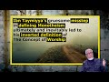

# Ibn Taymiyya's gruesome misstep led to his inverted definition of the concept of worship (2020-08-08 16:34:20+00:00)

## Description

Almassari speak about Ibn Taymiyya's gruesome misstep in defining monotheism that ultimately and inevitably led to his inverted definition of the concept of worship
- Study Circles of Professor Muhammad AL-MASSARI
- Subscribe to our channel: https://bit.ly/2TFVUQv
- Donation: https://www.paypal.me/Almass3ari
We want to recommend Kitab ut-Tawheed: The Basis of Islam and the Reality of Monotheism
- https://www.amazon.com/dp/1986123596/ref=cm_sw_em_r_mt_dp_U_o8NaFbZBDXA4Q
- https://www.amazon.co.uk/dp/1986123596/ref=cm_sw_em_r_mt_dp_U_v9NaFbYHGSK3H

## Summary of [Ibn Taymiyya's gruesome misstep led to his inverted definition of the concept of worship](https://www.youtube.com/watch?v=itqbL8KzOcs)

*This is an AI generated summary. There may be inaccuracies. *

### [00:00:00](https://www.youtube.com/watch?v=itqbL8KzOcs&t=0) - [00:25:00](https://www.youtube.com/watch?v=itqbL8KzOcs&t=1500)

Ibn Taymiyya's mistake in defining worship led him to develop an extreme and inverted view of the concept. This ultimately caused him to cooperate with the British against other Muslims and attribute sovereignty to religious figures.

**[00:00:00](https://www.youtube.com/watch?v=itqbL8KzOcs&t=0)** Ibn Taymiyya's horrific misstep led to his inverted definition of the concept of worship, in which actions are considered primary and the divine being is superseded. However, even this mistake is not the worst of Ibn Taymiyya's. He also read the Quran upside down, insisting that it should be interpreted based on his definition of Taheed (the oneness of God). This caused many people to challenge his views, most prominently Muhammad al-Osama Hadid.
* **[00:05:00](https://www.youtube.com/watch?v=itqbL8KzOcs&t=300)** Ibn Taymiyya argued that the concept of worship is circular and that it is impossible to define a divine being outside of itself. He also argued that worshipping any other entity besides Allah is invalid and has no value.
* **[00:10:00](https://www.youtube.com/watch?v=itqbL8KzOcs&t=600)** 
* **[00:15:00](https://www.youtube.com/watch?v=itqbL8KzOcs&t=900)** Ibn Taymiyya's gruesome misstep led to his inverted definition of the concept of worship, in which the creator of your reason can be wrong. If reason dictates that allah can be questioned, then questioning him undermines reason itself. This problem is compounded when one deduces things related to the fundamental vision of the universe, such as the necessarily existing free agent ultimate being, and attributes them to allah. This can lead to the conclusion that allah is not perfect, and ultimately undermines one's faith in him.
* **[00:20:00](https://www.youtube.com/watch?v=itqbL8KzOcs&t=1200)** Ibn Taymiyya's gruesome misstep led to his inverted definition of the concept of worship, which breaks with the traditional Islamic understanding of worship. This ultimately prevented him from fully understanding the concept and making sound decisions in his experiments. It is important to take care when designing experiments involving humans, as even with proper safeguards, human desires and motivations can still interfere.
* **[00:25:00](https://www.youtube.com/watch?v=itqbL8KzOcs&t=1500)** Ibn Taymiyya made a mistake in his definition of worship, which led to him developing an inverted view of the concept. This mistake caused him to go to extremes in his fight against Muslims, cooperate with the British against other Muslims, and attribute sovereignty to religious figures.

## Full transcript with timestamps

[0:00:00](https://youtu.be/itqbL8KzOcs?t=0) [Music]  
[0:00:28](https://youtu.be/itqbL8KzOcs?t=28) so we have just one question  
[0:00:29](https://youtu.be/itqbL8KzOcs?t=29) today so which other scholar has so far  
[0:00:32](https://youtu.be/itqbL8KzOcs?t=32) been able to point out  
[0:00:34](https://youtu.be/itqbL8KzOcs?t=34) even tamiya's mistake of separating  
[0:00:36](https://youtu.be/itqbL8KzOcs?t=36) actions from the burden  
[0:00:42](https://youtu.be/itqbL8KzOcs?t=42) of action  
[0:01:00](https://youtu.be/itqbL8KzOcs?t=60) he did not understand this is all  
[0:01:02](https://youtu.be/itqbL8KzOcs?t=62) meaning just acknowledge me as the only  
[0:01:03](https://youtu.be/itqbL8KzOcs?t=63) sovereign  
[0:01:06](https://youtu.be/itqbL8KzOcs?t=66) so he he thought these these these  
[0:01:08](https://youtu.be/itqbL8KzOcs?t=68) various actions are a bad and  
[0:01:10](https://youtu.be/itqbL8KzOcs?t=70) and they are primary and then divine  
[0:01:12](https://youtu.be/itqbL8KzOcs?t=72) being became the the  
[0:01:13](https://youtu.be/itqbL8KzOcs?t=73) thing which is worshipped every time you  
[0:01:15](https://youtu.be/itqbL8KzOcs?t=75) smile that you say the things which is  
[0:01:16](https://youtu.be/itqbL8KzOcs?t=76) worthy of worshiping  
[0:01:17](https://youtu.be/itqbL8KzOcs?t=77) so making the worship and acts of  
[0:01:20](https://youtu.be/itqbL8KzOcs?t=80) worship the primary one  
[0:01:21](https://youtu.be/itqbL8KzOcs?t=81) instead of that the divine being is the  
[0:01:23](https://youtu.be/itqbL8KzOcs?t=83) entity which is  
[0:01:25](https://youtu.be/itqbL8KzOcs?t=85) supranational who can act with free will  
[0:01:27](https://youtu.be/itqbL8KzOcs?t=87) which you have with absolute power  
[0:01:29](https://youtu.be/itqbL8KzOcs?t=89) nobody can but if you undermine his his  
[0:01:32](https://youtu.be/itqbL8KzOcs?t=92) will  
[0:01:33](https://youtu.be/itqbL8KzOcs?t=93) who he is the only one who controls  
[0:01:34](https://youtu.be/itqbL8KzOcs?t=94) himself that's a divine being  
[0:01:36](https://youtu.be/itqbL8KzOcs?t=96) there's no mention of creation normally  
[0:01:38](https://youtu.be/itqbL8KzOcs?t=98) should we burden  
[0:01:41](https://youtu.be/itqbL8KzOcs?t=101) the entity which has these attributes he  
[0:01:43](https://youtu.be/itqbL8KzOcs?t=103) will understood allah is the one which  
[0:01:45](https://youtu.be/itqbL8KzOcs?t=105) is being worshipped already  
[0:01:46](https://youtu.be/itqbL8KzOcs?t=106) all of them are wrong that's what we  
[0:01:48](https://youtu.be/itqbL8KzOcs?t=108) discussed extensively in the second part  
[0:01:50](https://youtu.be/itqbL8KzOcs?t=110) of the book  
[0:01:50](https://youtu.be/itqbL8KzOcs?t=110) which is being translated extensively  
[0:01:53](https://youtu.be/itqbL8KzOcs?t=113) very extensively in all details with  
[0:01:54](https://youtu.be/itqbL8KzOcs?t=114) every ayah with every  
[0:01:56](https://youtu.be/itqbL8KzOcs?t=116) sentence and equating certain sentences  
[0:01:58](https://youtu.be/itqbL8KzOcs?t=118) to other things and  
[0:01:59](https://youtu.be/itqbL8KzOcs?t=119) deducing mathematical level precision of  
[0:02:01](https://youtu.be/itqbL8KzOcs?t=121) equations  
[0:02:02](https://youtu.be/itqbL8KzOcs?t=122) so that's even the most mistake uh the  
[0:02:05](https://youtu.be/itqbL8KzOcs?t=125) people  
[0:02:06](https://youtu.be/itqbL8KzOcs?t=126) got got stuck with the division of  
[0:02:08](https://youtu.be/itqbL8KzOcs?t=128) taheed into this  
[0:02:09](https://youtu.be/itqbL8KzOcs?t=129) division etcetera is it wrong nothing  
[0:02:11](https://youtu.be/itqbL8KzOcs?t=131) definitely is wrong but some people  
[0:02:13](https://youtu.be/itqbL8KzOcs?t=133) exposed that the division is wrong  
[0:02:16](https://youtu.be/itqbL8KzOcs?t=136) because even the  
[0:02:17](https://youtu.be/itqbL8KzOcs?t=137) the naming of them he meant that there  
[0:02:20](https://youtu.be/itqbL8KzOcs?t=140) is wrong that's not right  
[0:02:22](https://youtu.be/itqbL8KzOcs?t=142) right there there's only one supreme one  
[0:02:23](https://youtu.be/itqbL8KzOcs?t=143) ultimate seven one lawmaker because it's  
[0:02:25](https://youtu.be/itqbL8KzOcs?t=145) the meaning of  
[0:02:26](https://youtu.be/itqbL8KzOcs?t=146) so he confused reverse the meaning  
[0:02:29](https://youtu.be/itqbL8KzOcs?t=149) use for example when he discussed the  
[0:02:31](https://youtu.be/itqbL8KzOcs?t=151) unity of the divine being  
[0:02:33](https://youtu.be/itqbL8KzOcs?t=153) the one who can create and so on the eye  
[0:02:34](https://youtu.be/itqbL8KzOcs?t=154) of uh  
[0:02:46](https://youtu.be/itqbL8KzOcs?t=166) category of the divine being that's the  
[0:02:48](https://youtu.be/itqbL8KzOcs?t=168) offspring of a divine being  
[0:02:50](https://youtu.be/itqbL8KzOcs?t=170) or an entity which can create  
[0:02:53](https://youtu.be/itqbL8KzOcs?t=173) and take his creation for himself and go  
[0:02:54](https://youtu.be/itqbL8KzOcs?t=174) away  
[0:02:57](https://youtu.be/itqbL8KzOcs?t=177) and the quran says clearly if that's  
[0:02:59](https://youtu.be/itqbL8KzOcs?t=179) true then every  
[0:03:00](https://youtu.be/itqbL8KzOcs?t=180) the divine being will have several  
[0:03:03](https://youtu.be/itqbL8KzOcs?t=183) divine beasts that everyone will take  
[0:03:04](https://youtu.be/itqbL8KzOcs?t=184) his creation go away but this is not  
[0:03:06](https://youtu.be/itqbL8KzOcs?t=186) enough this by necessity  
[0:03:07](https://youtu.be/itqbL8KzOcs?t=187) one must do not donate there's no way  
[0:03:10](https://youtu.be/itqbL8KzOcs?t=190) and people say how can you take your  
[0:03:11](https://youtu.be/itqbL8KzOcs?t=191) creation go away i want them to have to  
[0:03:13](https://youtu.be/itqbL8KzOcs?t=193) with me by necessity because it's a  
[0:03:15](https://youtu.be/itqbL8KzOcs?t=195) complete a complete cause of creation  
[0:03:17](https://youtu.be/itqbL8KzOcs?t=197) so they will be done the conflict of the  
[0:03:19](https://youtu.be/itqbL8KzOcs?t=199) causes which are perfect causes if  
[0:03:21](https://youtu.be/itqbL8KzOcs?t=201) they are contingent and not perfect  
[0:03:23](https://youtu.be/itqbL8KzOcs?t=203) cause no problem cooperation correlation  
[0:03:24](https://youtu.be/itqbL8KzOcs?t=204) is necessary  
[0:03:25](https://youtu.be/itqbL8KzOcs?t=205) but in the case of perfect cause  
[0:03:27](https://youtu.be/itqbL8KzOcs?t=207) cooperation concept is impossible it  
[0:03:29](https://youtu.be/itqbL8KzOcs?t=209) doesn't work  
[0:03:30](https://youtu.be/itqbL8KzOcs?t=210) so then one will dominate the others but  
[0:03:32](https://youtu.be/itqbL8KzOcs?t=212) we in the universe we don't see it like  
[0:03:33](https://youtu.be/itqbL8KzOcs?t=213) there was this one  
[0:03:34](https://youtu.be/itqbL8KzOcs?t=214) clearly well established well organized  
[0:03:36](https://youtu.be/itqbL8KzOcs?t=216) according to one law so this is  
[0:03:38](https://youtu.be/itqbL8KzOcs?t=218) impossible  
[0:03:39](https://youtu.be/itqbL8KzOcs?t=219) uh so uh in that in all the in that that  
[0:03:43](https://youtu.be/itqbL8KzOcs?t=223) the word is used and we when he expanded  
[0:03:45](https://youtu.be/itqbL8KzOcs?t=225) that in a very  
[0:03:46](https://youtu.be/itqbL8KzOcs?t=226) logical and uh beautiful expansion he  
[0:03:49](https://youtu.be/itqbL8KzOcs?t=229) substituted  
[0:03:51](https://youtu.be/itqbL8KzOcs?t=231) everywhere which is which is a blatant  
[0:03:54](https://youtu.be/itqbL8KzOcs?t=234) uh a blatant mistake beloved error not  
[0:03:57](https://youtu.be/itqbL8KzOcs?t=237) acceptable it's almost  
[0:03:59](https://youtu.be/itqbL8KzOcs?t=239) almost telling allah that you have used  
[0:04:01](https://youtu.be/itqbL8KzOcs?t=241) the wrong word almost  
[0:04:02](https://youtu.be/itqbL8KzOcs?t=242) so almost bordering on that he didn't  
[0:04:04](https://youtu.be/itqbL8KzOcs?t=244) intend to do that but  
[0:04:06](https://youtu.be/itqbL8KzOcs?t=246) because he was so obsessed with his  
[0:04:08](https://youtu.be/itqbL8KzOcs?t=248) definition of  
[0:04:09](https://youtu.be/itqbL8KzOcs?t=249) that he he even read the quran upside  
[0:04:12](https://youtu.be/itqbL8KzOcs?t=252) down  
[0:04:13](https://youtu.be/itqbL8KzOcs?t=253) he said the quran  
[0:04:17](https://youtu.be/itqbL8KzOcs?t=257) he should have said so my definition  
[0:04:20](https://youtu.be/itqbL8KzOcs?t=260) must be wrong i must go back instead he  
[0:04:22](https://youtu.be/itqbL8KzOcs?t=262) put his definition and  
[0:04:23](https://youtu.be/itqbL8KzOcs?t=263) on top of the quran based on some  
[0:04:26](https://youtu.be/itqbL8KzOcs?t=266) historic evidence mr osama hadid it  
[0:04:29](https://youtu.be/itqbL8KzOcs?t=269) can't be the quran must be the dominant  
[0:04:30](https://youtu.be/itqbL8KzOcs?t=270) one  
[0:04:31](https://youtu.be/itqbL8KzOcs?t=271) and not the hadith  
[0:04:34](https://youtu.be/itqbL8KzOcs?t=274) so that's so nobody pointed that in that  
[0:04:36](https://youtu.be/itqbL8KzOcs?t=276) way in that sense but some people  
[0:04:38](https://youtu.be/itqbL8KzOcs?t=278) pointed that this division is not  
[0:04:40](https://youtu.be/itqbL8KzOcs?t=280) it's not proper it has weaknesses the  
[0:04:42](https://youtu.be/itqbL8KzOcs?t=282) definition of ibadah as  
[0:04:44](https://youtu.be/itqbL8KzOcs?t=284) as as they mentioned as acts is also  
[0:04:46](https://youtu.be/itqbL8KzOcs?t=286) wrong is not persuasive  
[0:04:47](https://youtu.be/itqbL8KzOcs?t=287) but also the definition which uh a  
[0:04:50](https://youtu.be/itqbL8KzOcs?t=290) recent scholar who died very recently  
[0:04:52](https://youtu.be/itqbL8KzOcs?t=292) recently like maybe 50 years ago i think  
[0:04:55](https://youtu.be/itqbL8KzOcs?t=295) i remember i saw him at my grandfather's  
[0:04:58](https://youtu.be/itqbL8KzOcs?t=298) seclusion room in the maki  
[0:05:01](https://youtu.be/itqbL8KzOcs?t=301) but i remember seeing him faintly i'm  
[0:05:03](https://youtu.be/itqbL8KzOcs?t=303) not sure if it's  
[0:05:05](https://youtu.be/itqbL8KzOcs?t=305) a very one of the best  
[0:05:08](https://youtu.be/itqbL8KzOcs?t=308) pseudo-ahabi but he is more  
[0:05:12](https://youtu.be/itqbL8KzOcs?t=312) qualified and meticulous than most  
[0:05:14](https://youtu.be/itqbL8KzOcs?t=314) wahabi the people do not know him very  
[0:05:16](https://youtu.be/itqbL8KzOcs?t=316) much as well  
[0:05:19](https://youtu.be/itqbL8KzOcs?t=319) he wrote about 600 pages a  
[0:05:22](https://youtu.be/itqbL8KzOcs?t=322) huge book called trying to  
[0:05:25](https://youtu.be/itqbL8KzOcs?t=325) explain and develop  
[0:05:29](https://youtu.be/itqbL8KzOcs?t=329) and he took the wrong way for example he  
[0:05:30](https://youtu.be/itqbL8KzOcs?t=330) discussed alibaba in the community  
[0:05:32](https://youtu.be/itqbL8KzOcs?t=332) and what he takes a very narration  
[0:05:34](https://youtu.be/itqbL8KzOcs?t=334) whatever so on  
[0:05:42](https://youtu.be/itqbL8KzOcs?t=342) and this is from us not from the prophet  
[0:05:44](https://youtu.be/itqbL8KzOcs?t=344) how do we know that knew that's exactly  
[0:05:46](https://youtu.be/itqbL8KzOcs?t=346) what was happening beside it was  
[0:05:47](https://youtu.be/itqbL8KzOcs?t=347) misunderstood then he went to a people  
[0:05:50](https://youtu.be/itqbL8KzOcs?t=350) of hoot  
[0:05:50](https://youtu.be/itqbL8KzOcs?t=350) and so on and he came to 600 pages and  
[0:05:53](https://youtu.be/itqbL8KzOcs?t=353) ultimately he did not  
[0:05:54](https://youtu.be/itqbL8KzOcs?t=354) end in any the definition of verbatim  
[0:05:56](https://youtu.be/itqbL8KzOcs?t=356) which is which  
[0:05:58](https://youtu.be/itqbL8KzOcs?t=358) uh which makes any in any solid sense  
[0:06:00](https://youtu.be/itqbL8KzOcs?t=360) under a counter example to it  
[0:06:04](https://youtu.be/itqbL8KzOcs?t=364) because the definition is wrong because  
[0:06:06](https://youtu.be/itqbL8KzOcs?t=366) it is attempt to give about us something  
[0:06:08](https://youtu.be/itqbL8KzOcs?t=368) independent for the concept of illah  
[0:06:10](https://youtu.be/itqbL8KzOcs?t=370) it's not possible  
[0:06:14](https://youtu.be/itqbL8KzOcs?t=374) when we say we worship allah or whether  
[0:06:17](https://youtu.be/itqbL8KzOcs?t=377) the hindus say we worship shiva  
[0:06:19](https://youtu.be/itqbL8KzOcs?t=379) that's what we mean to a divine entity  
[0:06:21](https://youtu.be/itqbL8KzOcs?t=381) it has to be a divine divinity must be  
[0:06:23](https://youtu.be/itqbL8KzOcs?t=383) defined before  
[0:06:25](https://youtu.be/itqbL8KzOcs?t=385) but because the people only say we we  
[0:06:27](https://youtu.be/itqbL8KzOcs?t=387) worship this divine being and the jewish  
[0:06:28](https://youtu.be/itqbL8KzOcs?t=388) the things worship etc so it looks like  
[0:06:30](https://youtu.be/itqbL8KzOcs?t=390) circle it's not circular it appears  
[0:06:32](https://youtu.be/itqbL8KzOcs?t=392) circular  
[0:06:33](https://youtu.be/itqbL8KzOcs?t=393) it becomes circular only when you try to  
[0:06:34](https://youtu.be/itqbL8KzOcs?t=394) make the a  
[0:06:36](https://youtu.be/itqbL8KzOcs?t=396) by the independent from the divinity  
[0:06:39](https://youtu.be/itqbL8KzOcs?t=399) the moment you recognize that then you  
[0:06:41](https://youtu.be/itqbL8KzOcs?t=401) will not fall into circularity and then  
[0:06:42](https://youtu.be/itqbL8KzOcs?t=402) the definition will be clear  
[0:06:44](https://youtu.be/itqbL8KzOcs?t=404) abadda will be 11 to recognize me as the  
[0:06:48](https://youtu.be/itqbL8KzOcs?t=408) only  
[0:06:49](https://youtu.be/itqbL8KzOcs?t=409) lord and sumarian the only divine entity  
[0:06:51](https://youtu.be/itqbL8KzOcs?t=411) there is no other divine except me  
[0:06:53](https://youtu.be/itqbL8KzOcs?t=413) unless there is worshiping allah by  
[0:06:55](https://youtu.be/itqbL8KzOcs?t=415) definition must be  
[0:06:57](https://youtu.be/itqbL8KzOcs?t=417) into hate if you worship anyone beside  
[0:06:59](https://youtu.be/itqbL8KzOcs?t=419) allah then you are not wahed and  
[0:07:06](https://youtu.be/itqbL8KzOcs?t=426) you don't recognize him as this is the  
[0:07:09](https://youtu.be/itqbL8KzOcs?t=429) only sovereign lord if you don't  
[0:07:11](https://youtu.be/itqbL8KzOcs?t=431) recognize that there's nothing  
[0:07:12](https://youtu.be/itqbL8KzOcs?t=432) your mother is gone so i  
[0:07:16](https://youtu.be/itqbL8KzOcs?t=436) share with anybody uh a sovereignty it's  
[0:07:19](https://youtu.be/itqbL8KzOcs?t=439) not possible  
[0:07:19](https://youtu.be/itqbL8KzOcs?t=439) by the way the benefits of reason is not  
[0:07:22](https://youtu.be/itqbL8KzOcs?t=442) possible  
[0:07:24](https://youtu.be/itqbL8KzOcs?t=444) ever impossible ever and also the  
[0:07:26](https://youtu.be/itqbL8KzOcs?t=446) various counter examples  
[0:07:32](https://youtu.be/itqbL8KzOcs?t=452) okay how come that the yusuf and the  
[0:07:34](https://youtu.be/itqbL8KzOcs?t=454) family of yusuf means  
[0:07:35](https://youtu.be/itqbL8KzOcs?t=455) you to him  
[0:07:44](https://youtu.be/itqbL8KzOcs?t=464) so it's impossible allah cannot command  
[0:07:45](https://youtu.be/itqbL8KzOcs?t=465) something which is just your reason  
[0:07:47](https://youtu.be/itqbL8KzOcs?t=467) relates his divinity is impossible  
[0:07:51](https://youtu.be/itqbL8KzOcs?t=471) so it can't be so worshipping  
[0:07:54](https://youtu.be/itqbL8KzOcs?t=474) it's not even act of a bad could be act  
[0:07:56](https://youtu.be/itqbL8KzOcs?t=476) of respect  
[0:07:57](https://youtu.be/itqbL8KzOcs?t=477) could be a close support to strengthen  
[0:07:59](https://youtu.be/itqbL8KzOcs?t=479) the dark matter whatever it is but it's  
[0:08:00](https://youtu.be/itqbL8KzOcs?t=480) not imbalance  
[0:08:01](https://youtu.be/itqbL8KzOcs?t=481) only if it is done to a divine being  
[0:08:03](https://youtu.be/itqbL8KzOcs?t=483) some things you believe is reminding  
[0:08:04](https://youtu.be/itqbL8KzOcs?t=484) is an act of worship to this divine  
[0:08:06](https://youtu.be/itqbL8KzOcs?t=486) being expression of your  
[0:08:08](https://youtu.be/itqbL8KzOcs?t=488) of your acknowledging over the of  
[0:08:10](https://youtu.be/itqbL8KzOcs?t=490) divinity  
[0:08:16](https://youtu.be/itqbL8KzOcs?t=496) itself so they can watch various deities  
[0:08:19](https://youtu.be/itqbL8KzOcs?t=499) but if you watch of allah it's  
[0:08:20](https://youtu.be/itqbL8KzOcs?t=500) impossible to achieve anybody else  
[0:08:22](https://youtu.be/itqbL8KzOcs?t=502) because it has to entail the  
[0:08:24](https://youtu.be/itqbL8KzOcs?t=504) unity of the divine by necessity if it's  
[0:08:26](https://youtu.be/itqbL8KzOcs?t=506) not then it's not not worshipping  
[0:08:27](https://youtu.be/itqbL8KzOcs?t=507) so the ones who say we worship allah and  
[0:08:29](https://youtu.be/itqbL8KzOcs?t=509) worship for example uh  
[0:08:31](https://youtu.be/itqbL8KzOcs?t=511) another entity they are not worshipping  
[0:08:33](https://youtu.be/itqbL8KzOcs?t=513) allah they are  
[0:08:34](https://youtu.be/itqbL8KzOcs?t=514) they are muslim they are definitely  
[0:08:35](https://youtu.be/itqbL8KzOcs?t=515) allah and their worship is invalid  
[0:08:39](https://youtu.be/itqbL8KzOcs?t=519) has no value because worship is the only  
[0:08:42](https://youtu.be/itqbL8KzOcs?t=522) and ultimate sovereign  
[0:08:45](https://youtu.be/itqbL8KzOcs?t=525) including the other divine attributes  
[0:08:46](https://youtu.be/itqbL8KzOcs?t=526) what is the peak of divine attributes  
[0:08:47](https://youtu.be/itqbL8KzOcs?t=527) the peak of the  
[0:08:48](https://youtu.be/itqbL8KzOcs?t=528) top peak of the island is is  
[0:08:51](https://youtu.be/itqbL8KzOcs?t=531) sovereignty not opposite so when when  
[0:08:55](https://youtu.be/itqbL8KzOcs?t=535) some  
[0:08:55](https://youtu.be/itqbL8KzOcs?t=535) medical we have books  
[0:09:00](https://youtu.be/itqbL8KzOcs?t=540) which shows that the people are mentally  
[0:09:05](https://youtu.be/itqbL8KzOcs?t=545)  mentally sick  
[0:09:36](https://youtu.be/itqbL8KzOcs?t=576) assembly assembly absorpt is simply  
[0:09:39](https://youtu.be/itqbL8KzOcs?t=579) refuted by all these  
[0:09:40](https://youtu.be/itqbL8KzOcs?t=580) these these evidences even in in  
[0:09:42](https://youtu.be/itqbL8KzOcs?t=582) particular like  
[0:09:43](https://youtu.be/itqbL8KzOcs?t=583) how come that the people of yusuf made  
[0:09:46](https://youtu.be/itqbL8KzOcs?t=586) sujud to him  
[0:09:47](https://youtu.be/itqbL8KzOcs?t=587) uh and one of them is a prophet his  
[0:09:49](https://youtu.be/itqbL8KzOcs?t=589) father himself is a prophet soul  
[0:09:50](https://youtu.be/itqbL8KzOcs?t=590) so he must commit an actor this way his  
[0:09:53](https://youtu.be/itqbL8KzOcs?t=593) mouth was  
[0:09:53](https://youtu.be/itqbL8KzOcs?t=593) no no because it's allowed by allah so  
[0:09:55](https://youtu.be/itqbL8KzOcs?t=595) how come that that worshipping we say  
[0:09:57](https://youtu.be/itqbL8KzOcs?t=597) someone said elijah is allowed  
[0:09:58](https://youtu.be/itqbL8KzOcs?t=598) no it's not exactly nothing but it's  
[0:10:00](https://youtu.be/itqbL8KzOcs?t=600) something else so if you do this  
[0:10:02](https://youtu.be/itqbL8KzOcs?t=602) unless another consideration what's the  
[0:10:04](https://youtu.be/itqbL8KzOcs?t=604) other consideration with their mother  
[0:10:05](https://youtu.be/itqbL8KzOcs?t=605) the same with boy  
[0:10:07](https://youtu.be/itqbL8KzOcs?t=607) how come when japanese beat each other  
[0:10:09](https://youtu.be/itqbL8KzOcs?t=609) they usually they don't shake hands they  
[0:10:11](https://youtu.be/itqbL8KzOcs?t=611) just bow  
[0:10:12](https://youtu.be/itqbL8KzOcs?t=612) is that boring they're bad and with  
[0:10:13](https://youtu.be/itqbL8KzOcs?t=613) respect but you look like requests  
[0:10:16](https://youtu.be/itqbL8KzOcs?t=616) sometimes just take the  
[0:10:30](https://youtu.be/itqbL8KzOcs?t=630) as a divine being so divinity must be  
[0:10:33](https://youtu.be/itqbL8KzOcs?t=633) ahead  
[0:10:34](https://youtu.be/itqbL8KzOcs?t=634) first and foremost divine or divinity  
[0:10:36](https://youtu.be/itqbL8KzOcs?t=636) what's the meaning of divine  
[0:10:39](https://youtu.be/itqbL8KzOcs?t=639) when that's settled and this  
[0:10:42](https://youtu.be/itqbL8KzOcs?t=642) established that there's only one divine  
[0:10:43](https://youtu.be/itqbL8KzOcs?t=643) being the only one and only allah  
[0:10:46](https://youtu.be/itqbL8KzOcs?t=646) if anybody which is only one otherwise  
[0:10:50](https://youtu.be/itqbL8KzOcs?t=650) it's a dead  
[0:10:51](https://youtu.be/itqbL8KzOcs?t=651) non-divine blind death  
[0:10:54](https://youtu.be/itqbL8KzOcs?t=654) dead mother called you called nature or  
[0:10:56](https://youtu.be/itqbL8KzOcs?t=656) called mataro or whatever you call it  
[0:10:58](https://youtu.be/itqbL8KzOcs?t=658) this will be atheism that's the only  
[0:11:01](https://youtu.be/itqbL8KzOcs?t=661) possible possibility of reasons  
[0:11:02](https://youtu.be/itqbL8KzOcs?t=662) everything is not there it is not  
[0:11:04](https://youtu.be/itqbL8KzOcs?t=664) possible  
[0:11:10](https://youtu.be/itqbL8KzOcs?t=670) clearly is  
[0:11:15](https://youtu.be/itqbL8KzOcs?t=675) until you settle the definition of  
[0:11:16](https://youtu.be/itqbL8KzOcs?t=676) divinity and the fundamental issue of  
[0:11:18](https://youtu.be/itqbL8KzOcs?t=678) creation who created  
[0:11:20](https://youtu.be/itqbL8KzOcs?t=680) who is this the sovereign who is the  
[0:11:21](https://youtu.be/itqbL8KzOcs?t=681) only sovereign by the s  
[0:11:41](https://youtu.be/itqbL8KzOcs?t=701) what do i do she actually worship use  
[0:11:42](https://youtu.be/itqbL8KzOcs?t=702) order nothing only one comment  
[0:11:45](https://youtu.be/itqbL8KzOcs?t=705) don't touch this three that's it go  
[0:11:47](https://youtu.be/itqbL8KzOcs?t=707) around do whatever you want  
[0:11:49](https://youtu.be/itqbL8KzOcs?t=709) except this one tree just one comma it's  
[0:11:51](https://youtu.be/itqbL8KzOcs?t=711) not even bowing or stretching or  
[0:11:53](https://youtu.be/itqbL8KzOcs?t=713) or kissing walls or nothing and it's  
[0:11:57](https://youtu.be/itqbL8KzOcs?t=717) almost certain that they were not  
[0:11:58](https://youtu.be/itqbL8KzOcs?t=718) ordered to to to have record or  
[0:12:00](https://youtu.be/itqbL8KzOcs?t=720) anything maybe later we don't know  
[0:12:01](https://youtu.be/itqbL8KzOcs?t=721) anyway there's nothing in the quran  
[0:12:03](https://youtu.be/itqbL8KzOcs?t=723) evidence there's nothing  
[0:12:04](https://youtu.be/itqbL8KzOcs?t=724) we are no order given to adam except  
[0:12:06](https://youtu.be/itqbL8KzOcs?t=726) except this one  
[0:12:07](https://youtu.be/itqbL8KzOcs?t=727) don't eat from this one sweet victory  
[0:12:09](https://youtu.be/itqbL8KzOcs?t=729) that's the only the she had the only  
[0:12:10](https://youtu.be/itqbL8KzOcs?t=730) command the only law he had nothing else  
[0:12:20](https://youtu.be/itqbL8KzOcs?t=740) he was nothing he was not a habit he was  
[0:12:23](https://youtu.be/itqbL8KzOcs?t=743) mushrik he was not he was differently  
[0:12:24](https://youtu.be/itqbL8KzOcs?t=744) among  
[0:12:24](https://youtu.be/itqbL8KzOcs?t=744) this he was he was movement that was  
[0:12:27](https://youtu.be/itqbL8KzOcs?t=747) enough that's all that he had  
[0:12:28](https://youtu.be/itqbL8KzOcs?t=748) but it was enough and even that he could  
[0:12:30](https://youtu.be/itqbL8KzOcs?t=750) not fulfill for whatever  
[0:12:32](https://youtu.be/itqbL8KzOcs?t=752) reason and weakness but but that's it  
[0:12:35](https://youtu.be/itqbL8KzOcs?t=755) that's what has happened  
[0:12:38](https://youtu.be/itqbL8KzOcs?t=758) so he was a habit he had the full ibadah  
[0:12:42](https://youtu.be/itqbL8KzOcs?t=762) because he acknowledged his lord  
[0:12:44](https://youtu.be/itqbL8KzOcs?t=764) and he knew that he was mistaken we have  
[0:12:46](https://youtu.be/itqbL8KzOcs?t=766) committed a mistake  
[0:12:48](https://youtu.be/itqbL8KzOcs?t=768) we have done injustice and we wronged  
[0:12:49](https://youtu.be/itqbL8KzOcs?t=769) ourselves when we listen to the  
[0:12:52](https://youtu.be/itqbL8KzOcs?t=772) devil's whispering so we ask for  
[0:12:55](https://youtu.be/itqbL8KzOcs?t=775) forgiveness  
[0:12:56](https://youtu.be/itqbL8KzOcs?t=776) acknowledging that he transitions with  
[0:12:58](https://youtu.be/itqbL8KzOcs?t=778) the order of the lord  
[0:12:59](https://youtu.be/itqbL8KzOcs?t=779) not like him he did not please refused  
[0:13:03](https://youtu.be/itqbL8KzOcs?t=783) i am suffering too you are not only  
[0:13:05](https://youtu.be/itqbL8KzOcs?t=785) sorry i am civilian with you  
[0:13:08](https://youtu.be/itqbL8KzOcs?t=788) so became kafir and stuck with mushrik  
[0:13:11](https://youtu.be/itqbL8KzOcs?t=791) because of arrogance for declaring  
[0:13:12](https://youtu.be/itqbL8KzOcs?t=792) himself to be  
[0:13:14](https://youtu.be/itqbL8KzOcs?t=794) able to seek out guess what allah  
[0:13:16](https://youtu.be/itqbL8KzOcs?t=796) commands nobody can secure  
[0:13:17](https://youtu.be/itqbL8KzOcs?t=797) allah commands it's impossible this will  
[0:13:20](https://youtu.be/itqbL8KzOcs?t=800) under my reason we'll discuss that when  
[0:13:22](https://youtu.be/itqbL8KzOcs?t=802) we come to these things more detail  
[0:13:23](https://youtu.be/itqbL8KzOcs?t=803) it will not only it will admire my  
[0:13:25](https://youtu.be/itqbL8KzOcs?t=805) sharia for my reason  
[0:13:27](https://youtu.be/itqbL8KzOcs?t=807) because reason will be will be then  
[0:13:28](https://youtu.be/itqbL8KzOcs?t=808) destroyed completely  
[0:13:33](https://youtu.be/itqbL8KzOcs?t=813) that the ultimate rational being can be  
[0:13:35](https://youtu.be/itqbL8KzOcs?t=815) questioned by a lower  
[0:13:37](https://youtu.be/itqbL8KzOcs?t=817) secondary being that's impossible the  
[0:13:40](https://youtu.be/itqbL8KzOcs?t=820) lower secondary being could not have  
[0:13:41](https://youtu.be/itqbL8KzOcs?t=821) been possibly being being rational  
[0:13:43](https://youtu.be/itqbL8KzOcs?t=823) without the other ultimate creator  
[0:13:46](https://youtu.be/itqbL8KzOcs?t=826) giving him this rationality so if thus  
[0:13:48](https://youtu.be/itqbL8KzOcs?t=828) financiality is rational and good  
[0:13:50](https://youtu.be/itqbL8KzOcs?t=830) then should be acknowledged that the  
[0:13:51](https://youtu.be/itqbL8KzOcs?t=831) supreme one is the most rational  
[0:13:53](https://youtu.be/itqbL8KzOcs?t=833) and must be the haqq whatever his  
[0:13:55](https://youtu.be/itqbL8KzOcs?t=835) motivation and intention  
[0:13:56](https://youtu.be/itqbL8KzOcs?t=836) is you don't need to know that but you  
[0:13:58](https://youtu.be/itqbL8KzOcs?t=838) know the fundamental and his  
[0:13:59](https://youtu.be/itqbL8KzOcs?t=839) of absolute perfect and absolutely  
[0:14:01](https://youtu.be/itqbL8KzOcs?t=841) infallible  
[0:14:03](https://youtu.be/itqbL8KzOcs?t=843) so it must be hack and absolute help you  
[0:14:06](https://youtu.be/itqbL8KzOcs?t=846) must be wrong  
[0:14:07](https://youtu.be/itqbL8KzOcs?t=847) by necessity of reason otherwise there  
[0:14:08](https://youtu.be/itqbL8KzOcs?t=848) is no collapse and if your reason is  
[0:14:11](https://youtu.be/itqbL8KzOcs?t=851) wrong  
[0:14:12](https://youtu.be/itqbL8KzOcs?t=852) and your brain is misconstructed and  
[0:14:15](https://youtu.be/itqbL8KzOcs?t=855) miswired  
[0:14:17](https://youtu.be/itqbL8KzOcs?t=857) then for theory how can you trust them  
[0:14:18](https://youtu.be/itqbL8KzOcs?t=858) as well but we know that the brain  
[0:14:20](https://youtu.be/itqbL8KzOcs?t=860) cannot be misuad  
[0:14:21](https://youtu.be/itqbL8KzOcs?t=861) it cannot be having like the pentium 4  
[0:14:23](https://youtu.be/itqbL8KzOcs?t=863) which intel we saw heard  
[0:14:26](https://youtu.be/itqbL8KzOcs?t=866) in some calculations it was a scandal in  
[0:14:28](https://youtu.be/itqbL8KzOcs?t=868) the 90s that cannot cannot happen  
[0:14:30](https://youtu.be/itqbL8KzOcs?t=870) there's not yeah some brains are miss  
[0:14:32](https://youtu.be/itqbL8KzOcs?t=872) one some you are mental but they are  
[0:14:34](https://youtu.be/itqbL8KzOcs?t=874) excluded from  
[0:14:35](https://youtu.be/itqbL8KzOcs?t=875) accountability in in your qiyam and that  
[0:14:37](https://youtu.be/itqbL8KzOcs?t=877) they have in the universe because  
[0:14:38](https://youtu.be/itqbL8KzOcs?t=878) no no no created contingent being can be  
[0:14:41](https://youtu.be/itqbL8KzOcs?t=881) perfect by necessity  
[0:14:42](https://youtu.be/itqbL8KzOcs?t=882) they will must be in the creation there  
[0:14:44](https://youtu.be/itqbL8KzOcs?t=884) must be some deficiencies and allah  
[0:14:46](https://youtu.be/itqbL8KzOcs?t=886) legislated for that how to deal and how  
[0:14:48](https://youtu.be/itqbL8KzOcs?t=888) know how to deal with that in the  
[0:14:49](https://youtu.be/itqbL8KzOcs?t=889) universe and sometimes you show you  
[0:14:50](https://youtu.be/itqbL8KzOcs?t=890) allah's power  
[0:14:51](https://youtu.be/itqbL8KzOcs?t=891) and show you that you are contingent and  
[0:14:52](https://youtu.be/itqbL8KzOcs?t=892) limited  
[0:14:55](https://youtu.be/itqbL8KzOcs?t=895) but even but if you are really not not  
[0:14:57](https://youtu.be/itqbL8KzOcs?t=897) one of these mentally drained  
[0:14:59](https://youtu.be/itqbL8KzOcs?t=899) then you cannot by necessity assuming  
[0:15:00](https://youtu.be/itqbL8KzOcs?t=900) that your reason is right and the  
[0:15:02](https://youtu.be/itqbL8KzOcs?t=902) creator of this your reason  
[0:15:03](https://youtu.be/itqbL8KzOcs?t=903) can be wrong who is absolute and perfect  
[0:15:06](https://youtu.be/itqbL8KzOcs?t=906) is ancestry existing so his reason is  
[0:15:08](https://youtu.be/itqbL8KzOcs?t=908) ultimate and rational  
[0:15:09](https://youtu.be/itqbL8KzOcs?t=909) he cannot be arrested ever you can be  
[0:15:12](https://youtu.be/itqbL8KzOcs?t=912) you can't fall into rationality because  
[0:15:15](https://youtu.be/itqbL8KzOcs?t=915) you are contingent you are finite but  
[0:15:16](https://youtu.be/itqbL8KzOcs?t=916) the infinite one is impossible  
[0:15:18](https://youtu.be/itqbL8KzOcs?t=918) because necessarily existing because  
[0:15:20](https://youtu.be/itqbL8KzOcs?t=920) everything she has an attribute it has  
[0:15:21](https://youtu.be/itqbL8KzOcs?t=921) it in  
[0:15:22](https://youtu.be/itqbL8KzOcs?t=922) its fullest absolutely complete perfect  
[0:15:26](https://youtu.be/itqbL8KzOcs?t=926) way or it has no attribute if an  
[0:15:27](https://youtu.be/itqbL8KzOcs?t=927) attribute is not befitting for a  
[0:15:29](https://youtu.be/itqbL8KzOcs?t=929) necessary existing being then he doesn't  
[0:15:31](https://youtu.be/itqbL8KzOcs?t=931) have that activity either zero or  
[0:15:32](https://youtu.be/itqbL8KzOcs?t=932) infinity attributes are either zero he  
[0:15:34](https://youtu.be/itqbL8KzOcs?t=934) doesn't have it or he has an infinite  
[0:15:36](https://youtu.be/itqbL8KzOcs?t=936) and complete and unlimited uh  
[0:15:39](https://youtu.be/itqbL8KzOcs?t=939) capacity so so if reason dictate that  
[0:15:44](https://youtu.be/itqbL8KzOcs?t=944) then questioning allah will under my  
[0:15:46](https://youtu.be/itqbL8KzOcs?t=946) reason  
[0:15:48](https://youtu.be/itqbL8KzOcs?t=948) allah says  
[0:15:51](https://youtu.be/itqbL8KzOcs?t=951) he is not questioning what he does  
[0:16:01](https://youtu.be/itqbL8KzOcs?t=961) impossible otherwise if the necessarily  
[0:16:03](https://youtu.be/itqbL8KzOcs?t=963) existing  
[0:16:04](https://youtu.be/itqbL8KzOcs?t=964) free agent ultimate being necessarily  
[0:16:07](https://youtu.be/itqbL8KzOcs?t=967) existing can be  
[0:16:08](https://youtu.be/itqbL8KzOcs?t=968) questioned meaning reason itself can't  
[0:16:10](https://youtu.be/itqbL8KzOcs?t=970) be questioned but then these are all  
[0:16:12](https://youtu.be/itqbL8KzOcs?t=972) collapsed  
[0:16:13](https://youtu.be/itqbL8KzOcs?t=973) collapse then the whole construct of of  
[0:16:15](https://youtu.be/itqbL8KzOcs?t=975) the universe understanding of the  
[0:16:16](https://youtu.be/itqbL8KzOcs?t=976) universe that's being created not  
[0:16:18](https://youtu.be/itqbL8KzOcs?t=978) created or collapsed  
[0:16:18](https://youtu.be/itqbL8KzOcs?t=978) we don't know what's going on then we're  
[0:16:20](https://youtu.be/itqbL8KzOcs?t=980) like we're like in a mental house  
[0:16:22](https://youtu.be/itqbL8KzOcs?t=982) obviously if someone's come to a  
[0:16:24](https://youtu.be/itqbL8KzOcs?t=984) situation he would be like in a state of  
[0:16:26](https://youtu.be/itqbL8KzOcs?t=986) suspense  
[0:16:27](https://youtu.be/itqbL8KzOcs?t=987) and like like a sick person for some  
[0:16:29](https://youtu.be/itqbL8KzOcs?t=989) time until he comes concluding and  
[0:16:30](https://youtu.be/itqbL8KzOcs?t=990) conclude like the cut  
[0:16:32](https://youtu.be/itqbL8KzOcs?t=992) unlike that that's impossible  
[0:16:35](https://youtu.be/itqbL8KzOcs?t=995) at least my basic rationality and my  
[0:16:37](https://youtu.be/itqbL8KzOcs?t=997) spirit recognition that i exist and i am  
[0:16:38](https://youtu.be/itqbL8KzOcs?t=998) limited  
[0:16:39](https://youtu.be/itqbL8KzOcs?t=999) is true that's the fundamental point and  
[0:16:41](https://youtu.be/itqbL8KzOcs?t=1001) from there you build again  
[0:16:42](https://youtu.be/itqbL8KzOcs?t=1002) and you are back to the necessity of  
[0:16:43](https://youtu.be/itqbL8KzOcs?t=1003) reason  
[0:16:46](https://youtu.be/itqbL8KzOcs?t=1006) so allah cannot be questioned  
[0:16:49](https://youtu.be/itqbL8KzOcs?t=1009) uh injunctions can can be put in a  
[0:16:52](https://youtu.be/itqbL8KzOcs?t=1012) matter of  
[0:16:53](https://youtu.be/itqbL8KzOcs?t=1013) discussion anyone questioning allah  
[0:16:55](https://youtu.be/itqbL8KzOcs?t=1015) judgment or ruling  
[0:16:57](https://youtu.be/itqbL8KzOcs?t=1017) is is necessarily undermining reason or  
[0:17:01](https://youtu.be/itqbL8KzOcs?t=1021) just playing games proclaiming that he  
[0:17:04](https://youtu.be/itqbL8KzOcs?t=1024) believes in allah and he doesn't believe  
[0:17:05](https://youtu.be/itqbL8KzOcs?t=1025) or he doesn't  
[0:17:06](https://youtu.be/itqbL8KzOcs?t=1026) does did not understand what is the  
[0:17:08](https://youtu.be/itqbL8KzOcs?t=1028) meaning of allah  
[0:17:12](https://youtu.be/itqbL8KzOcs?t=1032) they did not give to allah though with  
[0:17:14](https://youtu.be/itqbL8KzOcs?t=1034) the respect he deserved  
[0:17:16](https://youtu.be/itqbL8KzOcs?t=1036) that whole universe in his hand  
[0:17:19](https://youtu.be/itqbL8KzOcs?t=1039) and he controls everything it can't be  
[0:17:21](https://youtu.be/itqbL8KzOcs?t=1041) otherwise  
[0:17:23](https://youtu.be/itqbL8KzOcs?t=1043) so so that's that's the mistake i think  
[0:17:26](https://youtu.be/itqbL8KzOcs?t=1046) every time he went and  
[0:17:27](https://youtu.be/itqbL8KzOcs?t=1047) he was possibly offended by some sophie  
[0:17:31](https://youtu.be/itqbL8KzOcs?t=1051) actions which we find undesirable or  
[0:17:33](https://youtu.be/itqbL8KzOcs?t=1053) extreme  
[0:17:34](https://youtu.be/itqbL8KzOcs?t=1054) at graves and things like that and  
[0:17:37](https://youtu.be/itqbL8KzOcs?t=1057) somehow he came to the conclusion that  
[0:17:38](https://youtu.be/itqbL8KzOcs?t=1058) his shirk  
[0:17:41](https://youtu.be/itqbL8KzOcs?t=1061) or a type of minor circle should not be  
[0:17:43](https://youtu.be/itqbL8KzOcs?t=1063) done this way for  
[0:17:44](https://youtu.be/itqbL8KzOcs?t=1064) whatever reason maybe the considerations  
[0:17:45](https://youtu.be/itqbL8KzOcs?t=1065) correct in certain acts  
[0:17:48](https://youtu.be/itqbL8KzOcs?t=1068) even not necessary in all acts and then  
[0:17:50](https://youtu.be/itqbL8KzOcs?t=1070) from there he  
[0:17:51](https://youtu.be/itqbL8KzOcs?t=1071) concluded and developed and so on to at  
[0:17:53](https://youtu.be/itqbL8KzOcs?t=1073) an attempt to undermine that and stop it  
[0:17:56](https://youtu.be/itqbL8KzOcs?t=1076) and that's that's that's the problem  
[0:17:58](https://youtu.be/itqbL8KzOcs?t=1078) when you when you deduce things  
[0:17:59](https://youtu.be/itqbL8KzOcs?t=1079) related to fundamental vision of the  
[0:18:01](https://youtu.be/itqbL8KzOcs?t=1081) universe and attribute to allah and how  
[0:18:03](https://youtu.be/itqbL8KzOcs?t=1083) you relate it to grievous  
[0:18:04](https://youtu.be/itqbL8KzOcs?t=1084) by letting your desire to a certain  
[0:18:07](https://youtu.be/itqbL8KzOcs?t=1087) conclusion guide you no  
[0:18:09](https://youtu.be/itqbL8KzOcs?t=1089) it should be what is the what is there  
[0:18:11](https://youtu.be/itqbL8KzOcs?t=1091) how it works  
[0:18:12](https://youtu.be/itqbL8KzOcs?t=1092) how it is interrelated by the system  
[0:18:14](https://youtu.be/itqbL8KzOcs?t=1094) reason what is the result what's the  
[0:18:15](https://youtu.be/itqbL8KzOcs?t=1095) conclusion that will come by itself  
[0:18:17](https://youtu.be/itqbL8KzOcs?t=1097) in a good in a in its good time so this  
[0:18:20](https://youtu.be/itqbL8KzOcs?t=1100) is this is uh  
[0:18:22](https://youtu.be/itqbL8KzOcs?t=1102) this is the same problem if you do for  
[0:18:23](https://youtu.be/itqbL8KzOcs?t=1103) example a scientific experiment to  
[0:18:24](https://youtu.be/itqbL8KzOcs?t=1104) refuse something or prove something  
[0:18:27](https://youtu.be/itqbL8KzOcs?t=1107) you ultimately did not do not come to  
[0:18:29](https://youtu.be/itqbL8KzOcs?t=1109) the correct result because you are  
[0:18:31](https://youtu.be/itqbL8KzOcs?t=1111) moved by certain desire it has to be  
[0:18:33](https://youtu.be/itqbL8KzOcs?t=1113) done neutrally  
[0:18:35](https://youtu.be/itqbL8KzOcs?t=1115) and that's the reason for the medical  
[0:18:37](https://youtu.be/itqbL8KzOcs?t=1117) science put great weight on these  
[0:18:39](https://youtu.be/itqbL8KzOcs?t=1119) placebo-controlled double-blinded  
[0:18:41](https://youtu.be/itqbL8KzOcs?t=1121) experiments but  
[0:18:42](https://youtu.be/itqbL8KzOcs?t=1122) they put overweight on that for some  
[0:18:44](https://youtu.be/itqbL8KzOcs?t=1124) reason can be discussed otherwise  
[0:18:46](https://youtu.be/itqbL8KzOcs?t=1126) but to neutralize any desire of of a  
[0:18:49](https://youtu.be/itqbL8KzOcs?t=1129) good result or a bad result and  
[0:18:51](https://youtu.be/itqbL8KzOcs?t=1131) it neutralized the feeling of the  
[0:18:53](https://youtu.be/itqbL8KzOcs?t=1133) experimenter and also the one who  
[0:18:54](https://youtu.be/itqbL8KzOcs?t=1134) received the medication for example  
[0:18:57](https://youtu.be/itqbL8KzOcs?t=1137) he tried to originalize all that and go  
[0:18:59](https://youtu.be/itqbL8KzOcs?t=1139) out of it because this desire and this  
[0:19:01](https://youtu.be/itqbL8KzOcs?t=1141) this uh this willingness to have a  
[0:19:04](https://youtu.be/itqbL8KzOcs?t=1144) result or to the furry future that could  
[0:19:06](https://youtu.be/itqbL8KzOcs?t=1146) undermine  
[0:19:07](https://youtu.be/itqbL8KzOcs?t=1147) um and still still the devil is in the  
[0:19:10](https://youtu.be/itqbL8KzOcs?t=1150) detail for example if  
[0:19:11](https://youtu.be/itqbL8KzOcs?t=1151) the sign of excellent is bad like for  
[0:19:13](https://youtu.be/itqbL8KzOcs?t=1153) example this and let's just let's  
[0:19:14](https://youtu.be/itqbL8KzOcs?t=1154) mention that casually before we close  
[0:19:15](https://youtu.be/itqbL8KzOcs?t=1155) conclude  
[0:19:16](https://youtu.be/itqbL8KzOcs?t=1156) there isn't controversy about  
[0:19:18](https://youtu.be/itqbL8KzOcs?t=1158) heterozygous  
[0:19:20](https://youtu.be/itqbL8KzOcs?t=1160) and now now trump despite the voice  
[0:19:23](https://youtu.be/itqbL8KzOcs?t=1163) stupidity adopted that  
[0:19:24](https://youtu.be/itqbL8KzOcs?t=1164) he went maybe overbought but because  
[0:19:26](https://youtu.be/itqbL8KzOcs?t=1166) political opposition and this because he  
[0:19:28](https://youtu.be/itqbL8KzOcs?t=1168) is confront  
[0:19:28](https://youtu.be/itqbL8KzOcs?t=1168) confrontation with the medical  
[0:19:30](https://youtu.be/itqbL8KzOcs?t=1170) establishment in america which is  
[0:19:31](https://youtu.be/itqbL8KzOcs?t=1171) definitely has become like a cherishing  
[0:19:33](https://youtu.be/itqbL8KzOcs?t=1173) oppressive church  
[0:19:35](https://youtu.be/itqbL8KzOcs?t=1175) they did some experimentation i am  
[0:19:36](https://youtu.be/itqbL8KzOcs?t=1176) doubtful about that experimentation  
[0:19:38](https://youtu.be/itqbL8KzOcs?t=1178) or that clinical trial has been done  
[0:19:41](https://youtu.be/itqbL8KzOcs?t=1181) done in a clean way and well designed  
[0:19:42](https://youtu.be/itqbL8KzOcs?t=1182) for example  
[0:19:43](https://youtu.be/itqbL8KzOcs?t=1183) everyone knows this is the education  
[0:19:44](https://youtu.be/itqbL8KzOcs?t=1184) which is well known now for how many  
[0:19:46](https://youtu.be/itqbL8KzOcs?t=1186) years  
[0:19:46](https://youtu.be/itqbL8KzOcs?t=1186) 30 40 years for malaria and so on and we  
[0:19:49](https://youtu.be/itqbL8KzOcs?t=1189) know  
[0:19:49](https://youtu.be/itqbL8KzOcs?t=1189) i think well established since the 80s  
[0:19:51](https://youtu.be/itqbL8KzOcs?t=1191) that there have been death cases where  
[0:19:53](https://youtu.be/itqbL8KzOcs?t=1193) this for these people who harvest  
[0:19:55](https://youtu.be/itqbL8KzOcs?t=1195) certain or heart condition especially  
[0:19:57](https://youtu.be/itqbL8KzOcs?t=1197) special certain other conditions with  
[0:19:59](https://youtu.be/itqbL8KzOcs?t=1199) any heart condition  
[0:20:00](https://youtu.be/itqbL8KzOcs?t=1200) so it's clear that there's a  
[0:20:02](https://youtu.be/itqbL8KzOcs?t=1202) contraindication there this should not  
[0:20:04](https://youtu.be/itqbL8KzOcs?t=1204) be given to anyone without condition  
[0:20:05](https://youtu.be/itqbL8KzOcs?t=1205) so any experimental design we should not  
[0:20:07](https://youtu.be/itqbL8KzOcs?t=1207) exclude those without  
[0:20:08](https://youtu.be/itqbL8KzOcs?t=1208) conditions is a faulty design  
[0:20:11](https://youtu.be/itqbL8KzOcs?t=1211) it should be excluded we know that  
[0:20:13](https://youtu.be/itqbL8KzOcs?t=1213) already we should exclude that we should  
[0:20:15](https://youtu.be/itqbL8KzOcs?t=1215) apply that or try it only on those who  
[0:20:17](https://youtu.be/itqbL8KzOcs?t=1217) have no heart condition  
[0:20:19](https://youtu.be/itqbL8KzOcs?t=1219) either with cetitude they have a medical  
[0:20:20](https://youtu.be/itqbL8KzOcs?t=1220) history etcetera about that  
[0:20:23](https://youtu.be/itqbL8KzOcs?t=1223) or artists with high probability then  
[0:20:25](https://youtu.be/itqbL8KzOcs?t=1225) from those only we apply that that  
[0:20:27](https://youtu.be/itqbL8KzOcs?t=1227) that and that has to be applied  
[0:20:29](https://youtu.be/itqbL8KzOcs?t=1229) neutrally  
[0:20:30](https://youtu.be/itqbL8KzOcs?t=1230) then there's a problem also what is the  
[0:20:32](https://youtu.be/itqbL8KzOcs?t=1232) moral aspect of giving some people  
[0:20:33](https://youtu.be/itqbL8KzOcs?t=1233) placebo who may be dying  
[0:20:35](https://youtu.be/itqbL8KzOcs?t=1235) because because they don't receive and  
[0:20:37](https://youtu.be/itqbL8KzOcs?t=1237) the other lucky ones receiving which may  
[0:20:38](https://youtu.be/itqbL8KzOcs?t=1238) work  
[0:20:39](https://youtu.be/itqbL8KzOcs?t=1239) there's also more reconciliation so it  
[0:20:41](https://youtu.be/itqbL8KzOcs?t=1241) has to be an open level at this point  
[0:20:43](https://youtu.be/itqbL8KzOcs?t=1243) just mentioning that example to show  
[0:20:44](https://youtu.be/itqbL8KzOcs?t=1244) that even with this standard  
[0:20:47](https://youtu.be/itqbL8KzOcs?t=1247) still human beings desires and political  
[0:20:49](https://youtu.be/itqbL8KzOcs?t=1249) motivation could play our own  
[0:20:50](https://youtu.be/itqbL8KzOcs?t=1250) and mess things up  
[0:20:54](https://youtu.be/itqbL8KzOcs?t=1254) so all the experience you hear about  
[0:20:55](https://youtu.be/itqbL8KzOcs?t=1255) that experiment in brazil who's failed  
[0:20:57](https://youtu.be/itqbL8KzOcs?t=1257) as well i am almost had to be sure they  
[0:21:00](https://youtu.be/itqbL8KzOcs?t=1260) are not well designed  
[0:21:02](https://youtu.be/itqbL8KzOcs?t=1262) so they design itself even if it's  
[0:21:04](https://youtu.be/itqbL8KzOcs?t=1264) placebo control design  
[0:21:06](https://youtu.be/itqbL8KzOcs?t=1266) that sign is not is not persuasive it's  
[0:21:07](https://youtu.be/itqbL8KzOcs?t=1267) not done probably not benefiting from  
[0:21:09](https://youtu.be/itqbL8KzOcs?t=1269) all what we have already  
[0:21:10](https://youtu.be/itqbL8KzOcs?t=1270) explained know about drugs or  
[0:21:12](https://youtu.be/itqbL8KzOcs?t=1272) chlorophyll we should invest that all of  
[0:21:14](https://youtu.be/itqbL8KzOcs?t=1274) it first  
[0:21:15](https://youtu.be/itqbL8KzOcs?t=1275) and then say oh this in that this  
[0:21:17](https://youtu.be/itqbL8KzOcs?t=1277) contraindication this is not  
[0:21:18](https://youtu.be/itqbL8KzOcs?t=1278) we only the one who are not real and  
[0:21:20](https://youtu.be/itqbL8KzOcs?t=1280) this is a good portion of the population  
[0:21:23](https://youtu.be/itqbL8KzOcs?t=1283) on the other hand the majority which are  
[0:21:24](https://youtu.be/itqbL8KzOcs?t=1284) delivered the hospital which you can do  
[0:21:25](https://youtu.be/itqbL8KzOcs?t=1285) that to them the moderation  
[0:21:26](https://youtu.be/itqbL8KzOcs?t=1286) really they will not become so severe  
[0:21:28](https://youtu.be/itqbL8KzOcs?t=1288) unless they have preconditions usually a  
[0:21:30](https://youtu.be/itqbL8KzOcs?t=1290) cardiovascular  
[0:21:31](https://youtu.be/itqbL8KzOcs?t=1291) so they will be a minority which will  
[0:21:33](https://youtu.be/itqbL8KzOcs?t=1293) but still this minorities we're trying  
[0:21:35](https://youtu.be/itqbL8KzOcs?t=1295) for that  
[0:21:36](https://youtu.be/itqbL8KzOcs?t=1296) maybe it works for this minority why  
[0:21:37](https://youtu.be/itqbL8KzOcs?t=1297) deprive a minority who have  
[0:21:39](https://youtu.be/itqbL8KzOcs?t=1299) another precondition but not hard  
[0:21:41](https://youtu.be/itqbL8KzOcs?t=1301) conditions who could  
[0:21:43](https://youtu.be/itqbL8KzOcs?t=1303) uh could benefit from it to uh provides  
[0:21:45](https://youtu.be/itqbL8KzOcs?t=1305) giving with uh azithromycin the other  
[0:21:47](https://youtu.be/itqbL8KzOcs?t=1307) antibiotic  
[0:21:48](https://youtu.be/itqbL8KzOcs?t=1308) but the design was never done that it  
[0:21:50](https://youtu.be/itqbL8KzOcs?t=1310) was done just universal as if we're  
[0:21:52](https://youtu.be/itqbL8KzOcs?t=1312) having a new drug which nobody knows  
[0:21:53](https://youtu.be/itqbL8KzOcs?t=1313) about anything  
[0:21:54](https://youtu.be/itqbL8KzOcs?t=1314) for just because of certain political  
[0:21:56](https://youtu.be/itqbL8KzOcs?t=1316) motivation  
[0:21:57](https://youtu.be/itqbL8KzOcs?t=1317) or just laziness and the stupidity of  
[0:22:00](https://youtu.be/itqbL8KzOcs?t=1320) the recession so i'm sorry to say that i  
[0:22:01](https://youtu.be/itqbL8KzOcs?t=1321) know some medical doctor will be  
[0:22:02](https://youtu.be/itqbL8KzOcs?t=1322) offended but  
[0:22:03](https://youtu.be/itqbL8KzOcs?t=1323) that's the problem sometimes you get  
[0:22:05](https://youtu.be/itqbL8KzOcs?t=1325) lazy and you don't do the design as it  
[0:22:07](https://youtu.be/itqbL8KzOcs?t=1327) should be no the design should be done  
[0:22:08](https://youtu.be/itqbL8KzOcs?t=1328) properly first  
[0:22:12](https://youtu.be/itqbL8KzOcs?t=1332) but uh dictated only by what we know  
[0:22:15](https://youtu.be/itqbL8KzOcs?t=1335) already when we will establish about  
[0:22:16](https://youtu.be/itqbL8KzOcs?t=1336) this material over the last 30 years  
[0:22:18](https://youtu.be/itqbL8KzOcs?t=1338) only by that not but what  
[0:22:20](https://youtu.be/itqbL8KzOcs?t=1340) trump says or muhammadan says that's the  
[0:22:22](https://youtu.be/itqbL8KzOcs?t=1342) way to go but it's very difficult it's  
[0:22:23](https://youtu.be/itqbL8KzOcs?t=1343) theoretically nice on table  
[0:22:25](https://youtu.be/itqbL8KzOcs?t=1345) but when it comes to doing an experiment  
[0:22:27](https://youtu.be/itqbL8KzOcs?t=1347) which is a big experience which is  
[0:22:28](https://youtu.be/itqbL8KzOcs?t=1348) course may cost money and needs certain  
[0:22:30](https://youtu.be/itqbL8KzOcs?t=1350) legal documents to be signed and so on  
[0:22:32](https://youtu.be/itqbL8KzOcs?t=1352) you may become lacks  
[0:22:33](https://youtu.be/itqbL8KzOcs?t=1353) and then the result you may miss a good  
[0:22:36](https://youtu.be/itqbL8KzOcs?t=1356) treatment or possibility  
[0:22:38](https://youtu.be/itqbL8KzOcs?t=1358) you only miss a good treatment  
[0:22:39](https://youtu.be/itqbL8KzOcs?t=1359) possibility  
[0:22:41](https://youtu.be/itqbL8KzOcs?t=1361) because of this this confrontation  
[0:22:42](https://youtu.be/itqbL8KzOcs?t=1362) between various people fighting for  
[0:22:44](https://youtu.be/itqbL8KzOcs?t=1364) power  
[0:22:45](https://youtu.be/itqbL8KzOcs?t=1365) not caring really very much that much  
[0:22:47](https://youtu.be/itqbL8KzOcs?t=1367) about patients but they're caring about  
[0:22:48](https://youtu.be/itqbL8KzOcs?t=1368) their power we have to enforce ourselves  
[0:22:50](https://youtu.be/itqbL8KzOcs?t=1370) we are we are the right ones  
[0:22:51](https://youtu.be/itqbL8KzOcs?t=1371) we are the medical authority like the  
[0:22:53](https://youtu.be/itqbL8KzOcs?t=1373) fda and so on we have to enforce that  
[0:22:56](https://youtu.be/itqbL8KzOcs?t=1376) and then arrogantly this can no that's  
[0:22:59](https://youtu.be/itqbL8KzOcs?t=1379) not a praising of trump he's an idiot  
[0:23:00](https://youtu.be/itqbL8KzOcs?t=1380) and he's stupid  
[0:23:01](https://youtu.be/itqbL8KzOcs?t=1381) and he is a publicist and a demagogue  
[0:23:04](https://youtu.be/itqbL8KzOcs?t=1384) but still in that point  
[0:23:05](https://youtu.be/itqbL8KzOcs?t=1385) he may be more right than the fda  
[0:23:09](https://youtu.be/itqbL8KzOcs?t=1389) and he he don't say that but himself  
[0:23:11](https://youtu.be/itqbL8KzOcs?t=1391) taking that as a precaution  
[0:23:12](https://youtu.be/itqbL8KzOcs?t=1392) as a as a protective measure which could  
[0:23:15](https://youtu.be/itqbL8KzOcs?t=1395) could have some effect  
[0:23:19](https://youtu.be/itqbL8KzOcs?t=1399) so let's give an example of  
[0:23:23](https://youtu.be/itqbL8KzOcs?t=1403) how how to deal with with probably even  
[0:23:26](https://youtu.be/itqbL8KzOcs?t=1406) the medical field even with all the  
[0:23:27](https://youtu.be/itqbL8KzOcs?t=1407) scientific  
[0:23:29](https://youtu.be/itqbL8KzOcs?t=1409) safeguards still human desire and  
[0:23:32](https://youtu.be/itqbL8KzOcs?t=1412) intentions may play a role and  
[0:23:33](https://youtu.be/itqbL8KzOcs?t=1413) interfere with it it's very difficult to  
[0:23:36](https://youtu.be/itqbL8KzOcs?t=1416) to attend an issue  
[0:23:37](https://youtu.be/itqbL8KzOcs?t=1417) or completely without bio within without  
[0:23:39](https://youtu.be/itqbL8KzOcs?t=1419) bias it's very very difficult  
[0:23:43](https://youtu.be/itqbL8KzOcs?t=1423) and then search for something support  
[0:23:45](https://youtu.be/itqbL8KzOcs?t=1425) you by us and ignore that one doesn't  
[0:23:46](https://youtu.be/itqbL8KzOcs?t=1426) support you by it  
[0:23:50](https://youtu.be/itqbL8KzOcs?t=1430) that's that's that's that's a  
[0:23:51](https://youtu.be/itqbL8KzOcs?t=1431) fundamental difficulty in human beings  
[0:23:52](https://youtu.be/itqbL8KzOcs?t=1432) who could be  
[0:23:53](https://youtu.be/itqbL8KzOcs?t=1433) limited and whatever will have  
[0:23:54](https://youtu.be/itqbL8KzOcs?t=1434) motivation cannot act without motivation  
[0:23:57](https://youtu.be/itqbL8KzOcs?t=1437) and so on but we have to do our best we  
[0:23:58](https://youtu.be/itqbL8KzOcs?t=1438) have to try  
[0:24:00](https://youtu.be/itqbL8KzOcs?t=1440) we have to try okay so let's let's just  
[0:24:05](https://youtu.be/itqbL8KzOcs?t=1445) just casual all thoughts about about the  
[0:24:08](https://youtu.be/itqbL8KzOcs?t=1448) pitfalls of  
[0:24:09](https://youtu.be/itqbL8KzOcs?t=1449) of uh where where even tamiya went wrong  
[0:24:12](https://youtu.be/itqbL8KzOcs?t=1452) and he could he should have seen his  
[0:24:14](https://youtu.be/itqbL8KzOcs?t=1454) wrong i think the moment he was  
[0:24:16](https://youtu.be/itqbL8KzOcs?t=1456) expanding the the evidence about the  
[0:24:18](https://youtu.be/itqbL8KzOcs?t=1458) ayat tamano which is one of the best  
[0:24:20](https://youtu.be/itqbL8KzOcs?t=1460) expansion you find ever anywhere  
[0:24:22](https://youtu.be/itqbL8KzOcs?t=1462) i adopted it completely with one symbol  
[0:24:24](https://youtu.be/itqbL8KzOcs?t=1464) change everywhere you said rub i took  
[0:24:26](https://youtu.be/itqbL8KzOcs?t=1466) rub and put  
[0:24:27](https://youtu.be/itqbL8KzOcs?t=1467) who i put in because the ayah will use  
[0:24:29](https://youtu.be/itqbL8KzOcs?t=1469) the way he's not using  
[0:24:45](https://youtu.be/itqbL8KzOcs?t=1485) there's a creation or or anything or  
[0:24:48](https://youtu.be/itqbL8KzOcs?t=1488) body worth you bring him  
[0:24:49](https://youtu.be/itqbL8KzOcs?t=1489) to worshiping him and the eliza eternity  
[0:24:52](https://youtu.be/itqbL8KzOcs?t=1492) from beginning to end for all time he's  
[0:24:53](https://youtu.be/itqbL8KzOcs?t=1493) by his necessity by reason he's an elah  
[0:24:55](https://youtu.be/itqbL8KzOcs?t=1495) has nothing to do with existence or  
[0:24:56](https://youtu.be/itqbL8KzOcs?t=1496) non-existence of worship  
[0:24:58](https://youtu.be/itqbL8KzOcs?t=1498) in the first place if he would have  
[0:25:00](https://youtu.be/itqbL8KzOcs?t=1500) recognized that  
[0:25:03](https://youtu.be/itqbL8KzOcs?t=1503) but he did not and he chose even to  
[0:25:05](https://youtu.be/itqbL8KzOcs?t=1505) change in  
[0:25:07](https://youtu.be/itqbL8KzOcs?t=1507) almost the fact for saying the quran you  
[0:25:09](https://youtu.be/itqbL8KzOcs?t=1509) are not using the correct words i am  
[0:25:10](https://youtu.be/itqbL8KzOcs?t=1510) using words  
[0:25:12](https://youtu.be/itqbL8KzOcs?t=1512) this is this is very grave he did not  
[0:25:14](https://youtu.be/itqbL8KzOcs?t=1514) intend to say that differently  
[0:25:16](https://youtu.be/itqbL8KzOcs?t=1516) that would be clear government but it's  
[0:25:18](https://youtu.be/itqbL8KzOcs?t=1518) it's it's stiff almost like that  
[0:25:20](https://youtu.be/itqbL8KzOcs?t=1520) it's almost as as as catastrophic as  
[0:25:23](https://youtu.be/itqbL8KzOcs?t=1523) wrong as that  
[0:25:24](https://youtu.be/itqbL8KzOcs?t=1524) and from there then accumulated and  
[0:25:26](https://youtu.be/itqbL8KzOcs?t=1526) accommodated and accumulated  
[0:25:28](https://youtu.be/itqbL8KzOcs?t=1528) and became done in hand of people who  
[0:25:29](https://youtu.be/itqbL8KzOcs?t=1529) are less philosophically sophisticated  
[0:25:31](https://youtu.be/itqbL8KzOcs?t=1531) and capable like muhammad aloha  
[0:25:32](https://youtu.be/itqbL8KzOcs?t=1532) became the catastrophe become a very  
[0:25:35](https://youtu.be/itqbL8KzOcs?t=1535) sharp sword which cuts everywhere  
[0:25:36](https://youtu.be/itqbL8KzOcs?t=1536) cut specs cuts whole people will declare  
[0:25:39](https://youtu.be/itqbL8KzOcs?t=1539) everyone to be careful and so on  
[0:25:41](https://youtu.be/itqbL8KzOcs?t=1541) went to extremes which history testify  
[0:25:45](https://youtu.be/itqbL8KzOcs?t=1545) became extreme however fighting against  
[0:25:47](https://youtu.be/itqbL8KzOcs?t=1547) muslims everywhere and  
[0:25:49](https://youtu.be/itqbL8KzOcs?t=1549) cooperating and appeasing cafes almost  
[0:25:52](https://youtu.be/itqbL8KzOcs?t=1552) everywhere  
[0:25:53](https://youtu.be/itqbL8KzOcs?t=1553) even in the gulf accommodating with the  
[0:25:55](https://youtu.be/itqbL8KzOcs?t=1555) british against other muslims  
[0:25:59](https://youtu.be/itqbL8KzOcs?t=1559) so but this is all history with it will  
[0:26:01](https://youtu.be/itqbL8KzOcs?t=1561) come some of it will come we don't want  
[0:26:02](https://youtu.be/itqbL8KzOcs?t=1562) to indulge in history  
[0:26:04](https://youtu.be/itqbL8KzOcs?t=1564) but sometimes you are you are forced to  
[0:26:05](https://youtu.be/itqbL8KzOcs?t=1565) address these things just  
[0:26:07](https://youtu.be/itqbL8KzOcs?t=1567) in a casual manner so that's it that's  
[0:26:09](https://youtu.be/itqbL8KzOcs?t=1569) so the mistake of  
[0:26:10](https://youtu.be/itqbL8KzOcs?t=1570) is that that worship for him is his  
[0:26:12](https://youtu.be/itqbL8KzOcs?t=1572) collection of action and things like  
[0:26:13](https://youtu.be/itqbL8KzOcs?t=1573) that that's not rashford  
[0:26:15](https://youtu.be/itqbL8KzOcs?t=1575) russia is acknowledging the divinity the  
[0:26:18](https://youtu.be/itqbL8KzOcs?t=1578) full divinity of allah  
[0:26:19](https://youtu.be/itqbL8KzOcs?t=1579) or is it exactly saying that he is the  
[0:26:21](https://youtu.be/itqbL8KzOcs?t=1581) only sovereign because the full divinity  
[0:26:23](https://youtu.be/itqbL8KzOcs?t=1583) entails the exclusive sovereignty  
[0:26:25](https://youtu.be/itqbL8KzOcs?t=1585) is the only ramp and that is not  
[0:26:29](https://youtu.be/itqbL8KzOcs?t=1589) the creator of the trump is the  
[0:26:30](https://youtu.be/itqbL8KzOcs?t=1590) sovereign and the master the commander  
[0:26:32](https://youtu.be/itqbL8KzOcs?t=1592) the owner  
[0:26:33](https://youtu.be/itqbL8KzOcs?t=1593) in the kids of allah is also the creator  
[0:26:35](https://youtu.be/itqbL8KzOcs?t=1595) but it's still reason but  
[0:26:37](https://youtu.be/itqbL8KzOcs?t=1597) that is not in the fundamental meaning  
[0:26:38](https://youtu.be/itqbL8KzOcs?t=1598) of the concept  
[0:26:41](https://youtu.be/itqbL8KzOcs?t=1601) and sheikh can happen those who  
[0:26:44](https://youtu.be/itqbL8KzOcs?t=1604) took their monks and and and scholars  
[0:26:47](https://youtu.be/itqbL8KzOcs?t=1607) the lords beside allah and worshiped  
[0:26:49](https://youtu.be/itqbL8KzOcs?t=1609) them this way  
[0:26:50](https://youtu.be/itqbL8KzOcs?t=1610) they never thought that they created the  
[0:26:52](https://youtu.be/itqbL8KzOcs?t=1612) best they never thought that they are  
[0:26:53](https://youtu.be/itqbL8KzOcs?t=1613) divine in any sense no  
[0:26:54](https://youtu.be/itqbL8KzOcs?t=1614) but still they made them divine and gods  
[0:26:57](https://youtu.be/itqbL8KzOcs?t=1617) beside allah  
[0:26:58](https://youtu.be/itqbL8KzOcs?t=1618) by attributing sovereignty to them and  
[0:27:00](https://youtu.be/itqbL8KzOcs?t=1620) the right of legislation to them  
[0:27:03](https://youtu.be/itqbL8KzOcs?t=1623) and they said this is that shows that's  
[0:27:05](https://youtu.be/itqbL8KzOcs?t=1625) this this is genuinely and at the moment  
[0:27:07](https://youtu.be/itqbL8KzOcs?t=1627) when we see through the quran that's  
[0:27:09](https://youtu.be/itqbL8KzOcs?t=1629) genuinely everywhere in the quran is  
[0:27:10](https://youtu.be/itqbL8KzOcs?t=1630) declining  
[0:27:12](https://youtu.be/itqbL8KzOcs?t=1632) it is because of the issue of uh  
[0:27:14](https://youtu.be/itqbL8KzOcs?t=1634) sovereignty and lordship not the issue  
[0:27:16](https://youtu.be/itqbL8KzOcs?t=1636) of who created and who  
[0:27:17](https://youtu.be/itqbL8KzOcs?t=1637) pause and whose surrenders and that's  
[0:27:20](https://youtu.be/itqbL8KzOcs?t=1640) that's  
[0:27:21](https://youtu.be/itqbL8KzOcs?t=1641) who was or who makes a joke and that's  
[0:27:23](https://youtu.be/itqbL8KzOcs?t=1643) not like that no  
[0:27:25](https://youtu.be/itqbL8KzOcs?t=1645) it is who attributes the divinity and  
[0:27:26](https://youtu.be/itqbL8KzOcs?t=1646) sovereignty  
[0:27:30](https://youtu.be/itqbL8KzOcs?t=1650) but that's welcome michelle a bit by the  
[0:27:32](https://youtu.be/itqbL8KzOcs?t=1652) standard the whole  
[0:27:33](https://youtu.be/itqbL8KzOcs?t=1653) we have this basic idea we'll expand in  
[0:27:35](https://youtu.be/itqbL8KzOcs?t=1655) every place and see how it works  
[0:27:37](https://youtu.be/itqbL8KzOcs?t=1657) inshallah  
[0:27:38](https://youtu.be/itqbL8KzOcs?t=1658) to make things perfectly consistent and  
[0:27:41](https://youtu.be/itqbL8KzOcs?t=1661) well balanced  
[0:27:42](https://youtu.be/itqbL8KzOcs?t=1662) okay i think we'll stop here we shall  
[0:27:44](https://youtu.be/itqbL8KzOcs?t=1664) next week same time being  
[0:27:54](https://youtu.be/itqbL8KzOcs?t=1674) foreign  
