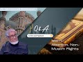

# Roe Vs Wade, Abortion and liberties provided to Non Muslims in Islam (2023-01-03 15:37:59+00:00)

## Description

حلقات ودروس الشيخ الدكتور محمد بن عبدالله المسعري
Study Circles of Professor Dr. Muhammad AL-MASSARI

Study Circles of Professor Dr. Muhammad AL-MASSARI present a detailed discussion on:
Roe Vs Wade and subject of Abortion
Up to what point is the foetus permitted to be terminated
Relationship with Non-Muslims citizens in a federation or direct subjects of an Islamic state and their autonomy in these regards.

Arabic Channel:
https://www.youtube.com/channel/UCoGIB6_SWhLWNP0916iqA7A

⛔️⛔️⛔️
✅ GOOD NEWS: Kitab ut-Tawheed: The Basis of Islam and the Reality is available for free download  👇👇👇

بشرى سارة للفقراء الذين لا يستطيعون (والبخلاء الذين لا يريدون) دفع ثمن كتاب التوحيد (بالإنجليزية)
يمكن تحمبل الكتاب من هنا 👇👇👇:

🔥 https://www.mediafire.com/file/yqqkug...
🔥 https://t.me/IslamicRenewal/982
⛔️⛔️⛔️
✅ Kitab ut-Tawheed: The Basis of Islam and the Reality of Monotheism Paperback – May 5, 2019

🔥 https://www.amazon.com/dp/1986123596/...
🔥 https://a.co/d/8An980h

## Summary of [Roe Vs Wade, Abortion and liberties provided to Non Muslims in Islam](https://www.youtube.com/watch?v=ExrE8ICNhSE)

*This is an AI generated summary. There may be inaccuracies. *

### [00:00:00](https://www.youtube.com/watch?v=ExrE8ICNhSE&t=0) - [00:30:00](https://www.youtube.com/watch?v=ExrE8ICNhSE&t=1800)

Discusses various aspects of Islamic law, including the issue of abortion.  argues that while abortion is technically prohibited in Islam, it is usually a minor issue and should not be a factor in determining a person's religious beliefs.  also discusses the rights afforded to non-Muslim citizens in the event of war, and how they are not obliged to join the military services. Finally, the video discusses how non-Muslim citizens are allowed to practice their religion and dress in a way that is normal for their culture, with one exception - public life should be governed by Sharia law.

**[00:00:00](https://www.youtube.com/watch?v=ExrE8ICNhSE&t=0)** discusses Islamic law regarding abortion and how it is different from American law. The Texas law, which stipulates that abortion may only be performed if it is necessary to protect the mother's life, is consistent with Islamic law.
* **[00:05:00](https://www.youtube.com/watch?v=ExrE8ICNhSE&t=300)* Discusses the Islamic concept of "confederation," which is the unity of different Muslim factions in order to protect their religious beliefs and practices. When a Muslim joins a confederation, they are obligated to follow the laws and regulations of that confederation, which may include differing laws on issues like abortion. If a Muslim is not a member of a confederation, they are still subject to the laws of their own country.
* **[00:10:00](https://www.youtube.com/watch?v=ExrE8ICNhSE&t=600)** discusses the Islamic concept of "liberties" and how they are provided to non-Muslims in Islam.  specifically discusses the rights afforded to non-Muslim citizens in the event of war, including the right to tax themselves, and how this is a genuine Confederation agreement.  also discusses how non-Muslim citizens are protected from forced military service, and how they are not obliged to join the military services. Finally, the video discusses how non-Muslim citizens are allowed to practice their religion and dress in a way that is normal for their culture, with one exception - public life should be governed by Sharia law, which will be enforced if necessary.
* **[00:15:00](https://www.youtube.com/watch?v=ExrE8ICNhSE&t=900)* Discusses various aspects of Islamic law regarding religious practices, such as the allowance for Hindus and Buddhists to practice their religions without interference, and the prohibition on music that is too loud. It also discusses the Danish practice of inverted baptism, which is currently prohibited by Islamic law.
* **[00:20:00](https://www.youtube.com/watch?v=ExrE8ICNhSE&t=1200)* Discusses the issue of abortion in Islam, which is generally seen as a minority issue. The narrator states that while abortion is technically prohibited in Islam, it is usually a minor issue and should not be a factor in determining a person's religious beliefs. When two Christians are in a dispute, Islamic law usually applies. Issues such as medical disputes should be handled by a Muslim scholar, who is better equipped to deal with them. When a Muslim woman marries a non-Muslim, she must abide by Islamic law even if she is living in a different domain. A Muslim who separates from his or her church does not have the right to abandon it and become a civilian.
* **[00:25:00](https://www.youtube.com/watch?v=ExrE8ICNhSE&t=1500)** explains that Islamic law provides more rational and just systems than the current legal system in which people can be mistreated based on their beliefs. He also mentions a Hadith in which the Prophet Muhammad said that it is not permissible for Muslims to rule unjustly or oppress their citizens.
* **[00:30:00](https://www.youtube.com/watch?v=ExrE8ICNhSE&t=1800)** argues that Muslims should not follow the principle of "killing any that does not comply."  provides a translation of a section of the Quran that discusses this principle.  also argues that, historically, Muslim rulers were often very bad examples and that their actions have lead to a bad image of Islam.

## Full transcript with timestamps

[0:00:00](https://youtu.be/ExrE8ICNhSE?t=0) [Music]  
[0:00:02](https://youtu.be/ExrE8ICNhSE?t=2) foreign  
[0:00:06](https://youtu.be/ExrE8ICNhSE?t=6) [Music]  
[0:00:24](https://youtu.be/ExrE8ICNhSE?t=24) thing around abortion and in America  
[0:00:27](https://youtu.be/ExrE8ICNhSE?t=27) some states have kind of like where  
[0:00:29](https://youtu.be/ExrE8ICNhSE?t=29) where some states have bad abortion they  
[0:00:31](https://youtu.be/ExrE8ICNhSE?t=31) allow people to travel to other states  
[0:00:33](https://youtu.be/ExrE8ICNhSE?t=33) to get the abortion they've blocked that  
[0:00:35](https://youtu.be/ExrE8ICNhSE?t=35) now and then that's triggered some kind  
[0:00:37](https://youtu.be/ExrE8ICNhSE?t=37) of discussion so it's one person I can't  
[0:00:39](https://youtu.be/ExrE8ICNhSE?t=39) remember the name what some female  
[0:00:40](https://youtu.be/ExrE8ICNhSE?t=40) scholar was made a tweet about it and  
[0:00:43](https://youtu.be/ExrE8ICNhSE?t=43) then one of these jobs started  
[0:00:44](https://youtu.be/ExrE8ICNhSE?t=44) commenting you know like  
[0:00:46](https://youtu.be/ExrE8ICNhSE?t=46) it's basically yeah  
[0:00:49](https://youtu.be/ExrE8ICNhSE?t=49) well you know they have no guidance so  
[0:00:52](https://youtu.be/ExrE8ICNhSE?t=52) they they will go back and forth without  
[0:00:54](https://youtu.be/ExrE8ICNhSE?t=54) any any clear guidance but we have the  
[0:00:56](https://youtu.be/ExrE8ICNhSE?t=56) clear guidance is that obviously  
[0:00:59](https://youtu.be/ExrE8ICNhSE?t=59) about the flowing the spirit and 40 41  
[0:01:03](https://youtu.be/ExrE8ICNhSE?t=63) 42 regarding also values of 40 40 40 is  
[0:01:06](https://youtu.be/ExrE8ICNhSE?t=66) as faulty it's not correct Hadith but  
[0:01:10](https://youtu.be/ExrE8ICNhSE?t=70) through the tools is more selected the  
[0:01:11](https://youtu.be/ExrE8ICNhSE?t=71) narrator did not memorize properly so  
[0:01:13](https://youtu.be/ExrE8ICNhSE?t=73) it's 40 41 42 six weeks exactly like  
[0:01:16](https://youtu.be/ExrE8ICNhSE?t=76) what Texas has and this fits well with  
[0:01:19](https://youtu.be/ExrE8ICNhSE?t=79) the with the Texas analysis based on the  
[0:01:23](https://youtu.be/ExrE8ICNhSE?t=83) beginning of the heartbeat  
[0:01:24](https://youtu.be/ExrE8ICNhSE?t=84) and this example it is a protected life  
[0:01:27](https://youtu.be/ExrE8ICNhSE?t=87) and that cannot be aborted except in the  
[0:01:29](https://youtu.be/ExrE8ICNhSE?t=89) case of necessity  
[0:01:31](https://youtu.be/ExrE8ICNhSE?t=91) so that's it  
[0:01:32](https://youtu.be/ExrE8ICNhSE?t=92) so the Texas law seems to be very  
[0:01:35](https://youtu.be/ExrE8ICNhSE?t=95) consistent  
[0:01:37](https://youtu.be/ExrE8ICNhSE?t=97) and but the the guys there go by by  
[0:01:40](https://youtu.be/ExrE8ICNhSE?t=100) medical  
[0:01:41](https://youtu.be/ExrE8ICNhSE?t=101) issues philosophical issues which are  
[0:01:44](https://youtu.be/ExrE8ICNhSE?t=104) not Qatari we go alhamdulillah by the  
[0:01:46](https://youtu.be/ExrE8ICNhSE?t=106) Hadith which is  
[0:01:48](https://youtu.be/ExrE8ICNhSE?t=108) yeah that's it so somebody was to object  
[0:01:51](https://youtu.be/ExrE8ICNhSE?t=111) to for example in this law itself which  
[0:01:54](https://youtu.be/ExrE8ICNhSE?t=114) so if the Texas law stipulates six wings  
[0:01:57](https://youtu.be/ExrE8ICNhSE?t=117) yeah and then somebody says no it's just  
[0:01:59](https://youtu.be/ExrE8ICNhSE?t=119) blank it's a woman's choice at whatever  
[0:02:01](https://youtu.be/ExrE8ICNhSE?t=121) Point she decides to terminate that's  
[0:02:02](https://youtu.be/ExrE8ICNhSE?t=122) obviously if someone endorses other than  
[0:02:04](https://youtu.be/ExrE8ICNhSE?t=124) our Viewpoint then that's obviously very  
[0:02:07](https://youtu.be/ExrE8ICNhSE?t=127) very dangerous yeah so that's just it's  
[0:02:10](https://youtu.be/ExrE8ICNhSE?t=130) very clear that it's that's uh they are  
[0:02:12](https://youtu.be/ExrE8ICNhSE?t=132) not aware of what Hadith and about the  
[0:02:14](https://youtu.be/ExrE8ICNhSE?t=134) they should block the spirit that's not  
[0:02:16](https://youtu.be/ExrE8ICNhSE?t=136) by the conception the conception is just  
[0:02:18](https://youtu.be/ExrE8ICNhSE?t=138) as as it hasn't said is a part of them  
[0:02:21](https://youtu.be/ExrE8ICNhSE?t=141) and also the humble and most Scholars  
[0:02:22](https://youtu.be/ExrE8ICNhSE?t=142) it's about a woman's body it's like a  
[0:02:25](https://youtu.be/ExrE8ICNhSE?t=145) dumbbell she can't get rid of it until  
[0:02:26](https://youtu.be/ExrE8ICNhSE?t=146) 42. days that's six weeks  
[0:02:30](https://youtu.be/ExrE8ICNhSE?t=150) so that's correct after that it's a new  
[0:02:32](https://youtu.be/ExrE8ICNhSE?t=152) life there's there is no issue uh no  
[0:02:37](https://youtu.be/ExrE8ICNhSE?t=157) issue about that only to save the mother  
[0:02:39](https://youtu.be/ExrE8ICNhSE?t=159) it's permissible because in other life  
[0:02:40](https://youtu.be/ExrE8ICNhSE?t=160) is not say the primary one cannot you  
[0:02:42](https://youtu.be/ExrE8ICNhSE?t=162) cannot you cannot keep the branch and  
[0:02:44](https://youtu.be/ExrE8ICNhSE?t=164) cut the stem that's not possible so if  
[0:02:47](https://youtu.be/ExrE8ICNhSE?t=167) that woman's life is in nature that it  
[0:02:48](https://youtu.be/ExrE8ICNhSE?t=168) can be done and the other the usual  
[0:02:51](https://youtu.be/ExrE8ICNhSE?t=171) argument that the case of Raven so in  
[0:02:52](https://youtu.be/ExrE8ICNhSE?t=172) case where it was very clear in case of  
[0:02:54](https://youtu.be/ExrE8ICNhSE?t=174) any rail then uh within the sixth week  
[0:02:57](https://youtu.be/ExrE8ICNhSE?t=177) there's no excuse uh other cases  
[0:03:01](https://youtu.be/ExrE8ICNhSE?t=181) obviously there's no there's no excuse  
[0:03:04](https://youtu.be/ExrE8ICNhSE?t=184) whatsoever in other cases you would say  
[0:03:06](https://youtu.be/ExrE8ICNhSE?t=186) that Etc so so the usual arguments are  
[0:03:09](https://youtu.be/ExrE8ICNhSE?t=189) what are the case over there  
[0:03:11](https://youtu.be/ExrE8ICNhSE?t=191) the woman does not know the case of  
[0:03:14](https://youtu.be/ExrE8ICNhSE?t=194) there we have to have checked quickly  
[0:03:15](https://youtu.be/ExrE8ICNhSE?t=195) that's something that has happened or  
[0:03:17](https://youtu.be/ExrE8ICNhSE?t=197) didn't happen that's that's very clear  
[0:03:20](https://youtu.be/ExrE8ICNhSE?t=200) so that's most of the arguments are 40  
[0:03:22](https://youtu.be/ExrE8ICNhSE?t=202) is just going about our second but for  
[0:03:25](https://youtu.be/ExrE8ICNhSE?t=205) them it's a the problem for them is they  
[0:03:27](https://youtu.be/ExrE8ICNhSE?t=207) start fundamentally by by really by by  
[0:03:30](https://youtu.be/ExrE8ICNhSE?t=210) regarding extramarital relations are  
[0:03:32](https://youtu.be/ExrE8ICNhSE?t=212) permissible so that that they're stuck  
[0:03:34](https://youtu.be/ExrE8ICNhSE?t=214) already by stage one stage two will  
[0:03:37](https://youtu.be/ExrE8ICNhSE?t=217) never work out for them  
[0:03:38](https://youtu.be/ExrE8ICNhSE?t=218) that's the point  
[0:03:41](https://youtu.be/ExrE8ICNhSE?t=221) Ah that's all that's  
[0:03:44](https://youtu.be/ExrE8ICNhSE?t=224) ultimately it's always a discussion  
[0:03:46](https://youtu.be/ExrE8ICNhSE?t=226) between the conservatives and  
[0:03:47](https://youtu.be/ExrE8ICNhSE?t=227) secularists so they're not as a state  
[0:03:49](https://youtu.be/ExrE8ICNhSE?t=229) they don't they don't even play around  
[0:03:50](https://youtu.be/ExrE8ICNhSE?t=230) there it's almost had an up there or  
[0:03:52](https://youtu.be/ExrE8ICNhSE?t=232) their identity you're always getting  
[0:03:53](https://youtu.be/ExrE8ICNhSE?t=233) problem with secularism exactly exactly  
[0:03:55](https://youtu.be/ExrE8ICNhSE?t=235) that's it so and secular framework it's  
[0:03:58](https://youtu.be/ExrE8ICNhSE?t=238) it's but the texting obviously I think  
[0:04:01](https://youtu.be/ExrE8ICNhSE?t=241) they want also by some uh reasonable  
[0:04:03](https://youtu.be/ExrE8ICNhSE?t=243) medical evaluation and things like that  
[0:04:06](https://youtu.be/ExrE8ICNhSE?t=246) and they took the the heartbeat start in  
[0:04:08](https://youtu.be/ExrE8ICNhSE?t=248) the sixth after six weeks so then it is  
[0:04:11](https://youtu.be/ExrE8ICNhSE?t=251) a it is an entity and a person and so on  
[0:04:14](https://youtu.be/ExrE8ICNhSE?t=254) here's a question for you no you don't  
[0:04:17](https://youtu.be/ExrE8ICNhSE?t=257) know how Medina um was effectively a  
[0:04:19](https://youtu.be/ExrE8ICNhSE?t=259) confederation of States yeah in Islam  
[0:04:22](https://youtu.be/ExrE8ICNhSE?t=262) say we had a confederation agreement  
[0:04:25](https://youtu.be/ExrE8ICNhSE?t=265) with another state say America becomes  
[0:04:27](https://youtu.be/ExrE8ICNhSE?t=267) part of the Confederation and they  
[0:04:29](https://youtu.be/ExrE8ICNhSE?t=269) decided to say 20 weeks  
[0:04:32](https://youtu.be/ExrE8ICNhSE?t=272) tradition they have nothing to do with  
[0:04:34](https://youtu.be/ExrE8ICNhSE?t=274) Islamic law the memorial  
[0:04:37](https://youtu.be/ExrE8ICNhSE?t=277) the only thing there is that the  
[0:04:39](https://youtu.be/ExrE8ICNhSE?t=279) finances and the currency should be the  
[0:04:41](https://youtu.be/ExrE8ICNhSE?t=281) same because this is universal  
[0:04:44](https://youtu.be/ExrE8ICNhSE?t=284) should be permitted  
[0:04:46](https://youtu.be/ExrE8ICNhSE?t=286) so so it's an interest because I thought  
[0:04:48](https://youtu.be/ExrE8ICNhSE?t=288) you know in terms of like protection of  
[0:04:49](https://youtu.be/ExrE8ICNhSE?t=289) of what is considered to be a being  
[0:04:51](https://youtu.be/ExrE8ICNhSE?t=291) because you know obviously there's  
[0:04:52](https://youtu.be/ExrE8ICNhSE?t=292) certain things which have fallen under  
[0:04:53](https://youtu.be/ExrE8ICNhSE?t=293) the State's region states remix would  
[0:04:55](https://youtu.be/ExrE8ICNhSE?t=295) fall into you know as expression riba uh  
[0:04:57](https://youtu.be/ExrE8ICNhSE?t=297) joint economic Affairs in terms of you  
[0:04:59](https://youtu.be/ExrE8ICNhSE?t=299) know um as yeah if you need to do but  
[0:05:02](https://youtu.be/ExrE8ICNhSE?t=302) but all these issues related when Life  
[0:05:04](https://youtu.be/ExrE8ICNhSE?t=304) Starts and so on as you conducted  
[0:05:06](https://youtu.be/ExrE8ICNhSE?t=306) obviously to metaphysical issues and and  
[0:05:08](https://youtu.be/ExrE8ICNhSE?t=308) and and philosophical issues especially  
[0:05:10](https://youtu.be/ExrE8ICNhSE?t=310) for for babies in the womb and so on  
[0:05:13](https://youtu.be/ExrE8ICNhSE?t=313) that's that's not that we're not talking  
[0:05:15](https://youtu.be/ExrE8ICNhSE?t=315) about now murder of someone who has been  
[0:05:17](https://youtu.be/ExrE8ICNhSE?t=317) born and then obviously it's a murder  
[0:05:18](https://youtu.be/ExrE8ICNhSE?t=318) and then but also  
[0:05:21](https://youtu.be/ExrE8ICNhSE?t=321) a member of Confederation there if their  
[0:05:24](https://youtu.be/ExrE8ICNhSE?t=324) religion or their law does not allow  
[0:05:26](https://youtu.be/ExrE8ICNhSE?t=326) death penalty then they apply that in  
[0:05:28](https://youtu.be/ExrE8ICNhSE?t=328) their domain  
[0:05:39](https://youtu.be/ExrE8ICNhSE?t=339) uh usually was excluded because usually  
[0:05:43](https://youtu.be/ExrE8ICNhSE?t=343) relates to the currency and to Gold and  
[0:05:45](https://youtu.be/ExrE8ICNhSE?t=345) Silver and other entities and this would  
[0:05:47](https://youtu.be/ExrE8ICNhSE?t=347) cannot be restricted to the  
[0:05:49](https://youtu.be/ExrE8ICNhSE?t=349) Confederation even internationally with  
[0:05:51](https://youtu.be/ExrE8ICNhSE?t=351) other entities you are not allowed to  
[0:05:53](https://youtu.be/ExrE8ICNhSE?t=353) deal with user anyway  
[0:05:54](https://youtu.be/ExrE8ICNhSE?t=354) but because they are not under your  
[0:05:56](https://youtu.be/ExrE8ICNhSE?t=356) power we cannot educate anything or do  
[0:05:58](https://youtu.be/ExrE8ICNhSE?t=358) anything but if someone is a member of  
[0:05:59](https://youtu.be/ExrE8ICNhSE?t=359) Confederation he has to comply with that  
[0:06:01](https://youtu.be/ExrE8ICNhSE?t=361) also the other compliance that you  
[0:06:03](https://youtu.be/ExrE8ICNhSE?t=363) cannot have any other they cannot be a  
[0:06:06](https://youtu.be/ExrE8ICNhSE?t=366) member of NATO or alliance with a  
[0:06:08](https://youtu.be/ExrE8ICNhSE?t=368) non-islamic entity industry that's  
[0:06:09](https://youtu.be/ExrE8ICNhSE?t=369) excluded by by definition of  
[0:06:11](https://youtu.be/ExrE8ICNhSE?t=371) confederation so that's only what is  
[0:06:13](https://youtu.be/ExrE8ICNhSE?t=373) dictated by necessity or the definition  
[0:06:15](https://youtu.be/ExrE8ICNhSE?t=375) of Confederation otherwise the religion  
[0:06:17](https://youtu.be/ExrE8ICNhSE?t=377) there is that everything is completely  
[0:06:19](https://youtu.be/ExrE8ICNhSE?t=379) independent say there were no muslim  
[0:06:21](https://youtu.be/ExrE8ICNhSE?t=381) cities of the Islamic State as well with  
[0:06:23](https://youtu.be/ExrE8ICNhSE?t=383) the protection of their religion also  
[0:06:25](https://youtu.be/ExrE8ICNhSE?t=385) extend to this this area  
[0:06:27](https://youtu.be/ExrE8ICNhSE?t=387) uh it's me it's me it's me it has to be  
[0:06:30](https://youtu.be/ExrE8ICNhSE?t=390) analyzed if if it can be if there can be  
[0:06:33](https://youtu.be/ExrE8ICNhSE?t=393) if it can be individualized but if not  
[0:06:34](https://youtu.be/ExrE8ICNhSE?t=394) it realized that we extend to them as a  
[0:06:37](https://youtu.be/ExrE8ICNhSE?t=397) community if they have their own  
[0:06:38](https://youtu.be/ExrE8ICNhSE?t=398) separate community and and legislation  
[0:06:40](https://youtu.be/ExrE8ICNhSE?t=400) and things like that even if they are  
[0:06:42](https://youtu.be/ExrE8ICNhSE?t=402) scattered inside islamics that maybe  
[0:06:43](https://youtu.be/ExrE8ICNhSE?t=403) belong to our community  
[0:06:44](https://youtu.be/ExrE8ICNhSE?t=404) and so on obviously it can be  
[0:06:46](https://youtu.be/ExrE8ICNhSE?t=406) individualized so they can have their  
[0:06:48](https://youtu.be/ExrE8ICNhSE?t=408) own marital law and and  
[0:06:51](https://youtu.be/ExrE8ICNhSE?t=411) their dispute will be settled by  
[0:06:53](https://youtu.be/ExrE8ICNhSE?t=413) themselves for example or in time of  
[0:06:56](https://youtu.be/ExrE8ICNhSE?t=416) Adam one Muslim young man fornicated  
[0:06:59](https://youtu.be/ExrE8ICNhSE?t=419) with a Christian girl  
[0:07:01](https://youtu.be/ExrE8ICNhSE?t=421) so they were they were following things  
[0:07:03](https://youtu.be/ExrE8ICNhSE?t=423) right there so they usually I think that  
[0:07:04](https://youtu.be/ExrE8ICNhSE?t=424) I would ever thought about him to be  
[0:07:06](https://youtu.be/ExrE8ICNhSE?t=426) flow with 100 and send and said give  
[0:07:09](https://youtu.be/ExrE8ICNhSE?t=429) that they give the girl to her people to  
[0:07:10](https://youtu.be/ExrE8ICNhSE?t=430) do whatever they want with her it's not  
[0:07:13](https://youtu.be/ExrE8ICNhSE?t=433) a lot of Affairs  
[0:07:15](https://youtu.be/ExrE8ICNhSE?t=435) she's not she is not and I think this  
[0:07:18](https://youtu.be/ExrE8ICNhSE?t=438) decision is correct  
[0:07:22](https://youtu.be/ExrE8ICNhSE?t=442) because the the flogging is is only for  
[0:07:25](https://youtu.be/ExrE8ICNhSE?t=445) those who believe uh Zina is Haram and  
[0:07:28](https://youtu.be/ExrE8ICNhSE?t=448) for Muslims is because it's part of  
[0:07:31](https://youtu.be/ExrE8ICNhSE?t=451) their of the Islamic belief and  
[0:07:33](https://youtu.be/ExrE8ICNhSE?t=453) commitment it's connected to belief  
[0:07:36](https://youtu.be/ExrE8ICNhSE?t=456) I don't know it's interesting because  
[0:07:37](https://youtu.be/ExrE8ICNhSE?t=457) they're having this entire contention  
[0:07:39](https://youtu.be/ExrE8ICNhSE?t=459) because you've got one batch who are  
[0:07:41](https://youtu.be/ExrE8ICNhSE?t=461) secular and one battery on if anything  
[0:07:42](https://youtu.be/ExrE8ICNhSE?t=462) is long as a state would effectively  
[0:07:45](https://youtu.be/ExrE8ICNhSE?t=465) resolve this entire problem there  
[0:07:47](https://youtu.be/ExrE8ICNhSE?t=467) because if you if somebody adjudicates  
[0:07:49](https://youtu.be/ExrE8ICNhSE?t=469) that it's fine then the state will say  
[0:07:51](https://youtu.be/ExrE8ICNhSE?t=471) okay go for it yeah  
[0:07:53](https://youtu.be/ExrE8ICNhSE?t=473) they belong to another agent they cannot  
[0:07:56](https://youtu.be/ExrE8ICNhSE?t=476) be a Muslim because they don't have  
[0:07:57](https://youtu.be/ExrE8ICNhSE?t=477) they're not Muslim I mean so the state  
[0:07:59](https://youtu.be/ExrE8ICNhSE?t=479) is based on nationality if you are the  
[0:08:01](https://youtu.be/ExrE8ICNhSE?t=481) citizen of Texas finish then all things  
[0:08:03](https://youtu.be/ExrE8ICNhSE?t=483) can apply to you they will not exclude  
[0:08:05](https://youtu.be/ExrE8ICNhSE?t=485) you because you are a Muslim or a  
[0:08:06](https://youtu.be/ExrE8ICNhSE?t=486) Christian the system is different from  
[0:08:08](https://youtu.be/ExrE8ICNhSE?t=488) them it's different there is not a  
[0:08:10](https://youtu.be/ExrE8ICNhSE?t=490) communal system it's a it's a state  
[0:08:12](https://youtu.be/ExrE8ICNhSE?t=492) synthesis to express it in in a harsh  
[0:08:16](https://youtu.be/ExrE8ICNhSE?t=496) language the state is is God it's a  
[0:08:19](https://youtu.be/ExrE8ICNhSE?t=499) Divine being  
[0:08:20](https://youtu.be/ExrE8ICNhSE?t=500) the state is a Divinity has arrived from  
[0:08:22](https://youtu.be/ExrE8ICNhSE?t=502) an acting laws the Islamic is not like  
[0:08:24](https://youtu.be/ExrE8ICNhSE?t=504) that  
[0:08:26](https://youtu.be/ExrE8ICNhSE?t=506) says it's not credibility the state  
[0:08:28](https://youtu.be/ExrE8ICNhSE?t=508) adopts from the Revelation and the  
[0:08:30](https://youtu.be/ExrE8ICNhSE?t=510) Revelation says other people of the  
[0:08:32](https://youtu.be/ExrE8ICNhSE?t=512) religion there's no company anything  
[0:08:33](https://youtu.be/ExrE8ICNhSE?t=513) related to the religion  
[0:08:35](https://youtu.be/ExrE8ICNhSE?t=515) you can't interfere  
[0:08:37](https://youtu.be/ExrE8ICNhSE?t=517) but only a few things will accept exempt  
[0:08:41](https://youtu.be/ExrE8ICNhSE?t=521) by by by cliche injection like the  
[0:08:43](https://youtu.be/ExrE8ICNhSE?t=523) Treaty of najaran exclusion of usury but  
[0:08:46](https://youtu.be/ExrE8ICNhSE?t=526) that was not they were in the sacrify it  
[0:08:48](https://youtu.be/ExrE8ICNhSE?t=528) but when Nigerian joined later obviously  
[0:08:51](https://youtu.be/ExrE8ICNhSE?t=531) the Jews disappeared from Madina so  
[0:08:52](https://youtu.be/ExrE8ICNhSE?t=532) there was no Confederation but danger  
[0:08:54](https://youtu.be/ExrE8ICNhSE?t=534) and joined with a similar condition and  
[0:08:56](https://youtu.be/ExrE8ICNhSE?t=536) same stimulation like this with the  
[0:08:58](https://youtu.be/ExrE8ICNhSE?t=538) exception of the exclusion of usury  
[0:09:01](https://youtu.be/ExrE8ICNhSE?t=541) that's number one whole other things  
[0:09:02](https://youtu.be/ExrE8ICNhSE?t=542) like what does Confederation means there  
[0:09:04](https://youtu.be/ExrE8ICNhSE?t=544) are no alliance with the Enemy not not  
[0:09:07](https://youtu.be/ExrE8ICNhSE?t=547) going in a battle campaign with those  
[0:09:09](https://youtu.be/ExrE8ICNhSE?t=549) permission of the Central State of the  
[0:09:12](https://youtu.be/ExrE8ICNhSE?t=552) Prophet as a head of Center that's clear  
[0:09:14](https://youtu.be/ExrE8ICNhSE?t=554) that's the definition of Confederation  
[0:09:15](https://youtu.be/ExrE8ICNhSE?t=555) otherwise another congratulation that's  
[0:09:17](https://youtu.be/ExrE8ICNhSE?t=557) nothing  
[0:09:19](https://youtu.be/ExrE8ICNhSE?t=559) so so just the thing about najron an  
[0:09:21](https://youtu.be/ExrE8ICNhSE?t=561) exclusion of the river so they were  
[0:09:23](https://youtu.be/ExrE8ICNhSE?t=563) permitted to commit continue with River  
[0:09:25](https://youtu.be/ExrE8ICNhSE?t=565) within their own domain no no inside the  
[0:09:27](https://youtu.be/ExrE8ICNhSE?t=567) domain  
[0:09:29](https://youtu.be/ExrE8ICNhSE?t=569) [Music]  
[0:10:14](https://youtu.be/ExrE8ICNhSE?t=614) will fight for them in the case of War  
[0:10:16](https://youtu.be/ExrE8ICNhSE?t=616) that's the reason for these taxes  
[0:10:19](https://youtu.be/ExrE8ICNhSE?t=619) that's all and it was calculated foreign  
[0:10:22](https://youtu.be/ExrE8ICNhSE?t=622) for the whole nation as a total and not  
[0:10:24](https://youtu.be/ExrE8ICNhSE?t=624) for every single person  
[0:10:26](https://youtu.be/ExrE8ICNhSE?t=626) so it's genuine Confederation agreement  
[0:10:29](https://youtu.be/ExrE8ICNhSE?t=629) the same of the Jews but with this two  
[0:10:32](https://youtu.be/ExrE8ICNhSE?t=632) additional things that that the central  
[0:10:34](https://youtu.be/ExrE8ICNhSE?t=634) entity can live your money that was not  
[0:10:36](https://youtu.be/ExrE8ICNhSE?t=636) injunctioned yet in the third year of  
[0:10:38](https://youtu.be/ExrE8ICNhSE?t=638) Barbara and Medina and as a sahiba uh  
[0:10:42](https://youtu.be/ExrE8ICNhSE?t=642) and uh and the exclusion of usually  
[0:10:46](https://youtu.be/ExrE8ICNhSE?t=646) inside their domain as the thing said  
[0:10:47](https://youtu.be/ExrE8ICNhSE?t=647) there's crosses their religion  
[0:10:49](https://youtu.be/ExrE8ICNhSE?t=649) everything is protected  
[0:10:52](https://youtu.be/ExrE8ICNhSE?t=652) absolutely Liberties and that they are  
[0:10:55](https://youtu.be/ExrE8ICNhSE?t=655) also they are as clearly stated that  
[0:10:57](https://youtu.be/ExrE8ICNhSE?t=657) they cannot be forced to be militarized  
[0:10:59](https://youtu.be/ExrE8ICNhSE?t=659) they cannot be uh they cannot be ordered  
[0:11:01](https://youtu.be/ExrE8ICNhSE?t=661) to join their military they can't join  
[0:11:03](https://youtu.be/ExrE8ICNhSE?t=663) if they wish but they cannot be all that  
[0:11:07](https://youtu.be/ExrE8ICNhSE?t=667) because the Jersey are effectively  
[0:11:08](https://youtu.be/ExrE8ICNhSE?t=668) offsets that responsibility yeah  
[0:11:12](https://youtu.be/ExrE8ICNhSE?t=672) okay so they are not even obliged to  
[0:11:14](https://youtu.be/ExrE8ICNhSE?t=674) join the military services there's  
[0:11:16](https://youtu.be/ExrE8ICNhSE?t=676) normally there's a service for them  
[0:11:17](https://youtu.be/ExrE8ICNhSE?t=677) whatsoever they cannot be forced to that  
[0:11:19](https://youtu.be/ExrE8ICNhSE?t=679) if they want to join they will come and  
[0:11:21](https://youtu.be/ExrE8ICNhSE?t=681) also they are very acceptable conditions  
[0:11:23](https://youtu.be/ExrE8ICNhSE?t=683) and uh and the usual conditions apply  
[0:11:27](https://youtu.be/ExrE8ICNhSE?t=687) Etc that's something yes  
[0:11:28](https://youtu.be/ExrE8ICNhSE?t=688) so so that's this one  
[0:11:30](https://youtu.be/ExrE8ICNhSE?t=690) or anything else no issue there and  
[0:11:33](https://youtu.be/ExrE8ICNhSE?t=693) clearly the fact that that some some  
[0:11:36](https://youtu.be/ExrE8ICNhSE?t=696) people collected the collected even part  
[0:11:38](https://youtu.be/ExrE8ICNhSE?t=698) of the attacks of the ocean the that's  
[0:11:41](https://youtu.be/ExrE8ICNhSE?t=701) that's not  
[0:11:44](https://youtu.be/ExrE8ICNhSE?t=704) Energizer was a treaty similar to this  
[0:11:46](https://youtu.be/ExrE8ICNhSE?t=706) one we don't have details of the city  
[0:11:48](https://youtu.be/ExrE8ICNhSE?t=708) but clearly we can conclude from the  
[0:11:49](https://youtu.be/ExrE8ICNhSE?t=709) narration that at the time of honor and  
[0:11:51](https://youtu.be/ExrE8ICNhSE?t=711) also in the time of value I have  
[0:11:53](https://youtu.be/ExrE8ICNhSE?t=713) generation value I don't have the I had  
[0:11:55](https://youtu.be/ExrE8ICNhSE?t=715) I had once the national one but I  
[0:11:57](https://youtu.be/ExrE8ICNhSE?t=717) misplaced it but everybody I have I  
[0:11:59](https://youtu.be/ExrE8ICNhSE?t=719) can't publicize anymore with one who  
[0:12:00](https://youtu.be/ExrE8ICNhSE?t=720) wants this now uh that um uh someone  
[0:12:05](https://youtu.be/ExrE8ICNhSE?t=725) collected the the governor their their  
[0:12:08](https://youtu.be/ExrE8ICNhSE?t=728) own local government handed a portion of  
[0:12:11](https://youtu.be/ExrE8ICNhSE?t=731) the of the taxi levered on prostitutes  
[0:12:14](https://youtu.be/ExrE8ICNhSE?t=734) meaning they they have they have  
[0:12:15](https://youtu.be/ExrE8ICNhSE?t=735) brothers there the original products  
[0:12:17](https://youtu.be/ExrE8ICNhSE?t=737) with the taxation exactly like in  
[0:12:19](https://youtu.be/ExrE8ICNhSE?t=739) Holland or something like that now  
[0:12:29](https://youtu.be/ExrE8ICNhSE?t=749) or something like that  
[0:12:31](https://youtu.be/ExrE8ICNhSE?t=751) actually they were doing that and nobody  
[0:12:33](https://youtu.be/ExrE8ICNhSE?t=753) was objective it's part of the treaty  
[0:12:36](https://youtu.be/ExrE8ICNhSE?t=756) and the domain so that was not excluded  
[0:12:38](https://youtu.be/ExrE8ICNhSE?t=758) neither energy  
[0:12:41](https://youtu.be/ExrE8ICNhSE?t=761) if their religion and their system  
[0:12:43](https://youtu.be/ExrE8ICNhSE?t=763) allows that in their domain they can't  
[0:12:45](https://youtu.be/ExrE8ICNhSE?t=765) do it  
[0:12:47](https://youtu.be/ExrE8ICNhSE?t=767) they can have their own result if you  
[0:12:49](https://youtu.be/ExrE8ICNhSE?t=769) have Etc all usually how severe and  
[0:12:52](https://youtu.be/ExrE8ICNhSE?t=772) important user is  
[0:12:54](https://youtu.be/ExrE8ICNhSE?t=774) absolutely absolutely dominant almost  
[0:12:58](https://youtu.be/ExrE8ICNhSE?t=778) any other legislation related to the  
[0:13:01](https://youtu.be/ExrE8ICNhSE?t=781) public life in Islam almost  
[0:13:04](https://youtu.be/ExrE8ICNhSE?t=784) uh there's another one point to register  
[0:13:06](https://youtu.be/ExrE8ICNhSE?t=786) is that that complete nakedness is not  
[0:13:10](https://youtu.be/ExrE8ICNhSE?t=790) permitted in public life  
[0:13:12](https://youtu.be/ExrE8ICNhSE?t=792) that's based on the Aya and sort of and  
[0:13:14](https://youtu.be/ExrE8ICNhSE?t=794) the announcement that no no no no Arya  
[0:13:19](https://youtu.be/ExrE8ICNhSE?t=799) no naked person would be allowed to  
[0:13:21](https://youtu.be/ExrE8ICNhSE?t=801) circum believe the Kaaba when he said  
[0:13:26](https://youtu.be/ExrE8ICNhSE?t=806) although there was some political as  
[0:13:28](https://youtu.be/ExrE8ICNhSE?t=808) part of their team so this is excluded  
[0:13:29](https://youtu.be/ExrE8ICNhSE?t=809) from no kombucha religion okay okay but  
[0:13:32](https://youtu.be/ExrE8ICNhSE?t=812) in public life also complete if you are  
[0:13:34](https://youtu.be/ExrE8ICNhSE?t=814) a Muslim at the time obviously normal to  
[0:13:37](https://youtu.be/ExrE8ICNhSE?t=817) the government because it's in a public  
[0:13:39](https://youtu.be/ExrE8ICNhSE?t=819) life and you can and also the iron total  
[0:13:41](https://youtu.be/ExrE8ICNhSE?t=821) office at least to mankind  
[0:13:44](https://youtu.be/ExrE8ICNhSE?t=824) mankind will not listen except the  
[0:13:46](https://youtu.be/ExrE8ICNhSE?t=826) Believers was a Believer make it so  
[0:13:48](https://youtu.be/ExrE8ICNhSE?t=828) enforce it in public and that's exactly  
[0:13:50](https://youtu.be/ExrE8ICNhSE?t=830) what the prophet did because  
[0:13:52](https://youtu.be/ExrE8ICNhSE?t=832) no one would be allowed to circumvent  
[0:13:55](https://youtu.be/ExrE8ICNhSE?t=835) the Kaaba and naked communicate and the  
[0:13:57](https://youtu.be/ExrE8ICNhSE?t=837) details of that is  
[0:13:59](https://youtu.be/ExrE8ICNhSE?t=839) and so on so complete nakedness for men  
[0:14:02](https://youtu.be/ExrE8ICNhSE?t=842) and anything like like  
[0:14:05](https://youtu.be/ExrE8ICNhSE?t=845) uh almost naked like uh like a Brazilian  
[0:14:08](https://youtu.be/ExrE8ICNhSE?t=848) bikini for a woman is not allowed in  
[0:14:11](https://youtu.be/ExrE8ICNhSE?t=851) public life in open life in private you  
[0:14:14](https://youtu.be/ExrE8ICNhSE?t=854) can't go next to your house as much as  
[0:14:15](https://youtu.be/ExrE8ICNhSE?t=855) you're like nobody is discussing the  
[0:14:17](https://youtu.be/ExrE8ICNhSE?t=857) other day so you cannot so if someone  
[0:14:19](https://youtu.be/ExrE8ICNhSE?t=859) like for example some some some or some  
[0:14:22](https://youtu.be/ExrE8ICNhSE?t=862) Monk monk School monk or some Indian I  
[0:14:27](https://youtu.be/ExrE8ICNhSE?t=867) think religions or the genes  
[0:14:29](https://youtu.be/ExrE8ICNhSE?t=869) they're amongst  
[0:14:31](https://youtu.be/ExrE8ICNhSE?t=871) the street that should be prevented  
[0:14:34](https://youtu.be/ExrE8ICNhSE?t=874) there would be they will be forced to  
[0:14:36](https://youtu.be/ExrE8ICNhSE?t=876) pay a fine and will be opposed to wear  
[0:14:39](https://youtu.be/ExrE8ICNhSE?t=879) at least something like like a small  
[0:14:41](https://youtu.be/ExrE8ICNhSE?t=881) knicker for men for women a little bit  
[0:14:43](https://youtu.be/ExrE8ICNhSE?t=883) more something like a short  
[0:14:46](https://youtu.be/ExrE8ICNhSE?t=886) but otherwise that's all  
[0:14:48](https://youtu.be/ExrE8ICNhSE?t=888) in public life an exclusion of  
[0:14:51](https://youtu.be/ExrE8ICNhSE?t=891) non-compatient religion  
[0:14:53](https://youtu.be/ExrE8ICNhSE?t=893) that's that's the one exception  
[0:14:56](https://youtu.be/ExrE8ICNhSE?t=896) and the other exception is usually even  
[0:14:58](https://youtu.be/ExrE8ICNhSE?t=898) if your religion pyramids usually that's  
[0:15:00](https://youtu.be/ExrE8ICNhSE?t=900) that's part that's related to the public  
[0:15:02](https://youtu.be/ExrE8ICNhSE?t=902) order and the public finances so it has  
[0:15:05](https://youtu.be/ExrE8ICNhSE?t=905) to be excluded by the Nigerian uh  
[0:15:09](https://youtu.be/ExrE8ICNhSE?t=909) uh treaty  
[0:15:12](https://youtu.be/ExrE8ICNhSE?t=912) that's as far as I remember these are  
[0:15:13](https://youtu.be/ExrE8ICNhSE?t=913) only two things include anything else  
[0:15:15](https://youtu.be/ExrE8ICNhSE?t=915) not  
[0:15:17](https://youtu.be/ExrE8ICNhSE?t=917) not we cannot probably cannot private  
[0:15:19](https://youtu.be/ExrE8ICNhSE?t=919) for sessions they can take their idols  
[0:15:21](https://youtu.be/ExrE8ICNhSE?t=921) and go around go to the jungles and do  
[0:15:24](https://youtu.be/ExrE8ICNhSE?t=924) garnish immersion perfectly fine no  
[0:15:27](https://youtu.be/ExrE8ICNhSE?t=927) problem they can do let them do it  
[0:15:29](https://youtu.be/ExrE8ICNhSE?t=929) nobody should interfere with that  
[0:15:32](https://youtu.be/ExrE8ICNhSE?t=932) unless some issues with public order  
[0:15:34](https://youtu.be/ExrE8ICNhSE?t=934) like for example if they have if they  
[0:15:36](https://youtu.be/ExrE8ICNhSE?t=936) have like a procession or something then  
[0:15:38](https://youtu.be/ExrE8ICNhSE?t=938) they have to arrange you the police so  
[0:15:40](https://youtu.be/ExrE8ICNhSE?t=940) that there will be no traffic problems  
[0:15:42](https://youtu.be/ExrE8ICNhSE?t=942) at all like a demonstration you have to  
[0:15:44](https://youtu.be/ExrE8ICNhSE?t=944) register by the police so yeah so that  
[0:15:46](https://youtu.be/ExrE8ICNhSE?t=946) there will be no issues in the traffic  
[0:15:47](https://youtu.be/ExrE8ICNhSE?t=947) no blocking of streets related to the  
[0:15:50](https://youtu.be/ExrE8ICNhSE?t=950) public traffic order exactly like uh if  
[0:15:54](https://youtu.be/ExrE8ICNhSE?t=954) someone drive drunk you punish him if he  
[0:15:57](https://youtu.be/ExrE8ICNhSE?t=957) is not a Muslim punish him according to  
[0:15:58](https://youtu.be/ExrE8ICNhSE?t=958) public order because uh driving while  
[0:16:01](https://youtu.be/ExrE8ICNhSE?t=961) driving is in danger and other so it's  
[0:16:02](https://youtu.be/ExrE8ICNhSE?t=962) related to the public security and  
[0:16:04](https://youtu.be/ExrE8ICNhSE?t=964) public order it's not related  
[0:16:07](https://youtu.be/ExrE8ICNhSE?t=967) so the penalty would be the penalty we  
[0:16:09](https://youtu.be/ExrE8ICNhSE?t=969) live within everyone whatever is  
[0:16:11](https://youtu.be/ExrE8ICNhSE?t=971) religion is if he advice including  
[0:16:13](https://youtu.be/ExrE8ICNhSE?t=973) having points or removing the or  
[0:16:16](https://youtu.be/ExrE8ICNhSE?t=976) or canceling the arriving guys or  
[0:16:19](https://youtu.be/ExrE8ICNhSE?t=979) whatever the the system of the of  
[0:16:22](https://youtu.be/ExrE8ICNhSE?t=982) driving license dictate  
[0:16:43](https://youtu.be/ExrE8ICNhSE?t=1003) drums and so on music is fine  
[0:16:46](https://youtu.be/ExrE8ICNhSE?t=1006) except that the public order May dictate  
[0:16:49](https://youtu.be/ExrE8ICNhSE?t=1009) that you have to register or inform the  
[0:16:50](https://youtu.be/ExrE8ICNhSE?t=1010) police so that the road is cleared and  
[0:16:52](https://youtu.be/ExrE8ICNhSE?t=1012) no no undermining of traffic traffic is  
[0:16:55](https://youtu.be/ExrE8ICNhSE?t=1015) is done and if they go with music and so  
[0:16:59](https://youtu.be/ExrE8ICNhSE?t=1019) on the public automatically that the  
[0:17:01](https://youtu.be/ExrE8ICNhSE?t=1021) sounds sounds  
[0:17:03](https://youtu.be/ExrE8ICNhSE?t=1023) so it doesn't become painful or  
[0:17:05](https://youtu.be/ExrE8ICNhSE?t=1025) dangerous for people nearby but this is  
[0:17:08](https://youtu.be/ExrE8ICNhSE?t=1028) really happening obviously usually the  
[0:17:10](https://youtu.be/ExrE8ICNhSE?t=1030) sound level is a tolerable usually no  
[0:17:13](https://youtu.be/ExrE8ICNhSE?t=1033) more than straight noise usually but  
[0:17:15](https://youtu.be/ExrE8ICNhSE?t=1035) sometimes sometimes they go with huge  
[0:17:17](https://youtu.be/ExrE8ICNhSE?t=1037) horns and so on that can be prohibited  
[0:17:19](https://youtu.be/ExrE8ICNhSE?t=1039) because again Public public nuisance and  
[0:17:22](https://youtu.be/ExrE8ICNhSE?t=1042) public order not because it's an energy  
[0:17:24](https://youtu.be/ExrE8ICNhSE?t=1044) system they can't hone as many blast as  
[0:17:27](https://youtu.be/ExrE8ICNhSE?t=1047) many owns as they like as long as it's  
[0:17:28](https://youtu.be/ExrE8ICNhSE?t=1048) not huge  
[0:17:30](https://youtu.be/ExrE8ICNhSE?t=1050) slow sufficiently low so it doesn't  
[0:17:32](https://youtu.be/ExrE8ICNhSE?t=1052) become really Disturbed as a painful  
[0:17:34](https://youtu.be/ExrE8ICNhSE?t=1054) disturbance  
[0:17:35](https://youtu.be/ExrE8ICNhSE?t=1055) yeah clear  
[0:17:40](https://youtu.be/ExrE8ICNhSE?t=1060) yes very clear yeah the limits of clear  
[0:17:43](https://youtu.be/ExrE8ICNhSE?t=1063) the Quran doesn't have anything to some  
[0:17:45](https://youtu.be/ExrE8ICNhSE?t=1065) people desire when people start  
[0:17:47](https://youtu.be/ExrE8ICNhSE?t=1067) speculating that messenger did not leave  
[0:17:49](https://youtu.be/ExrE8ICNhSE?t=1069) this world until he has clarified all  
[0:17:51](https://youtu.be/ExrE8ICNhSE?t=1071) these things if you don't know it then  
[0:17:53](https://youtu.be/ExrE8ICNhSE?t=1073) ask another result I take that to  
[0:17:55](https://youtu.be/ExrE8ICNhSE?t=1075) selfies and so on if you don't know it  
[0:17:57](https://youtu.be/ExrE8ICNhSE?t=1077) just shut your mouth that's it  
[0:18:03](https://youtu.be/ExrE8ICNhSE?t=1083) but permitted by the Islamic law  
[0:18:06](https://youtu.be/ExrE8ICNhSE?t=1086) so it is not a is that they go with the  
[0:18:09](https://youtu.be/ExrE8ICNhSE?t=1089) idol around and go do a garnish  
[0:18:11](https://youtu.be/ExrE8ICNhSE?t=1091) immersion for example under Islamic rule  
[0:18:12](https://youtu.be/ExrE8ICNhSE?t=1092) in India in the time it was Islamic Road  
[0:18:15](https://youtu.be/ExrE8ICNhSE?t=1095) even phenomenal one is perfectly  
[0:18:17](https://youtu.be/ExrE8ICNhSE?t=1097) permissible it's permitted by the  
[0:18:18](https://youtu.be/ExrE8ICNhSE?t=1098) Islamic laws  
[0:18:21](https://youtu.be/ExrE8ICNhSE?t=1101) huh was that was that tell me the Danish  
[0:18:24](https://youtu.be/ExrE8ICNhSE?t=1104) inversion  
[0:18:26](https://youtu.be/ExrE8ICNhSE?t=1106) no ganish immersion they take garnish  
[0:18:29](https://youtu.be/ExrE8ICNhSE?t=1109) and go to the river and they message him  
[0:18:31](https://youtu.be/ExrE8ICNhSE?t=1111) in the world so you know these are oh  
[0:18:33](https://youtu.be/ExrE8ICNhSE?t=1113) yeah that's one of those that's another  
[0:18:34](https://youtu.be/ExrE8ICNhSE?t=1114) position once a year but they go in  
[0:18:36](https://youtu.be/ExrE8ICNhSE?t=1116) position the streets at random times  
[0:18:38](https://youtu.be/ExrE8ICNhSE?t=1118) nobody knows all of this can be said  
[0:18:40](https://youtu.be/ExrE8ICNhSE?t=1120) okay people if you want then register  
[0:18:42](https://youtu.be/ExrE8ICNhSE?t=1122) before that so the street is well  
[0:18:44](https://youtu.be/ExrE8ICNhSE?t=1124) organized and the police there to to  
[0:18:46](https://youtu.be/ExrE8ICNhSE?t=1126) make sure that that procession doesn't  
[0:18:48](https://youtu.be/ExrE8ICNhSE?t=1128) interfere traffic and traffic does not  
[0:18:49](https://youtu.be/ExrE8ICNhSE?t=1129) interfere procession the same way like  
[0:18:51](https://youtu.be/ExrE8ICNhSE?t=1131) any demonstration is you have to  
[0:18:53](https://youtu.be/ExrE8ICNhSE?t=1133) register for just for issues with public  
[0:18:55](https://youtu.be/ExrE8ICNhSE?t=1135) order  
[0:18:57](https://youtu.be/ExrE8ICNhSE?t=1137) or if you are going to do a standoff in  
[0:18:59](https://youtu.be/ExrE8ICNhSE?t=1139) front of an embassy you'll inform them  
[0:19:00](https://youtu.be/ExrE8ICNhSE?t=1140) before so they can put barriers and so  
[0:19:02](https://youtu.be/ExrE8ICNhSE?t=1142) on so nobody nobody crosses the  
[0:19:04](https://youtu.be/ExrE8ICNhSE?t=1144) Diplomatic uh limits and things like  
[0:19:06](https://youtu.be/ExrE8ICNhSE?t=1146) that and standard things nothing new  
[0:19:12](https://youtu.be/ExrE8ICNhSE?t=1152) yeah  
[0:19:13](https://youtu.be/ExrE8ICNhSE?t=1153) but it was explicitly mentioned by by  
[0:19:17](https://youtu.be/ExrE8ICNhSE?t=1157) the in certain areas of Syria when they  
[0:19:19](https://youtu.be/ExrE8ICNhSE?t=1159) conquered one of the parts of the  
[0:19:21](https://youtu.be/ExrE8ICNhSE?t=1161) agreement was when they decided not to  
[0:19:24](https://youtu.be/ExrE8ICNhSE?t=1164) fight and open the SS it is already just  
[0:19:26](https://youtu.be/ExrE8ICNhSE?t=1166) one of them that they can't carry the  
[0:19:29](https://youtu.be/ExrE8ICNhSE?t=1169) the icons of Mariam and so on and do  
[0:19:32](https://youtu.be/ExrE8ICNhSE?t=1172) procession in the states once or twice a  
[0:19:34](https://youtu.be/ExrE8ICNhSE?t=1174) year before they have certain days and  
[0:19:36](https://youtu.be/ExrE8ICNhSE?t=1176) that's part of the treaty there's  
[0:19:37](https://youtu.be/ExrE8ICNhSE?t=1177) anything that's actually a different I  
[0:19:39](https://youtu.be/ExrE8ICNhSE?t=1179) have these documents all uh together  
[0:19:43](https://youtu.be/ExrE8ICNhSE?t=1183) when that is publicized it would be  
[0:19:45](https://youtu.be/ExrE8ICNhSE?t=1185) clear but it was it's there  
[0:19:47](https://youtu.be/ExrE8ICNhSE?t=1187) there's some so-called salafi and others  
[0:19:49](https://youtu.be/ExrE8ICNhSE?t=1189) or some school Jihadi did not read that  
[0:19:51](https://youtu.be/ExrE8ICNhSE?t=1191) that's it the guilty ones  
[0:19:55](https://youtu.be/ExrE8ICNhSE?t=1195) they did it the correct way but you did  
[0:19:58](https://youtu.be/ExrE8ICNhSE?t=1198) not bother reading correctly and  
[0:19:59](https://youtu.be/ExrE8ICNhSE?t=1199) studying history correctly  
[0:20:04](https://youtu.be/ExrE8ICNhSE?t=1204) yeah it must be prevented from that or  
[0:20:06](https://youtu.be/ExrE8ICNhSE?t=1206) this is all that's all uh sign of this  
[0:20:10](https://youtu.be/ExrE8ICNhSE?t=1210) that they are as you are  
[0:20:13](https://youtu.be/ExrE8ICNhSE?t=1213) assists they are mentally statistics  
[0:20:15](https://youtu.be/ExrE8ICNhSE?t=1215) that's it that's all that it proves that  
[0:20:18](https://youtu.be/ExrE8ICNhSE?t=1218) proves nothing the male claims  
[0:20:20](https://youtu.be/ExrE8ICNhSE?t=1220) so so that's that's uh that's the one of  
[0:20:23](https://youtu.be/ExrE8ICNhSE?t=1223) the show of configuration but going back  
[0:20:25](https://youtu.be/ExrE8ICNhSE?t=1225) to this issue in Islamic domain for  
[0:20:27](https://youtu.be/ExrE8ICNhSE?t=1227) Muslims the injunction about blowing  
[0:20:29](https://youtu.be/ExrE8ICNhSE?t=1229) their Spirits also I think other other  
[0:20:32](https://youtu.be/ExrE8ICNhSE?t=1232) Muslims you will find a very reasonable  
[0:20:34](https://youtu.be/ExrE8ICNhSE?t=1234) and adopted but  
[0:20:35](https://youtu.be/ExrE8ICNhSE?t=1235) if I looked otherwise under the land yes  
[0:20:40](https://youtu.be/ExrE8ICNhSE?t=1240) according to believe that life starts  
[0:20:42](https://youtu.be/ExrE8ICNhSE?t=1242) with with uh or with uh with the mere  
[0:20:46](https://youtu.be/ExrE8ICNhSE?t=1246) conception like if that's what the law  
[0:20:48](https://youtu.be/ExrE8ICNhSE?t=1248) dictate obviously they were prohibit for  
[0:20:51](https://youtu.be/ExrE8ICNhSE?t=1251) abortion uh uh in their domain and maybe  
[0:20:55](https://youtu.be/ExrE8ICNhSE?t=1255) there is some said punishment for a  
[0:20:56](https://youtu.be/ExrE8ICNhSE?t=1256) woman I think  
[0:20:57](https://youtu.be/ExrE8ICNhSE?t=1257) that's that's nothing can be done about  
[0:20:59](https://youtu.be/ExrE8ICNhSE?t=1259) that  
[0:21:01](https://youtu.be/ExrE8ICNhSE?t=1261) the same way that the people of Madan  
[0:21:03](https://youtu.be/ExrE8ICNhSE?t=1263) had had obviously brothers that they  
[0:21:05](https://youtu.be/ExrE8ICNhSE?t=1265) were living the the governor was living  
[0:21:07](https://youtu.be/ExrE8ICNhSE?t=1267) living taxes on these Pursuits that's  
[0:21:11](https://youtu.be/ExrE8ICNhSE?t=1271) the best system  
[0:21:17](https://youtu.be/ExrE8ICNhSE?t=1277) good  
[0:21:18](https://youtu.be/ExrE8ICNhSE?t=1278) because the conversation system is a  
[0:21:21](https://youtu.be/ExrE8ICNhSE?t=1281) communal system it's called by Community  
[0:21:22](https://youtu.be/ExrE8ICNhSE?t=1282) for single person scattered there's  
[0:21:24](https://youtu.be/ExrE8ICNhSE?t=1284) another issue  
[0:21:25](https://youtu.be/ExrE8ICNhSE?t=1285) has to be studied more thoroughly but  
[0:21:27](https://youtu.be/ExrE8ICNhSE?t=1287) this is usually a minority issue and I  
[0:21:30](https://youtu.be/ExrE8ICNhSE?t=1290) never cause any problem even if it's  
[0:21:31](https://youtu.be/ExrE8ICNhSE?t=1291) money didn't have any problem  
[0:21:33](https://youtu.be/ExrE8ICNhSE?t=1293) but if there's a interaction between  
[0:21:35](https://youtu.be/ExrE8ICNhSE?t=1295) Muslim and non-muslim the Islamic law is  
[0:21:38](https://youtu.be/ExrE8ICNhSE?t=1298) the the one who govern both that  
[0:21:40](https://youtu.be/ExrE8ICNhSE?t=1300) automatically  
[0:21:42](https://youtu.be/ExrE8ICNhSE?t=1302) and they know that already interaction  
[0:21:44](https://youtu.be/ExrE8ICNhSE?t=1304) the business transaction Etc and so on  
[0:21:47](https://youtu.be/ExrE8ICNhSE?t=1307) like for example the transaction within  
[0:21:49](https://youtu.be/ExrE8ICNhSE?t=1309) a company in the outside Netherland and  
[0:21:51](https://youtu.be/ExrE8ICNhSE?t=1311) one in Nigerian excluding usually other  
[0:21:53](https://youtu.be/ExrE8ICNhSE?t=1313) things and there's a dispute because  
[0:21:55](https://youtu.be/ExrE8ICNhSE?t=1315) this company is regarded as Islamic  
[0:21:57](https://youtu.be/ExrE8ICNhSE?t=1317) company in the Islamic community is  
[0:21:59](https://youtu.be/ExrE8ICNhSE?t=1319) registered in the main domain and the  
[0:22:00](https://youtu.be/ExrE8ICNhSE?t=1320) one in Netherland they cannot in that  
[0:22:02](https://youtu.be/ExrE8ICNhSE?t=1322) case  
[0:22:03](https://youtu.be/ExrE8ICNhSE?t=1323) by by default the the agreement and they  
[0:22:06](https://youtu.be/ExrE8ICNhSE?t=1326) cannot be agreed that that they were  
[0:22:08](https://youtu.be/ExrE8ICNhSE?t=1328) referred to a michelani court that's  
[0:22:10](https://youtu.be/ExrE8ICNhSE?t=1330) excluded because I one party is a Muslim  
[0:22:12](https://youtu.be/ExrE8ICNhSE?t=1332) they must refer to Islamic and the other  
[0:22:15](https://youtu.be/ExrE8ICNhSE?t=1335) one otherwise no agreement should be  
[0:22:17](https://youtu.be/ExrE8ICNhSE?t=1337) concluded but these are very clear  
[0:22:19](https://youtu.be/ExrE8ICNhSE?t=1339) things  
[0:22:21](https://youtu.be/ExrE8ICNhSE?t=1341) there's no issue whatsoever there  
[0:22:23](https://youtu.be/ExrE8ICNhSE?t=1343) it's easy to our age the same with  
[0:22:25](https://youtu.be/ExrE8ICNhSE?t=1345) single persons the transaction  
[0:22:28](https://youtu.be/ExrE8ICNhSE?t=1348) in case of marriage obviously  
[0:22:30](https://youtu.be/ExrE8ICNhSE?t=1350) Muslim woman will not be able to marry  
[0:22:33](https://youtu.be/ExrE8ICNhSE?t=1353) Cafe vice versa except the exclusion for  
[0:22:35](https://youtu.be/ExrE8ICNhSE?t=1355) the chest was just men  
[0:22:42](https://youtu.be/ExrE8ICNhSE?t=1362) and in that case  
[0:22:44](https://youtu.be/ExrE8ICNhSE?t=1364) that Islamic law applies  
[0:22:48](https://youtu.be/ExrE8ICNhSE?t=1368) whatever two Christians are the  
[0:22:51](https://youtu.be/ExrE8ICNhSE?t=1371) having a dispute marital dispute and  
[0:22:53](https://youtu.be/ExrE8ICNhSE?t=1373) they said that according to the church  
[0:22:55](https://youtu.be/ExrE8ICNhSE?t=1375) unless one of them prefer to refer to  
[0:22:58](https://youtu.be/ExrE8ICNhSE?t=1378) Islamic law  
[0:22:59](https://youtu.be/ExrE8ICNhSE?t=1379) but this has to be conclude object or an  
[0:23:01](https://youtu.be/ExrE8ICNhSE?t=1381) original contract if they do this for  
[0:23:03](https://youtu.be/ExrE8ICNhSE?t=1383) example then I have a chance  
[0:23:05](https://youtu.be/ExrE8ICNhSE?t=1385) and they're just you know only the  
[0:23:06](https://youtu.be/ExrE8ICNhSE?t=1386) shares of the registration in the  
[0:23:08](https://youtu.be/ExrE8ICNhSE?t=1388) Islamic States is just only for for  
[0:23:09](https://youtu.be/ExrE8ICNhSE?t=1389) administrative purposes then the kind of  
[0:23:12](https://youtu.be/ExrE8ICNhSE?t=1392) the kind of the husband or the wife kind  
[0:23:13](https://youtu.be/ExrE8ICNhSE?t=1393) of place that comes oh listen oh I refer  
[0:23:15](https://youtu.be/ExrE8ICNhSE?t=1395) to Islam Club doesn't work this way you  
[0:23:17](https://youtu.be/ExrE8ICNhSE?t=1397) don't play games  
[0:23:18](https://youtu.be/ExrE8ICNhSE?t=1398) you stick towards the consistent system  
[0:23:26](https://youtu.be/ExrE8ICNhSE?t=1406) and Jordan was that was the case and  
[0:23:28](https://youtu.be/ExrE8ICNhSE?t=1408) sometimes  
[0:23:30](https://youtu.be/ExrE8ICNhSE?t=1410) some men who wanted to to marry another  
[0:23:33](https://youtu.be/ExrE8ICNhSE?t=1413) wife or divorce understands like that  
[0:23:36](https://youtu.be/ExrE8ICNhSE?t=1416) they Embrace Islam because I said that's  
[0:23:39](https://youtu.be/ExrE8ICNhSE?t=1419) what's clear and they say no no we  
[0:23:42](https://youtu.be/ExrE8ICNhSE?t=1422) applied some club now and so some people  
[0:23:44](https://youtu.be/ExrE8ICNhSE?t=1424) may people may do that and then I think  
[0:23:48](https://youtu.be/ExrE8ICNhSE?t=1428) cannot be cannot be cannot be a matter  
[0:23:52](https://youtu.be/ExrE8ICNhSE?t=1432) of consideration in Dunya all this  
[0:23:54](https://youtu.be/ExrE8ICNhSE?t=1434) consideration he declared himself to be  
[0:23:55](https://youtu.be/ExrE8ICNhSE?t=1435) publicly a Muslim it would be obliged to  
[0:23:58](https://youtu.be/ExrE8ICNhSE?t=1438) you for Islamic laws you know and  
[0:23:59](https://youtu.be/ExrE8ICNhSE?t=1439) understand this dispute will be certain  
[0:24:01](https://youtu.be/ExrE8ICNhSE?t=1441) course  
[0:24:14](https://youtu.be/ExrE8ICNhSE?t=1454) issues there are details which have to  
[0:24:16](https://youtu.be/ExrE8ICNhSE?t=1456) be worked out more more thoroughly and  
[0:24:19](https://youtu.be/ExrE8ICNhSE?t=1459) uh by Scholars and so on like issues of  
[0:24:22](https://youtu.be/ExrE8ICNhSE?t=1462) medical dispute but it cannot happen  
[0:24:24](https://youtu.be/ExrE8ICNhSE?t=1464) inside that's kind of because if you are  
[0:24:26](https://youtu.be/ExrE8ICNhSE?t=1466) both our Christian and have managing the  
[0:24:28](https://youtu.be/ExrE8ICNhSE?t=1468) shares and only the registration at the  
[0:24:31](https://youtu.be/ExrE8ICNhSE?t=1471) state is only really I mean unusual if  
[0:24:34](https://youtu.be/ExrE8ICNhSE?t=1474) you are in another domain that's the  
[0:24:35](https://youtu.be/ExrE8ICNhSE?t=1475) registration managed by the domain  
[0:24:37](https://youtu.be/ExrE8ICNhSE?t=1477) anyway but if you are in the island and  
[0:24:39](https://youtu.be/ExrE8ICNhSE?t=1479) there's an obligation to do a  
[0:24:41](https://youtu.be/ExrE8ICNhSE?t=1481) legislation just for recording purposes  
[0:24:43](https://youtu.be/ExrE8ICNhSE?t=1483) that does not does not make the marriage  
[0:24:45](https://youtu.be/ExrE8ICNhSE?t=1485) and Islam  
[0:24:47](https://youtu.be/ExrE8ICNhSE?t=1487) give anyone of the path is the right to  
[0:24:50](https://youtu.be/ExrE8ICNhSE?t=1490) jump out of the church  
[0:24:51](https://youtu.be/ExrE8ICNhSE?t=1491) because they've made that in the church  
[0:24:56](https://youtu.be/ExrE8ICNhSE?t=1496) and they have to stick to the system  
[0:24:58](https://youtu.be/ExrE8ICNhSE?t=1498) from the beginning or making a civilian  
[0:25:00](https://youtu.be/ExrE8ICNhSE?t=1500) guy somehow outside the church and have  
[0:25:03](https://youtu.be/ExrE8ICNhSE?t=1503) a laid out contract and then the scores  
[0:25:07](https://youtu.be/ExrE8ICNhSE?t=1507) will be look at it as a contract from  
[0:25:09](https://youtu.be/ExrE8ICNhSE?t=1509) sign Point View and then from the  
[0:25:11](https://youtu.be/ExrE8ICNhSE?t=1511) Christian view it's not a contract and  
[0:25:14](https://youtu.be/ExrE8ICNhSE?t=1514) the sacrament is something different  
[0:25:18](https://youtu.be/ExrE8ICNhSE?t=1518) and the distribution should be seen as a  
[0:25:19](https://youtu.be/ExrE8ICNhSE?t=1519) second from that point of view and just  
[0:25:21](https://youtu.be/ExrE8ICNhSE?t=1521) a mere quotation in the local office  
[0:25:25](https://youtu.be/ExrE8ICNhSE?t=1525) just for the accreditation purpose it  
[0:25:26](https://youtu.be/ExrE8ICNhSE?t=1526) does not give the husband or the right  
[0:25:28](https://youtu.be/ExrE8ICNhSE?t=1528) for us so no no I want Islamic law  
[0:25:29](https://youtu.be/ExrE8ICNhSE?t=1529) because it's pleasing now this is more  
[0:25:32](https://youtu.be/ExrE8ICNhSE?t=1532) rational for me no it doesn't work we  
[0:25:34](https://youtu.be/ExrE8ICNhSE?t=1534) don't play a game children at all you  
[0:25:35](https://youtu.be/ExrE8ICNhSE?t=1535) stick for such a loss and them in a  
[0:25:37](https://youtu.be/ExrE8ICNhSE?t=1537) reasonable way  
[0:25:39](https://youtu.be/ExrE8ICNhSE?t=1539) unless extreme how to work problem  
[0:25:40](https://youtu.be/ExrE8ICNhSE?t=1540) happens  
[0:25:46](https://youtu.be/ExrE8ICNhSE?t=1546) yeah there was an if you discuss the  
[0:25:49](https://youtu.be/ExrE8ICNhSE?t=1549) time pass I think in India when it was  
[0:25:51](https://youtu.be/ExrE8ICNhSE?t=1551) almost obligatory for Indian wife if the  
[0:25:53](https://youtu.be/ExrE8ICNhSE?t=1553) husband dies to jump on the fire and get  
[0:25:55](https://youtu.be/ExrE8ICNhSE?t=1555) banned with him  
[0:25:57](https://youtu.be/ExrE8ICNhSE?t=1557) if she does that voluntarily as far as I  
[0:25:59](https://youtu.be/ExrE8ICNhSE?t=1559) remember the people there are Muslim  
[0:26:00](https://youtu.be/ExrE8ICNhSE?t=1560) never interfered in that but if she  
[0:26:02](https://youtu.be/ExrE8ICNhSE?t=1562) decide not to do a runaway and the  
[0:26:05](https://youtu.be/ExrE8ICNhSE?t=1565) people want to foresee that the subject  
[0:26:06](https://youtu.be/ExrE8ICNhSE?t=1566) of their protection  
[0:26:07](https://youtu.be/ExrE8ICNhSE?t=1567) because she cannot be forced to give up  
[0:26:09](https://youtu.be/ExrE8ICNhSE?t=1569) her life  
[0:26:10](https://youtu.be/ExrE8ICNhSE?t=1570) this meaning she forsaken that believer  
[0:26:12](https://youtu.be/ExrE8ICNhSE?t=1572) that community and left the community  
[0:26:15](https://youtu.be/ExrE8ICNhSE?t=1575) and finally decided by the Muslims in  
[0:26:17](https://youtu.be/ExrE8ICNhSE?t=1577) that case Muslim with the protection  
[0:26:18](https://youtu.be/ExrE8ICNhSE?t=1578) they will not allow them to take care  
[0:26:20](https://youtu.be/ExrE8ICNhSE?t=1580) for the pile but if she goes voluntary  
[0:26:22](https://youtu.be/ExrE8ICNhSE?t=1582) and jump what can you do let's have it  
[0:26:25](https://youtu.be/ExrE8ICNhSE?t=1585) live here  
[0:26:26](https://youtu.be/ExrE8ICNhSE?t=1586) and I think that's the way it was for  
[0:26:29](https://youtu.be/ExrE8ICNhSE?t=1589) for the time of the so-called Islamic  
[0:26:31](https://youtu.be/ExrE8ICNhSE?t=1591) rule there which was nominally Islamic  
[0:26:35](https://youtu.be/ExrE8ICNhSE?t=1595) Mongols and so on  
[0:26:38](https://youtu.be/ExrE8ICNhSE?t=1598) same cases like that can be analyzed and  
[0:26:41](https://youtu.be/ExrE8ICNhSE?t=1601) studied but I think this might as a  
[0:26:43](https://youtu.be/ExrE8ICNhSE?t=1603) security for this this burning of the  
[0:26:46](https://youtu.be/ExrE8ICNhSE?t=1606) power of the husband I think that's the  
[0:26:48](https://youtu.be/ExrE8ICNhSE?t=1608) correct energy if she does  
[0:26:52](https://youtu.be/ExrE8ICNhSE?t=1612) who should be in interfering even in  
[0:26:55](https://youtu.be/ExrE8ICNhSE?t=1615) that that's a matter of their belief and  
[0:26:56](https://youtu.be/ExrE8ICNhSE?t=1616) faith  
[0:26:57](https://youtu.be/ExrE8ICNhSE?t=1617) and if she's committed to that the third  
[0:26:59](https://youtu.be/ExrE8ICNhSE?t=1619) one and the pilot what can you do  
[0:27:05](https://youtu.be/ExrE8ICNhSE?t=1625) let's start in both sides us  
[0:27:11](https://youtu.be/ExrE8ICNhSE?t=1631) remind you or just a reminder  
[0:27:14](https://youtu.be/ExrE8ICNhSE?t=1634) but those who disbelieve they will have  
[0:27:16](https://youtu.be/ExrE8ICNhSE?t=1636) the Hellfire in the here after that's  
[0:27:18](https://youtu.be/ExrE8ICNhSE?t=1638) something that's just  
[0:27:19](https://youtu.be/ExrE8ICNhSE?t=1639) the law system  
[0:27:23](https://youtu.be/ExrE8ICNhSE?t=1643) getting trading beforehand isn't it yeah  
[0:27:28](https://youtu.be/ExrE8ICNhSE?t=1648) good so I think the principle is clear  
[0:27:30](https://youtu.be/ExrE8ICNhSE?t=1650) and the the exclusions are also the  
[0:27:32](https://youtu.be/ExrE8ICNhSE?t=1652) exclusion is essentially of usury  
[0:27:35](https://youtu.be/ExrE8ICNhSE?t=1655) and what I said under the exclusion  
[0:27:38](https://youtu.be/ExrE8ICNhSE?t=1658) uh the addition of what possible of  
[0:27:40](https://youtu.be/ExrE8ICNhSE?t=1660) living with attacks possibility there's  
[0:27:42](https://youtu.be/ExrE8ICNhSE?t=1662) no funny necessity by the way many  
[0:27:43](https://youtu.be/ExrE8ICNhSE?t=1663) people think that Syria is obligatory  
[0:27:45](https://youtu.be/ExrE8ICNhSE?t=1665) you know it's just a symbolic  
[0:27:48](https://youtu.be/ExrE8ICNhSE?t=1668) conversation for for the obligation of  
[0:27:51](https://youtu.be/ExrE8ICNhSE?t=1671) the state to defend that that's all  
[0:27:52](https://youtu.be/ExrE8ICNhSE?t=1672) and the state may be very well choose  
[0:27:54](https://youtu.be/ExrE8ICNhSE?t=1674) not only a bit there'll be another  
[0:27:56](https://youtu.be/ExrE8ICNhSE?t=1676) attack so we're leaving no taxes  
[0:27:58](https://youtu.be/ExrE8ICNhSE?t=1678) let's be happy with the Confederation  
[0:27:59](https://youtu.be/ExrE8ICNhSE?t=1679) that they are thinking they are alive  
[0:28:01](https://youtu.be/ExrE8ICNhSE?t=1681) Etc under the all their money goes to  
[0:28:03](https://youtu.be/ExrE8ICNhSE?t=1683) their own expenditure and all our money  
[0:28:06](https://youtu.be/ExrE8ICNhSE?t=1686) goes to our own expansion it may be a  
[0:28:08](https://youtu.be/ExrE8ICNhSE?t=1688) certain situation may arise that Islam  
[0:28:10](https://youtu.be/ExrE8ICNhSE?t=1690) State gives them extra money if they are  
[0:28:12](https://youtu.be/ExrE8ICNhSE?t=1692) short on money or or policy second or  
[0:28:15](https://youtu.be/ExrE8ICNhSE?t=1695) situation becomes miserable or they have  
[0:28:17](https://youtu.be/ExrE8ICNhSE?t=1697) a family  
[0:28:17](https://youtu.be/ExrE8ICNhSE?t=1697) let me get even more from us than we get  
[0:28:20](https://youtu.be/ExrE8ICNhSE?t=1700) from them we get nothing from them and  
[0:28:22](https://youtu.be/ExrE8ICNhSE?t=1702) we give them that's all to be arranged  
[0:28:24](https://youtu.be/ExrE8ICNhSE?t=1704) by by agreement and by by Provost state  
[0:28:28](https://youtu.be/ExrE8ICNhSE?t=1708) after management of the Islamic State  
[0:28:31](https://youtu.be/ExrE8ICNhSE?t=1711) following the fundamental Ministers of  
[0:28:33](https://youtu.be/ExrE8ICNhSE?t=1713) the Islamic leadership for the First  
[0:28:35](https://youtu.be/ExrE8ICNhSE?t=1715) Fundamental principle which is cannot be  
[0:28:37](https://youtu.be/ExrE8ICNhSE?t=1717) violated cannot be tolerated as Justice  
[0:28:39](https://youtu.be/ExrE8ICNhSE?t=1719) and Equity second principle  
[0:28:42](https://youtu.be/ExrE8ICNhSE?t=1722) granting Mercy if requested  
[0:28:47](https://youtu.be/ExrE8ICNhSE?t=1727) you're not obliged but if requested you  
[0:28:49](https://youtu.be/ExrE8ICNhSE?t=1729) should go out with as much as possible  
[0:28:51](https://youtu.be/ExrE8ICNhSE?t=1731) when he said Grand Mercy what do you  
[0:28:53](https://youtu.be/ExrE8ICNhSE?t=1733) mean by that exactly what for example  
[0:28:55](https://youtu.be/ExrE8ICNhSE?t=1735) the the  
[0:28:57](https://youtu.be/ExrE8ICNhSE?t=1737) citizen in a need and they need for  
[0:29:00](https://youtu.be/ExrE8ICNhSE?t=1740) example uh commuting some taxes or  
[0:29:03](https://youtu.be/ExrE8ICNhSE?t=1743) needing somewhere that's messy that's  
[0:29:05](https://youtu.be/ExrE8ICNhSE?t=1745) just as a matter of Justice everyone  
[0:29:07](https://youtu.be/ExrE8ICNhSE?t=1747) should pay a certain tax but some people  
[0:29:10](https://youtu.be/ExrE8ICNhSE?t=1750) may apply for for lenience in certain  
[0:29:12](https://youtu.be/ExrE8ICNhSE?t=1752) taxes because of certain conditions  
[0:29:15](https://youtu.be/ExrE8ICNhSE?t=1755) that's kind of messy you can't guarant  
[0:29:17](https://youtu.be/ExrE8ICNhSE?t=1757) you can't deny so no no the system  
[0:29:19](https://youtu.be/ExrE8ICNhSE?t=1759) applies for everyone so you have to pay  
[0:29:21](https://youtu.be/ExrE8ICNhSE?t=1761) this tax for example  
[0:29:23](https://youtu.be/ExrE8ICNhSE?t=1763) but if you are requested and there's  
[0:29:25](https://youtu.be/ExrE8ICNhSE?t=1765) good reason for help for kindness it  
[0:29:27](https://youtu.be/ExrE8ICNhSE?t=1767) should be granted so the Islamic state  
[0:29:29](https://youtu.be/ExrE8ICNhSE?t=1769) is is is a state of justice and kindness  
[0:29:32](https://youtu.be/ExrE8ICNhSE?t=1772) on a state of justice and harshness  
[0:29:36](https://youtu.be/ExrE8ICNhSE?t=1776) according to the Hadith which I  
[0:29:38](https://youtu.be/ExrE8ICNhSE?t=1778) publicized I think I gave it for  
[0:29:40](https://youtu.be/ExrE8ICNhSE?t=1780) translation to to it's already a uh  
[0:29:44](https://youtu.be/ExrE8ICNhSE?t=1784) about the Iran approach as long as they  
[0:29:46](https://youtu.be/ExrE8ICNhSE?t=1786) if they rule the rule of justice and if  
[0:29:48](https://youtu.be/ExrE8ICNhSE?t=1788) they are asked for me so they don't  
[0:29:50](https://youtu.be/ExrE8ICNhSE?t=1790) messy and and if they are promised they  
[0:29:53](https://youtu.be/ExrE8ICNhSE?t=1793) keep their promise they won't break a  
[0:29:55](https://youtu.be/ExrE8ICNhSE?t=1795) promise whatever does not do that Allah  
[0:29:57](https://youtu.be/ExrE8ICNhSE?t=1797) cares and there's angels and it will be  
[0:29:59](https://youtu.be/ExrE8ICNhSE?t=1799) upon them and if they don't do that if  
[0:30:01](https://youtu.be/ExrE8ICNhSE?t=1801) they don't comply with these principles  
[0:30:02](https://youtu.be/ExrE8ICNhSE?t=1802) don't take your sword and exterminate  
[0:30:04](https://youtu.be/ExrE8ICNhSE?t=1804) them but that's it and the translation  
[0:30:06](https://youtu.be/ExrE8ICNhSE?t=1806) that we're having is there I think it's  
[0:30:09](https://youtu.be/ExrE8ICNhSE?t=1809) on the translation now can you not have  
[0:30:10](https://youtu.be/ExrE8ICNhSE?t=1810) that yeah yeah  
[0:30:12](https://youtu.be/ExrE8ICNhSE?t=1812) so that's that's but it's actually  
[0:30:14](https://youtu.be/ExrE8ICNhSE?t=1814) there's the other principles  
[0:30:22](https://youtu.be/ExrE8ICNhSE?t=1822) state of kindness and mercy not a state  
[0:30:25](https://youtu.be/ExrE8ICNhSE?t=1825) of of uh state of giving not taking  
[0:30:29](https://youtu.be/ExrE8ICNhSE?t=1829) only dictated by necessity like taking  
[0:30:32](https://youtu.be/ExrE8ICNhSE?t=1832) what is needed to run the state Affair  
[0:30:34](https://youtu.be/ExrE8ICNhSE?t=1834) and and cover the result of the needy  
[0:30:37](https://youtu.be/ExrE8ICNhSE?t=1837) and the fall Etc but giving it gives  
[0:30:41](https://youtu.be/ExrE8ICNhSE?t=1841) with it with lesser reasons  
[0:30:44](https://youtu.be/ExrE8ICNhSE?t=1844) Spanish only if it's absolutely  
[0:30:46](https://youtu.be/ExrE8ICNhSE?t=1846) necessary and to proven Beyond in A  
[0:30:49](https://youtu.be/ExrE8ICNhSE?t=1849) Reasonable Doubt any doubt and  
[0:30:51](https://youtu.be/ExrE8ICNhSE?t=1851) punishment for computer punishment  
[0:30:55](https://youtu.be/ExrE8ICNhSE?t=1855) commuter is always best not to punish  
[0:30:59](https://youtu.be/ExrE8ICNhSE?t=1859) rather than to punish unless it's  
[0:31:02](https://youtu.be/ExrE8ICNhSE?t=1862) unescapable and there's no all evidences  
[0:31:04](https://youtu.be/ExrE8ICNhSE?t=1864) are all overwhelming even the sliced  
[0:31:07](https://youtu.be/ExrE8ICNhSE?t=1867) this reason to doubt that the punishment  
[0:31:09](https://youtu.be/ExrE8ICNhSE?t=1869) is due or something else should should  
[0:31:11](https://youtu.be/ExrE8ICNhSE?t=1871) lead to counseling the punishment well  
[0:31:13](https://youtu.be/ExrE8ICNhSE?t=1873) this is very clear you know many things  
[0:31:16](https://youtu.be/ExrE8ICNhSE?t=1876) so all these children says wow we all  
[0:31:18](https://youtu.be/ExrE8ICNhSE?t=1878) know that until now all of them are  
[0:31:20](https://youtu.be/ExrE8ICNhSE?t=1880) obviously the opposite of what their  
[0:31:22](https://youtu.be/ExrE8ICNhSE?t=1882) Islamic says should be whatever we kill  
[0:31:25](https://youtu.be/ExrE8ICNhSE?t=1885) himself  
[0:31:29](https://youtu.be/ExrE8ICNhSE?t=1889) there was a bad Islamic State if it's a  
[0:31:31](https://youtu.be/ExrE8ICNhSE?t=1891) Islamic State in the first place  
[0:31:33](https://youtu.be/ExrE8ICNhSE?t=1893) never a good one  
[0:31:35](https://youtu.be/ExrE8ICNhSE?t=1895) maybe a few one one ruler here one they  
[0:31:38](https://youtu.be/ExrE8ICNhSE?t=1898) are just just for uh intermittential or  
[0:31:41](https://youtu.be/ExrE8ICNhSE?t=1901) a small episode but the general line is  
[0:31:43](https://youtu.be/ExrE8ICNhSE?t=1903) miserable  
[0:31:47](https://youtu.be/ExrE8ICNhSE?t=1907) and the very bad example  
[0:31:49](https://youtu.be/ExrE8ICNhSE?t=1909) and bad invitation to Islam through  
[0:31:51](https://youtu.be/ExrE8ICNhSE?t=1911) history  
[0:31:54](https://youtu.be/ExrE8ICNhSE?t=1914) okay  
[0:32:00](https://youtu.be/ExrE8ICNhSE?t=1920) [Music]  
