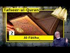

# Session 2 (2021-01-21 12:31:14+00:00)

## Description

Discussion on the Quran having been revealed as a written book.

Numerical Miracle of the Quran

## Summary of [Session 2](https://www.youtube.com/watch?v=jlEz0o3gosQ)

*This summary is AI generated - there may be inaccuracies. *

### [00:00:00](https://www.youtube.com/watch?v=jlEz0o3gosQ&t=0) - [01:00:00](https://www.youtube.com/watch?v=jlEz0o3gosQ&t=3600)

 the scholar discusses the significance of the number 19 in Islamic scripture. He points out that it appears in various places, including in the Qur'an's 114 surahs, and that it is a multiple of 19. He also discusses the basmati rice, which is mentioned in the Qur'an but is not found in any other scripture. The child is asked about what happened to the basmati rice. The child says that he doesn't know, and then goes on to explain that the ant went at night and ate it away. The child also mentions that surat kaff (114 times), 113 separate eyes, and one phrase all have to do with cops. This becomes important when considering that there are 114 letters in the Quran, 113 of which are cuffs. Counting letters as they are written without taking into account the pronunciation can result in incorrect counts, as demonstrated by the word "because" which, according to the video, should count as two letters. This applies to other words as well, such as "muhammad" which has two articles (the letter "m" and the word "muhammad"). However, this system of counting is not consistent throughout the Quran, and there are other instances where letters are counted

**[00:00:00](https://www.youtube.com/watch?v=jlEz0o3gosQ&t=0)** discusses how the quran was revealed in a book form to angel jibril, and how it differs from the current written form. They also discuss some of the unusual spellings used in the quran at the time it was revealed.
* **[00:05:00](https://www.youtube.com/watch?v=jlEz0o3gosQ&t=300)** The presenter discusses two examples of odd writing found in the Quran, one of which is argued to be a deliberate mistake. He suggests that these oddities may lead to the miraculous nation of the Quran, and that they are part of a consistent pattern throughout the text.
* **[00:10:00](https://www.youtube.com/watch?v=jlEz0o3gosQ&t=600)* Discusses the consistency of the Quran's writing between different readings, as well as the importance of Ramadan as a month of revelation. There is no evidence that the Torah came during Ramadan, and some people claim that it was revealed during Ramadan due to its co-mingling of the physical and spiritual worlds.
* **[00:15:00](https://www.youtube.com/watch?v=jlEz0o3gosQ&t=900)**  Abbas discusses the various sources of Quranic knowledge, including the order of revelations and the numeric coincidences found throughout the text. He suggests that these narratives are not reliable and that we should rely more on the Quran itself.
* **[00:20:00](https://www.youtube.com/watch?v=jlEz0o3gosQ&t=1200)** The scholars of hadith argue that if the quran is truly a written revelation, then it must have an ordered sequence in which the most important revelations occur. However, there are stories of quran collectors who have been able to find copies of the quran even in remote areas, even if the original copy is missing. Additionally, there is no one revelation that is more important than any other.
* **[00:25:00](https://www.youtube.com/watch?v=jlEz0o3gosQ&t=1500)**  the scholar discusses how the order of the Quran's surah and Muslim are related. He points out that the order of the Quran is not arbitrary, but is based on the revelations that were sent down to Muhammad. Furthermore, the scholar discusses how numerical coincidences can be used to support the idea that the Quran was revealed in its current order.
* **[00:30:00](https://www.youtube.com/watch?v=jlEz0o3gosQ&t=1800)** In Session 2, a scholar discusses the significance of the number 19 in Islamic scripture. He points out that it appears in various places, including in the Qur'an's 114 surahs, and that it is a multiple of 19. He also discusses the basmati rice, which is mentioned in the Qur'an but is not found in any other scripture.
* **[00:35:00](https://www.youtube.com/watch?v=jlEz0o3gosQ&t=2100)**  a child is asked about what happened to the basmati rice. The child says that he doesn't know, and then goes on to explain that the ant went at night and ate it away. The child also mentions that surat kaff (114 times), 113 separate eyes, and one phrase all have to do with cops. This becomes important when considering that there are 114 letters in the Quran, 113 of which are cuffs. Counting letters as they are written without taking into account the pronunciation can result in incorrect counts, as demonstrated by the word "because" which, according to the video, should count as two letters. This applies to other words as well, such as "muhammad" which has two articles (the letter "m" and the word "muhammad"). However, this system of counting is not consistent throughout the Quran, and there are other instances where letters are counted more than once.
* **[00:40:00](https://www.youtube.com/watch?v=jlEz0o3gosQ&t=2400)** discusses the significance of numbers in the Quran, specifically mentioning the fact that all surahs are written with a 19 letter alphabet and that this is consistently observed throughout the text. He cites an example of this being the fact that one month is mentioned in plural, and that this is done in a way that follows pronunciation. He argues that if these numbers were simply coincidences, then the others would not be considered coincidences. Therefore, he concludes that the numbers must be considered revelations from God.
* **[00:45:00](https://www.youtube.com/watch?v=jlEz0o3gosQ&t=2700)* Discusses the occurrence of the word "shah" (month) in the Quran 12 times. It points out that this word is also used to refer to different concepts, such as Adam, Messiah, and Maryam. It also mentions that there are dual and plural forms of the word in Arabic, which adds to the mystery of why it is mentioned in certain places and not others.
* **[00:50:00](https://www.youtube.com/watch?v=jlEz0o3gosQ&t=3000)* Discusses how numerical coincidences in the Quran defy belief if they are simply accidental. It then goes on to discuss the word "young," which appears 364 times in the Quran.
* **[00:55:00](https://www.youtube.com/watch?v=jlEz0o3gosQ&t=3300)**  the presenter explains that the year is not 365 days, but rather 364 days with 5 extra days. This number, 364, is a multiple of 7 and is also a hint that the best count of month days in the years is actually 364. Additionally, the presenter explains that the year is a lunar concept and that the months are based on the moon. This system is different from the solar concept of months, which is dictated by the movement of the sun. Finally, the presenter explains that there are several different systems used to calculate the year, and that one of these is 19 years (364 + 1).
### [01:00:00](https://www.youtube.com/watch?v=jlEz0o3gosQ&t=3600) - [01:35:00](https://www.youtube.com/watch?v=jlEz0o3gosQ&t=5700)

 discusses the various ways in which the Quran can be read, and how there is no one correct way to do so. It also discusses the importance of accurate pronunciation, and how different readings can be useful for educational purposes.

**[01:00:00](https://www.youtube.com/watch?v=jlEz0o3gosQ&t=3600)** The prophet Daniel used 360 days to calculate prophetic dates, and 364 days is also an amazing number. Other examples include the word "zakah" which comes 30 times in the Quran, the number 114 which is six times the number 19, and the word "notfa" which is mentioned 12 times in the Quran.
* **[01:05:00](https://www.youtube.com/watch?v=jlEz0o3gosQ&t=3900)* Discusses the order of the surah in the Quran, and how, although different people may interpret the order differently, it ultimately leads back to Allah. It also discusses the number 13, and how it is a sign that the person who reads it (or hears it) is addressing someone who has been through the same thing.
* **[01:10:00](https://www.youtube.com/watch?v=jlEz0o3gosQ&t=4200)* Discusses the order of revelation, mentioning that the swords come in that order and that it is most likely that this order is the order of revelation as well. It also discusses the coincidence of the order of the sword being opposite the order of the revelation, and that this may be indicative of a coincidence.  goes on to discuss the order of the sahaba and how most likely, according to the theory, that the order of the sahaba is more like the order of the revelation by the division of the sahaba.
* **[01:15:00](https://www.youtube.com/watch?v=jlEz0o3gosQ&t=4500)** reviews some of the historical and linguistic evidence for the existence of a separate word, " wow ", from the joint word, " quran ", in the Quran. He argues that this word must be counted as a separate word, despite its linguistic and philological similarities to the word " quran ". He also discusses a scholar in America who is attempting to develop a system for ordering the letters of the alphabet based on numerical values.
* **[01:20:00](https://www.youtube.com/watch?v=jlEz0o3gosQ&t=4800)**  Dr. Yasir Qadhi discusses why Surah Ta-wba (The Repentance) has no bismillah (In the Name of Allah, the Most Merciful), and gives an example of how this may have happened. He also mentions that Surah Ta-wba may have been revealed during the ninth year of the Hijrah (emigration of the Prophet Muhammad from Mecca to Medina). He also mentions that Surah Ta-wba may have been revealed to Abu Bakr as a mercy to the Meccans who were still pagan at the time.
* **[01:25:00](https://www.youtube.com/watch?v=jlEz0o3gosQ&t=5100)** The narrator discusses a story in which a man is dropped between the reliable narrators. They determine that the man is untrustworthy and that the story is similar to Surivan.
* **[01:30:00](https://www.youtube.com/watch?v=jlEz0o3gosQ&t=5400)** provides a brief overview of the different ways in which people can recite the Quran, and explains that there is no problem as long as the pronunciation is accurate. He then goes on to say that although there are some people who claim that you must stick to one reader or one style, this is not actually obligatory.
* **[01:35:00](https://www.youtube.com/watch?v=jlEz0o3gosQ&t=5700)** discusses how it is okay for someone to have a different reading of the Quran depending on the situation. They also mention that it is not bad to have a variation in readings for educational purposes.

## Full transcript with timestamps

[0:00:00](https://youtu.be/jlEz0o3gosQ?t=0) [Music]  
[0:00:09](https://youtu.be/jlEz0o3gosQ?t=9) [Applause]  
[0:00:09](https://youtu.be/jlEz0o3gosQ?t=9) [Music]  
[0:00:14](https://youtu.be/jlEz0o3gosQ?t=14) i  
[0:00:26](https://youtu.be/jlEz0o3gosQ?t=26) oh sorry yes so uh the remaining  
[0:00:28](https://youtu.be/jlEz0o3gosQ?t=28) questions from last week  
[0:00:29](https://youtu.be/jlEz0o3gosQ?t=29) were uh so the first one is how was the  
[0:00:32](https://youtu.be/jlEz0o3gosQ?t=32) quran revealed  
[0:00:33](https://youtu.be/jlEz0o3gosQ?t=33) from allah to the prophet of solemn did  
[0:00:35](https://youtu.be/jlEz0o3gosQ?t=35) allah reveal the quran as a book  
[0:00:37](https://youtu.be/jlEz0o3gosQ?t=37) to angel jibril  
[0:00:42](https://youtu.be/jlEz0o3gosQ?t=42) we don't know how in details but uh it's  
[0:00:45](https://youtu.be/jlEz0o3gosQ?t=45) uh  
[0:00:46](https://youtu.be/jlEz0o3gosQ?t=46) i already said that the quran is is  
[0:00:48](https://youtu.be/jlEz0o3gosQ?t=48) primarily a written book  
[0:00:50](https://youtu.be/jlEz0o3gosQ?t=50) and when the order came acro the process  
[0:00:54](https://youtu.be/jlEz0o3gosQ?t=54) was shown  
[0:00:55](https://youtu.be/jlEz0o3gosQ?t=55) a parchment or shown a a sheet of  
[0:00:59](https://youtu.be/jlEz0o3gosQ?t=59) clothing or whatever it is and then  
[0:01:01](https://youtu.be/jlEz0o3gosQ?t=61) jubilee read  
[0:01:03](https://youtu.be/jlEz0o3gosQ?t=63) say i'm not a reader i can't read i'm  
[0:01:05](https://youtu.be/jlEz0o3gosQ?t=65) illiterate  
[0:01:06](https://youtu.be/jlEz0o3gosQ?t=66) so it is primarily written and then  
[0:01:09](https://youtu.be/jlEz0o3gosQ?t=69) reciting is secondary although it's also  
[0:01:11](https://youtu.be/jlEz0o3gosQ?t=71) resident  
[0:01:12](https://youtu.be/jlEz0o3gosQ?t=72) but this is called we discussed that  
[0:01:14](https://youtu.be/jlEz0o3gosQ?t=74) last time now how these uh  
[0:01:16](https://youtu.be/jlEz0o3gosQ?t=76) how all these supernatural events are  
[0:01:20](https://youtu.be/jlEz0o3gosQ?t=80) happening  
[0:01:21](https://youtu.be/jlEz0o3gosQ?t=81) uh is that something happening inside  
[0:01:22](https://youtu.be/jlEz0o3gosQ?t=82) the brain what's coming from outside  
[0:01:25](https://youtu.be/jlEz0o3gosQ?t=85) all of this is uh going into into things  
[0:01:27](https://youtu.be/jlEz0o3gosQ?t=87) which are really metaphysical and  
[0:01:29](https://youtu.be/jlEz0o3gosQ?t=89) do not uh do not really bring us much  
[0:01:32](https://youtu.be/jlEz0o3gosQ?t=92) more further  
[0:01:33](https://youtu.be/jlEz0o3gosQ?t=93) but we have a hadith about how the  
[0:01:35](https://youtu.be/jlEz0o3gosQ?t=95) person received revelation  
[0:01:37](https://youtu.be/jlEz0o3gosQ?t=97) and he described various types of  
[0:01:38](https://youtu.be/jlEz0o3gosQ?t=98) relationships and sometimes  
[0:01:40](https://youtu.be/jlEz0o3gosQ?t=100) it comes to him like in a ringing of a  
[0:01:43](https://youtu.be/jlEz0o3gosQ?t=103) bell  
[0:01:44](https://youtu.be/jlEz0o3gosQ?t=104) and uh and then when when it  
[0:01:48](https://youtu.be/jlEz0o3gosQ?t=108) when it is over then he understands what  
[0:01:50](https://youtu.be/jlEz0o3gosQ?t=110) would memorize what has been given to  
[0:01:52](https://youtu.be/jlEz0o3gosQ?t=112) him and sometimes the angel appears like  
[0:01:53](https://youtu.be/jlEz0o3gosQ?t=113) a man in front of him  
[0:01:55](https://youtu.be/jlEz0o3gosQ?t=115) and show him and speak to him on various  
[0:01:58](https://youtu.be/jlEz0o3gosQ?t=118) forms  
[0:01:58](https://youtu.be/jlEz0o3gosQ?t=118) and the most the most the most difficult  
[0:02:01](https://youtu.be/jlEz0o3gosQ?t=121) and harshest is that it comes like a  
[0:02:03](https://youtu.be/jlEz0o3gosQ?t=123) bell  
[0:02:03](https://youtu.be/jlEz0o3gosQ?t=123) and he becomes very heavy sweating and  
[0:02:05](https://youtu.be/jlEz0o3gosQ?t=125) so on and we have also  
[0:02:07](https://youtu.be/jlEz0o3gosQ?t=127) a narration that even the camel when he  
[0:02:09](https://youtu.be/jlEz0o3gosQ?t=129) was in the camel the camel  
[0:02:11](https://youtu.be/jlEz0o3gosQ?t=131) is goes down and goes down in in  
[0:02:14](https://youtu.be/jlEz0o3gosQ?t=134) its in its knees so there's something  
[0:02:17](https://youtu.be/jlEz0o3gosQ?t=137) very heavy  
[0:02:18](https://youtu.be/jlEz0o3gosQ?t=138) physically very heavy for the camel to  
[0:02:20](https://youtu.be/jlEz0o3gosQ?t=140) carry so it goes down and we know a  
[0:02:21](https://youtu.be/jlEz0o3gosQ?t=141) camel  
[0:02:22](https://youtu.be/jlEz0o3gosQ?t=142) can carry up to a half ton or a ton so  
[0:02:24](https://youtu.be/jlEz0o3gosQ?t=144) it must be something heavier than that  
[0:02:27](https://youtu.be/jlEz0o3gosQ?t=147) so this is the these but these things  
[0:02:29](https://youtu.be/jlEz0o3gosQ?t=149) are related how it is coming it shows  
[0:02:31](https://youtu.be/jlEz0o3gosQ?t=151) it shows the surrounding people that  
[0:02:33](https://youtu.be/jlEz0o3gosQ?t=153) it's not from muhammad's  
[0:02:34](https://youtu.be/jlEz0o3gosQ?t=154) being because whatever muhammad's power  
[0:02:36](https://youtu.be/jlEz0o3gosQ?t=156) may be he cannot  
[0:02:38](https://youtu.be/jlEz0o3gosQ?t=158) really even if he squeezes the camel he  
[0:02:40](https://youtu.be/jlEz0o3gosQ?t=160) cannot force the government to sit down  
[0:02:41](https://youtu.be/jlEz0o3gosQ?t=161) this way and also one time he received  
[0:02:44](https://youtu.be/jlEz0o3gosQ?t=164) revelation and zed will have it  
[0:02:46](https://youtu.be/jlEz0o3gosQ?t=166) his part of his leg was on his head  
[0:02:48](https://youtu.be/jlEz0o3gosQ?t=168) without  
[0:02:49](https://youtu.be/jlEz0o3gosQ?t=169) leg and then that leg became almost  
[0:02:52](https://youtu.be/jlEz0o3gosQ?t=172) broke  
[0:02:53](https://youtu.be/jlEz0o3gosQ?t=173) on the heavy weight of the leg of the  
[0:02:54](https://youtu.be/jlEz0o3gosQ?t=174) process so it comes also physically  
[0:02:56](https://youtu.be/jlEz0o3gosQ?t=176) heavy  
[0:02:57](https://youtu.be/jlEz0o3gosQ?t=177) but all these metaphysical or  
[0:03:00](https://youtu.be/jlEz0o3gosQ?t=180) supernatural things you cannot describe  
[0:03:01](https://youtu.be/jlEz0o3gosQ?t=181) but  
[0:03:02](https://youtu.be/jlEz0o3gosQ?t=182) but the essential point is that it comes  
[0:03:05](https://youtu.be/jlEz0o3gosQ?t=185) in  
[0:03:06](https://youtu.be/jlEz0o3gosQ?t=186) it's written it's essentially a written  
[0:03:08](https://youtu.be/jlEz0o3gosQ?t=188) form  
[0:03:10](https://youtu.be/jlEz0o3gosQ?t=190) so it is it's a written document in the  
[0:03:12](https://youtu.be/jlEz0o3gosQ?t=192) first place and there's no quran says  
[0:03:14](https://youtu.be/jlEz0o3gosQ?t=194) that in various places  
[0:03:15](https://youtu.be/jlEz0o3gosQ?t=195) there's accra first calibration  
[0:03:31](https://youtu.be/jlEz0o3gosQ?t=211) these are foreign sheets or provides  
[0:03:34](https://youtu.be/jlEz0o3gosQ?t=214) scrolls  
[0:03:35](https://youtu.be/jlEz0o3gosQ?t=215) so it is primarily written and that's  
[0:03:37](https://youtu.be/jlEz0o3gosQ?t=217) the reason it's very important to  
[0:03:39](https://youtu.be/jlEz0o3gosQ?t=219) check the writing which has been uh  
[0:03:42](https://youtu.be/jlEz0o3gosQ?t=222) given by the sahabah  
[0:03:44](https://youtu.be/jlEz0o3gosQ?t=224) now someone say the person was  
[0:03:45](https://youtu.be/jlEz0o3gosQ?t=225) illiterate how could he  
[0:03:47](https://youtu.be/jlEz0o3gosQ?t=227) control it's not necessary allah is  
[0:03:49](https://youtu.be/jlEz0o3gosQ?t=229) controlling it by by whatever meaning he  
[0:03:51](https://youtu.be/jlEz0o3gosQ?t=231) was  
[0:03:51](https://youtu.be/jlEz0o3gosQ?t=231) but we there's considerable evidence  
[0:03:54](https://youtu.be/jlEz0o3gosQ?t=234) that he  
[0:03:55](https://youtu.be/jlEz0o3gosQ?t=235) became slightly literate in the sense  
[0:03:57](https://youtu.be/jlEz0o3gosQ?t=237) that he can recognize  
[0:03:58](https://youtu.be/jlEz0o3gosQ?t=238) the shapes let us say don't write this  
[0:04:00](https://youtu.be/jlEz0o3gosQ?t=240) one remove this little put this little  
[0:04:02](https://youtu.be/jlEz0o3gosQ?t=242) in the in that sense he became literate  
[0:04:05](https://youtu.be/jlEz0o3gosQ?t=245) but whatever  
[0:04:06](https://youtu.be/jlEz0o3gosQ?t=246) technicality is that what has been  
[0:04:07](https://youtu.be/jlEz0o3gosQ?t=247) written by the sahabah is clearly  
[0:04:11](https://youtu.be/jlEz0o3gosQ?t=251) we will come today also discuss few  
[0:04:13](https://youtu.be/jlEz0o3gosQ?t=253) things of that it's clearly not the  
[0:04:15](https://youtu.be/jlEz0o3gosQ?t=255) usual  
[0:04:16](https://youtu.be/jlEz0o3gosQ?t=256) spelling which we have now ordered or  
[0:04:18](https://youtu.be/jlEz0o3gosQ?t=258) even the usual spelling they have at  
[0:04:19](https://youtu.be/jlEz0o3gosQ?t=259) that time  
[0:04:20](https://youtu.be/jlEz0o3gosQ?t=260) so it is deliberate in some places  
[0:04:23](https://youtu.be/jlEz0o3gosQ?t=263) for example let me give examples of uh  
[0:04:25](https://youtu.be/jlEz0o3gosQ?t=265) these  
[0:04:27](https://youtu.be/jlEz0o3gosQ?t=267) the i have a file here actually open  
[0:04:37](https://youtu.be/jlEz0o3gosQ?t=277) not this one this other one  
[0:04:47](https://youtu.be/jlEz0o3gosQ?t=287) which one it is so i can mention some  
[0:04:51](https://youtu.be/jlEz0o3gosQ?t=291) examples there  
[0:05:10](https://youtu.be/jlEz0o3gosQ?t=310) where is that file i have to have two  
[0:05:12](https://youtu.be/jlEz0o3gosQ?t=312) files open i think it's this one  
[0:05:15](https://youtu.be/jlEz0o3gosQ?t=315) but miraculous nature of the quran yet  
[0:05:17](https://youtu.be/jlEz0o3gosQ?t=317) must be this one  
[0:05:21](https://youtu.be/jlEz0o3gosQ?t=321) which shows that the writing is done  
[0:05:22](https://youtu.be/jlEz0o3gosQ?t=322) deliberately this way  
[0:05:34](https://youtu.be/jlEz0o3gosQ?t=334) not this one  
[0:05:45](https://youtu.be/jlEz0o3gosQ?t=345) it says is given is is revealed  
[0:05:49](https://youtu.be/jlEz0o3gosQ?t=349) it's not according to the standard arab  
[0:05:52](https://youtu.be/jlEz0o3gosQ?t=352) roots  
[0:05:54](https://youtu.be/jlEz0o3gosQ?t=354) for example one example is that  
[0:05:56](https://youtu.be/jlEz0o3gosQ?t=356) bismillah the first  
[0:05:57](https://youtu.be/jlEz0o3gosQ?t=357) the first word in the quran with the  
[0:05:59](https://youtu.be/jlEz0o3gosQ?t=359) first ayah  
[0:06:01](https://youtu.be/jlEz0o3gosQ?t=361) is written in the fatiha  
[0:06:04](https://youtu.be/jlEz0o3gosQ?t=364) meme  
[0:06:19](https://youtu.be/jlEz0o3gosQ?t=379) is written bismuth without alif but in  
[0:06:22](https://youtu.be/jlEz0o3gosQ?t=382) the inside the quran says for example in  
[0:06:24](https://youtu.be/jlEz0o3gosQ?t=384) this world  
[0:06:27](https://youtu.be/jlEz0o3gosQ?t=387) with the alif and the original muslim  
[0:06:30](https://youtu.be/jlEz0o3gosQ?t=390) so clearly this is deliberately made for  
[0:06:33](https://youtu.be/jlEz0o3gosQ?t=393) whatever reason  
[0:06:34](https://youtu.be/jlEz0o3gosQ?t=394) we have to find out and extract  
[0:06:39](https://youtu.be/jlEz0o3gosQ?t=399) another methyl example is for example  
[0:06:44](https://youtu.be/jlEz0o3gosQ?t=404) we will nasha is written known shin  
[0:06:52](https://youtu.be/jlEz0o3gosQ?t=412) we have to figure out why it is this odd  
[0:06:54](https://youtu.be/jlEz0o3gosQ?t=414) place  
[0:06:55](https://youtu.be/jlEz0o3gosQ?t=415) and it's written in an odd way  
[0:06:58](https://youtu.be/jlEz0o3gosQ?t=418) hamza on a wall and alif  
[0:07:07](https://youtu.be/jlEz0o3gosQ?t=427) but why is it in this way it cannot be  
[0:07:09](https://youtu.be/jlEz0o3gosQ?t=429) even if you someone say describe an  
[0:07:11](https://youtu.be/jlEz0o3gosQ?t=431) error cannot describe it  
[0:07:13](https://youtu.be/jlEz0o3gosQ?t=433) no no idiot will make such an error like  
[0:07:15](https://youtu.be/jlEz0o3gosQ?t=435) that  
[0:07:16](https://youtu.be/jlEz0o3gosQ?t=436) it's out of question so it is  
[0:07:17](https://youtu.be/jlEz0o3gosQ?t=437) deliberately written this way it's not  
[0:07:19](https://youtu.be/jlEz0o3gosQ?t=439) good  
[0:07:19](https://youtu.be/jlEz0o3gosQ?t=439) why we have to assert that that's part  
[0:07:21](https://youtu.be/jlEz0o3gosQ?t=441) of the miraculous nation of the quran to  
[0:07:24](https://youtu.be/jlEz0o3gosQ?t=444) ascertain these these oddities  
[0:07:26](https://youtu.be/jlEz0o3gosQ?t=446) for example so he saw in the past  
[0:07:30](https://youtu.be/jlEz0o3gosQ?t=450) and all the quranic citizen one in mode  
[0:07:32](https://youtu.be/jlEz0o3gosQ?t=452) in two places the written  
[0:07:34](https://youtu.be/jlEz0o3gosQ?t=454) uh not the usual writing of the uh  
[0:07:37](https://youtu.be/jlEz0o3gosQ?t=457) usual spelling is written all the quran  
[0:07:39](https://youtu.be/jlEz0o3gosQ?t=459) with  
[0:07:40](https://youtu.be/jlEz0o3gosQ?t=460) hamza on the line and alif raha  
[0:07:45](https://youtu.be/jlEz0o3gosQ?t=465) which is not the standard the standard  
[0:07:47](https://youtu.be/jlEz0o3gosQ?t=467) is in all the two places  
[0:07:48](https://youtu.be/jlEz0o3gosQ?t=468) which is written for the hamster on top  
[0:07:51](https://youtu.be/jlEz0o3gosQ?t=471) of it  
[0:07:54](https://youtu.be/jlEz0o3gosQ?t=474) so it seems to be we can't conclude  
[0:07:59](https://youtu.be/jlEz0o3gosQ?t=479) it cannot be some people say this is  
[0:08:00](https://youtu.be/jlEz0o3gosQ?t=480) criminal variations error  
[0:08:02](https://youtu.be/jlEz0o3gosQ?t=482) it can't be like that the scribes  
[0:08:04](https://youtu.be/jlEz0o3gosQ?t=484) whatever they have been  
[0:08:06](https://youtu.be/jlEz0o3gosQ?t=486) uh their level of  
[0:08:09](https://youtu.be/jlEz0o3gosQ?t=489) scriptural capabilities they could not  
[0:08:11](https://youtu.be/jlEz0o3gosQ?t=491) be  
[0:08:12](https://youtu.be/jlEz0o3gosQ?t=492) that that's stupid to make such message  
[0:08:15](https://youtu.be/jlEz0o3gosQ?t=495) evident mistakes  
[0:08:16](https://youtu.be/jlEz0o3gosQ?t=496) it must be deliberate for certain  
[0:08:18](https://youtu.be/jlEz0o3gosQ?t=498) reasons which we have to assert them  
[0:08:20](https://youtu.be/jlEz0o3gosQ?t=500) maybe it leads to the the  
[0:08:23](https://youtu.be/jlEz0o3gosQ?t=503) miraculous nation of the quran it made  
[0:08:25](https://youtu.be/jlEz0o3gosQ?t=505) it to the number of  
[0:08:26](https://youtu.be/jlEz0o3gosQ?t=506) counts of number of letters which we'll  
[0:08:28](https://youtu.be/jlEz0o3gosQ?t=508) discuss today a little bit more  
[0:08:30](https://youtu.be/jlEz0o3gosQ?t=510) another example is in the usual arabic  
[0:08:33](https://youtu.be/jlEz0o3gosQ?t=513) language  
[0:08:41](https://youtu.be/jlEz0o3gosQ?t=521) so it will be two lamps there visible  
[0:08:43](https://youtu.be/jlEz0o3gosQ?t=523) for writing  
[0:08:44](https://youtu.be/jlEz0o3gosQ?t=524) through throughout all the quran allah  
[0:08:46](https://youtu.be/jlEz0o3gosQ?t=526) is written with only one lamb  
[0:08:48](https://youtu.be/jlEz0o3gosQ?t=528) so the lamb of tariff is gone  
[0:08:52](https://youtu.be/jlEz0o3gosQ?t=532) marriage together in the movie obviously  
[0:08:54](https://youtu.be/jlEz0o3gosQ?t=534) in the muslim when they  
[0:08:55](https://youtu.be/jlEz0o3gosQ?t=535) uh the modern mosque i have a later  
[0:08:57](https://youtu.be/jlEz0o3gosQ?t=537) muslim and they do  
[0:08:59](https://youtu.be/jlEz0o3gosQ?t=539) they write which is indicated as a  
[0:09:02](https://youtu.be/jlEz0o3gosQ?t=542) double l there  
[0:09:03](https://youtu.be/jlEz0o3gosQ?t=543) in the pronunciation but if you remove  
[0:09:06](https://youtu.be/jlEz0o3gosQ?t=546) all pronunciation  
[0:09:10](https://youtu.be/jlEz0o3gosQ?t=550) then it is written with  
[0:09:13](https://youtu.be/jlEz0o3gosQ?t=553) all all over uh so  
[0:09:16](https://youtu.be/jlEz0o3gosQ?t=556) instead of the the correct one the  
[0:09:19](https://youtu.be/jlEz0o3gosQ?t=559) normal standard correct one is a layer  
[0:09:21](https://youtu.be/jlEz0o3gosQ?t=561) with two lamps  
[0:09:22](https://youtu.be/jlEz0o3gosQ?t=562) there with two lamps like it's written  
[0:09:23](https://youtu.be/jlEz0o3gosQ?t=563) usually in in  
[0:09:25](https://youtu.be/jlEz0o3gosQ?t=565) everywhere in in the literature and  
[0:09:27](https://youtu.be/jlEz0o3gosQ?t=567) every in every  
[0:09:28](https://youtu.be/jlEz0o3gosQ?t=568) uh other documents so what's it what's  
[0:09:31](https://youtu.be/jlEz0o3gosQ?t=571) the reason for that  
[0:09:32](https://youtu.be/jlEz0o3gosQ?t=572) some people have argued for certain deep  
[0:09:34](https://youtu.be/jlEz0o3gosQ?t=574) philosophical reasons  
[0:09:35](https://youtu.be/jlEz0o3gosQ?t=575) and things like that but it's clearly  
[0:09:37](https://youtu.be/jlEz0o3gosQ?t=577) written like that consistently  
[0:09:38](https://youtu.be/jlEz0o3gosQ?t=578) all the quran while the word correct  
[0:09:43](https://youtu.be/jlEz0o3gosQ?t=583) as we write in usual another point who  
[0:09:46](https://youtu.be/jlEz0o3gosQ?t=586) interests also that  
[0:09:48](https://youtu.be/jlEz0o3gosQ?t=588) the divine  
[0:09:55](https://youtu.be/jlEz0o3gosQ?t=595) and that writings all consist in all the  
[0:09:57](https://youtu.be/jlEz0o3gosQ?t=597) quran both in the basmal in the body of  
[0:09:59](https://youtu.be/jlEz0o3gosQ?t=599) the quran  
[0:10:01](https://youtu.be/jlEz0o3gosQ?t=601) and also it has  
[0:10:04](https://youtu.be/jlEz0o3gosQ?t=604) that is even the normal writing when  
[0:10:06](https://youtu.be/jlEz0o3gosQ?t=606) people write their names and people  
[0:10:08](https://youtu.be/jlEz0o3gosQ?t=608) write to each other they write  
[0:10:09](https://youtu.be/jlEz0o3gosQ?t=609) without alif which should be there  
[0:10:11](https://youtu.be/jlEz0o3gosQ?t=611) according to the pronunciation  
[0:10:12](https://youtu.be/jlEz0o3gosQ?t=612) so that has been so  
[0:10:16](https://youtu.be/jlEz0o3gosQ?t=616) so consistent in throughout the  
[0:10:18](https://youtu.be/jlEz0o3gosQ?t=618) conscious of the people that's even the  
[0:10:20](https://youtu.be/jlEz0o3gosQ?t=620) normal writing  
[0:10:21](https://youtu.be/jlEz0o3gosQ?t=621) is deviating from what what the  
[0:10:23](https://youtu.be/jlEz0o3gosQ?t=623) pronunciation should be  
[0:10:24](https://youtu.be/jlEz0o3gosQ?t=624) and writing a rahman without alif  
[0:10:26](https://youtu.be/jlEz0o3gosQ?t=626) sometimes you find rarely in newspapers  
[0:10:28](https://youtu.be/jlEz0o3gosQ?t=628) and so on  
[0:10:29](https://youtu.be/jlEz0o3gosQ?t=629) with alif but this is like normally a  
[0:10:32](https://youtu.be/jlEz0o3gosQ?t=632) deviation normally it's written even in  
[0:10:34](https://youtu.be/jlEz0o3gosQ?t=634) newspapers  
[0:10:35](https://youtu.be/jlEz0o3gosQ?t=635) even in other books it has become so the  
[0:10:38](https://youtu.be/jlEz0o3gosQ?t=638) quran has  
[0:10:39](https://youtu.be/jlEz0o3gosQ?t=639) overcome this point to the level that  
[0:10:42](https://youtu.be/jlEz0o3gosQ?t=642) and someone could say that bismillah  
[0:10:51](https://youtu.be/jlEz0o3gosQ?t=651) 19 when we discussed a little ninety  
[0:10:53](https://youtu.be/jlEz0o3gosQ?t=653) today but  
[0:10:54](https://youtu.be/jlEz0o3gosQ?t=654) so that's so the special point we should  
[0:10:57](https://youtu.be/jlEz0o3gosQ?t=657) hold it that quran is essentially  
[0:10:58](https://youtu.be/jlEz0o3gosQ?t=658) written document  
[0:11:00](https://youtu.be/jlEz0o3gosQ?t=660) it is in the low helmet for the quran  
[0:11:03](https://youtu.be/jlEz0o3gosQ?t=663) protected tablet or tear  
[0:11:07](https://youtu.be/jlEz0o3gosQ?t=667) or or scroll or something in a protected  
[0:11:10](https://youtu.be/jlEz0o3gosQ?t=670) tablet  
[0:11:11](https://youtu.be/jlEz0o3gosQ?t=671) let's be metaphorically metaphorical for  
[0:11:13](https://youtu.be/jlEz0o3gosQ?t=673) the divine knowledge  
[0:11:14](https://youtu.be/jlEz0o3gosQ?t=674) but in the middle of that it is hinted  
[0:11:16](https://youtu.be/jlEz0o3gosQ?t=676) as being  
[0:11:17](https://youtu.be/jlEz0o3gosQ?t=677) a written document praying  
[0:11:20](https://youtu.be/jlEz0o3gosQ?t=680) so the writing must be talking so all  
[0:11:23](https://youtu.be/jlEz0o3gosQ?t=683) these issues are worth the writing is it  
[0:11:25](https://youtu.be/jlEz0o3gosQ?t=685) versus  
[0:11:30](https://youtu.be/jlEz0o3gosQ?t=690) must be settled for philosophically  
[0:11:32](https://youtu.be/jlEz0o3gosQ?t=692) metaphysically on this point  
[0:11:34](https://youtu.be/jlEz0o3gosQ?t=694) now there will be a variation between  
[0:11:35](https://youtu.be/jlEz0o3gosQ?t=695) them because this is the one who are  
[0:11:37](https://youtu.be/jlEz0o3gosQ?t=697) writing them  
[0:11:38](https://youtu.be/jlEz0o3gosQ?t=698) are human beings there will be some may  
[0:11:40](https://youtu.be/jlEz0o3gosQ?t=700) be some mistakes maybe  
[0:11:41](https://youtu.be/jlEz0o3gosQ?t=701) some errors like that we have to assert  
[0:11:44](https://youtu.be/jlEz0o3gosQ?t=704) in that by comparing the various was i  
[0:11:46](https://youtu.be/jlEz0o3gosQ?t=706) have  
[0:11:46](https://youtu.be/jlEz0o3gosQ?t=706) and going to certain principles general  
[0:11:49](https://youtu.be/jlEz0o3gosQ?t=709) principles  
[0:11:50](https://youtu.be/jlEz0o3gosQ?t=710) of of like for example we discussed that  
[0:11:53](https://youtu.be/jlEz0o3gosQ?t=713) from the existing messiah in hand of the  
[0:11:56](https://youtu.be/jlEz0o3gosQ?t=716) people for  
[0:11:57](https://youtu.be/jlEz0o3gosQ?t=717) now over a thousand years in in various  
[0:11:59](https://youtu.be/jlEz0o3gosQ?t=719) areas of the muslim world  
[0:12:01](https://youtu.be/jlEz0o3gosQ?t=721) we have it most of them are doing  
[0:12:02](https://youtu.be/jlEz0o3gosQ?t=722) tashkeel and doing uh doing a script  
[0:12:05](https://youtu.be/jlEz0o3gosQ?t=725) according to one of the the three  
[0:12:08](https://youtu.be/jlEz0o3gosQ?t=728) readings the reading of medina  
[0:12:10](https://youtu.be/jlEz0o3gosQ?t=730) with two channels of readings that  
[0:12:12](https://youtu.be/jlEz0o3gosQ?t=732) kallun mostly in libya and chad et  
[0:12:14](https://youtu.be/jlEz0o3gosQ?t=734) cetera and maybe part of tunisia  
[0:12:17](https://youtu.be/jlEz0o3gosQ?t=737) and wash this in the far west and the  
[0:12:19](https://youtu.be/jlEz0o3gosQ?t=739) rest of africa  
[0:12:21](https://youtu.be/jlEz0o3gosQ?t=741) these are the two channels of the modern  
[0:12:22](https://youtu.be/jlEz0o3gosQ?t=742) reading then we have  
[0:12:24](https://youtu.be/jlEz0o3gosQ?t=744) interestingly uh dory from abhiyama this  
[0:12:26](https://youtu.be/jlEz0o3gosQ?t=746) is a bustling reading  
[0:12:28](https://youtu.be/jlEz0o3gosQ?t=748) is the one of the narrator one of the  
[0:12:29](https://youtu.be/jlEz0o3gosQ?t=749) channels  
[0:12:31](https://youtu.be/jlEz0o3gosQ?t=751) that's the one and the muslims are  
[0:12:33](https://youtu.be/jlEz0o3gosQ?t=753) written according to that  
[0:12:35](https://youtu.be/jlEz0o3gosQ?t=755) in in sudan essentially  
[0:12:38](https://youtu.be/jlEz0o3gosQ?t=758) and maybe a little bit south of that and  
[0:12:40](https://youtu.be/jlEz0o3gosQ?t=760) by some part in in east africa  
[0:12:42](https://youtu.be/jlEz0o3gosQ?t=762) and then we have most of the muslim  
[0:12:44](https://youtu.be/jlEz0o3gosQ?t=764) world amazingly the minor the actually  
[0:12:47](https://youtu.be/jlEz0o3gosQ?t=767) the weaker reading  
[0:12:48](https://youtu.be/jlEz0o3gosQ?t=768) of house which everyone knows and the  
[0:12:50](https://youtu.be/jlEz0o3gosQ?t=770) most half of the people  
[0:12:51](https://youtu.be/jlEz0o3gosQ?t=771) they they talk about that must have is  
[0:12:53](https://youtu.be/jlEz0o3gosQ?t=773) as as  
[0:12:54](https://youtu.be/jlEz0o3gosQ?t=774) maybe this and we said we are good  
[0:12:56](https://youtu.be/jlEz0o3gosQ?t=776) that's maybe by divine design  
[0:12:58](https://youtu.be/jlEz0o3gosQ?t=778) to obscure these issues  
[0:13:01](https://youtu.be/jlEz0o3gosQ?t=781) until the time riot comes right to  
[0:13:04](https://youtu.be/jlEz0o3gosQ?t=784) analyze it  
[0:13:05](https://youtu.be/jlEz0o3gosQ?t=785) and only way to analyze it really  
[0:13:07](https://youtu.be/jlEz0o3gosQ?t=787) consistently and probably  
[0:13:08](https://youtu.be/jlEz0o3gosQ?t=788) when the time of computers comes because  
[0:13:11](https://youtu.be/jlEz0o3gosQ?t=791) no way  
[0:13:12](https://youtu.be/jlEz0o3gosQ?t=792) people can do that counting the letters  
[0:13:13](https://youtu.be/jlEz0o3gosQ?t=793) and so on in a proper way and comparing  
[0:13:15](https://youtu.be/jlEz0o3gosQ?t=795) how many letters of  
[0:13:16](https://youtu.be/jlEz0o3gosQ?t=796) certain type are there unless we have a  
[0:13:18](https://youtu.be/jlEz0o3gosQ?t=798) computerized power  
[0:13:20](https://youtu.be/jlEz0o3gosQ?t=800) so it was left for this time and we  
[0:13:22](https://youtu.be/jlEz0o3gosQ?t=802) argued last time that  
[0:13:24](https://youtu.be/jlEz0o3gosQ?t=804) because the consistency in in in the  
[0:13:27](https://youtu.be/jlEz0o3gosQ?t=807) basement for  
[0:13:28](https://youtu.be/jlEz0o3gosQ?t=808) these the reading of the medina and the  
[0:13:30](https://youtu.be/jlEz0o3gosQ?t=810) reading of the pastry  
[0:13:32](https://youtu.be/jlEz0o3gosQ?t=812) and the consistency of the two most i  
[0:13:33](https://youtu.be/jlEz0o3gosQ?t=813) have the cosicity of the number of the  
[0:13:35](https://youtu.be/jlEz0o3gosQ?t=815) ayah  
[0:13:36](https://youtu.be/jlEz0o3gosQ?t=816) and the most important point is that the  
[0:13:37](https://youtu.be/jlEz0o3gosQ?t=817) basmala is everywhere including  
[0:13:39](https://youtu.be/jlEz0o3gosQ?t=819) in fatiha is the ayah number zero not  
[0:13:41](https://youtu.be/jlEz0o3gosQ?t=821) counted in the solar  
[0:13:42](https://youtu.be/jlEz0o3gosQ?t=822) directly it's like a semi-deny uh  
[0:13:45](https://youtu.be/jlEz0o3gosQ?t=825) while the fact has still seven everyone  
[0:13:47](https://youtu.be/jlEz0o3gosQ?t=827) accounts for at high seven  
[0:13:49](https://youtu.be/jlEz0o3gosQ?t=829) uh that's because of that we regard that  
[0:13:51](https://youtu.be/jlEz0o3gosQ?t=831) this is will be the measure  
[0:13:53](https://youtu.be/jlEz0o3gosQ?t=833) of standard one and the the  
[0:13:56](https://youtu.be/jlEz0o3gosQ?t=836) the half's reading should be like like  
[0:13:58](https://youtu.be/jlEz0o3gosQ?t=838) uh  
[0:13:59](https://youtu.be/jlEz0o3gosQ?t=839) like a contrasting to see the contrast  
[0:14:02](https://youtu.be/jlEz0o3gosQ?t=842) and see  
[0:14:02](https://youtu.be/jlEz0o3gosQ?t=842) where errors may have memorizing error  
[0:14:06](https://youtu.be/jlEz0o3gosQ?t=846) or  
[0:14:07](https://youtu.be/jlEz0o3gosQ?t=847) scripture error has happened and then we  
[0:14:08](https://youtu.be/jlEz0o3gosQ?t=848) can find certain rules and so on  
[0:14:11](https://youtu.be/jlEz0o3gosQ?t=851) out of this principle in addition other  
[0:14:13](https://youtu.be/jlEz0o3gosQ?t=853) principles also linguistic principles  
[0:14:15](https://youtu.be/jlEz0o3gosQ?t=855) so that's the quran is the written  
[0:14:16](https://youtu.be/jlEz0o3gosQ?t=856) document it comes down  
[0:14:19](https://youtu.be/jlEz0o3gosQ?t=859) written that's what the the the the the  
[0:14:22](https://youtu.be/jlEz0o3gosQ?t=862) metaphysical aspect of the supranational  
[0:14:24](https://youtu.be/jlEz0o3gosQ?t=864) aspect of how the revelation happens how  
[0:14:26](https://youtu.be/jlEz0o3gosQ?t=866) it goes in the brain  
[0:14:27](https://youtu.be/jlEz0o3gosQ?t=867) which kind of brain waves i don't think  
[0:14:29](https://youtu.be/jlEz0o3gosQ?t=869) we it is  
[0:14:30](https://youtu.be/jlEz0o3gosQ?t=870) a very benefit for us at the moment  
[0:14:34](https://youtu.be/jlEz0o3gosQ?t=874) okay that's the number one but we'll  
[0:14:36](https://youtu.be/jlEz0o3gosQ?t=876) continue some aspects of that  
[0:14:37](https://youtu.be/jlEz0o3gosQ?t=877) today second second question  
[0:14:41](https://youtu.be/jlEz0o3gosQ?t=881) uh there's only two questions and pretty  
[0:14:42](https://youtu.be/jlEz0o3gosQ?t=882) much the same thing so i'll ask them  
[0:14:44](https://youtu.be/jlEz0o3gosQ?t=884) both  
[0:14:45](https://youtu.be/jlEz0o3gosQ?t=885) um one is why were all the revelations  
[0:14:48](https://youtu.be/jlEz0o3gosQ?t=888) scriptures revealed in ramadan and the  
[0:14:50](https://youtu.be/jlEz0o3gosQ?t=890) second one is why was ramadan chosen as  
[0:14:52](https://youtu.be/jlEz0o3gosQ?t=892) a month of revelation  
[0:14:54](https://youtu.be/jlEz0o3gosQ?t=894) who said the revision out all of them  
[0:14:55](https://youtu.be/jlEz0o3gosQ?t=895) are ramadan we have not no no evidence  
[0:14:57](https://youtu.be/jlEz0o3gosQ?t=897) for that  
[0:14:58](https://youtu.be/jlEz0o3gosQ?t=898) some people say that the torah came  
[0:14:59](https://youtu.be/jlEz0o3gosQ?t=899) ramadan  
[0:15:02](https://youtu.be/jlEz0o3gosQ?t=902) this is all uh some something is  
[0:15:04](https://youtu.be/jlEz0o3gosQ?t=904) narrated with abbas  
[0:15:05](https://youtu.be/jlEz0o3gosQ?t=905) maybe said abbas but we don't know  
[0:15:08](https://youtu.be/jlEz0o3gosQ?t=908) this is all nothing there is the  
[0:15:11](https://youtu.be/jlEz0o3gosQ?t=911) reliably and  
[0:15:12](https://youtu.be/jlEz0o3gosQ?t=912) uh narrated in such a way that we can  
[0:15:16](https://youtu.be/jlEz0o3gosQ?t=916) rely on it and hold it with iron fist i  
[0:15:19](https://youtu.be/jlEz0o3gosQ?t=919) think we should just forgo  
[0:15:20](https://youtu.be/jlEz0o3gosQ?t=920) forgo about these things so many of  
[0:15:22](https://youtu.be/jlEz0o3gosQ?t=922) these narrations are  
[0:15:23](https://youtu.be/jlEz0o3gosQ?t=923) like for example there's a current  
[0:15:25](https://youtu.be/jlEz0o3gosQ?t=925) scholar who  
[0:15:26](https://youtu.be/jlEz0o3gosQ?t=926) studied the how to give the quran the  
[0:15:29](https://youtu.be/jlEz0o3gosQ?t=929) quranic uh  
[0:15:30](https://youtu.be/jlEz0o3gosQ?t=930) characters the letters of the alphabet  
[0:15:32](https://youtu.be/jlEz0o3gosQ?t=932) of the quran a certain order based on  
[0:15:35](https://youtu.be/jlEz0o3gosQ?t=935) he made the assumption about this  
[0:15:36](https://youtu.be/jlEz0o3gosQ?t=936) language etc  
[0:15:38](https://youtu.be/jlEz0o3gosQ?t=938) but actually the order he achieved is  
[0:15:40](https://youtu.be/jlEz0o3gosQ?t=940) made on nintendo consistency of the  
[0:15:41](https://youtu.be/jlEz0o3gosQ?t=941) quran  
[0:15:42](https://youtu.be/jlEz0o3gosQ?t=942) and that's what counts that's the  
[0:15:44](https://youtu.be/jlEz0o3gosQ?t=944) language of adam and so on this is all  
[0:15:45](https://youtu.be/jlEz0o3gosQ?t=945) going into  
[0:15:46](https://youtu.be/jlEz0o3gosQ?t=946) an into metaphysical history which you  
[0:15:48](https://youtu.be/jlEz0o3gosQ?t=948) cannot ascertain  
[0:15:49](https://youtu.be/jlEz0o3gosQ?t=949) and there's nothing forward but the  
[0:15:51](https://youtu.be/jlEz0o3gosQ?t=951) order he achieved  
[0:15:52](https://youtu.be/jlEz0o3gosQ?t=952) has a very significant interesting  
[0:15:54](https://youtu.be/jlEz0o3gosQ?t=954) aspects maybe one day will come to that  
[0:15:56](https://youtu.be/jlEz0o3gosQ?t=956) but this will go more into the details  
[0:15:59](https://youtu.be/jlEz0o3gosQ?t=959) of the  
[0:16:00](https://youtu.be/jlEz0o3gosQ?t=960) uh numeric aspects of the quran which  
[0:16:03](https://youtu.be/jlEz0o3gosQ?t=963) will not do  
[0:16:04](https://youtu.be/jlEz0o3gosQ?t=964) except maybe today and maybe next time  
[0:16:06](https://youtu.be/jlEz0o3gosQ?t=966) we have just touched upon few things of  
[0:16:08](https://youtu.be/jlEz0o3gosQ?t=968) that  
[0:16:08](https://youtu.be/jlEz0o3gosQ?t=968) to show that there's a there's a  
[0:16:10](https://youtu.be/jlEz0o3gosQ?t=970) internal consistent  
[0:16:13](https://youtu.be/jlEz0o3gosQ?t=973) miracles of numerics in the quran which  
[0:16:14](https://youtu.be/jlEz0o3gosQ?t=974) proves its divine origin  
[0:16:16](https://youtu.be/jlEz0o3gosQ?t=976) that's only we will do only a bit of  
[0:16:18](https://youtu.be/jlEz0o3gosQ?t=978) that and there's still plenty of  
[0:16:20](https://youtu.be/jlEz0o3gosQ?t=980) research to be done there  
[0:16:21](https://youtu.be/jlEz0o3gosQ?t=981) so that's it so who said the revelation  
[0:16:23](https://youtu.be/jlEz0o3gosQ?t=983) quran and then in africa  
[0:16:25](https://youtu.be/jlEz0o3gosQ?t=985) that's meaning the first revelation the  
[0:16:28](https://youtu.be/jlEz0o3gosQ?t=988) crimes  
[0:16:30](https://youtu.be/jlEz0o3gosQ?t=990) was in ramadan that's it the other  
[0:16:32](https://youtu.be/jlEz0o3gosQ?t=992) division come  
[0:16:33](https://youtu.be/jlEz0o3gosQ?t=993) as needed as as occasion arises  
[0:16:38](https://youtu.be/jlEz0o3gosQ?t=998) and some people speculated on including  
[0:16:40](https://youtu.be/jlEz0o3gosQ?t=1000) i think with resonation with abbas that  
[0:16:42](https://youtu.be/jlEz0o3gosQ?t=1002) the whole quran has come down  
[0:16:44](https://youtu.be/jlEz0o3gosQ?t=1004) uh uh what they call battle and then has  
[0:16:47](https://youtu.be/jlEz0o3gosQ?t=1007) been then  
[0:16:48](https://youtu.be/jlEz0o3gosQ?t=1008) sent bit by bit and so on i think this  
[0:16:50](https://youtu.be/jlEz0o3gosQ?t=1010) is this is all  
[0:16:51](https://youtu.be/jlEz0o3gosQ?t=1011) uh we can't rely on this tradition  
[0:16:54](https://youtu.be/jlEz0o3gosQ?t=1014) we don't realize that's really from  
[0:16:56](https://youtu.be/jlEz0o3gosQ?t=1016) abbas and we cannot rely on abbas  
[0:16:58](https://youtu.be/jlEz0o3gosQ?t=1018) uh in this matter it is all this is  
[0:17:00](https://youtu.be/jlEz0o3gosQ?t=1020) nothing more from  
[0:17:03](https://youtu.be/jlEz0o3gosQ?t=1023) it seems to be constructed in the quran  
[0:17:04](https://youtu.be/jlEz0o3gosQ?t=1024) because the quran says whatever they  
[0:17:06](https://youtu.be/jlEz0o3gosQ?t=1026) bring to you as an argument  
[0:17:08](https://youtu.be/jlEz0o3gosQ?t=1028) will get you an encounter argument an  
[0:17:10](https://youtu.be/jlEz0o3gosQ?t=1030) even better one  
[0:17:11](https://youtu.be/jlEz0o3gosQ?t=1031) so it is it comes as needed and as uh  
[0:17:14](https://youtu.be/jlEz0o3gosQ?t=1034) as demands come and as occasion happens  
[0:17:17](https://youtu.be/jlEz0o3gosQ?t=1037) not uh  
[0:17:18](https://youtu.be/jlEz0o3gosQ?t=1038) not attached and it has come off this  
[0:17:21](https://youtu.be/jlEz0o3gosQ?t=1041) distributed over the  
[0:17:22](https://youtu.be/jlEz0o3gosQ?t=1042) 23 years  
[0:17:26](https://youtu.be/jlEz0o3gosQ?t=1046) because the previous books have come in  
[0:17:28](https://youtu.be/jlEz0o3gosQ?t=1048) one and one block to  
[0:17:30](https://youtu.be/jlEz0o3gosQ?t=1050) the other prophets why this is not  
[0:17:31](https://youtu.be/jlEz0o3gosQ?t=1051) coming in our block and the quran  
[0:17:33](https://youtu.be/jlEz0o3gosQ?t=1053) answered that that's because  
[0:17:34](https://youtu.be/jlEz0o3gosQ?t=1054) there will be interaction people will  
[0:17:36](https://youtu.be/jlEz0o3gosQ?t=1056) come with arguments we'll bring a  
[0:17:37](https://youtu.be/jlEz0o3gosQ?t=1057) counter argument  
[0:17:38](https://youtu.be/jlEz0o3gosQ?t=1058) events will happen with comments on  
[0:17:39](https://youtu.be/jlEz0o3gosQ?t=1059) events as they come along  
[0:17:41](https://youtu.be/jlEz0o3gosQ?t=1061) and also it's a part of the miracle of  
[0:17:43](https://youtu.be/jlEz0o3gosQ?t=1063) the quran because if it has been come in  
[0:17:45](https://youtu.be/jlEz0o3gosQ?t=1065) one block  
[0:17:46](https://youtu.be/jlEz0o3gosQ?t=1066) someone could say oh someone sat there  
[0:17:48](https://youtu.be/jlEz0o3gosQ?t=1068) and fixed it nicely and made  
[0:17:49](https://youtu.be/jlEz0o3gosQ?t=1069) these numerical instances but these  
[0:17:51](https://youtu.be/jlEz0o3gosQ?t=1071) numerical issues  
[0:17:53](https://youtu.be/jlEz0o3gosQ?t=1073) cannot be fixed by something which has  
[0:17:54](https://youtu.be/jlEz0o3gosQ?t=1074) been written even written by  
[0:17:57](https://youtu.be/jlEz0o3gosQ?t=1077) even if we assume it's written by  
[0:17:58](https://youtu.be/jlEz0o3gosQ?t=1078) muhammad ending an impossibility of  
[0:18:00](https://youtu.be/jlEz0o3gosQ?t=1080) someone keeping track of all these  
[0:18:02](https://youtu.be/jlEz0o3gosQ?t=1082) things  
[0:18:02](https://youtu.be/jlEz0o3gosQ?t=1082) over 23 years just rationally impossible  
[0:18:05](https://youtu.be/jlEz0o3gosQ?t=1085) to keep track of these numerical  
[0:18:07](https://youtu.be/jlEz0o3gosQ?t=1087) coincidences which we'll be  
[0:18:09](https://youtu.be/jlEz0o3gosQ?t=1089) discussing today so i think all of this  
[0:18:11](https://youtu.be/jlEz0o3gosQ?t=1091) is  
[0:18:13](https://youtu.be/jlEz0o3gosQ?t=1093) many of the things with rely on  
[0:18:14](https://youtu.be/jlEz0o3gosQ?t=1094) narrations which are just  
[0:18:17](https://youtu.be/jlEz0o3gosQ?t=1097) not reliable or on some abbas  
[0:18:21](https://youtu.be/jlEz0o3gosQ?t=1101) is a great scholar of the quran and  
[0:18:24](https://youtu.be/jlEz0o3gosQ?t=1104) great scholars have sometimes they  
[0:18:26](https://youtu.be/jlEz0o3gosQ?t=1106) imagine things sing and they speculate  
[0:18:28](https://youtu.be/jlEz0o3gosQ?t=1108) about  
[0:18:28](https://youtu.be/jlEz0o3gosQ?t=1108) things in their mind but he never would  
[0:18:30](https://youtu.be/jlEz0o3gosQ?t=1110) say that  
[0:18:32](https://youtu.be/jlEz0o3gosQ?t=1112) he got that from the prophet or it's not  
[0:18:34](https://youtu.be/jlEz0o3gosQ?t=1114) for it's maybe actually hard of him  
[0:18:36](https://youtu.be/jlEz0o3gosQ?t=1116) he thought it came in one piece and then  
[0:18:38](https://youtu.be/jlEz0o3gosQ?t=1118) then  
[0:18:40](https://youtu.be/jlEz0o3gosQ?t=1120) near heaven and then was distributed but  
[0:18:42](https://youtu.be/jlEz0o3gosQ?t=1122) i i doubt even that these narrations are  
[0:18:44](https://youtu.be/jlEz0o3gosQ?t=1124) reliable  
[0:18:45](https://youtu.be/jlEz0o3gosQ?t=1125) even even i i i doubt that this  
[0:18:48](https://youtu.be/jlEz0o3gosQ?t=1128) narration goes to brahmas  
[0:18:50](https://youtu.be/jlEz0o3gosQ?t=1130) that we can rely on that it's narration  
[0:18:54](https://youtu.be/jlEz0o3gosQ?t=1134) it's really doubtful  
[0:18:57](https://youtu.be/jlEz0o3gosQ?t=1137) okay so that's that's uh that's that's  
[0:19:00](https://youtu.be/jlEz0o3gosQ?t=1140) that's the right answer  
[0:19:02](https://youtu.be/jlEz0o3gosQ?t=1142) not these these imaginary stories about  
[0:19:04](https://youtu.be/jlEz0o3gosQ?t=1144) the quran being revealed in one block  
[0:19:06](https://youtu.be/jlEz0o3gosQ?t=1146) or the whole vitalis and came bit by bit  
[0:19:09](https://youtu.be/jlEz0o3gosQ?t=1149) and zone  
[0:19:09](https://youtu.be/jlEz0o3gosQ?t=1149) and this also relate to deep issues  
[0:19:11](https://youtu.be/jlEz0o3gosQ?t=1151) about kadar and divine prayer knowledge  
[0:19:13](https://youtu.be/jlEz0o3gosQ?t=1153) and all of these things  
[0:19:14](https://youtu.be/jlEz0o3gosQ?t=1154) it's best not to avoid that  
[0:19:18](https://youtu.be/jlEz0o3gosQ?t=1158) and it is it it will uh as i said i'm  
[0:19:21](https://youtu.be/jlEz0o3gosQ?t=1161) doubt strongly that  
[0:19:22](https://youtu.be/jlEz0o3gosQ?t=1162) it is coming really from birabas i think  
[0:19:24](https://youtu.be/jlEz0o3gosQ?t=1164) it's  
[0:19:26](https://youtu.be/jlEz0o3gosQ?t=1166) has become like like the nail of johan  
[0:19:29](https://youtu.be/jlEz0o3gosQ?t=1169) everyone hangs say things on abraham  
[0:19:31](https://youtu.be/jlEz0o3gosQ?t=1171) which anyone who wants to invent  
[0:19:32](https://youtu.be/jlEz0o3gosQ?t=1172) anything about quran or about quran  
[0:19:34](https://youtu.be/jlEz0o3gosQ?t=1174) he attributes to him quite little over  
[0:19:37](https://youtu.be/jlEz0o3gosQ?t=1177) subject of an abbas  
[0:19:39](https://youtu.be/jlEz0o3gosQ?t=1179) is narrated really with an island and  
[0:19:41](https://youtu.be/jlEz0o3gosQ?t=1181) through through trust voices and as you  
[0:19:43](https://youtu.be/jlEz0o3gosQ?t=1183) can rely on  
[0:19:44](https://youtu.be/jlEz0o3gosQ?t=1184) plenty of it is just nonsense and that  
[0:19:47](https://youtu.be/jlEz0o3gosQ?t=1187) is just  
[0:19:48](https://youtu.be/jlEz0o3gosQ?t=1188) imagination of some people and they  
[0:19:50](https://youtu.be/jlEz0o3gosQ?t=1190) imagine something or  
[0:19:52](https://youtu.be/jlEz0o3gosQ?t=1192) invent something and they want to give  
[0:19:53](https://youtu.be/jlEz0o3gosQ?t=1193) it an authority and the invention is not  
[0:19:56](https://youtu.be/jlEz0o3gosQ?t=1196) so even abbas and most likely most of  
[0:19:58](https://youtu.be/jlEz0o3gosQ?t=1198) these have been caught  
[0:20:00](https://youtu.be/jlEz0o3gosQ?t=1200) by the scholars of hadith as being not  
[0:20:02](https://youtu.be/jlEz0o3gosQ?t=1202) reliable and  
[0:20:04](https://youtu.be/jlEz0o3gosQ?t=1204) fabricated so it's the best is just to  
[0:20:08](https://youtu.be/jlEz0o3gosQ?t=1208) see what the quran says about itself it  
[0:20:10](https://youtu.be/jlEz0o3gosQ?t=1210) came  
[0:20:11](https://youtu.be/jlEz0o3gosQ?t=1211) in bits and pieces to respond to the  
[0:20:14](https://youtu.be/jlEz0o3gosQ?t=1214) questions and to events as they develop  
[0:20:16](https://youtu.be/jlEz0o3gosQ?t=1216) and that's what the quran says clearly  
[0:20:18](https://youtu.be/jlEz0o3gosQ?t=1218) say so internal evidence external  
[0:20:20](https://youtu.be/jlEz0o3gosQ?t=1220) evidence  
[0:20:20](https://youtu.be/jlEz0o3gosQ?t=1220) is that it's like that but the qatar  
[0:20:23](https://youtu.be/jlEz0o3gosQ?t=1223) meaning we started this revelation  
[0:20:31](https://youtu.be/jlEz0o3gosQ?t=1231) that's what that's most likely what the  
[0:20:33](https://youtu.be/jlEz0o3gosQ?t=1233) what the this uh  
[0:20:36](https://youtu.be/jlEz0o3gosQ?t=1236) this uh i refer to because if you look  
[0:20:39](https://youtu.be/jlEz0o3gosQ?t=1239) at in the order  
[0:20:41](https://youtu.be/jlEz0o3gosQ?t=1241) of the qatar is after economics so as if  
[0:20:44](https://youtu.be/jlEz0o3gosQ?t=1244) yet  
[0:20:44](https://youtu.be/jlEz0o3gosQ?t=1244) that's what we said earlier  
[0:20:53](https://youtu.be/jlEz0o3gosQ?t=1253) maybe that's what made ramadan and that  
[0:20:55](https://youtu.be/jlEz0o3gosQ?t=1255) important month  
[0:20:58](https://youtu.be/jlEz0o3gosQ?t=1258) that revelation happened in a month  
[0:20:59](https://youtu.be/jlEz0o3gosQ?t=1259) because ramadan and because of the  
[0:21:01](https://youtu.be/jlEz0o3gosQ?t=1261) revelation happening in ramadan after  
[0:21:03](https://youtu.be/jlEz0o3gosQ?t=1263) that ramadan  
[0:21:04](https://youtu.be/jlEz0o3gosQ?t=1264) gained the special status become like  
[0:21:07](https://youtu.be/jlEz0o3gosQ?t=1267) like  
[0:21:08](https://youtu.be/jlEz0o3gosQ?t=1268) like an anniversary they become an  
[0:21:10](https://youtu.be/jlEz0o3gosQ?t=1270) important month because the revelation  
[0:21:11](https://youtu.be/jlEz0o3gosQ?t=1271) happened  
[0:21:12](https://youtu.be/jlEz0o3gosQ?t=1272) not because ramadan has any  
[0:21:13](https://youtu.be/jlEz0o3gosQ?t=1273) characteristics it's not like any  
[0:21:18](https://youtu.be/jlEz0o3gosQ?t=1278) solar movement there's nothing  
[0:21:19](https://youtu.be/jlEz0o3gosQ?t=1279) distinctive in any time between  
[0:21:21](https://youtu.be/jlEz0o3gosQ?t=1281) any time with the other but because the  
[0:21:23](https://youtu.be/jlEz0o3gosQ?t=1283) first revelation came  
[0:21:24](https://youtu.be/jlEz0o3gosQ?t=1284) to the ramadan  
[0:21:28](https://youtu.be/jlEz0o3gosQ?t=1288) ramadan became the significant much much  
[0:21:30](https://youtu.be/jlEz0o3gosQ?t=1290) not the opposite  
[0:21:34](https://youtu.be/jlEz0o3gosQ?t=1294) also with the i said it was the field  
[0:21:36](https://youtu.be/jlEz0o3gosQ?t=1296) quran meaning this is the month  
[0:21:38](https://youtu.be/jlEz0o3gosQ?t=1298) we chose that month because the first  
[0:21:39](https://youtu.be/jlEz0o3gosQ?t=1299) revelation  
[0:21:41](https://youtu.be/jlEz0o3gosQ?t=1301) came in ramadan so we we celebrate that  
[0:21:44](https://youtu.be/jlEz0o3gosQ?t=1304) month as a distinct  
[0:21:45](https://youtu.be/jlEz0o3gosQ?t=1305) distinctive one the month of which the  
[0:21:47](https://youtu.be/jlEz0o3gosQ?t=1307) revelation began  
[0:21:48](https://youtu.be/jlEz0o3gosQ?t=1308) so we choose that month to be the month  
[0:21:50](https://youtu.be/jlEz0o3gosQ?t=1310) of fasting  
[0:21:51](https://youtu.be/jlEz0o3gosQ?t=1311) so it's the opposite is the religion of  
[0:21:53](https://youtu.be/jlEz0o3gosQ?t=1313) the quran distinct not ramadan is having  
[0:21:56](https://youtu.be/jlEz0o3gosQ?t=1316) anything characteristic of it  
[0:21:57](https://youtu.be/jlEz0o3gosQ?t=1317) there's nothing characteristic between  
[0:21:59](https://youtu.be/jlEz0o3gosQ?t=1319) january or march or  
[0:22:00](https://youtu.be/jlEz0o3gosQ?t=1320) nothing uh even you could say january  
[0:22:03](https://youtu.be/jlEz0o3gosQ?t=1323) and march the subjects  
[0:22:04](https://youtu.be/jlEz0o3gosQ?t=1324) are testing because these are solar  
[0:22:06](https://youtu.be/jlEz0o3gosQ?t=1326) months and january is in the winter and  
[0:22:08](https://youtu.be/jlEz0o3gosQ?t=1328) july isn't summer maybe but in the case  
[0:22:11](https://youtu.be/jlEz0o3gosQ?t=1331) of the  
[0:22:12](https://youtu.be/jlEz0o3gosQ?t=1332) pure learner months of the arabic  
[0:22:14](https://youtu.be/jlEz0o3gosQ?t=1334) islamic calendar  
[0:22:15](https://youtu.be/jlEz0o3gosQ?t=1335) that they they go through in a sec in a  
[0:22:18](https://youtu.be/jlEz0o3gosQ?t=1338) cycle of 23 33 years  
[0:22:20](https://youtu.be/jlEz0o3gosQ?t=1340) between all seasons even nothing  
[0:22:22](https://youtu.be/jlEz0o3gosQ?t=1342) distinct anyone from them  
[0:22:23](https://youtu.be/jlEz0o3gosQ?t=1343) from the other at all good  
[0:22:27](https://youtu.be/jlEz0o3gosQ?t=1347) so there's plenty of myths around that  
[0:22:29](https://youtu.be/jlEz0o3gosQ?t=1349) just discount them just  
[0:22:31](https://youtu.be/jlEz0o3gosQ?t=1351) don't bother and you find that  
[0:22:33](https://youtu.be/jlEz0o3gosQ?t=1353) especially you especially in  
[0:22:34](https://youtu.be/jlEz0o3gosQ?t=1354) the now the another however  
[0:22:38](https://youtu.be/jlEz0o3gosQ?t=1358) brothers would be upset in india and  
[0:22:39](https://youtu.be/jlEz0o3gosQ?t=1359) pakistan they love these  
[0:22:42](https://youtu.be/jlEz0o3gosQ?t=1362) funny stories books are full of stories  
[0:22:45](https://youtu.be/jlEz0o3gosQ?t=1365) which  
[0:22:46](https://youtu.be/jlEz0o3gosQ?t=1366) is unbelievable just just just forget  
[0:22:49](https://youtu.be/jlEz0o3gosQ?t=1369) about them  
[0:22:50](https://youtu.be/jlEz0o3gosQ?t=1370) with them  
[0:22:53](https://youtu.be/jlEz0o3gosQ?t=1373) if you want to start with the session  
[0:22:54](https://youtu.be/jlEz0o3gosQ?t=1374) okay so so we have this if it is really  
[0:22:57](https://youtu.be/jlEz0o3gosQ?t=1377) a written revelation then  
[0:22:59](https://youtu.be/jlEz0o3gosQ?t=1379) uh there may be in uh but also also the  
[0:23:02](https://youtu.be/jlEz0o3gosQ?t=1382) the order of the of the solas let's get  
[0:23:05](https://youtu.be/jlEz0o3gosQ?t=1385) the orders of the sword in the most half  
[0:23:06](https://youtu.be/jlEz0o3gosQ?t=1386) are  
[0:23:07](https://youtu.be/jlEz0o3gosQ?t=1387) talking or not and so on  
[0:23:11](https://youtu.be/jlEz0o3gosQ?t=1391) and there were stories that have  
[0:23:13](https://youtu.be/jlEz0o3gosQ?t=1393) collected the quran in the order of  
[0:23:15](https://youtu.be/jlEz0o3gosQ?t=1395) revelation etc  
[0:23:17](https://youtu.be/jlEz0o3gosQ?t=1397) let us have even over the future through  
[0:23:18](https://youtu.be/jlEz0o3gosQ?t=1398) history for example  
[0:23:20](https://youtu.be/jlEz0o3gosQ?t=1400) every  
[0:23:35](https://youtu.be/jlEz0o3gosQ?t=1415) muslims okay no problem good um  
[0:23:38](https://youtu.be/jlEz0o3gosQ?t=1418) used always to say that alibaba has a um  
[0:23:43](https://youtu.be/jlEz0o3gosQ?t=1423) or she wrote by himself in the order of  
[0:23:45](https://youtu.be/jlEz0o3gosQ?t=1425) revelation so  
[0:23:47](https://youtu.be/jlEz0o3gosQ?t=1427) and nadeem in his fairest in his index  
[0:23:50](https://youtu.be/jlEz0o3gosQ?t=1430) and he's trying to index the most  
[0:23:52](https://youtu.be/jlEz0o3gosQ?t=1432) important works and  
[0:23:53](https://youtu.be/jlEz0o3gosQ?t=1433) books of the islamic world at his time i  
[0:23:56](https://youtu.be/jlEz0o3gosQ?t=1436) don't remember exactly which time he  
[0:23:58](https://youtu.be/jlEz0o3gosQ?t=1438) died but he's i think 400 something so  
[0:24:00](https://youtu.be/jlEz0o3gosQ?t=1440) in the fifth injury or three and i think  
[0:24:01](https://youtu.be/jlEz0o3gosQ?t=1441) it's 400  
[0:24:03](https://youtu.be/jlEz0o3gosQ?t=1443) they say i i came to know and he  
[0:24:05](https://youtu.be/jlEz0o3gosQ?t=1445) traveled all over the muslim world  
[0:24:06](https://youtu.be/jlEz0o3gosQ?t=1446) checking  
[0:24:07](https://youtu.be/jlEz0o3gosQ?t=1447) and so on all of them have this order we  
[0:24:11](https://youtu.be/jlEz0o3gosQ?t=1451) have today there's no must-have in the  
[0:24:12](https://youtu.be/jlEz0o3gosQ?t=1452) world  
[0:24:13](https://youtu.be/jlEz0o3gosQ?t=1453) at that time or before that which  
[0:24:15](https://youtu.be/jlEz0o3gosQ?t=1455) doesn't have that order even the one in  
[0:24:17](https://youtu.be/jlEz0o3gosQ?t=1457) tashkent which will have copy of it even  
[0:24:18](https://youtu.be/jlEz0o3gosQ?t=1458) though somebody might  
[0:24:19](https://youtu.be/jlEz0o3gosQ?t=1459) throw it can you copy it and they can  
[0:24:21](https://youtu.be/jlEz0o3gosQ?t=1461) even give it send it by email so that  
[0:24:23](https://youtu.be/jlEz0o3gosQ?t=1463) you can enjoy it if you want et cetera  
[0:24:26](https://youtu.be/jlEz0o3gosQ?t=1466) and that  
[0:24:28](https://youtu.be/jlEz0o3gosQ?t=1468) but i hear that some people have the  
[0:24:30](https://youtu.be/jlEz0o3gosQ?t=1470) most it  
[0:24:32](https://youtu.be/jlEz0o3gosQ?t=1472) in kunfa so i traveled there so you  
[0:24:35](https://youtu.be/jlEz0o3gosQ?t=1475) traveled to cover to see this mushaf and  
[0:24:37](https://youtu.be/jlEz0o3gosQ?t=1477) these people were very stingy they must  
[0:24:38](https://youtu.be/jlEz0o3gosQ?t=1478) have they have it in a box and so on  
[0:24:40](https://youtu.be/jlEz0o3gosQ?t=1480) like any  
[0:24:40](https://youtu.be/jlEz0o3gosQ?t=1480) important artifacts you persuade them to  
[0:24:44](https://youtu.be/jlEz0o3gosQ?t=1484) bring the  
[0:24:45](https://youtu.be/jlEz0o3gosQ?t=1485) out they brought the muslim to him so i  
[0:24:47](https://youtu.be/jlEz0o3gosQ?t=1487) look at the muslim first in the  
[0:24:49](https://youtu.be/jlEz0o3gosQ?t=1489) parchment and so on it was very old  
[0:24:50](https://youtu.be/jlEz0o3gosQ?t=1490) parchment  
[0:24:51](https://youtu.be/jlEz0o3gosQ?t=1491) clearly reasonably to be assumed at the  
[0:24:54](https://youtu.be/jlEz0o3gosQ?t=1494) time didn't have carbon dating  
[0:24:56](https://youtu.be/jlEz0o3gosQ?t=1496) poor guy so he could not but he relied  
[0:24:58](https://youtu.be/jlEz0o3gosQ?t=1498) on his eyesight  
[0:24:59](https://youtu.be/jlEz0o3gosQ?t=1499) and it's definitely a very old and  
[0:25:02](https://youtu.be/jlEz0o3gosQ?t=1502) because of  
[0:25:03](https://youtu.be/jlEz0o3gosQ?t=1503) all the other people try not to touch it  
[0:25:05](https://youtu.be/jlEz0o3gosQ?t=1505) and keep it like like  
[0:25:06](https://youtu.be/jlEz0o3gosQ?t=1506) like an holy artifact closed away in a  
[0:25:08](https://youtu.be/jlEz0o3gosQ?t=1508) box but still  
[0:25:09](https://youtu.be/jlEz0o3gosQ?t=1509) there will be some touching sometimes  
[0:25:10](https://youtu.be/jlEz0o3gosQ?t=1510) shaking it is  
[0:25:12](https://youtu.be/jlEz0o3gosQ?t=1512) definitely an old punishment it looks  
[0:25:14](https://youtu.be/jlEz0o3gosQ?t=1514) like from that time  
[0:25:16](https://youtu.be/jlEz0o3gosQ?t=1516) at the time of the punishment it's  
[0:25:17](https://youtu.be/jlEz0o3gosQ?t=1517) thickness this man is just  
[0:25:19](https://youtu.be/jlEz0o3gosQ?t=1519) the scholar of of of of like a  
[0:25:22](https://youtu.be/jlEz0o3gosQ?t=1522) publication specialist  
[0:25:24](https://youtu.be/jlEz0o3gosQ?t=1524) in his fairest so he knows which type  
[0:25:26](https://youtu.be/jlEz0o3gosQ?t=1526) parchments were available  
[0:25:31](https://youtu.be/jlEz0o3gosQ?t=1531) see if it's really if these people are  
[0:25:33](https://youtu.be/jlEz0o3gosQ?t=1533) telling the truth see if it is  
[0:25:35](https://youtu.be/jlEz0o3gosQ?t=1535) and they assured him showed him because  
[0:25:37](https://youtu.be/jlEz0o3gosQ?t=1537) of their family tradition and genealogy  
[0:25:40](https://youtu.be/jlEz0o3gosQ?t=1540) that they definitely  
[0:25:48](https://youtu.be/jlEz0o3gosQ?t=1548) i was surprised it has the same order  
[0:25:50](https://youtu.be/jlEz0o3gosQ?t=1550) but we have all the muslims in our hands  
[0:25:52](https://youtu.be/jlEz0o3gosQ?t=1552) now  
[0:25:53](https://youtu.be/jlEz0o3gosQ?t=1553) it is the same order it is not in the  
[0:25:54](https://youtu.be/jlEz0o3gosQ?t=1554) order they usually our  
[0:25:56](https://youtu.be/jlEz0o3gosQ?t=1556) our claim that alignment is must have  
[0:25:59](https://youtu.be/jlEz0o3gosQ?t=1559) was written in the order of revelation  
[0:26:01](https://youtu.be/jlEz0o3gosQ?t=1561) it's just a myth  
[0:26:01](https://youtu.be/jlEz0o3gosQ?t=1561) perpetuated by some shia that's not true  
[0:26:04](https://youtu.be/jlEz0o3gosQ?t=1564) that's not true it's written in that  
[0:26:06](https://youtu.be/jlEz0o3gosQ?t=1566) order so that order  
[0:26:07](https://youtu.be/jlEz0o3gosQ?t=1567) seems to be also tokifi it is also  
[0:26:10](https://youtu.be/jlEz0o3gosQ?t=1570) strengthened by the fact that the sahaba  
[0:26:12](https://youtu.be/jlEz0o3gosQ?t=1572) dividing muslims are called you find  
[0:26:14](https://youtu.be/jlEz0o3gosQ?t=1574) that in especially  
[0:26:16](https://youtu.be/jlEz0o3gosQ?t=1576) printed in pakistan and india they have  
[0:26:18](https://youtu.be/jlEz0o3gosQ?t=1578) the code beside the division in jews  
[0:26:20](https://youtu.be/jlEz0o3gosQ?t=1580) and et cetera they have this called  
[0:26:22](https://youtu.be/jlEz0o3gosQ?t=1582) manzila you fight in the side  
[0:26:25](https://youtu.be/jlEz0o3gosQ?t=1585) these manziela they are gathered as the  
[0:26:27](https://youtu.be/jlEz0o3gosQ?t=1587) so-called the partition of the sahaba  
[0:26:29](https://youtu.be/jlEz0o3gosQ?t=1589) they divide the quran in seven  
[0:26:30](https://youtu.be/jlEz0o3gosQ?t=1590) participants so they can read it in a  
[0:26:32](https://youtu.be/jlEz0o3gosQ?t=1592) week  
[0:26:33](https://youtu.be/jlEz0o3gosQ?t=1593) seven manzila and the the system of  
[0:26:37](https://youtu.be/jlEz0o3gosQ?t=1597) division is the following the  
[0:26:38](https://youtu.be/jlEz0o3gosQ?t=1598) the exception of how obviously nobody  
[0:26:41](https://youtu.be/jlEz0o3gosQ?t=1601) comes from  
[0:26:42](https://youtu.be/jlEz0o3gosQ?t=1602) they the first three surahs three swords  
[0:26:45](https://youtu.be/jlEz0o3gosQ?t=1605) that's the first one zero  
[0:26:47](https://youtu.be/jlEz0o3gosQ?t=1607) then three and then five then seven  
[0:26:51](https://youtu.be/jlEz0o3gosQ?t=1611) then nine then then eleven  
[0:26:54](https://youtu.be/jlEz0o3gosQ?t=1614) then thirteen you know so it's going odd  
[0:26:58](https://youtu.be/jlEz0o3gosQ?t=1618) the six and then throw them faster from  
[0:27:00](https://youtu.be/jlEz0o3gosQ?t=1620) calf downwards  
[0:27:02](https://youtu.be/jlEz0o3gosQ?t=1622) so that is a conveniently for seven days  
[0:27:04](https://youtu.be/jlEz0o3gosQ?t=1624) you can read it in seven days this is  
[0:27:06](https://youtu.be/jlEz0o3gosQ?t=1626) the division of this hour  
[0:27:07](https://youtu.be/jlEz0o3gosQ?t=1627) they didn't have these jews and so on  
[0:27:08](https://youtu.be/jlEz0o3gosQ?t=1628) that's jews and so on is to make things  
[0:27:10](https://youtu.be/jlEz0o3gosQ?t=1630) convenient for the later generation  
[0:27:12](https://youtu.be/jlEz0o3gosQ?t=1632) but that was the division it respects  
[0:27:14](https://youtu.be/jlEz0o3gosQ?t=1634) the limit of surah and it goes by this  
[0:27:16](https://youtu.be/jlEz0o3gosQ?t=1636) order  
[0:27:16](https://youtu.be/jlEz0o3gosQ?t=1636) so the three phases are manziel number  
[0:27:19](https://youtu.be/jlEz0o3gosQ?t=1639) one  
[0:27:20](https://youtu.be/jlEz0o3gosQ?t=1640) five major number to the five after that  
[0:27:23](https://youtu.be/jlEz0o3gosQ?t=1643) seven after that is monster number three  
[0:27:25](https://youtu.be/jlEz0o3gosQ?t=1645) nine eleven thirteen and then  
[0:27:29](https://youtu.be/jlEz0o3gosQ?t=1649) fast that's from calf downwards to the  
[0:27:31](https://youtu.be/jlEz0o3gosQ?t=1651) end to  
[0:27:32](https://youtu.be/jlEz0o3gosQ?t=1652) quran until then so  
[0:27:36](https://youtu.be/jlEz0o3gosQ?t=1656) that that show you that this this order  
[0:27:38](https://youtu.be/jlEz0o3gosQ?t=1658) is under the  
[0:27:40](https://youtu.be/jlEz0o3gosQ?t=1660) order of the surah and their size is  
[0:27:41](https://youtu.be/jlEz0o3gosQ?t=1661) fits nicely the manazil are not exactly  
[0:27:44](https://youtu.be/jlEz0o3gosQ?t=1664) the same length but  
[0:27:45](https://youtu.be/jlEz0o3gosQ?t=1665) roughly the same length  
[0:27:53](https://youtu.be/jlEz0o3gosQ?t=1673) i would have preferred that the later  
[0:27:55](https://youtu.be/jlEz0o3gosQ?t=1675) division would have been manageable  
[0:27:56](https://youtu.be/jlEz0o3gosQ?t=1676) divided maybe in four parts so if  
[0:27:59](https://youtu.be/jlEz0o3gosQ?t=1679) someone wants to read  
[0:28:01](https://youtu.be/jlEz0o3gosQ?t=1681) the quran seven days is too much to read  
[0:28:03](https://youtu.be/jlEz0o3gosQ?t=1683) it maybe in in almost a month 28 days  
[0:28:05](https://youtu.be/jlEz0o3gosQ?t=1685) like divided in quarters so it goes in a  
[0:28:08](https://youtu.be/jlEz0o3gosQ?t=1688) in a weekly cycle  
[0:28:10](https://youtu.be/jlEz0o3gosQ?t=1690) it's better than going in the 30-day  
[0:28:12](https://youtu.be/jlEz0o3gosQ?t=1692) cycle which is not very sensible by the  
[0:28:14](https://youtu.be/jlEz0o3gosQ?t=1694) way  
[0:28:14](https://youtu.be/jlEz0o3gosQ?t=1694) but that's what what the scholars later  
[0:28:16](https://youtu.be/jlEz0o3gosQ?t=1696) decided it's more convenient for people  
[0:28:18](https://youtu.be/jlEz0o3gosQ?t=1698) for reading and so on but these all  
[0:28:19](https://youtu.be/jlEz0o3gosQ?t=1699) divisions are artificial even the  
[0:28:21](https://youtu.be/jlEz0o3gosQ?t=1701) division of the sahaba division of the  
[0:28:23](https://youtu.be/jlEz0o3gosQ?t=1703) sahaba hence clearly  
[0:28:24](https://youtu.be/jlEz0o3gosQ?t=1704) that the the order of of the surah and  
[0:28:27](https://youtu.be/jlEz0o3gosQ?t=1707) the muslim  
[0:28:28](https://youtu.be/jlEz0o3gosQ?t=1708) are really takif as such and we have all  
[0:28:31](https://youtu.be/jlEz0o3gosQ?t=1711) established  
[0:28:32](https://youtu.be/jlEz0o3gosQ?t=1712) in contra encounter argument against the  
[0:28:36](https://youtu.be/jlEz0o3gosQ?t=1716) prevalent point of view that they were  
[0:28:37](https://youtu.be/jlEz0o3gosQ?t=1717) enormous at the time of the prophet  
[0:28:39](https://youtu.be/jlEz0o3gosQ?t=1719) that's not true we have established  
[0:28:42](https://youtu.be/jlEz0o3gosQ?t=1722) there was even a  
[0:28:43](https://youtu.be/jlEz0o3gosQ?t=1723) a mushroom for himself who he gave to  
[0:28:45](https://youtu.be/jlEz0o3gosQ?t=1725) atlanta  
[0:28:46](https://youtu.be/jlEz0o3gosQ?t=1726) and these all these muslims have been  
[0:28:48](https://youtu.be/jlEz0o3gosQ?t=1728) the same order  
[0:28:51](https://youtu.be/jlEz0o3gosQ?t=1731) without any doubt so that's that's  
[0:28:54](https://youtu.be/jlEz0o3gosQ?t=1734) that's uh  
[0:28:55](https://youtu.be/jlEz0o3gosQ?t=1735) that's a an important uh so  
[0:28:58](https://youtu.be/jlEz0o3gosQ?t=1738) all of this talking assuming the quran  
[0:29:02](https://youtu.be/jlEz0o3gosQ?t=1742) is from allah we have to test this  
[0:29:03](https://youtu.be/jlEz0o3gosQ?t=1743) hypothesis say the scientific way of  
[0:29:05](https://youtu.be/jlEz0o3gosQ?t=1745) going outside and make this hypothesis  
[0:29:06](https://youtu.be/jlEz0o3gosQ?t=1746) and check it if it is consistent  
[0:29:08](https://youtu.be/jlEz0o3gosQ?t=1748) and make the counter hypothesis and show  
[0:29:10](https://youtu.be/jlEz0o3gosQ?t=1750) that it leads to inconsistency  
[0:29:12](https://youtu.be/jlEz0o3gosQ?t=1752) and for example the controversy is for  
[0:29:14](https://youtu.be/jlEz0o3gosQ?t=1754) muhammad  
[0:29:16](https://youtu.be/jlEz0o3gosQ?t=1756) then explain how come these numerical  
[0:29:18](https://youtu.be/jlEz0o3gosQ?t=1758) coincidences all of them are happening  
[0:29:22](https://youtu.be/jlEz0o3gosQ?t=1762) for example just just on the elementary  
[0:29:24](https://youtu.be/jlEz0o3gosQ?t=1764) level but before that you do  
[0:29:26](https://youtu.be/jlEz0o3gosQ?t=1766) you do that you have to assert and what  
[0:29:27](https://youtu.be/jlEz0o3gosQ?t=1767) is the script of the must-have  
[0:29:29](https://youtu.be/jlEz0o3gosQ?t=1769) in counting of eyes and swallow we have  
[0:29:31](https://youtu.be/jlEz0o3gosQ?t=1771) to to ascend what is the correct count  
[0:29:34](https://youtu.be/jlEz0o3gosQ?t=1774) which count is the correct and we are  
[0:29:36](https://youtu.be/jlEz0o3gosQ?t=1776) good that the correct round cannot be  
[0:29:37](https://youtu.be/jlEz0o3gosQ?t=1777) the coffee crowd  
[0:29:53](https://youtu.be/jlEz0o3gosQ?t=1793) madani and the mastery and maybe others  
[0:29:54](https://youtu.be/jlEz0o3gosQ?t=1794) so the mother names  
[0:29:56](https://youtu.be/jlEz0o3gosQ?t=1796) and then the fact that these madani and  
[0:29:58](https://youtu.be/jlEz0o3gosQ?t=1798) the basri throughout the durian  
[0:30:00](https://youtu.be/jlEz0o3gosQ?t=1800) and the modernity through the two  
[0:30:02](https://youtu.be/jlEz0o3gosQ?t=1802) channels are protected and preserved  
[0:30:04](https://youtu.be/jlEz0o3gosQ?t=1804) this is hundreds of years before the  
[0:30:05](https://youtu.be/jlEz0o3gosQ?t=1805) time of computer before we are even  
[0:30:08](https://youtu.be/jlEz0o3gosQ?t=1808) existed and we're discussing this issue  
[0:30:10](https://youtu.be/jlEz0o3gosQ?t=1810) shows if this if it's from allah there's  
[0:30:12](https://youtu.be/jlEz0o3gosQ?t=1812) a divine behind that  
[0:30:13](https://youtu.be/jlEz0o3gosQ?t=1813) was showing us that this is the one we  
[0:30:16](https://youtu.be/jlEz0o3gosQ?t=1816) should follow  
[0:30:16](https://youtu.be/jlEz0o3gosQ?t=1816) in matter of both writing and  
[0:30:19](https://youtu.be/jlEz0o3gosQ?t=1819) matter of count and indeed that's a few  
[0:30:22](https://youtu.be/jlEz0o3gosQ?t=1822) let's look at the count of the  
[0:30:24](https://youtu.be/jlEz0o3gosQ?t=1824) of the uh the electoral so let's call it  
[0:30:27](https://youtu.be/jlEz0o3gosQ?t=1827) they have  
[0:30:27](https://youtu.be/jlEz0o3gosQ?t=1827) interesting it's all all of them african  
[0:30:29](https://youtu.be/jlEz0o3gosQ?t=1829) the african muslim the sudanese  
[0:30:33](https://youtu.be/jlEz0o3gosQ?t=1833) the colon in libya and  
[0:30:37](https://youtu.be/jlEz0o3gosQ?t=1837) and not on all north africa  
[0:30:41](https://youtu.be/jlEz0o3gosQ?t=1841) all of them are following the one count  
[0:30:43](https://youtu.be/jlEz0o3gosQ?t=1843) which  
[0:30:44](https://youtu.be/jlEz0o3gosQ?t=1844) produces that the quran the number of  
[0:30:47](https://youtu.be/jlEz0o3gosQ?t=1847) the eyes of the  
[0:30:48](https://youtu.be/jlEz0o3gosQ?t=1848) souls totally is 600 6214  
[0:30:53](https://youtu.be/jlEz0o3gosQ?t=1853) add to that 113 basmati because we saw  
[0:30:56](https://youtu.be/jlEz0o3gosQ?t=1856) the tower does not have a basmati  
[0:31:00](https://youtu.be/jlEz0o3gosQ?t=1860) as a beginning as a number zero  
[0:31:04](https://youtu.be/jlEz0o3gosQ?t=1864) if you if you add that together you will  
[0:31:06](https://youtu.be/jlEz0o3gosQ?t=1866) end with 6  
[0:31:07](https://youtu.be/jlEz0o3gosQ?t=1867) 327 i of the quran including the  
[0:31:09](https://youtu.be/jlEz0o3gosQ?t=1869) bosmalas  
[0:31:10](https://youtu.be/jlEz0o3gosQ?t=1870) and this is interestingly num it is  
[0:31:12](https://youtu.be/jlEz0o3gosQ?t=1872) equal 19 times 333  
[0:31:15](https://youtu.be/jlEz0o3gosQ?t=1875) and this is 19 times 3 times 11 11  
[0:31:19](https://youtu.be/jlEz0o3gosQ?t=1879) or written correctly  
[0:31:24](https://youtu.be/jlEz0o3gosQ?t=1884) in in basic writing with prime numbers  
[0:31:27](https://youtu.be/jlEz0o3gosQ?t=1887) 19 times 3 times 3 times 37  
[0:31:31](https://youtu.be/jlEz0o3gosQ?t=1891) the number 19 is is significant why it  
[0:31:34](https://youtu.be/jlEz0o3gosQ?t=1894) is significant let me just go to  
[0:31:36](https://youtu.be/jlEz0o3gosQ?t=1896) a little bit in the number 19 and there  
[0:31:38](https://youtu.be/jlEz0o3gosQ?t=1898) was an issue about this  
[0:31:40](https://youtu.be/jlEz0o3gosQ?t=1900) in america and he has  
[0:31:44](https://youtu.be/jlEz0o3gosQ?t=1904) went into off tangent claim to be a  
[0:31:46](https://youtu.be/jlEz0o3gosQ?t=1906) prophet and all these things but  
[0:31:48](https://youtu.be/jlEz0o3gosQ?t=1908) independent of that what his initial  
[0:31:50](https://youtu.be/jlEz0o3gosQ?t=1910) work was  
[0:31:52](https://youtu.be/jlEz0o3gosQ?t=1912) good hinted in that right direction  
[0:31:56](https://youtu.be/jlEz0o3gosQ?t=1916) but the problem his problem is that he  
[0:31:59](https://youtu.be/jlEz0o3gosQ?t=1919) did not find  
[0:32:00](https://youtu.be/jlEz0o3gosQ?t=1920) the correct count of the quran because  
[0:32:01](https://youtu.be/jlEz0o3gosQ?t=1921) he relied on the  
[0:32:03](https://youtu.be/jlEz0o3gosQ?t=1923) like most people would rely on the kofi  
[0:32:06](https://youtu.be/jlEz0o3gosQ?t=1926) accounting  
[0:32:07](https://youtu.be/jlEz0o3gosQ?t=1927) and the uh the reading of hasselhoff  
[0:32:10](https://youtu.be/jlEz0o3gosQ?t=1930) perhaps from awesome which is the most  
[0:32:12](https://youtu.be/jlEz0o3gosQ?t=1932) common in the eastern of the muslim  
[0:32:13](https://youtu.be/jlEz0o3gosQ?t=1933) world  
[0:32:14](https://youtu.be/jlEz0o3gosQ?t=1934) including even egypt but in egypt but  
[0:32:16](https://youtu.be/jlEz0o3gosQ?t=1936) all the eastern of the muslim world that  
[0:32:18](https://youtu.be/jlEz0o3gosQ?t=1938) is the one which is normally printed  
[0:32:20](https://youtu.be/jlEz0o3gosQ?t=1940) unknown from egypt eastwards  
[0:32:23](https://youtu.be/jlEz0o3gosQ?t=1943) which is a pity because this is the  
[0:32:24](https://youtu.be/jlEz0o3gosQ?t=1944) weaker one  
[0:32:27](https://youtu.be/jlEz0o3gosQ?t=1947) why the number nineteen why he came to  
[0:32:29](https://youtu.be/jlEz0o3gosQ?t=1949) the ballet what what attracted his  
[0:32:31](https://youtu.be/jlEz0o3gosQ?t=1951) attention at following  
[0:32:32](https://youtu.be/jlEz0o3gosQ?t=1952) uh things is that in in  
[0:32:35](https://youtu.be/jlEz0o3gosQ?t=1955) in the quran says clearly uh about uh  
[0:32:54](https://youtu.be/jlEz0o3gosQ?t=1974) i'll take care of them and wrestle them  
[0:32:56](https://youtu.be/jlEz0o3gosQ?t=1976) down and you take care of the night  
[0:32:58](https://youtu.be/jlEz0o3gosQ?t=1978) and then we'll be able to get out of the  
[0:33:00](https://youtu.be/jlEz0o3gosQ?t=1980) hellfire  
[0:33:05](https://youtu.be/jlEz0o3gosQ?t=1985) yes  
[0:33:44](https://youtu.be/jlEz0o3gosQ?t=2024) no problem but maybe there are fields we  
[0:33:46](https://youtu.be/jlEz0o3gosQ?t=2026) don't know  
[0:33:48](https://youtu.be/jlEz0o3gosQ?t=2028) but they are 19 so 19 seems to be a  
[0:33:50](https://youtu.be/jlEz0o3gosQ?t=2030) significant number  
[0:33:51](https://youtu.be/jlEz0o3gosQ?t=2031) now if we check al-basmara with this odd  
[0:33:54](https://youtu.be/jlEz0o3gosQ?t=2034) writing  
[0:33:55](https://youtu.be/jlEz0o3gosQ?t=2035) it is 90 letters we check the number of  
[0:33:57](https://youtu.be/jlEz0o3gosQ?t=2037) basmalat  
[0:33:58](https://youtu.be/jlEz0o3gosQ?t=2038) in quran there's 113 ahead of the and so  
[0:34:02](https://youtu.be/jlEz0o3gosQ?t=2042) on  
[0:34:02](https://youtu.be/jlEz0o3gosQ?t=2042) but there's another bismillah in full  
[0:34:05](https://youtu.be/jlEz0o3gosQ?t=2045) the full sentence but not just about the  
[0:34:06](https://youtu.be/jlEz0o3gosQ?t=2046) ayah  
[0:34:07](https://youtu.be/jlEz0o3gosQ?t=2047) it's insulting this is the chapter of  
[0:34:10](https://youtu.be/jlEz0o3gosQ?t=2050) the ant so if you add this one  
[0:34:13](https://youtu.be/jlEz0o3gosQ?t=2053) not as a okay you find the best of the  
[0:34:15](https://youtu.be/jlEz0o3gosQ?t=2055) quran is 114.  
[0:34:17](https://youtu.be/jlEz0o3gosQ?t=2057) the number of surah quran is 114 114 is  
[0:34:19](https://youtu.be/jlEz0o3gosQ?t=2059) again a multiple of  
[0:34:21](https://youtu.be/jlEz0o3gosQ?t=2061) 19. it's 19 times 3 times 2. so again 19  
[0:34:25](https://youtu.be/jlEz0o3gosQ?t=2065) appears there  
[0:34:26](https://youtu.be/jlEz0o3gosQ?t=2066) that's very interesting it's becoming  
[0:34:30](https://youtu.be/jlEz0o3gosQ?t=2070) now becoming more and more the plot  
[0:34:31](https://youtu.be/jlEz0o3gosQ?t=2071) becomes thickens  
[0:34:32](https://youtu.be/jlEz0o3gosQ?t=2072) becomes interesting so the basmati  
[0:34:37](https://youtu.be/jlEz0o3gosQ?t=2077) we have 113 ayah  
[0:34:40](https://youtu.be/jlEz0o3gosQ?t=2080) standalone ayah number zero and  
[0:34:43](https://youtu.be/jlEz0o3gosQ?t=2083) 113 solar and the basmati of tawba which  
[0:34:47](https://youtu.be/jlEz0o3gosQ?t=2087) has been  
[0:34:48](https://youtu.be/jlEz0o3gosQ?t=2088) it's not there is replaced by a part of  
[0:34:50](https://youtu.be/jlEz0o3gosQ?t=2090) the ayah and sort of  
[0:34:51](https://youtu.be/jlEz0o3gosQ?t=2091) and that's the reason that there is  
[0:34:55](https://youtu.be/jlEz0o3gosQ?t=2095) there's like like a riddle for kids uh  
[0:34:58](https://youtu.be/jlEz0o3gosQ?t=2098) it's common in in middle arabia and  
[0:35:01](https://youtu.be/jlEz0o3gosQ?t=2101) there they asked a child  
[0:35:02](https://youtu.be/jlEz0o3gosQ?t=2102) do you know what what happened to the  
[0:35:04](https://youtu.be/jlEz0o3gosQ?t=2104) basmati of sort of tawba where it is  
[0:35:05](https://youtu.be/jlEz0o3gosQ?t=2105) gone  
[0:35:06](https://youtu.be/jlEz0o3gosQ?t=2106) i say that i don't know where it is  
[0:35:09](https://youtu.be/jlEz0o3gosQ?t=2109) going to say ah  
[0:35:10](https://youtu.be/jlEz0o3gosQ?t=2110) the ant went at night and ate it away so  
[0:35:12](https://youtu.be/jlEz0o3gosQ?t=2112) it's in the belly of the antis inside  
[0:35:14](https://youtu.be/jlEz0o3gosQ?t=2114) that  
[0:35:15](https://youtu.be/jlEz0o3gosQ?t=2115) it's obviously like like  
[0:35:18](https://youtu.be/jlEz0o3gosQ?t=2118) like like a a nice a nice riddle for  
[0:35:21](https://youtu.be/jlEz0o3gosQ?t=2121) kids just to play with kids  
[0:35:23](https://youtu.be/jlEz0o3gosQ?t=2123) but this this past manner is only a part  
[0:35:25](https://youtu.be/jlEz0o3gosQ?t=2125) of the sword and it is  
[0:35:27](https://youtu.be/jlEz0o3gosQ?t=2127) inside sword so  
[0:35:32](https://youtu.be/jlEz0o3gosQ?t=2132) exactly like that with this writing is  
[0:35:35](https://youtu.be/jlEz0o3gosQ?t=2135) 114 times in the quran 113  
[0:35:38](https://youtu.be/jlEz0o3gosQ?t=2138) separate eyes in the beginning of the  
[0:35:39](https://youtu.be/jlEz0o3gosQ?t=2139) also and  
[0:35:41](https://youtu.be/jlEz0o3gosQ?t=2141) one phrase  
[0:35:57](https://youtu.be/jlEz0o3gosQ?t=2157) so this is very interesting  
[0:36:00](https://youtu.be/jlEz0o3gosQ?t=2160) this becomes almost impossible to to do  
[0:36:04](https://youtu.be/jlEz0o3gosQ?t=2164) to deny of importance  
[0:36:06](https://youtu.be/jlEz0o3gosQ?t=2166) when we check in surat kaff why is worth  
[0:36:09](https://youtu.be/jlEz0o3gosQ?t=2169) cops specifically  
[0:36:11](https://youtu.be/jlEz0o3gosQ?t=2171) the people of lord you know lord the  
[0:36:14](https://youtu.be/jlEz0o3gosQ?t=2174) prophet lord who was sent to saddam and  
[0:36:16](https://youtu.be/jlEz0o3gosQ?t=2176) gomorrah  
[0:36:17](https://youtu.be/jlEz0o3gosQ?t=2177) the quran doesn't mention the bible  
[0:36:23](https://youtu.be/jlEz0o3gosQ?t=2183) all over the quran the story of lord  
[0:36:25](https://youtu.be/jlEz0o3gosQ?t=2185) mentioned in many places in the quran  
[0:36:26](https://youtu.be/jlEz0o3gosQ?t=2186) it has been shall cover the people of  
[0:36:29](https://youtu.be/jlEz0o3gosQ?t=2189) lord  
[0:36:30](https://youtu.be/jlEz0o3gosQ?t=2190) except in surat kaff in surat khaf  
[0:36:36](https://youtu.be/jlEz0o3gosQ?t=2196) the word convulate is replaced by  
[0:36:38](https://youtu.be/jlEz0o3gosQ?t=2198) ichuang  
[0:36:41](https://youtu.be/jlEz0o3gosQ?t=2201) the arabs they say sometimes about your  
[0:36:43](https://youtu.be/jlEz0o3gosQ?t=2203) own people sometimes your brothers  
[0:36:45](https://youtu.be/jlEz0o3gosQ?t=2205) and they address you for example if you  
[0:36:47](https://youtu.be/jlEz0o3gosQ?t=2207) are from a tribe the brother of tamim or  
[0:36:49](https://youtu.be/jlEz0o3gosQ?t=2209) myself brother of the washer yeah  
[0:36:51](https://youtu.be/jlEz0o3gosQ?t=2211) brother think that your own people you  
[0:36:54](https://youtu.be/jlEz0o3gosQ?t=2214) could  
[0:36:55](https://youtu.be/jlEz0o3gosQ?t=2215) in the same philosophy you could address  
[0:36:57](https://youtu.be/jlEz0o3gosQ?t=2217) someone who is english for the brother  
[0:36:59](https://youtu.be/jlEz0o3gosQ?t=2219) of the angry of the english  
[0:37:01](https://youtu.be/jlEz0o3gosQ?t=2221) meaning you are you're you're you belong  
[0:37:03](https://youtu.be/jlEz0o3gosQ?t=2223) to these people you are their brother in  
[0:37:05](https://youtu.be/jlEz0o3gosQ?t=2225) that sense  
[0:37:05](https://youtu.be/jlEz0o3gosQ?t=2225) so the word he does not  
[0:37:10](https://youtu.be/jlEz0o3gosQ?t=2230) other people does not mean the  
[0:37:12](https://youtu.be/jlEz0o3gosQ?t=2232) brotherhood in a belief or  
[0:37:14](https://youtu.be/jlEz0o3gosQ?t=2234) or an ideology or anything like that so  
[0:37:17](https://youtu.be/jlEz0o3gosQ?t=2237) why come loot has  
[0:37:34](https://youtu.be/jlEz0o3gosQ?t=2254) because  
[0:37:39](https://youtu.be/jlEz0o3gosQ?t=2259) so it may be related to the number of  
[0:37:41](https://youtu.be/jlEz0o3gosQ?t=2261) the cops in this aura  
[0:37:42](https://youtu.be/jlEz0o3gosQ?t=2262) and sure enough if you count the cuffs  
[0:37:44](https://youtu.be/jlEz0o3gosQ?t=2264) of this or the correct counting  
[0:37:45](https://youtu.be/jlEz0o3gosQ?t=2265) now we come to the issue of counting  
[0:37:47](https://youtu.be/jlEz0o3gosQ?t=2267) letters there are some issues with  
[0:37:48](https://youtu.be/jlEz0o3gosQ?t=2268) counting letters  
[0:37:50](https://youtu.be/jlEz0o3gosQ?t=2270) as written in the in the massage for  
[0:37:52](https://youtu.be/jlEz0o3gosQ?t=2272) many years not as the  
[0:37:53](https://youtu.be/jlEz0o3gosQ?t=2273) spelling as a pronunciation  
[0:37:56](https://youtu.be/jlEz0o3gosQ?t=2276) it is indeed a multiple of 19. i don't  
[0:38:00](https://youtu.be/jlEz0o3gosQ?t=2280) have it  
[0:38:01](https://youtu.be/jlEz0o3gosQ?t=2281) i i will check it for you maybe next  
[0:38:02](https://youtu.be/jlEz0o3gosQ?t=2282) time if you wish we can't go and check  
[0:38:04](https://youtu.be/jlEz0o3gosQ?t=2284) it myself but we have  
[0:38:05](https://youtu.be/jlEz0o3gosQ?t=2285) that brick one issue there the issue is  
[0:38:08](https://youtu.be/jlEz0o3gosQ?t=2288) there if we count if the quran is a  
[0:38:10](https://youtu.be/jlEz0o3gosQ?t=2290) revelation by writing and the writing  
[0:38:11](https://youtu.be/jlEz0o3gosQ?t=2291) without money writing is talking  
[0:38:13](https://youtu.be/jlEz0o3gosQ?t=2293) then we have to count the letter as they  
[0:38:15](https://youtu.be/jlEz0o3gosQ?t=2295) are written nevertheless  
[0:38:19](https://youtu.be/jlEz0o3gosQ?t=2299) there is an exception there which had to  
[0:38:20](https://youtu.be/jlEz0o3gosQ?t=2300) be made to to make the count and cuff  
[0:38:22](https://youtu.be/jlEz0o3gosQ?t=2302) correctly  
[0:38:23](https://youtu.be/jlEz0o3gosQ?t=2303) you could say this is fixing things  
[0:38:24](https://youtu.be/jlEz0o3gosQ?t=2304) playing with things but this is not  
[0:38:26](https://youtu.be/jlEz0o3gosQ?t=2306) correct because  
[0:38:27](https://youtu.be/jlEz0o3gosQ?t=2307) this will be a system which will be  
[0:38:29](https://youtu.be/jlEz0o3gosQ?t=2309) applied all over the quran  
[0:38:30](https://youtu.be/jlEz0o3gosQ?t=2310) and bring other evidences by itself so  
[0:38:32](https://youtu.be/jlEz0o3gosQ?t=2312) it has to be consistent  
[0:38:34](https://youtu.be/jlEz0o3gosQ?t=2314) than consistently is that wherever  
[0:38:37](https://youtu.be/jlEz0o3gosQ?t=2317) we have a letter which is originating  
[0:38:39](https://youtu.be/jlEz0o3gosQ?t=2319) from a tribulate or  
[0:38:41](https://youtu.be/jlEz0o3gosQ?t=2321) root like for example  
[0:38:45](https://youtu.be/jlEz0o3gosQ?t=2325) or it's actually two cuffs  
[0:38:48](https://youtu.be/jlEz0o3gosQ?t=2328) wherever we have a word it's written one  
[0:38:50](https://youtu.be/jlEz0o3gosQ?t=2330) cuff like  
[0:38:51](https://youtu.be/jlEz0o3gosQ?t=2331) it's written with one cuff and with  
[0:38:53](https://youtu.be/jlEz0o3gosQ?t=2333) shadow on top of it in arabic writing  
[0:38:56](https://youtu.be/jlEz0o3gosQ?t=2336) to indicate this is actually two cuffs  
[0:38:58](https://youtu.be/jlEz0o3gosQ?t=2338) merged  
[0:38:59](https://youtu.be/jlEz0o3gosQ?t=2339) compact together this  
[0:39:02](https://youtu.be/jlEz0o3gosQ?t=2342) uh this should be count as two letters  
[0:39:06](https://youtu.be/jlEz0o3gosQ?t=2346) and this apply for example for example  
[0:39:08](https://youtu.be/jlEz0o3gosQ?t=2348) the word  
[0:39:09](https://youtu.be/jlEz0o3gosQ?t=2349) because  
[0:39:12](https://youtu.be/jlEz0o3gosQ?t=2352) applied  
[0:39:16](https://youtu.be/jlEz0o3gosQ?t=2356) the article of affirmation in which  
[0:39:18](https://youtu.be/jlEz0o3gosQ?t=2358) comes to  
[0:39:19](https://youtu.be/jlEz0o3gosQ?t=2359) in in in the in the nominal sentence  
[0:39:21](https://youtu.be/jlEz0o3gosQ?t=2361) with arabic has also nominal sentences  
[0:39:23](https://youtu.be/jlEz0o3gosQ?t=2363) not only  
[0:39:24](https://youtu.be/jlEz0o3gosQ?t=2364) the arabic sentence does not need to be  
[0:39:26](https://youtu.be/jlEz0o3gosQ?t=2366) having a verb it can be without verb  
[0:39:28](https://youtu.be/jlEz0o3gosQ?t=2368) which is essentially the verb that's  
[0:39:30](https://youtu.be/jlEz0o3gosQ?t=2370) hidden in muhammad  
[0:39:32](https://youtu.be/jlEz0o3gosQ?t=2372) when it comes to  
[0:39:35](https://youtu.be/jlEz0o3gosQ?t=2375) muhammad muhammad  
[0:39:40](https://youtu.be/jlEz0o3gosQ?t=2380) muhammad  
[0:39:45](https://youtu.be/jlEz0o3gosQ?t=2385) depending upon the position in the  
[0:39:47](https://youtu.be/jlEz0o3gosQ?t=2387) sentence in our anna  
[0:39:49](https://youtu.be/jlEz0o3gosQ?t=2389) that's it the origin of that is  
[0:39:52](https://youtu.be/jlEz0o3gosQ?t=2392) then we have also articles the letter  
[0:39:54](https://youtu.be/jlEz0o3gosQ?t=2394) the word summa  
[0:39:56](https://youtu.be/jlEz0o3gosQ?t=2396) than after that following  
[0:39:59](https://youtu.be/jlEz0o3gosQ?t=2399) but of the same category after that  
[0:40:01](https://youtu.be/jlEz0o3gosQ?t=2401) following  
[0:40:04](https://youtu.be/jlEz0o3gosQ?t=2404) you will be asked after that  
[0:40:07](https://youtu.be/jlEz0o3gosQ?t=2407) about the the nice life you had and did  
[0:40:10](https://youtu.be/jlEz0o3gosQ?t=2410) you do  
[0:40:11](https://youtu.be/jlEz0o3gosQ?t=2411) your duty in that nice life  
[0:40:15](https://youtu.be/jlEz0o3gosQ?t=2415) so these have to be or there's written  
[0:40:17](https://youtu.be/jlEz0o3gosQ?t=2417) that's  
[0:40:19](https://youtu.be/jlEz0o3gosQ?t=2419) but the meme had to be counted twice so  
[0:40:22](https://youtu.be/jlEz0o3gosQ?t=2422) this is  
[0:40:23](https://youtu.be/jlEz0o3gosQ?t=2423) if we establish this road it will be  
[0:40:25](https://youtu.be/jlEz0o3gosQ?t=2425) consistently to be applied all over the  
[0:40:27](https://youtu.be/jlEz0o3gosQ?t=2427) quran in surat kaff  
[0:40:28](https://youtu.be/jlEz0o3gosQ?t=2428) establishing that because there's what  
[0:40:30](https://youtu.be/jlEz0o3gosQ?t=2430) is there and that's  
[0:40:31](https://youtu.be/jlEz0o3gosQ?t=2431) similar it is but only those who have  
[0:40:35](https://youtu.be/jlEz0o3gosQ?t=2435) were coming from uh that origin  
[0:40:46](https://youtu.be/jlEz0o3gosQ?t=2446) must be counted too because it's the  
[0:40:48](https://youtu.be/jlEz0o3gosQ?t=2448) original it's originally from  
[0:40:49](https://youtu.be/jlEz0o3gosQ?t=2449) two bats this if you that consistently  
[0:40:52](https://youtu.be/jlEz0o3gosQ?t=2452) this will be the query most likely  
[0:40:54](https://youtu.be/jlEz0o3gosQ?t=2454) most likely i did not finish that and i  
[0:40:56](https://youtu.be/jlEz0o3gosQ?t=2456) think some people did not  
[0:40:58](https://youtu.be/jlEz0o3gosQ?t=2458) pursue the recession that direction it  
[0:41:00](https://youtu.be/jlEz0o3gosQ?t=2460) consists enough of consistently yet  
[0:41:03](https://youtu.be/jlEz0o3gosQ?t=2463) that that would be the correct to be  
[0:41:05](https://youtu.be/jlEz0o3gosQ?t=2465) applied all over the quran consistently  
[0:41:07](https://youtu.be/jlEz0o3gosQ?t=2467) otherwise you are playing game you are  
[0:41:09](https://youtu.be/jlEz0o3gosQ?t=2469) fixing here  
[0:41:09](https://youtu.be/jlEz0o3gosQ?t=2469) and changing here that says that doesn't  
[0:41:11](https://youtu.be/jlEz0o3gosQ?t=2471) work that will that will be a sign of of  
[0:41:14](https://youtu.be/jlEz0o3gosQ?t=2474) fixing things  
[0:41:14](https://youtu.be/jlEz0o3gosQ?t=2474) to to appear the way you like like  
[0:41:18](https://youtu.be/jlEz0o3gosQ?t=2478) the so-called bible chord the bible code  
[0:41:19](https://youtu.be/jlEz0o3gosQ?t=2479) is done this way a lot of fixing and  
[0:41:21](https://youtu.be/jlEz0o3gosQ?t=2481) playing games that's that's  
[0:41:22](https://youtu.be/jlEz0o3gosQ?t=2482) that's not that's not the correct way of  
[0:41:24](https://youtu.be/jlEz0o3gosQ?t=2484) things others indicate that you are not  
[0:41:26](https://youtu.be/jlEz0o3gosQ?t=2486) referring to a revelation so that's  
[0:41:29](https://youtu.be/jlEz0o3gosQ?t=2489) that's the number 19 of significance  
[0:41:31](https://youtu.be/jlEz0o3gosQ?t=2491) there are other numbers of navigants but  
[0:41:32](https://youtu.be/jlEz0o3gosQ?t=2492) i'm not going to discuss them today  
[0:41:34](https://youtu.be/jlEz0o3gosQ?t=2494) leave them for  
[0:41:35](https://youtu.be/jlEz0o3gosQ?t=2495) really maybe a separate issue of the  
[0:41:37](https://youtu.be/jlEz0o3gosQ?t=2497) miracle-ness of the quran but there are  
[0:41:39](https://youtu.be/jlEz0o3gosQ?t=2499) other numerical coincidence the quran  
[0:41:41](https://youtu.be/jlEz0o3gosQ?t=2501) which proves  
[0:41:44](https://youtu.be/jlEz0o3gosQ?t=2504) that the quran is definitely but let's  
[0:41:47](https://youtu.be/jlEz0o3gosQ?t=2507) stress that the russian the writing of  
[0:41:48](https://youtu.be/jlEz0o3gosQ?t=2508) the quran and even the others or  
[0:41:51](https://youtu.be/jlEz0o3gosQ?t=2511) of the surahs is taught if he is as  
[0:41:54](https://youtu.be/jlEz0o3gosQ?t=2514) given  
[0:41:55](https://youtu.be/jlEz0o3gosQ?t=2515) by by by the protest islam or  
[0:41:59](https://youtu.be/jlEz0o3gosQ?t=2519) if you wish dictated by allah through  
[0:42:03](https://youtu.be/jlEz0o3gosQ?t=2523) metaphysical channels you know let's  
[0:42:06](https://youtu.be/jlEz0o3gosQ?t=2526) just say made the sahaba agree on that  
[0:42:09](https://youtu.be/jlEz0o3gosQ?t=2529) by by by by the divine influence when  
[0:42:12](https://youtu.be/jlEz0o3gosQ?t=2532) they say  
[0:42:12](https://youtu.be/jlEz0o3gosQ?t=2532) in their psyche in the time of  
[0:42:14](https://youtu.be/jlEz0o3gosQ?t=2534) revelation whatever it is  
[0:42:16](https://youtu.be/jlEz0o3gosQ?t=2536) the mechanism doesn't matter it is  
[0:42:18](https://youtu.be/jlEz0o3gosQ?t=2538) definitely it could not have been that  
[0:42:19](https://youtu.be/jlEz0o3gosQ?t=2539) all the messiah have disorder  
[0:42:21](https://youtu.be/jlEz0o3gosQ?t=2541) all of them without exception unless it  
[0:42:23](https://youtu.be/jlEz0o3gosQ?t=2543) is by talking  
[0:42:25](https://youtu.be/jlEz0o3gosQ?t=2545) it can't be bye bye and we know that the  
[0:42:27](https://youtu.be/jlEz0o3gosQ?t=2547) the balancer had his almost haven't  
[0:42:30](https://youtu.be/jlEz0o3gosQ?t=2550) we can assume safely it will have the  
[0:42:32](https://youtu.be/jlEz0o3gosQ?t=2552) same order although we don't have that  
[0:42:33](https://youtu.be/jlEz0o3gosQ?t=2553) must have in our hand unfortunately  
[0:42:35](https://youtu.be/jlEz0o3gosQ?t=2555) but if there have been any other order  
[0:42:37](https://youtu.be/jlEz0o3gosQ?t=2557) some people coming from him  
[0:42:38](https://youtu.be/jlEz0o3gosQ?t=2558) would have a different order but all  
[0:42:41](https://youtu.be/jlEz0o3gosQ?t=2561) over the muslim world at the same order  
[0:42:42](https://youtu.be/jlEz0o3gosQ?t=2562) there is no doubt about that that is  
[0:42:45](https://youtu.be/jlEz0o3gosQ?t=2565) order so this is the ocleaf  
[0:42:46](https://youtu.be/jlEz0o3gosQ?t=2566) and they said again remind yourself that  
[0:42:49](https://youtu.be/jlEz0o3gosQ?t=2569) that's the russian mr o'keefe that there  
[0:42:50](https://youtu.be/jlEz0o3gosQ?t=2570) is oddities  
[0:42:51](https://youtu.be/jlEz0o3gosQ?t=2571) which is who shall evidently be  
[0:42:53](https://youtu.be/jlEz0o3gosQ?t=2573) delivered like a bismil  
[0:42:55](https://youtu.be/jlEz0o3gosQ?t=2575) basmati bhism is written without the  
[0:42:57](https://youtu.be/jlEz0o3gosQ?t=2577) aleph it should be written with the alif  
[0:42:58](https://youtu.be/jlEz0o3gosQ?t=2578) because  
[0:42:59](https://youtu.be/jlEz0o3gosQ?t=2579) it is b ism or even if symbol is written  
[0:43:02](https://youtu.be/jlEz0o3gosQ?t=2582) according to pronunciation  
[0:43:04](https://youtu.be/jlEz0o3gosQ?t=2584) deliberately the same with rahmah  
[0:43:05](https://youtu.be/jlEz0o3gosQ?t=2585) written against the pronunciation  
[0:43:07](https://youtu.be/jlEz0o3gosQ?t=2587) without alif and that makes the basmati  
[0:43:10](https://youtu.be/jlEz0o3gosQ?t=2590) 19  
[0:43:10](https://youtu.be/jlEz0o3gosQ?t=2590) letters and this consistently everywhere  
[0:43:14](https://youtu.be/jlEz0o3gosQ?t=2594) in the quran like that  
[0:43:17](https://youtu.be/jlEz0o3gosQ?t=2597) so the other like  
[0:43:25](https://youtu.be/jlEz0o3gosQ?t=2605) an ocean foreign information and things  
[0:43:27](https://youtu.be/jlEz0o3gosQ?t=2607) to be studied and most likely  
[0:43:29](https://youtu.be/jlEz0o3gosQ?t=2609) you will need really a computerized  
[0:43:30](https://youtu.be/jlEz0o3gosQ?t=2610) system but for that you have to give  
[0:43:32](https://youtu.be/jlEz0o3gosQ?t=2612) give the raw material in a consistent  
[0:43:34](https://youtu.be/jlEz0o3gosQ?t=2614) and proper way and give the system a  
[0:43:36](https://youtu.be/jlEz0o3gosQ?t=2616) consistent property  
[0:43:37](https://youtu.be/jlEz0o3gosQ?t=2617) let me mention um some issues of the  
[0:43:42](https://youtu.be/jlEz0o3gosQ?t=2622) miraculous incidences the quran about  
[0:43:45](https://youtu.be/jlEz0o3gosQ?t=2625) numbers  
[0:43:45](https://youtu.be/jlEz0o3gosQ?t=2625) which are not necessarily uh  
[0:43:49](https://youtu.be/jlEz0o3gosQ?t=2629) depending upon upon upon  
[0:43:52](https://youtu.be/jlEz0o3gosQ?t=2632) the count of letters and count of words  
[0:43:55](https://youtu.be/jlEz0o3gosQ?t=2635) in that sense but it shows it it can't  
[0:43:58](https://youtu.be/jlEz0o3gosQ?t=2638) be possibly  
[0:43:59](https://youtu.be/jlEz0o3gosQ?t=2639) from muhammad because this is i said it  
[0:44:01](https://youtu.be/jlEz0o3gosQ?t=2641) is taken from  
[0:44:02](https://youtu.be/jlEz0o3gosQ?t=2642) from a book which is written and  
[0:44:04](https://youtu.be/jlEz0o3gosQ?t=2644) revealed over or allegedly revealed  
[0:44:06](https://youtu.be/jlEz0o3gosQ?t=2646) let's say allegedly we should be not  
[0:44:08](https://youtu.be/jlEz0o3gosQ?t=2648) running this point but  
[0:44:09](https://youtu.be/jlEz0o3gosQ?t=2649) allegedly by muhammad revealed over 23  
[0:44:11](https://youtu.be/jlEz0o3gosQ?t=2651) years and we know by historically  
[0:44:13](https://youtu.be/jlEz0o3gosQ?t=2653) that's the case how it has happened  
[0:44:16](https://youtu.be/jlEz0o3gosQ?t=2656) it can't be possibly that it has been  
[0:44:18](https://youtu.be/jlEz0o3gosQ?t=2658) fixed this way let me give examples for  
[0:44:20](https://youtu.be/jlEz0o3gosQ?t=2660) that  
[0:44:22](https://youtu.be/jlEz0o3gosQ?t=2662) for this uh  
[0:44:27](https://youtu.be/jlEz0o3gosQ?t=2667) ah this is not all that's there there  
[0:44:28](https://youtu.be/jlEz0o3gosQ?t=2668) are plenty other things but i  
[0:44:30](https://youtu.be/jlEz0o3gosQ?t=2670) shows i chose just a subset uh  
[0:44:33](https://youtu.be/jlEz0o3gosQ?t=2673) which is uh which is i think cannot be  
[0:44:37](https://youtu.be/jlEz0o3gosQ?t=2677) if one is a coincidence then the others  
[0:44:39](https://youtu.be/jlEz0o3gosQ?t=2679) cannot be considered and that's  
[0:44:40](https://youtu.be/jlEz0o3gosQ?t=2680) impossible  
[0:44:40](https://youtu.be/jlEz0o3gosQ?t=2680) to regard so then we we can conclude  
[0:44:43](https://youtu.be/jlEz0o3gosQ?t=2683) that this  
[0:44:44](https://youtu.be/jlEz0o3gosQ?t=2684) what we have in hand is definitely a  
[0:44:45](https://youtu.be/jlEz0o3gosQ?t=2685) divided relation let's let's  
[0:44:47](https://youtu.be/jlEz0o3gosQ?t=2687) let's say for example one example that  
[0:44:49](https://youtu.be/jlEz0o3gosQ?t=2689) there were two  
[0:44:50](https://youtu.be/jlEz0o3gosQ?t=2690) months in plural  
[0:44:54](https://youtu.be/jlEz0o3gosQ?t=2694) came one with a alif  
[0:44:57](https://youtu.be/jlEz0o3gosQ?t=2697) the months came in quran in one place  
[0:45:01](https://youtu.be/jlEz0o3gosQ?t=2701) and the ayah that the shore  
[0:45:16](https://youtu.be/jlEz0o3gosQ?t=2716) foreign the count  
[0:45:19](https://youtu.be/jlEz0o3gosQ?t=2719) of months in the site of allah or in the  
[0:45:23](https://youtu.be/jlEz0o3gosQ?t=2723) system of allah  
[0:45:24](https://youtu.be/jlEz0o3gosQ?t=2724) and by defense divine by allah  
[0:45:27](https://youtu.be/jlEz0o3gosQ?t=2727) 12 months in the book of allah when he  
[0:45:30](https://youtu.be/jlEz0o3gosQ?t=2730) created even  
[0:45:31](https://youtu.be/jlEz0o3gosQ?t=2731) meaning as decided by the creation it  
[0:45:33](https://youtu.be/jlEz0o3gosQ?t=2733) does not mean that it was 12 months  
[0:45:34](https://youtu.be/jlEz0o3gosQ?t=2734) at the time of creation there were no  
[0:45:36](https://youtu.be/jlEz0o3gosQ?t=2736) day or night there was nothing it was  
[0:45:37](https://youtu.be/jlEz0o3gosQ?t=2737) big bang  
[0:45:38](https://youtu.be/jlEz0o3gosQ?t=2738) but at that time it was decided to be at  
[0:45:40](https://youtu.be/jlEz0o3gosQ?t=2740) the time when muhammad is sent  
[0:45:42](https://youtu.be/jlEz0o3gosQ?t=2742) or when the humanity will be on earth it  
[0:45:44](https://youtu.be/jlEz0o3gosQ?t=2744) will be  
[0:45:45](https://youtu.be/jlEz0o3gosQ?t=2745) and four of them are haram that's in the  
[0:45:47](https://youtu.be/jlEz0o3gosQ?t=2747) religion of ibrahim and israel  
[0:45:49](https://youtu.be/jlEz0o3gosQ?t=2749) for unprohibited months fighting should  
[0:45:51](https://youtu.be/jlEz0o3gosQ?t=2751) be abolished in that  
[0:45:52](https://youtu.be/jlEz0o3gosQ?t=2752) it's the time of feast these forwards to  
[0:45:54](https://youtu.be/jlEz0o3gosQ?t=2754) protect the hajj time because  
[0:45:56](https://youtu.be/jlEz0o3gosQ?t=2756) the holy the protected month where the  
[0:45:59](https://youtu.be/jlEz0o3gosQ?t=2759) month of  
[0:46:00](https://youtu.be/jlEz0o3gosQ?t=2760) uh  
[0:46:04](https://youtu.be/jlEz0o3gosQ?t=2764) the is the time of hajj so there's one  
[0:46:06](https://youtu.be/jlEz0o3gosQ?t=2766) month ahead of it  
[0:46:08](https://youtu.be/jlEz0o3gosQ?t=2768) to allow the people to travel peacefully  
[0:46:10](https://youtu.be/jlEz0o3gosQ?t=2770) for hajj  
[0:46:11](https://youtu.be/jlEz0o3gosQ?t=2771) the month of hajj itself and the month  
[0:46:13](https://youtu.be/jlEz0o3gosQ?t=2773) after that to allow the people to finish  
[0:46:15](https://youtu.be/jlEz0o3gosQ?t=2775) their trades and their  
[0:46:16](https://youtu.be/jlEz0o3gosQ?t=2776) their businesses and so on and go back  
[0:46:18](https://youtu.be/jlEz0o3gosQ?t=2778) home peacefully without fearing the war  
[0:46:20](https://youtu.be/jlEz0o3gosQ?t=2780) and there's another one in media that's  
[0:46:23](https://youtu.be/jlEz0o3gosQ?t=2783) raj  
[0:46:25](https://youtu.be/jlEz0o3gosQ?t=2785) about that is i love of people mid-year  
[0:46:28](https://youtu.be/jlEz0o3gosQ?t=2788) at least  
[0:46:29](https://youtu.be/jlEz0o3gosQ?t=2789) a break time in which they can do umrah  
[0:46:31](https://youtu.be/jlEz0o3gosQ?t=2791) and can travel peacefully  
[0:46:32](https://youtu.be/jlEz0o3gosQ?t=2792) so time of hostility is limited  
[0:46:36](https://youtu.be/jlEz0o3gosQ?t=2796) so that hostility will be limited that's  
[0:46:39](https://youtu.be/jlEz0o3gosQ?t=2799) in the old shariah of ismail  
[0:46:41](https://youtu.be/jlEz0o3gosQ?t=2801) apparently was inherited or it is an  
[0:46:44](https://youtu.be/jlEz0o3gosQ?t=2804) agreement by the arab which became like  
[0:46:46](https://youtu.be/jlEz0o3gosQ?t=2806) an international  
[0:46:47](https://youtu.be/jlEz0o3gosQ?t=2807) binding agreement which is the quran  
[0:46:49](https://youtu.be/jlEz0o3gosQ?t=2809) sanctioned  
[0:46:50](https://youtu.be/jlEz0o3gosQ?t=2810) many people discussed now actually they  
[0:46:52](https://youtu.be/jlEz0o3gosQ?t=2812) are abolished because  
[0:46:53](https://youtu.be/jlEz0o3gosQ?t=2813) between muslims there should be no fight  
[0:46:55](https://youtu.be/jlEz0o3gosQ?t=2815) neither problem  
[0:46:57](https://youtu.be/jlEz0o3gosQ?t=2817) and the non-muslims do not recognize so  
[0:46:59](https://youtu.be/jlEz0o3gosQ?t=2819) they're not an international part of an  
[0:47:01](https://youtu.be/jlEz0o3gosQ?t=2821) international system  
[0:47:02](https://youtu.be/jlEz0o3gosQ?t=2822) so that's all gone and by the way  
[0:47:04](https://youtu.be/jlEz0o3gosQ?t=2824) ramadan is not from natural home as many  
[0:47:05](https://youtu.be/jlEz0o3gosQ?t=2825) people think it's  
[0:47:06](https://youtu.be/jlEz0o3gosQ?t=2826) always not so don't don't do injustice  
[0:47:10](https://youtu.be/jlEz0o3gosQ?t=2830) to yourself in them and fight them shall  
[0:47:11](https://youtu.be/jlEz0o3gosQ?t=2831) keep all of them as they fight you all  
[0:47:13](https://youtu.be/jlEz0o3gosQ?t=2833) of them etc  
[0:47:15](https://youtu.be/jlEz0o3gosQ?t=2835) so so if we go for  
[0:47:18](https://youtu.be/jlEz0o3gosQ?t=2838) the word  
[0:47:21](https://youtu.be/jlEz0o3gosQ?t=2841) single because  
[0:47:31](https://youtu.be/jlEz0o3gosQ?t=2851) in various position of grammar we found  
[0:47:33](https://youtu.be/jlEz0o3gosQ?t=2853) it coming in the quran 12 times exactly  
[0:47:36](https://youtu.be/jlEz0o3gosQ?t=2856) like the number of short in the in the  
[0:47:38](https://youtu.be/jlEz0o3gosQ?t=2858) year  
[0:47:39](https://youtu.be/jlEz0o3gosQ?t=2859) that's that's that's that's really a  
[0:47:41](https://youtu.be/jlEz0o3gosQ?t=2861) thick conversation that will be  
[0:47:43](https://youtu.be/jlEz0o3gosQ?t=2863) quite extreme to claim that it's a  
[0:47:45](https://youtu.be/jlEz0o3gosQ?t=2865) coincidence  
[0:47:46](https://youtu.be/jlEz0o3gosQ?t=2866) just arbitrarily like that  
[0:47:50](https://youtu.be/jlEz0o3gosQ?t=2870) so the word shah month with al the month  
[0:47:59](https://youtu.be/jlEz0o3gosQ?t=2879) it came in the quran 12 times the other  
[0:48:03](https://youtu.be/jlEz0o3gosQ?t=2883) roots related came came twice  
[0:48:06](https://youtu.be/jlEz0o3gosQ?t=2886) two months in the duel because arabic  
[0:48:08](https://youtu.be/jlEz0o3gosQ?t=2888) has also beside having singular  
[0:48:10](https://youtu.be/jlEz0o3gosQ?t=2890) we have dual and plural so she rang him  
[0:48:12](https://youtu.be/jlEz0o3gosQ?t=2892) twice and  
[0:48:13](https://youtu.be/jlEz0o3gosQ?t=2893) why the the the word  
[0:48:19](https://youtu.be/jlEz0o3gosQ?t=2899) six times that may have some certain  
[0:48:22](https://youtu.be/jlEz0o3gosQ?t=2902) antenna in the  
[0:48:23](https://youtu.be/jlEz0o3gosQ?t=2903) implications but not going to that  
[0:48:26](https://youtu.be/jlEz0o3gosQ?t=2906) another interesting uh  
[0:48:28](https://youtu.be/jlEz0o3gosQ?t=2908) uh synchronization which is worthy of  
[0:48:31](https://youtu.be/jlEz0o3gosQ?t=2911) taking a look to it  
[0:48:32](https://youtu.be/jlEz0o3gosQ?t=2912) is for example that is  
[0:48:35](https://youtu.be/jlEz0o3gosQ?t=2915) his mother uh is mentioned 25 times in  
[0:48:38](https://youtu.be/jlEz0o3gosQ?t=2918) the  
[0:48:38](https://youtu.be/jlEz0o3gosQ?t=2918) in the quran  
[0:48:41](https://youtu.be/jlEz0o3gosQ?t=2921) in one ayah he is compared to adam  
[0:48:45](https://youtu.be/jlEz0o3gosQ?t=2925) he says  
[0:48:52](https://youtu.be/jlEz0o3gosQ?t=2932) mention the quran exactly 25 times  
[0:48:54](https://youtu.be/jlEz0o3gosQ?t=2934) exactly like  
[0:48:57](https://youtu.be/jlEz0o3gosQ?t=2937) this again claiming that this is just  
[0:48:59](https://youtu.be/jlEz0o3gosQ?t=2939) arbitrary and coincidental  
[0:49:01](https://youtu.be/jlEz0o3gosQ?t=2941) is really defies belief  
[0:49:05](https://youtu.be/jlEz0o3gosQ?t=2945) this is almost impossible specifically  
[0:49:09](https://youtu.be/jlEz0o3gosQ?t=2949) because the word messiah  
[0:49:13](https://youtu.be/jlEz0o3gosQ?t=2953) is not used for quran for anybody else  
[0:49:15](https://youtu.be/jlEz0o3gosQ?t=2955) except muhammad except  
[0:49:18](https://youtu.be/jlEz0o3gosQ?t=2958) yeah and it's used in several places in  
[0:49:21](https://youtu.be/jlEz0o3gosQ?t=2961) the quran in 11 places actually and  
[0:49:27](https://youtu.be/jlEz0o3gosQ?t=2967) that's three times al-masih  
[0:49:46](https://youtu.be/jlEz0o3gosQ?t=2986) between themselves because if you say  
[0:49:49](https://youtu.be/jlEz0o3gosQ?t=2989) the son of maryam you could interchange  
[0:49:52](https://youtu.be/jlEz0o3gosQ?t=2992) them and it doesn't change in the  
[0:49:53](https://youtu.be/jlEz0o3gosQ?t=2993) context it's the same person the same  
[0:49:54](https://youtu.be/jlEz0o3gosQ?t=2994) description  
[0:49:55](https://youtu.be/jlEz0o3gosQ?t=2995) but why in some places is mentioned in  
[0:49:57](https://youtu.be/jlEz0o3gosQ?t=2997) some places  
[0:50:00](https://youtu.be/jlEz0o3gosQ?t=3000) without isa so that the number of the  
[0:50:02](https://youtu.be/jlEz0o3gosQ?t=3002) isa  
[0:50:03](https://youtu.be/jlEz0o3gosQ?t=3003) where the the the the word lisa  
[0:50:06](https://youtu.be/jlEz0o3gosQ?t=3006) is is is correctly 25 because  
[0:50:10](https://youtu.be/jlEz0o3gosQ?t=3010) as i said they could be interchanged  
[0:50:13](https://youtu.be/jlEz0o3gosQ?t=3013) with the same meaning  
[0:50:14](https://youtu.be/jlEz0o3gosQ?t=3014) but that that that fixing  
[0:50:18](https://youtu.be/jlEz0o3gosQ?t=3018) that uh is mentioned in that in that  
[0:50:22](https://youtu.be/jlEz0o3gosQ?t=3022) composition  
[0:50:23](https://youtu.be/jlEz0o3gosQ?t=3023) three times while messi had made him  
[0:50:25](https://youtu.be/jlEz0o3gosQ?t=3025) without the weather is a five times  
[0:50:26](https://youtu.be/jlEz0o3gosQ?t=3026) if it would have been slightly different  
[0:50:28](https://youtu.be/jlEz0o3gosQ?t=3028) the numbers would not have been fit  
[0:50:30](https://youtu.be/jlEz0o3gosQ?t=3030) together  
[0:50:30](https://youtu.be/jlEz0o3gosQ?t=3030) so it's impossible that the isa is  
[0:50:32](https://youtu.be/jlEz0o3gosQ?t=3032) mentioned 35 times  
[0:50:34](https://youtu.be/jlEz0o3gosQ?t=3034) and the other minutiae 25 times  
[0:50:38](https://youtu.be/jlEz0o3gosQ?t=3038) and one eye is called comparing both of  
[0:50:40](https://youtu.be/jlEz0o3gosQ?t=3040) them that  
[0:50:41](https://youtu.be/jlEz0o3gosQ?t=3041) they have no father no no no father in  
[0:50:43](https://youtu.be/jlEz0o3gosQ?t=3043) that sense  
[0:50:44](https://youtu.be/jlEz0o3gosQ?t=3044) uh uh uh he  
[0:50:48](https://youtu.be/jlEz0o3gosQ?t=3048) would would would have been violated  
[0:50:52](https://youtu.be/jlEz0o3gosQ?t=3052) so this is a very interesting one this  
[0:50:53](https://youtu.be/jlEz0o3gosQ?t=3053) could could not be could not be uh  
[0:50:57](https://youtu.be/jlEz0o3gosQ?t=3057) except done deliberately and it cannot  
[0:50:59](https://youtu.be/jlEz0o3gosQ?t=3059) be done over the  
[0:51:00](https://youtu.be/jlEz0o3gosQ?t=3060) whole the quran over 23 years of the  
[0:51:02](https://youtu.be/jlEz0o3gosQ?t=3062) relation  
[0:51:03](https://youtu.be/jlEz0o3gosQ?t=3063) unless by supranational power it cannot  
[0:51:06](https://youtu.be/jlEz0o3gosQ?t=3066) be done by any human writer  
[0:51:08](https://youtu.be/jlEz0o3gosQ?t=3068) can be done this way  
[0:51:11](https://youtu.be/jlEz0o3gosQ?t=3071) and they to add to the miraculous nature  
[0:51:13](https://youtu.be/jlEz0o3gosQ?t=3073) is that even the final version of the  
[0:51:15](https://youtu.be/jlEz0o3gosQ?t=3075) quran  
[0:51:16](https://youtu.be/jlEz0o3gosQ?t=3076) and the final book yes  
[0:51:19](https://youtu.be/jlEz0o3gosQ?t=3079) which was not even the final because you  
[0:51:20](https://youtu.be/jlEz0o3gosQ?t=3080) took it before the ayah ali  
[0:51:23](https://youtu.be/jlEz0o3gosQ?t=3083) came down most likely the prophet sent  
[0:51:24](https://youtu.be/jlEz0o3gosQ?t=3084) to him say put it in that place  
[0:51:26](https://youtu.be/jlEz0o3gosQ?t=3086) and he put it was not even the hand of  
[0:51:28](https://youtu.be/jlEz0o3gosQ?t=3088) muhammad so he cannot even fix it  
[0:51:29](https://youtu.be/jlEz0o3gosQ?t=3089) that was uh that was then written from  
[0:51:31](https://youtu.be/jlEz0o3gosQ?t=3091) the documentation  
[0:51:33](https://youtu.be/jlEz0o3gosQ?t=3093) and time will wake up so this max adds  
[0:51:34](https://youtu.be/jlEz0o3gosQ?t=3094) add even to the  
[0:51:36](https://youtu.be/jlEz0o3gosQ?t=3096) nation miraculous nation of the quran so  
[0:51:39](https://youtu.be/jlEz0o3gosQ?t=3099) that's  
[0:51:39](https://youtu.be/jlEz0o3gosQ?t=3099) that's the assuming that this is just  
[0:51:41](https://youtu.be/jlEz0o3gosQ?t=3101) accidental  
[0:51:42](https://youtu.be/jlEz0o3gosQ?t=3102) is the defies really belief  
[0:51:46](https://youtu.be/jlEz0o3gosQ?t=3106) if you add that to the one of the of the  
[0:51:48](https://youtu.be/jlEz0o3gosQ?t=3108) ones it becomes even more difficult to  
[0:51:50](https://youtu.be/jlEz0o3gosQ?t=3110) assume that this is  
[0:51:52](https://youtu.be/jlEz0o3gosQ?t=3112) not here really with the supernatural  
[0:51:54](https://youtu.be/jlEz0o3gosQ?t=3114) power behind that let's go to  
[0:51:56](https://youtu.be/jlEz0o3gosQ?t=3116) another one example of these numerical  
[0:51:58](https://youtu.be/jlEz0o3gosQ?t=3118) coincidences  
[0:51:59](https://youtu.be/jlEz0o3gosQ?t=3119) which is relatively insensitive to the  
[0:52:01](https://youtu.be/jlEz0o3gosQ?t=3121) details of the writing and  
[0:52:03](https://youtu.be/jlEz0o3gosQ?t=3123) the details of the wording and the  
[0:52:04](https://youtu.be/jlEz0o3gosQ?t=3124) counting of letters  
[0:52:06](https://youtu.be/jlEz0o3gosQ?t=3126) and when one examines that the way  
[0:52:08](https://youtu.be/jlEz0o3gosQ?t=3128) traditional man  
[0:52:10](https://youtu.be/jlEz0o3gosQ?t=3130) followed me by in a conjugated  
[0:52:13](https://youtu.be/jlEz0o3gosQ?t=3133) proper declared decline probably is mr  
[0:52:16](https://youtu.be/jlEz0o3gosQ?t=3136) quran 24  
[0:52:27](https://youtu.be/jlEz0o3gosQ?t=3147) is mentioned also 24 times  
[0:52:31](https://youtu.be/jlEz0o3gosQ?t=3151) and this is also impossible to be  
[0:52:33](https://youtu.be/jlEz0o3gosQ?t=3153) accidental because  
[0:52:36](https://youtu.be/jlEz0o3gosQ?t=3156) in certain places could be substituted  
[0:52:38](https://youtu.be/jlEz0o3gosQ?t=3158) by by wife  
[0:52:39](https://youtu.be/jlEz0o3gosQ?t=3159) at its habit really in the quran for  
[0:52:41](https://youtu.be/jlEz0o3gosQ?t=3161) example in the story of zakaria  
[0:52:44](https://youtu.be/jlEz0o3gosQ?t=3164) he is complaining to allah that he that  
[0:52:46](https://youtu.be/jlEz0o3gosQ?t=3166) he is  
[0:52:47](https://youtu.be/jlEz0o3gosQ?t=3167) my wife my woman is uh  
[0:52:51](https://youtu.be/jlEz0o3gosQ?t=3171) barn and i have nobody will take over  
[0:52:54](https://youtu.be/jlEz0o3gosQ?t=3174) the  
[0:52:54](https://youtu.be/jlEz0o3gosQ?t=3174) the position of of a chief priest in the  
[0:52:57](https://youtu.be/jlEz0o3gosQ?t=3177) temple  
[0:52:58](https://youtu.be/jlEz0o3gosQ?t=3178) and i'm afraid the people who are  
[0:52:59](https://youtu.be/jlEz0o3gosQ?t=3179) unworthy will take over  
[0:53:02](https://youtu.be/jlEz0o3gosQ?t=3182) so allah responded to him and gave him  
[0:53:03](https://youtu.be/jlEz0o3gosQ?t=3183) the good news that he will get yahya  
[0:53:07](https://youtu.be/jlEz0o3gosQ?t=3187) and the quran says first responded to  
[0:53:09](https://youtu.be/jlEz0o3gosQ?t=3189) him  
[0:53:10](https://youtu.be/jlEz0o3gosQ?t=3190) accepted his prayers  
[0:53:14](https://youtu.be/jlEz0o3gosQ?t=3194) and we reformed or they corrected his  
[0:53:16](https://youtu.be/jlEz0o3gosQ?t=3196) wife most likely made her not baran  
[0:53:18](https://youtu.be/jlEz0o3gosQ?t=3198) that's a that's a formation in that  
[0:53:21](https://youtu.be/jlEz0o3gosQ?t=3201) she's meant here some people say what's  
[0:53:22](https://youtu.be/jlEz0o3gosQ?t=3202) meaning  
[0:53:25](https://youtu.be/jlEz0o3gosQ?t=3205) his father whatever they say it is  
[0:53:41](https://youtu.be/jlEz0o3gosQ?t=3221) the 24 equals 20  
[0:53:48](https://youtu.be/jlEz0o3gosQ?t=3228) so while in all this application of the  
[0:53:50](https://youtu.be/jlEz0o3gosQ?t=3230) career three times he talks about imrati  
[0:53:52](https://youtu.be/jlEz0o3gosQ?t=3232) the quran responds to him and says his  
[0:53:55](https://youtu.be/jlEz0o3gosQ?t=3235) spouse  
[0:53:56](https://youtu.be/jlEz0o3gosQ?t=3236) does not use the word immorator  
[0:53:57](https://youtu.be/jlEz0o3gosQ?t=3237) otherwise the count would have been  
[0:53:59](https://youtu.be/jlEz0o3gosQ?t=3239) violated it could have been because he's  
[0:54:02](https://youtu.be/jlEz0o3gosQ?t=3242) also wife  
[0:54:03](https://youtu.be/jlEz0o3gosQ?t=3243) that's why the viewers are different  
[0:54:06](https://youtu.be/jlEz0o3gosQ?t=3246) they use the quran  
[0:54:11](https://youtu.be/jlEz0o3gosQ?t=3251) not only if i was just young woman but  
[0:54:12](https://youtu.be/jlEz0o3gosQ?t=3252) also a wife  
[0:54:19](https://youtu.be/jlEz0o3gosQ?t=3259) let me just stop this call  
[0:54:28](https://youtu.be/jlEz0o3gosQ?t=3268) so that's that's one i think i think  
[0:54:30](https://youtu.be/jlEz0o3gosQ?t=3270) that's that's also very strong evidence  
[0:54:32](https://youtu.be/jlEz0o3gosQ?t=3272) that this is  
[0:54:32](https://youtu.be/jlEz0o3gosQ?t=3272) this cannot be delivered it's out of  
[0:54:34](https://youtu.be/jlEz0o3gosQ?t=3274) question let's leave it  
[0:54:36](https://youtu.be/jlEz0o3gosQ?t=3276) let's get another one which is also  
[0:54:38](https://youtu.be/jlEz0o3gosQ?t=3278) currently delivered has also said an  
[0:54:40](https://youtu.be/jlEz0o3gosQ?t=3280) interesting aspect  
[0:54:44](https://youtu.be/jlEz0o3gosQ?t=3284) the word young day either  
[0:54:50](https://youtu.be/jlEz0o3gosQ?t=3290) or  
[0:54:58](https://youtu.be/jlEz0o3gosQ?t=3298) 364 times  
[0:55:03](https://youtu.be/jlEz0o3gosQ?t=3303) now why 365 they had this  
[0:55:07](https://youtu.be/jlEz0o3gosQ?t=3307) you could say that number of the days or  
[0:55:08](https://youtu.be/jlEz0o3gosQ?t=3308) years but actually let's let's  
[0:55:10](https://youtu.be/jlEz0o3gosQ?t=3310) think a little bit about that more  
[0:55:12](https://youtu.be/jlEz0o3gosQ?t=3312) accurately  
[0:55:14](https://youtu.be/jlEz0o3gosQ?t=3314) day and night is not a lunar concept it  
[0:55:18](https://youtu.be/jlEz0o3gosQ?t=3318) is  
[0:55:18](https://youtu.be/jlEz0o3gosQ?t=3318) a solar concept day and night are  
[0:55:20](https://youtu.be/jlEz0o3gosQ?t=3320) dictated by the movement of the sun  
[0:55:22](https://youtu.be/jlEz0o3gosQ?t=3322) the year is also so like a solar concept  
[0:55:25](https://youtu.be/jlEz0o3gosQ?t=3325) now the year  
[0:55:29](https://youtu.be/jlEz0o3gosQ?t=3329) doesn't have an exact number of days  
[0:55:31](https://youtu.be/jlEz0o3gosQ?t=3331) it's a as we know 365.2  
[0:55:34](https://youtu.be/jlEz0o3gosQ?t=3334) fraction etc so we don't have a full  
[0:55:36](https://youtu.be/jlEz0o3gosQ?t=3336) exact number of days  
[0:55:40](https://youtu.be/jlEz0o3gosQ?t=3340) so we could expect for example that the  
[0:55:43](https://youtu.be/jlEz0o3gosQ?t=3343) number to come like many people that  
[0:55:44](https://youtu.be/jlEz0o3gosQ?t=3344) miscounted and say it's 365. it's not  
[0:55:47](https://youtu.be/jlEz0o3gosQ?t=3347) 360 more i counted myself  
[0:55:49](https://youtu.be/jlEz0o3gosQ?t=3349) once more 1064. why they show you 360  
[0:55:53](https://youtu.be/jlEz0o3gosQ?t=3353) volt  
[0:55:54](https://youtu.be/jlEz0o3gosQ?t=3354) some people would count 360 the nominal  
[0:55:56](https://youtu.be/jlEz0o3gosQ?t=3356) numbers  
[0:55:57](https://youtu.be/jlEz0o3gosQ?t=3357) i will come to the 360 again 364.  
[0:56:01](https://youtu.be/jlEz0o3gosQ?t=3361) why 364 364 is actually what what you  
[0:56:04](https://youtu.be/jlEz0o3gosQ?t=3364) could call  
[0:56:05](https://youtu.be/jlEz0o3gosQ?t=3365) is is a hint that uh that the the the  
[0:56:08](https://youtu.be/jlEz0o3gosQ?t=3368) best count of month days in the years  
[0:56:11](https://youtu.be/jlEz0o3gosQ?t=3371) actually 364 which is  
[0:56:13](https://youtu.be/jlEz0o3gosQ?t=3373) take care of the fact that that this  
[0:56:15](https://youtu.be/jlEz0o3gosQ?t=3375) number is also a multiple of seven it is  
[0:56:17](https://youtu.be/jlEz0o3gosQ?t=3377) actually  
[0:56:18](https://youtu.be/jlEz0o3gosQ?t=3378) 52 weeks and that's what used for  
[0:56:20](https://youtu.be/jlEz0o3gosQ?t=3380) example in taxation years  
[0:56:22](https://youtu.be/jlEz0o3gosQ?t=3382) and in many payment systems many payment  
[0:56:25](https://youtu.be/jlEz0o3gosQ?t=3385) systems go weekly bi-weekly  
[0:56:28](https://youtu.be/jlEz0o3gosQ?t=3388) fortnightly cetera and you know  
[0:56:31](https://youtu.be/jlEz0o3gosQ?t=3391) uh the ones who know accounting between  
[0:56:33](https://youtu.be/jlEz0o3gosQ?t=3393) you know how to calculate for example  
[0:56:35](https://youtu.be/jlEz0o3gosQ?t=3395) the rental  
[0:56:36](https://youtu.be/jlEz0o3gosQ?t=3396) uh based on and bi-weekly and that's it  
[0:56:39](https://youtu.be/jlEz0o3gosQ?t=3399) by assuming that the  
[0:56:40](https://youtu.be/jlEz0o3gosQ?t=3400) that the year is 364 days and then you  
[0:56:43](https://youtu.be/jlEz0o3gosQ?t=3403) can  
[0:56:44](https://youtu.be/jlEz0o3gosQ?t=3404) make by making a division you can  
[0:56:46](https://youtu.be/jlEz0o3gosQ?t=3406) calculate what will be  
[0:56:47](https://youtu.be/jlEz0o3gosQ?t=3407) the proper rent for a month then because  
[0:56:49](https://youtu.be/jlEz0o3gosQ?t=3409) a month is not a multiple of weeks  
[0:56:51](https://youtu.be/jlEz0o3gosQ?t=3411) a straight month weeks we have to do to  
[0:56:53](https://youtu.be/jlEz0o3gosQ?t=3413) collect a fraction and the way it is  
[0:56:55](https://youtu.be/jlEz0o3gosQ?t=3415) chosen that the year is assumed three to  
[0:56:56](https://youtu.be/jlEz0o3gosQ?t=3416) three 364  
[0:56:58](https://youtu.be/jlEz0o3gosQ?t=3418) and then you recalculate what will be  
[0:57:00](https://youtu.be/jlEz0o3gosQ?t=3420) the monthly rental  
[0:57:02](https://youtu.be/jlEz0o3gosQ?t=3422) uh or if a monthly enter is given for  
[0:57:04](https://youtu.be/jlEz0o3gosQ?t=3424) example  
[0:57:05](https://youtu.be/jlEz0o3gosQ?t=3425) uh in a in a we are applying for example  
[0:57:08](https://youtu.be/jlEz0o3gosQ?t=3428) a benefit  
[0:57:09](https://youtu.be/jlEz0o3gosQ?t=3429) and then they under benefit agency or  
[0:57:11](https://youtu.be/jlEz0o3gosQ?t=3431) the council usually pay  
[0:57:12](https://youtu.be/jlEz0o3gosQ?t=3432) by bi-weekly or weekly also bi-weekly  
[0:57:15](https://youtu.be/jlEz0o3gosQ?t=3435) usually  
[0:57:16](https://youtu.be/jlEz0o3gosQ?t=3436) then they have to calculate what will be  
[0:57:17](https://youtu.be/jlEz0o3gosQ?t=3437) the bi-weekly allocation  
[0:57:19](https://youtu.be/jlEz0o3gosQ?t=3439) and then they calculate by this by  
[0:57:21](https://youtu.be/jlEz0o3gosQ?t=3441) making the quotient and  
[0:57:22](https://youtu.be/jlEz0o3gosQ?t=3442) calculate according the year 364 weeks  
[0:57:25](https://youtu.be/jlEz0o3gosQ?t=3445) so they can calculate then what will be  
[0:57:27](https://youtu.be/jlEz0o3gosQ?t=3447) the weekly rate the appropriate weekly  
[0:57:29](https://youtu.be/jlEz0o3gosQ?t=3449) rate for that for that  
[0:57:30](https://youtu.be/jlEz0o3gosQ?t=3450) that monthly rent because many many  
[0:57:33](https://youtu.be/jlEz0o3gosQ?t=3453) contracts add monthly not  
[0:57:34](https://youtu.be/jlEz0o3gosQ?t=3454) not by weekly or weekly so that's the  
[0:57:37](https://youtu.be/jlEz0o3gosQ?t=3457) hint that  
[0:57:38](https://youtu.be/jlEz0o3gosQ?t=3458) 364 is the best approximation for the  
[0:57:41](https://youtu.be/jlEz0o3gosQ?t=3461) number of days in the year  
[0:57:43](https://youtu.be/jlEz0o3gosQ?t=3463) which take take make the consideration  
[0:57:46](https://youtu.be/jlEz0o3gosQ?t=3466) of the number of weeks  
[0:57:47](https://youtu.be/jlEz0o3gosQ?t=3467) and takes care of of uh but anyway it is  
[0:57:50](https://youtu.be/jlEz0o3gosQ?t=3470) close enough  
[0:57:51](https://youtu.be/jlEz0o3gosQ?t=3471) now concerning this just a side note  
[0:57:54](https://youtu.be/jlEz0o3gosQ?t=3474) then there's the nominal year which is  
[0:57:56](https://youtu.be/jlEz0o3gosQ?t=3476) the the  
[0:57:57](https://youtu.be/jlEz0o3gosQ?t=3477) the the year which was uh established by  
[0:58:00](https://youtu.be/jlEz0o3gosQ?t=3480) the pharaoh and the eli babilion and  
[0:58:02](https://youtu.be/jlEz0o3gosQ?t=3482) there's 360 days  
[0:58:03](https://youtu.be/jlEz0o3gosQ?t=3483) obviously there's the missing days there  
[0:58:05](https://youtu.be/jlEz0o3gosQ?t=3485) so the  
[0:58:06](https://youtu.be/jlEz0o3gosQ?t=3486) the egyptian they have the 360 days  
[0:58:09](https://youtu.be/jlEz0o3gosQ?t=3489) and they have uh 12 months each one in  
[0:58:12](https://youtu.be/jlEz0o3gosQ?t=3492) 30.  
[0:58:13](https://youtu.be/jlEz0o3gosQ?t=3493) that's an attempt to mix two systems  
[0:58:15](https://youtu.be/jlEz0o3gosQ?t=3495) because actually months  
[0:58:17](https://youtu.be/jlEz0o3gosQ?t=3497) are mother month is a lunar system that  
[0:58:19](https://youtu.be/jlEz0o3gosQ?t=3499) is a lunar concept it's not a  
[0:58:20](https://youtu.be/jlEz0o3gosQ?t=3500) so it's not a solar concept in the solar  
[0:58:23](https://youtu.be/jlEz0o3gosQ?t=3503) movement there's nothing which indicates  
[0:58:24](https://youtu.be/jlEz0o3gosQ?t=3504) what samantha is  
[0:58:25](https://youtu.be/jlEz0o3gosQ?t=3505) it's the moon which indicates what the  
[0:58:26](https://youtu.be/jlEz0o3gosQ?t=3506) mother is so making  
[0:58:28](https://youtu.be/jlEz0o3gosQ?t=3508) the year 12 months each 30 and then  
[0:58:31](https://youtu.be/jlEz0o3gosQ?t=3511) adding  
[0:58:32](https://youtu.be/jlEz0o3gosQ?t=3512) five days to it to uh to correct that  
[0:58:36](https://youtu.be/jlEz0o3gosQ?t=3516) and they they  
[0:58:37](https://youtu.be/jlEz0o3gosQ?t=3517) several days they have certain names i  
[0:58:38](https://youtu.be/jlEz0o3gosQ?t=3518) don't remember them and and the  
[0:58:40](https://youtu.be/jlEz0o3gosQ?t=3520) babylonian have several systems before  
[0:58:41](https://youtu.be/jlEz0o3gosQ?t=3521) they went later to honolulu  
[0:58:43](https://youtu.be/jlEz0o3gosQ?t=3523) luna says  
[0:58:47](https://youtu.be/jlEz0o3gosQ?t=3527) system later on which the jews are using  
[0:58:50](https://youtu.be/jlEz0o3gosQ?t=3530) with which the  
[0:58:51](https://youtu.be/jlEz0o3gosQ?t=3531) calculation of his transfer is made  
[0:58:53](https://youtu.be/jlEz0o3gosQ?t=3533) that's the reason is moving  
[0:58:55](https://youtu.be/jlEz0o3gosQ?t=3535) it moves a little bit back and forth  
[0:58:56](https://youtu.be/jlEz0o3gosQ?t=3536) because it's trying to fix  
[0:58:59](https://youtu.be/jlEz0o3gosQ?t=3539) the lunar months and by interestingly  
[0:59:01](https://youtu.be/jlEz0o3gosQ?t=3541) the law to fix the lunar month and this  
[0:59:04](https://youtu.be/jlEz0o3gosQ?t=3544) and and and so that so that you have  
[0:59:07](https://youtu.be/jlEz0o3gosQ?t=3547) lower  
[0:59:07](https://youtu.be/jlEz0o3gosQ?t=3547) months but you have you have the luna  
[0:59:09](https://youtu.be/jlEz0o3gosQ?t=3549) months coming roughly in the same season  
[0:59:12](https://youtu.be/jlEz0o3gosQ?t=3552) which the jews need because the taxation  
[0:59:15](https://youtu.be/jlEz0o3gosQ?t=3555) system and the charity system  
[0:59:17](https://youtu.be/jlEz0o3gosQ?t=3557) is made on that which seems to be  
[0:59:19](https://youtu.be/jlEz0o3gosQ?t=3559) dictated by the old testament  
[0:59:21](https://youtu.be/jlEz0o3gosQ?t=3561) that seems to be the this system is you  
[0:59:23](https://youtu.be/jlEz0o3gosQ?t=3563) have to do  
[0:59:24](https://youtu.be/jlEz0o3gosQ?t=3564) uh to do every few years adding id month  
[0:59:27](https://youtu.be/jlEz0o3gosQ?t=3567) so they have  
[0:59:28](https://youtu.be/jlEz0o3gosQ?t=3568) they have years of of 12 months luna  
[0:59:31](https://youtu.be/jlEz0o3gosQ?t=3571) months  
[0:59:31](https://youtu.be/jlEz0o3gosQ?t=3571) and years of 13. in a certain sequence  
[0:59:34](https://youtu.be/jlEz0o3gosQ?t=3574) and the sequence  
[0:59:35](https://youtu.be/jlEz0o3gosQ?t=3575) and the system is 19 years again the  
[0:59:37](https://youtu.be/jlEz0o3gosQ?t=3577) number 19 comes here  
[0:59:38](https://youtu.be/jlEz0o3gosQ?t=3578) that's an interesting point maybe that's  
[0:59:40](https://youtu.be/jlEz0o3gosQ?t=3580) related to why this number 19 has been  
[0:59:42](https://youtu.be/jlEz0o3gosQ?t=3582) mentioned  
[0:59:43](https://youtu.be/jlEz0o3gosQ?t=3583) so but this is another so in that in  
[0:59:46](https://youtu.be/jlEz0o3gosQ?t=3586) that case the year will will be  
[0:59:48](https://youtu.be/jlEz0o3gosQ?t=3588) again uh will be uh and the ones will be  
[0:59:51](https://youtu.be/jlEz0o3gosQ?t=3591) added differently  
[0:59:52](https://youtu.be/jlEz0o3gosQ?t=3592) but in the in the usual prophecies of  
[0:59:54](https://youtu.be/jlEz0o3gosQ?t=3594) the prophets  
[0:59:56](https://youtu.be/jlEz0o3gosQ?t=3596) usually a year and a month is used as 30  
[0:59:58](https://youtu.be/jlEz0o3gosQ?t=3598) and the year is 360.  
[1:00:00](https://youtu.be/jlEz0o3gosQ?t=3600) so when you when you work with the old  
[1:00:02](https://youtu.be/jlEz0o3gosQ?t=3602) the prophet especially of the daniel  
[1:00:04](https://youtu.be/jlEz0o3gosQ?t=3604) prophets you have to work with this  
[1:00:05](https://youtu.be/jlEz0o3gosQ?t=3605) so-called  
[1:00:06](https://youtu.be/jlEz0o3gosQ?t=3606) prophetic year which is 360 days and you  
[1:00:09](https://youtu.be/jlEz0o3gosQ?t=3609) have to calculate the days for certain  
[1:00:10](https://youtu.be/jlEz0o3gosQ?t=3610) prophecies  
[1:00:11](https://youtu.be/jlEz0o3gosQ?t=3611) are exact up to the day if you calculate  
[1:00:14](https://youtu.be/jlEz0o3gosQ?t=3614) with days 360. not with 364  
[1:00:16](https://youtu.be/jlEz0o3gosQ?t=3616) no to 365 not with the lunar month it is  
[1:00:20](https://youtu.be/jlEz0o3gosQ?t=3620) 354  
[1:00:21](https://youtu.be/jlEz0o3gosQ?t=3621) 55 and this is a fraction also again so  
[1:00:25](https://youtu.be/jlEz0o3gosQ?t=3625) so i i would say this is that 364 is  
[1:00:29](https://youtu.be/jlEz0o3gosQ?t=3629) is also an amazing uh very amazing and  
[1:00:33](https://youtu.be/jlEz0o3gosQ?t=3633) and attract attention  
[1:00:37](https://youtu.be/jlEz0o3gosQ?t=3637) let me just mention some other wishes  
[1:00:39](https://youtu.be/jlEz0o3gosQ?t=3639) related to the some kind of  
[1:00:40](https://youtu.be/jlEz0o3gosQ?t=3640) synchronization of the meaning  
[1:00:42](https://youtu.be/jlEz0o3gosQ?t=3642) uh which is also again uh cannot be uh  
[1:00:46](https://youtu.be/jlEz0o3gosQ?t=3646) purely coincidental in a book which is  
[1:00:48](https://youtu.be/jlEz0o3gosQ?t=3648) written allegedly by muhammad  
[1:00:50](https://youtu.be/jlEz0o3gosQ?t=3650) or dictated muhammad over 23 years  
[1:00:53](https://youtu.be/jlEz0o3gosQ?t=3653) although these are not  
[1:00:55](https://youtu.be/jlEz0o3gosQ?t=3655) in this level of exactness  
[1:00:58](https://youtu.be/jlEz0o3gosQ?t=3658) but they are a level certain meaning for  
[1:01:01](https://youtu.be/jlEz0o3gosQ?t=3661) example  
[1:01:02](https://youtu.be/jlEz0o3gosQ?t=3662) the word zakah in the quran comes 30 to  
[1:01:05](https://youtu.be/jlEz0o3gosQ?t=3665) a time  
[1:01:06](https://youtu.be/jlEz0o3gosQ?t=3666) 32 times while the word barakat  
[1:01:09](https://youtu.be/jlEz0o3gosQ?t=3669) and baraka comes 32 times so zakai is  
[1:01:12](https://youtu.be/jlEz0o3gosQ?t=3672) related to baraka  
[1:01:13](https://youtu.be/jlEz0o3gosQ?t=3673) and we know zakai's  
[1:01:17](https://youtu.be/jlEz0o3gosQ?t=3677) it restores barakah on your in your  
[1:01:19](https://youtu.be/jlEz0o3gosQ?t=3679) wealth if you don't bring the zakah  
[1:01:21](https://youtu.be/jlEz0o3gosQ?t=3681) then the barak of your wealth will be  
[1:01:22](https://youtu.be/jlEz0o3gosQ?t=3682) gone so it's related to barack in the  
[1:01:25](https://youtu.be/jlEz0o3gosQ?t=3685) sense  
[1:01:25](https://youtu.be/jlEz0o3gosQ?t=3685) then we have for example the world  
[1:01:27](https://youtu.be/jlEz0o3gosQ?t=3687) suburb patience endurance  
[1:01:29](https://youtu.be/jlEz0o3gosQ?t=3689) comes in the quran 114 times again 114  
[1:01:32](https://youtu.be/jlEz0o3gosQ?t=3692) that's six times that 19.  
[1:01:35](https://youtu.be/jlEz0o3gosQ?t=3695) but in the same time the same number  
[1:01:36](https://youtu.be/jlEz0o3gosQ?t=3696) comes the way chida  
[1:01:40](https://youtu.be/jlEz0o3gosQ?t=3700) toughness and it's the difference of it  
[1:01:43](https://youtu.be/jlEz0o3gosQ?t=3703) so it's also hundred fourteen  
[1:01:44](https://youtu.be/jlEz0o3gosQ?t=3704) so it's related summer durance and  
[1:01:48](https://youtu.be/jlEz0o3gosQ?t=3708) patience  
[1:01:49](https://youtu.be/jlEz0o3gosQ?t=3709) makes good sense if it is paired in some  
[1:01:52](https://youtu.be/jlEz0o3gosQ?t=3712) sense  
[1:01:53](https://youtu.be/jlEz0o3gosQ?t=3713) with shinda with toughness with hardship  
[1:01:58](https://youtu.be/jlEz0o3gosQ?t=3718) we have for example interesting  
[1:02:02](https://youtu.be/jlEz0o3gosQ?t=3722) that the word notfa that's a semen drop  
[1:02:05](https://youtu.be/jlEz0o3gosQ?t=3725) which from which humans are created  
[1:02:07](https://youtu.be/jlEz0o3gosQ?t=3727) or actually after the fertilization  
[1:02:09](https://youtu.be/jlEz0o3gosQ?t=3729) that's called notwa  
[1:02:11](https://youtu.be/jlEz0o3gosQ?t=3731) is mentioned 12 times in the quran and  
[1:02:14](https://youtu.be/jlEz0o3gosQ?t=3734) the word prien  
[1:02:15](https://youtu.be/jlEz0o3gosQ?t=3735) the origin of the life which is the note  
[1:02:19](https://youtu.be/jlEz0o3gosQ?t=3739) of life as all is that in the human  
[1:02:21](https://youtu.be/jlEz0o3gosQ?t=3741) being  
[1:02:22](https://youtu.be/jlEz0o3gosQ?t=3742) is uh is also 12 times  
[1:02:26](https://youtu.be/jlEz0o3gosQ?t=3746) the same number  
[1:02:31](https://youtu.be/jlEz0o3gosQ?t=3751) an interesting one which observes  
[1:02:33](https://youtu.be/jlEz0o3gosQ?t=3753) meaning is  
[1:02:35](https://youtu.be/jlEz0o3gosQ?t=3755) the plural of loop is having the same  
[1:02:38](https://youtu.be/jlEz0o3gosQ?t=3758) number in the quran 16 times like  
[1:02:42](https://youtu.be/jlEz0o3gosQ?t=3762) two different words  
[1:02:45](https://youtu.be/jlEz0o3gosQ?t=3765) the famous is actually the heart the the  
[1:02:48](https://youtu.be/jlEz0o3gosQ?t=3768) physical heart and and  
[1:02:49](https://youtu.be/jlEz0o3gosQ?t=3769) obviously the word heart is used also in  
[1:02:51](https://youtu.be/jlEz0o3gosQ?t=3771) in the in the  
[1:02:53](https://youtu.be/jlEz0o3gosQ?t=3773) metaphorical sense being understanding  
[1:02:55](https://youtu.be/jlEz0o3gosQ?t=3775) and perception and  
[1:02:56](https://youtu.be/jlEz0o3gosQ?t=3776) and under and and  
[1:03:01](https://youtu.be/jlEz0o3gosQ?t=3781) comprehension but loop means the  
[1:03:03](https://youtu.be/jlEz0o3gosQ?t=3783) internal the core  
[1:03:05](https://youtu.be/jlEz0o3gosQ?t=3785) the internal core that's used also in  
[1:03:07](https://youtu.be/jlEz0o3gosQ?t=3787) the meaning of internal  
[1:03:10](https://youtu.be/jlEz0o3gosQ?t=3790) mind of internal capacity of  
[1:03:13](https://youtu.be/jlEz0o3gosQ?t=3793) comprehension understanding of the same  
[1:03:15](https://youtu.be/jlEz0o3gosQ?t=3795) number  
[1:03:16](https://youtu.be/jlEz0o3gosQ?t=3796) interesting another one is that the  
[1:03:18](https://youtu.be/jlEz0o3gosQ?t=3798) malaika the quran is having  
[1:03:20](https://youtu.be/jlEz0o3gosQ?t=3800) is 88 times with the same exactly the  
[1:03:23](https://youtu.be/jlEz0o3gosQ?t=3803) same number like shayateen like the  
[1:03:24](https://youtu.be/jlEz0o3gosQ?t=3804) devil's  
[1:03:25](https://youtu.be/jlEz0o3gosQ?t=3805) satan's so we have as many malaika as  
[1:03:28](https://youtu.be/jlEz0o3gosQ?t=3808) satan's  
[1:03:30](https://youtu.be/jlEz0o3gosQ?t=3810) indicating some kind of synchronization  
[1:03:32](https://youtu.be/jlEz0o3gosQ?t=3812) of  
[1:03:33](https://youtu.be/jlEz0o3gosQ?t=3813) balance in the universe  
[1:03:39](https://youtu.be/jlEz0o3gosQ?t=3819) another interesting one is that dunya  
[1:03:41](https://youtu.be/jlEz0o3gosQ?t=3821) this world  
[1:03:42](https://youtu.be/jlEz0o3gosQ?t=3822) is mentioned quran 115 times  
[1:03:46](https://youtu.be/jlEz0o3gosQ?t=3826) the same number is mentioned  
[1:03:52](https://youtu.be/jlEz0o3gosQ?t=3832) no so this is this is not very exciting  
[1:03:54](https://youtu.be/jlEz0o3gosQ?t=3834) because  
[1:03:55](https://youtu.be/jlEz0o3gosQ?t=3835) usually mentioned together was not true  
[1:03:56](https://youtu.be/jlEz0o3gosQ?t=3836) not all of them together in the same  
[1:03:58](https://youtu.be/jlEz0o3gosQ?t=3838) ayah or the same context sometimes only  
[1:04:00](https://youtu.be/jlEz0o3gosQ?t=3840) dunya  
[1:04:01](https://youtu.be/jlEz0o3gosQ?t=3841) with no mission  
[1:04:05](https://youtu.be/jlEz0o3gosQ?t=3845) and in many places they are together  
[1:04:06](https://youtu.be/jlEz0o3gosQ?t=3846) still the numbers are the same  
[1:04:10](https://youtu.be/jlEz0o3gosQ?t=3850) an interesting one is for example  
[1:04:14](https://youtu.be/jlEz0o3gosQ?t=3854) the misguided ones of balloon is seventy  
[1:04:16](https://youtu.be/jlEz0o3gosQ?t=3856) times the quran  
[1:04:18](https://youtu.be/jlEz0o3gosQ?t=3858) the same number like mouth at the dead  
[1:04:20](https://youtu.be/jlEz0o3gosQ?t=3860) one so that alone the misguided one is  
[1:04:22](https://youtu.be/jlEz0o3gosQ?t=3862) dead  
[1:04:22](https://youtu.be/jlEz0o3gosQ?t=3862) stationary hinting that the  
[1:04:25](https://youtu.be/jlEz0o3gosQ?t=3865) the real death is being misguided not a  
[1:04:28](https://youtu.be/jlEz0o3gosQ?t=3868) physical death  
[1:04:29](https://youtu.be/jlEz0o3gosQ?t=3869) but this is a hint again one of these  
[1:04:32](https://youtu.be/jlEz0o3gosQ?t=3872) one of the very interesting ones  
[1:04:35](https://youtu.be/jlEz0o3gosQ?t=3875) very exciting one side 500 is really one  
[1:04:37](https://youtu.be/jlEz0o3gosQ?t=3877) of the more most  
[1:04:38](https://youtu.be/jlEz0o3gosQ?t=3878) most  
[1:04:54](https://youtu.be/jlEz0o3gosQ?t=3894) which has become the standard word for  
[1:04:56](https://youtu.be/jlEz0o3gosQ?t=3896) the for the for the  
[1:04:57](https://youtu.be/jlEz0o3gosQ?t=3897) the rational capacity of human beings  
[1:04:59](https://youtu.be/jlEz0o3gosQ?t=3899) that's the your words used by  
[1:05:00](https://youtu.be/jlEz0o3gosQ?t=3900) philosophers and  
[1:05:02](https://youtu.be/jlEz0o3gosQ?t=3902) they they did not that's the word which  
[1:05:04](https://youtu.be/jlEz0o3gosQ?t=3904) has become the the prevalent one  
[1:05:06](https://youtu.be/jlEz0o3gosQ?t=3906) and the sprinting the quran yeah formal  
[1:05:08](https://youtu.be/jlEz0o3gosQ?t=3908) verb  
[1:05:09](https://youtu.be/jlEz0o3gosQ?t=3909) came 49 times 7 times 7  
[1:05:12](https://youtu.be/jlEz0o3gosQ?t=3912) which may be significant i'd say there's  
[1:05:15](https://youtu.be/jlEz0o3gosQ?t=3915) many things need to be studied here  
[1:05:16](https://youtu.be/jlEz0o3gosQ?t=3916) there  
[1:05:18](https://youtu.be/jlEz0o3gosQ?t=3918) and amazingly the same number seven  
[1:05:20](https://youtu.be/jlEz0o3gosQ?t=3920) times m is the word nor  
[1:05:22](https://youtu.be/jlEz0o3gosQ?t=3922) light so there's some kind of  
[1:05:25](https://youtu.be/jlEz0o3gosQ?t=3925) internal or metaphysical or  
[1:05:28](https://youtu.be/jlEz0o3gosQ?t=3928) spiritual connection between rationality  
[1:05:30](https://youtu.be/jlEz0o3gosQ?t=3930) rationalization  
[1:05:31](https://youtu.be/jlEz0o3gosQ?t=3931) and light alcohol leads to knowledge  
[1:05:36](https://youtu.be/jlEz0o3gosQ?t=3936) national facilities give you knowledge  
[1:05:37](https://youtu.be/jlEz0o3gosQ?t=3937) and knowledge is nor is light it's  
[1:05:39](https://youtu.be/jlEz0o3gosQ?t=3939) enlightened  
[1:05:40](https://youtu.be/jlEz0o3gosQ?t=3940) enlighten you make you enlightened make  
[1:05:41](https://youtu.be/jlEz0o3gosQ?t=3941) you you know where you are  
[1:05:44](https://youtu.be/jlEz0o3gosQ?t=3944) in the universe so that's a synchronized  
[1:05:46](https://youtu.be/jlEz0o3gosQ?t=3946) with noor is very interesting  
[1:05:48](https://youtu.be/jlEz0o3gosQ?t=3948) with the same number  
[1:05:58](https://youtu.be/jlEz0o3gosQ?t=3958) yes they came in the quran one place  
[1:06:01](https://youtu.be/jlEz0o3gosQ?t=3961) praising the  
[1:06:20](https://youtu.be/jlEz0o3gosQ?t=3980) many other places and still they are  
[1:06:22](https://youtu.be/jlEz0o3gosQ?t=3982) exactly the same number eight times  
[1:06:26](https://youtu.be/jlEz0o3gosQ?t=3986) and another interesting one is the the  
[1:06:28](https://youtu.be/jlEz0o3gosQ?t=3988) name muhammad  
[1:06:29](https://youtu.be/jlEz0o3gosQ?t=3989) with this word muhammad started the  
[1:06:31](https://youtu.be/jlEz0o3gosQ?t=3991) quran is four times  
[1:06:33](https://youtu.be/jlEz0o3gosQ?t=3993) this was an interesting point it shows  
[1:06:36](https://youtu.be/jlEz0o3gosQ?t=3996) you if the quran would have been written  
[1:06:37](https://youtu.be/jlEz0o3gosQ?t=3997) by muhammad he would have mentioned  
[1:06:39](https://youtu.be/jlEz0o3gosQ?t=3999) himself at least a little bit more than  
[1:06:41](https://youtu.be/jlEz0o3gosQ?t=4001) four times  
[1:06:41](https://youtu.be/jlEz0o3gosQ?t=4001) whether he says 25 times musa i don't  
[1:06:44](https://youtu.be/jlEz0o3gosQ?t=4004) know how many times i didn't see that  
[1:06:46](https://youtu.be/jlEz0o3gosQ?t=4006) count  
[1:06:46](https://youtu.be/jlEz0o3gosQ?t=4006) and so on his character is completely  
[1:06:49](https://youtu.be/jlEz0o3gosQ?t=4009) his personality is completely  
[1:06:50](https://youtu.be/jlEz0o3gosQ?t=4010) disappeared he's not  
[1:06:51](https://youtu.be/jlEz0o3gosQ?t=4011) not present in the quran directly but  
[1:06:53](https://youtu.be/jlEz0o3gosQ?t=4013) what counts four times  
[1:06:54](https://youtu.be/jlEz0o3gosQ?t=4014) like muhammad interesting sharia the  
[1:06:57](https://youtu.be/jlEz0o3gosQ?t=4017) sharia is four times like muhammad  
[1:07:00](https://youtu.be/jlEz0o3gosQ?t=4020) indicating that muhammad is the is the  
[1:07:02](https://youtu.be/jlEz0o3gosQ?t=4022) one who has brought this sharia  
[1:07:04](https://youtu.be/jlEz0o3gosQ?t=4024) sharia so this  
[1:07:07](https://youtu.be/jlEz0o3gosQ?t=4027) is that these are interesting things so  
[1:07:09](https://youtu.be/jlEz0o3gosQ?t=4029) there's plenty more than that  
[1:07:11](https://youtu.be/jlEz0o3gosQ?t=4031) uh some of them more persuasive some of  
[1:07:12](https://youtu.be/jlEz0o3gosQ?t=4032) the less persuasive etc  
[1:07:17](https://youtu.be/jlEz0o3gosQ?t=4037) maybe one one one point which maybe is  
[1:07:20](https://youtu.be/jlEz0o3gosQ?t=4040) not my invention someone else has found  
[1:07:21](https://youtu.be/jlEz0o3gosQ?t=4041) that out  
[1:07:22](https://youtu.be/jlEz0o3gosQ?t=4042) which also affirms what we said about  
[1:07:25](https://youtu.be/jlEz0o3gosQ?t=4045) that the order in the surah in the quran  
[1:07:27](https://youtu.be/jlEz0o3gosQ?t=4047) or  
[1:07:28](https://youtu.be/jlEz0o3gosQ?t=4048) is this is the following  
[1:07:32](https://youtu.be/jlEz0o3gosQ?t=4052) allah this is the prophet in various  
[1:07:34](https://youtu.be/jlEz0o3gosQ?t=4054) places  
[1:07:35](https://youtu.be/jlEz0o3gosQ?t=4055) uh like the the following let's say  
[1:07:39](https://youtu.be/jlEz0o3gosQ?t=4059) this is surah number 40 remember  
[1:07:52](https://youtu.be/jlEz0o3gosQ?t=4072) is true either we will show you what we  
[1:07:55](https://youtu.be/jlEz0o3gosQ?t=4075) have threatened  
[1:07:56](https://youtu.be/jlEz0o3gosQ?t=4076) to show to them that's the defeat or the  
[1:07:58](https://youtu.be/jlEz0o3gosQ?t=4078) annihilation  
[1:07:59](https://youtu.be/jlEz0o3gosQ?t=4079) or we take you not our friend not our  
[1:08:01](https://youtu.be/jlEz0o3gosQ?t=4081) friend  
[1:08:02](https://youtu.be/jlEz0o3gosQ?t=4082) away the the exact wording of vernacular  
[1:08:05](https://youtu.be/jlEz0o3gosQ?t=4085) in either case they are coming back to  
[1:08:07](https://youtu.be/jlEz0o3gosQ?t=4087) us it doesn't matter  
[1:08:09](https://youtu.be/jlEz0o3gosQ?t=4089) either we show you what we what we are  
[1:08:11](https://youtu.be/jlEz0o3gosQ?t=4091) threatening to share to  
[1:08:13](https://youtu.be/jlEz0o3gosQ?t=4093) to do to them of punishment or we take  
[1:08:15](https://youtu.be/jlEz0o3gosQ?t=4095) you before that  
[1:08:16](https://youtu.be/jlEz0o3gosQ?t=4096) either case they're all they were coming  
[1:08:19](https://youtu.be/jlEz0o3gosQ?t=4099) back to us  
[1:08:20](https://youtu.be/jlEz0o3gosQ?t=4100) so whatever it is that our fire mecca  
[1:08:39](https://youtu.be/jlEz0o3gosQ?t=4119) either we show you what we are promising  
[1:08:42](https://youtu.be/jlEz0o3gosQ?t=4122) to them or they are threatening to them  
[1:08:44](https://youtu.be/jlEz0o3gosQ?t=4124) or we take you to us your  
[1:08:47](https://youtu.be/jlEz0o3gosQ?t=4127) your function is broadcasting the  
[1:08:50](https://youtu.be/jlEz0o3gosQ?t=4130) message  
[1:08:51](https://youtu.be/jlEz0o3gosQ?t=4131) and accounting is on us punishment and  
[1:08:54](https://youtu.be/jlEz0o3gosQ?t=4134) reward is on us not on you you are just  
[1:08:56](https://youtu.be/jlEz0o3gosQ?t=4136) you are just a pro you are just a  
[1:08:57](https://youtu.be/jlEz0o3gosQ?t=4137) messenger you are just trying to balance  
[1:08:59](https://youtu.be/jlEz0o3gosQ?t=4139) you have to  
[1:09:00](https://youtu.be/jlEz0o3gosQ?t=4140) bring the message you are convicted  
[1:09:03](https://youtu.be/jlEz0o3gosQ?t=4143) of the message and we are the one who  
[1:09:05](https://youtu.be/jlEz0o3gosQ?t=4145) doesn't do the account  
[1:09:07](https://youtu.be/jlEz0o3gosQ?t=4147) and the sort of number 13 remember  
[1:09:10](https://youtu.be/jlEz0o3gosQ?t=4150) number 13.  
[1:09:12](https://youtu.be/jlEz0o3gosQ?t=4152) and then third place is  
[1:09:27](https://youtu.be/jlEz0o3gosQ?t=4167) coming back is to us and allah has  
[1:09:30](https://youtu.be/jlEz0o3gosQ?t=4170) witness over that what they are doing  
[1:09:34](https://youtu.be/jlEz0o3gosQ?t=4174) now interestingly this is  
[1:09:38](https://youtu.be/jlEz0o3gosQ?t=4178) the first one i read this is what offer  
[1:09:41](https://youtu.be/jlEz0o3gosQ?t=4181) is number 40.  
[1:09:42](https://youtu.be/jlEz0o3gosQ?t=4182) this if you look at the sentence  
[1:09:44](https://youtu.be/jlEz0o3gosQ?t=4184) phosphor is  
[1:09:45](https://youtu.be/jlEz0o3gosQ?t=4185) it appears like it's like like the like  
[1:09:48](https://youtu.be/jlEz0o3gosQ?t=4188) the command which came first like a  
[1:09:50](https://youtu.be/jlEz0o3gosQ?t=4190) claps  
[1:09:51](https://youtu.be/jlEz0o3gosQ?t=4191) endure that's addressing someone who has  
[1:09:54](https://youtu.be/jlEz0o3gosQ?t=4194) been number 40 is his  
[1:09:56](https://youtu.be/jlEz0o3gosQ?t=4196) age of 40. that's when he received the  
[1:09:57](https://youtu.be/jlEz0o3gosQ?t=4197) message you have to endure now  
[1:09:59](https://youtu.be/jlEz0o3gosQ?t=4199) that's 40 i know 40 years old and  
[1:10:01](https://youtu.be/jlEz0o3gosQ?t=4201) there's no mission of being witness over  
[1:10:03](https://youtu.be/jlEz0o3gosQ?t=4203) them in the future  
[1:10:04](https://youtu.be/jlEz0o3gosQ?t=4204) let me share with that second one or  
[1:10:06](https://youtu.be/jlEz0o3gosQ?t=4206) there's the  
[1:10:07](https://youtu.be/jlEz0o3gosQ?t=4207) 40 so that's the mentioning the age of  
[1:10:09](https://youtu.be/jlEz0o3gosQ?t=4209) the prophet when he received  
[1:10:10](https://youtu.be/jlEz0o3gosQ?t=4210) the message and the second one in surah  
[1:10:16](https://youtu.be/jlEz0o3gosQ?t=4216) it is number 13  
[1:10:19](https://youtu.be/jlEz0o3gosQ?t=4219) it is appears to be the the the way of  
[1:10:22](https://youtu.be/jlEz0o3gosQ?t=4222) the talk is it it  
[1:10:23](https://youtu.be/jlEz0o3gosQ?t=4223) appears to be like a maki time this is  
[1:10:25](https://youtu.be/jlEz0o3gosQ?t=4225) indicating that  
[1:10:26](https://youtu.be/jlEz0o3gosQ?t=4226) you will be going through this phase for  
[1:10:28](https://youtu.be/jlEz0o3gosQ?t=4228) 13 years that's the maki time  
[1:10:30](https://youtu.be/jlEz0o3gosQ?t=4230) 30 years in mecca and the last one which  
[1:10:32](https://youtu.be/jlEz0o3gosQ?t=4232) mentioned being allah is witness of them  
[1:10:34](https://youtu.be/jlEz0o3gosQ?t=4234) what they do after that  
[1:10:35](https://youtu.be/jlEz0o3gosQ?t=4235) seems to be the final phase which  
[1:10:37](https://youtu.be/jlEz0o3gosQ?t=4237) mentioned the number 10 which is the  
[1:10:39](https://youtu.be/jlEz0o3gosQ?t=4239) surah number 10 which mentioned  
[1:10:40](https://youtu.be/jlEz0o3gosQ?t=4240) which implicitly indicate the 10 years  
[1:10:43](https://youtu.be/jlEz0o3gosQ?t=4243) of medina  
[1:10:44](https://youtu.be/jlEz0o3gosQ?t=4244) so this is the the the life of the 40  
[1:10:47](https://youtu.be/jlEz0o3gosQ?t=4247) years first  
[1:10:48](https://youtu.be/jlEz0o3gosQ?t=4248) then 13 in mecca in medina  
[1:10:51](https://youtu.be/jlEz0o3gosQ?t=4251) it looks like amazing coincidence  
[1:10:54](https://youtu.be/jlEz0o3gosQ?t=4254) and interestingly the order of the sword  
[1:10:57](https://youtu.be/jlEz0o3gosQ?t=4257) is opposite the order obviously of the  
[1:10:59](https://youtu.be/jlEz0o3gosQ?t=4259) revelation under the phases  
[1:11:01](https://youtu.be/jlEz0o3gosQ?t=4261) and it is most likely that's the order  
[1:11:02](https://youtu.be/jlEz0o3gosQ?t=4262) of the revelation also we don't  
[1:11:04](https://youtu.be/jlEz0o3gosQ?t=4264) but by the way you you may you may have  
[1:11:07](https://youtu.be/jlEz0o3gosQ?t=4267) seen in various places various claims  
[1:11:10](https://youtu.be/jlEz0o3gosQ?t=4270) about  
[1:11:12](https://youtu.be/jlEz0o3gosQ?t=4272) about the order of relation this was  
[1:11:13](https://youtu.be/jlEz0o3gosQ?t=4273) revealed this one this is this one this  
[1:11:15](https://youtu.be/jlEz0o3gosQ?t=4275) one this one this one  
[1:11:16](https://youtu.be/jlEz0o3gosQ?t=4276) most of that is not reliable and you  
[1:11:19](https://youtu.be/jlEz0o3gosQ?t=4279) cannot rely on it really  
[1:11:21](https://youtu.be/jlEz0o3gosQ?t=4281) sometimes you know that this surah is  
[1:11:22](https://youtu.be/jlEz0o3gosQ?t=4282) revealed in that time roughly because  
[1:11:24](https://youtu.be/jlEz0o3gosQ?t=4284) we know uh from certain event in the  
[1:11:27](https://youtu.be/jlEz0o3gosQ?t=4287) surah  
[1:11:27](https://youtu.be/jlEz0o3gosQ?t=4287) the time it has come and like for  
[1:11:29](https://youtu.be/jlEz0o3gosQ?t=4289) example hajj it contains  
[1:11:31](https://youtu.be/jlEz0o3gosQ?t=4291) fair verses which are clearly related to  
[1:11:33](https://youtu.be/jlEz0o3gosQ?t=4293) the the time of immigration from  
[1:11:35](https://youtu.be/jlEz0o3gosQ?t=4295) market medina and the arrival in medina  
[1:11:39](https://youtu.be/jlEz0o3gosQ?t=4299) yeah so that's the hajj as well is even  
[1:11:41](https://youtu.be/jlEz0o3gosQ?t=4301) one of the alias it's actually between  
[1:11:43](https://youtu.be/jlEz0o3gosQ?t=4303) makkah and medina  
[1:11:44](https://youtu.be/jlEz0o3gosQ?t=4304) part of it may be on the way on the  
[1:11:45](https://youtu.be/jlEz0o3gosQ?t=4305) medina under in medina  
[1:11:47](https://youtu.be/jlEz0o3gosQ?t=4307) where the permission to fight has come  
[1:11:50](https://youtu.be/jlEz0o3gosQ?t=4310) the first one so it's very early in  
[1:11:51](https://youtu.be/jlEz0o3gosQ?t=4311) medina  
[1:11:52](https://youtu.be/jlEz0o3gosQ?t=4312) we know that but what's before us after  
[1:11:55](https://youtu.be/jlEz0o3gosQ?t=4315) we don't know  
[1:11:55](https://youtu.be/jlEz0o3gosQ?t=4315) i i guess from that order is that really  
[1:11:58](https://youtu.be/jlEz0o3gosQ?t=4318) raphael is ahead  
[1:11:59](https://youtu.be/jlEz0o3gosQ?t=4319) in revelation from a rad and this is  
[1:12:01](https://youtu.be/jlEz0o3gosQ?t=4321) head from eunice  
[1:12:03](https://youtu.be/jlEz0o3gosQ?t=4323) most likely so that's what you read  
[1:12:05](https://youtu.be/jlEz0o3gosQ?t=4325) somewhere that is  
[1:12:06](https://youtu.be/jlEz0o3gosQ?t=4326) the swords are came in that order and so  
[1:12:08](https://youtu.be/jlEz0o3gosQ?t=4328) on you cannot really rely on that  
[1:12:10](https://youtu.be/jlEz0o3gosQ?t=4330) that much but you can guess from that  
[1:12:12](https://youtu.be/jlEz0o3gosQ?t=4332) and you see the order in the most happy  
[1:12:14](https://youtu.be/jlEz0o3gosQ?t=4334) is reversed  
[1:12:16](https://youtu.be/jlEz0o3gosQ?t=4336) the later one which mentioned the ten  
[1:12:19](https://youtu.be/jlEz0o3gosQ?t=4339) last years of the prophet  
[1:12:20](https://youtu.be/jlEz0o3gosQ?t=4340) is the earlier one in the order of the  
[1:12:22](https://youtu.be/jlEz0o3gosQ?t=4342) muslims so the other monster is more  
[1:12:24](https://youtu.be/jlEz0o3gosQ?t=4344) like  
[1:12:24](https://youtu.be/jlEz0o3gosQ?t=4344) order of maybe as we said by the  
[1:12:26](https://youtu.be/jlEz0o3gosQ?t=4346) division of the sahaba  
[1:12:28](https://youtu.be/jlEz0o3gosQ?t=4348) in the code manziel is most likely  
[1:12:31](https://youtu.be/jlEz0o3gosQ?t=4351) more taking care of the size  
[1:12:34](https://youtu.be/jlEz0o3gosQ?t=4354) the the big swallows come first and so  
[1:12:36](https://youtu.be/jlEz0o3gosQ?t=4356) on in essential order that we can  
[1:12:38](https://youtu.be/jlEz0o3gosQ?t=4358) have ones in like three first five  
[1:12:41](https://youtu.be/jlEz0o3gosQ?t=4361) seven nine eleven thirteen and then  
[1:12:44](https://youtu.be/jlEz0o3gosQ?t=4364) fossil i have seven mana management uh  
[1:12:47](https://youtu.be/jlEz0o3gosQ?t=4367) maybe that's that's that that's the way  
[1:12:49](https://youtu.be/jlEz0o3gosQ?t=4369) we don't know there might be  
[1:12:50](https://youtu.be/jlEz0o3gosQ?t=4370) more wisdom in hikmah but  
[1:12:54](https://youtu.be/jlEz0o3gosQ?t=4374) it's not the order of revelation and all  
[1:12:55](https://youtu.be/jlEz0o3gosQ?t=4375) claims that the muslim order of  
[1:12:57](https://youtu.be/jlEz0o3gosQ?t=4377) revelation is just nonsensical  
[1:13:02](https://youtu.be/jlEz0o3gosQ?t=4382) whatsoever it is earth far end of the  
[1:13:04](https://youtu.be/jlEz0o3gosQ?t=4384) quran in the order of the number of  
[1:13:06](https://youtu.be/jlEz0o3gosQ?t=4386) solos  
[1:13:06](https://youtu.be/jlEz0o3gosQ?t=4386) so this has nothing to do really with  
[1:13:08](https://youtu.be/jlEz0o3gosQ?t=4388) any with any order of revelation but the  
[1:13:10](https://youtu.be/jlEz0o3gosQ?t=4390) opposite  
[1:13:11](https://youtu.be/jlEz0o3gosQ?t=4391) maybe now maybe it is almost reversed  
[1:13:14](https://youtu.be/jlEz0o3gosQ?t=4394) it's almost reversed in many places not  
[1:13:17](https://youtu.be/jlEz0o3gosQ?t=4397) not necessary  
[1:13:18](https://youtu.be/jlEz0o3gosQ?t=4398) sometimes it's not so so that's that's  
[1:13:21](https://youtu.be/jlEz0o3gosQ?t=4401) that's an interesting aspect and there  
[1:13:22](https://youtu.be/jlEz0o3gosQ?t=4402) are many other interesting aspects of  
[1:13:24](https://youtu.be/jlEz0o3gosQ?t=4404) of of these numerical  
[1:13:28](https://youtu.be/jlEz0o3gosQ?t=4408) synchronization some of them are  
[1:13:29](https://youtu.be/jlEz0o3gosQ?t=4409) sensitive to the writing the exact  
[1:13:32](https://youtu.be/jlEz0o3gosQ?t=4412) writing and the exact counting and some  
[1:13:34](https://youtu.be/jlEz0o3gosQ?t=4414) are not  
[1:13:35](https://youtu.be/jlEz0o3gosQ?t=4415) but really to to develop this this  
[1:13:37](https://youtu.be/jlEz0o3gosQ?t=4417) science is a is that near  
[1:13:39](https://youtu.be/jlEz0o3gosQ?t=4419) the modern science because for that you  
[1:13:40](https://youtu.be/jlEz0o3gosQ?t=4420) need really computerized  
[1:13:42](https://youtu.be/jlEz0o3gosQ?t=4422) first of all we have to check  
[1:13:45](https://youtu.be/jlEz0o3gosQ?t=4425) what what is the exact writing which was  
[1:13:48](https://youtu.be/jlEz0o3gosQ?t=4428) hopefully in the local maf  
[1:13:50](https://youtu.be/jlEz0o3gosQ?t=4430) metaphorically what is the authentic  
[1:13:54](https://youtu.be/jlEz0o3gosQ?t=4434) writing  
[1:13:55](https://youtu.be/jlEz0o3gosQ?t=4435) secondly what is the the  
[1:13:58](https://youtu.be/jlEz0o3gosQ?t=4438) the alternative method of counting words  
[1:14:01](https://youtu.be/jlEz0o3gosQ?t=4441) and then  
[1:14:02](https://youtu.be/jlEz0o3gosQ?t=4442) uh and and uh  
[1:14:05](https://youtu.be/jlEz0o3gosQ?t=4445) and and let us counter words is  
[1:14:06](https://youtu.be/jlEz0o3gosQ?t=4446) important because where  
[1:14:08](https://youtu.be/jlEz0o3gosQ?t=4448) here in the in in the quran context mean  
[1:14:11](https://youtu.be/jlEz0o3gosQ?t=4451) what is written as one in one connected  
[1:14:14](https://youtu.be/jlEz0o3gosQ?t=4454) but there may be some some problem for  
[1:14:16](https://youtu.be/jlEz0o3gosQ?t=4456) example  
[1:14:17](https://youtu.be/jlEz0o3gosQ?t=4457) and in arabic and the world does not  
[1:14:20](https://youtu.be/jlEz0o3gosQ?t=4460) connect to what comes after it  
[1:14:22](https://youtu.be/jlEz0o3gosQ?t=4462) not like rafa is it does it belong to  
[1:14:24](https://youtu.be/jlEz0o3gosQ?t=4464) the outside or is it a stand-alone word  
[1:14:28](https://youtu.be/jlEz0o3gosQ?t=4468) for example the egyptian way of writing  
[1:14:32](https://youtu.be/jlEz0o3gosQ?t=4472) of of  
[1:14:33](https://youtu.be/jlEz0o3gosQ?t=4473) writing of arabic which is enshrined in  
[1:14:35](https://youtu.be/jlEz0o3gosQ?t=4475) for example microsoft if  
[1:14:37](https://youtu.be/jlEz0o3gosQ?t=4477) you if you want to add arabic for  
[1:14:39](https://youtu.be/jlEz0o3gosQ?t=4479) example i added arabic support  
[1:14:41](https://youtu.be/jlEz0o3gosQ?t=4481) microsoft program microsoft window you  
[1:14:43](https://youtu.be/jlEz0o3gosQ?t=4483) will find this in  
[1:14:44](https://youtu.be/jlEz0o3gosQ?t=4484) egyptian arabic by moroccan arabic saudi  
[1:14:47](https://youtu.be/jlEz0o3gosQ?t=4487) arabia  
[1:14:48](https://youtu.be/jlEz0o3gosQ?t=4488) there are various so-called variations  
[1:14:50](https://youtu.be/jlEz0o3gosQ?t=4490) in the asian arabic the huawei  
[1:14:52](https://youtu.be/jlEz0o3gosQ?t=4492) is regarded as  
[1:14:57](https://youtu.be/jlEz0o3gosQ?t=4497) but that can be easily gleaned from the  
[1:14:59](https://youtu.be/jlEz0o3gosQ?t=4499) quran if you look at the old muslim and  
[1:15:01](https://youtu.be/jlEz0o3gosQ?t=4501) we have some pictures of them and so on  
[1:15:02](https://youtu.be/jlEz0o3gosQ?t=4502) you see that the world is a joint to the  
[1:15:04](https://youtu.be/jlEz0o3gosQ?t=4504) word which comes after that so it's not  
[1:15:06](https://youtu.be/jlEz0o3gosQ?t=4506) a separate word although it is  
[1:15:08](https://youtu.be/jlEz0o3gosQ?t=4508) philologically linguistically it's a  
[1:15:10](https://youtu.be/jlEz0o3gosQ?t=4510) separate word but it is a joint  
[1:15:12](https://youtu.be/jlEz0o3gosQ?t=4512) what we call word in the quran is what's  
[1:15:14](https://youtu.be/jlEz0o3gosQ?t=4514) written in one piece in one in one  
[1:15:16](https://youtu.be/jlEz0o3gosQ?t=4516) in one joint stroke without a separation  
[1:15:20](https://youtu.be/jlEz0o3gosQ?t=4520) that what could could have various  
[1:15:22](https://youtu.be/jlEz0o3gosQ?t=4522) common like for example it could be  
[1:15:24](https://youtu.be/jlEz0o3gosQ?t=4524) composed out to several things one the  
[1:15:26](https://youtu.be/jlEz0o3gosQ?t=4526) longest one and the most composed one is  
[1:15:28](https://youtu.be/jlEz0o3gosQ?t=4528) facade formula  
[1:15:33](https://youtu.be/jlEz0o3gosQ?t=4533) is one word written as one would all  
[1:15:35](https://youtu.be/jlEz0o3gosQ?t=4535) connected  
[1:15:36](https://youtu.be/jlEz0o3gosQ?t=4536) but  
[1:16:00](https://youtu.be/jlEz0o3gosQ?t=4560) would be enough for you against whom  
[1:16:03](https://youtu.be/jlEz0o3gosQ?t=4563) against them  
[1:16:04](https://youtu.be/jlEz0o3gosQ?t=4564) all of that is lumped  
[1:16:16](https://youtu.be/jlEz0o3gosQ?t=4576) although it's composed of various bits  
[1:16:18](https://youtu.be/jlEz0o3gosQ?t=4578) and pieces  
[1:16:20](https://youtu.be/jlEz0o3gosQ?t=4580) so that's that has to be there a  
[1:16:22](https://youtu.be/jlEz0o3gosQ?t=4582) decision has to be made and it must be  
[1:16:23](https://youtu.be/jlEz0o3gosQ?t=4583) consistently or through all of the quran  
[1:16:26](https://youtu.be/jlEz0o3gosQ?t=4586) under all the counts so the wow is  
[1:16:29](https://youtu.be/jlEz0o3gosQ?t=4589) not a stand-alone word although it's  
[1:16:31](https://youtu.be/jlEz0o3gosQ?t=4591) linguistically and  
[1:16:33](https://youtu.be/jlEz0o3gosQ?t=4593) in a matter of philology and the meaning  
[1:16:35](https://youtu.be/jlEz0o3gosQ?t=4595) is a separate one  
[1:16:36](https://youtu.be/jlEz0o3gosQ?t=4596) but it is written with the word after  
[1:16:38](https://youtu.be/jlEz0o3gosQ?t=4598) that and you see that in the oldness i  
[1:16:39](https://youtu.be/jlEz0o3gosQ?t=4599) have  
[1:16:40](https://youtu.be/jlEz0o3gosQ?t=4600) which we have fragments of them here and  
[1:16:42](https://youtu.be/jlEz0o3gosQ?t=4602) there everywhere it is written  
[1:16:44](https://youtu.be/jlEz0o3gosQ?t=4604) a joint through the career so uh  
[1:16:53](https://youtu.be/jlEz0o3gosQ?t=4613) like that so the correct one is that  
[1:16:55](https://youtu.be/jlEz0o3gosQ?t=4615) they called what microsoft called the  
[1:16:57](https://youtu.be/jlEz0o3gosQ?t=4617) saudi or  
[1:16:58](https://youtu.be/jlEz0o3gosQ?t=4618) iraqi arabic i don't know where they get  
[1:17:00](https://youtu.be/jlEz0o3gosQ?t=4620) that invention  
[1:17:02](https://youtu.be/jlEz0o3gosQ?t=4622) there this maybe they're trying to split  
[1:17:04](https://youtu.be/jlEz0o3gosQ?t=4624) the uh another muslim world  
[1:17:06](https://youtu.be/jlEz0o3gosQ?t=4626) by this technique or maybe that's what  
[1:17:08](https://youtu.be/jlEz0o3gosQ?t=4628) they have been told by  
[1:17:10](https://youtu.be/jlEz0o3gosQ?t=4630) by their advisor i don't know anyway but  
[1:17:12](https://youtu.be/jlEz0o3gosQ?t=4632) that's that's it for example that has to  
[1:17:14](https://youtu.be/jlEz0o3gosQ?t=4634) be there so all this decisions has to be  
[1:17:15](https://youtu.be/jlEz0o3gosQ?t=4635) made before  
[1:17:16](https://youtu.be/jlEz0o3gosQ?t=4636) and most importantly is we have to take  
[1:17:20](https://youtu.be/jlEz0o3gosQ?t=4640) say goodbye to the reading of huffs and  
[1:17:22](https://youtu.be/jlEz0o3gosQ?t=4642) the messiah printed according to the  
[1:17:23](https://youtu.be/jlEz0o3gosQ?t=4643) half's  
[1:17:24](https://youtu.be/jlEz0o3gosQ?t=4644) pronunciation because they the count of  
[1:17:28](https://youtu.be/jlEz0o3gosQ?t=4648) eyes is not correct the  
[1:17:29](https://youtu.be/jlEz0o3gosQ?t=4649) the horror of are not consistent and  
[1:17:32](https://youtu.be/jlEz0o3gosQ?t=4652) there are other  
[1:17:32](https://youtu.be/jlEz0o3gosQ?t=4652) issues with that the real the real ones  
[1:17:34](https://youtu.be/jlEz0o3gosQ?t=4654) which have been to refer to is kaloon  
[1:17:37](https://youtu.be/jlEz0o3gosQ?t=4657) and which is widespread in africa so  
[1:17:41](https://youtu.be/jlEz0o3gosQ?t=4661) in this in this regard the african have  
[1:17:43](https://youtu.be/jlEz0o3gosQ?t=4663) got it right this time  
[1:17:45](https://youtu.be/jlEz0o3gosQ?t=4665) i actually allah made it so that it will  
[1:17:47](https://youtu.be/jlEz0o3gosQ?t=4667) be there  
[1:17:49](https://youtu.be/jlEz0o3gosQ?t=4669) and uh and it will be more or less a bit  
[1:17:52](https://youtu.be/jlEz0o3gosQ?t=4672) hidden  
[1:17:53](https://youtu.be/jlEz0o3gosQ?t=4673) behind the prevalent half's reading  
[1:17:56](https://youtu.be/jlEz0o3gosQ?t=4676) for some time until it's time comes and  
[1:17:58](https://youtu.be/jlEz0o3gosQ?t=4678) the time has come now  
[1:17:59](https://youtu.be/jlEz0o3gosQ?t=4679) to really get that this have  
[1:18:03](https://youtu.be/jlEz0o3gosQ?t=4683) for questioning tafsir in the proper  
[1:18:05](https://youtu.be/jlEz0o3gosQ?t=4685) sense it's barely any difference  
[1:18:07](https://youtu.be/jlEz0o3gosQ?t=4687) minimal difference essentially no  
[1:18:10](https://youtu.be/jlEz0o3gosQ?t=4690) difference we can  
[1:18:11](https://youtu.be/jlEz0o3gosQ?t=4691) easily say for example tabari discuss  
[1:18:13](https://youtu.be/jlEz0o3gosQ?t=4693) various readings and explain the meaning  
[1:18:15](https://youtu.be/jlEz0o3gosQ?t=4695) of some ayah  
[1:18:16](https://youtu.be/jlEz0o3gosQ?t=4696) and generally there's no issue  
[1:18:18](https://youtu.be/jlEz0o3gosQ?t=4698) whatsoever of their see level so in the  
[1:18:20](https://youtu.be/jlEz0o3gosQ?t=4700) tab cell we don't need that and they did  
[1:18:22](https://youtu.be/jlEz0o3gosQ?t=4702) not need it in the past  
[1:18:24](https://youtu.be/jlEz0o3gosQ?t=4704) except really in one place or two  
[1:18:27](https://youtu.be/jlEz0o3gosQ?t=4707) scattered here and there  
[1:18:29](https://youtu.be/jlEz0o3gosQ?t=4709) but in in in  
[1:18:32](https://youtu.be/jlEz0o3gosQ?t=4712) in in in  
[1:18:36](https://youtu.be/jlEz0o3gosQ?t=4716) a matter of counting of the eyes and the  
[1:18:38](https://youtu.be/jlEz0o3gosQ?t=4718) swords and the letters and so on  
[1:18:40](https://youtu.be/jlEz0o3gosQ?t=4720) and the the numerical miracles of the  
[1:18:42](https://youtu.be/jlEz0o3gosQ?t=4722) quran i think they said  
[1:18:43](https://youtu.be/jlEz0o3gosQ?t=4723) this has to be done now clearly and in a  
[1:18:46](https://youtu.be/jlEz0o3gosQ?t=4726) consistent way  
[1:18:47](https://youtu.be/jlEz0o3gosQ?t=4727) and i'm doing a bit of that but this  
[1:18:49](https://youtu.be/jlEz0o3gosQ?t=4729) this  
[1:18:50](https://youtu.be/jlEz0o3gosQ?t=4730) scholar in america is  
[1:18:54](https://youtu.be/jlEz0o3gosQ?t=4734) doing some work and his contact with me  
[1:18:57](https://youtu.be/jlEz0o3gosQ?t=4737) uh  
[1:18:57](https://youtu.be/jlEz0o3gosQ?t=4737) unfortunately i was not in contact very  
[1:18:59](https://youtu.be/jlEz0o3gosQ?t=4739) frequent with him because we were busy  
[1:19:00](https://youtu.be/jlEz0o3gosQ?t=4740) with other things  
[1:19:01](https://youtu.be/jlEz0o3gosQ?t=4741) but inshallah i will try to give that  
[1:19:03](https://youtu.be/jlEz0o3gosQ?t=4743) mata a little bit more attention and  
[1:19:05](https://youtu.be/jlEz0o3gosQ?t=4745) and go from there because i think there  
[1:19:08](https://youtu.be/jlEz0o3gosQ?t=4748) are  
[1:19:09](https://youtu.be/jlEz0o3gosQ?t=4749) considerable breakthroughs so we have  
[1:19:11](https://youtu.be/jlEz0o3gosQ?t=4751) this quran in our hand  
[1:19:13](https://youtu.be/jlEz0o3gosQ?t=4753) differently physically in our hand the  
[1:19:15](https://youtu.be/jlEz0o3gosQ?t=4755) writing is physically in front of us  
[1:19:18](https://youtu.be/jlEz0o3gosQ?t=4758) the small variations and issues can be  
[1:19:20](https://youtu.be/jlEz0o3gosQ?t=4760) settled in a consistent internally  
[1:19:22](https://youtu.be/jlEz0o3gosQ?t=4762) consistent  
[1:19:22](https://youtu.be/jlEz0o3gosQ?t=4762) and proper way based on argument and  
[1:19:25](https://youtu.be/jlEz0o3gosQ?t=4765) evidences  
[1:19:26](https://youtu.be/jlEz0o3gosQ?t=4766) internally and externally not based on  
[1:19:28](https://youtu.be/jlEz0o3gosQ?t=4768) unjust desire  
[1:19:29](https://youtu.be/jlEz0o3gosQ?t=4769) and an attempt to fix something and then  
[1:19:31](https://youtu.be/jlEz0o3gosQ?t=4771) based on that  
[1:19:32](https://youtu.be/jlEz0o3gosQ?t=4772) once it is defined properly and fixed  
[1:19:36](https://youtu.be/jlEz0o3gosQ?t=4776) then it can be expanded to other areas  
[1:19:40](https://youtu.be/jlEz0o3gosQ?t=4780) of of in the overall order for example  
[1:19:42](https://youtu.be/jlEz0o3gosQ?t=4782) this scholarly america has invented a  
[1:19:44](https://youtu.be/jlEz0o3gosQ?t=4784) way of ordering uh  
[1:19:46](https://youtu.be/jlEz0o3gosQ?t=4786) the letters of the the letters of the  
[1:19:48](https://youtu.be/jlEz0o3gosQ?t=4788) alphabet in a certain way and giving  
[1:19:50](https://youtu.be/jlEz0o3gosQ?t=4790) them numerical  
[1:19:51](https://youtu.be/jlEz0o3gosQ?t=4791) values not the classical abstract how  
[1:19:53](https://youtu.be/jlEz0o3gosQ?t=4793) was  
[1:19:54](https://youtu.be/jlEz0o3gosQ?t=4794) the jewish one not that one another one  
[1:19:58](https://youtu.be/jlEz0o3gosQ?t=4798) the guy he was guided by certain  
[1:20:00](https://youtu.be/jlEz0o3gosQ?t=4800) consideration about the language of adam  
[1:20:02](https://youtu.be/jlEz0o3gosQ?t=4802) and so on but also  
[1:20:03](https://youtu.be/jlEz0o3gosQ?t=4803) internal consistency of the quran and  
[1:20:05](https://youtu.be/jlEz0o3gosQ?t=4805) medicine out and said numerical  
[1:20:07](https://youtu.be/jlEz0o3gosQ?t=4807) that has to be that has to be further  
[1:20:10](https://youtu.be/jlEz0o3gosQ?t=4810) polished and scrutinized  
[1:20:11](https://youtu.be/jlEz0o3gosQ?t=4811) that he appeals to the language of adam  
[1:20:13](https://youtu.be/jlEz0o3gosQ?t=4813) being arabic or not arabic i don't think  
[1:20:15](https://youtu.be/jlEz0o3gosQ?t=4815) this is  
[1:20:16](https://youtu.be/jlEz0o3gosQ?t=4816) that's not that's not necessary for this  
[1:20:18](https://youtu.be/jlEz0o3gosQ?t=4818) for this uh  
[1:20:19](https://youtu.be/jlEz0o3gosQ?t=4819) for this uh uh definition of this order  
[1:20:23](https://youtu.be/jlEz0o3gosQ?t=4823) and the numbering i look at  
[1:20:24](https://youtu.be/jlEz0o3gosQ?t=4824) that is not necessary and based on this  
[1:20:26](https://youtu.be/jlEz0o3gosQ?t=4826) numbering certain interesting things  
[1:20:28](https://youtu.be/jlEz0o3gosQ?t=4828) uh uh as has been found in the quran  
[1:20:32](https://youtu.be/jlEz0o3gosQ?t=4832) he has found already but i think that  
[1:20:34](https://youtu.be/jlEz0o3gosQ?t=4834) has to be reviewed again  
[1:20:36](https://youtu.be/jlEz0o3gosQ?t=4836) and uh scrutinized further and checked  
[1:20:39](https://youtu.be/jlEz0o3gosQ?t=4839) with this fair fundamental principle  
[1:20:41](https://youtu.be/jlEz0o3gosQ?t=4841) that it that it becomes unattackable  
[1:20:46](https://youtu.be/jlEz0o3gosQ?t=4846) because i think he is most likely going  
[1:20:48](https://youtu.be/jlEz0o3gosQ?t=4848) out for again from  
[1:20:49](https://youtu.be/jlEz0o3gosQ?t=4849) the reading of hafsan azim and there's  
[1:20:52](https://youtu.be/jlEz0o3gosQ?t=4852) they will  
[1:20:52](https://youtu.be/jlEz0o3gosQ?t=4852) there may be issues of counting the  
[1:20:54](https://youtu.be/jlEz0o3gosQ?t=4854) letters  
[1:20:55](https://youtu.be/jlEz0o3gosQ?t=4855) and and it's very important to have  
[1:20:58](https://youtu.be/jlEz0o3gosQ?t=4858) these issues  
[1:20:59](https://youtu.be/jlEz0o3gosQ?t=4859) cleaned and and  
[1:21:03](https://youtu.be/jlEz0o3gosQ?t=4863) out of the way before we we claim any  
[1:21:05](https://youtu.be/jlEz0o3gosQ?t=4865) miraculous  
[1:21:06](https://youtu.be/jlEz0o3gosQ?t=4866) coincidences and as i said in a  
[1:21:08](https://youtu.be/jlEz0o3gosQ?t=4868) consistent and  
[1:21:09](https://youtu.be/jlEz0o3gosQ?t=4869) undisputable way otherwise it's not it's  
[1:21:13](https://youtu.be/jlEz0o3gosQ?t=4873) not correct and not persuasive  
[1:21:15](https://youtu.be/jlEz0o3gosQ?t=4875) let me give an example counting like for  
[1:21:17](https://youtu.be/jlEz0o3gosQ?t=4877) example we count the letter as  
[1:21:18](https://youtu.be/jlEz0o3gosQ?t=4878) as written in the authoritative writing  
[1:21:21](https://youtu.be/jlEz0o3gosQ?t=4881) of the  
[1:21:22](https://youtu.be/jlEz0o3gosQ?t=4882) muslim like bismillah is 90 letters  
[1:21:25](https://youtu.be/jlEz0o3gosQ?t=4885) there's no issue about that  
[1:21:26](https://youtu.be/jlEz0o3gosQ?t=4886) like forgot let us see uh there are  
[1:21:28](https://youtu.be/jlEz0o3gosQ?t=4888) certain issues like  
[1:21:29](https://youtu.be/jlEz0o3gosQ?t=4889) we said we discussed casually after that  
[1:21:33](https://youtu.be/jlEz0o3gosQ?t=4893) that there will hack for example we have  
[1:21:35](https://youtu.be/jlEz0o3gosQ?t=4895) to count the cough as as two  
[1:21:36](https://youtu.be/jlEz0o3gosQ?t=4896) to get a number 19. it looks like fixing  
[1:21:39](https://youtu.be/jlEz0o3gosQ?t=4899) by hand playing by hand  
[1:21:40](https://youtu.be/jlEz0o3gosQ?t=4900) but we have to do it in a consistent  
[1:21:42](https://youtu.be/jlEz0o3gosQ?t=4902) principle the consistent principle is  
[1:21:44](https://youtu.be/jlEz0o3gosQ?t=4904) that  
[1:21:44](https://youtu.be/jlEz0o3gosQ?t=4904) hak is already but this has to apply for  
[1:21:47](https://youtu.be/jlEz0o3gosQ?t=4907) the  
[1:21:48](https://youtu.be/jlEz0o3gosQ?t=4908) hatta has to be then that has to be  
[1:21:51](https://youtu.be/jlEz0o3gosQ?t=4911) counter two because hatata  
[1:21:52](https://youtu.be/jlEz0o3gosQ?t=4912) the original of it and the same would  
[1:21:54](https://youtu.be/jlEz0o3gosQ?t=4914) either anna  
[1:21:55](https://youtu.be/jlEz0o3gosQ?t=4915) and thumb etc so we have to sit on that  
[1:21:59](https://youtu.be/jlEz0o3gosQ?t=4919) i have i will hopefully shall i  
[1:22:01](https://youtu.be/jlEz0o3gosQ?t=4921) communicate with him so we can develop  
[1:22:02](https://youtu.be/jlEz0o3gosQ?t=4922) that into a consistent  
[1:22:05](https://youtu.be/jlEz0o3gosQ?t=4925) internally consistent non-contradictory  
[1:22:07](https://youtu.be/jlEz0o3gosQ?t=4927) and fixed process  
[1:22:09](https://youtu.be/jlEz0o3gosQ?t=4929) based on that based on having really the  
[1:22:12](https://youtu.be/jlEz0o3gosQ?t=4932) text of the  
[1:22:13](https://youtu.be/jlEz0o3gosQ?t=4933) soda so we will what is needed is really  
[1:22:16](https://youtu.be/jlEz0o3gosQ?t=4936) to have the text of the must have free  
[1:22:17](https://youtu.be/jlEz0o3gosQ?t=4937) from all tashkeelat  
[1:22:19](https://youtu.be/jlEz0o3gosQ?t=4939) with the dots that's not the dots of the  
[1:22:21](https://youtu.be/jlEz0o3gosQ?t=4941) letters  
[1:22:22](https://youtu.be/jlEz0o3gosQ?t=4942) has to be distinguished that's not  
[1:22:24](https://youtu.be/jlEz0o3gosQ?t=4944) question about that and uh according to  
[1:22:26](https://youtu.be/jlEz0o3gosQ?t=4946) uh  
[1:22:26](https://youtu.be/jlEz0o3gosQ?t=4946) to uh uh the the the correct  
[1:22:30](https://youtu.be/jlEz0o3gosQ?t=4950) reading which is the reading as you said  
[1:22:33](https://youtu.be/jlEz0o3gosQ?t=4953) the preferred reading that's the reader  
[1:22:34](https://youtu.be/jlEz0o3gosQ?t=4954) of columns with some dots may be  
[1:22:36](https://youtu.be/jlEz0o3gosQ?t=4956) different like  
[1:22:37](https://youtu.be/jlEz0o3gosQ?t=4957) but whatever you know that could be  
[1:22:39](https://youtu.be/jlEz0o3gosQ?t=4959) making difference in the letters we have  
[1:22:41](https://youtu.be/jlEz0o3gosQ?t=4961) to make a decision there  
[1:22:42](https://youtu.be/jlEz0o3gosQ?t=4962) also that we have to balance that out  
[1:22:47](https://youtu.be/jlEz0o3gosQ?t=4967) so based on that  
[1:22:50](https://youtu.be/jlEz0o3gosQ?t=4970) if that's done then the machinery of the  
[1:22:52](https://youtu.be/jlEz0o3gosQ?t=4972) calculation can can be  
[1:22:54](https://youtu.be/jlEz0o3gosQ?t=4974) let loose and then we may find i mean  
[1:22:56](https://youtu.be/jlEz0o3gosQ?t=4976) amazing coincidences and other things  
[1:22:58](https://youtu.be/jlEz0o3gosQ?t=4978) which  
[1:22:58](https://youtu.be/jlEz0o3gosQ?t=4978) nobody ever expected before so i think  
[1:23:01](https://youtu.be/jlEz0o3gosQ?t=4981) that's uh  
[1:23:02](https://youtu.be/jlEz0o3gosQ?t=4982) that's that's a project by itself uh  
[1:23:05](https://youtu.be/jlEz0o3gosQ?t=4985) although it has  
[1:23:06](https://youtu.be/jlEz0o3gosQ?t=4986) little direct influence to the tabs here  
[1:23:09](https://youtu.be/jlEz0o3gosQ?t=4989) except in the meaning that  
[1:23:10](https://youtu.be/jlEz0o3gosQ?t=4990) to prove and establish beyond any  
[1:23:13](https://youtu.be/jlEz0o3gosQ?t=4993) possible doubt with absolution  
[1:23:15](https://youtu.be/jlEz0o3gosQ?t=4995) that the text we are discussing and  
[1:23:16](https://youtu.be/jlEz0o3gosQ?t=4996) trying to analyze the meaning of it  
[1:23:18](https://youtu.be/jlEz0o3gosQ?t=4998) is a divine text it's worthy of the  
[1:23:21](https://youtu.be/jlEz0o3gosQ?t=5001) effort and whether you're sitting on it  
[1:23:23](https://youtu.be/jlEz0o3gosQ?t=5003) it is not just we are assuming we are  
[1:23:25](https://youtu.be/jlEz0o3gosQ?t=5005) proving we are proving this to be the  
[1:23:27](https://youtu.be/jlEz0o3gosQ?t=5007) or divine origin i think we for today i  
[1:23:29](https://youtu.be/jlEz0o3gosQ?t=5009) think it is enough for today  
[1:23:31](https://youtu.be/jlEz0o3gosQ?t=5011) and then we maybe we start with tafsir  
[1:23:34](https://youtu.be/jlEz0o3gosQ?t=5014) next week  
[1:23:34](https://youtu.be/jlEz0o3gosQ?t=5014) with the help we will go from there  
[1:23:38](https://youtu.be/jlEz0o3gosQ?t=5018) i think this enough for these basic  
[1:23:42](https://youtu.be/jlEz0o3gosQ?t=5022) issues about this writing and the  
[1:23:43](https://youtu.be/jlEz0o3gosQ?t=5023) structure of the quran so  
[1:23:45](https://youtu.be/jlEz0o3gosQ?t=5025) it's basic that's all basic this is all  
[1:23:47](https://youtu.be/jlEz0o3gosQ?t=5027) by itself is a is a complete science by  
[1:23:49](https://youtu.be/jlEz0o3gosQ?t=5029) itself  
[1:23:50](https://youtu.be/jlEz0o3gosQ?t=5030) and a complete project by itself okay so  
[1:23:53](https://youtu.be/jlEz0o3gosQ?t=5033) we stop here in charlotte see if there's  
[1:23:54](https://youtu.be/jlEz0o3gosQ?t=5034) any questions and then  
[1:23:56](https://youtu.be/jlEz0o3gosQ?t=5036) we go from there uh just the one  
[1:23:58](https://youtu.be/jlEz0o3gosQ?t=5038) question came through  
[1:23:59](https://youtu.be/jlEz0o3gosQ?t=5039) okay it was uh what was the reason of  
[1:24:02](https://youtu.be/jlEz0o3gosQ?t=5042) removing bismillah from surah  
[1:24:04](https://youtu.be/jlEz0o3gosQ?t=5044) and the evidence forum we don't know it  
[1:24:07](https://youtu.be/jlEz0o3gosQ?t=5047) is it is not in swat tower it's not  
[1:24:09](https://youtu.be/jlEz0o3gosQ?t=5049) anywhere in the muslim the people were  
[1:24:11](https://youtu.be/jlEz0o3gosQ?t=5051) speculating i said i mentioned the joke  
[1:24:13](https://youtu.be/jlEz0o3gosQ?t=5053) of the  
[1:24:14](https://youtu.be/jlEz0o3gosQ?t=5054) people in nash teasing the kids why why  
[1:24:17](https://youtu.be/jlEz0o3gosQ?t=5057) is the  
[1:24:18](https://youtu.be/jlEz0o3gosQ?t=5058) bismillah missing in the sort of tawba  
[1:24:20](https://youtu.be/jlEz0o3gosQ?t=5060) and  
[1:24:21](https://youtu.be/jlEz0o3gosQ?t=5061) the lemon the ant went at night and ate  
[1:24:24](https://youtu.be/jlEz0o3gosQ?t=5064) it away  
[1:24:26](https://youtu.be/jlEz0o3gosQ?t=5066) okay that's obviously that's not no no  
[1:24:28](https://youtu.be/jlEz0o3gosQ?t=5068) some people say because it has come with  
[1:24:29](https://youtu.be/jlEz0o3gosQ?t=5069) the sword or the threat to the  
[1:24:30](https://youtu.be/jlEz0o3gosQ?t=5070) mushrikeen it's not good service  
[1:24:33](https://youtu.be/jlEz0o3gosQ?t=5073) it's not nice to start with the mercy  
[1:24:36](https://youtu.be/jlEz0o3gosQ?t=5076) that's that's what people were  
[1:24:37](https://youtu.be/jlEz0o3gosQ?t=5077) speculating that's just the way they  
[1:24:40](https://youtu.be/jlEz0o3gosQ?t=5080) were dictated by  
[1:24:42](https://youtu.be/jlEz0o3gosQ?t=5082) and that's the way he gave it to alibaba  
[1:24:44](https://youtu.be/jlEz0o3gosQ?t=5084) he went joining abu bakr in the  
[1:24:46](https://youtu.be/jlEz0o3gosQ?t=5086) ninth year for uh for for the hajj uh  
[1:24:49](https://youtu.be/jlEz0o3gosQ?t=5089) abu bakr was the commander of the hajj  
[1:24:51](https://youtu.be/jlEz0o3gosQ?t=5091) on behalf of the protestant salam which  
[1:24:53](https://youtu.be/jlEz0o3gosQ?t=5093) is by the way  
[1:24:54](https://youtu.be/jlEz0o3gosQ?t=5094) a very strong nomination not just  
[1:25:11](https://youtu.be/jlEz0o3gosQ?t=5111) he showed like a nomination the deputy  
[1:25:13](https://youtu.be/jlEz0o3gosQ?t=5113) of the prophet  
[1:25:14](https://youtu.be/jlEz0o3gosQ?t=5114) and ali was the broadcaster of the  
[1:25:16](https://youtu.be/jlEz0o3gosQ?t=5116) message  
[1:25:18](https://youtu.be/jlEz0o3gosQ?t=5118) and that he sent him with barack the  
[1:25:20](https://youtu.be/jlEz0o3gosQ?t=5120) beginning of  
[1:25:21](https://youtu.be/jlEz0o3gosQ?t=5121) without peace that's what has happened  
[1:25:24](https://youtu.be/jlEz0o3gosQ?t=5124) we don't know the people may speculate  
[1:25:26](https://youtu.be/jlEz0o3gosQ?t=5126) what's it the same the people are  
[1:25:28](https://youtu.be/jlEz0o3gosQ?t=5128) speculating about these  
[1:25:30](https://youtu.be/jlEz0o3gosQ?t=5130) what they mean means we know the cough  
[1:25:34](https://youtu.be/jlEz0o3gosQ?t=5134) may be  
[1:25:35](https://youtu.be/jlEz0o3gosQ?t=5135) relating to the cough in that surah and  
[1:25:37](https://youtu.be/jlEz0o3gosQ?t=5137) the number of 19 maybe maybe the others  
[1:25:39](https://youtu.be/jlEz0o3gosQ?t=5139) are having some  
[1:25:40](https://youtu.be/jlEz0o3gosQ?t=5140) ethical issues and maybe some meaning  
[1:25:42](https://youtu.be/jlEz0o3gosQ?t=5142) issues  
[1:25:44](https://youtu.be/jlEz0o3gosQ?t=5144) we have for example speculating that  
[1:25:48](https://youtu.be/jlEz0o3gosQ?t=5148) we know that many egyptians especially  
[1:25:50](https://youtu.be/jlEz0o3gosQ?t=5150) in egypt  
[1:25:52](https://youtu.be/jlEz0o3gosQ?t=5152) many men are called taha because they  
[1:25:53](https://youtu.be/jlEz0o3gosQ?t=5153) believe the name of the prophet  
[1:25:59](https://youtu.be/jlEz0o3gosQ?t=5159) meaning o man o man because taha is in  
[1:26:03](https://youtu.be/jlEz0o3gosQ?t=5163) in in syriac seem to be meaning man or  
[1:26:06](https://youtu.be/jlEz0o3gosQ?t=5166) something like that  
[1:26:07](https://youtu.be/jlEz0o3gosQ?t=5167) there's so many speculations about these  
[1:26:08](https://youtu.be/jlEz0o3gosQ?t=5168) things and uh  
[1:26:12](https://youtu.be/jlEz0o3gosQ?t=5172) the quran has kept few secrets to be  
[1:26:14](https://youtu.be/jlEz0o3gosQ?t=5174) detected in in the future and there are  
[1:26:16](https://youtu.be/jlEz0o3gosQ?t=5176) few  
[1:26:16](https://youtu.be/jlEz0o3gosQ?t=5176) maybe three four places which are so so  
[1:26:20](https://youtu.be/jlEz0o3gosQ?t=5180) so difficult and dark uh until now it's  
[1:26:23](https://youtu.be/jlEz0o3gosQ?t=5183) very difficult to get  
[1:26:24](https://youtu.be/jlEz0o3gosQ?t=5184) grip with the meaning of them but but if  
[1:26:26](https://youtu.be/jlEz0o3gosQ?t=5186) we know this from allah with certitude  
[1:26:28](https://youtu.be/jlEz0o3gosQ?t=5188) we know that some here something is  
[1:26:31](https://youtu.be/jlEz0o3gosQ?t=5191) coded there maybe for its appropriate  
[1:26:32](https://youtu.be/jlEz0o3gosQ?t=5192) time  
[1:26:34](https://youtu.be/jlEz0o3gosQ?t=5194) so it would be detected and exposed in  
[1:26:36](https://youtu.be/jlEz0o3gosQ?t=5196) its appropriate time but we'll come to  
[1:26:37](https://youtu.be/jlEz0o3gosQ?t=5197) some of these in the future inshallah  
[1:26:39](https://youtu.be/jlEz0o3gosQ?t=5199) but why the bosmana is omitted there  
[1:26:41](https://youtu.be/jlEz0o3gosQ?t=5201) obviously we have a narration  
[1:26:43](https://youtu.be/jlEz0o3gosQ?t=5203) that uh uh  
[1:26:46](https://youtu.be/jlEz0o3gosQ?t=5206) uh narration claim some people claim  
[1:26:49](https://youtu.be/jlEz0o3gosQ?t=5209) it's with hassan it's not  
[1:26:51](https://youtu.be/jlEz0o3gosQ?t=5211) what shows that is this not if it is  
[1:26:52](https://youtu.be/jlEz0o3gosQ?t=5212) that hassan technically  
[1:26:55](https://youtu.be/jlEz0o3gosQ?t=5215) must there must be some some disease  
[1:26:56](https://youtu.be/jlEz0o3gosQ?t=5216) there definitely because it says  
[1:26:58](https://youtu.be/jlEz0o3gosQ?t=5218) uh someone asked why  
[1:27:01](https://youtu.be/jlEz0o3gosQ?t=5221) how come that you have written written  
[1:27:06](https://youtu.be/jlEz0o3gosQ?t=5226) and then the story claims that utman  
[1:27:08](https://youtu.be/jlEz0o3gosQ?t=5228) said because  
[1:27:10](https://youtu.be/jlEz0o3gosQ?t=5230) the prophet died without telling us what  
[1:27:12](https://youtu.be/jlEz0o3gosQ?t=5232) is it  
[1:27:13](https://youtu.be/jlEz0o3gosQ?t=5233) was one of the last which is a lie it's  
[1:27:15](https://youtu.be/jlEz0o3gosQ?t=5235) not true  
[1:27:29](https://youtu.be/jlEz0o3gosQ?t=5249) explain to us and the story looks like  
[1:27:32](https://youtu.be/jlEz0o3gosQ?t=5252) sort of  
[1:27:33](https://youtu.be/jlEz0o3gosQ?t=5253) look at the absurdity slaughter and fall  
[1:27:36](https://youtu.be/jlEz0o3gosQ?t=5256) and  
[1:27:36](https://youtu.be/jlEz0o3gosQ?t=5256) then i decided to write it behind it and  
[1:27:39](https://youtu.be/jlEz0o3gosQ?t=5259) follow without the separation of  
[1:27:41](https://youtu.be/jlEz0o3gosQ?t=5261) this okay this is this is just  
[1:27:43](https://youtu.be/jlEz0o3gosQ?t=5263) fabricated it can't  
[1:27:51](https://youtu.be/jlEz0o3gosQ?t=5271) that's the way that's the way we have  
[1:27:53](https://youtu.be/jlEz0o3gosQ?t=5273) received from the prophet we are not  
[1:27:54](https://youtu.be/jlEz0o3gosQ?t=5274) going to change anything with it  
[1:27:55](https://youtu.be/jlEz0o3gosQ?t=5275) that's the correct answer that's what  
[1:27:57](https://youtu.be/jlEz0o3gosQ?t=5277) they said so that's what it's not  
[1:27:59](https://youtu.be/jlEz0o3gosQ?t=5279) hassan i have to scratch that it's not  
[1:28:01](https://youtu.be/jlEz0o3gosQ?t=5281) one day and show who is the liar  
[1:28:02](https://youtu.be/jlEz0o3gosQ?t=5282) or maybe there's something at least a  
[1:28:04](https://youtu.be/jlEz0o3gosQ?t=5284) man has been dropped was a liar  
[1:28:06](https://youtu.be/jlEz0o3gosQ?t=5286) or trying to invent something from his  
[1:28:07](https://youtu.be/jlEz0o3gosQ?t=5287) imagination and try to explain something  
[1:28:10](https://youtu.be/jlEz0o3gosQ?t=5290) which is explanation symbol that's the  
[1:28:11](https://youtu.be/jlEz0o3gosQ?t=5291) way the prophet gave it to us  
[1:28:13](https://youtu.be/jlEz0o3gosQ?t=5293) and that's it and  
[1:28:16](https://youtu.be/jlEz0o3gosQ?t=5296) you could you could explain that said  
[1:28:17](https://youtu.be/jlEz0o3gosQ?t=5297) this it has dropped right there  
[1:28:19](https://youtu.be/jlEz0o3gosQ?t=5299) specifically  
[1:28:20](https://youtu.be/jlEz0o3gosQ?t=5300) because it is the phrase wanted it to be  
[1:28:23](https://youtu.be/jlEz0o3gosQ?t=5303) 9 times 6 in the quran 114 times but  
[1:28:26](https://youtu.be/jlEz0o3gosQ?t=5306) there is one gun already in mecca  
[1:28:29](https://youtu.be/jlEz0o3gosQ?t=5309) because  
[1:28:33](https://youtu.be/jlEz0o3gosQ?t=5313) so one one of this has to be missing  
[1:28:36](https://youtu.be/jlEz0o3gosQ?t=5316) so that that phrase is 114 times in the  
[1:28:39](https://youtu.be/jlEz0o3gosQ?t=5319) quran exactly  
[1:28:41](https://youtu.be/jlEz0o3gosQ?t=5321) that's that's also a good answer there's  
[1:28:43](https://youtu.be/jlEz0o3gosQ?t=5323) a better answer than this  
[1:28:44](https://youtu.be/jlEz0o3gosQ?t=5324) this nonsense of that uh the story is  
[1:28:47](https://youtu.be/jlEz0o3gosQ?t=5327) similar to surivan  
[1:28:48](https://youtu.be/jlEz0o3gosQ?t=5328) sorry when the file has nothing to do  
[1:28:50](https://youtu.be/jlEz0o3gosQ?t=5330) with the story yeah and fantasy  
[1:28:51](https://youtu.be/jlEz0o3gosQ?t=5331) is the relating to war issues and so on  
[1:28:53](https://youtu.be/jlEz0o3gosQ?t=5333) but this is about better  
[1:28:55](https://youtu.be/jlEz0o3gosQ?t=5335) and this about the mostly about the  
[1:28:57](https://youtu.be/jlEz0o3gosQ?t=5337) declaration of the world  
[1:28:58](https://youtu.be/jlEz0o3gosQ?t=5338) about the remainder of the muslim what  
[1:29:00](https://youtu.be/jlEz0o3gosQ?t=5340) has this to do with anfan  
[1:29:02](https://youtu.be/jlEz0o3gosQ?t=5342) it's it's it's related to war and so on  
[1:29:04](https://youtu.be/jlEz0o3gosQ?t=5344) but also  
[1:29:05](https://youtu.be/jlEz0o3gosQ?t=5345) has a good section about work and peace  
[1:29:08](https://youtu.be/jlEz0o3gosQ?t=5348) even more stronger than that  
[1:29:10](https://youtu.be/jlEz0o3gosQ?t=5350) so this is this is uh this narration is  
[1:29:13](https://youtu.be/jlEz0o3gosQ?t=5353) definitely fabricated  
[1:29:14](https://youtu.be/jlEz0o3gosQ?t=5354) even if there's not look at face value  
[1:29:16](https://youtu.be/jlEz0o3gosQ?t=5356) for the first ride hassan  
[1:29:18](https://youtu.be/jlEz0o3gosQ?t=5358) most likely there is some ander and anna  
[1:29:21](https://youtu.be/jlEz0o3gosQ?t=5361) and this most likely some models  
[1:29:23](https://youtu.be/jlEz0o3gosQ?t=5363) have dropped a liar in between or one of  
[1:29:25](https://youtu.be/jlEz0o3gosQ?t=5365) their guys there is a liar  
[1:29:27](https://youtu.be/jlEz0o3gosQ?t=5367) either one of them in the chain  
[1:29:29](https://youtu.be/jlEz0o3gosQ?t=5369) apparently in the shenanigar  
[1:29:30](https://youtu.be/jlEz0o3gosQ?t=5370) or one of these from a man in between  
[1:29:33](https://youtu.be/jlEz0o3gosQ?t=5373) has been dropped  
[1:29:35](https://youtu.be/jlEz0o3gosQ?t=5375) which which is called telis and that man  
[1:29:37](https://youtu.be/jlEz0o3gosQ?t=5377) is untrustworthy  
[1:29:38](https://youtu.be/jlEz0o3gosQ?t=5378) that's the only explanation if all the  
[1:29:41](https://youtu.be/jlEz0o3gosQ?t=5381) others are reliable and trustworthy  
[1:29:43](https://youtu.be/jlEz0o3gosQ?t=5383) so that's that's that's what is  
[1:29:44](https://youtu.be/jlEz0o3gosQ?t=5384) definitely not true this this uh  
[1:29:47](https://youtu.be/jlEz0o3gosQ?t=5387) even if they start this hassle not  
[1:29:48](https://youtu.be/jlEz0o3gosQ?t=5388) everything  
[1:29:51](https://youtu.be/jlEz0o3gosQ?t=5391) ends is hadith all this should be  
[1:29:53](https://youtu.be/jlEz0o3gosQ?t=5393) normally but it's not every  
[1:29:55](https://youtu.be/jlEz0o3gosQ?t=5395) there are cases where is not looks  
[1:29:59](https://youtu.be/jlEz0o3gosQ?t=5399) impeccable but the end hadith is  
[1:30:02](https://youtu.be/jlEz0o3gosQ?t=5402) fabricated is not true  
[1:30:06](https://youtu.be/jlEz0o3gosQ?t=5406) so that's we don't know we don't know  
[1:30:08](https://youtu.be/jlEz0o3gosQ?t=5408) what anyway well we can't speculate  
[1:30:10](https://youtu.be/jlEz0o3gosQ?t=5410) i would i would say i i am more inclined  
[1:30:13](https://youtu.be/jlEz0o3gosQ?t=5413) to  
[1:30:14](https://youtu.be/jlEz0o3gosQ?t=5414) to say that it's uh allah wanted us to  
[1:30:17](https://youtu.be/jlEz0o3gosQ?t=5417) have bismillah  
[1:30:18](https://youtu.be/jlEz0o3gosQ?t=5418) again 19 exactly like the number of the  
[1:30:22](https://youtu.be/jlEz0o3gosQ?t=5422) the number of the surahs that's 9 times  
[1:30:25](https://youtu.be/jlEz0o3gosQ?t=5425) 6  
[1:30:25](https://youtu.be/jlEz0o3gosQ?t=5425) 9 times 2 19 times 2 times 3 that's 19  
[1:30:28](https://youtu.be/jlEz0o3gosQ?t=5428) which is 114  
[1:30:30](https://youtu.be/jlEz0o3gosQ?t=5430) but one was already revealed in mecca  
[1:30:33](https://youtu.be/jlEz0o3gosQ?t=5433) in and then one has to be missing from  
[1:30:36](https://youtu.be/jlEz0o3gosQ?t=5436) the  
[1:30:36](https://youtu.be/jlEz0o3gosQ?t=5436) front of the so the the 19 system  
[1:30:40](https://youtu.be/jlEz0o3gosQ?t=5440) the system of the number 19 is not  
[1:30:42](https://youtu.be/jlEz0o3gosQ?t=5442) spoiled  
[1:30:43](https://youtu.be/jlEz0o3gosQ?t=5443) and the only way that is to take it away  
[1:30:45](https://youtu.be/jlEz0o3gosQ?t=5445) from the beginning of one soul  
[1:30:47](https://youtu.be/jlEz0o3gosQ?t=5447) and the most appropriate soul to be  
[1:30:49](https://youtu.be/jlEz0o3gosQ?t=5449) taken away is full of  
[1:30:50](https://youtu.be/jlEz0o3gosQ?t=5450) uh sword  
[1:30:53](https://youtu.be/jlEz0o3gosQ?t=5453) is opening with the declaration of war  
[1:30:55](https://youtu.be/jlEz0o3gosQ?t=5455) it does not it does not  
[1:30:57](https://youtu.be/jlEz0o3gosQ?t=5457) it doesn't have the taste to be started  
[1:30:59](https://youtu.be/jlEz0o3gosQ?t=5459) with it with the rahmah  
[1:31:00](https://youtu.be/jlEz0o3gosQ?t=5460) sallallahu  
[1:31:06](https://youtu.be/jlEz0o3gosQ?t=5466) that's this that's the best maybe what  
[1:31:07](https://youtu.be/jlEz0o3gosQ?t=5467) can be spoken but we don't know what  
[1:31:09](https://youtu.be/jlEz0o3gosQ?t=5469) allah intended  
[1:31:10](https://youtu.be/jlEz0o3gosQ?t=5470) we can only speculate  
[1:31:14](https://youtu.be/jlEz0o3gosQ?t=5474) good so that's the best what we can  
[1:31:19](https://youtu.be/jlEz0o3gosQ?t=5479) claim at this level  
[1:31:23](https://youtu.be/jlEz0o3gosQ?t=5483) okay there's uh one more question sure  
[1:31:25](https://youtu.be/jlEz0o3gosQ?t=5485) that was uh  
[1:31:27](https://youtu.be/jlEz0o3gosQ?t=5487) estafique of the different could have  
[1:31:29](https://youtu.be/jlEz0o3gosQ?t=5489) permitted when reciting quran and the  
[1:31:30](https://youtu.be/jlEz0o3gosQ?t=5490) prayer  
[1:31:34](https://youtu.be/jlEz0o3gosQ?t=5494) of the different i don't know that word  
[1:31:38](https://youtu.be/jlEz0o3gosQ?t=5498) meaning reading a little bit of this a  
[1:31:40](https://youtu.be/jlEz0o3gosQ?t=5500) little bit of this according to this one  
[1:31:42](https://youtu.be/jlEz0o3gosQ?t=5502) yeah it's perfectly  
[1:31:43](https://youtu.be/jlEz0o3gosQ?t=5503) expensive you have the permission we  
[1:31:45](https://youtu.be/jlEz0o3gosQ?t=5505) will discuss that issue of these  
[1:31:48](https://youtu.be/jlEz0o3gosQ?t=5508) i am inclined really to discount all  
[1:31:50](https://youtu.be/jlEz0o3gosQ?t=5510) these hadith which claim that you can  
[1:31:52](https://youtu.be/jlEz0o3gosQ?t=5512) read by meaning and so on  
[1:31:54](https://youtu.be/jlEz0o3gosQ?t=5514) and and explain the story or where the  
[1:32:11](https://youtu.be/jlEz0o3gosQ?t=5531) words it may be something similar to  
[1:32:13](https://youtu.be/jlEz0o3gosQ?t=5533) that whatever  
[1:32:14](https://youtu.be/jlEz0o3gosQ?t=5534) omar was disgusted  
[1:32:17](https://youtu.be/jlEz0o3gosQ?t=5537) instead of saying this is not quran did  
[1:32:20](https://youtu.be/jlEz0o3gosQ?t=5540) not come with a language  
[1:32:22](https://youtu.be/jlEz0o3gosQ?t=5542) read like quraish it is not like  
[1:32:24](https://youtu.be/jlEz0o3gosQ?t=5544) changing the letters in that thing that  
[1:32:26](https://youtu.be/jlEz0o3gosQ?t=5546) he felt is disgusting i feel also  
[1:32:28](https://youtu.be/jlEz0o3gosQ?t=5548) discussing turning and  
[1:32:29](https://youtu.be/jlEz0o3gosQ?t=5549) trying it's just intolerable but most  
[1:32:33](https://youtu.be/jlEz0o3gosQ?t=5553) likely that's permitted that was the  
[1:32:34](https://youtu.be/jlEz0o3gosQ?t=5554) permission  
[1:32:35](https://youtu.be/jlEz0o3gosQ?t=5555) so that transformation there's no no no  
[1:32:38](https://youtu.be/jlEz0o3gosQ?t=5558) no  
[1:32:38](https://youtu.be/jlEz0o3gosQ?t=5558) no an indication in the permission uh  
[1:32:41](https://youtu.be/jlEz0o3gosQ?t=5561) that you  
[1:32:43](https://youtu.be/jlEz0o3gosQ?t=5563) that you you should stick to one reader  
[1:32:45](https://youtu.be/jlEz0o3gosQ?t=5565) or one one narrator or one style  
[1:32:47](https://youtu.be/jlEz0o3gosQ?t=5567) you can combine as as you wish as  
[1:32:50](https://youtu.be/jlEz0o3gosQ?t=5570) convenient but it's a permission  
[1:32:51](https://youtu.be/jlEz0o3gosQ?t=5571) for for your own convenience to take  
[1:32:55](https://youtu.be/jlEz0o3gosQ?t=5575) consideration of your linguistic  
[1:32:57](https://youtu.be/jlEz0o3gosQ?t=5577) handicaps like for example if you are  
[1:32:59](https://youtu.be/jlEz0o3gosQ?t=5579) from yemen or egypt  
[1:33:00](https://youtu.be/jlEz0o3gosQ?t=5580) the egyptian yemeni have difficulty  
[1:33:02](https://youtu.be/jlEz0o3gosQ?t=5582) pronouncing the gym  
[1:33:03](https://youtu.be/jlEz0o3gosQ?t=5583) like they will not say jiban except they  
[1:33:05](https://youtu.be/jlEz0o3gosQ?t=5585) are do it deliberately and intentionally  
[1:33:07](https://youtu.be/jlEz0o3gosQ?t=5587) they say gabal  
[1:33:09](https://youtu.be/jlEz0o3gosQ?t=5589) and so on so it's okay read kebab  
[1:33:12](https://youtu.be/jlEz0o3gosQ?t=5592) there's no problem i think  
[1:33:12](https://youtu.be/jlEz0o3gosQ?t=5592) until now it's very visible i don't  
[1:33:14](https://youtu.be/jlEz0o3gosQ?t=5594) think although no one of the  
[1:33:16](https://youtu.be/jlEz0o3gosQ?t=5596) famous leader of neither the seven or  
[1:33:18](https://youtu.be/jlEz0o3gosQ?t=5598) the ten another fourteen did without  
[1:33:19](https://youtu.be/jlEz0o3gosQ?t=5599) the with this guff with the sega  
[1:33:22](https://youtu.be/jlEz0o3gosQ?t=5602) egyptian gulf or the america  
[1:33:24](https://youtu.be/jlEz0o3gosQ?t=5604) but i think it's is this included in the  
[1:33:26](https://youtu.be/jlEz0o3gosQ?t=5606) in the uh  
[1:33:27](https://youtu.be/jlEz0o3gosQ?t=5607) in that half i think this is when the  
[1:33:29](https://youtu.be/jlEz0o3gosQ?t=5609) permission is there or something died  
[1:33:30](https://youtu.be/jlEz0o3gosQ?t=5610) and the permission is there  
[1:33:33](https://youtu.be/jlEz0o3gosQ?t=5613) because the man made this they had that  
[1:33:34](https://youtu.be/jlEz0o3gosQ?t=5614) he wanted to reduce that permission as  
[1:33:36](https://youtu.be/jlEz0o3gosQ?t=5616) much as possible to the quraysh dialect  
[1:33:38](https://youtu.be/jlEz0o3gosQ?t=5618) to reduce the conflicts and so on but he  
[1:33:41](https://youtu.be/jlEz0o3gosQ?t=5621) was also resisted and  
[1:33:42](https://youtu.be/jlEz0o3gosQ?t=5622) people criticizing him for that although  
[1:33:44](https://youtu.be/jlEz0o3gosQ?t=5624) i think what he did is  
[1:33:46](https://youtu.be/jlEz0o3gosQ?t=5626) is is better is better  
[1:33:49](https://youtu.be/jlEz0o3gosQ?t=5629) because the the the reason for this  
[1:33:51](https://youtu.be/jlEz0o3gosQ?t=5631) permission  
[1:33:52](https://youtu.be/jlEz0o3gosQ?t=5632) was has become a little bit easy and the  
[1:33:55](https://youtu.be/jlEz0o3gosQ?t=5635) people have mixed together the moment  
[1:33:56](https://youtu.be/jlEz0o3gosQ?t=5636) people mix for example  
[1:33:58](https://youtu.be/jlEz0o3gosQ?t=5638) if an egyptian come to arabia and mix  
[1:33:59](https://youtu.be/jlEz0o3gosQ?t=5639) with the people also then  
[1:34:01](https://youtu.be/jlEz0o3gosQ?t=5641) slowly he would be able to do the gym  
[1:34:03](https://youtu.be/jlEz0o3gosQ?t=5643) and so on so  
[1:34:05](https://youtu.be/jlEz0o3gosQ?t=5645) but in principle there's no no problem  
[1:34:08](https://youtu.be/jlEz0o3gosQ?t=5648) in  
[1:34:08](https://youtu.be/jlEz0o3gosQ?t=5648) in in in do the pronunciation which you  
[1:34:11](https://youtu.be/jlEz0o3gosQ?t=5651) work  
[1:34:13](https://youtu.be/jlEz0o3gosQ?t=5653) you are able to pronounce that's  
[1:34:14](https://youtu.be/jlEz0o3gosQ?t=5654) permitted and they have actually once  
[1:34:16](https://youtu.be/jlEz0o3gosQ?t=5656) one time  
[1:34:16](https://youtu.be/jlEz0o3gosQ?t=5656) were in the masjid my father and there  
[1:34:19](https://youtu.be/jlEz0o3gosQ?t=5659) was a bid when reading something  
[1:34:21](https://youtu.be/jlEz0o3gosQ?t=5661) and he was reading it in an odd way and  
[1:34:23](https://youtu.be/jlEz0o3gosQ?t=5663) we tried myself and my father to correct  
[1:34:25](https://youtu.be/jlEz0o3gosQ?t=5665) him he was unable to pronounce it  
[1:34:27](https://youtu.be/jlEz0o3gosQ?t=5667) so my father said leave him this one of  
[1:34:29](https://youtu.be/jlEz0o3gosQ?t=5669) the arabs  
[1:34:30](https://youtu.be/jlEz0o3gosQ?t=5670) said him in his half so  
[1:34:33](https://youtu.be/jlEz0o3gosQ?t=5673) it can happen nothing now since some  
[1:34:35](https://youtu.be/jlEz0o3gosQ?t=5675) people are talking that they're  
[1:34:37](https://youtu.be/jlEz0o3gosQ?t=5677) grown in a remote area and it's very  
[1:34:39](https://youtu.be/jlEz0o3gosQ?t=5679) difficult for them to change  
[1:34:42](https://youtu.be/jlEz0o3gosQ?t=5682) to twist their tongue in the way you  
[1:34:44](https://youtu.be/jlEz0o3gosQ?t=5684) would like to to be in the more perfect  
[1:34:46](https://youtu.be/jlEz0o3gosQ?t=5686) way that's generally so  
[1:34:49](https://youtu.be/jlEz0o3gosQ?t=5689) who said that you have to stick to one  
[1:34:51](https://youtu.be/jlEz0o3gosQ?t=5691) reader you can you can change  
[1:34:52](https://youtu.be/jlEz0o3gosQ?t=5692) you can you can although sometimes it's  
[1:34:55](https://youtu.be/jlEz0o3gosQ?t=5695) done like for sure if it's not nice like  
[1:34:56](https://youtu.be/jlEz0o3gosQ?t=5696) for  
[1:34:57](https://youtu.be/jlEz0o3gosQ?t=5697) some some memorize the quran when they  
[1:34:59](https://youtu.be/jlEz0o3gosQ?t=5699) read  
[1:35:00](https://youtu.be/jlEz0o3gosQ?t=5700) they read the same ayat twice or read an  
[1:35:03](https://youtu.be/jlEz0o3gosQ?t=5703) ayah  
[1:35:03](https://youtu.be/jlEz0o3gosQ?t=5703) in one quran another is to show off that  
[1:35:05](https://youtu.be/jlEz0o3gosQ?t=5705) i am master of quran  
[1:35:07](https://youtu.be/jlEz0o3gosQ?t=5707) i don't think this is nice if it's sure  
[1:35:10](https://youtu.be/jlEz0o3gosQ?t=5710) off then it will  
[1:35:11](https://youtu.be/jlEz0o3gosQ?t=5711) it will it will it's not good it will  
[1:35:14](https://youtu.be/jlEz0o3gosQ?t=5714) mess up your throw up unless you want to  
[1:35:17](https://youtu.be/jlEz0o3gosQ?t=5717) educate the people sometimes it's good  
[1:35:19](https://youtu.be/jlEz0o3gosQ?t=5719) for example  
[1:35:20](https://youtu.be/jlEz0o3gosQ?t=5720) if you are in morocco that tell the  
[1:35:21](https://youtu.be/jlEz0o3gosQ?t=5721) people there is another variation of  
[1:35:23](https://youtu.be/jlEz0o3gosQ?t=5723) reading  
[1:35:25](https://youtu.be/jlEz0o3gosQ?t=5725) other other people will be shocked  
[1:35:40](https://youtu.be/jlEz0o3gosQ?t=5740) what's going on even in fatiha maliki  
[1:35:43](https://youtu.be/jlEz0o3gosQ?t=5743) madinah and maliki ahmed  
[1:35:45](https://youtu.be/jlEz0o3gosQ?t=5745) we will maybe get annoyed if you say  
[1:35:47](https://youtu.be/jlEz0o3gosQ?t=5747) america with your oldest  
[1:35:48](https://youtu.be/jlEz0o3gosQ?t=5748) this is the preferred kara not malik not  
[1:35:51](https://youtu.be/jlEz0o3gosQ?t=5751) the house one  
[1:35:52](https://youtu.be/jlEz0o3gosQ?t=5752) the worship one and most leader  
[1:35:55](https://youtu.be/jlEz0o3gosQ?t=5755) all of them read malik exactly like the  
[1:35:58](https://youtu.be/jlEz0o3gosQ?t=5758) writing  
[1:35:58](https://youtu.be/jlEz0o3gosQ?t=5758) so it should be that should be the  
[1:36:00](https://youtu.be/jlEz0o3gosQ?t=5760) preferred one  
[1:36:02](https://youtu.be/jlEz0o3gosQ?t=5762) but it's okay is no problem unless it's  
[1:36:05](https://youtu.be/jlEz0o3gosQ?t=5765) show off show off will be  
[1:36:06](https://youtu.be/jlEz0o3gosQ?t=5766) will reduce your throw up but sometimes  
[1:36:08](https://youtu.be/jlEz0o3gosQ?t=5768) it's educational  
[1:36:11](https://youtu.be/jlEz0o3gosQ?t=5771) suitability is okay there's no  
[1:36:14](https://youtu.be/jlEz0o3gosQ?t=5774) injunction on the new shariah injunction  
[1:36:16](https://youtu.be/jlEz0o3gosQ?t=5776) that  
[1:36:16](https://youtu.be/jlEz0o3gosQ?t=5776) it's you should stick to only one  
[1:36:18](https://youtu.be/jlEz0o3gosQ?t=5778) reading  
[1:36:20](https://youtu.be/jlEz0o3gosQ?t=5780) or one variation no  
[1:36:24](https://youtu.be/jlEz0o3gosQ?t=5784) it should be should be taken at ease  
[1:36:27](https://youtu.be/jlEz0o3gosQ?t=5787) as it comes at ease unless you are  
[1:36:29](https://youtu.be/jlEz0o3gosQ?t=5789) having an educational purpose  
[1:36:31](https://youtu.be/jlEz0o3gosQ?t=5791) or if someone have bad intention of  
[1:36:33](https://youtu.be/jlEz0o3gosQ?t=5793) showing off that i am a master of color  
[1:36:35](https://youtu.be/jlEz0o3gosQ?t=5795) that's that's bad that's bad for him but  
[1:36:37](https://youtu.be/jlEz0o3gosQ?t=5797) it doesn't make it  
[1:36:38](https://youtu.be/jlEz0o3gosQ?t=5798) invalid or or make salah invalid or  
[1:36:40](https://youtu.be/jlEz0o3gosQ?t=5800) anything like that  
[1:36:42](https://youtu.be/jlEz0o3gosQ?t=5802) but we'll reduce his throat because we  
[1:36:43](https://youtu.be/jlEz0o3gosQ?t=5803) should not be showing off this  
[1:36:45](https://youtu.be/jlEz0o3gosQ?t=5805) this way  
[1:36:50](https://youtu.be/jlEz0o3gosQ?t=5810) sultan feet is okay no problem i don't  
[1:36:52](https://youtu.be/jlEz0o3gosQ?t=5812) see any problem  
[1:36:54](https://youtu.be/jlEz0o3gosQ?t=5814) there's no sharia injection no no no  
[1:36:56](https://youtu.be/jlEz0o3gosQ?t=5816) solid claim that  
[1:36:57](https://youtu.be/jlEz0o3gosQ?t=5817) you have to stick to one in a salah or  
[1:37:00](https://youtu.be/jlEz0o3gosQ?t=5820) in  
[1:37:01](https://youtu.be/jlEz0o3gosQ?t=5821) a reading session actually most  
[1:37:04](https://youtu.be/jlEz0o3gosQ?t=5824) leader recital in weddings and so on  
[1:37:07](https://youtu.be/jlEz0o3gosQ?t=5827) when they come  
[1:37:08](https://youtu.be/jlEz0o3gosQ?t=5828) they read maybe three four hours and  
[1:37:10](https://youtu.be/jlEz0o3gosQ?t=5830) they go back to the eyes in another  
[1:37:11](https://youtu.be/jlEz0o3gosQ?t=5831) reading  
[1:37:12](https://youtu.be/jlEz0o3gosQ?t=5832) at their leading fourth reading and so  
[1:37:14](https://youtu.be/jlEz0o3gosQ?t=5834) on and the people in egypt especially  
[1:37:16](https://youtu.be/jlEz0o3gosQ?t=5836) like that  
[1:37:17](https://youtu.be/jlEz0o3gosQ?t=5837) this is the tradition of of indulging in  
[1:37:21](https://youtu.be/jlEz0o3gosQ?t=5841) that  
[1:37:22](https://youtu.be/jlEz0o3gosQ?t=5842) maybe a little bit excessively but still  
[1:37:24](https://youtu.be/jlEz0o3gosQ?t=5844) there's no injection against that  
[1:37:29](https://youtu.be/jlEz0o3gosQ?t=5849) and will be quite educational so it's  
[1:37:32](https://youtu.be/jlEz0o3gosQ?t=5852) not bad  
[1:37:35](https://youtu.be/jlEz0o3gosQ?t=5855) good okay we should uh  
[1:37:39](https://youtu.be/jlEz0o3gosQ?t=5859) wrap it up today then aim for the same  
[1:37:42](https://youtu.be/jlEz0o3gosQ?t=5862) next week in general  
[1:37:45](https://youtu.be/jlEz0o3gosQ?t=5865) you probably should has finished  
[1:37:51](https://youtu.be/jlEz0o3gosQ?t=5871) [Music]  
[1:38:00](https://youtu.be/jlEz0o3gosQ?t=5880) inshallah  
