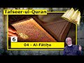

# Tafseer-ul-Quran - Almassari - 006 - Al Fātiha - 04 (2020-08-22 16:59:04+00:00)

## Description

Tafseer-ul-Quran
006 - Al Fātiha - 04
- Study Circles of Professor Muhammad AL-MASSARI
- Subscribe to our channel: https://bit.ly/2TFVUQv
- Donation: https://www.paypal.me/Almass3ari
We want to recommend Kitab ut-Tawheed: The Basis of Islam and the Reality of Monotheism
- https://www.amazon.com/dp/1986123596/ref=cm_sw_em_r_mt_dp_U_o8NaFbZBDXA4Q
- https://www.amazon.co.uk/dp/1986123596/ref=cm_sw_em_r_mt_dp_U_v9NaFbYHGSK3H

## Summary of [Tafseer-ul-Quran - Almassari - 006 - Al Fātiha - 04](https://www.youtube.com/watch?v=kKgCSar1_So)

*This is an AI generated summary. There may be inaccuracies. *

### [00:00:00](https://www.youtube.com/watch?v=kKgCSar1_So&t=0) - [00:50:00](https://www.youtube.com/watch?v=kKgCSar1_So&t=3000)

 covers a lot of information about the Lord's Prayer, including its origins, the different interpretations of it, and its connection to the Quran. It also discusses the idea that the prayer is not simply a request for sustenance, but also for guidance in order to behave in a way that will allow for the development of the earth.

**[00:00:00](https://www.youtube.com/watch?v=kKgCSar1_So&t=0)** The main Muslim prayer is the Al Fatiha. The Al Fatiha is a prayer that is said 17 times a day and it is specifically for Muslims who are practicing their five daily prayers. The Lord's Prayer is also a prayer that is said by Christians, although it is not a formal prayer like the five daily prayers are. The main difference between the Muslim and Christian prayers is that the Muslim prayer refers to Allah while the Lord's Prayer refers to Jesus Christ.
* **[00:05:00](https://www.youtube.com/watch?v=kKgCSar1_So&t=300)**  discusses various differences between Matthew and Luke in their accounts of Jesus' life and teachings. The most significant difference is that Matthew includes a section about Jesus' deliverance from evil, while Luke does not.  argues that this difference is likely due to the fact that Matthew was written later, after the temptation of Jesus had become more well-known.
* **[00:10:00](https://www.youtube.com/watch?v=kKgCSar1_So&t=600)**  discusses the origins of the phrase "our father in heaven", and how it is found in multiple places in the Old Testament. It goes on to say that the phrase is genuinely Christian, but that it is also used by Jews in various ways. The narrator provides a list of verses where the phrase is found, including in the Quran.
* **[00:15:00](https://www.youtube.com/watch?v=kKgCSar1_So&t=900)** The speaker discusses various forms of prayer, including the main one, and explains why some Muslims avoid it because of its traditional nature and due to abuses that have occurred in its history. He says that the main reason why the relationship between Sir Quran and humans is not like that of a human father and his sons is because humans are not created in the image of God. He goes on to say that it is not allowed to pray in this manner because it is not sanctioned by Quran or Sunnah.
* **[00:20:00](https://www.youtube.com/watch?v=kKgCSar1_So&t=1200)**  covers the prayer, "Your kingdom come," in detail. The main points are that this prayer refers to heaven, the afterlife, and the day when Allah will rule on earth inclusively. The prayer is meant to encourage Muslims to hasten the arrival of Allah's kingdom on earth.
* **[00:25:00](https://www.youtube.com/watch?v=kKgCSar1_So&t=1500)** The Tafseer-ul-Quran discusses the prayer, which starts with praising Allah, and how it reflects the relationship between a father and mother. The message of the prayer is that Allah is better than a pagan king, and that the day of judgment will be a time of justice and mercy. The prayer is also connected to the issue of human rights and the patriarchy of the past.
* **[00:30:00](https://www.youtube.com/watch?v=kKgCSar1_So&t=1800)**  discusses the idea that asking for something from Allah is not simply a request for sustenance or a daily bread, but also for guidance in order to behave in a way that will allow for the development of the earth.
* **[00:35:00](https://www.youtube.com/watch?v=kKgCSar1_So&t=2100)**  discusses the precedents for asking for forgiveness, including the story of the three men who were trapped in a cave and decided to ask for forgiveness from Allah in order to save themselves. It stresses that this type of prayer should not be seen as a deal where the person asking for forgiveness expects something in return, but rather as a way of expressing gratitude for Allah's blessings. It also points out that asking for forgiveness should not be seen as a sign of weakness or desperation, but rather as a sign of obedience to Allah's commands.
* **[00:40:00](https://www.youtube.com/watch?v=kKgCSar1_So&t=2400)** The speaker reminds the viewer that allah is merciful and forgiving, and that in order to be forgiven, one must first be sincere in their prayers and supplications. The speaker goes on to say that in order to be successful in one's prayers, one must be humble and have an understanding of allah's will. The speaker encourages the viewer to be diligent in their prayers, and to avoid making any hasty decisions.
* **[00:45:00](https://www.youtube.com/watch?v=kKgCSar1_So&t=2700)**  discusses the differences between the two interpretations of the Lord's Prayer, and points out that the more predominant interpretation is not available in any of the scriptures mentioned.  then mentions that, historically, Jews believed in the resurrection of the body and destruction of the world, and that the current understanding of the Lord's Prayer may be implicit in this.
* **[00:50:00](https://www.youtube.com/watch?v=kKgCSar1_So&t=3000)**  discusses the meaning of the Arabic word "al-fatihah", which is often translated as "the opening chapter of the Quran." Ali discusses the various meanings of the word, including its relation to the divine name Allāh. He argues that the opening chapter is a simple, straightforward poem that can be understood by anyone, but that it can also be deep and scholarly, and provide spiritual gains for those who understand it.

## Full transcript with timestamps

[0:00:00](https://youtu.be/kKgCSar1_So?t=0) [Music]  
[0:00:49](https://youtu.be/kKgCSar1_So?t=49) uh with the  
[0:00:50](https://youtu.be/kKgCSar1_So?t=50) comparison to the comparable prayer or  
[0:00:54](https://youtu.be/kKgCSar1_So?t=54) form of prayers because in fact has also  
[0:00:56](https://youtu.be/kKgCSar1_So?t=56) a prayer for a former prayer  
[0:00:58](https://youtu.be/kKgCSar1_So?t=58) and it's decided 17 times a day for  
[0:01:00](https://youtu.be/kKgCSar1_So?t=60) muslims who are practicing probably  
[0:01:02](https://youtu.be/kKgCSar1_So?t=62) practicing their their  
[0:01:03](https://youtu.be/kKgCSar1_So?t=63) five days prayer so if you had all right  
[0:01:06](https://youtu.be/kKgCSar1_So?t=66) it was like the father  
[0:01:07](https://youtu.be/kKgCSar1_So?t=67) must be recited otherwise invalid  
[0:01:10](https://youtu.be/kKgCSar1_So?t=70) according to the strongest point of view  
[0:01:12](https://youtu.be/kKgCSar1_So?t=72) so  
[0:01:13](https://youtu.be/kKgCSar1_So?t=73) uh it is um it is clear that  
[0:01:17](https://youtu.be/kKgCSar1_So?t=77) that this is the main muslims  
[0:01:20](https://youtu.be/kKgCSar1_So?t=80) prayer for with the form of messenger  
[0:01:23](https://youtu.be/kKgCSar1_So?t=83) then we have also  
[0:01:24](https://youtu.be/kKgCSar1_So?t=84) for the christian we have also also  
[0:01:26](https://youtu.be/kKgCSar1_So?t=86) called the lord's prayer  
[0:01:27](https://youtu.be/kKgCSar1_So?t=87) which is supposed to be also the main  
[0:01:29](https://youtu.be/kKgCSar1_So?t=89) prayer form former player to be used  
[0:01:32](https://youtu.be/kKgCSar1_So?t=92) in all possible occasions although they  
[0:01:34](https://youtu.be/kKgCSar1_So?t=94) don't have a formal  
[0:01:35](https://youtu.be/kKgCSar1_So?t=95) um salah like there are five days  
[0:01:38](https://youtu.be/kKgCSar1_So?t=98) players but  
[0:01:40](https://youtu.be/kKgCSar1_So?t=100) independent of that this seems to be the  
[0:01:42](https://youtu.be/kKgCSar1_So?t=102) most commonly recited by  
[0:01:45](https://youtu.be/kKgCSar1_So?t=105) christians of all  
[0:01:48](https://youtu.be/kKgCSar1_So?t=108) of all confessions and all schools of  
[0:01:51](https://youtu.be/kKgCSar1_So?t=111) thought  
[0:01:53](https://youtu.be/kKgCSar1_So?t=113) it really it was back to the uh  
[0:01:57](https://youtu.be/kKgCSar1_So?t=117) before i consider the system and it will  
[0:01:58](https://youtu.be/kKgCSar1_So?t=118) be using essentially the  
[0:02:00](https://youtu.be/kKgCSar1_So?t=120) new revised standard version um  
[0:02:05](https://youtu.be/kKgCSar1_So?t=125) because the most recent one seems to be  
[0:02:07](https://youtu.be/kKgCSar1_So?t=127) the most widely used by  
[0:02:09](https://youtu.be/kKgCSar1_So?t=129) scholars and so on and based on the most  
[0:02:11](https://youtu.be/kKgCSar1_So?t=131) meticulous and most  
[0:02:13](https://youtu.be/kKgCSar1_So?t=133) comprehensive scan of old manuscripts  
[0:02:16](https://youtu.be/kKgCSar1_So?t=136) and  
[0:02:17](https://youtu.be/kKgCSar1_So?t=137) evidences etc  
[0:02:18](https://youtu.be/kKgCSar1_So?t=138) [Music]  
[0:02:20](https://youtu.be/kKgCSar1_So?t=140) so the transition also is not only one  
[0:02:24](https://youtu.be/kKgCSar1_So?t=144) version the various one is for  
[0:02:25](https://youtu.be/kKgCSar1_So?t=145) protestant one for  
[0:02:26](https://youtu.be/kKgCSar1_So?t=146) one catholic and one for uh because  
[0:02:29](https://youtu.be/kKgCSar1_So?t=149) there's different  
[0:02:30](https://youtu.be/kKgCSar1_So?t=150) differences in the canons and uh  
[0:02:33](https://youtu.be/kKgCSar1_So?t=153) but this would not will just change  
[0:02:35](https://youtu.be/kKgCSar1_So?t=155) anything very much because all of them  
[0:02:37](https://youtu.be/kKgCSar1_So?t=157) do share the four gospels and in them in  
[0:02:40](https://youtu.be/kKgCSar1_So?t=160) the  
[0:02:41](https://youtu.be/kKgCSar1_So?t=161) in the player is a reference to actually  
[0:02:44](https://youtu.be/kKgCSar1_So?t=164) in two of the so-called synoptic gospel  
[0:02:46](https://youtu.be/kKgCSar1_So?t=166) it's not in john  
[0:02:47](https://youtu.be/kKgCSar1_So?t=167) at all so which makes it a little bit  
[0:02:49](https://youtu.be/kKgCSar1_So?t=169) put a question mark on it  
[0:02:51](https://youtu.be/kKgCSar1_So?t=171) slightly uh but it's in the synoptics  
[0:02:53](https://youtu.be/kKgCSar1_So?t=173) and it's in two of them which gives a  
[0:02:55](https://youtu.be/kKgCSar1_So?t=175) bit of strength  
[0:02:56](https://youtu.be/kKgCSar1_So?t=176) in matthew and they look in matthew is  
[0:02:59](https://youtu.be/kKgCSar1_So?t=179) six seven six four varies from now  
[0:03:02](https://youtu.be/kKgCSar1_So?t=182) there's  
[0:03:03](https://youtu.be/kKgCSar1_So?t=183) from 9 to 13 and they look from chapter  
[0:03:05](https://youtu.be/kKgCSar1_So?t=185) 11  
[0:03:06](https://youtu.be/kKgCSar1_So?t=186) verses from 2 to 4.  
[0:03:10](https://youtu.be/kKgCSar1_So?t=190) so and there are also variations in the  
[0:03:13](https://youtu.be/kKgCSar1_So?t=193) wedding and some additions and the  
[0:03:15](https://youtu.be/kKgCSar1_So?t=195) differences so for example the first  
[0:03:17](https://youtu.be/kKgCSar1_So?t=197) verse let us say is  
[0:03:18](https://youtu.be/kKgCSar1_So?t=198) our father in heaven hallowed be your  
[0:03:21](https://youtu.be/kKgCSar1_So?t=201) name i'm using the  
[0:03:22](https://youtu.be/kKgCSar1_So?t=202) contemporary english not using the uh  
[0:03:26](https://youtu.be/kKgCSar1_So?t=206) the conventional english or the a little  
[0:03:28](https://youtu.be/kKgCSar1_So?t=208) bit old-fashioned english still more  
[0:03:29](https://youtu.be/kKgCSar1_So?t=209) than english with old fashioned english  
[0:03:31](https://youtu.be/kKgCSar1_So?t=211) unless when we come to the catholic  
[0:03:33](https://youtu.be/kKgCSar1_So?t=213) version uh your kingdom come  
[0:03:36](https://youtu.be/kKgCSar1_So?t=216) the third one and then there's one uh  
[0:03:38](https://youtu.be/kKgCSar1_So?t=218) addition in some evidences of luke only  
[0:03:41](https://youtu.be/kKgCSar1_So?t=221) which says your holy spirit come upon us  
[0:03:43](https://youtu.be/kKgCSar1_So?t=223) and cleanse or purify  
[0:03:45](https://youtu.be/kKgCSar1_So?t=225) but that's most likely there's a  
[0:03:46](https://youtu.be/kKgCSar1_So?t=226) question mark on that  
[0:03:48](https://youtu.be/kKgCSar1_So?t=228) because if if that has been having a  
[0:03:50](https://youtu.be/kKgCSar1_So?t=230) really  
[0:03:51](https://youtu.be/kKgCSar1_So?t=231) an ancient source it's unlikely that  
[0:03:54](https://youtu.be/kKgCSar1_So?t=234) matthew would have missed that  
[0:03:57](https://youtu.be/kKgCSar1_So?t=237) because matthew is maybe more ancient  
[0:03:59](https://youtu.be/kKgCSar1_So?t=239) than luke luke was written  
[0:04:01](https://youtu.be/kKgCSar1_So?t=241) essentially as the in the forward he's  
[0:04:04](https://youtu.be/kKgCSar1_So?t=244) addressed  
[0:04:04](https://youtu.be/kKgCSar1_So?t=244) address someone uh i'm one of the  
[0:04:07](https://youtu.be/kKgCSar1_So?t=247) faithful that  
[0:04:08](https://youtu.be/kKgCSar1_So?t=248) the plenty of confusion many versions of  
[0:04:11](https://youtu.be/kKgCSar1_So?t=251) the  
[0:04:12](https://youtu.be/kKgCSar1_So?t=252) of the gospel of christ etc and i did my  
[0:04:14](https://youtu.be/kKgCSar1_So?t=254) best to  
[0:04:15](https://youtu.be/kKgCSar1_So?t=255) study all of them and clean them and get  
[0:04:18](https://youtu.be/kKgCSar1_So?t=258) to the most authentic one  
[0:04:19](https://youtu.be/kKgCSar1_So?t=259) and if you look at luke it looks  
[0:04:21](https://youtu.be/kKgCSar1_So?t=261) historically clean and much better than  
[0:04:23](https://youtu.be/kKgCSar1_So?t=263) matthew  
[0:04:23](https://youtu.be/kKgCSar1_So?t=263) and obviously mark is an average version  
[0:04:26](https://youtu.be/kKgCSar1_So?t=266) of luke essentially  
[0:04:28](https://youtu.be/kKgCSar1_So?t=268) essentially that's essentially what is  
[0:04:29](https://youtu.be/kKgCSar1_So?t=269) it most lesson the best point of view  
[0:04:31](https://youtu.be/kKgCSar1_So?t=271) that  
[0:04:32](https://youtu.be/kKgCSar1_So?t=272) that that mark is an average version of  
[0:04:36](https://youtu.be/kKgCSar1_So?t=276) luke  
[0:04:37](https://youtu.be/kKgCSar1_So?t=277) but we are not going to in the bible  
[0:04:38](https://youtu.be/kKgCSar1_So?t=278) studies and all details because there's  
[0:04:39](https://youtu.be/kKgCSar1_So?t=279) still many issues there are  
[0:04:41](https://youtu.be/kKgCSar1_So?t=281) controversial and going back and forth  
[0:04:44](https://youtu.be/kKgCSar1_So?t=284) royal matthew is historically not not  
[0:04:46](https://youtu.be/kKgCSar1_So?t=286) that sound and he has so many stories  
[0:04:48](https://youtu.be/kKgCSar1_So?t=288) which has  
[0:04:48](https://youtu.be/kKgCSar1_So?t=288) manifestly absorbed like uh  
[0:04:52](https://youtu.be/kKgCSar1_So?t=292) after the crucifixion the graves split  
[0:04:54](https://youtu.be/kKgCSar1_So?t=294) and hundreds of holies came in there  
[0:04:56](https://youtu.be/kKgCSar1_So?t=296) in their uh in the shrouds walking into  
[0:04:58](https://youtu.be/kKgCSar1_So?t=298) jerusalem if something like that has  
[0:05:00](https://youtu.be/kKgCSar1_So?t=300) happened  
[0:05:00](https://youtu.be/kKgCSar1_So?t=300) history would have recorded somewhere  
[0:05:02](https://youtu.be/kKgCSar1_So?t=302) jews would have recorded it  
[0:05:04](https://youtu.be/kKgCSar1_So?t=304) somebody should have recorded it that's  
[0:05:06](https://youtu.be/kKgCSar1_So?t=306) just one source  
[0:05:07](https://youtu.be/kKgCSar1_So?t=307) because that's something  
[0:05:09](https://youtu.be/kKgCSar1_So?t=309) [Music]  
[0:05:11](https://youtu.be/kKgCSar1_So?t=311) supranatural and so obvious uh  
[0:05:14](https://youtu.be/kKgCSar1_So?t=314) visible to all the people of jesus and  
[0:05:16](https://youtu.be/kKgCSar1_So?t=316) that hundreds of the people came out of  
[0:05:18](https://youtu.be/kKgCSar1_So?t=318) the graves and their shrouds and walked  
[0:05:19](https://youtu.be/kKgCSar1_So?t=319) in the city  
[0:05:20](https://youtu.be/kKgCSar1_So?t=320) this could have not been gone and  
[0:05:21](https://youtu.be/kKgCSar1_So?t=321) recorded by anybody in the world  
[0:05:23](https://youtu.be/kKgCSar1_So?t=323) that's that's just simply not not  
[0:05:25](https://youtu.be/kKgCSar1_So?t=325) acceptable so matthew is historically  
[0:05:27](https://youtu.be/kKgCSar1_So?t=327) relatively weak look is much better but  
[0:05:29](https://youtu.be/kKgCSar1_So?t=329) this is does not mean necessary that  
[0:05:31](https://youtu.be/kKgCSar1_So?t=331) the virgin narrated by nature is better  
[0:05:33](https://youtu.be/kKgCSar1_So?t=333) than local look better than matthew  
[0:05:34](https://youtu.be/kKgCSar1_So?t=334) but this has to be us on the welding but  
[0:05:37](https://youtu.be/kKgCSar1_So?t=337) this  
[0:05:38](https://youtu.be/kKgCSar1_So?t=338) this this insertion your holy  
[0:05:42](https://youtu.be/kKgCSar1_So?t=342) spirit come upon us is most likely late  
[0:05:44](https://youtu.be/kKgCSar1_So?t=344) addition is not is not genuine  
[0:05:46](https://youtu.be/kKgCSar1_So?t=346) not authentic the fourth sentence you  
[0:05:49](https://youtu.be/kKgCSar1_So?t=349) will be done  
[0:05:50](https://youtu.be/kKgCSar1_So?t=350) on earth as in heaven this is missing a  
[0:05:53](https://youtu.be/kKgCSar1_So?t=353) look interestingly  
[0:05:55](https://youtu.be/kKgCSar1_So?t=355) uh except in some older ancient  
[0:05:57](https://youtu.be/kKgCSar1_So?t=357) authorities which is  
[0:05:58](https://youtu.be/kKgCSar1_So?t=358) may balances things related but in the  
[0:06:00](https://youtu.be/kKgCSar1_So?t=360) most reliable and  
[0:06:02](https://youtu.be/kKgCSar1_So?t=362) under standard look at islam but in some  
[0:06:05](https://youtu.be/kKgCSar1_So?t=365) ways though it is there  
[0:06:06](https://youtu.be/kKgCSar1_So?t=366) so it may be imported from matthew  
[0:06:10](https://youtu.be/kKgCSar1_So?t=370) because they will  
[0:06:10](https://youtu.be/kKgCSar1_So?t=370) wonder how this could be missing and  
[0:06:12](https://youtu.be/kKgCSar1_So?t=372) somebody imported it  
[0:06:14](https://youtu.be/kKgCSar1_So?t=374) so that's that's that's uh put a  
[0:06:16](https://youtu.be/kKgCSar1_So?t=376) question mark on that one  
[0:06:17](https://youtu.be/kKgCSar1_So?t=377) five the fifth sentence uh give us this  
[0:06:20](https://youtu.be/kKgCSar1_So?t=380) day our daily bread  
[0:06:23](https://youtu.be/kKgCSar1_So?t=383) oh or i'll give us this day our tomorrow  
[0:06:27](https://youtu.be/kKgCSar1_So?t=387) depending on whether and look it's  
[0:06:28](https://youtu.be/kKgCSar1_So?t=388) similar give us the  
[0:06:29](https://youtu.be/kKgCSar1_So?t=389) the each day out there each day or daily  
[0:06:32](https://youtu.be/kKgCSar1_So?t=392) bread so look is more  
[0:06:33](https://youtu.be/kKgCSar1_So?t=393) more universal and the wedding is more  
[0:06:34](https://youtu.be/kKgCSar1_So?t=394) logical in luke  
[0:06:37](https://youtu.be/kKgCSar1_So?t=397) the next six sentences forgive us our  
[0:06:39](https://youtu.be/kKgCSar1_So?t=399) sins as we forgive those who sinned  
[0:06:42](https://youtu.be/kKgCSar1_So?t=402) against us  
[0:06:43](https://youtu.be/kKgCSar1_So?t=403) uh that's uh in  
[0:06:46](https://youtu.be/kKgCSar1_So?t=406) in matthew originally really the  
[0:06:48](https://youtu.be/kKgCSar1_So?t=408) translation in the uh  
[0:06:49](https://youtu.be/kKgCSar1_So?t=409) new york standard  
[0:06:53](https://youtu.be/kKgCSar1_So?t=413) edition is and forgive us our debt  
[0:06:56](https://youtu.be/kKgCSar1_So?t=416) that's  
[0:06:56](https://youtu.be/kKgCSar1_So?t=416) as we also have forgiven our debtors so  
[0:07:00](https://youtu.be/kKgCSar1_So?t=420) it  
[0:07:00](https://youtu.be/kKgCSar1_So?t=420) it looks like it may be hinting about  
[0:07:02](https://youtu.be/kKgCSar1_So?t=422) really deaths and monitoring this not  
[0:07:04](https://youtu.be/kKgCSar1_So?t=424) only sins but  
[0:07:06](https://youtu.be/kKgCSar1_So?t=426) there will be some question there luke  
[0:07:08](https://youtu.be/kKgCSar1_So?t=428) says  
[0:07:09](https://youtu.be/kKgCSar1_So?t=429) and for forgive our sins for we ourself  
[0:07:13](https://youtu.be/kKgCSar1_So?t=433) forgive  
[0:07:13](https://youtu.be/kKgCSar1_So?t=433) everyone indebted to us including which  
[0:07:16](https://youtu.be/kKgCSar1_So?t=436) include also  
[0:07:17](https://youtu.be/kKgCSar1_So?t=437) this seems to be that's not the version  
[0:07:19](https://youtu.be/kKgCSar1_So?t=439) which is most common  
[0:07:20](https://youtu.be/kKgCSar1_So?t=440) uh because people do not like really to  
[0:07:23](https://youtu.be/kKgCSar1_So?t=443) be  
[0:07:23](https://youtu.be/kKgCSar1_So?t=443) to be reminded that they have to they  
[0:07:25](https://youtu.be/kKgCSar1_So?t=445) have to forgive debts  
[0:07:27](https://youtu.be/kKgCSar1_So?t=447) um which has which is very well  
[0:07:29](https://youtu.be/kKgCSar1_So?t=449) entrenched in the tradition of the  
[0:07:30](https://youtu.be/kKgCSar1_So?t=450) disciples around actually they they were  
[0:07:33](https://youtu.be/kKgCSar1_So?t=453) almost living in a commune  
[0:07:34](https://youtu.be/kKgCSar1_So?t=454) commune like a coma in a communist way  
[0:07:37](https://youtu.be/kKgCSar1_So?t=457) of life all money was put in the public  
[0:07:39](https://youtu.be/kKgCSar1_So?t=459) treasury  
[0:07:40](https://youtu.be/kKgCSar1_So?t=460) and the and the chief of the community  
[0:07:42](https://youtu.be/kKgCSar1_So?t=462) was spending on them  
[0:07:43](https://youtu.be/kKgCSar1_So?t=463) so that's it's not very nice to remember  
[0:07:46](https://youtu.be/kKgCSar1_So?t=466) that for the capitalist society  
[0:07:47](https://youtu.be/kKgCSar1_So?t=467) so in the translation they prefer to put  
[0:07:50](https://youtu.be/kKgCSar1_So?t=470) our sin to cover up for that  
[0:07:52](https://youtu.be/kKgCSar1_So?t=472) it seems to me but that's the originals  
[0:07:54](https://youtu.be/kKgCSar1_So?t=474) are really talking about debts  
[0:07:56](https://youtu.be/kKgCSar1_So?t=476) and debtors um  
[0:08:00](https://youtu.be/kKgCSar1_So?t=480) so the look version seems to be more  
[0:08:01](https://youtu.be/kKgCSar1_So?t=481) logical because you ask  
[0:08:03](https://youtu.be/kKgCSar1_So?t=483) allah to forgive your sins and then you  
[0:08:06](https://youtu.be/kKgCSar1_So?t=486) present that we forgive  
[0:08:08](https://youtu.be/kKgCSar1_So?t=488) those who are indebted to us either the  
[0:08:09](https://youtu.be/kKgCSar1_So?t=489) committed sins against us and then  
[0:08:10](https://youtu.be/kKgCSar1_So?t=490) forgive them or  
[0:08:12](https://youtu.be/kKgCSar1_So?t=492) they we gave them money when they are  
[0:08:14](https://youtu.be/kKgCSar1_So?t=494) unable to pay back and you forgive them  
[0:08:16](https://youtu.be/kKgCSar1_So?t=496) so it contains  
[0:08:17](https://youtu.be/kKgCSar1_So?t=497) so it seems more more reasonable but  
[0:08:20](https://youtu.be/kKgCSar1_So?t=500) that's a matter of textual credit and a  
[0:08:23](https://youtu.be/kKgCSar1_So?t=503) critic and  
[0:08:23](https://youtu.be/kKgCSar1_So?t=503) going back to the history etc the seven  
[0:08:26](https://youtu.be/kKgCSar1_So?t=506) sentences lead us not into  
[0:08:27](https://youtu.be/kKgCSar1_So?t=507) uh temptation but deliver us from evil  
[0:08:30](https://youtu.be/kKgCSar1_So?t=510) in in matthew that's uh the religion i'm  
[0:08:32](https://youtu.be/kKgCSar1_So?t=512) reading essentially that's what the  
[0:08:34](https://youtu.be/kKgCSar1_So?t=514) the the contemporary version of the  
[0:08:38](https://youtu.be/kKgCSar1_So?t=518) church of england in my view according  
[0:08:40](https://youtu.be/kKgCSar1_So?t=520) to  
[0:08:42](https://youtu.be/kKgCSar1_So?t=522) an rsv in a new revised standard edition  
[0:08:45](https://youtu.be/kKgCSar1_So?t=525) it is uh and do not bring us uh bring us  
[0:08:48](https://youtu.be/kKgCSar1_So?t=528) to the time of trial  
[0:08:49](https://youtu.be/kKgCSar1_So?t=529) which is similar because it gets under  
[0:08:51](https://youtu.be/kKgCSar1_So?t=531) interpretation and  
[0:08:53](https://youtu.be/kKgCSar1_So?t=533) and this cross from the evil one or the  
[0:08:55](https://youtu.be/kKgCSar1_So?t=535) evil evil one could be maybe  
[0:08:57](https://youtu.be/kKgCSar1_So?t=537) specifically the devil or the evil just  
[0:08:59](https://youtu.be/kKgCSar1_So?t=539) generally uh  
[0:09:00](https://youtu.be/kKgCSar1_So?t=540) abstract evil and look at  
[0:09:04](https://youtu.be/kKgCSar1_So?t=544) it also revised standard the  
[0:09:08](https://youtu.be/kKgCSar1_So?t=548) edition is do not bring us uh  
[0:09:11](https://youtu.be/kKgCSar1_So?t=551) to the time of trial similarly and  
[0:09:15](https://youtu.be/kKgCSar1_So?t=555) in only in some authorities and rescue  
[0:09:17](https://youtu.be/kKgCSar1_So?t=557) us from the  
[0:09:18](https://youtu.be/kKgCSar1_So?t=558) evil or the evil one not on all  
[0:09:19](https://youtu.be/kKgCSar1_So?t=559) authorities so it seems to be the second  
[0:09:22](https://youtu.be/kKgCSar1_So?t=562) uh sentence maybe are not what is is not  
[0:09:26](https://youtu.be/kKgCSar1_So?t=566) as well established as  
[0:09:27](https://youtu.be/kKgCSar1_So?t=567) the best one and do not regard the  
[0:09:29](https://youtu.be/kKgCSar1_So?t=569) temptation  
[0:09:31](https://youtu.be/kKgCSar1_So?t=571) uh there is there is a concluding  
[0:09:34](https://youtu.be/kKgCSar1_So?t=574) sentence which is uh really not neither  
[0:09:37](https://youtu.be/kKgCSar1_So?t=577) in uh  
[0:09:38](https://youtu.be/kKgCSar1_So?t=578) matthew or luke but it is uh  
[0:09:41](https://youtu.be/kKgCSar1_So?t=581) in the most well most well established  
[0:09:43](https://youtu.be/kKgCSar1_So?t=583) uh  
[0:09:44](https://youtu.be/kKgCSar1_So?t=584) and all but in some in some  
[0:09:48](https://youtu.be/kKgCSar1_So?t=588) version of matthew some old authorities  
[0:09:51](https://youtu.be/kKgCSar1_So?t=591) as ancient authorities or  
[0:09:52](https://youtu.be/kKgCSar1_So?t=592) references this exists but not in luke  
[0:09:55](https://youtu.be/kKgCSar1_So?t=595) at all  
[0:09:55](https://youtu.be/kKgCSar1_So?t=595) neither in ancient other it is not in  
[0:09:57](https://youtu.be/kKgCSar1_So?t=597) which puts also a question back  
[0:09:59](https://youtu.be/kKgCSar1_So?t=599) and therefore it is the final placing  
[0:10:01](https://youtu.be/kKgCSar1_So?t=601) for for the kingdom  
[0:10:03](https://youtu.be/kKgCSar1_So?t=603) the power and the glory are yours now  
[0:10:06](https://youtu.be/kKgCSar1_So?t=606) and forever  
[0:10:07](https://youtu.be/kKgCSar1_So?t=607) amen this seems to be an addition  
[0:10:11](https://youtu.be/kKgCSar1_So?t=611) because it's not even in the standard  
[0:10:12](https://youtu.be/kKgCSar1_So?t=612) matthew it's only in some  
[0:10:14](https://youtu.be/kKgCSar1_So?t=614) old ancient authorities because we know  
[0:10:17](https://youtu.be/kKgCSar1_So?t=617) there are variations and there's some  
[0:10:18](https://youtu.be/kKgCSar1_So?t=618) deletion and addition and so on  
[0:10:20](https://youtu.be/kKgCSar1_So?t=620) which makes it difficult to a certain is  
[0:10:22](https://youtu.be/kKgCSar1_So?t=622) that the area  
[0:10:24](https://youtu.be/kKgCSar1_So?t=624) survive from an authentic source or it  
[0:10:26](https://youtu.be/kKgCSar1_So?t=626) is a later addition  
[0:10:27](https://youtu.be/kKgCSar1_So?t=627) because we don't have the science of  
[0:10:29](https://youtu.be/kKgCSar1_So?t=629) snap and  
[0:10:30](https://youtu.be/kKgCSar1_So?t=630) no really connected chains going all the  
[0:10:32](https://youtu.be/kKgCSar1_So?t=632) way to the time of  
[0:10:35](https://youtu.be/kKgCSar1_So?t=635) isa in a reliable way in a convincing  
[0:10:37](https://youtu.be/kKgCSar1_So?t=637) and reliable way  
[0:10:40](https://youtu.be/kKgCSar1_So?t=640) so in summary it is it says our father  
[0:10:42](https://youtu.be/kKgCSar1_So?t=642) in heaven hallowed be your name  
[0:10:44](https://youtu.be/kKgCSar1_So?t=644) your kingdom come you will be done on  
[0:10:46](https://youtu.be/kKgCSar1_So?t=646) earth as is in heaven  
[0:10:48](https://youtu.be/kKgCSar1_So?t=648) give us this day our daily bread and  
[0:10:50](https://youtu.be/kKgCSar1_So?t=650) forgive us for our debts  
[0:10:52](https://youtu.be/kKgCSar1_So?t=652) as we also have forgiven our debtors  
[0:10:56](https://youtu.be/kKgCSar1_So?t=656) and lead us not into temptation but do  
[0:10:58](https://youtu.be/kKgCSar1_So?t=658) they  
[0:10:59](https://youtu.be/kKgCSar1_So?t=659) deliver us from the evil or from evil or  
[0:11:01](https://youtu.be/kKgCSar1_So?t=661) the evil one  
[0:11:02](https://youtu.be/kKgCSar1_So?t=662) the catholic version is essentially the  
[0:11:04](https://youtu.be/kKgCSar1_So?t=664) same but it's in  
[0:11:05](https://youtu.be/kKgCSar1_So?t=665) in ancient in a more conviction like our  
[0:11:08](https://youtu.be/kKgCSar1_So?t=668) father  
[0:11:09](https://youtu.be/kKgCSar1_So?t=669) who art in heaven that's the english of  
[0:11:12](https://youtu.be/kKgCSar1_So?t=672) a couple of hundred years ago  
[0:11:14](https://youtu.be/kKgCSar1_So?t=674) like in king james hallowed be thy name  
[0:11:16](https://youtu.be/kKgCSar1_So?t=676) and sort of your name but it's  
[0:11:17](https://youtu.be/kKgCSar1_So?t=677) essentially the same  
[0:11:19](https://youtu.be/kKgCSar1_So?t=679) the sexual england is having that this  
[0:11:21](https://youtu.be/kKgCSar1_So?t=681) final sentence uh added to it  
[0:11:23](https://youtu.be/kKgCSar1_So?t=683) so the final said there's financial  
[0:11:24](https://youtu.be/kKgCSar1_So?t=684) instance with the other reason american  
[0:11:26](https://youtu.be/kKgCSar1_So?t=686) churches and you have to here at the end  
[0:11:28](https://youtu.be/kKgCSar1_So?t=688) the glory etcetera yemen  
[0:11:31](https://youtu.be/kKgCSar1_So?t=691) but you don't hear it in catholic  
[0:11:32](https://youtu.be/kKgCSar1_So?t=692) churches and and the current communities  
[0:11:35](https://youtu.be/kKgCSar1_So?t=695) uh so the final centers are for the  
[0:11:37](https://youtu.be/kKgCSar1_So?t=697) kingdom power and glory are yours  
[0:11:40](https://youtu.be/kKgCSar1_So?t=700) now and forever foreign in the cheshire  
[0:11:43](https://youtu.be/kKgCSar1_So?t=703) england which is  
[0:11:44](https://youtu.be/kKgCSar1_So?t=704) obviously widely adopted in american  
[0:11:47](https://youtu.be/kKgCSar1_So?t=707) protestant churches  
[0:11:49](https://youtu.be/kKgCSar1_So?t=709) so uh hallowed is is the same it's a  
[0:11:53](https://youtu.be/kKgCSar1_So?t=713) little bit an ancient word it's not very  
[0:11:54](https://youtu.be/kKgCSar1_So?t=714) common this is it  
[0:11:56](https://youtu.be/kKgCSar1_So?t=716) it has various synonyms like sanctified  
[0:11:58](https://youtu.be/kKgCSar1_So?t=718) or deified  
[0:11:59](https://youtu.be/kKgCSar1_So?t=719) or revered or blessed all these meaning  
[0:12:01](https://youtu.be/kKgCSar1_So?t=721) could be underhallow fine  
[0:12:03](https://youtu.be/kKgCSar1_So?t=723) it's very close to holy and uh halloween  
[0:12:06](https://youtu.be/kKgCSar1_So?t=726) et cetera  
[0:12:06](https://youtu.be/kKgCSar1_So?t=726) the holy essentially geiger going to the  
[0:12:09](https://youtu.be/kKgCSar1_So?t=729) uh the  
[0:12:10](https://youtu.be/kKgCSar1_So?t=730) root of the holiness holly which will be  
[0:12:13](https://youtu.be/kKgCSar1_So?t=733) the woods and arabic  
[0:12:14](https://youtu.be/kKgCSar1_So?t=734) these are goods so let us see uh  
[0:12:17](https://youtu.be/kKgCSar1_So?t=737) genuinely uh this is it appears to be uh  
[0:12:21](https://youtu.be/kKgCSar1_So?t=741) the story is that the disciple asked  
[0:12:23](https://youtu.be/kKgCSar1_So?t=743) asap  
[0:12:25](https://youtu.be/kKgCSar1_So?t=745) and please discuss how to pray give us  
[0:12:28](https://youtu.be/kKgCSar1_So?t=748) formal form of teach us a praying form  
[0:12:30](https://youtu.be/kKgCSar1_So?t=750) which is because  
[0:12:31](https://youtu.be/kKgCSar1_So?t=751) which is clearly because in the uh they  
[0:12:34](https://youtu.be/kKgCSar1_So?t=754) are jews  
[0:12:35](https://youtu.be/kKgCSar1_So?t=755) and they have various forms of prayers  
[0:12:38](https://youtu.be/kKgCSar1_So?t=758) so  
[0:12:39](https://youtu.be/kKgCSar1_So?t=759) known to the jews and so on but they  
[0:12:40](https://youtu.be/kKgCSar1_So?t=760) wanted one which a symbol  
[0:12:44](https://youtu.be/kKgCSar1_So?t=764) straightforward one which they can use  
[0:12:46](https://youtu.be/kKgCSar1_So?t=766) persistently in all the prayers so he  
[0:12:48](https://youtu.be/kKgCSar1_So?t=768) told them if you want to pray say that  
[0:12:50](https://youtu.be/kKgCSar1_So?t=770) and  
[0:12:51](https://youtu.be/kKgCSar1_So?t=771) according to the narration which there's  
[0:12:53](https://youtu.be/kKgCSar1_So?t=773) no reason to read  
[0:12:54](https://youtu.be/kKgCSar1_So?t=774) that narration is not acceptable  
[0:12:56](https://youtu.be/kKgCSar1_So?t=776) actually the fact that all  
[0:12:58](https://youtu.be/kKgCSar1_So?t=778) all the sentences of such sentences are  
[0:13:01](https://youtu.be/kKgCSar1_So?t=781) actually in the old testament  
[0:13:02](https://youtu.be/kKgCSar1_So?t=782) there's nothing really new  
[0:13:05](https://youtu.be/kKgCSar1_So?t=785) the first one is our father is that is  
[0:13:07](https://youtu.be/kKgCSar1_So?t=787) used to address allah by  
[0:13:09](https://youtu.be/kKgCSar1_So?t=789) by isaiah in 63 16 and 64 8.  
[0:13:13](https://youtu.be/kKgCSar1_So?t=793) the who art in heaven that's also a  
[0:13:15](https://youtu.be/kKgCSar1_So?t=795) statement to us to be found in isaiah  
[0:13:18](https://youtu.be/kKgCSar1_So?t=798) and cronics etc hallowed be thy name  
[0:13:21](https://youtu.be/kKgCSar1_So?t=801) that's as universal everywhere even in  
[0:13:24](https://youtu.be/kKgCSar1_So?t=804) the very old list of the books that the  
[0:13:26](https://youtu.be/kKgCSar1_So?t=806) old testament  
[0:13:27](https://youtu.be/kKgCSar1_So?t=807) and leviticus and some will in kings etc  
[0:13:30](https://youtu.be/kKgCSar1_So?t=810) almost in every in the important book of  
[0:13:33](https://youtu.be/kKgCSar1_So?t=813) the old testament  
[0:13:34](https://youtu.be/kKgCSar1_So?t=814) uh the uh thy kingdom come seems to be  
[0:13:37](https://youtu.be/kKgCSar1_So?t=817) genuinely christian  
[0:13:40](https://youtu.be/kKgCSar1_So?t=820) but also that's used by daniel in  
[0:13:42](https://youtu.be/kKgCSar1_So?t=822) various places  
[0:13:44](https://youtu.be/kKgCSar1_So?t=824) and also by jeremiah and secretary thy  
[0:13:46](https://youtu.be/kKgCSar1_So?t=826) kingdom come  
[0:13:48](https://youtu.be/kKgCSar1_So?t=828) they will be done that's also available  
[0:13:50](https://youtu.be/kKgCSar1_So?t=830) in daniel and  
[0:13:51](https://youtu.be/kKgCSar1_So?t=831) uh israel and so on so all of these  
[0:13:54](https://youtu.be/kKgCSar1_So?t=834) phrases you can you can check all of  
[0:13:55](https://youtu.be/kKgCSar1_So?t=835) them  
[0:13:55](https://youtu.be/kKgCSar1_So?t=835) i have them here so that i can send them  
[0:13:57](https://youtu.be/kKgCSar1_So?t=837) one day for for evaluation  
[0:13:59](https://youtu.be/kKgCSar1_So?t=839) all of them are but they are scattered  
[0:14:01](https://youtu.be/kKgCSar1_So?t=841) they are not in one place so  
[0:14:03](https://youtu.be/kKgCSar1_So?t=843) it seems to me or my because his scholar  
[0:14:06](https://youtu.be/kKgCSar1_So?t=846) he was a scholarly  
[0:14:07](https://youtu.be/kKgCSar1_So?t=847) he's the one who has been educated  
[0:14:09](https://youtu.be/kKgCSar1_So?t=849) thoroughly educated and  
[0:14:10](https://youtu.be/kKgCSar1_So?t=850) and he was taught by other books and the  
[0:14:13](https://youtu.be/kKgCSar1_So?t=853) writing and the books  
[0:14:14](https://youtu.be/kKgCSar1_So?t=854) he was it was really a sophisticated  
[0:14:16](https://youtu.be/kKgCSar1_So?t=856) scholar it was not just a random  
[0:14:18](https://youtu.be/kKgCSar1_So?t=858) common man uh highly literate and highly  
[0:14:22](https://youtu.be/kKgCSar1_So?t=862) uh he  
[0:14:23](https://youtu.be/kKgCSar1_So?t=863) instructed the scriptures he may have  
[0:14:27](https://youtu.be/kKgCSar1_So?t=867) in an infallible way collected it from  
[0:14:29](https://youtu.be/kKgCSar1_So?t=869) the old testament so all these are  
[0:14:31](https://youtu.be/kKgCSar1_So?t=871) essentially old testament features that  
[0:14:33](https://youtu.be/kKgCSar1_So?t=873) also jews use address allah  
[0:14:35](https://youtu.be/kKgCSar1_So?t=875) our father or father in heaven is also  
[0:14:37](https://youtu.be/kKgCSar1_So?t=877) established  
[0:14:38](https://youtu.be/kKgCSar1_So?t=878) although not very they are not as common  
[0:14:40](https://youtu.be/kKgCSar1_So?t=880) as by by the christian in the christians  
[0:14:41](https://youtu.be/kKgCSar1_So?t=881) had  
[0:14:42](https://youtu.be/kKgCSar1_So?t=882) it has been uh more used now the  
[0:14:45](https://youtu.be/kKgCSar1_So?t=885) question we can can can we use the  
[0:14:47](https://youtu.be/kKgCSar1_So?t=887) weather banner  
[0:14:48](https://youtu.be/kKgCSar1_So?t=888) clearly nowhere in colorado has been  
[0:14:50](https://youtu.be/kKgCSar1_So?t=890) used  
[0:14:51](https://youtu.be/kKgCSar1_So?t=891) and uh that listed all uh dua which has  
[0:14:55](https://youtu.be/kKgCSar1_So?t=895) been  
[0:14:55](https://youtu.be/kKgCSar1_So?t=895) there which has been taught to us by the  
[0:14:57](https://youtu.be/kKgCSar1_So?t=897) quran  
[0:14:58](https://youtu.be/kKgCSar1_So?t=898) also in the quran the quran mentioned  
[0:15:00](https://youtu.be/kKgCSar1_So?t=900) various forms of  
[0:15:01](https://youtu.be/kKgCSar1_So?t=901) prayer one of them is that the main one  
[0:15:04](https://youtu.be/kKgCSar1_So?t=904) but as  
[0:15:10](https://youtu.be/kKgCSar1_So?t=910) another  
[0:15:17](https://youtu.be/kKgCSar1_So?t=917) the father in heaven which was not  
[0:15:19](https://youtu.be/kKgCSar1_So?t=919) avoided in in judaism  
[0:15:23](https://youtu.be/kKgCSar1_So?t=923) the reason for avoiding is that this  
[0:15:26](https://youtu.be/kKgCSar1_So?t=926) address and the recognition of the  
[0:15:28](https://youtu.be/kKgCSar1_So?t=928) reaction between the creation and the  
[0:15:30](https://youtu.be/kKgCSar1_So?t=930) humans  
[0:15:30](https://youtu.be/kKgCSar1_So?t=930) and allah is tradition between father  
[0:15:32](https://youtu.be/kKgCSar1_So?t=932) and children  
[0:15:34](https://youtu.be/kKgCSar1_So?t=934) all that has a good nice  
[0:15:37](https://youtu.be/kKgCSar1_So?t=937) emotional side side of it it it run into  
[0:15:40](https://youtu.be/kKgCSar1_So?t=940) abuse and i was just also missing the  
[0:15:42](https://youtu.be/kKgCSar1_So?t=942) quran the quran  
[0:15:44](https://youtu.be/kKgCSar1_So?t=944) views of these uh nice aspects of  
[0:15:47](https://youtu.be/kKgCSar1_So?t=947) of emotional connection allah and  
[0:15:50](https://youtu.be/kKgCSar1_So?t=950) spiritual connection  
[0:15:51](https://youtu.be/kKgCSar1_So?t=951) and when they said the jews and  
[0:15:52](https://youtu.be/kKgCSar1_So?t=952) christians  
[0:15:58](https://youtu.be/kKgCSar1_So?t=958) and his beloved ones meaning  
[0:16:01](https://youtu.be/kKgCSar1_So?t=961) that we are elected we we are not  
[0:16:03](https://youtu.be/kKgCSar1_So?t=963) accounted that much  
[0:16:04](https://youtu.be/kKgCSar1_So?t=964) that's the reason the answer to them  
[0:16:10](https://youtu.be/kKgCSar1_So?t=970) does he punish you for your sins and the  
[0:16:11](https://youtu.be/kKgCSar1_So?t=971) jews admitted they have been punished  
[0:16:13](https://youtu.be/kKgCSar1_So?t=973) and  
[0:16:13](https://youtu.be/kKgCSar1_So?t=973) shucked into easter and to into exile  
[0:16:16](https://youtu.be/kKgCSar1_So?t=976) and  
[0:16:17](https://youtu.be/kKgCSar1_So?t=977) terrified by the pagan kings and subdued  
[0:16:19](https://youtu.be/kKgCSar1_So?t=979) by cape and kings and  
[0:16:21](https://youtu.be/kKgCSar1_So?t=981) suffered massive slaughters and  
[0:16:24](https://youtu.be/kKgCSar1_So?t=984) imprisonment  
[0:16:25](https://youtu.be/kKgCSar1_So?t=985) taken into slavery even castration  
[0:16:27](https://youtu.be/kKgCSar1_So?t=987) mutilation  
[0:16:28](https://youtu.be/kKgCSar1_So?t=988) everything receivable and this is and  
[0:16:30](https://youtu.be/kKgCSar1_So?t=990) they their prophets told them this is a  
[0:16:32](https://youtu.be/kKgCSar1_So?t=992) punishment for allah for your various  
[0:16:33](https://youtu.be/kKgCSar1_So?t=993) breaks of the sabbath and other things  
[0:16:35](https://youtu.be/kKgCSar1_So?t=995) so hawaii if you are this beloved one  
[0:16:37](https://youtu.be/kKgCSar1_So?t=997) and children  
[0:16:38](https://youtu.be/kKgCSar1_So?t=998) why he is punishing you so the nation is  
[0:16:40](https://youtu.be/kKgCSar1_So?t=1000) not like the father  
[0:16:42](https://youtu.be/kKgCSar1_So?t=1002) the human father and his sons or  
[0:16:44](https://youtu.be/kKgCSar1_So?t=1004) sometimes the human father does punish  
[0:16:46](https://youtu.be/kKgCSar1_So?t=1006) but it is not that  
[0:16:47](https://youtu.be/kKgCSar1_So?t=1007) standard course of action so if  
[0:16:53](https://youtu.be/kKgCSar1_So?t=1013) that we are forgiven  
[0:16:56](https://youtu.be/kKgCSar1_So?t=1016) it is a way to be complacent and to get  
[0:16:59](https://youtu.be/kKgCSar1_So?t=1019) away from the  
[0:17:00](https://youtu.be/kKgCSar1_So?t=1020) from the responsibility and punishment  
[0:17:03](https://youtu.be/kKgCSar1_So?t=1023) so uh the this abuse i think is the is  
[0:17:06](https://youtu.be/kKgCSar1_So?t=1026) the reason although initially in itself  
[0:17:10](https://youtu.be/kKgCSar1_So?t=1030) philosophically and fundamentally  
[0:17:11](https://youtu.be/kKgCSar1_So?t=1031) there's no problem with that as long as  
[0:17:12](https://youtu.be/kKgCSar1_So?t=1032) it's not understood in any in any  
[0:17:14](https://youtu.be/kKgCSar1_So?t=1034) supernatural meaning or a genuine  
[0:17:16](https://youtu.be/kKgCSar1_So?t=1036) begotten  
[0:17:28](https://youtu.be/kKgCSar1_So?t=1048) take that as a as an excuse to be  
[0:17:31](https://youtu.be/kKgCSar1_So?t=1051) complacent and to be uh  
[0:17:33](https://youtu.be/kKgCSar1_So?t=1053) and to commit violation and  
[0:17:35](https://youtu.be/kKgCSar1_So?t=1055) transgression  
[0:17:36](https://youtu.be/kKgCSar1_So?t=1056) and think they will not be accounted or  
[0:17:38](https://youtu.be/kKgCSar1_So?t=1058) they will be forgiven ultimately  
[0:17:39](https://youtu.be/kKgCSar1_So?t=1059) um some of the abuses you find by  
[0:17:42](https://youtu.be/kKgCSar1_So?t=1062) muslims in in  
[0:17:43](https://youtu.be/kKgCSar1_So?t=1063) in the understanding of the meaning of  
[0:17:44](https://youtu.be/kKgCSar1_So?t=1064) the shahada  
[0:17:50](https://youtu.be/kKgCSar1_So?t=1070) [Music]  
[0:17:52](https://youtu.be/kKgCSar1_So?t=1072) belief in his heart will ultimately  
[0:17:54](https://youtu.be/kKgCSar1_So?t=1074) enter paradise  
[0:17:56](https://youtu.be/kKgCSar1_So?t=1076) and that has been abused also by by many  
[0:17:58](https://youtu.be/kKgCSar1_So?t=1078) that  
[0:17:59](https://youtu.be/kKgCSar1_So?t=1079) the shahada is enough we don't need to  
[0:18:00](https://youtu.be/kKgCSar1_So?t=1080) do any good deeds etc which is a really  
[0:18:03](https://youtu.be/kKgCSar1_So?t=1083) an undermining and violation of the  
[0:18:04](https://youtu.be/kKgCSar1_So?t=1084) shahadah and uh  
[0:18:08](https://youtu.be/kKgCSar1_So?t=1088) so everything can be abused so but that  
[0:18:11](https://youtu.be/kKgCSar1_So?t=1091) abuse is well established as a christian  
[0:18:12](https://youtu.be/kKgCSar1_So?t=1092) i think that's that's one of the main  
[0:18:14](https://youtu.be/kKgCSar1_So?t=1094) reasons  
[0:18:16](https://youtu.be/kKgCSar1_So?t=1096) for this and also to negate any  
[0:18:19](https://youtu.be/kKgCSar1_So?t=1099) possibility of  
[0:18:20](https://youtu.be/kKgCSar1_So?t=1100) imagining that the relation between the  
[0:18:22](https://youtu.be/kKgCSar1_So?t=1102) career with sir quran respond to them  
[0:18:24](https://youtu.be/kKgCSar1_So?t=1104) why did he punish you for your sins  
[0:18:28](https://youtu.be/kKgCSar1_So?t=1108) like anybody else so it seems to be it  
[0:18:30](https://youtu.be/kKgCSar1_So?t=1110) develops to a certain way that they  
[0:18:32](https://youtu.be/kKgCSar1_So?t=1112) thought they have  
[0:18:32](https://youtu.be/kKgCSar1_So?t=1112) then now some kind be born by by allah  
[0:18:36](https://youtu.be/kKgCSar1_So?t=1116) a spiritual meaning without necessarily  
[0:18:38](https://youtu.be/kKgCSar1_So?t=1118) being attributing divinity to himself  
[0:18:40](https://youtu.be/kKgCSar1_So?t=1120) but attributed a little bit more than  
[0:18:43](https://youtu.be/kKgCSar1_So?t=1123) being human beings which are being  
[0:18:44](https://youtu.be/kKgCSar1_So?t=1124) created  
[0:18:45](https://youtu.be/kKgCSar1_So?t=1125) by allah like anybody else and who is  
[0:18:47](https://youtu.be/kKgCSar1_So?t=1127) giving them the  
[0:18:48](https://youtu.be/kKgCSar1_So?t=1128) the feeling of superiority over others  
[0:18:50](https://youtu.be/kKgCSar1_So?t=1130) who are not believing and so on  
[0:18:54](https://youtu.be/kKgCSar1_So?t=1134) you are like creation like anybody else  
[0:18:56](https://youtu.be/kKgCSar1_So?t=1136) you are no better or knowledge  
[0:18:58](https://youtu.be/kKgCSar1_So?t=1138) except by your own deeds and by your  
[0:19:00](https://youtu.be/kKgCSar1_So?t=1140) compliance with allah commands  
[0:19:02](https://youtu.be/kKgCSar1_So?t=1142) so uh to i think that's that's that's  
[0:19:05](https://youtu.be/kKgCSar1_So?t=1145) important to stress that one point  
[0:19:06](https://youtu.be/kKgCSar1_So?t=1146) concerning this  
[0:19:07](https://youtu.be/kKgCSar1_So?t=1147) now is it i would say because it has  
[0:19:10](https://youtu.be/kKgCSar1_So?t=1150) nowhere in a sanctioned or all that  
[0:19:12](https://youtu.be/kKgCSar1_So?t=1152) and the general consensus between  
[0:19:14](https://youtu.be/kKgCSar1_So?t=1154) scholars in islam is that  
[0:19:15](https://youtu.be/kKgCSar1_So?t=1155) uh how to address should be uh should be  
[0:19:18](https://youtu.be/kKgCSar1_So?t=1158) uh  
[0:19:20](https://youtu.be/kKgCSar1_So?t=1160) we should be strictly following what  
[0:19:23](https://youtu.be/kKgCSar1_So?t=1163) has given us a formulation and so  
[0:19:27](https://youtu.be/kKgCSar1_So?t=1167) it most likely it's not allowed most  
[0:19:29](https://youtu.be/kKgCSar1_So?t=1169) likely but if you cannot conclude this  
[0:19:30](https://youtu.be/kKgCSar1_So?t=1170) attitude that's haram  
[0:19:32](https://youtu.be/kKgCSar1_So?t=1172) if you understand  
[0:19:35](https://youtu.be/kKgCSar1_So?t=1175) that you will become committing but  
[0:19:37](https://youtu.be/kKgCSar1_So?t=1177) definitely you will not  
[0:19:38](https://youtu.be/kKgCSar1_So?t=1178) you will be doing something which is not  
[0:19:40](https://youtu.be/kKgCSar1_So?t=1180) not advised  
[0:19:42](https://youtu.be/kKgCSar1_So?t=1182) nor encouraged by quran sunnah at least  
[0:19:44](https://youtu.be/kKgCSar1_So?t=1184) it's undesirable at least  
[0:19:45](https://youtu.be/kKgCSar1_So?t=1185) i i i would say it should be not done  
[0:19:48](https://youtu.be/kKgCSar1_So?t=1188) because quran sunnah  
[0:19:49](https://youtu.be/kKgCSar1_So?t=1189) has taught us so many ways of prayer and  
[0:19:52](https://youtu.be/kKgCSar1_So?t=1192) which  
[0:19:53](https://youtu.be/kKgCSar1_So?t=1193) the the address follows  
[0:19:56](https://youtu.be/kKgCSar1_So?t=1196) is not although in one hadith  
[0:19:59](https://youtu.be/kKgCSar1_So?t=1199) with questionable islam  
[0:20:03](https://youtu.be/kKgCSar1_So?t=1203) the creation not only the creation  
[0:20:08](https://youtu.be/kKgCSar1_So?t=1208) which includes also children of allah  
[0:20:11](https://youtu.be/kKgCSar1_So?t=1211) and the  
[0:20:11](https://youtu.be/kKgCSar1_So?t=1211) the nearest one to him to allah is the  
[0:20:13](https://youtu.be/kKgCSar1_So?t=1213) one who is most  
[0:20:15](https://youtu.be/kKgCSar1_So?t=1215) most beneficial almost most helpful to  
[0:20:17](https://youtu.be/kKgCSar1_So?t=1217) his  
[0:20:18](https://youtu.be/kKgCSar1_So?t=1218) to his children australia in that sense  
[0:20:20](https://youtu.be/kKgCSar1_So?t=1220) but but that's again does not mean  
[0:20:22](https://youtu.be/kKgCSar1_So?t=1222) that you are allowed to addre in a way  
[0:20:24](https://youtu.be/kKgCSar1_So?t=1224) which because he said  
[0:20:27](https://youtu.be/kKgCSar1_So?t=1227) say this and he mentioned with that all  
[0:20:30](https://youtu.be/kKgCSar1_So?t=1230) prophets were saying  
[0:20:32](https://youtu.be/kKgCSar1_So?t=1232) even  
[0:21:00](https://youtu.be/kKgCSar1_So?t=1260) and there's no need to use these these  
[0:21:02](https://youtu.be/kKgCSar1_So?t=1262) other names or these are the description  
[0:21:03](https://youtu.be/kKgCSar1_So?t=1263) which may be at that time because of  
[0:21:05](https://youtu.be/kKgCSar1_So?t=1265) like  
[0:21:06](https://youtu.be/kKgCSar1_So?t=1266) of the shortcoming of the language were  
[0:21:07](https://youtu.be/kKgCSar1_So?t=1267) used in their time  
[0:21:10](https://youtu.be/kKgCSar1_So?t=1270) or elohim or uh things like  
[0:21:14](https://youtu.be/kKgCSar1_So?t=1274) it but allah  
[0:21:19](https://youtu.be/kKgCSar1_So?t=1279) and this is enough to understand this  
[0:21:21](https://youtu.be/kKgCSar1_So?t=1281) way so that's number one  
[0:21:22](https://youtu.be/kKgCSar1_So?t=1282) another note before we go more in the  
[0:21:25](https://youtu.be/kKgCSar1_So?t=1285) details of the prayer compared to fatiha  
[0:21:29](https://youtu.be/kKgCSar1_So?t=1289) is the third sentence your kingdom come  
[0:21:32](https://youtu.be/kKgCSar1_So?t=1292) and this is  
[0:21:33](https://youtu.be/kKgCSar1_So?t=1293) has uh been a considerable issue i think  
[0:21:37](https://youtu.be/kKgCSar1_So?t=1297) uh  
[0:21:38](https://youtu.be/kKgCSar1_So?t=1298) in in a consensus explanation in  
[0:21:40](https://youtu.be/kKgCSar1_So?t=1300) christian  
[0:21:41](https://youtu.be/kKgCSar1_So?t=1301) circles and i don't know how it is with  
[0:21:43](https://youtu.be/kKgCSar1_So?t=1303) the with the  
[0:21:44](https://youtu.be/kKgCSar1_So?t=1304) with their jews what is the word kingdom  
[0:21:47](https://youtu.be/kKgCSar1_So?t=1307) come is also in daniel  
[0:21:48](https://youtu.be/kKgCSar1_So?t=1308) maybe they never attended to that but  
[0:21:50](https://youtu.be/kKgCSar1_So?t=1310) since that's part of the most important  
[0:21:52](https://youtu.be/kKgCSar1_So?t=1312) prayer in christianity  
[0:21:53](https://youtu.be/kKgCSar1_So?t=1313) you have to say was your kingdom come  
[0:21:55](https://youtu.be/kKgCSar1_So?t=1315) and the general interpretation is the  
[0:21:57](https://youtu.be/kKgCSar1_So?t=1317) the kingdom the mean  
[0:21:58](https://youtu.be/kKgCSar1_So?t=1318) that the afterlife the day the after the  
[0:22:01](https://youtu.be/kKgCSar1_So?t=1321) end of dunya  
[0:22:02](https://youtu.be/kKgCSar1_So?t=1322) but if you look at the context and when  
[0:22:04](https://youtu.be/kKgCSar1_So?t=1324) isa is announcing  
[0:22:07](https://youtu.be/kKgCSar1_So?t=1327) the coming of the kingdom it does not  
[0:22:10](https://youtu.be/kKgCSar1_So?t=1330) seem to be that it is referring to your  
[0:22:12](https://youtu.be/kKgCSar1_So?t=1332) qiyamah because the issue of qama the  
[0:22:15](https://youtu.be/kKgCSar1_So?t=1335) resurrection  
[0:22:16](https://youtu.be/kKgCSar1_So?t=1336) is well established in the jews although  
[0:22:17](https://youtu.be/kKgCSar1_So?t=1337) they were split some understand  
[0:22:18](https://youtu.be/kKgCSar1_So?t=1338) resurrection is only spiritual  
[0:22:20](https://youtu.be/kKgCSar1_So?t=1340) there is nobody selection but no one was  
[0:22:23](https://youtu.be/kKgCSar1_So?t=1343) denying that there will be ideal  
[0:22:24](https://youtu.be/kKgCSar1_So?t=1344) judgment in that sense  
[0:22:25](https://youtu.be/kKgCSar1_So?t=1345) either for the souls only or for the  
[0:22:27](https://youtu.be/kKgCSar1_So?t=1347) body underscore that was  
[0:22:28](https://youtu.be/kKgCSar1_So?t=1348) a secondary issue is it through the  
[0:22:31](https://youtu.be/kKgCSar1_So?t=1351) bodies or  
[0:22:31](https://youtu.be/kKgCSar1_So?t=1351) or it is not and so on so it seems to be  
[0:22:35](https://youtu.be/kKgCSar1_So?t=1355) from  
[0:22:36](https://youtu.be/kKgCSar1_So?t=1356) the announcement phase of the coming the  
[0:22:37](https://youtu.be/kKgCSar1_So?t=1357) kingdom kingdom is about to come so he  
[0:22:39](https://youtu.be/kKgCSar1_So?t=1359) was announcing i think it's the same  
[0:22:40](https://youtu.be/kKgCSar1_So?t=1360) like announcing the park elitist  
[0:22:42](https://youtu.be/kKgCSar1_So?t=1362) uh the the comforter the the one with  
[0:22:44](https://youtu.be/kKgCSar1_So?t=1364) the the one they translate at the  
[0:22:46](https://youtu.be/kKgCSar1_So?t=1366) comforter  
[0:22:47](https://youtu.be/kKgCSar1_So?t=1367) or the holy spirit sometimes they  
[0:22:48](https://youtu.be/kKgCSar1_So?t=1368) transfer it into into another entity  
[0:22:50](https://youtu.be/kKgCSar1_So?t=1370) called the holy spirit  
[0:22:51](https://youtu.be/kKgCSar1_So?t=1371) i think i believe this is this  
[0:22:53](https://youtu.be/kKgCSar1_So?t=1373) announcement of the coming  
[0:22:55](https://youtu.be/kKgCSar1_So?t=1375) where allah rule on earth would be  
[0:22:58](https://youtu.be/kKgCSar1_So?t=1378) dominant and this happened only  
[0:23:00](https://youtu.be/kKgCSar1_So?t=1380) effectively when muhammad saw some came  
[0:23:02](https://youtu.be/kKgCSar1_So?t=1382) when muhammad came  
[0:23:03](https://youtu.be/kKgCSar1_So?t=1383) than the kingdom of allah meaning where  
[0:23:05](https://youtu.be/kKgCSar1_So?t=1385) allah  
[0:23:06](https://youtu.be/kKgCSar1_So?t=1386) the sovereignty of is of the revealed  
[0:23:09](https://youtu.be/kKgCSar1_So?t=1389) law will be established  
[0:23:10](https://youtu.be/kKgCSar1_So?t=1390) at the time it was not feasible and was  
[0:23:12](https://youtu.be/kKgCSar1_So?t=1392) not possible and and  
[0:23:15](https://youtu.be/kKgCSar1_So?t=1395) it was clearly that's not going to be  
[0:23:17](https://youtu.be/kKgCSar1_So?t=1397) done because when it's like  
[0:23:18](https://youtu.be/kKgCSar1_So?t=1398) the majority are rejected and the  
[0:23:20](https://youtu.be/kKgCSar1_So?t=1400) objective conditions were not right  
[0:23:22](https://youtu.be/kKgCSar1_So?t=1402) and ended with the detention of isa and  
[0:23:24](https://youtu.be/kKgCSar1_So?t=1404) then according to  
[0:23:25](https://youtu.be/kKgCSar1_So?t=1405) his crucifixion or according to muslim  
[0:23:27](https://youtu.be/kKgCSar1_So?t=1407) conservation of someone else maybe  
[0:23:29](https://youtu.be/kKgCSar1_So?t=1409) yoda's discouraged and the saving of isa  
[0:23:32](https://youtu.be/kKgCSar1_So?t=1412) which also  
[0:23:33](https://youtu.be/kKgCSar1_So?t=1413) you know in the christian circles is  
[0:23:35](https://youtu.be/kKgCSar1_So?t=1415) suggested as  
[0:23:37](https://youtu.be/kKgCSar1_So?t=1417) they call it resurrection now for us it  
[0:23:39](https://youtu.be/kKgCSar1_So?t=1419) is not a resurrection it is any  
[0:23:41](https://youtu.be/kKgCSar1_So?t=1421) appearance  
[0:23:42](https://youtu.be/kKgCSar1_So?t=1422) from which fits better with his  
[0:23:44](https://youtu.be/kKgCSar1_So?t=1424) announcement  
[0:23:45](https://youtu.be/kKgCSar1_So?t=1425) you will you will see the sign of  
[0:23:48](https://youtu.be/kKgCSar1_So?t=1428) i'm going jonah or what's the sign of  
[0:23:50](https://youtu.be/kKgCSar1_So?t=1430) johanna sign of jonah is that he was in  
[0:23:52](https://youtu.be/kKgCSar1_So?t=1432) the belly of the  
[0:23:53](https://youtu.be/kKgCSar1_So?t=1433) with the whale for three days and then  
[0:23:54](https://youtu.be/kKgCSar1_So?t=1434) he emerged there  
[0:23:56](https://youtu.be/kKgCSar1_So?t=1436) now yonah was not dead  
[0:23:59](https://youtu.be/kKgCSar1_So?t=1439) he was alive in the belly of the whale  
[0:24:01](https://youtu.be/kKgCSar1_So?t=1441) so it couldn't be the sign of jonah  
[0:24:03](https://youtu.be/kKgCSar1_So?t=1443) and the billy of the oil and they  
[0:24:05](https://youtu.be/kKgCSar1_So?t=1445) integrated he will die and be  
[0:24:07](https://youtu.be/kKgCSar1_So?t=1447) not necessary he could be hiding  
[0:24:09](https://youtu.be/kKgCSar1_So?t=1449) somewhere or so  
[0:24:10](https://youtu.be/kKgCSar1_So?t=1450) kept away in a cave for three days and  
[0:24:12](https://youtu.be/kKgCSar1_So?t=1452) then he messed up image also there's  
[0:24:14](https://youtu.be/kKgCSar1_So?t=1454) part of the sign of johanna when you  
[0:24:15](https://youtu.be/kKgCSar1_So?t=1455) wanna image he made sicklish and changed  
[0:24:18](https://youtu.be/kKgCSar1_So?t=1458) into in  
[0:24:18](https://youtu.be/kKgCSar1_So?t=1458) in shape until he recovered slowly and  
[0:24:21](https://youtu.be/kKgCSar1_So?t=1461) cleaned his  
[0:24:22](https://youtu.be/kKgCSar1_So?t=1462) original shape the same applied for isa  
[0:24:23](https://youtu.be/kKgCSar1_So?t=1463) and they did not recognize him when we  
[0:24:25](https://youtu.be/kKgCSar1_So?t=1465) they saw him earlier and then slowly he  
[0:24:28](https://youtu.be/kKgCSar1_So?t=1468) slowly shaped  
[0:24:29](https://youtu.be/kKgCSar1_So?t=1469) camel slowly through the throat to the  
[0:24:31](https://youtu.be/kKgCSar1_So?t=1471) way it used to be and then they  
[0:24:32](https://youtu.be/kKgCSar1_So?t=1472) recognized it that's according to their  
[0:24:34](https://youtu.be/kKgCSar1_So?t=1474) narration so but i'm not going to  
[0:24:35](https://youtu.be/kKgCSar1_So?t=1475) discuss that  
[0:24:36](https://youtu.be/kKgCSar1_So?t=1476) that's maybe another issue when we come  
[0:24:38](https://youtu.be/kKgCSar1_So?t=1478) to the issue of crucifixion so later  
[0:24:40](https://youtu.be/kKgCSar1_So?t=1480) and what what would be the various  
[0:24:42](https://youtu.be/kKgCSar1_So?t=1482) theories about that  
[0:24:44](https://youtu.be/kKgCSar1_So?t=1484) so the kingdom i think the kingdom which  
[0:24:45](https://youtu.be/kKgCSar1_So?t=1485) is which are invoked here  
[0:24:47](https://youtu.be/kKgCSar1_So?t=1487) allah is asking asking to uh hurry his  
[0:24:50](https://youtu.be/kKgCSar1_So?t=1490) kingdom or  
[0:24:50](https://youtu.be/kKgCSar1_So?t=1490) come come the lord kingdom because your  
[0:24:53](https://youtu.be/kKgCSar1_So?t=1493) kingdom come is a prayer  
[0:24:54](https://youtu.be/kKgCSar1_So?t=1494) please make your kingdom come they are  
[0:24:56](https://youtu.be/kKgCSar1_So?t=1496) asking for the kingdom to come as is  
[0:24:58](https://youtu.be/kKgCSar1_So?t=1498) really asking for the  
[0:24:59](https://youtu.be/kKgCSar1_So?t=1499) role of revealed law for the sovereignty  
[0:25:02](https://youtu.be/kKgCSar1_So?t=1502) of allah to be  
[0:25:03](https://youtu.be/kKgCSar1_So?t=1503) because at that time on earth there was  
[0:25:05](https://youtu.be/kKgCSar1_So?t=1505) no result it was very  
[0:25:06](https://youtu.be/kKgCSar1_So?t=1506) pagan kings the sovereignty of the idol  
[0:25:08](https://youtu.be/kKgCSar1_So?t=1508) worship no sovereignty  
[0:25:11](https://youtu.be/kKgCSar1_So?t=1511) that kingdom is then the message but  
[0:25:14](https://youtu.be/kKgCSar1_So?t=1514) obviously  
[0:25:15](https://youtu.be/kKgCSar1_So?t=1515) christian will not accept that and it  
[0:25:17](https://youtu.be/kKgCSar1_So?t=1517) has to be settled on other independent  
[0:25:19](https://youtu.be/kKgCSar1_So?t=1519) grounds of argument  
[0:25:20](https://youtu.be/kKgCSar1_So?t=1520) so this is the second point uh and i  
[0:25:23](https://youtu.be/kKgCSar1_So?t=1523) don't believe that  
[0:25:25](https://youtu.be/kKgCSar1_So?t=1525) the christian interpretation gives this  
[0:25:27](https://youtu.be/kKgCSar1_So?t=1527) the right meaning and in the historic  
[0:25:28](https://youtu.be/kKgCSar1_So?t=1528) context  
[0:25:30](https://youtu.be/kKgCSar1_So?t=1530) so these these are the two remarks now  
[0:25:32](https://youtu.be/kKgCSar1_So?t=1532) the prayer is clearly  
[0:25:34](https://youtu.be/kKgCSar1_So?t=1534) is represents prayer it starts with  
[0:25:37](https://youtu.be/kKgCSar1_So?t=1537) praising  
[0:25:38](https://youtu.be/kKgCSar1_So?t=1538) allah our father in heaven hallowed is  
[0:25:40](https://youtu.be/kKgCSar1_So?t=1540) your name your kingdom come  
[0:25:45](https://youtu.be/kKgCSar1_So?t=1545) if you compare that to the praise in the  
[0:25:46](https://youtu.be/kKgCSar1_So?t=1546) beginning of fatiha definitely the fact  
[0:25:48](https://youtu.be/kKgCSar1_So?t=1548) happens  
[0:25:49](https://youtu.be/kKgCSar1_So?t=1549) over here praise all praise for the  
[0:25:52](https://youtu.be/kKgCSar1_So?t=1552) praise  
[0:25:53](https://youtu.be/kKgCSar1_So?t=1553) all praise to allah that's giving him no  
[0:25:56](https://youtu.be/kKgCSar1_So?t=1556) need to call him father he said that he  
[0:25:57](https://youtu.be/kKgCSar1_So?t=1557) has no personality by a name  
[0:25:59](https://youtu.be/kKgCSar1_So?t=1559) that is not yhwoa or somebody or yahweh  
[0:26:02](https://youtu.be/kKgCSar1_So?t=1562) or something  
[0:26:03](https://youtu.be/kKgCSar1_So?t=1563) it's allah and this is a and by the time  
[0:26:05](https://youtu.be/kKgCSar1_So?t=1565) also the  
[0:26:06](https://youtu.be/kKgCSar1_So?t=1566) the giving the divine the personal name  
[0:26:07](https://youtu.be/kKgCSar1_So?t=1567) allah was already established as as  
[0:26:10](https://youtu.be/kKgCSar1_So?t=1570) can be a certain from the uh various  
[0:26:13](https://youtu.be/kKgCSar1_So?t=1573) syriac manuscripts but  
[0:26:16](https://youtu.be/kKgCSar1_So?t=1576) most majority of christians are unaware  
[0:26:19](https://youtu.be/kKgCSar1_So?t=1579) about that because they are usually kept  
[0:26:20](https://youtu.be/kKgCSar1_So?t=1580) by the church  
[0:26:21](https://youtu.be/kKgCSar1_So?t=1581) and by the leadership in ignorance even  
[0:26:23](https://youtu.be/kKgCSar1_So?t=1583) the leadership is  
[0:26:24](https://youtu.be/kKgCSar1_So?t=1584) tend to be ignored about many things of  
[0:26:26](https://youtu.be/kKgCSar1_So?t=1586) the of this type  
[0:26:28](https://youtu.be/kKgCSar1_So?t=1588) unfortunately so alhamdulillah  
[0:26:32](https://youtu.be/kKgCSar1_So?t=1592) i mean and the lord of the universes so  
[0:26:34](https://youtu.be/kKgCSar1_So?t=1594) it's not the heavens not only the earth  
[0:26:36](https://youtu.be/kKgCSar1_So?t=1596) but all universes  
[0:26:37](https://youtu.be/kKgCSar1_So?t=1597) created i created even possible  
[0:26:39](https://youtu.be/kKgCSar1_So?t=1599) universities their lord  
[0:26:41](https://youtu.be/kKgCSar1_So?t=1601) because they are under whose complete  
[0:26:43](https://youtu.be/kKgCSar1_So?t=1603) dominance if you wish to create them you  
[0:26:45](https://youtu.be/kKgCSar1_So?t=1605) can bring them to existence or  
[0:26:46](https://youtu.be/kKgCSar1_So?t=1606) keep them just in in in his knowledge so  
[0:26:49](https://youtu.be/kKgCSar1_So?t=1609) is the lord all universes and then two  
[0:26:52](https://youtu.be/kKgCSar1_So?t=1612) divine attributes which we discuss  
[0:26:54](https://youtu.be/kKgCSar1_So?t=1614) which substitute for those emotional  
[0:26:56](https://youtu.be/kKgCSar1_So?t=1616) relations  
[0:26:58](https://youtu.be/kKgCSar1_So?t=1618) in a correct way the intrinsically  
[0:27:00](https://youtu.be/kKgCSar1_So?t=1620) merciful or  
[0:27:02](https://youtu.be/kKgCSar1_So?t=1622) benevolent and actively merciful and a  
[0:27:05](https://youtu.be/kKgCSar1_So?t=1625) bit of that  
[0:27:06](https://youtu.be/kKgCSar1_So?t=1626) and then the day of judgment is  
[0:27:08](https://youtu.be/kKgCSar1_So?t=1628) mentioned  
[0:27:09](https://youtu.be/kKgCSar1_So?t=1629) now clearly and obviously and that he is  
[0:27:12](https://youtu.be/kKgCSar1_So?t=1632) the king and the one who will execute  
[0:27:14](https://youtu.be/kKgCSar1_So?t=1634) and and  
[0:27:15](https://youtu.be/kKgCSar1_So?t=1635) judge and and and directly  
[0:27:18](https://youtu.be/kKgCSar1_So?t=1638) act the king of the day of judgment  
[0:27:23](https://youtu.be/kKgCSar1_So?t=1643) and it's not asking him to bring it or  
[0:27:25](https://youtu.be/kKgCSar1_So?t=1645) not willing what is inevitable it's  
[0:27:26](https://youtu.be/kKgCSar1_So?t=1646) coming  
[0:27:27](https://youtu.be/kKgCSar1_So?t=1647) and heal the king there so it is not  
[0:27:30](https://youtu.be/kKgCSar1_So?t=1650) it does not really fits well with your  
[0:27:32](https://youtu.be/kKgCSar1_So?t=1652) kingdom come you can come is that asking  
[0:27:34](https://youtu.be/kKgCSar1_So?t=1654) to bring the kingdom  
[0:27:35](https://youtu.be/kKgCSar1_So?t=1655) so it couldn't be possible they have  
[0:27:37](https://youtu.be/kKgCSar1_So?t=1657) judgment because this judgment is well  
[0:27:38](https://youtu.be/kKgCSar1_So?t=1658) established there is no discussion about  
[0:27:39](https://youtu.be/kKgCSar1_So?t=1659) it  
[0:27:40](https://youtu.be/kKgCSar1_So?t=1660) neither uh in the case of jews nor the  
[0:27:42](https://youtu.be/kKgCSar1_So?t=1662) case of christian  
[0:27:43](https://youtu.be/kKgCSar1_So?t=1663) so there's no way to ask him to bring  
[0:27:45](https://youtu.be/kKgCSar1_So?t=1665) that kingdom because that's coming  
[0:27:46](https://youtu.be/kKgCSar1_So?t=1666) inevitably  
[0:27:48](https://youtu.be/kKgCSar1_So?t=1668) and he's the king there without all that  
[0:27:49](https://youtu.be/kKgCSar1_So?t=1669) so it must be okay your kingdom come  
[0:27:51](https://youtu.be/kKgCSar1_So?t=1671) must be really related to the issue of  
[0:27:53](https://youtu.be/kKgCSar1_So?t=1673) that the sovereignty on earth  
[0:27:55](https://youtu.be/kKgCSar1_So?t=1675) of the day of the revealed law to be  
[0:27:57](https://youtu.be/kKgCSar1_So?t=1677) established and asking allah to  
[0:27:58](https://youtu.be/kKgCSar1_So?t=1678) accelerate that and harry it  
[0:28:00](https://youtu.be/kKgCSar1_So?t=1680) obviously this is just expression that  
[0:28:02](https://youtu.be/kKgCSar1_So?t=1682) you you wish that to come  
[0:28:04](https://youtu.be/kKgCSar1_So?t=1684) and allah is at liberty to bring at the  
[0:28:05](https://youtu.be/kKgCSar1_So?t=1685) time the appropriate time of the  
[0:28:07](https://youtu.be/kKgCSar1_So?t=1687) time was the only time after easter  
[0:28:08](https://youtu.be/kKgCSar1_So?t=1688) where anything appropriate in that  
[0:28:09](https://youtu.be/kKgCSar1_So?t=1689) direction  
[0:28:10](https://youtu.be/kKgCSar1_So?t=1690) is the coming of muhammad so definitely  
[0:28:13](https://youtu.be/kKgCSar1_So?t=1693) that uh  
[0:28:14](https://youtu.be/kKgCSar1_So?t=1694) that's in that's very superior to  
[0:28:18](https://youtu.be/kKgCSar1_So?t=1698) the is the fat health formulation is  
[0:28:20](https://youtu.be/kKgCSar1_So?t=1700) very superior  
[0:28:21](https://youtu.be/kKgCSar1_So?t=1701) it does not open any door for for misuse  
[0:28:24](https://youtu.be/kKgCSar1_So?t=1704) or abuse  
[0:28:25](https://youtu.be/kKgCSar1_So?t=1705) but keep that keeps definitely that  
[0:28:29](https://youtu.be/kKgCSar1_So?t=1709) emotional and then the the connection  
[0:28:32](https://youtu.be/kKgCSar1_So?t=1712) with allah better than your father  
[0:28:34](https://youtu.be/kKgCSar1_So?t=1714) because  
[0:28:36](https://youtu.be/kKgCSar1_So?t=1716) more than right from the womb it's more  
[0:28:37](https://youtu.be/kKgCSar1_So?t=1717) the relation to a mother  
[0:28:39](https://youtu.be/kKgCSar1_So?t=1719) and the mercy and the woman so it is  
[0:28:41](https://youtu.be/kKgCSar1_So?t=1721) stronger in the emotional aspect  
[0:28:43](https://youtu.be/kKgCSar1_So?t=1723) if it's pondered about understand  
[0:28:45](https://youtu.be/kKgCSar1_So?t=1725) properly and for the arabs and when they  
[0:28:46](https://youtu.be/kKgCSar1_So?t=1726) revealed  
[0:28:47](https://youtu.be/kKgCSar1_So?t=1727) when they revealed the quran at that  
[0:28:50](https://youtu.be/kKgCSar1_So?t=1730) time and they received it  
[0:28:52](https://youtu.be/kKgCSar1_So?t=1732) for them that was deep in their their  
[0:28:54](https://youtu.be/kKgCSar1_So?t=1734) mind and their understanding and that's  
[0:28:56](https://youtu.be/kKgCSar1_So?t=1736) the reason they were  
[0:28:57](https://youtu.be/kKgCSar1_So?t=1737) finished with rahman we don't know  
[0:28:58](https://youtu.be/kKgCSar1_So?t=1738) what's rahman and so on they were  
[0:29:00](https://youtu.be/kKgCSar1_So?t=1740) shocked about these these new concepts  
[0:29:03](https://youtu.be/kKgCSar1_So?t=1743) so but the the the root of it  
[0:29:10](https://youtu.be/kKgCSar1_So?t=1750) rahman  
[0:29:13](https://youtu.be/kKgCSar1_So?t=1753) you know this is very deep connected  
[0:29:14](https://youtu.be/kKgCSar1_So?t=1754) with the deep intricate relation with  
[0:29:16](https://youtu.be/kKgCSar1_So?t=1756) the mother  
[0:29:17](https://youtu.be/kKgCSar1_So?t=1757) and the wamp so even stronger than the  
[0:29:21](https://youtu.be/kKgCSar1_So?t=1761) the father without going into the  
[0:29:24](https://youtu.be/kKgCSar1_So?t=1764) feminist problem of the instead of our  
[0:29:27](https://youtu.be/kKgCSar1_So?t=1767) father and even maybe say our mother in  
[0:29:28](https://youtu.be/kKgCSar1_So?t=1768) heaven  
[0:29:29](https://youtu.be/kKgCSar1_So?t=1769) why why father or mother because allah  
[0:29:31](https://youtu.be/kKgCSar1_So?t=1771) has no sex in that sense he's neither  
[0:29:33](https://youtu.be/kKgCSar1_So?t=1773) father  
[0:29:34](https://youtu.be/kKgCSar1_So?t=1774) so someone could feminine maybe feminist  
[0:29:37](https://youtu.be/kKgCSar1_So?t=1777) should complain  
[0:29:38](https://youtu.be/kKgCSar1_So?t=1778) we should say our mother in heaven we  
[0:29:40](https://youtu.be/kKgCSar1_So?t=1780) should make allah feminine but what is  
[0:29:41](https://youtu.be/kKgCSar1_So?t=1781) his  
[0:29:42](https://youtu.be/kKgCSar1_So?t=1782) nancy i know this but his reaction to  
[0:29:44](https://youtu.be/kKgCSar1_So?t=1784) all these issues  
[0:29:46](https://youtu.be/kKgCSar1_So?t=1786) but uh a patriarchy society of time past  
[0:29:48](https://youtu.be/kKgCSar1_So?t=1788) and  
[0:29:49](https://youtu.be/kKgCSar1_So?t=1789) organized lack of human rights over the  
[0:29:51](https://youtu.be/kKgCSar1_So?t=1791) middle ages in europe  
[0:29:53](https://youtu.be/kKgCSar1_So?t=1793) including that women who are not  
[0:29:54](https://youtu.be/kKgCSar1_So?t=1794) regarded even uh even having souls and  
[0:29:56](https://youtu.be/kKgCSar1_So?t=1796) some some schools of thought so they  
[0:29:58](https://youtu.be/kKgCSar1_So?t=1798) will not even be researched and they  
[0:30:00](https://youtu.be/kKgCSar1_So?t=1800) have judgment they're just a tool of  
[0:30:02](https://youtu.be/kKgCSar1_So?t=1802) giving birth nothing else and then they  
[0:30:04](https://youtu.be/kKgCSar1_So?t=1804) they die and expire and they  
[0:30:05](https://youtu.be/kKgCSar1_So?t=1805) are not resurrected even to that extreme  
[0:30:07](https://youtu.be/kKgCSar1_So?t=1807) they have been set to module  
[0:30:08](https://youtu.be/kKgCSar1_So?t=1808) so the european reaction feminism is a  
[0:30:10](https://youtu.be/kKgCSar1_So?t=1810) reaction to this to this  
[0:30:12](https://youtu.be/kKgCSar1_So?t=1812) nasty tradition so  
[0:30:15](https://youtu.be/kKgCSar1_So?t=1815) uh will fulfill all these without going  
[0:30:18](https://youtu.be/kKgCSar1_So?t=1818) into this  
[0:30:19](https://youtu.be/kKgCSar1_So?t=1819) into this uh abyss of of  
[0:30:23](https://youtu.be/kKgCSar1_So?t=1823) feminine masculine cetera this is  
[0:30:26](https://youtu.be/kKgCSar1_So?t=1826) but in the prophet sense the spiritual  
[0:30:29](https://youtu.be/kKgCSar1_So?t=1829) and subramash i think  
[0:30:31](https://youtu.be/kKgCSar1_So?t=1831) since so that's their opening then  
[0:30:35](https://youtu.be/kKgCSar1_So?t=1835) the fourth sentence you will be will be  
[0:30:37](https://youtu.be/kKgCSar1_So?t=1837) done on earth it just  
[0:30:39](https://youtu.be/kKgCSar1_So?t=1839) acknowledges that you are the supreme  
[0:30:40](https://youtu.be/kKgCSar1_So?t=1840) you know that that  
[0:30:42](https://youtu.be/kKgCSar1_So?t=1842) uh whatever you decide in heaven  
[0:30:46](https://youtu.be/kKgCSar1_So?t=1846) is uncontested we will  
[0:30:49](https://youtu.be/kKgCSar1_So?t=1849) uh we will we will will we will submit  
[0:30:51](https://youtu.be/kKgCSar1_So?t=1851) to your will and execute it right most  
[0:30:53](https://youtu.be/kKgCSar1_So?t=1853) likely  
[0:30:53](https://youtu.be/kKgCSar1_So?t=1853) what is meant here is in in them in in a  
[0:30:56](https://youtu.be/kKgCSar1_So?t=1856) mission we hope that we will access  
[0:30:58](https://youtu.be/kKgCSar1_So?t=1858) execute your will on earth meaning that  
[0:31:01](https://youtu.be/kKgCSar1_So?t=1861) what you command we hope that we comply  
[0:31:03](https://youtu.be/kKgCSar1_So?t=1863) most likely that's the meaning  
[0:31:04](https://youtu.be/kKgCSar1_So?t=1864) because it could be possibly that your  
[0:31:06](https://youtu.be/kKgCSar1_So?t=1866) will  
[0:31:07](https://youtu.be/kKgCSar1_So?t=1867) your creative one there's a there's  
[0:31:09](https://youtu.be/kKgCSar1_So?t=1869) a legitimate will and the creator will  
[0:31:10](https://youtu.be/kKgCSar1_So?t=1870) your creative will  
[0:31:11](https://youtu.be/kKgCSar1_So?t=1871) is invalid if it's valid because no  
[0:31:13](https://youtu.be/kKgCSar1_So?t=1873) difference between and heaven at all  
[0:31:15](https://youtu.be/kKgCSar1_So?t=1875) but it could be this formulation could  
[0:31:18](https://youtu.be/kKgCSar1_So?t=1878) open the door of  
[0:31:19](https://youtu.be/kKgCSar1_So?t=1879) of the electrode like the philosophy of  
[0:31:21](https://youtu.be/kKgCSar1_So?t=1881) or the  
[0:31:22](https://youtu.be/kKgCSar1_So?t=1882) the heritage of mercury malcolm believed  
[0:31:24](https://youtu.be/kKgCSar1_So?t=1884) that the earth is in the control  
[0:31:26](https://youtu.be/kKgCSar1_So?t=1886) allah's will does not go is invalid and  
[0:31:30](https://youtu.be/kKgCSar1_So?t=1890) not executed earth is the devil who is  
[0:31:31](https://youtu.be/kKgCSar1_So?t=1891) controlling that he's the he's the lord  
[0:31:33](https://youtu.be/kKgCSar1_So?t=1893) of this world  
[0:31:33](https://youtu.be/kKgCSar1_So?t=1893) he is whose will is going on earth and  
[0:31:36](https://youtu.be/kKgCSar1_So?t=1896) allah is unable  
[0:31:37](https://youtu.be/kKgCSar1_So?t=1897) to go through or penetrate that but this  
[0:31:39](https://youtu.be/kKgCSar1_So?t=1899) is a very a massive  
[0:31:40](https://youtu.be/kKgCSar1_So?t=1900) uh violation of monotheism this is uh  
[0:31:43](https://youtu.be/kKgCSar1_So?t=1903) understudies now so malcolm claimed that  
[0:31:46](https://youtu.be/kKgCSar1_So?t=1906) the old testament is a revelation of the  
[0:31:48](https://youtu.be/kKgCSar1_So?t=1908) devil  
[0:31:48](https://youtu.be/kKgCSar1_So?t=1908) and musa is the prophet of the devil  
[0:31:50](https://youtu.be/kKgCSar1_So?t=1910) obviously he was declared obviously a  
[0:31:52](https://youtu.be/kKgCSar1_So?t=1912) heretic and a catholic by the rest of  
[0:31:53](https://youtu.be/kKgCSar1_So?t=1913) the christian era christian  
[0:31:55](https://youtu.be/kKgCSar1_So?t=1915) but such extreme points could develop in  
[0:31:58](https://youtu.be/kKgCSar1_So?t=1918) a misunderstanding of such a sentence  
[0:32:00](https://youtu.be/kKgCSar1_So?t=1920) so in in in the case of al salfa no need  
[0:32:02](https://youtu.be/kKgCSar1_So?t=1922) for such a sentence whatsoever because  
[0:32:05](https://youtu.be/kKgCSar1_So?t=1925) the lord of all universes he's the  
[0:32:06](https://youtu.be/kKgCSar1_So?t=1926) creator  
[0:32:08](https://youtu.be/kKgCSar1_So?t=1928) he's being a lord there because he's the  
[0:32:09](https://youtu.be/kKgCSar1_So?t=1929) creator he's the owner he's the  
[0:32:11](https://youtu.be/kKgCSar1_So?t=1931) commander  
[0:32:12](https://youtu.be/kKgCSar1_So?t=1932) both the creative commands which nobody  
[0:32:14](https://youtu.be/kKgCSar1_So?t=1934) can contest  
[0:32:15](https://youtu.be/kKgCSar1_So?t=1935) and the registrative command which are  
[0:32:19](https://youtu.be/kKgCSar1_So?t=1939) which are given to everyone to test his  
[0:32:22](https://youtu.be/kKgCSar1_So?t=1942) compliance and  
[0:32:23](https://youtu.be/kKgCSar1_So?t=1943) if you will fulfill the obviously  
[0:32:26](https://youtu.be/kKgCSar1_So?t=1946) everyone who has sufficient my mind  
[0:32:28](https://youtu.be/kKgCSar1_So?t=1948) capability  
[0:32:29](https://youtu.be/kKgCSar1_So?t=1949) and free will to comply or not to comply  
[0:32:31](https://youtu.be/kKgCSar1_So?t=1951) to test  
[0:32:32](https://youtu.be/kKgCSar1_So?t=1952) his obedience and worship and there's no  
[0:32:34](https://youtu.be/kKgCSar1_So?t=1954) difference between  
[0:32:35](https://youtu.be/kKgCSar1_So?t=1955) heavens and earth even if we are if we  
[0:32:38](https://youtu.be/kKgCSar1_So?t=1958) the devil was  
[0:32:39](https://youtu.be/kKgCSar1_So?t=1959) supposed to be in heaven and he rebuilt  
[0:32:41](https://youtu.be/kKgCSar1_So?t=1961) against allah he  
[0:32:42](https://youtu.be/kKgCSar1_So?t=1962) did disobey the command so the  
[0:32:44](https://youtu.be/kKgCSar1_So?t=1964) legislative command can be repealed  
[0:32:46](https://youtu.be/kKgCSar1_So?t=1966) by conscious beings who have sufficient  
[0:32:48](https://youtu.be/kKgCSar1_So?t=1968) free will so  
[0:32:50](https://youtu.be/kKgCSar1_So?t=1970) this fourth fourth sentence is not  
[0:32:54](https://youtu.be/kKgCSar1_So?t=1974) it's not really very helpful in  
[0:32:55](https://youtu.be/kKgCSar1_So?t=1975) clarifying the relation i don't know  
[0:32:57](https://youtu.be/kKgCSar1_So?t=1977) the universe and create a vulnerable nor  
[0:33:00](https://youtu.be/kKgCSar1_So?t=1980) intelligently it will  
[0:33:01](https://youtu.be/kKgCSar1_So?t=1981) it's not clearly separated i'm not clear  
[0:33:03](https://youtu.be/kKgCSar1_So?t=1983) what's it so that's  
[0:33:04](https://youtu.be/kKgCSar1_So?t=1984) that's one which is maybe maybe  
[0:33:08](https://youtu.be/kKgCSar1_So?t=1988) uh will will weaken  
[0:33:11](https://youtu.be/kKgCSar1_So?t=1991) and uh make a big make the the  
[0:33:14](https://youtu.be/kKgCSar1_So?t=1994) the slaughter a little bit confusing  
[0:33:17](https://youtu.be/kKgCSar1_So?t=1997) most likely  
[0:33:18](https://youtu.be/kKgCSar1_So?t=1998) it means as you have as your other  
[0:33:20](https://youtu.be/kKgCSar1_So?t=2000) sovereign and the king and heavens  
[0:33:22](https://youtu.be/kKgCSar1_So?t=2002) we will make sure that you are the  
[0:33:24](https://youtu.be/kKgCSar1_So?t=2004) suffering and evil so it relates  
[0:33:26](https://youtu.be/kKgCSar1_So?t=2006) somewhere to your kingdom come  
[0:33:27](https://youtu.be/kKgCSar1_So?t=2007) we will work in the direction we are  
[0:33:28](https://youtu.be/kKgCSar1_So?t=2008) human for it maybe in that direction  
[0:33:31](https://youtu.be/kKgCSar1_So?t=2011) but i said it's a bit confusing because  
[0:33:33](https://youtu.be/kKgCSar1_So?t=2013) there's no clear separation between  
[0:33:34](https://youtu.be/kKgCSar1_So?t=2014) legislative  
[0:33:35](https://youtu.be/kKgCSar1_So?t=2015) will which is your divine commands which  
[0:33:37](https://youtu.be/kKgCSar1_So?t=2017) can be obeyed or disobeyed by  
[0:33:39](https://youtu.be/kKgCSar1_So?t=2019) conscious responsible beings and  
[0:33:41](https://youtu.be/kKgCSar1_So?t=2021) creative commands  
[0:33:42](https://youtu.be/kKgCSar1_So?t=2022) which go through nothing can  
[0:33:46](https://youtu.be/kKgCSar1_So?t=2026) can stand in allah order or and create a  
[0:33:49](https://youtu.be/kKgCSar1_So?t=2029) command  
[0:33:50](https://youtu.be/kKgCSar1_So?t=2030) it's absolutely impossible to to resist  
[0:33:53](https://youtu.be/kKgCSar1_So?t=2033) always stand  
[0:33:56](https://youtu.be/kKgCSar1_So?t=2036) then uh the next one is asking allah for  
[0:33:58](https://youtu.be/kKgCSar1_So?t=2038) something but it's asking really for  
[0:34:00](https://youtu.be/kKgCSar1_So?t=2040) something which is  
[0:34:01](https://youtu.be/kKgCSar1_So?t=2041) really it's important definitely you  
[0:34:03](https://youtu.be/kKgCSar1_So?t=2043) need sustenance you need a daily bread  
[0:34:05](https://youtu.be/kKgCSar1_So?t=2045) but it is it is by uh far away from  
[0:34:09](https://youtu.be/kKgCSar1_So?t=2049) reaching the level of asking for being  
[0:34:11](https://youtu.be/kKgCSar1_So?t=2051) on the straight path  
[0:34:13](https://youtu.be/kKgCSar1_So?t=2053) and doing and saying and acting the  
[0:34:16](https://youtu.be/kKgCSar1_So?t=2056) right way and in australia  
[0:34:18](https://youtu.be/kKgCSar1_So?t=2058) this is a much higher level including uh  
[0:34:20](https://youtu.be/kKgCSar1_So?t=2060) but also  
[0:34:21](https://youtu.be/kKgCSar1_So?t=2061) that there's no mention of risk and  
[0:34:23](https://youtu.be/kKgCSar1_So?t=2063) that's what the father are asking for is  
[0:34:25](https://youtu.be/kKgCSar1_So?t=2065) is simply because if he didn't start is  
[0:34:28](https://youtu.be/kKgCSar1_So?t=2068) this the fact that  
[0:34:28](https://youtu.be/kKgCSar1_So?t=2068) part of the start from is to say and act  
[0:34:32](https://youtu.be/kKgCSar1_So?t=2072) and behave in the correct way and then  
[0:34:34](https://youtu.be/kKgCSar1_So?t=2074) one one  
[0:34:35](https://youtu.be/kKgCSar1_So?t=2075) one part of this is to for example to  
[0:34:37](https://youtu.be/kKgCSar1_So?t=2077) earn your bread you have to work for it  
[0:34:38](https://youtu.be/kKgCSar1_So?t=2078) you have to do certain things for it  
[0:34:40](https://youtu.be/kKgCSar1_So?t=2080) it is not going to fall from heaven you  
[0:34:42](https://youtu.be/kKgCSar1_So?t=2082) are guiding if you ask how to gather  
[0:34:44](https://youtu.be/kKgCSar1_So?t=2084) then guide us also to behave such a way  
[0:34:46](https://youtu.be/kKgCSar1_So?t=2086) that we can  
[0:34:47](https://youtu.be/kKgCSar1_So?t=2087) work and exercise effort so that we can  
[0:34:49](https://youtu.be/kKgCSar1_So?t=2089) get our daily  
[0:34:50](https://youtu.be/kKgCSar1_So?t=2090) sustenance that's including it and work  
[0:34:53](https://youtu.be/kKgCSar1_So?t=2093) in such a way that we can  
[0:34:54](https://youtu.be/kKgCSar1_So?t=2094) uh that we can organize the earth and  
[0:34:57](https://youtu.be/kKgCSar1_So?t=2097) develop it  
[0:34:58](https://youtu.be/kKgCSar1_So?t=2098) again that's part of this so  
[0:35:03](https://youtu.be/kKgCSar1_So?t=2103) and most people when they read it they  
[0:35:04](https://youtu.be/kKgCSar1_So?t=2104) don't visualize that but they should be  
[0:35:06](https://youtu.be/kKgCSar1_So?t=2106) educated visualize it and give a given  
[0:35:08](https://youtu.be/kKgCSar1_So?t=2108) example  
[0:35:09](https://youtu.be/kKgCSar1_So?t=2109) including one in one of it including  
[0:35:12](https://youtu.be/kKgCSar1_So?t=2112) guide us  
[0:35:12](https://youtu.be/kKgCSar1_So?t=2112) so to to know and say and act such a way  
[0:35:16](https://youtu.be/kKgCSar1_So?t=2116) that we can  
[0:35:17](https://youtu.be/kKgCSar1_So?t=2117) uh do a proper agriculture that we can  
[0:35:20](https://youtu.be/kKgCSar1_So?t=2120) do proper hunting that could provide  
[0:35:22](https://youtu.be/kKgCSar1_So?t=2122) fishing so we'll have our daily bread  
[0:35:24](https://youtu.be/kKgCSar1_So?t=2124) our dairy food  
[0:35:25](https://youtu.be/kKgCSar1_So?t=2125) and this need to be and allah will guide  
[0:35:27](https://youtu.be/kKgCSar1_So?t=2127) in that way  
[0:35:28](https://youtu.be/kKgCSar1_So?t=2128) but it will be done by human efforts so  
[0:35:30](https://youtu.be/kKgCSar1_So?t=2130) you are just allowed to guide yourself  
[0:35:32](https://youtu.be/kKgCSar1_So?t=2132) and when you get yourself stuck in all  
[0:35:34](https://youtu.be/kKgCSar1_So?t=2134) issues some issues related to legal the  
[0:35:36](https://youtu.be/kKgCSar1_So?t=2136) startup  
[0:35:37](https://youtu.be/kKgCSar1_So?t=2137) being doing the right and the correct  
[0:35:38](https://youtu.be/kKgCSar1_So?t=2138) thing will fall under that including  
[0:35:41](https://youtu.be/kKgCSar1_So?t=2141) getting the daily bread including uh  
[0:35:43](https://youtu.be/kKgCSar1_So?t=2143) getting the right mindset including  
[0:35:45](https://youtu.be/kKgCSar1_So?t=2145) getting  
[0:35:45](https://youtu.be/kKgCSar1_So?t=2145) the right internal spiritual happiness  
[0:35:47](https://youtu.be/kKgCSar1_So?t=2147) all of that so this must be better and  
[0:35:49](https://youtu.be/kKgCSar1_So?t=2149) larger and  
[0:35:50](https://youtu.be/kKgCSar1_So?t=2150) more encompassing than give us a daily  
[0:35:52](https://youtu.be/kKgCSar1_So?t=2152) break but this is also not about prayer  
[0:35:54](https://youtu.be/kKgCSar1_So?t=2154) to ask allah for risk without all that  
[0:35:56](https://youtu.be/kKgCSar1_So?t=2156) but it it is part of it  
[0:35:59](https://youtu.be/kKgCSar1_So?t=2159) but it gives it in a more in a more  
[0:36:01](https://youtu.be/kKgCSar1_So?t=2161) philosophically sound way  
[0:36:03](https://youtu.be/kKgCSar1_So?t=2163) guide us to straight path meaning get us  
[0:36:06](https://youtu.be/kKgCSar1_So?t=2166) and  
[0:36:07](https://youtu.be/kKgCSar1_So?t=2167) they direct us into into the  
[0:36:10](https://youtu.be/kKgCSar1_So?t=2170) correct way of doing things other and  
[0:36:11](https://youtu.be/kKgCSar1_So?t=2171) this collective doing things will bring  
[0:36:13](https://youtu.be/kKgCSar1_So?t=2173) the  
[0:36:14](https://youtu.be/kKgCSar1_So?t=2174) the daily bread correctly doing things  
[0:36:15](https://youtu.be/kKgCSar1_So?t=2175) will bring the internal peace of mind  
[0:36:17](https://youtu.be/kKgCSar1_So?t=2177) correct what  
[0:36:18](https://youtu.be/kKgCSar1_So?t=2178) say things over and saying and correct  
[0:36:20](https://youtu.be/kKgCSar1_So?t=2180) action will bring the peace of mind and  
[0:36:22](https://youtu.be/kKgCSar1_So?t=2182) overcome stress etc all of that spectrum  
[0:36:24](https://youtu.be/kKgCSar1_So?t=2184) is thought i'm talking so much wider  
[0:36:26](https://youtu.be/kKgCSar1_So?t=2186) than that  
[0:36:30](https://youtu.be/kKgCSar1_So?t=2190) sixth sentence is actually uh uh  
[0:36:33](https://youtu.be/kKgCSar1_So?t=2193) it it has a nice hint that that  
[0:36:37](https://youtu.be/kKgCSar1_So?t=2197) that we oblige or we will announce that  
[0:36:39](https://youtu.be/kKgCSar1_So?t=2199) we are going to forgive our  
[0:36:41](https://youtu.be/kKgCSar1_So?t=2201) the sins or the deaths of we able to  
[0:36:44](https://youtu.be/kKgCSar1_So?t=2204) told us which unfortunately most people  
[0:36:47](https://youtu.be/kKgCSar1_So?t=2207) who are  
[0:36:47](https://youtu.be/kKgCSar1_So?t=2207) said that prayer are not doing but it  
[0:36:50](https://youtu.be/kKgCSar1_So?t=2210) has a negative aspect that it is  
[0:36:52](https://youtu.be/kKgCSar1_So?t=2212) it is connecting allah's forgiveness to  
[0:36:54](https://youtu.be/kKgCSar1_So?t=2214) them as if reward us for the doing that  
[0:36:56](https://youtu.be/kKgCSar1_So?t=2216) by connecting or actually asking  
[0:36:58](https://youtu.be/kKgCSar1_So?t=2218) forgiveness  
[0:37:00](https://youtu.be/kKgCSar1_So?t=2220) should be independent of any uh  
[0:37:04](https://youtu.be/kKgCSar1_So?t=2224) forgiveness you should not make it like  
[0:37:06](https://youtu.be/kKgCSar1_So?t=2226) a deal please ask me for forgiveness  
[0:37:08](https://youtu.be/kKgCSar1_So?t=2228) because i am i'm forgiving the others so  
[0:37:11](https://youtu.be/kKgCSar1_So?t=2231) do the same this does not sound  
[0:37:15](https://youtu.be/kKgCSar1_So?t=2235) very very nice does not sound the right  
[0:37:17](https://youtu.be/kKgCSar1_So?t=2237) way of doing things  
[0:37:19](https://youtu.be/kKgCSar1_So?t=2239) you should be should you should be  
[0:37:21](https://youtu.be/kKgCSar1_So?t=2241) forgiving the sins of others  
[0:37:22](https://youtu.be/kKgCSar1_So?t=2242) and tolerating and forgiving them and  
[0:37:24](https://youtu.be/kKgCSar1_So?t=2244) for forgiving their deaths etc  
[0:37:27](https://youtu.be/kKgCSar1_So?t=2247) because allah has commanded it and this  
[0:37:29](https://youtu.be/kKgCSar1_So?t=2249) is part of that what your state of  
[0:37:31](https://youtu.be/kKgCSar1_So?t=2251) affairs will be  
[0:37:32](https://youtu.be/kKgCSar1_So?t=2252) so that you will be worthy of  
[0:37:35](https://youtu.be/kKgCSar1_So?t=2255) forgiveness  
[0:37:36](https://youtu.be/kKgCSar1_So?t=2256) but it should not be offered as it's as  
[0:37:38](https://youtu.be/kKgCSar1_So?t=2258) an exchange it looks like the way it is  
[0:37:40](https://youtu.be/kKgCSar1_So?t=2260) as we  
[0:37:40](https://youtu.be/kKgCSar1_So?t=2260) forgive is not the nicest way of doing  
[0:37:44](https://youtu.be/kKgCSar1_So?t=2264) it but  
[0:37:45](https://youtu.be/kKgCSar1_So?t=2265) it's it's still okay it's it's perfectly  
[0:37:47](https://youtu.be/kKgCSar1_So?t=2267) fine  
[0:37:48](https://youtu.be/kKgCSar1_So?t=2268) to ask allah for example for certain  
[0:37:50](https://youtu.be/kKgCSar1_So?t=2270) favors uh and  
[0:37:52](https://youtu.be/kKgCSar1_So?t=2272) by presenting some good deeds with it  
[0:37:53](https://youtu.be/kKgCSar1_So?t=2273) for example the famous story of  
[0:37:55](https://youtu.be/kKgCSar1_So?t=2275) uh so there's nothing nothing  
[0:37:57](https://youtu.be/kKgCSar1_So?t=2277) fundamentally wrong with that  
[0:37:59](https://youtu.be/kKgCSar1_So?t=2279) right but in that in such a prayer in  
[0:38:01](https://youtu.be/kKgCSar1_So?t=2281) such a situation  
[0:38:02](https://youtu.be/kKgCSar1_So?t=2282) it does not  
[0:38:06](https://youtu.be/kKgCSar1_So?t=2286) meet the highest possible standards of  
[0:38:08](https://youtu.be/kKgCSar1_So?t=2288) uh asking about  
[0:38:09](https://youtu.be/kKgCSar1_So?t=2289) allah but in certain situations  
[0:38:11](https://youtu.be/kKgCSar1_So?t=2291) perfectly permissible you know you may  
[0:38:12](https://youtu.be/kKgCSar1_So?t=2292) have heard about the story of the three  
[0:38:14](https://youtu.be/kKgCSar1_So?t=2294) men  
[0:38:14](https://youtu.be/kKgCSar1_So?t=2294) where it was raining heavily so they  
[0:38:17](https://youtu.be/kKgCSar1_So?t=2297) escaped to a cave  
[0:38:18](https://youtu.be/kKgCSar1_So?t=2298) and that while they even gave us a big  
[0:38:20](https://youtu.be/kKgCSar1_So?t=2300) rock rolled down and closed the cave  
[0:38:23](https://youtu.be/kKgCSar1_So?t=2303) so it was clear faster than the rock  
[0:38:25](https://youtu.be/kKgCSar1_So?t=2305) norway there the three men cannot move  
[0:38:26](https://youtu.be/kKgCSar1_So?t=2306) that rocks it was a huge rock  
[0:38:29](https://youtu.be/kKgCSar1_So?t=2309) so they said this is the end we'll be  
[0:38:30](https://youtu.be/kKgCSar1_So?t=2310) dying here and then they  
[0:38:32](https://youtu.be/kKgCSar1_So?t=2312) discuss the situation and say i said the  
[0:38:34](https://youtu.be/kKgCSar1_So?t=2314) only way allah we just beseech  
[0:38:36](https://youtu.be/kKgCSar1_So?t=2316) allah ask allah with the best deed you  
[0:38:38](https://youtu.be/kKgCSar1_So?t=2318) have done  
[0:38:39](https://youtu.be/kKgCSar1_So?t=2319) how do you know the story the one who a  
[0:38:41](https://youtu.be/kKgCSar1_So?t=2321) relative girl came one of them  
[0:38:43](https://youtu.be/kKgCSar1_So?t=2323) who he has loved so much and she was in  
[0:38:45](https://youtu.be/kKgCSar1_So?t=2325) in  
[0:38:46](https://youtu.be/kKgCSar1_So?t=2326) she was struck by calamity and poverty  
[0:38:48](https://youtu.be/kKgCSar1_So?t=2328) and she came to borrow money and said no  
[0:38:49](https://youtu.be/kKgCSar1_So?t=2329) i didn't want to give money until you  
[0:38:51](https://youtu.be/kKgCSar1_So?t=2331) allow me to take possession of you and  
[0:38:53](https://youtu.be/kKgCSar1_So?t=2333) then when he was about to execute that  
[0:38:55](https://youtu.be/kKgCSar1_So?t=2335) she reminded him fear allah because you  
[0:38:59](https://youtu.be/kKgCSar1_So?t=2339) you should not break the seal except in  
[0:39:01](https://youtu.be/kKgCSar1_So?t=2341) a legitimate way  
[0:39:02](https://youtu.be/kKgCSar1_So?t=2342) and then he was reminded that he stood  
[0:39:04](https://youtu.be/kKgCSar1_So?t=2344) up gave her the money  
[0:39:05](https://youtu.be/kKgCSar1_So?t=2345) for no return and did not commit the sin  
[0:39:09](https://youtu.be/kKgCSar1_So?t=2349) and they say he addre i have did that  
[0:39:12](https://youtu.be/kKgCSar1_So?t=2352) just for  
[0:39:13](https://youtu.be/kKgCSar1_So?t=2353) your sake although i was completely in  
[0:39:16](https://youtu.be/kKgCSar1_So?t=2356) love i was completely obsessed with her  
[0:39:18](https://youtu.be/kKgCSar1_So?t=2358) nevertheless i was able to over the  
[0:39:20](https://youtu.be/kKgCSar1_So?t=2360) conversation then let us get out of that  
[0:39:22](https://youtu.be/kKgCSar1_So?t=2362) and then  
[0:39:22](https://youtu.be/kKgCSar1_So?t=2362) rock move a little bit but not enough  
[0:39:24](https://youtu.be/kKgCSar1_So?t=2364) for them to go out and another one  
[0:39:26](https://youtu.be/kKgCSar1_So?t=2366) another  
[0:39:26](https://youtu.be/kKgCSar1_So?t=2366) second story and the third story  
[0:39:28](https://youtu.be/kKgCSar1_So?t=2368) similarly major work  
[0:39:30](https://youtu.be/kKgCSar1_So?t=2370) so these people are offering asking  
[0:39:32](https://youtu.be/kKgCSar1_So?t=2372) allah that we did that  
[0:39:33](https://youtu.be/kKgCSar1_So?t=2373) for you sake just to please you so  
[0:39:35](https://youtu.be/kKgCSar1_So?t=2375) please help us in this situation  
[0:39:37](https://youtu.be/kKgCSar1_So?t=2377) so it's okay to do something like that  
[0:39:39](https://youtu.be/kKgCSar1_So?t=2379) if you know that i did that  
[0:39:40](https://youtu.be/kKgCSar1_So?t=2380) that nailed me in the situation so it's  
[0:39:43](https://youtu.be/kKgCSar1_So?t=2383) not  
[0:39:44](https://youtu.be/kKgCSar1_So?t=2384) impermissible or strong but it is not  
[0:39:47](https://youtu.be/kKgCSar1_So?t=2387) the highest level  
[0:39:48](https://youtu.be/kKgCSar1_So?t=2388) uh it's like something done in  
[0:39:50](https://youtu.be/kKgCSar1_So?t=2390) desperation  
[0:39:51](https://youtu.be/kKgCSar1_So?t=2391) and that's the reason the problem is it  
[0:39:53](https://youtu.be/kKgCSar1_So?t=2393) disliked another  
[0:39:55](https://youtu.be/kKgCSar1_So?t=2395) another said that if allah he is my  
[0:39:57](https://youtu.be/kKgCSar1_So?t=2397) child for example my child is sick  
[0:39:59](https://youtu.be/kKgCSar1_So?t=2399) or in a critical situation if allah  
[0:40:01](https://youtu.be/kKgCSar1_So?t=2401) heals him i'm going to fear asleep or  
[0:40:02](https://youtu.be/kKgCSar1_So?t=2402) i'm going to  
[0:40:04](https://youtu.be/kKgCSar1_So?t=2404) give a thousand pounds to the needy i'm  
[0:40:07](https://youtu.be/kKgCSar1_So?t=2407) going this  
[0:40:07](https://youtu.be/kKgCSar1_So?t=2407) give this to the charity so allah the  
[0:40:10](https://youtu.be/kKgCSar1_So?t=2410) voice of if you do if you say it then  
[0:40:12](https://youtu.be/kKgCSar1_So?t=2412) you must fulfill it  
[0:40:13](https://youtu.be/kKgCSar1_So?t=2413) but also they did not like it because it  
[0:40:15](https://youtu.be/kKgCSar1_So?t=2415) looks like you are making deal of allah  
[0:40:17](https://youtu.be/kKgCSar1_So?t=2417) because allah can't  
[0:40:18](https://youtu.be/kKgCSar1_So?t=2418) give without any return and but  
[0:40:21](https://youtu.be/kKgCSar1_So?t=2421) but said  
[0:40:33](https://youtu.be/kKgCSar1_So?t=2433) as if you're treating allah like a  
[0:40:34](https://youtu.be/kKgCSar1_So?t=2434) stingy person or a stingy man who  
[0:40:37](https://youtu.be/kKgCSar1_So?t=2437) gives only if he have something  
[0:40:38](https://youtu.be/kKgCSar1_So?t=2438) irritated another people say no  
[0:40:40](https://youtu.be/kKgCSar1_So?t=2440) and allah a loud mother allowed that  
[0:40:44](https://youtu.be/kKgCSar1_So?t=2444) another should be and must be fulfilled  
[0:40:46](https://youtu.be/kKgCSar1_So?t=2446) as a part of sharia just only just  
[0:40:49](https://youtu.be/kKgCSar1_So?t=2449) to to get people who are stingy  
[0:40:51](https://youtu.be/kKgCSar1_So?t=2451) otherwise will not give  
[0:40:53](https://youtu.be/kKgCSar1_So?t=2453) in a trap so he can he put him in a trap  
[0:40:55](https://youtu.be/kKgCSar1_So?t=2455) by by having the  
[0:40:56](https://youtu.be/kKgCSar1_So?t=2456) by beloved one in a medical critical  
[0:40:59](https://youtu.be/kKgCSar1_So?t=2459) condition for example  
[0:41:00](https://youtu.be/kKgCSar1_So?t=2460) so that they will then start supplicate  
[0:41:01](https://youtu.be/kKgCSar1_So?t=2461) and pray please help us please  
[0:41:03](https://youtu.be/kKgCSar1_So?t=2463) pluta and if you do that i will do that  
[0:41:05](https://youtu.be/kKgCSar1_So?t=2465) so because you are that one who is  
[0:41:07](https://youtu.be/kKgCSar1_So?t=2467) supplicating is a stingy one  
[0:41:08](https://youtu.be/kKgCSar1_So?t=2468) allah put him in that calamity situation  
[0:41:10](https://youtu.be/kKgCSar1_So?t=2470) so he can take something out of him  
[0:41:13](https://youtu.be/kKgCSar1_So?t=2473) he pull out of this stingy man whatever  
[0:41:16](https://youtu.be/kKgCSar1_So?t=2476) the invitation it is it is not  
[0:41:18](https://youtu.be/kKgCSar1_So?t=2478) it is not the nicest way of doing things  
[0:41:20](https://youtu.be/kKgCSar1_So?t=2480) but in desperation it can be done  
[0:41:23](https://youtu.be/kKgCSar1_So?t=2483) so definitely i i would say this is uh  
[0:41:26](https://youtu.be/kKgCSar1_So?t=2486) it would  
[0:41:26](https://youtu.be/kKgCSar1_So?t=2486) forgive us our sins no need to say i  
[0:41:29](https://youtu.be/kKgCSar1_So?t=2489) would say as we forgive those  
[0:41:30](https://youtu.be/kKgCSar1_So?t=2490) [Music]  
[0:41:32](https://youtu.be/kKgCSar1_So?t=2492) maybe it should uh in an islamist  
[0:41:34](https://youtu.be/kKgCSar1_So?t=2494) application we see  
[0:41:35](https://youtu.be/kKgCSar1_So?t=2495) and encourage us or motivate us to  
[0:41:38](https://youtu.be/kKgCSar1_So?t=2498) forgive those who sin against us  
[0:41:40](https://youtu.be/kKgCSar1_So?t=2500) and motivate us we ask him to motivate  
[0:41:42](https://youtu.be/kKgCSar1_So?t=2502) us to do that not that we do it so you  
[0:41:44](https://youtu.be/kKgCSar1_So?t=2504) do it  
[0:41:45](https://youtu.be/kKgCSar1_So?t=2505) would be nicer would be more higher  
[0:41:47](https://youtu.be/kKgCSar1_So?t=2507) ground over  
[0:41:48](https://youtu.be/kKgCSar1_So?t=2508) and would be also more showing need and  
[0:41:50](https://youtu.be/kKgCSar1_So?t=2510) submission  
[0:41:52](https://youtu.be/kKgCSar1_So?t=2512) motivate us to encourage us give us the  
[0:41:55](https://youtu.be/kKgCSar1_So?t=2515) energy and the courage  
[0:41:56](https://youtu.be/kKgCSar1_So?t=2516) to work our own stinginess and  
[0:41:59](https://youtu.be/kKgCSar1_So?t=2519) limitations  
[0:42:02](https://youtu.be/kKgCSar1_So?t=2522) lead us not into temptation but deliver  
[0:42:05](https://youtu.be/kKgCSar1_So?t=2525) us from evil it's a nice prayer no doubt  
[0:42:07](https://youtu.be/kKgCSar1_So?t=2527) about that  
[0:42:07](https://youtu.be/kKgCSar1_So?t=2527) but this is little actually lesser in in  
[0:42:11](https://youtu.be/kKgCSar1_So?t=2531) matter of fact comprehensiveness than  
[0:42:14](https://youtu.be/kKgCSar1_So?t=2534) uh you just ask  
[0:42:16](https://youtu.be/kKgCSar1_So?t=2536) not to be brought into tribulation but  
[0:42:19](https://youtu.be/kKgCSar1_So?t=2539) if you are  
[0:42:20](https://youtu.be/kKgCSar1_So?t=2540) asking for the slaughter the moment you  
[0:42:21](https://youtu.be/kKgCSar1_So?t=2541) are on the start from stalking you are  
[0:42:22](https://youtu.be/kKgCSar1_So?t=2542) guided there  
[0:42:23](https://youtu.be/kKgCSar1_So?t=2543) then you are definitely have gotten  
[0:42:27](https://youtu.be/kKgCSar1_So?t=2547) necessary immunity against temptation  
[0:42:30](https://youtu.be/kKgCSar1_So?t=2550) because temptation and tribulation will  
[0:42:32](https://youtu.be/kKgCSar1_So?t=2552) never end  
[0:42:32](https://youtu.be/kKgCSar1_So?t=2552) it's necessity of life so here  
[0:42:35](https://youtu.be/kKgCSar1_So?t=2555) essentially  
[0:42:36](https://youtu.be/kKgCSar1_So?t=2556) you are asking something which is  
[0:42:37](https://youtu.be/kKgCSar1_So?t=2557) impossible but showing your poverties  
[0:42:39](https://youtu.be/kKgCSar1_So?t=2559) actually  
[0:42:40](https://youtu.be/kKgCSar1_So?t=2560) when you say don't don't don't test me  
[0:42:43](https://youtu.be/kKgCSar1_So?t=2563) allah will test you by necessity there's  
[0:42:45](https://youtu.be/kKgCSar1_So?t=2565) no escape the whole universe is testing  
[0:42:46](https://youtu.be/kKgCSar1_So?t=2566) universe  
[0:42:47](https://youtu.be/kKgCSar1_So?t=2567) so you are just showing that you need  
[0:42:49](https://youtu.be/kKgCSar1_So?t=2569) allah's help in  
[0:42:51](https://youtu.be/kKgCSar1_So?t=2571) temptation but the best way for that is  
[0:42:53](https://youtu.be/kKgCSar1_So?t=2573) to be on the right on this  
[0:42:56](https://youtu.be/kKgCSar1_So?t=2576) will fulfill that and better and is more  
[0:42:59](https://youtu.be/kKgCSar1_So?t=2579) positive than in the negative side  
[0:43:02](https://youtu.be/kKgCSar1_So?t=2582) the final praise is is fine but it is as  
[0:43:04](https://youtu.be/kKgCSar1_So?t=2584) i said it is not well established to be  
[0:43:06](https://youtu.be/kKgCSar1_So?t=2586) part of the  
[0:43:07](https://youtu.be/kKgCSar1_So?t=2587) accepting for some authorities of  
[0:43:09](https://youtu.be/kKgCSar1_So?t=2589) matthew not all of them  
[0:43:11](https://youtu.be/kKgCSar1_So?t=2591) some ancient ones uh that's the kingdom  
[0:43:14](https://youtu.be/kKgCSar1_So?t=2594) the power and the glory are used forever  
[0:43:16](https://youtu.be/kKgCSar1_So?t=2596) and ever  
[0:43:16](https://youtu.be/kKgCSar1_So?t=2596) is affirmation that's what but that's  
[0:43:18](https://youtu.be/kKgCSar1_So?t=2598) has come in the front of the south  
[0:43:23](https://youtu.be/kKgCSar1_So?t=2603) he's the king he's the one in control  
[0:43:25](https://youtu.be/kKgCSar1_So?t=2605) for her in this life and enough and all  
[0:43:27](https://youtu.be/kKgCSar1_So?t=2607) other universes  
[0:43:28](https://youtu.be/kKgCSar1_So?t=2608) so this is even wider than this but it  
[0:43:30](https://youtu.be/kKgCSar1_So?t=2610) has been put in the front  
[0:43:32](https://youtu.be/kKgCSar1_So?t=2612) as the opening of this application and  
[0:43:35](https://youtu.be/kKgCSar1_So?t=2615) in the case that  
[0:43:36](https://youtu.be/kKgCSar1_So?t=2616) and it's more than that that's  
[0:43:38](https://youtu.be/kKgCSar1_So?t=2618) classified what is this  
[0:43:40](https://youtu.be/kKgCSar1_So?t=2620) it's showing two two negative types of  
[0:43:42](https://youtu.be/kKgCSar1_So?t=2622) of the deviation of  
[0:43:43](https://youtu.be/kKgCSar1_So?t=2623) mr kim one of it is the people who  
[0:43:45](https://youtu.be/kKgCSar1_So?t=2625) deliberately they know  
[0:43:47](https://youtu.be/kKgCSar1_So?t=2627) they delivered and they did the way they  
[0:43:49](https://youtu.be/kKgCSar1_So?t=2629) contract  
[0:43:50](https://youtu.be/kKgCSar1_So?t=2630) they invite allah and punishment that's  
[0:43:53](https://youtu.be/kKgCSar1_So?t=2633) like  
[0:43:54](https://youtu.be/kKgCSar1_So?t=2634) the prime example of the jews who  
[0:43:57](https://youtu.be/kKgCSar1_So?t=2637) according to the quran according to  
[0:43:58](https://youtu.be/kKgCSar1_So?t=2638) their own history there's no need to  
[0:44:00](https://youtu.be/kKgCSar1_So?t=2640) invoke the quran  
[0:44:01](https://youtu.be/kKgCSar1_So?t=2641) they listen to allah's command and then  
[0:44:02](https://youtu.be/kKgCSar1_So?t=2642) insist even to twist it or it's just not  
[0:44:04](https://youtu.be/kKgCSar1_So?t=2644) to obey it  
[0:44:05](https://youtu.be/kKgCSar1_So?t=2645) like the dialogue with the  
[0:44:09](https://youtu.be/kKgCSar1_So?t=2649) with some with about appointing a king  
[0:44:11](https://youtu.be/kKgCSar1_So?t=2651) despite allah's warning for them etc  
[0:44:13](https://youtu.be/kKgCSar1_So?t=2653) they they insisted that's not that's not  
[0:44:16](https://youtu.be/kKgCSar1_So?t=2656) the way  
[0:44:16](https://youtu.be/kKgCSar1_So?t=2656) and ultimately they contracted they  
[0:44:18](https://youtu.be/kKgCSar1_So?t=2658) invited allah on them  
[0:44:21](https://youtu.be/kKgCSar1_So?t=2661) that's right and the other one is to be  
[0:44:24](https://youtu.be/kKgCSar1_So?t=2664) confused and misguided because  
[0:44:26](https://youtu.be/kKgCSar1_So?t=2666) you said misunderstanding certain  
[0:44:27](https://youtu.be/kKgCSar1_So?t=2667) confusion uh certain  
[0:44:29](https://youtu.be/kKgCSar1_So?t=2669) reliance on reports uh which are not  
[0:44:32](https://youtu.be/kKgCSar1_So?t=2672) trustworthy but you trusted the reporter  
[0:44:34](https://youtu.be/kKgCSar1_So?t=2674) obviously you are not sinful in the  
[0:44:36](https://youtu.be/kKgCSar1_So?t=2676) sense that you are punishable for that  
[0:44:37](https://youtu.be/kKgCSar1_So?t=2677) but still it is it is a at least a  
[0:44:40](https://youtu.be/kKgCSar1_So?t=2680) misguidance  
[0:44:41](https://youtu.be/kKgCSar1_So?t=2681) and uh this way is not a strategy  
[0:44:45](https://youtu.be/kKgCSar1_So?t=2685) because  
[0:44:45](https://youtu.be/kKgCSar1_So?t=2685) these people did not do the necessary  
[0:44:48](https://youtu.be/kKgCSar1_So?t=2688) scrutiny  
[0:44:49](https://youtu.be/kKgCSar1_So?t=2689) they may be sinful for that maybe not  
[0:44:51](https://youtu.be/kKgCSar1_So?t=2691) sinful for that but  
[0:44:53](https://youtu.be/kKgCSar1_So?t=2693) being in the state muslim meaning you  
[0:44:54](https://youtu.be/kKgCSar1_So?t=2694) will be guided and you your mind and  
[0:44:56](https://youtu.be/kKgCSar1_So?t=2696) heart will be enlightened  
[0:44:57](https://youtu.be/kKgCSar1_So?t=2697) to do the necessary scrutiny for  
[0:44:59](https://youtu.be/kKgCSar1_So?t=2699) narrations for stories and so on  
[0:45:01](https://youtu.be/kKgCSar1_So?t=2701) so you will not be misguided even if you  
[0:45:04](https://youtu.be/kKgCSar1_So?t=2704) don't have the intention to  
[0:45:05](https://youtu.be/kKgCSar1_So?t=2705) to disobey and rebel so this is that's  
[0:45:08](https://youtu.be/kKgCSar1_So?t=2708) the way of darlene and  
[0:45:09](https://youtu.be/kKgCSar1_So?t=2709) this is most characteristic for like in  
[0:45:11](https://youtu.be/kKgCSar1_So?t=2711) the christian churches because  
[0:45:12](https://youtu.be/kKgCSar1_So?t=2712) the misguiders came really by people who  
[0:45:14](https://youtu.be/kKgCSar1_So?t=2714) got confused  
[0:45:15](https://youtu.be/kKgCSar1_So?t=2715) and did not know how to deal the main  
[0:45:18](https://youtu.be/kKgCSar1_So?t=2718) misguiders they do not know how to do  
[0:45:20](https://youtu.be/kKgCSar1_So?t=2720) the crucifixion affair and the  
[0:45:22](https://youtu.be/kKgCSar1_So?t=2722) appearance of race after that  
[0:45:24](https://youtu.be/kKgCSar1_So?t=2724) is it is it was he hidden somewhere and  
[0:45:26](https://youtu.be/kKgCSar1_So?t=2726) someone else was crucified and this is  
[0:45:28](https://youtu.be/kKgCSar1_So?t=2728) the correct point of view  
[0:45:29](https://youtu.be/kKgCSar1_So?t=2729) we will discuss inshallah in due course  
[0:45:35](https://youtu.be/kKgCSar1_So?t=2735) second point of view became the more  
[0:45:36](https://youtu.be/kKgCSar1_So?t=2736) prevalent one specially adopted by paul  
[0:45:39](https://youtu.be/kKgCSar1_So?t=2739) how come that the one who is the messiah  
[0:45:41](https://youtu.be/kKgCSar1_So?t=2741) he said he says clearly that is a  
[0:45:42](https://youtu.be/kKgCSar1_So?t=2742) messiah and the  
[0:45:44](https://youtu.be/kKgCSar1_So?t=2744) and the all prophecies about the messiah  
[0:45:46](https://youtu.be/kKgCSar1_So?t=2746) fits on him very well  
[0:45:47](https://youtu.be/kKgCSar1_So?t=2747) but the messiah is supposed to be a  
[0:45:48](https://youtu.be/kKgCSar1_So?t=2748) priest with a ruler what happened what's  
[0:45:50](https://youtu.be/kKgCSar1_So?t=2750) going on  
[0:45:51](https://youtu.be/kKgCSar1_So?t=2751) so paul's interpretation got confused  
[0:45:53](https://youtu.be/kKgCSar1_So?t=2753) most likely  
[0:45:54](https://youtu.be/kKgCSar1_So?t=2754) is that actually he is the ruler of the  
[0:45:57](https://youtu.be/kKgCSar1_So?t=2757) next world  
[0:45:58](https://youtu.be/kKgCSar1_So?t=2758) his kingdom is spiritual and he was  
[0:46:01](https://youtu.be/kKgCSar1_So?t=2761) sacrificed  
[0:46:02](https://youtu.be/kKgCSar1_So?t=2762) to to to atone for the initial sin or  
[0:46:06](https://youtu.be/kKgCSar1_So?t=2766) to get the people of the clutch of the  
[0:46:07](https://youtu.be/kKgCSar1_So?t=2767) devil or  
[0:46:09](https://youtu.be/kKgCSar1_So?t=2769) to whatever uh interpretation all of  
[0:46:11](https://youtu.be/kKgCSar1_So?t=2771) them contradict allah sovereignty  
[0:46:14](https://youtu.be/kKgCSar1_So?t=2774) and all all comprehensive power but  
[0:46:17](https://youtu.be/kKgCSar1_So?t=2777) [Music]  
[0:46:19](https://youtu.be/kKgCSar1_So?t=2779) you you could get confused especially if  
[0:46:20](https://youtu.be/kKgCSar1_So?t=2780) you are influenced in the time of the  
[0:46:22](https://youtu.be/kKgCSar1_So?t=2782) spirit of the time at the time was like  
[0:46:24](https://youtu.be/kKgCSar1_So?t=2784) for the such  
[0:46:26](https://youtu.be/kKgCSar1_So?t=2786) such religions like uh mithra islands on  
[0:46:29](https://youtu.be/kKgCSar1_So?t=2789) they have heavily connotation over of a  
[0:46:31](https://youtu.be/kKgCSar1_So?t=2791) divine son being sacrificed  
[0:46:33](https://youtu.be/kKgCSar1_So?t=2793) to relieve the people from an opposing  
[0:46:35](https://youtu.be/kKgCSar1_So?t=2795) god or deity so he translated it into  
[0:46:38](https://youtu.be/kKgCSar1_So?t=2798) the son of god  
[0:46:39](https://youtu.be/kKgCSar1_So?t=2799) i don't know if he believed the earliest  
[0:46:40](https://youtu.be/kKgCSar1_So?t=2800) son and divine district divinity sense  
[0:46:42](https://youtu.be/kKgCSar1_So?t=2802) like  
[0:46:43](https://youtu.be/kKgCSar1_So?t=2803) the creed claims later or just an  
[0:46:46](https://youtu.be/kKgCSar1_So?t=2806) adopted son or something like that  
[0:46:47](https://youtu.be/kKgCSar1_So?t=2807) being sacrificed to save the wealth of  
[0:46:49](https://youtu.be/kKgCSar1_So?t=2809) the devil or to atone for the  
[0:46:51](https://youtu.be/kKgCSar1_So?t=2811) initial sin so mistakes upon mistakes  
[0:46:53](https://youtu.be/kKgCSar1_So?t=2813) developing into  
[0:46:54](https://youtu.be/kKgCSar1_So?t=2814) an ideology which end no ending in a  
[0:46:56](https://youtu.be/kKgCSar1_So?t=2816) dead end  
[0:46:58](https://youtu.be/kKgCSar1_So?t=2818) which is obviously all uh  
[0:47:01](https://youtu.be/kKgCSar1_So?t=2821) christians uh the doctrines countries in  
[0:47:03](https://youtu.be/kKgCSar1_So?t=2823) the queens except maybe the  
[0:47:05](https://youtu.be/kKgCSar1_So?t=2825) the witnesses of jehovah are stuck in  
[0:47:08](https://youtu.be/kKgCSar1_So?t=2828) starting from an atom to understand how  
[0:47:10](https://youtu.be/kKgCSar1_So?t=2830) come that the messiah  
[0:47:12](https://youtu.be/kKgCSar1_So?t=2832) the one who attacking them is is being  
[0:47:14](https://youtu.be/kKgCSar1_So?t=2834) killed without establishing the kingdom  
[0:47:16](https://youtu.be/kKgCSar1_So?t=2836) so you have to find some kind of  
[0:47:17](https://youtu.be/kKgCSar1_So?t=2837) interpretation  
[0:47:18](https://youtu.be/kKgCSar1_So?t=2838) out of that also but you may you may be  
[0:47:21](https://youtu.be/kKgCSar1_So?t=2841) doing that with  
[0:47:22](https://youtu.be/kKgCSar1_So?t=2842) the most sincere intentions but you did  
[0:47:24](https://youtu.be/kKgCSar1_So?t=2844) not do the  
[0:47:25](https://youtu.be/kKgCSar1_So?t=2845) necessary scrutiny and evidences so this  
[0:47:27](https://youtu.be/kKgCSar1_So?t=2847) is uh  
[0:47:28](https://youtu.be/kKgCSar1_So?t=2848) this is the one who went away with  
[0:47:30](https://youtu.be/kKgCSar1_So?t=2850) astray  
[0:47:31](https://youtu.be/kKgCSar1_So?t=2851) without necessary intending to disobey  
[0:47:34](https://youtu.be/kKgCSar1_So?t=2854) allah or confront him but  
[0:47:35](https://youtu.be/kKgCSar1_So?t=2855) actually they wanted to come close to  
[0:47:37](https://youtu.be/kKgCSar1_So?t=2857) allah and it's not like that  
[0:47:39](https://youtu.be/kKgCSar1_So?t=2859) so there's this addition in fatiha is is  
[0:47:41](https://youtu.be/kKgCSar1_So?t=2861) not available in  
[0:47:42](https://youtu.be/kKgCSar1_So?t=2862) in any of these whatsoever so to  
[0:47:45](https://youtu.be/kKgCSar1_So?t=2865) summarize  
[0:47:46](https://youtu.be/kKgCSar1_So?t=2866) lord prayer is a nice one no not all  
[0:47:48](https://youtu.be/kKgCSar1_So?t=2868) that this is not  
[0:47:49](https://youtu.be/kKgCSar1_So?t=2869) they're not here to uh to condemn  
[0:47:52](https://youtu.be/kKgCSar1_So?t=2872) letters  
[0:47:52](https://youtu.be/kKgCSar1_So?t=2872) it's most likely constructed by israel  
[0:47:55](https://youtu.be/kKgCSar1_So?t=2875) taking phrases and  
[0:47:56](https://youtu.be/kKgCSar1_So?t=2876) and sentences from the old testament all  
[0:47:58](https://youtu.be/kKgCSar1_So?t=2878) of his run sentences  
[0:48:00](https://youtu.be/kKgCSar1_So?t=2880) without exception are you to be found in  
[0:48:01](https://youtu.be/kKgCSar1_So?t=2881) the old testament in various books  
[0:48:03](https://youtu.be/kKgCSar1_So?t=2883) and he put them together in and it is  
[0:48:06](https://youtu.be/kKgCSar1_So?t=2886) suitable and befitting for the  
[0:48:08](https://youtu.be/kKgCSar1_So?t=2888) level of his disabilities all his  
[0:48:10](https://youtu.be/kKgCSar1_So?t=2890) disabilities essentially except maybe  
[0:48:11](https://youtu.be/kKgCSar1_So?t=2891) matthew's the tax collector who may  
[0:48:15](https://youtu.be/kKgCSar1_So?t=2895) may come later you know he joined after  
[0:48:17](https://youtu.be/kKgCSar1_So?t=2897) the the  
[0:48:18](https://youtu.be/kKgCSar1_So?t=2898) ascension race or before i don't  
[0:48:20](https://youtu.be/kKgCSar1_So?t=2900) remember now anyway all of them are not  
[0:48:22](https://youtu.be/kKgCSar1_So?t=2902) illiterate they are not literate  
[0:48:24](https://youtu.be/kKgCSar1_So?t=2904) and they're quite simple from galilee a  
[0:48:26](https://youtu.be/kKgCSar1_So?t=2906) very simple and  
[0:48:27](https://youtu.be/kKgCSar1_So?t=2907) uneducated non-scholarly area so giving  
[0:48:30](https://youtu.be/kKgCSar1_So?t=2910) them a symbol  
[0:48:32](https://youtu.be/kKgCSar1_So?t=2912) reasonable prayer and which contain also  
[0:48:34](https://youtu.be/kKgCSar1_So?t=2914) the  
[0:48:36](https://youtu.be/kKgCSar1_So?t=2916) uh supplications of to accelerate the  
[0:48:39](https://youtu.be/kKgCSar1_So?t=2919) coming of the kingdom and so on  
[0:48:41](https://youtu.be/kKgCSar1_So?t=2921) it is befitting for them for their time  
[0:48:43](https://youtu.be/kKgCSar1_So?t=2923) and it is also  
[0:48:44](https://youtu.be/kKgCSar1_So?t=2924) it is also if it's if it's thought about  
[0:48:47](https://youtu.be/kKgCSar1_So?t=2927) probably your kingdom come  
[0:48:48](https://youtu.be/kKgCSar1_So?t=2928) meaning let your kingdom come and  
[0:48:51](https://youtu.be/kKgCSar1_So?t=2931) thought about an allies probably it is  
[0:48:53](https://youtu.be/kKgCSar1_So?t=2933) asking for someone else to come  
[0:48:54](https://youtu.be/kKgCSar1_So?t=2934) [Music]  
[0:48:56](https://youtu.be/kKgCSar1_So?t=2936) or to establish a kingdom or to kingdom  
[0:48:58](https://youtu.be/kKgCSar1_So?t=2938) to come whatever way it comes but it has  
[0:49:00](https://youtu.be/kKgCSar1_So?t=2940) to come  
[0:49:01](https://youtu.be/kKgCSar1_So?t=2941) most likely it addresses the kingdom in  
[0:49:03](https://youtu.be/kKgCSar1_So?t=2943) this dunya it is not addressing  
[0:49:06](https://youtu.be/kKgCSar1_So?t=2946) nor is that the singapore because i  
[0:49:08](https://youtu.be/kKgCSar1_So?t=2948) don't think that was controversial in  
[0:49:09](https://youtu.be/kKgCSar1_So?t=2949) the mind of the jews who believed in the  
[0:49:11](https://youtu.be/kKgCSar1_So?t=2951) resurrection bodily destruction at least  
[0:49:13](https://youtu.be/kKgCSar1_So?t=2953) it was really established there was no  
[0:49:15](https://youtu.be/kKgCSar1_So?t=2955) doubt about that they all agreed on it  
[0:49:17](https://youtu.be/kKgCSar1_So?t=2957) so it couldn't be as excellent or bring  
[0:49:18](https://youtu.be/kKgCSar1_So?t=2958) that  
[0:49:19](https://youtu.be/kKgCSar1_So?t=2959) it could it must have another meaning so  
[0:49:21](https://youtu.be/kKgCSar1_So?t=2961) already in that  
[0:49:23](https://youtu.be/kKgCSar1_So?t=2963) is a part of what the quran says  
[0:49:28](https://youtu.be/kKgCSar1_So?t=2968) that says a man after me will come i  
[0:49:30](https://youtu.be/kKgCSar1_So?t=2970) will explain you what i cannot explain  
[0:49:32](https://youtu.be/kKgCSar1_So?t=2972) now  
[0:49:32](https://youtu.be/kKgCSar1_So?t=2972) because you are not able at this stage  
[0:49:34](https://youtu.be/kKgCSar1_So?t=2974) historic stage and the story  
[0:49:36](https://youtu.be/kKgCSar1_So?t=2976) stage of education as the stage of world  
[0:49:38](https://youtu.be/kKgCSar1_So?t=2978) politics and  
[0:49:39](https://youtu.be/kKgCSar1_So?t=2979) the dominant powers of the world you are  
[0:49:41](https://youtu.be/kKgCSar1_So?t=2981) not able to absorb all  
[0:49:43](https://youtu.be/kKgCSar1_So?t=2983) what i have to say on all the message  
[0:49:44](https://youtu.be/kKgCSar1_So?t=2984) and the time is not right yet for the  
[0:49:46](https://youtu.be/kKgCSar1_So?t=2986) specifically  
[0:49:47](https://youtu.be/kKgCSar1_So?t=2987) to be completed to be completed  
[0:49:49](https://youtu.be/kKgCSar1_So?t=2989) elsewhere later  
[0:49:51](https://youtu.be/kKgCSar1_So?t=2991) so maybe this this phrase if  
[0:49:54](https://youtu.be/kKgCSar1_So?t=2994) looked at it more carefully it may be  
[0:49:57](https://youtu.be/kKgCSar1_So?t=2997) implicit an  
[0:49:58](https://youtu.be/kKgCSar1_So?t=2998) announcement or a request follows or not  
[0:50:00](https://youtu.be/kKgCSar1_So?t=3000) to accelerate the coming of the  
[0:50:02](https://youtu.be/kKgCSar1_So?t=3002) comforter or the barrack leaders or the  
[0:50:04](https://youtu.be/kKgCSar1_So?t=3004) praiseworthy  
[0:50:05](https://youtu.be/kKgCSar1_So?t=3005) whatever the translation may be which is  
[0:50:07](https://youtu.be/kKgCSar1_So?t=3007) muhammad ali  
[0:50:08](https://youtu.be/kKgCSar1_So?t=3008) so this is one one bit also there  
[0:50:11](https://youtu.be/kKgCSar1_So?t=3011) which is one of the evidences but that's  
[0:50:13](https://youtu.be/kKgCSar1_So?t=3013) obviously this will be  
[0:50:14](https://youtu.be/kKgCSar1_So?t=3014) an issue to be discussed with with our  
[0:50:16](https://youtu.be/kKgCSar1_So?t=3016) christian friends and so on but  
[0:50:19](https://youtu.be/kKgCSar1_So?t=3019) in any case that road player is a nice  
[0:50:21](https://youtu.be/kKgCSar1_So?t=3021) player no doubt  
[0:50:22](https://youtu.be/kKgCSar1_So?t=3022) about it and if it's if it's  
[0:50:26](https://youtu.be/kKgCSar1_So?t=3026) red wood with without understanding and  
[0:50:28](https://youtu.be/kKgCSar1_So?t=3028) it will bring bring the one who read it  
[0:50:30](https://youtu.be/kKgCSar1_So?t=3030) differently close it  
[0:50:32](https://youtu.be/kKgCSar1_So?t=3032) make him uh more spiritual than we're  
[0:50:35](https://youtu.be/kKgCSar1_So?t=3035) not reading it  
[0:50:36](https://youtu.be/kKgCSar1_So?t=3036) and there's no doubt about that but it  
[0:50:38](https://youtu.be/kKgCSar1_So?t=3038) is no way it can it can  
[0:50:40](https://youtu.be/kKgCSar1_So?t=3040) uh it can uh compare in in depth  
[0:50:43](https://youtu.be/kKgCSar1_So?t=3043) and to breadth and unders and the  
[0:50:47](https://youtu.be/kKgCSar1_So?t=3047) philosophical sophistication uh while  
[0:50:50](https://youtu.be/kKgCSar1_So?t=3050) being also simply the  
[0:50:52](https://youtu.be/kKgCSar1_So?t=3052) fatiha symbol if you need it as face  
[0:50:53](https://youtu.be/kKgCSar1_So?t=3053) value it's quite similar straightforward  
[0:50:55](https://youtu.be/kKgCSar1_So?t=3055) but you carry deeper and deeper various  
[0:50:57](https://youtu.be/kKgCSar1_So?t=3057) deeper deep layers of it  
[0:50:58](https://youtu.be/kKgCSar1_So?t=3058) and you get more on depth uh and more  
[0:51:01](https://youtu.be/kKgCSar1_So?t=3061) even  
[0:51:02](https://youtu.be/kKgCSar1_So?t=3062) uh scholarly and spiritual gains so  
[0:51:05](https://youtu.be/kKgCSar1_So?t=3065) that's that's uh  
[0:51:06](https://youtu.be/kKgCSar1_So?t=3066) that's i think with this obviously  
[0:51:10](https://youtu.be/kKgCSar1_So?t=3070) you know there are many scholars for you  
[0:51:11](https://youtu.be/kKgCSar1_So?t=3071) who who  
[0:51:13](https://youtu.be/kKgCSar1_So?t=3073) discussed alfatia in in volumes not only  
[0:51:16](https://youtu.be/kKgCSar1_So?t=3076) in one volume several volumes  
[0:51:18](https://youtu.be/kKgCSar1_So?t=3078) and there are the ones who discussed it  
[0:51:19](https://youtu.be/kKgCSar1_So?t=3079) in tens and hundreds of  
[0:51:22](https://youtu.be/kKgCSar1_So?t=3082) of uh tapes and video recordings indeed  
[0:51:26](https://youtu.be/kKgCSar1_So?t=3086) but it will be done going to various  
[0:51:28](https://youtu.be/kKgCSar1_So?t=3088) layers under  
[0:51:29](https://youtu.be/kKgCSar1_So?t=3089) connecting it to various eyes of the  
[0:51:31](https://youtu.be/kKgCSar1_So?t=3091) quran in more extensive way  
[0:51:33](https://youtu.be/kKgCSar1_So?t=3093) i think what we did is sufficient for  
[0:51:34](https://youtu.be/kKgCSar1_So?t=3094) that for that level what we want and for  
[0:51:36](https://youtu.be/kKgCSar1_So?t=3096) the general public  
[0:51:37](https://youtu.be/kKgCSar1_So?t=3097) and the uh the most important is that  
[0:51:41](https://youtu.be/kKgCSar1_So?t=3101) what you take from this  
[0:51:42](https://youtu.be/kKgCSar1_So?t=3102) the divine name allah whatever does it  
[0:51:43](https://youtu.be/kKgCSar1_So?t=3103) mean and it entails  
[0:51:48](https://youtu.be/kKgCSar1_So?t=3108) what does it mean really and uh take  
[0:51:51](https://youtu.be/kKgCSar1_So?t=3111) take from that that the rap means the  
[0:51:53](https://youtu.be/kKgCSar1_So?t=3113) lord and the sovereign the one who  
[0:51:54](https://youtu.be/kKgCSar1_So?t=3114) commands the one who legislates so he's  
[0:51:56](https://youtu.be/kKgCSar1_So?t=3116) the only  
[0:51:56](https://youtu.be/kKgCSar1_So?t=3116) he's the legitimate legislator of all  
[0:51:58](https://youtu.be/kKgCSar1_So?t=3118) universes there's no  
[0:51:59](https://youtu.be/kKgCSar1_So?t=3119) universe or entity which can be excluded  
[0:52:01](https://youtu.be/kKgCSar1_So?t=3121) from allah's gestation don't  
[0:52:04](https://youtu.be/kKgCSar1_So?t=3124) but worry about the creative uh command  
[0:52:07](https://youtu.be/kKgCSar1_So?t=3127) that's that's that's been the city of  
[0:52:08](https://youtu.be/kKgCSar1_So?t=3128) jesus because it's the only divine being  
[0:52:10](https://youtu.be/kKgCSar1_So?t=3130) the only one who is have absolute  
[0:52:11](https://youtu.be/kKgCSar1_So?t=3131) control over the events in the universe  
[0:52:13](https://youtu.be/kKgCSar1_So?t=3133) that's not a matter of controversy what  
[0:52:16](https://youtu.be/kKgCSar1_So?t=3136) controversy would be  
[0:52:17](https://youtu.be/kKgCSar1_So?t=3137) with most nations for example now with  
[0:52:19](https://youtu.be/kKgCSar1_So?t=3139) all secular societies and capital  
[0:52:21](https://youtu.be/kKgCSar1_So?t=3141) society  
[0:52:21](https://youtu.be/kKgCSar1_So?t=3141) is that that they don't recognize even  
[0:52:24](https://youtu.be/kKgCSar1_So?t=3144) those who believe allah is the creator  
[0:52:25](https://youtu.be/kKgCSar1_So?t=3145) they don't recognize him as the lord  
[0:52:27](https://youtu.be/kKgCSar1_So?t=3147) as the submarine as the legislator they  
[0:52:30](https://youtu.be/kKgCSar1_So?t=3150) believe they have the right of  
[0:52:31](https://youtu.be/kKgCSar1_So?t=3151) legislation  
[0:52:32](https://youtu.be/kKgCSar1_So?t=3152) and they can legislate for themselves or  
[0:52:34](https://youtu.be/kKgCSar1_So?t=3154) deny that allah has each other and some  
[0:52:36](https://youtu.be/kKgCSar1_So?t=3156) some of them  
[0:52:36](https://youtu.be/kKgCSar1_So?t=3156) they they call themselves they  
[0:52:40](https://youtu.be/kKgCSar1_So?t=3160) they they they their main  
[0:52:43](https://youtu.be/kKgCSar1_So?t=3163) theme is that prophethood and so on does  
[0:52:45](https://youtu.be/kKgCSar1_So?t=3165) not exist because if prophets exist and  
[0:52:47](https://youtu.be/kKgCSar1_So?t=3167) you then  
[0:52:48](https://youtu.be/kKgCSar1_So?t=3168) we have we we have to acknowledge allah  
[0:52:50](https://youtu.be/kKgCSar1_So?t=3170) as the legislator  
[0:52:52](https://youtu.be/kKgCSar1_So?t=3172) as a sovereign as the king but they  
[0:52:54](https://youtu.be/kKgCSar1_So?t=3174) don't want that they want themselves to  
[0:52:56](https://youtu.be/kKgCSar1_So?t=3176) be kings and sovereigns which is  
[0:52:58](https://youtu.be/kKgCSar1_So?t=3178) obviously  
[0:52:58](https://youtu.be/kKgCSar1_So?t=3178) will contradict the enemy so that's for  
[0:53:02](https://youtu.be/kKgCSar1_So?t=3182) the  
[0:53:02](https://youtu.be/kKgCSar1_So?t=3182) for them then the answer will be maliki  
[0:53:04](https://youtu.be/kKgCSar1_So?t=3184) obedient and dave judgment you'll see  
[0:53:05](https://youtu.be/kKgCSar1_So?t=3185) the results so there are definitely  
[0:53:09](https://youtu.be/kKgCSar1_So?t=3189) various deeper levels but it is best  
[0:53:12](https://youtu.be/kKgCSar1_So?t=3192) maybe to postpone them when we come to  
[0:53:14](https://youtu.be/kKgCSar1_So?t=3194) bakara and the other one by one to cover  
[0:53:17](https://youtu.be/kKgCSar1_So?t=3197) the other issues rather than within the  
[0:53:19](https://youtu.be/kKgCSar1_So?t=3199) fatiha in more expanded way  
[0:53:20](https://youtu.be/kKgCSar1_So?t=3200) and pre-empting but we don't represent  
[0:53:24](https://youtu.be/kKgCSar1_So?t=3204) considerable  
[0:53:24](https://youtu.be/kKgCSar1_So?t=3204) a considerable number of which was  
[0:53:29](https://youtu.be/kKgCSar1_So?t=3209) because it was the time here to do it  
[0:53:31](https://youtu.be/kKgCSar1_So?t=3211) but and we made some conclusions out of  
[0:53:33](https://youtu.be/kKgCSar1_So?t=3213) that but more to come inshallah and uh  
[0:53:35](https://youtu.be/kKgCSar1_So?t=3215) remaining uh sooner  
[0:53:37](https://youtu.be/kKgCSar1_So?t=3217) as they come in their order okay i think  
[0:53:39](https://youtu.be/kKgCSar1_So?t=3219) that's that's  
[0:53:40](https://youtu.be/kKgCSar1_So?t=3220) that's  
[0:53:48](https://youtu.be/kKgCSar1_So?t=3228) [Music]  
[0:53:53](https://youtu.be/kKgCSar1_So?t=3233) foreign  
