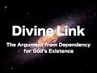

# Divine Link: The Argument from Dependency for God's Existence (2018-07-09)

## Description

Divine Link: The Argument from Dependency God's Existence

## Summary of [Divine Link: The Argument from Dependency for God's Existence](https://www.youtube.com/watch?v=DlNEnD65Wfo)

*This summary is AI generated - there may be inaccuracies. *

### [00:00:00](https://www.youtube.com/watch?v=DlNEnD65Wfo&t=0) - [00:35:00](https://www.youtube.com/watch?v=DlNEnD65Wfo&t=2100)

 argues that the universe is eternal and dependent, and that this dependency requires an external explanation. provides an example of a flower to illustrate his point. He argues that even if the universe were eternal, it does not mean it is necessary. The individual making the argument contends that there is no scientific explanation for the universe, and that this proves that God must exist.

**[00:00:00](https://www.youtube.com/watch?v=DlNEnD65Wfo&t=0)** The argument from dependency for God's existence is based on the rational principle that it is a sign of an intelligent mind to question that which did not have to be. Dependency is defined as not being necessary, meaning something can exist that is not necessary.
* **[00:05:00](https://www.youtube.com/watch?v=DlNEnD65Wfo&t=300)**  Josh Wheaton argues that there is nothing necessary about the arrangement of fundamental building blocks, such as material substances, and that requires an external explanation. He provides an example of a flower and argues that there is a need to explain the arrangement external to the flower.
* **[00:10:00](https://www.youtube.com/watch?v=DlNEnD65Wfo&t=600)**  argues that the universe and all that we perceive must have an external explanation for their existence, as they are dependent on something else. This external explanation could be necessary and eternal, leading to the conclusion that the universe is eternal and independent.
* **[00:15:00](https://www.youtube.com/watch?v=DlNEnD65Wfo&t=900)** argues that the universe and all that we perceive are dependent for their existence, and that this dependence is a logical consequence of the limitations of physical reality.
* **[00:20:00](https://www.youtube.com/watch?v=DlNEnD65Wfo&t=1200)** argues that an eternal universe requires a first principles explanation, which cannot be based on scientific evidence. He notes that the argument from contingency and necessity can be combined to form the argument from dependency. He points out that even if the universe were eternal, it does not mean it is necessary.
* **[00:25:00](https://www.youtube.com/watch?v=DlNEnD65Wfo&t=1500)** of the video argues that because the universe is eternal and has limited physical qualities, it cannot be explained by something else that is eternal and dependent. Therefore, the universe must be independent and eternal.
* **[00:30:00](https://www.youtube.com/watch?v=DlNEnD65Wfo&t=1800)** The individual making the argument contends that there is no scientific explanation for the universe, and that this proves that God must exist. They go on to argue that this is a metaphysical argument, and that even if science could find an explanation for the universe, it would not prove that God exists.
* **[00:35:00](https://www.youtube.com/watch?v=DlNEnD65Wfo&t=2100)** This essay argues that the Islamic conception of God is the best explanation for the existence of necessary beings, aka "dependency." The essay provides examples of how the Islamic conception of God is superior to other conceptions, and concludes that the Islamic conception of God is the best explanation for the existence of the universe.

<h2>Full transcript with timestamps: CLICK TO EXPAND</h2>

[0:00:03](https://youtu.be/DlNEnD65Wfo?t=3) so let me just repeat the basic  
[0:00:05](https://youtu.be/DlNEnD65Wfo?t=5) structure of the argument the universe  
[0:00:07](https://youtu.be/DlNEnD65Wfo?t=7) and all that we perceive is either  
[0:00:09](https://youtu.be/DlNEnD65Wfo?t=9) independent dependent on something else  
[0:00:12](https://youtu.be/DlNEnD65Wfo?t=12) dependent or dependent on something  
[0:00:15](https://youtu.be/DlNEnD65Wfo?t=15) independent and eternal the universe and  
[0:00:18](https://youtu.be/DlNEnD65Wfo?t=18) all that we perceive cannot be  
[0:00:20](https://youtu.be/DlNEnD65Wfo?t=20) independent or dependent on something  
[0:00:22](https://youtu.be/DlNEnD65Wfo?t=22) else dependent therefore the universe  
[0:00:25](https://youtu.be/DlNEnD65Wfo?t=25) and all that we perceive depends on  
[0:00:27](https://youtu.be/DlNEnD65Wfo?t=27) something independent and eternal that's  
[0:00:30](https://youtu.be/DlNEnD65Wfo?t=30) the basic structure of the argument okay  
[0:00:33](https://youtu.be/DlNEnD65Wfo?t=33) now before we go into the nitty-gritty  
[0:00:37](https://youtu.be/DlNEnD65Wfo?t=37) of the argument it's very important for  
[0:00:40](https://youtu.be/DlNEnD65Wfo?t=40) us to understand what we mean by  
[0:00:41](https://youtu.be/DlNEnD65Wfo?t=41) dependent in this context and before I  
[0:00:45](https://youtu.be/DlNEnD65Wfo?t=45) define what we mean by dependent in this  
[0:00:48](https://youtu.be/DlNEnD65Wfo?t=48) context I want you to focus on this  
[0:00:51](https://youtu.be/DlNEnD65Wfo?t=51) rational principle it is the mark of a  
[0:00:54](https://youtu.be/DlNEnD65Wfo?t=54) rational mind to question that which did  
[0:00:57](https://youtu.be/DlNEnD65Wfo?t=57) not have to be this is the kind of  
[0:00:59](https://youtu.be/DlNEnD65Wfo?t=59) cognitive intellectual motivation for  
[0:01:01](https://youtu.be/DlNEnD65Wfo?t=61) this argument it's the sign of a sound  
[0:01:04](https://youtu.be/DlNEnD65Wfo?t=64) chuckle a sound intellect it says it's a  
[0:01:07](https://youtu.be/DlNEnD65Wfo?t=67) sign of a rational mind to question that  
[0:01:11](https://youtu.be/DlNEnD65Wfo?t=71) which didn't have to be if we go to the  
[0:01:13](https://youtu.be/DlNEnD65Wfo?t=73) park and we see a hovering yellow ball  
[0:01:17](https://youtu.be/DlNEnD65Wfo?t=77) we're not going to pass the hovering  
[0:01:20](https://youtu.be/DlNEnD65Wfo?t=80) yellow bone and say hey the ball  
[0:01:24](https://youtu.be/DlNEnD65Wfo?t=84) necessarily exists in the park hovering  
[0:01:27](https://youtu.be/DlNEnD65Wfo?t=87) in the way that it does no because  
[0:01:30](https://youtu.be/DlNEnD65Wfo?t=90) you're an intelligent human being and  
[0:01:32](https://youtu.be/DlNEnD65Wfo?t=92) you think to yourself why is the ball  
[0:01:36](https://youtu.be/DlNEnD65Wfo?t=96) there how is it hovering because it's  
[0:01:39](https://youtu.be/DlNEnD65Wfo?t=99) the sign of a rational mind to question  
[0:01:41](https://youtu.be/DlNEnD65Wfo?t=101) that which didn't have to be the  
[0:01:43](https://youtu.be/DlNEnD65Wfo?t=103) hovering board didn't have to be there  
[0:01:45](https://youtu.be/DlNEnD65Wfo?t=105) so this is the kind of motivation  
[0:01:48](https://youtu.be/DlNEnD65Wfo?t=108) cognitive intellectual motivation  
[0:01:50](https://youtu.be/DlNEnD65Wfo?t=110) intuitive motivation for this argument  
[0:01:53](https://youtu.be/DlNEnD65Wfo?t=113) which is it's the sign of an intelligent  
[0:01:56](https://youtu.be/DlNEnD65Wfo?t=116) mind to question something that didn't  
[0:01:58](https://youtu.be/DlNEnD65Wfo?t=118) have to be the way that it is for  
[0:02:00](https://youtu.be/DlNEnD65Wfo?t=120) example if we're driving and we pass a  
[0:02:04](https://youtu.be/DlNEnD65Wfo?t=124) roundabout and on the roundabout we see  
[0:02:06](https://youtu.be/DlNEnD65Wfo?t=126) an arrangement of flowers that says  
[0:02:10](https://youtu.be/DlNEnD65Wfo?t=130) let you learn hey get Lala right you  
[0:02:14](https://youtu.be/DlNEnD65Wfo?t=134) know going to be like hey that original  
[0:02:16](https://youtu.be/DlNEnD65Wfo?t=136) flowers  
[0:02:17](https://youtu.be/DlNEnD65Wfo?t=137) necessarily exists in that way no  
[0:02:20](https://youtu.be/DlNEnD65Wfo?t=140) because you could just tell intuitively  
[0:02:23](https://youtu.be/DlNEnD65Wfo?t=143) and intelligently using your cognitive  
[0:02:25](https://youtu.be/DlNEnD65Wfo?t=145) faculties your rational faculties that  
[0:02:27](https://youtu.be/DlNEnD65Wfo?t=147) there is something about this region of  
[0:02:30](https://youtu.be/DlNEnD65Wfo?t=150) flowers that is telling me it didn't  
[0:02:33](https://youtu.be/DlNEnD65Wfo?t=153) have to be the way that it is so it's a  
[0:02:35](https://youtu.be/DlNEnD65Wfo?t=155) sign it's a mark of a rational mind to  
[0:02:38](https://youtu.be/DlNEnD65Wfo?t=158) question it why is it that why is it  
[0:02:40](https://youtu.be/DlNEnD65Wfo?t=160) that way why is there an arrangement of  
[0:02:43](https://youtu.be/DlNEnD65Wfo?t=163) flowers that says la ilaha illallah  
[0:02:45](https://youtu.be/DlNEnD65Wfo?t=165) there is no deity worthy of worship but  
[0:02:47](https://youtu.be/DlNEnD65Wfo?t=167) Allah and some of the explanations could  
[0:02:50](https://youtu.be/DlNEnD65Wfo?t=170) be I was chance there was a wind that  
[0:02:52](https://youtu.be/DlNEnD65Wfo?t=172) blew it could be that there was a  
[0:02:53](https://youtu.be/DlNEnD65Wfo?t=173) gardener whether they kiss maybe it  
[0:02:55](https://youtu.be/DlNEnD65Wfo?t=175) requires an explanation this is very  
[0:02:59](https://youtu.be/DlNEnD65Wfo?t=179) important to understand the whole  
[0:03:02](https://youtu.be/DlNEnD65Wfo?t=182) motivation behind this argument of  
[0:03:04](https://youtu.be/DlNEnD65Wfo?t=184) dependency is that it's a sign of a  
[0:03:07](https://youtu.be/DlNEnD65Wfo?t=187) rational mind to question that which  
[0:03:09](https://youtu.be/DlNEnD65Wfo?t=189) didn't have to be so there's now defined  
[0:03:11](https://youtu.be/DlNEnD65Wfo?t=191) dependency let's define what we mean by  
[0:03:14](https://youtu.be/DlNEnD65Wfo?t=194) dependency but by the way in the  
[0:03:16](https://youtu.be/DlNEnD65Wfo?t=196) philosophical literature you may see  
[0:03:18](https://youtu.be/DlNEnD65Wfo?t=198) this argument being termed and-and-and  
[0:03:21](https://youtu.be/DlNEnD65Wfo?t=201) being labeled as the argument from  
[0:03:24](https://youtu.be/DlNEnD65Wfo?t=204) contingency and you may see this in  
[0:03:26](https://youtu.be/DlNEnD65Wfo?t=206) Islamic textbooks Islamic Creed books  
[0:03:28](https://youtu.be/DlNEnD65Wfo?t=208) that when you see translations for  
[0:03:30](https://youtu.be/DlNEnD65Wfo?t=210) example of Arcadia however for example  
[0:03:34](https://youtu.be/DlNEnD65Wfo?t=214) you would see that it would mention  
[0:03:36](https://youtu.be/DlNEnD65Wfo?t=216) maybe the word contingent you see that a  
[0:03:38](https://youtu.be/DlNEnD65Wfo?t=218) lot especially in Creed textbooks  
[0:03:40](https://youtu.be/DlNEnD65Wfo?t=220) especially in the translation of an  
[0:03:43](https://youtu.be/DlNEnD65Wfo?t=223) explanation of a cadet hawea so I like  
[0:03:47](https://youtu.be/DlNEnD65Wfo?t=227) to use the word dependency because it's  
[0:03:49](https://youtu.be/DlNEnD65Wfo?t=229) more common contingency is notice it's a  
[0:03:52](https://youtu.be/DlNEnD65Wfo?t=232) bit of a tough word not that I'm shy of  
[0:03:55](https://youtu.be/DlNEnD65Wfo?t=235) using tough words but you get the point  
[0:03:57](https://youtu.be/DlNEnD65Wfo?t=237) so what I mean by dependent the first  
[0:04:01](https://youtu.be/DlNEnD65Wfo?t=241) thing the first definition of dependent  
[0:04:04](https://youtu.be/DlNEnD65Wfo?t=244) in the context of this argument is that  
[0:04:06](https://youtu.be/DlNEnD65Wfo?t=246) it is not necessary so something is  
[0:04:10](https://youtu.be/DlNEnD65Wfo?t=250) dependent if it is not necessary now you  
[0:04:14](https://youtu.be/DlNEnD65Wfo?t=254) may ask the question Hamza what do we  
[0:04:16](https://youtu.be/DlNEnD65Wfo?t=256) mean by necessary necessary means it was  
[0:04:20](https://youtu.be/DlNEnD65Wfo?t=260) impossible for it to have  
[0:04:23](https://youtu.be/DlNEnD65Wfo?t=263) existed let me repeat the concept of  
[0:04:26](https://youtu.be/DlNEnD65Wfo?t=266) necessity is not a kind of concept that  
[0:04:30](https://youtu.be/DlNEnD65Wfo?t=270) we use everyday it's more philosophical  
[0:04:33](https://youtu.be/DlNEnD65Wfo?t=273) theological concept that something that  
[0:04:36](https://youtu.be/DlNEnD65Wfo?t=276) is necessary is something in which it  
[0:04:39](https://youtu.be/DlNEnD65Wfo?t=279) was impossible for it to have not  
[0:04:41](https://youtu.be/DlNEnD65Wfo?t=281) existed it necessarily exists okay so  
[0:04:46](https://youtu.be/DlNEnD65Wfo?t=286) this will mean by necessary so therefore  
[0:04:48](https://youtu.be/DlNEnD65Wfo?t=288) something that is dependent is something  
[0:04:50](https://youtu.be/DlNEnD65Wfo?t=290) that is not necessary which means what  
[0:04:54](https://youtu.be/DlNEnD65Wfo?t=294) it means it could have not existed  
[0:04:57](https://youtu.be/DlNEnD65Wfo?t=297) that's what dependency means that  
[0:05:00](https://youtu.be/DlNEnD65Wfo?t=300) something is dependent if it was  
[0:05:02](https://youtu.be/DlNEnD65Wfo?t=302) possible for it to not exist for example  
[0:05:05](https://youtu.be/DlNEnD65Wfo?t=305) am i necessary no there's no yet nothing  
[0:05:10](https://youtu.be/DlNEnD65Wfo?t=310) necessary about my existence I could  
[0:05:12](https://youtu.be/DlNEnD65Wfo?t=312) have not existed right this wall could  
[0:05:17](https://youtu.be/DlNEnD65Wfo?t=317) have not existed there is nothing  
[0:05:19](https://youtu.be/DlNEnD65Wfo?t=319) necessary about this wall my  
[0:05:22](https://youtu.be/DlNEnD65Wfo?t=322) observations of this wall my  
[0:05:24](https://youtu.be/DlNEnD65Wfo?t=324) understanding of this wall the features  
[0:05:26](https://youtu.be/DlNEnD65Wfo?t=326) of this wall  
[0:05:27](https://youtu.be/DlNEnD65Wfo?t=327) do not cry out to me saying that it is  
[0:05:30](https://youtu.be/DlNEnD65Wfo?t=330) necessary it was impossible for it to  
[0:05:33](https://youtu.be/DlNEnD65Wfo?t=333) have not existed in actual fact it's the  
[0:05:36](https://youtu.be/DlNEnD65Wfo?t=336) opposite it could have not existed right  
[0:05:40](https://youtu.be/DlNEnD65Wfo?t=340) good for example let me give you another  
[0:05:44](https://youtu.be/DlNEnD65Wfo?t=344) example I'm gonna give you lots of  
[0:05:45](https://youtu.be/DlNEnD65Wfo?t=345) examples or these concepts can drill in  
[0:05:47](https://youtu.be/DlNEnD65Wfo?t=347) your mind I'm hungry  
[0:05:51](https://youtu.be/DlNEnD65Wfo?t=351) it's 3:00 in the morning okay it's a hot  
[0:05:55](https://youtu.be/DlNEnD65Wfo?t=355) summer so you get hungry and you get  
[0:05:57](https://youtu.be/DlNEnD65Wfo?t=357) thirsty so what do I do  
[0:05:58](https://youtu.be/DlNEnD65Wfo?t=358) I wake up I go downstairs walk to the  
[0:06:02](https://youtu.be/DlNEnD65Wfo?t=362) kitchen and I open the fridge and the  
[0:06:06](https://youtu.be/DlNEnD65Wfo?t=366) light comes on right and when you open  
[0:06:07](https://youtu.be/DlNEnD65Wfo?t=367) the fridge the refrigerator the light  
[0:06:09](https://youtu.be/DlNEnD65Wfo?t=369) comes on and what do I see I see a pen  
[0:06:12](https://youtu.be/DlNEnD65Wfo?t=372) on top of a egg box do I close the  
[0:06:17](https://youtu.be/DlNEnD65Wfo?t=377) fridge and say the pen and egg box  
[0:06:21](https://youtu.be/DlNEnD65Wfo?t=381) necessarily exists in the fridge  
[0:06:23](https://youtu.be/DlNEnD65Wfo?t=383) no I start to think  
[0:06:26](https://youtu.be/DlNEnD65Wfo?t=386) why and how on earth is the pen on top  
[0:06:30](https://youtu.be/DlNEnD65Wfo?t=390) of the egg box in the fridge because  
[0:06:33](https://youtu.be/DlNEnD65Wfo?t=393) there is nothing necessary about the  
[0:06:35](https://youtu.be/DlNEnD65Wfo?t=395) arrangement  
[0:06:36](https://youtu.be/DlNEnD65Wfo?t=396) there's nothing necessary about their  
[0:06:38](https://youtu.be/DlNEnD65Wfo?t=398) placement in the fridge there's nothing  
[0:06:39](https://youtu.be/DlNEnD65Wfo?t=399) necessary about the pen being on top of  
[0:06:42](https://youtu.be/DlNEnD65Wfo?t=402) the egg box in actual fact they could  
[0:06:47](https://youtu.be/DlNEnD65Wfo?t=407) have been arranged in a different way  
[0:06:49](https://youtu.be/DlNEnD65Wfo?t=409) they could have not existed at all in  
[0:06:52](https://youtu.be/DlNEnD65Wfo?t=412) actual fact the pen egg box could have  
[0:06:55](https://youtu.be/DlNEnD65Wfo?t=415) been on top of the fridge it could have  
[0:06:56](https://youtu.be/DlNEnD65Wfo?t=416) been in the food cupboard the pen could  
[0:07:03](https://youtu.be/DlNEnD65Wfo?t=423) have been in the egg box like he could  
[0:07:07](https://youtu.be/DlNEnD65Wfo?t=427) have been starving the egg box for  
[0:07:08](https://youtu.be/DlNEnD65Wfo?t=428) example you get the point you could have  
[0:07:10](https://youtu.be/DlNEnD65Wfo?t=430) been arranged and placed in a different  
[0:07:11](https://youtu.be/DlNEnD65Wfo?t=431) way  
[0:07:11](https://youtu.be/DlNEnD65Wfo?t=431) there is nothing necessary about the  
[0:07:13](https://youtu.be/DlNEnD65Wfo?t=433) arrangement of the pen on the egg box  
[0:07:14](https://youtu.be/DlNEnD65Wfo?t=434) and the placement in existence of the  
[0:07:17](https://youtu.be/DlNEnD65Wfo?t=437) pen in the egg box so what does this  
[0:07:18](https://youtu.be/DlNEnD65Wfo?t=438) mean it means it requires an explanation  
[0:07:21](https://youtu.be/DlNEnD65Wfo?t=441) but what type of explanation it doesn't  
[0:07:25](https://youtu.be/DlNEnD65Wfo?t=445) explain itself it must be an external  
[0:07:28](https://youtu.be/DlNEnD65Wfo?t=448) explanation because if it explains  
[0:07:31](https://youtu.be/DlNEnD65Wfo?t=451) itself it means it's necessary  
[0:07:33](https://youtu.be/DlNEnD65Wfo?t=453) it means it's necessary it means that  
[0:07:36](https://youtu.be/DlNEnD65Wfo?t=456) that it was impossible for it to have  
[0:07:39](https://youtu.be/DlNEnD65Wfo?t=459) not existed but that's not the type of  
[0:07:41](https://youtu.be/DlNEnD65Wfo?t=461) explanation that we're looking for now  
[0:07:43](https://youtu.be/DlNEnD65Wfo?t=463) because it is dependent it is contingent  
[0:07:46](https://youtu.be/DlNEnD65Wfo?t=466) there is nothing necessary about the  
[0:07:48](https://youtu.be/DlNEnD65Wfo?t=468) Parana egg box  
[0:07:49](https://youtu.be/DlNEnD65Wfo?t=469) therefore it requires an explanation  
[0:07:51](https://youtu.be/DlNEnD65Wfo?t=471) external to itself so what are the  
[0:07:54](https://youtu.be/DlNEnD65Wfo?t=474) possible explanations in this case the  
[0:07:56](https://youtu.be/DlNEnD65Wfo?t=476) possible explanations in this case is  
[0:07:58](https://youtu.be/DlNEnD65Wfo?t=478) the pen was designed by somebody was  
[0:08:00](https://youtu.be/DlNEnD65Wfo?t=480) made by somebody my wife bought it she  
[0:08:03](https://youtu.be/DlNEnD65Wfo?t=483) gave it to the children they were  
[0:08:05](https://youtu.be/DlNEnD65Wfo?t=485) playing with it then my son opened the  
[0:08:07](https://youtu.be/DlNEnD65Wfo?t=487) fridge and put on top of the egg box for  
[0:08:09](https://youtu.be/DlNEnD65Wfo?t=489) example yeah  
[0:08:10](https://youtu.be/DlNEnD65Wfo?t=490) explanation of the egg box we like eggs  
[0:08:13](https://youtu.be/DlNEnD65Wfo?t=493) we bought eggs you know eggs came from a  
[0:08:16](https://youtu.be/DlNEnD65Wfo?t=496) chicken okay or whatever the case may be  
[0:08:18](https://youtu.be/DlNEnD65Wfo?t=498) the point is there is an external  
[0:08:21](https://youtu.be/DlNEnD65Wfo?t=501) explanation to explain the existence  
[0:08:24](https://youtu.be/DlNEnD65Wfo?t=504) presence arrangement of the pen and egg  
[0:08:27](https://youtu.be/DlNEnD65Wfo?t=507) box therefore it's dependent make sense  
[0:08:30](https://youtu.be/DlNEnD65Wfo?t=510) of all good second definition of  
[0:08:34](https://youtu.be/DlNEnD65Wfo?t=514) dependency  
[0:08:36](https://youtu.be/DlNEnD65Wfo?t=516) the components of basic building blocks  
[0:08:39](https://youtu.be/DlNEnD65Wfo?t=519) the components of fundamental building  
[0:08:41](https://youtu.be/DlNEnD65Wfo?t=521) blocks could have been arranged in a  
[0:08:43](https://youtu.be/DlNEnD65Wfo?t=523) different way so take material substance  
[0:08:46](https://youtu.be/DlNEnD65Wfo?t=526) for example any material substance a  
[0:08:48](https://youtu.be/DlNEnD65Wfo?t=528) mobile phone a house a car or even even  
[0:08:54](https://youtu.be/DlNEnD65Wfo?t=534) something smaller  
[0:08:55](https://youtu.be/DlNEnD65Wfo?t=535) it has fundamental building blocks  
[0:08:58](https://youtu.be/DlNEnD65Wfo?t=538) fundamental building blocks those  
[0:09:00](https://youtu.be/DlNEnD65Wfo?t=540) building blocks are arranged in a  
[0:09:02](https://youtu.be/DlNEnD65Wfo?t=542) particular way there is nothing  
[0:09:05](https://youtu.be/DlNEnD65Wfo?t=545) necessary about that arrangement it  
[0:09:07](https://youtu.be/DlNEnD65Wfo?t=547) could have been arranged in another way  
[0:09:09](https://youtu.be/DlNEnD65Wfo?t=549) there's nothing necessary about that  
[0:09:12](https://youtu.be/DlNEnD65Wfo?t=552) arrangement that arrangement doesn't  
[0:09:13](https://youtu.be/DlNEnD65Wfo?t=553) explain itself it requires an  
[0:09:15](https://youtu.be/DlNEnD65Wfo?t=555) explanation external to it let me give  
[0:09:18](https://youtu.be/DlNEnD65Wfo?t=558) an example and I've mentioned this  
[0:09:19](https://youtu.be/DlNEnD65Wfo?t=559) earlier imagine we're driving a car we  
[0:09:22](https://youtu.be/DlNEnD65Wfo?t=562) stop near a roundabout actually let's  
[0:09:25](https://youtu.be/DlNEnD65Wfo?t=565) stop we stop near a park and we've  
[0:09:27](https://youtu.be/DlNEnD65Wfo?t=567) parked up our car and we're we're next  
[0:09:30](https://youtu.be/DlNEnD65Wfo?t=570) to the park and in the park we see the  
[0:09:32](https://youtu.be/DlNEnD65Wfo?t=572) arrangement of flowers and the  
[0:09:33](https://youtu.be/DlNEnD65Wfo?t=573) arrangement of flowers says I love you  
[0:09:36](https://youtu.be/DlNEnD65Wfo?t=576) now there's nothing necessary about the  
[0:09:38](https://youtu.be/DlNEnD65Wfo?t=578) arrangement of the flowers those flowers  
[0:09:40](https://youtu.be/DlNEnD65Wfo?t=580) do not explain themselves there is a  
[0:09:44](https://youtu.be/DlNEnD65Wfo?t=584) requirement there is a need to explain  
[0:09:47](https://youtu.be/DlNEnD65Wfo?t=587) the arrangement of the flowers external  
[0:09:49](https://youtu.be/DlNEnD65Wfo?t=589) to the flowers and possible explanations  
[0:09:52](https://youtu.be/DlNEnD65Wfo?t=592) could include what it could mean it  
[0:09:53](https://youtu.be/DlNEnD65Wfo?t=593) could include it was a gust of wind or  
[0:09:56](https://youtu.be/DlNEnD65Wfo?t=596) it could include it could it could  
[0:09:58](https://youtu.be/DlNEnD65Wfo?t=598) include that it was a gardener like the  
[0:10:00](https://youtu.be/DlNEnD65Wfo?t=600) local council told the gardener to place  
[0:10:03](https://youtu.be/DlNEnD65Wfo?t=603) the flowers in those way in the place of  
[0:10:05](https://youtu.be/DlNEnD65Wfo?t=605) flowers in that the formation in that  
[0:10:07](https://youtu.be/DlNEnD65Wfo?t=607) arrangement so the point here is the  
[0:10:11](https://youtu.be/DlNEnD65Wfo?t=611) fundamental fundamental building blocks  
[0:10:13](https://youtu.be/DlNEnD65Wfo?t=613) of things of any material substance any  
[0:10:15](https://youtu.be/DlNEnD65Wfo?t=615) physical substance could have been  
[0:10:17](https://youtu.be/DlNEnD65Wfo?t=617) arranged in a different way because we  
[0:10:19](https://youtu.be/DlNEnD65Wfo?t=619) could ask the question why is it  
[0:10:20](https://youtu.be/DlNEnD65Wfo?t=620) arranged in that way or not another way  
[0:10:23](https://youtu.be/DlNEnD65Wfo?t=623) and that question itself give right  
[0:10:26](https://youtu.be/DlNEnD65Wfo?t=626) gives rise to an explanation that's  
[0:10:28](https://youtu.be/DlNEnD65Wfo?t=628) external to the arrangement it requires  
[0:10:30](https://youtu.be/DlNEnD65Wfo?t=630) an explanation external to that  
[0:10:33](https://youtu.be/DlNEnD65Wfo?t=633) particular arrangement  
[0:10:36](https://youtu.be/DlNEnD65Wfo?t=636) the other definition of dependency is a  
[0:10:39](https://youtu.be/DlNEnD65Wfo?t=639) very common sense linguistic notion of  
[0:10:42](https://youtu.be/DlNEnD65Wfo?t=642) dependency that it requires something  
[0:10:45](https://youtu.be/DlNEnD65Wfo?t=645) outside of itself to exist it's not  
[0:10:48](https://youtu.be/DlNEnD65Wfo?t=648) self-subsisting it requires something  
[0:10:50](https://youtu.be/DlNEnD65Wfo?t=650) outside of itself to exist like for  
[0:10:52](https://youtu.be/DlNEnD65Wfo?t=652) example you had lunch earlier if you  
[0:10:55](https://youtu.be/DlNEnD65Wfo?t=655) don't have lunch for a few days in a few  
[0:10:58](https://youtu.be/DlNEnD65Wfo?t=658) weeks you won't be here anymore right  
[0:11:00](https://youtu.be/DlNEnD65Wfo?t=660) you require something outside of  
[0:11:02](https://youtu.be/DlNEnD65Wfo?t=662) yourself in order for you to exist you  
[0:11:03](https://youtu.be/DlNEnD65Wfo?t=663) are dependent in that way interestingly  
[0:11:08](https://youtu.be/DlNEnD65Wfo?t=668) and they I want you to focus on this  
[0:11:10](https://youtu.be/DlNEnD65Wfo?t=670) because it's an important this is a very  
[0:11:12](https://youtu.be/DlNEnD65Wfo?t=672) important kind of definition of  
[0:11:18](https://youtu.be/DlNEnD65Wfo?t=678) dependency dependent things dependent  
[0:11:24](https://youtu.be/DlNEnD65Wfo?t=684) things have limited physical qualities  
[0:11:26](https://youtu.be/DlNEnD65Wfo?t=686) okay  
[0:11:27](https://youtu.be/DlNEnD65Wfo?t=687) so dependent things have limited  
[0:11:31](https://youtu.be/DlNEnD65Wfo?t=691) physical qualities another way of  
[0:11:32](https://youtu.be/DlNEnD65Wfo?t=692) putting it the defining feature of a  
[0:11:35](https://youtu.be/DlNEnD65Wfo?t=695) dependent thing is that it has limited  
[0:11:37](https://youtu.be/DlNEnD65Wfo?t=697) physical qualities for example look at  
[0:11:40](https://youtu.be/DlNEnD65Wfo?t=700) this coffee cup this coffee cup has  
[0:11:43](https://youtu.be/DlNEnD65Wfo?t=703) limited physical qualities right it has  
[0:11:46](https://youtu.be/DlNEnD65Wfo?t=706) a certain shape temperature size volume  
[0:11:51](https://youtu.be/DlNEnD65Wfo?t=711) capacity smell even charge and it's  
[0:11:57](https://youtu.be/DlNEnD65Wfo?t=717) volume shape size color etc is limited  
[0:12:01](https://youtu.be/DlNEnD65Wfo?t=721) it is particular for example I don't  
[0:12:05](https://youtu.be/DlNEnD65Wfo?t=725) know it has a volume of say  
[0:12:10](https://youtu.be/DlNEnD65Wfo?t=730) and a half a liter or maybe 300  
[0:12:13](https://youtu.be/DlNEnD65Wfo?t=733) milliliters or whatever the case may be  
[0:12:14](https://youtu.be/DlNEnD65Wfo?t=734) now you could ask the question why is it  
[0:12:17](https://youtu.be/DlNEnD65Wfo?t=737) this shape and size or not another shape  
[0:12:19](https://youtu.be/DlNEnD65Wfo?t=739) and size why is it this color and not  
[0:12:22](https://youtu.be/DlNEnD65Wfo?t=742) another color why is it this smell and  
[0:12:25](https://youtu.be/DlNEnD65Wfo?t=745) not another smell why is it this  
[0:12:27](https://youtu.be/DlNEnD65Wfo?t=747) temperature and not another temperature  
[0:12:28](https://youtu.be/DlNEnD65Wfo?t=748) why is it this charge or not another  
[0:12:30](https://youtu.be/DlNEnD65Wfo?t=750) charge it therefore you could ask the  
[0:12:34](https://youtu.be/DlNEnD65Wfo?t=754) question what explains this limited  
[0:12:36](https://youtu.be/DlNEnD65Wfo?t=756) physical qualities well it can't explain  
[0:12:39](https://youtu.be/DlNEnD65Wfo?t=759) itself because the cup and listen to  
[0:12:41](https://youtu.be/DlNEnD65Wfo?t=761) this very carefully the cup did not give  
[0:12:43](https://youtu.be/DlNEnD65Wfo?t=763) rise to its limited physical qualities  
[0:12:46](https://youtu.be/DlNEnD65Wfo?t=766) the cup did not give rise to the limited  
[0:12:49](https://youtu.be/DlNEnD65Wfo?t=769) physical qualities there must be an  
[0:12:51](https://youtu.be/DlNEnD65Wfo?t=771) explanation outside of the cup that  
[0:12:54](https://youtu.be/DlNEnD65Wfo?t=774) explains the cup sound like Bruce Cena  
[0:12:57](https://youtu.be/DlNEnD65Wfo?t=777) right you know you know his famous  
[0:13:00](https://youtu.be/DlNEnD65Wfo?t=780) statement of if you put water into a  
[0:13:02](https://youtu.be/DlNEnD65Wfo?t=782) bottle it becomes the bottle if water  
[0:13:05](https://youtu.be/DlNEnD65Wfo?t=785) into a cup it becomes the cup now water  
[0:13:08](https://youtu.be/DlNEnD65Wfo?t=788) can flow or it can crash be water my  
[0:13:11](https://youtu.be/DlNEnD65Wfo?t=791) friend  
[0:13:12](https://youtu.be/DlNEnD65Wfo?t=792) I believe he took this some Imam Shafi  
[0:13:14](https://youtu.be/DlNEnD65Wfo?t=794) rahimullah Imam Shafi has a statement on  
[0:13:16](https://youtu.be/DlNEnD65Wfo?t=796) water and it's almost very similar I'm  
[0:13:19](https://youtu.be/DlNEnD65Wfo?t=799) gonna read it to you later actually  
[0:13:21](https://youtu.be/DlNEnD65Wfo?t=801) anyway forget my kind of links between  
[0:13:24](https://youtu.be/DlNEnD65Wfo?t=804) different historical figures let me give  
[0:13:27](https://youtu.be/DlNEnD65Wfo?t=807) you another example take my mobile phone  
[0:13:30](https://youtu.be/DlNEnD65Wfo?t=810) mobile phone has a specific shape size  
[0:13:33](https://youtu.be/DlNEnD65Wfo?t=813) color temperature texture charge smell  
[0:13:38](https://youtu.be/DlNEnD65Wfo?t=818) right and it's these things are limited  
[0:13:42](https://youtu.be/DlNEnD65Wfo?t=822) it has limited physical quality so you  
[0:13:45](https://youtu.be/DlNEnD65Wfo?t=825) ask yourself the question why is it this  
[0:13:47](https://youtu.be/DlNEnD65Wfo?t=827) size why is it the shape why is it this  
[0:13:50](https://youtu.be/DlNEnD65Wfo?t=830) volume why is it this temperature why is  
[0:13:53](https://youtu.be/DlNEnD65Wfo?t=833) it this color this phone doesn't explain  
[0:13:57](https://youtu.be/DlNEnD65Wfo?t=837) his own limited physical qualities it  
[0:13:59](https://youtu.be/DlNEnD65Wfo?t=839) can't and it can't give rise to its own  
[0:14:03](https://youtu.be/DlNEnD65Wfo?t=843) limited physical qualities so therefore  
[0:14:05](https://youtu.be/DlNEnD65Wfo?t=845) it requires an external explanation to  
[0:14:08](https://youtu.be/DlNEnD65Wfo?t=848) explain its limited physical qualities  
[0:14:11](https://youtu.be/DlNEnD65Wfo?t=851) and hamdulillah  
[0:14:15](https://youtu.be/DlNEnD65Wfo?t=855) so let's apply this definition of  
[0:14:18](https://youtu.be/DlNEnD65Wfo?t=858) dependency to the universe and we can  
[0:14:23](https://youtu.be/DlNEnD65Wfo?t=863) come to the following explanations  
[0:14:26](https://youtu.be/DlNEnD65Wfo?t=866) possible explanations number one the  
[0:14:30](https://youtu.be/DlNEnD65Wfo?t=870) universe and all that we perceive our  
[0:14:34](https://youtu.be/DlNEnD65Wfo?t=874) eternal necessary and independent or the  
[0:14:38](https://youtu.be/DlNEnD65Wfo?t=878) universe and all that we perceive  
[0:14:39](https://youtu.be/DlNEnD65Wfo?t=879) depends for its existence on something  
[0:14:42](https://youtu.be/DlNEnD65Wfo?t=882) else which is also dependent o the  
[0:14:45](https://youtu.be/DlNEnD65Wfo?t=885) universe and all that we perceive is  
[0:14:47](https://youtu.be/DlNEnD65Wfo?t=887) dependent for its existence on something  
[0:14:50](https://youtu.be/DlNEnD65Wfo?t=890) necessary and that is accordingly  
[0:14:53](https://youtu.be/DlNEnD65Wfo?t=893) eternal and independent so we've  
[0:14:55](https://youtu.be/DlNEnD65Wfo?t=895) understood what dependency means we give  
[0:14:57](https://youtu.be/DlNEnD65Wfo?t=897) around four or five definitions and now  
[0:15:00](https://youtu.be/DlNEnD65Wfo?t=900) we'll when apply to the universe and  
[0:15:02](https://youtu.be/DlNEnD65Wfo?t=902) once we apply to the universe which  
[0:15:04](https://youtu.be/DlNEnD65Wfo?t=904) conclusion are we going to come up with  
[0:15:06](https://youtu.be/DlNEnD65Wfo?t=906) is it going to be that the universe and  
[0:15:08](https://youtu.be/DlNEnD65Wfo?t=908) all that we perceive our eternal  
[0:15:10](https://youtu.be/DlNEnD65Wfo?t=910) necessary and independent or is it that  
[0:15:13](https://youtu.be/DlNEnD65Wfo?t=913) the universe and all that we perceive  
[0:15:14](https://youtu.be/DlNEnD65Wfo?t=914) depends for its existence or something  
[0:15:16](https://youtu.be/DlNEnD65Wfo?t=916) else which is also dependent or are we  
[0:15:19](https://youtu.be/DlNEnD65Wfo?t=919) going to conclude that the universe and  
[0:15:21](https://youtu.be/DlNEnD65Wfo?t=921) all that we perceive is dependent for  
[0:15:23](https://youtu.be/DlNEnD65Wfo?t=923) its existence on something necessary  
[0:15:25](https://youtu.be/DlNEnD65Wfo?t=925) that is accordingly eternal and  
[0:15:27](https://youtu.be/DlNEnD65Wfo?t=927) independent so let's now start to  
[0:15:29](https://youtu.be/DlNEnD65Wfo?t=929) conceptualize could the universe and all  
[0:15:33](https://youtu.be/DlNEnD65Wfo?t=933) that we perceive be eternal necessary  
[0:15:37](https://youtu.be/DlNEnD65Wfo?t=937) and independent given what we've  
[0:15:39](https://youtu.be/DlNEnD65Wfo?t=939) discussed about the definition of  
[0:15:40](https://youtu.be/DlNEnD65Wfo?t=940) dependency I want you to answer this  
[0:15:43](https://youtu.be/DlNEnD65Wfo?t=943) question  
[0:15:52](https://youtu.be/DlNEnD65Wfo?t=952) come on Richard yes chef could have been  
[0:15:55](https://youtu.be/DlNEnD65Wfo?t=955) arranged in the different  
[0:15:58](https://youtu.be/DlNEnD65Wfo?t=958) good so there's a few things we can now  
[0:16:01](https://youtu.be/DlNEnD65Wfo?t=961) start to understand well the universe  
[0:16:04](https://youtu.be/DlNEnD65Wfo?t=964) and all that we perceive they're based  
[0:16:06](https://youtu.be/DlNEnD65Wfo?t=966) on fundamental building blocks if you  
[0:16:08](https://youtu.be/DlNEnD65Wfo?t=968) remember one of the defining one of the  
[0:16:10](https://youtu.be/DlNEnD65Wfo?t=970) definitions of dependency is that the  
[0:16:12](https://youtu.be/DlNEnD65Wfo?t=972) fundamental building blocks or  
[0:16:13](https://youtu.be/DlNEnD65Wfo?t=973) components of that thing has a certain  
[0:16:16](https://youtu.be/DlNEnD65Wfo?t=976) arrangement right it doesn't have to be  
[0:16:18](https://youtu.be/DlNEnD65Wfo?t=978) like physical bits of matter it could be  
[0:16:20](https://youtu.be/DlNEnD65Wfo?t=980) even like quantum fields or whatever you  
[0:16:21](https://youtu.be/DlNEnD65Wfo?t=981) want the point is there is a particular  
[0:16:23](https://youtu.be/DlNEnD65Wfo?t=983) arrangement why that arrangement on  
[0:16:26](https://youtu.be/DlNEnD65Wfo?t=986) another arrangement now that arrangement  
[0:16:28](https://youtu.be/DlNEnD65Wfo?t=988) doesn't explain itself therefore it  
[0:16:31](https://youtu.be/DlNEnD65Wfo?t=991) requires an external explanation to  
[0:16:33](https://youtu.be/DlNEnD65Wfo?t=993) explain that arrangement then you could  
[0:16:35](https://youtu.be/DlNEnD65Wfo?t=995) ask anyone a question what are the  
[0:16:37](https://youtu.be/DlNEnD65Wfo?t=997) fundamental building blocks of the  
[0:16:38](https://youtu.be/DlNEnD65Wfo?t=998) universe and everything that we perceive  
[0:16:40](https://youtu.be/DlNEnD65Wfo?t=1000) they can give you 50 answers it doesn't  
[0:16:42](https://youtu.be/DlNEnD65Wfo?t=1002) matter the point is whatever answer they  
[0:16:45](https://youtu.be/DlNEnD65Wfo?t=1005) give you you could raise the question  
[0:16:47](https://youtu.be/DlNEnD65Wfo?t=1007) did that arrangement give rise to itself  
[0:16:49](https://youtu.be/DlNEnD65Wfo?t=1009) no there must been an external thing or  
[0:16:53](https://youtu.be/DlNEnD65Wfo?t=1013) set of factors or whatever the case may  
[0:16:55](https://youtu.be/DlNEnD65Wfo?t=1015) be that gave rise to that particular  
[0:16:57](https://youtu.be/DlNEnD65Wfo?t=1017) arrangement so from that definition you  
[0:16:59](https://youtu.be/DlNEnD65Wfo?t=1019) can't say the universe and all that we  
[0:17:01](https://youtu.be/DlNEnD65Wfo?t=1021) perceive is independent is dependent by  
[0:17:04](https://youtu.be/DlNEnD65Wfo?t=1024) the very definition give me another  
[0:17:07](https://youtu.be/DlNEnD65Wfo?t=1027) answer yes so the universe and all that  
[0:17:13](https://youtu.be/DlNEnD65Wfo?t=1033) we perceive have limited physical  
[0:17:16](https://youtu.be/DlNEnD65Wfo?t=1036) qualities and we discussed things that  
[0:17:19](https://youtu.be/DlNEnD65Wfo?t=1039) have limited physical qualities did not  
[0:17:21](https://youtu.be/DlNEnD65Wfo?t=1041) give rise to themselves therefore there  
[0:17:23](https://youtu.be/DlNEnD65Wfo?t=1043) must be an external explanation to  
[0:17:26](https://youtu.be/DlNEnD65Wfo?t=1046) explain the limited physical qualities  
[0:17:29](https://youtu.be/DlNEnD65Wfo?t=1049) of the universe or even the fundamental  
[0:17:31](https://youtu.be/DlNEnD65Wfo?t=1051) building blocks of the universe or even  
[0:17:32](https://youtu.be/DlNEnD65Wfo?t=1052) things within the universe whether it's  
[0:17:34](https://youtu.be/DlNEnD65Wfo?t=1054) plants trees stars galaxies whatever the  
[0:17:38](https://youtu.be/DlNEnD65Wfo?t=1058) case may be or even if something even  
[0:17:40](https://youtu.be/DlNEnD65Wfo?t=1060) more smaller and fundamental like quarks  
[0:17:42](https://youtu.be/DlNEnD65Wfo?t=1062) which are in an atom right the point  
[0:17:45](https://youtu.be/DlNEnD65Wfo?t=1065) here is they have limited physical  
[0:17:46](https://youtu.be/DlNEnD65Wfo?t=1066) qualities and they can't give rise to  
[0:17:50](https://youtu.be/DlNEnD65Wfo?t=1070) their own limitations therefore there is  
[0:17:52](https://youtu.be/DlNEnD65Wfo?t=1072) an external explanation or external set  
[0:17:55](https://youtu.be/DlNEnD65Wfo?t=1075) of factors that gave rise to those  
[0:17:57](https://youtu.be/DlNEnD65Wfo?t=1077) limitations give me another reason why  
[0:18:00](https://youtu.be/DlNEnD65Wfo?t=1080) the universe and all that we perceive  
[0:18:01](https://youtu.be/DlNEnD65Wfo?t=1081) could not be independent  
[0:18:08](https://youtu.be/DlNEnD65Wfo?t=1088) okay  
[0:18:10](https://youtu.be/DlNEnD65Wfo?t=1090) moaning when your pilot to the universe  
[0:18:12](https://youtu.be/DlNEnD65Wfo?t=1092) maybe let's pause that for now and  
[0:18:14](https://youtu.be/DlNEnD65Wfo?t=1094) redress it but let's pick something else  
[0:18:18](https://youtu.be/DlNEnD65Wfo?t=1098) what's the easiest one the first one  
[0:18:20](https://youtu.be/DlNEnD65Wfo?t=1100) that we mentioned no that was the third  
[0:18:25](https://youtu.be/DlNEnD65Wfo?t=1105) one what was the first one we mentioned  
[0:18:27](https://youtu.be/DlNEnD65Wfo?t=1107) it's not necessary absolutely and this  
[0:18:31](https://youtu.be/DlNEnD65Wfo?t=1111) isn't our credo books there is nothing  
[0:18:33](https://youtu.be/DlNEnD65Wfo?t=1113) necessary about the universe meaning  
[0:18:36](https://youtu.be/DlNEnD65Wfo?t=1116) that there is an explanation for the  
[0:18:39](https://youtu.be/DlNEnD65Wfo?t=1119) emergence creation and reality and  
[0:18:41](https://youtu.be/DlNEnD65Wfo?t=1121) existence of the universe the universe  
[0:18:43](https://youtu.be/DlNEnD65Wfo?t=1123) doesn't explain itself because necessity  
[0:18:46](https://youtu.be/DlNEnD65Wfo?t=1126) means that the thing that you're talking  
[0:18:48](https://youtu.be/DlNEnD65Wfo?t=1128) about or the phenomenon that you're  
[0:18:50](https://youtu.be/DlNEnD65Wfo?t=1130) talking about explains itself and that  
[0:18:53](https://youtu.be/DlNEnD65Wfo?t=1133) mean it necessarily exists but the  
[0:18:55](https://youtu.be/DlNEnD65Wfo?t=1135) universe doesn't necessarily exist what  
[0:18:57](https://youtu.be/DlNEnD65Wfo?t=1137) do we talk about in the beginning it's  
[0:18:59](https://youtu.be/DlNEnD65Wfo?t=1139) the sign it's the mark of a rational  
[0:19:01](https://youtu.be/DlNEnD65Wfo?t=1141) mind to question that which didn't have  
[0:19:03](https://youtu.be/DlNEnD65Wfo?t=1143) to be the universe could have been  
[0:19:06](https://youtu.be/DlNEnD65Wfo?t=1146) another universe it could have we even  
[0:19:09](https://youtu.be/DlNEnD65Wfo?t=1149) scientifically they say this universe  
[0:19:11](https://youtu.be/DlNEnD65Wfo?t=1151) didn't have to be the way that it is  
[0:19:13](https://youtu.be/DlNEnD65Wfo?t=1153) there could have been another universe  
[0:19:14](https://youtu.be/DlNEnD65Wfo?t=1154) with different features and different  
[0:19:15](https://youtu.be/DlNEnD65Wfo?t=1155) laws for example the universe didn't  
[0:19:17](https://youtu.be/DlNEnD65Wfo?t=1157) have to exist at all it's contingent is  
[0:19:20](https://youtu.be/DlNEnD65Wfo?t=1160) dependent from that point of view  
[0:19:21](https://youtu.be/DlNEnD65Wfo?t=1161) because it is not necessary just to  
[0:19:24](https://youtu.be/DlNEnD65Wfo?t=1164) remind you what does necessity mean  
[0:19:25](https://youtu.be/DlNEnD65Wfo?t=1165) necessity means that it was impossible  
[0:19:27](https://youtu.be/DlNEnD65Wfo?t=1167) for it to have not existed it was  
[0:19:31](https://youtu.be/DlNEnD65Wfo?t=1171) impossible for it to have not existed  
[0:19:35](https://youtu.be/DlNEnD65Wfo?t=1175) but that's not the case for the universe  
[0:19:37](https://youtu.be/DlNEnD65Wfo?t=1177) because it was possible for it to not  
[0:19:39](https://youtu.be/DlNEnD65Wfo?t=1179) have existed that's the point so it's  
[0:19:42](https://youtu.be/DlNEnD65Wfo?t=1182) dependent by definition so good it is  
[0:19:45](https://youtu.be/DlNEnD65Wfo?t=1185) excellent see how we applying the  
[0:19:47](https://youtu.be/DlNEnD65Wfo?t=1187) concepts here so we can conclude that  
[0:19:49](https://youtu.be/DlNEnD65Wfo?t=1189) the universe and all that we perceive  
[0:19:51](https://youtu.be/DlNEnD65Wfo?t=1191) are not independent they're not  
[0:19:55](https://youtu.be/DlNEnD65Wfo?t=1195) independent and therefore they're not  
[0:19:58](https://youtu.be/DlNEnD65Wfo?t=1198) necessary second point the universe and  
[0:20:02](https://youtu.be/DlNEnD65Wfo?t=1202) all that we perceive depends for its  
[0:20:05](https://youtu.be/DlNEnD65Wfo?t=1205) existence or something else which is  
[0:20:06](https://youtu.be/DlNEnD65Wfo?t=1206) also dependent so that's the second  
[0:20:08](https://youtu.be/DlNEnD65Wfo?t=1208) possible explanation we know the first  
[0:20:09](https://youtu.be/DlNEnD65Wfo?t=1209) possible explanation is false what about  
[0:20:11](https://youtu.be/DlNEnD65Wfo?t=1211) this one how'd you answer this question  
[0:20:13](https://youtu.be/DlNEnD65Wfo?t=1213) how do you answer and deal with this  
[0:20:15](https://youtu.be/DlNEnD65Wfo?t=1215) possible explanation so some would argue  
[0:20:17](https://youtu.be/DlNEnD65Wfo?t=1217) fine the universe is dependent it's not  
[0:20:20](https://youtu.be/DlNEnD65Wfo?t=1220) necessary it requires an explanation for  
[0:20:22](https://youtu.be/DlNEnD65Wfo?t=1222) its existence  
[0:20:23](https://youtu.be/DlNEnD65Wfo?t=1223) however that explanation is also  
[0:20:26](https://youtu.be/DlNEnD65Wfo?t=1226) something else dependent how do you  
[0:20:27](https://youtu.be/DlNEnD65Wfo?t=1227) address this  
[0:20:33](https://youtu.be/DlNEnD65Wfo?t=1233) only gave it the overall fashion  
[0:20:36](https://youtu.be/DlNEnD65Wfo?t=1236) yes but they would say that thing itself  
[0:20:38](https://youtu.be/DlNEnD65Wfo?t=1238) is also dependent what they're saying  
[0:20:40](https://youtu.be/DlNEnD65Wfo?t=1240) here is yes we agree the universe is  
[0:20:43](https://youtu.be/DlNEnD65Wfo?t=1243) dependent from what you've just  
[0:20:45](https://youtu.be/DlNEnD65Wfo?t=1245) discussed it's not independent and  
[0:20:47](https://youtu.be/DlNEnD65Wfo?t=1247) necessary but what explains the  
[0:20:52](https://youtu.be/DlNEnD65Wfo?t=1252) existence and the features of the  
[0:20:54](https://youtu.be/DlNEnD65Wfo?t=1254) universe and everything within it is  
[0:20:55](https://youtu.be/DlNEnD65Wfo?t=1255) something else that's also dependent is  
[0:20:58](https://youtu.be/DlNEnD65Wfo?t=1258) that a good explanation for us yes  
[0:21:02](https://youtu.be/DlNEnD65Wfo?t=1262) absolutely  
[0:21:04](https://youtu.be/DlNEnD65Wfo?t=1264) you'd have an infinite regress of  
[0:21:05](https://youtu.be/DlNEnD65Wfo?t=1265) dependencies what we're looking for is  
[0:21:08](https://youtu.be/DlNEnD65Wfo?t=1268) an explanation you haven't explained  
[0:21:09](https://youtu.be/DlNEnD65Wfo?t=1269) anything you're just saying what  
[0:21:11](https://youtu.be/DlNEnD65Wfo?t=1271) explains a dependent thing is another  
[0:21:14](https://youtu.be/DlNEnD65Wfo?t=1274) dependent thing okay what explains that  
[0:21:16](https://youtu.be/DlNEnD65Wfo?t=1276) dependent thing Oh another dependent  
[0:21:18](https://youtu.be/DlNEnD65Wfo?t=1278) thing you're not giving us any  
[0:21:20](https://youtu.be/DlNEnD65Wfo?t=1280) explanation here in any shape or form  
[0:21:23](https://youtu.be/DlNEnD65Wfo?t=1283) that's the point and you have an  
[0:21:26](https://youtu.be/DlNEnD65Wfo?t=1286) absurdity of an infinite regress of  
[0:21:28](https://youtu.be/DlNEnD65Wfo?t=1288) dependencies because the only way to  
[0:21:33](https://youtu.be/DlNEnD65Wfo?t=1293) altima t explain things that are not  
[0:21:36](https://youtu.be/DlNEnD65Wfo?t=1296) necessary the only way to ultimately  
[0:21:38](https://youtu.be/DlNEnD65Wfo?t=1298) explain dependent things is to refer to  
[0:21:42](https://youtu.be/DlNEnD65Wfo?t=1302) something that is not dependent and  
[0:21:44](https://youtu.be/DlNEnD65Wfo?t=1304) therefore necessary otherwise you don't  
[0:21:46](https://youtu.be/DlNEnD65Wfo?t=1306) have an explain all to my explanation  
[0:21:48](https://youtu.be/DlNEnD65Wfo?t=1308) and as you said that an infinite number  
[0:21:51](https://youtu.be/DlNEnD65Wfo?t=1311) of dependencies is impossible as we  
[0:21:54](https://youtu.be/DlNEnD65Wfo?t=1314) discussed in the previous session when  
[0:21:55](https://youtu.be/DlNEnD65Wfo?t=1315) we talked about the quranic' argument  
[0:21:57](https://youtu.be/DlNEnD65Wfo?t=1317) for God's existence however let me just  
[0:22:00](https://youtu.be/DlNEnD65Wfo?t=1320) move back so I want to test you on this  
[0:22:01](https://youtu.be/DlNEnD65Wfo?t=1321) what if the universe was eternal and  
[0:22:04](https://youtu.be/DlNEnD65Wfo?t=1324) that's why I like this argument because  
[0:22:06](https://youtu.be/DlNEnD65Wfo?t=1326) you could assume the universe is eternal  
[0:22:08](https://youtu.be/DlNEnD65Wfo?t=1328) not that we adopt that because that  
[0:22:10](https://youtu.be/DlNEnD65Wfo?t=1330) would be cool for right that'll be a  
[0:22:12](https://youtu.be/DlNEnD65Wfo?t=1332) form of disbelief but even people bring  
[0:22:15](https://youtu.be/DlNEnD65Wfo?t=1335) that to the table you can address it  
[0:22:17](https://youtu.be/DlNEnD65Wfo?t=1337) because you don't have to rely on any  
[0:22:19](https://youtu.be/DlNEnD65Wfo?t=1339) scientific evidence for this argument as  
[0:22:20](https://youtu.be/DlNEnD65Wfo?t=1340) I said this is a first principles  
[0:22:22](https://youtu.be/DlNEnD65Wfo?t=1342) argument you could absorb any science  
[0:22:24](https://youtu.be/DlNEnD65Wfo?t=1344) anonymous Island welcome and which the  
[0:22:27](https://youtu.be/DlNEnD65Wfo?t=1347) arguments to works it's a timeless  
[0:22:29](https://youtu.be/DlNEnD65Wfo?t=1349) argument this is why all the schools of  
[0:22:31](https://youtu.be/DlNEnD65Wfo?t=1351) Creed in Islam adopted this argument  
[0:22:34](https://youtu.be/DlNEnD65Wfo?t=1354) you'll see it in the different  
[0:22:36](https://youtu.be/DlNEnD65Wfo?t=1356) conceptions of accurate hawea they would  
[0:22:38](https://youtu.be/DlNEnD65Wfo?t=1358) refer to the argument from contingency  
[0:22:41](https://youtu.be/DlNEnD65Wfo?t=1361) necessity the argument from dependency  
[0:22:44](https://youtu.be/DlNEnD65Wfo?t=1364) you'll see this right so the  
[0:22:48](https://youtu.be/DlNEnD65Wfo?t=1368) being way if the universe was eternal  
[0:22:51](https://youtu.be/DlNEnD65Wfo?t=1371) and they bet they'll be like see the  
[0:22:55](https://youtu.be/DlNEnD65Wfo?t=1375) universe is eternal the universe  
[0:22:56](https://youtu.be/DlNEnD65Wfo?t=1376) explains itself how would you deal with  
[0:23:00](https://youtu.be/DlNEnD65Wfo?t=1380) that point  
[0:23:02](https://youtu.be/DlNEnD65Wfo?t=1382) [Music]  
[0:23:09](https://youtu.be/DlNEnD65Wfo?t=1389) think about it so they're the Greenview  
[0:23:12](https://youtu.be/DlNEnD65Wfo?t=1392) so far  
[0:23:13](https://youtu.be/DlNEnD65Wfo?t=1393) okay Hamza I reviewed with you about  
[0:23:15](https://youtu.be/DlNEnD65Wfo?t=1395) this argument it's very good  
[0:23:17](https://youtu.be/DlNEnD65Wfo?t=1397) it's intuitive it's based on first  
[0:23:18](https://youtu.be/DlNEnD65Wfo?t=1398) principles you know we don't have to  
[0:23:21](https://youtu.be/DlNEnD65Wfo?t=1401) include any science in this because it  
[0:23:22](https://youtu.be/DlNEnD65Wfo?t=1402) transcends science it's a metaphysical  
[0:23:24](https://youtu.be/DlNEnD65Wfo?t=1404) argument I agree with what you're saying  
[0:23:27](https://youtu.be/DlNEnD65Wfo?t=1407) about necessity and dependency and  
[0:23:29](https://youtu.be/DlNEnD65Wfo?t=1409) contingency that's fine I agree that the  
[0:23:31](https://youtu.be/DlNEnD65Wfo?t=1411) universe cannot be independent and  
[0:23:34](https://youtu.be/DlNEnD65Wfo?t=1414) necessary but you know what way if the  
[0:23:36](https://youtu.be/DlNEnD65Wfo?t=1416) universe is eternal doesn't that mean  
[0:23:38](https://youtu.be/DlNEnD65Wfo?t=1418) that therefore the universe is necessary  
[0:23:44](https://youtu.be/DlNEnD65Wfo?t=1424) think about it no it doesn't even if the  
[0:23:48](https://youtu.be/DlNEnD65Wfo?t=1428) universe was eternal so what it doesn't  
[0:23:52](https://youtu.be/DlNEnD65Wfo?t=1432) mean now it necessarily exists and  
[0:23:56](https://youtu.be/DlNEnD65Wfo?t=1436) here's an interesting example imagine  
[0:23:59](https://youtu.be/DlNEnD65Wfo?t=1439) there an infinite number of human beings  
[0:24:01](https://youtu.be/DlNEnD65Wfo?t=1441) each human being was produced by the  
[0:24:04](https://youtu.be/DlNEnD65Wfo?t=1444) biological activity of their parents and  
[0:24:06](https://youtu.be/DlNEnD65Wfo?t=1446) each of these parents was in turn  
[0:24:08](https://youtu.be/DlNEnD65Wfo?t=1448) produced by the biological activity of  
[0:24:10](https://youtu.be/DlNEnD65Wfo?t=1450) their parents ad infinitum wouldn't it  
[0:24:13](https://youtu.be/DlNEnD65Wfo?t=1453) still be perfectly reasonable to ask why  
[0:24:16](https://youtu.be/DlNEnD65Wfo?t=1456) are there any human beings at all fine  
[0:24:18](https://youtu.be/DlNEnD65Wfo?t=1458) even if it's an eternal number of  
[0:24:20](https://youtu.be/DlNEnD65Wfo?t=1460) infinite number of human beings fine  
[0:24:22](https://youtu.be/DlNEnD65Wfo?t=1462) let's take it the universe is eternal  
[0:24:25](https://youtu.be/DlNEnD65Wfo?t=1465) let's just accept if one moment how does  
[0:24:27](https://youtu.be/DlNEnD65Wfo?t=1467) that now follow it's therefore necessary  
[0:24:29](https://youtu.be/DlNEnD65Wfo?t=1469) I agree for something to be necessary it  
[0:24:33](https://youtu.be/DlNEnD65Wfo?t=1473) has to be eternal but for something to  
[0:24:35](https://youtu.be/DlNEnD65Wfo?t=1475) be eternal it doesn't mean has to be  
[0:24:37](https://youtu.be/DlNEnD65Wfo?t=1477) necessary you get the logic here  
[0:24:38](https://youtu.be/DlNEnD65Wfo?t=1478) let me repeat for something to be  
[0:24:40](https://youtu.be/DlNEnD65Wfo?t=1480) necessary it has to be eternal why  
[0:24:43](https://youtu.be/DlNEnD65Wfo?t=1483) because if it was finite it requires an  
[0:24:45](https://youtu.be/DlNEnD65Wfo?t=1485) explanation why it's finite right so  
[0:24:47](https://youtu.be/DlNEnD65Wfo?t=1487) it's not necessary anymore however  
[0:24:49](https://youtu.be/DlNEnD65Wfo?t=1489) something be eternal doesn't mean it has  
[0:24:51](https://youtu.be/DlNEnD65Wfo?t=1491) to be necessary although if something is  
[0:24:55](https://youtu.be/DlNEnD65Wfo?t=1495) necessary it has to be eternal so in  
[0:24:58](https://youtu.be/DlNEnD65Wfo?t=1498) this case is saying well the universe is  
[0:25:00](https://youtu.be/DlNEnD65Wfo?t=1500) a journal therefore it's necessary that  
[0:25:02](https://youtu.be/DlNEnD65Wfo?t=1502) doesn't logically follow because you can  
[0:25:05](https://youtu.be/DlNEnD65Wfo?t=1505) have an infinite number of human beings  
[0:25:06](https://youtu.be/DlNEnD65Wfo?t=1506) right that exist for eternity but you  
[0:25:09](https://youtu.be/DlNEnD65Wfo?t=1509) could still ask the question why are the  
[0:25:12](https://youtu.be/DlNEnD65Wfo?t=1512) human beings in existence in the first  
[0:25:14](https://youtu.be/DlNEnD65Wfo?t=1514) place because it's the sign of a  
[0:25:16](https://youtu.be/DlNEnD65Wfo?t=1516) rational mind to question that which  
[0:25:17](https://youtu.be/DlNEnD65Wfo?t=1517) didn't have to be there is nothing  
[0:25:19](https://youtu.be/DlNEnD65Wfo?t=1519) necessary about their existence and each  
[0:25:21](https://youtu.be/DlNEnD65Wfo?t=1521) part of the  
[0:25:22](https://youtu.be/DlNEnD65Wfo?t=1522) of the human beings you could ask why  
[0:25:25](https://youtu.be/DlNEnD65Wfo?t=1525) are they there they're fundamental  
[0:25:27](https://youtu.be/DlNEnD65Wfo?t=1527) building blocks of those of those of  
[0:25:29](https://youtu.be/DlNEnD65Wfo?t=1529) those human beings could be arranged in  
[0:25:30](https://youtu.be/DlNEnD65Wfo?t=1530) a particular way in a different way each  
[0:25:33](https://youtu.be/DlNEnD65Wfo?t=1533) of those human beings have limited  
[0:25:34](https://youtu.be/DlNEnD65Wfo?t=1534) physical qualities that didn't give rise  
[0:25:36](https://youtu.be/DlNEnD65Wfo?t=1536) to themselves they must be an external  
[0:25:38](https://youtu.be/DlNEnD65Wfo?t=1538) explanation that gave rise to those  
[0:25:40](https://youtu.be/DlNEnD65Wfo?t=1540) limited physical qualities all of those  
[0:25:41](https://youtu.be/DlNEnD65Wfo?t=1541) human beings and every human being in  
[0:25:43](https://youtu.be/DlNEnD65Wfo?t=1543) that chain so whether you think is a  
[0:25:45](https://youtu.be/DlNEnD65Wfo?t=1545) turn-on or is irrelevant for this  
[0:25:47](https://youtu.be/DlNEnD65Wfo?t=1547) argument it still follows that requires  
[0:25:51](https://youtu.be/DlNEnD65Wfo?t=1551) an external explanation  
[0:25:52](https://youtu.be/DlNEnD65Wfo?t=1552) there's nothing necessary about your  
[0:25:55](https://youtu.be/DlNEnD65Wfo?t=1555) so-called eternal universe because if  
[0:25:57](https://youtu.be/DlNEnD65Wfo?t=1557) they could have been another eternal  
[0:25:58](https://youtu.be/DlNEnD65Wfo?t=1558) universe with different features and  
[0:26:00](https://youtu.be/DlNEnD65Wfo?t=1560) laws for example in actual fact the  
[0:26:04](https://youtu.be/DlNEnD65Wfo?t=1564) there could have been a universe that  
[0:26:06](https://youtu.be/DlNEnD65Wfo?t=1566) wasn't eternal but finite  
[0:26:07](https://youtu.be/DlNEnD65Wfo?t=1567) there could have been a universe that  
[0:26:09](https://youtu.be/DlNEnD65Wfo?t=1569) didn't exist at all right there's  
[0:26:11](https://youtu.be/DlNEnD65Wfo?t=1571) nothing necessary about the existence of  
[0:26:12](https://youtu.be/DlNEnD65Wfo?t=1572) your so-called eternal universe so it  
[0:26:15](https://youtu.be/DlNEnD65Wfo?t=1575) doesn't follow just because something is  
[0:26:16](https://youtu.be/DlNEnD65Wfo?t=1576) eternal it therefore it means it must be  
[0:26:19](https://youtu.be/DlNEnD65Wfo?t=1579) necessary that doesn't follow and this  
[0:26:21](https://youtu.be/DlNEnD65Wfo?t=1581) full experiment by showing that imagine  
[0:26:24](https://youtu.be/DlNEnD65Wfo?t=1584) you had an infinite number of human  
[0:26:25](https://youtu.be/DlNEnD65Wfo?t=1585) beings you still could perfectly ask the  
[0:26:28](https://youtu.be/DlNEnD65Wfo?t=1588) question well why they're human beings  
[0:26:30](https://youtu.be/DlNEnD65Wfo?t=1590) in the first place and why is that wide  
[0:26:32](https://youtu.be/DlNEnD65Wfo?t=1592) why do they have those limited physical  
[0:26:34](https://youtu.be/DlNEnD65Wfo?t=1594) qualities why they arranged in that  
[0:26:36](https://youtu.be/DlNEnD65Wfo?t=1596) particular way so the universe is not  
[0:26:41](https://youtu.be/DlNEnD65Wfo?t=1601) independent necessary in eternal number  
[0:26:44](https://youtu.be/DlNEnD65Wfo?t=1604) two the universe that's dependent cannot  
[0:26:47](https://youtu.be/DlNEnD65Wfo?t=1607) be explained by something else that's  
[0:26:48](https://youtu.be/DlNEnD65Wfo?t=1608) dependent and even if you claim the  
[0:26:50](https://youtu.be/DlNEnD65Wfo?t=1610) universe is eternal it doesn't follow  
[0:26:51](https://youtu.be/DlNEnD65Wfo?t=1611) that it's necessary  
[0:26:52](https://youtu.be/DlNEnD65Wfo?t=1612) so therefore the best explanation the  
[0:26:55](https://youtu.be/DlNEnD65Wfo?t=1615) only rational explanation is the  
[0:26:57](https://youtu.be/DlNEnD65Wfo?t=1617) universe and all that we perceive  
[0:26:59](https://youtu.be/DlNEnD65Wfo?t=1619) depends on something independent and  
[0:27:02](https://youtu.be/DlNEnD65Wfo?t=1622) eternal why is it independent very  
[0:27:06](https://youtu.be/DlNEnD65Wfo?t=1626) simple because if it were dependent it  
[0:27:08](https://youtu.be/DlNEnD65Wfo?t=1628) would require an explanation then we you  
[0:27:10](https://youtu.be/DlNEnD65Wfo?t=1630) don't have any answer it has to be  
[0:27:13](https://youtu.be/DlNEnD65Wfo?t=1633) eternal because if it was not eternal in  
[0:27:16](https://youtu.be/DlNEnD65Wfo?t=1636) other words finite it would be dependent  
[0:27:18](https://youtu.be/DlNEnD65Wfo?t=1638) and finite things require an explanation  
[0:27:21](https://youtu.be/DlNEnD65Wfo?t=1641) for their existence dependent things  
[0:27:23](https://youtu.be/DlNEnD65Wfo?t=1643) require an explanation for their  
[0:27:25](https://youtu.be/DlNEnD65Wfo?t=1645) existence so it has to be independent  
[0:27:27](https://youtu.be/DlNEnD65Wfo?t=1647) and eternal therefore we can conclude  
[0:27:31](https://youtu.be/DlNEnD65Wfo?t=1651) that the universe and everything that we  
[0:27:33](https://youtu.be/DlNEnD65Wfo?t=1653) perceive depends upon something that is  
[0:27:35](https://youtu.be/DlNEnD65Wfo?t=1655) a turn on in  
[0:27:36](https://youtu.be/DlNEnD65Wfo?t=1656) and this is best explained by the  
[0:27:38](https://youtu.be/DlNEnD65Wfo?t=1658) Islamic conception of a divine that  
[0:27:40](https://youtu.be/DlNEnD65Wfo?t=1660) Allah is independent he necessarily  
[0:27:42](https://youtu.be/DlNEnD65Wfo?t=1662) exists and this terminology exists in  
[0:27:45](https://youtu.be/DlNEnD65Wfo?t=1665) our created text books as you see in the  
[0:27:50](https://youtu.be/DlNEnD65Wfo?t=1670) Islamic tradition allah subhanho wa  
[0:27:51](https://youtu.be/DlNEnD65Wfo?t=1671) taala says allah is independent all that  
[0:27:53](https://youtu.be/DlNEnD65Wfo?t=1673) exists o mankind it is you who stand in  
[0:27:56](https://youtu.be/DlNEnD65Wfo?t=1676) need of Allah whereas he alone is so  
[0:27:57](https://youtu.be/DlNEnD65Wfo?t=1677) sufficient than one whom all praise is  
[0:27:59](https://youtu.be/DlNEnD65Wfo?t=1679) due and even kathira the exegete the one  
[0:28:03](https://youtu.be/DlNEnD65Wfo?t=1683) who explained the Quran the classical  
[0:28:05](https://youtu.be/DlNEnD65Wfo?t=1685) scholar he mentions concerning the above  
[0:28:07](https://youtu.be/DlNEnD65Wfo?t=1687) verse they need him in all that they do  
[0:28:09](https://youtu.be/DlNEnD65Wfo?t=1689) and he has no need of them are told he  
[0:28:12](https://youtu.be/DlNEnD65Wfo?t=1692) is unique in his being free of all needs  
[0:28:14](https://youtu.be/DlNEnD65Wfo?t=1694) and has no partner or associate however  
[0:28:18](https://youtu.be/DlNEnD65Wfo?t=1698) as you know the human being is a  
[0:28:20](https://youtu.be/DlNEnD65Wfo?t=1700) contentious fellow as the Quran says you  
[0:28:23](https://youtu.be/DlNEnD65Wfo?t=1703) know we want to split the split the hair  
[0:28:25](https://youtu.be/DlNEnD65Wfo?t=1705) in an infinite number of ways as they  
[0:28:27](https://youtu.be/DlNEnD65Wfo?t=1707) say the first contention is well the  
[0:28:30](https://youtu.be/DlNEnD65Wfo?t=1710) universe exists independently this is an  
[0:28:35](https://youtu.be/DlNEnD65Wfo?t=1715) easy contention because we've addressed  
[0:28:36](https://youtu.be/DlNEnD65Wfo?t=1716) it in the argument no say oh whoa  
[0:28:38](https://youtu.be/DlNEnD65Wfo?t=1718) the university has got limited physical  
[0:28:40](https://youtu.be/DlNEnD65Wfo?t=1720) qualities the universe needs explanation  
[0:28:42](https://youtu.be/DlNEnD65Wfo?t=1722) about who cares it just exists  
[0:28:43](https://youtu.be/DlNEnD65Wfo?t=1723) independently well the easy way to do  
[0:28:46](https://youtu.be/DlNEnD65Wfo?t=1726) with this is well that's a cop-out  
[0:28:47](https://youtu.be/DlNEnD65Wfo?t=1727) because we already know that the  
[0:28:49](https://youtu.be/DlNEnD65Wfo?t=1729) universe and everything that we perceive  
[0:28:51](https://youtu.be/DlNEnD65Wfo?t=1731) within it has limited physical qualities  
[0:28:53](https://youtu.be/DlNEnD65Wfo?t=1733) its fundamental building block building  
[0:28:54](https://youtu.be/DlNEnD65Wfo?t=1734) blocks are arranged in a particular way  
[0:28:56](https://youtu.be/DlNEnD65Wfo?t=1736) why is it that arrangement not another  
[0:28:58](https://youtu.be/DlNEnD65Wfo?t=1738) particular major therefore requires an  
[0:28:59](https://youtu.be/DlNEnD65Wfo?t=1739) external explanation  
[0:29:00](https://youtu.be/DlNEnD65Wfo?t=1740) there is nothing necessary about the  
[0:29:02](https://youtu.be/DlNEnD65Wfo?t=1742) universe itself when we observe and try  
[0:29:05](https://youtu.be/DlNEnD65Wfo?t=1745) to even perceive the universe there's  
[0:29:08](https://youtu.be/DlNEnD65Wfo?t=1748) nothing that cries out to us that says  
[0:29:09](https://youtu.be/DlNEnD65Wfo?t=1749) it's necessarily existing no in actual  
[0:29:12](https://youtu.be/DlNEnD65Wfo?t=1752) fact it's the opposite when we live and  
[0:29:14](https://youtu.be/DlNEnD65Wfo?t=1754) experience the universe and the cosmos  
[0:29:16](https://youtu.be/DlNEnD65Wfo?t=1756) is actually telling us they could have  
[0:29:17](https://youtu.be/DlNEnD65Wfo?t=1757) not existed right nothing necessary  
[0:29:20](https://youtu.be/DlNEnD65Wfo?t=1760) about its existence meaning it could  
[0:29:22](https://youtu.be/DlNEnD65Wfo?t=1762) have not existed there is nothing  
[0:29:24](https://youtu.be/DlNEnD65Wfo?t=1764) necessary about the way that it is right  
[0:29:27](https://youtu.be/DlNEnD65Wfo?t=1767) so that's a cop-out you can't just claim  
[0:29:30](https://youtu.be/DlNEnD65Wfo?t=1770) it's independent just because you want  
[0:29:32](https://youtu.be/DlNEnD65Wfo?t=1772) it to well there's a little bit more of  
[0:29:34](https://youtu.be/DlNEnD65Wfo?t=1774) a complex contention it says well the  
[0:29:37](https://youtu.be/DlNEnD65Wfo?t=1777) universe is a brute fact is as a brute  
[0:29:41](https://youtu.be/DlNEnD65Wfo?t=1781) fact get over it you'll never know  
[0:29:45](https://youtu.be/DlNEnD65Wfo?t=1785) and it's just a brute fact forget about  
[0:29:48](https://youtu.be/DlNEnD65Wfo?t=1788) it there is no explanation for the  
[0:29:51](https://youtu.be/DlNEnD65Wfo?t=1791) universe that's what they're basically  
[0:29:52](https://youtu.be/DlNEnD65Wfo?t=1792) saying here there's a Bertrand Russell  
[0:29:54](https://youtu.be/DlNEnD65Wfo?t=1794) argument I think he mentioned this in  
[0:29:55](https://youtu.be/DlNEnD65Wfo?t=1795) the 1960s in a BBC radio debate he had  
[0:29:58](https://youtu.be/DlNEnD65Wfo?t=1798) with someone he said he's a brute fact  
[0:30:00](https://youtu.be/DlNEnD65Wfo?t=1800) there's no explanation for the universe  
[0:30:01](https://youtu.be/DlNEnD65Wfo?t=1801) get over it get over it how would you  
[0:30:06](https://youtu.be/DlNEnD65Wfo?t=1806) address this  
[0:30:13](https://youtu.be/DlNEnD65Wfo?t=1813) go for it  
[0:30:20](https://youtu.be/DlNEnD65Wfo?t=1820) yeah it's not an argument but why  
[0:30:26](https://youtu.be/DlNEnD65Wfo?t=1826) but why is it not a rational argument  
[0:30:32](https://youtu.be/DlNEnD65Wfo?t=1832) something that  
[0:30:36](https://youtu.be/DlNEnD65Wfo?t=1836) well not always the case not something  
[0:30:39](https://youtu.be/DlNEnD65Wfo?t=1839) that exists must have come from  
[0:30:40](https://youtu.be/DlNEnD65Wfo?t=1840) something something that began to exist  
[0:30:42](https://youtu.be/DlNEnD65Wfo?t=1842) must have come from something and  
[0:30:43](https://youtu.be/DlNEnD65Wfo?t=1843) something that exists that is not  
[0:30:45](https://youtu.be/DlNEnD65Wfo?t=1845) necessary must have an explanation  
[0:30:47](https://youtu.be/DlNEnD65Wfo?t=1847) because you can't say everything that  
[0:30:49](https://youtu.be/DlNEnD65Wfo?t=1849) exists comes from something because I  
[0:30:50](https://youtu.be/DlNEnD65Wfo?t=1850) like exists right and perhaps even  
[0:30:53](https://youtu.be/DlNEnD65Wfo?t=1853) philosophers would never say that  
[0:30:54](https://youtu.be/DlNEnD65Wfo?t=1854) everything that exists has a cause  
[0:30:55](https://youtu.be/DlNEnD65Wfo?t=1855) that's not true  
[0:30:56](https://youtu.be/DlNEnD65Wfo?t=1856) everything that begins to exist as a  
[0:30:58](https://youtu.be/DlNEnD65Wfo?t=1858) cause or everything that exists that has  
[0:31:00](https://youtu.be/DlNEnD65Wfo?t=1860) features that show that it's not  
[0:31:02](https://youtu.be/DlNEnD65Wfo?t=1862) necessary requires an explanation which  
[0:31:04](https://youtu.be/DlNEnD65Wfo?t=1864) it'll be more subtle with those things  
[0:31:06](https://youtu.be/DlNEnD65Wfo?t=1866) yeah  
[0:31:06](https://youtu.be/DlNEnD65Wfo?t=1866) yes explanations believe yes so good  
[0:31:13](https://youtu.be/DlNEnD65Wfo?t=1873) well done so basically what they're  
[0:31:15](https://youtu.be/DlNEnD65Wfo?t=1875) saying is well a dependent thing like  
[0:31:17](https://youtu.be/DlNEnD65Wfo?t=1877) like the universe has no explanation  
[0:31:19](https://youtu.be/DlNEnD65Wfo?t=1879) well it does have explanation you just  
[0:31:22](https://youtu.be/DlNEnD65Wfo?t=1882) don't know the explanation yeah or  
[0:31:24](https://youtu.be/DlNEnD65Wfo?t=1884) you're not willing to go down that path  
[0:31:26](https://youtu.be/DlNEnD65Wfo?t=1886) because it will end up with with God  
[0:31:30](https://youtu.be/DlNEnD65Wfo?t=1890) right and that's why people like to to  
[0:31:32](https://youtu.be/DlNEnD65Wfo?t=1892) not address these cosmic conclusions let  
[0:31:35](https://youtu.be/DlNEnD65Wfo?t=1895) let me make you think about this right I  
[0:31:38](https://youtu.be/DlNEnD65Wfo?t=1898) said in the beginning imagine you're  
[0:31:40](https://youtu.be/DlNEnD65Wfo?t=1900) walking down the street and you see a  
[0:31:42](https://youtu.be/DlNEnD65Wfo?t=1902) hovering green ball does that hovering  
[0:31:47](https://youtu.be/DlNEnD65Wfo?t=1907) green ball exist necessarily no is there  
[0:31:51](https://youtu.be/DlNEnD65Wfo?t=1911) anything necessary about its existence  
[0:31:53](https://youtu.be/DlNEnD65Wfo?t=1913) because it could have not been there  
[0:31:55](https://youtu.be/DlNEnD65Wfo?t=1915) right it's possible for it to not being  
[0:31:57](https://youtu.be/DlNEnD65Wfo?t=1917) at all correct good now get that green  
[0:32:00](https://youtu.be/DlNEnD65Wfo?t=1920) ball and make it the size of the earth  
[0:32:02](https://youtu.be/DlNEnD65Wfo?t=1922) does it necessarily exist same question  
[0:32:07](https://youtu.be/DlNEnD65Wfo?t=1927) applies doesn't it now make it the size  
[0:32:09](https://youtu.be/DlNEnD65Wfo?t=1929) of the galaxy same question exists  
[0:32:11](https://youtu.be/DlNEnD65Wfo?t=1931) making the size of the universe same  
[0:32:15](https://youtu.be/DlNEnD65Wfo?t=1935) question exists there you go you can't  
[0:32:18](https://youtu.be/DlNEnD65Wfo?t=1938) say to prove fact it requires an  
[0:32:20](https://youtu.be/DlNEnD65Wfo?t=1940) explanation that's the point and what is  
[0:32:23](https://youtu.be/DlNEnD65Wfo?t=1943) that explanation now if you follow this  
[0:32:26](https://youtu.be/DlNEnD65Wfo?t=1946) argument through properly rationally use  
[0:32:28](https://youtu.be/DlNEnD65Wfo?t=1948) your rational faculties your cognitive  
[0:32:30](https://youtu.be/DlNEnD65Wfo?t=1950) abilities then you will come to the  
[0:32:32](https://youtu.be/DlNEnD65Wfo?t=1952) conclude the only ultimate explanation  
[0:32:33](https://youtu.be/DlNEnD65Wfo?t=1953) that explains that dependency of the  
[0:32:36](https://youtu.be/DlNEnD65Wfo?t=1956) universe is that there is an independent  
[0:32:37](https://youtu.be/DlNEnD65Wfo?t=1957) and eternal being that gave rise or  
[0:32:40](https://youtu.be/DlNEnD65Wfo?t=1960) explains this universe that's the point  
[0:32:43](https://youtu.be/DlNEnD65Wfo?t=1963) and what's interesting is it's counter  
[0:32:47](https://youtu.be/DlNEnD65Wfo?t=1967) science it's anti science  
[0:32:49](https://youtu.be/DlNEnD65Wfo?t=1969) yoke's also goes against other spheres  
[0:32:52](https://youtu.be/DlNEnD65Wfo?t=1972) of knowledge why  
[0:32:54](https://youtu.be/DlNEnD65Wfo?t=1974) we'll take science specifically here  
[0:32:57](https://youtu.be/DlNEnD65Wfo?t=1977) isn't there a field of science that  
[0:32:59](https://youtu.be/DlNEnD65Wfo?t=1979) deals with the question of the about the  
[0:33:01](https://youtu.be/DlNEnD65Wfo?t=1981) universe how it began to exist  
[0:33:03](https://youtu.be/DlNEnD65Wfo?t=1983) it's called cosmology like that answer  
[0:33:06](https://youtu.be/DlNEnD65Wfo?t=1986) that contingent itself is denying a  
[0:33:09](https://youtu.be/DlNEnD65Wfo?t=1989) whole sphere of knowledge and science  
[0:33:11](https://youtu.be/DlNEnD65Wfo?t=1991) which is cosmology the beginning of the  
[0:33:13](https://youtu.be/DlNEnD65Wfo?t=1993) universe how it began you know the Big  
[0:33:15](https://youtu.be/DlNEnD65Wfo?t=1995) Bang and all the different seventeen  
[0:33:16](https://youtu.be/DlNEnD65Wfo?t=1996) different models that they have at the  
[0:33:18](https://youtu.be/DlNEnD65Wfo?t=1998) moment right that's the plane falling on  
[0:33:23](https://youtu.be/DlNEnD65Wfo?t=2003) it from this way if someone says science  
[0:33:26](https://youtu.be/DlNEnD65Wfo?t=2006) will find an answer I don't you read the  
[0:33:29](https://youtu.be/DlNEnD65Wfo?t=2009) answer so moving back well they say you  
[0:33:31](https://youtu.be/DlNEnD65Wfo?t=2011) know what this is god of the gaps Hamza  
[0:33:34](https://youtu.be/DlNEnD65Wfo?t=2014) you're basing this on ignorance you have  
[0:33:36](https://youtu.be/DlNEnD65Wfo?t=2016) ignorance of an explanation an ignorance  
[0:33:39](https://youtu.be/DlNEnD65Wfo?t=2019) of the scientific explanation or we  
[0:33:42](https://youtu.be/DlNEnD65Wfo?t=2022) don't currently have a scientific  
[0:33:43](https://youtu.be/DlNEnD65Wfo?t=2023) explanation for the universe in terms of  
[0:33:46](https://youtu.be/DlNEnD65Wfo?t=2026) why it is the way that it is and about  
[0:33:48](https://youtu.be/DlNEnD65Wfo?t=2028) its necessity and dependency in all of  
[0:33:50](https://youtu.be/DlNEnD65Wfo?t=2030) these related concepts you're just  
[0:33:52](https://youtu.be/DlNEnD65Wfo?t=2032) squeezing God there you squeeze an  
[0:33:55](https://youtu.be/DlNEnD65Wfo?t=2035) independent eternal being just to  
[0:33:56](https://youtu.be/DlNEnD65Wfo?t=2036) satisfy your ignorance right how would  
[0:33:59](https://youtu.be/DlNEnD65Wfo?t=2039) you address this yes  
[0:34:04](https://youtu.be/DlNEnD65Wfo?t=2044) [Music]  
[0:34:11](https://youtu.be/DlNEnD65Wfo?t=2051) yes I would argue that this contention  
[0:34:13](https://youtu.be/DlNEnD65Wfo?t=2053) is based upon an internal deny of the  
[0:34:18](https://youtu.be/DlNEnD65Wfo?t=2058) divine because they don't want God to be  
[0:34:19](https://youtu.be/DlNEnD65Wfo?t=2059) in the equation anyway fine but let's  
[0:34:21](https://youtu.be/DlNEnD65Wfo?t=2061) just take what the thing for faith at  
[0:34:23](https://youtu.be/DlNEnD65Wfo?t=2063) face value this thing HMDA you don't  
[0:34:25](https://youtu.be/DlNEnD65Wfo?t=2065) know the science there is no scientific  
[0:34:26](https://youtu.be/DlNEnD65Wfo?t=2066) explanation at the moment  
[0:34:27](https://youtu.be/DlNEnD65Wfo?t=2067) therefore you - squeezing God in there  
[0:34:30](https://youtu.be/DlNEnD65Wfo?t=2070) because you have a gap in your  
[0:34:32](https://youtu.be/DlNEnD65Wfo?t=2072) understanding that's not an argument  
[0:34:34](https://youtu.be/DlNEnD65Wfo?t=2074) right so how do we respond to this well  
[0:34:40](https://youtu.be/DlNEnD65Wfo?t=2080) it's very easy I mentioned this in the  
[0:34:42](https://youtu.be/DlNEnD65Wfo?t=2082) beginning science is irrelevant to this  
[0:34:45](https://youtu.be/DlNEnD65Wfo?t=2085) argument it's not an empirical argument  
[0:34:48](https://youtu.be/DlNEnD65Wfo?t=2088) it is a first principle metaphysical  
[0:34:51](https://youtu.be/DlNEnD65Wfo?t=2091) argument you could bring all the science  
[0:34:53](https://youtu.be/DlNEnD65Wfo?t=2093) you want and then once I learn let's  
[0:34:56](https://youtu.be/DlNEnD65Wfo?t=2096) open the door come inside oh you could  
[0:35:00](https://youtu.be/DlNEnD65Wfo?t=2100) bring a scientific explanation in 3050  
[0:35:02](https://youtu.be/DlNEnD65Wfo?t=2102) if we're still alive like humans that is  
[0:35:05](https://youtu.be/DlNEnD65Wfo?t=2105) yeah bring anything you want why because  
[0:35:09](https://youtu.be/DlNEnD65Wfo?t=2109) what can science only refer to if you  
[0:35:11](https://youtu.be/DlNEnD65Wfo?t=2111) studied the philosophy of science and  
[0:35:12](https://youtu.be/DlNEnD65Wfo?t=2112) the method of science what can science  
[0:35:14](https://youtu.be/DlNEnD65Wfo?t=2114) only refer to well let me give you a  
[0:35:17](https://youtu.be/DlNEnD65Wfo?t=2117) hint  
[0:35:17](https://youtu.be/DlNEnD65Wfo?t=2117) atheist philosopher professor Elliot  
[0:35:19](https://youtu.be/DlNEnD65Wfo?t=2119) Sauber in his essay empiricism what does  
[0:35:22](https://youtu.be/DlNEnD65Wfo?t=2122) he say and any any moment scientists are  
[0:35:26](https://youtu.be/DlNEnD65Wfo?t=2126) restricted to the observations that have  
[0:35:29](https://youtu.be/DlNEnD65Wfo?t=2129) at hand can you observe something  
[0:35:31](https://youtu.be/DlNEnD65Wfo?t=2131) necessary because the minute you observe  
[0:35:34](https://youtu.be/DlNEnD65Wfo?t=2134) it you can only observe limited physical  
[0:35:36](https://youtu.be/DlNEnD65Wfo?t=2136) qualities which means you can only  
[0:35:37](https://youtu.be/DlNEnD65Wfo?t=2137) observe dependent things size can only  
[0:35:40](https://youtu.be/DlNEnD65Wfo?t=2140) refer to things are dependent so  
[0:35:43](https://youtu.be/DlNEnD65Wfo?t=2143) whatever scientific answer explanation  
[0:35:45](https://youtu.be/DlNEnD65Wfo?t=2145) Theory whatever the kids may be musing  
[0:35:48](https://youtu.be/DlNEnD65Wfo?t=2148) right that they come up with it would  
[0:35:51](https://youtu.be/DlNEnD65Wfo?t=2151) always refer to something that is  
[0:35:53](https://youtu.be/DlNEnD65Wfo?t=2153) dependent so the interesting thing here  
[0:35:57](https://youtu.be/DlNEnD65Wfo?t=2157) is science can never solve this question  
[0:36:00](https://youtu.be/DlNEnD65Wfo?t=2160) it's a metaphysical question that's the  
[0:36:04](https://youtu.be/DlNEnD65Wfo?t=2164) point and that's why I love this  
[0:36:06](https://youtu.be/DlNEnD65Wfo?t=2166) argument you don't have to be a  
[0:36:07](https://youtu.be/DlNEnD65Wfo?t=2167) scientist you just have to be a thinker  
[0:36:08](https://youtu.be/DlNEnD65Wfo?t=2168) and Muslims are thinkers right do you  
[0:36:11](https://youtu.be/DlNEnD65Wfo?t=2171) see the point so whatever signs even say  
[0:36:14](https://youtu.be/DlNEnD65Wfo?t=2174) oh there's a multiverse there's a  
[0:36:15](https://youtu.be/DlNEnD65Wfo?t=2175) million universes a billion universes  
[0:36:17](https://youtu.be/DlNEnD65Wfo?t=2177) there's a world ensemble there's a  
[0:36:20](https://youtu.be/DlNEnD65Wfo?t=2180) spaghetti monster or whatever they  
[0:36:22](https://youtu.be/DlNEnD65Wfo?t=2182) whatever they want to bring  
[0:36:25](https://youtu.be/DlNEnD65Wfo?t=2185) if they bring anything that scientific  
[0:36:26](https://youtu.be/DlNEnD65Wfo?t=2186) it would always refer to something that  
[0:36:28](https://youtu.be/DlNEnD65Wfo?t=2188) is dependent hamdulillah as I said here  
[0:36:33](https://youtu.be/DlNEnD65Wfo?t=2193) this is not a scientific argument it is  
[0:36:34](https://youtu.be/DlNEnD65Wfo?t=2194) a metaphysical one based on first  
[0:36:36](https://youtu.be/DlNEnD65Wfo?t=2196) principles all that science can do is  
[0:36:38](https://youtu.be/DlNEnD65Wfo?t=2198) provide answers that we refer to refund  
[0:36:40](https://youtu.be/DlNEnD65Wfo?t=2200) phenomena that are dependent science  
[0:36:43](https://youtu.be/DlNEnD65Wfo?t=2203) cannot point to something that  
[0:36:44](https://youtu.be/DlNEnD65Wfo?t=2204) necessarily exists so we've defined  
[0:36:48](https://youtu.be/DlNEnD65Wfo?t=2208) dependency we've applied that definition  
[0:36:51](https://youtu.be/DlNEnD65Wfo?t=2211) or and each time we define the different  
[0:36:53](https://youtu.be/DlNEnD65Wfo?t=2213) aspects of what we mean by dependent we  
[0:36:55](https://youtu.be/DlNEnD65Wfo?t=2215) gave practical examples then we apply  
[0:36:57](https://youtu.be/DlNEnD65Wfo?t=2217) that to the universe then we had three  
[0:36:59](https://youtu.be/DlNEnD65Wfo?t=2219) logical explanations the universe is  
[0:37:02](https://youtu.be/DlNEnD65Wfo?t=2222) independent eternal or the universe is  
[0:37:04](https://youtu.be/DlNEnD65Wfo?t=2224) dependent by depend on something else  
[0:37:06](https://youtu.be/DlNEnD65Wfo?t=2226) that's dependent it's explained by  
[0:37:07](https://youtu.be/DlNEnD65Wfo?t=2227) something else that's a dependent or the  
[0:37:09](https://youtu.be/DlNEnD65Wfo?t=2229) universe is explained by something  
[0:37:11](https://youtu.be/DlNEnD65Wfo?t=2231) that's independent and eternal we dealt  
[0:37:13](https://youtu.be/DlNEnD65Wfo?t=2233) with all of those issues and we  
[0:37:14](https://youtu.be/DlNEnD65Wfo?t=2234) concluded the universe must be as a  
[0:37:16](https://youtu.be/DlNEnD65Wfo?t=2236) result or is explained by something  
[0:37:18](https://youtu.be/DlNEnD65Wfo?t=2238) that's independent and eternal I believe  
[0:37:21](https://youtu.be/DlNEnD65Wfo?t=2241) this is enough to awaken the truth  
[0:37:23](https://youtu.be/DlNEnD65Wfo?t=2243) within if you remember what we discuss  
[0:37:25](https://youtu.be/DlNEnD65Wfo?t=2245) about the fitrah the innate disposition  
[0:37:27](https://youtu.be/DlNEnD65Wfo?t=2247) it gets clouded this argument can awaken  
[0:37:30](https://youtu.be/DlNEnD65Wfo?t=2250) the truth of in and if there are more  
[0:37:32](https://youtu.be/DlNEnD65Wfo?t=2252) nitty-gritty type of questions then I  
[0:37:35](https://youtu.be/DlNEnD65Wfo?t=2255) think that will be an indicator that  
[0:37:37](https://youtu.be/DlNEnD65Wfo?t=2257) something else is going on maybe  
[0:37:38](https://youtu.be/DlNEnD65Wfo?t=2258) something psycho-social psycho-spiritual  
[0:37:41](https://youtu.be/DlNEnD65Wfo?t=2261) and let me just engage with them in a  
[0:37:42](https://youtu.be/DlNEnD65Wfo?t=2262) polite way buy them dinner right because  
[0:37:46](https://youtu.be/DlNEnD65Wfo?t=2266) I think this is enough to awaken that  
[0:37:47](https://youtu.be/DlNEnD65Wfo?t=2267) intuitive truth within so you had a  
[0:37:50](https://youtu.be/DlNEnD65Wfo?t=2270) question sure no okay good  
[0:37:53](https://youtu.be/DlNEnD65Wfo?t=2273) yes sir  
[0:37:58](https://youtu.be/DlNEnD65Wfo?t=2278) yes yes absolutely that so the point is  
[0:38:07](https://youtu.be/DlNEnD65Wfo?t=2287) whatever they bring to you even if they  
[0:38:09](https://youtu.be/DlNEnD65Wfo?t=2289) give you a scientific explanation and  
[0:38:11](https://youtu.be/DlNEnD65Wfo?t=2291) they say that it's eternal that's not a  
[0:38:13](https://youtu.be/DlNEnD65Wfo?t=2293) problem because we said eternal things  
[0:38:15](https://youtu.be/DlNEnD65Wfo?t=2295) are not necessary now I'm not always  
[0:38:17](https://youtu.be/DlNEnD65Wfo?t=2297) necessary but necessary things are  
[0:38:20](https://youtu.be/DlNEnD65Wfo?t=2300) always eternal by some but eternal  
[0:38:22](https://youtu.be/DlNEnD65Wfo?t=2302) things are always necessary so even if  
[0:38:24](https://youtu.be/DlNEnD65Wfo?t=2304) they given eternal number of universes  
[0:38:26](https://youtu.be/DlNEnD65Wfo?t=2306) those universes are still dependent so  
[0:38:29](https://youtu.be/DlNEnD65Wfo?t=2309) they're just explaining the dependent  
[0:38:30](https://youtu.be/DlNEnD65Wfo?t=2310) universe by more dependent things  
[0:38:32](https://youtu.be/DlNEnD65Wfo?t=2312) science can never refer to something  
[0:38:34](https://youtu.be/DlNEnD65Wfo?t=2314) that is necessary from that point of  
[0:38:35](https://youtu.be/DlNEnD65Wfo?t=2315) view because the minute it's a  
[0:38:38](https://youtu.be/DlNEnD65Wfo?t=2318) scientific explanation or a scientific  
[0:38:40](https://youtu.be/DlNEnD65Wfo?t=2320) conclusion is the minute that it becomes  
[0:38:43](https://youtu.be/DlNEnD65Wfo?t=2323) dependent because it's basically that  
[0:38:46](https://youtu.be/DlNEnD65Wfo?t=2326) you can observe and we can only observe  
[0:38:47](https://youtu.be/DlNEnD65Wfo?t=2327) limited physical qualities that's it  
[0:38:49](https://youtu.be/DlNEnD65Wfo?t=2329) it's actually that simple so if people  
[0:38:51](https://youtu.be/DlNEnD65Wfo?t=2331) say you've just made up the idea of  
[0:38:53](https://youtu.be/DlNEnD65Wfo?t=2333) necessity just to squeeze God in as an  
[0:38:55](https://youtu.be/DlNEnD65Wfo?t=2335) explanation no we haven't we've talked  
[0:38:57](https://youtu.be/DlNEnD65Wfo?t=2337) about the idea that the universe is  
[0:38:59](https://youtu.be/DlNEnD65Wfo?t=2339) dependent and we defined what that means  
[0:39:02](https://youtu.be/DlNEnD65Wfo?t=2342) and everything within it is dependent  
[0:39:04](https://youtu.be/DlNEnD65Wfo?t=2344) and we defined what dependent means and  
[0:39:06](https://youtu.be/DlNEnD65Wfo?t=2346) then we've come to the conclusion that  
[0:39:07](https://youtu.be/DlNEnD65Wfo?t=2347) the only thing to explain that  
[0:39:08](https://youtu.be/DlNEnD65Wfo?t=2348) ultimately is a necessary independent  
[0:39:11](https://youtu.be/DlNEnD65Wfo?t=2351) eternal being lo and behold that it is  
[0:39:14](https://youtu.be/DlNEnD65Wfo?t=2354) in line with the Islamic conception of  
[0:39:16](https://youtu.be/DlNEnD65Wfo?t=2356) God so we haven't made up necessity just  
[0:39:17](https://youtu.be/DlNEnD65Wfo?t=2357) to prove God and plus necessity as a  
[0:39:20](https://youtu.be/DlNEnD65Wfo?t=2360) concept exists in Western philosophy  
[0:39:22](https://youtu.be/DlNEnD65Wfo?t=2362) anywhere especially in logic so it's not  
[0:39:24](https://youtu.be/DlNEnD65Wfo?t=2364) a problem yeah we haven't made this term  
[0:39:26](https://youtu.be/DlNEnD65Wfo?t=2366) up also if someone says well doesn't God  
[0:39:28](https://youtu.be/DlNEnD65Wfo?t=2368) require explanation no because we just  
[0:39:31](https://youtu.be/DlNEnD65Wfo?t=2371) discussed that God is the independent  
[0:39:34](https://youtu.be/DlNEnD65Wfo?t=2374) necessary eternal being and by  
[0:39:35](https://youtu.be/DlNEnD65Wfo?t=2375) definition necessary beings explain  
[0:39:39](https://youtu.be/DlNEnD65Wfo?t=2379) themselves by virtue of their own  
[0:39:40](https://youtu.be/DlNEnD65Wfo?t=2380) existence they don't require an  
[0:39:42](https://youtu.be/DlNEnD65Wfo?t=2382) explanation external to themselves so  
[0:39:44](https://youtu.be/DlNEnD65Wfo?t=2384) there you go job done  

