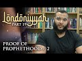

# Londoniyyah - Part 19 - Proof of Prophethood / 2 (2022-03-10)

## Description

Listen as audio: https://soundcloud.com/sapienceinstitute/londoniyyah-part-17-marxism-2-mohammed-hijab?in=sapienceinstitute/sets/londoniyyah&utm_source=clipboard&utm_medium=text&utm_campaign=social_sharing

Londoniyyah - Part 19 - Proof of Prophethood / 2

To be updated about our content please subscribe and open the notifications.
----
BOOK A LIGHTHOUSE MENTOR

Are you or someone you know doubting Islam? Do you find yourself struggling to find answers?  Do you have a hard time speaking to someone about Islam?  Are you considering Islam but are unsure about certain concepts?  Are you an activist, Imam or community leader who is unsure about how to handle questions related to science, philosophy, the Islamic moral code, etc.?

You are not alone.  Over the course of the last decade or more there has been a rapid proliferation of content online and in academic institutions that has eroded the faith of some people.

Seeing the rise of  this phenomenon , Sapience Institute is introducing a One to One mentoring service called LIGHTHOUSE.

BOOK A MENTOR HERE: https://sapienceinstitute.org/lighthouse/

VISIT our website for articles in English, Spanish and Turkish; mentoring service, learning platform and for speaker requests: https://sapienceinstitute.org/

## Summary of [Londoniyyah - Part 19 - Proof of Prophethood / 2](https://www.youtube.com/watch?v=CVA1jeoE_1k)

*This summary is AI generated - there may be inaccuracies. *

### [00:00:00](https://www.youtube.com/watch?v=CVA1jeoE_1k&t=0) - [01:00:00](https://www.youtube.com/watch?v=CVA1jeoE_1k&t=3600)

 the sheikh discusses the necessary and sufficient conditions for revelation and how they were met by Prophet Muhammad. He also discusses the various proofs of prophethood for Muhammad, including his background and reputation, and the manner in which he conducted himself.  ends with a reminder for Muslims that Muhammad is the perfect example for them to follow.

**[00:00:00](https://www.youtube.com/watch?v=CVA1jeoE_1k&t=0)**  the sheikh discusses the necessary and sufficient conditions for revelation. He explains that a necessary condition for revelation is that it cannot have any contradictions and that it must be preserved. He also discusses how probabilistic reasoning is used to guide us in our daily lives.
* **[00:05:00](https://www.youtube.com/watch?v=CVA1jeoE_1k&t=300)** The presenter discusses the various proofs of prophethood for Muhammad, including his background and reputation, and the manner in which he conducted himself. The presenter ends with a reminder for Muslims that Muhammad is the perfect example for them to follow.
* **[00:10:00](https://www.youtube.com/watch?v=CVA1jeoE_1k&t=600)* Discusses the life of Prophet Muhammad, highlighting his many successes as a military general, religious leader, and prophet. It also mentions that he never gave up on his mission even during the severe persecution he faced. In the end, he was successful in defeating the Meccans and establishing a political system in Medina.
* **[00:15:00](https://www.youtube.com/watch?v=CVA1jeoE_1k&t=900)* Discusses the evidence that Muhammad was a truthful prophet, including his success as a family man, husband, and legislator. He also points to evidence of Muhammad's divinely-ordained wars, which show that he was not a warlord or liar.
* **[00:20:00](https://www.youtube.com/watch?v=CVA1jeoE_1k&t=1200)* Discusses Prophet Muhammad's life and how he received revelations that helped guide his people during difficult times. The Prophet was persecuted by his own people, but refused to give up his message. He eventually led a community in Medina and incorporated minority rights. He died at the age of 80, fulfilling prophethood.
* **[00:25:00](https://www.youtube.com/watch?v=CVA1jeoE_1k&t=1500)* Discusses some of the evidence for Islam, including the language of the Quran and the history of the prophet Muhammad. It points out that there are many challenges to interpreting the Quran, including the inimitability challenge.
* **[00:30:00](https://www.youtube.com/watch?v=CVA1jeoE_1k&t=1800)** argues that the linguistic superiority of the Quran is evidence that it was revealed by God. He provides examples of how the Quran is structured, chronologically, and reveals the secrets of the revelation.
* **[00:35:00](https://www.youtube.com/watch?v=CVA1jeoE_1k&t=2100)* Discusses the interconnectedness of Quranic verses, demonstrating how certain themes are repeated throughout the scripture. Neil Robinson references this as "coat-tailing." Curtailing, or the end of one surah connecting with the beginning of the next, is also noted as being unusual. This interconnectedness is also seen in the structure of the Quran, with chapters connected by common themes. Seven years later, the same patterns are still present in the Quran, demonstrating its divine design.
* **[00:40:00](https://www.youtube.com/watch?v=CVA1jeoE_1k&t=2400)* Discusses how in the Qur'an, there are affirmations of prophethood at the end of chapters 34 and 5, as well as the beginning of chapter 22. It also mentions the stages of embryonic development in chapter 22, and the fact that allah averted the devil during his creation of the heavens and earth. In the end, the video discusses how the Qur'an is like a tatib - a compilation of various revelations - and how it is recited as it is now, with the chronology intact.
* **[00:45:00](https://www.youtube.com/watch?v=CVA1jeoE_1k&t=2700)* Discusses the structure of the Quran, with particular attention to the order in which the Prophet Muhammad allegedly recited it. Two views are proposed: one, that the Quran was compiled from the Prophet Muhammad's own recitation, and two, that it was compiled from the Prophet Muhammad's companions. While either view is valid, it is interesting to note that the Quran itself mentions this structure.
* **[00:50:00](https://www.youtube.com/watch?v=CVA1jeoE_1k&t=3000)* Discusses the idea that the Qur'an could be historically accurate, based on the verse where allah states that the heavens and earth wept not for Pharaoh and were not replying to him.  also mentions the fact that the quran mentions the pharaohs' claims to divinity.
* **[00:55:00](https://www.youtube.com/watch?v=CVA1jeoE_1k&t=3300)* Discusses how the Qur'an references specific historical events that are not mentioned in the Old Testament, such as the existence of the Children of Israel in Egypt. He also points out that certain general sayings in the Qur'an could refer to the existence of Israel in general. Finally, the author discusses the story of Pharaoh's body being found in France and how it confirms that Pharaoh was the pharaoh.
### [01:00:00](https://www.youtube.com/watch?v=CVA1jeoE_1k&t=3600) - [01:20:00](https://www.youtube.com/watch?v=CVA1jeoE_1k&t=4800)

 discusses various prophecies found in the Quran and Bible, and compares and contrasts their accuracy. It concludes that prophecies are a strong way of confirming the truth of Islam, and that there are too many prophecies to go through individually.

**[01:00:00](https://www.youtube.com/watch?v=CVA1jeoE_1k&t=3600)** argues that one of the strongest points of evidence for Muhammad's prophethood is the fact that his body is on display at a museum in France. Additionally, he points out that there are historical revisionists who believe that certain events in history, such as the Holocaust, may not have actually happened.
* **[01:05:00](https://www.youtube.com/watch?v=CVA1jeoE_1k&t=3900)* Discusses the difference between overturning historical events vs. overturning scientific facts, and points to the example of the prophet Isaiah predicting that the people of Kedar would be rejoiced when he comes. It goes on to say that prophecies should have the most explanatory scope and the least refutational susceptibility, and that this is something that is difficult to achieve. It suggests that prophecies about the coming of a prophet to the people of Medina may be referring to Jesus Christ.
* **[01:10:00](https://www.youtube.com/watch?v=CVA1jeoE_1k&t=4200)* Discusses some of the prophecies mentioned in the Quran about the victory of the Romans over the Persians.  also discusses how these prophecies can be understood and how they can be used to support the Islamic claim that the Islamic prophet, Muhammad, was indeed a messenger of God.
* **[01:15:00](https://www.youtube.com/watch?v=CVA1jeoE_1k&t=4500)* Discusses various prophecies found in the Quran and Bible, and compares and contrasts their accuracy. It concludes that prophecies are a strong way of confirming the truth of Islam, and that there are too many prophecies to go through individually.
* **[01:20:00](https://www.youtube.com/watch?v=CVA1jeoE_1k&t=4800)* Discusses physical miracles that occurred in the life of Prophet Muhammad (PBUH). These miracles demonstrate his Prophethood and the authenticity of his revelations. He also mentions the importance of examining a prophet's character and evidence before declaring him truthful.

<h2>Full transcript with timestamps: CLICK TO EXPAND</h2>

[0:00:10](https://youtu.be/CVA1jeoE_1k?t=10) welcome to another episode another  
[0:00:12](https://youtu.be/CVA1jeoE_1k?t=12) session of a londoner today we're going  
[0:00:14](https://youtu.be/CVA1jeoE_1k?t=14) to continue with the bet or the  
[0:00:18](https://youtu.be/CVA1jeoE_1k?t=18) affirming of the  
[0:00:21](https://youtu.be/CVA1jeoE_1k?t=21) prophethood and also proving how islam  
[0:00:24](https://youtu.be/CVA1jeoE_1k?t=24) is true we already covered just to  
[0:00:26](https://youtu.be/CVA1jeoE_1k?t=26) remind you  
[0:00:28](https://youtu.be/CVA1jeoE_1k?t=28) arguments for god's existence we've  
[0:00:30](https://youtu.be/CVA1jeoE_1k?t=30) already covered  
[0:00:31](https://youtu.be/CVA1jeoE_1k?t=31) uh the contingency argument uh we  
[0:00:33](https://youtu.be/CVA1jeoE_1k?t=33) covered some aspects of the cosmological  
[0:00:36](https://youtu.be/CVA1jeoE_1k?t=36) argument  
[0:00:37](https://youtu.be/CVA1jeoE_1k?t=37) and now we are talking about how to  
[0:00:40](https://youtu.be/CVA1jeoE_1k?t=40) establish the prophethood of prophet  
[0:00:41](https://youtu.be/CVA1jeoE_1k?t=41) muhammad  
[0:00:42](https://youtu.be/CVA1jeoE_1k?t=42) and how we know that the quran and the  
[0:00:45](https://youtu.be/CVA1jeoE_1k?t=45) sunnah in fact revelation so we'll start  
[0:00:47](https://youtu.be/CVA1jeoE_1k?t=47) in sha allah with the  
[0:00:49](https://youtu.be/CVA1jeoE_1k?t=49) or the reading of the the poem and then  
[0:00:51](https://youtu.be/CVA1jeoE_1k?t=51) we will continue  
[0:01:15](https://youtu.be/CVA1jeoE_1k?t=75) yeah so  
[0:01:16](https://youtu.be/CVA1jeoE_1k?t=76) the sheikh hasn't gone into much detail  
[0:01:19](https://youtu.be/CVA1jeoE_1k?t=79) because he expects the shadow or the  
[0:01:21](https://youtu.be/CVA1jeoE_1k?t=81) person who is making an explanation of  
[0:01:24](https://youtu.be/CVA1jeoE_1k?t=84) this particular part of the poem to go  
[0:01:26](https://youtu.be/CVA1jeoE_1k?t=86) into more detail just to remind you of  
[0:01:28](https://youtu.be/CVA1jeoE_1k?t=88) what we spoke about last time  
[0:01:30](https://youtu.be/CVA1jeoE_1k?t=90) um in the previous session we  
[0:01:32](https://youtu.be/CVA1jeoE_1k?t=92) differentiated between necessary and  
[0:01:34](https://youtu.be/CVA1jeoE_1k?t=94) sufficient conditions for revelation  
[0:01:37](https://youtu.be/CVA1jeoE_1k?t=97) we said  
[0:01:38](https://youtu.be/CVA1jeoE_1k?t=98) necessary conditions for revelation are  
[0:01:40](https://youtu.be/CVA1jeoE_1k?t=100) things which if they are not there  
[0:01:42](https://youtu.be/CVA1jeoE_1k?t=102) then it's doubtful if if any if if in  
[0:01:45](https://youtu.be/CVA1jeoE_1k?t=105) any way possible that revelation can be  
[0:01:47](https://youtu.be/CVA1jeoE_1k?t=107) from god from an all-knowing entity and  
[0:01:50](https://youtu.be/CVA1jeoE_1k?t=110) who remembers what kinds of things we  
[0:01:51](https://youtu.be/CVA1jeoE_1k?t=111) mentioned as necessary conditions  
[0:01:56](https://youtu.be/CVA1jeoE_1k?t=116) the first one you mentioned was that it  
[0:01:58](https://youtu.be/CVA1jeoE_1k?t=118) cannot have any contradictions  
[0:02:00](https://youtu.be/CVA1jeoE_1k?t=120) um  
[0:02:01](https://youtu.be/CVA1jeoE_1k?t=121) and the second one that we mentioned  
[0:02:03](https://youtu.be/CVA1jeoE_1k?t=123) was  
[0:02:04](https://youtu.be/CVA1jeoE_1k?t=124) that it has to be preserved  
[0:02:06](https://youtu.be/CVA1jeoE_1k?t=126) yes so these are two very  
[0:02:08](https://youtu.be/CVA1jeoE_1k?t=128) uh basic things which you expect from  
[0:02:10](https://youtu.be/CVA1jeoE_1k?t=130) anything that is that claims to be from  
[0:02:12](https://youtu.be/CVA1jeoE_1k?t=132) god why those two in particular  
[0:02:15](https://youtu.be/CVA1jeoE_1k?t=135) um so the first one that has no  
[0:02:17](https://youtu.be/CVA1jeoE_1k?t=137) contradictions um because if it was uh  
[0:02:20](https://youtu.be/CVA1jeoE_1k?t=140) from god who is you know all knowing uh  
[0:02:23](https://youtu.be/CVA1jeoE_1k?t=143) and you know he is has you know the  
[0:02:25](https://youtu.be/CVA1jeoE_1k?t=145) maximum uh maximal uh knowledge then  
[0:02:28](https://youtu.be/CVA1jeoE_1k?t=148) uh  
[0:02:29](https://youtu.be/CVA1jeoE_1k?t=149) for him to contradict himself within his  
[0:02:32](https://youtu.be/CVA1jeoE_1k?t=152) book then this uh indicates that it's  
[0:02:35](https://youtu.be/CVA1jeoE_1k?t=155) not coming from a being who is maximally  
[0:02:37](https://youtu.be/CVA1jeoE_1k?t=157) annoying  
[0:02:38](https://youtu.be/CVA1jeoE_1k?t=158) great great great answer but let's take  
[0:02:40](https://youtu.be/CVA1jeoE_1k?t=160) one step back um give me an example from  
[0:02:44](https://youtu.be/CVA1jeoE_1k?t=164) the sharia  
[0:02:46](https://youtu.be/CVA1jeoE_1k?t=166) of a necessary condition for something  
[0:02:48](https://youtu.be/CVA1jeoE_1k?t=168) and a sufficient condition for something  
[0:02:50](https://youtu.be/CVA1jeoE_1k?t=170) if you remember what i  
[0:02:52](https://youtu.be/CVA1jeoE_1k?t=172) was talking about last time  
[0:02:54](https://youtu.be/CVA1jeoE_1k?t=174) in  
[0:02:55](https://youtu.be/CVA1jeoE_1k?t=175) jewish prudence what's the necessary  
[0:02:56](https://youtu.be/CVA1jeoE_1k?t=176) condition yeah you mentioned uh marriage  
[0:02:59](https://youtu.be/CVA1jeoE_1k?t=179) yes um so a necessary condition for  
[0:03:01](https://youtu.be/CVA1jeoE_1k?t=181) marriage is that  
[0:03:03](https://youtu.be/CVA1jeoE_1k?t=183) um you know you have a woman present yes  
[0:03:05](https://youtu.be/CVA1jeoE_1k?t=185) right um which is different to a  
[0:03:07](https://youtu.be/CVA1jeoE_1k?t=187) sufficient condition in that you have uh  
[0:03:10](https://youtu.be/CVA1jeoE_1k?t=190) you know the pillars for marriage uh  
[0:03:11](https://youtu.be/CVA1jeoE_1k?t=191) things like maher  
[0:03:13](https://youtu.be/CVA1jeoE_1k?t=193) things like uh  
[0:03:15](https://youtu.be/CVA1jeoE_1k?t=195) two witnesses so these are difference  
[0:03:17](https://youtu.be/CVA1jeoE_1k?t=197) between the necessary condition and the  
[0:03:18](https://youtu.be/CVA1jeoE_1k?t=198) sufficient what's what's the major  
[0:03:21](https://youtu.be/CVA1jeoE_1k?t=201) point of difference in the two examples  
[0:03:23](https://youtu.be/CVA1jeoE_1k?t=203) you gave the woman being present in the  
[0:03:24](https://youtu.be/CVA1jeoE_1k?t=204) first place  
[0:03:25](https://youtu.be/CVA1jeoE_1k?t=205) what would be  
[0:03:27](https://youtu.be/CVA1jeoE_1k?t=207) what would be impossible if the woman  
[0:03:29](https://youtu.be/CVA1jeoE_1k?t=209) was not there  
[0:03:31](https://youtu.be/CVA1jeoE_1k?t=211) yeah it would be impossible for  
[0:03:33](https://youtu.be/CVA1jeoE_1k?t=213) the marriage to take place right there  
[0:03:35](https://youtu.be/CVA1jeoE_1k?t=215) would be no such it would it would make  
[0:03:36](https://youtu.be/CVA1jeoE_1k?t=216) it would render it impossible for a  
[0:03:38](https://youtu.be/CVA1jeoE_1k?t=218) marriage to take unless we obviously go  
[0:03:40](https://youtu.be/CVA1jeoE_1k?t=220) with new age definitions of marriage  
[0:03:42](https://youtu.be/CVA1jeoE_1k?t=222) which we're not we're not going with you  
[0:03:44](https://youtu.be/CVA1jeoE_1k?t=224) know marrying yourself or marrying a  
[0:03:46](https://youtu.be/CVA1jeoE_1k?t=226) male or something a man marrying another  
[0:03:47](https://youtu.be/CVA1jeoE_1k?t=227) man that is not allowed in islam so  
[0:03:50](https://youtu.be/CVA1jeoE_1k?t=230) we just gave this to kind of  
[0:03:52](https://youtu.be/CVA1jeoE_1k?t=232) give a  
[0:03:53](https://youtu.be/CVA1jeoE_1k?t=233) meaning to the idea of necessary and  
[0:03:55](https://youtu.be/CVA1jeoE_1k?t=235) sufficient condition  
[0:03:57](https://youtu.be/CVA1jeoE_1k?t=237) a necessary condition  
[0:03:59](https://youtu.be/CVA1jeoE_1k?t=239) means that it's impossible  
[0:04:00](https://youtu.be/CVA1jeoE_1k?t=240) for the thing to be fulfilled  
[0:04:02](https://youtu.be/CVA1jeoE_1k?t=242) if  
[0:04:04](https://youtu.be/CVA1jeoE_1k?t=244) such condition is not met whereas a  
[0:04:06](https://youtu.be/CVA1jeoE_1k?t=246) sufficient condition now  
[0:04:08](https://youtu.be/CVA1jeoE_1k?t=248) is different and what did we there's a  
[0:04:10](https://youtu.be/CVA1jeoE_1k?t=250) key word that we use someone else  
[0:04:13](https://youtu.be/CVA1jeoE_1k?t=253) beginning with the letter p  
[0:04:15](https://youtu.be/CVA1jeoE_1k?t=255) which  
[0:04:16](https://youtu.be/CVA1jeoE_1k?t=256) kind of reasoning we use in order to  
[0:04:18](https://youtu.be/CVA1jeoE_1k?t=258) establish sufficient conditions who  
[0:04:19](https://youtu.be/CVA1jeoE_1k?t=259) remembers  
[0:04:22](https://youtu.be/CVA1jeoE_1k?t=262) can you say a bit later probabilistic  
[0:04:25](https://youtu.be/CVA1jeoE_1k?t=265) yes probabilistic so can you give me an  
[0:04:26](https://youtu.be/CVA1jeoE_1k?t=266) example of in everyday life how we use  
[0:04:29](https://youtu.be/CVA1jeoE_1k?t=269) probabilistic reasoning  
[0:04:30](https://youtu.be/CVA1jeoE_1k?t=270) to guide us in our daily lives  
[0:04:35](https://youtu.be/CVA1jeoE_1k?t=275) when someone's at the train station yeah  
[0:04:37](https://youtu.be/CVA1jeoE_1k?t=277) they're sitting there and they're  
[0:04:38](https://youtu.be/CVA1jeoE_1k?t=278) expecting that you know when the board  
[0:04:40](https://youtu.be/CVA1jeoE_1k?t=280) says that train is going to come at 5 30  
[0:04:41](https://youtu.be/CVA1jeoE_1k?t=281) for example the train is going to come  
[0:04:42](https://youtu.be/CVA1jeoE_1k?t=282) at that time so them sitting there is an  
[0:04:45](https://youtu.be/CVA1jeoE_1k?t=285) affirmation of the fact that they are  
[0:04:47](https://youtu.be/CVA1jeoE_1k?t=287) sort of accepting the validity of that  
[0:04:49](https://youtu.be/CVA1jeoE_1k?t=289) probabilistic reasoning right right what  
[0:04:51](https://youtu.be/CVA1jeoE_1k?t=291) what's more would you say some other  
[0:04:53](https://youtu.be/CVA1jeoE_1k?t=293) examples that's good that's correct  
[0:04:54](https://youtu.be/CVA1jeoE_1k?t=294) let's give me some more examples of  
[0:04:57](https://youtu.be/CVA1jeoE_1k?t=297) things we do  
[0:04:58](https://youtu.be/CVA1jeoE_1k?t=298) which uh require kind of probabilistic  
[0:05:01](https://youtu.be/CVA1jeoE_1k?t=301) reasoning on a daily basis  
[0:05:03](https://youtu.be/CVA1jeoE_1k?t=303) the scientific enterprise as a whole is  
[0:05:05](https://youtu.be/CVA1jeoE_1k?t=305) probabilistic right since it's based on  
[0:05:07](https://youtu.be/CVA1jeoE_1k?t=307) the principle of induction yeah  
[0:05:09](https://youtu.be/CVA1jeoE_1k?t=309) absolutely yeah yeah  
[0:05:11](https://youtu.be/CVA1jeoE_1k?t=311) you can say that obviously there are  
[0:05:12](https://youtu.be/CVA1jeoE_1k?t=312) axioms and some  
[0:05:14](https://youtu.be/CVA1jeoE_1k?t=314) aspects of science  
[0:05:15](https://youtu.be/CVA1jeoE_1k?t=315) which we're not talking about and  
[0:05:17](https://youtu.be/CVA1jeoE_1k?t=317) observations which may be  
[0:05:20](https://youtu.be/CVA1jeoE_1k?t=320) not exactly inductive in the same way as  
[0:05:22](https://youtu.be/CVA1jeoE_1k?t=322) a sample would be but i think generally  
[0:05:25](https://youtu.be/CVA1jeoE_1k?t=325) speaking there is a large degree of  
[0:05:26](https://youtu.be/CVA1jeoE_1k?t=326) probability that is involved in  
[0:05:28](https://youtu.be/CVA1jeoE_1k?t=328) science and  
[0:05:30](https://youtu.be/CVA1jeoE_1k?t=330) especially nowadays there's something  
[0:05:32](https://youtu.be/CVA1jeoE_1k?t=332) called bayes theory i'm not sure if  
[0:05:33](https://youtu.be/CVA1jeoE_1k?t=333) you've heard of it it's in it's a  
[0:05:34](https://youtu.be/CVA1jeoE_1k?t=334) mathematical model  
[0:05:36](https://youtu.be/CVA1jeoE_1k?t=336) which uh  
[0:05:38](https://youtu.be/CVA1jeoE_1k?t=338) they use actually to predict and this is  
[0:05:40](https://youtu.be/CVA1jeoE_1k?t=340) more formal i guess but they use it to  
[0:05:42](https://youtu.be/CVA1jeoE_1k?t=342) predict like for example what your  
[0:05:44](https://youtu.be/CVA1jeoE_1k?t=344) chances are if you have cancer or  
[0:05:46](https://youtu.be/CVA1jeoE_1k?t=346) something like that  
[0:05:47](https://youtu.be/CVA1jeoE_1k?t=347) and the idea really is there's an  
[0:05:49](https://youtu.be/CVA1jeoE_1k?t=349) inbuilt  
[0:05:50](https://youtu.be/CVA1jeoE_1k?t=350) changing mechanism within it but the  
[0:05:52](https://youtu.be/CVA1jeoE_1k?t=352) in mathematics and i'm no expert in this  
[0:05:56](https://youtu.be/CVA1jeoE_1k?t=356) but there are different models of  
[0:05:57](https://youtu.be/CVA1jeoE_1k?t=357) probability so there's total probability  
[0:05:59](https://youtu.be/CVA1jeoE_1k?t=359) there's bayes theory and so on but what  
[0:06:01](https://youtu.be/CVA1jeoE_1k?t=361) i'm referring to  
[0:06:03](https://youtu.be/CVA1jeoE_1k?t=363) for our purposes is general epistemic  
[0:06:05](https://youtu.be/CVA1jeoE_1k?t=365) probability  
[0:06:06](https://youtu.be/CVA1jeoE_1k?t=366) like we make these assumptions on a  
[0:06:09](https://youtu.be/CVA1jeoE_1k?t=369) daily basis without having to bring out  
[0:06:11](https://youtu.be/CVA1jeoE_1k?t=371) a calculator or try and put it in a  
[0:06:14](https://youtu.be/CVA1jeoE_1k?t=374) in some kind of a theory in a model  
[0:06:16](https://youtu.be/CVA1jeoE_1k?t=376) so that's good  
[0:06:18](https://youtu.be/CVA1jeoE_1k?t=378) now we spoke about  
[0:06:20](https://youtu.be/CVA1jeoE_1k?t=380) so we talked about the distinction  
[0:06:22](https://youtu.be/CVA1jeoE_1k?t=382) between sufficient and necessary we gave  
[0:06:25](https://youtu.be/CVA1jeoE_1k?t=385) an example of a book which uh does not  
[0:06:27](https://youtu.be/CVA1jeoE_1k?t=387) fulfill the necessary conditions what  
[0:06:29](https://youtu.be/CVA1jeoE_1k?t=389) book did we mention and what kind of  
[0:06:31](https://youtu.be/CVA1jeoE_1k?t=391) problems did we find in that book  
[0:06:37](https://youtu.be/CVA1jeoE_1k?t=397) you said the old testament yeah yeah and  
[0:06:39](https://youtu.be/CVA1jeoE_1k?t=399) what kind of examples do we use if you  
[0:06:41](https://youtu.be/CVA1jeoE_1k?t=401) remember so as far as preservation is  
[0:06:43](https://youtu.be/CVA1jeoE_1k?t=403) concerned we mentioned that there's a  
[0:06:44](https://youtu.be/CVA1jeoE_1k?t=404) new consensus that  
[0:06:45](https://youtu.be/CVA1jeoE_1k?t=405) essentially we don't have the bible uh  
[0:06:48](https://youtu.be/CVA1jeoE_1k?t=408) or the old testament specifically  
[0:06:49](https://youtu.be/CVA1jeoE_1k?t=409) preserved  
[0:06:51](https://youtu.be/CVA1jeoE_1k?t=411) in the way that  
[0:06:52](https://youtu.be/CVA1jeoE_1k?t=412) sorry  
[0:06:53](https://youtu.be/CVA1jeoE_1k?t=413) in the way that initially was  
[0:06:56](https://youtu.be/CVA1jeoE_1k?t=416) and then as far as contradictions are  
[0:06:57](https://youtu.be/CVA1jeoE_1k?t=417) concerned we spoke about some of the uh  
[0:06:59](https://youtu.be/CVA1jeoE_1k?t=419) contradictions in in genesis  
[0:07:01](https://youtu.be/CVA1jeoE_1k?t=421) um to do with things like  
[0:07:03](https://youtu.be/CVA1jeoE_1k?t=423) as far as the chronology of creation and  
[0:07:05](https://youtu.be/CVA1jeoE_1k?t=425) that type of thing so yeah that's good  
[0:07:07](https://youtu.be/CVA1jeoE_1k?t=427) that's a good answer but just for next  
[0:07:08](https://youtu.be/CVA1jeoE_1k?t=428) time try and remember the specific  
[0:07:10](https://youtu.be/CVA1jeoE_1k?t=430) examples  
[0:07:11](https://youtu.be/CVA1jeoE_1k?t=431) for extra  
[0:07:13](https://youtu.be/CVA1jeoE_1k?t=433) for extra clarity  
[0:07:14](https://youtu.be/CVA1jeoE_1k?t=434) what like the herbies and the plants  
[0:07:16](https://youtu.be/CVA1jeoE_1k?t=436) right there right so okay good no no  
[0:07:18](https://youtu.be/CVA1jeoE_1k?t=438) you're right the herbs in the plant what  
[0:07:19](https://youtu.be/CVA1jeoE_1k?t=439) about it  
[0:07:21](https://youtu.be/CVA1jeoE_1k?t=441) that you've got at one point it says  
[0:07:23](https://youtu.be/CVA1jeoE_1k?t=443) that um there was plants and whatever  
[0:07:25](https://youtu.be/CVA1jeoE_1k?t=445) and then after that i think that was on  
[0:07:27](https://youtu.be/CVA1jeoE_1k?t=447) day two and then like day five or  
[0:07:29](https://youtu.be/CVA1jeoE_1k?t=449) something there's like there's no plans  
[0:07:30](https://youtu.be/CVA1jeoE_1k?t=450) there so in in  
[0:07:31](https://youtu.be/CVA1jeoE_1k?t=451) day three the herbage was created  
[0:07:34](https://youtu.be/CVA1jeoE_1k?t=454) and in genesis two verse five it says no  
[0:07:37](https://youtu.be/CVA1jeoE_1k?t=457) no plan has prong up yet  
[0:07:39](https://youtu.be/CVA1jeoE_1k?t=459) so this is more of a comparison between  
[0:07:41](https://youtu.be/CVA1jeoE_1k?t=461) chapter one and chapter two of genesis  
[0:07:42](https://youtu.be/CVA1jeoE_1k?t=462) but yeah make sure you get the examples  
[0:07:45](https://youtu.be/CVA1jeoE_1k?t=465) this is good you got all the points  
[0:07:46](https://youtu.be/CVA1jeoE_1k?t=466) right but  
[0:07:48](https://youtu.be/CVA1jeoE_1k?t=468) just because if you're having these  
[0:07:49](https://youtu.be/CVA1jeoE_1k?t=469) discussions with someone  
[0:07:51](https://youtu.be/CVA1jeoE_1k?t=471) if you get the examples wrong sometimes  
[0:07:53](https://youtu.be/CVA1jeoE_1k?t=473) that can undermine your point even  
[0:07:54](https://youtu.be/CVA1jeoE_1k?t=474) though the point is still valid  
[0:07:56](https://youtu.be/CVA1jeoE_1k?t=476) well that's good well done so far  
[0:07:58](https://youtu.be/CVA1jeoE_1k?t=478) everything is uh moving in the right  
[0:07:59](https://youtu.be/CVA1jeoE_1k?t=479) direction  
[0:08:01](https://youtu.be/CVA1jeoE_1k?t=481) now  
[0:08:02](https://youtu.be/CVA1jeoE_1k?t=482) we then spoke about the prophet  
[0:08:04](https://youtu.be/CVA1jeoE_1k?t=484) muhammed and everyone had their goal of  
[0:08:07](https://youtu.be/CVA1jeoE_1k?t=487) expressing  
[0:08:08](https://youtu.be/CVA1jeoE_1k?t=488) or speaking about the prophet muhammad  
[0:08:10](https://youtu.be/CVA1jeoE_1k?t=490) three minutes to talk about what kind of  
[0:08:13](https://youtu.be/CVA1jeoE_1k?t=493) a man he was and we we all shared  
[0:08:15](https://youtu.be/CVA1jeoE_1k?t=495) information about that i think it was a  
[0:08:17](https://youtu.be/CVA1jeoE_1k?t=497) very productive exercise in fact  
[0:08:20](https://youtu.be/CVA1jeoE_1k?t=500) um so i wanna i wanna pause there again  
[0:08:23](https://youtu.be/CVA1jeoE_1k?t=503) because we said we were going to use  
[0:08:25](https://youtu.be/CVA1jeoE_1k?t=505) everyone else's notes and i'll give you  
[0:08:27](https://youtu.be/CVA1jeoE_1k?t=507) guys five minutes  
[0:08:28](https://youtu.be/CVA1jeoE_1k?t=508) and it's exactly the same exercises  
[0:08:30](https://youtu.be/CVA1jeoE_1k?t=510) before which is i want you to tell me if  
[0:08:33](https://youtu.be/CVA1jeoE_1k?t=513) you were to be asked  
[0:08:35](https://youtu.be/CVA1jeoE_1k?t=515) to summarize the prophet sallam's life  
[0:08:37](https://youtu.be/CVA1jeoE_1k?t=517) in three minutes  
[0:08:38](https://youtu.be/CVA1jeoE_1k?t=518) what would you mention  
[0:08:40](https://youtu.be/CVA1jeoE_1k?t=520) okay so you can speak to the person next  
[0:08:42](https://youtu.be/CVA1jeoE_1k?t=522) to you or otherwise consult your notes  
[0:08:44](https://youtu.be/CVA1jeoE_1k?t=524) and in five minutes everyone's gonna  
[0:08:46](https://youtu.be/CVA1jeoE_1k?t=526) have three minutes to present each other  
[0:08:48](https://youtu.be/CVA1jeoE_1k?t=528) if someone were to ask you who is the  
[0:08:49](https://youtu.be/CVA1jeoE_1k?t=529) prophet muhammad right a non-muslim  
[0:08:51](https://youtu.be/CVA1jeoE_1k?t=531) person someone who doesn't know anything  
[0:08:52](https://youtu.be/CVA1jeoE_1k?t=532) about islam the question is what would  
[0:08:55](https://youtu.be/CVA1jeoE_1k?t=535) you summarize his life as how how would  
[0:08:56](https://youtu.be/CVA1jeoE_1k?t=536) you start i'll probably  
[0:08:57](https://youtu.be/CVA1jeoE_1k?t=537) start for a minute and then i'll think  
[0:08:59](https://youtu.be/CVA1jeoE_1k?t=539) of something this is this is why you're  
[0:09:00](https://youtu.be/CVA1jeoE_1k?t=540) here  
[0:09:02](https://youtu.be/CVA1jeoE_1k?t=542) this is what we need uh we need you to  
[0:09:04](https://youtu.be/CVA1jeoE_1k?t=544) practice this you know don't worry about  
[0:09:05](https://youtu.be/CVA1jeoE_1k?t=545) it we'll start with you inshallah uh  
[0:09:08](https://youtu.be/CVA1jeoE_1k?t=548) actually let's start with uh tara today  
[0:09:12](https://youtu.be/CVA1jeoE_1k?t=552) yeah i'm out bro  
[0:09:14](https://youtu.be/CVA1jeoE_1k?t=554) well let's let's see how you feel after  
[0:09:16](https://youtu.be/CVA1jeoE_1k?t=556) everyone is done yeah yeah i'll just  
[0:09:18](https://youtu.be/CVA1jeoE_1k?t=558) okay fine let's just see how you feel  
[0:09:20](https://youtu.be/CVA1jeoE_1k?t=560) right  
[0:09:20](https://youtu.be/CVA1jeoE_1k?t=560) gonna  
[0:09:22](https://youtu.be/CVA1jeoE_1k?t=562) three minutes time now  
[0:09:23](https://youtu.be/CVA1jeoE_1k?t=563) uh the the proofs of the prophethood of  
[0:09:26](https://youtu.be/CVA1jeoE_1k?t=566) muhammad sallam uh first of all his uh  
[0:09:30](https://youtu.be/CVA1jeoE_1k?t=570) his background and being an illiterate  
[0:09:33](https://youtu.be/CVA1jeoE_1k?t=573) so he couldn't have been influenced by  
[0:09:35](https://youtu.be/CVA1jeoE_1k?t=575) any other texts or any other ideas  
[0:09:38](https://youtu.be/CVA1jeoE_1k?t=578) philosophically or religiously  
[0:09:42](https://youtu.be/CVA1jeoE_1k?t=582) that were around at the time  
[0:09:44](https://youtu.be/CVA1jeoE_1k?t=584) second of all his his manners reputation  
[0:09:47](https://youtu.be/CVA1jeoE_1k?t=587) and etiquettes  
[0:09:49](https://youtu.be/CVA1jeoE_1k?t=589) prior to his prophethood  
[0:09:50](https://youtu.be/CVA1jeoE_1k?t=590) the way he conducted himself in in life  
[0:09:53](https://youtu.be/CVA1jeoE_1k?t=593) and in business  
[0:09:54](https://youtu.be/CVA1jeoE_1k?t=594) his reputation that he built up as a  
[0:09:56](https://youtu.be/CVA1jeoE_1k?t=596) completely trustworthy man  
[0:09:58](https://youtu.be/CVA1jeoE_1k?t=598) and somebody who was uh  
[0:10:00](https://youtu.be/CVA1jeoE_1k?t=600) trusted by  
[0:10:02](https://youtu.be/CVA1jeoE_1k?t=602) the people who were um  
[0:10:05](https://youtu.be/CVA1jeoE_1k?t=605) who were in elevated positions in  
[0:10:07](https://youtu.be/CVA1jeoE_1k?t=607) society and he would be a um  
[0:10:10](https://youtu.be/CVA1jeoE_1k?t=610) an arbitrator uh among them  
[0:10:13](https://youtu.be/CVA1jeoE_1k?t=613) uh and uh also the fact that  
[0:10:18](https://youtu.be/CVA1jeoE_1k?t=618) prior to his profited up until the end  
[0:10:19](https://youtu.be/CVA1jeoE_1k?t=619) of his life he lived the life of a  
[0:10:21](https://youtu.be/CVA1jeoE_1k?t=621) complete human being and was supremely  
[0:10:24](https://youtu.be/CVA1jeoE_1k?t=624) successful in politics religious matters  
[0:10:28](https://youtu.be/CVA1jeoE_1k?t=628) and as a military general  
[0:10:30](https://youtu.be/CVA1jeoE_1k?t=630) and  
[0:10:31](https://youtu.be/CVA1jeoE_1k?t=631) he also he made prophecies that came  
[0:10:34](https://youtu.be/CVA1jeoE_1k?t=634) true  
[0:10:35](https://youtu.be/CVA1jeoE_1k?t=635) which which were the prophecies of the  
[0:10:38](https://youtu.be/CVA1jeoE_1k?t=638) defeat of the persians and the roman  
[0:10:40](https://youtu.be/CVA1jeoE_1k?t=640) empires  
[0:10:41](https://youtu.be/CVA1jeoE_1k?t=641) and the brother mentioned to as well  
[0:10:44](https://youtu.be/CVA1jeoE_1k?t=644) that his most important message was  
[0:10:46](https://youtu.be/CVA1jeoE_1k?t=646) complete monotheism and a coherent  
[0:10:49](https://youtu.be/CVA1jeoE_1k?t=649) message that he he gave to us in the  
[0:10:52](https://youtu.be/CVA1jeoE_1k?t=652) form of the holy quran  
[0:10:54](https://youtu.be/CVA1jeoE_1k?t=654) beautiful  
[0:10:55](https://youtu.be/CVA1jeoE_1k?t=655) all right that's one minute and a half  
[0:10:58](https://youtu.be/CVA1jeoE_1k?t=658) that's fine we can go to the next person  
[0:11:00](https://youtu.be/CVA1jeoE_1k?t=660) thank you very much  
[0:11:02](https://youtu.be/CVA1jeoE_1k?t=662) uh who should we have next  
[0:11:06](https://youtu.be/CVA1jeoE_1k?t=666) well i think you're already here let's  
[0:11:08](https://youtu.be/CVA1jeoE_1k?t=668) go  
[0:11:10](https://youtu.be/CVA1jeoE_1k?t=670) um yeah uh so in terms of his life um  
[0:11:14](https://youtu.be/CVA1jeoE_1k?t=674) first uh he um proclaimed prophet when  
[0:11:17](https://youtu.be/CVA1jeoE_1k?t=677) he was 40 years old four years old and  
[0:11:19](https://youtu.be/CVA1jeoE_1k?t=679) prior to that um  
[0:11:21](https://youtu.be/CVA1jeoE_1k?t=681) within uh he stood out from uh society  
[0:11:23](https://youtu.be/CVA1jeoE_1k?t=683) uh  
[0:11:24](https://youtu.be/CVA1jeoE_1k?t=684) uh he's truly from his society uh due to  
[0:11:27](https://youtu.be/CVA1jeoE_1k?t=687) the  
[0:11:28](https://youtu.be/CVA1jeoE_1k?t=688) the  
[0:11:30](https://youtu.be/CVA1jeoE_1k?t=690) great characteristics that he had for  
[0:11:31](https://youtu.be/CVA1jeoE_1k?t=691) example he was known uh as a brother  
[0:11:33](https://youtu.be/CVA1jeoE_1k?t=693) mentioned for his truthfulness  
[0:11:35](https://youtu.be/CVA1jeoE_1k?t=695) he was known to be extremely principled  
[0:11:38](https://youtu.be/CVA1jeoE_1k?t=698) he also  
[0:11:39](https://youtu.be/CVA1jeoE_1k?t=699) was extremely uncomfortable uh with the  
[0:11:42](https://youtu.be/CVA1jeoE_1k?t=702) status quo of the time especially at the  
[0:11:44](https://youtu.be/CVA1jeoE_1k?t=704) spiritual state switzerland religious  
[0:11:46](https://youtu.be/CVA1jeoE_1k?t=706) state  
[0:11:48](https://youtu.be/CVA1jeoE_1k?t=708) he he  
[0:11:49](https://youtu.be/CVA1jeoE_1k?t=709) he was very averse to the politicism and  
[0:11:51](https://youtu.be/CVA1jeoE_1k?t=711) the idolatry that was present in arabia  
[0:11:54](https://youtu.be/CVA1jeoE_1k?t=714) back then  
[0:11:55](https://youtu.be/CVA1jeoE_1k?t=715) and then again like the brother  
[0:11:56](https://youtu.be/CVA1jeoE_1k?t=716) mentioned he he it was well known that  
[0:11:58](https://youtu.be/CVA1jeoE_1k?t=718) he was illiterate as well  
[0:12:00](https://youtu.be/CVA1jeoE_1k?t=720) uh and then uh  
[0:12:01](https://youtu.be/CVA1jeoE_1k?t=721) at the age of 40 uh he claims that he uh  
[0:12:04](https://youtu.be/CVA1jeoE_1k?t=724) he has  
[0:12:05](https://youtu.be/CVA1jeoE_1k?t=725) he has uh he's got revelation from god  
[0:12:08](https://youtu.be/CVA1jeoE_1k?t=728) uh and the revelation  
[0:12:11](https://youtu.be/CVA1jeoE_1k?t=731) eventually ends up being what we muslims  
[0:12:13](https://youtu.be/CVA1jeoE_1k?t=733) nowadays call the quran  
[0:12:15](https://youtu.be/CVA1jeoE_1k?t=735) which  
[0:12:16](https://youtu.be/CVA1jeoE_1k?t=736) everybody who studied uh can clearly  
[0:12:18](https://youtu.be/CVA1jeoE_1k?t=738) understand is a book of um  
[0:12:20](https://youtu.be/CVA1jeoE_1k?t=740) highly advanced in terms of its  
[0:12:22](https://youtu.be/CVA1jeoE_1k?t=742) literature so it seems very unlikely  
[0:12:23](https://youtu.be/CVA1jeoE_1k?t=743) that an illiterate person uh would have  
[0:12:26](https://youtu.be/CVA1jeoE_1k?t=746) produced it uh  
[0:12:28](https://youtu.be/CVA1jeoE_1k?t=748) the only argument you could make against  
[0:12:29](https://youtu.be/CVA1jeoE_1k?t=749) it is that maybe he was pretending to be  
[0:12:31](https://youtu.be/CVA1jeoE_1k?t=751) an a an illiterate person for like the  
[0:12:33](https://youtu.be/CVA1jeoE_1k?t=753) 63 years of his life  
[0:12:36](https://youtu.be/CVA1jeoE_1k?t=756) which sounds very  
[0:12:37](https://youtu.be/CVA1jeoE_1k?t=757) conspiratorial um  
[0:12:39](https://youtu.be/CVA1jeoE_1k?t=759) yeah and then so uh for the first 13  
[0:12:42](https://youtu.be/CVA1jeoE_1k?t=762) years um  
[0:12:43](https://youtu.be/CVA1jeoE_1k?t=763) after his prophet uh he was in mecca uh  
[0:12:46](https://youtu.be/CVA1jeoE_1k?t=766) uh and where he was with him and  
[0:12:50](https://youtu.be/CVA1jeoE_1k?t=770) the people uh who accepted his message  
[0:12:52](https://youtu.be/CVA1jeoE_1k?t=772) was severely persecuted and even uh all  
[0:12:55](https://youtu.be/CVA1jeoE_1k?t=775) through the severe persecution  
[0:12:58](https://youtu.be/CVA1jeoE_1k?t=778) he never uh he never gave up on his  
[0:13:00](https://youtu.be/CVA1jeoE_1k?t=780) mission uh he straight  
[0:13:02](https://youtu.be/CVA1jeoE_1k?t=782) through his mission  
[0:13:03](https://youtu.be/CVA1jeoE_1k?t=783) and his principles  
[0:13:05](https://youtu.be/CVA1jeoE_1k?t=785) not even giving up on his mission he  
[0:13:07](https://youtu.be/CVA1jeoE_1k?t=787) didn't even compromise one bit even  
[0:13:10](https://youtu.be/CVA1jeoE_1k?t=790) though he was offered everything that a  
[0:13:12](https://youtu.be/CVA1jeoE_1k?t=792) man could imagine in this world  
[0:13:14](https://youtu.be/CVA1jeoE_1k?t=794) things like  
[0:13:15](https://youtu.be/CVA1jeoE_1k?t=795) wealth  
[0:13:17](https://youtu.be/CVA1jeoE_1k?t=797) women  
[0:13:18](https://youtu.be/CVA1jeoE_1k?t=798) and also power he rejected all all of  
[0:13:20](https://youtu.be/CVA1jeoE_1k?t=800) them uh and straight to true to his  
[0:13:22](https://youtu.be/CVA1jeoE_1k?t=802) mission and he even refused to  
[0:13:24](https://youtu.be/CVA1jeoE_1k?t=804) compromise uh even one bit  
[0:13:26](https://youtu.be/CVA1jeoE_1k?t=806) and then um  
[0:13:28](https://youtu.be/CVA1jeoE_1k?t=808) uh 13 years into his prophethood uh  
[0:13:32](https://youtu.be/CVA1jeoE_1k?t=812) the situation in mecca becomes  
[0:13:34](https://youtu.be/CVA1jeoE_1k?t=814) unbearable uh and then uh he he migrates  
[0:13:38](https://youtu.be/CVA1jeoE_1k?t=818) uh to nearby medina a city called medina  
[0:13:40](https://youtu.be/CVA1jeoE_1k?t=820) nearby uh uh and then that's where he  
[0:13:43](https://youtu.be/CVA1jeoE_1k?t=823) establishes uh uh  
[0:13:45](https://youtu.be/CVA1jeoE_1k?t=825) uh uh you could say a political system  
[0:13:49](https://youtu.be/CVA1jeoE_1k?t=829) uh and then  
[0:13:50](https://youtu.be/CVA1jeoE_1k?t=830) he uh uh he he he  
[0:13:53](https://youtu.be/CVA1jeoE_1k?t=833) he gains uh  
[0:13:54](https://youtu.be/CVA1jeoE_1k?t=834) uh significantly more following then  
[0:13:56](https://youtu.be/CVA1jeoE_1k?t=836) medina and then eventually  
[0:13:59](https://youtu.be/CVA1jeoE_1k?t=839) uh  
[0:14:00](https://youtu.be/CVA1jeoE_1k?t=840) while he was there he took in uh many  
[0:14:03](https://youtu.be/CVA1jeoE_1k?t=843) different battles with the meccans who  
[0:14:05](https://youtu.be/CVA1jeoE_1k?t=845) still had a grudge against him who still  
[0:14:06](https://youtu.be/CVA1jeoE_1k?t=846) wanted to stop him from spreading his  
[0:14:08](https://youtu.be/CVA1jeoE_1k?t=848) message because it felt like it was a  
[0:14:10](https://youtu.be/CVA1jeoE_1k?t=850) threat uh to what they believed and to  
[0:14:12](https://youtu.be/CVA1jeoE_1k?t=852) their way of life i guess  
[0:14:14](https://youtu.be/CVA1jeoE_1k?t=854) and then after all those battles  
[0:14:15](https://youtu.be/CVA1jeoE_1k?t=855) eventually and  
[0:14:17](https://youtu.be/CVA1jeoE_1k?t=857) concluded with uh uh  
[0:14:19](https://youtu.be/CVA1jeoE_1k?t=859) the uh with what the muslims would call  
[0:14:22](https://youtu.be/CVA1jeoE_1k?t=862) the victory of mecca where uh the  
[0:14:24](https://youtu.be/CVA1jeoE_1k?t=864) prophet uh  
[0:14:25](https://youtu.be/CVA1jeoE_1k?t=865) the initially before that they had a  
[0:14:27](https://youtu.be/CVA1jeoE_1k?t=867) treaty called the debate treaty uh  
[0:14:28](https://youtu.be/CVA1jeoE_1k?t=868) between the americans but the americans  
[0:14:30](https://youtu.be/CVA1jeoE_1k?t=870) violated it so the muslims uh uh took  
[0:14:33](https://youtu.be/CVA1jeoE_1k?t=873) harms against them and but uh the  
[0:14:36](https://youtu.be/CVA1jeoE_1k?t=876) meccans uh realizing that they have they  
[0:14:38](https://youtu.be/CVA1jeoE_1k?t=878) should no chance uh surrendered without  
[0:14:40](https://youtu.be/CVA1jeoE_1k?t=880) fighting  
[0:14:41](https://youtu.be/CVA1jeoE_1k?t=881) and um  
[0:14:43](https://youtu.be/CVA1jeoE_1k?t=883) and the prophet uh instead of choosing  
[0:14:45](https://youtu.be/CVA1jeoE_1k?t=885) to uh take revenge he uh  
[0:14:48](https://youtu.be/CVA1jeoE_1k?t=888) he forgave them all uh  
[0:14:51](https://youtu.be/CVA1jeoE_1k?t=891) and accepted uh uh accepted the  
[0:14:53](https://youtu.be/CVA1jeoE_1k?t=893) surrender basically  
[0:14:55](https://youtu.be/CVA1jeoE_1k?t=895) are you in a bit over right but it's  
[0:14:57](https://youtu.be/CVA1jeoE_1k?t=897) it's good masha'allah just get yourself  
[0:14:59](https://youtu.be/CVA1jeoE_1k?t=899) used to it  
[0:15:00](https://youtu.be/CVA1jeoE_1k?t=900) okay these exercises are important  
[0:15:02](https://youtu.be/CVA1jeoE_1k?t=902) because they just get they'll they'll  
[0:15:04](https://youtu.be/CVA1jeoE_1k?t=904) teach us a fluidity and being able to  
[0:15:06](https://youtu.be/CVA1jeoE_1k?t=906) present information  
[0:15:08](https://youtu.be/CVA1jeoE_1k?t=908) a lot of it is actually just relaxing  
[0:15:11](https://youtu.be/CVA1jeoE_1k?t=911) you know just be relaxed you know it's  
[0:15:13](https://youtu.be/CVA1jeoE_1k?t=913) there's no pressure here you know this  
[0:15:15](https://youtu.be/CVA1jeoE_1k?t=915) is the place where you can make all your  
[0:15:16](https://youtu.be/CVA1jeoE_1k?t=916) mistakes if you  
[0:15:18](https://youtu.be/CVA1jeoE_1k?t=918) have a sentence which is ungrammatical  
[0:15:20](https://youtu.be/CVA1jeoE_1k?t=920) or something or  
[0:15:22](https://youtu.be/CVA1jeoE_1k?t=922) you make a point which is a little bit  
[0:15:23](https://youtu.be/CVA1jeoE_1k?t=923) erroneous  
[0:15:24](https://youtu.be/CVA1jeoE_1k?t=924) which you're used to doing all the time  
[0:15:26](https://youtu.be/CVA1jeoE_1k?t=926) of course  
[0:15:27](https://youtu.be/CVA1jeoE_1k?t=927) um then it's fine it's you know this is  
[0:15:30](https://youtu.be/CVA1jeoE_1k?t=930) the place where we we learn and we you  
[0:15:32](https://youtu.be/CVA1jeoE_1k?t=932) know we develop  
[0:15:33](https://youtu.be/CVA1jeoE_1k?t=933) okay who's next who wants to be next i'm  
[0:15:35](https://youtu.be/CVA1jeoE_1k?t=935) not gonna you know who wants to be next  
[0:15:44](https://youtu.be/CVA1jeoE_1k?t=944) um  
[0:15:45](https://youtu.be/CVA1jeoE_1k?t=945) okay sure so  
[0:15:46](https://youtu.be/CVA1jeoE_1k?t=946) um the prophet muhammed who was actually  
[0:15:49](https://youtu.be/CVA1jeoE_1k?t=949) um not a prophet for a large part of his  
[0:15:51](https://youtu.be/CVA1jeoE_1k?t=951) life in fact for the most part his life  
[0:15:53](https://youtu.be/CVA1jeoE_1k?t=953) he wasn't a prophet um so before  
[0:15:56](https://youtu.be/CVA1jeoE_1k?t=956) prophethood um you know who was he you  
[0:15:58](https://youtu.be/CVA1jeoE_1k?t=958) know in a society that was filled with  
[0:16:00](https://youtu.be/CVA1jeoE_1k?t=960) uh you know all the different kinds of  
[0:16:02](https://youtu.be/CVA1jeoE_1k?t=962) ills and vices that you can think of  
[0:16:03](https://youtu.be/CVA1jeoE_1k?t=963) things like cheating prostitution  
[0:16:05](https://youtu.be/CVA1jeoE_1k?t=965) fornication  
[0:16:06](https://youtu.be/CVA1jeoE_1k?t=966) tribalism um racism they were burying  
[0:16:10](https://youtu.be/CVA1jeoE_1k?t=970) their daughters alive right so from this  
[0:16:12](https://youtu.be/CVA1jeoE_1k?t=972) society you have  
[0:16:14](https://youtu.be/CVA1jeoE_1k?t=974) a man  
[0:16:15](https://youtu.be/CVA1jeoE_1k?t=975) who grew up as an orphan right and he  
[0:16:17](https://youtu.be/CVA1jeoE_1k?t=977) grew up being unlettered  
[0:16:19](https://youtu.be/CVA1jeoE_1k?t=979) and the people they recognized him to be  
[0:16:21](https://youtu.be/CVA1jeoE_1k?t=981) noble and trustworthy and this is the  
[0:16:23](https://youtu.be/CVA1jeoE_1k?t=983) reputation that he built within this  
[0:16:25](https://youtu.be/CVA1jeoE_1k?t=985) society  
[0:16:26](https://youtu.be/CVA1jeoE_1k?t=986) and this for this reason they called him  
[0:16:28](https://youtu.be/CVA1jeoE_1k?t=988) him  
[0:16:29](https://youtu.be/CVA1jeoE_1k?t=989) and al-amin the truth and trustworthy so  
[0:16:31](https://youtu.be/CVA1jeoE_1k?t=991) he was widely accepted by a society  
[0:16:33](https://youtu.be/CVA1jeoE_1k?t=993) widely accepted by all the tribes and  
[0:16:34](https://youtu.be/CVA1jeoE_1k?t=994) they all loved him  
[0:16:36](https://youtu.be/CVA1jeoE_1k?t=996) um and then after prophethood so after  
[0:16:38](https://youtu.be/CVA1jeoE_1k?t=998) he received revelation and he became a  
[0:16:40](https://youtu.be/CVA1jeoE_1k?t=1000) prophet  
[0:16:41](https://youtu.be/CVA1jeoE_1k?t=1001) he then became an outcast why  
[0:16:43](https://youtu.be/CVA1jeoE_1k?t=1003) only because he was calling people to  
[0:16:45](https://youtu.be/CVA1jeoE_1k?t=1005) worship one god and he didn't want  
[0:16:47](https://youtu.be/CVA1jeoE_1k?t=1007) anything else in return  
[0:16:49](https://youtu.be/CVA1jeoE_1k?t=1009) so they offered him power they offered  
[0:16:51](https://youtu.be/CVA1jeoE_1k?t=1011) him wealth they offered him women you  
[0:16:53](https://youtu.be/CVA1jeoE_1k?t=1013) know anything that you could want right  
[0:16:55](https://youtu.be/CVA1jeoE_1k?t=1015) and  
[0:16:56](https://youtu.be/CVA1jeoE_1k?t=1016) he turned all of this down and he did  
[0:16:58](https://youtu.be/CVA1jeoE_1k?t=1018) not compromise and he did not waver in  
[0:17:00](https://youtu.be/CVA1jeoE_1k?t=1020) his claim these are all evidences to  
[0:17:02](https://youtu.be/CVA1jeoE_1k?t=1022) show that he didn't want anything else  
[0:17:03](https://youtu.be/CVA1jeoE_1k?t=1023) from anyone and that he was very  
[0:17:05](https://youtu.be/CVA1jeoE_1k?t=1025) truthful  
[0:17:06](https://youtu.be/CVA1jeoE_1k?t=1026) in his claim  
[0:17:07](https://youtu.be/CVA1jeoE_1k?t=1027) um  
[0:17:08](https://youtu.be/CVA1jeoE_1k?t=1028) and you know they called him many things  
[0:17:10](https://youtu.be/CVA1jeoE_1k?t=1030) right um they called him uh you know a  
[0:17:12](https://youtu.be/CVA1jeoE_1k?t=1032) madman they called him possessed but  
[0:17:14](https://youtu.be/CVA1jeoE_1k?t=1034) they never called him uh you know a liar  
[0:17:17](https://youtu.be/CVA1jeoE_1k?t=1037) and they never called him untrustworthy  
[0:17:18](https://youtu.be/CVA1jeoE_1k?t=1038) and they never called him a womanizer or  
[0:17:21](https://youtu.be/CVA1jeoE_1k?t=1041) a warlord or things like this right  
[0:17:24](https://youtu.be/CVA1jeoE_1k?t=1044) um and that's because they knew that he  
[0:17:25](https://youtu.be/CVA1jeoE_1k?t=1045) wasn't these things  
[0:17:27](https://youtu.be/CVA1jeoE_1k?t=1047) um and they knew that he was trustworthy  
[0:17:29](https://youtu.be/CVA1jeoE_1k?t=1049) so that's why the only thing that they  
[0:17:30](https://youtu.be/CVA1jeoE_1k?t=1050) could say about him was the fact that  
[0:17:32](https://youtu.be/CVA1jeoE_1k?t=1052) you know maybe he's just deluded maybe  
[0:17:33](https://youtu.be/CVA1jeoE_1k?t=1053) he just possessed and that's why he's so  
[0:17:34](https://youtu.be/CVA1jeoE_1k?t=1054) adamant for this claim  
[0:17:36](https://youtu.be/CVA1jeoE_1k?t=1056) um  
[0:17:38](https://youtu.be/CVA1jeoE_1k?t=1058) and you know uh for the most part of his  
[0:17:40](https://youtu.be/CVA1jeoE_1k?t=1060) life um he lived in mecca but then after  
[0:17:42](https://youtu.be/CVA1jeoE_1k?t=1062) he managed to migrate to medina and this  
[0:17:44](https://youtu.be/CVA1jeoE_1k?t=1064) is where he actually gained acceptance  
[0:17:46](https://youtu.be/CVA1jeoE_1k?t=1066) amongst the people and he didn't gain it  
[0:17:48](https://youtu.be/CVA1jeoE_1k?t=1068) for any harsh means or through any wars  
[0:17:50](https://youtu.be/CVA1jeoE_1k?t=1070) he gained acceptance you know very  
[0:17:51](https://youtu.be/CVA1jeoE_1k?t=1071) naturally the people they gave him his  
[0:17:53](https://youtu.be/CVA1jeoE_1k?t=1073) position of power and then um you know  
[0:17:55](https://youtu.be/CVA1jeoE_1k?t=1075) with this he was able to spread islam  
[0:17:57](https://youtu.be/CVA1jeoE_1k?t=1077) and you know in medina in the last part  
[0:17:59](https://youtu.be/CVA1jeoE_1k?t=1079) of his life  
[0:18:00](https://youtu.be/CVA1jeoE_1k?t=1080) um he did engage in many wars but these  
[0:18:02](https://youtu.be/CVA1jeoE_1k?t=1082) are all you know proofs showing how  
[0:18:03](https://youtu.be/CVA1jeoE_1k?t=1083) truthful he was to his claim  
[0:18:05](https://youtu.be/CVA1jeoE_1k?t=1085) um  
[0:18:06](https://youtu.be/CVA1jeoE_1k?t=1086) and  
[0:18:07](https://youtu.be/CVA1jeoE_1k?t=1087) uh you know at the combination of his  
[0:18:09](https://youtu.be/CVA1jeoE_1k?t=1089) life you know as you mentioned  
[0:18:10](https://youtu.be/CVA1jeoE_1k?t=1090) previously he was very successful in all  
[0:18:11](https://youtu.be/CVA1jeoE_1k?t=1091) of his different areas you know as a  
[0:18:13](https://youtu.be/CVA1jeoE_1k?t=1093) family man as a husband  
[0:18:15](https://youtu.be/CVA1jeoE_1k?t=1095) um  
[0:18:16](https://youtu.be/CVA1jeoE_1k?t=1096) uh as a legislator and uh  
[0:18:20](https://youtu.be/CVA1jeoE_1k?t=1100) yeah of course as a prophet and of  
[0:18:22](https://youtu.be/CVA1jeoE_1k?t=1102) course like this statement about him you  
[0:18:24](https://youtu.be/CVA1jeoE_1k?t=1104) know being deluded you know this is you  
[0:18:26](https://youtu.be/CVA1jeoE_1k?t=1106) know probably the only argument that  
[0:18:27](https://youtu.be/CVA1jeoE_1k?t=1107) someone could possibly make right how  
[0:18:29](https://youtu.be/CVA1jeoE_1k?t=1109) the evidence is throughout the syria  
[0:18:30](https://youtu.be/CVA1jeoE_1k?t=1110) that will show otherwise and i think the  
[0:18:32](https://youtu.be/CVA1jeoE_1k?t=1112) main one that i would like to mention is  
[0:18:34](https://youtu.be/CVA1jeoE_1k?t=1114) the death of his son ibrahim um so when  
[0:18:36](https://youtu.be/CVA1jeoE_1k?t=1116) his son ibrahim died the prophet  
[0:18:38](https://youtu.be/CVA1jeoE_1k?t=1118) salallahu sallam um  
[0:18:40](https://youtu.be/CVA1jeoE_1k?t=1120) you know obviously very sad and then the  
[0:18:41](https://youtu.be/CVA1jeoE_1k?t=1121) people they said that  
[0:18:43](https://youtu.be/CVA1jeoE_1k?t=1123) um you know the sun has eclipsed or the  
[0:18:46](https://youtu.be/CVA1jeoE_1k?t=1126) sun and moon they have eclipsed because  
[0:18:47](https://youtu.be/CVA1jeoE_1k?t=1127) of this because of the death of his son  
[0:18:49](https://youtu.be/CVA1jeoE_1k?t=1129) now if he was you know deluded and if he  
[0:18:51](https://youtu.be/CVA1jeoE_1k?t=1131) was  
[0:18:52](https://youtu.be/CVA1jeoE_1k?t=1132) um  
[0:18:53](https://youtu.be/CVA1jeoE_1k?t=1133) you know just trying to you know make a  
[0:18:55](https://youtu.be/CVA1jeoE_1k?t=1135) name for himself as a prophet he would  
[0:18:56](https://youtu.be/CVA1jeoE_1k?t=1136) have attributed this attributed this to  
[0:18:58](https://youtu.be/CVA1jeoE_1k?t=1138) himself but he didn't he told the people  
[0:19:00](https://youtu.be/CVA1jeoE_1k?t=1140) that the sun and the moon are two signs  
[0:19:02](https://youtu.be/CVA1jeoE_1k?t=1142) from the signs of allah  
[0:19:04](https://youtu.be/CVA1jeoE_1k?t=1144) and  
[0:19:05](https://youtu.be/CVA1jeoE_1k?t=1145) and um  
[0:19:06](https://youtu.be/CVA1jeoE_1k?t=1146) they do not eclipse for the death of  
[0:19:08](https://youtu.be/CVA1jeoE_1k?t=1148) anyone and instead what did he say he  
[0:19:10](https://youtu.be/CVA1jeoE_1k?t=1150) said so  
[0:19:11](https://youtu.be/CVA1jeoE_1k?t=1151) say takbir you know say that god is the  
[0:19:13](https://youtu.be/CVA1jeoE_1k?t=1153) greatest and pray and give charity  
[0:19:17](https://youtu.be/CVA1jeoE_1k?t=1157) so you know these all evidence show that  
[0:19:19](https://youtu.be/CVA1jeoE_1k?t=1159) he was completely truthful and he was  
[0:19:21](https://youtu.be/CVA1jeoE_1k?t=1161) completely rational and uh you know uh  
[0:19:24](https://youtu.be/CVA1jeoE_1k?t=1164) not deluded in his claim  
[0:19:28](https://youtu.be/CVA1jeoE_1k?t=1168) well thank you very much for that  
[0:19:29](https://youtu.be/CVA1jeoE_1k?t=1169) there's only two things i would mention  
[0:19:30](https://youtu.be/CVA1jeoE_1k?t=1170) but just be aware of um you said that  
[0:19:33](https://youtu.be/CVA1jeoE_1k?t=1173) you know the the  
[0:19:35](https://youtu.be/CVA1jeoE_1k?t=1175) wars acted as a proof but you didn't  
[0:19:37](https://youtu.be/CVA1jeoE_1k?t=1177) tell us how that was the case yeah  
[0:19:40](https://youtu.be/CVA1jeoE_1k?t=1180) another thing you you mentioned the term  
[0:19:42](https://youtu.be/CVA1jeoE_1k?t=1182) legislator legislature or legislator  
[0:19:45](https://youtu.be/CVA1jeoE_1k?t=1185) yeah  
[0:19:46](https://youtu.be/CVA1jeoE_1k?t=1186) and uh the issue with that term is it  
[0:19:48](https://youtu.be/CVA1jeoE_1k?t=1188) indicates he's inventing the laws  
[0:19:50](https://youtu.be/CVA1jeoE_1k?t=1190) himself  
[0:19:51](https://youtu.be/CVA1jeoE_1k?t=1191) so try use another  
[0:19:53](https://youtu.be/CVA1jeoE_1k?t=1193) term i would say  
[0:19:55](https://youtu.be/CVA1jeoE_1k?t=1195) um but apart from that very well done  
[0:19:56](https://youtu.be/CVA1jeoE_1k?t=1196) and um anyone else wants to contribute  
[0:20:00](https://youtu.be/CVA1jeoE_1k?t=1200) and we'll keep you know optional  
[0:20:03](https://youtu.be/CVA1jeoE_1k?t=1203) yeah go ahead  
[0:20:17](https://youtu.be/CVA1jeoE_1k?t=1217) to the muslims  
[0:20:19](https://youtu.be/CVA1jeoE_1k?t=1219) crucially the final messenger in a line  
[0:20:21](https://youtu.be/CVA1jeoE_1k?t=1221) of prophets  
[0:20:23](https://youtu.be/CVA1jeoE_1k?t=1223) he was  
[0:20:24](https://youtu.be/CVA1jeoE_1k?t=1224) born in mecca  
[0:20:26](https://youtu.be/CVA1jeoE_1k?t=1226) in a region of the world at that time  
[0:20:28](https://youtu.be/CVA1jeoE_1k?t=1228) that was cut off  
[0:20:30](https://youtu.be/CVA1jeoE_1k?t=1230) civilization from its neighboring  
[0:20:32](https://youtu.be/CVA1jeoE_1k?t=1232) empires um and it was not i was very  
[0:20:34](https://youtu.be/CVA1jeoE_1k?t=1234) sort of disregarded it wasn't really  
[0:20:35](https://youtu.be/CVA1jeoE_1k?t=1235) viewed in any significant terms by those  
[0:20:37](https://youtu.be/CVA1jeoE_1k?t=1237) empires  
[0:20:38](https://youtu.be/CVA1jeoE_1k?t=1238) um and those more i guess you could say  
[0:20:40](https://youtu.be/CVA1jeoE_1k?t=1240) uh  
[0:20:42](https://youtu.be/CVA1jeoE_1k?t=1242) advanced quote-unquote civilizations and  
[0:20:44](https://youtu.be/CVA1jeoE_1k?t=1244) that was a society wherein there was  
[0:20:46](https://youtu.be/CVA1jeoE_1k?t=1246) many moral ills that were taking place  
[0:20:47](https://youtu.be/CVA1jeoE_1k?t=1247) you had issues of infanticide it was a  
[0:20:49](https://youtu.be/CVA1jeoE_1k?t=1249) common practice for people to kill their  
[0:20:50](https://youtu.be/CVA1jeoE_1k?t=1250) girls when they were born because out of  
[0:20:52](https://youtu.be/CVA1jeoE_1k?t=1252) the shame of having given birth to girls  
[0:20:53](https://youtu.be/CVA1jeoE_1k?t=1253) and the quran condemns this um it was a  
[0:20:55](https://youtu.be/CVA1jeoE_1k?t=1255) common practice for you know there was  
[0:20:57](https://youtu.be/CVA1jeoE_1k?t=1257) sexual lewdness and there was tribalism  
[0:20:58](https://youtu.be/CVA1jeoE_1k?t=1258) and there was racism  
[0:21:00](https://youtu.be/CVA1jeoE_1k?t=1260) um there was a lot of petty wars over  
[0:21:02](https://youtu.be/CVA1jeoE_1k?t=1262) insignificant matters that were taking  
[0:21:04](https://youtu.be/CVA1jeoE_1k?t=1264) place and there was a lot of bloodshed  
[0:21:05](https://youtu.be/CVA1jeoE_1k?t=1265) and killing and there was no really sort  
[0:21:06](https://youtu.be/CVA1jeoE_1k?t=1266) of um structure within that particular  
[0:21:08](https://youtu.be/CVA1jeoE_1k?t=1268) society and so he was born um and he was  
[0:21:11](https://youtu.be/CVA1jeoE_1k?t=1271) he was born an orphan his father passed  
[0:21:12](https://youtu.be/CVA1jeoE_1k?t=1272) away before he was born his mother  
[0:21:14](https://youtu.be/CVA1jeoE_1k?t=1274) passed away when he was six um he was  
[0:21:16](https://youtu.be/CVA1jeoE_1k?t=1276) raised  
[0:21:18](https://youtu.be/CVA1jeoE_1k?t=1278) amongst bedouins in the desert um he  
[0:21:20](https://youtu.be/CVA1jeoE_1k?t=1280) lost also within these early years of  
[0:21:21](https://youtu.be/CVA1jeoE_1k?t=1281) his life his grandfather and then later  
[0:21:23](https://youtu.be/CVA1jeoE_1k?t=1283) on he would go on to lose his uncle his  
[0:21:25](https://youtu.be/CVA1jeoE_1k?t=1285) wife and he would bury all of his  
[0:21:26](https://youtu.be/CVA1jeoE_1k?t=1286) children within his lifetime  
[0:21:28](https://youtu.be/CVA1jeoE_1k?t=1288) at the age of 40 uh he receives this  
[0:21:30](https://youtu.be/CVA1jeoE_1k?t=1290) revelation um at a time when he was  
[0:21:32](https://youtu.be/CVA1jeoE_1k?t=1292) already recognized amongst his people as  
[0:21:34](https://youtu.be/CVA1jeoE_1k?t=1294) being someone of exemplary character  
[0:21:36](https://youtu.be/CVA1jeoE_1k?t=1296) um he would often be turned to his  
[0:21:38](https://youtu.be/CVA1jeoE_1k?t=1298) famous incident of a helpful fordham he  
[0:21:40](https://youtu.be/CVA1jeoE_1k?t=1300) was turned to to be an arbitrator  
[0:21:41](https://youtu.be/CVA1jeoE_1k?t=1301) amongst his people and they recognized  
[0:21:43](https://youtu.be/CVA1jeoE_1k?t=1303) all of them they recognized  
[0:21:44](https://youtu.be/CVA1jeoE_1k?t=1304) him as somebody who could be you know  
[0:21:47](https://youtu.be/CVA1jeoE_1k?t=1307) relied upon and trusted in these uh in  
[0:21:49](https://youtu.be/CVA1jeoE_1k?t=1309) these matters so when he receives this  
[0:21:51](https://youtu.be/CVA1jeoE_1k?t=1311) revelation he begins to preach to his  
[0:21:53](https://youtu.be/CVA1jeoE_1k?t=1313) people and his life you could really say  
[0:21:55](https://youtu.be/CVA1jeoE_1k?t=1315) as from like a material world  
[0:21:56](https://youtu.be/CVA1jeoE_1k?t=1316) perspective becomes absolutely like  
[0:21:58](https://youtu.be/CVA1jeoE_1k?t=1318) doesn't become easier which is crucial  
[0:22:00](https://youtu.be/CVA1jeoE_1k?t=1320) because if he's doing this in order to  
[0:22:02](https://youtu.be/CVA1jeoE_1k?t=1322) make you know he's chasing the world and  
[0:22:03](https://youtu.be/CVA1jeoE_1k?t=1323) he's chasing riches and wealth and all  
[0:22:05](https://youtu.be/CVA1jeoE_1k?t=1325) those kind of things he didn't get any  
[0:22:06](https://youtu.be/CVA1jeoE_1k?t=1326) of those things through claiming  
[0:22:07](https://youtu.be/CVA1jeoE_1k?t=1327) prophethood rather he received the  
[0:22:09](https://youtu.be/CVA1jeoE_1k?t=1329) rejections from his people he was mocked  
[0:22:11](https://youtu.be/CVA1jeoE_1k?t=1331) him and his companions were beaten on  
[0:22:12](https://youtu.be/CVA1jeoE_1k?t=1332) multiple occasions many of his  
[0:22:13](https://youtu.be/CVA1jeoE_1k?t=1333) companions were martyred in this early  
[0:22:15](https://youtu.be/CVA1jeoE_1k?t=1335) period they suffered a lot at the hands  
[0:22:17](https://youtu.be/CVA1jeoE_1k?t=1337) of the hands of his own people  
[0:22:19](https://youtu.be/CVA1jeoE_1k?t=1339) um and he would by himself he would go  
[0:22:21](https://youtu.be/CVA1jeoE_1k?t=1341) to places like five and he would try to  
[0:22:23](https://youtu.be/CVA1jeoE_1k?t=1343) give the message to those people and he  
[0:22:24](https://youtu.be/CVA1jeoE_1k?t=1344) was chased out and beaten and his his  
[0:22:26](https://youtu.be/CVA1jeoE_1k?t=1346) sandals turned red because of the blood  
[0:22:28](https://youtu.be/CVA1jeoE_1k?t=1348) and all these things happened to him  
[0:22:29](https://youtu.be/CVA1jeoE_1k?t=1349) during his lifetime in mecca  
[0:22:31](https://youtu.be/CVA1jeoE_1k?t=1351) um and despite all of that stuff he's  
[0:22:34](https://youtu.be/CVA1jeoE_1k?t=1354) being offered by his people we'll give  
[0:22:35](https://youtu.be/CVA1jeoE_1k?t=1355) you money we'll give you women will give  
[0:22:37](https://youtu.be/CVA1jeoE_1k?t=1357) you anything you want just to kind of  
[0:22:38](https://youtu.be/CVA1jeoE_1k?t=1358) stop preaching this message he refused  
[0:22:40](https://youtu.be/CVA1jeoE_1k?t=1360) and he remains resolute upon this um and  
[0:22:43](https://youtu.be/CVA1jeoE_1k?t=1363) eventually he's invited  
[0:22:45](https://youtu.be/CVA1jeoE_1k?t=1365) to go and become the leader of a new  
[0:22:47](https://youtu.be/CVA1jeoE_1k?t=1367) community in medina by two tribes that  
[0:22:49](https://youtu.be/CVA1jeoE_1k?t=1369) were previously warring but it was  
[0:22:51](https://youtu.be/CVA1jeoE_1k?t=1371) because of him and because of his  
[0:22:52](https://youtu.be/CVA1jeoE_1k?t=1372) leadership and because of the message  
[0:22:53](https://youtu.be/CVA1jeoE_1k?t=1373) that he came with that he was able to  
[0:22:54](https://youtu.be/CVA1jeoE_1k?t=1374) bring them together in medina  
[0:22:57](https://youtu.be/CVA1jeoE_1k?t=1377) and he takes over this community  
[0:22:59](https://youtu.be/CVA1jeoE_1k?t=1379) and takes over but he becomes a leader  
[0:23:00](https://youtu.be/CVA1jeoE_1k?t=1380) of this particular community and he  
[0:23:02](https://youtu.be/CVA1jeoE_1k?t=1382) incorporates within that community  
[0:23:03](https://youtu.be/CVA1jeoE_1k?t=1383) minority rights so the jewish  
[0:23:05](https://youtu.be/CVA1jeoE_1k?t=1385) communities that were there and received  
[0:23:07](https://youtu.be/CVA1jeoE_1k?t=1387) recognition in the constitution that  
[0:23:09](https://youtu.be/CVA1jeoE_1k?t=1389) they drew up  
[0:23:10](https://youtu.be/CVA1jeoE_1k?t=1390) and it was a very formalized sort of  
[0:23:12](https://youtu.be/CVA1jeoE_1k?t=1392) system that they had erected in that  
[0:23:14](https://youtu.be/CVA1jeoE_1k?t=1394) place  
[0:23:15](https://youtu.be/CVA1jeoE_1k?t=1395) and they're all living together within  
[0:23:16](https://youtu.be/CVA1jeoE_1k?t=1396) this community  
[0:23:18](https://youtu.be/CVA1jeoE_1k?t=1398) and now shouldered with the  
[0:23:19](https://youtu.be/CVA1jeoE_1k?t=1399) responsibility of taking care of this  
[0:23:21](https://youtu.be/CVA1jeoE_1k?t=1401) group of people that have called him  
[0:23:23](https://youtu.be/CVA1jeoE_1k?t=1403) when um the pagan tribes of the irish  
[0:23:25](https://youtu.be/CVA1jeoE_1k?t=1405) begin to march on them um he has to take  
[0:23:27](https://youtu.be/CVA1jeoE_1k?t=1407) upon the mantle of not only being the  
[0:23:29](https://youtu.be/CVA1jeoE_1k?t=1409) spiritual leader of this community but  
[0:23:30](https://youtu.be/CVA1jeoE_1k?t=1410) also being a military and political  
[0:23:32](https://youtu.be/CVA1jeoE_1k?t=1412) defender of that community thank you you  
[0:23:33](https://youtu.be/CVA1jeoE_1k?t=1413) have to stop there got three here three  
[0:23:34](https://youtu.be/CVA1jeoE_1k?t=1414) minutes twenty seconds everyone went  
[0:23:36](https://youtu.be/CVA1jeoE_1k?t=1416) over today except for product he's  
[0:23:38](https://youtu.be/CVA1jeoE_1k?t=1418) stable in time  
[0:23:40](https://youtu.be/CVA1jeoE_1k?t=1420) but uh yeah we're good i i think you  
[0:23:42](https://youtu.be/CVA1jeoE_1k?t=1422) mentioned have fulfilled but i don't  
[0:23:43](https://youtu.be/CVA1jeoE_1k?t=1423) know the  
[0:23:45](https://youtu.be/CVA1jeoE_1k?t=1425) i don't know if that's when he was an  
[0:23:46](https://youtu.be/CVA1jeoE_1k?t=1426) arbitrator  
[0:23:48](https://youtu.be/CVA1jeoE_1k?t=1428) was that when he was an arbitrator  
[0:23:50](https://youtu.be/CVA1jeoE_1k?t=1430) yeah  
[0:23:51](https://youtu.be/CVA1jeoE_1k?t=1431) yeah so that's uh  
[0:23:55](https://youtu.be/CVA1jeoE_1k?t=1435) yeah it's it's a different incident  
[0:23:58](https://youtu.be/CVA1jeoE_1k?t=1438) how much evidence  
[0:24:00](https://youtu.be/CVA1jeoE_1k?t=1440) you went over 40 seconds he went over 20  
[0:24:02](https://youtu.be/CVA1jeoE_1k?t=1442) seconds but i stopped him  
[0:24:04](https://youtu.be/CVA1jeoE_1k?t=1444) before i stopped you because you were  
[0:24:05](https://youtu.be/CVA1jeoE_1k?t=1445) still in the mid middle of making a  
[0:24:07](https://youtu.be/CVA1jeoE_1k?t=1447) point  
[0:24:08](https://youtu.be/CVA1jeoE_1k?t=1448) uh yeah but always bear in mind the time  
[0:24:11](https://youtu.be/CVA1jeoE_1k?t=1451) like if you if you have three minutes  
[0:24:13](https://youtu.be/CVA1jeoE_1k?t=1453) try and like um  
[0:24:15](https://youtu.be/CVA1jeoE_1k?t=1455) have something  
[0:24:16](https://youtu.be/CVA1jeoE_1k?t=1456) nearby where you're tracking the time  
[0:24:20](https://youtu.be/CVA1jeoE_1k?t=1460) and it will become more and more like  
[0:24:23](https://youtu.be/CVA1jeoE_1k?t=1463) second nature to you i guess you'll  
[0:24:25](https://youtu.be/CVA1jeoE_1k?t=1465) start to have a better recognition of  
[0:24:26](https://youtu.be/CVA1jeoE_1k?t=1466) time okay three minutes is like this  
[0:24:29](https://youtu.be/CVA1jeoE_1k?t=1469) and  
[0:24:30](https://youtu.be/CVA1jeoE_1k?t=1470) i think the the main thing is when  
[0:24:31](https://youtu.be/CVA1jeoE_1k?t=1471) you're when you're presenting something  
[0:24:33](https://youtu.be/CVA1jeoE_1k?t=1473) like this always think in terms of  
[0:24:34](https://youtu.be/CVA1jeoE_1k?t=1474) bullet points okay so how many  
[0:24:37](https://youtu.be/CVA1jeoE_1k?t=1477) conceivable bullet points can i make  
[0:24:39](https://youtu.be/CVA1jeoE_1k?t=1479) within three minutes  
[0:24:40](https://youtu.be/CVA1jeoE_1k?t=1480) five let's say and so you you've  
[0:24:42](https://youtu.be/CVA1jeoE_1k?t=1482) sometimes got to limit yourself there's  
[0:24:45](https://youtu.be/CVA1jeoE_1k?t=1485) so many things you could say but say  
[0:24:46](https://youtu.be/CVA1jeoE_1k?t=1486) what are the five most salient points  
[0:24:49](https://youtu.be/CVA1jeoE_1k?t=1489) and then you're kind of looking at the  
[0:24:50](https://youtu.be/CVA1jeoE_1k?t=1490) time at least two three times you look  
[0:24:52](https://youtu.be/CVA1jeoE_1k?t=1492) at it to see if you're  
[0:24:54](https://youtu.be/CVA1jeoE_1k?t=1494) you've got it i remember there was a  
[0:24:56](https://youtu.be/CVA1jeoE_1k?t=1496) blind shaykh i went to his house one  
[0:24:57](https://youtu.be/CVA1jeoE_1k?t=1497) time  
[0:24:58](https://youtu.be/CVA1jeoE_1k?t=1498) and he was uh making tea  
[0:25:01](https://youtu.be/CVA1jeoE_1k?t=1501) and he just poured it and he knew  
[0:25:03](https://youtu.be/CVA1jeoE_1k?t=1503) exactly where to stop you know  
[0:25:05](https://youtu.be/CVA1jeoE_1k?t=1505) it's because practice makes perfect you  
[0:25:07](https://youtu.be/CVA1jeoE_1k?t=1507) know he was he can't see but he  
[0:25:10](https://youtu.be/CVA1jeoE_1k?t=1510) but he can hear it i think maybe because  
[0:25:11](https://youtu.be/CVA1jeoE_1k?t=1511) it you know it makes a certain noise  
[0:25:13](https://youtu.be/CVA1jeoE_1k?t=1513) when it goes up there or whatever it may  
[0:25:15](https://youtu.be/CVA1jeoE_1k?t=1515) be  
[0:25:15](https://youtu.be/CVA1jeoE_1k?t=1515) so the same thing is with public  
[0:25:17](https://youtu.be/CVA1jeoE_1k?t=1517) speaking i feel i feel like  
[0:25:19](https://youtu.be/CVA1jeoE_1k?t=1519) when you're given these slots five  
[0:25:21](https://youtu.be/CVA1jeoE_1k?t=1521) minutes 10 minutes 15 20  
[0:25:24](https://youtu.be/CVA1jeoE_1k?t=1524) you start to get used to it and you  
[0:25:25](https://youtu.be/CVA1jeoE_1k?t=1525) start to  
[0:25:27](https://youtu.be/CVA1jeoE_1k?t=1527) it becomes a little bit  
[0:25:28](https://youtu.be/CVA1jeoE_1k?t=1528) easier but you have to that's why a good  
[0:25:31](https://youtu.be/CVA1jeoE_1k?t=1531) watch is sometimes very important  
[0:25:34](https://youtu.be/CVA1jeoE_1k?t=1534) it's very important um  
[0:25:36](https://youtu.be/CVA1jeoE_1k?t=1536) let's go to the next part of this uh  
[0:25:39](https://youtu.be/CVA1jeoE_1k?t=1539) of of uh of this  
[0:25:42](https://youtu.be/CVA1jeoE_1k?t=1542) powerpoint so the next bit what we're  
[0:25:44](https://youtu.be/CVA1jeoE_1k?t=1544) doing is  
[0:25:55](https://youtu.be/CVA1jeoE_1k?t=1555) what we're going to do now is we're  
[0:25:56](https://youtu.be/CVA1jeoE_1k?t=1556) going to look at some of the evidences  
[0:25:57](https://youtu.be/CVA1jeoE_1k?t=1557) for islam okay  
[0:26:00](https://youtu.be/CVA1jeoE_1k?t=1560) so we've just we've introduced the  
[0:26:01](https://youtu.be/CVA1jeoE_1k?t=1561) prophet muhammad sallam now we know  
[0:26:04](https://youtu.be/CVA1jeoE_1k?t=1564) somewhat how to do so we don't want  
[0:26:06](https://youtu.be/CVA1jeoE_1k?t=1566) points to mention okay we can do it  
[0:26:08](https://youtu.be/CVA1jeoE_1k?t=1568) within three minutes that's very  
[0:26:10](https://youtu.be/CVA1jeoE_1k?t=1570) important all of that is very important  
[0:26:12](https://youtu.be/CVA1jeoE_1k?t=1572) now though if you look at the slide  
[0:26:14](https://youtu.be/CVA1jeoE_1k?t=1574) there are different things we can  
[0:26:16](https://youtu.be/CVA1jeoE_1k?t=1576) mention  
[0:26:18](https://youtu.be/CVA1jeoE_1k?t=1578) and  
[0:26:20](https://youtu.be/CVA1jeoE_1k?t=1580) these are some of the main ones  
[0:26:22](https://youtu.be/CVA1jeoE_1k?t=1582) so i've sent you a link with uh like i  
[0:26:25](https://youtu.be/CVA1jeoE_1k?t=1585) think it was a 15-page booklet which  
[0:26:27](https://youtu.be/CVA1jeoE_1k?t=1587) i've written this on the website my  
[0:26:28](https://youtu.be/CVA1jeoE_1k?t=1588) website kyby h  
[0:26:30](https://youtu.be/CVA1jeoE_1k?t=1590) dot co dot uk and the link is on the  
[0:26:33](https://youtu.be/CVA1jeoE_1k?t=1593) group chat our group chat  
[0:26:35](https://youtu.be/CVA1jeoE_1k?t=1595) but as you can see here these are some  
[0:26:37](https://youtu.be/CVA1jeoE_1k?t=1597) of the main things  
[0:26:39](https://youtu.be/CVA1jeoE_1k?t=1599) we can mention so let's start with  
[0:26:40](https://youtu.be/CVA1jeoE_1k?t=1600) language  
[0:26:41](https://youtu.be/CVA1jeoE_1k?t=1601) now there are lots of attempts nowadays  
[0:26:44](https://youtu.be/CVA1jeoE_1k?t=1604) to try and translate some of the  
[0:26:46](https://youtu.be/CVA1jeoE_1k?t=1606) individual linguistic miracles  
[0:26:48](https://youtu.be/CVA1jeoE_1k?t=1608) from arabic to english like bayern do  
[0:26:50](https://youtu.be/CVA1jeoE_1k?t=1610) some of this work norman ali khan does  
[0:26:52](https://youtu.be/CVA1jeoE_1k?t=1612) some of this work  
[0:26:54](https://youtu.be/CVA1jeoE_1k?t=1614) he depends largely on a man called  
[0:26:56](https://youtu.be/CVA1jeoE_1k?t=1616) father samurai and also in a range of  
[0:26:58](https://youtu.be/CVA1jeoE_1k?t=1618) other sources where they literally i  
[0:27:01](https://youtu.be/CVA1jeoE_1k?t=1621) mean they do a good job  
[0:27:03](https://youtu.be/CVA1jeoE_1k?t=1623) of translating some of the linguistic  
[0:27:06](https://youtu.be/CVA1jeoE_1k?t=1626) miracles of the quran explaining why  
[0:27:08](https://youtu.be/CVA1jeoE_1k?t=1628) they're linguistic miracles but that  
[0:27:10](https://youtu.be/CVA1jeoE_1k?t=1630) requires  
[0:27:11](https://youtu.be/CVA1jeoE_1k?t=1631) more than three minutes more than five  
[0:27:13](https://youtu.be/CVA1jeoE_1k?t=1633) minutes you can't make these points  
[0:27:15](https://youtu.be/CVA1jeoE_1k?t=1635) quickly  
[0:27:17](https://youtu.be/CVA1jeoE_1k?t=1637) what you can say about language is that  
[0:27:21](https://youtu.be/CVA1jeoE_1k?t=1641) there are facts here we know for a fact  
[0:27:24](https://youtu.be/CVA1jeoE_1k?t=1644) that arabic society  
[0:27:26](https://youtu.be/CVA1jeoE_1k?t=1646) was  
[0:27:27](https://youtu.be/CVA1jeoE_1k?t=1647) largely a poetic society  
[0:27:29](https://youtu.be/CVA1jeoE_1k?t=1649) we know that because there was  
[0:27:31](https://youtu.be/CVA1jeoE_1k?t=1651) or the you know the main seven main  
[0:27:34](https://youtu.be/CVA1jeoE_1k?t=1654) poems that were hanged on the kaaba  
[0:27:37](https://youtu.be/CVA1jeoE_1k?t=1657) of the and we know that because the  
[0:27:39](https://youtu.be/CVA1jeoE_1k?t=1659) quran references it  
[0:27:41](https://youtu.be/CVA1jeoE_1k?t=1661) you know the  
[0:27:42](https://youtu.be/CVA1jeoE_1k?t=1662) there's actually a whole chapter called  
[0:27:45](https://youtu.be/CVA1jeoE_1k?t=1665) with the poets  
[0:27:47](https://youtu.be/CVA1jeoE_1k?t=1667) we know that because of the hadith  
[0:27:49](https://youtu.be/CVA1jeoE_1k?t=1669) literature  
[0:27:50](https://youtu.be/CVA1jeoE_1k?t=1670) we know that because of other  
[0:27:53](https://youtu.be/CVA1jeoE_1k?t=1673) literature which is pre-islamic which  
[0:27:55](https://youtu.be/CVA1jeoE_1k?t=1675) references poems or poetry in general  
[0:27:58](https://youtu.be/CVA1jeoE_1k?t=1678) so we know that the  
[0:28:01](https://youtu.be/CVA1jeoE_1k?t=1681) the kind of  
[0:28:02](https://youtu.be/CVA1jeoE_1k?t=1682) environment at that time was a poetic  
[0:28:04](https://youtu.be/CVA1jeoE_1k?t=1684) environment  
[0:28:05](https://youtu.be/CVA1jeoE_1k?t=1685) poetry was highly  
[0:28:08](https://youtu.be/CVA1jeoE_1k?t=1688) respected and it was a medium  
[0:28:11](https://youtu.be/CVA1jeoE_1k?t=1691) which was used by many people in that  
[0:28:13](https://youtu.be/CVA1jeoE_1k?t=1693) society  
[0:28:14](https://youtu.be/CVA1jeoE_1k?t=1694) we also know that there was more than  
[0:28:16](https://youtu.be/CVA1jeoE_1k?t=1696) one claimant to the prophet prophet to  
[0:28:17](https://youtu.be/CVA1jeoE_1k?t=1697) prophecy  
[0:28:19](https://youtu.be/CVA1jeoE_1k?t=1699) muslim  
[0:28:21](https://youtu.be/CVA1jeoE_1k?t=1701) as an example of that as a prominent  
[0:28:23](https://youtu.be/CVA1jeoE_1k?t=1703) example  
[0:28:24](https://youtu.be/CVA1jeoE_1k?t=1704) and we know that  
[0:28:26](https://youtu.be/CVA1jeoE_1k?t=1706) there's challenges in the quran  
[0:28:28](https://youtu.be/CVA1jeoE_1k?t=1708) referred to as the  
[0:28:30](https://youtu.be/CVA1jeoE_1k?t=1710) inimitability challenge  
[0:28:40](https://youtu.be/CVA1jeoE_1k?t=1720) from  
[0:28:49](https://youtu.be/CVA1jeoE_1k?t=1729) if you are in any doubt for what we have  
[0:28:51](https://youtu.be/CVA1jeoE_1k?t=1731) revealed to our servant  
[0:28:53](https://youtu.be/CVA1jeoE_1k?t=1733) then produce a chapter like it  
[0:28:55](https://youtu.be/CVA1jeoE_1k?t=1735) you know and produce and this was  
[0:28:58](https://youtu.be/CVA1jeoE_1k?t=1738) actually this challenge  
[0:29:00](https://youtu.be/CVA1jeoE_1k?t=1740) had started off as ten ten  
[0:29:03](https://youtu.be/CVA1jeoE_1k?t=1743) uh  
[0:29:05](https://youtu.be/CVA1jeoE_1k?t=1745) ten chapters and then it  
[0:29:07](https://youtu.be/CVA1jeoE_1k?t=1747) it went down to one chapter  
[0:29:10](https://youtu.be/CVA1jeoE_1k?t=1750) so uh  
[0:29:28](https://youtu.be/CVA1jeoE_1k?t=1768) you know it's you know the other verse  
[0:29:30](https://youtu.be/CVA1jeoE_1k?t=1770) which says that you know get 10 chapters  
[0:29:32](https://youtu.be/CVA1jeoE_1k?t=1772) like it so it went from 10 to 1.  
[0:29:36](https://youtu.be/CVA1jeoE_1k?t=1776) actually actually it started off by  
[0:29:38](https://youtu.be/CVA1jeoE_1k?t=1778) reading the whole quran bring something  
[0:29:40](https://youtu.be/CVA1jeoE_1k?t=1780) like it in israel  
[0:29:42](https://youtu.be/CVA1jeoE_1k?t=1782) and then 10 10 chapters and then one  
[0:29:45](https://youtu.be/CVA1jeoE_1k?t=1785) now it would have just saved a lot of  
[0:29:47](https://youtu.be/CVA1jeoE_1k?t=1787) time and a lot of bloodshed  
[0:29:50](https://youtu.be/CVA1jeoE_1k?t=1790) for someone to come and say well  
[0:29:51](https://youtu.be/CVA1jeoE_1k?t=1791) actually i've got something which can  
[0:29:53](https://youtu.be/CVA1jeoE_1k?t=1793) match what you've got  
[0:29:55](https://youtu.be/CVA1jeoE_1k?t=1795) and then they can get followers through  
[0:29:56](https://youtu.be/CVA1jeoE_1k?t=1796) that  
[0:29:57](https://youtu.be/CVA1jeoE_1k?t=1797) and then there would be no requirement  
[0:29:58](https://youtu.be/CVA1jeoE_1k?t=1798) for 19 wars that took place in medina  
[0:30:01](https://youtu.be/CVA1jeoE_1k?t=1801) the fact that there was no  
[0:30:05](https://youtu.be/CVA1jeoE_1k?t=1805) successful attempt at the time of the  
[0:30:07](https://youtu.be/CVA1jeoE_1k?t=1807) prophet  
[0:30:08](https://youtu.be/CVA1jeoE_1k?t=1808) by any claimant of prophecy or anybody  
[0:30:10](https://youtu.be/CVA1jeoE_1k?t=1810) who has opposed the quran  
[0:30:13](https://youtu.be/CVA1jeoE_1k?t=1813) to get something which  
[0:30:15](https://youtu.be/CVA1jeoE_1k?t=1815) matched  
[0:30:16](https://youtu.be/CVA1jeoE_1k?t=1816) the linguistic scope of the quran is an  
[0:30:19](https://youtu.be/CVA1jeoE_1k?t=1819) evidence of this  
[0:30:20](https://youtu.be/CVA1jeoE_1k?t=1820) is an evidence of the fact  
[0:30:22](https://youtu.be/CVA1jeoE_1k?t=1822) that the linguistic superiority  
[0:30:25](https://youtu.be/CVA1jeoE_1k?t=1825) of the quran was felt by the initial or  
[0:30:27](https://youtu.be/CVA1jeoE_1k?t=1827) the primary recipients who are most  
[0:30:30](https://youtu.be/CVA1jeoE_1k?t=1830) qualified  
[0:30:31](https://youtu.be/CVA1jeoE_1k?t=1831) to  
[0:30:32](https://youtu.be/CVA1jeoE_1k?t=1832) to  
[0:30:34](https://youtu.be/CVA1jeoE_1k?t=1834) to know  
[0:30:35](https://youtu.be/CVA1jeoE_1k?t=1835) i guess wha  
[0:30:36](https://youtu.be/CVA1jeoE_1k?t=1836) what is um  
[0:30:38](https://youtu.be/CVA1jeoE_1k?t=1838) good arabic and what was better i was  
[0:30:40](https://youtu.be/CVA1jeoE_1k?t=1840) looking at one time  
[0:30:49](https://youtu.be/CVA1jeoE_1k?t=1849) and call whoever you want from other god  
[0:30:52](https://youtu.be/CVA1jeoE_1k?t=1852) and  
[0:30:53](https://youtu.be/CVA1jeoE_1k?t=1853) either it's  
[0:30:55](https://youtu.be/CVA1jeoE_1k?t=1855) but one of the tab  
[0:30:57](https://youtu.be/CVA1jeoE_1k?t=1857) he said  
[0:31:00](https://youtu.be/CVA1jeoE_1k?t=1860) from the people of specialism  
[0:31:02](https://youtu.be/CVA1jeoE_1k?t=1862) so in other words  
[0:31:03](https://youtu.be/CVA1jeoE_1k?t=1863) bring  
[0:31:04](https://youtu.be/CVA1jeoE_1k?t=1864) linguistic specialists  
[0:31:06](https://youtu.be/CVA1jeoE_1k?t=1866) to come and analyze  
[0:31:08](https://youtu.be/CVA1jeoE_1k?t=1868) if what whatever it is that is being  
[0:31:10](https://youtu.be/CVA1jeoE_1k?t=1870) presented aside from the quran or in  
[0:31:12](https://youtu.be/CVA1jeoE_1k?t=1872) opposition to it or as a challenge to it  
[0:31:15](https://youtu.be/CVA1jeoE_1k?t=1875) is in any way comparable to the quran  
[0:31:17](https://youtu.be/CVA1jeoE_1k?t=1877) and we have very famous quotes from like  
[0:31:22](https://youtu.be/CVA1jeoE_1k?t=1882) who was an arch enemy of islam  
[0:31:25](https://youtu.be/CVA1jeoE_1k?t=1885) had great animosity islam  
[0:31:27](https://youtu.be/CVA1jeoE_1k?t=1887) saying praise in the quran saying you  
[0:31:29](https://youtu.be/CVA1jeoE_1k?t=1889) know it's  
[0:31:30](https://youtu.be/CVA1jeoE_1k?t=1890) in  
[0:31:33](https://youtu.be/CVA1jeoE_1k?t=1893) it's very high and this you cannot be  
[0:31:35](https://youtu.be/CVA1jeoE_1k?t=1895) over taken  
[0:31:37](https://youtu.be/CVA1jeoE_1k?t=1897) so people attempted they did attempt  
[0:31:40](https://youtu.be/CVA1jeoE_1k?t=1900) muslim and a very famous uh i can't  
[0:31:42](https://youtu.be/CVA1jeoE_1k?t=1902) remember the lines in arabic  
[0:31:50](https://youtu.be/CVA1jeoE_1k?t=1910) yeah yeah that one yeah the the the  
[0:31:53](https://youtu.be/CVA1jeoE_1k?t=1913) elephant and it's an attempt to try and  
[0:31:55](https://youtu.be/CVA1jeoE_1k?t=1915) copy the quran style  
[0:31:57](https://youtu.be/CVA1jeoE_1k?t=1917) but it was a failed attempt  
[0:31:59](https://youtu.be/CVA1jeoE_1k?t=1919) and  
[0:32:01](https://youtu.be/CVA1jeoE_1k?t=1921) you know no one accepted this  
[0:32:03](https://youtu.be/CVA1jeoE_1k?t=1923) you know  
[0:32:04](https://youtu.be/CVA1jeoE_1k?t=1924) so the fact that  
[0:32:06](https://youtu.be/CVA1jeoE_1k?t=1926) it was able to supersede all other  
[0:32:08](https://youtu.be/CVA1jeoE_1k?t=1928) attempts  
[0:32:10](https://youtu.be/CVA1jeoE_1k?t=1930) and that no one could  
[0:32:12](https://youtu.be/CVA1jeoE_1k?t=1932) could actually beat it in terms of this  
[0:32:14](https://youtu.be/CVA1jeoE_1k?t=1934) challenge is a proof now  
[0:32:16](https://youtu.be/CVA1jeoE_1k?t=1936) individual examples of that we can you  
[0:32:19](https://youtu.be/CVA1jeoE_1k?t=1939) can refw we can refer cha la maybe we  
[0:32:21](https://youtu.be/CVA1jeoE_1k?t=1941) can give two or three examples that are  
[0:32:23](https://youtu.be/CVA1jeoE_1k?t=1943) easy to translate and that might be a  
[0:32:25](https://youtu.be/CVA1jeoE_1k?t=1945) part of a task we do together  
[0:32:26](https://youtu.be/CVA1jeoE_1k?t=1946) but the main argument has to be  
[0:32:29](https://youtu.be/CVA1jeoE_1k?t=1949) it is a fact that the arabic society at  
[0:32:31](https://youtu.be/CVA1jeoE_1k?t=1951) that time was ba was highly poetic is  
[0:32:34](https://youtu.be/CVA1jeoE_1k?t=1954) also a fact that the quran challenges  
[0:32:36](https://youtu.be/CVA1jeoE_1k?t=1956) people to produce a chapter like it  
[0:32:38](https://youtu.be/CVA1jeoE_1k?t=1958) and this a fact that no one was able to  
[0:32:40](https://youtu.be/CVA1jeoE_1k?t=1960) do so with any success any sociological  
[0:32:42](https://youtu.be/CVA1jeoE_1k?t=1962) success  
[0:32:43](https://youtu.be/CVA1jeoE_1k?t=1963) it's also a fact  
[0:32:45](https://youtu.be/CVA1jeoE_1k?t=1965) that others who tried to claim  
[0:32:48](https://youtu.be/CVA1jeoE_1k?t=1968) prophethood based on their own  
[0:32:50](https://youtu.be/CVA1jeoE_1k?t=1970) verses of supposed revelation failed  
[0:32:54](https://youtu.be/CVA1jeoE_1k?t=1974) that they had limited to no following  
[0:32:56](https://youtu.be/CVA1jeoE_1k?t=1976) and after that they were extinct after a  
[0:32:58](https://youtu.be/CVA1jeoE_1k?t=1978) couple of  
[0:32:59](https://youtu.be/CVA1jeoE_1k?t=1979) years or whatever they were not  
[0:33:00](https://youtu.be/CVA1jeoE_1k?t=1980) remembered  
[0:33:02](https://youtu.be/CVA1jeoE_1k?t=1982) so that's the basis of the linguistic  
[0:33:05](https://youtu.be/CVA1jeoE_1k?t=1985) argument and then you can give  
[0:33:06](https://youtu.be/CVA1jeoE_1k?t=1986) subsidiary or  
[0:33:08](https://youtu.be/CVA1jeoE_1k?t=1988) examples  
[0:33:09](https://youtu.be/CVA1jeoE_1k?t=1989) of how the quran is linguistic some of  
[0:33:12](https://youtu.be/CVA1jeoE_1k?t=1992) it can actually be translated  
[0:33:14](https://youtu.be/CVA1jeoE_1k?t=1994) the second thing is structure  
[0:33:18](https://youtu.be/CVA1jeoE_1k?t=1998) now this is really interesting  
[0:33:21](https://youtu.be/CVA1jeoE_1k?t=2001) it's really interesting because it's  
[0:33:23](https://youtu.be/CVA1jeoE_1k?t=2003) something which even non-muslims are  
[0:33:25](https://youtu.be/CVA1jeoE_1k?t=2005) speaking about  
[0:33:26](https://youtu.be/CVA1jeoE_1k?t=2006) like i was um  
[0:33:30](https://youtu.be/CVA1jeoE_1k?t=2010) i was surprised to find that there's a  
[0:33:31](https://youtu.be/CVA1jeoE_1k?t=2011) man called michael kuepers  
[0:33:33](https://youtu.be/CVA1jeoE_1k?t=2013) who actually wrote  
[0:33:35](https://youtu.be/CVA1jeoE_1k?t=2015) and his surname is spelt and not as not  
[0:33:38](https://youtu.be/CVA1jeoE_1k?t=2018) as it sounds  
[0:33:40](https://youtu.be/CVA1jeoE_1k?t=2020) c-u-y-p-u-r-s something like this  
[0:33:42](https://youtu.be/CVA1jeoE_1k?t=2022) who's who writes about the structure of  
[0:33:44](https://youtu.be/CVA1jeoE_1k?t=2024) the quran  
[0:33:45](https://youtu.be/CVA1jeoE_1k?t=2025) how it's all structured  
[0:33:48](https://youtu.be/CVA1jeoE_1k?t=2028) uh classically  
[0:33:49](https://youtu.be/CVA1jeoE_1k?t=2029) asiyoti who died 911  
[0:33:53](https://youtu.be/CVA1jeoE_1k?t=2033) he wrote a book  
[0:33:54](https://youtu.be/CVA1jeoE_1k?t=2034) called  
[0:33:56](https://youtu.be/CVA1jeoE_1k?t=2036) quran  
[0:33:57](https://youtu.be/CVA1jeoE_1k?t=2037) which we're actually translating here at  
[0:33:59](https://youtu.be/CVA1jeoE_1k?t=2039) sapiens institute  
[0:34:01](https://youtu.be/CVA1jeoE_1k?t=2041) one of the books to facilitate this  
[0:34:02](https://youtu.be/CVA1jeoE_1k?t=2042) argumentation here  
[0:34:04](https://youtu.be/CVA1jeoE_1k?t=2044) a  
[0:34:04](https://youtu.be/CVA1jeoE_1k?t=2044) s  
[0:34:06](https://youtu.be/CVA1jeoE_1k?t=2046) the secrets of the  
[0:34:09](https://youtu.be/CVA1jeoE_1k?t=2049) revelation oh sorry the secrets of the  
[0:34:10](https://youtu.be/CVA1jeoE_1k?t=2050) chronology of the quran or the structure  
[0:34:12](https://youtu.be/CVA1jeoE_1k?t=2052) of the quran  
[0:34:14](https://youtu.be/CVA1jeoE_1k?t=2054) and basically  
[0:34:15](https://youtu.be/CVA1jeoE_1k?t=2055) what he does is he goes through the  
[0:34:16](https://youtu.be/CVA1jeoE_1k?t=2056) whole quran and he shows how the  
[0:34:18](https://youtu.be/CVA1jeoE_1k?t=2058) beginnings and ends of each surah are  
[0:34:20](https://youtu.be/CVA1jeoE_1k?t=2060) connected  
[0:34:21](https://youtu.be/CVA1jeoE_1k?t=2061) and how the ends of one surah is  
[0:34:23](https://youtu.be/CVA1jeoE_1k?t=2063) connected to the next surah  
[0:34:25](https://youtu.be/CVA1jeoE_1k?t=2065) now if you've listened to norman ali  
[0:34:27](https://youtu.be/CVA1jeoE_1k?t=2067) khan  
[0:34:28](https://youtu.be/CVA1jeoE_1k?t=2068) and or his  
[0:34:29](https://youtu.be/CVA1jeoE_1k?t=2069) explanations whatever you'll find is  
[0:34:31](https://youtu.be/CVA1jeoE_1k?t=2071) very common in his  
[0:34:33](https://youtu.be/CVA1jeoE_1k?t=2073) in his explanations and this may be one  
[0:34:35](https://youtu.be/CVA1jeoE_1k?t=2075) of the the sources he's used  
[0:34:38](https://youtu.be/CVA1jeoE_1k?t=2078) because  
[0:34:39](https://youtu.be/CVA1jeoE_1k?t=2079) the the question is the quran has been  
[0:34:40](https://youtu.be/CVA1jeoE_1k?t=2080) revealed or the point is really  
[0:34:42](https://youtu.be/CVA1jeoE_1k?t=2082) the quran has been revealed piecemeal  
[0:34:45](https://youtu.be/CVA1jeoE_1k?t=2085) and in fact the sultan makes this point  
[0:34:48](https://youtu.be/CVA1jeoE_1k?t=2088) in more detail in his  
[0:34:50](https://youtu.be/CVA1jeoE_1k?t=2090) quran  
[0:34:52](https://youtu.be/CVA1jeoE_1k?t=2092) it's a book that he another book  
[0:34:54](https://youtu.be/CVA1jeoE_1k?t=2094) and he says the quran has been revealed  
[0:34:55](https://youtu.be/CVA1jeoE_1k?t=2095) peace meal meaning it's been revealed  
[0:34:57](https://youtu.be/CVA1jeoE_1k?t=2097) over a span of 23 years  
[0:34:59](https://youtu.be/CVA1jeoE_1k?t=2099) but despite the fact that it's been  
[0:35:01](https://youtu.be/CVA1jeoE_1k?t=2101) revealed circumstantially  
[0:35:03](https://youtu.be/CVA1jeoE_1k?t=2103) as a whole from beginning to end  
[0:35:06](https://youtu.be/CVA1jeoE_1k?t=2106) it has a knitted togetherness  
[0:35:08](https://youtu.be/CVA1jeoE_1k?t=2108) it has an intertextuality  
[0:35:11](https://youtu.be/CVA1jeoE_1k?t=2111) which is extremely unusual to say the  
[0:35:13](https://youtu.be/CVA1jeoE_1k?t=2113) least  
[0:35:14](https://youtu.be/CVA1jeoE_1k?t=2114) neil robinson refers to this as coat  
[0:35:16](https://youtu.be/CVA1jeoE_1k?t=2116) tailing  
[0:35:18](https://youtu.be/CVA1jeoE_1k?t=2118) curtailing like the end of one surah  
[0:35:20](https://youtu.be/CVA1jeoE_1k?t=2120) begins connects with the beginning of  
[0:35:22](https://youtu.be/CVA1jeoE_1k?t=2122) the next  
[0:35:23](https://youtu.be/CVA1jeoE_1k?t=2123) and this continues throughout the quran  
[0:35:25](https://youtu.be/CVA1jeoE_1k?t=2125) another classical source is  
[0:35:28](https://youtu.be/CVA1jeoE_1k?t=2128) who was a student who was the teacher of  
[0:35:30](https://youtu.be/CVA1jeoE_1k?t=2130) ibm  
[0:35:31](https://youtu.be/CVA1jeoE_1k?t=2131) and he wrote a book called  
[0:35:34](https://youtu.be/CVA1jeoE_1k?t=2134) which is a similar kind of uh  
[0:35:36](https://youtu.be/CVA1jeoE_1k?t=2136) attempt to show the  
[0:35:38](https://youtu.be/CVA1jeoE_1k?t=2138) intertextuality or the ignited  
[0:35:40](https://youtu.be/CVA1jeoE_1k?t=2140) togetherness or the connectedness of the  
[0:35:42](https://youtu.be/CVA1jeoE_1k?t=2142) quran and a structure  
[0:35:46](https://youtu.be/CVA1jeoE_1k?t=2146) so  
[0:35:46](https://youtu.be/CVA1jeoE_1k?t=2146) this is so the way i do this when i go  
[0:35:49](https://youtu.be/CVA1jeoE_1k?t=2149) to universities or whatever to show  
[0:35:52](https://youtu.be/CVA1jeoE_1k?t=2152) the the structural  
[0:35:53](https://youtu.be/CVA1jeoE_1k?t=2153) coherence of the quran  
[0:35:56](https://youtu.be/CVA1jeoE_1k?t=2156) in fact that's the name of a book uh i  
[0:35:58](https://youtu.be/CVA1jeoE_1k?t=2158) think raymond fahrend  
[0:36:00](https://youtu.be/CVA1jeoE_1k?t=2160) is raymond farren raymond farin's book  
[0:36:03](https://youtu.be/CVA1jeoE_1k?t=2163) uh structures or structures of the  
[0:36:05](https://youtu.be/CVA1jeoE_1k?t=2165) quranic uh  
[0:36:07](https://youtu.be/CVA1jeoE_1k?t=2167) structures of the quran or something  
[0:36:08](https://youtu.be/CVA1jeoE_1k?t=2168) like this it's actually an easy book to  
[0:36:10](https://youtu.be/CVA1jeoE_1k?t=2170) read in english and it does the same  
[0:36:12](https://youtu.be/CVA1jeoE_1k?t=2172) kind of thing and i think he references  
[0:36:14](https://youtu.be/CVA1jeoE_1k?t=2174) some of these classical sources how the  
[0:36:16](https://youtu.be/CVA1jeoE_1k?t=2176) quran is all kind of lifted together  
[0:36:17](https://youtu.be/CVA1jeoE_1k?t=2177) what i do  
[0:36:19](https://youtu.be/CVA1jeoE_1k?t=2179) is i i ask there's 114 chapters of the  
[0:36:23](https://youtu.be/CVA1jeoE_1k?t=2183) quran  
[0:36:24](https://youtu.be/CVA1jeoE_1k?t=2184) so i asked them to give me two numbers  
[0:36:26](https://youtu.be/CVA1jeoE_1k?t=2186) which are next to each other so give me  
[0:36:28](https://youtu.be/CVA1jeoE_1k?t=2188) two numbers which are next to each other  
[0:36:29](https://youtu.be/CVA1jeoE_1k?t=2189) any two  
[0:36:32](https://youtu.be/CVA1jeoE_1k?t=2192) brilliant you know chapter 67 of surat  
[0:36:34](https://youtu.be/CVA1jeoE_1k?t=2194) al-mulk and chapter 68  
[0:36:37](https://youtu.be/CVA1jeoE_1k?t=2197) okay  
[0:36:39](https://youtu.be/CVA1jeoE_1k?t=2199) now if you look at suratul mulk how it  
[0:36:41](https://youtu.be/CVA1jeoE_1k?t=2201) starts and how it ends and  
[0:36:43](https://youtu.be/CVA1jeoE_1k?t=2203) how it ends so how it starts and how it  
[0:36:45](https://youtu.be/CVA1jeoE_1k?t=2205) ends you'll see  
[0:36:46](https://youtu.be/CVA1jeoE_1k?t=2206) an easy  
[0:36:48](https://youtu.be/CVA1jeoE_1k?t=2208) continuity  
[0:36:49](https://youtu.be/CVA1jeoE_1k?t=2209) for example  
[0:36:51](https://youtu.be/CVA1jeoE_1k?t=2211) allah in the beginning of surah al-qalam  
[0:36:54](https://youtu.be/CVA1jeoE_1k?t=2214) so in the beginning of surat al-mulk  
[0:36:56](https://youtu.be/CVA1jeoE_1k?t=2216) what does he mention he mentions the  
[0:36:58](https://youtu.be/CVA1jeoE_1k?t=2218) heavens and the earth  
[0:36:59](https://youtu.be/CVA1jeoE_1k?t=2219) he mentioned the sky  
[0:37:01](https://youtu.be/CVA1jeoE_1k?t=2221) he mentions  
[0:37:03](https://youtu.be/CVA1jeoE_1k?t=2223) he mentions  
[0:37:04](https://youtu.be/CVA1jeoE_1k?t=2224) disbelievers  
[0:37:06](https://youtu.be/CVA1jeoE_1k?t=2226) rejecting the messengers and in the end  
[0:37:08](https://youtu.be/CVA1jeoE_1k?t=2228) of the same surah as he mentioned he  
[0:37:10](https://youtu.be/CVA1jeoE_1k?t=2230) mentions the earth  
[0:37:12](https://youtu.be/CVA1jeoE_1k?t=2232) and he mentions the water and the earth  
[0:37:14](https://youtu.be/CVA1jeoE_1k?t=2234) and he mentions the same thing which  
[0:37:15](https://youtu.be/CVA1jeoE_1k?t=2235) disbelieve is rejecting  
[0:37:18](https://youtu.be/CVA1jeoE_1k?t=2238) the message  
[0:37:20](https://youtu.be/CVA1jeoE_1k?t=2240) and in the beginning of kalam what does  
[0:37:22](https://youtu.be/CVA1jeoE_1k?t=2242) it start with  
[0:37:24](https://youtu.be/CVA1jeoE_1k?t=2244) it starts with the messenger  
[0:37:33](https://youtu.be/CVA1jeoE_1k?t=2253) you know known and by the pen and so on  
[0:37:36](https://youtu.be/CVA1jeoE_1k?t=2256) that you are not insane  
[0:37:39](https://youtu.be/CVA1jeoE_1k?t=2259) okay  
[0:37:40](https://youtu.be/CVA1jeoE_1k?t=2260) and that uh you have an impeccable  
[0:37:42](https://youtu.be/CVA1jeoE_1k?t=2262) character we were talking about that  
[0:37:44](https://youtu.be/CVA1jeoE_1k?t=2264) today right  
[0:37:45](https://youtu.be/CVA1jeoE_1k?t=2265) and in the end of that chapter what does  
[0:37:47](https://youtu.be/CVA1jeoE_1k?t=2267) it talk about  
[0:37:49](https://youtu.be/CVA1jeoE_1k?t=2269) it talks about uh uh  
[0:37:52](https://youtu.be/CVA1jeoE_1k?t=2272) when catholic  
[0:37:59](https://youtu.be/CVA1jeoE_1k?t=2279) that when the the disbelievers look at  
[0:38:00](https://youtu.be/CVA1jeoE_1k?t=2280) the zikr of the quran they say that he's  
[0:38:03](https://youtu.be/CVA1jeoE_1k?t=2283) me he's mental he's insane so it started  
[0:38:05](https://youtu.be/CVA1jeoE_1k?t=2285) off with mentioning what insanity and  
[0:38:08](https://youtu.be/CVA1jeoE_1k?t=2288) rejection of the prophet and it ends off  
[0:38:10](https://youtu.be/CVA1jeoE_1k?t=2290) by mentioning what insanity and  
[0:38:11](https://youtu.be/CVA1jeoE_1k?t=2291) rejection of the prophet  
[0:38:15](https://youtu.be/CVA1jeoE_1k?t=2295) you see there is clearly a knitted  
[0:38:17](https://youtu.be/CVA1jeoE_1k?t=2297) togetherness here there is clearly a  
[0:38:19](https://youtu.be/CVA1jeoE_1k?t=2299) continuity here  
[0:38:20](https://youtu.be/CVA1jeoE_1k?t=2300) in in suratul mulk  
[0:38:23](https://youtu.be/CVA1jeoE_1k?t=2303) it was talking about the heavens and the  
[0:38:24](https://youtu.be/CVA1jeoE_1k?t=2304) earth  
[0:38:25](https://youtu.be/CVA1jeoE_1k?t=2305) and the creation as a sign of uh as a  
[0:38:28](https://youtu.be/CVA1jeoE_1k?t=2308) sign  
[0:38:28](https://youtu.be/CVA1jeoE_1k?t=2308) of uh allah's being true and the  
[0:38:30](https://youtu.be/CVA1jeoE_1k?t=2310) messenger be the the  
[0:38:32](https://youtu.be/CVA1jeoE_1k?t=2312) revelation being true  
[0:38:34](https://youtu.be/CVA1jeoE_1k?t=2314) and then in the next service allah is  
[0:38:35](https://youtu.be/CVA1jeoE_1k?t=2315) being emphasized in suitamulk  
[0:38:37](https://youtu.be/CVA1jeoE_1k?t=2317) and the messenger is being meant  
[0:38:38](https://youtu.be/CVA1jeoE_1k?t=2318) emphasized as what in surat al-qaram  
[0:38:40](https://youtu.be/CVA1jeoE_1k?t=2320) which is right next to it  
[0:38:42](https://youtu.be/CVA1jeoE_1k?t=2322) can you see how this works  
[0:38:44](https://youtu.be/CVA1jeoE_1k?t=2324) and this  
[0:38:45](https://youtu.be/CVA1jeoE_1k?t=2325) don't forget the quran was not revealed  
[0:38:46](https://youtu.be/CVA1jeoE_1k?t=2326) all in one go like that  
[0:38:49](https://youtu.be/CVA1jeoE_1k?t=2329) all one  
[0:38:51](https://youtu.be/CVA1jeoE_1k?t=2331) one block  
[0:38:52](https://youtu.be/CVA1jeoE_1k?t=2332) it was revealed piecemeal  
[0:38:54](https://youtu.be/CVA1jeoE_1k?t=2334) so give me another two  
[0:38:56](https://youtu.be/CVA1jeoE_1k?t=2336) numbers  
[0:38:58](https://youtu.be/CVA1jeoE_1k?t=2338) any numbers you like i sound like a  
[0:39:01](https://youtu.be/CVA1jeoE_1k?t=2341) magician or something isn't it  
[0:39:04](https://youtu.be/CVA1jeoE_1k?t=2344) 34 35.  
[0:39:05](https://youtu.be/CVA1jeoE_1k?t=2345) beautiful 34 35  
[0:39:08](https://youtu.be/CVA1jeoE_1k?t=2348) 34 rasool sabha  
[0:39:10](https://youtu.be/CVA1jeoE_1k?t=2350) and 35 swords father  
[0:39:12](https://youtu.be/CVA1jeoE_1k?t=2352) you see and what's really interesting  
[0:39:16](https://youtu.be/CVA1jeoE_1k?t=2356) alhamdulillah  
[0:39:18](https://youtu.be/CVA1jeoE_1k?t=2358) now let me tell you something very  
[0:39:19](https://youtu.be/CVA1jeoE_1k?t=2359) interesting  
[0:39:23](https://youtu.be/CVA1jeoE_1k?t=2363) seven years later  
[0:39:25](https://youtu.be/CVA1jeoE_1k?t=2365) salham  
[0:39:51](https://youtu.be/CVA1jeoE_1k?t=2391) who could have designed it in that way  
[0:39:54](https://youtu.be/CVA1jeoE_1k?t=2394) and you know what's really interesting  
[0:39:56](https://youtu.be/CVA1jeoE_1k?t=2396) is  
[0:39:58](https://youtu.be/CVA1jeoE_1k?t=2398) it starts off by talking about  
[0:40:03](https://youtu.be/CVA1jeoE_1k?t=2403) the heavens and the earth  
[0:40:05](https://youtu.be/CVA1jeoE_1k?t=2405) and that allah he knows what goes up  
[0:40:07](https://youtu.be/CVA1jeoE_1k?t=2407) into the heavens and he knows what goes  
[0:40:10](https://youtu.be/CVA1jeoE_1k?t=2410) down onto the earth  
[0:40:12](https://youtu.be/CVA1jeoE_1k?t=2412) you know and  
[0:40:18](https://youtu.be/CVA1jeoE_1k?t=2418) it's the only place in the quran where  
[0:40:19](https://youtu.be/CVA1jeoE_1k?t=2419) this construction  
[0:40:22](https://youtu.be/CVA1jeoE_1k?t=2422) is and at the end of the surah you find  
[0:40:25](https://youtu.be/CVA1jeoE_1k?t=2425) the same kind of messaging about the the  
[0:40:27](https://youtu.be/CVA1jeoE_1k?t=2427) front of allah and the mercy of him his  
[0:40:30](https://youtu.be/CVA1jeoE_1k?t=2430) mercy so his mercy is being emphasized  
[0:40:33](https://youtu.be/CVA1jeoE_1k?t=2433) and at the end of surat  
[0:40:34](https://youtu.be/CVA1jeoE_1k?t=2434) and the end of surah  
[0:40:36](https://youtu.be/CVA1jeoE_1k?t=2436) sabha you obviously you have the story  
[0:40:39](https://youtu.be/CVA1jeoE_1k?t=2439) of sabbath herself  
[0:40:41](https://youtu.be/CVA1jeoE_1k?t=2441) inside there but you have uh the the  
[0:40:44](https://youtu.be/CVA1jeoE_1k?t=2444) notion that when you think  
[0:40:46](https://youtu.be/CVA1jeoE_1k?t=2446) you come to the conclusion that the  
[0:40:47](https://youtu.be/CVA1jeoE_1k?t=2447) prophet is a true prophet  
[0:40:50](https://youtu.be/CVA1jeoE_1k?t=2450) in your two threes  
[0:40:52](https://youtu.be/CVA1jeoE_1k?t=2452) you know if you come together  
[0:40:54](https://youtu.be/CVA1jeoE_1k?t=2454) and you're eta  
[0:40:56](https://youtu.be/CVA1jeoE_1k?t=2456) maybe  
[0:40:58](https://youtu.be/CVA1jeoE_1k?t=2458) he's not uh  
[0:40:59](https://youtu.be/CVA1jeoE_1k?t=2459) deluded once again the same idea that we  
[0:41:01](https://youtu.be/CVA1jeoE_1k?t=2461) talked about before  
[0:41:03](https://youtu.be/CVA1jeoE_1k?t=2463) and so  
[0:41:04](https://youtu.be/CVA1jeoE_1k?t=2464) in the beginning of it you'll find  
[0:41:06](https://youtu.be/CVA1jeoE_1k?t=2466) strong uh once again affirmations of  
[0:41:08](https://youtu.be/CVA1jeoE_1k?t=2468) prophethood so you have affirmations of  
[0:41:10](https://youtu.be/CVA1jeoE_1k?t=2470) prophet in the end of chapter 34 and you  
[0:41:12](https://youtu.be/CVA1jeoE_1k?t=2472) have affirmations of prophet in the  
[0:41:13](https://youtu.be/CVA1jeoE_1k?t=2473) beginning of chapter five  
[0:41:17](https://youtu.be/CVA1jeoE_1k?t=2477) any any other one one more example of  
[0:41:19](https://youtu.be/CVA1jeoE_1k?t=2479) this  
[0:41:20](https://youtu.be/CVA1jeoE_1k?t=2480) your numbers give me two numbers  
[0:41:24](https://youtu.be/CVA1jeoE_1k?t=2484) but this this i'm telling the reason why  
[0:41:26](https://youtu.be/CVA1jeoE_1k?t=2486) i'm leaving it open to show you that  
[0:41:28](https://youtu.be/CVA1jeoE_1k?t=2488) this is not premeditated i'm not  
[0:41:30](https://youtu.be/CVA1jeoE_1k?t=2490) premeditating this  
[0:41:32](https://youtu.be/CVA1jeoE_1k?t=2492) you know obviously you have to have some  
[0:41:33](https://youtu.be/CVA1jeoE_1k?t=2493) level of knowledge of the quran  
[0:41:35](https://youtu.be/CVA1jeoE_1k?t=2495) which might take you know some some time  
[0:41:38](https://youtu.be/CVA1jeoE_1k?t=2498) especially you know  
[0:41:40](https://youtu.be/CVA1jeoE_1k?t=2500) but this you know this is it  
[0:41:42](https://youtu.be/CVA1jeoE_1k?t=2502) you know give me two more numbers please  
[0:41:44](https://youtu.be/CVA1jeoE_1k?t=2504) any any  
[0:41:59](https://youtu.be/CVA1jeoE_1k?t=2519) one thing which is very clear between  
[0:42:00](https://youtu.be/CVA1jeoE_1k?t=2520) chapter 22 and 23 is the stages of  
[0:42:02](https://youtu.be/CVA1jeoE_1k?t=2522) embryological development right  
[0:42:05](https://youtu.be/CVA1jeoE_1k?t=2525) uh allah he talks about how the the the  
[0:42:09](https://youtu.be/CVA1jeoE_1k?t=2529) fetus is growing in the womb of the  
[0:42:11](https://youtu.be/CVA1jeoE_1k?t=2531) mother  
[0:42:12](https://youtu.be/CVA1jeoE_1k?t=2532) you know and this is continual in in  
[0:42:15](https://youtu.be/CVA1jeoE_1k?t=2535) chapter 22 and 23 both of them is there  
[0:42:19](https://youtu.be/CVA1jeoE_1k?t=2539) but just as allah he mentions  
[0:42:22](https://youtu.be/CVA1jeoE_1k?t=2542) the growth of the fetus  
[0:42:25](https://youtu.be/CVA1jeoE_1k?t=2545) in the womb of the mother he also  
[0:42:27](https://youtu.be/CVA1jeoE_1k?t=2547) mentions  
[0:42:28](https://youtu.be/CVA1jeoE_1k?t=2548) the growth the spiritual growth of the  
[0:42:29](https://youtu.be/CVA1jeoE_1k?t=2549) believer  
[0:42:32](https://youtu.be/CVA1jeoE_1k?t=2552) and in the beginning of sultan hajj and  
[0:42:34](https://youtu.be/CVA1jeoE_1k?t=2554) obviously one of the best things in in  
[0:42:36](https://youtu.be/CVA1jeoE_1k?t=2556) terms of spiritual growth is hajj itself  
[0:42:40](https://youtu.be/CVA1jeoE_1k?t=2560) and in surah and  
[0:42:42](https://youtu.be/CVA1jeoE_1k?t=2562) it mentions all all the things that  
[0:42:44](https://youtu.be/CVA1jeoE_1k?t=2564) believers are characterized by in terms  
[0:42:47](https://youtu.be/CVA1jeoE_1k?t=2567) of virtues but in chapter 22 it mentions  
[0:42:50](https://youtu.be/CVA1jeoE_1k?t=2570) the things that believers do  
[0:42:52](https://youtu.be/CVA1jeoE_1k?t=2572) in terms of practice like going to hajj  
[0:42:54](https://youtu.be/CVA1jeoE_1k?t=2574) for example  
[0:42:56](https://youtu.be/CVA1jeoE_1k?t=2576) and chapter 22 mentions the  
[0:42:59](https://youtu.be/CVA1jeoE_1k?t=2579) which is  
[0:43:00](https://youtu.be/CVA1jeoE_1k?t=2580) it mentions the the symbols of god  
[0:43:03](https://youtu.be/CVA1jeoE_1k?t=2583) and the sacred symbols of god  
[0:43:05](https://youtu.be/CVA1jeoE_1k?t=2585) and chapter 23 mentions the most sacred  
[0:43:08](https://youtu.be/CVA1jeoE_1k?t=2588) types of believers  
[0:43:11](https://youtu.be/CVA1jeoE_1k?t=2591) the the characteristics once again yeah  
[0:43:13](https://youtu.be/CVA1jeoE_1k?t=2593) the end of chapter 23  
[0:43:16](https://youtu.be/CVA1jeoE_1k?t=2596) it talks about  
[0:43:18](https://youtu.be/CVA1jeoE_1k?t=2598) the  
[0:43:19](https://youtu.be/CVA1jeoE_1k?t=2599) the the creations of the heavens and the  
[0:43:21](https://youtu.be/CVA1jeoE_1k?t=2601) earth  
[0:43:22](https://youtu.be/CVA1jeoE_1k?t=2602) and how allah has  
[0:43:25](https://youtu.be/CVA1jeoE_1k?t=2605) averted the the devils  
[0:43:27](https://youtu.be/CVA1jeoE_1k?t=2607) the sharkin  
[0:43:29](https://youtu.be/CVA1jeoE_1k?t=2609) while allah mentions  
[0:43:34](https://youtu.be/CVA1jeoE_1k?t=2614) the famous verse  
[0:43:36](https://youtu.be/CVA1jeoE_1k?t=2616) that is  
[0:43:41](https://youtu.be/CVA1jeoE_1k?t=2621) yeah  
[0:43:42](https://youtu.be/CVA1jeoE_1k?t=2622) and so this in the beginning you have  
[0:43:45](https://youtu.be/CVA1jeoE_1k?t=2625) zikr of the quran  
[0:43:47](https://youtu.be/CVA1jeoE_1k?t=2627) and  
[0:43:48](https://youtu.be/CVA1jeoE_1k?t=2628) the salah  
[0:43:49](https://youtu.be/CVA1jeoE_1k?t=2629) and at the end you have this  
[0:43:51](https://youtu.be/CVA1jeoE_1k?t=2631) which is this is this which means  
[0:43:54](https://youtu.be/CVA1jeoE_1k?t=2634) seeking refuge from all of that which  
[0:43:55](https://youtu.be/CVA1jeoE_1k?t=2635) goes against the  
[0:43:58](https://youtu.be/CVA1jeoE_1k?t=2638) so once again this complementary and  
[0:44:01](https://youtu.be/CVA1jeoE_1k?t=2641) you'll find the whole quran is like this  
[0:44:02](https://youtu.be/CVA1jeoE_1k?t=2642) basically even though it wasn't revealed  
[0:44:05](https://youtu.be/CVA1jeoE_1k?t=2645) in that format  
[0:44:07](https://youtu.be/CVA1jeoE_1k?t=2647) now someone i could say  
[0:44:11](https://youtu.be/CVA1jeoE_1k?t=2651) well the quran is the tatib of the quran  
[0:44:13](https://youtu.be/CVA1jeoE_1k?t=2653) or the chronology of it is not  
[0:44:16](https://youtu.be/CVA1jeoE_1k?t=2656) which means it's been put in place by  
[0:44:18](https://youtu.be/CVA1jeoE_1k?t=2658) the sahaba and this was a view  
[0:44:21](https://youtu.be/CVA1jeoE_1k?t=2661) of some people but even if if even if  
[0:44:23](https://youtu.be/CVA1jeoE_1k?t=2663) this was the case allah he knew what the  
[0:44:25](https://youtu.be/CVA1jeoE_1k?t=2665) quran would be like  
[0:44:28](https://youtu.be/CVA1jeoE_1k?t=2668) because he says  
[0:44:31](https://youtu.be/CVA1jeoE_1k?t=2671) that we have upon us is compilation and  
[0:44:33](https://youtu.be/CVA1jeoE_1k?t=2673) its recitation so the way the quran is  
[0:44:35](https://youtu.be/CVA1jeoE_1k?t=2675) now is the way the quran is  
[0:44:37](https://youtu.be/CVA1jeoE_1k?t=2677) with this chronology as it is now  
[0:44:40](https://youtu.be/CVA1jeoE_1k?t=2680) so whether it was a  
[0:44:42](https://youtu.be/CVA1jeoE_1k?t=2682) commission to the sahaba to put it in  
[0:44:44](https://youtu.be/CVA1jeoE_1k?t=2684) the places that they think is or not is  
[0:44:46](https://youtu.be/CVA1jeoE_1k?t=2686) irrelevant but we based on this this is  
[0:44:49](https://youtu.be/CVA1jeoE_1k?t=2689) an argument that it couldn't have been  
[0:44:51](https://youtu.be/CVA1jeoE_1k?t=2691) and by the way there are some  
[0:44:52](https://youtu.be/CVA1jeoE_1k?t=2692) indications in this in the sunnah that  
[0:44:54](https://youtu.be/CVA1jeoE_1k?t=2694) it wasn't  
[0:44:55](https://youtu.be/CVA1jeoE_1k?t=2695) like for example the prophet himself he  
[0:44:57](https://youtu.be/CVA1jeoE_1k?t=2697) mentions like  
[0:44:59](https://youtu.be/CVA1jeoE_1k?t=2699) he mentions  
[0:45:02](https://youtu.be/CVA1jeoE_1k?t=2702) so he compartmentalizes  
[0:45:04](https://youtu.be/CVA1jeoE_1k?t=2704) and mufasa  
[0:45:05](https://youtu.be/CVA1jeoE_1k?t=2705) he compartmentalizes the types of surahs  
[0:45:07](https://youtu.be/CVA1jeoE_1k?t=2707) the mufasa either from surah to the end  
[0:45:10](https://youtu.be/CVA1jeoE_1k?t=2710) of the quran or surah najim to the end  
[0:45:12](https://youtu.be/CVA1jeoE_1k?t=2712) of the quran chapter 50 or 53  
[0:45:14](https://youtu.be/CVA1jeoE_1k?t=2714) respectively  
[0:45:16](https://youtu.be/CVA1jeoE_1k?t=2716) up  
[0:45:18](https://youtu.be/CVA1jeoE_1k?t=2718) 11 of the quran and in between the  
[0:45:21](https://youtu.be/CVA1jeoE_1k?t=2721) methane  
[0:45:24](https://youtu.be/CVA1jeoE_1k?t=2724) and these so these are these are things  
[0:45:26](https://youtu.be/CVA1jeoE_1k?t=2726) which are mentioned by the prophet  
[0:45:28](https://youtu.be/CVA1jeoE_1k?t=2728) the chronology of each individual surah  
[0:45:30](https://youtu.be/CVA1jeoE_1k?t=2730) was definitely built by ishmael put in  
[0:45:32](https://youtu.be/CVA1jeoE_1k?t=2732) place the ayat by uh by the prophet  
[0:45:34](https://youtu.be/CVA1jeoE_1k?t=2734) muhammed by the angel jibril  
[0:45:37](https://youtu.be/CVA1jeoE_1k?t=2737) so these are just things to to note any  
[0:45:39](https://youtu.be/CVA1jeoE_1k?t=2739) questions on that before we move on from  
[0:45:40](https://youtu.be/CVA1jeoE_1k?t=2740) structure  
[0:45:47](https://youtu.be/CVA1jeoE_1k?t=2747) but yeah i mean you can just think about  
[0:45:49](https://youtu.be/CVA1jeoE_1k?t=2749) it  
[0:45:50](https://youtu.be/CVA1jeoE_1k?t=2750) if you just think about it you'll find  
[0:45:51](https://youtu.be/CVA1jeoE_1k?t=2751) there's always uh something to  
[0:45:54](https://youtu.be/CVA1jeoE_1k?t=2754) and i've been thinking about this for a  
[0:45:55](https://youtu.be/CVA1jeoE_1k?t=2755) long time  
[0:45:56](https://youtu.be/CVA1jeoE_1k?t=2756) you know it's whenever i think about  
[0:45:58](https://youtu.be/CVA1jeoE_1k?t=2758) this or every every time i was i see oh  
[0:46:00](https://youtu.be/CVA1jeoE_1k?t=2760) look this is interesting because it  
[0:46:02](https://youtu.be/CVA1jeoE_1k?t=2762) leads  
[0:46:02](https://youtu.be/CVA1jeoE_1k?t=2762) it's a  
[0:46:03](https://youtu.be/CVA1jeoE_1k?t=2763) interesting segue from the previous  
[0:46:06](https://youtu.be/CVA1jeoE_1k?t=2766) surah because it was mentioning these  
[0:46:08](https://youtu.be/CVA1jeoE_1k?t=2768) and  
[0:46:09](https://youtu.be/CVA1jeoE_1k?t=2769) someone will say well this is ad hoc but  
[0:46:11](https://youtu.be/CVA1jeoE_1k?t=2771) it's not ad hoc because lexically you  
[0:46:13](https://youtu.be/CVA1jeoE_1k?t=2773) have you have words  
[0:46:15](https://youtu.be/CVA1jeoE_1k?t=2775) which are very very similar in one surah  
[0:46:18](https://youtu.be/CVA1jeoE_1k?t=2778) as it is to the next literally the same  
[0:46:20](https://youtu.be/CVA1jeoE_1k?t=2780) types of words are used in slightly  
[0:46:23](https://youtu.be/CVA1jeoE_1k?t=2783) different morphological or conjugated  
[0:46:24](https://youtu.be/CVA1jeoE_1k?t=2784) root uh forms  
[0:46:26](https://youtu.be/CVA1jeoE_1k?t=2786) and you'll find that that's the case  
[0:46:28](https://youtu.be/CVA1jeoE_1k?t=2788) like one chapter then the next so there  
[0:46:30](https://youtu.be/CVA1jeoE_1k?t=2790) is this knitted togetherness it's clear  
[0:46:32](https://youtu.be/CVA1jeoE_1k?t=2792) it's thematized and sometimes you'll  
[0:46:34](https://youtu.be/CVA1jeoE_1k?t=2794) find that it's  
[0:46:35](https://youtu.be/CVA1jeoE_1k?t=2795) it's like clusters you might not see at  
[0:46:37](https://youtu.be/CVA1jeoE_1k?t=2797) first it's like you know stars in the  
[0:46:39](https://youtu.be/CVA1jeoE_1k?t=2799) sky you might not see that this made  
[0:46:41](https://youtu.be/CVA1jeoE_1k?t=2801) into constellations but a keen eye and  
[0:46:44](https://youtu.be/CVA1jeoE_1k?t=2804) you know a detailed person will see how  
[0:46:47](https://youtu.be/CVA1jeoE_1k?t=2807) it is so  
[0:46:48](https://youtu.be/CVA1jeoE_1k?t=2808) sometimes it's quite obvious like some  
[0:46:50](https://youtu.be/CVA1jeoE_1k?t=2810) for example the hawa meme from chapter  
[0:46:52](https://youtu.be/CVA1jeoE_1k?t=2812) 40 to 46 all of them start with ham in  
[0:46:54](https://youtu.be/CVA1jeoE_1k?t=2814) the beginning  
[0:46:56](https://youtu.be/CVA1jeoE_1k?t=2816) there are clusters of surahs that sort  
[0:46:57](https://youtu.be/CVA1jeoE_1k?t=2817) of alef  
[0:47:09](https://youtu.be/CVA1jeoE_1k?t=2829) and so on you know and it's you you got  
[0:47:12](https://youtu.be/CVA1jeoE_1k?t=2832) this  
[0:47:14](https://youtu.be/CVA1jeoE_1k?t=2834) and at the end of by the way whenever  
[0:47:16](https://youtu.be/CVA1jeoE_1k?t=2836) you find the hero from  
[0:47:17](https://youtu.be/CVA1jeoE_1k?t=2837) you'll find dikka of the quran right  
[0:47:18](https://youtu.be/CVA1jeoE_1k?t=2838) next to it  
[0:47:21](https://youtu.be/CVA1jeoE_1k?t=2841) every single time and at the end of the  
[0:47:22](https://youtu.be/CVA1jeoE_1k?t=2842) surah you find thicker of the quran  
[0:47:24](https://youtu.be/CVA1jeoE_1k?t=2844) that's another continuity by the way  
[0:47:25](https://youtu.be/CVA1jeoE_1k?t=2845) there's so many of these  
[0:47:27](https://youtu.be/CVA1jeoE_1k?t=2847) they're like gems you can think about  
[0:47:28](https://youtu.be/CVA1jeoE_1k?t=2848) them very interesting how it's all  
[0:47:30](https://youtu.be/CVA1jeoE_1k?t=2850) structured anyway this is the structural  
[0:47:32](https://youtu.be/CVA1jeoE_1k?t=2852) language  
[0:47:33](https://youtu.be/CVA1jeoE_1k?t=2853) yes the  
[0:47:35](https://youtu.be/CVA1jeoE_1k?t=2855) general view  
[0:47:37](https://youtu.be/CVA1jeoE_1k?t=2857) of uh uthman he he kind of  
[0:47:41](https://youtu.be/CVA1jeoE_1k?t=2861) compiled  
[0:47:42](https://youtu.be/CVA1jeoE_1k?t=2862) the chapters in the orders that they  
[0:47:44](https://youtu.be/CVA1jeoE_1k?t=2864) were supposed to be  
[0:47:46](https://youtu.be/CVA1jeoE_1k?t=2866) is that  
[0:47:46](https://youtu.be/CVA1jeoE_1k?t=2866) is that not accurate then no there's two  
[0:47:49](https://youtu.be/CVA1jeoE_1k?t=2869) views  
[0:47:50](https://youtu.be/CVA1jeoE_1k?t=2870) okay so asuoti mentions this in his uh  
[0:47:53](https://youtu.be/CVA1jeoE_1k?t=2873) actually everybody messages but  
[0:47:54](https://youtu.be/CVA1jeoE_1k?t=2874) zarakashi all of these guys i've  
[0:47:56](https://youtu.be/CVA1jeoE_1k?t=2876) mentioned like  
[0:47:58](https://youtu.be/CVA1jeoE_1k?t=2878) they mention  
[0:48:00](https://youtu.be/CVA1jeoE_1k?t=2880) that  
[0:48:00](https://youtu.be/CVA1jeoE_1k?t=2880) there's two views one view is that the  
[0:48:02](https://youtu.be/CVA1jeoE_1k?t=2882) sahaba put it in that order  
[0:48:04](https://youtu.be/CVA1jeoE_1k?t=2884) okay and the other view is that actually  
[0:48:05](https://youtu.be/CVA1jeoE_1k?t=2885) it was from the prophet and it was  
[0:48:07](https://youtu.be/CVA1jeoE_1k?t=2887) mentioned by the angel so  
[0:48:10](https://youtu.be/CVA1jeoE_1k?t=2890) i would say the stronger view is yeah i  
[0:48:12](https://youtu.be/CVA1jeoE_1k?t=2892) know stronger view whatever but  
[0:48:14](https://youtu.be/CVA1jeoE_1k?t=2894) it seems based on what we were talking  
[0:48:15](https://youtu.be/CVA1jeoE_1k?t=2895) about that allah he kind of put it  
[0:48:17](https://youtu.be/CVA1jeoE_1k?t=2897) himself because otherwise how could  
[0:48:18](https://youtu.be/CVA1jeoE_1k?t=2898) anyone know right but even if we say  
[0:48:21](https://youtu.be/CVA1jeoE_1k?t=2901) we're saying even if we say the other  
[0:48:22](https://youtu.be/CVA1jeoE_1k?t=2902) view is true  
[0:48:24](https://youtu.be/CVA1jeoE_1k?t=2904) the fact remains allah he said in the  
[0:48:26](https://youtu.be/CVA1jeoE_1k?t=2906) quran himself  
[0:48:28](https://youtu.be/CVA1jeoE_1k?t=2908) is upon us the compilation  
[0:48:30](https://youtu.be/CVA1jeoE_1k?t=2910) and it's uh and its recitation so though  
[0:48:33](https://youtu.be/CVA1jeoE_1k?t=2913) its form right now the quran from faith  
[0:48:36](https://youtu.be/CVA1jeoE_1k?t=2916) is something which is  
[0:48:39](https://youtu.be/CVA1jeoE_1k?t=2919) like it is now you know with the  
[0:48:41](https://youtu.be/CVA1jeoE_1k?t=2921) different karats and so on but it is  
[0:48:42](https://youtu.be/CVA1jeoE_1k?t=2922) like that  
[0:48:43](https://youtu.be/CVA1jeoE_1k?t=2923) you know  
[0:48:44](https://youtu.be/CVA1jeoE_1k?t=2924) uh and uh so that's how i would answer  
[0:48:47](https://youtu.be/CVA1jeoE_1k?t=2927) that  
[0:48:50](https://youtu.be/CVA1jeoE_1k?t=2930) so the this should you should go to the  
[0:48:51](https://youtu.be/CVA1jeoE_1k?t=2931) next one with any questions on structure  
[0:48:56](https://youtu.be/CVA1jeoE_1k?t=2936) there's books in english and you'll see  
[0:48:58](https://youtu.be/CVA1jeoE_1k?t=2938) on my book booklet that i've put on the  
[0:49:01](https://youtu.be/CVA1jeoE_1k?t=2941) group i've put a very small reading list  
[0:49:04](https://youtu.be/CVA1jeoE_1k?t=2944) on books you can see read in english  
[0:49:06](https://youtu.be/CVA1jeoE_1k?t=2946) that talk about the structures of quran  
[0:49:08](https://youtu.be/CVA1jeoE_1k?t=2948) yeah just one question here um  
[0:49:11](https://youtu.be/CVA1jeoE_1k?t=2951) i can't remember the term that's used to  
[0:49:12](https://youtu.be/CVA1jeoE_1k?t=2952) refer to it but sometimes people talk  
[0:49:14](https://youtu.be/CVA1jeoE_1k?t=2954) about things like um and even looking  
[0:49:16](https://youtu.be/CVA1jeoE_1k?t=2956) within ayat or even within like one  
[0:49:18](https://youtu.be/CVA1jeoE_1k?t=2958) sword and seeing how like it sort of  
[0:49:19](https://youtu.be/CVA1jeoE_1k?t=2959) mirrors itself yeah yeah yeah yeah yeah  
[0:49:21](https://youtu.be/CVA1jeoE_1k?t=2961) so yeah is that all like a valid  
[0:49:22](https://youtu.be/CVA1jeoE_1k?t=2962) approach to take us yes i think it's  
[0:49:24](https://youtu.be/CVA1jeoE_1k?t=2964) totally valid i i don't see why not it's  
[0:49:27](https://youtu.be/CVA1jeoE_1k?t=2967) totally why not i mean if it's not valid  
[0:49:29](https://youtu.be/CVA1jeoE_1k?t=2969) then why is bokai doing it why is a  
[0:49:31](https://youtu.be/CVA1jeoE_1k?t=2971) sulti doing it it's classical scholars  
[0:49:33](https://youtu.be/CVA1jeoE_1k?t=2973) have done it it's not  
[0:49:35](https://youtu.be/CVA1jeoE_1k?t=2975) if it was an ad hoc enterprise then  
[0:49:37](https://youtu.be/CVA1jeoE_1k?t=2977) these classical scholars would be not  
[0:49:39](https://youtu.be/CVA1jeoE_1k?t=2979) justified in doing it but even if you  
[0:49:41](https://youtu.be/CVA1jeoE_1k?t=2981) read tafasir it's  
[0:49:45](https://youtu.be/CVA1jeoE_1k?t=2985) he does that quite often  
[0:49:46](https://youtu.be/CVA1jeoE_1k?t=2986) to be honest  
[0:49:48](https://youtu.be/CVA1jeoE_1k?t=2988) to allah he does it sometimes  
[0:49:51](https://youtu.be/CVA1jeoE_1k?t=2991) you know  
[0:49:52](https://youtu.be/CVA1jeoE_1k?t=2992) um  
[0:49:53](https://youtu.be/CVA1jeoE_1k?t=2993) but yeah it's i i think it's valid i  
[0:49:55](https://youtu.be/CVA1jeoE_1k?t=2995) mean why not um i mean if you want to  
[0:49:58](https://youtu.be/CVA1jeoE_1k?t=2998) make it a strong argument choose a surah  
[0:50:00](https://youtu.be/CVA1jeoE_1k?t=3000) which hasn't got which hasn't been  
[0:50:01](https://youtu.be/CVA1jeoE_1k?t=3001) revealed all at one time like  
[0:50:04](https://youtu.be/CVA1jeoE_1k?t=3004) because if you sort of yusuf has a very  
[0:50:06](https://youtu.be/CVA1jeoE_1k?t=3006) clear symmetry  
[0:50:08](https://youtu.be/CVA1jeoE_1k?t=3008) i'm not sure if you've seen that or how  
[0:50:09](https://youtu.be/CVA1jeoE_1k?t=3009) it's done well i think  
[0:50:11](https://youtu.be/CVA1jeoE_1k?t=3011) has done something on this yeah  
[0:50:13](https://youtu.be/CVA1jeoE_1k?t=3013) i'm pretty sure he would have  
[0:50:14](https://youtu.be/CVA1jeoE_1k?t=3014) it has a very like  
[0:50:16](https://youtu.be/CVA1jeoE_1k?t=3016) when when yusuf is  
[0:50:18](https://youtu.be/CVA1jeoE_1k?t=3018) when he goes somewhere and then when  
[0:50:19](https://youtu.be/CVA1jeoE_1k?t=3019) he's found and you know these kinds of  
[0:50:21](https://youtu.be/CVA1jeoE_1k?t=3021) things it's literally  
[0:50:23](https://youtu.be/CVA1jeoE_1k?t=3023) inverted  
[0:50:24](https://youtu.be/CVA1jeoE_1k?t=3024) kind of structure but because yusuf for  
[0:50:27](https://youtu.be/CVA1jeoE_1k?t=3027) apologetic purposes was revealed all one  
[0:50:29](https://youtu.be/CVA1jeoE_1k?t=3029) go one of the only sources to be  
[0:50:30](https://youtu.be/CVA1jeoE_1k?t=3030) revealed on one go i wouldn't use it as  
[0:50:31](https://youtu.be/CVA1jeoE_1k?t=3031) an example i would use more like little  
[0:50:33](https://youtu.be/CVA1jeoE_1k?t=3033) bakara  
[0:50:34](https://youtu.be/CVA1jeoE_1k?t=3034) and you know who mentions bakara and he  
[0:50:36](https://youtu.be/CVA1jeoE_1k?t=3036) uses as an example muhammad draz in his  
[0:50:39](https://youtu.be/CVA1jeoE_1k?t=3039) kitab nebula which by the way is very  
[0:50:41](https://youtu.be/CVA1jeoE_1k?t=3041) important for dawah one of the most  
[0:50:42](https://youtu.be/CVA1jeoE_1k?t=3042) important books for daoist english is  
[0:50:44](https://youtu.be/CVA1jeoE_1k?t=3044) called the eternal challenge  
[0:50:45](https://youtu.be/CVA1jeoE_1k?t=3045) not the eternal challenge that's written  
[0:50:47](https://youtu.be/CVA1jeoE_1k?t=3047) by abu zakariyah  
[0:50:48](https://youtu.be/CVA1jeoE_1k?t=3048) the blue because he also has a book like  
[0:50:51](https://youtu.be/CVA1jeoE_1k?t=3051) that it's called the eternal challenge  
[0:50:52](https://youtu.be/CVA1jeoE_1k?t=3052) by muhammad raz in arabic is called and  
[0:50:54](https://youtu.be/CVA1jeoE_1k?t=3054) nebula and he mentions the example of  
[0:50:56](https://youtu.be/CVA1jeoE_1k?t=3056) surah al-baqarah  
[0:50:58](https://youtu.be/CVA1jeoE_1k?t=3058) so in terms of structure because he  
[0:50:59](https://youtu.be/CVA1jeoE_1k?t=3059) mentions  
[0:51:00](https://youtu.be/CVA1jeoE_1k?t=3060) the same kind of argument a structural  
[0:51:02](https://youtu.be/CVA1jeoE_1k?t=3062) argument  
[0:51:06](https://youtu.be/CVA1jeoE_1k?t=3066) here any other points  
[0:51:08](https://youtu.be/CVA1jeoE_1k?t=3068) okay  
[0:51:10](https://youtu.be/CVA1jeoE_1k?t=3070) so  
[0:51:11](https://youtu.be/CVA1jeoE_1k?t=3071) in terms of the historical argument  
[0:51:13](https://youtu.be/CVA1jeoE_1k?t=3073) there are many you can make  
[0:51:15](https://youtu.be/CVA1jeoE_1k?t=3075) and  
[0:51:16](https://youtu.be/CVA1jeoE_1k?t=3076) i mentioned some in there in the booklet  
[0:51:19](https://youtu.be/CVA1jeoE_1k?t=3079) i think one really super tight one  
[0:51:22](https://youtu.be/CVA1jeoE_1k?t=3082) sorry  
[0:51:23](https://youtu.be/CVA1jeoE_1k?t=3083) one really um really good one  
[0:51:26](https://youtu.be/CVA1jeoE_1k?t=3086) is the  
[0:51:27](https://youtu.be/CVA1jeoE_1k?t=3087) king  
[0:51:29](https://youtu.be/CVA1jeoE_1k?t=3089) king and pharaoh distinction but i think  
[0:51:31](https://youtu.be/CVA1jeoE_1k?t=3091) i've spoken enough so what i'm gonna do  
[0:51:34](https://youtu.be/CVA1jeoE_1k?t=3094) is i'm gonna ask you to present this to  
[0:51:35](https://youtu.be/CVA1jeoE_1k?t=3095) me this time  
[0:51:37](https://youtu.be/CVA1jeoE_1k?t=3097) uh go on to my booklet okay i'm going to  
[0:51:39](https://youtu.be/CVA1jeoE_1k?t=3099) give you five minutes  
[0:51:40](https://youtu.be/CVA1jeoE_1k?t=3100) get the sources i've put all the kind of  
[0:51:42](https://youtu.be/CVA1jeoE_1k?t=3102) references there  
[0:51:43](https://youtu.be/CVA1jeoE_1k?t=3103) and you make the argument  
[0:51:46](https://youtu.be/CVA1jeoE_1k?t=3106) uh using the king and pharaoh example  
[0:51:49](https://youtu.be/CVA1jeoE_1k?t=3109) okay we've made this a few times  
[0:51:51](https://youtu.be/CVA1jeoE_1k?t=3111) it's a very strong argument so try and  
[0:51:53](https://youtu.be/CVA1jeoE_1k?t=3113) uh dude i'll give you five minutes in  
[0:51:54](https://youtu.be/CVA1jeoE_1k?t=3114) china  
[0:51:56](https://youtu.be/CVA1jeoE_1k?t=3116) i want everyone to have a go here okay  
[0:51:58](https://youtu.be/CVA1jeoE_1k?t=3118) everyone please  
[0:52:00](https://youtu.be/CVA1jeoE_1k?t=3120) and i will try and limit to one minute  
[0:52:03](https://youtu.be/CVA1jeoE_1k?t=3123) because i feel like we can do this in  
[0:52:04](https://youtu.be/CVA1jeoE_1k?t=3124) one minute  
[0:52:05](https://youtu.be/CVA1jeoE_1k?t=3125) yeah  
[0:52:06](https://youtu.be/CVA1jeoE_1k?t=3126) you're basically just making one point  
[0:52:08](https://youtu.be/CVA1jeoE_1k?t=3128) in one minute one point in one minute  
[0:52:11](https://youtu.be/CVA1jeoE_1k?t=3131) and the point  
[0:52:12](https://youtu.be/CVA1jeoE_1k?t=3132) do you know have you ever been to school  
[0:52:15](https://youtu.be/CVA1jeoE_1k?t=3135) i'm sure all of you have him and then in  
[0:52:17](https://youtu.be/CVA1jeoE_1k?t=3137) english or some like social science uh  
[0:52:20](https://youtu.be/CVA1jeoE_1k?t=3140) thing  
[0:52:20](https://youtu.be/CVA1jeoE_1k?t=3140) they teach you p-e-e or p-e-a or  
[0:52:23](https://youtu.be/CVA1jeoE_1k?t=3143) something like that  
[0:52:25](https://youtu.be/CVA1jeoE_1k?t=3145) do you remember what that stands for  
[0:52:26](https://youtu.be/CVA1jeoE_1k?t=3146) point example explanation  
[0:52:29](https://youtu.be/CVA1jeoE_1k?t=3149) this is a very solid structure you know  
[0:52:31](https://youtu.be/CVA1jeoE_1k?t=3151) it's a very solid structure  
[0:52:34](https://youtu.be/CVA1jeoE_1k?t=3154) make your point give the example and  
[0:52:35](https://youtu.be/CVA1jeoE_1k?t=3155) then explain it  
[0:52:37](https://youtu.be/CVA1jeoE_1k?t=3157) very solid  
[0:52:39](https://youtu.be/CVA1jeoE_1k?t=3159) okay let's uh we'll start from the right  
[0:52:41](https://youtu.be/CVA1jeoE_1k?t=3161) this time  
[0:52:43](https://youtu.be/CVA1jeoE_1k?t=3163) yeah please just one minute yeah okay  
[0:52:46](https://youtu.be/CVA1jeoE_1k?t=3166) so the point could be made that a  
[0:52:48](https://youtu.be/CVA1jeoE_1k?t=3168) historical accuracy in the quran is the  
[0:52:50](https://youtu.be/CVA1jeoE_1k?t=3170) verse in sword where allah says  
[0:52:55](https://youtu.be/CVA1jeoE_1k?t=3175) and the heavens and earth wept not for  
[0:52:57](https://youtu.be/CVA1jeoE_1k?t=3177) them nor were they replied referring to  
[0:52:59](https://youtu.be/CVA1jeoE_1k?t=3179) the pharaoh  
[0:53:00](https://youtu.be/CVA1jeoE_1k?t=3180) so interestingly uh primary source  
[0:53:03](https://youtu.be/CVA1jeoE_1k?t=3183) material from pyramid texts indicate  
[0:53:05](https://youtu.be/CVA1jeoE_1k?t=3185) that this was a common practice  
[0:53:07](https://youtu.be/CVA1jeoE_1k?t=3187) uh practiced when pharaohs died  
[0:53:10](https://youtu.be/CVA1jeoE_1k?t=3190) so the followers of the pharaohs would  
[0:53:13](https://youtu.be/CVA1jeoE_1k?t=3193) refer to the heavens and earth  
[0:53:15](https://youtu.be/CVA1jeoE_1k?t=3195) as weeping creatures  
[0:53:17](https://youtu.be/CVA1jeoE_1k?t=3197) and uh this fact was not actually  
[0:53:19](https://youtu.be/CVA1jeoE_1k?t=3199) mentioned in any jewish source or the  
[0:53:21](https://youtu.be/CVA1jeoE_1k?t=3201) old testament and allah refers to this  
[0:53:24](https://youtu.be/CVA1jeoE_1k?t=3204) in sort of  
[0:53:25](https://youtu.be/CVA1jeoE_1k?t=3205) so this is extremely interesting because  
[0:53:27](https://youtu.be/CVA1jeoE_1k?t=3207) the prophet would not have any previous  
[0:53:28](https://youtu.be/CVA1jeoE_1k?t=3208) knowledge about this incident  
[0:53:30](https://youtu.be/CVA1jeoE_1k?t=3210) due to the due to there not being any uh  
[0:53:32](https://youtu.be/CVA1jeoE_1k?t=3212) texts or manuscripts  
[0:53:34](https://youtu.be/CVA1jeoE_1k?t=3214) from  
[0:53:35](https://youtu.be/CVA1jeoE_1k?t=3215) the ancient egypt present at that time  
[0:53:36](https://youtu.be/CVA1jeoE_1k?t=3216) in medina mecca  
[0:53:38](https://youtu.be/CVA1jeoE_1k?t=3218) really be fantastic i like him and you  
[0:53:40](https://youtu.be/CVA1jeoE_1k?t=3220) you had five seconds to spare  
[0:53:42](https://youtu.be/CVA1jeoE_1k?t=3222) okay uh next  
[0:53:46](https://youtu.be/CVA1jeoE_1k?t=3226) month  
[0:53:47](https://youtu.be/CVA1jeoE_1k?t=3227) go ahead  
[0:53:49](https://youtu.be/CVA1jeoE_1k?t=3229) can somebody okay fine fine sorry yeah  
[0:53:52](https://youtu.be/CVA1jeoE_1k?t=3232) i don't know  
[0:53:54](https://youtu.be/CVA1jeoE_1k?t=3234) this  
[0:54:01](https://youtu.be/CVA1jeoE_1k?t=3241) so okay that's fine next time okay next  
[0:54:03](https://youtu.be/CVA1jeoE_1k?t=3243) time all right fine  
[0:54:05](https://youtu.be/CVA1jeoE_1k?t=3245) um sorry brother  
[0:54:07](https://youtu.be/CVA1jeoE_1k?t=3247) i got misunderstood the question i i  
[0:54:11](https://youtu.be/CVA1jeoE_1k?t=3251) went to the example of uh  
[0:54:13](https://youtu.be/CVA1jeoE_1k?t=3253) prophecies unfortunately that's fine  
[0:54:15](https://youtu.be/CVA1jeoE_1k?t=3255) we've got that next we've got that  
[0:54:16](https://youtu.be/CVA1jeoE_1k?t=3256) coming up next that's fine  
[0:54:18](https://youtu.be/CVA1jeoE_1k?t=3258) yeah  
[0:54:19](https://youtu.be/CVA1jeoE_1k?t=3259) it's not good to me  
[0:54:20](https://youtu.be/CVA1jeoE_1k?t=3260) okay ready  
[0:54:22](https://youtu.be/CVA1jeoE_1k?t=3262) have you said the no okay so um  
[0:54:25](https://youtu.be/CVA1jeoE_1k?t=3265) there can be a case to be made for the  
[0:54:26](https://youtu.be/CVA1jeoE_1k?t=3266) historical access of the quran  
[0:54:29](https://youtu.be/CVA1jeoE_1k?t=3269) on the basis that the quran explicitly  
[0:54:31](https://youtu.be/CVA1jeoE_1k?t=3271) states that  
[0:54:32](https://youtu.be/CVA1jeoE_1k?t=3272) pharaoh um he was the leader of egypt at  
[0:54:34](https://youtu.be/CVA1jeoE_1k?t=3274) the time of muslim islam that he claimed  
[0:54:37](https://youtu.be/CVA1jeoE_1k?t=3277) made a claim to divinity uh so he says  
[0:54:41](https://youtu.be/CVA1jeoE_1k?t=3281) he said that i am your lord the most  
[0:54:42](https://youtu.be/CVA1jeoE_1k?t=3282) high um and this is in correspondence  
[0:54:44](https://youtu.be/CVA1jeoE_1k?t=3284) with some of the historical dates that  
[0:54:46](https://youtu.be/CVA1jeoE_1k?t=3286) we have um and so it's recorded that  
[0:54:48](https://youtu.be/CVA1jeoE_1k?t=3288) the egyptians would worship gods like  
[0:54:50](https://youtu.be/CVA1jeoE_1k?t=3290) horus and isis and others and that the  
[0:54:53](https://youtu.be/CVA1jeoE_1k?t=3293) pharaohs would claim divinity so this is  
[0:54:54](https://youtu.be/CVA1jeoE_1k?t=3294) a place where um the quran which is a  
[0:54:57](https://youtu.be/CVA1jeoE_1k?t=3297) carved civilization he has no access to  
[0:54:59](https://youtu.be/CVA1jeoE_1k?t=3299) this historical information seems to  
[0:55:01](https://youtu.be/CVA1jeoE_1k?t=3301) correspond with the historical reality  
[0:55:02](https://youtu.be/CVA1jeoE_1k?t=3302) fantastic and this you'd be surprised to  
[0:55:05](https://youtu.be/CVA1jeoE_1k?t=3305) realize the fact that pharaohs refers to  
[0:55:07](https://youtu.be/CVA1jeoE_1k?t=3307) himself as god is not mentioned in the  
[0:55:09](https://youtu.be/CVA1jeoE_1k?t=3309) old testament  
[0:55:10](https://youtu.be/CVA1jeoE_1k?t=3310) it's not mentioned the old testament  
[0:55:12](https://youtu.be/CVA1jeoE_1k?t=3312) so do they believe  
[0:55:14](https://youtu.be/CVA1jeoE_1k?t=3314) that no if there's nothing in there in  
[0:55:16](https://youtu.be/CVA1jeoE_1k?t=3316) the old testament pharaoh himself is  
[0:55:17](https://youtu.be/CVA1jeoE_1k?t=3317) saying i'm god it's nothing no just  
[0:55:20](https://youtu.be/CVA1jeoE_1k?t=3320) purely from quran  
[0:55:23](https://youtu.be/CVA1jeoE_1k?t=3323) we know that they did refer to  
[0:55:24](https://youtu.be/CVA1jeoE_1k?t=3324) themselves as gods  
[0:55:26](https://youtu.be/CVA1jeoE_1k?t=3326) he liked that one huh yeah yeah well you  
[0:55:28](https://youtu.be/CVA1jeoE_1k?t=3328) know  
[0:55:28](https://youtu.be/CVA1jeoE_1k?t=3328) that was simple it's how simple is that  
[0:55:30](https://youtu.be/CVA1jeoE_1k?t=3330) one  
[0:55:32](https://youtu.be/CVA1jeoE_1k?t=3332) okay  
[0:55:34](https://youtu.be/CVA1jeoE_1k?t=3334) right and i would say that when you made  
[0:55:36](https://youtu.be/CVA1jeoE_1k?t=3336) your point in the beginning you could  
[0:55:38](https://youtu.be/CVA1jeoE_1k?t=3338) bolster the point you can strengthen the  
[0:55:40](https://youtu.be/CVA1jeoE_1k?t=3340) point but instead of saying there's a  
[0:55:41](https://youtu.be/CVA1jeoE_1k?t=3341) case to be made for the historical  
[0:55:42](https://youtu.be/CVA1jeoE_1k?t=3342) accuracy of the quran  
[0:55:44](https://youtu.be/CVA1jeoE_1k?t=3344) saying there's a case to be made  
[0:55:46](https://youtu.be/CVA1jeoE_1k?t=3346) that for instance  
[0:55:49](https://youtu.be/CVA1jeoE_1k?t=3349) the quran has  
[0:55:50](https://youtu.be/CVA1jeoE_1k?t=3350) information in it  
[0:55:52](https://youtu.be/CVA1jeoE_1k?t=3352) which  
[0:55:53](https://youtu.be/CVA1jeoE_1k?t=3353) the old testament doesn't have on be  
[0:55:55](https://youtu.be/CVA1jeoE_1k?t=3355) very specific of what your claim is  
[0:55:56](https://youtu.be/CVA1jeoE_1k?t=3356) right so  
[0:55:57](https://youtu.be/CVA1jeoE_1k?t=3357) it has information in it that other  
[0:56:00](https://youtu.be/CVA1jeoE_1k?t=3360) previous scriptures didn't have  
[0:56:02](https://youtu.be/CVA1jeoE_1k?t=3362) which correspond with information that  
[0:56:04](https://youtu.be/CVA1jeoE_1k?t=3364) we have now gathered  
[0:56:05](https://youtu.be/CVA1jeoE_1k?t=3365) through  
[0:56:06](https://youtu.be/CVA1jeoE_1k?t=3366) uh  
[0:56:08](https://youtu.be/CVA1jeoE_1k?t=3368) kind of  
[0:56:08](https://youtu.be/CVA1jeoE_1k?t=3368) manuscripts that we've only uncovered  
[0:56:10](https://youtu.be/CVA1jeoE_1k?t=3370) recently and or that we have only  
[0:56:12](https://youtu.be/CVA1jeoE_1k?t=3372) unlocked recently because don't forget  
[0:56:14](https://youtu.be/CVA1jeoE_1k?t=3374) hieroglyphics were only unlocked when  
[0:56:17](https://youtu.be/CVA1jeoE_1k?t=3377) in like 1700s or something when was it  
[0:56:19](https://youtu.be/CVA1jeoE_1k?t=3379) when was the rosetta stone found  
[0:56:22](https://youtu.be/CVA1jeoE_1k?t=3382) 1799 right so the rosetta stone for  
[0:56:24](https://youtu.be/CVA1jeoE_1k?t=3384) those who don't know was a stone  
[0:56:25](https://youtu.be/CVA1jeoE_1k?t=3385) basically that had three different  
[0:56:26](https://youtu.be/CVA1jeoE_1k?t=3386) languages on it  
[0:56:28](https://youtu.be/CVA1jeoE_1k?t=3388) and one of them was egyptian  
[0:56:29](https://youtu.be/CVA1jeoE_1k?t=3389) hieroglyphics so they were able to kind  
[0:56:31](https://youtu.be/CVA1jeoE_1k?t=3391) of unlock  
[0:56:32](https://youtu.be/CVA1jeoE_1k?t=3392) that language before that you didn't  
[0:56:33](https://youtu.be/CVA1jeoE_1k?t=3393) have that language  
[0:56:35](https://youtu.be/CVA1jeoE_1k?t=3395) people didn't have access to it  
[0:56:36](https://youtu.be/CVA1jeoE_1k?t=3396) illiterate manner that does it forget  
[0:56:38](https://youtu.be/CVA1jeoE_1k?t=3398) about a literal manner any man in the  
[0:56:40](https://youtu.be/CVA1jeoE_1k?t=3400) desert the romans didn't have access to  
[0:56:42](https://youtu.be/CVA1jeoE_1k?t=3402) the hieroglyphics  
[0:56:44](https://youtu.be/CVA1jeoE_1k?t=3404) okay until the this is it's  
[0:56:46](https://youtu.be/CVA1jeoE_1k?t=3406) uncontroversial point of history  
[0:56:48](https://youtu.be/CVA1jeoE_1k?t=3408) is simply uncontroversial right  
[0:56:50](https://youtu.be/CVA1jeoE_1k?t=3410) so let alone uh obscure manuscripts you  
[0:56:53](https://youtu.be/CVA1jeoE_1k?t=3413) know that that reference things like  
[0:56:55](https://youtu.be/CVA1jeoE_1k?t=3415) this  
[0:56:56](https://youtu.be/CVA1jeoE_1k?t=3416) you know uh so the argument would then  
[0:56:59](https://youtu.be/CVA1jeoE_1k?t=3419) have to be made that he had access to  
[0:57:00](https://youtu.be/CVA1jeoE_1k?t=3420) some manuscripts  
[0:57:02](https://youtu.be/CVA1jeoE_1k?t=3422) and he and you had to unlock it  
[0:57:04](https://youtu.be/CVA1jeoE_1k?t=3424) and and there were obscure manuscripts  
[0:57:06](https://youtu.be/CVA1jeoE_1k?t=3426) which were only uncovered recently with  
[0:57:08](https://youtu.be/CVA1jeoE_1k?t=3428) egyptology being on the rise uh because  
[0:57:10](https://youtu.be/CVA1jeoE_1k?t=3430) of archaeological excavation in egypt  
[0:57:12](https://youtu.be/CVA1jeoE_1k?t=3432) and so on which is a very difficult case  
[0:57:14](https://youtu.be/CVA1jeoE_1k?t=3434) to make these are very strong points  
[0:57:17](https://youtu.be/CVA1jeoE_1k?t=3437) and yeah  
[0:57:19](https://youtu.be/CVA1jeoE_1k?t=3439) could we could we use the uh  
[0:57:21](https://youtu.be/CVA1jeoE_1k?t=3441) the the  
[0:57:22](https://youtu.be/CVA1jeoE_1k?t=3442) in the quran where it says that they  
[0:57:24](https://youtu.be/CVA1jeoE_1k?t=3444) that allah will preserve the um the body  
[0:57:27](https://youtu.be/CVA1jeoE_1k?t=3447) of pharaoh  
[0:57:28](https://youtu.be/CVA1jeoE_1k?t=3448) ramses yes and that was only re well  
[0:57:32](https://youtu.be/CVA1jeoE_1k?t=3452) discovered  
[0:57:34](https://youtu.be/CVA1jeoE_1k?t=3454) look i mean  
[0:57:35](https://youtu.be/CVA1jeoE_1k?t=3455) so the  
[0:57:37](https://youtu.be/CVA1jeoE_1k?t=3457) the verses  
[0:57:49](https://youtu.be/CVA1jeoE_1k?t=3469) today we have  
[0:57:51](https://youtu.be/CVA1jeoE_1k?t=3471) will preserve your body so that we can  
[0:57:53](https://youtu.be/CVA1jeoE_1k?t=3473) be for whatever is after you and a sign  
[0:57:56](https://youtu.be/CVA1jeoE_1k?t=3476) if you look at what nabas and others  
[0:57:58](https://youtu.be/CVA1jeoE_1k?t=3478) have said about this in the says this is  
[0:58:01](https://youtu.be/CVA1jeoE_1k?t=3481) for the this is specific to the people  
[0:58:03](https://youtu.be/CVA1jeoE_1k?t=3483) of israel  
[0:58:04](https://youtu.be/CVA1jeoE_1k?t=3484) this is specific to the bani israel  
[0:58:06](https://youtu.be/CVA1jeoE_1k?t=3486) however  
[0:58:08](https://youtu.be/CVA1jeoE_1k?t=3488) the al-fath or the general sayings of  
[0:58:10](https://youtu.be/CVA1jeoE_1k?t=3490) the quran here don't negate that it  
[0:58:12](https://youtu.be/CVA1jeoE_1k?t=3492) could also be referring to for us as  
[0:58:14](https://youtu.be/CVA1jeoE_1k?t=3494) well because it's  
[0:58:16](https://youtu.be/CVA1jeoE_1k?t=3496) general speech  
[0:58:18](https://youtu.be/CVA1jeoE_1k?t=3498) and we know that  
[0:58:20](https://youtu.be/CVA1jeoE_1k?t=3500) okay rams is the second there's a reason  
[0:58:22](https://youtu.be/CVA1jeoE_1k?t=3502) why they they  
[0:58:23](https://youtu.be/CVA1jeoE_1k?t=3503) correlate ramps is the second with moses  
[0:58:26](https://youtu.be/CVA1jeoE_1k?t=3506) which we can have a discussion about  
[0:58:29](https://youtu.be/CVA1jeoE_1k?t=3509) but the fact i mean let me tell you  
[0:58:31](https://youtu.be/CVA1jeoE_1k?t=3511) right now actually let's not waste time  
[0:58:32](https://youtu.be/CVA1jeoE_1k?t=3512) uh after rahm sisters ii is a guy called  
[0:58:34](https://youtu.be/CVA1jeoE_1k?t=3514) murampata  
[0:58:37](https://youtu.be/CVA1jeoE_1k?t=3517) was the immediate successor of ramses ii  
[0:58:41](https://youtu.be/CVA1jeoE_1k?t=3521) and he had something called a stile  
[0:58:43](https://youtu.be/CVA1jeoE_1k?t=3523) now every um pharaoh has a stele which  
[0:58:46](https://youtu.be/CVA1jeoE_1k?t=3526) is basically a rock that they put the  
[0:58:48](https://youtu.be/CVA1jeoE_1k?t=3528) history on it yeah  
[0:58:50](https://youtu.be/CVA1jeoE_1k?t=3530) ram says sorry murampata stiles actually  
[0:58:53](https://youtu.be/CVA1jeoE_1k?t=3533) references the children of israel in the  
[0:58:55](https://youtu.be/CVA1jeoE_1k?t=3535) 11th line  
[0:58:57](https://youtu.be/CVA1jeoE_1k?t=3537) and we have driven them the children of  
[0:58:59](https://youtu.be/CVA1jeoE_1k?t=3539) israel outside the land or something  
[0:59:00](https://youtu.be/CVA1jeoE_1k?t=3540) like that obviously they're trying to  
[0:59:02](https://youtu.be/CVA1jeoE_1k?t=3542) explain which by the way is extra  
[0:59:04](https://youtu.be/CVA1jeoE_1k?t=3544) biblical  
[0:59:05](https://youtu.be/CVA1jeoE_1k?t=3545) extra biblical extra quranic historical  
[0:59:08](https://youtu.be/CVA1jeoE_1k?t=3548) information that there existed such a  
[0:59:10](https://youtu.be/CVA1jeoE_1k?t=3550) people as the children of israel in  
[0:59:11](https://youtu.be/CVA1jeoE_1k?t=3551) egypt this is not in the bible in the  
[0:59:13](https://youtu.be/CVA1jeoE_1k?t=3553) quran this is a  
[0:59:14](https://youtu.be/CVA1jeoE_1k?t=3554) independent source the source the stele  
[0:59:17](https://youtu.be/CVA1jeoE_1k?t=3557) of murampata  
[0:59:18](https://youtu.be/CVA1jeoE_1k?t=3558) now because maramputa came right after  
[0:59:20](https://youtu.be/CVA1jeoE_1k?t=3560) ramses ii  
[0:59:21](https://youtu.be/CVA1jeoE_1k?t=3561) they reason that ramses ii  
[0:59:25](https://youtu.be/CVA1jeoE_1k?t=3565) was the the pharaoh because he's rampant  
[0:59:28](https://youtu.be/CVA1jeoE_1k?t=3568) is referring to an incident that took  
[0:59:29](https://youtu.be/CVA1jeoE_1k?t=3569) place before him  
[0:59:30](https://youtu.be/CVA1jeoE_1k?t=3570) and another reason why is because ramses  
[0:59:32](https://youtu.be/CVA1jeoE_1k?t=3572) ii lived for about 90 years  
[0:59:35](https://youtu.be/CVA1jeoE_1k?t=3575) and he's the only one  
[0:59:37](https://youtu.be/CVA1jeoE_1k?t=3577) who could have fulfilled the criterion  
[0:59:39](https://youtu.be/CVA1jeoE_1k?t=3579) of uh  
[0:59:40](https://youtu.be/CVA1jeoE_1k?t=3580) of of  
[0:59:42](https://youtu.be/CVA1jeoE_1k?t=3582) uh of of basically being in premiership  
[0:59:45](https://youtu.be/CVA1jeoE_1k?t=3585) for all that time so if we say francis  
[0:59:47](https://youtu.be/CVA1jeoE_1k?t=3587) ii we know that ramses ii's body was  
[0:59:49](https://youtu.be/CVA1jeoE_1k?t=3589) excavated  
[0:59:51](https://youtu.be/CVA1jeoE_1k?t=3591) i'm not sure if you guys know the story  
[0:59:52](https://youtu.be/CVA1jeoE_1k?t=3592) of it but basically his body  
[0:59:54](https://youtu.be/CVA1jeoE_1k?t=3594) was sent to france  
[0:59:56](https://youtu.be/CVA1jeoE_1k?t=3596) in egypt they found it in egypt  
[0:59:59](https://youtu.be/CVA1jeoE_1k?t=3599) deep in  
[1:00:00](https://youtu.be/CVA1jeoE_1k?t=3600) you know  
[1:00:02](https://youtu.be/CVA1jeoE_1k?t=3602) some place and as i think it was assad  
[1:00:05](https://youtu.be/CVA1jeoE_1k?t=3605) who was the president of egypt in the  
[1:00:06](https://youtu.be/CVA1jeoE_1k?t=3606) 70s  
[1:00:08](https://youtu.be/CVA1jeoE_1k?t=3608) i don't know why he would do this as to  
[1:00:10](https://youtu.be/CVA1jeoE_1k?t=3610) be honest  
[1:00:12](https://youtu.be/CVA1jeoE_1k?t=3612) uh claiming to be a muslim but he said  
[1:00:13](https://youtu.be/CVA1jeoE_1k?t=3613) since he was a leader of egypt just like  
[1:00:15](https://youtu.be/CVA1jeoE_1k?t=3615) i was the leader of egypt and obviously  
[1:00:17](https://youtu.be/CVA1jeoE_1k?t=3617) he said we have to show him respect  
[1:00:19](https://youtu.be/CVA1jeoE_1k?t=3619) you know  
[1:00:21](https://youtu.be/CVA1jeoE_1k?t=3621) yeah yeah so they they they they packed  
[1:00:24](https://youtu.be/CVA1jeoE_1k?t=3624) his body into like a  
[1:00:26](https://youtu.be/CVA1jeoE_1k?t=3626) like like a royal  
[1:00:28](https://youtu.be/CVA1jeoE_1k?t=3628) limousine or i don't know something like  
[1:00:30](https://youtu.be/CVA1jeoE_1k?t=3630) that and they sent it over to i think it  
[1:00:32](https://youtu.be/CVA1jeoE_1k?t=3632) was the museum in france  
[1:00:33](https://youtu.be/CVA1jeoE_1k?t=3633) and we have that but like now they've  
[1:00:35](https://youtu.be/CVA1jeoE_1k?t=3635) actually made pictures of animations of  
[1:00:37](https://youtu.be/CVA1jeoE_1k?t=3637) what it looks like i've seen it have you  
[1:00:38](https://youtu.be/CVA1jeoE_1k?t=3638) seen it  
[1:00:40](https://youtu.be/CVA1jeoE_1k?t=3640) we've  
[1:00:44](https://youtu.be/CVA1jeoE_1k?t=3644) that's what my wife says  
[1:00:45](https://youtu.be/CVA1jeoE_1k?t=3645) i've seen him as well but she's  
[1:00:46](https://youtu.be/CVA1jeoE_1k?t=3646) referring to me  
[1:00:49](https://youtu.be/CVA1jeoE_1k?t=3649) the authoritarian  
[1:00:52](https://youtu.be/CVA1jeoE_1k?t=3652) but uh you see so the fact that his body  
[1:00:55](https://youtu.be/CVA1jeoE_1k?t=3655) is there is definitely a is i would i  
[1:00:57](https://youtu.be/CVA1jeoE_1k?t=3657) would use it but i would say it's not  
[1:00:59](https://youtu.be/CVA1jeoE_1k?t=3659) the strongest points  
[1:01:02](https://youtu.be/CVA1jeoE_1k?t=3662) the strongest points which no one has  
[1:01:04](https://youtu.be/CVA1jeoE_1k?t=3664) mentioned yet i i think is the whole uh  
[1:01:07](https://youtu.be/CVA1jeoE_1k?t=3667) uh one of at least at least one of the  
[1:01:09](https://youtu.be/CVA1jeoE_1k?t=3669) strongest points is the king pharaoh  
[1:01:10](https://youtu.be/CVA1jeoE_1k?t=3670) distinction  
[1:01:12](https://youtu.be/CVA1jeoE_1k?t=3672) so who do you want to mention this  
[1:01:14](https://youtu.be/CVA1jeoE_1k?t=3674) um yeah sure please yeah  
[1:01:17](https://youtu.be/CVA1jeoE_1k?t=3677) and try and reference the source as well  
[1:01:19](https://youtu.be/CVA1jeoE_1k?t=3679) go ahead yeah  
[1:01:23](https://youtu.be/CVA1jeoE_1k?t=3683) what's interesting history  
[1:01:26](https://youtu.be/CVA1jeoE_1k?t=3686) yeah  
[1:01:27](https://youtu.be/CVA1jeoE_1k?t=3687) this is a very strong argument we don't  
[1:01:28](https://youtu.be/CVA1jeoE_1k?t=3688) use it strongly enough especially  
[1:01:30](https://youtu.be/CVA1jeoE_1k?t=3690) considering there's so much in the bible  
[1:01:32](https://youtu.be/CVA1jeoE_1k?t=3692) that contradicts like what modern  
[1:01:34](https://youtu.be/CVA1jeoE_1k?t=3694) historical  
[1:01:35](https://youtu.be/CVA1jeoE_1k?t=3695) findings have shown like uh one of the  
[1:01:39](https://youtu.be/CVA1jeoE_1k?t=3699) major contentions that christian was  
[1:01:41](https://youtu.be/CVA1jeoE_1k?t=3701) he's looking for were that biblical  
[1:01:44](https://youtu.be/CVA1jeoE_1k?t=3704) scholars like this israel finkelstein  
[1:01:46](https://youtu.be/CVA1jeoE_1k?t=3706) and this kind of what he called the  
[1:01:47](https://youtu.be/CVA1jeoE_1k?t=3707) minimalists they're called historical  
[1:01:49](https://youtu.be/CVA1jeoE_1k?t=3709) minimalists because they believe  
[1:01:51](https://youtu.be/CVA1jeoE_1k?t=3711) in giving minimal priority to the  
[1:01:53](https://youtu.be/CVA1jeoE_1k?t=3713) biblical discourse when looking at  
[1:01:55](https://youtu.be/CVA1jeoE_1k?t=3715) history yeah  
[1:01:56](https://youtu.be/CVA1jeoE_1k?t=3716) not norman finkelstein the guy's called  
[1:01:58](https://youtu.be/CVA1jeoE_1k?t=3718) israel think of science a different  
[1:02:00](https://youtu.be/CVA1jeoE_1k?t=3720) field or to get a different person  
[1:02:01](https://youtu.be/CVA1jeoE_1k?t=3721) and he was saying um  
[1:02:03](https://youtu.be/CVA1jeoE_1k?t=3723) one of the biggest blunders according to  
[1:02:06](https://youtu.be/CVA1jeoE_1k?t=3726) him according to the archaeological  
[1:02:07](https://youtu.be/CVA1jeoE_1k?t=3727) record is that that you know you had all  
[1:02:10](https://youtu.be/CVA1jeoE_1k?t=3730) these mass exodus so many people  
[1:02:13](https://youtu.be/CVA1jeoE_1k?t=3733) hundreds of thousands of people moving  
[1:02:15](https://youtu.be/CVA1jeoE_1k?t=3735) but the quran says  
[1:02:19](https://youtu.be/CVA1jeoE_1k?t=3739) that these are a very small band of  
[1:02:21](https://youtu.be/CVA1jeoE_1k?t=3741) people  
[1:02:21](https://youtu.be/CVA1jeoE_1k?t=3741) so one of the major contentions that  
[1:02:23](https://youtu.be/CVA1jeoE_1k?t=3743) this minimalist had  
[1:02:25](https://youtu.be/CVA1jeoE_1k?t=3745) is not an issue at all when it comes to  
[1:02:26](https://youtu.be/CVA1jeoE_1k?t=3746) the quran for example right  
[1:02:29](https://youtu.be/CVA1jeoE_1k?t=3749) so this is a historical sieving  
[1:02:32](https://youtu.be/CVA1jeoE_1k?t=3752) and the question is how could the quran  
[1:02:33](https://youtu.be/CVA1jeoE_1k?t=3753) have the propensity to be muhammad  
[1:02:36](https://youtu.be/CVA1jeoE_1k?t=3756) or a guidance or  
[1:02:38](https://youtu.be/CVA1jeoE_1k?t=3758) um  
[1:02:39](https://youtu.be/CVA1jeoE_1k?t=3759) kind of filter filtering the inaccurate  
[1:02:42](https://youtu.be/CVA1jeoE_1k?t=3762) information according to  
[1:02:43](https://youtu.be/CVA1jeoE_1k?t=3763) historical information how could it do  
[1:02:45](https://youtu.be/CVA1jeoE_1k?t=3765) that  
[1:02:47](https://youtu.be/CVA1jeoE_1k?t=3767) if it was trying to copy the bible yes  
[1:02:49](https://youtu.be/CVA1jeoE_1k?t=3769) in terms of using historical arguments  
[1:02:50](https://youtu.be/CVA1jeoE_1k?t=3770) yeah yeah um is there a potential that  
[1:02:53](https://youtu.be/CVA1jeoE_1k?t=3773) like some of the i guess complexities  
[1:02:55](https://youtu.be/CVA1jeoE_1k?t=3775) that arise when we use scientific  
[1:02:56](https://youtu.be/CVA1jeoE_1k?t=3776) arguments for example could potentially  
[1:02:58](https://youtu.be/CVA1jeoE_1k?t=3778) happen as well with historical stuff  
[1:02:59](https://youtu.be/CVA1jeoE_1k?t=3779) because  
[1:03:00](https://youtu.be/CVA1jeoE_1k?t=3780) you're relying on basically the current  
[1:03:01](https://youtu.be/CVA1jeoE_1k?t=3781) set of historical data yeah of course  
[1:03:04](https://youtu.be/CVA1jeoE_1k?t=3784) i think that but however with with  
[1:03:06](https://youtu.be/CVA1jeoE_1k?t=3786) prophecies in history  
[1:03:08](https://youtu.be/CVA1jeoE_1k?t=3788) the situation is less severe because in  
[1:03:11](https://youtu.be/CVA1jeoE_1k?t=3791) the case of science it's more  
[1:03:12](https://youtu.be/CVA1jeoE_1k?t=3792) falsification works forwardly like  
[1:03:15](https://youtu.be/CVA1jeoE_1k?t=3795) if i have a sample group now and then  
[1:03:17](https://youtu.be/CVA1jeoE_1k?t=3797) some scientist comes and falsifies it in  
[1:03:18](https://youtu.be/CVA1jeoE_1k?t=3798) the laboratory it's different to a  
[1:03:20](https://youtu.be/CVA1jeoE_1k?t=3800) historical event that's happened now  
[1:03:22](https://youtu.be/CVA1jeoE_1k?t=3802) like  
[1:03:24](https://youtu.be/CVA1jeoE_1k?t=3804) a review of a historical event in its  
[1:03:27](https://youtu.be/CVA1jeoE_1k?t=3807) entirety is less likely like someone's  
[1:03:30](https://youtu.be/CVA1jeoE_1k?t=3810) going to say this didn't have the  
[1:03:31](https://youtu.be/CVA1jeoE_1k?t=3811) holocaust didn't happen in these time  
[1:03:33](https://youtu.be/CVA1jeoE_1k?t=3813) periods someone said something like that  
[1:03:35](https://youtu.be/CVA1jeoE_1k?t=3815) that's much more difficult to establish  
[1:03:38](https://youtu.be/CVA1jeoE_1k?t=3818) than a reveal of a scientific fact  
[1:03:41](https://youtu.be/CVA1jeoE_1k?t=3821) you see what i'm saying because we have  
[1:03:42](https://youtu.be/CVA1jeoE_1k?t=3822) that we have a hindsight a retrospective  
[1:03:45](https://youtu.be/CVA1jeoE_1k?t=3825) advantage that this is something which  
[1:03:47](https://youtu.be/CVA1jeoE_1k?t=3827) happened the details are more likely to  
[1:03:49](https://youtu.be/CVA1jeoE_1k?t=3829) be  
[1:03:50](https://youtu.be/CVA1jeoE_1k?t=3830) fleshed out and uh differed upon and  
[1:03:52](https://youtu.be/CVA1jeoE_1k?t=3832) this is why it's called historical  
[1:03:54](https://youtu.be/CVA1jeoE_1k?t=3834) revisionism you know when you have  
[1:03:56](https://youtu.be/CVA1jeoE_1k?t=3836) people that are looking at it now from a  
[1:03:57](https://youtu.be/CVA1jeoE_1k?t=3837) different perspective and these same  
[1:03:59](https://youtu.be/CVA1jeoE_1k?t=3839) issues like theory relatedness and so on  
[1:04:01](https://youtu.be/CVA1jeoE_1k?t=3841) are still applicable to a large extent  
[1:04:03](https://youtu.be/CVA1jeoE_1k?t=3843) to the historical enterprise  
[1:04:05](https://youtu.be/CVA1jeoE_1k?t=3845) you know but once again it's more  
[1:04:06](https://youtu.be/CVA1jeoE_1k?t=3846) difficult to disprove a negative in the  
[1:04:08](https://youtu.be/CVA1jeoE_1k?t=3848) sense that  
[1:04:10](https://youtu.be/CVA1jeoE_1k?t=3850) if you have a manuscript now  
[1:04:12](https://youtu.be/CVA1jeoE_1k?t=3852) and unless you say this manuscript is  
[1:04:15](https://youtu.be/CVA1jeoE_1k?t=3855) false or that it didn't exist or  
[1:04:16](https://youtu.be/CVA1jeoE_1k?t=3856) something which is more difficult to do  
[1:04:19](https://youtu.be/CVA1jeoE_1k?t=3859) it's it's very difficult historically to  
[1:04:21](https://youtu.be/CVA1jeoE_1k?t=3861) say that this didn't happen  
[1:04:23](https://youtu.be/CVA1jeoE_1k?t=3863) whereas if you don't have a piece of  
[1:04:25](https://youtu.be/CVA1jeoE_1k?t=3865) information it will be called the  
[1:04:27](https://youtu.be/CVA1jeoE_1k?t=3867) argument from silence if you say we  
[1:04:29](https://youtu.be/CVA1jeoE_1k?t=3869) don't have information therefore didn't  
[1:04:31](https://youtu.be/CVA1jeoE_1k?t=3871) happen  
[1:04:32](https://youtu.be/CVA1jeoE_1k?t=3872) so if you have a manuscript  
[1:04:34](https://youtu.be/CVA1jeoE_1k?t=3874) let's say you have the bible you have  
[1:04:35](https://youtu.be/CVA1jeoE_1k?t=3875) the quran you have whatever it is the  
[1:04:37](https://youtu.be/CVA1jeoE_1k?t=3877) diary of king henry viii it's difficult  
[1:04:39](https://youtu.be/CVA1jeoE_1k?t=3879) to disprove the fact that king henry  
[1:04:42](https://youtu.be/CVA1jeoE_1k?t=3882) viii especially if there's a broad-scale  
[1:04:43](https://youtu.be/CVA1jeoE_1k?t=3883) historical consensus that this was in  
[1:04:45](https://youtu.be/CVA1jeoE_1k?t=3885) fact his diary to disprove that it's  
[1:04:47](https://youtu.be/CVA1jeoE_1k?t=3887) more difficult to disprove that than it  
[1:04:49](https://youtu.be/CVA1jeoE_1k?t=3889) is to say because we don't have such  
[1:04:51](https://youtu.be/CVA1jeoE_1k?t=3891) evidence  
[1:04:53](https://youtu.be/CVA1jeoE_1k?t=3893) therefore such a thing didn't exist  
[1:04:55](https://youtu.be/CVA1jeoE_1k?t=3895) so i feel like because of the the  
[1:04:57](https://youtu.be/CVA1jeoE_1k?t=3897) retrospective advantage  
[1:05:00](https://youtu.be/CVA1jeoE_1k?t=3900) it's more difficult to overturn a  
[1:05:02](https://youtu.be/CVA1jeoE_1k?t=3902) historical event  
[1:05:04](https://youtu.be/CVA1jeoE_1k?t=3904) than it is to overturn  
[1:05:06](https://youtu.be/CVA1jeoE_1k?t=3906) to overturn the scientific fact  
[1:05:08](https://youtu.be/CVA1jeoE_1k?t=3908) both of them have epistemological  
[1:05:10](https://youtu.be/CVA1jeoE_1k?t=3910) limitations  
[1:05:11](https://youtu.be/CVA1jeoE_1k?t=3911) everything does that and that has  
[1:05:12](https://youtu.be/CVA1jeoE_1k?t=3912) inductive uh traits  
[1:05:15](https://youtu.be/CVA1jeoE_1k?t=3915) you know  
[1:05:16](https://youtu.be/CVA1jeoE_1k?t=3916) yeah so go ahead please are you ready  
[1:05:19](https://youtu.be/CVA1jeoE_1k?t=3919) yeah  
[1:05:20](https://youtu.be/CVA1jeoE_1k?t=3920) yes go ahead um so  
[1:05:23](https://youtu.be/CVA1jeoE_1k?t=3923) the uh difference between having the  
[1:05:25](https://youtu.be/CVA1jeoE_1k?t=3925) pharaoh and the king so in the bible we  
[1:05:27](https://youtu.be/CVA1jeoE_1k?t=3927) have the pharaoh who is mentioned um at  
[1:05:30](https://youtu.be/CVA1jeoE_1k?t=3930) the time of uh joseph and also at the  
[1:05:32](https://youtu.be/CVA1jeoE_1k?t=3932) time of moses so in both  
[1:05:36](https://youtu.be/CVA1jeoE_1k?t=3936) times in history in egypt the rule of  
[1:05:38](https://youtu.be/CVA1jeoE_1k?t=3938) egypt is referred to as pharaoh and this  
[1:05:40](https://youtu.be/CVA1jeoE_1k?t=3940) is found in genesis  
[1:05:43](https://youtu.be/CVA1jeoE_1k?t=3943) for the story of joseph and in exodus  
[1:05:45](https://youtu.be/CVA1jeoE_1k?t=3945) for the story of moses  
[1:05:47](https://youtu.be/CVA1jeoE_1k?t=3947) and then if we look at the quran instead  
[1:05:49](https://youtu.be/CVA1jeoE_1k?t=3949) we see that um interestingly  
[1:05:51](https://youtu.be/CVA1jeoE_1k?t=3951) interestingly uh at the time of joseph  
[1:05:55](https://youtu.be/CVA1jeoE_1k?t=3955) the rule of egypt is referred to as a  
[1:05:57](https://youtu.be/CVA1jeoE_1k?t=3957) king and then at the time of moses every  
[1:05:59](https://youtu.be/CVA1jeoE_1k?t=3959) single time the quran refers to this  
[1:06:01](https://youtu.be/CVA1jeoE_1k?t=3961) ruler as pharaoh and if we you know if  
[1:06:04](https://youtu.be/CVA1jeoE_1k?t=3964) we look at the uh kind of historical  
[1:06:06](https://youtu.be/CVA1jeoE_1k?t=3966) record of this we actually come to  
[1:06:08](https://youtu.be/CVA1jeoE_1k?t=3968) realization that the bible it gets it  
[1:06:10](https://youtu.be/CVA1jeoE_1k?t=3970) wrong and the ruler at the time of  
[1:06:12](https://youtu.be/CVA1jeoE_1k?t=3972) joseph was actually not a pharaoh and  
[1:06:14](https://youtu.be/CVA1jeoE_1k?t=3974) they referred to them as kings however  
[1:06:16](https://youtu.be/CVA1jeoE_1k?t=3976) the quran instead gets to the right so  
[1:06:18](https://youtu.be/CVA1jeoE_1k?t=3978) this shows that you know the bible it  
[1:06:20](https://youtu.be/CVA1jeoE_1k?t=3980) was an error here and the quran was  
[1:06:21](https://youtu.be/CVA1jeoE_1k?t=3981) obviously not copying the bible under  
[1:06:23](https://youtu.be/CVA1jeoE_1k?t=3983) the quran yeah it's historically  
[1:06:25](https://youtu.be/CVA1jeoE_1k?t=3985) accurate very good i mean there's more  
[1:06:26](https://youtu.be/CVA1jeoE_1k?t=3986) work to be done in terms of establishing  
[1:06:28](https://youtu.be/CVA1jeoE_1k?t=3988) why  
[1:06:29](https://youtu.be/CVA1jeoE_1k?t=3989) at the time of the middle kingdom it had  
[1:06:32](https://youtu.be/CVA1jeoE_1k?t=3992) to be a king and it couldn't be  
[1:06:33](https://youtu.be/CVA1jeoE_1k?t=3993) a pharaoh especially considering how do  
[1:06:36](https://youtu.be/CVA1jeoE_1k?t=3996) we establish it was the middle kingdom  
[1:06:38](https://youtu.be/CVA1jeoE_1k?t=3998) how do we establish that joseph was in  
[1:06:39](https://youtu.be/CVA1jeoE_1k?t=3999) the middle kingdom so there's two  
[1:06:41](https://youtu.be/CVA1jeoE_1k?t=4001) there's two bits of your thing the  
[1:06:42](https://youtu.be/CVA1jeoE_1k?t=4002) answer that need to be bolstered here  
[1:06:44](https://youtu.be/CVA1jeoE_1k?t=4004) and i won't give you the answer now  
[1:06:45](https://youtu.be/CVA1jeoE_1k?t=4005) because we need to move on yeah but for  
[1:06:47](https://youtu.be/CVA1jeoE_1k?t=4007) next time i'll probably quiz you on this  
[1:06:49](https://youtu.be/CVA1jeoE_1k?t=4009) specifically  
[1:06:50](https://youtu.be/CVA1jeoE_1k?t=4010) number one how do we establish it with  
[1:06:51](https://youtu.be/CVA1jeoE_1k?t=4011) the middle kingdom such that the word  
[1:06:54](https://youtu.be/CVA1jeoE_1k?t=4014) pharaoh which comes from the  
[1:06:55](https://youtu.be/CVA1jeoE_1k?t=4015) hieroglyphic power which means like like  
[1:06:57](https://youtu.be/CVA1jeoE_1k?t=4017) the the white house or the great house  
[1:07:00](https://youtu.be/CVA1jeoE_1k?t=4020) whatever it is yeah  
[1:07:02](https://youtu.be/CVA1jeoE_1k?t=4022) that was not being used and instead the  
[1:07:03](https://youtu.be/CVA1jeoE_1k?t=4023) word king was being used yeah had we  
[1:07:06](https://youtu.be/CVA1jeoE_1k?t=4026) established it was the middle kingdom  
[1:07:07](https://youtu.be/CVA1jeoE_1k?t=4027) such that we can say that the bible made  
[1:07:09](https://youtu.be/CVA1jeoE_1k?t=4029) an error  
[1:07:11](https://youtu.be/CVA1jeoE_1k?t=4031) and number two  
[1:07:12](https://youtu.be/CVA1jeoE_1k?t=4032) yeah just actually just focus on that  
[1:07:14](https://youtu.be/CVA1jeoE_1k?t=4034) focus on that because that will answer a  
[1:07:15](https://youtu.be/CVA1jeoE_1k?t=4035) lot of the questions  
[1:07:17](https://youtu.be/CVA1jeoE_1k?t=4037) but apart from that yes then you can  
[1:07:19](https://youtu.be/CVA1jeoE_1k?t=4039) conclude when you once you put that  
[1:07:21](https://youtu.be/CVA1jeoE_1k?t=4041) jigsaw piece there  
[1:07:23](https://youtu.be/CVA1jeoE_1k?t=4043) that since joseph was not he was not in  
[1:07:25](https://youtu.be/CVA1jeoE_1k?t=4045) the air he was in the middle kingdom  
[1:07:29](https://youtu.be/CVA1jeoE_1k?t=4049) so they were not using the word pharaoh  
[1:07:31](https://youtu.be/CVA1jeoE_1k?t=4051) at that time the quran uses the word  
[1:07:33](https://youtu.be/CVA1jeoE_1k?t=4053) king  
[1:07:34](https://youtu.be/CVA1jeoE_1k?t=4054) the bible used the word pharaoh  
[1:07:35](https://youtu.be/CVA1jeoE_1k?t=4055) according to this  
[1:07:37](https://youtu.be/CVA1jeoE_1k?t=4057) it means that the quran is more accurate  
[1:07:39](https://youtu.be/CVA1jeoE_1k?t=4059) in the bible  
[1:07:40](https://youtu.be/CVA1jeoE_1k?t=4060) simple as that it's correcting it  
[1:07:42](https://youtu.be/CVA1jeoE_1k?t=4062) you could say it's correcting it and  
[1:07:44](https://youtu.be/CVA1jeoE_1k?t=4064) this is extremely powerful because it's  
[1:07:46](https://youtu.be/CVA1jeoE_1k?t=4066) a detail that  
[1:07:47](https://youtu.be/CVA1jeoE_1k?t=4067) is so inconceivable  
[1:07:49](https://youtu.be/CVA1jeoE_1k?t=4069) that a 7th century man could ever have  
[1:07:53](https://youtu.be/CVA1jeoE_1k?t=4073) understood that  
[1:07:54](https://youtu.be/CVA1jeoE_1k?t=4074) it's very difficult that's a very  
[1:07:56](https://youtu.be/CVA1jeoE_1k?t=4076) difficult thing  
[1:07:58](https://youtu.be/CVA1jeoE_1k?t=4078) and we put some references there so  
[1:08:00](https://youtu.be/CVA1jeoE_1k?t=4080) now we're going to move on quickly  
[1:08:02](https://youtu.be/CVA1jeoE_1k?t=4082) swiftly we're not going to mention  
[1:08:04](https://youtu.be/CVA1jeoE_1k?t=4084) everything right  
[1:08:06](https://youtu.be/CVA1jeoE_1k?t=4086) but one thing i mention as a category in  
[1:08:09](https://youtu.be/CVA1jeoE_1k?t=4089) and of itself and i'll just mention this  
[1:08:10](https://youtu.be/CVA1jeoE_1k?t=4090) myself okay  
[1:08:12](https://youtu.be/CVA1jeoE_1k?t=4092) is that the prophecies in the previous  
[1:08:14](https://youtu.be/CVA1jeoE_1k?t=4094) revelation now i would recommend looking  
[1:08:16](https://youtu.be/CVA1jeoE_1k?t=4096) at nanoshoots debates on this  
[1:08:19](https://youtu.be/CVA1jeoE_1k?t=4099) specifically isaiah chapter 42 verse 11  
[1:08:23](https://youtu.be/CVA1jeoE_1k?t=4103) because when isaiah basically isaiah 42  
[1:08:26](https://youtu.be/CVA1jeoE_1k?t=4106) talks about prophet to come  
[1:08:28](https://youtu.be/CVA1jeoE_1k?t=4108) and 42 11 talks about it will come to it  
[1:08:31](https://youtu.be/CVA1jeoE_1k?t=4111) says in chapter 42 that will come to the  
[1:08:33](https://youtu.be/CVA1jeoE_1k?t=4113) people of kedar we know the book of  
[1:08:34](https://youtu.be/CVA1jeoE_1k?t=4114) genesis the people of kate are the  
[1:08:36](https://youtu.be/CVA1jeoE_1k?t=4116) ishmaelites the arabs and 42 11 in  
[1:08:39](https://youtu.be/CVA1jeoE_1k?t=4119) isaiah says that the people of the mount  
[1:08:41](https://youtu.be/CVA1jeoE_1k?t=4121) of salah will be rejoiced so the people  
[1:08:43](https://youtu.be/CVA1jeoE_1k?t=4123) of cada will be rejoicing on the mount  
[1:08:44](https://youtu.be/CVA1jeoE_1k?t=4124) of salah  
[1:08:45](https://youtu.be/CVA1jeoE_1k?t=4125) on the on the mountaintops now we know  
[1:08:47](https://youtu.be/CVA1jeoE_1k?t=4127) that selah is actually in medina so this  
[1:08:51](https://youtu.be/CVA1jeoE_1k?t=4131) is a very pinpoint  
[1:08:53](https://youtu.be/CVA1jeoE_1k?t=4133) prediction in the bible about a prophet  
[1:08:55](https://youtu.be/CVA1jeoE_1k?t=4135) that's going to come to the people of  
[1:08:57](https://youtu.be/CVA1jeoE_1k?t=4137) medina basically  
[1:08:58](https://youtu.be/CVA1jeoE_1k?t=4138) and look into that because if especially  
[1:09:01](https://youtu.be/CVA1jeoE_1k?t=4141) if you're speaking to a christian this  
[1:09:03](https://youtu.be/CVA1jeoE_1k?t=4143) is a very golden thing to use  
[1:09:05](https://youtu.be/CVA1jeoE_1k?t=4145) it's we can't say it's jesus because  
[1:09:08](https://youtu.be/CVA1jeoE_1k?t=4148) he's not censored arabs  
[1:09:10](https://youtu.be/CVA1jeoE_1k?t=4150) you can't say who who can you say it was  
[1:09:11](https://youtu.be/CVA1jeoE_1k?t=4151) you know  
[1:09:12](https://youtu.be/CVA1jeoE_1k?t=4152) who has come in history that was a  
[1:09:15](https://youtu.be/CVA1jeoE_1k?t=4155) prophet an arab to the people of medina  
[1:09:17](https://youtu.be/CVA1jeoE_1k?t=4157) is to is too specific  
[1:09:20](https://youtu.be/CVA1jeoE_1k?t=4160) and so you can use that with christian  
[1:09:21](https://youtu.be/CVA1jeoE_1k?t=4161) people  
[1:09:23](https://youtu.be/CVA1jeoE_1k?t=4163) now prophecies i'm sure all of you know  
[1:09:25](https://youtu.be/CVA1jeoE_1k?t=4165) some prophecy so let's do a quick round  
[1:09:28](https://youtu.be/CVA1jeoE_1k?t=4168) of some major prophecies that you guys  
[1:09:30](https://youtu.be/CVA1jeoE_1k?t=4170) have heard of or know and there is a  
[1:09:32](https://youtu.be/CVA1jeoE_1k?t=4172) book called the forbidden prophecies  
[1:09:34](https://youtu.be/CVA1jeoE_1k?t=4174) i'm not sure if we've got it here but  
[1:09:36](https://youtu.be/CVA1jeoE_1k?t=4176) you should all this you can download it  
[1:09:37](https://youtu.be/CVA1jeoE_1k?t=4177) free of charge on pdf and i recommend  
[1:09:40](https://youtu.be/CVA1jeoE_1k?t=4180) that you download it i think he mentions  
[1:09:41](https://youtu.be/CVA1jeoE_1k?t=4181) ten good ones  
[1:09:43](https://youtu.be/CVA1jeoE_1k?t=4183) and with prophecies what you want is you  
[1:09:45](https://youtu.be/CVA1jeoE_1k?t=4185) want you want prophecies with the most  
[1:09:47](https://youtu.be/CVA1jeoE_1k?t=4187) explanatory scope  
[1:09:49](https://youtu.be/CVA1jeoE_1k?t=4189) and the least refutational  
[1:09:51](https://youtu.be/CVA1jeoE_1k?t=4191) susceptibility  
[1:09:53](https://youtu.be/CVA1jeoE_1k?t=4193) so it's  
[1:09:54](https://youtu.be/CVA1jeoE_1k?t=4194) least likely to be attacked and most  
[1:09:57](https://youtu.be/CVA1jeoE_1k?t=4197) likely to do the attacking  
[1:10:00](https://youtu.be/CVA1jeoE_1k?t=4200) you've mentioned  
[1:10:12](https://youtu.be/CVA1jeoE_1k?t=4212) that the romans had been defeated in a  
[1:10:13](https://youtu.be/CVA1jeoE_1k?t=4213) nobel in the nearby lowland and that  
[1:10:15](https://youtu.be/CVA1jeoE_1k?t=4215) after three to nine years that they will  
[1:10:17](https://youtu.be/CVA1jeoE_1k?t=4217) be victorious  
[1:10:18](https://youtu.be/CVA1jeoE_1k?t=4218) and we have and you can see i put this  
[1:10:20](https://youtu.be/CVA1jeoE_1k?t=4220) on my instagram actually there's primary  
[1:10:22](https://youtu.be/CVA1jeoE_1k?t=4222) source material  
[1:10:24](https://youtu.be/CVA1jeoE_1k?t=4224) that indicates this from an extra  
[1:10:25](https://youtu.be/CVA1jeoE_1k?t=4225) islamic perspective not quran hadith so  
[1:10:28](https://youtu.be/CVA1jeoE_1k?t=4228) we're talking about for example the  
[1:10:29](https://youtu.be/CVA1jeoE_1k?t=4229) chronicles of theophanus  
[1:10:31](https://youtu.be/CVA1jeoE_1k?t=4231) and he mentions that i think it was in  
[1:10:33](https://youtu.be/CVA1jeoE_1k?t=4233) year 613 that this war took place  
[1:10:36](https://youtu.be/CVA1jeoE_1k?t=4236) and uh they materialized  
[1:10:40](https://youtu.be/CVA1jeoE_1k?t=4240) and you have second resource material  
[1:10:41](https://youtu.be/CVA1jeoE_1k?t=4241) like edward gibbon and stuff it's  
[1:10:43](https://youtu.be/CVA1jeoE_1k?t=4243) mentioned in the book so you can look at  
[1:10:44](https://youtu.be/CVA1jeoE_1k?t=4244) that  
[1:10:45](https://youtu.be/CVA1jeoE_1k?t=4245) it's not just muslims that are saying  
[1:10:46](https://youtu.be/CVA1jeoE_1k?t=4246) that this war took place as the quran  
[1:10:48](https://youtu.be/CVA1jeoE_1k?t=4248) said  
[1:10:49](https://youtu.be/CVA1jeoE_1k?t=4249) and the romans did defeat the persians  
[1:10:51](https://youtu.be/CVA1jeoE_1k?t=4251) and we have the sources there  
[1:10:54](https://youtu.be/CVA1jeoE_1k?t=4254) and imagine if this imagine if it didn't  
[1:10:56](https://youtu.be/CVA1jeoE_1k?t=4256) happen like that that in three to nine  
[1:10:58](https://youtu.be/CVA1jeoE_1k?t=4258) years that they would the romans would  
[1:10:59](https://youtu.be/CVA1jeoE_1k?t=4259) defeat the persians and it didn't happen  
[1:11:02](https://youtu.be/CVA1jeoE_1k?t=4262) that would have a seriously undermining  
[1:11:04](https://youtu.be/CVA1jeoE_1k?t=4264) impact on them and the message  
[1:11:08](https://youtu.be/CVA1jeoE_1k?t=4268) you know i've been putting this as  
[1:11:10](https://youtu.be/CVA1jeoE_1k?t=4270) an argument for a very long time to  
[1:11:12](https://youtu.be/CVA1jeoE_1k?t=4272) people  
[1:11:13](https://youtu.be/CVA1jeoE_1k?t=4273) for maybe 10 years now honestly 10 years  
[1:11:16](https://youtu.be/CVA1jeoE_1k?t=4276) all different kinds of people the  
[1:11:18](https://youtu.be/CVA1jeoE_1k?t=4278) strongest response i had  
[1:11:20](https://youtu.be/CVA1jeoE_1k?t=4280) was  
[1:11:21](https://youtu.be/CVA1jeoE_1k?t=4281) well actually if you if you take off the  
[1:11:23](https://youtu.be/CVA1jeoE_1k?t=4283) harakat of the ayah  
[1:11:29](https://youtu.be/CVA1jeoE_1k?t=4289) yeah because you can yeah but by the way  
[1:11:31](https://youtu.be/CVA1jeoE_1k?t=4291) that's not in any of the  
[1:11:33](https://youtu.be/CVA1jeoE_1k?t=4293) but anyways for the sake of argument  
[1:11:35](https://youtu.be/CVA1jeoE_1k?t=4295) but what how can you explain  
[1:11:37](https://youtu.be/CVA1jeoE_1k?t=4297) because  
[1:11:38](https://youtu.be/CVA1jeoE_1k?t=4298) they will become victorious that's not  
[1:11:39](https://youtu.be/CVA1jeoE_1k?t=4299) susceptible to any tariq or any  
[1:11:42](https://youtu.be/CVA1jeoE_1k?t=4302) differences vowels  
[1:11:43](https://youtu.be/CVA1jeoE_1k?t=4303) die critical marks sir is in arabic  
[1:11:46](https://youtu.be/CVA1jeoE_1k?t=4306) always talking about the future so you  
[1:11:48](https://youtu.be/CVA1jeoE_1k?t=4308) can try and manipulate the harakatu and  
[1:11:49](https://youtu.be/CVA1jeoE_1k?t=4309) the dots what you like but says there  
[1:11:52](https://youtu.be/CVA1jeoE_1k?t=4312) that's a letter you know you'd have to  
[1:11:54](https://youtu.be/CVA1jeoE_1k?t=4314) now make it some other sheen no no no it  
[1:11:57](https://youtu.be/CVA1jeoE_1k?t=4317) won't even make sense  
[1:12:00](https://youtu.be/CVA1jeoE_1k?t=4320) it has to be a scene  
[1:12:01](https://youtu.be/CVA1jeoE_1k?t=4321) so in other words if they try and play  
[1:12:03](https://youtu.be/CVA1jeoE_1k?t=4323) around and say well the dots can be  
[1:12:05](https://youtu.be/CVA1jeoE_1k?t=4325) manipulated even if you manipulate the  
[1:12:06](https://youtu.be/CVA1jeoE_1k?t=4326) dots you can't manipulate the letters  
[1:12:08](https://youtu.be/CVA1jeoE_1k?t=4328) like that and so this is certainly  
[1:12:10](https://youtu.be/CVA1jeoE_1k?t=4330) something which is i've found to be one  
[1:12:12](https://youtu.be/CVA1jeoE_1k?t=4332) of the most powerful prophecies  
[1:12:14](https://youtu.be/CVA1jeoE_1k?t=4334) another one  
[1:12:15](https://youtu.be/CVA1jeoE_1k?t=4335) is yet  
[1:12:17](https://youtu.be/CVA1jeoE_1k?t=4337) that the arab the barefooted bedouin  
[1:12:19](https://youtu.be/CVA1jeoE_1k?t=4339) arabs will be competing to for the high  
[1:12:21](https://youtu.be/CVA1jeoE_1k?t=4341) buildings and we know this is the case  
[1:12:23](https://youtu.be/CVA1jeoE_1k?t=4343) now burj khalifa and this and that and  
[1:12:25](https://youtu.be/CVA1jeoE_1k?t=4345) this is you could say what could have  
[1:12:26](https://youtu.be/CVA1jeoE_1k?t=4346) been easily predicted but the thing is  
[1:12:28](https://youtu.be/CVA1jeoE_1k?t=4348) who would have known that in the 30s  
[1:12:30](https://youtu.be/CVA1jeoE_1k?t=4350) these countries would have found oil  
[1:12:31](https://youtu.be/CVA1jeoE_1k?t=4351) such that they would be able to do this  
[1:12:33](https://youtu.be/CVA1jeoE_1k?t=4353) in the first place  
[1:12:34](https://youtu.be/CVA1jeoE_1k?t=4354) you know another thing is sexually  
[1:12:36](https://youtu.be/CVA1jeoE_1k?t=4356) transmitted diseases but not just any  
[1:12:39](https://youtu.be/CVA1jeoE_1k?t=4359) sexually and transmitted diseases  
[1:12:45](https://youtu.be/CVA1jeoE_1k?t=4365) they wouldn't have been they weren't  
[1:12:46](https://youtu.be/CVA1jeoE_1k?t=4366) present before the  
[1:12:48](https://youtu.be/CVA1jeoE_1k?t=4368) because of fornication and lewdness and  
[1:12:50](https://youtu.be/CVA1jeoE_1k?t=4370) whatever there will be diseases sexual  
[1:12:53](https://youtu.be/CVA1jeoE_1k?t=4373) drug diseases which didn't exist the  
[1:12:55](https://youtu.be/CVA1jeoE_1k?t=4375) invention of new stds not just stds not  
[1:12:58](https://youtu.be/CVA1jeoE_1k?t=4378) just the proliferation of stds the  
[1:13:00](https://youtu.be/CVA1jeoE_1k?t=4380) invention of new stds  
[1:13:02](https://youtu.be/CVA1jeoE_1k?t=4382) that's a very difficult one to predict  
[1:13:04](https://youtu.be/CVA1jeoE_1k?t=4384) the invention there will be because of  
[1:13:06](https://youtu.be/CVA1jeoE_1k?t=4386) proliferation of sexual intercourse not  
[1:13:08](https://youtu.be/CVA1jeoE_1k?t=4388) just stds will go widespread but there  
[1:13:11](https://youtu.be/CVA1jeoE_1k?t=4391) will be new ones  
[1:13:12](https://youtu.be/CVA1jeoE_1k?t=4392) that will come into being  
[1:13:14](https://youtu.be/CVA1jeoE_1k?t=4394) and another one which is really powerful  
[1:13:16](https://youtu.be/CVA1jeoE_1k?t=4396) and i'm saying this quickly right  
[1:13:18](https://youtu.be/CVA1jeoE_1k?t=4398) but it's the usury thing  
[1:13:20](https://youtu.be/CVA1jeoE_1k?t=4400) economies will be in fact  
[1:13:24](https://youtu.be/CVA1jeoE_1k?t=4404) economies will be  
[1:13:26](https://youtu.be/CVA1jeoE_1k?t=4406) flooded with interest such that you will  
[1:13:28](https://youtu.be/CVA1jeoE_1k?t=4408) not be able to shake off his dust  
[1:13:30](https://youtu.be/CVA1jeoE_1k?t=4410) that's exactly how the economy is today  
[1:13:32](https://youtu.be/CVA1jeoE_1k?t=4412) like literally that the interest will be  
[1:13:34](https://youtu.be/CVA1jeoE_1k?t=4414) everywhere  
[1:13:36](https://youtu.be/CVA1jeoE_1k?t=4416) that you won't be able to to wipe away  
[1:13:38](https://youtu.be/CVA1jeoE_1k?t=4418) is  
[1:13:39](https://youtu.be/CVA1jeoE_1k?t=4419) its dust  
[1:13:40](https://youtu.be/CVA1jeoE_1k?t=4420) that's another that's another really  
[1:13:42](https://youtu.be/CVA1jeoE_1k?t=4422) really powerful one because it talks  
[1:13:43](https://youtu.be/CVA1jeoE_1k?t=4423) about this state of  
[1:13:44](https://youtu.be/CVA1jeoE_1k?t=4424) like the world economy  
[1:13:47](https://youtu.be/CVA1jeoE_1k?t=4427) and so these are some of the ones i  
[1:13:49](https://youtu.be/CVA1jeoE_1k?t=4429) would use okay these are some of the  
[1:13:51](https://youtu.be/CVA1jeoE_1k?t=4431) ones i would use there are other ones  
[1:13:52](https://youtu.be/CVA1jeoE_1k?t=4432) which are which are really powerful as  
[1:13:54](https://youtu.be/CVA1jeoE_1k?t=4434) well like for example the very famous  
[1:13:57](https://youtu.be/CVA1jeoE_1k?t=4437) hadith of when the prophet sallam when  
[1:13:59](https://youtu.be/CVA1jeoE_1k?t=4439) he was in khandak al-azab  
[1:14:02](https://youtu.be/CVA1jeoE_1k?t=4442) and the the monarchs were there and the  
[1:14:04](https://youtu.be/CVA1jeoE_1k?t=4444) the jewish tribes which uh um which when  
[1:14:07](https://youtu.be/CVA1jeoE_1k?t=4447) against the prophet muhammad was inside  
[1:14:10](https://youtu.be/CVA1jeoE_1k?t=4450) uh the place and outside the quran they  
[1:14:12](https://youtu.be/CVA1jeoE_1k?t=4452) were all trying to kill you know  
[1:14:14](https://youtu.be/CVA1jeoE_1k?t=4454) siege the place  
[1:14:16](https://youtu.be/CVA1jeoE_1k?t=4456) and the they were starving prophet  
[1:14:18](https://youtu.be/CVA1jeoE_1k?t=4458) muhammad was starving and so on and then  
[1:14:19](https://youtu.be/CVA1jeoE_1k?t=4459) he put the rock on his stomach because  
[1:14:21](https://youtu.be/CVA1jeoE_1k?t=4461) he was so hungry uh and they were all  
[1:14:23](https://youtu.be/CVA1jeoE_1k?t=4463) starving from the thing and then the  
[1:14:25](https://youtu.be/CVA1jeoE_1k?t=4465) rock was then he knocked it one time and  
[1:14:28](https://youtu.be/CVA1jeoE_1k?t=4468) he said futihat a room or forty harum  
[1:14:31](https://youtu.be/CVA1jeoE_1k?t=4471) and then so rome rome has been conquered  
[1:14:34](https://youtu.be/CVA1jeoE_1k?t=4474) and then the second time he smashed the  
[1:14:36](https://youtu.be/CVA1jeoE_1k?t=4476) rock and he said and he said uh  
[1:14:38](https://youtu.be/CVA1jeoE_1k?t=4478) uh  
[1:14:40](https://youtu.be/CVA1jeoE_1k?t=4480) ferris  
[1:14:43](https://youtu.be/CVA1jeoE_1k?t=4483) persian empire has been conquered and  
[1:14:44](https://youtu.be/CVA1jeoE_1k?t=4484) then after that 40 years after yemen has  
[1:14:47](https://youtu.be/CVA1jeoE_1k?t=4487) been conquered  
[1:14:49](https://youtu.be/CVA1jeoE_1k?t=4489) you're in a situation of weakness  
[1:14:50](https://youtu.be/CVA1jeoE_1k?t=4490) everyone's attacking you and you're  
[1:14:51](https://youtu.be/CVA1jeoE_1k?t=4491) saying we're going to conquer the  
[1:14:52](https://youtu.be/CVA1jeoE_1k?t=4492) persian and the roman empire this is why  
[1:14:54](https://youtu.be/CVA1jeoE_1k?t=4494) barnaby rogerson said  
[1:14:56](https://youtu.be/CVA1jeoE_1k?t=4496) you know he said something really  
[1:14:57](https://youtu.be/CVA1jeoE_1k?t=4497) interesting historian he said that the  
[1:14:59](https://youtu.be/CVA1jeoE_1k?t=4499) fact that the arabs were able to conquer  
[1:15:02](https://youtu.be/CVA1jeoE_1k?t=4502) the persian the roman empire is  
[1:15:03](https://youtu.be/CVA1jeoE_1k?t=4503) equivalent to eskimos being able to  
[1:15:05](https://youtu.be/CVA1jeoE_1k?t=4505) conquer russia russia and uh and america  
[1:15:08](https://youtu.be/CVA1jeoE_1k?t=4508) it's really powerful  
[1:15:11](https://youtu.be/CVA1jeoE_1k?t=4511) but these are some of the prophecies  
[1:15:12](https://youtu.be/CVA1jeoE_1k?t=4512) that are mentioned uh in the book but  
[1:15:14](https://youtu.be/CVA1jeoE_1k?t=4514) you can look for more details about that  
[1:15:16](https://youtu.be/CVA1jeoE_1k?t=4516) and compare and contrast this with the  
[1:15:17](https://youtu.be/CVA1jeoE_1k?t=4517) bible and  
[1:15:19](https://youtu.be/CVA1jeoE_1k?t=4519) particularly what is referred to as the  
[1:15:20](https://youtu.be/CVA1jeoE_1k?t=4520) olivet discourse  
[1:15:22](https://youtu.be/CVA1jeoE_1k?t=4522) the olivet discourse is  
[1:15:25](https://youtu.be/CVA1jeoE_1k?t=4525) mentioned that basically the judgment is  
[1:15:27](https://youtu.be/CVA1jeoE_1k?t=4527) coming on right yani is on the brink  
[1:15:30](https://youtu.be/CVA1jeoE_1k?t=4530) next generation is going to be the day  
[1:15:32](https://youtu.be/CVA1jeoE_1k?t=4532) of judgement that's how they've  
[1:15:33](https://youtu.be/CVA1jeoE_1k?t=4533) understood it that's how paul understood  
[1:15:34](https://youtu.be/CVA1jeoE_1k?t=4534) it by the way paul understood it as  
[1:15:36](https://youtu.be/CVA1jeoE_1k?t=4536) apocalypse is there the in the in the  
[1:15:38](https://youtu.be/CVA1jeoE_1k?t=4538) primary texts like the dedicate in  
[1:15:42](https://youtu.be/CVA1jeoE_1k?t=4542) christian texts they understood that the  
[1:15:44](https://youtu.be/CVA1jeoE_1k?t=4544) apocalypse is happening now  
[1:15:46](https://youtu.be/CVA1jeoE_1k?t=4546) yeah  
[1:15:47](https://youtu.be/CVA1jeoE_1k?t=4547) like in in our generation or the next  
[1:15:48](https://youtu.be/CVA1jeoE_1k?t=4548) generation that kind of thing and  
[1:15:50](https://youtu.be/CVA1jeoE_1k?t=4550) obviously this doesn't happen and you  
[1:15:51](https://youtu.be/CVA1jeoE_1k?t=4551) know c.s lewis who was a very famous  
[1:15:53](https://youtu.be/CVA1jeoE_1k?t=4553) church um christian scholar you know he  
[1:15:55](https://youtu.be/CVA1jeoE_1k?t=4555) said about this about oliver this course  
[1:15:57](https://youtu.be/CVA1jeoE_1k?t=4557) he said this is the most embarrassing  
[1:15:59](https://youtu.be/CVA1jeoE_1k?t=4559) verse in the bible  
[1:16:01](https://youtu.be/CVA1jeoE_1k?t=4561) he said can you imagine it was the most  
[1:16:04](https://youtu.be/CVA1jeoE_1k?t=4564) embarrassing because it didn't come true  
[1:16:06](https://youtu.be/CVA1jeoE_1k?t=4566) you say something's gonna happen it  
[1:16:07](https://youtu.be/CVA1jeoE_1k?t=4567) doesn't the opposite happens  
[1:16:09](https://youtu.be/CVA1jeoE_1k?t=4569) this undermines everything doesn't it so  
[1:16:11](https://youtu.be/CVA1jeoE_1k?t=4571) we don't have the we don't have the  
[1:16:12](https://youtu.be/CVA1jeoE_1k?t=4572) equivalent of the olivet discourse  
[1:16:14](https://youtu.be/CVA1jeoE_1k?t=4574) in the quran  
[1:16:16](https://youtu.be/CVA1jeoE_1k?t=4576) or in the sunnah  
[1:16:17](https://youtu.be/CVA1jeoE_1k?t=4577) what about unfulfilled prophecies yeah  
[1:16:19](https://youtu.be/CVA1jeoE_1k?t=4579) they're going to happen  
[1:16:21](https://youtu.be/CVA1jeoE_1k?t=4581) some say well you know so about this 50  
[1:16:23](https://youtu.be/CVA1jeoE_1k?t=4583) to 1 the women will out number their  
[1:16:25](https://youtu.be/CVA1jeoE_1k?t=4585) mental or that gold mountain they're  
[1:16:27](https://youtu.be/CVA1jeoE_1k?t=4587) going to find in the euphrates they  
[1:16:29](https://youtu.be/CVA1jeoE_1k?t=4589) didn't happen  
[1:16:30](https://youtu.be/CVA1jeoE_1k?t=4590) by the way 50 to 1 can be figurative  
[1:16:31](https://youtu.be/CVA1jeoE_1k?t=4591) according to many of the scholars it's  
[1:16:33](https://youtu.be/CVA1jeoE_1k?t=4593) just some say it's an expression a  
[1:16:34](https://youtu.be/CVA1jeoE_1k?t=4594) linguistic expression but even if we  
[1:16:36](https://youtu.be/CVA1jeoE_1k?t=4596) yeah it didn't happen like that yeah  
[1:16:38](https://youtu.be/CVA1jeoE_1k?t=4598) it's it's not now the quran hasn't been  
[1:16:40](https://youtu.be/CVA1jeoE_1k?t=4600) lifted yet this and that there's lots of  
[1:16:41](https://youtu.be/CVA1jeoE_1k?t=4601) things that happen which happened  
[1:16:42](https://youtu.be/CVA1jeoE_1k?t=4602) haven't happened yet but for the most  
[1:16:44](https://youtu.be/CVA1jeoE_1k?t=4604) vast majority of the signs of the day of  
[1:16:45](https://youtu.be/CVA1jeoE_1k?t=4605) judgment they have materialized vast  
[1:16:47](https://youtu.be/CVA1jeoE_1k?t=4607) majority overwhelming vast majority  
[1:16:52](https://youtu.be/CVA1jeoE_1k?t=4612) one that's pertinent for today's times  
[1:16:54](https://youtu.be/CVA1jeoE_1k?t=4614) is the men will wear their clothes of  
[1:16:56](https://youtu.be/CVA1jeoE_1k?t=4616) the women women will wear the clothes of  
[1:16:58](https://youtu.be/CVA1jeoE_1k?t=4618) the men yeah  
[1:17:00](https://youtu.be/CVA1jeoE_1k?t=4620) yeah because this is happening around us  
[1:17:01](https://youtu.be/CVA1jeoE_1k?t=4621) oh yeah yeah yeah so yeah yeah  
[1:17:03](https://youtu.be/CVA1jeoE_1k?t=4623) absolutely why not  
[1:17:06](https://youtu.be/CVA1jeoE_1k?t=4626) yeah they've been happening at the time  
[1:17:08](https://youtu.be/CVA1jeoE_1k?t=4628) yeah and there are some hadiths which  
[1:17:10](https://youtu.be/CVA1jeoE_1k?t=4630) are like uh  
[1:17:11](https://youtu.be/CVA1jeoE_1k?t=4631) weak but interesting  
[1:17:14](https://youtu.be/CVA1jeoE_1k?t=4634) and yuktaf  
[1:17:18](https://youtu.be/CVA1jeoE_1k?t=4638) that woman will be basically lesbianism  
[1:17:19](https://youtu.be/CVA1jeoE_1k?t=4639) and homosexuality will be  
[1:17:22](https://youtu.be/CVA1jeoE_1k?t=4642) you know widespread that literally a man  
[1:17:24](https://youtu.be/CVA1jeoE_1k?t=4644) will be sufficed with a man and a woman  
[1:17:26](https://youtu.be/CVA1jeoE_1k?t=4646) will be suffice with another  
[1:17:28](https://youtu.be/CVA1jeoE_1k?t=4648) woman this isn't  
[1:17:30](https://youtu.be/CVA1jeoE_1k?t=4650) uh tabaran is uh ozot i think  
[1:17:35](https://youtu.be/CVA1jeoE_1k?t=4655) but it's the the chain is a little bit  
[1:17:36](https://youtu.be/CVA1jeoE_1k?t=4656) weak  
[1:17:37](https://youtu.be/CVA1jeoE_1k?t=4657) there's interesting things like that is  
[1:17:39](https://youtu.be/CVA1jeoE_1k?t=4659) yeah you're fine but you don't need to  
[1:17:41](https://youtu.be/CVA1jeoE_1k?t=4661) go to the weekends because the strong  
[1:17:50](https://youtu.be/CVA1jeoE_1k?t=4670) my death and then the conquest of  
[1:17:51](https://youtu.be/CVA1jeoE_1k?t=4671) jerusalem  
[1:17:54](https://youtu.be/CVA1jeoE_1k?t=4674) and you know all these countries  
[1:17:56](https://youtu.be/CVA1jeoE_1k?t=4676) of  
[1:17:59](https://youtu.be/CVA1jeoE_1k?t=4679) and all these countries which are  
[1:18:00](https://youtu.be/CVA1jeoE_1k?t=4680) mentioned like how could the prophet  
[1:18:01](https://youtu.be/CVA1jeoE_1k?t=4681) know that islam is going to go there  
[1:18:03](https://youtu.be/CVA1jeoE_1k?t=4683) egypt  
[1:18:04](https://youtu.be/CVA1jeoE_1k?t=4684) yemen levant  
[1:18:07](https://youtu.be/CVA1jeoE_1k?t=4687) india come on you're in you're in a  
[1:18:09](https://youtu.be/CVA1jeoE_1k?t=4689) small stretch of land in  
[1:18:11](https://youtu.be/CVA1jeoE_1k?t=4691) in arabia how did you know that and by  
[1:18:12](https://youtu.be/CVA1jeoE_1k?t=4692) the way what's really interesting is in  
[1:18:14](https://youtu.be/CVA1jeoE_1k?t=4694) the book of deuteronomy chapter 21  
[1:18:17](https://youtu.be/CVA1jeoE_1k?t=4697) i think in the last chapter maybe a  
[1:18:19](https://youtu.be/CVA1jeoE_1k?t=4699) verse maybe chapter verse 20 or 21  
[1:18:20](https://youtu.be/CVA1jeoE_1k?t=4700) itself  
[1:18:22](https://youtu.be/CVA1jeoE_1k?t=4702) sorry verse chapter 18 verse 20 21 yeah  
[1:18:25](https://youtu.be/CVA1jeoE_1k?t=4705) it mentions that one of the signs of a  
[1:18:27](https://youtu.be/CVA1jeoE_1k?t=4707) true prophet is that his prophecies will  
[1:18:28](https://youtu.be/CVA1jeoE_1k?t=4708) come true  
[1:18:31](https://youtu.be/CVA1jeoE_1k?t=4711) that's how so it's telling christians  
[1:18:32](https://youtu.be/CVA1jeoE_1k?t=4712) how do you distinguish between a true  
[1:18:33](https://youtu.be/CVA1jeoE_1k?t=4713) prophet and the false prophet is saying  
[1:18:35](https://youtu.be/CVA1jeoE_1k?t=4715) that if their prophecies come true then  
[1:18:36](https://youtu.be/CVA1jeoE_1k?t=4716) they're true  
[1:18:38](https://youtu.be/CVA1jeoE_1k?t=4718) you can't argue against these prophecies  
[1:18:40](https://youtu.be/CVA1jeoE_1k?t=4720) i've never seen anyone successfully  
[1:18:42](https://youtu.be/CVA1jeoE_1k?t=4722) argue against any of these prophecies  
[1:18:44](https://youtu.be/CVA1jeoE_1k?t=4724) the the strongest arguments they come  
[1:18:45](https://youtu.be/CVA1jeoE_1k?t=4725) with is all these unfulfilled prophecies  
[1:18:46](https://youtu.be/CVA1jeoE_1k?t=4726) well this is the strongest argument they  
[1:18:48](https://youtu.be/CVA1jeoE_1k?t=4728) come with  
[1:18:49](https://youtu.be/CVA1jeoE_1k?t=4729) which is a fallacy actually  
[1:18:52](https://youtu.be/CVA1jeoE_1k?t=4732) so prophecies are very and you know even  
[1:18:54](https://youtu.be/CVA1jeoE_1k?t=4734) tamiya mentions this in the what  
[1:18:57](https://youtu.be/CVA1jeoE_1k?t=4737) and so does uh what you call him um  
[1:19:03](https://youtu.be/CVA1jeoE_1k?t=4743) they both mention  
[1:19:04](https://youtu.be/CVA1jeoE_1k?t=4744) that it's especially when you're doing  
[1:19:06](https://youtu.be/CVA1jeoE_1k?t=4746) doubts no muslims that prophecies are a  
[1:19:08](https://youtu.be/CVA1jeoE_1k?t=4748) strong way of doing it so this was  
[1:19:09](https://youtu.be/CVA1jeoE_1k?t=4749) something which had  
[1:19:11](https://youtu.be/CVA1jeoE_1k?t=4751) the widespread support of intellectuals  
[1:19:13](https://youtu.be/CVA1jeoE_1k?t=4753) on both like humbly and ashadi schools  
[1:19:17](https://youtu.be/CVA1jeoE_1k?t=4757) that mentioning prophecies especially to  
[1:19:18](https://youtu.be/CVA1jeoE_1k?t=4758) non-arab speakers he mentions this in  
[1:19:20](https://youtu.be/CVA1jeoE_1k?t=4760) bahalani he says if you if you if you  
[1:19:22](https://youtu.be/CVA1jeoE_1k?t=4762) mention prophecies to arabic speakers  
[1:19:24](https://youtu.be/CVA1jeoE_1k?t=4764) this is an easy way you don't need to  
[1:19:25](https://youtu.be/CVA1jeoE_1k?t=4765) explain much the prophet said this is  
[1:19:27](https://youtu.be/CVA1jeoE_1k?t=4767) going to happen it happened  
[1:19:29](https://youtu.be/CVA1jeoE_1k?t=4769) you know  
[1:19:30](https://youtu.be/CVA1jeoE_1k?t=4770) and even tamiya mentions the mongols in  
[1:19:32](https://youtu.be/CVA1jeoE_1k?t=4772) fact he says one of the prophecies is  
[1:19:34](https://youtu.be/CVA1jeoE_1k?t=4774) the invasion of the mongols and he  
[1:19:35](https://youtu.be/CVA1jeoE_1k?t=4775) mentioned some hadith in the kitab and  
[1:19:38](https://youtu.be/CVA1jeoE_1k?t=4778) that you're reading so that the  
[1:19:40](https://youtu.be/CVA1jeoE_1k?t=4780) prophecies are so many that i can't even  
[1:19:42](https://youtu.be/CVA1jeoE_1k?t=4782) go through it's  
[1:19:43](https://youtu.be/CVA1jeoE_1k?t=4783) very interesting but  
[1:19:45](https://youtu.be/CVA1jeoE_1k?t=4785) you read the book because he makes a  
[1:19:46](https://youtu.be/CVA1jeoE_1k?t=4786) good argument to show that actually the  
[1:19:48](https://youtu.be/CVA1jeoE_1k?t=4788) prophet was the only one who had such  
[1:19:49](https://youtu.be/CVA1jeoE_1k?t=4789) accurate prophecies  
[1:19:51](https://youtu.be/CVA1jeoE_1k?t=4791) in history  
[1:19:52](https://youtu.be/CVA1jeoE_1k?t=4792) no even get nostradamus get this person  
[1:19:56](https://youtu.be/CVA1jeoE_1k?t=4796) they've all we can see that their their  
[1:19:57](https://youtu.be/CVA1jeoE_1k?t=4797) kalam is vague their words are vague  
[1:20:00](https://youtu.be/CVA1jeoE_1k?t=4800) ambiguous they don't have any anywhere  
[1:20:02](https://youtu.be/CVA1jeoE_1k?t=4802) near the explanatory scope that the  
[1:20:04](https://youtu.be/CVA1jeoE_1k?t=4804) hadith of the prophet has  
[1:20:06](https://youtu.be/CVA1jeoE_1k?t=4806) and then obviously  
[1:20:08](https://youtu.be/CVA1jeoE_1k?t=4808) quickly going through this is physical  
[1:20:10](https://youtu.be/CVA1jeoE_1k?t=4810) miracles as well we we have a lot of  
[1:20:12](https://youtu.be/CVA1jeoE_1k?t=4812) physical miracles like  
[1:20:13](https://youtu.be/CVA1jeoE_1k?t=4813) it's not just that we  
[1:20:15](https://youtu.be/CVA1jeoE_1k?t=4815) believe in yani we believe in physical  
[1:20:17](https://youtu.be/CVA1jeoE_1k?t=4817) miracles  
[1:20:19](https://youtu.be/CVA1jeoE_1k?t=4819) but  
[1:20:20](https://youtu.be/CVA1jeoE_1k?t=4820) he mentions the reason why for example  
[1:20:23](https://youtu.be/CVA1jeoE_1k?t=4823) the the other prophets that came they  
[1:20:25](https://youtu.be/CVA1jeoE_1k?t=4825) came with something visual he they came  
[1:20:28](https://youtu.be/CVA1jeoE_1k?t=4828) with something for the people to see  
[1:20:30](https://youtu.be/CVA1jeoE_1k?t=4830) but then when the prophet sallam came  
[1:20:32](https://youtu.be/CVA1jeoE_1k?t=4832) the evidence it should be analyzable  
[1:20:35](https://youtu.be/CVA1jeoE_1k?t=4835) you know in more than just a visual  
[1:20:37](https://youtu.be/CVA1jeoE_1k?t=4837) sense because then that would give  
[1:20:38](https://youtu.be/CVA1jeoE_1k?t=4838) privilege access to some people of  
[1:20:40](https://youtu.be/CVA1jeoE_1k?t=4840) others  
[1:20:41](https://youtu.be/CVA1jeoE_1k?t=4841) so yeah the physical miracles did exist  
[1:20:43](https://youtu.be/CVA1jeoE_1k?t=4843) and i mentioned some in the k by h  
[1:20:44](https://youtu.be/CVA1jeoE_1k?t=4844) booklet  
[1:20:46](https://youtu.be/CVA1jeoE_1k?t=4846) like the water coming out of the  
[1:20:47](https://youtu.be/CVA1jeoE_1k?t=4847) prophet's hands  
[1:20:48](https://youtu.be/CVA1jeoE_1k?t=4848) you know for example like surakam and  
[1:20:51](https://youtu.be/CVA1jeoE_1k?t=4851) malik in a situation where the the  
[1:20:53](https://youtu.be/CVA1jeoE_1k?t=4853) horseman came and tried to attack the  
[1:20:54](https://youtu.be/CVA1jeoE_1k?t=4854) prophet with his horse when he was going  
[1:20:56](https://youtu.be/CVA1jeoE_1k?t=4856) from mecca to medina and then he sank  
[1:20:58](https://youtu.be/CVA1jeoE_1k?t=4858) into the  
[1:20:58](https://youtu.be/CVA1jeoE_1k?t=4858) into the um this the  
[1:21:01](https://youtu.be/CVA1jeoE_1k?t=4861) ground  
[1:21:02](https://youtu.be/CVA1jeoE_1k?t=4862) and then he realized this couldn't be  
[1:21:03](https://youtu.be/CVA1jeoE_1k?t=4863) happening unless it was a prophet and  
[1:21:05](https://youtu.be/CVA1jeoE_1k?t=4865) then he came and he done his shahada  
[1:21:07](https://youtu.be/CVA1jeoE_1k?t=4867) and the prophet said to him surah malik  
[1:21:09](https://youtu.be/CVA1jeoE_1k?t=4869) he said to him you are going to handle  
[1:21:11](https://youtu.be/CVA1jeoE_1k?t=4871) the bracelets of  
[1:21:13](https://youtu.be/CVA1jeoE_1k?t=4873) kisrah of the leader of the persian  
[1:21:15](https://youtu.be/CVA1jeoE_1k?t=4875) empire and at the time of  
[1:21:17](https://youtu.be/CVA1jeoE_1k?t=4877) he handled the same bracelets and he  
[1:21:18](https://youtu.be/CVA1jeoE_1k?t=4878) said then the prophet saw just going to  
[1:21:20](https://youtu.be/CVA1jeoE_1k?t=4880) happen  
[1:21:21](https://youtu.be/CVA1jeoE_1k?t=4881) it's always when the prophet is a trend  
[1:21:24](https://youtu.be/CVA1jeoE_1k?t=4884) when he's in a situation of severe  
[1:21:25](https://youtu.be/CVA1jeoE_1k?t=4885) weakness he makes a prophecy about  
[1:21:27](https://youtu.be/CVA1jeoE_1k?t=4887) strength about conquest or something  
[1:21:30](https://youtu.be/CVA1jeoE_1k?t=4890) which shows  
[1:21:32](https://youtu.be/CVA1jeoE_1k?t=4892) which is the pinnacle of reliance of god  
[1:21:35](https://youtu.be/CVA1jeoE_1k?t=4895) that you're a situation where you're  
[1:21:36](https://youtu.be/CVA1jeoE_1k?t=4896) fugitive  
[1:21:38](https://youtu.be/CVA1jeoE_1k?t=4898) and you're saying i'm going to conquer  
[1:21:39](https://youtu.be/CVA1jeoE_1k?t=4899) this place in that place  
[1:21:41](https://youtu.be/CVA1jeoE_1k?t=4901) which which which exacerbates or  
[1:21:44](https://youtu.be/CVA1jeoE_1k?t=4904) bolsters or strengthens  
[1:21:46](https://youtu.be/CVA1jeoE_1k?t=4906) the uh the the veracity of the prophecy  
[1:21:50](https://youtu.be/CVA1jeoE_1k?t=4910) and there's so many physical miracles  
[1:21:52](https://youtu.be/CVA1jeoE_1k?t=4912) that are mentioned  
[1:21:53](https://youtu.be/CVA1jeoE_1k?t=4913) which you can refer to the booklet on  
[1:21:54](https://youtu.be/CVA1jeoE_1k?t=4914) because i mentioned it in the booklet  
[1:21:57](https://youtu.be/CVA1jeoE_1k?t=4917) so  
[1:21:59](https://youtu.be/CVA1jeoE_1k?t=4919) that is  
[1:22:00](https://youtu.be/CVA1jeoE_1k?t=4920) i know it was a bit of a long one today  
[1:22:01](https://youtu.be/CVA1jeoE_1k?t=4921) long-winded one but these are some of  
[1:22:02](https://youtu.be/CVA1jeoE_1k?t=4922) the things we can mention and we've just  
[1:22:04](https://youtu.be/CVA1jeoE_1k?t=4924) mentioned really the tip of the iceberg  
[1:22:06](https://youtu.be/CVA1jeoE_1k?t=4926) but if someone is sincere you just  
[1:22:08](https://youtu.be/CVA1jeoE_1k?t=4928) present these evidences say look these  
[1:22:10](https://youtu.be/CVA1jeoE_1k?t=4930) are evidences now the question we go  
[1:22:12](https://youtu.be/CVA1jeoE_1k?t=4932) back to our framework  
[1:22:13](https://youtu.be/CVA1jeoE_1k?t=4933) probabilistically how can someone get  
[1:22:15](https://youtu.be/CVA1jeoE_1k?t=4935) all of this right  
[1:22:17](https://youtu.be/CVA1jeoE_1k?t=4937) how can someone  
[1:22:18](https://youtu.be/CVA1jeoE_1k?t=4938) be in this situation where  
[1:22:21](https://youtu.be/CVA1jeoE_1k?t=4941) their prophecies are right everything is  
[1:22:22](https://youtu.be/CVA1jeoE_1k?t=4942) historically correct yeah the structure  
[1:22:24](https://youtu.be/CVA1jeoE_1k?t=4944) of the quran the language of it his  
[1:22:26](https://youtu.be/CVA1jeoE_1k?t=4946) character and then you now is he is he a  
[1:22:29](https://youtu.be/CVA1jeoE_1k?t=4949) true prophet or is he does he lying  
[1:22:31](https://youtu.be/CVA1jeoE_1k?t=4951) if we're not just saying look at his  
[1:22:33](https://youtu.be/CVA1jeoE_1k?t=4953) character although that's a very  
[1:22:34](https://youtu.be/CVA1jeoE_1k?t=4954) important part of it we're saying look  
[1:22:36](https://youtu.be/CVA1jeoE_1k?t=4956) at these evidences as well  
[1:22:39](https://youtu.be/CVA1jeoE_1k?t=4959) and with that we conclude i know it's  
[1:22:40](https://youtu.be/CVA1jeoE_1k?t=4960) been a long one but  
[1:22:42](https://youtu.be/CVA1jeoE_1k?t=4962) it was an important one we changed the  
[1:22:43](https://youtu.be/CVA1jeoE_1k?t=4963) scenery for you guys  
[1:22:45](https://youtu.be/CVA1jeoE_1k?t=4965) for reasons which maybe we'll tell you  
[1:22:47](https://youtu.be/CVA1jeoE_1k?t=4967) about one day  
[1:22:48](https://youtu.be/CVA1jeoE_1k?t=4968) and that was uh how to prove the  
[1:22:51](https://youtu.be/CVA1jeoE_1k?t=4971) prophecies of the old  
[1:22:53](https://youtu.be/CVA1jeoE_1k?t=4973) the the veracity of the prophet of  
[1:22:54](https://youtu.be/CVA1jeoE_1k?t=4974) prophet muhammad  
[1:22:56](https://youtu.be/CVA1jeoE_1k?t=4976) and until next time  

