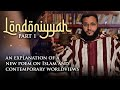

# Londoniyyah - Part 1: Epistemology and Theories of Truth | Mohammed Hijab (2021-09-19)

## Description

Listen as audio: https://soundcloud.com/sapienceinstitute/sets/londoniyyah

Londoniyyah - Part 1: Epistemology and Theories of Truth | Mohammed Hijab

An explanation of a new theo-philosophical poem on Islam and contemporary worldviews

A new series by Mohammed Hijab

To be updated about our content please subscribe and open the notifications.
----
BOOK A LIGHTHOUSE MENTOR

Are you or someone you know doubting Islam? Do you find yourself struggling to find answers?  Do you have a hard time speaking to someone about Islam?  Are you considering Islam but are unsure about certain concepts?  Are you an activist, Imam or community leader who is unsure about how to handle questions related to science, philosophy, the Islamic moral code, etc.?

You are not alone.  Over the course of the last decade or more there has been a rapid proliferation of content online and in academic institutions that has eroded the faith of some people.

Seeing the rise of  this phenomenon , Sapience Institute is introducing a One to One mentoring service called LIGHTHOUSE.

BOOK A MENTOR HERE: https://sapienceinstitute.org/lighthouse/

VISIT our website for articles in English, Spanish and Turkish; mentoring service, learning platform and for speaker requests: https://sapienceinstitute.org/

## Summary of [Londoniyyah - Part 1: Epistemology and Theories of Truth | Mohammed Hijab](https://www.youtube.com/watch?v=eSQk1CpCh5k)

*This summary is AI generated - there may be inaccuracies. *

### [00:00:00](https://www.youtube.com/watch?v=eSQk1CpCh5k&t=0) - [00:35:00](https://www.youtube.com/watch?v=eSQk1CpCh5k&t=2100)

 discusses the three main theories of truth: correspondence, coherence, and pragmatism. It also discusses the objections to each theory.

**[00:00:00](https://www.youtube.com/watch?v=eSQk1CpCh5k&t=0)* Discusses the three main schools of thought in epistemology: the coherence theory of truth, the pragmatist theory of truth, and the correspondence theory of truth. It also discusses the fundamental question of what knowledge is.
* **[00:05:00](https://www.youtube.com/watch?v=eSQk1CpCh5k&t=300)** In epistemology, there are three main schools of thought: coherentism, naturalism, and relativism. Each theory has its own set of axioms which must be met in order for something to be considered knowledge. One example of a theory of truth is foundationalism, which holds that there must be a foundation for our beliefs - such as axioms - and that the superstructure of other beliefs is rested on this foundation.
* **[00:10:00](https://www.youtube.com/watch?v=eSQk1CpCh5k&t=600)**  Mohammed Hijab discusses the various schools of thought on epistemology, with a focus on the rationalist and empiricist schools. He also touches on the islamic tradition's conception of the Fitra, or "earliest stage of awareness."
* **[00:15:00](https://www.youtube.com/watch?v=eSQk1CpCh5k&t=900)* Discusses the different schools of thought in epistemology, including the rationalists, empiricists, and skeptics. It also discusses the importance of knowing what we think and what definitions we use when discussing knowledge.
* **[00:20:00](https://www.youtube.com/watch?v=eSQk1CpCh5k&t=1200)** The three major schools of thought on the nature of truth are correspondence theory, modal realism, and naturalism. The correspondence theory of truth holds that a belief is only true if it corresponds with something in existence. This is considered the most prevalent school of thought, and for good reason because it allows for truth claims to be made about things in the real world. If a belief does not correspond with reality, it can be considered a myth. The modal realism school of thought holds that beliefs can be true in multiple ways, depending on the circumstance. The naturalism school of thought holds that truth is simply the correspondence between a belief and reality. This school of thought is more difficult to accept because it requires that we accept that beliefs can be false.
* **[00:25:00](https://www.youtube.com/watch?v=eSQk1CpCh5k&t=1500)** The three main theories of truth are correspondence, coherence, and pragmatism. Correspondence theory argues that consistency is a necessary but not sufficient condition to truth, while coherence theory says that a belief is true if it coheres with a body of statements that we take to be true. Pragmatism says that truth is whatever is useful, and that it can be true for works even if it's not experimentally provable.
* **[00:30:00](https://www.youtube.com/watch?v=eSQk1CpCh5k&t=1800)** This philosopher discusses the objection to pragmatism, which is that it is possible for there to be truths that contradict each other. He also discusses the objection to coherentism, which is that it can be fictitious.
* **[00:35:00](https://www.youtube.com/watch?v=eSQk1CpCh5k&t=2100)* Discusses the problems with correspondence theory of truth. Pragmatism and coherentism are also discussed as being undercut by the objections raised.

<h2>Full transcript with timestamps: CLICK TO EXPAND</h2>

[0:00:02](https://youtu.be/eSQk1CpCh5k?t=2) [Music]  
[0:00:07](https://youtu.be/eSQk1CpCh5k?t=7) and welcome to this new series we are  
[0:00:09](https://youtu.be/eSQk1CpCh5k?t=9) going to be exploring 25 different  
[0:00:12](https://youtu.be/eSQk1CpCh5k?t=12) uh talking points which we're going to  
[0:00:13](https://youtu.be/eSQk1CpCh5k?t=13) include in sha allah  
[0:00:15](https://youtu.be/eSQk1CpCh5k?t=15) things like the theories of justice  
[0:00:16](https://youtu.be/eSQk1CpCh5k?t=16) which is what we're going to be talking  
[0:00:17](https://youtu.be/eSQk1CpCh5k?t=17) about today in epistemology things like  
[0:00:20](https://youtu.be/eSQk1CpCh5k?t=20) moral philosophy things like political  
[0:00:21](https://youtu.be/eSQk1CpCh5k?t=21) philosophy things like the philosophy of  
[0:00:23](https://youtu.be/eSQk1CpCh5k?t=23) religion all of which are intended  
[0:00:26](https://youtu.be/eSQk1CpCh5k?t=26) to arm muslim people  
[0:00:28](https://youtu.be/eSQk1CpCh5k?t=28) in the east and in the west  
[0:00:31](https://youtu.be/eSQk1CpCh5k?t=31) in being able to deal with questions  
[0:00:33](https://youtu.be/eSQk1CpCh5k?t=33) contentions and controversies relating  
[0:00:35](https://youtu.be/eSQk1CpCh5k?t=35) to islam and other world religions and  
[0:00:38](https://youtu.be/eSQk1CpCh5k?t=38) ideologies  
[0:00:40](https://youtu.be/eSQk1CpCh5k?t=40) this  
[0:00:41](https://youtu.be/eSQk1CpCh5k?t=41) series if you like is based on a poem  
[0:00:44](https://youtu.be/eSQk1CpCh5k?t=44) which has been crafted  
[0:00:46](https://youtu.be/eSQk1CpCh5k?t=46) by a shaykh  
[0:00:51](https://youtu.be/eSQk1CpCh5k?t=51) who we've had discussions with  
[0:00:54](https://youtu.be/eSQk1CpCh5k?t=54) and who has with great generosity been  
[0:00:57](https://youtu.be/eSQk1CpCh5k?t=57) able to create for us a poem  
[0:00:59](https://youtu.be/eSQk1CpCh5k?t=59) uh based on some of the most important  
[0:01:01](https://youtu.be/eSQk1CpCh5k?t=61) talking points as i've mentioned  
[0:01:04](https://youtu.be/eSQk1CpCh5k?t=64) uh on the issues that we've just talked  
[0:01:06](https://youtu.be/eSQk1CpCh5k?t=66) about so what we're going to be doing  
[0:01:07](https://youtu.be/eSQk1CpCh5k?t=67) insha'allah is we are going to be  
[0:01:09](https://youtu.be/eSQk1CpCh5k?t=69) reading the poem in the arabic language  
[0:01:11](https://youtu.be/eSQk1CpCh5k?t=71) as per kind of the tradition of the  
[0:01:13](https://youtu.be/eSQk1CpCh5k?t=73) traditionalist  
[0:01:15](https://youtu.be/eSQk1CpCh5k?t=75) schools of islamic thought  
[0:01:17](https://youtu.be/eSQk1CpCh5k?t=77) and then translating this and then going  
[0:01:20](https://youtu.be/eSQk1CpCh5k?t=80) into the objectives of the lesson  
[0:01:23](https://youtu.be/eSQk1CpCh5k?t=83) and talking about  
[0:01:25](https://youtu.be/eSQk1CpCh5k?t=85) it will be epistemology  
[0:01:27](https://youtu.be/eSQk1CpCh5k?t=87) so inshallah without further ado i'm  
[0:01:30](https://youtu.be/eSQk1CpCh5k?t=90) going to give it to you insha allah  
[0:01:31](https://youtu.be/eSQk1CpCh5k?t=91) so you can read  
[0:01:33](https://youtu.be/eSQk1CpCh5k?t=93) the  
[0:01:34](https://youtu.be/eSQk1CpCh5k?t=94) poem  
[0:01:37](https://youtu.be/eSQk1CpCh5k?t=97) in  
[0:01:51](https://youtu.be/eSQk1CpCh5k?t=111) foreign  
[0:02:21](https://youtu.be/eSQk1CpCh5k?t=141) right  
[0:02:22](https://youtu.be/eSQk1CpCh5k?t=142) so for those arabic speakers that want  
[0:02:24](https://youtu.be/eSQk1CpCh5k?t=144) to know what we're talking about and  
[0:02:25](https://youtu.be/eSQk1CpCh5k?t=145) want a kind of exposition of these  
[0:02:28](https://youtu.be/eSQk1CpCh5k?t=148) things we will be doing this series also  
[0:02:29](https://youtu.be/eSQk1CpCh5k?t=149) in the arabic language which will be on  
[0:02:31](https://youtu.be/eSQk1CpCh5k?t=151) the sapiens arabic youtube page  
[0:02:34](https://youtu.be/eSQk1CpCh5k?t=154) to get straight to the objectives the  
[0:02:35](https://youtu.be/eSQk1CpCh5k?t=155) objectives of today's session  
[0:02:37](https://youtu.be/eSQk1CpCh5k?t=157) insha'allah as follows to know what  
[0:02:39](https://youtu.be/eSQk1CpCh5k?t=159) constitutes knowledge  
[0:02:41](https://youtu.be/eSQk1CpCh5k?t=161) and how it's differentiated from other  
[0:02:43](https://youtu.be/eSQk1CpCh5k?t=163) types of so-called cognitive successes  
[0:02:45](https://youtu.be/eSQk1CpCh5k?t=165) and we'll get to these  
[0:02:47](https://youtu.be/eSQk1CpCh5k?t=167) key words what is a cognitive success  
[0:02:49](https://youtu.be/eSQk1CpCh5k?t=169) why do epistemologists use this term how  
[0:02:51](https://youtu.be/eSQk1CpCh5k?t=171) is it differentiated from  
[0:02:53](https://youtu.be/eSQk1CpCh5k?t=173) knowledge what is knowledge um  
[0:02:55](https://youtu.be/eSQk1CpCh5k?t=175) and so on these are very important  
[0:02:57](https://youtu.be/eSQk1CpCh5k?t=177) questions that any student of philosophy  
[0:02:59](https://youtu.be/eSQk1CpCh5k?t=179) or epistemology  
[0:03:01](https://youtu.be/eSQk1CpCh5k?t=181) should know the answers to  
[0:03:04](https://youtu.be/eSQk1CpCh5k?t=184) so we're going to be looking both at the  
[0:03:06](https://youtu.be/eSQk1CpCh5k?t=186) islamic intellectual history or having  
[0:03:09](https://youtu.be/eSQk1CpCh5k?t=189) discussions based on some of the words  
[0:03:11](https://youtu.be/eSQk1CpCh5k?t=191) of some of the great scholars from that  
[0:03:12](https://youtu.be/eSQk1CpCh5k?t=192) history and the western academic history  
[0:03:15](https://youtu.be/eSQk1CpCh5k?t=195) on this topic  
[0:03:16](https://youtu.be/eSQk1CpCh5k?t=196) the second thing is to be able to  
[0:03:18](https://youtu.be/eSQk1CpCh5k?t=198) familiarize ourselves with the debates  
[0:03:20](https://youtu.be/eSQk1CpCh5k?t=200) in epistemology regarding theories of  
[0:03:22](https://youtu.be/eSQk1CpCh5k?t=202) truth  
[0:03:24](https://youtu.be/eSQk1CpCh5k?t=204) now there's lots of debates in  
[0:03:25](https://youtu.be/eSQk1CpCh5k?t=205) epistemology but this is perhaps one of  
[0:03:27](https://youtu.be/eSQk1CpCh5k?t=207) the most foundational ones  
[0:03:29](https://youtu.be/eSQk1CpCh5k?t=209) uh what is truth because we have  
[0:03:31](https://youtu.be/eSQk1CpCh5k?t=211) conversations all the time of this is  
[0:03:33](https://youtu.be/eSQk1CpCh5k?t=213) the truth and this is not the truth we  
[0:03:35](https://youtu.be/eSQk1CpCh5k?t=215) have these conversations mundanely  
[0:03:37](https://youtu.be/eSQk1CpCh5k?t=217) in the uh parlance that we have in  
[0:03:39](https://youtu.be/eSQk1CpCh5k?t=219) everyday vernacular with you know maybe  
[0:03:41](https://youtu.be/eSQk1CpCh5k?t=221) your spouse your your friend and so on  
[0:03:43](https://youtu.be/eSQk1CpCh5k?t=223) this is the truth and this is not true  
[0:03:44](https://youtu.be/eSQk1CpCh5k?t=224) all the way up to the most  
[0:03:45](https://youtu.be/eSQk1CpCh5k?t=225) metaphysically complicated topics  
[0:03:48](https://youtu.be/eSQk1CpCh5k?t=228) we talk about  
[0:03:49](https://youtu.be/eSQk1CpCh5k?t=229) this is the ultimate truth and this is  
[0:03:51](https://youtu.be/eSQk1CpCh5k?t=231) the absolute truth  
[0:03:52](https://youtu.be/eSQk1CpCh5k?t=232) but it would suggest i mean it would beg  
[0:03:55](https://youtu.be/eSQk1CpCh5k?t=235) the question actually more  
[0:03:56](https://youtu.be/eSQk1CpCh5k?t=236) foundationally what is truth in the  
[0:03:57](https://youtu.be/eSQk1CpCh5k?t=237) first place and is there any consensus  
[0:03:59](https://youtu.be/eSQk1CpCh5k?t=239) on what truth is today we have to know  
[0:04:02](https://youtu.be/eSQk1CpCh5k?t=242) what the competing schools of thought in  
[0:04:04](https://youtu.be/eSQk1CpCh5k?t=244) epistemology consider as truth  
[0:04:06](https://youtu.be/eSQk1CpCh5k?t=246) and we have to know the arguments they  
[0:04:08](https://youtu.be/eSQk1CpCh5k?t=248) use for and against other schools of  
[0:04:10](https://youtu.be/eSQk1CpCh5k?t=250) thought we'll be focusing on three  
[0:04:12](https://youtu.be/eSQk1CpCh5k?t=252) particular schools of thought which have  
[0:04:13](https://youtu.be/eSQk1CpCh5k?t=253) probably the most prominence in the  
[0:04:15](https://youtu.be/eSQk1CpCh5k?t=255) western academy  
[0:04:16](https://youtu.be/eSQk1CpCh5k?t=256) which are  
[0:04:17](https://youtu.be/eSQk1CpCh5k?t=257) the coher the coherence theory of truth  
[0:04:19](https://youtu.be/eSQk1CpCh5k?t=259) the pragmatist theory of truth of course  
[0:04:21](https://youtu.be/eSQk1CpCh5k?t=261) the correspondence theory of truth as  
[0:04:23](https://youtu.be/eSQk1CpCh5k?t=263) well  
[0:04:24](https://youtu.be/eSQk1CpCh5k?t=264) so that's the second objective the third  
[0:04:25](https://youtu.be/eSQk1CpCh5k?t=265) objective to be able to make a judgment  
[0:04:27](https://youtu.be/eSQk1CpCh5k?t=267) about this debate so we have to be  
[0:04:28](https://youtu.be/eSQk1CpCh5k?t=268) engaging critically with these topics  
[0:04:31](https://youtu.be/eSQk1CpCh5k?t=271) not just uh mundanely or passively we  
[0:04:34](https://youtu.be/eSQk1CpCh5k?t=274) have to be able to kind of put ourselves  
[0:04:37](https://youtu.be/eSQk1CpCh5k?t=277) in the shoes proverbial shoes of the  
[0:04:40](https://youtu.be/eSQk1CpCh5k?t=280) pragmatists of the coherentist  
[0:04:43](https://youtu.be/eSQk1CpCh5k?t=283) and or the correspondence theorist  
[0:04:46](https://youtu.be/eSQk1CpCh5k?t=286) and so we'll start right now with this  
[0:04:47](https://youtu.be/eSQk1CpCh5k?t=287) fundamental question  
[0:04:49](https://youtu.be/eSQk1CpCh5k?t=289) what is knowledge  
[0:04:52](https://youtu.be/eSQk1CpCh5k?t=292) so epistemologists they differentiate  
[0:04:54](https://youtu.be/eSQk1CpCh5k?t=294) between belief and knowledge this is  
[0:04:56](https://youtu.be/eSQk1CpCh5k?t=296) extremely important  
[0:04:57](https://youtu.be/eSQk1CpCh5k?t=297) because belief  
[0:04:59](https://youtu.be/eSQk1CpCh5k?t=299) is something which can be true or it can  
[0:05:01](https://youtu.be/eSQk1CpCh5k?t=301) be something which is false okay you  
[0:05:03](https://youtu.be/eSQk1CpCh5k?t=303) know you have  
[0:05:05](https://youtu.be/eSQk1CpCh5k?t=305) true belief and false belief  
[0:05:07](https://youtu.be/eSQk1CpCh5k?t=307) so what is knowledge then knowledge is  
[0:05:09](https://youtu.be/eSQk1CpCh5k?t=309) justified true belief  
[0:05:13](https://youtu.be/eSQk1CpCh5k?t=313) can you say that one more time yes i  
[0:05:14](https://youtu.be/eSQk1CpCh5k?t=314) have no problem in repeating this  
[0:05:17](https://youtu.be/eSQk1CpCh5k?t=317) knowledge is according to the majority  
[0:05:19](https://youtu.be/eSQk1CpCh5k?t=319) definition in epistemology is justified  
[0:05:22](https://youtu.be/eSQk1CpCh5k?t=322) true belief in other words three  
[0:05:24](https://youtu.be/eSQk1CpCh5k?t=324) criterion need to be met in order for  
[0:05:27](https://youtu.be/eSQk1CpCh5k?t=327) something to be considered as knowledge  
[0:05:29](https://youtu.be/eSQk1CpCh5k?t=329) that has to be justified  
[0:05:31](https://youtu.be/eSQk1CpCh5k?t=331) it has to be true  
[0:05:32](https://youtu.be/eSQk1CpCh5k?t=332) and it has to be a belief  
[0:05:34](https://youtu.be/eSQk1CpCh5k?t=334) now these three things  
[0:05:36](https://youtu.be/eSQk1CpCh5k?t=336) have to be in place in order for the  
[0:05:38](https://youtu.be/eSQk1CpCh5k?t=338) thing to be knowledge can you say  
[0:05:40](https://youtu.be/eSQk1CpCh5k?t=340) there's such a thing as true knowledge  
[0:05:41](https://youtu.be/eSQk1CpCh5k?t=341) and false knowledge on this strict  
[0:05:43](https://youtu.be/eSQk1CpCh5k?t=343) epistemological definition no you can't  
[0:05:45](https://youtu.be/eSQk1CpCh5k?t=345) it's either  
[0:05:46](https://youtu.be/eSQk1CpCh5k?t=346) knowledge or there isn't knowledge  
[0:05:49](https://youtu.be/eSQk1CpCh5k?t=349) if you say something which is false this  
[0:05:50](https://youtu.be/eSQk1CpCh5k?t=350) is not knowledge  
[0:05:52](https://youtu.be/eSQk1CpCh5k?t=352) and just on a side note it's really  
[0:05:53](https://youtu.be/eSQk1CpCh5k?t=353) interesting i was  
[0:05:55](https://youtu.be/eSQk1CpCh5k?t=355) thinking about this verse in the quran  
[0:05:57](https://youtu.be/eSQk1CpCh5k?t=357) since we're muslims and  
[0:05:59](https://youtu.be/eSQk1CpCh5k?t=359) coming from that  
[0:06:00](https://youtu.be/eSQk1CpCh5k?t=360) perspective  
[0:06:08](https://youtu.be/eSQk1CpCh5k?t=368) they have no knowledge of this when  
[0:06:10](https://youtu.be/eSQk1CpCh5k?t=370) christians are saying that you know  
[0:06:12](https://youtu.be/eSQk1CpCh5k?t=372) jesus is the son of god you know  
[0:06:15](https://youtu.be/eSQk1CpCh5k?t=375) that they have no knowledge of this  
[0:06:17](https://youtu.be/eSQk1CpCh5k?t=377) so it's as if their false beliefs  
[0:06:21](https://youtu.be/eSQk1CpCh5k?t=381) amount to nothing basically it's not  
[0:06:22](https://youtu.be/eSQk1CpCh5k?t=382) even knowledge it's not false knowledge  
[0:06:25](https://youtu.be/eSQk1CpCh5k?t=385) it's not knowledge at all  
[0:06:27](https://youtu.be/eSQk1CpCh5k?t=387) they have no knowledge of it  
[0:06:28](https://youtu.be/eSQk1CpCh5k?t=388) such knowledge does not even exist in  
[0:06:30](https://youtu.be/eSQk1CpCh5k?t=390) the first place because this is a false  
[0:06:31](https://youtu.be/eSQk1CpCh5k?t=391) belief  
[0:06:33](https://youtu.be/eSQk1CpCh5k?t=393) interesting anyway but gone back to this  
[0:06:34](https://youtu.be/eSQk1CpCh5k?t=394) point  
[0:06:35](https://youtu.be/eSQk1CpCh5k?t=395) that this is  
[0:06:37](https://youtu.be/eSQk1CpCh5k?t=397) what knowledge is  
[0:06:38](https://youtu.be/eSQk1CpCh5k?t=398) however someone came out called gettier  
[0:06:42](https://youtu.be/eSQk1CpCh5k?t=402) a very interesting uh character who came  
[0:06:43](https://youtu.be/eSQk1CpCh5k?t=403) out  
[0:06:44](https://youtu.be/eSQk1CpCh5k?t=404) and he proposed what referred to are  
[0:06:47](https://youtu.be/eSQk1CpCh5k?t=407) gettier examples actually  
[0:06:49](https://youtu.be/eSQk1CpCh5k?t=409) and  
[0:06:50](https://youtu.be/eSQk1CpCh5k?t=410) these are you know  
[0:06:52](https://youtu.be/eSQk1CpCh5k?t=412) examples of theories and so on  
[0:06:54](https://youtu.be/eSQk1CpCh5k?t=414) of uh  
[0:06:56](https://youtu.be/eSQk1CpCh5k?t=416) where all these three conditions can be  
[0:06:58](https://youtu.be/eSQk1CpCh5k?t=418) met but actually knowledge is not uh is  
[0:07:01](https://youtu.be/eSQk1CpCh5k?t=421) not achieved  
[0:07:02](https://youtu.be/eSQk1CpCh5k?t=422) and  
[0:07:03](https://youtu.be/eSQk1CpCh5k?t=423) i'll give you one example of such a  
[0:07:05](https://youtu.be/eSQk1CpCh5k?t=425) thing he wrote this in two pages i mean  
[0:07:07](https://youtu.be/eSQk1CpCh5k?t=427) you can see sometimes you can write  
[0:07:08](https://youtu.be/eSQk1CpCh5k?t=428) something in an academic way and it's  
[0:07:11](https://youtu.be/eSQk1CpCh5k?t=431) very short and brief but has such an  
[0:07:13](https://youtu.be/eSQk1CpCh5k?t=433) impact i think one and a half page or  
[0:07:14](https://youtu.be/eSQk1CpCh5k?t=434) two pages and these were referred to as  
[0:07:15](https://youtu.be/eSQk1CpCh5k?t=435) gettier examples in fact  
[0:07:18](https://youtu.be/eSQk1CpCh5k?t=438) but i'll give you an example because his  
[0:07:19](https://youtu.be/eSQk1CpCh5k?t=439) exam's a bit long-winded i'll give you  
[0:07:21](https://youtu.be/eSQk1CpCh5k?t=441) an example of what would constitute as a  
[0:07:22](https://youtu.be/eSQk1CpCh5k?t=442) get here example for example  
[0:07:24](https://youtu.be/eSQk1CpCh5k?t=444) if you look at a clock okay and it says  
[0:07:27](https://youtu.be/eSQk1CpCh5k?t=447) uh 12 o'clock on it it says 12 clock but  
[0:07:29](https://youtu.be/eSQk1CpCh5k?t=449) there's no battery in that clock there's  
[0:07:30](https://youtu.be/eSQk1CpCh5k?t=450) no battery in that clock do you  
[0:07:32](https://youtu.be/eSQk1CpCh5k?t=452) do you have a justified belief yes you  
[0:07:35](https://youtu.be/eSQk1CpCh5k?t=455) have a justified reason for thinking  
[0:07:37](https://youtu.be/eSQk1CpCh5k?t=457) it's two o'clock or twelve o'clock  
[0:07:38](https://youtu.be/eSQk1CpCh5k?t=458) whatever it is  
[0:07:39](https://youtu.be/eSQk1CpCh5k?t=459) what if it happens to be twelve o'clock  
[0:07:42](https://youtu.be/eSQk1CpCh5k?t=462) yes you have a justified true belief  
[0:07:45](https://youtu.be/eSQk1CpCh5k?t=465) but it's based on something which is  
[0:07:47](https://youtu.be/eSQk1CpCh5k?t=467) telling you the wrong time it's just  
[0:07:49](https://youtu.be/eSQk1CpCh5k?t=469) coincidental that at this point in time  
[0:07:52](https://youtu.be/eSQk1CpCh5k?t=472) you're looking at the clock  
[0:07:54](https://youtu.be/eSQk1CpCh5k?t=474) and so sometimes  
[0:07:55](https://youtu.be/eSQk1CpCh5k?t=475) you can have instances where all three  
[0:07:58](https://youtu.be/eSQk1CpCh5k?t=478) criterion  
[0:08:00](https://youtu.be/eSQk1CpCh5k?t=480) justified true belief are not met but  
[0:08:02](https://youtu.be/eSQk1CpCh5k?t=482) then you can still have  
[0:08:03](https://youtu.be/eSQk1CpCh5k?t=483) uh you can you can still have knowledge  
[0:08:06](https://youtu.be/eSQk1CpCh5k?t=486) or you can have false knowledge  
[0:08:07](https://youtu.be/eSQk1CpCh5k?t=487) and so these were dubbed gettier  
[0:08:10](https://youtu.be/eSQk1CpCh5k?t=490) examples but for the most part apart  
[0:08:12](https://youtu.be/eSQk1CpCh5k?t=492) from gettier  
[0:08:14](https://youtu.be/eSQk1CpCh5k?t=494) most people would would still insist  
[0:08:16](https://youtu.be/eSQk1CpCh5k?t=496) actually on this usage of  
[0:08:18](https://youtu.be/eSQk1CpCh5k?t=498) the term knowledge which is that is  
[0:08:20](https://youtu.be/eSQk1CpCh5k?t=500) justified true  
[0:08:23](https://youtu.be/eSQk1CpCh5k?t=503) belief  
[0:08:26](https://youtu.be/eSQk1CpCh5k?t=506) now  
[0:08:27](https://youtu.be/eSQk1CpCh5k?t=507) in epistemology there are different  
[0:08:28](https://youtu.be/eSQk1CpCh5k?t=508) schools of thought uh you'd be  
[0:08:31](https://youtu.be/eSQk1CpCh5k?t=511) you know if you read a book something  
[0:08:32](https://youtu.be/eSQk1CpCh5k?t=512) like  
[0:08:33](https://youtu.be/eSQk1CpCh5k?t=513) evidence and inquiry written by susan  
[0:08:35](https://youtu.be/eSQk1CpCh5k?t=515) hack where she discusses different  
[0:08:38](https://youtu.be/eSQk1CpCh5k?t=518) schools of thought and so on different  
[0:08:41](https://youtu.be/eSQk1CpCh5k?t=521) you know schools of thought now i want  
[0:08:43](https://youtu.be/eSQk1CpCh5k?t=523) to be very clear we're going to talk  
[0:08:44](https://youtu.be/eSQk1CpCh5k?t=524) about theories of truth today okay in  
[0:08:47](https://youtu.be/eSQk1CpCh5k?t=527) theories of truth there are three main  
[0:08:48](https://youtu.be/eSQk1CpCh5k?t=528) schools of thought but in epistemology  
[0:08:50](https://youtu.be/eSQk1CpCh5k?t=530) generally there are more than three  
[0:08:52](https://youtu.be/eSQk1CpCh5k?t=532) that are discussed  
[0:08:53](https://youtu.be/eSQk1CpCh5k?t=533) and sometimes when for example we talk  
[0:08:55](https://youtu.be/eSQk1CpCh5k?t=535) about coherentism  
[0:08:57](https://youtu.be/eSQk1CpCh5k?t=537) or we're talking about whatever it is  
[0:08:59](https://youtu.be/eSQk1CpCh5k?t=539) we're going to be talking about one can  
[0:09:00](https://youtu.be/eSQk1CpCh5k?t=540) get confused  
[0:09:02](https://youtu.be/eSQk1CpCh5k?t=542) between the two categories when we're  
[0:09:04](https://youtu.be/eSQk1CpCh5k?t=544) talking about theories of truth  
[0:09:05](https://youtu.be/eSQk1CpCh5k?t=545) sometimes the same school of thought  
[0:09:08](https://youtu.be/eSQk1CpCh5k?t=548) is described in a slightly different way  
[0:09:10](https://youtu.be/eSQk1CpCh5k?t=550) so for example one of the major schools  
[0:09:12](https://youtu.be/eSQk1CpCh5k?t=552) of law in epistemology is something  
[0:09:14](https://youtu.be/eSQk1CpCh5k?t=554) called foundationalism  
[0:09:16](https://youtu.be/eSQk1CpCh5k?t=556) and foundationalism is the idea that  
[0:09:18](https://youtu.be/eSQk1CpCh5k?t=558) actually  
[0:09:20](https://youtu.be/eSQk1CpCh5k?t=560) there cannot be an infinite regress and  
[0:09:22](https://youtu.be/eSQk1CpCh5k?t=562) this is the main argument for  
[0:09:23](https://youtu.be/eSQk1CpCh5k?t=563) foundationalism actually there cannot be  
[0:09:25](https://youtu.be/eSQk1CpCh5k?t=565) an infinite regress of explained things  
[0:09:27](https://youtu.be/eSQk1CpCh5k?t=567) there have to be these basic ideas  
[0:09:31](https://youtu.be/eSQk1CpCh5k?t=571) that  
[0:09:32](https://youtu.be/eSQk1CpCh5k?t=572) um  
[0:09:33](https://youtu.be/eSQk1CpCh5k?t=573) the superstructure of other ideas are  
[0:09:36](https://youtu.be/eSQk1CpCh5k?t=576) supported upon if you like they can be  
[0:09:38](https://youtu.be/eSQk1CpCh5k?t=578) called axioms  
[0:09:39](https://youtu.be/eSQk1CpCh5k?t=579) they can be called axioms so these  
[0:09:40](https://youtu.be/eSQk1CpCh5k?t=580) things that they don't have the  
[0:09:42](https://youtu.be/eSQk1CpCh5k?t=582) explanation of their own they break the  
[0:09:43](https://youtu.be/eSQk1CpCh5k?t=583) infinite regress and they explain other  
[0:09:46](https://youtu.be/eSQk1CpCh5k?t=586) beliefs okay they don't have an  
[0:09:47](https://youtu.be/eSQk1CpCh5k?t=587) explanation of their own and they  
[0:09:48](https://youtu.be/eSQk1CpCh5k?t=588) explain other beliefs so foundationalism  
[0:09:51](https://youtu.be/eSQk1CpCh5k?t=591) is this idea that epistemologically  
[0:09:53](https://youtu.be/eSQk1CpCh5k?t=593) there must be a foundation for our  
[0:09:55](https://youtu.be/eSQk1CpCh5k?t=595) beliefs and then the superstructure of  
[0:09:57](https://youtu.be/eSQk1CpCh5k?t=597) other beliefs are rested on this  
[0:09:58](https://youtu.be/eSQk1CpCh5k?t=598) foundation  
[0:10:00](https://youtu.be/eSQk1CpCh5k?t=600) on the other hand you have a school of  
[0:10:02](https://youtu.be/eSQk1CpCh5k?t=602) thought like coherentism which describes  
[0:10:05](https://youtu.be/eSQk1CpCh5k?t=605) beliefs less like a building and more  
[0:10:07](https://youtu.be/eSQk1CpCh5k?t=607) like a web in fact they say there's  
[0:10:09](https://youtu.be/eSQk1CpCh5k?t=609) there's not an epistle epistemological  
[0:10:11](https://youtu.be/eSQk1CpCh5k?t=611) advantage  
[0:10:12](https://youtu.be/eSQk1CpCh5k?t=612) in so-called basic beliefs over other  
[0:10:14](https://youtu.be/eSQk1CpCh5k?t=614) beliefs and they would say that actually  
[0:10:17](https://youtu.be/eSQk1CpCh5k?t=617) these two kinds of beliefs are the same  
[0:10:18](https://youtu.be/eSQk1CpCh5k?t=618) in epistemic weight  
[0:10:20](https://youtu.be/eSQk1CpCh5k?t=620) and we'll talk about how this relates to  
[0:10:22](https://youtu.be/eSQk1CpCh5k?t=622) today's discussion  
[0:10:24](https://youtu.be/eSQk1CpCh5k?t=624) but these schools of thought  
[0:10:27](https://youtu.be/eSQk1CpCh5k?t=627) are really important because they have  
[0:10:28](https://youtu.be/eSQk1CpCh5k?t=628) their kind of  
[0:10:31](https://youtu.be/eSQk1CpCh5k?t=631) inception  
[0:10:32](https://youtu.be/eSQk1CpCh5k?t=632) the rational school for for example has  
[0:10:34](https://youtu.be/eSQk1CpCh5k?t=634) this inception in uh  
[0:10:36](https://youtu.be/eSQk1CpCh5k?t=636) the renaissance you have descartes  
[0:10:38](https://youtu.be/eSQk1CpCh5k?t=638) as many of you would have known this  
[0:10:39](https://youtu.be/eSQk1CpCh5k?t=639) name descartes rene descartes who wrote  
[0:10:41](https://youtu.be/eSQk1CpCh5k?t=641) the meditations you know he employed  
[0:10:43](https://youtu.be/eSQk1CpCh5k?t=643) systemic doubt to come to a particular  
[0:10:45](https://youtu.be/eSQk1CpCh5k?t=645) conclusion of i think therefore i am  
[0:10:48](https://youtu.be/eSQk1CpCh5k?t=648) kojito ergosam which is the  
[0:10:50](https://youtu.be/eSQk1CpCh5k?t=650) base it was actually for the base for  
[0:10:52](https://youtu.be/eSQk1CpCh5k?t=652) for a long time of western philosophy  
[0:10:55](https://youtu.be/eSQk1CpCh5k?t=655) um for the rational school in particular  
[0:10:57](https://youtu.be/eSQk1CpCh5k?t=657) so i think therefore i am is the most  
[0:10:59](https://youtu.be/eSQk1CpCh5k?t=659) foundational thing you can come to he  
[0:11:01](https://youtu.be/eSQk1CpCh5k?t=661) wrote in his meditations using systemic  
[0:11:03](https://youtu.be/eSQk1CpCh5k?t=663) doubt  
[0:11:04](https://youtu.be/eSQk1CpCh5k?t=664) um that you know i doubt my this i doubt  
[0:11:07](https://youtu.be/eSQk1CpCh5k?t=667) my senses it could be a demon that's  
[0:11:08](https://youtu.be/eSQk1CpCh5k?t=668) possessing me it could be this  
[0:11:10](https://youtu.be/eSQk1CpCh5k?t=670) at the end he said the one thing i can't  
[0:11:12](https://youtu.be/eSQk1CpCh5k?t=672) doubt he said one thing i can't doubt is  
[0:11:15](https://youtu.be/eSQk1CpCh5k?t=675) i think therefore i am  
[0:11:17](https://youtu.be/eSQk1CpCh5k?t=677) by the way nietzsche came back you know  
[0:11:19](https://youtu.be/eSQk1CpCh5k?t=679) he wrote i think he was in the gay  
[0:11:20](https://youtu.be/eSQk1CpCh5k?t=680) science or beyond good and evil one of  
[0:11:22](https://youtu.be/eSQk1CpCh5k?t=682) the books and he said actually there's  
[0:11:24](https://youtu.be/eSQk1CpCh5k?t=684) some presuppositions in this thing which  
[0:11:25](https://youtu.be/eSQk1CpCh5k?t=685) you thought was unshakable which they  
[0:11:27](https://youtu.be/eSQk1CpCh5k?t=687) could go some or you know i think  
[0:11:29](https://youtu.be/eSQk1CpCh5k?t=689) therefore i am says well you're saying i  
[0:11:31](https://youtu.be/eSQk1CpCh5k?t=691) which presupposes that you exist  
[0:11:33](https://youtu.be/eSQk1CpCh5k?t=693) when you say i think therefore i am it  
[0:11:34](https://youtu.be/eSQk1CpCh5k?t=694) says why why not avicenna quite  
[0:11:37](https://youtu.be/eSQk1CpCh5k?t=697) interestingly even cena  
[0:11:38](https://youtu.be/eSQk1CpCh5k?t=698) he had a much more watertight version of  
[0:11:40](https://youtu.be/eSQk1CpCh5k?t=700) the kijito many hundreds of years before  
[0:11:43](https://youtu.be/eSQk1CpCh5k?t=703) uh rene descartes attempted  
[0:11:45](https://youtu.be/eSQk1CpCh5k?t=705) the the operation which is he said  
[0:11:48](https://youtu.be/eSQk1CpCh5k?t=708) and now  
[0:11:51](https://youtu.be/eSQk1CpCh5k?t=711) there's there's no doubt that there is  
[0:11:52](https://youtu.be/eSQk1CpCh5k?t=712) existence so he didn't personalize it  
[0:11:54](https://youtu.be/eSQk1CpCh5k?t=714) and he didn't have a personal product  
[0:11:56](https://youtu.be/eSQk1CpCh5k?t=716) and this was written in a book called  
[0:11:57](https://youtu.be/eSQk1CpCh5k?t=717) najit  
[0:11:58](https://youtu.be/eSQk1CpCh5k?t=718) uh that's been seen a lot but anyway  
[0:12:00](https://youtu.be/eSQk1CpCh5k?t=720) putting that to the side the rational  
[0:12:01](https://youtu.be/eSQk1CpCh5k?t=721) the rationalist school of thought  
[0:12:03](https://youtu.be/eSQk1CpCh5k?t=723) they had this idea that you can  
[0:12:05](https://youtu.be/eSQk1CpCh5k?t=725) rationalize almost any belief system in  
[0:12:07](https://youtu.be/eSQk1CpCh5k?t=727) your mind you can come to the truth with  
[0:12:09](https://youtu.be/eSQk1CpCh5k?t=729) your mind  
[0:12:11](https://youtu.be/eSQk1CpCh5k?t=731) and  
[0:12:11](https://youtu.be/eSQk1CpCh5k?t=731) those who went against them were the  
[0:12:13](https://youtu.be/eSQk1CpCh5k?t=733) british empiricists for example john  
[0:12:15](https://youtu.be/eSQk1CpCh5k?t=735) locke was one of them  
[0:12:17](https://youtu.be/eSQk1CpCh5k?t=737) you had the empiricists who believed  
[0:12:19](https://youtu.be/eSQk1CpCh5k?t=739) that the sentence will experience or  
[0:12:21](https://youtu.be/eSQk1CpCh5k?t=741) sense datum was the best way of  
[0:12:23](https://youtu.be/eSQk1CpCh5k?t=743) achieving information like you your five  
[0:12:25](https://youtu.be/eSQk1CpCh5k?t=745) senses this is how actually you you get  
[0:12:28](https://youtu.be/eSQk1CpCh5k?t=748) information so the the there was a  
[0:12:31](https://youtu.be/eSQk1CpCh5k?t=751) tension if you like between the  
[0:12:32](https://youtu.be/eSQk1CpCh5k?t=752) empiricist school of thor and the  
[0:12:33](https://youtu.be/eSQk1CpCh5k?t=753) rationalist school of law  
[0:12:36](https://youtu.be/eSQk1CpCh5k?t=756) and of course then the post-modern  
[0:12:38](https://youtu.be/eSQk1CpCh5k?t=758) school of thought which we're going to  
[0:12:40](https://youtu.be/eSQk1CpCh5k?t=760) touch upon maybe somewhere along the  
[0:12:42](https://youtu.be/eSQk1CpCh5k?t=762) line of this series but these are some  
[0:12:44](https://youtu.be/eSQk1CpCh5k?t=764) of the epistemological schools of  
[0:12:46](https://youtu.be/eSQk1CpCh5k?t=766) thought you have skepticism which is  
[0:12:48](https://youtu.be/eSQk1CpCh5k?t=768) the idea that we can't even we can't  
[0:12:50](https://youtu.be/eSQk1CpCh5k?t=770) even know anyway we can't even know  
[0:12:52](https://youtu.be/eSQk1CpCh5k?t=772) anyway these are things that we you know  
[0:12:54](https://youtu.be/eSQk1CpCh5k?t=774) they doubt the idea that we can know  
[0:12:55](https://youtu.be/eSQk1CpCh5k?t=775) these things  
[0:12:56](https://youtu.be/eSQk1CpCh5k?t=776) but then the question would would be i  
[0:12:58](https://youtu.be/eSQk1CpCh5k?t=778) mean is that knowledge claim in and of  
[0:12:59](https://youtu.be/eSQk1CpCh5k?t=779) itself i mean that we can't know anyway  
[0:13:02](https://youtu.be/eSQk1CpCh5k?t=782) but these are all different approaches  
[0:13:03](https://youtu.be/eSQk1CpCh5k?t=783) to epistemology you can be a skeptic you  
[0:13:05](https://youtu.be/eSQk1CpCh5k?t=785) can be a rationalist you can be an  
[0:13:06](https://youtu.be/eSQk1CpCh5k?t=786) empiricist you can be a foundation list  
[0:13:09](https://youtu.be/eSQk1CpCh5k?t=789) yeah you know even susan hack in the  
[0:13:12](https://youtu.be/eSQk1CpCh5k?t=792) book she talks about found heroinism she  
[0:13:14](https://youtu.be/eSQk1CpCh5k?t=794) puts things together you know  
[0:13:15](https://youtu.be/eSQk1CpCh5k?t=795) foundationalism and coherentism she puts  
[0:13:17](https://youtu.be/eSQk1CpCh5k?t=797) them together  
[0:13:18](https://youtu.be/eSQk1CpCh5k?t=798) you can you can play around with the  
[0:13:20](https://youtu.be/eSQk1CpCh5k?t=800) categories in this way and depending on  
[0:13:22](https://youtu.be/eSQk1CpCh5k?t=802) how you start  
[0:13:24](https://youtu.be/eSQk1CpCh5k?t=804) you know  
[0:13:24](https://youtu.be/eSQk1CpCh5k?t=804) how you start you know  
[0:13:26](https://youtu.be/eSQk1CpCh5k?t=806) this will determine how you end if you  
[0:13:28](https://youtu.be/eSQk1CpCh5k?t=808) like you know if you start as a skeptic  
[0:13:31](https://youtu.be/eSQk1CpCh5k?t=811) you might not end up anywhere you might  
[0:13:32](https://youtu.be/eSQk1CpCh5k?t=812) just say well i doubt this i doubt that  
[0:13:34](https://youtu.be/eSQk1CpCh5k?t=814) i doubt this high value it's very  
[0:13:35](https://youtu.be/eSQk1CpCh5k?t=815) important for us to establish  
[0:13:38](https://youtu.be/eSQk1CpCh5k?t=818) okay who we are talking to and what  
[0:13:40](https://youtu.be/eSQk1CpCh5k?t=820) criterion they are putting in place for  
[0:13:42](https://youtu.be/eSQk1CpCh5k?t=822) what is beneficial knowledge what is  
[0:13:44](https://youtu.be/eSQk1CpCh5k?t=824) true knowledge what is true and  
[0:13:45](https://youtu.be/eSQk1CpCh5k?t=825) justified belief because if if the  
[0:13:47](https://youtu.be/eSQk1CpCh5k?t=827) criterion is is is jumbled then the  
[0:13:50](https://youtu.be/eSQk1CpCh5k?t=830) conclusions will be jumbled  
[0:13:52](https://youtu.be/eSQk1CpCh5k?t=832) and so this is really an extremely  
[0:13:54](https://youtu.be/eSQk1CpCh5k?t=834) important point because the issue of  
[0:13:56](https://youtu.be/eSQk1CpCh5k?t=836) evidence will keep coming up  
[0:13:58](https://youtu.be/eSQk1CpCh5k?t=838) but what counts as good evidence well  
[0:13:59](https://youtu.be/eSQk1CpCh5k?t=839) for the russian this is rational  
[0:14:00](https://youtu.be/eSQk1CpCh5k?t=840) evidence for the empiricist it's  
[0:14:02](https://youtu.be/eSQk1CpCh5k?t=842) empirical evidence you know and so on  
[0:14:04](https://youtu.be/eSQk1CpCh5k?t=844) and so forth  
[0:14:05](https://youtu.be/eSQk1CpCh5k?t=845) and for the coherences it's coherent  
[0:14:07](https://youtu.be/eSQk1CpCh5k?t=847) evidence it's a coherent set of  
[0:14:09](https://youtu.be/eSQk1CpCh5k?t=849) propositions that come together in a  
[0:14:11](https://youtu.be/eSQk1CpCh5k?t=851) manner that doesn't contradict itself as  
[0:14:13](https://youtu.be/eSQk1CpCh5k?t=853) we're going to come and see  
[0:14:15](https://youtu.be/eSQk1CpCh5k?t=855) later on so  
[0:14:17](https://youtu.be/eSQk1CpCh5k?t=857) in the islamic tradition obviously we  
[0:14:19](https://youtu.be/eSQk1CpCh5k?t=859) have the fitra which is another thing  
[0:14:20](https://youtu.be/eSQk1CpCh5k?t=860) and this was in the poem because the  
[0:14:22](https://youtu.be/eSQk1CpCh5k?t=862) three  
[0:14:23](https://youtu.be/eSQk1CpCh5k?t=863) things that we're going to come to in  
[0:14:24](https://youtu.be/eSQk1CpCh5k?t=864) the in the poem  
[0:14:26](https://youtu.be/eSQk1CpCh5k?t=866) was  
[0:14:27](https://youtu.be/eSQk1CpCh5k?t=867) which is the idea of of the five senses  
[0:14:31](https://youtu.be/eSQk1CpCh5k?t=871) you know the the the  
[0:14:33](https://youtu.be/eSQk1CpCh5k?t=873) organs  
[0:14:34](https://youtu.be/eSQk1CpCh5k?t=874) uh of perception you want to put them  
[0:14:36](https://youtu.be/eSQk1CpCh5k?t=876) that way you know law and the perception  
[0:14:37](https://youtu.be/eSQk1CpCh5k?t=877) the five sentences  
[0:14:39](https://youtu.be/eSQk1CpCh5k?t=879) and then you have  
[0:14:41](https://youtu.be/eSQk1CpCh5k?t=881) which is it covers the rationalist  
[0:14:43](https://youtu.be/eSQk1CpCh5k?t=883) school of thought numbers you know  
[0:14:44](https://youtu.be/eSQk1CpCh5k?t=884) rationalization things which are not  
[0:14:46](https://youtu.be/eSQk1CpCh5k?t=886) necessarily put under a microscope but  
[0:14:47](https://youtu.be/eSQk1CpCh5k?t=887) that you can still perceive  
[0:14:49](https://youtu.be/eSQk1CpCh5k?t=889) and then you have the fitra which is  
[0:14:50](https://youtu.be/eSQk1CpCh5k?t=890) intuitive knowledge which many have  
[0:14:52](https://youtu.be/eSQk1CpCh5k?t=892) spoken about many have been skeptical  
[0:14:54](https://youtu.be/eSQk1CpCh5k?t=894) about but it's still something there  
[0:14:56](https://youtu.be/eSQk1CpCh5k?t=896) and what is intuitive knowledge it's an  
[0:14:58](https://youtu.be/eSQk1CpCh5k?t=898) instinct  
[0:14:59](https://youtu.be/eSQk1CpCh5k?t=899) in fact that's what the kind of muslim  
[0:15:01](https://youtu.be/eSQk1CpCh5k?t=901) scholars have said you know full time  
[0:15:03](https://youtu.be/eSQk1CpCh5k?t=903) that it's it's an instinct it's not  
[0:15:04](https://youtu.be/eSQk1CpCh5k?t=904) something it's it's super rational if  
[0:15:06](https://youtu.be/eSQk1CpCh5k?t=906) you like it's not something which can be  
[0:15:08](https://youtu.be/eSQk1CpCh5k?t=908) reduced to a set of  
[0:15:10](https://youtu.be/eSQk1CpCh5k?t=910) propositions  
[0:15:12](https://youtu.be/eSQk1CpCh5k?t=912) that can be put in propositional terms  
[0:15:14](https://youtu.be/eSQk1CpCh5k?t=914) uh if p  
[0:15:16](https://youtu.be/eSQk1CpCh5k?t=916) uh  
[0:15:17](https://youtu.be/eSQk1CpCh5k?t=917) p entails q and you know then q then p  
[0:15:20](https://youtu.be/eSQk1CpCh5k?t=920) you can't put it in this language you  
[0:15:21](https://youtu.be/eSQk1CpCh5k?t=921) know  
[0:15:22](https://youtu.be/eSQk1CpCh5k?t=922) in instinctual knowledge  
[0:15:24](https://youtu.be/eSQk1CpCh5k?t=924) or intuitive knowledge is is this  
[0:15:26](https://youtu.be/eSQk1CpCh5k?t=926) knowledge  
[0:15:27](https://youtu.be/eSQk1CpCh5k?t=927) which just comes naturally in tamiya  
[0:15:29](https://youtu.be/eSQk1CpCh5k?t=929) himself he says it's just like a baby  
[0:15:33](https://youtu.be/eSQk1CpCh5k?t=933) instinctively knowing how to suckle the  
[0:15:36](https://youtu.be/eSQk1CpCh5k?t=936) breast of the mother is is that  
[0:15:38](https://youtu.be/eSQk1CpCh5k?t=938) instinctive you don't even need to think  
[0:15:40](https://youtu.be/eSQk1CpCh5k?t=940) about it it just happens it's like  
[0:15:41](https://youtu.be/eSQk1CpCh5k?t=941) touching a  
[0:15:42](https://youtu.be/eSQk1CpCh5k?t=942) candle and knowing that it's it's hard  
[0:15:44](https://youtu.be/eSQk1CpCh5k?t=944) that kind of knowledge is an instinct  
[0:15:46](https://youtu.be/eSQk1CpCh5k?t=946) it's pure unadulterated instinct  
[0:15:49](https://youtu.be/eSQk1CpCh5k?t=949) and  
[0:15:50](https://youtu.be/eSQk1CpCh5k?t=950) it's really interesting because i do  
[0:15:51](https://youtu.be/eSQk1CpCh5k?t=951) want to mention something here  
[0:15:53](https://youtu.be/eSQk1CpCh5k?t=953) first of all it's very important the  
[0:15:54](https://youtu.be/eSQk1CpCh5k?t=954) fethullah this is the understanding of  
[0:15:55](https://youtu.be/eSQk1CpCh5k?t=955) ibn tamiya and yes  
[0:15:57](https://youtu.be/eSQk1CpCh5k?t=957) had a very similar understanding and  
[0:15:58](https://youtu.be/eSQk1CpCh5k?t=958) that's why the muslim world today i mean  
[0:16:00](https://youtu.be/eSQk1CpCh5k?t=960) they're settled on this idea that the  
[0:16:02](https://youtu.be/eSQk1CpCh5k?t=962) fetal releases is in a predisposition to  
[0:16:04](https://youtu.be/eSQk1CpCh5k?t=964) believing in god but this was not the  
[0:16:05](https://youtu.be/eSQk1CpCh5k?t=965) only um kind of classical idea of what  
[0:16:07](https://youtu.be/eSQk1CpCh5k?t=967) the fitrah was by the way the matasil is  
[0:16:10](https://youtu.be/eSQk1CpCh5k?t=970) yes they believed in that but someone  
[0:16:11](https://youtu.be/eSQk1CpCh5k?t=971) like ibn abdul baar  
[0:16:14](https://youtu.be/eSQk1CpCh5k?t=974) he believed that the fitra was neutral  
[0:16:16](https://youtu.be/eSQk1CpCh5k?t=976) he didn't believe that the fitzra was  
[0:16:19](https://youtu.be/eSQk1CpCh5k?t=979) pushing you towards believing in god or  
[0:16:21](https://youtu.be/eSQk1CpCh5k?t=981) or not in fact um he you know  
[0:16:24](https://youtu.be/eSQk1CpCh5k?t=984) he believed that you know you could give  
[0:16:26](https://youtu.be/eSQk1CpCh5k?t=986) you a propensity it's a good or evil  
[0:16:27](https://youtu.be/eSQk1CpCh5k?t=987) avisa you've been seeing that he didn't  
[0:16:29](https://youtu.be/eSQk1CpCh5k?t=989) believe that that either he believed  
[0:16:31](https://youtu.be/eSQk1CpCh5k?t=991) that it was just something that which  
[0:16:32](https://youtu.be/eSQk1CpCh5k?t=992) allowed you to see the intelligibles in  
[0:16:33](https://youtu.be/eSQk1CpCh5k?t=993) the world it's not something which is uh  
[0:16:36](https://youtu.be/eSQk1CpCh5k?t=996) you know this  
[0:16:37](https://youtu.be/eSQk1CpCh5k?t=997) and um  
[0:16:38](https://youtu.be/eSQk1CpCh5k?t=998) and so there was some slight level of  
[0:16:40](https://youtu.be/eSQk1CpCh5k?t=1000) controversy uh what the future entailed  
[0:16:42](https://youtu.be/eSQk1CpCh5k?t=1002) but the fedra from the islamic  
[0:16:44](https://youtu.be/eSQk1CpCh5k?t=1004) perspective is the idea okay that you  
[0:16:46](https://youtu.be/eSQk1CpCh5k?t=1006) are born with this receptive if you want  
[0:16:49](https://youtu.be/eSQk1CpCh5k?t=1009) to put it in in modern language  
[0:16:50](https://youtu.be/eSQk1CpCh5k?t=1010) receptivity to believing in god this  
[0:16:54](https://youtu.be/eSQk1CpCh5k?t=1014) this  
[0:16:54](https://youtu.be/eSQk1CpCh5k?t=1014) this agent  
[0:16:58](https://youtu.be/eSQk1CpCh5k?t=1018) and this is something which cognitive  
[0:16:59](https://youtu.be/eSQk1CpCh5k?t=1019) science has affirmed to a large extent  
[0:17:02](https://youtu.be/eSQk1CpCh5k?t=1022) so  
[0:17:03](https://youtu.be/eSQk1CpCh5k?t=1023) justin barrett uh a cognitive scientist  
[0:17:06](https://youtu.be/eSQk1CpCh5k?t=1026) i'm gonna i'm just gonna read something  
[0:17:07](https://youtu.be/eSQk1CpCh5k?t=1027) that he says quite interesting and i'll  
[0:17:09](https://youtu.be/eSQk1CpCh5k?t=1029) send it to you if you don't have but in  
[0:17:10](https://youtu.be/eSQk1CpCh5k?t=1030) one page 158 of his book he says even 13  
[0:17:13](https://youtu.be/eSQk1CpCh5k?t=1033) month old even a 13 month older person  
[0:17:16](https://youtu.be/eSQk1CpCh5k?t=1036) appears to regard an internal agent one  
[0:17:18](https://youtu.be/eSQk1CpCh5k?t=1038) that does not resemble a human or animal  
[0:17:20](https://youtu.be/eSQk1CpCh5k?t=1040) is capable of bringing about order where  
[0:17:23](https://youtu.be/eSQk1CpCh5k?t=1043) a similar non-agent  
[0:17:25](https://youtu.be/eSQk1CpCh5k?t=1045) whereas a similar non-agent is not  
[0:17:26](https://youtu.be/eSQk1CpCh5k?t=1046) capable babies look  
[0:17:28](https://youtu.be/eSQk1CpCh5k?t=1048) longer as if surprised when rolling a  
[0:17:31](https://youtu.be/eSQk1CpCh5k?t=1051) ball appears to neatly stack up a stack  
[0:17:33](https://youtu.be/eSQk1CpCh5k?t=1053) a heap of blocks compared with  
[0:17:36](https://youtu.be/eSQk1CpCh5k?t=1056) when a ball turns  
[0:17:38](https://youtu.be/eSQk1CpCh5k?t=1058) the neat stack into a jumble when the  
[0:17:40](https://youtu.be/eSQk1CpCh5k?t=1060) ball has eyes and a mouth on its  
[0:17:44](https://youtu.be/eSQk1CpCh5k?t=1064) scoots towards the blocks like an agent  
[0:17:46](https://youtu.be/eSQk1CpCh5k?t=1066) instead of rolling then babies do not  
[0:17:48](https://youtu.be/eSQk1CpCh5k?t=1068) regard the two events differently  
[0:17:50](https://youtu.be/eSQk1CpCh5k?t=1070) meaning even a child can assess  
[0:17:52](https://youtu.be/eSQk1CpCh5k?t=1072) causation and um attach telios to a  
[0:17:56](https://youtu.be/eSQk1CpCh5k?t=1076) purpose and so on we have this not just  
[0:17:58](https://youtu.be/eSQk1CpCh5k?t=1078) receptivity to believing in god as he  
[0:18:00](https://youtu.be/eSQk1CpCh5k?t=1080) says but actually we also have this  
[0:18:02](https://youtu.be/eSQk1CpCh5k?t=1082) receptivity  
[0:18:04](https://youtu.be/eSQk1CpCh5k?t=1084) to  
[0:18:05](https://youtu.be/eSQk1CpCh5k?t=1085) make purpose into the world and these  
[0:18:07](https://youtu.be/eSQk1CpCh5k?t=1087) are things that potentially the fitra  
[0:18:08](https://youtu.be/eSQk1CpCh5k?t=1088) can include you know but definitely we  
[0:18:10](https://youtu.be/eSQk1CpCh5k?t=1090) have an intuitive kind of sense for this  
[0:18:13](https://youtu.be/eSQk1CpCh5k?t=1093) cognitive science pushes in that  
[0:18:15](https://youtu.be/eSQk1CpCh5k?t=1095) direction and so he mentions uh mentions  
[0:18:18](https://youtu.be/eSQk1CpCh5k?t=1098) that so just to kind of summarize on  
[0:18:20](https://youtu.be/eSQk1CpCh5k?t=1100) this point before we move on to  
[0:18:22](https://youtu.be/eSQk1CpCh5k?t=1102) uh  
[0:18:24](https://youtu.be/eSQk1CpCh5k?t=1104) the theories of truth which is what  
[0:18:25](https://youtu.be/eSQk1CpCh5k?t=1105) we're going to be talking about today  
[0:18:26](https://youtu.be/eSQk1CpCh5k?t=1106) it's important for us to know  
[0:18:28](https://youtu.be/eSQk1CpCh5k?t=1108) what we think  
[0:18:30](https://youtu.be/eSQk1CpCh5k?t=1110) what we what are the definitions here  
[0:18:32](https://youtu.be/eSQk1CpCh5k?t=1112) what are the definitions of knowledge  
[0:18:34](https://youtu.be/eSQk1CpCh5k?t=1114) what are the definitions of  
[0:18:36](https://youtu.be/eSQk1CpCh5k?t=1116) belief how is knowledge differentiated  
[0:18:38](https://youtu.be/eSQk1CpCh5k?t=1118) from belief in the epistemological works  
[0:18:42](https://youtu.be/eSQk1CpCh5k?t=1122) what is intuitive knowledge how's it  
[0:18:44](https://youtu.be/eSQk1CpCh5k?t=1124) different from rationalist knowledge  
[0:18:46](https://youtu.be/eSQk1CpCh5k?t=1126) what types of what schools of thought  
[0:18:48](https://youtu.be/eSQk1CpCh5k?t=1128) are there we have to settle on this you  
[0:18:49](https://youtu.be/eSQk1CpCh5k?t=1129) know we have to know  
[0:18:51](https://youtu.be/eSQk1CpCh5k?t=1131) uh this before we move on because if we  
[0:18:52](https://youtu.be/eSQk1CpCh5k?t=1132) don't know this we can't move on so uh  
[0:18:55](https://youtu.be/eSQk1CpCh5k?t=1135) brother brother brother  
[0:18:57](https://youtu.be/eSQk1CpCh5k?t=1137) uh tell us  
[0:18:58](https://youtu.be/eSQk1CpCh5k?t=1138) what  
[0:19:00](https://youtu.be/eSQk1CpCh5k?t=1140) are some of the  
[0:19:01](https://youtu.be/eSQk1CpCh5k?t=1141) schools of thought  
[0:19:02](https://youtu.be/eSQk1CpCh5k?t=1142) uh what are some of the schools of  
[0:19:04](https://youtu.be/eSQk1CpCh5k?t=1144) thought in epistemology  
[0:19:10](https://youtu.be/eSQk1CpCh5k?t=1150) obviously uh  
[0:19:12](https://youtu.be/eSQk1CpCh5k?t=1152) the russians which you mentioned there's  
[0:19:14](https://youtu.be/eSQk1CpCh5k?t=1154) a group of philosophers so this is a  
[0:19:15](https://youtu.be/eSQk1CpCh5k?t=1155) debate that happened in the  
[0:19:16](https://youtu.be/eSQk1CpCh5k?t=1156) enlightenment period you mentioned the  
[0:19:17](https://youtu.be/eSQk1CpCh5k?t=1157) irrationalism  
[0:19:19](https://youtu.be/eSQk1CpCh5k?t=1159) the rationalists who believe that you  
[0:19:20](https://youtu.be/eSQk1CpCh5k?t=1160) could understand kind of you can get to  
[0:19:23](https://youtu.be/eSQk1CpCh5k?t=1163) truth in a sense just through rational  
[0:19:25](https://youtu.be/eSQk1CpCh5k?t=1165) methods empiricists came along and said  
[0:19:27](https://youtu.be/eSQk1CpCh5k?t=1167) that the sort of sensory experience is  
[0:19:29](https://youtu.be/eSQk1CpCh5k?t=1169) required you need to you know have  
[0:19:31](https://youtu.be/eSQk1CpCh5k?t=1171) experience with the world that's  
[0:19:32](https://youtu.be/eSQk1CpCh5k?t=1172) happening  
[0:19:33](https://youtu.be/eSQk1CpCh5k?t=1173) and you have the skeptic's  
[0:19:35](https://youtu.be/eSQk1CpCh5k?t=1175) skeptics or skepticism and they're  
[0:19:37](https://youtu.be/eSQk1CpCh5k?t=1177) basically just skeptics you know they  
[0:19:39](https://youtu.be/eSQk1CpCh5k?t=1179) say we don't really know anything  
[0:19:42](https://youtu.be/eSQk1CpCh5k?t=1182) and that's potentially countered by you  
[0:19:43](https://youtu.be/eSQk1CpCh5k?t=1183) know is that actually pain another self  
[0:19:45](https://youtu.be/eSQk1CpCh5k?t=1185) how do you know that so  
[0:19:47](https://youtu.be/eSQk1CpCh5k?t=1187) those would be three excellent is there  
[0:19:49](https://youtu.be/eSQk1CpCh5k?t=1189) anything else you mentioned today does  
[0:19:50](https://youtu.be/eSQk1CpCh5k?t=1190) anyone i remember any other schools of  
[0:19:52](https://youtu.be/eSQk1CpCh5k?t=1192) thought that we mentioned generally in  
[0:19:53](https://youtu.be/eSQk1CpCh5k?t=1193) epistemology by the way this is by no  
[0:19:55](https://youtu.be/eSQk1CpCh5k?t=1195) means an exhaustive list  
[0:19:56](https://youtu.be/eSQk1CpCh5k?t=1196) but these are some of the main ones  
[0:19:58](https://youtu.be/eSQk1CpCh5k?t=1198) any other schools of thought that we  
[0:19:59](https://youtu.be/eSQk1CpCh5k?t=1199) mentioned today epistemology that anyone  
[0:20:01](https://youtu.be/eSQk1CpCh5k?t=1201) remembers  
[0:20:03](https://youtu.be/eSQk1CpCh5k?t=1203) foundation  
[0:20:05](https://youtu.be/eSQk1CpCh5k?t=1205) this is basically the idea that uh we  
[0:20:07](https://youtu.be/eSQk1CpCh5k?t=1207) start off with axioms that can't be  
[0:20:09](https://youtu.be/eSQk1CpCh5k?t=1209) proven that's basically self-evident yes  
[0:20:11](https://youtu.be/eSQk1CpCh5k?t=1211) and then we have to build a world views  
[0:20:12](https://youtu.be/eSQk1CpCh5k?t=1212) based on those acts and those axioms  
[0:20:15](https://youtu.be/eSQk1CpCh5k?t=1215) cannot be proven  
[0:20:16](https://youtu.be/eSQk1CpCh5k?t=1216) in any way we just have to accept it as  
[0:20:18](https://youtu.be/eSQk1CpCh5k?t=1218) it is beautiful foundationalism is a  
[0:20:20](https://youtu.be/eSQk1CpCh5k?t=1220) very important one because it is  
[0:20:21](https://youtu.be/eSQk1CpCh5k?t=1221) probably the most popular one i'm just  
[0:20:22](https://youtu.be/eSQk1CpCh5k?t=1222) guessing here but the idea of a  
[0:20:24](https://youtu.be/eSQk1CpCh5k?t=1224) structure and a superstructure or the  
[0:20:26](https://youtu.be/eSQk1CpCh5k?t=1226) idea of foundations of the house and  
[0:20:27](https://youtu.be/eSQk1CpCh5k?t=1227) then the rest of the house this is how  
[0:20:29](https://youtu.be/eSQk1CpCh5k?t=1229) they put it who who differs with them in  
[0:20:32](https://youtu.be/eSQk1CpCh5k?t=1232) terms of who we talked about and they  
[0:20:33](https://youtu.be/eSQk1CpCh5k?t=1233) don't like this analogy and they have  
[0:20:35](https://youtu.be/eSQk1CpCh5k?t=1235) something else to say about it  
[0:20:37](https://youtu.be/eSQk1CpCh5k?t=1237) coherence yes what do they say  
[0:20:40](https://youtu.be/eSQk1CpCh5k?t=1240) they have the web like framework yes  
[0:20:43](https://youtu.be/eSQk1CpCh5k?t=1243) whereby they dismiss the idea of  
[0:20:46](https://youtu.be/eSQk1CpCh5k?t=1246) basic beliefs having more  
[0:20:48](https://youtu.be/eSQk1CpCh5k?t=1248) epistemological epistemological  
[0:20:50](https://youtu.be/eSQk1CpCh5k?t=1250) advantage over complex people that's  
[0:20:53](https://youtu.be/eSQk1CpCh5k?t=1253) perfectly well put you know they they  
[0:20:55](https://youtu.be/eSQk1CpCh5k?t=1255) believe that it's it's a web coherent  
[0:20:57](https://youtu.be/eSQk1CpCh5k?t=1257) just to say it's a web of beliefs and so  
[0:20:59](https://youtu.be/eSQk1CpCh5k?t=1259) there's no advantage it's exactly right  
[0:21:01](https://youtu.be/eSQk1CpCh5k?t=1261) there's no advantage over one set of  
[0:21:02](https://youtu.be/eSQk1CpCh5k?t=1262) beliefs  
[0:21:03](https://youtu.be/eSQk1CpCh5k?t=1263) over others and so they would they would  
[0:21:05](https://youtu.be/eSQk1CpCh5k?t=1265) completely deny you know this  
[0:21:08](https://youtu.be/eSQk1CpCh5k?t=1268) we're going to move on to theories of  
[0:21:09](https://youtu.be/eSQk1CpCh5k?t=1269) truth now guys since we  
[0:21:12](https://youtu.be/eSQk1CpCh5k?t=1272) have covered this kind of  
[0:21:14](https://youtu.be/eSQk1CpCh5k?t=1274) preamble if you like but before we do so  
[0:21:15](https://youtu.be/eSQk1CpCh5k?t=1275) are there any questions  
[0:21:25](https://youtu.be/eSQk1CpCh5k?t=1285) yes  
[0:21:27](https://youtu.be/eSQk1CpCh5k?t=1287) the basic argument itself one could  
[0:21:29](https://youtu.be/eSQk1CpCh5k?t=1289) argue is a truth thing right  
[0:21:31](https://youtu.be/eSQk1CpCh5k?t=1291) the idea that uh uh  
[0:21:34](https://youtu.be/eSQk1CpCh5k?t=1294) that we can't um  
[0:21:36](https://youtu.be/eSQk1CpCh5k?t=1296) give more episodic weight to one set of  
[0:21:38](https://youtu.be/eSQk1CpCh5k?t=1298) ideas over another that is out of the  
[0:21:40](https://youtu.be/eSQk1CpCh5k?t=1300) truth claim right so wouldn't that  
[0:21:42](https://youtu.be/eSQk1CpCh5k?t=1302) require a presupposed uh  
[0:21:45](https://youtu.be/eSQk1CpCh5k?t=1305) so yeah yeah so the currency school of  
[0:21:47](https://youtu.be/eSQk1CpCh5k?t=1307) thought they their criterion for for  
[0:21:49](https://youtu.be/eSQk1CpCh5k?t=1309) truth as we're going to come to right  
[0:21:51](https://youtu.be/eSQk1CpCh5k?t=1311) now  
[0:21:52](https://youtu.be/eSQk1CpCh5k?t=1312) is consistency  
[0:21:53](https://youtu.be/eSQk1CpCh5k?t=1313) okay so  
[0:21:55](https://youtu.be/eSQk1CpCh5k?t=1315) we're going to see how and it's a good  
[0:21:57](https://youtu.be/eSQk1CpCh5k?t=1317) way to segue actually we're going to see  
[0:21:59](https://youtu.be/eSQk1CpCh5k?t=1319) how  
[0:22:01](https://youtu.be/eSQk1CpCh5k?t=1321) they make this kind of argument and why  
[0:22:02](https://youtu.be/eSQk1CpCh5k?t=1322) they make the argument and what things  
[0:22:04](https://youtu.be/eSQk1CpCh5k?t=1324) have been said i mean even bertrand  
[0:22:05](https://youtu.be/eSQk1CpCh5k?t=1325) russell has some very interesting say  
[0:22:07](https://youtu.be/eSQk1CpCh5k?t=1327) things to say about the coherences what  
[0:22:09](https://youtu.be/eSQk1CpCh5k?t=1329) we're going to be doing after as well is  
[0:22:10](https://youtu.be/eSQk1CpCh5k?t=1330) just getting involved in okay let's  
[0:22:11](https://youtu.be/eSQk1CpCh5k?t=1331) pretend to be  
[0:22:13](https://youtu.be/eSQk1CpCh5k?t=1333) uh coherent for a second let's try and  
[0:22:14](https://youtu.be/eSQk1CpCh5k?t=1334) let's pretend to be you know um  
[0:22:16](https://youtu.be/eSQk1CpCh5k?t=1336) correspondence serious and then let's  
[0:22:18](https://youtu.be/eSQk1CpCh5k?t=1338) let's really flesh this out so in terms  
[0:22:20](https://youtu.be/eSQk1CpCh5k?t=1340) of the theories of truth there are three  
[0:22:22](https://youtu.be/eSQk1CpCh5k?t=1342) major schools of thought okay three  
[0:22:24](https://youtu.be/eSQk1CpCh5k?t=1344) major schools of thought there are  
[0:22:25](https://youtu.be/eSQk1CpCh5k?t=1345) others but these are the three major  
[0:22:26](https://youtu.be/eSQk1CpCh5k?t=1346) ones okay the three major ones are  
[0:22:28](https://youtu.be/eSQk1CpCh5k?t=1348) correspondence theorists okay number one  
[0:22:31](https://youtu.be/eSQk1CpCh5k?t=1351) correspondence theorists  
[0:22:34](https://youtu.be/eSQk1CpCh5k?t=1354) now correspondent theorists  
[0:22:37](https://youtu.be/eSQk1CpCh5k?t=1357) they would say a belief is only true if  
[0:22:39](https://youtu.be/eSQk1CpCh5k?t=1359) and only if it corresponds with  
[0:22:40](https://youtu.be/eSQk1CpCh5k?t=1360) something in existence  
[0:22:43](https://youtu.be/eSQk1CpCh5k?t=1363) a belief is only true if and only if  
[0:22:47](https://youtu.be/eSQk1CpCh5k?t=1367) it corresponds with something in  
[0:22:48](https://youtu.be/eSQk1CpCh5k?t=1368) existence  
[0:22:52](https://youtu.be/eSQk1CpCh5k?t=1372) so for example if i say i'm i am wearing  
[0:22:54](https://youtu.be/eSQk1CpCh5k?t=1374) a ring or i'm holding a ring okay this  
[0:22:57](https://youtu.be/eSQk1CpCh5k?t=1377) is uh  
[0:22:58](https://youtu.be/eSQk1CpCh5k?t=1378) so i am effectively saying that there  
[0:23:00](https://youtu.be/eSQk1CpCh5k?t=1380) exists a ring in the external world in  
[0:23:03](https://youtu.be/eSQk1CpCh5k?t=1383) objective reality  
[0:23:06](https://youtu.be/eSQk1CpCh5k?t=1386) and i am holding it  
[0:23:09](https://youtu.be/eSQk1CpCh5k?t=1389) seems extremely uh  
[0:23:12](https://youtu.be/eSQk1CpCh5k?t=1392) straightforward doesn't it and this is  
[0:23:14](https://youtu.be/eSQk1CpCh5k?t=1394) really the prevailing school of thought  
[0:23:16](https://youtu.be/eSQk1CpCh5k?t=1396) and for good reason because this without  
[0:23:19](https://youtu.be/eSQk1CpCh5k?t=1399) this  
[0:23:20](https://youtu.be/eSQk1CpCh5k?t=1400) what can you say  
[0:23:22](https://youtu.be/eSQk1CpCh5k?t=1402) what can you what kind of truth claims  
[0:23:23](https://youtu.be/eSQk1CpCh5k?t=1403) can even be made  
[0:23:25](https://youtu.be/eSQk1CpCh5k?t=1405) if you if you can't say well truth is  
[0:23:27](https://youtu.be/eSQk1CpCh5k?t=1407) that which  
[0:23:28](https://youtu.be/eSQk1CpCh5k?t=1408) corresponds with reality  
[0:23:30](https://youtu.be/eSQk1CpCh5k?t=1410) then how can we how can we be  
[0:23:32](https://youtu.be/eSQk1CpCh5k?t=1412) intelligible at all talking about the  
[0:23:33](https://youtu.be/eSQk1CpCh5k?t=1413) external world how can how can that be  
[0:23:36](https://youtu.be/eSQk1CpCh5k?t=1416) intelligibility when speaking about  
[0:23:40](https://youtu.be/eSQk1CpCh5k?t=1420) the external altar  
[0:23:41](https://youtu.be/eSQk1CpCh5k?t=1421) this is uh the poem states this is what  
[0:23:43](https://youtu.be/eSQk1CpCh5k?t=1423) the muslims are upon because if they  
[0:23:45](https://youtu.be/eSQk1CpCh5k?t=1425) were on the other two theories as we say  
[0:23:47](https://youtu.be/eSQk1CpCh5k?t=1427) this would give rise  
[0:23:49](https://youtu.be/eSQk1CpCh5k?t=1429) to the possibilities that you know you  
[0:23:52](https://youtu.be/eSQk1CpCh5k?t=1432) can have truths which are mythological  
[0:23:53](https://youtu.be/eSQk1CpCh5k?t=1433) that we're going to come to this in a  
[0:23:54](https://youtu.be/eSQk1CpCh5k?t=1434) second but this is impossible in the  
[0:23:56](https://youtu.be/eSQk1CpCh5k?t=1436) islamic framework okay this is  
[0:23:58](https://youtu.be/eSQk1CpCh5k?t=1438) impossible because when for example the  
[0:24:00](https://youtu.be/eSQk1CpCh5k?t=1440) quranic message  
[0:24:02](https://youtu.be/eSQk1CpCh5k?t=1442) is disseminated we're talking about  
[0:24:03](https://youtu.be/eSQk1CpCh5k?t=1443) things that exist in the real world when  
[0:24:06](https://youtu.be/eSQk1CpCh5k?t=1446) god speaks about you know the stories of  
[0:24:08](https://youtu.be/eSQk1CpCh5k?t=1448) the prophets and messengers and so on  
[0:24:10](https://youtu.be/eSQk1CpCh5k?t=1450) he's not talking about some video game  
[0:24:14](https://youtu.be/eSQk1CpCh5k?t=1454) or some some some figment of someone's  
[0:24:15](https://youtu.be/eSQk1CpCh5k?t=1455) imagination some mythology we're talking  
[0:24:17](https://youtu.be/eSQk1CpCh5k?t=1457) about history we'll talk about some  
[0:24:18](https://youtu.be/eSQk1CpCh5k?t=1458) things that happen in the real world in  
[0:24:19](https://youtu.be/eSQk1CpCh5k?t=1459) the objective world we are not talking  
[0:24:22](https://youtu.be/eSQk1CpCh5k?t=1462) about some things which are in the  
[0:24:23](https://youtu.be/eSQk1CpCh5k?t=1463) figment of someone's imagination  
[0:24:25](https://youtu.be/eSQk1CpCh5k?t=1465) okay so  
[0:24:26](https://youtu.be/eSQk1CpCh5k?t=1466) this i would argue you cannot really be  
[0:24:29](https://youtu.be/eSQk1CpCh5k?t=1469) a muslim  
[0:24:30](https://youtu.be/eSQk1CpCh5k?t=1470) okay without having this kind of view of  
[0:24:32](https://youtu.be/eSQk1CpCh5k?t=1472) truth when we say god exists we don't  
[0:24:34](https://youtu.be/eSQk1CpCh5k?t=1474) say he exists in my mind we don't we  
[0:24:36](https://youtu.be/eSQk1CpCh5k?t=1476) don't mean this we mean god exists in  
[0:24:39](https://youtu.be/eSQk1CpCh5k?t=1479) the ex in external existence at least we  
[0:24:42](https://youtu.be/eSQk1CpCh5k?t=1482) say world here but external existence  
[0:24:44](https://youtu.be/eSQk1CpCh5k?t=1484) that there is a god and that is a truth  
[0:24:47](https://youtu.be/eSQk1CpCh5k?t=1487) about the  
[0:24:49](https://youtu.be/eSQk1CpCh5k?t=1489) externality of existence that's not  
[0:24:51](https://youtu.be/eSQk1CpCh5k?t=1491) something which we are inventing or  
[0:24:53](https://youtu.be/eSQk1CpCh5k?t=1493) which we are imagining or  
[0:24:56](https://youtu.be/eSQk1CpCh5k?t=1496) which we can invent even it's not  
[0:24:57](https://youtu.be/eSQk1CpCh5k?t=1497) susceptible to  
[0:25:00](https://youtu.be/eSQk1CpCh5k?t=1500) us being able to invent it right so  
[0:25:02](https://youtu.be/eSQk1CpCh5k?t=1502) anyway this is the poem states that this  
[0:25:05](https://youtu.be/eSQk1CpCh5k?t=1505) is the position that we must take in  
[0:25:06](https://youtu.be/eSQk1CpCh5k?t=1506) fact as muslims but the correspondence  
[0:25:08](https://youtu.be/eSQk1CpCh5k?t=1508) theory of truth has been under attack  
[0:25:10](https://youtu.be/eSQk1CpCh5k?t=1510) and this is something which we need to  
[0:25:12](https://youtu.be/eSQk1CpCh5k?t=1512) pay attention to that's the first theory  
[0:25:15](https://youtu.be/eSQk1CpCh5k?t=1515) of three major ones the second one is  
[0:25:16](https://youtu.be/eSQk1CpCh5k?t=1516) the coherentist theory of truth  
[0:25:18](https://youtu.be/eSQk1CpCh5k?t=1518) which we've described  
[0:25:20](https://youtu.be/eSQk1CpCh5k?t=1520) and the coherence's theory of truth says  
[0:25:22](https://youtu.be/eSQk1CpCh5k?t=1522) a belief is true if it coheres with a  
[0:25:24](https://youtu.be/eSQk1CpCh5k?t=1524) body of statements that we take to be  
[0:25:27](https://youtu.be/eSQk1CpCh5k?t=1527) true  
[0:25:29](https://youtu.be/eSQk1CpCh5k?t=1529) really it's true if it's consistent  
[0:25:31](https://youtu.be/eSQk1CpCh5k?t=1531) okay now we  
[0:25:33](https://youtu.be/eSQk1CpCh5k?t=1533) once again as muslims we don't deny the  
[0:25:35](https://youtu.be/eSQk1CpCh5k?t=1535) fact that something has to be consistent  
[0:25:36](https://youtu.be/eSQk1CpCh5k?t=1536) or be to be true but is this a necessary  
[0:25:39](https://youtu.be/eSQk1CpCh5k?t=1539) or sufficient condition so we would say  
[0:25:41](https://youtu.be/eSQk1CpCh5k?t=1541) it's a necessary but not sufficient  
[0:25:42](https://youtu.be/eSQk1CpCh5k?t=1542) condition  
[0:25:43](https://youtu.be/eSQk1CpCh5k?t=1543) a correspondence theorist would argue  
[0:25:46](https://youtu.be/eSQk1CpCh5k?t=1546) that consistency is a necessary but not  
[0:25:48](https://youtu.be/eSQk1CpCh5k?t=1548) sufficient condition to truth yeah you  
[0:25:50](https://youtu.be/eSQk1CpCh5k?t=1550) can't have two contradictory  
[0:25:52](https://youtu.be/eSQk1CpCh5k?t=1552) propositions  
[0:25:53](https://youtu.be/eSQk1CpCh5k?t=1553) but you but something is consistent it  
[0:25:55](https://youtu.be/eSQk1CpCh5k?t=1555) can be consistent in your hallucination  
[0:25:58](https://youtu.be/eSQk1CpCh5k?t=1558) something you know playing games with my  
[0:26:00](https://youtu.be/eSQk1CpCh5k?t=1560) son or something you know and they are  
[0:26:02](https://youtu.be/eSQk1CpCh5k?t=1562) thinking you know these coherent  
[0:26:04](https://youtu.be/eSQk1CpCh5k?t=1564) probably think this is as true as the  
[0:26:05](https://youtu.be/eSQk1CpCh5k?t=1565) real world  
[0:26:06](https://youtu.be/eSQk1CpCh5k?t=1566) because the game is actually very  
[0:26:07](https://youtu.be/eSQk1CpCh5k?t=1567) consistent it has levels it has you know  
[0:26:10](https://youtu.be/eSQk1CpCh5k?t=1570) what stage one stage two stage three and  
[0:26:12](https://youtu.be/eSQk1CpCh5k?t=1572) so on  
[0:26:13](https://youtu.be/eSQk1CpCh5k?t=1573) so a computer game can be  
[0:26:15](https://youtu.be/eSQk1CpCh5k?t=1575) on the coherence's theory of truth it  
[0:26:17](https://youtu.be/eSQk1CpCh5k?t=1577) can be  
[0:26:18](https://youtu.be/eSQk1CpCh5k?t=1578) consistent it can be true  
[0:26:21](https://youtu.be/eSQk1CpCh5k?t=1581) now pragmatists they say  
[0:26:23](https://youtu.be/eSQk1CpCh5k?t=1583) and this is the third theory so we said  
[0:26:25](https://youtu.be/eSQk1CpCh5k?t=1585) number one was  
[0:26:27](https://youtu.be/eSQk1CpCh5k?t=1587) was number one  
[0:26:29](https://youtu.be/eSQk1CpCh5k?t=1589) correspondence number two was  
[0:26:31](https://youtu.be/eSQk1CpCh5k?t=1591) coherences number three is the  
[0:26:33](https://youtu.be/eSQk1CpCh5k?t=1593) pragmatists okay  
[0:26:34](https://youtu.be/eSQk1CpCh5k?t=1594) and they signed off in america of all  
[0:26:37](https://youtu.be/eSQk1CpCh5k?t=1597) places uh the most pragmatic people in  
[0:26:39](https://youtu.be/eSQk1CpCh5k?t=1599) the world  
[0:26:40](https://youtu.be/eSQk1CpCh5k?t=1600) um except when they're invading other  
[0:26:42](https://youtu.be/eSQk1CpCh5k?t=1602) lands  
[0:26:43](https://youtu.be/eSQk1CpCh5k?t=1603) uh but that's another story for another  
[0:26:44](https://youtu.be/eSQk1CpCh5k?t=1604) day  
[0:26:46](https://youtu.be/eSQk1CpCh5k?t=1606) they say truth is whatever actually  
[0:26:48](https://youtu.be/eSQk1CpCh5k?t=1608) maybe they're most pragmatic then  
[0:26:49](https://youtu.be/eSQk1CpCh5k?t=1609) actually  
[0:26:50](https://youtu.be/eSQk1CpCh5k?t=1610) unfortunately not more successful  
[0:26:52](https://youtu.be/eSQk1CpCh5k?t=1612) uh for them  
[0:26:54](https://youtu.be/eSQk1CpCh5k?t=1614) truth is whatever is useful this is what  
[0:26:57](https://youtu.be/eSQk1CpCh5k?t=1617) they say you know the truth is whatever  
[0:26:58](https://youtu.be/eSQk1CpCh5k?t=1618) is here this is what john dewey um  
[0:27:00](https://youtu.be/eSQk1CpCh5k?t=1620) truth is what works charles pierce truth  
[0:27:03](https://youtu.be/eSQk1CpCh5k?t=1623) is tentative  
[0:27:04](https://youtu.be/eSQk1CpCh5k?t=1624) these people jane uh william james and  
[0:27:07](https://youtu.be/eSQk1CpCh5k?t=1627) charles pierce and john dewey were  
[0:27:09](https://youtu.be/eSQk1CpCh5k?t=1629) really the three major founding fathers  
[0:27:11](https://youtu.be/eSQk1CpCh5k?t=1631) of the pragmatic school for in the early  
[0:27:13](https://youtu.be/eSQk1CpCh5k?t=1633) 1900s 18 to 1900s late 18 to 1900s  
[0:27:17](https://youtu.be/eSQk1CpCh5k?t=1637) early 1900s and this is what they were  
[0:27:20](https://youtu.be/eSQk1CpCh5k?t=1640) saying that something is if it's true  
[0:27:21](https://youtu.be/eSQk1CpCh5k?t=1641) for works  
[0:27:23](https://youtu.be/eSQk1CpCh5k?t=1643) and of course you can probably imagine  
[0:27:25](https://youtu.be/eSQk1CpCh5k?t=1645) the contradictions and or some of the  
[0:27:27](https://youtu.be/eSQk1CpCh5k?t=1647) objections that you may already have  
[0:27:29](https://youtu.be/eSQk1CpCh5k?t=1649) to this does anyone have any objections  
[0:27:31](https://youtu.be/eSQk1CpCh5k?t=1651) if someone says well what is true is  
[0:27:32](https://youtu.be/eSQk1CpCh5k?t=1652) what works well what can you what would  
[0:27:34](https://youtu.be/eSQk1CpCh5k?t=1654) what would you say to that  
[0:27:37](https://youtu.be/eSQk1CpCh5k?t=1657) but how do you know what works  
[0:27:38](https://youtu.be/eSQk1CpCh5k?t=1658) but it's they'll say well we'll try it  
[0:27:40](https://youtu.be/eSQk1CpCh5k?t=1660) they'll say they haven't answered that  
[0:27:42](https://youtu.be/eSQk1CpCh5k?t=1662) they'll say we'll try it so what else  
[0:27:43](https://youtu.be/eSQk1CpCh5k?t=1663) can someone say you know about that  
[0:27:48](https://youtu.be/eSQk1CpCh5k?t=1668) so if you say well it's true if it works  
[0:27:51](https://youtu.be/eSQk1CpCh5k?t=1671) how would you how would you go about  
[0:27:52](https://youtu.be/eSQk1CpCh5k?t=1672) trying to refute that statement  
[0:28:01](https://youtu.be/eSQk1CpCh5k?t=1681) yeah propaganda works it's true  
[0:28:03](https://youtu.be/eSQk1CpCh5k?t=1683) uh but they'll say  
[0:28:05](https://youtu.be/eSQk1CpCh5k?t=1685) in one in one aspect at least it is true  
[0:28:07](https://youtu.be/eSQk1CpCh5k?t=1687) with them you know they would actually  
[0:28:10](https://youtu.be/eSQk1CpCh5k?t=1690) whatever works  
[0:28:11](https://youtu.be/eSQk1CpCh5k?t=1691) whatever works  
[0:28:13](https://youtu.be/eSQk1CpCh5k?t=1693) is true at least in one perspective  
[0:28:14](https://youtu.be/eSQk1CpCh5k?t=1694) that's their idea if it works it's true  
[0:28:17](https://youtu.be/eSQk1CpCh5k?t=1697) now this proposition if it works is true  
[0:28:20](https://youtu.be/eSQk1CpCh5k?t=1700) what's problematic about it  
[0:28:24](https://youtu.be/eSQk1CpCh5k?t=1704) there's a lot of weakness involved  
[0:28:26](https://youtu.be/eSQk1CpCh5k?t=1706) how do you find  
[0:28:28](https://youtu.be/eSQk1CpCh5k?t=1708) what works or what's useful  
[0:28:30](https://youtu.be/eSQk1CpCh5k?t=1710) so they'll say to that what how do we  
[0:28:32](https://youtu.be/eSQk1CpCh5k?t=1712) define what works and what's useful we  
[0:28:34](https://youtu.be/eSQk1CpCh5k?t=1714) would try it out and we would try it out  
[0:28:36](https://youtu.be/eSQk1CpCh5k?t=1716) in whatever subject like for example if  
[0:28:38](https://youtu.be/eSQk1CpCh5k?t=1718) we're talking about physics we'd try out  
[0:28:40](https://youtu.be/eSQk1CpCh5k?t=1720) the theory if we're talking about cars  
[0:28:42](https://youtu.be/eSQk1CpCh5k?t=1722) we'll try out the car if we are talking  
[0:28:44](https://youtu.be/eSQk1CpCh5k?t=1724) about  
[0:28:45](https://youtu.be/eSQk1CpCh5k?t=1725) marriages we try out the woman or the  
[0:28:46](https://youtu.be/eSQk1CpCh5k?t=1726) man or whatever whatever it is it's true  
[0:28:49](https://youtu.be/eSQk1CpCh5k?t=1729) if it works and it's false and if it  
[0:28:50](https://youtu.be/eSQk1CpCh5k?t=1730) doesn't if we talk about politics we'll  
[0:28:52](https://youtu.be/eSQk1CpCh5k?t=1732) see what's uh what's what creates more  
[0:28:54](https://youtu.be/eSQk1CpCh5k?t=1734) stability if you like you know for the  
[0:28:56](https://youtu.be/eSQk1CpCh5k?t=1736) for the economy for the society if it  
[0:28:58](https://youtu.be/eSQk1CpCh5k?t=1738) works then this is true if it's not then  
[0:29:00](https://youtu.be/eSQk1CpCh5k?t=1740) it how would you how would you refute  
[0:29:01](https://youtu.be/eSQk1CpCh5k?t=1741) that  
[0:29:04](https://youtu.be/eSQk1CpCh5k?t=1744) does that work  
[0:29:07](https://youtu.be/eSQk1CpCh5k?t=1747) they'll say uh it works yes  
[0:29:10](https://youtu.be/eSQk1CpCh5k?t=1750) they wouldn't say it's circular they  
[0:29:11](https://youtu.be/eSQk1CpCh5k?t=1751) would say yeah it's fine it's the  
[0:29:13](https://youtu.be/eSQk1CpCh5k?t=1753) statement works for me it works for us  
[0:29:14](https://youtu.be/eSQk1CpCh5k?t=1754) it facilitates us uh you know this idea  
[0:29:18](https://youtu.be/eSQk1CpCh5k?t=1758) to  
[0:29:18](https://youtu.be/eSQk1CpCh5k?t=1758) to start our you know the enterprise of  
[0:29:20](https://youtu.be/eSQk1CpCh5k?t=1760) uh  
[0:29:21](https://youtu.be/eSQk1CpCh5k?t=1761) practical knowledge  
[0:29:23](https://youtu.be/eSQk1CpCh5k?t=1763) you know so yes it's self practically  
[0:29:25](https://youtu.be/eSQk1CpCh5k?t=1765) useful they would say the same and it  
[0:29:26](https://youtu.be/eSQk1CpCh5k?t=1766) can be argued to be practically useful  
[0:29:28](https://youtu.be/eSQk1CpCh5k?t=1768) let's think a little bit deeper  
[0:29:32](https://youtu.be/eSQk1CpCh5k?t=1772) what's the problem with this theory  
[0:29:33](https://youtu.be/eSQk1CpCh5k?t=1773) think about it  
[0:29:35](https://youtu.be/eSQk1CpCh5k?t=1775) think a bit deeper i'll just take  
[0:29:38](https://youtu.be/eSQk1CpCh5k?t=1778) experimentalized would up say it's just  
[0:29:40](https://youtu.be/eSQk1CpCh5k?t=1780) a useless knowledge then  
[0:29:43](https://youtu.be/eSQk1CpCh5k?t=1783) for example uh like even a big bank  
[0:29:45](https://youtu.be/eSQk1CpCh5k?t=1785) theory  
[0:29:48](https://youtu.be/eSQk1CpCh5k?t=1788) they can't  
[0:29:49](https://youtu.be/eSQk1CpCh5k?t=1789) experiment  
[0:29:51](https://youtu.be/eSQk1CpCh5k?t=1791) form it into an experiment  
[0:29:54](https://youtu.be/eSQk1CpCh5k?t=1794) no it's not about making it into an  
[0:29:55](https://youtu.be/eSQk1CpCh5k?t=1795) experiment or not it's just  
[0:29:58](https://youtu.be/eSQk1CpCh5k?t=1798) it it is about whether well if a theory  
[0:30:01](https://youtu.be/eSQk1CpCh5k?t=1801) is unfalsifiable even from like you know  
[0:30:03](https://youtu.be/eSQk1CpCh5k?t=1803) the  
[0:30:04](https://youtu.be/eSQk1CpCh5k?t=1804) purpurian idea car pop or whatever  
[0:30:07](https://youtu.be/eSQk1CpCh5k?t=1807) if it's if it cannot be um  
[0:30:10](https://youtu.be/eSQk1CpCh5k?t=1810) kind of isolated and experimented then  
[0:30:11](https://youtu.be/eSQk1CpCh5k?t=1811) it's not even scientific according to  
[0:30:13](https://youtu.be/eSQk1CpCh5k?t=1813) pop right  
[0:30:14](https://youtu.be/eSQk1CpCh5k?t=1814) so that's something we'll talk about  
[0:30:16](https://youtu.be/eSQk1CpCh5k?t=1816) insha'allah i want to talk about the  
[0:30:17](https://youtu.be/eSQk1CpCh5k?t=1817) kind of philosophy of science but  
[0:30:18](https://youtu.be/eSQk1CpCh5k?t=1818) this point  
[0:30:20](https://youtu.be/eSQk1CpCh5k?t=1820) is a very important point if someone  
[0:30:21](https://youtu.be/eSQk1CpCh5k?t=1821) says to you because it's foundational  
[0:30:23](https://youtu.be/eSQk1CpCh5k?t=1823) it's actually foundational someone you  
[0:30:24](https://youtu.be/eSQk1CpCh5k?t=1824) go to somebody and say what is the truth  
[0:30:26](https://youtu.be/eSQk1CpCh5k?t=1826) for me the truth is whatever works  
[0:30:29](https://youtu.be/eSQk1CpCh5k?t=1829) okay  
[0:30:30](https://youtu.be/eSQk1CpCh5k?t=1830) as machiavellian is as it may sound um  
[0:30:32](https://youtu.be/eSQk1CpCh5k?t=1832) as  
[0:30:33](https://youtu.be/eSQk1CpCh5k?t=1833) consequential as it may sound it is  
[0:30:35](https://youtu.be/eSQk1CpCh5k?t=1835) whatever works i do whatever works and  
[0:30:37](https://youtu.be/eSQk1CpCh5k?t=1837) if it works i do it sounds very  
[0:30:38](https://youtu.be/eSQk1CpCh5k?t=1838) corporate  
[0:30:39](https://youtu.be/eSQk1CpCh5k?t=1839) kind of corporate  
[0:30:42](https://youtu.be/eSQk1CpCh5k?t=1842) so we'll get to that it's good that you  
[0:30:44](https://youtu.be/eSQk1CpCh5k?t=1844) just keep thinking no problem if  
[0:30:45](https://youtu.be/eSQk1CpCh5k?t=1845) anything comes up just put your hands up  
[0:30:47](https://youtu.be/eSQk1CpCh5k?t=1847) and you can just at any time just  
[0:30:49](https://youtu.be/eSQk1CpCh5k?t=1849) bring it up  
[0:30:52](https://youtu.be/eSQk1CpCh5k?t=1852) but we'll start with coherence's theory  
[0:30:54](https://youtu.be/eSQk1CpCh5k?t=1854) okay  
[0:30:54](https://youtu.be/eSQk1CpCh5k?t=1854) and coherentism has been  
[0:30:57](https://youtu.be/eSQk1CpCh5k?t=1857) refuted  
[0:30:59](https://youtu.be/eSQk1CpCh5k?t=1859) in so much as  
[0:31:03](https://youtu.be/eSQk1CpCh5k?t=1863) it can be fictitious as we've kind of  
[0:31:04](https://youtu.be/eSQk1CpCh5k?t=1864) alluded to it before and so bertrand  
[0:31:06](https://youtu.be/eSQk1CpCh5k?t=1866) russell he talks about santa claus  
[0:31:09](https://youtu.be/eSQk1CpCh5k?t=1869) and let me tell you what he said  
[0:31:11](https://youtu.be/eSQk1CpCh5k?t=1871) he said i have always found that the  
[0:31:13](https://youtu.be/eSQk1CpCh5k?t=1873) hypothesis of santa claus works  
[0:31:15](https://youtu.be/eSQk1CpCh5k?t=1875) unsatisfactorily in the wider sense of  
[0:31:17](https://youtu.be/eSQk1CpCh5k?t=1877) the word therefore  
[0:31:19](https://youtu.be/eSQk1CpCh5k?t=1879) santa claus exists is true although  
[0:31:21](https://youtu.be/eSQk1CpCh5k?t=1881) santa claus does not exist  
[0:31:23](https://youtu.be/eSQk1CpCh5k?t=1883) i find the belief that sees across the  
[0:31:26](https://youtu.be/eSQk1CpCh5k?t=1886) rubicon very distasteful  
[0:31:29](https://youtu.be/eSQk1CpCh5k?t=1889) so here  
[0:31:30](https://youtu.be/eSQk1CpCh5k?t=1890) yeah in a sense this is an objection you  
[0:31:33](https://youtu.be/eSQk1CpCh5k?t=1893) could say to pragmatism as well but it  
[0:31:35](https://youtu.be/eSQk1CpCh5k?t=1895) works  
[0:31:36](https://youtu.be/eSQk1CpCh5k?t=1896) in similar vein to uh coherentism  
[0:31:40](https://youtu.be/eSQk1CpCh5k?t=1900) there are lots of things which cohere  
[0:31:43](https://youtu.be/eSQk1CpCh5k?t=1903) which are fictitious  
[0:31:45](https://youtu.be/eSQk1CpCh5k?t=1905) and you might say well that's not a  
[0:31:46](https://youtu.be/eSQk1CpCh5k?t=1906) problem for parentists we don't have a  
[0:31:48](https://youtu.be/eSQk1CpCh5k?t=1908) problem with that we'll say the issue  
[0:31:50](https://youtu.be/eSQk1CpCh5k?t=1910) comes at this point  
[0:31:52](https://youtu.be/eSQk1CpCh5k?t=1912) if you have three different stories  
[0:31:54](https://youtu.be/eSQk1CpCh5k?t=1914) of the same thing they are they are all  
[0:31:57](https://youtu.be/eSQk1CpCh5k?t=1917) equally internally coherent  
[0:32:01](https://youtu.be/eSQk1CpCh5k?t=1921) but all three of them contradict with  
[0:32:02](https://youtu.be/eSQk1CpCh5k?t=1922) one another  
[0:32:03](https://youtu.be/eSQk1CpCh5k?t=1923) then we have a state of affairs  
[0:32:06](https://youtu.be/eSQk1CpCh5k?t=1926) where according to their own criterion  
[0:32:09](https://youtu.be/eSQk1CpCh5k?t=1929) that  
[0:32:10](https://youtu.be/eSQk1CpCh5k?t=1930) there's a contradiction that exists  
[0:32:12](https://youtu.be/eSQk1CpCh5k?t=1932) because of coherentism maybe not within  
[0:32:14](https://youtu.be/eSQk1CpCh5k?t=1934) this so for example you have a story  
[0:32:17](https://youtu.be/eSQk1CpCh5k?t=1937) okay  
[0:32:18](https://youtu.be/eSQk1CpCh5k?t=1938) if someone makes a story of bob going to  
[0:32:20](https://youtu.be/eSQk1CpCh5k?t=1940) the  
[0:32:22](https://youtu.be/eSQk1CpCh5k?t=1942) mall or i don't know what happens and  
[0:32:24](https://youtu.be/eSQk1CpCh5k?t=1944) something happens to him and then  
[0:32:25](https://youtu.be/eSQk1CpCh5k?t=1945) someone makes another story which is  
[0:32:27](https://youtu.be/eSQk1CpCh5k?t=1947) fake story it's a fictitious it's a  
[0:32:28](https://youtu.be/eSQk1CpCh5k?t=1948) mythological story  
[0:32:30](https://youtu.be/eSQk1CpCh5k?t=1950) of bob  
[0:32:31](https://youtu.be/eSQk1CpCh5k?t=1951) same bob  
[0:32:32](https://youtu.be/eSQk1CpCh5k?t=1952) but it's a contradictory story and the  
[0:32:34](https://youtu.be/eSQk1CpCh5k?t=1954) third person makes another story of bob  
[0:32:36](https://youtu.be/eSQk1CpCh5k?t=1956) and it's contradictory to story one and  
[0:32:38](https://youtu.be/eSQk1CpCh5k?t=1958) two then you have contradiction it's no  
[0:32:39](https://youtu.be/eSQk1CpCh5k?t=1959) longer coherent  
[0:32:41](https://youtu.be/eSQk1CpCh5k?t=1961) but you have internal consistency by  
[0:32:43](https://youtu.be/eSQk1CpCh5k?t=1963) external contradiction  
[0:32:45](https://youtu.be/eSQk1CpCh5k?t=1965) the issue therefore is that with  
[0:32:47](https://youtu.be/eSQk1CpCh5k?t=1967) coherentism since all that is  
[0:32:49](https://youtu.be/eSQk1CpCh5k?t=1969) requirement the requirement is only  
[0:32:51](https://youtu.be/eSQk1CpCh5k?t=1971) consistency there can be a state of  
[0:32:53](https://youtu.be/eSQk1CpCh5k?t=1973) affairs  
[0:32:54](https://youtu.be/eSQk1CpCh5k?t=1974) where there are many truths all of which  
[0:32:57](https://youtu.be/eSQk1CpCh5k?t=1977) contradict with one another which would  
[0:32:59](https://youtu.be/eSQk1CpCh5k?t=1979) be against the criterion that is  
[0:33:01](https://youtu.be/eSQk1CpCh5k?t=1981) required for coherentism to work in the  
[0:33:02](https://youtu.be/eSQk1CpCh5k?t=1982) first place  
[0:33:04](https://youtu.be/eSQk1CpCh5k?t=1984) and in regards to pragmatism which is  
[0:33:07](https://youtu.be/eSQk1CpCh5k?t=1987) what we were just talking about the  
[0:33:07](https://youtu.be/eSQk1CpCh5k?t=1987) useful if it works whatever the  
[0:33:09](https://youtu.be/eSQk1CpCh5k?t=1989) strongest possible objection to this  
[0:33:12](https://youtu.be/eSQk1CpCh5k?t=1992) is that you can imagine a set of affairs  
[0:33:14](https://youtu.be/eSQk1CpCh5k?t=1994) where something  
[0:33:16](https://youtu.be/eSQk1CpCh5k?t=1996) is  
[0:33:17](https://youtu.be/eSQk1CpCh5k?t=1997) is a useful  
[0:33:18](https://youtu.be/eSQk1CpCh5k?t=1998) falsehood  
[0:33:20](https://youtu.be/eSQk1CpCh5k?t=2000) you can imagine a state of affairs  
[0:33:23](https://youtu.be/eSQk1CpCh5k?t=2003) where something is a useful falsehood  
[0:33:25](https://youtu.be/eSQk1CpCh5k?t=2005) and something is a useless truth  
[0:33:28](https://youtu.be/eSQk1CpCh5k?t=2008) for example  
[0:33:31](https://youtu.be/eSQk1CpCh5k?t=2011) and o'hare mentions this actually this  
[0:33:33](https://youtu.be/eSQk1CpCh5k?t=2013) example and he's talking about  
[0:33:34](https://youtu.be/eSQk1CpCh5k?t=2014) evolutionary  
[0:33:36](https://youtu.be/eSQk1CpCh5k?t=2016) reliabilism i think i think that was the  
[0:33:38](https://youtu.be/eSQk1CpCh5k?t=2018) topic he was talking about which is  
[0:33:39](https://youtu.be/eSQk1CpCh5k?t=2019) actually a closely connected topic  
[0:33:42](https://youtu.be/eSQk1CpCh5k?t=2022) if you go and if someone has the false  
[0:33:43](https://youtu.be/eSQk1CpCh5k?t=2023) belief that all berries all berries are  
[0:33:46](https://youtu.be/eSQk1CpCh5k?t=2026) poisonous  
[0:33:47](https://youtu.be/eSQk1CpCh5k?t=2027) someone has a false belief that all  
[0:33:48](https://youtu.be/eSQk1CpCh5k?t=2028) berries are poisonous they go into the  
[0:33:50](https://youtu.be/eSQk1CpCh5k?t=2030) jungle they go into the forest story i  
[0:33:52](https://youtu.be/eSQk1CpCh5k?t=2032) should say and they  
[0:33:54](https://youtu.be/eSQk1CpCh5k?t=2034) they just avoid real berries  
[0:33:56](https://youtu.be/eSQk1CpCh5k?t=2036) they avoid all berries right they're not  
[0:33:58](https://youtu.be/eSQk1CpCh5k?t=2038) having any berries a question is  
[0:34:00](https://youtu.be/eSQk1CpCh5k?t=2040) this is a false belief right because  
[0:34:02](https://youtu.be/eSQk1CpCh5k?t=2042) there are some berries which are harmful  
[0:34:04](https://youtu.be/eSQk1CpCh5k?t=2044) and some various which are not harmful  
[0:34:06](https://youtu.be/eSQk1CpCh5k?t=2046) right  
[0:34:07](https://youtu.be/eSQk1CpCh5k?t=2047) it's a false belief that  
[0:34:08](https://youtu.be/eSQk1CpCh5k?t=2048) would make them avert the poisonous  
[0:34:10](https://youtu.be/eSQk1CpCh5k?t=2050) berries correct  
[0:34:12](https://youtu.be/eSQk1CpCh5k?t=2052) so it's a useful false belief  
[0:34:16](https://youtu.be/eSQk1CpCh5k?t=2056) so it's conceivable that you can have a  
[0:34:17](https://youtu.be/eSQk1CpCh5k?t=2057) useful  
[0:34:18](https://youtu.be/eSQk1CpCh5k?t=2058) falsehood and it's conceivable  
[0:34:21](https://youtu.be/eSQk1CpCh5k?t=2061) that you can have  
[0:34:23](https://youtu.be/eSQk1CpCh5k?t=2063) a useless truth  
[0:34:26](https://youtu.be/eSQk1CpCh5k?t=2066) there are many things that you can know  
[0:34:30](https://youtu.be/eSQk1CpCh5k?t=2070) that will not benefit you in the least  
[0:34:34](https://youtu.be/eSQk1CpCh5k?t=2074) so this is the major objection that you  
[0:34:36](https://youtu.be/eSQk1CpCh5k?t=2076) can put to the to the pragmatists say  
[0:34:38](https://youtu.be/eSQk1CpCh5k?t=2078) well if it's the case that truth is  
[0:34:40](https://youtu.be/eSQk1CpCh5k?t=2080) utility and usefulness then why can we  
[0:34:43](https://youtu.be/eSQk1CpCh5k?t=2083) put forward examples of things which are  
[0:34:46](https://youtu.be/eSQk1CpCh5k?t=2086) useless and which are not true or useful  
[0:34:50](https://youtu.be/eSQk1CpCh5k?t=2090) and  
[0:34:51](https://youtu.be/eSQk1CpCh5k?t=2091) useless useful  
[0:34:53](https://youtu.be/eSQk1CpCh5k?t=2093) and false  
[0:34:56](https://youtu.be/eSQk1CpCh5k?t=2096) useful and false in the case of the  
[0:34:57](https://youtu.be/eSQk1CpCh5k?t=2097) berries  
[0:35:03](https://youtu.be/eSQk1CpCh5k?t=2103) so this is really um  
[0:35:07](https://youtu.be/eSQk1CpCh5k?t=2107) i would say the best refutation i've  
[0:35:08](https://youtu.be/eSQk1CpCh5k?t=2108) heard  
[0:35:09](https://youtu.be/eSQk1CpCh5k?t=2109) i this is the best refutation of the  
[0:35:11](https://youtu.be/eSQk1CpCh5k?t=2111) i've had now what are the problems with  
[0:35:12](https://youtu.be/eSQk1CpCh5k?t=2112) correspondence theory  
[0:35:15](https://youtu.be/eSQk1CpCh5k?t=2115) the problem is it kind of relies on this  
[0:35:17](https://youtu.be/eSQk1CpCh5k?t=2117) kind of foundationalism and it relies on  
[0:35:18](https://youtu.be/eSQk1CpCh5k?t=2118) this axiomatic  
[0:35:20](https://youtu.be/eSQk1CpCh5k?t=2120) rendering because then you could ask the  
[0:35:22](https://youtu.be/eSQk1CpCh5k?t=2122) question we'll go back to our berry  
[0:35:23](https://youtu.be/eSQk1CpCh5k?t=2123) example and this is something maybe  
[0:35:25](https://youtu.be/eSQk1CpCh5k?t=2125) we'll put out there for you guys we'll  
[0:35:27](https://youtu.be/eSQk1CpCh5k?t=2127) talk about it in a second  
[0:35:28](https://youtu.be/eSQk1CpCh5k?t=2128) but going back to the berry example we  
[0:35:30](https://youtu.be/eSQk1CpCh5k?t=2130) can ask the question  
[0:35:34](https://youtu.be/eSQk1CpCh5k?t=2134) well  
[0:35:35](https://youtu.be/eSQk1CpCh5k?t=2135) just because you're saying that you can  
[0:35:37](https://youtu.be/eSQk1CpCh5k?t=2137) have useful  
[0:35:39](https://youtu.be/eSQk1CpCh5k?t=2139) you can have useless truths  
[0:35:41](https://youtu.be/eSQk1CpCh5k?t=2141) useless  
[0:35:43](https://youtu.be/eSQk1CpCh5k?t=2143) truths oh sorry useful falsehoods  
[0:35:47](https://youtu.be/eSQk1CpCh5k?t=2147) useful falsehoods yeah  
[0:35:49](https://youtu.be/eSQk1CpCh5k?t=2149) it doesn't  
[0:35:51](https://youtu.be/eSQk1CpCh5k?t=2151) it's still circular because you you are  
[0:35:53](https://youtu.be/eSQk1CpCh5k?t=2153) you are you are presupposing the  
[0:35:55](https://youtu.be/eSQk1CpCh5k?t=2155) correspondence theory of truth in order  
[0:35:56](https://youtu.be/eSQk1CpCh5k?t=2156) to come to that conclusion which is that  
[0:35:58](https://youtu.be/eSQk1CpCh5k?t=2158) truth is correspondence  
[0:36:00](https://youtu.be/eSQk1CpCh5k?t=2160) how can you how can you respond to that  
[0:36:02](https://youtu.be/eSQk1CpCh5k?t=2162) well someone will say it has to be  
[0:36:04](https://youtu.be/eSQk1CpCh5k?t=2164) axiomatic or axiomatically understand  
[0:36:07](https://youtu.be/eSQk1CpCh5k?t=2167) understood and going back to  
[0:36:08](https://youtu.be/eSQk1CpCh5k?t=2168) foundationalism that there are some  
[0:36:10](https://youtu.be/eSQk1CpCh5k?t=2170) things there's an external world there's  
[0:36:11](https://youtu.be/eSQk1CpCh5k?t=2171) a mind body dualism or whatever it may  
[0:36:12](https://youtu.be/eSQk1CpCh5k?t=2172) be and that we are operating on this  
[0:36:14](https://youtu.be/eSQk1CpCh5k?t=2174) paradigm and there's truths out there  
[0:36:15](https://youtu.be/eSQk1CpCh5k?t=2175) that we can reach  
[0:36:17](https://youtu.be/eSQk1CpCh5k?t=2177) can you prove those presuppositions no  
[0:36:19](https://youtu.be/eSQk1CpCh5k?t=2179) you can't they're axiomatic  
[0:36:20](https://youtu.be/eSQk1CpCh5k?t=2180) so if you try and prove them it will be  
[0:36:22](https://youtu.be/eSQk1CpCh5k?t=2182) circular  
[0:36:24](https://youtu.be/eSQk1CpCh5k?t=2184) so then you go to the problem of  
[0:36:26](https://youtu.be/eSQk1CpCh5k?t=2186) infinite regress and this is the problem  
[0:36:27](https://youtu.be/eSQk1CpCh5k?t=2187) that we have but it's not a problem  
[0:36:29](https://youtu.be/eSQk1CpCh5k?t=2189) which is an undercutter  
[0:36:30](https://youtu.be/eSQk1CpCh5k?t=2190) the the problem with pragmatism and  
[0:36:33](https://youtu.be/eSQk1CpCh5k?t=2193) coherentism is actually under cutter the  
[0:36:35](https://youtu.be/eSQk1CpCh5k?t=2195) the objections are undercutting whereas  
[0:36:37](https://youtu.be/eSQk1CpCh5k?t=2197) the the the the the problem with um with  
[0:36:41](https://youtu.be/eSQk1CpCh5k?t=2201) correspondence there is an evidentiary  
[0:36:42](https://youtu.be/eSQk1CpCh5k?t=2202) problem the issue of how can you prove  
[0:36:45](https://youtu.be/eSQk1CpCh5k?t=2205) the axioms you can't put the axioms are  
[0:36:47](https://youtu.be/eSQk1CpCh5k?t=2207) by nature meant to be unprovable  
[0:36:49](https://youtu.be/eSQk1CpCh5k?t=2209) so these are some of the issues what  
[0:36:50](https://youtu.be/eSQk1CpCh5k?t=2210) we're going to do now is uh we are going  
[0:36:53](https://youtu.be/eSQk1CpCh5k?t=2213) to work in uh groups  
[0:36:56](https://youtu.be/eSQk1CpCh5k?t=2216) how many of us are there  
[0:36:58](https://youtu.be/eSQk1CpCh5k?t=2218) and so now we're going to find out how  
[0:36:59](https://youtu.be/eSQk1CpCh5k?t=2219) many of us we're going to count we're  
[0:37:00](https://youtu.be/eSQk1CpCh5k?t=2220) going to do uh three groups okay  
[0:37:03](https://youtu.be/eSQk1CpCh5k?t=2223) three groups of people one group is  
[0:37:05](https://youtu.be/eSQk1CpCh5k?t=2225) going to be the coherentists then the  
[0:37:07](https://youtu.be/eSQk1CpCh5k?t=2227) other is going to be the you know the  
[0:37:08](https://youtu.be/eSQk1CpCh5k?t=2228) correspondence and the third one's going  
[0:37:10](https://youtu.be/eSQk1CpCh5k?t=2230) to be a pragmatist  
[0:37:11](https://youtu.be/eSQk1CpCh5k?t=2231) and we are going to argue as if we are  
[0:37:13](https://youtu.be/eSQk1CpCh5k?t=2233) that group and then we're going to  
[0:37:14](https://youtu.be/eSQk1CpCh5k?t=2234) switch over and do the same thing and  
[0:37:16](https://youtu.be/eSQk1CpCh5k?t=2236) then switch over and do the same thing i  
[0:37:18](https://youtu.be/eSQk1CpCh5k?t=2238) i you know hopefully that will uh  
[0:37:20](https://youtu.be/eSQk1CpCh5k?t=2240) doesn't need to be filmed or anything  
[0:37:21](https://youtu.be/eSQk1CpCh5k?t=2241) like that we'll switch off the camera  
[0:37:22](https://youtu.be/eSQk1CpCh5k?t=2242) from now and for those at home what i  
[0:37:25](https://youtu.be/eSQk1CpCh5k?t=2245) will say is this is the first lesson and  
[0:37:27](https://youtu.be/eSQk1CpCh5k?t=2247) hopefully you have benefited from it  
[0:37:29](https://youtu.be/eSQk1CpCh5k?t=2249) this is one of the most important  
[0:37:30](https://youtu.be/eSQk1CpCh5k?t=2250) lessons in many ways because  
[0:37:32](https://youtu.be/eSQk1CpCh5k?t=2252) it's the lesson that sets the scene for  
[0:37:34](https://youtu.be/eSQk1CpCh5k?t=2254) everything else in the next lesson we  
[0:37:36](https://youtu.be/eSQk1CpCh5k?t=2256) are going to be going into some of the  
[0:37:38](https://youtu.be/eSQk1CpCh5k?t=2258) main themes some of the uh that you'll  
[0:37:40](https://youtu.be/eSQk1CpCh5k?t=2260) find in dawa in in engagements with  
[0:37:42](https://youtu.be/eSQk1CpCh5k?t=2262) muslims all muslims and so on but this  
[0:37:44](https://youtu.be/eSQk1CpCh5k?t=2264) was the first lesson uh on epistemology  
[0:37:48](https://youtu.be/eSQk1CpCh5k?t=2268) inshaallah we'll see you next week  
[0:37:49](https://youtu.be/eSQk1CpCh5k?t=2269) wassalamualaikum warahmatullahi  

