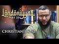

# Londoniyyah - Part 23 - Christianity / 2 (2022-04-07)

## Description

Londoniyyah - Part 23 - Christianity / 2

To be updated about our content please subscribe and open the notifications.
----
BOOK A LIGHTHOUSE MENTOR

Are you or someone you know doubting Islam? Do you find yourself struggling to find answers?  Do you have a hard time speaking to someone about Islam?  Are you considering Islam but are unsure about certain concepts?  Are you an activist, Imam or community leader who is unsure about how to handle questions related to science, philosophy, the Islamic moral code, etc.?

You are not alone.  Over the course of the last decade or more there has been a rapid proliferation of content online and in academic institutions that has eroded the faith of some people.

Seeing the rise of  this phenomenon , Sapience Institute is introducing a One to One mentoring service called LIGHTHOUSE.

BOOK A MENTOR HERE: https://sapienceinstitute.org/lighthouse/

VISIT our website for articles in English, Spanish and Turkish; mentoring service, learning platform and for speaker requests: https://sapienceinstitute.org/

## Summary of [Londoniyyah - Part 23 - Christianity / 2](https://www.youtube.com/watch?v=BHBPSIhQ1-w)

*This summary is AI generated - there may be inaccuracies. *

### [00:00:00](https://www.youtube.com/watch?v=BHBPSIhQ1-w&t=0) - [00:40:00](https://www.youtube.com/watch?v=BHBPSIhQ1-w&t=2400)

 the speaker discusses Christianity and its impact on the world. They mention that, although there are many good things associated with Christianity, there have been debates surrounding it over the last few decades. suggests that anyone interested in exploring these debates should look online.

**[00:00:00](https://www.youtube.com/watch?v=BHBPSIhQ1-w&t=0)* Discusses Christianity's alleged inconsistencies and logical problems, and how early church leaders were not considered authoritative by most Christians.
* **[00:05:00](https://www.youtube.com/watch?v=BHBPSIhQ1-w&t=300)** The main argument in this video is that the idea of a trinity of co-equal and co-eternal persons of the trinity only became accepted in the fourth century. The main point is that this concept was not accepted by all Christians until then. Origen, a church writer, is one of the major thinkers who spoke in support of the idea. He died in the mid-third century.
* **[00:10:00](https://www.youtube.com/watch?v=BHBPSIhQ1-w&t=600)* Discusses the development of the term "trinity" and how it wasn't used in the Bible in the way that Christians now believe it to be. It was first used by Theophilus of Antioch in about 180 AD.
* **[00:15:00](https://www.youtube.com/watch?v=BHBPSIhQ1-w&t=900)**  three and one and one and three illustrate how Christianity began to diverge from paganism after the first century. In 325, Constantine issued the Edict of Milan, which allowed Christianity to be practiced openly within the Roman Empire. However, after his death in 337, Christianity began to diverge further from paganism, with theologians and clergy struggling to define what exactly the holy ghost was. By the 4th century, the holy ghost had been enshrined as a co-equal co-eternal being with the father and son, but was still considered the weakest link in Christianity's trinity.
* **[00:20:00](https://www.youtube.com/watch?v=BHBPSIhQ1-w&t=1200)* Discusses the biblical evidence for the doctrine of the Trinity, which John the Baptist believed in. John 1:1 states that "the word was with God, and the word was God." This is evidence that John believed in the doctrine of the Trinity.
* **[00:25:00](https://www.youtube.com/watch?v=BHBPSIhQ1-w&t=1500)** The narrator discusses how Christianity and other beliefs about Jesus differ from what comes after him in the Bible. They point out that there are three beings mentioned in John 5:6-7, which is not specific to Jesus, and that the term "one and only" is used even in reference to Abraham. The narrator argues that Jesus' existence predates the birth of the earth and that if Jesus is God, he should have taken the opportunity to justify himself to the Jews when he was accused of claiming divinity.
* **[00:30:00](https://www.youtube.com/watch?v=BHBPSIhQ1-w&t=1800)* Discusses various aspects of the Christian concept of divinity, concluding that it is based on preconceived ideas and not on actual scripture. It also points out that there are other formulations of the Trinity in the Bible.
* **[00:35:00](https://www.youtube.com/watch?v=BHBPSIhQ1-w&t=2100)** of the YouTube video provides a brief overview of Christianity and its tenets, noting that there are only three verses in the Bible that could be used to argue against the existence of a Trinity. He goes on to explain that these verses are easy to understand and follow, and that they have a high Christology because of the development of Christianity.
* **[00:40:00](https://www.youtube.com/watch?v=BHBPSIhQ1-w&t=2400)**  the speaker discusses the controversy surrounding Christianity and its impact on the world. They mention that, although there are many good things associated with Christianity, there have been debates surrounding it over the last few decades. suggests that anyone interested in exploring these debates should look online.

<h2>Full transcript with timestamps: CLICK TO EXPAND</h2>

[0:00:13](https://youtu.be/BHBPSIhQ1-w?t=13) welcome to the second session on  
[0:00:14](https://youtu.be/BHBPSIhQ1-w?t=14) christianity in the previous session we  
[0:00:17](https://youtu.be/BHBPSIhQ1-w?t=17) discussed some of the rational  
[0:00:18](https://youtu.be/BHBPSIhQ1-w?t=18) impossibilities relating to the trinity  
[0:00:21](https://youtu.be/BHBPSIhQ1-w?t=21) some of the rational  
[0:00:24](https://youtu.be/BHBPSIhQ1-w?t=24) unintelligible aspects of the trinity  
[0:00:26](https://youtu.be/BHBPSIhQ1-w?t=26) and why it's self-contradictory  
[0:00:28](https://youtu.be/BHBPSIhQ1-w?t=28) we  
[0:00:29](https://youtu.be/BHBPSIhQ1-w?t=29) just to remind everyone we use one dalil  
[0:00:31](https://youtu.be/BHBPSIhQ1-w?t=31) in particular in the quran  
[0:00:33](https://youtu.be/BHBPSIhQ1-w?t=33) who remembers the name of  
[0:00:35](https://youtu.be/BHBPSIhQ1-w?t=35) the dalil  
[0:00:37](https://youtu.be/BHBPSIhQ1-w?t=37) in arabic language that were used and  
[0:00:39](https://youtu.be/BHBPSIhQ1-w?t=39) the area  
[0:00:40](https://youtu.be/BHBPSIhQ1-w?t=40) that is used  
[0:01:11](https://youtu.be/BHBPSIhQ1-w?t=71) allah did not take  
[0:01:12](https://youtu.be/BHBPSIhQ1-w?t=72) a son nor did he have any god with him  
[0:01:15](https://youtu.be/BHBPSIhQ1-w?t=75) because if he did have any god with him  
[0:01:18](https://youtu.be/BHBPSIhQ1-w?t=78) they would have taken what they have  
[0:01:19](https://youtu.be/BHBPSIhQ1-w?t=79) created  
[0:01:20](https://youtu.be/BHBPSIhQ1-w?t=80) and they would have tried to outstrip  
[0:01:22](https://youtu.be/BHBPSIhQ1-w?t=82) one another for power  
[0:01:24](https://youtu.be/BHBPSIhQ1-w?t=84) now it's impossible for there to be more  
[0:01:27](https://youtu.be/BHBPSIhQ1-w?t=87) than one or powerful entity  
[0:01:29](https://youtu.be/BHBPSIhQ1-w?t=89) and as a result the  
[0:01:31](https://youtu.be/BHBPSIhQ1-w?t=91) idea that the father is all powerful the  
[0:01:33](https://youtu.be/BHBPSIhQ1-w?t=93) son is all powerful and the holy spirit  
[0:01:34](https://youtu.be/BHBPSIhQ1-w?t=94) is all powerful  
[0:01:36](https://youtu.be/BHBPSIhQ1-w?t=96) that's an impossible idea  
[0:01:38](https://youtu.be/BHBPSIhQ1-w?t=98) likewise it's impossible for there to be  
[0:01:39](https://youtu.be/BHBPSIhQ1-w?t=99) more than one ultimate creator the  
[0:01:41](https://youtu.be/BHBPSIhQ1-w?t=101) ultimate creator is  
[0:01:43](https://youtu.be/BHBPSIhQ1-w?t=103) the creator that has all creation  
[0:01:46](https://youtu.be/BHBPSIhQ1-w?t=106) or that has created everything that  
[0:01:48](https://youtu.be/BHBPSIhQ1-w?t=108) ultimately is responsible for every  
[0:01:50](https://youtu.be/BHBPSIhQ1-w?t=110) aspect of creation  
[0:01:52](https://youtu.be/BHBPSIhQ1-w?t=112) but if you say that the father is is a  
[0:01:55](https://youtu.be/BHBPSIhQ1-w?t=115) creator of all things  
[0:01:57](https://youtu.be/BHBPSIhQ1-w?t=117) the son is the creator of all things and  
[0:01:58](https://youtu.be/BHBPSIhQ1-w?t=118) the holy spirit is the creator of all  
[0:02:00](https://youtu.be/BHBPSIhQ1-w?t=120) things then you have assuredly uh  
[0:02:03](https://youtu.be/BHBPSIhQ1-w?t=123) come to a contradiction in at least one  
[0:02:05](https://youtu.be/BHBPSIhQ1-w?t=125) of those  
[0:02:06](https://youtu.be/BHBPSIhQ1-w?t=126) or two other statements  
[0:02:08](https://youtu.be/BHBPSIhQ1-w?t=128) so  
[0:02:09](https://youtu.be/BHBPSIhQ1-w?t=129) this is a very straightforward and easy  
[0:02:11](https://youtu.be/BHBPSIhQ1-w?t=131) argument to make  
[0:02:12](https://youtu.be/BHBPSIhQ1-w?t=132) against christianity on a logical and  
[0:02:14](https://youtu.be/BHBPSIhQ1-w?t=134) rational basis today we are going to  
[0:02:16](https://youtu.be/BHBPSIhQ1-w?t=136) move on to the early church  
[0:02:18](https://youtu.be/BHBPSIhQ1-w?t=138) and some of the opinions of the church  
[0:02:21](https://youtu.be/BHBPSIhQ1-w?t=141) fathers  
[0:02:22](https://youtu.be/BHBPSIhQ1-w?t=142) in the first three four hundred years of  
[0:02:24](https://youtu.be/BHBPSIhQ1-w?t=144) christianity  
[0:02:25](https://youtu.be/BHBPSIhQ1-w?t=145) now it's important  
[0:02:27](https://youtu.be/BHBPSIhQ1-w?t=147) why is it important that we discuss not  
[0:02:29](https://youtu.be/BHBPSIhQ1-w?t=149) just  
[0:02:30](https://youtu.be/BHBPSIhQ1-w?t=150) the bible and not just rationality but  
[0:02:32](https://youtu.be/BHBPSIhQ1-w?t=152) the early church who knows the  
[0:02:34](https://youtu.be/BHBPSIhQ1-w?t=154) significance of the early church uh in  
[0:02:36](https://youtu.be/BHBPSIhQ1-w?t=156) chris christianity what is what is the  
[0:02:38](https://youtu.be/BHBPSIhQ1-w?t=158) significance of it  
[0:02:40](https://youtu.be/BHBPSIhQ1-w?t=160) um  
[0:02:41](https://youtu.be/BHBPSIhQ1-w?t=161) the development of the trinity yeah so i  
[0:02:44](https://youtu.be/BHBPSIhQ1-w?t=164) think initially um  
[0:02:46](https://youtu.be/BHBPSIhQ1-w?t=166) well obviously initially we would  
[0:02:47](https://youtu.be/BHBPSIhQ1-w?t=167) believe that they obviously believed in  
[0:02:48](https://youtu.be/BHBPSIhQ1-w?t=168) one god but then over time and developed  
[0:02:50](https://youtu.be/BHBPSIhQ1-w?t=170) into  
[0:02:51](https://youtu.be/BHBPSIhQ1-w?t=171) a minitarian of faith where they  
[0:02:52](https://youtu.be/BHBPSIhQ1-w?t=172) believed that jesus and god shared and  
[0:02:55](https://youtu.be/BHBPSIhQ1-w?t=175) then later on it became trinitarian  
[0:02:56](https://youtu.be/BHBPSIhQ1-w?t=176) where the holy spirit came in yes but  
[0:02:59](https://youtu.be/BHBPSIhQ1-w?t=179) the question in particular you're right  
[0:03:00](https://youtu.be/BHBPSIhQ1-w?t=180) about that and we're going to move on to  
[0:03:02](https://youtu.be/BHBPSIhQ1-w?t=182) that  
[0:03:02](https://youtu.be/BHBPSIhQ1-w?t=182) why do christians why  
[0:03:05](https://youtu.be/BHBPSIhQ1-w?t=185) do christians what accept the early  
[0:03:07](https://youtu.be/BHBPSIhQ1-w?t=187) church as an authority  
[0:03:10](https://youtu.be/BHBPSIhQ1-w?t=190) yeah  
[0:03:12](https://youtu.be/BHBPSIhQ1-w?t=192) i think they call it apostolic  
[0:03:13](https://youtu.be/BHBPSIhQ1-w?t=193) succession or like the idea that there's  
[0:03:17](https://youtu.be/BHBPSIhQ1-w?t=197) so i have a degree divinely inspired  
[0:03:18](https://youtu.be/BHBPSIhQ1-w?t=198) figures in the early period who are  
[0:03:20](https://youtu.be/BHBPSIhQ1-w?t=200) authoritative in the interpretation of  
[0:03:22](https://youtu.be/BHBPSIhQ1-w?t=202) scripture great yes that is the answer  
[0:03:24](https://youtu.be/BHBPSIhQ1-w?t=204) i'm looking for now in terms of  
[0:03:26](https://youtu.be/BHBPSIhQ1-w?t=206) different denominations we kind of  
[0:03:28](https://youtu.be/BHBPSIhQ1-w?t=208) touched upon this in  
[0:03:29](https://youtu.be/BHBPSIhQ1-w?t=209) in the previous  
[0:03:30](https://youtu.be/BHBPSIhQ1-w?t=210) session um  
[0:03:32](https://youtu.be/BHBPSIhQ1-w?t=212) which  
[0:03:33](https://youtu.be/BHBPSIhQ1-w?t=213) sects if you like of christianity are  
[0:03:35](https://youtu.be/BHBPSIhQ1-w?t=215) more likely to favor  
[0:03:38](https://youtu.be/BHBPSIhQ1-w?t=218) or to refer to the early church and  
[0:03:41](https://youtu.be/BHBPSIhQ1-w?t=221) which are less likely to  
[0:03:43](https://youtu.be/BHBPSIhQ1-w?t=223) the ebene  
[0:03:47](https://youtu.be/BHBPSIhQ1-w?t=227) are the ones who were  
[0:03:49](https://youtu.be/BHBPSIhQ1-w?t=229) like jewish and they believed you know  
[0:03:51](https://youtu.be/BHBPSIhQ1-w?t=231) in one god they didn't believe jesus was  
[0:03:54](https://youtu.be/BHBPSIhQ1-w?t=234) god  
[0:03:55](https://youtu.be/BHBPSIhQ1-w?t=235) uh  
[0:03:56](https://youtu.be/BHBPSIhQ1-w?t=236) so  
[0:03:58](https://youtu.be/BHBPSIhQ1-w?t=238) they're important in fact we are going  
[0:03:59](https://youtu.be/BHBPSIhQ1-w?t=239) to talk about them  
[0:04:00](https://youtu.be/BHBPSIhQ1-w?t=240) but what i'm talking about is now in  
[0:04:02](https://youtu.be/BHBPSIhQ1-w?t=242) today's christianity yeah  
[0:04:04](https://youtu.be/BHBPSIhQ1-w?t=244) so for example of the major christian  
[0:04:06](https://youtu.be/BHBPSIhQ1-w?t=246) sects which ones  
[0:04:08](https://youtu.be/BHBPSIhQ1-w?t=248) if you speak to a christian which  
[0:04:10](https://youtu.be/BHBPSIhQ1-w?t=250) christian is most likely to  
[0:04:12](https://youtu.be/BHBPSIhQ1-w?t=252) disregard  
[0:04:14](https://youtu.be/BHBPSIhQ1-w?t=254) the the writings of the early church in  
[0:04:16](https://youtu.be/BHBPSIhQ1-w?t=256) favor of say  
[0:04:17](https://youtu.be/BHBPSIhQ1-w?t=257) the plain reading of the text  
[0:04:19](https://youtu.be/BHBPSIhQ1-w?t=259) and which ones are most likely to  
[0:04:22](https://youtu.be/BHBPSIhQ1-w?t=262) consult  
[0:04:23](https://youtu.be/BHBPSIhQ1-w?t=263) the early church in conjunction with  
[0:04:26](https://youtu.be/BHBPSIhQ1-w?t=266) the so-called plane reading of the text  
[0:04:29](https://youtu.be/BHBPSIhQ1-w?t=269) the distance  
[0:04:31](https://youtu.be/BHBPSIhQ1-w?t=271) so protestants what which ones are we  
[0:04:32](https://youtu.be/BHBPSIhQ1-w?t=272) talking about the first one like they  
[0:04:34](https://youtu.be/BHBPSIhQ1-w?t=274) they they don't really follow church  
[0:04:37](https://youtu.be/BHBPSIhQ1-w?t=277) no they'll still follow the church  
[0:04:38](https://youtu.be/BHBPSIhQ1-w?t=278) fathers and respect them but they'll  
[0:04:40](https://youtu.be/BHBPSIhQ1-w?t=280) have a lesser view of them in in  
[0:04:42](https://youtu.be/BHBPSIhQ1-w?t=282) relation to  
[0:04:43](https://youtu.be/BHBPSIhQ1-w?t=283) the text they have a higher  
[0:04:46](https://youtu.be/BHBPSIhQ1-w?t=286) kind of view of the text it's important  
[0:04:48](https://youtu.be/BHBPSIhQ1-w?t=288) to know these things because  
[0:04:51](https://youtu.be/BHBPSIhQ1-w?t=291) demographically catholics are actually  
[0:04:52](https://youtu.be/BHBPSIhQ1-w?t=292) more number than protestants  
[0:04:54](https://youtu.be/BHBPSIhQ1-w?t=294) i'm not sure if you are aware of that  
[0:04:58](https://youtu.be/BHBPSIhQ1-w?t=298) um according to pew catholics are more a  
[0:05:00](https://youtu.be/BHBPSIhQ1-w?t=300) number than protestants it's just that  
[0:05:02](https://youtu.be/BHBPSIhQ1-w?t=302) you might be a  
[0:05:04](https://youtu.be/BHBPSIhQ1-w?t=304) you might be associated with protestant  
[0:05:06](https://youtu.be/BHBPSIhQ1-w?t=306) argumentation a bit more  
[0:05:08](https://youtu.be/BHBPSIhQ1-w?t=308) because they're more evangelizing for  
[0:05:09](https://youtu.be/BHBPSIhQ1-w?t=309) the most part especially to muslims okay  
[0:05:13](https://youtu.be/BHBPSIhQ1-w?t=313) but catholics and eastern orthodox  
[0:05:16](https://youtu.be/BHBPSIhQ1-w?t=316) christian or orthodox christians in  
[0:05:18](https://youtu.be/BHBPSIhQ1-w?t=318) partic in general  
[0:05:20](https://youtu.be/BHBPSIhQ1-w?t=320) are more likely to make constant  
[0:05:22](https://youtu.be/BHBPSIhQ1-w?t=322) reference to the church fathers  
[0:05:25](https://youtu.be/BHBPSIhQ1-w?t=325) so when you're having a discussion with  
[0:05:27](https://youtu.be/BHBPSIhQ1-w?t=327) a christian you first must identify what  
[0:05:28](https://youtu.be/BHBPSIhQ1-w?t=328) kind of christian they are  
[0:05:30](https://youtu.be/BHBPSIhQ1-w?t=330) and how in tune they are with their own  
[0:05:32](https://youtu.be/BHBPSIhQ1-w?t=332) tradition  
[0:05:33](https://youtu.be/BHBPSIhQ1-w?t=333) if they are eastern orthodox or  
[0:05:35](https://youtu.be/BHBPSIhQ1-w?t=335) orientalist or oriental orthodox like  
[0:05:38](https://youtu.be/BHBPSIhQ1-w?t=338) coptic  
[0:05:39](https://youtu.be/BHBPSIhQ1-w?t=339) or  
[0:05:39](https://youtu.be/BHBPSIhQ1-w?t=339) [Music]  
[0:05:41](https://youtu.be/BHBPSIhQ1-w?t=341) catholic  
[0:05:42](https://youtu.be/BHBPSIhQ1-w?t=342) then it might be  
[0:05:44](https://youtu.be/BHBPSIhQ1-w?t=344) the thing to do to exacerbate the  
[0:05:45](https://youtu.be/BHBPSIhQ1-w?t=345) discussion about the church fathers  
[0:05:48](https://youtu.be/BHBPSIhQ1-w?t=348) if they are protestants it may make more  
[0:05:50](https://youtu.be/BHBPSIhQ1-w?t=350) sense to bring up more verses from the  
[0:05:52](https://youtu.be/BHBPSIhQ1-w?t=352) bible  
[0:05:53](https://youtu.be/BHBPSIhQ1-w?t=353) so you have to be aware of this you know  
[0:05:55](https://youtu.be/BHBPSIhQ1-w?t=355) because you have to tailor your approach  
[0:05:58](https://youtu.be/BHBPSIhQ1-w?t=358) to your audience  
[0:05:59](https://youtu.be/BHBPSIhQ1-w?t=359) okay  
[0:06:01](https://youtu.be/BHBPSIhQ1-w?t=361) anyway  
[0:06:04](https://youtu.be/BHBPSIhQ1-w?t=364) the main argument is this  
[0:06:07](https://youtu.be/BHBPSIhQ1-w?t=367) the main argument is this let me put the  
[0:06:08](https://youtu.be/BHBPSIhQ1-w?t=368) main argument and this is the most  
[0:06:10](https://youtu.be/BHBPSIhQ1-w?t=370) important thing here  
[0:06:11](https://youtu.be/BHBPSIhQ1-w?t=371) the idea of three  
[0:06:13](https://youtu.be/BHBPSIhQ1-w?t=373) co-equal and co-eternal  
[0:06:17](https://youtu.be/BHBPSIhQ1-w?t=377) persons  
[0:06:18](https://youtu.be/BHBPSIhQ1-w?t=378) of a trinity was not realized until the  
[0:06:22](https://youtu.be/BHBPSIhQ1-w?t=382) 3rd  
[0:06:22](https://youtu.be/BHBPSIhQ1-w?t=382) 4th century  
[0:06:25](https://youtu.be/BHBPSIhQ1-w?t=385) in the 4th century in particular the  
[0:06:27](https://youtu.be/BHBPSIhQ1-w?t=387) holy spirit was invited to the party  
[0:06:30](https://youtu.be/BHBPSIhQ1-w?t=390) as a co-equal and co-eternal person of  
[0:06:33](https://youtu.be/BHBPSIhQ1-w?t=393) the trinity  
[0:06:37](https://youtu.be/BHBPSIhQ1-w?t=397) now the the key terms here are co-equal  
[0:06:39](https://youtu.be/BHBPSIhQ1-w?t=399) and co-eternal now let me be very clear  
[0:06:42](https://youtu.be/BHBPSIhQ1-w?t=402) what we're not saying is that all  
[0:06:44](https://youtu.be/BHBPSIhQ1-w?t=404) conceptions of the trinity  
[0:06:46](https://youtu.be/BHBPSIhQ1-w?t=406) were not made until the third or fourth  
[0:06:49](https://youtu.be/BHBPSIhQ1-w?t=409) century because they can bring out  
[0:06:51](https://youtu.be/BHBPSIhQ1-w?t=411) quotes from tertullian and this person  
[0:06:53](https://youtu.be/BHBPSIhQ1-w?t=413) that person  
[0:06:54](https://youtu.be/BHBPSIhQ1-w?t=414) which reference  
[0:06:56](https://youtu.be/BHBPSIhQ1-w?t=416) the  
[0:06:57](https://youtu.be/BHBPSIhQ1-w?t=417) the trinity in some sense or a trinity  
[0:07:00](https://youtu.be/BHBPSIhQ1-w?t=420) of some  
[0:07:00](https://youtu.be/BHBPSIhQ1-w?t=420) some sense they can even mention  
[0:07:02](https://youtu.be/BHBPSIhQ1-w?t=422) something of the bible go in the way of  
[0:07:04](https://youtu.be/BHBPSIhQ1-w?t=424) the father son the holy spirit you know  
[0:07:07](https://youtu.be/BHBPSIhQ1-w?t=427) these we're not saying the trinity or a  
[0:07:09](https://youtu.be/BHBPSIhQ1-w?t=429) trinity or  
[0:07:11](https://youtu.be/BHBPSIhQ1-w?t=431) that kind of thing didn't exist for 340  
[0:07:13](https://youtu.be/BHBPSIhQ1-w?t=433) years we're saying the idea of co-equal  
[0:07:16](https://youtu.be/BHBPSIhQ1-w?t=436) and co-eternal persons of the trinity  
[0:07:19](https://youtu.be/BHBPSIhQ1-w?t=439) where the father is equal to the son the  
[0:07:21](https://youtu.be/BHBPSIhQ1-w?t=441) son is equal to the holy spirit  
[0:07:24](https://youtu.be/BHBPSIhQ1-w?t=444) and so on  
[0:07:25](https://youtu.be/BHBPSIhQ1-w?t=445) and the father is co-eternal the son is  
[0:07:27](https://youtu.be/BHBPSIhQ1-w?t=447) co-eternal and the father the holy  
[0:07:29](https://youtu.be/BHBPSIhQ1-w?t=449) spirit is a co-channel  
[0:07:31](https://youtu.be/BHBPSIhQ1-w?t=451) these conceptions  
[0:07:32](https://youtu.be/BHBPSIhQ1-w?t=452) only came about  
[0:07:34](https://youtu.be/BHBPSIhQ1-w?t=454) in the fourth century after considerable  
[0:07:37](https://youtu.be/BHBPSIhQ1-w?t=457) development the lack of which you  
[0:07:38](https://youtu.be/BHBPSIhQ1-w?t=458) alluded to  
[0:07:40](https://youtu.be/BHBPSIhQ1-w?t=460) uh correctly which is the movement from  
[0:07:43](https://youtu.be/BHBPSIhQ1-w?t=463) kind of unitarianism and the kind of  
[0:07:45](https://youtu.be/BHBPSIhQ1-w?t=465) trinity and you mentioned the ibn is  
[0:07:46](https://youtu.be/BHBPSIhQ1-w?t=466) which is correct as well because they  
[0:07:48](https://youtu.be/BHBPSIhQ1-w?t=468) didn't believe in such a trinity this  
[0:07:50](https://youtu.be/BHBPSIhQ1-w?t=470) was a group an early  
[0:07:52](https://youtu.be/BHBPSIhQ1-w?t=472) christian group that didn't believe in  
[0:07:54](https://youtu.be/BHBPSIhQ1-w?t=474) this conceptions  
[0:07:55](https://youtu.be/BHBPSIhQ1-w?t=475) at all  
[0:07:57](https://youtu.be/BHBPSIhQ1-w?t=477) and so what we're going to be looking at  
[0:07:58](https://youtu.be/BHBPSIhQ1-w?t=478) is some  
[0:08:01](https://youtu.be/BHBPSIhQ1-w?t=481) some sayings of some of the  
[0:08:04](https://youtu.be/BHBPSIhQ1-w?t=484) church fathers and ecclesiastical  
[0:08:07](https://youtu.be/BHBPSIhQ1-w?t=487) writers church writers  
[0:08:09](https://youtu.be/BHBPSIhQ1-w?t=489) now the distinction church father is  
[0:08:12](https://youtu.be/BHBPSIhQ1-w?t=492) made particularly  
[0:08:14](https://youtu.be/BHBPSIhQ1-w?t=494) to those who the catholic church let's  
[0:08:16](https://youtu.be/BHBPSIhQ1-w?t=496) be honest you know for the most part  
[0:08:19](https://youtu.be/BHBPSIhQ1-w?t=499) have decided are legitimate church  
[0:08:21](https://youtu.be/BHBPSIhQ1-w?t=501) fathers so origin of alexandria he's an  
[0:08:24](https://youtu.be/BHBPSIhQ1-w?t=504) ecclesiastic church writer he's not  
[0:08:26](https://youtu.be/BHBPSIhQ1-w?t=506) been given the distinction of church  
[0:08:28](https://youtu.be/BHBPSIhQ1-w?t=508) father  
[0:08:29](https://youtu.be/BHBPSIhQ1-w?t=509) however  
[0:08:31](https://youtu.be/BHBPSIhQ1-w?t=511) he is  
[0:08:32](https://youtu.be/BHBPSIhQ1-w?t=512) one of the major writers  
[0:08:34](https://youtu.be/BHBPSIhQ1-w?t=514) and one of the major thinkers who i  
[0:08:37](https://youtu.be/BHBPSIhQ1-w?t=517) believe died 240.  
[0:08:39](https://youtu.be/BHBPSIhQ1-w?t=519) uh something like this  
[0:08:42](https://youtu.be/BHBPSIhQ1-w?t=522) mid-third century  
[0:08:44](https://youtu.be/BHBPSIhQ1-w?t=524) in fact there was something called the  
[0:08:45](https://youtu.be/BHBPSIhQ1-w?t=525) origin crisis that took place afterwards  
[0:08:47](https://youtu.be/BHBPSIhQ1-w?t=527) which  
[0:08:49](https://youtu.be/BHBPSIhQ1-w?t=529) may have been one of the main reasons  
[0:08:50](https://youtu.be/BHBPSIhQ1-w?t=530) the catholic church decided not to make  
[0:08:52](https://youtu.be/BHBPSIhQ1-w?t=532) him  
[0:08:53](https://youtu.be/BHBPSIhQ1-w?t=533) a church but he says the following  
[0:08:56](https://youtu.be/BHBPSIhQ1-w?t=536) he says the god the god  
[0:08:58](https://youtu.be/BHBPSIhQ1-w?t=538) and father who holds the universe  
[0:09:00](https://youtu.be/BHBPSIhQ1-w?t=540) together is superior to every being that  
[0:09:02](https://youtu.be/BHBPSIhQ1-w?t=542) exists  
[0:09:03](https://youtu.be/BHBPSIhQ1-w?t=543) for he imparts to each one from his own  
[0:09:06](https://youtu.be/BHBPSIhQ1-w?t=546) existence that what that which each one  
[0:09:08](https://youtu.be/BHBPSIhQ1-w?t=548) is the son being less  
[0:09:11](https://youtu.be/BHBPSIhQ1-w?t=551) than the father is superior to rational  
[0:09:13](https://youtu.be/BHBPSIhQ1-w?t=553) creatures alone  
[0:09:14](https://youtu.be/BHBPSIhQ1-w?t=554) for he is second to the father  
[0:09:17](https://youtu.be/BHBPSIhQ1-w?t=557) the father is  
[0:09:18](https://youtu.be/BHBPSIhQ1-w?t=558) greater than  
[0:09:19](https://youtu.be/BHBPSIhQ1-w?t=559) the that of the sun  
[0:09:21](https://youtu.be/BHBPSIhQ1-w?t=561) and of the holy spirit  
[0:09:23](https://youtu.be/BHBPSIhQ1-w?t=563) and that of the sun is more than that of  
[0:09:26](https://youtu.be/BHBPSIhQ1-w?t=566) the holy spirit  
[0:09:28](https://youtu.be/BHBPSIhQ1-w?t=568) now what is it saying here  
[0:09:31](https://youtu.be/BHBPSIhQ1-w?t=571) who's the greatest according to  
[0:09:33](https://youtu.be/BHBPSIhQ1-w?t=573) origen of alexandria  
[0:09:36](https://youtu.be/BHBPSIhQ1-w?t=576) the father is the greatest okay  
[0:09:39](https://youtu.be/BHBPSIhQ1-w?t=579) the father is the greatest so this is  
[0:09:41](https://youtu.be/BHBPSIhQ1-w?t=581) called subordinationism  
[0:09:45](https://youtu.be/BHBPSIhQ1-w?t=585) subordinationism the idea that the  
[0:09:47](https://youtu.be/BHBPSIhQ1-w?t=587) father  
[0:09:48](https://youtu.be/BHBPSIhQ1-w?t=588) is at the top and then the holy spirit  
[0:09:50](https://youtu.be/BHBPSIhQ1-w?t=590) and the son  
[0:09:51](https://youtu.be/BHBPSIhQ1-w?t=591) are underneath the father  
[0:09:54](https://youtu.be/BHBPSIhQ1-w?t=594) so there were conceptions no doubt  
[0:09:58](https://youtu.be/BHBPSIhQ1-w?t=598) of the trinity  
[0:10:00](https://youtu.be/BHBPSIhQ1-w?t=600) before  
[0:10:01](https://youtu.be/BHBPSIhQ1-w?t=601) the fourth century no one is arguing to  
[0:10:03](https://youtu.be/BHBPSIhQ1-w?t=603) the contrary of that  
[0:10:05](https://youtu.be/BHBPSIhQ1-w?t=605) primary source material  
[0:10:07](https://youtu.be/BHBPSIhQ1-w?t=607) reveals that no doubt  
[0:10:10](https://youtu.be/BHBPSIhQ1-w?t=610) but those conceptions were  
[0:10:12](https://youtu.be/BHBPSIhQ1-w?t=612) subordinationist in nature  
[0:10:14](https://youtu.be/BHBPSIhQ1-w?t=614) meaning  
[0:10:15](https://youtu.be/BHBPSIhQ1-w?t=615) they had the father at the top and then  
[0:10:17](https://youtu.be/BHBPSIhQ1-w?t=617) they had the son and the holy spirit  
[0:10:19](https://youtu.be/BHBPSIhQ1-w?t=619) below the father  
[0:10:21](https://youtu.be/BHBPSIhQ1-w?t=621) which indicates hierarchy which  
[0:10:23](https://youtu.be/BHBPSIhQ1-w?t=623) indicates  
[0:10:25](https://youtu.be/BHBPSIhQ1-w?t=625) that if you say that the father is equal  
[0:10:27](https://youtu.be/BHBPSIhQ1-w?t=627) to the son to the holy spirit  
[0:10:30](https://youtu.be/BHBPSIhQ1-w?t=630) the church fathers only started speaking  
[0:10:34](https://youtu.be/BHBPSIhQ1-w?t=634) in that way  
[0:10:35](https://youtu.be/BHBPSIhQ1-w?t=635) after as we said the cappadocian fathers  
[0:10:37](https://youtu.be/BHBPSIhQ1-w?t=637) when we'll come to who the cappadocian  
[0:10:38](https://youtu.be/BHBPSIhQ1-w?t=638) fathers  
[0:10:39](https://youtu.be/BHBPSIhQ1-w?t=639) are  
[0:10:41](https://youtu.be/BHBPSIhQ1-w?t=641) but this is not what people like origin  
[0:10:43](https://youtu.be/BHBPSIhQ1-w?t=643) of alexandria or even tertullian  
[0:10:46](https://youtu.be/BHBPSIhQ1-w?t=646) and i think he was one of the first men  
[0:10:48](https://youtu.be/BHBPSIhQ1-w?t=648) to actually mention the term  
[0:10:50](https://youtu.be/BHBPSIhQ1-w?t=650) trinity  
[0:10:52](https://youtu.be/BHBPSIhQ1-w?t=652) he was one of the first men to actually  
[0:10:54](https://youtu.be/BHBPSIhQ1-w?t=654) mention that term the word trinity  
[0:10:56](https://youtu.be/BHBPSIhQ1-w?t=656) and once again  
[0:10:58](https://youtu.be/BHBPSIhQ1-w?t=658) he didn't he was a subordinationist he  
[0:11:00](https://youtu.be/BHBPSIhQ1-w?t=660) didn't believe in co-equal co-etero  
[0:11:02](https://youtu.be/BHBPSIhQ1-w?t=662) why is this significant  
[0:11:04](https://youtu.be/BHBPSIhQ1-w?t=664) let me ask you why is it significant  
[0:11:06](https://youtu.be/BHBPSIhQ1-w?t=666) that these church fathers in the mid say  
[0:11:08](https://youtu.be/BHBPSIhQ1-w?t=668) third century  
[0:11:09](https://youtu.be/BHBPSIhQ1-w?t=669) didn't believe in the co-equality and  
[0:11:11](https://youtu.be/BHBPSIhQ1-w?t=671) the co-eternality  
[0:11:13](https://youtu.be/BHBPSIhQ1-w?t=673) of the father and the son and holy  
[0:11:14](https://youtu.be/BHBPSIhQ1-w?t=674) spirit why is that significant  
[0:11:16](https://youtu.be/BHBPSIhQ1-w?t=676) what do you think  
[0:11:17](https://youtu.be/BHBPSIhQ1-w?t=677) because obviously people believe they  
[0:11:18](https://youtu.be/BHBPSIhQ1-w?t=678) are eternal now but like the authorities  
[0:11:20](https://youtu.be/BHBPSIhQ1-w?t=680) are saying otherwise  
[0:11:22](https://youtu.be/BHBPSIhQ1-w?t=682) yeah it shows that there's been a  
[0:11:23](https://youtu.be/BHBPSIhQ1-w?t=683) development  
[0:11:24](https://youtu.be/BHBPSIhQ1-w?t=684) and if this is we are meant to be  
[0:11:26](https://youtu.be/BHBPSIhQ1-w?t=686) worshipping god okay  
[0:11:28](https://youtu.be/BHBPSIhQ1-w?t=688) we are meant to be worshipping god now  
[0:11:30](https://youtu.be/BHBPSIhQ1-w?t=690) we don't know who  
[0:11:31](https://youtu.be/BHBPSIhQ1-w?t=691) this god is that we're meant to be  
[0:11:32](https://youtu.be/BHBPSIhQ1-w?t=692) worshipping  
[0:11:34](https://youtu.be/BHBPSIhQ1-w?t=694) you're telling me for 300 years  
[0:11:36](https://youtu.be/BHBPSIhQ1-w?t=696) that we have a wrong on the idea of who  
[0:11:38](https://youtu.be/BHBPSIhQ1-w?t=698) the god is we're going to be worshiping  
[0:11:40](https://youtu.be/BHBPSIhQ1-w?t=700) christianity wasn't that much level of  
[0:11:42](https://youtu.be/BHBPSIhQ1-w?t=702) flux  
[0:11:43](https://youtu.be/BHBPSIhQ1-w?t=703) they didn't know who  
[0:11:46](https://youtu.be/BHBPSIhQ1-w?t=706) the god is aware so del target says the  
[0:11:49](https://youtu.be/BHBPSIhQ1-w?t=709) following he's a  
[0:11:50](https://youtu.be/BHBPSIhQ1-w?t=710) professor of philosophy so the term as  
[0:11:52](https://youtu.be/BHBPSIhQ1-w?t=712) we translate is trinity  
[0:11:56](https://youtu.be/BHBPSIhQ1-w?t=716) says it seems to have come into use only  
[0:11:59](https://youtu.be/BHBPSIhQ1-w?t=719) in the last two decades of the of the  
[0:12:01](https://youtu.be/BHBPSIhQ1-w?t=721) second century  
[0:12:03](https://youtu.be/BHBPSIhQ1-w?t=723) but usage doesn't reflect trinitarian  
[0:12:04](https://youtu.be/BHBPSIhQ1-w?t=724) belief  
[0:12:06](https://youtu.be/BHBPSIhQ1-w?t=726) these late and these late second and  
[0:12:09](https://youtu.be/BHBPSIhQ1-w?t=729) third century authors use such terms not  
[0:12:11](https://youtu.be/BHBPSIhQ1-w?t=731) to refer to the one god but rather to  
[0:12:13](https://youtu.be/BHBPSIhQ1-w?t=733) refer to the plurality of the one god  
[0:12:16](https://youtu.be/BHBPSIhQ1-w?t=736) together with his son onward and his  
[0:12:18](https://youtu.be/BHBPSIhQ1-w?t=738) spirit they profess a trinity triad or  
[0:12:21](https://youtu.be/BHBPSIhQ1-w?t=741) threesome  
[0:12:22](https://youtu.be/BHBPSIhQ1-w?t=742) but not the triune or tri-personal god  
[0:12:26](https://youtu.be/BHBPSIhQ1-w?t=746) nor that they consider these to be  
[0:12:28](https://youtu.be/BHBPSIhQ1-w?t=748) equally divine this is the key point the  
[0:12:30](https://youtu.be/BHBPSIhQ1-w?t=750) last point the last point is that they  
[0:12:32](https://youtu.be/BHBPSIhQ1-w?t=752) did not consider them to be equally  
[0:12:35](https://youtu.be/BHBPSIhQ1-w?t=755) divine  
[0:12:38](https://youtu.be/BHBPSIhQ1-w?t=758) now the in the bible as you may know  
[0:12:41](https://youtu.be/BHBPSIhQ1-w?t=761) there are some biblical verses  
[0:12:44](https://youtu.be/BHBPSIhQ1-w?t=764) the the most  
[0:12:46](https://youtu.be/BHBPSIhQ1-w?t=766) prominent of them which indicate the  
[0:12:48](https://youtu.be/BHBPSIhQ1-w?t=768) trinity the trinity of the triune nature  
[0:12:50](https://youtu.be/BHBPSIhQ1-w?t=770) of  
[0:12:51](https://youtu.be/BHBPSIhQ1-w?t=771) god  
[0:12:52](https://youtu.be/BHBPSIhQ1-w?t=772) have been shown to be  
[0:12:54](https://youtu.be/BHBPSIhQ1-w?t=774) fabrications and insurgents  
[0:12:57](https://youtu.be/BHBPSIhQ1-w?t=777) for example  
[0:12:59](https://youtu.be/BHBPSIhQ1-w?t=779) for the three that bear the record in  
[0:13:00](https://youtu.be/BHBPSIhQ1-w?t=780) heaven the father the son and the holy  
[0:13:02](https://youtu.be/BHBPSIhQ1-w?t=782) spirit and all these three are one first  
[0:13:04](https://youtu.be/BHBPSIhQ1-w?t=784) john chapter five verse seven  
[0:13:07](https://youtu.be/BHBPSIhQ1-w?t=787) they have that has been found to be  
[0:13:10](https://youtu.be/BHBPSIhQ1-w?t=790) it's i mean i don't think any biblical  
[0:13:13](https://youtu.be/BHBPSIhQ1-w?t=793) scholar worth their  
[0:13:14](https://youtu.be/BHBPSIhQ1-w?t=794) salt you know would actually even say  
[0:13:16](https://youtu.be/BHBPSIhQ1-w?t=796) anything about this being a  
[0:13:19](https://youtu.be/BHBPSIhQ1-w?t=799) verse which is  
[0:13:21](https://youtu.be/BHBPSIhQ1-w?t=801) should be in the bible  
[0:13:26](https://youtu.be/BHBPSIhQ1-w?t=806) so this has been inserted why are you  
[0:13:28](https://youtu.be/BHBPSIhQ1-w?t=808) inserting it into the bible why are  
[0:13:30](https://youtu.be/BHBPSIhQ1-w?t=810) people inserting  
[0:13:32](https://youtu.be/BHBPSIhQ1-w?t=812) verses like that in the bible if not  
[0:13:34](https://youtu.be/BHBPSIhQ1-w?t=814) because they see that the bible doesn't  
[0:13:36](https://youtu.be/BHBPSIhQ1-w?t=816) have enough justification  
[0:13:38](https://youtu.be/BHBPSIhQ1-w?t=818) in and of itself for the trinity so they  
[0:13:40](https://youtu.be/BHBPSIhQ1-w?t=820) need to try and force  
[0:13:42](https://youtu.be/BHBPSIhQ1-w?t=822) uh  
[0:13:43](https://youtu.be/BHBPSIhQ1-w?t=823) verses that are not there into it  
[0:13:46](https://youtu.be/BHBPSIhQ1-w?t=826) the catholic encyclopedia  
[0:13:48](https://youtu.be/BHBPSIhQ1-w?t=828) states in scripture there is yet  
[0:13:52](https://youtu.be/BHBPSIhQ1-w?t=832) sorry there is as yet no single term by  
[0:13:54](https://youtu.be/BHBPSIhQ1-w?t=834) which three divine persons are denoted  
[0:13:56](https://youtu.be/BHBPSIhQ1-w?t=836) together simply simple point the word  
[0:14:00](https://youtu.be/BHBPSIhQ1-w?t=840) trinity  
[0:14:02](https://youtu.be/BHBPSIhQ1-w?t=842) referring to  
[0:14:04](https://youtu.be/BHBPSIhQ1-w?t=844) god  
[0:14:05](https://youtu.be/BHBPSIhQ1-w?t=845) in the way that is understood is not in  
[0:14:07](https://youtu.be/BHBPSIhQ1-w?t=847) the bible in the new testament or the  
[0:14:09](https://youtu.be/BHBPSIhQ1-w?t=849) old testament  
[0:14:10](https://youtu.be/BHBPSIhQ1-w?t=850) the word triass of which the latin  
[0:14:13](https://youtu.be/BHBPSIhQ1-w?t=853) trinita trinitas is a translation is is  
[0:14:16](https://youtu.be/BHBPSIhQ1-w?t=856) found  
[0:14:17](https://youtu.be/BHBPSIhQ1-w?t=857) in  
[0:14:18](https://youtu.be/BHBPSIhQ1-w?t=858) theophilus of antioch  
[0:14:21](https://youtu.be/BHBPSIhQ1-w?t=861) about  
[0:14:22](https://youtu.be/BHBPSIhQ1-w?t=862) a ad 180  
[0:14:24](https://youtu.be/BHBPSIhQ1-w?t=864) so we're talking about good 200 years  
[0:14:26](https://youtu.be/BHBPSIhQ1-w?t=866) after jesus disappearance  
[0:14:28](https://youtu.be/BHBPSIhQ1-w?t=868) afterwards it appears in its latin form  
[0:14:31](https://youtu.be/BHBPSIhQ1-w?t=871) of trinitas in chattanooga and we talked  
[0:14:33](https://youtu.be/BHBPSIhQ1-w?t=873) about to julian didn't we so  
[0:14:35](https://youtu.be/BHBPSIhQ1-w?t=875) um we're talking about tertullian was  
[0:14:38](https://youtu.be/BHBPSIhQ1-w?t=878) about  
[0:14:39](https://youtu.be/BHBPSIhQ1-w?t=879) 200 something i don't know exactly when  
[0:14:41](https://youtu.be/BHBPSIhQ1-w?t=881) but once again you can double check when  
[0:14:44](https://youtu.be/BHBPSIhQ1-w?t=884) he was about  
[0:14:47](https://youtu.be/BHBPSIhQ1-w?t=887) we're talking third century here  
[0:14:50](https://youtu.be/BHBPSIhQ1-w?t=890) where the term was being used like this  
[0:14:52](https://youtu.be/BHBPSIhQ1-w?t=892) but not even at that stage was  
[0:14:54](https://youtu.be/BHBPSIhQ1-w?t=894) understood  
[0:14:56](https://youtu.be/BHBPSIhQ1-w?t=896) to mean uh  
[0:14:59](https://youtu.be/BHBPSIhQ1-w?t=899) to mean them  
[0:15:01](https://youtu.be/BHBPSIhQ1-w?t=901) three and one and one and three  
[0:15:03](https://youtu.be/BHBPSIhQ1-w?t=903) if you look at  
[0:15:05](https://youtu.be/BHBPSIhQ1-w?t=905) where then  
[0:15:08](https://youtu.be/BHBPSIhQ1-w?t=908) it moved on  
[0:15:09](https://youtu.be/BHBPSIhQ1-w?t=909) it the holy ghost  
[0:15:12](https://youtu.be/BHBPSIhQ1-w?t=912) only started to become known  
[0:15:14](https://youtu.be/BHBPSIhQ1-w?t=914) as co-equal co-eternal  
[0:15:17](https://youtu.be/BHBPSIhQ1-w?t=917) after  
[0:15:18](https://youtu.be/BHBPSIhQ1-w?t=918) the cappadocian fathers and we're  
[0:15:20](https://youtu.be/BHBPSIhQ1-w?t=920) talking here in the late 4th century  
[0:15:25](https://youtu.be/BHBPSIhQ1-w?t=925) and um  
[0:15:29](https://youtu.be/BHBPSIhQ1-w?t=929) in fact there's sources which i'm going  
[0:15:30](https://youtu.be/BHBPSIhQ1-w?t=930) to send to in the group which indicate  
[0:15:33](https://youtu.be/BHBPSIhQ1-w?t=933) that they were confused as to what the  
[0:15:34](https://youtu.be/BHBPSIhQ1-w?t=934) holy ghost should be  
[0:15:35](https://youtu.be/BHBPSIhQ1-w?t=935) is he a creature  
[0:15:37](https://youtu.be/BHBPSIhQ1-w?t=937) is he a spook  
[0:15:38](https://youtu.be/BHBPSIhQ1-w?t=938) is he a you know creation  
[0:15:42](https://youtu.be/BHBPSIhQ1-w?t=942) or is he god  
[0:15:45](https://youtu.be/BHBPSIhQ1-w?t=945) and these sources  
[0:15:46](https://youtu.be/BHBPSIhQ1-w?t=946) they trickle down there even at the  
[0:15:48](https://youtu.be/BHBPSIhQ1-w?t=948) declared you were confused  
[0:15:51](https://youtu.be/BHBPSIhQ1-w?t=951) the clergy were confused  
[0:15:54](https://youtu.be/BHBPSIhQ1-w?t=954) let alone the lay people  
[0:15:58](https://youtu.be/BHBPSIhQ1-w?t=958) so imagine like you don't know who your  
[0:15:59](https://youtu.be/BHBPSIhQ1-w?t=959) god is  
[0:16:01](https://youtu.be/BHBPSIhQ1-w?t=961) like you've got this you've got this  
[0:16:03](https://youtu.be/BHBPSIhQ1-w?t=963) holy ghost  
[0:16:04](https://youtu.be/BHBPSIhQ1-w?t=964) you don't know who your god is  
[0:16:06](https://youtu.be/BHBPSIhQ1-w?t=966) and i think the holy ghost is the  
[0:16:07](https://youtu.be/BHBPSIhQ1-w?t=967) achilles heel  
[0:16:10](https://youtu.be/BHBPSIhQ1-w?t=970) because in both the bible and the church  
[0:16:12](https://youtu.be/BHBPSIhQ1-w?t=972) writings  
[0:16:15](https://youtu.be/BHBPSIhQ1-w?t=975) you have to do a lot of  
[0:16:17](https://youtu.be/BHBPSIhQ1-w?t=977) take trying to squeeze blood out of a  
[0:16:19](https://youtu.be/BHBPSIhQ1-w?t=979) rock in order to get the holy ghost from  
[0:16:22](https://youtu.be/BHBPSIhQ1-w?t=982) the first century onwards being co-equal  
[0:16:24](https://youtu.be/BHBPSIhQ1-w?t=984) and co-eternal  
[0:16:25](https://youtu.be/BHBPSIhQ1-w?t=985) with the with the father and the son  
[0:16:28](https://youtu.be/BHBPSIhQ1-w?t=988) likewise you have to do the same thing  
[0:16:29](https://youtu.be/BHBPSIhQ1-w?t=989) to try and get the holy ghost to be  
[0:16:31](https://youtu.be/BHBPSIhQ1-w?t=991) anywhere equivalent  
[0:16:33](https://youtu.be/BHBPSIhQ1-w?t=993) to god yahweh or the father or whatever  
[0:16:37](https://youtu.be/BHBPSIhQ1-w?t=997) it is you want to call him  
[0:16:38](https://youtu.be/BHBPSIhQ1-w?t=998) let alone jesus or  
[0:16:40](https://youtu.be/BHBPSIhQ1-w?t=1000) not  
[0:16:41](https://youtu.be/BHBPSIhQ1-w?t=1001) because actually he seems greater than  
[0:16:42](https://youtu.be/BHBPSIhQ1-w?t=1002) jesus in the bible but as well as jesus  
[0:16:45](https://youtu.be/BHBPSIhQ1-w?t=1005) so he's the weakest link the holy ghost  
[0:16:48](https://youtu.be/BHBPSIhQ1-w?t=1008) is the weakest link  
[0:16:49](https://youtu.be/BHBPSIhQ1-w?t=1009) the holy ghost is the weakest link  
[0:16:52](https://youtu.be/BHBPSIhQ1-w?t=1012) and as such really one of the best  
[0:16:55](https://youtu.be/BHBPSIhQ1-w?t=1015) ways to deconstruct the trinity  
[0:16:57](https://youtu.be/BHBPSIhQ1-w?t=1017) is through the holy ghost  
[0:17:02](https://youtu.be/BHBPSIhQ1-w?t=1022) because on on every level on the  
[0:17:05](https://youtu.be/BHBPSIhQ1-w?t=1025) rational level on the textual level  
[0:17:08](https://youtu.be/BHBPSIhQ1-w?t=1028) uh which we haven't covered in great  
[0:17:09](https://youtu.be/BHBPSIhQ1-w?t=1029) details but you guys have seen enough  
[0:17:10](https://youtu.be/BHBPSIhQ1-w?t=1030) ahmadi that uh  
[0:17:12](https://youtu.be/BHBPSIhQ1-w?t=1032) debates to know what the textual level  
[0:17:13](https://youtu.be/BHBPSIhQ1-w?t=1033) is you know  
[0:17:15](https://youtu.be/BHBPSIhQ1-w?t=1035) yeah one one easy example is you know  
[0:17:17](https://youtu.be/BHBPSIhQ1-w?t=1037) when the hour will be no one knows  
[0:17:19](https://youtu.be/BHBPSIhQ1-w?t=1039) except for the father i think it's one  
[0:17:20](https://youtu.be/BHBPSIhQ1-w?t=1040) of the best ones by the way  
[0:17:22](https://youtu.be/BHBPSIhQ1-w?t=1042) the holy ghost is exempted from that  
[0:17:25](https://youtu.be/BHBPSIhQ1-w?t=1045) just use these verses  
[0:17:27](https://youtu.be/BHBPSIhQ1-w?t=1047) and  
[0:17:28](https://youtu.be/BHBPSIhQ1-w?t=1048) use these authorities to show that you  
[0:17:30](https://youtu.be/BHBPSIhQ1-w?t=1050) didn't know who your god was you  
[0:17:32](https://youtu.be/BHBPSIhQ1-w?t=1052) the holy ghost was not god for you until  
[0:17:36](https://youtu.be/BHBPSIhQ1-w?t=1056) the third  
[0:17:37](https://youtu.be/BHBPSIhQ1-w?t=1057) century  
[0:17:39](https://youtu.be/BHBPSIhQ1-w?t=1059) fourth century in fact  
[0:17:41](https://youtu.be/BHBPSIhQ1-w?t=1061) how can i imagine this is the religion  
[0:17:44](https://youtu.be/BHBPSIhQ1-w?t=1064) now  
[0:17:45](https://youtu.be/BHBPSIhQ1-w?t=1065) that is meant to be competitive with  
[0:17:48](https://youtu.be/BHBPSIhQ1-w?t=1068) islam  
[0:17:49](https://youtu.be/BHBPSIhQ1-w?t=1069) like this is the religion the religion  
[0:17:51](https://youtu.be/BHBPSIhQ1-w?t=1071) where they didn't know who their god was  
[0:17:52](https://youtu.be/BHBPSIhQ1-w?t=1072) of 100 years  
[0:17:54](https://youtu.be/BHBPSIhQ1-w?t=1074) and when they've decided that the holy  
[0:17:55](https://youtu.be/BHBPSIhQ1-w?t=1075) ghost will be their god  
[0:17:58](https://youtu.be/BHBPSIhQ1-w?t=1078) in 381 uh and they enshrined it  
[0:18:02](https://youtu.be/BHBPSIhQ1-w?t=1082) and constantinople  
[0:18:04](https://youtu.be/BHBPSIhQ1-w?t=1084) in you know  
[0:18:05](https://youtu.be/BHBPSIhQ1-w?t=1085) constantino uh  
[0:18:07](https://youtu.be/BHBPSIhQ1-w?t=1087) constantinopolitan creed  
[0:18:09](https://youtu.be/BHBPSIhQ1-w?t=1089) sabermouth was a constantinopolitan  
[0:18:12](https://youtu.be/BHBPSIhQ1-w?t=1092) creed  
[0:18:13](https://youtu.be/BHBPSIhQ1-w?t=1093) you know  
[0:18:14](https://youtu.be/BHBPSIhQ1-w?t=1094) then then  
[0:18:16](https://youtu.be/BHBPSIhQ1-w?t=1096) theodosius ii  
[0:18:18](https://youtu.be/BHBPSIhQ1-w?t=1098) who is the second uh after obviously the  
[0:18:20](https://youtu.be/BHBPSIhQ1-w?t=1100) first he decided i'm going to  
[0:18:23](https://youtu.be/BHBPSIhQ1-w?t=1103) punish anybody who goes against this  
[0:18:25](https://youtu.be/BHBPSIhQ1-w?t=1105) creed  
[0:18:27](https://youtu.be/BHBPSIhQ1-w?t=1107) that's what happened and they talk about  
[0:18:28](https://youtu.be/BHBPSIhQ1-w?t=1108) you know  
[0:18:29](https://youtu.be/BHBPSIhQ1-w?t=1109) christianity being a benign force that  
[0:18:32](https://youtu.be/BHBPSIhQ1-w?t=1112) didn't spread anything didn't do  
[0:18:33](https://youtu.be/BHBPSIhQ1-w?t=1113) anything damage you know it's very  
[0:18:36](https://youtu.be/BHBPSIhQ1-w?t=1116) benign force no if you went against the  
[0:18:38](https://youtu.be/BHBPSIhQ1-w?t=1118) if you went against this you were  
[0:18:40](https://youtu.be/BHBPSIhQ1-w?t=1120) committing huge heresies  
[0:18:43](https://youtu.be/BHBPSIhQ1-w?t=1123) if you went against the fact that the  
[0:18:44](https://youtu.be/BHBPSIhQ1-w?t=1124) father and son the holy spirit are  
[0:18:46](https://youtu.be/BHBPSIhQ1-w?t=1126) eternal that will be seen as high level  
[0:18:48](https://youtu.be/BHBPSIhQ1-w?t=1128) heresy and you could be killed for that  
[0:18:50](https://youtu.be/BHBPSIhQ1-w?t=1130) stuff  
[0:18:52](https://youtu.be/BHBPSIhQ1-w?t=1132) and so  
[0:18:54](https://youtu.be/BHBPSIhQ1-w?t=1134) this is how christianity really spread  
[0:18:57](https://youtu.be/BHBPSIhQ1-w?t=1137) is how it developed and then this is how  
[0:18:58](https://youtu.be/BHBPSIhQ1-w?t=1138) it spread  
[0:19:00](https://youtu.be/BHBPSIhQ1-w?t=1140) it developed  
[0:19:01](https://youtu.be/BHBPSIhQ1-w?t=1141) through hundreds of years of church  
[0:19:03](https://youtu.be/BHBPSIhQ1-w?t=1143) fathers discussing things with each  
[0:19:05](https://youtu.be/BHBPSIhQ1-w?t=1145) other  
[0:19:06](https://youtu.be/BHBPSIhQ1-w?t=1146) and we haven't had time to speak about  
[0:19:08](https://youtu.be/BHBPSIhQ1-w?t=1148) 325 then i see increase  
[0:19:12](https://youtu.be/BHBPSIhQ1-w?t=1152) and then from 325 you'll if you read the  
[0:19:14](https://youtu.be/BHBPSIhQ1-w?t=1154) nicey and creed okay just in your own  
[0:19:16](https://youtu.be/BHBPSIhQ1-w?t=1156) time read 325 19 creed  
[0:19:19](https://youtu.be/BHBPSIhQ1-w?t=1159) it's very important  
[0:19:23](https://youtu.be/BHBPSIhQ1-w?t=1163) let me give you a bit more background  
[0:19:26](https://youtu.be/BHBPSIhQ1-w?t=1166) what happened was christianity  
[0:19:29](https://youtu.be/BHBPSIhQ1-w?t=1169) in the beginning was being person  
[0:19:32](https://youtu.be/BHBPSIhQ1-w?t=1172) christians were being persecuted okay by  
[0:19:34](https://youtu.be/BHBPSIhQ1-w?t=1174) nero and killed and all this kind of  
[0:19:35](https://youtu.be/BHBPSIhQ1-w?t=1175) thing  
[0:19:36](https://youtu.be/BHBPSIhQ1-w?t=1176) famously persecuted  
[0:19:39](https://youtu.be/BHBPSIhQ1-w?t=1179) and then in the year 313 you had  
[0:19:40](https://youtu.be/BHBPSIhQ1-w?t=1180) something called the edict of milan  
[0:19:43](https://youtu.be/BHBPSIhQ1-w?t=1183) which is basically a edict of toleration  
[0:19:45](https://youtu.be/BHBPSIhQ1-w?t=1185) to christianity  
[0:19:47](https://youtu.be/BHBPSIhQ1-w?t=1187) so they allowed christianity to be one  
[0:19:50](https://youtu.be/BHBPSIhQ1-w?t=1190) of many different things which were  
[0:19:51](https://youtu.be/BHBPSIhQ1-w?t=1191) being practiced at the roman empire  
[0:19:53](https://youtu.be/BHBPSIhQ1-w?t=1193) then constantine became a christian  
[0:19:56](https://youtu.be/BHBPSIhQ1-w?t=1196) after he had a dream constantine was the  
[0:19:59](https://youtu.be/BHBPSIhQ1-w?t=1199) rule of the time  
[0:20:01](https://youtu.be/BHBPSIhQ1-w?t=1201) and  
[0:20:02](https://youtu.be/BHBPSIhQ1-w?t=1202) he became a christian of the roman  
[0:20:04](https://youtu.be/BHBPSIhQ1-w?t=1204) empire and he became a christian after  
[0:20:05](https://youtu.be/BHBPSIhQ1-w?t=1205) he saw a dream and this kind of  
[0:20:08](https://youtu.be/BHBPSIhQ1-w?t=1208) uh  
[0:20:09](https://youtu.be/BHBPSIhQ1-w?t=1209) cross on the on  
[0:20:10](https://youtu.be/BHBPSIhQ1-w?t=1210) on his uh armory whatever it was and he  
[0:20:13](https://youtu.be/BHBPSIhQ1-w?t=1213) and he became a christian  
[0:20:16](https://youtu.be/BHBPSIhQ1-w?t=1216) 325 now  
[0:20:18](https://youtu.be/BHBPSIhQ1-w?t=1218) uh you have you had the aryan  
[0:20:19](https://youtu.be/BHBPSIhQ1-w?t=1219) controversy which is very important  
[0:20:21](https://youtu.be/BHBPSIhQ1-w?t=1221) arius  
[0:20:23](https://youtu.be/BHBPSIhQ1-w?t=1223) uh and and then you had the  
[0:20:26](https://youtu.be/BHBPSIhQ1-w?t=1226) nicean creed  
[0:20:27](https://youtu.be/BHBPSIhQ1-w?t=1227) which was on the back of a council  
[0:20:31](https://youtu.be/BHBPSIhQ1-w?t=1231) in nicaea  
[0:20:32](https://youtu.be/BHBPSIhQ1-w?t=1232) which is present day it is with turkey  
[0:20:36](https://youtu.be/BHBPSIhQ1-w?t=1236) actually it's the present-day turkey  
[0:20:38](https://youtu.be/BHBPSIhQ1-w?t=1238) so they had this council and if you read  
[0:20:40](https://youtu.be/BHBPSIhQ1-w?t=1240) then i seen creed going back to the  
[0:20:42](https://youtu.be/BHBPSIhQ1-w?t=1242) point  
[0:20:43](https://youtu.be/BHBPSIhQ1-w?t=1243) you'll see that  
[0:20:46](https://youtu.be/BHBPSIhQ1-w?t=1246) the father is referred to as god the son  
[0:20:48](https://youtu.be/BHBPSIhQ1-w?t=1248) is referred to as god and the holy  
[0:20:49](https://youtu.be/BHBPSIhQ1-w?t=1249) spirit is not referred to as god  
[0:20:51](https://youtu.be/BHBPSIhQ1-w?t=1251) he's referred to as lord but he's not  
[0:20:53](https://youtu.be/BHBPSIhQ1-w?t=1253) referred to as god  
[0:20:54](https://youtu.be/BHBPSIhQ1-w?t=1254) so between 325 and 381  
[0:20:57](https://youtu.be/BHBPSIhQ1-w?t=1257) the holy spirit had an up promotion  
[0:21:02](https://youtu.be/BHBPSIhQ1-w?t=1262) he had a promotion  
[0:21:03](https://youtu.be/BHBPSIhQ1-w?t=1263) from the status of lord  
[0:21:06](https://youtu.be/BHBPSIhQ1-w?t=1266) to the status of god  
[0:21:08](https://youtu.be/BHBPSIhQ1-w?t=1268) co-equal co-eternal god  
[0:21:10](https://youtu.be/BHBPSIhQ1-w?t=1270) and if you look at how that promotion  
[0:21:12](https://youtu.be/BHBPSIhQ1-w?t=1272) took place  
[0:21:13](https://youtu.be/BHBPSIhQ1-w?t=1273) it's very clear that that promotion took  
[0:21:15](https://youtu.be/BHBPSIhQ1-w?t=1275) place  
[0:21:16](https://youtu.be/BHBPSIhQ1-w?t=1276) after  
[0:21:17](https://youtu.be/BHBPSIhQ1-w?t=1277) extensive discussion  
[0:21:21](https://youtu.be/BHBPSIhQ1-w?t=1281) extensive debate  
[0:21:24](https://youtu.be/BHBPSIhQ1-w?t=1284) uh  
[0:21:25](https://youtu.be/BHBPSIhQ1-w?t=1285) and  
[0:21:26](https://youtu.be/BHBPSIhQ1-w?t=1286) finally the cappadocian fathers  
[0:21:28](https://youtu.be/BHBPSIhQ1-w?t=1288) decided to  
[0:21:30](https://youtu.be/BHBPSIhQ1-w?t=1290) uh  
[0:21:32](https://youtu.be/BHBPSIhQ1-w?t=1292) to grant him that status or at least  
[0:21:35](https://youtu.be/BHBPSIhQ1-w?t=1295) argue for it and then it was understood  
[0:21:37](https://youtu.be/BHBPSIhQ1-w?t=1297) then you had someone like  
[0:21:38](https://youtu.be/BHBPSIhQ1-w?t=1298) augustine who wrote this book  
[0:21:41](https://youtu.be/BHBPSIhQ1-w?t=1301) trinitatus  
[0:21:43](https://youtu.be/BHBPSIhQ1-w?t=1303) uh which is as i've said um  
[0:21:45](https://youtu.be/BHBPSIhQ1-w?t=1305) about arguing for the trinity  
[0:21:47](https://youtu.be/BHBPSIhQ1-w?t=1307) many different volumes trying to use all  
[0:21:49](https://youtu.be/BHBPSIhQ1-w?t=1309) these analogies  
[0:21:51](https://youtu.be/BHBPSIhQ1-w?t=1311) he was for as far as i know the first  
[0:21:53](https://youtu.be/BHBPSIhQ1-w?t=1313) person to separate  
[0:21:54](https://youtu.be/BHBPSIhQ1-w?t=1314) uzia from persona or substance  
[0:21:58](https://youtu.be/BHBPSIhQ1-w?t=1318) from the personhood  
[0:22:02](https://youtu.be/BHBPSIhQ1-w?t=1322) and you had different versions of  
[0:22:03](https://youtu.be/BHBPSIhQ1-w?t=1323) hypostatic union  
[0:22:05](https://youtu.be/BHBPSIhQ1-w?t=1325) and there was schisms and  
[0:22:07](https://youtu.be/BHBPSIhQ1-w?t=1327) the idea of the union between the father  
[0:22:09](https://youtu.be/BHBPSIhQ1-w?t=1329) son and the holy spirit  
[0:22:11](https://youtu.be/BHBPSIhQ1-w?t=1331) and  
[0:22:13](https://youtu.be/BHBPSIhQ1-w?t=1333) here we are now after the roman empire  
[0:22:16](https://youtu.be/BHBPSIhQ1-w?t=1336) decided  
[0:22:17](https://youtu.be/BHBPSIhQ1-w?t=1337) to forcefully to put this  
[0:22:20](https://youtu.be/BHBPSIhQ1-w?t=1340) uh thing through  
[0:22:21](https://youtu.be/BHBPSIhQ1-w?t=1341) and  
[0:22:22](https://youtu.be/BHBPSIhQ1-w?t=1342) and then the roman empire spread  
[0:22:24](https://youtu.be/BHBPSIhQ1-w?t=1344) so you can see through  
[0:22:27](https://youtu.be/BHBPSIhQ1-w?t=1347) historical record a clear development  
[0:22:31](https://youtu.be/BHBPSIhQ1-w?t=1351) and therefore  
[0:22:33](https://youtu.be/BHBPSIhQ1-w?t=1353) we see the need for islam because their  
[0:22:35](https://youtu.be/BHBPSIhQ1-w?t=1355) religion has been corrupted  
[0:22:37](https://youtu.be/BHBPSIhQ1-w?t=1357) we don't even know who god is anymore  
[0:22:40](https://youtu.be/BHBPSIhQ1-w?t=1360) like  
[0:22:41](https://youtu.be/BHBPSIhQ1-w?t=1361) and that is why one of the reasons why  
[0:22:43](https://youtu.be/BHBPSIhQ1-w?t=1363) when islam did enter the especially the  
[0:22:45](https://youtu.be/BHBPSIhQ1-w?t=1365) eastern provinces a lot of people  
[0:22:46](https://youtu.be/BHBPSIhQ1-w?t=1366) converted to islam  
[0:22:47](https://youtu.be/BHBPSIhQ1-w?t=1367) because they had already found this kind  
[0:22:49](https://youtu.be/BHBPSIhQ1-w?t=1369) of thing very troubling the father is  
[0:22:51](https://youtu.be/BHBPSIhQ1-w?t=1371) equal to the son the son is equal to the  
[0:22:53](https://youtu.be/BHBPSIhQ1-w?t=1373) holy spirit some of the schisms of the  
[0:22:55](https://youtu.be/BHBPSIhQ1-w?t=1375) church related to the subordinationist  
[0:22:57](https://youtu.be/BHBPSIhQ1-w?t=1377) positions which should then prop  
[0:22:58](https://youtu.be/BHBPSIhQ1-w?t=1378) themselves back up  
[0:23:00](https://youtu.be/BHBPSIhQ1-w?t=1380) because  
[0:23:01](https://youtu.be/BHBPSIhQ1-w?t=1381) it made more sense to people  
[0:23:03](https://youtu.be/BHBPSIhQ1-w?t=1383) at least it makes more sense than three  
[0:23:05](https://youtu.be/BHBPSIhQ1-w?t=1385) co-equal eternal  
[0:23:07](https://youtu.be/BHBPSIhQ1-w?t=1387) persons of the trinity and with that  
[0:23:09](https://youtu.be/BHBPSIhQ1-w?t=1389) will conclude i know it's a very short  
[0:23:10](https://youtu.be/BHBPSIhQ1-w?t=1390) session today but we will do some more  
[0:23:12](https://youtu.be/BHBPSIhQ1-w?t=1392) role plays with the guys  
[0:23:20](https://youtu.be/BHBPSIhQ1-w?t=1400) what we want to do is quickly go through  
[0:23:21](https://youtu.be/BHBPSIhQ1-w?t=1401) some of the main  
[0:23:23](https://youtu.be/BHBPSIhQ1-w?t=1403) uh  
[0:23:24](https://youtu.be/BHBPSIhQ1-w?t=1404) verses because we spoke about the  
[0:23:26](https://youtu.be/BHBPSIhQ1-w?t=1406) rationality  
[0:23:27](https://youtu.be/BHBPSIhQ1-w?t=1407) arguments and we spoke about like kind  
[0:23:29](https://youtu.be/BHBPSIhQ1-w?t=1409) of the  
[0:23:30](https://youtu.be/BHBPSIhQ1-w?t=1410) um the historical aspects obviously  
[0:23:32](https://youtu.be/BHBPSIhQ1-w?t=1412) these things can be fleshed out a lot  
[0:23:33](https://youtu.be/BHBPSIhQ1-w?t=1413) more  
[0:23:35](https://youtu.be/BHBPSIhQ1-w?t=1415) but now we're going to speak about the  
[0:23:36](https://youtu.be/BHBPSIhQ1-w?t=1416) textual aspect of it and so i'm going to  
[0:23:38](https://youtu.be/BHBPSIhQ1-w?t=1418) go through some of the the main verses  
[0:23:41](https://youtu.be/BHBPSIhQ1-w?t=1421) that are used  
[0:23:42](https://youtu.be/BHBPSIhQ1-w?t=1422) in support of the trinity and  
[0:23:45](https://youtu.be/BHBPSIhQ1-w?t=1425) this is actually coming from a um  
[0:23:47](https://youtu.be/BHBPSIhQ1-w?t=1427) a toolkit written by abu zakaria who  
[0:23:49](https://youtu.be/BHBPSIhQ1-w?t=1429) wrote this book as well it's a very good  
[0:23:51](https://youtu.be/BHBPSIhQ1-w?t=1431) book free of charge actually you can  
[0:23:52](https://youtu.be/BHBPSIhQ1-w?t=1432) download it free of charge  
[0:23:54](https://youtu.be/BHBPSIhQ1-w?t=1434) which goes through a lot of these  
[0:23:56](https://youtu.be/BHBPSIhQ1-w?t=1436) arguments  
[0:23:57](https://youtu.be/BHBPSIhQ1-w?t=1437) man messenger messiah jesus the jesus  
[0:23:59](https://youtu.be/BHBPSIhQ1-w?t=1439) book very famous book very good one to  
[0:24:01](https://youtu.be/BHBPSIhQ1-w?t=1441) have  
[0:24:02](https://youtu.be/BHBPSIhQ1-w?t=1442) and we're going to go through some of  
[0:24:03](https://youtu.be/BHBPSIhQ1-w?t=1443) the main  
[0:24:04](https://youtu.be/BHBPSIhQ1-w?t=1444) uh things that  
[0:24:06](https://youtu.be/BHBPSIhQ1-w?t=1446) they come with the pipeline that we're  
[0:24:07](https://youtu.be/BHBPSIhQ1-w?t=1447) going to quickly go through them  
[0:24:09](https://youtu.be/BHBPSIhQ1-w?t=1449) obviously if people want more  
[0:24:10](https://youtu.be/BHBPSIhQ1-w?t=1450) information they can go to  
[0:24:12](https://youtu.be/BHBPSIhQ1-w?t=1452) you can go to uh  
[0:24:14](https://youtu.be/BHBPSIhQ1-w?t=1454) manyprofits1message.com it's free of  
[0:24:16](https://youtu.be/BHBPSIhQ1-w?t=1456) charge it's called the trinity toolkit  
[0:24:17](https://youtu.be/BHBPSIhQ1-w?t=1457) you can google it  
[0:24:19](https://youtu.be/BHBPSIhQ1-w?t=1459) and we may provide a link in the  
[0:24:20](https://youtu.be/BHBPSIhQ1-w?t=1460) description box as well  
[0:24:22](https://youtu.be/BHBPSIhQ1-w?t=1462) so let's start with the first one john 1  
[0:24:24](https://youtu.be/BHBPSIhQ1-w?t=1464) 1 in the beginning was the word and the  
[0:24:26](https://youtu.be/BHBPSIhQ1-w?t=1466) word was with god and the word was god  
[0:24:28](https://youtu.be/BHBPSIhQ1-w?t=1468) now this is john  
[0:24:30](https://youtu.be/BHBPSIhQ1-w?t=1470) and  
[0:24:31](https://youtu.be/BHBPSIhQ1-w?t=1471) many biblical scholars nowadays and text  
[0:24:33](https://youtu.be/BHBPSIhQ1-w?t=1473) critics and others they say john had a  
[0:24:35](https://youtu.be/BHBPSIhQ1-w?t=1475) high christology just like paul did  
[0:24:36](https://youtu.be/BHBPSIhQ1-w?t=1476) meaning that he believed that jesus was  
[0:24:38](https://youtu.be/BHBPSIhQ1-w?t=1478) god and if we say that yes john believed  
[0:24:41](https://youtu.be/BHBPSIhQ1-w?t=1481) that jesus is god it's not a problem so  
[0:24:43](https://youtu.be/BHBPSIhQ1-w?t=1483) we don't really have to kind of argue  
[0:24:44](https://youtu.be/BHBPSIhQ1-w?t=1484) against this point too much because all  
[0:24:45](https://youtu.be/BHBPSIhQ1-w?t=1485) it proves is that john  
[0:24:48](https://youtu.be/BHBPSIhQ1-w?t=1488) who came 90 or wrote his  
[0:24:51](https://youtu.be/BHBPSIhQ1-w?t=1491) gospel some 90 years after jesus  
[0:24:52](https://youtu.be/BHBPSIhQ1-w?t=1492) disappearance  
[0:24:54](https://youtu.be/BHBPSIhQ1-w?t=1494) believed it had a high christology just  
[0:24:56](https://youtu.be/BHBPSIhQ1-w?t=1496) like paul did  
[0:24:57](https://youtu.be/BHBPSIhQ1-w?t=1497) and so  
[0:24:58](https://youtu.be/BHBPSIhQ1-w?t=1498) it just it doesn't actually prove  
[0:24:59](https://youtu.be/BHBPSIhQ1-w?t=1499) anything to us it doesn't say because  
[0:25:01](https://youtu.be/BHBPSIhQ1-w?t=1501) the claim that we are making  
[0:25:02](https://youtu.be/BHBPSIhQ1-w?t=1502) is that jesus and his mother  
[0:25:05](https://youtu.be/BHBPSIhQ1-w?t=1505) jesus and the disciples  
[0:25:07](https://youtu.be/BHBPSIhQ1-w?t=1507) were not of the same belief system as  
[0:25:09](https://youtu.be/BHBPSIhQ1-w?t=1509) those who came after them and john  
[0:25:11](https://youtu.be/BHBPSIhQ1-w?t=1511) is one of those people that came after  
[0:25:13](https://youtu.be/BHBPSIhQ1-w?t=1513) them  
[0:25:15](https://youtu.be/BHBPSIhQ1-w?t=1515) the second verse is that there are three  
[0:25:16](https://youtu.be/BHBPSIhQ1-w?t=1516) that bear the record in heaven the  
[0:25:18](https://youtu.be/BHBPSIhQ1-w?t=1518) father and the holy spirit  
[0:25:21](https://youtu.be/BHBPSIhQ1-w?t=1521) first john chapter five verse six seven  
[0:25:23](https://youtu.be/BHBPSIhQ1-w?t=1523) sorry and this is an interpolation we  
[0:25:25](https://youtu.be/BHBPSIhQ1-w?t=1525) talked about how this has been inserted  
[0:25:26](https://youtu.be/BHBPSIhQ1-w?t=1526) it's been added into the bible but even  
[0:25:28](https://youtu.be/BHBPSIhQ1-w?t=1528) if it wasn't it would have the same  
[0:25:30](https://youtu.be/BHBPSIhQ1-w?t=1530) issue that we just outlined with john  
[0:25:32](https://youtu.be/BHBPSIhQ1-w?t=1532) it's not jesus speaking here at all and  
[0:25:34](https://youtu.be/BHBPSIhQ1-w?t=1534) so we don't have any issues we we don't  
[0:25:37](https://youtu.be/BHBPSIhQ1-w?t=1537) care about this  
[0:25:38](https://youtu.be/BHBPSIhQ1-w?t=1538) in fact the whole bible we could say the  
[0:25:40](https://youtu.be/BHBPSIhQ1-w?t=1540) same thing i mean even the things that  
[0:25:41](https://youtu.be/BHBPSIhQ1-w?t=1541) jesus said  
[0:25:42](https://youtu.be/BHBPSIhQ1-w?t=1542) where he spoke about supposedly spoke  
[0:25:44](https://youtu.be/BHBPSIhQ1-w?t=1544) there's no chain of narration it's not  
[0:25:46](https://youtu.be/BHBPSIhQ1-w?t=1546) preserved and therefore we can we say  
[0:25:48](https://youtu.be/BHBPSIhQ1-w?t=1548) none of it is authoritative quite  
[0:25:49](https://youtu.be/BHBPSIhQ1-w?t=1549) frankly but we're being a bit particular  
[0:25:52](https://youtu.be/BHBPSIhQ1-w?t=1552) here because people that have a high  
[0:25:53](https://youtu.be/BHBPSIhQ1-w?t=1553) regard of the scripture may want these  
[0:25:55](https://youtu.be/BHBPSIhQ1-w?t=1555) kinds of explanations so we give it to  
[0:25:56](https://youtu.be/BHBPSIhQ1-w?t=1556) them anyway to show them as fruitless  
[0:25:59](https://youtu.be/BHBPSIhQ1-w?t=1559) the third thing is  
[0:26:00](https://youtu.be/BHBPSIhQ1-w?t=1560) for god so loved the world that he gave  
[0:26:02](https://youtu.be/BHBPSIhQ1-w?t=1562) his only begotten son  
[0:26:03](https://youtu.be/BHBPSIhQ1-w?t=1563) that whoever  
[0:26:05](https://youtu.be/BHBPSIhQ1-w?t=1565) whosoever believed in him should not  
[0:26:07](https://youtu.be/BHBPSIhQ1-w?t=1567) perish but have everlasting life but  
[0:26:10](https://youtu.be/BHBPSIhQ1-w?t=1570) this term one and only one son is used  
[0:26:12](https://youtu.be/BHBPSIhQ1-w?t=1572) even in reference to abraham in the  
[0:26:13](https://youtu.be/BHBPSIhQ1-w?t=1573) bible  
[0:26:14](https://youtu.be/BHBPSIhQ1-w?t=1574) um  
[0:26:15](https://youtu.be/BHBPSIhQ1-w?t=1575) having giving up his son  
[0:26:17](https://youtu.be/BHBPSIhQ1-w?t=1577) and so it's it's not you know  
[0:26:20](https://youtu.be/BHBPSIhQ1-w?t=1580) it's not specific  
[0:26:22](https://youtu.be/BHBPSIhQ1-w?t=1582) you can have more than one only begotten  
[0:26:23](https://youtu.be/BHBPSIhQ1-w?t=1583) son according to the biblical discourse  
[0:26:25](https://youtu.be/BHBPSIhQ1-w?t=1585) if you look for example the book of job  
[0:26:28](https://youtu.be/BHBPSIhQ1-w?t=1588) chapter 1 verse 6  
[0:26:30](https://youtu.be/BHBPSIhQ1-w?t=1590) you have this  
[0:26:32](https://youtu.be/BHBPSIhQ1-w?t=1592) or i should say actually not the book of  
[0:26:34](https://youtu.be/BHBPSIhQ1-w?t=1594) job  
[0:26:36](https://youtu.be/BHBPSIhQ1-w?t=1596) sorry the book of hebrews which is in  
[0:26:37](https://youtu.be/BHBPSIhQ1-w?t=1597) the new testament right so looking at  
[0:26:39](https://youtu.be/BHBPSIhQ1-w?t=1599) hebrews 11 17  
[0:26:41](https://youtu.be/BHBPSIhQ1-w?t=1601) and abraham is offering his only  
[0:26:43](https://youtu.be/BHBPSIhQ1-w?t=1603) begotten son even though he had two sons  
[0:26:46](https://youtu.be/BHBPSIhQ1-w?t=1606) at least as we as we know from the  
[0:26:48](https://youtu.be/BHBPSIhQ1-w?t=1608) biblical discourse so this doesn't do  
[0:26:49](https://youtu.be/BHBPSIhQ1-w?t=1609) anything and what does it do to prove  
[0:26:50](https://youtu.be/BHBPSIhQ1-w?t=1610) the trinity with three equal eternal  
[0:26:53](https://youtu.be/BHBPSIhQ1-w?t=1613) persons of trinity it does nothing  
[0:26:55](https://youtu.be/BHBPSIhQ1-w?t=1615) i and the father are one  
[0:26:57](https://youtu.be/BHBPSIhQ1-w?t=1617) uh 10 30 is another verse  
[0:27:00](https://youtu.be/BHBPSIhQ1-w?t=1620) but jesus also says that  
[0:27:02](https://youtu.be/BHBPSIhQ1-w?t=1622) it is it not written in your  
[0:27:04](https://youtu.be/BHBPSIhQ1-w?t=1624) law i have said you are gods so in other  
[0:27:07](https://youtu.be/BHBPSIhQ1-w?t=1627) words when they're about to stone him  
[0:27:10](https://youtu.be/BHBPSIhQ1-w?t=1630) he he changed uh what seemed to be his  
[0:27:12](https://youtu.be/BHBPSIhQ1-w?t=1632) tone  
[0:27:13](https://youtu.be/BHBPSIhQ1-w?t=1633) and he said isn't is it not raising your  
[0:27:15](https://youtu.be/BHBPSIhQ1-w?t=1635) laws that you you're all gods in other  
[0:27:16](https://youtu.be/BHBPSIhQ1-w?t=1636) words he's exonerating himself from the  
[0:27:18](https://youtu.be/BHBPSIhQ1-w?t=1638) charge that he's claiming divinity in  
[0:27:19](https://youtu.be/BHBPSIhQ1-w?t=1639) fact he should have taken the shot he  
[0:27:21](https://youtu.be/BHBPSIhQ1-w?t=1641) should have taken  
[0:27:22](https://youtu.be/BHBPSIhQ1-w?t=1642) the stoning if he believed that in fact  
[0:27:24](https://youtu.be/BHBPSIhQ1-w?t=1644) he was it was god why why does it have  
[0:27:26](https://youtu.be/BHBPSIhQ1-w?t=1646) to justify himself to the jews  
[0:27:28](https://youtu.be/BHBPSIhQ1-w?t=1648) or anybody else  
[0:27:29](https://youtu.be/BHBPSIhQ1-w?t=1649) uh so that's that's something there  
[0:27:35](https://youtu.be/BHBPSIhQ1-w?t=1655) then i um  
[0:27:38](https://youtu.be/BHBPSIhQ1-w?t=1658) jesus has the father in him which is  
[0:27:40](https://youtu.be/BHBPSIhQ1-w?t=1660) john chapter 14 verse 11. he said me i  
[0:27:43](https://youtu.be/BHBPSIhQ1-w?t=1663) believe believe me when i say that i am  
[0:27:45](https://youtu.be/BHBPSIhQ1-w?t=1665) in the father and the father is in me  
[0:27:47](https://youtu.be/BHBPSIhQ1-w?t=1667) but the same terminology is used eight  
[0:27:50](https://youtu.be/BHBPSIhQ1-w?t=1670) nine verses later in john chapter 14  
[0:27:52](https://youtu.be/BHBPSIhQ1-w?t=1672) verse 20  
[0:27:53](https://youtu.be/BHBPSIhQ1-w?t=1673) on that day you will realize that i am  
[0:27:55](https://youtu.be/BHBPSIhQ1-w?t=1675) in my father and you are in me and i am  
[0:27:57](https://youtu.be/BHBPSIhQ1-w?t=1677) in you so saying that to the disciples  
[0:27:59](https://youtu.be/BHBPSIhQ1-w?t=1679) so if that means that you're one  
[0:28:02](https://youtu.be/BHBPSIhQ1-w?t=1682) in in the physical sense or in the  
[0:28:03](https://youtu.be/BHBPSIhQ1-w?t=1683) literal sense or whatever other sense  
[0:28:05](https://youtu.be/BHBPSIhQ1-w?t=1685) that you wanted to make to be in order  
[0:28:07](https://youtu.be/BHBPSIhQ1-w?t=1687) to from the trinity  
[0:28:08](https://youtu.be/BHBPSIhQ1-w?t=1688) then the disciples also have to be part  
[0:28:10](https://youtu.be/BHBPSIhQ1-w?t=1690) of that trinity as well  
[0:28:13](https://youtu.be/BHBPSIhQ1-w?t=1693) the i am sayings of jesus  
[0:28:15](https://youtu.be/BHBPSIhQ1-w?t=1695) and this is i am just mentioned  
[0:28:17](https://youtu.be/BHBPSIhQ1-w?t=1697) uh obviously in exodus and they say well  
[0:28:19](https://youtu.be/BHBPSIhQ1-w?t=1699) because  
[0:28:21](https://youtu.be/BHBPSIhQ1-w?t=1701) it's mentioned i am in exodus i am means  
[0:28:24](https://youtu.be/BHBPSIhQ1-w?t=1704) uh i am god basically isn't one of the  
[0:28:26](https://youtu.be/BHBPSIhQ1-w?t=1706) words of god i am is the name of god so  
[0:28:28](https://youtu.be/BHBPSIhQ1-w?t=1708) exodus and this mentioned and john truly  
[0:28:30](https://youtu.be/BHBPSIhQ1-w?t=1710) i tell you jesus answered before abraham  
[0:28:32](https://youtu.be/BHBPSIhQ1-w?t=1712) i am  
[0:28:34](https://youtu.be/BHBPSIhQ1-w?t=1714) and uh and they say that this is  
[0:28:35](https://youtu.be/BHBPSIhQ1-w?t=1715) evidence that he's he's claiming to be  
[0:28:37](https://youtu.be/BHBPSIhQ1-w?t=1717) god  
[0:28:39](https://youtu.be/BHBPSIhQ1-w?t=1719) but this term  
[0:28:40](https://youtu.be/BHBPSIhQ1-w?t=1720) in uh  
[0:28:42](https://youtu.be/BHBPSIhQ1-w?t=1722) in the hebrew has been translated in a  
[0:28:44](https://youtu.be/BHBPSIhQ1-w?t=1724) way which would be i will be and it's  
[0:28:47](https://youtu.be/BHBPSIhQ1-w?t=1727) not only translated like that  
[0:28:49](https://youtu.be/BHBPSIhQ1-w?t=1729) in the understanding of many  
[0:28:50](https://youtu.be/BHBPSIhQ1-w?t=1730) translations it's also understood that  
[0:28:53](https://youtu.be/BHBPSIhQ1-w?t=1733) way by paul himself in the book of  
[0:28:55](https://youtu.be/BHBPSIhQ1-w?t=1735) hebrews  
[0:28:56](https://youtu.be/BHBPSIhQ1-w?t=1736) who mentions i will put my laws in their  
[0:28:58](https://youtu.be/BHBPSIhQ1-w?t=1738) minds  
[0:28:59](https://youtu.be/BHBPSIhQ1-w?t=1739) and write them out on their hearts i  
[0:29:02](https://youtu.be/BHBPSIhQ1-w?t=1742) will be  
[0:29:03](https://youtu.be/BHBPSIhQ1-w?t=1743) and i will be here ego am i or i am or  
[0:29:08](https://youtu.be/BHBPSIhQ1-w?t=1748) the so-called i am is exactly the same  
[0:29:10](https://youtu.be/BHBPSIhQ1-w?t=1750) terminology as jesus mentioned i am in  
[0:29:12](https://youtu.be/BHBPSIhQ1-w?t=1752) his previous statement so hebrews  
[0:29:14](https://youtu.be/BHBPSIhQ1-w?t=1754) chapter 8 verse 10.  
[0:29:17](https://youtu.be/BHBPSIhQ1-w?t=1757) i will be their gods and they will be my  
[0:29:19](https://youtu.be/BHBPSIhQ1-w?t=1759) people  
[0:29:20](https://youtu.be/BHBPSIhQ1-w?t=1760) so it's a translation  
[0:29:22](https://youtu.be/BHBPSIhQ1-w?t=1762) issue  
[0:29:25](https://youtu.be/BHBPSIhQ1-w?t=1765) so um the third the next thing is jesus  
[0:29:28](https://youtu.be/BHBPSIhQ1-w?t=1768) existence predates the birth of the  
[0:29:30](https://youtu.be/BHBPSIhQ1-w?t=1770) earth  
[0:29:32](https://youtu.be/BHBPSIhQ1-w?t=1772) verily i tell you jesus answered before  
[0:29:34](https://youtu.be/BHBPSIhQ1-w?t=1774) abraham i am and uh and now the father  
[0:29:36](https://youtu.be/BHBPSIhQ1-w?t=1776) glory  
[0:29:37](https://youtu.be/BHBPSIhQ1-w?t=1777) and now father glorify me in your  
[0:29:39](https://youtu.be/BHBPSIhQ1-w?t=1779) presence  
[0:29:41](https://youtu.be/BHBPSIhQ1-w?t=1781) with the glory i had  
[0:29:43](https://youtu.be/BHBPSIhQ1-w?t=1783) with you before the world began  
[0:29:46](https://youtu.be/BHBPSIhQ1-w?t=1786) but if you look at this verse it's  
[0:29:47](https://youtu.be/BHBPSIhQ1-w?t=1787) actually against them  
[0:29:49](https://youtu.be/BHBPSIhQ1-w?t=1789) if you look again in other verses the  
[0:29:51](https://youtu.be/BHBPSIhQ1-w?t=1791) lord brought me forth as the first of  
[0:29:53](https://youtu.be/BHBPSIhQ1-w?t=1793) his works before his deeds of the old  
[0:29:58](https://youtu.be/BHBPSIhQ1-w?t=1798) and before i formed you in the womb i  
[0:30:00](https://youtu.be/BHBPSIhQ1-w?t=1800) knew you before you were born i set you  
[0:30:02](https://youtu.be/BHBPSIhQ1-w?t=1802) apart i appointed you as the prophet of  
[0:30:04](https://youtu.be/BHBPSIhQ1-w?t=1804) nations  
[0:30:09](https://youtu.be/BHBPSIhQ1-w?t=1809) so if this was the case and this is  
[0:30:10](https://youtu.be/BHBPSIhQ1-w?t=1810) talking about you know jeremiah and  
[0:30:12](https://youtu.be/BHBPSIhQ1-w?t=1812) solomon by the way the same kind of  
[0:30:14](https://youtu.be/BHBPSIhQ1-w?t=1814) language that in the old testament now  
[0:30:16](https://youtu.be/BHBPSIhQ1-w?t=1816) god is speaking to jeremiah and solomon  
[0:30:17](https://youtu.be/BHBPSIhQ1-w?t=1817) so if if this is meant to be  
[0:30:20](https://youtu.be/BHBPSIhQ1-w?t=1820) indicating divinity then obviously  
[0:30:21](https://youtu.be/BHBPSIhQ1-w?t=1821) jeremiah and solomon are divine as well  
[0:30:23](https://youtu.be/BHBPSIhQ1-w?t=1823) but obviously  
[0:30:24](https://youtu.be/BHBPSIhQ1-w?t=1824) multisdick who had no beginning  
[0:30:27](https://youtu.be/BHBPSIhQ1-w?t=1827) uh would be divine as well now they say  
[0:30:30](https://youtu.be/BHBPSIhQ1-w?t=1830) george dick is jesus because they have  
[0:30:32](https://youtu.be/BHBPSIhQ1-w?t=1832) to try and find some explanation but  
[0:30:34](https://youtu.be/BHBPSIhQ1-w?t=1834) most scholars say this is absolutely uh  
[0:30:36](https://youtu.be/BHBPSIhQ1-w?t=1836) heretical to make that point and some of  
[0:30:38](https://youtu.be/BHBPSIhQ1-w?t=1838) the points about him he had no mother i  
[0:30:40](https://youtu.be/BHBPSIhQ1-w?t=1840) had no father i had no beginning of  
[0:30:41](https://youtu.be/BHBPSIhQ1-w?t=1841) knowing some things don't apply to jesus  
[0:30:44](https://youtu.be/BHBPSIhQ1-w?t=1844) by any means or any stretch of the  
[0:30:46](https://youtu.be/BHBPSIhQ1-w?t=1846) imagination  
[0:30:50](https://youtu.be/BHBPSIhQ1-w?t=1850) so i'm going to skip over some of these  
[0:30:52](https://youtu.be/BHBPSIhQ1-w?t=1852) ones here  
[0:30:54](https://youtu.be/BHBPSIhQ1-w?t=1854) um  
[0:30:57](https://youtu.be/BHBPSIhQ1-w?t=1857) another thing they say is that jesus  
[0:30:59](https://youtu.be/BHBPSIhQ1-w?t=1859) accepted a worship  
[0:31:01](https://youtu.be/BHBPSIhQ1-w?t=1861) and that for example uh  
[0:31:06](https://youtu.be/BHBPSIhQ1-w?t=1866) they say that  
[0:31:08](https://youtu.be/BHBPSIhQ1-w?t=1868) at this point this the servant fell to  
[0:31:10](https://youtu.be/BHBPSIhQ1-w?t=1870) his knees before him be patient with me  
[0:31:12](https://youtu.be/BHBPSIhQ1-w?t=1872) he begged and i i will pay you back  
[0:31:14](https://youtu.be/BHBPSIhQ1-w?t=1874) everything  
[0:31:15](https://youtu.be/BHBPSIhQ1-w?t=1875) in this parable and these kinds of  
[0:31:16](https://youtu.be/BHBPSIhQ1-w?t=1876) things but if you really look at them  
[0:31:20](https://youtu.be/BHBPSIhQ1-w?t=1880) the same kind of things that's happening  
[0:31:22](https://youtu.be/BHBPSIhQ1-w?t=1882) in the prostration all that kind of  
[0:31:23](https://youtu.be/BHBPSIhQ1-w?t=1883) things happen in the old testament  
[0:31:25](https://youtu.be/BHBPSIhQ1-w?t=1885) you're seeing that joseph's brothers  
[0:31:26](https://youtu.be/BHBPSIhQ1-w?t=1886) weren't prostrate so yeah are they  
[0:31:28](https://youtu.be/BHBPSIhQ1-w?t=1888) worshiping him  
[0:31:30](https://youtu.be/BHBPSIhQ1-w?t=1890) same kind of thing can be made and this  
[0:31:31](https://youtu.be/BHBPSIhQ1-w?t=1891) is not just the quran because we have  
[0:31:32](https://youtu.be/BHBPSIhQ1-w?t=1892) that in the quran but it's also in the  
[0:31:34](https://youtu.be/BHBPSIhQ1-w?t=1894) old testament  
[0:31:36](https://youtu.be/BHBPSIhQ1-w?t=1896) uh in in genesis chapter 42 verse number  
[0:31:38](https://youtu.be/BHBPSIhQ1-w?t=1898) six so these things that they classify  
[0:31:40](https://youtu.be/BHBPSIhQ1-w?t=1900) as worship and that he accepted as  
[0:31:42](https://youtu.be/BHBPSIhQ1-w?t=1902) worship all of the things that they  
[0:31:44](https://youtu.be/BHBPSIhQ1-w?t=1904) mention  
[0:31:44](https://youtu.be/BHBPSIhQ1-w?t=1904) can be shown practically all of them  
[0:31:47](https://youtu.be/BHBPSIhQ1-w?t=1907) that has been done with other people in  
[0:31:48](https://youtu.be/BHBPSIhQ1-w?t=1908) the old testament or the bible generally  
[0:31:50](https://youtu.be/BHBPSIhQ1-w?t=1910) speaking  
[0:31:54](https://youtu.be/BHBPSIhQ1-w?t=1914) and  
[0:31:57](https://youtu.be/BHBPSIhQ1-w?t=1917) another thing they mention is he having  
[0:31:59](https://youtu.be/BHBPSIhQ1-w?t=1919) the ability to forgive sins  
[0:32:03](https://youtu.be/BHBPSIhQ1-w?t=1923) he given the ability to forgive sins  
[0:32:05](https://youtu.be/BHBPSIhQ1-w?t=1925) with the permission of god  
[0:32:07](https://youtu.be/BHBPSIhQ1-w?t=1927) who where does it say he can  
[0:32:08](https://youtu.be/BHBPSIhQ1-w?t=1928) independently do that so they get why  
[0:32:10](https://youtu.be/BHBPSIhQ1-w?t=1930) does this  
[0:32:11](https://youtu.be/BHBPSIhQ1-w?t=1931) why does this fellow talk like that he's  
[0:32:13](https://youtu.be/BHBPSIhQ1-w?t=1933) blaspheming who can forgive sins by god  
[0:32:15](https://youtu.be/BHBPSIhQ1-w?t=1935) alone  
[0:32:16](https://youtu.be/BHBPSIhQ1-w?t=1936) if you forgive anyone's sins their sins  
[0:32:18](https://youtu.be/BHBPSIhQ1-w?t=1938) are forgiven if you do not forgive them  
[0:32:20](https://youtu.be/BHBPSIhQ1-w?t=1940) they are not forgiven  
[0:32:22](https://youtu.be/BHBPSIhQ1-w?t=1942) so this is  
[0:32:24](https://youtu.be/BHBPSIhQ1-w?t=1944) god grants the authority of people to be  
[0:32:26](https://youtu.be/BHBPSIhQ1-w?t=1946) able to do these things no problem  
[0:32:31](https://youtu.be/BHBPSIhQ1-w?t=1951) and obviously you know the miracles  
[0:32:33](https://youtu.be/BHBPSIhQ1-w?t=1953) they'll say look he can raise the dead  
[0:32:35](https://youtu.be/BHBPSIhQ1-w?t=1955) and but once again he did that with  
[0:32:37](https://youtu.be/BHBPSIhQ1-w?t=1957) god's permission so the quran answers  
[0:32:38](https://youtu.be/BHBPSIhQ1-w?t=1958) this  
[0:32:40](https://youtu.be/BHBPSIhQ1-w?t=1960) you know he did this with god's  
[0:32:42](https://youtu.be/BHBPSIhQ1-w?t=1962) permission now how does that make him  
[0:32:43](https://youtu.be/BHBPSIhQ1-w?t=1963) divine and we have to go back to what  
[0:32:45](https://youtu.be/BHBPSIhQ1-w?t=1965) the definitions of divinity is because  
[0:32:47](https://youtu.be/BHBPSIhQ1-w?t=1967) the definition of divinity is not you  
[0:32:48](https://youtu.be/BHBPSIhQ1-w?t=1968) can do miracles because if that was the  
[0:32:50](https://youtu.be/BHBPSIhQ1-w?t=1970) case then moses would be the biggest  
[0:32:51](https://youtu.be/BHBPSIhQ1-w?t=1971) i mean he did miracles right and they  
[0:32:53](https://youtu.be/BHBPSIhQ1-w?t=1973) believe it and we believe it  
[0:33:03](https://youtu.be/BHBPSIhQ1-w?t=1983) and there are other things i mean  
[0:33:07](https://youtu.be/BHBPSIhQ1-w?t=1987) the alpha and the omega but we kind of  
[0:33:09](https://youtu.be/BHBPSIhQ1-w?t=1989) covered that with the whole uh  
[0:33:10](https://youtu.be/BHBPSIhQ1-w?t=1990) pre-eternality and post-eternality  
[0:33:14](https://youtu.be/BHBPSIhQ1-w?t=1994) um  
[0:33:17](https://youtu.be/BHBPSIhQ1-w?t=1997) the the hymns  
[0:33:20](https://youtu.be/BHBPSIhQ1-w?t=2000) like the philippians uh him and stuff  
[0:33:22](https://youtu.be/BHBPSIhQ1-w?t=2002) like that  
[0:33:23](https://youtu.be/BHBPSIhQ1-w?t=2003) corinthians was corinthians what is it  
[0:33:25](https://youtu.be/BHBPSIhQ1-w?t=2005) proof okay paul believed that  
[0:33:28](https://youtu.be/BHBPSIhQ1-w?t=2008) uh jesus was god or he had divinity or  
[0:33:30](https://youtu.be/BHBPSIhQ1-w?t=2010) whatever it was and once again we don't  
[0:33:31](https://youtu.be/BHBPSIhQ1-w?t=2011) care about that  
[0:33:33](https://youtu.be/BHBPSIhQ1-w?t=2013) in fact  
[0:33:34](https://youtu.be/BHBPSIhQ1-w?t=2014) that doesn't go against  
[0:33:36](https://youtu.be/BHBPSIhQ1-w?t=2016) our belief system  
[0:33:48](https://youtu.be/BHBPSIhQ1-w?t=2028) and in order to try and prove the  
[0:33:50](https://youtu.be/BHBPSIhQ1-w?t=2030) trinity they sometimes bring the verse  
[0:33:51](https://youtu.be/BHBPSIhQ1-w?t=2031) of matthew chapter 28 verse 19.  
[0:33:53](https://youtu.be/BHBPSIhQ1-w?t=2033) therefore go and make this uh disciples  
[0:33:55](https://youtu.be/BHBPSIhQ1-w?t=2035) of all nations baptizing them in the  
[0:33:57](https://youtu.be/BHBPSIhQ1-w?t=2037) name of the father and the holy spirit  
[0:33:58](https://youtu.be/BHBPSIhQ1-w?t=2038) where you have this formulation father  
[0:34:00](https://youtu.be/BHBPSIhQ1-w?t=2040) son and holy spirit but by the way this  
[0:34:02](https://youtu.be/BHBPSIhQ1-w?t=2042) formulation is not the only formulation  
[0:34:04](https://youtu.be/BHBPSIhQ1-w?t=2044) you have the father the son and the holy  
[0:34:06](https://youtu.be/BHBPSIhQ1-w?t=2046) angels you have different formulations  
[0:34:07](https://youtu.be/BHBPSIhQ1-w?t=2047) in the bible right so  
[0:34:09](https://youtu.be/BHBPSIhQ1-w?t=2049) they've picked that one  
[0:34:10](https://youtu.be/BHBPSIhQ1-w?t=2050) and it doesn't say that these fathers  
[0:34:12](https://youtu.be/BHBPSIhQ1-w?t=2052) and holy spirit are gods and that  
[0:34:14](https://youtu.be/BHBPSIhQ1-w?t=2054) they're all co-equal and co-eternal  
[0:34:16](https://youtu.be/BHBPSIhQ1-w?t=2056) you see so they'll bring oh it does  
[0:34:17](https://youtu.be/BHBPSIhQ1-w?t=2057) mention the truth in the bible look it  
[0:34:19](https://youtu.be/BHBPSIhQ1-w?t=2059) says go and baptize in the way the  
[0:34:20](https://youtu.be/BHBPSIhQ1-w?t=2060) father doesn't holy spirit but it  
[0:34:21](https://youtu.be/BHBPSIhQ1-w?t=2061) doesn't say that these three are the  
[0:34:22](https://youtu.be/BHBPSIhQ1-w?t=2062) three co equal and co eternal  
[0:34:25](https://youtu.be/BHBPSIhQ1-w?t=2065) and if it was meant to be  
[0:34:27](https://youtu.be/BHBPSIhQ1-w?t=2067) that this is indicating the trinity then  
[0:34:29](https://youtu.be/BHBPSIhQ1-w?t=2069) what about all these other you know kind  
[0:34:31](https://youtu.be/BHBPSIhQ1-w?t=2071) of  
[0:34:32](https://youtu.be/BHBPSIhQ1-w?t=2072) triune formulations where it's not the  
[0:34:34](https://youtu.be/BHBPSIhQ1-w?t=2074) holy spirit being mentioned but  
[0:34:35](https://youtu.be/BHBPSIhQ1-w?t=2075) something else like the holy angels or  
[0:34:36](https://youtu.be/BHBPSIhQ1-w?t=2076) something like that so why not make that  
[0:34:38](https://youtu.be/BHBPSIhQ1-w?t=2078) the trinity you see so it's selective  
[0:34:40](https://youtu.be/BHBPSIhQ1-w?t=2080) and it's called i see jesus when you try  
[0:34:42](https://youtu.be/BHBPSIhQ1-w?t=2082) and prove or you try and put something  
[0:34:45](https://youtu.be/BHBPSIhQ1-w?t=2085) onto  
[0:34:46](https://youtu.be/BHBPSIhQ1-w?t=2086) the text rather than try and extract it  
[0:34:47](https://youtu.be/BHBPSIhQ1-w?t=2087) from it which is exegesis because they  
[0:34:49](https://youtu.be/BHBPSIhQ1-w?t=2089) have this preconceived understanding of  
[0:34:51](https://youtu.be/BHBPSIhQ1-w?t=2091) what the trinity is based on what we  
[0:34:52](https://youtu.be/BHBPSIhQ1-w?t=2092) said the historical aspect so they try  
[0:34:54](https://youtu.be/BHBPSIhQ1-w?t=2094) and force it into the bible  
[0:34:58](https://youtu.be/BHBPSIhQ1-w?t=2098) um  
[0:35:03](https://youtu.be/BHBPSIhQ1-w?t=2103) the sea wells is there anything there  
[0:35:05](https://youtu.be/BHBPSIhQ1-w?t=2105) are other things i'm skipping here but  
[0:35:06](https://youtu.be/BHBPSIhQ1-w?t=2106) i'm just i'm from my own experience i'm  
[0:35:08](https://youtu.be/BHBPSIhQ1-w?t=2108) telling you which ones are which are  
[0:35:10](https://youtu.be/BHBPSIhQ1-w?t=2110) going to be used the most and i think  
[0:35:12](https://youtu.be/BHBPSIhQ1-w?t=2112) the ones that we we have covered  
[0:35:14](https://youtu.be/BHBPSIhQ1-w?t=2114) are the ones that are probably more  
[0:35:15](https://youtu.be/BHBPSIhQ1-w?t=2115) likely to be used the most there are  
[0:35:16](https://youtu.be/BHBPSIhQ1-w?t=2116) other things but a lot of them come from  
[0:35:18](https://youtu.be/BHBPSIhQ1-w?t=2118) the books of paul and we have the answer  
[0:35:20](https://youtu.be/BHBPSIhQ1-w?t=2120) for that which who cares if paul  
[0:35:22](https://youtu.be/BHBPSIhQ1-w?t=2122) believed that it's once again  
[0:35:25](https://youtu.be/BHBPSIhQ1-w?t=2125) it doesn't  
[0:35:26](https://youtu.be/BHBPSIhQ1-w?t=2126) matter but once again for more  
[0:35:27](https://youtu.be/BHBPSIhQ1-w?t=2127) information you can go to the trinity  
[0:35:29](https://youtu.be/BHBPSIhQ1-w?t=2129) toolkit online free of charge by amazon  
[0:35:31](https://youtu.be/BHBPSIhQ1-w?t=2131) career and of course you can download  
[0:35:33](https://youtu.be/BHBPSIhQ1-w?t=2133) this fantastic book  
[0:35:34](https://youtu.be/BHBPSIhQ1-w?t=2134) uh which  
[0:35:36](https://youtu.be/BHBPSIhQ1-w?t=2136) has been downloaded uh i think hundreds  
[0:35:37](https://youtu.be/BHBPSIhQ1-w?t=2137) of thousands of times now and has been  
[0:35:39](https://youtu.be/BHBPSIhQ1-w?t=2139) distributed maybe even more than that  
[0:35:41](https://youtu.be/BHBPSIhQ1-w?t=2141) and so it's free of charge make sure you  
[0:35:43](https://youtu.be/BHBPSIhQ1-w?t=2143) have that and hopefully that answers the  
[0:35:44](https://youtu.be/BHBPSIhQ1-w?t=2144) questions but i will say one more thing  
[0:35:46](https://youtu.be/BHBPSIhQ1-w?t=2146) before we go  
[0:35:47](https://youtu.be/BHBPSIhQ1-w?t=2147) in on the offensive side there are three  
[0:35:50](https://youtu.be/BHBPSIhQ1-w?t=2150) verses only and no i'm not trying to  
[0:35:52](https://youtu.be/BHBPSIhQ1-w?t=2152) create some kind of triune  
[0:35:53](https://youtu.be/BHBPSIhQ1-w?t=2153) situation here which i would like you to  
[0:35:56](https://youtu.be/BHBPSIhQ1-w?t=2156) to be aware of which i think are under  
[0:35:58](https://youtu.be/BHBPSIhQ1-w?t=2158) cutters really they are undercutters  
[0:36:00](https://youtu.be/BHBPSIhQ1-w?t=2160) one of them is the shema  
[0:36:02](https://youtu.be/BHBPSIhQ1-w?t=2162) shema is  
[0:36:04](https://youtu.be/BHBPSIhQ1-w?t=2164) you know chapter six verse number four  
[0:36:05](https://youtu.be/BHBPSIhQ1-w?t=2165) of deuteronomy that hero israel your  
[0:36:07](https://youtu.be/BHBPSIhQ1-w?t=2167) lord our lord is one god  
[0:36:10](https://youtu.be/BHBPSIhQ1-w?t=2170) the the shama and all of the other  
[0:36:12](https://youtu.be/BHBPSIhQ1-w?t=2172) things that are mentioned in the old  
[0:36:13](https://youtu.be/BHBPSIhQ1-w?t=2173) testament relating to the oneness of god  
[0:36:16](https://youtu.be/BHBPSIhQ1-w?t=2176) is such a clear-cut argument for  
[0:36:18](https://youtu.be/BHBPSIhQ1-w?t=2178) monotheism and anti-triune nature  
[0:36:21](https://youtu.be/BHBPSIhQ1-w?t=2181) the fact that jews for thousands of  
[0:36:24](https://youtu.be/BHBPSIhQ1-w?t=2184) years before christianity believed in  
[0:36:26](https://youtu.be/BHBPSIhQ1-w?t=2186) one god that abraham believed in one god  
[0:36:28](https://youtu.be/BHBPSIhQ1-w?t=2188) that moses and jesus as you were  
[0:36:30](https://youtu.be/BHBPSIhQ1-w?t=2190) mentioning believe the one god is the  
[0:36:31](https://youtu.be/BHBPSIhQ1-w?t=2191) chronic argument  
[0:36:38](https://youtu.be/BHBPSIhQ1-w?t=2198) that abraham was not a jew or a  
[0:36:39](https://youtu.be/BHBPSIhQ1-w?t=2199) christian how could he be  
[0:36:41](https://youtu.be/BHBPSIhQ1-w?t=2201) before judah was even which judaism is  
[0:36:44](https://youtu.be/BHBPSIhQ1-w?t=2204) named after or before christ  
[0:36:47](https://youtu.be/BHBPSIhQ1-w?t=2207) abraham was there you know how could he  
[0:36:49](https://youtu.be/BHBPSIhQ1-w?t=2209) be a follower of christ how could he be  
[0:36:51](https://youtu.be/BHBPSIhQ1-w?t=2211) a christian when he was before he  
[0:36:52](https://youtu.be/BHBPSIhQ1-w?t=2212) predated him he predated christ he can't  
[0:36:54](https://youtu.be/BHBPSIhQ1-w?t=2214) be a follower of christ  
[0:36:56](https://youtu.be/BHBPSIhQ1-w?t=2216) so what was the religion of abraham what  
[0:36:58](https://youtu.be/BHBPSIhQ1-w?t=2218) was the religion of moses what was it  
[0:36:59](https://youtu.be/BHBPSIhQ1-w?t=2219) what was the religion of noah the  
[0:37:01](https://youtu.be/BHBPSIhQ1-w?t=2221) religion of these people  
[0:37:03](https://youtu.be/BHBPSIhQ1-w?t=2223) these great prophets and messengers was  
[0:37:05](https://youtu.be/BHBPSIhQ1-w?t=2225) not  
[0:37:06](https://youtu.be/BHBPSIhQ1-w?t=2226) christianity it could not be it could  
[0:37:08](https://youtu.be/BHBPSIhQ1-w?t=2228) not be trinity and the jews did not  
[0:37:10](https://youtu.be/BHBPSIhQ1-w?t=2230) understand the old testament torah the  
[0:37:12](https://youtu.be/BHBPSIhQ1-w?t=2232) tanach  
[0:37:14](https://youtu.be/BHBPSIhQ1-w?t=2234) they didn't understand that stuff as  
[0:37:16](https://youtu.be/BHBPSIhQ1-w?t=2236) calling to this kind of a trinity so how  
[0:37:17](https://youtu.be/BHBPSIhQ1-w?t=2237) could it be that we for all these years  
[0:37:19](https://youtu.be/BHBPSIhQ1-w?t=2239) didn't know anything about  
[0:37:21](https://youtu.be/BHBPSIhQ1-w?t=2241) and now it's after the development the  
[0:37:22](https://youtu.be/BHBPSIhQ1-w?t=2242) roman developments  
[0:37:24](https://youtu.be/BHBPSIhQ1-w?t=2244) the roman empire made their developments  
[0:37:25](https://youtu.be/BHBPSIhQ1-w?t=2245) and all these kind of things as we've  
[0:37:26](https://youtu.be/BHBPSIhQ1-w?t=2246) just mentioned  
[0:37:28](https://youtu.be/BHBPSIhQ1-w?t=2248) now it's become the trinity that we have  
[0:37:29](https://youtu.be/BHBPSIhQ1-w?t=2249) to believe  
[0:37:31](https://youtu.be/BHBPSIhQ1-w?t=2251) it's too unreal for anyone to really  
[0:37:33](https://youtu.be/BHBPSIhQ1-w?t=2253) take seriously with these with this  
[0:37:35](https://youtu.be/BHBPSIhQ1-w?t=2255) information so the first thing is i  
[0:37:37](https://youtu.be/BHBPSIhQ1-w?t=2257) would mention the old testament and the  
[0:37:38](https://youtu.be/BHBPSIhQ1-w?t=2258) other one is chapter number 17 verse  
[0:37:40](https://youtu.be/BHBPSIhQ1-w?t=2260) number three which i'm going to read out  
[0:37:41](https://youtu.be/BHBPSIhQ1-w?t=2261) to you okay uh this was such a troubling  
[0:37:44](https://youtu.be/BHBPSIhQ1-w?t=2264) verse that augustine himself one of the  
[0:37:46](https://youtu.be/BHBPSIhQ1-w?t=2266) great church scholars tried to  
[0:37:47](https://youtu.be/BHBPSIhQ1-w?t=2267) manipulate the verse he actually tries  
[0:37:49](https://youtu.be/BHBPSIhQ1-w?t=2269) to play this verse  
[0:37:51](https://youtu.be/BHBPSIhQ1-w?t=2271) now this is eternal life that they know  
[0:37:53](https://youtu.be/BHBPSIhQ1-w?t=2273) you the only true god and jesus christ  
[0:37:55](https://youtu.be/BHBPSIhQ1-w?t=2275) whom you have sent so it's  
[0:37:56](https://youtu.be/BHBPSIhQ1-w?t=2276) differentiating you the true god from  
[0:37:58](https://youtu.be/BHBPSIhQ1-w?t=2278) jesus christ what you do is almost a  
[0:38:00](https://youtu.be/BHBPSIhQ1-w?t=2280) shahadah  
[0:38:01](https://youtu.be/BHBPSIhQ1-w?t=2281) here it's like  
[0:38:03](https://youtu.be/BHBPSIhQ1-w?t=2283) it's almost like um the the shahada but  
[0:38:05](https://youtu.be/BHBPSIhQ1-w?t=2285) inverted but with jesus as the  
[0:38:07](https://youtu.be/BHBPSIhQ1-w?t=2287) the subject rather than the prophet  
[0:38:08](https://youtu.be/BHBPSIhQ1-w?t=2288) muhammad it's time he was the prophet to  
[0:38:10](https://youtu.be/BHBPSIhQ1-w?t=2290) be followed  
[0:38:12](https://youtu.be/BHBPSIhQ1-w?t=2292) which is  
[0:38:13](https://youtu.be/BHBPSIhQ1-w?t=2293) there's only one true god and jesus is  
[0:38:15](https://youtu.be/BHBPSIhQ1-w?t=2295) his messenger he's been sent because  
[0:38:17](https://youtu.be/BHBPSIhQ1-w?t=2297) someone has been said it's a messenger  
[0:38:19](https://youtu.be/BHBPSIhQ1-w?t=2299) so there's only one true god in jesus  
[0:38:20](https://youtu.be/BHBPSIhQ1-w?t=2300) messenger it's mentioned there in the  
[0:38:21](https://youtu.be/BHBPSIhQ1-w?t=2301) bible it was such a problem  
[0:38:23](https://youtu.be/BHBPSIhQ1-w?t=2303) for christine believed that augustine  
[0:38:25](https://youtu.be/BHBPSIhQ1-w?t=2305) himself tried to manipulate  
[0:38:27](https://youtu.be/BHBPSIhQ1-w?t=2307) the verse and change it  
[0:38:30](https://youtu.be/BHBPSIhQ1-w?t=2310) and and this verse which i mentioned  
[0:38:31](https://youtu.be/BHBPSIhQ1-w?t=2311) already which is mark chapter number 13  
[0:38:33](https://youtu.be/BHBPSIhQ1-w?t=2313) verse number 32  
[0:38:35](https://youtu.be/BHBPSIhQ1-w?t=2315) where it says but as  
[0:38:36](https://youtu.be/BHBPSIhQ1-w?t=2316) about that day  
[0:38:38](https://youtu.be/BHBPSIhQ1-w?t=2318) or hour no one knows but not uh not even  
[0:38:41](https://youtu.be/BHBPSIhQ1-w?t=2321) the angels in heaven nor the son but  
[0:38:42](https://youtu.be/BHBPSIhQ1-w?t=2322) only the father only the father knows it  
[0:38:45](https://youtu.be/BHBPSIhQ1-w?t=2325) now as we've mentioned before when you  
[0:38:47](https://youtu.be/BHBPSIhQ1-w?t=2327) mentioned how come you know how comes  
[0:38:49](https://youtu.be/BHBPSIhQ1-w?t=2329) jesus didn't know the fig tree that  
[0:38:52](https://youtu.be/BHBPSIhQ1-w?t=2332) they'll say well jesus had two natures  
[0:38:53](https://youtu.be/BHBPSIhQ1-w?t=2333) he had the human nature and he had the  
[0:38:54](https://youtu.be/BHBPSIhQ1-w?t=2334) godly nature  
[0:38:56](https://youtu.be/BHBPSIhQ1-w?t=2336) but the truth is you can't say that  
[0:38:57](https://youtu.be/BHBPSIhQ1-w?t=2337) about the holy spirit and so when you  
[0:38:59](https://youtu.be/BHBPSIhQ1-w?t=2339) talk about mark chapter 13 verse number  
[0:39:00](https://youtu.be/BHBPSIhQ1-w?t=2340) 32  
[0:39:02](https://youtu.be/BHBPSIhQ1-w?t=2342) where it disqualifies the holy spirit  
[0:39:03](https://youtu.be/BHBPSIhQ1-w?t=2343) from being able to know the hour this  
[0:39:05](https://youtu.be/BHBPSIhQ1-w?t=2345) makes the holy spirit also ignorant in  
[0:39:08](https://youtu.be/BHBPSIhQ1-w?t=2348) that sense doesn't have all the  
[0:39:09](https://youtu.be/BHBPSIhQ1-w?t=2349) knowledge therefore how could an  
[0:39:11](https://youtu.be/BHBPSIhQ1-w?t=2351) ignorant one be all-knowing  
[0:39:13](https://youtu.be/BHBPSIhQ1-w?t=2353) and if it's not all knowing how can we  
[0:39:14](https://youtu.be/BHBPSIhQ1-w?t=2354) all uh equal  
[0:39:16](https://youtu.be/BHBPSIhQ1-w?t=2356) equal to the father or god  
[0:39:19](https://youtu.be/BHBPSIhQ1-w?t=2359) and so with all of these other three  
[0:39:21](https://youtu.be/BHBPSIhQ1-w?t=2361) verses i would use i mean these are i  
[0:39:22](https://youtu.be/BHBPSIhQ1-w?t=2362) think the undercutting verses the very  
[0:39:24](https://youtu.be/BHBPSIhQ1-w?t=2364) powerful ones one in the old testament  
[0:39:26](https://youtu.be/BHBPSIhQ1-w?t=2366) and two in the new testament i think  
[0:39:27](https://youtu.be/BHBPSIhQ1-w?t=2367) that's all we need so look this is what  
[0:39:29](https://youtu.be/BHBPSIhQ1-w?t=2369) we believe in you know  
[0:39:31](https://youtu.be/BHBPSIhQ1-w?t=2371) and all of the verses that they're  
[0:39:32](https://youtu.be/BHBPSIhQ1-w?t=2372) coming with  
[0:39:33](https://youtu.be/BHBPSIhQ1-w?t=2373) can easily be explained and uh if  
[0:39:37](https://youtu.be/BHBPSIhQ1-w?t=2377) if they are quite uh  
[0:39:39](https://youtu.be/BHBPSIhQ1-w?t=2379) unambiguous they're coming from john or  
[0:39:40](https://youtu.be/BHBPSIhQ1-w?t=2380) paul or something like that  
[0:39:42](https://youtu.be/BHBPSIhQ1-w?t=2382) and therefore we say  
[0:39:44](https://youtu.be/BHBPSIhQ1-w?t=2384) they have a high christology for a  
[0:39:45](https://youtu.be/BHBPSIhQ1-w?t=2385) reason because of development  
[0:39:47](https://youtu.be/BHBPSIhQ1-w?t=2387) of christianity and the pagan influence  
[0:39:50](https://youtu.be/BHBPSIhQ1-w?t=2390) quite frankly  
[0:39:51](https://youtu.be/BHBPSIhQ1-w?t=2391) by these people who we believe corrupted  
[0:39:53](https://youtu.be/BHBPSIhQ1-w?t=2393) the religion and hopefully that answers  
[0:39:55](https://youtu.be/BHBPSIhQ1-w?t=2395) the questions that people may have and  
[0:39:57](https://youtu.be/BHBPSIhQ1-w?t=2397) gives you tools  
[0:39:58](https://youtu.be/BHBPSIhQ1-w?t=2398) uh to be able to deal with this uh this  
[0:40:00](https://youtu.be/BHBPSIhQ1-w?t=2400) issue obviously christianity is a big  
[0:40:02](https://youtu.be/BHBPSIhQ1-w?t=2402) religion in the world i want to have the  
[0:40:04](https://youtu.be/BHBPSIhQ1-w?t=2404) answers for it but a lot has been done  
[0:40:06](https://youtu.be/BHBPSIhQ1-w?t=2406) uh with christianity  
[0:40:11](https://youtu.be/BHBPSIhQ1-w?t=2411) lots of good things have been done so we  
[0:40:12](https://youtu.be/BHBPSIhQ1-w?t=2412) say  
[0:40:13](https://youtu.be/BHBPSIhQ1-w?t=2413) uh if one wants to kind of see the  
[0:40:16](https://youtu.be/BHBPSIhQ1-w?t=2416) debates that have happened the last 20  
[0:40:17](https://youtu.be/BHBPSIhQ1-w?t=2417) 30 years obviously no one knows where to  
[0:40:19](https://youtu.be/BHBPSIhQ1-w?t=2419) go  
[0:40:20](https://youtu.be/BHBPSIhQ1-w?t=2420) was  
[0:41:12](https://youtu.be/BHBPSIhQ1-w?t=2472) you  

