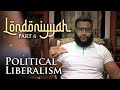

# Londoniyyah - Part 6 - Political Liberalism | Mohammad Hijab (2021-11-15)

## Description

Londoniyyah - Part 6 - Political Liberalism | Mohammad Hijab

To be updated about our content please subscribe and open the notifications.
----
BOOK A LIGHTHOUSE MENTOR

Are you or someone you know doubting Islam? Do you find yourself struggling to find answers?  Do you have a hard time speaking to someone about Islam?  Are you considering Islam but are unsure about certain concepts?  Are you an activist, Imam or community leader who is unsure about how to handle questions related to science, philosophy, the Islamic moral code, etc.?

You are not alone.  Over the course of the last decade or more there has been a rapid proliferation of content online and in academic institutions that has eroded the faith of some people.

Seeing the rise of  this phenomenon , Sapience Institute is introducing a One to One mentoring service called LIGHTHOUSE.

BOOK A MENTOR HERE: https://sapienceinstitute.org/lighthouse/

VISIT our website for articles in English, Spanish and Turkish; mentoring service, learning platform and for speaker requests: https://sapienceinstitute.org/

## Summary of [Londoniyyah - Part 6 - Political Liberalism | Mohammad Hijab](https://www.youtube.com/watch?v=TT5DwVgfcJk)

*This summary is AI generated - there may be inaccuracies. *

### [00:00:00](https://www.youtube.com/watch?v=TT5DwVgfcJk&t=0) - [00:55:00](https://www.youtube.com/watch?v=TT5DwVgfcJk&t=3300)

 Mohammad Hijab discusses the principles of liberalism, including the social contract, the idea that humans are born equal, and the importance of religious language in liberalism. He also addresses the criticism that individualism within liberalism can lead to a culture of freeloading.

**[00:00:00](https://www.youtube.com/watch?v=TT5DwVgfcJk&t=0)** Today's lesson is focused on liberalism, specifically the political strand of the ideology. Mohammad Hijab discusses the principles that underpin the liberal framework, including the energy principle and the hedonistic principle. He also covers the social contract, the idea that humans are born equal, and the importance of religious language in liberalism. John Locke is often cited as the founder of liberalism, and Mohammad Hijab discusses his arguments in favor of the ideology.
* **[00:05:00](https://www.youtube.com/watch?v=TT5DwVgfcJk&t=300)* Discusses the history and development of liberalism, focusing on John Locke, John Stuart Mill, and Emmanuel Kant. It explains that liberalism as a political philosophy is based on the idea of human rights and the idea of "world peace through liberalism."
* **[00:10:00](https://www.youtube.com/watch?v=TT5DwVgfcJk&t=600)** Mohammad Hijab discusses the concept of human rights and why they are significant. He also addresses the criticism that individualism within liberalism can lead to a culture of freeloading. He recommends the lecture series "Theories of Justice" by Michael Sandell as a high-quality resource for increasing one's knowledge on the topic.
* **[00:15:00](https://www.youtube.com/watch?v=TT5DwVgfcJk&t=900)* Discusses the continuities and discontinuities of human rights in relation to the 30 articles of the Universal Declaration of Human Rights. It points out that one of the rights is the right to democracy, and that this right is often at odds with the other 29 articles.
* **[00:20:00](https://www.youtube.com/watch?v=TT5DwVgfcJk&t=1200)* Discusses the tension between human rights and democracy, and how liberals must endure contradictions in order to protect individual rights.
* **[00:25:00](https://www.youtube.com/watch?v=TT5DwVgfcJk&t=1500)** Thomas Hobbes argues in Leviathan that the state of nature is a state of war where everyone is attacking each other. To stop the chaos, government is needed to establish order.
* **[00:30:00](https://www.youtube.com/watch?v=TT5DwVgfcJk&t=1800)**  Mohammad Hijab discusses liberalism and its principles of free-will and individualism. He points out that liberalism is based on a myth - that of everyone fighting each other - and that in the real world, a 'big strong man' is needed to stop the war. He goes on to say that, in truth, the social contract does not actually happen in the real world, and that children are given passports at birth in order to enforce laws and obey them.
* **[00:35:00](https://www.youtube.com/watch?v=TT5DwVgfcJk&t=2100)**  Mohammad Hijab discusses the difficulties of justifying liberalism through the social contract. He points out that, on the one hand, liberalism requires that people give up some of their freedom in order to gain protection; but, on the other hand, people also benefit from the state in other ways. He goes on to say that, even though different liberals define the state of nature differently, they all come to the same conclusion that someone needs to take control of society in order to protect everyone's freedom.
* **[00:40:00](https://www.youtube.com/watch?v=TT5DwVgfcJk&t=2400)**  Mohammad Hijab discusses the contradictory aspects of liberalism, particularly social contractarianism. He says that as a result, liberalism can justify the death penalty for people who apostasize from the worship of God. John Locke also discusses apostasy in his book, "The Second Treatise of Civil Government". He says that apostasy is treasonous and can lead to someone's death.
* **[00:45:00](https://www.youtube.com/watch?v=TT5DwVgfcJk&t=2700)**  Mohammad Hijab discusses liberalism and islam. He points out that while Islam does not condone certain actions, such as murder, it does have a social contract in which individuals are obligated to obey the laws of the state. He goes on to say that while liberalism does have some similarities with islam, there are significant differences in how the laws are implemented. He cites the example of William Mumford, who was executed for treason because he burned the American flag. He concludes by saying that while there may be some differences in how the laws of islam and liberalism are implemented, at their core, the two ideologies share a common structure.
* **[00:50:00](https://www.youtube.com/watch?v=TT5DwVgfcJk&t=3000)**  Mohammad Hijab discusses the possibility that both liberalism and Islam allow for the implementation of riddha and treason, and the self-refuting nature of a liberal critique of Islam. He notes that while some people may not agree with these principles, they are nonetheless conceivable. He also points out that historically, treason and riddha have been implemented in America under social contractarianism, without the need for a military operation.
* **[00:55:00](https://www.youtube.com/watch?v=TT5DwVgfcJk&t=3300)** Today's session discussed how to govern human beings, with Mohammad Hijab arguing that more than most people, Hobbs believes in the need for punishment in order to maintain order. Despite this, the discussion touched on a variety of issues relating to governance, and ended with a short break.

<h2>Full transcript with timestamps: CLICK TO EXPAND</h2>

[0:00:12](https://youtu.be/TT5DwVgfcJk?t=12) how are you guys doing and welcome to  
[0:00:13](https://youtu.be/TT5DwVgfcJk?t=13) the sixth session  
[0:00:15](https://youtu.be/TT5DwVgfcJk?t=15) of the shah or the explanation of  
[0:00:17](https://youtu.be/TT5DwVgfcJk?t=17) al-andaniyah today i'm going to be  
[0:00:19](https://youtu.be/TT5DwVgfcJk?t=19) talking about liberalism in particular  
[0:00:20](https://youtu.be/TT5DwVgfcJk?t=20) the political strand of  
[0:00:22](https://youtu.be/TT5DwVgfcJk?t=22) liberalism so we're going to listen to  
[0:00:25](https://youtu.be/TT5DwVgfcJk?t=25) the poem insha'allah and then we are  
[0:00:27](https://youtu.be/TT5DwVgfcJk?t=27) going to come back  
[0:00:28](https://youtu.be/TT5DwVgfcJk?t=28) and start discussing  
[0:00:56](https://youtu.be/TT5DwVgfcJk?t=56) yes  
[0:01:06](https://youtu.be/TT5DwVgfcJk?t=66) is we're going to go back to a little  
[0:01:07](https://youtu.be/TT5DwVgfcJk?t=67) bit of epistemology and uh liberal  
[0:01:10](https://youtu.be/TT5DwVgfcJk?t=70) prismalogy for that matter  
[0:01:12](https://youtu.be/TT5DwVgfcJk?t=72) and we're going to quickly go through  
[0:01:13](https://youtu.be/TT5DwVgfcJk?t=73) some of the historical points because in  
[0:01:15](https://youtu.be/TT5DwVgfcJk?t=75) the last session we did cover some of  
[0:01:16](https://youtu.be/TT5DwVgfcJk?t=76) the philosophical points especially with  
[0:01:18](https://youtu.be/TT5DwVgfcJk?t=78) social liberalism but it's important to  
[0:01:20](https://youtu.be/TT5DwVgfcJk?t=80) tie this in with some of the history  
[0:01:22](https://youtu.be/TT5DwVgfcJk?t=82) and then we're going to talk about human  
[0:01:23](https://youtu.be/TT5DwVgfcJk?t=83) rights  
[0:01:25](https://youtu.be/TT5DwVgfcJk?t=85) uh because human rights clearly is is an  
[0:01:27](https://youtu.be/TT5DwVgfcJk?t=87) idea which is connected to liberalism  
[0:01:30](https://youtu.be/TT5DwVgfcJk?t=90) we're going to spend some time on this  
[0:01:31](https://youtu.be/TT5DwVgfcJk?t=91) idea actually because it's important for  
[0:01:33](https://youtu.be/TT5DwVgfcJk?t=93) us to know what they mean by it  
[0:01:35](https://youtu.be/TT5DwVgfcJk?t=95) what are the human rights in the  
[0:01:36](https://youtu.be/TT5DwVgfcJk?t=96) convention uh the third human rights  
[0:01:37](https://youtu.be/TT5DwVgfcJk?t=97) we're going to kind of cover those  
[0:01:40](https://youtu.be/TT5DwVgfcJk?t=100) when they become popular  
[0:01:42](https://youtu.be/TT5DwVgfcJk?t=102) and then we're going to look at the  
[0:01:43](https://youtu.be/TT5DwVgfcJk?t=103) social contract which is a very big part  
[0:01:45](https://youtu.be/TT5DwVgfcJk?t=105) of political liberalism  
[0:01:47](https://youtu.be/TT5DwVgfcJk?t=107) or lackluster mari as the poem refers to  
[0:01:50](https://youtu.be/TT5DwVgfcJk?t=110) as  
[0:01:52](https://youtu.be/TT5DwVgfcJk?t=112) and we'll make some we'll make some  
[0:01:53](https://youtu.be/TT5DwVgfcJk?t=113) comparisons between the social contract  
[0:01:55](https://youtu.be/TT5DwVgfcJk?t=115) in islamic  
[0:01:57](https://youtu.be/TT5DwVgfcJk?t=117) um political theory if you want to put  
[0:01:58](https://youtu.be/TT5DwVgfcJk?t=118) it that quickly that way and also  
[0:02:00](https://youtu.be/TT5DwVgfcJk?t=120) between uh contractarianism in  
[0:02:03](https://youtu.be/TT5DwVgfcJk?t=123) liberalism  
[0:02:04](https://youtu.be/TT5DwVgfcJk?t=124) um  
[0:02:05](https://youtu.be/TT5DwVgfcJk?t=125) so that's really really what we're going  
[0:02:07](https://youtu.be/TT5DwVgfcJk?t=127) to go through today so let's start off  
[0:02:08](https://youtu.be/TT5DwVgfcJk?t=128) with  
[0:02:10](https://youtu.be/TT5DwVgfcJk?t=130) uh some of the epistemological stuff  
[0:02:12](https://youtu.be/TT5DwVgfcJk?t=132) that we spoke about last lesson to kind  
[0:02:14](https://youtu.be/TT5DwVgfcJk?t=134) of  
[0:02:16](https://youtu.be/TT5DwVgfcJk?t=136) interleave if you like what we studied  
[0:02:18](https://youtu.be/TT5DwVgfcJk?t=138) in the previous session with what we are  
[0:02:20](https://youtu.be/TT5DwVgfcJk?t=140) studying in this session  
[0:02:21](https://youtu.be/TT5DwVgfcJk?t=141) so what are some of the principles  
[0:02:23](https://youtu.be/TT5DwVgfcJk?t=143) that  
[0:02:24](https://youtu.be/TT5DwVgfcJk?t=144) facilitate  
[0:02:26](https://youtu.be/TT5DwVgfcJk?t=146) the liberal framework some of the things  
[0:02:28](https://youtu.be/TT5DwVgfcJk?t=148) that liberalism is predicated on my  
[0:02:30](https://youtu.be/TT5DwVgfcJk?t=150) friend here what's some of the  
[0:02:32](https://youtu.be/TT5DwVgfcJk?t=152) principles what do liberals  
[0:02:35](https://youtu.be/TT5DwVgfcJk?t=155) uh assume  
[0:02:37](https://youtu.be/TT5DwVgfcJk?t=157) um  
[0:02:39](https://youtu.be/TT5DwVgfcJk?t=159) we could say the energy principle  
[0:02:42](https://youtu.be/TT5DwVgfcJk?t=162) yes so the what principle yeah there is  
[0:02:45](https://youtu.be/TT5DwVgfcJk?t=165) a hedonistic principle yeah yeah the  
[0:02:46](https://youtu.be/TT5DwVgfcJk?t=166) hedonistic principle i believe uh  
[0:02:50](https://youtu.be/TT5DwVgfcJk?t=170) basically we have two doors paying them  
[0:02:52](https://youtu.be/TT5DwVgfcJk?t=172) yes yes sir good good good good right so  
[0:02:54](https://youtu.be/TT5DwVgfcJk?t=174) so this you're bringing it to bentham  
[0:02:57](https://youtu.be/TT5DwVgfcJk?t=177) but it's connected right so the idea  
[0:02:59](https://youtu.be/TT5DwVgfcJk?t=179) that you know you've got these visceral  
[0:03:01](https://youtu.be/TT5DwVgfcJk?t=181) desires and all you have these uh kind  
[0:03:04](https://youtu.be/TT5DwVgfcJk?t=184) of inclinations and whatever and that  
[0:03:06](https://youtu.be/TT5DwVgfcJk?t=186) you should be allowed to enact those  
[0:03:07](https://youtu.be/TT5DwVgfcJk?t=187) inclinations you should be able to do  
[0:03:09](https://youtu.be/TT5DwVgfcJk?t=189) those things that you want to do  
[0:03:12](https://youtu.be/TT5DwVgfcJk?t=192) uh what other things did we suppose  
[0:03:13](https://youtu.be/TT5DwVgfcJk?t=193) speak about in the previous session  
[0:03:14](https://youtu.be/TT5DwVgfcJk?t=194) which is relevant here some of the  
[0:03:16](https://youtu.be/TT5DwVgfcJk?t=196) principles some of the um premises of uh  
[0:03:20](https://youtu.be/TT5DwVgfcJk?t=200) of liberalism  
[0:03:22](https://youtu.be/TT5DwVgfcJk?t=202) utilitarian thing all right so with  
[0:03:24](https://youtu.be/TT5DwVgfcJk?t=204) social liberalism right you're right  
[0:03:25](https://youtu.be/TT5DwVgfcJk?t=205) social liberalism utilitarianism is  
[0:03:27](https://youtu.be/TT5DwVgfcJk?t=207) there's connection there  
[0:03:29](https://youtu.be/TT5DwVgfcJk?t=209) the connection is we talked about um  
[0:03:32](https://youtu.be/TT5DwVgfcJk?t=212) js mill and how he kind of put the harm  
[0:03:34](https://youtu.be/TT5DwVgfcJk?t=214) principle in place and so on in order to  
[0:03:37](https://youtu.be/TT5DwVgfcJk?t=217) avoid this kind of anarchical state  
[0:03:40](https://youtu.be/TT5DwVgfcJk?t=220) so we spoke about that but you know it's  
[0:03:41](https://youtu.be/TT5DwVgfcJk?t=221) really interesting as well because if  
[0:03:42](https://youtu.be/TT5DwVgfcJk?t=222) you look at john locke in particular  
[0:03:45](https://youtu.be/TT5DwVgfcJk?t=225) if you look at where he was seen as some  
[0:03:47](https://youtu.be/TT5DwVgfcJk?t=227) consider him the founder of liberalism  
[0:03:49](https://youtu.be/TT5DwVgfcJk?t=229) and this is an interesting point who is  
[0:03:51](https://youtu.be/TT5DwVgfcJk?t=231) the founder of who's the first liberal  
[0:03:53](https://youtu.be/TT5DwVgfcJk?t=233) if you like so some say it's thomas  
[0:03:55](https://youtu.be/TT5DwVgfcJk?t=235) hobbs um he wrote a book called the  
[0:03:56](https://youtu.be/TT5DwVgfcJk?t=236) leviathan and he we'll talk about him  
[0:03:59](https://youtu.be/TT5DwVgfcJk?t=239) today actually he has his own kind of  
[0:04:01](https://youtu.be/TT5DwVgfcJk?t=241) theoretical constructions  
[0:04:02](https://youtu.be/TT5DwVgfcJk?t=242) some say it might be john locke and when  
[0:04:05](https://youtu.be/TT5DwVgfcJk?t=245) john locke  
[0:04:06](https://youtu.be/TT5DwVgfcJk?t=246) who died in 1706 or  
[0:04:09](https://youtu.be/TT5DwVgfcJk?t=249) something like this um when john locke  
[0:04:12](https://youtu.be/TT5DwVgfcJk?t=252) was making his argument for liberalism  
[0:04:14](https://youtu.be/TT5DwVgfcJk?t=254) he was debating as someone called filma  
[0:04:16](https://youtu.be/TT5DwVgfcJk?t=256) this film  
[0:04:17](https://youtu.be/TT5DwVgfcJk?t=257) i think is robert filmer was um another  
[0:04:20](https://youtu.be/TT5DwVgfcJk?t=260) person who was  
[0:04:21](https://youtu.be/TT5DwVgfcJk?t=261) obviously a christian as well and so a  
[0:04:23](https://youtu.be/TT5DwVgfcJk?t=263) lot of the arguments used to actually be  
[0:04:25](https://youtu.be/TT5DwVgfcJk?t=265) theological arguments  
[0:04:26](https://youtu.be/TT5DwVgfcJk?t=266) really interestingly a lot of the points  
[0:04:28](https://youtu.be/TT5DwVgfcJk?t=268) of liberalism and that you find in the  
[0:04:30](https://youtu.be/TT5DwVgfcJk?t=270) constitution and the um the declaration  
[0:04:33](https://youtu.be/TT5DwVgfcJk?t=273) of independence and other documents in  
[0:04:35](https://youtu.be/TT5DwVgfcJk?t=275) the  
[0:04:36](https://youtu.be/TT5DwVgfcJk?t=276) american kind of  
[0:04:38](https://youtu.be/TT5DwVgfcJk?t=278) political landscape  
[0:04:39](https://youtu.be/TT5DwVgfcJk?t=279) you'll find we are born equal  
[0:04:43](https://youtu.be/TT5DwVgfcJk?t=283) these kinds of knowledges here we are  
[0:04:45](https://youtu.be/TT5DwVgfcJk?t=285) created equal even  
[0:04:47](https://youtu.be/TT5DwVgfcJk?t=287) religious language  
[0:04:49](https://youtu.be/TT5DwVgfcJk?t=289) why because religion  
[0:04:51](https://youtu.be/TT5DwVgfcJk?t=291) and in particular christian religion or  
[0:04:53](https://youtu.be/TT5DwVgfcJk?t=293) judo christian religion or the judo  
[0:04:55](https://youtu.be/TT5DwVgfcJk?t=295) christian tradition  
[0:04:57](https://youtu.be/TT5DwVgfcJk?t=297) was a significant  
[0:04:59](https://youtu.be/TT5DwVgfcJk?t=299) way in which  
[0:05:00](https://youtu.be/TT5DwVgfcJk?t=300) liberals in the beginning actually  
[0:05:03](https://youtu.be/TT5DwVgfcJk?t=303) formed their epistemology  
[0:05:05](https://youtu.be/TT5DwVgfcJk?t=305) this idea of being created equal i mean  
[0:05:06](https://youtu.be/TT5DwVgfcJk?t=306) how are we created equal when we're all  
[0:05:08](https://youtu.be/TT5DwVgfcJk?t=308) different in what sense are we equal  
[0:05:11](https://youtu.be/TT5DwVgfcJk?t=311) because we're not talking about we're  
[0:05:12](https://youtu.be/TT5DwVgfcJk?t=312) equal  
[0:05:13](https://youtu.be/TT5DwVgfcJk?t=313) in skin color or equal in height  
[0:05:16](https://youtu.be/TT5DwVgfcJk?t=316) or equal in  
[0:05:18](https://youtu.be/TT5DwVgfcJk?t=318) socioeconomic standing because we're not  
[0:05:20](https://youtu.be/TT5DwVgfcJk?t=320) equal in any of those things in fact  
[0:05:21](https://youtu.be/TT5DwVgfcJk?t=321) some are some people are born disabled  
[0:05:24](https://youtu.be/TT5DwVgfcJk?t=324) some people are born able  
[0:05:26](https://youtu.be/TT5DwVgfcJk?t=326) you know with extra testosterone in the  
[0:05:28](https://youtu.be/TT5DwVgfcJk?t=328) war whatever it may be  
[0:05:29](https://youtu.be/TT5DwVgfcJk?t=329) so there are disparities in  
[0:05:32](https://youtu.be/TT5DwVgfcJk?t=332) a biological sense so in what sense are  
[0:05:33](https://youtu.be/TT5DwVgfcJk?t=333) we born or created equal  
[0:05:35](https://youtu.be/TT5DwVgfcJk?t=335) what's referred to here is really we're  
[0:05:38](https://youtu.be/TT5DwVgfcJk?t=338) equal in value that we're all equal you  
[0:05:40](https://youtu.be/TT5DwVgfcJk?t=340) know in how moral standing if you like  
[0:05:42](https://youtu.be/TT5DwVgfcJk?t=342) but where do they get that from  
[0:05:44](https://youtu.be/TT5DwVgfcJk?t=344) because we we can't  
[0:05:47](https://youtu.be/TT5DwVgfcJk?t=347) we can't really argue that point  
[0:05:50](https://youtu.be/TT5DwVgfcJk?t=350) unless you invoke some kind of  
[0:05:51](https://youtu.be/TT5DwVgfcJk?t=351) metaphysical principle so john locke was  
[0:05:54](https://youtu.be/TT5DwVgfcJk?t=354) invoking at that time a religious  
[0:05:56](https://youtu.be/TT5DwVgfcJk?t=356) metaphysical principle making specific  
[0:05:58](https://youtu.be/TT5DwVgfcJk?t=358) reference believe or not to adam and eve  
[0:06:00](https://youtu.be/TT5DwVgfcJk?t=360) and the book of genesis  
[0:06:02](https://youtu.be/TT5DwVgfcJk?t=362) and these things so tradition or judo  
[0:06:04](https://youtu.be/TT5DwVgfcJk?t=364) christian tradition has a huge impact on  
[0:06:06](https://youtu.be/TT5DwVgfcJk?t=366) the liberal tradition it has a  
[0:06:08](https://youtu.be/TT5DwVgfcJk?t=368) theologian it's not just hedonism but  
[0:06:10](https://youtu.be/TT5DwVgfcJk?t=370) ironically you could say because  
[0:06:11](https://youtu.be/TT5DwVgfcJk?t=371) religion is many were senses  
[0:06:14](https://youtu.be/TT5DwVgfcJk?t=374) self-restricting  
[0:06:16](https://youtu.be/TT5DwVgfcJk?t=376) it's also religion and so this  
[0:06:18](https://youtu.be/TT5DwVgfcJk?t=378) interesting interplay between  
[0:06:20](https://youtu.be/TT5DwVgfcJk?t=380) uh those two things  
[0:06:25](https://youtu.be/TT5DwVgfcJk?t=385) so just to quickly go through some of  
[0:06:27](https://youtu.be/TT5DwVgfcJk?t=387) the um  
[0:06:28](https://youtu.be/TT5DwVgfcJk?t=388) the main things  
[0:06:30](https://youtu.be/TT5DwVgfcJk?t=390) you have the english civil war which if  
[0:06:31](https://youtu.be/TT5DwVgfcJk?t=391) you went to um i don't know  
[0:06:33](https://youtu.be/TT5DwVgfcJk?t=393) the secondary school in this country  
[0:06:34](https://youtu.be/TT5DwVgfcJk?t=394) you'd have covered okay  
[0:06:36](https://youtu.be/TT5DwVgfcJk?t=396) as from the year 1641 1651 then you have  
[0:06:38](https://youtu.be/TT5DwVgfcJk?t=398) the bill of rights in 1689. now these  
[0:06:41](https://youtu.be/TT5DwVgfcJk?t=401) bill of rights a lot of them when they  
[0:06:43](https://youtu.be/TT5DwVgfcJk?t=403) were being formulated actually use john  
[0:06:45](https://youtu.be/TT5DwVgfcJk?t=405) locke's ideas  
[0:06:46](https://youtu.be/TT5DwVgfcJk?t=406) okay he was around at that time  
[0:06:49](https://youtu.be/TT5DwVgfcJk?t=409) so john locke  
[0:06:51](https://youtu.be/TT5DwVgfcJk?t=411) he was directly responsible for some of  
[0:06:53](https://youtu.be/TT5DwVgfcJk?t=413) the formulations  
[0:06:55](https://youtu.be/TT5DwVgfcJk?t=415) the political um formulations which ex  
[0:06:58](https://youtu.be/TT5DwVgfcJk?t=418) which happened not just obviously in  
[0:07:00](https://youtu.be/TT5DwVgfcJk?t=420) england  
[0:07:01](https://youtu.be/TT5DwVgfcJk?t=421) uh but also in america as we know a lot  
[0:07:03](https://youtu.be/TT5DwVgfcJk?t=423) of the stuff there you know the founding  
[0:07:06](https://youtu.be/TT5DwVgfcJk?t=426) documents if you like the the the  
[0:07:07](https://youtu.be/TT5DwVgfcJk?t=427) constitution the declaration of  
[0:07:09](https://youtu.be/TT5DwVgfcJk?t=429) independence all these kind of things  
[0:07:10](https://youtu.be/TT5DwVgfcJk?t=430) they were based on lock they were based  
[0:07:12](https://youtu.be/TT5DwVgfcJk?t=432) on montesquieu and lock as well  
[0:07:14](https://youtu.be/TT5DwVgfcJk?t=434) um  
[0:07:17](https://youtu.be/TT5DwVgfcJk?t=437) we mentioned that  
[0:07:18](https://youtu.be/TT5DwVgfcJk?t=438) rousseau was a huge name as well in 1778  
[0:07:20](https://youtu.be/TT5DwVgfcJk?t=440) he was around and then of course in 1789  
[0:07:24](https://youtu.be/TT5DwVgfcJk?t=444) you had  
[0:07:25](https://youtu.be/TT5DwVgfcJk?t=445) the french revolution  
[0:07:27](https://youtu.be/TT5DwVgfcJk?t=447) and the documents that are related to  
[0:07:29](https://youtu.be/TT5DwVgfcJk?t=449) that revolution are in fact  
[0:07:31](https://youtu.be/TT5DwVgfcJk?t=451) many of them are based on the works  
[0:07:34](https://youtu.be/TT5DwVgfcJk?t=454) um the the political works of john locke  
[0:07:36](https://youtu.be/TT5DwVgfcJk?t=456) and of montesquieu and are liberal  
[0:07:38](https://youtu.be/TT5DwVgfcJk?t=458) liberally premised or predicated  
[0:07:41](https://youtu.be/TT5DwVgfcJk?t=461) emmanuel kant was a big name and he was  
[0:07:43](https://youtu.be/TT5DwVgfcJk?t=463) also a liberal but he also put in place  
[0:07:45](https://youtu.be/TT5DwVgfcJk?t=465) something called cosmopolitanism which  
[0:07:47](https://youtu.be/TT5DwVgfcJk?t=467) is uh  
[0:07:48](https://youtu.be/TT5DwVgfcJk?t=468) an interesting universalizing idea like  
[0:07:51](https://youtu.be/TT5DwVgfcJk?t=471) the u.n actually comes from this idea  
[0:07:53](https://youtu.be/TT5DwVgfcJk?t=473) that liberalism should be spread around  
[0:07:56](https://youtu.be/TT5DwVgfcJk?t=476) like liberalism should be spread around  
[0:07:58](https://youtu.be/TT5DwVgfcJk?t=478) this now not all liberals will say this  
[0:07:59](https://youtu.be/TT5DwVgfcJk?t=479) and we have to be very very clear clear  
[0:08:01](https://youtu.be/TT5DwVgfcJk?t=481) and careful with this because  
[0:08:03](https://youtu.be/TT5DwVgfcJk?t=483) cosmopolitanism is a sub-branch of  
[0:08:05](https://youtu.be/TT5DwVgfcJk?t=485) liberalism it's not the only branch of  
[0:08:07](https://youtu.be/TT5DwVgfcJk?t=487) liberalism but how do you how do  
[0:08:09](https://youtu.be/TT5DwVgfcJk?t=489) liberals  
[0:08:10](https://youtu.be/TT5DwVgfcJk?t=490) justify expansion or in america what  
[0:08:13](https://youtu.be/TT5DwVgfcJk?t=493) they refer to as manifest destiny  
[0:08:15](https://youtu.be/TT5DwVgfcJk?t=495) and this idea of manifest destiny is  
[0:08:16](https://youtu.be/TT5DwVgfcJk?t=496) westwood expansion literally westwood  
[0:08:18](https://youtu.be/TT5DwVgfcJk?t=498) expansion  
[0:08:19](https://youtu.be/TT5DwVgfcJk?t=499) uh  
[0:08:20](https://youtu.be/TT5DwVgfcJk?t=500) when they went into the natives and  
[0:08:22](https://youtu.be/TT5DwVgfcJk?t=502) stuff they were literally expanding  
[0:08:23](https://youtu.be/TT5DwVgfcJk?t=503) conquering new land and so on  
[0:08:25](https://youtu.be/TT5DwVgfcJk?t=505) it's interesting that most if not all  
[0:08:27](https://youtu.be/TT5DwVgfcJk?t=507) presidents in the united states believe  
[0:08:28](https://youtu.be/TT5DwVgfcJk?t=508) in this concept of manifest destiny and  
[0:08:30](https://youtu.be/TT5DwVgfcJk?t=510) there are articles written on this point  
[0:08:32](https://youtu.be/TT5DwVgfcJk?t=512) but it's westwood expansion  
[0:08:35](https://youtu.be/TT5DwVgfcJk?t=515) um and manifest destiny is the idea that  
[0:08:37](https://youtu.be/TT5DwVgfcJk?t=517) we are going to take over  
[0:08:38](https://youtu.be/TT5DwVgfcJk?t=518) to put it in a word  
[0:08:41](https://youtu.be/TT5DwVgfcJk?t=521) it's it's almost destiny it is destiny  
[0:08:43](https://youtu.be/TT5DwVgfcJk?t=523) that we we will take over with the our  
[0:08:45](https://youtu.be/TT5DwVgfcJk?t=525) liberal framework and this idea is  
[0:08:48](https://youtu.be/TT5DwVgfcJk?t=528) connected of course to imalink emmanuel  
[0:08:50](https://youtu.be/TT5DwVgfcJk?t=530) kant's idea of cosmopolitanism so it's  
[0:08:52](https://youtu.be/TT5DwVgfcJk?t=532) important to know these different kinds  
[0:08:54](https://youtu.be/TT5DwVgfcJk?t=534) of permutations  
[0:08:56](https://youtu.be/TT5DwVgfcJk?t=536) of liberalism and we talked about mill  
[0:08:58](https://youtu.be/TT5DwVgfcJk?t=538) last time  
[0:08:59](https://youtu.be/TT5DwVgfcJk?t=539) so we don't need to go into too much  
[0:09:00](https://youtu.be/TT5DwVgfcJk?t=540) detail but he was a key formulator of  
[0:09:02](https://youtu.be/TT5DwVgfcJk?t=542) course of social liberalism and then you  
[0:09:05](https://youtu.be/TT5DwVgfcJk?t=545) have world war one world war ii and  
[0:09:07](https://youtu.be/TT5DwVgfcJk?t=547) world war ii in particular  
[0:09:08](https://youtu.be/TT5DwVgfcJk?t=548) was very important because obviously  
[0:09:10](https://youtu.be/TT5DwVgfcJk?t=550) after world war ii 1945 you had the un  
[0:09:13](https://youtu.be/TT5DwVgfcJk?t=553) uh which was previously known as the  
[0:09:15](https://youtu.be/TT5DwVgfcJk?t=555) league of nations it changed name it was  
[0:09:18](https://youtu.be/TT5DwVgfcJk?t=558) called the league of nations and then in  
[0:09:19](https://youtu.be/TT5DwVgfcJk?t=559) 1939 1945 1945 it changed name to the un  
[0:09:25](https://youtu.be/TT5DwVgfcJk?t=565) and  
[0:09:26](https://youtu.be/TT5DwVgfcJk?t=566) that's when  
[0:09:27](https://youtu.be/TT5DwVgfcJk?t=567) a lot of the documents that we're going  
[0:09:28](https://youtu.be/TT5DwVgfcJk?t=568) to be looking at today like the un  
[0:09:30](https://youtu.be/TT5DwVgfcJk?t=570) convention of human rights  
[0:09:32](https://youtu.be/TT5DwVgfcJk?t=572) that's when they were written they were  
[0:09:34](https://youtu.be/TT5DwVgfcJk?t=574) written on a post-war basis and why they  
[0:09:36](https://youtu.be/TT5DwVgfcJk?t=576) were written  
[0:09:37](https://youtu.be/TT5DwVgfcJk?t=577) is to ensure you know world stability  
[0:09:40](https://youtu.be/TT5DwVgfcJk?t=580) and these kind of things the league of  
[0:09:41](https://youtu.be/TT5DwVgfcJk?t=581) nations remember uh before even world  
[0:09:43](https://youtu.be/TT5DwVgfcJk?t=583) war ii  
[0:09:44](https://youtu.be/TT5DwVgfcJk?t=584) was established to create that kind of  
[0:09:46](https://youtu.be/TT5DwVgfcJk?t=586) peace treaties between nations and and  
[0:09:48](https://youtu.be/TT5DwVgfcJk?t=588) so on  
[0:09:51](https://youtu.be/TT5DwVgfcJk?t=591) so we're going to look at the human  
[0:09:53](https://youtu.be/TT5DwVgfcJk?t=593) rights declaration which was written at  
[0:09:55](https://youtu.be/TT5DwVgfcJk?t=595) the same time as israel became a state  
[0:09:57](https://youtu.be/TT5DwVgfcJk?t=597) in 1940  
[0:09:59](https://youtu.be/TT5DwVgfcJk?t=599) 8.  
[0:10:00](https://youtu.be/TT5DwVgfcJk?t=600) now  
[0:10:02](https://youtu.be/TT5DwVgfcJk?t=602) let's talk about human rights when i say  
[0:10:04](https://youtu.be/TT5DwVgfcJk?t=604) human rights what comes to your mind  
[0:10:05](https://youtu.be/TT5DwVgfcJk?t=605) what comes to your mind if someone says  
[0:10:07](https://youtu.be/TT5DwVgfcJk?t=607) human rights  
[0:10:10](https://youtu.be/TT5DwVgfcJk?t=610) what what's the first thing that is what  
[0:10:12](https://youtu.be/TT5DwVgfcJk?t=612) connotation that brings about is it a  
[0:10:13](https://youtu.be/TT5DwVgfcJk?t=613) positive connotation let's be honest or  
[0:10:14](https://youtu.be/TT5DwVgfcJk?t=614) negative if you say it's positive isn't  
[0:10:16](https://youtu.be/TT5DwVgfcJk?t=616) it what other things come to mind  
[0:10:19](https://youtu.be/TT5DwVgfcJk?t=619) freedom of speech  
[0:10:20](https://youtu.be/TT5DwVgfcJk?t=620) freedom of movement  
[0:10:22](https://youtu.be/TT5DwVgfcJk?t=622) yes  
[0:10:23](https://youtu.be/TT5DwVgfcJk?t=623) um  
[0:10:28](https://youtu.be/TT5DwVgfcJk?t=628) yeah equality  
[0:10:30](https://youtu.be/TT5DwVgfcJk?t=630) equality yeah yeah yeah these kind of  
[0:10:32](https://youtu.be/TT5DwVgfcJk?t=632) things right yeah  
[0:10:34](https://youtu.be/TT5DwVgfcJk?t=634) anything else come to mind  
[0:10:40](https://youtu.be/TT5DwVgfcJk?t=640) freedom of religion as well  
[0:10:41](https://youtu.be/TT5DwVgfcJk?t=641) freedom of religion  
[0:10:43](https://youtu.be/TT5DwVgfcJk?t=643) what's the opposite of right  
[0:10:46](https://youtu.be/TT5DwVgfcJk?t=646) responsibilities  
[0:10:48](https://youtu.be/TT5DwVgfcJk?t=648) it's very interesting it's not human  
[0:10:49](https://youtu.be/TT5DwVgfcJk?t=649) responsibilities it's what it's human  
[0:10:51](https://youtu.be/TT5DwVgfcJk?t=651) rights  
[0:10:53](https://youtu.be/TT5DwVgfcJk?t=653) um  
[0:10:54](https://youtu.be/TT5DwVgfcJk?t=654) it's not even human rights and  
[0:10:55](https://youtu.be/TT5DwVgfcJk?t=655) responsibilities it's just human rights  
[0:10:58](https://youtu.be/TT5DwVgfcJk?t=658) and why is that significant that it's  
[0:10:59](https://youtu.be/TT5DwVgfcJk?t=659) not human rights and responsibilities or  
[0:11:01](https://youtu.be/TT5DwVgfcJk?t=661) human responsibilities but human rights  
[0:11:03](https://youtu.be/TT5DwVgfcJk?t=663) why is that significant  
[0:11:05](https://youtu.be/TT5DwVgfcJk?t=665) what what does it mean to have rights  
[0:11:11](https://youtu.be/TT5DwVgfcJk?t=671) that's true that's true yeah of course  
[0:11:13](https://youtu.be/TT5DwVgfcJk?t=673) but what does it mean in the first place  
[0:11:14](https://youtu.be/TT5DwVgfcJk?t=674) to have rights  
[0:11:17](https://youtu.be/TT5DwVgfcJk?t=677) yeah that you're entitled to something  
[0:11:18](https://youtu.be/TT5DwVgfcJk?t=678) you're owed something  
[0:11:20](https://youtu.be/TT5DwVgfcJk?t=680) but what does it not mean by extension  
[0:11:26](https://youtu.be/TT5DwVgfcJk?t=686) do you need to attain it that you need  
[0:11:28](https://youtu.be/TT5DwVgfcJk?t=688) to attain it okay but something else  
[0:11:30](https://youtu.be/TT5DwVgfcJk?t=690) which is more  
[0:11:32](https://youtu.be/TT5DwVgfcJk?t=692) diametrically opposed to the word rights  
[0:11:34](https://youtu.be/TT5DwVgfcJk?t=694) but you need to  
[0:11:36](https://youtu.be/TT5DwVgfcJk?t=696) let's let's use the word give and take  
[0:11:39](https://youtu.be/TT5DwVgfcJk?t=699) rights is what taking or giving  
[0:11:41](https://youtu.be/TT5DwVgfcJk?t=701) taking so responsibility is what  
[0:11:44](https://youtu.be/TT5DwVgfcJk?t=704) giving if you tell people in a society  
[0:11:48](https://youtu.be/TT5DwVgfcJk?t=708) take these things  
[0:11:51](https://youtu.be/TT5DwVgfcJk?t=711) and you don't tell them give these  
[0:11:52](https://youtu.be/TT5DwVgfcJk?t=712) things  
[0:11:53](https://youtu.be/TT5DwVgfcJk?t=713) what happens what's the problem  
[0:11:58](https://youtu.be/TT5DwVgfcJk?t=718) it's not reciprocal so you're not  
[0:12:00](https://youtu.be/TT5DwVgfcJk?t=720) contributing anything  
[0:12:03](https://youtu.be/TT5DwVgfcJk?t=723) what could happen theoretically let's  
[0:12:04](https://youtu.be/TT5DwVgfcJk?t=724) put it in more  
[0:12:06](https://youtu.be/TT5DwVgfcJk?t=726) precise language  
[0:12:10](https://youtu.be/TT5DwVgfcJk?t=730) if everyone's doing it you have the  
[0:12:11](https://youtu.be/TT5DwVgfcJk?t=731) freeloaded problem you have the fusion  
[0:12:12](https://youtu.be/TT5DwVgfcJk?t=732) of responsibility right imagine if you  
[0:12:14](https://youtu.be/TT5DwVgfcJk?t=734) told if you're raising children yeah and  
[0:12:16](https://youtu.be/TT5DwVgfcJk?t=736) you told them you have a right to eat  
[0:12:17](https://youtu.be/TT5DwVgfcJk?t=737) this and you have a right to do that and  
[0:12:18](https://youtu.be/TT5DwVgfcJk?t=738) you have a right to do this you know  
[0:12:21](https://youtu.be/TT5DwVgfcJk?t=741) but you don't tell you don't discipline  
[0:12:22](https://youtu.be/TT5DwVgfcJk?t=742) them you don't tell them this is what  
[0:12:24](https://youtu.be/TT5DwVgfcJk?t=744) you have to do this is what you should  
[0:12:25](https://youtu.be/TT5DwVgfcJk?t=745) do this is what  
[0:12:27](https://youtu.be/TT5DwVgfcJk?t=747) what kind of children what  
[0:12:29](https://youtu.be/TT5DwVgfcJk?t=749) what kind of children are you going to  
[0:12:31](https://youtu.be/TT5DwVgfcJk?t=751) raise  
[0:12:33](https://youtu.be/TT5DwVgfcJk?t=753) yeah  
[0:12:34](https://youtu.be/TT5DwVgfcJk?t=754) and this  
[0:12:35](https://youtu.be/TT5DwVgfcJk?t=755) this is one of the arguments against uh  
[0:12:37](https://youtu.be/TT5DwVgfcJk?t=757) liberalism and by extension human rights  
[0:12:39](https://youtu.be/TT5DwVgfcJk?t=759) culture that produces  
[0:12:41](https://youtu.be/TT5DwVgfcJk?t=761) um individualism to a very high level  
[0:12:44](https://youtu.be/TT5DwVgfcJk?t=764) diffusion of responsibility  
[0:12:47](https://youtu.be/TT5DwVgfcJk?t=767) like this actually this just on our side  
[0:12:49](https://youtu.be/TT5DwVgfcJk?t=769) now  
[0:12:50](https://youtu.be/TT5DwVgfcJk?t=770) this this thing of diffusion of  
[0:12:51](https://youtu.be/TT5DwVgfcJk?t=771) responsibility right  
[0:12:53](https://youtu.be/TT5DwVgfcJk?t=773) um there have been psychological  
[0:12:55](https://youtu.be/TT5DwVgfcJk?t=775) investigations done on it like someone  
[0:12:56](https://youtu.be/TT5DwVgfcJk?t=776) does it commits rape yeah  
[0:12:59](https://youtu.be/TT5DwVgfcJk?t=779) and stranger rape and it's happening in  
[0:13:00](https://youtu.be/TT5DwVgfcJk?t=780) the street the woman is screaming and  
[0:13:02](https://youtu.be/TT5DwVgfcJk?t=782) for some reason no one's even calling  
[0:13:03](https://youtu.be/TT5DwVgfcJk?t=783) the police  
[0:13:04](https://youtu.be/TT5DwVgfcJk?t=784) they're too busy  
[0:13:06](https://youtu.be/TT5DwVgfcJk?t=786) eating pot noodles or so you know  
[0:13:08](https://youtu.be/TT5DwVgfcJk?t=788) or chewing gum or something like that or  
[0:13:10](https://youtu.be/TT5DwVgfcJk?t=790) playing games or computer games the  
[0:13:12](https://youtu.be/TT5DwVgfcJk?t=792) woman is screaming outside it might be  
[0:13:13](https://youtu.be/TT5DwVgfcJk?t=793) at night time but whatever like you know  
[0:13:15](https://youtu.be/TT5DwVgfcJk?t=795) we'll drown out because i'm busy  
[0:13:18](https://youtu.be/TT5DwVgfcJk?t=798) you know so this this culture of or this  
[0:13:20](https://youtu.be/TT5DwVgfcJk?t=800) psychological  
[0:13:22](https://youtu.be/TT5DwVgfcJk?t=802) um phenomena which is it's referred to  
[0:13:25](https://youtu.be/TT5DwVgfcJk?t=805) as diffusion of responsibility let  
[0:13:27](https://youtu.be/TT5DwVgfcJk?t=807) someone else do with it  
[0:13:28](https://youtu.be/TT5DwVgfcJk?t=808) but it's not my business it's not it's i  
[0:13:30](https://youtu.be/TT5DwVgfcJk?t=810) don't have to do that it's not my  
[0:13:32](https://youtu.be/TT5DwVgfcJk?t=812) obligation to do that why because you've  
[0:13:34](https://youtu.be/TT5DwVgfcJk?t=814) already instilled in the person that  
[0:13:35](https://youtu.be/TT5DwVgfcJk?t=815) it's not they've got rights and they've  
[0:13:37](https://youtu.be/TT5DwVgfcJk?t=817) got responsibilities  
[0:13:38](https://youtu.be/TT5DwVgfcJk?t=818) but their rights are important a human  
[0:13:40](https://youtu.be/TT5DwVgfcJk?t=820) right for me to do what i want who cares  
[0:13:42](https://youtu.be/TT5DwVgfcJk?t=822) about this person here you know  
[0:13:45](https://youtu.be/TT5DwVgfcJk?t=825) and so  
[0:13:46](https://youtu.be/TT5DwVgfcJk?t=826) we'll come to this and in fact it's very  
[0:13:48](https://youtu.be/TT5DwVgfcJk?t=828) important very very important  
[0:13:51](https://youtu.be/TT5DwVgfcJk?t=831) criticism of individualism within  
[0:13:53](https://youtu.be/TT5DwVgfcJk?t=833) liberalism refers to as communitarianism  
[0:13:56](https://youtu.be/TT5DwVgfcJk?t=836) and one of the main um  
[0:13:58](https://youtu.be/TT5DwVgfcJk?t=838) well let me give you two names some of  
[0:14:00](https://youtu.be/TT5DwVgfcJk?t=840) the main names is uh michael sandell  
[0:14:03](https://youtu.be/TT5DwVgfcJk?t=843) who by the way he has an 11 or 12 part  
[0:14:06](https://youtu.be/TT5DwVgfcJk?t=846) series  
[0:14:07](https://youtu.be/TT5DwVgfcJk?t=847) in harvard it's called the justice  
[0:14:09](https://youtu.be/TT5DwVgfcJk?t=849) probably one of the best series  
[0:14:11](https://youtu.be/TT5DwVgfcJk?t=851) that you can watch yeah on this point on  
[0:14:13](https://youtu.be/TT5DwVgfcJk?t=853) these uh topics to increase your  
[0:14:16](https://youtu.be/TT5DwVgfcJk?t=856) knowledge on these areas  
[0:14:18](https://youtu.be/TT5DwVgfcJk?t=858) one of the because he teaches it very  
[0:14:19](https://youtu.be/TT5DwVgfcJk?t=859) well  
[0:14:20](https://youtu.be/TT5DwVgfcJk?t=860) and it's very lucid very clear very  
[0:14:22](https://youtu.be/TT5DwVgfcJk?t=862) clean  
[0:14:23](https://youtu.be/TT5DwVgfcJk?t=863) so people ask for book recommendations  
[0:14:26](https://youtu.be/TT5DwVgfcJk?t=866) start with this lecture series because  
[0:14:27](https://youtu.be/TT5DwVgfcJk?t=867) it's a very high quality very high  
[0:14:30](https://youtu.be/TT5DwVgfcJk?t=870) quality lecture series michael sandell  
[0:14:32](https://youtu.be/TT5DwVgfcJk?t=872) harvard lecture series has been watched  
[0:14:34](https://youtu.be/TT5DwVgfcJk?t=874) by millions and millions of people  
[0:14:36](https://youtu.be/TT5DwVgfcJk?t=876) and the production quality of it is  
[0:14:37](https://youtu.be/TT5DwVgfcJk?t=877) second to none yeah but he also writes a  
[0:14:40](https://youtu.be/TT5DwVgfcJk?t=880) book called theories of justice and he  
[0:14:41](https://youtu.be/TT5DwVgfcJk?t=881) he offers a communitarian criticism of  
[0:14:44](https://youtu.be/TT5DwVgfcJk?t=884) individualism which we'll explore in  
[0:14:46](https://youtu.be/TT5DwVgfcJk?t=886) maybe some more detail in what follows  
[0:14:49](https://youtu.be/TT5DwVgfcJk?t=889) but  
[0:14:50](https://youtu.be/TT5DwVgfcJk?t=890) let's let's talk about rights now a  
[0:14:52](https://youtu.be/TT5DwVgfcJk?t=892) little bit more  
[0:14:54](https://youtu.be/TT5DwVgfcJk?t=894) when you when you're talking about  
[0:14:55](https://youtu.be/TT5DwVgfcJk?t=895) rights human rights it's already  
[0:14:57](https://youtu.be/TT5DwVgfcJk?t=897) universalized  
[0:14:59](https://youtu.be/TT5DwVgfcJk?t=899) okay  
[0:15:01](https://youtu.be/TT5DwVgfcJk?t=901) so these are the rights that all humans  
[0:15:03](https://youtu.be/TT5DwVgfcJk?t=903) have  
[0:15:04](https://youtu.be/TT5DwVgfcJk?t=904) okay so it's not exceptional it's not um  
[0:15:07](https://youtu.be/TT5DwVgfcJk?t=907) categorized of these rights for these  
[0:15:09](https://youtu.be/TT5DwVgfcJk?t=909) people  
[0:15:10](https://youtu.be/TT5DwVgfcJk?t=910) and these are rights for other people  
[0:15:12](https://youtu.be/TT5DwVgfcJk?t=912) now obviously with the purpose of  
[0:15:14](https://youtu.be/TT5DwVgfcJk?t=914) equality all of that  
[0:15:15](https://youtu.be/TT5DwVgfcJk?t=915) makes sense but then we talk about  
[0:15:17](https://youtu.be/TT5DwVgfcJk?t=917) relationships in families  
[0:15:19](https://youtu.be/TT5DwVgfcJk?t=919) is the mother and the father the same as  
[0:15:21](https://youtu.be/TT5DwVgfcJk?t=921) the son and the daughter  
[0:15:23](https://youtu.be/TT5DwVgfcJk?t=923) well for them i mean you'll read and  
[0:15:26](https://youtu.be/TT5DwVgfcJk?t=926) we'll go through this together  
[0:15:28](https://youtu.be/TT5DwVgfcJk?t=928) the third human rights one of them isn't  
[0:15:30](https://youtu.be/TT5DwVgfcJk?t=930) mother's rights  
[0:15:32](https://youtu.be/TT5DwVgfcJk?t=932) this is you don't have a right for  
[0:15:34](https://youtu.be/TT5DwVgfcJk?t=934) mothers in this formulation mothers are  
[0:15:37](https://youtu.be/TT5DwVgfcJk?t=937) not separated and made  
[0:15:40](https://youtu.be/TT5DwVgfcJk?t=940) in any way  
[0:15:42](https://youtu.be/TT5DwVgfcJk?t=942) exceptionalized  
[0:15:44](https://youtu.be/TT5DwVgfcJk?t=944) they're not exceptionalized yeah  
[0:15:46](https://youtu.be/TT5DwVgfcJk?t=946) the category of mother  
[0:15:48](https://youtu.be/TT5DwVgfcJk?t=948) is drowned out in the in the  
[0:15:49](https://youtu.be/TT5DwVgfcJk?t=949) transcendental category of  
[0:15:53](https://youtu.be/TT5DwVgfcJk?t=953) human human is more important than  
[0:15:54](https://youtu.be/TT5DwVgfcJk?t=954) mother  
[0:15:55](https://youtu.be/TT5DwVgfcJk?t=955) mother is no there's of no special  
[0:15:56](https://youtu.be/TT5DwVgfcJk?t=956) significance in the 30 right formulation  
[0:15:59](https://youtu.be/TT5DwVgfcJk?t=959) should we give um like an islam  
[0:16:01](https://youtu.be/TT5DwVgfcJk?t=961) obviously we have the idea of um  
[0:16:05](https://youtu.be/TT5DwVgfcJk?t=965) um  
[0:16:08](https://youtu.be/TT5DwVgfcJk?t=968) you know your mother your mother your  
[0:16:09](https://youtu.be/TT5DwVgfcJk?t=969) mother your father your mother's so  
[0:16:10](https://youtu.be/TT5DwVgfcJk?t=970) important then your father is important  
[0:16:14](https://youtu.be/TT5DwVgfcJk?t=974) now  
[0:16:16](https://youtu.be/TT5DwVgfcJk?t=976) if  
[0:16:17](https://youtu.be/TT5DwVgfcJk?t=977) these are kinds of traditional notions  
[0:16:19](https://youtu.be/TT5DwVgfcJk?t=979) not just in islam  
[0:16:22](https://youtu.be/TT5DwVgfcJk?t=982) you have these notions of human rights  
[0:16:23](https://youtu.be/TT5DwVgfcJk?t=983) not really so what do we find in these  
[0:16:25](https://youtu.be/TT5DwVgfcJk?t=985) countries you'll find  
[0:16:27](https://youtu.be/TT5DwVgfcJk?t=987) you know care homes  
[0:16:28](https://youtu.be/TT5DwVgfcJk?t=988) with a lot of people in them dying of  
[0:16:30](https://youtu.be/TT5DwVgfcJk?t=990) kovid right now  
[0:16:31](https://youtu.be/TT5DwVgfcJk?t=991) because they're their children don't  
[0:16:33](https://youtu.be/TT5DwVgfcJk?t=993) think they have the right  
[0:16:35](https://youtu.be/TT5DwVgfcJk?t=995) to a special treatment from kids  
[0:16:37](https://youtu.be/TT5DwVgfcJk?t=997) because the parents are  
[0:16:40](https://youtu.be/TT5DwVgfcJk?t=1000) you know they're just humans and there's  
[0:16:41](https://youtu.be/TT5DwVgfcJk?t=1001) no special rights given to parents it's  
[0:16:43](https://youtu.be/TT5DwVgfcJk?t=1003) not inco it's not inculcated in the  
[0:16:45](https://youtu.be/TT5DwVgfcJk?t=1005) culture  
[0:16:46](https://youtu.be/TT5DwVgfcJk?t=1006) it's just something that's uh well why  
[0:16:48](https://youtu.be/TT5DwVgfcJk?t=1008) should i take care of them  
[0:16:50](https://youtu.be/TT5DwVgfcJk?t=1010) you see but if you have a culture which  
[0:16:52](https://youtu.be/TT5DwVgfcJk?t=1012) says actually  
[0:16:55](https://youtu.be/TT5DwVgfcJk?t=1015) the mother you know is so important and  
[0:16:57](https://youtu.be/TT5DwVgfcJk?t=1017) how could you just leave your mother to  
[0:16:59](https://youtu.be/TT5DwVgfcJk?t=1019) die in in a  
[0:17:00](https://youtu.be/TT5DwVgfcJk?t=1020) in a care home or  
[0:17:03](https://youtu.be/TT5DwVgfcJk?t=1023) that's a different paradigm altogether  
[0:17:05](https://youtu.be/TT5DwVgfcJk?t=1025) when did human rights as a phrase become  
[0:17:08](https://youtu.be/TT5DwVgfcJk?t=1028) popular human rights became popular as  
[0:17:10](https://youtu.be/TT5DwVgfcJk?t=1030) you'd probably imagine after 1948  
[0:17:13](https://youtu.be/TT5DwVgfcJk?t=1033) because before that they were using the  
[0:17:14](https://youtu.be/TT5DwVgfcJk?t=1034) term natural rights  
[0:17:17](https://youtu.be/TT5DwVgfcJk?t=1037) and bentham he referred to this term as  
[0:17:19](https://youtu.be/TT5DwVgfcJk?t=1039) um nonsense on stilts he said  
[0:17:22](https://youtu.be/TT5DwVgfcJk?t=1042) he he didn't like it bentham you know  
[0:17:24](https://youtu.be/TT5DwVgfcJk?t=1044) the reason says harry he didn't like it  
[0:17:25](https://youtu.be/TT5DwVgfcJk?t=1045) he referred to his nonsense on stilts  
[0:17:28](https://youtu.be/TT5DwVgfcJk?t=1048) but anyway  
[0:17:29](https://youtu.be/TT5DwVgfcJk?t=1049) at the very least um  
[0:17:32](https://youtu.be/TT5DwVgfcJk?t=1052) after 1945 the term became very popular  
[0:17:34](https://youtu.be/TT5DwVgfcJk?t=1054) and i've  
[0:17:35](https://youtu.be/TT5DwVgfcJk?t=1055) sent something called this is a very  
[0:17:37](https://youtu.be/TT5DwVgfcJk?t=1057) good  
[0:17:38](https://youtu.be/TT5DwVgfcJk?t=1058) it's called google engram  
[0:17:40](https://youtu.be/TT5DwVgfcJk?t=1060) you look at and it's like how much of  
[0:17:42](https://youtu.be/TT5DwVgfcJk?t=1062) what has been used in books throughout  
[0:17:43](https://youtu.be/TT5DwVgfcJk?t=1063) the ages  
[0:17:47](https://youtu.be/TT5DwVgfcJk?t=1067) um  
[0:17:48](https://youtu.be/TT5DwVgfcJk?t=1068) i think i've  
[0:17:50](https://youtu.be/TT5DwVgfcJk?t=1070) i've given you the old uh slides  
[0:17:52](https://youtu.be/TT5DwVgfcJk?t=1072) actually what i wanted to do at this  
[0:17:54](https://youtu.be/TT5DwVgfcJk?t=1074) time  
[0:17:55](https://youtu.be/TT5DwVgfcJk?t=1075) we'll pause what i want to do before we  
[0:17:56](https://youtu.be/TT5DwVgfcJk?t=1076) move on  
[0:17:57](https://youtu.be/TT5DwVgfcJk?t=1077) to the state of nature which is a  
[0:17:58](https://youtu.be/TT5DwVgfcJk?t=1078) secondary uh kind of thing that we look  
[0:18:00](https://youtu.be/TT5DwVgfcJk?t=1080) at  
[0:18:01](https://youtu.be/TT5DwVgfcJk?t=1081) is i want us to look at the human rights  
[0:18:04](https://youtu.be/TT5DwVgfcJk?t=1084) 30  
[0:18:06](https://youtu.be/TT5DwVgfcJk?t=1086) points of human rights the 30 um  
[0:18:08](https://youtu.be/TT5DwVgfcJk?t=1088) articles yeah  
[0:18:10](https://youtu.be/TT5DwVgfcJk?t=1090) and i want us just to think about  
[0:18:11](https://youtu.be/TT5DwVgfcJk?t=1091) continuities and discontinuities  
[0:18:14](https://youtu.be/TT5DwVgfcJk?t=1094) what are some of the things  
[0:18:16](https://youtu.be/TT5DwVgfcJk?t=1096) which are  
[0:18:17](https://youtu.be/TT5DwVgfcJk?t=1097) our patterns  
[0:18:18](https://youtu.be/TT5DwVgfcJk?t=1098) in human rights  
[0:18:20](https://youtu.be/TT5DwVgfcJk?t=1100) and what are some of the things which  
[0:18:21](https://youtu.be/TT5DwVgfcJk?t=1101) are discontinued  
[0:18:23](https://youtu.be/TT5DwVgfcJk?t=1103) uh in in human rights and then we'll  
[0:18:25](https://youtu.be/TT5DwVgfcJk?t=1105) come back and we'll see some of the  
[0:18:27](https://youtu.be/TT5DwVgfcJk?t=1107) things that we've looked at it's  
[0:18:28](https://youtu.be/TT5DwVgfcJk?t=1108) important for us to know what the human  
[0:18:29](https://youtu.be/TT5DwVgfcJk?t=1109) rights are in fact  
[0:18:31](https://youtu.be/TT5DwVgfcJk?t=1111) and  
[0:18:32](https://youtu.be/TT5DwVgfcJk?t=1112) for extra points if you if you've done  
[0:18:34](https://youtu.be/TT5DwVgfcJk?t=1114) that then the second thing we look at is  
[0:18:37](https://youtu.be/TT5DwVgfcJk?t=1117) we look at some major debates that  
[0:18:39](https://youtu.be/TT5DwVgfcJk?t=1119) happen in today's society and how some  
[0:18:41](https://youtu.be/TT5DwVgfcJk?t=1121) of the human rights are being either  
[0:18:42](https://youtu.be/TT5DwVgfcJk?t=1122) over utilized or underutilized  
[0:18:46](https://youtu.be/TT5DwVgfcJk?t=1126) if you want even more points a third  
[0:18:47](https://youtu.be/TT5DwVgfcJk?t=1127) question okay a third question is  
[0:18:50](https://youtu.be/TT5DwVgfcJk?t=1130) are there any tensions between human  
[0:18:53](https://youtu.be/TT5DwVgfcJk?t=1133) rights meaning  
[0:18:54](https://youtu.be/TT5DwVgfcJk?t=1134) could you conceivably see contradictions  
[0:18:56](https://youtu.be/TT5DwVgfcJk?t=1136) between the so-called rights that  
[0:18:59](https://youtu.be/TT5DwVgfcJk?t=1139) exist within the 30 articles so just to  
[0:19:01](https://youtu.be/TT5DwVgfcJk?t=1141) summarize the three points continue just  
[0:19:04](https://youtu.be/TT5DwVgfcJk?t=1144) general continued continuities and  
[0:19:06](https://youtu.be/TT5DwVgfcJk?t=1146) discontinuities one  
[0:19:08](https://youtu.be/TT5DwVgfcJk?t=1148) number two where some of these rights  
[0:19:09](https://youtu.be/TT5DwVgfcJk?t=1149) become relevant  
[0:19:11](https://youtu.be/TT5DwVgfcJk?t=1151) in public discourse and the third thing  
[0:19:12](https://youtu.be/TT5DwVgfcJk?t=1152) is  
[0:19:13](https://youtu.be/TT5DwVgfcJk?t=1153) if there are any tensions that may exist  
[0:19:15](https://youtu.be/TT5DwVgfcJk?t=1155) within those 30 human rights will come  
[0:19:17](https://youtu.be/TT5DwVgfcJk?t=1157) back for  
[0:19:19](https://youtu.be/TT5DwVgfcJk?t=1159) uh  
[0:19:20](https://youtu.be/TT5DwVgfcJk?t=1160) for um kind of uh brainstorming and so  
[0:19:23](https://youtu.be/TT5DwVgfcJk?t=1163) on  
[0:19:25](https://youtu.be/TT5DwVgfcJk?t=1165) so let's uh start inshaallah ta'ala with  
[0:19:27](https://youtu.be/TT5DwVgfcJk?t=1167) the first question that we what was the  
[0:19:28](https://youtu.be/TT5DwVgfcJk?t=1168) first question that we had what are some  
[0:19:30](https://youtu.be/TT5DwVgfcJk?t=1170) of the  
[0:19:31](https://youtu.be/TT5DwVgfcJk?t=1171) continuities and discontinuities  
[0:19:34](https://youtu.be/TT5DwVgfcJk?t=1174) with  
[0:19:36](https://youtu.be/TT5DwVgfcJk?t=1176) with the 30 articles of human rights  
[0:19:38](https://youtu.be/TT5DwVgfcJk?t=1178) yeah so yeah the big one that we noticed  
[0:19:41](https://youtu.be/TT5DwVgfcJk?t=1181) was basically one of the rights is the  
[0:19:42](https://youtu.be/TT5DwVgfcJk?t=1182) right to democracy yes yes um and that's  
[0:19:45](https://youtu.be/TT5DwVgfcJk?t=1185) one that can you know very easily  
[0:19:47](https://youtu.be/TT5DwVgfcJk?t=1187) uh have a there can be an attention with  
[0:19:50](https://youtu.be/TT5DwVgfcJk?t=1190) all of the other ones because you know  
[0:19:51](https://youtu.be/TT5DwVgfcJk?t=1191) if you have a right to democracy and the  
[0:19:53](https://youtu.be/TT5DwVgfcJk?t=1193) democratic will is to go against you  
[0:19:55](https://youtu.be/TT5DwVgfcJk?t=1195) know any of the other 29 articles give  
[0:19:57](https://youtu.be/TT5DwVgfcJk?t=1197) me an example of another 29 article  
[0:19:59](https://youtu.be/TT5DwVgfcJk?t=1199) which democracy goes against just one  
[0:20:01](https://youtu.be/TT5DwVgfcJk?t=1201) example what could potentially go  
[0:20:02](https://youtu.be/TT5DwVgfcJk?t=1202) against yeah  
[0:20:04](https://youtu.be/TT5DwVgfcJk?t=1204) so for example the freedom of thought  
[0:20:05](https://youtu.be/TT5DwVgfcJk?t=1205) and religion so if the democratic will  
[0:20:08](https://youtu.be/TT5DwVgfcJk?t=1208) for instance is to you know take rights  
[0:20:10](https://youtu.be/TT5DwVgfcJk?t=1210) away from say the muslim community or  
[0:20:11](https://youtu.be/TT5DwVgfcJk?t=1211) the christian community or to say you  
[0:20:12](https://youtu.be/TT5DwVgfcJk?t=1212) can't have halal me or you can't wear  
[0:20:14](https://youtu.be/TT5DwVgfcJk?t=1214) hijab you can't do all of those things  
[0:20:15](https://youtu.be/TT5DwVgfcJk?t=1215) and you immediately have attention  
[0:20:18](https://youtu.be/TT5DwVgfcJk?t=1218) okay yes but is is this freedom of say  
[0:20:21](https://youtu.be/TT5DwVgfcJk?t=1221) uh religion that you're speaking about  
[0:20:22](https://youtu.be/TT5DwVgfcJk?t=1222) is it  
[0:20:23](https://youtu.be/TT5DwVgfcJk?t=1223) um implemented on a state level are you  
[0:20:26](https://youtu.be/TT5DwVgfcJk?t=1226) talking about on the individual level  
[0:20:28](https://youtu.be/TT5DwVgfcJk?t=1228) i don't understand so for example  
[0:20:30](https://youtu.be/TT5DwVgfcJk?t=1230) if you i will talk about a muslim  
[0:20:32](https://youtu.be/TT5DwVgfcJk?t=1232) country which is trying to implement  
[0:20:33](https://youtu.be/TT5DwVgfcJk?t=1233) islamic  
[0:20:34](https://youtu.be/TT5DwVgfcJk?t=1234) laws for example  
[0:20:36](https://youtu.be/TT5DwVgfcJk?t=1236) and where democracy goes against for  
[0:20:38](https://youtu.be/TT5DwVgfcJk?t=1238) example it says that in constitution  
[0:20:40](https://youtu.be/TT5DwVgfcJk?t=1240) they in saudi arabia that cutting the  
[0:20:42](https://youtu.be/TT5DwVgfcJk?t=1242) hand of the thief is and then they  
[0:20:44](https://youtu.be/TT5DwVgfcJk?t=1244) democratically vote against that or are  
[0:20:46](https://youtu.be/TT5DwVgfcJk?t=1246) we talking about a situation where  
[0:20:49](https://youtu.be/TT5DwVgfcJk?t=1249) in a country like britain or usa  
[0:20:51](https://youtu.be/TT5DwVgfcJk?t=1251) someone's  
[0:20:52](https://youtu.be/TT5DwVgfcJk?t=1252) uh religious right is to pray five times  
[0:20:55](https://youtu.be/TT5DwVgfcJk?t=1255) a day but then the majority of  
[0:20:57](https://youtu.be/TT5DwVgfcJk?t=1257) democratic voters go against  
[0:20:59](https://youtu.be/TT5DwVgfcJk?t=1259) that  
[0:21:00](https://youtu.be/TT5DwVgfcJk?t=1260) yeah okay okay give me another example  
[0:21:03](https://youtu.be/TT5DwVgfcJk?t=1263) that's good that's a very good point in  
[0:21:04](https://youtu.be/TT5DwVgfcJk?t=1264) fact democracy is a bit of a  
[0:21:06](https://youtu.be/TT5DwVgfcJk?t=1266) double-edged sword and it can be  
[0:21:07](https://youtu.be/TT5DwVgfcJk?t=1267) self-explosive in the same way that we  
[0:21:09](https://youtu.be/TT5DwVgfcJk?t=1269) talked about intersectionality and  
[0:21:11](https://youtu.be/TT5DwVgfcJk?t=1271) feminism can be  
[0:21:13](https://youtu.be/TT5DwVgfcJk?t=1273) imploded upon itself  
[0:21:16](https://youtu.be/TT5DwVgfcJk?t=1276) what other thing apart from freedom of  
[0:21:17](https://youtu.be/TT5DwVgfcJk?t=1277) religion  
[0:21:19](https://youtu.be/TT5DwVgfcJk?t=1279) are we what can go against democracy or  
[0:21:21](https://youtu.be/TT5DwVgfcJk?t=1281) the democratic will of the people  
[0:21:23](https://youtu.be/TT5DwVgfcJk?t=1283) so it says here yeah yeah  
[0:21:25](https://youtu.be/TT5DwVgfcJk?t=1285) right six it says you have right to  
[0:21:27](https://youtu.be/TT5DwVgfcJk?t=1287) you have rights no matter where you go  
[0:21:29](https://youtu.be/TT5DwVgfcJk?t=1289) so if you let's just say if you go a  
[0:21:30](https://youtu.be/TT5DwVgfcJk?t=1290) country  
[0:21:31](https://youtu.be/TT5DwVgfcJk?t=1291) a muslim country where the mayor t  
[0:21:34](https://youtu.be/TT5DwVgfcJk?t=1294) democratically decided that they don't  
[0:21:37](https://youtu.be/TT5DwVgfcJk?t=1297) want lgbt  
[0:21:38](https://youtu.be/TT5DwVgfcJk?t=1298) and you're a person that are pro-liberty  
[0:21:41](https://youtu.be/TT5DwVgfcJk?t=1301) or you are  
[0:21:42](https://youtu.be/TT5DwVgfcJk?t=1302) a lgbt power activity uh you can  
[0:21:45](https://youtu.be/TT5DwVgfcJk?t=1305) you have a problem there because this is  
[0:21:47](https://youtu.be/TT5DwVgfcJk?t=1307) a country that say that again so sorry  
[0:21:49](https://youtu.be/TT5DwVgfcJk?t=1309) one more time yeah so you go a country  
[0:21:51](https://youtu.be/TT5DwVgfcJk?t=1311) where where  
[0:21:52](https://youtu.be/TT5DwVgfcJk?t=1312) uh democratically they decided that lgbt  
[0:21:55](https://youtu.be/TT5DwVgfcJk?t=1315) rights are not part of their  
[0:21:57](https://youtu.be/TT5DwVgfcJk?t=1317) part of the right the law  
[0:21:59](https://youtu.be/TT5DwVgfcJk?t=1319) and it says here that you are wherever  
[0:22:02](https://youtu.be/TT5DwVgfcJk?t=1322) you go  
[0:22:03](https://youtu.be/TT5DwVgfcJk?t=1323) you have a right  
[0:22:04](https://youtu.be/TT5DwVgfcJk?t=1324) so isn't that right for sexual  
[0:22:06](https://youtu.be/TT5DwVgfcJk?t=1326) orientation  
[0:22:07](https://youtu.be/TT5DwVgfcJk?t=1327) it says i'm a person just like you  
[0:22:10](https://youtu.be/TT5DwVgfcJk?t=1330) no no but is is that because your  
[0:22:11](https://youtu.be/TT5DwVgfcJk?t=1331) example was about homosexuality right or  
[0:22:14](https://youtu.be/TT5DwVgfcJk?t=1334) lgbt yeah so it can be obviously quality  
[0:22:16](https://youtu.be/TT5DwVgfcJk?t=1336) it can be anything else yeah okay  
[0:22:18](https://youtu.be/TT5DwVgfcJk?t=1338) if  
[0:22:19](https://youtu.be/TT5DwVgfcJk?t=1339) like like you mentioned uh cut in hand  
[0:22:22](https://youtu.be/TT5DwVgfcJk?t=1342) yeah yeah yeah yeah so if you think that  
[0:22:25](https://youtu.be/TT5DwVgfcJk?t=1345) the thieves shouldn't be  
[0:22:27](https://youtu.be/TT5DwVgfcJk?t=1347) cutted off  
[0:22:28](https://youtu.be/TT5DwVgfcJk?t=1348) then and you've got a country where you  
[0:22:30](https://youtu.be/TT5DwVgfcJk?t=1350) live in a country where democratic  
[0:22:32](https://youtu.be/TT5DwVgfcJk?t=1352) democratically decided that that is all  
[0:22:34](https://youtu.be/TT5DwVgfcJk?t=1354) right that's that's yes then you have a  
[0:22:36](https://youtu.be/TT5DwVgfcJk?t=1356) problem there great that's true this is  
[0:22:39](https://youtu.be/TT5DwVgfcJk?t=1359) right i mean a more fundamental one is  
[0:22:41](https://youtu.be/TT5DwVgfcJk?t=1361) right to life  
[0:22:43](https://youtu.be/TT5DwVgfcJk?t=1363) is isn't that there i'm sure it's there  
[0:22:45](https://youtu.be/TT5DwVgfcJk?t=1365) right  
[0:22:46](https://youtu.be/TT5DwVgfcJk?t=1366) uh right to life is a liberal  
[0:22:49](https://youtu.be/TT5DwVgfcJk?t=1369) there's a very found foundational  
[0:22:50](https://youtu.be/TT5DwVgfcJk?t=1370) liberal principle like right to well uh  
[0:22:53](https://youtu.be/TT5DwVgfcJk?t=1373) wealth uh life wealth and uh  
[0:22:55](https://youtu.be/TT5DwVgfcJk?t=1375) what's the other one  
[0:22:58](https://youtu.be/TT5DwVgfcJk?t=1378) yeah yeah you know that's another  
[0:22:59](https://youtu.be/TT5DwVgfcJk?t=1379) formulation property yes yeah  
[0:23:03](https://youtu.be/TT5DwVgfcJk?t=1383) with like abortion laws and stuff like  
[0:23:05](https://youtu.be/TT5DwVgfcJk?t=1385) that it could be argued but more  
[0:23:07](https://youtu.be/TT5DwVgfcJk?t=1387) fundamentally right death penalty i mean  
[0:23:09](https://youtu.be/TT5DwVgfcJk?t=1389) in the united states how many states  
[0:23:11](https://youtu.be/TT5DwVgfcJk?t=1391) have got the death penalty  
[0:23:13](https://youtu.be/TT5DwVgfcJk?t=1393) so there's a tension here because it's  
[0:23:14](https://youtu.be/TT5DwVgfcJk?t=1394) like does this person have a right to  
[0:23:16](https://youtu.be/TT5DwVgfcJk?t=1396) his life or not or does she have a right  
[0:23:17](https://youtu.be/TT5DwVgfcJk?t=1397) to her life or not  
[0:23:20](https://youtu.be/TT5DwVgfcJk?t=1400) what if what if as you say you have a  
[0:23:22](https://youtu.be/TT5DwVgfcJk?t=1402) situation where  
[0:23:24](https://youtu.be/TT5DwVgfcJk?t=1404) the a country democratically elects or  
[0:23:26](https://youtu.be/TT5DwVgfcJk?t=1406) democratically votes for a death penalty  
[0:23:29](https://youtu.be/TT5DwVgfcJk?t=1409) 99 of the population say  
[0:23:31](https://youtu.be/TT5DwVgfcJk?t=1411) we want the death penalty so now there's  
[0:23:33](https://youtu.be/TT5DwVgfcJk?t=1413) a democratic mandate for the desperate  
[0:23:35](https://youtu.be/TT5DwVgfcJk?t=1415) penalty but then there's a tension with  
[0:23:37](https://youtu.be/TT5DwVgfcJk?t=1417) life  
[0:23:38](https://youtu.be/TT5DwVgfcJk?t=1418) because we use the construction liberal  
[0:23:40](https://youtu.be/TT5DwVgfcJk?t=1420) democracy we we often assume that these  
[0:23:42](https://youtu.be/TT5DwVgfcJk?t=1422) two things are always consideratory and  
[0:23:44](https://youtu.be/TT5DwVgfcJk?t=1424) that they work together and harmonious  
[0:23:46](https://youtu.be/TT5DwVgfcJk?t=1426) but what's sometimes difficult is you  
[0:23:49](https://youtu.be/TT5DwVgfcJk?t=1429) have issues where  
[0:23:50](https://youtu.be/TT5DwVgfcJk?t=1430) democracy dictates x but liberalism  
[0:23:53](https://youtu.be/TT5DwVgfcJk?t=1433) dictates why and they are contradictory  
[0:23:56](https://youtu.be/TT5DwVgfcJk?t=1436) and who's going to arbitrate that  
[0:23:58](https://youtu.be/TT5DwVgfcJk?t=1438) you see this is a very important  
[0:24:00](https://youtu.be/TT5DwVgfcJk?t=1440) question because if we say well the  
[0:24:01](https://youtu.be/TT5DwVgfcJk?t=1441) state arbitrates it  
[0:24:03](https://youtu.be/TT5DwVgfcJk?t=1443) then you have to justify that and you  
[0:24:05](https://youtu.be/TT5DwVgfcJk?t=1445) can justify that through the social  
[0:24:06](https://youtu.be/TT5DwVgfcJk?t=1446) contract which we're going to cover  
[0:24:08](https://youtu.be/TT5DwVgfcJk?t=1448) but if you say well the individuals are  
[0:24:10](https://youtu.be/TT5DwVgfcJk?t=1450) going to arbitrate that  
[0:24:12](https://youtu.be/TT5DwVgfcJk?t=1452) then we have democracy over  
[0:24:15](https://youtu.be/TT5DwVgfcJk?t=1455) representation  
[0:24:17](https://youtu.be/TT5DwVgfcJk?t=1457) anyway we'll come to this and these are  
[0:24:19](https://youtu.be/TT5DwVgfcJk?t=1459) tensions these are tensions that are  
[0:24:20](https://youtu.be/TT5DwVgfcJk?t=1460) difficult to arbitrate basically  
[0:24:23](https://youtu.be/TT5DwVgfcJk?t=1463) and um  
[0:24:24](https://youtu.be/TT5DwVgfcJk?t=1464) so in other words we should note that  
[0:24:26](https://youtu.be/TT5DwVgfcJk?t=1466) human rights are not always consistent  
[0:24:28](https://youtu.be/TT5DwVgfcJk?t=1468) with one another  
[0:24:30](https://youtu.be/TT5DwVgfcJk?t=1470) we always say we talk about human rights  
[0:24:32](https://youtu.be/TT5DwVgfcJk?t=1472) as if they're monolithic and if they all  
[0:24:33](https://youtu.be/TT5DwVgfcJk?t=1473) go together  
[0:24:34](https://youtu.be/TT5DwVgfcJk?t=1474) and they're all in one direction but  
[0:24:36](https://youtu.be/TT5DwVgfcJk?t=1476) sometimes there's serious con conflicts  
[0:24:37](https://youtu.be/TT5DwVgfcJk?t=1477) that and contradictions that  
[0:24:39](https://youtu.be/TT5DwVgfcJk?t=1479) a liberal democrat must endure  
[0:24:42](https://youtu.be/TT5DwVgfcJk?t=1482) these they will they must enjoy them  
[0:24:45](https://youtu.be/TT5DwVgfcJk?t=1485) any other contributions before we move  
[0:24:47](https://youtu.be/TT5DwVgfcJk?t=1487) on to the uh to the next part of the  
[0:24:48](https://youtu.be/TT5DwVgfcJk?t=1488) session  
[0:24:50](https://youtu.be/TT5DwVgfcJk?t=1490) yes and then they just voted on  
[0:24:52](https://youtu.be/TT5DwVgfcJk?t=1492) something like a law which goes against  
[0:24:54](https://youtu.be/TT5DwVgfcJk?t=1494) any of the laws here then you just have  
[0:24:56](https://youtu.be/TT5DwVgfcJk?t=1496) an immediate contribution exactly that's  
[0:24:59](https://youtu.be/TT5DwVgfcJk?t=1499) great it's a great good way of pulling  
[0:25:00](https://youtu.be/TT5DwVgfcJk?t=1500) it okay if you have a democracy which  
[0:25:03](https://youtu.be/TT5DwVgfcJk?t=1503) goes against any of the human rights  
[0:25:05](https://youtu.be/TT5DwVgfcJk?t=1505) then you have an immediate contradiction  
[0:25:06](https://youtu.be/TT5DwVgfcJk?t=1506) because democracy is one of the human  
[0:25:08](https://youtu.be/TT5DwVgfcJk?t=1508) rights  
[0:25:09](https://youtu.be/TT5DwVgfcJk?t=1509) you have an immediate contradiction and  
[0:25:10](https://youtu.be/TT5DwVgfcJk?t=1510) how do you endure that contradiction how  
[0:25:12](https://youtu.be/TT5DwVgfcJk?t=1512) do you resolve that contradiction how do  
[0:25:13](https://youtu.be/TT5DwVgfcJk?t=1513) you arbitrate that  
[0:25:14](https://youtu.be/TT5DwVgfcJk?t=1514) contradiction  
[0:25:16](https://youtu.be/TT5DwVgfcJk?t=1516) then you have to make arguments but are  
[0:25:17](https://youtu.be/TT5DwVgfcJk?t=1517) you going to make an argument where you  
[0:25:18](https://youtu.be/TT5DwVgfcJk?t=1518) favor democracy over liberalism or are  
[0:25:21](https://youtu.be/TT5DwVgfcJk?t=1521) you going to make an argument where  
[0:25:22](https://youtu.be/TT5DwVgfcJk?t=1522) you're going to favor liberalism or  
[0:25:23](https://youtu.be/TT5DwVgfcJk?t=1523) democracy  
[0:25:25](https://youtu.be/TT5DwVgfcJk?t=1525) yes  
[0:25:26](https://youtu.be/TT5DwVgfcJk?t=1526) how do you measure human rights because  
[0:25:28](https://youtu.be/TT5DwVgfcJk?t=1528) it's very interesting because when you  
[0:25:29](https://youtu.be/TT5DwVgfcJk?t=1529) how do you measure when someone says  
[0:25:30](https://youtu.be/TT5DwVgfcJk?t=1530) when a liberal says this person has a  
[0:25:32](https://youtu.be/TT5DwVgfcJk?t=1532) freedom to do so so this abcdefg  
[0:25:36](https://youtu.be/TT5DwVgfcJk?t=1536) so the thing is for example how do you  
[0:25:38](https://youtu.be/TT5DwVgfcJk?t=1538) measure so for example pornography they  
[0:25:40](https://youtu.be/TT5DwVgfcJk?t=1540) don't class it as some kind of a drug  
[0:25:41](https://youtu.be/TT5DwVgfcJk?t=1541) because it doesn't they don't see that  
[0:25:44](https://youtu.be/TT5DwVgfcJk?t=1544) effects  
[0:25:45](https://youtu.be/TT5DwVgfcJk?t=1545) you know but we know pornography  
[0:25:46](https://youtu.be/TT5DwVgfcJk?t=1546) actually destroys even a uh charity well  
[0:25:48](https://youtu.be/TT5DwVgfcJk?t=1548) not a charity an organization called um  
[0:25:50](https://youtu.be/TT5DwVgfcJk?t=1550) pornography destroys lives so how does  
[0:25:52](https://youtu.be/TT5DwVgfcJk?t=1552) how do they measure it  
[0:25:54](https://youtu.be/TT5DwVgfcJk?t=1554) so this the the idea of pornography  
[0:25:57](https://youtu.be/TT5DwVgfcJk?t=1557) is less about human rights and more  
[0:25:58](https://youtu.be/TT5DwVgfcJk?t=1558) about utilitarianism that we spoke about  
[0:26:00](https://youtu.be/TT5DwVgfcJk?t=1560) last lesson  
[0:26:02](https://youtu.be/TT5DwVgfcJk?t=1562) where you can make an argument on  
[0:26:04](https://youtu.be/TT5DwVgfcJk?t=1564) utilitarianism that pornography has more  
[0:26:06](https://youtu.be/TT5DwVgfcJk?t=1566) damaging effect on the society then it  
[0:26:09](https://youtu.be/TT5DwVgfcJk?t=1569) has a positive effect it has more harm  
[0:26:11](https://youtu.be/TT5DwVgfcJk?t=1571) than it has good yeah  
[0:26:13](https://youtu.be/TT5DwVgfcJk?t=1573) human rights are not really concerned  
[0:26:14](https://youtu.be/TT5DwVgfcJk?t=1574) with this kind of thing  
[0:26:17](https://youtu.be/TT5DwVgfcJk?t=1577) it's unless we're talking about sexual  
[0:26:19](https://youtu.be/TT5DwVgfcJk?t=1579) exploitation human trafficking and these  
[0:26:20](https://youtu.be/TT5DwVgfcJk?t=1580) kind of things  
[0:26:21](https://youtu.be/TT5DwVgfcJk?t=1581) it would actually i mean if we're being  
[0:26:23](https://youtu.be/TT5DwVgfcJk?t=1583) completely honest pornography should be  
[0:26:25](https://youtu.be/TT5DwVgfcJk?t=1585) allowed on this paradigm because  
[0:26:27](https://youtu.be/TT5DwVgfcJk?t=1587) pornography is freedom of expression  
[0:26:30](https://youtu.be/TT5DwVgfcJk?t=1590) it should be allowed on freedom but if  
[0:26:32](https://youtu.be/TT5DwVgfcJk?t=1592) you want to make an argument within the  
[0:26:33](https://youtu.be/TT5DwVgfcJk?t=1593) paradigm against pornography you  
[0:26:35](https://youtu.be/TT5DwVgfcJk?t=1595) wouldn't use human rights you'd use  
[0:26:36](https://youtu.be/TT5DwVgfcJk?t=1596) utilitarianism you'd say  
[0:26:38](https://youtu.be/TT5DwVgfcJk?t=1598) well if you guys believe this great is  
[0:26:40](https://youtu.be/TT5DwVgfcJk?t=1600) good for the greatest number  
[0:26:42](https://youtu.be/TT5DwVgfcJk?t=1602) you believe in harm principles you know  
[0:26:44](https://youtu.be/TT5DwVgfcJk?t=1604) so on  
[0:26:45](https://youtu.be/TT5DwVgfcJk?t=1605) um then you can make an argument that  
[0:26:47](https://youtu.be/TT5DwVgfcJk?t=1607) pornography is correlated to rape is  
[0:26:49](https://youtu.be/TT5DwVgfcJk?t=1609) correlated to this exploitation  
[0:26:51](https://youtu.be/TT5DwVgfcJk?t=1611) and pornography has been argued against  
[0:26:53](https://youtu.be/TT5DwVgfcJk?t=1613) not by liberals per se  
[0:26:56](https://youtu.be/TT5DwVgfcJk?t=1616) but in fact by feminists and by second  
[0:26:58](https://youtu.be/TT5DwVgfcJk?t=1618) world feminist we talked about this  
[0:26:59](https://youtu.be/TT5DwVgfcJk?t=1619) before it's called it was called the sex  
[0:27:00](https://youtu.be/TT5DwVgfcJk?t=1620) wars in the 1980s and 90s  
[0:27:02](https://youtu.be/TT5DwVgfcJk?t=1622) um the feminist sex wars and you have  
[0:27:04](https://youtu.be/TT5DwVgfcJk?t=1624) people like andrea dawkin on the one  
[0:27:06](https://youtu.be/TT5DwVgfcJk?t=1626) side she was a radical feminist who  
[0:27:09](https://youtu.be/TT5DwVgfcJk?t=1629) vehemently you know  
[0:27:10](https://youtu.be/TT5DwVgfcJk?t=1630) attacked the pornography industry so  
[0:27:12](https://youtu.be/TT5DwVgfcJk?t=1632) there was some people within feminism  
[0:27:14](https://youtu.be/TT5DwVgfcJk?t=1634) that vehemently attacked  
[0:27:16](https://youtu.be/TT5DwVgfcJk?t=1636) making arguments similar like  
[0:27:18](https://youtu.be/TT5DwVgfcJk?t=1638) exploitation to what we would make  
[0:27:19](https://youtu.be/TT5DwVgfcJk?t=1639) exploitation objectification and so on  
[0:27:22](https://youtu.be/TT5DwVgfcJk?t=1642) so it's not like you cannot find  
[0:27:23](https://youtu.be/TT5DwVgfcJk?t=1643) arguments but i wouldn't use human  
[0:27:24](https://youtu.be/TT5DwVgfcJk?t=1644) rights for that i would use if you  
[0:27:26](https://youtu.be/TT5DwVgfcJk?t=1646) wanted to find an argument for  
[0:27:27](https://youtu.be/TT5DwVgfcJk?t=1647) pornography  
[0:27:28](https://youtu.be/TT5DwVgfcJk?t=1648) a moral argument it would be through  
[0:27:30](https://youtu.be/TT5DwVgfcJk?t=1650) utilitarianism and or  
[0:27:32](https://youtu.be/TT5DwVgfcJk?t=1652) these conceptions within the second  
[0:27:34](https://youtu.be/TT5DwVgfcJk?t=1654) paradigm of feminism  
[0:27:36](https://youtu.be/TT5DwVgfcJk?t=1656) uh of course you can make an uh a range  
[0:27:38](https://youtu.be/TT5DwVgfcJk?t=1658) of other arguments outside those  
[0:27:39](https://youtu.be/TT5DwVgfcJk?t=1659) paradigms as well but within if you're  
[0:27:40](https://youtu.be/TT5DwVgfcJk?t=1660) speaking to a feminist and you don't  
[0:27:42](https://youtu.be/TT5DwVgfcJk?t=1662) want to convert her to islam before she  
[0:27:43](https://youtu.be/TT5DwVgfcJk?t=1663) agrees with you then you can you can  
[0:27:45](https://youtu.be/TT5DwVgfcJk?t=1665) work within her paradigm if you're  
[0:27:46](https://youtu.be/TT5DwVgfcJk?t=1666) speaking to a liberal then you work  
[0:27:48](https://youtu.be/TT5DwVgfcJk?t=1668) within their paradigm just to get them  
[0:27:50](https://youtu.be/TT5DwVgfcJk?t=1670) to be convinced of that particular point  
[0:27:52](https://youtu.be/TT5DwVgfcJk?t=1672) but it's a difficult case to make on  
[0:27:54](https://youtu.be/TT5DwVgfcJk?t=1674) liberalism it is a i have to be honest  
[0:27:56](https://youtu.be/TT5DwVgfcJk?t=1676) if we're being completely honest it's a  
[0:27:57](https://youtu.be/TT5DwVgfcJk?t=1677) difficult case to make on liberalism  
[0:27:59](https://youtu.be/TT5DwVgfcJk?t=1679) because  
[0:27:59](https://youtu.be/TT5DwVgfcJk?t=1679) it would seem to be in line with freedom  
[0:28:01](https://youtu.be/TT5DwVgfcJk?t=1681) of expression all right let's talk about  
[0:28:03](https://youtu.be/TT5DwVgfcJk?t=1683) something very important  
[0:28:05](https://youtu.be/TT5DwVgfcJk?t=1685) this um  
[0:28:08](https://youtu.be/TT5DwVgfcJk?t=1688) there's something called the state of  
[0:28:10](https://youtu.be/TT5DwVgfcJk?t=1690) nature okay this is a very important  
[0:28:12](https://youtu.be/TT5DwVgfcJk?t=1692) thing in liberal theory  
[0:28:15](https://youtu.be/TT5DwVgfcJk?t=1695) so you might think that and i usually  
[0:28:17](https://youtu.be/TT5DwVgfcJk?t=1697) say this in this language  
[0:28:19](https://youtu.be/TT5DwVgfcJk?t=1699) that mythology is confined  
[0:28:22](https://youtu.be/TT5DwVgfcJk?t=1702) to  
[0:28:23](https://youtu.be/TT5DwVgfcJk?t=1703) the spheres of kind of religion and  
[0:28:25](https://youtu.be/TT5DwVgfcJk?t=1705) these kind of things but  
[0:28:28](https://youtu.be/TT5DwVgfcJk?t=1708) much of political philosophy is  
[0:28:29](https://youtu.be/TT5DwVgfcJk?t=1709) predicated on mythology  
[0:28:31](https://youtu.be/TT5DwVgfcJk?t=1711) like genuine mythology genuine when i  
[0:28:34](https://youtu.be/TT5DwVgfcJk?t=1714) say myth i'm talking about narratives  
[0:28:36](https://youtu.be/TT5DwVgfcJk?t=1716) which have no basis in the real world  
[0:28:39](https://youtu.be/TT5DwVgfcJk?t=1719) like we said one of the people that have  
[0:28:40](https://youtu.be/TT5DwVgfcJk?t=1720) been said to be the the founders of  
[0:28:42](https://youtu.be/TT5DwVgfcJk?t=1722) liberalism although there is some  
[0:28:44](https://youtu.be/TT5DwVgfcJk?t=1724) scholarly disagreement about this is a  
[0:28:46](https://youtu.be/TT5DwVgfcJk?t=1726) man called thomas hopps  
[0:28:48](https://youtu.be/TT5DwVgfcJk?t=1728) and we talked about his book called the  
[0:28:49](https://youtu.be/TT5DwVgfcJk?t=1729) leviathan  
[0:28:50](https://youtu.be/TT5DwVgfcJk?t=1730) and in this  
[0:28:51](https://youtu.be/TT5DwVgfcJk?t=1731) book and other books that he writes he  
[0:28:53](https://youtu.be/TT5DwVgfcJk?t=1733) refers to something called the state of  
[0:28:54](https://youtu.be/TT5DwVgfcJk?t=1734) nature  
[0:28:55](https://youtu.be/TT5DwVgfcJk?t=1735) now what is the state of nature the  
[0:28:57](https://youtu.be/TT5DwVgfcJk?t=1737) state of nature for him  
[0:28:59](https://youtu.be/TT5DwVgfcJk?t=1739) is a fictitious state okay it's not  
[0:29:01](https://youtu.be/TT5DwVgfcJk?t=1741) something which is he went out with his  
[0:29:03](https://youtu.be/TT5DwVgfcJk?t=1743) uh  
[0:29:04](https://youtu.be/TT5DwVgfcJk?t=1744) psychologist friends and he went out to  
[0:29:06](https://youtu.be/TT5DwVgfcJk?t=1746) see how human beings are and he started  
[0:29:08](https://youtu.be/TT5DwVgfcJk?t=1748) to say well human beings exhibit x y z  
[0:29:10](https://youtu.be/TT5DwVgfcJk?t=1750) trait and therefore the human beings are  
[0:29:12](https://youtu.be/TT5DwVgfcJk?t=1752) like this by nature he didn't do that he  
[0:29:14](https://youtu.be/TT5DwVgfcJk?t=1754) didn't do the work of  
[0:29:16](https://youtu.be/TT5DwVgfcJk?t=1756) a cognitive psychologist or a cognitive  
[0:29:19](https://youtu.be/TT5DwVgfcJk?t=1759) scientist and say this is how human  
[0:29:20](https://youtu.be/TT5DwVgfcJk?t=1760) beings are born before socialization he  
[0:29:22](https://youtu.be/TT5DwVgfcJk?t=1762) didn't do any of that  
[0:29:24](https://youtu.be/TT5DwVgfcJk?t=1764) he said that human beings  
[0:29:27](https://youtu.be/TT5DwVgfcJk?t=1767) basically  
[0:29:29](https://youtu.be/TT5DwVgfcJk?t=1769) are  
[0:29:30](https://youtu.be/TT5DwVgfcJk?t=1770) warring by nature  
[0:29:31](https://youtu.be/TT5DwVgfcJk?t=1771) sources everyone's fighting each other  
[0:29:33](https://youtu.be/TT5DwVgfcJk?t=1773) so it's everyone's attacking each other  
[0:29:35](https://youtu.be/TT5DwVgfcJk?t=1775) by nature okay it's a clashing  
[0:29:38](https://youtu.be/TT5DwVgfcJk?t=1778) environment everyone's clashing by  
[0:29:39](https://youtu.be/TT5DwVgfcJk?t=1779) nature yes  
[0:29:42](https://youtu.be/TT5DwVgfcJk?t=1782) and this is the original state  
[0:29:44](https://youtu.be/TT5DwVgfcJk?t=1784) the original say is everyone's fighting  
[0:29:46](https://youtu.be/TT5DwVgfcJk?t=1786) each other everyone's beating each other  
[0:29:47](https://youtu.be/TT5DwVgfcJk?t=1787) up  
[0:29:49](https://youtu.be/TT5DwVgfcJk?t=1789) uh  
[0:29:50](https://youtu.be/TT5DwVgfcJk?t=1790) and he says  
[0:29:52](https://youtu.be/TT5DwVgfcJk?t=1792) so what was initially  
[0:29:54](https://youtu.be/TT5DwVgfcJk?t=1794) required in order to stop this chaos  
[0:29:57](https://youtu.be/TT5DwVgfcJk?t=1797) is you needed  
[0:29:59](https://youtu.be/TT5DwVgfcJk?t=1799) people who are beating each other up and  
[0:30:01](https://youtu.be/TT5DwVgfcJk?t=1801) clashing and conflicting with each other  
[0:30:03](https://youtu.be/TT5DwVgfcJk?t=1803) what was that name of the book uh that  
[0:30:05](https://youtu.be/TT5DwVgfcJk?t=1805) they're studying there  
[0:30:07](https://youtu.be/TT5DwVgfcJk?t=1807) in gcse is that you know the the  
[0:30:09](https://youtu.be/TT5DwVgfcJk?t=1809) lord of the flies yeah what's the guy  
[0:30:11](https://youtu.be/TT5DwVgfcJk?t=1811) named  
[0:30:13](https://youtu.be/TT5DwVgfcJk?t=1813) guess yes you studied that in gcses did  
[0:30:16](https://youtu.be/TT5DwVgfcJk?t=1816) you yeah  
[0:30:17](https://youtu.be/TT5DwVgfcJk?t=1817) did you yeah i used to teach you for  
[0:30:18](https://youtu.be/TT5DwVgfcJk?t=1818) gcses when i teach english  
[0:30:20](https://youtu.be/TT5DwVgfcJk?t=1820) lord of the flies this is based on  
[0:30:22](https://youtu.be/TT5DwVgfcJk?t=1822) hobbesian uh  
[0:30:24](https://youtu.be/TT5DwVgfcJk?t=1824) characterizations  
[0:30:26](https://youtu.be/TT5DwVgfcJk?t=1826) could you say that mad max  
[0:30:28](https://youtu.be/TT5DwVgfcJk?t=1828) kind of world is like that  
[0:30:31](https://youtu.be/TT5DwVgfcJk?t=1831) mad max you know they  
[0:30:33](https://youtu.be/TT5DwVgfcJk?t=1833) everybody's fighting for resources and  
[0:30:36](https://youtu.be/TT5DwVgfcJk?t=1836) you could say that why not yeah  
[0:30:38](https://youtu.be/TT5DwVgfcJk?t=1838) yeah yeah yeah yes yes but remember this  
[0:30:40](https://youtu.be/TT5DwVgfcJk?t=1840) is fictitious right so it's a fictitious  
[0:30:42](https://youtu.be/TT5DwVgfcJk?t=1842) state of nature it's fake it's fake it's  
[0:30:44](https://youtu.be/TT5DwVgfcJk?t=1844) a myth  
[0:30:45](https://youtu.be/TT5DwVgfcJk?t=1845) so their religion the religion of  
[0:30:46](https://youtu.be/TT5DwVgfcJk?t=1846) liberalism  
[0:30:48](https://youtu.be/TT5DwVgfcJk?t=1848) is based on a myth  
[0:30:50](https://youtu.be/TT5DwVgfcJk?t=1850) this myth of everyone's fighting each  
[0:30:52](https://youtu.be/TT5DwVgfcJk?t=1852) other it's a fictitious state  
[0:30:54](https://youtu.be/TT5DwVgfcJk?t=1854) and then there comes along this  
[0:30:56](https://youtu.be/TT5DwVgfcJk?t=1856) leader  
[0:30:57](https://youtu.be/TT5DwVgfcJk?t=1857) this big strong man i'm not talking  
[0:30:59](https://youtu.be/TT5DwVgfcJk?t=1859) about muhammad the learned one  
[0:31:04](https://youtu.be/TT5DwVgfcJk?t=1864) this big strong man comes along okay or  
[0:31:06](https://youtu.be/TT5DwVgfcJk?t=1866) you know  
[0:31:07](https://youtu.be/TT5DwVgfcJk?t=1867) monster leviton actually was a biblical  
[0:31:09](https://youtu.be/TT5DwVgfcJk?t=1869) character uh in the bible was like you  
[0:31:11](https://youtu.be/TT5DwVgfcJk?t=1871) know  
[0:31:12](https://youtu.be/TT5DwVgfcJk?t=1872) and and or this uh  
[0:31:15](https://youtu.be/TT5DwVgfcJk?t=1875) this  
[0:31:16](https://youtu.be/TT5DwVgfcJk?t=1876) state or something you know this these  
[0:31:18](https://youtu.be/TT5DwVgfcJk?t=1878) people they come along  
[0:31:20](https://youtu.be/TT5DwVgfcJk?t=1880) and these people who are fighting each  
[0:31:22](https://youtu.be/TT5DwVgfcJk?t=1882) other come to them and say look we're  
[0:31:23](https://youtu.be/TT5DwVgfcJk?t=1883) going to give up part of our freedom we  
[0:31:25](https://youtu.be/TT5DwVgfcJk?t=1885) are going to give up part of our freedom  
[0:31:27](https://youtu.be/TT5DwVgfcJk?t=1887) in exchange for you to protect us  
[0:31:30](https://youtu.be/TT5DwVgfcJk?t=1890) okay which is what happens in marriage  
[0:31:32](https://youtu.be/TT5DwVgfcJk?t=1892) you know  
[0:31:33](https://youtu.be/TT5DwVgfcJk?t=1893) but maybe not for you because you cannot  
[0:31:35](https://youtu.be/TT5DwVgfcJk?t=1895) provide that service  
[0:31:36](https://youtu.be/TT5DwVgfcJk?t=1896) [Laughter]  
[0:31:41](https://youtu.be/TT5DwVgfcJk?t=1901) required to stop this war and you didn't  
[0:31:43](https://youtu.be/TT5DwVgfcJk?t=1903) finish he said what said  
[0:31:46](https://youtu.be/TT5DwVgfcJk?t=1906) say again  
[0:31:47](https://youtu.be/TT5DwVgfcJk?t=1907) you know you said the hob said  
[0:31:49](https://youtu.be/TT5DwVgfcJk?t=1909) fictitious nature  
[0:31:52](https://youtu.be/TT5DwVgfcJk?t=1912) and then he said human beings are at war  
[0:31:53](https://youtu.be/TT5DwVgfcJk?t=1913) by nature this is the this is the  
[0:31:54](https://youtu.be/TT5DwVgfcJk?t=1914) original state what was initially  
[0:31:56](https://youtu.be/TT5DwVgfcJk?t=1916) required to stop this war yeah so you  
[0:31:58](https://youtu.be/TT5DwVgfcJk?t=1918) needed this big strong man a big strong  
[0:32:00](https://youtu.be/TT5DwVgfcJk?t=1920) man yeah so this this  
[0:32:02](https://youtu.be/TT5DwVgfcJk?t=1922) figurative metaphoric this monster to  
[0:32:05](https://youtu.be/TT5DwVgfcJk?t=1925) come and say look i'm gonna take care of  
[0:32:07](https://youtu.be/TT5DwVgfcJk?t=1927) business  
[0:32:08](https://youtu.be/TT5DwVgfcJk?t=1928) don't mess around yeah don't mess around  
[0:32:11](https://youtu.be/TT5DwVgfcJk?t=1931) so this big strong monster comes and he  
[0:32:12](https://youtu.be/TT5DwVgfcJk?t=1932) says look you give me your you give me  
[0:32:15](https://youtu.be/TT5DwVgfcJk?t=1935) your freedom in exchange for i'll give  
[0:32:17](https://youtu.be/TT5DwVgfcJk?t=1937) you protection  
[0:32:19](https://youtu.be/TT5DwVgfcJk?t=1939) and this idea  
[0:32:21](https://youtu.be/TT5DwVgfcJk?t=1941) of let's call it the big strong man idea  
[0:32:23](https://youtu.be/TT5DwVgfcJk?t=1943) for the monsters  
[0:32:25](https://youtu.be/TT5DwVgfcJk?t=1945) comes and gives the protection  
[0:32:27](https://youtu.be/TT5DwVgfcJk?t=1947) became known as the social contract  
[0:32:30](https://youtu.be/TT5DwVgfcJk?t=1950) so how does a social contract work  
[0:32:32](https://youtu.be/TT5DwVgfcJk?t=1952) social contract is we are born free  
[0:32:36](https://youtu.be/TT5DwVgfcJk?t=1956) but then we give our freedom up  
[0:32:38](https://youtu.be/TT5DwVgfcJk?t=1958) or some part of our freedom up to the  
[0:32:40](https://youtu.be/TT5DwVgfcJk?t=1960) big strong man which is the state or the  
[0:32:42](https://youtu.be/TT5DwVgfcJk?t=1962) government or the  
[0:32:44](https://youtu.be/TT5DwVgfcJk?t=1964) parliament or parliament of sovereign in  
[0:32:46](https://youtu.be/TT5DwVgfcJk?t=1966) this country  
[0:32:47](https://youtu.be/TT5DwVgfcJk?t=1967) that's that's actually that's actually a  
[0:32:49](https://youtu.be/TT5DwVgfcJk?t=1969) statement of uh  
[0:32:51](https://youtu.be/TT5DwVgfcJk?t=1971) it's a statute reality right  
[0:32:53](https://youtu.be/TT5DwVgfcJk?t=1973) parliament the sovereign you give your  
[0:32:55](https://youtu.be/TT5DwVgfcJk?t=1975) freedom to whoever it may be that's in  
[0:32:57](https://youtu.be/TT5DwVgfcJk?t=1977) charge and they'll protect you and  
[0:32:58](https://youtu.be/TT5DwVgfcJk?t=1978) result in in return  
[0:33:00](https://youtu.be/TT5DwVgfcJk?t=1980) now in truth this doesn't happen  
[0:33:04](https://youtu.be/TT5DwVgfcJk?t=1984) in the real world it doesn't happen what  
[0:33:05](https://youtu.be/TT5DwVgfcJk?t=1985) really happens  
[0:33:07](https://youtu.be/TT5DwVgfcJk?t=1987) i mean where were you born  
[0:33:10](https://youtu.be/TT5DwVgfcJk?t=1990) in pakistan  
[0:33:12](https://youtu.be/TT5DwVgfcJk?t=1992) where were you born i was born in the uk  
[0:33:14](https://youtu.be/TT5DwVgfcJk?t=1994) okay where were you born turkey that's  
[0:33:16](https://youtu.be/TT5DwVgfcJk?t=1996) it  
[0:33:16](https://youtu.be/TT5DwVgfcJk?t=1996) were you born  
[0:33:18](https://youtu.be/TT5DwVgfcJk?t=1998) subhanallah this is like what  
[0:33:21](https://youtu.be/TT5DwVgfcJk?t=2001) anyone born anywhere else  
[0:33:22](https://youtu.be/TT5DwVgfcJk?t=2002) okay same place  
[0:33:25](https://youtu.be/TT5DwVgfcJk?t=2005) okay when you were born in any of those  
[0:33:26](https://youtu.be/TT5DwVgfcJk?t=2006) countries  
[0:33:28](https://youtu.be/TT5DwVgfcJk?t=2008) right here right here in the in the  
[0:33:30](https://youtu.be/TT5DwVgfcJk?t=2010) great nation  
[0:33:32](https://youtu.be/TT5DwVgfcJk?t=2012) in the great nation  
[0:33:34](https://youtu.be/TT5DwVgfcJk?t=2014) what happened was  
[0:33:35](https://youtu.be/TT5DwVgfcJk?t=2015) when we were born  
[0:33:37](https://youtu.be/TT5DwVgfcJk?t=2017) our parents  
[0:33:38](https://youtu.be/TT5DwVgfcJk?t=2018) took us to the registry office so i  
[0:33:40](https://youtu.be/TT5DwVgfcJk?t=2020) don't know what they're called  
[0:33:42](https://youtu.be/TT5DwVgfcJk?t=2022) and then they did what you go your birth  
[0:33:44](https://youtu.be/TT5DwVgfcJk?t=2024) certificate  
[0:33:46](https://youtu.be/TT5DwVgfcJk?t=2026) and then they put your name on the birth  
[0:33:47](https://youtu.be/TT5DwVgfcJk?t=2027) certificate and the man he brought this  
[0:33:48](https://youtu.be/TT5DwVgfcJk?t=2028) nice special pen have you ever seen the  
[0:33:50](https://youtu.be/TT5DwVgfcJk?t=2030) pen  
[0:33:51](https://youtu.be/TT5DwVgfcJk?t=2031) have you seen a pen  
[0:33:53](https://youtu.be/TT5DwVgfcJk?t=2033) no no no  
[0:33:54](https://youtu.be/TT5DwVgfcJk?t=2034) it's like a it's a very special ink and  
[0:33:56](https://youtu.be/TT5DwVgfcJk?t=2036) all this style and put your name in it  
[0:33:58](https://youtu.be/TT5DwVgfcJk?t=2038) and that's it you are now  
[0:34:00](https://youtu.be/TT5DwVgfcJk?t=2040) part of the the country you are you are  
[0:34:04](https://youtu.be/TT5DwVgfcJk?t=2044) then after that what happens is after a  
[0:34:06](https://youtu.be/TT5DwVgfcJk?t=2046) while take a picture of the child  
[0:34:08](https://youtu.be/TT5DwVgfcJk?t=2048) you send it to whoever you send it to  
[0:34:11](https://youtu.be/TT5DwVgfcJk?t=2051) and then they give you what a passport i  
[0:34:13](https://youtu.be/TT5DwVgfcJk?t=2053) know you're still waiting for one of  
[0:34:14](https://youtu.be/TT5DwVgfcJk?t=2054) those but  
[0:34:15](https://youtu.be/TT5DwVgfcJk?t=2055) [Laughter]  
[0:34:19](https://youtu.be/TT5DwVgfcJk?t=2059) but they give you a passport  
[0:34:21](https://youtu.be/TT5DwVgfcJk?t=2061) red now they've made it black sometimes  
[0:34:23](https://youtu.be/TT5DwVgfcJk?t=2063) it's blue in other countries it's green  
[0:34:26](https://youtu.be/TT5DwVgfcJk?t=2066) and sometimes purple  
[0:34:29](https://youtu.be/TT5DwVgfcJk?t=2069) now i want to ask a question  
[0:34:32](https://youtu.be/TT5DwVgfcJk?t=2072) at what point did we agree  
[0:34:34](https://youtu.be/TT5DwVgfcJk?t=2074) because when you have the passport  
[0:34:36](https://youtu.be/TT5DwVgfcJk?t=2076) when you have that passport or that  
[0:34:37](https://youtu.be/TT5DwVgfcJk?t=2077) document or the birth certificate or any  
[0:34:39](https://youtu.be/TT5DwVgfcJk?t=2079) of that stuff  
[0:34:40](https://youtu.be/TT5DwVgfcJk?t=2080) now you have to obey what  
[0:34:42](https://youtu.be/TT5DwVgfcJk?t=2082) you have to you have to obey the law  
[0:34:44](https://youtu.be/TT5DwVgfcJk?t=2084) right  
[0:34:45](https://youtu.be/TT5DwVgfcJk?t=2085) and what happens if you don't obey the  
[0:34:46](https://youtu.be/TT5DwVgfcJk?t=2086) law you're in trouble so we go back to  
[0:34:49](https://youtu.be/TT5DwVgfcJk?t=2089) what the social how do they justify this  
[0:34:51](https://youtu.be/TT5DwVgfcJk?t=2091) why are they taken away because me look  
[0:34:53](https://youtu.be/TT5DwVgfcJk?t=2093) think about it  
[0:34:54](https://youtu.be/TT5DwVgfcJk?t=2094) me  
[0:34:56](https://youtu.be/TT5DwVgfcJk?t=2096) obeying the law is an infringement of my  
[0:34:58](https://youtu.be/TT5DwVgfcJk?t=2098) liberties  
[0:34:59](https://youtu.be/TT5DwVgfcJk?t=2099) of my freedom  
[0:35:01](https://youtu.be/TT5DwVgfcJk?t=2101) how do you justify  
[0:35:03](https://youtu.be/TT5DwVgfcJk?t=2103) forcing me  
[0:35:04](https://youtu.be/TT5DwVgfcJk?t=2104) to drive 30 miles an hour  
[0:35:07](https://youtu.be/TT5DwVgfcJk?t=2107) how dare you  
[0:35:10](https://youtu.be/TT5DwVgfcJk?t=2110) right tell me to drive and if not i have  
[0:35:12](https://youtu.be/TT5DwVgfcJk?t=2112) to do the speed awareness course that  
[0:35:13](https://youtu.be/TT5DwVgfcJk?t=2113) i've done four times  
[0:35:18](https://youtu.be/TT5DwVgfcJk?t=2118) you see  
[0:35:19](https://youtu.be/TT5DwVgfcJk?t=2119) or i have to you know whatever it may be  
[0:35:21](https://youtu.be/TT5DwVgfcJk?t=2121) drive this to do that  
[0:35:23](https://youtu.be/TT5DwVgfcJk?t=2123) if i slap somebody i don't like i have  
[0:35:25](https://youtu.be/TT5DwVgfcJk?t=2125) to go to something why do i  
[0:35:27](https://youtu.be/TT5DwVgfcJk?t=2127) okay fine that one we can do the harm  
[0:35:28](https://youtu.be/TT5DwVgfcJk?t=2128) principle but still you know i can't do  
[0:35:31](https://youtu.be/TT5DwVgfcJk?t=2131) certain things why because the law says  
[0:35:33](https://youtu.be/TT5DwVgfcJk?t=2133) so  
[0:35:34](https://youtu.be/TT5DwVgfcJk?t=2134) why because there's a social contract  
[0:35:35](https://youtu.be/TT5DwVgfcJk?t=2135) that's how on liberalism how they  
[0:35:37](https://youtu.be/TT5DwVgfcJk?t=2137) justify  
[0:35:38](https://youtu.be/TT5DwVgfcJk?t=2138) we've given up part of our freedom in  
[0:35:40](https://youtu.be/TT5DwVgfcJk?t=2140) exchange for what protection because  
[0:35:41](https://youtu.be/TT5DwVgfcJk?t=2141) they'll tell you but don't you also  
[0:35:43](https://youtu.be/TT5DwVgfcJk?t=2143) benefit from the police  
[0:35:44](https://youtu.be/TT5DwVgfcJk?t=2144) well i don't to be honest do you benefit  
[0:35:46](https://youtu.be/TT5DwVgfcJk?t=2146) from the ambulance yes sometimes you  
[0:35:48](https://youtu.be/TT5DwVgfcJk?t=2148) know sometimes not to be honest  
[0:35:50](https://youtu.be/TT5DwVgfcJk?t=2150) do you benefit from the army actually my  
[0:35:53](https://youtu.be/TT5DwVgfcJk?t=2153) people are not benefiting from the army  
[0:35:54](https://youtu.be/TT5DwVgfcJk?t=2154) in the least but put that all that aside  
[0:35:56](https://youtu.be/TT5DwVgfcJk?t=2156) you're benefiting from the nhs or this  
[0:35:58](https://youtu.be/TT5DwVgfcJk?t=2158) or that whatever so we're protecting you  
[0:36:00](https://youtu.be/TT5DwVgfcJk?t=2160) we're saving your life we're helping you  
[0:36:01](https://youtu.be/TT5DwVgfcJk?t=2161) out  
[0:36:04](https://youtu.be/TT5DwVgfcJk?t=2164) in exchange for your freedom  
[0:36:06](https://youtu.be/TT5DwVgfcJk?t=2166) yes  
[0:36:08](https://youtu.be/TT5DwVgfcJk?t=2168) but i never made that contract i never  
[0:36:10](https://youtu.be/TT5DwVgfcJk?t=2170) signed anything it was my mom who signed  
[0:36:14](https://youtu.be/TT5DwVgfcJk?t=2174) or  
[0:36:14](https://youtu.be/TT5DwVgfcJk?t=2174) or my dad went to the place and  
[0:36:17](https://youtu.be/TT5DwVgfcJk?t=2177) it was i was forced  
[0:36:19](https://youtu.be/TT5DwVgfcJk?t=2179) let's be honest into a social contract  
[0:36:22](https://youtu.be/TT5DwVgfcJk?t=2182) because yes  
[0:36:24](https://youtu.be/TT5DwVgfcJk?t=2184) exactly good yeah very good but you know  
[0:36:26](https://youtu.be/TT5DwVgfcJk?t=2186) so what's the difference between the  
[0:36:27](https://youtu.be/TT5DwVgfcJk?t=2187) fictitious the fake the myth state of  
[0:36:29](https://youtu.be/TT5DwVgfcJk?t=2189) nature which hobbs is talking about and  
[0:36:32](https://youtu.be/TT5DwVgfcJk?t=2192) the real reality what's the one major  
[0:36:34](https://youtu.be/TT5DwVgfcJk?t=2194) difference  
[0:36:37](https://youtu.be/TT5DwVgfcJk?t=2197) yes that's right you don't decide in the  
[0:36:40](https://youtu.be/TT5DwVgfcJk?t=2200) in the fictitious state of nature  
[0:36:42](https://youtu.be/TT5DwVgfcJk?t=2202) the the the people in society they're  
[0:36:44](https://youtu.be/TT5DwVgfcJk?t=2204) going to the big strong man and saying  
[0:36:45](https://youtu.be/TT5DwVgfcJk?t=2205) we're going to evolutionarily give you  
[0:36:48](https://youtu.be/TT5DwVgfcJk?t=2208) but in reality none of the social  
[0:36:50](https://youtu.be/TT5DwVgfcJk?t=2210) contracts ever it's a contract that i  
[0:36:53](https://youtu.be/TT5DwVgfcJk?t=2213) was forced into  
[0:36:54](https://youtu.be/TT5DwVgfcJk?t=2214) it's like a forced marriage  
[0:36:55](https://youtu.be/TT5DwVgfcJk?t=2215) it is a they talk about forced marriage  
[0:36:58](https://youtu.be/TT5DwVgfcJk?t=2218) i have been forced into the marriage of  
[0:37:00](https://youtu.be/TT5DwVgfcJk?t=2220) citizenship  
[0:37:02](https://youtu.be/TT5DwVgfcJk?t=2222) you see  
[0:37:03](https://youtu.be/TT5DwVgfcJk?t=2223) and i've been compelled into obeying the  
[0:37:04](https://youtu.be/TT5DwVgfcJk?t=2224) law now  
[0:37:06](https://youtu.be/TT5DwVgfcJk?t=2226) on liberalism this is really difficult  
[0:37:08](https://youtu.be/TT5DwVgfcJk?t=2228) because how can you justify taking my  
[0:37:10](https://youtu.be/TT5DwVgfcJk?t=2230) freedom away in this manner you have to  
[0:37:13](https://youtu.be/TT5DwVgfcJk?t=2233) justify it through the social contract  
[0:37:15](https://youtu.be/TT5DwVgfcJk?t=2235) just purely on liberalism but the social  
[0:37:17](https://youtu.be/TT5DwVgfcJk?t=2237) contract  
[0:37:19](https://youtu.be/TT5DwVgfcJk?t=2239) for it to be really efficacious and to  
[0:37:20](https://youtu.be/TT5DwVgfcJk?t=2240) be genuine and legitimate like any  
[0:37:22](https://youtu.be/TT5DwVgfcJk?t=2242) contract in liberalism it has to be  
[0:37:25](https://youtu.be/TT5DwVgfcJk?t=2245) reciprocal and transactional and both  
[0:37:27](https://youtu.be/TT5DwVgfcJk?t=2247) parties must agree  
[0:37:29](https://youtu.be/TT5DwVgfcJk?t=2249) but that doesn't happen so you do have a  
[0:37:31](https://youtu.be/TT5DwVgfcJk?t=2251) problem  
[0:37:33](https://youtu.be/TT5DwVgfcJk?t=2253) just on this point  
[0:37:35](https://youtu.be/TT5DwVgfcJk?t=2255) some liberals will say that  
[0:37:37](https://youtu.be/TT5DwVgfcJk?t=2257) that  
[0:37:38](https://youtu.be/TT5DwVgfcJk?t=2258) even though it looks like you're  
[0:37:39](https://youtu.be/TT5DwVgfcJk?t=2259) potentially being forced into this  
[0:37:40](https://youtu.be/TT5DwVgfcJk?t=2260) situation what's really happening is  
[0:37:42](https://youtu.be/TT5DwVgfcJk?t=2262) that you're being guaranteed the most  
[0:37:44](https://youtu.be/TT5DwVgfcJk?t=2264) amount of freedom you could feasibly  
[0:37:45](https://youtu.be/TT5DwVgfcJk?t=2265) have because without that being the case  
[0:37:48](https://youtu.be/TT5DwVgfcJk?t=2268) then within a state of nature you're  
[0:37:49](https://youtu.be/TT5DwVgfcJk?t=2269) going to have a net sort of less amount  
[0:37:51](https://youtu.be/TT5DwVgfcJk?t=2271) of freedom  
[0:37:52](https://youtu.be/TT5DwVgfcJk?t=2272) of course that that's that is what it's  
[0:37:54](https://youtu.be/TT5DwVgfcJk?t=2274) not it's not what they will say it's  
[0:37:55](https://youtu.be/TT5DwVgfcJk?t=2275) what they'll say it's a lesser of two  
[0:37:56](https://youtu.be/TT5DwVgfcJk?t=2276) evils it's not what we want  
[0:37:58](https://youtu.be/TT5DwVgfcJk?t=2278) you know and depending on where they are  
[0:38:00](https://youtu.be/TT5DwVgfcJk?t=2280) on the spectrum they want more or less  
[0:38:02](https://youtu.be/TT5DwVgfcJk?t=2282) intervention so we mentioned robert  
[0:38:05](https://youtu.be/TT5DwVgfcJk?t=2285) nozick who wrote state anarchy and  
[0:38:07](https://youtu.be/TT5DwVgfcJk?t=2287) utopia it's a very important book  
[0:38:08](https://youtu.be/TT5DwVgfcJk?t=2288) actually  
[0:38:10](https://youtu.be/TT5DwVgfcJk?t=2290) and he basically argues that you should  
[0:38:11](https://youtu.be/TT5DwVgfcJk?t=2291) have a very small state that does  
[0:38:13](https://youtu.be/TT5DwVgfcJk?t=2293) minimal work  
[0:38:16](https://youtu.be/TT5DwVgfcJk?t=2296) oh my god  
[0:38:17](https://youtu.be/TT5DwVgfcJk?t=2297) yeah  
[0:38:18](https://youtu.be/TT5DwVgfcJk?t=2298) and others argue the opposite right  
[0:38:26](https://youtu.be/TT5DwVgfcJk?t=2306) sorry  
[0:38:27](https://youtu.be/TT5DwVgfcJk?t=2307) so anyway um just to move on  
[0:38:31](https://youtu.be/TT5DwVgfcJk?t=2311) lock john locke had a different idea of  
[0:38:33](https://youtu.be/TT5DwVgfcJk?t=2313) the state of nature he said we're not  
[0:38:35](https://youtu.be/TT5DwVgfcJk?t=2315) all fighting each other he said all  
[0:38:36](https://youtu.be/TT5DwVgfcJk?t=2316) mankind  
[0:38:38](https://youtu.be/TT5DwVgfcJk?t=2318) who will but consult it that being all  
[0:38:41](https://youtu.be/TT5DwVgfcJk?t=2321) equal and independent no one ought to  
[0:38:43](https://youtu.be/TT5DwVgfcJk?t=2323) harm another life liberty or possessions  
[0:38:45](https://youtu.be/TT5DwVgfcJk?t=2325) yet more of a positive and optimistic  
[0:38:47](https://youtu.be/TT5DwVgfcJk?t=2327) understanding of the human condition the  
[0:38:49](https://youtu.be/TT5DwVgfcJk?t=2329) human condition is being defined  
[0:38:51](https://youtu.be/TT5DwVgfcJk?t=2331) differently by these liberals  
[0:38:53](https://youtu.be/TT5DwVgfcJk?t=2333) but it's interesting how they all define  
[0:38:55](https://youtu.be/TT5DwVgfcJk?t=2335) it differently but come to the same  
[0:38:56](https://youtu.be/TT5DwVgfcJk?t=2336) conclusion  
[0:38:57](https://youtu.be/TT5DwVgfcJk?t=2337) so hobbs is they're all fighting each  
[0:38:58](https://youtu.be/TT5DwVgfcJk?t=2338) other luck is not they're not fighting  
[0:39:00](https://youtu.be/TT5DwVgfcJk?t=2340) each other they're more maybe  
[0:39:01](https://youtu.be/TT5DwVgfcJk?t=2341) conciliatory but they're all saying what  
[0:39:03](https://youtu.be/TT5DwVgfcJk?t=2343) we need is someone to come and take  
[0:39:04](https://youtu.be/TT5DwVgfcJk?t=2344) control of the situation  
[0:39:07](https://youtu.be/TT5DwVgfcJk?t=2347) now this is extremely important now  
[0:39:11](https://youtu.be/TT5DwVgfcJk?t=2351) you're starting with the social we said  
[0:39:12](https://youtu.be/TT5DwVgfcJk?t=2352) it's a mythological state of nature it's  
[0:39:14](https://youtu.be/TT5DwVgfcJk?t=2354) fictitious because it didn't happen the  
[0:39:16](https://youtu.be/TT5DwVgfcJk?t=2356) way  
[0:39:18](https://youtu.be/TT5DwVgfcJk?t=2358) they are describing there was no  
[0:39:20](https://youtu.be/TT5DwVgfcJk?t=2360) transaction that took place there was no  
[0:39:22](https://youtu.be/TT5DwVgfcJk?t=2362) leviathan there was no whatever what  
[0:39:24](https://youtu.be/TT5DwVgfcJk?t=2364) really happened i was born in this  
[0:39:25](https://youtu.be/TT5DwVgfcJk?t=2365) country and i was given a birth  
[0:39:26](https://youtu.be/TT5DwVgfcJk?t=2366) certificate  
[0:39:29](https://youtu.be/TT5DwVgfcJk?t=2369) but we didn't consent yeah  
[0:39:34](https://youtu.be/TT5DwVgfcJk?t=2374) so what you'll find is that this is  
[0:39:36](https://youtu.be/TT5DwVgfcJk?t=2376) really really interesting  
[0:39:39](https://youtu.be/TT5DwVgfcJk?t=2379) is liberalism and authoritarianism in  
[0:39:42](https://youtu.be/TT5DwVgfcJk?t=2382) any way  
[0:39:44](https://youtu.be/TT5DwVgfcJk?t=2384) conceivable to be put together  
[0:39:46](https://youtu.be/TT5DwVgfcJk?t=2386) can hitler who was socially liberal in  
[0:39:49](https://youtu.be/TT5DwVgfcJk?t=2389) many ways he was socially liberal in  
[0:39:51](https://youtu.be/TT5DwVgfcJk?t=2391) many ways  
[0:39:52](https://youtu.be/TT5DwVgfcJk?t=2392) you know  
[0:39:53](https://youtu.be/TT5DwVgfcJk?t=2393) can fascism coexist with liberalism  
[0:39:56](https://youtu.be/TT5DwVgfcJk?t=2396) can is there such a thing as liberal  
[0:39:57](https://youtu.be/TT5DwVgfcJk?t=2397) fascism  
[0:39:59](https://youtu.be/TT5DwVgfcJk?t=2399) well if you have a very strong theory of  
[0:40:01](https://youtu.be/TT5DwVgfcJk?t=2401) social contract a contract you can  
[0:40:03](https://youtu.be/TT5DwVgfcJk?t=2403) justify it  
[0:40:05](https://youtu.be/TT5DwVgfcJk?t=2405) and i'll tell you how look at what kant  
[0:40:07](https://youtu.be/TT5DwVgfcJk?t=2407) says  
[0:40:09](https://youtu.be/TT5DwVgfcJk?t=2409) he is he says it is the duty of the  
[0:40:11](https://youtu.be/TT5DwVgfcJk?t=2411) people to bear any abuse of the supreme  
[0:40:13](https://youtu.be/TT5DwVgfcJk?t=2413) power  
[0:40:14](https://youtu.be/TT5DwVgfcJk?t=2414) can you imagine emmanuel can't  
[0:40:17](https://youtu.be/TT5DwVgfcJk?t=2417) i'm going to give you the slights don't  
[0:40:18](https://youtu.be/TT5DwVgfcJk?t=2418) worry the writers yeah yeah  
[0:40:21](https://youtu.be/TT5DwVgfcJk?t=2421) i'll send you it is the duty of the  
[0:40:22](https://youtu.be/TT5DwVgfcJk?t=2422) people to bear any abuse of the supreme  
[0:40:24](https://youtu.be/TT5DwVgfcJk?t=2424) power even though  
[0:40:26](https://youtu.be/TT5DwVgfcJk?t=2426) even then though it should be considered  
[0:40:28](https://youtu.be/TT5DwVgfcJk?t=2428) to be unbearable  
[0:40:29](https://youtu.be/TT5DwVgfcJk?t=2429) and the reason is that any resistance  
[0:40:32](https://youtu.be/TT5DwVgfcJk?t=2432) any resistance of the highest  
[0:40:33](https://youtu.be/TT5DwVgfcJk?t=2433) legislative authority can never but be  
[0:40:37](https://youtu.be/TT5DwVgfcJk?t=2437) contrary to the law  
[0:40:39](https://youtu.be/TT5DwVgfcJk?t=2439) and must even be regarded as tending to  
[0:40:41](https://youtu.be/TT5DwVgfcJk?t=2441) destroy the whole legal constitution in  
[0:40:44](https://youtu.be/TT5DwVgfcJk?t=2444) order to be entitled to offer such  
[0:40:45](https://youtu.be/TT5DwVgfcJk?t=2445) resistance a public law would be  
[0:40:47](https://youtu.be/TT5DwVgfcJk?t=2447) required to permit it but the supreme  
[0:40:49](https://youtu.be/TT5DwVgfcJk?t=2449) legislation capital l capital s capital  
[0:40:52](https://youtu.be/TT5DwVgfcJk?t=2452) s capital would be such a law cease be  
[0:40:55](https://youtu.be/TT5DwVgfcJk?t=2455) supreme and the people people as  
[0:40:58](https://youtu.be/TT5DwVgfcJk?t=2458) subjects would would may be made  
[0:41:00](https://youtu.be/TT5DwVgfcJk?t=2460) sovereign over the that which they are  
[0:41:02](https://youtu.be/TT5DwVgfcJk?t=2462) subject which is a contradiction which  
[0:41:04](https://youtu.be/TT5DwVgfcJk?t=2464) is a contradiction he's saying it's not  
[0:41:06](https://youtu.be/TT5DwVgfcJk?t=2466) possible that now these people who the  
[0:41:08](https://youtu.be/TT5DwVgfcJk?t=2468) sovereign is meant to be protecting and  
[0:41:10](https://youtu.be/TT5DwVgfcJk?t=2470) and they are  
[0:41:11](https://youtu.be/TT5DwVgfcJk?t=2471) subject to that they're going to tell  
[0:41:13](https://youtu.be/TT5DwVgfcJk?t=2473) the law what to do  
[0:41:15](https://youtu.be/TT5DwVgfcJk?t=2475) this is you could be reading out of mind  
[0:41:17](https://youtu.be/TT5DwVgfcJk?t=2477) camp or something like that because this  
[0:41:18](https://youtu.be/TT5DwVgfcJk?t=2478) is very much an authoritarian  
[0:41:20](https://youtu.be/TT5DwVgfcJk?t=2480) understanding of how things should be  
[0:41:24](https://youtu.be/TT5DwVgfcJk?t=2484) but it is not something which is foreign  
[0:41:26](https://youtu.be/TT5DwVgfcJk?t=2486) to liberal thought you cannot argue it's  
[0:41:29](https://youtu.be/TT5DwVgfcJk?t=2489) impossible a liberal thought because  
[0:41:30](https://youtu.be/TT5DwVgfcJk?t=2490) with social contractarianism  
[0:41:33](https://youtu.be/TT5DwVgfcJk?t=2493) these arguments can be made  
[0:41:35](https://youtu.be/TT5DwVgfcJk?t=2495) they simply can be made and they have  
[0:41:37](https://youtu.be/TT5DwVgfcJk?t=2497) been made  
[0:41:38](https://youtu.be/TT5DwVgfcJk?t=2498) and i've mentioned this before and i'll  
[0:41:40](https://youtu.be/TT5DwVgfcJk?t=2500) mention it again john locke  
[0:41:42](https://youtu.be/TT5DwVgfcJk?t=2502) unsurprisingly we'll talk about the  
[0:41:44](https://youtu.be/TT5DwVgfcJk?t=2504) apostasy law  
[0:41:45](https://youtu.be/TT5DwVgfcJk?t=2505) he said he states the first it talks  
[0:41:48](https://youtu.be/TT5DwVgfcJk?t=2508) about jewish  
[0:41:49](https://youtu.be/TT5DwVgfcJk?t=2509) states  
[0:41:50](https://youtu.be/TT5DwVgfcJk?t=2510) the first of those being initiated in  
[0:41:52](https://youtu.be/TT5DwVgfcJk?t=2512) the most most silicon i should be mosaic  
[0:41:55](https://youtu.be/TT5DwVgfcJk?t=2515) let's say rights and made citizens of  
[0:41:57](https://youtu.be/TT5DwVgfcJk?t=2517) that commonwealth did afterwards  
[0:41:58](https://youtu.be/TT5DwVgfcJk?t=2518) apostasize from the worship of god of  
[0:41:59](https://youtu.be/TT5DwVgfcJk?t=2519) israel  
[0:42:01](https://youtu.be/TT5DwVgfcJk?t=2521) these were  
[0:42:02](https://youtu.be/TT5DwVgfcJk?t=2522) proceeded against as traitors and rebels  
[0:42:04](https://youtu.be/TT5DwVgfcJk?t=2524) guilty of no less than high treason for  
[0:42:07](https://youtu.be/TT5DwVgfcJk?t=2527) the commonwealth of jews different  
[0:42:09](https://youtu.be/TT5DwVgfcJk?t=2529) in that from all others was an absolute  
[0:42:12](https://youtu.be/TT5DwVgfcJk?t=2532) theocracy nor was there or could there  
[0:42:14](https://youtu.be/TT5DwVgfcJk?t=2534) be any difference between a commonwealth  
[0:42:15](https://youtu.be/TT5DwVgfcJk?t=2535) and a church  
[0:42:17](https://youtu.be/TT5DwVgfcJk?t=2537) he's basically saying you can kill the  
[0:42:19](https://youtu.be/TT5DwVgfcJk?t=2539) apostate  
[0:42:21](https://youtu.be/TT5DwVgfcJk?t=2541) john locke the now someone will say well  
[0:42:22](https://youtu.be/TT5DwVgfcJk?t=2542) we don't agree with john locke he it's  
[0:42:25](https://youtu.be/TT5DwVgfcJk?t=2545) not about agreeing or disagreeing with  
[0:42:26](https://youtu.be/TT5DwVgfcJk?t=2546) john locke it's about it's possible on  
[0:42:28](https://youtu.be/TT5DwVgfcJk?t=2548) social contractarianism as possible  
[0:42:31](https://youtu.be/TT5DwVgfcJk?t=2551) on this form of liberalism you have an  
[0:42:33](https://youtu.be/TT5DwVgfcJk?t=2553) apostasy law he's literally mentioning  
[0:42:35](https://youtu.be/TT5DwVgfcJk?t=2555) the process law and he's saying it's  
[0:42:37](https://youtu.be/TT5DwVgfcJk?t=2557) possible that someone can be killed for  
[0:42:39](https://youtu.be/TT5DwVgfcJk?t=2559) apostasizing in a country because they  
[0:42:42](https://youtu.be/TT5DwVgfcJk?t=2562) are seen as rebels and traitors to the  
[0:42:44](https://youtu.be/TT5DwVgfcJk?t=2564) theocracy  
[0:42:45](https://youtu.be/TT5DwVgfcJk?t=2565) the same understanding as immanuel kant  
[0:42:47](https://youtu.be/TT5DwVgfcJk?t=2567) that you have the supreme law and if you  
[0:42:49](https://youtu.be/TT5DwVgfcJk?t=2569) go against it then you can be killed for  
[0:42:51](https://youtu.be/TT5DwVgfcJk?t=2571) it  
[0:42:53](https://youtu.be/TT5DwVgfcJk?t=2573) you know and john rules who came in the  
[0:42:55](https://youtu.be/TT5DwVgfcJk?t=2575) 20th century  
[0:42:57](https://youtu.be/TT5DwVgfcJk?t=2577) he he made some very fascinating uh  
[0:42:59](https://youtu.be/TT5DwVgfcJk?t=2579) comments to the effect of you can stand  
[0:43:02](https://youtu.be/TT5DwVgfcJk?t=2582) if so if the supreme leader told you to  
[0:43:04](https://youtu.be/TT5DwVgfcJk?t=2584) stand in the face of the canal cannon  
[0:43:06](https://youtu.be/TT5DwVgfcJk?t=2586) like a suicide mission basically that  
[0:43:08](https://youtu.be/TT5DwVgfcJk?t=2588) you have to and you should answer this  
[0:43:10](https://youtu.be/TT5DwVgfcJk?t=2590) why because of contractarianism it makes  
[0:43:12](https://youtu.be/TT5DwVgfcJk?t=2592) sense on contractarianism why not when  
[0:43:14](https://youtu.be/TT5DwVgfcJk?t=2594) you've sacrificed your freedom what is  
[0:43:16](https://youtu.be/TT5DwVgfcJk?t=2596) the use therefore i could ask of freedom  
[0:43:18](https://youtu.be/TT5DwVgfcJk?t=2598) if you if you you have it and lose it  
[0:43:20](https://youtu.be/TT5DwVgfcJk?t=2600) straight away it's almost like you know  
[0:43:22](https://youtu.be/TT5DwVgfcJk?t=2602) the christian tradition where it says  
[0:43:24](https://youtu.be/TT5DwVgfcJk?t=2604) you're born with original sin and then  
[0:43:25](https://youtu.be/TT5DwVgfcJk?t=2605) jesus comes and takes it away so what  
[0:43:27](https://youtu.be/TT5DwVgfcJk?t=2607) what what am i doing here then it's like  
[0:43:29](https://youtu.be/TT5DwVgfcJk?t=2609) this whole mythology has taken place  
[0:43:32](https://youtu.be/TT5DwVgfcJk?t=2612) and i've i've been completely excluded  
[0:43:34](https://youtu.be/TT5DwVgfcJk?t=2614) from it you've told the story already  
[0:43:36](https://youtu.be/TT5DwVgfcJk?t=2616) i'm not i'm a superfluous addition to  
[0:43:38](https://youtu.be/TT5DwVgfcJk?t=2618) the story i was given freedom and that  
[0:43:41](https://youtu.be/TT5DwVgfcJk?t=2621) freedom was taken away from me  
[0:43:43](https://youtu.be/TT5DwVgfcJk?t=2623) all before i was born  
[0:43:46](https://youtu.be/TT5DwVgfcJk?t=2626) and when i was born  
[0:43:48](https://youtu.be/TT5DwVgfcJk?t=2628) i'm now subject to these laws which  
[0:43:49](https://youtu.be/TT5DwVgfcJk?t=2629) could mean  
[0:43:50](https://youtu.be/TT5DwVgfcJk?t=2630) me out my death  
[0:43:52](https://youtu.be/TT5DwVgfcJk?t=2632) and so the death penalty from this  
[0:43:54](https://youtu.be/TT5DwVgfcJk?t=2634) perspective can be justified  
[0:43:56](https://youtu.be/TT5DwVgfcJk?t=2636) so there are contradictions within  
[0:43:57](https://youtu.be/TT5DwVgfcJk?t=2637) liberalism because on one hand you have  
[0:43:59](https://youtu.be/TT5DwVgfcJk?t=2639) to protect life but on the other hand  
[0:44:00](https://youtu.be/TT5DwVgfcJk?t=2640) the social social contract idea says  
[0:44:03](https://youtu.be/TT5DwVgfcJk?t=2643) well the supreme leader is in charge  
[0:44:06](https://youtu.be/TT5DwVgfcJk?t=2646) so you have not only contradictions  
[0:44:08](https://youtu.be/TT5DwVgfcJk?t=2648) between liberalism and democracy but  
[0:44:10](https://youtu.be/TT5DwVgfcJk?t=2650) contradictions between notions of  
[0:44:11](https://youtu.be/TT5DwVgfcJk?t=2651) liberalism from within the theory itself  
[0:44:14](https://youtu.be/TT5DwVgfcJk?t=2654) because contractarianism is very  
[0:44:16](https://youtu.be/TT5DwVgfcJk?t=2656) um  
[0:44:18](https://youtu.be/TT5DwVgfcJk?t=2658) it's very straightforward actually  
[0:44:21](https://youtu.be/TT5DwVgfcJk?t=2661) so now if you  
[0:44:23](https://youtu.be/TT5DwVgfcJk?t=2663) go back to the islamic thing obviously  
[0:44:24](https://youtu.be/TT5DwVgfcJk?t=2664) classically there has been the  
[0:44:26](https://youtu.be/TT5DwVgfcJk?t=2666) laws and so on which  
[0:44:28](https://youtu.be/TT5DwVgfcJk?t=2668) many of the as  
[0:44:30](https://youtu.be/TT5DwVgfcJk?t=2670) uh in fact one of the hanafi jurors he  
[0:44:33](https://youtu.be/TT5DwVgfcJk?t=2673) actually literally said this is treason  
[0:44:35](https://youtu.be/TT5DwVgfcJk?t=2675) and he gave very similar reasoning as  
[0:44:38](https://youtu.be/TT5DwVgfcJk?t=2678) did  
[0:44:39](https://youtu.be/TT5DwVgfcJk?t=2679) uh in his book  
[0:44:40](https://youtu.be/TT5DwVgfcJk?t=2680) by the way he has a book called  
[0:44:43](https://youtu.be/TT5DwVgfcJk?t=2683) and he gives the same almost an  
[0:44:44](https://youtu.be/TT5DwVgfcJk?t=2684) identical reasoning he said they're  
[0:44:46](https://youtu.be/TT5DwVgfcJk?t=2686) rebels they're traitors you know all  
[0:44:48](https://youtu.be/TT5DwVgfcJk?t=2688) this kind of thing  
[0:44:49](https://youtu.be/TT5DwVgfcJk?t=2689) to  
[0:44:50](https://youtu.be/TT5DwVgfcJk?t=2690) who to john locke so it's conceivable on  
[0:44:53](https://youtu.be/TT5DwVgfcJk?t=2693) theory that it can be for the same  
[0:44:55](https://youtu.be/TT5DwVgfcJk?t=2695) reason  
[0:44:56](https://youtu.be/TT5DwVgfcJk?t=2696) now  
[0:44:57](https://youtu.be/TT5DwVgfcJk?t=2697) here's what i say  
[0:44:59](https://youtu.be/TT5DwVgfcJk?t=2699) this is actually a point of similarity  
[0:45:01](https://youtu.be/TT5DwVgfcJk?t=2701) between muslims and  
[0:45:03](https://youtu.be/TT5DwVgfcJk?t=2703) liberals if you like or islam and  
[0:45:04](https://youtu.be/TT5DwVgfcJk?t=2704) liberalism as a political theory  
[0:45:06](https://youtu.be/TT5DwVgfcJk?t=2706) because islam doesn't say you are born  
[0:45:08](https://youtu.be/TT5DwVgfcJk?t=2708) free and no it doesn't say that in that  
[0:45:11](https://youtu.be/TT5DwVgfcJk?t=2711) language  
[0:45:12](https://youtu.be/TT5DwVgfcJk?t=2712) but it does say we have a contract  
[0:45:14](https://youtu.be/TT5DwVgfcJk?t=2714) we have a contract with god and we have  
[0:45:16](https://youtu.be/TT5DwVgfcJk?t=2716) a contract with the supreme leader the  
[0:45:18](https://youtu.be/TT5DwVgfcJk?t=2718) idea is the same the idea is in fact  
[0:45:20](https://youtu.be/TT5DwVgfcJk?t=2720) identical  
[0:45:25](https://youtu.be/TT5DwVgfcJk?t=2725) promoting communitarian  
[0:45:28](https://youtu.be/TT5DwVgfcJk?t=2728) community yes yes but here they they  
[0:45:31](https://youtu.be/TT5DwVgfcJk?t=2731) wanna  
[0:45:32](https://youtu.be/TT5DwVgfcJk?t=2732) promoting individualism right right the  
[0:45:34](https://youtu.be/TT5DwVgfcJk?t=2734) laws are different but the structures in  
[0:45:35](https://youtu.be/TT5DwVgfcJk?t=2735) terms of social contract are exactly the  
[0:45:37](https://youtu.be/TT5DwVgfcJk?t=2737) same you have subject and then you have  
[0:45:40](https://youtu.be/TT5DwVgfcJk?t=2740) the supreme leader you have the khalifa  
[0:45:42](https://youtu.be/TT5DwVgfcJk?t=2742) you have the wazir or whoever is and  
[0:45:45](https://youtu.be/TT5DwVgfcJk?t=2745) there is  
[0:45:47](https://youtu.be/TT5DwVgfcJk?t=2747) you have to obey the supreme leader  
[0:45:49](https://youtu.be/TT5DwVgfcJk?t=2749) and some some people go too far in this  
[0:45:51](https://youtu.be/TT5DwVgfcJk?t=2751) regard you know we've seen  
[0:45:53](https://youtu.be/TT5DwVgfcJk?t=2753) you know some groups of islam you know  
[0:45:55](https://youtu.be/TT5DwVgfcJk?t=2755) they say even if he rapes my wife in  
[0:45:56](https://youtu.be/TT5DwVgfcJk?t=2756) front of me that's disgusting  
[0:45:59](https://youtu.be/TT5DwVgfcJk?t=2759) you know this is not what we're talking  
[0:46:00](https://youtu.be/TT5DwVgfcJk?t=2760) about there's always limits in fact  
[0:46:01](https://youtu.be/TT5DwVgfcJk?t=2761) there's limits in islam of these things  
[0:46:03](https://youtu.be/TT5DwVgfcJk?t=2763) but  
[0:46:04](https://youtu.be/TT5DwVgfcJk?t=2764) the idea is generally speaking you know  
[0:46:06](https://youtu.be/TT5DwVgfcJk?t=2766) there should be obedience to this so  
[0:46:08](https://youtu.be/TT5DwVgfcJk?t=2768) primitive otherwise curse would ensue  
[0:46:10](https://youtu.be/TT5DwVgfcJk?t=2770) liberalism doesn't actually disagree  
[0:46:12](https://youtu.be/TT5DwVgfcJk?t=2772) except for the anarchical strands of  
[0:46:14](https://youtu.be/TT5DwVgfcJk?t=2774) liberal  
[0:46:15](https://youtu.be/TT5DwVgfcJk?t=2775) kind of thought or moving into like  
[0:46:17](https://youtu.be/TT5DwVgfcJk?t=2777) libertarianism and stuff like that which  
[0:46:19](https://youtu.be/TT5DwVgfcJk?t=2779) we talked about with nozick as a prime  
[0:46:21](https://youtu.be/TT5DwVgfcJk?t=2781) academic example but having said that  
[0:46:24](https://youtu.be/TT5DwVgfcJk?t=2784) the idea of okay you have these laws  
[0:46:28](https://youtu.be/TT5DwVgfcJk?t=2788) for this protection  
[0:46:30](https://youtu.be/TT5DwVgfcJk?t=2790) whether it's military protection or  
[0:46:32](https://youtu.be/TT5DwVgfcJk?t=2792) pensions that you're given or whatever  
[0:46:35](https://youtu.be/TT5DwVgfcJk?t=2795) the government gives is that's identical  
[0:46:37](https://youtu.be/TT5DwVgfcJk?t=2797) so someone says why is it in your  
[0:46:39](https://youtu.be/TT5DwVgfcJk?t=2799) religion  
[0:46:41](https://youtu.be/TT5DwVgfcJk?t=2801) that you have all these laws of uh death  
[0:46:42](https://youtu.be/TT5DwVgfcJk?t=2802) penalty and then all these kind of  
[0:46:44](https://youtu.be/TT5DwVgfcJk?t=2804) things  
[0:46:45](https://youtu.be/TT5DwVgfcJk?t=2805) a very simple answer is we have a  
[0:46:47](https://youtu.be/TT5DwVgfcJk?t=2807) structure which is identical  
[0:46:49](https://youtu.be/TT5DwVgfcJk?t=2809) to the liberal structure  
[0:46:51](https://youtu.be/TT5DwVgfcJk?t=2811) and the main argument will be it's  
[0:46:52](https://youtu.be/TT5DwVgfcJk?t=2812) conceivable  
[0:46:54](https://youtu.be/TT5DwVgfcJk?t=2814) in both liberal structures  
[0:46:56](https://youtu.be/TT5DwVgfcJk?t=2816) and islamic structures  
[0:46:58](https://youtu.be/TT5DwVgfcJk?t=2818) that those laws are implemented and or  
[0:47:00](https://youtu.be/TT5DwVgfcJk?t=2820) waived  
[0:47:02](https://youtu.be/TT5DwVgfcJk?t=2822) just as these structures have been and  
[0:47:04](https://youtu.be/TT5DwVgfcJk?t=2824) have been shown to be implemented in  
[0:47:06](https://youtu.be/TT5DwVgfcJk?t=2826) these countries they have also been  
[0:47:08](https://youtu.be/TT5DwVgfcJk?t=2828) shown to be waived now i've written a  
[0:47:09](https://youtu.be/TT5DwVgfcJk?t=2829) book  
[0:47:10](https://youtu.be/TT5DwVgfcJk?t=2830) a very small book it's called the  
[0:47:12](https://youtu.be/TT5DwVgfcJk?t=2832) liberal critiques of riddha  
[0:47:14](https://youtu.be/TT5DwVgfcJk?t=2834) it's a green book you can buy it  
[0:47:16](https://youtu.be/TT5DwVgfcJk?t=2836) and in it really  
[0:47:18](https://youtu.be/TT5DwVgfcJk?t=2838) i argue  
[0:47:20](https://youtu.be/TT5DwVgfcJk?t=2840) that in implementation because this is  
[0:47:21](https://youtu.be/TT5DwVgfcJk?t=2841) very important in implementation when it  
[0:47:24](https://youtu.be/TT5DwVgfcJk?t=2844) comes to things like death penalty and  
[0:47:25](https://youtu.be/TT5DwVgfcJk?t=2845) stuff  
[0:47:26](https://youtu.be/TT5DwVgfcJk?t=2846) there's no evidence especially if we  
[0:47:28](https://youtu.be/TT5DwVgfcJk?t=2848) look  
[0:47:29](https://youtu.be/TT5DwVgfcJk?t=2849) throughout history that there is more  
[0:47:32](https://youtu.be/TT5DwVgfcJk?t=2852) when it comes to lidda for instance  
[0:47:34](https://youtu.be/TT5DwVgfcJk?t=2854) there is more implementation of riddelos  
[0:47:36](https://youtu.be/TT5DwVgfcJk?t=2856) than there are treason laws there's no  
[0:47:38](https://youtu.be/TT5DwVgfcJk?t=2858) evidence of that  
[0:47:40](https://youtu.be/TT5DwVgfcJk?t=2860) there is something called in the ottoman  
[0:47:42](https://youtu.be/TT5DwVgfcJk?t=2862) records because they're the most well  
[0:47:43](https://youtu.be/TT5DwVgfcJk?t=2863) kept  
[0:47:44](https://youtu.be/TT5DwVgfcJk?t=2864) it's called the sejill  
[0:47:46](https://youtu.be/TT5DwVgfcJk?t=2866) records  
[0:47:47](https://youtu.be/TT5DwVgfcJk?t=2867) and they're written in ottoman  
[0:47:50](https://youtu.be/TT5DwVgfcJk?t=2870) language okay so they needed the  
[0:47:52](https://youtu.be/TT5DwVgfcJk?t=2872) translator they called the sigil right  
[0:47:54](https://youtu.be/TT5DwVgfcJk?t=2874) and fair enough it's not a complete  
[0:47:56](https://youtu.be/TT5DwVgfcJk?t=2876) record just like in any history there's  
[0:47:58](https://youtu.be/TT5DwVgfcJk?t=2878) not complete records  
[0:48:00](https://youtu.be/TT5DwVgfcJk?t=2880) but there's sigil you can see  
[0:48:02](https://youtu.be/TT5DwVgfcJk?t=2882) basically the  
[0:48:04](https://youtu.be/TT5DwVgfcJk?t=2884) the record from bayezid the second i  
[0:48:06](https://youtu.be/TT5DwVgfcJk?t=2886) think it was all the way up to abdul  
[0:48:07](https://youtu.be/TT5DwVgfcJk?t=2887) hamid the second or all the way and  
[0:48:10](https://youtu.be/TT5DwVgfcJk?t=2890) beyond  
[0:48:11](https://youtu.be/TT5DwVgfcJk?t=2891) and beyond after that what he called the  
[0:48:12](https://youtu.be/TT5DwVgfcJk?t=2892) moth  
[0:48:14](https://youtu.be/TT5DwVgfcJk?t=2894) reforms in the mid 19th century  
[0:48:17](https://youtu.be/TT5DwVgfcJk?t=2897) this is a wide  
[0:48:19](https://youtu.be/TT5DwVgfcJk?t=2899) or like a big chunk of  
[0:48:22](https://youtu.be/TT5DwVgfcJk?t=2902) you know if you do a search on this gel  
[0:48:24](https://youtu.be/TT5DwVgfcJk?t=2904) because you can actually do so  
[0:48:25](https://youtu.be/TT5DwVgfcJk?t=2905) electronically you will not find and  
[0:48:26](https://youtu.be/TT5DwVgfcJk?t=2906) write it there or keywords you will not  
[0:48:29](https://youtu.be/TT5DwVgfcJk?t=2909) find more than a handful of cases and  
[0:48:31](https://youtu.be/TT5DwVgfcJk?t=2911) most of the cases were pardons there was  
[0:48:34](https://youtu.be/TT5DwVgfcJk?t=2914) no such implementation of the death  
[0:48:36](https://youtu.be/TT5DwVgfcJk?t=2916) penalty because someone has changed  
[0:48:37](https://youtu.be/TT5DwVgfcJk?t=2917) their religion  
[0:48:39](https://youtu.be/TT5DwVgfcJk?t=2919) in fact in my book i give an example  
[0:48:41](https://youtu.be/TT5DwVgfcJk?t=2921) within  
[0:48:42](https://youtu.be/TT5DwVgfcJk?t=2922) i think it was the years  
[0:48:44](https://youtu.be/TT5DwVgfcJk?t=2924) 1860 to 1870 or something like this  
[0:48:46](https://youtu.be/TT5DwVgfcJk?t=2926) because  
[0:48:47](https://youtu.be/TT5DwVgfcJk?t=2927) as you know the american civil war took  
[0:48:50](https://youtu.be/TT5DwVgfcJk?t=2930) place between 1861 and 1865  
[0:48:53](https://youtu.be/TT5DwVgfcJk?t=2933) and this civil war  
[0:48:56](https://youtu.be/TT5DwVgfcJk?t=2936) saw  
[0:48:57](https://youtu.be/TT5DwVgfcJk?t=2937) death penalties take place  
[0:48:59](https://youtu.be/TT5DwVgfcJk?t=2939) death penalties  
[0:49:01](https://youtu.be/TT5DwVgfcJk?t=2941) because of symbolic acts  
[0:49:03](https://youtu.be/TT5DwVgfcJk?t=2943) of treason not just  
[0:49:05](https://youtu.be/TT5DwVgfcJk?t=2945) military acts of treason  
[0:49:08](https://youtu.be/TT5DwVgfcJk?t=2948) so the case study i give in the book  
[0:49:10](https://youtu.be/TT5DwVgfcJk?t=2950) is of a man called william mumford  
[0:49:13](https://youtu.be/TT5DwVgfcJk?t=2953) and william mumford  
[0:49:15](https://youtu.be/TT5DwVgfcJk?t=2955) he basically you know the flags were  
[0:49:16](https://youtu.be/TT5DwVgfcJk?t=2956) different the new union flag versus  
[0:49:19](https://youtu.be/TT5DwVgfcJk?t=2959) and so he he was burning the flag he  
[0:49:21](https://youtu.be/TT5DwVgfcJk?t=2961) burned the flag yeah  
[0:49:23](https://youtu.be/TT5DwVgfcJk?t=2963) so they took him  
[0:49:25](https://youtu.be/TT5DwVgfcJk?t=2965) and they in front of everybody  
[0:49:28](https://youtu.be/TT5DwVgfcJk?t=2968) put the rope around his neck and killed  
[0:49:29](https://youtu.be/TT5DwVgfcJk?t=2969) him  
[0:49:30](https://youtu.be/TT5DwVgfcJk?t=2970) and it was you know  
[0:49:32](https://youtu.be/TT5DwVgfcJk?t=2972) this they killed him for what  
[0:49:34](https://youtu.be/TT5DwVgfcJk?t=2974) they killed him for a symbolic act of  
[0:49:37](https://youtu.be/TT5DwVgfcJk?t=2977) treason  
[0:49:38](https://youtu.be/TT5DwVgfcJk?t=2978) so i looked at the same time period  
[0:49:41](https://youtu.be/TT5DwVgfcJk?t=2981) in the sejiel records in the ottoman  
[0:49:43](https://youtu.be/TT5DwVgfcJk?t=2983) empire because funny enough at that same  
[0:49:45](https://youtu.be/TT5DwVgfcJk?t=2985) time the ottomans were having a civil  
[0:49:47](https://youtu.be/TT5DwVgfcJk?t=2987) war  
[0:49:48](https://youtu.be/TT5DwVgfcJk?t=2988) you could say it's civil or you could  
[0:49:50](https://youtu.be/TT5DwVgfcJk?t=2990) say it's  
[0:49:51](https://youtu.be/TT5DwVgfcJk?t=2991) with the greeks depending on  
[0:49:54](https://youtu.be/TT5DwVgfcJk?t=2994) you know how you define it  
[0:49:56](https://youtu.be/TT5DwVgfcJk?t=2996) and a lot of greeks were becoming muslim  
[0:49:59](https://youtu.be/TT5DwVgfcJk?t=2999) but then apostasizing just like you know  
[0:50:01](https://youtu.be/TT5DwVgfcJk?t=3001) some two weeks after or something like  
[0:50:03](https://youtu.be/TT5DwVgfcJk?t=3003) that because they had uh  
[0:50:06](https://youtu.be/TT5DwVgfcJk?t=3006) wanted to test the ottoman  
[0:50:09](https://youtu.be/TT5DwVgfcJk?t=3009) groups  
[0:50:10](https://youtu.be/TT5DwVgfcJk?t=3010) and i picked out the only  
[0:50:12](https://youtu.be/TT5DwVgfcJk?t=3012) available  
[0:50:14](https://youtu.be/TT5DwVgfcJk?t=3014) court record  
[0:50:16](https://youtu.be/TT5DwVgfcJk?t=3016) uh judgment ruling  
[0:50:19](https://youtu.be/TT5DwVgfcJk?t=3019) on this particular  
[0:50:23](https://youtu.be/TT5DwVgfcJk?t=3023) case  
[0:50:24](https://youtu.be/TT5DwVgfcJk?t=3024) what i found they were hanafi and they  
[0:50:26](https://youtu.be/TT5DwVgfcJk?t=3026) used muslim a lot in their judgments  
[0:50:28](https://youtu.be/TT5DwVgfcJk?t=3028) which is the idea of the common good the  
[0:50:30](https://youtu.be/TT5DwVgfcJk?t=3030) greater good  
[0:50:32](https://youtu.be/TT5DwVgfcJk?t=3032) they waved they waved that particular  
[0:50:35](https://youtu.be/TT5DwVgfcJk?t=3035) person who became an apostate  
[0:50:37](https://youtu.be/TT5DwVgfcJk?t=3037) who was a muslim and then went to being  
[0:50:39](https://youtu.be/TT5DwVgfcJk?t=3039) christian  
[0:50:40](https://youtu.be/TT5DwVgfcJk?t=3040) and they didn't execute them it's the  
[0:50:42](https://youtu.be/TT5DwVgfcJk?t=3042) ottoman empire at the same time where  
[0:50:44](https://youtu.be/TT5DwVgfcJk?t=3044) america was executing someone for a  
[0:50:46](https://youtu.be/TT5DwVgfcJk?t=3046) symbolic act of treachery  
[0:50:48](https://youtu.be/TT5DwVgfcJk?t=3048) so in implementation because the  
[0:50:50](https://youtu.be/TT5DwVgfcJk?t=3050) argument is  
[0:50:51](https://youtu.be/TT5DwVgfcJk?t=3051) well what kind of argument can you make  
[0:50:53](https://youtu.be/TT5DwVgfcJk?t=3053) we're saying that it's conceivable  
[0:50:56](https://youtu.be/TT5DwVgfcJk?t=3056) that these we're not saying it's  
[0:50:57](https://youtu.be/TT5DwVgfcJk?t=3057) inconceivable that in islam these things  
[0:50:59](https://youtu.be/TT5DwVgfcJk?t=3059) cannot be implemented  
[0:51:01](https://youtu.be/TT5DwVgfcJk?t=3061) and we're not saying that it's  
[0:51:02](https://youtu.be/TT5DwVgfcJk?t=3062) inconceivable that it will uh it will  
[0:51:04](https://youtu.be/TT5DwVgfcJk?t=3064) always be implemented in the liberal  
[0:51:06](https://youtu.be/TT5DwVgfcJk?t=3066) tradition i'm saying is conceivable on  
[0:51:08](https://youtu.be/TT5DwVgfcJk?t=3068) both traditions  
[0:51:09](https://youtu.be/TT5DwVgfcJk?t=3069) that these things can be implemented and  
[0:51:11](https://youtu.be/TT5DwVgfcJk?t=3071) this is conceivable on both traditions  
[0:51:14](https://youtu.be/TT5DwVgfcJk?t=3074) these things can be waived  
[0:51:15](https://youtu.be/TT5DwVgfcJk?t=3075) so this so therefore  
[0:51:17](https://youtu.be/TT5DwVgfcJk?t=3077) if it's conceivable  
[0:51:19](https://youtu.be/TT5DwVgfcJk?t=3079) on both liberalism and islam that riddha  
[0:51:22](https://youtu.be/TT5DwVgfcJk?t=3082) and or treason  
[0:51:25](https://youtu.be/TT5DwVgfcJk?t=3085) can be punished or waived  
[0:51:28](https://youtu.be/TT5DwVgfcJk?t=3088) in that case  
[0:51:30](https://youtu.be/TT5DwVgfcJk?t=3090) the liberal critique  
[0:51:32](https://youtu.be/TT5DwVgfcJk?t=3092) of  
[0:51:34](https://youtu.be/TT5DwVgfcJk?t=3094) islam is fruitless and self-refuting  
[0:51:37](https://youtu.be/TT5DwVgfcJk?t=3097) it's a shot on the foot because if you  
[0:51:39](https://youtu.be/TT5DwVgfcJk?t=3099) don't like the way this works you've got  
[0:51:40](https://youtu.be/TT5DwVgfcJk?t=3100) the same exact structure  
[0:51:42](https://youtu.be/TT5DwVgfcJk?t=3102) it's not about the individual opinions  
[0:51:45](https://youtu.be/TT5DwVgfcJk?t=3105) because this is i've made these  
[0:51:47](https://youtu.be/TT5DwVgfcJk?t=3107) arguments before and someone says well i  
[0:51:48](https://youtu.be/TT5DwVgfcJk?t=3108) don't agree with john locke i don't  
[0:51:49](https://youtu.be/TT5DwVgfcJk?t=3109) agree with emmanuel county i don't agree  
[0:51:51](https://youtu.be/TT5DwVgfcJk?t=3111) with john rules i don't agree with  
[0:51:52](https://youtu.be/TT5DwVgfcJk?t=3112) rousseau i don't agree with any of them  
[0:51:54](https://youtu.be/TT5DwVgfcJk?t=3114) fine you don't have to agree with any of  
[0:51:55](https://youtu.be/TT5DwVgfcJk?t=3115) them  
[0:51:57](https://youtu.be/TT5DwVgfcJk?t=3117) but the truth of the matter is  
[0:51:59](https://youtu.be/TT5DwVgfcJk?t=3119) this is  
[0:52:00](https://youtu.be/TT5DwVgfcJk?t=3120) on principle  
[0:52:02](https://youtu.be/TT5DwVgfcJk?t=3122) how  
[0:52:04](https://youtu.be/TT5DwVgfcJk?t=3124) social contractarianism or  
[0:52:06](https://youtu.be/TT5DwVgfcJk?t=3126) liberal contractarianism works  
[0:52:09](https://youtu.be/TT5DwVgfcJk?t=3129) it's a principle issue the usual of the  
[0:52:11](https://youtu.be/TT5DwVgfcJk?t=3131) math if you want to put it in that  
[0:52:12](https://youtu.be/TT5DwVgfcJk?t=3132) language allows it  
[0:52:14](https://youtu.be/TT5DwVgfcJk?t=3134) it allows it  
[0:52:16](https://youtu.be/TT5DwVgfcJk?t=3136) on both  
[0:52:17](https://youtu.be/TT5DwVgfcJk?t=3137) the islamic of madison you know religion  
[0:52:20](https://youtu.be/TT5DwVgfcJk?t=3140) deen and the  
[0:52:22](https://youtu.be/TT5DwVgfcJk?t=3142) and the liberal deen if you want to put  
[0:52:23](https://youtu.be/TT5DwVgfcJk?t=3143) it in that language as well the religion  
[0:52:25](https://youtu.be/TT5DwVgfcJk?t=3145) of religion  
[0:52:27](https://youtu.be/TT5DwVgfcJk?t=3147) why why i call it a religion because  
[0:52:29](https://youtu.be/TT5DwVgfcJk?t=3149) depending on how you define religion i  
[0:52:31](https://youtu.be/TT5DwVgfcJk?t=3151) mean emil durkheim sociologist he  
[0:52:33](https://youtu.be/TT5DwVgfcJk?t=3153) defined religion a set of ideas and  
[0:52:36](https://youtu.be/TT5DwVgfcJk?t=3156) he's a huge abuser so why not take that  
[0:52:37](https://youtu.be/TT5DwVgfcJk?t=3157) uh definition of religion it doesn't  
[0:52:39](https://youtu.be/TT5DwVgfcJk?t=3159) have to be divine worship  
[0:52:40](https://youtu.be/TT5DwVgfcJk?t=3160) and  
[0:52:41](https://youtu.be/TT5DwVgfcJk?t=3161) you still have symbols and important  
[0:52:42](https://youtu.be/TT5DwVgfcJk?t=3162) words and and practices and and you know  
[0:52:46](https://youtu.be/TT5DwVgfcJk?t=3166) human rights and it works in a very  
[0:52:47](https://youtu.be/TT5DwVgfcJk?t=3167) religious way so the liberal if you want  
[0:52:50](https://youtu.be/TT5DwVgfcJk?t=3170) to put it that way religion allows it in  
[0:52:52](https://youtu.be/TT5DwVgfcJk?t=3172) some cases  
[0:52:53](https://youtu.be/TT5DwVgfcJk?t=3173) historically it has implemented it for  
[0:52:55](https://youtu.be/TT5DwVgfcJk?t=3175) symbolic cases i say symbolic  
[0:52:58](https://youtu.be/TT5DwVgfcJk?t=3178) not military cases treason  
[0:53:01](https://youtu.be/TT5DwVgfcJk?t=3181) espionage and treachery and betrayal in  
[0:53:03](https://youtu.be/TT5DwVgfcJk?t=3183) america  
[0:53:04](https://youtu.be/TT5DwVgfcJk?t=3184) has not been and does not even continue  
[0:53:07](https://youtu.be/TT5DwVgfcJk?t=3187) to be  
[0:53:09](https://youtu.be/TT5DwVgfcJk?t=3189) the exclusive property of what  
[0:53:11](https://youtu.be/TT5DwVgfcJk?t=3191) of a military operation that is done  
[0:53:13](https://youtu.be/TT5DwVgfcJk?t=3193) against the state no it can be symbolic  
[0:53:15](https://youtu.be/TT5DwVgfcJk?t=3195) it can be uh things that and we've we've  
[0:53:18](https://youtu.be/TT5DwVgfcJk?t=3198) given that example of william mumford  
[0:53:20](https://youtu.be/TT5DwVgfcJk?t=3200) but these examples can be given even  
[0:53:22](https://youtu.be/TT5DwVgfcJk?t=3202) easier  
[0:53:23](https://youtu.be/TT5DwVgfcJk?t=3203) on these people that they kill with  
[0:53:24](https://youtu.be/TT5DwVgfcJk?t=3204) drone attacks without even trials  
[0:53:27](https://youtu.be/TT5DwVgfcJk?t=3207) and by the way how does it justify it  
[0:53:29](https://youtu.be/TT5DwVgfcJk?t=3209) because the protection of the state it's  
[0:53:30](https://youtu.be/TT5DwVgfcJk?t=3210) it really is a social contract area and  
[0:53:32](https://youtu.be/TT5DwVgfcJk?t=3212) understanding and even then there's  
[0:53:34](https://youtu.be/TT5DwVgfcJk?t=3214) there's peer-reviewed written articles  
[0:53:36](https://youtu.be/TT5DwVgfcJk?t=3216) arguing of the neoconservative strand of  
[0:53:38](https://youtu.be/TT5DwVgfcJk?t=3218) liberalism  
[0:53:40](https://youtu.be/TT5DwVgfcJk?t=3220) because it is even in that leo  
[0:53:41](https://youtu.be/TT5DwVgfcJk?t=3221) conservativism is underneath liberalism  
[0:53:44](https://youtu.be/TT5DwVgfcJk?t=3224) you know  
[0:53:45](https://youtu.be/TT5DwVgfcJk?t=3225) that these things are plausible and  
[0:53:47](https://youtu.be/TT5DwVgfcJk?t=3227) possible and sometimes even preferred  
[0:53:50](https://youtu.be/TT5DwVgfcJk?t=3230) so when someone comes with  
[0:53:53](https://youtu.be/TT5DwVgfcJk?t=3233) why does your religion allow this  
[0:53:56](https://youtu.be/TT5DwVgfcJk?t=3236) say  
[0:53:57](https://youtu.be/TT5DwVgfcJk?t=3237) first of all you answer the question  
[0:53:59](https://youtu.be/TT5DwVgfcJk?t=3239) okay  
[0:54:00](https://youtu.be/TT5DwVgfcJk?t=3240) morality blah blah blah you know  
[0:54:02](https://youtu.be/TT5DwVgfcJk?t=3242) whatever  
[0:54:03](https://youtu.be/TT5DwVgfcJk?t=3243) and it's not always the case as we know  
[0:54:05](https://youtu.be/TT5DwVgfcJk?t=3245) it's conceivable but then your religion  
[0:54:07](https://youtu.be/TT5DwVgfcJk?t=3247) allows it as well if you want to put it  
[0:54:08](https://youtu.be/TT5DwVgfcJk?t=3248) that way your religion allows that as  
[0:54:10](https://youtu.be/TT5DwVgfcJk?t=3250) well actually  
[0:54:12](https://youtu.be/TT5DwVgfcJk?t=3252) you know and if you if you eliminate the  
[0:54:14](https://youtu.be/TT5DwVgfcJk?t=3254) social contract element  
[0:54:16](https://youtu.be/TT5DwVgfcJk?t=3256) then you have anarchy  
[0:54:19](https://youtu.be/TT5DwVgfcJk?t=3259) so either  
[0:54:20](https://youtu.be/TT5DwVgfcJk?t=3260) you let the state kill the people or you  
[0:54:22](https://youtu.be/TT5DwVgfcJk?t=3262) let the people kill the people  
[0:54:26](https://youtu.be/TT5DwVgfcJk?t=3266) the more time it says that again  
[0:54:28](https://youtu.be/TT5DwVgfcJk?t=3268) either you let the state kill the people  
[0:54:30](https://youtu.be/TT5DwVgfcJk?t=3270) will you let the people kill the people  
[0:54:33](https://youtu.be/TT5DwVgfcJk?t=3273) because you think anarchy is going to  
[0:54:34](https://youtu.be/TT5DwVgfcJk?t=3274) produce  
[0:54:35](https://youtu.be/TT5DwVgfcJk?t=3275) a  
[0:54:36](https://youtu.be/TT5DwVgfcJk?t=3276) net uh aggregate  
[0:54:39](https://youtu.be/TT5DwVgfcJk?t=3279) less number of people that are going to  
[0:54:40](https://youtu.be/TT5DwVgfcJk?t=3280) be killed  
[0:54:42](https://youtu.be/TT5DwVgfcJk?t=3282) look at yeah look at look at these  
[0:54:43](https://youtu.be/TT5DwVgfcJk?t=3283) states that are failed states they're  
[0:54:44](https://youtu.be/TT5DwVgfcJk?t=3284) great examples yemen or uh libya like  
[0:54:48](https://youtu.be/TT5DwVgfcJk?t=3288) who is there more death or less death  
[0:54:50](https://youtu.be/TT5DwVgfcJk?t=3290) when there's not a strong authority  
[0:54:53](https://youtu.be/TT5DwVgfcJk?t=3293) then there's oftentimes much more death  
[0:54:55](https://youtu.be/TT5DwVgfcJk?t=3295) because everyone's trying to get their  
[0:54:56](https://youtu.be/TT5DwVgfcJk?t=3296) little plot of land or tribal warfare  
[0:54:58](https://youtu.be/TT5DwVgfcJk?t=3298) and all this kind of we see this all the  
[0:54:59](https://youtu.be/TT5DwVgfcJk?t=3299) time so it's you can't get away from  
[0:55:02](https://youtu.be/TT5DwVgfcJk?t=3302) killing people  
[0:55:04](https://youtu.be/TT5DwVgfcJk?t=3304) in societies in history so either you  
[0:55:06](https://youtu.be/TT5DwVgfcJk?t=3306) let the people kill the people you let  
[0:55:08](https://youtu.be/TT5DwVgfcJk?t=3308) the state kill the people  
[0:55:10](https://youtu.be/TT5DwVgfcJk?t=3310) now you might say well it doesn't have  
[0:55:11](https://youtu.be/TT5DwVgfcJk?t=3311) to kill the people can just put them in  
[0:55:12](https://youtu.be/TT5DwVgfcJk?t=3312) prison fine you let the people punish  
[0:55:14](https://youtu.be/TT5DwVgfcJk?t=3314) the people we let the state punish the  
[0:55:16](https://youtu.be/TT5DwVgfcJk?t=3316) people  
[0:55:17](https://youtu.be/TT5DwVgfcJk?t=3317) punishment is a part of the human  
[0:55:19](https://youtu.be/TT5DwVgfcJk?t=3319) condition  
[0:55:20](https://youtu.be/TT5DwVgfcJk?t=3320) obviously hobbs believes that more than  
[0:55:22](https://youtu.be/TT5DwVgfcJk?t=3322) most of us probably would agree with him  
[0:55:25](https://youtu.be/TT5DwVgfcJk?t=3325) on this point  
[0:55:26](https://youtu.be/TT5DwVgfcJk?t=3326) but these are the issues relating to how  
[0:55:29](https://youtu.be/TT5DwVgfcJk?t=3329) to govern human beings  
[0:55:32](https://youtu.be/TT5DwVgfcJk?t=3332) having said that guys  
[0:55:35](https://youtu.be/TT5DwVgfcJk?t=3335) this is the end of today's session  
[0:55:38](https://youtu.be/TT5DwVgfcJk?t=3338) and it was a bit of a long session but  
[0:55:39](https://youtu.be/TT5DwVgfcJk?t=3339) an important one  
[0:55:41](https://youtu.be/TT5DwVgfcJk?t=3341) and i hope this has helped you as much  
[0:55:44](https://youtu.be/TT5DwVgfcJk?t=3344) as this helped me we're going to  
[0:55:45](https://youtu.be/TT5DwVgfcJk?t=3345) continue and do some discussions here  
[0:55:48](https://youtu.be/TT5DwVgfcJk?t=3348) and until next time assalamualaikum  
[0:55:49](https://youtu.be/TT5DwVgfcJk?t=3349) warahmatullahi  
[0:56:07](https://youtu.be/TT5DwVgfcJk?t=3367) you  

