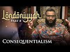

# Londoniyyah - Part 8 - Consequentialism | Mohammad Hijab (2021-11-25)

## Description

Londoniyyah - Part 8 - Consequentialism | Mohammad Hijab

To be updated about our content please subscribe and open the notifications.
----
BOOK A LIGHTHOUSE MENTOR

Are you or someone you know doubting Islam? Do you find yourself struggling to find answers?  Do you have a hard time speaking to someone about Islam?  Are you considering Islam but are unsure about certain concepts?  Are you an activist, Imam or community leader who is unsure about how to handle questions related to science, philosophy, the Islamic moral code, etc.?

You are not alone.  Over the course of the last decade or more there has been a rapid proliferation of content online and in academic institutions that has eroded the faith of some people.

Seeing the rise of  this phenomenon , Sapience Institute is introducing a One to One mentoring service called LIGHTHOUSE.

BOOK A MENTOR HERE: https://sapienceinstitute.org/lighthouse/

VISIT our website for articles in English, Spanish and Turkish; mentoring service, learning platform and for speaker requests: https://sapienceinstitute.org/

## Summary of [Londoniyyah - Part 8 - Consequentialism | Mohammad Hijab](https://www.youtube.com/watch?v=glKm5OQ1OFs)

*This summary is AI generated - there may be inaccuracies. *

### [00:00:00](https://www.youtube.com/watch?v=glKm5OQ1OFs&t=0) - [00:40:00](https://www.youtube.com/watch?v=glKm5OQ1OFs&t=2400)

Consequentialism is a philosophical theory that holds that the right action is the one that has the best consequences.  Mohammad Hijab discusses the merits and demerits of consequentialism. He points out that consequentialism solves some of the problems of deontological ethics, but that it can also lead to wrong decisions.

**[00:00:00](https://www.youtube.com/watch?v=glKm5OQ1OFs&t=0)** In this eighth video in a series, Mohammad Hijab discusses consequentialism. Consequentialism holds that the right action is the one that has the best consequences, and utilitarianism is a form of consequentialism. Deontological ethics, the opposite of consequentialism, says that actions have intrinsic value.
* **[00:05:00](https://www.youtube.com/watch?v=glKm5OQ1OFs&t=300)** Consequentialism, a philosophical theory that justifies the means by considering the consequences of an action, can replace desirability with anything else. There are different types of consequentialism, each with a different premise, and each with its own arguments.
* **[00:10:00](https://www.youtube.com/watch?v=glKm5OQ1OFs&t=600)**  Mohammad Hijab discusses the merits and demerits of consequentialism. He points out that consequentialism solves some of the problems of deontological ethics--namely, that you can never lie, and that the consequences of our actions always matter. He also discusses how consequentialism is based in the future, and how one can use the past to make decisions about the present. Finally, he discusses how consequentialism can lead to wrong decisions, and how it requires people to weigh probabilities and consequences.
* **[00:15:00](https://www.youtube.com/watch?v=glKm5OQ1OFs&t=900)** Mohammad Hijab discusses the justification for consequentialism, which is that any step in the right direction is justified. He points out that there is a difference between desirability and desire, and that the naturalistic fallacy can occur when trying to justify something based on its desirability alone. David Hume argued that it is desirable because we desire it, which is a form of the naturalistic fallacy.
* **[00:20:00](https://www.youtube.com/watch?v=glKm5OQ1OFs&t=1200)* Discusses the philosophical concept of consequentialism, which holds that the consequences of an action are the only legitimate measure of its morality. David Hume argued that if something is based on a naturalistic fallacy, then it cannot be morally good. Sam Harris, a prominent ethicist, has argued that it is morally acceptable to kill disabled children because the pain is more than the pleasure they experience. Peter Singer, another utilitarian, has said that it is morally equivalent to killing a child thousands of miles away. Anthony Joshua, a professional boxer, has said that he believes in full consequentialism, which holds that the consequences of an action are the only legitimate measure of its morality.
* **[00:25:00](https://www.youtube.com/watch?v=glKm5OQ1OFs&t=1500)**  Mohammad Hijab discusses consequentialism and its flaws. He points out that, because of the principle of intention, some actions (such as murder) are treated the same regardless of the consequences. He also discusses the Islamic Sharia system, which is based on consequentialism.
* **[00:30:00](https://www.youtube.com/watch?v=glKm5OQ1OFs&t=1800)** presents three principles that consequentialists should consider in order to make sound decisions: that the action must have a significant impact on the whole Muslim community, that it must be certain to happen, and that it must be a necessary action in order to protect important aspects of Islam. He provides an example from Islamic history of a situation in which it was justified to use human shields.
* **[00:35:00](https://www.youtube.com/watch?v=glKm5OQ1OFs&t=2100)**  Mohammad Hijab discusses the principle of islamic consequentialism, which states that actions must be taken in order to achieve the best possible outcome for as many people as possible. He discusses the case of Aisha, who was nine years old when Prophet Muhammad married her, and points out that there is both scholarly and moral justification for this marriage. He argues that, in order to be consequentialist, one must first demonstrate that harm will result from the action in question. If this is shown to be the case, then the action is justified.
* **[00:40:00](https://www.youtube.com/watch?v=glKm5OQ1OFs&t=2400)** explains the principle of consequentialism and argues that because it is context-specific, it is not universally applicable. They go on to discuss the history of feminism and how it changed due to education. They conclude by saying that, in today's age, it is important to be aware of the different approaches to ethics and to be able to differentiate between them.

<h2>Full transcript with timestamps: CLICK TO EXPAND</h2>

[0:00:13](https://youtu.be/glKm5OQ1OFs?t=13) to the eighth session of this course  
[0:00:16](https://youtu.be/glKm5OQ1OFs?t=16) today we're going to be talking about  
[0:00:17](https://youtu.be/glKm5OQ1OFs?t=17) consequentialism  
[0:00:18](https://youtu.be/glKm5OQ1OFs?t=18) and we've already spoken about  
[0:00:19](https://youtu.be/glKm5OQ1OFs?t=19) utilitarianism which is a form of  
[0:00:22](https://youtu.be/glKm5OQ1OFs?t=22) consequentialism and we're going to be  
[0:00:23](https://youtu.be/glKm5OQ1OFs?t=23) speaking about how that is so  
[0:00:25](https://youtu.be/glKm5OQ1OFs?t=25) and in the previous session we spoke  
[0:00:26](https://youtu.be/glKm5OQ1OFs?t=26) about deontological ethics which in many  
[0:00:28](https://youtu.be/glKm5OQ1OFs?t=28) ways is the opposite of consequentialism  
[0:00:31](https://youtu.be/glKm5OQ1OFs?t=31) or the main competitor to  
[0:00:33](https://youtu.be/glKm5OQ1OFs?t=33) consequentialism  
[0:00:34](https://youtu.be/glKm5OQ1OFs?t=34) so before we start we're going to read  
[0:00:36](https://youtu.be/glKm5OQ1OFs?t=36) as per tradition  
[0:00:38](https://youtu.be/glKm5OQ1OFs?t=38) the parts of the poems over the poem  
[0:00:40](https://youtu.be/glKm5OQ1OFs?t=40) which is applicable here  
[0:00:42](https://youtu.be/glKm5OQ1OFs?t=42) first luffy  
[0:01:03](https://youtu.be/glKm5OQ1OFs?t=63) right so consequentialism  
[0:01:06](https://youtu.be/glKm5OQ1OFs?t=66) what is consequentialism we have uh some  
[0:01:09](https://youtu.be/glKm5OQ1OFs?t=69) kind of definition here in the first  
[0:01:10](https://youtu.be/glKm5OQ1OFs?t=70) slide so let's read that  
[0:01:11](https://youtu.be/glKm5OQ1OFs?t=71) of all the things a person might do at  
[0:01:13](https://youtu.be/glKm5OQ1OFs?t=73) any given moment the morally right  
[0:01:15](https://youtu.be/glKm5OQ1OFs?t=75) action is the one with the best overall  
[0:01:17](https://youtu.be/glKm5OQ1OFs?t=77) consequences to put this in more  
[0:01:19](https://youtu.be/glKm5OQ1OFs?t=79) succinct terms  
[0:01:20](https://youtu.be/glKm5OQ1OFs?t=80) if action x causes y consequence then x  
[0:01:23](https://youtu.be/glKm5OQ1OFs?t=83) action is morally justified  
[0:01:25](https://youtu.be/glKm5OQ1OFs?t=85) now this as we've kind of just alluded  
[0:01:27](https://youtu.be/glKm5OQ1OFs?t=87) to in a sec a second ago  
[0:01:29](https://youtu.be/glKm5OQ1OFs?t=89) is the opposite of the ontological  
[0:01:31](https://youtu.be/glKm5OQ1OFs?t=91) ethics deontological ethics says that an  
[0:01:33](https://youtu.be/glKm5OQ1OFs?t=93) action has intrinsic value you're doing  
[0:01:35](https://youtu.be/glKm5OQ1OFs?t=95) it because it's good in and of itself  
[0:01:38](https://youtu.be/glKm5OQ1OFs?t=98) okay it's you don't lie because lying is  
[0:01:41](https://youtu.be/glKm5OQ1OFs?t=101) wrong in and of itself you don't break  
[0:01:44](https://youtu.be/glKm5OQ1OFs?t=104) promises because breaking promises is  
[0:01:45](https://youtu.be/glKm5OQ1OFs?t=105) wrong in and of itself  
[0:01:47](https://youtu.be/glKm5OQ1OFs?t=107) you don't uh waste your talents he said  
[0:01:50](https://youtu.be/glKm5OQ1OFs?t=110) uh can said because wasting your talents  
[0:01:52](https://youtu.be/glKm5OQ1OFs?t=112) is wrong in and of itself  
[0:01:54](https://youtu.be/glKm5OQ1OFs?t=114) you don't commit suicide can't mention  
[0:01:56](https://youtu.be/glKm5OQ1OFs?t=116) because committing suicide is wrong in  
[0:01:58](https://youtu.be/glKm5OQ1OFs?t=118) and of itself  
[0:02:00](https://youtu.be/glKm5OQ1OFs?t=120) why did can't come to this conclusion  
[0:02:01](https://youtu.be/glKm5OQ1OFs?t=121) because he used a categorical imperative  
[0:02:04](https://youtu.be/glKm5OQ1OFs?t=124) and a universalizing maxim  
[0:02:06](https://youtu.be/glKm5OQ1OFs?t=126) he said if everyone in society does this  
[0:02:10](https://youtu.be/glKm5OQ1OFs?t=130) for example lying it will cause an  
[0:02:11](https://youtu.be/glKm5OQ1OFs?t=131) impossible dysfunctional society  
[0:02:14](https://youtu.be/glKm5OQ1OFs?t=134) therefore the action in and of itself is  
[0:02:17](https://youtu.be/glKm5OQ1OFs?t=137) wrong  
[0:02:18](https://youtu.be/glKm5OQ1OFs?t=138) now the consequentialists will say  
[0:02:20](https://youtu.be/glKm5OQ1OFs?t=140) this is problematic because there are  
[0:02:22](https://youtu.be/glKm5OQ1OFs?t=142) examples where  
[0:02:23](https://youtu.be/glKm5OQ1OFs?t=143) for example the layer example that we  
[0:02:26](https://youtu.be/glKm5OQ1OFs?t=146) gave in the in the previous uh session  
[0:02:28](https://youtu.be/glKm5OQ1OFs?t=148) that the consequences of said action can  
[0:02:31](https://youtu.be/glKm5OQ1OFs?t=151) cause  
[0:02:32](https://youtu.be/glKm5OQ1OFs?t=152) a more severe outcome for example if you  
[0:02:35](https://youtu.be/glKm5OQ1OFs?t=155) don't lie sometimes  
[0:02:36](https://youtu.be/glKm5OQ1OFs?t=156) then you can die  
[0:02:40](https://youtu.be/glKm5OQ1OFs?t=160) like we see this actually it's not it's  
[0:02:41](https://youtu.be/glKm5OQ1OFs?t=161) not a abstract thing this is not  
[0:02:44](https://youtu.be/glKm5OQ1OFs?t=164) hypothetical we see people  
[0:02:46](https://youtu.be/glKm5OQ1OFs?t=166) for example being forced to say i  
[0:02:48](https://youtu.be/glKm5OQ1OFs?t=168) believe my god is bashar al-assad or  
[0:02:50](https://youtu.be/glKm5OQ1OFs?t=170) something or if you don't say this will  
[0:02:51](https://youtu.be/glKm5OQ1OFs?t=171) shoot you to death it will say that uh  
[0:02:53](https://youtu.be/glKm5OQ1OFs?t=173) krishna is your god or something these  
[0:02:55](https://youtu.be/glKm5OQ1OFs?t=175) muslim minorities are being persecuted  
[0:02:58](https://youtu.be/glKm5OQ1OFs?t=178) in india and obviously they don't  
[0:02:59](https://youtu.be/glKm5OQ1OFs?t=179) believe that  
[0:03:00](https://youtu.be/glKm5OQ1OFs?t=180) that is the case but if you don't say  
[0:03:02](https://youtu.be/glKm5OQ1OFs?t=182) this will kill you  
[0:03:03](https://youtu.be/glKm5OQ1OFs?t=183) now on this ethic you actually don't you  
[0:03:06](https://youtu.be/glKm5OQ1OFs?t=186) can't say that on this ethic and in any  
[0:03:08](https://youtu.be/glKm5OQ1OFs?t=188) way shape or form the ontological ethic  
[0:03:11](https://youtu.be/glKm5OQ1OFs?t=191) but the consequentialist ethic will say  
[0:03:13](https://youtu.be/glKm5OQ1OFs?t=193) actually the consequences of not saying  
[0:03:14](https://youtu.be/glKm5OQ1OFs?t=194) this is death and therefore  
[0:03:17](https://youtu.be/glKm5OQ1OFs?t=197) it's completely justified for you to lie  
[0:03:18](https://youtu.be/glKm5OQ1OFs?t=198) at this point which we would agree with  
[0:03:20](https://youtu.be/glKm5OQ1OFs?t=200) of course as muslims because we do have  
[0:03:22](https://youtu.be/glKm5OQ1OFs?t=202) as we'll come to see  
[0:03:24](https://youtu.be/glKm5OQ1OFs?t=204) uh what i refer to as sharia  
[0:03:25](https://youtu.be/glKm5OQ1OFs?t=205) consequentialism there are aspects of  
[0:03:27](https://youtu.be/glKm5OQ1OFs?t=207) the sharia which accord with a certain  
[0:03:30](https://youtu.be/glKm5OQ1OFs?t=210) consequence however the question is  
[0:03:32](https://youtu.be/glKm5OQ1OFs?t=212) when it comes to consequentialism what  
[0:03:34](https://youtu.be/glKm5OQ1OFs?t=214) is the base and what differentiates  
[0:03:36](https://youtu.be/glKm5OQ1OFs?t=216) consequentialism from utilitarianism  
[0:03:39](https://youtu.be/glKm5OQ1OFs?t=219) utilitarianism what is the master  
[0:03:41](https://youtu.be/glKm5OQ1OFs?t=221) question  
[0:03:42](https://youtu.be/glKm5OQ1OFs?t=222) what are the two things which we must  
[0:03:44](https://youtu.be/glKm5OQ1OFs?t=224) consider when making a decision on  
[0:03:47](https://youtu.be/glKm5OQ1OFs?t=227) utilitarian grounds  
[0:03:50](https://youtu.be/glKm5OQ1OFs?t=230) that's true but before that there's  
[0:03:52](https://youtu.be/glKm5OQ1OFs?t=232) something more fundamental  
[0:03:54](https://youtu.be/glKm5OQ1OFs?t=234) pain and pleasure okay  
[0:03:56](https://youtu.be/glKm5OQ1OFs?t=236) so you have two lords bentham said  
[0:03:59](https://youtu.be/glKm5OQ1OFs?t=239) you have the lord of pain and you have  
[0:04:00](https://youtu.be/glKm5OQ1OFs?t=240) the lord of pleasure and then as you've  
[0:04:02](https://youtu.be/glKm5OQ1OFs?t=242) mentioned  
[0:04:03](https://youtu.be/glKm5OQ1OFs?t=243) we discuss we discover what is the  
[0:04:06](https://youtu.be/glKm5OQ1OFs?t=246) greatest pain greatest pleasure for the  
[0:04:08](https://youtu.be/glKm5OQ1OFs?t=248) greatest number of people so you've got  
[0:04:10](https://youtu.be/glKm5OQ1OFs?t=250) two steps you've got what what pain and  
[0:04:12](https://youtu.be/glKm5OQ1OFs?t=252) pleasure is and then we call it  
[0:04:14](https://youtu.be/glKm5OQ1OFs?t=254) desirability for the sake of argument  
[0:04:16](https://youtu.be/glKm5OQ1OFs?t=256) and then you've got you know the  
[0:04:18](https://youtu.be/glKm5OQ1OFs?t=258) greatest good for the greatest number  
[0:04:20](https://youtu.be/glKm5OQ1OFs?t=260) now it doesn't have to be that you start  
[0:04:22](https://youtu.be/glKm5OQ1OFs?t=262) with desirability  
[0:04:25](https://youtu.be/glKm5OQ1OFs?t=265) you could start off by talking about  
[0:04:27](https://youtu.be/glKm5OQ1OFs?t=267) welfare  
[0:04:28](https://youtu.be/glKm5OQ1OFs?t=268) you could start off by talking about  
[0:04:31](https://youtu.be/glKm5OQ1OFs?t=271) instead of it being pain and pleasure  
[0:04:32](https://youtu.be/glKm5OQ1OFs?t=272) you can replace pain and pleasure with  
[0:04:34](https://youtu.be/glKm5OQ1OFs?t=274) anything  
[0:04:35](https://youtu.be/glKm5OQ1OFs?t=275) and still have a consequentialist  
[0:04:36](https://youtu.be/glKm5OQ1OFs?t=276) ideology  
[0:04:38](https://youtu.be/glKm5OQ1OFs?t=278) so you can say if it's about economic  
[0:04:40](https://youtu.be/glKm5OQ1OFs?t=280) growth  
[0:04:41](https://youtu.be/glKm5OQ1OFs?t=281) we are trying to create economic growth  
[0:04:45](https://youtu.be/glKm5OQ1OFs?t=285) so anything which creates economic  
[0:04:47](https://youtu.be/glKm5OQ1OFs?t=287) growth the ends justify the means  
[0:04:50](https://youtu.be/glKm5OQ1OFs?t=290) for example  
[0:04:51](https://youtu.be/glKm5OQ1OFs?t=291) so the reason what differentiates  
[0:04:53](https://youtu.be/glKm5OQ1OFs?t=293) utilitarianism from consequentialism  
[0:04:55](https://youtu.be/glKm5OQ1OFs?t=295) more generally is that utilitarianism  
[0:04:57](https://youtu.be/glKm5OQ1OFs?t=297) very strictly starts off with  
[0:04:59](https://youtu.be/glKm5OQ1OFs?t=299) desirability as the premise whereas  
[0:05:02](https://youtu.be/glKm5OQ1OFs?t=302) consequentialism can replace  
[0:05:03](https://youtu.be/glKm5OQ1OFs?t=303) desirability with anything else  
[0:05:05](https://youtu.be/glKm5OQ1OFs?t=305) can replace it with economic growth can  
[0:05:07](https://youtu.be/glKm5OQ1OFs?t=307) replace it with we want a society where  
[0:05:09](https://youtu.be/glKm5OQ1OFs?t=309) we see uh the maximum number of ex in  
[0:05:12](https://youtu.be/glKm5OQ1OFs?t=312) society  
[0:05:14](https://youtu.be/glKm5OQ1OFs?t=314) you know uh families  
[0:05:16](https://youtu.be/glKm5OQ1OFs?t=316) you could have family consequentialism  
[0:05:18](https://youtu.be/glKm5OQ1OFs?t=318) you can have uh  
[0:05:19](https://youtu.be/glKm5OQ1OFs?t=319) for you know you just fill in the gaps  
[0:05:21](https://youtu.be/glKm5OQ1OFs?t=321) you can have something right it doesn't  
[0:05:22](https://youtu.be/glKm5OQ1OFs?t=322) have to be pain and pleasure  
[0:05:24](https://youtu.be/glKm5OQ1OFs?t=324) directly  
[0:05:26](https://youtu.be/glKm5OQ1OFs?t=326) so that's what differentiates  
[0:05:27](https://youtu.be/glKm5OQ1OFs?t=327) utilitarianism from consequentialism in  
[0:05:30](https://youtu.be/glKm5OQ1OFs?t=330) a sense consequentialism is the master  
[0:05:31](https://youtu.be/glKm5OQ1OFs?t=331) key category  
[0:05:33](https://youtu.be/glKm5OQ1OFs?t=333) and underneath it you have a  
[0:05:34](https://youtu.be/glKm5OQ1OFs?t=334) utilitarianism so utilitarianism  
[0:05:37](https://youtu.be/glKm5OQ1OFs?t=337) all utilitarians are consequentialists  
[0:05:38](https://youtu.be/glKm5OQ1OFs?t=338) but not all consequentialists are  
[0:05:40](https://youtu.be/glKm5OQ1OFs?t=340) utilitarians  
[0:05:41](https://youtu.be/glKm5OQ1OFs?t=341) very straightforward okay  
[0:05:44](https://youtu.be/glKm5OQ1OFs?t=344) now  
[0:05:50](https://youtu.be/glKm5OQ1OFs?t=350) there are different types of  
[0:05:51](https://youtu.be/glKm5OQ1OFs?t=351) consequentialism  
[0:05:53](https://youtu.be/glKm5OQ1OFs?t=353) so i've there's four here which i've  
[0:05:55](https://youtu.be/glKm5OQ1OFs?t=355) mentioned in the slides that you can see  
[0:05:58](https://youtu.be/glKm5OQ1OFs?t=358) rule consequentialism dual  
[0:06:00](https://youtu.be/glKm5OQ1OFs?t=360) consequentialism egoistic  
[0:06:02](https://youtu.be/glKm5OQ1OFs?t=362) consequentialism friendly  
[0:06:03](https://youtu.be/glKm5OQ1OFs?t=363) consequentialism now you can read those  
[0:06:05](https://youtu.be/glKm5OQ1OFs?t=365) definitions in your own time  
[0:06:07](https://youtu.be/glKm5OQ1OFs?t=367) but obviously all of those different  
[0:06:08](https://youtu.be/glKm5OQ1OFs?t=368) types of consequentialism start with a  
[0:06:11](https://youtu.be/glKm5OQ1OFs?t=371) different premise  
[0:06:13](https://youtu.be/glKm5OQ1OFs?t=373) egoism is a it's an ideology in and of  
[0:06:15](https://youtu.be/glKm5OQ1OFs?t=375) itself which will actually recover by  
[0:06:17](https://youtu.be/glKm5OQ1OFs?t=377) itself  
[0:06:18](https://youtu.be/glKm5OQ1OFs?t=378) egoism is the idea ethical egoism is  
[0:06:20](https://youtu.be/glKm5OQ1OFs?t=380) that you should do whatever is in your  
[0:06:22](https://youtu.be/glKm5OQ1OFs?t=382) best interest  
[0:06:23](https://youtu.be/glKm5OQ1OFs?t=383) this is uh propounded by someone like  
[0:06:25](https://youtu.be/glKm5OQ1OFs?t=385) ayn rand  
[0:06:26](https://youtu.be/glKm5OQ1OFs?t=386) she's a woman who  
[0:06:28](https://youtu.be/glKm5OQ1OFs?t=388) had different  
[0:06:30](https://youtu.be/glKm5OQ1OFs?t=390) philosophies but this was one of them  
[0:06:31](https://youtu.be/glKm5OQ1OFs?t=391) she was an ethical legalist so anything  
[0:06:33](https://youtu.be/glKm5OQ1OFs?t=393) that is in your it's the opposite of  
[0:06:35](https://youtu.be/glKm5OQ1OFs?t=395) altruism anything that is in your best  
[0:06:37](https://youtu.be/glKm5OQ1OFs?t=397) interest that's the good thing to do  
[0:06:39](https://youtu.be/glKm5OQ1OFs?t=399) so ethical consequential egoistic  
[0:06:42](https://youtu.be/glKm5OQ1OFs?t=402) consequentialism  
[0:06:44](https://youtu.be/glKm5OQ1OFs?t=404) is an expansion of that now  
[0:06:46](https://youtu.be/glKm5OQ1OFs?t=406) but there you can have as john mackie  
[0:06:48](https://youtu.be/glKm5OQ1OFs?t=408) mentions in his book you can with this  
[0:06:49](https://youtu.be/glKm5OQ1OFs?t=409) you can have contradictions  
[0:06:51](https://youtu.be/glKm5OQ1OFs?t=411) because sometimes you can you can  
[0:06:53](https://youtu.be/glKm5OQ1OFs?t=413) you want something  
[0:06:55](https://youtu.be/glKm5OQ1OFs?t=415) but it's in contradiction with what  
[0:06:56](https://youtu.be/glKm5OQ1OFs?t=416) someone else wants and so the the the  
[0:06:59](https://youtu.be/glKm5OQ1OFs?t=419) consequences for the majority can  
[0:07:01](https://youtu.be/glKm5OQ1OFs?t=421) sometimes conflict with the consequences  
[0:07:03](https://youtu.be/glKm5OQ1OFs?t=423) for the individual  
[0:07:05](https://youtu.be/glKm5OQ1OFs?t=425) and these are the kinds of tensions that  
[0:07:07](https://youtu.be/glKm5OQ1OFs?t=427) you may find in consequentialist  
[0:07:09](https://youtu.be/glKm5OQ1OFs?t=429) ideology  
[0:07:11](https://youtu.be/glKm5OQ1OFs?t=431) now what i want you to think about with  
[0:07:12](https://youtu.be/glKm5OQ1OFs?t=432) the person next to you right now  
[0:07:15](https://youtu.be/glKm5OQ1OFs?t=435) is are the merits and demerits of  
[0:07:18](https://youtu.be/glKm5OQ1OFs?t=438) consequentialism what do you think makes  
[0:07:20](https://youtu.be/glKm5OQ1OFs?t=440) sense  
[0:07:21](https://youtu.be/glKm5OQ1OFs?t=441) about consequentialism especially in  
[0:07:22](https://youtu.be/glKm5OQ1OFs?t=442) conjunction with what we studied last  
[0:07:24](https://youtu.be/glKm5OQ1OFs?t=444) week or on saturday  
[0:07:26](https://youtu.be/glKm5OQ1OFs?t=446) what do you think makes sense about  
[0:07:27](https://youtu.be/glKm5OQ1OFs?t=447) consequentialism  
[0:07:29](https://youtu.be/glKm5OQ1OFs?t=449) and what do you think are already the  
[0:07:30](https://youtu.be/glKm5OQ1OFs?t=450) weaknesses of consequentialism let's try  
[0:07:32](https://youtu.be/glKm5OQ1OFs?t=452) and get the synapses uh working and  
[0:07:34](https://youtu.be/glKm5OQ1OFs?t=454) let's activate the schemata and let's  
[0:07:37](https://youtu.be/glKm5OQ1OFs?t=457) speak to the person next to us and let's  
[0:07:39](https://youtu.be/glKm5OQ1OFs?t=459) have three minutes and then we'll come  
[0:07:40](https://youtu.be/glKm5OQ1OFs?t=460) back  
[0:07:41](https://youtu.be/glKm5OQ1OFs?t=461) and see what you guys have to say okay  
[0:07:44](https://youtu.be/glKm5OQ1OFs?t=464) go ahead that's the problem yeah the  
[0:07:45](https://youtu.be/glKm5OQ1OFs?t=465) robin hood i think you can say  
[0:07:48](https://youtu.be/glKm5OQ1OFs?t=468) so  
[0:07:49](https://youtu.be/glKm5OQ1OFs?t=469) if you have um a majority of poor people  
[0:07:53](https://youtu.be/glKm5OQ1OFs?t=473) and to feed them you're gonna steal from  
[0:07:55](https://youtu.be/glKm5OQ1OFs?t=475) the rich or do something that's against  
[0:07:58](https://youtu.be/glKm5OQ1OFs?t=478) the law  
[0:07:59](https://youtu.be/glKm5OQ1OFs?t=479) that's um a form of consequentialism i'd  
[0:08:03](https://youtu.be/glKm5OQ1OFs?t=483) say the ends justify the means yes  
[0:08:05](https://youtu.be/glKm5OQ1OFs?t=485) correct this is actually it's mentioned  
[0:08:07](https://youtu.be/glKm5OQ1OFs?t=487) in the literature quite quite often  
[0:08:09](https://youtu.be/glKm5OQ1OFs?t=489) actually but consequentialists do have a  
[0:08:11](https://youtu.be/glKm5OQ1OFs?t=491) reply to this  
[0:08:13](https://youtu.be/glKm5OQ1OFs?t=493) and the reply that they usually use is  
[0:08:14](https://youtu.be/glKm5OQ1OFs?t=494) that  
[0:08:16](https://youtu.be/glKm5OQ1OFs?t=496) if the consequences of theft  
[0:08:19](https://youtu.be/glKm5OQ1OFs?t=499) for example as a whole to the society  
[0:08:21](https://youtu.be/glKm5OQ1OFs?t=501) are worse than the money that you'd be  
[0:08:23](https://youtu.be/glKm5OQ1OFs?t=503) given the poor people because a a  
[0:08:26](https://youtu.be/glKm5OQ1OFs?t=506) a society that has plunged into like uh  
[0:08:29](https://youtu.be/glKm5OQ1OFs?t=509) anarchical system of people stealing  
[0:08:31](https://youtu.be/glKm5OQ1OFs?t=511) from each other  
[0:08:33](https://youtu.be/glKm5OQ1OFs?t=513) is worse than so they'll make that  
[0:08:35](https://youtu.be/glKm5OQ1OFs?t=515) argument but this is definitely a very  
[0:08:37](https://youtu.be/glKm5OQ1OFs?t=517) valid point  
[0:08:38](https://youtu.be/glKm5OQ1OFs?t=518) and i don't see why you can't make the  
[0:08:39](https://youtu.be/glKm5OQ1OFs?t=519) argument as a consequentialist that you  
[0:08:41](https://youtu.be/glKm5OQ1OFs?t=521) know theft  
[0:08:42](https://youtu.be/glKm5OQ1OFs?t=522) because it doesn't justify the means  
[0:08:44](https://youtu.be/glKm5OQ1OFs?t=524) uh thefts can be uh at least acceptable  
[0:08:47](https://youtu.be/glKm5OQ1OFs?t=527) in some circumstances maybe not in all  
[0:08:49](https://youtu.be/glKm5OQ1OFs?t=529) circumstances but in some  
[0:08:51](https://youtu.be/glKm5OQ1OFs?t=531) circumstances and you can see the  
[0:08:53](https://youtu.be/glKm5OQ1OFs?t=533) compatibility therefore between  
[0:08:55](https://youtu.be/glKm5OQ1OFs?t=535) consequentialism and socialism for  
[0:08:57](https://youtu.be/glKm5OQ1OFs?t=537) example or even communism you know it's  
[0:08:59](https://youtu.be/glKm5OQ1OFs?t=539) not incompatible for consequentialism to  
[0:09:01](https://youtu.be/glKm5OQ1OFs?t=541) be  
[0:09:02](https://youtu.be/glKm5OQ1OFs?t=542) uh to be coupled with i one of those two  
[0:09:04](https://youtu.be/glKm5OQ1OFs?t=544) left  
[0:09:06](https://youtu.be/glKm5OQ1OFs?t=546) ideal what we do have by the way  
[0:09:08](https://youtu.be/glKm5OQ1OFs?t=548) sessions on marxism as well so yeah  
[0:09:11](https://youtu.be/glKm5OQ1OFs?t=551) like um the term was  
[0:09:13](https://youtu.be/glKm5OQ1OFs?t=553) i think you mentioned tyranny of the  
[0:09:15](https://youtu.be/glKm5OQ1OFs?t=555) majority yes in this case it would be  
[0:09:17](https://youtu.be/glKm5OQ1OFs?t=557) tyranny of the minority where you've got  
[0:09:20](https://youtu.be/glKm5OQ1OFs?t=560) a small amount of um  
[0:09:22](https://youtu.be/glKm5OQ1OFs?t=562) people who's hoarding all the money  
[0:09:25](https://youtu.be/glKm5OQ1OFs?t=565) uh that in that case that  
[0:09:26](https://youtu.be/glKm5OQ1OFs?t=566) consequentialism would be valid yeah so  
[0:09:29](https://youtu.be/glKm5OQ1OFs?t=569) this is and there's arguments to be made  
[0:09:31](https://youtu.be/glKm5OQ1OFs?t=571) on both sides so so the economic  
[0:09:33](https://youtu.be/glKm5OQ1OFs?t=573) arguments that are made  
[0:09:35](https://youtu.be/glKm5OQ1OFs?t=575) are usually made between supply-side  
[0:09:37](https://youtu.be/glKm5OQ1OFs?t=577) economists okay and what we call  
[0:09:39](https://youtu.be/glKm5OQ1OFs?t=579) key indian economists so supply-side  
[0:09:41](https://youtu.be/glKm5OQ1OFs?t=581) economies of which margaret thatcher was  
[0:09:43](https://youtu.be/glKm5OQ1OFs?t=583) one for example right the argument she  
[0:09:45](https://youtu.be/glKm5OQ1OFs?t=585) made  
[0:09:46](https://youtu.be/glKm5OQ1OFs?t=586) which is not completely false but there  
[0:09:48](https://youtu.be/glKm5OQ1OFs?t=588) are some issues of it which are you know  
[0:09:50](https://youtu.be/glKm5OQ1OFs?t=590) there are problems with it  
[0:09:52](https://youtu.be/glKm5OQ1OFs?t=592) is that when the gdp of a country gets  
[0:09:54](https://youtu.be/glKm5OQ1OFs?t=594) bigger  
[0:09:55](https://youtu.be/glKm5OQ1OFs?t=595) so in other words when you have more  
[0:09:56](https://youtu.be/glKm5OQ1OFs?t=596) rich people in the country  
[0:09:58](https://youtu.be/glKm5OQ1OFs?t=598) absolute poverty  
[0:10:00](https://youtu.be/glKm5OQ1OFs?t=600) is diminished more relative poverty of  
[0:10:02](https://youtu.be/glKm5OQ1OFs?t=602) course is is is is exacerbated so if if  
[0:10:07](https://youtu.be/glKm5OQ1OFs?t=607) yes or trickle down economics they call  
[0:10:08](https://youtu.be/glKm5OQ1OFs?t=608) it true for they call it trichoderma for  
[0:10:10](https://youtu.be/glKm5OQ1OFs?t=610) that reason so uh but it's interesting  
[0:10:13](https://youtu.be/glKm5OQ1OFs?t=613) because both  
[0:10:14](https://youtu.be/glKm5OQ1OFs?t=614) kind of left-leaning politicians as well  
[0:10:17](https://youtu.be/glKm5OQ1OFs?t=617) as as kind of like you know right-wing  
[0:10:19](https://youtu.be/glKm5OQ1OFs?t=619) economists or really liberal economists  
[0:10:22](https://youtu.be/glKm5OQ1OFs?t=622) yeah supply-side economists they both  
[0:10:24](https://youtu.be/glKm5OQ1OFs?t=624) make an argument from consequentialism  
[0:10:26](https://youtu.be/glKm5OQ1OFs?t=626) both of them make the same argument one  
[0:10:27](https://youtu.be/glKm5OQ1OFs?t=627) of them is saying that the consequences  
[0:10:29](https://youtu.be/glKm5OQ1OFs?t=629) of us  
[0:10:30](https://youtu.be/glKm5OQ1OFs?t=630) social socialist type structure  
[0:10:33](https://youtu.be/glKm5OQ1OFs?t=633) like the keynesian model is better  
[0:10:35](https://youtu.be/glKm5OQ1OFs?t=635) and the cons some other ones like uh  
[0:10:38](https://youtu.be/glKm5OQ1OFs?t=638) thatcher yeah uh adam smith uh  
[0:10:41](https://youtu.be/glKm5OQ1OFs?t=641) obviously he's a  
[0:10:43](https://youtu.be/glKm5OQ1OFs?t=643) philosopher  
[0:10:44](https://youtu.be/glKm5OQ1OFs?t=644) and they would make the argument that if  
[0:10:46](https://youtu.be/glKm5OQ1OFs?t=646) ever if if there are rich people in the  
[0:10:49](https://youtu.be/glKm5OQ1OFs?t=649) house  
[0:10:50](https://youtu.be/glKm5OQ1OFs?t=650) put imagine the house is economy  
[0:10:52](https://youtu.be/glKm5OQ1OFs?t=652) if there's rich people in the house and  
[0:10:54](https://youtu.be/glKm5OQ1OFs?t=654) the family then the whole family gets  
[0:10:55](https://youtu.be/glKm5OQ1OFs?t=655) richer  
[0:10:56](https://youtu.be/glKm5OQ1OFs?t=656) even though there's more inequality  
[0:10:58](https://youtu.be/glKm5OQ1OFs?t=658) between family members they're better  
[0:11:00](https://youtu.be/glKm5OQ1OFs?t=660) off yeah he's saying that the whole  
[0:11:02](https://youtu.be/glKm5OQ1OFs?t=662) country gets better off  
[0:11:04](https://youtu.be/glKm5OQ1OFs?t=664) so what a consequence say to you know he  
[0:11:06](https://youtu.be/glKm5OQ1OFs?t=666) said the tyranny of the majority  
[0:11:09](https://youtu.be/glKm5OQ1OFs?t=669) minority he said no no yeah but but the  
[0:11:11](https://youtu.be/glKm5OQ1OFs?t=671) tyranny of the minority is caused  
[0:11:13](https://youtu.be/glKm5OQ1OFs?t=673) because of the tyranny of the majority  
[0:11:15](https://youtu.be/glKm5OQ1OFs?t=675) because they are not spreading the funds  
[0:11:17](https://youtu.be/glKm5OQ1OFs?t=677) as they should which is causing the  
[0:11:19](https://youtu.be/glKm5OQ1OFs?t=679) terror of the minority having to have  
[0:11:20](https://youtu.be/glKm5OQ1OFs?t=680) people at robin hood yeah so that's what  
[0:11:22](https://youtu.be/glKm5OQ1OFs?t=682) that's what a socialist would argue  
[0:11:24](https://youtu.be/glKm5OQ1OFs?t=684) that's what someone like left-wing would  
[0:11:26](https://youtu.be/glKm5OQ1OFs?t=686) left-wing economist okay indian  
[0:11:27](https://youtu.be/glKm5OQ1OFs?t=687) economist would argue  
[0:11:29](https://youtu.be/glKm5OQ1OFs?t=689) marx would argue that of course  
[0:11:31](https://youtu.be/glKm5OQ1OFs?t=691) but his argument is more sophisticated  
[0:11:32](https://youtu.be/glKm5OQ1OFs?t=692) than that it's much more sophisticated  
[0:11:34](https://youtu.be/glKm5OQ1OFs?t=694) than that and that's why it needs a  
[0:11:36](https://youtu.be/glKm5OQ1OFs?t=696) separate treatment we have a separate  
[0:11:37](https://youtu.be/glKm5OQ1OFs?t=697) treatment for marx in fact his one's one  
[0:11:39](https://youtu.be/glKm5OQ1OFs?t=699) of the most difficult ones that we're  
[0:11:41](https://youtu.be/glKm5OQ1OFs?t=701) going to cover here because it requires  
[0:11:43](https://youtu.be/glKm5OQ1OFs?t=703) real thought uh he has a different  
[0:11:45](https://youtu.be/glKm5OQ1OFs?t=705) starting point yeah it's marxism is not  
[0:11:48](https://youtu.be/glKm5OQ1OFs?t=708) as easy to deconstruct as some of these  
[0:11:50](https://youtu.be/glKm5OQ1OFs?t=710) other ones  
[0:11:51](https://youtu.be/glKm5OQ1OFs?t=711) so yeah anything else from this side  
[0:11:54](https://youtu.be/glKm5OQ1OFs?t=714) merits and demerits by the way we're  
[0:11:56](https://youtu.be/glKm5OQ1OFs?t=716) talking about it  
[0:11:59](https://youtu.be/glKm5OQ1OFs?t=719) yeah so um we said one of the merits was  
[0:12:00](https://youtu.be/glKm5OQ1OFs?t=720) that it gets rid of all of the problems  
[0:12:02](https://youtu.be/glKm5OQ1OFs?t=722) of absolutes  
[0:12:04](https://youtu.be/glKm5OQ1OFs?t=724) so basically all of the negatives from  
[0:12:06](https://youtu.be/glKm5OQ1OFs?t=726) deontological ethics are kind of solved  
[0:12:08](https://youtu.be/glKm5OQ1OFs?t=728) through yes it's a very straightforward  
[0:12:09](https://youtu.be/glKm5OQ1OFs?t=729) it's a low-lying fruit and it's correct  
[0:12:11](https://youtu.be/glKm5OQ1OFs?t=731) so for example some of the things that  
[0:12:12](https://youtu.be/glKm5OQ1OFs?t=732) we saw the tensions that we saw with  
[0:12:14](https://youtu.be/glKm5OQ1OFs?t=734) deontological ethics for example you can  
[0:12:16](https://youtu.be/glKm5OQ1OFs?t=736) never lie but we're in a situation where  
[0:12:18](https://youtu.be/glKm5OQ1OFs?t=738) someone's about to die and so on that  
[0:12:20](https://youtu.be/glKm5OQ1OFs?t=740) that is solved in a sense  
[0:12:22](https://youtu.be/glKm5OQ1OFs?t=742) because we do consider the consequences  
[0:12:24](https://youtu.be/glKm5OQ1OFs?t=744) with this ethic  
[0:12:28](https://youtu.be/glKm5OQ1OFs?t=748) or like for example if someone says i'm  
[0:12:30](https://youtu.be/glKm5OQ1OFs?t=750) a consequentialist  
[0:12:32](https://youtu.be/glKm5OQ1OFs?t=752) and then can we say to them that okay so  
[0:12:35](https://youtu.be/glKm5OQ1OFs?t=755) to your world view  
[0:12:36](https://youtu.be/glKm5OQ1OFs?t=756) you will accept that for example  
[0:12:39](https://youtu.be/glKm5OQ1OFs?t=759) america bombing nagasaki hiroshima  
[0:12:42](https://youtu.be/glKm5OQ1OFs?t=762) to kill civilians to protect their own  
[0:12:44](https://youtu.be/glKm5OQ1OFs?t=764) people yeah no but this is difficult i  
[0:12:46](https://youtu.be/glKm5OQ1OFs?t=766) wouldn't use that example the reason why  
[0:12:48](https://youtu.be/glKm5OQ1OFs?t=768) i wouldn't use that example is because  
[0:12:49](https://youtu.be/glKm5OQ1OFs?t=769) you can make arguments for and against  
[0:12:50](https://youtu.be/glKm5OQ1OFs?t=770) just like the economic example because  
[0:12:52](https://youtu.be/glKm5OQ1OFs?t=772) if they will say look there's nothing  
[0:12:54](https://youtu.be/glKm5OQ1OFs?t=774) that justifies the killing of that many  
[0:12:56](https://youtu.be/glKm5OQ1OFs?t=776) people and in fact a nuclear  
[0:12:59](https://youtu.be/glKm5OQ1OFs?t=779) attack like this which could which could  
[0:13:02](https://youtu.be/glKm5OQ1OFs?t=782) which could  
[0:13:03](https://youtu.be/glKm5OQ1OFs?t=783) merit a response  
[0:13:06](https://youtu.be/glKm5OQ1OFs?t=786) okay that is the consequences for  
[0:13:08](https://youtu.be/glKm5OQ1OFs?t=788) society are  
[0:13:10](https://youtu.be/glKm5OQ1OFs?t=790) uh overall in in the negative  
[0:13:12](https://youtu.be/glKm5OQ1OFs?t=792) so a consequentialist could as as easily  
[0:13:15](https://youtu.be/glKm5OQ1OFs?t=795) say  
[0:13:16](https://youtu.be/glKm5OQ1OFs?t=796) okay  
[0:13:17](https://youtu.be/glKm5OQ1OFs?t=797) that  
[0:13:18](https://youtu.be/glKm5OQ1OFs?t=798) this is not good on consequentialism as  
[0:13:19](https://youtu.be/glKm5OQ1OFs?t=799) they you can make an argument for  
[0:13:20](https://youtu.be/glKm5OQ1OFs?t=800) consequentialism that is good uncle's  
[0:13:22](https://youtu.be/glKm5OQ1OFs?t=802) questions the the the missing component  
[0:13:24](https://youtu.be/glKm5OQ1OFs?t=804) here is as follows yeah  
[0:13:26](https://youtu.be/glKm5OQ1OFs?t=806) no one knows the future  
[0:13:28](https://youtu.be/glKm5OQ1OFs?t=808) this is the missing component like i  
[0:13:30](https://youtu.be/glKm5OQ1OFs?t=810) don't know what's going to happen in the  
[0:13:31](https://youtu.be/glKm5OQ1OFs?t=811) future okay  
[0:13:33](https://youtu.be/glKm5OQ1OFs?t=813) and because i don't know what's going to  
[0:13:34](https://youtu.be/glKm5OQ1OFs?t=814) happen in the future i don't know if i  
[0:13:35](https://youtu.be/glKm5OQ1OFs?t=815) do action x whether that's going to have  
[0:13:37](https://youtu.be/glKm5OQ1OFs?t=817) consequence why or not so what we what  
[0:13:40](https://youtu.be/glKm5OQ1OFs?t=820) people have to do  
[0:13:42](https://youtu.be/glKm5OQ1OFs?t=822) in society and economy and politics and  
[0:13:44](https://youtu.be/glKm5OQ1OFs?t=824) so on even a family  
[0:13:46](https://youtu.be/glKm5OQ1OFs?t=826) is that they actually have to weigh  
[0:13:47](https://youtu.be/glKm5OQ1OFs?t=827) things up  
[0:13:48](https://youtu.be/glKm5OQ1OFs?t=828) and that's a very natural thing to do  
[0:13:50](https://youtu.be/glKm5OQ1OFs?t=830) how probable is it  
[0:13:53](https://youtu.be/glKm5OQ1OFs?t=833) that if i do x  
[0:13:55](https://youtu.be/glKm5OQ1OFs?t=835) that y will happen negative consequence  
[0:13:58](https://youtu.be/glKm5OQ1OFs?t=838) on the flip side how probable is it that  
[0:14:00](https://youtu.be/glKm5OQ1OFs?t=840) if i do y z will happen positive  
[0:14:03](https://youtu.be/glKm5OQ1OFs?t=843) consequence  
[0:14:04](https://youtu.be/glKm5OQ1OFs?t=844) and this is the difficult thing that we  
[0:14:07](https://youtu.be/glKm5OQ1OFs?t=847) all actually do in our daily lives i  
[0:14:08](https://youtu.be/glKm5OQ1OFs?t=848) mean  
[0:14:10](https://youtu.be/glKm5OQ1OFs?t=850) the simple hebrews  
[0:14:12](https://youtu.be/glKm5OQ1OFs?t=852) like  
[0:14:13](https://youtu.be/glKm5OQ1OFs?t=853) it wasn't it was to prove that  
[0:14:15](https://youtu.be/glKm5OQ1OFs?t=855) consequentialism is  
[0:14:17](https://youtu.be/glKm5OQ1OFs?t=857) is it can be wrong  
[0:14:20](https://youtu.be/glKm5OQ1OFs?t=860) so the we know that  
[0:14:22](https://youtu.be/glKm5OQ1OFs?t=862) nagasaki and hiroshima were bombed  
[0:14:25](https://youtu.be/glKm5OQ1OFs?t=865) knowing that japan is already  
[0:14:27](https://youtu.be/glKm5OQ1OFs?t=867) surrendering right there  
[0:14:30](https://youtu.be/glKm5OQ1OFs?t=870) but we have hindsight now we can look  
[0:14:32](https://youtu.be/glKm5OQ1OFs?t=872) back yeah but when you're when you're  
[0:14:34](https://youtu.be/glKm5OQ1OFs?t=874) basing morality on consequentialist  
[0:14:36](https://youtu.be/glKm5OQ1OFs?t=876) ethics you're basing it in the future  
[0:14:38](https://youtu.be/glKm5OQ1OFs?t=878) sense you can use consequences you can  
[0:14:40](https://youtu.be/glKm5OQ1OFs?t=880) use the past yeah yeah that's what  
[0:14:42](https://youtu.be/glKm5OQ1OFs?t=882) that's the only thing you can use right  
[0:14:44](https://youtu.be/glKm5OQ1OFs?t=884) so but i i can do something wrong and  
[0:14:46](https://youtu.be/glKm5OQ1OFs?t=886) then you say against  
[0:14:48](https://youtu.be/glKm5OQ1OFs?t=888) just to justify look  
[0:14:51](https://youtu.be/glKm5OQ1OFs?t=891) this  
[0:14:51](https://youtu.be/glKm5OQ1OFs?t=891) was part it was part of the  
[0:14:54](https://youtu.be/glKm5OQ1OFs?t=894) yes it was part of the plan yeah how to  
[0:14:56](https://youtu.be/glKm5OQ1OFs?t=896) do it  
[0:14:56](https://youtu.be/glKm5OQ1OFs?t=896) yes yes yeah it makes sense yes it does  
[0:14:59](https://youtu.be/glKm5OQ1OFs?t=899) maybe it wasn't needed yeah yeah yeah  
[0:15:01](https://youtu.be/glKm5OQ1OFs?t=901) exactly you can always you could always  
[0:15:02](https://youtu.be/glKm5OQ1OFs?t=902) justify backwards  
[0:15:04](https://youtu.be/glKm5OQ1OFs?t=904) as well  
[0:15:05](https://youtu.be/glKm5OQ1OFs?t=905) yeah you're right about that but  
[0:15:06](https://youtu.be/glKm5OQ1OFs?t=906) what i was going to say was  
[0:15:09](https://youtu.be/glKm5OQ1OFs?t=909) there's something more fundamental here  
[0:15:10](https://youtu.be/glKm5OQ1OFs?t=910) that we need to think about right  
[0:15:12](https://youtu.be/glKm5OQ1OFs?t=912) we said that the the predicate base  
[0:15:15](https://youtu.be/glKm5OQ1OFs?t=915) of consequentialism  
[0:15:17](https://youtu.be/glKm5OQ1OFs?t=917) is say  
[0:15:19](https://youtu.be/glKm5OQ1OFs?t=919) on utilitarianism we said it's pain and  
[0:15:21](https://youtu.be/glKm5OQ1OFs?t=921) pleasure right  
[0:15:22](https://youtu.be/glKm5OQ1OFs?t=922) but on other systems like for example if  
[0:15:24](https://youtu.be/glKm5OQ1OFs?t=924) we talk about welfare economic growth  
[0:15:26](https://youtu.be/glKm5OQ1OFs?t=926) whatever it is that we're saying we're  
[0:15:28](https://youtu.be/glKm5OQ1OFs?t=928) going to start with  
[0:15:29](https://youtu.be/glKm5OQ1OFs?t=929) the question is going to always be why  
[0:15:31](https://youtu.be/glKm5OQ1OFs?t=931) should we start with that  
[0:15:34](https://youtu.be/glKm5OQ1OFs?t=934) what like we did with utilitarianism  
[0:15:36](https://youtu.be/glKm5OQ1OFs?t=936) right  
[0:15:37](https://youtu.be/glKm5OQ1OFs?t=937) we said was pain and pleasure the two  
[0:15:38](https://youtu.be/glKm5OQ1OFs?t=938) most important things they're the gods  
[0:15:41](https://youtu.be/glKm5OQ1OFs?t=941) that's what bentham said  
[0:15:42](https://youtu.be/glKm5OQ1OFs?t=942) yeah pain and pleasure of the two gods  
[0:15:45](https://youtu.be/glKm5OQ1OFs?t=945) okay why  
[0:15:47](https://youtu.be/glKm5OQ1OFs?t=947) why  
[0:15:48](https://youtu.be/glKm5OQ1OFs?t=948) david hume interestingly he said  
[0:15:49](https://youtu.be/glKm5OQ1OFs?t=949) something he said that if you ask  
[0:15:51](https://youtu.be/glKm5OQ1OFs?t=951) someone why they don't like pain there's  
[0:15:53](https://youtu.be/glKm5OQ1OFs?t=953) no answer after that  
[0:15:56](https://youtu.be/glKm5OQ1OFs?t=956) he said if you ask someone why you don't  
[0:15:58](https://youtu.be/glKm5OQ1OFs?t=958) like pain they will have there's no  
[0:16:00](https://youtu.be/glKm5OQ1OFs?t=960) it's such a base level thing that you  
[0:16:02](https://youtu.be/glKm5OQ1OFs?t=962) don't need to have an answer for it and  
[0:16:04](https://youtu.be/glKm5OQ1OFs?t=964) there is some truth in this and this  
[0:16:06](https://youtu.be/glKm5OQ1OFs?t=966) statement we're not we're not  
[0:16:07](https://youtu.be/glKm5OQ1OFs?t=967) disagreeing with that it is very  
[0:16:08](https://youtu.be/glKm5OQ1OFs?t=968) instinctive to believe that pain is bad  
[0:16:11](https://youtu.be/glKm5OQ1OFs?t=971) because it hurts you  
[0:16:12](https://youtu.be/glKm5OQ1OFs?t=972) yeah or in fact you can't say it because  
[0:16:13](https://youtu.be/glKm5OQ1OFs?t=973) it hurts me right  
[0:16:16](https://youtu.be/glKm5OQ1OFs?t=976) does that fall into that no this is more  
[0:16:18](https://youtu.be/glKm5OQ1OFs?t=978) consequentialism we're still on  
[0:16:19](https://youtu.be/glKm5OQ1OFs?t=979) consequentialism now what we're saying  
[0:16:21](https://youtu.be/glKm5OQ1OFs?t=981) is  
[0:16:22](https://youtu.be/glKm5OQ1OFs?t=982) what are the  
[0:16:24](https://youtu.be/glKm5OQ1OFs?t=984) consequent the consequences of what  
[0:16:26](https://youtu.be/glKm5OQ1OFs?t=986) we're trying to achieve  
[0:16:29](https://youtu.be/glKm5OQ1OFs?t=989) are we trying to achieve economic growth  
[0:16:31](https://youtu.be/glKm5OQ1OFs?t=991) are we trying to achieve okay we  
[0:16:33](https://youtu.be/glKm5OQ1OFs?t=993) the barometer for our success is how  
[0:16:35](https://youtu.be/glKm5OQ1OFs?t=995) many stable families there are on  
[0:16:37](https://youtu.be/glKm5OQ1OFs?t=997) society how many hospitals there are in  
[0:16:38](https://youtu.be/glKm5OQ1OFs?t=998) our society how many kitchens there are  
[0:16:41](https://youtu.be/glKm5OQ1OFs?t=1001) whatever it is  
[0:16:42](https://youtu.be/glKm5OQ1OFs?t=1002) whatever you start off with and say well  
[0:16:44](https://youtu.be/glKm5OQ1OFs?t=1004) if i want  
[0:16:45](https://youtu.be/glKm5OQ1OFs?t=1005) x  
[0:16:46](https://youtu.be/glKm5OQ1OFs?t=1006) then anything which goes against this  
[0:16:49](https://youtu.be/glKm5OQ1OFs?t=1009) in consequence negative or goes for it  
[0:16:51](https://youtu.be/glKm5OQ1OFs?t=1011) in positive consequence is  
[0:16:53](https://youtu.be/glKm5OQ1OFs?t=1013) a step towards the right direction  
[0:16:55](https://youtu.be/glKm5OQ1OFs?t=1015) wherever x is whatever this thing we're  
[0:16:57](https://youtu.be/glKm5OQ1OFs?t=1017) starting with how can that be justified  
[0:17:00](https://youtu.be/glKm5OQ1OFs?t=1020) i want economic growth why should we  
[0:17:02](https://youtu.be/glKm5OQ1OFs?t=1022) want  
[0:17:03](https://youtu.be/glKm5OQ1OFs?t=1023) profit maximization over even revenue  
[0:17:05](https://youtu.be/glKm5OQ1OFs?t=1025) maximization i mean there's a difference  
[0:17:07](https://youtu.be/glKm5OQ1OFs?t=1027) by the way in economics why should we  
[0:17:09](https://youtu.be/glKm5OQ1OFs?t=1029) want  
[0:17:10](https://youtu.be/glKm5OQ1OFs?t=1030) um  
[0:17:11](https://youtu.be/glKm5OQ1OFs?t=1031) why should we want uh desirability over  
[0:17:16](https://youtu.be/glKm5OQ1OFs?t=1036) a stable society  
[0:17:19](https://youtu.be/glKm5OQ1OFs?t=1039) why why is that the bar why is it yeah  
[0:17:21](https://youtu.be/glKm5OQ1OFs?t=1041) exactly yeah because because we talked  
[0:17:23](https://youtu.be/glKm5OQ1OFs?t=1043) about the consequences of that of  
[0:17:25](https://youtu.be/glKm5OQ1OFs?t=1045) pornography and alcohol yeah it's  
[0:17:27](https://youtu.be/glKm5OQ1OFs?t=1047) maximum pleasure but that's coming up  
[0:17:28](https://youtu.be/glKm5OQ1OFs?t=1048) consequences you know which we see i was  
[0:17:31](https://youtu.be/glKm5OQ1OFs?t=1051) reading a book called irreversible  
[0:17:32](https://youtu.be/glKm5OQ1OFs?t=1052) damage yeah and was talking about how  
[0:17:35](https://youtu.be/glKm5OQ1OFs?t=1055) you know depression and suicide in a lot  
[0:17:37](https://youtu.be/glKm5OQ1OFs?t=1057) of girls for example as well have  
[0:17:39](https://youtu.be/glKm5OQ1OFs?t=1059) increased so we live in a society of  
[0:17:40](https://youtu.be/glKm5OQ1OFs?t=1060) maximum pleasure but we've seen we're  
[0:17:42](https://youtu.be/glKm5OQ1OFs?t=1062) not seeing fruits you know we've seen  
[0:17:44](https://youtu.be/glKm5OQ1OFs?t=1064) rotten fruits if you so can we not say  
[0:17:46](https://youtu.be/glKm5OQ1OFs?t=1066) that your bar is maximum pleasure but  
[0:17:48](https://youtu.be/glKm5OQ1OFs?t=1068) now it's coming at the cost of people  
[0:17:50](https://youtu.be/glKm5OQ1OFs?t=1070) have it paid  
[0:17:52](https://youtu.be/glKm5OQ1OFs?t=1072) you could say that absolutely you can  
[0:17:54](https://youtu.be/glKm5OQ1OFs?t=1074) say that absolutely but you can what's  
[0:17:56](https://youtu.be/glKm5OQ1OFs?t=1076) even what's even easier  
[0:17:58](https://youtu.be/glKm5OQ1OFs?t=1078) is to ask them why should we maximum  
[0:17:59](https://youtu.be/glKm5OQ1OFs?t=1079) pleasure yeah why yeah why it's just a  
[0:18:02](https://youtu.be/glKm5OQ1OFs?t=1082) simple question of why like why should  
[0:18:04](https://youtu.be/glKm5OQ1OFs?t=1084) it be this  
[0:18:05](https://youtu.be/glKm5OQ1OFs?t=1085) like you ask a socialist why should it  
[0:18:06](https://youtu.be/glKm5OQ1OFs?t=1086) be uh equality in economics you ask a  
[0:18:10](https://youtu.be/glKm5OQ1OFs?t=1090) supply-side economic economist why  
[0:18:12](https://youtu.be/glKm5OQ1OFs?t=1092) should it be economic growth  
[0:18:13](https://youtu.be/glKm5OQ1OFs?t=1093) they all have an answer because this is  
[0:18:15](https://youtu.be/glKm5OQ1OFs?t=1095) a better society it's more fair it's  
[0:18:16](https://youtu.be/glKm5OQ1OFs?t=1096) whatever then you keep asking why then  
[0:18:19](https://youtu.be/glKm5OQ1OFs?t=1099) you've got problems because the level of  
[0:18:20](https://youtu.be/glKm5OQ1OFs?t=1100) justification will get harder and harder  
[0:18:23](https://youtu.be/glKm5OQ1OFs?t=1103) then you have to get something which is  
[0:18:25](https://youtu.be/glKm5OQ1OFs?t=1105) a meta ethic if you like that's going to  
[0:18:27](https://youtu.be/glKm5OQ1OFs?t=1107) explain this which in the most in most  
[0:18:30](https://youtu.be/glKm5OQ1OFs?t=1110) instances you won't have such a thing so  
[0:18:31](https://youtu.be/glKm5OQ1OFs?t=1111) what would they say if i said for  
[0:18:33](https://youtu.be/glKm5OQ1OFs?t=1113) example like why maximum pleasure and  
[0:18:35](https://youtu.be/glKm5OQ1OFs?t=1115) they said um because it brings happiness  
[0:18:38](https://youtu.be/glKm5OQ1OFs?t=1118) uh that's a circular argument this is  
[0:18:40](https://youtu.be/glKm5OQ1OFs?t=1120) exactly what we found what what would  
[0:18:42](https://youtu.be/glKm5OQ1OFs?t=1122) they say like imagine you're speaking to  
[0:18:43](https://youtu.be/glKm5OQ1OFs?t=1123) yeah what would they usually say what's  
[0:18:44](https://youtu.be/glKm5OQ1OFs?t=1124) their like  
[0:18:46](https://youtu.be/glKm5OQ1OFs?t=1126) what we we we don't deal with what the  
[0:18:47](https://youtu.be/glKm5OQ1OFs?t=1127) lay people say we deal with what the  
[0:18:49](https://youtu.be/glKm5OQ1OFs?t=1129) with what the heads of this okay what's  
[0:18:51](https://youtu.be/glKm5OQ1OFs?t=1131) what the heck say so who remembers on  
[0:18:53](https://youtu.be/glKm5OQ1OFs?t=1133) utilitarianism you were here with  
[0:18:54](https://youtu.be/glKm5OQ1OFs?t=1134) utilitarianism  
[0:18:59](https://youtu.be/glKm5OQ1OFs?t=1139) so who remembers the justification that  
[0:19:01](https://youtu.be/glKm5OQ1OFs?t=1141) uh that mill used  
[0:19:04](https://youtu.be/glKm5OQ1OFs?t=1144) it's desirable because you desire kind  
[0:19:06](https://youtu.be/glKm5OQ1OFs?t=1146) of thing yeah yeah yeah yeah yeah he was  
[0:19:08](https://youtu.be/glKm5OQ1OFs?t=1148) using he was saying that desirability  
[0:19:11](https://youtu.be/glKm5OQ1OFs?t=1151) is desired  
[0:19:13](https://youtu.be/glKm5OQ1OFs?t=1153) because  
[0:19:14](https://youtu.be/glKm5OQ1OFs?t=1154) it's desired  
[0:19:16](https://youtu.be/glKm5OQ1OFs?t=1156) it's desirable  
[0:19:18](https://youtu.be/glKm5OQ1OFs?t=1158) yeah yeah yeah  
[0:19:20](https://youtu.be/glKm5OQ1OFs?t=1160) but he  
[0:19:21](https://youtu.be/glKm5OQ1OFs?t=1161) yeah but the thing is  
[0:19:23](https://youtu.be/glKm5OQ1OFs?t=1163) the only way this doesn't  
[0:19:25](https://youtu.be/glKm5OQ1OFs?t=1165) this can make sense is if we if we talk  
[0:19:27](https://youtu.be/glKm5OQ1OFs?t=1167) if we if we differentiate between  
[0:19:29](https://youtu.be/glKm5OQ1OFs?t=1169) desirability and desire  
[0:19:31](https://youtu.be/glKm5OQ1OFs?t=1171) now if we differentiate between  
[0:19:32](https://youtu.be/glKm5OQ1OFs?t=1172) desirability which is the is and the or  
[0:19:35](https://youtu.be/glKm5OQ1OFs?t=1175) that ought to be desired  
[0:19:37](https://youtu.be/glKm5OQ1OFs?t=1177) then now you have the naturalistic  
[0:19:38](https://youtu.be/glKm5OQ1OFs?t=1178) fallacy which we talked about we have  
[0:19:40](https://youtu.be/glKm5OQ1OFs?t=1180) the how do you get from there is to the  
[0:19:42](https://youtu.be/glKm5OQ1OFs?t=1182) ought how do something is the case to  
[0:19:44](https://youtu.be/glKm5OQ1OFs?t=1184) how it should be the case  
[0:19:46](https://youtu.be/glKm5OQ1OFs?t=1186) what david hume referred to as a  
[0:19:47](https://youtu.be/glKm5OQ1OFs?t=1187) naturalistic fallacy because you can be  
[0:19:49](https://youtu.be/glKm5OQ1OFs?t=1189) a certain way it doesn't mean you should  
[0:19:50](https://youtu.be/glKm5OQ1OFs?t=1190) be you can be a certain way it doesn't  
[0:19:52](https://youtu.be/glKm5OQ1OFs?t=1192) mean you should be that way  
[0:19:54](https://youtu.be/glKm5OQ1OFs?t=1194) like for example if you say i was born  
[0:19:55](https://youtu.be/glKm5OQ1OFs?t=1195) gay  
[0:19:57](https://youtu.be/glKm5OQ1OFs?t=1197) okay i was born gay doesn't mean you  
[0:19:58](https://youtu.be/glKm5OQ1OFs?t=1198) should be gay  
[0:20:00](https://youtu.be/glKm5OQ1OFs?t=1200) no this is good because if you say i was  
[0:20:02](https://youtu.be/glKm5OQ1OFs?t=1202) born gay therefore i should be gay  
[0:20:04](https://youtu.be/glKm5OQ1OFs?t=1204) that's the naturalistic fallacy  
[0:20:05](https://youtu.be/glKm5OQ1OFs?t=1205) according to david hume  
[0:20:06](https://youtu.be/glKm5OQ1OFs?t=1206) if i was born gay therefore i should be  
[0:20:08](https://youtu.be/glKm5OQ1OFs?t=1208) or if i was born incestuous if we take  
[0:20:10](https://youtu.be/glKm5OQ1OFs?t=1210) the olympus complex seriously then  
[0:20:12](https://youtu.be/glKm5OQ1OFs?t=1212) therefore i should be that that jump  
[0:20:15](https://youtu.be/glKm5OQ1OFs?t=1215) is an unjustifiable jump that there's  
[0:20:18](https://youtu.be/glKm5OQ1OFs?t=1218) that is a fallacy in fact  
[0:20:21](https://youtu.be/glKm5OQ1OFs?t=1221) that's a statement filled with  
[0:20:22](https://youtu.be/glKm5OQ1OFs?t=1222) philosophy  
[0:20:25](https://youtu.be/glKm5OQ1OFs?t=1225) so you weren't there for the people  
[0:20:27](https://youtu.be/glKm5OQ1OFs?t=1227) not felicity that's something else  
[0:20:30](https://youtu.be/glKm5OQ1OFs?t=1230) you know but  
[0:20:31](https://youtu.be/glKm5OQ1OFs?t=1231) you see what i'm talking about here so  
[0:20:33](https://youtu.be/glKm5OQ1OFs?t=1233) there is or and if they that's why it's  
[0:20:35](https://youtu.be/glKm5OQ1OFs?t=1235) very important  
[0:20:37](https://youtu.be/glKm5OQ1OFs?t=1237) to it's just an infinite regress of  
[0:20:39](https://youtu.be/glKm5OQ1OFs?t=1239) justification there's going to be a  
[0:20:40](https://youtu.be/glKm5OQ1OFs?t=1240) button there's going to be a bottomless  
[0:20:42](https://youtu.be/glKm5OQ1OFs?t=1242) pit of  
[0:20:44](https://youtu.be/glKm5OQ1OFs?t=1244) no answers  
[0:20:46](https://youtu.be/glKm5OQ1OFs?t=1246) and so we have to question what the  
[0:20:48](https://youtu.be/glKm5OQ1OFs?t=1248) premise is  
[0:20:49](https://youtu.be/glKm5OQ1OFs?t=1249) what are the consequences look at sam  
[0:20:50](https://youtu.be/glKm5OQ1OFs?t=1250) harris he's not even in the literature  
[0:20:53](https://youtu.be/glKm5OQ1OFs?t=1253) by the way because he's not a ethicist  
[0:20:55](https://youtu.be/glKm5OQ1OFs?t=1255) or something like that but he's made a  
[0:20:56](https://youtu.be/glKm5OQ1OFs?t=1256) little book about and he's talking about  
[0:20:58](https://youtu.be/glKm5OQ1OFs?t=1258) consequentialism and stuff  
[0:21:00](https://youtu.be/glKm5OQ1OFs?t=1260) but welfare and these things but once  
[0:21:02](https://youtu.be/glKm5OQ1OFs?t=1262) again why should we have that  
[0:21:06](https://youtu.be/glKm5OQ1OFs?t=1266) and then he's going to have some kind of  
[0:21:07](https://youtu.be/glKm5OQ1OFs?t=1267) circular justification just like mill  
[0:21:08](https://youtu.be/glKm5OQ1OFs?t=1268) did they all have some kind of circular  
[0:21:10](https://youtu.be/glKm5OQ1OFs?t=1270) justification just like mill did because  
[0:21:12](https://youtu.be/glKm5OQ1OFs?t=1272) there's no way out we should have it  
[0:21:14](https://youtu.be/glKm5OQ1OFs?t=1274) because we like it because it's good or  
[0:21:16](https://youtu.be/glKm5OQ1OFs?t=1276) that that's it's good because it's good  
[0:21:17](https://youtu.be/glKm5OQ1OFs?t=1277) basically is that what i want to say  
[0:21:19](https://youtu.be/glKm5OQ1OFs?t=1279) it's good because it's good that's  
[0:21:21](https://youtu.be/glKm5OQ1OFs?t=1281) circular argument that's that's circular  
[0:21:22](https://youtu.be/glKm5OQ1OFs?t=1282) argument 101 yes  
[0:21:25](https://youtu.be/glKm5OQ1OFs?t=1285) like a better response on this side be  
[0:21:28](https://youtu.be/glKm5OQ1OFs?t=1288) like maybe like going to like a more  
[0:21:29](https://youtu.be/glKm5OQ1OFs?t=1289) biological level where you say that  
[0:21:32](https://youtu.be/glKm5OQ1OFs?t=1292) pleasure is desired because  
[0:21:34](https://youtu.be/glKm5OQ1OFs?t=1294) you know um  
[0:21:35](https://youtu.be/glKm5OQ1OFs?t=1295) because it leads to our survival um as a  
[0:21:38](https://youtu.be/glKm5OQ1OFs?t=1298) species but why is why is survival good  
[0:21:41](https://youtu.be/glKm5OQ1OFs?t=1301) why should we why should we you see  
[0:21:44](https://youtu.be/glKm5OQ1OFs?t=1304) you've moved to from uh from is to ought  
[0:21:48](https://youtu.be/glKm5OQ1OFs?t=1308) you're assuming that survival is a good  
[0:21:50](https://youtu.be/glKm5OQ1OFs?t=1310) thing  
[0:21:50](https://youtu.be/glKm5OQ1OFs?t=1310) it's not necessarily assumed in ethics  
[0:21:53](https://youtu.be/glKm5OQ1OFs?t=1313) that is a good thing  
[0:21:54](https://youtu.be/glKm5OQ1OFs?t=1314) that's uh why is a good thing well  
[0:21:56](https://youtu.be/glKm5OQ1OFs?t=1316) because evolutionarily we there's two  
[0:21:58](https://youtu.be/glKm5OQ1OFs?t=1318) things that are connected  
[0:21:59](https://youtu.be/glKm5OQ1OFs?t=1319) that existence is just better than  
[0:22:01](https://youtu.be/glKm5OQ1OFs?t=1321) non-existence like being able to exist  
[0:22:04](https://youtu.be/glKm5OQ1OFs?t=1324) and being able to survive and continue  
[0:22:06](https://youtu.be/glKm5OQ1OFs?t=1326) to live is is just better no you  
[0:22:08](https://youtu.be/glKm5OQ1OFs?t=1328) couldn't because hitler his  
[0:22:10](https://youtu.be/glKm5OQ1OFs?t=1330) non-existence is better than his  
[0:22:11](https://youtu.be/glKm5OQ1OFs?t=1331) existence for example and if we have the  
[0:22:13](https://youtu.be/glKm5OQ1OFs?t=1333) world full of uh hitler's then you can  
[0:22:15](https://youtu.be/glKm5OQ1OFs?t=1335) and on consequentialism right but even  
[0:22:17](https://youtu.be/glKm5OQ1OFs?t=1337) even forget what hitler  
[0:22:19](https://youtu.be/glKm5OQ1OFs?t=1339) that premise itself would be difficult  
[0:22:21](https://youtu.be/glKm5OQ1OFs?t=1341) to prove  
[0:22:22](https://youtu.be/glKm5OQ1OFs?t=1342) why is existence better better than  
[0:22:24](https://youtu.be/glKm5OQ1OFs?t=1344) better than in what sense  
[0:22:26](https://youtu.be/glKm5OQ1OFs?t=1346) in the sense that it's morally it's  
[0:22:28](https://youtu.be/glKm5OQ1OFs?t=1348) morally superior but if you say it's  
[0:22:30](https://youtu.be/glKm5OQ1OFs?t=1350) morally superior then you're already  
[0:22:32](https://youtu.be/glKm5OQ1OFs?t=1352) begging the question so you're assuming  
[0:22:34](https://youtu.be/glKm5OQ1OFs?t=1354) the premise in the conclusion  
[0:22:36](https://youtu.be/glKm5OQ1OFs?t=1356) yeah  
[0:22:37](https://youtu.be/glKm5OQ1OFs?t=1357) it's like you know there's a guy who  
[0:22:38](https://youtu.be/glKm5OQ1OFs?t=1358) comes to speak his corner and he says  
[0:22:40](https://youtu.be/glKm5OQ1OFs?t=1360) like stop having kids have you seen him  
[0:22:43](https://youtu.be/glKm5OQ1OFs?t=1363) yeah you remember that guys he comes you  
[0:22:45](https://youtu.be/glKm5OQ1OFs?t=1365) should have kids because this world is  
[0:22:46](https://youtu.be/glKm5OQ1OFs?t=1366) full of you know  
[0:22:48](https://youtu.be/glKm5OQ1OFs?t=1368) antenatalism yeah yeah and then he's  
[0:22:49](https://youtu.be/glKm5OQ1OFs?t=1369) like you know  
[0:22:50](https://youtu.be/glKm5OQ1OFs?t=1370) there should be no existence  
[0:22:52](https://youtu.be/glKm5OQ1OFs?t=1372) so he could argue that in it  
[0:22:54](https://youtu.be/glKm5OQ1OFs?t=1374) yeah it's good that you brought that up  
[0:22:56](https://youtu.be/glKm5OQ1OFs?t=1376) i mentioned this before peter singer  
[0:22:57](https://youtu.be/glKm5OQ1OFs?t=1377) who's a utilitarian  
[0:22:58](https://youtu.be/glKm5OQ1OFs?t=1378) he he actually wrote that disabled  
[0:23:00](https://youtu.be/glKm5OQ1OFs?t=1380) children can be killed  
[0:23:02](https://youtu.be/glKm5OQ1OFs?t=1382) because the pain is more than pleasure  
[0:23:05](https://youtu.be/glKm5OQ1OFs?t=1385) it's the pain it's more it's kind of  
[0:23:06](https://youtu.be/glKm5OQ1OFs?t=1386) like that yeah but it's the pain is more  
[0:23:07](https://youtu.be/glKm5OQ1OFs?t=1387) than the pleasure and stuff like that  
[0:23:09](https://youtu.be/glKm5OQ1OFs?t=1389) and there's all these comparisons  
[0:23:10](https://youtu.be/glKm5OQ1OFs?t=1390) between humans and animals  
[0:23:12](https://youtu.be/glKm5OQ1OFs?t=1392) and black people and slavery and animals  
[0:23:14](https://youtu.be/glKm5OQ1OFs?t=1394) and stuff like that that he makes in his  
[0:23:16](https://youtu.be/glKm5OQ1OFs?t=1396) public uh because he thinks it's all you  
[0:23:19](https://youtu.be/glKm5OQ1OFs?t=1399) know the same thing  
[0:23:20](https://youtu.be/glKm5OQ1OFs?t=1400) but there was one thing that i saw peter  
[0:23:22](https://youtu.be/glKm5OQ1OFs?t=1402) singer do that just a tangent but that i  
[0:23:24](https://youtu.be/glKm5OQ1OFs?t=1404) found interesting and i used it in one  
[0:23:26](https://youtu.be/glKm5OQ1OFs?t=1406) of the uh fundraising  
[0:23:27](https://youtu.be/glKm5OQ1OFs?t=1407) because for him he's a consequentialist  
[0:23:29](https://youtu.be/glKm5OQ1OFs?t=1409) right he's utilitarian and he said he  
[0:23:31](https://youtu.be/glKm5OQ1OFs?t=1411) had this uh he made this ted talk  
[0:23:34](https://youtu.be/glKm5OQ1OFs?t=1414) where in the background he had like uh  
[0:23:36](https://youtu.be/glKm5OQ1OFs?t=1416) he said if a child died right outside  
[0:23:39](https://youtu.be/glKm5OQ1OFs?t=1419) this  
[0:23:40](https://youtu.be/glKm5OQ1OFs?t=1420) place that they're in yeah  
[0:23:42](https://youtu.be/glKm5OQ1OFs?t=1422) is it any is it any different to someone  
[0:23:44](https://youtu.be/glKm5OQ1OFs?t=1424) dying three thousand miles away and he  
[0:23:46](https://youtu.be/glKm5OQ1OFs?t=1426) showed some kids in i don't know  
[0:23:48](https://youtu.be/glKm5OQ1OFs?t=1428) whatever country it was  
[0:23:49](https://youtu.be/glKm5OQ1OFs?t=1429) and he said basically all my worldview  
[0:23:51](https://youtu.be/glKm5OQ1OFs?t=1431) is the same  
[0:23:53](https://youtu.be/glKm5OQ1OFs?t=1433) you know  
[0:23:54](https://youtu.be/glKm5OQ1OFs?t=1434) the truth is i mean we can go into the  
[0:23:56](https://youtu.be/glKm5OQ1OFs?t=1436) technicalities  
[0:23:57](https://youtu.be/glKm5OQ1OFs?t=1437) but i used that for a fundraiser one  
[0:23:58](https://youtu.be/glKm5OQ1OFs?t=1438) time i said look  
[0:24:00](https://youtu.be/glKm5OQ1OFs?t=1440) were you there  
[0:24:04](https://youtu.be/glKm5OQ1OFs?t=1444) lots of hands up yeah we had lots of  
[0:24:06](https://youtu.be/glKm5OQ1OFs?t=1446) hands up there we had a lot of money  
[0:24:08](https://youtu.be/glKm5OQ1OFs?t=1448) yeah yeah so so anyway point being  
[0:24:13](https://youtu.be/glKm5OQ1OFs?t=1453) long story short how do we prove the  
[0:24:14](https://youtu.be/glKm5OQ1OFs?t=1454) premise you can't it's unprovable and  
[0:24:16](https://youtu.be/glKm5OQ1OFs?t=1456) therefore it's better to get them to  
[0:24:18](https://youtu.be/glKm5OQ1OFs?t=1458) justify themselves than for us to try  
[0:24:19](https://youtu.be/glKm5OQ1OFs?t=1459) and justify ourselves that's the golden  
[0:24:21](https://youtu.be/glKm5OQ1OFs?t=1461) rule in it  
[0:24:22](https://youtu.be/glKm5OQ1OFs?t=1462) it's always better to put someone the  
[0:24:24](https://youtu.be/glKm5OQ1OFs?t=1464) back foot  
[0:24:26](https://youtu.be/glKm5OQ1OFs?t=1466) than be on the back foot and that's  
[0:24:27](https://youtu.be/glKm5OQ1OFs?t=1467) something anthony joshua should have  
[0:24:29](https://youtu.be/glKm5OQ1OFs?t=1469) learned before he went in for a second  
[0:24:31](https://youtu.be/glKm5OQ1OFs?t=1471) that's what i should have known okay  
[0:24:35](https://youtu.be/glKm5OQ1OFs?t=1475) all right now let's um  
[0:24:37](https://youtu.be/glKm5OQ1OFs?t=1477) let's quickly go to the next bit of this  
[0:24:39](https://youtu.be/glKm5OQ1OFs?t=1479) uh  
[0:24:41](https://youtu.be/glKm5OQ1OFs?t=1481) so these are some of these from the  
[0:24:43](https://youtu.be/glKm5OQ1OFs?t=1483) i don't know it's the encyclopedia the  
[0:24:45](https://youtu.be/glKm5OQ1OFs?t=1485) online or the famous one this is some of  
[0:24:47](https://youtu.be/glKm5OQ1OFs?t=1487) the arguments of full consequentialism  
[0:24:49](https://youtu.be/glKm5OQ1OFs?t=1489) right  
[0:24:50](https://youtu.be/glKm5OQ1OFs?t=1490) actions are transient things soon gone  
[0:24:52](https://youtu.be/glKm5OQ1OFs?t=1492) but the basically the results are going  
[0:24:54](https://youtu.be/glKm5OQ1OFs?t=1494) to stay forever  
[0:24:55](https://youtu.be/glKm5OQ1OFs?t=1495) really is that an argument not really um  
[0:24:58](https://youtu.be/glKm5OQ1OFs?t=1498) they say well  
[0:24:59](https://youtu.be/glKm5OQ1OFs?t=1499) maximizing goodness is always better  
[0:25:01](https://youtu.be/glKm5OQ1OFs?t=1501) than not maximizing goodness but once  
[0:25:03](https://youtu.be/glKm5OQ1OFs?t=1503) again why and how and there's not really  
[0:25:05](https://youtu.be/glKm5OQ1OFs?t=1505) good  
[0:25:06](https://youtu.be/glKm5OQ1OFs?t=1506) arguments there arguments against  
[0:25:07](https://youtu.be/glKm5OQ1OFs?t=1507) consequentialism  
[0:25:09](https://youtu.be/glKm5OQ1OFs?t=1509) what about family bias like for example  
[0:25:11](https://youtu.be/glKm5OQ1OFs?t=1511) i will mention this it's actually  
[0:25:12](https://youtu.be/glKm5OQ1OFs?t=1512) mentioned in the poem as well like if  
[0:25:15](https://youtu.be/glKm5OQ1OFs?t=1515) you've got two kids drowning in the sea  
[0:25:17](https://youtu.be/glKm5OQ1OFs?t=1517) one of them is your own child and one of  
[0:25:18](https://youtu.be/glKm5OQ1OFs?t=1518) them is another person's child  
[0:25:20](https://youtu.be/glKm5OQ1OFs?t=1520) okay  
[0:25:21](https://youtu.be/glKm5OQ1OFs?t=1521) now you've only got the resources to  
[0:25:24](https://youtu.be/glKm5OQ1OFs?t=1524) save one of them which one should you  
[0:25:26](https://youtu.be/glKm5OQ1OFs?t=1526) say  
[0:25:26](https://youtu.be/glKm5OQ1OFs?t=1526) now we would say we have a family  
[0:25:28](https://youtu.be/glKm5OQ1OFs?t=1528) allegiance  
[0:25:29](https://youtu.be/glKm5OQ1OFs?t=1529) um that you should save your own child  
[0:25:31](https://youtu.be/glKm5OQ1OFs?t=1531) first if they're the same age and the  
[0:25:33](https://youtu.be/glKm5OQ1OFs?t=1533) same whatever right and then if you have  
[0:25:35](https://youtu.be/glKm5OQ1OFs?t=1535) time you go for the other child  
[0:25:37](https://youtu.be/glKm5OQ1OFs?t=1537) whereas a consequentialist or even an  
[0:25:39](https://youtu.be/glKm5OQ1OFs?t=1539) individualist  
[0:25:41](https://youtu.be/glKm5OQ1OFs?t=1541) doesn't have the liberty to make that  
[0:25:42](https://youtu.be/glKm5OQ1OFs?t=1542) kind of claim because on what basis are  
[0:25:45](https://youtu.be/glKm5OQ1OFs?t=1545) we prioritizing family kinship ties over  
[0:25:49](https://youtu.be/glKm5OQ1OFs?t=1549) not prioritizing them  
[0:25:51](https://youtu.be/glKm5OQ1OFs?t=1551) the consequence of this child dying is  
[0:25:53](https://youtu.be/glKm5OQ1OFs?t=1553) the same as this child dying  
[0:25:55](https://youtu.be/glKm5OQ1OFs?t=1555) you see so there's no reason to favor x  
[0:25:58](https://youtu.be/glKm5OQ1OFs?t=1558) over y  
[0:25:59](https://youtu.be/glKm5OQ1OFs?t=1559) so it puts into question things like  
[0:26:02](https://youtu.be/glKm5OQ1OFs?t=1562) family ties why are you even providing  
[0:26:04](https://youtu.be/glKm5OQ1OFs?t=1564) for your family  
[0:26:06](https://youtu.be/glKm5OQ1OFs?t=1566) not the giving charity  
[0:26:08](https://youtu.be/glKm5OQ1OFs?t=1568) some will say well actually if you don't  
[0:26:10](https://youtu.be/glKm5OQ1OFs?t=1570) provide for your family your mental  
[0:26:11](https://youtu.be/glKm5OQ1OFs?t=1571) health will not be in order therefore  
[0:26:13](https://youtu.be/glKm5OQ1OFs?t=1573) you won't be able to do it and these are  
[0:26:14](https://youtu.be/glKm5OQ1OFs?t=1574) good arguments but no no problem this  
[0:26:17](https://youtu.be/glKm5OQ1OFs?t=1577) the same problems still apply  
[0:26:19](https://youtu.be/glKm5OQ1OFs?t=1579) like you can't really justify family  
[0:26:20](https://youtu.be/glKm5OQ1OFs?t=1580) ties in that sense and in the kinship  
[0:26:23](https://youtu.be/glKm5OQ1OFs?t=1583) and community ties and patriotism and  
[0:26:25](https://youtu.be/glKm5OQ1OFs?t=1585) all these kind of things you can't  
[0:26:26](https://youtu.be/glKm5OQ1OFs?t=1586) really justify in consequentialism in a  
[0:26:27](https://youtu.be/glKm5OQ1OFs?t=1587) very clear way  
[0:26:30](https://youtu.be/glKm5OQ1OFs?t=1590) what about good intentions and this goes  
[0:26:31](https://youtu.be/glKm5OQ1OFs?t=1591) back to the poem like because if  
[0:26:33](https://youtu.be/glKm5OQ1OFs?t=1593) everything is to do with your intention  
[0:26:34](https://youtu.be/glKm5OQ1OFs?t=1594) uh if everything is to do with the  
[0:26:36](https://youtu.be/glKm5OQ1OFs?t=1596) consequences  
[0:26:37](https://youtu.be/glKm5OQ1OFs?t=1597) then what about the intention and what's  
[0:26:39](https://youtu.be/glKm5OQ1OFs?t=1599) mentioned in the poem  
[0:26:40](https://youtu.be/glKm5OQ1OFs?t=1600) the mentions  
[0:26:42](https://youtu.be/glKm5OQ1OFs?t=1602) is like for example  
[0:26:43](https://youtu.be/glKm5OQ1OFs?t=1603) if  
[0:26:45](https://youtu.be/glKm5OQ1OFs?t=1605) what differentiates  
[0:26:46](https://youtu.be/glKm5OQ1OFs?t=1606) the surgeon  
[0:26:48](https://youtu.be/glKm5OQ1OFs?t=1608) cutting the  
[0:26:51](https://youtu.be/glKm5OQ1OFs?t=1611) the person being operated on with the  
[0:26:52](https://youtu.be/glKm5OQ1OFs?t=1612) landsat  
[0:26:54](https://youtu.be/glKm5OQ1OFs?t=1614) with the surgical tool  
[0:26:55](https://youtu.be/glKm5OQ1OFs?t=1615) versus the criminal putting the knife  
[0:26:58](https://youtu.be/glKm5OQ1OFs?t=1618) in someone's belly  
[0:27:00](https://youtu.be/glKm5OQ1OFs?t=1620) it's only the intention that  
[0:27:01](https://youtu.be/glKm5OQ1OFs?t=1621) differentiates the two things but if  
[0:27:03](https://youtu.be/glKm5OQ1OFs?t=1623) consequences are the only important  
[0:27:05](https://youtu.be/glKm5OQ1OFs?t=1625) thing  
[0:27:06](https://youtu.be/glKm5OQ1OFs?t=1626) and intentions are not then really these  
[0:27:08](https://youtu.be/glKm5OQ1OFs?t=1628) two are the same or to bring it closer  
[0:27:10](https://youtu.be/glKm5OQ1OFs?t=1630) to home we can say this  
[0:27:12](https://youtu.be/glKm5OQ1OFs?t=1632) the one who commits manslaughter the one  
[0:27:13](https://youtu.be/glKm5OQ1OFs?t=1633) that commits murder  
[0:27:15](https://youtu.be/glKm5OQ1OFs?t=1635) like if i run some kid over  
[0:27:17](https://youtu.be/glKm5OQ1OFs?t=1637) because i'm driving erratically and i  
[0:27:20](https://youtu.be/glKm5OQ1OFs?t=1640) didn't mean to  
[0:27:21](https://youtu.be/glKm5OQ1OFs?t=1641) run him over it has the same consequence  
[0:27:23](https://youtu.be/glKm5OQ1OFs?t=1643) as if i wanted to kill that kid  
[0:27:26](https://youtu.be/glKm5OQ1OFs?t=1646) with my intention  
[0:27:27](https://youtu.be/glKm5OQ1OFs?t=1647) so if we eliminate the intention we have  
[0:27:30](https://youtu.be/glKm5OQ1OFs?t=1650) a real problem here because now we're  
[0:27:31](https://youtu.be/glKm5OQ1OFs?t=1651) putting manslaughter and murder in the  
[0:27:33](https://youtu.be/glKm5OQ1OFs?t=1653) same category imagine this  
[0:27:35](https://youtu.be/glKm5OQ1OFs?t=1655) a society with this kind of logic  
[0:27:38](https://youtu.be/glKm5OQ1OFs?t=1658) imagine what kind of uh but they would  
[0:27:40](https://youtu.be/glKm5OQ1OFs?t=1660) probably argue that itself  
[0:27:43](https://youtu.be/glKm5OQ1OFs?t=1663) is a consequentialist understanding  
[0:27:45](https://youtu.be/glKm5OQ1OFs?t=1665) that  
[0:27:46](https://youtu.be/glKm5OQ1OFs?t=1666) if because the  
[0:27:48](https://youtu.be/glKm5OQ1OFs?t=1668) in  
[0:27:49](https://youtu.be/glKm5OQ1OFs?t=1669) not putting intentions into the equation  
[0:27:51](https://youtu.be/glKm5OQ1OFs?t=1671) but then consequentialism is all about  
[0:27:54](https://youtu.be/glKm5OQ1OFs?t=1674) the thing itself having no intrinsic  
[0:27:56](https://youtu.be/glKm5OQ1OFs?t=1676) value so it's all about consequences so  
[0:27:58](https://youtu.be/glKm5OQ1OFs?t=1678) on on a purely consequentialist level  
[0:28:00](https://youtu.be/glKm5OQ1OFs?t=1680) it's the same thing manslaughter and  
[0:28:02](https://youtu.be/glKm5OQ1OFs?t=1682) murder are the same thing because they  
[0:28:03](https://youtu.be/glKm5OQ1OFs?t=1683) have the same consequence  
[0:28:07](https://youtu.be/glKm5OQ1OFs?t=1687) after you've murdered them it's  
[0:28:09](https://youtu.be/glKm5OQ1OFs?t=1689) different if you force manslaughter  
[0:28:10](https://youtu.be/glKm5OQ1OFs?t=1690) there'll be more consequences if you  
[0:28:12](https://youtu.be/glKm5OQ1OFs?t=1692) murder them and if they'll just yeah  
[0:28:13](https://youtu.be/glKm5OQ1OFs?t=1693) they can make those arguments for sure  
[0:28:15](https://youtu.be/glKm5OQ1OFs?t=1695) they can make those arguments definitely  
[0:28:17](https://youtu.be/glKm5OQ1OFs?t=1697) but on a purely numerical level like the  
[0:28:20](https://youtu.be/glKm5OQ1OFs?t=1700) family is going to be upset either way  
[0:28:22](https://youtu.be/glKm5OQ1OFs?t=1702) yeah you see  
[0:28:23](https://youtu.be/glKm5OQ1OFs?t=1703) i mean premeditated murder versus  
[0:28:26](https://youtu.be/glKm5OQ1OFs?t=1706) non-prepayment like  
[0:28:27](https://youtu.be/glKm5OQ1OFs?t=1707) the family might feel the same way if  
[0:28:29](https://youtu.be/glKm5OQ1OFs?t=1709) the person is being murdered  
[0:28:31](https://youtu.be/glKm5OQ1OFs?t=1711) because of an act of passion versus the  
[0:28:34](https://youtu.be/glKm5OQ1OFs?t=1714) person was calculating it before and  
[0:28:36](https://youtu.be/glKm5OQ1OFs?t=1716) thinking about how to do it these things  
[0:28:38](https://youtu.be/glKm5OQ1OFs?t=1718) are all demarcated in law and for good  
[0:28:40](https://youtu.be/glKm5OQ1OFs?t=1720) reason because  
[0:28:41](https://youtu.be/glKm5OQ1OFs?t=1721) it shows as we would argue at least it  
[0:28:44](https://youtu.be/glKm5OQ1OFs?t=1724) shows us a level of  
[0:28:46](https://youtu.be/glKm5OQ1OFs?t=1726) sinister  
[0:28:47](https://youtu.be/glKm5OQ1OFs?t=1727) conniving  
[0:28:49](https://youtu.be/glKm5OQ1OFs?t=1729) um  
[0:28:50](https://youtu.be/glKm5OQ1OFs?t=1730) intention  
[0:28:51](https://youtu.be/glKm5OQ1OFs?t=1731) when someone's thinking about it and  
[0:28:53](https://youtu.be/glKm5OQ1OFs?t=1733) trying to execute it going back to  
[0:28:54](https://youtu.be/glKm5OQ1OFs?t=1734) emmanuel kant's famous quote the cool  
[0:28:57](https://youtu.be/glKm5OQ1OFs?t=1737) blooded  
[0:28:58](https://youtu.be/glKm5OQ1OFs?t=1738) scrounger  
[0:28:59](https://youtu.be/glKm5OQ1OFs?t=1739) he said the cruel the school the cool  
[0:29:01](https://youtu.be/glKm5OQ1OFs?t=1741) blood is crowned was more dangerous than  
[0:29:03](https://youtu.be/glKm5OQ1OFs?t=1743) the erratic one because he's planning  
[0:29:05](https://youtu.be/glKm5OQ1OFs?t=1745) he's doing this he's doing that this  
[0:29:07](https://youtu.be/glKm5OQ1OFs?t=1747) guy's more dangerous the cool-headed one  
[0:29:08](https://youtu.be/glKm5OQ1OFs?t=1748) that could think with his without his  
[0:29:09](https://youtu.be/glKm5OQ1OFs?t=1749) emotions  
[0:29:10](https://youtu.be/glKm5OQ1OFs?t=1750) but these intentions are important in in  
[0:29:12](https://youtu.be/glKm5OQ1OFs?t=1752) case law and we have seen  
[0:29:14](https://youtu.be/glKm5OQ1OFs?t=1754) that to to blur the distinctions is  
[0:29:17](https://youtu.be/glKm5OQ1OFs?t=1757) going to be difficult  
[0:29:22](https://youtu.be/glKm5OQ1OFs?t=1762) so  
[0:29:23](https://youtu.be/glKm5OQ1OFs?t=1763) is that are there some things which can  
[0:29:24](https://youtu.be/glKm5OQ1OFs?t=1764) never be good now we talked already  
[0:29:26](https://youtu.be/glKm5OQ1OFs?t=1766) about peter singer and killing disabled  
[0:29:27](https://youtu.be/glKm5OQ1OFs?t=1767) babies  
[0:29:28](https://youtu.be/glKm5OQ1OFs?t=1768) like can that be justified  
[0:29:31](https://youtu.be/glKm5OQ1OFs?t=1771) and with that we'll transition to our  
[0:29:32](https://youtu.be/glKm5OQ1OFs?t=1772) own system now the islamic sharia system  
[0:29:35](https://youtu.be/glKm5OQ1OFs?t=1775) okay  
[0:29:36](https://youtu.be/glKm5OQ1OFs?t=1776) because we've kind of covered two this  
[0:29:38](https://youtu.be/glKm5OQ1OFs?t=1778) we've we've done a lot of um  
[0:29:41](https://youtu.be/glKm5OQ1OFs?t=1781) kind of consequentialism we've gone into  
[0:29:42](https://youtu.be/glKm5OQ1OFs?t=1782) the feminism and so on  
[0:29:44](https://youtu.be/glKm5OQ1OFs?t=1784) but let's talk about sharia  
[0:29:46](https://youtu.be/glKm5OQ1OFs?t=1786) consequentialism because there are some  
[0:29:48](https://youtu.be/glKm5OQ1OFs?t=1788) principles in usual  
[0:29:51](https://youtu.be/glKm5OQ1OFs?t=1791) in the principles of jurisprudence which  
[0:29:53](https://youtu.be/glKm5OQ1OFs?t=1793) are consequentialist in nature which  
[0:29:55](https://youtu.be/glKm5OQ1OFs?t=1795) which assess the consequences  
[0:29:57](https://youtu.be/glKm5OQ1OFs?t=1797) and some of those principles are for  
[0:30:00](https://youtu.be/glKm5OQ1OFs?t=1800) example abdallah or uzel or that harm is  
[0:30:03](https://youtu.be/glKm5OQ1OFs?t=1803) to be averted  
[0:30:04](https://youtu.be/glKm5OQ1OFs?t=1804) it's not like we don't we as muslims we  
[0:30:06](https://youtu.be/glKm5OQ1OFs?t=1806) don't agree with this we agree that harm  
[0:30:08](https://youtu.be/glKm5OQ1OFs?t=1808) should be averted  
[0:30:10](https://youtu.be/glKm5OQ1OFs?t=1810) so much so that it's a principle in the  
[0:30:11](https://youtu.be/glKm5OQ1OFs?t=1811) religion of islam  
[0:30:13](https://youtu.be/glKm5OQ1OFs?t=1813) and we have uh  
[0:30:20](https://youtu.be/glKm5OQ1OFs?t=1820) this is another principle which is that  
[0:30:22](https://youtu.be/glKm5OQ1OFs?t=1822) warding off  
[0:30:24](https://youtu.be/glKm5OQ1OFs?t=1824) that which is  
[0:30:26](https://youtu.be/glKm5OQ1OFs?t=1826) corrosive or corruptive  
[0:30:28](https://youtu.be/glKm5OQ1OFs?t=1828) or disadvantageous is preferred or  
[0:30:32](https://youtu.be/glKm5OQ1OFs?t=1832) put forward above bringing forward  
[0:30:34](https://youtu.be/glKm5OQ1OFs?t=1834) benefits so in other words in our  
[0:30:36](https://youtu.be/glKm5OQ1OFs?t=1836) analysis  
[0:30:37](https://youtu.be/glKm5OQ1OFs?t=1837) we first try and get rid of  
[0:30:39](https://youtu.be/glKm5OQ1OFs?t=1839) negative factors before we  
[0:30:42](https://youtu.be/glKm5OQ1OFs?t=1842) think about bringing in positive ones  
[0:30:45](https://youtu.be/glKm5OQ1OFs?t=1845) this is these are all kawaii they're all  
[0:30:46](https://youtu.be/glKm5OQ1OFs?t=1846) principles in the religion of islam  
[0:30:51](https://youtu.be/glKm5OQ1OFs?t=1851) we have the principle of mafsa or the  
[0:30:53](https://youtu.be/glKm5OQ1OFs?t=1853) idea of common  
[0:30:55](https://youtu.be/glKm5OQ1OFs?t=1855) uh  
[0:30:55](https://youtu.be/glKm5OQ1OFs?t=1855) you know not pain  
[0:30:58](https://youtu.be/glKm5OQ1OFs?t=1858) you could argue is  
[0:31:00](https://youtu.be/glKm5OQ1OFs?t=1860) corruption  
[0:31:01](https://youtu.be/glKm5OQ1OFs?t=1861) how would you translate  
[0:31:03](https://youtu.be/glKm5OQ1OFs?t=1863) corruption  
[0:31:05](https://youtu.be/glKm5OQ1OFs?t=1865) if you get about if you get uh you see  
[0:31:08](https://youtu.be/glKm5OQ1OFs?t=1868) if you get yeah if there's any muscle is  
[0:31:10](https://youtu.be/glKm5OQ1OFs?t=1870) common interest on the other hand yeah  
[0:31:13](https://youtu.be/glKm5OQ1OFs?t=1873) common interest what is in the common  
[0:31:14](https://youtu.be/glKm5OQ1OFs?t=1874) interest of the people so we have a lot  
[0:31:16](https://youtu.be/glKm5OQ1OFs?t=1876) of consequentialist reasoning but i'll  
[0:31:18](https://youtu.be/glKm5OQ1OFs?t=1878) give you i'll give you another  
[0:31:21](https://youtu.be/glKm5OQ1OFs?t=1881) example okay  
[0:31:23](https://youtu.be/glKm5OQ1OFs?t=1883) and this is mentioned an essay of mine  
[0:31:25](https://youtu.be/glKm5OQ1OFs?t=1885) that i wrote and you can find it on  
[0:31:26](https://youtu.be/glKm5OQ1OFs?t=1886) camera called the uk yeah because we  
[0:31:29](https://youtu.be/glKm5OQ1OFs?t=1889) mentioned this  
[0:31:30](https://youtu.be/glKm5OQ1OFs?t=1890) before  
[0:31:31](https://youtu.be/glKm5OQ1OFs?t=1891) corruption yeah all right so um as i  
[0:31:34](https://youtu.be/glKm5OQ1OFs?t=1894) mentioned  
[0:31:35](https://youtu.be/glKm5OQ1OFs?t=1895) al ghazali in his book  
[0:31:37](https://youtu.be/glKm5OQ1OFs?t=1897) okay so just to give you a kind of  
[0:31:39](https://youtu.be/glKm5OQ1OFs?t=1899) background of this  
[0:31:40](https://youtu.be/glKm5OQ1OFs?t=1900) al juani wrote his book  
[0:31:42](https://youtu.be/glKm5OQ1OFs?t=1902) and then  
[0:31:43](https://youtu.be/glKm5OQ1OFs?t=1903) he wrote his book these are very  
[0:31:45](https://youtu.be/glKm5OQ1OFs?t=1905) important books in  
[0:31:47](https://youtu.be/glKm5OQ1OFs?t=1907) mustafa is one of the most compendous  
[0:31:50](https://youtu.be/glKm5OQ1OFs?t=1910) and uh celebrated books in the uh  
[0:31:53](https://youtu.be/glKm5OQ1OFs?t=1913) principles of jewish prudence in islamic  
[0:31:55](https://youtu.be/glKm5OQ1OFs?t=1915) history  
[0:31:56](https://youtu.be/glKm5OQ1OFs?t=1916) one of the top three books in fact so  
[0:31:57](https://youtu.be/glKm5OQ1OFs?t=1917) much so that uh ibn he wrote like a  
[0:32:00](https://youtu.be/glKm5OQ1OFs?t=1920) muhtasa or a summarized version of it  
[0:32:01](https://youtu.be/glKm5OQ1OFs?t=1921) called roblox another which is basically  
[0:32:03](https://youtu.be/glKm5OQ1OFs?t=1923) a summarized version of it  
[0:32:05](https://youtu.be/glKm5OQ1OFs?t=1925) but he has he has a section where he  
[0:32:07](https://youtu.be/glKm5OQ1OFs?t=1927) talks about muslah he talks about the  
[0:32:09](https://youtu.be/glKm5OQ1OFs?t=1929) common interest  
[0:32:11](https://youtu.be/glKm5OQ1OFs?t=1931) and he says if in order for  
[0:32:13](https://youtu.be/glKm5OQ1OFs?t=1933) to be  
[0:32:14](https://youtu.be/glKm5OQ1OFs?t=1934) or in other words for it to be actually  
[0:32:16](https://youtu.be/glKm5OQ1OFs?t=1936) actualized three things must be look at  
[0:32:18](https://youtu.be/glKm5OQ1OFs?t=1938) this this is very very sophisticated  
[0:32:20](https://youtu.be/glKm5OQ1OFs?t=1940) that these even now consequentialists  
[0:32:23](https://youtu.be/glKm5OQ1OFs?t=1943) have not mentioned these three  
[0:32:24](https://youtu.be/glKm5OQ1OFs?t=1944) principles  
[0:32:25](https://youtu.be/glKm5OQ1OFs?t=1945) and it's very very uh  
[0:32:27](https://youtu.be/glKm5OQ1OFs?t=1947) very detailed he says three principles  
[0:32:29](https://youtu.be/glKm5OQ1OFs?t=1949) have to be put in place  
[0:32:31](https://youtu.be/glKm5OQ1OFs?t=1951) number one it has to be kuli  
[0:32:34](https://youtu.be/glKm5OQ1OFs?t=1954) which means it has to affect the whole  
[0:32:36](https://youtu.be/glKm5OQ1OFs?t=1956) muslim community for instance  
[0:32:39](https://youtu.be/glKm5OQ1OFs?t=1959) or if not the muslim community whoever  
[0:32:40](https://youtu.be/glKm5OQ1OFs?t=1960) is living under muslim rule which  
[0:32:42](https://youtu.be/glKm5OQ1OFs?t=1962) includes christians jews whoever yeah  
[0:32:45](https://youtu.be/glKm5OQ1OFs?t=1965) number two  
[0:32:49](https://youtu.be/glKm5OQ1OFs?t=1969) means that we're sure that this is going  
[0:32:52](https://youtu.be/glKm5OQ1OFs?t=1972) to happen  
[0:32:53](https://youtu.be/glKm5OQ1OFs?t=1973) so you know someone could argue we'll  
[0:32:55](https://youtu.be/glKm5OQ1OFs?t=1975) never know for sure what's going to  
[0:32:57](https://youtu.be/glKm5OQ1OFs?t=1977) happen in the future you could argue  
[0:32:58](https://youtu.be/glKm5OQ1OFs?t=1978) therefore  
[0:33:00](https://youtu.be/glKm5OQ1OFs?t=1980) it's at least a high possibility over 90  
[0:33:02](https://youtu.be/glKm5OQ1OFs?t=1982) yeah  
[0:33:04](https://youtu.be/glKm5OQ1OFs?t=1984) and then the third thing is  
[0:33:06](https://youtu.be/glKm5OQ1OFs?t=1986) it has to be a necessity if these three  
[0:33:08](https://youtu.be/glKm5OQ1OFs?t=1988) things are not in place then you cannot  
[0:33:11](https://youtu.be/glKm5OQ1OFs?t=1991) judge  
[0:33:12](https://youtu.be/glKm5OQ1OFs?t=1992) on maslaha now wastaruri is connected to  
[0:33:14](https://youtu.be/glKm5OQ1OFs?t=1994) the five things islam  
[0:33:17](https://youtu.be/glKm5OQ1OFs?t=1997) came to protect  
[0:33:19](https://youtu.be/glKm5OQ1OFs?t=1999) which is religion  
[0:33:21](https://youtu.be/glKm5OQ1OFs?t=2001) which is  
[0:33:22](https://youtu.be/glKm5OQ1OFs?t=2002) a deen  
[0:33:28](https://youtu.be/glKm5OQ1OFs?t=2008) your intellect  
[0:33:30](https://youtu.be/glKm5OQ1OFs?t=2010) your uh  
[0:33:32](https://youtu.be/glKm5OQ1OFs?t=2012) your male your wealth  
[0:33:34](https://youtu.be/glKm5OQ1OFs?t=2014) and also  
[0:33:36](https://youtu.be/glKm5OQ1OFs?t=2016) you are your  
[0:33:38](https://youtu.be/glKm5OQ1OFs?t=2018) your honor  
[0:33:40](https://youtu.be/glKm5OQ1OFs?t=2020) yeah so if something  
[0:33:44](https://youtu.be/glKm5OQ1OFs?t=2024) is a threat  
[0:33:45](https://youtu.be/glKm5OQ1OFs?t=2025) to any of those five things  
[0:33:48](https://youtu.be/glKm5OQ1OFs?t=2028) it's a direct threat to any of those  
[0:33:49](https://youtu.be/glKm5OQ1OFs?t=2029) five things it becomes  
[0:33:51](https://youtu.be/glKm5OQ1OFs?t=2031) necessary  
[0:33:53](https://youtu.be/glKm5OQ1OFs?t=2033) to avert it  
[0:33:54](https://youtu.be/glKm5OQ1OFs?t=2034) and it fulfills the condition of  
[0:33:58](https://youtu.be/glKm5OQ1OFs?t=2038) so here let me give you some live  
[0:33:59](https://youtu.be/glKm5OQ1OFs?t=2039) examples  
[0:34:01](https://youtu.be/glKm5OQ1OFs?t=2041) and  
[0:34:02](https://youtu.be/glKm5OQ1OFs?t=2042) we have to be careful with these  
[0:34:03](https://youtu.be/glKm5OQ1OFs?t=2043) examples  
[0:34:04](https://youtu.be/glKm5OQ1OFs?t=2044) there is an example of tatars  
[0:34:06](https://youtu.be/glKm5OQ1OFs?t=2046) it's referred to as  
[0:34:08](https://youtu.be/glKm5OQ1OFs?t=2048) and he mentions this  
[0:34:11](https://youtu.be/glKm5OQ1OFs?t=2051) and he says  
[0:34:12](https://youtu.be/glKm5OQ1OFs?t=2052) imagine a situation where there's an  
[0:34:13](https://youtu.be/glKm5OQ1OFs?t=2053) enemy army that's going to overtake your  
[0:34:15](https://youtu.be/glKm5OQ1OFs?t=2055) thing  
[0:34:17](https://youtu.be/glKm5OQ1OFs?t=2057) and you are  
[0:34:18](https://youtu.be/glKm5OQ1OFs?t=2058) forced to use human shields  
[0:34:21](https://youtu.be/glKm5OQ1OFs?t=2061) like from the civilian population  
[0:34:23](https://youtu.be/glKm5OQ1OFs?t=2063) he said is that ever justified  
[0:34:25](https://youtu.be/glKm5OQ1OFs?t=2065) now al hazali comes to the conclusion  
[0:34:26](https://youtu.be/glKm5OQ1OFs?t=2066) that it can be justified in very intense  
[0:34:28](https://youtu.be/glKm5OQ1OFs?t=2068) conditions  
[0:34:30](https://youtu.be/glKm5OQ1OFs?t=2070) okay he comes to that conclusion  
[0:34:32](https://youtu.be/glKm5OQ1OFs?t=2072) obviously there are those who disagree  
[0:34:34](https://youtu.be/glKm5OQ1OFs?t=2074) with al ghazali on this point  
[0:34:36](https://youtu.be/glKm5OQ1OFs?t=2076) uh but he says imagine you're in a  
[0:34:38](https://youtu.be/glKm5OQ1OFs?t=2078) situation where you're in the sea  
[0:34:40](https://youtu.be/glKm5OQ1OFs?t=2080) and there's maybe three of you on the  
[0:34:41](https://youtu.be/glKm5OQ1OFs?t=2081) ball yeah  
[0:34:42](https://youtu.be/glKm5OQ1OFs?t=2082) and the sea is sinking the the ship is  
[0:34:44](https://youtu.be/glKm5OQ1OFs?t=2084) sinking  
[0:34:46](https://youtu.be/glKm5OQ1OFs?t=2086) and in order for you to be saved one of  
[0:34:48](https://youtu.be/glKm5OQ1OFs?t=2088) you have to jump off the boat  
[0:34:52](https://youtu.be/glKm5OQ1OFs?t=2092) no no no so he says  
[0:34:54](https://youtu.be/glKm5OQ1OFs?t=2094) is it the question is it ever  
[0:34:55](https://youtu.be/glKm5OQ1OFs?t=2095) justifiable to throw one guy off the  
[0:34:57](https://youtu.be/glKm5OQ1OFs?t=2097) boat  
[0:34:58](https://youtu.be/glKm5OQ1OFs?t=2098) he says it's never justifiable to do  
[0:35:00](https://youtu.be/glKm5OQ1OFs?t=2100) that  
[0:35:01](https://youtu.be/glKm5OQ1OFs?t=2101) why  
[0:35:02](https://youtu.be/glKm5OQ1OFs?t=2102) because it doesn't fulfill all the  
[0:35:03](https://youtu.be/glKm5OQ1OFs?t=2103) criteria  
[0:35:06](https://youtu.be/glKm5OQ1OFs?t=2106) so it's not in the best interest of all  
[0:35:08](https://youtu.be/glKm5OQ1OFs?t=2108) three of them  
[0:35:09](https://youtu.be/glKm5OQ1OFs?t=2109) it's only in the best interest of two  
[0:35:10](https://youtu.be/glKm5OQ1OFs?t=2110) out of three of them which is 66 percent  
[0:35:13](https://youtu.be/glKm5OQ1OFs?t=2113) for it we call it has to be in the best  
[0:35:14](https://youtu.be/glKm5OQ1OFs?t=2114) interest of 100 of them  
[0:35:16](https://youtu.be/glKm5OQ1OFs?t=2116) even though there is discussion about  
[0:35:17](https://youtu.be/glKm5OQ1OFs?t=2117) that some say well two out of three is  
[0:35:18](https://youtu.be/glKm5OQ1OFs?t=2118) the majority blah blah blah but if  
[0:35:20](https://youtu.be/glKm5OQ1OFs?t=2120) there's three of them and he throws one  
[0:35:22](https://youtu.be/glKm5OQ1OFs?t=2122) out it's never uh possible and we  
[0:35:24](https://youtu.be/glKm5OQ1OFs?t=2124) already spoke about by the way  
[0:35:26](https://youtu.be/glKm5OQ1OFs?t=2126) the situation where if someone said or  
[0:35:28](https://youtu.be/glKm5OQ1OFs?t=2128) rape your rape your own daughter or have  
[0:35:30](https://youtu.be/glKm5OQ1OFs?t=2130) sex with your own daughter advice will  
[0:35:32](https://youtu.be/glKm5OQ1OFs?t=2132) kill you  
[0:35:33](https://youtu.be/glKm5OQ1OFs?t=2133) it's never  
[0:35:34](https://youtu.be/glKm5OQ1OFs?t=2134) no one has ever said that that's  
[0:35:35](https://youtu.be/glKm5OQ1OFs?t=2135) justifiable in islam but you have to  
[0:35:37](https://youtu.be/glKm5OQ1OFs?t=2137) take the bullet basically that  
[0:35:38](https://youtu.be/glKm5OQ1OFs?t=2138) consequences will never accept the rape  
[0:35:40](https://youtu.be/glKm5OQ1OFs?t=2140) of one year old otherwise will kill you  
[0:35:42](https://youtu.be/glKm5OQ1OFs?t=2142) no i'd rather take the bullet because  
[0:35:44](https://youtu.be/glKm5OQ1OFs?t=2144) uh taking the bullet you can never  
[0:35:46](https://youtu.be/glKm5OQ1OFs?t=2146) defile because it goes you're taking two  
[0:35:49](https://youtu.be/glKm5OQ1OFs?t=2149) things  
[0:35:50](https://youtu.be/glKm5OQ1OFs?t=2150) you're you're taking her honor the  
[0:35:51](https://youtu.be/glKm5OQ1OFs?t=2151) one-year-old because she has honor  
[0:35:53](https://youtu.be/glKm5OQ1OFs?t=2153) and you may be taking her life as well  
[0:35:55](https://youtu.be/glKm5OQ1OFs?t=2155) or even if not you're really harming  
[0:35:57](https://youtu.be/glKm5OQ1OFs?t=2157) that one-year-old  
[0:35:58](https://youtu.be/glKm5OQ1OFs?t=2158) uh so these two things are in place  
[0:36:02](https://youtu.be/glKm5OQ1OFs?t=2162) so so we these are the principles of  
[0:36:04](https://youtu.be/glKm5OQ1OFs?t=2164) islam that we do have a sharia  
[0:36:06](https://youtu.be/glKm5OQ1OFs?t=2166) consequentialism but it's very it's much  
[0:36:08](https://youtu.be/glKm5OQ1OFs?t=2168) more complex and sophisticated than my  
[0:36:11](https://youtu.be/glKm5OQ1OFs?t=2171) postulate then what do you have in the  
[0:36:12](https://youtu.be/glKm5OQ1OFs?t=2172) west which  
[0:36:13](https://youtu.be/glKm5OQ1OFs?t=2173) they don't have these principles  
[0:36:15](https://youtu.be/glKm5OQ1OFs?t=2175) of  
[0:36:17](https://youtu.be/glKm5OQ1OFs?t=2177) and it has to be this and it can be  
[0:36:18](https://youtu.be/glKm5OQ1OFs?t=2178) working in this situation and this  
[0:36:20](https://youtu.be/glKm5OQ1OFs?t=2180) situation is the ontological kind of uh  
[0:36:22](https://youtu.be/glKm5OQ1OFs?t=2182) justification this you know they don't  
[0:36:24](https://youtu.be/glKm5OQ1OFs?t=2184) have that it's usually either all  
[0:36:27](https://youtu.be/glKm5OQ1OFs?t=2187) it's usually either or and so we have a  
[0:36:29](https://youtu.be/glKm5OQ1OFs?t=2189) combination of both and for us to be  
[0:36:32](https://youtu.be/glKm5OQ1OFs?t=2192) consequentialist there are criterion  
[0:36:34](https://youtu.be/glKm5OQ1OFs?t=2194) that must be met  
[0:36:36](https://youtu.be/glKm5OQ1OFs?t=2196) before such consequentialism is  
[0:36:37](https://youtu.be/glKm5OQ1OFs?t=2197) justified  
[0:36:40](https://youtu.be/glKm5OQ1OFs?t=2200) um yeah we talked about the two examples  
[0:36:42](https://youtu.be/glKm5OQ1OFs?t=2202) now the case study we're going to be  
[0:36:44](https://youtu.be/glKm5OQ1OFs?t=2204) talking about today is the age of aisha  
[0:36:48](https://youtu.be/glKm5OQ1OFs?t=2208) you know this is one of the most common  
[0:36:49](https://youtu.be/glKm5OQ1OFs?t=2209) questions that we find in the muslim  
[0:36:52](https://youtu.be/glKm5OQ1OFs?t=2212) world or your prophet married a  
[0:36:53](https://youtu.be/glKm5OQ1OFs?t=2213) nine-year-old  
[0:36:56](https://youtu.be/glKm5OQ1OFs?t=2216) and the truth of the matter is  
[0:36:58](https://youtu.be/glKm5OQ1OFs?t=2218) historically this is the strongest  
[0:36:59](https://youtu.be/glKm5OQ1OFs?t=2219) opinion that he in fact this was uh  
[0:37:01](https://youtu.be/glKm5OQ1OFs?t=2221) consummated at nine is there any other  
[0:37:04](https://youtu.be/glKm5OQ1OFs?t=2224) opinions yes i mean could you could one  
[0:37:08](https://youtu.be/glKm5OQ1OFs?t=2228) is one of this believer if they believe  
[0:37:10](https://youtu.be/glKm5OQ1OFs?t=2230) that she was 16 or 18 no definitely not  
[0:37:12](https://youtu.be/glKm5OQ1OFs?t=2232) because number one this hadith is mahouf  
[0:37:15](https://youtu.be/glKm5OQ1OFs?t=2235) which is it's a it's a hadith which is  
[0:37:17](https://youtu.be/glKm5OQ1OFs?t=2237) not narrated by the prophet by a sahabi  
[0:37:20](https://youtu.be/glKm5OQ1OFs?t=2240) it's not murphy  
[0:37:22](https://youtu.be/glKm5OQ1OFs?t=2242) and you can have academic discussion so  
[0:37:24](https://youtu.be/glKm5OQ1OFs?t=2244) long it is as it is academic discussion  
[0:37:26](https://youtu.be/glKm5OQ1OFs?t=2246) that's not trying to moralize  
[0:37:28](https://youtu.be/glKm5OQ1OFs?t=2248) but you know you're going to find it  
[0:37:30](https://youtu.be/glKm5OQ1OFs?t=2250) difficult  
[0:37:30](https://youtu.be/glKm5OQ1OFs?t=2250) because it's in bukhari for one and  
[0:37:33](https://youtu.be/glKm5OQ1OFs?t=2253) number two it's actually narrated by  
[0:37:34](https://youtu.be/glKm5OQ1OFs?t=2254) aisha herself and in more than one  
[0:37:37](https://youtu.be/glKm5OQ1OFs?t=2257) narration  
[0:37:38](https://youtu.be/glKm5OQ1OFs?t=2258) so instead of going down the route of  
[0:37:40](https://youtu.be/glKm5OQ1OFs?t=2260) being on the back foot and saying the  
[0:37:42](https://youtu.be/glKm5OQ1OFs?t=2262) narration is weak  
[0:37:45](https://youtu.be/glKm5OQ1OFs?t=2265) the real question is why is it wrong  
[0:37:48](https://youtu.be/glKm5OQ1OFs?t=2268) and why is it wrong  
[0:37:50](https://youtu.be/glKm5OQ1OFs?t=2270) why is it wrong to have intercourse with  
[0:37:52](https://youtu.be/glKm5OQ1OFs?t=2272) someone  
[0:37:54](https://youtu.be/glKm5OQ1OFs?t=2274) of that age for example yeah  
[0:37:58](https://youtu.be/glKm5OQ1OFs?t=2278) why is it wrong to have intercourse with  
[0:38:00](https://youtu.be/glKm5OQ1OFs?t=2280) someone at that age if we believe she's  
[0:38:01](https://youtu.be/glKm5OQ1OFs?t=2281) be present pubescent etc is it on  
[0:38:04](https://youtu.be/glKm5OQ1OFs?t=2284) consequentialist grounds or is it on the  
[0:38:06](https://youtu.be/glKm5OQ1OFs?t=2286) ontological grounds now there's only two  
[0:38:08](https://youtu.be/glKm5OQ1OFs?t=2288) options here  
[0:38:10](https://youtu.be/glKm5OQ1OFs?t=2290) virtual ethics has nothing to do with  
[0:38:12](https://youtu.be/glKm5OQ1OFs?t=2292) this  
[0:38:13](https://youtu.be/glKm5OQ1OFs?t=2293) so either on consequentialist grants so  
[0:38:15](https://youtu.be/glKm5OQ1OFs?t=2295) you say it's on consequentialist grants  
[0:38:17](https://youtu.be/glKm5OQ1OFs?t=2297) so what are the consequences harm we've  
[0:38:19](https://youtu.be/glKm5OQ1OFs?t=2299) just discussed  
[0:38:20](https://youtu.be/glKm5OQ1OFs?t=2300) islam a legitimate consequence yes  
[0:38:23](https://youtu.be/glKm5OQ1OFs?t=2303) but what we're saying is there was no  
[0:38:25](https://youtu.be/glKm5OQ1OFs?t=2305) harm that was done because it was  
[0:38:27](https://youtu.be/glKm5OQ1OFs?t=2307) societally accepted at that time  
[0:38:29](https://youtu.be/glKm5OQ1OFs?t=2309) we're saying that the structures of  
[0:38:30](https://youtu.be/glKm5OQ1OFs?t=2310) society had things in place for that  
[0:38:33](https://youtu.be/glKm5OQ1OFs?t=2313) and you have to show us evidence at  
[0:38:35](https://youtu.be/glKm5OQ1OFs?t=2315) least from the historical record that  
[0:38:36](https://youtu.be/glKm5OQ1OFs?t=2316) there was harm  
[0:38:37](https://youtu.be/glKm5OQ1OFs?t=2317) and if there was harm we would agree  
[0:38:39](https://youtu.be/glKm5OQ1OFs?t=2319) with you  
[0:38:40](https://youtu.be/glKm5OQ1OFs?t=2320) in fact and if there is harm we would  
[0:38:42](https://youtu.be/glKm5OQ1OFs?t=2322) agree with you as well which is why we  
[0:38:43](https://youtu.be/glKm5OQ1OFs?t=2323) don't say that muslims in this society  
[0:38:46](https://youtu.be/glKm5OQ1OFs?t=2326) should go and do that because  
[0:38:49](https://youtu.be/glKm5OQ1OFs?t=2329) the the sorry to say the 12 and 13 year  
[0:38:52](https://youtu.be/glKm5OQ1OFs?t=2332) olds and 14 year olds of today are  
[0:38:53](https://youtu.be/glKm5OQ1OFs?t=2333) nothing like  
[0:38:55](https://youtu.be/glKm5OQ1OFs?t=2335) the 12 and 13 year olds in ancient  
[0:38:56](https://youtu.be/glKm5OQ1OFs?t=2336) athens or sparta or  
[0:38:58](https://youtu.be/glKm5OQ1OFs?t=2338) any any medieval time the structures of  
[0:39:00](https://youtu.be/glKm5OQ1OFs?t=2340) society are different and therefore harm  
[0:39:02](https://youtu.be/glKm5OQ1OFs?t=2342) is different some of them will come with  
[0:39:04](https://youtu.be/glKm5OQ1OFs?t=2344) us and come to us and say well your  
[0:39:06](https://youtu.be/glKm5OQ1OFs?t=2346) prophet married a nine-year-old why  
[0:39:07](https://youtu.be/glKm5OQ1OFs?t=2347) don't you marry a nine-year-old why  
[0:39:09](https://youtu.be/glKm5OQ1OFs?t=2349) would you allow your marriage a  
[0:39:10](https://youtu.be/glKm5OQ1OFs?t=2350) nine-year-old to get married we say no  
[0:39:12](https://youtu.be/glKm5OQ1OFs?t=2352) why not because it would harm her why  
[0:39:14](https://youtu.be/glKm5OQ1OFs?t=2354) would it harm her because the society  
[0:39:16](https://youtu.be/glKm5OQ1OFs?t=2356) does not support what it used to support  
[0:39:19](https://youtu.be/glKm5OQ1OFs?t=2359) where you have 10 year olds in sparta  
[0:39:20](https://youtu.be/glKm5OQ1OFs?t=2360) you were mentioning in the previous  
[0:39:22](https://youtu.be/glKm5OQ1OFs?t=2362) session they knew how to fight better  
[0:39:23](https://youtu.be/glKm5OQ1OFs?t=2363) than men do now in the american army  
[0:39:26](https://youtu.be/glKm5OQ1OFs?t=2366) we don't have that culture no more we're  
[0:39:28](https://youtu.be/glKm5OQ1OFs?t=2368) living in an age of education we're  
[0:39:29](https://youtu.be/glKm5OQ1OFs?t=2369) living in this and that so we say if  
[0:39:31](https://youtu.be/glKm5OQ1OFs?t=2371) it's a consequentialist reasoning and  
[0:39:33](https://youtu.be/glKm5OQ1OFs?t=2373) the consequence is harm therefore we  
[0:39:35](https://youtu.be/glKm5OQ1OFs?t=2375) agree  
[0:39:36](https://youtu.be/glKm5OQ1OFs?t=2376) but we are denying that at that time in  
[0:39:38](https://youtu.be/glKm5OQ1OFs?t=2378) that place that harm was there  
[0:39:40](https://youtu.be/glKm5OQ1OFs?t=2380) and we have our arguments for that what  
[0:39:42](https://youtu.be/glKm5OQ1OFs?t=2382) they say is deontological consequence so  
[0:39:44](https://youtu.be/glKm5OQ1OFs?t=2384) we'll say you have to now the burden of  
[0:39:45](https://youtu.be/glKm5OQ1OFs?t=2385) proves upon the one that's making the  
[0:39:47](https://youtu.be/glKm5OQ1OFs?t=2387) claim  
[0:39:48](https://youtu.be/glKm5OQ1OFs?t=2388) if the if this is meant to be wrong at  
[0:39:50](https://youtu.be/glKm5OQ1OFs?t=2390) all times in all places  
[0:39:52](https://youtu.be/glKm5OQ1OFs?t=2392) with no exception  
[0:39:54](https://youtu.be/glKm5OQ1OFs?t=2394) no consequential exception then that  
[0:39:57](https://youtu.be/glKm5OQ1OFs?t=2397) must be demonstrated  
[0:39:59](https://youtu.be/glKm5OQ1OFs?t=2399) but then you'll fall on your face if  
[0:40:00](https://youtu.be/glKm5OQ1OFs?t=2400) you're trying to demonstrate that  
[0:40:01](https://youtu.be/glKm5OQ1OFs?t=2401) because how can you possibly fall how  
[0:40:03](https://youtu.be/glKm5OQ1OFs?t=2403) can you possibly demonstrate  
[0:40:05](https://youtu.be/glKm5OQ1OFs?t=2405) unless you want to use canteen i think  
[0:40:07](https://youtu.be/glKm5OQ1OFs?t=2407) even then it's difficult  
[0:40:09](https://youtu.be/glKm5OQ1OFs?t=2409) how can you possibly demonstrate such a  
[0:40:11](https://youtu.be/glKm5OQ1OFs?t=2411) thing  
[0:40:12](https://youtu.be/glKm5OQ1OFs?t=2412) so on both it's either consequential or  
[0:40:14](https://youtu.be/glKm5OQ1OFs?t=2414) it's not what principle would um  
[0:40:19](https://youtu.be/glKm5OQ1OFs?t=2419) deontological ethics what principle  
[0:40:21](https://youtu.be/glKm5OQ1OFs?t=2421) would they like what's the universal  
[0:40:23](https://youtu.be/glKm5OQ1OFs?t=2423) principle that's this might just break  
[0:40:25](https://youtu.be/glKm5OQ1OFs?t=2425) in  
[0:40:27](https://youtu.be/glKm5OQ1OFs?t=2427) once again the the main one that they  
[0:40:29](https://youtu.be/glKm5OQ1OFs?t=2429) could argue is harm  
[0:40:30](https://youtu.be/glKm5OQ1OFs?t=2430) but it's then we're but we're back to  
[0:40:32](https://youtu.be/glKm5OQ1OFs?t=2432) stage one yeah  
[0:40:33](https://youtu.be/glKm5OQ1OFs?t=2433) because the  
[0:40:34](https://youtu.be/glKm5OQ1OFs?t=2434) the whole thing is  
[0:40:36](https://youtu.be/glKm5OQ1OFs?t=2436) you know we are denying that at that  
[0:40:38](https://youtu.be/glKm5OQ1OFs?t=2438) time in that place with that person and  
[0:40:39](https://youtu.be/glKm5OQ1OFs?t=2439) that you know in those circumstances  
[0:40:41](https://youtu.be/glKm5OQ1OFs?t=2441) that there was harm  
[0:40:42](https://youtu.be/glKm5OQ1OFs?t=2442) and that we were saying that the burden  
[0:40:44](https://youtu.be/glKm5OQ1OFs?t=2444) of proof is the one that upon the one  
[0:40:45](https://youtu.be/glKm5OQ1OFs?t=2445) that's making the claim so how can you  
[0:40:46](https://youtu.be/glKm5OQ1OFs?t=2446) prove instead of us being always on the  
[0:40:48](https://youtu.be/glKm5OQ1OFs?t=2448) back foot and this and that say bringing  
[0:40:50](https://youtu.be/glKm5OQ1OFs?t=2450) you know a video of some 10 year old  
[0:40:53](https://youtu.be/glKm5OQ1OFs?t=2453) that has had her menstruation or  
[0:40:54](https://youtu.be/glKm5OQ1OFs?t=2454) something like that you know and she's a  
[0:40:56](https://youtu.be/glKm5OQ1OFs?t=2456) big woman now and there are many of them  
[0:40:59](https://youtu.be/glKm5OQ1OFs?t=2459) by the way this we're not going to say  
[0:41:00](https://youtu.be/glKm5OQ1OFs?t=2460) that in this society we're very clear  
[0:41:02](https://youtu.be/glKm5OQ1OFs?t=2462) you know on this we have to be very  
[0:41:04](https://youtu.be/glKm5OQ1OFs?t=2464) we're not saying in this society that  
[0:41:05](https://youtu.be/glKm5OQ1OFs?t=2465) this applies because the harm we can see  
[0:41:07](https://youtu.be/glKm5OQ1OFs?t=2467) the harm psychological the sight is  
[0:41:09](https://youtu.be/glKm5OQ1OFs?t=2469) different but what we are denying is  
[0:41:11](https://youtu.be/glKm5OQ1OFs?t=2471) that this is a categorical thing that is  
[0:41:13](https://youtu.be/glKm5OQ1OFs?t=2473) wrong in all places all times that's  
[0:41:15](https://youtu.be/glKm5OQ1OFs?t=2475) what we're denying we're denying that  
[0:41:16](https://youtu.be/glKm5OQ1OFs?t=2476) it's con is contextual  
[0:41:18](https://youtu.be/glKm5OQ1OFs?t=2478) any questions on this point  
[0:41:20](https://youtu.be/glKm5OQ1OFs?t=2480) you know with this particular argument  
[0:41:23](https://youtu.be/glKm5OQ1OFs?t=2483) i've never heard of any ancient source  
[0:41:26](https://youtu.be/glKm5OQ1OFs?t=2486) or any source up until  
[0:41:28](https://youtu.be/glKm5OQ1OFs?t=2488) the the 20th century where it's been you  
[0:41:32](https://youtu.be/glKm5OQ1OFs?t=2492) know described as a bad thing it's a new  
[0:41:34](https://youtu.be/glKm5OQ1OFs?t=2494) phenomenon yeah yeah and we kind of we  
[0:41:36](https://youtu.be/glKm5OQ1OFs?t=2496) kind of went through this if you  
[0:41:38](https://youtu.be/glKm5OQ1OFs?t=2498) remember when we were talking about the  
[0:41:39](https://youtu.be/glKm5OQ1OFs?t=2499) age of consent and when it changed in  
[0:41:41](https://youtu.be/glKm5OQ1OFs?t=2501) the uk it was about less than 100 years  
[0:41:42](https://youtu.be/glKm5OQ1OFs?t=2502) ago and it was connected to education so  
[0:41:45](https://youtu.be/glKm5OQ1OFs?t=2505) we can track the historical record on  
[0:41:46](https://youtu.be/glKm5OQ1OFs?t=2506) when this thing changed and why it  
[0:41:48](https://youtu.be/glKm5OQ1OFs?t=2508) changed in fact it was the first way of  
[0:41:50](https://youtu.be/glKm5OQ1OFs?t=2510) feminism and the uh the the marriage act  
[0:41:52](https://youtu.be/glKm5OQ1OFs?t=2512) and the consent all those kind of things  
[0:41:54](https://youtu.be/glKm5OQ1OFs?t=2514) and they they connected it to education  
[0:41:55](https://youtu.be/glKm5OQ1OFs?t=2515) and we can see it but just because that  
[0:41:57](https://youtu.be/glKm5OQ1OFs?t=2517) is the case it doesn't mean that this  
[0:41:59](https://youtu.be/glKm5OQ1OFs?t=2519) becomes a universal  
[0:42:01](https://youtu.be/glKm5OQ1OFs?t=2521) moral all of a sudden  
[0:42:03](https://youtu.be/glKm5OQ1OFs?t=2523) you know it's a very difficult argument  
[0:42:05](https://youtu.be/glKm5OQ1OFs?t=2525) to make and you're right because i think  
[0:42:08](https://youtu.be/glKm5OQ1OFs?t=2528) the first orientalist to mention this  
[0:42:09](https://youtu.be/glKm5OQ1OFs?t=2529) that we've come across is david  
[0:42:10](https://youtu.be/glKm5OQ1OFs?t=2530) margolias for example and this was in  
[0:42:12](https://youtu.be/glKm5OQ1OFs?t=2532) the early 1900s  
[0:42:14](https://youtu.be/glKm5OQ1OFs?t=2534) in the early 1900s where feminism was  
[0:42:16](https://youtu.be/glKm5OQ1OFs?t=2536) becoming a thing and where these  
[0:42:17](https://youtu.be/glKm5OQ1OFs?t=2537) arguments started to become more more  
[0:42:18](https://youtu.be/glKm5OQ1OFs?t=2538) popular  
[0:42:19](https://youtu.be/glKm5OQ1OFs?t=2539) but like we said before this was not a  
[0:42:22](https://youtu.be/glKm5OQ1OFs?t=2542) universally understood thing  
[0:42:23](https://youtu.be/glKm5OQ1OFs?t=2543) and it is context specific we are making  
[0:42:26](https://youtu.be/glKm5OQ1OFs?t=2546) the claim that is context specific  
[0:42:28](https://youtu.be/glKm5OQ1OFs?t=2548) if the claim that is if the claim that  
[0:42:30](https://youtu.be/glKm5OQ1OFs?t=2550) it's not context-specific has to be made  
[0:42:32](https://youtu.be/glKm5OQ1OFs?t=2552) then one has to say that in all cases  
[0:42:34](https://youtu.be/glKm5OQ1OFs?t=2554) all times harm will be there  
[0:42:36](https://youtu.be/glKm5OQ1OFs?t=2556) which we know is impossible that's an  
[0:42:38](https://youtu.be/glKm5OQ1OFs?t=2558) impossible claim  
[0:42:39](https://youtu.be/glKm5OQ1OFs?t=2559) you know uh  
[0:42:41](https://youtu.be/glKm5OQ1OFs?t=2561) that would suggest that in any situation  
[0:42:42](https://youtu.be/glKm5OQ1OFs?t=2562) where any one of that age were to do  
[0:42:45](https://youtu.be/glKm5OQ1OFs?t=2565) that in any time in human history that  
[0:42:47](https://youtu.be/glKm5OQ1OFs?t=2567) they would be harmed which is which  
[0:42:49](https://youtu.be/glKm5OQ1OFs?t=2569) could shown be shown to be demonstrably  
[0:42:51](https://youtu.be/glKm5OQ1OFs?t=2571) false  
[0:42:52](https://youtu.be/glKm5OQ1OFs?t=2572) so what we're saying is that in today's  
[0:42:54](https://youtu.be/glKm5OQ1OFs?t=2574) age yes  
[0:42:55](https://youtu.be/glKm5OQ1OFs?t=2575) so we have to be very careful  
[0:42:57](https://youtu.be/glKm5OQ1OFs?t=2577) not to conflate the ancient medieval  
[0:42:59](https://youtu.be/glKm5OQ1OFs?t=2579) times and this is why us all is  
[0:43:01](https://youtu.be/glKm5OQ1OFs?t=2581) important  
[0:43:02](https://youtu.be/glKm5OQ1OFs?t=2582) like we're not we're not saying  
[0:43:04](https://youtu.be/glKm5OQ1OFs?t=2584) the very segmental approach  
[0:43:06](https://youtu.be/glKm5OQ1OFs?t=2586) you know  
[0:43:07](https://youtu.be/glKm5OQ1OFs?t=2587) the the the contextual approach  
[0:43:09](https://youtu.be/glKm5OQ1OFs?t=2589) approaches again hadith and saying well  
[0:43:11](https://youtu.be/glKm5OQ1OFs?t=2591) no let's get the hadith and understand  
[0:43:13](https://youtu.be/glKm5OQ1OFs?t=2593) does this apply today now  
[0:43:15](https://youtu.be/glKm5OQ1OFs?t=2595) there's many hadiths were the slavery  
[0:43:16](https://youtu.be/glKm5OQ1OFs?t=2596) things and this and that were you going  
[0:43:17](https://youtu.be/glKm5OQ1OFs?t=2597) to apply no you can't apply  
[0:43:19](https://youtu.be/glKm5OQ1OFs?t=2599) uh you know in south london they were  
[0:43:21](https://youtu.be/glKm5OQ1OFs?t=2601) talking about um if you get a girlfriend  
[0:43:24](https://youtu.be/glKm5OQ1OFs?t=2604) if you say you know get a girlfriend  
[0:43:25](https://youtu.be/glKm5OQ1OFs?t=2605) basically and so she says i'm your slave  
[0:43:26](https://youtu.be/glKm5OQ1OFs?t=2606) now you can sleep with her  
[0:43:28](https://youtu.be/glKm5OQ1OFs?t=2608) have you seen this kind of fettles  
[0:43:30](https://youtu.be/glKm5OQ1OFs?t=2610) it's these are the kinds of  
[0:43:31](https://youtu.be/glKm5OQ1OFs?t=2611) ridiculousness that people come out with  
[0:43:32](https://youtu.be/glKm5OQ1OFs?t=2612) because  
[0:43:33](https://youtu.be/glKm5OQ1OFs?t=2613) they don't understand the pragmatic  
[0:43:35](https://youtu.be/glKm5OQ1OFs?t=2615) nature and there is a pragmatic nature  
[0:43:37](https://youtu.be/glKm5OQ1OFs?t=2617) yeah honestly we're lying the pragmatic  
[0:43:39](https://youtu.be/glKm5OQ1OFs?t=2619) nature of islamic huh no it's not valid  
[0:43:43](https://youtu.be/glKm5OQ1OFs?t=2623) it's not valid it's not valid  
[0:43:46](https://youtu.be/glKm5OQ1OFs?t=2626) anyway with that guys we conclude we're  
[0:43:48](https://youtu.be/glKm5OQ1OFs?t=2628) going to continue our discussion uh on  
[0:43:49](https://youtu.be/glKm5OQ1OFs?t=2629) this very topic  
[0:43:51](https://youtu.be/glKm5OQ1OFs?t=2631) and we're going to have one team that's  
[0:43:52](https://youtu.be/glKm5OQ1OFs?t=2632) going to be asking this very question  
[0:43:54](https://youtu.be/glKm5OQ1OFs?t=2634) and one team that's defending themselves  
[0:43:56](https://youtu.be/glKm5OQ1OFs?t=2636) and then we're going to see how it goes  
[0:43:58](https://youtu.be/glKm5OQ1OFs?t=2638) and for those watching at home i hope  
[0:43:59](https://youtu.be/glKm5OQ1OFs?t=2639) you've understood our position and  
[0:44:01](https://youtu.be/glKm5OQ1OFs?t=2641) you've under you have taken heed and  
[0:44:03](https://youtu.be/glKm5OQ1OFs?t=2643) taken notes as you should have been  
[0:44:04](https://youtu.be/glKm5OQ1OFs?t=2644) wasallam alaika  

