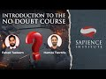

# No Doubt: Introducing 10 Strategies To Deal With Destructive Doubts | Hamza Tzortzis & Fahad Tasleem (2021-07-11)

## Description

This course has been launched on our learning platform. Enroll here for free: https://learn.sapienceinstitute.org/courses/no-doubt-course/

💡 Fahad Tasleem and Hamza Tzortzis introduce ten effective strategies on how to deal with your and other people’s destructive doubts. This is a summary of the comprehensive and transformative course that was professionally filmed for Sapience Institute’s learning platform. The full course will be available once the editing process is complete, God-willing.

👍 Please subscribe and share.

## Summary of [No Doubt: Introducing 10 Strategies To Deal With Destructive Doubts | Hamza Tzortzis & Fahad Tasleem](https://www.youtube.com/watch?v=RleAnrjY5FQ)

*This summary is AI generated - there may be inaccuracies. *

### [00:00:00](https://www.youtube.com/watch?v=RleAnrjY5FQ&t=0) - [00:50:00](https://www.youtube.com/watch?v=RleAnrjY5FQ&t=3000)

 discusses how to deal with destructive doubts, and introduces 10 strategies for doing so. The main points covered include the importance of studying Islam and developing a strong Islamic identity, the role of the heart in understanding doubt, and the importance of being sincere and committed to the goodness of all human beings.

**[00:00:00](https://www.youtube.com/watch?v=RleAnrjY5FQ&t=0)**  introduces the No Doubt course, which is designed to help Muslims deal with destructive doubts. The main purpose of the course is to empower Muslims, and the course covers 10 effective strategies for dealing with doubts.
* **[00:05:00](https://www.youtube.com/watch?v=RleAnrjY5FQ&t=300)* Discusses the role of worldviews in shaping how individuals view reality, and introduces 10 strategies for dealing with destructive doubts. The metaphysical backdrop of a worldview is discussed, and the fitra is introduced as the lens through which one views reality.  goes on to discuss world views and how they are based on assumptions.  then discusses the role of the fitra in understanding how to deal with destructive doubts, and how to uncloud the fitra to allow the truth to be seen.
* **[00:10:00](https://www.youtube.com/watch?v=RleAnrjY5FQ&t=600)**  Hamza Tzortzis and Fahad Tasleem discuss 10 strategies for dealing with destructive doubts. The main points covered include the metaphysical background of destructive doubts, the nature of the heart, and the fitting of the heart. The two main types of destructive doubts are shubuhat (destructive doubts based on desires) and shahwat (destructive doubts based on blame). If left unchecked, shubuhat can lead to shahwat, which can have a devastating effect on a person's spiritual and intellectual development.
* **[00:15:00](https://www.youtube.com/watch?v=RleAnrjY5FQ&t=900)* Discusses how to deal with destructive doubts, distinguishing between big and small tea traumas, and discussing various strategies for prevention and awareness. The main points of the video are:

- There are different strategies for dealing with destructive doubts, some before the attack and some after.
- Destructive doubts are disguised as ideologies, and can be prevented by being aware of their spiritual nature.
- It is important to be aware of the shubaha (the moment of doubt) and to be prepared to address it.
* **[00:20:00](https://www.youtube.com/watch?v=RleAnrjY5FQ&t=1200)**  Hamza Tzortzis and Fahad Tasleem discuss how to distinguish between questions that are valid and questions that are not valid, and how to avoid getting infected by shubha (destructive doubt). This is important because shubha can lead to distortions of Islam and to undermining the foundations of the religion.
* **[00:25:00](https://www.youtube.com/watch?v=RleAnrjY5FQ&t=1500)* Discusses 10 strategies for dealing with destructive doubts, including studying Islam and developing a strong Islamic identity. It stresses the importance of studying Islam and becoming familiar with its teachings to overcome doubts and psychological aversion.
* **[00:30:00](https://www.youtube.com/watch?v=RleAnrjY5FQ&t=1800)* Discusses the importance of critical thinking when studying Islam, and provides two example cases where critical thinking led to the discovery of new information about Islam.
* **[00:35:00](https://www.youtube.com/watch?v=RleAnrjY5FQ&t=2100)* Discusses how to deal with destructive doubts, including formal and informal fallacies. It also covers how to find specialists in your community who can help you deal with trauma.
* **[00:40:00](https://www.youtube.com/watch?v=RleAnrjY5FQ&t=2400)* Discusses how to deal with destructive doubts, and how to use the correct meaning of a traumatic experience to help overcome them. It discusses how to strengthen the heart, and how to be aware of the spiritual state of the individual.
* **[00:45:00](https://www.youtube.com/watch?v=RleAnrjY5FQ&t=2700)**  introduces 10 strategies for dealing with destructive doubts. All of these strategies are dependent on the will of Allah, and are meant to empower the individual and help them address their doubts.
* **[00:50:00](https://www.youtube.com/watch?v=RleAnrjY5FQ&t=3000)* Discusses how to deal with destructive doubts, emphasizing sincerity and willingness to be committed to the goodness and guidance of all human beings. thanks specific people for their help in delivering the course, mentioning Allah subhanahu wa ta'ala as the ultimate source of success.

<h2>Full transcript with timestamps: CLICK TO EXPAND</h2>

[0:00:15](https://youtu.be/RleAnrjY5FQ?t=15) brothers and sisters  
[0:00:17](https://youtu.be/RleAnrjY5FQ?t=17) my name is hamza andres zodis and this  
[0:00:19](https://youtu.be/RleAnrjY5FQ?t=19) is  
[0:00:24](https://youtu.be/RleAnrjY5FQ?t=24) good how are you alhamdulillah so  
[0:00:27](https://youtu.be/RleAnrjY5FQ?t=27) alhamdulillah brothers and sisters  
[0:00:30](https://youtu.be/RleAnrjY5FQ?t=30) we have completed the no doubt course  
[0:00:33](https://youtu.be/RleAnrjY5FQ?t=33) alhamdulillah  
[0:00:37](https://youtu.be/RleAnrjY5FQ?t=37) and the purpose of this session  
[0:00:40](https://youtu.be/RleAnrjY5FQ?t=40) is to actually introduce the course  
[0:00:44](https://youtu.be/RleAnrjY5FQ?t=44) and to raise some questions we're both  
[0:00:46](https://youtu.be/RleAnrjY5FQ?t=46) going to ask  
[0:00:47](https://youtu.be/RleAnrjY5FQ?t=47) each other some questions concerning how  
[0:00:50](https://youtu.be/RleAnrjY5FQ?t=50) you may benefit  
[0:00:51](https://youtu.be/RleAnrjY5FQ?t=51) from the course and  
[0:00:54](https://youtu.be/RleAnrjY5FQ?t=54) fahad islam delivered alhamdulillah most  
[0:00:57](https://youtu.be/RleAnrjY5FQ?t=57) of the sessions i delivered some of the  
[0:00:58](https://youtu.be/RleAnrjY5FQ?t=58) sessions as well  
[0:01:00](https://youtu.be/RleAnrjY5FQ?t=60) and i think i'll ask the first question  
[0:01:02](https://youtu.be/RleAnrjY5FQ?t=62) bro which is  
[0:01:03](https://youtu.be/RleAnrjY5FQ?t=63) alhamdulillah we finished no doubt  
[0:01:06](https://youtu.be/RleAnrjY5FQ?t=66) so why is it important to attend no  
[0:01:08](https://youtu.be/RleAnrjY5FQ?t=68) doubt to complete the whole course  
[0:01:11](https://youtu.be/RleAnrjY5FQ?t=71) well well before i get there let me let  
[0:01:14](https://youtu.be/RleAnrjY5FQ?t=74) me throw a question back at you  
[0:01:15](https://youtu.be/RleAnrjY5FQ?t=75) that's okay fine like before we even get  
[0:01:17](https://youtu.be/RleAnrjY5FQ?t=77) to like the importance of the course  
[0:01:19](https://youtu.be/RleAnrjY5FQ?t=79) and the course is phenomenal it's  
[0:01:20](https://youtu.be/RleAnrjY5FQ?t=80) amazing we haven't gone through it and  
[0:01:22](https://youtu.be/RleAnrjY5FQ?t=82) you know instructed it but before i get  
[0:01:24](https://youtu.be/RleAnrjY5FQ?t=84) there tell us a little bit about the  
[0:01:26](https://youtu.be/RleAnrjY5FQ?t=86) genesis because i think that's  
[0:01:27](https://youtu.be/RleAnrjY5FQ?t=87) interesting  
[0:01:28](https://youtu.be/RleAnrjY5FQ?t=88) the genesis well from what i remember  
[0:01:30](https://youtu.be/RleAnrjY5FQ?t=90) one of our instructors delivered a  
[0:01:32](https://youtu.be/RleAnrjY5FQ?t=92) similar course it was called no doubt i  
[0:01:34](https://youtu.be/RleAnrjY5FQ?t=94) think  
[0:01:35](https://youtu.be/RleAnrjY5FQ?t=95) and it dealt with the kind of  
[0:01:37](https://youtu.be/RleAnrjY5FQ?t=97) intellectual foundations of islam from  
[0:01:39](https://youtu.be/RleAnrjY5FQ?t=99) the point of view of how to address  
[0:01:41](https://youtu.be/RleAnrjY5FQ?t=101) ethical doubts scientific doubts  
[0:01:45](https://youtu.be/RleAnrjY5FQ?t=105) philosophical doubts and stuff like that  
[0:01:48](https://youtu.be/RleAnrjY5FQ?t=108) and then  
[0:01:49](https://youtu.be/RleAnrjY5FQ?t=109) i think after a few years when we  
[0:01:51](https://youtu.be/RleAnrjY5FQ?t=111) established  
[0:01:52](https://youtu.be/RleAnrjY5FQ?t=112) sapience one of the main purposes of  
[0:01:56](https://youtu.be/RleAnrjY5FQ?t=116) sapience was to  
[0:01:58](https://youtu.be/RleAnrjY5FQ?t=118) empower muslims so our main strategic  
[0:02:01](https://youtu.be/RleAnrjY5FQ?t=121) focus is to  
[0:02:03](https://youtu.be/RleAnrjY5FQ?t=123) develop and empower muslims so they are  
[0:02:05](https://youtu.be/RleAnrjY5FQ?t=125) able to  
[0:02:06](https://youtu.be/RleAnrjY5FQ?t=126) intellectually academically articulate  
[0:02:08](https://youtu.be/RleAnrjY5FQ?t=128) islam right  
[0:02:10](https://youtu.be/RleAnrjY5FQ?t=130) to their brothers and sisters in  
[0:02:11](https://youtu.be/RleAnrjY5FQ?t=131) humanity what we felt was  
[0:02:14](https://youtu.be/RleAnrjY5FQ?t=134) that it was important to develop a  
[0:02:15](https://youtu.be/RleAnrjY5FQ?t=135) course to deal with people's  
[0:02:18](https://youtu.be/RleAnrjY5FQ?t=138) hearts which is the plural for doubt  
[0:02:20](https://youtu.be/RleAnrjY5FQ?t=140) shubo heart doubts right  
[0:02:22](https://youtu.be/RleAnrjY5FQ?t=142) and because we're all about empowerment  
[0:02:26](https://youtu.be/RleAnrjY5FQ?t=146) we usually talk about the adage which is  
[0:02:29](https://youtu.be/RleAnrjY5FQ?t=149) if i remember correctly  
[0:02:31](https://youtu.be/RleAnrjY5FQ?t=151) if you give a man a fish  
[0:02:35](https://youtu.be/RleAnrjY5FQ?t=155) he would eat for a day if you teach a  
[0:02:38](https://youtu.be/RleAnrjY5FQ?t=158) man to fish  
[0:02:40](https://youtu.be/RleAnrjY5FQ?t=160) he would eat for a lifetime yeah so we  
[0:02:42](https://youtu.be/RleAnrjY5FQ?t=162) want to empower we wanted to and we do  
[0:02:44](https://youtu.be/RleAnrjY5FQ?t=164) want to empower muslims to be able to  
[0:02:46](https://youtu.be/RleAnrjY5FQ?t=166) deal with their doubts and the doubts of  
[0:02:48](https://youtu.be/RleAnrjY5FQ?t=168) other people and from a wider strategic  
[0:02:51](https://youtu.be/RleAnrjY5FQ?t=171) strategic perspective we want them to be  
[0:02:53](https://youtu.be/RleAnrjY5FQ?t=173) able to intellectually and academically  
[0:02:55](https://youtu.be/RleAnrjY5FQ?t=175) share islam  
[0:02:57](https://youtu.be/RleAnrjY5FQ?t=177) in a robust way of course and defend  
[0:02:59](https://youtu.be/RleAnrjY5FQ?t=179) islam so  
[0:03:01](https://youtu.be/RleAnrjY5FQ?t=181) with regards to the course itself is  
[0:03:03](https://youtu.be/RleAnrjY5FQ?t=183) designed  
[0:03:04](https://youtu.be/RleAnrjY5FQ?t=184) not to answer every single one of the  
[0:03:07](https://youtu.be/RleAnrjY5FQ?t=187) shubuhat  
[0:03:08](https://youtu.be/RleAnrjY5FQ?t=188) we'll be here until god knows when until  
[0:03:10](https://youtu.be/RleAnrjY5FQ?t=190) the day of judgment right  
[0:03:11](https://youtu.be/RleAnrjY5FQ?t=191) but rather it's an empowering course  
[0:03:14](https://youtu.be/RleAnrjY5FQ?t=194) where we give people 10 effective  
[0:03:17](https://youtu.be/RleAnrjY5FQ?t=197) strategies  
[0:03:18](https://youtu.be/RleAnrjY5FQ?t=198) on how to deal with their doubts their  
[0:03:20](https://youtu.be/RleAnrjY5FQ?t=200) own doubts and the doubts of others  
[0:03:22](https://youtu.be/RleAnrjY5FQ?t=202) and these strategies have been  
[0:03:24](https://youtu.be/RleAnrjY5FQ?t=204) specifically designed to create that  
[0:03:25](https://youtu.be/RleAnrjY5FQ?t=205) empowerment  
[0:03:26](https://youtu.be/RleAnrjY5FQ?t=206) and these strategies are not what you  
[0:03:28](https://youtu.be/RleAnrjY5FQ?t=208) would call just a road map you don't  
[0:03:30](https://youtu.be/RleAnrjY5FQ?t=210) start from the beginning and the end  
[0:03:32](https://youtu.be/RleAnrjY5FQ?t=212) you understand all of the strategies and  
[0:03:34](https://youtu.be/RleAnrjY5FQ?t=214) based on the metaphysical backdrop which  
[0:03:36](https://youtu.be/RleAnrjY5FQ?t=216) you'll explain  
[0:03:38](https://youtu.be/RleAnrjY5FQ?t=218) you basically use them as a toolkit so  
[0:03:40](https://youtu.be/RleAnrjY5FQ?t=220) you maybe think strategy two three  
[0:03:42](https://youtu.be/RleAnrjY5FQ?t=222) seven and eight is what i need for  
[0:03:44](https://youtu.be/RleAnrjY5FQ?t=224) myself or for this person  
[0:03:45](https://youtu.be/RleAnrjY5FQ?t=225) or maybe all of them it depends and once  
[0:03:48](https://youtu.be/RleAnrjY5FQ?t=228) you understand the kind of spiritual  
[0:03:49](https://youtu.be/RleAnrjY5FQ?t=229) social intellectual context of that  
[0:03:51](https://youtu.be/RleAnrjY5FQ?t=231) person  
[0:03:51](https://youtu.be/RleAnrjY5FQ?t=231) then you could basically use the most  
[0:03:54](https://youtu.be/RleAnrjY5FQ?t=234) relevant and appropriate strategy  
[0:03:56](https://youtu.be/RleAnrjY5FQ?t=236) so i think it's an amazing course  
[0:03:58](https://youtu.be/RleAnrjY5FQ?t=238) there's nothing like it not really  
[0:04:00](https://youtu.be/RleAnrjY5FQ?t=240) it's very empowering and i really  
[0:04:03](https://youtu.be/RleAnrjY5FQ?t=243) ask every single one of  
[0:04:07](https://youtu.be/RleAnrjY5FQ?t=247) you watching to attend the course  
[0:04:10](https://youtu.be/RleAnrjY5FQ?t=250) from start to end because everything  
[0:04:12](https://youtu.be/RleAnrjY5FQ?t=252) will make sense right  
[0:04:14](https://youtu.be/RleAnrjY5FQ?t=254) so is that good enough yeah yeah  
[0:04:18](https://youtu.be/RleAnrjY5FQ?t=258) all right so i have a question for you  
[0:04:20](https://youtu.be/RleAnrjY5FQ?t=260) all right which is what about my  
[0:04:22](https://youtu.be/RleAnrjY5FQ?t=262) questions too man  
[0:04:24](https://youtu.be/RleAnrjY5FQ?t=264) what is this okay the battle of the  
[0:04:26](https://youtu.be/RleAnrjY5FQ?t=266) questions  
[0:04:27](https://youtu.be/RleAnrjY5FQ?t=267) okay so my one is so  
[0:04:30](https://youtu.be/RleAnrjY5FQ?t=270) what do we cover so i mean well we  
[0:04:32](https://youtu.be/RleAnrjY5FQ?t=272) started off with uh the metaphysical  
[0:04:34](https://youtu.be/RleAnrjY5FQ?t=274) backdrop  
[0:04:34](https://youtu.be/RleAnrjY5FQ?t=274) and i think that the fact that we  
[0:04:36](https://youtu.be/RleAnrjY5FQ?t=276) started off with it  
[0:04:38](https://youtu.be/RleAnrjY5FQ?t=278) it highlights its importance not only in  
[0:04:40](https://youtu.be/RleAnrjY5FQ?t=280) this course  
[0:04:41](https://youtu.be/RleAnrjY5FQ?t=281) but we also repeat that same information  
[0:04:44](https://youtu.be/RleAnrjY5FQ?t=284) uh albeit not in as much detail as we do  
[0:04:47](https://youtu.be/RleAnrjY5FQ?t=287) and no doubt  
[0:04:47](https://youtu.be/RleAnrjY5FQ?t=287) in other courses like for instance uh  
[0:04:50](https://youtu.be/RleAnrjY5FQ?t=290) waking the truth within  
[0:04:51](https://youtu.be/RleAnrjY5FQ?t=291) we do it there and the divine reality  
[0:04:53](https://youtu.be/RleAnrjY5FQ?t=293) has a section so why is metaphysical  
[0:04:55](https://youtu.be/RleAnrjY5FQ?t=295) backdrop so important  
[0:04:56](https://youtu.be/RleAnrjY5FQ?t=296) well metaphysical backdrop is so  
[0:04:58](https://youtu.be/RleAnrjY5FQ?t=298) important because like you mentioned  
[0:05:00](https://youtu.be/RleAnrjY5FQ?t=300) if we were to just answer every single  
[0:05:02](https://youtu.be/RleAnrjY5FQ?t=302) question we would be here for  
[0:05:04](https://youtu.be/RleAnrjY5FQ?t=304) years yes and what metaphysical what the  
[0:05:06](https://youtu.be/RleAnrjY5FQ?t=306) metaphysical backdrop does  
[0:05:08](https://youtu.be/RleAnrjY5FQ?t=308) is it empowers the person by having them  
[0:05:10](https://youtu.be/RleAnrjY5FQ?t=310) understand things and concepts like  
[0:05:12](https://youtu.be/RleAnrjY5FQ?t=312) world views  
[0:05:13](https://youtu.be/RleAnrjY5FQ?t=313) worldview yeah what is the lenses by  
[0:05:16](https://youtu.be/RleAnrjY5FQ?t=316) which people are looking at the world  
[0:05:18](https://youtu.be/RleAnrjY5FQ?t=318) and reality  
[0:05:18](https://youtu.be/RleAnrjY5FQ?t=318) how do you establish what is what is not  
[0:05:21](https://youtu.be/RleAnrjY5FQ?t=321) and so on so we get into some detail  
[0:05:22](https://youtu.be/RleAnrjY5FQ?t=322) about that related to  
[0:05:24](https://youtu.be/RleAnrjY5FQ?t=324) you know ontology you know epistemology  
[0:05:26](https://youtu.be/RleAnrjY5FQ?t=326) how do we you know what is  
[0:05:28](https://youtu.be/RleAnrjY5FQ?t=328) when we think about knowledge for  
[0:05:29](https://youtu.be/RleAnrjY5FQ?t=329) instance uh you know sources of  
[0:05:31](https://youtu.be/RleAnrjY5FQ?t=331) knowledge  
[0:05:32](https://youtu.be/RleAnrjY5FQ?t=332) yeah and so and things like that and you  
[0:05:34](https://youtu.be/RleAnrjY5FQ?t=334) know we do a really nice uh  
[0:05:35](https://youtu.be/RleAnrjY5FQ?t=335) outline based on world view which is  
[0:05:38](https://youtu.be/RleAnrjY5FQ?t=338) what i remember  
[0:05:38](https://youtu.be/RleAnrjY5FQ?t=338) when you delivered it it was empowering  
[0:05:41](https://youtu.be/RleAnrjY5FQ?t=341) from the point of view that  
[0:05:42](https://youtu.be/RleAnrjY5FQ?t=342) when someone asks you a question that  
[0:05:45](https://youtu.be/RleAnrjY5FQ?t=345) raises a super  
[0:05:46](https://youtu.be/RleAnrjY5FQ?t=346) a doubt a destructive doubt or if you  
[0:05:49](https://youtu.be/RleAnrjY5FQ?t=349) within yourself have a destructive doubt  
[0:05:53](https://youtu.be/RleAnrjY5FQ?t=353) it empowers the individual to basically  
[0:05:56](https://youtu.be/RleAnrjY5FQ?t=356) understand that  
[0:05:58](https://youtu.be/RleAnrjY5FQ?t=358) that is only a shubha if i adopt the  
[0:06:01](https://youtu.be/RleAnrjY5FQ?t=361) worldview of that  
[0:06:03](https://youtu.be/RleAnrjY5FQ?t=363) person exactly or i adopt an alien world  
[0:06:05](https://youtu.be/RleAnrjY5FQ?t=365) view right so what you do is that you  
[0:06:07](https://youtu.be/RleAnrjY5FQ?t=367) give them the kind of conceptual  
[0:06:09](https://youtu.be/RleAnrjY5FQ?t=369) metaphysical lenses to really understand  
[0:06:11](https://youtu.be/RleAnrjY5FQ?t=371) hold on a second in order for even this  
[0:06:14](https://youtu.be/RleAnrjY5FQ?t=374) shubha to be valid and by the way we  
[0:06:16](https://youtu.be/RleAnrjY5FQ?t=376) know shubahat are not valid and we  
[0:06:18](https://youtu.be/RleAnrjY5FQ?t=378) discuss that in the course  
[0:06:19](https://youtu.be/RleAnrjY5FQ?t=379) but in order for it to be valid from the  
[0:06:21](https://youtu.be/RleAnrjY5FQ?t=381) point of view that it would affect me i  
[0:06:22](https://youtu.be/RleAnrjY5FQ?t=382) have to  
[0:06:23](https://youtu.be/RleAnrjY5FQ?t=383) swim into the ocean of the alien world  
[0:06:26](https://youtu.be/RleAnrjY5FQ?t=386) view which is basis anyway  
[0:06:27](https://youtu.be/RleAnrjY5FQ?t=387) right so it was very empowering but how  
[0:06:30](https://youtu.be/RleAnrjY5FQ?t=390) does the fitra fit in this whole  
[0:06:32](https://youtu.be/RleAnrjY5FQ?t=392) metaphysical backdrop then because you  
[0:06:34](https://youtu.be/RleAnrjY5FQ?t=394) in in  
[0:06:35](https://youtu.be/RleAnrjY5FQ?t=395) in the in the section on metaphysical  
[0:06:37](https://youtu.be/RleAnrjY5FQ?t=397) backdrop you also talk about the fitra  
[0:06:38](https://youtu.be/RleAnrjY5FQ?t=398) so  
[0:06:39](https://youtu.be/RleAnrjY5FQ?t=399) yeah so what's with that so so one of  
[0:06:42](https://youtu.be/RleAnrjY5FQ?t=402) the things that we uh  
[0:06:43](https://youtu.be/RleAnrjY5FQ?t=403) we speak about is that any sort of  
[0:06:45](https://youtu.be/RleAnrjY5FQ?t=405) worldview a person adopts and of course  
[0:06:46](https://youtu.be/RleAnrjY5FQ?t=406) everyone has a worldview as we mentioned  
[0:06:48](https://youtu.be/RleAnrjY5FQ?t=408) in the course  
[0:06:49](https://youtu.be/RleAnrjY5FQ?t=409) uh you know i think i mentioned in the  
[0:06:50](https://youtu.be/RleAnrjY5FQ?t=410) course itself that it's kind of like  
[0:06:52](https://youtu.be/RleAnrjY5FQ?t=412) language  
[0:06:52](https://youtu.be/RleAnrjY5FQ?t=412) right everyone has a language that they  
[0:06:54](https://youtu.be/RleAnrjY5FQ?t=414) adopt you're born into it you you know  
[0:06:55](https://youtu.be/RleAnrjY5FQ?t=415) you don't even think about it and you  
[0:06:57](https://youtu.be/RleAnrjY5FQ?t=417) speak like it's a really important  
[0:06:58](https://youtu.be/RleAnrjY5FQ?t=418) point isn't it right we want to be so  
[0:07:01](https://youtu.be/RleAnrjY5FQ?t=421) important brothers and sisters that  
[0:07:03](https://youtu.be/RleAnrjY5FQ?t=423) you know if you're not married and you  
[0:07:05](https://youtu.be/RleAnrjY5FQ?t=425) have a marriage meeting it should be one  
[0:07:06](https://youtu.be/RleAnrjY5FQ?t=426) of your questions  
[0:07:07](https://youtu.be/RleAnrjY5FQ?t=427) what's your what's your world view do  
[0:07:10](https://youtu.be/RleAnrjY5FQ?t=430) you know what i mean no i i think that's  
[0:07:12](https://youtu.be/RleAnrjY5FQ?t=432) you know what i mean i i yes because i  
[0:07:14](https://youtu.be/RleAnrjY5FQ?t=434) actually taught the things so yeah i do  
[0:07:16](https://youtu.be/RleAnrjY5FQ?t=436) know what you mean but anyways  
[0:07:17](https://youtu.be/RleAnrjY5FQ?t=437) moving on to the world view and its  
[0:07:19](https://youtu.be/RleAnrjY5FQ?t=439) connection with the fitrah  
[0:07:21](https://youtu.be/RleAnrjY5FQ?t=441) uh we spoke about how everyone has a  
[0:07:22](https://youtu.be/RleAnrjY5FQ?t=442) world view yes and the thing is that  
[0:07:24](https://youtu.be/RleAnrjY5FQ?t=444) world views  
[0:07:25](https://youtu.be/RleAnrjY5FQ?t=445) um they are based on assumptions like  
[0:07:27](https://youtu.be/RleAnrjY5FQ?t=447) any world view any you know when you  
[0:07:29](https://youtu.be/RleAnrjY5FQ?t=449) talk about modernism postmodernism  
[0:07:31](https://youtu.be/RleAnrjY5FQ?t=451) assumptions or first principles yeah  
[0:07:32](https://youtu.be/RleAnrjY5FQ?t=452) assumptions first principles i mean we  
[0:07:34](https://youtu.be/RleAnrjY5FQ?t=454) get into the details yeah  
[0:07:35](https://youtu.be/RleAnrjY5FQ?t=455) as well right and of course for us our  
[0:07:38](https://youtu.be/RleAnrjY5FQ?t=458) first principle  
[0:07:38](https://youtu.be/RleAnrjY5FQ?t=458) our you know assumption you know we give  
[0:07:41](https://youtu.be/RleAnrjY5FQ?t=461) we talk about our lens right  
[0:07:43](https://youtu.be/RleAnrjY5FQ?t=463) our lens right uh is the fitrah and so  
[0:07:45](https://youtu.be/RleAnrjY5FQ?t=465) we get into some conversation we get  
[0:07:47](https://youtu.be/RleAnrjY5FQ?t=467) into some discussion about  
[0:07:48](https://youtu.be/RleAnrjY5FQ?t=468) what do we mean by the fitra why is it  
[0:07:50](https://youtu.be/RleAnrjY5FQ?t=470) important that that be the lens by which  
[0:07:52](https://youtu.be/RleAnrjY5FQ?t=472) we look at reality and how we understand  
[0:07:54](https://youtu.be/RleAnrjY5FQ?t=474) reality  
[0:07:55](https://youtu.be/RleAnrjY5FQ?t=475) um and so we get in details about that  
[0:07:56](https://youtu.be/RleAnrjY5FQ?t=476) and so that forms  
[0:07:58](https://youtu.be/RleAnrjY5FQ?t=478) the metaphysical backdrop so before we  
[0:08:00](https://youtu.be/RleAnrjY5FQ?t=480) get into the 10 strategies in earnest  
[0:08:02](https://youtu.be/RleAnrjY5FQ?t=482) we get into a very deep dive into world  
[0:08:05](https://youtu.be/RleAnrjY5FQ?t=485) views  
[0:08:06](https://youtu.be/RleAnrjY5FQ?t=486) and fitra okay and i believe and i  
[0:08:07](https://youtu.be/RleAnrjY5FQ?t=487) really think it's extremely empowering  
[0:08:09](https://youtu.be/RleAnrjY5FQ?t=489) like i can tell you that  
[0:08:11](https://youtu.be/RleAnrjY5FQ?t=491) when i've had conversations you know as  
[0:08:13](https://youtu.be/RleAnrjY5FQ?t=493) you know we have lighthouse  
[0:08:14](https://youtu.be/RleAnrjY5FQ?t=494) where we have one-on-one mentoring  
[0:08:16](https://youtu.be/RleAnrjY5FQ?t=496) services people and  
[0:08:17](https://youtu.be/RleAnrjY5FQ?t=497) you know i really feel a lot of times  
[0:08:19](https://youtu.be/RleAnrjY5FQ?t=499) when you're speaking to someone it's  
[0:08:21](https://youtu.be/RleAnrjY5FQ?t=501) not about the specific question they're  
[0:08:22](https://youtu.be/RleAnrjY5FQ?t=502) asking a lot of it has to do like wait a  
[0:08:24](https://youtu.be/RleAnrjY5FQ?t=504) minute where are you what lens are you  
[0:08:25](https://youtu.be/RleAnrjY5FQ?t=505) looking at this question  
[0:08:26](https://youtu.be/RleAnrjY5FQ?t=506) absolutely you know we had a sister on  
[0:08:28](https://youtu.be/RleAnrjY5FQ?t=508) one she had a question about you know i  
[0:08:30](https://youtu.be/RleAnrjY5FQ?t=510) don't really understand these ayats and  
[0:08:31](https://youtu.be/RleAnrjY5FQ?t=511) the quran from you know  
[0:08:32](https://youtu.be/RleAnrjY5FQ?t=512) and then when we started to dig down  
[0:08:34](https://youtu.be/RleAnrjY5FQ?t=514) deeper she had a a very clear  
[0:08:36](https://youtu.be/RleAnrjY5FQ?t=516) lens of feminism which has its own  
[0:08:38](https://youtu.be/RleAnrjY5FQ?t=518) assumptions and  
[0:08:40](https://youtu.be/RleAnrjY5FQ?t=520) its own worldview so she had a an alien  
[0:08:42](https://youtu.be/RleAnrjY5FQ?t=522) worldview an ideology whether it's  
[0:08:44](https://youtu.be/RleAnrjY5FQ?t=524) feminism or whatever the case may be  
[0:08:46](https://youtu.be/RleAnrjY5FQ?t=526) and she basically used it as a lens to  
[0:08:48](https://youtu.be/RleAnrjY5FQ?t=528) view islam  
[0:08:49](https://youtu.be/RleAnrjY5FQ?t=529) right and that's why the schubert heart  
[0:08:51](https://youtu.be/RleAnrjY5FQ?t=531) arose that rose yeah yeah so  
[0:08:53](https://youtu.be/RleAnrjY5FQ?t=533) it's not just dealing with the schwa  
[0:08:54](https://youtu.be/RleAnrjY5FQ?t=534) it's actually dealing with that world  
[0:08:55](https://youtu.be/RleAnrjY5FQ?t=535) view first  
[0:08:56](https://youtu.be/RleAnrjY5FQ?t=536) and that changed the way they see things  
[0:08:58](https://youtu.be/RleAnrjY5FQ?t=538) yeah and that's what was so beautiful is  
[0:08:59](https://youtu.be/RleAnrjY5FQ?t=539) that once i pointed that out  
[0:09:00](https://youtu.be/RleAnrjY5FQ?t=540) and i said look let's look at it from a  
[0:09:02](https://youtu.be/RleAnrjY5FQ?t=542) different perspe let's look at it from a  
[0:09:03](https://youtu.be/RleAnrjY5FQ?t=543) different world view  
[0:09:04](https://youtu.be/RleAnrjY5FQ?t=544) right one that you claim to have adopted  
[0:09:06](https://youtu.be/RleAnrjY5FQ?t=546) right which is islam  
[0:09:08](https://youtu.be/RleAnrjY5FQ?t=548) and let's look at it from that worldview  
[0:09:09](https://youtu.be/RleAnrjY5FQ?t=549) and that was very empowering for her  
[0:09:10](https://youtu.be/RleAnrjY5FQ?t=550) because she at the end she said you know  
[0:09:12](https://youtu.be/RleAnrjY5FQ?t=552) that actually makes sense now like i  
[0:09:13](https://youtu.be/RleAnrjY5FQ?t=553) understand it from a worldview  
[0:09:14](https://youtu.be/RleAnrjY5FQ?t=554) perspective brilliant so  
[0:09:15](https://youtu.be/RleAnrjY5FQ?t=555) it's it's an it you know i mean that  
[0:09:17](https://youtu.be/RleAnrjY5FQ?t=557) part of the course i think will  
[0:09:19](https://youtu.be/RleAnrjY5FQ?t=559) really you know people are really going  
[0:09:21](https://youtu.be/RleAnrjY5FQ?t=561) to find out empowering  
[0:09:22](https://youtu.be/RleAnrjY5FQ?t=562) so and the thing with the fitrah which i  
[0:09:24](https://youtu.be/RleAnrjY5FQ?t=564) think you highlighted which is very  
[0:09:26](https://youtu.be/RleAnrjY5FQ?t=566) important  
[0:09:27](https://youtu.be/RleAnrjY5FQ?t=567) is that when we understand the fitra  
[0:09:29](https://youtu.be/RleAnrjY5FQ?t=569) even the two main opinions in our  
[0:09:30](https://youtu.be/RleAnrjY5FQ?t=570) classical tradition yeah  
[0:09:32](https://youtu.be/RleAnrjY5FQ?t=572) the fitra gets clouded if you want to  
[0:09:33](https://youtu.be/RleAnrjY5FQ?t=573) use such terminology and we do use such  
[0:09:35](https://youtu.be/RleAnrjY5FQ?t=575) metaphor  
[0:09:37](https://youtu.be/RleAnrjY5FQ?t=577) and the point here is there are  
[0:09:39](https://youtu.be/RleAnrjY5FQ?t=579) different ways to uncloud the fitrah  
[0:09:42](https://youtu.be/RleAnrjY5FQ?t=582) to awaken the truth within or to allow  
[0:09:44](https://youtu.be/RleAnrjY5FQ?t=584) the fatal to direct itself towards the  
[0:09:46](https://youtu.be/RleAnrjY5FQ?t=586) truth  
[0:09:47](https://youtu.be/RleAnrjY5FQ?t=587) so the clouding could be one of the  
[0:09:50](https://youtu.be/RleAnrjY5FQ?t=590) shubuhat could be one of the doubts  
[0:09:53](https://youtu.be/RleAnrjY5FQ?t=593) right and our strategies could be the  
[0:09:54](https://youtu.be/RleAnrjY5FQ?t=594) way to uncloud the fitrah  
[0:09:57](https://youtu.be/RleAnrjY5FQ?t=597) to allow the fit or the innate  
[0:09:58](https://youtu.be/RleAnrjY5FQ?t=598) disposition to direct itself towards the  
[0:10:00](https://youtu.be/RleAnrjY5FQ?t=600) truth  
[0:10:01](https://youtu.be/RleAnrjY5FQ?t=601) and that is so important because once  
[0:10:02](https://youtu.be/RleAnrjY5FQ?t=602) you understand the almost the kind of  
[0:10:03](https://youtu.be/RleAnrjY5FQ?t=603) metaphysics or the psychology of the  
[0:10:05](https://youtu.be/RleAnrjY5FQ?t=605) fitrah  
[0:10:06](https://youtu.be/RleAnrjY5FQ?t=606) you you make sense of yourself you make  
[0:10:09](https://youtu.be/RleAnrjY5FQ?t=609) sense of other people exactly and you  
[0:10:10](https://youtu.be/RleAnrjY5FQ?t=610) become more intellectually spiritual  
[0:10:12](https://youtu.be/RleAnrjY5FQ?t=612) and spiritually mature to be able to  
[0:10:14](https://youtu.be/RleAnrjY5FQ?t=614) deal with these issues in a very  
[0:10:16](https://youtu.be/RleAnrjY5FQ?t=616) profound and deep way so that's  
[0:10:17](https://youtu.be/RleAnrjY5FQ?t=617) brilliant  
[0:10:18](https://youtu.be/RleAnrjY5FQ?t=618) so after metaphysical backdrop what's  
[0:10:20](https://youtu.be/RleAnrjY5FQ?t=620) your notes dude um  
[0:10:21](https://youtu.be/RleAnrjY5FQ?t=621) all right what's the next one next one  
[0:10:25](https://youtu.be/RleAnrjY5FQ?t=625) nature of the heart me oh the nature of  
[0:10:27](https://youtu.be/RleAnrjY5FQ?t=627) the heart so if we're  
[0:10:28](https://youtu.be/RleAnrjY5FQ?t=628) speaking about fitnah we understand you  
[0:10:30](https://youtu.be/RleAnrjY5FQ?t=630) know and as you know you'll see in the  
[0:10:32](https://youtu.be/RleAnrjY5FQ?t=632) course  
[0:10:32](https://youtu.be/RleAnrjY5FQ?t=632) is that we speak a lot about shubuhat we  
[0:10:34](https://youtu.be/RleAnrjY5FQ?t=634) speak a lot about its etymology  
[0:10:36](https://youtu.be/RleAnrjY5FQ?t=636) right the the the word itself where it  
[0:10:38](https://youtu.be/RleAnrjY5FQ?t=638) comes from this brother  
[0:10:39](https://youtu.be/RleAnrjY5FQ?t=639) this uh individual right here he likes  
[0:10:42](https://youtu.be/RleAnrjY5FQ?t=642) talking about the etymology of etymology  
[0:10:44](https://youtu.be/RleAnrjY5FQ?t=644) at infinitum yeah but uh but he calmed  
[0:10:47](https://youtu.be/RleAnrjY5FQ?t=647) me down so you you could have gotten a  
[0:10:49](https://youtu.be/RleAnrjY5FQ?t=649) lot more  
[0:10:50](https://youtu.be/RleAnrjY5FQ?t=650) and been put to sleep a lot quicker no  
[0:10:52](https://youtu.be/RleAnrjY5FQ?t=652) i'm kidding but  
[0:10:53](https://youtu.be/RleAnrjY5FQ?t=653) um but we speak about the term how it  
[0:10:56](https://youtu.be/RleAnrjY5FQ?t=656) resembles the truth  
[0:10:57](https://youtu.be/RleAnrjY5FQ?t=657) it doesn't have any sort of substance to  
[0:10:59](https://youtu.be/RleAnrjY5FQ?t=659) itself in reality  
[0:11:00](https://youtu.be/RleAnrjY5FQ?t=660) it resembles the truth it's like a wolf  
[0:11:02](https://youtu.be/RleAnrjY5FQ?t=662) in sheep's clothing right right and and  
[0:11:04](https://youtu.be/RleAnrjY5FQ?t=664) we talk about how it attacks the heart  
[0:11:06](https://youtu.be/RleAnrjY5FQ?t=666) and so that's why the next section that  
[0:11:08](https://youtu.be/RleAnrjY5FQ?t=668) we speak about is the nature of the  
[0:11:09](https://youtu.be/RleAnrjY5FQ?t=669) heart itself you know the fact  
[0:11:10](https://youtu.be/RleAnrjY5FQ?t=670) is the kalben is called because it  
[0:11:12](https://youtu.be/RleAnrjY5FQ?t=672) overturns  
[0:11:14](https://youtu.be/RleAnrjY5FQ?t=674) you know and all and so we get into that  
[0:11:16](https://youtu.be/RleAnrjY5FQ?t=676) we speak a little bit about iman and  
[0:11:18](https://youtu.be/RleAnrjY5FQ?t=678) and how to understand that and how to  
[0:11:19](https://youtu.be/RleAnrjY5FQ?t=679) understand it in a way that transcends  
[0:11:21](https://youtu.be/RleAnrjY5FQ?t=681) how sometimes just translated as belief  
[0:11:24](https://youtu.be/RleAnrjY5FQ?t=684) yes right because sometimes we have a  
[0:11:26](https://youtu.be/RleAnrjY5FQ?t=686) you know again going back to world views  
[0:11:27](https://youtu.be/RleAnrjY5FQ?t=687) we have a kind of a judeo-christian way  
[0:11:29](https://youtu.be/RleAnrjY5FQ?t=689) of looking at  
[0:11:30](https://youtu.be/RleAnrjY5FQ?t=690) the term because from that world view  
[0:11:32](https://youtu.be/RleAnrjY5FQ?t=692) the term faith  
[0:11:33](https://youtu.be/RleAnrjY5FQ?t=693) the term faith right belief or faith uh  
[0:11:35](https://youtu.be/RleAnrjY5FQ?t=695) that we just assigned to it some sort of  
[0:11:37](https://youtu.be/RleAnrjY5FQ?t=697) pledge that you make that i believe such  
[0:11:39](https://youtu.be/RleAnrjY5FQ?t=699) and such yes iman has a different  
[0:11:41](https://youtu.be/RleAnrjY5FQ?t=701) dynamic or  
[0:11:42](https://youtu.be/RleAnrjY5FQ?t=702) like a leap of faith yeah right like a  
[0:11:44](https://youtu.be/RleAnrjY5FQ?t=704) leap of faith blind jump  
[0:11:45](https://youtu.be/RleAnrjY5FQ?t=705) exactly but iman comes from the root  
[0:11:47](https://youtu.be/RleAnrjY5FQ?t=707) word to feel secure exactly  
[0:11:48](https://youtu.be/RleAnrjY5FQ?t=708) and so so before that we talked about  
[0:11:50](https://youtu.be/RleAnrjY5FQ?t=710) the fitting of the heart  
[0:11:52](https://youtu.be/RleAnrjY5FQ?t=712) no we get that a little bit like oh do  
[0:11:54](https://youtu.be/RleAnrjY5FQ?t=714) we oh it's like the shahawat and the  
[0:11:55](https://youtu.be/RleAnrjY5FQ?t=715) shubohat yes  
[0:11:56](https://youtu.be/RleAnrjY5FQ?t=716) yes so you know after that and i'll put  
[0:11:58](https://youtu.be/RleAnrjY5FQ?t=718) on my notes here  
[0:12:00](https://youtu.be/RleAnrjY5FQ?t=720) so yeah so we talk about the heart's  
[0:12:02](https://youtu.be/RleAnrjY5FQ?t=722) main fifth in that section the next  
[0:12:02](https://youtu.be/RleAnrjY5FQ?t=722) section yeah okay good  
[0:12:03](https://youtu.be/RleAnrjY5FQ?t=723) so we start with a metaphysical backdrop  
[0:12:05](https://youtu.be/RleAnrjY5FQ?t=725) yes right that's where we start from we  
[0:12:06](https://youtu.be/RleAnrjY5FQ?t=726) talk about nature of the heart yes then  
[0:12:08](https://youtu.be/RleAnrjY5FQ?t=728) we move into the  
[0:12:09](https://youtu.be/RleAnrjY5FQ?t=729) fitting of the heart look at the trials  
[0:12:11](https://youtu.be/RleAnrjY5FQ?t=731) and tribulations of the heart  
[0:12:12](https://youtu.be/RleAnrjY5FQ?t=732) which are different from the spiritual  
[0:12:13](https://youtu.be/RleAnrjY5FQ?t=733) diseases yes of course of course so  
[0:12:16](https://youtu.be/RleAnrjY5FQ?t=736) you know and these we you know we say  
[0:12:17](https://youtu.be/RleAnrjY5FQ?t=737) that scholars categorize them into two  
[0:12:19](https://youtu.be/RleAnrjY5FQ?t=739) main categories so so we speak about the  
[0:12:21](https://youtu.be/RleAnrjY5FQ?t=741) two main  
[0:12:23](https://youtu.be/RleAnrjY5FQ?t=743) fit right one is the shubahat which are  
[0:12:25](https://youtu.be/RleAnrjY5FQ?t=745) the destructive doubts which is what  
[0:12:27](https://youtu.be/RleAnrjY5FQ?t=747) we're going to be talking about in  
[0:12:28](https://youtu.be/RleAnrjY5FQ?t=748) detail  
[0:12:28](https://youtu.be/RleAnrjY5FQ?t=748) then we talk about yes desires you know  
[0:12:31](https://youtu.be/RleAnrjY5FQ?t=751) those things the blame  
[0:12:32](https://youtu.be/RleAnrjY5FQ?t=752) the blameworthy desires right and  
[0:12:35](https://youtu.be/RleAnrjY5FQ?t=755) you know speaking about the covering of  
[0:12:37](https://youtu.be/RleAnrjY5FQ?t=757) the heart as you mentioned or the  
[0:12:38](https://youtu.be/RleAnrjY5FQ?t=758) clouding of the heart  
[0:12:39](https://youtu.be/RleAnrjY5FQ?t=759) yes you know one of those is actually  
[0:12:41](https://youtu.be/RleAnrjY5FQ?t=761) stems from desires when a person  
[0:12:43](https://youtu.be/RleAnrjY5FQ?t=763) goes beyond right the the the bounds  
[0:12:46](https://youtu.be/RleAnrjY5FQ?t=766) you know everyone has desires and as  
[0:12:48](https://youtu.be/RleAnrjY5FQ?t=768) long as you don't go beyond the bounds  
[0:12:49](https://youtu.be/RleAnrjY5FQ?t=769) then it shouldn't really affect a person  
[0:12:50](https://youtu.be/RleAnrjY5FQ?t=770) but when they do  
[0:12:51](https://youtu.be/RleAnrjY5FQ?t=771) yes it puts a stain on the heart yes  
[0:12:53](https://youtu.be/RleAnrjY5FQ?t=773) right like the prophet sallam said  
[0:12:56](https://youtu.be/RleAnrjY5FQ?t=776) yes so there but there is a relationship  
[0:12:58](https://youtu.be/RleAnrjY5FQ?t=778) between shahawat  
[0:12:59](https://youtu.be/RleAnrjY5FQ?t=779) although we do say in abstraction yes  
[0:13:02](https://youtu.be/RleAnrjY5FQ?t=782) are far  
[0:13:02](https://youtu.be/RleAnrjY5FQ?t=782) worse than shahawat because one of the  
[0:13:06](https://youtu.be/RleAnrjY5FQ?t=786) distinctions that we make concerning the  
[0:13:07](https://youtu.be/RleAnrjY5FQ?t=787) shubu heart the destructive doubts  
[0:13:09](https://youtu.be/RleAnrjY5FQ?t=789) is that they are they try to undermine  
[0:13:12](https://youtu.be/RleAnrjY5FQ?t=792) the foundations of islam and distort the  
[0:13:13](https://youtu.be/RleAnrjY5FQ?t=793) religion yes  
[0:13:14](https://youtu.be/RleAnrjY5FQ?t=794) now shahawad blame with blame where the  
[0:13:16](https://youtu.be/RleAnrjY5FQ?t=796) desires on their own don't do that  
[0:13:18](https://youtu.be/RleAnrjY5FQ?t=798) and that's why they could yeah so by an  
[0:13:20](https://youtu.be/RleAnrjY5FQ?t=800) abstraction  
[0:13:21](https://youtu.be/RleAnrjY5FQ?t=801) shubahat are far more dangerous however  
[0:13:24](https://youtu.be/RleAnrjY5FQ?t=804) if you continue them right they can lead  
[0:13:26](https://youtu.be/RleAnrjY5FQ?t=806) to shubahat because for example if  
[0:13:28](https://youtu.be/RleAnrjY5FQ?t=808) someone starts drinking and they know  
[0:13:29](https://youtu.be/RleAnrjY5FQ?t=809) it's haram  
[0:13:30](https://youtu.be/RleAnrjY5FQ?t=810) then fine it's not undermining the  
[0:13:32](https://youtu.be/RleAnrjY5FQ?t=812) religion it's not undermining the  
[0:13:33](https://youtu.be/RleAnrjY5FQ?t=813) intellectual foundations of islam  
[0:13:35](https://youtu.be/RleAnrjY5FQ?t=815) but over time what can happen they could  
[0:13:37](https://youtu.be/RleAnrjY5FQ?t=817) start saying oh you know what maybe it's  
[0:13:38](https://youtu.be/RleAnrjY5FQ?t=818) not too bad maybe it is halal and maybe  
[0:13:40](https://youtu.be/RleAnrjY5FQ?t=820) this and maybe the quran was wrong  
[0:13:42](https://youtu.be/RleAnrjY5FQ?t=822) and everything yeah so that's the thing  
[0:13:43](https://youtu.be/RleAnrjY5FQ?t=823) man you know they say like i mentioned  
[0:13:45](https://youtu.be/RleAnrjY5FQ?t=825) this in the course as well they're just  
[0:13:46](https://youtu.be/RleAnrjY5FQ?t=826) saying  
[0:13:48](https://youtu.be/RleAnrjY5FQ?t=828) right that the intellect is a a hired  
[0:13:51](https://youtu.be/RleAnrjY5FQ?t=831) lawyer  
[0:13:51](https://youtu.be/RleAnrjY5FQ?t=831) so eventually what happens is when  
[0:13:52](https://youtu.be/RleAnrjY5FQ?t=832) you're kind of engaged in a sin for too  
[0:13:54](https://youtu.be/RleAnrjY5FQ?t=834) long  
[0:13:55](https://youtu.be/RleAnrjY5FQ?t=835) you have kind of this uh this  
[0:13:58](https://youtu.be/RleAnrjY5FQ?t=838) instability right so we talk about iman  
[0:13:59](https://youtu.be/RleAnrjY5FQ?t=839) meaning stability  
[0:14:00](https://youtu.be/RleAnrjY5FQ?t=840) so your mind like it knows it's wrong  
[0:14:02](https://youtu.be/RleAnrjY5FQ?t=842) but if you keep doing it then it wants  
[0:14:03](https://youtu.be/RleAnrjY5FQ?t=843) to give it justifications sure right  
[0:14:05](https://youtu.be/RleAnrjY5FQ?t=845) and it happens to all of us right when  
[0:14:06](https://youtu.be/RleAnrjY5FQ?t=846) you know if you think about okay you're  
[0:14:08](https://youtu.be/RleAnrjY5FQ?t=848) doing something and eventually like yeah  
[0:14:09](https://youtu.be/RleAnrjY5FQ?t=849) maybe there's a difference of opinion  
[0:14:10](https://youtu.be/RleAnrjY5FQ?t=850) maybe i'll ask sheik son so or so-and-so  
[0:14:12](https://youtu.be/RleAnrjY5FQ?t=852) and then you start getting and so  
[0:14:14](https://youtu.be/RleAnrjY5FQ?t=854) and so that's why you know no doubt that  
[0:14:17](https://youtu.be/RleAnrjY5FQ?t=857) shubahat are definitely more dangerous  
[0:14:18](https://youtu.be/RleAnrjY5FQ?t=858) because they're undermining the  
[0:14:19](https://youtu.be/RleAnrjY5FQ?t=859) foundations  
[0:14:20](https://youtu.be/RleAnrjY5FQ?t=860) but excessive shah waters long-term can  
[0:14:23](https://youtu.be/RleAnrjY5FQ?t=863) lead to  
[0:14:24](https://youtu.be/RleAnrjY5FQ?t=864) can lead to shubahat which can be you  
[0:14:26](https://youtu.be/RleAnrjY5FQ?t=866) know have the same effect  
[0:14:28](https://youtu.be/RleAnrjY5FQ?t=868) okay so then we moved on to then we  
[0:14:30](https://youtu.be/RleAnrjY5FQ?t=870) moved on to  
[0:14:32](https://youtu.be/RleAnrjY5FQ?t=872) my man we moved on to uh we were  
[0:14:35](https://youtu.be/RleAnrjY5FQ?t=875) the source of doubts okay good yeah yeah  
[0:14:37](https://youtu.be/RleAnrjY5FQ?t=877) so the sources of doubt  
[0:14:38](https://youtu.be/RleAnrjY5FQ?t=878) the sources of doubts were philosophical  
[0:14:41](https://youtu.be/RleAnrjY5FQ?t=881) ethical  
[0:14:42](https://youtu.be/RleAnrjY5FQ?t=882) and trauma yes philosophical  
[0:14:45](https://youtu.be/RleAnrjY5FQ?t=885) philosophical scientific  
[0:14:46](https://youtu.be/RleAnrjY5FQ?t=886) ethical and trauma social so basically  
[0:14:49](https://youtu.be/RleAnrjY5FQ?t=889) the kind of negative experiences people  
[0:14:52](https://youtu.be/RleAnrjY5FQ?t=892) experience in their life that that give  
[0:14:55](https://youtu.be/RleAnrjY5FQ?t=895) rise to should  
[0:14:56](https://youtu.be/RleAnrjY5FQ?t=896) heart and these could include traumatic  
[0:14:58](https://youtu.be/RleAnrjY5FQ?t=898) experiences right absolutely negative  
[0:14:59](https://youtu.be/RleAnrjY5FQ?t=899) experiences and  
[0:15:00](https://youtu.be/RleAnrjY5FQ?t=900) we made a distinction between big tea  
[0:15:02](https://youtu.be/RleAnrjY5FQ?t=902) and small tea traumas  
[0:15:04](https://youtu.be/RleAnrjY5FQ?t=904) we talked about them yeah and how to uh  
[0:15:06](https://youtu.be/RleAnrjY5FQ?t=906) address those from the point of view of  
[0:15:08](https://youtu.be/RleAnrjY5FQ?t=908) shubohat and after we went to  
[0:15:10](https://youtu.be/RleAnrjY5FQ?t=910) so then uh we spoke about um we we  
[0:15:13](https://youtu.be/RleAnrjY5FQ?t=913) started the course well we talked about  
[0:15:14](https://youtu.be/RleAnrjY5FQ?t=914) today's  
[0:15:15](https://youtu.be/RleAnrjY5FQ?t=915) crisis and challenges all right that was  
[0:15:16](https://youtu.be/RleAnrjY5FQ?t=916) a bit of a summary so it was a bit of a  
[0:15:18](https://youtu.be/RleAnrjY5FQ?t=918) summary and then actually we spoke about  
[0:15:20](https://youtu.be/RleAnrjY5FQ?t=920) the fact that if a person is  
[0:15:21](https://youtu.be/RleAnrjY5FQ?t=921) you know engaging with the world today  
[0:15:23](https://youtu.be/RleAnrjY5FQ?t=923) what are some of the modern  
[0:15:24](https://youtu.be/RleAnrjY5FQ?t=924) you know i say modern in terms of in  
[0:15:26](https://youtu.be/RleAnrjY5FQ?t=926) terms of a time period what are they  
[0:15:28](https://youtu.be/RleAnrjY5FQ?t=928) what are people facing and what are the  
[0:15:29](https://youtu.be/RleAnrjY5FQ?t=929) people  
[0:15:30](https://youtu.be/RleAnrjY5FQ?t=930) what are people's challenges today  
[0:15:31](https://youtu.be/RleAnrjY5FQ?t=931) ideologically so you have atheism you  
[0:15:34](https://youtu.be/RleAnrjY5FQ?t=934) have  
[0:15:34](https://youtu.be/RleAnrjY5FQ?t=934) modernism liberalism post modernism  
[0:15:36](https://youtu.be/RleAnrjY5FQ?t=936) feminism all the  
[0:15:37](https://youtu.be/RleAnrjY5FQ?t=937) isms and schisms that people have to  
[0:15:39](https://youtu.be/RleAnrjY5FQ?t=939) deal with a lot of people and it happens  
[0:15:41](https://youtu.be/RleAnrjY5FQ?t=941) to most of us we become  
[0:15:42](https://youtu.be/RleAnrjY5FQ?t=942) in the words of hijab ideologically  
[0:15:44](https://youtu.be/RleAnrjY5FQ?t=944) molested  
[0:15:45](https://youtu.be/RleAnrjY5FQ?t=945) [Laughter]  
[0:15:47](https://youtu.be/RleAnrjY5FQ?t=947) are you ideologically molested  
[0:15:48](https://youtu.be/RleAnrjY5FQ?t=948) intellectually  
[0:15:50](https://youtu.be/RleAnrjY5FQ?t=950) was it subservient mentally  
[0:16:01](https://youtu.be/RleAnrjY5FQ?t=961) unfortunately these ideologies are like  
[0:16:04](https://youtu.be/RleAnrjY5FQ?t=964) a tsunami trying to engulf the hearts  
[0:16:05](https://youtu.be/RleAnrjY5FQ?t=965) and minds of our brothers and sisters of  
[0:16:07](https://youtu.be/RleAnrjY5FQ?t=967) everybody  
[0:16:08](https://youtu.be/RleAnrjY5FQ?t=968) the hearts of humanity and this and this  
[0:16:10](https://youtu.be/RleAnrjY5FQ?t=970) goes back to the importance of this  
[0:16:11](https://youtu.be/RleAnrjY5FQ?t=971) course though  
[0:16:12](https://youtu.be/RleAnrjY5FQ?t=972) because remember it's not just a course  
[0:16:14](https://youtu.be/RleAnrjY5FQ?t=974) about you dealing with yourself  
[0:16:16](https://youtu.be/RleAnrjY5FQ?t=976) but you could be in a position let's say  
[0:16:18](https://youtu.be/RleAnrjY5FQ?t=978) you're an imam let's say you're you're a  
[0:16:20](https://youtu.be/RleAnrjY5FQ?t=980) parent  
[0:16:20](https://youtu.be/RleAnrjY5FQ?t=980) point you know and you could be in that  
[0:16:22](https://youtu.be/RleAnrjY5FQ?t=982) position and you might  
[0:16:24](https://youtu.be/RleAnrjY5FQ?t=984) you might understand it from your own  
[0:16:26](https://youtu.be/RleAnrjY5FQ?t=986) like your own background your education  
[0:16:28](https://youtu.be/RleAnrjY5FQ?t=988) like i don't deny that any sort i would  
[0:16:29](https://youtu.be/RleAnrjY5FQ?t=989) not i would not doubt that what we're  
[0:16:31](https://youtu.be/RleAnrjY5FQ?t=991) in what we're teaching in terms of  
[0:16:33](https://youtu.be/RleAnrjY5FQ?t=993) content per se is something new to like  
[0:16:35](https://youtu.be/RleAnrjY5FQ?t=995) someone who's been through islamic  
[0:16:36](https://youtu.be/RleAnrjY5FQ?t=996) studies yes a deepest but the reality is  
[0:16:38](https://youtu.be/RleAnrjY5FQ?t=998) we want to but the methodologies the  
[0:16:40](https://youtu.be/RleAnrjY5FQ?t=1000) methodology brought it together  
[0:16:41](https://youtu.be/RleAnrjY5FQ?t=1001) in a unique way exactly in order for the  
[0:16:44](https://youtu.be/RleAnrjY5FQ?t=1004) imams and the meshach to be empowered  
[0:16:46](https://youtu.be/RleAnrjY5FQ?t=1006) yes exactly and that's why this is very  
[0:16:47](https://youtu.be/RleAnrjY5FQ?t=1007) important for teachers for parents for  
[0:16:49](https://youtu.be/RleAnrjY5FQ?t=1009) imams for messiah  
[0:16:51](https://youtu.be/RleAnrjY5FQ?t=1011) absolutely and remember to bring this  
[0:16:53](https://youtu.be/RleAnrjY5FQ?t=1013) back to a  
[0:16:54](https://youtu.be/RleAnrjY5FQ?t=1014) practical context we receive so many  
[0:16:57](https://youtu.be/RleAnrjY5FQ?t=1017) questions  
[0:16:58](https://youtu.be/RleAnrjY5FQ?t=1018) about people's doubts we can't address  
[0:17:00](https://youtu.be/RleAnrjY5FQ?t=1020) everything it's like almost practically  
[0:17:01](https://youtu.be/RleAnrjY5FQ?t=1021) impossible  
[0:17:02](https://youtu.be/RleAnrjY5FQ?t=1022) limited resources and so on and so forth  
[0:17:05](https://youtu.be/RleAnrjY5FQ?t=1025) right so  
[0:17:06](https://youtu.be/RleAnrjY5FQ?t=1026) this course from a strategic point of  
[0:17:08](https://youtu.be/RleAnrjY5FQ?t=1028) view i think it should be a game changer  
[0:17:10](https://youtu.be/RleAnrjY5FQ?t=1030) because once they're empowered with  
[0:17:11](https://youtu.be/RleAnrjY5FQ?t=1031) these strategies  
[0:17:12](https://youtu.be/RleAnrjY5FQ?t=1032) insha allah by the will of allah  
[0:17:17](https://youtu.be/RleAnrjY5FQ?t=1037) absolutely and so you know we would want  
[0:17:19](https://youtu.be/RleAnrjY5FQ?t=1039) this in different languages as well  
[0:17:21](https://youtu.be/RleAnrjY5FQ?t=1041) yeah turkish in urdu in malay  
[0:17:24](https://youtu.be/RleAnrjY5FQ?t=1044) in arabic yeah in all the languages  
[0:17:27](https://youtu.be/RleAnrjY5FQ?t=1047) whatever language we get in so  
[0:17:28](https://youtu.be/RleAnrjY5FQ?t=1048) we so now we talk about the ten  
[0:17:30](https://youtu.be/RleAnrjY5FQ?t=1050) strategies yeah then we outline the ten  
[0:17:31](https://youtu.be/RleAnrjY5FQ?t=1051) strategies we get into them and you know  
[0:17:33](https://youtu.be/RleAnrjY5FQ?t=1053) we  
[0:17:33](https://youtu.be/RleAnrjY5FQ?t=1053) start off by speaking about be aware  
[0:17:35](https://youtu.be/RleAnrjY5FQ?t=1055) okay so  
[0:17:36](https://youtu.be/RleAnrjY5FQ?t=1056) before we get into that there was a  
[0:17:38](https://youtu.be/RleAnrjY5FQ?t=1058) distinction that we made concerning  
[0:17:39](https://youtu.be/RleAnrjY5FQ?t=1059) there are some strategies that  
[0:17:41](https://youtu.be/RleAnrjY5FQ?t=1061) you adopt before the surprise right  
[0:17:44](https://youtu.be/RleAnrjY5FQ?t=1064) right and  
[0:17:45](https://youtu.be/RleAnrjY5FQ?t=1065) and some strategies after the shubha and  
[0:17:47](https://youtu.be/RleAnrjY5FQ?t=1067) some strategies are both  
[0:17:48](https://youtu.be/RleAnrjY5FQ?t=1068) yeah and some strategies do with both so  
[0:17:49](https://youtu.be/RleAnrjY5FQ?t=1069) say this is the heart this is a surprise  
[0:17:51](https://youtu.be/RleAnrjY5FQ?t=1071) like a parasite  
[0:17:52](https://youtu.be/RleAnrjY5FQ?t=1072) who wants to latch onto the heart and  
[0:17:54](https://youtu.be/RleAnrjY5FQ?t=1074) drain the iman yeah so there's one stage  
[0:17:56](https://youtu.be/RleAnrjY5FQ?t=1076) where the shrub has here  
[0:17:57](https://youtu.be/RleAnrjY5FQ?t=1077) yep and that's when you have some  
[0:17:59](https://youtu.be/RleAnrjY5FQ?t=1079) strategies other strategies the surprise  
[0:18:01](https://youtu.be/RleAnrjY5FQ?t=1081) is just about to get into the heart  
[0:18:03](https://youtu.be/RleAnrjY5FQ?t=1083) yeah strategy and other strategies when  
[0:18:04](https://youtu.be/RleAnrjY5FQ?t=1084) it's already infected in the heart okay  
[0:18:06](https://youtu.be/RleAnrjY5FQ?t=1086) good  
[0:18:06](https://youtu.be/RleAnrjY5FQ?t=1086) so what's be aware so be aware  
[0:18:09](https://youtu.be/RleAnrjY5FQ?t=1089) is the strategy which actually is before  
[0:18:12](https://youtu.be/RleAnrjY5FQ?t=1092) the  
[0:18:13](https://youtu.be/RleAnrjY5FQ?t=1093) attacks the heart right okay and this  
[0:18:15](https://youtu.be/RleAnrjY5FQ?t=1095) has to do with prevention  
[0:18:16](https://youtu.be/RleAnrjY5FQ?t=1096) right so you know we speak about the  
[0:18:17](https://youtu.be/RleAnrjY5FQ?t=1097) term prevention rather than cure  
[0:18:19](https://youtu.be/RleAnrjY5FQ?t=1099) so this is now to be aware of the  
[0:18:21](https://youtu.be/RleAnrjY5FQ?t=1101) shubahat that they exist that they're  
[0:18:23](https://youtu.be/RleAnrjY5FQ?t=1103) dangerous  
[0:18:23](https://youtu.be/RleAnrjY5FQ?t=1103) uh the fact that they're dangerous and  
[0:18:25](https://youtu.be/RleAnrjY5FQ?t=1105) so on and so forth so and to be aware of  
[0:18:26](https://youtu.be/RleAnrjY5FQ?t=1106) the nature of shubahat from the islamic  
[0:18:28](https://youtu.be/RleAnrjY5FQ?t=1108) spiritual tradition that it's  
[0:18:30](https://youtu.be/RleAnrjY5FQ?t=1110) tush bihu it tries to resemble something  
[0:18:32](https://youtu.be/RleAnrjY5FQ?t=1112) that it's not yes  
[0:18:33](https://youtu.be/RleAnrjY5FQ?t=1113) it's a wolf in sheep's clothing and as  
[0:18:35](https://youtu.be/RleAnrjY5FQ?t=1115) it mean to me i said may allah have  
[0:18:36](https://youtu.be/RleAnrjY5FQ?t=1116) based on him that a  
[0:18:37](https://youtu.be/RleAnrjY5FQ?t=1117) the reason shubahat sometimes people can  
[0:18:40](https://youtu.be/RleAnrjY5FQ?t=1120) accept or  
[0:18:41](https://youtu.be/RleAnrjY5FQ?t=1121) they take seriously because they have a  
[0:18:43](https://youtu.be/RleAnrjY5FQ?t=1123) tinge of truth  
[0:18:44](https://youtu.be/RleAnrjY5FQ?t=1124) yeah that's but they're not truth  
[0:18:45](https://youtu.be/RleAnrjY5FQ?t=1125) they're not and that's this thing with  
[0:18:47](https://youtu.be/RleAnrjY5FQ?t=1127) anything right like anything that you  
[0:18:48](https://youtu.be/RleAnrjY5FQ?t=1128) accept around you has to have some  
[0:18:49](https://youtu.be/RleAnrjY5FQ?t=1129) element of truth  
[0:18:50](https://youtu.be/RleAnrjY5FQ?t=1130) that's why some people also yeah that's  
[0:18:52](https://youtu.be/RleAnrjY5FQ?t=1132) why some people fall in love with like  
[0:18:53](https://youtu.be/RleAnrjY5FQ?t=1133) post-modernism  
[0:18:54](https://youtu.be/RleAnrjY5FQ?t=1134) yeah or other things other things  
[0:18:57](https://youtu.be/RleAnrjY5FQ?t=1137) right now because we'll be a bit  
[0:18:58](https://youtu.be/RleAnrjY5FQ?t=1138) controversial do you know what i mean  
[0:19:00](https://youtu.be/RleAnrjY5FQ?t=1140) but the point is there are some  
[0:19:02](https://youtu.be/RleAnrjY5FQ?t=1142) ideologies or ideological constructs  
[0:19:03](https://youtu.be/RleAnrjY5FQ?t=1143) that there are some like you know  
[0:19:05](https://youtu.be/RleAnrjY5FQ?t=1145) justice right islam is all about justice  
[0:19:07](https://youtu.be/RleAnrjY5FQ?t=1147) so when they see the social justice  
[0:19:08](https://youtu.be/RleAnrjY5FQ?t=1148) movement like yeah we're about this as  
[0:19:10](https://youtu.be/RleAnrjY5FQ?t=1150) well but  
[0:19:11](https://youtu.be/RleAnrjY5FQ?t=1151) they're adopting a world view when they  
[0:19:12](https://youtu.be/RleAnrjY5FQ?t=1152) do that and the set of ideological  
[0:19:14](https://youtu.be/RleAnrjY5FQ?t=1154) presuppositions you know  
[0:19:16](https://youtu.be/RleAnrjY5FQ?t=1156) and they become that's why ideologically  
[0:19:17](https://youtu.be/RleAnrjY5FQ?t=1157) molested as hijab says  
[0:19:20](https://youtu.be/RleAnrjY5FQ?t=1160) but anyway so so be aware is to be aware  
[0:19:22](https://youtu.be/RleAnrjY5FQ?t=1162) of the sh of the shubha  
[0:19:24](https://youtu.be/RleAnrjY5FQ?t=1164) but also be aware that they exist right  
[0:19:26](https://youtu.be/RleAnrjY5FQ?t=1166) and be aware that they're dangerous  
[0:19:27](https://youtu.be/RleAnrjY5FQ?t=1167) yes you know a lot of times it's like  
[0:19:29](https://youtu.be/RleAnrjY5FQ?t=1169) what if i just go to this website what  
[0:19:30](https://youtu.be/RleAnrjY5FQ?t=1170) if i just check this out  
[0:19:32](https://youtu.be/RleAnrjY5FQ?t=1172) you check it out and that's that's how  
[0:19:33](https://youtu.be/RleAnrjY5FQ?t=1173) the thing starts so you know  
[0:19:35](https://youtu.be/RleAnrjY5FQ?t=1175) and again one of the things we mentioned  
[0:19:36](https://youtu.be/RleAnrjY5FQ?t=1176) when we cover this section is that we're  
[0:19:37](https://youtu.be/RleAnrjY5FQ?t=1177) not saying that you don't engage with  
[0:19:39](https://youtu.be/RleAnrjY5FQ?t=1179) these things once  
[0:19:40](https://youtu.be/RleAnrjY5FQ?t=1180) you have the you know the intellectual  
[0:19:42](https://youtu.be/RleAnrjY5FQ?t=1182) emotional spiritual psycho spiritual  
[0:19:44](https://youtu.be/RleAnrjY5FQ?t=1184) tools it's so important you said this  
[0:19:45](https://youtu.be/RleAnrjY5FQ?t=1185) because it's not just an intellectual  
[0:19:46](https://youtu.be/RleAnrjY5FQ?t=1186) issue because some people think hey  
[0:19:48](https://youtu.be/RleAnrjY5FQ?t=1188) if if i'm an intellectual then i  
[0:19:50](https://youtu.be/RleAnrjY5FQ?t=1190) couldn't address this  
[0:19:51](https://youtu.be/RleAnrjY5FQ?t=1191) but that's the point if you're not aware  
[0:19:53](https://youtu.be/RleAnrjY5FQ?t=1193) of what shubahat are  
[0:19:54](https://youtu.be/RleAnrjY5FQ?t=1194) right are also spiritual matter yes i  
[0:19:57](https://youtu.be/RleAnrjY5FQ?t=1197) know this personally bro in my  
[0:19:59](https://youtu.be/RleAnrjY5FQ?t=1199) in my own journey yeah i'm answering  
[0:20:01](https://youtu.be/RleAnrjY5FQ?t=1201) someone's question i think he left islam  
[0:20:02](https://youtu.be/RleAnrjY5FQ?t=1202) i answer his question he comes back or  
[0:20:04](https://youtu.be/RleAnrjY5FQ?t=1204) something like that  
[0:20:06](https://youtu.be/RleAnrjY5FQ?t=1206) yeah i'm not convinced with my own  
[0:20:07](https://youtu.be/RleAnrjY5FQ?t=1207) answer but i'm later convinced with my  
[0:20:10](https://youtu.be/RleAnrjY5FQ?t=1210) own answer when it came from someone  
[0:20:11](https://youtu.be/RleAnrjY5FQ?t=1211) else  
[0:20:11](https://youtu.be/RleAnrjY5FQ?t=1211) right and i saw a correlation about with  
[0:20:14](https://youtu.be/RleAnrjY5FQ?t=1214) my spiritual state  
[0:20:16](https://youtu.be/RleAnrjY5FQ?t=1216) of course and where i was along that  
[0:20:17](https://youtu.be/RleAnrjY5FQ?t=1217) journey of course so we shouldn't be  
[0:20:18](https://youtu.be/RleAnrjY5FQ?t=1218) under the kind of  
[0:20:20](https://youtu.be/RleAnrjY5FQ?t=1220) naive and intellectually immature  
[0:20:22](https://youtu.be/RleAnrjY5FQ?t=1222) position that hey  
[0:20:23](https://youtu.be/RleAnrjY5FQ?t=1223) i have the robust rational answer no it  
[0:20:26](https://youtu.be/RleAnrjY5FQ?t=1226) doesn't work that way shubahat have a  
[0:20:28](https://youtu.be/RleAnrjY5FQ?t=1228) spiritual  
[0:20:29](https://youtu.be/RleAnrjY5FQ?t=1229) cognitive emotional reality to them  
[0:20:32](https://youtu.be/RleAnrjY5FQ?t=1232) right  
[0:20:33](https://youtu.be/RleAnrjY5FQ?t=1233) and this is line with cognitive  
[0:20:34](https://youtu.be/RleAnrjY5FQ?t=1234) psychology you know no one is  
[0:20:36](https://youtu.be/RleAnrjY5FQ?t=1236) an ai machine as we discuss in awakening  
[0:20:39](https://youtu.be/RleAnrjY5FQ?t=1239) the truth within  
[0:20:40](https://youtu.be/RleAnrjY5FQ?t=1240) and it's not just about abstract  
[0:20:41](https://youtu.be/RleAnrjY5FQ?t=1241) rational arguments there's there's a lot  
[0:20:43](https://youtu.be/RleAnrjY5FQ?t=1243) of  
[0:20:44](https://youtu.be/RleAnrjY5FQ?t=1244) psychosocial emotional spiritual  
[0:20:46](https://youtu.be/RleAnrjY5FQ?t=1246) whatever you to call it  
[0:20:47](https://youtu.be/RleAnrjY5FQ?t=1247) elements that are going on driving  
[0:20:48](https://youtu.be/RleAnrjY5FQ?t=1248) forces are going on and we need to be  
[0:20:50](https://youtu.be/RleAnrjY5FQ?t=1250) mature about this  
[0:20:51](https://youtu.be/RleAnrjY5FQ?t=1251) yeah i mean look i mentioned this in uh  
[0:20:53](https://youtu.be/RleAnrjY5FQ?t=1253) when you speak about beauty  
[0:20:54](https://youtu.be/RleAnrjY5FQ?t=1254) and we talked about that experiment  
[0:20:55](https://youtu.be/RleAnrjY5FQ?t=1255) about you know how your own your  
[0:20:57](https://youtu.be/RleAnrjY5FQ?t=1257) beautiful  
[0:20:58](https://youtu.be/RleAnrjY5FQ?t=1258) architecture so we even spoke about how  
[0:21:01](https://youtu.be/RleAnrjY5FQ?t=1261) even the architect  
[0:21:02](https://youtu.be/RleAnrjY5FQ?t=1262) yeah i didn't say that i was beautiful  
[0:21:03](https://youtu.be/RleAnrjY5FQ?t=1263) but that's fine i mean you know yeah  
[0:21:05](https://youtu.be/RleAnrjY5FQ?t=1265) i'm joking no i'm kidding you're very  
[0:21:08](https://youtu.be/RleAnrjY5FQ?t=1268) beautiful no no i'm already kidding man  
[0:21:10](https://youtu.be/RleAnrjY5FQ?t=1270) so no i'm saying that um in that  
[0:21:12](https://youtu.be/RleAnrjY5FQ?t=1272) particular uh  
[0:21:13](https://youtu.be/RleAnrjY5FQ?t=1273) in that series that we do or that talk  
[0:21:15](https://youtu.be/RleAnrjY5FQ?t=1275) that i did you know i mentioned that  
[0:21:16](https://youtu.be/RleAnrjY5FQ?t=1276) even the architecture that you live in  
[0:21:18](https://youtu.be/RleAnrjY5FQ?t=1278) can have an impact on your cognition  
[0:21:20](https://youtu.be/RleAnrjY5FQ?t=1280) that's wrong that's an architecture  
[0:21:22](https://youtu.be/RleAnrjY5FQ?t=1282) and you can actually your your cognition  
[0:21:24](https://youtu.be/RleAnrjY5FQ?t=1284) can be  
[0:21:25](https://youtu.be/RleAnrjY5FQ?t=1285) enhanced can be you know uh it can be  
[0:21:27](https://youtu.be/RleAnrjY5FQ?t=1287) made better you can have less cognitive  
[0:21:28](https://youtu.be/RleAnrjY5FQ?t=1288) biases by  
[0:21:29](https://youtu.be/RleAnrjY5FQ?t=1289) having more interaction in the natural  
[0:21:30](https://youtu.be/RleAnrjY5FQ?t=1290) world something as mundane as most  
[0:21:33](https://youtu.be/RleAnrjY5FQ?t=1293) people might think of right now  
[0:21:34](https://youtu.be/RleAnrjY5FQ?t=1294) it has a profound impact and so you know  
[0:21:37](https://youtu.be/RleAnrjY5FQ?t=1297) something like that you taking a walk in  
[0:21:39](https://youtu.be/RleAnrjY5FQ?t=1299) nature can have an impact on your  
[0:21:40](https://youtu.be/RleAnrjY5FQ?t=1300) cognition  
[0:21:41](https://youtu.be/RleAnrjY5FQ?t=1301) imagine what you know when it comes to  
[0:21:43](https://youtu.be/RleAnrjY5FQ?t=1303) doubts and things like that  
[0:21:44](https://youtu.be/RleAnrjY5FQ?t=1304) so that's why you have to be aware of it  
[0:21:46](https://youtu.be/RleAnrjY5FQ?t=1306) and your beauty section which you  
[0:21:47](https://youtu.be/RleAnrjY5FQ?t=1307) mentioned in this course as well  
[0:21:48](https://youtu.be/RleAnrjY5FQ?t=1308) i believe so it reflecting and  
[0:21:51](https://youtu.be/RleAnrjY5FQ?t=1311) experiencing natural beauty  
[0:21:53](https://youtu.be/RleAnrjY5FQ?t=1313) gives you all and all increases  
[0:21:55](https://youtu.be/RleAnrjY5FQ?t=1315) cognition and low  
[0:21:57](https://youtu.be/RleAnrjY5FQ?t=1317) yeah which is very important in the  
[0:21:58](https://youtu.be/RleAnrjY5FQ?t=1318) context of spirituality exactly  
[0:22:00](https://youtu.be/RleAnrjY5FQ?t=1320) intellectual argument  
[0:22:01](https://youtu.be/RleAnrjY5FQ?t=1321) because how many people do you know that  
[0:22:03](https://youtu.be/RleAnrjY5FQ?t=1323) they won't accept your argument  
[0:22:05](https://youtu.be/RleAnrjY5FQ?t=1325) not because they're not they're not sold  
[0:22:06](https://youtu.be/RleAnrjY5FQ?t=1326) on your argument right  
[0:22:08](https://youtu.be/RleAnrjY5FQ?t=1328) okay the quintessential example is when  
[0:22:10](https://youtu.be/RleAnrjY5FQ?t=1330) people get into a fight with their  
[0:22:11](https://youtu.be/RleAnrjY5FQ?t=1331) spouse  
[0:22:11](https://youtu.be/RleAnrjY5FQ?t=1331) yeah that's the one and that's you know  
[0:22:13](https://youtu.be/RleAnrjY5FQ?t=1333) you're wrong but you just keep going  
[0:22:15](https://youtu.be/RleAnrjY5FQ?t=1335) because it's just it's just ego  
[0:22:16](https://youtu.be/RleAnrjY5FQ?t=1336) yeah yeah yeah right for sure so yeah so  
[0:22:18](https://youtu.be/RleAnrjY5FQ?t=1338) be away is be where they exist and that  
[0:22:20](https://youtu.be/RleAnrjY5FQ?t=1340) helps you that empowers you from the  
[0:22:22](https://youtu.be/RleAnrjY5FQ?t=1342) point of view that  
[0:22:23](https://youtu.be/RleAnrjY5FQ?t=1343) you know if you're walking down the  
[0:22:24](https://youtu.be/RleAnrjY5FQ?t=1344) street and someone says there's a really  
[0:22:26](https://youtu.be/RleAnrjY5FQ?t=1346) there's an armed gang at the end of the  
[0:22:28](https://youtu.be/RleAnrjY5FQ?t=1348) street you're aware of that so you're  
[0:22:29](https://youtu.be/RleAnrjY5FQ?t=1349) not going to walk that path right you're  
[0:22:30](https://youtu.be/RleAnrjY5FQ?t=1350) going to go somewhere else okay good so  
[0:22:31](https://youtu.be/RleAnrjY5FQ?t=1351) what's the next one  
[0:22:32](https://youtu.be/RleAnrjY5FQ?t=1352) uh to not pay the intention no attention  
[0:22:35](https://youtu.be/RleAnrjY5FQ?t=1355) no attention okay  
[0:22:36](https://youtu.be/RleAnrjY5FQ?t=1356) what did you cover from this so  
[0:22:38](https://youtu.be/RleAnrjY5FQ?t=1358) basically in this section we spoke about  
[0:22:40](https://youtu.be/RleAnrjY5FQ?t=1360) you know that uh and again this is  
[0:22:41](https://youtu.be/RleAnrjY5FQ?t=1361) before the shop  
[0:22:43](https://youtu.be/RleAnrjY5FQ?t=1363) yes this is before before and so you  
[0:22:45](https://youtu.be/RleAnrjY5FQ?t=1365) know you're going to have the shubhad  
[0:22:47](https://youtu.be/RleAnrjY5FQ?t=1367) you have to basically not paid any  
[0:22:48](https://youtu.be/RleAnrjY5FQ?t=1368) attention i mean just as it as the term  
[0:22:50](https://youtu.be/RleAnrjY5FQ?t=1370) states  
[0:22:50](https://youtu.be/RleAnrjY5FQ?t=1370) you know don't give it any attention  
[0:22:52](https://youtu.be/RleAnrjY5FQ?t=1372) don't give it any you know look what is  
[0:22:53](https://youtu.be/RleAnrjY5FQ?t=1373) the shobha as we mentioned and as you'll  
[0:22:55](https://youtu.be/RleAnrjY5FQ?t=1375) see in the course  
[0:22:56](https://youtu.be/RleAnrjY5FQ?t=1376) it doesn't have any sort of real value  
[0:22:58](https://youtu.be/RleAnrjY5FQ?t=1378) it's a a  
[0:22:59](https://youtu.be/RleAnrjY5FQ?t=1379) a wolf in sheep's clothing yes so if it  
[0:23:01](https://youtu.be/RleAnrjY5FQ?t=1381) doesn't have any value you have to  
[0:23:03](https://youtu.be/RleAnrjY5FQ?t=1383) proactively not pay any attention to and  
[0:23:05](https://youtu.be/RleAnrjY5FQ?t=1385) just  
[0:23:05](https://youtu.be/RleAnrjY5FQ?t=1385) don't give it any attention yeah at the  
[0:23:06](https://youtu.be/RleAnrjY5FQ?t=1386) stage when it hasn't infected you yet  
[0:23:08](https://youtu.be/RleAnrjY5FQ?t=1388) right  
[0:23:08](https://youtu.be/RleAnrjY5FQ?t=1388) exactly exactly and with the knowledge  
[0:23:10](https://youtu.be/RleAnrjY5FQ?t=1390) that you know it doesn't have a basis  
[0:23:12](https://youtu.be/RleAnrjY5FQ?t=1392) exactly good okay good so then after  
[0:23:14](https://youtu.be/RleAnrjY5FQ?t=1394) that it's then we get into the  
[0:23:16](https://youtu.be/RleAnrjY5FQ?t=1396) uh the the conversation discussion about  
[0:23:18](https://youtu.be/RleAnrjY5FQ?t=1398) making a distinction  
[0:23:20](https://youtu.be/RleAnrjY5FQ?t=1400) and this is one i think that uh yeah a  
[0:23:22](https://youtu.be/RleAnrjY5FQ?t=1402) lot of people don't really  
[0:23:24](https://youtu.be/RleAnrjY5FQ?t=1404) may not really uh may not they may  
[0:23:27](https://youtu.be/RleAnrjY5FQ?t=1407) know it to some extent but the fact that  
[0:23:30](https://youtu.be/RleAnrjY5FQ?t=1410) we outline it in the course where we say  
[0:23:32](https://youtu.be/RleAnrjY5FQ?t=1412) look there are  
[0:23:32](https://youtu.be/RleAnrjY5FQ?t=1412) you know there are certain things that  
[0:23:33](https://youtu.be/RleAnrjY5FQ?t=1413) are like valid questions right and then  
[0:23:35](https://youtu.be/RleAnrjY5FQ?t=1415) there's  
[0:23:37](https://youtu.be/RleAnrjY5FQ?t=1417) and then there are there are you know  
[0:23:39](https://youtu.be/RleAnrjY5FQ?t=1419) what's was right  
[0:23:40](https://youtu.be/RleAnrjY5FQ?t=1420) says right and so and to be able to make  
[0:23:42](https://youtu.be/RleAnrjY5FQ?t=1422) the distinction between those three  
[0:23:44](https://youtu.be/RleAnrjY5FQ?t=1424) between those three is extremely  
[0:23:46](https://youtu.be/RleAnrjY5FQ?t=1426) important because  
[0:23:47](https://youtu.be/RleAnrjY5FQ?t=1427) a person could have a valid question and  
[0:23:49](https://youtu.be/RleAnrjY5FQ?t=1429) that's fine  
[0:23:50](https://youtu.be/RleAnrjY5FQ?t=1430) but a lot of it has to do with a like  
[0:23:53](https://youtu.be/RleAnrjY5FQ?t=1433) what how are they approaching the  
[0:23:54](https://youtu.be/RleAnrjY5FQ?t=1434) question  
[0:23:55](https://youtu.be/RleAnrjY5FQ?t=1435) right so for instance you know you know  
[0:23:57](https://youtu.be/RleAnrjY5FQ?t=1437) behave the difference between a shubha  
[0:23:59](https://youtu.be/RleAnrjY5FQ?t=1439) and a valid question like what would a  
[0:24:01](https://youtu.be/RleAnrjY5FQ?t=1441) difference be a shoba val question  
[0:24:03](https://youtu.be/RleAnrjY5FQ?t=1443) yes so you're right we want to make a  
[0:24:05](https://youtu.be/RleAnrjY5FQ?t=1445) distinction between those three because  
[0:24:07](https://youtu.be/RleAnrjY5FQ?t=1447) sometimes when people have wasfasa they  
[0:24:08](https://youtu.be/RleAnrjY5FQ?t=1448) think it's a shubha  
[0:24:09](https://youtu.be/RleAnrjY5FQ?t=1449) yeah and then they get really confused  
[0:24:11](https://youtu.be/RleAnrjY5FQ?t=1451) but then you may end up being a supplier  
[0:24:13](https://youtu.be/RleAnrjY5FQ?t=1453) which is crazy so the way you've made a  
[0:24:15](https://youtu.be/RleAnrjY5FQ?t=1455) distinction is very powerful so we make  
[0:24:17](https://youtu.be/RleAnrjY5FQ?t=1457) a distinction between what you said was  
[0:24:20](https://youtu.be/RleAnrjY5FQ?t=1460) and valid questions and the difference  
[0:24:22](https://youtu.be/RleAnrjY5FQ?t=1462) between a behind a valid question a  
[0:24:24](https://youtu.be/RleAnrjY5FQ?t=1464) valid question is  
[0:24:25](https://youtu.be/RleAnrjY5FQ?t=1465) literally any question that you don't  
[0:24:27](https://youtu.be/RleAnrjY5FQ?t=1467) intend to undermine  
[0:24:29](https://youtu.be/RleAnrjY5FQ?t=1469) the foundations of islam and you don't  
[0:24:31](https://youtu.be/RleAnrjY5FQ?t=1471) intend to distort the religion  
[0:24:32](https://youtu.be/RleAnrjY5FQ?t=1472) yeah and by the way that attention you  
[0:24:35](https://youtu.be/RleAnrjY5FQ?t=1475) get empowered  
[0:24:36](https://youtu.be/RleAnrjY5FQ?t=1476) but in the duration of this course when  
[0:24:38](https://youtu.be/RleAnrjY5FQ?t=1478) you when you have a good grounding in  
[0:24:39](https://youtu.be/RleAnrjY5FQ?t=1479) world views and fifa  
[0:24:40](https://youtu.be/RleAnrjY5FQ?t=1480) yes right so that empowers you when  
[0:24:42](https://youtu.be/RleAnrjY5FQ?t=1482) you're at this stage as well good sorry  
[0:24:43](https://youtu.be/RleAnrjY5FQ?t=1483) go ahead you know it's fine  
[0:24:44](https://youtu.be/RleAnrjY5FQ?t=1484) uh then after so shuppah is different  
[0:24:46](https://youtu.be/RleAnrjY5FQ?t=1486) it's like it's actually making you  
[0:24:49](https://youtu.be/RleAnrjY5FQ?t=1489) undermine the foundations of islam and  
[0:24:51](https://youtu.be/RleAnrjY5FQ?t=1491) it's it's driving you towards  
[0:24:53](https://youtu.be/RleAnrjY5FQ?t=1493) distorting the religion yeah so  
[0:24:56](https://youtu.be/RleAnrjY5FQ?t=1496) making those distinctions are very  
[0:24:57](https://youtu.be/RleAnrjY5FQ?t=1497) powerful so you don't get confused  
[0:25:00](https://youtu.be/RleAnrjY5FQ?t=1500) because shaytan could use that against  
[0:25:01](https://youtu.be/RleAnrjY5FQ?t=1501) you because you can't make those  
[0:25:02](https://youtu.be/RleAnrjY5FQ?t=1502) distinctions you think of valid  
[0:25:03](https://youtu.be/RleAnrjY5FQ?t=1503) questions  
[0:25:04](https://youtu.be/RleAnrjY5FQ?t=1504) you think of what you're shooting you  
[0:25:05](https://youtu.be/RleAnrjY5FQ?t=1505) think a valid question is a wasp you get  
[0:25:07](https://youtu.be/RleAnrjY5FQ?t=1507) all  
[0:25:08](https://youtu.be/RleAnrjY5FQ?t=1508) yeah and it's a nightmare exactly so  
[0:25:10](https://youtu.be/RleAnrjY5FQ?t=1510) what's the distinction between a wasp  
[0:25:12](https://youtu.be/RleAnrjY5FQ?t=1512) and a subhan in a question then well we  
[0:25:14](https://youtu.be/RleAnrjY5FQ?t=1514) have to take the course to see that  
[0:25:15](https://youtu.be/RleAnrjY5FQ?t=1515) that's very get into it you know so when  
[0:25:18](https://youtu.be/RleAnrjY5FQ?t=1518) i give them  
[0:25:18](https://youtu.be/RleAnrjY5FQ?t=1518) clues right now just just to empower  
[0:25:20](https://youtu.be/RleAnrjY5FQ?t=1520) people very quickly it's something that  
[0:25:22](https://youtu.be/RleAnrjY5FQ?t=1522) you have a psychological psychological  
[0:25:24](https://youtu.be/RleAnrjY5FQ?t=1524) aversion to yeah you don't believe in it  
[0:25:26](https://youtu.be/RleAnrjY5FQ?t=1526) um and the sahaba had this as well and  
[0:25:29](https://youtu.be/RleAnrjY5FQ?t=1529) the prophet said that this is a sign of  
[0:25:30](https://youtu.be/RleAnrjY5FQ?t=1530) iman so if you have a wasp son of iman  
[0:25:32](https://youtu.be/RleAnrjY5FQ?t=1532) but as long as you know it's not true  
[0:25:34](https://youtu.be/RleAnrjY5FQ?t=1534) and you have a psychological aversion to  
[0:25:36](https://youtu.be/RleAnrjY5FQ?t=1536) it and the way to deal with it is not to  
[0:25:38](https://youtu.be/RleAnrjY5FQ?t=1538) speak about not to act upon it  
[0:25:40](https://youtu.be/RleAnrjY5FQ?t=1540) exactly okay so then we go to then so  
[0:25:42](https://youtu.be/RleAnrjY5FQ?t=1542) the next uh next section is one's  
[0:25:44](https://youtu.be/RleAnrjY5FQ?t=1544) environment you're invited oh yes that's  
[0:25:45](https://youtu.be/RleAnrjY5FQ?t=1545) what i do  
[0:25:46](https://youtu.be/RleAnrjY5FQ?t=1546) yes yes so your environment is extremely  
[0:25:48](https://youtu.be/RleAnrjY5FQ?t=1548) important we  
[0:25:50](https://youtu.be/RleAnrjY5FQ?t=1550) we go into like social psychology and we  
[0:25:52](https://youtu.be/RleAnrjY5FQ?t=1552) talk about the development of the social  
[0:25:54](https://youtu.be/RleAnrjY5FQ?t=1554) norm we talk about normative information  
[0:25:56](https://youtu.be/RleAnrjY5FQ?t=1556) normative social influence informational  
[0:25:58](https://youtu.be/RleAnrjY5FQ?t=1558) social influence  
[0:25:59](https://youtu.be/RleAnrjY5FQ?t=1559) informational social influences are  
[0:26:00](https://youtu.be/RleAnrjY5FQ?t=1560) needed for certain normative social  
[0:26:02](https://youtu.be/RleAnrjY5FQ?t=1562) influence i need to belong  
[0:26:03](https://youtu.be/RleAnrjY5FQ?t=1563) and that drives us to basically  
[0:26:07](https://youtu.be/RleAnrjY5FQ?t=1567) submit to a subgroup a dominant group  
[0:26:09](https://youtu.be/RleAnrjY5FQ?t=1569) and if  
[0:26:10](https://youtu.be/RleAnrjY5FQ?t=1570) the subgroup or dominant group or in  
[0:26:11](https://youtu.be/RleAnrjY5FQ?t=1571) this context a dominant group have  
[0:26:13](https://youtu.be/RleAnrjY5FQ?t=1573) alien values or ideas we may adopt them  
[0:26:15](https://youtu.be/RleAnrjY5FQ?t=1575) or we may basically  
[0:26:19](https://youtu.be/RleAnrjY5FQ?t=1579) align ourselves to them because we have  
[0:26:21](https://youtu.be/RleAnrjY5FQ?t=1581) a need to belong we have a need to feel  
[0:26:22](https://youtu.be/RleAnrjY5FQ?t=1582) certain and that could basically take us  
[0:26:24](https://youtu.be/RleAnrjY5FQ?t=1584) away  
[0:26:24](https://youtu.be/RleAnrjY5FQ?t=1584) from the tradition from islam and we  
[0:26:27](https://youtu.be/RleAnrjY5FQ?t=1587) said just be aware of that we talked  
[0:26:28](https://youtu.be/RleAnrjY5FQ?t=1588) about some social psychological  
[0:26:30](https://youtu.be/RleAnrjY5FQ?t=1590) experiments  
[0:26:31](https://youtu.be/RleAnrjY5FQ?t=1591) to show that you know society does  
[0:26:34](https://youtu.be/RleAnrjY5FQ?t=1594) affect you this is like almost  
[0:26:36](https://youtu.be/RleAnrjY5FQ?t=1596) this is this is like almost like an  
[0:26:38](https://youtu.be/RleAnrjY5FQ?t=1598) absolute fact it's intuitive right  
[0:26:40](https://youtu.be/RleAnrjY5FQ?t=1600) because if you  
[0:26:40](https://youtu.be/RleAnrjY5FQ?t=1600) it's intuitive as well yeah if you're a  
[0:26:42](https://youtu.be/RleAnrjY5FQ?t=1602) son or if you're a father or an uncle or  
[0:26:44](https://youtu.be/RleAnrjY5FQ?t=1604) whether the case may be  
[0:26:45](https://youtu.be/RleAnrjY5FQ?t=1605) and you know your your niece or nephew  
[0:26:47](https://youtu.be/RleAnrjY5FQ?t=1607) or your daughter or your son  
[0:26:49](https://youtu.be/RleAnrjY5FQ?t=1609) they say i want to join this group of  
[0:26:51](https://youtu.be/RleAnrjY5FQ?t=1611) friends and you know these group of  
[0:26:53](https://youtu.be/RleAnrjY5FQ?t=1613) friends  
[0:26:54](https://youtu.be/RleAnrjY5FQ?t=1614) they they have drug issues yeah or  
[0:26:57](https://youtu.be/RleAnrjY5FQ?t=1617) look even something are you gonna let  
[0:26:58](https://youtu.be/RleAnrjY5FQ?t=1618) them go yeah you know society doesn't  
[0:27:00](https://youtu.be/RleAnrjY5FQ?t=1620) affect anybody  
[0:27:01](https://youtu.be/RleAnrjY5FQ?t=1621) it doesn't have to be that extreme you  
[0:27:02](https://youtu.be/RleAnrjY5FQ?t=1622) could be like you know what uh  
[0:27:04](https://youtu.be/RleAnrjY5FQ?t=1624) you know uh muhammad over there like  
[0:27:06](https://youtu.be/RleAnrjY5FQ?t=1626) he's you know he's he's studying all the  
[0:27:08](https://youtu.be/RleAnrjY5FQ?t=1628) time he's memorizing the quran  
[0:27:09](https://youtu.be/RleAnrjY5FQ?t=1629) and you know uh you know you know you've  
[0:27:11](https://youtu.be/RleAnrjY5FQ?t=1631) got recruits from harvard that are  
[0:27:13](https://youtu.be/RleAnrjY5FQ?t=1633) looking into him  
[0:27:14](https://youtu.be/RleAnrjY5FQ?t=1634) all right then you've got uh whatever  
[0:27:15](https://youtu.be/RleAnrjY5FQ?t=1635) you know salim over there  
[0:27:17](https://youtu.be/RleAnrjY5FQ?t=1637) and saleem like yeah he's doing well  
[0:27:18](https://youtu.be/RleAnrjY5FQ?t=1638) he's getting bees and stuff and  
[0:27:20](https://youtu.be/RleAnrjY5FQ?t=1640) man you know maybe he'll go to u of h  
[0:27:22](https://youtu.be/RleAnrjY5FQ?t=1642) without reference to everyone who's  
[0:27:23](https://youtu.be/RleAnrjY5FQ?t=1643) going to u of h  
[0:27:24](https://youtu.be/RleAnrjY5FQ?t=1644) and uh who who are you going to have  
[0:27:25](https://youtu.be/RleAnrjY5FQ?t=1645) your kid be like you know what maybe you  
[0:27:26](https://youtu.be/RleAnrjY5FQ?t=1646) should make friends with muhammad over  
[0:27:28](https://youtu.be/RleAnrjY5FQ?t=1648) there absolutely  
[0:27:29](https://youtu.be/RleAnrjY5FQ?t=1649) it's intuitive and it's it's you  
[0:27:31](https://youtu.be/RleAnrjY5FQ?t=1651) mentioned like cognitive psychology  
[0:27:32](https://youtu.be/RleAnrjY5FQ?t=1652) there's a lot of studies in it that that  
[0:27:34](https://youtu.be/RleAnrjY5FQ?t=1654) that social psychology social psychology  
[0:27:36](https://youtu.be/RleAnrjY5FQ?t=1656) that bolster the idea that that you know  
[0:27:38](https://youtu.be/RleAnrjY5FQ?t=1658) your environment matters yes and the  
[0:27:40](https://youtu.be/RleAnrjY5FQ?t=1660) thing is in the quran  
[0:27:41](https://youtu.be/RleAnrjY5FQ?t=1661) yes as well so we talk about the quran  
[0:27:43](https://youtu.be/RleAnrjY5FQ?t=1663) we talk about the son of the prophet  
[0:27:44](https://youtu.be/RleAnrjY5FQ?t=1664) sallallahu alaihi with some about  
[0:27:46](https://youtu.be/RleAnrjY5FQ?t=1666) the importance of your environment and  
[0:27:48](https://youtu.be/RleAnrjY5FQ?t=1668) your friends and  
[0:27:49](https://youtu.be/RleAnrjY5FQ?t=1669) just coming back to the point about that  
[0:27:51](https://youtu.be/RleAnrjY5FQ?t=1671) it's like almost an absolute fact  
[0:27:52](https://youtu.be/RleAnrjY5FQ?t=1672) obviously there are differences of  
[0:27:53](https://youtu.be/RleAnrjY5FQ?t=1673) opinion in academia about  
[0:27:55](https://youtu.be/RleAnrjY5FQ?t=1675) you know how norms are developed and so  
[0:27:58](https://youtu.be/RleAnrjY5FQ?t=1678) on and so forth and what  
[0:27:59](https://youtu.be/RleAnrjY5FQ?t=1679) and how influence how social influence  
[0:28:01](https://youtu.be/RleAnrjY5FQ?t=1681) actually influences you but the point is  
[0:28:03](https://youtu.be/RleAnrjY5FQ?t=1683) the underlying theme is  
[0:28:05](https://youtu.be/RleAnrjY5FQ?t=1685) there is an influence of your the  
[0:28:07](https://youtu.be/RleAnrjY5FQ?t=1687) environment does influence you of course  
[0:28:09](https://youtu.be/RleAnrjY5FQ?t=1689) and that is extremely important to be  
[0:28:11](https://youtu.be/RleAnrjY5FQ?t=1691) aware of that and what the solutions are  
[0:28:12](https://youtu.be/RleAnrjY5FQ?t=1692) from  
[0:28:13](https://youtu.be/RleAnrjY5FQ?t=1693) a quranic and sonar perspective we talk  
[0:28:15](https://youtu.be/RleAnrjY5FQ?t=1695) about that brilliant  
[0:28:16](https://youtu.be/RleAnrjY5FQ?t=1696) the dog yeah the doctors we let them  
[0:28:19](https://youtu.be/RleAnrjY5FQ?t=1699) we let them what yeah we let them attend  
[0:28:22](https://youtu.be/RleAnrjY5FQ?t=1702) the course so they understand that  
[0:28:24](https://youtu.be/RleAnrjY5FQ?t=1704) all right uh we're not going to give  
[0:28:25](https://youtu.be/RleAnrjY5FQ?t=1705) them everything uh yanny  
[0:28:27](https://youtu.be/RleAnrjY5FQ?t=1707) of course of course this is  
[0:28:30](https://youtu.be/RleAnrjY5FQ?t=1710) so the next section we covered was study  
[0:28:33](https://youtu.be/RleAnrjY5FQ?t=1713) islam  
[0:28:34](https://youtu.be/RleAnrjY5FQ?t=1714) okay so you repeat that a few times did  
[0:28:37](https://youtu.be/RleAnrjY5FQ?t=1717) it  
[0:28:38](https://youtu.be/RleAnrjY5FQ?t=1718) no no yeah of course we did we did it  
[0:28:39](https://youtu.be/RleAnrjY5FQ?t=1719) once i knocked that joint once  
[0:28:41](https://youtu.be/RleAnrjY5FQ?t=1721) no way let's be honest this course was  
[0:28:43](https://youtu.be/RleAnrjY5FQ?t=1723) extremely  
[0:28:44](https://youtu.be/RleAnrjY5FQ?t=1724) i think it was very intense yeah the  
[0:28:46](https://youtu.be/RleAnrjY5FQ?t=1726) other course both of them but they were  
[0:28:48](https://youtu.be/RleAnrjY5FQ?t=1728) very um yes of course  
[0:28:49](https://youtu.be/RleAnrjY5FQ?t=1729) intensive repeating certain sessions so  
[0:28:51](https://youtu.be/RleAnrjY5FQ?t=1731) many times just to get it right yeah i  
[0:28:53](https://youtu.be/RleAnrjY5FQ?t=1733) don't know how people do it may allah  
[0:28:54](https://youtu.be/RleAnrjY5FQ?t=1734) bless  
[0:28:55](https://youtu.be/RleAnrjY5FQ?t=1735) all the brothers and sisters that do  
[0:28:57](https://youtu.be/RleAnrjY5FQ?t=1737) this type of work because it was  
[0:29:00](https://youtu.be/RleAnrjY5FQ?t=1740) it does take a lot out of you i think  
[0:29:02](https://youtu.be/RleAnrjY5FQ?t=1742) because you're concerned about the end  
[0:29:03](https://youtu.be/RleAnrjY5FQ?t=1743) user isn't it so you're repeating  
[0:29:05](https://youtu.be/RleAnrjY5FQ?t=1745) so many different you know and a lot of  
[0:29:07](https://youtu.be/RleAnrjY5FQ?t=1747) it may have to do with just how  
[0:29:09](https://youtu.be/RleAnrjY5FQ?t=1749) i guess how important we feel the course  
[0:29:11](https://youtu.be/RleAnrjY5FQ?t=1751) is yeah no 100  
[0:29:12](https://youtu.be/RleAnrjY5FQ?t=1752) this is something that because we deal  
[0:29:14](https://youtu.be/RleAnrjY5FQ?t=1754) with so often and we deal with it on  
[0:29:16](https://youtu.be/RleAnrjY5FQ?t=1756) lighthouse we deal with  
[0:29:17](https://youtu.be/RleAnrjY5FQ?t=1757) people that we speak to you know and i  
[0:29:19](https://youtu.be/RleAnrjY5FQ?t=1759) just got an email i think it was like  
[0:29:21](https://youtu.be/RleAnrjY5FQ?t=1761) yesterday  
[0:29:22](https://youtu.be/RleAnrjY5FQ?t=1762) um you know someone that i know back  
[0:29:23](https://youtu.be/RleAnrjY5FQ?t=1763) home and you know was one of the islamic  
[0:29:25](https://youtu.be/RleAnrjY5FQ?t=1765) school teachers that she emailed me and  
[0:29:27](https://youtu.be/RleAnrjY5FQ?t=1767) she said you know i needed to speak my  
[0:29:28](https://youtu.be/RleAnrjY5FQ?t=1768) son and  
[0:29:29](https://youtu.be/RleAnrjY5FQ?t=1769) you can really sometimes you can really  
[0:29:30](https://youtu.be/RleAnrjY5FQ?t=1770) tell even through email like how much  
[0:29:32](https://youtu.be/RleAnrjY5FQ?t=1772) pain a parent might be going through  
[0:29:33](https://youtu.be/RleAnrjY5FQ?t=1773) yeah 100  
[0:29:34](https://youtu.be/RleAnrjY5FQ?t=1774) so that adds i guess a kind of a level  
[0:29:36](https://youtu.be/RleAnrjY5FQ?t=1776) of pressure in a sense that you want to  
[0:29:38](https://youtu.be/RleAnrjY5FQ?t=1778) make sure it's right so people  
[0:29:39](https://youtu.be/RleAnrjY5FQ?t=1779) understand the concepts and  
[0:29:40](https://youtu.be/RleAnrjY5FQ?t=1780) yes you know so so study islam so if  
[0:29:42](https://youtu.be/RleAnrjY5FQ?t=1782) i'll be honest i did it  
[0:29:44](https://youtu.be/RleAnrjY5FQ?t=1784) a number of times because of that yeah  
[0:29:47](https://youtu.be/RleAnrjY5FQ?t=1787) so would you cover  
[0:29:48](https://youtu.be/RleAnrjY5FQ?t=1788) and study islam what's the main point  
[0:29:50](https://youtu.be/RleAnrjY5FQ?t=1790) well the main point is that you know  
[0:29:51](https://youtu.be/RleAnrjY5FQ?t=1791) once a person studies  
[0:29:52](https://youtu.be/RleAnrjY5FQ?t=1792) islam when they study the you know the  
[0:29:54](https://youtu.be/RleAnrjY5FQ?t=1794) studies islamic tradition  
[0:29:56](https://youtu.be/RleAnrjY5FQ?t=1796) it should empower the person right and  
[0:29:58](https://youtu.be/RleAnrjY5FQ?t=1798) it annihilates doubts it  
[0:29:59](https://youtu.be/RleAnrjY5FQ?t=1799) completely eradicates doubts you know  
[0:30:01](https://youtu.be/RleAnrjY5FQ?t=1801) and that's and obviously we're with the  
[0:30:03](https://youtu.be/RleAnrjY5FQ?t=1803) physical backdrop understanding world  
[0:30:05](https://youtu.be/RleAnrjY5FQ?t=1805) views yeah and all of that  
[0:30:06](https://youtu.be/RleAnrjY5FQ?t=1806) but once once you've kind of understood  
[0:30:08](https://youtu.be/RleAnrjY5FQ?t=1808) that and then you start you know taking  
[0:30:09](https://youtu.be/RleAnrjY5FQ?t=1809) a sincere  
[0:30:11](https://youtu.be/RleAnrjY5FQ?t=1811) you know uh you know you take a sincere  
[0:30:13](https://youtu.be/RleAnrjY5FQ?t=1813) journey in  
[0:30:14](https://youtu.be/RleAnrjY5FQ?t=1814) in the path of seeking knowledge right  
[0:30:16](https://youtu.be/RleAnrjY5FQ?t=1816) and i'm not talking about going out  
[0:30:17](https://youtu.be/RleAnrjY5FQ?t=1817) somewhere abroad and studying in some  
[0:30:19](https://youtu.be/RleAnrjY5FQ?t=1819) sort of form but just  
[0:30:20](https://youtu.be/RleAnrjY5FQ?t=1820) having a sincere you know uh desire to  
[0:30:23](https://youtu.be/RleAnrjY5FQ?t=1823) learn the religion yeah  
[0:30:24](https://youtu.be/RleAnrjY5FQ?t=1824) learn learn people should stand in the  
[0:30:26](https://youtu.be/RleAnrjY5FQ?t=1826) possibility that the more you learn  
[0:30:28](https://youtu.be/RleAnrjY5FQ?t=1828) about islam  
[0:30:29](https://youtu.be/RleAnrjY5FQ?t=1829) of course of course from the spiritual  
[0:30:31](https://youtu.be/RleAnrjY5FQ?t=1831) tradition and the  
[0:30:32](https://youtu.be/RleAnrjY5FQ?t=1832) classical tradition i think one of the  
[0:30:34](https://youtu.be/RleAnrjY5FQ?t=1834) most beautiful aspects that we that i  
[0:30:35](https://youtu.be/RleAnrjY5FQ?t=1835) covered in the  
[0:30:36](https://youtu.be/RleAnrjY5FQ?t=1836) in this section was the motif of light  
[0:30:40](https://youtu.be/RleAnrjY5FQ?t=1840) right no i don't want to start you know  
[0:30:42](https://youtu.be/RleAnrjY5FQ?t=1842) because we're going to be here but it's  
[0:30:43](https://youtu.be/RleAnrjY5FQ?t=1843) a beautiful motif  
[0:30:45](https://youtu.be/RleAnrjY5FQ?t=1845) but the point i'm trying to say is that  
[0:30:46](https://youtu.be/RleAnrjY5FQ?t=1846) people should stand in the possibility  
[0:30:47](https://youtu.be/RleAnrjY5FQ?t=1847) that learning the  
[0:30:49](https://youtu.be/RleAnrjY5FQ?t=1849) islamic tradition will eradicate their  
[0:30:51](https://youtu.be/RleAnrjY5FQ?t=1851) doubts and it does so you gave two  
[0:30:53](https://youtu.be/RleAnrjY5FQ?t=1853) examples two case studies yeah so we  
[0:30:54](https://youtu.be/RleAnrjY5FQ?t=1854) talked about um the age of consent  
[0:30:56](https://youtu.be/RleAnrjY5FQ?t=1856) yeah it was one of those uh that's one  
[0:30:57](https://youtu.be/RleAnrjY5FQ?t=1857) of the the the the shabbahans that might  
[0:30:59](https://youtu.be/RleAnrjY5FQ?t=1859) come up  
[0:31:00](https://youtu.be/RleAnrjY5FQ?t=1860) yes and how the ulsuli tradition just  
[0:31:02](https://youtu.be/RleAnrjY5FQ?t=1862) annihilates this yeah yeah of course and  
[0:31:04](https://youtu.be/RleAnrjY5FQ?t=1864) it's just  
[0:31:04](https://youtu.be/RleAnrjY5FQ?t=1864) you know a lot of times there's so many  
[0:31:07](https://youtu.be/RleAnrjY5FQ?t=1867) you know aspects to that particular  
[0:31:09](https://youtu.be/RleAnrjY5FQ?t=1869) section we talk about you know is the  
[0:31:11](https://youtu.be/RleAnrjY5FQ?t=1871) concept of age the first of all  
[0:31:13](https://youtu.be/RleAnrjY5FQ?t=1873) you know is it something that's  
[0:31:14](https://youtu.be/RleAnrjY5FQ?t=1874) trans-historic trans-cultural et cetera  
[0:31:16](https://youtu.be/RleAnrjY5FQ?t=1876) and the arbitrary nature  
[0:31:17](https://youtu.be/RleAnrjY5FQ?t=1877) arbitrary nature is based on principles  
[0:31:20](https://youtu.be/RleAnrjY5FQ?t=1880) right  
[0:31:20](https://youtu.be/RleAnrjY5FQ?t=1880) right exactly we don't have to unpack  
[0:31:22](https://youtu.be/RleAnrjY5FQ?t=1882) that right now so the other case study  
[0:31:23](https://youtu.be/RleAnrjY5FQ?t=1883) was  
[0:31:24](https://youtu.be/RleAnrjY5FQ?t=1884) on inheritance okay good yeah and so we  
[0:31:26](https://youtu.be/RleAnrjY5FQ?t=1886) get into  
[0:31:27](https://youtu.be/RleAnrjY5FQ?t=1887) some details about that um you know i  
[0:31:30](https://youtu.be/RleAnrjY5FQ?t=1890) speak about the complexity of the  
[0:31:32](https://youtu.be/RleAnrjY5FQ?t=1892) inheritance law itself yep and the  
[0:31:33](https://youtu.be/RleAnrjY5FQ?t=1893) principles involved the principles  
[0:31:35](https://youtu.be/RleAnrjY5FQ?t=1895) involved  
[0:31:35](https://youtu.be/RleAnrjY5FQ?t=1895) the nuances involved you know one of the  
[0:31:37](https://youtu.be/RleAnrjY5FQ?t=1897) things that i highlight and i don't want  
[0:31:38](https://youtu.be/RleAnrjY5FQ?t=1898) to get into the whole course now  
[0:31:40](https://youtu.be/RleAnrjY5FQ?t=1900) is that a lot of people when they when  
[0:31:43](https://youtu.be/RleAnrjY5FQ?t=1903) they are faced with true behave they  
[0:31:44](https://youtu.be/RleAnrjY5FQ?t=1904) want to have a quick short answer  
[0:31:47](https://youtu.be/RleAnrjY5FQ?t=1907) without any sort of nuance and the  
[0:31:48](https://youtu.be/RleAnrjY5FQ?t=1908) reality is i mean you're looking at over  
[0:31:50](https://youtu.be/RleAnrjY5FQ?t=1910) a thousand years  
[0:31:51](https://youtu.be/RleAnrjY5FQ?t=1911) of a civilization and you know that this  
[0:31:54](https://youtu.be/RleAnrjY5FQ?t=1914) is a nuanced  
[0:31:55](https://youtu.be/RleAnrjY5FQ?t=1915) area well this is legal theory it's  
[0:31:57](https://youtu.be/RleAnrjY5FQ?t=1917) legal theory right so good reasoning  
[0:31:59](https://youtu.be/RleAnrjY5FQ?t=1919) even in secular law if you want to find  
[0:32:01](https://youtu.be/RleAnrjY5FQ?t=1921) out about a certain ruling you're not  
[0:32:03](https://youtu.be/RleAnrjY5FQ?t=1923) going to basically  
[0:32:03](https://youtu.be/RleAnrjY5FQ?t=1923) you're not going to say like well you  
[0:32:05](https://youtu.be/RleAnrjY5FQ?t=1925) know this is how it is you go to a  
[0:32:06](https://youtu.be/RleAnrjY5FQ?t=1926) lawyer  
[0:32:07](https://youtu.be/RleAnrjY5FQ?t=1927) yeah i mean i can give my own example  
[0:32:08](https://youtu.be/RleAnrjY5FQ?t=1928) when i study tax law  
[0:32:10](https://youtu.be/RleAnrjY5FQ?t=1930) you know i mean it's complex man you  
[0:32:12](https://youtu.be/RleAnrjY5FQ?t=1932) have the code which is like two big  
[0:32:14](https://youtu.be/RleAnrjY5FQ?t=1934) volumes and  
[0:32:14](https://youtu.be/RleAnrjY5FQ?t=1934) eight volumes of the of the you know irs  
[0:32:16](https://youtu.be/RleAnrjY5FQ?t=1936) regulations  
[0:32:17](https://youtu.be/RleAnrjY5FQ?t=1937) and you know you have opinions upon  
[0:32:19](https://youtu.be/RleAnrjY5FQ?t=1939) opinions you have case law you have to  
[0:32:20](https://youtu.be/RleAnrjY5FQ?t=1940) study you know you're making  
[0:32:21](https://youtu.be/RleAnrjY5FQ?t=1941) so you know when people kind of say like  
[0:32:23](https://youtu.be/RleAnrjY5FQ?t=1943) oh isn't it true that you know women  
[0:32:24](https://youtu.be/RleAnrjY5FQ?t=1944) just get more than men it's such a  
[0:32:26](https://youtu.be/RleAnrjY5FQ?t=1946) less yeah sorry that they get but the  
[0:32:29](https://youtu.be/RleAnrjY5FQ?t=1949) funny thing is we show that in 16 cases  
[0:32:31](https://youtu.be/RleAnrjY5FQ?t=1951) women get more maybe that  
[0:32:32](https://youtu.be/RleAnrjY5FQ?t=1952) was a yeah so we show that the whole  
[0:32:35](https://youtu.be/RleAnrjY5FQ?t=1955) ruling is not about  
[0:32:36](https://youtu.be/RleAnrjY5FQ?t=1956) the so-called intrinsic value of a  
[0:32:38](https://youtu.be/RleAnrjY5FQ?t=1958) particular gender  
[0:32:39](https://youtu.be/RleAnrjY5FQ?t=1959) yeah yeah and we talk about the  
[0:32:41](https://youtu.be/RleAnrjY5FQ?t=1961) principles and we show how shallow this  
[0:32:43](https://youtu.be/RleAnrjY5FQ?t=1963) accusation is but it's based on knowing  
[0:32:44](https://youtu.be/RleAnrjY5FQ?t=1964) the knowledge of islam yeah exactly  
[0:32:46](https://youtu.be/RleAnrjY5FQ?t=1966) okay good so after this what do we do  
[0:32:49](https://youtu.be/RleAnrjY5FQ?t=1969) after we get into  
[0:32:50](https://youtu.be/RleAnrjY5FQ?t=1970) study islam we look at um oh we look at  
[0:32:53](https://youtu.be/RleAnrjY5FQ?t=1973) your  
[0:32:53](https://youtu.be/RleAnrjY5FQ?t=1973) section what's that it's critical  
[0:32:55](https://youtu.be/RleAnrjY5FQ?t=1975) thinking oh yeah yeah  
[0:32:56](https://youtu.be/RleAnrjY5FQ?t=1976) critical thing so like i think i did  
[0:32:58](https://youtu.be/RleAnrjY5FQ?t=1978) study islam what like maybe  
[0:32:59](https://youtu.be/RleAnrjY5FQ?t=1979) five times and you're critical thinking  
[0:33:01](https://youtu.be/RleAnrjY5FQ?t=1981) like what 25 times  
[0:33:03](https://youtu.be/RleAnrjY5FQ?t=1983) i think like four days you spend on  
[0:33:04](https://youtu.be/RleAnrjY5FQ?t=1984) critical thinking no no no i spent a few  
[0:33:06](https://youtu.be/RleAnrjY5FQ?t=1986) hours in it so  
[0:33:07](https://youtu.be/RleAnrjY5FQ?t=1987) so critical thinking was important  
[0:33:09](https://youtu.be/RleAnrjY5FQ?t=1989) because we believe that using  
[0:33:11](https://youtu.be/RleAnrjY5FQ?t=1991) your critical thinking abilities your  
[0:33:13](https://youtu.be/RleAnrjY5FQ?t=1993) rational faculties  
[0:33:15](https://youtu.be/RleAnrjY5FQ?t=1995) your ability to ponder think et cetera  
[0:33:17](https://youtu.be/RleAnrjY5FQ?t=1997) in essence using  
[0:33:18](https://youtu.be/RleAnrjY5FQ?t=1998) the function of the kalib which is the  
[0:33:20](https://youtu.be/RleAnrjY5FQ?t=2000) akal using that in a sound way and given  
[0:33:23](https://youtu.be/RleAnrjY5FQ?t=2003) that all other variables are sound like  
[0:33:25](https://youtu.be/RleAnrjY5FQ?t=2005) your heart  
[0:33:26](https://youtu.be/RleAnrjY5FQ?t=2006) is you know in the right place from a  
[0:33:28](https://youtu.be/RleAnrjY5FQ?t=2008) spiritual perspective  
[0:33:30](https://youtu.be/RleAnrjY5FQ?t=2010) that that will be a barrier to shubu  
[0:33:32](https://youtu.be/RleAnrjY5FQ?t=2012) heart because if you're able to  
[0:33:33](https://youtu.be/RleAnrjY5FQ?t=2013) critically think  
[0:33:34](https://youtu.be/RleAnrjY5FQ?t=2014) then it just annihilates the shuba heart  
[0:33:36](https://youtu.be/RleAnrjY5FQ?t=2016) now what's  
[0:33:38](https://youtu.be/RleAnrjY5FQ?t=2018) interesting is now what's interesting is  
[0:33:41](https://youtu.be/RleAnrjY5FQ?t=2021) a lot of the shubahat  
[0:33:43](https://youtu.be/RleAnrjY5FQ?t=2023) they are taken seriously because we  
[0:33:44](https://youtu.be/RleAnrjY5FQ?t=2024) don't have the ability to critically  
[0:33:46](https://youtu.be/RleAnrjY5FQ?t=2026) think  
[0:33:46](https://youtu.be/RleAnrjY5FQ?t=2026) exactly so i give i think i gave a  
[0:33:48](https://youtu.be/RleAnrjY5FQ?t=2028) scenario about someone  
[0:33:50](https://youtu.be/RleAnrjY5FQ?t=2030) or if i didn't let me just give it out  
[0:33:51](https://youtu.be/RleAnrjY5FQ?t=2031) very quickly someone asked a question  
[0:33:53](https://youtu.be/RleAnrjY5FQ?t=2033) about the higgs boson  
[0:33:55](https://youtu.be/RleAnrjY5FQ?t=2035) this was many years ago and the higgs  
[0:33:56](https://youtu.be/RleAnrjY5FQ?t=2036) boson was a particle that they found  
[0:33:58](https://youtu.be/RleAnrjY5FQ?t=2038) they found the empirical justification  
[0:34:00](https://youtu.be/RleAnrjY5FQ?t=2040) for the higgs boson which is a particle  
[0:34:02](https://youtu.be/RleAnrjY5FQ?t=2042) of the higgs field what's the higgs  
[0:34:04](https://youtu.be/RleAnrjY5FQ?t=2044) field  
[0:34:04](https://youtu.be/RleAnrjY5FQ?t=2044) it was something that switched that was  
[0:34:06](https://youtu.be/RleAnrjY5FQ?t=2046) switched on the early universe that gave  
[0:34:08](https://youtu.be/RleAnrjY5FQ?t=2048) particles mass apart from the photon of  
[0:34:10](https://youtu.be/RleAnrjY5FQ?t=2050) course and  
[0:34:12](https://youtu.be/RleAnrjY5FQ?t=2052) you know they called it the god particle  
[0:34:13](https://youtu.be/RleAnrjY5FQ?t=2053) in the kind of popular articles and then  
[0:34:15](https://youtu.be/RleAnrjY5FQ?t=2055) someone said oh bro my iman something's  
[0:34:17](https://youtu.be/RleAnrjY5FQ?t=2057) wrong with my iman or something like  
[0:34:18](https://youtu.be/RleAnrjY5FQ?t=2058) something like that because they found  
[0:34:20](https://youtu.be/RleAnrjY5FQ?t=2060) the god particle and i'm like what's  
[0:34:22](https://youtu.be/RleAnrjY5FQ?t=2062) going on here so i did a bit of an  
[0:34:23](https://youtu.be/RleAnrjY5FQ?t=2063) investigation and then i realized  
[0:34:25](https://youtu.be/RleAnrjY5FQ?t=2065) this had nothing to do with god it was  
[0:34:27](https://youtu.be/RleAnrjY5FQ?t=2067) well from the point of view everything  
[0:34:28](https://youtu.be/RleAnrjY5FQ?t=2068) is to do with allah but the point is  
[0:34:31](https://youtu.be/RleAnrjY5FQ?t=2071) it doesn't negate his existence it just  
[0:34:32](https://youtu.be/RleAnrjY5FQ?t=2072) found a particle yeah of a field  
[0:34:35](https://youtu.be/RleAnrjY5FQ?t=2075) now they call it the god particle  
[0:34:37](https://youtu.be/RleAnrjY5FQ?t=2077) because the generous journalists were  
[0:34:38](https://youtu.be/RleAnrjY5FQ?t=2078) lazy because originally it was called  
[0:34:40](https://youtu.be/RleAnrjY5FQ?t=2080) the god damn particle because it's so  
[0:34:41](https://youtu.be/RleAnrjY5FQ?t=2081) hard to find  
[0:34:43](https://youtu.be/RleAnrjY5FQ?t=2083) exactly so you see the point things like  
[0:34:45](https://youtu.be/RleAnrjY5FQ?t=2085) this i mean  
[0:34:46](https://youtu.be/RleAnrjY5FQ?t=2086) it's a crude example but you get you  
[0:34:48](https://youtu.be/RleAnrjY5FQ?t=2088) have to be able to critically think  
[0:34:50](https://youtu.be/RleAnrjY5FQ?t=2090) in actual fact that example itself  
[0:34:51](https://youtu.be/RleAnrjY5FQ?t=2091) proves goes existence because any  
[0:34:52](https://youtu.be/RleAnrjY5FQ?t=2092) particle  
[0:34:53](https://youtu.be/RleAnrjY5FQ?t=2093) anything physical is contingent yeah  
[0:34:55](https://youtu.be/RleAnrjY5FQ?t=2095) right exactly  
[0:34:56](https://youtu.be/RleAnrjY5FQ?t=2096) it's possibly existing it's  
[0:34:59](https://youtu.be/RleAnrjY5FQ?t=2099) and everything that is mumkin  
[0:35:01](https://youtu.be/RleAnrjY5FQ?t=2101) necessitates wajaba  
[0:35:03](https://youtu.be/RleAnrjY5FQ?t=2103) the necessary existing being which is  
[0:35:04](https://youtu.be/RleAnrjY5FQ?t=2104) allah subhanahu wa ta'ala and this  
[0:35:06](https://youtu.be/RleAnrjY5FQ?t=2106) argument is in all the schools of creed  
[0:35:08](https://youtu.be/RleAnrjY5FQ?t=2108) right anyway the point here is  
[0:35:10](https://youtu.be/RleAnrjY5FQ?t=2110) critically think so we talk about what  
[0:35:12](https://youtu.be/RleAnrjY5FQ?t=2112) is critical thinking what is developing  
[0:35:13](https://youtu.be/RleAnrjY5FQ?t=2113) good arguments generating good arguments  
[0:35:15](https://youtu.be/RleAnrjY5FQ?t=2115) and  
[0:35:16](https://youtu.be/RleAnrjY5FQ?t=2116) what is that you know how how do you  
[0:35:18](https://youtu.be/RleAnrjY5FQ?t=2118) develop the ability to find out errors  
[0:35:20](https://youtu.be/RleAnrjY5FQ?t=2120) in people's reasoning we talk about  
[0:35:21](https://youtu.be/RleAnrjY5FQ?t=2121) formal fallacies  
[0:35:23](https://youtu.be/RleAnrjY5FQ?t=2123) uh informal fallacies we give some  
[0:35:24](https://youtu.be/RleAnrjY5FQ?t=2124) examples and we do that in order to  
[0:35:26](https://youtu.be/RleAnrjY5FQ?t=2126) empower you  
[0:35:27](https://youtu.be/RleAnrjY5FQ?t=2127) to be able to critically think and that  
[0:35:29](https://youtu.be/RleAnrjY5FQ?t=2129) if you use your alcohol in a sound way  
[0:35:32](https://youtu.be/RleAnrjY5FQ?t=2132) and obviously the alcohol is a function  
[0:35:33](https://youtu.be/RleAnrjY5FQ?t=2133) of the kalb and given if all the other  
[0:35:35](https://youtu.be/RleAnrjY5FQ?t=2135) variables are fine concerning your kalb  
[0:35:37](https://youtu.be/RleAnrjY5FQ?t=2137) if you use the aqualinus in a sound way  
[0:35:40](https://youtu.be/RleAnrjY5FQ?t=2140) it can be a means to put to be a barrier  
[0:35:42](https://youtu.be/RleAnrjY5FQ?t=2142) against shubohat and we unpacked that  
[0:35:44](https://youtu.be/RleAnrjY5FQ?t=2144) further so what was next after that well  
[0:35:46](https://youtu.be/RleAnrjY5FQ?t=2146) let me ask question before i  
[0:35:47](https://youtu.be/RleAnrjY5FQ?t=2147) get to the next section um you know  
[0:35:50](https://youtu.be/RleAnrjY5FQ?t=2150) everything that you learned  
[0:35:51](https://youtu.be/RleAnrjY5FQ?t=2151) everything that you learned up to this  
[0:35:52](https://youtu.be/RleAnrjY5FQ?t=2152) point is that all on your own accord  
[0:35:55](https://youtu.be/RleAnrjY5FQ?t=2155) or have you learned it from other people  
[0:35:58](https://youtu.be/RleAnrjY5FQ?t=2158) i like what you do  
[0:35:58](https://youtu.be/RleAnrjY5FQ?t=2158) you're connecting it to another well i  
[0:36:00](https://youtu.be/RleAnrjY5FQ?t=2160) mean i'm just you know because a lot of  
[0:36:01](https://youtu.be/RleAnrjY5FQ?t=2161) people think like you know  
[0:36:02](https://youtu.be/RleAnrjY5FQ?t=2162) we are standing on the shoulders of  
[0:36:04](https://youtu.be/RleAnrjY5FQ?t=2164) giants yes thank you very much that's  
[0:36:05](https://youtu.be/RleAnrjY5FQ?t=2165) the thing and that's  
[0:36:06](https://youtu.be/RleAnrjY5FQ?t=2166) in actual fact we have epistemic  
[0:36:08](https://youtu.be/RleAnrjY5FQ?t=2168) limitations we're never going to know  
[0:36:09](https://youtu.be/RleAnrjY5FQ?t=2169) everything it's impossible  
[0:36:11](https://youtu.be/RleAnrjY5FQ?t=2171) even in western epistemology testimony  
[0:36:13](https://youtu.be/RleAnrjY5FQ?t=2173) the epistemology of testimony  
[0:36:14](https://youtu.be/RleAnrjY5FQ?t=2174) you know you have dr elizabeth fricker  
[0:36:16](https://youtu.be/RleAnrjY5FQ?t=2176) she says given that her that her  
[0:36:18](https://youtu.be/RleAnrjY5FQ?t=2178) limitations are parametric she has to  
[0:36:19](https://youtu.be/RleAnrjY5FQ?t=2179) rely on the authority of others this is  
[0:36:21](https://youtu.be/RleAnrjY5FQ?t=2181) worn on anything on anything  
[0:36:22](https://youtu.be/RleAnrjY5FQ?t=2182) yep and that's the next section it's  
[0:36:24](https://youtu.be/RleAnrjY5FQ?t=2184) finding especially find a specialist  
[0:36:25](https://youtu.be/RleAnrjY5FQ?t=2185) right okay so what do you unpack here  
[0:36:26](https://youtu.be/RleAnrjY5FQ?t=2186) so unhappy just basically what you said  
[0:36:28](https://youtu.be/RleAnrjY5FQ?t=2188) right that we have epistemic limitations  
[0:36:30](https://youtu.be/RleAnrjY5FQ?t=2190) and then  
[0:36:30](https://youtu.be/RleAnrjY5FQ?t=2190) you know we can't a lot of times we feel  
[0:36:32](https://youtu.be/RleAnrjY5FQ?t=2192) that we can let's say when it comes to  
[0:36:34](https://youtu.be/RleAnrjY5FQ?t=2194) the realm of shubuhat  
[0:36:35](https://youtu.be/RleAnrjY5FQ?t=2195) that we're going to basically study when  
[0:36:36](https://youtu.be/RleAnrjY5FQ?t=2196) we study and we got it but sometimes  
[0:36:38](https://youtu.be/RleAnrjY5FQ?t=2198) you you may need help with that you know  
[0:36:40](https://youtu.be/RleAnrjY5FQ?t=2200) that's part of that's part of like the  
[0:36:41](https://youtu.be/RleAnrjY5FQ?t=2201) community you live in whether it's  
[0:36:43](https://youtu.be/RleAnrjY5FQ?t=2203) if you want to consider an online  
[0:36:44](https://youtu.be/RleAnrjY5FQ?t=2204) community or the local community is that  
[0:36:46](https://youtu.be/RleAnrjY5FQ?t=2206) we have  
[0:36:46](https://youtu.be/RleAnrjY5FQ?t=2206) people we have specialists that can deal  
[0:36:48](https://youtu.be/RleAnrjY5FQ?t=2208) with certain things that can deal with  
[0:36:50](https://youtu.be/RleAnrjY5FQ?t=2210) your epistemic limitations right and the  
[0:36:52](https://youtu.be/RleAnrjY5FQ?t=2212) important thing is that  
[0:36:54](https://youtu.be/RleAnrjY5FQ?t=2214) they should stand in the possibility  
[0:36:56](https://youtu.be/RleAnrjY5FQ?t=2216) yeah  
[0:36:57](https://youtu.be/RleAnrjY5FQ?t=2217) if you're dealing with yourself or  
[0:36:58](https://youtu.be/RleAnrjY5FQ?t=2218) dealing with someone else that we do  
[0:37:00](https://youtu.be/RleAnrjY5FQ?t=2220) have specialists in the community that  
[0:37:02](https://youtu.be/RleAnrjY5FQ?t=2222) can answer these questions  
[0:37:03](https://youtu.be/RleAnrjY5FQ?t=2223) and just because we've had history yeah  
[0:37:05](https://youtu.be/RleAnrjY5FQ?t=2225) just because you don't know the answer  
[0:37:06](https://youtu.be/RleAnrjY5FQ?t=2226) doesn't mean the answer doesn't exist  
[0:37:07](https://youtu.be/RleAnrjY5FQ?t=2227) exactly  
[0:37:08](https://youtu.be/RleAnrjY5FQ?t=2228) right so yeah so that's what we're  
[0:37:09](https://youtu.be/RleAnrjY5FQ?t=2229) covering and the next section after that  
[0:37:11](https://youtu.be/RleAnrjY5FQ?t=2231) is  
[0:37:11](https://youtu.be/RleAnrjY5FQ?t=2231) where we deal with trauma oh  
[0:37:14](https://youtu.be/RleAnrjY5FQ?t=2234) so tell me a little bit about let's say  
[0:37:16](https://youtu.be/RleAnrjY5FQ?t=2236) a trauma that you've been through oh  
[0:37:17](https://youtu.be/RleAnrjY5FQ?t=2237) thanks  
[0:37:18](https://youtu.be/RleAnrjY5FQ?t=2238) well i'm on like with your shrink now  
[0:37:20](https://youtu.be/RleAnrjY5FQ?t=2240) yeah you're my  
[0:37:29](https://youtu.be/RleAnrjY5FQ?t=2249) ladies and gentlemen here's the thing  
[0:37:31](https://youtu.be/RleAnrjY5FQ?t=2251) every human being goes through trauma  
[0:37:32](https://youtu.be/RleAnrjY5FQ?t=2252) absolutely just because he's thinking  
[0:37:34](https://youtu.be/RleAnrjY5FQ?t=2254) about it no no  
[0:37:34](https://youtu.be/RleAnrjY5FQ?t=2254) no no no no of course absolutely so  
[0:37:38](https://youtu.be/RleAnrjY5FQ?t=2258) a trauma that i've gone a trauma that  
[0:37:41](https://youtu.be/RleAnrjY5FQ?t=2261) i've experienced from  
[0:37:42](https://youtu.be/RleAnrjY5FQ?t=2262) a kind of shoulder heart or doubts point  
[0:37:45](https://youtu.be/RleAnrjY5FQ?t=2265) of view  
[0:37:49](https://youtu.be/RleAnrjY5FQ?t=2269) guess so one trauma was maybe a  
[0:37:51](https://youtu.be/RleAnrjY5FQ?t=2271) self-imposed trauma where  
[0:37:52](https://youtu.be/RleAnrjY5FQ?t=2272) when i became a muslim i felt that i had  
[0:37:55](https://youtu.be/RleAnrjY5FQ?t=2275) to now  
[0:37:55](https://youtu.be/RleAnrjY5FQ?t=2275) break down my hero that was my father  
[0:37:58](https://youtu.be/RleAnrjY5FQ?t=2278) and because he was a muslim i should  
[0:37:59](https://youtu.be/RleAnrjY5FQ?t=2279) just basically  
[0:38:02](https://youtu.be/RleAnrjY5FQ?t=2282) look just basically trying to  
[0:38:04](https://youtu.be/RleAnrjY5FQ?t=2284) deconstruct his personality that he's  
[0:38:05](https://youtu.be/RleAnrjY5FQ?t=2285) actually a bad person he's not worthy to  
[0:38:07](https://youtu.be/RleAnrjY5FQ?t=2287) be my hero because he's not muslim  
[0:38:09](https://youtu.be/RleAnrjY5FQ?t=2289) which is a very unknown islamic position  
[0:38:11](https://youtu.be/RleAnrjY5FQ?t=2291) to take and i spent a lot of time  
[0:38:13](https://youtu.be/RleAnrjY5FQ?t=2293) actually relating to my father in a very  
[0:38:15](https://youtu.be/RleAnrjY5FQ?t=2295) negative way  
[0:38:16](https://youtu.be/RleAnrjY5FQ?t=2296) and that was an internal trauma that i  
[0:38:18](https://youtu.be/RleAnrjY5FQ?t=2298) created myself right  
[0:38:19](https://youtu.be/RleAnrjY5FQ?t=2299) because of lack of knowledge lack of  
[0:38:21](https://youtu.be/RleAnrjY5FQ?t=2301) guidance whatever the case may be not  
[0:38:22](https://youtu.be/RleAnrjY5FQ?t=2302) understanding islam properly  
[0:38:24](https://youtu.be/RleAnrjY5FQ?t=2304) and then that trauma was unpacked when i  
[0:38:27](https://youtu.be/RleAnrjY5FQ?t=2307) went on this kind of psychology  
[0:38:28](https://youtu.be/RleAnrjY5FQ?t=2308) course three-day course where they just  
[0:38:31](https://youtu.be/RleAnrjY5FQ?t=2311) broke me down it was like  
[0:38:32](https://youtu.be/RleAnrjY5FQ?t=2312) you're just you just they you know you  
[0:38:35](https://youtu.be/RleAnrjY5FQ?t=2315) just say you know i'm not gonna say who  
[0:38:36](https://youtu.be/RleAnrjY5FQ?t=2316) i am but you know you're just a piece of  
[0:38:38](https://youtu.be/RleAnrjY5FQ?t=2318) you know excrement right and  
[0:38:39](https://youtu.be/RleAnrjY5FQ?t=2319) your ease with ego yeah it's your you  
[0:38:42](https://youtu.be/RleAnrjY5FQ?t=2322) know your  
[0:38:42](https://youtu.be/RleAnrjY5FQ?t=2322) your need to be right and never be wrong  
[0:38:45](https://youtu.be/RleAnrjY5FQ?t=2325) you need to impose and never be imposed  
[0:38:46](https://youtu.be/RleAnrjY5FQ?t=2326) upon your  
[0:38:47](https://youtu.be/RleAnrjY5FQ?t=2327) need to always look good and never look  
[0:38:49](https://youtu.be/RleAnrjY5FQ?t=2329) back bad to the extent where you give up  
[0:38:51](https://youtu.be/RleAnrjY5FQ?t=2331) the truth and to the extent  
[0:38:52](https://youtu.be/RleAnrjY5FQ?t=2332) that you give up what is right right so  
[0:38:54](https://youtu.be/RleAnrjY5FQ?t=2334) that ego  
[0:38:55](https://youtu.be/RleAnrjY5FQ?t=2335) was giving up what was the right way to  
[0:38:58](https://youtu.be/RleAnrjY5FQ?t=2338) to approach and relate to my father and  
[0:39:00](https://youtu.be/RleAnrjY5FQ?t=2340) even the truth that  
[0:39:01](https://youtu.be/RleAnrjY5FQ?t=2341) of course he still has those virtues of  
[0:39:04](https://youtu.be/RleAnrjY5FQ?t=2344) course he's my hero  
[0:39:05](https://youtu.be/RleAnrjY5FQ?t=2345) with regards to many things and there's  
[0:39:06](https://youtu.be/RleAnrjY5FQ?t=2346) nothing wrong with that this is part of  
[0:39:07](https://youtu.be/RleAnrjY5FQ?t=2347) the islamic tradition the person praised  
[0:39:10](https://youtu.be/RleAnrjY5FQ?t=2350) um non-muslims you know  
[0:39:13](https://youtu.be/RleAnrjY5FQ?t=2353) khalid bin walid or radhilahan became  
[0:39:15](https://youtu.be/RleAnrjY5FQ?t=2355) muslim because muslims  
[0:39:16](https://youtu.be/RleAnrjY5FQ?t=2356) called him a wise person yeah in essence  
[0:39:18](https://youtu.be/RleAnrjY5FQ?t=2358) right so the point here is  
[0:39:21](https://youtu.be/RleAnrjY5FQ?t=2361) it's uh that trauma was unpacked for me  
[0:39:24](https://youtu.be/RleAnrjY5FQ?t=2364) when i went through that experience but  
[0:39:25](https://youtu.be/RleAnrjY5FQ?t=2365) not everyone has those experiences but  
[0:39:27](https://youtu.be/RleAnrjY5FQ?t=2367) that was a self-imposed trauma the way i  
[0:39:29](https://youtu.be/RleAnrjY5FQ?t=2369) was relating to my father but then after  
[0:39:30](https://youtu.be/RleAnrjY5FQ?t=2370) when i picked up the phone which was  
[0:39:32](https://youtu.be/RleAnrjY5FQ?t=2372) part of the  
[0:39:32](https://youtu.be/RleAnrjY5FQ?t=2372) homework once i understood that  
[0:39:34](https://youtu.be/RleAnrjY5FQ?t=2374) self-imposed trauma  
[0:39:35](https://youtu.be/RleAnrjY5FQ?t=2375) and understood that the meaning i'm  
[0:39:38](https://youtu.be/RleAnrjY5FQ?t=2378) giving the situation  
[0:39:39](https://youtu.be/RleAnrjY5FQ?t=2379) is not the meaning that the mean i was  
[0:39:42](https://youtu.be/RleAnrjY5FQ?t=2382) given wasn't the correct meaning the  
[0:39:43](https://youtu.be/RleAnrjY5FQ?t=2383) correct meaning was the meaning that  
[0:39:44](https://youtu.be/RleAnrjY5FQ?t=2384) allah wants me to give it right which  
[0:39:46](https://youtu.be/RleAnrjY5FQ?t=2386) was treat your father with respect  
[0:39:48](https://youtu.be/RleAnrjY5FQ?t=2388) love your father appreciate his hair and  
[0:39:50](https://youtu.be/RleAnrjY5FQ?t=2390) so on and so forth  
[0:39:51](https://youtu.be/RleAnrjY5FQ?t=2391) which i didn't do so the reason i had  
[0:39:54](https://youtu.be/RleAnrjY5FQ?t=2394) that self-imposed trauma because i did  
[0:39:55](https://youtu.be/RleAnrjY5FQ?t=2395) not stand in the possibility that the  
[0:39:57](https://youtu.be/RleAnrjY5FQ?t=2397) meaning i was giving it wasn't the right  
[0:39:58](https://youtu.be/RleAnrjY5FQ?t=2398) meaning  
[0:39:59](https://youtu.be/RleAnrjY5FQ?t=2399) but the minute i said well actually the  
[0:40:00](https://youtu.be/RleAnrjY5FQ?t=2400) meaning i'm giving it is wrong and it's  
[0:40:02](https://youtu.be/RleAnrjY5FQ?t=2402) not  
[0:40:03](https://youtu.be/RleAnrjY5FQ?t=2403) powerful and it's not empowering it's  
[0:40:04](https://youtu.be/RleAnrjY5FQ?t=2404) not an islamic  
[0:40:06](https://youtu.be/RleAnrjY5FQ?t=2406) in the minute i understood that and i  
[0:40:08](https://youtu.be/RleAnrjY5FQ?t=2408) gave allah's meaning i gave the correct  
[0:40:09](https://youtu.be/RleAnrjY5FQ?t=2409) meaning  
[0:40:10](https://youtu.be/RleAnrjY5FQ?t=2410) that totally transformed everything  
[0:40:12](https://youtu.be/RleAnrjY5FQ?t=2412) right and it goes down and this is what  
[0:40:14](https://youtu.be/RleAnrjY5FQ?t=2414) we  
[0:40:14](https://youtu.be/RleAnrjY5FQ?t=2414) speak about in the in the section on  
[0:40:15](https://youtu.be/RleAnrjY5FQ?t=2415) dealing with trauma is that you know  
[0:40:17](https://youtu.be/RleAnrjY5FQ?t=2417) stand in the possibility  
[0:40:19](https://youtu.be/RleAnrjY5FQ?t=2419) that you would give your trauma a  
[0:40:21](https://youtu.be/RleAnrjY5FQ?t=2421) different meaning yes right and this  
[0:40:22](https://youtu.be/RleAnrjY5FQ?t=2422) isn't just from the islamic framework we  
[0:40:24](https://youtu.be/RleAnrjY5FQ?t=2424) talk about  
[0:40:25](https://youtu.be/RleAnrjY5FQ?t=2425) you know um psychologists who actually  
[0:40:28](https://youtu.be/RleAnrjY5FQ?t=2428) you know advise the same thing stand the  
[0:40:30](https://youtu.be/RleAnrjY5FQ?t=2430) possibility that you give it a different  
[0:40:31](https://youtu.be/RleAnrjY5FQ?t=2431) meaning yes and what was the statement  
[0:40:33](https://youtu.be/RleAnrjY5FQ?t=2433) um  
[0:40:34](https://youtu.be/RleAnrjY5FQ?t=2434) who was it uh wasn't nietzsche it was uh  
[0:40:36](https://youtu.be/RleAnrjY5FQ?t=2436) our holocaust survivor  
[0:40:38](https://youtu.be/RleAnrjY5FQ?t=2438) oh it was victor franklin victor frankel  
[0:40:39](https://youtu.be/RleAnrjY5FQ?t=2439) yes very powerful very powerful  
[0:40:41](https://youtu.be/RleAnrjY5FQ?t=2441) statement he said something to the  
[0:40:42](https://youtu.be/RleAnrjY5FQ?t=2442) effect of  
[0:40:43](https://youtu.be/RleAnrjY5FQ?t=2443) you know if if um your trauma has your  
[0:40:45](https://youtu.be/RleAnrjY5FQ?t=2445) trauma has meaning  
[0:40:47](https://youtu.be/RleAnrjY5FQ?t=2447) no if you're suffering as me i think you  
[0:40:48](https://youtu.be/RleAnrjY5FQ?t=2448) should use suffering if your suffering  
[0:40:50](https://youtu.be/RleAnrjY5FQ?t=2450) has meaning that it's not suffering at  
[0:40:51](https://youtu.be/RleAnrjY5FQ?t=2451) all or something to this effect right  
[0:40:52](https://youtu.be/RleAnrjY5FQ?t=2452) very powerful yeah and that's really but  
[0:40:54](https://youtu.be/RleAnrjY5FQ?t=2454) what we do in this section we say stand  
[0:40:56](https://youtu.be/RleAnrjY5FQ?t=2456) the possibility of the meaning that  
[0:40:57](https://youtu.be/RleAnrjY5FQ?t=2457) allah gives it  
[0:40:59](https://youtu.be/RleAnrjY5FQ?t=2459) is the correct meaning absolutely right  
[0:41:00](https://youtu.be/RleAnrjY5FQ?t=2460) this is absolutely and this is very  
[0:41:02](https://youtu.be/RleAnrjY5FQ?t=2462) empowering and very  
[0:41:03](https://youtu.be/RleAnrjY5FQ?t=2463) uh you know it's and this is also  
[0:41:05](https://youtu.be/RleAnrjY5FQ?t=2465) something we mentioned in the other  
[0:41:06](https://youtu.be/RleAnrjY5FQ?t=2466) course that awakening the truth within  
[0:41:08](https://youtu.be/RleAnrjY5FQ?t=2468) yeah  
[0:41:08](https://youtu.be/RleAnrjY5FQ?t=2468) absolutely that is a means for doubt  
[0:41:10](https://youtu.be/RleAnrjY5FQ?t=2470) people have trauma small  
[0:41:11](https://youtu.be/RleAnrjY5FQ?t=2471) traumas big traumas right because we're  
[0:41:13](https://youtu.be/RleAnrjY5FQ?t=2473) not going to judge them that they're  
[0:41:14](https://youtu.be/RleAnrjY5FQ?t=2474) small or big everyone has their own  
[0:41:15](https://youtu.be/RleAnrjY5FQ?t=2475) experiences  
[0:41:16](https://youtu.be/RleAnrjY5FQ?t=2476) but the minute and i'm i'm a strong  
[0:41:18](https://youtu.be/RleAnrjY5FQ?t=2478) believer of this the minute you stand in  
[0:41:19](https://youtu.be/RleAnrjY5FQ?t=2479) the possibility that the meaning that  
[0:41:21](https://youtu.be/RleAnrjY5FQ?t=2481) you're giving this trauma is not the  
[0:41:22](https://youtu.be/RleAnrjY5FQ?t=2482) correct meaning and the meaning  
[0:41:23](https://youtu.be/RleAnrjY5FQ?t=2483) and if you give the meaning that allah  
[0:41:25](https://youtu.be/RleAnrjY5FQ?t=2485) and his messenger want you to give the  
[0:41:27](https://youtu.be/RleAnrjY5FQ?t=2487) the trauma  
[0:41:29](https://youtu.be/RleAnrjY5FQ?t=2489) then that would be a means to uncloud  
[0:41:30](https://youtu.be/RleAnrjY5FQ?t=2490) the fitra to awaken the truth within  
[0:41:32](https://youtu.be/RleAnrjY5FQ?t=2492) and in this case it's a barrier against  
[0:41:34](https://youtu.be/RleAnrjY5FQ?t=2494) tribal heart exactly  
[0:41:36](https://youtu.be/RleAnrjY5FQ?t=2496) exactly so after this what do we do we  
[0:41:38](https://youtu.be/RleAnrjY5FQ?t=2498) focus on  
[0:41:39](https://youtu.be/RleAnrjY5FQ?t=2499) on the heart man oh yes this is this is  
[0:41:41](https://youtu.be/RleAnrjY5FQ?t=2501) your thing bro  
[0:41:42](https://youtu.be/RleAnrjY5FQ?t=2502) i don't know about my thing but you know  
[0:41:43](https://youtu.be/RleAnrjY5FQ?t=2503) yeah so we focus on the heart and  
[0:41:45](https://youtu.be/RleAnrjY5FQ?t=2505) because you know we  
[0:41:46](https://youtu.be/RleAnrjY5FQ?t=2506) we start in the beginning of the course  
[0:41:48](https://youtu.be/RleAnrjY5FQ?t=2508) you know we talk about the heart itself  
[0:41:50](https://youtu.be/RleAnrjY5FQ?t=2510) it's position it's  
[0:41:51](https://youtu.be/RleAnrjY5FQ?t=2511) centrality when we're talking about  
[0:41:52](https://youtu.be/RleAnrjY5FQ?t=2512) shubuhat and all of those things so  
[0:41:54](https://youtu.be/RleAnrjY5FQ?t=2514) you know we would have to have a section  
[0:41:56](https://youtu.be/RleAnrjY5FQ?t=2516) where we look at the heart we look at  
[0:41:57](https://youtu.be/RleAnrjY5FQ?t=2517) it's um  
[0:41:58](https://youtu.be/RleAnrjY5FQ?t=2518) you know basically it's it's you know  
[0:42:00](https://youtu.be/RleAnrjY5FQ?t=2520) understanding the heart understanding  
[0:42:02](https://youtu.be/RleAnrjY5FQ?t=2522) something about  
[0:42:03](https://youtu.be/RleAnrjY5FQ?t=2523) in a sense the human being as well and  
[0:42:04](https://youtu.be/RleAnrjY5FQ?t=2524) what kind of position and how to  
[0:42:06](https://youtu.be/RleAnrjY5FQ?t=2526) strengthen the heart from a spiritual  
[0:42:07](https://youtu.be/RleAnrjY5FQ?t=2527) point  
[0:42:07](https://youtu.be/RleAnrjY5FQ?t=2527) and so we get into like how to  
[0:42:08](https://youtu.be/RleAnrjY5FQ?t=2528) strengthen the heart you know what are  
[0:42:10](https://youtu.be/RleAnrjY5FQ?t=2530) the mean strength in the heart  
[0:42:11](https://youtu.be/RleAnrjY5FQ?t=2531) now obviously we're not going to get  
[0:42:12](https://youtu.be/RleAnrjY5FQ?t=2532) into an entire course on the heart  
[0:42:14](https://youtu.be/RleAnrjY5FQ?t=2534) right but again we're giving you we're  
[0:42:16](https://youtu.be/RleAnrjY5FQ?t=2536) giving the the essential elements  
[0:42:18](https://youtu.be/RleAnrjY5FQ?t=2538) essential elements  
[0:42:19](https://youtu.be/RleAnrjY5FQ?t=2539) to how to do that especially in relation  
[0:42:21](https://youtu.be/RleAnrjY5FQ?t=2541) to shubohat right  
[0:42:22](https://youtu.be/RleAnrjY5FQ?t=2542) and why is it important yes because it's  
[0:42:24](https://youtu.be/RleAnrjY5FQ?t=2544) imperative  
[0:42:25](https://youtu.be/RleAnrjY5FQ?t=2545) imperative that a person has a very  
[0:42:27](https://youtu.be/RleAnrjY5FQ?t=2547) strong heart a sound heart  
[0:42:29](https://youtu.be/RleAnrjY5FQ?t=2549) right when dealing with shubahat you  
[0:42:30](https://youtu.be/RleAnrjY5FQ?t=2550) know allah you know he talks about  
[0:42:33](https://youtu.be/RleAnrjY5FQ?t=2553) you know the fact that on the day of  
[0:42:35](https://youtu.be/RleAnrjY5FQ?t=2555) judgment the only thing that would be of  
[0:42:37](https://youtu.be/RleAnrjY5FQ?t=2557) any sort of benefit for a person is a  
[0:42:38](https://youtu.be/RleAnrjY5FQ?t=2558) sound heart right  
[0:42:43](https://youtu.be/RleAnrjY5FQ?t=2563) right on a day where neither wealth or  
[0:42:45](https://youtu.be/RleAnrjY5FQ?t=2565) children will benefit a person except a  
[0:42:47](https://youtu.be/RleAnrjY5FQ?t=2567) person that comes with a  
[0:42:48](https://youtu.be/RleAnrjY5FQ?t=2568) sound heart yes right and so we get into  
[0:42:51](https://youtu.be/RleAnrjY5FQ?t=2571) a discussion about iman  
[0:42:52](https://youtu.be/RleAnrjY5FQ?t=2572) and the heart and then we talk about you  
[0:42:54](https://youtu.be/RleAnrjY5FQ?t=2574) know strategies where we can use in  
[0:42:55](https://youtu.be/RleAnrjY5FQ?t=2575) strengthening the heart you know things  
[0:42:56](https://youtu.be/RleAnrjY5FQ?t=2576) like vikkar  
[0:42:58](https://youtu.be/RleAnrjY5FQ?t=2578) things like prayer and quran and all  
[0:43:01](https://youtu.be/RleAnrjY5FQ?t=2581) these things that you know some many  
[0:43:02](https://youtu.be/RleAnrjY5FQ?t=2582) many people might already know  
[0:43:04](https://youtu.be/RleAnrjY5FQ?t=2584) but by the time they get to this stage  
[0:43:05](https://youtu.be/RleAnrjY5FQ?t=2585) in the course i think  
[0:43:07](https://youtu.be/RleAnrjY5FQ?t=2587) by going through you know the  
[0:43:09](https://youtu.be/RleAnrjY5FQ?t=2589) metaphysical backdrop by going through  
[0:43:10](https://youtu.be/RleAnrjY5FQ?t=2590) some of the other strategies and things  
[0:43:12](https://youtu.be/RleAnrjY5FQ?t=2592) like that  
[0:43:12](https://youtu.be/RleAnrjY5FQ?t=2592) we understand you know you get to the  
[0:43:14](https://youtu.be/RleAnrjY5FQ?t=2594) point where okay now these things  
[0:43:16](https://youtu.be/RleAnrjY5FQ?t=2596) have a different meaning from a certain  
[0:43:18](https://youtu.be/RleAnrjY5FQ?t=2598) perspective right and when you make time  
[0:43:20](https://youtu.be/RleAnrjY5FQ?t=2600) when you make vikra for instance there's  
[0:43:22](https://youtu.be/RleAnrjY5FQ?t=2602) a thicker you can make that's just kind  
[0:43:23](https://youtu.be/RleAnrjY5FQ?t=2603) of quick and like let me just get it  
[0:43:24](https://youtu.be/RleAnrjY5FQ?t=2604) done  
[0:43:25](https://youtu.be/RleAnrjY5FQ?t=2605) but then there's a viktor where it's  
[0:43:26](https://youtu.be/RleAnrjY5FQ?t=2606) like okay so this is going to have an  
[0:43:27](https://youtu.be/RleAnrjY5FQ?t=2607) impact on me  
[0:43:28](https://youtu.be/RleAnrjY5FQ?t=2608) yes and my position in relation to ish  
[0:43:30](https://youtu.be/RleAnrjY5FQ?t=2610) because i remember  
[0:43:32](https://youtu.be/RleAnrjY5FQ?t=2612) is weak it's baseless yeah but it  
[0:43:35](https://youtu.be/RleAnrjY5FQ?t=2615) attaches to the high try to drain your  
[0:43:36](https://youtu.be/RleAnrjY5FQ?t=2616) iman  
[0:43:37](https://youtu.be/RleAnrjY5FQ?t=2617) if your heart is strong then the  
[0:43:39](https://youtu.be/RleAnrjY5FQ?t=2619) shubuhat will bounce away it will fall  
[0:43:41](https://youtu.be/RleAnrjY5FQ?t=2621) off if you like  
[0:43:42](https://youtu.be/RleAnrjY5FQ?t=2622) yeah and this is why it's very important  
[0:43:45](https://youtu.be/RleAnrjY5FQ?t=2625) to strengthen the spiritual heart and  
[0:43:46](https://youtu.be/RleAnrjY5FQ?t=2626) i've  
[0:43:46](https://youtu.be/RleAnrjY5FQ?t=2626) said even my own experience you see that  
[0:43:49](https://youtu.be/RleAnrjY5FQ?t=2629) i'll be infected with shubu hearts  
[0:43:51](https://youtu.be/RleAnrjY5FQ?t=2631) based on my spiritual state so less  
[0:43:54](https://youtu.be/RleAnrjY5FQ?t=2634) thicker  
[0:43:54](https://youtu.be/RleAnrjY5FQ?t=2634) less connection with allah more  
[0:43:57](https://youtu.be/RleAnrjY5FQ?t=2637) heart yes or the superheart that i was  
[0:44:00](https://youtu.be/RleAnrjY5FQ?t=2640) even addressing and i dressed them well  
[0:44:01](https://youtu.be/RleAnrjY5FQ?t=2641) for someone else  
[0:44:02](https://youtu.be/RleAnrjY5FQ?t=2642) i wouldn't be convinced but when my  
[0:44:04](https://youtu.be/RleAnrjY5FQ?t=2644) spiritual state changed  
[0:44:05](https://youtu.be/RleAnrjY5FQ?t=2645) it was a different dimension it's a  
[0:44:07](https://youtu.be/RleAnrjY5FQ?t=2647) different reality rather and then you  
[0:44:08](https://youtu.be/RleAnrjY5FQ?t=2648) know the thing is that there's  
[0:44:10](https://youtu.be/RleAnrjY5FQ?t=2650) you know you you really it's one of  
[0:44:12](https://youtu.be/RleAnrjY5FQ?t=2652) those things that you have to understand  
[0:44:13](https://youtu.be/RleAnrjY5FQ?t=2653) maybe experientially  
[0:44:14](https://youtu.be/RleAnrjY5FQ?t=2654) right yes uh you know the statement i  
[0:44:16](https://youtu.be/RleAnrjY5FQ?t=2656) think we mentioned this in the course as  
[0:44:17](https://youtu.be/RleAnrjY5FQ?t=2657) well  
[0:44:18](https://youtu.be/RleAnrjY5FQ?t=2658) that ibm mentions that he that he takes  
[0:44:20](https://youtu.be/RleAnrjY5FQ?t=2660) from uh  
[0:44:23](https://youtu.be/RleAnrjY5FQ?t=2663) mercy upon both of them i mean where he  
[0:44:25](https://youtu.be/RleAnrjY5FQ?t=2665) says that you know and i'm just  
[0:44:26](https://youtu.be/RleAnrjY5FQ?t=2666) paraphrasing now like don't let your  
[0:44:27](https://youtu.be/RleAnrjY5FQ?t=2667) heart be like a sponge  
[0:44:28](https://youtu.be/RleAnrjY5FQ?t=2668) just soaking in all of the shubahat  
[0:44:30](https://youtu.be/RleAnrjY5FQ?t=2670) rather let it be like a glass  
[0:44:32](https://youtu.be/RleAnrjY5FQ?t=2672) so that you know that it's hardened  
[0:44:33](https://youtu.be/RleAnrjY5FQ?t=2673) glass so that you're able to see the  
[0:44:35](https://youtu.be/RleAnrjY5FQ?t=2675) sugar hot but then when they come they  
[0:44:36](https://youtu.be/RleAnrjY5FQ?t=2676) just bounce off just like rain right  
[0:44:38](https://youtu.be/RleAnrjY5FQ?t=2678) like rain drops you're able to see the  
[0:44:39](https://youtu.be/RleAnrjY5FQ?t=2679) rain  
[0:44:40](https://youtu.be/RleAnrjY5FQ?t=2680) so you can see it from you're not  
[0:44:42](https://youtu.be/RleAnrjY5FQ?t=2682) getting wet but you're not getting wet  
[0:44:43](https://youtu.be/RleAnrjY5FQ?t=2683) nice  
[0:44:43](https://youtu.be/RleAnrjY5FQ?t=2683) right and so and by the way we have an  
[0:44:45](https://youtu.be/RleAnrjY5FQ?t=2685) analogy of the heart to be like glass we  
[0:44:47](https://youtu.be/RleAnrjY5FQ?t=2687) talk about eye to nose it's uh you know  
[0:44:49](https://youtu.be/RleAnrjY5FQ?t=2689) we wanted some details about that but so  
[0:44:50](https://youtu.be/RleAnrjY5FQ?t=2690) the point is is that this section what  
[0:44:52](https://youtu.be/RleAnrjY5FQ?t=2692) it's all about is strengthening the  
[0:44:54](https://youtu.be/RleAnrjY5FQ?t=2694) heart making it strong making it you  
[0:44:55](https://youtu.be/RleAnrjY5FQ?t=2695) know the opposite of being a sponge  
[0:44:57](https://youtu.be/RleAnrjY5FQ?t=2697) uh and we have you know a few things and  
[0:44:59](https://youtu.be/RleAnrjY5FQ?t=2699) that we relate  
[0:45:00](https://youtu.be/RleAnrjY5FQ?t=2700) related to that you know we talk about  
[0:45:01](https://youtu.be/RleAnrjY5FQ?t=2701) good so there's one more section of this  
[0:45:03](https://youtu.be/RleAnrjY5FQ?t=2703) right  
[0:45:03](https://youtu.be/RleAnrjY5FQ?t=2703) so that is making dua yes you know dua  
[0:45:06](https://youtu.be/RleAnrjY5FQ?t=2706) as uh  
[0:45:07](https://youtu.be/RleAnrjY5FQ?t=2707) is the weapon of the believer absolutely  
[0:45:09](https://youtu.be/RleAnrjY5FQ?t=2709) and really  
[0:45:10](https://youtu.be/RleAnrjY5FQ?t=2710) this is all about our metaphysics  
[0:45:12](https://youtu.be/RleAnrjY5FQ?t=2712) because we realize that allah  
[0:45:16](https://youtu.be/RleAnrjY5FQ?t=2716) we are solely dependent on him yeah none  
[0:45:18](https://youtu.be/RleAnrjY5FQ?t=2718) of these strategies would work  
[0:45:19](https://youtu.be/RleAnrjY5FQ?t=2719) absolutely if it wasn't for allah  
[0:45:20](https://youtu.be/RleAnrjY5FQ?t=2720) subhanahu wa yes he is  
[0:45:22](https://youtu.be/RleAnrjY5FQ?t=2722) he is the self-subsisting he is the  
[0:45:26](https://youtu.be/RleAnrjY5FQ?t=2726) independent he is he is the free he is  
[0:45:29](https://youtu.be/RleAnrjY5FQ?t=2729) the independent  
[0:45:30](https://youtu.be/RleAnrjY5FQ?t=2730) and everything including ourselves of  
[0:45:33](https://youtu.be/RleAnrjY5FQ?t=2733) course  
[0:45:34](https://youtu.be/RleAnrjY5FQ?t=2734) we are solely dependent on allah even  
[0:45:36](https://youtu.be/RleAnrjY5FQ?t=2736) our worship  
[0:45:37](https://youtu.be/RleAnrjY5FQ?t=2737) our purpose in life is to worship allah  
[0:45:39](https://youtu.be/RleAnrjY5FQ?t=2739) right but in surat al-fatiha the thing  
[0:45:41](https://youtu.be/RleAnrjY5FQ?t=2741) we read what 70 at least 17 times a day  
[0:45:45](https://youtu.be/RleAnrjY5FQ?t=2745) you alone do we worship and you alone do  
[0:45:47](https://youtu.be/RleAnrjY5FQ?t=2747) we seek help in that worship yes  
[0:45:49](https://youtu.be/RleAnrjY5FQ?t=2749) right so i mean worship you know we're  
[0:45:53](https://youtu.be/RleAnrjY5FQ?t=2753) solely dependent we need that  
[0:45:54](https://youtu.be/RleAnrjY5FQ?t=2754) from allah and so what this section does  
[0:45:57](https://youtu.be/RleAnrjY5FQ?t=2757) it's about dua where we  
[0:45:58](https://youtu.be/RleAnrjY5FQ?t=2758) we are now solely we're we're casting  
[0:46:01](https://youtu.be/RleAnrjY5FQ?t=2761) ourselves before all of subhanwa  
[0:46:02](https://youtu.be/RleAnrjY5FQ?t=2762) and you mentioned some of the of course  
[0:46:04](https://youtu.be/RleAnrjY5FQ?t=2764) and then it's about  
[0:46:06](https://youtu.be/RleAnrjY5FQ?t=2766) strengthening the heart the most famous  
[0:46:07](https://youtu.be/RleAnrjY5FQ?t=2767) one yes  
[0:46:11](https://youtu.be/RleAnrjY5FQ?t=2771) of hearts keep my heart firm upon your  
[0:46:12](https://youtu.be/RleAnrjY5FQ?t=2772) religion yes and we look at dwa's from  
[0:46:14](https://youtu.be/RleAnrjY5FQ?t=2774) the quran  
[0:46:14](https://youtu.be/RleAnrjY5FQ?t=2774) that was one of the most off-repeat of  
[0:46:16](https://youtu.be/RleAnrjY5FQ?t=2776) the prophet sallallahu alaihi wasallam  
[0:46:18](https://youtu.be/RleAnrjY5FQ?t=2778) correct  
[0:46:19](https://youtu.be/RleAnrjY5FQ?t=2779) i remember no i don't know okay not sure  
[0:46:21](https://youtu.be/RleAnrjY5FQ?t=2781) about that but yeah  
[0:46:22](https://youtu.be/RleAnrjY5FQ?t=2782) double check that yeah yeah so brilliant  
[0:46:24](https://youtu.be/RleAnrjY5FQ?t=2784) but uh so this last section i mean  
[0:46:26](https://youtu.be/RleAnrjY5FQ?t=2786) really just kind of  
[0:46:27](https://youtu.be/RleAnrjY5FQ?t=2787) it hopefully brings the person home to a  
[0:46:30](https://youtu.be/RleAnrjY5FQ?t=2790) certain  
[0:46:30](https://youtu.be/RleAnrjY5FQ?t=2790) brings the person to a certain state  
[0:46:32](https://youtu.be/RleAnrjY5FQ?t=2792) where they are casting themselves before  
[0:46:34](https://youtu.be/RleAnrjY5FQ?t=2794) allah and that's really  
[0:46:36](https://youtu.be/RleAnrjY5FQ?t=2796) you know that's really what in essence  
[0:46:38](https://youtu.be/RleAnrjY5FQ?t=2798) that's what it comes down to right a lot  
[0:46:39](https://youtu.be/RleAnrjY5FQ?t=2799) of times we think  
[0:46:40](https://youtu.be/RleAnrjY5FQ?t=2800) as long as i have the rational answer  
[0:46:42](https://youtu.be/RleAnrjY5FQ?t=2802) you know this is what we unpack in the  
[0:46:44](https://youtu.be/RleAnrjY5FQ?t=2804) fitra and  
[0:46:44](https://youtu.be/RleAnrjY5FQ?t=2804) limits of rationality and things like  
[0:46:46](https://youtu.be/RleAnrjY5FQ?t=2806) that but one of the things we have to be  
[0:46:48](https://youtu.be/RleAnrjY5FQ?t=2808) very aware of is that you know we could  
[0:46:52](https://youtu.be/RleAnrjY5FQ?t=2812) you know you could learn everything  
[0:46:53](https://youtu.be/RleAnrjY5FQ?t=2813) there is to learn like how many people  
[0:46:55](https://youtu.be/RleAnrjY5FQ?t=2815) are  
[0:46:56](https://youtu.be/RleAnrjY5FQ?t=2816) you know very well versed in islamic  
[0:46:58](https://youtu.be/RleAnrjY5FQ?t=2818) studies  
[0:46:59](https://youtu.be/RleAnrjY5FQ?t=2819) in western uh you know you know in  
[0:47:01](https://youtu.be/RleAnrjY5FQ?t=2821) western within western academia  
[0:47:03](https://youtu.be/RleAnrjY5FQ?t=2823) they could teach most muslims islam  
[0:47:06](https://youtu.be/RleAnrjY5FQ?t=2826) but they don't have the most valuable  
[0:47:09](https://youtu.be/RleAnrjY5FQ?t=2829) thing that you're going to need on the  
[0:47:10](https://youtu.be/RleAnrjY5FQ?t=2830) day  
[0:47:10](https://youtu.be/RleAnrjY5FQ?t=2830) is iman right so you know this whole  
[0:47:13](https://youtu.be/RleAnrjY5FQ?t=2833) concept of just learning information  
[0:47:15](https://youtu.be/RleAnrjY5FQ?t=2835) some sort of you're getting you know  
[0:47:16](https://youtu.be/RleAnrjY5FQ?t=2836) abstract knowledge we speak about that  
[0:47:18](https://youtu.be/RleAnrjY5FQ?t=2838) as well yes like we're not just doing  
[0:47:20](https://youtu.be/RleAnrjY5FQ?t=2840) this in a vacuum but it has to be  
[0:47:21](https://youtu.be/RleAnrjY5FQ?t=2841) applicable you have to be able to  
[0:47:22](https://youtu.be/RleAnrjY5FQ?t=2842) analyze  
[0:47:23](https://youtu.be/RleAnrjY5FQ?t=2843) internalize and apply it and and live it  
[0:47:25](https://youtu.be/RleAnrjY5FQ?t=2845) basically and what's important from  
[0:47:27](https://youtu.be/RleAnrjY5FQ?t=2847) uh from the perspective of dua as a  
[0:47:29](https://youtu.be/RleAnrjY5FQ?t=2849) strategy  
[0:47:30](https://youtu.be/RleAnrjY5FQ?t=2850) is to make people realize that the other  
[0:47:32](https://youtu.be/RleAnrjY5FQ?t=2852) strategies  
[0:47:33](https://youtu.be/RleAnrjY5FQ?t=2853) are only be are only going to be  
[0:47:35](https://youtu.be/RleAnrjY5FQ?t=2855) successful because of the will of allah  
[0:47:37](https://youtu.be/RleAnrjY5FQ?t=2857) exactly don't give them some kind of  
[0:47:38](https://youtu.be/RleAnrjY5FQ?t=2858) intrinsic value  
[0:47:39](https://youtu.be/RleAnrjY5FQ?t=2859) yeah yeah  
[0:47:42](https://youtu.be/RleAnrjY5FQ?t=2862) behind everything is the power of talent  
[0:47:44](https://youtu.be/RleAnrjY5FQ?t=2864) so brothers and sisters those are the  
[0:47:46](https://youtu.be/RleAnrjY5FQ?t=2866) ten strategies  
[0:47:47](https://youtu.be/RleAnrjY5FQ?t=2867) and one last yeah sure you know with  
[0:47:49](https://youtu.be/RleAnrjY5FQ?t=2869) these strategies one of  
[0:47:50](https://youtu.be/RleAnrjY5FQ?t=2870) the other things we mentioned in the  
[0:47:51](https://youtu.be/RleAnrjY5FQ?t=2871) course is that they're not they're not  
[0:47:53](https://youtu.be/RleAnrjY5FQ?t=2873) they don't have to use in that order  
[0:47:54](https://youtu.be/RleAnrjY5FQ?t=2874) yes we mentioned the beginning we did  
[0:47:56](https://youtu.be/RleAnrjY5FQ?t=2876) okay you have to emphasize good  
[0:47:57](https://youtu.be/RleAnrjY5FQ?t=2877) temperature so i mean just like you know  
[0:47:58](https://youtu.be/RleAnrjY5FQ?t=2878) people might think like we have to do  
[0:47:59](https://youtu.be/RleAnrjY5FQ?t=2879) one step one step two step three  
[0:48:01](https://youtu.be/RleAnrjY5FQ?t=2881) remember somewhere before somewhere  
[0:48:02](https://youtu.be/RleAnrjY5FQ?t=2882) after  
[0:48:03](https://youtu.be/RleAnrjY5FQ?t=2883) uh you know and you're gonna depending  
[0:48:04](https://youtu.be/RleAnrjY5FQ?t=2884) on your own personal context where you  
[0:48:06](https://youtu.be/RleAnrjY5FQ?t=2886) are  
[0:48:07](https://youtu.be/RleAnrjY5FQ?t=2887) in your journey in relation to allah  
[0:48:08](https://youtu.be/RleAnrjY5FQ?t=2888) subhanahu wa'ta'ala and the person that  
[0:48:10](https://youtu.be/RleAnrjY5FQ?t=2890) you're addressing and the person you're  
[0:48:11](https://youtu.be/RleAnrjY5FQ?t=2891) addressing as well  
[0:48:12](https://youtu.be/RleAnrjY5FQ?t=2892) i mean you might find strategy two five  
[0:48:14](https://youtu.be/RleAnrjY5FQ?t=2894) and six to be you know the strategy that  
[0:48:15](https://youtu.be/RleAnrjY5FQ?t=2895) you need or  
[0:48:16](https://youtu.be/RleAnrjY5FQ?t=2896) or you know some other strategy and so  
[0:48:18](https://youtu.be/RleAnrjY5FQ?t=2898) they're not in some sort of  
[0:48:20](https://youtu.be/RleAnrjY5FQ?t=2900) you know uh there's no sort of hierarchy  
[0:48:22](https://youtu.be/RleAnrjY5FQ?t=2902) when it comes it's not a road map it's  
[0:48:23](https://youtu.be/RleAnrjY5FQ?t=2903) like a tool kit  
[0:48:24](https://youtu.be/RleAnrjY5FQ?t=2904) yeah so you have your toolbox and you  
[0:48:26](https://youtu.be/RleAnrjY5FQ?t=2906) could pick each of the tools that are  
[0:48:28](https://youtu.be/RleAnrjY5FQ?t=2908) relevant to yourself  
[0:48:29](https://youtu.be/RleAnrjY5FQ?t=2909) or the other person the person that  
[0:48:31](https://youtu.be/RleAnrjY5FQ?t=2911) you're helping address their own their  
[0:48:33](https://youtu.be/RleAnrjY5FQ?t=2913) doubts as well  
[0:48:34](https://youtu.be/RleAnrjY5FQ?t=2914) so what people will find that if they're  
[0:48:36](https://youtu.be/RleAnrjY5FQ?t=2916) talking about doubts about themselves  
[0:48:37](https://youtu.be/RleAnrjY5FQ?t=2917) that this might be  
[0:48:38](https://youtu.be/RleAnrjY5FQ?t=2918) and this is why it's so important to  
[0:48:40](https://youtu.be/RleAnrjY5FQ?t=2920) stand in the possibility that these  
[0:48:41](https://youtu.be/RleAnrjY5FQ?t=2921) strategies will work  
[0:48:42](https://youtu.be/RleAnrjY5FQ?t=2922) that it might be a an awakening for a  
[0:48:45](https://youtu.be/RleAnrjY5FQ?t=2925) lot of people because  
[0:48:46](https://youtu.be/RleAnrjY5FQ?t=2926) it's um it's for if you're dealing with  
[0:48:48](https://youtu.be/RleAnrjY5FQ?t=2928) the shuba hat yourself  
[0:48:50](https://youtu.be/RleAnrjY5FQ?t=2930) you have to have some sort of level of  
[0:48:52](https://youtu.be/RleAnrjY5FQ?t=2932) introspection you have to look inside  
[0:48:54](https://youtu.be/RleAnrjY5FQ?t=2934) like peek inside of yourself right you  
[0:48:55](https://youtu.be/RleAnrjY5FQ?t=2935) have that basila  
[0:48:56](https://youtu.be/RleAnrjY5FQ?t=2936) right that's that insight right that  
[0:48:58](https://youtu.be/RleAnrjY5FQ?t=2938) goes inside so or if you're  
[0:49:00](https://youtu.be/RleAnrjY5FQ?t=2940) dealing with the shuba of another person  
[0:49:02](https://youtu.be/RleAnrjY5FQ?t=2942) you have to kind of you know investigate  
[0:49:04](https://youtu.be/RleAnrjY5FQ?t=2944) what is that person where are they  
[0:49:05](https://youtu.be/RleAnrjY5FQ?t=2945) coming from what's their background  
[0:49:07](https://youtu.be/RleAnrjY5FQ?t=2947) um and maybe have them have some levels  
[0:49:09](https://youtu.be/RleAnrjY5FQ?t=2949) of introspection  
[0:49:10](https://youtu.be/RleAnrjY5FQ?t=2950) something that they might not have done  
[0:49:12](https://youtu.be/RleAnrjY5FQ?t=2952) up to this point and they're just  
[0:49:13](https://youtu.be/RleAnrjY5FQ?t=2953) dealing with shubahat as  
[0:49:15](https://youtu.be/RleAnrjY5FQ?t=2955) you know intellectual you know whatever  
[0:49:17](https://youtu.be/RleAnrjY5FQ?t=2957) one thing we can say  
[0:49:19](https://youtu.be/RleAnrjY5FQ?t=2959) alhamdulillah is that these are  
[0:49:20](https://youtu.be/RleAnrjY5FQ?t=2960) effective strategies  
[0:49:22](https://youtu.be/RleAnrjY5FQ?t=2962) and uh they've been designed  
[0:49:26](https://youtu.be/RleAnrjY5FQ?t=2966) they've been designed to empower the  
[0:49:28](https://youtu.be/RleAnrjY5FQ?t=2968) brothers and sisters the imams the  
[0:49:30](https://youtu.be/RleAnrjY5FQ?t=2970) scholars the teachers the parents the  
[0:49:31](https://youtu.be/RleAnrjY5FQ?t=2971) individuals  
[0:49:32](https://youtu.be/RleAnrjY5FQ?t=2972) people that they're helping even if  
[0:49:33](https://youtu.be/RleAnrjY5FQ?t=2973) they're helping themselves this would be  
[0:49:35](https://youtu.be/RleAnrjY5FQ?t=2975) extremely effective for them insha'allah  
[0:49:37](https://youtu.be/RleAnrjY5FQ?t=2977) so  
[0:49:38](https://youtu.be/RleAnrjY5FQ?t=2978) brothers and sisters we're going to end  
[0:49:39](https://youtu.be/RleAnrjY5FQ?t=2979) it here that's the introduction  
[0:49:41](https://youtu.be/RleAnrjY5FQ?t=2981) please complete the whole course may  
[0:49:44](https://youtu.be/RleAnrjY5FQ?t=2984) allah bless you  
[0:49:46](https://youtu.be/RleAnrjY5FQ?t=2986) and please forgive us for any  
[0:49:47](https://youtu.be/RleAnrjY5FQ?t=2987) shortcomings you know no one's perfect  
[0:49:49](https://youtu.be/RleAnrjY5FQ?t=2989) we did try and do we  
[0:49:51](https://youtu.be/RleAnrjY5FQ?t=2991) we did this so many times you know there  
[0:49:53](https://youtu.be/RleAnrjY5FQ?t=2993) was one day we spent half a day and then  
[0:49:56](https://youtu.be/RleAnrjY5FQ?t=2996) we we went through some content and then  
[0:49:58](https://youtu.be/RleAnrjY5FQ?t=2998) the day after we repeated it  
[0:50:00](https://youtu.be/RleAnrjY5FQ?t=3000) and some of the sessions repeated a few  
[0:50:02](https://youtu.be/RleAnrjY5FQ?t=3002) times  
[0:50:03](https://youtu.be/RleAnrjY5FQ?t=3003) and it was you know it was it was  
[0:50:05](https://youtu.be/RleAnrjY5FQ?t=3005) grueling but  
[0:50:06](https://youtu.be/RleAnrjY5FQ?t=3006) it's not going to be please please  
[0:50:08](https://youtu.be/RleAnrjY5FQ?t=3008) overlook it yeah nothing's perfect  
[0:50:09](https://youtu.be/RleAnrjY5FQ?t=3009) nothing's perfect  
[0:50:10](https://youtu.be/RleAnrjY5FQ?t=3010) but i think it's there alhamdulillah we  
[0:50:13](https://youtu.be/RleAnrjY5FQ?t=3013) believe it's there and may allah bless  
[0:50:14](https://youtu.be/RleAnrjY5FQ?t=3014) you  
[0:50:15](https://youtu.be/RleAnrjY5FQ?t=3015) and please you know make make dua for us  
[0:50:17](https://youtu.be/RleAnrjY5FQ?t=3017) as well because  
[0:50:18](https://youtu.be/RleAnrjY5FQ?t=3018) we want to repeat this course maybe in a  
[0:50:20](https://youtu.be/RleAnrjY5FQ?t=3020) year or two years  
[0:50:22](https://youtu.be/RleAnrjY5FQ?t=3022) because we always want to progress and  
[0:50:23](https://youtu.be/RleAnrjY5FQ?t=3023) that's that's the kind of main ethic of  
[0:50:25](https://youtu.be/RleAnrjY5FQ?t=3025) sapience institute  
[0:50:27](https://youtu.be/RleAnrjY5FQ?t=3027) nothing's going to stay the same  
[0:50:28](https://youtu.be/RleAnrjY5FQ?t=3028) inshaallah and we want to be  
[0:50:30](https://youtu.be/RleAnrjY5FQ?t=3030) committed to your service committed to  
[0:50:32](https://youtu.be/RleAnrjY5FQ?t=3032) your well-being and that's what loving  
[0:50:34](https://youtu.be/RleAnrjY5FQ?t=3034) for others what love for yourself means  
[0:50:35](https://youtu.be/RleAnrjY5FQ?t=3035) you know and this is based on our  
[0:50:36](https://youtu.be/RleAnrjY5FQ?t=3036) tradition which is to be committed to  
[0:50:38](https://youtu.be/RleAnrjY5FQ?t=3038) the goodness and guidance not only of  
[0:50:40](https://youtu.be/RleAnrjY5FQ?t=3040) muslims but of  
[0:50:41](https://youtu.be/RleAnrjY5FQ?t=3041) all human beings and and this course is  
[0:50:43](https://youtu.be/RleAnrjY5FQ?t=3043) an expression of that and  
[0:50:44](https://youtu.be/RleAnrjY5FQ?t=3044) yet we we're we're weak we make we're  
[0:50:47](https://youtu.be/RleAnrjY5FQ?t=3047) not perfect  
[0:50:48](https://youtu.be/RleAnrjY5FQ?t=3048) and if there's any mistakes or  
[0:50:49](https://youtu.be/RleAnrjY5FQ?t=3049) shortcomings please forgive us all good  
[0:50:51](https://youtu.be/RleAnrjY5FQ?t=3051) is from allah any mistakes from  
[0:50:54](https://youtu.be/RleAnrjY5FQ?t=3054) ourselves shaytan but i want to thank  
[0:50:57](https://youtu.be/RleAnrjY5FQ?t=3057) specifically because he delivered most  
[0:50:58](https://youtu.be/RleAnrjY5FQ?t=3058) of this course  
[0:51:00](https://youtu.be/RleAnrjY5FQ?t=3060) alhamdulillah he had to go away from his  
[0:51:02](https://youtu.be/RleAnrjY5FQ?t=3062) family you know  
[0:51:03](https://youtu.be/RleAnrjY5FQ?t=3063) thousands of miles you know because the  
[0:51:05](https://youtu.be/RleAnrjY5FQ?t=3065) course was delivered in turkey in the  
[0:51:06](https://youtu.be/RleAnrjY5FQ?t=3066) studio in turkey  
[0:51:08](https://youtu.be/RleAnrjY5FQ?t=3068) so you know may allah bless him and his  
[0:51:10](https://youtu.be/RleAnrjY5FQ?t=3070) family and grant the best in this life  
[0:51:12](https://youtu.be/RleAnrjY5FQ?t=3072) and the best and hereafter and grant you  
[0:51:13](https://youtu.be/RleAnrjY5FQ?t=3073) the best in this life  
[0:51:15](https://youtu.be/RleAnrjY5FQ?t=3075) and the best in the hereafter as for me  
[0:51:18](https://youtu.be/RleAnrjY5FQ?t=3078) salaam alaikum i'll leave the last words  
[0:51:20](https://youtu.be/RleAnrjY5FQ?t=3080) with you well no i just uh  
[0:51:22](https://youtu.be/RleAnrjY5FQ?t=3082) the course itself uh you know just to  
[0:51:24](https://youtu.be/RleAnrjY5FQ?t=3084) reiterate what what  
[0:51:26](https://youtu.be/RleAnrjY5FQ?t=3086) i mentioned and that is you know when  
[0:51:28](https://youtu.be/RleAnrjY5FQ?t=3088) you're when as you start on this course  
[0:51:30](https://youtu.be/RleAnrjY5FQ?t=3090) you know again have a level of sincerity  
[0:51:32](https://youtu.be/RleAnrjY5FQ?t=3092) stand in the possibility that these  
[0:51:34](https://youtu.be/RleAnrjY5FQ?t=3094) strategies  
[0:51:35](https://youtu.be/RleAnrjY5FQ?t=3095) they'll work you know and then and cast  
[0:51:37](https://youtu.be/RleAnrjY5FQ?t=3097) yourself before allah it's very  
[0:51:39](https://youtu.be/RleAnrjY5FQ?t=3099) important your  
[0:51:40](https://youtu.be/RleAnrjY5FQ?t=3100) your your disposition before you start  
[0:51:42](https://youtu.be/RleAnrjY5FQ?t=3102) this course  
[0:51:43](https://youtu.be/RleAnrjY5FQ?t=3103) uh other than that yeah it was a  
[0:51:45](https://youtu.be/RleAnrjY5FQ?t=3105) grueling i haven't even lost track of  
[0:51:46](https://youtu.be/RleAnrjY5FQ?t=3106) how long i've been here but it's been a  
[0:51:48](https://youtu.be/RleAnrjY5FQ?t=3108) grueling  
[0:51:49](https://youtu.be/RleAnrjY5FQ?t=3109) you know uh whatever few days or however  
[0:51:51](https://youtu.be/RleAnrjY5FQ?t=3111) many days we've been at this  
[0:51:52](https://youtu.be/RleAnrjY5FQ?t=3112) uh but in the end all successes from  
[0:51:54](https://youtu.be/RleAnrjY5FQ?t=3114) allah subhanahu wa ta'ala if  
[0:51:56](https://youtu.be/RleAnrjY5FQ?t=3116) like he said if there's any mistakes it  
[0:51:58](https://youtu.be/RleAnrjY5FQ?t=3118) was all on on us  
[0:52:00](https://youtu.be/RleAnrjY5FQ?t=3120) or from shaitaan or from our nufs or  
[0:52:02](https://youtu.be/RleAnrjY5FQ?t=3122) from whatever it might be so please  
[0:52:04](https://youtu.be/RleAnrjY5FQ?t=3124) overlook those mistakes you know we uh  
[0:52:06](https://youtu.be/RleAnrjY5FQ?t=3126) inshallah we tried our utmost best  
[0:52:09](https://youtu.be/RleAnrjY5FQ?t=3129) and if there was any sort of you know  
[0:52:11](https://youtu.be/RleAnrjY5FQ?t=3131) mistakes please overlook that  
[0:52:13](https://youtu.be/RleAnrjY5FQ?t=3133) i ask allah subhanahu wa'ta'ala to you  
[0:52:15](https://youtu.be/RleAnrjY5FQ?t=3135) know grant you ease when dealing with  
[0:52:18](https://youtu.be/RleAnrjY5FQ?t=3138) with shubahat if it's yourself uh if  
[0:52:20](https://youtu.be/RleAnrjY5FQ?t=3140) it's with someone else may allah grant  
[0:52:21](https://youtu.be/RleAnrjY5FQ?t=3141) them  
[0:52:21](https://youtu.be/RleAnrjY5FQ?t=3141) ease and mail us except from you know  
[0:52:24](https://youtu.be/RleAnrjY5FQ?t=3144) except from all of us  
[0:52:25](https://youtu.be/RleAnrjY5FQ?t=3145) you know whether we're on this end you  
[0:52:27](https://youtu.be/RleAnrjY5FQ?t=3147) know putting the course together and  
[0:52:28](https://youtu.be/RleAnrjY5FQ?t=3148) delivering the course or on your end to  
[0:52:30](https://youtu.be/RleAnrjY5FQ?t=3150) attend the course to go through it  
[0:52:32](https://youtu.be/RleAnrjY5FQ?t=3152) and use it as a means to do away with  
[0:52:34](https://youtu.be/RleAnrjY5FQ?t=3154) shubuhat and  
[0:52:35](https://youtu.be/RleAnrjY5FQ?t=3155) and come you know and cast yourself with  
[0:52:37](https://youtu.be/RleAnrjY5FQ?t=3157) allah subhanahu wa'ta'ala may accept  
[0:52:38](https://youtu.be/RleAnrjY5FQ?t=3158) from all of us  
[0:52:41](https://youtu.be/RleAnrjY5FQ?t=3161) that's it man allah  
[0:52:50](https://youtu.be/RleAnrjY5FQ?t=3170) [Music]  

