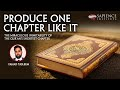

# Produce One Chapter Like It: The Miraculous Inimitability of the Qur'ān's Shortest Chapter (2022-09-28)

## Description

Produce One Chapter Like It: The Miraculous Inimitability of the Qur'ān's Shortest Chapter by Fahad Tasleem

## Summary of [Produce One Chapter Like It: The Miraculous Inimitability of the Qur'ān's Shortest Chapter](https://www.youtube.com/watch?v=sn-ErdHFpvA)

*This summary is AI generated - there may be inaccuracies. *

### [00:00:00](https://www.youtube.com/watch?v=sn-ErdHFpvA&t=0) - [01:00:00](https://www.youtube.com/watch?v=sn-ErdHFpvA&t=3600)

 discusses the importance of the environment in which the Quran was revealed, specifically the challenge of producing similar linguistic structures to those found in the Quran. The presenter argues that this is due to the human capacity for language and its ability to transcend material existence.

**[00:00:00](https://www.youtube.com/watch?v=sn-ErdHFpvA&t=0)** provides a 10-point challenge for producing a short chapter like the Qur'ān's shortest chapter. Points include making sure the chapter is timelessly meaningful, including proper meaning to it, and using only unique words. The seventh point is to make sure the words are used only once in the three lines.
* **[00:05:00](https://www.youtube.com/watch?v=sn-ErdHFpvA&t=300)**  explains how to compose a short chapter like it: all ten points must be taken into consideration, and the chapter must be meaningful and sound. The ninth point is to make the chapter public so that it can be revised.
* **[00:10:00](https://www.youtube.com/watch?v=sn-ErdHFpvA&t=600)** the presenter discusses the shortness of the Qur'ān's shortest chapter, Ṣād, and how it challenges its detractors with various linguistic challenges. They also discuss the linguistic and literary authority impact of the Quran once it has this linguistic environment.
* **[00:15:00](https://www.youtube.com/watch?v=sn-ErdHFpvA&t=900)* Discusses how rhetorical devices such as diacopes and other rhetorical devices are found across languages, and how they can be used to add an extra element to a phrase that goes beyond its simple meaning. It goes on to explain how poetry differs from prose in that the rigor of the information is not always captured in a poem.
* **[00:20:00](https://www.youtube.com/watch?v=sn-ErdHFpvA&t=1200)* Discusses the concept of rhetorical devices and how they are used in the Quran. He goes on to explain that the term "jazz" is a verbal noun that refers to the doctrine that the Quran is from Allah and is a challenge to anyone who tries to imitate it.
* **[00:25:00](https://www.youtube.com/watch?v=sn-ErdHFpvA&t=1500)* Discusses the concept of "jazz" and how it is not accurately represented by the term "miracle." The six conditions necessary for a "jazz" to occur in Islam are as follows: (1) occurrence with the command of Allah; (2) occurrence outside of the natural world; (3) breaking of a causal link; (4) occurrence as part of Hulk; (5) the soul being related to this process; and (6) being broader than specific.
* **[00:30:00](https://www.youtube.com/watch?v=sn-ErdHFpvA&t=1800)* Discusses the miracles of the Qur'ān, and how each one must meet certain criteria in order for it to be considered a miracle. It goes on to say that the jazz of the Quran is to bring a challenge to challenge someone to do something extraordinary.
* **[00:35:00](https://www.youtube.com/watch?v=sn-ErdHFpvA&t=2100)* Discusses how people often make assumptions about the Qur'an based on how it is similar to other scriptures. He then provides examples of how some Qur'anic verses challenge these assumptions by asking people to produce a Quran, Hadith, or speech that is similar to it.
* **[00:40:00](https://www.youtube.com/watch?v=sn-ErdHFpvA&t=2400)* Discusses the challenge of producing a Surah like the Qur'an's shortest chapter, Surat al-baqarah. It points out that, in context, the verse is talking about the Prophet Muhammad, and that there is a difference between the two verses. It then goes on to discuss the literary features of the verse, specifically the lack of a Min, and how that relates to the context of the verse.
* **[00:45:00](https://www.youtube.com/watch?v=sn-ErdHFpvA&t=2700)* Discusses the linguistic environment in which the Qur'ān was revealed, and how the Arabs esteemed poetry and considered it a form of speech with great importance. Whenever a poet emerged, celebrations would erupt among the Arabs.
* **[00:50:00](https://www.youtube.com/watch?v=sn-ErdHFpvA&t=3000)* Discusses the importance of the environment in which the Quran was revealed, specifically the challenge of producing similar linguistic structures to those found in the Quran. He argues that this is due to the human capacity for language and its ability to transcend material existence.
* **[00:55:00](https://www.youtube.com/watch?v=sn-ErdHFpvA&t=3300)** The short Surah al-Kothar was revealed to Prophet Muhammad in 7th century Arabia in response to the Prophet's son's death. The Surah's message emphasizes the importance of patience and contemplation, and stresses that all humans are subject to Allah's will.
### [01:00:00](https://www.youtube.com/watch?v=sn-ErdHFpvA&t=3600) - [02:00:00](https://www.youtube.com/watch?v=sn-ErdHFpvA&t=7200)

 discusses the meaning of the Qur'an's shortest chapter and its significance. The chapter is seen as a transition from the power and majesty of Allah to a closeness with Him. The chapter also highlights the importance of time and how it is often wasted.

**[01:00:00](https://www.youtube.com/watch?v=sn-ErdHFpvA&t=3600)** The short Qur'an chapter, Surah al-Baqarah, deals with the aftermath of a son's death. It explains that Allah has granted the prophet Muhammad a change in perspective, and that this shift in perspective was instrumental in his being able to smile after his son's death.
* **[01:05:00](https://www.youtube.com/watch?v=sn-ErdHFpvA&t=3900)** The first feature of the Qur'ān is that it starts with the word "Inna." This particle emphasizes the importance of what is to come. The Surah also has a plurality signifying majesty.
* **[01:10:00](https://www.youtube.com/watch?v=sn-ErdHFpvA&t=4200)** The Qur'an's shortest chapter, Inna Lillahi wa Inna Ilayhi Raji'un, emphasizes the giving nature of Allah. The word thaw, which signifies a hand handing over something, is specifically used in this context. It signifies intimacy, ownership, and connection.
* **[01:15:00](https://www.youtube.com/watch?v=sn-ErdHFpvA&t=4500)* Discusses the five features of the Qur'an that make it miraculous. First, the word in the first person plural form emphasizes the power of Allah. Second, the term kautha has a number of different meanings that communicate the effectiveness of the verse. Third, the repetition of the phrase "already happened" emphasizes the certainty of the promise. Fourth, the state of the Prophet sallam was such that he was full of sadness and happiness at the same time. Fifth, the word kauser has a multitude of meanings that enhance the communicative effectiveness of the verse. Finally, the Qur'an is a gem with many layers of meaning that can be communicated effectively.
* **[01:20:00](https://www.youtube.com/watch?v=sn-ErdHFpvA&t=4800)* Discusses the meaning of the word "culture," focusing on the fact that it is a river in Paradise with an abundance of good in it. The prophet Muhammad saws is quoted as saying that culture is better than all of the world's treasures combined. The word alcatra has a greater significance than amen or man, and it is prefixed with a definite article to indicate its status as a definite word.
* **[01:25:00](https://www.youtube.com/watch?v=sn-ErdHFpvA&t=5100)** The ninth feature of the Qur'ān's short chapters is conceptual relatedness, which refers to the idea that everything that is good is included in the term. The tenth and final feature is intertextuality, which refers to the relationship between the verses in the Qur'ān.
* **[01:30:00](https://www.youtube.com/watch?v=sn-ErdHFpvA&t=5400)** The tenth feature of the Qur'ān is its use of the word "rub." This term refers to the Lord (Arab umm), owner Guardian of everything in the universe. It includes concepts such as dominion, power, and pampering, which are all tied with the identification marker of Allah being the only true God.
* **[01:35:00](https://www.youtube.com/watch?v=sn-ErdHFpvA&t=5700)* Discusses the Miraculous Inimitability of the Qur'ān's Shortest Chapter, which consists of only 6 verses. This change in language shows the prophet's transition from feeling power and majesty to a closeness to God. The chapter also highlights the importance of time and how it is often wasted.
* **[01:40:00](https://www.youtube.com/watch?v=sn-ErdHFpvA&t=6000)** The Qur'an has a word for hating those who are evil and hateful. The word, Shady, is chosen to be on point because it describes the hatred in a clear and concise way. The Qur'an stresses the importance of justice, and believers are commanded to fight against those who oppose justice. Hating someone because of their bad disposition is wrong, and believers are to avoid doing this.
* **[01:45:00](https://www.youtube.com/watch?v=sn-ErdHFpvA&t=6300)** The word "hater" is chosen to describe the enemies of the prophet Saws because it is the word that they used against him. The word has a different meaning when used to describe the enemies of the process of prophethood. The term "karaha" is used to describe something that is hated, and it is good for the person doing the hating.
* **[01:50:00](https://www.youtube.com/watch?v=sn-ErdHFpvA&t=6600)* Discusses the shortness of the Qur'ān's Chapter 23 and its significance. The chapter does not mention the one who insulted the Prophet Muhammad, making it applicable to anyone who attempts to denigrate the process of Islam. The Qur'ān's repetition and rhythm are linked with its meaning and semantic force.
* **[01:55:00](https://www.youtube.com/watch?v=sn-ErdHFpvA&t=6900)** The 23 features of the Qur'an's shortest chapter are rhyme, meaning, and factual accuracy. The chapter has a poetic musing quality, but it also has a connection to reality. The verses of the Qur'an are factual and accurate, tying in with reality.
### [02:00:00](https://www.youtube.com/watch?v=sn-ErdHFpvA&t=7200) - [02:15:00](https://www.youtube.com/watch?v=sn-ErdHFpvA&t=8100)

 discusses the unique features of the shortest chapter in the Quran, Surat al-kausa, and how they point to the Quran's inimitability. The presenter explains that the Quran's short, yet miraculous, verses are proof of its genuineness, and that the challenge of different quran interpretations is a challenge to science.

**[02:00:00](https://www.youtube.com/watch?v=sn-ErdHFpvA&t=7200)** The Qur'an has a unique, cryptic structure that is difficult to replicate. The lexical items in the chapter are all used only once, reinforcing the uniqueness of the chapter.
* **[02:05:00](https://www.youtube.com/watch?v=sn-ErdHFpvA&t=7500)* Discusses the unique words that only appear once in the Quran, and how they mirror situations and concepts in other verses. It also discusses the lessons that can be gleaned from Surat al-kausa.
* **[02:10:00](https://www.youtube.com/watch?v=sn-ErdHFpvA&t=7800)** The presenter discusses how scientific miracles are difficult to prove, and how variant quran's (i.e. the Qur'an with different interpretations) are a challenge to science because of how it is written and how it is interpreted.
* **[02:15:00](https://www.youtube.com/watch?v=sn-ErdHFpvA&t=8100)** The presenter discusses how the Quran has a number of short, yet miraculous, verses. He explains that this signifies that the Quran is genuine and inimitable. He also notes that the article he referred to provides additional content relevant to the discussion.

<h2>Full transcript with timestamps: CLICK TO EXPAND</h2>

[0:00:10](https://youtu.be/sn-ErdHFpvA?t=10) I hope everyone is well  
[0:00:13](https://youtu.be/sn-ErdHFpvA?t=13) um inshallah let's go ahead and get  
[0:00:15](https://youtu.be/sn-ErdHFpvA?t=15) started  
[0:00:21](https://youtu.be/sn-ErdHFpvA?t=21) [Music]  
[0:00:23](https://youtu.be/sn-ErdHFpvA?t=23) so welcome to today's seminar uh  
[0:00:28](https://youtu.be/sn-ErdHFpvA?t=28) inshallah we're going to be trying our  
[0:00:31](https://youtu.be/sn-ErdHFpvA?t=31) best to cover as much as we possibly can  
[0:00:35](https://youtu.be/sn-ErdHFpvA?t=35) um today's seminar is one that I think  
[0:00:37](https://youtu.be/sn-ErdHFpvA?t=37) is is quite unique in the sense that I  
[0:00:40](https://youtu.be/sn-ErdHFpvA?t=40) haven't really seen it covered with much  
[0:00:44](https://youtu.be/sn-ErdHFpvA?t=44) uh rigor in in at other institutions and  
[0:00:48](https://youtu.be/sn-ErdHFpvA?t=48) other places so hopefully you'll be able  
[0:00:50](https://youtu.be/sn-ErdHFpvA?t=50) to benefit and I ask Allah to accept  
[0:00:54](https://youtu.be/sn-ErdHFpvA?t=54) from all of us and allow all of us to  
[0:00:56](https://youtu.be/sn-ErdHFpvA?t=56) benefit inshallah so let us go ahead and  
[0:00:58](https://youtu.be/sn-ErdHFpvA?t=58) start with in in Earnest and I wanted to  
[0:01:00](https://youtu.be/sn-ErdHFpvA?t=60) start with a challenge and it's a 10  
[0:01:04](https://youtu.be/sn-ErdHFpvA?t=64) point challenge specifically  
[0:01:06](https://youtu.be/sn-ErdHFpvA?t=66) so here you go and this is something  
[0:01:08](https://youtu.be/sn-ErdHFpvA?t=68) that I want you to really think about  
[0:01:09](https://youtu.be/sn-ErdHFpvA?t=69) and consider  
[0:01:11](https://youtu.be/sn-ErdHFpvA?t=71) Point number one in this challenge  
[0:01:14](https://youtu.be/sn-ErdHFpvA?t=74) take any 10 words in any language my  
[0:01:17](https://youtu.be/sn-ErdHFpvA?t=77) whatever language that you speak whether  
[0:01:19](https://youtu.be/sn-ErdHFpvA?t=79) it's Urdu or Hindi or whatever Japanese  
[0:01:21](https://youtu.be/sn-ErdHFpvA?t=81) or Spanish any 10 words you like  
[0:01:24](https://youtu.be/sn-ErdHFpvA?t=84) in any language and then formulate them  
[0:01:27](https://youtu.be/sn-ErdHFpvA?t=87) into three lines or let's say three  
[0:01:29](https://youtu.be/sn-ErdHFpvA?t=89) verses  
[0:01:30](https://youtu.be/sn-ErdHFpvA?t=90) and then add any  
[0:01:31](https://youtu.be/sn-ErdHFpvA?t=91) you know particle that you feel fit  
[0:01:34](https://youtu.be/sn-ErdHFpvA?t=94) right linguistic particle that you think  
[0:01:35](https://youtu.be/sn-ErdHFpvA?t=95) is good so you've got these 10 words  
[0:01:37](https://youtu.be/sn-ErdHFpvA?t=97) you're going to put them in uh three  
[0:01:40](https://youtu.be/sn-ErdHFpvA?t=100) lines or three verses  
[0:01:41](https://youtu.be/sn-ErdHFpvA?t=101) number two the second point of the  
[0:01:43](https://youtu.be/sn-ErdHFpvA?t=103) challenge  
[0:01:44](https://youtu.be/sn-ErdHFpvA?t=104) when you do this when you construct it  
[0:01:46](https://youtu.be/sn-ErdHFpvA?t=106) like this extract from it at least or  
[0:01:49](https://youtu.be/sn-ErdHFpvA?t=109) include it excuse me include in this  
[0:01:52](https://youtu.be/sn-ErdHFpvA?t=112) construct of yours at least 27  
[0:01:55](https://youtu.be/sn-ErdHFpvA?t=115) rhetorical devices and literary features  
[0:01:57](https://youtu.be/sn-ErdHFpvA?t=117) that's minimum right so I'm gonna do  
[0:02:00](https://youtu.be/sn-ErdHFpvA?t=120) more okay Miss minlock go for it  
[0:02:02](https://youtu.be/sn-ErdHFpvA?t=122) the third point of this challenge now  
[0:02:05](https://youtu.be/sn-ErdHFpvA?t=125) you've got these uh you've got these  
[0:02:08](https://youtu.be/sn-ErdHFpvA?t=128) these 10 words you've put them into  
[0:02:09](https://youtu.be/sn-ErdHFpvA?t=129) three lines or three verses you have uh  
[0:02:13](https://youtu.be/sn-ErdHFpvA?t=133) placed within them at least 27 uh  
[0:02:17](https://youtu.be/sn-ErdHFpvA?t=137) literary features or rhetorical devices  
[0:02:21](https://youtu.be/sn-ErdHFpvA?t=141) now at the same time  
[0:02:24](https://youtu.be/sn-ErdHFpvA?t=144) you want to make sure that what you've  
[0:02:25](https://youtu.be/sn-ErdHFpvA?t=145) composed is timelessly Meaningful  
[0:02:28](https://youtu.be/sn-ErdHFpvA?t=148) meaning it's not time bound it is uh as  
[0:02:32](https://youtu.be/sn-ErdHFpvA?t=152) they say trans-historic so someone  
[0:02:34](https://youtu.be/sn-ErdHFpvA?t=154) reading it 20 years from now would be  
[0:02:36](https://youtu.be/sn-ErdHFpvA?t=156) able to benefit and understand it like  
[0:02:38](https://youtu.be/sn-ErdHFpvA?t=158) someone reading it 20 years from now so  
[0:02:40](https://youtu.be/sn-ErdHFpvA?t=160) in other words it is timelessly  
[0:02:42](https://youtu.be/sn-ErdHFpvA?t=162) Meaningful it actually has proper  
[0:02:44](https://youtu.be/sn-ErdHFpvA?t=164) meaning to it but not only that the  
[0:02:46](https://youtu.be/sn-ErdHFpvA?t=166) third part of this challenge is that it  
[0:02:48](https://youtu.be/sn-ErdHFpvA?t=168) fits in a larger uh a larger piece of  
[0:02:52](https://youtu.be/sn-ErdHFpvA?t=172) work right and that larger piece of work  
[0:02:54](https://youtu.be/sn-ErdHFpvA?t=174) that book or that dissertation or  
[0:02:57](https://youtu.be/sn-ErdHFpvA?t=177) whatever it might be uh numbers 27 more  
[0:03:00](https://youtu.be/sn-ErdHFpvA?t=180) than 27 000 words so you have this these  
[0:03:04](https://youtu.be/sn-ErdHFpvA?t=184) 10 words you put them into three lines  
[0:03:06](https://youtu.be/sn-ErdHFpvA?t=186) these three lines have at least 27  
[0:03:08](https://youtu.be/sn-ErdHFpvA?t=188) rhetorical device and literary features  
[0:03:10](https://youtu.be/sn-ErdHFpvA?t=190) and all you've constructed all of that  
[0:03:13](https://youtu.be/sn-ErdHFpvA?t=193) you've put that all together  
[0:03:15](https://youtu.be/sn-ErdHFpvA?t=195) in a structure that is Meaningful both  
[0:03:18](https://youtu.be/sn-ErdHFpvA?t=198) today tomorrow the day after and it  
[0:03:22](https://youtu.be/sn-ErdHFpvA?t=202) forms the part it forms a part a small  
[0:03:25](https://youtu.be/sn-ErdHFpvA?t=205) part of a larger work that is over 70 or  
[0:03:30](https://youtu.be/sn-ErdHFpvA?t=210) 70 000 words or 27 000 words excuse me  
[0:03:33](https://youtu.be/sn-ErdHFpvA?t=213) okay now not only that we're not done  
[0:03:36](https://youtu.be/sn-ErdHFpvA?t=216) yet Point number four make sure that  
[0:03:39](https://youtu.be/sn-ErdHFpvA?t=219) four of its words are unique and never  
[0:03:42](https://youtu.be/sn-ErdHFpvA?t=222) used again in the book so remember that  
[0:03:44](https://youtu.be/sn-ErdHFpvA?t=224) 27 000 work that you have that it forms  
[0:03:47](https://youtu.be/sn-ErdHFpvA?t=227) a part of you have four words that are  
[0:03:50](https://youtu.be/sn-ErdHFpvA?t=230) used in this compilation of yours in  
[0:03:52](https://youtu.be/sn-ErdHFpvA?t=232) this composition of yours ten words out  
[0:03:54](https://youtu.be/sn-ErdHFpvA?t=234) of those ten words four of those words  
[0:03:56](https://youtu.be/sn-ErdHFpvA?t=236) are never used anywhere else in the  
[0:04:00](https://youtu.be/sn-ErdHFpvA?t=240) entire dissertation book or whatever you  
[0:04:02](https://youtu.be/sn-ErdHFpvA?t=242) want to call it that spans more than 27  
[0:04:06](https://youtu.be/sn-ErdHFpvA?t=246) 000 words  
[0:04:07](https://youtu.be/sn-ErdHFpvA?t=247) all right fifth point  
[0:04:09](https://youtu.be/sn-ErdHFpvA?t=249) not only all of that as you compose this  
[0:04:14](https://youtu.be/sn-ErdHFpvA?t=254) particular uh piece of writing or let's  
[0:04:18](https://youtu.be/sn-ErdHFpvA?t=258) say composition you will need to make  
[0:04:20](https://youtu.be/sn-ErdHFpvA?t=260) sure that every single verse that you  
[0:04:22](https://youtu.be/sn-ErdHFpvA?t=262) every single line or every single verse  
[0:04:24](https://youtu.be/sn-ErdHFpvA?t=264) that you put in there remember there's  
[0:04:25](https://youtu.be/sn-ErdHFpvA?t=265) three that they all end with a rhyme but  
[0:04:28](https://youtu.be/sn-ErdHFpvA?t=268) it's not that they're just rhyming but  
[0:04:30](https://youtu.be/sn-ErdHFpvA?t=270) remember they have to be meaningful and  
[0:04:33](https://youtu.be/sn-ErdHFpvA?t=273) we're going to get into this in a little  
[0:04:34](https://youtu.be/sn-ErdHFpvA?t=274) bit why this is actually very  
[0:04:36](https://youtu.be/sn-ErdHFpvA?t=276) challenging number six  
[0:04:38](https://youtu.be/sn-ErdHFpvA?t=278) the words that you are using all right  
[0:04:41](https://youtu.be/sn-ErdHFpvA?t=281) so make sure that these words are used  
[0:04:42](https://youtu.be/sn-ErdHFpvA?t=282) only once in the three lines and not  
[0:04:45](https://youtu.be/sn-ErdHFpvA?t=285) used anywhere else in the book so those  
[0:04:47](https://youtu.be/sn-ErdHFpvA?t=287) four words that we were just speaking  
[0:04:49](https://youtu.be/sn-ErdHFpvA?t=289) about they're used once in the three  
[0:04:51](https://youtu.be/sn-ErdHFpvA?t=291) lines and not used anywhere else in the  
[0:04:52](https://youtu.be/sn-ErdHFpvA?t=292) book  
[0:04:53](https://youtu.be/sn-ErdHFpvA?t=293) okay not only that the tenth the sorry  
[0:04:57](https://youtu.be/sn-ErdHFpvA?t=297) the seventh point in this ten point  
[0:04:59](https://youtu.be/sn-ErdHFpvA?t=299) challenge  
[0:05:00](https://youtu.be/sn-ErdHFpvA?t=300) these three lines that you've now  
[0:05:02](https://youtu.be/sn-ErdHFpvA?t=302) composed with everything that we've just  
[0:05:05](https://youtu.be/sn-ErdHFpvA?t=305) said so they're made up of ten words  
[0:05:06](https://youtu.be/sn-ErdHFpvA?t=306) those 10 words are meaningful uh four of  
[0:05:10](https://youtu.be/sn-ErdHFpvA?t=310) those words are not used anywhere else  
[0:05:12](https://youtu.be/sn-ErdHFpvA?t=312) in the larger uh in the larger  
[0:05:14](https://youtu.be/sn-ErdHFpvA?t=314) dissertation or or writing that you have  
[0:05:17](https://youtu.be/sn-ErdHFpvA?t=317) have put together uh that spans remember  
[0:05:19](https://youtu.be/sn-ErdHFpvA?t=319) 27 000 words not only that  
[0:05:22](https://youtu.be/sn-ErdHFpvA?t=322) but in this particular piece of writing  
[0:05:25](https://youtu.be/sn-ErdHFpvA?t=325) that you put together and as you've  
[0:05:27](https://youtu.be/sn-ErdHFpvA?t=327) divided this up into chapters or  
[0:05:28](https://youtu.be/sn-ErdHFpvA?t=328) whatever you want to divide it up into  
[0:05:29](https://youtu.be/sn-ErdHFpvA?t=329) make sure that the chapter before the  
[0:05:33](https://youtu.be/sn-ErdHFpvA?t=333) chapter that precedes this compilation  
[0:05:36](https://youtu.be/sn-ErdHFpvA?t=336) of yours mirrors what you've written so  
[0:05:39](https://youtu.be/sn-ErdHFpvA?t=339) if you've written today it's uh today  
[0:05:41](https://youtu.be/sn-ErdHFpvA?t=341) it's going to be a great day the chapter  
[0:05:43](https://youtu.be/sn-ErdHFpvA?t=343) that comes before that today is going to  
[0:05:44](https://youtu.be/sn-ErdHFpvA?t=344) be a horrible day uh I went uh to the  
[0:05:47](https://youtu.be/sn-ErdHFpvA?t=347) marketplace I returned back from the  
[0:05:49](https://youtu.be/sn-ErdHFpvA?t=349) marketplace so this is what will be my  
[0:05:51](https://youtu.be/sn-ErdHFpvA?t=351) mirroring so now make sure that the  
[0:05:53](https://youtu.be/sn-ErdHFpvA?t=353) chapter before it mirrors  
[0:05:55](https://youtu.be/sn-ErdHFpvA?t=355) the chap this particular chapter that  
[0:05:57](https://youtu.be/sn-ErdHFpvA?t=357) you're you're composing not only that  
[0:05:59](https://youtu.be/sn-ErdHFpvA?t=359) though to just have some fun and add  
[0:06:02](https://youtu.be/sn-ErdHFpvA?t=362) something to the challenge make sure  
[0:06:05](https://youtu.be/sn-ErdHFpvA?t=365) that you're composing all of this  
[0:06:07](https://youtu.be/sn-ErdHFpvA?t=367) based on an unplanned set of  
[0:06:10](https://youtu.be/sn-ErdHFpvA?t=370) circumstances meaning you do it right  
[0:06:13](https://youtu.be/sn-ErdHFpvA?t=373) now without any sort of planning without  
[0:06:14](https://youtu.be/sn-ErdHFpvA?t=374) any sort of foresight without in without  
[0:06:16](https://youtu.be/sn-ErdHFpvA?t=376) even thinking about it I want you to  
[0:06:18](https://youtu.be/sn-ErdHFpvA?t=378) just come up with it immediately  
[0:06:20](https://youtu.be/sn-ErdHFpvA?t=380) okay number eight  
[0:06:23](https://youtu.be/sn-ErdHFpvA?t=383) and you think this this would pretty  
[0:06:25](https://youtu.be/sn-ErdHFpvA?t=385) much would be done now the eighth point  
[0:06:27](https://youtu.be/sn-ErdHFpvA?t=387) in this ten point challenge  
[0:06:28](https://youtu.be/sn-ErdHFpvA?t=388) you've put these 10 words together but  
[0:06:31](https://youtu.be/sn-ErdHFpvA?t=391) now you must use out of this compilation  
[0:06:34](https://youtu.be/sn-ErdHFpvA?t=394) that you've put together these three  
[0:06:36](https://youtu.be/sn-ErdHFpvA?t=396) lines or verses 10 words part of a  
[0:06:39](https://youtu.be/sn-ErdHFpvA?t=399) larger uh a larger dissertation or book  
[0:06:41](https://youtu.be/sn-ErdHFpvA?t=401) or whatever you want to call it that's  
[0:06:43](https://youtu.be/sn-ErdHFpvA?t=403) more than 27 000 words not only that in  
[0:06:46](https://youtu.be/sn-ErdHFpvA?t=406) this particular piece that you have put  
[0:06:48](https://youtu.be/sn-ErdHFpvA?t=408) together you must use 10 letters in each  
[0:06:52](https://youtu.be/sn-ErdHFpvA?t=412) line and 10 letters only once in the  
[0:06:54](https://youtu.be/sn-ErdHFpvA?t=414) entire three lines in other words those  
[0:06:57](https://youtu.be/sn-ErdHFpvA?t=417) 10 letters that you use  
[0:06:59](https://youtu.be/sn-ErdHFpvA?t=419) should not repeat in any of the three  
[0:07:01](https://youtu.be/sn-ErdHFpvA?t=421) lines  
[0:07:03](https://youtu.be/sn-ErdHFpvA?t=423) okay  
[0:07:04](https://youtu.be/sn-ErdHFpvA?t=424) number nine  
[0:07:05](https://youtu.be/sn-ErdHFpvA?t=425) not only you have to do all of this  
[0:07:08](https://youtu.be/sn-ErdHFpvA?t=428) what you need to do is to make sure you  
[0:07:11](https://youtu.be/sn-ErdHFpvA?t=431) have a semantically orientated Rhythm  
[0:07:13](https://youtu.be/sn-ErdHFpvA?t=433) without sacrificing meaning because you  
[0:07:16](https://youtu.be/sn-ErdHFpvA?t=436) know you could put something together  
[0:07:17](https://youtu.be/sn-ErdHFpvA?t=437) that has a certain Rhythm that flows and  
[0:07:21](https://youtu.be/sn-ErdHFpvA?t=441) has a certain auditory sensation and  
[0:07:23](https://youtu.be/sn-ErdHFpvA?t=443) auditory pleasure but it is semantically  
[0:07:27](https://youtu.be/sn-ErdHFpvA?t=447) uh bankrupt right the meaning that you  
[0:07:30](https://youtu.be/sn-ErdHFpvA?t=450) have in in the sense that it's something  
[0:07:32](https://youtu.be/sn-ErdHFpvA?t=452) that's meaningful that's deep and that  
[0:07:34](https://youtu.be/sn-ErdHFpvA?t=454) touches the soul  
[0:07:35](https://youtu.be/sn-ErdHFpvA?t=455) you uh you know it has to be  
[0:07:38](https://youtu.be/sn-ErdHFpvA?t=458) semantically uh mean it has to be  
[0:07:40](https://youtu.be/sn-ErdHFpvA?t=460) meaningful right it has to be  
[0:07:42](https://youtu.be/sn-ErdHFpvA?t=462) semantically sound  
[0:07:43](https://youtu.be/sn-ErdHFpvA?t=463) okay now in this Rhythm don't sacrifice  
[0:07:46](https://youtu.be/sn-ErdHFpvA?t=466) any meaning  
[0:07:48](https://youtu.be/sn-ErdHFpvA?t=468) number nine  
[0:07:50](https://youtu.be/sn-ErdHFpvA?t=470) here's what you're gonna do the last the  
[0:07:51](https://youtu.be/sn-ErdHFpvA?t=471) tenth point of this ten point challenge  
[0:07:54](https://youtu.be/sn-ErdHFpvA?t=474) you need to do all of this publicly  
[0:07:56](https://youtu.be/sn-ErdHFpvA?t=476) right not in the confines of your home  
[0:07:58](https://youtu.be/sn-ErdHFpvA?t=478) tapping away at your laptop or whatever  
[0:08:00](https://youtu.be/sn-ErdHFpvA?t=480) it might be but do it all publicly you  
[0:08:03](https://youtu.be/sn-ErdHFpvA?t=483) don't have a chance for revision you  
[0:08:04](https://youtu.be/sn-ErdHFpvA?t=484) can't go back and edit and you know  
[0:08:07](https://youtu.be/sn-ErdHFpvA?t=487) think about it and add a couple more  
[0:08:08](https://youtu.be/sn-ErdHFpvA?t=488) words and so on and so forth so you  
[0:08:10](https://youtu.be/sn-ErdHFpvA?t=490) can't make any amendments no revision  
[0:08:12](https://youtu.be/sn-ErdHFpvA?t=492) and  
[0:08:13](https://youtu.be/sn-ErdHFpvA?t=493) we have to understand that you're not  
[0:08:16](https://youtu.be/sn-ErdHFpvA?t=496) going to get any sort of training in  
[0:08:18](https://youtu.be/sn-ErdHFpvA?t=498) eloquence or rhetoric all right  
[0:08:21](https://youtu.be/sn-ErdHFpvA?t=501) how difficult do you think this  
[0:08:23](https://youtu.be/sn-ErdHFpvA?t=503) challenge is  
[0:08:24](https://youtu.be/sn-ErdHFpvA?t=504) now if you were to ask me I would say  
[0:08:26](https://youtu.be/sn-ErdHFpvA?t=506) it's a very difficult challenge in fact  
[0:08:28](https://youtu.be/sn-ErdHFpvA?t=508) I would say it's next to impossible to  
[0:08:30](https://youtu.be/sn-ErdHFpvA?t=510) compose something like this with all of  
[0:08:33](https://youtu.be/sn-ErdHFpvA?t=513) these 10 points taking all of these 10  
[0:08:34](https://youtu.be/sn-ErdHFpvA?t=514) points into consideration  
[0:08:36](https://youtu.be/sn-ErdHFpvA?t=516) today what we're going to be looking at  
[0:08:39](https://youtu.be/sn-ErdHFpvA?t=519) is none other than the shortest chapter  
[0:08:42](https://youtu.be/sn-ErdHFpvA?t=522) or the shortest Surah in the Quran and  
[0:08:44](https://youtu.be/sn-ErdHFpvA?t=524) that is  
[0:08:57](https://youtu.be/sn-ErdHFpvA?t=537) and indeed we have given you the  
[0:09:00](https://youtu.be/sn-ErdHFpvA?t=540) abundance so pray to your lord and  
[0:09:03](https://youtu.be/sn-ErdHFpvA?t=543) sacrifice indeed your enemy is cut off  
[0:09:06](https://youtu.be/sn-ErdHFpvA?t=546) these this particular chapter of the  
[0:09:09](https://youtu.be/sn-ErdHFpvA?t=549) Quran what we're going to be exploring  
[0:09:11](https://youtu.be/sn-ErdHFpvA?t=551) today is we're going to be looking at  
[0:09:13](https://youtu.be/sn-ErdHFpvA?t=553) some of the rhetorical devices within  
[0:09:16](https://youtu.be/sn-ErdHFpvA?t=556) this chapter we're going to be looking  
[0:09:18](https://youtu.be/sn-ErdHFpvA?t=558) at some of the linguistic features of  
[0:09:21](https://youtu.be/sn-ErdHFpvA?t=561) this chapter but more than anything else  
[0:09:23](https://youtu.be/sn-ErdHFpvA?t=563) what we're going to hopefully Marvel at  
[0:09:26](https://youtu.be/sn-ErdHFpvA?t=566) is how all of these linguistic features  
[0:09:30](https://youtu.be/sn-ErdHFpvA?t=570) and rhetorical devices come together in  
[0:09:33](https://youtu.be/sn-ErdHFpvA?t=573) the form of a challenge or to in the  
[0:09:36](https://youtu.be/sn-ErdHFpvA?t=576) form to meet a certain challenge  
[0:09:38](https://youtu.be/sn-ErdHFpvA?t=578) now  
[0:09:40](https://youtu.be/sn-ErdHFpvA?t=580) keep in mind that when we say that this  
[0:09:41](https://youtu.be/sn-ErdHFpvA?t=581) is the shortest chapter of the Quran  
[0:09:43](https://youtu.be/sn-ErdHFpvA?t=583) what we're referring to here just I want  
[0:09:45](https://youtu.be/sn-ErdHFpvA?t=585) to make sure we're clear before we jump  
[0:09:47](https://youtu.be/sn-ErdHFpvA?t=587) into this uh fully  
[0:09:49](https://youtu.be/sn-ErdHFpvA?t=589) the shortest chapter of the Quran  
[0:09:51](https://youtu.be/sn-ErdHFpvA?t=591) meaning that when you look at the number  
[0:09:55](https://youtu.be/sn-ErdHFpvA?t=595) of words that are in this particular  
[0:09:57](https://youtu.be/sn-ErdHFpvA?t=597) chapter in fact you could even maybe may  
[0:10:00](https://youtu.be/sn-ErdHFpvA?t=600) even be able to include the number of  
[0:10:02](https://youtu.be/sn-ErdHFpvA?t=602) letters you would find it has the least  
[0:10:04](https://youtu.be/sn-ErdHFpvA?t=604) number of words okay because there are  
[0:10:07](https://youtu.be/sn-ErdHFpvA?t=607) other chapters of the Quran that have  
[0:10:09](https://youtu.be/sn-ErdHFpvA?t=609) three ayat or three verses right  
[0:10:16](https://youtu.be/sn-ErdHFpvA?t=616) so there's three there as well so anyway  
[0:10:21](https://youtu.be/sn-ErdHFpvA?t=621) so when we say it's the shortest chapter  
[0:10:22](https://youtu.be/sn-ErdHFpvA?t=622) it is the most concise in terms of its  
[0:10:26](https://youtu.be/sn-ErdHFpvA?t=626) uh in in terms of the number of words  
[0:10:29](https://youtu.be/sn-ErdHFpvA?t=629) the letters and things like that this is  
[0:10:31](https://youtu.be/sn-ErdHFpvA?t=631) the shortest chapter in the entire Quran  
[0:10:34](https://youtu.be/sn-ErdHFpvA?t=634) so what are we going to be looking at in  
[0:10:37](https://youtu.be/sn-ErdHFpvA?t=637) our session today well first of all  
[0:10:39](https://youtu.be/sn-ErdHFpvA?t=639) remember I said we're gonna we're gonna  
[0:10:41](https://youtu.be/sn-ErdHFpvA?t=641) be looking at this not in the context of  
[0:10:44](https://youtu.be/sn-ErdHFpvA?t=644) just being amazed which inshallah I'm  
[0:10:47](https://youtu.be/sn-ErdHFpvA?t=647) hoping that that will also come about as  
[0:10:49](https://youtu.be/sn-ErdHFpvA?t=649) a byproduct the the the the wondrous  
[0:10:52](https://youtu.be/sn-ErdHFpvA?t=652) nature of all of these features but more  
[0:10:55](https://youtu.be/sn-ErdHFpvA?t=655) so from the backdrop of it being a  
[0:10:58](https://youtu.be/sn-ErdHFpvA?t=658) challenge I'm going to look at how the  
[0:11:00](https://youtu.be/sn-ErdHFpvA?t=660) Quran challenges its uh its detractors  
[0:11:05](https://youtu.be/sn-ErdHFpvA?t=665) with the various challenges that it has  
[0:11:08](https://youtu.be/sn-ErdHFpvA?t=668) we're also going to be looking at the  
[0:11:11](https://youtu.be/sn-ErdHFpvA?t=671) particular linguistic environment that  
[0:11:13](https://youtu.be/sn-ErdHFpvA?t=673) this Surah comes down and this is  
[0:11:17](https://youtu.be/sn-ErdHFpvA?t=677) important because once you understand  
[0:11:18](https://youtu.be/sn-ErdHFpvA?t=678) the environment it actually adds to the  
[0:11:22](https://youtu.be/sn-ErdHFpvA?t=682) difficulty of bringing something a  
[0:11:25](https://youtu.be/sn-ErdHFpvA?t=685) composition like this uh about anyway  
[0:11:27](https://youtu.be/sn-ErdHFpvA?t=687) the third thing we're going to look at  
[0:11:29](https://youtu.be/sn-ErdHFpvA?t=689) in this backdrop  
[0:11:31](https://youtu.be/sn-ErdHFpvA?t=691) is the linguistic and literary Authority  
[0:11:33](https://youtu.be/sn-ErdHFpvA?t=693) impact once you have the Quran once you  
[0:11:36](https://youtu.be/sn-ErdHFpvA?t=696) have this linguistic environment we find  
[0:11:38](https://youtu.be/sn-ErdHFpvA?t=698) that it's not that it comes to a certain  
[0:11:41](https://youtu.be/sn-ErdHFpvA?t=701) linguistic environment and then it's  
[0:11:43](https://youtu.be/sn-ErdHFpvA?t=703) just it just stops rather it itself  
[0:11:46](https://youtu.be/sn-ErdHFpvA?t=706) starts to dictate and delineate how  
[0:11:50](https://youtu.be/sn-ErdHFpvA?t=710) linguistic and literary  
[0:11:53](https://youtu.be/sn-ErdHFpvA?t=713) um you know how it should be projected  
[0:11:55](https://youtu.be/sn-ErdHFpvA?t=715) outwards in the sense that it's not only  
[0:11:57](https://youtu.be/sn-ErdHFpvA?t=717) something that comes to a certain  
[0:11:58](https://youtu.be/sn-ErdHFpvA?t=718) environment but it also starts  
[0:12:00](https://youtu.be/sn-ErdHFpvA?t=720) determining elements of that environment  
[0:12:04](https://youtu.be/sn-ErdHFpvA?t=724) um going outwards and we'll look at that  
[0:12:05](https://youtu.be/sn-ErdHFpvA?t=725) inshallah in the section of the backdrop  
[0:12:07](https://youtu.be/sn-ErdHFpvA?t=727) we'll look at the reason for Revelation  
[0:12:10](https://youtu.be/sn-ErdHFpvA?t=730) in terms of what was the what's known as  
[0:12:13](https://youtu.be/sn-ErdHFpvA?t=733) here in what context did it come down in  
[0:12:17](https://youtu.be/sn-ErdHFpvA?t=737) and then this is the meat of what we're  
[0:12:19](https://youtu.be/sn-ErdHFpvA?t=739) going to be discussing and that is the  
[0:12:21](https://youtu.be/sn-ErdHFpvA?t=741) 27 linguistic literary features and if  
[0:12:25](https://youtu.be/sn-ErdHFpvA?t=745) we have time because to be honest as I  
[0:12:28](https://youtu.be/sn-ErdHFpvA?t=748) was composing all this and putting the  
[0:12:30](https://youtu.be/sn-ErdHFpvA?t=750) slides together  
[0:12:31](https://youtu.be/sn-ErdHFpvA?t=751) this is going to be very this is going  
[0:12:33](https://youtu.be/sn-ErdHFpvA?t=753) to be a bit long so if we have time  
[0:12:35](https://youtu.be/sn-ErdHFpvA?t=755) inshallah we'll take some of your  
[0:12:36](https://youtu.be/sn-ErdHFpvA?t=756) questions  
[0:12:38](https://youtu.be/sn-ErdHFpvA?t=758) so let us go ahead and begin in the  
[0:12:40](https://youtu.be/sn-ErdHFpvA?t=760) beginning so  
[0:12:41](https://youtu.be/sn-ErdHFpvA?t=761) now before we get to the backdrop I  
[0:12:44](https://youtu.be/sn-ErdHFpvA?t=764) think it's important for us to make what  
[0:12:48](https://youtu.be/sn-ErdHFpvA?t=768) we're going to be speaking about  
[0:12:48](https://youtu.be/sn-ErdHFpvA?t=768) relevant to English speakers  
[0:12:51](https://youtu.be/sn-ErdHFpvA?t=771) being is because a lot of times you  
[0:12:53](https://youtu.be/sn-ErdHFpvA?t=773) think that a discussion that's happening  
[0:12:54](https://youtu.be/sn-ErdHFpvA?t=774) in Arabic I don't speak Arabic I'm not  
[0:12:57](https://youtu.be/sn-ErdHFpvA?t=777) familiar with the Arabic language and so  
[0:12:58](https://youtu.be/sn-ErdHFpvA?t=778) therefore I can't benefit at all and I  
[0:13:01](https://youtu.be/sn-ErdHFpvA?t=781) think that's a faux pas I think that's a  
[0:13:02](https://youtu.be/sn-ErdHFpvA?t=782) mistake when we speak about things like  
[0:13:05](https://youtu.be/sn-ErdHFpvA?t=785) rhetorical devices  
[0:13:07](https://youtu.be/sn-ErdHFpvA?t=787) we understand that languages across the  
[0:13:09](https://youtu.be/sn-ErdHFpvA?t=789) board make use of rhetorical devices so  
[0:13:12](https://youtu.be/sn-ErdHFpvA?t=792) for instance you know it was uh some  
[0:13:15](https://youtu.be/sn-ErdHFpvA?t=795) survey mentioned that the most uh iconic  
[0:13:19](https://youtu.be/sn-ErdHFpvA?t=799) a one-liner in all of cinematic history  
[0:13:22](https://youtu.be/sn-ErdHFpvA?t=802) was what you see on the screen right now  
[0:13:24](https://youtu.be/sn-ErdHFpvA?t=804) right the the phrase Bond James Bond  
[0:13:28](https://youtu.be/sn-ErdHFpvA?t=808) now if you really think about it for a  
[0:13:31](https://youtu.be/sn-ErdHFpvA?t=811) second phrase  
[0:13:32](https://youtu.be/sn-ErdHFpvA?t=812) if you really think about it for a  
[0:13:34](https://youtu.be/sn-ErdHFpvA?t=814) second you'll find that this particular  
[0:13:37](https://youtu.be/sn-ErdHFpvA?t=817) phrase doesn't have any sort of Pearls  
[0:13:39](https://youtu.be/sn-ErdHFpvA?t=819) of Wisdom it's not giving you some sort  
[0:13:41](https://youtu.be/sn-ErdHFpvA?t=821) of remarkable information in fact the  
[0:13:44](https://youtu.be/sn-ErdHFpvA?t=824) author of The of of of of uh of the  
[0:13:48](https://youtu.be/sn-ErdHFpvA?t=828) books that the James Bond movies are  
[0:13:50](https://youtu.be/sn-ErdHFpvA?t=830) based upon Ian Fleming  
[0:13:52](https://youtu.be/sn-ErdHFpvA?t=832) he actually said I chose a name that was  
[0:13:57](https://youtu.be/sn-ErdHFpvA?t=837) one that would be  
[0:13:58](https://youtu.be/sn-ErdHFpvA?t=838) that that attracted the least amount of  
[0:14:01](https://youtu.be/sn-ErdHFpvA?t=841) intention in other words I wanted the  
[0:14:04](https://youtu.be/sn-ErdHFpvA?t=844) events around the character to be the  
[0:14:07](https://youtu.be/sn-ErdHFpvA?t=847) focus and not the person not the  
[0:14:09](https://youtu.be/sn-ErdHFpvA?t=849) character himself so he chose the most  
[0:14:11](https://youtu.be/sn-ErdHFpvA?t=851) Bland boring name that he could possibly  
[0:14:16](https://youtu.be/sn-ErdHFpvA?t=856) think of so he chooses James Bond so  
[0:14:18](https://youtu.be/sn-ErdHFpvA?t=858) there's nothing remarkable about the  
[0:14:21](https://youtu.be/sn-ErdHFpvA?t=861) name however it's something about this  
[0:14:24](https://youtu.be/sn-ErdHFpvA?t=864) name something about how it's stated it  
[0:14:26](https://youtu.be/sn-ErdHFpvA?t=866) brings about a certain type of feeling  
[0:14:28](https://youtu.be/sn-ErdHFpvA?t=868) within a person there's a certain uh  
[0:14:32](https://youtu.be/sn-ErdHFpvA?t=872) there's a certain kind of uh internal  
[0:14:34](https://youtu.be/sn-ErdHFpvA?t=874) Association that you have when someone  
[0:14:37](https://youtu.be/sn-ErdHFpvA?t=877) says Bond James Bond and in fact it goes  
[0:14:41](https://youtu.be/sn-ErdHFpvA?t=881) and it's it's on a certain uh it it  
[0:14:44](https://youtu.be/sn-ErdHFpvA?t=884) makes use of a certain rhetorical device  
[0:14:46](https://youtu.be/sn-ErdHFpvA?t=886) which is known as a typo a Diet Coke is  
[0:14:50](https://youtu.be/sn-ErdHFpvA?t=890) a rhetorical device that's on the form a  
[0:14:52](https://youtu.be/sn-ErdHFpvA?t=892) b a  
[0:14:53](https://youtu.be/sn-ErdHFpvA?t=893) so other diet copes would be things like  
[0:14:55](https://youtu.be/sn-ErdHFpvA?t=895) bird baby bird right home sweet home for  
[0:14:59](https://youtu.be/sn-ErdHFpvA?t=899) some reason when you put it in this  
[0:15:01](https://youtu.be/sn-ErdHFpvA?t=901) particular format it adds something to  
[0:15:04](https://youtu.be/sn-ErdHFpvA?t=904) it it brings something more than just  
[0:15:06](https://youtu.be/sn-ErdHFpvA?t=906) someone stating their name and so this  
[0:15:08](https://youtu.be/sn-ErdHFpvA?t=908) particular form formulation it's very  
[0:15:10](https://youtu.be/sn-ErdHFpvA?t=910) different than someone walking in the  
[0:15:12](https://youtu.be/sn-ErdHFpvA?t=912) room and saying hello my name is James  
[0:15:14](https://youtu.be/sn-ErdHFpvA?t=914) Bond  
[0:15:15](https://youtu.be/sn-ErdHFpvA?t=915) or hello first name James last name Bond  
[0:15:19](https://youtu.be/sn-ErdHFpvA?t=919) but no something about the fact that you  
[0:15:21](https://youtu.be/sn-ErdHFpvA?t=921) when you say Bond James Bond it just has  
[0:15:25](https://youtu.be/sn-ErdHFpvA?t=925) a certain ring to it and this goes back  
[0:15:27](https://youtu.be/sn-ErdHFpvA?t=927) to rhetorical devices and in fact  
[0:15:29](https://youtu.be/sn-ErdHFpvA?t=929) there's many many rhetorical devices  
[0:15:31](https://youtu.be/sn-ErdHFpvA?t=931) there's a good book if you're interested  
[0:15:33](https://youtu.be/sn-ErdHFpvA?t=933) that uh that kind of ties or or  
[0:15:37](https://youtu.be/sn-ErdHFpvA?t=937) elucidates rhetorical devices in the  
[0:15:40](https://youtu.be/sn-ErdHFpvA?t=940) English language that is a relatively  
[0:15:41](https://youtu.be/sn-ErdHFpvA?t=941) easy read it's by Mark Forsyth  
[0:15:45](https://youtu.be/sn-ErdHFpvA?t=945) um and I'm trying to remember I think  
[0:15:46](https://youtu.be/sn-ErdHFpvA?t=946) it's called um  
[0:15:48](https://youtu.be/sn-ErdHFpvA?t=948) the art of Persuasions or something like  
[0:15:50](https://youtu.be/sn-ErdHFpvA?t=950) that is something to do with you know  
[0:15:52](https://youtu.be/sn-ErdHFpvA?t=952) rhetorical devices the title is escaping  
[0:15:55](https://youtu.be/sn-ErdHFpvA?t=955) me right now  
[0:15:56](https://youtu.be/sn-ErdHFpvA?t=956) um but he talks about these rhetorical  
[0:15:58](https://youtu.be/sn-ErdHFpvA?t=958) devices diacopes and other rhetorical  
[0:16:00](https://youtu.be/sn-ErdHFpvA?t=960) devices so we find rhetorical devices  
[0:16:02](https://youtu.be/sn-ErdHFpvA?t=962) across other languages and if you speak  
[0:16:04](https://youtu.be/sn-ErdHFpvA?t=964) other languages you'll be able to  
[0:16:06](https://youtu.be/sn-ErdHFpvA?t=966) identify rhetorical devices in your own  
[0:16:08](https://youtu.be/sn-ErdHFpvA?t=968) language something that transcends the  
[0:16:11](https://youtu.be/sn-ErdHFpvA?t=971) simple meaning of the phrase  
[0:16:13](https://youtu.be/sn-ErdHFpvA?t=973) and you can this can be further  
[0:16:14](https://youtu.be/sn-ErdHFpvA?t=974) elucidated when we think about the  
[0:16:17](https://youtu.be/sn-ErdHFpvA?t=977) difference between poetry and prose and  
[0:16:19](https://youtu.be/sn-ErdHFpvA?t=979) again we're going to stick with the  
[0:16:20](https://youtu.be/sn-ErdHFpvA?t=980) English language because there's  
[0:16:22](https://youtu.be/sn-ErdHFpvA?t=982) something about poetry  
[0:16:25](https://youtu.be/sn-ErdHFpvA?t=985) that it has some sort of an aesthetic  
[0:16:29](https://youtu.be/sn-ErdHFpvA?t=989) appeal to it  
[0:16:31](https://youtu.be/sn-ErdHFpvA?t=991) such that you cannot you cannot  
[0:16:34](https://youtu.be/sn-ErdHFpvA?t=994) translate the poem okay and such that  
[0:16:39](https://youtu.be/sn-ErdHFpvA?t=999) when it comes to this additional element  
[0:16:42](https://youtu.be/sn-ErdHFpvA?t=1002) it has to do with the beauty of how the  
[0:16:45](https://youtu.be/sn-ErdHFpvA?t=1005) words come together and not  
[0:16:48](https://youtu.be/sn-ErdHFpvA?t=1008) hyper focused on the content okay Pros  
[0:16:52](https://youtu.be/sn-ErdHFpvA?t=1012) on one hand focuses heavily on content  
[0:16:54](https://youtu.be/sn-ErdHFpvA?t=1014) it's trying to get you information in  
[0:16:57](https://youtu.be/sn-ErdHFpvA?t=1017) the most effective way possible so if  
[0:16:59](https://youtu.be/sn-ErdHFpvA?t=1019) you think about something like an  
[0:17:00](https://youtu.be/sn-ErdHFpvA?t=1020) organic chemistry textbook okay an  
[0:17:03](https://youtu.be/sn-ErdHFpvA?t=1023) organic chemistry textbook is something  
[0:17:04](https://youtu.be/sn-ErdHFpvA?t=1024) that you're going to read you're going  
[0:17:06](https://youtu.be/sn-ErdHFpvA?t=1026) to study for your exam and then you're  
[0:17:08](https://youtu.be/sn-ErdHFpvA?t=1028) never going to revisit it most likely  
[0:17:11](https://youtu.be/sn-ErdHFpvA?t=1031) okay you're going to extract the  
[0:17:12](https://youtu.be/sn-ErdHFpvA?t=1032) information whatever you need and then  
[0:17:15](https://youtu.be/sn-ErdHFpvA?t=1035) that's it you're done you will never  
[0:17:17](https://youtu.be/sn-ErdHFpvA?t=1037) come to an organic chemistry or rarely  
[0:17:19](https://youtu.be/sn-ErdHFpvA?t=1039) unless you're maybe one of those types  
[0:17:20](https://youtu.be/sn-ErdHFpvA?t=1040) of people come to organic chemistry and  
[0:17:22](https://youtu.be/sn-ErdHFpvA?t=1042) be like I love reading this book it's  
[0:17:24](https://youtu.be/sn-ErdHFpvA?t=1044) just so meaningful every time I read it  
[0:17:25](https://youtu.be/sn-ErdHFpvA?t=1045) it just takes me to you know Cloud Nine  
[0:17:28](https://youtu.be/sn-ErdHFpvA?t=1048) whereas if you look at a poem a poem is  
[0:17:32](https://youtu.be/sn-ErdHFpvA?t=1052) quite different  
[0:17:33](https://youtu.be/sn-ErdHFpvA?t=1053) because a poem what it does is it not  
[0:17:37](https://youtu.be/sn-ErdHFpvA?t=1057) only gives you content or it places  
[0:17:41](https://youtu.be/sn-ErdHFpvA?t=1061) content in a certain structure such that  
[0:17:44](https://youtu.be/sn-ErdHFpvA?t=1064) when you visit it and then revisit it  
[0:17:47](https://youtu.be/sn-ErdHFpvA?t=1067) you have a yearning to revisit it  
[0:17:49](https://youtu.be/sn-ErdHFpvA?t=1069) because every time you read it it gives  
[0:17:51](https://youtu.be/sn-ErdHFpvA?t=1071) you a certain sense with inside of  
[0:17:53](https://youtu.be/sn-ErdHFpvA?t=1073) yourself so if you look at this poem by  
[0:17:55](https://youtu.be/sn-ErdHFpvA?t=1075) Emily Dickinson Dickinson for example  
[0:17:57](https://youtu.be/sn-ErdHFpvA?t=1077) you know she writes hope is the thing  
[0:18:00](https://youtu.be/sn-ErdHFpvA?t=1080) with feathers and I want you to  
[0:18:02](https://youtu.be/sn-ErdHFpvA?t=1082) kind of think about this for a second  
[0:18:03](https://youtu.be/sn-ErdHFpvA?t=1083) and let it sink in Hope  
[0:18:06](https://youtu.be/sn-ErdHFpvA?t=1086) is the thing with feathers  
[0:18:09](https://youtu.be/sn-ErdHFpvA?t=1089) that that that that perches in the soul  
[0:18:13](https://youtu.be/sn-ErdHFpvA?t=1093) and sings the tune without words and  
[0:18:16](https://youtu.be/sn-ErdHFpvA?t=1096) never stops at all it's it's actually  
[0:18:19](https://youtu.be/sn-ErdHFpvA?t=1099) very beautiful when you think about the  
[0:18:20](https://youtu.be/sn-ErdHFpvA?t=1100) concept of Hope  
[0:18:22](https://youtu.be/sn-ErdHFpvA?t=1102) and she continues and she says  
[0:18:25](https://youtu.be/sn-ErdHFpvA?t=1105) um  
[0:18:26](https://youtu.be/sn-ErdHFpvA?t=1106) that uh and sweetest in the Gale is  
[0:18:29](https://youtu.be/sn-ErdHFpvA?t=1109) heard  
[0:18:30](https://youtu.be/sn-ErdHFpvA?t=1110) and sore must be this the storm that  
[0:18:33](https://youtu.be/sn-ErdHFpvA?t=1113) could abash the little bird that kept so  
[0:18:36](https://youtu.be/sn-ErdHFpvA?t=1116) many warm think about when you need hope  
[0:18:38](https://youtu.be/sn-ErdHFpvA?t=1118) when you are going through the most like  
[0:18:40](https://youtu.be/sn-ErdHFpvA?t=1120) the most you know terrible times in your  
[0:18:43](https://youtu.be/sn-ErdHFpvA?t=1123) life and that's when hope comes in and  
[0:18:44](https://youtu.be/sn-ErdHFpvA?t=1124) she's describing it like this bird it's  
[0:18:46](https://youtu.be/sn-ErdHFpvA?t=1126) very beautiful and then she continues  
[0:18:48](https://youtu.be/sn-ErdHFpvA?t=1128) and says I've heard it in the chilliest  
[0:18:50](https://youtu.be/sn-ErdHFpvA?t=1130) land and the strangest sea yet never in  
[0:18:54](https://youtu.be/sn-ErdHFpvA?t=1134) extremity it asked a crumb of me so you  
[0:18:57](https://youtu.be/sn-ErdHFpvA?t=1137) notice there's a rhyme there's a rhythm  
[0:19:00](https://youtu.be/sn-ErdHFpvA?t=1140) and there's meaning and you want to  
[0:19:02](https://youtu.be/sn-ErdHFpvA?t=1142) revisit it and it brings a certain  
[0:19:03](https://youtu.be/sn-ErdHFpvA?t=1143) feeling to you when you when when you  
[0:19:06](https://youtu.be/sn-ErdHFpvA?t=1146) really internalize and think about  
[0:19:08](https://youtu.be/sn-ErdHFpvA?t=1148) poetry okay  
[0:19:10](https://youtu.be/sn-ErdHFpvA?t=1150) now one of the interesting aspects about  
[0:19:13](https://youtu.be/sn-ErdHFpvA?t=1153) poetry however  
[0:19:15](https://youtu.be/sn-ErdHFpvA?t=1155) is that the rigor of an organic  
[0:19:18](https://youtu.be/sn-ErdHFpvA?t=1158) chemistry textbook rarely can be  
[0:19:20](https://youtu.be/sn-ErdHFpvA?t=1160) captured in the form of a poem right  
[0:19:22](https://youtu.be/sn-ErdHFpvA?t=1162) this because remember in prose the  
[0:19:25](https://youtu.be/sn-ErdHFpvA?t=1165) objective is to give you the information  
[0:19:27](https://youtu.be/sn-ErdHFpvA?t=1167) in the most effective way possible so  
[0:19:30](https://youtu.be/sn-ErdHFpvA?t=1170) it's it's its focus is efficacy whereas  
[0:19:33](https://youtu.be/sn-ErdHFpvA?t=1173) in a poem while it's delivering  
[0:19:34](https://youtu.be/sn-ErdHFpvA?t=1174) information the focus is not necessarily  
[0:19:37](https://youtu.be/sn-ErdHFpvA?t=1177) efficacy per se but the focus is again  
[0:19:40](https://youtu.be/sn-ErdHFpvA?t=1180) generating or having that appreciation  
[0:19:43](https://youtu.be/sn-ErdHFpvA?t=1183) of the Beauty and the and the meaning  
[0:19:46](https://youtu.be/sn-ErdHFpvA?t=1186) behind the words that are being written  
[0:19:47](https://youtu.be/sn-ErdHFpvA?t=1187) for you to visit it and revisit so we  
[0:19:50](https://youtu.be/sn-ErdHFpvA?t=1190) find this phenomenon  
[0:19:52](https://youtu.be/sn-ErdHFpvA?t=1192) prevalent in in any language and you  
[0:19:55](https://youtu.be/sn-ErdHFpvA?t=1195) know we have we understand things like  
[0:19:57](https://youtu.be/sn-ErdHFpvA?t=1197) rhetorical devices rhetoric in Arabic  
[0:19:59](https://youtu.be/sn-ErdHFpvA?t=1199) this concept is known as balaja right  
[0:20:02](https://youtu.be/sn-ErdHFpvA?t=1202) the concept of rhetorical devices and  
[0:20:03](https://youtu.be/sn-ErdHFpvA?t=1203) how they're used efficiently and so on  
[0:20:06](https://youtu.be/sn-ErdHFpvA?t=1206) and we understand when it comes to the  
[0:20:08](https://youtu.be/sn-ErdHFpvA?t=1208) Quran that it is at the Apex of prose  
[0:20:11](https://youtu.be/sn-ErdHFpvA?t=1211) and the Apex of poetry such that it is a  
[0:20:14](https://youtu.be/sn-ErdHFpvA?t=1214) unique genre in and of itself and we're  
[0:20:15](https://youtu.be/sn-ErdHFpvA?t=1215) going to see that uh as we move forward  
[0:20:20](https://youtu.be/sn-ErdHFpvA?t=1220) now all of that all I'm speaking about  
[0:20:23](https://youtu.be/sn-ErdHFpvA?t=1223) today what I'm going to be discussing  
[0:20:24](https://youtu.be/sn-ErdHFpvA?t=1224) today it's based on an article that has  
[0:20:28](https://youtu.be/sn-ErdHFpvA?t=1228) been written by Hamza zorcis you can  
[0:20:30](https://youtu.be/sn-ErdHFpvA?t=1230) find it on the sapiens Institute site on  
[0:20:32](https://youtu.be/sn-ErdHFpvA?t=1232) the link that's there on the screen I'm  
[0:20:35](https://youtu.be/sn-ErdHFpvA?t=1235) going to highly  
[0:20:36](https://youtu.be/sn-ErdHFpvA?t=1236) urge you to after you're done with this  
[0:20:40](https://youtu.be/sn-ErdHFpvA?t=1240) session after we're done with  
[0:20:42](https://youtu.be/sn-ErdHFpvA?t=1242) um with this particular seminar to go  
[0:20:46](https://youtu.be/sn-ErdHFpvA?t=1246) and take a look at the essay and read it  
[0:20:49](https://youtu.be/sn-ErdHFpvA?t=1249) and think about it and internalize it  
[0:20:50](https://youtu.be/sn-ErdHFpvA?t=1250) right because the essay obviously  
[0:20:52](https://youtu.be/sn-ErdHFpvA?t=1252) there's more that can be stated in the  
[0:20:53](https://youtu.be/sn-ErdHFpvA?t=1253) essay the essay has references  
[0:20:57](https://youtu.be/sn-ErdHFpvA?t=1257) um so you know a lot of the stuff I'm  
[0:20:58](https://youtu.be/sn-ErdHFpvA?t=1258) like when it's making up and it has a  
[0:21:00](https://youtu.be/sn-ErdHFpvA?t=1260) certain degree of academic rigor which I  
[0:21:02](https://youtu.be/sn-ErdHFpvA?t=1262) think is very beneficial for a person  
[0:21:05](https://youtu.be/sn-ErdHFpvA?t=1265) that's interested in the topic so again  
[0:21:07](https://youtu.be/sn-ErdHFpvA?t=1267) the essay you can find it at stpitz2.org  
[0:21:10](https://youtu.be/sn-ErdHFpvA?t=1270) it's free download it read it and engage  
[0:21:14](https://youtu.be/sn-ErdHFpvA?t=1274) with it inshallah  
[0:21:16](https://youtu.be/sn-ErdHFpvA?t=1276) so let us stop start with the backdrop  
[0:21:19](https://youtu.be/sn-ErdHFpvA?t=1279) and under the backdrop we'll start with  
[0:21:21](https://youtu.be/sn-ErdHFpvA?t=1281) the challenge  
[0:21:23](https://youtu.be/sn-ErdHFpvA?t=1283) so  
[0:21:24](https://youtu.be/sn-ErdHFpvA?t=1284) what is the challenge exactly well the  
[0:21:27](https://youtu.be/sn-ErdHFpvA?t=1287) challenge that's stated or that the  
[0:21:29](https://youtu.be/sn-ErdHFpvA?t=1289) Quran brings forth is that this Quran is  
[0:21:34](https://youtu.be/sn-ErdHFpvA?t=1294) from Allah  
[0:21:36](https://youtu.be/sn-ErdHFpvA?t=1296) and there's a CH there are challenges  
[0:21:38](https://youtu.be/sn-ErdHFpvA?t=1298) that are part and parcel of the Quran  
[0:21:41](https://youtu.be/sn-ErdHFpvA?t=1301) and the claim that this Quran is from  
[0:21:44](https://youtu.be/sn-ErdHFpvA?t=1304) Allah okay part of that challenge has to  
[0:21:47](https://youtu.be/sn-ErdHFpvA?t=1307) do with imitating or emulating the Quran  
[0:21:50](https://youtu.be/sn-ErdHFpvA?t=1310) all right so the now the failure of  
[0:21:53](https://youtu.be/sn-ErdHFpvA?t=1313) anyone to imitate the Quran developed  
[0:21:54](https://youtu.be/sn-ErdHFpvA?t=1314) into the Muslim theological doctrine of  
[0:21:56](https://youtu.be/sn-ErdHFpvA?t=1316) the quran's intermentibility which is  
[0:21:58](https://youtu.be/sn-ErdHFpvA?t=1318) called  
[0:21:59](https://youtu.be/sn-ErdHFpvA?t=1319) Quran so this entire concept of the  
[0:22:03](https://youtu.be/sn-ErdHFpvA?t=1323) Quran not someone not being able to  
[0:22:06](https://youtu.be/sn-ErdHFpvA?t=1326) imitate it or emulate it developed into  
[0:22:09](https://youtu.be/sn-ErdHFpvA?t=1329) a whole science and a whole subject area  
[0:22:12](https://youtu.be/sn-ErdHFpvA?t=1332) whole domain and this domain is called  
[0:22:14](https://youtu.be/sn-ErdHFpvA?t=1334) Quran now why do they call it  
[0:22:17](https://youtu.be/sn-ErdHFpvA?t=1337) yeah Jazz it's a verbal noun it's a  
[0:22:21](https://youtu.be/sn-ErdHFpvA?t=1341) Musta for those who are studying Arabic  
[0:22:23](https://youtu.be/sn-ErdHFpvA?t=1343) because you're studying English it's a  
[0:22:24](https://youtu.be/sn-ErdHFpvA?t=1344) verbal noun so it's a noun that is  
[0:22:27](https://youtu.be/sn-ErdHFpvA?t=1347) related to an action the technical term  
[0:22:29](https://youtu.be/sn-ErdHFpvA?t=1349) in English grammar if you are interested  
[0:22:31](https://youtu.be/sn-ErdHFpvA?t=1351) is a gerund I don't know why they called  
[0:22:34](https://youtu.be/sn-ErdHFpvA?t=1354) it that I think verbal nouns covers a  
[0:22:36](https://youtu.be/sn-ErdHFpvA?t=1356) better descriptive so it's a better  
[0:22:38](https://youtu.be/sn-ErdHFpvA?t=1358) description of what a master is so the  
[0:22:42](https://youtu.be/sn-ErdHFpvA?t=1362) word jazz is a verbal noun that means  
[0:22:45](https://youtu.be/sn-ErdHFpvA?t=1365) miraculousness which I'm going to stop  
[0:22:47](https://youtu.be/sn-ErdHFpvA?t=1367) here for a second  
[0:22:48](https://youtu.be/sn-ErdHFpvA?t=1368) because I'm not sure if I quite agree  
[0:22:51](https://youtu.be/sn-ErdHFpvA?t=1371) with exactly how this is stated but  
[0:22:53](https://youtu.be/sn-ErdHFpvA?t=1373) we'll stay with it as is for now so the  
[0:22:55](https://youtu.be/sn-ErdHFpvA?t=1375) word jazz is a verbal noun that means  
[0:22:58](https://youtu.be/sn-ErdHFpvA?t=1378) miraculousness and comes from the word  
[0:23:01](https://youtu.be/sn-ErdHFpvA?t=1381) now I just uh what this term means is to  
[0:23:04](https://youtu.be/sn-ErdHFpvA?t=1384) render something incapable it's to  
[0:23:07](https://youtu.be/sn-ErdHFpvA?t=1387) incapacitate it's to make impotent and  
[0:23:10](https://youtu.be/sn-ErdHFpvA?t=1390) all of these ideas comes from ajaza so  
[0:23:15](https://youtu.be/sn-ErdHFpvA?t=1395) it's to basically render something  
[0:23:18](https://youtu.be/sn-ErdHFpvA?t=1398) incapable okay  
[0:23:20](https://youtu.be/sn-ErdHFpvA?t=1400) the linguistic meaning of the term  
[0:23:22](https://youtu.be/sn-ErdHFpvA?t=1402) brings to light the theological doctrine  
[0:23:24](https://youtu.be/sn-ErdHFpvA?t=1404) that Arab linguist par Excellence were  
[0:23:27](https://youtu.be/sn-ErdHFpvA?t=1407) rendered incapable of producing anything  
[0:23:29](https://youtu.be/sn-ErdHFpvA?t=1409) like it now that is the challenge in  
[0:23:31](https://youtu.be/sn-ErdHFpvA?t=1411) brief  
[0:23:33](https://youtu.be/sn-ErdHFpvA?t=1413) however  
[0:23:34](https://youtu.be/sn-ErdHFpvA?t=1414) this gets to where I was talking about  
[0:23:36](https://youtu.be/sn-ErdHFpvA?t=1416) when we use the English word miracle and  
[0:23:39](https://youtu.be/sn-ErdHFpvA?t=1419) we assume that jazz it's the same thing  
[0:23:42](https://youtu.be/sn-ErdHFpvA?t=1422) you know the translation of ajaz is  
[0:23:44](https://youtu.be/sn-ErdHFpvA?t=1424) miracle and vice versa I think this  
[0:23:47](https://youtu.be/sn-ErdHFpvA?t=1427) becomes a bit problematic because it  
[0:23:49](https://youtu.be/sn-ErdHFpvA?t=1429) takes away from what Jazz really is when  
[0:23:52](https://youtu.be/sn-ErdHFpvA?t=1432) we talk about Quran  
[0:23:54](https://youtu.be/sn-ErdHFpvA?t=1434) how so well first of all one of the  
[0:23:57](https://youtu.be/sn-ErdHFpvA?t=1437) components of the jazz is what's known  
[0:23:59](https://youtu.be/sn-ErdHFpvA?t=1439) as the haddi it's a challenge it is  
[0:24:02](https://youtu.be/sn-ErdHFpvA?t=1442) challenging a person  
[0:24:04](https://youtu.be/sn-ErdHFpvA?t=1444) when you think about the term miracle in  
[0:24:07](https://youtu.be/sn-ErdHFpvA?t=1447) English think about how we use it in a  
[0:24:09](https://youtu.be/sn-ErdHFpvA?t=1449) common vernacular we could use it for  
[0:24:12](https://youtu.be/sn-ErdHFpvA?t=1452) something let's say Supernatural right  
[0:24:14](https://youtu.be/sn-ErdHFpvA?t=1454) like a miracle from God but we use it in  
[0:24:16](https://youtu.be/sn-ErdHFpvA?t=1456) other contexts as well and that's  
[0:24:18](https://youtu.be/sn-ErdHFpvA?t=1458) perfectly acceptable like the miracle of  
[0:24:20](https://youtu.be/sn-ErdHFpvA?t=1460) a childbirth or the miracle of the  
[0:24:23](https://youtu.be/sn-ErdHFpvA?t=1463) sunrise but those particular things are  
[0:24:26](https://youtu.be/sn-ErdHFpvA?t=1466) not necessarily something that breaks  
[0:24:28](https://youtu.be/sn-ErdHFpvA?t=1468) the supernatural order  
[0:24:30](https://youtu.be/sn-ErdHFpvA?t=1470) nor is the observation of those things  
[0:24:33](https://youtu.be/sn-ErdHFpvA?t=1473) even as wondrous and as amazing as they  
[0:24:36](https://youtu.be/sn-ErdHFpvA?t=1476) may be that also does not necessitate or  
[0:24:40](https://youtu.be/sn-ErdHFpvA?t=1480) include the idea of a challenge being  
[0:24:43](https://youtu.be/sn-ErdHFpvA?t=1483) brought forth and so that's where an uh  
[0:24:46](https://youtu.be/sn-ErdHFpvA?t=1486) the concept of era jazz is a bit  
[0:24:49](https://youtu.be/sn-ErdHFpvA?t=1489) different than the concept of a miracle  
[0:24:51](https://youtu.be/sn-ErdHFpvA?t=1491) as we understand it in the English  
[0:24:52](https://youtu.be/sn-ErdHFpvA?t=1492) language because again in terms in the  
[0:24:55](https://youtu.be/sn-ErdHFpvA?t=1495) English language it could have that that  
[0:24:58](https://youtu.be/sn-ErdHFpvA?t=1498) um  
[0:24:59](https://youtu.be/sn-ErdHFpvA?t=1499) it could have that linguistic space to  
[0:25:01](https://youtu.be/sn-ErdHFpvA?t=1501) say it's a supernatural Miracle but yet  
[0:25:04](https://youtu.be/sn-ErdHFpvA?t=1504) it could be used in other areas as well  
[0:25:06](https://youtu.be/sn-ErdHFpvA?t=1506) which are not necessarily against that  
[0:25:08](https://youtu.be/sn-ErdHFpvA?t=1508) which is Supernatural secondly the  
[0:25:11](https://youtu.be/sn-ErdHFpvA?t=1511) concept of American English doesn't have  
[0:25:13](https://youtu.be/sn-ErdHFpvA?t=1513) within it the concept of challenging  
[0:25:15](https://youtu.be/sn-ErdHFpvA?t=1515) something yeah Jazz however does do this  
[0:25:19](https://youtu.be/sn-ErdHFpvA?t=1519) so what I wanted to look at is some of  
[0:25:22](https://youtu.be/sn-ErdHFpvA?t=1522) the conditions of what is what would be  
[0:25:24](https://youtu.be/sn-ErdHFpvA?t=1524) considered a more Giza in terms of the  
[0:25:27](https://youtu.be/sn-ErdHFpvA?t=1527) Islamic Paradigm how we Define what a  
[0:25:29](https://youtu.be/sn-ErdHFpvA?t=1529) margin says now yeah jazz is the concept  
[0:25:32](https://youtu.be/sn-ErdHFpvA?t=1532) right when we talk about jazz that which  
[0:25:34](https://youtu.be/sn-ErdHFpvA?t=1534) incapacitates and the mark Giza is the  
[0:25:38](https://youtu.be/sn-ErdHFpvA?t=1538) actual action the thing that's being  
[0:25:41](https://youtu.be/sn-ErdHFpvA?t=1541) referred to here right the more Giza  
[0:25:43](https://youtu.be/sn-ErdHFpvA?t=1543) this more Giza we can say has a few  
[0:25:46](https://youtu.be/sn-ErdHFpvA?t=1546) conditions in order for us to consider  
[0:25:48](https://youtu.be/sn-ErdHFpvA?t=1548) an AR jazz or am it has a few conditions  
[0:25:51](https://youtu.be/sn-ErdHFpvA?t=1551) now let me stop here for a second  
[0:25:54](https://youtu.be/sn-ErdHFpvA?t=1554) these particular conditions uh I'm not  
[0:25:58](https://youtu.be/sn-ErdHFpvA?t=1558) what you may call uh taxonomically  
[0:26:01](https://youtu.be/sn-ErdHFpvA?t=1561) married to them in other words these are  
[0:26:03](https://youtu.be/sn-ErdHFpvA?t=1563) six conditions that you that someone  
[0:26:06](https://youtu.be/sn-ErdHFpvA?t=1566) could as they go through the Quran and  
[0:26:08](https://youtu.be/sn-ErdHFpvA?t=1568) the Sunnah take out and extract you may  
[0:26:11](https://youtu.be/sn-ErdHFpvA?t=1571) say that they may be categorized  
[0:26:12](https://youtu.be/sn-ErdHFpvA?t=1572) differently you know so it's not a cut  
[0:26:15](https://youtu.be/sn-ErdHFpvA?t=1575) and dry uh testimonial domain that you  
[0:26:20](https://youtu.be/sn-ErdHFpvA?t=1580) cannot leave in other words it could be  
[0:26:23](https://youtu.be/sn-ErdHFpvA?t=1583) six it could be seven it could be it  
[0:26:24](https://youtu.be/sn-ErdHFpvA?t=1584) could be more but generally because I  
[0:26:27](https://youtu.be/sn-ErdHFpvA?t=1587) wanted to highlight the point of an of a  
[0:26:30](https://youtu.be/sn-ErdHFpvA?t=1590) jazz to be tied with the concept of a  
[0:26:32](https://youtu.be/sn-ErdHFpvA?t=1592) tahadi a challenge these conditions  
[0:26:35](https://youtu.be/sn-ErdHFpvA?t=1595) seemed like it would be good to bring  
[0:26:36](https://youtu.be/sn-ErdHFpvA?t=1596) forth so it elucidates the point it  
[0:26:38](https://youtu.be/sn-ErdHFpvA?t=1598) makes clear for us how when we just say  
[0:26:41](https://youtu.be/sn-ErdHFpvA?t=1601) Miracle it doesn't really do the concept  
[0:26:43](https://youtu.be/sn-ErdHFpvA?t=1603) of jazz uh justice so the conditions of  
[0:26:47](https://youtu.be/sn-ErdHFpvA?t=1607) a March is up in the Islamic Paradigm  
[0:26:49](https://youtu.be/sn-ErdHFpvA?t=1609) number one it has to occur with the  
[0:26:52](https://youtu.be/sn-ErdHFpvA?t=1612) command of Allah that's I think pretty  
[0:26:54](https://youtu.be/sn-ErdHFpvA?t=1614) straightforward and pretty obvious it  
[0:26:57](https://youtu.be/sn-ErdHFpvA?t=1617) has to be out of the ordinary  
[0:26:58](https://youtu.be/sn-ErdHFpvA?t=1618) occurrences of nature  
[0:27:00](https://youtu.be/sn-ErdHFpvA?t=1620) so as we mentioned earlier people can  
[0:27:03](https://youtu.be/sn-ErdHFpvA?t=1623) use the word miracle in many different  
[0:27:06](https://youtu.be/sn-ErdHFpvA?t=1626) contexts and some of those don't  
[0:27:08](https://youtu.be/sn-ErdHFpvA?t=1628) necessitate the breaking of a natural uh  
[0:27:13](https://youtu.be/sn-ErdHFpvA?t=1633) you know a natural stream of events  
[0:27:15](https://youtu.be/sn-ErdHFpvA?t=1635) right so there's no breaking and causal  
[0:27:17](https://youtu.be/sn-ErdHFpvA?t=1637) links for instance  
[0:27:19](https://youtu.be/sn-ErdHFpvA?t=1639) whereas when it comes to a more Giza it  
[0:27:22](https://youtu.be/sn-ErdHFpvA?t=1642) has to be outside of that sort of  
[0:27:24](https://youtu.be/sn-ErdHFpvA?t=1644) occurrence that that happens within the  
[0:27:26](https://youtu.be/sn-ErdHFpvA?t=1646) natural world  
[0:27:27](https://youtu.be/sn-ErdHFpvA?t=1647) okay  
[0:27:29](https://youtu.be/sn-ErdHFpvA?t=1649) um and by the way just on an interesting  
[0:27:30](https://youtu.be/sn-ErdHFpvA?t=1650) side point here when Allah  
[0:27:33](https://youtu.be/sn-ErdHFpvA?t=1653) when he speaks about how there are let's  
[0:27:37](https://youtu.be/sn-ErdHFpvA?t=1657) say causal links within nature and  
[0:27:40](https://youtu.be/sn-ErdHFpvA?t=1660) there's let's say causal antecedents  
[0:27:43](https://youtu.be/sn-ErdHFpvA?t=1663) like X causes y cause Z this is part of  
[0:27:46](https://youtu.be/sn-ErdHFpvA?t=1666) what you would say is a  
[0:27:48](https://youtu.be/sn-ErdHFpvA?t=1668) um  
[0:27:49](https://youtu.be/sn-ErdHFpvA?t=1669) is is part of  
[0:27:52](https://youtu.be/sn-ErdHFpvA?t=1672) this this the the the natural world  
[0:27:54](https://youtu.be/sn-ErdHFpvA?t=1674) itself how things occur naturally and so  
[0:27:57](https://youtu.be/sn-ErdHFpvA?t=1677) how science is able to work it makes  
[0:27:59](https://youtu.be/sn-ErdHFpvA?t=1679) predictions not predictions but it makes  
[0:28:01](https://youtu.be/sn-ErdHFpvA?t=1681) assumptions that nature is uniform okay  
[0:28:04](https://youtu.be/sn-ErdHFpvA?t=1684) when this prediction breaks down right  
[0:28:06](https://youtu.be/sn-ErdHFpvA?t=1686) or sorry not this prediction when this  
[0:28:08](https://youtu.be/sn-ErdHFpvA?t=1688) let's say first principle this this  
[0:28:11](https://youtu.be/sn-ErdHFpvA?t=1691) Axiom this basic belief breaks down this  
[0:28:14](https://youtu.be/sn-ErdHFpvA?t=1694) is where it runs antagonist to Nature in  
[0:28:16](https://youtu.be/sn-ErdHFpvA?t=1696) the Quran when Allah refers to these  
[0:28:19](https://youtu.be/sn-ErdHFpvA?t=1699) type of things that process is related  
[0:28:23](https://youtu.be/sn-ErdHFpvA?t=1703) to the word Emma  
[0:28:25](https://youtu.be/sn-ErdHFpvA?t=1705) and the process where things occur  
[0:28:27](https://youtu.be/sn-ErdHFpvA?t=1707) naturally  
[0:28:28](https://youtu.be/sn-ErdHFpvA?t=1708) is the word Hulk  
[0:28:30](https://youtu.be/sn-ErdHFpvA?t=1710) so when you read the word Hulk it Inc so  
[0:28:33](https://youtu.be/sn-ErdHFpvA?t=1713) let me stop here for a second let's say  
[0:28:35](https://youtu.be/sn-ErdHFpvA?t=1715) the creative concept of something coming  
[0:28:37](https://youtu.be/sn-ErdHFpvA?t=1717) into being from nothing that's create  
[0:28:39](https://youtu.be/sn-ErdHFpvA?t=1719) creation EX nilo  
[0:28:41](https://youtu.be/sn-ErdHFpvA?t=1721) or Nylo not sure how to pronounce that  
[0:28:44](https://youtu.be/sn-ErdHFpvA?t=1724) properly but anyhow basically creating  
[0:28:45](https://youtu.be/sn-ErdHFpvA?t=1725) out of nothing that creation out of  
[0:28:47](https://youtu.be/sn-ErdHFpvA?t=1727) nothing it is specified to Emma and it  
[0:28:51](https://youtu.be/sn-ErdHFpvA?t=1731) could be a part of Hulk or it could be  
[0:28:53](https://youtu.be/sn-ErdHFpvA?t=1733) you know or it could be or or you know  
[0:28:56](https://youtu.be/sn-ErdHFpvA?t=1736) like the concept of Hulk or halaka is  
[0:28:59](https://youtu.be/sn-ErdHFpvA?t=1739) much broader than the concept of  
[0:29:01](https://youtu.be/sn-ErdHFpvA?t=1741) specifically relates to those things  
[0:29:03](https://youtu.be/sn-ErdHFpvA?t=1743) that either break the natural chain of  
[0:29:06](https://youtu.be/sn-ErdHFpvA?t=1746) events or where you have a starting  
[0:29:09](https://youtu.be/sn-ErdHFpvA?t=1749) point so if you think of breaking the  
[0:29:11](https://youtu.be/sn-ErdHFpvA?t=1751) natural chain of events uh when a child  
[0:29:14](https://youtu.be/sn-ErdHFpvA?t=1754) is born that's part of the natural chain  
[0:29:16](https://youtu.be/sn-ErdHFpvA?t=1756) of events right you have a couple they  
[0:29:18](https://youtu.be/sn-ErdHFpvA?t=1758) come together woman gets pregnant she  
[0:29:20](https://youtu.be/sn-ErdHFpvA?t=1760) gives birth hello that's now that is  
[0:29:22](https://youtu.be/sn-ErdHFpvA?t=1762) part of right that is how Allah created  
[0:29:24](https://youtu.be/sn-ErdHFpvA?t=1764) things that's a natural chain of events  
[0:29:26](https://youtu.be/sn-ErdHFpvA?t=1766) there are uh causal links there right  
[0:29:29](https://youtu.be/sn-ErdHFpvA?t=1769) there's a causal order and so on however  
[0:29:32](https://youtu.be/sn-ErdHFpvA?t=1772) when you think about Islam and the birth  
[0:29:34](https://youtu.be/sn-ErdHFpvA?t=1774) of Isa now Allah  
[0:29:37](https://youtu.be/sn-ErdHFpvA?t=1777) refers to this as an Emma  
[0:29:40](https://youtu.be/sn-ErdHFpvA?t=1780) so that's why it says  
[0:29:45](https://youtu.be/sn-ErdHFpvA?t=1785) that when we decree a matter we say to  
[0:29:48](https://youtu.be/sn-ErdHFpvA?t=1788) it  
[0:29:49](https://youtu.be/sn-ErdHFpvA?t=1789) right so when we decree a matter and  
[0:29:52](https://youtu.be/sn-ErdHFpvA?t=1792) Emma  
[0:29:53](https://youtu.be/sn-ErdHFpvA?t=1793) and so on and so forth so the soul is  
[0:29:55](https://youtu.be/sn-ErdHFpvA?t=1795) related to this anyhow it's a bit of a  
[0:29:57](https://youtu.be/sn-ErdHFpvA?t=1797) long tangent I should probably come back  
[0:29:58](https://youtu.be/sn-ErdHFpvA?t=1798) to where we're going so coming back to  
[0:30:00](https://youtu.be/sn-ErdHFpvA?t=1800) the more Giza it has to be out of the  
[0:30:02](https://youtu.be/sn-ErdHFpvA?t=1802) ordinary occurrences of nature  
[0:30:04](https://youtu.be/sn-ErdHFpvA?t=1804) number three it cannot be performed  
[0:30:06](https://youtu.be/sn-ErdHFpvA?t=1806) Again by any person or object so it's  
[0:30:09](https://youtu.be/sn-ErdHFpvA?t=1809) not something that you can just repeat  
[0:30:10](https://youtu.be/sn-ErdHFpvA?t=1810) over and over again okay and I want us  
[0:30:12](https://youtu.be/sn-ErdHFpvA?t=1812) to think about not only in the context  
[0:30:15](https://youtu.be/sn-ErdHFpvA?t=1815) of the Quran but in the context of  
[0:30:17](https://youtu.be/sn-ErdHFpvA?t=1817) Miracle or not miracles in general right  
[0:30:20](https://youtu.be/sn-ErdHFpvA?t=1820) those things that we call more gizat in  
[0:30:22](https://youtu.be/sn-ErdHFpvA?t=1822) general so if you think about the more  
[0:30:23](https://youtu.be/sn-ErdHFpvA?t=1823) jizat that or the more or one of the  
[0:30:26](https://youtu.be/sn-ErdHFpvA?t=1826) more that  
[0:30:28](https://youtu.be/sn-ErdHFpvA?t=1828) um brings well you have magicians his  
[0:30:33](https://youtu.be/sn-ErdHFpvA?t=1833) staff actually turns into a stick  
[0:30:35](https://youtu.be/sn-ErdHFpvA?t=1835) whereas The Magicians they're working  
[0:30:37](https://youtu.be/sn-ErdHFpvA?t=1837) with optical illusions and all sorts of  
[0:30:39](https://youtu.be/sn-ErdHFpvA?t=1839) other things that they can use the  
[0:30:41](https://youtu.be/sn-ErdHFpvA?t=1841) natural occurrences or the occurrences  
[0:30:43](https://youtu.be/sn-ErdHFpvA?t=1843) of Nature and bring that about Musa  
[0:30:45](https://youtu.be/sn-ErdHFpvA?t=1845) let's not bring something to break that  
[0:30:46](https://youtu.be/sn-ErdHFpvA?t=1846) and so he throws a stick down and  
[0:30:49](https://youtu.be/sn-ErdHFpvA?t=1849) becomes it actually becomes a snake  
[0:30:51](https://youtu.be/sn-ErdHFpvA?t=1851) third point no one else can perform it  
[0:30:54](https://youtu.be/sn-ErdHFpvA?t=1854) no one else can repeat it okay number  
[0:30:56](https://youtu.be/sn-ErdHFpvA?t=1856) four it must be at the hands of a person  
[0:30:58](https://youtu.be/sn-ErdHFpvA?t=1858) who claims prophethood again very  
[0:31:00](https://youtu.be/sn-ErdHFpvA?t=1860) important right there is a telios here  
[0:31:03](https://youtu.be/sn-ErdHFpvA?t=1863) there's a purpose to the Jazz right this  
[0:31:07](https://youtu.be/sn-ErdHFpvA?t=1867) challenge this it comes with a purpose  
[0:31:10](https://youtu.be/sn-ErdHFpvA?t=1870) it's not just meaningless things that  
[0:31:12](https://youtu.be/sn-ErdHFpvA?t=1872) just happen to just be right but it  
[0:31:15](https://youtu.be/sn-ErdHFpvA?t=1875) comes as a challenge and this again I'm  
[0:31:18](https://youtu.be/sn-ErdHFpvA?t=1878) stressing this over and over again  
[0:31:19](https://youtu.be/sn-ErdHFpvA?t=1879) because it's important that we  
[0:31:21](https://youtu.be/sn-ErdHFpvA?t=1881) understand the difference between a  
[0:31:22](https://youtu.be/sn-ErdHFpvA?t=1882) miracle and you know in the English a  
[0:31:25](https://youtu.be/sn-ErdHFpvA?t=1885) miracle and Jazz okay the ACT must match  
[0:31:29](https://youtu.be/sn-ErdHFpvA?t=1889) the claim of the prophet  
[0:31:31](https://youtu.be/sn-ErdHFpvA?t=1891) okay so if the prophet comes now let's  
[0:31:33](https://youtu.be/sn-ErdHFpvA?t=1893) say Musa Islam comes now and says my  
[0:31:35](https://youtu.be/sn-ErdHFpvA?t=1895) staff will turn into a snake he throws  
[0:31:36](https://youtu.be/sn-ErdHFpvA?t=1896) it down it turns into a donkey okay well  
[0:31:38](https://youtu.be/sn-ErdHFpvA?t=1898) that is not a mortgages out okay sixth  
[0:31:41](https://youtu.be/sn-ErdHFpvA?t=1901) point the ax must the ACT must not  
[0:31:44](https://youtu.be/sn-ErdHFpvA?t=1904) refute the prophet's claim so if like  
[0:31:46](https://youtu.be/sn-ErdHFpvA?t=1906) someone claims to be a prophet and they  
[0:31:49](https://youtu.be/sn-ErdHFpvA?t=1909) say that  
[0:31:51](https://youtu.be/sn-ErdHFpvA?t=1911) um any person who dies with a stomach  
[0:31:54](https://youtu.be/sn-ErdHFpvA?t=1914) disease uh is a liar  
[0:31:58](https://youtu.be/sn-ErdHFpvA?t=1918) and then they die of a stomach disease  
[0:32:00](https://youtu.be/sn-ErdHFpvA?t=1920) okay well this is again the act itself  
[0:32:03](https://youtu.be/sn-ErdHFpvA?t=1923) and again this might not be quite right  
[0:32:05](https://youtu.be/sn-ErdHFpvA?t=1925) because it doesn't break the ordinary  
[0:32:07](https://youtu.be/sn-ErdHFpvA?t=1927) occurrences of nature but you get what  
[0:32:09](https://youtu.be/sn-ErdHFpvA?t=1929) I'm saying the reason I'm bringing that  
[0:32:10](https://youtu.be/sn-ErdHFpvA?t=1930) up is because there was a a personal  
[0:32:13](https://youtu.be/sn-ErdHFpvA?t=1933) claim prophethood and that actually  
[0:32:15](https://youtu.be/sn-ErdHFpvA?t=1935) happened to him uh out of the  
[0:32:16](https://youtu.be/sn-ErdHFpvA?t=1936) subcontinent the Indian subcontinent for  
[0:32:18](https://youtu.be/sn-ErdHFpvA?t=1938) those who know and basically this  
[0:32:21](https://youtu.be/sn-ErdHFpvA?t=1941) gentleman claimed uh or said uh I  
[0:32:24](https://youtu.be/sn-ErdHFpvA?t=1944) shouldn't say gentleman but this person  
[0:32:25](https://youtu.be/sn-ErdHFpvA?t=1945) claimed that whoever dies of a stomach  
[0:32:28](https://youtu.be/sn-ErdHFpvA?t=1948) disease has died a liar or something to  
[0:32:30](https://youtu.be/sn-ErdHFpvA?t=1950) this effect and sure enough he dies you  
[0:32:33](https://youtu.be/sn-ErdHFpvA?t=1953) know uh in his bathroom Elvis Style  
[0:32:35](https://youtu.be/sn-ErdHFpvA?t=1955) anyhow so the sixth point it must not  
[0:32:38](https://youtu.be/sn-ErdHFpvA?t=1958) refute the the profit's claim  
[0:32:41](https://youtu.be/sn-ErdHFpvA?t=1961) so now that we've understood the link  
[0:32:43](https://youtu.be/sn-ErdHFpvA?t=1963) between jazz and a tahadi that we find  
[0:32:47](https://youtu.be/sn-ErdHFpvA?t=1967) that part and parcel of an air jazz or  
[0:32:50](https://youtu.be/sn-ErdHFpvA?t=1970) the Jazz of the Quran is to bring a  
[0:32:52](https://youtu.be/sn-ErdHFpvA?t=1972) challenge to challenge someone to say  
[0:32:55](https://youtu.be/sn-ErdHFpvA?t=1975) okay do something like it  
[0:32:57](https://youtu.be/sn-ErdHFpvA?t=1977) convert the staff into a snake  
[0:32:59](https://youtu.be/sn-ErdHFpvA?t=1979) um you know make a a bird out of clay  
[0:33:02](https://youtu.be/sn-ErdHFpvA?t=1982) and breathe into it and have it Fly Away  
[0:33:04](https://youtu.be/sn-ErdHFpvA?t=1984) whatever it might be whatever that yeah  
[0:33:06](https://youtu.be/sn-ErdHFpvA?t=1986) Jazz and the Jazz of the Quran is no  
[0:33:09](https://youtu.be/sn-ErdHFpvA?t=1989) different  
[0:33:11](https://youtu.be/sn-ErdHFpvA?t=1991) okay now I want to stop here for a  
[0:33:12](https://youtu.be/sn-ErdHFpvA?t=1992) second specifically with the ijaz of the  
[0:33:15](https://youtu.be/sn-ErdHFpvA?t=1995) Quran there's something we need to speak  
[0:33:16](https://youtu.be/sn-ErdHFpvA?t=1996) about and that is epistemic valuation  
[0:33:19](https://youtu.be/sn-ErdHFpvA?t=1999) when we uh when we decide on how  
[0:33:25](https://youtu.be/sn-ErdHFpvA?t=2005) truthful something is  
[0:33:27](https://youtu.be/sn-ErdHFpvA?t=2007) uh or how false something is  
[0:33:30](https://youtu.be/sn-ErdHFpvA?t=2010) we generally work in terms of  
[0:33:33](https://youtu.be/sn-ErdHFpvA?t=2013) probability  
[0:33:34](https://youtu.be/sn-ErdHFpvA?t=2014) like you know there's there are there  
[0:33:37](https://youtu.be/sn-ErdHFpvA?t=2017) are elements and there are ideas that  
[0:33:38](https://youtu.be/sn-ErdHFpvA?t=2018) we're certain about and there are ideas  
[0:33:41](https://youtu.be/sn-ErdHFpvA?t=2021) that when we become exposed to them we  
[0:33:43](https://youtu.be/sn-ErdHFpvA?t=2023) have to make a decision about those  
[0:33:46](https://youtu.be/sn-ErdHFpvA?t=2026) occurrences okay so most of those things  
[0:33:49](https://youtu.be/sn-ErdHFpvA?t=2029) are what we call probably probabilistic  
[0:33:52](https://youtu.be/sn-ErdHFpvA?t=2032) right in Arabic they call it Danny  
[0:33:54](https://youtu.be/sn-ErdHFpvA?t=2034) and once you start stacking more and  
[0:33:59](https://youtu.be/sn-ErdHFpvA?t=2039) more evidence  
[0:34:00](https://youtu.be/sn-ErdHFpvA?t=2040) your probabilistic reasoning gets to the  
[0:34:03](https://youtu.be/sn-ErdHFpvA?t=2043) point of becoming definitive  
[0:34:06](https://youtu.be/sn-ErdHFpvA?t=2046) okay so and this and we do this all the  
[0:34:08](https://youtu.be/sn-ErdHFpvA?t=2048) time so for instance if you think about  
[0:34:10](https://youtu.be/sn-ErdHFpvA?t=2050) how a doctor is able to uh is able to  
[0:34:14](https://youtu.be/sn-ErdHFpvA?t=2054) make a prognosis so he has to make a  
[0:34:17](https://youtu.be/sn-ErdHFpvA?t=2057) diagnosis first and say okay well here  
[0:34:19](https://youtu.be/sn-ErdHFpvA?t=2059) are let's say five different things that  
[0:34:21](https://youtu.be/sn-ErdHFpvA?t=2061) are wrong with this person they've got  
[0:34:22](https://youtu.be/sn-ErdHFpvA?t=2062) you know you know heart disease they've  
[0:34:24](https://youtu.be/sn-ErdHFpvA?t=2064) got this they've got you know diabetes  
[0:34:26](https://youtu.be/sn-ErdHFpvA?t=2066) whatever it might be based on these  
[0:34:28](https://youtu.be/sn-ErdHFpvA?t=2068) particular symptoms this person has  
[0:34:32](https://youtu.be/sn-ErdHFpvA?t=2072) the diagnosis states that they have  
[0:34:34](https://youtu.be/sn-ErdHFpvA?t=2074) these particular symptoms symptoms  
[0:34:36](https://youtu.be/sn-ErdHFpvA?t=2076) it is most likely that they have X  
[0:34:39](https://youtu.be/sn-ErdHFpvA?t=2079) disease okay but they're still working  
[0:34:42](https://youtu.be/sn-ErdHFpvA?t=2082) on probability  
[0:34:44](https://youtu.be/sn-ErdHFpvA?t=2084) now they can run a test and say okay I  
[0:34:47](https://youtu.be/sn-ErdHFpvA?t=2087) am 63 sure that this is the disease this  
[0:34:51](https://youtu.be/sn-ErdHFpvA?t=2091) person has  
[0:34:52](https://youtu.be/sn-ErdHFpvA?t=2092) all right now they run a few more tests  
[0:34:54](https://youtu.be/sn-ErdHFpvA?t=2094) oh hold on a second more information has  
[0:34:56](https://youtu.be/sn-ErdHFpvA?t=2096) come now certainty is raised has been  
[0:34:58](https://youtu.be/sn-ErdHFpvA?t=2098) has risen up 66 more evidence 71 83 92  
[0:35:03](https://youtu.be/sn-ErdHFpvA?t=2103) percent and so on and so forth  
[0:35:05](https://youtu.be/sn-ErdHFpvA?t=2105) okay  
[0:35:06](https://youtu.be/sn-ErdHFpvA?t=2106) we do this in our lives as well when we  
[0:35:09](https://youtu.be/sn-ErdHFpvA?t=2109) think about you know how we how we weigh  
[0:35:12](https://youtu.be/sn-ErdHFpvA?t=2112) out options  
[0:35:14](https://youtu.be/sn-ErdHFpvA?t=2114) when we make inferences and we take  
[0:35:17](https://youtu.be/sn-ErdHFpvA?t=2117) explanations and we try to choose the  
[0:35:20](https://youtu.be/sn-ErdHFpvA?t=2120) best explanation  
[0:35:21](https://youtu.be/sn-ErdHFpvA?t=2121) when you are let's say sitting in  
[0:35:23](https://youtu.be/sn-ErdHFpvA?t=2123) traffic  
[0:35:25](https://youtu.be/sn-ErdHFpvA?t=2125) um and you you look and you see that the  
[0:35:27](https://youtu.be/sn-ErdHFpvA?t=2127) the the the red lights that are you know  
[0:35:29](https://youtu.be/sn-ErdHFpvA?t=2129) the the lights that are in front of you  
[0:35:31](https://youtu.be/sn-ErdHFpvA?t=2131) way down the road are blinking red right  
[0:35:35](https://youtu.be/sn-ErdHFpvA?t=2135) so at least this may be a very  
[0:35:36](https://youtu.be/sn-ErdHFpvA?t=2136) amerocentric example but what happens is  
[0:35:39](https://youtu.be/sn-ErdHFpvA?t=2139) that means that generally it means that  
[0:35:41](https://youtu.be/sn-ErdHFpvA?t=2141) that the traffic light is broken  
[0:35:43](https://youtu.be/sn-ErdHFpvA?t=2143) now  
[0:35:44](https://youtu.be/sn-ErdHFpvA?t=2144) your assumption would could be you're  
[0:35:46](https://youtu.be/sn-ErdHFpvA?t=2146) saying you know what most likely the  
[0:35:48](https://youtu.be/sn-ErdHFpvA?t=2148) traffic light is broken after having  
[0:35:51](https://youtu.be/sn-ErdHFpvA?t=2151) seen the red and it blinks once  
[0:35:54](https://youtu.be/sn-ErdHFpvA?t=2154) however once you see it blink again now  
[0:35:57](https://youtu.be/sn-ErdHFpvA?t=2157) you're you're your probability you're  
[0:35:59](https://youtu.be/sn-ErdHFpvA?t=2159) saying hold on a second it's blink twice  
[0:36:00](https://youtu.be/sn-ErdHFpvA?t=2160) okay that means the light is broken  
[0:36:03](https://youtu.be/sn-ErdHFpvA?t=2163) it brings blinks another time so now  
[0:36:05](https://youtu.be/sn-ErdHFpvA?t=2165) your level of certainty is going up not  
[0:36:07](https://youtu.be/sn-ErdHFpvA?t=2167) only that but as you get closer to the  
[0:36:09](https://youtu.be/sn-ErdHFpvA?t=2169) light you start seeing that okay people  
[0:36:13](https://youtu.be/sn-ErdHFpvA?t=2173) are stopping and going and the light is  
[0:36:15](https://youtu.be/sn-ErdHFpvA?t=2175) not functioning the more evidence that  
[0:36:18](https://youtu.be/sn-ErdHFpvA?t=2178) you build or the more evidence you add  
[0:36:21](https://youtu.be/sn-ErdHFpvA?t=2181) the more certain you get and this is  
[0:36:24](https://youtu.be/sn-ErdHFpvA?t=2184) probabilistic reasoning that gets to be  
[0:36:26](https://youtu.be/sn-ErdHFpvA?t=2186) something that's definitive why am I  
[0:36:28](https://youtu.be/sn-ErdHFpvA?t=2188) mentioning this  
[0:36:30](https://youtu.be/sn-ErdHFpvA?t=2190) because when it comes to the context of  
[0:36:32](https://youtu.be/sn-ErdHFpvA?t=2192) the Quran and specifically the context  
[0:36:35](https://youtu.be/sn-ErdHFpvA?t=2195) of uh or when we're speaking about  
[0:36:40](https://youtu.be/sn-ErdHFpvA?t=2200) you're going to see that there's a let's  
[0:36:42](https://youtu.be/sn-ErdHFpvA?t=2202) say we present a certain rhetorical  
[0:36:43](https://youtu.be/sn-ErdHFpvA?t=2203) device  
[0:36:45](https://youtu.be/sn-ErdHFpvA?t=2205) and you can make an assumption like okay  
[0:36:46](https://youtu.be/sn-ErdHFpvA?t=2206) you know this you know most likely like  
[0:36:50](https://youtu.be/sn-ErdHFpvA?t=2210) a person could do that a person could  
[0:36:51](https://youtu.be/sn-ErdHFpvA?t=2211) emulate that but then you add another  
[0:36:54](https://youtu.be/sn-ErdHFpvA?t=2214) rhetorical device so now your your your  
[0:36:56](https://youtu.be/sn-ErdHFpvA?t=2216) state of being in the state of done  
[0:36:58](https://youtu.be/sn-ErdHFpvA?t=2218) right you're the reasoning it's getting  
[0:37:01](https://youtu.be/sn-ErdHFpvA?t=2221) weaker so as you add another piece of  
[0:37:04](https://youtu.be/sn-ErdHFpvA?t=2224) evidence right let's say a literary  
[0:37:06](https://youtu.be/sn-ErdHFpvA?t=2226) feature now your doubt is going lower  
[0:37:08](https://youtu.be/sn-ErdHFpvA?t=2228) and lower so it's moving your doubt is  
[0:37:10](https://youtu.be/sn-ErdHFpvA?t=2230) moving from 37 to 34 okay then 29 at a  
[0:37:16](https://youtu.be/sn-ErdHFpvA?t=2236) certain point there are so many layers  
[0:37:19](https://youtu.be/sn-ErdHFpvA?t=2239) that are stacked so many layers of  
[0:37:21](https://youtu.be/sn-ErdHFpvA?t=2241) evidence that get stacked that you have  
[0:37:23](https://youtu.be/sn-ErdHFpvA?t=2243) to come to the conclusion that no this  
[0:37:24](https://youtu.be/sn-ErdHFpvA?t=2244) this is it you know there's no way to  
[0:37:27](https://youtu.be/sn-ErdHFpvA?t=2247) meet this Challenge and indeed this is  
[0:37:29](https://youtu.be/sn-ErdHFpvA?t=2249) from Allah it moves from a state of  
[0:37:32](https://youtu.be/sn-ErdHFpvA?t=2252) being in a state of being to a state of  
[0:37:35](https://youtu.be/sn-ErdHFpvA?t=2255) being Qatari like there's no doubt about  
[0:37:37](https://youtu.be/sn-ErdHFpvA?t=2257) it now whatsoever why I bring this up is  
[0:37:40](https://youtu.be/sn-ErdHFpvA?t=2260) because as we go through the 27 literary  
[0:37:44](https://youtu.be/sn-ErdHFpvA?t=2264) uh uh and linguistic features that we're  
[0:37:47](https://youtu.be/sn-ErdHFpvA?t=2267) going to be speaking about this is the  
[0:37:50](https://youtu.be/sn-ErdHFpvA?t=2270) backdrop I'd like you to keep in your  
[0:37:52](https://youtu.be/sn-ErdHFpvA?t=2272) mind because with every single feature  
[0:37:55](https://youtu.be/sn-ErdHFpvA?t=2275) you have to ask yourself How likely is  
[0:37:57](https://youtu.be/sn-ErdHFpvA?t=2277) that like how could someone based on the  
[0:38:01](https://youtu.be/sn-ErdHFpvA?t=2281) asbaba nuzul based on the circumstance  
[0:38:02](https://youtu.be/sn-ErdHFpvA?t=2282) that they're in based on the conditions  
[0:38:04](https://youtu.be/sn-ErdHFpvA?t=2284) that we're presenting how like how could  
[0:38:07](https://youtu.be/sn-ErdHFpvA?t=2287) this be replicated how could this be  
[0:38:08](https://youtu.be/sn-ErdHFpvA?t=2288) emulated right is it truly intermittable  
[0:38:11](https://youtu.be/sn-ErdHFpvA?t=2291) okay  
[0:38:13](https://youtu.be/sn-ErdHFpvA?t=2293) let's move on so what is the challenge  
[0:38:17](https://youtu.be/sn-ErdHFpvA?t=2297) he outlines all of this I don't know if  
[0:38:20](https://youtu.be/sn-ErdHFpvA?t=2300) I want to read all of it but he  
[0:38:21](https://youtu.be/sn-ErdHFpvA?t=2301) basically outlines the ayat that bring  
[0:38:24](https://youtu.be/sn-ErdHFpvA?t=2304) the challenge forth so I'm just gonna  
[0:38:26](https://youtu.be/sn-ErdHFpvA?t=2306) I'm not gonna read all of this you can  
[0:38:28](https://youtu.be/sn-ErdHFpvA?t=2308) you can find this in the article the  
[0:38:29](https://youtu.be/sn-ErdHFpvA?t=2309) entire uh the entire paragraph but in  
[0:38:32](https://youtu.be/sn-ErdHFpvA?t=2312) summary he quotes certain ayats of the  
[0:38:35](https://youtu.be/sn-ErdHFpvA?t=2315) Quran which bring forth a challenge so  
[0:38:37](https://youtu.be/sn-ErdHFpvA?t=2317) one of those ayat that He quotes is in  
[0:38:40](https://youtu.be/sn-ErdHFpvA?t=2320) chapter 52 where Allah says let them  
[0:38:43](https://youtu.be/sn-ErdHFpvA?t=2323) produce a recitation similar to it if  
[0:38:46](https://youtu.be/sn-ErdHFpvA?t=2326) indeed they are truthful  
[0:38:52](https://youtu.be/sn-ErdHFpvA?t=2332) let them produce a recitation a a Hadith  
[0:38:55](https://youtu.be/sn-ErdHFpvA?t=2335) you know a speech that is like it if  
[0:39:00](https://youtu.be/sn-ErdHFpvA?t=2340) indeed they are truthful so bring in  
[0:39:01](https://youtu.be/sn-ErdHFpvA?t=2341) other words bring a Quran like it okay  
[0:39:05](https://youtu.be/sn-ErdHFpvA?t=2345) he quotes another verse and another Ayah  
[0:39:09](https://youtu.be/sn-ErdHFpvA?t=2349) and in this verse in the 11th chapter  
[0:39:13](https://youtu.be/sn-ErdHFpvA?t=2353) um Allah tells us  
[0:39:17](https://youtu.be/sn-ErdHFpvA?t=2357) or do they say that he invented it say  
[0:39:20](https://youtu.be/sn-ErdHFpvA?t=2360) to them  
[0:39:25](https://youtu.be/sn-ErdHFpvA?t=2365) and so bring 10 chapters like it  
[0:39:29](https://youtu.be/sn-ErdHFpvA?t=2369) that have been invented and this is  
[0:39:31](https://youtu.be/sn-ErdHFpvA?t=2371) actually important I may touch upon this  
[0:39:40](https://youtu.be/sn-ErdHFpvA?t=2380) those whomever you can besides Allah  
[0:39:43](https://youtu.be/sn-ErdHFpvA?t=2383) that can help you  
[0:39:45](https://youtu.be/sn-ErdHFpvA?t=2385) if indeed you are truthful all right so  
[0:39:48](https://youtu.be/sn-ErdHFpvA?t=2388) now it's bring a Quran like it bring a  
[0:39:51](https://youtu.be/sn-ErdHFpvA?t=2391) Hadith like it bring like a composition  
[0:39:53](https://youtu.be/sn-ErdHFpvA?t=2393) like it it moves down all right bring 10  
[0:39:55](https://youtu.be/sn-ErdHFpvA?t=2395) chapters like it just just pretend man  
[0:39:57](https://youtu.be/sn-ErdHFpvA?t=2397) you know you don't have you don't have  
[0:39:59](https://youtu.be/sn-ErdHFpvA?t=2399) to bring the full composition  
[0:40:02](https://youtu.be/sn-ErdHFpvA?t=2402) then it moves on and says and then in  
[0:40:05](https://youtu.be/sn-ErdHFpvA?t=2405) the tenth uh uh Surah in the 10th  
[0:40:08](https://youtu.be/sn-ErdHFpvA?t=2408) chapter of the Quran Allah starts off  
[0:40:10](https://youtu.be/sn-ErdHFpvA?t=2410) very similarly  
[0:40:15](https://youtu.be/sn-ErdHFpvA?t=2415) do they say that he invented it he came  
[0:40:18](https://youtu.be/sn-ErdHFpvA?t=2418) up with it it was just a thing that he  
[0:40:20](https://youtu.be/sn-ErdHFpvA?t=2420) just made up right it's just it's not  
[0:40:22](https://youtu.be/sn-ErdHFpvA?t=2422) real it just made up with it just came  
[0:40:24](https://youtu.be/sn-ErdHFpvA?t=2424) up with it on his own right if  
[0:40:29](https://youtu.be/sn-ErdHFpvA?t=2429) okay then bring forth a Surah one Surah  
[0:40:32](https://youtu.be/sn-ErdHFpvA?t=2432) like it  
[0:40:36](https://youtu.be/sn-ErdHFpvA?t=2436) and call whoever you want you can  
[0:40:39](https://youtu.be/sn-ErdHFpvA?t=2439) besides Allah  
[0:40:42](https://youtu.be/sn-ErdHFpvA?t=2442) so it went from bringing a full Hadith a  
[0:40:45](https://youtu.be/sn-ErdHFpvA?t=2445) full composition like it right and  
[0:40:46](https://youtu.be/sn-ErdHFpvA?t=2446) remember  
[0:40:48](https://youtu.be/sn-ErdHFpvA?t=2448) we said that the Quran is over 27 000  
[0:40:52](https://youtu.be/sn-ErdHFpvA?t=2452) words so okay bring something like that  
[0:40:55](https://youtu.be/sn-ErdHFpvA?t=2455) if you can't bring that okay 10 surahs  
[0:40:58](https://youtu.be/sn-ErdHFpvA?t=2458) okay you can't bring that bring one  
[0:41:01](https://youtu.be/sn-ErdHFpvA?t=2461) now at this point I want to stop for a  
[0:41:03](https://youtu.be/sn-ErdHFpvA?t=2463) second and have us reflect upon the  
[0:41:06](https://youtu.be/sn-ErdHFpvA?t=2466) overall topic  
[0:41:07](https://youtu.be/sn-ErdHFpvA?t=2467) we are going to now talk about this  
[0:41:10](https://youtu.be/sn-ErdHFpvA?t=2470) challenge not from a Surah that is like  
[0:41:13](https://youtu.be/sn-ErdHFpvA?t=2473) quite long we're not going to look at  
[0:41:14](https://youtu.be/sn-ErdHFpvA?t=2474) for instance we're not going to be  
[0:41:16](https://youtu.be/sn-ErdHFpvA?t=2476) looking in right we're going to be  
[0:41:19](https://youtu.be/sn-ErdHFpvA?t=2479) looking at the shortest chapter the  
[0:41:22](https://youtu.be/sn-ErdHFpvA?t=2482) shortest Surah in the Quran with the  
[0:41:25](https://youtu.be/sn-ErdHFpvA?t=2485) intuitive understanding that a short  
[0:41:28](https://youtu.be/sn-ErdHFpvA?t=2488) chapter a short composition  
[0:41:31](https://youtu.be/sn-ErdHFpvA?t=2491) should be easier it's only three lines  
[0:41:33](https://youtu.be/sn-ErdHFpvA?t=2493) man so if that's the case you should be  
[0:41:36](https://youtu.be/sn-ErdHFpvA?t=2496) able to meet this challenge with no  
[0:41:38](https://youtu.be/sn-ErdHFpvA?t=2498) problem whatsoever okay  
[0:41:40](https://youtu.be/sn-ErdHFpvA?t=2500) now I'm gonna pause here for a second  
[0:41:42](https://youtu.be/sn-ErdHFpvA?t=2502) and add another uh since we are going to  
[0:41:45](https://youtu.be/sn-ErdHFpvA?t=2505) be starting and and speaking about uh  
[0:41:48](https://youtu.be/sn-ErdHFpvA?t=2508) rhetorical devices uh devices and uh  
[0:41:52](https://youtu.be/sn-ErdHFpvA?t=2512) linguistic linguistic and literary  
[0:41:54](https://youtu.be/sn-ErdHFpvA?t=2514) features what I find interesting about  
[0:41:57](https://youtu.be/sn-ErdHFpvA?t=2517) how this challenge is set up  
[0:41:59](https://youtu.be/sn-ErdHFpvA?t=2519) is that how the challenge is set up  
[0:42:03](https://youtu.be/sn-ErdHFpvA?t=2523) in the ayat that are used themselves  
[0:42:07](https://youtu.be/sn-ErdHFpvA?t=2527) have literary uh uh features to them  
[0:42:12](https://youtu.be/sn-ErdHFpvA?t=2532) which themselves when you start to place  
[0:42:16](https://youtu.be/sn-ErdHFpvA?t=2536) and you start to understand how could it  
[0:42:19](https://youtu.be/sn-ErdHFpvA?t=2539) could a person have put this together  
[0:42:20](https://youtu.be/sn-ErdHFpvA?t=2540) and have the type of  
[0:42:23](https://youtu.be/sn-ErdHFpvA?t=2543) uh  
[0:42:25](https://youtu.be/sn-ErdHFpvA?t=2545) could could a person have put this  
[0:42:28](https://youtu.be/sn-ErdHFpvA?t=2548) together and and be as precise as the  
[0:42:33](https://youtu.be/sn-ErdHFpvA?t=2553) author of whoever put this together okay  
[0:42:35](https://youtu.be/sn-ErdHFpvA?t=2555) now what do I mean  
[0:42:37](https://youtu.be/sn-ErdHFpvA?t=2557) in Surat al-baqarah Allah  
[0:42:41](https://youtu.be/sn-ErdHFpvA?t=2561) in relation to this in this challenge as  
[0:42:42](https://youtu.be/sn-ErdHFpvA?t=2562) well again going back to one Surah like  
[0:42:44](https://youtu.be/sn-ErdHFpvA?t=2564) it Allah says  
[0:42:59](https://youtu.be/sn-ErdHFpvA?t=2579) if you're in doubt about what we've sent  
[0:43:01](https://youtu.be/sn-ErdHFpvA?t=2581) down upon our servant the Prophet  
[0:43:03](https://youtu.be/sn-ErdHFpvA?t=2583) Muhammad in other words then produce a  
[0:43:06](https://youtu.be/sn-ErdHFpvA?t=2586) Surah the like thereof and call upon  
[0:43:08](https://youtu.be/sn-ErdHFpvA?t=2588) your Witnesses other than Allah now a  
[0:43:10](https://youtu.be/sn-ErdHFpvA?t=2590) casual reading of these surahs you know  
[0:43:13](https://youtu.be/sn-ErdHFpvA?t=2593) here it's saying bring a Surah you know  
[0:43:16](https://youtu.be/sn-ErdHFpvA?t=2596) in in in I think or the 10th chapter  
[0:43:22](https://youtu.be/sn-ErdHFpvA?t=2602) all right has he invented it do or do  
[0:43:25](https://youtu.be/sn-ErdHFpvA?t=2605) they say has he invented it all right  
[0:43:27](https://youtu.be/sn-ErdHFpvA?t=2607) say bring forth like it you wouldn't  
[0:43:30](https://youtu.be/sn-ErdHFpvA?t=2610) really think that there's much  
[0:43:31](https://youtu.be/sn-ErdHFpvA?t=2611) difference between these two verses  
[0:43:35](https://youtu.be/sn-ErdHFpvA?t=2615) however  
[0:43:37](https://youtu.be/sn-ErdHFpvA?t=2617) what's of Interest here is that in the  
[0:43:41](https://youtu.be/sn-ErdHFpvA?t=2621) first in this Surah right and also when  
[0:43:43](https://youtu.be/sn-ErdHFpvA?t=2623) he talks about the ten surahs  
[0:43:46](https://youtu.be/sn-ErdHFpvA?t=2626) um what you'll notice is  
[0:43:50](https://youtu.be/sn-ErdHFpvA?t=2630) or do they say about the prophet that he  
[0:43:52](https://youtu.be/sn-ErdHFpvA?t=2632) invented it  
[0:43:56](https://youtu.be/sn-ErdHFpvA?t=2636) Aly and say bring a Surah like it now I  
[0:44:01](https://youtu.be/sn-ErdHFpvA?t=2641) want to highlight Surah Tim Italy right  
[0:44:04](https://youtu.be/sn-ErdHFpvA?t=2644) here in between the the time and the  
[0:44:06](https://youtu.be/sn-ErdHFpvA?t=2646) meme there's a Shada there for those who  
[0:44:08](https://youtu.be/sn-ErdHFpvA?t=2648) are studying Arabic  
[0:44:09](https://youtu.be/sn-ErdHFpvA?t=2649) in Surat al-baqarah  
[0:44:12](https://youtu.be/sn-ErdHFpvA?t=2652) uh what is what is what is said  
[0:44:16](https://youtu.be/sn-ErdHFpvA?t=2656) [Music]  
[0:44:17](https://youtu.be/sn-ErdHFpvA?t=2657) so bring a Surah and there's an extra  
[0:44:20](https://youtu.be/sn-ErdHFpvA?t=2660) Min here  
[0:44:22](https://youtu.be/sn-ErdHFpvA?t=2662) okay leish like why is there what's the  
[0:44:25](https://youtu.be/sn-ErdHFpvA?t=2665) significance here like why like if this  
[0:44:28](https://youtu.be/sn-ErdHFpvA?t=2668) is truly from Allah  
[0:44:30](https://youtu.be/sn-ErdHFpvA?t=2670) and there is nothing that's done without  
[0:44:33](https://youtu.be/sn-ErdHFpvA?t=2673) intentionality in other words every word  
[0:44:36](https://youtu.be/sn-ErdHFpvA?t=2676) every letter is placed with a full  
[0:44:38](https://youtu.be/sn-ErdHFpvA?t=2678) intention from the divine then why is it  
[0:44:41](https://youtu.be/sn-ErdHFpvA?t=2681) in this case there's no Min and in this  
[0:44:44](https://youtu.be/sn-ErdHFpvA?t=2684) case there is a Min well  
[0:44:47](https://youtu.be/sn-ErdHFpvA?t=2687) and this actually again it goes back to  
[0:44:49](https://youtu.be/sn-ErdHFpvA?t=2689) the literary feature  
[0:44:51](https://youtu.be/sn-ErdHFpvA?t=2691) when we look at has the context the  
[0:44:56](https://youtu.be/sn-ErdHFpvA?t=2696) siach of this particular uh Ayah we  
[0:44:59](https://youtu.be/sn-ErdHFpvA?t=2699) notice it starts off  
[0:45:02](https://youtu.be/sn-ErdHFpvA?t=2702) all right that has he invented it  
[0:45:05](https://youtu.be/sn-ErdHFpvA?t=2705) now  
[0:45:09](https://youtu.be/sn-ErdHFpvA?t=2709) bring a Surah like it  
[0:45:13](https://youtu.be/sn-ErdHFpvA?t=2713) all right  
[0:45:14](https://youtu.be/sn-ErdHFpvA?t=2714) um and called your assistance wherever  
[0:45:16](https://youtu.be/sn-ErdHFpvA?t=2716) it may be in the Ayah before this when  
[0:45:18](https://youtu.be/sn-ErdHFpvA?t=2718) he talks about 10  
[0:45:20](https://youtu.be/sn-ErdHFpvA?t=2720) he said Allah says  
[0:45:26](https://youtu.be/sn-ErdHFpvA?t=2726) um  
[0:45:29](https://youtu.be/sn-ErdHFpvA?t=2729) uh  
[0:45:31](https://youtu.be/sn-ErdHFpvA?t=2731) and here is the important word the  
[0:45:34](https://youtu.be/sn-ErdHFpvA?t=2734) context of both this one and this one is  
[0:45:37](https://youtu.be/sn-ErdHFpvA?t=2737) theirs there's they're saying that he  
[0:45:39](https://youtu.be/sn-ErdHFpvA?t=2739) invented it so Allah is saying that this  
[0:45:43](https://youtu.be/sn-ErdHFpvA?t=2743) invention this hypothetical invention  
[0:45:46](https://youtu.be/sn-ErdHFpvA?t=2746) that if it's that easy in your  
[0:45:48](https://youtu.be/sn-ErdHFpvA?t=2748) assumptions your assumptions are true  
[0:45:50](https://youtu.be/sn-ErdHFpvA?t=2750) it's all based on assumption that bring  
[0:45:52](https://youtu.be/sn-ErdHFpvA?t=2752) a Surah like it  
[0:45:55](https://youtu.be/sn-ErdHFpvA?t=2755) however when Allah is speaking  
[0:45:57](https://youtu.be/sn-ErdHFpvA?t=2757) the context is not heavy has he invented  
[0:46:01](https://youtu.be/sn-ErdHFpvA?t=2761) this is there this hypothetical thing  
[0:46:04](https://youtu.be/sn-ErdHFpvA?t=2764) that can come about is there an  
[0:46:05](https://youtu.be/sn-ErdHFpvA?t=2765) assumption rather it moves from  
[0:46:08](https://youtu.be/sn-ErdHFpvA?t=2768) assumption to reality and that's why it  
[0:46:11](https://youtu.be/sn-ErdHFpvA?t=2771) is signified mimically from this right  
[0:46:14](https://youtu.be/sn-ErdHFpvA?t=2774) so in control  
[0:46:16](https://youtu.be/sn-ErdHFpvA?t=2776) so if you're undoubt about what we've  
[0:46:19](https://youtu.be/sn-ErdHFpvA?t=2779) sent down to our messenger uh sent down  
[0:46:20](https://youtu.be/sn-ErdHFpvA?t=2780) to our servant bring a Surah mythly in  
[0:46:24](https://youtu.be/sn-ErdHFpvA?t=2784) other words like this particular Quran  
[0:46:28](https://youtu.be/sn-ErdHFpvA?t=2788) this reality this Quran that is being  
[0:46:30](https://youtu.be/sn-ErdHFpvA?t=2790) read that is real neither hypothetical  
[0:46:32](https://youtu.be/sn-ErdHFpvA?t=2792) not something that's invented and  
[0:46:34](https://youtu.be/sn-ErdHFpvA?t=2794) hypothetical the men is added to stress  
[0:46:37](https://youtu.be/sn-ErdHFpvA?t=2797) that now what adds to this is the very  
[0:46:39](https://youtu.be/sn-ErdHFpvA?t=2799) next Ayah but if you do not  
[0:46:45](https://youtu.be/sn-ErdHFpvA?t=2805) if you do not and you will never be able  
[0:46:48](https://youtu.be/sn-ErdHFpvA?t=2808) to do so why because in this case  
[0:46:50](https://youtu.be/sn-ErdHFpvA?t=2810) they're not talking about like something  
[0:46:52](https://youtu.be/sn-ErdHFpvA?t=2812) I just invented that just made up but  
[0:46:55](https://youtu.be/sn-ErdHFpvA?t=2815) rather talking about a reality and it's  
[0:46:57](https://youtu.be/sn-ErdHFpvA?t=2817) not juxtaposing with the claim that the  
[0:47:00](https://youtu.be/sn-ErdHFpvA?t=2820) kofar are making against the prophet  
[0:47:02](https://youtu.be/sn-ErdHFpvA?t=2822) sallallahu or against the Quran here so  
[0:47:05](https://youtu.be/sn-ErdHFpvA?t=2825) anyway so that's just a minor feature  
[0:47:07](https://youtu.be/sn-ErdHFpvA?t=2827) minor linguistic minor uh literary  
[0:47:10](https://youtu.be/sn-ErdHFpvA?t=2830) feature is the difference in why Allah  
[0:47:13](https://youtu.be/sn-ErdHFpvA?t=2833) uses men here  
[0:47:14](https://youtu.be/sn-ErdHFpvA?t=2834) signifying not a hypothetical or not an  
[0:47:18](https://youtu.be/sn-ErdHFpvA?t=2838) assumed claim right and even by the way  
[0:47:21](https://youtu.be/sn-ErdHFpvA?t=2841) the assumed claim is put to rest as  
[0:47:23](https://youtu.be/sn-ErdHFpvA?t=2843) we're going to do in a few minutes okay  
[0:47:25](https://youtu.be/sn-ErdHFpvA?t=2845) that being the case so we understand the  
[0:47:27](https://youtu.be/sn-ErdHFpvA?t=2847) challenge let's briefly now look at the  
[0:47:30](https://youtu.be/sn-ErdHFpvA?t=2850) linguistic environment because I'm  
[0:47:32](https://youtu.be/sn-ErdHFpvA?t=2852) running a bit short of time linguistic  
[0:47:34](https://youtu.be/sn-ErdHFpvA?t=2854) environment what was the linguistic  
[0:47:35](https://youtu.be/sn-ErdHFpvA?t=2855) environment of the Arabs of the time  
[0:47:38](https://youtu.be/sn-ErdHFpvA?t=2858) um we have here some quotes speaking  
[0:47:41](https://youtu.be/sn-ErdHFpvA?t=2861) about the fact that when it came to the  
[0:47:44](https://youtu.be/sn-ErdHFpvA?t=2864) the environment that they that the Arabs  
[0:47:46](https://youtu.be/sn-ErdHFpvA?t=2866) were in when it came to the  
[0:47:49](https://youtu.be/sn-ErdHFpvA?t=2869) socio-political and I would say even  
[0:47:52](https://youtu.be/sn-ErdHFpvA?t=2872) economic environment you find language  
[0:47:55](https://youtu.be/sn-ErdHFpvA?t=2875) is front and center eloquence  
[0:47:59](https://youtu.be/sn-ErdHFpvA?t=2879) you know the idea of  
[0:48:01](https://youtu.be/sn-ErdHFpvA?t=2881) um you know linguistic proudness  
[0:48:04](https://youtu.be/sn-ErdHFpvA?t=2884) having this ability is front and center  
[0:48:06](https://youtu.be/sn-ErdHFpvA?t=2886) and is the thing that basically life  
[0:48:08](https://youtu.be/sn-ErdHFpvA?t=2888) revolves around okay and so that's why  
[0:48:13](https://youtu.be/sn-ErdHFpvA?t=2893) the scholar attack usmani he mentions uh  
[0:48:16](https://youtu.be/sn-ErdHFpvA?t=2896) that eloquence and rhetoric was were  
[0:48:18](https://youtu.be/sn-ErdHFpvA?t=2898) their lifeblood you breathed slept ate  
[0:48:22](https://youtu.be/sn-ErdHFpvA?t=2902) were surrounded by took in and put out  
[0:48:27](https://youtu.be/sn-ErdHFpvA?t=2907) this linguistic enormity right of just  
[0:48:31](https://youtu.be/sn-ErdHFpvA?t=2911) the environment that you're in uh jumahi  
[0:48:34](https://youtu.be/sn-ErdHFpvA?t=2914) mentioned the verse was to the Arabs the  
[0:48:36](https://youtu.be/sn-ErdHFpvA?t=2916) register of all they knew and the utmost  
[0:48:39](https://youtu.be/sn-ErdHFpvA?t=2919) Compass of their wisdom with it they  
[0:48:41](https://youtu.be/sn-ErdHFpvA?t=2921) began their Affairs and with it they  
[0:48:43](https://youtu.be/sn-ErdHFpvA?t=2923) ended them furthermore related to this  
[0:48:45](https://youtu.be/sn-ErdHFpvA?t=2925) linguistic environment  
[0:48:47](https://youtu.be/sn-ErdHFpvA?t=2927) who as you know is a historian historian  
[0:48:51](https://youtu.be/sn-ErdHFpvA?t=2931) a uh some say a sociologist some say the  
[0:48:54](https://youtu.be/sn-ErdHFpvA?t=2934) first Economist there's various uh  
[0:48:57](https://youtu.be/sn-ErdHFpvA?t=2937) apologies that have been applied to him  
[0:48:59](https://youtu.be/sn-ErdHFpvA?t=2939) various descriptions so he testifies the  
[0:49:03](https://youtu.be/sn-ErdHFpvA?t=2943) 14th century scholar and historian and  
[0:49:05](https://youtu.be/sn-ErdHFpvA?t=2945) perhaps by some regards polymath  
[0:49:09](https://youtu.be/sn-ErdHFpvA?t=2949) uh he says that it should be known that  
[0:49:12](https://youtu.be/sn-ErdHFpvA?t=2952) Arabs thought highly of poetry as a form  
[0:49:14](https://youtu.be/sn-ErdHFpvA?t=2954) of speech therefore they made it the  
[0:49:17](https://youtu.be/sn-ErdHFpvA?t=2957) archives of their history the evidence  
[0:49:19](https://youtu.be/sn-ErdHFpvA?t=2959) for what they considered right and wrong  
[0:49:21](https://youtu.be/sn-ErdHFpvA?t=2961) and the principal basis of reference for  
[0:49:24](https://youtu.be/sn-ErdHFpvA?t=2964) most of their sciences and wisdom okay  
[0:49:26](https://youtu.be/sn-ErdHFpvA?t=2966) moving forward mentions whenever a poet  
[0:49:29](https://youtu.be/sn-ErdHFpvA?t=2969) emerged and I love this quote whenever a  
[0:49:31](https://youtu.be/sn-ErdHFpvA?t=2971) poet emerged in an Arab tribe other  
[0:49:34](https://youtu.be/sn-ErdHFpvA?t=2974) tribes would come to congratulate uh  
[0:49:37](https://youtu.be/sn-ErdHFpvA?t=2977) Feast would be prepared women would join  
[0:49:39](https://youtu.be/sn-ErdHFpvA?t=2979) together on loots as they did at  
[0:49:40](https://youtu.be/sn-ErdHFpvA?t=2980) weddings and old and young men would all  
[0:49:43](https://youtu.be/sn-ErdHFpvA?t=2983) rejoice  
[0:49:44](https://youtu.be/sn-ErdHFpvA?t=2984) at the good news the Arabs used to  
[0:49:46](https://youtu.be/sn-ErdHFpvA?t=2986) congratulate each other on only on the  
[0:49:49](https://youtu.be/sn-ErdHFpvA?t=2989) birth of a child  
[0:49:50](https://youtu.be/sn-ErdHFpvA?t=2990) and when a poet Rose amongst them so you  
[0:49:54](https://youtu.be/sn-ErdHFpvA?t=2994) would have like a major party right like  
[0:49:57](https://youtu.be/sn-ErdHFpvA?t=2997) hey you know what guess what you know my  
[0:49:59](https://youtu.be/sn-ErdHFpvA?t=2999) son graduated from medical school and  
[0:50:01](https://youtu.be/sn-ErdHFpvA?t=3001) you know I'm trying to I'm trying to  
[0:50:03](https://youtu.be/sn-ErdHFpvA?t=3003) contemporize the example but that's that  
[0:50:06](https://youtu.be/sn-ErdHFpvA?t=3006) sort of environment is what we're  
[0:50:08](https://youtu.be/sn-ErdHFpvA?t=3008) speaking about when we're talking about  
[0:50:10](https://youtu.be/sn-ErdHFpvA?t=3010) the environment that the Quran is coming  
[0:50:11](https://youtu.be/sn-ErdHFpvA?t=3011) down to why is this important as a  
[0:50:13](https://youtu.be/sn-ErdHFpvA?t=3013) backdrop because remember we are talking  
[0:50:16](https://youtu.be/sn-ErdHFpvA?t=3016) about it a challenge  
[0:50:18](https://youtu.be/sn-ErdHFpvA?t=3018) and when we're speaking about a  
[0:50:19](https://youtu.be/sn-ErdHFpvA?t=3019) challenge and we talk about jazz  
[0:50:22](https://youtu.be/sn-ErdHFpvA?t=3022) the Jazz comes as a challenge and it  
[0:50:25](https://youtu.be/sn-ErdHFpvA?t=3025) comes to a challenge that the people or  
[0:50:28](https://youtu.be/sn-ErdHFpvA?t=3028) the environment is dictating that that  
[0:50:31](https://youtu.be/sn-ErdHFpvA?t=3031) it is supreme it is at at its apex okay  
[0:50:35](https://youtu.be/sn-ErdHFpvA?t=3035) so if you think about the time of Musa  
[0:50:36](https://youtu.be/sn-ErdHFpvA?t=3036) you had magic at its apex people were  
[0:50:41](https://youtu.be/sn-ErdHFpvA?t=3041) known to be connoisseurs of magic they  
[0:50:44](https://youtu.be/sn-ErdHFpvA?t=3044) could you know they understood magic  
[0:50:45](https://youtu.be/sn-ErdHFpvA?t=3045) extremely well and so on okay and so he  
[0:50:49](https://youtu.be/sn-ErdHFpvA?t=3049) brings something that completely  
[0:50:52](https://youtu.be/sn-ErdHFpvA?t=3052) decimates their entire conceptualization  
[0:50:54](https://youtu.be/sn-ErdHFpvA?t=3054) of Magic by breaking the order the staff  
[0:50:57](https://youtu.be/sn-ErdHFpvA?t=3057) that becomes an actual snake similarly  
[0:51:00](https://youtu.be/sn-ErdHFpvA?t=3060) is you know when he's when he's making a  
[0:51:03](https://youtu.be/sn-ErdHFpvA?t=3063) clay bird and he then he and he breathes  
[0:51:05](https://youtu.be/sn-ErdHFpvA?t=3065) into it and it becomes a bird now this  
[0:51:09](https://youtu.be/sn-ErdHFpvA?t=3069) concept of life you had people that were  
[0:51:10](https://youtu.be/sn-ErdHFpvA?t=3070) medical practitioners of his time and  
[0:51:13](https://youtu.be/sn-ErdHFpvA?t=3073) they were at the height they were at the  
[0:51:15](https://youtu.be/sn-ErdHFpvA?t=3075) Apex of their of their fields they  
[0:51:17](https://youtu.be/sn-ErdHFpvA?t=3077) couldn't replicate that so it comes as a  
[0:51:19](https://youtu.be/sn-ErdHFpvA?t=3079) challenge go for it replicate it do it  
[0:51:21](https://youtu.be/sn-ErdHFpvA?t=3081) here we're talking about a linguistic  
[0:51:24](https://youtu.be/sn-ErdHFpvA?t=3084) environment  
[0:51:25](https://youtu.be/sn-ErdHFpvA?t=3085) and I'm going to tell you something that  
[0:51:27](https://youtu.be/sn-ErdHFpvA?t=3087) I think is extremely fascinating  
[0:51:31](https://youtu.be/sn-ErdHFpvA?t=3091) if you think about why Allah chose  
[0:51:34](https://youtu.be/sn-ErdHFpvA?t=3094) language as the the the the the the  
[0:51:39](https://youtu.be/sn-ErdHFpvA?t=3099) trans-historic vehicle to bring the Jazz  
[0:51:44](https://youtu.be/sn-ErdHFpvA?t=3104) forward  
[0:51:45](https://youtu.be/sn-ErdHFpvA?t=3105) it's actually quite phenomenal  
[0:51:48](https://youtu.be/sn-ErdHFpvA?t=3108) because  
[0:51:49](https://youtu.be/sn-ErdHFpvA?t=3109) when we think about a challenge language  
[0:51:53](https://youtu.be/sn-ErdHFpvA?t=3113) is something that's at the core of the  
[0:51:56](https://youtu.be/sn-ErdHFpvA?t=3116) human project you know when Allah says  
[0:52:03](https://youtu.be/sn-ErdHFpvA?t=3123) right the merciful this is the highest  
[0:52:07](https://youtu.be/sn-ErdHFpvA?t=3127) kind of one of the one of the greatest  
[0:52:09](https://youtu.be/sn-ErdHFpvA?t=3129) names of Allah one of the greatest  
[0:52:10](https://youtu.be/sn-ErdHFpvA?t=3130) attributes of Allah is Mercy if Allah  
[0:52:13](https://youtu.be/sn-ErdHFpvA?t=3133) you know was not merciful even for a  
[0:52:16](https://youtu.be/sn-ErdHFpvA?t=3136) second you would you would perish you  
[0:52:18](https://youtu.be/sn-ErdHFpvA?t=3138) and I would not be around right so Mercy  
[0:52:22](https://youtu.be/sn-ErdHFpvA?t=3142) the best and the highest the the the the  
[0:52:26](https://youtu.be/sn-ErdHFpvA?t=3146) greatest of all uh of all let's say  
[0:52:30](https://youtu.be/sn-ErdHFpvA?t=3150) scriptures the Quran right  
[0:52:34](https://youtu.be/sn-ErdHFpvA?t=3154) the best of creation out of everything  
[0:52:36](https://youtu.be/sn-ErdHFpvA?t=3156) that's been created and that that that  
[0:52:38](https://youtu.be/sn-ErdHFpvA?t=3158) is at the highest state is the human  
[0:52:40](https://youtu.be/sn-ErdHFpvA?t=3160) being  
[0:52:42](https://youtu.be/sn-ErdHFpvA?t=3162) it is Bayan it is speech that that  
[0:52:46](https://youtu.be/sn-ErdHFpvA?t=3166) distinguishes this particular creation  
[0:52:48](https://youtu.be/sn-ErdHFpvA?t=3168) from everything else right and if you  
[0:52:51](https://youtu.be/sn-ErdHFpvA?t=3171) think about it you know we when we speak  
[0:52:54](https://youtu.be/sn-ErdHFpvA?t=3174) we can do things with speech that no  
[0:52:56](https://youtu.be/sn-ErdHFpvA?t=3176) other animal no other creation can do  
[0:52:59](https://youtu.be/sn-ErdHFpvA?t=3179) right so when you think about uh  
[0:53:01](https://youtu.be/sn-ErdHFpvA?t=3181) phonemes for instance how we take  
[0:53:03](https://youtu.be/sn-ErdHFpvA?t=3183) certain sounds  
[0:53:06](https://youtu.be/sn-ErdHFpvA?t=3186) and we put them together to four words  
[0:53:09](https://youtu.be/sn-ErdHFpvA?t=3189) just as an example as human beings we  
[0:53:13](https://youtu.be/sn-ErdHFpvA?t=3193) can do something known as doubling we  
[0:53:15](https://youtu.be/sn-ErdHFpvA?t=3195) can double something right so for those  
[0:53:16](https://youtu.be/sn-ErdHFpvA?t=3196) who are studying Arabic you can do a  
[0:53:18](https://youtu.be/sn-ErdHFpvA?t=3198) Shada right uh right you can do that the  
[0:53:21](https://youtu.be/sn-ErdHFpvA?t=3201) doubling or you do whatever it might be  
[0:53:23](https://youtu.be/sn-ErdHFpvA?t=3203) this doubling no other creature can do  
[0:53:25](https://youtu.be/sn-ErdHFpvA?t=3205) that now not only that no other animal  
[0:53:30](https://youtu.be/sn-ErdHFpvA?t=3210) can have a limited set of grammatical  
[0:53:33](https://youtu.be/sn-ErdHFpvA?t=3213) tools  
[0:53:35](https://youtu.be/sn-ErdHFpvA?t=3215) and be able to generate infinite  
[0:53:38](https://youtu.be/sn-ErdHFpvA?t=3218) structures of speech right so if I said  
[0:53:42](https://youtu.be/sn-ErdHFpvA?t=3222) to you  
[0:53:43](https://youtu.be/sn-ErdHFpvA?t=3223) um today I'm going to get on a United  
[0:53:45](https://youtu.be/sn-ErdHFpvA?t=3225) flight and fly to Istanbul and in  
[0:53:49](https://youtu.be/sn-ErdHFpvA?t=3229) Istanbul there's a spaceship that's  
[0:53:51](https://youtu.be/sn-ErdHFpvA?t=3231) waiting for me I'm gonna board the  
[0:53:53](https://youtu.be/sn-ErdHFpvA?t=3233) spaceship it's going to take me to the  
[0:53:54](https://youtu.be/sn-ErdHFpvA?t=3234) moon on the moon I'm going to get off  
[0:53:57](https://youtu.be/sn-ErdHFpvA?t=3237) I'm going to order some McDonald's  
[0:53:59](https://youtu.be/sn-ErdHFpvA?t=3239) because they've opened a McDonald's on  
[0:54:01](https://youtu.be/sn-ErdHFpvA?t=3241) the moon and after I eat I'm going to  
[0:54:03](https://youtu.be/sn-ErdHFpvA?t=3243) thank Allah and I'm going to pray  
[0:54:07](https://youtu.be/sn-ErdHFpvA?t=3247) on the moon this phrase this entire  
[0:54:11](https://youtu.be/sn-ErdHFpvA?t=3251) passage that I just quoted  
[0:54:13](https://youtu.be/sn-ErdHFpvA?t=3253) I'm pretty sure you've never heard in  
[0:54:16](https://youtu.be/sn-ErdHFpvA?t=3256) your life before I've never spoken in my  
[0:54:18](https://youtu.be/sn-ErdHFpvA?t=3258) life before so we have a limited number  
[0:54:20](https://youtu.be/sn-ErdHFpvA?t=3260) of limited number of words our  
[0:54:22](https://youtu.be/sn-ErdHFpvA?t=3262) vocabulary is limited and the  
[0:54:25](https://youtu.be/sn-ErdHFpvA?t=3265) grammatical structures are limited  
[0:54:26](https://youtu.be/sn-ErdHFpvA?t=3266) yet from very early on children can  
[0:54:30](https://youtu.be/sn-ErdHFpvA?t=3270) generate the speech if we were to think  
[0:54:33](https://youtu.be/sn-ErdHFpvA?t=3273) about life just in terms of material  
[0:54:35](https://youtu.be/sn-ErdHFpvA?t=3275) matter how is it we're able to do this  
[0:54:38](https://youtu.be/sn-ErdHFpvA?t=3278) and it is language that allows us to  
[0:54:41](https://youtu.be/sn-ErdHFpvA?t=3281) transcend and our language is is that  
[0:54:44](https://youtu.be/sn-ErdHFpvA?t=3284) which allows us to actually  
[0:54:47](https://youtu.be/sn-ErdHFpvA?t=3287) gain knowledge way more than just  
[0:54:51](https://youtu.be/sn-ErdHFpvA?t=3291) first-hand experience and here we're  
[0:54:52](https://youtu.be/sn-ErdHFpvA?t=3292) talking about testimonial knowledge you  
[0:54:54](https://youtu.be/sn-ErdHFpvA?t=3294) can read the writing of something else  
[0:54:56](https://youtu.be/sn-ErdHFpvA?t=3296) and someone else that someone else did  
[0:54:58](https://youtu.be/sn-ErdHFpvA?t=3298) and you can have technological  
[0:54:59](https://youtu.be/sn-ErdHFpvA?t=3299) explosions that happen okay all of this  
[0:55:02](https://youtu.be/sn-ErdHFpvA?t=3302) is based purely on language  
[0:55:06](https://youtu.be/sn-ErdHFpvA?t=3306) and language is the means by which Allah  
[0:55:09](https://youtu.be/sn-ErdHFpvA?t=3309) is making the challenge because it's  
[0:55:12](https://youtu.be/sn-ErdHFpvA?t=3312) accessible to every person and every  
[0:55:15](https://youtu.be/sn-ErdHFpvA?t=3315) person right compared to all of creation  
[0:55:18](https://youtu.be/sn-ErdHFpvA?t=3318) is better than all of creation and  
[0:55:20](https://youtu.be/sn-ErdHFpvA?t=3320) language right okay  
[0:55:22](https://youtu.be/sn-ErdHFpvA?t=3322) so that's a kind of a side point now  
[0:55:25](https://youtu.be/sn-ErdHFpvA?t=3325) just like we said that the environment  
[0:55:27](https://youtu.be/sn-ErdHFpvA?t=3327) that the Quran comes to is the  
[0:55:29](https://youtu.be/sn-ErdHFpvA?t=3329) environment that's suited for it in  
[0:55:31](https://youtu.be/sn-ErdHFpvA?t=3331) other words as a challenge to the  
[0:55:33](https://youtu.be/sn-ErdHFpvA?t=3333) linguistic uh proudness and the in in  
[0:55:36](https://youtu.be/sn-ErdHFpvA?t=3336) the linguistic abilities of the Arabs of  
[0:55:39](https://youtu.be/sn-ErdHFpvA?t=3339) their time not only does that happen but  
[0:55:42](https://youtu.be/sn-ErdHFpvA?t=3342) the Quran makes a mark on how uh  
[0:55:48](https://youtu.be/sn-ErdHFpvA?t=3348) Linguistics and litter and literature is  
[0:55:50](https://youtu.be/sn-ErdHFpvA?t=3350) now understood and made normative okay  
[0:55:53](https://youtu.be/sn-ErdHFpvA?t=3353) now what do I mean by that  
[0:55:55](https://youtu.be/sn-ErdHFpvA?t=3355) what I'm saying is there's a big  
[0:55:58](https://youtu.be/sn-ErdHFpvA?t=3358) discussion in terms of language is  
[0:56:01](https://youtu.be/sn-ErdHFpvA?t=3361) language  
[0:56:03](https://youtu.be/sn-ErdHFpvA?t=3363) is there such a thing as normative  
[0:56:05](https://youtu.be/sn-ErdHFpvA?t=3365) language  
[0:56:07](https://youtu.be/sn-ErdHFpvA?t=3367) like if I said is there such thing as  
[0:56:08](https://youtu.be/sn-ErdHFpvA?t=3368) normative English is there a correct way  
[0:56:10](https://youtu.be/sn-ErdHFpvA?t=3370) of speaking English  
[0:56:12](https://youtu.be/sn-ErdHFpvA?t=3372) and if there is who determines that  
[0:56:15](https://youtu.be/sn-ErdHFpvA?t=3375) if there is a correct way of speaking  
[0:56:16](https://youtu.be/sn-ErdHFpvA?t=3376) English and someone let's say is raised  
[0:56:19](https://youtu.be/sn-ErdHFpvA?t=3379) in the hood has an urban upbringing  
[0:56:22](https://youtu.be/sn-ErdHFpvA?t=3382) right and they speak differently they  
[0:56:25](https://youtu.be/sn-ErdHFpvA?t=3385) say the word ask and if you're from New  
[0:56:27](https://youtu.be/sn-ErdHFpvA?t=3387) York you say ax you know you actually  
[0:56:30](https://youtu.be/sn-ErdHFpvA?t=3390) switch the K and the S okay now you  
[0:56:32](https://youtu.be/sn-ErdHFpvA?t=3392) might say well that's wrong wait a  
[0:56:34](https://youtu.be/sn-ErdHFpvA?t=3394) minute but who has the authority to say  
[0:56:37](https://youtu.be/sn-ErdHFpvA?t=3397) that this is wrong who me who has the  
[0:56:40](https://youtu.be/sn-ErdHFpvA?t=3400) authority to say this is correct English  
[0:56:41](https://youtu.be/sn-ErdHFpvA?t=3401) and this is incorrect English  
[0:56:43](https://youtu.be/sn-ErdHFpvA?t=3403) who makes the standard to say this is  
[0:56:46](https://youtu.be/sn-ErdHFpvA?t=3406) normative and this is anti-normative  
[0:56:48](https://youtu.be/sn-ErdHFpvA?t=3408) English  
[0:56:49](https://youtu.be/sn-ErdHFpvA?t=3409) there is no language where this is a  
[0:56:51](https://youtu.be/sn-ErdHFpvA?t=3411) settled issue that there's a correct way  
[0:56:54](https://youtu.be/sn-ErdHFpvA?t=3414) if you think about Urdu if you you know  
[0:56:55](https://youtu.be/sn-ErdHFpvA?t=3415) go back 200 years and start to read a  
[0:56:57](https://youtu.be/sn-ErdHFpvA?t=3417) book in Urdu most of it would be lost  
[0:56:59](https://youtu.be/sn-ErdHFpvA?t=3419) there is always going to be linguistic  
[0:57:02](https://youtu.be/sn-ErdHFpvA?t=3422) change over time  
[0:57:04](https://youtu.be/sn-ErdHFpvA?t=3424) but is that linguistic change  
[0:57:05](https://youtu.be/sn-ErdHFpvA?t=3425) degenerative  
[0:57:07](https://youtu.be/sn-ErdHFpvA?t=3427) or is it simply a a a a a a a a a a a a  
[0:57:11](https://youtu.be/sn-ErdHFpvA?t=3431) a change over time right is it simply  
[0:57:15](https://youtu.be/sn-ErdHFpvA?t=3435) something that just mutates it's just  
[0:57:16](https://youtu.be/sn-ErdHFpvA?t=3436) mutable over time and we cannot give a  
[0:57:19](https://youtu.be/sn-ErdHFpvA?t=3439) valuation correct or not correct and so  
[0:57:22](https://youtu.be/sn-ErdHFpvA?t=3442) therefore we can't say languages  
[0:57:23](https://youtu.be/sn-ErdHFpvA?t=3443) degenerate  
[0:57:24](https://youtu.be/sn-ErdHFpvA?t=3444) or there's a standard there's no  
[0:57:27](https://youtu.be/sn-ErdHFpvA?t=3447) language where this has become a settled  
[0:57:30](https://youtu.be/sn-ErdHFpvA?t=3450) matter with the exception of the Arabic  
[0:57:32](https://youtu.be/sn-ErdHFpvA?t=3452) language  
[0:57:33](https://youtu.be/sn-ErdHFpvA?t=3453) only the Arabic language and I would say  
[0:57:35](https://youtu.be/sn-ErdHFpvA?t=3455) even Hebrew can't do this and there's  
[0:57:37](https://youtu.be/sn-ErdHFpvA?t=3457) many reasons for this because of the  
[0:57:39](https://youtu.be/sn-ErdHFpvA?t=3459) period of hellisation they translated  
[0:57:40](https://youtu.be/sn-ErdHFpvA?t=3460) certain texts into Greek and so on and  
[0:57:43](https://youtu.be/sn-ErdHFpvA?t=3463) the concepts of dictionaries they  
[0:57:44](https://youtu.be/sn-ErdHFpvA?t=3464) borrowed from later on so that many of  
[0:57:45](https://youtu.be/sn-ErdHFpvA?t=3465) the meanings were lost whole range of  
[0:57:47](https://youtu.be/sn-ErdHFpvA?t=3467) things so even Hebrew can't compete  
[0:57:48](https://youtu.be/sn-ErdHFpvA?t=3468) Arabic is the only language that you can  
[0:57:52](https://youtu.be/sn-ErdHFpvA?t=3472) say there's a normative correct fussy  
[0:57:55](https://youtu.be/sn-ErdHFpvA?t=3475) way of speaking Reading Writing the  
[0:57:59](https://youtu.be/sn-ErdHFpvA?t=3479) language itself and anything that goes  
[0:58:00](https://youtu.be/sn-ErdHFpvA?t=3480) beyond it goes moves away from that is  
[0:58:02](https://youtu.be/sn-ErdHFpvA?t=3482) anti-normative it's not the correct way  
[0:58:05](https://youtu.be/sn-ErdHFpvA?t=3485) of doing it Arabic is the only language  
[0:58:07](https://youtu.be/sn-ErdHFpvA?t=3487) like that why is that the case  
[0:58:10](https://youtu.be/sn-ErdHFpvA?t=3490) because of the impact of the Quran and  
[0:58:12](https://youtu.be/sn-ErdHFpvA?t=3492) that's basically what this section talks  
[0:58:14](https://youtu.be/sn-ErdHFpvA?t=3494) about so I'll quote one thing here  
[0:58:17](https://youtu.be/sn-ErdHFpvA?t=3497) uh caddy and montessor Mir they State  
[0:58:21](https://youtu.be/sn-ErdHFpvA?t=3501) although Arabic as a language and a  
[0:58:23](https://youtu.be/sn-ErdHFpvA?t=3503) literary tradition was quite well  
[0:58:25](https://youtu.be/sn-ErdHFpvA?t=3505) developed by the time of Muhammad  
[0:58:26](https://youtu.be/sn-ErdHFpvA?t=3506) sallam's prophetic activity it was only  
[0:58:29](https://youtu.be/sn-ErdHFpvA?t=3509) after the emergence of Islam with its  
[0:58:33](https://youtu.be/sn-ErdHFpvA?t=3513) founding scripture in Arabic that the  
[0:58:35](https://youtu.be/sn-ErdHFpvA?t=3515) language reached its us utmost capacity  
[0:58:37](https://youtu.be/sn-ErdHFpvA?t=3517) of expression  
[0:58:39](https://youtu.be/sn-ErdHFpvA?t=3519) and the literature its highest point of  
[0:58:42](https://youtu.be/sn-ErdHFpvA?t=3522) complexity and sophistication indeed it  
[0:58:44](https://youtu.be/sn-ErdHFpvA?t=3524) is probably no exaggeration and this is  
[0:58:46](https://youtu.be/sn-ErdHFpvA?t=3526) the take-home point no exaggeration to  
[0:58:48](https://youtu.be/sn-ErdHFpvA?t=3528) say that the Quran was one of the most  
[0:58:51](https://youtu.be/sn-ErdHFpvA?t=3531) conspicuous forces in in the making of  
[0:58:54](https://youtu.be/sn-ErdHFpvA?t=3534) classical and close classical Arabic  
[0:58:56](https://youtu.be/sn-ErdHFpvA?t=3536) literature and what I would add to this  
[0:58:58](https://youtu.be/sn-ErdHFpvA?t=3538) and say it then gives Arabic a standard  
[0:59:01](https://youtu.be/sn-ErdHFpvA?t=3541) there are grammatical standards you meet  
[0:59:03](https://youtu.be/sn-ErdHFpvA?t=3543) there are morphological standards you  
[0:59:05](https://youtu.be/sn-ErdHFpvA?t=3545) meet there are uh rhetorical standards  
[0:59:08](https://youtu.be/sn-ErdHFpvA?t=3548) that you meet that come from the Quran  
[0:59:10](https://youtu.be/sn-ErdHFpvA?t=3550) so the Quran comes in a certain  
[0:59:12](https://youtu.be/sn-ErdHFpvA?t=3552) linguistic environment but then it  
[0:59:14](https://youtu.be/sn-ErdHFpvA?t=3554) shapes what comes after it and this is  
[0:59:16](https://youtu.be/sn-ErdHFpvA?t=3556) truly something that's phenomenal okay  
[0:59:19](https://youtu.be/sn-ErdHFpvA?t=3559) Now quickly we need to get to the the  
[0:59:22](https://youtu.be/sn-ErdHFpvA?t=3562) Suburban Azul  
[0:59:24](https://youtu.be/sn-ErdHFpvA?t=3564) what is the reason for Revelation what  
[0:59:26](https://youtu.be/sn-ErdHFpvA?t=3566) is the when where did this these uh this  
[0:59:29](https://youtu.be/sn-ErdHFpvA?t=3569) Surah come down where did Surat  
[0:59:31](https://youtu.be/sn-ErdHFpvA?t=3571) al-kothar under what set of  
[0:59:32](https://youtu.be/sn-ErdHFpvA?t=3572) circumstances did it come down now  
[0:59:36](https://youtu.be/sn-ErdHFpvA?t=3576) the set of circumstances in in the  
[0:59:38](https://youtu.be/sn-ErdHFpvA?t=3578) tafsida July Lane it states that this  
[0:59:41](https://youtu.be/sn-ErdHFpvA?t=3581) particular Surah was revealed regarding  
[0:59:45](https://youtu.be/sn-ErdHFpvA?t=3585) okay now when the prophet saws son  
[0:59:49](https://youtu.be/sn-ErdHFpvA?t=3589) passed away al-qasim  
[0:59:51](https://youtu.be/sn-ErdHFpvA?t=3591) okay so by the way the profit system was  
[0:59:54](https://youtu.be/sn-ErdHFpvA?t=3594) known as Abu lakasim so when you read  
[0:59:55](https://youtu.be/sn-ErdHFpvA?t=3595) certain Hadith that was his his patronym  
[0:59:58](https://youtu.be/sn-ErdHFpvA?t=3598) that's how he was referred to that was  
[1:00:00](https://youtu.be/sn-ErdHFpvA?t=3600) his kunya Abul qasim or one of his  
[1:00:03](https://youtu.be/sn-ErdHFpvA?t=3603) why because he had a son Austin now I  
[1:00:07](https://youtu.be/sn-ErdHFpvA?t=3607) want you to think about this for a  
[1:00:08](https://youtu.be/sn-ErdHFpvA?t=3608) second  
[1:00:09](https://youtu.be/sn-ErdHFpvA?t=3609) a person's son dies this is a point  
[1:00:11](https://youtu.be/sn-ErdHFpvA?t=3611) where you would probably be at a very  
[1:00:14](https://youtu.be/sn-ErdHFpvA?t=3614) low point right because your son your  
[1:00:17](https://youtu.be/sn-ErdHFpvA?t=3617) young son has now died maybe you had  
[1:00:19](https://youtu.be/sn-ErdHFpvA?t=3619) certain dreams and Ambitions and hopes  
[1:00:22](https://youtu.be/sn-ErdHFpvA?t=3622) that this son would do X Y and Z as he  
[1:00:24](https://youtu.be/sn-ErdHFpvA?t=3624) grew up they'll be a doctor a scholar  
[1:00:26](https://youtu.be/sn-ErdHFpvA?t=3626) and this and think about that  
[1:00:28](https://youtu.be/sn-ErdHFpvA?t=3628) put yourself in this scenario now your  
[1:00:32](https://youtu.be/sn-ErdHFpvA?t=3632) son dies  
[1:00:33](https://youtu.be/sn-ErdHFpvA?t=3633) and you have you know a wretched person  
[1:00:36](https://youtu.be/sn-ErdHFpvA?t=3636) that comes to you and says you have been  
[1:00:39](https://youtu.be/sn-ErdHFpvA?t=3639) cut off right  
[1:00:43](https://youtu.be/sn-ErdHFpvA?t=3643) and what are you going to think because  
[1:00:45](https://youtu.be/sn-ErdHFpvA?t=3645) you see the the the the general belief  
[1:00:49](https://youtu.be/sn-ErdHFpvA?t=3649) at the time  
[1:00:51](https://youtu.be/sn-ErdHFpvA?t=3651) was such that if a person had a son this  
[1:00:54](https://youtu.be/sn-ErdHFpvA?t=3654) was a this was a  
[1:00:57](https://youtu.be/sn-ErdHFpvA?t=3657) uh uh this was an indication of great  
[1:00:59](https://youtu.be/sn-ErdHFpvA?t=3659) honor because the sun would take over  
[1:01:02](https://youtu.be/sn-ErdHFpvA?t=3662) the sun would you know move forward in  
[1:01:05](https://youtu.be/sn-ErdHFpvA?t=3665) terms of let's say leadership positions  
[1:01:06](https://youtu.be/sn-ErdHFpvA?t=3666) the sun would do this and the sun would  
[1:01:08](https://youtu.be/sn-ErdHFpvA?t=3668) do that now here comes the prophet  
[1:01:10](https://youtu.be/sn-ErdHFpvA?t=3670) sallallahu alaihi wasallam and he is  
[1:01:13](https://youtu.be/sn-ErdHFpvA?t=3673) making a claim to prophethood and this  
[1:01:16](https://youtu.be/sn-ErdHFpvA?t=3676) claim of prophethood is eating away at  
[1:01:20](https://youtu.be/sn-ErdHFpvA?t=3680) the kofar at many of the quraish they  
[1:01:23](https://youtu.be/sn-ErdHFpvA?t=3683) are basically saying here he has come to  
[1:01:25](https://youtu.be/sn-ErdHFpvA?t=3685) the claim of prophethood this is hurting  
[1:01:27](https://youtu.be/sn-ErdHFpvA?t=3687) us economically this is breaking up  
[1:01:29](https://youtu.be/sn-ErdHFpvA?t=3689) families this is having uh political  
[1:01:32](https://youtu.be/sn-ErdHFpvA?t=3692) ramifications all of these things  
[1:01:34](https://youtu.be/sn-ErdHFpvA?t=3694) his son dies and so this Wretched Man  
[1:01:39](https://youtu.be/sn-ErdHFpvA?t=3699) Allah comes and says  
[1:01:41](https://youtu.be/sn-ErdHFpvA?t=3701) you've been cut off  
[1:01:44](https://youtu.be/sn-ErdHFpvA?t=3704) you don't have there's no progeny to  
[1:01:46](https://youtu.be/sn-ErdHFpvA?t=3706) move forward like you're that that male  
[1:01:48](https://youtu.be/sn-ErdHFpvA?t=3708) progeny that's going to take and give  
[1:01:49](https://youtu.be/sn-ErdHFpvA?t=3709) you honor and give you all of these  
[1:01:51](https://youtu.be/sn-ErdHFpvA?t=3711) things you're completely cut off  
[1:01:54](https://youtu.be/sn-ErdHFpvA?t=3714) how despondent would you and I be right  
[1:01:58](https://youtu.be/sn-ErdHFpvA?t=3718) if that's what we understood if our if  
[1:02:00](https://youtu.be/sn-ErdHFpvA?t=3720) our World Views such was such that it  
[1:02:02](https://youtu.be/sn-ErdHFpvA?t=3722) dictated or it was informed by the idea  
[1:02:06](https://youtu.be/sn-ErdHFpvA?t=3726) that a son is something of great honor  
[1:02:08](https://youtu.be/sn-ErdHFpvA?t=3728) and if I lose my son  
[1:02:11](https://youtu.be/sn-ErdHFpvA?t=3731) a there's the pain of losing my son and  
[1:02:14](https://youtu.be/sn-ErdHFpvA?t=3734) then there's the idea that this is  
[1:02:16](https://youtu.be/sn-ErdHFpvA?t=3736) somehow indicative of Allah not favoring  
[1:02:19](https://youtu.be/sn-ErdHFpvA?t=3739) me  
[1:02:20](https://youtu.be/sn-ErdHFpvA?t=3740) okay because that's essentially what  
[1:02:22](https://youtu.be/sn-ErdHFpvA?t=3742) they're talking about that's what  
[1:02:23](https://youtu.be/sn-ErdHFpvA?t=3743) al-asiv and wild is talking about okay  
[1:02:25](https://youtu.be/sn-ErdHFpvA?t=3745) so that I uh sorry the the Surah  
[1:02:30](https://youtu.be/sn-ErdHFpvA?t=3750) comes after this incident right where  
[1:02:34](https://youtu.be/sn-ErdHFpvA?t=3754) Allah says to the prophet sallam you are  
[1:02:37](https://youtu.be/sn-ErdHFpvA?t=3757) cut off your avatar okay now there are  
[1:02:41](https://youtu.be/sn-ErdHFpvA?t=3761) other people that denigrated the  
[1:02:43](https://youtu.be/sn-ErdHFpvA?t=3763) prophecy as well it wasn't just real it  
[1:02:45](https://youtu.be/sn-ErdHFpvA?t=3765) wasn't just limited to Allah you had uh  
[1:02:49](https://youtu.be/sn-ErdHFpvA?t=3769) right he was someone that denigrated the  
[1:02:52](https://youtu.be/sn-ErdHFpvA?t=3772) process  
[1:02:54](https://youtu.be/sn-ErdHFpvA?t=3774) all right he was the the Jewish man of  
[1:02:56](https://youtu.be/sn-ErdHFpvA?t=3776) Medina uh that you know was was very  
[1:02:59](https://youtu.be/sn-ErdHFpvA?t=3779) problematic and he denigrated the  
[1:03:01](https://youtu.be/sn-ErdHFpvA?t=3781) prophetism of course Abu lahab was  
[1:03:03](https://youtu.be/sn-ErdHFpvA?t=3783) mentioned in the Quran denigrated the  
[1:03:05](https://youtu.be/sn-ErdHFpvA?t=3785) prophet saws so many of these people uh  
[1:03:08](https://youtu.be/sn-ErdHFpvA?t=3788) denigrated the prophet sallallahu alaihi  
[1:03:11](https://youtu.be/sn-ErdHFpvA?t=3791) now what's interesting is that after  
[1:03:13](https://youtu.be/sn-ErdHFpvA?t=3793) this happens the prophet sallallahu  
[1:03:15](https://youtu.be/sn-ErdHFpvA?t=3795) alaihi wasallam even though he was  
[1:03:18](https://youtu.be/sn-ErdHFpvA?t=3798) suffering in that then and he he's he's  
[1:03:20](https://youtu.be/sn-ErdHFpvA?t=3800) feeling down and in anyone after a loss  
[1:03:22](https://youtu.be/sn-ErdHFpvA?t=3802) of a son would feel terrible after a  
[1:03:26](https://youtu.be/sn-ErdHFpvA?t=3806) certain point he has his head in his  
[1:03:27](https://youtu.be/sn-ErdHFpvA?t=3807) head in his hands and it is in his lap  
[1:03:30](https://youtu.be/sn-ErdHFpvA?t=3810) he gets up after a nap and he's smiling  
[1:03:34](https://youtu.be/sn-ErdHFpvA?t=3814) so the companions see they say a lot  
[1:03:37](https://youtu.be/sn-ErdHFpvA?t=3817) like you know why why are you smiling  
[1:03:39](https://youtu.be/sn-ErdHFpvA?t=3819) and the prophet saws says that just now  
[1:03:42](https://youtu.be/sn-ErdHFpvA?t=3822) this chapter has been revealed to be  
[1:03:44](https://youtu.be/sn-ErdHFpvA?t=3824) Bismillah  
[1:03:54](https://youtu.be/sn-ErdHFpvA?t=3834) right and so in the name of the most  
[1:03:57](https://youtu.be/sn-ErdHFpvA?t=3837) gracious the most merciful verily we  
[1:03:58](https://youtu.be/sn-ErdHFpvA?t=3838) have granted you  
[1:04:00](https://youtu.be/sn-ErdHFpvA?t=3840) therefore turn in prayer to your lord  
[1:04:03](https://youtu.be/sn-ErdHFpvA?t=3843) and sacrifice to him for he who hates  
[1:04:06](https://youtu.be/sn-ErdHFpvA?t=3846) you he will be the one that's cut off  
[1:04:08](https://youtu.be/sn-ErdHFpvA?t=3848) okay  
[1:04:09](https://youtu.be/sn-ErdHFpvA?t=3849) now it's interesting you know I've got a  
[1:04:12](https://youtu.be/sn-ErdHFpvA?t=3852) note down there it says the power of  
[1:04:13](https://youtu.be/sn-ErdHFpvA?t=3853) these three lines was able to change the  
[1:04:15](https://youtu.be/sn-ErdHFpvA?t=3855) perspective from focusing on what was  
[1:04:17](https://youtu.be/sn-ErdHFpvA?t=3857) taken away from the process Alum his son  
[1:04:20](https://youtu.be/sn-ErdHFpvA?t=3860) to what was given to the process so this  
[1:04:23](https://youtu.be/sn-ErdHFpvA?t=3863) shift now comes by way of the Surah okay  
[1:04:25](https://youtu.be/sn-ErdHFpvA?t=3865) it was able to transform the emotions  
[1:04:28](https://youtu.be/sn-ErdHFpvA?t=3868) associated with loss and suffering into  
[1:04:30](https://youtu.be/sn-ErdHFpvA?t=3870) emotions that cause the process of the  
[1:04:33](https://youtu.be/sn-ErdHFpvA?t=3873) smile okay so as we're going through  
[1:04:35](https://youtu.be/sn-ErdHFpvA?t=3875) some of the device the the the the  
[1:04:37](https://youtu.be/sn-ErdHFpvA?t=3877) rhetorical devices the literary and  
[1:04:40](https://youtu.be/sn-ErdHFpvA?t=3880) linguistic features we have to keep this  
[1:04:43](https://youtu.be/sn-ErdHFpvA?t=3883) backdrop in mind because they are you  
[1:04:46](https://youtu.be/sn-ErdHFpvA?t=3886) know just like they are internal  
[1:04:47](https://youtu.be/sn-ErdHFpvA?t=3887) realities or internal uh features those  
[1:04:51](https://youtu.be/sn-ErdHFpvA?t=3891) internal features relate to what's going  
[1:04:53](https://youtu.be/sn-ErdHFpvA?t=3893) on outside of the particular Surah and  
[1:04:56](https://youtu.be/sn-ErdHFpvA?t=3896) so this context this suburb this reason  
[1:04:59](https://youtu.be/sn-ErdHFpvA?t=3899) for Revelation becomes extremely  
[1:05:01](https://youtu.be/sn-ErdHFpvA?t=3901) important as we venture through the 27  
[1:05:04](https://youtu.be/sn-ErdHFpvA?t=3904) and inshallah I hope that I get through  
[1:05:06](https://youtu.be/sn-ErdHFpvA?t=3906) all of them 27 rhetorical devices and  
[1:05:10](https://youtu.be/sn-ErdHFpvA?t=3910) literary and linguistic features  
[1:05:11](https://youtu.be/sn-ErdHFpvA?t=3911) inshallah so let us go ahead and move  
[1:05:15](https://youtu.be/sn-ErdHFpvA?t=3915) forward with that  
[1:05:16](https://youtu.be/sn-ErdHFpvA?t=3916) and I'll try to be uh somewhat brief but  
[1:05:20](https://youtu.be/sn-ErdHFpvA?t=3920) also give you a you know a full the full  
[1:05:23](https://youtu.be/sn-ErdHFpvA?t=3923) as much as I can the full flavor of  
[1:05:25](https://youtu.be/sn-ErdHFpvA?t=3925) these linguistic and literary features  
[1:05:27](https://youtu.be/sn-ErdHFpvA?t=3927) again I'm going to encourage you to take  
[1:05:30](https://youtu.be/sn-ErdHFpvA?t=3930) a proactive approach and read the  
[1:05:33](https://youtu.be/sn-ErdHFpvA?t=3933) article itself because I may not be able  
[1:05:35](https://youtu.be/sn-ErdHFpvA?t=3935) to do justice to each and every single  
[1:05:37](https://youtu.be/sn-ErdHFpvA?t=3937) one of these features but you know uh I  
[1:05:40](https://youtu.be/sn-ErdHFpvA?t=3940) believe that what's been written does a  
[1:05:43](https://youtu.be/sn-ErdHFpvA?t=3943) pretty good job a very good job in the  
[1:05:45](https://youtu.be/sn-ErdHFpvA?t=3945) English language expounding upon these  
[1:05:47](https://youtu.be/sn-ErdHFpvA?t=3947) 27 linguistic blurry features which by  
[1:05:50](https://youtu.be/sn-ErdHFpvA?t=3950) the way  
[1:05:51](https://youtu.be/sn-ErdHFpvA?t=3951) um I don't think it's limited to 27 it's  
[1:05:53](https://youtu.be/sn-ErdHFpvA?t=3953) just 27 is what was covered in the  
[1:05:55](https://youtu.be/sn-ErdHFpvA?t=3955) article okay let's move on so soon it's  
[1:05:58](https://youtu.be/sn-ErdHFpvA?t=3958) a closer very briefly uh I've recited it  
[1:06:01](https://youtu.be/sn-ErdHFpvA?t=3961) a few times  
[1:06:02](https://youtu.be/sn-ErdHFpvA?t=3962) [Music]  
[1:06:10](https://youtu.be/sn-ErdHFpvA?t=3970) so indeed we have given you the  
[1:06:12](https://youtu.be/sn-ErdHFpvA?t=3972) abundance so pray to your lord and  
[1:06:15](https://youtu.be/sn-ErdHFpvA?t=3975) sacrifice  
[1:06:16](https://youtu.be/sn-ErdHFpvA?t=3976) indeed your enemy is cut off  
[1:06:19](https://youtu.be/sn-ErdHFpvA?t=3979) now  
[1:06:22](https://youtu.be/sn-ErdHFpvA?t=3982) this is the the Surah itself we've got  
[1:06:25](https://youtu.be/sn-ErdHFpvA?t=3985) the Arabic here the English as well on  
[1:06:27](https://youtu.be/sn-ErdHFpvA?t=3987) the side and we've also got a  
[1:06:28](https://youtu.be/sn-ErdHFpvA?t=3988) transliteration there inshallah  
[1:06:38](https://youtu.be/sn-ErdHFpvA?t=3998) so let us begin in Earnest with the  
[1:06:40](https://youtu.be/sn-ErdHFpvA?t=4000) first feature the first feature is that  
[1:06:43](https://youtu.be/sn-ErdHFpvA?t=4003) the Surah starts with Inna okay now this  
[1:06:46](https://youtu.be/sn-ErdHFpvA?t=4006) particle adds a type of emphasis where  
[1:06:50](https://youtu.be/sn-ErdHFpvA?t=4010) in the Arabic language you say Inna in  
[1:06:52](https://youtu.be/sn-ErdHFpvA?t=4012) like you have this in or in it's it adds  
[1:06:56](https://youtu.be/sn-ErdHFpvA?t=4016) this emphasis of most certainly  
[1:06:57](https://youtu.be/sn-ErdHFpvA?t=4017) definitely indeed without a doubt  
[1:07:01](https://youtu.be/sn-ErdHFpvA?t=4021) now what is it saying indeed without a  
[1:07:04](https://youtu.be/sn-ErdHFpvA?t=4024) doubt is that because it's inner as  
[1:07:07](https://youtu.be/sn-ErdHFpvA?t=4027) we're going to see that that idea of  
[1:07:10](https://youtu.be/sn-ErdHFpvA?t=4030) Allah the one who is granting al-kother  
[1:07:14](https://youtu.be/sn-ErdHFpvA?t=4034) and we'll see what that means later is  
[1:07:16](https://youtu.be/sn-ErdHFpvA?t=4036) the one of power and majesty and  
[1:07:19](https://youtu.be/sn-ErdHFpvA?t=4039) Grandeur and greatness and ability and  
[1:07:22](https://youtu.be/sn-ErdHFpvA?t=4042) so on it is it is emphasizing that it is  
[1:07:27](https://youtu.be/sn-ErdHFpvA?t=4047) our first point of emphasis our first  
[1:07:29](https://youtu.be/sn-ErdHFpvA?t=4049) articulation of emphasis is the in them  
[1:07:32](https://youtu.be/sn-ErdHFpvA?t=4052) okay that's number one number two it's  
[1:07:36](https://youtu.be/sn-ErdHFpvA?t=4056) also to draw attention to the one that's  
[1:07:38](https://youtu.be/sn-ErdHFpvA?t=4058) listening to it okay Inna is like hey  
[1:07:42](https://youtu.be/sn-ErdHFpvA?t=4062) you know listen right unquestionably the  
[1:07:46](https://youtu.be/sn-ErdHFpvA?t=4066) one who has full power and ownership  
[1:07:47](https://youtu.be/sn-ErdHFpvA?t=4067) over all things has given you the  
[1:07:49](https://youtu.be/sn-ErdHFpvA?t=4069) abundance it's to to get people's  
[1:07:51](https://youtu.be/sn-ErdHFpvA?t=4071) attention okay  
[1:07:52](https://youtu.be/sn-ErdHFpvA?t=4072) now it's part of the Inna which is in  
[1:07:57](https://youtu.be/sn-ErdHFpvA?t=4077) surely indeed we  
[1:07:59](https://youtu.be/sn-ErdHFpvA?t=4079) so it is the first person plural now why  
[1:08:03](https://youtu.be/sn-ErdHFpvA?t=4083) is it important that this is stated in  
[1:08:06](https://youtu.be/sn-ErdHFpvA?t=4086) in and not in need right in knee would  
[1:08:09](https://youtu.be/sn-ErdHFpvA?t=4089) be indeed surely I as one not in the  
[1:08:13](https://youtu.be/sn-ErdHFpvA?t=4093) plural form  
[1:08:14](https://youtu.be/sn-ErdHFpvA?t=4094) so we need to take a a a step back here  
[1:08:17](https://youtu.be/sn-ErdHFpvA?t=4097) for a second  
[1:08:18](https://youtu.be/sn-ErdHFpvA?t=4098) when it comes to this uh  
[1:08:21](https://youtu.be/sn-ErdHFpvA?t=4101) plurality in the Quran this is not  
[1:08:24](https://youtu.be/sn-ErdHFpvA?t=4104) referring to a plurality of numbers and  
[1:08:26](https://youtu.be/sn-ErdHFpvA?t=4106) I'm sure many of you have heard or have  
[1:08:28](https://youtu.be/sn-ErdHFpvA?t=4108) and have gone through this have  
[1:08:29](https://youtu.be/sn-ErdHFpvA?t=4109) understood this explanation that it's  
[1:08:32](https://youtu.be/sn-ErdHFpvA?t=4112) not a plurality of numbers but rather  
[1:08:34](https://youtu.be/sn-ErdHFpvA?t=4114) it's a plurality signifying Majesty  
[1:08:37](https://youtu.be/sn-ErdHFpvA?t=4117) signifying Grandeur signifying greatness  
[1:08:41](https://youtu.be/sn-ErdHFpvA?t=4121) and you know many languages I think some  
[1:08:44](https://youtu.be/sn-ErdHFpvA?t=4124) languages even today still use it it has  
[1:08:47](https://youtu.be/sn-ErdHFpvA?t=4127) fallen out of use in the English  
[1:08:49](https://youtu.be/sn-ErdHFpvA?t=4129) language even though at a certain point  
[1:08:51](https://youtu.be/sn-ErdHFpvA?t=4131) you know the queen  
[1:08:53](https://youtu.be/sn-ErdHFpvA?t=4133) uh would walk into a certain the Queen  
[1:08:56](https://youtu.be/sn-ErdHFpvA?t=4136) of England would walk into a certain  
[1:08:57](https://youtu.be/sn-ErdHFpvA?t=4137) room and said indeed we have entered  
[1:09:01](https://youtu.be/sn-ErdHFpvA?t=4141) okay now that was that was known in the  
[1:09:03](https://youtu.be/sn-ErdHFpvA?t=4143) English language unfortunately it's now  
[1:09:05](https://youtu.be/sn-ErdHFpvA?t=4145) it's fallen into disuse so we it seems a  
[1:09:07](https://youtu.be/sn-ErdHFpvA?t=4147) bit obscure to us but in other languages  
[1:09:10](https://youtu.be/sn-ErdHFpvA?t=4150) including the Arabic language it is used  
[1:09:12](https://youtu.be/sn-ErdHFpvA?t=4152) from this perspective to signify  
[1:09:14](https://youtu.be/sn-ErdHFpvA?t=4154) Grandeur to signify royalty Majesty  
[1:09:18](https://youtu.be/sn-ErdHFpvA?t=4158) power right if you think about a king or  
[1:09:20](https://youtu.be/sn-ErdHFpvA?t=4160) a queen that they have dominion they  
[1:09:22](https://youtu.be/sn-ErdHFpvA?t=4162) have power they have you know the  
[1:09:24](https://youtu.be/sn-ErdHFpvA?t=4164) ability to say do this and you know they  
[1:09:27](https://youtu.be/sn-ErdHFpvA?t=4167) have you know people that will do those  
[1:09:28](https://youtu.be/sn-ErdHFpvA?t=4168) things for them and so on and and the  
[1:09:31](https://youtu.be/sn-ErdHFpvA?t=4171) sense that this is and how they use that  
[1:09:33](https://youtu.be/sn-ErdHFpvA?t=4173) and how we say that is in the plural  
[1:09:35](https://youtu.be/sn-ErdHFpvA?t=4175) form it's in the first person plural  
[1:09:38](https://youtu.be/sn-ErdHFpvA?t=4178) okay I think even in uh  
[1:09:41](https://youtu.be/sn-ErdHFpvA?t=4181) uh Urdu for instance you can say this  
[1:09:43](https://youtu.be/sn-ErdHFpvA?t=4183) again right we have come not meaning  
[1:09:46](https://youtu.be/sn-ErdHFpvA?t=4186) like me and six of my my buddies have  
[1:09:49](https://youtu.be/sn-ErdHFpvA?t=4189) come but me and me like I have entered  
[1:09:51](https://youtu.be/sn-ErdHFpvA?t=4191) but you're kind of signified like hum  
[1:09:53](https://youtu.be/sn-ErdHFpvA?t=4193) like I have this great person who has  
[1:09:55](https://youtu.be/sn-ErdHFpvA?t=4195) just entered right maybe a bit arrogant  
[1:09:56](https://youtu.be/sn-ErdHFpvA?t=4196) but nevertheless right hum is right or  
[1:10:00](https://youtu.be/sn-ErdHFpvA?t=4200) why we are taking a look at this thing  
[1:10:02](https://youtu.be/sn-ErdHFpvA?t=4202) whatever it might be okay so  
[1:10:04](https://youtu.be/sn-ErdHFpvA?t=4204) what what is the significance of it here  
[1:10:07](https://youtu.be/sn-ErdHFpvA?t=4207) is that remember you had the emphasis  
[1:10:09](https://youtu.be/sn-ErdHFpvA?t=4209) and the emphasis being upon the we and  
[1:10:12](https://youtu.be/sn-ErdHFpvA?t=4212) the we of majesty of lordship of of  
[1:10:16](https://youtu.be/sn-ErdHFpvA?t=4216) dominion of dominance of ability of you  
[1:10:21](https://youtu.be/sn-ErdHFpvA?t=4221) know you know having ownership of  
[1:10:24](https://youtu.be/sn-ErdHFpvA?t=4224) everything okay why is this important is  
[1:10:27](https://youtu.be/sn-ErdHFpvA?t=4227) because it's what what Allah is going to  
[1:10:30](https://youtu.be/sn-ErdHFpvA?t=4230) give the prophet sallam which is all of  
[1:10:34](https://youtu.be/sn-ErdHFpvA?t=4234) the goodness you can imagine it comes  
[1:10:36](https://youtu.be/sn-ErdHFpvA?t=4236) from a Justified play in other words it  
[1:10:39](https://youtu.be/sn-ErdHFpvA?t=4239) comes from the one who can give it and  
[1:10:41](https://youtu.be/sn-ErdHFpvA?t=4241) that is Allah who owns everything so  
[1:10:43](https://youtu.be/sn-ErdHFpvA?t=4243) Inna the first you know you can say  
[1:10:47](https://youtu.be/sn-ErdHFpvA?t=4247) particle and first person plural  
[1:10:49](https://youtu.be/sn-ErdHFpvA?t=4249) signifies this right off the bat all  
[1:10:52](https://youtu.be/sn-ErdHFpvA?t=4252) right we're only on uh the linguistic  
[1:10:55](https://youtu.be/sn-ErdHFpvA?t=4255) and uh linguistic features two  
[1:10:57](https://youtu.be/sn-ErdHFpvA?t=4257) linguistic feature number three word  
[1:10:59](https://youtu.be/sn-ErdHFpvA?t=4259) choice so after we've dealt with Inna  
[1:11:01](https://youtu.be/sn-ErdHFpvA?t=4261) you look at right the word that's used  
[1:11:05](https://youtu.be/sn-ErdHFpvA?t=4265) here ah  
[1:11:06](https://youtu.be/sn-ErdHFpvA?t=4266) so the word is  
[1:11:09](https://youtu.be/sn-ErdHFpvA?t=4269) now if you compare this to other words  
[1:11:12](https://youtu.be/sn-ErdHFpvA?t=4272) in the Arabic language that also mean to  
[1:11:15](https://youtu.be/sn-ErdHFpvA?t=4275) give  
[1:11:15](https://youtu.be/sn-ErdHFpvA?t=4275) you will find that they have a different  
[1:11:18](https://youtu.be/sn-ErdHFpvA?t=4278) uh uh there are different nuances that  
[1:11:22](https://youtu.be/sn-ErdHFpvA?t=4282) signify how the giving is being done so  
[1:11:25](https://youtu.be/sn-ErdHFpvA?t=4285) in one con or one particular word might  
[1:11:28](https://youtu.be/sn-ErdHFpvA?t=4288) signify a type of giving that is rapid  
[1:11:31](https://youtu.be/sn-ErdHFpvA?t=4291) and uh almost mean right like hey take  
[1:11:35](https://youtu.be/sn-ErdHFpvA?t=4295) that you know get out of my face okay  
[1:11:36](https://youtu.be/sn-ErdHFpvA?t=4296) you can have other words that signify  
[1:11:39](https://youtu.be/sn-ErdHFpvA?t=4299) other layers of meaning however when you  
[1:11:42](https://youtu.be/sn-ErdHFpvA?t=4302) think about the word thaw  
[1:11:44](https://youtu.be/sn-ErdHFpvA?t=4304) this particular word is specifically set  
[1:11:49](https://youtu.be/sn-ErdHFpvA?t=4309) for this particular context why because  
[1:11:52](https://youtu.be/sn-ErdHFpvA?t=4312) it indicates a hand it's it's someone  
[1:11:55](https://youtu.be/sn-ErdHFpvA?t=4315) handing over a thing with someone's own  
[1:11:57](https://youtu.be/sn-ErdHFpvA?t=4317) hand so there's a type of intimacy here  
[1:12:01](https://youtu.be/sn-ErdHFpvA?t=4321) there's a type of you know belonging and  
[1:12:03](https://youtu.be/sn-ErdHFpvA?t=4323) connection and love with the person that  
[1:12:05](https://youtu.be/sn-ErdHFpvA?t=4325) you're giving it to okay not only that  
[1:12:07](https://youtu.be/sn-ErdHFpvA?t=4327) but it's coming from someone that has  
[1:12:10](https://youtu.be/sn-ErdHFpvA?t=4330) that thing in their possession and their  
[1:12:13](https://youtu.be/sn-ErdHFpvA?t=4333) ownership and they have complete  
[1:12:14](https://youtu.be/sn-ErdHFpvA?t=4334) ownership of it and they're handing it  
[1:12:16](https://youtu.be/sn-ErdHFpvA?t=4336) over to you okay so a it signifies this  
[1:12:20](https://youtu.be/sn-ErdHFpvA?t=4340) type of intimacy second it signifies the  
[1:12:22](https://youtu.be/sn-ErdHFpvA?t=4342) one that's able to do that they're able  
[1:12:24](https://youtu.be/sn-ErdHFpvA?t=4344) to give it to you okay therefore in the  
[1:12:27](https://youtu.be/sn-ErdHFpvA?t=4347) context of this particular uh Surah and  
[1:12:31](https://youtu.be/sn-ErdHFpvA?t=4351) this particular Ayah specifically the  
[1:12:33](https://youtu.be/sn-ErdHFpvA?t=4353) choice of this  
[1:12:36](https://youtu.be/sn-ErdHFpvA?t=4356) is precise any other word had been used  
[1:12:40](https://youtu.be/sn-ErdHFpvA?t=4360) in this particular context would not  
[1:12:43](https://youtu.be/sn-ErdHFpvA?t=4363) have conveyed the same type of feeling  
[1:12:45](https://youtu.be/sn-ErdHFpvA?t=4365) and meaning remember we spoke about  
[1:12:48](https://youtu.be/sn-ErdHFpvA?t=4368) different prose in poetry it wouldn't  
[1:12:49](https://youtu.be/sn-ErdHFpvA?t=4369) convey the same type of feeling or the  
[1:12:52](https://youtu.be/sn-ErdHFpvA?t=4372) same type of meaning okay so the choice  
[1:12:54](https://youtu.be/sn-ErdHFpvA?t=4374) of word here is emphasizing that of  
[1:12:56](https://youtu.be/sn-ErdHFpvA?t=4376) giving ability greatness power intimacy  
[1:12:59](https://youtu.be/sn-ErdHFpvA?t=4379) all kind of wrapped up into one  
[1:13:01](https://youtu.be/sn-ErdHFpvA?t=4381) number four the fact that this giving is  
[1:13:05](https://youtu.be/sn-ErdHFpvA?t=4385) in the past tense so our thought here  
[1:13:09](https://youtu.be/sn-ErdHFpvA?t=4389) right we gave right we gave is in the  
[1:13:12](https://youtu.be/sn-ErdHFpvA?t=4392) past tense why  
[1:13:14](https://youtu.be/sn-ErdHFpvA?t=4394) so this is a a feature of the Arabic  
[1:13:17](https://youtu.be/sn-ErdHFpvA?t=4397) language okay in the sense that because  
[1:13:19](https://youtu.be/sn-ErdHFpvA?t=4399) verbs  
[1:13:21](https://youtu.be/sn-ErdHFpvA?t=4401) um are either in the past tense they're  
[1:13:23](https://youtu.be/sn-ErdHFpvA?t=4403) known as Fel maldi uh or they're in the  
[1:13:27](https://youtu.be/sn-ErdHFpvA?t=4407) present future tense  
[1:13:28](https://youtu.be/sn-ErdHFpvA?t=4408) okay so what that means is you can have  
[1:13:31](https://youtu.be/sn-ErdHFpvA?t=4411) a verb in the past tense which signifies  
[1:13:34](https://youtu.be/sn-ErdHFpvA?t=4414) something's happening in the past or a  
[1:13:36](https://youtu.be/sn-ErdHFpvA?t=4416) verb that signifies something that's  
[1:13:37](https://youtu.be/sn-ErdHFpvA?t=4417) happening right now or something that  
[1:13:40](https://youtu.be/sn-ErdHFpvA?t=4420) will happen in the future  
[1:13:42](https://youtu.be/sn-ErdHFpvA?t=4422) now  
[1:13:43](https://youtu.be/sn-ErdHFpvA?t=4423) you could say for instance the the verb  
[1:13:46](https://youtu.be/sn-ErdHFpvA?t=4426) for for to go somewhere all right is so  
[1:13:50](https://youtu.be/sn-ErdHFpvA?t=4430) he went  
[1:13:51](https://youtu.be/sn-ErdHFpvA?t=4431) now if you want that's in the past tense  
[1:13:53](https://youtu.be/sn-ErdHFpvA?t=4433) but if you want to say he like he is  
[1:13:56](https://youtu.be/sn-ErdHFpvA?t=4436) going you would say yes but yes could  
[1:14:00](https://youtu.be/sn-ErdHFpvA?t=4440) mean he is going right now or he will be  
[1:14:03](https://youtu.be/sn-ErdHFpvA?t=4443) going in the future okay  
[1:14:05](https://youtu.be/sn-ErdHFpvA?t=4445) so you have you know you have past tense  
[1:14:08](https://youtu.be/sn-ErdHFpvA?t=4448) and then you have present future tense  
[1:14:10](https://youtu.be/sn-ErdHFpvA?t=4450) it could be now or could be in the  
[1:14:12](https://youtu.be/sn-ErdHFpvA?t=4452) future  
[1:14:13](https://youtu.be/sn-ErdHFpvA?t=4453) when you express something in the past  
[1:14:16](https://youtu.be/sn-ErdHFpvA?t=4456) tense specifically what it does what  
[1:14:20](https://youtu.be/sn-ErdHFpvA?t=4460) that entails  
[1:14:21](https://youtu.be/sn-ErdHFpvA?t=4461) is that that particular event has  
[1:14:24](https://youtu.be/sn-ErdHFpvA?t=4464) already happened  
[1:14:26](https://youtu.be/sn-ErdHFpvA?t=4466) okay now to give an example of this uh  
[1:14:29](https://youtu.be/sn-ErdHFpvA?t=4469) if you if you get married right or when  
[1:14:32](https://youtu.be/sn-ErdHFpvA?t=4472) you get married and let's say the person  
[1:14:34](https://youtu.be/sn-ErdHFpvA?t=4474) is doing your Nika in the Arabic  
[1:14:36](https://youtu.be/sn-ErdHFpvA?t=4476) language okay and they ask you do you  
[1:14:39](https://youtu.be/sn-ErdHFpvA?t=4479) accept in Arabic  
[1:14:41](https://youtu.be/sn-ErdHFpvA?t=4481) the response that a person gives is  
[1:14:45](https://youtu.be/sn-ErdHFpvA?t=4485) like I have accepted in the past tense  
[1:14:48](https://youtu.be/sn-ErdHFpvA?t=4488) you don't say you don't say I'm  
[1:14:50](https://youtu.be/sn-ErdHFpvA?t=4490) accepting right now because that leads  
[1:14:52](https://youtu.be/sn-ErdHFpvA?t=4492) to an Open Door okay so you are  
[1:14:54](https://youtu.be/sn-ErdHFpvA?t=4494) accepting now or you accept in the  
[1:14:55](https://youtu.be/sn-ErdHFpvA?t=4495) future like which one is it so now  
[1:14:57](https://youtu.be/sn-ErdHFpvA?t=4497) you're in a state of Doubt like okay  
[1:14:59](https://youtu.be/sn-ErdHFpvA?t=4499) maybe he's accepting now or maybe he's  
[1:15:01](https://youtu.be/sn-ErdHFpvA?t=4501) accepted later the fact is  
[1:15:04](https://youtu.be/sn-ErdHFpvA?t=4504) it's in the past tense meaning I've  
[1:15:06](https://youtu.be/sn-ErdHFpvA?t=4506) accepted it's definite 100 it's gonna  
[1:15:08](https://youtu.be/sn-ErdHFpvA?t=4508) happen Okay that that's it it's accepted  
[1:15:10](https://youtu.be/sn-ErdHFpvA?t=4510) done deal  
[1:15:12](https://youtu.be/sn-ErdHFpvA?t=4512) similarly  
[1:15:14](https://youtu.be/sn-ErdHFpvA?t=4514) is in the past tense here meaning that  
[1:15:17](https://youtu.be/sn-ErdHFpvA?t=4517) this kotho this abundant amount of  
[1:15:20](https://youtu.be/sn-ErdHFpvA?t=4520) goodness in every domain you can  
[1:15:22](https://youtu.be/sn-ErdHFpvA?t=4522) possibly think of it has already  
[1:15:24](https://youtu.be/sn-ErdHFpvA?t=4524) happened again the fact that it's in the  
[1:15:27](https://youtu.be/sn-ErdHFpvA?t=4527) past tense  
[1:15:28](https://youtu.be/sn-ErdHFpvA?t=4528) is extremely significant so why because  
[1:15:31](https://youtu.be/sn-ErdHFpvA?t=4531) it is expressing a certainty of a  
[1:15:33](https://youtu.be/sn-ErdHFpvA?t=4533) promise it's already happened right and  
[1:15:36](https://youtu.be/sn-ErdHFpvA?t=4536) here we're talking about the what what a  
[1:15:39](https://youtu.be/sn-ErdHFpvA?t=4539) kotha but not only that  
[1:15:41](https://youtu.be/sn-ErdHFpvA?t=4541) it also makes sense of divine  
[1:15:43](https://youtu.be/sn-ErdHFpvA?t=4543) predetermination okay meaning because  
[1:15:46](https://youtu.be/sn-ErdHFpvA?t=4546) it's Allah who you know when we  
[1:15:48](https://youtu.be/sn-ErdHFpvA?t=4548) understand who Allah is that according  
[1:15:51](https://youtu.be/sn-ErdHFpvA?t=4551) to the Qatar of Allah  
[1:15:53](https://youtu.be/sn-ErdHFpvA?t=4553) you know for Allah this can already  
[1:15:55](https://youtu.be/sn-ErdHFpvA?t=4555) happen literally right so it's already  
[1:15:57](https://youtu.be/sn-ErdHFpvA?t=4557) happened and it's certain  
[1:15:59](https://youtu.be/sn-ErdHFpvA?t=4559) okay feature number five I need to kind  
[1:16:02](https://youtu.be/sn-ErdHFpvA?t=4562) of step it up a little bit  
[1:16:05](https://youtu.be/sn-ErdHFpvA?t=4565) the word is in the first person plural  
[1:16:09](https://youtu.be/sn-ErdHFpvA?t=4569) form okay what what does that signify  
[1:16:11](https://youtu.be/sn-ErdHFpvA?t=4571) the na here  
[1:16:15](https://youtu.be/sn-ErdHFpvA?t=4575) is again going back to the concept of  
[1:16:17](https://youtu.be/sn-ErdHFpvA?t=4577) what we were talking about we have given  
[1:16:19](https://youtu.be/sn-ErdHFpvA?t=4579) you so Inna indeed we given you we so  
[1:16:25](https://youtu.be/sn-ErdHFpvA?t=4585) it's almost three times over that you're  
[1:16:27](https://youtu.be/sn-ErdHFpvA?t=4587) having an emphasis on the power the  
[1:16:29](https://youtu.be/sn-ErdHFpvA?t=4589) Majesty the ability over and over and  
[1:16:32](https://youtu.be/sn-ErdHFpvA?t=4592) over again right three times over  
[1:16:34](https://youtu.be/sn-ErdHFpvA?t=4594) this emphasizing one after the other  
[1:16:37](https://youtu.be/sn-ErdHFpvA?t=4597) after the other it has the rhetorical  
[1:16:40](https://youtu.be/sn-ErdHFpvA?t=4600) effect of within for the person that is  
[1:16:44](https://youtu.be/sn-ErdHFpvA?t=4604) listening to this and internalizing this  
[1:16:46](https://youtu.be/sn-ErdHFpvA?t=4606) to emphasize the idea about who the one  
[1:16:50](https://youtu.be/sn-ErdHFpvA?t=4610) that's doing who is the one that's doing  
[1:16:51](https://youtu.be/sn-ErdHFpvA?t=4611) the giving it is indeed Allah who has  
[1:16:54](https://youtu.be/sn-ErdHFpvA?t=4614) attributes of majesty and power and  
[1:16:57](https://youtu.be/sn-ErdHFpvA?t=4617) dominion and so on and that repetition  
[1:17:00](https://youtu.be/sn-ErdHFpvA?t=4620) of emphasis brings about again remember  
[1:17:04](https://youtu.be/sn-ErdHFpvA?t=4624) the state of the Prophet sallam was such  
[1:17:06](https://youtu.be/sn-ErdHFpvA?t=4626) one of like sad sadness perhaps  
[1:17:08](https://youtu.be/sn-ErdHFpvA?t=4628) despondence so on to now one of  
[1:17:12](https://youtu.be/sn-ErdHFpvA?t=4632) Happiness what caused the happiness this  
[1:17:14](https://youtu.be/sn-ErdHFpvA?t=4634) over emphasis this not over emphasis  
[1:17:16](https://youtu.be/sn-ErdHFpvA?t=4636) this emphasis over and over again right  
[1:17:22](https://youtu.be/sn-ErdHFpvA?t=4642) again right so yet there's a further  
[1:17:25](https://youtu.be/sn-ErdHFpvA?t=4645) emphasis the fact that is  
[1:17:28](https://youtu.be/sn-ErdHFpvA?t=4648) okay  
[1:17:31](https://youtu.be/sn-ErdHFpvA?t=4651) now the term kauser it's a very  
[1:17:35](https://youtu.be/sn-ErdHFpvA?t=4655) fascinating term right so this is our  
[1:17:37](https://youtu.be/sn-ErdHFpvA?t=4657) sixth feature the term kautha is  
[1:17:40](https://youtu.be/sn-ErdHFpvA?t=4660) fascinating because it has a number of  
[1:17:43](https://youtu.be/sn-ErdHFpvA?t=4663) different meanings okay and the semantic  
[1:17:46](https://youtu.be/sn-ErdHFpvA?t=4666) implications  
[1:17:48](https://youtu.be/sn-ErdHFpvA?t=4668) um you know testify to the communicative  
[1:17:51](https://youtu.be/sn-ErdHFpvA?t=4671) effectiveness of the verse in other  
[1:17:52](https://youtu.be/sn-ErdHFpvA?t=4672) words  
[1:17:54](https://youtu.be/sn-ErdHFpvA?t=4674) um  
[1:17:54](https://youtu.be/sn-ErdHFpvA?t=4674) I need to stop here for a second let me  
[1:17:56](https://youtu.be/sn-ErdHFpvA?t=4676) just explain uh something real quick  
[1:17:59](https://youtu.be/sn-ErdHFpvA?t=4679) because I'm going to be using this word  
[1:18:01](https://youtu.be/sn-ErdHFpvA?t=4681) uh semantics and we can juxtapose that  
[1:18:05](https://youtu.be/sn-ErdHFpvA?t=4685) when we talk about semantics with  
[1:18:07](https://youtu.be/sn-ErdHFpvA?t=4687) another term syntax okay so what is uh  
[1:18:11](https://youtu.be/sn-ErdHFpvA?t=4691) what do we mean by something that is  
[1:18:12](https://youtu.be/sn-ErdHFpvA?t=4692) semantic versus something that is  
[1:18:14](https://youtu.be/sn-ErdHFpvA?t=4694) syntactic  
[1:18:15](https://youtu.be/sn-ErdHFpvA?t=4695) syntax refers to the structure of let's  
[1:18:18](https://youtu.be/sn-ErdHFpvA?t=4698) say a sentence  
[1:18:20](https://youtu.be/sn-ErdHFpvA?t=4700) semantics refers to meaning okay so you  
[1:18:25](https://youtu.be/sn-ErdHFpvA?t=4705) could have a sentence that is  
[1:18:26](https://youtu.be/sn-ErdHFpvA?t=4706) syntactically sound but semantically  
[1:18:30](https://youtu.be/sn-ErdHFpvA?t=4710) bankrupt in other words it has no  
[1:18:32](https://youtu.be/sn-ErdHFpvA?t=4712) meaning okay  
[1:18:33](https://youtu.be/sn-ErdHFpvA?t=4713) so I could say syntactically a sound  
[1:18:37](https://youtu.be/sn-ErdHFpvA?t=4717) sentence I am a married Bachelor  
[1:18:39](https://youtu.be/sn-ErdHFpvA?t=4719) however the meaning that convey conveys  
[1:18:42](https://youtu.be/sn-ErdHFpvA?t=4722) it's pretty much nothing right because  
[1:18:43](https://youtu.be/sn-ErdHFpvA?t=4723) you've got two opposite you know things  
[1:18:46](https://youtu.be/sn-ErdHFpvA?t=4726) and they're not really so so this is  
[1:18:48](https://youtu.be/sn-ErdHFpvA?t=4728) syntactically sound I'm a married  
[1:18:50](https://youtu.be/sn-ErdHFpvA?t=4730) Bachelor but semantically it is you know  
[1:18:55](https://youtu.be/sn-ErdHFpvA?t=4735) it is hollow there's no meaning that you  
[1:18:57](https://youtu.be/sn-ErdHFpvA?t=4737) that's being conveyed here or a confused  
[1:18:59](https://youtu.be/sn-ErdHFpvA?t=4739) meaning that's been conveyed here so  
[1:19:01](https://youtu.be/sn-ErdHFpvA?t=4741) semantically it's a nightmare okay you  
[1:19:04](https://youtu.be/sn-ErdHFpvA?t=4744) could have the opposite  
[1:19:05](https://youtu.be/sn-ErdHFpvA?t=4745) you could have something that is  
[1:19:07](https://youtu.be/sn-ErdHFpvA?t=4747) syntactically a nightmare right I Fahad  
[1:19:11](https://youtu.be/sn-ErdHFpvA?t=4751) raining tomorrow uh now  
[1:19:13](https://youtu.be/sn-ErdHFpvA?t=4753) okay well that okay now that's  
[1:19:15](https://youtu.be/sn-ErdHFpvA?t=4755) syntactically terrible and semantically  
[1:19:18](https://youtu.be/sn-ErdHFpvA?t=4758) also terrible okay when we're talking  
[1:19:21](https://youtu.be/sn-ErdHFpvA?t=4761) about semantics here  
[1:19:24](https://youtu.be/sn-ErdHFpvA?t=4764) notice that what I've written there is  
[1:19:26](https://youtu.be/sn-ErdHFpvA?t=4766) that this word alcatra has many layers  
[1:19:27](https://youtu.be/sn-ErdHFpvA?t=4767) of meaning with a multitude of semantic  
[1:19:30](https://youtu.be/sn-ErdHFpvA?t=4770) implications that enhance the  
[1:19:32](https://youtu.be/sn-ErdHFpvA?t=4772) communicative effectiveness of the worst  
[1:19:33](https://youtu.be/sn-ErdHFpvA?t=4773) verse  
[1:19:36](https://youtu.be/sn-ErdHFpvA?t=4776) is full of layers of meaning  
[1:19:40](https://youtu.be/sn-ErdHFpvA?t=4780) semantically it is like a gem  
[1:19:43](https://youtu.be/sn-ErdHFpvA?t=4783) okay so what does it refer to so let's  
[1:19:46](https://youtu.be/sn-ErdHFpvA?t=4786) start initially with what it refers to  
[1:19:49](https://youtu.be/sn-ErdHFpvA?t=4789) in terms of something that is direct not  
[1:19:52](https://youtu.be/sn-ErdHFpvA?t=4792) directly but something that's tangible  
[1:19:54](https://youtu.be/sn-ErdHFpvA?t=4794) more or less so the prophet salallahu  
[1:19:56](https://youtu.be/sn-ErdHFpvA?t=4796) alaihi wasallam mentions when at when  
[1:19:58](https://youtu.be/sn-ErdHFpvA?t=4798) when talking about what is and what is  
[1:20:01](https://youtu.be/sn-ErdHFpvA?t=4801) the what is culture referring to he says  
[1:20:03](https://youtu.be/sn-ErdHFpvA?t=4803) that it's a river in Paradise with  
[1:20:05](https://youtu.be/sn-ErdHFpvA?t=4805) abundance of good in it so the prophet  
[1:20:07](https://youtu.be/sn-ErdHFpvA?t=4807) sallam is quoted to have said it is a  
[1:20:09](https://youtu.be/sn-ErdHFpvA?t=4809) river that Allah  
[1:20:10](https://youtu.be/sn-ErdHFpvA?t=4810) promised me  
[1:20:13](https://youtu.be/sn-ErdHFpvA?t=4813) there is an abundance of good in it it  
[1:20:15](https://youtu.be/sn-ErdHFpvA?t=4815) is a Fount that my community will gather  
[1:20:18](https://youtu.be/sn-ErdHFpvA?t=4818) on uh uh Gather By on the day of  
[1:20:21](https://youtu.be/sn-ErdHFpvA?t=4821) standing the day of judgment okay so is  
[1:20:24](https://youtu.be/sn-ErdHFpvA?t=4824) the river that Allah has granted uh  
[1:20:28](https://youtu.be/sn-ErdHFpvA?t=4828) Allah Allah granted the prophet  
[1:20:29](https://youtu.be/sn-ErdHFpvA?t=4829) sallallahu alaihi wasallam and it ends  
[1:20:33](https://youtu.be/sn-ErdHFpvA?t=4833) in the in what's known as and so just on  
[1:20:36](https://youtu.be/sn-ErdHFpvA?t=4836) a side note on the day of judgment uh  
[1:20:39](https://youtu.be/sn-ErdHFpvA?t=4839) the prophet saws will be giving people  
[1:20:41](https://youtu.be/sn-ErdHFpvA?t=4841) from this from the from the from the  
[1:20:44](https://youtu.be/sn-ErdHFpvA?t=4844) pond right which is connected to al-qa  
[1:20:46](https://youtu.be/sn-ErdHFpvA?t=4846) the river giving people the drink  
[1:20:49](https://youtu.be/sn-ErdHFpvA?t=4849) and any person that drinks from this  
[1:20:51](https://youtu.be/sn-ErdHFpvA?t=4851) Pond imagine at the hands of the Prophet  
[1:20:54](https://youtu.be/sn-ErdHFpvA?t=4854) saws any person that drinks from the  
[1:20:57](https://youtu.be/sn-ErdHFpvA?t=4857) houth which is being fed from a  
[1:21:00](https://youtu.be/sn-ErdHFpvA?t=4860) tributary of al-kothar in some  
[1:21:02](https://youtu.be/sn-ErdHFpvA?t=4862) narrations  
[1:21:03](https://youtu.be/sn-ErdHFpvA?t=4863) will never thirst again you will never  
[1:21:06](https://youtu.be/sn-ErdHFpvA?t=4866) feel thirsty again right so the first  
[1:21:10](https://youtu.be/sn-ErdHFpvA?t=4870) definition of culture comes from the  
[1:21:11](https://youtu.be/sn-ErdHFpvA?t=4871) prophet sallam which is that it is a  
[1:21:14](https://youtu.be/sn-ErdHFpvA?t=4874) river that Allah  
[1:21:17](https://youtu.be/sn-ErdHFpvA?t=4877) and that there is an abundance of good  
[1:21:21](https://youtu.be/sn-ErdHFpvA?t=4881) in it okay  
[1:21:23](https://youtu.be/sn-ErdHFpvA?t=4883) now moving forward it's not only the  
[1:21:26](https://youtu.be/sn-ErdHFpvA?t=4886) actual River itself but al-qalter is  
[1:21:30](https://youtu.be/sn-ErdHFpvA?t=4890) also something that signifies other  
[1:21:34](https://youtu.be/sn-ErdHFpvA?t=4894) elements of of good okay so one of those  
[1:21:38](https://youtu.be/sn-ErdHFpvA?t=4898) mentions  
[1:21:40](https://youtu.be/sn-ErdHFpvA?t=4900) while it is in addition to the meaning  
[1:21:43](https://youtu.be/sn-ErdHFpvA?t=4903) of Great River in paradise and be quick  
[1:21:44](https://youtu.be/sn-ErdHFpvA?t=4904) and bequeath the great abundance can  
[1:21:46](https://youtu.be/sn-ErdHFpvA?t=4906) also mean the Prophet Muhammad sallam's  
[1:21:49](https://youtu.be/sn-ErdHFpvA?t=4909) spiritual progeny but what does that  
[1:21:52](https://youtu.be/sn-ErdHFpvA?t=4912) mean well when the prophet sallam has  
[1:21:55](https://youtu.be/sn-ErdHFpvA?t=4915) guided so many people to Islam okay like  
[1:21:59](https://youtu.be/sn-ErdHFpvA?t=4919) when you guide someone to Islam whatever  
[1:22:01](https://youtu.be/sn-ErdHFpvA?t=4921) Good Deeds they do they come into your  
[1:22:04](https://youtu.be/sn-ErdHFpvA?t=4924) account  
[1:22:04](https://youtu.be/sn-ErdHFpvA?t=4924) okay without diminishing any reward for  
[1:22:07](https://youtu.be/sn-ErdHFpvA?t=4927) them so if you guide one person to Islam  
[1:22:10](https://youtu.be/sn-ErdHFpvA?t=4930) like the prophet sallam says it is  
[1:22:12](https://youtu.be/sn-ErdHFpvA?t=4932) better than it is better than the best  
[1:22:14](https://youtu.be/sn-ErdHFpvA?t=4934) of camels in another narration it is  
[1:22:16](https://youtu.be/sn-ErdHFpvA?t=4936) better than uh  
[1:22:19](https://youtu.be/sn-ErdHFpvA?t=4939) uh the entire world  
[1:22:22](https://youtu.be/sn-ErdHFpvA?t=4942) right in the entire world and everything  
[1:22:24](https://youtu.be/sn-ErdHFpvA?t=4944) in it so it's better than all of that to  
[1:22:27](https://youtu.be/sn-ErdHFpvA?t=4947) guide one person so you get all the  
[1:22:29](https://youtu.be/sn-ErdHFpvA?t=4949) reward every single time that person  
[1:22:31](https://youtu.be/sn-ErdHFpvA?t=4951) does a Salah you get that reward and  
[1:22:34](https://youtu.be/sn-ErdHFpvA?t=4954) they get that reward every time someone  
[1:22:36](https://youtu.be/sn-ErdHFpvA?t=4956) pays zakat you get that reward they get  
[1:22:38](https://youtu.be/sn-ErdHFpvA?t=4958) that reward and this is from Guiding one  
[1:22:39](https://youtu.be/sn-ErdHFpvA?t=4959) person  
[1:22:40](https://youtu.be/sn-ErdHFpvA?t=4960) now who guided you maybe one person or  
[1:22:44](https://youtu.be/sn-ErdHFpvA?t=4964) someone in your family but at the end  
[1:22:46](https://youtu.be/sn-ErdHFpvA?t=4966) the first person to come with the  
[1:22:48](https://youtu.be/sn-ErdHFpvA?t=4968) message was the process in them so all  
[1:22:51](https://youtu.be/sn-ErdHFpvA?t=4971) of that reward think about the immense  
[1:22:54](https://youtu.be/sn-ErdHFpvA?t=4974) amount of goodness that the prophet saws  
[1:22:57](https://youtu.be/sn-ErdHFpvA?t=4977) is receiving right and we just happen to  
[1:22:59](https://youtu.be/sn-ErdHFpvA?t=4979) be one kind of you know in that chain if  
[1:23:01](https://youtu.be/sn-ErdHFpvA?t=4981) you happen to be one person you get the  
[1:23:03](https://youtu.be/sn-ErdHFpvA?t=4983) reward of everyone that's Guided by you  
[1:23:05](https://youtu.be/sn-ErdHFpvA?t=4985) but then all of that goes back to the  
[1:23:07](https://youtu.be/sn-ErdHFpvA?t=4987) prophet saws because he's the first so  
[1:23:09](https://youtu.be/sn-ErdHFpvA?t=4989) spiritual he gets the reward the  
[1:23:11](https://youtu.be/sn-ErdHFpvA?t=4991) goodness the reward the throw up all of  
[1:23:15](https://youtu.be/sn-ErdHFpvA?t=4995) that from what yeah calls his spiritual  
[1:23:19](https://youtu.be/sn-ErdHFpvA?t=4999) progeny  
[1:23:20](https://youtu.be/sn-ErdHFpvA?t=5000) okay  
[1:23:22](https://youtu.be/sn-ErdHFpvA?t=5002) um now the trilateral the triliteral  
[1:23:24](https://youtu.be/sn-ErdHFpvA?t=5004) root for this word is from the letters  
[1:23:26](https://youtu.be/sn-ErdHFpvA?t=5006) Cafe  
[1:23:28](https://youtu.be/sn-ErdHFpvA?t=5008) and it has a number of meanings to  
[1:23:30](https://youtu.be/sn-ErdHFpvA?t=5010) increase the number to outnumber it  
[1:23:32](https://youtu.be/sn-ErdHFpvA?t=5012) happen frequently to show pride and  
[1:23:33](https://youtu.be/sn-ErdHFpvA?t=5013) wealth and or children to be rich  
[1:23:35](https://youtu.be/sn-ErdHFpvA?t=5015) plentiful abundance and it means a river  
[1:23:37](https://youtu.be/sn-ErdHFpvA?t=5017) okay there are other derivations of this  
[1:23:40](https://youtu.be/sn-ErdHFpvA?t=5020) root including uh  
[1:23:42](https://youtu.be/sn-ErdHFpvA?t=5022) uh kathura which means to become a lot  
[1:23:44](https://youtu.be/sn-ErdHFpvA?t=5024) many uh Katara to increase in number and  
[1:23:48](https://youtu.be/sn-ErdHFpvA?t=5028) multiply to do something great qualities  
[1:23:51](https://youtu.be/sn-ErdHFpvA?t=5031) and frequencies  
[1:23:53](https://youtu.be/sn-ErdHFpvA?t=5033) multiplicity abundance multitude and  
[1:23:55](https://youtu.be/sn-ErdHFpvA?t=5035) akther which means more than so there  
[1:23:57](https://youtu.be/sn-ErdHFpvA?t=5037) are a number of different variations of  
[1:24:00](https://youtu.be/sn-ErdHFpvA?t=5040) morphological let's say variations of  
[1:24:02](https://youtu.be/sn-ErdHFpvA?t=5042) the term uh the triliteral root catharon  
[1:24:06](https://youtu.be/sn-ErdHFpvA?t=5046) okay  
[1:24:07](https://youtu.be/sn-ErdHFpvA?t=5047) okay  
[1:24:08](https://youtu.be/sn-ErdHFpvA?t=5048) that being the case so we're feed that  
[1:24:11](https://youtu.be/sn-ErdHFpvA?t=5051) was feature six the fact that we're  
[1:24:13](https://youtu.be/sn-ErdHFpvA?t=5053) talking about cowther  
[1:24:15](https://youtu.be/sn-ErdHFpvA?t=5055) feature number seven  
[1:24:17](https://youtu.be/sn-ErdHFpvA?t=5057) and I'm really really short of time here  
[1:24:18](https://youtu.be/sn-ErdHFpvA?t=5058) I thought I could actually cover a lot  
[1:24:20](https://youtu.be/sn-ErdHFpvA?t=5060) more but okay feature number seven is  
[1:24:23](https://youtu.be/sn-ErdHFpvA?t=5063) comprehensiveness and perpetuity all  
[1:24:25](https://youtu.be/sn-ErdHFpvA?t=5065) right again we're still on the word  
[1:24:29](https://youtu.be/sn-ErdHFpvA?t=5069) has in front of it or is is prefixed  
[1:24:32](https://youtu.be/sn-ErdHFpvA?t=5072) with the alif lam now typically if  
[1:24:35](https://youtu.be/sn-ErdHFpvA?t=5075) you're learning Arabic in the beginning  
[1:24:36](https://youtu.be/sn-ErdHFpvA?t=5076) they always say oh the aliflam it's a uh  
[1:24:39](https://youtu.be/sn-ErdHFpvA?t=5079) a definite article which gives something  
[1:24:43](https://youtu.be/sn-ErdHFpvA?t=5083) uh the status of being definite okay so  
[1:24:46](https://youtu.be/sn-ErdHFpvA?t=5086) it's much like the th e in English right  
[1:24:48](https://youtu.be/sn-ErdHFpvA?t=5088) so you have amen and the man okay but  
[1:24:51](https://youtu.be/sn-ErdHFpvA?t=5091) it's it's it's it actually has a greater  
[1:24:53](https://youtu.be/sn-ErdHFpvA?t=5093) significance than that so the word  
[1:24:56](https://youtu.be/sn-ErdHFpvA?t=5096) alcatra is prefixed with a definite  
[1:24:59](https://youtu.be/sn-ErdHFpvA?t=5099) um definite article or what definitive  
[1:25:00](https://youtu.be/sn-ErdHFpvA?t=5100) article it's not correct definite  
[1:25:02](https://youtu.be/sn-ErdHFpvA?t=5102) article Now That Could That Could the  
[1:25:05](https://youtu.be/sn-ErdHFpvA?t=5105) what that would mean is that that would  
[1:25:07](https://youtu.be/sn-ErdHFpvA?t=5107) allow for specification  
[1:25:09](https://youtu.be/sn-ErdHFpvA?t=5109) in other words you could say a  
[1:25:11](https://youtu.be/sn-ErdHFpvA?t=5111) particular thing right so if I said  
[1:25:14](https://youtu.be/sn-ErdHFpvA?t=5114) okay there's Rajon and there's a rajulu  
[1:25:18](https://youtu.be/sn-ErdHFpvA?t=5118) that this man this particular man the  
[1:25:20](https://youtu.be/sn-ErdHFpvA?t=5120) man now you specified okay whereas  
[1:25:23](https://youtu.be/sn-ErdHFpvA?t=5123) rajulun is just amen right what are any  
[1:25:27](https://youtu.be/sn-ErdHFpvA?t=5127) man but now you say  
[1:25:30](https://youtu.be/sn-ErdHFpvA?t=5130) excuse me that this man right had a  
[1:25:33](https://youtu.be/sn-ErdHFpvA?t=5133) rajul right this particular man this  
[1:25:36](https://youtu.be/sn-ErdHFpvA?t=5136) specification  
[1:25:37](https://youtu.be/sn-ErdHFpvA?t=5137) however  
[1:25:38](https://youtu.be/sn-ErdHFpvA?t=5138) it can also refer to what I've termed uh  
[1:25:42](https://youtu.be/sn-ErdHFpvA?t=5142) taxonomic comprehensiveness in other  
[1:25:44](https://youtu.be/sn-ErdHFpvA?t=5144) words it could refer to an entire class  
[1:25:46](https://youtu.be/sn-ErdHFpvA?t=5146) of something  
[1:25:47](https://youtu.be/sn-ErdHFpvA?t=5147) okay that's what we talk about taxonomy  
[1:25:49](https://youtu.be/sn-ErdHFpvA?t=5149) it breaks things down into classes so if  
[1:25:52](https://youtu.be/sn-ErdHFpvA?t=5152) you if we said for instance  
[1:25:55](https://youtu.be/sn-ErdHFpvA?t=5155) um uh  
[1:26:01](https://youtu.be/sn-ErdHFpvA?t=5161) you know the alif lam and Nas Humanity  
[1:26:05](https://youtu.be/sn-ErdHFpvA?t=5165) right so this is an entire class  
[1:26:09](https://youtu.be/sn-ErdHFpvA?t=5169) oh human beings o people oh this class  
[1:26:13](https://youtu.be/sn-ErdHFpvA?t=5173) of humanity so on one hand it could be  
[1:26:16](https://youtu.be/sn-ErdHFpvA?t=5176) for specification on the other hand it  
[1:26:17](https://youtu.be/sn-ErdHFpvA?t=5177) could be for this type of taxonomical  
[1:26:19](https://youtu.be/sn-ErdHFpvA?t=5179) comprehensiveness to refer the entire  
[1:26:21](https://youtu.be/sn-ErdHFpvA?t=5181) class of something in this particular  
[1:26:24](https://youtu.be/sn-ErdHFpvA?t=5184) case is referring to the class  
[1:26:28](https://youtu.be/sn-ErdHFpvA?t=5188) of goodness  
[1:26:31](https://youtu.be/sn-ErdHFpvA?t=5191) everything that is good that is pure  
[1:26:34](https://youtu.be/sn-ErdHFpvA?t=5194) that is just good at its core it's  
[1:26:36](https://youtu.be/sn-ErdHFpvA?t=5196) referring  
[1:26:38](https://youtu.be/sn-ErdHFpvA?t=5198) all of it so the semantic implication  
[1:26:42](https://youtu.be/sn-ErdHFpvA?t=5202) again going back to we talked about  
[1:26:44](https://youtu.be/sn-ErdHFpvA?t=5204) semantics right versus syntax semantic  
[1:26:47](https://youtu.be/sn-ErdHFpvA?t=5207) implication the meaning that's conveyed  
[1:26:49](https://youtu.be/sn-ErdHFpvA?t=5209) that kind of digs down and comes to to  
[1:26:51](https://youtu.be/sn-ErdHFpvA?t=5211) pass is that everything is good  
[1:26:55](https://youtu.be/sn-ErdHFpvA?t=5215) it is like it's all all that that is  
[1:26:59](https://youtu.be/sn-ErdHFpvA?t=5219) good has been given to the prophet  
[1:27:01](https://youtu.be/sn-ErdHFpvA?t=5221) sallam okay  
[1:27:03](https://youtu.be/sn-ErdHFpvA?t=5223) so  
[1:27:05](https://youtu.be/sn-ErdHFpvA?t=5225) um  
[1:27:06](https://youtu.be/sn-ErdHFpvA?t=5226) feature number eight  
[1:27:08](https://youtu.be/sn-ErdHFpvA?t=5228) is the end of the first Ayah okay  
[1:27:16](https://youtu.be/sn-ErdHFpvA?t=5236) like what  
[1:27:18](https://youtu.be/sn-ErdHFpvA?t=5238) there's no adjective described what  
[1:27:21](https://youtu.be/sn-ErdHFpvA?t=5241) goodness are we talking about what is  
[1:27:24](https://youtu.be/sn-ErdHFpvA?t=5244) this abundant goodness what good what is  
[1:27:26](https://youtu.be/sn-ErdHFpvA?t=5246) it a child is it this is it that what  
[1:27:28](https://youtu.be/sn-ErdHFpvA?t=5248) what goodness is it the fact that it is  
[1:27:31](https://youtu.be/sn-ErdHFpvA?t=5251) left open ended  
[1:27:34](https://youtu.be/sn-ErdHFpvA?t=5254) to such a degree like it's just  
[1:27:35](https://youtu.be/sn-ErdHFpvA?t=5255) basically  
[1:27:38](https://youtu.be/sn-ErdHFpvA?t=5258) it's everything that is good everything  
[1:27:42](https://youtu.be/sn-ErdHFpvA?t=5262) that's just kind of you know whatever  
[1:27:44](https://youtu.be/sn-ErdHFpvA?t=5264) you can whatever you can imagine  
[1:27:46](https://youtu.be/sn-ErdHFpvA?t=5266) whatever you can't imagine the purpose  
[1:27:49](https://youtu.be/sn-ErdHFpvA?t=5269) the intentional  
[1:27:51](https://youtu.be/sn-ErdHFpvA?t=5271) finishing of the Ayah conclusion of the  
[1:27:54](https://youtu.be/sn-ErdHFpvA?t=5274) Ayah here  
[1:27:56](https://youtu.be/sn-ErdHFpvA?t=5276) it is giving a meaning of intentional  
[1:28:00](https://youtu.be/sn-ErdHFpvA?t=5280) vagueness inclusivity encompassment and  
[1:28:03](https://youtu.be/sn-ErdHFpvA?t=5283) it refers to all it's it's fortifying  
[1:28:07](https://youtu.be/sn-ErdHFpvA?t=5287) the idea and bolstering the idea that  
[1:28:09](https://youtu.be/sn-ErdHFpvA?t=5289) we're talking about everything that is  
[1:28:11](https://youtu.be/sn-ErdHFpvA?t=5291) good because it's left open-ended okay  
[1:28:14](https://youtu.be/sn-ErdHFpvA?t=5294) that's the eighth feature  
[1:28:16](https://youtu.be/sn-ErdHFpvA?t=5296) the ninth feature conceptual relatedness  
[1:28:19](https://youtu.be/sn-ErdHFpvA?t=5299) what we call intertextuality okay and by  
[1:28:21](https://youtu.be/sn-ErdHFpvA?t=5301) the way this all of this  
[1:28:23](https://youtu.be/sn-ErdHFpvA?t=5303) should be tying to our 10 point  
[1:28:26](https://youtu.be/sn-ErdHFpvA?t=5306) challenge okay so if you go back look at  
[1:28:28](https://youtu.be/sn-ErdHFpvA?t=5308) the 10 point challenge we are kind of  
[1:28:30](https://youtu.be/sn-ErdHFpvA?t=5310) taking some of those things and we're  
[1:28:31](https://youtu.be/sn-ErdHFpvA?t=5311) applying it here intertextuality was I  
[1:28:33](https://youtu.be/sn-ErdHFpvA?t=5313) think Point number three in our in our  
[1:28:35](https://youtu.be/sn-ErdHFpvA?t=5315) 10 point challenge okay also the thing  
[1:28:38](https://youtu.be/sn-ErdHFpvA?t=5318) to keep in mind as we're going through  
[1:28:39](https://youtu.be/sn-ErdHFpvA?t=5319) these features we're on feature nine  
[1:28:42](https://youtu.be/sn-ErdHFpvA?t=5322) and if you remember our movement and our  
[1:28:45](https://youtu.be/sn-ErdHFpvA?t=5325) migration from some idea that is the  
[1:28:48](https://youtu.be/sn-ErdHFpvA?t=5328) knee right probabilistic to an i to  
[1:28:50](https://youtu.be/sn-ErdHFpvA?t=5330) something that's Qatari that is  
[1:28:53](https://youtu.be/sn-ErdHFpvA?t=5333) definitive absolute like there's no  
[1:28:55](https://youtu.be/sn-ErdHFpvA?t=5335) doubt about it as we start adding more  
[1:28:57](https://youtu.be/sn-ErdHFpvA?t=5337) and more features the point is removing  
[1:29:00](https://youtu.be/sn-ErdHFpvA?t=5340) from a state of being the knee to a  
[1:29:02](https://youtu.be/sn-ErdHFpvA?t=5342) state that's got a a state of you know  
[1:29:04](https://youtu.be/sn-ErdHFpvA?t=5344) knowing something probabilistically or  
[1:29:06](https://youtu.be/sn-ErdHFpvA?t=5346) established in something  
[1:29:08](https://youtu.be/sn-ErdHFpvA?t=5348) probabilistically to one that is  
[1:29:10](https://youtu.be/sn-ErdHFpvA?t=5350) absolute and certain as more and more  
[1:29:13](https://youtu.be/sn-ErdHFpvA?t=5353) evidence comes about you find that this  
[1:29:15](https://youtu.be/sn-ErdHFpvA?t=5355) becomes more and more difficult to do  
[1:29:16](https://youtu.be/sn-ErdHFpvA?t=5356) just keep that framework in mind uh that  
[1:29:19](https://youtu.be/sn-ErdHFpvA?t=5359) we spoke about earlier so  
[1:29:22](https://youtu.be/sn-ErdHFpvA?t=5362) all right so the fa here the fat  
[1:29:26](https://youtu.be/sn-ErdHFpvA?t=5366) particle it is it means so so therefore  
[1:29:29](https://youtu.be/sn-ErdHFpvA?t=5369) so then okay so what is this doing now  
[1:29:33](https://youtu.be/sn-ErdHFpvA?t=5373) number one it is linking Salah right and  
[1:29:38](https://youtu.be/sn-ErdHFpvA?t=5378) uh it's linking uh sorry it's linking uh  
[1:29:42](https://youtu.be/sn-ErdHFpvA?t=5382) blessing and gratitude so if Allah has  
[1:29:44](https://youtu.be/sn-ErdHFpvA?t=5384) given you all of these has given you  
[1:29:45](https://youtu.be/sn-ErdHFpvA?t=5385) everything that's good right  
[1:29:48](https://youtu.be/sn-ErdHFpvA?t=5388) okay so okay so what should be the  
[1:29:51](https://youtu.be/sn-ErdHFpvA?t=5391) reaction what should be the action  
[1:29:53](https://youtu.be/sn-ErdHFpvA?t=5393) that's involved in this that's linking  
[1:29:54](https://youtu.be/sn-ErdHFpvA?t=5394) this you have this blessing be grateful  
[1:29:57](https://youtu.be/sn-ErdHFpvA?t=5397) so now there's then obviously the  
[1:29:59](https://youtu.be/sn-ErdHFpvA?t=5399) natural link to say okay this therefore  
[1:30:02](https://youtu.be/sn-ErdHFpvA?t=5402) this however  
[1:30:04](https://youtu.be/sn-ErdHFpvA?t=5404) how this how does all how does this  
[1:30:07](https://youtu.be/sn-ErdHFpvA?t=5407) particular Ayah  
[1:30:09](https://youtu.be/sn-ErdHFpvA?t=5409) tie in with the  
[1:30:12](https://youtu.be/sn-ErdHFpvA?t=5412) with the overall General Narrative of  
[1:30:17](https://youtu.be/sn-ErdHFpvA?t=5417) our text that surpasses 27 000 words in  
[1:30:22](https://youtu.be/sn-ErdHFpvA?t=5422) other words the rest of the Quran  
[1:30:24](https://youtu.be/sn-ErdHFpvA?t=5424) what you find that is mentioned  
[1:30:26](https://youtu.be/sn-ErdHFpvA?t=5426) throughout the entire Quran that's  
[1:30:28](https://youtu.be/sn-ErdHFpvA?t=5428) interweaved every single page is some  
[1:30:32](https://youtu.be/sn-ErdHFpvA?t=5432) element related to tahid which is the  
[1:30:34](https://youtu.be/sn-ErdHFpvA?t=5434) Oneness  
[1:30:35](https://youtu.be/sn-ErdHFpvA?t=5435) and here it is the head of lordship  
[1:30:38](https://youtu.be/sn-ErdHFpvA?t=5438) meaning that Allah is you know that he  
[1:30:41](https://youtu.be/sn-ErdHFpvA?t=5441) is capable he is knowing he is all those  
[1:30:45](https://youtu.be/sn-ErdHFpvA?t=5445) elements that we talk about right he is  
[1:30:48](https://youtu.be/sn-ErdHFpvA?t=5448) all of these things remember in the  
[1:30:50](https://youtu.be/sn-ErdHFpvA?t=5450) first Ayah Inna refers to power and  
[1:30:53](https://youtu.be/sn-ErdHFpvA?t=5453) abundance and dominion and so on and so  
[1:30:55](https://youtu.be/sn-ErdHFpvA?t=5455) forth all of that lordship now it's  
[1:30:57](https://youtu.be/sn-ErdHFpvA?t=5457) being linked to worship  
[1:31:00](https://youtu.be/sn-ErdHFpvA?t=5460) and this concept of you know Lord like  
[1:31:04](https://youtu.be/sn-ErdHFpvA?t=5464) lordship being linked to Worship in  
[1:31:06](https://youtu.be/sn-ErdHFpvA?t=5466) other words Allah is your lord therefore  
[1:31:08](https://youtu.be/sn-ErdHFpvA?t=5468) worship Him Allah is your lord therefore  
[1:31:09](https://youtu.be/sn-ErdHFpvA?t=5469) worship Him Allah is your lord therefore  
[1:31:11](https://youtu.be/sn-ErdHFpvA?t=5471) worship Him the second Ayah brings this  
[1:31:14](https://youtu.be/sn-ErdHFpvA?t=5474) together and connects it with the rest  
[1:31:16](https://youtu.be/sn-ErdHFpvA?t=5476) of the Quran okay so it ties with the  
[1:31:20](https://youtu.be/sn-ErdHFpvA?t=5480) rest of the Quran by linking lordship  
[1:31:22](https://youtu.be/sn-ErdHFpvA?t=5482) with worship  
[1:31:24](https://youtu.be/sn-ErdHFpvA?t=5484) and it also gives a type of  
[1:31:26](https://youtu.be/sn-ErdHFpvA?t=5486) juxtaposition in other words you have  
[1:31:29](https://youtu.be/sn-ErdHFpvA?t=5489) your lord which is Arab  
[1:31:32](https://youtu.be/sn-ErdHFpvA?t=5492) um  
[1:31:33](https://youtu.be/sn-ErdHFpvA?t=5493) you can have your lord which is your rub  
[1:31:36](https://youtu.be/sn-ErdHFpvA?t=5496) and you can juxtapose that with their  
[1:31:40](https://youtu.be/sn-ErdHFpvA?t=5500) other Idols false idols so remember you  
[1:31:42](https://youtu.be/sn-ErdHFpvA?t=5502) have this abundance of goodness part of  
[1:31:44](https://youtu.be/sn-ErdHFpvA?t=5504) that goodness it comes from Allah the  
[1:31:46](https://youtu.be/sn-ErdHFpvA?t=5506) one who is true and so on and so forth  
[1:31:48](https://youtu.be/sn-ErdHFpvA?t=5508) and  
[1:31:50](https://youtu.be/sn-ErdHFpvA?t=5510) what is it that how is it how are you  
[1:31:52](https://youtu.be/sn-ErdHFpvA?t=5512) how are you juxtaposing this with what  
[1:31:54](https://youtu.be/sn-ErdHFpvA?t=5514) comes before it well they're worshiping  
[1:31:56](https://youtu.be/sn-ErdHFpvA?t=5516) false deities and your worship is to  
[1:31:59](https://youtu.be/sn-ErdHFpvA?t=5519) your lord who is true okay so conceptual  
[1:32:03](https://youtu.be/sn-ErdHFpvA?t=5523) related to this and of course you'll  
[1:32:05](https://youtu.be/sn-ErdHFpvA?t=5525) notice that there are elements of this  
[1:32:06](https://youtu.be/sn-ErdHFpvA?t=5526) throughout the Quran I've just mentioned  
[1:32:08](https://youtu.be/sn-ErdHFpvA?t=5528) one here uh  
[1:32:13](https://youtu.be/sn-ErdHFpvA?t=5533) say my prayers my sacrifice my life my  
[1:32:16](https://youtu.be/sn-ErdHFpvA?t=5536) death are all foreign  
[1:32:28](https://youtu.be/sn-ErdHFpvA?t=5548) and so indeed this is what I'm  
[1:32:31](https://youtu.be/sn-ErdHFpvA?t=5551) commanding I'm the first to devote  
[1:32:33](https://youtu.be/sn-ErdHFpvA?t=5553) myself to him again linking that idea or  
[1:32:36](https://youtu.be/sn-ErdHFpvA?t=5556) or or  
[1:32:38](https://youtu.be/sn-ErdHFpvA?t=5558) um uh time that idea with other places  
[1:32:41](https://youtu.be/sn-ErdHFpvA?t=5561) in the text that intertextuality  
[1:32:44](https://youtu.be/sn-ErdHFpvA?t=5564) okay  
[1:32:45](https://youtu.be/sn-ErdHFpvA?t=5565) let's move on with the tenth feature and  
[1:32:48](https://youtu.be/sn-ErdHFpvA?t=5568) you know I'm looking at the time but  
[1:32:49](https://youtu.be/sn-ErdHFpvA?t=5569) let's keep going inshallah the 10th  
[1:32:51](https://youtu.be/sn-ErdHFpvA?t=5571) feature  
[1:32:52](https://youtu.be/sn-ErdHFpvA?t=5572) and that is the use of the word rub  
[1:32:56](https://youtu.be/sn-ErdHFpvA?t=5576) why use the word Arab here why not say  
[1:33:01](https://youtu.be/sn-ErdHFpvA?t=5581) why not say Allah right there is a  
[1:33:05](https://youtu.be/sn-ErdHFpvA?t=5585) certain  
[1:33:06](https://youtu.be/sn-ErdHFpvA?t=5586) um  
[1:33:07](https://youtu.be/sn-ErdHFpvA?t=5587) a certain intentional  
[1:33:11](https://youtu.be/sn-ErdHFpvA?t=5591) reason that it's used by Allah okay  
[1:33:16](https://youtu.be/sn-ErdHFpvA?t=5596) that has to do with why a rub and  
[1:33:19](https://youtu.be/sn-ErdHFpvA?t=5599) specifically rub book right your Lord  
[1:33:22](https://youtu.be/sn-ErdHFpvA?t=5602) that's used okay so first let's  
[1:33:25](https://youtu.be/sn-ErdHFpvA?t=5605) understand what we mean by rub and you  
[1:33:27](https://youtu.be/sn-ErdHFpvA?t=5607) know if so  
[1:33:29](https://youtu.be/sn-ErdHFpvA?t=5609) um comes from the triliteral uh  
[1:33:33](https://youtu.be/sn-ErdHFpvA?t=5613) excuse me  
[1:33:34](https://youtu.be/sn-ErdHFpvA?t=5614) okay it has the following meanings it  
[1:33:37](https://youtu.be/sn-ErdHFpvA?t=5617) means master  
[1:33:39](https://youtu.be/sn-ErdHFpvA?t=5619) it means Lord it means owner Guardian  
[1:33:41](https://youtu.be/sn-ErdHFpvA?t=5621) right so when you think of rubia it  
[1:33:45](https://youtu.be/sn-ErdHFpvA?t=5625) signifies you know that that there's  
[1:33:47](https://youtu.be/sn-ErdHFpvA?t=5627) Hulk there's bulk and there's that beat  
[1:33:50](https://youtu.be/sn-ErdHFpvA?t=5630) right there there's there's the creation  
[1:33:53](https://youtu.be/sn-ErdHFpvA?t=5633) the one that created everything  
[1:33:55](https://youtu.be/sn-ErdHFpvA?t=5635) there is the one who manages everything  
[1:33:58](https://youtu.be/sn-ErdHFpvA?t=5638) and they're one that has Dominion he's  
[1:34:00](https://youtu.be/sn-ErdHFpvA?t=5640) the owner of everything rub and includes  
[1:34:03](https://youtu.be/sn-ErdHFpvA?t=5643) all of that but not only that  
[1:34:06](https://youtu.be/sn-ErdHFpvA?t=5646) it also includes the idea that the idea  
[1:34:11](https://youtu.be/sn-ErdHFpvA?t=5651) of to bring about to pamper to raise to  
[1:34:16](https://youtu.be/sn-ErdHFpvA?t=5656) educate all of these concepts are tied  
[1:34:19](https://youtu.be/sn-ErdHFpvA?t=5659) with the identification marker of Allah  
[1:34:23](https://youtu.be/sn-ErdHFpvA?t=5663) being  
[1:34:25](https://youtu.be/sn-ErdHFpvA?t=5665) okay so it includes creation it includes  
[1:34:28](https://youtu.be/sn-ErdHFpvA?t=5668) power it includes  
[1:34:31](https://youtu.be/sn-ErdHFpvA?t=5671) um  
[1:34:31](https://youtu.be/sn-ErdHFpvA?t=5671) you know ability because it presupposes  
[1:34:34](https://youtu.be/sn-ErdHFpvA?t=5674) all of that in a sense and its meaning  
[1:34:37](https://youtu.be/sn-ErdHFpvA?t=5677) Lord Master owner Guardian to have  
[1:34:41](https://youtu.be/sn-ErdHFpvA?t=5681) possessions to have dominated over  
[1:34:42](https://youtu.be/sn-ErdHFpvA?t=5682) everything to own everything  
[1:34:44](https://youtu.be/sn-ErdHFpvA?t=5684) it includes pampering and nurturing and  
[1:34:48](https://youtu.be/sn-ErdHFpvA?t=5688) all of these things okay that's why when  
[1:34:51](https://youtu.be/sn-ErdHFpvA?t=5691) you are talking about how to raise a  
[1:34:53](https://youtu.be/sn-ErdHFpvA?t=5693) child you talk about the concept of  
[1:34:55](https://youtu.be/sn-ErdHFpvA?t=5695) terabia tarbia comes from the same try  
[1:34:58](https://youtu.be/sn-ErdHFpvA?t=5698) little root right you're trying to raise  
[1:35:00](https://youtu.be/sn-ErdHFpvA?t=5700) your child in a way that's loving and  
[1:35:03](https://youtu.be/sn-ErdHFpvA?t=5703) caring and nurturing and maybe sometimes  
[1:35:05](https://youtu.be/sn-ErdHFpvA?t=5705) you know it can be a bit you know you  
[1:35:07](https://youtu.be/sn-ErdHFpvA?t=5707) may be a bit strict whatever it might be  
[1:35:08](https://youtu.be/sn-ErdHFpvA?t=5708) but the point is is that you're talking  
[1:35:11](https://youtu.be/sn-ErdHFpvA?t=5711) about nurturing and raising here it's  
[1:35:14](https://youtu.be/sn-ErdHFpvA?t=5714) specifically suited because remember the  
[1:35:18](https://youtu.be/sn-ErdHFpvA?t=5718) sub of a nazun remember the reason for  
[1:35:20](https://youtu.be/sn-ErdHFpvA?t=5720) Revelation is that it is to show that  
[1:35:22](https://youtu.be/sn-ErdHFpvA?t=5722) the you know like you've been given  
[1:35:24](https://youtu.be/sn-ErdHFpvA?t=5724) al-kauser from the one that has power  
[1:35:26](https://youtu.be/sn-ErdHFpvA?t=5726) and majesty and so on and so forth  
[1:35:28](https://youtu.be/sn-ErdHFpvA?t=5728) okay  
[1:35:29](https://youtu.be/sn-ErdHFpvA?t=5729) who is the one that's giving you two it  
[1:35:31](https://youtu.be/sn-ErdHFpvA?t=5731) is  
[1:35:32](https://youtu.be/sn-ErdHFpvA?t=5732) your rub  
[1:35:34](https://youtu.be/sn-ErdHFpvA?t=5734) right it is the one who is going to  
[1:35:36](https://youtu.be/sn-ErdHFpvA?t=5736) nurture you and bring you up develop you  
[1:35:38](https://youtu.be/sn-ErdHFpvA?t=5738) and so on okay so perfect choice of a  
[1:35:42](https://youtu.be/sn-ErdHFpvA?t=5742) so  
[1:35:44](https://youtu.be/sn-ErdHFpvA?t=5744) let's tie that now to our 11th feature  
[1:35:46](https://youtu.be/sn-ErdHFpvA?t=5746) and that is what is known as a well  
[1:35:48](https://youtu.be/sn-ErdHFpvA?t=5748) we'll call it grammatical shift and  
[1:35:50](https://youtu.be/sn-ErdHFpvA?t=5750) these grammatical shifts are called okay  
[1:35:53](https://youtu.be/sn-ErdHFpvA?t=5753) a grammatical shift is something that is  
[1:35:57](https://youtu.be/sn-ErdHFpvA?t=5757) well it's well known in in the Arabic uh  
[1:36:01](https://youtu.be/sn-ErdHFpvA?t=5761) language of the Quran itself in the  
[1:36:03](https://youtu.be/sn-ErdHFpvA?t=5763) sense that it has a number of features  
[1:36:05](https://youtu.be/sn-ErdHFpvA?t=5765) to it right it's a rhetorical device and  
[1:36:08](https://youtu.be/sn-ErdHFpvA?t=5768) it's a strategy that is employed  
[1:36:11](https://youtu.be/sn-ErdHFpvA?t=5771) throughout the Quran in many different  
[1:36:12](https://youtu.be/sn-ErdHFpvA?t=5772) contexts in many different places in the  
[1:36:14](https://youtu.be/sn-ErdHFpvA?t=5774) Quran and it's very powerful  
[1:36:17](https://youtu.be/sn-ErdHFpvA?t=5777) right typically when we think about  
[1:36:18](https://youtu.be/sn-ErdHFpvA?t=5778) compositions that we bring about as  
[1:36:21](https://youtu.be/sn-ErdHFpvA?t=5781) human beings a rhetorical shift or a  
[1:36:24](https://youtu.be/sn-ErdHFpvA?t=5784) grammatical shift rather might be a bit  
[1:36:26](https://youtu.be/sn-ErdHFpvA?t=5786) of a problem you might think okay well  
[1:36:28](https://youtu.be/sn-ErdHFpvA?t=5788) if you're in first person you should  
[1:36:30](https://youtu.be/sn-ErdHFpvA?t=5790) keep your entire essay and sentence or  
[1:36:32](https://youtu.be/sn-ErdHFpvA?t=5792) whatever consistent right because it  
[1:36:34](https://youtu.be/sn-ErdHFpvA?t=5794) shows consistency and in this case it  
[1:36:37](https://youtu.be/sn-ErdHFpvA?t=5797) shows that there's now a shift now the  
[1:36:40](https://youtu.be/sn-ErdHFpvA?t=5800) shift itself has uh what you may call  
[1:36:44](https://youtu.be/sn-ErdHFpvA?t=5804) um  
[1:36:45](https://youtu.be/sn-ErdHFpvA?t=5805) um rhetorical value  
[1:36:47](https://youtu.be/sn-ErdHFpvA?t=5807) right has a rhetorical weight ilty fat  
[1:36:50](https://youtu.be/sn-ErdHFpvA?t=5810) can happen in a number of different uh  
[1:36:53](https://youtu.be/sn-ErdHFpvA?t=5813) in a number of different scenarios it  
[1:36:54](https://youtu.be/sn-ErdHFpvA?t=5814) could be a change in person so go from  
[1:36:56](https://youtu.be/sn-ErdHFpvA?t=5816) pers let's say first person the second  
[1:36:58](https://youtu.be/sn-ErdHFpvA?t=5818) person the third person right it could  
[1:37:00](https://youtu.be/sn-ErdHFpvA?t=5820) be from I to you to him right first  
[1:37:04](https://youtu.be/sn-ErdHFpvA?t=5824) second third it could be a number so you  
[1:37:06](https://youtu.be/sn-ErdHFpvA?t=5826) could have a a uh you know you could be  
[1:37:10](https://youtu.be/sn-ErdHFpvA?t=5830) like in Arabic they have three uh you  
[1:37:13](https://youtu.be/sn-ErdHFpvA?t=5833) know you have a plural a duel and uh  
[1:37:15](https://youtu.be/sn-ErdHFpvA?t=5835) sorry a singular a duel and a plural  
[1:37:18](https://youtu.be/sn-ErdHFpvA?t=5838) right so you can whereas English we have  
[1:37:20](https://youtu.be/sn-ErdHFpvA?t=5840) a singular and a uh and a plural right  
[1:37:22](https://youtu.be/sn-ErdHFpvA?t=5842) so that shift in number that can also be  
[1:37:26](https://youtu.be/sn-ErdHFpvA?t=5846) part of a uh a change that has  
[1:37:30](https://youtu.be/sn-ErdHFpvA?t=5850) rhetorical value right rhetorical  
[1:37:32](https://youtu.be/sn-ErdHFpvA?t=5852) significance and you can talk about  
[1:37:34](https://youtu.be/sn-ErdHFpvA?t=5854) tense and case Mark and other examples  
[1:37:39](https://youtu.be/sn-ErdHFpvA?t=5859) one of the ilty fat is found here in  
[1:37:43](https://youtu.be/sn-ErdHFpvA?t=5863) this particular uh in this in this  
[1:37:45](https://youtu.be/sn-ErdHFpvA?t=5865) particular Ayah so  
[1:37:48](https://youtu.be/sn-ErdHFpvA?t=5868) um so  
[1:37:50](https://youtu.be/sn-ErdHFpvA?t=5870) it moves from the inner to the uh okay  
[1:37:55](https://youtu.be/sn-ErdHFpvA?t=5875) so it's from change from the first  
[1:37:57](https://youtu.be/sn-ErdHFpvA?t=5877) person plural we to the second person  
[1:37:59](https://youtu.be/sn-ErdHFpvA?t=5879) your lord  
[1:38:00](https://youtu.be/sn-ErdHFpvA?t=5880) what does this change signify it's  
[1:38:03](https://youtu.be/sn-ErdHFpvA?t=5883) change it the change signifies  
[1:38:05](https://youtu.be/sn-ErdHFpvA?t=5885) and it talks about highlights the  
[1:38:07](https://youtu.be/sn-ErdHFpvA?t=5887) intimate relationship between God and  
[1:38:09](https://youtu.be/sn-ErdHFpvA?t=5889) the prophet saws okay first it starts  
[1:38:12](https://youtu.be/sn-ErdHFpvA?t=5892) with Inna right so the first remember  
[1:38:15](https://youtu.be/sn-ErdHFpvA?t=5895) the first Ayah  
[1:38:19](https://youtu.be/sn-ErdHFpvA?t=5899) someone from we you know we that that  
[1:38:24](https://youtu.be/sn-ErdHFpvA?t=5904) Majestic plural highlighting what  
[1:38:27](https://youtu.be/sn-ErdHFpvA?t=5907) there's power there's Majesty there's  
[1:38:29](https://youtu.be/sn-ErdHFpvA?t=5909) ability that's is signified by the we it  
[1:38:32](https://youtu.be/sn-ErdHFpvA?t=5912) shifts to this idea of closeness right  
[1:38:37](https://youtu.be/sn-ErdHFpvA?t=5917) your lord  
[1:38:39](https://youtu.be/sn-ErdHFpvA?t=5919) right and not just your you know your  
[1:38:43](https://youtu.be/sn-ErdHFpvA?t=5923) creator right it's your rub remember we  
[1:38:46](https://youtu.be/sn-ErdHFpvA?t=5926) just in feature number 10 we talked  
[1:38:48](https://youtu.be/sn-ErdHFpvA?t=5928) about the word rub itself but now your  
[1:38:50](https://youtu.be/sn-ErdHFpvA?t=5930) love your lord okay so it moves from we  
[1:38:55](https://youtu.be/sn-ErdHFpvA?t=5935) to your okay now this grammatical shift  
[1:38:57](https://youtu.be/sn-ErdHFpvA?t=5937) it is there remember the purpose of the  
[1:39:00](https://youtu.be/sn-ErdHFpvA?t=5940) chapter is to console the prophet saws  
[1:39:03](https://youtu.be/sn-ErdHFpvA?t=5943) and this grammatical shift  
[1:39:05](https://youtu.be/sn-ErdHFpvA?t=5945) plays right into that it comes right  
[1:39:07](https://youtu.be/sn-ErdHFpvA?t=5947) where it hits right where it's supposed  
[1:39:09](https://youtu.be/sn-ErdHFpvA?t=5949) to hit and so going back to the  
[1:39:10](https://youtu.be/sn-ErdHFpvA?t=5950) narration it was narrated The Prophet  
[1:39:12](https://youtu.be/sn-ErdHFpvA?t=5952) saws  
[1:39:13](https://youtu.be/sn-ErdHFpvA?t=5953) that despite the suffering endured by  
[1:39:15](https://youtu.be/sn-ErdHFpvA?t=5955) the loss of his son he raised his head  
[1:39:17](https://youtu.be/sn-ErdHFpvA?t=5957) after a nap and smiled okay I want you  
[1:39:21](https://youtu.be/sn-ErdHFpvA?t=5961) to think about internalize what this  
[1:39:23](https://youtu.be/sn-ErdHFpvA?t=5963) would mean for someone in this situation  
[1:39:25](https://youtu.be/sn-ErdHFpvA?t=5965) okay  
[1:39:27](https://youtu.be/sn-ErdHFpvA?t=5967) and and what this grammatical shift the  
[1:39:31](https://youtu.be/sn-ErdHFpvA?t=5971) amazing emotive psychospiritual impact  
[1:39:36](https://youtu.be/sn-ErdHFpvA?t=5976) it would have to go from we power and  
[1:39:38](https://youtu.be/sn-ErdHFpvA?t=5978) Majesty to that closeness right rubbing  
[1:39:41](https://youtu.be/sn-ErdHFpvA?t=5981) right your lord what that means so he  
[1:39:45](https://youtu.be/sn-ErdHFpvA?t=5985) wakes up the prophet says salaam just  
[1:39:46](https://youtu.be/sn-ErdHFpvA?t=5986) now this chapter was revealed to me this  
[1:39:52](https://youtu.be/sn-ErdHFpvA?t=5992) so moving on word choice  
[1:39:56](https://youtu.be/sn-ErdHFpvA?t=5996) number 12. and time is of a premium so  
[1:40:00](https://youtu.be/sn-ErdHFpvA?t=6000) let's uh let's try to move as fast as we  
[1:40:02](https://youtu.be/sn-ErdHFpvA?t=6002) can one how  
[1:40:04](https://youtu.be/sn-ErdHFpvA?t=6004) all right  
[1:40:06](https://youtu.be/sn-ErdHFpvA?t=6006) um the word is from the trilateral root  
[1:40:08](https://youtu.be/sn-ErdHFpvA?t=6008) nahara  
[1:40:09](https://youtu.be/sn-ErdHFpvA?t=6009) and it has the following meaning so it  
[1:40:10](https://youtu.be/sn-ErdHFpvA?t=6010) means the chest the upper part of the  
[1:40:12](https://youtu.be/sn-ErdHFpvA?t=6012) chest the throat to slaughter to strive  
[1:40:14](https://youtu.be/sn-ErdHFpvA?t=6014) to pour down heavily  
[1:40:16](https://youtu.be/sn-ErdHFpvA?t=6016) this particular phrase or this  
[1:40:19](https://youtu.be/sn-ErdHFpvA?t=6019) particular word rather that's used it  
[1:40:21](https://youtu.be/sn-ErdHFpvA?t=6021) couldn't it it it signifies sacrificing  
[1:40:24](https://youtu.be/sn-ErdHFpvA?t=6024) an animal but it also means to stand in  
[1:40:27](https://youtu.be/sn-ErdHFpvA?t=6027) prayer and it also means to raise one's  
[1:40:30](https://youtu.be/sn-ErdHFpvA?t=6030) hand in prayer reciting the tugby saying  
[1:40:33](https://youtu.be/sn-ErdHFpvA?t=6033) Allahu Akbar okay all of this comes  
[1:40:36](https://youtu.be/sn-ErdHFpvA?t=6036) under  
[1:40:37](https://youtu.be/sn-ErdHFpvA?t=6037) uh right or uh  
[1:40:42](https://youtu.be/sn-ErdHFpvA?t=6042) okay  
[1:40:43](https://youtu.be/sn-ErdHFpvA?t=6043) now the reason why this word is specific  
[1:40:47](https://youtu.be/sn-ErdHFpvA?t=6047) and perfect here  
[1:40:48](https://youtu.be/sn-ErdHFpvA?t=6048) is because of the multiple layers so  
[1:40:51](https://youtu.be/sn-ErdHFpvA?t=6051) while you have the kofar they would  
[1:40:52](https://youtu.be/sn-ErdHFpvA?t=6052) sacrifice their animals to Idols we  
[1:40:55](https://youtu.be/sn-ErdHFpvA?t=6055) sacrifice our animals to Allah we stand  
[1:40:58](https://youtu.be/sn-ErdHFpvA?t=6058) in prayer to Allah and Allah is the  
[1:41:01](https://youtu.be/sn-ErdHFpvA?t=6061) greatest all of these  
[1:41:04](https://youtu.be/sn-ErdHFpvA?t=6064) is what's captured in this in this work  
[1:41:07](https://youtu.be/sn-ErdHFpvA?t=6067) again we're going to go back uh to  
[1:41:09](https://youtu.be/sn-ErdHFpvA?t=6069) feature number three feature number 13  
[1:41:11](https://youtu.be/sn-ErdHFpvA?t=6071) which is emphasis we've already talked  
[1:41:13](https://youtu.be/sn-ErdHFpvA?t=6073) about this Inna it's just the same thing  
[1:41:16](https://youtu.be/sn-ErdHFpvA?t=6076) except now instead of highlighting the  
[1:41:20](https://youtu.be/sn-ErdHFpvA?t=6080) power and Majesty of Allah it is  
[1:41:22](https://youtu.be/sn-ErdHFpvA?t=6082) emphasizing the fact that the that that  
[1:41:26](https://youtu.be/sn-ErdHFpvA?t=6086) the kuffad who are making fun of the  
[1:41:28](https://youtu.be/sn-ErdHFpvA?t=6088) Prophet sallam who are denigrating the  
[1:41:30](https://youtu.be/sn-ErdHFpvA?t=6090) prophet sallam had been cut off so in  
[1:41:33](https://youtu.be/sn-ErdHFpvA?t=6093) the first case  
[1:41:34](https://youtu.be/sn-ErdHFpvA?t=6094) indeed certainly most certainly that  
[1:41:37](https://youtu.be/sn-ErdHFpvA?t=6097) emphasis Allah the one who has power and  
[1:41:40](https://youtu.be/sn-ErdHFpvA?t=6100) ability and Dominion here indeed  
[1:41:42](https://youtu.be/sn-ErdHFpvA?t=6102) certainly No Doubt  
[1:41:44](https://youtu.be/sn-ErdHFpvA?t=6104) they're the ones that are cut off  
[1:41:46](https://youtu.be/sn-ErdHFpvA?t=6106) okay  
[1:41:49](https://youtu.be/sn-ErdHFpvA?t=6109) your hater the word shaniaka is derived  
[1:41:52](https://youtu.be/sn-ErdHFpvA?t=6112) from the trilateral root Sheen noon  
[1:41:55](https://youtu.be/sn-ErdHFpvA?t=6115) Hamza okay and what does this mean it  
[1:41:57](https://youtu.be/sn-ErdHFpvA?t=6117) means to hate to abhor it's a type of  
[1:42:00](https://youtu.be/sn-ErdHFpvA?t=6120) hatred ugliness evil doers it's hatred  
[1:42:03](https://youtu.be/sn-ErdHFpvA?t=6123) towards uh that which is has a type of  
[1:42:06](https://youtu.be/sn-ErdHFpvA?t=6126) ugliness or people that are evil it's a  
[1:42:09](https://youtu.be/sn-ErdHFpvA?t=6129) hatred mixed with enmity and evilness of  
[1:42:12](https://youtu.be/sn-ErdHFpvA?t=6132) disposition okay so you might hate  
[1:42:16](https://youtu.be/sn-ErdHFpvA?t=6136) something  
[1:42:17](https://youtu.be/sn-ErdHFpvA?t=6137) but there's a certain type of hate that  
[1:42:19](https://youtu.be/sn-ErdHFpvA?t=6139) is directed towards something that is  
[1:42:21](https://youtu.be/sn-ErdHFpvA?t=6141) evil in its disposition it is it has a  
[1:42:25](https://youtu.be/sn-ErdHFpvA?t=6145) degree of negativity to it it has a  
[1:42:27](https://youtu.be/sn-ErdHFpvA?t=6147) degree of animosity there's there's  
[1:42:29](https://youtu.be/sn-ErdHFpvA?t=6149) animosity towards you and there's enmity  
[1:42:31](https://youtu.be/sn-ErdHFpvA?t=6151) towards you okay that is where this  
[1:42:35](https://youtu.be/sn-ErdHFpvA?t=6155) trailer root right she knew that is this  
[1:42:38](https://youtu.be/sn-ErdHFpvA?t=6158) type of hatred  
[1:42:39](https://youtu.be/sn-ErdHFpvA?t=6159) there are other words that are used for  
[1:42:41](https://youtu.be/sn-ErdHFpvA?t=6161) hatred in the Quran for instance uh  
[1:42:48](https://youtu.be/sn-ErdHFpvA?t=6168) sorry means to to cause to be hated to  
[1:42:52](https://youtu.be/sn-ErdHFpvA?t=6172) be low to be disliked this is so let's  
[1:42:54](https://youtu.be/sn-ErdHFpvA?t=6174) let's take a couple of of ayat to uh  
[1:42:57](https://youtu.be/sn-ErdHFpvA?t=6177) elucidate this point and and try to try  
[1:43:00](https://youtu.be/sn-ErdHFpvA?t=6180) to see what what the difference is and  
[1:43:02](https://youtu.be/sn-ErdHFpvA?t=6182) why  
[1:43:03](https://youtu.be/sn-ErdHFpvA?t=6183) uh Shady here that's used is a a word  
[1:43:08](https://youtu.be/sn-ErdHFpvA?t=6188) choice that is right on point  
[1:43:10](https://youtu.be/sn-ErdHFpvA?t=6190) okay  
[1:43:11](https://youtu.be/sn-ErdHFpvA?t=6191) so uh in the fifth in the fifth chapter  
[1:43:14](https://youtu.be/sn-ErdHFpvA?t=6194) Allah says  
[1:43:22](https://youtu.be/sn-ErdHFpvA?t=6202) oh you have believed be persistently  
[1:43:25](https://youtu.be/sn-ErdHFpvA?t=6205) standing firm for Allah Witnesses for  
[1:43:28](https://youtu.be/sn-ErdHFpvA?t=6208) justice  
[1:43:31](https://youtu.be/sn-ErdHFpvA?t=6211) [Music]  
[1:43:35](https://youtu.be/sn-ErdHFpvA?t=6215) all right and so do not let the hatred  
[1:43:40](https://youtu.be/sn-ErdHFpvA?t=6220) of a people and hear what is the term  
[1:43:42](https://youtu.be/sn-ErdHFpvA?t=6222) that's used  
[1:43:44](https://youtu.be/sn-ErdHFpvA?t=6224) right the hatred of a people the same  
[1:43:49](https://youtu.be/sn-ErdHFpvA?t=6229) trilateral root that's used so you may  
[1:43:51](https://youtu.be/sn-ErdHFpvA?t=6231) have a people that  
[1:43:54](https://youtu.be/sn-ErdHFpvA?t=6234) um are evil that have an evil  
[1:43:56](https://youtu.be/sn-ErdHFpvA?t=6236) disposition  
[1:43:57](https://youtu.be/sn-ErdHFpvA?t=6237) but even that what Allah here is saying  
[1:44:00](https://youtu.be/sn-ErdHFpvA?t=6240) is even if they have an evil disposition  
[1:44:02](https://youtu.be/sn-ErdHFpvA?t=6242) that doesn't give you the right to be  
[1:44:05](https://youtu.be/sn-ErdHFpvA?t=6245) unjust towards them even if they have an  
[1:44:07](https://youtu.be/sn-ErdHFpvA?t=6247) evil disposition towards him that's why  
[1:44:09](https://youtu.be/sn-ErdHFpvA?t=6249) Shad Shana Anna right Shana Anu Holman  
[1:44:13](https://youtu.be/sn-ErdHFpvA?t=6253) is here is used here okay because it  
[1:44:16](https://youtu.be/sn-ErdHFpvA?t=6256) could be that they are evil they're bad  
[1:44:18](https://youtu.be/sn-ErdHFpvA?t=6258) people they may be non-muslims or like  
[1:44:20](https://youtu.be/sn-ErdHFpvA?t=6260) you know whatever have anti-muslim  
[1:44:22](https://youtu.be/sn-ErdHFpvA?t=6262) bigotry or whatever it might be they but  
[1:44:24](https://youtu.be/sn-ErdHFpvA?t=6264) that should not negate  
[1:44:27](https://youtu.be/sn-ErdHFpvA?t=6267) you being just okay  
[1:44:31](https://youtu.be/sn-ErdHFpvA?t=6271) now let's look at the other form of the  
[1:44:33](https://youtu.be/sn-ErdHFpvA?t=6273) word to hate which is right there's a  
[1:44:35](https://youtu.be/sn-ErdHFpvA?t=6275) karaha right a kariha right  
[1:44:38](https://youtu.be/sn-ErdHFpvA?t=6278) um by the way the word comes from there  
[1:44:40](https://youtu.be/sn-ErdHFpvA?t=6280) that which is hated by Allah right in  
[1:44:42](https://youtu.be/sn-ErdHFpvA?t=6282) terms of the jurisprudential rulings  
[1:44:44](https://youtu.be/sn-ErdHFpvA?t=6284) okay Allah says  
[1:44:48](https://youtu.be/sn-ErdHFpvA?t=6288) indeed fighting or rather fighting has  
[1:44:51](https://youtu.be/sn-ErdHFpvA?t=6291) been enjoined upon you it's been  
[1:44:52](https://youtu.be/sn-ErdHFpvA?t=6292) prescribed upon you  
[1:44:57](https://youtu.be/sn-ErdHFpvA?t=6297) it is hated to you now the fighting  
[1:45:01](https://youtu.be/sn-ErdHFpvA?t=6301) itself  
[1:45:02](https://youtu.be/sn-ErdHFpvA?t=6302) is is that something in and of itself  
[1:45:05](https://youtu.be/sn-ErdHFpvA?t=6305) evil  
[1:45:06](https://youtu.be/sn-ErdHFpvA?t=6306) well the rest of the Ayah actually  
[1:45:08](https://youtu.be/sn-ErdHFpvA?t=6308) elucidates that it tells you that no  
[1:45:10](https://youtu.be/sn-ErdHFpvA?t=6310) it's not why because it is good for you  
[1:45:14](https://youtu.be/sn-ErdHFpvA?t=6314) right because Allah says sorry that you  
[1:45:17](https://youtu.be/sn-ErdHFpvA?t=6317) hate this this this this this this this  
[1:45:20](https://youtu.be/sn-ErdHFpvA?t=6320) um  
[1:45:21](https://youtu.be/sn-ErdHFpvA?t=6321) this command to fight right like who  
[1:45:23](https://youtu.be/sn-ErdHFpvA?t=6323) wants to go out go to war fight  
[1:45:25](https://youtu.be/sn-ErdHFpvA?t=6325) right like you hate it  
[1:45:28](https://youtu.be/sn-ErdHFpvA?t=6328) but then  
[1:45:30](https://youtu.be/sn-ErdHFpvA?t=6330) that fighting in and of itself is not  
[1:45:33](https://youtu.be/sn-ErdHFpvA?t=6333) evil why because Allah then continues  
[1:45:35](https://youtu.be/sn-ErdHFpvA?t=6335) and says  
[1:45:39](https://youtu.be/sn-ErdHFpvA?t=6339) it may be something that is hated to you  
[1:45:43](https://youtu.be/sn-ErdHFpvA?t=6343) but it's good for you so here that  
[1:45:45](https://youtu.be/sn-ErdHFpvA?t=6345) karaha that thing that you hate in fact  
[1:45:48](https://youtu.be/sn-ErdHFpvA?t=6348) it's good right  
[1:45:51](https://youtu.be/sn-ErdHFpvA?t=6351) and it may be something that you love  
[1:45:53](https://youtu.be/sn-ErdHFpvA?t=6353) and think it's bad for you  
[1:45:56](https://youtu.be/sn-ErdHFpvA?t=6356) and so we see that karaha uh kariha has  
[1:46:00](https://youtu.be/sn-ErdHFpvA?t=6360) a different meaning  
[1:46:02](https://youtu.be/sn-ErdHFpvA?t=6362) going back to the term  
[1:46:05](https://youtu.be/sn-ErdHFpvA?t=6365) which we said uh your hater it is  
[1:46:09](https://youtu.be/sn-ErdHFpvA?t=6369) perfectly suited here why because the  
[1:46:11](https://youtu.be/sn-ErdHFpvA?t=6371) one that's making fun of the process the  
[1:46:13](https://youtu.be/sn-ErdHFpvA?t=6373) one that's mocking the process of them  
[1:46:15](https://youtu.be/sn-ErdHFpvA?t=6375) by saying that you're cut off  
[1:46:16](https://youtu.be/sn-ErdHFpvA?t=6376) the hatred right that hater is is evil  
[1:46:20](https://youtu.be/sn-ErdHFpvA?t=6380) in and of themselves they're evil right  
[1:46:22](https://youtu.be/sn-ErdHFpvA?t=6382) from the first point that they are you  
[1:46:25](https://youtu.be/sn-ErdHFpvA?t=6385) know going against the prophet salallahu  
[1:46:26](https://youtu.be/sn-ErdHFpvA?t=6386) so again the word choice Allah is not  
[1:46:29](https://youtu.be/sn-ErdHFpvA?t=6389) using any other word for hater except  
[1:46:31](https://youtu.be/sn-ErdHFpvA?t=6391) one that has this particular hatred  
[1:46:34](https://youtu.be/sn-ErdHFpvA?t=6394) mixed with enmity and evilness of  
[1:46:35](https://youtu.be/sn-ErdHFpvA?t=6395) disposition okay okay  
[1:46:38](https://youtu.be/sn-ErdHFpvA?t=6398) let's move on word choice number 15. uh  
[1:46:41](https://youtu.be/sn-ErdHFpvA?t=6401) and we're almost done inshallah uh right  
[1:46:46](https://youtu.be/sn-ErdHFpvA?t=6406) the use of the word is most suitable as  
[1:46:49](https://youtu.be/sn-ErdHFpvA?t=6409) the word used by the enemies of the  
[1:46:51](https://youtu.be/sn-ErdHFpvA?t=6411) process so first of all this was the  
[1:46:53](https://youtu.be/sn-ErdHFpvA?t=6413) word that uh  
[1:46:56](https://youtu.be/sn-ErdHFpvA?t=6416) used against the prophet saws okay so it  
[1:46:59](https://youtu.be/sn-ErdHFpvA?t=6419) comes from  
[1:47:01](https://youtu.be/sn-ErdHFpvA?t=6421) it means he cut or cut off a thing  
[1:47:03](https://youtu.be/sn-ErdHFpvA?t=6423) before it was complete he cut or cut off  
[1:47:05](https://youtu.be/sn-ErdHFpvA?t=6425) in any manner he cut off a tail or  
[1:47:07](https://youtu.be/sn-ErdHFpvA?t=6427) something like entirely it means not  
[1:47:11](https://youtu.be/sn-ErdHFpvA?t=6431) only a physical type of cutting off but  
[1:47:13](https://youtu.be/sn-ErdHFpvA?t=6433) it means cutting off in such a way that  
[1:47:15](https://youtu.be/sn-ErdHFpvA?t=6435) you are completely destitute you have  
[1:47:17](https://youtu.be/sn-ErdHFpvA?t=6437) like no hope everything is done you are  
[1:47:20](https://youtu.be/sn-ErdHFpvA?t=6440) like just in such a state that  
[1:47:22](https://youtu.be/sn-ErdHFpvA?t=6442) everything has been cut out it's just  
[1:47:23](https://youtu.be/sn-ErdHFpvA?t=6443) you're cut off from everything  
[1:47:24](https://youtu.be/sn-ErdHFpvA?t=6444) specifically in this case it also means  
[1:47:26](https://youtu.be/sn-ErdHFpvA?t=6446) cut off with no male descendants  
[1:47:29](https://youtu.be/sn-ErdHFpvA?t=6449) okay it can broadly also mean he made  
[1:47:32](https://youtu.be/sn-ErdHFpvA?t=6452) him to be cut off without any Offspring  
[1:47:34](https://youtu.be/sn-ErdHFpvA?t=6454) or progeny and it also signifies  
[1:47:37](https://youtu.be/sn-ErdHFpvA?t=6457) suffering a type of loss okay so all of  
[1:47:40](https://youtu.be/sn-ErdHFpvA?t=6460) these meetings come under habitat  
[1:47:43](https://youtu.be/sn-ErdHFpvA?t=6463) all right  
[1:47:45](https://youtu.be/sn-ErdHFpvA?t=6465) um and so it's suited here because it is  
[1:47:48](https://youtu.be/sn-ErdHFpvA?t=6468) a response to uh and others that had  
[1:47:53](https://youtu.be/sn-ErdHFpvA?t=6473) said that the prophet saws  
[1:47:55](https://youtu.be/sn-ErdHFpvA?t=6475) because now Allah is saying that they  
[1:47:57](https://youtu.be/sn-ErdHFpvA?t=6477) are the ones that are of attack okay  
[1:48:00](https://youtu.be/sn-ErdHFpvA?t=6480) however that's not only  
[1:48:02](https://youtu.be/sn-ErdHFpvA?t=6482) uh that's not that's the 16th feature is  
[1:48:04](https://youtu.be/sn-ErdHFpvA?t=6484) that there's also alif lamb here now  
[1:48:07](https://youtu.be/sn-ErdHFpvA?t=6487) going back to what we said about alif  
[1:48:09](https://youtu.be/sn-ErdHFpvA?t=6489) Lam that it's a definite article  
[1:48:11](https://youtu.be/sn-ErdHFpvA?t=6491) typically right so we said a versus the  
[1:48:14](https://youtu.be/sn-ErdHFpvA?t=6494) so it's used for specification right and  
[1:48:17](https://youtu.be/sn-ErdHFpvA?t=6497) confinement exclusivity we mentioned  
[1:48:18](https://youtu.be/sn-ErdHFpvA?t=6498) that and remember I said there was a  
[1:48:21](https://youtu.be/sn-ErdHFpvA?t=6501) taxonomic comprehensiveness the entire  
[1:48:23](https://youtu.be/sn-ErdHFpvA?t=6503) class of something okay in this context  
[1:48:25](https://youtu.be/sn-ErdHFpvA?t=6505) it is talking about  
[1:48:28](https://youtu.be/sn-ErdHFpvA?t=6508) right like this specific person or this  
[1:48:31](https://youtu.be/sn-ErdHFpvA?t=6511) particular thing now what it's referring  
[1:48:34](https://youtu.be/sn-ErdHFpvA?t=6514) to is that it's not the prophet sallam  
[1:48:37](https://youtu.be/sn-ErdHFpvA?t=6517) that's cut off but only this particular  
[1:48:39](https://youtu.be/sn-ErdHFpvA?t=6519) person that is cursing at the process so  
[1:48:42](https://youtu.be/sn-ErdHFpvA?t=6522) in this case it's talking about a  
[1:48:44](https://youtu.be/sn-ErdHFpvA?t=6524) specification  
[1:48:45](https://youtu.be/sn-ErdHFpvA?t=6525) okay it's a confinement exclusivity here  
[1:48:49](https://youtu.be/sn-ErdHFpvA?t=6529) all right but it's not only that it's  
[1:48:51](https://youtu.be/sn-ErdHFpvA?t=6531) not only the alif lam that has an  
[1:48:53](https://youtu.be/sn-ErdHFpvA?t=6533) emphasis there's also the pronoun  
[1:48:57](https://youtu.be/sn-ErdHFpvA?t=6537) is what's used right so Hua here is  
[1:49:00](https://youtu.be/sn-ErdHFpvA?t=6540) saying that this person you think Allah  
[1:49:02](https://youtu.be/sn-ErdHFpvA?t=6542) could have said this person is  
[1:49:04](https://youtu.be/sn-ErdHFpvA?t=6544) the one who is cut off but he says  
[1:49:08](https://youtu.be/sn-ErdHFpvA?t=6548) it's adding more emphasis  
[1:49:10](https://youtu.be/sn-ErdHFpvA?t=6550) now pause here for a second  
[1:49:12](https://youtu.be/sn-ErdHFpvA?t=6552) when we're talking about emphasis  
[1:49:14](https://youtu.be/sn-ErdHFpvA?t=6554) remember emphasis has a uh a semantic  
[1:49:20](https://youtu.be/sn-ErdHFpvA?t=6560) value  
[1:49:22](https://youtu.be/sn-ErdHFpvA?t=6562) to emphasize something more than once  
[1:49:26](https://youtu.be/sn-ErdHFpvA?t=6566) has a semantic value it it adds to the  
[1:49:30](https://youtu.be/sn-ErdHFpvA?t=6570) meaning maybe not in the sense that you  
[1:49:32](https://youtu.be/sn-ErdHFpvA?t=6572) know sometimes say like why would you  
[1:49:33](https://youtu.be/sn-ErdHFpvA?t=6573) say the same thing over and over again  
[1:49:35](https://youtu.be/sn-ErdHFpvA?t=6575) but even in that emphasis  
[1:49:37](https://youtu.be/sn-ErdHFpvA?t=6577) the shades of that emphasis  
[1:49:40](https://youtu.be/sn-ErdHFpvA?t=6580) are what signify deeper meaning so it's  
[1:49:44](https://youtu.be/sn-ErdHFpvA?t=6584) emphasizing and then emphasizing again  
[1:49:46](https://youtu.be/sn-ErdHFpvA?t=6586) and emphasizing over again okay so  
[1:49:49](https://youtu.be/sn-ErdHFpvA?t=6589) indeed  
[1:49:51](https://youtu.be/sn-ErdHFpvA?t=6591) you know uh indeed your hater he is cut  
[1:49:54](https://youtu.be/sn-ErdHFpvA?t=6594) off the Hua is the emphasis here okay  
[1:49:57](https://youtu.be/sn-ErdHFpvA?t=6597) all right  
[1:49:59](https://youtu.be/sn-ErdHFpvA?t=6599) um  
[1:50:00](https://youtu.be/sn-ErdHFpvA?t=6600) now like we said about uh al-kauser that  
[1:50:05](https://youtu.be/sn-ErdHFpvA?t=6605) nothing comes after it  
[1:50:07](https://youtu.be/sn-ErdHFpvA?t=6607) similarly in this last Ayah  
[1:50:08](https://youtu.be/sn-ErdHFpvA?t=6608) International  
[1:50:10](https://youtu.be/sn-ErdHFpvA?t=6610) nothing comes after all right  
[1:50:14](https://youtu.be/sn-ErdHFpvA?t=6614) why is that significant because just  
[1:50:16](https://youtu.be/sn-ErdHFpvA?t=6616) like in Al qasar  
[1:50:19](https://youtu.be/sn-ErdHFpvA?t=6619) the fact that it stops there it it is  
[1:50:22](https://youtu.be/sn-ErdHFpvA?t=6622) indicative of everything that's good  
[1:50:25](https://youtu.be/sn-ErdHFpvA?t=6625) because you could say like what amongst  
[1:50:27](https://youtu.be/sn-ErdHFpvA?t=6627) this goodness what all this great  
[1:50:30](https://youtu.be/sn-ErdHFpvA?t=6630) abundant goodness what amongst it  
[1:50:32](https://youtu.be/sn-ErdHFpvA?t=6632) there's no adjective that describes it  
[1:50:34](https://youtu.be/sn-ErdHFpvA?t=6634) okay well what what it's left open  
[1:50:36](https://youtu.be/sn-ErdHFpvA?t=6636) here Avatar is to cut off for what  
[1:50:39](https://youtu.be/sn-ErdHFpvA?t=6639) everything  
[1:50:40](https://youtu.be/sn-ErdHFpvA?t=6640) that's good it's got off so just like  
[1:50:43](https://youtu.be/sn-ErdHFpvA?t=6643) that it's almost like an up it's it's  
[1:50:45](https://youtu.be/sn-ErdHFpvA?t=6645) having an opposite effect because of the  
[1:50:46](https://youtu.be/sn-ErdHFpvA?t=6646) term itself Avatar you're cut off from  
[1:50:49](https://youtu.be/sn-ErdHFpvA?t=6649) everything so that sense that you get in  
[1:50:52](https://youtu.be/sn-ErdHFpvA?t=6652) the beginning the vastness the abundance  
[1:50:55](https://youtu.be/sn-ErdHFpvA?t=6655) everything that is good here  
[1:50:58](https://youtu.be/sn-ErdHFpvA?t=6658) all everything  
[1:51:00](https://youtu.be/sn-ErdHFpvA?t=6660) gone cut it's gone there's nothing  
[1:51:02](https://youtu.be/sn-ErdHFpvA?t=6662) nothing left right so the vastness of  
[1:51:06](https://youtu.be/sn-ErdHFpvA?t=6666) goodness sense of unlimitedness in the  
[1:51:07](https://youtu.be/sn-ErdHFpvA?t=6667) first verse that is cut off completely  
[1:51:10](https://youtu.be/sn-ErdHFpvA?t=6670) so there's nothing that comes after  
[1:51:13](https://youtu.be/sn-ErdHFpvA?t=6673) Avatar  
[1:51:15](https://youtu.be/sn-ErdHFpvA?t=6675) okay  
[1:51:16](https://youtu.be/sn-ErdHFpvA?t=6676) all right let's look at uh specificity  
[1:51:19](https://youtu.be/sn-ErdHFpvA?t=6679) and generality this is our 19th feature  
[1:51:20](https://youtu.be/sn-ErdHFpvA?t=6680) the chapter does not mention the one who  
[1:51:23](https://youtu.be/sn-ErdHFpvA?t=6683) insulted the process instead of my name  
[1:51:24](https://youtu.be/sn-ErdHFpvA?t=6684) therefore  
[1:51:26](https://youtu.be/sn-ErdHFpvA?t=6686) even though it said but anyways we'll  
[1:51:28](https://youtu.be/sn-ErdHFpvA?t=6688) get to that therefore it applies to  
[1:51:31](https://youtu.be/sn-ErdHFpvA?t=6691) anyone who attempts to denigrate the  
[1:51:34](https://youtu.be/sn-ErdHFpvA?t=6694) process alone so because a name  
[1:51:36](https://youtu.be/sn-ErdHFpvA?t=6696) specifically is not applied to this  
[1:51:38](https://youtu.be/sn-ErdHFpvA?t=6698) particular person here right even though  
[1:51:41](https://youtu.be/sn-ErdHFpvA?t=6701) you know we do know in in another Surah  
[1:51:44](https://youtu.be/sn-ErdHFpvA?t=6704) where one of the the the tractors of the  
[1:51:46](https://youtu.be/sn-ErdHFpvA?t=6706) process is mentioned okay in this case  
[1:51:48](https://youtu.be/sn-ErdHFpvA?t=6708) it's not so in other words  
[1:51:51](https://youtu.be/sn-ErdHFpvA?t=6711) it would apply to anyone who attempts to  
[1:51:53](https://youtu.be/sn-ErdHFpvA?t=6713) denigrate the process of them okay it  
[1:51:56](https://youtu.be/sn-ErdHFpvA?t=6716) doesn't mention any details any  
[1:51:58](https://youtu.be/sn-ErdHFpvA?t=6718) description of you know let's say in  
[1:52:01](https://youtu.be/sn-ErdHFpvA?t=6721) this case  
[1:52:02](https://youtu.be/sn-ErdHFpvA?t=6722) at all so there's no particular details  
[1:52:04](https://youtu.be/sn-ErdHFpvA?t=6724) so in this case  
[1:52:06](https://youtu.be/sn-ErdHFpvA?t=6726) it's specific in other words the one who  
[1:52:09](https://youtu.be/sn-ErdHFpvA?t=6729) insulted the prophet sallam or insults  
[1:52:11](https://youtu.be/sn-ErdHFpvA?t=6731) of prophetism and his General to all  
[1:52:13](https://youtu.be/sn-ErdHFpvA?t=6733) those who would sell the process of them  
[1:52:14](https://youtu.be/sn-ErdHFpvA?t=6734) and mentions him only by description not  
[1:52:19](https://youtu.be/sn-ErdHFpvA?t=6739) by name so to be inclusive of anyone  
[1:52:21](https://youtu.be/sn-ErdHFpvA?t=6741) like him or who plots against the true  
[1:52:24](https://youtu.be/sn-ErdHFpvA?t=6744) deed  
[1:52:25](https://youtu.be/sn-ErdHFpvA?t=6745) okay feature number 20.  
[1:52:28](https://youtu.be/sn-ErdHFpvA?t=6748) uh uh semantically orientated uh  
[1:52:32](https://youtu.be/sn-ErdHFpvA?t=6752) repetition and rhythm remember what our  
[1:52:35](https://youtu.be/sn-ErdHFpvA?t=6755) discussion was on semantics versus  
[1:52:37](https://youtu.be/sn-ErdHFpvA?t=6757) syntax we said semantics and related to  
[1:52:39](https://youtu.be/sn-ErdHFpvA?t=6759) meaning  
[1:52:40](https://youtu.be/sn-ErdHFpvA?t=6760) what's interesting here is when you look  
[1:52:43](https://youtu.be/sn-ErdHFpvA?t=6763) at the the the the the repetition and  
[1:52:46](https://youtu.be/sn-ErdHFpvA?t=6766) rhythm and you link that with what sort  
[1:52:50](https://youtu.be/sn-ErdHFpvA?t=6770) of significances has in terms of the  
[1:52:53](https://youtu.be/sn-ErdHFpvA?t=6773) meaning that's conveyed okay so we have  
[1:52:56](https://youtu.be/sn-ErdHFpvA?t=6776) up there the Quran has been described as  
[1:52:57](https://youtu.be/sn-ErdHFpvA?t=6777) an inimitable Symphony whose Rhymes  
[1:53:01](https://youtu.be/sn-ErdHFpvA?t=6781) moves men to tears and ecstasy the Quran  
[1:53:04](https://youtu.be/sn-ErdHFpvA?t=6784) not only selects the most app words and  
[1:53:06](https://youtu.be/sn-ErdHFpvA?t=6786) phrases but also achieves a unique sound  
[1:53:10](https://youtu.be/sn-ErdHFpvA?t=6790) with a unique literary structure so here  
[1:53:13](https://youtu.be/sn-ErdHFpvA?t=6793) we're talking about all auditory  
[1:53:14](https://youtu.be/sn-ErdHFpvA?t=6794) sensation and pleasure and that's linked  
[1:53:17](https://youtu.be/sn-ErdHFpvA?t=6797) with meaning which is what gives it  
[1:53:20](https://youtu.be/sn-ErdHFpvA?t=6800) semantic force it adds to its semantic  
[1:53:23](https://youtu.be/sn-ErdHFpvA?t=6803) Force okay let me give an example to to  
[1:53:26](https://youtu.be/sn-ErdHFpvA?t=6806) to to make this clear  
[1:53:29](https://youtu.be/sn-ErdHFpvA?t=6809) when you think when we when you go to  
[1:53:31](https://youtu.be/sn-ErdHFpvA?t=6811) Surat al-fatya  
[1:53:33](https://youtu.be/sn-ErdHFpvA?t=6813) Fatiha the the two names related to the  
[1:53:36](https://youtu.be/sn-ErdHFpvA?t=6816) mercy of Allah  
[1:53:40](https://youtu.be/sn-ErdHFpvA?t=6820) man is on a a verb form  
[1:53:45](https://youtu.be/sn-ErdHFpvA?t=6825) which is the land form now the land form  
[1:53:49](https://youtu.be/sn-ErdHFpvA?t=6829) signifies something that is heavy and  
[1:53:52](https://youtu.be/sn-ErdHFpvA?t=6832) overbearing so you can think of yourself  
[1:53:54](https://youtu.be/sn-ErdHFpvA?t=6834) you know like with way huge waves and an  
[1:53:57](https://youtu.be/sn-ErdHFpvA?t=6837) ocean that are overbearing and coming  
[1:53:59](https://youtu.be/sn-ErdHFpvA?t=6839) upon you so when when we think when you  
[1:54:02](https://youtu.be/sn-ErdHFpvA?t=6842) hear the when we read al-rahman this is  
[1:54:06](https://youtu.be/sn-ErdHFpvA?t=6846) the idea that that Mercy is like over  
[1:54:08](https://youtu.be/sn-ErdHFpvA?t=6848) being waves upon waves upon waves it's a  
[1:54:11](https://youtu.be/sn-ErdHFpvA?t=6851) fullness there's so much of it  
[1:54:13](https://youtu.be/sn-ErdHFpvA?t=6853) quantitatively it's just like oh my gosh  
[1:54:15](https://youtu.be/sn-ErdHFpvA?t=6855) or the quantity it's just it's it's a  
[1:54:18](https://youtu.be/sn-ErdHFpvA?t=6858) lot of Mercy  
[1:54:20](https://youtu.be/sn-ErdHFpvA?t=6860) Raheem  
[1:54:22](https://youtu.be/sn-ErdHFpvA?t=6862) is in what's known as the fire form  
[1:54:25](https://youtu.be/sn-ErdHFpvA?t=6865) faiid signifies that which is which has  
[1:54:28](https://youtu.be/sn-ErdHFpvA?t=6868) longevity it happens over a long period  
[1:54:31](https://youtu.be/sn-ErdHFpvA?t=6871) of time it's it's it's permanent it's a  
[1:54:33](https://youtu.be/sn-ErdHFpvA?t=6873) it's a type of signifying permanence all  
[1:54:36](https://youtu.be/sn-ErdHFpvA?t=6876) right  
[1:54:36](https://youtu.be/sn-ErdHFpvA?t=6876) right so for instance is on the same  
[1:54:40](https://youtu.be/sn-ErdHFpvA?t=6880) form someone who's tall so someone who's  
[1:54:42](https://youtu.be/sn-ErdHFpvA?t=6882) tall one day is not tall one day short  
[1:54:44](https://youtu.be/sn-ErdHFpvA?t=6884) the next and Tall the next it's pretty  
[1:54:46](https://youtu.be/sn-ErdHFpvA?t=6886) much you're tall that's your prominent  
[1:54:48](https://youtu.be/sn-ErdHFpvA?t=6888) State okay  
[1:54:50](https://youtu.be/sn-ErdHFpvA?t=6890) um  
[1:54:51](https://youtu.be/sn-ErdHFpvA?t=6891) so Rahim al-rahim it's the mercy that is  
[1:54:57](https://youtu.be/sn-ErdHFpvA?t=6897) consistent  
[1:54:58](https://youtu.be/sn-ErdHFpvA?t=6898) now why am I mentioning this because I  
[1:55:00](https://youtu.be/sn-ErdHFpvA?t=6900) was talking about auditory sensation and  
[1:55:01](https://youtu.be/sn-ErdHFpvA?t=6901) pleasure connected with meaning when you  
[1:55:04](https://youtu.be/sn-ErdHFpvA?t=6904) recite al-rahman there's a fullness that  
[1:55:07](https://youtu.be/sn-ErdHFpvA?t=6907) arises which is like that fullness and  
[1:55:10](https://youtu.be/sn-ErdHFpvA?t=6910) overbearing you know Mercy  
[1:55:13](https://youtu.be/sn-ErdHFpvA?t=6913) it's a fullness  
[1:55:16](https://youtu.be/sn-ErdHFpvA?t=6916) there's a fullness there  
[1:55:18](https://youtu.be/sn-ErdHFpvA?t=6918) however when you recite al-rahim if  
[1:55:21](https://youtu.be/sn-ErdHFpvA?t=6921) there's an elongation  
[1:55:25](https://youtu.be/sn-ErdHFpvA?t=6925) okay now I've done a little bit of  
[1:55:26](https://youtu.be/sn-ErdHFpvA?t=6926) hyperbole there but you get the point  
[1:55:28](https://youtu.be/sn-ErdHFpvA?t=6928) that elongation is something of  
[1:55:30](https://youtu.be/sn-ErdHFpvA?t=6930) permanence so you see how the auditory  
[1:55:32](https://youtu.be/sn-ErdHFpvA?t=6932) sensation and and how you experience  
[1:55:35](https://youtu.be/sn-ErdHFpvA?t=6935) that auto installation is linked with  
[1:55:37](https://youtu.be/sn-ErdHFpvA?t=6937) the meaning which enhances the semantic  
[1:55:39](https://youtu.be/sn-ErdHFpvA?t=6939) Force the same is true here why because  
[1:55:42](https://youtu.be/sn-ErdHFpvA?t=6942) you have the repetition of the letter  
[1:55:44](https://youtu.be/sn-ErdHFpvA?t=6944) calf in other words it's saying you you  
[1:55:47](https://youtu.be/sn-ErdHFpvA?t=6947) three times but how you hear it  
[1:55:57](https://youtu.be/sn-ErdHFpvA?t=6957) [Music]  
[1:56:00](https://youtu.be/sn-ErdHFpvA?t=6960) so you hear that cast three times it's  
[1:56:03](https://youtu.be/sn-ErdHFpvA?t=6963) singly unfocusing and making exclusive  
[1:56:05](https://youtu.be/sn-ErdHFpvA?t=6965) to the process of them  
[1:56:09](https://youtu.be/sn-ErdHFpvA?t=6969) the auditory sensation is linking it to  
[1:56:12](https://youtu.be/sn-ErdHFpvA?t=6972) the meeting okay so the Rhythm generated  
[1:56:15](https://youtu.be/sn-ErdHFpvA?t=6975) by the repetitive use of the cat is  
[1:56:17](https://youtu.be/sn-ErdHFpvA?t=6977) semantically orientated as the emphatic  
[1:56:21](https://youtu.be/sn-ErdHFpvA?t=6981) use of the second person to exclusivity  
[1:56:23](https://youtu.be/sn-ErdHFpvA?t=6983) to exclusively the Prophet sallam The  
[1:56:26](https://youtu.be/sn-ErdHFpvA?t=6986) Prophet sallam is responsible for the  
[1:56:28](https://youtu.be/sn-ErdHFpvA?t=6988) Rhythm  
[1:56:29](https://youtu.be/sn-ErdHFpvA?t=6989) okay rhyme  
[1:56:32](https://youtu.be/sn-ErdHFpvA?t=6992) how are we doing time all right I think  
[1:56:33](https://youtu.be/sn-ErdHFpvA?t=6993) I have like four minutes so I'm gonna  
[1:56:35](https://youtu.be/sn-ErdHFpvA?t=6995) try to rush through this inshallah all  
[1:56:37](https://youtu.be/sn-ErdHFpvA?t=6997) right okay so let's go on to rhyme  
[1:56:40](https://youtu.be/sn-ErdHFpvA?t=7000) obviously there's a rhyming scheme that  
[1:56:42](https://youtu.be/sn-ErdHFpvA?t=7002) each uh each eye ends with  
[1:56:54](https://youtu.be/sn-ErdHFpvA?t=7014) all of that rhymes with this but  
[1:56:58](https://youtu.be/sn-ErdHFpvA?t=7018) it's not only that it's a rhyme but  
[1:57:01](https://youtu.be/sn-ErdHFpvA?t=7021) remember it's the rhyme and the meaning  
[1:57:05](https://youtu.be/sn-ErdHFpvA?t=7025) that's connected so all of these things  
[1:57:07](https://youtu.be/sn-ErdHFpvA?t=7027) that we've spoken about the word choice  
[1:57:09](https://youtu.be/sn-ErdHFpvA?t=7029) the the the the semantic force in terms  
[1:57:12](https://youtu.be/sn-ErdHFpvA?t=7032) of the auditory sensation and pleasure  
[1:57:14](https://youtu.be/sn-ErdHFpvA?t=7034) and all these things all of that happens  
[1:57:16](https://youtu.be/sn-ErdHFpvA?t=7036) with a rhyme that's now added to this  
[1:57:18](https://youtu.be/sn-ErdHFpvA?t=7038) this is the 21st feature okay 22nd  
[1:57:21](https://youtu.be/sn-ErdHFpvA?t=7041) feature semantically orientated rhyme  
[1:57:23](https://youtu.be/sn-ErdHFpvA?t=7043) okay the what's interesting uh so from a  
[1:57:27](https://youtu.be/sn-ErdHFpvA?t=7047) previous point it's clear that the  
[1:57:28](https://youtu.be/sn-ErdHFpvA?t=7048) chapter has a rhyme okay that's Point  
[1:57:30](https://youtu.be/sn-ErdHFpvA?t=7050) feature number 22. however when someone  
[1:57:32](https://youtu.be/sn-ErdHFpvA?t=7052) wants a poem or or a work of prose to  
[1:57:34](https://youtu.be/sn-ErdHFpvA?t=7054) have a rhyming scheme there is usually a  
[1:57:38](https://youtu.be/sn-ErdHFpvA?t=7058) playoff between meeting and rhyme if you  
[1:57:40](https://youtu.be/sn-ErdHFpvA?t=7060) ever think about how like rap music is  
[1:57:42](https://youtu.be/sn-ErdHFpvA?t=7062) composed you're never gonna have the  
[1:57:45](https://youtu.be/sn-ErdHFpvA?t=7065) Apex and the most effective way of  
[1:57:48](https://youtu.be/sn-ErdHFpvA?t=7068) delivering information  
[1:57:49](https://youtu.be/sn-ErdHFpvA?t=7069) in the form of let's say  
[1:57:52](https://youtu.be/sn-ErdHFpvA?t=7072) uh you know a rap song  
[1:57:54](https://youtu.be/sn-ErdHFpvA?t=7074) okay you're gonna have to give and take  
[1:57:56](https://youtu.be/sn-ErdHFpvA?t=7076) right either you're gonna have to  
[1:57:58](https://youtu.be/sn-ErdHFpvA?t=7078) sacrifice Rhyme or you're gonna have to  
[1:58:00](https://youtu.be/sn-ErdHFpvA?t=7080) sacrifice meaning it's it's next to  
[1:58:02](https://youtu.be/sn-ErdHFpvA?t=7082) impossible to have something stated  
[1:58:05](https://youtu.be/sn-ErdHFpvA?t=7085) exactly as you wanted and have it rhyme  
[1:58:07](https://youtu.be/sn-ErdHFpvA?t=7087) you know precisely okay so what is  
[1:58:10](https://youtu.be/sn-ErdHFpvA?t=7090) fascinating is that this chapter does  
[1:58:11](https://youtu.be/sn-ErdHFpvA?t=7091) not only have a rhyme it's rhyme is  
[1:58:14](https://youtu.be/sn-ErdHFpvA?t=7094) created with the most relevant and apt  
[1:58:16](https://youtu.be/sn-ErdHFpvA?t=7096) words okay for and so we see the  
[1:58:18](https://youtu.be/sn-ErdHFpvA?t=7098) features that we saw before that okay  
[1:58:20](https://youtu.be/sn-ErdHFpvA?t=7100) the words that used are okay we'll get  
[1:58:23](https://youtu.be/sn-ErdHFpvA?t=7103) to that later inshallah okay 23. now all  
[1:58:27](https://youtu.be/sn-ErdHFpvA?t=7107) of this  
[1:58:28](https://youtu.be/sn-ErdHFpvA?t=7108) has been a very interesting conversation  
[1:58:31](https://youtu.be/sn-ErdHFpvA?t=7111) and we're speaking about the literary  
[1:58:35](https://youtu.be/sn-ErdHFpvA?t=7115) uh you know the the the the rhetorical  
[1:58:38](https://youtu.be/sn-ErdHFpvA?t=7118) devices the literary linguistic features  
[1:58:40](https://youtu.be/sn-ErdHFpvA?t=7120) and that's great  
[1:58:42](https://youtu.be/sn-ErdHFpvA?t=7122) but it's not just limited to the  
[1:58:44](https://youtu.be/sn-ErdHFpvA?t=7124) internal  
[1:58:46](https://youtu.be/sn-ErdHFpvA?t=7126) uh let's say structure of  
[1:58:49](https://youtu.be/sn-ErdHFpvA?t=7129) the Surah itself it's not just that okay  
[1:58:52](https://youtu.be/sn-ErdHFpvA?t=7132) you've got the three verses you've got  
[1:58:54](https://youtu.be/sn-ErdHFpvA?t=7134) these things and they're the word choice  
[1:58:55](https://youtu.be/sn-ErdHFpvA?t=7135) and that in and of itself that is  
[1:58:58](https://youtu.be/sn-ErdHFpvA?t=7138) amazing okay in and of itself you would  
[1:59:00](https://youtu.be/sn-ErdHFpvA?t=7140) say that the channel the challenge is is  
[1:59:02](https://youtu.be/sn-ErdHFpvA?t=7142) met right maybe like three or four  
[1:59:06](https://youtu.be/sn-ErdHFpvA?t=7146) uh three or more features ago right you  
[1:59:10](https://youtu.be/sn-ErdHFpvA?t=7150) know when we're thinking about that that  
[1:59:12](https://youtu.be/sn-ErdHFpvA?t=7152) uh what I was talking about moving from  
[1:59:16](https://youtu.be/sn-ErdHFpvA?t=7156) okay but not only that  
[1:59:19](https://youtu.be/sn-ErdHFpvA?t=7159) these  
[1:59:21](https://youtu.be/sn-ErdHFpvA?t=7161) ayat have a connection with reality so I  
[1:59:24](https://youtu.be/sn-ErdHFpvA?t=7164) have up their verse which has a meaning  
[1:59:25](https://youtu.be/sn-ErdHFpvA?t=7165) which has a connection with reality okay  
[1:59:28](https://youtu.be/sn-ErdHFpvA?t=7168) an interesting observation of this  
[1:59:30](https://youtu.be/sn-ErdHFpvA?t=7170) chapter is that it is also factual and  
[1:59:32](https://youtu.be/sn-ErdHFpvA?t=7172) accurate all right it's not just fluff  
[1:59:34](https://youtu.be/sn-ErdHFpvA?t=7174) that's some some sort of poetic musings  
[1:59:37](https://youtu.be/sn-ErdHFpvA?t=7177) of a person but rather it ties with  
[1:59:39](https://youtu.be/sn-ErdHFpvA?t=7179) reality okay so when the chapter was  
[1:59:42](https://youtu.be/sn-ErdHFpvA?t=7182) revealed in Prophet sallam The Prophet  
[1:59:44](https://youtu.be/sn-ErdHFpvA?t=7184) system was at the lowest point of his  
[1:59:45](https://youtu.be/sn-ErdHFpvA?t=7185) life  
[1:59:46](https://youtu.be/sn-ErdHFpvA?t=7186) the his enemies right perhaps including  
[1:59:50](https://youtu.be/sn-ErdHFpvA?t=7190) Allah were they were at the Apex of  
[1:59:53](https://youtu.be/sn-ErdHFpvA?t=7193) their prosperity and power however  
[1:59:56](https://youtu.be/sn-ErdHFpvA?t=7196) what happens in reality all of this  
[1:59:59](https://youtu.be/sn-ErdHFpvA?t=7199) changes the process becomes the most  
[2:00:01](https://youtu.be/sn-ErdHFpvA?t=7201) successful Prophet both as a man  
[2:00:03](https://youtu.be/sn-ErdHFpvA?t=7203) delivering a Divine message and a  
[2:00:04](https://youtu.be/sn-ErdHFpvA?t=7204) Statesman  
[2:00:05](https://youtu.be/sn-ErdHFpvA?t=7205) and what happens to all of those who  
[2:00:08](https://youtu.be/sn-ErdHFpvA?t=7208) were denigrating the prophet sallam they  
[2:00:11](https://youtu.be/sn-ErdHFpvA?t=7211) lose all their power  
[2:00:13](https://youtu.be/sn-ErdHFpvA?t=7213) all right now  
[2:00:15](https://youtu.be/sn-ErdHFpvA?t=7215) in addition to that  
[2:00:17](https://youtu.be/sn-ErdHFpvA?t=7217) who is the one that is the most  
[2:00:19](https://youtu.be/sn-ErdHFpvA?t=7219) remembered the most loved the most  
[2:00:20](https://youtu.be/sn-ErdHFpvA?t=7220) praised person on Earth you don't find  
[2:00:23](https://youtu.be/sn-ErdHFpvA?t=7223) his life recorded  
[2:00:25](https://youtu.be/sn-ErdHFpvA?t=7225) in any  
[2:00:27](https://youtu.be/sn-ErdHFpvA?t=7227) you know with any measure comparing to  
[2:00:30](https://youtu.be/sn-ErdHFpvA?t=7230) the process alone even to a random  
[2:00:32](https://youtu.be/sn-ErdHFpvA?t=7232) non-muslim  
[2:00:33](https://youtu.be/sn-ErdHFpvA?t=7233) you know there's a good chance if you  
[2:00:36](https://youtu.be/sn-ErdHFpvA?t=7236) told them do you know about the prophet  
[2:00:37](https://youtu.be/sn-ErdHFpvA?t=7237) Muhammad they may know yes so he has  
[2:00:39](https://youtu.be/sn-ErdHFpvA?t=7239) something to do with Islam if you told  
[2:00:40](https://youtu.be/sn-ErdHFpvA?t=7240) hey man you know I'll ask him a while  
[2:00:47](https://youtu.be/sn-ErdHFpvA?t=7247) what does that even mean man I don't  
[2:00:50](https://youtu.be/sn-ErdHFpvA?t=7250) know what that is like they're pretty  
[2:00:51](https://youtu.be/sn-ErdHFpvA?t=7251) much unknown but the prophet saws like  
[2:00:54](https://youtu.be/sn-ErdHFpvA?t=7254) it's it's it's it's becoming a reality  
[2:00:57](https://youtu.be/sn-ErdHFpvA?t=7257) now right so it's not that there's just  
[2:00:59](https://youtu.be/sn-ErdHFpvA?t=7259) an internal cohesiveness there's there's  
[2:01:02](https://youtu.be/sn-ErdHFpvA?t=7262) the grammatical uh uh linking of all the  
[2:01:07](https://youtu.be/sn-ErdHFpvA?t=7267) ayat and the words and the word choice  
[2:01:08](https://youtu.be/sn-ErdHFpvA?t=7268) and all the things that we're talking  
[2:01:09](https://youtu.be/sn-ErdHFpvA?t=7269) about but it also links with the reality  
[2:01:11](https://youtu.be/sn-ErdHFpvA?t=7271) of the ground the reality that is  
[2:01:14](https://youtu.be/sn-ErdHFpvA?t=7274) outside of the Surah itself okay  
[2:01:17](https://youtu.be/sn-ErdHFpvA?t=7277) all right uh number 24 uh feature number  
[2:01:21](https://youtu.be/sn-ErdHFpvA?t=7281) 24 has a unique structure all right now  
[2:01:23](https://youtu.be/sn-ErdHFpvA?t=7283) this is the perhaps the one that's the  
[2:01:25](https://youtu.be/sn-ErdHFpvA?t=7285) most fun so I'll try to cover this  
[2:01:28](https://youtu.be/sn-ErdHFpvA?t=7288) uh as quickly as I can so in now  
[2:01:31](https://youtu.be/sn-ErdHFpvA?t=7291) because  
[2:01:34](https://youtu.be/sn-ErdHFpvA?t=7294) this chapter has ten lexical items  
[2:01:38](https://youtu.be/sn-ErdHFpvA?t=7298) so again let's let's let's understand  
[2:01:42](https://youtu.be/sn-ErdHFpvA?t=7302) what a lexical item is a lexical item  
[2:01:44](https://youtu.be/sn-ErdHFpvA?t=7304) refers to a word or chain of words that  
[2:01:46](https://youtu.be/sn-ErdHFpvA?t=7306) make up the building blocks of a  
[2:01:48](https://youtu.be/sn-ErdHFpvA?t=7308) textural language so for example if you  
[2:01:50](https://youtu.be/sn-ErdHFpvA?t=7310) say I love you it's three words but one  
[2:01:52](https://youtu.be/sn-ErdHFpvA?t=7312) lexical item  
[2:01:54](https://youtu.be/sn-ErdHFpvA?t=7314) uh the words I am not are three words  
[2:01:56](https://youtu.be/sn-ErdHFpvA?t=7316) all right but  
[2:01:58](https://youtu.be/sn-ErdHFpvA?t=7318) uh one lexical item in the context of  
[2:02:00](https://youtu.be/sn-ErdHFpvA?t=7320) Arabic it can be a word with a  
[2:02:02](https://youtu.be/sn-ErdHFpvA?t=7322) linguistic particle or preposition so in  
[2:02:04](https://youtu.be/sn-ErdHFpvA?t=7324) a linguistic item is like this inshallah  
[2:02:07](https://youtu.be/sn-ErdHFpvA?t=7327) okay this chapter is 10 10 linguistical  
[2:02:11](https://youtu.be/sn-ErdHFpvA?t=7331) items what are they Inna which is  
[2:02:16](https://youtu.be/sn-ErdHFpvA?t=7336) number two  
[2:02:18](https://youtu.be/sn-ErdHFpvA?t=7338) okay that's number three  
[2:02:20](https://youtu.be/sn-ErdHFpvA?t=7340) so pray  
[2:02:23](https://youtu.be/sn-ErdHFpvA?t=7343) number five  
[2:02:27](https://youtu.be/sn-ErdHFpvA?t=7347) number six okay Inna the seventh  
[2:02:32](https://youtu.be/sn-ErdHFpvA?t=7352) linguistic uh uh uh what was I saying  
[2:02:37](https://youtu.be/sn-ErdHFpvA?t=7357) the second uh lexical item excuse me the  
[2:02:40](https://youtu.be/sn-ErdHFpvA?t=7360) seventh lexical item Ina indeed eighth  
[2:02:46](https://youtu.be/sn-ErdHFpvA?t=7366) uh uh lexical item ninth lexical item  
[2:02:52](https://youtu.be/sn-ErdHFpvA?t=7372) the tenth  
[2:02:54](https://youtu.be/sn-ErdHFpvA?t=7374) remember when we started the challenge  
[2:02:55](https://youtu.be/sn-ErdHFpvA?t=7375) right so we said all right Pick 10  
[2:02:58](https://youtu.be/sn-ErdHFpvA?t=7378) phrases so we have 10 lexical items  
[2:03:02](https://youtu.be/sn-ErdHFpvA?t=7382) all right interestingly enough the whole  
[2:03:05](https://youtu.be/sn-ErdHFpvA?t=7385) chapter chapter is used 10 letters only  
[2:03:07](https://youtu.be/sn-ErdHFpvA?t=7387) once  
[2:03:09](https://youtu.be/sn-ErdHFpvA?t=7389) now if you analyze this then let me just  
[2:03:11](https://youtu.be/sn-ErdHFpvA?t=7391) stop here for a second  
[2:03:14](https://youtu.be/sn-ErdHFpvA?t=7394) when you think and let's let's take a  
[2:03:16](https://youtu.be/sn-ErdHFpvA?t=7396) kind of a macro view of what we're  
[2:03:18](https://youtu.be/sn-ErdHFpvA?t=7398) talking about for a second before we get  
[2:03:19](https://youtu.be/sn-ErdHFpvA?t=7399) to the micro counting the letters  
[2:03:23](https://youtu.be/sn-ErdHFpvA?t=7403) what was the linguistic environment the  
[2:03:25](https://youtu.be/sn-ErdHFpvA?t=7405) linguistic environment in which the  
[2:03:27](https://youtu.be/sn-ErdHFpvA?t=7407) Quran is coming is not a an environment  
[2:03:31](https://youtu.be/sn-ErdHFpvA?t=7411) that is heavy or we're writing and  
[2:03:36](https://youtu.be/sn-ErdHFpvA?t=7416) reading is something that is widespread  
[2:03:40](https://youtu.be/sn-ErdHFpvA?t=7420) right the environment is not burgeoning  
[2:03:42](https://youtu.be/sn-ErdHFpvA?t=7422) with people who can read and write in  
[2:03:44](https://youtu.be/sn-ErdHFpvA?t=7424) fact it's the opposite when it comes to  
[2:03:46](https://youtu.be/sn-ErdHFpvA?t=7426) reading and writing the environment is a  
[2:03:49](https://youtu.be/sn-ErdHFpvA?t=7429) bit emaciated there's not that many  
[2:03:50](https://youtu.be/sn-ErdHFpvA?t=7430) people that can read it right you know  
[2:03:52](https://youtu.be/sn-ErdHFpvA?t=7432) very few people can read it right  
[2:03:54](https://youtu.be/sn-ErdHFpvA?t=7434) when you think about the process how you  
[2:03:57](https://youtu.be/sn-ErdHFpvA?t=7437) go from something you're saying to  
[2:04:01](https://youtu.be/sn-ErdHFpvA?t=7441) writing something you're giving a sign  
[2:04:03](https://youtu.be/sn-ErdHFpvA?t=7443) that's written to the the sound that  
[2:04:06](https://youtu.be/sn-ErdHFpvA?t=7446) you're saying so it's like you're  
[2:04:08](https://youtu.be/sn-ErdHFpvA?t=7448) putting a symbolism down or not a symbol  
[2:04:10](https://youtu.be/sn-ErdHFpvA?t=7450) a symbol down to signify what you're  
[2:04:13](https://youtu.be/sn-ErdHFpvA?t=7453) saying that process of writing something  
[2:04:18](https://youtu.be/sn-ErdHFpvA?t=7458) in fact is a type of archaic technology  
[2:04:20](https://youtu.be/sn-ErdHFpvA?t=7460) it enhances how you're able to engage  
[2:04:24](https://youtu.be/sn-ErdHFpvA?t=7464) with the language if you don't have it  
[2:04:28](https://youtu.be/sn-ErdHFpvA?t=7468) then your engagement with language is  
[2:04:30](https://youtu.be/sn-ErdHFpvA?t=7470) going to be quite different your  
[2:04:32](https://youtu.be/sn-ErdHFpvA?t=7472) experience of the language is going to  
[2:04:34](https://youtu.be/sn-ErdHFpvA?t=7474) be different okay remember the prophet  
[2:04:37](https://youtu.be/sn-ErdHFpvA?t=7477) sallam doesn't know how to doesn't know  
[2:04:39](https://youtu.be/sn-ErdHFpvA?t=7479) how to read or write right he's he you  
[2:04:42](https://youtu.be/sn-ErdHFpvA?t=7482) know he doesn't have that skill  
[2:04:44](https://youtu.be/sn-ErdHFpvA?t=7484) and yet  
[2:04:45](https://youtu.be/sn-ErdHFpvA?t=7485) it comes with an interest it comes with  
[2:04:48](https://youtu.be/sn-ErdHFpvA?t=7488) this relates to our uh our 24th feature  
[2:04:52](https://youtu.be/sn-ErdHFpvA?t=7492) and that is  
[2:04:54](https://youtu.be/sn-ErdHFpvA?t=7494) that it has 10 letters that are used  
[2:04:56](https://youtu.be/sn-ErdHFpvA?t=7496) only once okay so what are these ten  
[2:05:00](https://youtu.be/sn-ErdHFpvA?t=7500) letters and okay use only once meaning  
[2:05:02](https://youtu.be/sn-ErdHFpvA?t=7502) once in the entire Surah so it's not the  
[2:05:06](https://youtu.be/sn-ErdHFpvA?t=7506) Hamza right it's not the noon it is the  
[2:05:09](https://youtu.be/sn-ErdHFpvA?t=7509) aim so there's nowhere else in the Surah  
[2:05:11](https://youtu.be/sn-ErdHFpvA?t=7511) that the aim is used thought is only  
[2:05:14](https://youtu.be/sn-ErdHFpvA?t=7514) used once nowhere else is it used  
[2:05:17](https://youtu.be/sn-ErdHFpvA?t=7517) the yeah you know this is a very popular  
[2:05:19](https://youtu.be/sn-ErdHFpvA?t=7519) letter you think it has to be used more  
[2:05:21](https://youtu.be/sn-ErdHFpvA?t=7521) than once in the Surah not used anywhere  
[2:05:23](https://youtu.be/sn-ErdHFpvA?t=7523) else in the Surah  
[2:05:26](https://youtu.be/sn-ErdHFpvA?t=7526) right used only once  
[2:05:29](https://youtu.be/sn-ErdHFpvA?t=7529) used only once Saad right falsuddenly  
[2:05:33](https://youtu.be/sn-ErdHFpvA?t=7533) right used again only once  
[2:05:37](https://youtu.be/sn-ErdHFpvA?t=7537) again used only once  
[2:05:40](https://youtu.be/sn-ErdHFpvA?t=7540) the sheen here  
[2:05:43](https://youtu.be/sn-ErdHFpvA?t=7543) is used only once the ha in the Hua is  
[2:05:47](https://youtu.be/sn-ErdHFpvA?t=7547) used only once and finally the TA in is  
[2:05:50](https://youtu.be/sn-ErdHFpvA?t=7550) used how many are there 10. so 10  
[2:05:53](https://youtu.be/sn-ErdHFpvA?t=7553) lexical items  
[2:05:55](https://youtu.be/sn-ErdHFpvA?t=7555) 10 letters that are used only once all  
[2:05:58](https://youtu.be/sn-ErdHFpvA?t=7558) right  
[2:05:59](https://youtu.be/sn-ErdHFpvA?t=7559) unique words  
[2:06:01](https://youtu.be/sn-ErdHFpvA?t=7561) this is the 25th feature all right so  
[2:06:03](https://youtu.be/sn-ErdHFpvA?t=7563) what are the unique words  
[2:06:06](https://youtu.be/sn-ErdHFpvA?t=7566) while different morphological variants  
[2:06:09](https://youtu.be/sn-ErdHFpvA?t=7569) of this word are used in the Quran in  
[2:06:12](https://youtu.be/sn-ErdHFpvA?t=7572) specifically 167 times the only time  
[2:06:16](https://youtu.be/sn-ErdHFpvA?t=7576) it's used in this form as a noun which  
[2:06:20](https://youtu.be/sn-ErdHFpvA?t=7580) is used only once as a noun and that's  
[2:06:21](https://youtu.be/sn-ErdHFpvA?t=7581) here number one  
[2:06:25](https://youtu.be/sn-ErdHFpvA?t=7585) which is in the in the in the verb one  
[2:06:28](https://youtu.be/sn-ErdHFpvA?t=7588) first form verb form one for those of  
[2:06:30](https://youtu.be/sn-ErdHFpvA?t=7590) you who use the hands weird dictionary  
[2:06:33](https://youtu.be/sn-ErdHFpvA?t=7593) it's only used in this form sorry it  
[2:06:36](https://youtu.be/sn-ErdHFpvA?t=7596) occurs only once in the Quran in the  
[2:06:38](https://youtu.be/sn-ErdHFpvA?t=7598) form one verb  
[2:06:39](https://youtu.be/sn-ErdHFpvA?t=7599) occurs three times like in this the try  
[2:06:43](https://youtu.be/sn-ErdHFpvA?t=7603) little root occurred three times the  
[2:06:45](https://youtu.be/sn-ErdHFpvA?t=7605) only place it is here  
[2:06:49](https://youtu.be/sn-ErdHFpvA?t=7609) is occurs once here and finally  
[2:06:53](https://youtu.be/sn-ErdHFpvA?t=7613) only occurs once in the Quran and that's  
[2:06:56](https://youtu.be/sn-ErdHFpvA?t=7616) here so these four words only occur  
[2:06:59](https://youtu.be/sn-ErdHFpvA?t=7619) in Surat al-kausa  
[2:07:02](https://youtu.be/sn-ErdHFpvA?t=7622) all right  
[2:07:03](https://youtu.be/sn-ErdHFpvA?t=7623) now I'm gonna briefly run through the  
[2:07:06](https://youtu.be/sn-ErdHFpvA?t=7626) semantic mirroring of the previous  
[2:07:07](https://youtu.be/sn-ErdHFpvA?t=7627) chapter uh and then kind of conclude  
[2:07:10](https://youtu.be/sn-ErdHFpvA?t=7630) with the 27th so uh the previous chapter  
[2:07:13](https://youtu.be/sn-ErdHFpvA?t=7633) is  
[2:07:14](https://youtu.be/sn-ErdHFpvA?t=7634) chapter 107 when you break this down we  
[2:07:17](https://youtu.be/sn-ErdHFpvA?t=7637) look at Surat al-man uh  
[2:07:25](https://youtu.be/sn-ErdHFpvA?t=7645) so when you break it down you see oops  
[2:07:28](https://youtu.be/sn-ErdHFpvA?t=7648) wrong way you see that the Hypocrites  
[2:07:31](https://youtu.be/sn-ErdHFpvA?t=7651) are described in the fallen way they're  
[2:07:32](https://youtu.be/sn-ErdHFpvA?t=7652) stingy verse two and three they abandon  
[2:07:34](https://youtu.be/sn-ErdHFpvA?t=7654) their prayers four and five they are  
[2:07:35](https://youtu.be/sn-ErdHFpvA?t=7655) insincere verse six they do not give  
[2:07:37](https://youtu.be/sn-ErdHFpvA?t=7657) people their rights when you mirror that  
[2:07:39](https://youtu.be/sn-ErdHFpvA?t=7659) you find that they're the overabundance  
[2:07:42](https://youtu.be/sn-ErdHFpvA?t=7662) of goodness that against type fist is  
[2:07:43](https://youtu.be/sn-ErdHFpvA?t=7663) stinginess verse one it's mirroring the  
[2:07:46](https://youtu.be/sn-ErdHFpvA?t=7666) the stinginess here in other words it's  
[2:07:48](https://youtu.be/sn-ErdHFpvA?t=7668) the opposite of that yeah he established  
[2:07:50](https://youtu.be/sn-ErdHFpvA?t=7670) his prayers again they abandoned their  
[2:07:52](https://youtu.be/sn-ErdHFpvA?t=7672) prayers he is sincere doing this for  
[2:07:54](https://youtu.be/sn-ErdHFpvA?t=7674) your lord they are insincere okay uh  
[2:07:58](https://youtu.be/sn-ErdHFpvA?t=7678) they don't give people their rights he  
[2:07:59](https://youtu.be/sn-ErdHFpvA?t=7679) gives sacrifices which includes doing  
[2:08:00](https://youtu.be/sn-ErdHFpvA?t=7680) good and sacrificing animals and give  
[2:08:02](https://youtu.be/sn-ErdHFpvA?t=7682) charity to the needy that right the  
[2:08:04](https://youtu.be/sn-ErdHFpvA?t=7684) chapter Ends by implying the true belief  
[2:08:06](https://youtu.be/sn-ErdHFpvA?t=7686) that will Outlast the Showmanship of his  
[2:08:07](https://youtu.be/sn-ErdHFpvA?t=7687) haters verse number three the quranic  
[2:08:10](https://youtu.be/sn-ErdHFpvA?t=7690) challenge to mimic a culture is not  
[2:08:12](https://youtu.be/sn-ErdHFpvA?t=7692) simply a challenge to compose three  
[2:08:13](https://youtu.be/sn-ErdHFpvA?t=7693) lines  
[2:08:14](https://youtu.be/sn-ErdHFpvA?t=7694) and of course we're talking about the  
[2:08:16](https://youtu.be/sn-ErdHFpvA?t=7696) previous 25 features we mentioned rather  
[2:08:18](https://youtu.be/sn-ErdHFpvA?t=7698) the challenge to convey seven lines of  
[2:08:21](https://youtu.be/sn-ErdHFpvA?t=7701) imagery in other words and information  
[2:08:24](https://youtu.be/sn-ErdHFpvA?t=7704) in three lines without any loss in  
[2:08:26](https://youtu.be/sn-ErdHFpvA?t=7706) meaning so the mirroring is happening  
[2:08:28](https://youtu.be/sn-ErdHFpvA?t=7708) not three to three but it's seven  
[2:08:31](https://youtu.be/sn-ErdHFpvA?t=7711) to three and the mirroring still happens  
[2:08:35](https://youtu.be/sn-ErdHFpvA?t=7715) last but not least  
[2:08:37](https://youtu.be/sn-ErdHFpvA?t=7717) feature number 27 uh that the lessons  
[2:08:41](https://youtu.be/sn-ErdHFpvA?t=7721) you derive so all of this  
[2:08:43](https://youtu.be/sn-ErdHFpvA?t=7723) is not just empty  
[2:08:47](https://youtu.be/sn-ErdHFpvA?t=7727) Kalam it's not Kalam faldi and it's just  
[2:08:50](https://youtu.be/sn-ErdHFpvA?t=7730) not not just for there's a purpose to  
[2:08:52](https://youtu.be/sn-ErdHFpvA?t=7732) all of this and this purpose has to do  
[2:08:54](https://youtu.be/sn-ErdHFpvA?t=7734) with teaching certain lessons  
[2:08:57](https://youtu.be/sn-ErdHFpvA?t=7737) so while someone could say okay maybe  
[2:08:59](https://youtu.be/sn-ErdHFpvA?t=7739) this is only for the process of them no  
[2:09:00](https://youtu.be/sn-ErdHFpvA?t=7740) in fact it's not in fact it has  
[2:09:02](https://youtu.be/sn-ErdHFpvA?t=7742) Universal Timeless lessons that are  
[2:09:05](https://youtu.be/sn-ErdHFpvA?t=7745) trans-historical they span throughout  
[2:09:07](https://youtu.be/sn-ErdHFpvA?t=7747) time okay so  
[2:09:11](https://youtu.be/sn-ErdHFpvA?t=7751) um so although this chapter was  
[2:09:12](https://youtu.be/sn-ErdHFpvA?t=7752) specifically revealed to console advisor  
[2:09:13](https://youtu.be/sn-ErdHFpvA?t=7753) process and their Universal Timeless  
[2:09:15](https://youtu.be/sn-ErdHFpvA?t=7755) lessons what are some of them to be  
[2:09:17](https://youtu.be/sn-ErdHFpvA?t=7757) grateful for the abundance of blessings  
[2:09:18](https://youtu.be/sn-ErdHFpvA?t=7758) we have when you look at blessings  
[2:09:20](https://youtu.be/sn-ErdHFpvA?t=7760) You'll Always Find that you have more  
[2:09:22](https://youtu.be/sn-ErdHFpvA?t=7762) than you can even count in darkness  
[2:09:25](https://youtu.be/sn-ErdHFpvA?t=7765) you will never be able to count these  
[2:09:28](https://youtu.be/sn-ErdHFpvA?t=7768) blessings and when you do that you  
[2:09:30](https://youtu.be/sn-ErdHFpvA?t=7770) should focus on gratitude which is  
[2:09:32](https://youtu.be/sn-ErdHFpvA?t=7772) something that has ramifications on your  
[2:09:35](https://youtu.be/sn-ErdHFpvA?t=7775) psycho spiritual and emotive State okay  
[2:09:37](https://youtu.be/sn-ErdHFpvA?t=7777) without gratitude you can't really reach  
[2:09:40](https://youtu.be/sn-ErdHFpvA?t=7780) that State uh to pray to God and  
[2:09:41](https://youtu.be/sn-ErdHFpvA?t=7781) sacrifice give charity to help others  
[2:09:43](https://youtu.be/sn-ErdHFpvA?t=7783) expressing gratitude facilitates the  
[2:09:45](https://youtu.be/sn-ErdHFpvA?t=7785) state of being grateful doing good and  
[2:09:47](https://youtu.be/sn-ErdHFpvA?t=7787) helping others serves a way to better  
[2:09:48](https://youtu.be/sn-ErdHFpvA?t=7788) increase our well-being leave the haters  
[2:09:51](https://youtu.be/sn-ErdHFpvA?t=7791) to God and I love this one right we must  
[2:09:53](https://youtu.be/sn-ErdHFpvA?t=7793) realize that they're cut off from  
[2:09:55](https://youtu.be/sn-ErdHFpvA?t=7795) blessings right someone comes to you  
[2:09:56](https://youtu.be/sn-ErdHFpvA?t=7796) they got this they have all sorts of  
[2:09:58](https://youtu.be/sn-ErdHFpvA?t=7798) hatred  
[2:09:59](https://youtu.be/sn-ErdHFpvA?t=7799) that's in the hands of a lot they're  
[2:10:00](https://youtu.be/sn-ErdHFpvA?t=7800) already cut off if they're going to now  
[2:10:02](https://youtu.be/sn-ErdHFpvA?t=7802) curse at the process I don't know if  
[2:10:03](https://youtu.be/sn-ErdHFpvA?t=7803) they're going to curse at you they're  
[2:10:04](https://youtu.be/sn-ErdHFpvA?t=7804) going to you know downplay your dean and  
[2:10:06](https://youtu.be/sn-ErdHFpvA?t=7806) so on and so forth you know they're  
[2:10:07](https://youtu.be/sn-ErdHFpvA?t=7807) going to make fun of you  
[2:10:09](https://youtu.be/sn-ErdHFpvA?t=7809) you know as they say in English let the  
[2:10:11](https://youtu.be/sn-ErdHFpvA?t=7811) haters hate all right now I've kind of  
[2:10:13](https://youtu.be/sn-ErdHFpvA?t=7813) rushed through the last few  
[2:10:15](https://youtu.be/sn-ErdHFpvA?t=7815) but  
[2:10:16](https://youtu.be/sn-ErdHFpvA?t=7816) let me just stop here  
[2:10:18](https://youtu.be/sn-ErdHFpvA?t=7818) um it's 110  
[2:10:20](https://youtu.be/sn-ErdHFpvA?t=7820) and I can do another five minutes and  
[2:10:23](https://youtu.be/sn-ErdHFpvA?t=7823) then I'll I can we can do another five  
[2:10:24](https://youtu.be/sn-ErdHFpvA?t=7824) minutes just for Q a and I was initially  
[2:10:27](https://youtu.be/sn-ErdHFpvA?t=7827) thinking that we would go  
[2:10:29](https://youtu.be/sn-ErdHFpvA?t=7829) till one it's 110 so if anyone has any  
[2:10:32](https://youtu.be/sn-ErdHFpvA?t=7832) questions please go ahead and post those  
[2:10:35](https://youtu.be/sn-ErdHFpvA?t=7835) questions and I'll try to take them  
[2:10:38](https://youtu.be/sn-ErdHFpvA?t=7838) um that being the case while I wait if  
[2:10:40](https://youtu.be/sn-ErdHFpvA?t=7840) there are any questions I'm going to  
[2:10:42](https://youtu.be/sn-ErdHFpvA?t=7842) again refer you going all the way back  
[2:10:46](https://youtu.be/sn-ErdHFpvA?t=7846) um two let's see if I can find the slide  
[2:10:49](https://youtu.be/sn-ErdHFpvA?t=7849) to the article  
[2:10:51](https://youtu.be/sn-ErdHFpvA?t=7851) uh this is it let me see here nope to  
[2:10:54](https://youtu.be/sn-ErdHFpvA?t=7854) the article that this presentation was  
[2:10:55](https://youtu.be/sn-ErdHFpvA?t=7855) based upon this uh seminar was based  
[2:10:57](https://youtu.be/sn-ErdHFpvA?t=7857) upon and  
[2:10:59](https://youtu.be/sn-ErdHFpvA?t=7859) and where is it  
[2:11:01](https://youtu.be/sn-ErdHFpvA?t=7861) oh there it is so  
[2:11:04](https://youtu.be/sn-ErdHFpvA?t=7864) if hopefully you benefited from some of  
[2:11:06](https://youtu.be/sn-ErdHFpvA?t=7866) this inshallah if you did I'm highly  
[2:11:09](https://youtu.be/sn-ErdHFpvA?t=7869) recommending you go to safetys2.org  
[2:11:11](https://youtu.be/sn-ErdHFpvA?t=7871) forward slash sh Dash and articles you  
[2:11:15](https://youtu.be/sn-ErdHFpvA?t=7875) can find this article there with a lot  
[2:11:17](https://youtu.be/sn-ErdHFpvA?t=7877) more detailed references inshallah  
[2:11:20](https://youtu.be/sn-ErdHFpvA?t=7880) so any questions before we conclude  
[2:11:23](https://youtu.be/sn-ErdHFpvA?t=7883) today  
[2:11:24](https://youtu.be/sn-ErdHFpvA?t=7884) unless everyone has already taken off  
[2:11:25](https://youtu.be/sn-ErdHFpvA?t=7885) because that was super long  
[2:11:37](https://youtu.be/sn-ErdHFpvA?t=7897) can you break down variant quran's  
[2:11:40](https://youtu.be/sn-ErdHFpvA?t=7900) Channel  
[2:11:41](https://youtu.be/sn-ErdHFpvA?t=7901) uh  
[2:11:44](https://youtu.be/sn-ErdHFpvA?t=7904) uh I'm assuming variant Quran is a  
[2:11:46](https://youtu.be/sn-ErdHFpvA?t=7906) channel  
[2:11:48](https://youtu.be/sn-ErdHFpvA?t=7908) um  
[2:11:51](https://youtu.be/sn-ErdHFpvA?t=7911) I maybe I guess inshallah  
[2:11:54](https://youtu.be/sn-ErdHFpvA?t=7914) okay  
[2:12:03](https://youtu.be/sn-ErdHFpvA?t=7923) you see if there are some questions that  
[2:12:05](https://youtu.be/sn-ErdHFpvA?t=7925) uh  
[2:12:06](https://youtu.be/sn-ErdHFpvA?t=7926) so there was a question is ustad Hamza  
[2:12:08](https://youtu.be/sn-ErdHFpvA?t=7928) in this well no  
[2:12:21](https://youtu.be/sn-ErdHFpvA?t=7941) foreign  
[2:12:34](https://youtu.be/sn-ErdHFpvA?t=7954) all right let's see can this be part of  
[2:12:36](https://youtu.be/sn-ErdHFpvA?t=7956) a cumulative case argument scientific  
[2:12:38](https://youtu.be/sn-ErdHFpvA?t=7958) Miracles or is this the essential  
[2:12:40](https://youtu.be/sn-ErdHFpvA?t=7960) miracle  
[2:12:41](https://youtu.be/sn-ErdHFpvA?t=7961) yeah there's um there's a number of  
[2:12:43](https://youtu.be/sn-ErdHFpvA?t=7963) problems claiming scientific miracles  
[2:12:48](https://youtu.be/sn-ErdHFpvA?t=7968) um you know just a simple way of  
[2:12:50](https://youtu.be/sn-ErdHFpvA?t=7970) thinking about it is remember  
[2:12:52](https://youtu.be/sn-ErdHFpvA?t=7972) the term miracles in Era jazz  
[2:12:55](https://youtu.be/sn-ErdHFpvA?t=7975) okay uh jazz is to completely  
[2:12:59](https://youtu.be/sn-ErdHFpvA?t=7979) incapacitate it's a challenge and that's  
[2:13:02](https://youtu.be/sn-ErdHFpvA?t=7982) why the first section of this  
[2:13:03](https://youtu.be/sn-ErdHFpvA?t=7983) presentation I spent quite a bit of time  
[2:13:06](https://youtu.be/sn-ErdHFpvA?t=7986) on us distinguishing between Miracles  
[2:13:08](https://youtu.be/sn-ErdHFpvA?t=7988) and a challenge here in this case the  
[2:13:11](https://youtu.be/sn-ErdHFpvA?t=7991) challenge is linguistic and literary  
[2:13:14](https://youtu.be/sn-ErdHFpvA?t=7994) and that's why it's important to  
[2:13:16](https://youtu.be/sn-ErdHFpvA?t=7996) understand that jazz is hyper focused on  
[2:13:19](https://youtu.be/sn-ErdHFpvA?t=7999) this  
[2:13:20](https://youtu.be/sn-ErdHFpvA?t=8000) when we talk about scientific Miracles I  
[2:13:23](https://youtu.be/sn-ErdHFpvA?t=8003) mean one of the problems is that can it  
[2:13:25](https://youtu.be/sn-ErdHFpvA?t=8005) really be offered as a challenge that's  
[2:13:28](https://youtu.be/sn-ErdHFpvA?t=8008) irrefutable that completely  
[2:13:29](https://youtu.be/sn-ErdHFpvA?t=8009) incapacitates someone and you you could  
[2:13:32](https://youtu.be/sn-ErdHFpvA?t=8012) make the argument that it doesn't  
[2:13:34](https://youtu.be/sn-ErdHFpvA?t=8014) because not because of a problem with  
[2:13:36](https://youtu.be/sn-ErdHFpvA?t=8016) the Quran but because of how or because  
[2:13:42](https://youtu.be/sn-ErdHFpvA?t=8022) of the problem of how philosophy or the  
[2:13:44](https://youtu.be/sn-ErdHFpvA?t=8024) philosophy of science works or how  
[2:13:46](https://youtu.be/sn-ErdHFpvA?t=8026) science itself works the mechanics and  
[2:13:49](https://youtu.be/sn-ErdHFpvA?t=8029) methodology of science right that  
[2:13:51](https://youtu.be/sn-ErdHFpvA?t=8031) science is a mutable Endeavor so in  
[2:13:53](https://youtu.be/sn-ErdHFpvA?t=8033) trying to use it as a tool it becomes  
[2:13:56](https://youtu.be/sn-ErdHFpvA?t=8036) very problematic to say okay we could  
[2:13:59](https://youtu.be/sn-ErdHFpvA?t=8039) incapacitate you know your explanation  
[2:14:01](https://youtu.be/sn-ErdHFpvA?t=8041) of the Quran or your understanding the  
[2:14:03](https://youtu.be/sn-ErdHFpvA?t=8043) Quran is not from Allah by way of  
[2:14:04](https://youtu.be/sn-ErdHFpvA?t=8044) science because science itself is  
[2:14:06](https://youtu.be/sn-ErdHFpvA?t=8046) mutable and the Quran is not mutable  
[2:14:09](https://youtu.be/sn-ErdHFpvA?t=8049) right and there's I think a good article  
[2:14:11](https://youtu.be/sn-ErdHFpvA?t=8051) on this uh that Hamza has written as  
[2:14:14](https://youtu.be/sn-ErdHFpvA?t=8054) well I don't know if it's on the Sapient  
[2:14:16](https://youtu.be/sn-ErdHFpvA?t=8056) site but it is definitely part of the  
[2:14:19](https://youtu.be/sn-ErdHFpvA?t=8059) Divine reality book  
[2:14:22](https://youtu.be/sn-ErdHFpvA?t=8062) um and I think there's some more work  
[2:14:24](https://youtu.be/sn-ErdHFpvA?t=8064) that's coming out talking about how we  
[2:14:26](https://youtu.be/sn-ErdHFpvA?t=8066) can use science related to a  
[2:14:29](https://youtu.be/sn-ErdHFpvA?t=8069) multi-leveled and multi-layered approach  
[2:14:32](https://youtu.be/sn-ErdHFpvA?t=8072) of the Quran so you'll notice even in  
[2:14:33](https://youtu.be/sn-ErdHFpvA?t=8073) this presentation there were words that  
[2:14:36](https://youtu.be/sn-ErdHFpvA?t=8076) had various meanings and the  
[2:14:38](https://youtu.be/sn-ErdHFpvA?t=8078) accommodation of those meanings was  
[2:14:40](https://youtu.be/sn-ErdHFpvA?t=8080) something quite remarkable right and so  
[2:14:43](https://youtu.be/sn-ErdHFpvA?t=8083) when you're thinking about scientific  
[2:14:44](https://youtu.be/sn-ErdHFpvA?t=8084) facts and how human understanding you  
[2:14:46](https://youtu.be/sn-ErdHFpvA?t=8086) know develops and in a sense progresses  
[2:14:49](https://youtu.be/sn-ErdHFpvA?t=8089) uh a bit hesitant using progresses but  
[2:14:51](https://youtu.be/sn-ErdHFpvA?t=8091) anyhow has two even understanding  
[2:14:53](https://youtu.be/sn-ErdHFpvA?t=8093) progresses you know that it can match  
[2:14:55](https://youtu.be/sn-ErdHFpvA?t=8095) various understandings of the human  
[2:14:58](https://youtu.be/sn-ErdHFpvA?t=8098) being right and there's an eye in the  
[2:15:00](https://youtu.be/sn-ErdHFpvA?t=8100) Quran interestingly that kind of  
[2:15:02](https://youtu.be/sn-ErdHFpvA?t=8102) signifies this and that is  
[2:15:07](https://youtu.be/sn-ErdHFpvA?t=8107) uh we will show them our signs in the in  
[2:15:12](https://youtu.be/sn-ErdHFpvA?t=8112) the in in the cosmos and in themselves  
[2:15:14](https://youtu.be/sn-ErdHFpvA?t=8114) uh the verb to see is as preceded by a  
[2:15:20](https://youtu.be/sn-ErdHFpvA?t=8120) scene  
[2:15:21](https://youtu.be/sn-ErdHFpvA?t=8121) which what that means is remember we  
[2:15:24](https://youtu.be/sn-ErdHFpvA?t=8124) said the verbs have a past tense and a  
[2:15:26](https://youtu.be/sn-ErdHFpvA?t=8126) present a present future tense when you  
[2:15:28](https://youtu.be/sn-ErdHFpvA?t=8128) add the word scene or the letter c it  
[2:15:31](https://youtu.be/sn-ErdHFpvA?t=8131) converts that present future tense only  
[2:15:33](https://youtu.be/sn-ErdHFpvA?t=8133) to present tense so therefore every time  
[2:15:35](https://youtu.be/sn-ErdHFpvA?t=8135) you read this Ayah we will show you will  
[2:15:38](https://youtu.be/sn-ErdHFpvA?t=8138) always be seeing things or seeing signs  
[2:15:42](https://youtu.be/sn-ErdHFpvA?t=8142) in the cosmos and in yourself right  
[2:15:45](https://youtu.be/sn-ErdHFpvA?t=8145) because science as a Endeavor there is  
[2:15:49](https://youtu.be/sn-ErdHFpvA?t=8149) always Discovery you don't complete  
[2:15:52](https://youtu.be/sn-ErdHFpvA?t=8152) right you don't come to an end you're  
[2:15:54](https://youtu.be/sn-ErdHFpvA?t=8154) always you know observation is becoming  
[2:15:56](https://youtu.be/sn-ErdHFpvA?t=8156) more and more sophisticated is becoming  
[2:15:58](https://youtu.be/sn-ErdHFpvA?t=8158) enhanced so you're able to discover  
[2:15:59](https://youtu.be/sn-ErdHFpvA?t=8159) different things and you can go through  
[2:16:02](https://youtu.be/sn-ErdHFpvA?t=8162) Paradigm shifts right  
[2:16:04](https://youtu.be/sn-ErdHFpvA?t=8164) um so yeah so that's I don't know if  
[2:16:06](https://youtu.be/sn-ErdHFpvA?t=8166) that helped out uh for brother Irfan  
[2:16:09](https://youtu.be/sn-ErdHFpvA?t=8169) your question inshallah okay  
[2:16:13](https://youtu.be/sn-ErdHFpvA?t=8173) um so that being the case I'm gonna go  
[2:16:15](https://youtu.be/sn-ErdHFpvA?t=8175) and stop here  
[2:16:18](https://youtu.be/sn-ErdHFpvA?t=8178) bless all of you take care of your time  
[2:16:20](https://youtu.be/sn-ErdHFpvA?t=8180) I know this presentation this uh seminar  
[2:16:23](https://youtu.be/sn-ErdHFpvA?t=8183) was a bit long but it was marketed as a  
[2:16:26](https://youtu.be/sn-ErdHFpvA?t=8186) seminar so that being the case  
[2:16:28](https://youtu.be/sn-ErdHFpvA?t=8188) um you know I we kind of knew up front  
[2:16:31](https://youtu.be/sn-ErdHFpvA?t=8191) it would be long  
[2:16:33](https://youtu.be/sn-ErdHFpvA?t=8193) um also  
[2:16:34](https://youtu.be/sn-ErdHFpvA?t=8194) if there was any sort of lacking on my  
[2:16:38](https://youtu.be/sn-ErdHFpvA?t=8198) behalf in reflecting the the the article  
[2:16:42](https://youtu.be/sn-ErdHFpvA?t=8202) the essay itself now that's all from me  
[2:16:45](https://youtu.be/sn-ErdHFpvA?t=8205) the article itself is is quite good may  
[2:16:47](https://youtu.be/sn-ErdHFpvA?t=8207) Allah  
[2:16:48](https://youtu.be/sn-ErdHFpvA?t=8208) uh reward and  
[2:16:53](https://youtu.be/sn-ErdHFpvA?t=8213) um and and reward him for his efforts I  
[2:16:56](https://youtu.be/sn-ErdHFpvA?t=8216) really you know one of the things that  
[2:16:58](https://youtu.be/sn-ErdHFpvA?t=8218) makes me very sad is that you know that  
[2:17:01](https://youtu.be/sn-ErdHFpvA?t=8221) he he spent a lot of time on this put  
[2:17:03](https://youtu.be/sn-ErdHFpvA?t=8223) this out for us and you know people  
[2:17:05](https://youtu.be/sn-ErdHFpvA?t=8225) aren't really engaging with it or people  
[2:17:07](https://youtu.be/sn-ErdHFpvA?t=8227) may not engage with it so one of  
[2:17:10](https://youtu.be/sn-ErdHFpvA?t=8230) one of the the purposes of this seminar  
[2:17:13](https://youtu.be/sn-ErdHFpvA?t=8233) was also to get people to read the  
[2:17:16](https://youtu.be/sn-ErdHFpvA?t=8236) article for themselves to look at the  
[2:17:19](https://youtu.be/sn-ErdHFpvA?t=8239) references there's more in the article  
[2:17:21](https://youtu.be/sn-ErdHFpvA?t=8241) by the way  
[2:17:22](https://youtu.be/sn-ErdHFpvA?t=8242) in the sense that there are also  
[2:17:23](https://youtu.be/sn-ErdHFpvA?t=8243) contentions that come up what could  
[2:17:25](https://youtu.be/sn-ErdHFpvA?t=8245) people possibly say to argue against the  
[2:17:29](https://youtu.be/sn-ErdHFpvA?t=8249) the case that we've made that the haddi  
[2:17:31](https://youtu.be/sn-ErdHFpvA?t=8251) the challenge that's been been brought  
[2:17:33](https://youtu.be/sn-ErdHFpvA?t=8253) forth that's also the article I didn't  
[2:17:35](https://youtu.be/sn-ErdHFpvA?t=8255) get to talk about that so you know uh  
[2:17:37](https://youtu.be/sn-ErdHFpvA?t=8257) may Allah reward Hamza uh keep him  
[2:17:40](https://youtu.be/sn-ErdHFpvA?t=8260) steady keep him sincere go to the place  
[2:17:43](https://youtu.be/sn-ErdHFpvA?t=8263) go to the website read the article it is  
[2:17:46](https://youtu.be/sn-ErdHFpvA?t=8266) going to be worth your time and read it  
[2:17:48](https://youtu.be/sn-ErdHFpvA?t=8268) with the intention to benefit and  
[2:17:49](https://youtu.be/sn-ErdHFpvA?t=8269) benefit others  
[2:17:50](https://youtu.be/sn-ErdHFpvA?t=8270) may Allah reward all of you give you the  
[2:17:53](https://youtu.be/sn-ErdHFpvA?t=8273) best of this life for the best of the  
[2:17:54](https://youtu.be/sn-ErdHFpvA?t=8274) afterlife may he allow all of us to  
[2:17:57](https://youtu.be/sn-ErdHFpvA?t=8277) reach Allah that pond and drink from  
[2:18:01](https://youtu.be/sn-ErdHFpvA?t=8281) from the prophets I sort of bring from  
[2:18:03](https://youtu.be/sn-ErdHFpvA?t=8283) the pond so that none of us ever thirst  
[2:18:05](https://youtu.be/sn-ErdHFpvA?t=8285) again and that we may uh enter uh Jannah  
[2:18:08](https://youtu.be/sn-ErdHFpvA?t=8288) and genital for those the highest  
[2:18:10](https://youtu.be/sn-ErdHFpvA?t=8290) station of paradise someone asked the  
[2:18:13](https://youtu.be/sn-ErdHFpvA?t=8293) question please let us know which  
[2:18:14](https://youtu.be/sn-ErdHFpvA?t=8294) translation the Quran is being used here  
[2:18:15](https://youtu.be/sn-ErdHFpvA?t=8295) I will refer you to the article  
[2:18:17](https://youtu.be/sn-ErdHFpvA?t=8297) inshallah so go to the article I believe  
[2:18:20](https://youtu.be/sn-ErdHFpvA?t=8300) it is mentioned in there if I'm not  
[2:18:21](https://youtu.be/sn-ErdHFpvA?t=8301) mistaken it's not  
[2:18:23](https://youtu.be/sn-ErdHFpvA?t=8303) um  
[2:18:24](https://youtu.be/sn-ErdHFpvA?t=8304) uh you know I guess we'll have to we'll  
[2:18:26](https://youtu.be/sn-ErdHFpvA?t=8306) have to take a look at that inshallah  
[2:18:27](https://youtu.be/sn-ErdHFpvA?t=8307) but all the references are in the  
[2:18:29](https://youtu.be/sn-ErdHFpvA?t=8309) article uh  

