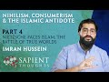

# ST #48:  Nihilism, Consumerism and the Islamic Antidote — Part 4 | Imran Hussein (2022-01-03)

## Description

Listen as audio: https://soundcloud.com/sapienceinstitute/sets/sapient-thoughts

ST #48:  Nihilism, Consumerism and the Islamic Antidote — Part 4: Nietzsche Faces Islam, The Battle Of True Worlds | Imran Hussein

To be updated about our content please subscribe and open the notifications.
----
BOOK A LIGHTHOUSE MENTOR

Are you or someone you know doubting Islam? Do you find yourself struggling to find answers?  Do you have a hard time speaking to someone about Islam?  Are you considering Islam but are unsure about certain concepts?  Are you an activist, Imam or community leader who is unsure about how to handle questions related to science, philosophy, the Islamic moral code, etc.?

You are not alone.  Over the course of the last decade or more there has been a rapid proliferation of content online and in academic institutions that has eroded the faith of some people.

Seeing the rise of  this phenomenon , Sapience Institute is introducing a One to One mentoring service called LIGHTHOUSE.

BOOK A MENTOR HERE: https://sapienceinstitute.org/lighthouse/

VISIT our website for articles in English, Spanish and Turkish; mentoring service, learning platform and for speaker requests: https://sapienceinstitute.org/

## Summary of [ST #48: Nihilism, Consumerism and the Islamic Antidote — Part 4 | Imran Hussein](https://www.youtube.com/watch?v=Fg9LKfnfIio)

*This summary is AI generated - there may be inaccuracies. *

### [00:00:00](https://www.youtube.com/watch?v=Fg9LKfnfIio&t=0) - [00:10:00](https://www.youtube.com/watch?v=Fg9LKfnfIio&t=600)

Imran Hussein discusses how nihilism can be overcome from an Islamic perspective. He argues that Islam provides a comprehensive answer that destroys nihilism and even breaks down Nietzsche's criticisms of religion.

**[00:00:00](https://www.youtube.com/watch?v=Fg9LKfnfIio&t=0)**  Imran Hussein discusses Nietzsche's ideas on nihilism and the religious answer. He explains that while Nietzsche's ideas are interesting, they don't help people escape meaninglessness in this life. He compares the atheist perspective, which is that life is only meaningful while we are alive, to the Christian perspective, which is that life has meaning after death. If Nietzsche had come across Islam, he may have converted to it.
* **[00:05:00](https://www.youtube.com/watch?v=Fg9LKfnfIio&t=300)** Imran Hussein discusses the concepts of nihilism, consumerism, and the Islamic antidote in part four of his ST series. He argues that if Nietzsche had known about Islam, he may have become a Muslim. Nietzsche was uninterested in true world theories, and if he had come across Islam, he may have understood it better and become more interested in it.
* **[00:10:00](https://www.youtube.com/watch?v=Fg9LKfnfIio&t=600)**  Imran Hussein discusses nihilism and how it relates to the Islamic perspective. He points out that while nihilism is a problem that cannot be overcome in the absence of God, Islam provides a comprehensive answer that destroys nihilism and even breaks down Nietzsche's criticisms of religion.

<h2>Full transcript with timestamps: CLICK TO EXPAND</h2>

[0:00:12](https://youtu.be/Fg9LKfnfIio?t=12) assalamu alaikum brothers and sisters  
[0:00:13](https://youtu.be/Fg9LKfnfIio?t=13) welcome back to the sapiens thoughts  
[0:00:16](https://youtu.be/Fg9LKfnfIio?t=16) video series where we're discussing  
[0:00:17](https://youtu.be/Fg9LKfnfIio?t=17) nihilism consumerism and the islamic  
[0:00:19](https://youtu.be/Fg9LKfnfIio?t=19) antidote to these issues  
[0:00:21](https://youtu.be/Fg9LKfnfIio?t=21) in this  
[0:00:23](https://youtu.be/Fg9LKfnfIio?t=23) video we're going to be looking further  
[0:00:25](https://youtu.be/Fg9LKfnfIio?t=25) into nihilism in particular the views of  
[0:00:27](https://youtu.be/Fg9LKfnfIio?t=27) nietzsche  
[0:00:28](https://youtu.be/Fg9LKfnfIio?t=28) now nietzsche was very interesting  
[0:00:30](https://youtu.be/Fg9LKfnfIio?t=30) because a lot of his philosophy and his  
[0:00:32](https://youtu.be/Fg9LKfnfIio?t=32) works were on the topic of nihilism and  
[0:00:34](https://youtu.be/Fg9LKfnfIio?t=34) meaning  
[0:00:35](https://youtu.be/Fg9LKfnfIio?t=35) and what he proposed  
[0:00:37](https://youtu.be/Fg9LKfnfIio?t=37) as a means of addressing or dealing with  
[0:00:40](https://youtu.be/Fg9LKfnfIio?t=40) meaninglessness or nihilism was the idea  
[0:00:42](https://youtu.be/Fg9LKfnfIio?t=42) of what's referred to as the ubermensch  
[0:00:45](https://youtu.be/Fg9LKfnfIio?t=45) or the superman this character  
[0:00:48](https://youtu.be/Fg9LKfnfIio?t=48) which  
[0:00:49](https://youtu.be/Fg9LKfnfIio?t=49) a human should aspire to attain and  
[0:00:51](https://youtu.be/Fg9LKfnfIio?t=51) generally speaking the idea was that  
[0:00:53](https://youtu.be/Fg9LKfnfIio?t=53) this person  
[0:00:55](https://youtu.be/Fg9LKfnfIio?t=55) creates his understanding the  
[0:00:57](https://youtu.be/Fg9LKfnfIio?t=57) meaningless of my finding himself in a  
[0:01:00](https://youtu.be/Fg9LKfnfIio?t=60) world which has no meaning and realizing  
[0:01:03](https://youtu.be/Fg9LKfnfIio?t=63) that his life has no meaning that he now  
[0:01:06](https://youtu.be/Fg9LKfnfIio?t=66) creates his own value system he  
[0:01:08](https://youtu.be/Fg9LKfnfIio?t=68) transcends this meaninglessness  
[0:01:11](https://youtu.be/Fg9LKfnfIio?t=71) through himself  
[0:01:12](https://youtu.be/Fg9LKfnfIio?t=72) by creating a system for himself which  
[0:01:14](https://youtu.be/Fg9LKfnfIio?t=74) elevates him now again very interesting  
[0:01:16](https://youtu.be/Fg9LKfnfIio?t=76) idea  
[0:01:18](https://youtu.be/Fg9LKfnfIio?t=78) one which you can respect and you can  
[0:01:19](https://youtu.be/Fg9LKfnfIio?t=79) understand the value of in a meaningless  
[0:01:22](https://youtu.be/Fg9LKfnfIio?t=82) world however like i said already such  
[0:01:25](https://youtu.be/Fg9LKfnfIio?t=85) ideas don't address the fundamental  
[0:01:27](https://youtu.be/Fg9LKfnfIio?t=87) issue you still have to acknowledge that  
[0:01:28](https://youtu.be/Fg9LKfnfIio?t=88) life at bottom is ultimately meaningless  
[0:01:30](https://youtu.be/Fg9LKfnfIio?t=90) and the best you can do is just make up  
[0:01:32](https://youtu.be/Fg9LKfnfIio?t=92) something for yourself as you go along  
[0:01:34](https://youtu.be/Fg9LKfnfIio?t=94) but that idea you know essentially  
[0:01:37](https://youtu.be/Fg9LKfnfIio?t=97) it has no true intrinsic meaning you may  
[0:01:41](https://youtu.be/Fg9LKfnfIio?t=101) argue well it's more meaningful than  
[0:01:43](https://youtu.be/Fg9LKfnfIio?t=103) doing some just sitting around doing  
[0:01:44](https://youtu.be/Fg9LKfnfIio?t=104) nothing you can argue that however  
[0:01:46](https://youtu.be/Fg9LKfnfIio?t=106) it's made up if you really think about  
[0:01:48](https://youtu.be/Fg9LKfnfIio?t=108) it's made up it's a made-up idea that  
[0:01:50](https://youtu.be/Fg9LKfnfIio?t=110) you think is more worthwhile you know a  
[0:01:52](https://youtu.be/Fg9LKfnfIio?t=112) way of living which you think is more  
[0:01:53](https://youtu.be/Fg9LKfnfIio?t=113) worthwhile of engaging in as opposed to  
[0:01:55](https://youtu.be/Fg9LKfnfIio?t=115) another way of living  
[0:01:56](https://youtu.be/Fg9LKfnfIio?t=116) so what i found really interesting was  
[0:01:58](https://youtu.be/Fg9LKfnfIio?t=118) nietzsche's critique  
[0:02:00](https://youtu.be/Fg9LKfnfIio?t=120) of  
[0:02:01](https://youtu.be/Fg9LKfnfIio?t=121) the religious answer now remember  
[0:02:03](https://youtu.be/Fg9LKfnfIio?t=123) context there which is he was probably  
[0:02:05](https://youtu.be/Fg9LKfnfIio?t=125) most likely focusing on the christian  
[0:02:07](https://youtu.be/Fg9LKfnfIio?t=127) tradition and the christian answer  
[0:02:09](https://youtu.be/Fg9LKfnfIio?t=129) to  
[0:02:11](https://youtu.be/Fg9LKfnfIio?t=131) to nihilism or the the way christianity  
[0:02:13](https://youtu.be/Fg9LKfnfIio?t=133) dealt with this problem or overcame  
[0:02:15](https://youtu.be/Fg9LKfnfIio?t=135) nihilism  
[0:02:16](https://youtu.be/Fg9LKfnfIio?t=136) and he referred to this as  
[0:02:19](https://youtu.be/Fg9LKfnfIio?t=139) true worlds  
[0:02:21](https://youtu.be/Fg9LKfnfIio?t=141) and he understood that you know  
[0:02:22](https://youtu.be/Fg9LKfnfIio?t=142) throughout history people have proposed  
[0:02:25](https://youtu.be/Fg9LKfnfIio?t=145) the idea of true worlds and a true world  
[0:02:27](https://youtu.be/Fg9LKfnfIio?t=147) essentially is a world which transcends  
[0:02:30](https://youtu.be/Fg9LKfnfIio?t=150) this world which is eternal and may also  
[0:02:33](https://youtu.be/Fg9LKfnfIio?t=153) incorporate other things such as it's a  
[0:02:35](https://youtu.be/Fg9LKfnfIio?t=155) world where there's peace and  
[0:02:36](https://youtu.be/Fg9LKfnfIio?t=156) tranquility  
[0:02:37](https://youtu.be/Fg9LKfnfIio?t=157) um no suffering no pain and it goes on  
[0:02:40](https://youtu.be/Fg9LKfnfIio?t=160) forever you know it's it's that is the  
[0:02:43](https://youtu.be/Fg9LKfnfIio?t=163) true world that's where we truly belong  
[0:02:45](https://youtu.be/Fg9LKfnfIio?t=165) and nietzsche's  
[0:02:46](https://youtu.be/Fg9LKfnfIio?t=166) critique of this was especially from a  
[0:02:48](https://youtu.be/Fg9LKfnfIio?t=168) christian perspective well  
[0:02:51](https://youtu.be/Fg9LKfnfIio?t=171) true worlds  
[0:02:52](https://youtu.be/Fg9LKfnfIio?t=172) don't really help you escape  
[0:02:53](https://youtu.be/Fg9LKfnfIio?t=173) meaninglessness in this life  
[0:02:55](https://youtu.be/Fg9LKfnfIio?t=175) you know whereas other people saw you  
[0:02:57](https://youtu.be/Fg9LKfnfIio?t=177) know on the surface well yeah they do  
[0:02:59](https://youtu.be/Fg9LKfnfIio?t=179) because when you believe that there's  
[0:03:00](https://youtu.be/Fg9LKfnfIio?t=180) another world to come an eternal world  
[0:03:02](https://youtu.be/Fg9LKfnfIio?t=182) you know  
[0:03:03](https://youtu.be/Fg9LKfnfIio?t=183) you know human beings find meaning  
[0:03:05](https://youtu.be/Fg9LKfnfIio?t=185) through this value through this well  
[0:03:06](https://youtu.be/Fg9LKfnfIio?t=186) that's where i belong you know i am  
[0:03:09](https://youtu.be/Fg9LKfnfIio?t=189) created and i belong in the in the  
[0:03:10](https://youtu.be/Fg9LKfnfIio?t=190) hereafter i don't belong in this world  
[0:03:12](https://youtu.be/Fg9LKfnfIio?t=192) and i was created by god and so on all  
[0:03:14](https://youtu.be/Fg9LKfnfIio?t=194) these ideas lead want to find meaning  
[0:03:17](https://youtu.be/Fg9LKfnfIio?t=197) and purpose however niche pointed out  
[0:03:19](https://youtu.be/Fg9LKfnfIio?t=199) and rightly so if you look at it from  
[0:03:21](https://youtu.be/Fg9LKfnfIio?t=201) purely from a christian perspective  
[0:03:24](https://youtu.be/Fg9LKfnfIio?t=204) that  
[0:03:25](https://youtu.be/Fg9LKfnfIio?t=205) the idea of a true world  
[0:03:27](https://youtu.be/Fg9LKfnfIio?t=207) actually removed meaning from life in  
[0:03:30](https://youtu.be/Fg9LKfnfIio?t=210) this world because if one is to believe  
[0:03:32](https://youtu.be/Fg9LKfnfIio?t=212) that there is an eternity a paradise to  
[0:03:34](https://youtu.be/Fg9LKfnfIio?t=214) come  
[0:03:36](https://youtu.be/Fg9LKfnfIio?t=216) and that's it and there is no clarity as  
[0:03:38](https://youtu.be/Fg9LKfnfIio?t=218) far as the link between the hereafter  
[0:03:40](https://youtu.be/Fg9LKfnfIio?t=220) and the here and now this world well  
[0:03:42](https://youtu.be/Fg9LKfnfIio?t=222) then you have nothing to do in this  
[0:03:43](https://youtu.be/Fg9LKfnfIio?t=223) world and that's what he presented well  
[0:03:46](https://youtu.be/Fg9LKfnfIio?t=226) from that perspective you're just  
[0:03:47](https://youtu.be/Fg9LKfnfIio?t=227) waiting to die you have nothing to do in  
[0:03:49](https://youtu.be/Fg9LKfnfIio?t=229) this life other than wait for death and  
[0:03:50](https://youtu.be/Fg9LKfnfIio?t=230) when death comes you die  
[0:03:52](https://youtu.be/Fg9LKfnfIio?t=232) and therefore this life is  
[0:03:55](https://youtu.be/Fg9LKfnfIio?t=235) far less meaningful  
[0:03:57](https://youtu.be/Fg9LKfnfIio?t=237) than  
[0:03:58](https://youtu.be/Fg9LKfnfIio?t=238) an atheist perspective which is this is  
[0:04:00](https://youtu.be/Fg9LKfnfIio?t=240) the only life you have there is no  
[0:04:02](https://youtu.be/Fg9LKfnfIio?t=242) eternity there is nothing else to come  
[0:04:04](https://youtu.be/Fg9LKfnfIio?t=244) and therefore well at least we should  
[0:04:05](https://youtu.be/Fg9LKfnfIio?t=245) try to logically you know you can say uh  
[0:04:08](https://youtu.be/Fg9LKfnfIio?t=248) we should try to make the most of this  
[0:04:09](https://youtu.be/Fg9LKfnfIio?t=249) life so this life is meaningful from  
[0:04:11](https://youtu.be/Fg9LKfnfIio?t=251) that perspective he would argue as  
[0:04:12](https://youtu.be/Fg9LKfnfIio?t=252) opposed to you know a view that you have  
[0:04:14](https://youtu.be/Fg9LKfnfIio?t=254) an eternal life to come that's the real  
[0:04:16](https://youtu.be/Fg9LKfnfIio?t=256) life and therefore this life is just  
[0:04:18](https://youtu.be/Fg9LKfnfIio?t=258) nothing to do waiting to die so it's  
[0:04:20](https://youtu.be/Fg9LKfnfIio?t=260) meaningless now he was right from this  
[0:04:22](https://youtu.be/Fg9LKfnfIio?t=262) perspective however  
[0:04:24](https://youtu.be/Fg9LKfnfIio?t=264) i believe if he had come across  
[0:04:27](https://youtu.be/Fg9LKfnfIio?t=267) the islamic conception of the hereafter  
[0:04:29](https://youtu.be/Fg9LKfnfIio?t=269) and how  
[0:04:30](https://youtu.be/Fg9LKfnfIio?t=270) it's made clear in islam the link  
[0:04:32](https://youtu.be/Fg9LKfnfIio?t=272) between this life  
[0:04:34](https://youtu.be/Fg9LKfnfIio?t=274) and the hereafter  
[0:04:36](https://youtu.be/Fg9LKfnfIio?t=276) and how relevant this life is  
[0:04:38](https://youtu.be/Fg9LKfnfIio?t=278) for our eternal life  
[0:04:40](https://youtu.be/Fg9LKfnfIio?t=280) then i believe he may have actually he  
[0:04:41](https://youtu.be/Fg9LKfnfIio?t=281) may even have become muslim and the  
[0:04:42](https://youtu.be/Fg9LKfnfIio?t=282) reason i say this  
[0:04:44](https://youtu.be/Fg9LKfnfIio?t=284) is because  
[0:04:45](https://youtu.be/Fg9LKfnfIio?t=285) nietzsche didn't deny  
[0:04:48](https://youtu.be/Fg9LKfnfIio?t=288) true worlds or hereafter the concept of  
[0:04:50](https://youtu.be/Fg9LKfnfIio?t=290) god god based on evidence right he makes  
[0:04:54](https://youtu.be/Fg9LKfnfIio?t=294) this clear for example uh in his book  
[0:04:57](https://youtu.be/Fg9LKfnfIio?t=297) human all to human he states it is true  
[0:05:00](https://youtu.be/Fg9LKfnfIio?t=300) there could be a metaphysical world the  
[0:05:02](https://youtu.be/Fg9LKfnfIio?t=302) absolute possibility of it is hardly to  
[0:05:04](https://youtu.be/Fg9LKfnfIio?t=304) be disputed so he didn't deny this his  
[0:05:07](https://youtu.be/Fg9LKfnfIio?t=307) reasons for denying  
[0:05:09](https://youtu.be/Fg9LKfnfIio?t=309) what he referred to as the true world or  
[0:05:11](https://youtu.be/Fg9LKfnfIio?t=311) god were not based on evidence they were  
[0:05:13](https://youtu.be/Fg9LKfnfIio?t=313) based on utility from his understanding  
[0:05:16](https://youtu.be/Fg9LKfnfIio?t=316) that to believe in a true world was not  
[0:05:19](https://youtu.be/Fg9LKfnfIio?t=319) conducive to  
[0:05:20](https://youtu.be/Fg9LKfnfIio?t=320) you know survival in this world or  
[0:05:22](https://youtu.be/Fg9LKfnfIio?t=322) finding meaning in this world that's how  
[0:05:23](https://youtu.be/Fg9LKfnfIio?t=323) he understood it  
[0:05:25](https://youtu.be/Fg9LKfnfIio?t=325) and the way he expressed his idea or his  
[0:05:27](https://youtu.be/Fg9LKfnfIio?t=327) thoughts on this were you can find in  
[0:05:29](https://youtu.be/Fg9LKfnfIio?t=329) his autobiography ekohomo he states the  
[0:05:31](https://youtu.be/Fg9LKfnfIio?t=331) concept beyond the true world invented  
[0:05:34](https://youtu.be/Fg9LKfnfIio?t=334) in order to devalue  
[0:05:37](https://youtu.be/Fg9LKfnfIio?t=337) the only world there is in order to  
[0:05:39](https://youtu.be/Fg9LKfnfIio?t=339) retain no goal no reason no task for our  
[0:05:42](https://youtu.be/Fg9LKfnfIio?t=342) earthly reality and again beautifully  
[0:05:44](https://youtu.be/Fg9LKfnfIio?t=344) summarized in his words  
[0:05:47](https://youtu.be/Fg9LKfnfIio?t=347) he is the soul the ad the decree he says  
[0:05:49](https://youtu.be/Fg9LKfnfIio?t=349) the creation of an eternal life  
[0:05:51](https://youtu.be/Fg9LKfnfIio?t=351) a paradise as a means of removing  
[0:05:54](https://youtu.be/Fg9LKfnfIio?t=354) meaning from this world essentially is a  
[0:05:56](https://youtu.be/Fg9LKfnfIio?t=356) very interesting insight however like i  
[0:05:57](https://youtu.be/Fg9LKfnfIio?t=357) said if he had come across the islamic  
[0:05:59](https://youtu.be/Fg9LKfnfIio?t=359) concept and the link between this world  
[0:06:01](https://youtu.be/Fg9LKfnfIio?t=361) and the hereafter  
[0:06:03](https://youtu.be/Fg9LKfnfIio?t=363) he probably would have left you know  
[0:06:05](https://youtu.be/Fg9LKfnfIio?t=365) abandoned his perspective at the very  
[0:06:07](https://youtu.be/Fg9LKfnfIio?t=367) least and maybe become muslim god knows  
[0:06:09](https://youtu.be/Fg9LKfnfIio?t=369) best  
[0:06:10](https://youtu.be/Fg9LKfnfIio?t=370) um so how does islam bridge the gap what  
[0:06:11](https://youtu.be/Fg9LKfnfIio?t=371) does islam teach us in regards to this  
[0:06:13](https://youtu.be/Fg9LKfnfIio?t=373) life and the hereafter it's very clear  
[0:06:15](https://youtu.be/Fg9LKfnfIio?t=375) firstly god outlines the purpose of  
[0:06:17](https://youtu.be/Fg9LKfnfIio?t=377) humanity chapter 51 56 allah says  
[0:06:23](https://youtu.be/Fg9LKfnfIio?t=383) that god did not create the jinn kind  
[0:06:26](https://youtu.be/Fg9LKfnfIio?t=386) and the humankind for no reason  
[0:06:29](https://youtu.be/Fg9LKfnfIio?t=389) no other reason except to know him and  
[0:06:31](https://youtu.be/Fg9LKfnfIio?t=391) to worship him this is the purpose of  
[0:06:34](https://youtu.be/Fg9LKfnfIio?t=394) our existence this is why we live and  
[0:06:35](https://youtu.be/Fg9LKfnfIio?t=395) then further in other places god  
[0:06:37](https://youtu.be/Fg9LKfnfIio?t=397) clarifies even  
[0:06:39](https://youtu.be/Fg9LKfnfIio?t=399) you know why we exist within this  
[0:06:41](https://youtu.be/Fg9LKfnfIio?t=401) physical material world god says for  
[0:06:43](https://youtu.be/Fg9LKfnfIio?t=403) example in surah mulk  
[0:06:45](https://youtu.be/Fg9LKfnfIio?t=405) chapter 67 verse 2 he says that he who  
[0:06:48](https://youtu.be/Fg9LKfnfIio?t=408) created death and life in order to test  
[0:06:51](https://youtu.be/Fg9LKfnfIio?t=411) which of us is best in deeds and he is  
[0:06:53](https://youtu.be/Fg9LKfnfIio?t=413) the almighty all forgiving so god  
[0:06:55](https://youtu.be/Fg9LKfnfIio?t=415) outlines here that he created life and  
[0:06:57](https://youtu.be/Fg9LKfnfIio?t=417) death to test which of us is best in  
[0:06:59](https://youtu.be/Fg9LKfnfIio?t=419) deeds this life is a test and what's  
[0:07:01](https://youtu.be/Fg9LKfnfIio?t=421) really interesting is that this is  
[0:07:03](https://youtu.be/Fg9LKfnfIio?t=423) something that could be acknowledged  
[0:07:04](https://youtu.be/Fg9LKfnfIio?t=424) even by the secularists  
[0:07:06](https://youtu.be/Fg9LKfnfIio?t=426) if you look at life what are we doing  
[0:07:09](https://youtu.be/Fg9LKfnfIio?t=429) every single moment of our lives we're  
[0:07:10](https://youtu.be/Fg9LKfnfIio?t=430) making choices  
[0:07:12](https://youtu.be/Fg9LKfnfIio?t=432) you know we're being literally being  
[0:07:13](https://youtu.be/Fg9LKfnfIio?t=433) tested you know we're being tested to  
[0:07:15](https://youtu.be/Fg9LKfnfIio?t=435) see what choice we make sometimes we  
[0:07:17](https://youtu.be/Fg9LKfnfIio?t=437) make good choices sometimes we make bad  
[0:07:19](https://youtu.be/Fg9LKfnfIio?t=439) choices so life essentially even from a  
[0:07:21](https://youtu.be/Fg9LKfnfIio?t=441) secular perspective if you one way of  
[0:07:23](https://youtu.be/Fg9LKfnfIio?t=443) looking at is that it's a test it is  
[0:07:25](https://youtu.be/Fg9LKfnfIio?t=445) literally a test and god makes clear  
[0:07:27](https://youtu.be/Fg9LKfnfIio?t=447) that this is a life where we're being  
[0:07:28](https://youtu.be/Fg9LKfnfIio?t=448) tested to see who does good  
[0:07:31](https://youtu.be/Fg9LKfnfIio?t=451) and the most fundamental good word human  
[0:07:33](https://youtu.be/Fg9LKfnfIio?t=453) being could do is to recognize using  
[0:07:35](https://youtu.be/Fg9LKfnfIio?t=455) their faculties as they may be blessed  
[0:07:36](https://youtu.be/Fg9LKfnfIio?t=456) is to recognize the creator  
[0:07:38](https://youtu.be/Fg9LKfnfIio?t=458) that he exists and to recognize that we  
[0:07:40](https://youtu.be/Fg9LKfnfIio?t=460) were created to worship him and then to  
[0:07:42](https://youtu.be/Fg9LKfnfIio?t=462) engage in that worship  
[0:07:44](https://youtu.be/Fg9LKfnfIio?t=464) and we are going to be tested in regards  
[0:07:46](https://youtu.be/Fg9LKfnfIio?t=466) to this we're going to god is  
[0:07:48](https://youtu.be/Fg9LKfnfIio?t=468) essentially another way to look at this  
[0:07:49](https://youtu.be/Fg9LKfnfIio?t=469) test is to see god is seeing who is  
[0:07:52](https://youtu.be/Fg9LKfnfIio?t=472) actually truthful in the claim  
[0:07:54](https://youtu.be/Fg9LKfnfIio?t=474) that we make which is that we worship  
[0:07:56](https://youtu.be/Fg9LKfnfIio?t=476) god alone  
[0:07:57](https://youtu.be/Fg9LKfnfIio?t=477) you know that and that's really tested  
[0:07:58](https://youtu.be/Fg9LKfnfIio?t=478) when you go through a hardship or a  
[0:08:00](https://youtu.be/Fg9LKfnfIio?t=480) trial  
[0:08:01](https://youtu.be/Fg9LKfnfIio?t=481) you know so constantly life is a test  
[0:08:03](https://youtu.be/Fg9LKfnfIio?t=483) it's a battle we're going to go through  
[0:08:04](https://youtu.be/Fg9LKfnfIio?t=484) this this is a realm where our worship  
[0:08:06](https://youtu.be/Fg9LKfnfIio?t=486) is being tested are we truly worshipers  
[0:08:08](https://youtu.be/Fg9LKfnfIio?t=488) of god do we truly deserve paradise in  
[0:08:11](https://youtu.be/Fg9LKfnfIio?t=491) the hereafter  
[0:08:12](https://youtu.be/Fg9LKfnfIio?t=492) and god further in the quran in other  
[0:08:14](https://youtu.be/Fg9LKfnfIio?t=494) places many places for example chapter 4  
[0:08:16](https://youtu.be/Fg9LKfnfIio?t=496) verse 124 god says and whoever does  
[0:08:18](https://youtu.be/Fg9LKfnfIio?t=498) righteous deeds whether male or female  
[0:08:20](https://youtu.be/Fg9LKfnfIio?t=500) while being a believer  
[0:08:22](https://youtu.be/Fg9LKfnfIio?t=502) those will enter paradise and will not  
[0:08:24](https://youtu.be/Fg9LKfnfIio?t=504) be wronged even as much as a speck on a  
[0:08:27](https://youtu.be/Fg9LKfnfIio?t=507) date seed  
[0:08:29](https://youtu.be/Fg9LKfnfIio?t=509) very beautifully clarified for us  
[0:08:31](https://youtu.be/Fg9LKfnfIio?t=511) that  
[0:08:33](https://youtu.be/Fg9LKfnfIio?t=513) what we do in this life our actions have  
[0:08:35](https://youtu.be/Fg9LKfnfIio?t=515) a direct implication  
[0:08:37](https://youtu.be/Fg9LKfnfIio?t=517) what we do in this life  
[0:08:39](https://youtu.be/Fg9LKfnfIio?t=519) determines  
[0:08:41](https://youtu.be/Fg9LKfnfIio?t=521) where we end up in the hereafter  
[0:08:42](https://youtu.be/Fg9LKfnfIio?t=522) obviously by the leave and mercy of god  
[0:08:44](https://youtu.be/Fg9LKfnfIio?t=524) but our action our engagement in this  
[0:08:47](https://youtu.be/Fg9LKfnfIio?t=527) life every moment in this life will  
[0:08:49](https://youtu.be/Fg9LKfnfIio?t=529) determine where we hear where we end up  
[0:08:50](https://youtu.be/Fg9LKfnfIio?t=530) in the hereafter and if we understand  
[0:08:53](https://youtu.be/Fg9LKfnfIio?t=533) now this concept this philosophy from  
[0:08:55](https://youtu.be/Fg9LKfnfIio?t=535) our perspective well then  
[0:08:57](https://youtu.be/Fg9LKfnfIio?t=537) it's clear that this life is so  
[0:09:00](https://youtu.be/Fg9LKfnfIio?t=540) significant and so meaningful  
[0:09:03](https://youtu.be/Fg9LKfnfIio?t=543) because it has a direct bearing on where  
[0:09:05](https://youtu.be/Fg9LKfnfIio?t=545) we end up in the hereafter it's a  
[0:09:06](https://youtu.be/Fg9LKfnfIio?t=546) springboard to the hereafter now if  
[0:09:09](https://youtu.be/Fg9LKfnfIio?t=549) nietzsche had come across this and  
[0:09:10](https://youtu.be/Fg9LKfnfIio?t=550) understood this like i said he may very  
[0:09:12](https://youtu.be/Fg9LKfnfIio?t=552) well have become muslim and this is why  
[0:09:14](https://youtu.be/Fg9LKfnfIio?t=554) it's very interesting iqbal muhammad  
[0:09:16](https://youtu.be/Fg9LKfnfIio?t=556) iqbal in his javid nama he says had he  
[0:09:18](https://youtu.be/Fg9LKfnfIio?t=558) lived referring to nietzsche had he  
[0:09:20](https://youtu.be/Fg9LKfnfIio?t=560) lived in the times of ahmed i believe  
[0:09:21](https://youtu.be/Fg9LKfnfIio?t=561) referring to the prophet peace be upon  
[0:09:23](https://youtu.be/Fg9LKfnfIio?t=563) him he says had he lived in the times of  
[0:09:24](https://youtu.be/Fg9LKfnfIio?t=564) ahmed he would have entered into the  
[0:09:26](https://youtu.be/Fg9LKfnfIio?t=566) eternal joy  
[0:09:27](https://youtu.be/Fg9LKfnfIio?t=567) and iqbal by the way was someone who  
[0:09:29](https://youtu.be/Fg9LKfnfIio?t=569) really studied nietzsche's works in  
[0:09:30](https://youtu.be/Fg9LKfnfIio?t=570) depth and he's also  
[0:09:33](https://youtu.be/Fg9LKfnfIio?t=573) has said um had nietzsche been present  
[0:09:36](https://youtu.be/Fg9LKfnfIio?t=576) in the in this era iqbal would have  
[0:09:38](https://youtu.be/Fg9LKfnfIio?t=578) taught him what was in the glory of god  
[0:09:41](https://youtu.be/Fg9LKfnfIio?t=581) so i'm it's not surprising that iqbal  
[0:09:43](https://youtu.be/Fg9LKfnfIio?t=583) noted that nietzsche if he had really  
[0:09:45](https://youtu.be/Fg9LKfnfIio?t=585) understood islam  
[0:09:47](https://youtu.be/Fg9LKfnfIio?t=587) he may very well have become muslim and  
[0:09:50](https://youtu.be/Fg9LKfnfIio?t=590) especially understanding that niche was  
[0:09:52](https://youtu.be/Fg9LKfnfIio?t=592) really un interested in these in the  
[0:09:54](https://youtu.be/Fg9LKfnfIio?t=594) true world theories that religions had  
[0:09:56](https://youtu.be/Fg9LKfnfIio?t=596) to offer if he had come across the  
[0:09:58](https://youtu.be/Fg9LKfnfIio?t=598) islamic conception of a true world and  
[0:10:00](https://youtu.be/Fg9LKfnfIio?t=600) how it links to this world  
[0:10:02](https://youtu.be/Fg9LKfnfIio?t=602) you know i think that would have been a  
[0:10:03](https://youtu.be/Fg9LKfnfIio?t=603) game changer for him  
[0:10:05](https://youtu.be/Fg9LKfnfIio?t=605) so brothers and sisters  
[0:10:07](https://youtu.be/Fg9LKfnfIio?t=607) just to summarize and to conclude  
[0:10:11](https://youtu.be/Fg9LKfnfIio?t=611) nihilism  
[0:10:13](https://youtu.be/Fg9LKfnfIio?t=613) is a problem that cannot be overcome in  
[0:10:15](https://youtu.be/Fg9LKfnfIio?t=615) the absence of god you can find patches  
[0:10:19](https://youtu.be/Fg9LKfnfIio?t=619) you can come up with your own views you  
[0:10:21](https://youtu.be/Fg9LKfnfIio?t=621) can make things up for yourself to get  
[0:10:24](https://youtu.be/Fg9LKfnfIio?t=624) to try and overcome this problem but at  
[0:10:26](https://youtu.be/Fg9LKfnfIio?t=626) bottom you're never going to overcome it  
[0:10:27](https://youtu.be/Fg9LKfnfIio?t=627) you can just distract yourself and lie  
[0:10:29](https://youtu.be/Fg9LKfnfIio?t=629) to yourself  
[0:10:31](https://youtu.be/Fg9LKfnfIio?t=631) other religions don't provide in  
[0:10:33](https://youtu.be/Fg9LKfnfIio?t=633) particular christianity hasn't provided  
[0:10:35](https://youtu.be/Fg9LKfnfIio?t=635) historically a clear  
[0:10:37](https://youtu.be/Fg9LKfnfIio?t=637) you know  
[0:10:38](https://youtu.be/Fg9LKfnfIio?t=638) conception which links this world to the  
[0:10:40](https://youtu.be/Fg9LKfnfIio?t=640) hereafter and therefore which shows why  
[0:10:42](https://youtu.be/Fg9LKfnfIio?t=642) this life is meaningful and helps us  
[0:10:44](https://youtu.be/Fg9LKfnfIio?t=644) transcend  
[0:10:45](https://youtu.be/Fg9LKfnfIio?t=645) nihilism something noted by nietzsche  
[0:10:47](https://youtu.be/Fg9LKfnfIio?t=647) however islam does provide a  
[0:10:48](https://youtu.be/Fg9LKfnfIio?t=648) comprehensive answer which highlights  
[0:10:50](https://youtu.be/Fg9LKfnfIio?t=650) why this life is life is extremely  
[0:10:52](https://youtu.be/Fg9LKfnfIio?t=652) meaningful and and and and you know how  
[0:10:56](https://youtu.be/Fg9LKfnfIio?t=656) how this how you know the conception of  
[0:10:58](https://youtu.be/Fg9LKfnfIio?t=658) this life from an islamic perspective  
[0:11:00](https://youtu.be/Fg9LKfnfIio?t=660) completely demolishes nihilism and even  
[0:11:02](https://youtu.be/Fg9LKfnfIio?t=662) you know breaks down nietzsche's uh  
[0:11:05](https://youtu.be/Fg9LKfnfIio?t=665) complaints and his criticisms of what  
[0:11:07](https://youtu.be/Fg9LKfnfIio?t=667) religion had to offer  
[0:11:09](https://youtu.be/Fg9LKfnfIio?t=669) so that's it for this episode brothers  
[0:11:11](https://youtu.be/Fg9LKfnfIio?t=671) and sisters join me again for the next  
[0:11:14](https://youtu.be/Fg9LKfnfIio?t=674) episode where we will be looking or  
[0:11:16](https://youtu.be/Fg9LKfnfIio?t=676) diving into consumerism and really  
[0:11:18](https://youtu.be/Fg9LKfnfIio?t=678) understanding this particular topic  
[0:11:19](https://youtu.be/Fg9LKfnfIio?t=679) until next time take care  

