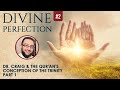

# ST #52: Divine Perfection - Dr. William Lane Craig & the Qur'an's Conception of the Trinity - PART 1 (2022-03-26)

## Description

Listen to Sapient Thoughts episodes as audio: https://soundcloud.com/sapienceinstitute/sets/sapient-thoughts?utm_source=clipboard&utm_medium=text&utm_campaign=social_sharing

Sapient Thoughts #52: Divine Perfection - Dr. William Lane Craig & the Qur'an's Conception of the Trinity - Part 1 with Dr. Osman Latiff

📖 Download the free book on the topic: https://sapienceinstitute.org/divineperfection

🎓 Register for the course on the topic: https://learn.sapienceinstitute.org/courses/divine-perfection/
----
BOOK A LIGHTHOUSE MENTOR

Are you or someone you know doubting Islam? Do you find yourself struggling to find answers?  Do you have a hard time speaking to someone about Islam?  Are you considering Islam but are unsure about certain concepts?  Are you an activist, Imam or community leader who is unsure about how to handle questions related to science, philosophy, the Islamic moral code, etc.?

You are not alone.  Over the course of the last decade or more there has been a rapid proliferation of content online and in academic institutions that has eroded the faith of some people.

Seeing the rise of  this phenomenon , Sapience Institute is introducing a One to One mentoring service called LIGHTHOUSE.

BOOK A MENTOR HERE: https://sapienceinstitute.org/lighthouse/

VISIT our website for articles in English, Spanish and Turkish; mentoring service, learning platform and for speaker requests: https://sapienceinstitute.org/

## Summary of [ST #52: Divine Perfection - Dr. William Lane Craig & the Qur'an's Conception of the Trinity - PART 1](https://www.youtube.com/watch?v=2a3SWU35qxo)

*This summary is AI generated - there may be inaccuracies. *

### [00:00:00](https://www.youtube.com/watch?v=2a3SWU35qxo&t=0) - [00:10:00](https://www.youtube.com/watch?v=2a3SWU35qxo&t=600)

 Dr. William Lane Craig discusses the Qur'an's conception of the Trinity. He argues that it is more accurate than the Christian conception of the Trinity, which he says is a later development in Christian theology.

**[00:00:00](https://www.youtube.com/watch?v=2a3SWU35qxo&t=0)**  Dr. William Lane Craig discusses the Qur'an's conception of the Trinity, arguing that it is wrong. He goes on to say that this argument is familiar to Christians throughout the centuries, and that few missionaries or apologists write about Islam without making the same argument.
* **[00:05:00](https://www.youtube.com/watch?v=2a3SWU35qxo&t=300)**  Dr. William Lane Craig discusses the Qur'an's conception of the Trinity. He points out that, according to the Qur'an, Jesus is subordinate to God and that, in fact, all of humanity is weak in the presence of God. He also explains that the concept of the Trinity is not found in the Bible, but is instead a later development in Christian theology.
* **[00:10:00](https://www.youtube.com/watch?v=2a3SWU35qxo&t=600)**  shows how the Qur'an portrays the Trinity in a more accurate way than Christianity does. Dr. William Lane Craig discusses this in more detail in the next episode.

<h2>Full transcript with timestamps: CLICK TO EXPAND</h2>

[0:00:11](https://youtu.be/2a3SWU35qxo?t=11) now of course we're going through my  
[0:00:13](https://youtu.be/2a3SWU35qxo?t=13) book  
[0:00:14](https://youtu.be/2a3SWU35qxo?t=14) divine perfection christianity and islam  
[0:00:16](https://youtu.be/2a3SWU35qxo?t=16) on sin and salvation published this year  
[0:00:18](https://youtu.be/2a3SWU35qxo?t=18) by sapience institute the book as we  
[0:00:20](https://youtu.be/2a3SWU35qxo?t=20) said before is a response primarily to  
[0:00:24](https://youtu.be/2a3SWU35qxo?t=24) dr william craig in his arguments  
[0:00:26](https://youtu.be/2a3SWU35qxo?t=26) against islamic theism but also it  
[0:00:28](https://youtu.be/2a3SWU35qxo?t=28) covers the writings and the works and  
[0:00:31](https://youtu.be/2a3SWU35qxo?t=31) the arguments made by other christian  
[0:00:34](https://youtu.be/2a3SWU35qxo?t=34) apologists and missionaries and  
[0:00:36](https://youtu.be/2a3SWU35qxo?t=36) evangelists as well including people  
[0:00:38](https://youtu.be/2a3SWU35qxo?t=38) like samuel zwiemer people going all the  
[0:00:40](https://youtu.be/2a3SWU35qxo?t=40) way back to john of damascus thomas  
[0:00:42](https://youtu.be/2a3SWU35qxo?t=42) aquinas billy siekhon and so many others  
[0:00:45](https://youtu.be/2a3SWU35qxo?t=45) as well james langford and so many  
[0:00:47](https://youtu.be/2a3SWU35qxo?t=47) others as well  
[0:00:49](https://youtu.be/2a3SWU35qxo?t=49) we spoke last time about the basic  
[0:00:50](https://youtu.be/2a3SWU35qxo?t=50) introduction behind the book what does  
[0:00:52](https://youtu.be/2a3SWU35qxo?t=52) the book in fact cover why why the book  
[0:00:54](https://youtu.be/2a3SWU35qxo?t=54) in the first place the book is an  
[0:00:56](https://youtu.be/2a3SWU35qxo?t=56) islamic response to clarify the the  
[0:00:59](https://youtu.be/2a3SWU35qxo?t=59) misguiding uh  
[0:01:01](https://youtu.be/2a3SWU35qxo?t=61) accusations about islam made by dr  
[0:01:04](https://youtu.be/2a3SWU35qxo?t=64) william lane craig and others and  
[0:01:06](https://youtu.be/2a3SWU35qxo?t=66) setting the record straight really what  
[0:01:08](https://youtu.be/2a3SWU35qxo?t=68) does the quran really say about these  
[0:01:09](https://youtu.be/2a3SWU35qxo?t=69) things that they claim that it says  
[0:01:12](https://youtu.be/2a3SWU35qxo?t=72) now the first the first argument i'm  
[0:01:14](https://youtu.be/2a3SWU35qxo?t=74) going to make in fact as a response to  
[0:01:16](https://youtu.be/2a3SWU35qxo?t=76) craig is is the first argument that he  
[0:01:18](https://youtu.be/2a3SWU35qxo?t=78) makes himself on his article about the  
[0:01:21](https://youtu.be/2a3SWU35qxo?t=81) concept of god in islam and another one  
[0:01:24](https://youtu.be/2a3SWU35qxo?t=84) called do muslims christians worship the  
[0:01:25](https://youtu.be/2a3SWU35qxo?t=85) same god in his website from his website  
[0:01:27](https://youtu.be/2a3SWU35qxo?t=87) called a reasonable faith and that is  
[0:01:29](https://youtu.be/2a3SWU35qxo?t=89) about the omniscience of of god the  
[0:01:32](https://youtu.be/2a3SWU35qxo?t=92) all-knowing nature of god  
[0:01:34](https://youtu.be/2a3SWU35qxo?t=94) christians have for centuries this  
[0:01:37](https://youtu.be/2a3SWU35qxo?t=97) argument is really important for all of  
[0:01:39](https://youtu.be/2a3SWU35qxo?t=99) us to understand  
[0:01:40](https://youtu.be/2a3SWU35qxo?t=100) christians for for centuries have made  
[0:01:42](https://youtu.be/2a3SWU35qxo?t=102) this argument that the quranic  
[0:01:44](https://youtu.be/2a3SWU35qxo?t=104) conception of the trinity is wrong  
[0:01:48](https://youtu.be/2a3SWU35qxo?t=108) who makes this john of damascus from the  
[0:01:51](https://youtu.be/2a3SWU35qxo?t=111) from early islam this is going back  
[0:01:53](https://youtu.be/2a3SWU35qxo?t=113) almost two thousand years makes this  
[0:01:55](https://youtu.be/2a3SWU35qxo?t=115) argument is far predating william lane  
[0:01:58](https://youtu.be/2a3SWU35qxo?t=118) craig and throughout the centuries they  
[0:02:00](https://youtu.be/2a3SWU35qxo?t=120) built upon that same argument the  
[0:02:02](https://youtu.be/2a3SWU35qxo?t=122) quranic outline of the trinity is wrong  
[0:02:05](https://youtu.be/2a3SWU35qxo?t=125) in fact it's hard pressed to find a  
[0:02:07](https://youtu.be/2a3SWU35qxo?t=127) missionary who doesn't in fact say that  
[0:02:09](https://youtu.be/2a3SWU35qxo?t=129) it's hard for a press to find a  
[0:02:11](https://youtu.be/2a3SWU35qxo?t=131) missionary or an evangelist or a  
[0:02:14](https://youtu.be/2a3SWU35qxo?t=134) christian you know  
[0:02:16](https://youtu.be/2a3SWU35qxo?t=136) apolog apologist who's writing on islam  
[0:02:18](https://youtu.be/2a3SWU35qxo?t=138) in the quran who doesn't make that  
[0:02:20](https://youtu.be/2a3SWU35qxo?t=140) argument so it's more more necessary for  
[0:02:22](https://youtu.be/2a3SWU35qxo?t=142) us therefore to clarify the truth about  
[0:02:24](https://youtu.be/2a3SWU35qxo?t=144) this matter to know of it to be sure of  
[0:02:26](https://youtu.be/2a3SWU35qxo?t=146) it and to see where the christians make  
[0:02:28](https://youtu.be/2a3SWU35qxo?t=148) their mistake and let's start therefore  
[0:02:31](https://youtu.be/2a3SWU35qxo?t=151) in the name of allah the most merciful  
[0:02:33](https://youtu.be/2a3SWU35qxo?t=153) the most compassionate now this is the  
[0:02:35](https://youtu.be/2a3SWU35qxo?t=155) argument william lane craig quotes from  
[0:02:38](https://youtu.be/2a3SWU35qxo?t=158) the quran from chapter 5 verse 1 1 6.  
[0:02:42](https://youtu.be/2a3SWU35qxo?t=162) there is a dialogue between jesus  
[0:02:43](https://youtu.be/2a3SWU35qxo?t=163) between isa al-islam isabel maryam the  
[0:02:46](https://youtu.be/2a3SWU35qxo?t=166) son of mary and god himself allah this  
[0:02:49](https://youtu.be/2a3SWU35qxo?t=169) happens of course in the next life and  
[0:02:51](https://youtu.be/2a3SWU35qxo?t=171) in this verse it begins by saying  
[0:02:56](https://youtu.be/2a3SWU35qxo?t=176) when allah says to jesus  
[0:02:59](https://youtu.be/2a3SWU35qxo?t=179) oh jesus the son of mary  
[0:03:02](https://youtu.be/2a3SWU35qxo?t=182) enter  
[0:03:05](https://youtu.be/2a3SWU35qxo?t=185) did you tell people to take you and your  
[0:03:08](https://youtu.be/2a3SWU35qxo?t=188) mother as two deities besides allah now  
[0:03:12](https://youtu.be/2a3SWU35qxo?t=192) notice something  
[0:03:13](https://youtu.be/2a3SWU35qxo?t=193) these verses if you check them yourself  
[0:03:15](https://youtu.be/2a3SWU35qxo?t=195) they go from 116 to 117 118 chapter 5.  
[0:03:20](https://youtu.be/2a3SWU35qxo?t=200) so my book kind of goes through the  
[0:03:23](https://youtu.be/2a3SWU35qxo?t=203) christian literature and i and i try and  
[0:03:25](https://youtu.be/2a3SWU35qxo?t=205) see how are the christians using these  
[0:03:27](https://youtu.be/2a3SWU35qxo?t=207) verses  
[0:03:28](https://youtu.be/2a3SWU35qxo?t=208) and it's very rare almost never  
[0:03:32](https://youtu.be/2a3SWU35qxo?t=212) do christians bother to mention the  
[0:03:34](https://youtu.be/2a3SWU35qxo?t=214) entire dialogue between allah and jesus  
[0:03:37](https://youtu.be/2a3SWU35qxo?t=217) in in this verses in these verses but in  
[0:03:40](https://youtu.be/2a3SWU35qxo?t=220) fact they part quote  
[0:03:43](https://youtu.be/2a3SWU35qxo?t=223) one half of the first verse and he does  
[0:03:46](https://youtu.be/2a3SWU35qxo?t=226) the same thing william lane does the  
[0:03:48](https://youtu.be/2a3SWU35qxo?t=228) same thing uh  
[0:03:50](https://youtu.be/2a3SWU35qxo?t=230) others after him and before him do the  
[0:03:52](https://youtu.be/2a3SWU35qxo?t=232) same thing  
[0:03:53](https://youtu.be/2a3SWU35qxo?t=233) the the part quote that one part of that  
[0:03:55](https://youtu.be/2a3SWU35qxo?t=235) first verse what i've just quoted for  
[0:03:58](https://youtu.be/2a3SWU35qxo?t=238) you for example this part and they say  
[0:04:00](https://youtu.be/2a3SWU35qxo?t=240) based upon this which is a straw man  
[0:04:02](https://youtu.be/2a3SWU35qxo?t=242) argument they say based upon this uh it  
[0:04:04](https://youtu.be/2a3SWU35qxo?t=244) shows that the quran has a conception of  
[0:04:07](https://youtu.be/2a3SWU35qxo?t=247) the trinity whether it's god himself or  
[0:04:09](https://youtu.be/2a3SWU35qxo?t=249) they might identify as the father and  
[0:04:11](https://youtu.be/2a3SWU35qxo?t=251) jesus who they see as a son and mary  
[0:04:14](https://youtu.be/2a3SWU35qxo?t=254) mary is involved here because there's  
[0:04:16](https://youtu.be/2a3SWU35qxo?t=256) two deities besides allah and it seems  
[0:04:18](https://youtu.be/2a3SWU35qxo?t=258) well there's three deities therefore  
[0:04:20](https://youtu.be/2a3SWU35qxo?t=260) maybe it's kind of a three-ness doctrine  
[0:04:23](https://youtu.be/2a3SWU35qxo?t=263) or a trinity doctrine that the quran is  
[0:04:25](https://youtu.be/2a3SWU35qxo?t=265) is shedding light on but i want us to  
[0:04:27](https://youtu.be/2a3SWU35qxo?t=267) look at this very very carefully with a  
[0:04:29](https://youtu.be/2a3SWU35qxo?t=269) lot of new ones with a lot of  
[0:04:30](https://youtu.be/2a3SWU35qxo?t=270) understanding the verse therefore again  
[0:04:32](https://youtu.be/2a3SWU35qxo?t=272) says  
[0:04:33](https://youtu.be/2a3SWU35qxo?t=273) allah says to jesus  
[0:04:38](https://youtu.be/2a3SWU35qxo?t=278) did you tell people to take you and your  
[0:04:41](https://youtu.be/2a3SWU35qxo?t=281) mother as to these cities besides allah  
[0:04:43](https://youtu.be/2a3SWU35qxo?t=283) that's where they stop well we're going  
[0:04:44](https://youtu.be/2a3SWU35qxo?t=284) to carry on going and see what else does  
[0:04:46](https://youtu.be/2a3SWU35qxo?t=286) it say in these verses  
[0:04:48](https://youtu.be/2a3SWU35qxo?t=288) so jesus now responds to god and says to  
[0:04:51](https://youtu.be/2a3SWU35qxo?t=291) god subhana qaali subhanak now subhanak  
[0:04:54](https://youtu.be/2a3SWU35qxo?t=294) is a beautiful reference because subhan  
[0:04:58](https://youtu.be/2a3SWU35qxo?t=298) means that free of all imperfections are  
[0:05:02](https://youtu.be/2a3SWU35qxo?t=302) you and only you o allah  
[0:05:04](https://youtu.be/2a3SWU35qxo?t=304) subhanak  
[0:05:05](https://youtu.be/2a3SWU35qxo?t=305) free of all imperfections are you and  
[0:05:08](https://youtu.be/2a3SWU35qxo?t=308) only you o allah subhanak mayakun ali  
[0:05:11](https://youtu.be/2a3SWU35qxo?t=311) and akul  
[0:05:13](https://youtu.be/2a3SWU35qxo?t=313) i had no right to say what i had no  
[0:05:15](https://youtu.be/2a3SWU35qxo?t=315) right to say  
[0:05:17](https://youtu.be/2a3SWU35qxo?t=317) i had no right to say what had no right  
[0:05:19](https://youtu.be/2a3SWU35qxo?t=319) to i couldn't say what i had no right to  
[0:05:20](https://youtu.be/2a3SWU35qxo?t=320) say he says to allah meaning issa jesus  
[0:05:22](https://youtu.be/2a3SWU35qxo?t=322) is subordinated everybody is subordinate  
[0:05:26](https://youtu.be/2a3SWU35qxo?t=326) everyone is weak in the presence of god  
[0:05:29](https://youtu.be/2a3SWU35qxo?t=329) almighty allah tells us  
[0:05:31](https://youtu.be/2a3SWU35qxo?t=331) or people of civilization or humanity  
[0:05:36](https://youtu.be/2a3SWU35qxo?t=336) all of you are poor  
[0:05:38](https://youtu.be/2a3SWU35qxo?t=338) impoverished weak dependent before allah  
[0:05:41](https://youtu.be/2a3SWU35qxo?t=341) and allah is  
[0:05:42](https://youtu.be/2a3SWU35qxo?t=342) and allah is hamid and allah is rich and  
[0:05:44](https://youtu.be/2a3SWU35qxo?t=344) free of all need and so this jesus  
[0:05:47](https://youtu.be/2a3SWU35qxo?t=347) is the seventh of allah saying to allah  
[0:05:49](https://youtu.be/2a3SWU35qxo?t=349) saying to god glory be to you free of  
[0:05:52](https://youtu.be/2a3SWU35qxo?t=352) all imperfections are you and on you oh  
[0:05:53](https://youtu.be/2a3SWU35qxo?t=353) allah i had no right to say what i had  
[0:05:56](https://youtu.be/2a3SWU35qxo?t=356) no right to say and then he says to  
[0:05:58](https://youtu.be/2a3SWU35qxo?t=358) allah they never quote this by the way  
[0:06:00](https://youtu.be/2a3SWU35qxo?t=360) in kuntu kul tuho  
[0:06:01](https://youtu.be/2a3SWU35qxo?t=361) tahu if i had said it then you would  
[0:06:04](https://youtu.be/2a3SWU35qxo?t=364) have known that i said it if i said it  
[0:06:06](https://youtu.be/2a3SWU35qxo?t=366) then you would have known that i said it  
[0:06:08](https://youtu.be/2a3SWU35qxo?t=368) and they never get this far quoting  
[0:06:10](https://youtu.be/2a3SWU35qxo?t=370) either not william named craig not the  
[0:06:11](https://youtu.be/2a3SWU35qxo?t=371) others either  
[0:06:12](https://youtu.be/2a3SWU35qxo?t=372) if i said it then you would have known  
[0:06:14](https://youtu.be/2a3SWU35qxo?t=374) that i said it  
[0:06:15](https://youtu.be/2a3SWU35qxo?t=375) right  
[0:06:16](https://youtu.be/2a3SWU35qxo?t=376) he says to allah  
[0:06:18](https://youtu.be/2a3SWU35qxo?t=378) ta'ala mafia nfc you know what is within  
[0:06:21](https://youtu.be/2a3SWU35qxo?t=381) me and i don't know what is within you  
[0:06:23](https://youtu.be/2a3SWU35qxo?t=383) and you are  
[0:06:24](https://youtu.be/2a3SWU35qxo?t=384) you are the knower of the unseen allah  
[0:06:26](https://youtu.be/2a3SWU35qxo?t=386) knows all things our epistemic we have  
[0:06:29](https://youtu.be/2a3SWU35qxo?t=389) limitations in understanding anything  
[0:06:32](https://youtu.be/2a3SWU35qxo?t=392) and he says to allah  
[0:06:33](https://youtu.be/2a3SWU35qxo?t=393) if i said it you would have known it  
[0:06:35](https://youtu.be/2a3SWU35qxo?t=395) that i said it and you know all things  
[0:06:37](https://youtu.be/2a3SWU35qxo?t=397) you know what's within me i don't know  
[0:06:38](https://youtu.be/2a3SWU35qxo?t=398) anything about you oh allah and what's  
[0:06:39](https://youtu.be/2a3SWU35qxo?t=399) within you oh allah  
[0:06:41](https://youtu.be/2a3SWU35qxo?t=401) then he says to allah beautifully they  
[0:06:42](https://youtu.be/2a3SWU35qxo?t=402) never get this far by the way either and  
[0:06:43](https://youtu.be/2a3SWU35qxo?t=403) they're quoting and i quote them to show  
[0:06:45](https://youtu.be/2a3SWU35qxo?t=405) you in the book they never get this far  
[0:06:48](https://youtu.be/2a3SWU35qxo?t=408) in quoting right then he says to allah  
[0:06:51](https://youtu.be/2a3SWU35qxo?t=411) he says  
[0:06:54](https://youtu.be/2a3SWU35qxo?t=414) i never said anything to them except  
[0:06:56](https://youtu.be/2a3SWU35qxo?t=416) what you commanded me to tell them how  
[0:06:58](https://youtu.be/2a3SWU35qxo?t=418) powerful is that  
[0:07:00](https://youtu.be/2a3SWU35qxo?t=420) right how powerful is that i never said  
[0:07:01](https://youtu.be/2a3SWU35qxo?t=421) anything except what he commanded me to  
[0:07:02](https://youtu.be/2a3SWU35qxo?t=422) tell them  
[0:07:03](https://youtu.be/2a3SWU35qxo?t=423) he says and when i uh which was what an  
[0:07:06](https://youtu.be/2a3SWU35qxo?t=426) allah arab  
[0:07:07](https://youtu.be/2a3SWU35qxo?t=427) to worship allah my lord and your lord  
[0:07:09](https://youtu.be/2a3SWU35qxo?t=429) that is the that is the quranic message  
[0:07:12](https://youtu.be/2a3SWU35qxo?t=432) of all the prophets of allah including  
[0:07:15](https://youtu.be/2a3SWU35qxo?t=435) jesus the son of mary worship god my  
[0:07:18](https://youtu.be/2a3SWU35qxo?t=438) lord and your lord that is the most  
[0:07:20](https://youtu.be/2a3SWU35qxo?t=440) plain truth of even  
[0:07:22](https://youtu.be/2a3SWU35qxo?t=442) even those words you might look at as  
[0:07:24](https://youtu.be/2a3SWU35qxo?t=444) being clear decisive unambiguous  
[0:07:26](https://youtu.be/2a3SWU35qxo?t=446) unequivocal words from the bible are  
[0:07:28](https://youtu.be/2a3SWU35qxo?t=448) saying that from the words of jesus that  
[0:07:30](https://youtu.be/2a3SWU35qxo?t=450) jesus says you know is my lord and jesus  
[0:07:33](https://youtu.be/2a3SWU35qxo?t=453) god is my lord and your lord and that's  
[0:07:35](https://youtu.be/2a3SWU35qxo?t=455) allah is saying that in the quran that's  
[0:07:36](https://youtu.be/2a3SWU35qxo?t=456) what jesus told his people worship allah  
[0:07:39](https://youtu.be/2a3SWU35qxo?t=459) my lord and your lord and then he says  
[0:07:41](https://youtu.be/2a3SWU35qxo?t=461) to them then he says to allah welcome to  
[0:07:44](https://youtu.be/2a3SWU35qxo?t=464) alaihim shahidah madhum tufihim and when  
[0:07:47](https://youtu.be/2a3SWU35qxo?t=467) i was with them i was a watcher over  
[0:07:49](https://youtu.be/2a3SWU35qxo?t=469) them a witness over them  
[0:07:51](https://youtu.be/2a3SWU35qxo?t=471) to a faith in me but when you raised me  
[0:07:53](https://youtu.be/2a3SWU35qxo?t=473) and took me  
[0:07:54](https://youtu.be/2a3SWU35qxo?t=474) you were the watcher and the witness  
[0:07:56](https://youtu.be/2a3SWU35qxo?t=476) over them which means something really  
[0:07:59](https://youtu.be/2a3SWU35qxo?t=479) beautifully profound here  
[0:08:01](https://youtu.be/2a3SWU35qxo?t=481) that islam is saying therefore that when  
[0:08:02](https://youtu.be/2a3SWU35qxo?t=482) i was with my people everything was fine  
[0:08:05](https://youtu.be/2a3SWU35qxo?t=485) everyone believed in things that were  
[0:08:07](https://youtu.be/2a3SWU35qxo?t=487) fine because i was a watcher over them  
[0:08:09](https://youtu.be/2a3SWU35qxo?t=489) but when i went  
[0:08:11](https://youtu.be/2a3SWU35qxo?t=491) then i can't be held accountable for  
[0:08:13](https://youtu.be/2a3SWU35qxo?t=493) what they did after me even doing things  
[0:08:16](https://youtu.be/2a3SWU35qxo?t=496) in my name that i can't be held  
[0:08:18](https://youtu.be/2a3SWU35qxo?t=498) responsible for that because that  
[0:08:19](https://youtu.be/2a3SWU35qxo?t=499) happened after me and you're going to  
[0:08:21](https://youtu.be/2a3SWU35qxo?t=501) see in shoreline in a moment as we go  
[0:08:23](https://youtu.be/2a3SWU35qxo?t=503) through this very closely how they  
[0:08:26](https://youtu.be/2a3SWU35qxo?t=506) constructed things after him that was  
[0:08:28](https://youtu.be/2a3SWU35qxo?t=508) not represented by him in his own time  
[0:08:31](https://youtu.be/2a3SWU35qxo?t=511) so he says to allah you were the watcher  
[0:08:33](https://youtu.be/2a3SWU35qxo?t=513) over them and he said then he says to  
[0:08:35](https://youtu.be/2a3SWU35qxo?t=515) allah and they never quote this forever  
[0:08:37](https://youtu.be/2a3SWU35qxo?t=517) by the way ever almost hardly ever  
[0:08:39](https://youtu.be/2a3SWU35qxo?t=519) you're gonna find a christian missionary  
[0:08:41](https://youtu.be/2a3SWU35qxo?t=521) quoting this much of the dialogue  
[0:08:42](https://youtu.be/2a3SWU35qxo?t=522) between jesus and and god in these  
[0:08:44](https://youtu.be/2a3SWU35qxo?t=524) verses they'll stop at the first half of  
[0:08:46](https://youtu.be/2a3SWU35qxo?t=526) that first verse and they'll keep  
[0:08:48](https://youtu.be/2a3SWU35qxo?t=528) copying and pasting their their their  
[0:08:50](https://youtu.be/2a3SWU35qxo?t=530) others who do the same thing and  
[0:08:52](https://youtu.be/2a3SWU35qxo?t=532) therefore they're left with this false  
[0:08:54](https://youtu.be/2a3SWU35qxo?t=534) impression of what the quran truly is  
[0:08:55](https://youtu.be/2a3SWU35qxo?t=535) saying about the about this or  
[0:08:57](https://youtu.be/2a3SWU35qxo?t=537) supposedly saying about the concept of  
[0:08:59](https://youtu.be/2a3SWU35qxo?t=539) the trinity in these verses and it  
[0:09:02](https://youtu.be/2a3SWU35qxo?t=542) doesn't end there then he says to allah  
[0:09:04](https://youtu.be/2a3SWU35qxo?t=544) at the end of all of this and he says to  
[0:09:06](https://youtu.be/2a3SWU35qxo?t=546) allah  
[0:09:12](https://youtu.be/2a3SWU35qxo?t=552) and that's where it ends on verse 118.  
[0:09:14](https://youtu.be/2a3SWU35qxo?t=554) he says that if you punish them then  
[0:09:17](https://youtu.be/2a3SWU35qxo?t=557) they're your servants and if you forgive  
[0:09:19](https://youtu.be/2a3SWU35qxo?t=559) them then you are the most aziz and  
[0:09:22](https://youtu.be/2a3SWU35qxo?t=562) hakeem the most mighty and the most wise  
[0:09:24](https://youtu.be/2a3SWU35qxo?t=564) again if you forgive them they're your  
[0:09:26](https://youtu.be/2a3SWU35qxo?t=566) servants if you forgive them then you  
[0:09:28](https://youtu.be/2a3SWU35qxo?t=568) are the most mighty and the most wise  
[0:09:30](https://youtu.be/2a3SWU35qxo?t=570) noted it's not jesus in any capacity to  
[0:09:32](https://youtu.be/2a3SWU35qxo?t=572) forgive anybody it is up to god to  
[0:09:35](https://youtu.be/2a3SWU35qxo?t=575) forgive or not to forgive and notice it  
[0:09:37](https://youtu.be/2a3SWU35qxo?t=577) doesn't say that you are the most  
[0:09:39](https://youtu.be/2a3SWU35qxo?t=579) forgiving and the most merciful hair in  
[0:09:41](https://youtu.be/2a3SWU35qxo?t=581) these verses because god is angry with  
[0:09:43](https://youtu.be/2a3SWU35qxo?t=583) those people on that day right because  
[0:09:45](https://youtu.be/2a3SWU35qxo?t=585) they've committed blasphemy in his name  
[0:09:48](https://youtu.be/2a3SWU35qxo?t=588) right now this is a full set of verses  
[0:09:51](https://youtu.be/2a3SWU35qxo?t=591) now based upon these verses you see many  
[0:09:54](https://youtu.be/2a3SWU35qxo?t=594) many truths that are coming out number  
[0:09:56](https://youtu.be/2a3SWU35qxo?t=596) one it is jesus subordinate speaking to  
[0:09:58](https://youtu.be/2a3SWU35qxo?t=598) god it is god questioning jesus did you  
[0:10:00](https://youtu.be/2a3SWU35qxo?t=600) say this about uh you know about to  
[0:10:04](https://youtu.be/2a3SWU35qxo?t=604) people to worship you and your mother as  
[0:10:06](https://youtu.be/2a3SWU35qxo?t=606) to deities but the first thing to focus  
[0:10:08](https://youtu.be/2a3SWU35qxo?t=608) on is this this is point number one in  
[0:10:10](https://youtu.be/2a3SWU35qxo?t=610) fact let's leave point number one to the  
[0:10:12](https://youtu.be/2a3SWU35qxo?t=612) next episode and we're gonna unpack this  
[0:10:14](https://youtu.be/2a3SWU35qxo?t=614) entire set of verses to show therefore  
[0:10:17](https://youtu.be/2a3SWU35qxo?t=617) that the christians make an inaccurate a  
[0:10:20](https://youtu.be/2a3SWU35qxo?t=620) wrong grossly inaccurate claim about the  
[0:10:22](https://youtu.be/2a3SWU35qxo?t=622) quran and about the beautiful attributes  
[0:10:24](https://youtu.be/2a3SWU35qxo?t=624) of allah being all-knowing and you will  
[0:10:26](https://youtu.be/2a3SWU35qxo?t=626) see therefore how the quranic  
[0:10:28](https://youtu.be/2a3SWU35qxo?t=628) representation represents the truth of  
[0:10:30](https://youtu.be/2a3SWU35qxo?t=630) the deviation and the errors of our  
[0:10:31](https://youtu.be/2a3SWU35qxo?t=631) christian  
[0:10:32](https://youtu.be/2a3SWU35qxo?t=632) friends jazakum al-qaeda  

