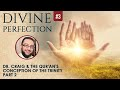

# ST #53: Divine Perfection - Dr. William Lane Craig & the Qur'an's Conception of the Trinity - PART 2 (2022-03-26)

## Description

Listen to Sapient Thoughts episodes as audio: https://soundcloud.com/sapienceinstitute/sets/sapient-thoughts?utm_source=clipboard&utm_medium=text&utm_campaign=social_sharing

Sapient Thoughts #53: Divine Perfection - Dr. William Lane Craig & the Qur'an's Conception of the Trinity - Part 2 with Dr. Osman Latiff

📖 Download the free book on the topic: https://sapienceinstitute.org/divineperfection

🎓 Register for the course on the topic: https://learn.sapienceinstitute.org/courses/divine-perfection/

To be updated about our content please subscribe and open the notifications.
----
BOOK A LIGHTHOUSE MENTOR

Are you or someone you know doubting Islam? Do you find yourself struggling to find answers?  Do you have a hard time speaking to someone about Islam?  Are you considering Islam but are unsure about certain concepts?  Are you an activist, Imam or community leader who is unsure about how to handle questions related to science, philosophy, the Islamic moral code, etc.?

You are not alone.  Over the course of the last decade or more there has been a rapid proliferation of content online and in academic institutions that has eroded the faith of some people.

Seeing the rise of  this phenomenon , Sapience Institute is introducing a One to One mentoring service called LIGHTHOUSE.

BOOK A MENTOR HERE: https://sapienceinstitute.org/lighthouse/

VISIT our website for articles in English, Spanish and Turkish; mentoring service, learning platform and for speaker requests: https://sapienceinstitute.org/

## Summary of [ST #53: Divine Perfection - Dr. William Lane Craig & the Qur'an's Conception of the Trinity - PART 2](https://www.youtube.com/watch?v=Nx_O-c8pYac)

*This summary is AI generated - there may be inaccuracies. *

### [00:00:00](https://www.youtube.com/watch?v=Nx_O-c8pYac&t=0) - [00:10:00](https://www.youtube.com/watch?v=Nx_O-c8pYac&t=600)

 Dr. William Lane Craig and Dr. Muhammad Taqi Usmani discuss the concept of the Trinity in the Quran. Craig points out that when trinity is mentioned in the Quran, Mary is not singled out. Mary is mentioned only because she is a mother of Jesus, not because she is a specific mediator between humans and God. Furthermore, the schism and deviation between Christians emerged after Jesus' death, not during his time on earth.

**[00:00:00](https://www.youtube.com/watch?v=Nx_O-c8pYac&t=0)** In this episode, Dr. William Lane Craig discusses verses in the Qur'an which imply that Jesus is not equal to God. Craig points out that the word 'ila, which is used in the verses, has multiple meanings, including "a deity," "a creator," and "one to whom the hearts turn in love." He goes on to say that when Allah refers to Jesus as one of His "ila," this means that Christ is not equal to Allah in any way.
* **[00:05:00](https://www.youtube.com/watch?v=Nx_O-c8pYac&t=300)**  Dr. William Lane Craig and Qur'an scholar Dr. Muhammad Taqi Usmani discuss the concept of the Trinity in the Quran. Craig points out that when trinity is mentioned in the Quran, Mary is not singled out. Mary is mentioned only because she is a mother of Jesus, not because she is a specific mediator between humans and God. Furthermore, the schism and deviation between Christians emerged after Jesus' death, not during his time on earth.
* **[00:10:00](https://www.youtube.com/watch?v=Nx_O-c8pYac&t=600)**  Dr. William Lane Craig and atheist Muhammad Taqi Usmani discuss the Qur'an's conception of the Trinity. Craig points out that if you step back and look at it, both Jesus and Allah say that you can take you and your mother as two gods beside or two deities. This means that from the outside, you can see that both of these religions have their own deviations. The Catholics, for taking Mary and emphasizing her, and the Protestants, for taking Jesus and emphasizing him at the expense of Mary, are in a quagmire and fighting through it. The Qur'an, however, says that both of them are guilty of this because they have taken two deities instead of one true god, Allah al-Latif. This is a profound verse, and if you think about what's actually happening, it's a crisis because everything of greatness has been directed towards something other than Allah. This is what polytheism is, and it will continue in Charlotte in the next episode.

<h2>Full transcript with timestamps: CLICK TO EXPAND</h2>

[0:00:06](https://youtu.be/Nx_O-c8pYac?t=6) assalamu alaikum welcome to sapient  
[0:00:07](https://youtu.be/Nx_O-c8pYac?t=7) force my name is and i'm of course  
[0:00:09](https://youtu.be/Nx_O-c8pYac?t=9) discussing my book my new book on divine  
[0:00:11](https://youtu.be/Nx_O-c8pYac?t=11) perfection christianity and islam on sin  
[0:00:13](https://youtu.be/Nx_O-c8pYac?t=13) and salvation  
[0:00:15](https://youtu.be/Nx_O-c8pYac?t=15) this is the third episode we've spoken  
[0:00:17](https://youtu.be/Nx_O-c8pYac?t=17) about number one the introduction behind  
[0:00:19](https://youtu.be/Nx_O-c8pYac?t=19) the book why the book the purpose behind  
[0:00:20](https://youtu.be/Nx_O-c8pYac?t=20) the book the great need of the book in  
[0:00:22](https://youtu.be/Nx_O-c8pYac?t=22) fact for all of us for muslims for even  
[0:00:24](https://youtu.be/Nx_O-c8pYac?t=24) our christian friends to understand  
[0:00:25](https://youtu.be/Nx_O-c8pYac?t=25) better understand their own faith and  
[0:00:27](https://youtu.be/Nx_O-c8pYac?t=27) the faith of islam and then we spoke  
[0:00:29](https://youtu.be/Nx_O-c8pYac?t=29) last episode about the first of dr  
[0:00:32](https://youtu.be/Nx_O-c8pYac?t=32) craig's arguments on the maximal  
[0:00:35](https://youtu.be/Nx_O-c8pYac?t=35) omniscience of allah he believes being  
[0:00:37](https://youtu.be/Nx_O-c8pYac?t=37) compromised by a misunderstanding in the  
[0:00:38](https://youtu.be/Nx_O-c8pYac?t=38) quran about the nature of the trinity as  
[0:00:41](https://youtu.be/Nx_O-c8pYac?t=41) christians perceive it or believe in it  
[0:00:44](https://youtu.be/Nx_O-c8pYac?t=44) we spoke about that last time we in fact  
[0:00:45](https://youtu.be/Nx_O-c8pYac?t=45) we went through the verses  
[0:00:48](https://youtu.be/Nx_O-c8pYac?t=48) fully quoted  
[0:00:49](https://youtu.be/Nx_O-c8pYac?t=49) that  
[0:00:50](https://youtu.be/Nx_O-c8pYac?t=50) craig and his missionary  
[0:00:52](https://youtu.be/Nx_O-c8pYac?t=52) colleagues and other apologists have  
[0:00:55](https://youtu.be/Nx_O-c8pYac?t=55) failed to cite and fail to understand  
[0:00:57](https://youtu.be/Nx_O-c8pYac?t=57) correctly  
[0:00:58](https://youtu.be/Nx_O-c8pYac?t=58) today inshallah in this episode we're  
[0:01:00](https://youtu.be/Nx_O-c8pYac?t=60) going to go through some key nuances and  
[0:01:02](https://youtu.be/Nx_O-c8pYac?t=62) details behind those verses so if you  
[0:01:04](https://youtu.be/Nx_O-c8pYac?t=64) recall therefore the first verse reads  
[0:01:06](https://youtu.be/Nx_O-c8pYac?t=66) when allah says to jesus son of mary  
[0:01:10](https://youtu.be/Nx_O-c8pYac?t=70) nasty  
[0:01:12](https://youtu.be/Nx_O-c8pYac?t=72) did you tell people to take you and your  
[0:01:14](https://youtu.be/Nx_O-c8pYac?t=74) mother as two d  
[0:01:16](https://youtu.be/Nx_O-c8pYac?t=76) as two deities besides allah now the  
[0:01:18](https://youtu.be/Nx_O-c8pYac?t=78) first point to mention is this the  
[0:01:20](https://youtu.be/Nx_O-c8pYac?t=80) meaning of the word  
[0:01:22](https://youtu.be/Nx_O-c8pYac?t=82) in this verse it's  
[0:01:23](https://youtu.be/Nx_O-c8pYac?t=83) meaning two ela's but what does ela  
[0:01:26](https://youtu.be/Nx_O-c8pYac?t=86) actually mean like when we say la ilaha  
[0:01:28](https://youtu.be/Nx_O-c8pYac?t=88) illallah there's no deity except allah  
[0:01:30](https://youtu.be/Nx_O-c8pYac?t=90) what does it actually mean  
[0:01:32](https://youtu.be/Nx_O-c8pYac?t=92) the first thing is is you have to  
[0:01:34](https://youtu.be/Nx_O-c8pYac?t=94) consider the meaning of the illah within  
[0:01:35](https://youtu.be/Nx_O-c8pYac?t=95) the quranic framework entirely what is  
[0:01:38](https://youtu.be/Nx_O-c8pYac?t=98) the quranic meaning of the word within  
[0:01:40](https://youtu.be/Nx_O-c8pYac?t=100) its own framework  
[0:01:42](https://youtu.be/Nx_O-c8pYac?t=102) in arabic means a deity for sure but it  
[0:01:45](https://youtu.be/Nx_O-c8pYac?t=105) doesn't always mean a creator as in  
[0:01:48](https://youtu.be/Nx_O-c8pYac?t=108) deity as in a creator like for example  
[0:01:49](https://youtu.be/Nx_O-c8pYac?t=109) if you say allah allah is our ila but  
[0:01:52](https://youtu.be/Nx_O-c8pYac?t=112) there are other references to illah in  
[0:01:54](https://youtu.be/Nx_O-c8pYac?t=114) the quran which don't indicate  
[0:01:56](https://youtu.be/Nx_O-c8pYac?t=116) like a  
[0:01:58](https://youtu.be/Nx_O-c8pYac?t=118) creator of the universe for example like  
[0:01:59](https://youtu.be/Nx_O-c8pYac?t=119) you find when we speak about allah  
[0:02:01](https://youtu.be/Nx_O-c8pYac?t=121) subhanahu wa  
[0:02:02](https://youtu.be/Nx_O-c8pYac?t=122) for example the verse in the quran says  
[0:02:07](https://youtu.be/Nx_O-c8pYac?t=127) have you seen him who took his own  
[0:02:09](https://youtu.be/Nx_O-c8pYac?t=129) desires as an ilam  
[0:02:11](https://youtu.be/Nx_O-c8pYac?t=131) consider him he took his own desires as  
[0:02:13](https://youtu.be/Nx_O-c8pYac?t=133) an ela as a deity doesn't mean therefore  
[0:02:15](https://youtu.be/Nx_O-c8pYac?t=135) his desires become a creator of the  
[0:02:17](https://youtu.be/Nx_O-c8pYac?t=137) universe but something that is an ela so  
[0:02:20](https://youtu.be/Nx_O-c8pYac?t=140) what does ela actually mean  
[0:02:22](https://youtu.be/Nx_O-c8pYac?t=142) the third theologian explains it  
[0:02:23](https://youtu.be/Nx_O-c8pYac?t=143) beautifully based in damascus he says  
[0:02:26](https://youtu.be/Nx_O-c8pYac?t=146) the ila is the one to which to whom  
[0:02:29](https://youtu.be/Nx_O-c8pYac?t=149) sorry to whom the hearts turn to in love  
[0:02:32](https://youtu.be/Nx_O-c8pYac?t=152) in reverence  
[0:02:37](https://youtu.be/Nx_O-c8pYac?t=157) that towards the heart the the one to  
[0:02:39](https://youtu.be/Nx_O-c8pYac?t=159) whom the hearts turn to in fair and  
[0:02:42](https://youtu.be/Nx_O-c8pYac?t=162) reverence in longing in supplication in  
[0:02:44](https://youtu.be/Nx_O-c8pYac?t=164) beseeching in praying in love in mercy  
[0:02:47](https://youtu.be/Nx_O-c8pYac?t=167) in fear in hope that is your illah that  
[0:02:50](https://youtu.be/Nx_O-c8pYac?t=170) is your deity that you're surrendering  
[0:02:52](https://youtu.be/Nx_O-c8pYac?t=172) your your will to  
[0:02:53](https://youtu.be/Nx_O-c8pYac?t=173) of course for muslims that is going to  
[0:02:55](https://youtu.be/Nx_O-c8pYac?t=175) be allah we turn only to allah in fair  
[0:02:58](https://youtu.be/Nx_O-c8pYac?t=178) in hope in reverence in exaltation in in  
[0:03:02](https://youtu.be/Nx_O-c8pYac?t=182) longing and beseeching and praying that  
[0:03:04](https://youtu.be/Nx_O-c8pYac?t=184) is only to allah so that is the meaning  
[0:03:05](https://youtu.be/Nx_O-c8pYac?t=185) of illah in the quranic framework and  
[0:03:09](https://youtu.be/Nx_O-c8pYac?t=189) allah says that some people took others  
[0:03:11](https://youtu.be/Nx_O-c8pYac?t=191) as ilah those elahs that they taken  
[0:03:14](https://youtu.be/Nx_O-c8pYac?t=194) besides allah could be stones could be  
[0:03:16](https://youtu.be/Nx_O-c8pYac?t=196) rocks could be stars and the moon it  
[0:03:19](https://youtu.be/Nx_O-c8pYac?t=199) could be trees it could be all kinds of  
[0:03:22](https://youtu.be/Nx_O-c8pYac?t=202) invisible beings it could be the jinn it  
[0:03:24](https://youtu.be/Nx_O-c8pYac?t=204) could be from the humans but they took  
[0:03:26](https://youtu.be/Nx_O-c8pYac?t=206) them as an illah doesn't mean they  
[0:03:27](https://youtu.be/Nx_O-c8pYac?t=207) believe that they were the creator of  
[0:03:29](https://youtu.be/Nx_O-c8pYac?t=209) the heavens and the earth but as  
[0:03:30](https://youtu.be/Nx_O-c8pYac?t=210) something worthy of worship for us only  
[0:03:34](https://youtu.be/Nx_O-c8pYac?t=214) allah is worthy of worship so when allah  
[0:03:37](https://youtu.be/Nx_O-c8pYac?t=217) in the quran says in this first part of  
[0:03:39](https://youtu.be/Nx_O-c8pYac?t=219) in the first part of that verse  
[0:03:41](https://youtu.be/Nx_O-c8pYac?t=221) tell people take you and your mother as  
[0:03:43](https://youtu.be/Nx_O-c8pYac?t=223) two elahs besides allah i love to say  
[0:03:46](https://youtu.be/Nx_O-c8pYac?t=226) that did you tell people take you and  
[0:03:47](https://youtu.be/Nx_O-c8pYac?t=227) your mother as to  
[0:03:49](https://youtu.be/Nx_O-c8pYac?t=229) believing that you both were the  
[0:03:50](https://youtu.be/Nx_O-c8pYac?t=230) creators of the heavens and the earth  
[0:03:52](https://youtu.be/Nx_O-c8pYac?t=232) besides allah that is the first thing  
[0:03:54](https://youtu.be/Nx_O-c8pYac?t=234) for us to remember the meaning of the  
[0:03:56](https://youtu.be/Nx_O-c8pYac?t=236) word  
[0:03:58](https://youtu.be/Nx_O-c8pYac?t=238) point number two is this then he says to  
[0:04:00](https://youtu.be/Nx_O-c8pYac?t=240) allah of course glory be to you full  
[0:04:02](https://youtu.be/Nx_O-c8pYac?t=242) perfection  
[0:04:03](https://youtu.be/Nx_O-c8pYac?t=243) belongs to you free from all  
[0:04:05](https://youtu.be/Nx_O-c8pYac?t=245) imperfection are you o allah and you  
[0:04:08](https://youtu.be/Nx_O-c8pYac?t=248) know the unseen there is one a sticking  
[0:04:10](https://youtu.be/Nx_O-c8pYac?t=250) verse in the bible that perhaps you're  
[0:04:11](https://youtu.be/Nx_O-c8pYac?t=251) all familiar with and that is something  
[0:04:13](https://youtu.be/Nx_O-c8pYac?t=253) christian missions really failed to  
[0:04:14](https://youtu.be/Nx_O-c8pYac?t=254) explain throughout the ages and that is  
[0:04:17](https://youtu.be/Nx_O-c8pYac?t=257) when jesus christ says in in the bible  
[0:04:20](https://youtu.be/Nx_O-c8pYac?t=260) that concerning the hour nobody knows  
[0:04:22](https://youtu.be/Nx_O-c8pYac?t=262) not the angels in heaven not the son but  
[0:04:25](https://youtu.be/Nx_O-c8pYac?t=265) only god and of course this verse is  
[0:04:27](https://youtu.be/Nx_O-c8pYac?t=267) emphasizing god being the knower of all  
[0:04:30](https://youtu.be/Nx_O-c8pYac?t=270) the unseen this verse in fact is  
[0:04:32](https://youtu.be/Nx_O-c8pYac?t=272) emphasizing that same message now  
[0:04:33](https://youtu.be/Nx_O-c8pYac?t=273) christians of course would say well  
[0:04:34](https://youtu.be/Nx_O-c8pYac?t=274) that's the human  
[0:04:36](https://youtu.be/Nx_O-c8pYac?t=276) form human side of jesus speaking and  
[0:04:38](https://youtu.be/Nx_O-c8pYac?t=278) not the god side of jesus speaking i  
[0:04:40](https://youtu.be/Nx_O-c8pYac?t=280) mean that's their own thing that they  
[0:04:41](https://youtu.be/Nx_O-c8pYac?t=281) have amongst them but just think about  
[0:04:43](https://youtu.be/Nx_O-c8pYac?t=283) the quran  
[0:04:44](https://youtu.be/Nx_O-c8pYac?t=284) so when allah is saying therefore that  
[0:04:45](https://youtu.be/Nx_O-c8pYac?t=285) he says to allah  
[0:04:47](https://youtu.be/Nx_O-c8pYac?t=287) you are the only knower of the unseen is  
[0:04:49](https://youtu.be/Nx_O-c8pYac?t=289) emphasizing a point it's a declarative  
[0:04:52](https://youtu.be/Nx_O-c8pYac?t=292) statement that it's only you who know  
[0:04:53](https://youtu.be/Nx_O-c8pYac?t=293) the unseen of allah and i know nothing  
[0:04:56](https://youtu.be/Nx_O-c8pYac?t=296) about what's within you and you only  
[0:04:57](https://youtu.be/Nx_O-c8pYac?t=297) know everything you know everything  
[0:04:58](https://youtu.be/Nx_O-c8pYac?t=298) what's within me that kind of  
[0:05:00](https://youtu.be/Nx_O-c8pYac?t=300) subordinate itself point number three is  
[0:05:02](https://youtu.be/Nx_O-c8pYac?t=302) this  
[0:05:04](https://youtu.be/Nx_O-c8pYac?t=304) whenever you have verses in the quran  
[0:05:06](https://youtu.be/Nx_O-c8pYac?t=306) when trinity is mentioned there are the  
[0:05:08](https://youtu.be/Nx_O-c8pYac?t=308) verses in the quran when allah says  
[0:05:10](https://youtu.be/Nx_O-c8pYac?t=310) about uh  
[0:05:13](https://youtu.be/Nx_O-c8pYac?t=313) don't say three or don't say trinity  
[0:05:15](https://youtu.be/Nx_O-c8pYac?t=315) these are explicit references to the  
[0:05:17](https://youtu.be/Nx_O-c8pYac?t=317) quran when trinity in fact is mentioned  
[0:05:20](https://youtu.be/Nx_O-c8pYac?t=320) now this verse however doesn't mention  
[0:05:22](https://youtu.be/Nx_O-c8pYac?t=322) the trinity it doesn't mention that  
[0:05:25](https://youtu.be/Nx_O-c8pYac?t=325) and if christians are building this  
[0:05:27](https://youtu.be/Nx_O-c8pYac?t=327) argument that this is the verse where  
[0:05:29](https://youtu.be/Nx_O-c8pYac?t=329) the  
[0:05:30](https://youtu.be/Nx_O-c8pYac?t=330) trinity idea is wrong in the quran this  
[0:05:32](https://youtu.be/Nx_O-c8pYac?t=332) is the key verse then why doesn't this  
[0:05:34](https://youtu.be/Nx_O-c8pYac?t=334) verse speak about trinity because there  
[0:05:36](https://youtu.be/Nx_O-c8pYac?t=336) are other verses in quran when trinity  
[0:05:38](https://youtu.be/Nx_O-c8pYac?t=338) is mentioned  
[0:05:40](https://youtu.be/Nx_O-c8pYac?t=340) this verse doesn't have it in fact the  
[0:05:43](https://youtu.be/Nx_O-c8pYac?t=343) point number two is this or point number  
[0:05:45](https://youtu.be/Nx_O-c8pYac?t=345) three is this that whenever trinity is  
[0:05:47](https://youtu.be/Nx_O-c8pYac?t=347) mentioned in the quran it makes no  
[0:05:48](https://youtu.be/Nx_O-c8pYac?t=348) mention of maryam of mary except by  
[0:05:52](https://youtu.be/Nx_O-c8pYac?t=352) stating that she is a she is a mother of  
[0:05:54](https://youtu.be/Nx_O-c8pYac?t=354) jesus  
[0:05:55](https://youtu.be/Nx_O-c8pYac?t=355) but she's not singled out in anything in  
[0:05:57](https://youtu.be/Nx_O-c8pYac?t=357) this verse she's singled out because  
[0:05:59](https://youtu.be/Nx_O-c8pYac?t=359) she's because the rest of the quran is  
[0:06:00](https://youtu.be/Nx_O-c8pYac?t=360) saying that she's singled out for for as  
[0:06:03](https://youtu.be/Nx_O-c8pYac?t=363) a deity besides allah but in all the  
[0:06:06](https://youtu.be/Nx_O-c8pYac?t=366) verses when trinity is mentioned mary  
[0:06:08](https://youtu.be/Nx_O-c8pYac?t=368) simply isn't there  
[0:06:10](https://youtu.be/Nx_O-c8pYac?t=370) as somebody singled out except by being  
[0:06:12](https://youtu.be/Nx_O-c8pYac?t=372) mary or jesus the son of mary or maryam  
[0:06:16](https://youtu.be/Nx_O-c8pYac?t=376) which is a striking point therefore for  
[0:06:17](https://youtu.be/Nx_O-c8pYac?t=377) christian friends to think about there  
[0:06:19](https://youtu.be/Nx_O-c8pYac?t=379) now the point number four is this that  
[0:06:22](https://youtu.be/Nx_O-c8pYac?t=382) when allah the quran says did you take  
[0:06:24](https://youtu.be/Nx_O-c8pYac?t=384) people people take you and your mother  
[0:06:25](https://youtu.be/Nx_O-c8pYac?t=385) as two deities besides allah the  
[0:06:27](https://youtu.be/Nx_O-c8pYac?t=387) christians have a major major problem  
[0:06:30](https://youtu.be/Nx_O-c8pYac?t=390) because remember of course throughout  
[0:06:32](https://youtu.be/Nx_O-c8pYac?t=392) christian history and remember this is  
[0:06:34](https://youtu.be/Nx_O-c8pYac?t=394) something coming after jesus when jesus  
[0:06:35](https://youtu.be/Nx_O-c8pYac?t=395) says to allah  
[0:06:37](https://youtu.be/Nx_O-c8pYac?t=397) that you know when i was with them i was  
[0:06:39](https://youtu.be/Nx_O-c8pYac?t=399) a witness over them  
[0:06:43](https://youtu.be/Nx_O-c8pYac?t=403) and when you raised me or took me you  
[0:06:46](https://youtu.be/Nx_O-c8pYac?t=406) were the watcher over them that means  
[0:06:49](https://youtu.be/Nx_O-c8pYac?t=409) these kind of schisms  
[0:06:52](https://youtu.be/Nx_O-c8pYac?t=412) and  
[0:06:52](https://youtu.be/Nx_O-c8pYac?t=412) dogmatic deviations emerged not in his  
[0:06:55](https://youtu.be/Nx_O-c8pYac?t=415) time where he was with them watch over  
[0:06:58](https://youtu.be/Nx_O-c8pYac?t=418) them but they emerged after him let's  
[0:07:00](https://youtu.be/Nx_O-c8pYac?t=420) test it is that true did it emerge after  
[0:07:02](https://youtu.be/Nx_O-c8pYac?t=422) let's just check it if it's true well  
[0:07:04](https://youtu.be/Nx_O-c8pYac?t=424) the point is this just look at very  
[0:07:06](https://youtu.be/Nx_O-c8pYac?t=426) simply you have these two very big  
[0:07:07](https://youtu.be/Nx_O-c8pYac?t=427) denominations of the catholics and the  
[0:07:09](https://youtu.be/Nx_O-c8pYac?t=429) protestants and of course you have the  
[0:07:11](https://youtu.be/Nx_O-c8pYac?t=431) the orthodox as well and you have the  
[0:07:12](https://youtu.be/Nx_O-c8pYac?t=432) anglicans and others as well  
[0:07:15](https://youtu.be/Nx_O-c8pYac?t=435) but the point is this there is a  
[0:07:17](https://youtu.be/Nx_O-c8pYac?t=437) sizeable population of christians today  
[0:07:19](https://youtu.be/Nx_O-c8pYac?t=439) who do in fact take mary as what we  
[0:07:23](https://youtu.be/Nx_O-c8pYac?t=443) would qualify to what we would term as  
[0:07:25](https://youtu.be/Nx_O-c8pYac?t=445) an ila as a deity besides allah so how  
[0:07:29](https://youtu.be/Nx_O-c8pYac?t=449) does that work then  
[0:07:30](https://youtu.be/Nx_O-c8pYac?t=450) well if the ilah is the one as immak and  
[0:07:33](https://youtu.be/Nx_O-c8pYac?t=453) others have said to one to whom hearts  
[0:07:35](https://youtu.be/Nx_O-c8pYac?t=455) turn to in reverence in fair in hope in  
[0:07:39](https://youtu.be/Nx_O-c8pYac?t=459) penance in longing in prayer and  
[0:07:40](https://youtu.be/Nx_O-c8pYac?t=460) beseeching then that for christian  
[0:07:42](https://youtu.be/Nx_O-c8pYac?t=462) catholics will certainly therefore be  
[0:07:44](https://youtu.be/Nx_O-c8pYac?t=464) mary because catholics do see mary like  
[0:07:48](https://youtu.be/Nx_O-c8pYac?t=468) that in fact they see her more than that  
[0:07:50](https://youtu.be/Nx_O-c8pYac?t=470) they see her as a mediatrix so who is a  
[0:07:53](https://youtu.be/Nx_O-c8pYac?t=473) mediatrix if jesus is a mediator notice  
[0:07:56](https://youtu.be/Nx_O-c8pYac?t=476) that protestant christians would say  
[0:07:57](https://youtu.be/Nx_O-c8pYac?t=477) jesus is the mediator the atoner the one  
[0:08:00](https://youtu.be/Nx_O-c8pYac?t=480) between us and god the one that kind of  
[0:08:04](https://youtu.be/Nx_O-c8pYac?t=484) fixes the schism and the not the skill  
[0:08:06](https://youtu.be/Nx_O-c8pYac?t=486) but the rift the chasm between us and  
[0:08:09](https://youtu.be/Nx_O-c8pYac?t=489) god that emerged from adam's sin in the  
[0:08:10](https://youtu.be/Nx_O-c8pYac?t=490) first place that's jesus so where does  
[0:08:13](https://youtu.be/Nx_O-c8pYac?t=493) the mediatrix come in then and so the  
[0:08:15](https://youtu.be/Nx_O-c8pYac?t=495) catholics would say well you need the  
[0:08:16](https://youtu.be/Nx_O-c8pYac?t=496) mediatrix because the mediatrix is  
[0:08:19](https://youtu.be/Nx_O-c8pYac?t=499) jesus's mother she's of course theotokos  
[0:08:21](https://youtu.be/Nx_O-c8pYac?t=501) the mother of god in their eyes and the  
[0:08:23](https://youtu.be/Nx_O-c8pYac?t=503) mediatrix  
[0:08:25](https://youtu.be/Nx_O-c8pYac?t=505) because she's the one that's you know  
[0:08:26](https://youtu.be/Nx_O-c8pYac?t=506) you can appeal to her to appeal to the  
[0:08:28](https://youtu.be/Nx_O-c8pYac?t=508) son to appeal to the father  
[0:08:31](https://youtu.be/Nx_O-c8pYac?t=511) appeal to her to appeal to the son  
[0:08:33](https://youtu.be/Nx_O-c8pYac?t=513) that's her own son and then the son of  
[0:08:34](https://youtu.be/Nx_O-c8pYac?t=514) course who is fully god of course in  
[0:08:36](https://youtu.be/Nx_O-c8pYac?t=516) their eyes uh can you know can pray for  
[0:08:39](https://youtu.be/Nx_O-c8pYac?t=519) you do good for you and also appeal to  
[0:08:40](https://youtu.be/Nx_O-c8pYac?t=520) the father who is also god as well and  
[0:08:43](https://youtu.be/Nx_O-c8pYac?t=523) so if you look at it like this therefore  
[0:08:46](https://youtu.be/Nx_O-c8pYac?t=526) now when when christians might look at  
[0:08:47](https://youtu.be/Nx_O-c8pYac?t=527) this verse you might see well we don't  
[0:08:49](https://youtu.be/Nx_O-c8pYac?t=529) actually do that we don't worship  
[0:08:53](https://youtu.be/Nx_O-c8pYac?t=533) jesus and mary we don't worship mary  
[0:08:56](https://youtu.be/Nx_O-c8pYac?t=536) they might say that but it depends how  
[0:08:58](https://youtu.be/Nx_O-c8pYac?t=538) you're looking at it because if you're  
[0:09:00](https://youtu.be/Nx_O-c8pYac?t=540) looking at from the point of view let's  
[0:09:02](https://youtu.be/Nx_O-c8pYac?t=542) say for example you're a a catholic  
[0:09:04](https://youtu.be/Nx_O-c8pYac?t=544) right so you therefore are on the side  
[0:09:07](https://youtu.be/Nx_O-c8pYac?t=547) of well of kind of taking mary as a  
[0:09:11](https://youtu.be/Nx_O-c8pYac?t=551) deity besides allah  
[0:09:13](https://youtu.be/Nx_O-c8pYac?t=553) and then of course you have to do with  
[0:09:14](https://youtu.be/Nx_O-c8pYac?t=554) the fact that there's also jesus as a  
[0:09:16](https://youtu.be/Nx_O-c8pYac?t=556) deity besides allah then you have the  
[0:09:18](https://youtu.be/Nx_O-c8pYac?t=558) other end of the spectrum where you have  
[0:09:20](https://youtu.be/Nx_O-c8pYac?t=560) the protestants who would blame the  
[0:09:23](https://youtu.be/Nx_O-c8pYac?t=563) catholics for taking mary as mediatrix  
[0:09:26](https://youtu.be/Nx_O-c8pYac?t=566) so it's like both of these are in  
[0:09:29](https://youtu.be/Nx_O-c8pYac?t=569) opposition to one another because the  
[0:09:31](https://youtu.be/Nx_O-c8pYac?t=571) catholics would say to the protestants  
[0:09:34](https://youtu.be/Nx_O-c8pYac?t=574) that you're not giving mary  
[0:09:36](https://youtu.be/Nx_O-c8pYac?t=576) had you right because she is a mediatrix  
[0:09:39](https://youtu.be/Nx_O-c8pYac?t=579) right so she deserves all of that  
[0:09:40](https://youtu.be/Nx_O-c8pYac?t=580) reverence and fear and love and hope and  
[0:09:42](https://youtu.be/Nx_O-c8pYac?t=582) trust whatever and then the person will  
[0:09:44](https://youtu.be/Nx_O-c8pYac?t=584) say to the catholics you're making  
[0:09:46](https://youtu.be/Nx_O-c8pYac?t=586) idolatry  
[0:09:47](https://youtu.be/Nx_O-c8pYac?t=587) right because you're taking somebody  
[0:09:49](https://youtu.be/Nx_O-c8pYac?t=589) else above jesus or with jesus because  
[0:09:51](https://youtu.be/Nx_O-c8pYac?t=591) jesus is sufficient as a mediator so why  
[0:09:54](https://youtu.be/Nx_O-c8pYac?t=594) the need for a mediatrix now the quran  
[0:09:56](https://youtu.be/Nx_O-c8pYac?t=596) of course if you step back step back i  
[0:09:58](https://youtu.be/Nx_O-c8pYac?t=598) think for me the verse is so profound  
[0:10:00](https://youtu.be/Nx_O-c8pYac?t=600) because if you step back and look at it  
[0:10:02](https://youtu.be/Nx_O-c8pYac?t=602) that jesus says to allah says to jesus  
[0:10:05](https://youtu.be/Nx_O-c8pYac?t=605) you tell people take you and your mother  
[0:10:07](https://youtu.be/Nx_O-c8pYac?t=607) as two gods beside or two deities and  
[0:10:08](https://youtu.be/Nx_O-c8pYac?t=608) well god's besides allah  
[0:10:10](https://youtu.be/Nx_O-c8pYac?t=610) that means that  
[0:10:12](https://youtu.be/Nx_O-c8pYac?t=612) from the you know from from out from  
[0:10:14](https://youtu.be/Nx_O-c8pYac?t=614) outside you can see that both of these  
[0:10:16](https://youtu.be/Nx_O-c8pYac?t=616) have their own deviations  
[0:10:18](https://youtu.be/Nx_O-c8pYac?t=618) the catholics of course for taking mary  
[0:10:21](https://youtu.be/Nx_O-c8pYac?t=621) and emphasizing her and the protestants  
[0:10:23](https://youtu.be/Nx_O-c8pYac?t=623) for taking jesus and emphasizing him at  
[0:10:26](https://youtu.be/Nx_O-c8pYac?t=626) the expense of mary so both of them are  
[0:10:28](https://youtu.be/Nx_O-c8pYac?t=628) in this kind of a quagmire and fighting  
[0:10:30](https://youtu.be/Nx_O-c8pYac?t=630) through it they've taken the mediator  
[0:10:33](https://youtu.be/Nx_O-c8pYac?t=633) and the mediatrix this one mediator but  
[0:10:35](https://youtu.be/Nx_O-c8pYac?t=635) no mediatrix this one mediator and  
[0:10:37](https://youtu.be/Nx_O-c8pYac?t=637) mediatrix and allah is saying you both  
[0:10:39](https://youtu.be/Nx_O-c8pYac?t=639) did the situation uh that went wrong of  
[0:10:42](https://youtu.be/Nx_O-c8pYac?t=642) taking both as two deities besides allah  
[0:10:44](https://youtu.be/Nx_O-c8pYac?t=644) it's a profound verse if you think  
[0:10:46](https://youtu.be/Nx_O-c8pYac?t=646) deeply about what's actually happening  
[0:10:48](https://youtu.be/Nx_O-c8pYac?t=648) here now what happened in the  
[0:10:50](https://youtu.be/Nx_O-c8pYac?t=650) reformation period you had the lutheran  
[0:10:52](https://youtu.be/Nx_O-c8pYac?t=652) and protestant reformation and what are  
[0:10:54](https://youtu.be/Nx_O-c8pYac?t=654) they saying about our our catholic  
[0:10:57](https://youtu.be/Nx_O-c8pYac?t=657) friends they said the catholics are  
[0:10:58](https://youtu.be/Nx_O-c8pYac?t=658) guilty of marrying a lottery this is  
[0:11:01](https://youtu.be/Nx_O-c8pYac?t=661) from mariology  
[0:11:03](https://youtu.be/Nx_O-c8pYac?t=663) mario lottery is from idolatry  
[0:11:05](https://youtu.be/Nx_O-c8pYac?t=665) that they're committing a mary a lot  
[0:11:07](https://youtu.be/Nx_O-c8pYac?t=667) remaining an idolatry concerning mary  
[0:11:10](https://youtu.be/Nx_O-c8pYac?t=670) they're taking mary as another god  
[0:11:13](https://youtu.be/Nx_O-c8pYac?t=673) besides god because they're putting her  
[0:11:16](https://youtu.be/Nx_O-c8pYac?t=676) in the same level  
[0:11:18](https://youtu.be/Nx_O-c8pYac?t=678) as jesus by saying she is a mediatrix  
[0:11:20](https://youtu.be/Nx_O-c8pYac?t=680) and then she has of course so many  
[0:11:22](https://youtu.be/Nx_O-c8pYac?t=682) things in catholicism about praying to a  
[0:11:24](https://youtu.be/Nx_O-c8pYac?t=684) rosary to mary prayers for mary uh you  
[0:11:28](https://youtu.be/Nx_O-c8pYac?t=688) know rosary for so many things to do  
[0:11:30](https://youtu.be/Nx_O-c8pYac?t=690) with with mary that protestants in fact  
[0:11:32](https://youtu.be/Nx_O-c8pYac?t=692) believe that's tantamount to perhaps  
[0:11:35](https://youtu.be/Nx_O-c8pYac?t=695) tantamount to polytheism that the quran  
[0:11:38](https://youtu.be/Nx_O-c8pYac?t=698) is saying well you're both guilty of  
[0:11:39](https://youtu.be/Nx_O-c8pYac?t=699) that because you both have taken these  
[0:11:41](https://youtu.be/Nx_O-c8pYac?t=701) two deities besides the one true god  
[0:11:45](https://youtu.be/Nx_O-c8pYac?t=705) allah al-latif  
[0:11:47](https://youtu.be/Nx_O-c8pYac?t=707) allah is  
[0:11:48](https://youtu.be/Nx_O-c8pYac?t=708) all right allah is as the subtly  
[0:11:50](https://youtu.be/Nx_O-c8pYac?t=710) perfectly subtle one  
[0:11:52](https://youtu.be/Nx_O-c8pYac?t=712) allah is  
[0:11:56](https://youtu.be/Nx_O-c8pYac?t=716) the supreme one the exalted only exalted  
[0:11:58](https://youtu.be/Nx_O-c8pYac?t=718) one that is allah right so what happens  
[0:12:02](https://youtu.be/Nx_O-c8pYac?t=722) what's the problem in this the problem  
[0:12:04](https://youtu.be/Nx_O-c8pYac?t=724) in this is this everything of greatness  
[0:12:05](https://youtu.be/Nx_O-c8pYac?t=725) allah place within you your capability  
[0:12:08](https://youtu.be/Nx_O-c8pYac?t=728) your power your potential right for you  
[0:12:10](https://youtu.be/Nx_O-c8pYac?t=730) to worship only allah alone with any  
[0:12:12](https://youtu.be/Nx_O-c8pYac?t=732) partners has been directed misdirected  
[0:12:16](https://youtu.be/Nx_O-c8pYac?t=736) to somebody something other than allah  
[0:12:18](https://youtu.be/Nx_O-c8pYac?t=738) and that is a crisis of what shirk or  
[0:12:21](https://youtu.be/Nx_O-c8pYac?t=741) polytheism actually is will carry on in  
[0:12:24](https://youtu.be/Nx_O-c8pYac?t=744) charlotte in the next episode  

