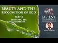

# Sapient Thoughts #40: Beauty & The Recognition of God — Part 2: Extending the limitations (2021-08-16)

## Description

Natural beauty can bring about a state of awe. This can increase cognition & reduce ego, which facilitates the recognition of God. This series explore the research on natural beauty & awe, whilst referring to Islamic teachings, & show how beauty leads to the Divine.

## Summary of [Sapient Thoughts #40: Beauty & The Recognition of God — Part 2: Extending the limitations](https://www.youtube.com/watch?v=sWbZlh0jA4k)

*This summary is AI generated - there may be inaccuracies. *

### [00:00:00](https://www.youtube.com/watch?v=sWbZlh0jA4k&t=0) - [00:15:00](https://www.youtube.com/watch?v=sWbZlh0jA4k&t=900)

 Sapient Thoughts discusses how exposure to beauty or natural beauty can help one see truth as it really is. The point is made that no individual person can know everything, and so one can broaden their epistemic limitations by relying on the skills and knowledge of others. However, this does not allow for full trust in one's own cognition.

**[00:00:00](https://www.youtube.com/watch?v=sWbZlh0jA4k&t=0)**  Sapient Thoughts discusses the idea of one's epistemic limitations and how exposure to beauty or natural beauty can help one see truth as it really is. The point is made that no individual person can know everything, and so one can broaden their epistemic limitations by relying on the skills and knowledge of others. However, this does not allow for full trust in one's own cognition.
* **[00:05:00](https://www.youtube.com/watch?v=sWbZlh0jA4k&t=300)**  Sapient Thoughts discusses the concept of world views and how they influence the way maps are drawn.  also discusses the Islamic worldview and how it affects the way the map of Arabia is drawn. Finally, the video discusses the way terms are translated in Arabic and how this affects the way maps are drawn in that language.
* **[00:10:00](https://www.youtube.com/watch?v=sWbZlh0jA4k&t=600)** The study found that people associate north with up and south with down, and this affects how the person perceives time, effort, and cost. The study also found that some transportation companies take advantage of this.
* **[00:15:00](https://www.youtube.com/watch?v=sWbZlh0jA4k&t=900)** The presenter suggests that if one understands cognitive limitations of oneself and the cognitive limitations of another person, one can extend those limitations well. In this episode, they present their thesis that when one has exposure to natural beauty, it actually enhances one's cognition. This has another effect, which is helpful in seeing truth as it really is. In the next episode of the series, they will talk about this further.

<h2>Full transcript with timestamps: CLICK TO EXPAND</h2>

[0:00:02](https://youtu.be/sWbZlh0jA4k?t=2) [Music]  
[0:00:16](https://youtu.be/sWbZlh0jA4k?t=16) brothers and sisters welcome to another  
[0:00:18](https://youtu.be/sWbZlh0jA4k?t=18) episode of sapient thoughts where we  
[0:00:21](https://youtu.be/sWbZlh0jA4k?t=21) discuss theo philosophical issues where  
[0:00:23](https://youtu.be/sWbZlh0jA4k?t=23) we answer  
[0:00:25](https://youtu.be/sWbZlh0jA4k?t=25) contentions against islam and where we  
[0:00:27](https://youtu.be/sWbZlh0jA4k?t=27) provide a robust case for the veracity  
[0:00:30](https://youtu.be/sWbZlh0jA4k?t=30) of islam in today's episode we're going  
[0:00:32](https://youtu.be/sWbZlh0jA4k?t=32) to be continuing our multi-part series  
[0:00:34](https://youtu.be/sWbZlh0jA4k?t=34) on beauty and the recognition of god  
[0:00:37](https://youtu.be/sWbZlh0jA4k?t=37) now in the last episode we had discussed  
[0:00:40](https://youtu.be/sWbZlh0jA4k?t=40) the idea of a person individuals  
[0:00:43](https://youtu.be/sWbZlh0jA4k?t=43) cognitive limitations and we discussed a  
[0:00:47](https://youtu.be/sWbZlh0jA4k?t=47) few things related to that we discussed  
[0:00:48](https://youtu.be/sWbZlh0jA4k?t=48) how one's environment  
[0:00:50](https://youtu.be/sWbZlh0jA4k?t=50) where one lives or what the surroundings  
[0:00:52](https://youtu.be/sWbZlh0jA4k?t=52) of a person may be  
[0:00:54](https://youtu.be/sWbZlh0jA4k?t=54) can actually have an impact on their  
[0:00:57](https://youtu.be/sWbZlh0jA4k?t=57) cognition in other words it could lead  
[0:00:59](https://youtu.be/sWbZlh0jA4k?t=59) to a type of cognitive bias  
[0:01:01](https://youtu.be/sWbZlh0jA4k?t=61) so with that said  
[0:01:03](https://youtu.be/sWbZlh0jA4k?t=63) the other question one could ask related  
[0:01:06](https://youtu.be/sWbZlh0jA4k?t=66) to that is that how do we transcend that  
[0:01:08](https://youtu.be/sWbZlh0jA4k?t=68) cognitive bias  
[0:01:09](https://youtu.be/sWbZlh0jA4k?t=69) and if there are limitations if there  
[0:01:12](https://youtu.be/sWbZlh0jA4k?t=72) are epistemic limitations one has how do  
[0:01:14](https://youtu.be/sWbZlh0jA4k?t=74) we  
[0:01:15](https://youtu.be/sWbZlh0jA4k?t=75) broaden our epistemic limitations such  
[0:01:18](https://youtu.be/sWbZlh0jA4k?t=78) that we're able to have a wider  
[0:01:20](https://youtu.be/sWbZlh0jA4k?t=80) epistemic sphere  
[0:01:22](https://youtu.be/sWbZlh0jA4k?t=82) and one answer to that question would be  
[0:01:24](https://youtu.be/sWbZlh0jA4k?t=84) to take information from other people so  
[0:01:27](https://youtu.be/sWbZlh0jA4k?t=87) if indeed we have cognitive limitations  
[0:01:29](https://youtu.be/sWbZlh0jA4k?t=89) and cognitive biases then perhaps we can  
[0:01:31](https://youtu.be/sWbZlh0jA4k?t=91) rely on others for information and  
[0:01:35](https://youtu.be/sWbZlh0jA4k?t=95) skills and knowledge and things like  
[0:01:37](https://youtu.be/sWbZlh0jA4k?t=97) that  
[0:01:38](https://youtu.be/sWbZlh0jA4k?t=98) and to highlight this point there's a  
[0:01:40](https://youtu.be/sWbZlh0jA4k?t=100) statement from elizabeth fricker who is  
[0:01:42](https://youtu.be/sWbZlh0jA4k?t=102) a philosopher and researcher at oxford  
[0:01:44](https://youtu.be/sWbZlh0jA4k?t=104) university i believe and she writes  
[0:01:47](https://youtu.be/sWbZlh0jA4k?t=107) about  
[0:01:48](https://youtu.be/sWbZlh0jA4k?t=108) this concept of extending one's  
[0:01:50](https://youtu.be/sWbZlh0jA4k?t=110) epistemic limitations and she says it  
[0:01:52](https://youtu.be/sWbZlh0jA4k?t=112) should be immediately obvious  
[0:01:54](https://youtu.be/sWbZlh0jA4k?t=114) that in the conditions of modern life we  
[0:01:56](https://youtu.be/sWbZlh0jA4k?t=116) rely hugely on the epistemic and  
[0:01:59](https://youtu.be/sWbZlh0jA4k?t=119) practical skills of others for example i  
[0:02:02](https://youtu.be/sWbZlh0jA4k?t=122) allow my car mechanic to find out what  
[0:02:04](https://youtu.be/sWbZlh0jA4k?t=124) is at fault with my car when it won't  
[0:02:07](https://youtu.be/sWbZlh0jA4k?t=127) start  
[0:02:08](https://youtu.be/sWbZlh0jA4k?t=128) and  
[0:02:09](https://youtu.be/sWbZlh0jA4k?t=129) i then proceed to ask him or her to fix  
[0:02:12](https://youtu.be/sWbZlh0jA4k?t=132) it for me and one relies on one's doctor  
[0:02:15](https://youtu.be/sWbZlh0jA4k?t=135) to use information from symptoms and  
[0:02:17](https://youtu.be/sWbZlh0jA4k?t=137) medical tests to diagnose what is wrong  
[0:02:20](https://youtu.be/sWbZlh0jA4k?t=140) with one and then to prescribe an  
[0:02:22](https://youtu.be/sWbZlh0jA4k?t=142) appropriate treatment  
[0:02:23](https://youtu.be/sWbZlh0jA4k?t=143) now the point here is that no individual  
[0:02:27](https://youtu.be/sWbZlh0jA4k?t=147) person can gather knowledge about every  
[0:02:30](https://youtu.be/sWbZlh0jA4k?t=150) single field that one may need and so  
[0:02:32](https://youtu.be/sWbZlh0jA4k?t=152) thus one relies on the skills and  
[0:02:34](https://youtu.be/sWbZlh0jA4k?t=154) knowledge of others  
[0:02:37](https://youtu.be/sWbZlh0jA4k?t=157) and hence that epistemic limitation can  
[0:02:40](https://youtu.be/sWbZlh0jA4k?t=160) be extended  
[0:02:42](https://youtu.be/sWbZlh0jA4k?t=162) and indeed it is extended because we  
[0:02:44](https://youtu.be/sWbZlh0jA4k?t=164) rely on doctors we rely on pilots to fly  
[0:02:46](https://youtu.be/sWbZlh0jA4k?t=166) planes and all of those areas of  
[0:02:48](https://youtu.be/sWbZlh0jA4k?t=168) information that we don't have or those  
[0:02:50](https://youtu.be/sWbZlh0jA4k?t=170) skills that we don't have we rely on the  
[0:02:53](https://youtu.be/sWbZlh0jA4k?t=173) information and knowledge and skills of  
[0:02:55](https://youtu.be/sWbZlh0jA4k?t=175) others  
[0:02:56](https://youtu.be/sWbZlh0jA4k?t=176) now that's fine  
[0:02:57](https://youtu.be/sWbZlh0jA4k?t=177) but coming back to my original thesis  
[0:03:00](https://youtu.be/sWbZlh0jA4k?t=180) and that was  
[0:03:01](https://youtu.be/sWbZlh0jA4k?t=181) that if  
[0:03:03](https://youtu.be/sWbZlh0jA4k?t=183) a person  
[0:03:04](https://youtu.be/sWbZlh0jA4k?t=184) is engaged or if a person would like to  
[0:03:08](https://youtu.be/sWbZlh0jA4k?t=188) know truth as it really is  
[0:03:11](https://youtu.be/sWbZlh0jA4k?t=191) how could they do that well the thesis  
[0:03:12](https://youtu.be/sWbZlh0jA4k?t=192) that i put forth is that if a person  
[0:03:14](https://youtu.be/sWbZlh0jA4k?t=194) wants to know truth as it really is an  
[0:03:16](https://youtu.be/sWbZlh0jA4k?t=196) exposure to beauty or natural beauty  
[0:03:20](https://youtu.be/sWbZlh0jA4k?t=200) can  
[0:03:21](https://youtu.be/sWbZlh0jA4k?t=201) cause a person to allow a person to see  
[0:03:23](https://youtu.be/sWbZlh0jA4k?t=203) truth as it really is  
[0:03:25](https://youtu.be/sWbZlh0jA4k?t=205) that being the case we understand we  
[0:03:27](https://youtu.be/sWbZlh0jA4k?t=207) have cognitive limitations so perhaps  
[0:03:29](https://youtu.be/sWbZlh0jA4k?t=209) one could say well i can't fully 100  
[0:03:33](https://youtu.be/sWbZlh0jA4k?t=213) trust my cognition my own individual  
[0:03:35](https://youtu.be/sWbZlh0jA4k?t=215) cognitive abilities  
[0:03:36](https://youtu.be/sWbZlh0jA4k?t=216) so then therefore if i want to see truth  
[0:03:38](https://youtu.be/sWbZlh0jA4k?t=218) as it really is  
[0:03:40](https://youtu.be/sWbZlh0jA4k?t=220) can i just trust the cognitive abilities  
[0:03:42](https://youtu.be/sWbZlh0jA4k?t=222) of others and the knowledge and skills  
[0:03:44](https://youtu.be/sWbZlh0jA4k?t=224) of others well that's what we wanted to  
[0:03:46](https://youtu.be/sWbZlh0jA4k?t=226) discuss in today's episode is that what  
[0:03:48](https://youtu.be/sWbZlh0jA4k?t=228) we want to see is that even though our  
[0:03:51](https://youtu.be/sWbZlh0jA4k?t=231) epistemic limitations can be can be  
[0:03:54](https://youtu.be/sWbZlh0jA4k?t=234) widened or our epistemic borders can be  
[0:03:56](https://youtu.be/sWbZlh0jA4k?t=236) broadened can be widened because of the  
[0:04:00](https://youtu.be/sWbZlh0jA4k?t=240) skills and knowledge and  
[0:04:02](https://youtu.be/sWbZlh0jA4k?t=242) and and cognitive abilities of abilities  
[0:04:04](https://youtu.be/sWbZlh0jA4k?t=244) of others  
[0:04:05](https://youtu.be/sWbZlh0jA4k?t=245) that also doesn't will not allow us to  
[0:04:08](https://youtu.be/sWbZlh0jA4k?t=248) see truth as it really is  
[0:04:09](https://youtu.be/sWbZlh0jA4k?t=249) in some sort of absolute fashion  
[0:04:12](https://youtu.be/sWbZlh0jA4k?t=252) so let's highlight this point  
[0:04:13](https://youtu.be/sWbZlh0jA4k?t=253) specifically  
[0:04:14](https://youtu.be/sWbZlh0jA4k?t=254) um when most people think about a map of  
[0:04:17](https://youtu.be/sWbZlh0jA4k?t=257) the world  
[0:04:18](https://youtu.be/sWbZlh0jA4k?t=258) they usually see a map where you have  
[0:04:20](https://youtu.be/sWbZlh0jA4k?t=260) north america and south america you have  
[0:04:22](https://youtu.be/sWbZlh0jA4k?t=262) europe and asia and then below that if  
[0:04:25](https://youtu.be/sWbZlh0jA4k?t=265) we're looking at vertical positioning  
[0:04:27](https://youtu.be/sWbZlh0jA4k?t=267) you have  
[0:04:28](https://youtu.be/sWbZlh0jA4k?t=268) africa parts of africa  
[0:04:30](https://youtu.be/sWbZlh0jA4k?t=270) that are below the equator australia  
[0:04:32](https://youtu.be/sWbZlh0jA4k?t=272) being built equator new zealand etc  
[0:04:34](https://youtu.be/sWbZlh0jA4k?t=274) this is the map as we generally see it  
[0:04:36](https://youtu.be/sWbZlh0jA4k?t=276) and it can be traced back to ptolemy  
[0:04:39](https://youtu.be/sWbZlh0jA4k?t=279) and ptolemy when he first drew this drew  
[0:04:42](https://youtu.be/sWbZlh0jA4k?t=282) the map of the world as it was known in  
[0:04:44](https://youtu.be/sWbZlh0jA4k?t=284) his day drew europe on top  
[0:04:47](https://youtu.be/sWbZlh0jA4k?t=287) and drew  
[0:04:48](https://youtu.be/sWbZlh0jA4k?t=288) africa or the known parts of the world  
[0:04:51](https://youtu.be/sWbZlh0jA4k?t=291) of africa at that time on the bottom  
[0:04:53](https://youtu.be/sWbZlh0jA4k?t=293) now the thing is we may and we may think  
[0:04:56](https://youtu.be/sWbZlh0jA4k?t=296) that okay well this is just how the the  
[0:04:58](https://youtu.be/sWbZlh0jA4k?t=298) map of the world was drawn there was no  
[0:04:59](https://youtu.be/sWbZlh0jA4k?t=299) sort of there's no sort of bias in this  
[0:05:02](https://youtu.be/sWbZlh0jA4k?t=302) but when we compare ptolemy's map  
[0:05:05](https://youtu.be/sWbZlh0jA4k?t=305) to other cartographers for instance when  
[0:05:08](https://youtu.be/sWbZlh0jA4k?t=308) we look at the 12th century cartographer  
[0:05:11](https://youtu.be/sWbZlh0jA4k?t=311) by the name of muhammad al-adrisi  
[0:05:13](https://youtu.be/sWbZlh0jA4k?t=313) we see that when he drew his map he in  
[0:05:16](https://youtu.be/sWbZlh0jA4k?t=316) fact put  
[0:05:17](https://youtu.be/sWbZlh0jA4k?t=317) africa on the top of the map and put and  
[0:05:21](https://youtu.be/sWbZlh0jA4k?t=321) placed europe on the bottom of the map  
[0:05:24](https://youtu.be/sWbZlh0jA4k?t=324) now  
[0:05:25](https://youtu.be/sWbZlh0jA4k?t=325) one may ask well which map then is  
[0:05:27](https://youtu.be/sWbZlh0jA4k?t=327) correct  
[0:05:28](https://youtu.be/sWbZlh0jA4k?t=328) would it be  
[0:05:29](https://youtu.be/sWbZlh0jA4k?t=329) you know europe on the bottom and africa  
[0:05:32](https://youtu.be/sWbZlh0jA4k?t=332) on top if we're talking about vertical  
[0:05:34](https://youtu.be/sWbZlh0jA4k?t=334) positioning or would it be the maps as  
[0:05:37](https://youtu.be/sWbZlh0jA4k?t=337) we know them today which as i mentioned  
[0:05:39](https://youtu.be/sWbZlh0jA4k?t=339) can be traced back to ptolemy where  
[0:05:41](https://youtu.be/sWbZlh0jA4k?t=341) europe is on top and africa is on the  
[0:05:43](https://youtu.be/sWbZlh0jA4k?t=343) bottom and of course north america south  
[0:05:44](https://youtu.be/sWbZlh0jA4k?t=344) america and so on  
[0:05:46](https://youtu.be/sWbZlh0jA4k?t=346) which map is correct well the reality is  
[0:05:49](https://youtu.be/sWbZlh0jA4k?t=349) neither map can said to be objectively  
[0:05:51](https://youtu.be/sWbZlh0jA4k?t=351) correct because if one was to travel to  
[0:05:54](https://youtu.be/sWbZlh0jA4k?t=354) outer space there's no sort of anchoring  
[0:05:57](https://youtu.be/sWbZlh0jA4k?t=357) point and there's no sort of positioning  
[0:05:59](https://youtu.be/sWbZlh0jA4k?t=359) vertical positioning whereby one could  
[0:06:01](https://youtu.be/sWbZlh0jA4k?t=361) make a judgment call in other words  
[0:06:03](https://youtu.be/sWbZlh0jA4k?t=363) imagine if you're in outer space  
[0:06:05](https://youtu.be/sWbZlh0jA4k?t=365) uh because there's no sort of  
[0:06:07](https://youtu.be/sWbZlh0jA4k?t=367) positioning there's no anchoring for you  
[0:06:09](https://youtu.be/sWbZlh0jA4k?t=369) you could see you know you could see  
[0:06:11](https://youtu.be/sWbZlh0jA4k?t=371) europe on top and africa and bottom but  
[0:06:13](https://youtu.be/sWbZlh0jA4k?t=373) again because of lack of gravity and  
[0:06:15](https://youtu.be/sWbZlh0jA4k?t=375) things like that you could very well  
[0:06:17](https://youtu.be/sWbZlh0jA4k?t=377) think it completely normal to see africa  
[0:06:19](https://youtu.be/sWbZlh0jA4k?t=379) on top and europe on the bottom when  
[0:06:21](https://youtu.be/sWbZlh0jA4k?t=381) we're talking about vertical positioning  
[0:06:23](https://youtu.be/sWbZlh0jA4k?t=383) so there is no anchorage point  
[0:06:25](https://youtu.be/sWbZlh0jA4k?t=385) so why did ptolemy draw his map the way  
[0:06:28](https://youtu.be/sWbZlh0jA4k?t=388) he did and mohammed al-adrisi draw his  
[0:06:30](https://youtu.be/sWbZlh0jA4k?t=390) map the way he did well one reason that  
[0:06:32](https://youtu.be/sWbZlh0jA4k?t=392) we may put forth is that the maps were  
[0:06:36](https://youtu.be/sWbZlh0jA4k?t=396) drawn based on one's world view  
[0:06:39](https://youtu.be/sWbZlh0jA4k?t=399) now if you have not yet seen the  
[0:06:41](https://youtu.be/sWbZlh0jA4k?t=401) episodes where we discussed world views  
[0:06:43](https://youtu.be/sWbZlh0jA4k?t=403) i highly recommend you check out that  
[0:06:45](https://youtu.be/sWbZlh0jA4k?t=405) sapient thought series on world views  
[0:06:48](https://youtu.be/sWbZlh0jA4k?t=408) and the fitrah now that being said we  
[0:06:51](https://youtu.be/sWbZlh0jA4k?t=411) could assume that this is based on one's  
[0:06:52](https://youtu.be/sWbZlh0jA4k?t=412) world view perhaps ptolemy when he was  
[0:06:56](https://youtu.be/sWbZlh0jA4k?t=416) drawing his map the known world at the  
[0:06:59](https://youtu.be/sWbZlh0jA4k?t=419) time or the known civilized world at the  
[0:07:00](https://youtu.be/sWbZlh0jA4k?t=420) time was indeed europe everything beyond  
[0:07:03](https://youtu.be/sWbZlh0jA4k?t=423) europe may have been considered less  
[0:07:05](https://youtu.be/sWbZlh0jA4k?t=425) civilized and thus when we're talking  
[0:07:06](https://youtu.be/sWbZlh0jA4k?t=426) about vertical positioning perhaps  
[0:07:08](https://youtu.be/sWbZlh0jA4k?t=428) there's also the idea that something  
[0:07:10](https://youtu.be/sWbZlh0jA4k?t=430) that's on top is higher and better and  
[0:07:13](https://youtu.be/sWbZlh0jA4k?t=433) superior whereas something on the bottom  
[0:07:16](https://youtu.be/sWbZlh0jA4k?t=436) i.e that which is less civilized is of a  
[0:07:18](https://youtu.be/sWbZlh0jA4k?t=438) lower value is you know less than and so  
[0:07:21](https://youtu.be/sWbZlh0jA4k?t=441) you have this vertical positioning which  
[0:07:23](https://youtu.be/sWbZlh0jA4k?t=443) has this significance in terms of  
[0:07:25](https://youtu.be/sWbZlh0jA4k?t=445) superiority and perhaps this may be the  
[0:07:27](https://youtu.be/sWbZlh0jA4k?t=447) reason why now when we come to  
[0:07:29](https://youtu.be/sWbZlh0jA4k?t=449) muhammadan map  
[0:07:30](https://youtu.be/sWbZlh0jA4k?t=450) we may assume the same thing perhaps  
[0:07:33](https://youtu.be/sWbZlh0jA4k?t=453) because of muhammad al-idris world view  
[0:07:36](https://youtu.be/sWbZlh0jA4k?t=456) and when he was drawing a map he  
[0:07:38](https://youtu.be/sWbZlh0jA4k?t=458) understood because he's coming from  
[0:07:39](https://youtu.be/sWbZlh0jA4k?t=459) islamic worldview islam to be superior  
[0:07:42](https://youtu.be/sWbZlh0jA4k?t=462) and therefore the arabian peninsula and  
[0:07:45](https://youtu.be/sWbZlh0jA4k?t=465) africa to be drawn on top with mecca and  
[0:07:47](https://youtu.be/sWbZlh0jA4k?t=467) medina to be drawn on top and  
[0:07:50](https://youtu.be/sWbZlh0jA4k?t=470) europe to be drawn on the bottom this is  
[0:07:51](https://youtu.be/sWbZlh0jA4k?t=471) one reason why the map may be drawn in  
[0:07:54](https://youtu.be/sWbZlh0jA4k?t=474) this way or why muhammad al-adrisi may  
[0:07:57](https://youtu.be/sWbZlh0jA4k?t=477) have drawn the map in this way but yet  
[0:07:59](https://youtu.be/sWbZlh0jA4k?t=479) another aspect of muhammad world view  
[0:08:02](https://youtu.be/sWbZlh0jA4k?t=482) that can be considered or can be taken  
[0:08:04](https://youtu.be/sWbZlh0jA4k?t=484) into consideration  
[0:08:05](https://youtu.be/sWbZlh0jA4k?t=485) is that indeed he comes from an islamic  
[0:08:08](https://youtu.be/sWbZlh0jA4k?t=488) worldview that being said when you look  
[0:08:10](https://youtu.be/sWbZlh0jA4k?t=490) at the map that muhammad adrisi drew  
[0:08:13](https://youtu.be/sWbZlh0jA4k?t=493) there's a couple of interesting features  
[0:08:15](https://youtu.be/sWbZlh0jA4k?t=495) one of those features  
[0:08:17](https://youtu.be/sWbZlh0jA4k?t=497) is that when you look at the vertical  
[0:08:19](https://youtu.be/sWbZlh0jA4k?t=499) positioning in comparison to the  
[0:08:21](https://youtu.be/sWbZlh0jA4k?t=501) cardinal direction  
[0:08:23](https://youtu.be/sWbZlh0jA4k?t=503) so when we're talking about vertical  
[0:08:25](https://youtu.be/sWbZlh0jA4k?t=505) positioning we're talking about up and  
[0:08:27](https://youtu.be/sWbZlh0jA4k?t=507) down when we're talking about cardinal  
[0:08:29](https://youtu.be/sWbZlh0jA4k?t=509) positioning we're talking about north  
[0:08:31](https://youtu.be/sWbZlh0jA4k?t=511) south east west  
[0:08:32](https://youtu.be/sWbZlh0jA4k?t=512) so in the map that mohammed al-adrisi  
[0:08:35](https://youtu.be/sWbZlh0jA4k?t=515) drew it's interesting that the term for  
[0:08:38](https://youtu.be/sWbZlh0jA4k?t=518) south  
[0:08:39](https://youtu.be/sWbZlh0jA4k?t=519) he placed on top  
[0:08:41](https://youtu.be/sWbZlh0jA4k?t=521) so junob  
[0:08:42](https://youtu.be/sWbZlh0jA4k?t=522) the plate the term for north which is  
[0:08:44](https://youtu.be/sWbZlh0jA4k?t=524) shimad he placed on the bottom  
[0:08:47](https://youtu.be/sWbZlh0jA4k?t=527) and the term for east is on the left and  
[0:08:49](https://youtu.be/sWbZlh0jA4k?t=529) the term for west is on the right  
[0:08:52](https://youtu.be/sWbZlh0jA4k?t=532) now  
[0:08:52](https://youtu.be/sWbZlh0jA4k?t=532) so it's not only the idea of a map being  
[0:08:55](https://youtu.be/sWbZlh0jA4k?t=535) drawn let's say with africa on top and  
[0:08:58](https://youtu.be/sWbZlh0jA4k?t=538) and and and the raven peninsula on top  
[0:09:00](https://youtu.be/sWbZlh0jA4k?t=540) and europe on the bottom but even the  
[0:09:02](https://youtu.be/sWbZlh0jA4k?t=542) cardinal direction has been drawn  
[0:09:04](https://youtu.be/sWbZlh0jA4k?t=544) differently or has been labeled  
[0:09:06](https://youtu.be/sWbZlh0jA4k?t=546) differently  
[0:09:07](https://youtu.be/sWbZlh0jA4k?t=547) so one of the reasons we may put forth  
[0:09:10](https://youtu.be/sWbZlh0jA4k?t=550) is that in the islamic framework or in  
[0:09:12](https://youtu.be/sWbZlh0jA4k?t=552) the islamic tradition islamic paradigm  
[0:09:14](https://youtu.be/sWbZlh0jA4k?t=554) there is the concept of the prayer  
[0:09:17](https://youtu.be/sWbZlh0jA4k?t=557) and the prayer timings are dependent  
[0:09:19](https://youtu.be/sWbZlh0jA4k?t=559) upon the son and so when one is looking  
[0:09:22](https://youtu.be/sWbZlh0jA4k?t=562) at the sun one may start off in the  
[0:09:25](https://youtu.be/sWbZlh0jA4k?t=565) morning time by  
[0:09:27](https://youtu.be/sWbZlh0jA4k?t=567) looking or gazing east and so if one is  
[0:09:29](https://youtu.be/sWbZlh0jA4k?t=569) looking at the sun it's rising from  
[0:09:31](https://youtu.be/sWbZlh0jA4k?t=571) there they understand that this would be  
[0:09:32](https://youtu.be/sWbZlh0jA4k?t=572) the east where it sets  
[0:09:35](https://youtu.be/sWbZlh0jA4k?t=575) right where that's setting would be west  
[0:09:38](https://youtu.be/sWbZlh0jA4k?t=578) in terms in the english language so we  
[0:09:39](https://youtu.be/sWbZlh0jA4k?t=579) have these two terms that are very clear  
[0:09:42](https://youtu.be/sWbZlh0jA4k?t=582) now the thing is what about terms on the  
[0:09:44](https://youtu.be/sWbZlh0jA4k?t=584) the right and the left  
[0:09:46](https://youtu.be/sWbZlh0jA4k?t=586) so the term that we have for south  
[0:09:49](https://youtu.be/sWbZlh0jA4k?t=589) is janub the term we have for north is  
[0:09:52](https://youtu.be/sWbZlh0jA4k?t=592) shimal  
[0:09:53](https://youtu.be/sWbZlh0jA4k?t=593) well we know that the term for left in  
[0:09:56](https://youtu.be/sWbZlh0jA4k?t=596) the arabic language you can say that  
[0:09:58](https://youtu.be/sWbZlh0jA4k?t=598) that is also shima for instance there's  
[0:10:00](https://youtu.be/sWbZlh0jA4k?t=600) a hadith of the prophet sallallahu  
[0:10:02](https://youtu.be/sWbZlh0jA4k?t=602) alaihi  
[0:10:09](https://youtu.be/sWbZlh0jA4k?t=609) do not eat with your left hand for  
[0:10:11](https://youtu.be/sWbZlh0jA4k?t=611) indeed shaytan eats with his left hand  
[0:10:13](https://youtu.be/sWbZlh0jA4k?t=613) the term for left hand here or left is  
[0:10:16](https://youtu.be/sWbZlh0jA4k?t=616) shimad  
[0:10:17](https://youtu.be/sWbZlh0jA4k?t=617) so  
[0:10:18](https://youtu.be/sWbZlh0jA4k?t=618) left would be shimal north and the the  
[0:10:20](https://youtu.be/sWbZlh0jA4k?t=620) on the right would be genu or the south  
[0:10:23](https://youtu.be/sWbZlh0jA4k?t=623) so when he is drawing the map  
[0:10:25](https://youtu.be/sWbZlh0jA4k?t=625) you have one element of the positioning  
[0:10:27](https://youtu.be/sWbZlh0jA4k?t=627) of the sun based on the idea of the  
[0:10:30](https://youtu.be/sWbZlh0jA4k?t=630) prayers and the prayer timings and how  
[0:10:31](https://youtu.be/sWbZlh0jA4k?t=631) we understand the sun and so muhammad  
[0:10:34](https://youtu.be/sWbZlh0jA4k?t=634) al-adrisi's worldview is going to have  
[0:10:36](https://youtu.be/sWbZlh0jA4k?t=636) an impact on how he's drawing the map  
[0:10:38](https://youtu.be/sWbZlh0jA4k?t=638) not only in terms of vertical  
[0:10:40](https://youtu.be/sWbZlh0jA4k?t=640) positioning but also in terms of  
[0:10:42](https://youtu.be/sWbZlh0jA4k?t=642) cardinal direction  
[0:10:43](https://youtu.be/sWbZlh0jA4k?t=643) all of that is based on a person's world  
[0:10:46](https://youtu.be/sWbZlh0jA4k?t=646) view and so therefore  
[0:10:48](https://youtu.be/sWbZlh0jA4k?t=648) there's no sort of objective right and  
[0:10:50](https://youtu.be/sWbZlh0jA4k?t=650) wrong but it's based on the person's  
[0:10:53](https://youtu.be/sWbZlh0jA4k?t=653) world view and from one perspective one  
[0:10:55](https://youtu.be/sWbZlh0jA4k?t=655) would say that that has that's based on  
[0:10:57](https://youtu.be/sWbZlh0jA4k?t=657) a an assumption or a philosophical  
[0:11:00](https://youtu.be/sWbZlh0jA4k?t=660) assumption or or a first principle if  
[0:11:02](https://youtu.be/sWbZlh0jA4k?t=662) you remember from what we had discussed  
[0:11:05](https://youtu.be/sWbZlh0jA4k?t=665) on in the in the in the series or the  
[0:11:07](https://youtu.be/sWbZlh0jA4k?t=667) episodes on world views and the fitra  
[0:11:10](https://youtu.be/sWbZlh0jA4k?t=670) now you may ask  
[0:11:12](https://youtu.be/sWbZlh0jA4k?t=672) well so what  
[0:11:13](https://youtu.be/sWbZlh0jA4k?t=673) i mean it's just a map right i mean does  
[0:11:14](https://youtu.be/sWbZlh0jA4k?t=674) it really have any sort of consequences  
[0:11:17](https://youtu.be/sWbZlh0jA4k?t=677) and the thing is there's actually real  
[0:11:19](https://youtu.be/sWbZlh0jA4k?t=679) world consequences to having uh such a  
[0:11:23](https://youtu.be/sWbZlh0jA4k?t=683) to relying upon a certain map over  
[0:11:25](https://youtu.be/sWbZlh0jA4k?t=685) another there was a study that was done  
[0:11:27](https://youtu.be/sWbZlh0jA4k?t=687) that's called on southbound ease and  
[0:11:29](https://youtu.be/sWbZlh0jA4k?t=689) northbound fees  
[0:11:31](https://youtu.be/sWbZlh0jA4k?t=691) literal consequences of the metaphoric  
[0:11:33](https://youtu.be/sWbZlh0jA4k?t=693) link between vertical position and  
[0:11:35](https://youtu.be/sWbZlh0jA4k?t=695) cardinal direction and this was a study  
[0:11:37](https://youtu.be/sWbZlh0jA4k?t=697) that was done by  
[0:11:38](https://youtu.be/sWbZlh0jA4k?t=698) nelson simmons in 2009  
[0:11:41](https://youtu.be/sWbZlh0jA4k?t=701) and what they did in this study is that  
[0:11:43](https://youtu.be/sWbZlh0jA4k?t=703) they were trying to  
[0:11:45](https://youtu.be/sWbZlh0jA4k?t=705) see  
[0:11:46](https://youtu.be/sWbZlh0jA4k?t=706) that within  
[0:11:48](https://youtu.be/sWbZlh0jA4k?t=708) human perception  
[0:11:49](https://youtu.be/sWbZlh0jA4k?t=709) do they  
[0:11:51](https://youtu.be/sWbZlh0jA4k?t=711) how do they feel when it comes to  
[0:11:52](https://youtu.be/sWbZlh0jA4k?t=712) vertical positioning  
[0:11:54](https://youtu.be/sWbZlh0jA4k?t=714) in the sense that do they consider  
[0:11:56](https://youtu.be/sWbZlh0jA4k?t=716) something up  
[0:11:57](https://youtu.be/sWbZlh0jA4k?t=717) and going in that direction to be more  
[0:11:59](https://youtu.be/sWbZlh0jA4k?t=719) difficult  
[0:12:00](https://youtu.be/sWbZlh0jA4k?t=720) as opposed to going down right and so  
[0:12:03](https://youtu.be/sWbZlh0jA4k?t=723) remember vertical positioning here  
[0:12:05](https://youtu.be/sWbZlh0jA4k?t=725) related to cardinal direction  
[0:12:07](https://youtu.be/sWbZlh0jA4k?t=727) cardinal direction north south vertical  
[0:12:09](https://youtu.be/sWbZlh0jA4k?t=729) perception up down  
[0:12:10](https://youtu.be/sWbZlh0jA4k?t=730) like there's there is there may be a  
[0:12:12](https://youtu.be/sWbZlh0jA4k?t=732) perception that a person thinking if i'm  
[0:12:14](https://youtu.be/sWbZlh0jA4k?t=734) going north i'm going up  
[0:12:16](https://youtu.be/sWbZlh0jA4k?t=736) and so therefore going up may seem  
[0:12:19](https://youtu.be/sWbZlh0jA4k?t=739) harder again they talk about metaphoric  
[0:12:21](https://youtu.be/sWbZlh0jA4k?t=741) link right and going south may seem  
[0:12:23](https://youtu.be/sWbZlh0jA4k?t=743) easier it's kind of like thinking about  
[0:12:24](https://youtu.be/sWbZlh0jA4k?t=744) going uphill versus downhill when in  
[0:12:27](https://youtu.be/sWbZlh0jA4k?t=747) reality  
[0:12:28](https://youtu.be/sWbZlh0jA4k?t=748) you know you're not really going uphill  
[0:12:29](https://youtu.be/sWbZlh0jA4k?t=749) or downhill per se by just by going  
[0:12:31](https://youtu.be/sWbZlh0jA4k?t=751) north and south so they wanted to put  
[0:12:33](https://youtu.be/sWbZlh0jA4k?t=753) this to the test and they came to some  
[0:12:34](https://youtu.be/sWbZlh0jA4k?t=754) conclusions with their study  
[0:12:36](https://youtu.be/sWbZlh0jA4k?t=756) they said in in one one part of their  
[0:12:39](https://youtu.be/sWbZlh0jA4k?t=759) study said we reported seven studies  
[0:12:42](https://youtu.be/sWbZlh0jA4k?t=762) that demonstrate that the metaphoric  
[0:12:44](https://youtu.be/sWbZlh0jA4k?t=764) association between cardinal direction  
[0:12:47](https://youtu.be/sWbZlh0jA4k?t=767) and vertical position is pervasive and  
[0:12:50](https://youtu.be/sWbZlh0jA4k?t=770) consequential  
[0:12:51](https://youtu.be/sWbZlh0jA4k?t=771) indeed information about cardinal  
[0:12:53](https://youtu.be/sWbZlh0jA4k?t=773) direction can affect consumers judgment  
[0:12:56](https://youtu.be/sWbZlh0jA4k?t=776) of time  
[0:12:58](https://youtu.be/sWbZlh0jA4k?t=778) effort and cost  
[0:12:59](https://youtu.be/sWbZlh0jA4k?t=779) specifically because they associate  
[0:13:01](https://youtu.be/sWbZlh0jA4k?t=781) north with up and south with down  
[0:13:04](https://youtu.be/sWbZlh0jA4k?t=784) consumers expect northbound travel to be  
[0:13:07](https://youtu.be/sWbZlh0jA4k?t=787) more time consuming  
[0:13:09](https://youtu.be/sWbZlh0jA4k?t=789) less convenient and costlier than  
[0:13:12](https://youtu.be/sWbZlh0jA4k?t=792) southbound travel now of course as the  
[0:13:14](https://youtu.be/sWbZlh0jA4k?t=794) study goes on  
[0:13:16](https://youtu.be/sWbZlh0jA4k?t=796) there was uh  
[0:13:17](https://youtu.be/sWbZlh0jA4k?t=797) some of the things that were highlighted  
[0:13:18](https://youtu.be/sWbZlh0jA4k?t=798) in the study was that certain  
[0:13:21](https://youtu.be/sWbZlh0jA4k?t=801) transportation companies took advantage  
[0:13:23](https://youtu.be/sWbZlh0jA4k?t=803) of that so they would charge people  
[0:13:25](https://youtu.be/sWbZlh0jA4k?t=805) for going the same distance going north  
[0:13:28](https://youtu.be/sWbZlh0jA4k?t=808) they would charge them more than going  
[0:13:30](https://youtu.be/sWbZlh0jA4k?t=810) south  
[0:13:31](https://youtu.be/sWbZlh0jA4k?t=811) and all of this is not really based on  
[0:13:34](https://youtu.be/sWbZlh0jA4k?t=814) any sort of real objective uh  
[0:13:36](https://youtu.be/sWbZlh0jA4k?t=816) understanding of north and south of  
[0:13:38](https://youtu.be/sWbZlh0jA4k?t=818) vertical position or cardinal direction  
[0:13:41](https://youtu.be/sWbZlh0jA4k?t=821) because as we saw the map is something  
[0:13:43](https://youtu.be/sWbZlh0jA4k?t=823) that's you can't say what's one's  
[0:13:45](https://youtu.be/sWbZlh0jA4k?t=825) objectively true or not because again if  
[0:13:47](https://youtu.be/sWbZlh0jA4k?t=827) one wants to go in outer space  
[0:13:49](https://youtu.be/sWbZlh0jA4k?t=829) how do you tell which one is up and  
[0:13:51](https://youtu.be/sWbZlh0jA4k?t=831) which one is down  
[0:13:52](https://youtu.be/sWbZlh0jA4k?t=832) but yet it has real world consequences  
[0:13:55](https://youtu.be/sWbZlh0jA4k?t=835) and therefore the point i wanted to  
[0:13:57](https://youtu.be/sWbZlh0jA4k?t=837) highlight in this particular section in  
[0:13:59](https://youtu.be/sWbZlh0jA4k?t=839) this particular episode is that we rely  
[0:14:02](https://youtu.be/sWbZlh0jA4k?t=842) on maps and things like that but even  
[0:14:04](https://youtu.be/sWbZlh0jA4k?t=844) the maps that we rely on which we're  
[0:14:05](https://youtu.be/sWbZlh0jA4k?t=845) relying on the judgment of the  
[0:14:08](https://youtu.be/sWbZlh0jA4k?t=848) cartographer who in turn has his or her  
[0:14:11](https://youtu.be/sWbZlh0jA4k?t=851) own  
[0:14:12](https://youtu.be/sWbZlh0jA4k?t=852) cognitive limitations and biases and  
[0:14:14](https://youtu.be/sWbZlh0jA4k?t=854) world views and so on and so forth  
[0:14:16](https://youtu.be/sWbZlh0jA4k?t=856) so if we have cognitive limitations and  
[0:14:19](https://youtu.be/sWbZlh0jA4k?t=859) we want to extend or we want to  
[0:14:20](https://youtu.be/sWbZlh0jA4k?t=860) transcend our cognitive biases and  
[0:14:23](https://youtu.be/sWbZlh0jA4k?t=863) extend our fil our epistemic limitations  
[0:14:26](https://youtu.be/sWbZlh0jA4k?t=866) we can do that by  
[0:14:27](https://youtu.be/sWbZlh0jA4k?t=867) by way of other people and the the  
[0:14:29](https://youtu.be/sWbZlh0jA4k?t=869) expertise of other people but they in  
[0:14:32](https://youtu.be/sWbZlh0jA4k?t=872) turn are going to have cognitive  
[0:14:34](https://youtu.be/sWbZlh0jA4k?t=874) limitations  
[0:14:35](https://youtu.be/sWbZlh0jA4k?t=875) and they're going to have epistemic  
[0:14:36](https://youtu.be/sWbZlh0jA4k?t=876) limitations and cognitive biases of  
[0:14:38](https://youtu.be/sWbZlh0jA4k?t=878) themselves so if that's the case in our  
[0:14:41](https://youtu.be/sWbZlh0jA4k?t=881) quest to see truth as it truly is  
[0:14:44](https://youtu.be/sWbZlh0jA4k?t=884) how are we to do that  
[0:14:46](https://youtu.be/sWbZlh0jA4k?t=886) and this this is especially true when  
[0:14:48](https://youtu.be/sWbZlh0jA4k?t=888) we're talking about the concept of the  
[0:14:50](https://youtu.be/sWbZlh0jA4k?t=890) divine  
[0:14:52](https://youtu.be/sWbZlh0jA4k?t=892) this is a deep question that has real  
[0:14:54](https://youtu.be/sWbZlh0jA4k?t=894) world and afterward implications so when  
[0:14:57](https://youtu.be/sWbZlh0jA4k?t=897) one is trying to see the truth of this  
[0:14:58](https://youtu.be/sWbZlh0jA4k?t=898) particular question as it is  
[0:15:01](https://youtu.be/sWbZlh0jA4k?t=901) if one understands cognitive limitations  
[0:15:03](https://youtu.be/sWbZlh0jA4k?t=903) of oneself and the cognitive limitations  
[0:15:05](https://youtu.be/sWbZlh0jA4k?t=905) of someone else  
[0:15:06](https://youtu.be/sWbZlh0jA4k?t=906) how can one extend those cognitive  
[0:15:08](https://youtu.be/sWbZlh0jA4k?t=908) limitations well one of the ways to do  
[0:15:12](https://youtu.be/sWbZlh0jA4k?t=912) that and this is what's being presented  
[0:15:14](https://youtu.be/sWbZlh0jA4k?t=914) uh as a thesis in this series is that  
[0:15:18](https://youtu.be/sWbZlh0jA4k?t=918) when one has exposure to natural beauty  
[0:15:21](https://youtu.be/sWbZlh0jA4k?t=921) it actually enhances one's cognition  
[0:15:24](https://youtu.be/sWbZlh0jA4k?t=924) and  
[0:15:25](https://youtu.be/sWbZlh0jA4k?t=925) that exposure to natural beauty also has  
[0:15:28](https://youtu.be/sWbZlh0jA4k?t=928) another effect  
[0:15:29](https://youtu.be/sWbZlh0jA4k?t=929) and that effect can help a person to see  
[0:15:32](https://youtu.be/sWbZlh0jA4k?t=932) truth as it really is what does that  
[0:15:34](https://youtu.be/sWbZlh0jA4k?t=934) affect well we're going to talk about  
[0:15:35](https://youtu.be/sWbZlh0jA4k?t=935) that in the next episode of the series  
[0:15:38](https://youtu.be/sWbZlh0jA4k?t=938) so until then this is fahad islam and  
[0:15:42](https://youtu.be/sWbZlh0jA4k?t=942) these are sapient thoughts  

