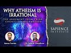

# Seminar & Interview: Why Atheism is Irrational #1 — The Argument from Prior Cognitive Information (2021-11-21)

## Description

Seminar and interview:

Why Atheism is Irrational #1 — The Argument from Prior Cognitive Information

With Dr. Safaruk Chowdhury and Hamza Andreas Tzortzis

This seminar is part 1 of a series of seminars addressing arguments for God's existence referring to human rationality, cognition, the laws of logic, truth and related topics.

This seminar and interview will explain why atheistic philosophical naturalism cannot adequately explain the original cognitive input necessary for human thinking. It will be centred on Dr. Safaruk Chowdhury's forthcoming academic paper, "Prior Cognitive Information and An Islamic Argument from Reason".

The "Why Atheism is Irrational" series will include seminars on:

- Arguments from the laws of logic and rational insight
- Truth as moral value and its implications for philosophical naturalism
- Evolutionary reliabilism, theism and the epistemic justification for our truth-reliable cognitive faculties
- Existential and moral arguments

## Summary of [Seminar & Interview: Why Atheism is Irrational #1 — The Argument from Prior Cognitive Information](https://www.youtube.com/watch?v=t2bdY2RBoQs)

*This summary is AI generated - there may be inaccuracies. *

### [00:00:00](https://www.youtube.com/watch?v=t2bdY2RBoQs&t=0) - [01:00:00](https://www.youtube.com/watch?v=t2bdY2RBoQs&t=3600)

 discusses the argument from prior cognitive information, which states that the source of prior cognitive information cannot be from something natural. The presenter argues that, even if it were true that a non-human animal species could intelligently interact with human beings, this would still not be evidence that animals have cognitive abilities. He concludes by saying that the most rational explanation is that something outside of the human being created the information.

**[00:00:00](https://www.youtube.com/watch?v=t2bdY2RBoQs&t=0)** The presenter is discussing a forthcoming academic paper, "The Argument from Prior Cognitive Cognitive Information," by Dr. Saaphir Chowdhury. The paper argues that atheism is irrational because it is based on false premises. The presenter introduces the doctor, who will discuss the paper's argument from an Islamic perspective. The seminar series will focus on the argument from reason, which is based on the laws of logic and rational insight. Additionally, the series will discuss truth as an intrinsic moral value, evolutionary reliabilism, theism, and epistemic justification for our cognitive faculties. The series will end with a discussion of related moral and existential arguments.
* **[00:05:00](https://www.youtube.com/watch?v=t2bdY2RBoQs&t=300)** Dr. Safrik Chaudhury is an academic scholar and Islamic theologian who has written extensively on the problem of evil and Islamic theology. He is also the creator and administrator of the Islamic analytical theology website.
* **[00:10:00](https://www.youtube.com/watch?v=t2bdY2RBoQs&t=600)* Discusses the argument from prior cognitive information, which states that without prior knowledge of reality, humans cannot reason. The presenter explains that this argument is based on Quranic teachings and was developed by Dr. Suffolk Chowdhury. The presenter also notes that the paper on which the argument is based is currently being edited and is likely to be published next year.
* **[00:15:00](https://www.youtube.com/watch?v=t2bdY2RBoQs&t=900)** The presenter of the video argues that atheism is irrational because judgments on things unless we are able to meaningfully link what we sense with what we already know can not be made properly and accurately. To support this argument, the presenter points to the fact that key premises of the argument align themselves with what a philosophical naturist would accept. He also contends that the argument has an islamic basis in surah al-baqarah verse 30 to 33. In addition, the presenter argues that what someone might say for example that thinking means making judgments about things always requires a direct divine input, which is not the argument.
* **[00:20:00](https://www.youtube.com/watch?v=t2bdY2RBoQs&t=1200)** The presenter argues that humans need prior cognitive information in order to generate thoughts, and that the source of this information cannot be natural. He argues that the most plausible non-natural source of this information is a transcendent agent, and that this understanding of the divine is specifically the quranic and Islamic understanding.
* **[00:25:00](https://www.youtube.com/watch?v=t2bdY2RBoQs&t=1500)**  various reasons why atheism is irrational are explained. The argument from prior cognitive information is used to explain how without prior knowledge, judgments about things are not accurate. Thought production, or the ability to make judgments, is also explained. The two premises of the argument are discussed: the source of prior cognitive information and the accuracy of judgments. The plausibility of each premise is discussed, and the conclusion is drawn that atheism is irrational.
* **[00:30:00](https://www.youtube.com/watch?v=t2bdY2RBoQs&t=1800)**  an atheist discusses why atheism is irrational. He starts by discussing the Argument from Prior Cognitive Information, which states that the source of prior cognitive information cannot be from something natural. He then goes on to discuss the possibility that non-human animals could be the source of this information, but ultimately concludes that this is unlikely. He concludes by saying that the most rational explanation is that something outside of the human being created the information.
* **[00:35:00](https://www.youtube.com/watch?v=t2bdY2RBoQs&t=2100)** The presenter argues that, even if it were true that a non-human animal species could intelligently interact with human beings, this would still not be evidence that animals have cognitive abilities. He goes on to say that, even if inanimate objects did possess pedagogical abilities, this would still not prove that humans are the only species with such abilities.
* **[00:40:00](https://www.youtube.com/watch?v=t2bdY2RBoQs&t=2400)** The presenter argues that if it is argued that human ancestors attained consciousness just to remind people of the prior cognitive input via organic evolution, then there would be no demarcation of consciousness specified or distinguished it from say, some other set of cognitive information.
* **[00:45:00](https://www.youtube.com/watch?v=t2bdY2RBoQs&t=2700)** In this seminar and interview, the speaker discusses why atheism is irrational. argues that, on an evolutionary account, there can be no link between the mental and the physical, and that, even if we grant that evolution is for truth orientation, the bigger problem is that there is no way the mental affects the behavior on the physical.
* **[00:50:00](https://www.youtube.com/watch?v=t2bdY2RBoQs&t=3000)** argues that there must be a living, willing, transcendent agent behind the process of human cognition, as cognitive information must be initiated by a living entity for it to be properly formed. He argues that this agent must be omniscient and possess immense knowledge in order to endow other entities with intellect. Finally, he argues that this agent must consciously select which cognitive information is initiated for human beings to have success.
* **[00:55:00](https://www.youtube.com/watch?v=t2bdY2RBoQs&t=3300)** The presenter argues that, because atheism is based on the absence of evidence, it is irrational. The traditional view of god, which posits that god is all-knowing, all-wise, and intimately involved in the lives of humans, makes perfect sense from a theistic perspective.
### [01:00:00](https://www.youtube.com/watch?v=t2bdY2RBoQs&t=3600) - [01:20:00](https://www.youtube.com/watch?v=t2bdY2RBoQs&t=4800)

Dr. Aaron Safarook Chowdhury discusses how atheism is irrational due to the lack of justification for moral laws. He argues that atheism requires prior cognitive information which cannot be arbitrarily derived from evolution, and that natural selection cannot be the source of this information. He explains that a transcendent agent must be responsible for it, and that people can follow his academic work on his website, Islamic analytic theology.org.

**[01:00:00](https://www.youtube.com/watch?v=t2bdY2RBoQs&t=3600)** provides a 500-word catalogue of words that represent a reality of something. He explains that these words represent a reality of consciousness and intentionality. He goes on to suggest that this argument is an amazing argument and that further exploration is necessary.
* **[01:05:00](https://www.youtube.com/watch?v=t2bdY2RBoQs&t=3900)** The presenter discusses how memories would need to be judged in order for them to be linked to wrong incidents, and how this would be a problem on naturalism.
* **[01:10:00](https://www.youtube.com/watch?v=t2bdY2RBoQs&t=4200)** The presenter argues that atheism is irrational because atheism requires prior cognitive information which cannot be arbitrarily derived from evolution. The presenter also argues that natural selection cannot be the source of this information, and that a transcendent agent must be responsible for it.
* **[01:15:00](https://www.youtube.com/watch?v=t2bdY2RBoQs&t=4500)** of the seminar, Dr. Aaron Safarook Chowdhury, discusses how atheism is irrational due to the lack of justification for moral laws. Dr. Chowdhury also explains that the team's live stream for the day will address this issue in more detail.
* **[01:20:00](https://www.youtube.com/watch?v=t2bdY2RBoQs&t=4800)** The presenter discusses why atheism is irrational, and discusses how people can follow his academic work. He also mentions that he is not on any social media platforms, but his website is Islamic analytic theology.org.

<h2>Full transcript with timestamps: CLICK TO EXPAND</h2>

[0:00:03](https://youtu.be/t2bdY2RBoQs?t=3) [Music]  
[0:00:06](https://youtu.be/t2bdY2RBoQs?t=6) brothers and sisters and friends and  
[0:00:10](https://youtu.be/t2bdY2RBoQs?t=10) welcome to today's  
[0:00:12](https://youtu.be/t2bdY2RBoQs?t=12) seminar stroke interview  
[0:00:15](https://youtu.be/t2bdY2RBoQs?t=15) alhamdulillah with us we have  
[0:00:17](https://youtu.be/t2bdY2RBoQs?t=17) our beloved doctor chowdhury and today  
[0:00:20](https://youtu.be/t2bdY2RBoQs?t=20) we're going to be covering adversaries  
[0:00:22](https://youtu.be/t2bdY2RBoQs?t=22) of reason why atheism is irrational part  
[0:00:24](https://youtu.be/t2bdY2RBoQs?t=24) one and we're specifically going to be  
[0:00:26](https://youtu.be/t2bdY2RBoQs?t=26) covering a forthcoming academic paper  
[0:00:29](https://youtu.be/t2bdY2RBoQs?t=29) academic journal article called the  
[0:00:32](https://youtu.be/t2bdY2RBoQs?t=32) argument from prior cognitive cognitive  
[0:00:35](https://youtu.be/t2bdY2RBoQs?t=35) information by of course dr sapphir  
[0:00:37](https://youtu.be/t2bdY2RBoQs?t=37) chowdhury  
[0:00:38](https://youtu.be/t2bdY2RBoQs?t=38) so before i introduce  
[0:00:40](https://youtu.be/t2bdY2RBoQs?t=40) our beloved brother and doctor what i'm  
[0:00:43](https://youtu.be/t2bdY2RBoQs?t=43) going to do is talk about the series  
[0:00:45](https://youtu.be/t2bdY2RBoQs?t=45) talk about we're going to be speaking  
[0:00:46](https://youtu.be/t2bdY2RBoQs?t=46) about today introduce the doctor and  
[0:00:48](https://youtu.be/t2bdY2RBoQs?t=48) then what i want to do  
[0:00:50](https://youtu.be/t2bdY2RBoQs?t=50) is  
[0:00:52](https://youtu.be/t2bdY2RBoQs?t=52) kind of like have this kind of  
[0:00:54](https://youtu.be/t2bdY2RBoQs?t=54) open  
[0:00:55](https://youtu.be/t2bdY2RBoQs?t=55) [Music]  
[0:00:56](https://youtu.be/t2bdY2RBoQs?t=56) discussion based upon a kind of student  
[0:01:00](https://youtu.be/t2bdY2RBoQs?t=60) teacher relationship so of course i see  
[0:01:02](https://youtu.be/t2bdY2RBoQs?t=62) dr as one of my student  
[0:01:05](https://youtu.be/t2bdY2RBoQs?t=65) staff would love one of my teachers  
[0:01:06](https://youtu.be/t2bdY2RBoQs?t=66) rather i've known him for i think over a  
[0:01:08](https://youtu.be/t2bdY2RBoQs?t=68) decade now alhamdulillah so as his  
[0:01:10](https://youtu.be/t2bdY2RBoQs?t=70) student  
[0:01:11](https://youtu.be/t2bdY2RBoQs?t=71) what i did today was i went through his  
[0:01:14](https://youtu.be/t2bdY2RBoQs?t=74) forthcoming publication  
[0:01:16](https://youtu.be/t2bdY2RBoQs?t=76) and i did i did some slides so we're  
[0:01:19](https://youtu.be/t2bdY2RBoQs?t=79) gonna go through these slides and  
[0:01:21](https://youtu.be/t2bdY2RBoQs?t=81) we're gonna basically unpack some of his  
[0:01:23](https://youtu.be/t2bdY2RBoQs?t=83) perspectives and he's gonna comment and  
[0:01:25](https://youtu.be/t2bdY2RBoQs?t=85) talk about it as well and then we're  
[0:01:26](https://youtu.be/t2bdY2RBoQs?t=86) going to have a q a session and we're  
[0:01:28](https://youtu.be/t2bdY2RBoQs?t=88) going to bring you on board to ask some  
[0:01:31](https://youtu.be/t2bdY2RBoQs?t=91) questions  
[0:01:32](https://youtu.be/t2bdY2RBoQs?t=92) not to myself but to to doctor if i can  
[0:01:35](https://youtu.be/t2bdY2RBoQs?t=95) add something i will but we're going to  
[0:01:37](https://youtu.be/t2bdY2RBoQs?t=97) ask questions to the doctor so he could  
[0:01:38](https://youtu.be/t2bdY2RBoQs?t=98) basically unpack his argument which  
[0:01:41](https://youtu.be/t2bdY2RBoQs?t=101) really is also an islamic argument and  
[0:01:44](https://youtu.be/t2bdY2RBoQs?t=104) it has an islamic a quranic exegetical  
[0:01:46](https://youtu.be/t2bdY2RBoQs?t=106) president which we're going to discuss  
[0:01:47](https://youtu.be/t2bdY2RBoQs?t=107) as well  
[0:01:49](https://youtu.be/t2bdY2RBoQs?t=109) so  
[0:01:50](https://youtu.be/t2bdY2RBoQs?t=110) what is this series about actually  
[0:01:52](https://youtu.be/t2bdY2RBoQs?t=112) before we talk about the series the  
[0:01:53](https://youtu.be/t2bdY2RBoQs?t=113) contents of today of this presentation  
[0:01:56](https://youtu.be/t2bdY2RBoQs?t=116) is that we're going to talk about the  
[0:01:57](https://youtu.be/t2bdY2RBoQs?t=117) series of the seminars we're going to  
[0:01:59](https://youtu.be/t2bdY2RBoQs?t=119) summarize the argument from prior  
[0:02:00](https://youtu.be/t2bdY2RBoQs?t=120) cognitive information we're going to  
[0:02:02](https://youtu.be/t2bdY2RBoQs?t=122) talk about some of the preliminary  
[0:02:04](https://youtu.be/t2bdY2RBoQs?t=124) points that dr chowdhury has basically  
[0:02:06](https://youtu.be/t2bdY2RBoQs?t=126) articulated in his journal which are  
[0:02:08](https://youtu.be/t2bdY2RBoQs?t=128) important in order for us to understand  
[0:02:10](https://youtu.be/t2bdY2RBoQs?t=130) the rest of the argument then we're  
[0:02:11](https://youtu.be/t2bdY2RBoQs?t=131) going to go into the argument unpack the  
[0:02:13](https://youtu.be/t2bdY2RBoQs?t=133) premises unpack the conclusions then  
[0:02:16](https://youtu.be/t2bdY2RBoQs?t=136) we're going to briefly go through the  
[0:02:18](https://youtu.be/t2bdY2RBoQs?t=138) quranic exegetical precedent for this  
[0:02:20](https://youtu.be/t2bdY2RBoQs?t=140) argument which is based on surah  
[0:02:22](https://youtu.be/t2bdY2RBoQs?t=142) al-baqarah  
[0:02:23](https://youtu.be/t2bdY2RBoQs?t=143) 30 verses 30-33 then we'll have  
[0:02:26](https://youtu.be/t2bdY2RBoQs?t=146) questions and answers  
[0:02:28](https://youtu.be/t2bdY2RBoQs?t=148) so brothers and sisters what is the the  
[0:02:31](https://youtu.be/t2bdY2RBoQs?t=151) series of seminars about well to be very  
[0:02:33](https://youtu.be/t2bdY2RBoQs?t=153) honest i was supposed to do a seminar on  
[0:02:36](https://youtu.be/t2bdY2RBoQs?t=156) one of the  
[0:02:37](https://youtu.be/t2bdY2RBoQs?t=157) papers that i did for my postgrad and i  
[0:02:40](https://youtu.be/t2bdY2RBoQs?t=160) was supposed to deliver it  
[0:02:41](https://youtu.be/t2bdY2RBoQs?t=161) in in june  
[0:02:43](https://youtu.be/t2bdY2RBoQs?t=163) this year june but i was delayed  
[0:02:46](https://youtu.be/t2bdY2RBoQs?t=166) and then i covered then there was a  
[0:02:48](https://youtu.be/t2bdY2RBoQs?t=168) whole host of issues going on  
[0:02:50](https://youtu.be/t2bdY2RBoQs?t=170) and as i was preparing for  
[0:02:53](https://youtu.be/t2bdY2RBoQs?t=173) this series because i realized we  
[0:02:55](https://youtu.be/t2bdY2RBoQs?t=175) shouldn't just do one seminar we should  
[0:02:56](https://youtu.be/t2bdY2RBoQs?t=176) do a few i had a conversation with dr  
[0:02:59](https://youtu.be/t2bdY2RBoQs?t=179) suffolk chowdhury and i tried to adopt  
[0:03:01](https://youtu.be/t2bdY2RBoQs?t=181) this principle in apologetics endower in  
[0:03:04](https://youtu.be/t2bdY2RBoQs?t=184) sharing islam where i do a lot of shura  
[0:03:05](https://youtu.be/t2bdY2RBoQs?t=185) a lot of consultation it is sometimes a  
[0:03:08](https://youtu.be/t2bdY2RBoQs?t=188) neglected practice in our kind of  
[0:03:11](https://youtu.be/t2bdY2RBoQs?t=191) intellectual community but there's lots  
[0:03:13](https://youtu.be/t2bdY2RBoQs?t=193) of good groups now that are growing and  
[0:03:14](https://youtu.be/t2bdY2RBoQs?t=194) we have teachers such as dr chowdhury  
[0:03:17](https://youtu.be/t2bdY2RBoQs?t=197) and others who help us so i was i asked  
[0:03:19](https://youtu.be/t2bdY2RBoQs?t=199) him a bunch of questions basically  
[0:03:21](https://youtu.be/t2bdY2RBoQs?t=201) concerning  
[0:03:22](https://youtu.be/t2bdY2RBoQs?t=202) the argument from reason from an islamic  
[0:03:24](https://youtu.be/t2bdY2RBoQs?t=204) perspective and the things connected to  
[0:03:26](https://youtu.be/t2bdY2RBoQs?t=206) that and then he said i have a paper  
[0:03:28](https://youtu.be/t2bdY2RBoQs?t=208) coming up and i was like wow  
[0:03:30](https://youtu.be/t2bdY2RBoQs?t=210) because my first set of presentation  
[0:03:33](https://youtu.be/t2bdY2RBoQs?t=213) slides was going to be  
[0:03:35](https://youtu.be/t2bdY2RBoQs?t=215) an argument from logic from the laws of  
[0:03:37](https://youtu.be/t2bdY2RBoQs?t=217) logic and we're going to talk about you  
[0:03:38](https://youtu.be/t2bdY2RBoQs?t=218) know what best explains that and we're  
[0:03:41](https://youtu.be/t2bdY2RBoQs?t=221) going to talk about things like  
[0:03:42](https://youtu.be/t2bdY2RBoQs?t=222) intentionality and so on and so forth  
[0:03:44](https://youtu.be/t2bdY2RBoQs?t=224) but there was some metaphysical issues  
[0:03:46](https://youtu.be/t2bdY2RBoQs?t=226) that could be problematic from a quranic  
[0:03:49](https://youtu.be/t2bdY2RBoQs?t=229) perspective and i wanted to try to  
[0:03:51](https://youtu.be/t2bdY2RBoQs?t=231) unpack some of those and doctor suffolk  
[0:03:53](https://youtu.be/t2bdY2RBoQs?t=233) chaudhuri actually raised them to me and  
[0:03:55](https://youtu.be/t2bdY2RBoQs?t=235) then i realized you know what let's have  
[0:03:57](https://youtu.be/t2bdY2RBoQs?t=237) him on board because his argument looks  
[0:04:00](https://youtu.be/t2bdY2RBoQs?t=240) quite islamic it's grounded in the  
[0:04:02](https://youtu.be/t2bdY2RBoQs?t=242) tradition and it's also philosophically  
[0:04:04](https://youtu.be/t2bdY2RBoQs?t=244) robust so that's why we're here today  
[0:04:06](https://youtu.be/t2bdY2RBoQs?t=246) and yes in this series this why atheism  
[0:04:09](https://youtu.be/t2bdY2RBoQs?t=249) is irrational series we're going to have  
[0:04:11](https://youtu.be/t2bdY2RBoQs?t=251) an argument from the laws of logic and  
[0:04:13](https://youtu.be/t2bdY2RBoQs?t=253) rational insight we're going to talk  
[0:04:15](https://youtu.be/t2bdY2RBoQs?t=255) about truth as an intrinsic moral value  
[0:04:17](https://youtu.be/t2bdY2RBoQs?t=257) does that make sense under philosophical  
[0:04:19](https://youtu.be/t2bdY2RBoQs?t=259) naturalism we're going to talk about  
[0:04:21](https://youtu.be/t2bdY2RBoQs?t=261) evolutionary reliabilism theism and the  
[0:04:23](https://youtu.be/t2bdY2RBoQs?t=263) epistemic justification for our truth  
[0:04:26](https://youtu.be/t2bdY2RBoQs?t=266) reliable cognitive faculties and we're  
[0:04:28](https://youtu.be/t2bdY2RBoQs?t=268) going to talk about related moral and  
[0:04:30](https://youtu.be/t2bdY2RBoQs?t=270) existential arguments related to the  
[0:04:32](https://youtu.be/t2bdY2RBoQs?t=272) whole topic of reason what it means to  
[0:04:34](https://youtu.be/t2bdY2RBoQs?t=274) be a a functioning human with  
[0:04:37](https://youtu.be/t2bdY2RBoQs?t=277) with reliable cognitive faculties  
[0:04:39](https://youtu.be/t2bdY2RBoQs?t=279) now it's very important to know yes  
[0:04:41](https://youtu.be/t2bdY2RBoQs?t=281) sometimes our titles are a bit you know  
[0:04:44](https://youtu.be/t2bdY2RBoQs?t=284) based on marketing why atheism is  
[0:04:46](https://youtu.be/t2bdY2RBoQs?t=286) irrational and you know we don't want to  
[0:04:48](https://youtu.be/t2bdY2RBoQs?t=288) offend many people uh well i do believe  
[0:04:50](https://youtu.be/t2bdY2RBoQs?t=290) that atheism is irrational actually  
[0:04:52](https://youtu.be/t2bdY2RBoQs?t=292) anything other than tawheed is foolish  
[0:04:54](https://youtu.be/t2bdY2RBoQs?t=294) as allah says in the quran you know only  
[0:04:56](https://youtu.be/t2bdY2RBoQs?t=296) someone foolish will only a fool will  
[0:04:59](https://youtu.be/t2bdY2RBoQs?t=299) reject the way of abraham which is  
[0:05:01](https://youtu.be/t2bdY2RBoQs?t=301) basically islamic monotheism  
[0:05:04](https://youtu.be/t2bdY2RBoQs?t=304) notwithstanding  
[0:05:06](https://youtu.be/t2bdY2RBoQs?t=306) i i want to bring to your attention that  
[0:05:08](https://youtu.be/t2bdY2RBoQs?t=308) when we talk about atheism generally in  
[0:05:10](https://youtu.be/t2bdY2RBoQs?t=310) the in this series is that we're going  
[0:05:12](https://youtu.be/t2bdY2RBoQs?t=312) to be talking about philosophical  
[0:05:13](https://youtu.be/t2bdY2RBoQs?t=313) naturalism and just to remind you  
[0:05:14](https://youtu.be/t2bdY2RBoQs?t=314) philosophical naturalism is the kind of  
[0:05:16](https://youtu.be/t2bdY2RBoQs?t=316) first principle it's the metaphysic it's  
[0:05:18](https://youtu.be/t2bdY2RBoQs?t=318) the lens that someone puts on there on  
[0:05:20](https://youtu.be/t2bdY2RBoQs?t=320) the kind of cognitive  
[0:05:22](https://youtu.be/t2bdY2RBoQs?t=322) eyes  
[0:05:23](https://youtu.be/t2bdY2RBoQs?t=323) in order to understand the world in  
[0:05:24](https://youtu.be/t2bdY2RBoQs?t=324) reality and philosophical naturalism  
[0:05:26](https://youtu.be/t2bdY2RBoQs?t=326) basically says there is no divine there  
[0:05:29](https://youtu.be/t2bdY2RBoQs?t=329) is no supernatural there is no  
[0:05:31](https://youtu.be/t2bdY2RBoQs?t=331) non-physical which entails physicalism  
[0:05:33](https://youtu.be/t2bdY2RBoQs?t=333) in to some degree and that everything  
[0:05:35](https://youtu.be/t2bdY2RBoQs?t=335) can be  
[0:05:36](https://youtu.be/t2bdY2RBoQs?t=336) explained via physical processes so that  
[0:05:39](https://youtu.be/t2bdY2RBoQs?t=339) is the kind of  
[0:05:40](https://youtu.be/t2bdY2RBoQs?t=340) philosophical naturalism also known as  
[0:05:42](https://youtu.be/t2bdY2RBoQs?t=342) metaphysical naturalism also known as  
[0:05:44](https://youtu.be/t2bdY2RBoQs?t=344) ontological naturalism so when we talk  
[0:05:46](https://youtu.be/t2bdY2RBoQs?t=346) about atheism we're talking about  
[0:05:47](https://youtu.be/t2bdY2RBoQs?t=347) philosophical naturalism and it also  
[0:05:49](https://youtu.be/t2bdY2RBoQs?t=349) means those who claim that non-theistic  
[0:05:52](https://youtu.be/t2bdY2RBoQs?t=352) darwinism is an explanation  
[0:05:55](https://youtu.be/t2bdY2RBoQs?t=355) or a more adequate explanation for  
[0:05:58](https://youtu.be/t2bdY2RBoQs?t=358) our ability to reason and think as well  
[0:06:01](https://youtu.be/t2bdY2RBoQs?t=361) as provide a foundation for the laws of  
[0:06:02](https://youtu.be/t2bdY2RBoQs?t=362) logic and for truth having an intrinsic  
[0:06:05](https://youtu.be/t2bdY2RBoQs?t=365) moral value  
[0:06:06](https://youtu.be/t2bdY2RBoQs?t=366) and also it's for those who use the  
[0:06:08](https://youtu.be/t2bdY2RBoQs?t=368) darwinian paradigm and non-theistic  
[0:06:11](https://youtu.be/t2bdY2RBoQs?t=371) darwinian paradigm to provide a kind of  
[0:06:13](https://youtu.be/t2bdY2RBoQs?t=373) epistemic justification for you know the  
[0:06:16](https://youtu.be/t2bdY2RBoQs?t=376) fact that we have  
[0:06:17](https://youtu.be/t2bdY2RBoQs?t=377) truth reliable cognitive faculties and  
[0:06:20](https://youtu.be/t2bdY2RBoQs?t=380) so on and so forth so basically you get  
[0:06:22](https://youtu.be/t2bdY2RBoQs?t=382) the idea that when we speak about  
[0:06:24](https://youtu.be/t2bdY2RBoQs?t=384) atheism or atheists from this  
[0:06:26](https://youtu.be/t2bdY2RBoQs?t=386) perspective it's the philosophical  
[0:06:27](https://youtu.be/t2bdY2RBoQs?t=387) naturalists and those who adopt a  
[0:06:30](https://youtu.be/t2bdY2RBoQs?t=390) non-theistic darwinian paradigm to  
[0:06:32](https://youtu.be/t2bdY2RBoQs?t=392) explain some of the things that we spoke  
[0:06:34](https://youtu.be/t2bdY2RBoQs?t=394) about okay  
[0:06:35](https://youtu.be/t2bdY2RBoQs?t=395) so  
[0:06:37](https://youtu.be/t2bdY2RBoQs?t=397) dr safrik chaudhary  
[0:06:40](https://youtu.be/t2bdY2RBoQs?t=400) now  
[0:06:41](https://youtu.be/t2bdY2RBoQs?t=401) this is a big introduction but i think  
[0:06:43](https://youtu.be/t2bdY2RBoQs?t=403) it's it's worthy um of of of people who  
[0:06:45](https://youtu.be/t2bdY2RBoQs?t=405) don't know dr suffolk charity to  
[0:06:47](https://youtu.be/t2bdY2RBoQs?t=407) actually understand who he is where  
[0:06:50](https://youtu.be/t2bdY2RBoQs?t=410) where he's come from and basically from  
[0:06:52](https://youtu.be/t2bdY2RBoQs?t=412) an intellectual academic perspective and  
[0:06:54](https://youtu.be/t2bdY2RBoQs?t=414) an islamic scholastic perspective and  
[0:06:56](https://youtu.be/t2bdY2RBoQs?t=416) also his publications he's got a  
[0:06:58](https://youtu.be/t2bdY2RBoQs?t=418) brilliant book that is out which is on  
[0:07:01](https://youtu.be/t2bdY2RBoQs?t=421) the problem the uh entitled islamic  
[0:07:03](https://youtu.be/t2bdY2RBoQs?t=423) theology and the problem of evil so  
[0:07:05](https://youtu.be/t2bdY2RBoQs?t=425) please go to  
[0:07:06](https://youtu.be/t2bdY2RBoQs?t=426) amazon or whatever platform and actually  
[0:07:09](https://youtu.be/t2bdY2RBoQs?t=429) purchase it insha'allah so dr dr safrik  
[0:07:12](https://youtu.be/t2bdY2RBoQs?t=432) chaudhary he studied philosophy at  
[0:07:13](https://youtu.be/t2bdY2RBoQs?t=433) king's college london  
[0:07:15](https://youtu.be/t2bdY2RBoQs?t=435) completing it with the accompanying  
[0:07:17](https://youtu.be/t2bdY2RBoQs?t=437) associate of king's college award he  
[0:07:20](https://youtu.be/t2bdY2RBoQs?t=440) then traveled to cairo egypt studying  
[0:07:23](https://youtu.be/t2bdY2RBoQs?t=443) the traditional islamic studies  
[0:07:24](https://youtu.be/t2bdY2RBoQs?t=444) curricula at al-azhar university he  
[0:07:27](https://youtu.be/t2bdY2RBoQs?t=447) returned to the uk to complete his m.a  
[0:07:29](https://youtu.be/t2bdY2RBoQs?t=449) at the school of oriental and african  
[0:07:30](https://youtu.be/t2bdY2RBoQs?t=450) studies with distinction alhamdulillah i  
[0:07:33](https://youtu.be/t2bdY2RBoQs?t=453) believe  
[0:07:34](https://youtu.be/t2bdY2RBoQs?t=454) his thesis supervisor said this was  
[0:07:36](https://youtu.be/t2bdY2RBoQs?t=456) worth half a phd if not more masha'allah  
[0:07:41](https://youtu.be/t2bdY2RBoQs?t=461) and his doctor's dissertation was on the  
[0:07:44](https://youtu.be/t2bdY2RBoQs?t=464) eminent sufi i don't know how to  
[0:07:45](https://youtu.be/t2bdY2RBoQs?t=465) pronounce this properly a geographer  
[0:07:48](https://youtu.be/t2bdY2RBoQs?t=468) and theoretician abu abdul rahman  
[0:07:51](https://youtu.be/t2bdY2RBoQs?t=471) al-sulami published as a sufi apologist  
[0:07:55](https://youtu.be/t2bdY2RBoQs?t=475) of nishapur the life and thought of  
[0:07:59](https://youtu.be/t2bdY2RBoQs?t=479) man al-sulami published by equinox  
[0:08:01](https://youtu.be/t2bdY2RBoQs?t=481) publishing  
[0:08:02](https://youtu.be/t2bdY2RBoQs?t=482) dr chaudhuri's research interests in  
[0:08:04](https://youtu.be/t2bdY2RBoQs?t=484) addition to sufism at the moment are in  
[0:08:06](https://youtu.be/t2bdY2RBoQs?t=486) the para consistent logic argument  
[0:08:09](https://youtu.be/t2bdY2RBoQs?t=489) theory metaphysics ethics and  
[0:08:11](https://youtu.be/t2bdY2RBoQs?t=491) epistemology with keen interest in how  
[0:08:12](https://youtu.be/t2bdY2RBoQs?t=492) these subjects are explicated within  
[0:08:15](https://youtu.be/t2bdY2RBoQs?t=495) islamic theology especially within the  
[0:08:16](https://youtu.be/t2bdY2RBoQs?t=496) kalam tradition kalam theology his  
[0:08:19](https://youtu.be/t2bdY2RBoQs?t=499) current book is entitled islamic  
[0:08:20](https://youtu.be/t2bdY2RBoQs?t=500) theology and the problem of evil which  
[0:08:22](https://youtu.be/t2bdY2RBoQs?t=502) is the first work in islamic studies to  
[0:08:25](https://youtu.be/t2bdY2RBoQs?t=505) treat the topic with the analytical  
[0:08:26](https://youtu.be/t2bdY2RBoQs?t=506) theology theology approach he also  
[0:08:29](https://youtu.be/t2bdY2RBoQs?t=509) teaches hanafi thick and arabic  
[0:08:31](https://youtu.be/t2bdY2RBoQs?t=511) currently he is lead researcher in the  
[0:08:33](https://youtu.be/t2bdY2RBoQs?t=513) beyond foundationalism new horizons in  
[0:08:35](https://youtu.be/t2bdY2RBoQs?t=515) muslim analytic theology project at  
[0:08:37](https://youtu.be/t2bdY2RBoQs?t=517) cambridge muslim college which is funded  
[0:08:40](https://youtu.be/t2bdY2RBoQs?t=520) by the john timberton foundation  
[0:08:42](https://youtu.be/t2bdY2RBoQs?t=522) dr chowdhury is the creator and  
[0:08:43](https://youtu.be/t2bdY2RBoQs?t=523) administrator of the islamic analytical  
[0:08:45](https://youtu.be/t2bdY2RBoQs?t=525) theology website the only site  
[0:08:47](https://youtu.be/t2bdY2RBoQs?t=527) specifically devoted to the presentation  
[0:08:49](https://youtu.be/t2bdY2RBoQs?t=529) and promotion of research and study of  
[0:08:51](https://youtu.be/t2bdY2RBoQs?t=531) islamic theology and philosophy within  
[0:08:53](https://youtu.be/t2bdY2RBoQs?t=533) the analytic tradition i know dr suff is  
[0:08:56](https://youtu.be/t2bdY2RBoQs?t=536) probably cringing continuously at every  
[0:08:58](https://youtu.be/t2bdY2RBoQs?t=538) line but i had to say this you know  
[0:09:00](https://youtu.be/t2bdY2RBoQs?t=540) because it's very important for us to  
[0:09:03](https://youtu.be/t2bdY2RBoQs?t=543) explain who's speaking and what kind of  
[0:09:06](https://youtu.be/t2bdY2RBoQs?t=546) background they have and for you to  
[0:09:07](https://youtu.be/t2bdY2RBoQs?t=547) engage with their work because you would  
[0:09:09](https://youtu.be/t2bdY2RBoQs?t=549) definitely benefit with the work and  
[0:09:11](https://youtu.be/t2bdY2RBoQs?t=551) i've known dr suffolk charity for i  
[0:09:13](https://youtu.be/t2bdY2RBoQs?t=553) think over 10 years now way over 10  
[0:09:15](https://youtu.be/t2bdY2RBoQs?t=555) years alhamdulillah  
[0:09:17](https://youtu.be/t2bdY2RBoQs?t=557) when he was basically translating bits  
[0:09:19](https://youtu.be/t2bdY2RBoQs?t=559) of the quran into greek because he also  
[0:09:21](https://youtu.be/t2bdY2RBoQs?t=561) knows ancient greek alhamdulillah as  
[0:09:23](https://youtu.be/t2bdY2RBoQs?t=563) well as other languages  
[0:09:33](https://youtu.be/t2bdY2RBoQs?t=573) you know what i have to say though if i  
[0:09:34](https://youtu.be/t2bdY2RBoQs?t=574) can say this yeah you know many people  
[0:09:37](https://youtu.be/t2bdY2RBoQs?t=577) will know  
[0:09:38](https://youtu.be/t2bdY2RBoQs?t=578) um  
[0:09:39](https://youtu.be/t2bdY2RBoQs?t=579) not just with sapience alhamdulillah but  
[0:09:41](https://youtu.be/t2bdY2RBoQs?t=581) you know  
[0:09:42](https://youtu.be/t2bdY2RBoQs?t=582) over the years  
[0:09:43](https://youtu.be/t2bdY2RBoQs?t=583) you know you've you know you've masha  
[0:09:45](https://youtu.be/t2bdY2RBoQs?t=585) allah  
[0:09:46](https://youtu.be/t2bdY2RBoQs?t=586) um  
[0:09:47](https://youtu.be/t2bdY2RBoQs?t=587) enabled the ummah to  
[0:09:49](https://youtu.be/t2bdY2RBoQs?t=589) have uh  
[0:09:51](https://youtu.be/t2bdY2RBoQs?t=591) intellectual spiritual resources  
[0:09:54](https://youtu.be/t2bdY2RBoQs?t=594) are very hard to come by and i and i  
[0:09:56](https://youtu.be/t2bdY2RBoQs?t=596) know that from you know from family  
[0:09:59](https://youtu.be/t2bdY2RBoQs?t=599) you know from very very close friends  
[0:10:00](https://youtu.be/t2bdY2RBoQs?t=600) acquaintances  
[0:10:02](https://youtu.be/t2bdY2RBoQs?t=602) [Music]  
[0:10:03](https://youtu.be/t2bdY2RBoQs?t=603) and even you know some non-muslims  
[0:10:05](https://youtu.be/t2bdY2RBoQs?t=605) and you know sapiences has fast become  
[0:10:09](https://youtu.be/t2bdY2RBoQs?t=609) uh a resource  
[0:10:11](https://youtu.be/t2bdY2RBoQs?t=611) a much go-to a kind of a much needed and  
[0:10:14](https://youtu.be/t2bdY2RBoQs?t=614) a go-to resource  
[0:10:15](https://youtu.be/t2bdY2RBoQs?t=615) so alhamdulillah it's a great team  
[0:10:17](https://youtu.be/t2bdY2RBoQs?t=617) you've got you're the simple  
[0:10:19](https://youtu.be/t2bdY2RBoQs?t=619) and allah gives you to fear and i mean  
[0:10:21](https://youtu.be/t2bdY2RBoQs?t=621) you know enable you to go from strength  
[0:10:23](https://youtu.be/t2bdY2RBoQs?t=623) to strength and and bring bring to the  
[0:10:25](https://youtu.be/t2bdY2RBoQs?t=625) fore  
[0:10:26](https://youtu.be/t2bdY2RBoQs?t=626) you know this great work that's being  
[0:10:27](https://youtu.be/t2bdY2RBoQs?t=627) done by not myself i mean many many  
[0:10:29](https://youtu.be/t2bdY2RBoQs?t=629) people who you know you have in the  
[0:10:31](https://youtu.be/t2bdY2RBoQs?t=631) institute and and who are you know  
[0:10:33](https://youtu.be/t2bdY2RBoQs?t=633) partnering and beyond  
[0:10:35](https://youtu.be/t2bdY2RBoQs?t=635) so you know i'll give you toffee and  
[0:10:37](https://youtu.be/t2bdY2RBoQs?t=637) barakah in in the work because it's much  
[0:10:39](https://youtu.be/t2bdY2RBoQs?t=639) needed it's much needed  
[0:10:41](https://youtu.be/t2bdY2RBoQs?t=641) not many people know this as well but  
[0:10:43](https://youtu.be/t2bdY2RBoQs?t=643) you know  
[0:10:44](https://youtu.be/t2bdY2RBoQs?t=644) this reciprocal you know i think hands  
[0:10:47](https://youtu.be/t2bdY2RBoQs?t=647) out for millions of people is is a  
[0:10:49](https://youtu.be/t2bdY2RBoQs?t=649) teacher and i think that's no exactly  
[0:10:51](https://youtu.be/t2bdY2RBoQs?t=651) alhamdulillah so  
[0:10:53](https://youtu.be/t2bdY2RBoQs?t=653) it's a blessing it's a blessing  
[0:10:56](https://youtu.be/t2bdY2RBoQs?t=656) you need to swiftly move on insha allah  
[0:10:58](https://youtu.be/t2bdY2RBoQs?t=658) so  
[0:10:58](https://youtu.be/t2bdY2RBoQs?t=658) jazakallah for those kind words may  
[0:11:00](https://youtu.be/t2bdY2RBoQs?t=660) allah bless you and yes you know  
[0:11:02](https://youtu.be/t2bdY2RBoQs?t=662) alhamdulillah as you said i think  
[0:11:04](https://youtu.be/t2bdY2RBoQs?t=664) and it helped me develop some  
[0:11:06](https://youtu.be/t2bdY2RBoQs?t=666) one of our presentations when we're  
[0:11:07](https://youtu.be/t2bdY2RBoQs?t=667) articulating what sapience is about  
[0:11:09](https://youtu.be/t2bdY2RBoQs?t=669) we're trying to become the kind of  
[0:11:11](https://youtu.be/t2bdY2RBoQs?t=671) bridge between the high level academia  
[0:11:14](https://youtu.be/t2bdY2RBoQs?t=674) and the rest  
[0:11:15](https://youtu.be/t2bdY2RBoQs?t=675) of the duat and the population because  
[0:11:17](https://youtu.be/t2bdY2RBoQs?t=677) there needs to be that kind of  
[0:11:18](https://youtu.be/t2bdY2RBoQs?t=678) intellectual translation and i think  
[0:11:20](https://youtu.be/t2bdY2RBoQs?t=680) that's a nice place where we're fitting  
[0:11:22](https://youtu.be/t2bdY2RBoQs?t=682) ourselves at the moment because there  
[0:11:23](https://youtu.be/t2bdY2RBoQs?t=683) are amazing academics and intellectuals  
[0:11:26](https://youtu.be/t2bdY2RBoQs?t=686) such as yourself and others on the  
[0:11:28](https://youtu.be/t2bdY2RBoQs?t=688) website that i mentioned previously  
[0:11:29](https://youtu.be/t2bdY2RBoQs?t=689) concerning islamic analytical theology  
[0:11:31](https://youtu.be/t2bdY2RBoQs?t=691) and many many others but it's about  
[0:11:33](https://youtu.be/t2bdY2RBoQs?t=693) translating it in a way that you don't  
[0:11:35](https://youtu.be/t2bdY2RBoQs?t=695) lose the intellectual robustness by  
[0:11:38](https://youtu.be/t2bdY2RBoQs?t=698) studying a way that can capture the  
[0:11:39](https://youtu.be/t2bdY2RBoQs?t=699) intention and the kind of  
[0:11:41](https://youtu.be/t2bdY2RBoQs?t=701) um  
[0:11:42](https://youtu.be/t2bdY2RBoQs?t=702) the minds and the hearts of the people  
[0:11:44](https://youtu.be/t2bdY2RBoQs?t=704) who want to share islam intellectually  
[0:11:46](https://youtu.be/t2bdY2RBoQs?t=706) and academically so yeah maybe bless you  
[0:11:48](https://youtu.be/t2bdY2RBoQs?t=708) so let's let me now become the student  
[0:11:50](https://youtu.be/t2bdY2RBoQs?t=710) again right so i went through your paper  
[0:11:52](https://youtu.be/t2bdY2RBoQs?t=712) i think was this morning it was after  
[0:11:54](https://youtu.be/t2bdY2RBoQs?t=714) fajr some of the one of the best time to  
[0:11:56](https://youtu.be/t2bdY2RBoQs?t=716) go best times to develop presentations  
[0:11:59](https://youtu.be/t2bdY2RBoQs?t=719) and  
[0:12:00](https://youtu.be/t2bdY2RBoQs?t=720) what we what i basically found was i  
[0:12:02](https://youtu.be/t2bdY2RBoQs?t=722) found this was a brilliant argument this  
[0:12:04](https://youtu.be/t2bdY2RBoQs?t=724) was a very powerful argument and the  
[0:12:06](https://youtu.be/t2bdY2RBoQs?t=726) reason i like it is because it's very  
[0:12:07](https://youtu.be/t2bdY2RBoQs?t=727) quranic as well and we're going to  
[0:12:09](https://youtu.be/t2bdY2RBoQs?t=729) explain that towards the end  
[0:12:11](https://youtu.be/t2bdY2RBoQs?t=731) now just for people to know um every  
[0:12:14](https://youtu.be/t2bdY2RBoQs?t=734) time you see like a heading it's it's  
[0:12:17](https://youtu.be/t2bdY2RBoQs?t=737) self-explanatory to a certain degree so  
[0:12:19](https://youtu.be/t2bdY2RBoQs?t=739) this is going to be a summary and it's  
[0:12:20](https://youtu.be/t2bdY2RBoQs?t=740) cut it's come from page one of the paper  
[0:12:22](https://youtu.be/t2bdY2RBoQs?t=742) that i was given and so this argument  
[0:12:25](https://youtu.be/t2bdY2RBoQs?t=745) always has been developed by dr suffolk  
[0:12:26](https://youtu.be/t2bdY2RBoQs?t=746) chowdhury and it has been articulated in  
[0:12:29](https://youtu.be/t2bdY2RBoQs?t=749) the forthcoming paper entitled prior  
[0:12:31](https://youtu.be/t2bdY2RBoQs?t=751) cognitive information and an islamic  
[0:12:33](https://youtu.be/t2bdY2RBoQs?t=753) argument from reason  
[0:12:35](https://youtu.be/t2bdY2RBoQs?t=755) and do you know where it's going to be  
[0:12:36](https://youtu.be/t2bdY2RBoQs?t=756) published or you're not you know you  
[0:12:38](https://youtu.be/t2bdY2RBoQs?t=758) don't know yet um  
[0:12:39](https://youtu.be/t2bdY2RBoQs?t=759) [Music]  
[0:12:44](https://youtu.be/t2bdY2RBoQs?t=764) um yes so the paper was presented at the  
[0:12:47](https://youtu.be/t2bdY2RBoQs?t=767) rational antithesis and atheism  
[0:12:49](https://youtu.be/t2bdY2RBoQs?t=769) conference in tehran i wasn't there in  
[0:12:51](https://youtu.be/t2bdY2RBoQs?t=771) person but you know online early in the  
[0:12:53](https://youtu.be/t2bdY2RBoQs?t=773) year i think it was may and so um i  
[0:12:57](https://youtu.be/t2bdY2RBoQs?t=777) think they're in an editing process at  
[0:12:59](https://youtu.be/t2bdY2RBoQs?t=779) the moment now when it will come out in  
[0:13:01](https://youtu.be/t2bdY2RBoQs?t=781) their publication i'm not sure could be  
[0:13:03](https://youtu.be/t2bdY2RBoQs?t=783) early 2000  
[0:13:04](https://youtu.be/t2bdY2RBoQs?t=784) next year or later next year but yeah it  
[0:13:07](https://youtu.be/t2bdY2RBoQs?t=787) most likely will be the institute of  
[0:13:09](https://youtu.be/t2bdY2RBoQs?t=789) philosophy in tehran the iranian  
[0:13:11](https://youtu.be/t2bdY2RBoQs?t=791) institute of philosophy most likely yeah  
[0:13:13](https://youtu.be/t2bdY2RBoQs?t=793) okay good does oklahoma make it a  
[0:13:15](https://youtu.be/t2bdY2RBoQs?t=795) success  
[0:13:16](https://youtu.be/t2bdY2RBoQs?t=796) and  
[0:13:17](https://youtu.be/t2bdY2RBoQs?t=797) this paper this  
[0:13:19](https://youtu.be/t2bdY2RBoQs?t=799) study if you like this research this  
[0:13:21](https://youtu.be/t2bdY2RBoQs?t=801) argument was inspired by the islamic  
[0:13:23](https://youtu.be/t2bdY2RBoQs?t=803) jurist and intellectual chef  
[0:13:26](https://youtu.be/t2bdY2RBoQs?t=806) i think he passed away in 1977 and it  
[0:13:29](https://youtu.be/t2bdY2RBoQs?t=809) was expounded in his small book called  
[0:13:33](https://youtu.be/t2bdY2RBoQs?t=813) which is thinking  
[0:13:35](https://youtu.be/t2bdY2RBoQs?t=815) and i think i had a copy of that book  
[0:13:37](https://youtu.be/t2bdY2RBoQs?t=817) and the translation was almost  
[0:13:38](https://youtu.be/t2bdY2RBoQs?t=818) impossible to understand at that time it  
[0:13:40](https://youtu.be/t2bdY2RBoQs?t=820) was a very difficult read so  
[0:13:43](https://youtu.be/t2bdY2RBoQs?t=823) you know when i read your paper though  
[0:13:44](https://youtu.be/t2bdY2RBoQs?t=824) it was  
[0:13:45](https://youtu.be/t2bdY2RBoQs?t=825) you know a lot of philosophers they're  
[0:13:47](https://youtu.be/t2bdY2RBoQs?t=827) writing very difficult language but i  
[0:13:48](https://youtu.be/t2bdY2RBoQs?t=828) think you've got really good balance  
[0:13:50](https://youtu.be/t2bdY2RBoQs?t=830) where you basically you have the target  
[0:13:52](https://youtu.be/t2bdY2RBoQs?t=832) audience in mind you know someone who  
[0:13:53](https://youtu.be/t2bdY2RBoQs?t=833) may not know someone who's academic or  
[0:13:56](https://youtu.be/t2bdY2RBoQs?t=836) may not know the the the perspective  
[0:13:58](https://youtu.be/t2bdY2RBoQs?t=838) that you're coming from or may not know  
[0:14:00](https://youtu.be/t2bdY2RBoQs?t=840) the kind of islamic context or the  
[0:14:02](https://youtu.be/t2bdY2RBoQs?t=842) language that is used so anyone who's  
[0:14:04](https://youtu.be/t2bdY2RBoQs?t=844) not basically special to the particular  
[0:14:06](https://youtu.be/t2bdY2RBoQs?t=846) area but is still academic can really  
[0:14:08](https://youtu.be/t2bdY2RBoQs?t=848) you know your work is quite accessible  
[0:14:09](https://youtu.be/t2bdY2RBoQs?t=849) which is which is sometimes rare in the  
[0:14:11](https://youtu.be/t2bdY2RBoQs?t=851) philosophical tradition because when i  
[0:14:12](https://youtu.be/t2bdY2RBoQs?t=852) was you know  
[0:14:14](https://youtu.be/t2bdY2RBoQs?t=854) doing my uh m.a and my emres and  
[0:14:16](https://youtu.be/t2bdY2RBoQs?t=856) whatever it's like some of the papers  
[0:14:18](https://youtu.be/t2bdY2RBoQs?t=858) were like almost unreadable yeah they  
[0:14:21](https://youtu.be/t2bdY2RBoQs?t=861) are difficult to read yeah yeah yeah  
[0:14:23](https://youtu.be/t2bdY2RBoQs?t=863) so that's right here so yes it's quickly  
[0:14:26](https://youtu.be/t2bdY2RBoQs?t=866) let's quickly summarize the argument so  
[0:14:28](https://youtu.be/t2bdY2RBoQs?t=868) in so there's gonna be a summary then  
[0:14:29](https://youtu.be/t2bdY2RBoQs?t=869) we're going to unpack it so we'll be  
[0:14:31](https://youtu.be/t2bdY2RBoQs?t=871) very quick with this one  
[0:14:32](https://youtu.be/t2bdY2RBoQs?t=872) so human thinking is the capacity to  
[0:14:35](https://youtu.be/t2bdY2RBoQs?t=875) make judgments about things and for  
[0:14:37](https://youtu.be/t2bdY2RBoQs?t=877) human thinking to occur the following  
[0:14:39](https://youtu.be/t2bdY2RBoQs?t=879) necessary conditions must exist so you  
[0:14:41](https://youtu.be/t2bdY2RBoQs?t=881) have to understand these necessary  
[0:14:42](https://youtu.be/t2bdY2RBoQs?t=882) conditions number one the existence of  
[0:14:45](https://youtu.be/t2bdY2RBoQs?t=885) external reality  
[0:14:46](https://youtu.be/t2bdY2RBoQs?t=886) properly functioning senses  
[0:14:49](https://youtu.be/t2bdY2RBoQs?t=889) a functioning brain an antecedent  
[0:14:52](https://youtu.be/t2bdY2RBoQs?t=892) cognitive information or input in other  
[0:14:54](https://youtu.be/t2bdY2RBoQs?t=894) words prior cognitive information and  
[0:14:57](https://youtu.be/t2bdY2RBoQs?t=897) doctor argues that without prior  
[0:14:59](https://youtu.be/t2bdY2RBoQs?t=899) cognitive information we cannot make  
[0:15:01](https://youtu.be/t2bdY2RBoQs?t=901) judgments on things unless we are able  
[0:15:04](https://youtu.be/t2bdY2RBoQs?t=904) to meaningfully link what we sense with  
[0:15:07](https://youtu.be/t2bdY2RBoQs?t=907) what we already know if there is a gap  
[0:15:09](https://youtu.be/t2bdY2RBoQs?t=909) in our linkage between new sense data  
[0:15:12](https://youtu.be/t2bdY2RBoQs?t=912) and our prior stored cognitive  
[0:15:14](https://youtu.be/t2bdY2RBoQs?t=914) information about the world we cannot  
[0:15:16](https://youtu.be/t2bdY2RBoQs?t=916) make proper and accurate judgments on  
[0:15:18](https://youtu.be/t2bdY2RBoQs?t=918) things in the world in order to progress  
[0:15:21](https://youtu.be/t2bdY2RBoQs?t=921) and advance both materially and  
[0:15:23](https://youtu.be/t2bdY2RBoQs?t=923) cognitively  
[0:15:25](https://youtu.be/t2bdY2RBoQs?t=925) so just to end the summary then we get  
[0:15:27](https://youtu.be/t2bdY2RBoQs?t=927) thoughts from dr suffolk chowdhury the  
[0:15:29](https://youtu.be/t2bdY2RBoQs?t=929) necessary conditions for thinking are  
[0:15:32](https://youtu.be/t2bdY2RBoQs?t=932) what a philosophical naturist would  
[0:15:34](https://youtu.be/t2bdY2RBoQs?t=934) accept  
[0:15:35](https://youtu.be/t2bdY2RBoQs?t=935) so  
[0:15:35](https://youtu.be/t2bdY2RBoQs?t=935) the thing the good thing about this  
[0:15:37](https://youtu.be/t2bdY2RBoQs?t=937) argument is that some of most of the  
[0:15:38](https://youtu.be/t2bdY2RBoQs?t=938) premises or a lot of the premises  
[0:15:40](https://youtu.be/t2bdY2RBoQs?t=940) they're based on the kind of  
[0:15:42](https://youtu.be/t2bdY2RBoQs?t=942) naturalist intuition or naturalist  
[0:15:45](https://youtu.be/t2bdY2RBoQs?t=945) understanding of the world that they  
[0:15:46](https://youtu.be/t2bdY2RBoQs?t=946) don't go against the kind of your  
[0:15:49](https://youtu.be/t2bdY2RBoQs?t=949) physicalist or empirical reality so this  
[0:15:51](https://youtu.be/t2bdY2RBoQs?t=951) is very powerful so it's it's within  
[0:15:53](https://youtu.be/t2bdY2RBoQs?t=953) that paradigm so it's easier to bring  
[0:15:54](https://youtu.be/t2bdY2RBoQs?t=954) them to the conclusion because their  
[0:15:57](https://youtu.be/t2bdY2RBoQs?t=957) premises are not what you would call  
[0:15:59](https://youtu.be/t2bdY2RBoQs?t=959) controversial  
[0:16:00](https://youtu.be/t2bdY2RBoQs?t=960) now the conclusion of the argument  
[0:16:01](https://youtu.be/t2bdY2RBoQs?t=961) however argues that for prior cognitive  
[0:16:04](https://youtu.be/t2bdY2RBoQs?t=964) input to take place  
[0:16:06](https://youtu.be/t2bdY2RBoQs?t=966) must have come from and be taught from a  
[0:16:08](https://youtu.be/t2bdY2RBoQs?t=968) non-natural source so there's two things  
[0:16:10](https://youtu.be/t2bdY2RBoQs?t=970) you have to understand here it has to  
[0:16:12](https://youtu.be/t2bdY2RBoQs?t=972) come from a non-natural source and it  
[0:16:14](https://youtu.be/t2bdY2RBoQs?t=974) has to be taught by a non-natural source  
[0:16:17](https://youtu.be/t2bdY2RBoQs?t=977) those two things are very important  
[0:16:18](https://youtu.be/t2bdY2RBoQs?t=978) because sometimes we always think about  
[0:16:19](https://youtu.be/t2bdY2RBoQs?t=979) causation we think about source when it  
[0:16:21](https://youtu.be/t2bdY2RBoQs?t=981) comes to theism but this argument and  
[0:16:24](https://youtu.be/t2bdY2RBoQs?t=984) when you go when we go through the whole  
[0:16:26](https://youtu.be/t2bdY2RBoQs?t=986) presentation you'd understand a little  
[0:16:28](https://youtu.be/t2bdY2RBoQs?t=988) bit better it's not only that it came  
[0:16:29](https://youtu.be/t2bdY2RBoQs?t=989) from this source but it's also taught  
[0:16:32](https://youtu.be/t2bdY2RBoQs?t=992) from this source and it's going to make  
[0:16:34](https://youtu.be/t2bdY2RBoQs?t=994) sense when we talk about the attributes  
[0:16:35](https://youtu.be/t2bdY2RBoQs?t=995) of  
[0:16:36](https://youtu.be/t2bdY2RBoQs?t=996) god towards the end and other concepts  
[0:16:40](https://youtu.be/t2bdY2RBoQs?t=1000) now in summary we're not going to  
[0:16:42](https://youtu.be/t2bdY2RBoQs?t=1002) discuss the unpacking of it now but  
[0:16:44](https://youtu.be/t2bdY2RBoQs?t=1004) we're going to talk about it later but  
[0:16:45](https://youtu.be/t2bdY2RBoQs?t=1005) in summary the attributes of this source  
[0:16:47](https://youtu.be/t2bdY2RBoQs?t=1007) must be living transcendent willing in  
[0:16:50](https://youtu.be/t2bdY2RBoQs?t=1010) other words has a radha has a will must  
[0:16:53](https://youtu.be/t2bdY2RBoQs?t=1013) be omniscient must be all-knowing  
[0:16:57](https://youtu.be/t2bdY2RBoQs?t=1017) and above makes sense of the god of  
[0:16:59](https://youtu.be/t2bdY2RBoQs?t=1019) traditional theism and the argument has  
[0:17:02](https://youtu.be/t2bdY2RBoQs?t=1022) an islamic basis in surah al-baqarah  
[0:17:04](https://youtu.be/t2bdY2RBoQs?t=1024) verse 30 to 33  
[0:17:07](https://youtu.be/t2bdY2RBoQs?t=1027) when  
[0:17:07](https://youtu.be/t2bdY2RBoQs?t=1027) allah basically said that he taught adam  
[0:17:11](https://youtu.be/t2bdY2RBoQs?t=1031) the names of things we're going to  
[0:17:12](https://youtu.be/t2bdY2RBoQs?t=1032) unpack that a little bit later so before  
[0:17:15](https://youtu.be/t2bdY2RBoQs?t=1035) we continue to the preliminary points  
[0:17:18](https://youtu.be/t2bdY2RBoQs?t=1038) anything you want to add yeah have i  
[0:17:19](https://youtu.be/t2bdY2RBoQs?t=1039) been have i been a good haven't you done  
[0:17:21](https://youtu.be/t2bdY2RBoQs?t=1041) it i think you summarized it but then it  
[0:17:24](https://youtu.be/t2bdY2RBoQs?t=1044) was an article no no no  
[0:17:27](https://youtu.be/t2bdY2RBoQs?t=1047) i mean  
[0:17:28](https://youtu.be/t2bdY2RBoQs?t=1048) the way i the way i try and  
[0:17:30](https://youtu.be/t2bdY2RBoQs?t=1050) the kind of a kind of a simple way i i  
[0:17:32](https://youtu.be/t2bdY2RBoQs?t=1052) try and explain it is okay you know we  
[0:17:34](https://youtu.be/t2bdY2RBoQs?t=1054) have this first cause  
[0:17:35](https://youtu.be/t2bdY2RBoQs?t=1055) um for the existence of the world the  
[0:17:38](https://youtu.be/t2bdY2RBoQs?t=1058) universe so um we go back uh finite you  
[0:17:41](https://youtu.be/t2bdY2RBoQs?t=1061) know finitely into into the finite past  
[0:17:44](https://youtu.be/t2bdY2RBoQs?t=1064) and we posit a transcendent cause for  
[0:17:47](https://youtu.be/t2bdY2RBoQs?t=1067) for the universe well i'm trying to make  
[0:17:49](https://youtu.be/t2bdY2RBoQs?t=1069) a parallel borrowing apparently of  
[0:17:50](https://youtu.be/t2bdY2RBoQs?t=1070) course from  
[0:17:51](https://youtu.be/t2bdY2RBoQs?t=1071) uh  
[0:17:53](https://youtu.be/t2bdY2RBoQs?t=1073) that the there must be a first cause  
[0:17:57](https://youtu.be/t2bdY2RBoQs?t=1077) to to to our cognitive information that  
[0:18:00](https://youtu.be/t2bdY2RBoQs?t=1080) we will not that we have necessarily but  
[0:18:02](https://youtu.be/t2bdY2RBoQs?t=1082) the first human being and insanity  
[0:18:05](https://youtu.be/t2bdY2RBoQs?t=1085) and that has to have been inputted by  
[0:18:06](https://youtu.be/t2bdY2RBoQs?t=1086) someone  
[0:18:08](https://youtu.be/t2bdY2RBoQs?t=1088) beyond the causal chain  
[0:18:10](https://youtu.be/t2bdY2RBoQs?t=1090) and  
[0:18:11](https://youtu.be/t2bdY2RBoQs?t=1091) knows what they're inputting in the  
[0:18:13](https://youtu.be/t2bdY2RBoQs?t=1093) first human being so it's like a first  
[0:18:15](https://youtu.be/t2bdY2RBoQs?t=1095) cause  
[0:18:16](https://youtu.be/t2bdY2RBoQs?t=1096) for our cognitive um data you could say  
[0:18:19](https://youtu.be/t2bdY2RBoQs?t=1099) yeah so  
[0:18:20](https://youtu.be/t2bdY2RBoQs?t=1100) what someone was a sound bite sound bite  
[0:18:22](https://youtu.be/t2bdY2RBoQs?t=1102) you know that's a very beautiful summary  
[0:18:26](https://youtu.be/t2bdY2RBoQs?t=1106) good  
[0:18:26](https://youtu.be/t2bdY2RBoQs?t=1106) so your primary points the first point  
[0:18:28](https://youtu.be/t2bdY2RBoQs?t=1108) that you made basically was and i've  
[0:18:31](https://youtu.be/t2bdY2RBoQs?t=1111) already mentioned this earlier that key  
[0:18:32](https://youtu.be/t2bdY2RBoQs?t=1112) premises of this argument aligns itself  
[0:18:34](https://youtu.be/t2bdY2RBoQs?t=1114) with what natchez would consider  
[0:18:36](https://youtu.be/t2bdY2RBoQs?t=1116) uncontroversial yeah and then you make a  
[0:18:37](https://youtu.be/t2bdY2RBoQs?t=1117) very interesting point and this is very  
[0:18:39](https://youtu.be/t2bdY2RBoQs?t=1119) critical actually  
[0:18:40](https://youtu.be/t2bdY2RBoQs?t=1120) because you preempt some of the kind of  
[0:18:43](https://youtu.be/t2bdY2RBoQs?t=1123) darwinian responses as well  
[0:18:45](https://youtu.be/t2bdY2RBoQs?t=1125) because what you say for the second  
[0:18:46](https://youtu.be/t2bdY2RBoQs?t=1126) point is that  
[0:18:48](https://youtu.be/t2bdY2RBoQs?t=1128) my argument is not claiming that  
[0:18:50](https://youtu.be/t2bdY2RBoQs?t=1130) necessarily at every historical stage of  
[0:18:52](https://youtu.be/t2bdY2RBoQs?t=1132) human development a supernatural  
[0:18:54](https://youtu.be/t2bdY2RBoQs?t=1134) pedagogical agent is required to input  
[0:18:57](https://youtu.be/t2bdY2RBoQs?t=1137) the cognitive data required to form  
[0:18:59](https://youtu.be/t2bdY2RBoQs?t=1139) judgments about things  
[0:19:00](https://youtu.be/t2bdY2RBoQs?t=1140) rather it is only the original human  
[0:19:02](https://youtu.be/t2bdY2RBoQs?t=1142) individual who required such data in  
[0:19:05](https://youtu.be/t2bdY2RBoQs?t=1145) other words i am seeking to explain the  
[0:19:07](https://youtu.be/t2bdY2RBoQs?t=1147) ultimate origins and not the subsequent  
[0:19:09](https://youtu.be/t2bdY2RBoQs?t=1149) origins because the former intrigue  
[0:19:11](https://youtu.be/t2bdY2RBoQs?t=1151) intriguingly and legitimately calls out  
[0:19:14](https://youtu.be/t2bdY2RBoQs?t=1154) for an explanation so i'll unpack that a  
[0:19:16](https://youtu.be/t2bdY2RBoQs?t=1156) little bit for us so what i was trying  
[0:19:17](https://youtu.be/t2bdY2RBoQs?t=1157) to say is that somebody might say for  
[0:19:19](https://youtu.be/t2bdY2RBoQs?t=1159) example that you and i  
[0:19:21](https://youtu.be/t2bdY2RBoQs?t=1161) so so thinking here means to make  
[0:19:23](https://youtu.be/t2bdY2RBoQs?t=1163) judgments about things so we always make  
[0:19:25](https://youtu.be/t2bdY2RBoQs?t=1165) judgments on things we sense things and  
[0:19:27](https://youtu.be/t2bdY2RBoQs?t=1167) because of previous information but in  
[0:19:29](https://youtu.be/t2bdY2RBoQs?t=1169) our heads we make judgments oh this is  
[0:19:31](https://youtu.be/t2bdY2RBoQs?t=1171) an apple this is a car this is a  
[0:19:33](https://youtu.be/t2bdY2RBoQs?t=1173) beautiful house or you know this is a  
[0:19:37](https://youtu.be/t2bdY2RBoQs?t=1177) a bitter fruit whatever it might be we  
[0:19:38](https://youtu.be/t2bdY2RBoQs?t=1178) make judgments about things so i'm not  
[0:19:41](https://youtu.be/t2bdY2RBoQs?t=1181) the argument is not saying that me now  
[0:19:44](https://youtu.be/t2bdY2RBoQs?t=1184) you now  
[0:19:45](https://youtu.be/t2bdY2RBoQs?t=1185) to make judgments  
[0:19:47](https://youtu.be/t2bdY2RBoQs?t=1187) require a direct divine input right now  
[0:19:51](https://youtu.be/t2bdY2RBoQs?t=1191) that's not the argument i mean an  
[0:19:53](https://youtu.be/t2bdY2RBoQs?t=1193) argument could be made that for every  
[0:19:56](https://youtu.be/t2bdY2RBoQs?t=1196) for every judgment we make every thought  
[0:19:58](https://youtu.be/t2bdY2RBoQs?t=1198) that we conjure up  
[0:19:59](https://youtu.be/t2bdY2RBoQs?t=1199) somewhere there is a divine  
[0:20:01](https://youtu.be/t2bdY2RBoQs?t=1201) um you know agency involved okay that's  
[0:20:05](https://youtu.be/t2bdY2RBoQs?t=1205) not the metaphysical argument that's  
[0:20:06](https://youtu.be/t2bdY2RBoQs?t=1206) that's for another day i'm trying to get  
[0:20:08](https://youtu.be/t2bdY2RBoQs?t=1208) a common denomin denomination that  
[0:20:11](https://youtu.be/t2bdY2RBoQs?t=1211) naturalists would accept so it's not  
[0:20:13](https://youtu.be/t2bdY2RBoQs?t=1213) that i am making judgments now i need a  
[0:20:15](https://youtu.be/t2bdY2RBoQs?t=1215) divine input directly and you or anyone  
[0:20:17](https://youtu.be/t2bdY2RBoQs?t=1217) else collectively we've got you know  
[0:20:20](https://youtu.be/t2bdY2RBoQs?t=1220) we've got cognitive information a pool  
[0:20:22](https://youtu.be/t2bdY2RBoQs?t=1222) of cognitive information um but we're  
[0:20:24](https://youtu.be/t2bdY2RBoQs?t=1224) talking about  
[0:20:26](https://youtu.be/t2bdY2RBoQs?t=1226) in the causal chain of human beings  
[0:20:29](https://youtu.be/t2bdY2RBoQs?t=1229) where did the original human being  
[0:20:31](https://youtu.be/t2bdY2RBoQs?t=1231) get that cognitive input that's where i  
[0:20:34](https://youtu.be/t2bdY2RBoQs?t=1234) want to get to because it can't be  
[0:20:35](https://youtu.be/t2bdY2RBoQs?t=1235) infinitely in the past it has to be a  
[0:20:38](https://youtu.be/t2bdY2RBoQs?t=1238) terminus good and where did we get that  
[0:20:40](https://youtu.be/t2bdY2RBoQs?t=1240) where do we get to that terminus and how  
[0:20:42](https://youtu.be/t2bdY2RBoQs?t=1242) it is brilliant  
[0:20:45](https://youtu.be/t2bdY2RBoQs?t=1245) so the argument this came comes from  
[0:20:47](https://youtu.be/t2bdY2RBoQs?t=1247) page four the argument from prior  
[0:20:50](https://youtu.be/t2bdY2RBoQs?t=1250) cognitive information pci  
[0:20:52](https://youtu.be/t2bdY2RBoQs?t=1252) is the following  
[0:20:53](https://youtu.be/t2bdY2RBoQs?t=1253) premise number one prior cognitive  
[0:20:55](https://youtu.be/t2bdY2RBoQs?t=1255) information is necessary for humans to  
[0:20:57](https://youtu.be/t2bdY2RBoQs?t=1257) produce a thought  
[0:20:59](https://youtu.be/t2bdY2RBoQs?t=1259) premise number two the ultimate source  
[0:21:01](https://youtu.be/t2bdY2RBoQs?t=1261) of prior cognitive information is either  
[0:21:03](https://youtu.be/t2bdY2RBoQs?t=1263) natural or non-natural premise number  
[0:21:06](https://youtu.be/t2bdY2RBoQs?t=1266) three the ultimate source of prior  
[0:21:08](https://youtu.be/t2bdY2RBoQs?t=1268) cognitive information cannot be from  
[0:21:10](https://youtu.be/t2bdY2RBoQs?t=1270) something natural  
[0:21:12](https://youtu.be/t2bdY2RBoQs?t=1272) conclusion  
[0:21:13](https://youtu.be/t2bdY2RBoQs?t=1273) for therefore it must be from something  
[0:21:15](https://youtu.be/t2bdY2RBoQs?t=1275) not natural  
[0:21:16](https://youtu.be/t2bdY2RBoQs?t=1276) and the the the  
[0:21:18](https://youtu.be/t2bdY2RBoQs?t=1278) continuing with more conclusions number  
[0:21:20](https://youtu.be/t2bdY2RBoQs?t=1280) five the more the most plausible  
[0:21:22](https://youtu.be/t2bdY2RBoQs?t=1282) non-natural source for prior cognitive  
[0:21:24](https://youtu.be/t2bdY2RBoQs?t=1284) information must be a transcendent agent  
[0:21:26](https://youtu.be/t2bdY2RBoQs?t=1286) cause that has the property of  
[0:21:28](https://youtu.be/t2bdY2RBoQs?t=1288) omniscience life and intelligence and  
[0:21:30](https://youtu.be/t2bdY2RBoQs?t=1290) the final conclusion the non-natural  
[0:21:32](https://youtu.be/t2bdY2RBoQs?t=1292) agent calls in five is basically the  
[0:21:35](https://youtu.be/t2bdY2RBoQs?t=1295) approximation uh it approximates the god  
[0:21:38](https://youtu.be/t2bdY2RBoQs?t=1298) of theism basically it's in line with  
[0:21:41](https://youtu.be/t2bdY2RBoQs?t=1301) the theistic understanding of the divine  
[0:21:43](https://youtu.be/t2bdY2RBoQs?t=1303) is specifically the quranic  
[0:21:45](https://youtu.be/t2bdY2RBoQs?t=1305) understanding of the divine because  
[0:21:46](https://youtu.be/t2bdY2RBoQs?t=1306) things like omissions life intelligence  
[0:21:48](https://youtu.be/t2bdY2RBoQs?t=1308) and so on and so forth  
[0:21:51](https://youtu.be/t2bdY2RBoQs?t=1311) are part and parcel of the quranic and  
[0:21:53](https://youtu.be/t2bdY2RBoQs?t=1313) islamic discourse  
[0:21:55](https://youtu.be/t2bdY2RBoQs?t=1315) so let's now start to unpack some of the  
[0:21:58](https://youtu.be/t2bdY2RBoQs?t=1318) premises doctor so  
[0:22:02](https://youtu.be/t2bdY2RBoQs?t=1322) premise number one taken from pages four  
[0:22:04](https://youtu.be/t2bdY2RBoQs?t=1324) and five so the prior cognitive  
[0:22:06](https://youtu.be/t2bdY2RBoQs?t=1326) information is necessary for humans to  
[0:22:08](https://youtu.be/t2bdY2RBoQs?t=1328) produce a thought so  
[0:22:11](https://youtu.be/t2bdY2RBoQs?t=1331) the production of thought and when you  
[0:22:13](https://youtu.be/t2bdY2RBoQs?t=1333) talk about thought here you're saying  
[0:22:14](https://youtu.be/t2bdY2RBoQs?t=1334) the capacity for formulating judgments  
[0:22:16](https://youtu.be/t2bdY2RBoQs?t=1336) about something yeah there must be at  
[0:22:18](https://youtu.be/t2bdY2RBoQs?t=1338) least four necessary uh  
[0:22:20](https://youtu.be/t2bdY2RBoQs?t=1340) conditions  
[0:22:22](https://youtu.be/t2bdY2RBoQs?t=1342) sorry there's a little typo there number  
[0:22:24](https://youtu.be/t2bdY2RBoQs?t=1344) one a reality external to the agent  
[0:22:26](https://youtu.be/t2bdY2RBoQs?t=1346) number two sense faculties that sense  
[0:22:28](https://youtu.be/t2bdY2RBoQs?t=1348) the reality number three a properly  
[0:22:30](https://youtu.be/t2bdY2RBoQs?t=1350) functioning brain that differentiates  
[0:22:33](https://youtu.be/t2bdY2RBoQs?t=1353) the sense to reality and number four a  
[0:22:36](https://youtu.be/t2bdY2RBoQs?t=1356) prior  
[0:22:37](https://youtu.be/t2bdY2RBoQs?t=1357) cognitive information  
[0:22:39](https://youtu.be/t2bdY2RBoQs?t=1359) and you argue and this has taken a quote  
[0:22:41](https://youtu.be/t2bdY2RBoQs?t=1361) if any one of these conditions is absent  
[0:22:45](https://youtu.be/t2bdY2RBoQs?t=1365) no proper thought can take place it is  
[0:22:47](https://youtu.be/t2bdY2RBoQs?t=1367) however the condition of prior cognitive  
[0:22:49](https://youtu.be/t2bdY2RBoQs?t=1369) information that is crucial to the  
[0:22:51](https://youtu.be/t2bdY2RBoQs?t=1371) thought production process as it helps  
[0:22:53](https://youtu.be/t2bdY2RBoQs?t=1373) unify our transferred sensation into  
[0:22:56](https://youtu.be/t2bdY2RBoQs?t=1376) something coherent and comprehensible  
[0:22:59](https://youtu.be/t2bdY2RBoQs?t=1379) without it will not be able to generate  
[0:23:01](https://youtu.be/t2bdY2RBoQs?t=1381) any thought let alone a sound fall this  
[0:23:04](https://youtu.be/t2bdY2RBoQs?t=1384) thought would gen this thought we  
[0:23:05](https://youtu.be/t2bdY2RBoQs?t=1385) generate is made possible once we have  
[0:23:07](https://youtu.be/t2bdY2RBoQs?t=1387) sufficient information about the reality  
[0:23:10](https://youtu.be/t2bdY2RBoQs?t=1390) nature or distinguishing properties of  
[0:23:13](https://youtu.be/t2bdY2RBoQs?t=1393) the object of our sense experience and  
[0:23:16](https://youtu.be/t2bdY2RBoQs?t=1396) you make sense of it with a really good  
[0:23:18](https://youtu.be/t2bdY2RBoQs?t=1398) example i like this example  
[0:23:20](https://youtu.be/t2bdY2RBoQs?t=1400) this was an example of if you give a  
[0:23:22](https://youtu.be/t2bdY2RBoQs?t=1402) child a book in a foreign language that  
[0:23:23](https://youtu.be/t2bdY2RBoQs?t=1403) was unknown to her it would not make no  
[0:23:26](https://youtu.be/t2bdY2RBoQs?t=1406) difference how many times she senses or  
[0:23:29](https://youtu.be/t2bdY2RBoQs?t=1409) looks at the words now i'm not going to  
[0:23:30](https://youtu.be/t2bdY2RBoQs?t=1410) read the whole thing out to you but  
[0:23:32](https://youtu.be/t2bdY2RBoQs?t=1412) let's unpack unpacked premise month for  
[0:23:34](https://youtu.be/t2bdY2RBoQs?t=1414) us inshallah so yeah so so  
[0:23:37](https://youtu.be/t2bdY2RBoQs?t=1417) naturally when we when we look at  
[0:23:39](https://youtu.be/t2bdY2RBoQs?t=1419) ourselves um and the way we we behave we  
[0:23:42](https://youtu.be/t2bdY2RBoQs?t=1422) make judgments about things every day  
[0:23:44](https://youtu.be/t2bdY2RBoQs?t=1424) whether we know it or not whether we  
[0:23:45](https://youtu.be/t2bdY2RBoQs?t=1425) consciously do it or unconsciously  
[0:23:48](https://youtu.be/t2bdY2RBoQs?t=1428) you know we are making judgments let's  
[0:23:49](https://youtu.be/t2bdY2RBoQs?t=1429) say of the form a's f or x is f yeah  
[0:23:53](https://youtu.be/t2bdY2RBoQs?t=1433) so  
[0:23:54](https://youtu.be/t2bdY2RBoQs?t=1434) in order to do that yes we need an  
[0:23:56](https://youtu.be/t2bdY2RBoQs?t=1436) external world in which we're operating  
[0:23:59](https://youtu.be/t2bdY2RBoQs?t=1439) and that impinges on our senses  
[0:24:01](https://youtu.be/t2bdY2RBoQs?t=1441) um there's a transfer of that sensation  
[0:24:04](https://youtu.be/t2bdY2RBoQs?t=1444) to a site  
[0:24:05](https://youtu.be/t2bdY2RBoQs?t=1445) in our brain  
[0:24:06](https://youtu.be/t2bdY2RBoQs?t=1446) i'm assuming that people might say oh  
[0:24:08](https://youtu.be/t2bdY2RBoQs?t=1448) well what about this anthropology what  
[0:24:10](https://youtu.be/t2bdY2RBoQs?t=1450) about that anthropology  
[0:24:12](https://youtu.be/t2bdY2RBoQs?t=1452) yeah i mean but remember the context  
[0:24:14](https://youtu.be/t2bdY2RBoQs?t=1454) we're talking with the naturalist here  
[0:24:15](https://youtu.be/t2bdY2RBoQs?t=1455) if you're going to assume a kind of  
[0:24:18](https://youtu.be/t2bdY2RBoQs?t=1458) different metaphysical anthropology that  
[0:24:20](https://youtu.be/t2bdY2RBoQs?t=1460) says that doesn't admit of a brain you  
[0:24:21](https://youtu.be/t2bdY2RBoQs?t=1461) know or all intellectual activity  
[0:24:23](https://youtu.be/t2bdY2RBoQs?t=1463) happens somewhere else  
[0:24:25](https://youtu.be/t2bdY2RBoQs?t=1465) we can come to that later but here the  
[0:24:27](https://youtu.be/t2bdY2RBoQs?t=1467) common denominator is you know we're  
[0:24:29](https://youtu.be/t2bdY2RBoQs?t=1469) trying to work with what perhaps a  
[0:24:31](https://youtu.be/t2bdY2RBoQs?t=1471) naturalist is most likely going to  
[0:24:33](https://youtu.be/t2bdY2RBoQs?t=1473) accept so a brain  
[0:24:35](https://youtu.be/t2bdY2RBoQs?t=1475) um so that physical organ up here in the  
[0:24:38](https://youtu.be/t2bdY2RBoQs?t=1478) north yeah  
[0:24:39](https://youtu.be/t2bdY2RBoQs?t=1479) so uh so yeah so  
[0:24:42](https://youtu.be/t2bdY2RBoQs?t=1482) so the transfer there and then in that  
[0:24:44](https://youtu.be/t2bdY2RBoQs?t=1484) locus in that site  
[0:24:47](https://youtu.be/t2bdY2RBoQs?t=1487) this is where  
[0:24:48](https://youtu.be/t2bdY2RBoQs?t=1488) um that sensation has to be connected  
[0:24:50](https://youtu.be/t2bdY2RBoQs?t=1490) with something otherwise it's going to  
[0:24:52](https://youtu.be/t2bdY2RBoQs?t=1492) be garbled or not clear  
[0:24:54](https://youtu.be/t2bdY2RBoQs?t=1494) and and uncategorized and in order for  
[0:24:57](https://youtu.be/t2bdY2RBoQs?t=1497) the for us to make sense of what we  
[0:24:59](https://youtu.be/t2bdY2RBoQs?t=1499) sense  
[0:25:01](https://youtu.be/t2bdY2RBoQs?t=1501) we need that cognitive information that  
[0:25:02](https://youtu.be/t2bdY2RBoQs?t=1502) then categorizes and makes sense or  
[0:25:05](https://youtu.be/t2bdY2RBoQs?t=1505) synthesizes  
[0:25:06](https://youtu.be/t2bdY2RBoQs?t=1506) um what it is the information that comes  
[0:25:08](https://youtu.be/t2bdY2RBoQs?t=1508) to us so without that  
[0:25:11](https://youtu.be/t2bdY2RBoQs?t=1511) our judgments aren't going to be  
[0:25:12](https://youtu.be/t2bdY2RBoQs?t=1512) accurate they may not even be sound so  
[0:25:14](https://youtu.be/t2bdY2RBoQs?t=1514) all depends on how clear detailed  
[0:25:17](https://youtu.be/t2bdY2RBoQs?t=1517) accurate  
[0:25:18](https://youtu.be/t2bdY2RBoQs?t=1518) and rich  
[0:25:19](https://youtu.be/t2bdY2RBoQs?t=1519) that stock of information we have is  
[0:25:22](https://youtu.be/t2bdY2RBoQs?t=1522) so the more the the the more the quality  
[0:25:25](https://youtu.be/t2bdY2RBoQs?t=1525) of that cognitive input is or stored  
[0:25:27](https://youtu.be/t2bdY2RBoQs?t=1527) prior  
[0:25:28](https://youtu.be/t2bdY2RBoQs?t=1528) cognitive data is  
[0:25:30](https://youtu.be/t2bdY2RBoQs?t=1530) the more accurate our judgment will be  
[0:25:33](https://youtu.be/t2bdY2RBoQs?t=1533) um so without that there's no linkage  
[0:25:36](https://youtu.be/t2bdY2RBoQs?t=1536) now otherwise you're going to get like  
[0:25:37](https://youtu.be/t2bdY2RBoQs?t=1537) let's call it raw energy coming up  
[0:25:40](https://youtu.be/t2bdY2RBoQs?t=1540) but  
[0:25:41](https://youtu.be/t2bdY2RBoQs?t=1541) what what  
[0:25:42](https://youtu.be/t2bdY2RBoQs?t=1542) what's going to happen there's no  
[0:25:44](https://youtu.be/t2bdY2RBoQs?t=1544) there's nothing for it to connect to or  
[0:25:45](https://youtu.be/t2bdY2RBoQs?t=1545) to filter into so  
[0:25:47](https://youtu.be/t2bdY2RBoQs?t=1547) um the prior cognitive cognitive  
[0:25:49](https://youtu.be/t2bdY2RBoQs?t=1549) information does that work it becomes  
[0:25:50](https://youtu.be/t2bdY2RBoQs?t=1550) like your your your mind's  
[0:25:53](https://youtu.be/t2bdY2RBoQs?t=1553) filing cabinets it starts whatever you  
[0:25:55](https://youtu.be/t2bdY2RBoQs?t=1555) sense it starts to go into a filing  
[0:25:56](https://youtu.be/t2bdY2RBoQs?t=1556) cabinet say right this sensation looks  
[0:25:59](https://youtu.be/t2bdY2RBoQs?t=1559) like it's a fruit okay do i have any  
[0:26:01](https://youtu.be/t2bdY2RBoQs?t=1561) more other detailed information what  
[0:26:03](https://youtu.be/t2bdY2RBoQs?t=1563) kind of fruit is it do i have prior  
[0:26:04](https://youtu.be/t2bdY2RBoQs?t=1564) categories that tell me and so the more  
[0:26:06](https://youtu.be/t2bdY2RBoQs?t=1566) richer more detail you have the more  
[0:26:08](https://youtu.be/t2bdY2RBoQs?t=1568) better your judgments um will be not  
[0:26:11](https://youtu.be/t2bdY2RBoQs?t=1571) necessarily sound  
[0:26:14](https://youtu.be/t2bdY2RBoQs?t=1574) but  
[0:26:14](https://youtu.be/t2bdY2RBoQs?t=1574) um there will be better better judgments  
[0:26:17](https://youtu.be/t2bdY2RBoQs?t=1577) so that's what i mean by thought  
[0:26:18](https://youtu.be/t2bdY2RBoQs?t=1578) production a thought production is our  
[0:26:20](https://youtu.be/t2bdY2RBoQs?t=1580) ability to be able to make judgments  
[0:26:22](https://youtu.be/t2bdY2RBoQs?t=1582) about things based on their properties  
[0:26:25](https://youtu.be/t2bdY2RBoQs?t=1585) now we can't make judgments about things  
[0:26:26](https://youtu.be/t2bdY2RBoQs?t=1586) their natures and properties unless  
[0:26:28](https://youtu.be/t2bdY2RBoQs?t=1588) we've got information about their  
[0:26:29](https://youtu.be/t2bdY2RBoQs?t=1589) natures and properties um  
[0:26:31](https://youtu.be/t2bdY2RBoQs?t=1591) yeah so that's that's in a nutshell  
[0:26:34](https://youtu.be/t2bdY2RBoQs?t=1594) what it is um  
[0:26:38](https://youtu.be/t2bdY2RBoQs?t=1598) i think your example with the  
[0:26:40](https://youtu.be/t2bdY2RBoQs?t=1600) the child on a book is quite good so  
[0:26:43](https://youtu.be/t2bdY2RBoQs?t=1603) you know you say if we give a child a  
[0:26:44](https://youtu.be/t2bdY2RBoQs?t=1604) book in a foreign language previously  
[0:26:46](https://youtu.be/t2bdY2RBoQs?t=1606) unknown to her it would make no  
[0:26:47](https://youtu.be/t2bdY2RBoQs?t=1607) difference how many times he uses her  
[0:26:49](https://youtu.be/t2bdY2RBoQs?t=1609) senses to look at the words or listen to  
[0:26:50](https://youtu.be/t2bdY2RBoQs?t=1610) them because no amount of male sensation  
[0:26:52](https://youtu.be/t2bdY2RBoQs?t=1612) will make will make her understand or  
[0:26:54](https://youtu.be/t2bdY2RBoQs?t=1614) make sense of the words it is only when  
[0:26:56](https://youtu.be/t2bdY2RBoQs?t=1616) she is taught what the sounds of the  
[0:26:57](https://youtu.be/t2bdY2RBoQs?t=1617) letters are or what the words mean  
[0:27:01](https://youtu.be/t2bdY2RBoQs?t=1621) may perhaps resemble aspects of her own  
[0:27:04](https://youtu.be/t2bdY2RBoQs?t=1624) language that she can begin to  
[0:27:06](https://youtu.be/t2bdY2RBoQs?t=1626) comprehend and understand in some way  
[0:27:07](https://youtu.be/t2bdY2RBoQs?t=1627) the language of the book  
[0:27:09](https://youtu.be/t2bdY2RBoQs?t=1629) providing her with the relevant  
[0:27:10](https://youtu.be/t2bdY2RBoQs?t=1630) information allows her to gain a stock  
[0:27:12](https://youtu.be/t2bdY2RBoQs?t=1632) of prior information to connect what she  
[0:27:15](https://youtu.be/t2bdY2RBoQs?t=1635) senses to this prior information yeah so  
[0:27:18](https://youtu.be/t2bdY2RBoQs?t=1638) similarly like you know when i when when  
[0:27:20](https://youtu.be/t2bdY2RBoQs?t=1640) students first learn let's just say like  
[0:27:22](https://youtu.be/t2bdY2RBoQs?t=1642) you know uh  
[0:27:24](https://youtu.be/t2bdY2RBoQs?t=1644) logic mathematical logic or something  
[0:27:26](https://youtu.be/t2bdY2RBoQs?t=1646) like that right they've got a whole lot  
[0:27:27](https://youtu.be/t2bdY2RBoQs?t=1647) of symbols okay yeah on the page they're  
[0:27:29](https://youtu.be/t2bdY2RBoQs?t=1649) like look they have some previous  
[0:27:31](https://youtu.be/t2bdY2RBoQs?t=1651) information perhaps of mathematics or  
[0:27:33](https://youtu.be/t2bdY2RBoQs?t=1653) the greek alphabet yeah and they're like  
[0:27:35](https://youtu.be/t2bdY2RBoQs?t=1655) trying to connect okay what does x here  
[0:27:37](https://youtu.be/t2bdY2RBoQs?t=1657) mean and what does alpha here mean and  
[0:27:39](https://youtu.be/t2bdY2RBoQs?t=1659) what's this grammar here and lambda  
[0:27:41](https://youtu.be/t2bdY2RBoQs?t=1661) what's going on you know so they're  
[0:27:42](https://youtu.be/t2bdY2RBoQs?t=1662) trying to make connections i did in  
[0:27:43](https://youtu.be/t2bdY2RBoQs?t=1663) maths that x plus  
[0:27:45](https://youtu.be/t2bdY2RBoQs?t=1665) y equals so they know the symbols but  
[0:27:48](https://youtu.be/t2bdY2RBoQs?t=1668) they don't know the language until  
[0:27:49](https://youtu.be/t2bdY2RBoQs?t=1669) someone tells them and says right look  
[0:27:52](https://youtu.be/t2bdY2RBoQs?t=1672) this box here means necessary this  
[0:27:54](https://youtu.be/t2bdY2RBoQs?t=1674) diamond here means possible this is the  
[0:27:56](https://youtu.be/t2bdY2RBoQs?t=1676) negation  
[0:27:57](https://youtu.be/t2bdY2RBoQs?t=1677) and then they start to so once they've  
[0:27:58](https://youtu.be/t2bdY2RBoQs?t=1678) got that knowledge they can start to put  
[0:28:00](https://youtu.be/t2bdY2RBoQs?t=1680) the symbols or the language of logic and  
[0:28:03](https://youtu.be/t2bdY2RBoQs?t=1683) make it meaningfully  
[0:28:04](https://youtu.be/t2bdY2RBoQs?t=1684) uh make connect it meaningfully to what  
[0:28:06](https://youtu.be/t2bdY2RBoQs?t=1686) they already know  
[0:28:07](https://youtu.be/t2bdY2RBoQs?t=1687) so yeah so found judgment therefore or  
[0:28:10](https://youtu.be/t2bdY2RBoQs?t=1690) to produce a thought which is the be to  
[0:28:12](https://youtu.be/t2bdY2RBoQs?t=1692) make sound judgments on things to make  
[0:28:13](https://youtu.be/t2bdY2RBoQs?t=1693) judgments about things  
[0:28:15](https://youtu.be/t2bdY2RBoQs?t=1695) that is in some way connected to meaning  
[0:28:18](https://youtu.be/t2bdY2RBoQs?t=1698) as well right yes yes look you can come  
[0:28:20](https://youtu.be/t2bdY2RBoQs?t=1700) across an object right let's just say  
[0:28:23](https://youtu.be/t2bdY2RBoQs?t=1703) um  
[0:28:24](https://youtu.be/t2bdY2RBoQs?t=1704) an object that looks like some kind of  
[0:28:25](https://youtu.be/t2bdY2RBoQs?t=1705) machinery  
[0:28:27](https://youtu.be/t2bdY2RBoQs?t=1707) and you ask if someone asks you do you  
[0:28:28](https://youtu.be/t2bdY2RBoQs?t=1708) know what that is you look at him think  
[0:28:30](https://youtu.be/t2bdY2RBoQs?t=1710) right  
[0:28:32](https://youtu.be/t2bdY2RBoQs?t=1712) that thing is a machine so you made a  
[0:28:34](https://youtu.be/t2bdY2RBoQs?t=1714) judgment that's a machine  
[0:28:36](https://youtu.be/t2bdY2RBoQs?t=1716) but it's not but it's a vague judgment  
[0:28:38](https://youtu.be/t2bdY2RBoQs?t=1718) right it's a machine but because you  
[0:28:39](https://youtu.be/t2bdY2RBoQs?t=1719) lack the prior information you don't  
[0:28:41](https://youtu.be/t2bdY2RBoQs?t=1721) know what kind of machine it is  
[0:28:43](https://youtu.be/t2bdY2RBoQs?t=1723) you know is it sewing machine  
[0:28:45](https://youtu.be/t2bdY2RBoQs?t=1725) what is it you know so  
[0:28:47](https://youtu.be/t2bdY2RBoQs?t=1727) um but the more information you start to  
[0:28:50](https://youtu.be/t2bdY2RBoQs?t=1730) get the more you understand about its  
[0:28:51](https://youtu.be/t2bdY2RBoQs?t=1731) properties and its qualities  
[0:28:53](https://youtu.be/t2bdY2RBoQs?t=1733) characteristics you can start to better  
[0:28:55](https://youtu.be/t2bdY2RBoQs?t=1735) categorize it ah is it sewing machine  
[0:28:57](https://youtu.be/t2bdY2RBoQs?t=1737) okay see it's got a needle that's got  
[0:28:59](https://youtu.be/t2bdY2RBoQs?t=1739) strings attached to it and it's got a  
[0:29:01](https://youtu.be/t2bdY2RBoQs?t=1741) rotating feature then you start to get  
[0:29:03](https://youtu.be/t2bdY2RBoQs?t=1743) closer and closer to making a better  
[0:29:05](https://youtu.be/t2bdY2RBoQs?t=1745) judgment  
[0:29:06](https://youtu.be/t2bdY2RBoQs?t=1746) so you need prior cognitive information  
[0:29:08](https://youtu.be/t2bdY2RBoQs?t=1748) to make a judgment but it doesn't  
[0:29:10](https://youtu.be/t2bdY2RBoQs?t=1750) necessarily follow your judgment is  
[0:29:11](https://youtu.be/t2bdY2RBoQs?t=1751) accurate or even  
[0:29:13](https://youtu.be/t2bdY2RBoQs?t=1753) or sound you know okay good that's a  
[0:29:15](https://youtu.be/t2bdY2RBoQs?t=1755) good point to make but and your argument  
[0:29:17](https://youtu.be/t2bdY2RBoQs?t=1757) is not it's not about necessarily making  
[0:29:19](https://youtu.be/t2bdY2RBoQs?t=1759) sound judgments about not necessarily no  
[0:29:21](https://youtu.be/t2bdY2RBoQs?t=1761) no no but it's just good yeah it's just  
[0:29:24](https://youtu.be/t2bdY2RBoQs?t=1764) you need that information to make the  
[0:29:26](https://youtu.be/t2bdY2RBoQs?t=1766) connection  
[0:29:27](https://youtu.be/t2bdY2RBoQs?t=1767) good so that is a very clear distinction  
[0:29:29](https://youtu.be/t2bdY2RBoQs?t=1769) so we're not saying that the this is  
[0:29:31](https://youtu.be/t2bdY2RBoQs?t=1771) about the ability to make sound  
[0:29:32](https://youtu.be/t2bdY2RBoQs?t=1772) judgments but rather it's the ability to  
[0:29:34](https://youtu.be/t2bdY2RBoQs?t=1774) make judgments themselves  
[0:29:36](https://youtu.be/t2bdY2RBoQs?t=1776) okay very good  
[0:29:37](https://youtu.be/t2bdY2RBoQs?t=1777) good so let's move on premise number two  
[0:29:40](https://youtu.be/t2bdY2RBoQs?t=1780) taken from pages five to eight  
[0:29:43](https://youtu.be/t2bdY2RBoQs?t=1783) the ultimate source of prior cognitive  
[0:29:45](https://youtu.be/t2bdY2RBoQs?t=1785) information is either natural or  
[0:29:46](https://youtu.be/t2bdY2RBoQs?t=1786) non-natural and you've given some kind  
[0:29:48](https://youtu.be/t2bdY2RBoQs?t=1788) of uh  
[0:29:50](https://youtu.be/t2bdY2RBoQs?t=1790) plausible possibilities you said it's  
[0:29:52](https://youtu.be/t2bdY2RBoQs?t=1792) human non-human animal  
[0:29:55](https://youtu.be/t2bdY2RBoQs?t=1795) that one was quite funny inanimate  
[0:29:57](https://youtu.be/t2bdY2RBoQs?t=1797) object that one was quite funny too  
[0:30:00](https://youtu.be/t2bdY2RBoQs?t=1800) natural selection  
[0:30:02](https://youtu.be/t2bdY2RBoQs?t=1802) or god basically theism so let's uh go  
[0:30:06](https://youtu.be/t2bdY2RBoQs?t=1806) and unpack some of these so  
[0:30:08](https://youtu.be/t2bdY2RBoQs?t=1808) premise number three basically says the  
[0:30:10](https://youtu.be/t2bdY2RBoQs?t=1810) ultimate source of prior cognitive  
[0:30:12](https://youtu.be/t2bdY2RBoQs?t=1812) information cannot be from something  
[0:30:14](https://youtu.be/t2bdY2RBoQs?t=1814) natural so really we're dealing with now  
[0:30:17](https://youtu.be/t2bdY2RBoQs?t=1817) the options we're unpacking why it can't  
[0:30:19](https://youtu.be/t2bdY2RBoQs?t=1819) be from a human being but it can't be  
[0:30:21](https://youtu.be/t2bdY2RBoQs?t=1821) from a non-human animal where it can't  
[0:30:23](https://youtu.be/t2bdY2RBoQs?t=1823) be from  
[0:30:24](https://youtu.be/t2bdY2RBoQs?t=1824) an abstract uh inanimate object or an  
[0:30:27](https://youtu.be/t2bdY2RBoQs?t=1827) anime object rather i'm confusing  
[0:30:29](https://youtu.be/t2bdY2RBoQs?t=1829) abstract objects in metaphysics with  
[0:30:31](https://youtu.be/t2bdY2RBoQs?t=1831) this now i'm getting confused  
[0:30:33](https://youtu.be/t2bdY2RBoQs?t=1833) which is another field of your expertise  
[0:30:36](https://youtu.be/t2bdY2RBoQs?t=1836) alhamdulillah  
[0:30:37](https://youtu.be/t2bdY2RBoQs?t=1837) you really need especially from an  
[0:30:38](https://youtu.be/t2bdY2RBoQs?t=1838) islamic thought perspective make it  
[0:30:40](https://youtu.be/t2bdY2RBoQs?t=1840) successful  
[0:30:42](https://youtu.be/t2bdY2RBoQs?t=1842) so  
[0:30:42](https://youtu.be/t2bdY2RBoQs?t=1842) uh where were we yeah and then so we're  
[0:30:44](https://youtu.be/t2bdY2RBoQs?t=1844) making we're explaining the  
[0:30:45](https://youtu.be/t2bdY2RBoQs?t=1845) possibilities if the uh adequate  
[0:30:48](https://youtu.be/t2bdY2RBoQs?t=1848) explanation yeah so if they're natural  
[0:30:50](https://youtu.be/t2bdY2RBoQs?t=1850) objects or natural processes because  
[0:30:51](https://youtu.be/t2bdY2RBoQs?t=1851) some might say okay but you know you've  
[0:30:54](https://youtu.be/t2bdY2RBoQs?t=1854) gone through natural objects well what  
[0:30:55](https://youtu.be/t2bdY2RBoQs?t=1855) about natural processes surely that  
[0:30:57](https://youtu.be/t2bdY2RBoQs?t=1857) could be a cause  
[0:30:58](https://youtu.be/t2bdY2RBoQs?t=1858) so i try to obviously it's not exhausted  
[0:31:00](https://youtu.be/t2bdY2RBoQs?t=1860) but just to give  
[0:31:02](https://youtu.be/t2bdY2RBoQs?t=1862) given the word limit that we had so you  
[0:31:04](https://youtu.be/t2bdY2RBoQs?t=1864) know we went through a few  
[0:31:06](https://youtu.be/t2bdY2RBoQs?t=1866) um of those uh natural objects objects  
[0:31:09](https://youtu.be/t2bdY2RBoQs?t=1869) from the natural world and processes of  
[0:31:10](https://youtu.be/t2bdY2RBoQs?t=1870) the natural world yeah okay good so  
[0:31:12](https://youtu.be/t2bdY2RBoQs?t=1872) let's unpack it so let's first talk  
[0:31:14](https://youtu.be/t2bdY2RBoQs?t=1874) about the human being so could the human  
[0:31:15](https://youtu.be/t2bdY2RBoQs?t=1875) being be  
[0:31:17](https://youtu.be/t2bdY2RBoQs?t=1877) the the source and the educator of the  
[0:31:20](https://youtu.be/t2bdY2RBoQs?t=1880) prior con information and you've uh  
[0:31:22](https://youtu.be/t2bdY2RBoQs?t=1882) labor you've given the symbol d  
[0:31:24](https://youtu.be/t2bdY2RBoQs?t=1884) so  
[0:31:26](https://youtu.be/t2bdY2RBoQs?t=1886) and so just for people to know when  
[0:31:27](https://youtu.be/t2bdY2RBoQs?t=1887) there's a capital to d it means prior  
[0:31:29](https://youtu.be/t2bdY2RBoQs?t=1889) cognitive information so  
[0:31:31](https://youtu.be/t2bdY2RBoQs?t=1891) basically the summary of what you said  
[0:31:33](https://youtu.be/t2bdY2RBoQs?t=1893) was is the prior cognitive information d  
[0:31:36](https://youtu.be/t2bdY2RBoQs?t=1896) that is necessary for thinking could  
[0:31:38](https://youtu.be/t2bdY2RBoQs?t=1898) have come from another human being  
[0:31:40](https://youtu.be/t2bdY2RBoQs?t=1900) however we can ask  
[0:31:42](https://youtu.be/t2bdY2RBoQs?t=1902) where did this human get d from in other  
[0:31:45](https://youtu.be/t2bdY2RBoQs?t=1905) words where did this human get the prior  
[0:31:47](https://youtu.be/t2bdY2RBoQs?t=1907) cognitive information from to say  
[0:31:49](https://youtu.be/t2bdY2RBoQs?t=1909) another human would imply an infinite  
[0:31:51](https://youtu.be/t2bdY2RBoQs?t=1911) regress right because if you continue  
[0:31:52](https://youtu.be/t2bdY2RBoQs?t=1912) that would be an infinite regress  
[0:31:54](https://youtu.be/t2bdY2RBoQs?t=1914) therefore  
[0:31:55](https://youtu.be/t2bdY2RBoQs?t=1915) to solve that problem it would be  
[0:31:57](https://youtu.be/t2bdY2RBoQs?t=1917) necessary for the first human to have  
[0:31:59](https://youtu.be/t2bdY2RBoQs?t=1919) had the necessary prior cognitive  
[0:32:01](https://youtu.be/t2bdY2RBoQs?t=1921) information but again just repeat the  
[0:32:03](https://youtu.be/t2bdY2RBoQs?t=1923) question where did the first human get d  
[0:32:06](https://youtu.be/t2bdY2RBoQs?t=1926) from where did the first human get the  
[0:32:08](https://youtu.be/t2bdY2RBoQs?t=1928) prior cognitive information from and the  
[0:32:11](https://youtu.be/t2bdY2RBoQs?t=1931) argument here is it must have come  
[0:32:13](https://youtu.be/t2bdY2RBoQs?t=1933) externally to the first human to claim  
[0:32:15](https://youtu.be/t2bdY2RBoQs?t=1935) that it was in the first humans  
[0:32:17](https://youtu.be/t2bdY2RBoQs?t=1937) cognitive makeup  
[0:32:19](https://youtu.be/t2bdY2RBoQs?t=1939) would not be to give an explanation but  
[0:32:22](https://youtu.be/t2bdY2RBoQs?t=1942) to make an assertion without an argument  
[0:32:24](https://youtu.be/t2bdY2RBoQs?t=1944) because you might say yeah you might  
[0:32:25](https://youtu.be/t2bdY2RBoQs?t=1945) just say it's just a brute fact it's  
[0:32:27](https://youtu.be/t2bdY2RBoQs?t=1947) there yes no but the fact can call out  
[0:32:29](https://youtu.be/t2bdY2RBoQs?t=1949) for an explanation i can still ask well  
[0:32:32](https://youtu.be/t2bdY2RBoQs?t=1952) surely just you asserting it as a brute  
[0:32:34](https://youtu.be/t2bdY2RBoQs?t=1954) fact  
[0:32:34](https://youtu.be/t2bdY2RBoQs?t=1954) isn't necessarily you know an answer  
[0:32:37](https://youtu.be/t2bdY2RBoQs?t=1957) surely we can ask for an explanation so  
[0:32:38](https://youtu.be/t2bdY2RBoQs?t=1958) where did it come from merely just  
[0:32:40](https://youtu.be/t2bdY2RBoQs?t=1960) saying it's glued to the cognitive  
[0:32:42](https://youtu.be/t2bdY2RBoQs?t=1962) makeup it was there in the original  
[0:32:44](https://youtu.be/t2bdY2RBoQs?t=1964) human being well in actual in fairness  
[0:32:46](https://youtu.be/t2bdY2RBoQs?t=1966) even the naturalist or the darwinian or  
[0:32:48](https://youtu.be/t2bdY2RBoQs?t=1968) anyone who adopts a kind of naturalistic  
[0:32:50](https://youtu.be/t2bdY2RBoQs?t=1970) perspective on this issue they would not  
[0:32:52](https://youtu.be/t2bdY2RBoQs?t=1972) even say it's a brute fact because  
[0:32:53](https://youtu.be/t2bdY2RBoQs?t=1973) they'll know the goal swings both ways  
[0:32:55](https://youtu.be/t2bdY2RBoQs?t=1975) because if it's a brute fact then  
[0:32:57](https://youtu.be/t2bdY2RBoQs?t=1977) logically you can say well the truth of  
[0:32:58](https://youtu.be/t2bdY2RBoQs?t=1978) islam is a brute fact and the truth of  
[0:33:00](https://youtu.be/t2bdY2RBoQs?t=1980) the quran is a brute fact and anyone  
[0:33:02](https://youtu.be/t2bdY2RBoQs?t=1982) could just assert their own facts you  
[0:33:04](https://youtu.be/t2bdY2RBoQs?t=1984) see so it becomes yeah yeah exactly so  
[0:33:06](https://youtu.be/t2bdY2RBoQs?t=1986) you can't just bring in your own brute  
[0:33:07](https://youtu.be/t2bdY2RBoQs?t=1987) fact whenever you want and say hey you  
[0:33:09](https://youtu.be/t2bdY2RBoQs?t=1989) know what we can't explain this we're  
[0:33:10](https://youtu.be/t2bdY2RBoQs?t=1990) going to call it a brute fact so no one  
[0:33:12](https://youtu.be/t2bdY2RBoQs?t=1992) needs to explain it at all  
[0:33:14](https://youtu.be/t2bdY2RBoQs?t=1994) which is to be fair i don't think many  
[0:33:16](https://youtu.be/t2bdY2RBoQs?t=1996) people would argue this anyway you're  
[0:33:17](https://youtu.be/t2bdY2RBoQs?t=1997) right you're right it's true the  
[0:33:18](https://youtu.be/t2bdY2RBoQs?t=1998) important thing about what you're saying  
[0:33:20](https://youtu.be/t2bdY2RBoQs?t=2000) here is it can't be a human being  
[0:33:22](https://youtu.be/t2bdY2RBoQs?t=2002) because  
[0:33:23](https://youtu.be/t2bdY2RBoQs?t=2003) if it was  
[0:33:24](https://youtu.be/t2bdY2RBoQs?t=2004) um if it came from another human being  
[0:33:26](https://youtu.be/t2bdY2RBoQs?t=2006) then where did this human being get d  
[0:33:28](https://youtu.be/t2bdY2RBoQs?t=2008) from where did this human being get the  
[0:33:30](https://youtu.be/t2bdY2RBoQs?t=2010) prior cognitive information from then  
[0:33:32](https://youtu.be/t2bdY2RBoQs?t=2012) one would argue well it's another human  
[0:33:34](https://youtu.be/t2bdY2RBoQs?t=2014) being well if it's another human being  
[0:33:35](https://youtu.be/t2bdY2RBoQs?t=2015) that would be an infinite regress and  
[0:33:37](https://youtu.be/t2bdY2RBoQs?t=2017) then you may argue where it was the  
[0:33:38](https://youtu.be/t2bdY2RBoQs?t=2018) first human being but if it's the first  
[0:33:40](https://youtu.be/t2bdY2RBoQs?t=2020) human being then we could still ask the  
[0:33:41](https://youtu.be/t2bdY2RBoQs?t=2021) question where did that first human  
[0:33:43](https://youtu.be/t2bdY2RBoQs?t=2023) being get d form where did that first  
[0:33:45](https://youtu.be/t2bdY2RBoQs?t=2025) human being get the prior cognitive  
[0:33:47](https://youtu.be/t2bdY2RBoQs?t=2027) information from and we're saying go  
[0:33:49](https://youtu.be/t2bdY2RBoQs?t=2029) back to the question from them because  
[0:33:51](https://youtu.be/t2bdY2RBoQs?t=2031) you're not you're not you're not  
[0:33:53](https://youtu.be/t2bdY2RBoQs?t=2033) articulating an explanation you're  
[0:33:54](https://youtu.be/t2bdY2RBoQs?t=2034) saying that's a brute fact so we're  
[0:33:56](https://youtu.be/t2bdY2RBoQs?t=2036) saying the most rational thing to say is  
[0:33:58](https://youtu.be/t2bdY2RBoQs?t=2038) it came from  
[0:33:59](https://youtu.be/t2bdY2RBoQs?t=2039) something or someone or an entity  
[0:34:02](https://youtu.be/t2bdY2RBoQs?t=2042) outside of that human being yeah is that  
[0:34:05](https://youtu.be/t2bdY2RBoQs?t=2045) clear yeah yeah definitely  
[0:34:07](https://youtu.be/t2bdY2RBoQs?t=2047) brilliant  
[0:34:08](https://youtu.be/t2bdY2RBoQs?t=2048) am i a good student  
[0:34:10](https://youtu.be/t2bdY2RBoQs?t=2050) like teacher  
[0:34:14](https://youtu.be/t2bdY2RBoQs?t=2054) you know i try to do this so i hopefully  
[0:34:17](https://youtu.be/t2bdY2RBoQs?t=2057) this is a new style because i think the  
[0:34:19](https://youtu.be/t2bdY2RBoQs?t=2059) approach i think people will appreciate  
[0:34:21](https://youtu.be/t2bdY2RBoQs?t=2061) this a little bit further  
[0:34:23](https://youtu.be/t2bdY2RBoQs?t=2063) because i'm summarizing what you've done  
[0:34:25](https://youtu.be/t2bdY2RBoQs?t=2065) and you're  
[0:34:26](https://youtu.be/t2bdY2RBoQs?t=2066) you're never there for me  
[0:34:28](https://youtu.be/t2bdY2RBoQs?t=2068) no no i'm looking at it i'm thinking  
[0:34:30](https://youtu.be/t2bdY2RBoQs?t=2070) like you know  
[0:34:32](https://youtu.be/t2bdY2RBoQs?t=2072) that clarity you know it's not really  
[0:34:34](https://youtu.be/t2bdY2RBoQs?t=2074) the way you're presenting it here this  
[0:34:35](https://youtu.be/t2bdY2RBoQs?t=2075) was taken from me what are you talking  
[0:34:37](https://youtu.be/t2bdY2RBoQs?t=2077) about basically um uh yeah so moving  
[0:34:41](https://youtu.be/t2bdY2RBoQs?t=2081) that to the side so  
[0:34:43](https://youtu.be/t2bdY2RBoQs?t=2083) premise continue with previous number  
[0:34:44](https://youtu.be/t2bdY2RBoQs?t=2084) three taken from ages five to seven we  
[0:34:46](https://youtu.be/t2bdY2RBoQs?t=2086) have number two now we've dealt with the  
[0:34:49](https://youtu.be/t2bdY2RBoQs?t=2089) uh human uh  
[0:34:51](https://youtu.be/t2bdY2RBoQs?t=2091) possibility what about number two  
[0:34:53](https://youtu.be/t2bdY2RBoQs?t=2093) non-human animals and i'm taking this  
[0:34:55](https://youtu.be/t2bdY2RBoQs?t=2095) straight from your from your paper we  
[0:34:58](https://youtu.be/t2bdY2RBoQs?t=2098) would be hard-pressed to give examples  
[0:35:00](https://youtu.be/t2bdY2RBoQs?t=2100) for an intelligible account of how  
[0:35:01](https://youtu.be/t2bdY2RBoQs?t=2101) non-human animal species could have  
[0:35:04](https://youtu.be/t2bdY2RBoQs?t=2104) meaningfully interacted with human  
[0:35:06](https://youtu.be/t2bdY2RBoQs?t=2106) beings based on some pedagogical setup  
[0:35:08](https://youtu.be/t2bdY2RBoQs?t=2108) or approach i thought you'd be very  
[0:35:10](https://youtu.be/t2bdY2RBoQs?t=2110) polite there you could have made it into  
[0:35:12](https://youtu.be/t2bdY2RBoQs?t=2112) you should have said that's just a joke  
[0:35:13](https://youtu.be/t2bdY2RBoQs?t=2113) how can any animal come and start  
[0:35:15](https://youtu.be/t2bdY2RBoQs?t=2115) sitting down on a table or whatever  
[0:35:18](https://youtu.be/t2bdY2RBoQs?t=2118) discussing things and giving you  
[0:35:20](https://youtu.be/t2bdY2RBoQs?t=2120) information about things but you were  
[0:35:22](https://youtu.be/t2bdY2RBoQs?t=2122) polite here but some people you know the  
[0:35:24](https://youtu.be/t2bdY2RBoQs?t=2124) anthropomorph anthropomorphization of  
[0:35:26](https://youtu.be/t2bdY2RBoQs?t=2126) animals you know some people might  
[0:35:27](https://youtu.be/t2bdY2RBoQs?t=2127) believe  
[0:35:28](https://youtu.be/t2bdY2RBoQs?t=2128) you know we've got it from simba or  
[0:35:30](https://youtu.be/t2bdY2RBoQs?t=2130) something or something i don't know  
[0:35:31](https://youtu.be/t2bdY2RBoQs?t=2131) somewhere  
[0:35:32](https://youtu.be/t2bdY2RBoQs?t=2132) i'm not sure but i have to put that in  
[0:35:34](https://youtu.be/t2bdY2RBoQs?t=2134) as an option right you know  
[0:35:36](https://youtu.be/t2bdY2RBoQs?t=2136) but the the the point to note is that do  
[0:35:39](https://youtu.be/t2bdY2RBoQs?t=2139) our animals  
[0:35:41](https://youtu.be/t2bdY2RBoQs?t=2141) do they have pedagogical attributes and  
[0:35:43](https://youtu.be/t2bdY2RBoQs?t=2143) and what i what i try to mean by that in  
[0:35:45](https://youtu.be/t2bdY2RBoQs?t=2145) the paper is that do animals are they  
[0:35:47](https://youtu.be/t2bdY2RBoQs?t=2147) knowledge endowed agents are can they  
[0:35:50](https://youtu.be/t2bdY2RBoQs?t=2150) rationally explicate and teach and  
[0:35:52](https://youtu.be/t2bdY2RBoQs?t=2152) instruct and guide in the way that you  
[0:35:55](https://youtu.be/t2bdY2RBoQs?t=2155) know alhamdulillah you know insane human  
[0:35:57](https://youtu.be/t2bdY2RBoQs?t=2157) beings are able to do that and you know  
[0:36:00](https://youtu.be/t2bdY2RBoQs?t=2160) can they impart knowledge  
[0:36:02](https://youtu.be/t2bdY2RBoQs?t=2162) in that kind of way and clearly from  
[0:36:04](https://youtu.be/t2bdY2RBoQs?t=2164) what we know about animal psychology  
[0:36:07](https://youtu.be/t2bdY2RBoQs?t=2167) animal minds  
[0:36:08](https://youtu.be/t2bdY2RBoQs?t=2168) i think a naturalist would admit that  
[0:36:10](https://youtu.be/t2bdY2RBoQs?t=2170) they lack the pedagogical attributes  
[0:36:12](https://youtu.be/t2bdY2RBoQs?t=2172) that we we possess as human beings  
[0:36:15](https://youtu.be/t2bdY2RBoQs?t=2175) so i think  
[0:36:18](https://youtu.be/t2bdY2RBoQs?t=2178) d being being input in the first human  
[0:36:21](https://youtu.be/t2bdY2RBoQs?t=2181) being by an  
[0:36:22](https://youtu.be/t2bdY2RBoQs?t=2182) animal  
[0:36:24](https://youtu.be/t2bdY2RBoQs?t=2184) i just i think it's quite incredulous i  
[0:36:26](https://youtu.be/t2bdY2RBoQs?t=2186) think as as an option um yes  
[0:36:29](https://youtu.be/t2bdY2RBoQs?t=2189) i would agree i would agree  
[0:36:32](https://youtu.be/t2bdY2RBoQs?t=2192) you know so so it can't be then  
[0:36:33](https://youtu.be/t2bdY2RBoQs?t=2193) non-human animals it can't be human it  
[0:36:36](https://youtu.be/t2bdY2RBoQs?t=2196) can't be non-human animal  
[0:36:38](https://youtu.be/t2bdY2RBoQs?t=2198) um  
[0:36:39](https://youtu.be/t2bdY2RBoQs?t=2199) but you make an interesting point  
[0:36:41](https://youtu.be/t2bdY2RBoQs?t=2201) because you also say and i mentioned  
[0:36:42](https://youtu.be/t2bdY2RBoQs?t=2202) this here  
[0:36:44](https://youtu.be/t2bdY2RBoQs?t=2204) even if  
[0:36:45](https://youtu.be/t2bdY2RBoQs?t=2205) it were true  
[0:36:47](https://youtu.be/t2bdY2RBoQs?t=2207) yeah even if say simba came along and  
[0:36:49](https://youtu.be/t2bdY2RBoQs?t=2209) start teaching us about the intricacies  
[0:36:51](https://youtu.be/t2bdY2RBoQs?t=2211) of  
[0:36:52](https://youtu.be/t2bdY2RBoQs?t=2212) i don't know jungle life right yeah yeah  
[0:36:54](https://youtu.be/t2bdY2RBoQs?t=2214) yeah  
[0:36:55](https://youtu.be/t2bdY2RBoQs?t=2215) it would it would you still have the  
[0:36:57](https://youtu.be/t2bdY2RBoQs?t=2217) problem that we had with the the human  
[0:36:59](https://youtu.be/t2bdY2RBoQs?t=2219) uh  
[0:37:00](https://youtu.be/t2bdY2RBoQs?t=2220) uh possibility because you'll have the  
[0:37:03](https://youtu.be/t2bdY2RBoQs?t=2223) infinite regress where did simba get  
[0:37:05](https://youtu.be/t2bdY2RBoQs?t=2225) d from where did simba get the prior  
[0:37:08](https://youtu.be/t2bdY2RBoQs?t=2228) cognitive information from you say oh it  
[0:37:09](https://youtu.be/t2bdY2RBoQs?t=2229) was the first type of symbol the first  
[0:37:11](https://youtu.be/t2bdY2RBoQs?t=2231) line  
[0:37:12](https://youtu.be/t2bdY2RBoQs?t=2232) well or did that first line get the  
[0:37:14](https://youtu.be/t2bdY2RBoQs?t=2234) cognitive tract from the information  
[0:37:16](https://youtu.be/t2bdY2RBoQs?t=2236) from so you say here to avoid an  
[0:37:17](https://youtu.be/t2bdY2RBoQs?t=2237) infinite rigors here as well would have  
[0:37:19](https://youtu.be/t2bdY2RBoQs?t=2239) to answer that something external to  
[0:37:21](https://youtu.be/t2bdY2RBoQs?t=2241) them was the ultimate cause i used  
[0:37:23](https://youtu.be/t2bdY2RBoQs?t=2243) rudyard kipling's jungle book as the  
[0:37:25](https://youtu.be/t2bdY2RBoQs?t=2245) under the initial original um version i  
[0:37:28](https://youtu.be/t2bdY2RBoQs?t=2248) took it out because i just thought you  
[0:37:30](https://youtu.be/t2bdY2RBoQs?t=2250) know i i didn't want to be  
[0:37:32](https://youtu.be/t2bdY2RBoQs?t=2252) patronizing you know like you know  
[0:37:35](https://youtu.be/t2bdY2RBoQs?t=2255) mogley was taught by animals right um  
[0:37:38](https://youtu.be/t2bdY2RBoQs?t=2258) you know a pamphlet a  
[0:37:41](https://youtu.be/t2bdY2RBoQs?t=2261) a bear and a snake and everyone else  
[0:37:43](https://youtu.be/t2bdY2RBoQs?t=2263) everything else um so i took that  
[0:37:45](https://youtu.be/t2bdY2RBoQs?t=2265) example out i just thought it was  
[0:37:46](https://youtu.be/t2bdY2RBoQs?t=2266) probably going to be just too  
[0:37:48](https://youtu.be/t2bdY2RBoQs?t=2268) uh  
[0:37:49](https://youtu.be/t2bdY2RBoQs?t=2269) some people might find it offensive that  
[0:37:50](https://youtu.be/t2bdY2RBoQs?t=2270) i was stooping that low so you can you  
[0:37:52](https://youtu.be/t2bdY2RBoQs?t=2272) could call it the rudyard kipling jungle  
[0:37:54](https://youtu.be/t2bdY2RBoQs?t=2274) book analogy you know even those animals  
[0:37:56](https://youtu.be/t2bdY2RBoQs?t=2276) right must have got from somewhere yeah  
[0:37:58](https://youtu.be/t2bdY2RBoQs?t=2278) we can still ask the question  
[0:37:59](https://youtu.be/t2bdY2RBoQs?t=2279) where did those animals  
[0:38:02](https://youtu.be/t2bdY2RBoQs?t=2282) get their cognitive input from who talk  
[0:38:04](https://youtu.be/t2bdY2RBoQs?t=2284) mowgli  
[0:38:05](https://youtu.be/t2bdY2RBoQs?t=2285) yes no or those yeah so  
[0:38:08](https://youtu.be/t2bdY2RBoQs?t=2288) it goes again back to an infinite  
[0:38:10](https://youtu.be/t2bdY2RBoQs?t=2290) regress we we have a right to ask which  
[0:38:12](https://youtu.be/t2bdY2RBoQs?t=2292) animals got it from here  
[0:38:14](https://youtu.be/t2bdY2RBoQs?t=2294) you should have kept it in there it  
[0:38:15](https://youtu.be/t2bdY2RBoQs?t=2295) would be nice  
[0:38:18](https://youtu.be/t2bdY2RBoQs?t=2298) so number three so can't be from a human  
[0:38:20](https://youtu.be/t2bdY2RBoQs?t=2300) can't be from a non-human animal number  
[0:38:23](https://youtu.be/t2bdY2RBoQs?t=2303) three what about an animal object and  
[0:38:25](https://youtu.be/t2bdY2RBoQs?t=2305) it's very easy we could just i think  
[0:38:27](https://youtu.be/t2bdY2RBoQs?t=2307) continue and move on from this one very  
[0:38:29](https://youtu.be/t2bdY2RBoQs?t=2309) easily  
[0:38:30](https://youtu.be/t2bdY2RBoQs?t=2310) inanimate objects do not have cognitive  
[0:38:32](https://youtu.be/t2bdY2RBoQs?t=2312) abilities or functions or the ability to  
[0:38:34](https://youtu.be/t2bdY2RBoQs?t=2314) teach instruct or pass on cognitive  
[0:38:36](https://youtu.be/t2bdY2RBoQs?t=2316) information yeah  
[0:38:38](https://youtu.be/t2bdY2RBoQs?t=2318) so volcanoes cliffs mountains  
[0:38:42](https://youtu.be/t2bdY2RBoQs?t=2322) you know yeah absolutely you know  
[0:38:45](https://youtu.be/t2bdY2RBoQs?t=2325) it's but  
[0:38:46](https://youtu.be/t2bdY2RBoQs?t=2326) it's possible it's a possible one in the  
[0:38:48](https://youtu.be/t2bdY2RBoQs?t=2328) natural  
[0:38:49](https://youtu.be/t2bdY2RBoQs?t=2329) you know in the naturalist sphere right  
[0:38:52](https://youtu.be/t2bdY2RBoQs?t=2332) um  
[0:38:53](https://youtu.be/t2bdY2RBoQs?t=2333) you know but so we're just trying to go  
[0:38:54](https://youtu.be/t2bdY2RBoQs?t=2334) for it one by one if it's not likely  
[0:38:57](https://youtu.be/t2bdY2RBoQs?t=2337) from what we know about geology  
[0:38:59](https://youtu.be/t2bdY2RBoQs?t=2339) um  
[0:39:00](https://youtu.be/t2bdY2RBoQs?t=2340) and what we know about the world from  
[0:39:01](https://youtu.be/t2bdY2RBoQs?t=2341) from a naturalist perspective from  
[0:39:03](https://youtu.be/t2bdY2RBoQs?t=2343) scientific perspective not just  
[0:39:04](https://youtu.be/t2bdY2RBoQs?t=2344) naturalists i think at the moment  
[0:39:07](https://youtu.be/t2bdY2RBoQs?t=2347) inanimate objects don't have pedagogical  
[0:39:09](https://youtu.be/t2bdY2RBoQs?t=2349) attributes um yes yes it's not likely  
[0:39:13](https://youtu.be/t2bdY2RBoQs?t=2353) even if they did for argument's sake  
[0:39:15](https://youtu.be/t2bdY2RBoQs?t=2355) again we can ask  
[0:39:17](https://youtu.be/t2bdY2RBoQs?t=2357) where did the mountain get it from  
[0:39:19](https://youtu.be/t2bdY2RBoQs?t=2359) did the mountain get it from the cliff  
[0:39:20](https://youtu.be/t2bdY2RBoQs?t=2360) did the cliff get it from the rocks do  
[0:39:22](https://youtu.be/t2bdY2RBoQs?t=2362) the rocks get it from  
[0:39:23](https://youtu.be/t2bdY2RBoQs?t=2363) you know you'd have a bigger problem  
[0:39:25](https://youtu.be/t2bdY2RBoQs?t=2365) because you'd have to explain that they  
[0:39:26](https://youtu.be/t2bdY2RBoQs?t=2366) have a form of consciousness from the  
[0:39:28](https://youtu.be/t2bdY2RBoQs?t=2368) naturalistic paradigm and that's very  
[0:39:30](https://youtu.be/t2bdY2RBoQs?t=2370) problematic yeah that's right and this  
[0:39:31](https://youtu.be/t2bdY2RBoQs?t=2371) is what i mentioned in an article that  
[0:39:32](https://youtu.be/t2bdY2RBoQs?t=2372) it becomes quite incredulous you're  
[0:39:34](https://youtu.be/t2bdY2RBoQs?t=2374) stretching now  
[0:39:36](https://youtu.be/t2bdY2RBoQs?t=2376) i want to be less metaphysical you see  
[0:39:38](https://youtu.be/t2bdY2RBoQs?t=2378) in this argument i want to try and be as  
[0:39:40](https://youtu.be/t2bdY2RBoQs?t=2380) you know as pinned  
[0:39:42](https://youtu.be/t2bdY2RBoQs?t=2382) to empiricism as much as i can for the  
[0:39:44](https://youtu.be/t2bdY2RBoQs?t=2384) sake of the argument so i don't want to  
[0:39:46](https://youtu.be/t2bdY2RBoQs?t=2386) go into the metaphysical speculation but  
[0:39:48](https://youtu.be/t2bdY2RBoQs?t=2388) you're right you'd have to bring in  
[0:39:50](https://youtu.be/t2bdY2RBoQs?t=2390) you'd have to enchant nature right a bit  
[0:39:52](https://youtu.be/t2bdY2RBoQs?t=2392) yes yes and that's actually the word  
[0:39:54](https://youtu.be/t2bdY2RBoQs?t=2394) that you use it's a very very powerful  
[0:39:56](https://youtu.be/t2bdY2RBoQs?t=2396) interesting story of looking at things  
[0:39:58](https://youtu.be/t2bdY2RBoQs?t=2398) so it can't be an animal object let's  
[0:40:00](https://youtu.be/t2bdY2RBoQs?t=2400) now move on to charts and i think it was  
[0:40:03](https://youtu.be/t2bdY2RBoQs?t=2403) so well articulated it was worth just to  
[0:40:04](https://youtu.be/t2bdY2RBoQs?t=2404) put the quote here but i'll i'll read it  
[0:40:06](https://youtu.be/t2bdY2RBoQs?t=2406) and you could you could unpack it for us  
[0:40:08](https://youtu.be/t2bdY2RBoQs?t=2408) the major problem with this possibility  
[0:40:10](https://youtu.be/t2bdY2RBoQs?t=2410) is that it is not remotely clear how  
[0:40:12](https://youtu.be/t2bdY2RBoQs?t=2412) chance can do anything chance is not  
[0:40:15](https://youtu.be/t2bdY2RBoQs?t=2415) metaphysically a thing an entity it has  
[0:40:17](https://youtu.be/t2bdY2RBoQs?t=2417) no being and is not a cognizing potency  
[0:40:21](https://youtu.be/t2bdY2RBoQs?t=2421) or power it is a term that is  
[0:40:23](https://youtu.be/t2bdY2RBoQs?t=2423) inadvertently endowed with a creative  
[0:40:25](https://youtu.be/t2bdY2RBoQs?t=2425) power and efficacy in fact for a chance  
[0:40:27](https://youtu.be/t2bdY2RBoQs?t=2427) to be a candidate for inputting d just  
[0:40:29](https://youtu.be/t2bdY2RBoQs?t=2429) to remind you which is prior cognitive  
[0:40:31](https://youtu.be/t2bdY2RBoQs?t=2431) import  
[0:40:32](https://youtu.be/t2bdY2RBoQs?t=2432) would be to grant it with an all  
[0:40:34](https://youtu.be/t2bdY2RBoQs?t=2434) pervasive power reserved only for  
[0:40:36](https://youtu.be/t2bdY2RBoQs?t=2436) something that we would we would  
[0:40:38](https://youtu.be/t2bdY2RBoQs?t=2438) describe as living to do this however is  
[0:40:40](https://youtu.be/t2bdY2RBoQs?t=2440) to commit the fallacy of reification  
[0:40:43](https://youtu.be/t2bdY2RBoQs?t=2443) which consists of attributing concrete  
[0:40:45](https://youtu.be/t2bdY2RBoQs?t=2445) characteristics to something  
[0:40:47](https://youtu.be/t2bdY2RBoQs?t=2447) non-concrete or abstract by arguing that  
[0:40:50](https://youtu.be/t2bdY2RBoQs?t=2450) chance did x created y and selected said  
[0:40:53](https://youtu.be/t2bdY2RBoQs?t=2453) obscures something deeper taking place  
[0:40:56](https://youtu.be/t2bdY2RBoQs?t=2456) and that is making chance a cause when  
[0:40:58](https://youtu.be/t2bdY2RBoQs?t=2458) it is  
[0:41:00](https://youtu.be/t2bdY2RBoQs?t=2460) it is mere mathematical possibilities in  
[0:41:02](https://youtu.be/t2bdY2RBoQs?t=2462) abstract  
[0:41:04](https://youtu.be/t2bdY2RBoQs?t=2464) in effect to attribute chance as a cause  
[0:41:06](https://youtu.be/t2bdY2RBoQs?t=2466) for organizing for originating d  
[0:41:09](https://youtu.be/t2bdY2RBoQs?t=2469) is tantamount to saying nothing  
[0:41:12](https://youtu.be/t2bdY2RBoQs?t=2472) originated d i think this is beautifully  
[0:41:14](https://youtu.be/t2bdY2RBoQs?t=2474) poor if you want to summarize it again  
[0:41:15](https://youtu.be/t2bdY2RBoQs?t=2475) for us and unpack it again please do so  
[0:41:18](https://youtu.be/t2bdY2RBoQs?t=2478) i mean just the basic point was if if  
[0:41:22](https://youtu.be/t2bdY2RBoQs?t=2482) if we're taking chance according to  
[0:41:24](https://youtu.be/t2bdY2RBoQs?t=2484) mathematical scientific understanding i  
[0:41:26](https://youtu.be/t2bdY2RBoQs?t=2486) know there's nuances but i don't think  
[0:41:28](https://youtu.be/t2bdY2RBoQs?t=2488) any of them  
[0:41:30](https://youtu.be/t2bdY2RBoQs?t=2490) even if they do start to give a concrete  
[0:41:33](https://youtu.be/t2bdY2RBoQs?t=2493) concept or an idea or model or whatever  
[0:41:36](https://youtu.be/t2bdY2RBoQs?t=2496) however we want to describe it or  
[0:41:37](https://youtu.be/t2bdY2RBoQs?t=2497) process  
[0:41:38](https://youtu.be/t2bdY2RBoQs?t=2498) properties pedagogical properties  
[0:41:42](https://youtu.be/t2bdY2RBoQs?t=2502) i just i just find that difficult to  
[0:41:44](https://youtu.be/t2bdY2RBoQs?t=2504) accept  
[0:41:46](https://youtu.be/t2bdY2RBoQs?t=2506) you know how chance then be can become a  
[0:41:49](https://youtu.be/t2bdY2RBoQs?t=2509) conscious  
[0:41:50](https://youtu.be/t2bdY2RBoQs?t=2510) agent that inputs specific  
[0:41:53](https://youtu.be/t2bdY2RBoQs?t=2513) information into other agents and  
[0:41:56](https://youtu.be/t2bdY2RBoQs?t=2516) you know how it becomes selective and  
[0:41:59](https://youtu.be/t2bdY2RBoQs?t=2519) so i i just thought that's hard as a  
[0:42:02](https://youtu.be/t2bdY2RBoQs?t=2522) process to try and say it came from  
[0:42:04](https://youtu.be/t2bdY2RBoQs?t=2524) chance when chance  
[0:42:05](https://youtu.be/t2bdY2RBoQs?t=2525) according to scientists don't really  
[0:42:08](https://youtu.be/t2bdY2RBoQs?t=2528) do anything  
[0:42:09](https://youtu.be/t2bdY2RBoQs?t=2529) um it's rather more  
[0:42:12](https://youtu.be/t2bdY2RBoQs?t=2532) you know possibilities and statistical  
[0:42:14](https://youtu.be/t2bdY2RBoQs?t=2534) sort of models and things like that  
[0:42:15](https://youtu.be/t2bdY2RBoQs?t=2535) rather than actually how things behave  
[0:42:18](https://youtu.be/t2bdY2RBoQs?t=2538) in the world in the natural world so  
[0:42:20](https://youtu.be/t2bdY2RBoQs?t=2540) that was it really just to put it in  
[0:42:22](https://youtu.be/t2bdY2RBoQs?t=2542) that way and i don't think that's a if  
[0:42:24](https://youtu.be/t2bdY2RBoQs?t=2544) that is the case with chance i can't see  
[0:42:27](https://youtu.be/t2bdY2RBoQs?t=2547) that being a possibility now genuine  
[0:42:29](https://youtu.be/t2bdY2RBoQs?t=2549) possibility where chance puts things  
[0:42:32](https://youtu.be/t2bdY2RBoQs?t=2552) into the human mind  
[0:42:34](https://youtu.be/t2bdY2RBoQs?t=2554) um  
[0:42:36](https://youtu.be/t2bdY2RBoQs?t=2556) i just find that difficult uh well even  
[0:42:38](https://youtu.be/t2bdY2RBoQs?t=2558) even under naturalist or scientific  
[0:42:40](https://youtu.be/t2bdY2RBoQs?t=2560) perspective they wouldn't even cite  
[0:42:42](https://youtu.be/t2bdY2RBoQs?t=2562) chance as an explanation for similar  
[0:42:43](https://youtu.be/t2bdY2RBoQs?t=2563) things  
[0:42:44](https://youtu.be/t2bdY2RBoQs?t=2564) so when you when people usually and this  
[0:42:46](https://youtu.be/t2bdY2RBoQs?t=2566) is this is the art of basically  
[0:42:48](https://youtu.be/t2bdY2RBoQs?t=2568) discussing with people when they  
[0:42:50](https://youtu.be/t2bdY2RBoQs?t=2570) postulate a possibility when they say  
[0:42:53](https://youtu.be/t2bdY2RBoQs?t=2573) it could have been chance yes yes accept  
[0:42:55](https://youtu.be/t2bdY2RBoQs?t=2575) it for a moment in abstract to use your  
[0:42:57](https://youtu.be/t2bdY2RBoQs?t=2577) words just accept it for a moment  
[0:42:58](https://youtu.be/t2bdY2RBoQs?t=2578) understand right what is the  
[0:42:59](https://youtu.be/t2bdY2RBoQs?t=2579) implications of accepting the chance  
[0:43:02](https://youtu.be/t2bdY2RBoQs?t=2582) hypothesis here  
[0:43:04](https://youtu.be/t2bdY2RBoQs?t=2584) well let's apply it to all the other  
[0:43:06](https://youtu.be/t2bdY2RBoQs?t=2586) similar things that they try and explain  
[0:43:07](https://youtu.be/t2bdY2RBoQs?t=2587) which is similar to what we're talking  
[0:43:09](https://youtu.be/t2bdY2RBoQs?t=2589) about today  
[0:43:10](https://youtu.be/t2bdY2RBoQs?t=2590) would they say it was just chance no  
[0:43:13](https://youtu.be/t2bdY2RBoQs?t=2593) so when you what you see here is what i  
[0:43:14](https://youtu.be/t2bdY2RBoQs?t=2594) would call i don't know some kind of  
[0:43:17](https://youtu.be/t2bdY2RBoQs?t=2597) uh  
[0:43:18](https://youtu.be/t2bdY2RBoQs?t=2598) contradiction yeah or an inconsistency  
[0:43:21](https://youtu.be/t2bdY2RBoQs?t=2601) in the way of reasoning and usually when  
[0:43:24](https://youtu.be/t2bdY2RBoQs?t=2604) there's an inconsistency in one's way of  
[0:43:26](https://youtu.be/t2bdY2RBoQs?t=2606) reasoning it could be because they don't  
[0:43:28](https://youtu.be/t2bdY2RBoQs?t=2608) reason very well or it could be they  
[0:43:30](https://youtu.be/t2bdY2RBoQs?t=2610) have prior metaphysical commitments or  
[0:43:33](https://youtu.be/t2bdY2RBoQs?t=2613) prior intellectual commitments that they  
[0:43:35](https://youtu.be/t2bdY2RBoQs?t=2615) don't expose yeah there's something all  
[0:43:37](https://youtu.be/t2bdY2RBoQs?t=2617) behind it sure yeah absolutely and  
[0:43:39](https://youtu.be/t2bdY2RBoQs?t=2619) that's why when it comes to things like  
[0:43:41](https://youtu.be/t2bdY2RBoQs?t=2621) chance  
[0:43:43](https://youtu.be/t2bdY2RBoQs?t=2623) accept it for a moment in abstraction  
[0:43:45](https://youtu.be/t2bdY2RBoQs?t=2625) and then apply it to similar things that  
[0:43:47](https://youtu.be/t2bdY2RBoQs?t=2627) they provide explanations for  
[0:43:50](https://youtu.be/t2bdY2RBoQs?t=2630) and then you say hold on a second why  
[0:43:51](https://youtu.be/t2bdY2RBoQs?t=2631) didn't they say chance for this it  
[0:43:54](https://youtu.be/t2bdY2RBoQs?t=2634) usually shows that they have other pride  
[0:43:55](https://youtu.be/t2bdY2RBoQs?t=2635) commitments which you may need to unpack  
[0:43:57](https://youtu.be/t2bdY2RBoQs?t=2637) yeah philosophical commitments like  
[0:43:59](https://youtu.be/t2bdY2RBoQs?t=2639) they're like an you know a strong  
[0:44:01](https://youtu.be/t2bdY2RBoQs?t=2641) atheist or whatever the case may be yeah  
[0:44:03](https://youtu.be/t2bdY2RBoQs?t=2643) so yeah okay good that's because  
[0:44:05](https://youtu.be/t2bdY2RBoQs?t=2645) that's so important  
[0:44:08](https://youtu.be/t2bdY2RBoQs?t=2648) right this was the final one which  
[0:44:10](https://youtu.be/t2bdY2RBoQs?t=2650) premise number three page this was taken  
[0:44:12](https://youtu.be/t2bdY2RBoQs?t=2652) from page seven  
[0:44:13](https://youtu.be/t2bdY2RBoQs?t=2653) um  
[0:44:15](https://youtu.be/t2bdY2RBoQs?t=2655) and you say natural selection so you do  
[0:44:17](https://youtu.be/t2bdY2RBoQs?t=2657) talk about a few things considering  
[0:44:18](https://youtu.be/t2bdY2RBoQs?t=2658) natural selection because there was so  
[0:44:20](https://youtu.be/t2bdY2RBoQs?t=2660) much in there to unpack and there's so  
[0:44:21](https://youtu.be/t2bdY2RBoQs?t=2661) much in the academic literature yeah  
[0:44:25](https://youtu.be/t2bdY2RBoQs?t=2665) i wanted to take this this point because  
[0:44:26](https://youtu.be/t2bdY2RBoQs?t=2666) i think this was the strongest point in  
[0:44:28](https://youtu.be/t2bdY2RBoQs?t=2668) my view yeah although obviously you  
[0:44:30](https://youtu.be/t2bdY2RBoQs?t=2670) could you could discuss the other points  
[0:44:31](https://youtu.be/t2bdY2RBoQs?t=2671) but i thought this was conceptually  
[0:44:33](https://youtu.be/t2bdY2RBoQs?t=2673) philosophically maybe the more kind of  
[0:44:35](https://youtu.be/t2bdY2RBoQs?t=2675) surgical point that you're getting yeah  
[0:44:36](https://youtu.be/t2bdY2RBoQs?t=2676) in natural selection  
[0:44:38](https://youtu.be/t2bdY2RBoQs?t=2678) so what you basically say here was  
[0:44:41](https://youtu.be/t2bdY2RBoQs?t=2681) um in other words if it is argued that  
[0:44:44](https://youtu.be/t2bdY2RBoQs?t=2684) human ancestors attained d just to  
[0:44:46](https://youtu.be/t2bdY2RBoQs?t=2686) remind people d is prior cognitive input  
[0:44:49](https://youtu.be/t2bdY2RBoQs?t=2689) via organic evolution then there would  
[0:44:51](https://youtu.be/t2bdY2RBoQs?t=2691) be no demarcation of d  
[0:44:54](https://youtu.be/t2bdY2RBoQs?t=2694) that specifies or distinguishes it from  
[0:44:57](https://youtu.be/t2bdY2RBoQs?t=2697) say some other set of cognitive  
[0:44:59](https://youtu.be/t2bdY2RBoQs?t=2699) information  
[0:45:00](https://youtu.be/t2bdY2RBoQs?t=2700) the asterix okay so  
[0:45:03](https://youtu.be/t2bdY2RBoQs?t=2703) just to be clear for me if i've  
[0:45:04](https://youtu.be/t2bdY2RBoQs?t=2704) understood you properly you're saying  
[0:45:06](https://youtu.be/t2bdY2RBoQs?t=2706) if if it was organic evolution then we  
[0:45:10](https://youtu.be/t2bdY2RBoQs?t=2710) couldn't make a distinction or  
[0:45:11](https://youtu.be/t2bdY2RBoQs?t=2711) demarcation between  
[0:45:13](https://youtu.be/t2bdY2RBoQs?t=2713) uh a a spec a specific  
[0:45:17](https://youtu.be/t2bdY2RBoQs?t=2717) prior cognitive information  
[0:45:20](https://youtu.be/t2bdY2RBoQs?t=2720) and another specific prior cognitive uh  
[0:45:23](https://youtu.be/t2bdY2RBoQs?t=2723) input or information yeah you couldn't  
[0:45:25](https://youtu.be/t2bdY2RBoQs?t=2725) make a distinction between the two or or  
[0:45:27](https://youtu.be/t2bdY2RBoQs?t=2727) find out which one has more merit or  
[0:45:30](https://youtu.be/t2bdY2RBoQs?t=2730) which one is better  
[0:45:32](https://youtu.be/t2bdY2RBoQs?t=2732) in order for you to formulate judgments  
[0:45:34](https://youtu.be/t2bdY2RBoQs?t=2734) and you continue and say  
[0:45:35](https://youtu.be/t2bdY2RBoQs?t=2735) on what basis feature merit or  
[0:45:37](https://youtu.be/t2bdY2RBoQs?t=2737) consideration would d  
[0:45:39](https://youtu.be/t2bdY2RBoQs?t=2739) be preferred or selected over the  
[0:45:41](https://youtu.be/t2bdY2RBoQs?t=2741) asterisks it seems that d is arbitrarily  
[0:45:44](https://youtu.be/t2bdY2RBoQs?t=2744) designated as the cognitive input but  
[0:45:47](https://youtu.be/t2bdY2RBoQs?t=2747) any arbitrary configuration of prior  
[0:45:49](https://youtu.be/t2bdY2RBoQs?t=2749) cognitive data would not be conducive to  
[0:45:52](https://youtu.be/t2bdY2RBoQs?t=2752) cognitive achievements because the right  
[0:45:54](https://youtu.be/t2bdY2RBoQs?t=2754) kind of cognitive data is required to  
[0:45:57](https://youtu.be/t2bdY2RBoQs?t=2757) realize specific ends yeah the more  
[0:45:59](https://youtu.be/t2bdY2RBoQs?t=2759) plausible reason explained further below  
[0:46:02](https://youtu.be/t2bdY2RBoQs?t=2762) would be to argue that the selection of  
[0:46:05](https://youtu.be/t2bdY2RBoQs?t=2765) d  
[0:46:06](https://youtu.be/t2bdY2RBoQs?t=2766) is consciously guided by a mind with  
[0:46:09](https://youtu.be/t2bdY2RBoQs?t=2769) pedagogical attributes  
[0:46:11](https://youtu.be/t2bdY2RBoQs?t=2771) so yeah so so yeah so what i was trying  
[0:46:13](https://youtu.be/t2bdY2RBoQs?t=2773) to say there was if you've got one set  
[0:46:15](https://youtu.be/t2bdY2RBoQs?t=2775) of information another set of  
[0:46:17](https://youtu.be/t2bdY2RBoQs?t=2777) information  
[0:46:18](https://youtu.be/t2bdY2RBoQs?t=2778) um  
[0:46:20](https://youtu.be/t2bdY2RBoQs?t=2780) one of one set of information can be  
[0:46:22](https://youtu.be/t2bdY2RBoQs?t=2782) important for us to cognitively flourish  
[0:46:24](https://youtu.be/t2bdY2RBoQs?t=2784) to you know to go out in the world make  
[0:46:26](https://youtu.be/t2bdY2RBoQs?t=2786) judgments accurate judgments about  
[0:46:28](https://youtu.be/t2bdY2RBoQs?t=2788) things and then you know technology and  
[0:46:30](https://youtu.be/t2bdY2RBoQs?t=2790) materially advance  
[0:46:32](https://youtu.be/t2bdY2RBoQs?t=2792) but  
[0:46:33](https://youtu.be/t2bdY2RBoQs?t=2793) which one on on on that kind of organic  
[0:46:35](https://youtu.be/t2bdY2RBoQs?t=2795) evolution we how do  
[0:46:37](https://youtu.be/t2bdY2RBoQs?t=2797) how do we demarcate one from the other  
[0:46:39](https://youtu.be/t2bdY2RBoQs?t=2799) that is more merit what consideration  
[0:46:41](https://youtu.be/t2bdY2RBoQs?t=2801) can we say  
[0:46:43](https://youtu.be/t2bdY2RBoQs?t=2803) d had been chosen or evolved into our  
[0:46:46](https://youtu.be/t2bdY2RBoQs?t=2806) cognitive makeup  
[0:46:48](https://youtu.be/t2bdY2RBoQs?t=2808) over d prime or d asterisks  
[0:46:52](https://youtu.be/t2bdY2RBoQs?t=2812) what you know on what basis what  
[0:46:54](https://youtu.be/t2bdY2RBoQs?t=2814) consideration there is there can't be  
[0:46:56](https://youtu.be/t2bdY2RBoQs?t=2816) and that's the problem of demarcation  
[0:46:57](https://youtu.be/t2bdY2RBoQs?t=2817) generally  
[0:46:58](https://youtu.be/t2bdY2RBoQs?t=2818) just thinking aloud here wouldn't say if  
[0:47:01](https://youtu.be/t2bdY2RBoQs?t=2821) someone's an evolution reliabilist and  
[0:47:02](https://youtu.be/t2bdY2RBoQs?t=2822) they would say well it's far more likely  
[0:47:05](https://youtu.be/t2bdY2RBoQs?t=2825) that natural selection selected traits  
[0:47:07](https://youtu.be/t2bdY2RBoQs?t=2827) that were the basis for  
[0:47:08](https://youtu.be/t2bdY2RBoQs?t=2828) you know a functioning cognitive  
[0:47:11](https://youtu.be/t2bdY2RBoQs?t=2831) apparatus  
[0:47:13](https://youtu.be/t2bdY2RBoQs?t=2833) it was far more likely that natural  
[0:47:14](https://youtu.be/t2bdY2RBoQs?t=2834) selection selected those traits over  
[0:47:17](https://youtu.be/t2bdY2RBoQs?t=2837) traits that did not for example select d  
[0:47:21](https://youtu.be/t2bdY2RBoQs?t=2841) it say selected d asterisks and what we  
[0:47:23](https://youtu.be/t2bdY2RBoQs?t=2843) want is d but not the asterisks but  
[0:47:25](https://youtu.be/t2bdY2RBoQs?t=2845) natural selection because d had more it  
[0:47:28](https://youtu.be/t2bdY2RBoQs?t=2848) was more conducive to survival  
[0:47:29](https://youtu.be/t2bdY2RBoQs?t=2849) reproduction  
[0:47:33](https://youtu.be/t2bdY2RBoQs?t=2853) yeah that's a common argument that's  
[0:47:34](https://youtu.be/t2bdY2RBoQs?t=2854) been that's made you know  
[0:47:36](https://youtu.be/t2bdY2RBoQs?t=2856) um but you see we might have to step  
[0:47:39](https://youtu.be/t2bdY2RBoQs?t=2859) back a bit you see  
[0:47:41](https://youtu.be/t2bdY2RBoQs?t=2861) so if we're you know um  
[0:47:43](https://youtu.be/t2bdY2RBoQs?t=2863) [Music]  
[0:47:44](https://youtu.be/t2bdY2RBoQs?t=2864) the problem is anyway with  
[0:47:47](https://youtu.be/t2bdY2RBoQs?t=2867) a darwinian darwinianist evolutionary  
[0:47:50](https://youtu.be/t2bdY2RBoQs?t=2870) account  
[0:47:51](https://youtu.be/t2bdY2RBoQs?t=2871) um is that  
[0:47:54](https://youtu.be/t2bdY2RBoQs?t=2874) there can be no  
[0:47:56](https://youtu.be/t2bdY2RBoQs?t=2876) um even before you know if you admit  
[0:47:59](https://youtu.be/t2bdY2RBoQs?t=2879) selective pressures here can can  
[0:48:01](https://youtu.be/t2bdY2RBoQs?t=2881) can choose or favor certain types of  
[0:48:04](https://youtu.be/t2bdY2RBoQs?t=2884) information over another the bigger  
[0:48:06](https://youtu.be/t2bdY2RBoQs?t=2886) problem here though is even if we grant  
[0:48:08](https://youtu.be/t2bdY2RBoQs?t=2888) that for a second that you know  
[0:48:10](https://youtu.be/t2bdY2RBoQs?t=2890) um evolution is for it's truth uh is for  
[0:48:14](https://youtu.be/t2bdY2RBoQs?t=2894) truth orientation and and not for  
[0:48:16](https://youtu.be/t2bdY2RBoQs?t=2896) survival orientation right  
[0:48:18](https://youtu.be/t2bdY2RBoQs?t=2898) the bigger problem here though is  
[0:48:20](https://youtu.be/t2bdY2RBoQs?t=2900) because you assume  
[0:48:22](https://youtu.be/t2bdY2RBoQs?t=2902) a naturalist worldview  
[0:48:24](https://youtu.be/t2bdY2RBoQs?t=2904) you cannot there cannot be any way the  
[0:48:26](https://youtu.be/t2bdY2RBoQs?t=2906) mental  
[0:48:27](https://youtu.be/t2bdY2RBoQs?t=2907) affects the behavior on the physical  
[0:48:30](https://youtu.be/t2bdY2RBoQs?t=2910) so  
[0:48:31](https://youtu.be/t2bdY2RBoQs?t=2911) how you know if that is the case on  
[0:48:33](https://youtu.be/t2bdY2RBoQs?t=2913) evolution then one set of cognitive data  
[0:48:36](https://youtu.be/t2bdY2RBoQs?t=2916) mental  
[0:48:38](https://youtu.be/t2bdY2RBoQs?t=2918) would impact behavior the physical  
[0:48:40](https://youtu.be/t2bdY2RBoQs?t=2920) but that that linkage  
[0:48:42](https://youtu.be/t2bdY2RBoQs?t=2922) can't hold you see  
[0:48:44](https://youtu.be/t2bdY2RBoQs?t=2924) on a darwinist darwinianist evolutionary  
[0:48:46](https://youtu.be/t2bdY2RBoQs?t=2926) account and but that's the precise link  
[0:48:48](https://youtu.be/t2bdY2RBoQs?t=2928) that you need so you adapt based on  
[0:48:51](https://youtu.be/t2bdY2RBoQs?t=2931) behavior changes  
[0:48:52](https://youtu.be/t2bdY2RBoQs?t=2932) according to the cognitive information  
[0:48:54](https://youtu.be/t2bdY2RBoQs?t=2934) that you have right  
[0:48:56](https://youtu.be/t2bdY2RBoQs?t=2936) but that interaction that that that link  
[0:48:59](https://youtu.be/t2bdY2RBoQs?t=2939) between the mental and the physical that  
[0:49:02](https://youtu.be/t2bdY2RBoQs?t=2942) can't hold you see on a evolutionary  
[0:49:04](https://youtu.be/t2bdY2RBoQs?t=2944) account anyway so you're stuck there so  
[0:49:07](https://youtu.be/t2bdY2RBoQs?t=2947) even if oh  
[0:49:08](https://youtu.be/t2bdY2RBoQs?t=2948) i get it so even  
[0:49:11](https://youtu.be/t2bdY2RBoQs?t=2951) yeah so it's not merely choosing d over  
[0:49:13](https://youtu.be/t2bdY2RBoQs?t=2953) d asterix it's not merely choosing uh  
[0:49:16](https://youtu.be/t2bdY2RBoQs?t=2956) prior congress of information or input  
[0:49:18](https://youtu.be/t2bdY2RBoQs?t=2958) one over prior cognitive information  
[0:49:21](https://youtu.be/t2bdY2RBoQs?t=2961) input two  
[0:49:22](https://youtu.be/t2bdY2RBoQs?t=2962) or prior cognitive input two but it's  
[0:49:25](https://youtu.be/t2bdY2RBoQs?t=2965) rather selecting one over the other and  
[0:49:28](https://youtu.be/t2bdY2RBoQs?t=2968) being able to link it to the external  
[0:49:31](https://youtu.be/t2bdY2RBoQs?t=2971) sense reality yeah there is that as well  
[0:49:33](https://youtu.be/t2bdY2RBoQs?t=2973) but definitely you need to because part  
[0:49:35](https://youtu.be/t2bdY2RBoQs?t=2975) of the  
[0:49:37](https://youtu.be/t2bdY2RBoQs?t=2977) you're going to need the right cognitive  
[0:49:38](https://youtu.be/t2bdY2RBoQs?t=2978) data to navi to allow you to navigate in  
[0:49:41](https://youtu.be/t2bdY2RBoQs?t=2981) the world to do the things that you need  
[0:49:43](https://youtu.be/t2bdY2RBoQs?t=2983) to do as a human community or society or  
[0:49:46](https://youtu.be/t2bdY2RBoQs?t=2986) an individual if it's the first human  
[0:49:47](https://youtu.be/t2bdY2RBoQs?t=2987) being to progress materially in life and  
[0:49:49](https://youtu.be/t2bdY2RBoQs?t=2989) be not not just cognitively flourish but  
[0:49:52](https://youtu.be/t2bdY2RBoQs?t=2992) then you know to materially flourish but  
[0:49:54](https://youtu.be/t2bdY2RBoQs?t=2994) you see on a natural evolutionary point  
[0:49:56](https://youtu.be/t2bdY2RBoQs?t=2996) the bigger problem is how then do  
[0:49:59](https://youtu.be/t2bdY2RBoQs?t=2999) do does the mental adaptations of the  
[0:50:02](https://youtu.be/t2bdY2RBoQs?t=3002) mental affect the behavior when there's  
[0:50:03](https://youtu.be/t2bdY2RBoQs?t=3003) no link  
[0:50:05](https://youtu.be/t2bdY2RBoQs?t=3005) there's no on a physical assumption on a  
[0:50:07](https://youtu.be/t2bdY2RBoQs?t=3007) darwinian assumption your mental states  
[0:50:10](https://youtu.be/t2bdY2RBoQs?t=3010) beliefs and desires are irrelevant for  
[0:50:12](https://youtu.be/t2bdY2RBoQs?t=3012) behavior  
[0:50:13](https://youtu.be/t2bdY2RBoQs?t=3013) can you see  
[0:50:14](https://youtu.be/t2bdY2RBoQs?t=3014) it's irrelevant for behavior so how can  
[0:50:17](https://youtu.be/t2bdY2RBoQs?t=3017) that interaction take place so that's  
[0:50:18](https://youtu.be/t2bdY2RBoQs?t=3018) the problem and the other problem then  
[0:50:20](https://youtu.be/t2bdY2RBoQs?t=3020) is how does the selection  
[0:50:23](https://youtu.be/t2bdY2RBoQs?t=3023) guide you to have the kind of  
[0:50:25](https://youtu.be/t2bdY2RBoQs?t=3025) information that you need so you can  
[0:50:26](https://youtu.be/t2bdY2RBoQs?t=3026) cognitively flourish how is it guiding  
[0:50:29](https://youtu.be/t2bdY2RBoQs?t=3029) it in what way  
[0:50:30](https://youtu.be/t2bdY2RBoQs?t=3030) in what way does the guiding or system  
[0:50:33](https://youtu.be/t2bdY2RBoQs?t=3033) they say is that there is a kind of  
[0:50:35](https://youtu.be/t2bdY2RBoQs?t=3035) connection between truth  
[0:50:38](https://youtu.be/t2bdY2RBoQs?t=3038) or  
[0:50:39](https://youtu.be/t2bdY2RBoQs?t=3039) being able to make  
[0:50:40](https://youtu.be/t2bdY2RBoQs?t=3040) rational judgments or being able to make  
[0:50:43](https://youtu.be/t2bdY2RBoQs?t=3043) judgments about things and survivability  
[0:50:46](https://youtu.be/t2bdY2RBoQs?t=3046) yeah but your behavior will now be  
[0:50:48](https://youtu.be/t2bdY2RBoQs?t=3048) affected by your mental your mental  
[0:50:50](https://youtu.be/t2bdY2RBoQs?t=3050) content yes but that's interesting that  
[0:50:52](https://youtu.be/t2bdY2RBoQs?t=3052) connection  
[0:51:07](https://youtu.be/t2bdY2RBoQs?t=3067) conclusion  
[0:51:08](https://youtu.be/t2bdY2RBoQs?t=3068) paid from page seven  
[0:51:10](https://youtu.be/t2bdY2RBoQs?t=3070) so it can't be from a human can't be  
[0:51:12](https://youtu.be/t2bdY2RBoQs?t=3072) from a non-human animal can't be from an  
[0:51:15](https://youtu.be/t2bdY2RBoQs?t=3075) animal object it can't be from  
[0:51:16](https://youtu.be/t2bdY2RBoQs?t=3076) [Music]  
[0:51:18](https://youtu.be/t2bdY2RBoQs?t=3078) chance yeah chance and it can't be from  
[0:51:21](https://youtu.be/t2bdY2RBoQs?t=3081) it's not based on natural selection  
[0:51:24](https://youtu.be/t2bdY2RBoQs?t=3084) therefore the this was one of the first  
[0:51:26](https://youtu.be/t2bdY2RBoQs?t=3086) conclusions therefore it must be for  
[0:51:28](https://youtu.be/t2bdY2RBoQs?t=3088) something not natural  
[0:51:29](https://youtu.be/t2bdY2RBoQs?t=3089) and basically since the possible  
[0:51:31](https://youtu.be/t2bdY2RBoQs?t=3091) naturalistic candidates to explain the  
[0:51:33](https://youtu.be/t2bdY2RBoQs?t=3093) fail or they don't adequately explain  
[0:51:36](https://youtu.be/t2bdY2RBoQs?t=3096) what we want explaining  
[0:51:38](https://youtu.be/t2bdY2RBoQs?t=3098) then the reasonable conclusion is that  
[0:51:40](https://youtu.be/t2bdY2RBoQs?t=3100) to explain d we must look for  
[0:51:42](https://youtu.be/t2bdY2RBoQs?t=3102) non-naturalistic explanations and this  
[0:51:46](https://youtu.be/t2bdY2RBoQs?t=3106) continues with the rest of your  
[0:51:47](https://youtu.be/t2bdY2RBoQs?t=3107) conclusions which was which were was  
[0:51:49](https://youtu.be/t2bdY2RBoQs?t=3109) point five and six the most plausible  
[0:51:52](https://youtu.be/t2bdY2RBoQs?t=3112) known natural source for prior cognitive  
[0:51:54](https://youtu.be/t2bdY2RBoQs?t=3114) information must be a transcendent agent  
[0:51:56](https://youtu.be/t2bdY2RBoQs?t=3116) cause that has the property of initiates  
[0:51:58](https://youtu.be/t2bdY2RBoQs?t=3118) life and intelligence and number six the  
[0:52:00](https://youtu.be/t2bdY2RBoQs?t=3120) non-natural agent calls in five  
[0:52:03](https://youtu.be/t2bdY2RBoQs?t=3123) approximates approximates the god of  
[0:52:05](https://youtu.be/t2bdY2RBoQs?t=3125) theism and you argue that it must be  
[0:52:07](https://youtu.be/t2bdY2RBoQs?t=3127) living because an inanimate object does  
[0:52:09](https://youtu.be/t2bdY2RBoQs?t=3129) not contain d does not have cognitive  
[0:52:12](https://youtu.be/t2bdY2RBoQs?t=3132) prior information or the ability to  
[0:52:14](https://youtu.be/t2bdY2RBoQs?t=3134) teach you or to instruct it and it comes  
[0:52:16](https://youtu.be/t2bdY2RBoQs?t=3136) to an abstract  
[0:52:21](https://youtu.be/t2bdY2RBoQs?t=3141) there's an abstract object  
[0:52:22](https://youtu.be/t2bdY2RBoQs?t=3142) you know it you know the way it's  
[0:52:25](https://youtu.be/t2bdY2RBoQs?t=3145) generally described is that you know  
[0:52:26](https://youtu.be/t2bdY2RBoQs?t=3146) they're they're inert  
[0:52:28](https://youtu.be/t2bdY2RBoQs?t=3148) entities and so  
[0:52:31](https://youtu.be/t2bdY2RBoQs?t=3151) you know let alone having cognitive  
[0:52:33](https://youtu.be/t2bdY2RBoQs?t=3153) properties that inert causally  
[0:52:35](https://youtu.be/t2bdY2RBoQs?t=3155) so they're not doing anything  
[0:52:37](https://youtu.be/t2bdY2RBoQs?t=3157) um so how can these abstract objects  
[0:52:40](https://youtu.be/t2bdY2RBoQs?t=3160) then be agents of cognitive input or  
[0:52:43](https://youtu.be/t2bdY2RBoQs?t=3163) how can they endow  
[0:52:45](https://youtu.be/t2bdY2RBoQs?t=3165) cognitive prop information to us as  
[0:52:48](https://youtu.be/t2bdY2RBoQs?t=3168) human beings yes because  
[0:52:50](https://youtu.be/t2bdY2RBoQs?t=3170) you make the beautiful point that a  
[0:52:52](https://youtu.be/t2bdY2RBoQs?t=3172) rational precondition for possessing any  
[0:52:54](https://youtu.be/t2bdY2RBoQs?t=3174) pedagogical attributes  
[0:52:56](https://youtu.be/t2bdY2RBoQs?t=3176) is that it must be living yeah so a rock  
[0:52:59](https://youtu.be/t2bdY2RBoQs?t=3179) is not a living thing and it doesn't  
[0:53:00](https://youtu.be/t2bdY2RBoQs?t=3180) have uh the necessary prior cognitive  
[0:53:03](https://youtu.be/t2bdY2RBoQs?t=3183) input and it doesn't have the ability to  
[0:53:05](https://youtu.be/t2bdY2RBoQs?t=3185) teach us  
[0:53:07](https://youtu.be/t2bdY2RBoQs?t=3187) the necessary prior cognitive input  
[0:53:08](https://youtu.be/t2bdY2RBoQs?t=3188) therefore  
[0:53:09](https://youtu.be/t2bdY2RBoQs?t=3189) this  
[0:53:10](https://youtu.be/t2bdY2RBoQs?t=3190) the being or the cause for this  
[0:53:12](https://youtu.be/t2bdY2RBoQs?t=3192) information is a living being and then  
[0:53:15](https://youtu.be/t2bdY2RBoQs?t=3195) you argue must be transcendent it must  
[0:53:17](https://youtu.be/t2bdY2RBoQs?t=3197) transcend the regress  
[0:53:19](https://youtu.be/t2bdY2RBoQs?t=3199) otherwise it would also need d would  
[0:53:21](https://youtu.be/t2bdY2RBoQs?t=3201) also need prior cognitive information as  
[0:53:23](https://youtu.be/t2bdY2RBoQs?t=3203) you said so when we talked about about  
[0:53:25](https://youtu.be/t2bdY2RBoQs?t=3205) the  
[0:53:26](https://youtu.be/t2bdY2RBoQs?t=3206) the the regress of humans or non-human  
[0:53:30](https://youtu.be/t2bdY2RBoQs?t=3210) animals uh it has to transcend that  
[0:53:33](https://youtu.be/t2bdY2RBoQs?t=3213) regress and that's the point that you're  
[0:53:35](https://youtu.be/t2bdY2RBoQs?t=3215) making here  
[0:53:36](https://youtu.be/t2bdY2RBoQs?t=3216) yeah definitely otherwise if it's part  
[0:53:38](https://youtu.be/t2bdY2RBoQs?t=3218) of the genealogy as it were going back  
[0:53:40](https://youtu.be/t2bdY2RBoQs?t=3220) if it's part of the temporal cognitive g  
[0:53:43](https://youtu.be/t2bdY2RBoQs?t=3223) information genealogy we can always ask  
[0:53:45](https://youtu.be/t2bdY2RBoQs?t=3225) who put the cognitive information in  
[0:53:47](https://youtu.be/t2bdY2RBoQs?t=3227) that agent then yes  
[0:53:50](https://youtu.be/t2bdY2RBoQs?t=3230) yes so yeah so has parallels with the  
[0:53:52](https://youtu.be/t2bdY2RBoQs?t=3232) first cause you know absolutely and it  
[0:53:54](https://youtu.be/t2bdY2RBoQs?t=3234) must be willing must have a will yeah  
[0:53:56](https://youtu.be/t2bdY2RBoQs?t=3236) and you argue this means it must be a  
[0:53:58](https://youtu.be/t2bdY2RBoQs?t=3238) kind of being that chooses what it wants  
[0:54:00](https://youtu.be/t2bdY2RBoQs?t=3240) to do and so it can wittingly select the  
[0:54:02](https://youtu.be/t2bdY2RBoQs?t=3242) prior cognitive information relevant to  
[0:54:05](https://youtu.be/t2bdY2RBoQs?t=3245) and necessary for human cognitive  
[0:54:06](https://youtu.be/t2bdY2RBoQs?t=3246) success or any other functional  
[0:54:08](https://youtu.be/t2bdY2RBoQs?t=3248) objectives yeah  
[0:54:10](https://youtu.be/t2bdY2RBoQs?t=3250) so it's got to choose the right  
[0:54:13](https://youtu.be/t2bdY2RBoQs?t=3253) type of information that we're going to  
[0:54:14](https://youtu.be/t2bdY2RBoQs?t=3254) need as human beings because what if i  
[0:54:16](https://youtu.be/t2bdY2RBoQs?t=3256) got scrambled prior cognitive  
[0:54:17](https://youtu.be/t2bdY2RBoQs?t=3257) information yeah  
[0:54:19](https://youtu.be/t2bdY2RBoQs?t=3259) because in some process  
[0:54:20](https://youtu.be/t2bdY2RBoQs?t=3260) the cognitive information wasn't fully  
[0:54:22](https://youtu.be/t2bdY2RBoQs?t=3262) formed well well-formed  
[0:54:24](https://youtu.be/t2bdY2RBoQs?t=3264) how am i going to use scrambled  
[0:54:26](https://youtu.be/t2bdY2RBoQs?t=3266) prior cognitive data or deficient  
[0:54:28](https://youtu.be/t2bdY2RBoQs?t=3268) cognitive data or  
[0:54:30](https://youtu.be/t2bdY2RBoQs?t=3270) ambiguous  
[0:54:31](https://youtu.be/t2bdY2RBoQs?t=3271) um irrelevant cognitive data to now one  
[0:54:35](https://youtu.be/t2bdY2RBoQs?t=3275) cognitively flourish and fulfill any  
[0:54:37](https://youtu.be/t2bdY2RBoQs?t=3277) material temporal functions  
[0:54:40](https://youtu.be/t2bdY2RBoQs?t=3280) or even to be able to make judgments you  
[0:54:42](https://youtu.be/t2bdY2RBoQs?t=3282) just need to kind of  
[0:54:44](https://youtu.be/t2bdY2RBoQs?t=3284) uh adequate cognitive input absolutely  
[0:54:47](https://youtu.be/t2bdY2RBoQs?t=3287) and then you argue this  
[0:54:49](https://youtu.be/t2bdY2RBoQs?t=3289) this entity must be omniscient this  
[0:54:51](https://youtu.be/t2bdY2RBoQs?t=3291) living willing transcendent agent cause  
[0:54:54](https://youtu.be/t2bdY2RBoQs?t=3294) must possess immense knowledge to endow  
[0:54:56](https://youtu.be/t2bdY2RBoQs?t=3296) with other intellect-bearing agents you  
[0:54:58](https://youtu.be/t2bdY2RBoQs?t=3298) must also consciously select all the  
[0:54:59](https://youtu.be/t2bdY2RBoQs?t=3299) relevant initial cognitive input and  
[0:55:01](https://youtu.be/t2bdY2RBoQs?t=3301) justify that selection so let's unpack  
[0:55:03](https://youtu.be/t2bdY2RBoQs?t=3303) that a little bit for us yeah so here  
[0:55:05](https://youtu.be/t2bdY2RBoQs?t=3305) what i was trying to say was um  
[0:55:08](https://youtu.be/t2bdY2RBoQs?t=3308) definitely it must have immense amount  
[0:55:10](https://youtu.be/t2bdY2RBoQs?t=3310) of knowledge because  
[0:55:12](https://youtu.be/t2bdY2RBoQs?t=3312) it must  
[0:55:13](https://youtu.be/t2bdY2RBoQs?t=3313) know which ones are not important  
[0:55:16](https://youtu.be/t2bdY2RBoQs?t=3316) relevant  
[0:55:17](https://youtu.be/t2bdY2RBoQs?t=3317) um  
[0:55:18](https://youtu.be/t2bdY2RBoQs?t=3318) you know and which ones are  
[0:55:20](https://youtu.be/t2bdY2RBoQs?t=3320) in order for the human being now to  
[0:55:23](https://youtu.be/t2bdY2RBoQs?t=3323) to endow that human being with and then  
[0:55:25](https://youtu.be/t2bdY2RBoQs?t=3325) for them to progress it can't be  
[0:55:26](https://youtu.be/t2bdY2RBoQs?t=3326) accidental right accidentally give  
[0:55:29](https://youtu.be/t2bdY2RBoQs?t=3329) a particular cognitive information a set  
[0:55:32](https://youtu.be/t2bdY2RBoQs?t=3332) of cognitive data um and input that in  
[0:55:35](https://youtu.be/t2bdY2RBoQs?t=3335) the first  
[0:55:36](https://youtu.be/t2bdY2RBoQs?t=3336) human being it must know which ones are  
[0:55:38](https://youtu.be/t2bdY2RBoQs?t=3338) going to be relevant to kick-start  
[0:55:40](https://youtu.be/t2bdY2RBoQs?t=3340) you know the human individual to now  
[0:55:42](https://youtu.be/t2bdY2RBoQs?t=3342) explore go out in the world and  
[0:55:44](https://youtu.be/t2bdY2RBoQs?t=3344) make judgments and and materially  
[0:55:46](https://youtu.be/t2bdY2RBoQs?t=3346) program cognitive flourish and  
[0:55:47](https://youtu.be/t2bdY2RBoQs?t=3347) materially progress  
[0:55:48](https://youtu.be/t2bdY2RBoQs?t=3348) so it has to have that information yeah  
[0:55:50](https://youtu.be/t2bdY2RBoQs?t=3350) yeah  
[0:55:51](https://youtu.be/t2bdY2RBoQs?t=3351) so this makes sense so therefore we  
[0:55:53](https://youtu.be/t2bdY2RBoQs?t=3353) argue that it must be a living  
[0:55:54](https://youtu.be/t2bdY2RBoQs?t=3354) transcendent willing omniscient entity  
[0:55:56](https://youtu.be/t2bdY2RBoQs?t=3356) and this makes sense the traditional  
[0:55:58](https://youtu.be/t2bdY2RBoQs?t=3358) view of you know of of god and you would  
[0:56:00](https://youtu.be/t2bdY2RBoQs?t=3360) even argue of allah we believe he is you  
[0:56:03](https://youtu.be/t2bdY2RBoQs?t=3363) know the living we believe he is  
[0:56:05](https://youtu.be/t2bdY2RBoQs?t=3365) transcendent laci chemistry we believe  
[0:56:07](https://youtu.be/t2bdY2RBoQs?t=3367) he has  
[0:56:09](https://youtu.be/t2bdY2RBoQs?t=3369) a he has a he has a will we believe he  
[0:56:11](https://youtu.be/t2bdY2RBoQs?t=3371) is omniscient he is all-knowing all wise  
[0:56:13](https://youtu.be/t2bdY2RBoQs?t=3373) he is  
[0:56:15](https://youtu.be/t2bdY2RBoQs?t=3375) so these things just make perfect sense  
[0:56:17](https://youtu.be/t2bdY2RBoQs?t=3377) from a theistic perspective  
[0:56:19](https://youtu.be/t2bdY2RBoQs?t=3379) and what's beautiful about this argument  
[0:56:21](https://youtu.be/t2bdY2RBoQs?t=3381) and this is the final slide before we  
[0:56:23](https://youtu.be/t2bdY2RBoQs?t=3383) get to some questions because i know you  
[0:56:24](https://youtu.be/t2bdY2RBoQs?t=3384) have to go in about  
[0:56:26](https://youtu.be/t2bdY2RBoQs?t=3386) 19 minutes  
[0:56:28](https://youtu.be/t2bdY2RBoQs?t=3388) um  
[0:56:29](https://youtu.be/t2bdY2RBoQs?t=3389) that there is exegetical precedent here  
[0:56:32](https://youtu.be/t2bdY2RBoQs?t=3392) so allah subhanahu wa says in the quran  
[0:56:34](https://youtu.be/t2bdY2RBoQs?t=3394) chapter 2 verses 32 33  
[0:56:37](https://youtu.be/t2bdY2RBoQs?t=3397) remember when your lord sent to the said  
[0:56:39](https://youtu.be/t2bdY2RBoQs?t=3399) to the angels i am going to place a  
[0:56:41](https://youtu.be/t2bdY2RBoQs?t=3401) successive human authority on earth they  
[0:56:43](https://youtu.be/t2bdY2RBoQs?t=3403) asked allah would you place it in it  
[0:56:46](https://youtu.be/t2bdY2RBoQs?t=3406) someone who would spread corruption  
[0:56:48](https://youtu.be/t2bdY2RBoQs?t=3408) there and shed blood while we glorify  
[0:56:50](https://youtu.be/t2bdY2RBoQs?t=3410) your praises and proclaim your holiness  
[0:56:52](https://youtu.be/t2bdY2RBoQs?t=3412) allah responded i know that which you do  
[0:56:54](https://youtu.be/t2bdY2RBoQs?t=3414) not know he taught adam the names of all  
[0:56:58](https://youtu.be/t2bdY2RBoQs?t=3418) things  
[0:56:59](https://youtu.be/t2bdY2RBoQs?t=3419) then he presented them to the angels and  
[0:57:01](https://youtu.be/t2bdY2RBoQs?t=3421) said tell me the names of these if what  
[0:57:03](https://youtu.be/t2bdY2RBoQs?t=3423) you say is true  
[0:57:05](https://youtu.be/t2bdY2RBoQs?t=3425) they replied glory be to you we have no  
[0:57:07](https://youtu.be/t2bdY2RBoQs?t=3427) knowledge except what you have taught us  
[0:57:10](https://youtu.be/t2bdY2RBoQs?t=3430) you are truly the all-knowing  
[0:57:12](https://youtu.be/t2bdY2RBoQs?t=3432) all wise allah said oh adam inform them  
[0:57:15](https://youtu.be/t2bdY2RBoQs?t=3435) of their names then adam did allah said  
[0:57:18](https://youtu.be/t2bdY2RBoQs?t=3438) did i not tell you that i know the  
[0:57:20](https://youtu.be/t2bdY2RBoQs?t=3440) secrets of the heavens and the earth and  
[0:57:22](https://youtu.be/t2bdY2RBoQs?t=3442) i know what you reveal and what you  
[0:57:25](https://youtu.be/t2bdY2RBoQs?t=3445) conceal  
[0:57:26](https://youtu.be/t2bdY2RBoQs?t=3446) so talk to us about the exegetical  
[0:57:28](https://youtu.be/t2bdY2RBoQs?t=3448) quranic president for this argument yeah  
[0:57:30](https://youtu.be/t2bdY2RBoQs?t=3450) so you know the the broader context of  
[0:57:32](https://youtu.be/t2bdY2RBoQs?t=3452) this of these noble verses is allah  
[0:57:35](https://youtu.be/t2bdY2RBoQs?t=3455) azzawajal creating adam alaihissalam and  
[0:57:37](https://youtu.be/t2bdY2RBoQs?t=3457) then  
[0:57:39](https://youtu.be/t2bdY2RBoQs?t=3459) putting him on  
[0:57:40](https://youtu.be/t2bdY2RBoQs?t=3460) sending him to earth to be a khalifa  
[0:57:42](https://youtu.be/t2bdY2RBoQs?t=3462) um  
[0:57:43](https://youtu.be/t2bdY2RBoQs?t=3463) and then the angels protesting in a why  
[0:57:46](https://youtu.be/t2bdY2RBoQs?t=3466) allah azzawajal is creating uh such an  
[0:57:48](https://youtu.be/t2bdY2RBoQs?t=3468) agent who  
[0:57:50](https://youtu.be/t2bdY2RBoQs?t=3470) is endowed with you know free will and  
[0:57:52](https://youtu.be/t2bdY2RBoQs?t=3472) and and it's going to create facade and  
[0:57:53](https://youtu.be/t2bdY2RBoQs?t=3473) mischief or  
[0:57:55](https://youtu.be/t2bdY2RBoQs?t=3475) the progeny will create facilities from  
[0:57:57](https://youtu.be/t2bdY2RBoQs?t=3477) the earth and the whole tone is like  
[0:57:59](https://youtu.be/t2bdY2RBoQs?t=3479) that kind of primordial epistemology you  
[0:58:01](https://youtu.be/t2bdY2RBoQs?t=3481) know it's allah is talking about  
[0:58:03](https://youtu.be/t2bdY2RBoQs?t=3483) knowledge  
[0:58:04](https://youtu.be/t2bdY2RBoQs?t=3484) and knowledge bearers allah has created  
[0:58:06](https://youtu.be/t2bdY2RBoQs?t=3486) adam blew into his  
[0:58:10](https://youtu.be/t2bdY2RBoQs?t=3490) and  
[0:58:11](https://youtu.be/t2bdY2RBoQs?t=3491) um  
[0:58:12](https://youtu.be/t2bdY2RBoQs?t=3492) has created this representative of  
[0:58:14](https://youtu.be/t2bdY2RBoQs?t=3494) himself on earth to instill his commands  
[0:58:17](https://youtu.be/t2bdY2RBoQs?t=3497) you know make make them realize he still  
[0:58:19](https://youtu.be/t2bdY2RBoQs?t=3499) had his beautiful attributes  
[0:58:21](https://youtu.be/t2bdY2RBoQs?t=3501) and so the ayah says  
[0:58:29](https://youtu.be/t2bdY2RBoQs?t=3509) now i know there's a there's a massive  
[0:58:31](https://youtu.be/t2bdY2RBoQs?t=3511) exegetical  
[0:58:32](https://youtu.be/t2bdY2RBoQs?t=3512) spectrum of what a smart here and what  
[0:58:35](https://youtu.be/t2bdY2RBoQs?t=3515) taught here means but what we do gather  
[0:58:37](https://youtu.be/t2bdY2RBoQs?t=3517) from the ayah is it's come from  
[0:58:41](https://youtu.be/t2bdY2RBoQs?t=3521) allah azzawajal so he's the  
[0:58:44](https://youtu.be/t2bdY2RBoQs?t=3524) allah is the you know divine pedagogical  
[0:58:46](https://youtu.be/t2bdY2RBoQs?t=3526) agent here in putting  
[0:58:48](https://youtu.be/t2bdY2RBoQs?t=3528) in adam  
[0:58:50](https://youtu.be/t2bdY2RBoQs?t=3530) one interpretation i think is plausible  
[0:58:53](https://youtu.be/t2bdY2RBoQs?t=3533) is asma here being  
[0:58:55](https://youtu.be/t2bdY2RBoQs?t=3535) the things that are named  
[0:58:57](https://youtu.be/t2bdY2RBoQs?t=3537) so rather than the name i rather than it  
[0:59:00](https://youtu.be/t2bdY2RBoQs?t=3540) being a nominal  
[0:59:01](https://youtu.be/t2bdY2RBoQs?t=3541) uh a claim to just names right it's  
[0:59:04](https://youtu.be/t2bdY2RBoQs?t=3544) rather acclaimed to the objects that  
[0:59:07](https://youtu.be/t2bdY2RBoQs?t=3547) were named so adam ali salaam was taught  
[0:59:09](https://youtu.be/t2bdY2RBoQs?t=3549) all the realities of objects and their  
[0:59:11](https://youtu.be/t2bdY2RBoQs?t=3551) properties  
[0:59:13](https://youtu.be/t2bdY2RBoQs?t=3553) um and then  
[0:59:14](https://youtu.be/t2bdY2RBoQs?t=3554) he that knowledge of objects and  
[0:59:16](https://youtu.be/t2bdY2RBoQs?t=3556) properties became his storehouse ali  
[0:59:19](https://youtu.be/t2bdY2RBoQs?t=3559) salaam  
[0:59:20](https://youtu.be/t2bdY2RBoQs?t=3560) of prior cognitive input that he now  
[0:59:23](https://youtu.be/t2bdY2RBoQs?t=3563) uses to navigate himself to fulfill our  
[0:59:26](https://youtu.be/t2bdY2RBoQs?t=3566) last commandments without which  
[0:59:28](https://youtu.be/t2bdY2RBoQs?t=3568) if he just let a catalogue of names  
[0:59:30](https://youtu.be/t2bdY2RBoQs?t=3570) just just the words of of of  
[0:59:33](https://youtu.be/t2bdY2RBoQs?t=3573) of things not the actual realities  
[0:59:34](https://youtu.be/t2bdY2RBoQs?t=3574) behind these these words  
[0:59:36](https://youtu.be/t2bdY2RBoQs?t=3576) then he would have no prior cognitive  
[0:59:38](https://youtu.be/t2bdY2RBoQs?t=3578) information to link  
[0:59:40](https://youtu.be/t2bdY2RBoQs?t=3580) his sensation to to make judgments and  
[0:59:42](https://youtu.be/t2bdY2RBoQs?t=3582) then cognitively flourish and materially  
[0:59:43](https://youtu.be/t2bdY2RBoQs?t=3583) progress  
[0:59:44](https://youtu.be/t2bdY2RBoQs?t=3584) so as matt here are the objects behind  
[0:59:47](https://youtu.be/t2bdY2RBoQs?t=3587) the name  
[0:59:48](https://youtu.be/t2bdY2RBoQs?t=3588) not just the name itself and just just  
[0:59:50](https://youtu.be/t2bdY2RBoQs?t=3590) give an example um so suppose you're  
[0:59:52](https://youtu.be/t2bdY2RBoQs?t=3592) learning a new language  
[0:59:54](https://youtu.be/t2bdY2RBoQs?t=3594) again going back to our language uh  
[0:59:56](https://youtu.be/t2bdY2RBoQs?t=3596) example just to keep him with the theme  
[0:59:58](https://youtu.be/t2bdY2RBoQs?t=3598) and i said and you're starting out on a  
[1:00:00](https://youtu.be/t2bdY2RBoQs?t=3600) new new language and i just gave you  
[1:00:03](https://youtu.be/t2bdY2RBoQs?t=3603) a catalogue of words to just memorize  
[1:00:06](https://youtu.be/t2bdY2RBoQs?t=3606) i've transliterated it into english and  
[1:00:08](https://youtu.be/t2bdY2RBoQs?t=3608) greek you know which you know in arabic  
[1:00:09](https://youtu.be/t2bdY2RBoQs?t=3609) so i translated it translated into the  
[1:00:11](https://youtu.be/t2bdY2RBoQs?t=3611) language that you know for ease and i  
[1:00:13](https://youtu.be/t2bdY2RBoQs?t=3613) say can you memorize these 500 words and  
[1:00:15](https://youtu.be/t2bdY2RBoQs?t=3615) you memorized it  
[1:00:17](https://youtu.be/t2bdY2RBoQs?t=3617) but you don't know what they mean or  
[1:00:18](https://youtu.be/t2bdY2RBoQs?t=3618) what they refer to now that catalogue of  
[1:00:21](https://youtu.be/t2bdY2RBoQs?t=3621) of of of words in your mind you can't do  
[1:00:24](https://youtu.be/t2bdY2RBoQs?t=3624) anything with it  
[1:00:26](https://youtu.be/t2bdY2RBoQs?t=3626) but if i told you now these words  
[1:00:28](https://youtu.be/t2bdY2RBoQs?t=3628) represent a reality of of something and  
[1:00:30](https://youtu.be/t2bdY2RBoQs?t=3630) their properties i.e the nature of  
[1:00:32](https://youtu.be/t2bdY2RBoQs?t=3632) things and and the qualities that they  
[1:00:33](https://youtu.be/t2bdY2RBoQs?t=3633) possess  
[1:00:34](https://youtu.be/t2bdY2RBoQs?t=3634) you can now use that information and say  
[1:00:36](https://youtu.be/t2bdY2RBoQs?t=3636) oh so this property is sharpness okay  
[1:00:39](https://youtu.be/t2bdY2RBoQs?t=3639) sharpness an object okay so this is this  
[1:00:41](https://youtu.be/t2bdY2RBoQs?t=3641) you know you start to make connections  
[1:00:42](https://youtu.be/t2bdY2RBoQs?t=3642) when you're exploring the world well  
[1:00:44](https://youtu.be/t2bdY2RBoQs?t=3644) then then then you have meaning and this  
[1:00:46](https://youtu.be/t2bdY2RBoQs?t=3646) is very interesting yes yeah yeah that's  
[1:00:47](https://youtu.be/t2bdY2RBoQs?t=3647) right this echoes in some way professor  
[1:00:50](https://youtu.be/t2bdY2RBoQs?t=3650) john sells chinese room thought yeah  
[1:00:52](https://youtu.be/t2bdY2RBoQs?t=3652) yeah i was gonna say that i didn't put  
[1:00:53](https://youtu.be/t2bdY2RBoQs?t=3653) it in the paper but it's very much like  
[1:00:55](https://youtu.be/t2bdY2RBoQs?t=3655) that yeah yeah yeah it's brilliant  
[1:00:57](https://youtu.be/t2bdY2RBoQs?t=3657) because you know the chinese room full  
[1:00:58](https://youtu.be/t2bdY2RBoQs?t=3658) experiment was really it allowed you to  
[1:01:01](https://youtu.be/t2bdY2RBoQs?t=3661) make a distinction between soft ai and  
[1:01:03](https://youtu.be/t2bdY2RBoQs?t=3663) hard ai yeah  
[1:01:05](https://youtu.be/t2bdY2RBoQs?t=3665) can computer programs or machines can  
[1:01:08](https://youtu.be/t2bdY2RBoQs?t=3668) they have  
[1:01:09](https://youtu.be/t2bdY2RBoQs?t=3669) consciousness like we have now we're not  
[1:01:11](https://youtu.be/t2bdY2RBoQs?t=3671) talking about being able to have you  
[1:01:13](https://youtu.be/t2bdY2RBoQs?t=3673) know rational insights from the point of  
[1:01:15](https://youtu.be/t2bdY2RBoQs?t=3675) view of doing great mathematics  
[1:01:17](https://youtu.be/t2bdY2RBoQs?t=3677) computers can do that yeah they have  
[1:01:20](https://youtu.be/t2bdY2RBoQs?t=3680) do they have  
[1:01:21](https://youtu.be/t2bdY2RBoQs?t=3681) the ability to make rational insights  
[1:01:23](https://youtu.be/t2bdY2RBoQs?t=3683) like the way you talk about make  
[1:01:24](https://youtu.be/t2bdY2RBoQs?t=3684) judgments in a meaningful way in the  
[1:01:26](https://youtu.be/t2bdY2RBoQs?t=3686) chinese room full experiment i think  
[1:01:28](https://youtu.be/t2bdY2RBoQs?t=3688) john so developed this i think in the  
[1:01:29](https://youtu.be/t2bdY2RBoQs?t=3689) 70s 80s on a plane i think it was on a  
[1:01:31](https://youtu.be/t2bdY2RBoQs?t=3691) plane and he and he just said well if  
[1:01:34](https://youtu.be/t2bdY2RBoQs?t=3694) you're in a room right you're in this  
[1:01:36](https://youtu.be/t2bdY2RBoQs?t=3696) room and there's people there's chinese  
[1:01:38](https://youtu.be/t2bdY2RBoQs?t=3698) speakers around you and in this room you  
[1:01:41](https://youtu.be/t2bdY2RBoQs?t=3701) have an english book that tells you when  
[1:01:44](https://youtu.be/t2bdY2RBoQs?t=3704) you get some chinese symbols with this  
[1:01:47](https://youtu.be/t2bdY2RBoQs?t=3707) and other chinese symbols then you need  
[1:01:49](https://youtu.be/t2bdY2RBoQs?t=3709) to  
[1:01:50](https://youtu.be/t2bdY2RBoQs?t=3710) produce these combinations of chinese  
[1:01:53](https://youtu.be/t2bdY2RBoQs?t=3713) symbols or characters  
[1:01:54](https://youtu.be/t2bdY2RBoQs?t=3714) and so people are  
[1:01:56](https://youtu.be/t2bdY2RBoQs?t=3716) putting in like chinese symbols in the  
[1:01:58](https://youtu.be/t2bdY2RBoQs?t=3718) room and you're putting them in you're  
[1:02:00](https://youtu.be/t2bdY2RBoQs?t=3720) looking at the english rule book and  
[1:02:02](https://youtu.be/t2bdY2RBoQs?t=3722) you're trying to put them together and  
[1:02:03](https://youtu.be/t2bdY2RBoQs?t=3723) then you're passing them out and you're  
[1:02:04](https://youtu.be/t2bdY2RBoQs?t=3724) getting all the answers correct for  
[1:02:06](https://youtu.be/t2bdY2RBoQs?t=3726) example exactly exactly people outside  
[1:02:08](https://youtu.be/t2bdY2RBoQs?t=3728) of the room think that you know chinese  
[1:02:10](https://youtu.be/t2bdY2RBoQs?t=3730) but you don't know chinese at all yes  
[1:02:12](https://youtu.be/t2bdY2RBoQs?t=3732) right because what you're doing is  
[1:02:14](https://youtu.be/t2bdY2RBoQs?t=3734) symbolic  
[1:02:16](https://youtu.be/t2bdY2RBoQs?t=3736) uh arrangements it's uh right between  
[1:02:19](https://youtu.be/t2bdY2RBoQs?t=3739) semantics and syntax  
[1:02:23](https://youtu.be/t2bdY2RBoQs?t=3743) yeah  
[1:02:25](https://youtu.be/t2bdY2RBoQs?t=3745) you're right this is why he was against  
[1:02:27](https://youtu.be/t2bdY2RBoQs?t=3747) functionalism and computationalism yeah  
[1:02:36](https://youtu.be/t2bdY2RBoQs?t=3756) you've hit the nail on the head of the  
[1:02:37](https://youtu.be/t2bdY2RBoQs?t=3757) chinese room it is computationalism and  
[1:02:40](https://youtu.be/t2bdY2RBoQs?t=3760) functionalism  
[1:02:42](https://youtu.be/t2bdY2RBoQs?t=3762) you know the mind is is it just merely  
[1:02:44](https://youtu.be/t2bdY2RBoQs?t=3764) functional and compensation it's more  
[1:02:46](https://youtu.be/t2bdY2RBoQs?t=3766) than that it's more than yes because the  
[1:02:48](https://youtu.be/t2bdY2RBoQs?t=3768) i mean we don't have to get into the  
[1:02:49](https://youtu.be/t2bdY2RBoQs?t=3769) whole chinese thought experiment but the  
[1:02:51](https://youtu.be/t2bdY2RBoQs?t=3771) idea is the reason you don't know the  
[1:02:52](https://youtu.be/t2bdY2RBoQs?t=3772) chinese language because you have no way  
[1:02:54](https://youtu.be/t2bdY2RBoQs?t=3774) of attaching meaning to the symbols all  
[1:02:56](https://youtu.be/t2bdY2RBoQs?t=3776) you've done is you you know how to  
[1:02:58](https://youtu.be/t2bdY2RBoQs?t=3778) uh  
[1:02:59](https://youtu.be/t2bdY2RBoQs?t=3779) just just put together the syntax not  
[1:03:02](https://youtu.be/t2bdY2RBoQs?t=3782) the semantics so you don't have a way of  
[1:03:04](https://youtu.be/t2bdY2RBoQs?t=3784) adding meaning to those chinese symbols  
[1:03:07](https://youtu.be/t2bdY2RBoQs?t=3787) or characters right so this is this very  
[1:03:09](https://youtu.be/t2bdY2RBoQs?t=3789) it's very similar to that we're not  
[1:03:10](https://youtu.be/t2bdY2RBoQs?t=3790) going to unpack it there's more to it  
[1:03:11](https://youtu.be/t2bdY2RBoQs?t=3791) than that yeah yeah you have the systems  
[1:03:14](https://youtu.be/t2bdY2RBoQs?t=3794) reply then you have this that and the  
[1:03:15](https://youtu.be/t2bdY2RBoQs?t=3795) other but notwithstanding that um it's i  
[1:03:18](https://youtu.be/t2bdY2RBoQs?t=3798) just wanted to add that it was it sounds  
[1:03:20](https://youtu.be/t2bdY2RBoQs?t=3800) very it's important it was it was  
[1:03:21](https://youtu.be/t2bdY2RBoQs?t=3801) important you add that because that's  
[1:03:22](https://youtu.be/t2bdY2RBoQs?t=3802) that links it to a contemporary example  
[1:03:26](https://youtu.be/t2bdY2RBoQs?t=3806) because now allah azzawajal is teaching  
[1:03:28](https://youtu.be/t2bdY2RBoQs?t=3808) adam  
[1:03:42](https://youtu.be/t2bdY2RBoQs?t=3822) so adam ali mastered the realities of  
[1:03:46](https://youtu.be/t2bdY2RBoQs?t=3826) these um the the the realities of  
[1:03:49](https://youtu.be/t2bdY2RBoQs?t=3829) objects and their properties so now he's  
[1:03:51](https://youtu.be/t2bdY2RBoQs?t=3831) got the prior cognitive information  
[1:03:54](https://youtu.be/t2bdY2RBoQs?t=3834) inputted by allah remember not that he  
[1:03:56](https://youtu.be/t2bdY2RBoQs?t=3836) picked it up through trial and er era  
[1:03:58](https://youtu.be/t2bdY2RBoQs?t=3838) ali salaam allah taught it  
[1:04:00](https://youtu.be/t2bdY2RBoQs?t=3840) got the the cognitive storehouse  
[1:04:03](https://youtu.be/t2bdY2RBoQs?t=3843) you know lighted up and now adam ali  
[1:04:06](https://youtu.be/t2bdY2RBoQs?t=3846) salem can now function  
[1:04:08](https://youtu.be/t2bdY2RBoQs?t=3848) um  
[1:04:10](https://youtu.be/t2bdY2RBoQs?t=3850) for those cognitive ends and mater and  
[1:04:12](https://youtu.be/t2bdY2RBoQs?t=3852) you know material ends so that was a  
[1:04:14](https://youtu.be/t2bdY2RBoQs?t=3854) kind of um  
[1:04:17](https://youtu.be/t2bdY2RBoQs?t=3857) take on that and then there is some  
[1:04:19](https://youtu.be/t2bdY2RBoQs?t=3859) precedence in the exergetical literature  
[1:04:20](https://youtu.be/t2bdY2RBoQs?t=3860) as well  
[1:04:22](https://youtu.be/t2bdY2RBoQs?t=3862) um you know you know what  
[1:04:24](https://youtu.be/t2bdY2RBoQs?t=3864) because  
[1:04:25](https://youtu.be/t2bdY2RBoQs?t=3865) we could go on for hours on this issue  
[1:04:27](https://youtu.be/t2bdY2RBoQs?t=3867) do you suggest you do i think you should  
[1:04:30](https://youtu.be/t2bdY2RBoQs?t=3870) in my i know this is a suggestion you  
[1:04:32](https://youtu.be/t2bdY2RBoQs?t=3872) should take up this as a brook book  
[1:04:33](https://youtu.be/t2bdY2RBoQs?t=3873) project  
[1:04:35](https://youtu.be/t2bdY2RBoQs?t=3875) expand it further because it links to  
[1:04:37](https://youtu.be/t2bdY2RBoQs?t=3877) philosophy of language to meaning to  
[1:04:39](https://youtu.be/t2bdY2RBoQs?t=3879) intentionality to consciousness there's  
[1:04:41](https://youtu.be/t2bdY2RBoQs?t=3881) so much there  
[1:04:43](https://youtu.be/t2bdY2RBoQs?t=3883) and you know if there's anything i and  
[1:04:46](https://youtu.be/t2bdY2RBoQs?t=3886) sapiens can do to support that then  
[1:04:50](https://youtu.be/t2bdY2RBoQs?t=3890) i think it's going to be it's such an  
[1:04:52](https://youtu.be/t2bdY2RBoQs?t=3892) amazing and amazing argument and  
[1:04:54](https://youtu.be/t2bdY2RBoQs?t=3894) hopefully we've done it justice  
[1:04:58](https://youtu.be/t2bdY2RBoQs?t=3898) and we only i think we're going to go  
[1:04:59](https://youtu.be/t2bdY2RBoQs?t=3899) about 10 minutes for questions so  
[1:05:01](https://youtu.be/t2bdY2RBoQs?t=3901) ancient link brothers and sisters  
[1:05:04](https://youtu.be/t2bdY2RBoQs?t=3904) for you to join us anyone wants to come  
[1:05:06](https://youtu.be/t2bdY2RBoQs?t=3906) and ask a question  
[1:05:08](https://youtu.be/t2bdY2RBoQs?t=3908) um  
[1:05:10](https://youtu.be/t2bdY2RBoQs?t=3910) so it's you can see it right here it's  
[1:05:12](https://youtu.be/t2bdY2RBoQs?t=3912) streamyard.com forward slash all those  
[1:05:15](https://youtu.be/t2bdY2RBoQs?t=3915) letters and and that number  
[1:05:17](https://youtu.be/t2bdY2RBoQs?t=3917) okay so  
[1:05:19](https://youtu.be/t2bdY2RBoQs?t=3919) let's have some people join us if they  
[1:05:20](https://youtu.be/t2bdY2RBoQs?t=3920) want to ask any questions  
[1:05:25](https://youtu.be/t2bdY2RBoQs?t=3925) if you don't ask the questions like live  
[1:05:27](https://youtu.be/t2bdY2RBoQs?t=3927) face to face and you could ask the  
[1:05:28](https://youtu.be/t2bdY2RBoQs?t=3928) questions on the comment box  
[1:05:38](https://youtu.be/t2bdY2RBoQs?t=3938) okay this this format has really helped  
[1:05:40](https://youtu.be/t2bdY2RBoQs?t=3940) me as well until you see you know  
[1:05:42](https://youtu.be/t2bdY2RBoQs?t=3942) laying it out like that um often you  
[1:05:45](https://youtu.be/t2bdY2RBoQs?t=3945) don't get a chance to see your own work  
[1:05:46](https://youtu.be/t2bdY2RBoQs?t=3946) this in a disembodied way  
[1:05:49](https://youtu.be/t2bdY2RBoQs?t=3949) i i know i have to admit you were very  
[1:05:52](https://youtu.be/t2bdY2RBoQs?t=3952) patient and brave because you know if  
[1:05:54](https://youtu.be/t2bdY2RBoQs?t=3954) someone did that to me  
[1:05:56](https://youtu.be/t2bdY2RBoQs?t=3956) i'm thinking like you know you always  
[1:05:58](https://youtu.be/t2bdY2RBoQs?t=3958) think chess isn't it like sometimes if  
[1:05:59](https://youtu.be/t2bdY2RBoQs?t=3959) you're strategically minded you're  
[1:06:00](https://youtu.be/t2bdY2RBoQs?t=3960) thinking okay well did i really say that  
[1:06:03](https://youtu.be/t2bdY2RBoQs?t=3963) well i just thought of another  
[1:06:04](https://youtu.be/t2bdY2RBoQs?t=3964) implication now i didn't think about  
[1:06:05](https://youtu.be/t2bdY2RBoQs?t=3965) that  
[1:06:06](https://youtu.be/t2bdY2RBoQs?t=3966) originally and this is actually a  
[1:06:08](https://youtu.be/t2bdY2RBoQs?t=3968) beautiful way of reviewing your own work  
[1:06:09](https://youtu.be/t2bdY2RBoQs?t=3969) yeah yeah for sure for sure yeah um and  
[1:06:12](https://youtu.be/t2bdY2RBoQs?t=3972) but i do apologize that it it wasn't  
[1:06:14](https://youtu.be/t2bdY2RBoQs?t=3974) intended that way but it was intense but  
[1:06:15](https://youtu.be/t2bdY2RBoQs?t=3975) i'm glad it was like that can you see  
[1:06:17](https://youtu.be/t2bdY2RBoQs?t=3977) yeah it was intended to have a  
[1:06:18](https://youtu.be/t2bdY2RBoQs?t=3978) pedagogical uh uh  
[1:06:21](https://youtu.be/t2bdY2RBoQs?t=3981) impact so  
[1:06:22](https://youtu.be/t2bdY2RBoQs?t=3982) you know i've read your paper i'm  
[1:06:25](https://youtu.be/t2bdY2RBoQs?t=3985) summarizing it and you're trying to  
[1:06:26](https://youtu.be/t2bdY2RBoQs?t=3986) correct me and shape it up and people  
[1:06:28](https://youtu.be/t2bdY2RBoQs?t=3988) are watching that process so hopefully  
[1:06:29](https://youtu.be/t2bdY2RBoQs?t=3989) they've learned something from that as  
[1:06:30](https://youtu.be/t2bdY2RBoQs?t=3990) well but if you know something like that  
[1:06:32](https://youtu.be/t2bdY2RBoQs?t=3992) oh then that's just amazing  
[1:06:34](https://youtu.be/t2bdY2RBoQs?t=3994) and i guess  
[1:06:35](https://youtu.be/t2bdY2RBoQs?t=3995) okay so we have let's just uh put this  
[1:06:37](https://youtu.be/t2bdY2RBoQs?t=3997) together like this now  
[1:06:39](https://youtu.be/t2bdY2RBoQs?t=3999) let's remove the thing  
[1:06:42](https://youtu.be/t2bdY2RBoQs?t=4002) let's put a comment up  
[1:06:47](https://youtu.be/t2bdY2RBoQs?t=4007) okay so we have it's d nine  
[1:06:50](https://youtu.be/t2bdY2RBoQs?t=4010) salaam alaikum  
[1:06:52](https://youtu.be/t2bdY2RBoQs?t=4012) oh they've disappeared  
[1:06:54](https://youtu.be/t2bdY2RBoQs?t=4014) okay they disappeared let's see anyone  
[1:06:56](https://youtu.be/t2bdY2RBoQs?t=4016) else who wants to come on board  
[1:07:02](https://youtu.be/t2bdY2RBoQs?t=4022) uh  
[1:07:03](https://youtu.be/t2bdY2RBoQs?t=4023) okay we have  
[1:07:06](https://youtu.be/t2bdY2RBoQs?t=4026) okay by the way brothers and sisters  
[1:07:08](https://youtu.be/t2bdY2RBoQs?t=4028) make the questions because we only got  
[1:07:10](https://youtu.be/t2bdY2RBoQs?t=4030) about six or seven minutes make the  
[1:07:12](https://youtu.be/t2bdY2RBoQs?t=4032) questions specific to today's topic  
[1:07:15](https://youtu.be/t2bdY2RBoQs?t=4035) inshallah okay um let me just give you  
[1:07:17](https://youtu.be/t2bdY2RBoQs?t=4037) the  
[1:07:18](https://youtu.be/t2bdY2RBoQs?t=4038) link to join us again  
[1:07:23](https://youtu.be/t2bdY2RBoQs?t=4043) where are we  
[1:07:24](https://youtu.be/t2bdY2RBoQs?t=4044) i have to put it back on one second  
[1:07:32](https://youtu.be/t2bdY2RBoQs?t=4052) just bear with me there you go so anyone  
[1:07:35](https://youtu.be/t2bdY2RBoQs?t=4055) who wants to join us  
[1:07:36](https://youtu.be/t2bdY2RBoQs?t=4056) just let us know  
[1:07:38](https://youtu.be/t2bdY2RBoQs?t=4058) or just ask questions from  
[1:07:41](https://youtu.be/t2bdY2RBoQs?t=4061) the  
[1:07:42](https://youtu.be/t2bdY2RBoQs?t=4062) the comment box  
[1:07:47](https://youtu.be/t2bdY2RBoQs?t=4067) looks like not many people want to join  
[1:07:49](https://youtu.be/t2bdY2RBoQs?t=4069) us today  
[1:07:50](https://youtu.be/t2bdY2RBoQs?t=4070) [Music]  
[1:07:52](https://youtu.be/t2bdY2RBoQs?t=4072) okay we have a question  
[1:07:56](https://youtu.be/t2bdY2RBoQs?t=4076) okay question  
[1:07:58](https://youtu.be/t2bdY2RBoQs?t=4078) do you think an actress could give a  
[1:08:00](https://youtu.be/t2bdY2RBoQs?t=4080) justification for memories not randomly  
[1:08:02](https://youtu.be/t2bdY2RBoQs?t=4082) being linked to wrong incidents if you  
[1:08:05](https://youtu.be/t2bdY2RBoQs?t=4085) know what i mean  
[1:08:06](https://youtu.be/t2bdY2RBoQs?t=4086) who would vote in chance here who would  
[1:08:08](https://youtu.be/t2bdY2RBoQs?t=4088) invoke chance here  
[1:08:11](https://youtu.be/t2bdY2RBoQs?t=4091) um  
[1:08:12](https://youtu.be/t2bdY2RBoQs?t=4092) doctor please try and i don't i i i  
[1:08:15](https://youtu.be/t2bdY2RBoQs?t=4095) not sure if i really understand the  
[1:08:16](https://youtu.be/t2bdY2RBoQs?t=4096) question but i'll leave that to you  
[1:08:19](https://youtu.be/t2bdY2RBoQs?t=4099) i'm not sure you know how  
[1:08:22](https://youtu.be/t2bdY2RBoQs?t=4102) how they give a justification for  
[1:08:23](https://youtu.be/t2bdY2RBoQs?t=4103) memories not randomly being linked to  
[1:08:24](https://youtu.be/t2bdY2RBoQs?t=4104) wrong incident um what are we talking  
[1:08:27](https://youtu.be/t2bdY2RBoQs?t=4107) about some the memory not corresponding  
[1:08:29](https://youtu.be/t2bdY2RBoQs?t=4109) to how things were or something like  
[1:08:31](https://youtu.be/t2bdY2RBoQs?t=4111) that  
[1:08:31](https://youtu.be/t2bdY2RBoQs?t=4111) if that's the case definitely  
[1:08:34](https://youtu.be/t2bdY2RBoQs?t=4114) in general naturally on naturalism we  
[1:08:35](https://youtu.be/t2bdY2RBoQs?t=4115) have the problem of correspondence  
[1:08:37](https://youtu.be/t2bdY2RBoQs?t=4117) between subjective experience and the  
[1:08:39](https://youtu.be/t2bdY2RBoQs?t=4119) objective world anyway  
[1:08:41](https://youtu.be/t2bdY2RBoQs?t=4121) that you know on naturalism that is  
[1:08:43](https://youtu.be/t2bdY2RBoQs?t=4123) going to be very very hard  
[1:08:45](https://youtu.be/t2bdY2RBoQs?t=4125) to explain um so  
[1:08:47](https://youtu.be/t2bdY2RBoQs?t=4127) i'm not sure if i got the question right  
[1:08:48](https://youtu.be/t2bdY2RBoQs?t=4128) but i wouldn't know what to say um  
[1:08:51](https://youtu.be/t2bdY2RBoQs?t=4131) you know i think what they may be trying  
[1:08:53](https://youtu.be/t2bdY2RBoQs?t=4133) to say is  
[1:08:54](https://youtu.be/t2bdY2RBoQs?t=4134) that natchez would say that  
[1:08:56](https://youtu.be/t2bdY2RBoQs?t=4136) you you that  
[1:08:57](https://youtu.be/t2bdY2RBoQs?t=4137) um  
[1:08:58](https://youtu.be/t2bdY2RBoQs?t=4138) memories are not randomly linked to to  
[1:09:01](https://youtu.be/t2bdY2RBoQs?t=4141) wrong incidents so you have a memory  
[1:09:03](https://youtu.be/t2bdY2RBoQs?t=4143) which can which can be a prior cause or  
[1:09:06](https://youtu.be/t2bdY2RBoQs?t=4146) input of uh conceptual or informational  
[1:09:09](https://youtu.be/t2bdY2RBoQs?t=4149) important cognitive input in some sense  
[1:09:12](https://youtu.be/t2bdY2RBoQs?t=4152) and linked to an experience and then  
[1:09:15](https://youtu.be/t2bdY2RBoQs?t=4155) when they experience that thing again  
[1:09:17](https://youtu.be/t2bdY2RBoQs?t=4157) then they have their own link  
[1:09:19](https://youtu.be/t2bdY2RBoQs?t=4159) sure sure  
[1:09:21](https://youtu.be/t2bdY2RBoQs?t=4161) yeah i don't have to i'll have to think  
[1:09:22](https://youtu.be/t2bdY2RBoQs?t=4162) about how memory  
[1:09:24](https://youtu.be/t2bdY2RBoQs?t=4164) um  
[1:09:26](https://youtu.be/t2bdY2RBoQs?t=4166) i had it on mine  
[1:09:27](https://youtu.be/t2bdY2RBoQs?t=4167) yeah  
[1:09:29](https://youtu.be/t2bdY2RBoQs?t=4169) well in order for them to have that  
[1:09:30](https://youtu.be/t2bdY2RBoQs?t=4170) memory though that memory would have to  
[1:09:32](https://youtu.be/t2bdY2RBoQs?t=4172) be a  
[1:09:33](https://youtu.be/t2bdY2RBoQs?t=4173) judgment right yeah about something  
[1:09:36](https://youtu.be/t2bdY2RBoQs?t=4176) yeah original  
[1:09:37](https://youtu.be/t2bdY2RBoQs?t=4177) um  
[1:09:39](https://youtu.be/t2bdY2RBoQs?t=4179) yeah yeah for sure you have the same  
[1:09:40](https://youtu.be/t2bdY2RBoQs?t=4180) problem you still have the same problem  
[1:09:41](https://youtu.be/t2bdY2RBoQs?t=4181) were they  
[1:09:43](https://youtu.be/t2bdY2RBoQs?t=4183) from an experience of something at some  
[1:09:46](https://youtu.be/t2bdY2RBoQs?t=4186) point  
[1:09:47](https://youtu.be/t2bdY2RBoQs?t=4187) unless we want to go down plato's route  
[1:09:49](https://youtu.be/t2bdY2RBoQs?t=4189) and have this recollection thesis you  
[1:09:51](https://youtu.be/t2bdY2RBoQs?t=4191) know sort of idea  
[1:09:53](https://youtu.be/t2bdY2RBoQs?t=4193) but but a but a um  
[1:09:56](https://youtu.be/t2bdY2RBoQs?t=4196) i don't think a naturalist would want to  
[1:09:57](https://youtu.be/t2bdY2RBoQs?t=4197) want to maybe go down that route you  
[1:09:59](https://youtu.be/t2bdY2RBoQs?t=4199) know that we've got this  
[1:10:01](https://youtu.be/t2bdY2RBoQs?t=4201) um  
[1:10:02](https://youtu.be/t2bdY2RBoQs?t=4202) these innate ideas you know that we've  
[1:10:03](https://youtu.be/t2bdY2RBoQs?t=4203) forgotten um  
[1:10:06](https://youtu.be/t2bdY2RBoQs?t=4206) yeah yeah we're good that's true so uh i  
[1:10:08](https://youtu.be/t2bdY2RBoQs?t=4208) mean from that perspective i would just  
[1:10:10](https://youtu.be/t2bdY2RBoQs?t=4210) argue that if you're thinking the  
[1:10:11](https://youtu.be/t2bdY2RBoQs?t=4211) memories are part of that prior  
[1:10:13](https://youtu.be/t2bdY2RBoQs?t=4213) cognitive import well in order for them  
[1:10:15](https://youtu.be/t2bdY2RBoQs?t=4215) to even have that memory of an  
[1:10:16](https://youtu.be/t2bdY2RBoQs?t=4216) experience and form a judgment of that  
[1:10:19](https://youtu.be/t2bdY2RBoQs?t=4219) experience they will still require prior  
[1:10:21](https://youtu.be/t2bdY2RBoQs?t=4221) cognitive input and you go back to the  
[1:10:22](https://youtu.be/t2bdY2RBoQs?t=4222) same question where did they get  
[1:10:24](https://youtu.be/t2bdY2RBoQs?t=4224) from yeah yeah  
[1:10:26](https://youtu.be/t2bdY2RBoQs?t=4226) right right this is we'll only have time  
[1:10:28](https://youtu.be/t2bdY2RBoQs?t=4228) for one more question because the doctor  
[1:10:30](https://youtu.be/t2bdY2RBoQs?t=4230) has to go in five minutes so let's add  
[1:10:32](https://youtu.be/t2bdY2RBoQs?t=4232) on marwan  
[1:10:38](https://youtu.be/t2bdY2RBoQs?t=4238) so um  
[1:10:40](https://youtu.be/t2bdY2RBoQs?t=4240) my question is just uh sorry like i came  
[1:10:42](https://youtu.be/t2bdY2RBoQs?t=4242) like just at the end of the the  
[1:10:44](https://youtu.be/t2bdY2RBoQs?t=4244) presentation  
[1:10:46](https://youtu.be/t2bdY2RBoQs?t=4246) like why can't you say that  
[1:10:48](https://youtu.be/t2bdY2RBoQs?t=4248) uh  
[1:10:49](https://youtu.be/t2bdY2RBoQs?t=4249) it couldn't just come from evolution  
[1:10:51](https://youtu.be/t2bdY2RBoQs?t=4251) basically i don't really believe in  
[1:10:52](https://youtu.be/t2bdY2RBoQs?t=4252) evolution but why can't we say it just  
[1:10:54](https://youtu.be/t2bdY2RBoQs?t=4254) evoluted like with time  
[1:10:58](https://youtu.be/t2bdY2RBoQs?t=4258) yeah yeah i think we went over  
[1:11:00](https://youtu.be/t2bdY2RBoQs?t=4260) um the natural selection stuff yeah  
[1:11:02](https://youtu.be/t2bdY2RBoQs?t=4262) maybe explaining the natural selection  
[1:11:04](https://youtu.be/t2bdY2RBoQs?t=4264) stuff  
[1:11:05](https://youtu.be/t2bdY2RBoQs?t=4265) i think the slide you know hamilton we  
[1:11:07](https://youtu.be/t2bdY2RBoQs?t=4267) spent a bit of time on  
[1:11:08](https://youtu.be/t2bdY2RBoQs?t=4268) why it can't be  
[1:11:10](https://youtu.be/t2bdY2RBoQs?t=4270) why it's very unlikely that it could be  
[1:11:12](https://youtu.be/t2bdY2RBoQs?t=4272) natural selection and one of the  
[1:11:14](https://youtu.be/t2bdY2RBoQs?t=4274) arguments we focused on  
[1:11:16](https://youtu.be/t2bdY2RBoQs?t=4276) there are other arguments that you know  
[1:11:18](https://youtu.be/t2bdY2RBoQs?t=4278) you know definitely i need to look at  
[1:11:19](https://youtu.be/t2bdY2RBoQs?t=4279) you know we had a chat  
[1:11:21](https://youtu.be/t2bdY2RBoQs?t=4281) i had a chat hamza about that as well  
[1:11:23](https://youtu.be/t2bdY2RBoQs?t=4283) there are other arguments i want to put  
[1:11:24](https://youtu.be/t2bdY2RBoQs?t=4284) in  
[1:11:25](https://youtu.be/t2bdY2RBoQs?t=4285) but really it's about  
[1:11:27](https://youtu.be/t2bdY2RBoQs?t=4287) the argument that we looked at is how  
[1:11:30](https://youtu.be/t2bdY2RBoQs?t=4290) on an evolutionary  
[1:11:31](https://youtu.be/t2bdY2RBoQs?t=4291) account  
[1:11:33](https://youtu.be/t2bdY2RBoQs?t=4293) um  
[1:11:34](https://youtu.be/t2bdY2RBoQs?t=4294) do we have  
[1:11:36](https://youtu.be/t2bdY2RBoQs?t=4296) non-arbitrarily demarcated data  
[1:11:39](https://youtu.be/t2bdY2RBoQs?t=4299) non-arbitrarily demarcative remember so  
[1:11:42](https://youtu.be/t2bdY2RBoQs?t=4302) it can't be arbitrary because as human  
[1:11:44](https://youtu.be/t2bdY2RBoQs?t=4304) beings the type of  
[1:11:46](https://youtu.be/t2bdY2RBoQs?t=4306) cognitive data we need the set of prior  
[1:11:48](https://youtu.be/t2bdY2RBoQs?t=4308) cognitive information we need is is  
[1:11:51](https://youtu.be/t2bdY2RBoQs?t=4311) relevant and necessary for our uh  
[1:11:54](https://youtu.be/t2bdY2RBoQs?t=4314) cognitive success i i our our thinking  
[1:11:57](https://youtu.be/t2bdY2RBoQs?t=4317) our success as thinking agents  
[1:11:59](https://youtu.be/t2bdY2RBoQs?t=4319) um how  
[1:12:01](https://youtu.be/t2bdY2RBoQs?t=4321) we can get that on an evolutionary  
[1:12:02](https://youtu.be/t2bdY2RBoQs?t=4322) process  
[1:12:03](https://youtu.be/t2bdY2RBoQs?t=4323) that is not  
[1:12:05](https://youtu.be/t2bdY2RBoQs?t=4325) it's non-arbitrarily i it can't be an  
[1:12:07](https://youtu.be/t2bdY2RBoQs?t=4327) arbitrary random set of uh information  
[1:12:12](https://youtu.be/t2bdY2RBoQs?t=4332) um that is quite problematic i think  
[1:12:14](https://youtu.be/t2bdY2RBoQs?t=4334) anyway on a  
[1:12:16](https://youtu.be/t2bdY2RBoQs?t=4336) on a sort of evolutionary account  
[1:12:19](https://youtu.be/t2bdY2RBoQs?t=4339) because the kind of cognitive data we  
[1:12:21](https://youtu.be/t2bdY2RBoQs?t=4341) need  
[1:12:22](https://youtu.be/t2bdY2RBoQs?t=4342) is going to be necessary  
[1:12:24](https://youtu.be/t2bdY2RBoQs?t=4344) and if it's  
[1:12:26](https://youtu.be/t2bdY2RBoQs?t=4346) and if it's necessary then some kind of  
[1:12:27](https://youtu.be/t2bdY2RBoQs?t=4347) selection  
[1:12:29](https://youtu.be/t2bdY2RBoQs?t=4349) some kind of conscious  
[1:12:31](https://youtu.be/t2bdY2RBoQs?t=4351) selection was made for that data to be  
[1:12:33](https://youtu.be/t2bdY2RBoQs?t=4353) input in the first human being but on an  
[1:12:36](https://youtu.be/t2bdY2RBoQs?t=4356) evolutionary account you can't you don't  
[1:12:37](https://youtu.be/t2bdY2RBoQs?t=4357) get that  
[1:12:39](https://youtu.be/t2bdY2RBoQs?t=4359) um it would be non-arbitrarily  
[1:12:41](https://youtu.be/t2bdY2RBoQs?t=4361) input in there  
[1:12:43](https://youtu.be/t2bdY2RBoQs?t=4363) so  
[1:12:43](https://youtu.be/t2bdY2RBoQs?t=4363) you know so that's that was one of the  
[1:12:45](https://youtu.be/t2bdY2RBoQs?t=4365) reasons we went through let's hodl come  
[1:12:46](https://youtu.be/t2bdY2RBoQs?t=4366) back come back on the point  
[1:12:49](https://youtu.be/t2bdY2RBoQs?t=4369) yeah so this pretty much comes back to  
[1:12:51](https://youtu.be/t2bdY2RBoQs?t=4371) to the point that refutes evolution  
[1:12:54](https://youtu.be/t2bdY2RBoQs?t=4374) like  
[1:12:55](https://youtu.be/t2bdY2RBoQs?t=4375) from the beginning like without even  
[1:12:57](https://youtu.be/t2bdY2RBoQs?t=4377) getting into  
[1:12:58](https://youtu.be/t2bdY2RBoQs?t=4378) uh cogni cognitive things or or like the  
[1:13:01](https://youtu.be/t2bdY2RBoQs?t=4381) consciousness uh topic so  
[1:13:04](https://youtu.be/t2bdY2RBoQs?t=4384) right right because once we start  
[1:13:06](https://youtu.be/t2bdY2RBoQs?t=4386) talking about selection we're thinking  
[1:13:08](https://youtu.be/t2bdY2RBoQs?t=4388) about as if it's  
[1:13:09](https://youtu.be/t2bdY2RBoQs?t=4389) it was done like intentionally just to  
[1:13:12](https://youtu.be/t2bdY2RBoQs?t=4392) select  
[1:13:13](https://youtu.be/t2bdY2RBoQs?t=4393) sure to have this kind of a result right  
[1:13:15](https://youtu.be/t2bdY2RBoQs?t=4395) that's right that's pretty much the  
[1:13:16](https://youtu.be/t2bdY2RBoQs?t=4396) that's right i think hanzo on the first  
[1:13:18](https://youtu.be/t2bdY2RBoQs?t=4398) slide at the beginning mentioned about  
[1:13:19](https://youtu.be/t2bdY2RBoQs?t=4399) you know he said it was a provocative  
[1:13:21](https://youtu.be/t2bdY2RBoQs?t=4401) title you know um adversities of reason  
[1:13:24](https://youtu.be/t2bdY2RBoQs?t=4404) but one of the the facts about  
[1:13:26](https://youtu.be/t2bdY2RBoQs?t=4406) a physicalist naturalist  
[1:13:29](https://youtu.be/t2bdY2RBoQs?t=4409) um account is  
[1:13:30](https://youtu.be/t2bdY2RBoQs?t=4410) it's mechanistic isn't it that's it's  
[1:13:33](https://youtu.be/t2bdY2RBoQs?t=4413) bedrock principle and what i mean by  
[1:13:34](https://youtu.be/t2bdY2RBoQs?t=4414) mechanistic is non-teleological so  
[1:13:37](https://youtu.be/t2bdY2RBoQs?t=4417) there's no intentionality intentionality  
[1:13:39](https://youtu.be/t2bdY2RBoQs?t=4419) with an s  
[1:13:40](https://youtu.be/t2bdY2RBoQs?t=4420) behind anything  
[1:13:42](https://youtu.be/t2bdY2RBoQs?t=4422) it's just so even even when you reason  
[1:13:45](https://youtu.be/t2bdY2RBoQs?t=4425) so when you  
[1:13:46](https://youtu.be/t2bdY2RBoQs?t=4426) when you use your powers of logic let's  
[1:13:49](https://youtu.be/t2bdY2RBoQs?t=4429) say to to  
[1:13:50](https://youtu.be/t2bdY2RBoQs?t=4430) take propositions and come to a  
[1:13:51](https://youtu.be/t2bdY2RBoQs?t=4431) conclusion you infer or you use a rule  
[1:13:54](https://youtu.be/t2bdY2RBoQs?t=4434) of inference  
[1:13:56](https://youtu.be/t2bdY2RBoQs?t=4436) really on a mechanistic view a  
[1:13:58](https://youtu.be/t2bdY2RBoQs?t=4438) physicalist view  
[1:13:59](https://youtu.be/t2bdY2RBoQs?t=4439) there's just physical causes to that  
[1:14:01](https://youtu.be/t2bdY2RBoQs?t=4441) there's no intentionality there's no  
[1:14:03](https://youtu.be/t2bdY2RBoQs?t=4443) reasoned  
[1:14:04](https://youtu.be/t2bdY2RBoQs?t=4444) um  
[1:14:06](https://youtu.be/t2bdY2RBoQs?t=4446) factor behind your  
[1:14:08](https://youtu.be/t2bdY2RBoQs?t=4448) your cognitive activity  
[1:14:09](https://youtu.be/t2bdY2RBoQs?t=4449) so  
[1:14:11](https://youtu.be/t2bdY2RBoQs?t=4451) yeah so that would pick the i'm sure you  
[1:14:12](https://youtu.be/t2bdY2RBoQs?t=4452) know your whole hamster's got that  
[1:14:14](https://youtu.be/t2bdY2RBoQs?t=4454) cornered so you know you know no no  
[1:14:18](https://youtu.be/t2bdY2RBoQs?t=4458) you know we mentioned if we for example  
[1:14:20](https://youtu.be/t2bdY2RBoQs?t=4460) if we go through your premises as an  
[1:14:22](https://youtu.be/t2bdY2RBoQs?t=4462) example say we were to go through your  
[1:14:23](https://youtu.be/t2bdY2RBoQs?t=4463) premises right  
[1:14:25](https://youtu.be/t2bdY2RBoQs?t=4465) uh and your premises have conclusions so  
[1:14:27](https://youtu.be/t2bdY2RBoQs?t=4467) you said number one prior cognitive  
[1:14:30](https://youtu.be/t2bdY2RBoQs?t=4470) information is necessary for humans to  
[1:14:31](https://youtu.be/t2bdY2RBoQs?t=4471) produce thought number two the ultimate  
[1:14:33](https://youtu.be/t2bdY2RBoQs?t=4473) source of prior cognitive information is  
[1:14:34](https://youtu.be/t2bdY2RBoQs?t=4474) either natural or natural number three  
[1:14:36](https://youtu.be/t2bdY2RBoQs?t=4476) the ultimate source of prior cognitive  
[1:14:38](https://youtu.be/t2bdY2RBoQs?t=4478) information cannot be from something  
[1:14:39](https://youtu.be/t2bdY2RBoQs?t=4479) natural number four a conclusion  
[1:14:41](https://youtu.be/t2bdY2RBoQs?t=4481) therefore it must be from something  
[1:14:42](https://youtu.be/t2bdY2RBoQs?t=4482) non-natural number five the plausible  
[1:14:44](https://youtu.be/t2bdY2RBoQs?t=4484) non-natural source for prior cognitive  
[1:14:46](https://youtu.be/t2bdY2RBoQs?t=4486) information must be a transcendent agent  
[1:14:48](https://youtu.be/t2bdY2RBoQs?t=4488) cause that has the property of  
[1:14:49](https://youtu.be/t2bdY2RBoQs?t=4489) omniscience life and intelligence and  
[1:14:51](https://youtu.be/t2bdY2RBoQs?t=4491) final conclusion uh the non-natural  
[1:14:54](https://youtu.be/t2bdY2RBoQs?t=4494) agent caused in the previous conclusion  
[1:14:56](https://youtu.be/t2bdY2RBoQs?t=4496) approximates the god of theism what  
[1:14:58](https://youtu.be/t2bdY2RBoQs?t=4498) we've done we've taken premises  
[1:15:01](https://youtu.be/t2bdY2RBoQs?t=4501) and we've basically put them together to  
[1:15:03](https://youtu.be/t2bdY2RBoQs?t=4503) form a conclusion in some way you could  
[1:15:06](https://youtu.be/t2bdY2RBoQs?t=4506) call it irrational insight it's a  
[1:15:08](https://youtu.be/t2bdY2RBoQs?t=4508) rational reasoned process  
[1:15:10](https://youtu.be/t2bdY2RBoQs?t=4510) physicalism has a problem as the doctor  
[1:15:12](https://youtu.be/t2bdY2RBoQs?t=4512) said because it has the problem of  
[1:15:14](https://youtu.be/t2bdY2RBoQs?t=4514) intentionality i don't think they've  
[1:15:15](https://youtu.be/t2bdY2RBoQs?t=4515) solved this problem anyway  
[1:15:17](https://youtu.be/t2bdY2RBoQs?t=4517) intentionality with the s  
[1:15:19](https://youtu.be/t2bdY2RBoQs?t=4519) intentionality is about is aboutness  
[1:15:22](https://youtu.be/t2bdY2RBoQs?t=4522) for example  
[1:15:23](https://youtu.be/t2bdY2RBoQs?t=4523) uh my thought processes now are  
[1:15:26](https://youtu.be/t2bdY2RBoQs?t=4526) something  
[1:15:27](https://youtu.be/t2bdY2RBoQs?t=4527) external to my mind it's about  
[1:15:30](https://youtu.be/t2bdY2RBoQs?t=4530) our engagement it's about i'm looking at  
[1:15:32](https://youtu.be/t2bdY2RBoQs?t=4532) the computer screen and the camera and  
[1:15:35](https://youtu.be/t2bdY2RBoQs?t=4535) so on and so forth it's something um  
[1:15:38](https://youtu.be/t2bdY2RBoQs?t=4538) about something else  
[1:15:40](https://youtu.be/t2bdY2RBoQs?t=4540) um and intentionality is also connected  
[1:15:42](https://youtu.be/t2bdY2RBoQs?t=4542) to meaning and it's  
[1:15:44](https://youtu.be/t2bdY2RBoQs?t=4544) linked to what dr south spoke about  
[1:15:46](https://youtu.be/t2bdY2RBoQs?t=4546) concerning link the linkage right right  
[1:15:50](https://youtu.be/t2bdY2RBoQs?t=4550) because that linkage between the prior  
[1:15:52](https://youtu.be/t2bdY2RBoQs?t=4552) cognitive import and the sense reality  
[1:15:56](https://youtu.be/t2bdY2RBoQs?t=4556) that link itself or also is connected to  
[1:15:59](https://youtu.be/t2bdY2RBoQs?t=4559) intentionally in some sense  
[1:16:01](https://youtu.be/t2bdY2RBoQs?t=4561) now under physicalist point of view all  
[1:16:03](https://youtu.be/t2bdY2RBoQs?t=4563) you have are blind code physical  
[1:16:04](https://youtu.be/t2bdY2RBoQs?t=4564) processes what i mean by blind blind  
[1:16:06](https://youtu.be/t2bdY2RBoQs?t=4566) means they don't have any intentional  
[1:16:08](https://youtu.be/t2bdY2RBoQs?t=4568) force going anywhere no intentionality  
[1:16:10](https://youtu.be/t2bdY2RBoQs?t=4570) and no intention in terms of  
[1:16:13](https://youtu.be/t2bdY2RBoQs?t=4573) intent right yeah and they're cold or  
[1:16:16](https://youtu.be/t2bdY2RBoQs?t=4576) from the point of view that they're not  
[1:16:17](https://youtu.be/t2bdY2RBoQs?t=4577) aware of themselves aware of something  
[1:16:18](https://youtu.be/t2bdY2RBoQs?t=4578) outside of themselves so how can you  
[1:16:21](https://youtu.be/t2bdY2RBoQs?t=4581) have these rational insights and this  
[1:16:23](https://youtu.be/t2bdY2RBoQs?t=4583) reasoned process where you take the  
[1:16:25](https://youtu.be/t2bdY2RBoQs?t=4585) premises that we discussed of uh  
[1:16:27](https://youtu.be/t2bdY2RBoQs?t=4587) doctor's argument and we've formed a  
[1:16:29](https://youtu.be/t2bdY2RBoQs?t=4589) conclusion in our minds we've taken them  
[1:16:31](https://youtu.be/t2bdY2RBoQs?t=4591) and we've  
[1:16:31](https://youtu.be/t2bdY2RBoQs?t=4591) we've it's about something right and  
[1:16:34](https://youtu.be/t2bdY2RBoQs?t=4594) we've taken that journey it's like  
[1:16:36](https://youtu.be/t2bdY2RBoQs?t=4596) having  
[1:16:37](https://youtu.be/t2bdY2RBoQs?t=4597) uh  
[1:16:38](https://youtu.be/t2bdY2RBoQs?t=4598) a taxi driver and if two passengers call  
[1:16:40](https://youtu.be/t2bdY2RBoQs?t=4600) them premise number one and premise  
[1:16:41](https://youtu.be/t2bdY2RBoQs?t=4601) thomas ii went inside and said take me  
[1:16:43](https://youtu.be/t2bdY2RBoQs?t=4603) to work  
[1:16:44](https://youtu.be/t2bdY2RBoQs?t=4604) take me to north london and the guy puts  
[1:16:47](https://youtu.be/t2bdY2RBoQs?t=4607) a blindfold on he ain't going nowhere  
[1:16:49](https://youtu.be/t2bdY2RBoQs?t=4609) because he's a physicalist taxi driver  
[1:16:51](https://youtu.be/t2bdY2RBoQs?t=4611) right  
[1:16:52](https://youtu.be/t2bdY2RBoQs?t=4612) he doesn't know where he's going he's  
[1:16:54](https://youtu.be/t2bdY2RBoQs?t=4614) there's no intentionality he's just the  
[1:16:55](https://youtu.be/t2bdY2RBoQs?t=4615) mechanics of the car  
[1:16:57](https://youtu.be/t2bdY2RBoQs?t=4617) but under a theistic point of view the  
[1:17:01](https://youtu.be/t2bdY2RBoQs?t=4621) taxi driver is not doesn't have a  
[1:17:02](https://youtu.be/t2bdY2RBoQs?t=4622) blindfold on he can see right so he  
[1:17:05](https://youtu.be/t2bdY2RBoQs?t=4625) knows his journey is about taking them  
[1:17:07](https://youtu.be/t2bdY2RBoQs?t=4627) to a journey and he knows where to go  
[1:17:09](https://youtu.be/t2bdY2RBoQs?t=4629) it's not just the mechanics right and  
[1:17:10](https://youtu.be/t2bdY2RBoQs?t=4630) just going into any direction  
[1:17:13](https://youtu.be/t2bdY2RBoQs?t=4633) i don't know if i've explained that whoa  
[1:17:15](https://youtu.be/t2bdY2RBoQs?t=4635) yeah yeah it it actually reminds me of  
[1:17:18](https://youtu.be/t2bdY2RBoQs?t=4638) an an example that you gave  
[1:17:20](https://youtu.be/t2bdY2RBoQs?t=4640) in  
[1:17:21](https://youtu.be/t2bdY2RBoQs?t=4641) because it's 17 minutes  
[1:17:23](https://youtu.be/t2bdY2RBoQs?t=4643) okay and uh doctor had to leave that  
[1:17:25](https://youtu.be/t2bdY2RBoQs?t=4645) quarter past i do apologize  
[1:17:27](https://youtu.be/t2bdY2RBoQs?t=4647) let him finish inshaallah and of course  
[1:17:29](https://youtu.be/t2bdY2RBoQs?t=4649) if there's another question i'll take  
[1:17:31](https://youtu.be/t2bdY2RBoQs?t=4651) another question yeah okay yeah it was  
[1:17:33](https://youtu.be/t2bdY2RBoQs?t=4653) just about the the example of a car and  
[1:17:35](https://youtu.be/t2bdY2RBoQs?t=4655) the driver right like if you take for  
[1:17:36](https://youtu.be/t2bdY2RBoQs?t=4656) example like a self-driving car like  
[1:17:39](https://youtu.be/t2bdY2RBoQs?t=4659) it's like about input output right you  
[1:17:41](https://youtu.be/t2bdY2RBoQs?t=4661) just like it can go from point a to  
[1:17:44](https://youtu.be/t2bdY2RBoQs?t=4664) point b  
[1:17:45](https://youtu.be/t2bdY2RBoQs?t=4665) but it's not like there is a driver  
[1:17:46](https://youtu.be/t2bdY2RBoQs?t=4666) inside and he knows about the experience  
[1:17:48](https://youtu.be/t2bdY2RBoQs?t=4668) and like he knows why and you know  
[1:17:50](https://youtu.be/t2bdY2RBoQs?t=4670) everything about like the meaning of  
[1:17:52](https://youtu.be/t2bdY2RBoQs?t=4672) that  
[1:17:53](https://youtu.be/t2bdY2RBoQs?t=4673) like  
[1:17:54](https://youtu.be/t2bdY2RBoQs?t=4674) uh the drive itself right so maybe i'm  
[1:17:57](https://youtu.be/t2bdY2RBoQs?t=4677) not sure if this uh  
[1:17:59](https://youtu.be/t2bdY2RBoQs?t=4679) goes back to the same what you've been  
[1:18:00](https://youtu.be/t2bdY2RBoQs?t=4680) saying like  
[1:18:02](https://youtu.be/t2bdY2RBoQs?t=4682) because this has been discussed with in  
[1:18:04](https://youtu.be/t2bdY2RBoQs?t=4684) the other similar about consciousness  
[1:18:06](https://youtu.be/t2bdY2RBoQs?t=4686) i'm not sure it was like three weeks ago  
[1:18:08](https://youtu.be/t2bdY2RBoQs?t=4688) i guess yes i think i think  
[1:18:11](https://youtu.be/t2bdY2RBoQs?t=4691) it does relate to because intentionality  
[1:18:14](https://youtu.be/t2bdY2RBoQs?t=4694) is is is is involved in the whole domain  
[1:18:16](https://youtu.be/t2bdY2RBoQs?t=4696) of knowledge concerning consciousness uh  
[1:18:18](https://youtu.be/t2bdY2RBoQs?t=4698) but this is probably something we need  
[1:18:19](https://youtu.be/t2bdY2RBoQs?t=4699) to unpack another time uh and another  
[1:18:22](https://youtu.be/t2bdY2RBoQs?t=4702) day yeah thank you so much thank you i  
[1:18:24](https://youtu.be/t2bdY2RBoQs?t=4704) really appreciate it  
[1:18:26](https://youtu.be/t2bdY2RBoQs?t=4706) so it's just just a very good question  
[1:18:28](https://youtu.be/t2bdY2RBoQs?t=4708) for you i thought already somewhere  
[1:18:30](https://youtu.be/t2bdY2RBoQs?t=4710) in in yeah so just in some  
[1:18:32](https://youtu.be/t2bdY2RBoQs?t=4712) intentionalities that our reasoning is  
[1:18:34](https://youtu.be/t2bdY2RBoQs?t=4714) about in this context is our reasoning  
[1:18:36](https://youtu.be/t2bdY2RBoQs?t=4716) is about or of something and physicalism  
[1:18:39](https://youtu.be/t2bdY2RBoQs?t=4719) can't really explain that because it's  
[1:18:40](https://youtu.be/t2bdY2RBoQs?t=4720) just mechanics isn't it from that  
[1:18:42](https://youtu.be/t2bdY2RBoQs?t=4722) perspective  
[1:18:43](https://youtu.be/t2bdY2RBoQs?t=4723) okay good so  
[1:18:44](https://youtu.be/t2bdY2RBoQs?t=4724) let's take another question for doctor  
[1:18:47](https://youtu.be/t2bdY2RBoQs?t=4727) safarook chowdhury we have someone here  
[1:19:06](https://youtu.be/t2bdY2RBoQs?t=4746) um i actually have a question so first  
[1:19:08](https://youtu.be/t2bdY2RBoQs?t=4748) like  
[1:19:09](https://youtu.be/t2bdY2RBoQs?t=4749) uh i just want to say uh so hums i read  
[1:19:12](https://youtu.be/t2bdY2RBoQs?t=4752) your book it's an amazing book  
[1:19:14](https://youtu.be/t2bdY2RBoQs?t=4754) and it actually helped me a lot so but i  
[1:19:16](https://youtu.be/t2bdY2RBoQs?t=4756) do have a few questions so  
[1:19:18](https://youtu.be/t2bdY2RBoQs?t=4758) this part on rationality i've  
[1:19:21](https://youtu.be/t2bdY2RBoQs?t=4761) understood really well and  
[1:19:23](https://youtu.be/t2bdY2RBoQs?t=4763) like  
[1:19:25](https://youtu.be/t2bdY2RBoQs?t=4765) um but how to say it so i i'd really  
[1:19:28](https://youtu.be/t2bdY2RBoQs?t=4768) have problems with the arguments that  
[1:19:29](https://youtu.be/t2bdY2RBoQs?t=4769) you that you made but  
[1:19:30](https://youtu.be/t2bdY2RBoQs?t=4770) with the part of morality  
[1:19:33](https://youtu.be/t2bdY2RBoQs?t=4773) it also makes sense to me but there's  
[1:19:35](https://youtu.be/t2bdY2RBoQs?t=4775) just one thing i'm getting mixed up with  
[1:19:36](https://youtu.be/t2bdY2RBoQs?t=4776) because  
[1:19:37](https://youtu.be/t2bdY2RBoQs?t=4777) i understand that so for  
[1:19:39](https://youtu.be/t2bdY2RBoQs?t=4779) the atheist point of view there's  
[1:19:42](https://youtu.be/t2bdY2RBoQs?t=4782) so um  
[1:19:43](https://youtu.be/t2bdY2RBoQs?t=4783) they don't have any foundations for  
[1:19:45](https://youtu.be/t2bdY2RBoQs?t=4785) moral laws so they will say that  
[1:19:47](https://youtu.be/t2bdY2RBoQs?t=4787) objective morality is true but if you  
[1:19:49](https://youtu.be/t2bdY2RBoQs?t=4789) ask them mohammed is if this question is  
[1:19:51](https://youtu.be/t2bdY2RBoQs?t=4791) not directly right to the topic we have  
[1:19:53](https://youtu.be/t2bdY2RBoQs?t=4793) a live stream  
[1:19:55](https://youtu.be/t2bdY2RBoQs?t=4795) uh uk time at 9 30 today so the whole  
[1:19:58](https://youtu.be/t2bdY2RBoQs?t=4798) savings team say team is going to be  
[1:20:00](https://youtu.be/t2bdY2RBoQs?t=4800) there and we're going to have a general  
[1:20:02](https://youtu.be/t2bdY2RBoQs?t=4802) q a there uh i just want to because  
[1:20:05](https://youtu.be/t2bdY2RBoQs?t=4805) stuff has given us doctor has given us  
[1:20:07](https://youtu.be/t2bdY2RBoQs?t=4807) his precious time he's only got a few  
[1:20:08](https://youtu.be/t2bdY2RBoQs?t=4808) minutes left so you have to be a  
[1:20:10](https://youtu.be/t2bdY2RBoQs?t=4810) specific question for doctors i'm sorry  
[1:20:12](https://youtu.be/t2bdY2RBoQs?t=4812) because i wrote something in the chat i  
[1:20:13](https://youtu.be/t2bdY2RBoQs?t=4813) thought you picked me because i wrote  
[1:20:14](https://youtu.be/t2bdY2RBoQs?t=4814) that question oh no i didn't see it  
[1:20:31](https://youtu.be/t2bdY2RBoQs?t=4831) and uh tell them about what you're doing  
[1:20:33](https://youtu.be/t2bdY2RBoQs?t=4833) and how they can follow you and see your  
[1:20:35](https://youtu.be/t2bdY2RBoQs?t=4835) work and anything else you want to say  
[1:20:38](https://youtu.be/t2bdY2RBoQs?t=4838) first of all now hamlet it's been  
[1:20:39](https://youtu.be/t2bdY2RBoQs?t=4839) brilliant doing it like this man  
[1:20:40](https://youtu.be/t2bdY2RBoQs?t=4840) honestly handler you know it's uh it  
[1:20:42](https://youtu.be/t2bdY2RBoQs?t=4842) really is  
[1:20:44](https://youtu.be/t2bdY2RBoQs?t=4844) i enjoyed it like this i'll be honest  
[1:20:45](https://youtu.be/t2bdY2RBoQs?t=4845) with you and it's it's and i think the  
[1:20:48](https://youtu.be/t2bdY2RBoQs?t=4848) viewers would know if they just read the  
[1:20:50](https://youtu.be/t2bdY2RBoQs?t=4850) paper it would have been a dry  
[1:20:52](https://youtu.be/t2bdY2RBoQs?t=4852) paper but doing it like this  
[1:20:54](https://youtu.be/t2bdY2RBoQs?t=4854) you know hamsa would you know you're  
[1:20:55](https://youtu.be/t2bdY2RBoQs?t=4855) gonna you could probably gonna come to  
[1:20:56](https://youtu.be/t2bdY2RBoQs?t=4856) the video rather than re read the dryer  
[1:20:59](https://youtu.be/t2bdY2RBoQs?t=4859) paper it's alhamdulillah he's brought  
[1:21:01](https://youtu.be/t2bdY2RBoQs?t=4861) wonderful examples he's really colored  
[1:21:04](https://youtu.be/t2bdY2RBoQs?t=4864) the paper you know giving it giving it  
[1:21:06](https://youtu.be/t2bdY2RBoQs?t=4866) you know  
[1:21:07](https://youtu.be/t2bdY2RBoQs?t=4867) sharpen the contours  
[1:21:09](https://youtu.be/t2bdY2RBoQs?t=4869) and give examples where you know  
[1:21:11](https://youtu.be/t2bdY2RBoQs?t=4871) better than mine so it really really has  
[1:21:12](https://youtu.be/t2bdY2RBoQs?t=4872) helped me either you know follow up the  
[1:21:15](https://youtu.be/t2bdY2RBoQs?t=4875) on the video if you have time again for  
[1:21:16](https://youtu.be/t2bdY2RBoQs?t=4876) those perhaps who came in late um he  
[1:21:20](https://youtu.be/t2bdY2RBoQs?t=4880) hamza set it up really well and the  
[1:21:22](https://youtu.be/t2bdY2RBoQs?t=4882) context of it so i really appreciate it  
[1:21:23](https://youtu.be/t2bdY2RBoQs?t=4883) yeah so we went through the argument um  
[1:21:26](https://youtu.be/t2bdY2RBoQs?t=4886) some stuff that i'm working on now is in  
[1:21:27](https://youtu.be/t2bdY2RBoQs?t=4887) the area of epistemology  
[1:21:30](https://youtu.be/t2bdY2RBoQs?t=4890) so i'm looking at different aspects of  
[1:21:32](https://youtu.be/t2bdY2RBoQs?t=4892) epistemology whether in the quran hadith  
[1:21:36](https://youtu.be/t2bdY2RBoQs?t=4896) um does the quran point to a kind of  
[1:21:38](https://youtu.be/t2bdY2RBoQs?t=4898) ideal reasoner  
[1:21:40](https://youtu.be/t2bdY2RBoQs?t=4900) what are intellectual virtues what are  
[1:21:42](https://youtu.be/t2bdY2RBoQs?t=4902) intellectual vices that's what i'm  
[1:21:43](https://youtu.be/t2bdY2RBoQs?t=4903) looking at did the prophet alihem  
[1:21:46](https://youtu.be/t2bdY2RBoQs?t=4906) talk about  
[1:21:48](https://youtu.be/t2bdY2RBoQs?t=4908) bad qualities of reasoning and good  
[1:21:50](https://youtu.be/t2bdY2RBoQs?t=4910) qualities of reasoning so i'm trying to  
[1:21:52](https://youtu.be/t2bdY2RBoQs?t=4912) unpack all of that philosophically  
[1:21:54](https://youtu.be/t2bdY2RBoQs?t=4914) um  
[1:21:55](https://youtu.be/t2bdY2RBoQs?t=4915) and so that's my current project  
[1:21:58](https://youtu.be/t2bdY2RBoQs?t=4918) and um so inshallah you know hopefully  
[1:22:00](https://youtu.be/t2bdY2RBoQs?t=4920) slowly by slowly in the next couple of  
[1:22:02](https://youtu.be/t2bdY2RBoQs?t=4922) years  
[1:22:03](https://youtu.be/t2bdY2RBoQs?t=4923) you know bits of that will come out and  
[1:22:04](https://youtu.be/t2bdY2RBoQs?t=4924) and obviously you'll i'll be engaged  
[1:22:07](https://youtu.be/t2bdY2RBoQs?t=4927) um  
[1:22:08](https://youtu.be/t2bdY2RBoQs?t=4928) and the academic sort of stuff on that  
[1:22:10](https://youtu.be/t2bdY2RBoQs?t=4930) but obviously with with sapien some of  
[1:22:11](https://youtu.be/t2bdY2RBoQs?t=4931) that will be  
[1:22:12](https://youtu.be/t2bdY2RBoQs?t=4932) coming out as well so we hamza was  
[1:22:14](https://youtu.be/t2bdY2RBoQs?t=4934) talking about the beginning  
[1:22:16](https://youtu.be/t2bdY2RBoQs?t=4936) getting the academic and the  
[1:22:18](https://youtu.be/t2bdY2RBoQs?t=4938) non-academic  
[1:22:20](https://youtu.be/t2bdY2RBoQs?t=4940) bridged so you know in child life  
[1:22:22](https://youtu.be/t2bdY2RBoQs?t=4942) let's see what happens with that content  
[1:22:23](https://youtu.be/t2bdY2RBoQs?t=4943) as well the epistemological stuff  
[1:22:26](https://youtu.be/t2bdY2RBoQs?t=4946) but yeah so really it's been it's been  
[1:22:28](https://youtu.be/t2bdY2RBoQs?t=4948) brilliant how can they follow you bro  
[1:22:31](https://youtu.be/t2bdY2RBoQs?t=4951) where are you on social media i'm i'm  
[1:22:33](https://youtu.be/t2bdY2RBoQs?t=4953) not really on any way any social media  
[1:22:35](https://youtu.be/t2bdY2RBoQs?t=4955) but my lame website that's sort of half  
[1:22:37](https://youtu.be/t2bdY2RBoQs?t=4957) up and running is islamic analytic  
[1:22:39](https://youtu.be/t2bdY2RBoQs?t=4959) theology.org  
[1:22:41](https://youtu.be/t2bdY2RBoQs?t=4961) and hopefully if you want to get  
[1:22:43](https://youtu.be/t2bdY2RBoQs?t=4963) involved just email me there's an email  
[1:22:45](https://youtu.be/t2bdY2RBoQs?t=4965) website address there  
[1:22:46](https://youtu.be/t2bdY2RBoQs?t=4966) um  
[1:22:48](https://youtu.be/t2bdY2RBoQs?t=4968) and you know it's just  
[1:22:49](https://youtu.be/t2bdY2RBoQs?t=4969) furthering  
[1:22:51](https://youtu.be/t2bdY2RBoQs?t=4971) um the field of islamic studies but  
[1:22:53](https://youtu.be/t2bdY2RBoQs?t=4973) using the methods of analytic philosophy  
[1:22:56](https://youtu.be/t2bdY2RBoQs?t=4976) so that that's that's mostly what i'm  
[1:22:58](https://youtu.be/t2bdY2RBoQs?t=4978) trying to do  
[1:22:59](https://youtu.be/t2bdY2RBoQs?t=4979) on that website otherwise i'm  
[1:23:01](https://youtu.be/t2bdY2RBoQs?t=4981) i'm a neanderthal man yeah  
[1:23:03](https://youtu.be/t2bdY2RBoQs?t=4983) i'm not  
[1:23:08](https://youtu.be/t2bdY2RBoQs?t=4988) we're going to have you back in here  
[1:23:09](https://youtu.be/t2bdY2RBoQs?t=4989) again for sure insha allah  
[1:23:11](https://youtu.be/t2bdY2RBoQs?t=4991) may be unpacking more stuff concerning  
[1:23:13](https://youtu.be/t2bdY2RBoQs?t=4993) this paper maybe unpacking other things  
[1:23:15](https://youtu.be/t2bdY2RBoQs?t=4995) maybe even summarizing your  
[1:23:17](https://youtu.be/t2bdY2RBoQs?t=4997) your uh book concerning the problem of  
[1:23:20](https://youtu.be/t2bdY2RBoQs?t=5000) evil um because that needs to be  
[1:23:22](https://youtu.be/t2bdY2RBoQs?t=5002) popularized much more when lots of  
[1:23:23](https://youtu.be/t2bdY2RBoQs?t=5003) people buying it from amazon and reading  
[1:23:26](https://youtu.be/t2bdY2RBoQs?t=5006) it and and giving feedback as well to to  
[1:23:29](https://youtu.be/t2bdY2RBoQs?t=5009) dr suffolk charlotte it's very important  
[1:23:30](https://youtu.be/t2bdY2RBoQs?t=5010) that we give constructive feedback to  
[1:23:34](https://youtu.be/t2bdY2RBoQs?t=5014) top down and bottom up constructive  
[1:23:37](https://youtu.be/t2bdY2RBoQs?t=5017) feedback is very important especially in  
[1:23:39](https://youtu.be/t2bdY2RBoQs?t=5019) this field because sometimes there could  
[1:23:40](https://youtu.be/t2bdY2RBoQs?t=5020) be a watertight argument but it's very  
[1:23:42](https://youtu.be/t2bdY2RBoQs?t=5022) hard to apply then you can feedback  
[1:23:45](https://youtu.be/t2bdY2RBoQs?t=5025) how can i apply it so it goes both ways  
[1:23:47](https://youtu.be/t2bdY2RBoQs?t=5027) and that's what sapiens wants to do we  
[1:23:49](https://youtu.be/t2bdY2RBoQs?t=5029) want to you know create that kind of  
[1:23:51](https://youtu.be/t2bdY2RBoQs?t=5031) emergence between the two so we could be  
[1:23:54](https://youtu.be/t2bdY2RBoQs?t=5034) productive in in really defending the  
[1:23:56](https://youtu.be/t2bdY2RBoQs?t=5036) honor of  
[1:23:57](https://youtu.be/t2bdY2RBoQs?t=5037) defending islam sharing islam and  
[1:23:59](https://youtu.be/t2bdY2RBoQs?t=5039) educating people on what islam is really  
[1:24:01](https://youtu.be/t2bdY2RBoQs?t=5041) about and getting them close to the  
[1:24:03](https://youtu.be/t2bdY2RBoQs?t=5043) merciful loving lord the loss of hanoi  
[1:24:05](https://youtu.be/t2bdY2RBoQs?t=5045) to allah and you know facilitating  
[1:24:07](https://youtu.be/t2bdY2RBoQs?t=5047) people's guidance by the will of allah  
[1:24:09](https://youtu.be/t2bdY2RBoQs?t=5049) subhanahu wa to anna so that's what  
[1:24:10](https://youtu.be/t2bdY2RBoQs?t=5050) we're about and we want to do that  
[1:24:12](https://youtu.be/t2bdY2RBoQs?t=5052) intellectually and as academic and  
[1:24:14](https://youtu.be/t2bdY2RBoQs?t=5054) scholastic as possible so  
[1:24:17](https://youtu.be/t2bdY2RBoQs?t=5057) what lies always a pleasure  
[1:24:19](https://youtu.be/t2bdY2RBoQs?t=5059) uh may allah bless you i wanna know what  
[1:24:21](https://youtu.be/t2bdY2RBoQs?t=5061) your life feeds you because you seem not  
[1:24:23](https://youtu.be/t2bdY2RBoQs?t=5063) to age at all send me the recipe allah  
[1:24:37](https://youtu.be/t2bdY2RBoQs?t=5077) thank you for your time and we'll be in  
[1:24:38](https://youtu.be/t2bdY2RBoQs?t=5078) touch very soon  
[1:24:40](https://youtu.be/t2bdY2RBoQs?t=5080) by the way brothers and sisters we have  
[1:24:42](https://youtu.be/t2bdY2RBoQs?t=5082) a live stream ninth day uk today uh it's  
[1:24:45](https://youtu.be/t2bdY2RBoQs?t=5085) the six months update of sapiens most of  
[1:24:47](https://youtu.be/t2bdY2RBoQs?t=5087) the team are going to be there uh and  
[1:24:49](https://youtu.be/t2bdY2RBoQs?t=5089) we'll have an update and some question  
[1:24:50](https://youtu.be/t2bdY2RBoQs?t=5090) answers  
[1:24:56](https://youtu.be/t2bdY2RBoQs?t=5096) on  

