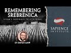

# Seminar: Remembering Srebrenica: Islam's Response to Othering (2021-07-09)

## Description

Seminar: "Remembering Srebrenica: Islam's Response to Othering" by Dr. Osman Latiff

## Summary of [Seminar: Remembering Srebrenica: Islam's Response to Othering](https://www.youtube.com/watch?v=kFqdaPzLCzQ)

*This summary is AI generated - there may be inaccuracies. *

### [00:00:00](https://www.youtube.com/watch?v=kFqdaPzLCzQ&t=0) - [01:00:00](https://www.youtube.com/watch?v=kFqdaPzLCzQ&t=3600)

This seminar discusses the history of othering, specifically how Bosnian Muslims were otherized during the genocide in Bosnia. It also discusses the Spanish Inquisition, in which Muslims were portrayed as Saracens, Hagarians, and Hagarine Beasts.

**[00:00:00](https://www.youtube.com/watch?v=kFqdaPzLCzQ&t=0)** covers the genocide of Bosnian Muslims, beginning with the breakup of Yugoslavia and the rise of nationalism in the 1990s. This led to an increase in violence against Muslims, as well as other groups. Islam has a response to othering, which the speaker covers in detail. Finally, the speaker discusses how the genocide of Bosnian Muslims is still relevant today.
* **[00:05:00](https://www.youtube.com/watch?v=kFqdaPzLCzQ&t=300)* Discusses the genocide of Bosnian Muslims at the hands of Serb forces, which took place in July 1995. The presenter discusses the motivations behind the perpetrators and the political context of the time. The presenter also discusses how this creates a sense of self and otherness, which can lead to violence.
* **[00:10:00](https://www.youtube.com/watch?v=kFqdaPzLCzQ&t=600)** In this seminar, Stanley Kohen discusses how people become desensitized to tragedy and atrocity, and how this can lead to a lack of empathy. Kohen also discusses the book Kiribati Kirbet Kize, which discusses the importance of memories, places, and spaces in human lives.
* **[00:15:00](https://www.youtube.com/watch?v=kFqdaPzLCzQ&t=900)* Discusses the fact that remembrance of tragedies such as the Srebrenica massacre is important, and how different places can serve as reminders of the atrocities committed.
* **[00:20:00](https://www.youtube.com/watch?v=kFqdaPzLCzQ&t=1200)** This seminar discusses the genocide in Bosnia and Herzegovina, which was carried out by Muslims against Christians. It notes that the tragedy is often forgotten and reflects on the importance of remembering it in order to prevent such atrocities from happening again. Rape was a weapon of war used by both sides, and it has left an indescribable trauma that continues to be felt by the victims' descendants.
* **[00:25:00](https://www.youtube.com/watch?v=kFqdaPzLCzQ&t=1500)* Discusses the importance of remembering the genocide of Srebrenica, noting that it is an opportunity to learn about Islam's response to othering. He points out that othering is the relegating of another to a marginalized place, and that it is important to be conscious of the way that we see ourselves. He explains that this is especially important in terms of self-respect and self-awareness, and warns that if we do not pay attention to our own character, we will not be as mindful of the character of others.
* **[00:30:00](https://www.youtube.com/watch?v=kFqdaPzLCzQ&t=1800)** In this seminar, the speakers discuss the concept of othering, which is the process of making a group of people into an "other" in order to justify the superiority of the in-group. Othering is a dehumanizing process that begins with the demonization of the other group and culminates in their social death. This process leads to the marginalization of the other group and their exclusion from society.
* **[00:35:00](https://www.youtube.com/watch?v=kFqdaPzLCzQ&t=2100)* Discusses the ways in which generalizing a group of people can lead to them being dehumanized and otherized. He mentions examples of othering, including othering based on race, and the consequences of doing so. He also talks about a case in which a white lawyer defended a black man who was later convicted of a crime he did not commit. compares the ways in which Atticus Finch and Boo Radley are marginalized in this case.
* **[00:40:00](https://www.youtube.com/watch?v=kFqdaPzLCzQ&t=2400)* Discusses the history of othering, specifically how Bosnian Muslims were otherized during the genocide in Bosnia. It also discusses the Spanish Inquisition, in which Muslims were portrayed as Saracens, Hagarians, and Hagarine Beasts.
* **[00:45:00](https://www.youtube.com/watch?v=kFqdaPzLCzQ&t=2700)** The seminar discusses how the language of dehumanization was used to describe Muslims throughout the centuries. It discusses how the Spanish Inquisition and other official documents referred to Muslims as pests, plagues, and beasts.
* **[00:50:00](https://www.youtube.com/watch?v=kFqdaPzLCzQ&t=3000)** This seminar discusses how Islam's response to othering has led to events such as the siege of Sarajevo and the Rwandan genocide. It also discusses how violence and othering can lead to a dehumanizing of an opponent, which can make it easier for perpetrators to commit atrocities.
* **[00:55:00](https://www.youtube.com/watch?v=kFqdaPzLCzQ&t=3300)** <>
### [01:00:00](https://www.youtube.com/watch?v=kFqdaPzLCzQ&t=3600) - [01:15:00](https://www.youtube.com/watch?v=kFqdaPzLCzQ&t=4500)

The seminar discusses the idea of "othering" and how it can lead to violence and genocide. The presenter discusses how the teachings of the Qur'an can be used to combat hate and discrimination. The talk ends with a discussion of a Quranic lesson on the importance of remembering the great loss of life during mass atrocities.

**[01:00:00](https://www.youtube.com/watch?v=kFqdaPzLCzQ&t=3600)** <>
* **[01:05:00](https://www.youtube.com/watch?v=kFqdaPzLCzQ&t=3900)** The seminar discusses the idea of "othering," and how it is a construct that allows for acts of violence and genocide. It also discusses the concept of "fitra," or the inherent nature of humans that is inspired by goodness and depravity. Finally, it discusses the idea of moral disengagement, and how it should prevent us from engaging in acts of violence and genocide.
* **[01:10:00](https://www.youtube.com/watch?v=kFqdaPzLCzQ&t=4200)** The presenter discusses the Qur'an's teachings on differentiating between people, and how these teachings can be used to combat hate and discrimination. He also discusses the principle of justice, which can be used to counter in-group bias.
* **[01:15:00](https://www.youtube.com/watch?v=kFqdaPzLCzQ&t=4500)* Discusses Islam's response to othering, specifically focusing on the verse "Allah knows for justice as witnesses to Allah even if it's against yourselves or against the ones that you love." He stresses the importance of standing up for justice, even if it means risking one's own safety. also refers to a hadith in which the Prophet Muhammad says that those who stand by and do nothing while others are committing genocide will themselves be guilty of genocide. Finally, the speaker ends the talk by discussing a Quranic lesson on the importance of remembering the great loss of life during mass atrocities.

<h2>Full transcript with timestamps: CLICK TO EXPAND</h2>

[0:00:37](https://youtu.be/kFqdaPzLCzQ?t=37) all of you are well in good health and  
[0:00:39](https://youtu.be/kFqdaPzLCzQ?t=39) in strong iman  
[0:00:40](https://youtu.be/kFqdaPzLCzQ?t=40) um this is dr uthman and this is on  
[0:00:42](https://youtu.be/kFqdaPzLCzQ?t=42) behalf of sapiens institute  
[0:00:45](https://youtu.be/kFqdaPzLCzQ?t=45) we have a very important inshallah topic  
[0:00:47](https://youtu.be/kFqdaPzLCzQ?t=47) of discussion today and i think all of  
[0:00:49](https://youtu.be/kFqdaPzLCzQ?t=49) us inshallah  
[0:00:49](https://youtu.be/kFqdaPzLCzQ?t=49) would be well prepared for this topic  
[0:00:53](https://youtu.be/kFqdaPzLCzQ?t=53) because it's something that's in our  
[0:00:54](https://youtu.be/kFqdaPzLCzQ?t=54) perhaps collective  
[0:00:55](https://youtu.be/kFqdaPzLCzQ?t=55) memory collective imagination and that  
[0:00:58](https://youtu.be/kFqdaPzLCzQ?t=58) of course is  
[0:00:59](https://youtu.be/kFqdaPzLCzQ?t=59) uh the bonus the genocide of of serbia  
[0:01:01](https://youtu.be/kFqdaPzLCzQ?t=61) nietzsche  
[0:01:02](https://youtu.be/kFqdaPzLCzQ?t=62) the genocide of bosnia from the years of  
[0:01:04](https://youtu.be/kFqdaPzLCzQ?t=64) 1992-1995  
[0:01:06](https://youtu.be/kFqdaPzLCzQ?t=66) uh what we're going to do today  
[0:01:07](https://youtu.be/kFqdaPzLCzQ?t=67) inshallah is is is cover these kind of  
[0:01:09](https://youtu.be/kFqdaPzLCzQ?t=69) steps so we're going to begin each other  
[0:01:10](https://youtu.be/kFqdaPzLCzQ?t=70) by speaking about what exactly happened  
[0:01:13](https://youtu.be/kFqdaPzLCzQ?t=73) during those very tragic years of those  
[0:01:16](https://youtu.be/kFqdaPzLCzQ?t=76) years of the genocide in bosnia  
[0:01:18](https://youtu.be/kFqdaPzLCzQ?t=78) what were the causes for the  
[0:01:21](https://youtu.be/kFqdaPzLCzQ?t=81) insane violence enacted out meted out  
[0:01:23](https://youtu.be/kFqdaPzLCzQ?t=83) against peoples  
[0:01:25](https://youtu.be/kFqdaPzLCzQ?t=85) particularly muslims but also other  
[0:01:26](https://youtu.be/kFqdaPzLCzQ?t=86) people as well um we're going to look at  
[0:01:28](https://youtu.be/kFqdaPzLCzQ?t=88) the the the constructs of  
[0:01:32](https://youtu.be/kFqdaPzLCzQ?t=92) othering and dehumanization that was a  
[0:01:34](https://youtu.be/kFqdaPzLCzQ?t=94) major  
[0:01:35](https://youtu.be/kFqdaPzLCzQ?t=95) role in fact in the motivations in the  
[0:01:39](https://youtu.be/kFqdaPzLCzQ?t=99) ideologies in the sentiments in the  
[0:01:42](https://youtu.be/kFqdaPzLCzQ?t=102) psychology  
[0:01:43](https://youtu.be/kFqdaPzLCzQ?t=103) of the perpetrators of that genocide  
[0:01:45](https://youtu.be/kFqdaPzLCzQ?t=105) we're going to look at the way that  
[0:01:47](https://youtu.be/kFqdaPzLCzQ?t=107) we understand the the complexities  
[0:01:50](https://youtu.be/kFqdaPzLCzQ?t=110) the subtleties of othering and  
[0:01:52](https://youtu.be/kFqdaPzLCzQ?t=112) dehumanization and then we're going to  
[0:01:54](https://youtu.be/kFqdaPzLCzQ?t=114) look at the  
[0:01:55](https://youtu.be/kFqdaPzLCzQ?t=115) islamic response to othering what does  
[0:01:58](https://youtu.be/kFqdaPzLCzQ?t=118) islam say about  
[0:01:59](https://youtu.be/kFqdaPzLCzQ?t=119) how do we deal with those constructs in  
[0:02:01](https://youtu.be/kFqdaPzLCzQ?t=121) fact as muslims  
[0:02:02](https://youtu.be/kFqdaPzLCzQ?t=122) in our lives and so therefore that's the  
[0:02:05](https://youtu.be/kFqdaPzLCzQ?t=125) that's on the agenda inshallah today i  
[0:02:06](https://youtu.be/kFqdaPzLCzQ?t=126) pray allah  
[0:02:08](https://youtu.be/kFqdaPzLCzQ?t=128) in our in our studies together uh  
[0:02:11](https://youtu.be/kFqdaPzLCzQ?t=131) and here we go therefore from the  
[0:02:12](https://youtu.be/kFqdaPzLCzQ?t=132) beginning the genocide of muslims in  
[0:02:15](https://youtu.be/kFqdaPzLCzQ?t=135) bosnia 1995.  
[0:02:18](https://youtu.be/kFqdaPzLCzQ?t=138) uh to begin with following the falling  
[0:02:20](https://youtu.be/kFqdaPzLCzQ?t=140) apart of the  
[0:02:22](https://youtu.be/kFqdaPzLCzQ?t=142) soviet union there was of course a  
[0:02:25](https://youtu.be/kFqdaPzLCzQ?t=145) breakup of countries so therefore that  
[0:02:26](https://youtu.be/kFqdaPzLCzQ?t=146) was something  
[0:02:27](https://youtu.be/kFqdaPzLCzQ?t=147) that maybe we wouldn't remember uh it  
[0:02:29](https://youtu.be/kFqdaPzLCzQ?t=149) depends on force how old  
[0:02:31](https://youtu.be/kFqdaPzLCzQ?t=151) we are uh people tend to think of soviet  
[0:02:33](https://youtu.be/kFqdaPzLCzQ?t=153) reunion as simply  
[0:02:34](https://youtu.be/kFqdaPzLCzQ?t=154) russia nowadays but soviet union was  
[0:02:37](https://youtu.be/kFqdaPzLCzQ?t=157) something quite different at that time  
[0:02:39](https://youtu.be/kFqdaPzLCzQ?t=159) uh we have these smaller countries the  
[0:02:42](https://youtu.be/kFqdaPzLCzQ?t=162) breakup of yugoslavia  
[0:02:43](https://youtu.be/kFqdaPzLCzQ?t=163) serbia croatia slovenia that when the  
[0:02:46](https://youtu.be/kFqdaPzLCzQ?t=166) soviet union broke up  
[0:02:47](https://youtu.be/kFqdaPzLCzQ?t=167) partly because of the failure of its  
[0:02:51](https://youtu.be/kFqdaPzLCzQ?t=171) you know its occupation of afghanistan  
[0:02:54](https://youtu.be/kFqdaPzLCzQ?t=174) these countries sought independence from  
[0:02:56](https://youtu.be/kFqdaPzLCzQ?t=176) the yugoslav republic  
[0:02:58](https://youtu.be/kFqdaPzLCzQ?t=178) and so the subs therefore employed  
[0:03:02](https://youtu.be/kFqdaPzLCzQ?t=182) in their attempt to push back and fight  
[0:03:04](https://youtu.be/kFqdaPzLCzQ?t=184) against croatia  
[0:03:06](https://youtu.be/kFqdaPzLCzQ?t=186) as slovenia and bosnia uh  
[0:03:09](https://youtu.be/kFqdaPzLCzQ?t=189) an extreme form of nationalism  
[0:03:12](https://youtu.be/kFqdaPzLCzQ?t=192) uh in ethnocentrism in their attacks  
[0:03:14](https://youtu.be/kFqdaPzLCzQ?t=194) against elizabeth  
[0:03:16](https://youtu.be/kFqdaPzLCzQ?t=196) slovenians the croatians and then of  
[0:03:18](https://youtu.be/kFqdaPzLCzQ?t=198) course the the muslim bosnians as well  
[0:03:21](https://youtu.be/kFqdaPzLCzQ?t=201) and so after the breakup of yugoslavia  
[0:03:23](https://youtu.be/kFqdaPzLCzQ?t=203) uh there emerged a kind of ins  
[0:03:26](https://youtu.be/kFqdaPzLCzQ?t=206) insane uh incense type of violence  
[0:03:29](https://youtu.be/kFqdaPzLCzQ?t=209) uh carried out by military organizations  
[0:03:33](https://youtu.be/kFqdaPzLCzQ?t=213) paramilitary organizations but not just  
[0:03:35](https://youtu.be/kFqdaPzLCzQ?t=215) that  
[0:03:36](https://youtu.be/kFqdaPzLCzQ?t=216) also the the average man in fact was  
[0:03:38](https://youtu.be/kFqdaPzLCzQ?t=218) taking arms against  
[0:03:40](https://youtu.be/kFqdaPzLCzQ?t=220) his fellow neighbor his fellow teacher  
[0:03:43](https://youtu.be/kFqdaPzLCzQ?t=223) and this in fact is quite common  
[0:03:44](https://youtu.be/kFqdaPzLCzQ?t=224) sometimes in general because we talk  
[0:03:46](https://youtu.be/kFqdaPzLCzQ?t=226) about  
[0:03:46](https://youtu.be/kFqdaPzLCzQ?t=226) genocide is a is a mass is a mass  
[0:03:49](https://youtu.be/kFqdaPzLCzQ?t=229) killing  
[0:03:50](https://youtu.be/kFqdaPzLCzQ?t=230) a mass killing a kind of upsurge of of  
[0:03:53](https://youtu.be/kFqdaPzLCzQ?t=233) violence meted out against  
[0:03:55](https://youtu.be/kFqdaPzLCzQ?t=235) against peoples uh so  
[0:03:58](https://youtu.be/kFqdaPzLCzQ?t=238) what you find therefore happening from  
[0:04:00](https://youtu.be/kFqdaPzLCzQ?t=240) the yugoslavia against  
[0:04:01](https://youtu.be/kFqdaPzLCzQ?t=241) the the muslims of bosnia from from the  
[0:04:04](https://youtu.be/kFqdaPzLCzQ?t=244) serbs  
[0:04:06](https://youtu.be/kFqdaPzLCzQ?t=246) in in the in common people  
[0:04:09](https://youtu.be/kFqdaPzLCzQ?t=249) in the average person not necessarily  
[0:04:11](https://youtu.be/kFqdaPzLCzQ?t=251) attached to the military  
[0:04:13](https://youtu.be/kFqdaPzLCzQ?t=253) but because there is an entrenched form  
[0:04:16](https://youtu.be/kFqdaPzLCzQ?t=256) of  
[0:04:16](https://youtu.be/kFqdaPzLCzQ?t=256) uh you know loyalty seeking loyalty  
[0:04:19](https://youtu.be/kFqdaPzLCzQ?t=259) adhering to  
[0:04:20](https://youtu.be/kFqdaPzLCzQ?t=260) uh that's going to create binaries  
[0:04:23](https://youtu.be/kFqdaPzLCzQ?t=263) binaries  
[0:04:24](https://youtu.be/kFqdaPzLCzQ?t=264) which become ossified and entrenched in  
[0:04:26](https://youtu.be/kFqdaPzLCzQ?t=266) those times and that happens of course  
[0:04:29](https://youtu.be/kFqdaPzLCzQ?t=269) happens of course with time the time of  
[0:04:30](https://youtu.be/kFqdaPzLCzQ?t=270) the nazis happened  
[0:04:32](https://youtu.be/kFqdaPzLCzQ?t=272) very much in time of rwanda uh this is  
[0:04:34](https://youtu.be/kFqdaPzLCzQ?t=274) very much covered in my book on being  
[0:04:35](https://youtu.be/kFqdaPzLCzQ?t=275) human as well  
[0:04:37](https://youtu.be/kFqdaPzLCzQ?t=277) and so the aim was to ethnically cleanse  
[0:04:39](https://youtu.be/kFqdaPzLCzQ?t=279) the area of muslims  
[0:04:41](https://youtu.be/kFqdaPzLCzQ?t=281) here we have uh locations in 1992  
[0:04:44](https://youtu.be/kFqdaPzLCzQ?t=284) prison door for example over 3 000  
[0:04:47](https://youtu.be/kFqdaPzLCzQ?t=287) non-sub civilians were killed  
[0:04:49](https://youtu.be/kFqdaPzLCzQ?t=289) in wizard 3 000 bosnian muslims were  
[0:04:52](https://youtu.be/kFqdaPzLCzQ?t=292) killed  
[0:04:53](https://youtu.be/kFqdaPzLCzQ?t=293) burned alive mass raped in fact became a  
[0:04:56](https://youtu.be/kFqdaPzLCzQ?t=296) weapon of war  
[0:04:57](https://youtu.be/kFqdaPzLCzQ?t=297) concentration camps were set up zvernick  
[0:05:00](https://youtu.be/kFqdaPzLCzQ?t=300) versina and and tusla as well so  
[0:05:03](https://youtu.be/kFqdaPzLCzQ?t=303) therefore these are locations where  
[0:05:05](https://youtu.be/kFqdaPzLCzQ?t=305) uh you know great injustices were taking  
[0:05:07](https://youtu.be/kFqdaPzLCzQ?t=307) place against the muslim population  
[0:05:09](https://youtu.be/kFqdaPzLCzQ?t=309) and also other people as well including  
[0:05:12](https://youtu.be/kFqdaPzLCzQ?t=312) uh you know some christians  
[0:05:13](https://youtu.be/kFqdaPzLCzQ?t=313) as well but here we have an ethnic  
[0:05:16](https://youtu.be/kFqdaPzLCzQ?t=316) conflict  
[0:05:17](https://youtu.be/kFqdaPzLCzQ?t=317) being played out and and ethnic  
[0:05:19](https://youtu.be/kFqdaPzLCzQ?t=319) cleansing taking place  
[0:05:21](https://youtu.be/kFqdaPzLCzQ?t=321) now the strategy was to erase bosnian  
[0:05:23](https://youtu.be/kFqdaPzLCzQ?t=323) muslims  
[0:05:24](https://youtu.be/kFqdaPzLCzQ?t=324) lives heritage and identity what does  
[0:05:27](https://youtu.be/kFqdaPzLCzQ?t=327) that mean  
[0:05:28](https://youtu.be/kFqdaPzLCzQ?t=328) so we can understand what it means to  
[0:05:29](https://youtu.be/kFqdaPzLCzQ?t=329) erase muslim  
[0:05:31](https://youtu.be/kFqdaPzLCzQ?t=331) lives as in to exterminate a people to  
[0:05:34](https://youtu.be/kFqdaPzLCzQ?t=334) kill people  
[0:05:36](https://youtu.be/kFqdaPzLCzQ?t=336) but then you have with that the  
[0:05:38](https://youtu.be/kFqdaPzLCzQ?t=338) extermination of heritage and identity  
[0:05:41](https://youtu.be/kFqdaPzLCzQ?t=341) so it's not only about uh the physical  
[0:05:43](https://youtu.be/kFqdaPzLCzQ?t=343) presence of the muslims being  
[0:05:46](https://youtu.be/kFqdaPzLCzQ?t=346) annihilated and you know annulled  
[0:05:49](https://youtu.be/kFqdaPzLCzQ?t=349) and becomes absent but  
[0:05:52](https://youtu.be/kFqdaPzLCzQ?t=352) the heritage identity of a people so  
[0:05:55](https://youtu.be/kFqdaPzLCzQ?t=355) this is quite similar in fact to what  
[0:05:57](https://youtu.be/kFqdaPzLCzQ?t=357) you find in  
[0:05:58](https://youtu.be/kFqdaPzLCzQ?t=358) uh in settler colonialism particularly  
[0:06:01](https://youtu.be/kFqdaPzLCzQ?t=361) in palestine for example it wasn't so  
[0:06:03](https://youtu.be/kFqdaPzLCzQ?t=363) much  
[0:06:03](https://youtu.be/kFqdaPzLCzQ?t=363) only about ethnic cleansing of the  
[0:06:06](https://youtu.be/kFqdaPzLCzQ?t=366) palestinians from 1948 nakba  
[0:06:08](https://youtu.be/kFqdaPzLCzQ?t=368) onward in fact even from 1947 um  
[0:06:11](https://youtu.be/kFqdaPzLCzQ?t=371) but then when you had those palestinian  
[0:06:14](https://youtu.be/kFqdaPzLCzQ?t=374) muslims who were  
[0:06:16](https://youtu.be/kFqdaPzLCzQ?t=376) displaced by force into other places uh  
[0:06:20](https://youtu.be/kFqdaPzLCzQ?t=380) you know in the lebanon for example or  
[0:06:22](https://youtu.be/kFqdaPzLCzQ?t=382) syria  
[0:06:23](https://youtu.be/kFqdaPzLCzQ?t=383) uh the the locations where  
[0:06:26](https://youtu.be/kFqdaPzLCzQ?t=386) inhabitants used to once live now become  
[0:06:30](https://youtu.be/kFqdaPzLCzQ?t=390) other sites of of other things so  
[0:06:33](https://youtu.be/kFqdaPzLCzQ?t=393) sometimes the sites with the  
[0:06:35](https://youtu.be/kFqdaPzLCzQ?t=395) the the landscapes um homes farm lands  
[0:06:38](https://youtu.be/kFqdaPzLCzQ?t=398) were transformed into  
[0:06:40](https://youtu.be/kFqdaPzLCzQ?t=400) um uh city parks sometimes into  
[0:06:44](https://youtu.be/kFqdaPzLCzQ?t=404) uh into forests even into forests even  
[0:06:48](https://youtu.be/kFqdaPzLCzQ?t=408) car parks and so the destruction of  
[0:06:51](https://youtu.be/kFqdaPzLCzQ?t=411) lives and heritage and identity so  
[0:06:54](https://youtu.be/kFqdaPzLCzQ?t=414) removing therefore the identity of  
[0:06:58](https://youtu.be/kFqdaPzLCzQ?t=418) the the bosom as if they didn't live  
[0:06:59](https://youtu.be/kFqdaPzLCzQ?t=419) there ever in the first place  
[0:07:02](https://youtu.be/kFqdaPzLCzQ?t=422) and so therefore you find it for the  
[0:07:03](https://youtu.be/kFqdaPzLCzQ?t=423) transforming the changing of names  
[0:07:05](https://youtu.be/kFqdaPzLCzQ?t=425) uh the uh refusal to have  
[0:07:09](https://youtu.be/kFqdaPzLCzQ?t=429) uh burial sites uh plaques of  
[0:07:12](https://youtu.be/kFqdaPzLCzQ?t=432) remembrance  
[0:07:13](https://youtu.be/kFqdaPzLCzQ?t=433) and so on and so forth so serb militants  
[0:07:15](https://youtu.be/kFqdaPzLCzQ?t=435) led by general radgo mladic  
[0:07:18](https://youtu.be/kFqdaPzLCzQ?t=438) entered the eastern town of srebrenica  
[0:07:20](https://youtu.be/kFqdaPzLCzQ?t=440) after it was declared the u.n safe zone  
[0:07:22](https://youtu.be/kFqdaPzLCzQ?t=442) protected they said by a lightly armed  
[0:07:24](https://youtu.be/kFqdaPzLCzQ?t=444) dutch peacekeeping force of around 600  
[0:07:26](https://youtu.be/kFqdaPzLCzQ?t=446) troops  
[0:07:27](https://youtu.be/kFqdaPzLCzQ?t=447) commissioned by the u.n and so therefore  
[0:07:30](https://youtu.be/kFqdaPzLCzQ?t=450) the  
[0:07:30](https://youtu.be/kFqdaPzLCzQ?t=450) the bosnian muslims were supposed to be  
[0:07:32](https://youtu.be/kFqdaPzLCzQ?t=452) protected by the un  
[0:07:34](https://youtu.be/kFqdaPzLCzQ?t=454) uh but they uh were  
[0:07:37](https://youtu.be/kFqdaPzLCzQ?t=457) deemed themselves deemed themselves  
[0:07:39](https://youtu.be/kFqdaPzLCzQ?t=459) incapable  
[0:07:40](https://youtu.be/kFqdaPzLCzQ?t=460) unwilling or complicit and so therefore  
[0:07:43](https://youtu.be/kFqdaPzLCzQ?t=463) the u.n  
[0:07:44](https://youtu.be/kFqdaPzLCzQ?t=464) sanctioned sub-militants to enter the  
[0:07:47](https://youtu.be/kFqdaPzLCzQ?t=467) military  
[0:07:47](https://youtu.be/kFqdaPzLCzQ?t=467) safe haven embarked on premeditated mass  
[0:07:50](https://youtu.be/kFqdaPzLCzQ?t=470) murder aided by the international  
[0:07:52](https://youtu.be/kFqdaPzLCzQ?t=472) community's  
[0:07:53](https://youtu.be/kFqdaPzLCzQ?t=473) indifference meaning not that they were  
[0:07:56](https://youtu.be/kFqdaPzLCzQ?t=476) active participants perpetrators  
[0:07:58](https://youtu.be/kFqdaPzLCzQ?t=478) themselves no  
[0:07:59](https://youtu.be/kFqdaPzLCzQ?t=479) but because there was supposed to be a  
[0:08:01](https://youtu.be/kFqdaPzLCzQ?t=481) peacekeeping force  
[0:08:02](https://youtu.be/kFqdaPzLCzQ?t=482) uh then of course the the inhabitants  
[0:08:05](https://youtu.be/kFqdaPzLCzQ?t=485) the  
[0:08:06](https://youtu.be/kFqdaPzLCzQ?t=486) the subordinated ones in in this case  
[0:08:08](https://youtu.be/kFqdaPzLCzQ?t=488) the victims  
[0:08:09](https://youtu.be/kFqdaPzLCzQ?t=489) the muslim bosnians would have felt as  
[0:08:11](https://youtu.be/kFqdaPzLCzQ?t=491) if they were  
[0:08:12](https://youtu.be/kFqdaPzLCzQ?t=492) safely you know protected by those  
[0:08:15](https://youtu.be/kFqdaPzLCzQ?t=495) peacekeeping forces  
[0:08:16](https://youtu.be/kFqdaPzLCzQ?t=496) but then to be abandoned by them uh  
[0:08:20](https://youtu.be/kFqdaPzLCzQ?t=500) you know of course is is is here  
[0:08:22](https://youtu.be/kFqdaPzLCzQ?t=502) indicated  
[0:08:23](https://youtu.be/kFqdaPzLCzQ?t=503) over five days 8 300 muslim men and boys  
[0:08:26](https://youtu.be/kFqdaPzLCzQ?t=506) who are massacred by bosnian  
[0:08:28](https://youtu.be/kFqdaPzLCzQ?t=508) military forces this is this is now the  
[0:08:30](https://youtu.be/kFqdaPzLCzQ?t=510) genocide in srebrenica  
[0:08:32](https://youtu.be/kFqdaPzLCzQ?t=512) so just think therefore this is the the  
[0:08:35](https://youtu.be/kFqdaPzLCzQ?t=515) worst  
[0:08:36](https://youtu.be/kFqdaPzLCzQ?t=516) uh human you know atrocity committed  
[0:08:39](https://youtu.be/kFqdaPzLCzQ?t=519) as in war crime as in ethnic cleansing  
[0:08:42](https://youtu.be/kFqdaPzLCzQ?t=522) as in genocide since the second world  
[0:08:44](https://youtu.be/kFqdaPzLCzQ?t=524) war  
[0:08:45](https://youtu.be/kFqdaPzLCzQ?t=525) more than 8 000 muslim men and boys  
[0:08:48](https://youtu.be/kFqdaPzLCzQ?t=528) massacred in europe  
[0:08:49](https://youtu.be/kFqdaPzLCzQ?t=529) over five days around 50 000 women and  
[0:08:52](https://youtu.be/kFqdaPzLCzQ?t=532) girls  
[0:08:53](https://youtu.be/kFqdaPzLCzQ?t=533) were raped in those five days one of the  
[0:08:56](https://youtu.be/kFqdaPzLCzQ?t=536) worst cases of ethnic cleansing  
[0:08:57](https://youtu.be/kFqdaPzLCzQ?t=537) and worst massacre in europe since the  
[0:09:00](https://youtu.be/kFqdaPzLCzQ?t=540) second world  
[0:09:01](https://youtu.be/kFqdaPzLCzQ?t=541) war now it's important for us therefore  
[0:09:04](https://youtu.be/kFqdaPzLCzQ?t=544) if we go back and look at the history  
[0:09:06](https://youtu.be/kFqdaPzLCzQ?t=546) behind this  
[0:09:07](https://youtu.be/kFqdaPzLCzQ?t=547) understanding therefore the uh the  
[0:09:10](https://youtu.be/kFqdaPzLCzQ?t=550) context understanding the motivations of  
[0:09:12](https://youtu.be/kFqdaPzLCzQ?t=552) the perpetrators understand the  
[0:09:14](https://youtu.be/kFqdaPzLCzQ?t=554) political dimensions with the breakup of  
[0:09:15](https://youtu.be/kFqdaPzLCzQ?t=555) yugoslavia soviet union  
[0:09:17](https://youtu.be/kFqdaPzLCzQ?t=557) and then of course the the violence that  
[0:09:19](https://youtu.be/kFqdaPzLCzQ?t=559) takes place  
[0:09:21](https://youtu.be/kFqdaPzLCzQ?t=561) off of the back of that so entrenched  
[0:09:23](https://youtu.be/kFqdaPzLCzQ?t=563) forms of extreme nationalism  
[0:09:25](https://youtu.be/kFqdaPzLCzQ?t=565) you know become become apparent and what  
[0:09:28](https://youtu.be/kFqdaPzLCzQ?t=568) this does is it creates  
[0:09:30](https://youtu.be/kFqdaPzLCzQ?t=570) or ossifies self and otherness  
[0:09:34](https://youtu.be/kFqdaPzLCzQ?t=574) self and otherness constructs and so  
[0:09:37](https://youtu.be/kFqdaPzLCzQ?t=577) when people feel that they have a sense  
[0:09:40](https://youtu.be/kFqdaPzLCzQ?t=580) of belonging belonging in this case to  
[0:09:42](https://youtu.be/kFqdaPzLCzQ?t=582) their own ethnicities  
[0:09:44](https://youtu.be/kFqdaPzLCzQ?t=584) um then the others of course become  
[0:09:47](https://youtu.be/kFqdaPzLCzQ?t=587) the ones who don't simply belong to  
[0:09:49](https://youtu.be/kFqdaPzLCzQ?t=589) their own identities or those who are  
[0:09:51](https://youtu.be/kFqdaPzLCzQ?t=591) different in in small ways or in big  
[0:09:53](https://youtu.be/kFqdaPzLCzQ?t=593) ways but they would always be the  
[0:09:55](https://youtu.be/kFqdaPzLCzQ?t=595) existential  
[0:09:56](https://youtu.be/kFqdaPzLCzQ?t=596) others and this is something we're going  
[0:09:57](https://youtu.be/kFqdaPzLCzQ?t=597) to talk about and exist in all  
[0:09:59](https://youtu.be/kFqdaPzLCzQ?t=599) forms of of life and living in fact in  
[0:10:02](https://youtu.be/kFqdaPzLCzQ?t=602) our in our worlds today  
[0:10:04](https://youtu.be/kFqdaPzLCzQ?t=604) but if it's unchecked then it can lead  
[0:10:06](https://youtu.be/kFqdaPzLCzQ?t=606) to and result in  
[0:10:07](https://youtu.be/kFqdaPzLCzQ?t=607) in in the worst examples of it though in  
[0:10:10](https://youtu.be/kFqdaPzLCzQ?t=610) human history which of course would be  
[0:10:11](https://youtu.be/kFqdaPzLCzQ?t=611) genocides  
[0:10:12](https://youtu.be/kFqdaPzLCzQ?t=612) as what happened to the muslims here in  
[0:10:14](https://youtu.be/kFqdaPzLCzQ?t=614) bosnia  
[0:10:15](https://youtu.be/kFqdaPzLCzQ?t=615) and so therefore we've seen the the  
[0:10:18](https://youtu.be/kFqdaPzLCzQ?t=618) upsurge of violence  
[0:10:19](https://youtu.be/kFqdaPzLCzQ?t=619) after the breakup of yugoslavia the the  
[0:10:22](https://youtu.be/kFqdaPzLCzQ?t=622) beginning of killing sprees three  
[0:10:23](https://youtu.be/kFqdaPzLCzQ?t=623) thousand kill three thousand kills there  
[0:10:26](https://youtu.be/kFqdaPzLCzQ?t=626) uh burning alive burning homes alive  
[0:10:29](https://youtu.be/kFqdaPzLCzQ?t=629) so uh in so kind of trapping muslims and  
[0:10:32](https://youtu.be/kFqdaPzLCzQ?t=632) then locking barricading them and then  
[0:10:34](https://youtu.be/kFqdaPzLCzQ?t=634) burning those houses  
[0:10:36](https://youtu.be/kFqdaPzLCzQ?t=636) so that the people inside them are  
[0:10:37](https://youtu.be/kFqdaPzLCzQ?t=637) burned alive mass rapes  
[0:10:39](https://youtu.be/kFqdaPzLCzQ?t=639) raped as a weapon of war concentration  
[0:10:41](https://youtu.be/kFqdaPzLCzQ?t=641) camps  
[0:10:42](https://youtu.be/kFqdaPzLCzQ?t=642) and then the strategy was therefore to  
[0:10:45](https://youtu.be/kFqdaPzLCzQ?t=645) erase you know  
[0:10:46](https://youtu.be/kFqdaPzLCzQ?t=646) bosnian muslims live heritage identity  
[0:10:49](https://youtu.be/kFqdaPzLCzQ?t=649) from that landscape now  
[0:10:52](https://youtu.be/kFqdaPzLCzQ?t=652) why is it important for us to remember  
[0:10:55](https://youtu.be/kFqdaPzLCzQ?t=655) now  
[0:10:56](https://youtu.be/kFqdaPzLCzQ?t=656) on july the 11th it would have of course  
[0:10:57](https://youtu.be/kFqdaPzLCzQ?t=657) the remembrance day  
[0:10:59](https://youtu.be/kFqdaPzLCzQ?t=659) for the genocide of serbanitsan is  
[0:11:01](https://youtu.be/kFqdaPzLCzQ?t=661) something that we that happens every  
[0:11:02](https://youtu.be/kFqdaPzLCzQ?t=662) single year as a form of remembrance  
[0:11:04](https://youtu.be/kFqdaPzLCzQ?t=664) why is it important for us to remember  
[0:11:06](https://youtu.be/kFqdaPzLCzQ?t=666) this because remember that the people  
[0:11:08](https://youtu.be/kFqdaPzLCzQ?t=668) that we're talking about are not just  
[0:11:10](https://youtu.be/kFqdaPzLCzQ?t=670) numbers they're more than just numbers  
[0:11:12](https://youtu.be/kFqdaPzLCzQ?t=672) we can easily become desensitized if  
[0:11:14](https://youtu.be/kFqdaPzLCzQ?t=674) we're always thinking about numbers  
[0:11:16](https://youtu.be/kFqdaPzLCzQ?t=676) we can have a sense of uh kind of  
[0:11:20](https://youtu.be/kFqdaPzLCzQ?t=680) a media fatigue or or compassion fatigue  
[0:11:23](https://youtu.be/kFqdaPzLCzQ?t=683) even  
[0:11:23](https://youtu.be/kFqdaPzLCzQ?t=683) we can become fatigued of always  
[0:11:25](https://youtu.be/kFqdaPzLCzQ?t=685) exhibiting compassion  
[0:11:27](https://youtu.be/kFqdaPzLCzQ?t=687) because it's tuned people to show  
[0:11:28](https://youtu.be/kFqdaPzLCzQ?t=688) compassion towards or we become fatigued  
[0:11:30](https://youtu.be/kFqdaPzLCzQ?t=690) by that  
[0:11:31](https://youtu.be/kFqdaPzLCzQ?t=691) stanley kohen in his book states of  
[0:11:33](https://youtu.be/kFqdaPzLCzQ?t=693) denial talks about that disgusted that  
[0:11:34](https://youtu.be/kFqdaPzLCzQ?t=694) phenomenon  
[0:11:36](https://youtu.be/kFqdaPzLCzQ?t=696) or media fatigue if we're having  
[0:11:39](https://youtu.be/kFqdaPzLCzQ?t=699) the same images played out again and  
[0:11:41](https://youtu.be/kFqdaPzLCzQ?t=701) again and again it could lead to  
[0:11:43](https://youtu.be/kFqdaPzLCzQ?t=703) a sense of media fatigue because you're  
[0:11:45](https://youtu.be/kFqdaPzLCzQ?t=705) you're fatigued of seeing the same  
[0:11:47](https://youtu.be/kFqdaPzLCzQ?t=707) images again and again  
[0:11:48](https://youtu.be/kFqdaPzLCzQ?t=708) but then that's the tragedy of becoming  
[0:11:50](https://youtu.be/kFqdaPzLCzQ?t=710) desensitized therefore  
[0:11:51](https://youtu.be/kFqdaPzLCzQ?t=711) to the to that tragedy  
[0:11:55](https://youtu.be/kFqdaPzLCzQ?t=715) to kind of rise above that and realize  
[0:11:58](https://youtu.be/kFqdaPzLCzQ?t=718) that the people that are being spoken of  
[0:11:59](https://youtu.be/kFqdaPzLCzQ?t=719) are not just  
[0:12:01](https://youtu.be/kFqdaPzLCzQ?t=721) numbers but are actually people human  
[0:12:04](https://youtu.be/kFqdaPzLCzQ?t=724) beings they all had  
[0:12:05](https://youtu.be/kFqdaPzLCzQ?t=725) families right they all had families  
[0:12:07](https://youtu.be/kFqdaPzLCzQ?t=727) every one of them had  
[0:12:08](https://youtu.be/kFqdaPzLCzQ?t=728) would have had a father or a mother  
[0:12:10](https://youtu.be/kFqdaPzLCzQ?t=730) right or would have been a father and  
[0:12:12](https://youtu.be/kFqdaPzLCzQ?t=732) would have been a mother  
[0:12:14](https://youtu.be/kFqdaPzLCzQ?t=734) siblings children uncles aunts  
[0:12:17](https://youtu.be/kFqdaPzLCzQ?t=737) grandfathers neighbors uh teachers  
[0:12:20](https://youtu.be/kFqdaPzLCzQ?t=740) students all had these relationships  
[0:12:23](https://youtu.be/kFqdaPzLCzQ?t=743) which gave them a sense of belonging  
[0:12:26](https://youtu.be/kFqdaPzLCzQ?t=746) place importance in human society they  
[0:12:28](https://youtu.be/kFqdaPzLCzQ?t=748) all had careers  
[0:12:29](https://youtu.be/kFqdaPzLCzQ?t=749) they would have had careers or would  
[0:12:31](https://youtu.be/kFqdaPzLCzQ?t=751) have been careers seeking people would  
[0:12:33](https://youtu.be/kFqdaPzLCzQ?t=753) have  
[0:12:33](https://youtu.be/kFqdaPzLCzQ?t=753) hoped to have a career they had dreams  
[0:12:35](https://youtu.be/kFqdaPzLCzQ?t=755) and aspiration this is something that we  
[0:12:37](https://youtu.be/kFqdaPzLCzQ?t=757) call these are  
[0:12:38](https://youtu.be/kFqdaPzLCzQ?t=758) human codes of recognizability so  
[0:12:40](https://youtu.be/kFqdaPzLCzQ?t=760) therefore when we think about  
[0:12:42](https://youtu.be/kFqdaPzLCzQ?t=762) empathy empathy is built in many ways  
[0:12:45](https://youtu.be/kFqdaPzLCzQ?t=765) because  
[0:12:45](https://youtu.be/kFqdaPzLCzQ?t=765) not only when we see differences in  
[0:12:48](https://youtu.be/kFqdaPzLCzQ?t=768) people but also when we see  
[0:12:49](https://youtu.be/kFqdaPzLCzQ?t=769) things that are just patently similar  
[0:12:51](https://youtu.be/kFqdaPzLCzQ?t=771) between us and them  
[0:12:53](https://youtu.be/kFqdaPzLCzQ?t=773) right it's it's when we deny those  
[0:12:55](https://youtu.be/kFqdaPzLCzQ?t=775) points of similarity and only focus on  
[0:12:58](https://youtu.be/kFqdaPzLCzQ?t=778) differences  
[0:12:59](https://youtu.be/kFqdaPzLCzQ?t=779) where we begin to think well where you  
[0:13:01](https://youtu.be/kFqdaPzLCzQ?t=781) know the uh  
[0:13:02](https://youtu.be/kFqdaPzLCzQ?t=782) the uh sentiments or the ideas of  
[0:13:06](https://youtu.be/kFqdaPzLCzQ?t=786) othering or otherness you know might  
[0:13:07](https://youtu.be/kFqdaPzLCzQ?t=787) creep  
[0:13:08](https://youtu.be/kFqdaPzLCzQ?t=788) in and every single person's death of  
[0:13:10](https://youtu.be/kFqdaPzLCzQ?t=790) course  
[0:13:11](https://youtu.be/kFqdaPzLCzQ?t=791) matters and so therefore that's a key  
[0:13:12](https://youtu.be/kFqdaPzLCzQ?t=792) thing for us to remember they're not  
[0:13:13](https://youtu.be/kFqdaPzLCzQ?t=793) just numbers they all had families all  
[0:13:15](https://youtu.be/kFqdaPzLCzQ?t=795) had careers  
[0:13:16](https://youtu.be/kFqdaPzLCzQ?t=796) or they had careers or they were  
[0:13:17](https://youtu.be/kFqdaPzLCzQ?t=797) career-seeking or their parents had  
[0:13:20](https://youtu.be/kFqdaPzLCzQ?t=800) careers or they had dreams and  
[0:13:21](https://youtu.be/kFqdaPzLCzQ?t=801) aspirations and every  
[0:13:23](https://youtu.be/kFqdaPzLCzQ?t=803) single person's death of course matters  
[0:13:26](https://youtu.be/kFqdaPzLCzQ?t=806) think about why it's important for us to  
[0:13:28](https://youtu.be/kFqdaPzLCzQ?t=808) remember lives  
[0:13:29](https://youtu.be/kFqdaPzLCzQ?t=809) memories places and spaces what makes us  
[0:13:33](https://youtu.be/kFqdaPzLCzQ?t=813) in fact  
[0:13:34](https://youtu.be/kFqdaPzLCzQ?t=814) what makes us living and human beings we  
[0:13:36](https://youtu.be/kFqdaPzLCzQ?t=816) have lives and we have memories and so  
[0:13:38](https://youtu.be/kFqdaPzLCzQ?t=818) within  
[0:13:39](https://youtu.be/kFqdaPzLCzQ?t=819) lives of course memories are created  
[0:13:42](https://youtu.be/kFqdaPzLCzQ?t=822) what gives our lives  
[0:13:43](https://youtu.be/kFqdaPzLCzQ?t=823) meaning in many cases or importance  
[0:13:47](https://youtu.be/kFqdaPzLCzQ?t=827) or happiness or even sadness but what  
[0:13:50](https://youtu.be/kFqdaPzLCzQ?t=830) kind of represents the  
[0:13:52](https://youtu.be/kFqdaPzLCzQ?t=832) the just the completion really i guess  
[0:13:55](https://youtu.be/kFqdaPzLCzQ?t=835) of of living  
[0:13:56](https://youtu.be/kFqdaPzLCzQ?t=836) is the fact that we're gonna have a  
[0:13:57](https://youtu.be/kFqdaPzLCzQ?t=837) whole host of memories  
[0:13:59](https://youtu.be/kFqdaPzLCzQ?t=839) that we recall that we we have nostalgia  
[0:14:02](https://youtu.be/kFqdaPzLCzQ?t=842) we hearken back to we reflect on  
[0:14:05](https://youtu.be/kFqdaPzLCzQ?t=845) uh these points of of remembering  
[0:14:07](https://youtu.be/kFqdaPzLCzQ?t=847) ourselves and  
[0:14:08](https://youtu.be/kFqdaPzLCzQ?t=848) and our places and our spaces it's a  
[0:14:11](https://youtu.be/kFqdaPzLCzQ?t=851) remarkable book  
[0:14:12](https://youtu.be/kFqdaPzLCzQ?t=852) that i that i discuss in fact in my book  
[0:14:14](https://youtu.be/kFqdaPzLCzQ?t=854) here on being human uh  
[0:14:16](https://youtu.be/kFqdaPzLCzQ?t=856) called kiribati kirbet kize was authored  
[0:14:19](https://youtu.be/kFqdaPzLCzQ?t=859) by  
[0:14:19](https://youtu.be/kFqdaPzLCzQ?t=859) uh s yizhar which is in fact it's an is  
[0:14:23](https://youtu.be/kFqdaPzLCzQ?t=863) a pen name an anonymous author  
[0:14:25](https://youtu.be/kFqdaPzLCzQ?t=865) he authored this book in around 19 uh  
[0:14:28](https://youtu.be/kFqdaPzLCzQ?t=868) 1965 i think it was and the book in fact  
[0:14:31](https://youtu.be/kFqdaPzLCzQ?t=871) is in historic science fiction  
[0:14:33](https://youtu.be/kFqdaPzLCzQ?t=873) on the necrobot 1948 and what he does is  
[0:14:37](https://youtu.be/kFqdaPzLCzQ?t=877) he speaks about these  
[0:14:38](https://youtu.be/kFqdaPzLCzQ?t=878) and of course he's against the  
[0:14:40](https://youtu.be/kFqdaPzLCzQ?t=880) atrocities of what happened by the  
[0:14:42](https://youtu.be/kFqdaPzLCzQ?t=882) settler colonizers but he speaks about  
[0:14:45](https://youtu.be/kFqdaPzLCzQ?t=885) the fact that uh you know i remember he  
[0:14:48](https://youtu.be/kFqdaPzLCzQ?t=888) says that when when these soldiers come  
[0:14:50](https://youtu.be/kFqdaPzLCzQ?t=890) into  
[0:14:50](https://youtu.be/kFqdaPzLCzQ?t=890) these new homes where there were people  
[0:14:54](https://youtu.be/kFqdaPzLCzQ?t=894) who lived and the furnishings in the  
[0:14:56](https://youtu.be/kFqdaPzLCzQ?t=896) homes are a proof  
[0:14:58](https://youtu.be/kFqdaPzLCzQ?t=898) of the fact that other people used to  
[0:14:59](https://youtu.be/kFqdaPzLCzQ?t=899) live here once upon a time  
[0:15:01](https://youtu.be/kFqdaPzLCzQ?t=901) and they've just been forcibly removed  
[0:15:03](https://youtu.be/kFqdaPzLCzQ?t=903) and he uses these words and he says  
[0:15:06](https://youtu.be/kFqdaPzLCzQ?t=906) you know how will they feel when the  
[0:15:08](https://youtu.be/kFqdaPzLCzQ?t=908) walls begin to scream  
[0:15:10](https://youtu.be/kFqdaPzLCzQ?t=910) in their silence right because other  
[0:15:13](https://youtu.be/kFqdaPzLCzQ?t=913) people  
[0:15:14](https://youtu.be/kFqdaPzLCzQ?t=914) lived here it's hard that love was made  
[0:15:16](https://youtu.be/kFqdaPzLCzQ?t=916) its head that love was  
[0:15:17](https://youtu.be/kFqdaPzLCzQ?t=917) unmade broken his hair that tears were  
[0:15:20](https://youtu.be/kFqdaPzLCzQ?t=920) shut his head up  
[0:15:21](https://youtu.be/kFqdaPzLCzQ?t=921) you know people laughed people laughed  
[0:15:23](https://youtu.be/kFqdaPzLCzQ?t=923) people celebrated together memories were  
[0:15:25](https://youtu.be/kFqdaPzLCzQ?t=925) made  
[0:15:26](https://youtu.be/kFqdaPzLCzQ?t=926) in these sites in these places right so  
[0:15:28](https://youtu.be/kFqdaPzLCzQ?t=928) in lives therefore we have  
[0:15:30](https://youtu.be/kFqdaPzLCzQ?t=930) memories right is what kind of keeps us  
[0:15:33](https://youtu.be/kFqdaPzLCzQ?t=933) going in life we have these memories  
[0:15:34](https://youtu.be/kFqdaPzLCzQ?t=934) that we harken back to we think  
[0:15:36](https://youtu.be/kFqdaPzLCzQ?t=936) we reflect on places and spaces and  
[0:15:39](https://youtu.be/kFqdaPzLCzQ?t=939) places and spaces of course  
[0:15:41](https://youtu.be/kFqdaPzLCzQ?t=941) are crucial here uh i remember when i  
[0:15:44](https://youtu.be/kFqdaPzLCzQ?t=944) was  
[0:15:45](https://youtu.be/kFqdaPzLCzQ?t=945) in auschwitz but canal and we were doing  
[0:15:47](https://youtu.be/kFqdaPzLCzQ?t=947) the tour of auschwitz but  
[0:15:49](https://youtu.be/kFqdaPzLCzQ?t=949) now we were speaking about the fact that  
[0:15:52](https://youtu.be/kFqdaPzLCzQ?t=952) the places and the spaces in fact of  
[0:15:54](https://youtu.be/kFqdaPzLCzQ?t=954) auschwitz but canal  
[0:15:56](https://youtu.be/kFqdaPzLCzQ?t=956) there is a remarkable uh set of there's  
[0:15:59](https://youtu.be/kFqdaPzLCzQ?t=959) in some of the walls the memorial walls  
[0:16:01](https://youtu.be/kFqdaPzLCzQ?t=961) and in birkenau  
[0:16:03](https://youtu.be/kFqdaPzLCzQ?t=963) they have these portraits uh you know  
[0:16:05](https://youtu.be/kFqdaPzLCzQ?t=965) stretched out against the walls uh  
[0:16:08](https://youtu.be/kFqdaPzLCzQ?t=968) and and the and the victims of the  
[0:16:10](https://youtu.be/kFqdaPzLCzQ?t=970) holocaust their portraits are all  
[0:16:12](https://youtu.be/kFqdaPzLCzQ?t=972) you know together and i when i thought  
[0:16:15](https://youtu.be/kFqdaPzLCzQ?t=975) about it and i wrote about it again  
[0:16:16](https://youtu.be/kFqdaPzLCzQ?t=976) in in both of my more recent books i  
[0:16:18](https://youtu.be/kFqdaPzLCzQ?t=978) spoke about the  
[0:16:20](https://youtu.be/kFqdaPzLCzQ?t=980) the the juxtaposition between what the  
[0:16:23](https://youtu.be/kFqdaPzLCzQ?t=983) nazis sought to create  
[0:16:25](https://youtu.be/kFqdaPzLCzQ?t=985) in that place and space of  
[0:16:28](https://youtu.be/kFqdaPzLCzQ?t=988) uh of otherness you know and and within  
[0:16:30](https://youtu.be/kFqdaPzLCzQ?t=990) the constructs of otherness then would  
[0:16:32](https://youtu.be/kFqdaPzLCzQ?t=992) be  
[0:16:33](https://youtu.be/kFqdaPzLCzQ?t=993) uh separation would be separation would  
[0:16:36](https://youtu.be/kFqdaPzLCzQ?t=996) be isolation would be  
[0:16:38](https://youtu.be/kFqdaPzLCzQ?t=998) you know a lack of meaning a denial of  
[0:16:41](https://youtu.be/kFqdaPzLCzQ?t=1001) togetherness  
[0:16:42](https://youtu.be/kFqdaPzLCzQ?t=1002) because togetherness creates empathy  
[0:16:44](https://youtu.be/kFqdaPzLCzQ?t=1004) creates love and so on and so forth  
[0:16:46](https://youtu.be/kFqdaPzLCzQ?t=1006) but it's so tragically ironic that now  
[0:16:49](https://youtu.be/kFqdaPzLCzQ?t=1009) on those same walls the  
[0:16:51](https://youtu.be/kFqdaPzLCzQ?t=1011) the portraits of these victims are all  
[0:16:54](https://youtu.be/kFqdaPzLCzQ?t=1014) together  
[0:16:54](https://youtu.be/kFqdaPzLCzQ?t=1014) and i just had this i just had a sense  
[0:16:57](https://youtu.be/kFqdaPzLCzQ?t=1017) of feeling that  
[0:16:58](https://youtu.be/kFqdaPzLCzQ?t=1018) how tragic i ranked that is in  
[0:17:00](https://youtu.be/kFqdaPzLCzQ?t=1020) juxtaposition that is that in that same  
[0:17:02](https://youtu.be/kFqdaPzLCzQ?t=1022) place and space these two constructs are  
[0:17:04](https://youtu.be/kFqdaPzLCzQ?t=1024) created but it's created of course  
[0:17:06](https://youtu.be/kFqdaPzLCzQ?t=1026) through time because time has lapsed and  
[0:17:09](https://youtu.be/kFqdaPzLCzQ?t=1029) now of course there are  
[0:17:11](https://youtu.be/kFqdaPzLCzQ?t=1031) different dynamics and different actors  
[0:17:12](https://youtu.be/kFqdaPzLCzQ?t=1032) and so on and so forth other things are  
[0:17:14](https://youtu.be/kFqdaPzLCzQ?t=1034) happening  
[0:17:16](https://youtu.be/kFqdaPzLCzQ?t=1036) in this therefore the idea of  
[0:17:18](https://youtu.be/kFqdaPzLCzQ?t=1038) remembering the tragedy  
[0:17:20](https://youtu.be/kFqdaPzLCzQ?t=1040) within our lives more memories places  
[0:17:23](https://youtu.be/kFqdaPzLCzQ?t=1043) and spaces  
[0:17:24](https://youtu.be/kFqdaPzLCzQ?t=1044) remember that most were killed with  
[0:17:25](https://youtu.be/kFqdaPzLCzQ?t=1045) bullets or grenades in fields  
[0:17:27](https://youtu.be/kFqdaPzLCzQ?t=1047) warehouses and football pitches  
[0:17:30](https://youtu.be/kFqdaPzLCzQ?t=1050) bulldozers were used to bury  
[0:17:32](https://youtu.be/kFqdaPzLCzQ?t=1052) bodies in mass graves which were then  
[0:17:34](https://youtu.be/kFqdaPzLCzQ?t=1054) moved to try to hide evidence  
[0:17:36](https://youtu.be/kFqdaPzLCzQ?t=1056) of the genocide therefore that makes it  
[0:17:37](https://youtu.be/kFqdaPzLCzQ?t=1057) even more incumbent imperative on us  
[0:17:40](https://youtu.be/kFqdaPzLCzQ?t=1060) to remember the victims of that genocide  
[0:17:42](https://youtu.be/kFqdaPzLCzQ?t=1062) because there was a deliberate  
[0:17:44](https://youtu.be/kFqdaPzLCzQ?t=1064) effort on the part of the perpetrators  
[0:17:46](https://youtu.be/kFqdaPzLCzQ?t=1066) to hide the crimes  
[0:17:48](https://youtu.be/kFqdaPzLCzQ?t=1068) you know to hide the massacres uh in  
[0:17:51](https://youtu.be/kFqdaPzLCzQ?t=1071) auschwitz birkenau  
[0:17:52](https://youtu.be/kFqdaPzLCzQ?t=1072) if you're traveling from krakow to to  
[0:17:55](https://youtu.be/kFqdaPzLCzQ?t=1075) birkenau  
[0:17:56](https://youtu.be/kFqdaPzLCzQ?t=1076) you're going to pass through a village  
[0:17:59](https://youtu.be/kFqdaPzLCzQ?t=1079) uh called um oswegian  
[0:18:03](https://youtu.be/kFqdaPzLCzQ?t=1083) and we were told in fact that north  
[0:18:04](https://youtu.be/kFqdaPzLCzQ?t=1084) region uh  
[0:18:06](https://youtu.be/kFqdaPzLCzQ?t=1086) which is kind of on route to birkenau  
[0:18:08](https://youtu.be/kFqdaPzLCzQ?t=1088) from krakow  
[0:18:11](https://youtu.be/kFqdaPzLCzQ?t=1091) used to be a hub of industry in the time  
[0:18:14](https://youtu.be/kFqdaPzLCzQ?t=1094) of the nazis  
[0:18:15](https://youtu.be/kFqdaPzLCzQ?t=1095) and we were told therefore that it was  
[0:18:17](https://youtu.be/kFqdaPzLCzQ?t=1097) kind of like a buffer it was kind of a  
[0:18:19](https://youtu.be/kFqdaPzLCzQ?t=1099) way  
[0:18:19](https://youtu.be/kFqdaPzLCzQ?t=1099) of um creating a mental buffer you know  
[0:18:23](https://youtu.be/kFqdaPzLCzQ?t=1103) for  
[0:18:23](https://youtu.be/kFqdaPzLCzQ?t=1103) the people at that time so that they did  
[0:18:26](https://youtu.be/kFqdaPzLCzQ?t=1106) they wouldn't think  
[0:18:27](https://youtu.be/kFqdaPzLCzQ?t=1107) that auschwitz but canal is a place of  
[0:18:30](https://youtu.be/kFqdaPzLCzQ?t=1110) horrors  
[0:18:31](https://youtu.be/kFqdaPzLCzQ?t=1111) if just next to it just next to that  
[0:18:34](https://youtu.be/kFqdaPzLCzQ?t=1114) town adjacent to that town  
[0:18:35](https://youtu.be/kFqdaPzLCzQ?t=1115) to bakken or auschwitz is of course a  
[0:18:37](https://youtu.be/kFqdaPzLCzQ?t=1117) sweden  
[0:18:38](https://youtu.be/kFqdaPzLCzQ?t=1118) where there's so much happening of  
[0:18:40](https://youtu.be/kFqdaPzLCzQ?t=1120) civilization and  
[0:18:41](https://youtu.be/kFqdaPzLCzQ?t=1121) industry and happiness and so on and so  
[0:18:43](https://youtu.be/kFqdaPzLCzQ?t=1123) forth meaning we we  
[0:18:45](https://youtu.be/kFqdaPzLCzQ?t=1125) we can't see therefore the the horrors  
[0:18:47](https://youtu.be/kFqdaPzLCzQ?t=1127) taking place  
[0:18:48](https://youtu.be/kFqdaPzLCzQ?t=1128) because it's a deliberate effort to to  
[0:18:50](https://youtu.be/kFqdaPzLCzQ?t=1130) hide those crimes  
[0:18:52](https://youtu.be/kFqdaPzLCzQ?t=1132) again the point i made about 1948 nakba  
[0:18:55](https://youtu.be/kFqdaPzLCzQ?t=1135) it was the same policy  
[0:18:57](https://youtu.be/kFqdaPzLCzQ?t=1137) right so therefore the way that you  
[0:18:58](https://youtu.be/kFqdaPzLCzQ?t=1138) would hide the displacement  
[0:19:01](https://youtu.be/kFqdaPzLCzQ?t=1141) uh is by building over the sites  
[0:19:04](https://youtu.be/kFqdaPzLCzQ?t=1144) building over the sites with  
[0:19:06](https://youtu.be/kFqdaPzLCzQ?t=1146) uh with with city parks you know or car  
[0:19:09](https://youtu.be/kFqdaPzLCzQ?t=1149) parks  
[0:19:10](https://youtu.be/kFqdaPzLCzQ?t=1150) even car parks forests um  
[0:19:13](https://youtu.be/kFqdaPzLCzQ?t=1153) and so when that takes place therefore  
[0:19:15](https://youtu.be/kFqdaPzLCzQ?t=1155) that people wouldn't think that anybody  
[0:19:16](https://youtu.be/kFqdaPzLCzQ?t=1156) to live here  
[0:19:17](https://youtu.be/kFqdaPzLCzQ?t=1157) before now today for example in in west  
[0:19:20](https://youtu.be/kFqdaPzLCzQ?t=1160) jerusalem you have the  
[0:19:22](https://youtu.be/kFqdaPzLCzQ?t=1162) the big uh uh memorial uh  
[0:19:26](https://youtu.be/kFqdaPzLCzQ?t=1166) uh museum called vajashem which is  
[0:19:29](https://youtu.be/kFqdaPzLCzQ?t=1169) the the biggest uh memorial museum about  
[0:19:32](https://youtu.be/kFqdaPzLCzQ?t=1172) the tragedy of the holocaust  
[0:19:34](https://youtu.be/kFqdaPzLCzQ?t=1174) but one mile away from vadi hashem in  
[0:19:36](https://youtu.be/kFqdaPzLCzQ?t=1176) fact is the site of the dariasin  
[0:19:38](https://youtu.be/kFqdaPzLCzQ?t=1178) massacre of april 1948 and that's one of  
[0:19:42](https://youtu.be/kFqdaPzLCzQ?t=1182) the  
[0:19:43](https://youtu.be/kFqdaPzLCzQ?t=1183) the worst massacres that took place you  
[0:19:44](https://youtu.be/kFqdaPzLCzQ?t=1184) know with when you had the rise of  
[0:19:46](https://youtu.be/kFqdaPzLCzQ?t=1186) the stun gang and the organ and these  
[0:19:49](https://youtu.be/kFqdaPzLCzQ?t=1189) militia  
[0:19:50](https://youtu.be/kFqdaPzLCzQ?t=1190) but the the point is that in in um  
[0:19:53](https://youtu.be/kFqdaPzLCzQ?t=1193) in that one mile distance where the  
[0:19:56](https://youtu.be/kFqdaPzLCzQ?t=1196) where the sight of that muscle took  
[0:19:57](https://youtu.be/kFqdaPzLCzQ?t=1197) place  
[0:19:58](https://youtu.be/kFqdaPzLCzQ?t=1198) there is no memorial and there is no  
[0:20:00](https://youtu.be/kFqdaPzLCzQ?t=1200) there are no plaques of remembrance  
[0:20:02](https://youtu.be/kFqdaPzLCzQ?t=1202) and there are no graves and there are no  
[0:20:04](https://youtu.be/kFqdaPzLCzQ?t=1204) names of the victims  
[0:20:06](https://youtu.be/kFqdaPzLCzQ?t=1206) so the the tragedy therefore that loss  
[0:20:09](https://youtu.be/kFqdaPzLCzQ?t=1209) of life that  
[0:20:10](https://youtu.be/kFqdaPzLCzQ?t=1210) killing is all hidden but it makes it  
[0:20:13](https://youtu.be/kFqdaPzLCzQ?t=1213) more incumbent upon us therefore to  
[0:20:15](https://youtu.be/kFqdaPzLCzQ?t=1215) remember that  
[0:20:16](https://youtu.be/kFqdaPzLCzQ?t=1216) because we have an obligation as human  
[0:20:18](https://youtu.be/kFqdaPzLCzQ?t=1218) beings to unearth the tragedies and to  
[0:20:20](https://youtu.be/kFqdaPzLCzQ?t=1220) reflect and to  
[0:20:21](https://youtu.be/kFqdaPzLCzQ?t=1221) and to you know to mourn the loss of  
[0:20:23](https://youtu.be/kFqdaPzLCzQ?t=1223) life but not just to do that but also to  
[0:20:25](https://youtu.be/kFqdaPzLCzQ?t=1225) think about how we're gonna  
[0:20:26](https://youtu.be/kFqdaPzLCzQ?t=1226) prevent this happening again by knowing  
[0:20:28](https://youtu.be/kFqdaPzLCzQ?t=1228) of course that it happened  
[0:20:29](https://youtu.be/kFqdaPzLCzQ?t=1229) once before in the first place and so  
[0:20:32](https://youtu.be/kFqdaPzLCzQ?t=1232) many bodies were  
[0:20:33](https://youtu.be/kFqdaPzLCzQ?t=1233) spread across multiple mass graves and  
[0:20:35](https://youtu.be/kFqdaPzLCzQ?t=1235) nearly two decades on  
[0:20:37](https://youtu.be/kFqdaPzLCzQ?t=1237) remains are still being uncovered  
[0:20:39](https://youtu.be/kFqdaPzLCzQ?t=1239) therefore  
[0:20:40](https://youtu.be/kFqdaPzLCzQ?t=1240) in in bosnia  
[0:20:43](https://youtu.be/kFqdaPzLCzQ?t=1243) now remember also the greatest that that  
[0:20:46](https://youtu.be/kFqdaPzLCzQ?t=1246) this  
[0:20:46](https://youtu.be/kFqdaPzLCzQ?t=1246) genocide was the greatest atrocity on  
[0:20:48](https://youtu.be/kFqdaPzLCzQ?t=1248) european soil since the holocaust  
[0:20:51](https://youtu.be/kFqdaPzLCzQ?t=1251) but it's rarely mentioned in any history  
[0:20:53](https://youtu.be/kFqdaPzLCzQ?t=1253) lesson when is the last time you heard  
[0:20:54](https://youtu.be/kFqdaPzLCzQ?t=1254) about that in the history lesson even  
[0:20:56](https://youtu.be/kFqdaPzLCzQ?t=1256) though of course  
[0:20:57](https://youtu.be/kFqdaPzLCzQ?t=1257) it's europe the demographics of course  
[0:20:59](https://youtu.be/kFqdaPzLCzQ?t=1259) is is europe  
[0:21:01](https://youtu.be/kFqdaPzLCzQ?t=1261) uh but you we tend not to hear about it  
[0:21:04](https://youtu.be/kFqdaPzLCzQ?t=1264) a lot in in schools  
[0:21:05](https://youtu.be/kFqdaPzLCzQ?t=1265) for example unless it's in in rare cases  
[0:21:08](https://youtu.be/kFqdaPzLCzQ?t=1268) if people are studying  
[0:21:09](https://youtu.be/kFqdaPzLCzQ?t=1269) uh you know genocide or something like  
[0:21:11](https://youtu.be/kFqdaPzLCzQ?t=1271) that but they probably wouldn't be  
[0:21:12](https://youtu.be/kFqdaPzLCzQ?t=1272) selling in school anyway  
[0:21:14](https://youtu.be/kFqdaPzLCzQ?t=1274) uh but just think about that the  
[0:21:15](https://youtu.be/kFqdaPzLCzQ?t=1275) greatest atrocity on european soil since  
[0:21:18](https://youtu.be/kFqdaPzLCzQ?t=1278) the holocaust but it's rarely mentioned  
[0:21:20](https://youtu.be/kFqdaPzLCzQ?t=1280) in any history lessons uh why should it  
[0:21:24](https://youtu.be/kFqdaPzLCzQ?t=1284) be remembered because  
[0:21:26](https://youtu.be/kFqdaPzLCzQ?t=1286) since rape was a weapon of war 50 000  
[0:21:29](https://youtu.be/kFqdaPzLCzQ?t=1289) women and girl  
[0:21:30](https://youtu.be/kFqdaPzLCzQ?t=1290) raped in those days that leaves behind  
[0:21:34](https://youtu.be/kFqdaPzLCzQ?t=1294) until today an indescribable trauma  
[0:21:37](https://youtu.be/kFqdaPzLCzQ?t=1297) you know for from not just the victims  
[0:21:39](https://youtu.be/kFqdaPzLCzQ?t=1299) but the descendants of those victims  
[0:21:42](https://youtu.be/kFqdaPzLCzQ?t=1302) right to know that that's in that kind  
[0:21:44](https://youtu.be/kFqdaPzLCzQ?t=1304) of part of their  
[0:21:46](https://youtu.be/kFqdaPzLCzQ?t=1306) their conscious state their  
[0:21:47](https://youtu.be/kFqdaPzLCzQ?t=1307) consciousness now  
[0:21:49](https://youtu.be/kFqdaPzLCzQ?t=1309) to know of course that that's their  
[0:21:50](https://youtu.be/kFqdaPzLCzQ?t=1310) legacy i mean that's not their legacy  
[0:21:52](https://youtu.be/kFqdaPzLCzQ?t=1312) but that's  
[0:21:52](https://youtu.be/kFqdaPzLCzQ?t=1312) that's what they've been subjected to  
[0:21:54](https://youtu.be/kFqdaPzLCzQ?t=1314) that of course has molded and shaped  
[0:21:56](https://youtu.be/kFqdaPzLCzQ?t=1316) them  
[0:21:57](https://youtu.be/kFqdaPzLCzQ?t=1317) influence them to become what they are  
[0:22:00](https://youtu.be/kFqdaPzLCzQ?t=1320) in in this situation now but just to  
[0:22:03](https://youtu.be/kFqdaPzLCzQ?t=1323) think about therefore  
[0:22:04](https://youtu.be/kFqdaPzLCzQ?t=1324) that that the indescribable trauma that  
[0:22:06](https://youtu.be/kFqdaPzLCzQ?t=1326) leaves that's  
[0:22:07](https://youtu.be/kFqdaPzLCzQ?t=1327) makes it more of an obligation upon us  
[0:22:09](https://youtu.be/kFqdaPzLCzQ?t=1329) uh the war in  
[0:22:11](https://youtu.be/kFqdaPzLCzQ?t=1331) the civil war in liberia in the 1990s  
[0:22:14](https://youtu.be/kFqdaPzLCzQ?t=1334) was  
[0:22:14](https://youtu.be/kFqdaPzLCzQ?t=1334) was a war also where where rape was used  
[0:22:16](https://youtu.be/kFqdaPzLCzQ?t=1336) as a weapon  
[0:22:17](https://youtu.be/kFqdaPzLCzQ?t=1337) of war um so you had these young girls  
[0:22:21](https://youtu.be/kFqdaPzLCzQ?t=1341) and you had mass rape in the 1990s in  
[0:22:23](https://youtu.be/kFqdaPzLCzQ?t=1343) liberia  
[0:22:24](https://youtu.be/kFqdaPzLCzQ?t=1344) um but there was a lack of media  
[0:22:26](https://youtu.be/kFqdaPzLCzQ?t=1346) attention towards that suffering  
[0:22:29](https://youtu.be/kFqdaPzLCzQ?t=1349) until of course you had the great  
[0:22:31](https://youtu.be/kFqdaPzLCzQ?t=1351) efforts of  
[0:22:32](https://youtu.be/kFqdaPzLCzQ?t=1352) lima gabawee the christian and um  
[0:22:36](https://youtu.be/kFqdaPzLCzQ?t=1356) and you also had the uh the muslim i  
[0:22:39](https://youtu.be/kFqdaPzLCzQ?t=1359) forgot the lady's name  
[0:22:40](https://youtu.be/kFqdaPzLCzQ?t=1360) but they had this kind of a partnership  
[0:22:42](https://youtu.be/kFqdaPzLCzQ?t=1362) between them and so lima  
[0:22:44](https://youtu.be/kFqdaPzLCzQ?t=1364) baby will bring out the women from the  
[0:22:45](https://youtu.be/kFqdaPzLCzQ?t=1365) churches and other one would call upon  
[0:22:47](https://youtu.be/kFqdaPzLCzQ?t=1367) the imams to bring out you know come out  
[0:22:49](https://youtu.be/kFqdaPzLCzQ?t=1369) from the mosque and they used  
[0:22:50](https://youtu.be/kFqdaPzLCzQ?t=1370) their radio as well as the platform and  
[0:22:52](https://youtu.be/kFqdaPzLCzQ?t=1372) then they would dress all in  
[0:22:54](https://youtu.be/kFqdaPzLCzQ?t=1374) white and then they would sit in the  
[0:22:55](https://youtu.be/kFqdaPzLCzQ?t=1375) street they would sit on the roads  
[0:22:57](https://youtu.be/kFqdaPzLCzQ?t=1377) right as a form of protest um so for  
[0:23:00](https://youtu.be/kFqdaPzLCzQ?t=1380) people to take  
[0:23:01](https://youtu.be/kFqdaPzLCzQ?t=1381) notice of what's happening until the  
[0:23:03](https://youtu.be/kFqdaPzLCzQ?t=1383) that you know that the media  
[0:23:05](https://youtu.be/kFqdaPzLCzQ?t=1385) from western countries became involved  
[0:23:07](https://youtu.be/kFqdaPzLCzQ?t=1387) in that but the whole point is therefore  
[0:23:08](https://youtu.be/kFqdaPzLCzQ?t=1388) that  
[0:23:09](https://youtu.be/kFqdaPzLCzQ?t=1389) um for them of course ah lima gabawi  
[0:23:12](https://youtu.be/kFqdaPzLCzQ?t=1392) has a very famous line and says that i'm  
[0:23:15](https://youtu.be/kFqdaPzLCzQ?t=1395) i'm doing what i'm doing because i don't  
[0:23:17](https://youtu.be/kFqdaPzLCzQ?t=1397) want  
[0:23:18](https://youtu.be/kFqdaPzLCzQ?t=1398) that my daughter says to me and later on  
[0:23:21](https://youtu.be/kFqdaPzLCzQ?t=1401) mama  
[0:23:22](https://youtu.be/kFqdaPzLCzQ?t=1402) what was your role during this crisis  
[0:23:25](https://youtu.be/kFqdaPzLCzQ?t=1405) right and of course that's uh a daughter  
[0:23:27](https://youtu.be/kFqdaPzLCzQ?t=1407) that's a mother  
[0:23:28](https://youtu.be/kFqdaPzLCzQ?t=1408) and there's of course some in a sense of  
[0:23:31](https://youtu.be/kFqdaPzLCzQ?t=1411) affinity in that respect you know when  
[0:23:32](https://youtu.be/kFqdaPzLCzQ?t=1412) you have  
[0:23:33](https://youtu.be/kFqdaPzLCzQ?t=1413) a rape as a weapon of war point number  
[0:23:37](https://youtu.be/kFqdaPzLCzQ?t=1417) three  
[0:23:37](https://youtu.be/kFqdaPzLCzQ?t=1417) never again auschwitz of course is a  
[0:23:40](https://youtu.be/kFqdaPzLCzQ?t=1420) very famous  
[0:23:41](https://youtu.be/kFqdaPzLCzQ?t=1421) uh kind of uh declarative  
[0:23:44](https://youtu.be/kFqdaPzLCzQ?t=1424) never again auschwitz meaning it should  
[0:23:46](https://youtu.be/kFqdaPzLCzQ?t=1426) never also should never happen  
[0:23:48](https://youtu.be/kFqdaPzLCzQ?t=1428) ever again and of course the point is  
[0:23:50](https://youtu.be/kFqdaPzLCzQ?t=1430) very true  
[0:23:51](https://youtu.be/kFqdaPzLCzQ?t=1431) theodore adorno here in his article  
[0:23:54](https://youtu.be/kFqdaPzLCzQ?t=1434) entitled education after auschwitz  
[0:23:56](https://youtu.be/kFqdaPzLCzQ?t=1436) um published a few decades after  
[0:23:58](https://youtu.be/kFqdaPzLCzQ?t=1438) auschwitz  
[0:23:59](https://youtu.be/kFqdaPzLCzQ?t=1439) he has an opening line in fact in his  
[0:24:02](https://youtu.be/kFqdaPzLCzQ?t=1442) article he says that the premier  
[0:24:04](https://youtu.be/kFqdaPzLCzQ?t=1444) demand upon all education is never again  
[0:24:07](https://youtu.be/kFqdaPzLCzQ?t=1447) auschwitz he says therefore the premier  
[0:24:09](https://youtu.be/kFqdaPzLCzQ?t=1449) demand upon all  
[0:24:10](https://youtu.be/kFqdaPzLCzQ?t=1450) education for mentors for teachers for  
[0:24:13](https://youtu.be/kFqdaPzLCzQ?t=1453) educators  
[0:24:14](https://youtu.be/kFqdaPzLCzQ?t=1454) is never again auschwitz in fact his  
[0:24:17](https://youtu.be/kFqdaPzLCzQ?t=1457) whole  
[0:24:18](https://youtu.be/kFqdaPzLCzQ?t=1458) premise and point is to outline um you  
[0:24:20](https://youtu.be/kFqdaPzLCzQ?t=1460) know for  
[0:24:22](https://youtu.be/kFqdaPzLCzQ?t=1462) uh primarily the german people uh  
[0:24:25](https://youtu.be/kFqdaPzLCzQ?t=1465) ways new ways of teaching of reteaching  
[0:24:28](https://youtu.be/kFqdaPzLCzQ?t=1468) empathy for those people because you  
[0:24:31](https://youtu.be/kFqdaPzLCzQ?t=1471) believe therefore there were  
[0:24:32](https://youtu.be/kFqdaPzLCzQ?t=1472) some things that acted to facilitate  
[0:24:37](https://youtu.be/kFqdaPzLCzQ?t=1477) the genocide against the jews and other  
[0:24:39](https://youtu.be/kFqdaPzLCzQ?t=1479) things  
[0:24:40](https://youtu.be/kFqdaPzLCzQ?t=1480) just simply made it easier for the nazis  
[0:24:42](https://youtu.be/kFqdaPzLCzQ?t=1482) to do that  
[0:24:43](https://youtu.be/kFqdaPzLCzQ?t=1483) one he believed therefore there was a  
[0:24:44](https://youtu.be/kFqdaPzLCzQ?t=1484) kind of an ideological hardness  
[0:24:47](https://youtu.be/kFqdaPzLCzQ?t=1487) in the german people in that they were  
[0:24:49](https://youtu.be/kFqdaPzLCzQ?t=1489) used to obedience to authority  
[0:24:51](https://youtu.be/kFqdaPzLCzQ?t=1491) and so when the nazis came into power it  
[0:24:53](https://youtu.be/kFqdaPzLCzQ?t=1493) was simply therefore another form of  
[0:24:55](https://youtu.be/kFqdaPzLCzQ?t=1495) authority  
[0:24:56](https://youtu.be/kFqdaPzLCzQ?t=1496) that they had to obey but the other one  
[0:24:58](https://youtu.be/kFqdaPzLCzQ?t=1498) therefore he i outlined is a lack of  
[0:25:00](https://youtu.be/kFqdaPzLCzQ?t=1500) empathy  
[0:25:01](https://youtu.be/kFqdaPzLCzQ?t=1501) meaning there was a lack of attention  
[0:25:03](https://youtu.be/kFqdaPzLCzQ?t=1503) from parents  
[0:25:04](https://youtu.be/kFqdaPzLCzQ?t=1504) principally mothers teaching their  
[0:25:06](https://youtu.be/kFqdaPzLCzQ?t=1506) children the importance of  
[0:25:07](https://youtu.be/kFqdaPzLCzQ?t=1507) empathy and therefore he believed this  
[0:25:10](https://youtu.be/kFqdaPzLCzQ?t=1510) was one of the  
[0:25:11](https://youtu.be/kFqdaPzLCzQ?t=1511) one of the reasons why  
[0:25:15](https://youtu.be/kFqdaPzLCzQ?t=1515) you know why something like that could  
[0:25:17](https://youtu.be/kFqdaPzLCzQ?t=1517) not necessarily take place but that when  
[0:25:20](https://youtu.be/kFqdaPzLCzQ?t=1520) genocidal tendencies begin to  
[0:25:22](https://youtu.be/kFqdaPzLCzQ?t=1522) emerge in society perhaps there is a  
[0:25:25](https://youtu.be/kFqdaPzLCzQ?t=1525) there is a lack of  
[0:25:27](https://youtu.be/kFqdaPzLCzQ?t=1527) ability uh in in pushing back against  
[0:25:30](https://youtu.be/kFqdaPzLCzQ?t=1530) those tendencies and that that's  
[0:25:31](https://youtu.be/kFqdaPzLCzQ?t=1531) his article interestingly henry giroux  
[0:25:35](https://youtu.be/kFqdaPzLCzQ?t=1535) uh wrote an article in in more recent  
[0:25:38](https://youtu.be/kFqdaPzLCzQ?t=1538) times called education after abu ghraib  
[0:25:41](https://youtu.be/kFqdaPzLCzQ?t=1541) in fact taking therefore the the idea  
[0:25:44](https://youtu.be/kFqdaPzLCzQ?t=1544) behind a donor's analysis and saying  
[0:25:46](https://youtu.be/kFqdaPzLCzQ?t=1546) well what about  
[0:25:48](https://youtu.be/kFqdaPzLCzQ?t=1548) uh if the if the state is not  
[0:25:50](https://youtu.be/kFqdaPzLCzQ?t=1550) necessarily  
[0:25:51](https://youtu.be/kFqdaPzLCzQ?t=1551) uh nazism in this case but it's american  
[0:25:55](https://youtu.be/kFqdaPzLCzQ?t=1555) exceptionalism or american hubris acting  
[0:25:59](https://youtu.be/kFqdaPzLCzQ?t=1559) out  
[0:25:59](https://youtu.be/kFqdaPzLCzQ?t=1559) its atrocities against another people  
[0:26:02](https://youtu.be/kFqdaPzLCzQ?t=1562) who it otherwise is  
[0:26:03](https://youtu.be/kFqdaPzLCzQ?t=1563) and dehumanizes in this case the iraqi  
[0:26:06](https://youtu.be/kFqdaPzLCzQ?t=1566) people  
[0:26:07](https://youtu.be/kFqdaPzLCzQ?t=1567) even today public knowledge of the  
[0:26:08](https://youtu.be/kFqdaPzLCzQ?t=1568) genocide is extremely limited  
[0:26:10](https://youtu.be/kFqdaPzLCzQ?t=1570) right extremely limited right we don't  
[0:26:13](https://youtu.be/kFqdaPzLCzQ?t=1573) simply don't have that same attention  
[0:26:15](https://youtu.be/kFqdaPzLCzQ?t=1575) that we might have towards other  
[0:26:17](https://youtu.be/kFqdaPzLCzQ?t=1577) examples of mass killing  
[0:26:19](https://youtu.be/kFqdaPzLCzQ?t=1579) when it comes to therefore to the  
[0:26:20](https://youtu.be/kFqdaPzLCzQ?t=1580) genocide of bosnia  
[0:26:22](https://youtu.be/kFqdaPzLCzQ?t=1582) it's important for us to raise awareness  
[0:26:24](https://youtu.be/kFqdaPzLCzQ?t=1584) of the genocide to help work towards a  
[0:26:26](https://youtu.be/kFqdaPzLCzQ?t=1586) rejection of the hatred  
[0:26:28](https://youtu.be/kFqdaPzLCzQ?t=1588) and islamophobia and that's therefore  
[0:26:31](https://youtu.be/kFqdaPzLCzQ?t=1591) why of course we should be remembering  
[0:26:32](https://youtu.be/kFqdaPzLCzQ?t=1592) it  
[0:26:33](https://youtu.be/kFqdaPzLCzQ?t=1593) so we can use it of course as a point of  
[0:26:35](https://youtu.be/kFqdaPzLCzQ?t=1595) study as a point of discussion as a  
[0:26:36](https://youtu.be/kFqdaPzLCzQ?t=1596) point of  
[0:26:37](https://youtu.be/kFqdaPzLCzQ?t=1597) raising awareness about the hate that  
[0:26:40](https://youtu.be/kFqdaPzLCzQ?t=1600) emerged in society at that time  
[0:26:42](https://youtu.be/kFqdaPzLCzQ?t=1602) the islamophobia the genocidal  
[0:26:44](https://youtu.be/kFqdaPzLCzQ?t=1604) tendencies  
[0:26:45](https://youtu.be/kFqdaPzLCzQ?t=1605) and there is really nothing more  
[0:26:46](https://youtu.be/kFqdaPzLCzQ?t=1606) islamophobic than  
[0:26:48](https://youtu.be/kFqdaPzLCzQ?t=1608) genocide itself all right so therefore  
[0:26:52](https://youtu.be/kFqdaPzLCzQ?t=1612) we've covered so far uh the history  
[0:26:55](https://youtu.be/kFqdaPzLCzQ?t=1615) the political context behind the  
[0:26:57](https://youtu.be/kFqdaPzLCzQ?t=1617) genocide the importance of remembering  
[0:26:59](https://youtu.be/kFqdaPzLCzQ?t=1619) the genocide and its victims as well and  
[0:27:02](https://youtu.be/kFqdaPzLCzQ?t=1622) now we come to our third point which is  
[0:27:04](https://youtu.be/kFqdaPzLCzQ?t=1624) othering understanding what othering  
[0:27:06](https://youtu.be/kFqdaPzLCzQ?t=1626) actually is what is  
[0:27:07](https://youtu.be/kFqdaPzLCzQ?t=1627) what is othering um  
[0:27:11](https://youtu.be/kFqdaPzLCzQ?t=1631) now othering is the relegating of  
[0:27:13](https://youtu.be/kFqdaPzLCzQ?t=1633) another to a marginalized place  
[0:27:15](https://youtu.be/kFqdaPzLCzQ?t=1635) so all of us of course we have a sense  
[0:27:18](https://youtu.be/kFqdaPzLCzQ?t=1638) of self  
[0:27:19](https://youtu.be/kFqdaPzLCzQ?t=1639) about us we see ourselves as  
[0:27:22](https://youtu.be/kFqdaPzLCzQ?t=1642) as who we are as as whoever we are  
[0:27:24](https://youtu.be/kFqdaPzLCzQ?t=1644) however you identify yourself but  
[0:27:26](https://youtu.be/kFqdaPzLCzQ?t=1646) that's what you give yourself you give  
[0:27:28](https://youtu.be/kFqdaPzLCzQ?t=1648) yourself a sense of  
[0:27:30](https://youtu.be/kFqdaPzLCzQ?t=1650) self appreciation self awareness a sense  
[0:27:33](https://youtu.be/kFqdaPzLCzQ?t=1653) of self  
[0:27:34](https://youtu.be/kFqdaPzLCzQ?t=1654) um you know uh self-autonomy perhaps you  
[0:27:38](https://youtu.be/kFqdaPzLCzQ?t=1658) know you give your own  
[0:27:39](https://youtu.be/kFqdaPzLCzQ?t=1659) sense of self uh its position its place  
[0:27:43](https://youtu.be/kFqdaPzLCzQ?t=1663) uh in society and people recognize you  
[0:27:46](https://youtu.be/kFqdaPzLCzQ?t=1666) for your sense of self and that's fine  
[0:27:48](https://youtu.be/kFqdaPzLCzQ?t=1668) because we all see ourselves as  
[0:27:50](https://youtu.be/kFqdaPzLCzQ?t=1670) ourselves  
[0:27:52](https://youtu.be/kFqdaPzLCzQ?t=1672) the other is the one who who we don't  
[0:27:54](https://youtu.be/kFqdaPzLCzQ?t=1674) believe  
[0:27:55](https://youtu.be/kFqdaPzLCzQ?t=1675) has the same or should be afforded the  
[0:27:58](https://youtu.be/kFqdaPzLCzQ?t=1678) same  
[0:27:59](https://youtu.be/kFqdaPzLCzQ?t=1679) rights and values as we afford to  
[0:28:02](https://youtu.be/kFqdaPzLCzQ?t=1682) ourselves  
[0:28:03](https://youtu.be/kFqdaPzLCzQ?t=1683) or to those that we love and respect  
[0:28:07](https://youtu.be/kFqdaPzLCzQ?t=1687) okay it is a seeing in the other much  
[0:28:10](https://youtu.be/kFqdaPzLCzQ?t=1690) less than sometimes a complete absence  
[0:28:12](https://youtu.be/kFqdaPzLCzQ?t=1692) of what one sees in oneself right so  
[0:28:15](https://youtu.be/kFqdaPzLCzQ?t=1695) however you  
[0:28:16](https://youtu.be/kFqdaPzLCzQ?t=1696) see yourself is is intrinsic to this  
[0:28:20](https://youtu.be/kFqdaPzLCzQ?t=1700) whole discussion  
[0:28:21](https://youtu.be/kFqdaPzLCzQ?t=1701) because whatever you see of yourself if  
[0:28:23](https://youtu.be/kFqdaPzLCzQ?t=1703) you see of yourself something that is  
[0:28:26](https://youtu.be/kFqdaPzLCzQ?t=1706) so so much of something without being  
[0:28:28](https://youtu.be/kFqdaPzLCzQ?t=1708) specific  
[0:28:29](https://youtu.be/kFqdaPzLCzQ?t=1709) um then you might never be able to see  
[0:28:33](https://youtu.be/kFqdaPzLCzQ?t=1713) the other outside of you being entitled  
[0:28:36](https://youtu.be/kFqdaPzLCzQ?t=1716) to or worthy of that thing  
[0:28:38](https://youtu.be/kFqdaPzLCzQ?t=1718) it's very interesting the prophet  
[0:28:39](https://youtu.be/kFqdaPzLCzQ?t=1719) muhammad said  
[0:28:41](https://youtu.be/kFqdaPzLCzQ?t=1721) in hadith  
[0:28:46](https://youtu.be/kFqdaPzLCzQ?t=1726) look to those who are under you have  
[0:28:48](https://youtu.be/kFqdaPzLCzQ?t=1728) lessened not to those who have more than  
[0:28:49](https://youtu.be/kFqdaPzLCzQ?t=1729) you because then you would undermine  
[0:28:50](https://youtu.be/kFqdaPzLCzQ?t=1730) allah's favor  
[0:28:52](https://youtu.be/kFqdaPzLCzQ?t=1732) upon you meaning be conscious of the way  
[0:28:54](https://youtu.be/kFqdaPzLCzQ?t=1734) that you're seeing  
[0:28:55](https://youtu.be/kFqdaPzLCzQ?t=1735) yourself in the first place because  
[0:28:58](https://youtu.be/kFqdaPzLCzQ?t=1738) that's going to have a very big bearing  
[0:28:59](https://youtu.be/kFqdaPzLCzQ?t=1739) on how you're going to see somebody else  
[0:29:02](https://youtu.be/kFqdaPzLCzQ?t=1742) meaning the other  
[0:29:03](https://youtu.be/kFqdaPzLCzQ?t=1743) outside of you um the prophet told us to  
[0:29:06](https://youtu.be/kFqdaPzLCzQ?t=1746) say when we see ourselves in the mirror  
[0:29:08](https://youtu.be/kFqdaPzLCzQ?t=1748) that we say  
[0:29:11](https://youtu.be/kFqdaPzLCzQ?t=1751) now this again is very important in  
[0:29:13](https://youtu.be/kFqdaPzLCzQ?t=1753) terms of self appreciation  
[0:29:14](https://youtu.be/kFqdaPzLCzQ?t=1754) oh allah make my  
[0:29:18](https://youtu.be/kFqdaPzLCzQ?t=1758) my my character beautiful  
[0:29:21](https://youtu.be/kFqdaPzLCzQ?t=1761) the way that you've made my form my  
[0:29:23](https://youtu.be/kFqdaPzLCzQ?t=1763) outer form  
[0:29:24](https://youtu.be/kFqdaPzLCzQ?t=1764) beautiful because if we're only carrying  
[0:29:27](https://youtu.be/kFqdaPzLCzQ?t=1767) our outer form  
[0:29:28](https://youtu.be/kFqdaPzLCzQ?t=1768) as a representation of the trueness or  
[0:29:31](https://youtu.be/kFqdaPzLCzQ?t=1771) the fullness  
[0:29:32](https://youtu.be/kFqdaPzLCzQ?t=1772) of our self then it's a problem because  
[0:29:36](https://youtu.be/kFqdaPzLCzQ?t=1776) we're gonna pay less attention to the  
[0:29:38](https://youtu.be/kFqdaPzLCzQ?t=1778) thing that is uh  
[0:29:40](https://youtu.be/kFqdaPzLCzQ?t=1780) overriding that the thing that is more  
[0:29:42](https://youtu.be/kFqdaPzLCzQ?t=1782) consequential the thing that is  
[0:29:44](https://youtu.be/kFqdaPzLCzQ?t=1784) more has more of a bearing in fact on  
[0:29:47](https://youtu.be/kFqdaPzLCzQ?t=1787) who we're going to be remembered as  
[0:29:49](https://youtu.be/kFqdaPzLCzQ?t=1789) being and how we're going to treat  
[0:29:50](https://youtu.be/kFqdaPzLCzQ?t=1790) others  
[0:29:51](https://youtu.be/kFqdaPzLCzQ?t=1791) and that's going to be the the heart of  
[0:29:53](https://youtu.be/kFqdaPzLCzQ?t=1793) a person the heart of a person  
[0:29:55](https://youtu.be/kFqdaPzLCzQ?t=1795) you know his character and and so on and  
[0:29:57](https://youtu.be/kFqdaPzLCzQ?t=1797) so forth  
[0:29:58](https://youtu.be/kFqdaPzLCzQ?t=1798) so all that is morally reprehensible can  
[0:30:00](https://youtu.be/kFqdaPzLCzQ?t=1800) sometimes be defined  
[0:30:02](https://youtu.be/kFqdaPzLCzQ?t=1802) in that other in the essence what it is  
[0:30:05](https://youtu.be/kFqdaPzLCzQ?t=1805) is that  
[0:30:05](https://youtu.be/kFqdaPzLCzQ?t=1805) the thing that are morally irreplaceable  
[0:30:07](https://youtu.be/kFqdaPzLCzQ?t=1807) in yourself we tend to impute on that  
[0:30:10](https://youtu.be/kFqdaPzLCzQ?t=1810) other  
[0:30:10](https://youtu.be/kFqdaPzLCzQ?t=1810) right so therefore there's a kind of a  
[0:30:12](https://youtu.be/kFqdaPzLCzQ?t=1812) one is perfect and the other is is  
[0:30:14](https://youtu.be/kFqdaPzLCzQ?t=1814) lacking all perfection  
[0:30:16](https://youtu.be/kFqdaPzLCzQ?t=1816) othering is um  
[0:30:25](https://youtu.be/kFqdaPzLCzQ?t=1825) othering is a construct of  
[0:30:27](https://youtu.be/kFqdaPzLCzQ?t=1827) dehumanization  
[0:30:28](https://youtu.be/kFqdaPzLCzQ?t=1828) all right so and these of course are our  
[0:30:31](https://youtu.be/kFqdaPzLCzQ?t=1831) constructs together demonization  
[0:30:33](https://youtu.be/kFqdaPzLCzQ?t=1833) and and othering so  
[0:30:36](https://youtu.be/kFqdaPzLCzQ?t=1836) othering again still is number one a  
[0:30:38](https://youtu.be/kFqdaPzLCzQ?t=1838) negating of another's individual and  
[0:30:40](https://youtu.be/kFqdaPzLCzQ?t=1840) social worth  
[0:30:42](https://youtu.be/kFqdaPzLCzQ?t=1842) right to deny another person as having  
[0:30:45](https://youtu.be/kFqdaPzLCzQ?t=1845) you know intrinsic um worth  
[0:30:49](https://youtu.be/kFqdaPzLCzQ?t=1849) social worth meaning if social worth is  
[0:30:52](https://youtu.be/kFqdaPzLCzQ?t=1852) like  
[0:30:53](https://youtu.be/kFqdaPzLCzQ?t=1853) that person cannot fit into  
[0:30:57](https://youtu.be/kFqdaPzLCzQ?t=1857) a social identity model that person  
[0:30:59](https://youtu.be/kFqdaPzLCzQ?t=1859) can't fit into a social grouping  
[0:31:02](https://youtu.be/kFqdaPzLCzQ?t=1862) that's worthy you know uh that person  
[0:31:05](https://youtu.be/kFqdaPzLCzQ?t=1865) can't fit into  
[0:31:06](https://youtu.be/kFqdaPzLCzQ?t=1866) a kind of a social  
[0:31:10](https://youtu.be/kFqdaPzLCzQ?t=1870) framework that's deemed to be worthy  
[0:31:13](https://youtu.be/kFqdaPzLCzQ?t=1873) in the time of the holocaust we call  
[0:31:14](https://youtu.be/kFqdaPzLCzQ?t=1874) that social death and social dying  
[0:31:17](https://youtu.be/kFqdaPzLCzQ?t=1877) so before even hitler came to power 1933  
[0:31:20](https://youtu.be/kFqdaPzLCzQ?t=1880) uh there was the beginning of social  
[0:31:23](https://youtu.be/kFqdaPzLCzQ?t=1883) death and social dying  
[0:31:24](https://youtu.be/kFqdaPzLCzQ?t=1884) of the jewish people to be ostracized to  
[0:31:27](https://youtu.be/kFqdaPzLCzQ?t=1887) be castigated to be separated from the  
[0:31:29](https://youtu.be/kFqdaPzLCzQ?t=1889) others  
[0:31:30](https://youtu.be/kFqdaPzLCzQ?t=1890) meaning that you're going to become now  
[0:31:32](https://youtu.be/kFqdaPzLCzQ?t=1892) get wise people and it's like what  
[0:31:34](https://youtu.be/kFqdaPzLCzQ?t=1894) happened so in the warsaw ghetto  
[0:31:36](https://youtu.be/kFqdaPzLCzQ?t=1896) uh even palestinians for example in the  
[0:31:39](https://youtu.be/kFqdaPzLCzQ?t=1899) other that they're subjected to are seen  
[0:31:41](https://youtu.be/kFqdaPzLCzQ?t=1901) to be  
[0:31:43](https://youtu.be/kFqdaPzLCzQ?t=1903) you know uneducated or  
[0:31:46](https://youtu.be/kFqdaPzLCzQ?t=1906) you know ghetto get wise people and this  
[0:31:49](https://youtu.be/kFqdaPzLCzQ?t=1909) in fact  
[0:31:49](https://youtu.be/kFqdaPzLCzQ?t=1909) only stems from the idea that one people  
[0:31:53](https://youtu.be/kFqdaPzLCzQ?t=1913) have afforded themselves a sense of  
[0:31:55](https://youtu.be/kFqdaPzLCzQ?t=1915) individual place and individual  
[0:31:57](https://youtu.be/kFqdaPzLCzQ?t=1917) importance  
[0:31:59](https://youtu.be/kFqdaPzLCzQ?t=1919) a sense of being in their place and  
[0:32:02](https://youtu.be/kFqdaPzLCzQ?t=1922) spaces  
[0:32:03](https://youtu.be/kFqdaPzLCzQ?t=1923) and the others are not afforded that  
[0:32:05](https://youtu.be/kFqdaPzLCzQ?t=1925) same same sense of  
[0:32:07](https://youtu.be/kFqdaPzLCzQ?t=1927) individuality because everything  
[0:32:09](https://youtu.be/kFqdaPzLCzQ?t=1929) everything becomes generalized  
[0:32:10](https://youtu.be/kFqdaPzLCzQ?t=1930) and nor are they given a sense of social  
[0:32:12](https://youtu.be/kFqdaPzLCzQ?t=1932) work but instead  
[0:32:14](https://youtu.be/kFqdaPzLCzQ?t=1934) what what tends to happen is a social  
[0:32:17](https://youtu.be/kFqdaPzLCzQ?t=1937) dying a social death of those people  
[0:32:19](https://youtu.be/kFqdaPzLCzQ?t=1939) meaning even before  
[0:32:21](https://youtu.be/kFqdaPzLCzQ?t=1941) anybody commits an act of a physical  
[0:32:25](https://youtu.be/kFqdaPzLCzQ?t=1945) abuse or  
[0:32:26](https://youtu.be/kFqdaPzLCzQ?t=1946) killing of those people those people are  
[0:32:29](https://youtu.be/kFqdaPzLCzQ?t=1949) becoming  
[0:32:30](https://youtu.be/kFqdaPzLCzQ?t=1950) non-entities in people's imagination in  
[0:32:33](https://youtu.be/kFqdaPzLCzQ?t=1953) people's minds  
[0:32:35](https://youtu.be/kFqdaPzLCzQ?t=1955) othering is in grouping and out grouping  
[0:32:38](https://youtu.be/kFqdaPzLCzQ?t=1958) and so when these things take place  
[0:32:40](https://youtu.be/kFqdaPzLCzQ?t=1960) as in the example of of bosnia where you  
[0:32:43](https://youtu.be/kFqdaPzLCzQ?t=1963) have a very extreme  
[0:32:44](https://youtu.be/kFqdaPzLCzQ?t=1964) forms of nationalism uh in an an  
[0:32:47](https://youtu.be/kFqdaPzLCzQ?t=1967) ethnic kind of uh solidarity between  
[0:32:51](https://youtu.be/kFqdaPzLCzQ?t=1971) between groups um it's going to mean  
[0:32:53](https://youtu.be/kFqdaPzLCzQ?t=1973) therefore that the in group  
[0:32:55](https://youtu.be/kFqdaPzLCzQ?t=1975) the in this case the uh the serbs  
[0:32:59](https://youtu.be/kFqdaPzLCzQ?t=1979) uh the serbs and their in their at  
[0:33:01](https://youtu.be/kFqdaPzLCzQ?t=1981) attempts to  
[0:33:02](https://youtu.be/kFqdaPzLCzQ?t=1982) take over from slovenia or croatia or or  
[0:33:05](https://youtu.be/kFqdaPzLCzQ?t=1985) them or muslim  
[0:33:06](https://youtu.be/kFqdaPzLCzQ?t=1986) uh bosnia would of course  
[0:33:09](https://youtu.be/kFqdaPzLCzQ?t=1989) herald themselves as being worthy or  
[0:33:13](https://youtu.be/kFqdaPzLCzQ?t=1993) herald themselves as being  
[0:33:14](https://youtu.be/kFqdaPzLCzQ?t=1994) superior in their in groups and then  
[0:33:18](https://youtu.be/kFqdaPzLCzQ?t=1998) the others belong to the out groups and  
[0:33:20](https://youtu.be/kFqdaPzLCzQ?t=2000) the outgroups are  
[0:33:22](https://youtu.be/kFqdaPzLCzQ?t=2002) distant not only physically distant but  
[0:33:24](https://youtu.be/kFqdaPzLCzQ?t=2004) also culturally  
[0:33:25](https://youtu.be/kFqdaPzLCzQ?t=2005) different as well sorry culturally  
[0:33:28](https://youtu.be/kFqdaPzLCzQ?t=2008) distant as well  
[0:33:29](https://youtu.be/kFqdaPzLCzQ?t=2009) so physically uh distant and culturally  
[0:33:32](https://youtu.be/kFqdaPzLCzQ?t=2012) distant as well  
[0:33:33](https://youtu.be/kFqdaPzLCzQ?t=2013) it doesn't mean for cultural distance to  
[0:33:35](https://youtu.be/kFqdaPzLCzQ?t=2015) exist that people have to be physically  
[0:33:38](https://youtu.be/kFqdaPzLCzQ?t=2018) distant it doesn't mean that but what it  
[0:33:40](https://youtu.be/kFqdaPzLCzQ?t=2020) means is that  
[0:33:41](https://youtu.be/kFqdaPzLCzQ?t=2021) there's so much of a sense of  
[0:33:45](https://youtu.be/kFqdaPzLCzQ?t=2025) um generalizing around those people  
[0:33:48](https://youtu.be/kFqdaPzLCzQ?t=2028) or a sense of castigating or a  
[0:33:51](https://youtu.be/kFqdaPzLCzQ?t=2031) vilification  
[0:33:52](https://youtu.be/kFqdaPzLCzQ?t=2032) of those people that  
[0:33:55](https://youtu.be/kFqdaPzLCzQ?t=2035) that the sense of closeness between one  
[0:33:58](https://youtu.be/kFqdaPzLCzQ?t=2038) people and another  
[0:33:59](https://youtu.be/kFqdaPzLCzQ?t=2039) is is compromised that sense of  
[0:34:02](https://youtu.be/kFqdaPzLCzQ?t=2042) closeness  
[0:34:03](https://youtu.be/kFqdaPzLCzQ?t=2043) is now stretched far and wide so in  
[0:34:06](https://youtu.be/kFqdaPzLCzQ?t=2046) people's  
[0:34:06](https://youtu.be/kFqdaPzLCzQ?t=2046) mental imaginations they don't see those  
[0:34:09](https://youtu.be/kFqdaPzLCzQ?t=2049) people as  
[0:34:10](https://youtu.be/kFqdaPzLCzQ?t=2050) belonging to them therefore they're the  
[0:34:12](https://youtu.be/kFqdaPzLCzQ?t=2052) outcasts  
[0:34:13](https://youtu.be/kFqdaPzLCzQ?t=2053) their outcast is out and they're out  
[0:34:15](https://youtu.be/kFqdaPzLCzQ?t=2055) grouped uh  
[0:34:16](https://youtu.be/kFqdaPzLCzQ?t=2056) number three marginalization therefore  
[0:34:19](https://youtu.be/kFqdaPzLCzQ?t=2059) to  
[0:34:20](https://youtu.be/kFqdaPzLCzQ?t=2060) to um you know to deny people  
[0:34:24](https://youtu.be/kFqdaPzLCzQ?t=2064) a sense of place and belonging that you  
[0:34:26](https://youtu.be/kFqdaPzLCzQ?t=2066) deem to be worthy for yourself  
[0:34:28](https://youtu.be/kFqdaPzLCzQ?t=2068) means of course is people going to  
[0:34:30](https://youtu.be/kFqdaPzLCzQ?t=2070) become marginalized  
[0:34:31](https://youtu.be/kFqdaPzLCzQ?t=2071) in a very famous poem uh called  
[0:34:34](https://youtu.be/kFqdaPzLCzQ?t=2074) nothing's changed about the south  
[0:34:36](https://youtu.be/kFqdaPzLCzQ?t=2076) african apartheid i remember the lines  
[0:34:38](https://youtu.be/kFqdaPzLCzQ?t=2078) of the poet  
[0:34:39](https://youtu.be/kFqdaPzLCzQ?t=2079) who said that the narrator is speaking  
[0:34:41](https://youtu.be/kFqdaPzLCzQ?t=2081) and he's of course a black african  
[0:34:43](https://youtu.be/kFqdaPzLCzQ?t=2083) and he's he's troubled of course as he  
[0:34:46](https://youtu.be/kFqdaPzLCzQ?t=2086) would be  
[0:34:47](https://youtu.be/kFqdaPzLCzQ?t=2087) by the south african apartheid uh that  
[0:34:50](https://youtu.be/kFqdaPzLCzQ?t=2090) he says he speaks about  
[0:34:51](https://youtu.be/kFqdaPzLCzQ?t=2091) a an area called district six he says no  
[0:34:54](https://youtu.be/kFqdaPzLCzQ?t=2094) sign  
[0:34:55](https://youtu.be/kFqdaPzLCzQ?t=2095) says it is but we know where we belong  
[0:34:57](https://youtu.be/kFqdaPzLCzQ?t=2097) so  
[0:34:58](https://youtu.be/kFqdaPzLCzQ?t=2098) no sign says it is but we know where we  
[0:35:00](https://youtu.be/kFqdaPzLCzQ?t=2100) belong right so  
[0:35:02](https://youtu.be/kFqdaPzLCzQ?t=2102) in one area you're going to have the  
[0:35:05](https://youtu.be/kFqdaPzLCzQ?t=2105) wealthy  
[0:35:06](https://youtu.be/kFqdaPzLCzQ?t=2106) whites dining and eating in in fancy  
[0:35:09](https://youtu.be/kFqdaPzLCzQ?t=2109) restaurants  
[0:35:10](https://youtu.be/kFqdaPzLCzQ?t=2110) but in in his area where  
[0:35:13](https://youtu.be/kFqdaPzLCzQ?t=2113) he and his people have become ghettoized  
[0:35:16](https://youtu.be/kFqdaPzLCzQ?t=2116) and marginalized  
[0:35:18](https://youtu.be/kFqdaPzLCzQ?t=2118) he says and the words he uses are  
[0:35:21](https://youtu.be/kFqdaPzLCzQ?t=2121) over there he says eat it with a eat it  
[0:35:24](https://youtu.be/kFqdaPzLCzQ?t=2124) on a plastic tables top  
[0:35:26](https://youtu.be/kFqdaPzLCzQ?t=2126) spit a little on the floor meaning and  
[0:35:29](https://youtu.be/kFqdaPzLCzQ?t=2129) you can hear the consonants of the t  
[0:35:31](https://youtu.be/kFqdaPzLCzQ?t=2131) which which  
[0:35:32](https://youtu.be/kFqdaPzLCzQ?t=2132) kind of reflects the sense of  
[0:35:33](https://youtu.be/kFqdaPzLCzQ?t=2133) disgruntlement you know in the tone of  
[0:35:35](https://youtu.be/kFqdaPzLCzQ?t=2135) voice there  
[0:35:36](https://youtu.be/kFqdaPzLCzQ?t=2136) he says take it with you eat it at a  
[0:35:39](https://youtu.be/kFqdaPzLCzQ?t=2139) plastic  
[0:35:40](https://youtu.be/kFqdaPzLCzQ?t=2140) table stop spit a little on the floor  
[0:35:43](https://youtu.be/kFqdaPzLCzQ?t=2143) meaning  
[0:35:44](https://youtu.be/kFqdaPzLCzQ?t=2144) it's all quite rough it's all quite  
[0:35:46](https://youtu.be/kFqdaPzLCzQ?t=2146) rough and it's all quite kind of  
[0:35:48](https://youtu.be/kFqdaPzLCzQ?t=2148) uh downgraded in those areas and that's  
[0:35:51](https://youtu.be/kFqdaPzLCzQ?t=2151) because of  
[0:35:52](https://youtu.be/kFqdaPzLCzQ?t=2152) marginalizing those people and then  
[0:35:54](https://youtu.be/kFqdaPzLCzQ?t=2154) generalizing them  
[0:35:56](https://youtu.be/kFqdaPzLCzQ?t=2156) and so to dehumanize and to otherize  
[0:35:59](https://youtu.be/kFqdaPzLCzQ?t=2159) means that you  
[0:36:01](https://youtu.be/kFqdaPzLCzQ?t=2161) do not afford those people a sense of  
[0:36:04](https://youtu.be/kFqdaPzLCzQ?t=2164) individuality  
[0:36:05](https://youtu.be/kFqdaPzLCzQ?t=2165) an individual person an individual  
[0:36:08](https://youtu.be/kFqdaPzLCzQ?t=2168) character  
[0:36:09](https://youtu.be/kFqdaPzLCzQ?t=2169) that a person is who he is because of  
[0:36:11](https://youtu.be/kFqdaPzLCzQ?t=2171) his own merits of his own  
[0:36:12](https://youtu.be/kFqdaPzLCzQ?t=2172) traditions of his own beliefs of his own  
[0:36:14](https://youtu.be/kFqdaPzLCzQ?t=2174) values of his own life  
[0:36:16](https://youtu.be/kFqdaPzLCzQ?t=2176) and living and own memories but we tend  
[0:36:19](https://youtu.be/kFqdaPzLCzQ?t=2179) to generalize them  
[0:36:20](https://youtu.be/kFqdaPzLCzQ?t=2180) that they're all the same right that if  
[0:36:23](https://youtu.be/kFqdaPzLCzQ?t=2183) one people  
[0:36:23](https://youtu.be/kFqdaPzLCzQ?t=2183) are uh are in in people's eyes seen as  
[0:36:28](https://youtu.be/kFqdaPzLCzQ?t=2188) uh as the other it means  
[0:36:31](https://youtu.be/kFqdaPzLCzQ?t=2191) everybody who is in that same  
[0:36:35](https://youtu.be/kFqdaPzLCzQ?t=2195) space of existence that same society or  
[0:36:38](https://youtu.be/kFqdaPzLCzQ?t=2198) that same land  
[0:36:40](https://youtu.be/kFqdaPzLCzQ?t=2200) or of that same complexion or of that  
[0:36:42](https://youtu.be/kFqdaPzLCzQ?t=2202) same ethnicity  
[0:36:43](https://youtu.be/kFqdaPzLCzQ?t=2203) are all the same generalize them right  
[0:36:46](https://youtu.be/kFqdaPzLCzQ?t=2206) and that's exactly what happens with  
[0:36:48](https://youtu.be/kFqdaPzLCzQ?t=2208) othering to generalize people  
[0:36:51](https://youtu.be/kFqdaPzLCzQ?t=2211) you can probably you notice i mean in  
[0:36:53](https://youtu.be/kFqdaPzLCzQ?t=2213) your own readings i remember  
[0:36:55](https://youtu.be/kFqdaPzLCzQ?t=2215) when i was in school and we would read  
[0:36:57](https://youtu.be/kFqdaPzLCzQ?t=2217) uh  
[0:36:58](https://youtu.be/kFqdaPzLCzQ?t=2218) harpalis to kill a mockingbird the way  
[0:37:00](https://youtu.be/kFqdaPzLCzQ?t=2220) that macomb county of course had  
[0:37:02](https://youtu.be/kFqdaPzLCzQ?t=2222) generalized  
[0:37:04](https://youtu.be/kFqdaPzLCzQ?t=2224) uh black people at that time and so when  
[0:37:07](https://youtu.be/kFqdaPzLCzQ?t=2227) um  
[0:37:08](https://youtu.be/kFqdaPzLCzQ?t=2228) when uh what's his name is tom robinson  
[0:37:12](https://youtu.be/kFqdaPzLCzQ?t=2232) the one who was  
[0:37:14](https://youtu.be/kFqdaPzLCzQ?t=2234) uh convicted of a crime he didn't commit  
[0:37:17](https://youtu.be/kFqdaPzLCzQ?t=2237) against  
[0:37:17](https://youtu.be/kFqdaPzLCzQ?t=2237) mayella ewell um when he  
[0:37:20](https://youtu.be/kFqdaPzLCzQ?t=2240) when he is now uh castigated for being  
[0:37:24](https://youtu.be/kFqdaPzLCzQ?t=2244) this  
[0:37:24](https://youtu.be/kFqdaPzLCzQ?t=2244) horrendous criminal and dehumanizing  
[0:37:27](https://youtu.be/kFqdaPzLCzQ?t=2247) people's minds  
[0:37:28](https://youtu.be/kFqdaPzLCzQ?t=2248) it's all black people in macomb county  
[0:37:31](https://youtu.be/kFqdaPzLCzQ?t=2251) in fact were tarnished by this  
[0:37:33](https://youtu.be/kFqdaPzLCzQ?t=2253) uh bad reputation because of  
[0:37:35](https://youtu.be/kFqdaPzLCzQ?t=2255) generalizing in them  
[0:37:37](https://youtu.be/kFqdaPzLCzQ?t=2257) and it's interesting how happily  
[0:37:38](https://youtu.be/kFqdaPzLCzQ?t=2258) therefore seeks to push back against  
[0:37:40](https://youtu.be/kFqdaPzLCzQ?t=2260) that because  
[0:37:41](https://youtu.be/kFqdaPzLCzQ?t=2261) atticus finch who is the white lawyer  
[0:37:44](https://youtu.be/kFqdaPzLCzQ?t=2264) and then defends of course  
[0:37:46](https://youtu.be/kFqdaPzLCzQ?t=2266) tom robinson uh i think his name is tom  
[0:37:48](https://youtu.be/kFqdaPzLCzQ?t=2268) robinson isn't it uh  
[0:37:50](https://youtu.be/kFqdaPzLCzQ?t=2270) he he and so therefore the idea is a way  
[0:37:52](https://youtu.be/kFqdaPzLCzQ?t=2272) of kind of showing  
[0:37:54](https://youtu.be/kFqdaPzLCzQ?t=2274) us an offsetting against the tendency of  
[0:37:57](https://youtu.be/kFqdaPzLCzQ?t=2277) tendencies of generalizing because uh  
[0:38:00](https://youtu.be/kFqdaPzLCzQ?t=2280) because atticus finch is a white person  
[0:38:01](https://youtu.be/kFqdaPzLCzQ?t=2281) defending of course  
[0:38:03](https://youtu.be/kFqdaPzLCzQ?t=2283) a a black person and then the other one  
[0:38:05](https://youtu.be/kFqdaPzLCzQ?t=2285) of course is boo radley and blue radley  
[0:38:07](https://youtu.be/kFqdaPzLCzQ?t=2287) remember was  
[0:38:08](https://youtu.be/kFqdaPzLCzQ?t=2288) is like the is he's a mockingbird  
[0:38:10](https://youtu.be/kFqdaPzLCzQ?t=2290) because a mockingbird has no song of its  
[0:38:12](https://youtu.be/kFqdaPzLCzQ?t=2292) own it copies the song of the jaybird  
[0:38:15](https://youtu.be/kFqdaPzLCzQ?t=2295) and so that's what happens if people are  
[0:38:18](https://youtu.be/kFqdaPzLCzQ?t=2298) generalized they have no voice they have  
[0:38:21](https://youtu.be/kFqdaPzLCzQ?t=2301) no voice of their own  
[0:38:23](https://youtu.be/kFqdaPzLCzQ?t=2303) boo radley interestingly enough of  
[0:38:25](https://youtu.be/kFqdaPzLCzQ?t=2305) course is the one who is  
[0:38:28](https://youtu.be/kFqdaPzLCzQ?t=2308) also marginalized  
[0:38:31](https://youtu.be/kFqdaPzLCzQ?t=2311) not generalized in this sense because he  
[0:38:33](https://youtu.be/kFqdaPzLCzQ?t=2313) is quite an aloof person  
[0:38:35](https://youtu.be/kFqdaPzLCzQ?t=2315) individual in his strangeness  
[0:38:38](https://youtu.be/kFqdaPzLCzQ?t=2318) uh an aloof um and but it's interesting  
[0:38:41](https://youtu.be/kFqdaPzLCzQ?t=2321) that even though people have  
[0:38:43](https://youtu.be/kFqdaPzLCzQ?t=2323) these suspicions of him he ends up  
[0:38:45](https://youtu.be/kFqdaPzLCzQ?t=2325) saving you know the life of one of the  
[0:38:47](https://youtu.be/kFqdaPzLCzQ?t=2327) the key characters and so the idea is  
[0:38:49](https://youtu.be/kFqdaPzLCzQ?t=2329) therefore that generalizing  
[0:38:51](https://youtu.be/kFqdaPzLCzQ?t=2331) is is what really leads to or is a  
[0:38:53](https://youtu.be/kFqdaPzLCzQ?t=2333) consequence of othering  
[0:38:56](https://youtu.be/kFqdaPzLCzQ?t=2336) othering can be based on anything really  
[0:38:58](https://youtu.be/kFqdaPzLCzQ?t=2338) a disability  
[0:38:59](https://youtu.be/kFqdaPzLCzQ?t=2339) you might see uh you might see  
[0:39:03](https://youtu.be/kFqdaPzLCzQ?t=2343) handicapped people or wheelchair-bound  
[0:39:05](https://youtu.be/kFqdaPzLCzQ?t=2345) people  
[0:39:06](https://youtu.be/kFqdaPzLCzQ?t=2346) as so removed from your own sense  
[0:39:10](https://youtu.be/kFqdaPzLCzQ?t=2350) of social you know living  
[0:39:14](https://youtu.be/kFqdaPzLCzQ?t=2354) that you have not ever kept in company  
[0:39:17](https://youtu.be/kFqdaPzLCzQ?t=2357) with  
[0:39:18](https://youtu.be/kFqdaPzLCzQ?t=2358) a person on a wheelchair or handicapped  
[0:39:20](https://youtu.be/kFqdaPzLCzQ?t=2360) that they haven't  
[0:39:21](https://youtu.be/kFqdaPzLCzQ?t=2361) lived near you like physically and  
[0:39:24](https://youtu.be/kFqdaPzLCzQ?t=2364) mentally and spiritually  
[0:39:26](https://youtu.be/kFqdaPzLCzQ?t=2366) that you can't see them as ever  
[0:39:29](https://youtu.be/kFqdaPzLCzQ?t=2369) occupying that same space  
[0:39:30](https://youtu.be/kFqdaPzLCzQ?t=2370) as you therefore the disabled could  
[0:39:33](https://youtu.be/kFqdaPzLCzQ?t=2373) become  
[0:39:34](https://youtu.be/kFqdaPzLCzQ?t=2374) othered in the sense that they're just  
[0:39:35](https://youtu.be/kFqdaPzLCzQ?t=2375) too far away  
[0:39:38](https://youtu.be/kFqdaPzLCzQ?t=2378) far away physically far away culturally  
[0:39:41](https://youtu.be/kFqdaPzLCzQ?t=2381) um you know to be included in my own my  
[0:39:43](https://youtu.be/kFqdaPzLCzQ?t=2383) own space  
[0:39:45](https://youtu.be/kFqdaPzLCzQ?t=2385) um think about race races is an obvious  
[0:39:48](https://youtu.be/kFqdaPzLCzQ?t=2388) one  
[0:39:48](https://youtu.be/kFqdaPzLCzQ?t=2388) is an obvious one uh you know and so  
[0:39:51](https://youtu.be/kFqdaPzLCzQ?t=2391) there's just so much about race and  
[0:39:53](https://youtu.be/kFqdaPzLCzQ?t=2393) racism  
[0:39:54](https://youtu.be/kFqdaPzLCzQ?t=2394) uh and and othering and dehumanization  
[0:39:57](https://youtu.be/kFqdaPzLCzQ?t=2397) and  
[0:39:57](https://youtu.be/kFqdaPzLCzQ?t=2397) and it's a lot to be spoken of here i  
[0:39:59](https://youtu.be/kFqdaPzLCzQ?t=2399) have an article  
[0:40:00](https://youtu.be/kFqdaPzLCzQ?t=2400) um and also someone i've delivered  
[0:40:02](https://youtu.be/kFqdaPzLCzQ?t=2402) before uh  
[0:40:04](https://youtu.be/kFqdaPzLCzQ?t=2404) on um sapience institute website called  
[0:40:07](https://youtu.be/kFqdaPzLCzQ?t=2407) i can't  
[0:40:08](https://youtu.be/kFqdaPzLCzQ?t=2408) breathe and this of course following the  
[0:40:10](https://youtu.be/kFqdaPzLCzQ?t=2410) tragic  
[0:40:11](https://youtu.be/kFqdaPzLCzQ?t=2411) killing and murder of of george floyd  
[0:40:14](https://youtu.be/kFqdaPzLCzQ?t=2414) and then before him of eric garner and  
[0:40:16](https://youtu.be/kFqdaPzLCzQ?t=2416) so many others as well  
[0:40:17](https://youtu.be/kFqdaPzLCzQ?t=2417) whose final words were i can't breathe  
[0:40:20](https://youtu.be/kFqdaPzLCzQ?t=2420) but race of course has a big  
[0:40:22](https://youtu.be/kFqdaPzLCzQ?t=2422) bearing here and it's so interesting in  
[0:40:24](https://youtu.be/kFqdaPzLCzQ?t=2424) fact it's not interesting but it's  
[0:40:26](https://youtu.be/kFqdaPzLCzQ?t=2426) it's haunting in a sense that the the  
[0:40:29](https://youtu.be/kFqdaPzLCzQ?t=2429) bosnian  
[0:40:29](https://youtu.be/kFqdaPzLCzQ?t=2429) and the the serbian perpetrators of the  
[0:40:32](https://youtu.be/kFqdaPzLCzQ?t=2432) genocide  
[0:40:33](https://youtu.be/kFqdaPzLCzQ?t=2433) disallowed uh the the bosnian muslims  
[0:40:36](https://youtu.be/kFqdaPzLCzQ?t=2436) and ethnic identity you know and they  
[0:40:39](https://youtu.be/kFqdaPzLCzQ?t=2439) they said that these people are not  
[0:40:40](https://youtu.be/kFqdaPzLCzQ?t=2440) really  
[0:40:41](https://youtu.be/kFqdaPzLCzQ?t=2441) uh you know slovak people that they're  
[0:40:44](https://youtu.be/kFqdaPzLCzQ?t=2444) turks  
[0:40:45](https://youtu.be/kFqdaPzLCzQ?t=2445) and so they use the the famine label of  
[0:40:48](https://youtu.be/kFqdaPzLCzQ?t=2448) tugs or dirty turks  
[0:40:50](https://youtu.be/kFqdaPzLCzQ?t=2450) as a way of excluding them  
[0:40:53](https://youtu.be/kFqdaPzLCzQ?t=2453) from the ethnic ethnicity to which they  
[0:40:57](https://youtu.be/kFqdaPzLCzQ?t=2457) belonged and so therefore it's  
[0:40:58](https://youtu.be/kFqdaPzLCzQ?t=2458) creating an out group because the in  
[0:41:01](https://youtu.be/kFqdaPzLCzQ?t=2461) group  
[0:41:02](https://youtu.be/kFqdaPzLCzQ?t=2462) is are are the only ones uh in this case  
[0:41:05](https://youtu.be/kFqdaPzLCzQ?t=2465) the serbs  
[0:41:06](https://youtu.be/kFqdaPzLCzQ?t=2466) serbs and not other slovak people  
[0:41:09](https://youtu.be/kFqdaPzLCzQ?t=2469) uh ethnicity of course this of course  
[0:41:11](https://youtu.be/kFqdaPzLCzQ?t=2471) was a case of ethnic  
[0:41:12](https://youtu.be/kFqdaPzLCzQ?t=2472) cleansing and so we're speaking about  
[0:41:14](https://youtu.be/kFqdaPzLCzQ?t=2474) that social economic status and so many  
[0:41:16](https://youtu.be/kFqdaPzLCzQ?t=2476) others  
[0:41:17](https://youtu.be/kFqdaPzLCzQ?t=2477) as well uh associated with the last one  
[0:41:20](https://youtu.be/kFqdaPzLCzQ?t=2480) here socioeconomic status  
[0:41:21](https://youtu.be/kFqdaPzLCzQ?t=2481) uh there's a very famous poem uh called  
[0:41:24](https://youtu.be/kFqdaPzLCzQ?t=2484) uh uh it's called by  
[0:41:29](https://youtu.be/kFqdaPzLCzQ?t=2489) zulfiqar ghost if i remember and in that  
[0:41:32](https://youtu.be/kFqdaPzLCzQ?t=2492) poem  
[0:41:33](https://youtu.be/kFqdaPzLCzQ?t=2493) the the poet speaks about a um  
[0:41:38](https://youtu.be/kFqdaPzLCzQ?t=2498) a father and a son who notice uh  
[0:41:41](https://youtu.be/kFqdaPzLCzQ?t=2501) a a beggar on the streets  
[0:41:44](https://youtu.be/kFqdaPzLCzQ?t=2504) and uh and that beggar uh  
[0:41:48](https://youtu.be/kFqdaPzLCzQ?t=2508) and these and they and and it describes  
[0:41:50](https://youtu.be/kFqdaPzLCzQ?t=2510) if i remember it describes  
[0:41:52](https://youtu.be/kFqdaPzLCzQ?t=2512) the father saying uh that we  
[0:41:55](https://youtu.be/kFqdaPzLCzQ?t=2515) we cross parts but our eyes  
[0:41:58](https://youtu.be/kFqdaPzLCzQ?t=2518) uh what did he say that you know our  
[0:42:02](https://youtu.be/kFqdaPzLCzQ?t=2522) eyes  
[0:42:03](https://youtu.be/kFqdaPzLCzQ?t=2523) deliberately avoid you know the glance  
[0:42:07](https://youtu.be/kFqdaPzLCzQ?t=2527) of looking upon one another meaning we  
[0:42:08](https://youtu.be/kFqdaPzLCzQ?t=2528) we  
[0:42:09](https://youtu.be/kFqdaPzLCzQ?t=2529) deliberately have a way of avoiding  
[0:42:12](https://youtu.be/kFqdaPzLCzQ?t=2532) coming into close proximity to him  
[0:42:14](https://youtu.be/kFqdaPzLCzQ?t=2534) by simply not looking at him but looking  
[0:42:17](https://youtu.be/kFqdaPzLCzQ?t=2537) through him and past him  
[0:42:19](https://youtu.be/kFqdaPzLCzQ?t=2539) and he says that that beggar he has  
[0:42:22](https://youtu.be/kFqdaPzLCzQ?t=2542) uh you know he's wearing a dirty jacket  
[0:42:25](https://youtu.be/kFqdaPzLCzQ?t=2545) or he has  
[0:42:27](https://youtu.be/kFqdaPzLCzQ?t=2547) um you know he's unkempt uh  
[0:42:30](https://youtu.be/kFqdaPzLCzQ?t=2550) and he ends the poem by saying that no  
[0:42:32](https://youtu.be/kFqdaPzLCzQ?t=2552) place for him in our heaven  
[0:42:34](https://youtu.be/kFqdaPzLCzQ?t=2554) there is clean and empty and that's a  
[0:42:37](https://youtu.be/kFqdaPzLCzQ?t=2557) kind of a  
[0:42:38](https://youtu.be/kFqdaPzLCzQ?t=2558) good question striking point there in  
[0:42:40](https://youtu.be/kFqdaPzLCzQ?t=2560) the sense that  
[0:42:41](https://youtu.be/kFqdaPzLCzQ?t=2561) the the heaven that is speaking about is  
[0:42:44](https://youtu.be/kFqdaPzLCzQ?t=2564) the heaven of their  
[0:42:45](https://youtu.be/kFqdaPzLCzQ?t=2565) own social place spacing right so their  
[0:42:48](https://youtu.be/kFqdaPzLCzQ?t=2568) own society  
[0:42:50](https://youtu.be/kFqdaPzLCzQ?t=2570) that of course is heaven is you know  
[0:42:53](https://youtu.be/kFqdaPzLCzQ?t=2573) for the dispossessed person the beggar  
[0:42:56](https://youtu.be/kFqdaPzLCzQ?t=2576) the homeless person  
[0:42:57](https://youtu.be/kFqdaPzLCzQ?t=2577) that's like the heaven but he says that  
[0:42:59](https://youtu.be/kFqdaPzLCzQ?t=2579) in our heaven it's clean and it's empty  
[0:43:01](https://youtu.be/kFqdaPzLCzQ?t=2581) clean you might understand but empty is  
[0:43:03](https://youtu.be/kFqdaPzLCzQ?t=2583) interesting because  
[0:43:04](https://youtu.be/kFqdaPzLCzQ?t=2584) the idea is that if we disallow  
[0:43:08](https://youtu.be/kFqdaPzLCzQ?t=2588) people of other socio-economic status as  
[0:43:12](https://youtu.be/kFqdaPzLCzQ?t=2592) poorer people perhaps  
[0:43:13](https://youtu.be/kFqdaPzLCzQ?t=2593) into our own spaces our own worlds our  
[0:43:16](https://youtu.be/kFqdaPzLCzQ?t=2596) own  
[0:43:17](https://youtu.be/kFqdaPzLCzQ?t=2597) sense of you know living um then  
[0:43:21](https://youtu.be/kFqdaPzLCzQ?t=2601) we're going to live very lonely lives  
[0:43:23](https://youtu.be/kFqdaPzLCzQ?t=2603) because  
[0:43:24](https://youtu.be/kFqdaPzLCzQ?t=2604) most people if it's speaking about you  
[0:43:27](https://youtu.be/kFqdaPzLCzQ?t=2607) know the poor and the wealthy most  
[0:43:28](https://youtu.be/kFqdaPzLCzQ?t=2608) people are not going to be wealthy  
[0:43:30](https://youtu.be/kFqdaPzLCzQ?t=2610) most people are going to be of the ones  
[0:43:33](https://youtu.be/kFqdaPzLCzQ?t=2613) struggling and so on and so forth  
[0:43:35](https://youtu.be/kFqdaPzLCzQ?t=2615) um but but othering can take place in  
[0:43:37](https://youtu.be/kFqdaPzLCzQ?t=2617) each of these and then so many others as  
[0:43:39](https://youtu.be/kFqdaPzLCzQ?t=2619) well  
[0:43:40](https://youtu.be/kFqdaPzLCzQ?t=2620) um now a bit of a historical uthering so  
[0:43:43](https://youtu.be/kFqdaPzLCzQ?t=2623) we spoke about therefore what othering  
[0:43:45](https://youtu.be/kFqdaPzLCzQ?t=2625) is  
[0:43:46](https://youtu.be/kFqdaPzLCzQ?t=2626) the types of othering now what about the  
[0:43:48](https://youtu.be/kFqdaPzLCzQ?t=2628) historical othering  
[0:43:50](https://youtu.be/kFqdaPzLCzQ?t=2630) that made the genocide in bosnia you  
[0:43:52](https://youtu.be/kFqdaPzLCzQ?t=2632) know so  
[0:43:53](https://youtu.be/kFqdaPzLCzQ?t=2633) surreal now in the spanish inquisition  
[0:43:56](https://youtu.be/kFqdaPzLCzQ?t=2636) during the 16th century muslims were  
[0:43:57](https://youtu.be/kFqdaPzLCzQ?t=2637) depicted as saracens  
[0:43:59](https://youtu.be/kFqdaPzLCzQ?t=2639) hagarians and hagarine beasts now just a  
[0:44:02](https://youtu.be/kFqdaPzLCzQ?t=2642) bit about  
[0:44:03](https://youtu.be/kFqdaPzLCzQ?t=2643) spanish inquisition remember that the  
[0:44:06](https://youtu.be/kFqdaPzLCzQ?t=2646) genesis of the crusades that took place  
[0:44:08](https://youtu.be/kFqdaPzLCzQ?t=2648) in the um in the 11th century  
[0:44:11](https://youtu.be/kFqdaPzLCzQ?t=2651) were not uh would not begin in claremont  
[0:44:15](https://youtu.be/kFqdaPzLCzQ?t=2655) in france when pope evan ii made its  
[0:44:17](https://youtu.be/kFqdaPzLCzQ?t=2657) proclamation 1095  
[0:44:19](https://youtu.be/kFqdaPzLCzQ?t=2659) the genesis of the crusade in fact begin  
[0:44:21](https://youtu.be/kFqdaPzLCzQ?t=2661) in al andalus in islamic spain  
[0:44:23](https://youtu.be/kFqdaPzLCzQ?t=2663) and this happens when the muslims divide  
[0:44:26](https://youtu.be/kFqdaPzLCzQ?t=2666) become divided into the muluk of the  
[0:44:28](https://youtu.be/kFqdaPzLCzQ?t=2668) wife into the party kingdoms  
[0:44:30](https://youtu.be/kFqdaPzLCzQ?t=2670) and when this happens they lose their  
[0:44:32](https://youtu.be/kFqdaPzLCzQ?t=2672) major states you know of  
[0:44:34](https://youtu.be/kFqdaPzLCzQ?t=2674) of toledo and and and seville and and  
[0:44:38](https://youtu.be/kFqdaPzLCzQ?t=2678) uh and korotoba and and smaller states  
[0:44:41](https://youtu.be/kFqdaPzLCzQ?t=2681) and they become like  
[0:44:42](https://youtu.be/kFqdaPzLCzQ?t=2682) just dozens of small independent states  
[0:44:45](https://youtu.be/kFqdaPzLCzQ?t=2685) when this happens the the the catholic  
[0:44:49](https://youtu.be/kFqdaPzLCzQ?t=2689) popes alexander iii gregory the seventh  
[0:44:52](https://youtu.be/kFqdaPzLCzQ?t=2692) they call for uh what came to be known  
[0:44:56](https://youtu.be/kFqdaPzLCzQ?t=2696) as a crusade  
[0:44:57](https://youtu.be/kFqdaPzLCzQ?t=2697) because they granted indulgences to the  
[0:45:00](https://youtu.be/kFqdaPzLCzQ?t=2700) participants  
[0:45:02](https://youtu.be/kFqdaPzLCzQ?t=2702) or for the spanish crusaders to go and  
[0:45:06](https://youtu.be/kFqdaPzLCzQ?t=2706) fight against these uh muslim  
[0:45:09](https://youtu.be/kFqdaPzLCzQ?t=2709) party kingdoms to recapture some states  
[0:45:12](https://youtu.be/kFqdaPzLCzQ?t=2712) that they took from the christians  
[0:45:14](https://youtu.be/kFqdaPzLCzQ?t=2714) but the point is that the idea of the  
[0:45:16](https://youtu.be/kFqdaPzLCzQ?t=2716) crusades was in fact from that point  
[0:45:18](https://youtu.be/kFqdaPzLCzQ?t=2718) onwards right because that's when the  
[0:45:21](https://youtu.be/kFqdaPzLCzQ?t=2721) indulgence was granted the remission of  
[0:45:22](https://youtu.be/kFqdaPzLCzQ?t=2722) sins was granted  
[0:45:24](https://youtu.be/kFqdaPzLCzQ?t=2724) and then after that you had after  
[0:45:26](https://youtu.be/kFqdaPzLCzQ?t=2726) gregory the seventh you had then who in  
[0:45:28](https://youtu.be/kFqdaPzLCzQ?t=2728) fact was  
[0:45:29](https://youtu.be/kFqdaPzLCzQ?t=2729) uh one of the mentors of eben ii who  
[0:45:31](https://youtu.be/kFqdaPzLCzQ?t=2731) then pronounced his crusade in 1095  
[0:45:34](https://youtu.be/kFqdaPzLCzQ?t=2734) um and then they came into 99 and they  
[0:45:36](https://youtu.be/kFqdaPzLCzQ?t=2736) and they took jerusalem from the muslims  
[0:45:38](https://youtu.be/kFqdaPzLCzQ?t=2738) but again that the language of  
[0:45:40](https://youtu.be/kFqdaPzLCzQ?t=2740) dehumanization is very very powerful  
[0:45:42](https://youtu.be/kFqdaPzLCzQ?t=2742) in the surviving accounts of the uh  
[0:45:45](https://youtu.be/kFqdaPzLCzQ?t=2745) letters  
[0:45:46](https://youtu.be/kFqdaPzLCzQ?t=2746) but the spanish inquisition which  
[0:45:48](https://youtu.be/kFqdaPzLCzQ?t=2748) happened later than in spain  
[0:45:50](https://youtu.be/kFqdaPzLCzQ?t=2750) uh you know from the the fifth uh the  
[0:45:53](https://youtu.be/kFqdaPzLCzQ?t=2753) 15th and 16th centuries um  
[0:45:56](https://youtu.be/kFqdaPzLCzQ?t=2756) muslims were depicted as saracens  
[0:45:58](https://youtu.be/kFqdaPzLCzQ?t=2758) hagarins hagreens as  
[0:46:00](https://youtu.be/kFqdaPzLCzQ?t=2760) in the wife of ibrahim al-islam  
[0:46:03](https://youtu.be/kFqdaPzLCzQ?t=2763) and thus of course it's uh ismail islam  
[0:46:06](https://youtu.be/kFqdaPzLCzQ?t=2766) who comes from hajjar and then isak  
[0:46:08](https://youtu.be/kFqdaPzLCzQ?t=2768) comes from uh  
[0:46:09](https://youtu.be/kFqdaPzLCzQ?t=2769) from sarah ibrahim's wife but called  
[0:46:12](https://youtu.be/kFqdaPzLCzQ?t=2772) hagarines as in their  
[0:46:14](https://youtu.be/kFqdaPzLCzQ?t=2774) other as in they're different as in  
[0:46:15](https://youtu.be/kFqdaPzLCzQ?t=2775) their they're they're not the same as us  
[0:46:18](https://youtu.be/kFqdaPzLCzQ?t=2778) and hagarian beasts and beasts of course  
[0:46:20](https://youtu.be/kFqdaPzLCzQ?t=2780) is very typical  
[0:46:21](https://youtu.be/kFqdaPzLCzQ?t=2781) in the language of dehumanization  
[0:46:23](https://youtu.be/kFqdaPzLCzQ?t=2783) because a beast means  
[0:46:24](https://youtu.be/kFqdaPzLCzQ?t=2784) a sub in fact a beast is a non-human you  
[0:46:28](https://youtu.be/kFqdaPzLCzQ?t=2788) know you have  
[0:46:29](https://youtu.be/kFqdaPzLCzQ?t=2789) dehumanizing as in sub-human entities  
[0:46:31](https://youtu.be/kFqdaPzLCzQ?t=2791) but a beast  
[0:46:32](https://youtu.be/kFqdaPzLCzQ?t=2792) is an animal and a beast is not just a  
[0:46:35](https://youtu.be/kFqdaPzLCzQ?t=2795) beast is a wild animal  
[0:46:37](https://youtu.be/kFqdaPzLCzQ?t=2797) a beast is an animal that you would fear  
[0:46:39](https://youtu.be/kFqdaPzLCzQ?t=2799) a beast is an animal that  
[0:46:41](https://youtu.be/kFqdaPzLCzQ?t=2801) should be kept far from you in the 16th  
[0:46:43](https://youtu.be/kFqdaPzLCzQ?t=2803) century  
[0:46:44](https://youtu.be/kFqdaPzLCzQ?t=2804) hapsec empire muslim turks were  
[0:46:46](https://youtu.be/kFqdaPzLCzQ?t=2806) portrayed as terrible turk  
[0:46:48](https://youtu.be/kFqdaPzLCzQ?t=2808) spaniards described the moors as greedy  
[0:46:50](https://youtu.be/kFqdaPzLCzQ?t=2810) and sadistic  
[0:46:52](https://youtu.be/kFqdaPzLCzQ?t=2812) and in bosnia interestingly they said  
[0:46:54](https://youtu.be/kFqdaPzLCzQ?t=2814) you're not really ethnic slavic people  
[0:46:56](https://youtu.be/kFqdaPzLCzQ?t=2816) but turks right so it's hearkening back  
[0:46:59](https://youtu.be/kFqdaPzLCzQ?t=2819) therefore  
[0:47:00](https://youtu.be/kFqdaPzLCzQ?t=2820) to that old very old  
[0:47:03](https://youtu.be/kFqdaPzLCzQ?t=2823) um you know dehumanizing of  
[0:47:06](https://youtu.be/kFqdaPzLCzQ?t=2826) labels and castigating and othering of  
[0:47:10](https://youtu.be/kFqdaPzLCzQ?t=2830) of of turkish people you know from  
[0:47:13](https://youtu.be/kFqdaPzLCzQ?t=2833) centuries before  
[0:47:14](https://youtu.be/kFqdaPzLCzQ?t=2834) you know in muslim interaction sometimes  
[0:47:16](https://youtu.be/kFqdaPzLCzQ?t=2836) conflict with people  
[0:47:18](https://youtu.be/kFqdaPzLCzQ?t=2838) but that's the image being built up and  
[0:47:20](https://youtu.be/kFqdaPzLCzQ?t=2840) created in the minds of of these  
[0:47:22](https://youtu.be/kFqdaPzLCzQ?t=2842) europeans towards muslims  
[0:47:24](https://youtu.be/kFqdaPzLCzQ?t=2844) in official documents of morisco's were  
[0:47:26](https://youtu.be/kFqdaPzLCzQ?t=2846) routinely referred to as  
[0:47:28](https://youtu.be/kFqdaPzLCzQ?t=2848) pestilence moriscos were the ones who  
[0:47:31](https://youtu.be/kFqdaPzLCzQ?t=2851) following the inquisition  
[0:47:33](https://youtu.be/kFqdaPzLCzQ?t=2853) uh and the rise of the grand inquisitors  
[0:47:35](https://youtu.be/kFqdaPzLCzQ?t=2855) like tomasito kamada  
[0:47:41](https://youtu.be/kFqdaPzLCzQ?t=2861) and the other ones uh it became you know  
[0:47:45](https://youtu.be/kFqdaPzLCzQ?t=2865) the muslims were unable therefore to  
[0:47:46](https://youtu.be/kFqdaPzLCzQ?t=2866) remain as muslims because islam was a  
[0:47:49](https://youtu.be/kFqdaPzLCzQ?t=2869) banned religion arabic was banned  
[0:47:51](https://youtu.be/kFqdaPzLCzQ?t=2871) muslims were forced to eat pork and  
[0:47:53](https://youtu.be/kFqdaPzLCzQ?t=2873) drink wine and  
[0:47:54](https://youtu.be/kFqdaPzLCzQ?t=2874) and were unable to say the word allah to  
[0:47:56](https://youtu.be/kFqdaPzLCzQ?t=2876) pray or anything like that this was the  
[0:47:58](https://youtu.be/kFqdaPzLCzQ?t=2878) this was the terrible dark days of the  
[0:48:01](https://youtu.be/kFqdaPzLCzQ?t=2881) inquisition  
[0:48:02](https://youtu.be/kFqdaPzLCzQ?t=2882) and the moriscos and the muriscas were  
[0:48:04](https://youtu.be/kFqdaPzLCzQ?t=2884) the were the ones who held out  
[0:48:06](https://youtu.be/kFqdaPzLCzQ?t=2886) uh holding on to their faith in such  
[0:48:08](https://youtu.be/kFqdaPzLCzQ?t=2888) difficult situations  
[0:48:10](https://youtu.be/kFqdaPzLCzQ?t=2890) um and then of course there was the the  
[0:48:13](https://youtu.be/kFqdaPzLCzQ?t=2893) big fatwa of uh ahmed ibn bujuma  
[0:48:15](https://youtu.be/kFqdaPzLCzQ?t=2895) uh the fatwa of iran where he gave you  
[0:48:18](https://youtu.be/kFqdaPzLCzQ?t=2898) know license for them to  
[0:48:19](https://youtu.be/kFqdaPzLCzQ?t=2899) to to to hold their faith in secrecy  
[0:48:23](https://youtu.be/kFqdaPzLCzQ?t=2903) outwardly they would look like  
[0:48:24](https://youtu.be/kFqdaPzLCzQ?t=2904) christians but inwardly they would be  
[0:48:26](https://youtu.be/kFqdaPzLCzQ?t=2906) muslim then they would pray in secret  
[0:48:27](https://youtu.be/kFqdaPzLCzQ?t=2907) and so on and so forth  
[0:48:28](https://youtu.be/kFqdaPzLCzQ?t=2908) but they're referred to as pestilence  
[0:48:31](https://youtu.be/kFqdaPzLCzQ?t=2911) plague  
[0:48:32](https://youtu.be/kFqdaPzLCzQ?t=2912) a fever pestilential horde beasts  
[0:48:35](https://youtu.be/kFqdaPzLCzQ?t=2915) vipers within the bosom of spain and if  
[0:48:38](https://youtu.be/kFqdaPzLCzQ?t=2918) you think about when you think about  
[0:48:39](https://youtu.be/kFqdaPzLCzQ?t=2919) these words  
[0:48:40](https://youtu.be/kFqdaPzLCzQ?t=2920) uh you think about an infestation  
[0:48:44](https://youtu.be/kFqdaPzLCzQ?t=2924) and everybody knows that infestation has  
[0:48:46](https://youtu.be/kFqdaPzLCzQ?t=2926) to be you know removed  
[0:48:48](https://youtu.be/kFqdaPzLCzQ?t=2928) you know for the safety of the people  
[0:48:50](https://youtu.be/kFqdaPzLCzQ?t=2930) you have to remove what's infesting  
[0:48:52](https://youtu.be/kFqdaPzLCzQ?t=2932) and therefore that by having by calling  
[0:48:54](https://youtu.be/kFqdaPzLCzQ?t=2934) them these kind of words a plague a  
[0:48:55](https://youtu.be/kFqdaPzLCzQ?t=2935) fever  
[0:48:57](https://youtu.be/kFqdaPzLCzQ?t=2937) beasts vipers pestilence it gives that  
[0:49:00](https://youtu.be/kFqdaPzLCzQ?t=2940) impression  
[0:49:01](https://youtu.be/kFqdaPzLCzQ?t=2941) now this was a kind of language used in  
[0:49:03](https://youtu.be/kFqdaPzLCzQ?t=2943) polemical texts in facts  
[0:49:04](https://youtu.be/kFqdaPzLCzQ?t=2944) and texts written in support of the  
[0:49:07](https://youtu.be/kFqdaPzLCzQ?t=2947) expulsion of the muslims  
[0:49:09](https://youtu.be/kFqdaPzLCzQ?t=2949) one of them for example a former  
[0:49:11](https://youtu.be/kFqdaPzLCzQ?t=2951) preacher in valencia  
[0:49:13](https://youtu.be/kFqdaPzLCzQ?t=2953) francesca wrote how the treason and bad  
[0:49:16](https://youtu.be/kFqdaPzLCzQ?t=2956) customs of the  
[0:49:17](https://youtu.be/kFqdaPzLCzQ?t=2957) moriscos were inherited in their  
[0:49:19](https://youtu.be/kFqdaPzLCzQ?t=2959) corrupted blood  
[0:49:20](https://youtu.be/kFqdaPzLCzQ?t=2960) and their mothers uh  
[0:49:24](https://youtu.be/kFqdaPzLCzQ?t=2964) what is that i can't see that and their  
[0:49:26](https://youtu.be/kFqdaPzLCzQ?t=2966) mother's milk  
[0:49:28](https://youtu.be/kFqdaPzLCzQ?t=2968) right and their mother's milk look at  
[0:49:29](https://youtu.be/kFqdaPzLCzQ?t=2969) that right so  
[0:49:31](https://youtu.be/kFqdaPzLCzQ?t=2971) it's it's so tragic therefore and and  
[0:49:33](https://youtu.be/kFqdaPzLCzQ?t=2973) it's so tragically ironic  
[0:49:34](https://youtu.be/kFqdaPzLCzQ?t=2974) actually because the the whole  
[0:49:38](https://youtu.be/kFqdaPzLCzQ?t=2978) you know the moriscos in fact were also  
[0:49:41](https://youtu.be/kFqdaPzLCzQ?t=2981) native these are not  
[0:49:42](https://youtu.be/kFqdaPzLCzQ?t=2982) arabs these are converts you know to  
[0:49:45](https://youtu.be/kFqdaPzLCzQ?t=2985) islam over centuries right so they're  
[0:49:49](https://youtu.be/kFqdaPzLCzQ?t=2989) actually  
[0:49:49](https://youtu.be/kFqdaPzLCzQ?t=2989) spanish they're spanish just as spanish  
[0:49:52](https://youtu.be/kFqdaPzLCzQ?t=2992) as the catholics  
[0:49:54](https://youtu.be/kFqdaPzLCzQ?t=2994) and their native inhabitants who had  
[0:49:55](https://youtu.be/kFqdaPzLCzQ?t=2995) embraced islam hundreds of years ago  
[0:49:58](https://youtu.be/kFqdaPzLCzQ?t=2998) and then they only knew of course islam  
[0:50:00](https://youtu.be/kFqdaPzLCzQ?t=3000) as a religion the only new arabic as a  
[0:50:01](https://youtu.be/kFqdaPzLCzQ?t=3001) language  
[0:50:02](https://youtu.be/kFqdaPzLCzQ?t=3002) and this is why when you had the the  
[0:50:05](https://youtu.be/kFqdaPzLCzQ?t=3005) banning of arabic language  
[0:50:07](https://youtu.be/kFqdaPzLCzQ?t=3007) um you know they they put up a fight  
[0:50:09](https://youtu.be/kFqdaPzLCzQ?t=3009) they were they had to pay fifty  
[0:50:11](https://youtu.be/kFqdaPzLCzQ?t=3011) to cuddles you know to have to have that  
[0:50:13](https://youtu.be/kFqdaPzLCzQ?t=3013) suspended for 50 years and it was  
[0:50:16](https://youtu.be/kFqdaPzLCzQ?t=3016) but the ones who were speaking are our  
[0:50:18](https://youtu.be/kFqdaPzLCzQ?t=3018) native  
[0:50:19](https://youtu.be/kFqdaPzLCzQ?t=3019) inhabitants are spaniards right and so  
[0:50:22](https://youtu.be/kFqdaPzLCzQ?t=3022) to say therefore  
[0:50:23](https://youtu.be/kFqdaPzLCzQ?t=3023) that they were inherited in their  
[0:50:25](https://youtu.be/kFqdaPzLCzQ?t=3025) corrupted blood and their mother's milk  
[0:50:27](https://youtu.be/kFqdaPzLCzQ?t=3027) it gives the impression that these  
[0:50:28](https://youtu.be/kFqdaPzLCzQ?t=3028) people are are different in  
[0:50:30](https://youtu.be/kFqdaPzLCzQ?t=3030) all in all ways uh but you wouldn't get  
[0:50:34](https://youtu.be/kFqdaPzLCzQ?t=3034) the impression that they're speaking  
[0:50:35](https://youtu.be/kFqdaPzLCzQ?t=3035) about  
[0:50:36](https://youtu.be/kFqdaPzLCzQ?t=3036) a people who look like them right who  
[0:50:38](https://youtu.be/kFqdaPzLCzQ?t=3038) just  
[0:50:39](https://youtu.be/kFqdaPzLCzQ?t=3039) like them ethnically and everything else  
[0:50:41](https://youtu.be/kFqdaPzLCzQ?t=3041) um  
[0:50:42](https://youtu.be/kFqdaPzLCzQ?t=3042) all right so that's some historical  
[0:50:45](https://youtu.be/kFqdaPzLCzQ?t=3045) uttering behind the european context  
[0:50:47](https://youtu.be/kFqdaPzLCzQ?t=3047) there  
[0:50:48](https://youtu.be/kFqdaPzLCzQ?t=3048) now here we have  
[0:50:52](https://youtu.be/kFqdaPzLCzQ?t=3052) uh yeah so in one horrifying case which  
[0:50:56](https://youtu.be/kFqdaPzLCzQ?t=3056) reflects the extent of othering as a  
[0:50:58](https://youtu.be/kFqdaPzLCzQ?t=3058) process to legitimize violence  
[0:51:00](https://youtu.be/kFqdaPzLCzQ?t=3060) is the siege of sarajevo  
[0:51:03](https://youtu.be/kFqdaPzLCzQ?t=3063) uh the state-run belgrade tv aired a  
[0:51:06](https://youtu.be/kFqdaPzLCzQ?t=3066) false story  
[0:51:07](https://youtu.be/kFqdaPzLCzQ?t=3067) intended to fuel hatred and justify the  
[0:51:10](https://youtu.be/kFqdaPzLCzQ?t=3070) siege including the line  
[0:51:12](https://youtu.be/kFqdaPzLCzQ?t=3072) muslim extremists have come up with the  
[0:51:14](https://youtu.be/kFqdaPzLCzQ?t=3074) most horrifying way  
[0:51:16](https://youtu.be/kFqdaPzLCzQ?t=3076) in the world of torturing people  
[0:51:20](https://youtu.be/kFqdaPzLCzQ?t=3080) last night they fed the sub children to  
[0:51:22](https://youtu.be/kFqdaPzLCzQ?t=3082) the lions in the cities  
[0:51:24](https://youtu.be/kFqdaPzLCzQ?t=3084) uh pure nurse gaz delino's zoo  
[0:51:28](https://youtu.be/kFqdaPzLCzQ?t=3088) now of course this is complete  
[0:51:30](https://youtu.be/kFqdaPzLCzQ?t=3090) fabrication this is complete nonsense  
[0:51:31](https://youtu.be/kFqdaPzLCzQ?t=3091) and none of this  
[0:51:32](https://youtu.be/kFqdaPzLCzQ?t=3092) nothing like this ever happened but the  
[0:51:34](https://youtu.be/kFqdaPzLCzQ?t=3094) fact that that story could be run  
[0:51:37](https://youtu.be/kFqdaPzLCzQ?t=3097) you know on on belgrade tv and reached  
[0:51:39](https://youtu.be/kFqdaPzLCzQ?t=3099) millions of people  
[0:51:41](https://youtu.be/kFqdaPzLCzQ?t=3101) men of course that an impression of  
[0:51:43](https://youtu.be/kFqdaPzLCzQ?t=3103) those muslims  
[0:51:44](https://youtu.be/kFqdaPzLCzQ?t=3104) would have been built up right so the  
[0:51:46](https://youtu.be/kFqdaPzLCzQ?t=3106) fact that it's reflecting  
[0:51:48](https://youtu.be/kFqdaPzLCzQ?t=3108) something so savage as in feeding  
[0:51:51](https://youtu.be/kFqdaPzLCzQ?t=3111) children to  
[0:51:52](https://youtu.be/kFqdaPzLCzQ?t=3112) wild animals in the zoo is something so  
[0:51:55](https://youtu.be/kFqdaPzLCzQ?t=3115) savage  
[0:51:56](https://youtu.be/kFqdaPzLCzQ?t=3116) that they're going to have this  
[0:51:57](https://youtu.be/kFqdaPzLCzQ?t=3117) impression built that of course stems  
[0:51:58](https://youtu.be/kFqdaPzLCzQ?t=3118) from  
[0:51:59](https://youtu.be/kFqdaPzLCzQ?t=3119) ignorance ignorance of course is a root  
[0:52:01](https://youtu.be/kFqdaPzLCzQ?t=3121) of all problems  
[0:52:02](https://youtu.be/kFqdaPzLCzQ?t=3122) um and in fact urban a second when he's  
[0:52:06](https://youtu.be/kFqdaPzLCzQ?t=3126) proclaiming his crusade what came to  
[0:52:08](https://youtu.be/kFqdaPzLCzQ?t=3128) benue's crusade  
[0:52:09](https://youtu.be/kFqdaPzLCzQ?t=3129) to those people in in france and  
[0:52:12](https://youtu.be/kFqdaPzLCzQ?t=3132) claremont and other places  
[0:52:14](https://youtu.be/kFqdaPzLCzQ?t=3134) he's speaking in many cases and many of  
[0:52:17](https://youtu.be/kFqdaPzLCzQ?t=3137) his audience members  
[0:52:18](https://youtu.be/kFqdaPzLCzQ?t=3138) in fact are going to be uh brigands and  
[0:52:20](https://youtu.be/kFqdaPzLCzQ?t=3140) thieves  
[0:52:21](https://youtu.be/kFqdaPzLCzQ?t=3141) and rapists and murderers you know as  
[0:52:24](https://youtu.be/kFqdaPzLCzQ?t=3144) well as of course monks and and  
[0:52:26](https://youtu.be/kFqdaPzLCzQ?t=3146) and more upright knights but he's  
[0:52:27](https://youtu.be/kFqdaPzLCzQ?t=3147) speaking to people who  
[0:52:29](https://youtu.be/kFqdaPzLCzQ?t=3149) who want a chance of remission of sins  
[0:52:31](https://youtu.be/kFqdaPzLCzQ?t=3151) and redemption this is why there is  
[0:52:32](https://youtu.be/kFqdaPzLCzQ?t=3152) speaking to them as appealing to them  
[0:52:35](https://youtu.be/kFqdaPzLCzQ?t=3155) but is using a language of dehumanizing  
[0:52:37](https://youtu.be/kFqdaPzLCzQ?t=3157) of muslim jesus and muslims are like  
[0:52:40](https://youtu.be/kFqdaPzLCzQ?t=3160) are our heathen people muslims worship a  
[0:52:42](https://youtu.be/kFqdaPzLCzQ?t=3162) man called muhammad  
[0:52:44](https://youtu.be/kFqdaPzLCzQ?t=3164) muslims sacrifice babies at the altars  
[0:52:46](https://youtu.be/kFqdaPzLCzQ?t=3166) you know i mean crazy things that you  
[0:52:48](https://youtu.be/kFqdaPzLCzQ?t=3168) would never imagine of  
[0:52:49](https://youtu.be/kFqdaPzLCzQ?t=3169) but but when they're hearing these  
[0:52:51](https://youtu.be/kFqdaPzLCzQ?t=3171) stories it's building up an image  
[0:52:53](https://youtu.be/kFqdaPzLCzQ?t=3173) in their minds and people are just so  
[0:52:54](https://youtu.be/kFqdaPzLCzQ?t=3174) horrific and so sadistic  
[0:52:56](https://youtu.be/kFqdaPzLCzQ?t=3176) that they have to be fought back have to  
[0:52:58](https://youtu.be/kFqdaPzLCzQ?t=3178) be fought again so therefore  
[0:53:00](https://youtu.be/kFqdaPzLCzQ?t=3180) we can you know save ourselves from them  
[0:53:03](https://youtu.be/kFqdaPzLCzQ?t=3183) uh as well uh here's another one so this  
[0:53:06](https://youtu.be/kFqdaPzLCzQ?t=3186) is from  
[0:53:06](https://youtu.be/kFqdaPzLCzQ?t=3186) uh bill gianna plavsky's guilty plea  
[0:53:09](https://youtu.be/kFqdaPzLCzQ?t=3189) before the icty  
[0:53:11](https://youtu.be/kFqdaPzLCzQ?t=3191) um so this is when you know people were  
[0:53:14](https://youtu.be/kFqdaPzLCzQ?t=3194) convicted  
[0:53:15](https://youtu.be/kFqdaPzLCzQ?t=3195) on war crimes committed against the  
[0:53:17](https://youtu.be/kFqdaPzLCzQ?t=3197) muslims her words are very interesting  
[0:53:20](https://youtu.be/kFqdaPzLCzQ?t=3200) she says that i've i highlighted in red  
[0:53:23](https://youtu.be/kFqdaPzLCzQ?t=3203) uh to emphasize the point she's making  
[0:53:26](https://youtu.be/kFqdaPzLCzQ?t=3206) here  
[0:53:27](https://youtu.be/kFqdaPzLCzQ?t=3207) at the time i easily convinced myself  
[0:53:28](https://youtu.be/kFqdaPzLCzQ?t=3208) that this was a matter of survival and  
[0:53:30](https://youtu.be/kFqdaPzLCzQ?t=3210) self-defense  
[0:53:31](https://youtu.be/kFqdaPzLCzQ?t=3211) in fact it was more our leadership of  
[0:53:34](https://youtu.be/kFqdaPzLCzQ?t=3214) which i was necessary apart  
[0:53:36](https://youtu.be/kFqdaPzLCzQ?t=3216) let an effort which victimized countless  
[0:53:38](https://youtu.be/kFqdaPzLCzQ?t=3218) innocent people  
[0:53:40](https://youtu.be/kFqdaPzLCzQ?t=3220) explanations of self-defense and  
[0:53:42](https://youtu.be/kFqdaPzLCzQ?t=3222) survival of the justification  
[0:53:44](https://youtu.be/kFqdaPzLCzQ?t=3224) by the end it was said even among your  
[0:53:46](https://youtu.be/kFqdaPzLCzQ?t=3226) own our own people  
[0:53:48](https://youtu.be/kFqdaPzLCzQ?t=3228) that in this war we had lost our  
[0:53:50](https://youtu.be/kFqdaPzLCzQ?t=3230) nobility of  
[0:53:52](https://youtu.be/kFqdaPzLCzQ?t=3232) character of course it would happen the  
[0:53:54](https://youtu.be/kFqdaPzLCzQ?t=3234) obvious questions become if this truth  
[0:53:56](https://youtu.be/kFqdaPzLCzQ?t=3236) is now so  
[0:53:57](https://youtu.be/kFqdaPzLCzQ?t=3237) evident why did i not see it earlier  
[0:53:59](https://youtu.be/kFqdaPzLCzQ?t=3239) what's what happens  
[0:54:00](https://youtu.be/kFqdaPzLCzQ?t=3240) so when people are in the frenzy of  
[0:54:02](https://youtu.be/kFqdaPzLCzQ?t=3242) violence and murder and the frenzy of  
[0:54:04](https://youtu.be/kFqdaPzLCzQ?t=3244) propaganda in the frenzy of  
[0:54:06](https://youtu.be/kFqdaPzLCzQ?t=3246) characterizing of others and othering  
[0:54:09](https://youtu.be/kFqdaPzLCzQ?t=3249) people and humanizing  
[0:54:10](https://youtu.be/kFqdaPzLCzQ?t=3250) they can't see you can't see yourself  
[0:54:14](https://youtu.be/kFqdaPzLCzQ?t=3254) right i mean the islam is always telling  
[0:54:16](https://youtu.be/kFqdaPzLCzQ?t=3256) us to  
[0:54:17](https://youtu.be/kFqdaPzLCzQ?t=3257) step back and stop patiently reflect and  
[0:54:20](https://youtu.be/kFqdaPzLCzQ?t=3260) think  
[0:54:20](https://youtu.be/kFqdaPzLCzQ?t=3260) think about yourself but you can't see  
[0:54:23](https://youtu.be/kFqdaPzLCzQ?t=3263) that happening and and  
[0:54:24](https://youtu.be/kFqdaPzLCzQ?t=3264) the the worst i've read in fact of this  
[0:54:26](https://youtu.be/kFqdaPzLCzQ?t=3266) in fact is from the genocide of  
[0:54:28](https://youtu.be/kFqdaPzLCzQ?t=3268) rwanda 1994 and i would encourage you to  
[0:54:31](https://youtu.be/kFqdaPzLCzQ?t=3271) read because in in the book on being  
[0:54:32](https://youtu.be/kFqdaPzLCzQ?t=3272) human which is available for free  
[0:54:34](https://youtu.be/kFqdaPzLCzQ?t=3274) download  
[0:54:34](https://youtu.be/kFqdaPzLCzQ?t=3274) from sap institute website i have a very  
[0:54:37](https://youtu.be/kFqdaPzLCzQ?t=3277) lengthy chapter on that genocide  
[0:54:39](https://youtu.be/kFqdaPzLCzQ?t=3279) and and and i have a lot of reports from  
[0:54:42](https://youtu.be/kFqdaPzLCzQ?t=3282) them  
[0:54:43](https://youtu.be/kFqdaPzLCzQ?t=3283) mouths from the words of the  
[0:54:45](https://youtu.be/kFqdaPzLCzQ?t=3285) perpetrators who did the evil and the  
[0:54:47](https://youtu.be/kFqdaPzLCzQ?t=3287) killing  
[0:54:48](https://youtu.be/kFqdaPzLCzQ?t=3288) explaining the psychology their own  
[0:54:50](https://youtu.be/kFqdaPzLCzQ?t=3290) psychology of why they didn't have and  
[0:54:52](https://youtu.be/kFqdaPzLCzQ?t=3292) you'd find similarity in fact with what  
[0:54:53](https://youtu.be/kFqdaPzLCzQ?t=3293) she's saying over here  
[0:54:55](https://youtu.be/kFqdaPzLCzQ?t=3295) right um if this truth is now  
[0:54:57](https://youtu.be/kFqdaPzLCzQ?t=3297) surveillance why did i not see it  
[0:54:59](https://youtu.be/kFqdaPzLCzQ?t=3299) earlier  
[0:54:59](https://youtu.be/kFqdaPzLCzQ?t=3299) and how could our leaders and those who  
[0:55:01](https://youtu.be/kFqdaPzLCzQ?t=3301) followed have committed such acts the  
[0:55:03](https://youtu.be/kFqdaPzLCzQ?t=3303) answer to both questions is i believe  
[0:55:06](https://youtu.be/kFqdaPzLCzQ?t=3306) fair a blinding fear that led to an  
[0:55:09](https://youtu.be/kFqdaPzLCzQ?t=3309) obsession  
[0:55:11](https://youtu.be/kFqdaPzLCzQ?t=3311) fair irrational fear of the other  
[0:55:15](https://youtu.be/kFqdaPzLCzQ?t=3315) irrational fear of the other especially  
[0:55:18](https://youtu.be/kFqdaPzLCzQ?t=3318) for those of us who  
[0:55:20](https://youtu.be/kFqdaPzLCzQ?t=3320) for whom the second world war was a  
[0:55:22](https://youtu.be/kFqdaPzLCzQ?t=3322) living memory that serbs would never  
[0:55:24](https://youtu.be/kFqdaPzLCzQ?t=3324) again allow themselves to become victims  
[0:55:27](https://youtu.be/kFqdaPzLCzQ?t=3327) in this we in the leadership violated  
[0:55:29](https://youtu.be/kFqdaPzLCzQ?t=3329) the most basic duty of every human being  
[0:55:32](https://youtu.be/kFqdaPzLCzQ?t=3332) the duty to restrain ourselves to  
[0:55:34](https://youtu.be/kFqdaPzLCzQ?t=3334) restrain oneself and to respect the  
[0:55:36](https://youtu.be/kFqdaPzLCzQ?t=3336) human dignity  
[0:55:37](https://youtu.be/kFqdaPzLCzQ?t=3337) of others restrain oneself and respect  
[0:55:40](https://youtu.be/kFqdaPzLCzQ?t=3340) the human dignity of others  
[0:55:42](https://youtu.be/kFqdaPzLCzQ?t=3342) we were committed to do whatever was  
[0:55:43](https://youtu.be/kFqdaPzLCzQ?t=3343) necessary to  
[0:55:45](https://youtu.be/kFqdaPzLCzQ?t=3345) prevail very interesting words there  
[0:55:48](https://youtu.be/kFqdaPzLCzQ?t=3348) all right so this is now radovan and  
[0:55:51](https://youtu.be/kFqdaPzLCzQ?t=3351) karajik  
[0:55:52](https://youtu.be/kFqdaPzLCzQ?t=3352) the perpetrator himself and the genocide  
[0:55:54](https://youtu.be/kFqdaPzLCzQ?t=3354) of bosnia he says muslims will disappear  
[0:55:57](https://youtu.be/kFqdaPzLCzQ?t=3357) that people will disappear from the face  
[0:56:00](https://youtu.be/kFqdaPzLCzQ?t=3360) of  
[0:56:00](https://youtu.be/kFqdaPzLCzQ?t=3360) the earth this will disappear that  
[0:56:02](https://youtu.be/kFqdaPzLCzQ?t=3362) people despair from the physical that's  
[0:56:04](https://youtu.be/kFqdaPzLCzQ?t=3364) what he says all right  
[0:56:05](https://youtu.be/kFqdaPzLCzQ?t=3365) now i want us to  
[0:56:09](https://youtu.be/kFqdaPzLCzQ?t=3369) think about this over here um  
[0:56:15](https://youtu.be/kFqdaPzLCzQ?t=3375) remember that  
[0:56:19](https://youtu.be/kFqdaPzLCzQ?t=3379) uh my book here published by simpson  
[0:56:22](https://youtu.be/kFqdaPzLCzQ?t=3382) institute  
[0:56:23](https://youtu.be/kFqdaPzLCzQ?t=3383) called on being human was  
[0:56:26](https://youtu.be/kFqdaPzLCzQ?t=3386) written because of what happened in  
[0:56:31](https://youtu.be/kFqdaPzLCzQ?t=3391) in christchurch new zealand in 2019  
[0:56:35](https://youtu.be/kFqdaPzLCzQ?t=3395) when brent and taran committed his act  
[0:56:38](https://youtu.be/kFqdaPzLCzQ?t=3398) of  
[0:56:38](https://youtu.be/kFqdaPzLCzQ?t=3398) insane mass killing violence  
[0:56:42](https://youtu.be/kFqdaPzLCzQ?t=3402) terrorism uh against uh  
[0:56:45](https://youtu.be/kFqdaPzLCzQ?t=3405) more than 50 muslims praying in in two  
[0:56:47](https://youtu.be/kFqdaPzLCzQ?t=3407) mosques  
[0:56:48](https://youtu.be/kFqdaPzLCzQ?t=3408) um the the book in fact was launched on  
[0:56:51](https://youtu.be/kFqdaPzLCzQ?t=3411) the first  
[0:56:52](https://youtu.be/kFqdaPzLCzQ?t=3412) anniversary of that killing in  
[0:56:54](https://youtu.be/kFqdaPzLCzQ?t=3414) christchurch in new zealand it was  
[0:56:56](https://youtu.be/kFqdaPzLCzQ?t=3416) launched there now the concept of  
[0:56:58](https://youtu.be/kFqdaPzLCzQ?t=3418) othering and dehumanization is central  
[0:57:00](https://youtu.be/kFqdaPzLCzQ?t=3420) to understanding the ideology behind the  
[0:57:02](https://youtu.be/kFqdaPzLCzQ?t=3422) genocide of muslims in bosnia  
[0:57:04](https://youtu.be/kFqdaPzLCzQ?t=3424) right with this we've learned about that  
[0:57:06](https://youtu.be/kFqdaPzLCzQ?t=3426) already so we went there for from number  
[0:57:08](https://youtu.be/kFqdaPzLCzQ?t=3428) one  
[0:57:08](https://youtu.be/kFqdaPzLCzQ?t=3428) understanding what happened in those  
[0:57:10](https://youtu.be/kFqdaPzLCzQ?t=3430) years number two why they happened  
[0:57:12](https://youtu.be/kFqdaPzLCzQ?t=3432) number three what is othering number  
[0:57:15](https://youtu.be/kFqdaPzLCzQ?t=3435) four historical examples  
[0:57:17](https://youtu.be/kFqdaPzLCzQ?t=3437) of that othering and now we come to  
[0:57:19](https://youtu.be/kFqdaPzLCzQ?t=3439) understanding  
[0:57:21](https://youtu.be/kFqdaPzLCzQ?t=3441) that the concept right of othering  
[0:57:24](https://youtu.be/kFqdaPzLCzQ?t=3444) is critical understanding the mindset of  
[0:57:26](https://youtu.be/kFqdaPzLCzQ?t=3446) the new zealand mosque and man  
[0:57:28](https://youtu.be/kFqdaPzLCzQ?t=3448) brenton taran so what's the correlation  
[0:57:31](https://youtu.be/kFqdaPzLCzQ?t=3451) what is it  
[0:57:32](https://youtu.be/kFqdaPzLCzQ?t=3452) now what is he carries out the christ  
[0:57:34](https://youtu.be/kFqdaPzLCzQ?t=3454) church terror acts which claimed the  
[0:57:36](https://youtu.be/kFqdaPzLCzQ?t=3456) lives of 50 muslims praying at the  
[0:57:37](https://youtu.be/kFqdaPzLCzQ?t=3457) al-nuru mosque  
[0:57:39](https://youtu.be/kFqdaPzLCzQ?t=3459) and the linwood islamic center in 2019  
[0:57:42](https://youtu.be/kFqdaPzLCzQ?t=3462) now for him there existed an entrenched  
[0:57:45](https://youtu.be/kFqdaPzLCzQ?t=3465) sense of othering of muslims  
[0:57:47](https://youtu.be/kFqdaPzLCzQ?t=3467) in his when he writes a manifesto and  
[0:57:50](https://youtu.be/kFqdaPzLCzQ?t=3470) in that manifesto there is an entrenched  
[0:57:54](https://youtu.be/kFqdaPzLCzQ?t=3474) sense of othering of muslims it's called  
[0:57:57](https://youtu.be/kFqdaPzLCzQ?t=3477) the great replacement  
[0:57:58](https://youtu.be/kFqdaPzLCzQ?t=3478) there is much that connects the  
[0:58:00](https://youtu.be/kFqdaPzLCzQ?t=3480) mastermind of the bosnian genocide  
[0:58:02](https://youtu.be/kFqdaPzLCzQ?t=3482) radhavan karachik and brenton tarrant  
[0:58:05](https://youtu.be/kFqdaPzLCzQ?t=3485) himself  
[0:58:06](https://youtu.be/kFqdaPzLCzQ?t=3486) right so what happens radhavan karajik  
[0:58:09](https://youtu.be/kFqdaPzLCzQ?t=3489) was infamous in describing bosnian  
[0:58:10](https://youtu.be/kFqdaPzLCzQ?t=3490) muslims as  
[0:58:11](https://youtu.be/kFqdaPzLCzQ?t=3491) filth as traitors and vermin  
[0:58:15](https://youtu.be/kFqdaPzLCzQ?t=3495) that needed to be and this is a  
[0:58:16](https://youtu.be/kFqdaPzLCzQ?t=3496) psychology of genocide the language of  
[0:58:18](https://youtu.be/kFqdaPzLCzQ?t=3498) genocide  
[0:58:19](https://youtu.be/kFqdaPzLCzQ?t=3499) right the language of dehumanization  
[0:58:21](https://youtu.be/kFqdaPzLCzQ?t=3501) calling people  
[0:58:23](https://youtu.be/kFqdaPzLCzQ?t=3503) uh cockroaches vermin  
[0:58:26](https://youtu.be/kFqdaPzLCzQ?t=3506) rats right so again it gives this  
[0:58:29](https://youtu.be/kFqdaPzLCzQ?t=3509) impression of an  
[0:58:30](https://youtu.be/kFqdaPzLCzQ?t=3510) infestation of something that needs to  
[0:58:32](https://youtu.be/kFqdaPzLCzQ?t=3512) be removed everybody's  
[0:58:34](https://youtu.be/kFqdaPzLCzQ?t=3514) is is you know repulsed by those kinds  
[0:58:36](https://youtu.be/kFqdaPzLCzQ?t=3516) of things um  
[0:58:38](https://youtu.be/kFqdaPzLCzQ?t=3518) in the words of biljana plovjak kurjic's  
[0:58:41](https://youtu.be/kFqdaPzLCzQ?t=3521) deputy  
[0:58:42](https://youtu.be/kFqdaPzLCzQ?t=3522) it was serb genetically deformed  
[0:58:45](https://youtu.be/kFqdaPzLCzQ?t=3525) material that embraced islam all right  
[0:58:48](https://youtu.be/kFqdaPzLCzQ?t=3528) so look at that  
[0:58:48](https://youtu.be/kFqdaPzLCzQ?t=3528) now this of course is very interesting  
[0:58:51](https://youtu.be/kFqdaPzLCzQ?t=3531) because remember that they're denying  
[0:58:53](https://youtu.be/kFqdaPzLCzQ?t=3533) they're denying the bosnian muslims as  
[0:58:55](https://youtu.be/kFqdaPzLCzQ?t=3535) being  
[0:58:56](https://youtu.be/kFqdaPzLCzQ?t=3536) from slavic people same ethnicity as  
[0:58:58](https://youtu.be/kFqdaPzLCzQ?t=3538) them  
[0:58:59](https://youtu.be/kFqdaPzLCzQ?t=3539) and so therefore the way to do that is  
[0:59:01](https://youtu.be/kFqdaPzLCzQ?t=3541) to say  
[0:59:02](https://youtu.be/kFqdaPzLCzQ?t=3542) that since they converted to islam it  
[0:59:05](https://youtu.be/kFqdaPzLCzQ?t=3545) was  
[0:59:07](https://youtu.be/kFqdaPzLCzQ?t=3547) serb their own of because you know that  
[0:59:10](https://youtu.be/kFqdaPzLCzQ?t=3550) they're slavic people  
[0:59:11](https://youtu.be/kFqdaPzLCzQ?t=3551) obviously so serb genetically deformed  
[0:59:13](https://youtu.be/kFqdaPzLCzQ?t=3553) material meaning it was the worst of us  
[0:59:16](https://youtu.be/kFqdaPzLCzQ?t=3556) it was the the rotten of us it was the  
[0:59:19](https://youtu.be/kFqdaPzLCzQ?t=3559) filthy  
[0:59:20](https://youtu.be/kFqdaPzLCzQ?t=3560) and the foul of us that led them  
[0:59:24](https://youtu.be/kFqdaPzLCzQ?t=3564) to become muslim it was  
[0:59:27](https://youtu.be/kFqdaPzLCzQ?t=3567) the the most rotten form  
[0:59:30](https://youtu.be/kFqdaPzLCzQ?t=3570) or most rotten um people from us  
[0:59:34](https://youtu.be/kFqdaPzLCzQ?t=3574) they ended up becoming muslims the  
[0:59:36](https://youtu.be/kFqdaPzLCzQ?t=3576) deformed of us  
[0:59:37](https://youtu.be/kFqdaPzLCzQ?t=3577) became became muslim right that's what  
[0:59:40](https://youtu.be/kFqdaPzLCzQ?t=3580) they what  
[0:59:40](https://youtu.be/kFqdaPzLCzQ?t=3580) what they're saying therefore as a way  
[0:59:42](https://youtu.be/kFqdaPzLCzQ?t=3582) of justifying the fact that  
[0:59:44](https://youtu.be/kFqdaPzLCzQ?t=3584) they clearly are the same ethnicity as  
[0:59:48](https://youtu.be/kFqdaPzLCzQ?t=3588) you they have the same colored skin as  
[0:59:49](https://youtu.be/kFqdaPzLCzQ?t=3589) you they have blonde hair like you they  
[0:59:51](https://youtu.be/kFqdaPzLCzQ?t=3591) have blue eyes like you  
[0:59:52](https://youtu.be/kFqdaPzLCzQ?t=3592) uh but you have to deny that in order  
[0:59:55](https://youtu.be/kFqdaPzLCzQ?t=3595) for the other ring therefore to be  
[0:59:57](https://youtu.be/kFqdaPzLCzQ?t=3597) to be you know to be met and then  
[0:59:59](https://youtu.be/kFqdaPzLCzQ?t=3599) therefore the  
[1:00:01](https://youtu.be/kFqdaPzLCzQ?t=3601) the abuse and killing to be meted out  
[1:00:03](https://youtu.be/kFqdaPzLCzQ?t=3603) against those people  
[1:00:05](https://youtu.be/kFqdaPzLCzQ?t=3605) uh brendan tara says this is from his uh  
[1:00:07](https://youtu.be/kFqdaPzLCzQ?t=3607) manifesto great replacement  
[1:00:09](https://youtu.be/kFqdaPzLCzQ?t=3609) he says but if you attempt to live in  
[1:00:11](https://youtu.be/kFqdaPzLCzQ?t=3611) european lands anywhere west of the  
[1:00:13](https://youtu.be/kFqdaPzLCzQ?t=3613) bosphorus  
[1:00:14](https://youtu.be/kFqdaPzLCzQ?t=3614) we will kill you and drive you roaches  
[1:00:16](https://youtu.be/kFqdaPzLCzQ?t=3616) from our land meaning cockroaches  
[1:00:18](https://youtu.be/kFqdaPzLCzQ?t=3618) therefore the language is the same the  
[1:00:21](https://youtu.be/kFqdaPzLCzQ?t=3621) same language that  
[1:00:22](https://youtu.be/kFqdaPzLCzQ?t=3622) karadik is using in fact in the genocide  
[1:00:25](https://youtu.be/kFqdaPzLCzQ?t=3625) in bosnia  
[1:00:26](https://youtu.be/kFqdaPzLCzQ?t=3626) taran is using hair as well meaning  
[1:00:28](https://youtu.be/kFqdaPzLCzQ?t=3628) drive you cockroaches roaches from our  
[1:00:30](https://youtu.be/kFqdaPzLCzQ?t=3630) lands  
[1:00:32](https://youtu.be/kFqdaPzLCzQ?t=3632) taran drew much inspiration from the  
[1:00:34](https://youtu.be/kFqdaPzLCzQ?t=3634) convicted war criminal  
[1:00:35](https://youtu.be/kFqdaPzLCzQ?t=3635) radovan karajik in fact on route to his  
[1:00:39](https://youtu.be/kFqdaPzLCzQ?t=3639) killing spree  
[1:00:40](https://youtu.be/kFqdaPzLCzQ?t=3640) and of course you've probably seen  
[1:00:42](https://youtu.be/kFqdaPzLCzQ?t=3642) you've probably heard because it was  
[1:00:43](https://youtu.be/kFqdaPzLCzQ?t=3643) uploaded live for people to watch  
[1:00:45](https://youtu.be/kFqdaPzLCzQ?t=3645) taran played a serbian nationalist song  
[1:00:48](https://youtu.be/kFqdaPzLCzQ?t=3648) in which radivan and karajuk is  
[1:00:50](https://youtu.be/kFqdaPzLCzQ?t=3650) glorified and called on to lead the subs  
[1:00:52](https://youtu.be/kFqdaPzLCzQ?t=3652) the song further glorifies serbian  
[1:00:55](https://youtu.be/kFqdaPzLCzQ?t=3655) fighters and calls for the killing of  
[1:00:56](https://youtu.be/kFqdaPzLCzQ?t=3656) turks  
[1:00:57](https://youtu.be/kFqdaPzLCzQ?t=3657) who hardlines sub-nationalists used to  
[1:00:59](https://youtu.be/kFqdaPzLCzQ?t=3659) refer to  
[1:01:00](https://youtu.be/kFqdaPzLCzQ?t=3660) bosnian muslims all right so to see how  
[1:01:04](https://youtu.be/kFqdaPzLCzQ?t=3664) it's all being played out here  
[1:01:05](https://youtu.be/kFqdaPzLCzQ?t=3665) so the song is glorifying serbian  
[1:01:07](https://youtu.be/kFqdaPzLCzQ?t=3667) fighters and calls for the killing of  
[1:01:09](https://youtu.be/kFqdaPzLCzQ?t=3669) turks  
[1:01:10](https://youtu.be/kFqdaPzLCzQ?t=3670) but obviously they're not turks they're  
[1:01:13](https://youtu.be/kFqdaPzLCzQ?t=3673) they're actually  
[1:01:14](https://youtu.be/kFqdaPzLCzQ?t=3674) slavic people right like the serbs like  
[1:01:17](https://youtu.be/kFqdaPzLCzQ?t=3677) the croatians  
[1:01:18](https://youtu.be/kFqdaPzLCzQ?t=3678) the bosnians who hardline sub  
[1:01:21](https://youtu.be/kFqdaPzLCzQ?t=3681) nationalists used to refer to bosnian  
[1:01:23](https://youtu.be/kFqdaPzLCzQ?t=3683) muslims therefore you have to create  
[1:01:25](https://youtu.be/kFqdaPzLCzQ?t=3685) that other  
[1:01:26](https://youtu.be/kFqdaPzLCzQ?t=3686) remember that the way this happens is  
[1:01:28](https://youtu.be/kFqdaPzLCzQ?t=3688) like this every one of us  
[1:01:29](https://youtu.be/kFqdaPzLCzQ?t=3689) has a mental canvas in our minds  
[1:01:33](https://youtu.be/kFqdaPzLCzQ?t=3693) if we are painting on our mental  
[1:01:36](https://youtu.be/kFqdaPzLCzQ?t=3696) canvases with  
[1:01:38](https://youtu.be/kFqdaPzLCzQ?t=3698) broad strokes and with with wide brushes  
[1:01:40](https://youtu.be/kFqdaPzLCzQ?t=3700) and with one color  
[1:01:42](https://youtu.be/kFqdaPzLCzQ?t=3702) we are disallowing identification we're  
[1:01:44](https://youtu.be/kFqdaPzLCzQ?t=3704) disallowing  
[1:01:45](https://youtu.be/kFqdaPzLCzQ?t=3705) uh grays we're disallowing finer grades  
[1:01:48](https://youtu.be/kFqdaPzLCzQ?t=3708) of distinction we're just allowing color  
[1:01:50](https://youtu.be/kFqdaPzLCzQ?t=3710) we're disallowing identity all we have  
[1:01:52](https://youtu.be/kFqdaPzLCzQ?t=3712) is one  
[1:01:53](https://youtu.be/kFqdaPzLCzQ?t=3713) one mesh of one thing and it's all  
[1:01:57](https://youtu.be/kFqdaPzLCzQ?t=3717) uh a characterization and that's what's  
[1:02:00](https://youtu.be/kFqdaPzLCzQ?t=3720) happening here so in the great  
[1:02:01](https://youtu.be/kFqdaPzLCzQ?t=3721) replacement he describes that the motive  
[1:02:03](https://youtu.be/kFqdaPzLCzQ?t=3723) for his attack was to create fair  
[1:02:07](https://youtu.be/kFqdaPzLCzQ?t=3727) was to create fair the fairer of the  
[1:02:09](https://youtu.be/kFqdaPzLCzQ?t=3729) other  
[1:02:10](https://youtu.be/kFqdaPzLCzQ?t=3730) right the fairer of the other right  
[1:02:12](https://youtu.be/kFqdaPzLCzQ?t=3732) that's exactly how it works  
[1:02:14](https://youtu.be/kFqdaPzLCzQ?t=3734) so when you have l groups created it's  
[1:02:17](https://youtu.be/kFqdaPzLCzQ?t=3737) because the in groups  
[1:02:18](https://youtu.be/kFqdaPzLCzQ?t=3738) are creating these mythological  
[1:02:22](https://youtu.be/kFqdaPzLCzQ?t=3742) you know narratives caricatures about  
[1:02:24](https://youtu.be/kFqdaPzLCzQ?t=3744) that out group  
[1:02:26](https://youtu.be/kFqdaPzLCzQ?t=3746) the out group those people they them  
[1:02:29](https://youtu.be/kFqdaPzLCzQ?t=3749) those ones over there they do this they  
[1:02:32](https://youtu.be/kFqdaPzLCzQ?t=3752) do that  
[1:02:33](https://youtu.be/kFqdaPzLCzQ?t=3753) and until people begin to think well  
[1:02:34](https://youtu.be/kFqdaPzLCzQ?t=3754) they're so  
[1:02:36](https://youtu.be/kFqdaPzLCzQ?t=3756) scared of those others they are so  
[1:02:38](https://youtu.be/kFqdaPzLCzQ?t=3758) different to them  
[1:02:39](https://youtu.be/kFqdaPzLCzQ?t=3759) they can't ever contemplate ever talking  
[1:02:42](https://youtu.be/kFqdaPzLCzQ?t=3762) to them because they are over there  
[1:02:44](https://youtu.be/kFqdaPzLCzQ?t=3764) wilfred owen has an interesting poem in  
[1:02:45](https://youtu.be/kFqdaPzLCzQ?t=3765) fact i remember reading  
[1:02:47](https://youtu.be/kFqdaPzLCzQ?t=3767) where he describes himself in a dream i  
[1:02:49](https://youtu.be/kFqdaPzLCzQ?t=3769) think it was where he  
[1:02:50](https://youtu.be/kFqdaPzLCzQ?t=3770) he goes into uh one of the trenches of  
[1:02:53](https://youtu.be/kFqdaPzLCzQ?t=3773) the germans if i remember  
[1:02:54](https://youtu.be/kFqdaPzLCzQ?t=3774) uh and um and i think it was  
[1:02:58](https://youtu.be/kFqdaPzLCzQ?t=3778) yeah i think it was and he describes uh  
[1:03:03](https://youtu.be/kFqdaPzLCzQ?t=3783) meeting somebody who uh  
[1:03:06](https://youtu.be/kFqdaPzLCzQ?t=3786) went to fight in the war for the same  
[1:03:08](https://youtu.be/kFqdaPzLCzQ?t=3788) reason as he did  
[1:03:09](https://youtu.be/kFqdaPzLCzQ?t=3789) you know just to make some money or to  
[1:03:11](https://youtu.be/kFqdaPzLCzQ?t=3791) please his girlfriend to please his meg  
[1:03:13](https://youtu.be/kFqdaPzLCzQ?t=3793) he says in one other poem  
[1:03:15](https://youtu.be/kFqdaPzLCzQ?t=3795) um but the idea is therefore that um  
[1:03:18](https://youtu.be/kFqdaPzLCzQ?t=3798) you know it was uh the idea of of him  
[1:03:21](https://youtu.be/kFqdaPzLCzQ?t=3801) because of course he was very anti-war  
[1:03:23](https://youtu.be/kFqdaPzLCzQ?t=3803) anti-first war tragically died in the  
[1:03:25](https://youtu.be/kFqdaPzLCzQ?t=3805) war and irregularity in the war  
[1:03:27](https://youtu.be/kFqdaPzLCzQ?t=3807) um the idea was the way of how do you  
[1:03:30](https://youtu.be/kFqdaPzLCzQ?t=3810) displace  
[1:03:31](https://youtu.be/kFqdaPzLCzQ?t=3811) how do you how does that the sentiments  
[1:03:34](https://youtu.be/kFqdaPzLCzQ?t=3814) of fair building become dissipated  
[1:03:36](https://youtu.be/kFqdaPzLCzQ?t=3816) through potential empathy that one could  
[1:03:39](https://youtu.be/kFqdaPzLCzQ?t=3819) have  
[1:03:39](https://youtu.be/kFqdaPzLCzQ?t=3819) i mean that's his idea as far as  
[1:03:41](https://youtu.be/kFqdaPzLCzQ?t=3821) understanding it from from that poem  
[1:03:43](https://youtu.be/kFqdaPzLCzQ?t=3823) but that's that's what's what he's  
[1:03:45](https://youtu.be/kFqdaPzLCzQ?t=3825) saying therefore he describes that the  
[1:03:47](https://youtu.be/kFqdaPzLCzQ?t=3827) motive for his attack was to  
[1:03:49](https://youtu.be/kFqdaPzLCzQ?t=3829) create fair um the fairer of  
[1:03:53](https://youtu.be/kFqdaPzLCzQ?t=3833) of the muslims you know fairer of the  
[1:03:55](https://youtu.be/kFqdaPzLCzQ?t=3835) others fairer of the turks and so on and  
[1:03:56](https://youtu.be/kFqdaPzLCzQ?t=3836) so forth  
[1:03:58](https://youtu.be/kFqdaPzLCzQ?t=3838) now this last line in fact is what he  
[1:04:00](https://youtu.be/kFqdaPzLCzQ?t=3840) incorporates this is brent and taran in  
[1:04:02](https://youtu.be/kFqdaPzLCzQ?t=3842) the great replacement it says in his  
[1:04:04](https://youtu.be/kFqdaPzLCzQ?t=3844) book  
[1:04:05](https://youtu.be/kFqdaPzLCzQ?t=3845) ask yourselves what would pope urban ii  
[1:04:08](https://youtu.be/kFqdaPzLCzQ?t=3848) do now this i thought was was quite uh  
[1:04:12](https://youtu.be/kFqdaPzLCzQ?t=3852) interesting in fact for brendan tarrant  
[1:04:15](https://youtu.be/kFqdaPzLCzQ?t=3855) to say that  
[1:04:17](https://youtu.be/kFqdaPzLCzQ?t=3857) because if he saw he's saying they ask  
[1:04:20](https://youtu.be/kFqdaPzLCzQ?t=3860) yourself  
[1:04:20](https://youtu.be/kFqdaPzLCzQ?t=3860) so purple second of course is the one  
[1:04:22](https://youtu.be/kFqdaPzLCzQ?t=3862) that launches the first crusade against  
[1:04:24](https://youtu.be/kFqdaPzLCzQ?t=3864) the muslims of  
[1:04:25](https://youtu.be/kFqdaPzLCzQ?t=3865) of jerusalem you know for the christians  
[1:04:28](https://youtu.be/kFqdaPzLCzQ?t=3868) to  
[1:04:30](https://youtu.be/kFqdaPzLCzQ?t=3870) fight them and to and to take jerusalem  
[1:04:33](https://youtu.be/kFqdaPzLCzQ?t=3873) you know from the muslims  
[1:04:35](https://youtu.be/kFqdaPzLCzQ?t=3875) um but there's just so many things  
[1:04:39](https://youtu.be/kFqdaPzLCzQ?t=3879) the uh i i don't think brendan tyrone  
[1:04:41](https://youtu.be/kFqdaPzLCzQ?t=3881) himself understands even who pop  
[1:04:43](https://youtu.be/kFqdaPzLCzQ?t=3883) in a second was or why he did what he  
[1:04:45](https://youtu.be/kFqdaPzLCzQ?t=3885) did his complexities here  
[1:04:47](https://youtu.be/kFqdaPzLCzQ?t=3887) open a second was a reform pope urban  
[1:04:50](https://youtu.be/kFqdaPzLCzQ?t=3890) the second in fact was a mentor  
[1:04:52](https://youtu.be/kFqdaPzLCzQ?t=3892) of uh or a student of gregory the  
[1:04:55](https://youtu.be/kFqdaPzLCzQ?t=3895) seventh there's a reformed papacy here  
[1:04:57](https://youtu.be/kFqdaPzLCzQ?t=3897) urban ii spent most of his day in fact  
[1:04:59](https://youtu.be/kFqdaPzLCzQ?t=3899) on the day that he's calling the crusade  
[1:05:01](https://youtu.be/kFqdaPzLCzQ?t=3901) also speaking about benedictine reform  
[1:05:04](https://youtu.be/kFqdaPzLCzQ?t=3904) the monastic order  
[1:05:05](https://youtu.be/kFqdaPzLCzQ?t=3905) right he there is there's in  
[1:05:09](https://youtu.be/kFqdaPzLCzQ?t=3909) pub urban ii in fact is also calling for  
[1:05:12](https://youtu.be/kFqdaPzLCzQ?t=3912) the crusade because  
[1:05:13](https://youtu.be/kFqdaPzLCzQ?t=3913) he there's a schism between the eastern  
[1:05:15](https://youtu.be/kFqdaPzLCzQ?t=3915) orthodox and the catholics  
[1:05:17](https://youtu.be/kFqdaPzLCzQ?t=3917) and this is a way for him to assert  
[1:05:19](https://youtu.be/kFqdaPzLCzQ?t=3919) himself as the leader of the  
[1:05:20](https://youtu.be/kFqdaPzLCzQ?t=3920) of the catholic christian world urban  
[1:05:23](https://youtu.be/kFqdaPzLCzQ?t=3923) the second of course is also fighting  
[1:05:24](https://youtu.be/kFqdaPzLCzQ?t=3924) against the  
[1:05:25](https://youtu.be/kFqdaPzLCzQ?t=3925) uh the you know imperial authorities  
[1:05:29](https://youtu.be/kFqdaPzLCzQ?t=3929) because this was the first time that a  
[1:05:31](https://youtu.be/kFqdaPzLCzQ?t=3931) pope would would  
[1:05:32](https://youtu.be/kFqdaPzLCzQ?t=3932) you know pronounce a military war  
[1:05:36](https://youtu.be/kFqdaPzLCzQ?t=3936) against a distant people as opposed to  
[1:05:39](https://youtu.be/kFqdaPzLCzQ?t=3939) the emperor doing that and there's this  
[1:05:42](https://youtu.be/kFqdaPzLCzQ?t=3942) so many complexities happening there  
[1:05:45](https://youtu.be/kFqdaPzLCzQ?t=3945) and so i think that this kind of some  
[1:05:48](https://youtu.be/kFqdaPzLCzQ?t=3948) ignorance  
[1:05:49](https://youtu.be/kFqdaPzLCzQ?t=3949) some simplicity in brent and taran's  
[1:05:51](https://youtu.be/kFqdaPzLCzQ?t=3951) words in in this kind of  
[1:05:53](https://youtu.be/kFqdaPzLCzQ?t=3953) declarative ask yourselves what would  
[1:05:55](https://youtu.be/kFqdaPzLCzQ?t=3955) urban a second  
[1:05:57](https://youtu.be/kFqdaPzLCzQ?t=3957) do um but but of course what he's trying  
[1:06:00](https://youtu.be/kFqdaPzLCzQ?t=3960) to create brent and taran is  
[1:06:02](https://youtu.be/kFqdaPzLCzQ?t=3962) is this sense of fair uh in about the  
[1:06:05](https://youtu.be/kFqdaPzLCzQ?t=3965) muslims that  
[1:06:06](https://youtu.be/kFqdaPzLCzQ?t=3966) uh that if if in a second he would of  
[1:06:09](https://youtu.be/kFqdaPzLCzQ?t=3969) course call for a crusade against  
[1:06:10](https://youtu.be/kFqdaPzLCzQ?t=3970) the these people these turks today or  
[1:06:13](https://youtu.be/kFqdaPzLCzQ?t=3973) muslims living in  
[1:06:14](https://youtu.be/kFqdaPzLCzQ?t=3974) in christchurch or new zealand they have  
[1:06:16](https://youtu.be/kFqdaPzLCzQ?t=3976) to be fought against  
[1:06:18](https://youtu.be/kFqdaPzLCzQ?t=3978) and of course when the crusaders arrived  
[1:06:20](https://youtu.be/kFqdaPzLCzQ?t=3980) in jerusalem the slogan the call of the  
[1:06:23](https://youtu.be/kFqdaPzLCzQ?t=3983) day  
[1:06:23](https://youtu.be/kFqdaPzLCzQ?t=3983) as they broke into the walls and as they  
[1:06:26](https://youtu.be/kFqdaPzLCzQ?t=3986) massacred the babies and the children  
[1:06:28](https://youtu.be/kFqdaPzLCzQ?t=3988) and the women  
[1:06:28](https://youtu.be/kFqdaPzLCzQ?t=3988) was duswalt dos vault which in latin  
[1:06:31](https://youtu.be/kFqdaPzLCzQ?t=3991) means  
[1:06:32](https://youtu.be/kFqdaPzLCzQ?t=3992) god wills it god wills it and by the way  
[1:06:35](https://youtu.be/kFqdaPzLCzQ?t=3995) the  
[1:06:35](https://youtu.be/kFqdaPzLCzQ?t=3995) in the spanish inquisition uh thomas to  
[1:06:38](https://youtu.be/kFqdaPzLCzQ?t=3998) commander the first grand inquisitor  
[1:06:40](https://youtu.be/kFqdaPzLCzQ?t=4000) that the call of the day was dios la  
[1:06:42](https://youtu.be/kFqdaPzLCzQ?t=4002) cuera dios la cuer  
[1:06:43](https://youtu.be/kFqdaPzLCzQ?t=4003) which means in spanish god wills it god  
[1:06:46](https://youtu.be/kFqdaPzLCzQ?t=4006) wills it  
[1:06:48](https://youtu.be/kFqdaPzLCzQ?t=4008) so dehumanization therefore as a  
[1:06:50](https://youtu.be/kFqdaPzLCzQ?t=4010) construct of othering  
[1:06:52](https://youtu.be/kFqdaPzLCzQ?t=4012) is what is the regating of another to a  
[1:06:54](https://youtu.be/kFqdaPzLCzQ?t=4014) distance some other  
[1:06:55](https://youtu.be/kFqdaPzLCzQ?t=4015) it is a seeing in the other much less  
[1:06:58](https://youtu.be/kFqdaPzLCzQ?t=4018) and sometimes a complete absence of what  
[1:06:59](https://youtu.be/kFqdaPzLCzQ?t=4019) one sees in oneself all this is morally  
[1:07:01](https://youtu.be/kFqdaPzLCzQ?t=4021) reprehensible  
[1:07:02](https://youtu.be/kFqdaPzLCzQ?t=4022) is you find it therefore it's the same  
[1:07:04](https://youtu.be/kFqdaPzLCzQ?t=4024) as othering but dehumanizing your voice  
[1:07:06](https://youtu.be/kFqdaPzLCzQ?t=4026) is a worse as a construct because you're  
[1:07:09](https://youtu.be/kFqdaPzLCzQ?t=4029) now  
[1:07:11](https://youtu.be/kFqdaPzLCzQ?t=4031) disallowing or you're denying or you're  
[1:07:14](https://youtu.be/kFqdaPzLCzQ?t=4034) removing  
[1:07:15](https://youtu.be/kFqdaPzLCzQ?t=4035) from that other the humanity that could  
[1:07:18](https://youtu.be/kFqdaPzLCzQ?t=4038) have existed you know in your in  
[1:07:20](https://youtu.be/kFqdaPzLCzQ?t=4040) people's minds  
[1:07:21](https://youtu.be/kFqdaPzLCzQ?t=4041) in that other therefore mental cannabis  
[1:07:23](https://youtu.be/kFqdaPzLCzQ?t=4043) is the human eyes other is painted with  
[1:07:25](https://youtu.be/kFqdaPzLCzQ?t=4045) broad strokes and white brushes there  
[1:07:26](https://youtu.be/kFqdaPzLCzQ?t=4046) are no identifications no  
[1:07:28](https://youtu.be/kFqdaPzLCzQ?t=4048) fine lines no nuances no grades and no  
[1:07:30](https://youtu.be/kFqdaPzLCzQ?t=4050) subtle outlines  
[1:07:31](https://youtu.be/kFqdaPzLCzQ?t=4051) the untermentia was to do uber mensch  
[1:07:34](https://youtu.be/kFqdaPzLCzQ?t=4054) right so the untorment were the under  
[1:07:36](https://youtu.be/kFqdaPzLCzQ?t=4056) men the uber mentioned were the upper  
[1:07:38](https://youtu.be/kFqdaPzLCzQ?t=4058) men  
[1:07:38](https://youtu.be/kFqdaPzLCzQ?t=4058) so the nazis therefore castigated the  
[1:07:40](https://youtu.be/kFqdaPzLCzQ?t=4060) jews the gypsies  
[1:07:42](https://youtu.be/kFqdaPzLCzQ?t=4062) the mentally handicapped as you  
[1:07:44](https://youtu.be/kFqdaPzLCzQ?t=4064) interment as the under men  
[1:07:46](https://youtu.be/kFqdaPzLCzQ?t=4066) as the sub-men as a sub-human people you  
[1:07:49](https://youtu.be/kFqdaPzLCzQ?t=4069) know  
[1:07:49](https://youtu.be/kFqdaPzLCzQ?t=4069) as those who are the unworthy who are  
[1:07:52](https://youtu.be/kFqdaPzLCzQ?t=4072) not strong enough  
[1:07:53](https://youtu.be/kFqdaPzLCzQ?t=4073) not fit enough not mentally not mentally  
[1:07:56](https://youtu.be/kFqdaPzLCzQ?t=4076) able enough  
[1:07:57](https://youtu.be/kFqdaPzLCzQ?t=4077) not white enough not aryan enough not  
[1:07:59](https://youtu.be/kFqdaPzLCzQ?t=4079) blondie enough  
[1:08:01](https://youtu.be/kFqdaPzLCzQ?t=4081) as uber mentioned uber mensch were the  
[1:08:03](https://youtu.be/kFqdaPzLCzQ?t=4083) upper men  
[1:08:04](https://youtu.be/kFqdaPzLCzQ?t=4084) the aryan races superior race right so  
[1:08:07](https://youtu.be/kFqdaPzLCzQ?t=4087) therefore the the  
[1:08:08](https://youtu.be/kFqdaPzLCzQ?t=4088) the delineating of these boundaries  
[1:08:12](https://youtu.be/kFqdaPzLCzQ?t=4092) between people are what creates this  
[1:08:15](https://youtu.be/kFqdaPzLCzQ?t=4095) sense of  
[1:08:16](https://youtu.be/kFqdaPzLCzQ?t=4096) othering that stretch so far if it's  
[1:08:18](https://youtu.be/kFqdaPzLCzQ?t=4098) unchecked  
[1:08:19](https://youtu.be/kFqdaPzLCzQ?t=4099) when situations arise this can  
[1:08:22](https://youtu.be/kFqdaPzLCzQ?t=4102) easily as it does lead to acts of  
[1:08:26](https://youtu.be/kFqdaPzLCzQ?t=4106) mass violence mass murder and and human  
[1:08:28](https://youtu.be/kFqdaPzLCzQ?t=4108) genocide as well  
[1:08:30](https://youtu.be/kFqdaPzLCzQ?t=4110) uh language of so we spoke about that  
[1:08:32](https://youtu.be/kFqdaPzLCzQ?t=4112) already therefore  
[1:08:33](https://youtu.be/kFqdaPzLCzQ?t=4113) giving people the animalistic  
[1:08:35](https://youtu.be/kFqdaPzLCzQ?t=4115) animalistic kind of  
[1:08:37](https://youtu.be/kFqdaPzLCzQ?t=4117) you know uh tendencies are using  
[1:08:40](https://youtu.be/kFqdaPzLCzQ?t=4120) um vocab using words that are  
[1:08:43](https://youtu.be/kFqdaPzLCzQ?t=4123) not simply demeaning but are castigating  
[1:08:46](https://youtu.be/kFqdaPzLCzQ?t=4126) of others  
[1:08:47](https://youtu.be/kFqdaPzLCzQ?t=4127) as being unhuman less human and  
[1:08:50](https://youtu.be/kFqdaPzLCzQ?t=4130) non-human  
[1:08:51](https://youtu.be/kFqdaPzLCzQ?t=4131) more animal-like rats rats  
[1:08:54](https://youtu.be/kFqdaPzLCzQ?t=4134) vermin you know  
[1:08:57](https://youtu.be/kFqdaPzLCzQ?t=4137) beasts and so on and so forth and then  
[1:09:00](https://youtu.be/kFqdaPzLCzQ?t=4140) of course for that to exist there has to  
[1:09:02](https://youtu.be/kFqdaPzLCzQ?t=4142) be a moral  
[1:09:03](https://youtu.be/kFqdaPzLCzQ?t=4143) disengagement what does that mean that  
[1:09:05](https://youtu.be/kFqdaPzLCzQ?t=4145) means that every one of us  
[1:09:07](https://youtu.be/kFqdaPzLCzQ?t=4147) and all people have this sense of uh a  
[1:09:10](https://youtu.be/kFqdaPzLCzQ?t=4150) moral  
[1:09:11](https://youtu.be/kFqdaPzLCzQ?t=4151) thing allah is created of course  
[1:09:12](https://youtu.be/kFqdaPzLCzQ?t=4152) everyone with the fitra fitra is that  
[1:09:14](https://youtu.be/kFqdaPzLCzQ?t=4154) pure  
[1:09:15](https://youtu.be/kFqdaPzLCzQ?t=4155) you know inherent nature right the  
[1:09:17](https://youtu.be/kFqdaPzLCzQ?t=4157) primordial state of man where he can  
[1:09:19](https://youtu.be/kFqdaPzLCzQ?t=4159) recognize  
[1:09:20](https://youtu.be/kFqdaPzLCzQ?t=4160) good and evil allah says  
[1:09:26](https://youtu.be/kFqdaPzLCzQ?t=4166) and allah says and and consider the self  
[1:09:29](https://youtu.be/kFqdaPzLCzQ?t=4169) uh  
[1:09:30](https://youtu.be/kFqdaPzLCzQ?t=4170) you know how it can be uh it can be  
[1:09:33](https://youtu.be/kFqdaPzLCzQ?t=4173) inspired with such depravity and evil  
[1:09:35](https://youtu.be/kFqdaPzLCzQ?t=4175) but also such  
[1:09:36](https://youtu.be/kFqdaPzLCzQ?t=4176) goodness and piety right but moral  
[1:09:39](https://youtu.be/kFqdaPzLCzQ?t=4179) disengagement means therefore that you  
[1:09:41](https://youtu.be/kFqdaPzLCzQ?t=4181) would  
[1:09:42](https://youtu.be/kFqdaPzLCzQ?t=4182) disengage yourself from all of these  
[1:09:45](https://youtu.be/kFqdaPzLCzQ?t=4185) moral  
[1:09:46](https://youtu.be/kFqdaPzLCzQ?t=4186) morals currents that should and  
[1:09:49](https://youtu.be/kFqdaPzLCzQ?t=4189) could and would prevent you from  
[1:09:52](https://youtu.be/kFqdaPzLCzQ?t=4192) showing such evil towards a person and  
[1:09:55](https://youtu.be/kFqdaPzLCzQ?t=4195) harming another person  
[1:09:57](https://youtu.be/kFqdaPzLCzQ?t=4197) meaning these are things that should  
[1:09:58](https://youtu.be/kFqdaPzLCzQ?t=4198) hold you back from that because  
[1:10:00](https://youtu.be/kFqdaPzLCzQ?t=4200) naturally speaking it's not in our  
[1:10:02](https://youtu.be/kFqdaPzLCzQ?t=4202) tendencies human tendencies  
[1:10:04](https://youtu.be/kFqdaPzLCzQ?t=4204) to uh dehumanize anybody you know we we  
[1:10:08](https://youtu.be/kFqdaPzLCzQ?t=4208) have  
[1:10:08](https://youtu.be/kFqdaPzLCzQ?t=4208) too much goodness and allah creates in  
[1:10:11](https://youtu.be/kFqdaPzLCzQ?t=4211) us that's holding us back from that you  
[1:10:12](https://youtu.be/kFqdaPzLCzQ?t=4212) know  
[1:10:13](https://youtu.be/kFqdaPzLCzQ?t=4213) we can see other people in ourselves but  
[1:10:16](https://youtu.be/kFqdaPzLCzQ?t=4216) when these currents become so  
[1:10:18](https://youtu.be/kFqdaPzLCzQ?t=4218) uh popular in society with the with the  
[1:10:20](https://youtu.be/kFqdaPzLCzQ?t=4220) in groups  
[1:10:21](https://youtu.be/kFqdaPzLCzQ?t=4221) and the propaganda is there uh you know  
[1:10:24](https://youtu.be/kFqdaPzLCzQ?t=4224) and the  
[1:10:25](https://youtu.be/kFqdaPzLCzQ?t=4225) and in group becomes entrenched the  
[1:10:27](https://youtu.be/kFqdaPzLCzQ?t=4227) outgroup becomes  
[1:10:28](https://youtu.be/kFqdaPzLCzQ?t=4228) you know kind of a uh and an other  
[1:10:31](https://youtu.be/kFqdaPzLCzQ?t=4231) entity  
[1:10:32](https://youtu.be/kFqdaPzLCzQ?t=4232) then of course these things can of  
[1:10:33](https://youtu.be/kFqdaPzLCzQ?t=4233) course happen  
[1:10:35](https://youtu.be/kFqdaPzLCzQ?t=4235) uh now what is kind of the way that we  
[1:10:37](https://youtu.be/kFqdaPzLCzQ?t=4237) we respond to this i've incorporated  
[1:10:39](https://youtu.be/kFqdaPzLCzQ?t=4239) this i have a new book  
[1:10:40](https://youtu.be/kFqdaPzLCzQ?t=4240) uh which in fact i'm just just in fact  
[1:10:42](https://youtu.be/kFqdaPzLCzQ?t=4242) came out today  
[1:10:44](https://youtu.be/kFqdaPzLCzQ?t=4244) uh the book is called navigating war  
[1:10:47](https://youtu.be/kFqdaPzLCzQ?t=4247) descent and empathy  
[1:10:49](https://youtu.be/kFqdaPzLCzQ?t=4249) in arab u.s relations seeing our others  
[1:10:51](https://youtu.be/kFqdaPzLCzQ?t=4251) in dark and space and so we need to  
[1:10:53](https://youtu.be/kFqdaPzLCzQ?t=4253) finish them because of maghrib time now  
[1:10:54](https://youtu.be/kFqdaPzLCzQ?t=4254) inshallah  
[1:10:55](https://youtu.be/kFqdaPzLCzQ?t=4255) uh we're nearly done inshallah uh  
[1:10:58](https://youtu.be/kFqdaPzLCzQ?t=4258) and uh and this quote that i have is  
[1:11:01](https://youtu.be/kFqdaPzLCzQ?t=4261) from  
[1:11:02](https://youtu.be/kFqdaPzLCzQ?t=4262) uh a a lady that i i have very blessed  
[1:11:04](https://youtu.be/kFqdaPzLCzQ?t=4264) to have come to know and in fact now in  
[1:11:06](https://youtu.be/kFqdaPzLCzQ?t=4266) america new york  
[1:11:07](https://youtu.be/kFqdaPzLCzQ?t=4267) and now our parts crossed and and i've  
[1:11:11](https://youtu.be/kFqdaPzLCzQ?t=4271) used uh her  
[1:11:12](https://youtu.be/kFqdaPzLCzQ?t=4272) photographs in in my book uh remarkable  
[1:11:14](https://youtu.be/kFqdaPzLCzQ?t=4274) remarkable lady  
[1:11:16](https://youtu.be/kFqdaPzLCzQ?t=4276) uh eo's double field her name is and  
[1:11:20](https://youtu.be/kFqdaPzLCzQ?t=4280) and i've used this in fact from one of  
[1:11:22](https://youtu.be/kFqdaPzLCzQ?t=4282) her shows called no time for beauty  
[1:11:24](https://youtu.be/kFqdaPzLCzQ?t=4284) which  
[1:11:24](https://youtu.be/kFqdaPzLCzQ?t=4284) they all focus on the war in iraq and  
[1:11:27](https://youtu.be/kFqdaPzLCzQ?t=4287) and i've highlighted some things for us  
[1:11:28](https://youtu.be/kFqdaPzLCzQ?t=4288) to appreciate there was a particular  
[1:11:30](https://youtu.be/kFqdaPzLCzQ?t=4290) picture of a very old man made me think  
[1:11:32](https://youtu.be/kFqdaPzLCzQ?t=4292) of a grandfather  
[1:11:34](https://youtu.be/kFqdaPzLCzQ?t=4294) and he was holding a young girl that was  
[1:11:36](https://youtu.be/kFqdaPzLCzQ?t=4296) about the age of my granddaughter look  
[1:11:38](https://youtu.be/kFqdaPzLCzQ?t=4298) at that  
[1:11:38](https://youtu.be/kFqdaPzLCzQ?t=4298) right made me think of a grandfather and  
[1:11:41](https://youtu.be/kFqdaPzLCzQ?t=4301) the girl was about the age of my  
[1:11:43](https://youtu.be/kFqdaPzLCzQ?t=4303) granddaughter  
[1:11:44](https://youtu.be/kFqdaPzLCzQ?t=4304) and he was lifting her up and her legs  
[1:11:46](https://youtu.be/kFqdaPzLCzQ?t=4306) were dangling from her body she was dead  
[1:11:48](https://youtu.be/kFqdaPzLCzQ?t=4308) and somehow  
[1:11:49](https://youtu.be/kFqdaPzLCzQ?t=4309) i just transported into his body and  
[1:11:51](https://youtu.be/kFqdaPzLCzQ?t=4311) became him  
[1:11:52](https://youtu.be/kFqdaPzLCzQ?t=4312) the young girl that he was holding  
[1:11:54](https://youtu.be/kFqdaPzLCzQ?t=4314) became my granddaughter  
[1:11:55](https://youtu.be/kFqdaPzLCzQ?t=4315) that moment something fervently got into  
[1:11:58](https://youtu.be/kFqdaPzLCzQ?t=4318) my body  
[1:11:59](https://youtu.be/kFqdaPzLCzQ?t=4319) that this is so wrong this can't be done  
[1:12:01](https://youtu.be/kFqdaPzLCzQ?t=4321) and nobody is seeing actually who's been  
[1:12:03](https://youtu.be/kFqdaPzLCzQ?t=4323) killed and the numbers that are being  
[1:12:05](https://youtu.be/kFqdaPzLCzQ?t=4325) killed  
[1:12:06](https://youtu.be/kFqdaPzLCzQ?t=4326) the power of empathic responsiveness i  
[1:12:08](https://youtu.be/kFqdaPzLCzQ?t=4328) feel  
[1:12:09](https://youtu.be/kFqdaPzLCzQ?t=4329) your pain right that we we are there's  
[1:12:12](https://youtu.be/kFqdaPzLCzQ?t=4332) just  
[1:12:13](https://youtu.be/kFqdaPzLCzQ?t=4333) that's it we people have granddaughters  
[1:12:15](https://youtu.be/kFqdaPzLCzQ?t=4335) simply put  
[1:12:16](https://youtu.be/kFqdaPzLCzQ?t=4336) you know and all people have  
[1:12:17](https://youtu.be/kFqdaPzLCzQ?t=4337) granddaughters i mean simply poor that's  
[1:12:19](https://youtu.be/kFqdaPzLCzQ?t=4339) the idea  
[1:12:20](https://youtu.be/kFqdaPzLCzQ?t=4340) therefore the quranic paradigm is this  
[1:12:22](https://youtu.be/kFqdaPzLCzQ?t=4342) that we  
[1:12:23](https://youtu.be/kFqdaPzLCzQ?t=4343) the quran teaches us to undercut and  
[1:12:25](https://youtu.be/kFqdaPzLCzQ?t=4345) offset binary distinctions fueled by  
[1:12:27](https://youtu.be/kFqdaPzLCzQ?t=4347) hate  
[1:12:28](https://youtu.be/kFqdaPzLCzQ?t=4348) right these these are just temporary  
[1:12:29](https://youtu.be/kFqdaPzLCzQ?t=4349) these are temporary  
[1:12:31](https://youtu.be/kFqdaPzLCzQ?t=4351) right these are temporary superficial  
[1:12:33](https://youtu.be/kFqdaPzLCzQ?t=4353) right allen quran says  
[1:12:36](https://youtu.be/kFqdaPzLCzQ?t=4356) of allah is a creation of the heavens  
[1:12:38](https://youtu.be/kFqdaPzLCzQ?t=4358) and the earth and the alt  
[1:12:40](https://youtu.be/kFqdaPzLCzQ?t=4360) and the differences diversity of your  
[1:12:41](https://youtu.be/kFqdaPzLCzQ?t=4361) languages and your colors  
[1:12:43](https://youtu.be/kFqdaPzLCzQ?t=4363) and these truly are signs in this for  
[1:12:45](https://youtu.be/kFqdaPzLCzQ?t=4365) those who know  
[1:12:47](https://youtu.be/kFqdaPzLCzQ?t=4367) they truly are signs and this for those  
[1:12:49](https://youtu.be/kFqdaPzLCzQ?t=4369) who know diversity  
[1:12:51](https://youtu.be/kFqdaPzLCzQ?t=4371) of your languages and your colors not  
[1:12:53](https://youtu.be/kFqdaPzLCzQ?t=4373) for us to harbor  
[1:12:54](https://youtu.be/kFqdaPzLCzQ?t=4374) enmity and hostility to one another  
[1:12:56](https://youtu.be/kFqdaPzLCzQ?t=4376) because of these no but simply to use  
[1:12:58](https://youtu.be/kFqdaPzLCzQ?t=4378) these and think about the amazing  
[1:13:00](https://youtu.be/kFqdaPzLCzQ?t=4380) creation of allah  
[1:13:01](https://youtu.be/kFqdaPzLCzQ?t=4381) allah created us with these variations  
[1:13:04](https://youtu.be/kFqdaPzLCzQ?t=4384) the other words hang out oh people  
[1:13:06](https://youtu.be/kFqdaPzLCzQ?t=4386) we created you from a single male and a  
[1:13:09](https://youtu.be/kFqdaPzLCzQ?t=4389) single  
[1:13:10](https://youtu.be/kFqdaPzLCzQ?t=4390) woman and made you into races and tribes  
[1:13:13](https://youtu.be/kFqdaPzLCzQ?t=4393) so that you should recognize one another  
[1:13:16](https://youtu.be/kFqdaPzLCzQ?t=4396) and allah's eyes in god's eyes the most  
[1:13:18](https://youtu.be/kFqdaPzLCzQ?t=4398) honored of you are the ones most mindful  
[1:13:20](https://youtu.be/kFqdaPzLCzQ?t=4400) of him  
[1:13:22](https://youtu.be/kFqdaPzLCzQ?t=4402) right so therefore a person's dignity  
[1:13:25](https://youtu.be/kFqdaPzLCzQ?t=4405) is not on account of his ethnicity  
[1:13:28](https://youtu.be/kFqdaPzLCzQ?t=4408) a person is not because of the color of  
[1:13:30](https://youtu.be/kFqdaPzLCzQ?t=4410) his skin where he's born where he's  
[1:13:31](https://youtu.be/kFqdaPzLCzQ?t=4411) coming from no  
[1:13:33](https://youtu.be/kFqdaPzLCzQ?t=4413) none of these things in fact are  
[1:13:35](https://youtu.be/kFqdaPzLCzQ?t=4415) representation of his human dignity  
[1:13:37](https://youtu.be/kFqdaPzLCzQ?t=4417) but rather his connection or  
[1:13:39](https://youtu.be/kFqdaPzLCzQ?t=4419) understanding of himself of god  
[1:13:42](https://youtu.be/kFqdaPzLCzQ?t=4422) of doing acts of goodness of believing  
[1:13:44](https://youtu.be/kFqdaPzLCzQ?t=4424) the right thing all of these things in  
[1:13:46](https://youtu.be/kFqdaPzLCzQ?t=4426) fact are what allah is concerned with  
[1:13:48](https://youtu.be/kFqdaPzLCzQ?t=4428) here the most honored of you are the  
[1:13:49](https://youtu.be/kFqdaPzLCzQ?t=4429) ones most mindful of him  
[1:13:52](https://youtu.be/kFqdaPzLCzQ?t=4432) and allah god is all aware and all goes  
[1:13:54](https://youtu.be/kFqdaPzLCzQ?t=4434) all knowing and all aware  
[1:13:56](https://youtu.be/kFqdaPzLCzQ?t=4436) and then number two of course god man in  
[1:13:58](https://youtu.be/kFqdaPzLCzQ?t=4438) the pursuit of human dignity all people  
[1:14:00](https://youtu.be/kFqdaPzLCzQ?t=4440) all people aspire for human dignity and  
[1:14:03](https://youtu.be/kFqdaPzLCzQ?t=4443) allah and quran says from the very  
[1:14:04](https://youtu.be/kFqdaPzLCzQ?t=4444) beginning  
[1:14:06](https://youtu.be/kFqdaPzLCzQ?t=4446) we have certainly honored ennoble the  
[1:14:09](https://youtu.be/kFqdaPzLCzQ?t=4449) sons of adam  
[1:14:10](https://youtu.be/kFqdaPzLCzQ?t=4450) so even if people are not afforded  
[1:14:13](https://youtu.be/kFqdaPzLCzQ?t=4453) dignity by other people  
[1:14:14](https://youtu.be/kFqdaPzLCzQ?t=4454) allah has afforded them dignity  
[1:14:18](https://youtu.be/kFqdaPzLCzQ?t=4458) even if others even if you are not  
[1:14:20](https://youtu.be/kFqdaPzLCzQ?t=4460) affording somebody  
[1:14:21](https://youtu.be/kFqdaPzLCzQ?t=4461) your dignity allah has given that person  
[1:14:24](https://youtu.be/kFqdaPzLCzQ?t=4464) just simply because he is the son of  
[1:14:26](https://youtu.be/kFqdaPzLCzQ?t=4466) adam because allah created him as a son  
[1:14:28](https://youtu.be/kFqdaPzLCzQ?t=4468) of adam  
[1:14:29](https://youtu.be/kFqdaPzLCzQ?t=4469) all right so think about that think  
[1:14:31](https://youtu.be/kFqdaPzLCzQ?t=4471) about that you know  
[1:14:33](https://youtu.be/kFqdaPzLCzQ?t=4473) and then lastly we have  
[1:14:37](https://youtu.be/kFqdaPzLCzQ?t=4477) again the chronic paradigm principles of  
[1:14:39](https://youtu.be/kFqdaPzLCzQ?t=4479) justice to counter in-group biases  
[1:14:41](https://youtu.be/kFqdaPzLCzQ?t=4481) impediments of love and hate  
[1:14:43](https://youtu.be/kFqdaPzLCzQ?t=4483) you could love somebody so much it could  
[1:14:45](https://youtu.be/kFqdaPzLCzQ?t=4485) prevent you from seeing the wrong he's  
[1:14:47](https://youtu.be/kFqdaPzLCzQ?t=4487) doing  
[1:14:48](https://youtu.be/kFqdaPzLCzQ?t=4488) and the injustice is committing against  
[1:14:50](https://youtu.be/kFqdaPzLCzQ?t=4490) somebody else the verse in the quran  
[1:14:52](https://youtu.be/kFqdaPzLCzQ?t=4492) here  
[1:14:52](https://youtu.be/kFqdaPzLCzQ?t=4492) number one is not all the same no  
[1:14:55](https://youtu.be/kFqdaPzLCzQ?t=4495) people are all the same no two people  
[1:14:57](https://youtu.be/kFqdaPzLCzQ?t=4497) all are the same  
[1:14:59](https://youtu.be/kFqdaPzLCzQ?t=4499) everybody is different and number two  
[1:15:01](https://youtu.be/kFqdaPzLCzQ?t=4501) again the verse we have in noble sons of  
[1:15:03](https://youtu.be/kFqdaPzLCzQ?t=4503) adam  
[1:15:03](https://youtu.be/kFqdaPzLCzQ?t=4503) that the verse the key verses here about  
[1:15:05](https://youtu.be/kFqdaPzLCzQ?t=4505) the impediments of love and hate  
[1:15:07](https://youtu.be/kFqdaPzLCzQ?t=4507) are these that allah  
[1:15:13](https://youtu.be/kFqdaPzLCzQ?t=4513) you know for for justice as witnesses to  
[1:15:15](https://youtu.be/kFqdaPzLCzQ?t=4515) allah  
[1:15:16](https://youtu.be/kFqdaPzLCzQ?t=4516) even if it's against yourselves or  
[1:15:17](https://youtu.be/kFqdaPzLCzQ?t=4517) against the ones that or against your  
[1:15:19](https://youtu.be/kFqdaPzLCzQ?t=4519) parents  
[1:15:20](https://youtu.be/kFqdaPzLCzQ?t=4520) whether they're rich or poor or you're  
[1:15:22](https://youtu.be/kFqdaPzLCzQ?t=4522) near of kin meaning  
[1:15:24](https://youtu.be/kFqdaPzLCzQ?t=4524) allah you know don't let the impediment  
[1:15:27](https://youtu.be/kFqdaPzLCzQ?t=4527) of love prevent you  
[1:15:28](https://youtu.be/kFqdaPzLCzQ?t=4528) from being just towards people and  
[1:15:31](https://youtu.be/kFqdaPzLCzQ?t=4531) number two the other similar verse or  
[1:15:33](https://youtu.be/kFqdaPzLCzQ?t=4533) you who believe  
[1:15:34](https://youtu.be/kFqdaPzLCzQ?t=4534) be upright towards you know for allah as  
[1:15:36](https://youtu.be/kFqdaPzLCzQ?t=4536) witnesses to justice and never let the  
[1:15:38](https://youtu.be/kFqdaPzLCzQ?t=4538) hatred you have for people  
[1:15:39](https://youtu.be/kFqdaPzLCzQ?t=4539) swerve you from being just  
[1:15:43](https://youtu.be/kFqdaPzLCzQ?t=4543) aqua be just and that is closer to piety  
[1:15:46](https://youtu.be/kFqdaPzLCzQ?t=4546) so this is the impediment of hatred so  
[1:15:48](https://youtu.be/kFqdaPzLCzQ?t=4548) neither the impairment of love  
[1:15:50](https://youtu.be/kFqdaPzLCzQ?t=4550) or the impediment of hatred should have  
[1:15:52](https://youtu.be/kFqdaPzLCzQ?t=4552) a place right meaning  
[1:15:53](https://youtu.be/kFqdaPzLCzQ?t=4553) be upright for the sake of allah and  
[1:15:56](https://youtu.be/kFqdaPzLCzQ?t=4556) lastly  
[1:15:57](https://youtu.be/kFqdaPzLCzQ?t=4557) between bystanding versus rescuing  
[1:16:00](https://youtu.be/kFqdaPzLCzQ?t=4560) right in all human genocides there's  
[1:16:03](https://youtu.be/kFqdaPzLCzQ?t=4563) groups of people that emerge  
[1:16:04](https://youtu.be/kFqdaPzLCzQ?t=4564) bystanders perpetrators victims  
[1:16:07](https://youtu.be/kFqdaPzLCzQ?t=4567) bystanders and rescuers we're going to  
[1:16:10](https://youtu.be/kFqdaPzLCzQ?t=4570) be of the rescuers  
[1:16:11](https://youtu.be/kFqdaPzLCzQ?t=4571) right allah and this is the hadith the  
[1:16:13](https://youtu.be/kFqdaPzLCzQ?t=4573) prophet says beware of injustice  
[1:16:16](https://youtu.be/kFqdaPzLCzQ?t=4576) injustice will appear as darkness on the  
[1:16:17](https://youtu.be/kFqdaPzLCzQ?t=4577) day of judgement  
[1:16:19](https://youtu.be/kFqdaPzLCzQ?t=4579) fair average it destroyed those before  
[1:16:21](https://youtu.be/kFqdaPzLCzQ?t=4581) you and caused them to shed another's  
[1:16:23](https://youtu.be/kFqdaPzLCzQ?t=4583) blood  
[1:16:24](https://youtu.be/kFqdaPzLCzQ?t=4584) and to make lawful what was unlawful  
[1:16:27](https://youtu.be/kFqdaPzLCzQ?t=4587) right so  
[1:16:27](https://youtu.be/kFqdaPzLCzQ?t=4587) lulam any harm meted out against people  
[1:16:31](https://youtu.be/kFqdaPzLCzQ?t=4591) right genocide of course is the worst  
[1:16:32](https://youtu.be/kFqdaPzLCzQ?t=4592) form of all of it but  
[1:16:34](https://youtu.be/kFqdaPzLCzQ?t=4594) any injustice you could see i mean  
[1:16:36](https://youtu.be/kFqdaPzLCzQ?t=4596) that's for anyone in schools  
[1:16:38](https://youtu.be/kFqdaPzLCzQ?t=4598) you know in your workplace in society in  
[1:16:40](https://youtu.be/kFqdaPzLCzQ?t=4600) the streets  
[1:16:41](https://youtu.be/kFqdaPzLCzQ?t=4601) anybody being harmed it's your  
[1:16:43](https://youtu.be/kFqdaPzLCzQ?t=4603) responsibility to do something to  
[1:16:45](https://youtu.be/kFqdaPzLCzQ?t=4605) prevent  
[1:16:45](https://youtu.be/kFqdaPzLCzQ?t=4605) that harm taking place you know not to  
[1:16:48](https://youtu.be/kFqdaPzLCzQ?t=4608) be the bystander not to be the one who  
[1:16:50](https://youtu.be/kFqdaPzLCzQ?t=4610) is indifferent  
[1:16:52](https://youtu.be/kFqdaPzLCzQ?t=4612) the one who is complicit the one who's  
[1:16:53](https://youtu.be/kFqdaPzLCzQ?t=4613) simply looking and watching and  
[1:16:55](https://youtu.be/kFqdaPzLCzQ?t=4615) as a spectator no but to be the one who  
[1:16:58](https://youtu.be/kFqdaPzLCzQ?t=4618) is physically actively helping  
[1:17:00](https://youtu.be/kFqdaPzLCzQ?t=4620) verbally physical prophecy if you've  
[1:17:01](https://youtu.be/kFqdaPzLCzQ?t=4621) seen evil change it with your  
[1:17:04](https://youtu.be/kFqdaPzLCzQ?t=4624) hands if you can't with your mouths if  
[1:17:06](https://youtu.be/kFqdaPzLCzQ?t=4626) you can't hate it in your heart  
[1:17:08](https://youtu.be/kFqdaPzLCzQ?t=4628) that's the weakest of faith me try your  
[1:17:10](https://youtu.be/kFqdaPzLCzQ?t=4630) best to do something  
[1:17:12](https://youtu.be/kFqdaPzLCzQ?t=4632) you know so therefore and then of course  
[1:17:14](https://youtu.be/kFqdaPzLCzQ?t=4634) the last thing here  
[1:17:15](https://youtu.be/kFqdaPzLCzQ?t=4635) is about it's a beautiful lesson in the  
[1:17:17](https://youtu.be/kFqdaPzLCzQ?t=4637) quran  
[1:17:18](https://youtu.be/kFqdaPzLCzQ?t=4638) the constellations we have this taking  
[1:17:20](https://youtu.be/kFqdaPzLCzQ?t=4640) place because you have a mass murder  
[1:17:23](https://youtu.be/kFqdaPzLCzQ?t=4643) right and and allah is describing in  
[1:17:25](https://youtu.be/kFqdaPzLCzQ?t=4645) that surah when he says  
[1:17:27](https://youtu.be/kFqdaPzLCzQ?t=4647) that when the people would had dug a  
[1:17:30](https://youtu.be/kFqdaPzLCzQ?t=4650) trench and they were burning their  
[1:17:31](https://youtu.be/kFqdaPzLCzQ?t=4651) these believers alive and allah speaks  
[1:17:34](https://youtu.be/kFqdaPzLCzQ?t=4654) about those who were bystanders  
[1:17:36](https://youtu.be/kFqdaPzLCzQ?t=4656) and al and those who were active as well  
[1:17:39](https://youtu.be/kFqdaPzLCzQ?t=4659) is  
[1:17:41](https://youtu.be/kFqdaPzLCzQ?t=4661) and allah says when they're when they're  
[1:17:42](https://youtu.be/kFqdaPzLCzQ?t=4662) over the fire  
[1:17:44](https://youtu.be/kFqdaPzLCzQ?t=4664) but they but the scholars they say they  
[1:17:46](https://youtu.be/kFqdaPzLCzQ?t=4666) can't simply be over the fire  
[1:17:48](https://youtu.be/kFqdaPzLCzQ?t=4668) but they were so close to the fire that  
[1:17:50](https://youtu.be/kFqdaPzLCzQ?t=4670) they were enjoying  
[1:17:51](https://youtu.be/kFqdaPzLCzQ?t=4671) they were enjoying the roasting of human  
[1:17:54](https://youtu.be/kFqdaPzLCzQ?t=4674) skin they were enjoying  
[1:17:55](https://youtu.be/kFqdaPzLCzQ?t=4675) seeing evil committed against other  
[1:17:58](https://youtu.be/kFqdaPzLCzQ?t=4678) people never ever become desensitized to  
[1:18:00](https://youtu.be/kFqdaPzLCzQ?t=4680) that  
[1:18:01](https://youtu.be/kFqdaPzLCzQ?t=4681) you know by by these kinds of things you  
[1:18:03](https://youtu.be/kFqdaPzLCzQ?t=4683) know always remember the great  
[1:18:04](https://youtu.be/kFqdaPzLCzQ?t=4684) loss of life the great loss of dignity  
[1:18:07](https://youtu.be/kFqdaPzLCzQ?t=4687) great loss of  
[1:18:08](https://youtu.be/kFqdaPzLCzQ?t=4688) of a life allah says whoever you know  
[1:18:11](https://youtu.be/kFqdaPzLCzQ?t=4691) saves a life it's like he saved  
[1:18:13](https://youtu.be/kFqdaPzLCzQ?t=4693) all of humanity's life whoever takes a  
[1:18:15](https://youtu.be/kFqdaPzLCzQ?t=4695) life it's like he's taken everyone's  
[1:18:17](https://youtu.be/kFqdaPzLCzQ?t=4697) life  
[1:18:18](https://youtu.be/kFqdaPzLCzQ?t=4698) i mean that's that's just shows how  
[1:18:19](https://youtu.be/kFqdaPzLCzQ?t=4699) consequential it is in one  
[1:18:21](https://youtu.be/kFqdaPzLCzQ?t=4701) one single human life that had that life  
[1:18:23](https://youtu.be/kFqdaPzLCzQ?t=4703) had had a name  
[1:18:25](https://youtu.be/kFqdaPzLCzQ?t=4705) that life had a parent that life had  
[1:18:27](https://youtu.be/kFqdaPzLCzQ?t=4707) maybe a child that life had a  
[1:18:29](https://youtu.be/kFqdaPzLCzQ?t=4709) memory that life had a legacy life had  
[1:18:32](https://youtu.be/kFqdaPzLCzQ?t=4712) dreams and aspirations all  
[1:18:34](https://youtu.be/kFqdaPzLCzQ?t=4714) just the same as you right so therefore  
[1:18:36](https://youtu.be/kFqdaPzLCzQ?t=4716) these are  
[1:18:37](https://youtu.be/kFqdaPzLCzQ?t=4717) these are huge things to talk about  
[1:18:39](https://youtu.be/kFqdaPzLCzQ?t=4719) these are huge things for us to remember  
[1:18:41](https://youtu.be/kFqdaPzLCzQ?t=4721) these  
[1:18:41](https://youtu.be/kFqdaPzLCzQ?t=4721) huge huge things happen in human history  
[1:18:44](https://youtu.be/kFqdaPzLCzQ?t=4724) that should never happen  
[1:18:45](https://youtu.be/kFqdaPzLCzQ?t=4725) but it happened for us to learn a lesson  
[1:18:47](https://youtu.be/kFqdaPzLCzQ?t=4727) therefore that we would not want these  
[1:18:48](https://youtu.be/kFqdaPzLCzQ?t=4728) things happening ever ever again  
[1:18:51](https://youtu.be/kFqdaPzLCzQ?t=4731) and we've come now to the end and i  
[1:18:53](https://youtu.be/kFqdaPzLCzQ?t=4733) think it's appropriate because it's time  
[1:18:55](https://youtu.be/kFqdaPzLCzQ?t=4735) for maghrib  
[1:18:56](https://youtu.be/kFqdaPzLCzQ?t=4736) now inshallah uh i want to thank all of  
[1:18:58](https://youtu.be/kFqdaPzLCzQ?t=4738) you for your attendance inshaallah and  
[1:18:59](https://youtu.be/kFqdaPzLCzQ?t=4739) jazakallahu for  
[1:19:01](https://youtu.be/kFqdaPzLCzQ?t=4741) for listening patiently and allah bless  
[1:19:03](https://youtu.be/kFqdaPzLCzQ?t=4743) all of you please follow our working  
[1:19:05](https://youtu.be/kFqdaPzLCzQ?t=4745) show on sapiences.org  
[1:19:07](https://youtu.be/kFqdaPzLCzQ?t=4747) website and i look forward in shout out  
[1:19:09](https://youtu.be/kFqdaPzLCzQ?t=4749) to engaging each other with  
[1:19:10](https://youtu.be/kFqdaPzLCzQ?t=4750) with you at inshallah at another time um  
[1:19:13](https://youtu.be/kFqdaPzLCzQ?t=4753) allah bless all of you  
[1:19:18](https://youtu.be/kFqdaPzLCzQ?t=4758) allah  

