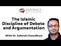

# The Islamic Discipline of Debate and Argumentation with Dr. Safaruk Chowdhury (2020-08-15)

## Description

Hamza Andreas Tzortzis interviews on Dr. Safaruk Chowdhury on the Islamic discipline of debate and argumentation.

In this interview Dr. Chowdhury discusses the content of the new book he has translated and annotated, “A Treatise on Disputation and Argument: Risālat al-Ādāb Fī ʿIlm al-Baḥth wa’l-Munāẓara”. Written by Shaykh Aḥmad b. Khalīl Taşköprüzāde this book covers the etiquette of debates, various types of logic, Quranic and Prophetic argumentation, logical fallacies and more.

You can purchase the book here: https://www.amazon.co.uk/Treatise-Disputation-Argument-al-Baḥth-wal-Munāẓara/dp/B08DT1FMVP.

## Summary of [The Islamic Discipline of Debate and Argumentation with Dr. Safaruk Chowdhury](https://www.youtube.com/watch?v=VgFH2Qr7WP0)

*This summary is AI generated - there may be inaccuracies. *

### [00:00:00](https://www.youtube.com/watch?v=VgFH2Qr7WP0&t=0) - [01:00:00](https://www.youtube.com/watch?v=VgFH2Qr7WP0&t=3600)

 discusses the Islamic discipline of debate and argumentation, which Dr. Safaruk Chowdhury views as essential for engaging and empowering Muslims to think critically about Islam. He discusses the importance of translating and annotating the book, and how it fills a gap in the kind of outreach available to Muslims.

**[00:00:00](https://www.youtube.com/watch?v=VgFH2Qr7WP0&t=0)** Dr. Safaruk Chowdhury discusses the Islamic Discipline of Debate and Argumentation, which he views as essential for engaging and empowering Muslims to think critically about Islam. He discusses the importance of translating and annotating the book, and how it fills a gap in the kind of outreach available to Muslims.
* **[00:05:00](https://www.youtube.com/watch?v=VgFH2Qr7WP0&t=300)** Dr. Safaruk Chowdhury discusses the Islamic discipline of debate and argumentation, noting that the goal is to find the truth. He points out that debates have an epistemic goal, which is to account for the truth.
* **[00:10:00](https://www.youtube.com/watch?v=VgFH2Qr7WP0&t=600)** Safaruk Chowdhury discusses the Islamic discipline of debate and argumentation, which has a social goal of increasing faith in Muslims. He recalls a debate he had with Professor Lawrence Krauss many years ago, and how it increased the iman of some students. He goes on to say that the discipline of debate and argumentation also has social impact, as it is a part of Islamic societies' social interactions. Finally, he provides a definition of bath, and explains that it refers to the principles by which a person arrives at or avoids errors in debate.
* **[00:15:00](https://www.youtube.com/watch?v=VgFH2Qr7WP0&t=900)** Dr. Safaruk Chowdhury discusses the importance of using logic in debates and discussions, giving example of a syllogistic argument.
* **[00:20:00](https://www.youtube.com/watch?v=VgFH2Qr7WP0&t=1200)* Discusses the basics of logic, including syllogism, predicate logic, and modal logic. It also covers how these concepts can be used in debate and other forms of communication.
* **[00:25:00](https://www.youtube.com/watch?v=VgFH2Qr7WP0&t=1500)** Dr. Safaruk Chowdhury discusses how the Islamic tradition recognizes the value of logical arguments and how the Qur'an contains logical structures. He also points out that the Qur'an can be used to support various logical arguments.
* **[00:30:00](https://www.youtube.com/watch?v=VgFH2Qr7WP0&t=1800)** Dr. Safaruk Chowdhury discusses the Islamic doctrine of argumentation and debate, explaining that if an object has the power over sunrise, then that object is considered to be God. He goes on to discuss various logical Fallacies, including the slippery slope fallacy and the hasty generalization fallacy.
* **[00:35:00](https://www.youtube.com/watch?v=VgFH2Qr7WP0&t=2100)* Discusses the Islamic discipline of debate and argumentation, which emphasizes the importance of correctly reasoning in order to reach truth. Fallacies, which are incorrect arguments, can befall anyone, regardless of their level of experience or expertise in logic.
* **[00:40:00](https://www.youtube.com/watch?v=VgFH2Qr7WP0&t=2400)** The fallacy of inflation of conflict is a logical fallacy that says that because two people differ on a particular issue, they cannot say anything meaningful about that issue.
* **[00:45:00](https://www.youtube.com/watch?v=VgFH2Qr7WP0&t=2700)** Islamic etiquette dictates that debates between scholars be conducted in a respectful and dignified manner, and that one should avoid debating people who are considered "yani" or respectful and dignified.
* **[00:50:00](https://www.youtube.com/watch?v=VgFH2Qr7WP0&t=3000)** The Islamic Discipline of Debate and Argumentation with Dr. Safaruk Chowdhury discusses the quranic method of argumentation, which is different from philosophical argumentation. Additionally, the video discusses features of Quranic argumentation, such as its appeal to the intellect and emotions, and its use of evidence. Finally, the video discusses the Islamic view of debates with non-Muslim interlocutors, stressing that they must be treated with respect.
* **[00:55:00](https://www.youtube.com/watch?v=VgFH2Qr7WP0&t=3300)** The Islamic discipline of debate and argumentation is a powerful way to communicate religious beliefs to those who may not be receptive to them. Dr. Safaruk Chowdhury discusses various styles of argument used in the Quran and the Prophet Muhammad's methodology for using them.
### [01:00:00](https://www.youtube.com/watch?v=VgFH2Qr7WP0&t=3600) - [01:10:00](https://www.youtube.com/watch?v=VgFH2Qr7WP0&t=4200)

The Islamic discipline of debate and argumentation is a way to help people learn about the differences between philosophical arguments and Quranic arguments.  Dr. Safaruk Chowdhury discusses the nature of Islamic argumentation and how it differs from philosophical argumentation. He also explains how the Quran came to agitate people's fitra (inner sense of righteousness or balance).

**[01:00:00](https://www.youtube.com/watch?v=VgFH2Qr7WP0&t=3600)** The Islamic discipline of debate and argumentation is a way to help people learn about the differences between philosophical arguments and Quranic arguments.  Dr. Safaruk Chowdhury discusses the nature of Islamic argumentation and how it differs from philosophical argumentation. He also explains how the Quran came to agitate people's fitra (inner sense of righteousness or balance).
* **[01:05:00](https://www.youtube.com/watch?v=VgFH2Qr7WP0&t=3900)** advises Muslims to avoid debating unless it is absolutely necessary, and to be sincere in their arguments. He also advises Muslims to avoid debating abstract concepts, and to use argumentation and dialogue to deliver the truth.
* **[01:10:00](https://www.youtube.com/watch?v=VgFH2Qr7WP0&t=4200)** The Islamic discipline of debate and argumentation is important for showing the intellectual side of Islam to the people, but must be done with sincerity and with regard to the well-being of others. Dr. Safaruk Chowdhury provides advice on how to do this in his book, "The Islamic Discipline of Debate and Argumentation."

<h2>Full transcript with timestamps: CLICK TO EXPAND</h2>

[0:00:04](https://youtu.be/VgFH2Qr7WP0?t=4) brothers and sisters and friends and  
[0:00:06](https://youtu.be/VgFH2Qr7WP0?t=6) welcome to the sapience institute  
[0:00:09](https://youtu.be/VgFH2Qr7WP0?t=9) youtube channel welcome to this live  
[0:00:11](https://youtu.be/VgFH2Qr7WP0?t=11) stream  
[0:00:12](https://youtu.be/VgFH2Qr7WP0?t=12) and with me i have a very very special  
[0:00:14](https://youtu.be/VgFH2Qr7WP0?t=14) guest  
[0:00:15](https://youtu.be/VgFH2Qr7WP0?t=15) i'm not only saying that because he's  
[0:00:17](https://youtu.be/VgFH2Qr7WP0?t=17) special because he's close to my my  
[0:00:18](https://youtu.be/VgFH2Qr7WP0?t=18) heart i've known him for i think over 15  
[0:00:21](https://youtu.be/VgFH2Qr7WP0?t=21) years now  
[0:00:22](https://youtu.be/VgFH2Qr7WP0?t=22) and he's been a huge influence in my  
[0:00:25](https://youtu.be/VgFH2Qr7WP0?t=25) development and progression  
[0:00:26](https://youtu.be/VgFH2Qr7WP0?t=26) i've mentioned him in my book he was  
[0:00:28](https://youtu.be/VgFH2Qr7WP0?t=28) instrumental  
[0:00:29](https://youtu.be/VgFH2Qr7WP0?t=29) with regards to various of my book the  
[0:00:32](https://youtu.be/VgFH2Qr7WP0?t=32) divine reality especially  
[0:00:34](https://youtu.be/VgFH2Qr7WP0?t=34) the the update or the chapter on god's  
[0:00:37](https://youtu.be/VgFH2Qr7WP0?t=37) testimony on trying to articulate  
[0:00:39](https://youtu.be/VgFH2Qr7WP0?t=39) a kind of robust case for why the quran  
[0:00:42](https://youtu.be/VgFH2Qr7WP0?t=42) is from  
[0:00:44](https://youtu.be/VgFH2Qr7WP0?t=44) from a linguistic point of view but with  
[0:00:46](https://youtu.be/VgFH2Qr7WP0?t=46) the idea that the person reading it  
[0:00:48](https://youtu.be/VgFH2Qr7WP0?t=48) doesn't need to know anything about the  
[0:00:49](https://youtu.be/VgFH2Qr7WP0?t=49) arabic language so we used inference of  
[0:00:51](https://youtu.be/VgFH2Qr7WP0?t=51) the  
[0:00:52](https://youtu.be/VgFH2Qr7WP0?t=52) explanation and we used the epistemology  
[0:00:55](https://youtu.be/VgFH2Qr7WP0?t=55) of testimony  
[0:00:56](https://youtu.be/VgFH2Qr7WP0?t=56) and there was such a headache point  
[0:00:59](https://youtu.be/VgFH2Qr7WP0?t=59) about al-muttanabbi  
[0:01:00](https://youtu.be/VgFH2Qr7WP0?t=60) and i remember calling dr saf and i was  
[0:01:02](https://youtu.be/VgFH2Qr7WP0?t=62) like my head was basically spinning and  
[0:01:04](https://youtu.be/VgFH2Qr7WP0?t=64) alhamdulillah  
[0:01:06](https://youtu.be/VgFH2Qr7WP0?t=66) he solved that problem so while i bless  
[0:01:08](https://youtu.be/VgFH2Qr7WP0?t=68) him and you know we've been around for  
[0:01:11](https://youtu.be/VgFH2Qr7WP0?t=71) for over a decade alhamdulillah and  
[0:01:13](https://youtu.be/VgFH2Qr7WP0?t=73) masha'allah to see him progress  
[0:01:14](https://youtu.be/VgFH2Qr7WP0?t=74) phenomenal so for those who don't know  
[0:01:16](https://youtu.be/VgFH2Qr7WP0?t=76) let me just introduce dr safrik  
[0:01:18](https://youtu.be/VgFH2Qr7WP0?t=78) chowdhury so he's a  
[0:01:20](https://youtu.be/VgFH2Qr7WP0?t=80) teacher examiner and educational  
[0:01:23](https://youtu.be/VgFH2Qr7WP0?t=83) consultant  
[0:01:24](https://youtu.be/VgFH2Qr7WP0?t=84) is already a research fellow at the ibm  
[0:01:27](https://youtu.be/VgFH2Qr7WP0?t=87) center of excellence for grammar  
[0:01:29](https://youtu.be/VgFH2Qr7WP0?t=89) research  
[0:01:30](https://youtu.be/VgFH2Qr7WP0?t=90) and senior instructor at whitebread  
[0:01:32](https://youtu.be/VgFH2Qr7WP0?t=92) institute  
[0:01:33](https://youtu.be/VgFH2Qr7WP0?t=93) he studied philosophy at king college  
[0:01:35](https://youtu.be/VgFH2Qr7WP0?t=95) london  
[0:01:36](https://youtu.be/VgFH2Qr7WP0?t=96) and islamic studies at al asari  
[0:01:38](https://youtu.be/VgFH2Qr7WP0?t=98) university in cairo before completing  
[0:01:40](https://youtu.be/VgFH2Qr7WP0?t=100) his masters  
[0:01:42](https://youtu.be/VgFH2Qr7WP0?t=102) by the way his masters i believe was on  
[0:01:44](https://youtu.be/VgFH2Qr7WP0?t=104) logic in the quran  
[0:01:46](https://youtu.be/VgFH2Qr7WP0?t=106) referring to ali ghazali and his masters  
[0:01:48](https://youtu.be/VgFH2Qr7WP0?t=108) was like half a phd i just thought i'd  
[0:01:50](https://youtu.be/VgFH2Qr7WP0?t=110) let that  
[0:01:50](https://youtu.be/VgFH2Qr7WP0?t=110) let everyone know and he received his  
[0:01:54](https://youtu.be/VgFH2Qr7WP0?t=114) phd at the school of oriental african  
[0:01:56](https://youtu.be/VgFH2Qr7WP0?t=116) studies in london  
[0:01:57](https://youtu.be/VgFH2Qr7WP0?t=117) he is the author author of a sufi  
[0:02:00](https://youtu.be/VgFH2Qr7WP0?t=120) apology  
[0:02:01](https://youtu.be/VgFH2Qr7WP0?t=121) of nishapur the life and thoughts of  
[0:02:06](https://youtu.be/VgFH2Qr7WP0?t=126) sulaimi 2019 and he's got a forthcoming  
[0:02:09](https://youtu.be/VgFH2Qr7WP0?t=129) book coming out which is called the  
[0:02:11](https://youtu.be/VgFH2Qr7WP0?t=131) problem of evil  
[0:02:12](https://youtu.be/VgFH2Qr7WP0?t=132) in islamic theology in actual fact i was  
[0:02:15](https://youtu.be/VgFH2Qr7WP0?t=135) looking at one of his videos he was  
[0:02:18](https://youtu.be/VgFH2Qr7WP0?t=138) looking into  
[0:02:19](https://youtu.be/VgFH2Qr7WP0?t=139) the material school of creed  
[0:02:22](https://youtu.be/VgFH2Qr7WP0?t=142) and he's trying to find uh figure out on  
[0:02:24](https://youtu.be/VgFH2Qr7WP0?t=144) how to solve the problem of animal  
[0:02:26](https://youtu.be/VgFH2Qr7WP0?t=146) suffering i believe  
[0:02:28](https://youtu.be/VgFH2Qr7WP0?t=148) uh i haven't finished it yet but i  
[0:02:29](https://youtu.be/VgFH2Qr7WP0?t=149) thought it was very very very insightful  
[0:02:32](https://youtu.be/VgFH2Qr7WP0?t=152) so today we're going to be talking about  
[0:02:34](https://youtu.be/VgFH2Qr7WP0?t=154) this it's a new book  
[0:02:36](https://youtu.be/VgFH2Qr7WP0?t=156) alhamdulillah it's a treatise on  
[0:02:39](https://youtu.be/VgFH2Qr7WP0?t=159) disputation and argument  
[0:02:41](https://youtu.be/VgFH2Qr7WP0?t=161) and it is by the ottoman i believe  
[0:02:48](https://youtu.be/VgFH2Qr7WP0?t=168) i think that's how you pronounce his his  
[0:02:50](https://youtu.be/VgFH2Qr7WP0?t=170) name now  
[0:02:52](https://youtu.be/VgFH2Qr7WP0?t=172) doctor suffolk chaudhary basically what  
[0:02:53](https://youtu.be/VgFH2Qr7WP0?t=173) he's done he's translated the text  
[0:02:56](https://youtu.be/VgFH2Qr7WP0?t=176) and he's also extensively annotated the  
[0:02:58](https://youtu.be/VgFH2Qr7WP0?t=178) text  
[0:02:59](https://youtu.be/VgFH2Qr7WP0?t=179) and when he basically shared this with  
[0:03:01](https://youtu.be/VgFH2Qr7WP0?t=181) me i was like wow i bought 10 copies so  
[0:03:03](https://youtu.be/VgFH2Qr7WP0?t=183) inshallah please buy your copy we're  
[0:03:05](https://youtu.be/VgFH2Qr7WP0?t=185) going to put the link or the amazon link  
[0:03:07](https://youtu.be/VgFH2Qr7WP0?t=187) um somewhere on on the youtube or the  
[0:03:12](https://youtu.be/VgFH2Qr7WP0?t=192) live stream  
[0:03:13](https://youtu.be/VgFH2Qr7WP0?t=193) and when he send it to me and when i  
[0:03:15](https://youtu.be/VgFH2Qr7WP0?t=195) when i looked at the contents and flick  
[0:03:17](https://youtu.be/VgFH2Qr7WP0?t=197) through  
[0:03:17](https://youtu.be/VgFH2Qr7WP0?t=197) i was like this is phenomenal this is  
[0:03:19](https://youtu.be/VgFH2Qr7WP0?t=199) exactly what we need  
[0:03:21](https://youtu.be/VgFH2Qr7WP0?t=201) this fills a gap in the kind of outreach  
[0:03:25](https://youtu.be/VgFH2Qr7WP0?t=205) the online the offline outreach the kind  
[0:03:27](https://youtu.be/VgFH2Qr7WP0?t=207) of activism  
[0:03:28](https://youtu.be/VgFH2Qr7WP0?t=208) you know we want to you know part of the  
[0:03:30](https://youtu.be/VgFH2Qr7WP0?t=210) objectives of sapience institute  
[0:03:32](https://youtu.be/VgFH2Qr7WP0?t=212) to share islam intellectually  
[0:03:34](https://youtu.be/VgFH2Qr7WP0?t=214) academically and to empower  
[0:03:36](https://youtu.be/VgFH2Qr7WP0?t=216) and motivate others to do so to create  
[0:03:38](https://youtu.be/VgFH2Qr7WP0?t=218) these kind of academic intellectual  
[0:03:39](https://youtu.be/VgFH2Qr7WP0?t=219) activists  
[0:03:40](https://youtu.be/VgFH2Qr7WP0?t=220) to touch move and inspire people and to  
[0:03:43](https://youtu.be/VgFH2Qr7WP0?t=223) work with all sorts of people uh  
[0:03:46](https://youtu.be/VgFH2Qr7WP0?t=226) and muslim organizations and individuals  
[0:03:48](https://youtu.be/VgFH2Qr7WP0?t=228) in order to basically fill those  
[0:03:49](https://youtu.be/VgFH2Qr7WP0?t=229) objectives but when i saw this was like  
[0:03:51](https://youtu.be/VgFH2Qr7WP0?t=231) we need to talk about this so  
[0:03:52](https://youtu.be/VgFH2Qr7WP0?t=232) i know i've spoken too much now but i'm  
[0:03:54](https://youtu.be/VgFH2Qr7WP0?t=234) just gonna be asking the questions so  
[0:03:56](https://youtu.be/VgFH2Qr7WP0?t=236) i'm gonna go on my phone my phone has  
[0:03:58](https://youtu.be/VgFH2Qr7WP0?t=238) notes in it unfortunately the phone now  
[0:04:00](https://youtu.be/VgFH2Qr7WP0?t=240) is an expensive  
[0:04:00](https://youtu.be/VgFH2Qr7WP0?t=240) extension of one consciousness the  
[0:04:03](https://youtu.be/VgFH2Qr7WP0?t=243) memories are not here anymore they're in  
[0:04:04](https://youtu.be/VgFH2Qr7WP0?t=244) the phone  
[0:04:05](https://youtu.be/VgFH2Qr7WP0?t=245) uh so you know  
[0:04:08](https://youtu.be/VgFH2Qr7WP0?t=248) that reminds me actually a funny joke  
[0:04:10](https://youtu.be/VgFH2Qr7WP0?t=250) they asked they asked must  
[0:04:12](https://youtu.be/VgFH2Qr7WP0?t=252) they asked mike tyson what's the secret  
[0:04:15](https://youtu.be/VgFH2Qr7WP0?t=255) for a support for marriage or something  
[0:04:17](https://youtu.be/VgFH2Qr7WP0?t=257) and he said a bad memory  
[0:04:21](https://youtu.be/VgFH2Qr7WP0?t=261) so let me just ask so my memory is on my  
[0:04:23](https://youtu.be/VgFH2Qr7WP0?t=263) phone at the moment alhamdulillah my  
[0:04:25](https://youtu.be/VgFH2Qr7WP0?t=265) mirrors are good as well  
[0:04:26](https://youtu.be/VgFH2Qr7WP0?t=266) so let's go to the questions uh firstly  
[0:04:30](https://youtu.be/VgFH2Qr7WP0?t=270) give salaam to everybody doctor  
[0:04:33](https://youtu.be/VgFH2Qr7WP0?t=273) everyone how are you happy you are i'm  
[0:04:36](https://youtu.be/VgFH2Qr7WP0?t=276) good i'm just so happy to see you i  
[0:04:38](https://youtu.be/VgFH2Qr7WP0?t=278) really i really could tell everyone  
[0:04:39](https://youtu.be/VgFH2Qr7WP0?t=279) everyone could see the excitement in me  
[0:04:41](https://youtu.be/VgFH2Qr7WP0?t=281) um  
[0:04:42](https://youtu.be/VgFH2Qr7WP0?t=282) so let's go straight to the questions in  
[0:04:45](https://youtu.be/VgFH2Qr7WP0?t=285) sha allah  
[0:04:46](https://youtu.be/VgFH2Qr7WP0?t=286) so we have around 11 questions inshallah  
[0:04:48](https://youtu.be/VgFH2Qr7WP0?t=288) we'll be able to cover them all  
[0:04:50](https://youtu.be/VgFH2Qr7WP0?t=290) so the first question i want to ask you  
[0:04:53](https://youtu.be/VgFH2Qr7WP0?t=293) is  
[0:04:53](https://youtu.be/VgFH2Qr7WP0?t=293) why did you translate and annotate the  
[0:04:55](https://youtu.be/VgFH2Qr7WP0?t=295) book and what gap do you think  
[0:04:57](https://youtu.be/VgFH2Qr7WP0?t=297) it feels in the kind of sector that  
[0:04:59](https://youtu.be/VgFH2Qr7WP0?t=299) we're in  
[0:05:01](https://youtu.be/VgFH2Qr7WP0?t=301) all right  
[0:05:07](https://youtu.be/VgFH2Qr7WP0?t=307) it's my delight and pleasure to be on  
[0:05:09](https://youtu.be/VgFH2Qr7WP0?t=309) and thank you for inviting me on yeah i  
[0:05:11](https://youtu.be/VgFH2Qr7WP0?t=311) mean i can't contain my excitement  
[0:05:13](https://youtu.be/VgFH2Qr7WP0?t=313) but you know i've got to stay seated  
[0:05:16](https://youtu.be/VgFH2Qr7WP0?t=316) in the seat properly if i move around  
[0:05:18](https://youtu.be/VgFH2Qr7WP0?t=318) you know it's uh  
[0:05:19](https://youtu.be/VgFH2Qr7WP0?t=319) alhamdulillah it's it's you know  
[0:05:22](https://youtu.be/VgFH2Qr7WP0?t=322) blessing the work that you do  
[0:05:24](https://youtu.be/VgFH2Qr7WP0?t=324) um you know even with the new institute  
[0:05:26](https://youtu.be/VgFH2Qr7WP0?t=326) sapience institute i pray that allah  
[0:05:28](https://youtu.be/VgFH2Qr7WP0?t=328) takes it from strength to strength  
[0:05:29](https://youtu.be/VgFH2Qr7WP0?t=329) um um  
[0:05:33](https://youtu.be/VgFH2Qr7WP0?t=333) and so you know keep that up keep that  
[0:05:35](https://youtu.be/VgFH2Qr7WP0?t=335) up you know how  
[0:05:36](https://youtu.be/VgFH2Qr7WP0?t=336) difficult it is out there in the field  
[0:05:39](https://youtu.be/VgFH2Qr7WP0?t=339) especially that strata of darwin  
[0:05:42](https://youtu.be/VgFH2Qr7WP0?t=342) because it's upper march and so  
[0:05:46](https://youtu.be/VgFH2Qr7WP0?t=346) you know you're better than most you  
[0:05:47](https://youtu.be/VgFH2Qr7WP0?t=347) know it's very different from being in  
[0:05:49](https://youtu.be/VgFH2Qr7WP0?t=349) the  
[0:05:50](https://youtu.be/VgFH2Qr7WP0?t=350) sort of not the low end of the field but  
[0:05:52](https://youtu.be/VgFH2Qr7WP0?t=352) the less intellectually challenging area  
[0:05:55](https://youtu.be/VgFH2Qr7WP0?t=355) of the field so  
[0:05:56](https://youtu.be/VgFH2Qr7WP0?t=356) handler each has its own place isn't it  
[0:05:58](https://youtu.be/VgFH2Qr7WP0?t=358) as you know but  
[0:06:00](https://youtu.be/VgFH2Qr7WP0?t=360) there are levels there are levels so  
[0:06:03](https://youtu.be/VgFH2Qr7WP0?t=363) well i mean  
[0:06:04](https://youtu.be/VgFH2Qr7WP0?t=364) in terms of the first question i mean  
[0:06:08](https://youtu.be/VgFH2Qr7WP0?t=368) i've always um i always try and write  
[0:06:11](https://youtu.be/VgFH2Qr7WP0?t=371) books  
[0:06:11](https://youtu.be/VgFH2Qr7WP0?t=371) i wish i had yeah i always try and write  
[0:06:14](https://youtu.be/VgFH2Qr7WP0?t=374) books  
[0:06:15](https://youtu.be/VgFH2Qr7WP0?t=375) i wish i had and when i was growing up  
[0:06:18](https://youtu.be/VgFH2Qr7WP0?t=378) trying to study islam there was always  
[0:06:21](https://youtu.be/VgFH2Qr7WP0?t=381) certain books  
[0:06:22](https://youtu.be/VgFH2Qr7WP0?t=382) i would wish i had and maybe that would  
[0:06:25](https://youtu.be/VgFH2Qr7WP0?t=385) have helped  
[0:06:26](https://youtu.be/VgFH2Qr7WP0?t=386) in my own development my own  
[0:06:27](https://youtu.be/VgFH2Qr7WP0?t=387) understanding  
[0:06:29](https://youtu.be/VgFH2Qr7WP0?t=389) and ever since i've kind of used that  
[0:06:31](https://youtu.be/VgFH2Qr7WP0?t=391) that motto i want to try and write books  
[0:06:34](https://youtu.be/VgFH2Qr7WP0?t=394) not necessarily academic books but just  
[0:06:36](https://youtu.be/VgFH2Qr7WP0?t=396) try and write  
[0:06:37](https://youtu.be/VgFH2Qr7WP0?t=397) something that i wish i had when i was  
[0:06:40](https://youtu.be/VgFH2Qr7WP0?t=400) trying to develop and learn  
[0:06:42](https://youtu.be/VgFH2Qr7WP0?t=402) islam and so this subject matter  
[0:06:46](https://youtu.be/VgFH2Qr7WP0?t=406) of islamic argumentation or islamic  
[0:06:49](https://youtu.be/VgFH2Qr7WP0?t=409) theory of argumentation and disputation  
[0:06:51](https://youtu.be/VgFH2Qr7WP0?t=411) was one  
[0:06:52](https://youtu.be/VgFH2Qr7WP0?t=412) area i didn't find anything  
[0:06:56](https://youtu.be/VgFH2Qr7WP0?t=416) so short simple within the english  
[0:06:58](https://youtu.be/VgFH2Qr7WP0?t=418) language there may be stuff in arabic  
[0:06:59](https://youtu.be/VgFH2Qr7WP0?t=419) language and  
[0:07:00](https://youtu.be/VgFH2Qr7WP0?t=420) and there are and maybe very simple text  
[0:07:02](https://youtu.be/VgFH2Qr7WP0?t=422) for those who are arabic speaking but  
[0:07:03](https://youtu.be/VgFH2Qr7WP0?t=423) for us  
[0:07:04](https://youtu.be/VgFH2Qr7WP0?t=424) who are you know mainly english-speaking  
[0:07:05](https://youtu.be/VgFH2Qr7WP0?t=425) communities  
[0:07:07](https://youtu.be/VgFH2Qr7WP0?t=427) i didn't have anything it was always  
[0:07:08](https://youtu.be/VgFH2Qr7WP0?t=428) been on my mind to write something  
[0:07:10](https://youtu.be/VgFH2Qr7WP0?t=430) on it um it wasn't it wasn't very good  
[0:07:13](https://youtu.be/VgFH2Qr7WP0?t=433) but at least something out there  
[0:07:15](https://youtu.be/VgFH2Qr7WP0?t=435) so i'm always i've always been  
[0:07:17](https://youtu.be/VgFH2Qr7WP0?t=437) interested in writing books that have  
[0:07:18](https://youtu.be/VgFH2Qr7WP0?t=438) been overlooked or neglected  
[0:07:20](https://youtu.be/VgFH2Qr7WP0?t=440) so one area like balarama wrote a little  
[0:07:23](https://youtu.be/VgFH2Qr7WP0?t=443) lame book on that  
[0:07:25](https://youtu.be/VgFH2Qr7WP0?t=445) um certain areas of fit that not many  
[0:07:27](https://youtu.be/VgFH2Qr7WP0?t=447) people touch on like in  
[0:07:28](https://youtu.be/VgFH2Qr7WP0?t=448) employment things like that so  
[0:07:31](https://youtu.be/VgFH2Qr7WP0?t=451) this is just another one of the books  
[0:07:33](https://youtu.be/VgFH2Qr7WP0?t=453) that i'm trying to  
[0:07:35](https://youtu.be/VgFH2Qr7WP0?t=455) fill a fill a gap or perceive what i see  
[0:07:38](https://youtu.be/VgFH2Qr7WP0?t=458) a perceived gap  
[0:07:40](https://youtu.be/VgFH2Qr7WP0?t=460) and so yeah it's a lost discipline  
[0:07:43](https://youtu.be/VgFH2Qr7WP0?t=463) um a lot some people even said to me  
[0:07:45](https://youtu.be/VgFH2Qr7WP0?t=465) they didn't know there was a theory of  
[0:07:47](https://youtu.be/VgFH2Qr7WP0?t=467) argumentation within the islamic  
[0:07:48](https://youtu.be/VgFH2Qr7WP0?t=468) intellectual  
[0:07:50](https://youtu.be/VgFH2Qr7WP0?t=470) tradition they never knew it existed  
[0:07:52](https://youtu.be/VgFH2Qr7WP0?t=472) they just thought it was a modern  
[0:07:53](https://youtu.be/VgFH2Qr7WP0?t=473) yeah they just knew the modern thing so  
[0:07:56](https://youtu.be/VgFH2Qr7WP0?t=476) my aim was  
[0:07:57](https://youtu.be/VgFH2Qr7WP0?t=477) was to do that and what made me sort of  
[0:07:59](https://youtu.be/VgFH2Qr7WP0?t=479) hurry up with it a bit is um  
[0:08:00](https://youtu.be/VgFH2Qr7WP0?t=480) you know i think last year there were  
[0:08:03](https://youtu.be/VgFH2Qr7WP0?t=483) two  
[0:08:04](https://youtu.be/VgFH2Qr7WP0?t=484) famous uh imams let's say from the  
[0:08:07](https://youtu.be/VgFH2Qr7WP0?t=487) midlands  
[0:08:08](https://youtu.be/VgFH2Qr7WP0?t=488) you know who had a pre-debate um  
[0:08:11](https://youtu.be/VgFH2Qr7WP0?t=491) debate yeah type thing and  
[0:08:14](https://youtu.be/VgFH2Qr7WP0?t=494) um that that got quite heated and  
[0:08:17](https://youtu.be/VgFH2Qr7WP0?t=497) um they're both obviously knowledgeable  
[0:08:19](https://youtu.be/VgFH2Qr7WP0?t=499) but you know one one of the  
[0:08:21](https://youtu.be/VgFH2Qr7WP0?t=501) knowledgeable interlocutors  
[0:08:23](https://youtu.be/VgFH2Qr7WP0?t=503) didn't want to proceed unless they  
[0:08:25](https://youtu.be/VgFH2Qr7WP0?t=505) follow the rules of  
[0:08:26](https://youtu.be/VgFH2Qr7WP0?t=506) what we call monado you know the rules  
[0:08:29](https://youtu.be/VgFH2Qr7WP0?t=509) of debate  
[0:08:30](https://youtu.be/VgFH2Qr7WP0?t=510) and so that triggered in my mind i've  
[0:08:32](https://youtu.be/VgFH2Qr7WP0?t=512) got to get this book finished my notes  
[0:08:34](https://youtu.be/VgFH2Qr7WP0?t=514) were just bit  
[0:08:35](https://youtu.be/VgFH2Qr7WP0?t=515) scatters i thought i've got to put it  
[0:08:36](https://youtu.be/VgFH2Qr7WP0?t=516) together quickly because obviously  
[0:08:39](https://youtu.be/VgFH2Qr7WP0?t=519) it's become notorious now you know  
[0:08:41](https://youtu.be/VgFH2Qr7WP0?t=521) argumentation  
[0:08:42](https://youtu.be/VgFH2Qr7WP0?t=522) this this subject matter has piqued  
[0:08:45](https://youtu.be/VgFH2Qr7WP0?t=525) everyone's interest  
[0:08:47](https://youtu.be/VgFH2Qr7WP0?t=527) uh it's prickly everyone's interested so  
[0:08:48](https://youtu.be/VgFH2Qr7WP0?t=528) i thought let me get it out as soon as i  
[0:08:50](https://youtu.be/VgFH2Qr7WP0?t=530) can and hopefully it can be a benefit  
[0:08:52](https://youtu.be/VgFH2Qr7WP0?t=532) but um the aim really is for general  
[0:08:54](https://youtu.be/VgFH2Qr7WP0?t=534) students and madrasa students to  
[0:08:56](https://youtu.be/VgFH2Qr7WP0?t=536) understand  
[0:08:57](https://youtu.be/VgFH2Qr7WP0?t=537) um the practical purpose of  
[0:09:00](https://youtu.be/VgFH2Qr7WP0?t=540) argumentation and debate  
[0:09:02](https://youtu.be/VgFH2Qr7WP0?t=542) um and what the the epistemological  
[0:09:06](https://youtu.be/VgFH2Qr7WP0?t=546) goal is why are we doing it and the  
[0:09:09](https://youtu.be/VgFH2Qr7WP0?t=549) goal is really you know it's it's  
[0:09:11](https://youtu.be/VgFH2Qr7WP0?t=551) truth-seeking  
[0:09:12](https://youtu.be/VgFH2Qr7WP0?t=552) so um once we find the truth  
[0:09:16](https://youtu.be/VgFH2Qr7WP0?t=556) we submit to it and the argumentation is  
[0:09:18](https://youtu.be/VgFH2Qr7WP0?t=558) supposed to get us there  
[0:09:20](https://youtu.be/VgFH2Qr7WP0?t=560) okay good  
[0:09:23](https://youtu.be/VgFH2Qr7WP0?t=563) just to add to that would you say as  
[0:09:26](https://youtu.be/VgFH2Qr7WP0?t=566) well at the same time because of the  
[0:09:28](https://youtu.be/VgFH2Qr7WP0?t=568) social context that we live in  
[0:09:29](https://youtu.be/VgFH2Qr7WP0?t=569) yes debates have an epistemic goal  
[0:09:32](https://youtu.be/VgFH2Qr7WP0?t=572) meaning that we want to  
[0:09:33](https://youtu.be/VgFH2Qr7WP0?t=573) account for the truth you know the  
[0:09:35](https://youtu.be/VgFH2Qr7WP0?t=575) famous statement of  
[0:09:36](https://youtu.be/VgFH2Qr7WP0?t=576) imam shafi'i may allah have met on him  
[0:09:38](https://youtu.be/VgFH2Qr7WP0?t=578) when he would pray that the truth would  
[0:09:40](https://youtu.be/VgFH2Qr7WP0?t=580) come  
[0:09:41](https://youtu.be/VgFH2Qr7WP0?t=581) through the mouth and the words of his  
[0:09:43](https://youtu.be/VgFH2Qr7WP0?t=583) interco intellectual which shows a lot  
[0:09:45](https://youtu.be/VgFH2Qr7WP0?t=585) of  
[0:09:46](https://youtu.be/VgFH2Qr7WP0?t=586) sincerity but this is within the context  
[0:09:50](https://youtu.be/VgFH2Qr7WP0?t=590) of course within a in a intra-muslim  
[0:09:53](https://youtu.be/VgFH2Qr7WP0?t=593) discussion context but also from a  
[0:09:56](https://youtu.be/VgFH2Qr7WP0?t=596) context of debating  
[0:09:57](https://youtu.be/VgFH2Qr7WP0?t=597) people outside of islam not only has it  
[0:10:00](https://youtu.be/VgFH2Qr7WP0?t=600) an epistemic  
[0:10:02](https://youtu.be/VgFH2Qr7WP0?t=602) goal but it has a social goal it shows  
[0:10:06](https://youtu.be/VgFH2Qr7WP0?t=606) the kind of veracity of islam  
[0:10:08](https://youtu.be/VgFH2Qr7WP0?t=608) even when i remember when i had a debate  
[0:10:09](https://youtu.be/VgFH2Qr7WP0?t=609) with professor lawrence krauss  
[0:10:11](https://youtu.be/VgFH2Qr7WP0?t=611) many young students they the iman  
[0:10:15](https://youtu.be/VgFH2Qr7WP0?t=615) was increased or they had more faith  
[0:10:18](https://youtu.be/VgFH2Qr7WP0?t=618) they probably didn't understand many of  
[0:10:20](https://youtu.be/VgFH2Qr7WP0?t=620) the arguments but because someone was on  
[0:10:21](https://youtu.be/VgFH2Qr7WP0?t=621) a platform  
[0:10:23](https://youtu.be/VgFH2Qr7WP0?t=623) someone was doing it was the perfect  
[0:10:25](https://youtu.be/VgFH2Qr7WP0?t=625) time for recall  
[0:10:27](https://youtu.be/VgFH2Qr7WP0?t=627) you know as a social performance yeah  
[0:10:31](https://youtu.be/VgFH2Qr7WP0?t=631) that's the point so the point is it also  
[0:10:33](https://youtu.be/VgFH2Qr7WP0?t=633) has social  
[0:10:36](https://youtu.be/VgFH2Qr7WP0?t=636) impact as well at the same time right  
[0:10:38](https://youtu.be/VgFH2Qr7WP0?t=638) definitely  
[0:10:40](https://youtu.be/VgFH2Qr7WP0?t=640) strategic yeah yeah that's right and if  
[0:10:43](https://youtu.be/VgFH2Qr7WP0?t=643) you look at anyone who knows  
[0:10:44](https://youtu.be/VgFH2Qr7WP0?t=644) uh familiar with this history will know  
[0:10:46](https://youtu.be/VgFH2Qr7WP0?t=646) that there were public debates held  
[0:10:48](https://youtu.be/VgFH2Qr7WP0?t=648) in the courts of the rulers things that  
[0:10:51](https://youtu.be/VgFH2Qr7WP0?t=651) so  
[0:10:51](https://youtu.be/VgFH2Qr7WP0?t=651) it was a part it was a feature of  
[0:10:55](https://youtu.be/VgFH2Qr7WP0?t=655) in social interaction within muslim  
[0:10:57](https://youtu.be/VgFH2Qr7WP0?t=657) societies islamic society so  
[0:10:59](https://youtu.be/VgFH2Qr7WP0?t=659) yeah so my aim was to try and plug that  
[0:11:02](https://youtu.be/VgFH2Qr7WP0?t=662) gap where i felt  
[0:11:03](https://youtu.be/VgFH2Qr7WP0?t=663) well there was a perceived gap but there  
[0:11:06](https://youtu.be/VgFH2Qr7WP0?t=666) was nothing out there that's just  
[0:11:07](https://youtu.be/VgFH2Qr7WP0?t=667) sort of basic um that just sets out the  
[0:11:11](https://youtu.be/VgFH2Qr7WP0?t=671) rules  
[0:11:12](https://youtu.be/VgFH2Qr7WP0?t=672) of debate and the etiquettes of debate  
[0:11:15](https://youtu.be/VgFH2Qr7WP0?t=675) yeah so that was my aim to try and get  
[0:11:17](https://youtu.be/VgFH2Qr7WP0?t=677) something out  
[0:11:18](https://youtu.be/VgFH2Qr7WP0?t=678) um on a bottom footing and then those  
[0:11:21](https://youtu.be/VgFH2Qr7WP0?t=681) who like it or you know want to take it  
[0:11:23](https://youtu.be/VgFH2Qr7WP0?t=683) further can do a better job and you know  
[0:11:25](https://youtu.be/VgFH2Qr7WP0?t=685) maybe go on to higher higher works in in  
[0:11:28](https://youtu.be/VgFH2Qr7WP0?t=688) the field  
[0:11:30](https://youtu.be/VgFH2Qr7WP0?t=690) but even skimming through this doctor  
[0:11:31](https://youtu.be/VgFH2Qr7WP0?t=691) what i've noticed is  
[0:11:33](https://youtu.be/VgFH2Qr7WP0?t=693) that you know you go through for example  
[0:11:35](https://youtu.be/VgFH2Qr7WP0?t=695) logical fallacies  
[0:11:36](https://youtu.be/VgFH2Qr7WP0?t=696) you go from different different forms of  
[0:11:39](https://youtu.be/VgFH2Qr7WP0?t=699) logic  
[0:11:40](https://youtu.be/VgFH2Qr7WP0?t=700) now i would probably argue with you now  
[0:11:42](https://youtu.be/VgFH2Qr7WP0?t=702) or not argue agree with you  
[0:11:44](https://youtu.be/VgFH2Qr7WP0?t=704) if i'm assuming that you you you affirm  
[0:11:47](https://youtu.be/VgFH2Qr7WP0?t=707) this point as well  
[0:11:48](https://youtu.be/VgFH2Qr7WP0?t=708) that many who engage in debate and  
[0:11:50](https://youtu.be/VgFH2Qr7WP0?t=710) dialogue  
[0:11:52](https://youtu.be/VgFH2Qr7WP0?t=712) they don't know basic logical fallacies  
[0:11:55](https://youtu.be/VgFH2Qr7WP0?t=715) they don't know for example how to make  
[0:11:56](https://youtu.be/VgFH2Qr7WP0?t=716) a valid inference  
[0:11:58](https://youtu.be/VgFH2Qr7WP0?t=718) they don't know how to make a valid  
[0:12:00](https://youtu.be/VgFH2Qr7WP0?t=720) deductive argument for instance or  
[0:12:02](https://youtu.be/VgFH2Qr7WP0?t=722) the different modes of logic which are  
[0:12:03](https://youtu.be/VgFH2Qr7WP0?t=723) very important important in articulating  
[0:12:06](https://youtu.be/VgFH2Qr7WP0?t=726) an argument  
[0:12:07](https://youtu.be/VgFH2Qr7WP0?t=727) and putting an argument together and  
[0:12:09](https://youtu.be/VgFH2Qr7WP0?t=729) sometimes we think we have won over our  
[0:12:11](https://youtu.be/VgFH2Qr7WP0?t=731) opponent but in actual fact  
[0:12:12](https://youtu.be/VgFH2Qr7WP0?t=732) we've missed our key premise or we  
[0:12:15](https://youtu.be/VgFH2Qr7WP0?t=735) haven't made the necessary logical link  
[0:12:17](https://youtu.be/VgFH2Qr7WP0?t=737) and this is why when you put this in  
[0:12:19](https://youtu.be/VgFH2Qr7WP0?t=739) your book i found it i thought it was  
[0:12:21](https://youtu.be/VgFH2Qr7WP0?t=741) fantastic it was fascinating that  
[0:12:23](https://youtu.be/VgFH2Qr7WP0?t=743) exactly what we need so moving to the  
[0:12:26](https://youtu.be/VgFH2Qr7WP0?t=746) second question so what does  
[0:12:28](https://youtu.be/VgFH2Qr7WP0?t=748) what does mean like in a kind of islamic  
[0:12:31](https://youtu.be/VgFH2Qr7WP0?t=751) intellectual theological context oh all  
[0:12:34](https://youtu.be/VgFH2Qr7WP0?t=754) right  
[0:12:34](https://youtu.be/VgFH2Qr7WP0?t=754) so um well the the the discipline  
[0:12:38](https://youtu.be/VgFH2Qr7WP0?t=758) is is a combination of um  
[0:12:43](https://youtu.be/VgFH2Qr7WP0?t=763) so the word bath in arabic generally  
[0:12:46](https://youtu.be/VgFH2Qr7WP0?t=766) means or comes from the root that means  
[0:12:48](https://youtu.be/VgFH2Qr7WP0?t=768) like  
[0:12:49](https://youtu.be/VgFH2Qr7WP0?t=769) to to examine to investigate  
[0:12:59](https://youtu.be/VgFH2Qr7WP0?t=779) it comes from the root of of  
[0:13:02](https://youtu.be/VgFH2Qr7WP0?t=782) which obviously means to to see it  
[0:13:04](https://youtu.be/VgFH2Qr7WP0?t=784) something to gaze at something but it  
[0:13:06](https://youtu.be/VgFH2Qr7WP0?t=786) also means to like  
[0:13:08](https://youtu.be/VgFH2Qr7WP0?t=788) rationally rationally investigate to  
[0:13:11](https://youtu.be/VgFH2Qr7WP0?t=791) explore to examine  
[0:13:13](https://youtu.be/VgFH2Qr7WP0?t=793) so put together those two words  
[0:13:16](https://youtu.be/VgFH2Qr7WP0?t=796) a a definition given by those in the  
[0:13:20](https://youtu.be/VgFH2Qr7WP0?t=800) field  
[0:13:20](https://youtu.be/VgFH2Qr7WP0?t=800) is something like um  
[0:13:31](https://youtu.be/VgFH2Qr7WP0?t=811) so um the science this discipline  
[0:13:34](https://youtu.be/VgFH2Qr7WP0?t=814) is the principles by which you arrive  
[0:13:38](https://youtu.be/VgFH2Qr7WP0?t=818) at or by which you know how to avoid  
[0:13:41](https://youtu.be/VgFH2Qr7WP0?t=821) error in debate  
[0:13:43](https://youtu.be/VgFH2Qr7WP0?t=823) so this science is supposed this  
[0:13:45](https://youtu.be/VgFH2Qr7WP0?t=825) discipline is supposed to give you  
[0:13:48](https://youtu.be/VgFH2Qr7WP0?t=828) the tools by which to avoid making  
[0:13:51](https://youtu.be/VgFH2Qr7WP0?t=831) errors in debate  
[0:13:52](https://youtu.be/VgFH2Qr7WP0?t=832) so munavala is like what we're like two  
[0:13:54](https://youtu.be/VgFH2Qr7WP0?t=834) people who are  
[0:13:56](https://youtu.be/VgFH2Qr7WP0?t=836) having exchange having an exchange of  
[0:13:59](https://youtu.be/VgFH2Qr7WP0?t=839) views  
[0:14:00](https://youtu.be/VgFH2Qr7WP0?t=840) so to arrive at to arrive at the truth  
[0:14:04](https://youtu.be/VgFH2Qr7WP0?t=844) whereas that's different from uh  
[0:14:07](https://youtu.be/VgFH2Qr7WP0?t=847) mujahidella  
[0:14:08](https://youtu.be/VgFH2Qr7WP0?t=848) so mujahide is because it's this kind of  
[0:14:11](https://youtu.be/VgFH2Qr7WP0?t=851) inheritance from the greeks you could  
[0:14:12](https://youtu.be/VgFH2Qr7WP0?t=852) say  
[0:14:14](https://youtu.be/VgFH2Qr7WP0?t=854) is two people having an exchange but not  
[0:14:17](https://youtu.be/VgFH2Qr7WP0?t=857) to seek truth necessarily that's not the  
[0:14:19](https://youtu.be/VgFH2Qr7WP0?t=859) epistemic goal rather it's  
[0:14:21](https://youtu.be/VgFH2Qr7WP0?t=861) me to win the debate so i'll do you over  
[0:14:25](https://youtu.be/VgFH2Qr7WP0?t=865) because i'm more eloquent than you or  
[0:14:27](https://youtu.be/VgFH2Qr7WP0?t=867) happen to have on the day  
[0:14:30](https://youtu.be/VgFH2Qr7WP0?t=870) i articulate myself in premises stronger  
[0:14:33](https://youtu.be/VgFH2Qr7WP0?t=873) than you  
[0:14:34](https://youtu.be/VgFH2Qr7WP0?t=874) but i may not necessarily be right i may  
[0:14:36](https://youtu.be/VgFH2Qr7WP0?t=876) not found the truth but  
[0:14:37](https://youtu.be/VgFH2Qr7WP0?t=877) i won over you so that's the difference  
[0:14:40](https://youtu.be/VgFH2Qr7WP0?t=880) between yeah  
[0:14:40](https://youtu.be/VgFH2Qr7WP0?t=880) jedel and  
[0:14:42](https://youtu.be/VgFH2Qr7WP0?t=882) [Music]  
[0:14:49](https://youtu.be/VgFH2Qr7WP0?t=889) yeah so would that be  
[0:14:53](https://youtu.be/VgFH2Qr7WP0?t=893) that meaning always because when you  
[0:14:55](https://youtu.be/VgFH2Qr7WP0?t=895) refer to the quran for example i think  
[0:14:57](https://youtu.be/VgFH2Qr7WP0?t=897) it since chapter 16  
[0:14:58](https://youtu.be/VgFH2Qr7WP0?t=898) when allah says and discuss with them  
[0:15:02](https://youtu.be/VgFH2Qr7WP0?t=902) and debate with them in ways that are  
[0:15:04](https://youtu.be/VgFH2Qr7WP0?t=904) better  
[0:15:05](https://youtu.be/VgFH2Qr7WP0?t=905) so are we going to need the quranic word  
[0:15:08](https://youtu.be/VgFH2Qr7WP0?t=908) here  
[0:15:08](https://youtu.be/VgFH2Qr7WP0?t=908) the way that you've just explained it or  
[0:15:10](https://youtu.be/VgFH2Qr7WP0?t=910) are we going to understand it through  
[0:15:12](https://youtu.be/VgFH2Qr7WP0?t=912) for example he comments on this verse  
[0:15:14](https://youtu.be/VgFH2Qr7WP0?t=914) and he says  
[0:15:16](https://youtu.be/VgFH2Qr7WP0?t=916) you argue them in ways that is better  
[0:15:18](https://youtu.be/VgFH2Qr7WP0?t=918) with no gruffness and no harshness  
[0:15:20](https://youtu.be/VgFH2Qr7WP0?t=920) but how did you feel at that point yeah  
[0:15:22](https://youtu.be/VgFH2Qr7WP0?t=922) definitely  
[0:15:23](https://youtu.be/VgFH2Qr7WP0?t=923) um obviously that judder that i  
[0:15:25](https://youtu.be/VgFH2Qr7WP0?t=925) mentioned that  
[0:15:26](https://youtu.be/VgFH2Qr7WP0?t=926) the meaning there was a technical  
[0:15:27](https://youtu.be/VgFH2Qr7WP0?t=927) meaning like so how it's done  
[0:15:29](https://youtu.be/VgFH2Qr7WP0?t=929) within yeah within the kind of technical  
[0:15:32](https://youtu.be/VgFH2Qr7WP0?t=932) um the meaning within the discipline but  
[0:15:35](https://youtu.be/VgFH2Qr7WP0?t=935) allah definitely uses the word as you  
[0:15:36](https://youtu.be/VgFH2Qr7WP0?t=936) mentioned in the ayah  
[0:15:38](https://youtu.be/VgFH2Qr7WP0?t=938) um argue with them in the best way so we  
[0:15:40](https://youtu.be/VgFH2Qr7WP0?t=940) have to have not only  
[0:15:42](https://youtu.be/VgFH2Qr7WP0?t=942) not only must we employ the best proofs  
[0:15:45](https://youtu.be/VgFH2Qr7WP0?t=945) but we have to employ the best day  
[0:15:47](https://youtu.be/VgFH2Qr7WP0?t=947) quorum in delivering that proof  
[0:15:49](https://youtu.be/VgFH2Qr7WP0?t=949) yeah and that's unfortunately something  
[0:15:51](https://youtu.be/VgFH2Qr7WP0?t=951) i sense i'm sure you know you  
[0:15:54](https://youtu.be/VgFH2Qr7WP0?t=954) you know you know much better than many  
[0:15:57](https://youtu.be/VgFH2Qr7WP0?t=957) i think that side is lacking that side  
[0:16:00](https://youtu.be/VgFH2Qr7WP0?t=960) is lacking the decorum with which you  
[0:16:01](https://youtu.be/VgFH2Qr7WP0?t=961) deliver the truth or you deliver your  
[0:16:04](https://youtu.be/VgFH2Qr7WP0?t=964) proofs  
[0:16:04](https://youtu.be/VgFH2Qr7WP0?t=964) yeah yeah and uh well i've learned that  
[0:16:07](https://youtu.be/VgFH2Qr7WP0?t=967) i mean  
[0:16:08](https://youtu.be/VgFH2Qr7WP0?t=968) i've made those mistakes on my own  
[0:16:09](https://youtu.be/VgFH2Qr7WP0?t=969) journey so  
[0:16:11](https://youtu.be/VgFH2Qr7WP0?t=971) i think it's very important for us to  
[0:16:13](https://youtu.be/VgFH2Qr7WP0?t=973) basically be the best ambassadors for  
[0:16:15](https://youtu.be/VgFH2Qr7WP0?t=975) sure i mean today because of social  
[0:16:17](https://youtu.be/VgFH2Qr7WP0?t=977) media  
[0:16:18](https://youtu.be/VgFH2Qr7WP0?t=978) everyone has a platform and that's one  
[0:16:19](https://youtu.be/VgFH2Qr7WP0?t=979) of the unfortunate things  
[0:16:21](https://youtu.be/VgFH2Qr7WP0?t=981) so okay moving on then on the third  
[0:16:23](https://youtu.be/VgFH2Qr7WP0?t=983) question so  
[0:16:26](https://youtu.be/VgFH2Qr7WP0?t=986) so why do you think it's important those  
[0:16:28](https://youtu.be/VgFH2Qr7WP0?t=988) who engage in monothera  
[0:16:30](https://youtu.be/VgFH2Qr7WP0?t=990) in debates and discussions  
[0:16:33](https://youtu.be/VgFH2Qr7WP0?t=993) why do you think it's important for them  
[0:16:35](https://youtu.be/VgFH2Qr7WP0?t=995) to study logic  
[0:16:36](https://youtu.be/VgFH2Qr7WP0?t=996) and if you can give us some examples of  
[0:16:38](https://youtu.be/VgFH2Qr7WP0?t=998) the type of logic that you use in your  
[0:16:40](https://youtu.be/VgFH2Qr7WP0?t=1000) book  
[0:16:41](https://youtu.be/VgFH2Qr7WP0?t=1001) okay so  
[0:16:45](https://youtu.be/VgFH2Qr7WP0?t=1005) now strictly speaking i mean in the  
[0:16:47](https://youtu.be/VgFH2Qr7WP0?t=1007) quran does it make  
[0:16:48](https://youtu.be/VgFH2Qr7WP0?t=1008) a condition to use logic to argue  
[0:16:52](https://youtu.be/VgFH2Qr7WP0?t=1012) yeah um well maybe if we have time i'll  
[0:16:54](https://youtu.be/VgFH2Qr7WP0?t=1014) touch on like the quranic what i  
[0:16:56](https://youtu.be/VgFH2Qr7WP0?t=1016) feel is probably what the chronic method  
[0:16:59](https://youtu.be/VgFH2Qr7WP0?t=1019) of argumentation is but  
[0:17:00](https://youtu.be/VgFH2Qr7WP0?t=1020) it's not a condition in order to argue  
[0:17:02](https://youtu.be/VgFH2Qr7WP0?t=1022) or have a dialogue with someone or  
[0:17:04](https://youtu.be/VgFH2Qr7WP0?t=1024) to have a debate with someone that one  
[0:17:06](https://youtu.be/VgFH2Qr7WP0?t=1026) has marked with logic that's not a  
[0:17:08](https://youtu.be/VgFH2Qr7WP0?t=1028) condition i think that's very clear from  
[0:17:09](https://youtu.be/VgFH2Qr7WP0?t=1029) the quran i think that's very clear from  
[0:17:11](https://youtu.be/VgFH2Qr7WP0?t=1031) the sunnah  
[0:17:12](https://youtu.be/VgFH2Qr7WP0?t=1032) but what why logic is important  
[0:17:16](https://youtu.be/VgFH2Qr7WP0?t=1036) is we need to know the grammar of things  
[0:17:18](https://youtu.be/VgFH2Qr7WP0?t=1038) i can't remember which author  
[0:17:19](https://youtu.be/VgFH2Qr7WP0?t=1039) said that but we need to know the  
[0:17:20](https://youtu.be/VgFH2Qr7WP0?t=1040) grammar of things when you're learning a  
[0:17:21](https://youtu.be/VgFH2Qr7WP0?t=1041) language you need to know the grammar of  
[0:17:22](https://youtu.be/VgFH2Qr7WP0?t=1042) the language  
[0:17:24](https://youtu.be/VgFH2Qr7WP0?t=1044) similarly when you're arguing you need  
[0:17:26](https://youtu.be/VgFH2Qr7WP0?t=1046) to know the grammar  
[0:17:27](https://youtu.be/VgFH2Qr7WP0?t=1047) of the argument um and the grammar of  
[0:17:30](https://youtu.be/VgFH2Qr7WP0?t=1050) the argument in a manner of speaking is  
[0:17:32](https://youtu.be/VgFH2Qr7WP0?t=1052) logic  
[0:17:33](https://youtu.be/VgFH2Qr7WP0?t=1053) so logic is like it is a system that  
[0:17:35](https://youtu.be/VgFH2Qr7WP0?t=1055) tells you  
[0:17:37](https://youtu.be/VgFH2Qr7WP0?t=1057) what follows from what  
[0:17:40](https://youtu.be/VgFH2Qr7WP0?t=1060) so if you make a claim or you make a  
[0:17:42](https://youtu.be/VgFH2Qr7WP0?t=1062) statement or you  
[0:17:43](https://youtu.be/VgFH2Qr7WP0?t=1063) you put forward some proposition  
[0:17:47](https://youtu.be/VgFH2Qr7WP0?t=1067) what is entailed by that proposition or  
[0:17:50](https://youtu.be/VgFH2Qr7WP0?t=1070) what you can deduce or infer from that  
[0:17:52](https://youtu.be/VgFH2Qr7WP0?t=1072) your logic will tell you that or the  
[0:17:54](https://youtu.be/VgFH2Qr7WP0?t=1074) logic will tell you what you can and  
[0:17:55](https://youtu.be/VgFH2Qr7WP0?t=1075) what you can't  
[0:17:56](https://youtu.be/VgFH2Qr7WP0?t=1076) what doors you can enter in through and  
[0:17:58](https://youtu.be/VgFH2Qr7WP0?t=1078) what doors are closed for you  
[0:18:00](https://youtu.be/VgFH2Qr7WP0?t=1080) so i mean so that's very important  
[0:18:03](https://youtu.be/VgFH2Qr7WP0?t=1083) because  
[0:18:03](https://youtu.be/VgFH2Qr7WP0?t=1083) you might infer something which you're  
[0:18:05](https://youtu.be/VgFH2Qr7WP0?t=1085) not allowed to infer from your own claim  
[0:18:08](https://youtu.be/VgFH2Qr7WP0?t=1088) and that's very important that's why  
[0:18:09](https://youtu.be/VgFH2Qr7WP0?t=1089) allah talks about a lot you might  
[0:18:11](https://youtu.be/VgFH2Qr7WP0?t=1091) claim something but you have no right to  
[0:18:14](https://youtu.be/VgFH2Qr7WP0?t=1094) make that claim from the claims you  
[0:18:15](https://youtu.be/VgFH2Qr7WP0?t=1095) already made  
[0:18:16](https://youtu.be/VgFH2Qr7WP0?t=1096) so that's important you need to know  
[0:18:18](https://youtu.be/VgFH2Qr7WP0?t=1098) what route you can take  
[0:18:19](https://youtu.be/VgFH2Qr7WP0?t=1099) in an argumentation or debate or what  
[0:18:22](https://youtu.be/VgFH2Qr7WP0?t=1102) you can't and your logic will tell you  
[0:18:23](https://youtu.be/VgFH2Qr7WP0?t=1103) the other thing is that logic allows you  
[0:18:25](https://youtu.be/VgFH2Qr7WP0?t=1105) to formalize  
[0:18:26](https://youtu.be/VgFH2Qr7WP0?t=1106) your arguments to put them methodically  
[0:18:29](https://youtu.be/VgFH2Qr7WP0?t=1109) in steps  
[0:18:30](https://youtu.be/VgFH2Qr7WP0?t=1110) um and so by putting it methodically in  
[0:18:34](https://youtu.be/VgFH2Qr7WP0?t=1114) steps  
[0:18:35](https://youtu.be/VgFH2Qr7WP0?t=1115) you can now check whether it's valid or  
[0:18:37](https://youtu.be/VgFH2Qr7WP0?t=1117) not  
[0:18:38](https://youtu.be/VgFH2Qr7WP0?t=1118) um and it also allows you to sort of get  
[0:18:40](https://youtu.be/VgFH2Qr7WP0?t=1120) clarity in what you're saying  
[0:18:42](https://youtu.be/VgFH2Qr7WP0?t=1122) so logic is important you know because  
[0:18:45](https://youtu.be/VgFH2Qr7WP0?t=1125) of that  
[0:18:46](https://youtu.be/VgFH2Qr7WP0?t=1126) lots of times we might make arguments  
[0:18:48](https://youtu.be/VgFH2Qr7WP0?t=1128) but we may it may come across  
[0:18:50](https://youtu.be/VgFH2Qr7WP0?t=1130) jumbled it may come across a bit hazard  
[0:18:54](https://youtu.be/VgFH2Qr7WP0?t=1134) or it might it may not come across with  
[0:18:56](https://youtu.be/VgFH2Qr7WP0?t=1136) clarity but once we put it down in steps  
[0:18:59](https://youtu.be/VgFH2Qr7WP0?t=1139) and see what follows from what we can  
[0:19:01](https://youtu.be/VgFH2Qr7WP0?t=1141) get some clarity  
[0:19:02](https://youtu.be/VgFH2Qr7WP0?t=1142) as to what's being said and i think  
[0:19:03](https://youtu.be/VgFH2Qr7WP0?t=1143) that's important that's important  
[0:19:06](https://youtu.be/VgFH2Qr7WP0?t=1146) so in debate our le mans emphasized  
[0:19:09](https://youtu.be/VgFH2Qr7WP0?t=1149) putting  
[0:19:10](https://youtu.be/VgFH2Qr7WP0?t=1150) arguments in a logical form and that's  
[0:19:13](https://youtu.be/VgFH2Qr7WP0?t=1153) primarily the syllogism  
[0:19:14](https://youtu.be/VgFH2Qr7WP0?t=1154) so that's why i think probably the  
[0:19:16](https://youtu.be/VgFH2Qr7WP0?t=1156) largest chapter  
[0:19:18](https://youtu.be/VgFH2Qr7WP0?t=1158) in in the notes part of the support  
[0:19:21](https://youtu.be/VgFH2Qr7WP0?t=1161) material  
[0:19:22](https://youtu.be/VgFH2Qr7WP0?t=1162) is on logic where i go through some sort  
[0:19:25](https://youtu.be/VgFH2Qr7WP0?t=1165) of um  
[0:19:26](https://youtu.be/VgFH2Qr7WP0?t=1166) different types of logic so we've got  
[0:19:28](https://youtu.be/VgFH2Qr7WP0?t=1168) there for example  
[0:19:29](https://youtu.be/VgFH2Qr7WP0?t=1169) yeah so we've got here for example  
[0:19:33](https://youtu.be/VgFH2Qr7WP0?t=1173) page 68 onwards yeah yeah yeah  
[0:19:36](https://youtu.be/VgFH2Qr7WP0?t=1176) so we've got um syllogistic logic so  
[0:19:38](https://youtu.be/VgFH2Qr7WP0?t=1178) syllogistic logic is probably the most  
[0:19:41](https://youtu.be/VgFH2Qr7WP0?t=1181) familiar people would have been waving  
[0:19:43](https://youtu.be/VgFH2Qr7WP0?t=1183) through your own work maybe through  
[0:19:45](https://youtu.be/VgFH2Qr7WP0?t=1185) uh they studied logic themselves so a  
[0:19:48](https://youtu.be/VgFH2Qr7WP0?t=1188) syllogistic logic  
[0:19:49](https://youtu.be/VgFH2Qr7WP0?t=1189) looks at arguments put into three lines  
[0:19:53](https://youtu.be/VgFH2Qr7WP0?t=1193) two premises and a conclusion so if i  
[0:19:55](https://youtu.be/VgFH2Qr7WP0?t=1195) give the audience  
[0:19:57](https://youtu.be/VgFH2Qr7WP0?t=1197) if i give the audience one example um  
[0:20:00](https://youtu.be/VgFH2Qr7WP0?t=1200) so let's say premise one to line one  
[0:20:02](https://youtu.be/VgFH2Qr7WP0?t=1202) premise one  
[0:20:03](https://youtu.be/VgFH2Qr7WP0?t=1203) if god is maximally loving then he must  
[0:20:05](https://youtu.be/VgFH2Qr7WP0?t=1205) be maximally forgiving  
[0:20:08](https://youtu.be/VgFH2Qr7WP0?t=1208) you might know that not joy but this two  
[0:20:11](https://youtu.be/VgFH2Qr7WP0?t=1211) the biblical god is not maximally  
[0:20:13](https://youtu.be/VgFH2Qr7WP0?t=1213) forgiving therefore  
[0:20:15](https://youtu.be/VgFH2Qr7WP0?t=1215) that's the third line the biblical god  
[0:20:18](https://youtu.be/VgFH2Qr7WP0?t=1218) is not maximally  
[0:20:19](https://youtu.be/VgFH2Qr7WP0?t=1219) loving that's the syllogism that gives  
[0:20:22](https://youtu.be/VgFH2Qr7WP0?t=1222) you  
[0:20:22](https://youtu.be/VgFH2Qr7WP0?t=1222) the first premise the second premise and  
[0:20:24](https://youtu.be/VgFH2Qr7WP0?t=1224) a conclusion  
[0:20:26](https://youtu.be/VgFH2Qr7WP0?t=1226) most people when they think of logic  
[0:20:27](https://youtu.be/VgFH2Qr7WP0?t=1227) they think of that  
[0:20:29](https://youtu.be/VgFH2Qr7WP0?t=1229) like yes put it yeah putting into  
[0:20:31](https://youtu.be/VgFH2Qr7WP0?t=1231) syllogism  
[0:20:32](https://youtu.be/VgFH2Qr7WP0?t=1232) so so yeah so you've got to see logistic  
[0:20:36](https://youtu.be/VgFH2Qr7WP0?t=1236) logic then you've got  
[0:20:37](https://youtu.be/VgFH2Qr7WP0?t=1237) predicate logic predicate logic is about  
[0:20:40](https://youtu.be/VgFH2Qr7WP0?t=1240) statements containing things  
[0:20:42](https://youtu.be/VgFH2Qr7WP0?t=1242) um like uh how we describe  
[0:20:46](https://youtu.be/VgFH2Qr7WP0?t=1246) things so if i say zaid is tall  
[0:20:50](https://youtu.be/VgFH2Qr7WP0?t=1250) or amar is sure  
[0:20:54](https://youtu.be/VgFH2Qr7WP0?t=1254) master al-aqsa is a blessed land so  
[0:20:56](https://youtu.be/VgFH2Qr7WP0?t=1256) muslim  
[0:20:57](https://youtu.be/VgFH2Qr7WP0?t=1257) is a subject and the predicate is  
[0:21:01](https://youtu.be/VgFH2Qr7WP0?t=1261) blessed land because i'm qualifying the  
[0:21:03](https://youtu.be/VgFH2Qr7WP0?t=1263) subject al-aqsa with  
[0:21:05](https://youtu.be/VgFH2Qr7WP0?t=1265) the description the predicate blessed  
[0:21:07](https://youtu.be/VgFH2Qr7WP0?t=1267) land  
[0:21:08](https://youtu.be/VgFH2Qr7WP0?t=1268) zaid is tall tall is predicated of zaid  
[0:21:12](https://youtu.be/VgFH2Qr7WP0?t=1272) so that's predicate logic we look at  
[0:21:15](https://youtu.be/VgFH2Qr7WP0?t=1275) statements that describe  
[0:21:16](https://youtu.be/VgFH2Qr7WP0?t=1276) objects um then i think the other  
[0:21:20](https://youtu.be/VgFH2Qr7WP0?t=1280) thing in there is quantificational logic  
[0:21:23](https://youtu.be/VgFH2Qr7WP0?t=1283) quantification logic is when we make  
[0:21:24](https://youtu.be/VgFH2Qr7WP0?t=1284) statements involving all or some  
[0:21:27](https://youtu.be/VgFH2Qr7WP0?t=1287) so if i say all human beings have a  
[0:21:29](https://youtu.be/VgFH2Qr7WP0?t=1289) fitrah  
[0:21:30](https://youtu.be/VgFH2Qr7WP0?t=1290) that all i'm saying that  
[0:21:34](https://youtu.be/VgFH2Qr7WP0?t=1294) whatever a thing is if it is human it  
[0:21:36](https://youtu.be/VgFH2Qr7WP0?t=1296) has a fitra  
[0:21:38](https://youtu.be/VgFH2Qr7WP0?t=1298) um yeah the universal quantifier  
[0:21:43](https://youtu.be/VgFH2Qr7WP0?t=1303) yeah we call that the universe yeah i  
[0:21:46](https://youtu.be/VgFH2Qr7WP0?t=1306) did this for my m.a  
[0:21:47](https://youtu.be/VgFH2Qr7WP0?t=1307) and oh my god i was like it's another  
[0:21:49](https://youtu.be/VgFH2Qr7WP0?t=1309) language  
[0:21:53](https://youtu.be/VgFH2Qr7WP0?t=1313) yeah for me i prefer the philosophy of  
[0:21:55](https://youtu.be/VgFH2Qr7WP0?t=1315) logic  
[0:21:56](https://youtu.be/VgFH2Qr7WP0?t=1316) like why do we even have this stuff in  
[0:21:58](https://youtu.be/VgFH2Qr7WP0?t=1318) the first place  
[0:21:59](https://youtu.be/VgFH2Qr7WP0?t=1319) why why did that necessarily follow but  
[0:22:02](https://youtu.be/VgFH2Qr7WP0?t=1322) in order for me to pass their exam honda  
[0:22:04](https://youtu.be/VgFH2Qr7WP0?t=1324) passed it quite well  
[0:22:05](https://youtu.be/VgFH2Qr7WP0?t=1325) i had to trick my brain i had to trick  
[0:22:07](https://youtu.be/VgFH2Qr7WP0?t=1327) my brain bro  
[0:22:09](https://youtu.be/VgFH2Qr7WP0?t=1329) and to say right these are just the  
[0:22:10](https://youtu.be/VgFH2Qr7WP0?t=1330) rules of the game i'm accepting the  
[0:22:12](https://youtu.be/VgFH2Qr7WP0?t=1332) rules don't talk about the rules don't  
[0:22:14](https://youtu.be/VgFH2Qr7WP0?t=1334) philosophize the rule  
[0:22:16](https://youtu.be/VgFH2Qr7WP0?t=1336) and just do it and i'm telling you it  
[0:22:18](https://youtu.be/VgFH2Qr7WP0?t=1338) was an alien language for me and one  
[0:22:20](https://youtu.be/VgFH2Qr7WP0?t=1340) morning  
[0:22:21](https://youtu.be/VgFH2Qr7WP0?t=1341) i just got it i'll keep on writing out i  
[0:22:23](https://youtu.be/VgFH2Qr7WP0?t=1343) just got it so it is  
[0:22:24](https://youtu.be/VgFH2Qr7WP0?t=1344) it could be quite complicated with the  
[0:22:26](https://youtu.be/VgFH2Qr7WP0?t=1346) uh existential quantify the universal  
[0:22:28](https://youtu.be/VgFH2Qr7WP0?t=1348) quantum  
[0:22:29](https://youtu.be/VgFH2Qr7WP0?t=1349) it's more deep and you have all these  
[0:22:30](https://youtu.be/VgFH2Qr7WP0?t=1350) funny symbols yeah carry on absolutely  
[0:22:33](https://youtu.be/VgFH2Qr7WP0?t=1353) no no but you're right  
[0:22:34](https://youtu.be/VgFH2Qr7WP0?t=1354) yeah it is can be it can be an alien  
[0:22:36](https://youtu.be/VgFH2Qr7WP0?t=1356) language definitely for many and this is  
[0:22:37](https://youtu.be/VgFH2Qr7WP0?t=1357) why lots of people feel comfortable with  
[0:22:39](https://youtu.be/VgFH2Qr7WP0?t=1359) the syllogistic logic because  
[0:22:41](https://youtu.be/VgFH2Qr7WP0?t=1361) you use natural language like you know  
[0:22:43](https://youtu.be/VgFH2Qr7WP0?t=1363) to put it into syllogism you'd have to  
[0:22:44](https://youtu.be/VgFH2Qr7WP0?t=1364) use symbol  
[0:22:46](https://youtu.be/VgFH2Qr7WP0?t=1366) so the other aspect of conservation  
[0:22:47](https://youtu.be/VgFH2Qr7WP0?t=1367) logic is when we use words like sum  
[0:22:49](https://youtu.be/VgFH2Qr7WP0?t=1369) or few so i know some people rejected  
[0:22:52](https://youtu.be/VgFH2Qr7WP0?t=1372) allah's messenger so some  
[0:22:54](https://youtu.be/VgFH2Qr7WP0?t=1374) so in arabic use bard yeah so  
[0:22:58](https://youtu.be/VgFH2Qr7WP0?t=1378) and then you've got something in there i  
[0:23:00](https://youtu.be/VgFH2Qr7WP0?t=1380) think a little short section of modal  
[0:23:02](https://youtu.be/VgFH2Qr7WP0?t=1382) logic  
[0:23:02](https://youtu.be/VgFH2Qr7WP0?t=1382) now modal logic is big modal logic  
[0:23:06](https://youtu.be/VgFH2Qr7WP0?t=1386) is the logic that examines when we use  
[0:23:08](https://youtu.be/VgFH2Qr7WP0?t=1388) words like  
[0:23:09](https://youtu.be/VgFH2Qr7WP0?t=1389) necessary that must necessary  
[0:23:12](https://youtu.be/VgFH2Qr7WP0?t=1392) and possible may be so when we use words  
[0:23:15](https://youtu.be/VgFH2Qr7WP0?t=1395) like that we're using  
[0:23:16](https://youtu.be/VgFH2Qr7WP0?t=1396) modal terms um so if i say it is  
[0:23:19](https://youtu.be/VgFH2Qr7WP0?t=1399) possible that  
[0:23:20](https://youtu.be/VgFH2Qr7WP0?t=1400) i live in mecca this is possible so it's  
[0:23:24](https://youtu.be/VgFH2Qr7WP0?t=1404) possible that  
[0:23:25](https://youtu.be/VgFH2Qr7WP0?t=1405) i don't it is necessary that the whole  
[0:23:28](https://youtu.be/VgFH2Qr7WP0?t=1408) is greater than the parts  
[0:23:30](https://youtu.be/VgFH2Qr7WP0?t=1410) so it must be the case that the whole is  
[0:23:31](https://youtu.be/VgFH2Qr7WP0?t=1411) greater than the parts now why are these  
[0:23:33](https://youtu.be/VgFH2Qr7WP0?t=1413) important  
[0:23:34](https://youtu.be/VgFH2Qr7WP0?t=1414) because in debate or dialogue or any  
[0:23:37](https://youtu.be/VgFH2Qr7WP0?t=1417) form of exchange  
[0:23:39](https://youtu.be/VgFH2Qr7WP0?t=1419) we may be making claims um in these  
[0:23:43](https://youtu.be/VgFH2Qr7WP0?t=1423) forms but we're not realizing it  
[0:23:45](https://youtu.be/VgFH2Qr7WP0?t=1425) so we've got to be careful what we can  
[0:23:47](https://youtu.be/VgFH2Qr7WP0?t=1427) infer from what  
[0:23:48](https://youtu.be/VgFH2Qr7WP0?t=1428) and so this these logic become very very  
[0:23:51](https://youtu.be/VgFH2Qr7WP0?t=1431) important  
[0:23:52](https://youtu.be/VgFH2Qr7WP0?t=1432) but just for those who perhaps are maybe  
[0:23:54](https://youtu.be/VgFH2Qr7WP0?t=1434) about the book or logic is not their  
[0:23:56](https://youtu.be/VgFH2Qr7WP0?t=1436) thing  
[0:23:58](https://youtu.be/VgFH2Qr7WP0?t=1438) you know if you want to skip that  
[0:24:00](https://youtu.be/VgFH2Qr7WP0?t=1440) chapter do  
[0:24:01](https://youtu.be/VgFH2Qr7WP0?t=1441) but i think it's worth worth investing  
[0:24:04](https://youtu.be/VgFH2Qr7WP0?t=1444) some time in  
[0:24:06](https://youtu.be/VgFH2Qr7WP0?t=1446) to be familiar with basic at least  
[0:24:08](https://youtu.be/VgFH2Qr7WP0?t=1448) reduced to syllogistic logic i would say  
[0:24:11](https://youtu.be/VgFH2Qr7WP0?t=1451) yes yes and yeah for me what i found  
[0:24:15](https://youtu.be/VgFH2Qr7WP0?t=1455) very useful  
[0:24:16](https://youtu.be/VgFH2Qr7WP0?t=1456) was when i started to appreciate the  
[0:24:19](https://youtu.be/VgFH2Qr7WP0?t=1459) flow of an argument and how things  
[0:24:21](https://youtu.be/VgFH2Qr7WP0?t=1461) how statements can connect what you can  
[0:24:23](https://youtu.be/VgFH2Qr7WP0?t=1463) infer or do  
[0:24:26](https://youtu.be/VgFH2Qr7WP0?t=1466) you could use it as a code in analyzing  
[0:24:28](https://youtu.be/VgFH2Qr7WP0?t=1468) for example your opponent's  
[0:24:30](https://youtu.be/VgFH2Qr7WP0?t=1470) argument as well for example many  
[0:24:32](https://youtu.be/VgFH2Qr7WP0?t=1472) atheists sometimes  
[0:24:33](https://youtu.be/VgFH2Qr7WP0?t=1473) come out with a hell of a lot of logical  
[0:24:35](https://youtu.be/VgFH2Qr7WP0?t=1475) fallacies concerning religion  
[0:24:37](https://youtu.be/VgFH2Qr7WP0?t=1477) or they infer things that shouldn't be  
[0:24:40](https://youtu.be/VgFH2Qr7WP0?t=1480) inferred  
[0:24:41](https://youtu.be/VgFH2Qr7WP0?t=1481) or they make statements that they can't  
[0:24:43](https://youtu.be/VgFH2Qr7WP0?t=1483) make by virtue of  
[0:24:45](https://youtu.be/VgFH2Qr7WP0?t=1485) you know the logical systems that we  
[0:24:47](https://youtu.be/VgFH2Qr7WP0?t=1487) both agree on  
[0:24:49](https://youtu.be/VgFH2Qr7WP0?t=1489) so it it enables you to understand right  
[0:24:52](https://youtu.be/VgFH2Qr7WP0?t=1492) they've made a statement but behind that  
[0:24:54](https://youtu.be/VgFH2Qr7WP0?t=1494) there is an assumption what is their  
[0:24:55](https://youtu.be/VgFH2Qr7WP0?t=1495) premise  
[0:24:56](https://youtu.be/VgFH2Qr7WP0?t=1496) right and there is an assumption behind  
[0:24:58](https://youtu.be/VgFH2Qr7WP0?t=1498) the premise we could unpack that  
[0:25:00](https://youtu.be/VgFH2Qr7WP0?t=1500) and so it's i think it is very important  
[0:25:02](https://youtu.be/VgFH2Qr7WP0?t=1502) to understand  
[0:25:03](https://youtu.be/VgFH2Qr7WP0?t=1503) things but this leads up to a very  
[0:25:05](https://youtu.be/VgFH2Qr7WP0?t=1505) important question actually which is  
[0:25:06](https://youtu.be/VgFH2Qr7WP0?t=1506) quite controversial in our tradition  
[0:25:08](https://youtu.be/VgFH2Qr7WP0?t=1508) um is what about you know is logic  
[0:25:11](https://youtu.be/VgFH2Qr7WP0?t=1511) anti-quran  
[0:25:12](https://youtu.be/VgFH2Qr7WP0?t=1512) yeah and could you even find some  
[0:25:17](https://youtu.be/VgFH2Qr7WP0?t=1517) forms of logical statements or logical  
[0:25:19](https://youtu.be/VgFH2Qr7WP0?t=1519) arguments  
[0:25:20](https://youtu.be/VgFH2Qr7WP0?t=1520) in the book of allah oh  
[0:25:23](https://youtu.be/VgFH2Qr7WP0?t=1523) now anyone who looks at our history  
[0:25:27](https://youtu.be/VgFH2Qr7WP0?t=1527) our intellectual history will know  
[0:25:29](https://youtu.be/VgFH2Qr7WP0?t=1529) obviously logic  
[0:25:31](https://youtu.be/VgFH2Qr7WP0?t=1531) is a contested science so meaning that  
[0:25:36](https://youtu.be/VgFH2Qr7WP0?t=1536) somewhat especially those who are also  
[0:25:38](https://youtu.be/VgFH2Qr7WP0?t=1538) inclined  
[0:25:39](https://youtu.be/VgFH2Qr7WP0?t=1539) like league of theoreticians  
[0:25:43](https://youtu.be/VgFH2Qr7WP0?t=1543) they didn't have time for monty they  
[0:25:44](https://youtu.be/VgFH2Qr7WP0?t=1544) just said this is this is not  
[0:25:46](https://youtu.be/VgFH2Qr7WP0?t=1546) necessary for um  
[0:25:51](https://youtu.be/VgFH2Qr7WP0?t=1551) deriving it's a foreign discipline  
[0:25:55](https://youtu.be/VgFH2Qr7WP0?t=1555) it's got no use for them so there  
[0:25:59](https://youtu.be/VgFH2Qr7WP0?t=1559) there was a there is a camp and the big  
[0:26:01](https://youtu.be/VgFH2Qr7WP0?t=1561) scholars in that camp  
[0:26:03](https://youtu.be/VgFH2Qr7WP0?t=1563) um you're looking at imam even salah for  
[0:26:05](https://youtu.be/VgFH2Qr7WP0?t=1565) example the great mohaddiv  
[0:26:07](https://youtu.be/VgFH2Qr7WP0?t=1567) obviously you've got as well islam even  
[0:26:10](https://youtu.be/VgFH2Qr7WP0?t=1570) tamiya  
[0:26:11](https://youtu.be/VgFH2Qr7WP0?t=1571) on that side who generally push back  
[0:26:13](https://youtu.be/VgFH2Qr7WP0?t=1573) against  
[0:26:14](https://youtu.be/VgFH2Qr7WP0?t=1574) greek logic although he wasn't against  
[0:26:16](https://youtu.be/VgFH2Qr7WP0?t=1576) logic per se  
[0:26:18](https://youtu.be/VgFH2Qr7WP0?t=1578) he just didn't like um  
[0:26:21](https://youtu.be/VgFH2Qr7WP0?t=1581) the way logic was being you know  
[0:26:23](https://youtu.be/VgFH2Qr7WP0?t=1583) inflated into like some big bad boy so  
[0:26:25](https://youtu.be/VgFH2Qr7WP0?t=1585) he  
[0:26:26](https://youtu.be/VgFH2Qr7WP0?t=1586) just he wanted to deflate that um  
[0:26:29](https://youtu.be/VgFH2Qr7WP0?t=1589) so yeah there's that cam and then you've  
[0:26:32](https://youtu.be/VgFH2Qr7WP0?t=1592) got  
[0:26:32](https://youtu.be/VgFH2Qr7WP0?t=1592) the hezeli camp um  
[0:26:36](https://youtu.be/VgFH2Qr7WP0?t=1596) sort of the more sort of rationally  
[0:26:38](https://youtu.be/VgFH2Qr7WP0?t=1598) inclined  
[0:26:40](https://youtu.be/VgFH2Qr7WP0?t=1600) i think hojo islam is an exception other  
[0:26:42](https://youtu.be/VgFH2Qr7WP0?t=1602) than  
[0:26:43](https://youtu.be/VgFH2Qr7WP0?t=1603) imam razali generally a lot of the the  
[0:26:46](https://youtu.be/VgFH2Qr7WP0?t=1606) the  
[0:26:46](https://youtu.be/VgFH2Qr7WP0?t=1606) the kalam incline scholars the muta  
[0:26:49](https://youtu.be/VgFH2Qr7WP0?t=1609) kalimun  
[0:26:50](https://youtu.be/VgFH2Qr7WP0?t=1610) they use logical arguments in or logic  
[0:26:54](https://youtu.be/VgFH2Qr7WP0?t=1614) in their dialectic  
[0:26:55](https://youtu.be/VgFH2Qr7WP0?t=1615) so they will put things in premises and  
[0:26:57](https://youtu.be/VgFH2Qr7WP0?t=1617) then say well if you say this then we  
[0:26:59](https://youtu.be/VgFH2Qr7WP0?t=1619) will reply  
[0:26:59](https://youtu.be/VgFH2Qr7WP0?t=1619) like this and you can't infer this from  
[0:27:02](https://youtu.be/VgFH2Qr7WP0?t=1622) that  
[0:27:02](https://youtu.be/VgFH2Qr7WP0?t=1622) so that their dialectic involved logic  
[0:27:10](https://youtu.be/VgFH2Qr7WP0?t=1630) takes logic i think to it to a different  
[0:27:12](https://youtu.be/VgFH2Qr7WP0?t=1632) level  
[0:27:13](https://youtu.be/VgFH2Qr7WP0?t=1633) now what he does is not only does he say  
[0:27:17](https://youtu.be/VgFH2Qr7WP0?t=1637) logic is valuable but he's saying  
[0:27:20](https://youtu.be/VgFH2Qr7WP0?t=1640) that the quran  
[0:27:23](https://youtu.be/VgFH2Qr7WP0?t=1643) has an un can exhibit an underlying  
[0:27:26](https://youtu.be/VgFH2Qr7WP0?t=1646) logical structure  
[0:27:28](https://youtu.be/VgFH2Qr7WP0?t=1648) in fact um the quran anywhere  
[0:27:31](https://youtu.be/VgFH2Qr7WP0?t=1651) we look in the quran we can see logical  
[0:27:33](https://youtu.be/VgFH2Qr7WP0?t=1653) syllogisms  
[0:27:34](https://youtu.be/VgFH2Qr7WP0?t=1654) at work and they're called the mizan he  
[0:27:37](https://youtu.be/VgFH2Qr7WP0?t=1657) calls him the mizan  
[0:27:39](https://youtu.be/VgFH2Qr7WP0?t=1659) and in other verses  
[0:27:55](https://youtu.be/VgFH2Qr7WP0?t=1675) yeah that's his gloss on it that's his  
[0:27:57](https://youtu.be/VgFH2Qr7WP0?t=1677) gloss on it so  
[0:27:58](https://youtu.be/VgFH2Qr7WP0?t=1678) he says it can't be scales to to weigh  
[0:28:00](https://youtu.be/VgFH2Qr7WP0?t=1680) barley and wheat and and rice  
[0:28:02](https://youtu.be/VgFH2Qr7WP0?t=1682) he goes nah there's more noble scale  
[0:28:05](https://youtu.be/VgFH2Qr7WP0?t=1685) than that for him  
[0:28:06](https://youtu.be/VgFH2Qr7WP0?t=1686) so it's the scales of logic  
[0:28:09](https://youtu.be/VgFH2Qr7WP0?t=1689) so for example i mean  
[0:28:13](https://youtu.be/VgFH2Qr7WP0?t=1693) um my mma dissertation was on this um  
[0:28:16](https://youtu.be/VgFH2Qr7WP0?t=1696) so if we take an example i think it's in  
[0:28:19](https://youtu.be/VgFH2Qr7WP0?t=1699) surat al baqarah  
[0:28:21](https://youtu.be/VgFH2Qr7WP0?t=1701) where allah subhanahu ta'ala talks about  
[0:28:25](https://youtu.be/VgFH2Qr7WP0?t=1705) i think the ibrahim given the proof  
[0:28:29](https://youtu.be/VgFH2Qr7WP0?t=1709) to um i think it's nimrod  
[0:28:33](https://youtu.be/VgFH2Qr7WP0?t=1713) about nimrod claimed to be a deity  
[0:28:39](https://youtu.be/VgFH2Qr7WP0?t=1719) so do you not so allah is asking his  
[0:28:42](https://youtu.be/VgFH2Qr7WP0?t=1722) prophet have you not looked at  
[0:28:44](https://youtu.be/VgFH2Qr7WP0?t=1724) the one who argued with ibrahim  
[0:28:46](https://youtu.be/VgFH2Qr7WP0?t=1726) regarding his lord nothing  
[0:28:56](https://youtu.be/VgFH2Qr7WP0?t=1736) is  
[0:28:58](https://youtu.be/VgFH2Qr7WP0?t=1738) said to nimrod look my lord is the one  
[0:29:00](https://youtu.be/VgFH2Qr7WP0?t=1740) who  
[0:29:01](https://youtu.be/VgFH2Qr7WP0?t=1741) who gives life and and so he gives life  
[0:29:04](https://youtu.be/VgFH2Qr7WP0?t=1744) and he takes his life  
[0:29:06](https://youtu.be/VgFH2Qr7WP0?t=1746) and the murder said well i can give life  
[0:29:08](https://youtu.be/VgFH2Qr7WP0?t=1748) and i can take life so he orders someone  
[0:29:09](https://youtu.be/VgFH2Qr7WP0?t=1749) to be killed you know  
[0:29:10](https://youtu.be/VgFH2Qr7WP0?t=1750) and then it spared someone's life sort  
[0:29:12](https://youtu.be/VgFH2Qr7WP0?t=1752) of thing  
[0:29:19](https://youtu.be/VgFH2Qr7WP0?t=1759) so he says my lord is the one who can  
[0:29:22](https://youtu.be/VgFH2Qr7WP0?t=1762) bring the sun  
[0:29:23](https://youtu.be/VgFH2Qr7WP0?t=1763) from the east so you bring it from the  
[0:29:26](https://youtu.be/VgFH2Qr7WP0?t=1766) west  
[0:29:27](https://youtu.be/VgFH2Qr7WP0?t=1767) then allah says  
[0:29:31](https://youtu.be/VgFH2Qr7WP0?t=1771) then he was dumbfounded he knew he he  
[0:29:33](https://youtu.be/VgFH2Qr7WP0?t=1773) didn't have that power  
[0:29:34](https://youtu.be/VgFH2Qr7WP0?t=1774) so islam says that here we can put it  
[0:29:37](https://youtu.be/VgFH2Qr7WP0?t=1777) into a syllogism  
[0:29:38](https://youtu.be/VgFH2Qr7WP0?t=1778) so the syllogism goes something like  
[0:29:40](https://youtu.be/VgFH2Qr7WP0?t=1780) this  
[0:29:42](https://youtu.be/VgFH2Qr7WP0?t=1782) whoever has the power um  
[0:29:45](https://youtu.be/VgFH2Qr7WP0?t=1785) to bring the sun  
[0:29:49](https://youtu.be/VgFH2Qr7WP0?t=1789) from the west yeah then that person is  
[0:29:54](https://youtu.be/VgFH2Qr7WP0?t=1794) a deity he is god um  
[0:29:57](https://youtu.be/VgFH2Qr7WP0?t=1797) and then he says so if  
[0:30:01](https://youtu.be/VgFH2Qr7WP0?t=1801) um if i remember the premise correctly  
[0:30:03](https://youtu.be/VgFH2Qr7WP0?t=1803) so he says if  
[0:30:04](https://youtu.be/VgFH2Qr7WP0?t=1804) whoever can bring whoever can bring the  
[0:30:08](https://youtu.be/VgFH2Qr7WP0?t=1808) deity  
[0:30:09](https://youtu.be/VgFH2Qr7WP0?t=1809) let me just bring up because i think i'm  
[0:30:10](https://youtu.be/VgFH2Qr7WP0?t=1810) not doing it off the top of my head  
[0:30:11](https://youtu.be/VgFH2Qr7WP0?t=1811) properly so i think he's saying here  
[0:30:13](https://youtu.be/VgFH2Qr7WP0?t=1813) whoever can bring  
[0:30:14](https://youtu.be/VgFH2Qr7WP0?t=1814) whoever has the power over the sunrise  
[0:30:16](https://youtu.be/VgFH2Qr7WP0?t=1816) so that's the whoever power of the  
[0:30:17](https://youtu.be/VgFH2Qr7WP0?t=1817) sunrise that thing is god  
[0:30:20](https://youtu.be/VgFH2Qr7WP0?t=1820) um ibrahim's deity is something that has  
[0:30:22](https://youtu.be/VgFH2Qr7WP0?t=1822) power over the sunrise  
[0:30:24](https://youtu.be/VgFH2Qr7WP0?t=1824) therefore ibrahim's deity is god so for  
[0:30:26](https://youtu.be/VgFH2Qr7WP0?t=1826) all x  
[0:30:27](https://youtu.be/VgFH2Qr7WP0?t=1827) if x for any object if that object has  
[0:30:30](https://youtu.be/VgFH2Qr7WP0?t=1830) the power over sunrise  
[0:30:32](https://youtu.be/VgFH2Qr7WP0?t=1832) then that object is god ibrahim  
[0:30:35](https://youtu.be/VgFH2Qr7WP0?t=1835) al-islam's deity has  
[0:30:37](https://youtu.be/VgFH2Qr7WP0?t=1837) power over sunrise therefore ibrahim  
[0:30:39](https://youtu.be/VgFH2Qr7WP0?t=1839) al-islam's deity  
[0:30:40](https://youtu.be/VgFH2Qr7WP0?t=1840) is god so if p then q p the therefore q  
[0:30:44](https://youtu.be/VgFH2Qr7WP0?t=1844) that's hundreds of islam's inference  
[0:30:46](https://youtu.be/VgFH2Qr7WP0?t=1846) yeah that's his inference from  
[0:30:48](https://youtu.be/VgFH2Qr7WP0?t=1848) um uh if p then q p therefore q  
[0:30:52](https://youtu.be/VgFH2Qr7WP0?t=1852) so he says underlying the argument is  
[0:30:54](https://youtu.be/VgFH2Qr7WP0?t=1854) that logical structure  
[0:30:56](https://youtu.be/VgFH2Qr7WP0?t=1856) and then he goes on more and more and  
[0:30:57](https://youtu.be/VgFH2Qr7WP0?t=1857) more um  
[0:30:59](https://youtu.be/VgFH2Qr7WP0?t=1859) where he tries to fit quranic arguments  
[0:31:03](https://youtu.be/VgFH2Qr7WP0?t=1863) into illogistic form any of the  
[0:31:04](https://youtu.be/VgFH2Qr7WP0?t=1864) valid forms that aristotle had found  
[0:31:07](https://youtu.be/VgFH2Qr7WP0?t=1867) altogether i think there's 54  
[0:31:08](https://youtu.be/VgFH2Qr7WP0?t=1868) moods of the civilization 56 moves of  
[0:31:11](https://youtu.be/VgFH2Qr7WP0?t=1871) the syllogism  
[0:31:13](https://youtu.be/VgFH2Qr7WP0?t=1873) so yeah that's an example there and then  
[0:31:17](https://youtu.be/VgFH2Qr7WP0?t=1877) you know he gives lots and lots of  
[0:31:19](https://youtu.be/VgFH2Qr7WP0?t=1879) examples and this can be found in our  
[0:31:20](https://youtu.be/VgFH2Qr7WP0?t=1880) custard  
[0:31:22](https://youtu.be/VgFH2Qr7WP0?t=1882) now not everyone accepts this yeah  
[0:31:24](https://youtu.be/VgFH2Qr7WP0?t=1884) obviously not everyone accepts it  
[0:31:26](https://youtu.be/VgFH2Qr7WP0?t=1886) this is this is yeah this is it is a  
[0:31:28](https://youtu.be/VgFH2Qr7WP0?t=1888) controversial  
[0:31:29](https://youtu.be/VgFH2Qr7WP0?t=1889) um but you would  
[0:31:33](https://youtu.be/VgFH2Qr7WP0?t=1893) where everyone accepts the fact that you  
[0:31:35](https://youtu.be/VgFH2Qr7WP0?t=1895) that if you're going to basically  
[0:31:36](https://youtu.be/VgFH2Qr7WP0?t=1896) articulate something  
[0:31:38](https://youtu.be/VgFH2Qr7WP0?t=1898) and trying to prove something you have  
[0:31:39](https://youtu.be/VgFH2Qr7WP0?t=1899) to do in a way  
[0:31:41](https://youtu.be/VgFH2Qr7WP0?t=1901) that is logically valid meaning  
[0:31:44](https://youtu.be/VgFH2Qr7WP0?t=1904) yeah one statement leads to the next  
[0:31:47](https://youtu.be/VgFH2Qr7WP0?t=1907) conclusion  
[0:31:49](https://youtu.be/VgFH2Qr7WP0?t=1909) fine you don't have to basically have  
[0:31:50](https://youtu.be/VgFH2Qr7WP0?t=1910) this kind of you don't have to fall in  
[0:31:52](https://youtu.be/VgFH2Qr7WP0?t=1912) love with the aristotelian paradigm  
[0:31:55](https://youtu.be/VgFH2Qr7WP0?t=1915) and you know make it into this monster  
[0:31:57](https://youtu.be/VgFH2Qr7WP0?t=1917) but i think  
[0:31:58](https://youtu.be/VgFH2Qr7WP0?t=1918) even because when you read the works of  
[0:32:00](https://youtu.be/VgFH2Qr7WP0?t=1920) ibn tamiya may allah have mercy on him  
[0:32:03](https://youtu.be/VgFH2Qr7WP0?t=1923) you would see that he had an argument  
[0:32:04](https://youtu.be/VgFH2Qr7WP0?t=1924) like he had an argument against  
[0:32:06](https://youtu.be/VgFH2Qr7WP0?t=1926) the the the best of possible worlds  
[0:32:09](https://youtu.be/VgFH2Qr7WP0?t=1929) in the problem of evil in actual fact he  
[0:32:11](https://youtu.be/VgFH2Qr7WP0?t=1931) called al-ghazali's argument as well  
[0:32:13](https://youtu.be/VgFH2Qr7WP0?t=1933) they agreed on that issue  
[0:32:14](https://youtu.be/VgFH2Qr7WP0?t=1934) that this is the best possible world  
[0:32:16](https://youtu.be/VgFH2Qr7WP0?t=1936) that allah can create  
[0:32:17](https://youtu.be/VgFH2Qr7WP0?t=1937) um and he had another argument  
[0:32:19](https://youtu.be/VgFH2Qr7WP0?t=1939) concerning the problem of evil when he  
[0:32:21](https://youtu.be/VgFH2Qr7WP0?t=1941) was referring to allah's name and  
[0:32:23](https://youtu.be/VgFH2Qr7WP0?t=1943) attribute  
[0:32:24](https://youtu.be/VgFH2Qr7WP0?t=1944) that he is the wise but there is wisdom  
[0:32:26](https://youtu.be/VgFH2Qr7WP0?t=1946) behind these things so  
[0:32:28](https://youtu.be/VgFH2Qr7WP0?t=1948) he had an argument he thought that his  
[0:32:29](https://youtu.be/VgFH2Qr7WP0?t=1949) conclusion  
[0:32:31](https://youtu.be/VgFH2Qr7WP0?t=1951) was valid based upon all the other  
[0:32:34](https://youtu.be/VgFH2Qr7WP0?t=1954) justifications he made in the previous  
[0:32:36](https://youtu.be/VgFH2Qr7WP0?t=1956) statement that he made in his writing so  
[0:32:39](https://youtu.be/VgFH2Qr7WP0?t=1959) he may not have placed on him the same  
[0:32:41](https://youtu.be/VgFH2Qr7WP0?t=1961) so the thing is i don't think that  
[0:32:42](https://youtu.be/VgFH2Qr7WP0?t=1962) rejected the need to be able to  
[0:32:47](https://youtu.be/VgFH2Qr7WP0?t=1967) have an argument that flows properly  
[0:32:50](https://youtu.be/VgFH2Qr7WP0?t=1970) yeah  
[0:32:51](https://youtu.be/VgFH2Qr7WP0?t=1971) i don't think they disagreed with that i  
[0:32:53](https://youtu.be/VgFH2Qr7WP0?t=1973) think what you're trying to say here  
[0:32:55](https://youtu.be/VgFH2Qr7WP0?t=1975) kind of inflation of logic which even  
[0:32:58](https://youtu.be/VgFH2Qr7WP0?t=1978) tamir  
[0:32:59](https://youtu.be/VgFH2Qr7WP0?t=1979) uh tried to uh dismantle in his um  
[0:33:04](https://youtu.be/VgFH2Qr7WP0?t=1984) in uh book  
[0:33:18](https://youtu.be/VgFH2Qr7WP0?t=1998) so yeah i want to be clear for the  
[0:33:21](https://youtu.be/VgFH2Qr7WP0?t=2001) audience so they don't think that  
[0:33:22](https://youtu.be/VgFH2Qr7WP0?t=2002) you know even the the the  
[0:33:26](https://youtu.be/VgFH2Qr7WP0?t=2006) anti-logic yeah what can we mean  
[0:33:29](https://youtu.be/VgFH2Qr7WP0?t=2009) they had to use certain principles or  
[0:33:31](https://youtu.be/VgFH2Qr7WP0?t=2011) logical principles  
[0:33:33](https://youtu.be/VgFH2Qr7WP0?t=2013) to derive rulings especially when they  
[0:33:34](https://youtu.be/VgFH2Qr7WP0?t=2014) did and other bits and pieces right  
[0:33:39](https://youtu.be/VgFH2Qr7WP0?t=2019) so yeah so we've got yeah so i'm not  
[0:33:41](https://youtu.be/VgFH2Qr7WP0?t=2021) trying to say that  
[0:33:42](https://youtu.be/VgFH2Qr7WP0?t=2022) um sorry islam is antithetical to logic  
[0:33:46](https://youtu.be/VgFH2Qr7WP0?t=2026) or those  
[0:33:47](https://youtu.be/VgFH2Qr7WP0?t=2027) who denied a sort of logic  
[0:33:50](https://youtu.be/VgFH2Qr7WP0?t=2030) primarily our society and stoic  
[0:33:52](https://youtu.be/VgFH2Qr7WP0?t=2032) abyssinian farabi and logic  
[0:33:55](https://youtu.be/VgFH2Qr7WP0?t=2035) that they weren't intellectual or they  
[0:33:56](https://youtu.be/VgFH2Qr7WP0?t=2036) were they were anti-irrational i'm not  
[0:33:58](https://youtu.be/VgFH2Qr7WP0?t=2038) saying that at all i'm just saying  
[0:33:59](https://youtu.be/VgFH2Qr7WP0?t=2039) the way uh islam has taken it to a  
[0:34:02](https://youtu.be/VgFH2Qr7WP0?t=2042) metaphysical plane  
[0:34:03](https://youtu.be/VgFH2Qr7WP0?t=2043) because now he's saying or we can infer  
[0:34:06](https://youtu.be/VgFH2Qr7WP0?t=2046) that  
[0:34:07](https://youtu.be/VgFH2Qr7WP0?t=2047) you've you've said now logic is the way  
[0:34:09](https://youtu.be/VgFH2Qr7WP0?t=2049) the divine  
[0:34:10](https://youtu.be/VgFH2Qr7WP0?t=2050) discourse is formed yeah you see there's  
[0:34:13](https://youtu.be/VgFH2Qr7WP0?t=2053) a big claim yeah  
[0:34:16](https://youtu.be/VgFH2Qr7WP0?t=2056) maybe yeah maybe people didn't want to  
[0:34:19](https://youtu.be/VgFH2Qr7WP0?t=2059) climb up that and that high  
[0:34:20](https://youtu.be/VgFH2Qr7WP0?t=2060) metaphysically absolutely so that was  
[0:34:22](https://youtu.be/VgFH2Qr7WP0?t=2062) very controversial for sure  
[0:34:24](https://youtu.be/VgFH2Qr7WP0?t=2064) uh but just for the audience saying  
[0:34:26](https://youtu.be/VgFH2Qr7WP0?t=2066) unique  
[0:34:28](https://youtu.be/VgFH2Qr7WP0?t=2068) for the sake of the live stream um you  
[0:34:31](https://youtu.be/VgFH2Qr7WP0?t=2071) know having an argument that flows  
[0:34:33](https://youtu.be/VgFH2Qr7WP0?t=2073) in a way that is valid is very important  
[0:34:36](https://youtu.be/VgFH2Qr7WP0?t=2076) when  
[0:34:37](https://youtu.be/VgFH2Qr7WP0?t=2077) when we're engaging in monado uh but  
[0:34:40](https://youtu.be/VgFH2Qr7WP0?t=2080) obviously  
[0:34:41](https://youtu.be/VgFH2Qr7WP0?t=2081) there's a huge camp of the olympia who  
[0:34:44](https://youtu.be/VgFH2Qr7WP0?t=2084) reacted the kind of metaphysical aspects  
[0:34:46](https://youtu.be/VgFH2Qr7WP0?t=2086) of logic  
[0:34:48](https://youtu.be/VgFH2Qr7WP0?t=2088) which is part of mainstream islam so  
[0:34:50](https://youtu.be/VgFH2Qr7WP0?t=2090) this leads now to  
[0:34:51](https://youtu.be/VgFH2Qr7WP0?t=2091) logical policy you talk about logical  
[0:34:53](https://youtu.be/VgFH2Qr7WP0?t=2093) fallacies in the book so what  
[0:34:55](https://youtu.be/VgFH2Qr7WP0?t=2095) is a logical fallacy and maybe give us  
[0:34:57](https://youtu.be/VgFH2Qr7WP0?t=2097) an example of some logical fallacies  
[0:35:02](https://youtu.be/VgFH2Qr7WP0?t=2102) um so in logic you know  
[0:35:06](https://youtu.be/VgFH2Qr7WP0?t=2106) so people can reason correctly in logic  
[0:35:09](https://youtu.be/VgFH2Qr7WP0?t=2109) you can reason correctly  
[0:35:10](https://youtu.be/VgFH2Qr7WP0?t=2110) um so you set out your your argument in  
[0:35:13](https://youtu.be/VgFH2Qr7WP0?t=2113) premises  
[0:35:14](https://youtu.be/VgFH2Qr7WP0?t=2114) and the conclusion follows from the  
[0:35:15](https://youtu.be/VgFH2Qr7WP0?t=2115) premises that's great  
[0:35:17](https://youtu.be/VgFH2Qr7WP0?t=2117) sometimes um the way you reason  
[0:35:21](https://youtu.be/VgFH2Qr7WP0?t=2121) the conclusion doesn't quite follow from  
[0:35:24](https://youtu.be/VgFH2Qr7WP0?t=2124) what you're saying  
[0:35:26](https://youtu.be/VgFH2Qr7WP0?t=2126) um so and that could be because of the  
[0:35:29](https://youtu.be/VgFH2Qr7WP0?t=2129) way you constructed your argument  
[0:35:31](https://youtu.be/VgFH2Qr7WP0?t=2131) so you think you can infer something  
[0:35:35](https://youtu.be/VgFH2Qr7WP0?t=2135) that but you can't given based on what  
[0:35:37](https://youtu.be/VgFH2Qr7WP0?t=2137) you've already claimed  
[0:35:38](https://youtu.be/VgFH2Qr7WP0?t=2138) so you've committed an error in  
[0:35:40](https://youtu.be/VgFH2Qr7WP0?t=2140) reasoning your reasoning isn't  
[0:35:43](https://youtu.be/VgFH2Qr7WP0?t=2143) correct and sound so fallacy just  
[0:35:45](https://youtu.be/VgFH2Qr7WP0?t=2145) basically is  
[0:35:46](https://youtu.be/VgFH2Qr7WP0?t=2146) um a mistaken belief or conclu  
[0:35:50](https://youtu.be/VgFH2Qr7WP0?t=2150) a mistaken inference you make for  
[0:35:52](https://youtu.be/VgFH2Qr7WP0?t=2152) something you've said or claimed  
[0:35:54](https://youtu.be/VgFH2Qr7WP0?t=2154) you think you can claim it uh infer it  
[0:35:56](https://youtu.be/VgFH2Qr7WP0?t=2156) but you can't  
[0:35:57](https://youtu.be/VgFH2Qr7WP0?t=2157) so fallacies then are those types of  
[0:35:59](https://youtu.be/VgFH2Qr7WP0?t=2159) arguments that  
[0:36:02](https://youtu.be/VgFH2Qr7WP0?t=2162) show a error an incorrect  
[0:36:05](https://youtu.be/VgFH2Qr7WP0?t=2165) um setting out of an argument  
[0:36:08](https://youtu.be/VgFH2Qr7WP0?t=2168) so that's very very important to know  
[0:36:12](https://youtu.be/VgFH2Qr7WP0?t=2172) because i need to know when i'm making  
[0:36:14](https://youtu.be/VgFH2Qr7WP0?t=2174) an argument have i committed a fallacy  
[0:36:16](https://youtu.be/VgFH2Qr7WP0?t=2176) because if i have then i can't that  
[0:36:18](https://youtu.be/VgFH2Qr7WP0?t=2178) argument i need to change it  
[0:36:20](https://youtu.be/VgFH2Qr7WP0?t=2180) um yes similarly i need to point out to  
[0:36:23](https://youtu.be/VgFH2Qr7WP0?t=2183) my opponent that if she has used  
[0:36:25](https://youtu.be/VgFH2Qr7WP0?t=2185) a fallacy then she may not be aware  
[0:36:29](https://youtu.be/VgFH2Qr7WP0?t=2189) um i need to alert her to her fallacious  
[0:36:32](https://youtu.be/VgFH2Qr7WP0?t=2192) reasoning um because at the end of the  
[0:36:34](https://youtu.be/VgFH2Qr7WP0?t=2194) day remember we're trying to reach  
[0:36:35](https://youtu.be/VgFH2Qr7WP0?t=2195) truth it's not haha i picked a fault in  
[0:36:37](https://youtu.be/VgFH2Qr7WP0?t=2197) your argument  
[0:36:39](https://youtu.be/VgFH2Qr7WP0?t=2199) yes and you definitely my argument and  
[0:36:41](https://youtu.be/VgFH2Qr7WP0?t=2201) we're just going to bruise each other's  
[0:36:43](https://youtu.be/VgFH2Qr7WP0?t=2203) egos there's nothing to do with that  
[0:36:45](https://youtu.be/VgFH2Qr7WP0?t=2205) bottom line it's about seeking truth  
[0:36:48](https://youtu.be/VgFH2Qr7WP0?t=2208) so you can't reach truth by an error in  
[0:36:51](https://youtu.be/VgFH2Qr7WP0?t=2211) reasoning  
[0:36:52](https://youtu.be/VgFH2Qr7WP0?t=2212) you can't reach the truth through an  
[0:36:53](https://youtu.be/VgFH2Qr7WP0?t=2213) error in reasoning  
[0:36:55](https://youtu.be/VgFH2Qr7WP0?t=2215) so so that's why in arabic we call  
[0:36:57](https://youtu.be/VgFH2Qr7WP0?t=2217) fallacies  
[0:37:00](https://youtu.be/VgFH2Qr7WP0?t=2220) you made that you made a a mistake in  
[0:37:02](https://youtu.be/VgFH2Qr7WP0?t=2222) your reasoning  
[0:37:04](https://youtu.be/VgFH2Qr7WP0?t=2224) and there are tons of fallacies um  
[0:37:06](https://youtu.be/VgFH2Qr7WP0?t=2226) [Music]  
[0:37:11](https://youtu.be/VgFH2Qr7WP0?t=2231) some fallacies sorry there's a bit of a  
[0:37:13](https://youtu.be/VgFH2Qr7WP0?t=2233) delay for that so i do apologize  
[0:37:15](https://youtu.be/VgFH2Qr7WP0?t=2235) so some fallacies  
[0:37:18](https://youtu.be/VgFH2Qr7WP0?t=2238) are not fallacies if you apply them  
[0:37:21](https://youtu.be/VgFH2Qr7WP0?t=2241) correctly  
[0:37:22](https://youtu.be/VgFH2Qr7WP0?t=2242) like for example before you give us some  
[0:37:24](https://youtu.be/VgFH2Qr7WP0?t=2244) examples but one that comes to mind is  
[0:37:26](https://youtu.be/VgFH2Qr7WP0?t=2246) you know the argument from contingency  
[0:37:28](https://youtu.be/VgFH2Qr7WP0?t=2248) or the argument from dependent  
[0:37:30](https://youtu.be/VgFH2Qr7WP0?t=2250) some uh interlocutors or atheists or  
[0:37:34](https://youtu.be/VgFH2Qr7WP0?t=2254) or skeptics they say oh you've committed  
[0:37:37](https://youtu.be/VgFH2Qr7WP0?t=2257) the fallacy of composition and the  
[0:37:39](https://youtu.be/VgFH2Qr7WP0?t=2259) fallacy of composition is a error in  
[0:37:41](https://youtu.be/VgFH2Qr7WP0?t=2261) reason where you think  
[0:37:42](https://youtu.be/VgFH2Qr7WP0?t=2262) the whole has to have the same  
[0:37:44](https://youtu.be/VgFH2Qr7WP0?t=2264) attributes as its part  
[0:37:46](https://youtu.be/VgFH2Qr7WP0?t=2266) so they would say that's a policies  
[0:37:49](https://youtu.be/VgFH2Qr7WP0?t=2269) because given example of the fallacy  
[0:37:52](https://youtu.be/VgFH2Qr7WP0?t=2272) um the persian rug is heavy in weight  
[0:37:56](https://youtu.be/VgFH2Qr7WP0?t=2276) but its individual threads are light in  
[0:37:58](https://youtu.be/VgFH2Qr7WP0?t=2278) weight  
[0:37:59](https://youtu.be/VgFH2Qr7WP0?t=2279) so just because the individual threads  
[0:38:02](https://youtu.be/VgFH2Qr7WP0?t=2282) are light in weight  
[0:38:03](https://youtu.be/VgFH2Qr7WP0?t=2283) you can't now infer that the whole  
[0:38:05](https://youtu.be/VgFH2Qr7WP0?t=2285) persian rug is light in weight so that's  
[0:38:08](https://youtu.be/VgFH2Qr7WP0?t=2288) however you have to be careful how you  
[0:38:10](https://youtu.be/VgFH2Qr7WP0?t=2290) apply that fallacy because it's not  
[0:38:12](https://youtu.be/VgFH2Qr7WP0?t=2292) always the case that it's a phallic  
[0:38:14](https://youtu.be/VgFH2Qr7WP0?t=2294) for example a brick wall a brick wall is  
[0:38:17](https://youtu.be/VgFH2Qr7WP0?t=2297) hard  
[0:38:18](https://youtu.be/VgFH2Qr7WP0?t=2298) and its individual parts bricks are also  
[0:38:20](https://youtu.be/VgFH2Qr7WP0?t=2300) hard so you can say  
[0:38:22](https://youtu.be/VgFH2Qr7WP0?t=2302) the individual brick by hard make up a  
[0:38:24](https://youtu.be/VgFH2Qr7WP0?t=2304) hard wall  
[0:38:25](https://youtu.be/VgFH2Qr7WP0?t=2305) so the hole will have the attribute of  
[0:38:28](https://youtu.be/VgFH2Qr7WP0?t=2308) its  
[0:38:28](https://youtu.be/VgFH2Qr7WP0?t=2308) individual car and with the specific to  
[0:38:32](https://youtu.be/VgFH2Qr7WP0?t=2312) the argument from contingency  
[0:38:34](https://youtu.be/VgFH2Qr7WP0?t=2314) you can't apply this fallacy to the  
[0:38:35](https://youtu.be/VgFH2Qr7WP0?t=2315) argument continue because  
[0:38:37](https://youtu.be/VgFH2Qr7WP0?t=2317) of the principle of dependency or the  
[0:38:39](https://youtu.be/VgFH2Qr7WP0?t=2319) principle of contingency that contingent  
[0:38:41](https://youtu.be/VgFH2Qr7WP0?t=2321) things always make up contingent holds  
[0:38:45](https://youtu.be/VgFH2Qr7WP0?t=2325) from that point of view so and  
[0:38:48](https://youtu.be/VgFH2Qr7WP0?t=2328) yeah you're right there's a lot of  
[0:38:50](https://youtu.be/VgFH2Qr7WP0?t=2330) fallacies but they get  
[0:38:51](https://youtu.be/VgFH2Qr7WP0?t=2331) also complicated to the point where  
[0:38:53](https://youtu.be/VgFH2Qr7WP0?t=2333) sometimes they're applied and sometimes  
[0:38:55](https://youtu.be/VgFH2Qr7WP0?t=2335) they're not so give us some other  
[0:38:56](https://youtu.be/VgFH2Qr7WP0?t=2336) examples what  
[0:38:58](https://youtu.be/VgFH2Qr7WP0?t=2338) your example just shows the need while  
[0:39:00](https://youtu.be/VgFH2Qr7WP0?t=2340) we need to study fallacies so we use  
[0:39:01](https://youtu.be/VgFH2Qr7WP0?t=2341) that if we're applying  
[0:39:02](https://youtu.be/VgFH2Qr7WP0?t=2342) if i accuse my inner debate in islam in  
[0:39:05](https://youtu.be/VgFH2Qr7WP0?t=2345) islamic  
[0:39:06](https://youtu.be/VgFH2Qr7WP0?t=2346) in bathroom another like if i accuse my  
[0:39:08](https://youtu.be/VgFH2Qr7WP0?t=2348) opponent or something  
[0:39:09](https://youtu.be/VgFH2Qr7WP0?t=2349) i can't just throw out a flimsy  
[0:39:11](https://youtu.be/VgFH2Qr7WP0?t=2351) accusation or that that's a fallacious  
[0:39:13](https://youtu.be/VgFH2Qr7WP0?t=2353) argument  
[0:39:13](https://youtu.be/VgFH2Qr7WP0?t=2353) i i better you know i better bring my  
[0:39:16](https://youtu.be/VgFH2Qr7WP0?t=2356) evidence  
[0:39:17](https://youtu.be/VgFH2Qr7WP0?t=2357) if i'm misunderstanding fallacies  
[0:39:20](https://youtu.be/VgFH2Qr7WP0?t=2360) then i'm making a false accusation  
[0:39:21](https://youtu.be/VgFH2Qr7WP0?t=2361) against my debate opponent can you see  
[0:39:24](https://youtu.be/VgFH2Qr7WP0?t=2364) we don't have to do that so that reaches  
[0:39:26](https://youtu.be/VgFH2Qr7WP0?t=2366) the etiquette debate  
[0:39:27](https://youtu.be/VgFH2Qr7WP0?t=2367) so we've got to be very very careful in  
[0:39:29](https://youtu.be/VgFH2Qr7WP0?t=2369) how we do that yeah i mean there are  
[0:39:31](https://youtu.be/VgFH2Qr7WP0?t=2371) tons  
[0:39:31](https://youtu.be/VgFH2Qr7WP0?t=2371) in the book i tried to put some examples  
[0:39:34](https://youtu.be/VgFH2Qr7WP0?t=2374) maybe i'll mention a couple  
[0:39:35](https://youtu.be/VgFH2Qr7WP0?t=2375) where i don't often find these fallacies  
[0:39:37](https://youtu.be/VgFH2Qr7WP0?t=2377) being  
[0:39:38](https://youtu.be/VgFH2Qr7WP0?t=2378) studied or mentioned so they get off the  
[0:39:40](https://youtu.be/VgFH2Qr7WP0?t=2380) radar  
[0:39:42](https://youtu.be/VgFH2Qr7WP0?t=2382) but i think they're quite important um  
[0:39:44](https://youtu.be/VgFH2Qr7WP0?t=2384) and sometimes we may fall prey to them  
[0:39:46](https://youtu.be/VgFH2Qr7WP0?t=2386) or some people  
[0:39:47](https://youtu.be/VgFH2Qr7WP0?t=2387) may use it against us and then we're  
[0:39:49](https://youtu.be/VgFH2Qr7WP0?t=2389) scratching your head thinking that  
[0:39:50](https://youtu.be/VgFH2Qr7WP0?t=2390) sounded right  
[0:39:52](https://youtu.be/VgFH2Qr7WP0?t=2392) but you know what you go back and you  
[0:39:53](https://youtu.be/VgFH2Qr7WP0?t=2393) think and you think uh how did i not get  
[0:39:55](https://youtu.be/VgFH2Qr7WP0?t=2395) that  
[0:39:56](https://youtu.be/VgFH2Qr7WP0?t=2396) um so i mean for example there's one  
[0:39:59](https://youtu.be/VgFH2Qr7WP0?t=2399) the one that's called the fallacy of  
[0:40:01](https://youtu.be/VgFH2Qr7WP0?t=2401) appeal to accomplishment  
[0:40:03](https://youtu.be/VgFH2Qr7WP0?t=2403) so the form goes something like this  
[0:40:06](https://youtu.be/VgFH2Qr7WP0?t=2406) p something is true p is true because  
[0:40:09](https://youtu.be/VgFH2Qr7WP0?t=2409) the person  
[0:40:10](https://youtu.be/VgFH2Qr7WP0?t=2410) making the claim has an impeccable  
[0:40:13](https://youtu.be/VgFH2Qr7WP0?t=2413) record or accomplished record therefore  
[0:40:16](https://youtu.be/VgFH2Qr7WP0?t=2416) p is true  
[0:40:17](https://youtu.be/VgFH2Qr7WP0?t=2417) so someone may say to you look i've got  
[0:40:20](https://youtu.be/VgFH2Qr7WP0?t=2420) a phd  
[0:40:21](https://youtu.be/VgFH2Qr7WP0?t=2421) i've got so many jazzers to teach so  
[0:40:24](https://youtu.be/VgFH2Qr7WP0?t=2424) believe me when i tell you yeah  
[0:40:26](https://youtu.be/VgFH2Qr7WP0?t=2426) there's no contradiction between this  
[0:40:28](https://youtu.be/VgFH2Qr7WP0?t=2428) and that well believe me if you know  
[0:40:30](https://youtu.be/VgFH2Qr7WP0?t=2430) islam is compatible with this or islam  
[0:40:32](https://youtu.be/VgFH2Qr7WP0?t=2432) is compatible with that  
[0:40:34](https://youtu.be/VgFH2Qr7WP0?t=2434) okay but truth is not dependent on  
[0:40:38](https://youtu.be/VgFH2Qr7WP0?t=2438) the accomplishment of someone otherwise  
[0:40:40](https://youtu.be/VgFH2Qr7WP0?t=2440) we would have to say  
[0:40:42](https://youtu.be/VgFH2Qr7WP0?t=2442) someone more accomplished than the  
[0:40:43](https://youtu.be/VgFH2Qr7WP0?t=2443) person making that argument will be even  
[0:40:45](https://youtu.be/VgFH2Qr7WP0?t=2445) truer  
[0:40:46](https://youtu.be/VgFH2Qr7WP0?t=2446) yes so it doesn't really matter  
[0:40:50](https://youtu.be/VgFH2Qr7WP0?t=2450) i'm not demeaning ejazza i'm not for our  
[0:40:52](https://youtu.be/VgFH2Qr7WP0?t=2452) audience please don't mistake we're  
[0:40:54](https://youtu.be/VgFH2Qr7WP0?t=2454) talking about logic here we're talking  
[0:40:55](https://youtu.be/VgFH2Qr7WP0?t=2455) about strictly what can follow from what  
[0:40:57](https://youtu.be/VgFH2Qr7WP0?t=2457) you may have a bundle of ejazzers it  
[0:41:00](https://youtu.be/VgFH2Qr7WP0?t=2460) doesn't make  
[0:41:00](https://youtu.be/VgFH2Qr7WP0?t=2460) your claim about something true yes  
[0:41:04](https://youtu.be/VgFH2Qr7WP0?t=2464) because someone will come along and say  
[0:41:06](https://youtu.be/VgFH2Qr7WP0?t=2466) i have 10 to the power of two e jazzers  
[0:41:09](https://youtu.be/VgFH2Qr7WP0?t=2469) yeah so therefore i'm truer than you in  
[0:41:11](https://youtu.be/VgFH2Qr7WP0?t=2471) what i claim  
[0:41:13](https://youtu.be/VgFH2Qr7WP0?t=2473) but truth has to be independently  
[0:41:16](https://youtu.be/VgFH2Qr7WP0?t=2476) established and verified through  
[0:41:17](https://youtu.be/VgFH2Qr7WP0?t=2477) evidence  
[0:41:19](https://youtu.be/VgFH2Qr7WP0?t=2479) so that's called the appeal to  
[0:41:20](https://youtu.be/VgFH2Qr7WP0?t=2480) accomplishment um  
[0:41:22](https://youtu.be/VgFH2Qr7WP0?t=2482) and people try and you've got to  
[0:41:23](https://youtu.be/VgFH2Qr7WP0?t=2483) remember this and the quran points this  
[0:41:25](https://youtu.be/VgFH2Qr7WP0?t=2485) out beautifully fallacies are used  
[0:41:27](https://youtu.be/VgFH2Qr7WP0?t=2487) in a performance to to shut out the  
[0:41:30](https://youtu.be/VgFH2Qr7WP0?t=2490) opponent's argument  
[0:41:32](https://youtu.be/VgFH2Qr7WP0?t=2492) that's what fallacies are used for to  
[0:41:34](https://youtu.be/VgFH2Qr7WP0?t=2494) shut out  
[0:41:35](https://youtu.be/VgFH2Qr7WP0?t=2495) all the debate so it's it has a it has a  
[0:41:38](https://youtu.be/VgFH2Qr7WP0?t=2498) adverse pragmatic function yes  
[0:41:42](https://youtu.be/VgFH2Qr7WP0?t=2502) and allah recalls these fallacies in the  
[0:41:44](https://youtu.be/VgFH2Qr7WP0?t=2504) quran in many many places  
[0:41:47](https://youtu.be/VgFH2Qr7WP0?t=2507) another thing is this um appeal what  
[0:41:50](https://youtu.be/VgFH2Qr7WP0?t=2510) they call appeal to consequence  
[0:41:52](https://youtu.be/VgFH2Qr7WP0?t=2512) um something is um uh  
[0:41:55](https://youtu.be/VgFH2Qr7WP0?t=2515) you could say some belief  
[0:41:59](https://youtu.be/VgFH2Qr7WP0?t=2519) or something has negative consequences  
[0:42:01](https://youtu.be/VgFH2Qr7WP0?t=2521) therefore that thing is false  
[0:42:03](https://youtu.be/VgFH2Qr7WP0?t=2523) or you can do the opposite and say  
[0:42:05](https://youtu.be/VgFH2Qr7WP0?t=2525) something has positive consequences  
[0:42:07](https://youtu.be/VgFH2Qr7WP0?t=2527) therefore that thing is true  
[0:42:09](https://youtu.be/VgFH2Qr7WP0?t=2529) so you're pegging truth and falsity  
[0:42:12](https://youtu.be/VgFH2Qr7WP0?t=2532) on mere consequences um  
[0:42:16](https://youtu.be/VgFH2Qr7WP0?t=2536) so so i know someone might say um  
[0:42:20](https://youtu.be/VgFH2Qr7WP0?t=2540) look at all the youth and muslim youth  
[0:42:22](https://youtu.be/VgFH2Qr7WP0?t=2542) out there who don't  
[0:42:23](https://youtu.be/VgFH2Qr7WP0?t=2543) live a hedonistic lifestyle you're  
[0:42:25](https://youtu.be/VgFH2Qr7WP0?t=2545) robbing them of so much  
[0:42:27](https://youtu.be/VgFH2Qr7WP0?t=2547) enjoyment and fun and whatever it is  
[0:42:30](https://youtu.be/VgFH2Qr7WP0?t=2550) yeah  
[0:42:31](https://youtu.be/VgFH2Qr7WP0?t=2551) therefore you know living by your  
[0:42:34](https://youtu.be/VgFH2Qr7WP0?t=2554) religious rules and guidance  
[0:42:36](https://youtu.be/VgFH2Qr7WP0?t=2556) that must be false um but that's clearly  
[0:42:39](https://youtu.be/VgFH2Qr7WP0?t=2559) fallacious  
[0:42:40](https://youtu.be/VgFH2Qr7WP0?t=2560) you can't play truth on the mere  
[0:42:43](https://youtu.be/VgFH2Qr7WP0?t=2563) consequences of something  
[0:42:45](https://youtu.be/VgFH2Qr7WP0?t=2565) um because we can get lots of a lot of  
[0:42:49](https://youtu.be/VgFH2Qr7WP0?t=2569) a lot of yeah they say oh  
[0:42:52](https://youtu.be/VgFH2Qr7WP0?t=2572) no the crime says this it's bad  
[0:42:55](https://youtu.be/VgFH2Qr7WP0?t=2575) therefore it's wrong  
[0:42:56](https://youtu.be/VgFH2Qr7WP0?t=2576) right so number one is a logical policy  
[0:42:59](https://youtu.be/VgFH2Qr7WP0?t=2579) but also  
[0:43:00](https://youtu.be/VgFH2Qr7WP0?t=2580) we could under we could unpack their  
[0:43:02](https://youtu.be/VgFH2Qr7WP0?t=2582) premise well  
[0:43:05](https://youtu.be/VgFH2Qr7WP0?t=2585) according to whose framework is that bad  
[0:43:08](https://youtu.be/VgFH2Qr7WP0?t=2588) how do you define bad right or into what  
[0:43:11](https://youtu.be/VgFH2Qr7WP0?t=2591) normative  
[0:43:12](https://youtu.be/VgFH2Qr7WP0?t=2592) theory what is your method what's your  
[0:43:14](https://youtu.be/VgFH2Qr7WP0?t=2594) normal theory to even make that judgment  
[0:43:16](https://youtu.be/VgFH2Qr7WP0?t=2596) so that's why it's very important you  
[0:43:18](https://youtu.be/VgFH2Qr7WP0?t=2598) mentioned it's not important for people  
[0:43:19](https://youtu.be/VgFH2Qr7WP0?t=2599) to understand that  
[0:43:20](https://youtu.be/VgFH2Qr7WP0?t=2600) when people make these emote because  
[0:43:21](https://youtu.be/VgFH2Qr7WP0?t=2601) remember logical fallacies have  
[0:43:23](https://youtu.be/VgFH2Qr7WP0?t=2603) emotional  
[0:43:24](https://youtu.be/VgFH2Qr7WP0?t=2604) uh content  
[0:43:28](https://youtu.be/VgFH2Qr7WP0?t=2608) you don't even have a phd yet who are  
[0:43:30](https://youtu.be/VgFH2Qr7WP0?t=2610) you so-and-so you don't even know arabic  
[0:43:32](https://youtu.be/VgFH2Qr7WP0?t=2612) or who are you so so you don't know this  
[0:43:34](https://youtu.be/VgFH2Qr7WP0?t=2614) now in in certain contexts that might  
[0:43:36](https://youtu.be/VgFH2Qr7WP0?t=2616) make sense for what you don't know  
[0:43:37](https://youtu.be/VgFH2Qr7WP0?t=2617) arabic and you're claiming to be  
[0:43:39](https://youtu.be/VgFH2Qr7WP0?t=2619) an expert in tafsir exegesis then we  
[0:43:41](https://youtu.be/VgFH2Qr7WP0?t=2621) have a problem  
[0:43:42](https://youtu.be/VgFH2Qr7WP0?t=2622) so again it's applied but generally  
[0:43:44](https://youtu.be/VgFH2Qr7WP0?t=2624) speaking if you if you're discussing  
[0:43:45](https://youtu.be/VgFH2Qr7WP0?t=2625) about a topic that  
[0:43:47](https://youtu.be/VgFH2Qr7WP0?t=2627) you know you have some expertise over  
[0:43:48](https://youtu.be/VgFH2Qr7WP0?t=2628) someone's saying oh you don't have this  
[0:43:50](https://youtu.be/VgFH2Qr7WP0?t=2630) therefore you're wrong  
[0:43:52](https://youtu.be/VgFH2Qr7WP0?t=2632) that's that's fallacious so and they all  
[0:43:54](https://youtu.be/VgFH2Qr7WP0?t=2634) have emotional content and that's right  
[0:43:55](https://youtu.be/VgFH2Qr7WP0?t=2635) in a debate you have to be very clear of  
[0:43:57](https://youtu.be/VgFH2Qr7WP0?t=2637) your emotions  
[0:43:58](https://youtu.be/VgFH2Qr7WP0?t=2638) like reminds what bruce said about when  
[0:44:00](https://youtu.be/VgFH2Qr7WP0?t=2640) you're ready to fight he said you have  
[0:44:02](https://youtu.be/VgFH2Qr7WP0?t=2642) to be ego less like a wooden doll  
[0:44:05](https://youtu.be/VgFH2Qr7WP0?t=2645) just allow the limbs to work themselves  
[0:44:07](https://youtu.be/VgFH2Qr7WP0?t=2647) don't get emotional because if you have  
[0:44:08](https://youtu.be/VgFH2Qr7WP0?t=2648) too much emotional content  
[0:44:10](https://youtu.be/VgFH2Qr7WP0?t=2650) you won't be able to address the logical  
[0:44:12](https://youtu.be/VgFH2Qr7WP0?t=2652) fantasy because  
[0:44:14](https://youtu.be/VgFH2Qr7WP0?t=2654) you've just been the the emotion has  
[0:44:16](https://youtu.be/VgFH2Qr7WP0?t=2656) been imposed on you you don't realize  
[0:44:17](https://youtu.be/VgFH2Qr7WP0?t=2657) that actually there's an error in their  
[0:44:19](https://youtu.be/VgFH2Qr7WP0?t=2659) reasoning so yeah that's brilliant i'll  
[0:44:22](https://youtu.be/VgFH2Qr7WP0?t=2662) give you one more  
[0:44:24](https://youtu.be/VgFH2Qr7WP0?t=2664) question yeah and this is called the  
[0:44:26](https://youtu.be/VgFH2Qr7WP0?t=2666) fallacy of inflation of conflict  
[0:44:28](https://youtu.be/VgFH2Qr7WP0?t=2668) um i don't want to mention um a recent  
[0:44:32](https://youtu.be/VgFH2Qr7WP0?t=2672) example  
[0:44:32](https://youtu.be/VgFH2Qr7WP0?t=2672) but you know i'm sure our viewers can  
[0:44:35](https://youtu.be/VgFH2Qr7WP0?t=2675) make the connection  
[0:44:36](https://youtu.be/VgFH2Qr7WP0?t=2676) the inflation of conflict fallacy says  
[0:44:38](https://youtu.be/VgFH2Qr7WP0?t=2678) that imagine you have authority person a  
[0:44:41](https://youtu.be/VgFH2Qr7WP0?t=2681) an authority person b they are they  
[0:44:43](https://youtu.be/VgFH2Qr7WP0?t=2683) differ over some  
[0:44:45](https://youtu.be/VgFH2Qr7WP0?t=2685) claim or proposition we and then the  
[0:44:48](https://youtu.be/VgFH2Qr7WP0?t=2688) person infers that therefore  
[0:44:50](https://youtu.be/VgFH2Qr7WP0?t=2690) we cannot say anything certain or  
[0:44:52](https://youtu.be/VgFH2Qr7WP0?t=2692) meaningful about  
[0:44:53](https://youtu.be/VgFH2Qr7WP0?t=2693) p so person a and person b differ over p  
[0:44:57](https://youtu.be/VgFH2Qr7WP0?t=2697) therefore we cannot say anything certain  
[0:44:59](https://youtu.be/VgFH2Qr7WP0?t=2699) or meaningful about p  
[0:45:00](https://youtu.be/VgFH2Qr7WP0?t=2700) now the reason why that's gracious is  
[0:45:03](https://youtu.be/VgFH2Qr7WP0?t=2703) because we cannot make that inference  
[0:45:04](https://youtu.be/VgFH2Qr7WP0?t=2704) all we can say is  
[0:45:06](https://youtu.be/VgFH2Qr7WP0?t=2706) person a and b differ over p that's all  
[0:45:09](https://youtu.be/VgFH2Qr7WP0?t=2709) we can say  
[0:45:09](https://youtu.be/VgFH2Qr7WP0?t=2709) we cannot infer that there's nothing  
[0:45:11](https://youtu.be/VgFH2Qr7WP0?t=2711) more meaningful to say or nothing more  
[0:45:13](https://youtu.be/VgFH2Qr7WP0?t=2713) certain to say  
[0:45:14](https://youtu.be/VgFH2Qr7WP0?t=2714) so if two or lamar differ over a  
[0:45:17](https://youtu.be/VgFH2Qr7WP0?t=2717) particular  
[0:45:18](https://youtu.be/VgFH2Qr7WP0?t=2718) issue um it doesn't mean therefore the  
[0:45:21](https://youtu.be/VgFH2Qr7WP0?t=2721) whole subject matter is in dispute or  
[0:45:25](https://youtu.be/VgFH2Qr7WP0?t=2725) there's nothing certain in that subject  
[0:45:27](https://youtu.be/VgFH2Qr7WP0?t=2727) area all it says is that two scholars  
[0:45:30](https://youtu.be/VgFH2Qr7WP0?t=2730) disagreed  
[0:45:32](https://youtu.be/VgFH2Qr7WP0?t=2732) that's the extent of the claim that we  
[0:45:33](https://youtu.be/VgFH2Qr7WP0?t=2733) can make so  
[0:45:35](https://youtu.be/VgFH2Qr7WP0?t=2735) unfortunately a lot of a lot of muslims  
[0:45:37](https://youtu.be/VgFH2Qr7WP0?t=2737) i see that  
[0:45:38](https://youtu.be/VgFH2Qr7WP0?t=2738) they commit that inflation of conflict  
[0:45:40](https://youtu.be/VgFH2Qr7WP0?t=2740) fallacy just because two giant scholars  
[0:45:42](https://youtu.be/VgFH2Qr7WP0?t=2742) disagreed about something  
[0:45:43](https://youtu.be/VgFH2Qr7WP0?t=2743) therefore the whole subject matter  
[0:45:44](https://youtu.be/VgFH2Qr7WP0?t=2744) they're talking about what issue is so  
[0:45:46](https://youtu.be/VgFH2Qr7WP0?t=2746) uncertain  
[0:45:47](https://youtu.be/VgFH2Qr7WP0?t=2747) and that's not clear can you see you  
[0:45:49](https://youtu.be/VgFH2Qr7WP0?t=2749) know what you should say  
[0:45:51](https://youtu.be/VgFH2Qr7WP0?t=2751) what you should do is maybe do a youtube  
[0:45:52](https://youtu.be/VgFH2Qr7WP0?t=2752) video on like the  
[0:45:54](https://youtu.be/VgFH2Qr7WP0?t=2754) top 30 logical fallacies on muslims  
[0:45:57](https://youtu.be/VgFH2Qr7WP0?t=2757) social media  
[0:45:58](https://youtu.be/VgFH2Qr7WP0?t=2758) you know people's reactions to things oh  
[0:46:00](https://youtu.be/VgFH2Qr7WP0?t=2760) this looks like this we've got to say  
[0:46:01](https://youtu.be/VgFH2Qr7WP0?t=2761) that and you could we could  
[0:46:03](https://youtu.be/VgFH2Qr7WP0?t=2763) basically do like apply the logical  
[0:46:05](https://youtu.be/VgFH2Qr7WP0?t=2765) fallacy to these reactions  
[0:46:07](https://youtu.be/VgFH2Qr7WP0?t=2767) but here okay good so the next question  
[0:46:09](https://youtu.be/VgFH2Qr7WP0?t=2769) is a very important question uh  
[0:46:11](https://youtu.be/VgFH2Qr7WP0?t=2771) doctor so what are the etiquettes of  
[0:46:14](https://youtu.be/VgFH2Qr7WP0?t=2774) debates  
[0:46:15](https://youtu.be/VgFH2Qr7WP0?t=2775) in the islamic tradition so give us an  
[0:46:17](https://youtu.be/VgFH2Qr7WP0?t=2777) overview  
[0:46:18](https://youtu.be/VgFH2Qr7WP0?t=2778) tickets of debating of munabhara in the  
[0:46:20](https://youtu.be/VgFH2Qr7WP0?t=2780) islamic tradition  
[0:46:23](https://youtu.be/VgFH2Qr7WP0?t=2783) i mean there are so many and  
[0:46:30](https://youtu.be/VgFH2Qr7WP0?t=2790) when one you know  
[0:46:35](https://youtu.be/VgFH2Qr7WP0?t=2795) has to be looked at as an act of worship  
[0:46:38](https://youtu.be/VgFH2Qr7WP0?t=2798) um  
[0:46:38](https://youtu.be/VgFH2Qr7WP0?t=2798) because you're seeking the truth um so  
[0:46:42](https://youtu.be/VgFH2Qr7WP0?t=2802) um it also falls under actually  
[0:46:45](https://youtu.be/VgFH2Qr7WP0?t=2805) you know commanding right forbidding  
[0:46:47](https://youtu.be/VgFH2Qr7WP0?t=2807) wrong because that what falls under that  
[0:46:49](https://youtu.be/VgFH2Qr7WP0?t=2809) so your argumentation should fall into  
[0:46:51](https://youtu.be/VgFH2Qr7WP0?t=2811) your  
[0:46:52](https://youtu.be/VgFH2Qr7WP0?t=2812) program of darwin essentially  
[0:46:55](https://youtu.be/VgFH2Qr7WP0?t=2815) so anyway so so bearing that in mind we  
[0:46:58](https://youtu.be/VgFH2Qr7WP0?t=2818) have to have that  
[0:46:59](https://youtu.be/VgFH2Qr7WP0?t=2819) there cannot be any inappropriate  
[0:47:01](https://youtu.be/VgFH2Qr7WP0?t=2821) behavior in a debate we can't become  
[0:47:03](https://youtu.be/VgFH2Qr7WP0?t=2823) angry infuriated agitated lose our  
[0:47:06](https://youtu.be/VgFH2Qr7WP0?t=2826) composure  
[0:47:07](https://youtu.be/VgFH2Qr7WP0?t=2827) shout um flail you know gesticulate  
[0:47:11](https://youtu.be/VgFH2Qr7WP0?t=2831) you you know like that um  
[0:47:16](https://youtu.be/VgFH2Qr7WP0?t=2836) because we're gonna lose focus on  
[0:47:17](https://youtu.be/VgFH2Qr7WP0?t=2837) remember the focus is we're arguing to  
[0:47:19](https://youtu.be/VgFH2Qr7WP0?t=2839) attain the truth  
[0:47:22](https://youtu.be/VgFH2Qr7WP0?t=2842) not to throw a barney at someone where  
[0:47:25](https://youtu.be/VgFH2Qr7WP0?t=2845) we're just we want to focus on the truth  
[0:47:27](https://youtu.be/VgFH2Qr7WP0?t=2847) so um the first etiquette debate  
[0:47:31](https://youtu.be/VgFH2Qr7WP0?t=2851) at one etiquette debate is that we  
[0:47:34](https://youtu.be/VgFH2Qr7WP0?t=2854) shouldn't  
[0:47:34](https://youtu.be/VgFH2Qr7WP0?t=2854) um we shouldn't make assumptions about  
[0:47:37](https://youtu.be/VgFH2Qr7WP0?t=2857) the person we're debating  
[0:47:39](https://youtu.be/VgFH2Qr7WP0?t=2859) um we mustn't assume the person has ill  
[0:47:43](https://youtu.be/VgFH2Qr7WP0?t=2863) intentions  
[0:47:44](https://youtu.be/VgFH2Qr7WP0?t=2864) um uh we shouldn't assume  
[0:47:48](https://youtu.be/VgFH2Qr7WP0?t=2868) that they're out with some kind of sub  
[0:47:51](https://youtu.be/VgFH2Qr7WP0?t=2871) unless we have reasons to obviously  
[0:47:52](https://youtu.be/VgFH2Qr7WP0?t=2872) there are always exceptions right unless  
[0:47:54](https://youtu.be/VgFH2Qr7WP0?t=2874) we have reason to the default is  
[0:47:57](https://youtu.be/VgFH2Qr7WP0?t=2877) you have good opinion of your intel your  
[0:47:59](https://youtu.be/VgFH2Qr7WP0?t=2879) your debate partner  
[0:48:01](https://youtu.be/VgFH2Qr7WP0?t=2881) um and you you know you have the  
[0:48:04](https://youtu.be/VgFH2Qr7WP0?t=2884) intention to draw nearer to allah  
[0:48:07](https://youtu.be/VgFH2Qr7WP0?t=2887) and you always want to give a good  
[0:48:08](https://youtu.be/VgFH2Qr7WP0?t=2888) opinion of them  
[0:48:10](https://youtu.be/VgFH2Qr7WP0?t=2890) so that's that's the second etiquette  
[0:48:13](https://youtu.be/VgFH2Qr7WP0?t=2893) debate  
[0:48:14](https://youtu.be/VgFH2Qr7WP0?t=2894) another etiquette debate is um not to  
[0:48:17](https://youtu.be/VgFH2Qr7WP0?t=2897) debate  
[0:48:18](https://youtu.be/VgFH2Qr7WP0?t=2898) in inappropriate places so we shouldn't  
[0:48:22](https://youtu.be/VgFH2Qr7WP0?t=2902) conduct debates in intimidating places  
[0:48:26](https://youtu.be/VgFH2Qr7WP0?t=2906) um like maybe we invite someone to  
[0:48:29](https://youtu.be/VgFH2Qr7WP0?t=2909) debate and then we want the audience to  
[0:48:32](https://youtu.be/VgFH2Qr7WP0?t=2912) you know bae for blood  
[0:48:35](https://youtu.be/VgFH2Qr7WP0?t=2915) you know um that kind of thing or we  
[0:48:38](https://youtu.be/VgFH2Qr7WP0?t=2918) shouldn't be debating in  
[0:48:39](https://youtu.be/VgFH2Qr7WP0?t=2919) areas where we may get overwhelmed  
[0:48:42](https://youtu.be/VgFH2Qr7WP0?t=2922) like overcome with fear um  
[0:48:46](https://youtu.be/VgFH2Qr7WP0?t=2926) yeah so we need to avoid places like  
[0:48:48](https://youtu.be/VgFH2Qr7WP0?t=2928) that places that aren't safe  
[0:48:50](https://youtu.be/VgFH2Qr7WP0?t=2930) um and places in effect really  
[0:48:53](https://youtu.be/VgFH2Qr7WP0?t=2933) for any platform or place that doesn't  
[0:48:56](https://youtu.be/VgFH2Qr7WP0?t=2936) allow you to  
[0:48:57](https://youtu.be/VgFH2Qr7WP0?t=2937) achieve your aim again which is the  
[0:48:59](https://youtu.be/VgFH2Qr7WP0?t=2939) truth  
[0:49:01](https://youtu.be/VgFH2Qr7WP0?t=2941) so not in a not in a so any place that's  
[0:49:04](https://youtu.be/VgFH2Qr7WP0?t=2944) considered inappropriate as if it bars  
[0:49:06](https://youtu.be/VgFH2Qr7WP0?t=2946) you from  
[0:49:06](https://youtu.be/VgFH2Qr7WP0?t=2946) reaching the truth the other etiquette  
[0:49:08](https://youtu.be/VgFH2Qr7WP0?t=2948) of debate is to debate your peers  
[0:49:10](https://youtu.be/VgFH2Qr7WP0?t=2950) generally  
[0:49:11](https://youtu.be/VgFH2Qr7WP0?t=2951) i know you you debated obviously  
[0:49:13](https://youtu.be/VgFH2Qr7WP0?t=2953) professor kraft and that was the first  
[0:49:15](https://youtu.be/VgFH2Qr7WP0?t=2955) time it was done  
[0:49:16](https://youtu.be/VgFH2Qr7WP0?t=2956) and i think there was a milestone  
[0:49:19](https://youtu.be/VgFH2Qr7WP0?t=2959) but generally um we should be cognizant  
[0:49:22](https://youtu.be/VgFH2Qr7WP0?t=2962) of who we're debating we shouldn't  
[0:49:23](https://youtu.be/VgFH2Qr7WP0?t=2963) debate  
[0:49:24](https://youtu.be/VgFH2Qr7WP0?t=2964) like like a high school per high school  
[0:49:26](https://youtu.be/VgFH2Qr7WP0?t=2966) kid and we're adults  
[0:49:28](https://youtu.be/VgFH2Qr7WP0?t=2968) yes generally peers are like  
[0:49:30](https://youtu.be/VgFH2Qr7WP0?t=2970) intellectual peers  
[0:49:32](https://youtu.be/VgFH2Qr7WP0?t=2972) um we should avoid debating  
[0:49:35](https://youtu.be/VgFH2Qr7WP0?t=2975) people who are considered yani  
[0:49:38](https://youtu.be/VgFH2Qr7WP0?t=2978) respectful and dignified like and we you  
[0:49:41](https://youtu.be/VgFH2Qr7WP0?t=2981) know we come along  
[0:49:42](https://youtu.be/VgFH2Qr7WP0?t=2982) and try and you know  
[0:49:46](https://youtu.be/VgFH2Qr7WP0?t=2986) agitate them for a debate we should we  
[0:49:49](https://youtu.be/VgFH2Qr7WP0?t=2989) ought not to do that  
[0:49:50](https://youtu.be/VgFH2Qr7WP0?t=2990) we ought not to we want to keep within  
[0:49:52](https://youtu.be/VgFH2Qr7WP0?t=2992) our our peer  
[0:49:53](https://youtu.be/VgFH2Qr7WP0?t=2993) um so so there's a so in order to do  
[0:49:55](https://youtu.be/VgFH2Qr7WP0?t=2995) that we have a rightful and appropriate  
[0:49:57](https://youtu.be/VgFH2Qr7WP0?t=2997) level of engagement  
[0:49:58](https://youtu.be/VgFH2Qr7WP0?t=2998) yes we must have patience and diligence  
[0:50:02](https://youtu.be/VgFH2Qr7WP0?t=3002) we have to have a suburb we cannot lose  
[0:50:04](https://youtu.be/VgFH2Qr7WP0?t=3004) patience in the debate  
[0:50:06](https://youtu.be/VgFH2Qr7WP0?t=3006) um because at the end of the day however  
[0:50:09](https://youtu.be/VgFH2Qr7WP0?t=3009) long the debate partner takes to make  
[0:50:11](https://youtu.be/VgFH2Qr7WP0?t=3011) the claim  
[0:50:11](https://youtu.be/VgFH2Qr7WP0?t=3011) you have to sit patiently yes  
[0:50:14](https://youtu.be/VgFH2Qr7WP0?t=3014) unless you set a time and whatever it is  
[0:50:16](https://youtu.be/VgFH2Qr7WP0?t=3016) you know unless you have logistical  
[0:50:18](https://youtu.be/VgFH2Qr7WP0?t=3018) agreements but  
[0:50:19](https://youtu.be/VgFH2Qr7WP0?t=3019) you must have patience and and bear  
[0:50:23](https://youtu.be/VgFH2Qr7WP0?t=3023) out what your opponent is saying you  
[0:50:25](https://youtu.be/VgFH2Qr7WP0?t=3025) cannot  
[0:50:26](https://youtu.be/VgFH2Qr7WP0?t=3026) um you know lose it basically  
[0:50:30](https://youtu.be/VgFH2Qr7WP0?t=3030) so we need to be respectful kind we  
[0:50:32](https://youtu.be/VgFH2Qr7WP0?t=3032) shouldn't interrupt  
[0:50:33](https://youtu.be/VgFH2Qr7WP0?t=3033) that's a big thing um we are not allowed  
[0:50:37](https://youtu.be/VgFH2Qr7WP0?t=3037) to interrupt our debate partner  
[0:50:39](https://youtu.be/VgFH2Qr7WP0?t=3039) can't cut them off they have to finish  
[0:50:41](https://youtu.be/VgFH2Qr7WP0?t=3041) making their point or their  
[0:50:42](https://youtu.be/VgFH2Qr7WP0?t=3042) clarification or their claim  
[0:50:44](https://youtu.be/VgFH2Qr7WP0?t=3044) or their premise or their proposition um  
[0:50:47](https://youtu.be/VgFH2Qr7WP0?t=3047) and we have to wait till they finish  
[0:50:50](https://youtu.be/VgFH2Qr7WP0?t=3050) yeah  
[0:50:50](https://youtu.be/VgFH2Qr7WP0?t=3050) and then the list goes on and on and on  
[0:50:58](https://youtu.be/VgFH2Qr7WP0?t=3058) yeah in your view would this be applied  
[0:51:01](https://youtu.be/VgFH2Qr7WP0?t=3061) to debates  
[0:51:02](https://youtu.be/VgFH2Qr7WP0?t=3062) with non-muslim interlocutors as well  
[0:51:08](https://youtu.be/VgFH2Qr7WP0?t=3068) it's across the board there's no when  
[0:51:10](https://youtu.be/VgFH2Qr7WP0?t=3070) the undermine talk about it it is not  
[0:51:13](https://youtu.be/VgFH2Qr7WP0?t=3073) they don't specify that it's just a  
[0:51:14](https://youtu.be/VgFH2Qr7WP0?t=3074) believer  
[0:51:16](https://youtu.be/VgFH2Qr7WP0?t=3076) okay not a muslim with muslim debating  
[0:51:19](https://youtu.be/VgFH2Qr7WP0?t=3079) in fact  
[0:51:20](https://youtu.be/VgFH2Qr7WP0?t=3080) it's anyone who's your debate partner  
[0:51:22](https://youtu.be/VgFH2Qr7WP0?t=3082) your debate opponent  
[0:51:24](https://youtu.be/VgFH2Qr7WP0?t=3084) um so can't insult each other  
[0:51:27](https://youtu.be/VgFH2Qr7WP0?t=3087) unfortunately  
[0:51:28](https://youtu.be/VgFH2Qr7WP0?t=3088) i've seen some clips even recently  
[0:51:31](https://youtu.be/VgFH2Qr7WP0?t=3091) respectable  
[0:51:32](https://youtu.be/VgFH2Qr7WP0?t=3092) scholars insulting each other um  
[0:51:36](https://youtu.be/VgFH2Qr7WP0?t=3096) you know you know how it is  
[0:51:39](https://youtu.be/VgFH2Qr7WP0?t=3099) you know you yeah i'm sure you've seen  
[0:51:42](https://youtu.be/VgFH2Qr7WP0?t=3102) and heard it yourself  
[0:51:44](https://youtu.be/VgFH2Qr7WP0?t=3104) absolutely absolutely okay i'm going to  
[0:51:46](https://youtu.be/VgFH2Qr7WP0?t=3106) advise people to go to that relevant  
[0:51:48](https://youtu.be/VgFH2Qr7WP0?t=3108) section the etiquettes of debate in the  
[0:51:50](https://youtu.be/VgFH2Qr7WP0?t=3110) islamic tradition  
[0:51:51](https://youtu.be/VgFH2Qr7WP0?t=3111) it talks about that aspect in the book  
[0:51:53](https://youtu.be/VgFH2Qr7WP0?t=3113) so the next  
[0:51:54](https://youtu.be/VgFH2Qr7WP0?t=3114) thing is you also talk about quranic  
[0:51:57](https://youtu.be/VgFH2Qr7WP0?t=3117) method of argumentation the prophetic  
[0:52:00](https://youtu.be/VgFH2Qr7WP0?t=3120) method of argumentation  
[0:52:03](https://youtu.be/VgFH2Qr7WP0?t=3123) what what are you talking about what is  
[0:52:05](https://youtu.be/VgFH2Qr7WP0?t=3125) the quranic method of argumentation  
[0:52:07](https://youtu.be/VgFH2Qr7WP0?t=3127) what is this the the sunnah of  
[0:52:09](https://youtu.be/VgFH2Qr7WP0?t=3129) argumentation the prophetic methodology  
[0:52:11](https://youtu.be/VgFH2Qr7WP0?t=3131) and and give us some examples okay  
[0:52:14](https://youtu.be/VgFH2Qr7WP0?t=3134) um the quranic discourse  
[0:52:18](https://youtu.be/VgFH2Qr7WP0?t=3138) in the quranic discourse how the quran  
[0:52:22](https://youtu.be/VgFH2Qr7WP0?t=3142) models argumentation how it gives  
[0:52:25](https://youtu.be/VgFH2Qr7WP0?t=3145) examples of argumentation  
[0:52:27](https://youtu.be/VgFH2Qr7WP0?t=3147) is very different from  
[0:52:30](https://youtu.be/VgFH2Qr7WP0?t=3150) a philosophical type of argumentation  
[0:52:32](https://youtu.be/VgFH2Qr7WP0?t=3152) but i'll come i'll mention that a bit  
[0:52:34](https://youtu.be/VgFH2Qr7WP0?t=3154) later but let me mention some of the  
[0:52:35](https://youtu.be/VgFH2Qr7WP0?t=3155) features of  
[0:52:36](https://youtu.be/VgFH2Qr7WP0?t=3156) what i think are the quranic  
[0:52:37](https://youtu.be/VgFH2Qr7WP0?t=3157) argumentation  
[0:52:39](https://youtu.be/VgFH2Qr7WP0?t=3159) um we have to remember by the way  
[0:52:41](https://youtu.be/VgFH2Qr7WP0?t=3161) quranic argumentation  
[0:52:43](https://youtu.be/VgFH2Qr7WP0?t=3163) is part of the jazz of the quran because  
[0:52:46](https://youtu.be/VgFH2Qr7WP0?t=3166) it's coined in the arabic language  
[0:52:48](https://youtu.be/VgFH2Qr7WP0?t=3168) interesting so so you know  
[0:52:52](https://youtu.be/VgFH2Qr7WP0?t=3172) if language is what grounds or quran's  
[0:52:54](https://youtu.be/VgFH2Qr7WP0?t=3174) inimitability and you've written  
[0:52:55](https://youtu.be/VgFH2Qr7WP0?t=3175) extensively on that  
[0:52:58](https://youtu.be/VgFH2Qr7WP0?t=3178) and argumentation is based on the  
[0:53:00](https://youtu.be/VgFH2Qr7WP0?t=3180) language then it's part of the  
[0:53:01](https://youtu.be/VgFH2Qr7WP0?t=3181) inimitability  
[0:53:03](https://youtu.be/VgFH2Qr7WP0?t=3183) uh the other feature of the chronic  
[0:53:05](https://youtu.be/VgFH2Qr7WP0?t=3185) argumentation is it appeals to  
[0:53:08](https://youtu.be/VgFH2Qr7WP0?t=3188) um both the intellect and the emotions  
[0:53:12](https://youtu.be/VgFH2Qr7WP0?t=3192) and i think sometimes you mentioned in  
[0:53:13](https://youtu.be/VgFH2Qr7WP0?t=3193) your talks that an ayah  
[0:53:16](https://youtu.be/VgFH2Qr7WP0?t=3196) is supposed is you know is supposed to  
[0:53:18](https://youtu.be/VgFH2Qr7WP0?t=3198) just activate  
[0:53:20](https://youtu.be/VgFH2Qr7WP0?t=3200) in you um you know  
[0:53:23](https://youtu.be/VgFH2Qr7WP0?t=3203) your sense of awe and wonder  
[0:53:30](https://youtu.be/VgFH2Qr7WP0?t=3210) so arguments are aimed at hitting that  
[0:53:32](https://youtu.be/VgFH2Qr7WP0?t=3212) as well not just our thinking  
[0:53:34](https://youtu.be/VgFH2Qr7WP0?t=3214) but to awaken that war in us  
[0:53:37](https://youtu.be/VgFH2Qr7WP0?t=3217) so the chronic argumentations are  
[0:53:40](https://youtu.be/VgFH2Qr7WP0?t=3220) addressing  
[0:53:40](https://youtu.be/VgFH2Qr7WP0?t=3220) the human person holistically it's not  
[0:53:44](https://youtu.be/VgFH2Qr7WP0?t=3224) just a  
[0:53:44](https://youtu.be/VgFH2Qr7WP0?t=3224) rational thing it's addressing our  
[0:53:47](https://youtu.be/VgFH2Qr7WP0?t=3227) emotions  
[0:53:48](https://youtu.be/VgFH2Qr7WP0?t=3228) our fear our hopes our longing our  
[0:53:50](https://youtu.be/VgFH2Qr7WP0?t=3230) desires and things like that  
[0:53:53](https://youtu.be/VgFH2Qr7WP0?t=3233) the quran uses evidence is based on what  
[0:53:57](https://youtu.be/VgFH2Qr7WP0?t=3237) is  
[0:53:58](https://youtu.be/VgFH2Qr7WP0?t=3238) on sense perception of what is sensible  
[0:54:01](https://youtu.be/VgFH2Qr7WP0?t=3241) um it doesn't base premises or claims on  
[0:54:05](https://youtu.be/VgFH2Qr7WP0?t=3245) wild guesses speculate  
[0:54:08](https://youtu.be/VgFH2Qr7WP0?t=3248) far-fetched convoluted examples um  
[0:54:12](https://youtu.be/VgFH2Qr7WP0?t=3252) so everything is grounded in a claim  
[0:54:15](https://youtu.be/VgFH2Qr7WP0?t=3255) that can be traced back  
[0:54:17](https://youtu.be/VgFH2Qr7WP0?t=3257) and verified through the senses  
[0:54:20](https://youtu.be/VgFH2Qr7WP0?t=3260) so that's another feature of the chronic  
[0:54:22](https://youtu.be/VgFH2Qr7WP0?t=3262) argumentation there's no contrived  
[0:54:24](https://youtu.be/VgFH2Qr7WP0?t=3264) artificial language it's all  
[0:54:27](https://youtu.be/VgFH2Qr7WP0?t=3267) couched in beautiful eloquent heart you  
[0:54:30](https://youtu.be/VgFH2Qr7WP0?t=3270) know  
[0:54:31](https://youtu.be/VgFH2Qr7WP0?t=3271) pulling at the heart so allah uses that  
[0:54:34](https://youtu.be/VgFH2Qr7WP0?t=3274) kind of language  
[0:54:36](https://youtu.be/VgFH2Qr7WP0?t=3276) um the other stuff the other sort of  
[0:54:40](https://youtu.be/VgFH2Qr7WP0?t=3280) feature of the quranic argumentation is  
[0:54:42](https://youtu.be/VgFH2Qr7WP0?t=3282) um  
[0:54:43](https://youtu.be/VgFH2Qr7WP0?t=3283) the quran always gives justifications it  
[0:54:46](https://youtu.be/VgFH2Qr7WP0?t=3286) gets you to think  
[0:54:49](https://youtu.be/VgFH2Qr7WP0?t=3289) why allah when allah makes a claim he's  
[0:54:51](https://youtu.be/VgFH2Qr7WP0?t=3291) grounding acclaim  
[0:54:52](https://youtu.be/VgFH2Qr7WP0?t=3292) um they're not groundless  
[0:54:56](https://youtu.be/VgFH2Qr7WP0?t=3296) um and so things like that and then the  
[0:54:59](https://youtu.be/VgFH2Qr7WP0?t=3299) quran uses different  
[0:55:00](https://youtu.be/VgFH2Qr7WP0?t=3300) styles for his argument sometimes it's  
[0:55:03](https://youtu.be/VgFH2Qr7WP0?t=3303) polemical and hard hitting  
[0:55:06](https://youtu.be/VgFH2Qr7WP0?t=3306) so like warnings um  
[0:55:10](https://youtu.be/VgFH2Qr7WP0?t=3310) sometimes it's persuasive it's trying to  
[0:55:11](https://youtu.be/VgFH2Qr7WP0?t=3311) convince you  
[0:55:13](https://youtu.be/VgFH2Qr7WP0?t=3313) it's using you know if you want to use  
[0:55:15](https://youtu.be/VgFH2Qr7WP0?t=3315) that outstanding language  
[0:55:16](https://youtu.be/VgFH2Qr7WP0?t=3316) of ethos logos pathos and all that kind  
[0:55:18](https://youtu.be/VgFH2Qr7WP0?t=3318) of stuff so it's using  
[0:55:20](https://youtu.be/VgFH2Qr7WP0?t=3320) persuasive language other times it uses  
[0:55:23](https://youtu.be/VgFH2Qr7WP0?t=3323) a legal language  
[0:55:25](https://youtu.be/VgFH2Qr7WP0?t=3325) other times it just narrates using uses  
[0:55:27](https://youtu.be/VgFH2Qr7WP0?t=3327) narration or style  
[0:55:29](https://youtu.be/VgFH2Qr7WP0?t=3329) so there's so many different styles in  
[0:55:32](https://youtu.be/VgFH2Qr7WP0?t=3332) the quran  
[0:55:33](https://youtu.be/VgFH2Qr7WP0?t=3333) so you mentioned  
[0:55:37](https://youtu.be/VgFH2Qr7WP0?t=3337) an example for example to use an example  
[0:55:40](https://youtu.be/VgFH2Qr7WP0?t=3340) if we look at for example um  
[0:55:44](https://youtu.be/VgFH2Qr7WP0?t=3344) let me just think uh what i can think  
[0:55:46](https://youtu.be/VgFH2Qr7WP0?t=3346) that would be an easy one  
[0:55:49](https://youtu.be/VgFH2Qr7WP0?t=3349) so uh allah subhanallahu ta'ala gets  
[0:55:52](https://youtu.be/VgFH2Qr7WP0?t=3352) us here's one a feature of chronic  
[0:55:56](https://youtu.be/VgFH2Qr7WP0?t=3356) argumentation  
[0:55:56](https://youtu.be/VgFH2Qr7WP0?t=3356) is allah makes us see allah wants to  
[0:56:00](https://youtu.be/VgFH2Qr7WP0?t=3360) make  
[0:56:02](https://youtu.be/VgFH2Qr7WP0?t=3362) to expose the contradiction in the  
[0:56:03](https://youtu.be/VgFH2Qr7WP0?t=3363) opponent's view  
[0:56:05](https://youtu.be/VgFH2Qr7WP0?t=3365) so for example when the the the  
[0:56:08](https://youtu.be/VgFH2Qr7WP0?t=3368) the mushrik the mushipoon arab times  
[0:56:11](https://youtu.be/VgFH2Qr7WP0?t=3371) they  
[0:56:12](https://youtu.be/VgFH2Qr7WP0?t=3372) they their faces used to go black when  
[0:56:15](https://youtu.be/VgFH2Qr7WP0?t=3375) they had a daughter born  
[0:56:18](https://youtu.be/VgFH2Qr7WP0?t=3378) when they had a daughter born the faces  
[0:56:20](https://youtu.be/VgFH2Qr7WP0?t=3380) used to go dark black out of shame  
[0:56:22](https://youtu.be/VgFH2Qr7WP0?t=3382) and we know what their heinous practice  
[0:56:25](https://youtu.be/VgFH2Qr7WP0?t=3385) was  
[0:56:26](https://youtu.be/VgFH2Qr7WP0?t=3386) bringing alive you know newborn  
[0:56:29](https://youtu.be/VgFH2Qr7WP0?t=3389) daughters like that  
[0:56:30](https://youtu.be/VgFH2Qr7WP0?t=3390) um it's infanticide and allah says okay  
[0:56:34](https://youtu.be/VgFH2Qr7WP0?t=3394) you don't like girls you don't like  
[0:56:36](https://youtu.be/VgFH2Qr7WP0?t=3396) females  
[0:56:37](https://youtu.be/VgFH2Qr7WP0?t=3397) you kill him so backwards  
[0:56:40](https://youtu.be/VgFH2Qr7WP0?t=3400) and barbaric but yet you have you don't  
[0:56:43](https://youtu.be/VgFH2Qr7WP0?t=3403) see it as a problem  
[0:56:44](https://youtu.be/VgFH2Qr7WP0?t=3404) that you attribute daughters to allah  
[0:56:49](https://youtu.be/VgFH2Qr7WP0?t=3409) allah has no problems in the sense of  
[0:56:51](https://youtu.be/VgFH2Qr7WP0?t=3411) it's not allah is having a problem with  
[0:56:52](https://youtu.be/VgFH2Qr7WP0?t=3412) females it's not that  
[0:56:54](https://youtu.be/VgFH2Qr7WP0?t=3414) it's based on your own logic and your  
[0:56:56](https://youtu.be/VgFH2Qr7WP0?t=3416) own your own viewpoint you don't like  
[0:56:58](https://youtu.be/VgFH2Qr7WP0?t=3418) anything female but yet you find it  
[0:57:01](https://youtu.be/VgFH2Qr7WP0?t=3421) dignified enough to attribute it to  
[0:57:03](https://youtu.be/VgFH2Qr7WP0?t=3423) your deity so allah exposes it yeah  
[0:57:07](https://youtu.be/VgFH2Qr7WP0?t=3427) the inconsistency and i think  
[0:57:10](https://youtu.be/VgFH2Qr7WP0?t=3430) very profound doctor because the quran  
[0:57:13](https://youtu.be/VgFH2Qr7WP0?t=3433) in its statements and arguments are just  
[0:57:15](https://youtu.be/VgFH2Qr7WP0?t=3435) very multi-layered because on one  
[0:57:18](https://youtu.be/VgFH2Qr7WP0?t=3438) area it's like an ayah is like a diamond  
[0:57:22](https://youtu.be/VgFH2Qr7WP0?t=3442) and where you put the light it has a  
[0:57:24](https://youtu.be/VgFH2Qr7WP0?t=3444) different reaction  
[0:57:26](https://youtu.be/VgFH2Qr7WP0?t=3446) so you know take for example when allah  
[0:57:29](https://youtu.be/VgFH2Qr7WP0?t=3449) talks about  
[0:57:30](https://youtu.be/VgFH2Qr7WP0?t=3450) uh in in sort of 52 verse 35 to 36  
[0:57:34](https://youtu.be/VgFH2Qr7WP0?t=3454) when allah says did you come from  
[0:57:35](https://youtu.be/VgFH2Qr7WP0?t=3455) nothing you create yourself do you  
[0:57:36](https://youtu.be/VgFH2Qr7WP0?t=3456) create the heavens  
[0:57:40](https://youtu.be/VgFH2Qr7WP0?t=3460) you have no certainty now that primarily  
[0:57:42](https://youtu.be/VgFH2Qr7WP0?t=3462) can be used as a psychoemotive point to  
[0:57:45](https://youtu.be/VgFH2Qr7WP0?t=3465) awaken what is intuitive  
[0:57:47](https://youtu.be/VgFH2Qr7WP0?t=3467) so some argue that's part of the fitra  
[0:57:50](https://youtu.be/VgFH2Qr7WP0?t=3470) but  
[0:57:51](https://youtu.be/VgFH2Qr7WP0?t=3471) also there's an underlying powerful  
[0:57:53](https://youtu.be/VgFH2Qr7WP0?t=3473) argument behind that  
[0:57:54](https://youtu.be/VgFH2Qr7WP0?t=3474) concerning things that are things that  
[0:57:57](https://youtu.be/VgFH2Qr7WP0?t=3477) come into being  
[0:57:59](https://youtu.be/VgFH2Qr7WP0?t=3479) could they come from nothing could they  
[0:58:00](https://youtu.be/VgFH2Qr7WP0?t=3480) create themselves could they be created  
[0:58:02](https://youtu.be/VgFH2Qr7WP0?t=3482) by something else created or is an  
[0:58:03](https://youtu.be/VgFH2Qr7WP0?t=3483) uncreated creator  
[0:58:05](https://youtu.be/VgFH2Qr7WP0?t=3485) so you could have a rat no powerful  
[0:58:06](https://youtu.be/VgFH2Qr7WP0?t=3486) argument on one hand  
[0:58:09](https://youtu.be/VgFH2Qr7WP0?t=3489) but the same verses can also have a  
[0:58:11](https://youtu.be/VgFH2Qr7WP0?t=3491) psycho emotive  
[0:58:14](https://youtu.be/VgFH2Qr7WP0?t=3494) function to bring out what is naturally  
[0:58:17](https://youtu.be/VgFH2Qr7WP0?t=3497) within us which is what allah is the  
[0:58:19](https://youtu.be/VgFH2Qr7WP0?t=3499) reality and his worthy of extensive  
[0:58:20](https://youtu.be/VgFH2Qr7WP0?t=3500) praise absolutely  
[0:58:22](https://youtu.be/VgFH2Qr7WP0?t=3502) absolutely so right you also talk about  
[0:58:25](https://youtu.be/VgFH2Qr7WP0?t=3505) the prophetic methodology  
[0:58:27](https://youtu.be/VgFH2Qr7WP0?t=3507) of argumentation so what is that and  
[0:58:29](https://youtu.be/VgFH2Qr7WP0?t=3509) give us some as well  
[0:58:32](https://youtu.be/VgFH2Qr7WP0?t=3512) so that yeah so the prophetic argument  
[0:58:34](https://youtu.be/VgFH2Qr7WP0?t=3514) it does overlap with the quranic  
[0:58:36](https://youtu.be/VgFH2Qr7WP0?t=3516) argument but what i was trying to say  
[0:58:38](https://youtu.be/VgFH2Qr7WP0?t=3518) there  
[0:58:38](https://youtu.be/VgFH2Qr7WP0?t=3518) i think there is a sunnah methodology in  
[0:58:41](https://youtu.be/VgFH2Qr7WP0?t=3521) argumentation  
[0:58:42](https://youtu.be/VgFH2Qr7WP0?t=3522) um so the prophet when he's delivering  
[0:58:45](https://youtu.be/VgFH2Qr7WP0?t=3525) the truth  
[0:58:46](https://youtu.be/VgFH2Qr7WP0?t=3526) he uses so some of the features of how  
[0:58:49](https://youtu.be/VgFH2Qr7WP0?t=3529) the prophet used to argue  
[0:58:52](https://youtu.be/VgFH2Qr7WP0?t=3532) um he used to use one the most eloquent  
[0:58:55](https://youtu.be/VgFH2Qr7WP0?t=3535) language  
[0:58:56](https://youtu.be/VgFH2Qr7WP0?t=3536) he was the most eloquent arab of course  
[0:58:58](https://youtu.be/VgFH2Qr7WP0?t=3538) without a doubt so his arguments were  
[0:58:59](https://youtu.be/VgFH2Qr7WP0?t=3539) always couched in  
[0:59:01](https://youtu.be/VgFH2Qr7WP0?t=3541) the most beautiful in an eloquent and  
[0:59:04](https://youtu.be/VgFH2Qr7WP0?t=3544) respectful way  
[0:59:06](https://youtu.be/VgFH2Qr7WP0?t=3546) respectful terms um  
[0:59:09](https://youtu.be/VgFH2Qr7WP0?t=3549) he he he would use some of the most sort  
[0:59:12](https://youtu.be/VgFH2Qr7WP0?t=3552) of  
[0:59:13](https://youtu.be/VgFH2Qr7WP0?t=3553) penetrative examples  
[0:59:16](https://youtu.be/VgFH2Qr7WP0?t=3556) when he's using when he's in debate he'd  
[0:59:19](https://youtu.be/VgFH2Qr7WP0?t=3559) try and you'd use the strongest proof  
[0:59:21](https://youtu.be/VgFH2Qr7WP0?t=3561) to establish the claim um  
[0:59:25](https://youtu.be/VgFH2Qr7WP0?t=3565) so but you've got to remember his  
[0:59:26](https://youtu.be/VgFH2Qr7WP0?t=3566) arguments were arguments  
[0:59:28](https://youtu.be/VgFH2Qr7WP0?t=3568) aimed at being transformative  
[0:59:33](https://youtu.be/VgFH2Qr7WP0?t=3573) not aimed at me giving you propositional  
[0:59:35](https://youtu.be/VgFH2Qr7WP0?t=3575) knowledge can you see  
[0:59:37](https://youtu.be/VgFH2Qr7WP0?t=3577) his aim was he's got to transform  
[0:59:39](https://youtu.be/VgFH2Qr7WP0?t=3579) because he's bringing guidance he's  
[0:59:41](https://youtu.be/VgFH2Qr7WP0?t=3581) trying to transform human lectures and  
[0:59:42](https://youtu.be/VgFH2Qr7WP0?t=3582) i've come to talk about the fitra  
[0:59:44](https://youtu.be/VgFH2Qr7WP0?t=3584) hopefully in just a bit um never do you  
[0:59:47](https://youtu.be/VgFH2Qr7WP0?t=3587) find him in the sunnah  
[0:59:48](https://youtu.be/VgFH2Qr7WP0?t=3588) argumentation merely for sport  
[0:59:52](https://youtu.be/VgFH2Qr7WP0?t=3592) or quarreling or dueling  
[0:59:57](https://youtu.be/VgFH2Qr7WP0?t=3597) you know just for no purpose at all  
[1:00:01](https://youtu.be/VgFH2Qr7WP0?t=3601) argumentation the prophet used was to  
[1:00:04](https://youtu.be/VgFH2Qr7WP0?t=3604) to awaken general realization in human  
[1:00:07](https://youtu.be/VgFH2Qr7WP0?t=3607) beings  
[1:00:08](https://youtu.be/VgFH2Qr7WP0?t=3608) the arguments were never complicated or  
[1:00:10](https://youtu.be/VgFH2Qr7WP0?t=3610) confounded the prophet  
[1:00:13](https://youtu.be/VgFH2Qr7WP0?t=3613) ever sat down and made an argument to  
[1:00:15](https://youtu.be/VgFH2Qr7WP0?t=3615) the companions or to his  
[1:00:17](https://youtu.be/VgFH2Qr7WP0?t=3617) debate opponents like mushy corn and  
[1:00:18](https://youtu.be/VgFH2Qr7WP0?t=3618) they said who  
[1:00:20](https://youtu.be/VgFH2Qr7WP0?t=3620) muhammad what are you saying that's so  
[1:00:22](https://youtu.be/VgFH2Qr7WP0?t=3622) convoluted  
[1:00:23](https://youtu.be/VgFH2Qr7WP0?t=3623) it was always simple it was never  
[1:00:25](https://youtu.be/VgFH2Qr7WP0?t=3625) abstract and disconnected from reality  
[1:00:28](https://youtu.be/VgFH2Qr7WP0?t=3628) can you see so  
[1:00:31](https://youtu.be/VgFH2Qr7WP0?t=3631) so yeah so the prophet would use that  
[1:00:34](https://youtu.be/VgFH2Qr7WP0?t=3634) obviously his  
[1:00:35](https://youtu.be/VgFH2Qr7WP0?t=3635) argumentations were linked with the  
[1:00:36](https://youtu.be/VgFH2Qr7WP0?t=3636) quran because he used to wait for  
[1:00:38](https://youtu.be/VgFH2Qr7WP0?t=3638) revelation to come down  
[1:00:41](https://youtu.be/VgFH2Qr7WP0?t=3641) so one example is the example for  
[1:00:43](https://youtu.be/VgFH2Qr7WP0?t=3643) example of isa ali  
[1:00:44](https://youtu.be/VgFH2Qr7WP0?t=3644) salam where the delegation from nagaland  
[1:00:47](https://youtu.be/VgFH2Qr7WP0?t=3647) came to the prophet  
[1:00:48](https://youtu.be/VgFH2Qr7WP0?t=3648) and they were discussing and debating  
[1:00:51](https://youtu.be/VgFH2Qr7WP0?t=3651) many issues and one of the issues that  
[1:00:52](https://youtu.be/VgFH2Qr7WP0?t=3652) cropped up was  
[1:00:54](https://youtu.be/VgFH2Qr7WP0?t=3654) the nature of isa alaihissalam and they  
[1:00:57](https://youtu.be/VgFH2Qr7WP0?t=3657) were saying to the prophet were muslim  
[1:00:58](https://youtu.be/VgFH2Qr7WP0?t=3658) before you even came  
[1:01:00](https://youtu.be/VgFH2Qr7WP0?t=3660) um and the prophet said no that's not  
[1:01:02](https://youtu.be/VgFH2Qr7WP0?t=3662) true based on what you said  
[1:01:04](https://youtu.be/VgFH2Qr7WP0?t=3664) your claim is that you say jesus is  
[1:01:07](https://youtu.be/VgFH2Qr7WP0?t=3667) um and then the argument they bring as  
[1:01:10](https://youtu.be/VgFH2Qr7WP0?t=3670) we told in the probably  
[1:01:11](https://youtu.be/VgFH2Qr7WP0?t=3671) and the syrup hashem even others like  
[1:01:14](https://youtu.be/VgFH2Qr7WP0?t=3674) that  
[1:01:15](https://youtu.be/VgFH2Qr7WP0?t=3675) that you know they claim that you know  
[1:01:17](https://youtu.be/VgFH2Qr7WP0?t=3677) islam what makes him unique is that you  
[1:01:19](https://youtu.be/VgFH2Qr7WP0?t=3679) know he was born  
[1:01:20](https://youtu.be/VgFH2Qr7WP0?t=3680) from singapore from a single from a  
[1:01:22](https://youtu.be/VgFH2Qr7WP0?t=3682) mother only  
[1:01:24](https://youtu.be/VgFH2Qr7WP0?t=3684) um but if that is the case so the  
[1:01:27](https://youtu.be/VgFH2Qr7WP0?t=3687) prophet waited for the response  
[1:01:28](https://youtu.be/VgFH2Qr7WP0?t=3688) you know if that is the case then surely  
[1:01:31](https://youtu.be/VgFH2Qr7WP0?t=3691) if you think that's weird let me give  
[1:01:32](https://youtu.be/VgFH2Qr7WP0?t=3692) you something even  
[1:01:33](https://youtu.be/VgFH2Qr7WP0?t=3693) stranger what would you say in the case  
[1:01:36](https://youtu.be/VgFH2Qr7WP0?t=3696) of someone who had no parentage  
[1:01:38](https://youtu.be/VgFH2Qr7WP0?t=3698) on your logic remember this is not the  
[1:01:40](https://youtu.be/VgFH2Qr7WP0?t=3700) quran is not making this claim a lot the  
[1:01:42](https://youtu.be/VgFH2Qr7WP0?t=3702) prophet is not making this claim  
[1:01:43](https://youtu.be/VgFH2Qr7WP0?t=3703) this based on the claim that the um  
[1:01:47](https://youtu.be/VgFH2Qr7WP0?t=3707) the christian delegation from najib made  
[1:01:49](https://youtu.be/VgFH2Qr7WP0?t=3709) you are claiming someone's divinity  
[1:01:50](https://youtu.be/VgFH2Qr7WP0?t=3710) based on the fact that they were born  
[1:01:52](https://youtu.be/VgFH2Qr7WP0?t=3712) without one  
[1:01:53](https://youtu.be/VgFH2Qr7WP0?t=3713) biological parent but what if i give you  
[1:01:55](https://youtu.be/VgFH2Qr7WP0?t=3715) the example of someone who's born about  
[1:01:57](https://youtu.be/VgFH2Qr7WP0?t=3717) no biological parents so things like  
[1:02:00](https://youtu.be/VgFH2Qr7WP0?t=3720) that  
[1:02:01](https://youtu.be/VgFH2Qr7WP0?t=3721) and and you know so and there's many  
[1:02:04](https://youtu.be/VgFH2Qr7WP0?t=3724) many  
[1:02:05](https://youtu.be/VgFH2Qr7WP0?t=3725) many many i know we haven't got time to  
[1:02:06](https://youtu.be/VgFH2Qr7WP0?t=3726) go through the process but  
[1:02:09](https://youtu.be/VgFH2Qr7WP0?t=3729) the whole time yeah so the whole point  
[1:02:12](https://youtu.be/VgFH2Qr7WP0?t=3732) of this to encourage people to actually  
[1:02:15](https://youtu.be/VgFH2Qr7WP0?t=3735) uh get the book as well you can get it  
[1:02:17](https://youtu.be/VgFH2Qr7WP0?t=3737) off  
[1:02:18](https://youtu.be/VgFH2Qr7WP0?t=3738) amazon and please study as well and also  
[1:02:21](https://youtu.be/VgFH2Qr7WP0?t=3741) for this to plant a seed in your heart  
[1:02:22](https://youtu.be/VgFH2Qr7WP0?t=3742) and mind  
[1:02:23](https://youtu.be/VgFH2Qr7WP0?t=3743) so you can continue your journey if  
[1:02:25](https://youtu.be/VgFH2Qr7WP0?t=3745) you're going to get involved in these  
[1:02:26](https://youtu.be/VgFH2Qr7WP0?t=3746) things  
[1:02:27](https://youtu.be/VgFH2Qr7WP0?t=3747) please learn about logical fallacies  
[1:02:30](https://youtu.be/VgFH2Qr7WP0?t=3750) different  
[1:02:30](https://youtu.be/VgFH2Qr7WP0?t=3750) uh types of logic learn about the  
[1:02:32](https://youtu.be/VgFH2Qr7WP0?t=3752) chronic methodology of argumentation  
[1:02:35](https://youtu.be/VgFH2Qr7WP0?t=3755) the prophet prophetic methodology of  
[1:02:37](https://youtu.be/VgFH2Qr7WP0?t=3757) argumentation learn about the etiquettes  
[1:02:39](https://youtu.be/VgFH2Qr7WP0?t=3759) of  
[1:02:39](https://youtu.be/VgFH2Qr7WP0?t=3759) monad and discussion and debate and so  
[1:02:42](https://youtu.be/VgFH2Qr7WP0?t=3762) on and so forth so this leads us to our  
[1:02:44](https://youtu.be/VgFH2Qr7WP0?t=3764) final question ultimate question i've  
[1:02:47](https://youtu.be/VgFH2Qr7WP0?t=3767) got two more questions  
[1:02:48](https://youtu.be/VgFH2Qr7WP0?t=3768) one the penultimate question is what is  
[1:02:51](https://youtu.be/VgFH2Qr7WP0?t=3771) the difference between  
[1:02:52](https://youtu.be/VgFH2Qr7WP0?t=3772) quranic argument and philosophical  
[1:02:54](https://youtu.be/VgFH2Qr7WP0?t=3774) argument  
[1:02:57](https://youtu.be/VgFH2Qr7WP0?t=3777) the difference between quranic argument  
[1:02:59](https://youtu.be/VgFH2Qr7WP0?t=3779) and philosophical  
[1:03:02](https://youtu.be/VgFH2Qr7WP0?t=3782) yeah now after everything i just said  
[1:03:05](https://youtu.be/VgFH2Qr7WP0?t=3785) about logic  
[1:03:06](https://youtu.be/VgFH2Qr7WP0?t=3786) yeah i'm i'm not dismissing logic at all  
[1:03:09](https://youtu.be/VgFH2Qr7WP0?t=3789) um i know we've encouraged it today um  
[1:03:12](https://youtu.be/VgFH2Qr7WP0?t=3792) for those who are working  
[1:03:14](https://youtu.be/VgFH2Qr7WP0?t=3794) to do to study logic for the reasons we  
[1:03:16](https://youtu.be/VgFH2Qr7WP0?t=3796) mentioned earlier  
[1:03:18](https://youtu.be/VgFH2Qr7WP0?t=3798) um but but there is a difference between  
[1:03:22](https://youtu.be/VgFH2Qr7WP0?t=3802) how the quran presents arguments and how  
[1:03:24](https://youtu.be/VgFH2Qr7WP0?t=3804) a philosopher  
[1:03:25](https://youtu.be/VgFH2Qr7WP0?t=3805) presents arguments um the quran  
[1:03:28](https://youtu.be/VgFH2Qr7WP0?t=3808) is based on natural language whereas  
[1:03:32](https://youtu.be/VgFH2Qr7WP0?t=3812) whereas philosophers logicians use an  
[1:03:34](https://youtu.be/VgFH2Qr7WP0?t=3814) artificial language i know you mentioned  
[1:03:36](https://youtu.be/VgFH2Qr7WP0?t=3816) earlier about free m a  
[1:03:37](https://youtu.be/VgFH2Qr7WP0?t=3817) you have to study the squiggly lines and  
[1:03:39](https://youtu.be/VgFH2Qr7WP0?t=3819) the symbols and things like that  
[1:03:40](https://youtu.be/VgFH2Qr7WP0?t=3820) there's no artificial language in the  
[1:03:42](https://youtu.be/VgFH2Qr7WP0?t=3822) quran is natural language  
[1:03:45](https://youtu.be/VgFH2Qr7WP0?t=3825) the quranic arguments are often informal  
[1:03:48](https://youtu.be/VgFH2Qr7WP0?t=3828) um they're not set out formally in a in  
[1:03:51](https://youtu.be/VgFH2Qr7WP0?t=3831) in a logically structured way whereas  
[1:03:55](https://youtu.be/VgFH2Qr7WP0?t=3835) the philosopher philosophical arguments  
[1:03:57](https://youtu.be/VgFH2Qr7WP0?t=3837) are set out in a formal way  
[1:03:59](https://youtu.be/VgFH2Qr7WP0?t=3839) um the quranic arguments are based on  
[1:04:02](https://youtu.be/VgFH2Qr7WP0?t=3842) what you can sense and perceive  
[1:04:04](https://youtu.be/VgFH2Qr7WP0?t=3844) what the mind can grasp but philosophers  
[1:04:06](https://youtu.be/VgFH2Qr7WP0?t=3846) arguments can be about the metaphysical  
[1:04:08](https://youtu.be/VgFH2Qr7WP0?t=3848) the meta-metaphysical you know the hype  
[1:04:12](https://youtu.be/VgFH2Qr7WP0?t=3852) because yeah you know um  
[1:04:15](https://youtu.be/VgFH2Qr7WP0?t=3855) the chronic arguments are for everyone  
[1:04:18](https://youtu.be/VgFH2Qr7WP0?t=3858) because it's  
[1:04:19](https://youtu.be/VgFH2Qr7WP0?t=3859) a guidance for all humankind so it has  
[1:04:21](https://youtu.be/VgFH2Qr7WP0?t=3861) to be addressed  
[1:04:23](https://youtu.be/VgFH2Qr7WP0?t=3863) be understood at every level whereas  
[1:04:24](https://youtu.be/VgFH2Qr7WP0?t=3864) philosophical arguments are only known  
[1:04:26](https://youtu.be/VgFH2Qr7WP0?t=3866) by specialists  
[1:04:27](https://youtu.be/VgFH2Qr7WP0?t=3867) [Music]  
[1:04:29](https://youtu.be/VgFH2Qr7WP0?t=3869) those who know logic philosophy whatever  
[1:04:30](https://youtu.be/VgFH2Qr7WP0?t=3870) theology and things like that  
[1:04:32](https://youtu.be/VgFH2Qr7WP0?t=3872) the quranic arguments are very simple  
[1:04:36](https://youtu.be/VgFH2Qr7WP0?t=3876) non-technical they're not abstract  
[1:04:38](https://youtu.be/VgFH2Qr7WP0?t=3878) whereas  
[1:04:39](https://youtu.be/VgFH2Qr7WP0?t=3879) we know philosophical arguments can be  
[1:04:40](https://youtu.be/VgFH2Qr7WP0?t=3880) complex and  
[1:04:42](https://youtu.be/VgFH2Qr7WP0?t=3882) technical and abstract we know that um  
[1:04:45](https://youtu.be/VgFH2Qr7WP0?t=3885) but here's one that's very unique in  
[1:04:47](https://youtu.be/VgFH2Qr7WP0?t=3887) quranic argumentation  
[1:04:48](https://youtu.be/VgFH2Qr7WP0?t=3888) the quran has come to agitate the fitra  
[1:04:54](https://youtu.be/VgFH2Qr7WP0?t=3894) the quran has come to agitate now  
[1:04:58](https://youtu.be/VgFH2Qr7WP0?t=3898) often it does that by generating  
[1:05:00](https://youtu.be/VgFH2Qr7WP0?t=3900) vulnerability in us  
[1:05:02](https://youtu.be/VgFH2Qr7WP0?t=3902) reminding us of our limitedness how  
[1:05:04](https://youtu.be/VgFH2Qr7WP0?t=3904) needy we are how weak  
[1:05:05](https://youtu.be/VgFH2Qr7WP0?t=3905) how finite we are so that vulnerability  
[1:05:09](https://youtu.be/VgFH2Qr7WP0?t=3909) gets us to think  
[1:05:10](https://youtu.be/VgFH2Qr7WP0?t=3910) well something greater than me i'm so  
[1:05:13](https://youtu.be/VgFH2Qr7WP0?t=3913) i'm so weak and powerless  
[1:05:15](https://youtu.be/VgFH2Qr7WP0?t=3915) so there must be something greater than  
[1:05:16](https://youtu.be/VgFH2Qr7WP0?t=3916) me and yeah the occult camp player  
[1:05:18](https://youtu.be/VgFH2Qr7WP0?t=3918) plays a role in telling us what is now  
[1:05:20](https://youtu.be/VgFH2Qr7WP0?t=3920) the word object worthy of worship  
[1:05:22](https://youtu.be/VgFH2Qr7WP0?t=3922) but the quran has come to hit that fit  
[1:05:24](https://youtu.be/VgFH2Qr7WP0?t=3924) and to ignite it awake  
[1:05:27](https://youtu.be/VgFH2Qr7WP0?t=3927) because it could be dormant for most of  
[1:05:29](https://youtu.be/VgFH2Qr7WP0?t=3929) us it could be you know for a lot of  
[1:05:30](https://youtu.be/VgFH2Qr7WP0?t=3930) people it's dormant  
[1:05:31](https://youtu.be/VgFH2Qr7WP0?t=3931) needs agitating philosophers don't do  
[1:05:33](https://youtu.be/VgFH2Qr7WP0?t=3933) that  
[1:05:35](https://youtu.be/VgFH2Qr7WP0?t=3935) philosophical arguments don't hit your  
[1:05:37](https://youtu.be/VgFH2Qr7WP0?t=3937) fit i mean i i  
[1:05:38](https://youtu.be/VgFH2Qr7WP0?t=3938) you know you've studied philosophy  
[1:05:40](https://youtu.be/VgFH2Qr7WP0?t=3940) you've you know you've read philosophy  
[1:05:42](https://youtu.be/VgFH2Qr7WP0?t=3942) books back to front  
[1:05:43](https://youtu.be/VgFH2Qr7WP0?t=3943) i mean how many of them sort of really  
[1:05:46](https://youtu.be/VgFH2Qr7WP0?t=3946) when they're formal and technical  
[1:05:48](https://youtu.be/VgFH2Qr7WP0?t=3948) banger i don't know  
[1:05:52](https://youtu.be/VgFH2Qr7WP0?t=3952) yeah they're not transformative they  
[1:05:54](https://youtu.be/VgFH2Qr7WP0?t=3954) don't agitate  
[1:05:55](https://youtu.be/VgFH2Qr7WP0?t=3955) pedagogical yeah yeah they absolutely  
[1:05:58](https://youtu.be/VgFH2Qr7WP0?t=3958) the the and that's the power of the  
[1:06:01](https://youtu.be/VgFH2Qr7WP0?t=3961) quran  
[1:06:03](https://youtu.be/VgFH2Qr7WP0?t=3963) the arguments are simple yet profound  
[1:06:05](https://youtu.be/VgFH2Qr7WP0?t=3965) yeah  
[1:06:07](https://youtu.be/VgFH2Qr7WP0?t=3967) it's formative so we're not saying logic  
[1:06:11](https://youtu.be/VgFH2Qr7WP0?t=3971) doesn't have we just mentioned the  
[1:06:12](https://youtu.be/VgFH2Qr7WP0?t=3972) importance of logic  
[1:06:13](https://youtu.be/VgFH2Qr7WP0?t=3973) earlier but we're saying that the  
[1:06:15](https://youtu.be/VgFH2Qr7WP0?t=3975) methodology of the quran is different  
[1:06:17](https://youtu.be/VgFH2Qr7WP0?t=3977) because it's about idea now um  
[1:06:20](https://youtu.be/VgFH2Qr7WP0?t=3980) but the logic is the tool um that can  
[1:06:22](https://youtu.be/VgFH2Qr7WP0?t=3982) help passing uncovering  
[1:06:24](https://youtu.be/VgFH2Qr7WP0?t=3984) in some formal ways or with clarity what  
[1:06:27](https://youtu.be/VgFH2Qr7WP0?t=3987) is already within the chronic discourse  
[1:06:29](https://youtu.be/VgFH2Qr7WP0?t=3989) and there are other differences but i  
[1:06:30](https://youtu.be/VgFH2Qr7WP0?t=3990) thought i mentioned those um yeah  
[1:06:32](https://youtu.be/VgFH2Qr7WP0?t=3992) so anyone who feels they don't get logic  
[1:06:34](https://youtu.be/VgFH2Qr7WP0?t=3994) or they're not studying it not to feel  
[1:06:37](https://youtu.be/VgFH2Qr7WP0?t=3997) that they can't access the quranic  
[1:06:39](https://youtu.be/VgFH2Qr7WP0?t=3999) message  
[1:06:41](https://youtu.be/VgFH2Qr7WP0?t=4001) the best arguments are fundamentally the  
[1:06:43](https://youtu.be/VgFH2Qr7WP0?t=4003) arguments of the book of allah subhanahu  
[1:06:45](https://youtu.be/VgFH2Qr7WP0?t=4005) wa ta'ala  
[1:06:46](https://youtu.be/VgFH2Qr7WP0?t=4006) so that is a given i think another thing  
[1:06:48](https://youtu.be/VgFH2Qr7WP0?t=4008) which is very interesting is always  
[1:06:50](https://youtu.be/VgFH2Qr7WP0?t=4010) the quran and you mentioned that earlier  
[1:06:52](https://youtu.be/VgFH2Qr7WP0?t=4012) the quran uses premises  
[1:06:55](https://youtu.be/VgFH2Qr7WP0?t=4015) that are not for example abstract and  
[1:06:57](https://youtu.be/VgFH2Qr7WP0?t=4017) cannot be  
[1:06:59](https://youtu.be/VgFH2Qr7WP0?t=4019) justified whereas the quran uses  
[1:07:02](https://youtu.be/VgFH2Qr7WP0?t=4022) premises that can be offensible they can  
[1:07:05](https://youtu.be/VgFH2Qr7WP0?t=4025) be sensed and they can be  
[1:07:06](https://youtu.be/VgFH2Qr7WP0?t=4026) easily unpacked or easily understood  
[1:07:10](https://youtu.be/VgFH2Qr7WP0?t=4030) whereas in philosophical language or in  
[1:07:12](https://youtu.be/VgFH2Qr7WP0?t=4032) philosophical arguments  
[1:07:14](https://youtu.be/VgFH2Qr7WP0?t=4034) you may need certain premises you need  
[1:07:17](https://youtu.be/VgFH2Qr7WP0?t=4037) another thousand arguments just to  
[1:07:19](https://youtu.be/VgFH2Qr7WP0?t=4039) justify your premise  
[1:07:22](https://youtu.be/VgFH2Qr7WP0?t=4042) so yeah absolutely imagine imagine if  
[1:07:25](https://youtu.be/VgFH2Qr7WP0?t=4045) you say to someone  
[1:07:26](https://youtu.be/VgFH2Qr7WP0?t=4046) in some possible world p there is some  
[1:07:29](https://youtu.be/VgFH2Qr7WP0?t=4049) person who lives there and he eats  
[1:07:31](https://youtu.be/VgFH2Qr7WP0?t=4051) vegetables and already you've lost them  
[1:07:34](https://youtu.be/VgFH2Qr7WP0?t=4054) that is an abstract possible word it's  
[1:07:35](https://youtu.be/VgFH2Qr7WP0?t=4055) got nothing to do with anyone we don't  
[1:07:37](https://youtu.be/VgFH2Qr7WP0?t=4057) even know how that world is it's just a  
[1:07:38](https://youtu.be/VgFH2Qr7WP0?t=4058) mere  
[1:07:40](https://youtu.be/VgFH2Qr7WP0?t=4060) you know it reminds me of the  
[1:07:43](https://youtu.be/VgFH2Qr7WP0?t=4063) zombie argument uh when they talk about  
[1:07:46](https://youtu.be/VgFH2Qr7WP0?t=4066) the philosophy of the mind  
[1:07:48](https://youtu.be/VgFH2Qr7WP0?t=4068) yeah you imagine yeah  
[1:07:52](https://youtu.be/VgFH2Qr7WP0?t=4072) so yeah hamdulillah so we've  
[1:07:56](https://youtu.be/VgFH2Qr7WP0?t=4076) done i think more than an hour now so  
[1:07:57](https://youtu.be/VgFH2Qr7WP0?t=4077) final question what is your  
[1:07:59](https://youtu.be/VgFH2Qr7WP0?t=4079) word advice to the active to those who  
[1:08:02](https://youtu.be/VgFH2Qr7WP0?t=4082) engage in islamic outreach those who  
[1:08:04](https://youtu.be/VgFH2Qr7WP0?t=4084) want to intellectually academically uh  
[1:08:08](https://youtu.be/VgFH2Qr7WP0?t=4088) share islam and defenders  
[1:08:12](https://youtu.be/VgFH2Qr7WP0?t=4092) first of all the advice is to myself uh  
[1:08:14](https://youtu.be/VgFH2Qr7WP0?t=4094) before it's to anyone and i'm i'm  
[1:08:16](https://youtu.be/VgFH2Qr7WP0?t=4096) lying i say this uh if anyone knows me  
[1:08:19](https://youtu.be/VgFH2Qr7WP0?t=4099) i'm the one who need  
[1:08:20](https://youtu.be/VgFH2Qr7WP0?t=4100) most of advice i would say this um  
[1:08:24](https://youtu.be/VgFH2Qr7WP0?t=4104) in the context of what we've just been  
[1:08:25](https://youtu.be/VgFH2Qr7WP0?t=4105) talking about we need to check  
[1:08:27](https://youtu.be/VgFH2Qr7WP0?t=4107) our sincerity that's the first thing our  
[1:08:30](https://youtu.be/VgFH2Qr7WP0?t=4110) iklas  
[1:08:30](https://youtu.be/VgFH2Qr7WP0?t=4110) where is it so on our last meetup where  
[1:08:33](https://youtu.be/VgFH2Qr7WP0?t=4113) are we  
[1:08:34](https://youtu.be/VgFH2Qr7WP0?t=4114) what's up you know we want we want a  
[1:08:36](https://youtu.be/VgFH2Qr7WP0?t=4116) good taqwa footprint  
[1:08:38](https://youtu.be/VgFH2Qr7WP0?t=4118) so we need to check our icloud  
[1:08:41](https://youtu.be/VgFH2Qr7WP0?t=4121) am i debating am i discussing what is it  
[1:08:44](https://youtu.be/VgFH2Qr7WP0?t=4124) for is it  
[1:08:44](https://youtu.be/VgFH2Qr7WP0?t=4124) because you know the audience are going  
[1:08:48](https://youtu.be/VgFH2Qr7WP0?t=4128) to like me  
[1:08:49](https://youtu.be/VgFH2Qr7WP0?t=4129) the audience is what the audience want  
[1:08:51](https://youtu.be/VgFH2Qr7WP0?t=4131) um is it because  
[1:08:53](https://youtu.be/VgFH2Qr7WP0?t=4133) it makes me feel good and gratified you  
[1:08:56](https://youtu.be/VgFH2Qr7WP0?t=4136) know  
[1:08:56](https://youtu.be/VgFH2Qr7WP0?t=4136) i like to humiliate people whatever  
[1:08:58](https://youtu.be/VgFH2Qr7WP0?t=4138) whatever it is i'm not making  
[1:08:59](https://youtu.be/VgFH2Qr7WP0?t=4139) accusations against anyone i'm just  
[1:09:01](https://youtu.be/VgFH2Qr7WP0?t=4141) saying generically  
[1:09:03](https://youtu.be/VgFH2Qr7WP0?t=4143) if our intentions are not right if it's  
[1:09:05](https://youtu.be/VgFH2Qr7WP0?t=4145) not purely  
[1:09:06](https://youtu.be/VgFH2Qr7WP0?t=4146) to to seek the truth as a as a  
[1:09:10](https://youtu.be/VgFH2Qr7WP0?t=4150) as a means and seek the truth into means  
[1:09:11](https://youtu.be/VgFH2Qr7WP0?t=4151) of drawing nearer to allah  
[1:09:13](https://youtu.be/VgFH2Qr7WP0?t=4153) then we're probably not debating on the  
[1:09:16](https://youtu.be/VgFH2Qr7WP0?t=4156) right grounds or discussing or  
[1:09:18](https://youtu.be/VgFH2Qr7WP0?t=4158) arguing on the right grounds so  
[1:09:22](https://youtu.be/VgFH2Qr7WP0?t=4162) how is must be put in place  
[1:09:25](https://youtu.be/VgFH2Qr7WP0?t=4165) the other thing i would say is um  
[1:09:30](https://youtu.be/VgFH2Qr7WP0?t=4170) we should avoid debating um unless we  
[1:09:34](https://youtu.be/VgFH2Qr7WP0?t=4174) have to  
[1:09:36](https://youtu.be/VgFH2Qr7WP0?t=4176) we should avoid debating debating  
[1:09:38](https://youtu.be/VgFH2Qr7WP0?t=4178) shouldn't be a habit  
[1:09:40](https://youtu.be/VgFH2Qr7WP0?t=4180) um it shouldn't be something we clock up  
[1:09:44](https://youtu.be/VgFH2Qr7WP0?t=4184) like we got debate mileage  
[1:09:47](https://youtu.be/VgFH2Qr7WP0?t=4187) it it should be part of our data  
[1:09:50](https://youtu.be/VgFH2Qr7WP0?t=4190) our program and used where necessary  
[1:09:53](https://youtu.be/VgFH2Qr7WP0?t=4193) yes because that's how we're going to  
[1:09:54](https://youtu.be/VgFH2Qr7WP0?t=4194) deliver the truth obviously with the  
[1:09:56](https://youtu.be/VgFH2Qr7WP0?t=4196) best possible decorum but deliver it  
[1:09:58](https://youtu.be/VgFH2Qr7WP0?t=4198) through argumentation dialogue  
[1:10:00](https://youtu.be/VgFH2Qr7WP0?t=4200) discussion and so on doesn't have to  
[1:10:01](https://youtu.be/VgFH2Qr7WP0?t=4201) just be argument but dialogue and  
[1:10:02](https://youtu.be/VgFH2Qr7WP0?t=4202) discussion as well  
[1:10:04](https://youtu.be/VgFH2Qr7WP0?t=4204) so we need to avoid it unless we need to  
[1:10:07](https://youtu.be/VgFH2Qr7WP0?t=4207) employ it  
[1:10:08](https://youtu.be/VgFH2Qr7WP0?t=4208) in our strategy of da'wah to show the  
[1:10:10](https://youtu.be/VgFH2Qr7WP0?t=4210) intellectual  
[1:10:11](https://youtu.be/VgFH2Qr7WP0?t=4211) side of islam the strength of the  
[1:10:13](https://youtu.be/VgFH2Qr7WP0?t=4213) islamic  
[1:10:14](https://youtu.be/VgFH2Qr7WP0?t=4214) soul um the final piece of advice i'd  
[1:10:18](https://youtu.be/VgFH2Qr7WP0?t=4218) say is  
[1:10:19](https://youtu.be/VgFH2Qr7WP0?t=4219) if we are going to be debating and  
[1:10:21](https://youtu.be/VgFH2Qr7WP0?t=4221) discussing and dialoguing  
[1:10:23](https://youtu.be/VgFH2Qr7WP0?t=4223) not to turn it inwards in a in a in a  
[1:10:27](https://youtu.be/VgFH2Qr7WP0?t=4227) in a detrimental way what i seem to  
[1:10:29](https://youtu.be/VgFH2Qr7WP0?t=4229) sense now me personally is that we're  
[1:10:31](https://youtu.be/VgFH2Qr7WP0?t=4231) going inwards  
[1:10:33](https://youtu.be/VgFH2Qr7WP0?t=4233) destructively destructively  
[1:10:37](https://youtu.be/VgFH2Qr7WP0?t=4237) and and the worst thing is it's for  
[1:10:40](https://youtu.be/VgFH2Qr7WP0?t=4240) everyone to see  
[1:10:42](https://youtu.be/VgFH2Qr7WP0?t=4242) i know you've made some comments about  
[1:10:44](https://youtu.be/VgFH2Qr7WP0?t=4244) something before and i think you know  
[1:10:47](https://youtu.be/VgFH2Qr7WP0?t=4247) advice from yourself is going to be  
[1:10:49](https://youtu.be/VgFH2Qr7WP0?t=4249) important for  
[1:10:50](https://youtu.be/VgFH2Qr7WP0?t=4250) thousands and thousands of people who  
[1:10:51](https://youtu.be/VgFH2Qr7WP0?t=4251) are probably want to pick up a camera  
[1:10:55](https://youtu.be/VgFH2Qr7WP0?t=4255) and go somewhere and debate and record  
[1:10:57](https://youtu.be/VgFH2Qr7WP0?t=4257) it and show it to someone  
[1:10:59](https://youtu.be/VgFH2Qr7WP0?t=4259) and you know get gratified by it  
[1:11:01](https://youtu.be/VgFH2Qr7WP0?t=4261) whatever it is  
[1:11:03](https://youtu.be/VgFH2Qr7WP0?t=4263) but we seem to be turning inwards  
[1:11:04](https://youtu.be/VgFH2Qr7WP0?t=4264) without within ourselves and without any  
[1:11:07](https://youtu.be/VgFH2Qr7WP0?t=4267) adap yes we're shooting  
[1:11:11](https://youtu.be/VgFH2Qr7WP0?t=4271) we're firing at each other we're  
[1:11:13](https://youtu.be/VgFH2Qr7WP0?t=4273) scattering bullets at each other without  
[1:11:15](https://youtu.be/VgFH2Qr7WP0?t=4275) any adam  
[1:11:17](https://youtu.be/VgFH2Qr7WP0?t=4277) so that needs to that i think we need to  
[1:11:19](https://youtu.be/VgFH2Qr7WP0?t=4279) pull the brakes on that  
[1:11:21](https://youtu.be/VgFH2Qr7WP0?t=4281) um because we're insulting each other  
[1:11:24](https://youtu.be/VgFH2Qr7WP0?t=4284) we're attacking each other we're making  
[1:11:25](https://youtu.be/VgFH2Qr7WP0?t=4285) it personal we're insulting  
[1:11:27](https://youtu.be/VgFH2Qr7WP0?t=4287) we're breaking all the ada  
[1:11:31](https://youtu.be/VgFH2Qr7WP0?t=4291) so i would so reminded to myself we need  
[1:11:33](https://youtu.be/VgFH2Qr7WP0?t=4293) to check our sincerity  
[1:11:35](https://youtu.be/VgFH2Qr7WP0?t=4295) are we doing it to seek the truth and  
[1:11:36](https://youtu.be/VgFH2Qr7WP0?t=4296) draw nearer to allah is  
[1:11:38](https://youtu.be/VgFH2Qr7WP0?t=4298) it part of our strategy to take islam  
[1:11:42](https://youtu.be/VgFH2Qr7WP0?t=4302) intellectually to the people but with  
[1:11:44](https://youtu.be/VgFH2Qr7WP0?t=4304) the best decorum  
[1:11:46](https://youtu.be/VgFH2Qr7WP0?t=4306) and are we avoiding are we doing  
[1:11:48](https://youtu.be/VgFH2Qr7WP0?t=4308) debating  
[1:11:50](https://youtu.be/VgFH2Qr7WP0?t=4310) you know by lobbying grenades within our  
[1:11:52](https://youtu.be/VgFH2Qr7WP0?t=4312) each of our camps  
[1:11:54](https://youtu.be/VgFH2Qr7WP0?t=4314) um you know we're we're we're imploding  
[1:11:57](https://youtu.be/VgFH2Qr7WP0?t=4317) internally within ourselves  
[1:11:59](https://youtu.be/VgFH2Qr7WP0?t=4319) and that's destructive that's actually  
[1:12:02](https://youtu.be/VgFH2Qr7WP0?t=4322) in the book  
[1:12:03](https://youtu.be/VgFH2Qr7WP0?t=4323) i mention examples of that is  
[1:12:16](https://youtu.be/VgFH2Qr7WP0?t=4336) and this is why they should read it and  
[1:12:17](https://youtu.be/VgFH2Qr7WP0?t=4337) study it because  
[1:12:19](https://youtu.be/VgFH2Qr7WP0?t=4339) it would solve a lot of our issues  
[1:12:21](https://youtu.be/VgFH2Qr7WP0?t=4341) online offline  
[1:12:23](https://youtu.be/VgFH2Qr7WP0?t=4343) and it will be closer to the islamic  
[1:12:24](https://youtu.be/VgFH2Qr7WP0?t=4344) tradition and how we should basically  
[1:12:26](https://youtu.be/VgFH2Qr7WP0?t=4346) engage in monarch in debates and  
[1:12:28](https://youtu.be/VgFH2Qr7WP0?t=4348) discussions  
[1:12:30](https://youtu.be/VgFH2Qr7WP0?t=4350) it has to be done with sincerity and  
[1:12:32](https://youtu.be/VgFH2Qr7WP0?t=4352) with rahma  
[1:12:33](https://youtu.be/VgFH2Qr7WP0?t=4353) and really being committed to the  
[1:12:35](https://youtu.be/VgFH2Qr7WP0?t=4355) well-being of other people so that's  
[1:12:36](https://youtu.be/VgFH2Qr7WP0?t=4356) very very important just luckily  
[1:12:38](https://youtu.be/VgFH2Qr7WP0?t=4358) doctor obviously we could spend  
[1:12:41](https://youtu.be/VgFH2Qr7WP0?t=4361) on each of the chapters and unpack them  
[1:12:44](https://youtu.be/VgFH2Qr7WP0?t=4364) this was an introductory kind of live  
[1:12:46](https://youtu.be/VgFH2Qr7WP0?t=4366) stream maybe  
[1:12:47](https://youtu.be/VgFH2Qr7WP0?t=4367) in the future we could actually unpack  
[1:12:49](https://youtu.be/VgFH2Qr7WP0?t=4369) certain key concepts together  
[1:12:51](https://youtu.be/VgFH2Qr7WP0?t=4371) but it was a huge it's like an aid for  
[1:12:54](https://youtu.be/VgFH2Qr7WP0?t=4374) me today  
[1:12:55](https://youtu.be/VgFH2Qr7WP0?t=4375) for her that you were able to stay here  
[1:12:57](https://youtu.be/VgFH2Qr7WP0?t=4377) with me  
[1:12:58](https://youtu.be/VgFH2Qr7WP0?t=4378) a huge inspiration and a huge  
[1:13:00](https://youtu.be/VgFH2Qr7WP0?t=4380) inspiration  
[1:13:02](https://youtu.be/VgFH2Qr7WP0?t=4382) in so many ways in my dollar that you've  
[1:13:04](https://youtu.be/VgFH2Qr7WP0?t=4384) affected like there was a video that  
[1:13:06](https://youtu.be/VgFH2Qr7WP0?t=4386) went viral  
[1:13:07](https://youtu.be/VgFH2Qr7WP0?t=4387) when there was this fitna from channel 4  
[1:13:09](https://youtu.be/VgFH2Qr7WP0?t=4389) documentary i believe  
[1:13:10](https://youtu.be/VgFH2Qr7WP0?t=4390) it was about the luxembourg hypothesis  
[1:13:15](https://youtu.be/VgFH2Qr7WP0?t=4395) yeah and you did this private academic  
[1:13:18](https://youtu.be/VgFH2Qr7WP0?t=4398) pdf that no one knows that i'm probably  
[1:13:20](https://youtu.be/VgFH2Qr7WP0?t=4400) the only guy who read it  
[1:13:22](https://youtu.be/VgFH2Qr7WP0?t=4402) and i used that video and it went viral  
[1:13:24](https://youtu.be/VgFH2Qr7WP0?t=4404) and it solved a lot of people's doubt  
[1:13:26](https://youtu.be/VgFH2Qr7WP0?t=4406) yeah and people think it's me actually  
[1:13:29](https://youtu.be/VgFH2Qr7WP0?t=4409) it was  
[1:13:29](https://youtu.be/VgFH2Qr7WP0?t=4409) you i just basically  
[1:13:35](https://youtu.be/VgFH2Qr7WP0?t=4415) and that's why people should follow your  
[1:13:36](https://youtu.be/VgFH2Qr7WP0?t=4416) work they should follow dr suffolk  
[1:13:38](https://youtu.be/VgFH2Qr7WP0?t=4418) chowdhury  
[1:13:39](https://youtu.be/VgFH2Qr7WP0?t=4419) he has a blog as well check on his blog  
[1:13:41](https://youtu.be/VgFH2Qr7WP0?t=4421) if you get the book all the details are  
[1:13:42](https://youtu.be/VgFH2Qr7WP0?t=4422) there as well i think his blog is called  
[1:13:44](https://youtu.be/VgFH2Qr7WP0?t=4424) nicosia yeah yeah that's been quite  
[1:13:47](https://youtu.be/VgFH2Qr7WP0?t=4427) dormant for some time but inshallah  
[1:13:48](https://youtu.be/VgFH2Qr7WP0?t=4428) we'll revamp it we'll revamp it  
[1:13:51](https://youtu.be/VgFH2Qr7WP0?t=4431) and you know what just for your time  
[1:13:53](https://youtu.be/VgFH2Qr7WP0?t=4433) brothers and sisters  
[1:13:56](https://youtu.be/VgFH2Qr7WP0?t=4436) anything from this just a panic  
[1:13:59](https://youtu.be/VgFH2Qr7WP0?t=4439) methodology for now the prophetic  
[1:14:00](https://youtu.be/VgFH2Qr7WP0?t=4440) methodology but also know the tool  
[1:14:02](https://youtu.be/VgFH2Qr7WP0?t=4442) of logic to be able to basically  
[1:14:04](https://youtu.be/VgFH2Qr7WP0?t=4444) navigate this intellectual space in the  
[1:14:06](https://youtu.be/VgFH2Qr7WP0?t=4446) contemporary world  
[1:14:07](https://youtu.be/VgFH2Qr7WP0?t=4447) may allah bless you and our blessed  
[1:14:08](https://youtu.be/VgFH2Qr7WP0?t=4448) doctor  
[1:14:10](https://youtu.be/VgFH2Qr7WP0?t=4450) his family and god in this life  
[1:14:14](https://youtu.be/VgFH2Qr7WP0?t=4454) bless everybody  

