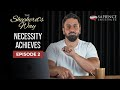

# The Shepherd's Way: Ep. 2 - Necessity Achieves (2022-07-01)

## Description

The Shepherd's Way: Ep. 2 - Necessity Achieves

Support our strategy:
https://sapienceinstitute.org/donate
—
Help us educate and mentor others to share the faith academically.
Donate now: https://sapienceinstitute.org/donate/ 

Free online courses: https://learn.sapienceinstitute.org/

Free books: https://sapienceinstitute.org/books/

Have doubts? Book a mentor: https://sapienceinstitute.org/lighthouse/

Listen (Podcast): https://sapienceinstitute.org/sapientvoices/

Follow:
– Facebook: https://facebook.com/sapienceinstitute.org/ 
– Twitter: https://twitter.com/SapienceOrg/ 
– Instagram: https://instagram.com/sapienceinstitute/ 

Articles, speaker requests & more: https://sapienceinstitute.org/

## Summary of [The Shepherd's Way: Ep. 2 - Necessity Achieves](https://www.youtube.com/watch?v=kGH0krX3lwE)

*This summary is AI generated - there may be inaccuracies. *

### [00:00:00](https://www.youtube.com/watch?v=kGH0krX3lwE&t=0) - [00:10:00](https://www.youtube.com/watch?v=kGH0krX3lwE&t=600)

The Shepherd's Way: Ep. 2 - Necessity Achieves discusses the importance of developing a strategic focus in order to achieve one's vision. Sheikh Mansour provides the example of the prophet Muhammad's strategic focus of conveying Islam to the people of influence, and reminds viewers that allah has power over all things.

**[00:00:00](https://www.youtube.com/watch?v=kGH0krX3lwE&t=0)** Sheikh Mansour discusses the benefits of developing a strategic focus, including that it makes decision making easier and that it achieves one's vision. He also reminds viewers that the means can change, but that allah has power over all things.
* **[00:05:00](https://www.youtube.com/watch?v=kGH0krX3lwE&t=300)** The Shepherd's Way: Ep. 2 - Necessity Achieves provides an example of a prophet's strategic focus, which was to convey Islam to the people of influence. He recommends that we have a strategic focus, too, and that this will inevitably lead to our success.
* **[00:10:00](https://www.youtube.com/watch?v=kGH0krX3lwE&t=600)** The Shepherd's Way is a YouTube channel that focuses on defending and sharing Islam academically and intellectually. The channel aims to empower others to do the same, and asks for donations in order to help achieve this.

<h2>Full transcript with timestamps: CLICK TO EXPAND</h2>

[0:00:14](https://youtu.be/kGH0krX3lwE?t=14) and sisters and friends and welcome to  
[0:00:16](https://youtu.be/kGH0krX3lwE?t=16) the second episode of our hija series  
[0:00:20](https://youtu.be/kGH0krX3lwE?t=20) the shepherd's way  
[0:00:22](https://youtu.be/kGH0krX3lwE?t=22) and now we're going to be talking about  
[0:00:23](https://youtu.be/kGH0krX3lwE?t=23) the second timeless leadership lesson  
[0:00:26](https://youtu.be/kGH0krX3lwE?t=26) which is necessity achieves in other  
[0:00:29](https://youtu.be/kGH0krX3lwE?t=29) words be strategic have a strategic  
[0:00:32](https://youtu.be/kGH0krX3lwE?t=32) focus  
[0:00:34](https://youtu.be/kGH0krX3lwE?t=34) brothers and sisters you have to realize  
[0:00:36](https://youtu.be/kGH0krX3lwE?t=36) that it's not just about having a goal  
[0:00:38](https://youtu.be/kGH0krX3lwE?t=38) you need to be able to achieve that goal  
[0:00:41](https://youtu.be/kGH0krX3lwE?t=41) in some way in other words you have to  
[0:00:44](https://youtu.be/kGH0krX3lwE?t=44) develop a strategy  
[0:00:46](https://youtu.be/kGH0krX3lwE?t=46) to ensure your vision becomes a reality  
[0:00:49](https://youtu.be/kGH0krX3lwE?t=49) now what is a strategy  
[0:00:51](https://youtu.be/kGH0krX3lwE?t=51) a strategy or a strategic focus  
[0:00:54](https://youtu.be/kGH0krX3lwE?t=54) is  
[0:00:55](https://youtu.be/kGH0krX3lwE?t=55) the key areas of work  
[0:00:57](https://youtu.be/kGH0krX3lwE?t=57) or domains of activity that would  
[0:01:00](https://youtu.be/kGH0krX3lwE?t=60) necessarily lead to your vision becoming  
[0:01:01](https://youtu.be/kGH0krX3lwE?t=61) a reality  
[0:01:03](https://youtu.be/kGH0krX3lwE?t=63) so ask yourself two key questions to  
[0:01:05](https://youtu.be/kGH0krX3lwE?t=65) develop a strategic focus number one  
[0:01:08](https://youtu.be/kGH0krX3lwE?t=68) what are the actions activities  
[0:01:10](https://youtu.be/kGH0krX3lwE?t=70) resources and relationships that you  
[0:01:13](https://youtu.be/kGH0krX3lwE?t=73) need to make your vision a reality  
[0:01:15](https://youtu.be/kGH0krX3lwE?t=75) number two can i demonstrate can you  
[0:01:18](https://youtu.be/kGH0krX3lwE?t=78) demonstrate that the actions that you  
[0:01:21](https://youtu.be/kGH0krX3lwE?t=81) have chosen  
[0:01:23](https://youtu.be/kGH0krX3lwE?t=83) the domains of activities that you have  
[0:01:25](https://youtu.be/kGH0krX3lwE?t=85) selected  
[0:01:27](https://youtu.be/kGH0krX3lwE?t=87) are necessarily going to lead to your  
[0:01:29](https://youtu.be/kGH0krX3lwE?t=89) vision  
[0:01:30](https://youtu.be/kGH0krX3lwE?t=90) if they don't they need to reevaluate  
[0:01:33](https://youtu.be/kGH0krX3lwE?t=93) because you have to select domains of  
[0:01:34](https://youtu.be/kGH0krX3lwE?t=94) activity or actions that would  
[0:01:37](https://youtu.be/kGH0krX3lwE?t=97) necessarily lead to your vision and  
[0:01:39](https://youtu.be/kGH0krX3lwE?t=99) remember brothers and sisters consult do  
[0:01:42](https://youtu.be/kGH0krX3lwE?t=102) sure  
[0:01:44](https://youtu.be/kGH0krX3lwE?t=104) brainstorm  
[0:01:45](https://youtu.be/kGH0krX3lwE?t=105) look at best practice  
[0:01:47](https://youtu.be/kGH0krX3lwE?t=107) consult  
[0:01:48](https://youtu.be/kGH0krX3lwE?t=108) experts  
[0:01:49](https://youtu.be/kGH0krX3lwE?t=109) see what has been achieved before and  
[0:01:52](https://youtu.be/kGH0krX3lwE?t=112) how it has been achieved  
[0:01:54](https://youtu.be/kGH0krX3lwE?t=114) all of this is going to help you to  
[0:01:56](https://youtu.be/kGH0krX3lwE?t=116) formulate your strategic focus  
[0:01:58](https://youtu.be/kGH0krX3lwE?t=118) and there are four main benefits  
[0:02:00](https://youtu.be/kGH0krX3lwE?t=120) brothers and sisters of a strategic  
[0:02:02](https://youtu.be/kGH0krX3lwE?t=122) focus number one  
[0:02:04](https://youtu.be/kGH0krX3lwE?t=124) focus itself yes that's one of its  
[0:02:06](https://youtu.be/kGH0krX3lwE?t=126) benefits you will have a focus and that  
[0:02:09](https://youtu.be/kGH0krX3lwE?t=129) means you will use your resources wisely  
[0:02:12](https://youtu.be/kGH0krX3lwE?t=132) and place them at the service of your  
[0:02:14](https://youtu.be/kGH0krX3lwE?t=134) vision number two  
[0:02:16](https://youtu.be/kGH0krX3lwE?t=136) it makes decision making easier  
[0:02:18](https://youtu.be/kGH0krX3lwE?t=138) because you know what needs to be done  
[0:02:21](https://youtu.be/kGH0krX3lwE?t=141) so you know how to say no to things that  
[0:02:23](https://youtu.be/kGH0krX3lwE?t=143) will not lead to the fulfillment of your  
[0:02:25](https://youtu.be/kGH0krX3lwE?t=145) vision number three it helps you plan  
[0:02:28](https://youtu.be/kGH0krX3lwE?t=148) since you know what needs to be done  
[0:02:30](https://youtu.be/kGH0krX3lwE?t=150) go and do it  
[0:02:32](https://youtu.be/kGH0krX3lwE?t=152) and finally number four  
[0:02:34](https://youtu.be/kGH0krX3lwE?t=154) it achieves your vision this is  
[0:02:36](https://youtu.be/kGH0krX3lwE?t=156) fundamental this is a fundamental  
[0:02:37](https://youtu.be/kGH0krX3lwE?t=157) benefit it actually achieves your vision  
[0:02:40](https://youtu.be/kGH0krX3lwE?t=160) now bear in mind you can always revise  
[0:02:43](https://youtu.be/kGH0krX3lwE?t=163) your strategy because as you continue on  
[0:02:45](https://youtu.be/kGH0krX3lwE?t=165) this path you'll gain more experience  
[0:02:48](https://youtu.be/kGH0krX3lwE?t=168) and knowledge and wisdom and you'll  
[0:02:50](https://youtu.be/kGH0krX3lwE?t=170) realize that you may have to do some  
[0:02:52](https://youtu.be/kGH0krX3lwE?t=172) strategic tweaks  
[0:02:53](https://youtu.be/kGH0krX3lwE?t=173) but remember with the strategy you're  
[0:02:56](https://youtu.be/kGH0krX3lwE?t=176) more likely to make an impact and you're  
[0:02:59](https://youtu.be/kGH0krX3lwE?t=179) more likely to ensure that your vision  
[0:03:01](https://youtu.be/kGH0krX3lwE?t=181) becomes a reality now please note  
[0:03:04](https://youtu.be/kGH0krX3lwE?t=184) brothers and sisters do not think your  
[0:03:07](https://youtu.be/kGH0krX3lwE?t=187) strategy has intrinsic value  
[0:03:09](https://youtu.be/kGH0krX3lwE?t=189) plan  
[0:03:10](https://youtu.be/kGH0krX3lwE?t=190) in pencil  
[0:03:12](https://youtu.be/kGH0krX3lwE?t=192) what do i mean by that because the plan  
[0:03:14](https://youtu.be/kGH0krX3lwE?t=194) of allah subhanahu wa ta'ala is always  
[0:03:17](https://youtu.be/kGH0krX3lwE?t=197) going to manifest itself  
[0:03:19](https://youtu.be/kGH0krX3lwE?t=199) and know and realize that it's only  
[0:03:21](https://youtu.be/kGH0krX3lwE?t=201) through allah's help  
[0:03:23](https://youtu.be/kGH0krX3lwE?t=203) and his mercy and his power that your  
[0:03:26](https://youtu.be/kGH0krX3lwE?t=206) vision will become a reality it's not  
[0:03:28](https://youtu.be/kGH0krX3lwE?t=208) your strategy itself there is no  
[0:03:30](https://youtu.be/kGH0krX3lwE?t=210) intrinsic value in your strategy  
[0:03:32](https://youtu.be/kGH0krX3lwE?t=212) remember  
[0:03:35](https://youtu.be/kGH0krX3lwE?t=215) there is no true power apart from the  
[0:03:38](https://youtu.be/kGH0krX3lwE?t=218) power of allah  
[0:03:39](https://youtu.be/kGH0krX3lwE?t=219) yes we must strategize we must plan we  
[0:03:42](https://youtu.be/kGH0krX3lwE?t=222) must seek the means but fundamentally at  
[0:03:45](https://youtu.be/kGH0krX3lwE?t=225) the end of the day it's not because of  
[0:03:48](https://youtu.be/kGH0krX3lwE?t=228) your strategy is because of the will and  
[0:03:50](https://youtu.be/kGH0krX3lwE?t=230) mercy and power of allah  
[0:03:52](https://youtu.be/kGH0krX3lwE?t=232) remember this  
[0:03:53](https://youtu.be/kGH0krX3lwE?t=233) remember this is very important because  
[0:03:56](https://youtu.be/kGH0krX3lwE?t=236) you don't want to give your strategy  
[0:03:57](https://youtu.be/kGH0krX3lwE?t=237) some kind of intrinsic power or ability  
[0:04:00](https://youtu.be/kGH0krX3lwE?t=240) because this is fundamentally not in  
[0:04:02](https://youtu.be/kGH0krX3lwE?t=242) line with our world view it's not in  
[0:04:04](https://youtu.be/kGH0krX3lwE?t=244) line with tawheed  
[0:04:06](https://youtu.be/kGH0krX3lwE?t=246) not in line with the oneness of allah  
[0:04:08](https://youtu.be/kGH0krX3lwE?t=248) subhanahu wa ta'ala so from this  
[0:04:10](https://youtu.be/kGH0krX3lwE?t=250) perspective  
[0:04:11](https://youtu.be/kGH0krX3lwE?t=251) rely on allah alone not your strategy  
[0:04:14](https://youtu.be/kGH0krX3lwE?t=254) yes  
[0:04:14](https://youtu.be/kGH0krX3lwE?t=254) we have to seek the means but remember  
[0:04:16](https://youtu.be/kGH0krX3lwE?t=256) the means can change  
[0:04:18](https://youtu.be/kGH0krX3lwE?t=258) but allah has power over all things  
[0:04:21](https://youtu.be/kGH0krX3lwE?t=261) remember allah is in control and this is  
[0:04:25](https://youtu.be/kGH0krX3lwE?t=265) beautifully articulated in the quran in  
[0:04:27](https://youtu.be/kGH0krX3lwE?t=267) chapter 11 verses 87 and 88.  
[0:04:31](https://youtu.be/kGH0krX3lwE?t=271) they asked sarcastically  
[0:04:34](https://youtu.be/kGH0krX3lwE?t=274) does your prayer command you that we  
[0:04:36](https://youtu.be/kGH0krX3lwE?t=276) should abandon what our forefathers  
[0:04:38](https://youtu.be/kGH0krX3lwE?t=278) worshipped or give up managing our  
[0:04:40](https://youtu.be/kGH0krX3lwE?t=280) wealth as we please indeed  
[0:04:42](https://youtu.be/kGH0krX3lwE?t=282) you are such a tolerant sensible man  
[0:04:45](https://youtu.be/kGH0krX3lwE?t=285) he said  
[0:04:47](https://youtu.be/kGH0krX3lwE?t=287) o my people consider if i stand on a  
[0:04:50](https://youtu.be/kGH0krX3lwE?t=290) clear proof from my lord  
[0:04:53](https://youtu.be/kGH0krX3lwE?t=293) and he has blessed me with a good  
[0:04:54](https://youtu.be/kGH0krX3lwE?t=294) provision from him  
[0:04:56](https://youtu.be/kGH0krX3lwE?t=296) i do not want to do  
[0:04:58](https://youtu.be/kGH0krX3lwE?t=298) what i am forbidding you from  
[0:05:00](https://youtu.be/kGH0krX3lwE?t=300) i only intend reform to the best of my  
[0:05:03](https://youtu.be/kGH0krX3lwE?t=303) ability and this is the key point  
[0:05:05](https://youtu.be/kGH0krX3lwE?t=305) my success comes only through allah in  
[0:05:09](https://youtu.be/kGH0krX3lwE?t=309) him i trust and to him  
[0:05:12](https://youtu.be/kGH0krX3lwE?t=312) i turn so brothers and sisters we should  
[0:05:14](https://youtu.be/kGH0krX3lwE?t=314) be like  
[0:05:16](https://youtu.be/kGH0krX3lwE?t=316) that we understand and affirm and  
[0:05:19](https://youtu.be/kGH0krX3lwE?t=319) internalize and actualize  
[0:05:22](https://youtu.be/kGH0krX3lwE?t=322) that success  
[0:05:23](https://youtu.be/kGH0krX3lwE?t=323) is only through allah and we must rely  
[0:05:26](https://youtu.be/kGH0krX3lwE?t=326) and trust in allah alone so brothers and  
[0:05:29](https://youtu.be/kGH0krX3lwE?t=329) sisters let me tie all of this together  
[0:05:32](https://youtu.be/kGH0krX3lwE?t=332) with an example as you're aware our  
[0:05:34](https://youtu.be/kGH0krX3lwE?t=334) vision at sapience institute is a world  
[0:05:36](https://youtu.be/kGH0krX3lwE?t=336) that receives the message of islam and  
[0:05:39](https://youtu.be/kGH0krX3lwE?t=339) our strategic focus is that us as a team  
[0:05:41](https://youtu.be/kGH0krX3lwE?t=341) we as a team defend and share islam  
[0:05:44](https://youtu.be/kGH0krX3lwE?t=344) academically and intellectually and  
[0:05:47](https://youtu.be/kGH0krX3lwE?t=347) significantly we develop create and  
[0:05:49](https://youtu.be/kGH0krX3lwE?t=349) empower others to do so the same  
[0:05:53](https://youtu.be/kGH0krX3lwE?t=353) now this will involve  
[0:05:54](https://youtu.be/kGH0krX3lwE?t=354) downward training  
[0:05:56](https://youtu.be/kGH0krX3lwE?t=356) down to influentials debates and  
[0:05:58](https://youtu.be/kGH0krX3lwE?t=358) dialogues videos essays books and  
[0:06:02](https://youtu.be/kGH0krX3lwE?t=362) research and much more so as you can see  
[0:06:05](https://youtu.be/kGH0krX3lwE?t=365) these actions are derived from our  
[0:06:07](https://youtu.be/kGH0krX3lwE?t=367) strategic focus and we are focused on  
[0:06:09](https://youtu.be/kGH0krX3lwE?t=369) these actions because we believe they  
[0:06:11](https://youtu.be/kGH0krX3lwE?t=371) will necessarily lead to the fulfillment  
[0:06:14](https://youtu.be/kGH0krX3lwE?t=374) of our vision  
[0:06:16](https://youtu.be/kGH0krX3lwE?t=376) now let me give you a prophetic example  
[0:06:19](https://youtu.be/kGH0krX3lwE?t=379) and once again brothers and sisters we  
[0:06:21](https://youtu.be/kGH0krX3lwE?t=381) are inspired by the prophet muhammed  
[0:06:25](https://youtu.be/kGH0krX3lwE?t=385) because when you read his history you  
[0:06:27](https://youtu.be/kGH0krX3lwE?t=387) will understand that he had a strategic  
[0:06:30](https://youtu.be/kGH0krX3lwE?t=390) focus he had a focus and what was that  
[0:06:34](https://youtu.be/kGH0krX3lwE?t=394) focus  
[0:06:35](https://youtu.be/kGH0krX3lwE?t=395) generally speaking his main focus was to  
[0:06:38](https://youtu.be/kGH0krX3lwE?t=398) convey islam in other words that there  
[0:06:40](https://youtu.be/kGH0krX3lwE?t=400) is no deity worthy of worship except  
[0:06:42](https://youtu.be/kGH0krX3lwE?t=402) allah  
[0:06:44](https://youtu.be/kGH0krX3lwE?t=404) and that conveying of islam was  
[0:06:46](https://youtu.be/kGH0krX3lwE?t=406) particularly being conveyed to the  
[0:06:49](https://youtu.be/kGH0krX3lwE?t=409) people of influence in other words the  
[0:06:51](https://youtu.be/kGH0krX3lwE?t=411) tribal leaders and and this is very  
[0:06:53](https://youtu.be/kGH0krX3lwE?t=413) significant he developed the sahaba the  
[0:06:56](https://youtu.be/kGH0krX3lwE?t=416) companions to lead and spread islam  
[0:07:00](https://youtu.be/kGH0krX3lwE?t=420) now  
[0:07:02](https://youtu.be/kGH0krX3lwE?t=422) in his book leadership lessons from the  
[0:07:04](https://youtu.be/kGH0krX3lwE?t=424) life of rasulallah  
[0:07:08](https://youtu.be/kGH0krX3lwE?t=428) summarizes  
[0:07:09](https://youtu.be/kGH0krX3lwE?t=429) a key part of the prophets sallallahu  
[0:07:12](https://youtu.be/kGH0krX3lwE?t=432) alaihi wasallam's  
[0:07:14](https://youtu.be/kGH0krX3lwE?t=434) strategic focus which is developing the  
[0:07:16](https://youtu.be/kGH0krX3lwE?t=436) sahaba  
[0:07:17](https://youtu.be/kGH0krX3lwE?t=437) he writes  
[0:07:19](https://youtu.be/kGH0krX3lwE?t=439) no goal can be achieved by anyone alone  
[0:07:22](https://youtu.be/kGH0krX3lwE?t=442) no matter how talented or powerful or  
[0:07:24](https://youtu.be/kGH0krX3lwE?t=444) wealthy that person may be  
[0:07:26](https://youtu.be/kGH0krX3lwE?t=446) the biggest challenge for any leader  
[0:07:28](https://youtu.be/kGH0krX3lwE?t=448) indeed the single factor which can mean  
[0:07:30](https://youtu.be/kGH0krX3lwE?t=450) success or failure of his mission  
[0:07:33](https://youtu.be/kGH0krX3lwE?t=453) is his ability to inspire others to  
[0:07:35](https://youtu.be/kGH0krX3lwE?t=455) follow him and commit time energy wealth  
[0:07:39](https://youtu.be/kGH0krX3lwE?t=459) and talent for the achievement of his  
[0:07:42](https://youtu.be/kGH0krX3lwE?t=462) goal  
[0:07:43](https://youtu.be/kGH0krX3lwE?t=463) the key to achieving this attention and  
[0:07:45](https://youtu.be/kGH0krX3lwE?t=465) commitment of people does not lie in  
[0:07:47](https://youtu.be/kGH0krX3lwE?t=467) paying money or granting favors or  
[0:07:49](https://youtu.be/kGH0krX3lwE?t=469) making inspiring speeches by ensuring  
[0:07:52](https://youtu.be/kGH0krX3lwE?t=472) how much you really love and care for  
[0:07:54](https://youtu.be/kGH0krX3lwE?t=474) your followers and then he continues  
[0:07:57](https://youtu.be/kGH0krX3lwE?t=477) a combination of picking the right  
[0:07:58](https://youtu.be/kGH0krX3lwE?t=478) people  
[0:07:59](https://youtu.be/kGH0krX3lwE?t=479) setting a high personal example and  
[0:08:02](https://youtu.be/kGH0krX3lwE?t=482) intensive hands-on training  
[0:08:06](https://youtu.be/kGH0krX3lwE?t=486) created not one but a set of leaders who  
[0:08:09](https://youtu.be/kGH0krX3lwE?t=489) were able to take his message forward  
[0:08:11](https://youtu.be/kGH0krX3lwE?t=491) long after he passed away  
[0:08:14](https://youtu.be/kGH0krX3lwE?t=494) and this is so true brothers and sisters  
[0:08:17](https://youtu.be/kGH0krX3lwE?t=497) and think about this it's so inspiring  
[0:08:20](https://youtu.be/kGH0krX3lwE?t=500) eighty years  
[0:08:21](https://youtu.be/kGH0krX3lwE?t=501) after the death of the prophet salallahu  
[0:08:23](https://youtu.be/kGH0krX3lwE?t=503) alaihi wasallam where were the muslims  
[0:08:26](https://youtu.be/kGH0krX3lwE?t=506) where were we we were in multan in  
[0:08:28](https://youtu.be/kGH0krX3lwE?t=508) pakistan and we were in spain spreading  
[0:08:31](https://youtu.be/kGH0krX3lwE?t=511) the peace justice and mercy of islam  
[0:08:34](https://youtu.be/kGH0krX3lwE?t=514) across the world and what's very  
[0:08:35](https://youtu.be/kGH0krX3lwE?t=515) inspiring brothers and sisters is how  
[0:08:38](https://youtu.be/kGH0krX3lwE?t=518) this played out in history  
[0:08:40](https://youtu.be/kGH0krX3lwE?t=520) eighty years after the death of the  
[0:08:42](https://youtu.be/kGH0krX3lwE?t=522) prophet sallallahu alaihi wasallam  
[0:08:45](https://youtu.be/kGH0krX3lwE?t=525) where were the muslims where were we we  
[0:08:47](https://youtu.be/kGH0krX3lwE?t=527) were in multan in pakistan and we were  
[0:08:50](https://youtu.be/kGH0krX3lwE?t=530) in spain spreading the peace justice and  
[0:08:52](https://youtu.be/kGH0krX3lwE?t=532) mess of islam all around the world  
[0:08:54](https://youtu.be/kGH0krX3lwE?t=534) but it was 82 years after the death of  
[0:08:57](https://youtu.be/kGH0krX3lwE?t=537) the prophet sallallahu alaihi wasallam  
[0:09:00](https://youtu.be/kGH0krX3lwE?t=540) that the muslims decided to fix the  
[0:09:03](https://youtu.be/kGH0krX3lwE?t=543) mosque of the prophet sallallahu alaihi  
[0:09:06](https://youtu.be/kGH0krX3lwE?t=546) wasallam because it was leaking water  
[0:09:10](https://youtu.be/kGH0krX3lwE?t=550) so to conclude brothers and sisters  
[0:09:13](https://youtu.be/kGH0krX3lwE?t=553) have a strategic focus necessity  
[0:09:16](https://youtu.be/kGH0krX3lwE?t=556) achieves  
[0:09:17](https://youtu.be/kGH0krX3lwE?t=557) have a set of actions or domains of  
[0:09:20](https://youtu.be/kGH0krX3lwE?t=560) activity that would necessarily lead to  
[0:09:23](https://youtu.be/kGH0krX3lwE?t=563) the fulfillment of your vision it's not  
[0:09:25](https://youtu.be/kGH0krX3lwE?t=565) just good having a vision having a goal  
[0:09:28](https://youtu.be/kGH0krX3lwE?t=568) you need to have a plan of action how to  
[0:09:31](https://youtu.be/kGH0krX3lwE?t=571) achieve your goal  
[0:09:33](https://youtu.be/kGH0krX3lwE?t=573) follow the prophetic way of having a  
[0:09:36](https://youtu.be/kGH0krX3lwE?t=576) strategic focused brothers and sisters  
[0:09:39](https://youtu.be/kGH0krX3lwE?t=579) so to end brothers and sisters i would  
[0:09:41](https://youtu.be/kGH0krX3lwE?t=581) like to remind you again that we're  
[0:09:42](https://youtu.be/kGH0krX3lwE?t=582) experiencing the blessed days of  
[0:09:44](https://youtu.be/kGH0krX3lwE?t=584) dulhidja  
[0:09:45](https://youtu.be/kGH0krX3lwE?t=585) and remember remember  
[0:09:48](https://youtu.be/kGH0krX3lwE?t=588) the deeds performed during these days  
[0:09:52](https://youtu.be/kGH0krX3lwE?t=592) are more rewardable than the deeds  
[0:09:54](https://youtu.be/kGH0krX3lwE?t=594) performed during the days of ramadan  
[0:09:58](https://youtu.be/kGH0krX3lwE?t=598) so we ask you to support our strategic  
[0:10:00](https://youtu.be/kGH0krX3lwE?t=600) focus which is  
[0:10:03](https://youtu.be/kGH0krX3lwE?t=603) defending and sharing islam academically  
[0:10:05](https://youtu.be/kGH0krX3lwE?t=605) and intellectually and developing  
[0:10:07](https://youtu.be/kGH0krX3lwE?t=607) empowering and creating others to be  
[0:10:09](https://youtu.be/kGH0krX3lwE?t=609) able to do so as well  
[0:10:12](https://youtu.be/kGH0krX3lwE?t=612) please brothers and sisters donate  
[0:10:14](https://youtu.be/kGH0krX3lwE?t=614) generously click the button or the link  
[0:10:17](https://youtu.be/kGH0krX3lwE?t=617) below and donate now  

