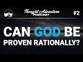

# Can God be Proven Rationally? | Thought Adventure Podcast #2 (2021-01-31)

## Description

On Sunday 1/31/21 at 2pm EST/7pm UK time we will be having our second episode of the Thought Adventure Podcast (TAP). The topic will be, "Can God Be Proven Rationally?". Call in live to discuss the topic with the panelists Yusuf Ponders, Sharif Abu Laith, Abdul, and The Muslim Metaphysician. Don't forget to like, comment, subscribe, and share this channel to help support this podcast :)

0:00       Introduction and  Arguments
- Guests - 
27:10     Edin (Muslim)
45:42     Justin (Atheist)
1:43:28  Saleh (Muslim)
1:55:57  Mo El (Muslim)
2:03:17  Mustahsin (Muslim)
- Summary -
2:25:53 Final Thoughts 

Thought Adventure Support
◄ PayPal - https://www.paypal.com/donate/?hosted_button_id=6KZWK75RB23RN 
◄ YouTube - https://www.youtube.com/c/ThoughtAdventurePodcast/join
◄ PATREON - https://www.patreon.com/thoughtadventurepodcast
____________________________________________________________________

Thought Adventure Social Media
◄ Twitter: https://twitter.com/T_A_Podcast​​ [@T_A_Podcast]
◄ Clubhouse https://www.clubhouse.com/club/thought-adventure-podcast
◄ Spotify: https://open.spotify.com/show/7x4UVfTz9QX8KVdEXquDUC
◄ Facebook: https://m.facebook.com/ThoughtAdventurePodcast
◄ Instagram: https://www.instagram.com/ThoughtAdventurePodcast​

----------------------------------------------------------------

*The Hosts:*
----------------------|
Jake Brancatella, The Muslim Metaphysician

- Youtube: https://www.youtube.com/channel/UCcGQRfTPNyHlXMqckvz2uqQ
- Twitter:  https://twitter.com/MMetaphysician​​ [@MMetaphysician]

----------------------|

Yusuf Ponders, The Pondering Soul

- Youtube: https://www.youtube.com/channel/UCsiDDxy0JXLqM6HBA0MA4NA
- Twitter: https://twitter.com/YusufPonders​​ [@YusufPonders]
- Facebook: https://www.facebook.com/yusufponders​ [@yusufpodners]

----------------------|

Sharif

- Twitter: https://twitter.com/sharifhafezi​​ [@sharifhafezi]

----------------------|

Abdulrahman

- Twitter: https://twitter.com/abdul_now​ [@abdul_now]

----------------------|

Admin

Riyad 
Gmail: hello.tapodcast@gmail.com

#rationality #islam #god

## Summary of [Can God be Proven Rationally? | Thought Adventure Podcast #2](https://www.youtube.com/watch?v=X-19SfRhwZA)

*This summary is AI generated - there may be inaccuracies. *

### [00:00:00](https://www.youtube.com/watch?v=X-19SfRhwZA&t=0) - [01:00:00](https://www.youtube.com/watch?v=X-19SfRhwZA&t=3600)

discusses the possibility of rationally proving the existence of God.  presents the Kalam Cosmological Argument and Imam Ghazali's argument, and concludes that atheists are free to present their own methods of proof if they wish.

**[00:00:00](https://www.youtube.com/watch?v=X-19SfRhwZA&t=0)** of the video discusses the possibility of proving that God exists through rational means. They present the Kalam Cosmological Argument, which states that whatever begins to exist has a cause. They discuss how the first premise is an obvious truth that atheists often miss. Imam Ghazali's argument is based on the absurdity of an eternal universe. concludes the stream by mentioning that atheists are free to present their own methods of proving the existence of God if they so desire.
* **[00:05:00](https://www.youtube.com/watch?v=X-19SfRhwZA&t=300)** argues that there is evidence for God from mathematics and modern scientific theories, including Big Bang cosmology and the concept of multiple infinites. points out that there can't be multiple infinites in reality because they would be limited by rules of mathematics. He argues that when talking to atheists, it's important to be clear that we're talking about theoretical concepts and that they should not try to apply them to reality.
* **[00:10:00](https://www.youtube.com/watch?v=X-19SfRhwZA&t=600)* Discusses the concept of the infinite regress, and how it can be a bit superfluous. He points out that dependency falls into this category, and discusses how it applies to everything from a small set of things to a galaxy. He concludes by saying that it's important to focus on what's being discussed, rather than getting bogged down in the infinite regress.
* **[00:15:00](https://www.youtube.com/watch?v=X-19SfRhwZA&t=900)* Discusses three arguments for the existence of God: the cosmological, the ontological, and the contingency argument. He argues that the contingency argument is the best because it undercuts many of the objections raised against the other two arguments.
* **[00:20:00](https://www.youtube.com/watch?v=X-19SfRhwZA&t=1200)* Discusses the Argument from Contingency, which states that if a series of events is contingent, then there is a need for an external explanation for why they exist.  also discusses the Fallacy of Composition, which is an objection to the argument that because a series of contingent events requires an external explanation, then the series itself is contingent.
* **[00:25:00](https://www.youtube.com/watch?v=X-19SfRhwZA&t=1500)** The Thought Adventure Podcast discusses the possibility of God being proven rationally. First, there is the stage one contingency argument which is aimed at showing that there is something necessary that does not necessarily have to be God. Stage two contingency arguments try to infer from this necessary being to God. Atheists may find the stage one of the contingency argument appealing, and so they accept it. However, there is a stage two contingency argument which argues that the necessary thing does not necessarily have to be God. This is a difficult argument to refute, and so it is a large conversation. One question the host asked was if someone were to do a stream on morality, could the guest also do a stream on islamic morality from a utilitarian perspective.
* **[00:30:00](https://www.youtube.com/watch?v=X-19SfRhwZA&t=1800)** The rational proof of God is that, under certain world views, it makes sense to call something an "independent being" or "necessary being." This is because something that exists by its own being cannot cease to exist.
* **[00:35:00](https://www.youtube.com/watch?v=X-19SfRhwZA&t=2100)** Atheists argue that it is not necessary for something to exist in order for it to be explained, and that all contingent beings can be explained by a necessary being.
* **[00:40:00](https://www.youtube.com/watch?v=X-19SfRhwZA&t=2400)* Discusses how living in a hostile environment can make it difficult to communicate with others, but they still try to do so. They explain that their brother, Joseph, is also their brother, Yusuf, and that they need everyone here for an operation.
* **[00:45:00](https://www.youtube.com/watch?v=X-19SfRhwZA&t=2700)** In this Thought Adventure podcast, brothers Justin and Masha'allah discuss the possibility of God being proven rationally. Justin explains that there are logical arguments for and against a particular god model, and that he is convinced based on certain steps taken towards that argument.
* **[00:50:00](https://www.youtube.com/watch?v=X-19SfRhwZA&t=3000)* Discusses how empirical data can be used to infer things about the fundamental layer of reality. He argues that if we observe contingent things, then we must assume causality is presupposed. This is empirical and therefore, we are no longer within empiricism. then explains how we can move from contingent things to a necessary thing.
* **[00:55:00](https://www.youtube.com/watch?v=X-19SfRhwZA&t=3300)* Discusses the principle of sufficient reason, which states that there must be an external explanation for every contingent thing in the universe. If this principle is true, then it is logically necessary that everything that exists is independent.
### [01:00:00](https://www.youtube.com/watch?v=X-19SfRhwZA&t=3600) - [02:00:00](https://www.youtube.com/watch?v=X-19SfRhwZA&t=7200)

The hosts of the Thought Adventure podcast discuss the idea that it is possible to rationally argue for the existence of God. They mention that there are arguments for and against evolution based on its truthfulness. If evolution is true, then it would seem that the most successful being would be based on truth. However, if evolution is not true, then science would be in conflict with its own goals.

**[01:00:00](https://www.youtube.com/watch?v=X-19SfRhwZA&t=3600)* Discusses the first stage of the contingency argument, which states that something within reality is necessary for existence.  explains that this something is necessary in a way that is not completely determined, and that this necessity leads to the conclusion that there is a necessary being. This being is said to provide the necessary explanation for everything within the universe, and therefore it must exist.
* **[01:05:00](https://www.youtube.com/watch?v=X-19SfRhwZA&t=3900)** The presenter argues that it is rational to believe that there is a necessary being in existence with a will that is independent of external factors. However, they note that they do not know enough about quantum indeterminacy to fully discuss the issue.
* **[01:10:00](https://www.youtube.com/watch?v=X-19SfRhwZA&t=4200)** Euston gives a philosophical argument for the idea that God can be proven rationally. He argues that something that is necessary must also be free, and that because God is necessary and infinite, he possesses all of the necessary properties to bring about the existence of the contingent world. If this were not the case, then a being with all of these properties would not need free will, which would be a problem.
* **[01:15:00](https://www.youtube.com/watch?v=X-19SfRhwZA&t=4500)** The first argument for the existence of God is that there is a need for an explanation for contingent beings, which require a choice to exist. From an epistemic viewpoint, this choice must be made by a necessary being. The second argument is that, from an ontological viewpoint, everything must have a cause. Without a cause for contingent beings, there can be no explanation for their existence.
* **[01:20:00](https://www.youtube.com/watch?v=X-19SfRhwZA&t=4800)* Discusses how, when attempting to explain the natural world, scientists must always be aware of the limitations of their knowledge. He suggests that the least arbitrary necessary foundation of reality is something that is unlimited and does not have a contingent nature.
* **[01:25:00](https://www.youtube.com/watch?v=X-19SfRhwZA&t=5100)** argues that science can only determine what is necessary from a philosophical and logical point of view, and that if something does not make sense philosophically or logically, then scientists must use empirical means to explore it.
* **[01:30:00](https://www.youtube.com/watch?v=X-19SfRhwZA&t=5400)** The Thought Adventure Podcast discusses whether or not it is reasonable to believe in an unembodied mind. The podcast discusses the concept of a 'necessary foundation of reality,' which is something that exists but we cannot conceive of its nature. The podcast argues that even if a mind exists outside of a physical brain, it still needs to be explained.
* **[01:35:00](https://www.youtube.com/watch?v=X-19SfRhwZA&t=5700)** defines " rationality" as the ability of a human being to make deductions based on logically connected statements. He says that this attribute is necessary for the existence of God, as God must necessarily exist for rationality to be possible.
* **[01:40:00](https://www.youtube.com/watch?v=X-19SfRhwZA&t=6000)* Discusses the idea that if you can prove rationally that God exists, then it is necessarily the case that God exists. It goes on to discuss the idea that using rational arguments to disprove the existence of God is impossible because if you have already proven that God exists, then any rational argument against that would ultimately fail.
* **[01:45:00](https://www.youtube.com/watch?v=X-19SfRhwZA&t=6300)** The three main arguments for the belief in God are that human beings are born with the ability to think rationally, that the idea of God is not something that can be automatically developed, and that all children have a innate desire to worship a creator.

The article from which the summary was taken argues that religious beliefs are not inherited or given to children, and that this idea of a being or creator is something that is inherent in human beings from a very early age.
* **[01:50:00](https://www.youtube.com/watch?v=X-19SfRhwZA&t=6600)** The presenter discusses how a rational argument for the existence of a Creator who has a will and chooses to create the universe can be used to argue that all aspects of existence, including human beings, are ultimately created by the Creator.
* **[01:55:00](https://www.youtube.com/watch?v=X-19SfRhwZA&t=6900)**  the Thought Adventure podcast discusses whether or not God can be proven rationally. Hosts discuss how a person's worldview determines how they answer this question. They also mention that there are arguments for and against evolution based on its truthfulness. If evolution is true, then it would seem that the most successful being would be based on truth. However, if evolution is not true, then science would be in conflict with its own goals.
### [02:00:00](https://www.youtube.com/watch?v=X-19SfRhwZA&t=7200) - [02:25:00](https://www.youtube.com/watch?v=X-19SfRhwZA&t=8700)

"Can God be Proven Rationally? | Thought Adventure Podcast #2", two atheist thinkers discuss the concept of fitzroy, or innate knowledge that leads one to believe in God. One argues that this knowledge cannot be learned through experience, while the other argues that it can. Finally, the hidden brother who does all the graphics on the channel says thank you to Giuseppe for all his hard work.

**[02:00:00](https://www.youtube.com/watch?v=X-19SfRhwZA&t=7200)** , Seek Truth, two atheist thinkers discuss the concept of fitzroy, or innate knowledge that leads one to believe in God. One argues that this knowledge cannot be learned through experience, while the other argues that it can. Finally, the hidden brother who does all the graphics on the channel says thank you to Giuseppe for all his hard work.
* **[02:05:00](https://www.youtube.com/watch?v=X-19SfRhwZA&t=7500)* Discusses an academic study that found that children, even those raised by atheists, believe in a creator. The study also found that children believe this creator is usually anthropomorphic, or a man. If someone believes in this creator, they are calling to monotheism.
* **[02:10:00](https://www.youtube.com/watch?v=X-19SfRhwZA&t=7800)** Claims that there has never been a society without religious belief are false, according to Richard Dawkins. People are naturally inclined towards spirituality and belief in a higher power, and this inclination is rooted in monotheism.
* **[02:15:00](https://www.youtube.com/watch?v=X-19SfRhwZA&t=8100)** Brother Hanif argues that the Quran and other religious texts should be based on rational arguments, not simply on an innate feeling or intuition.
* **[02:20:00](https://www.youtube.com/watch?v=X-19SfRhwZA&t=8400)* Discusses the rational argument that contingent beings (such as paintings) cannot be explained without something external to them (such as a painter). If we discount an infinite regress, then we must conclude that the only way to explain contingent beings is with a creator.
* **[02:25:00](https://www.youtube.com/watch?v=X-19SfRhwZA&t=8700)** The Thought Adventure Podcast discusses the idea of whether or not it can be proven rationally that there is a God. The atheists who have tried to muddy the discussion are mentioned, and one of the basic arguments used to argue for the existence of God is explained. The painting example is used to explain the concept. The idea of a contingent possible being is introduced, and the necessary and independent existence of a Creator is proven. A Facebook group is created to help organize discussions and help Brother Mustachin with his job of sorting the Facebook timeline. Everyone is encouraged to take the shahada and to accept Islam as a religion. Comments are requested, and people are encouraged to engage with the podcast and other believers.

<h2>Full transcript with timestamps: CLICK TO EXPAND</h2>

[0:00:09](https://youtu.be/X-19SfRhwZA?t=9) i hope  
[0:00:10](https://youtu.be/X-19SfRhwZA?t=10) everyone is doing well welcome to the  
[0:00:12](https://youtu.be/X-19SfRhwZA?t=12) second  
[0:00:13](https://youtu.be/X-19SfRhwZA?t=13) episode of thought adventure podcast so  
[0:00:16](https://youtu.be/X-19SfRhwZA?t=16) today uh we are going to be focusing on  
[0:00:21](https://youtu.be/X-19SfRhwZA?t=21) the the question or the following  
[0:00:22](https://youtu.be/X-19SfRhwZA?t=22) question can god be proven rationally  
[0:00:25](https://youtu.be/X-19SfRhwZA?t=25) and today we are joined by uh brother  
[0:00:28](https://youtu.be/X-19SfRhwZA?t=28) abdul salaam  
[0:00:45](https://youtu.be/X-19SfRhwZA?t=45) just want to make a request to anyone  
[0:00:47](https://youtu.be/X-19SfRhwZA?t=47) who's watching  
[0:00:48](https://youtu.be/X-19SfRhwZA?t=48) to just make dua as his father-in-law  
[0:00:51](https://youtu.be/X-19SfRhwZA?t=51) passed away recently and quite  
[0:00:52](https://youtu.be/X-19SfRhwZA?t=52) unexpectedly  
[0:00:53](https://youtu.be/X-19SfRhwZA?t=53) um so just make sure you keep him in  
[0:00:56](https://youtu.be/X-19SfRhwZA?t=56) your prayers may allah have mercy upon  
[0:00:58](https://youtu.be/X-19SfRhwZA?t=58) him and  
[0:00:59](https://youtu.be/X-19SfRhwZA?t=59) make the loss easy on those who cared  
[0:01:01](https://youtu.be/X-19SfRhwZA?t=61) for him  
[0:01:02](https://youtu.be/X-19SfRhwZA?t=62) um i mean so yeah so where do you want  
[0:01:06](https://youtu.be/X-19SfRhwZA?t=66) to begin with  
[0:01:07](https://youtu.be/X-19SfRhwZA?t=67) this uh i think brother sharif he did  
[0:01:09](https://youtu.be/X-19SfRhwZA?t=69) write out a couple of things he wanted  
[0:01:11](https://youtu.be/X-19SfRhwZA?t=71) to kind of  
[0:01:12](https://youtu.be/X-19SfRhwZA?t=72) go over so we'll need to wait for him to  
[0:01:14](https://youtu.be/X-19SfRhwZA?t=74) turn up to kind of  
[0:01:15](https://youtu.be/X-19SfRhwZA?t=75) go over what he mentioned there but uh  
[0:01:17](https://youtu.be/X-19SfRhwZA?t=77) jake do you want to take the lead here  
[0:01:18](https://youtu.be/X-19SfRhwZA?t=78) and  
[0:01:19](https://youtu.be/X-19SfRhwZA?t=79) kind of open it up a bit sure so  
[0:01:22](https://youtu.be/X-19SfRhwZA?t=82) the topic of discussion is can god be  
[0:01:25](https://youtu.be/X-19SfRhwZA?t=85) proven rationally  
[0:01:27](https://youtu.be/X-19SfRhwZA?t=87) um we the reason why we decided to have  
[0:01:30](https://youtu.be/X-19SfRhwZA?t=90) a stream on this is because  
[0:01:32](https://youtu.be/X-19SfRhwZA?t=92) we frequently talk with atheists online  
[0:01:36](https://youtu.be/X-19SfRhwZA?t=96) and they obviously would say no that god  
[0:01:39](https://youtu.be/X-19SfRhwZA?t=99) cannot be  
[0:01:40](https://youtu.be/X-19SfRhwZA?t=100) proven rationally for us muslims on the  
[0:01:43](https://youtu.be/X-19SfRhwZA?t=103) other hand  
[0:01:44](https://youtu.be/X-19SfRhwZA?t=104) we believe that god can be proven  
[0:01:46](https://youtu.be/X-19SfRhwZA?t=106) rationally and  
[0:01:48](https://youtu.be/X-19SfRhwZA?t=108) we're happy to present some arguments  
[0:01:51](https://youtu.be/X-19SfRhwZA?t=111) for that possibly  
[0:01:52](https://youtu.be/X-19SfRhwZA?t=112) and defend it and so uh this stream  
[0:01:55](https://youtu.be/X-19SfRhwZA?t=115) generally is going to be about um  
[0:01:58](https://youtu.be/X-19SfRhwZA?t=118) us providing evidence hopefully um that  
[0:02:01](https://youtu.be/X-19SfRhwZA?t=121) we can  
[0:02:02](https://youtu.be/X-19SfRhwZA?t=122) prove that god uh exists through  
[0:02:05](https://youtu.be/X-19SfRhwZA?t=125) rational means  
[0:02:06](https://youtu.be/X-19SfRhwZA?t=126) not merely relying on scripture alone  
[0:02:10](https://youtu.be/X-19SfRhwZA?t=130) and then we would like to have a  
[0:02:11](https://youtu.be/X-19SfRhwZA?t=131) discussion hopefully we can get a few  
[0:02:13](https://youtu.be/X-19SfRhwZA?t=133) atheists on to discuss this issue with  
[0:02:16](https://youtu.be/X-19SfRhwZA?t=136) us  
[0:02:17](https://youtu.be/X-19SfRhwZA?t=137) now there are a number of different ways  
[0:02:21](https://youtu.be/X-19SfRhwZA?t=141) that muslims and muslim theologians have  
[0:02:24](https://youtu.be/X-19SfRhwZA?t=144) given  
[0:02:24](https://youtu.be/X-19SfRhwZA?t=144) as far as proving that god exists  
[0:02:26](https://youtu.be/X-19SfRhwZA?t=146) rationally um  
[0:02:28](https://youtu.be/X-19SfRhwZA?t=148) one way that i personally like and you  
[0:02:30](https://youtu.be/X-19SfRhwZA?t=150) guys are  
[0:02:31](https://youtu.be/X-19SfRhwZA?t=151) free to interact with it and uh present  
[0:02:34](https://youtu.be/X-19SfRhwZA?t=154) your own methods  
[0:02:35](https://youtu.be/X-19SfRhwZA?t=155) if if need be but one of the famous  
[0:02:38](https://youtu.be/X-19SfRhwZA?t=158) arguments  
[0:02:38](https://youtu.be/X-19SfRhwZA?t=158) um that was proposed by imam khazali  
[0:02:43](https://youtu.be/X-19SfRhwZA?t=163) and sort of furthered by him and then  
[0:02:46](https://youtu.be/X-19SfRhwZA?t=166) kind of popularized  
[0:02:47](https://youtu.be/X-19SfRhwZA?t=167) today rejuvenated in a sense by a  
[0:02:50](https://youtu.be/X-19SfRhwZA?t=170) christian apologist william lane craig  
[0:02:52](https://youtu.be/X-19SfRhwZA?t=172) and that's the kalam cosmological  
[0:02:54](https://youtu.be/X-19SfRhwZA?t=174) argument  
[0:02:55](https://youtu.be/X-19SfRhwZA?t=175) uh which basically i'll just give a  
[0:02:56](https://youtu.be/X-19SfRhwZA?t=176) brief summary of what it is it says  
[0:02:58](https://youtu.be/X-19SfRhwZA?t=178) premise one  
[0:02:59](https://youtu.be/X-19SfRhwZA?t=179) uh whatever begins to exist has a cause  
[0:03:02](https://youtu.be/X-19SfRhwZA?t=182) premise 2 the universe began to exist  
[0:03:05](https://youtu.be/X-19SfRhwZA?t=185) and the conclusion is therefore  
[0:03:07](https://youtu.be/X-19SfRhwZA?t=187) the universe has a cause now  
[0:03:10](https://youtu.be/X-19SfRhwZA?t=190) we can go into uh detail i don't know  
[0:03:13](https://youtu.be/X-19SfRhwZA?t=193) how much detail we want to go into as  
[0:03:15](https://youtu.be/X-19SfRhwZA?t=195) far as the introduction to the stream is  
[0:03:18](https://youtu.be/X-19SfRhwZA?t=198) in terms of providing evidence for each  
[0:03:20](https://youtu.be/X-19SfRhwZA?t=200) one of the premises  
[0:03:22](https://youtu.be/X-19SfRhwZA?t=202) but generally speaking the first premise  
[0:03:25](https://youtu.be/X-19SfRhwZA?t=205) is to me somewhat obvious that whatever  
[0:03:28](https://youtu.be/X-19SfRhwZA?t=208) exists  
[0:03:28](https://youtu.be/X-19SfRhwZA?t=208) begins to begins to exist has a cause  
[0:03:32](https://youtu.be/X-19SfRhwZA?t=212) now typically atheists will respond  
[0:03:34](https://youtu.be/X-19SfRhwZA?t=214) we'll sit and we'll say well what about  
[0:03:36](https://youtu.be/X-19SfRhwZA?t=216) god  
[0:03:37](https://youtu.be/X-19SfRhwZA?t=217) um well they kind of missed uh the point  
[0:03:40](https://youtu.be/X-19SfRhwZA?t=220) in the premise that says whatever begins  
[0:03:42](https://youtu.be/X-19SfRhwZA?t=222) to exist  
[0:03:43](https://youtu.be/X-19SfRhwZA?t=223) now our understanding of god is that  
[0:03:46](https://youtu.be/X-19SfRhwZA?t=226) he's eternal  
[0:03:47](https://youtu.be/X-19SfRhwZA?t=227) so he doesn't fall under the category of  
[0:03:50](https://youtu.be/X-19SfRhwZA?t=230) the first premise because  
[0:03:51](https://youtu.be/X-19SfRhwZA?t=231) it's applying to things that begin to  
[0:03:53](https://youtu.be/X-19SfRhwZA?t=233) exist it doesn't apply to  
[0:03:55](https://youtu.be/X-19SfRhwZA?t=235) eternal things so um  
[0:03:59](https://youtu.be/X-19SfRhwZA?t=239) i mean it's it's to me it's just an  
[0:04:00](https://youtu.be/X-19SfRhwZA?t=240) obvious premise that  
[0:04:02](https://youtu.be/X-19SfRhwZA?t=242) we see ever in our everyday life  
[0:04:04](https://youtu.be/X-19SfRhwZA?t=244) everything that we experience  
[0:04:06](https://youtu.be/X-19SfRhwZA?t=246) that has a beginning or begins to exist  
[0:04:08](https://youtu.be/X-19SfRhwZA?t=248) there's some type of  
[0:04:09](https://youtu.be/X-19SfRhwZA?t=249) cause behind behind it it doesn't just  
[0:04:12](https://youtu.be/X-19SfRhwZA?t=252) pop into existence from nothing  
[0:04:14](https://youtu.be/X-19SfRhwZA?t=254) out of nowhere we don't experience these  
[0:04:16](https://youtu.be/X-19SfRhwZA?t=256) things whatsoever  
[0:04:18](https://youtu.be/X-19SfRhwZA?t=258) now as far as the universe beginning to  
[0:04:20](https://youtu.be/X-19SfRhwZA?t=260) exist  
[0:04:22](https://youtu.be/X-19SfRhwZA?t=262) imam ghazali since he didn't have much  
[0:04:25](https://youtu.be/X-19SfRhwZA?t=265) of the science  
[0:04:27](https://youtu.be/X-19SfRhwZA?t=267) available to him that we have today he  
[0:04:29](https://youtu.be/X-19SfRhwZA?t=269) primarily relied on  
[0:04:31](https://youtu.be/X-19SfRhwZA?t=271) uh philosophical argumentation based on  
[0:04:34](https://youtu.be/X-19SfRhwZA?t=274) the absurdity of an actual infidence so  
[0:04:37](https://youtu.be/X-19SfRhwZA?t=277) he basically argued  
[0:04:38](https://youtu.be/X-19SfRhwZA?t=278) that an eternal universe would assume  
[0:04:43](https://youtu.be/X-19SfRhwZA?t=283) a um an actual infinite that means  
[0:04:46](https://youtu.be/X-19SfRhwZA?t=286) like if you take a look at the uh 20th  
[0:04:49](https://youtu.be/X-19SfRhwZA?t=289) century  
[0:04:50](https://youtu.be/X-19SfRhwZA?t=290) mathematician george cantor who's famous  
[0:04:53](https://youtu.be/X-19SfRhwZA?t=293) for set theory  
[0:04:54](https://youtu.be/X-19SfRhwZA?t=294) he even explains that we can um  
[0:04:58](https://youtu.be/X-19SfRhwZA?t=298) we can hypothesize or work in terms of  
[0:05:01](https://youtu.be/X-19SfRhwZA?t=301) mathematical confines uh around the idea  
[0:05:05](https://youtu.be/X-19SfRhwZA?t=305) of an infinite these infinite sets but  
[0:05:08](https://youtu.be/X-19SfRhwZA?t=308) he  
[0:05:08](https://youtu.be/X-19SfRhwZA?t=308) even says that in turn and david hilbert  
[0:05:11](https://youtu.be/X-19SfRhwZA?t=311) who's a  
[0:05:12](https://youtu.be/X-19SfRhwZA?t=312) german mathematician said the same thing  
[0:05:14](https://youtu.be/X-19SfRhwZA?t=314) that in terms of the  
[0:05:15](https://youtu.be/X-19SfRhwZA?t=315) actual infinite existing in the physical  
[0:05:18](https://youtu.be/X-19SfRhwZA?t=318) world  
[0:05:18](https://youtu.be/X-19SfRhwZA?t=318) we don't have it anywhere um so we have  
[0:05:22](https://youtu.be/X-19SfRhwZA?t=322) evidence from modern mathematicians who  
[0:05:24](https://youtu.be/X-19SfRhwZA?t=324) speak about the actual  
[0:05:26](https://youtu.be/X-19SfRhwZA?t=326) infinite it doesn't exist anywhere in  
[0:05:28](https://youtu.be/X-19SfRhwZA?t=328) reality  
[0:05:30](https://youtu.be/X-19SfRhwZA?t=330) we can go into some of the absurdities  
[0:05:32](https://youtu.be/X-19SfRhwZA?t=332) that imam  
[0:05:33](https://youtu.be/X-19SfRhwZA?t=333) hazali pointed out as far as  
[0:05:36](https://youtu.be/X-19SfRhwZA?t=336) contradictory things that we  
[0:05:38](https://youtu.be/X-19SfRhwZA?t=338) see when we analyze the actual infinite  
[0:05:40](https://youtu.be/X-19SfRhwZA?t=340) i'll just give a little simple example  
[0:05:43](https://youtu.be/X-19SfRhwZA?t=343) if i ask the audience  
[0:05:45](https://youtu.be/X-19SfRhwZA?t=345) what is the quantity of the set of  
[0:05:48](https://youtu.be/X-19SfRhwZA?t=348) natural numbers  
[0:05:49](https://youtu.be/X-19SfRhwZA?t=349) meaning all all of the natural numbers  
[0:05:51](https://youtu.be/X-19SfRhwZA?t=351) that exist well they're going to say  
[0:05:53](https://youtu.be/X-19SfRhwZA?t=353) infinite okay but what is the quantity  
[0:05:57](https://youtu.be/X-19SfRhwZA?t=357) of the set of even numbers well it's  
[0:06:00](https://youtu.be/X-19SfRhwZA?t=360) actually the same thing  
[0:06:02](https://youtu.be/X-19SfRhwZA?t=362) infinite but it seems like a  
[0:06:05](https://youtu.be/X-19SfRhwZA?t=365) contradiction  
[0:06:06](https://youtu.be/X-19SfRhwZA?t=366) because if the natural set includes both  
[0:06:08](https://youtu.be/X-19SfRhwZA?t=368) the even  
[0:06:09](https://youtu.be/X-19SfRhwZA?t=369) and the odd numbers then how is it that  
[0:06:12](https://youtu.be/X-19SfRhwZA?t=372) merely  
[0:06:12](https://youtu.be/X-19SfRhwZA?t=372) the even numbers which is half of the  
[0:06:15](https://youtu.be/X-19SfRhwZA?t=375) natural numbers  
[0:06:16](https://youtu.be/X-19SfRhwZA?t=376) is also equal to the whole set  
[0:06:19](https://youtu.be/X-19SfRhwZA?t=379) and so that's why even in mathematics  
[0:06:21](https://youtu.be/X-19SfRhwZA?t=381) they have  
[0:06:22](https://youtu.be/X-19SfRhwZA?t=382) different degrees of infinity that some  
[0:06:25](https://youtu.be/X-19SfRhwZA?t=385) are bigger than  
[0:06:26](https://youtu.be/X-19SfRhwZA?t=386) others and we we don't have any  
[0:06:28](https://youtu.be/X-19SfRhwZA?t=388) experience of this in the real world so  
[0:06:30](https://youtu.be/X-19SfRhwZA?t=390) this is all of the  
[0:06:32](https://youtu.be/X-19SfRhwZA?t=392) sort of philosophical argumentation for  
[0:06:34](https://youtu.be/X-19SfRhwZA?t=394) the second premise  
[0:06:36](https://youtu.be/X-19SfRhwZA?t=396) basically that you wind up with these  
[0:06:38](https://youtu.be/X-19SfRhwZA?t=398) absurdities  
[0:06:39](https://youtu.be/X-19SfRhwZA?t=399) um from an actual infinite existing then  
[0:06:42](https://youtu.be/X-19SfRhwZA?t=402) we have  
[0:06:43](https://youtu.be/X-19SfRhwZA?t=403) evidence also as far as scientific  
[0:06:46](https://youtu.be/X-19SfRhwZA?t=406) evidence  
[0:06:46](https://youtu.be/X-19SfRhwZA?t=406) from um especially recently with things  
[0:06:50](https://youtu.be/X-19SfRhwZA?t=410) like big bang cosmology  
[0:06:52](https://youtu.be/X-19SfRhwZA?t=412) um cosmic microwave background  
[0:06:55](https://youtu.be/X-19SfRhwZA?t=415) uh all of these different things that  
[0:06:57](https://youtu.be/X-19SfRhwZA?t=417) point to an  
[0:06:58](https://youtu.be/X-19SfRhwZA?t=418) actual beginning of the universe so with  
[0:07:01](https://youtu.be/X-19SfRhwZA?t=421) that in mind  
[0:07:02](https://youtu.be/X-19SfRhwZA?t=422) i think the two premises are uh strong  
[0:07:06](https://youtu.be/X-19SfRhwZA?t=426) i think there's a lot of evidence and  
[0:07:07](https://youtu.be/X-19SfRhwZA?t=427) support from them that leads us to the  
[0:07:09](https://youtu.be/X-19SfRhwZA?t=429) conclusion that there is a cause of the  
[0:07:11](https://youtu.be/X-19SfRhwZA?t=431) universe  
[0:07:12](https://youtu.be/X-19SfRhwZA?t=432) that is outside of space and time that  
[0:07:14](https://youtu.be/X-19SfRhwZA?t=434) was the creator of space and time itself  
[0:07:17](https://youtu.be/X-19SfRhwZA?t=437) and we can go into more detail about  
[0:07:19](https://youtu.be/X-19SfRhwZA?t=439) what the attributes of that cause is  
[0:07:22](https://youtu.be/X-19SfRhwZA?t=442) uh or cause are but um that's a general  
[0:07:25](https://youtu.be/X-19SfRhwZA?t=445) uh just brief summary of the argument  
[0:07:28](https://youtu.be/X-19SfRhwZA?t=448) so i don't know if you guys want to  
[0:07:30](https://youtu.be/X-19SfRhwZA?t=450) comment on that at all  
[0:07:31](https://youtu.be/X-19SfRhwZA?t=451) or yeah the question in another way for  
[0:07:34](https://youtu.be/X-19SfRhwZA?t=454) yourselves so there's two things i want  
[0:07:36](https://youtu.be/X-19SfRhwZA?t=456) to touch on um  
[0:07:38](https://youtu.be/X-19SfRhwZA?t=458) first is the when you're talking to  
[0:07:41](https://youtu.be/X-19SfRhwZA?t=461) like bring an atheist and he likes to  
[0:07:43](https://youtu.be/X-19SfRhwZA?t=463) bring up this idea of  
[0:07:44](https://youtu.be/X-19SfRhwZA?t=464) well mathematics has this concept of  
[0:07:48](https://youtu.be/X-19SfRhwZA?t=468) um there being multiple infinites uh of  
[0:07:51](https://youtu.be/X-19SfRhwZA?t=471) different sizes  
[0:07:52](https://youtu.be/X-19SfRhwZA?t=472) and so on and so forth because one  
[0:07:54](https://youtu.be/X-19SfRhwZA?t=474) infinite can be bigger than the next  
[0:07:55](https://youtu.be/X-19SfRhwZA?t=475) now the biggest issue here is that they  
[0:07:57](https://youtu.be/X-19SfRhwZA?t=477) they move from this  
[0:07:59](https://youtu.be/X-19SfRhwZA?t=479) the ideal realm of mathematics  
[0:08:02](https://youtu.be/X-19SfRhwZA?t=482) and then try to apply it into like the  
[0:08:04](https://youtu.be/X-19SfRhwZA?t=484) ontological  
[0:08:06](https://youtu.be/X-19SfRhwZA?t=486) uh as if they're not making like a  
[0:08:08](https://youtu.be/X-19SfRhwZA?t=488) category error here and  
[0:08:10](https://youtu.be/X-19SfRhwZA?t=490) they're talking about specifically one  
[0:08:11](https://youtu.be/X-19SfRhwZA?t=491) thing um  
[0:08:13](https://youtu.be/X-19SfRhwZA?t=493) which which is theoretical it's we're  
[0:08:15](https://youtu.be/X-19SfRhwZA?t=495) talking in terms of  
[0:08:16](https://youtu.be/X-19SfRhwZA?t=496) uh something that's not even infinite in  
[0:08:18](https://youtu.be/X-19SfRhwZA?t=498) the absolute sense  
[0:08:20](https://youtu.be/X-19SfRhwZA?t=500) like there are lots of limits on a set  
[0:08:22](https://youtu.be/X-19SfRhwZA?t=502) of numbers like when you're talking  
[0:08:24](https://youtu.be/X-19SfRhwZA?t=504) about a you know the natural line of  
[0:08:26](https://youtu.be/X-19SfRhwZA?t=506) numbers for example  
[0:08:27](https://youtu.be/X-19SfRhwZA?t=507) we're not talking about pigs we're not  
[0:08:29](https://youtu.be/X-19SfRhwZA?t=509) talking about camels and  
[0:08:30](https://youtu.be/X-19SfRhwZA?t=510) flowers and recipes and you know blood  
[0:08:34](https://youtu.be/X-19SfRhwZA?t=514) like there's all these other things that  
[0:08:36](https://youtu.be/X-19SfRhwZA?t=516) we're excluding no we're focusing  
[0:08:38](https://youtu.be/X-19SfRhwZA?t=518) simply on numbers and then also we're  
[0:08:41](https://youtu.be/X-19SfRhwZA?t=521) focusing  
[0:08:42](https://youtu.be/X-19SfRhwZA?t=522) on a particular pattern of numbers so  
[0:08:44](https://youtu.be/X-19SfRhwZA?t=524) we're saying plus one plus one plus one  
[0:08:46](https://youtu.be/X-19SfRhwZA?t=526) plus one  
[0:08:46](https://youtu.be/X-19SfRhwZA?t=526) repeatedly forever we're not saying like  
[0:08:50](https://youtu.be/X-19SfRhwZA?t=530) plus ten plus twenty minus thirteen blah  
[0:08:52](https://youtu.be/X-19SfRhwZA?t=532) blah blah  
[0:08:53](https://youtu.be/X-19SfRhwZA?t=533) so there's very there's a very specific  
[0:08:56](https://youtu.be/X-19SfRhwZA?t=536) set  
[0:08:57](https://youtu.be/X-19SfRhwZA?t=537) of rules that are applied which limit  
[0:08:59](https://youtu.be/X-19SfRhwZA?t=539) how  
[0:09:00](https://youtu.be/X-19SfRhwZA?t=540) we're going to progress when we're  
[0:09:01](https://youtu.be/X-19SfRhwZA?t=541) talking about counting numbers  
[0:09:03](https://youtu.be/X-19SfRhwZA?t=543) uh or set theory or anything when we're  
[0:09:05](https://youtu.be/X-19SfRhwZA?t=545) talking infinite in terms of mathematics  
[0:09:08](https://youtu.be/X-19SfRhwZA?t=548) um you apply these limits and then you  
[0:09:09](https://youtu.be/X-19SfRhwZA?t=549) start talking about this is not  
[0:09:11](https://youtu.be/X-19SfRhwZA?t=551) identical to the idea  
[0:09:13](https://youtu.be/X-19SfRhwZA?t=553) of like an infinite being or you know a  
[0:09:15](https://youtu.be/X-19SfRhwZA?t=555) being which we're saying has an actual  
[0:09:17](https://youtu.be/X-19SfRhwZA?t=557) reality  
[0:09:18](https://youtu.be/X-19SfRhwZA?t=558) um and isn't just ideal or you know like  
[0:09:22](https://youtu.be/X-19SfRhwZA?t=562) in the realm of  
[0:09:22](https://youtu.be/X-19SfRhwZA?t=562) the theoretical uh and they they often  
[0:09:25](https://youtu.be/X-19SfRhwZA?t=565) kind of make this distinction and go oh  
[0:09:27](https://youtu.be/X-19SfRhwZA?t=567) well in mathematics we have we have this  
[0:09:28](https://youtu.be/X-19SfRhwZA?t=568) idea of set theory and we have this idea  
[0:09:30](https://youtu.be/X-19SfRhwZA?t=570) of multiple infinites  
[0:09:31](https://youtu.be/X-19SfRhwZA?t=571) so therefore we can apply this to the  
[0:09:33](https://youtu.be/X-19SfRhwZA?t=573) creation or to the creator  
[0:09:35](https://youtu.be/X-19SfRhwZA?t=575) um and say you know that there is  
[0:09:37](https://youtu.be/X-19SfRhwZA?t=577) multiple infinite beings and  
[0:09:39](https://youtu.be/X-19SfRhwZA?t=579) now the issue with this is that um there  
[0:09:42](https://youtu.be/X-19SfRhwZA?t=582) can't be multiple  
[0:09:43](https://youtu.be/X-19SfRhwZA?t=583) infinites in a real sense like because  
[0:09:46](https://youtu.be/X-19SfRhwZA?t=586) the infinite if you have infinite a  
[0:09:48](https://youtu.be/X-19SfRhwZA?t=588) and you have infinite be and say we're  
[0:09:51](https://youtu.be/X-19SfRhwZA?t=591) focusing on  
[0:09:52](https://youtu.be/X-19SfRhwZA?t=592) god's uh infinite power for example he's  
[0:09:54](https://youtu.be/X-19SfRhwZA?t=594) all-powerful  
[0:09:56](https://youtu.be/X-19SfRhwZA?t=596) um which is to say that everything  
[0:09:59](https://youtu.be/X-19SfRhwZA?t=599) or anything that any power that there is  
[0:10:01](https://youtu.be/X-19SfRhwZA?t=601) is under his control  
[0:10:03](https://youtu.be/X-19SfRhwZA?t=603) he is the distributor of power  
[0:10:06](https://youtu.be/X-19SfRhwZA?t=606) and whatever power there is belongs to  
[0:10:07](https://youtu.be/X-19SfRhwZA?t=607) him now you can't have multiple of them  
[0:10:11](https://youtu.be/X-19SfRhwZA?t=611) because the simple cases is if you have  
[0:10:13](https://youtu.be/X-19SfRhwZA?t=613) uh infinite a  
[0:10:15](https://youtu.be/X-19SfRhwZA?t=615) and then infinite b that these two  
[0:10:18](https://youtu.be/X-19SfRhwZA?t=618) things have to be exclusive they can't  
[0:10:21](https://youtu.be/X-19SfRhwZA?t=621) be  
[0:10:21](https://youtu.be/X-19SfRhwZA?t=621) the same thing otherwise you're not  
[0:10:23](https://youtu.be/X-19SfRhwZA?t=623) talking about multiple  
[0:10:25](https://youtu.be/X-19SfRhwZA?t=625) infinites you're talking about one so to  
[0:10:26](https://youtu.be/X-19SfRhwZA?t=626) say that there's an infinite a and an  
[0:10:28](https://youtu.be/X-19SfRhwZA?t=628) infinite b and this can go on  
[0:10:30](https://youtu.be/X-19SfRhwZA?t=630) for as long as you want infinite c  
[0:10:31](https://youtu.be/X-19SfRhwZA?t=631) infinite d to say that you have to say  
[0:10:33](https://youtu.be/X-19SfRhwZA?t=633) that these things  
[0:10:34](https://youtu.be/X-19SfRhwZA?t=634) are mutually exclusive that they're not  
[0:10:36](https://youtu.be/X-19SfRhwZA?t=636) the same thing  
[0:10:38](https://youtu.be/X-19SfRhwZA?t=638) that they are distinct from one another  
[0:10:40](https://youtu.be/X-19SfRhwZA?t=640) now to say that they're distinct from  
[0:10:41](https://youtu.be/X-19SfRhwZA?t=641) one another is to say  
[0:10:42](https://youtu.be/X-19SfRhwZA?t=642) that there is power beyond the control  
[0:10:45](https://youtu.be/X-19SfRhwZA?t=645) of  
[0:10:46](https://youtu.be/X-19SfRhwZA?t=646) each of them the power of a is not  
[0:10:48](https://youtu.be/X-19SfRhwZA?t=648) within the control of power b  
[0:10:50](https://youtu.be/X-19SfRhwZA?t=650) and the you know the all-powerful b is  
[0:10:52](https://youtu.be/X-19SfRhwZA?t=652) not within the control of the old  
[0:10:53](https://youtu.be/X-19SfRhwZA?t=653) powerful a  
[0:10:54](https://youtu.be/X-19SfRhwZA?t=654) and so neither of them are therefore all  
[0:10:56](https://youtu.be/X-19SfRhwZA?t=656) powerful that you know  
[0:10:58](https://youtu.be/X-19SfRhwZA?t=658) you get into this absurdity if you're  
[0:10:59](https://youtu.be/X-19SfRhwZA?t=659) talking about the all-powerful  
[0:11:01](https://youtu.be/X-19SfRhwZA?t=661) whatever has power it has power over it  
[0:11:05](https://youtu.be/X-19SfRhwZA?t=665) and you know when when you understand  
[0:11:07](https://youtu.be/X-19SfRhwZA?t=667) this principle you understand that there  
[0:11:08](https://youtu.be/X-19SfRhwZA?t=668) can only be one all-powerful thing  
[0:11:10](https://youtu.be/X-19SfRhwZA?t=670) obviously that isn't to go into um  
[0:11:12](https://youtu.be/X-19SfRhwZA?t=672) proving that this all powerful thing  
[0:11:14](https://youtu.be/X-19SfRhwZA?t=674) exists necessarily from the comments  
[0:11:15](https://youtu.be/X-19SfRhwZA?t=675) i've just made  
[0:11:16](https://youtu.be/X-19SfRhwZA?t=676) it's just to talk about the absurdity of  
[0:11:17](https://youtu.be/X-19SfRhwZA?t=677) trying to posit multiple  
[0:11:19](https://youtu.be/X-19SfRhwZA?t=679) all-powerful beings or multiple  
[0:11:21](https://youtu.be/X-19SfRhwZA?t=681) infinites  
[0:11:22](https://youtu.be/X-19SfRhwZA?t=682) in an ontological sense you know in  
[0:11:24](https://youtu.be/X-19SfRhwZA?t=684) terms of reality not the theoretical not  
[0:11:26](https://youtu.be/X-19SfRhwZA?t=686) the ideal but  
[0:11:28](https://youtu.be/X-19SfRhwZA?t=688) in you know in real the real existence  
[0:11:31](https://youtu.be/X-19SfRhwZA?t=691) of something  
[0:11:32](https://youtu.be/X-19SfRhwZA?t=692) if it has an infinite attribute like  
[0:11:34](https://youtu.be/X-19SfRhwZA?t=694) it's um  
[0:11:36](https://youtu.be/X-19SfRhwZA?t=696) it you know it's it it can only be one  
[0:11:38](https://youtu.be/X-19SfRhwZA?t=698) and it cannot be one that can be  
[0:11:39](https://youtu.be/X-19SfRhwZA?t=699) multiplied it cannot be divided uh none  
[0:11:42](https://youtu.be/X-19SfRhwZA?t=702) of this and this is the  
[0:11:42](https://youtu.be/X-19SfRhwZA?t=702) islamic conception of god you know allah  
[0:11:44](https://youtu.be/X-19SfRhwZA?t=704) subhanahu wa tala is one  
[0:11:46](https://youtu.be/X-19SfRhwZA?t=706) and um so the the other thing that i  
[0:11:48](https://youtu.be/X-19SfRhwZA?t=708) wanted to kind of touch on  
[0:11:50](https://youtu.be/X-19SfRhwZA?t=710) is uh so for me there's a number of  
[0:11:53](https://youtu.be/X-19SfRhwZA?t=713) things that we can kind of go into  
[0:11:55](https://youtu.be/X-19SfRhwZA?t=715) about the infinite regress um and  
[0:11:58](https://youtu.be/X-19SfRhwZA?t=718) you know if someone comes on there's  
[0:12:00](https://youtu.be/X-19SfRhwZA?t=720) likely going to be a number of  
[0:12:01](https://youtu.be/X-19SfRhwZA?t=721) objections to this  
[0:12:03](https://youtu.be/X-19SfRhwZA?t=723) that we can go over and i i won't ruin  
[0:12:04](https://youtu.be/X-19SfRhwZA?t=724) it now by going into them too much and  
[0:12:06](https://youtu.be/X-19SfRhwZA?t=726) we can discuss it  
[0:12:07](https://youtu.be/X-19SfRhwZA?t=727) inshallah when someone comes on and  
[0:12:09](https://youtu.be/X-19SfRhwZA?t=729) personally  
[0:12:10](https://youtu.be/X-19SfRhwZA?t=730) i prefer to focus on contingency um  
[0:12:14](https://youtu.be/X-19SfRhwZA?t=734) that is that if you know for me  
[0:12:17](https://youtu.be/X-19SfRhwZA?t=737) whether or not the infinite regress is  
[0:12:20](https://youtu.be/X-19SfRhwZA?t=740) possible  
[0:12:21](https://youtu.be/X-19SfRhwZA?t=741) is a bit superfluous it can be a fun  
[0:12:23](https://youtu.be/X-19SfRhwZA?t=743) conversation um and i do  
[0:12:25](https://youtu.be/X-19SfRhwZA?t=745) think that the infinite regress uh is  
[0:12:27](https://youtu.be/X-19SfRhwZA?t=747) absurd  
[0:12:28](https://youtu.be/X-19SfRhwZA?t=748) um but you know when there's you'll  
[0:12:31](https://youtu.be/X-19SfRhwZA?t=751) always come across people but regardless  
[0:12:33](https://youtu.be/X-19SfRhwZA?t=753) of how much into the conversation you've  
[0:12:34](https://youtu.be/X-19SfRhwZA?t=754) got you always end up in a dead end in  
[0:12:35](https://youtu.be/X-19SfRhwZA?t=755) certain places  
[0:12:36](https://youtu.be/X-19SfRhwZA?t=756) and where you can't really make any more  
[0:12:38](https://youtu.be/X-19SfRhwZA?t=758) progress so personally i like to  
[0:12:39](https://youtu.be/X-19SfRhwZA?t=759) focus on this idea that um anything all  
[0:12:42](https://youtu.be/X-19SfRhwZA?t=762) contingent beings  
[0:12:44](https://youtu.be/X-19SfRhwZA?t=764) are dependent upon something beyond  
[0:12:46](https://youtu.be/X-19SfRhwZA?t=766) themselves  
[0:12:48](https://youtu.be/X-19SfRhwZA?t=768) and if you take the set  
[0:12:51](https://youtu.be/X-19SfRhwZA?t=771) of all dependent things that the the set  
[0:12:54](https://youtu.be/X-19SfRhwZA?t=774) is itself dependent  
[0:12:56](https://youtu.be/X-19SfRhwZA?t=776) and the thing that the set of all  
[0:12:57](https://youtu.be/X-19SfRhwZA?t=777) dependent things is  
[0:12:59](https://youtu.be/X-19SfRhwZA?t=779) dependent on cannot be in the set  
[0:13:02](https://youtu.be/X-19SfRhwZA?t=782) and so it must be outside the set and if  
[0:13:04](https://youtu.be/X-19SfRhwZA?t=784) it's outside of the set  
[0:13:06](https://youtu.be/X-19SfRhwZA?t=786) it can't be itself dependent because if  
[0:13:09](https://youtu.be/X-19SfRhwZA?t=789) it was  
[0:13:09](https://youtu.be/X-19SfRhwZA?t=789) it would be in the set so the set of all  
[0:13:12](https://youtu.be/X-19SfRhwZA?t=792) dependent things is dependent on  
[0:13:13](https://youtu.be/X-19SfRhwZA?t=793) something outside itself  
[0:13:14](https://youtu.be/X-19SfRhwZA?t=794) which itself isn't dependent and is  
[0:13:17](https://youtu.be/X-19SfRhwZA?t=797) independent by necessity and  
[0:13:21](https://youtu.be/X-19SfRhwZA?t=801) basically from there you get this uh the  
[0:13:23](https://youtu.be/X-19SfRhwZA?t=803) idea um or of a number of attributes  
[0:13:25](https://youtu.be/X-19SfRhwZA?t=805) that we're referring to  
[0:13:26](https://youtu.be/X-19SfRhwZA?t=806) allah subhanahu wa ta'ala and then  
[0:13:28](https://youtu.be/X-19SfRhwZA?t=808) obviously from there you've then got to  
[0:13:29](https://youtu.be/X-19SfRhwZA?t=809) start to try to justify the other  
[0:13:30](https://youtu.be/X-19SfRhwZA?t=810) attributes so for example life  
[0:13:32](https://youtu.be/X-19SfRhwZA?t=812) will et cetera and inshallah we can get  
[0:13:34](https://youtu.be/X-19SfRhwZA?t=814) into them but these are the ones that um  
[0:13:37](https://youtu.be/X-19SfRhwZA?t=817) i like to focus on i find it very  
[0:13:38](https://youtu.be/X-19SfRhwZA?t=818) interesting the usual uh rebuttal or the  
[0:13:41](https://youtu.be/X-19SfRhwZA?t=821) you know attempts of a rebuttal to this  
[0:13:43](https://youtu.be/X-19SfRhwZA?t=823) is  
[0:13:43](https://youtu.be/X-19SfRhwZA?t=823) the um the fallacy of composition and  
[0:13:46](https://youtu.be/X-19SfRhwZA?t=826) they tried to say oh well  
[0:13:48](https://youtu.be/X-19SfRhwZA?t=828) uh you know something that applies to a  
[0:13:51](https://youtu.be/X-19SfRhwZA?t=831) part  
[0:13:51](https://youtu.be/X-19SfRhwZA?t=831) doesn't necessarily apply to the whole  
[0:13:53](https://youtu.be/X-19SfRhwZA?t=833) um the issue here  
[0:13:54](https://youtu.be/X-19SfRhwZA?t=834) i would always say is that well it  
[0:13:56](https://youtu.be/X-19SfRhwZA?t=836) depends on what you're talking about if  
[0:13:58](https://youtu.be/X-19SfRhwZA?t=838) i'm talking about  
[0:13:59](https://youtu.be/X-19SfRhwZA?t=839) a brick and i say this one brick is hard  
[0:14:03](https://youtu.be/X-19SfRhwZA?t=843) and this one brick is red if i build a  
[0:14:06](https://youtu.be/X-19SfRhwZA?t=846) really big wall  
[0:14:07](https://youtu.be/X-19SfRhwZA?t=847) that wall is also going to be really  
[0:14:08](https://youtu.be/X-19SfRhwZA?t=848) hard and it's going to be red it's not  
[0:14:10](https://youtu.be/X-19SfRhwZA?t=850) you know just because you've  
[0:14:12](https://youtu.be/X-19SfRhwZA?t=852) got a number of them these particular  
[0:14:14](https://youtu.be/X-19SfRhwZA?t=854) attributes don't disappear  
[0:14:16](https://youtu.be/X-19SfRhwZA?t=856) and obviously if you have have  
[0:14:19](https://youtu.be/X-19SfRhwZA?t=859) had experiences of building brick walls  
[0:14:21](https://youtu.be/X-19SfRhwZA?t=861) you'll know that every time you build a  
[0:14:23](https://youtu.be/X-19SfRhwZA?t=863) brick wall it's  
[0:14:24](https://youtu.be/X-19SfRhwZA?t=864) you know it has these particular  
[0:14:25](https://youtu.be/X-19SfRhwZA?t=865) attributes you know if you're using red  
[0:14:26](https://youtu.be/X-19SfRhwZA?t=866) bricks the wall's going to be red  
[0:14:28](https://youtu.be/X-19SfRhwZA?t=868) if it's um you know if one brick's hard  
[0:14:30](https://youtu.be/X-19SfRhwZA?t=870) then all of them are going to be hard  
[0:14:31](https://youtu.be/X-19SfRhwZA?t=871) and with regards to um  
[0:14:34](https://youtu.be/X-19SfRhwZA?t=874) dependency or the things being dependent  
[0:14:37](https://youtu.be/X-19SfRhwZA?t=877) i i would say that the dependency falls  
[0:14:39](https://youtu.be/X-19SfRhwZA?t=879) into this category  
[0:14:40](https://youtu.be/X-19SfRhwZA?t=880) and the reason is is because there's  
[0:14:43](https://youtu.be/X-19SfRhwZA?t=883) countless examples  
[0:14:44](https://youtu.be/X-19SfRhwZA?t=884) like everywhere we look you take any set  
[0:14:48](https://youtu.be/X-19SfRhwZA?t=888) small or big you know my new is all the  
[0:14:50](https://youtu.be/X-19SfRhwZA?t=890) things in my office  
[0:14:52](https://youtu.be/X-19SfRhwZA?t=892) to as large as a solar system to a  
[0:14:54](https://youtu.be/X-19SfRhwZA?t=894) galaxy and you keep looking  
[0:14:56](https://youtu.be/X-19SfRhwZA?t=896) all of these things are dependent upon  
[0:14:57](https://youtu.be/X-19SfRhwZA?t=897) things outside of themselves there's no  
[0:14:59](https://youtu.be/X-19SfRhwZA?t=899) examples of the  
[0:15:00](https://youtu.be/X-19SfRhwZA?t=900) alternative there's no examples of a set  
[0:15:03](https://youtu.be/X-19SfRhwZA?t=903) of dependent things that isn't dependent  
[0:15:05](https://youtu.be/X-19SfRhwZA?t=905) upon something beyond itself  
[0:15:06](https://youtu.be/X-19SfRhwZA?t=906) and so i would say that you know it's  
[0:15:09](https://youtu.be/X-19SfRhwZA?t=909) reasonable  
[0:15:10](https://youtu.be/X-19SfRhwZA?t=910) it's more reasonable to suggest that the  
[0:15:12](https://youtu.be/X-19SfRhwZA?t=912) set of all dependent things  
[0:15:14](https://youtu.be/X-19SfRhwZA?t=914) when regardless of the the quantity or  
[0:15:16](https://youtu.be/X-19SfRhwZA?t=916) the amount in any particular set  
[0:15:19](https://youtu.be/X-19SfRhwZA?t=919) um the set of all dependent things is  
[0:15:21](https://youtu.be/X-19SfRhwZA?t=921) itself dependent upon something outside  
[0:15:23](https://youtu.be/X-19SfRhwZA?t=923) of the set  
[0:15:24](https://youtu.be/X-19SfRhwZA?t=924) and yeah so i've gone on a bit of a  
[0:15:26](https://youtu.be/X-19SfRhwZA?t=926) ramble though i'll give someone else  
[0:15:28](https://youtu.be/X-19SfRhwZA?t=928) absolutely if you would like to add any  
[0:15:29](https://youtu.be/X-19SfRhwZA?t=929) comments or anything in there yeah um  
[0:15:32](https://youtu.be/X-19SfRhwZA?t=932) yeah so i mean i i mean i thought um  
[0:15:35](https://youtu.be/X-19SfRhwZA?t=935) like would give a bit of an intro on on  
[0:15:38](https://youtu.be/X-19SfRhwZA?t=938) on these arguments in general and you  
[0:15:40](https://youtu.be/X-19SfRhwZA?t=940) guys have done a good job in doing that  
[0:15:42](https://youtu.be/X-19SfRhwZA?t=942) but uh but personally i'd like to start  
[0:15:44](https://youtu.be/X-19SfRhwZA?t=944) with um  
[0:15:46](https://youtu.be/X-19SfRhwZA?t=946) with what like like with the philosophy  
[0:15:49](https://youtu.be/X-19SfRhwZA?t=949) of argumentation itself what are  
[0:15:51](https://youtu.be/X-19SfRhwZA?t=951) arguments  
[0:15:52](https://youtu.be/X-19SfRhwZA?t=952) and and uh what might might make an  
[0:15:55](https://youtu.be/X-19SfRhwZA?t=955) argument convincing to a person and  
[0:15:57](https://youtu.be/X-19SfRhwZA?t=957) and personally i like uh graham opp's  
[0:15:59](https://youtu.be/X-19SfRhwZA?t=959) philosophic philosophy of argumentation  
[0:16:02](https://youtu.be/X-19SfRhwZA?t=962) because um oftentimes you see people  
[0:16:05](https://youtu.be/X-19SfRhwZA?t=965) presenting  
[0:16:06](https://youtu.be/X-19SfRhwZA?t=966) arguments in in the form that we're  
[0:16:08](https://youtu.be/X-19SfRhwZA?t=968) presenting right now  
[0:16:09](https://youtu.be/X-19SfRhwZA?t=969) premise premise conclusion and and uh  
[0:16:13](https://youtu.be/X-19SfRhwZA?t=973) most of the work is often done in  
[0:16:15](https://youtu.be/X-19SfRhwZA?t=975) between the premises  
[0:16:17](https://youtu.be/X-19SfRhwZA?t=977) where you derive the the following  
[0:16:20](https://youtu.be/X-19SfRhwZA?t=980) premise from the first premise and then  
[0:16:21](https://youtu.be/X-19SfRhwZA?t=981) the conclusion from the first two  
[0:16:23](https://youtu.be/X-19SfRhwZA?t=983) premises  
[0:16:24](https://youtu.be/X-19SfRhwZA?t=984) but it's it's almost always going to  
[0:16:27](https://youtu.be/X-19SfRhwZA?t=987) depend on a person's prior commitments  
[0:16:29](https://youtu.be/X-19SfRhwZA?t=989) whether he accepts  
[0:16:30](https://youtu.be/X-19SfRhwZA?t=990) these premises or not i mean a person  
[0:16:32](https://youtu.be/X-19SfRhwZA?t=992) can simply  
[0:16:34](https://youtu.be/X-19SfRhwZA?t=994) reject one of the premises you're  
[0:16:35](https://youtu.be/X-19SfRhwZA?t=995) presenting for example  
[0:16:37](https://youtu.be/X-19SfRhwZA?t=997) the first premise in the kalam  
[0:16:38](https://youtu.be/X-19SfRhwZA?t=998) everything that begins to exist has a  
[0:16:40](https://youtu.be/X-19SfRhwZA?t=1000) cause  
[0:16:41](https://youtu.be/X-19SfRhwZA?t=1001) someone can have an alternate theory of  
[0:16:44](https://youtu.be/X-19SfRhwZA?t=1004) causality that  
[0:16:45](https://youtu.be/X-19SfRhwZA?t=1005) rejects that and and and they could just  
[0:16:49](https://youtu.be/X-19SfRhwZA?t=1009) simply for that reason reject the the  
[0:16:51](https://youtu.be/X-19SfRhwZA?t=1011) argument and say that it's not sound  
[0:16:54](https://youtu.be/X-19SfRhwZA?t=1014) so i i think where most of the work is  
[0:16:57](https://youtu.be/X-19SfRhwZA?t=1017) done  
[0:16:58](https://youtu.be/X-19SfRhwZA?t=1018) is really when you talk when you look at  
[0:17:01](https://youtu.be/X-19SfRhwZA?t=1021) the overarching theories  
[0:17:03](https://youtu.be/X-19SfRhwZA?t=1023) or world view of the person and you  
[0:17:07](https://youtu.be/X-19SfRhwZA?t=1027) an argument according to grand mopey is  
[0:17:09](https://youtu.be/X-19SfRhwZA?t=1029) only going to do work if you give  
[0:17:11](https://youtu.be/X-19SfRhwZA?t=1031) someone a premise  
[0:17:12](https://youtu.be/X-19SfRhwZA?t=1032) that's going to show him that his prior  
[0:17:15](https://youtu.be/X-19SfRhwZA?t=1035) commitments  
[0:17:16](https://youtu.be/X-19SfRhwZA?t=1036) will uh based on this premise lead him  
[0:17:18](https://youtu.be/X-19SfRhwZA?t=1038) to some sort of an inconsistency and  
[0:17:20](https://youtu.be/X-19SfRhwZA?t=1040) since we don't like  
[0:17:21](https://youtu.be/X-19SfRhwZA?t=1041) inconsistencies no one wants to have an  
[0:17:23](https://youtu.be/X-19SfRhwZA?t=1043) epistemology  
[0:17:24](https://youtu.be/X-19SfRhwZA?t=1044) that leads to inconsistencies then  
[0:17:27](https://youtu.be/X-19SfRhwZA?t=1047) they'll have some work to do  
[0:17:29](https://youtu.be/X-19SfRhwZA?t=1049) so so overall i think there's a much  
[0:17:32](https://youtu.be/X-19SfRhwZA?t=1052) more nuanced  
[0:17:33](https://youtu.be/X-19SfRhwZA?t=1053) understanding of argumentation uh  
[0:17:36](https://youtu.be/X-19SfRhwZA?t=1056) in general than than what it seems to be  
[0:17:38](https://youtu.be/X-19SfRhwZA?t=1058) in a lot of these internet discussions  
[0:17:41](https://youtu.be/X-19SfRhwZA?t=1061) and uh about about arguments for the  
[0:17:43](https://youtu.be/X-19SfRhwZA?t=1063) existence of god i mean there are  
[0:17:45](https://youtu.be/X-19SfRhwZA?t=1065) whether god can be proven rationally i  
[0:17:47](https://youtu.be/X-19SfRhwZA?t=1067) think it's a very broad question and  
[0:17:50](https://youtu.be/X-19SfRhwZA?t=1070) we we we have uh understandings about  
[0:17:54](https://youtu.be/X-19SfRhwZA?t=1074) about our justification for god all the  
[0:17:56](https://youtu.be/X-19SfRhwZA?t=1076) way from reformed epistemology to a  
[0:17:58](https://youtu.be/X-19SfRhwZA?t=1078) priori arguments like  
[0:18:00](https://youtu.be/X-19SfRhwZA?t=1080) ontological arguments to a posteriori  
[0:18:03](https://youtu.be/X-19SfRhwZA?t=1083) arguments like the cosmological  
[0:18:05](https://youtu.be/X-19SfRhwZA?t=1085) arguments you guys are talking about  
[0:18:07](https://youtu.be/X-19SfRhwZA?t=1087) and uh personally i i agree with brother  
[0:18:11](https://youtu.be/X-19SfRhwZA?t=1091) youssef ponders that that  
[0:18:13](https://youtu.be/X-19SfRhwZA?t=1093) the contingency argument is is the most  
[0:18:15](https://youtu.be/X-19SfRhwZA?t=1095) preferable one to me personally  
[0:18:17](https://youtu.be/X-19SfRhwZA?t=1097) because of because it just um  
[0:18:21](https://youtu.be/X-19SfRhwZA?t=1101) it just undercuts many of the objections  
[0:18:23](https://youtu.be/X-19SfRhwZA?t=1103) that we can find for  
[0:18:25](https://youtu.be/X-19SfRhwZA?t=1105) the uh uh raised at the uh kalam  
[0:18:28](https://youtu.be/X-19SfRhwZA?t=1108) cosmological argument  
[0:18:30](https://youtu.be/X-19SfRhwZA?t=1110) but i just wanted to point out make a  
[0:18:31](https://youtu.be/X-19SfRhwZA?t=1111) few comments about what jake said  
[0:18:33](https://youtu.be/X-19SfRhwZA?t=1113) i think like from my personal thinking  
[0:18:35](https://youtu.be/X-19SfRhwZA?t=1115) and researching about  
[0:18:37](https://youtu.be/X-19SfRhwZA?t=1117) actual infinite um i i think it's better  
[0:18:40](https://youtu.be/X-19SfRhwZA?t=1120) to say  
[0:18:41](https://youtu.be/X-19SfRhwZA?t=1121) that i mean i'm undecided on this but i  
[0:18:44](https://youtu.be/X-19SfRhwZA?t=1124) think it's better to say  
[0:18:45](https://youtu.be/X-19SfRhwZA?t=1125) that an actual infinite er  
[0:18:49](https://youtu.be/X-19SfRhwZA?t=1129) of causally connected events is  
[0:18:51](https://youtu.be/X-19SfRhwZA?t=1131) impossible  
[0:18:52](https://youtu.be/X-19SfRhwZA?t=1132) uh i don't think it's just i i don't  
[0:18:54](https://youtu.be/X-19SfRhwZA?t=1134) think we should put it just out there in  
[0:18:56](https://youtu.be/X-19SfRhwZA?t=1136) the absolute that any kind of infinite  
[0:18:57](https://youtu.be/X-19SfRhwZA?t=1137) is impossible  
[0:18:58](https://youtu.be/X-19SfRhwZA?t=1138) because i think that leads to to  
[0:19:00](https://youtu.be/X-19SfRhwZA?t=1140) problems not just problems  
[0:19:02](https://youtu.be/X-19SfRhwZA?t=1142) with uh with theism but problems in  
[0:19:05](https://youtu.be/X-19SfRhwZA?t=1145) general  
[0:19:06](https://youtu.be/X-19SfRhwZA?t=1146) um so so yes an actual infinite of  
[0:19:09](https://youtu.be/X-19SfRhwZA?t=1149) causally connected events  
[0:19:11](https://youtu.be/X-19SfRhwZA?t=1151) does lead to many kinds of absurdities  
[0:19:13](https://youtu.be/X-19SfRhwZA?t=1153) many of which jake has  
[0:19:15](https://youtu.be/X-19SfRhwZA?t=1155) mentioned william lane craig defends  
[0:19:17](https://youtu.be/X-19SfRhwZA?t=1157) this very well  
[0:19:18](https://youtu.be/X-19SfRhwZA?t=1158) and he talks about for example how an  
[0:19:21](https://youtu.be/X-19SfRhwZA?t=1161) infinite series of causally connected  
[0:19:22](https://youtu.be/X-19SfRhwZA?t=1162) events  
[0:19:24](https://youtu.be/X-19SfRhwZA?t=1164) for example if time was infinite then we  
[0:19:26](https://youtu.be/X-19SfRhwZA?t=1166) could have never reached this point  
[0:19:27](https://youtu.be/X-19SfRhwZA?t=1167) of time because in order to reach this  
[0:19:30](https://youtu.be/X-19SfRhwZA?t=1170) point of time  
[0:19:30](https://youtu.be/X-19SfRhwZA?t=1170) we would have to traverse an actual  
[0:19:32](https://youtu.be/X-19SfRhwZA?t=1172) infinite amount of time in order to  
[0:19:34](https://youtu.be/X-19SfRhwZA?t=1174) reach this time and  
[0:19:36](https://youtu.be/X-19SfRhwZA?t=1176) an actual infinite cannot be traversed  
[0:19:38](https://youtu.be/X-19SfRhwZA?t=1178) and you could sort of formulate this in  
[0:19:40](https://youtu.be/X-19SfRhwZA?t=1180) a certain way where it would take you to  
[0:19:41](https://youtu.be/X-19SfRhwZA?t=1181) an explicit contradiction  
[0:19:43](https://youtu.be/X-19SfRhwZA?t=1183) an actual infinite an act an endless  
[0:19:46](https://youtu.be/X-19SfRhwZA?t=1186) amount of time would literally have to  
[0:19:48](https://youtu.be/X-19SfRhwZA?t=1188) end in order for us to reach this point  
[0:19:50](https://youtu.be/X-19SfRhwZA?t=1190) of time but  
[0:19:51](https://youtu.be/X-19SfRhwZA?t=1191) it is endless so it by definition cannot  
[0:19:53](https://youtu.be/X-19SfRhwZA?t=1193) end so  
[0:19:55](https://youtu.be/X-19SfRhwZA?t=1195) there's a problem with that um alexander  
[0:19:58](https://youtu.be/X-19SfRhwZA?t=1198) prus as well as a very good defender of  
[0:20:00](https://youtu.be/X-19SfRhwZA?t=1200) causal finitism  
[0:20:01](https://youtu.be/X-19SfRhwZA?t=1201) we have a lot of uh he he puts he he he  
[0:20:05](https://youtu.be/X-19SfRhwZA?t=1205) uh the the he he defends the view that  
[0:20:08](https://youtu.be/X-19SfRhwZA?t=1208) any chain of causal events must be  
[0:20:10](https://youtu.be/X-19SfRhwZA?t=1210) finite in order for it to lead to a  
[0:20:12](https://youtu.be/X-19SfRhwZA?t=1212) certain effect  
[0:20:13](https://youtu.be/X-19SfRhwZA?t=1213) and there are many paradoxes that that  
[0:20:15](https://youtu.be/X-19SfRhwZA?t=1215) show this  
[0:20:16](https://youtu.be/X-19SfRhwZA?t=1216) to be true like the grim reaper paradox  
[0:20:18](https://youtu.be/X-19SfRhwZA?t=1218) and he has his own formulations of it  
[0:20:22](https://youtu.be/X-19SfRhwZA?t=1222) it's very complicated so i'm not going  
[0:20:23](https://youtu.be/X-19SfRhwZA?t=1223) to go through it here but there are also  
[0:20:25](https://youtu.be/X-19SfRhwZA?t=1225) good objections to it  
[0:20:26](https://youtu.be/X-19SfRhwZA?t=1226) and it's a very interesting back and  
[0:20:28](https://youtu.be/X-19SfRhwZA?t=1228) forth but the contingency argument and  
[0:20:30](https://youtu.be/X-19SfRhwZA?t=1230) the way brother yusuf put it forward i  
[0:20:32](https://youtu.be/X-19SfRhwZA?t=1232) think  
[0:20:32](https://youtu.be/X-19SfRhwZA?t=1232) is is uh it just cuts cuts to the chase  
[0:20:36](https://youtu.be/X-19SfRhwZA?t=1236) because as brother yusuf put it if you  
[0:20:39](https://youtu.be/X-19SfRhwZA?t=1239) have an infinite  
[0:20:40](https://youtu.be/X-19SfRhwZA?t=1240) even if you have an infinite series of  
[0:20:42](https://youtu.be/X-19SfRhwZA?t=1242) events or an infinite number of things  
[0:20:45](https://youtu.be/X-19SfRhwZA?t=1245) if we're going to ask the question that  
[0:20:47](https://youtu.be/X-19SfRhwZA?t=1247) uh  
[0:20:48](https://youtu.be/X-19SfRhwZA?t=1248) why something exists rather than nothing  
[0:20:51](https://youtu.be/X-19SfRhwZA?t=1251) which is the question we're asking i  
[0:20:52](https://youtu.be/X-19SfRhwZA?t=1252) mean it's important to know what  
[0:20:53](https://youtu.be/X-19SfRhwZA?t=1253) question we're asking  
[0:20:55](https://youtu.be/X-19SfRhwZA?t=1255) at the outset then uh  
[0:20:58](https://youtu.be/X-19SfRhwZA?t=1258) um appealing to the infinite series to  
[0:21:01](https://youtu.be/X-19SfRhwZA?t=1261) explain to the infant to explain the  
[0:21:02](https://youtu.be/X-19SfRhwZA?t=1262) infinite series  
[0:21:04](https://youtu.be/X-19SfRhwZA?t=1264) is quite circular and that might might  
[0:21:06](https://youtu.be/X-19SfRhwZA?t=1266) not be problematic  
[0:21:07](https://youtu.be/X-19SfRhwZA?t=1267) as long as you have uh something that  
[0:21:10](https://youtu.be/X-19SfRhwZA?t=1270) transcends the contingent things within  
[0:21:13](https://youtu.be/X-19SfRhwZA?t=1273) the series  
[0:21:13](https://youtu.be/X-19SfRhwZA?t=1273) so the reason we look for explanations  
[0:21:16](https://youtu.be/X-19SfRhwZA?t=1276) is because contingent things  
[0:21:17](https://youtu.be/X-19SfRhwZA?t=1277) require explanations and uh  
[0:21:21](https://youtu.be/X-19SfRhwZA?t=1281) you were talking about the fallacy of  
[0:21:22](https://youtu.be/X-19SfRhwZA?t=1282) composition so this this is this is a  
[0:21:25](https://youtu.be/X-19SfRhwZA?t=1285) an objection that's that's uh levied a  
[0:21:27](https://youtu.be/X-19SfRhwZA?t=1287) lot about uh regard uh  
[0:21:29](https://youtu.be/X-19SfRhwZA?t=1289) towards the contingency argument and and  
[0:21:32](https://youtu.be/X-19SfRhwZA?t=1292) there are many  
[0:21:33](https://youtu.be/X-19SfRhwZA?t=1293) good responses to it like um we we from  
[0:21:36](https://youtu.be/X-19SfRhwZA?t=1296) our experience  
[0:21:37](https://youtu.be/X-19SfRhwZA?t=1297) alone like we can make an inductive  
[0:21:39](https://youtu.be/X-19SfRhwZA?t=1299) argument from extrapolation that from  
[0:21:42](https://youtu.be/X-19SfRhwZA?t=1302) our experience alone  
[0:21:43](https://youtu.be/X-19SfRhwZA?t=1303) like if i have the if i had this this is  
[0:21:46](https://youtu.be/X-19SfRhwZA?t=1306) a contingent thing  
[0:21:47](https://youtu.be/X-19SfRhwZA?t=1307) right this cup and contingent things are  
[0:21:50](https://youtu.be/X-19SfRhwZA?t=1310) things that could have failed to exist  
[0:21:52](https://youtu.be/X-19SfRhwZA?t=1312) like there's no  
[0:21:53](https://youtu.be/X-19SfRhwZA?t=1313) logical necessity that would necessitate  
[0:21:56](https://youtu.be/X-19SfRhwZA?t=1316) this cup's existence so  
[0:21:58](https://youtu.be/X-19SfRhwZA?t=1318) if i have this contingent thing on its  
[0:22:01](https://youtu.be/X-19SfRhwZA?t=1321) own  
[0:22:01](https://youtu.be/X-19SfRhwZA?t=1321) i know that it requires an explanation  
[0:22:03](https://youtu.be/X-19SfRhwZA?t=1323) external to itself in order to exist  
[0:22:06](https://youtu.be/X-19SfRhwZA?t=1326) now no matter how much i multiply this  
[0:22:08](https://youtu.be/X-19SfRhwZA?t=1328) cups if i give you 100 cups or a million  
[0:22:10](https://youtu.be/X-19SfRhwZA?t=1330) cups or a thousand cups  
[0:22:12](https://youtu.be/X-19SfRhwZA?t=1332) we're still going to require an external  
[0:22:14](https://youtu.be/X-19SfRhwZA?t=1334) explanation and i think a good  
[0:22:15](https://youtu.be/X-19SfRhwZA?t=1335) distinction to make when it comes to the  
[0:22:16](https://youtu.be/X-19SfRhwZA?t=1336) fallacy of composition  
[0:22:18](https://youtu.be/X-19SfRhwZA?t=1338) is when we're talking about relative  
[0:22:19](https://youtu.be/X-19SfRhwZA?t=1339) properties and absolute properties  
[0:22:21](https://youtu.be/X-19SfRhwZA?t=1341) so a relative property is something like  
[0:22:23](https://youtu.be/X-19SfRhwZA?t=1343) size like  
[0:22:25](https://youtu.be/X-19SfRhwZA?t=1345) a wall is made up of small bricks but  
[0:22:27](https://youtu.be/X-19SfRhwZA?t=1347) the wall as a whole  
[0:22:28](https://youtu.be/X-19SfRhwZA?t=1348) is not small because the word small here  
[0:22:32](https://youtu.be/X-19SfRhwZA?t=1352) is used  
[0:22:33](https://youtu.be/X-19SfRhwZA?t=1353) ambiguously and the way it's used in the  
[0:22:35](https://youtu.be/X-19SfRhwZA?t=1355) first  
[0:22:37](https://youtu.be/X-19SfRhwZA?t=1357) statement is not the same way it's used  
[0:22:38](https://youtu.be/X-19SfRhwZA?t=1358) in the second so that's a relative  
[0:22:40](https://youtu.be/X-19SfRhwZA?t=1360) property that doesn't  
[0:22:41](https://youtu.be/X-19SfRhwZA?t=1361) apply to the whole but we have good  
[0:22:43](https://youtu.be/X-19SfRhwZA?t=1363) reason to assume that something like  
[0:22:46](https://youtu.be/X-19SfRhwZA?t=1366) contingency or the fact that contingent  
[0:22:49](https://youtu.be/X-19SfRhwZA?t=1369) things are dependent  
[0:22:51](https://youtu.be/X-19SfRhwZA?t=1371) is not a relative property because  
[0:22:54](https://youtu.be/X-19SfRhwZA?t=1374) there's nothing about the multiplicity  
[0:22:56](https://youtu.be/X-19SfRhwZA?t=1376) of contingent things  
[0:22:57](https://youtu.be/X-19SfRhwZA?t=1377) that rids them of a need for an  
[0:23:00](https://youtu.be/X-19SfRhwZA?t=1380) explanation  
[0:23:01](https://youtu.be/X-19SfRhwZA?t=1381) and uh yeah i think that's that's good  
[0:23:03](https://youtu.be/X-19SfRhwZA?t=1383) enough for an introduction  
[0:23:05](https://youtu.be/X-19SfRhwZA?t=1385) and um  
[0:23:14](https://youtu.be/X-19SfRhwZA?t=1394) uh unfortunately been a bit busy last  
[0:23:16](https://youtu.be/X-19SfRhwZA?t=1396) couple of days so  
[0:23:18](https://youtu.be/X-19SfRhwZA?t=1398) don't apologize bro yeah  
[0:23:21](https://youtu.be/X-19SfRhwZA?t=1401) we made a little request for everyone to  
[0:23:22](https://youtu.be/X-19SfRhwZA?t=1402) make dua for your father  
[0:23:25](https://youtu.be/X-19SfRhwZA?t=1405) so god we all belong to him we all  
[0:23:27](https://youtu.be/X-19SfRhwZA?t=1407) return maybe make it easy for you and  
[0:23:28](https://youtu.be/X-19SfRhwZA?t=1408) your family  
[0:23:29](https://youtu.be/X-19SfRhwZA?t=1409) i mean yeah  
[0:23:32](https://youtu.be/X-19SfRhwZA?t=1412) so yes i was just catching a few of the  
[0:23:34](https://youtu.be/X-19SfRhwZA?t=1414) points that the brothers were making  
[0:23:39](https://youtu.be/X-19SfRhwZA?t=1419) so although i didn't quite hear all of  
[0:23:41](https://youtu.be/X-19SfRhwZA?t=1421) abdul rahman's point  
[0:23:42](https://youtu.be/X-19SfRhwZA?t=1422) um but i think one maybe one issue that  
[0:23:45](https://youtu.be/X-19SfRhwZA?t=1425) needs to be  
[0:23:46](https://youtu.be/X-19SfRhwZA?t=1426) sort of generally explained is that this  
[0:23:48](https://youtu.be/X-19SfRhwZA?t=1428) topic  
[0:23:49](https://youtu.be/X-19SfRhwZA?t=1429) about proof for the existence of allah  
[0:23:51](https://youtu.be/X-19SfRhwZA?t=1431) or  
[0:23:52](https://youtu.be/X-19SfRhwZA?t=1432) the rational belief in a creator firstly  
[0:23:55](https://youtu.be/X-19SfRhwZA?t=1435) i would say that he's  
[0:23:56](https://youtu.be/X-19SfRhwZA?t=1436) intuitive so something that is  
[0:23:59](https://youtu.be/X-19SfRhwZA?t=1439) uh innate within human beings to accept  
[0:24:01](https://youtu.be/X-19SfRhwZA?t=1441) that there is a  
[0:24:03](https://youtu.be/X-19SfRhwZA?t=1443) belief in a creator that things that  
[0:24:06](https://youtu.be/X-19SfRhwZA?t=1446) just exist  
[0:24:07](https://youtu.be/X-19SfRhwZA?t=1447) uh that as mentioned about contingent or  
[0:24:10](https://youtu.be/X-19SfRhwZA?t=1450) limited or dependent requires an  
[0:24:12](https://youtu.be/X-19SfRhwZA?t=1452) explanation outside of nature itself  
[0:24:15](https://youtu.be/X-19SfRhwZA?t=1455) um i think that's normal that's natural  
[0:24:18](https://youtu.be/X-19SfRhwZA?t=1458) and i think also  
[0:24:19](https://youtu.be/X-19SfRhwZA?t=1459) um you know sometimes we have to go into  
[0:24:22](https://youtu.be/X-19SfRhwZA?t=1462) some of the details of this discussion  
[0:24:25](https://youtu.be/X-19SfRhwZA?t=1465) simply because atheists philosophers  
[0:24:27](https://youtu.be/X-19SfRhwZA?t=1467) have come in and started to muddy the  
[0:24:29](https://youtu.be/X-19SfRhwZA?t=1469) water  
[0:24:30](https://youtu.be/X-19SfRhwZA?t=1470) and i think that's why maybe uh maybe  
[0:24:32](https://youtu.be/X-19SfRhwZA?t=1472) some of the topics or the points that  
[0:24:33](https://youtu.be/X-19SfRhwZA?t=1473) i've  
[0:24:34](https://youtu.be/X-19SfRhwZA?t=1474) mentioned maybe seem quite convoluted or  
[0:24:36](https://youtu.be/X-19SfRhwZA?t=1476) high level  
[0:24:37](https://youtu.be/X-19SfRhwZA?t=1477) maybe even to a certain extent abstract  
[0:24:39](https://youtu.be/X-19SfRhwZA?t=1479) that's only because  
[0:24:41](https://youtu.be/X-19SfRhwZA?t=1481) the very obvious concepts and obvious  
[0:24:44](https://youtu.be/X-19SfRhwZA?t=1484) understanding about belief in a creator  
[0:24:46](https://youtu.be/X-19SfRhwZA?t=1486) has been you know uh muddied by people  
[0:24:49](https://youtu.be/X-19SfRhwZA?t=1489) trying to critique it  
[0:24:50](https://youtu.be/X-19SfRhwZA?t=1490) from various angles that's just my  
[0:24:54](https://youtu.be/X-19SfRhwZA?t=1494) initial thoughts anyway yeah definitely  
[0:24:56](https://youtu.be/X-19SfRhwZA?t=1496) it's like a  
[0:24:57](https://youtu.be/X-19SfRhwZA?t=1497) kid in the in the lake who's kicking mud  
[0:25:01](https://youtu.be/X-19SfRhwZA?t=1501) up  
[0:25:01](https://youtu.be/X-19SfRhwZA?t=1501) and then complaining he can't see half  
[0:25:03](https://youtu.be/X-19SfRhwZA?t=1503) at a time yeah but um  
[0:25:04](https://youtu.be/X-19SfRhwZA?t=1504) yeah so if we've not got anything else  
[0:25:06](https://youtu.be/X-19SfRhwZA?t=1506) anyone wants to  
[0:25:08](https://youtu.be/X-19SfRhwZA?t=1508) i i just wanted to add a small  
[0:25:09](https://youtu.be/X-19SfRhwZA?t=1509) distinction i don't think we clarified  
[0:25:11](https://youtu.be/X-19SfRhwZA?t=1511) that in the beginning  
[0:25:12](https://youtu.be/X-19SfRhwZA?t=1512) that there are um we need to make a  
[0:25:14](https://youtu.be/X-19SfRhwZA?t=1514) distinction between stage one  
[0:25:16](https://youtu.be/X-19SfRhwZA?t=1516) cosmological arguments and stage two  
[0:25:17](https://youtu.be/X-19SfRhwZA?t=1517) cosmological arguments so let's say for  
[0:25:19](https://youtu.be/X-19SfRhwZA?t=1519) example the contingency argument there's  
[0:25:21](https://youtu.be/X-19SfRhwZA?t=1521) the stage one contingency argument  
[0:25:23](https://youtu.be/X-19SfRhwZA?t=1523) and the only aim of the stage one  
[0:25:25](https://youtu.be/X-19SfRhwZA?t=1525) contingency argument is to take you to a  
[0:25:27](https://youtu.be/X-19SfRhwZA?t=1527) necessary being or a necessary  
[0:25:29](https://youtu.be/X-19SfRhwZA?t=1529) foundation of reality  
[0:25:30](https://youtu.be/X-19SfRhwZA?t=1530) um as far as that's concerned you could  
[0:25:33](https://youtu.be/X-19SfRhwZA?t=1533) you could be an atheist and  
[0:25:35](https://youtu.be/X-19SfRhwZA?t=1535) accept stage one contingency argument  
[0:25:37](https://youtu.be/X-19SfRhwZA?t=1537) and just believe that there's something  
[0:25:38](https://youtu.be/X-19SfRhwZA?t=1538) necessary that isn't  
[0:25:39](https://youtu.be/X-19SfRhwZA?t=1539) necessarily god uh and the stage two  
[0:25:42](https://youtu.be/X-19SfRhwZA?t=1542) contingency argument  
[0:25:44](https://youtu.be/X-19SfRhwZA?t=1544) is more concerned with the nature of the  
[0:25:45](https://youtu.be/X-19SfRhwZA?t=1545) necessary foundation of reality  
[0:25:47](https://youtu.be/X-19SfRhwZA?t=1547) and it tries to make the inference from  
[0:25:49](https://youtu.be/X-19SfRhwZA?t=1549) necessary being  
[0:25:51](https://youtu.be/X-19SfRhwZA?t=1551) to god and a lot of a lot of atheists  
[0:25:54](https://youtu.be/X-19SfRhwZA?t=1554) philosophers and laymen alike are are  
[0:25:57](https://youtu.be/X-19SfRhwZA?t=1557) are starting to find  
[0:25:58](https://youtu.be/X-19SfRhwZA?t=1558) the stage one of the contingency  
[0:25:59](https://youtu.be/X-19SfRhwZA?t=1559) argument very appealing so  
[0:26:02](https://youtu.be/X-19SfRhwZA?t=1562) what they normally do is they accept it  
[0:26:04](https://youtu.be/X-19SfRhwZA?t=1564) and they say that there is something  
[0:26:05](https://youtu.be/X-19SfRhwZA?t=1565) necessary  
[0:26:07](https://youtu.be/X-19SfRhwZA?t=1567) however that necessary thing doesn't  
[0:26:09](https://youtu.be/X-19SfRhwZA?t=1569) necessarily have to be god and that's  
[0:26:11](https://youtu.be/X-19SfRhwZA?t=1571) where  
[0:26:11](https://youtu.be/X-19SfRhwZA?t=1571) the stage two contingency arguments come  
[0:26:13](https://youtu.be/X-19SfRhwZA?t=1573) in  
[0:26:14](https://youtu.be/X-19SfRhwZA?t=1574) yeah definitely so should we get we've  
[0:26:16](https://youtu.be/X-19SfRhwZA?t=1576) got uh one guest waiting at the moment  
[0:26:18](https://youtu.be/X-19SfRhwZA?t=1578) just for  
[0:26:19](https://youtu.be/X-19SfRhwZA?t=1579) everyone else who wants to know uh there  
[0:26:21](https://youtu.be/X-19SfRhwZA?t=1581) is a link i'll post it in the comments  
[0:26:22](https://youtu.be/X-19SfRhwZA?t=1582) again  
[0:26:23](https://youtu.be/X-19SfRhwZA?t=1583) um for you to be able to join in the  
[0:26:26](https://youtu.be/X-19SfRhwZA?t=1586) stream  
[0:26:26](https://youtu.be/X-19SfRhwZA?t=1586) uh if you click on it it's a stream yard  
[0:26:28](https://youtu.be/X-19SfRhwZA?t=1588) link uh you should see in the comments  
[0:26:30](https://youtu.be/X-19SfRhwZA?t=1590) now but it should also be pinned  
[0:26:32](https://youtu.be/X-19SfRhwZA?t=1592) at the the top of the comments and i'm  
[0:26:34](https://youtu.be/X-19SfRhwZA?t=1594) going to add it to the  
[0:26:36](https://youtu.be/X-19SfRhwZA?t=1596) description box uh temporarily i'll  
[0:26:39](https://youtu.be/X-19SfRhwZA?t=1599) delete that after we've  
[0:26:40](https://youtu.be/X-19SfRhwZA?t=1600) finished the stream uh so there's three  
[0:26:43](https://youtu.be/X-19SfRhwZA?t=1603) places you can find it  
[0:26:44](https://youtu.be/X-19SfRhwZA?t=1604) do share the link to other places as  
[0:26:46](https://youtu.be/X-19SfRhwZA?t=1606) well um  
[0:26:47](https://youtu.be/X-19SfRhwZA?t=1607) or even just this youtube link make sure  
[0:26:49](https://youtu.be/X-19SfRhwZA?t=1609) to like comment  
[0:26:50](https://youtu.be/X-19SfRhwZA?t=1610) subscribe if you haven't uh as this is a  
[0:26:52](https://youtu.be/X-19SfRhwZA?t=1612) new channel and we're  
[0:26:54](https://youtu.be/X-19SfRhwZA?t=1614) relatively low on the sub counts at the  
[0:26:55](https://youtu.be/X-19SfRhwZA?t=1615) moment i think we've got about 250 i'm  
[0:26:57](https://youtu.be/X-19SfRhwZA?t=1617) doing  
[0:26:58](https://youtu.be/X-19SfRhwZA?t=1618) it's gone up a decent amount because it  
[0:26:59](https://youtu.be/X-19SfRhwZA?t=1619) really started a couple of weeks ago  
[0:27:01](https://youtu.be/X-19SfRhwZA?t=1621) um so yeah just make sure you share  
[0:27:03](https://youtu.be/X-19SfRhwZA?t=1623) subscribe like and comment  
[0:27:05](https://youtu.be/X-19SfRhwZA?t=1625) and inshallah if you want to join in the  
[0:27:07](https://youtu.be/X-19SfRhwZA?t=1627) stream click the stream link and then  
[0:27:08](https://youtu.be/X-19SfRhwZA?t=1628) you should be able to jump on but we've  
[0:27:09](https://youtu.be/X-19SfRhwZA?t=1629) got a brother here  
[0:27:10](https://youtu.be/X-19SfRhwZA?t=1630) uh who's called bosnian muslim salaam  
[0:27:13](https://youtu.be/X-19SfRhwZA?t=1633) alaikum  
[0:27:14](https://youtu.be/X-19SfRhwZA?t=1634) is it eden or edin  
[0:27:21](https://youtu.be/X-19SfRhwZA?t=1641) but um i to be honest i didn't really  
[0:27:23](https://youtu.be/X-19SfRhwZA?t=1643) have a question i just wanted to give  
[0:27:24](https://youtu.be/X-19SfRhwZA?t=1644) you like a feedback and a request that  
[0:27:26](https://youtu.be/X-19SfRhwZA?t=1646) that's possible  
[0:27:27](https://youtu.be/X-19SfRhwZA?t=1647) so yeah go ahead when it comes to the  
[0:27:29](https://youtu.be/X-19SfRhwZA?t=1649) streams or have you considered possibly  
[0:27:31](https://youtu.be/X-19SfRhwZA?t=1651) um  
[0:27:32](https://youtu.be/X-19SfRhwZA?t=1652) you know just cutting out like um  
[0:27:35](https://youtu.be/X-19SfRhwZA?t=1655) parts that you consider i guess  
[0:27:37](https://youtu.be/X-19SfRhwZA?t=1657) highlights and just posting because i  
[0:27:38](https://youtu.be/X-19SfRhwZA?t=1658) think a lot of people don't really like  
[0:27:39](https://youtu.be/X-19SfRhwZA?t=1659) just watch the whole stream back  
[0:27:41](https://youtu.be/X-19SfRhwZA?t=1661) yeah no we do plan on doing things like  
[0:27:44](https://youtu.be/X-19SfRhwZA?t=1664) that we did it uh  
[0:27:44](https://youtu.be/X-19SfRhwZA?t=1664) with the last one there was a short clip  
[0:27:47](https://youtu.be/X-19SfRhwZA?t=1667) we added  
[0:27:48](https://youtu.be/X-19SfRhwZA?t=1668) um of the the atheist it was a bit  
[0:27:50](https://youtu.be/X-19SfRhwZA?t=1670) clickbaity as well  
[0:27:51](https://youtu.be/X-19SfRhwZA?t=1671) and we went in uh atheists considers  
[0:27:53](https://youtu.be/X-19SfRhwZA?t=1673) becoming muslim  
[0:27:55](https://youtu.be/X-19SfRhwZA?t=1675) uh inshallah everyone make dua that he  
[0:27:57](https://youtu.be/X-19SfRhwZA?t=1677) does um but yeah no  
[0:27:58](https://youtu.be/X-19SfRhwZA?t=1678) it's really good we're gonna try and do  
[0:27:59](https://youtu.be/X-19SfRhwZA?t=1679) here's a tip as well so if you do see  
[0:28:01](https://youtu.be/X-19SfRhwZA?t=1681) anything you think would be worthy of  
[0:28:03](https://youtu.be/X-19SfRhwZA?t=1683) becoming a shorter clip  
[0:28:04](https://youtu.be/X-19SfRhwZA?t=1684) um a really good thing to do uh to help  
[0:28:07](https://youtu.be/X-19SfRhwZA?t=1687) us out and  
[0:28:08](https://youtu.be/X-19SfRhwZA?t=1688) just people in general is to leave a  
[0:28:09](https://youtu.be/X-19SfRhwZA?t=1689) comment with the timestamps you think  
[0:28:11](https://youtu.be/X-19SfRhwZA?t=1691) a clip should begin and end and then  
[0:28:13](https://youtu.be/X-19SfRhwZA?t=1693) like even just giving  
[0:28:14](https://youtu.be/X-19SfRhwZA?t=1694) suggestions for a potential um title of  
[0:28:17](https://youtu.be/X-19SfRhwZA?t=1697) that thing  
[0:28:18](https://youtu.be/X-19SfRhwZA?t=1698) and if you do that that just makes it a  
[0:28:20](https://youtu.be/X-19SfRhwZA?t=1700) lot easier because half the time what we  
[0:28:21](https://youtu.be/X-19SfRhwZA?t=1701) end up having to do is kind of like  
[0:28:23](https://youtu.be/X-19SfRhwZA?t=1703) watch the video over again in full yeah  
[0:28:25](https://youtu.be/X-19SfRhwZA?t=1705) um  
[0:28:26](https://youtu.be/X-19SfRhwZA?t=1706) and then start taking notes of where we  
[0:28:28](https://youtu.be/X-19SfRhwZA?t=1708) should cut and clip um whereas if people  
[0:28:31](https://youtu.be/X-19SfRhwZA?t=1711) they think that there is a particular  
[0:28:32](https://youtu.be/X-19SfRhwZA?t=1712) part that would make a really good  
[0:28:34](https://youtu.be/X-19SfRhwZA?t=1714) separate video on its own  
[0:28:35](https://youtu.be/X-19SfRhwZA?t=1715) um yeah just make a comment with the  
[0:28:38](https://youtu.be/X-19SfRhwZA?t=1718) timestamps beginning and end where you  
[0:28:39](https://youtu.be/X-19SfRhwZA?t=1719) think a clip would be  
[0:28:41](https://youtu.be/X-19SfRhwZA?t=1721) useful and maybe like i say a title  
[0:28:43](https://youtu.be/X-19SfRhwZA?t=1723) suggestion but yeah no  
[0:28:45](https://youtu.be/X-19SfRhwZA?t=1725) it's a great suggestion i'll definitely  
[0:28:47](https://youtu.be/X-19SfRhwZA?t=1727) do that um  
[0:28:49](https://youtu.be/X-19SfRhwZA?t=1729) i guess the request or question that i  
[0:28:51](https://youtu.be/X-19SfRhwZA?t=1731) wanted to ask was uh  
[0:28:53](https://youtu.be/X-19SfRhwZA?t=1733) like right now i'm in i have a  
[0:28:54](https://youtu.be/X-19SfRhwZA?t=1734) philosophy class right  
[0:28:56](https://youtu.be/X-19SfRhwZA?t=1736) oh my um so i'm in 12th grade and i know  
[0:28:59](https://youtu.be/X-19SfRhwZA?t=1739) i  
[0:29:00](https://youtu.be/X-19SfRhwZA?t=1740) uh i'm actually turning 18 in like two  
[0:29:02](https://youtu.be/X-19SfRhwZA?t=1742) weeks so it's one this won't be a  
[0:29:03](https://youtu.be/X-19SfRhwZA?t=1743) problem  
[0:29:04](https://youtu.be/X-19SfRhwZA?t=1744) but uh where are you from brother  
[0:29:05](https://youtu.be/X-19SfRhwZA?t=1745) bosnian  
[0:29:07](https://youtu.be/X-19SfRhwZA?t=1747) but i live in germany okay so uh  
[0:29:11](https://youtu.be/X-19SfRhwZA?t=1751) in my philosophy class like my teacher  
[0:29:13](https://youtu.be/X-19SfRhwZA?t=1753) she's kind of like  
[0:29:14](https://youtu.be/X-19SfRhwZA?t=1754) we talked about evolution right and  
[0:29:16](https://youtu.be/X-19SfRhwZA?t=1756) right now we're talking about  
[0:29:17](https://youtu.be/X-19SfRhwZA?t=1757) utilitarianism  
[0:29:19](https://youtu.be/X-19SfRhwZA?t=1759) and because you study philosophy i was  
[0:29:21](https://youtu.be/X-19SfRhwZA?t=1761) wondering if sometime in the future you  
[0:29:22](https://youtu.be/X-19SfRhwZA?t=1762) could maybe do a stream on like morality  
[0:29:25](https://youtu.be/X-19SfRhwZA?t=1765) because i love to be able to i guess  
[0:29:27](https://youtu.be/X-19SfRhwZA?t=1767) from an islamic point of view  
[0:29:28](https://youtu.be/X-19SfRhwZA?t=1768) kind of not refute utilitarianism but  
[0:29:30](https://youtu.be/X-19SfRhwZA?t=1770) show her why i think it's false  
[0:29:33](https://youtu.be/X-19SfRhwZA?t=1773) yeah well that's a a large conversation  
[0:29:35](https://youtu.be/X-19SfRhwZA?t=1775) because  
[0:29:36](https://youtu.be/X-19SfRhwZA?t=1776) there's even certain islamic theologians  
[0:29:38](https://youtu.be/X-19SfRhwZA?t=1778) that argued um  
[0:29:41](https://youtu.be/X-19SfRhwZA?t=1781) like islamic morality from a utilitarian  
[0:29:43](https://youtu.be/X-19SfRhwZA?t=1783) perspective as well like  
[0:29:44](https://youtu.be/X-19SfRhwZA?t=1784) in samia i'll be pleased with him and so  
[0:29:47](https://youtu.be/X-19SfRhwZA?t=1787) it's  
[0:29:48](https://youtu.be/X-19SfRhwZA?t=1788) you know there's a bit of a back and  
[0:29:49](https://youtu.be/X-19SfRhwZA?t=1789) forth i think the biggest issue um is  
[0:29:51](https://youtu.be/X-19SfRhwZA?t=1791) just  
[0:29:52](https://youtu.be/X-19SfRhwZA?t=1792) trying to quantify on quantifiables so  
[0:29:55](https://youtu.be/X-19SfRhwZA?t=1795) that's the thing for me so like when  
[0:29:56](https://youtu.be/X-19SfRhwZA?t=1796) you're talking about levels and degrees  
[0:29:58](https://youtu.be/X-19SfRhwZA?t=1798) of pain  
[0:29:59](https://youtu.be/X-19SfRhwZA?t=1799) how do you measure that how do you  
[0:30:00](https://youtu.be/X-19SfRhwZA?t=1800) compare that how do you um  
[0:30:02](https://youtu.be/X-19SfRhwZA?t=1802) compare say for example any kind of  
[0:30:04](https://youtu.be/X-19SfRhwZA?t=1804) level of pain that a chicken might  
[0:30:06](https://youtu.be/X-19SfRhwZA?t=1806) experience  
[0:30:07](https://youtu.be/X-19SfRhwZA?t=1807) to the painting but the thing the thing  
[0:30:08](https://youtu.be/X-19SfRhwZA?t=1808) is she told us uh  
[0:30:10](https://youtu.be/X-19SfRhwZA?t=1810) the reason why i asked that was because  
[0:30:11](https://youtu.be/X-19SfRhwZA?t=1811) she actually told us last lesson that  
[0:30:13](https://youtu.be/X-19SfRhwZA?t=1813) next lesson we are going to be talking  
[0:30:15](https://youtu.be/X-19SfRhwZA?t=1815) about like uh i guess what we  
[0:30:17](https://youtu.be/X-19SfRhwZA?t=1817) see as problematic with the uh theory  
[0:30:20](https://youtu.be/X-19SfRhwZA?t=1820) and obviously i found like a few things  
[0:30:22](https://youtu.be/X-19SfRhwZA?t=1822) like for example the whole  
[0:30:24](https://youtu.be/X-19SfRhwZA?t=1824) point system whatever it is like i don't  
[0:30:26](https://youtu.be/X-19SfRhwZA?t=1826) let's it's very like highly subjective i  
[0:30:28](https://youtu.be/X-19SfRhwZA?t=1828) feel like  
[0:30:29](https://youtu.be/X-19SfRhwZA?t=1829) yeah then it's just like one of the  
[0:30:31](https://youtu.be/X-19SfRhwZA?t=1831) things one of one of the things the  
[0:30:33](https://youtu.be/X-19SfRhwZA?t=1833) thing  
[0:30:33](https://youtu.be/X-19SfRhwZA?t=1833) morality is a huge discussion and we it  
[0:30:36](https://youtu.be/X-19SfRhwZA?t=1836) needs a stream on its own  
[0:30:37](https://youtu.be/X-19SfRhwZA?t=1837) but just one of the things to take into  
[0:30:39](https://youtu.be/X-19SfRhwZA?t=1839) consideration is that you can't really  
[0:30:40](https://youtu.be/X-19SfRhwZA?t=1840) look at morality in a vacuum  
[0:30:42](https://youtu.be/X-19SfRhwZA?t=1842) i think jake and i had a discussion with  
[0:30:44](https://youtu.be/X-19SfRhwZA?t=1844) someone about this before  
[0:30:46](https://youtu.be/X-19SfRhwZA?t=1846) it's it's like um so utilitarianism or  
[0:30:50](https://youtu.be/X-19SfRhwZA?t=1850) if  
[0:30:50](https://youtu.be/X-19SfRhwZA?t=1850) you look at like uh consequentialism  
[0:30:52](https://youtu.be/X-19SfRhwZA?t=1852) which which uh  
[0:30:53](https://youtu.be/X-19SfRhwZA?t=1853) i i think there are always some aspects  
[0:30:55](https://youtu.be/X-19SfRhwZA?t=1855) of consequentialism and all  
[0:30:57](https://youtu.be/X-19SfRhwZA?t=1857) uh uh in all um structures of morality  
[0:31:01](https://youtu.be/X-19SfRhwZA?t=1861) uh the fact that you label it  
[0:31:04](https://youtu.be/X-19SfRhwZA?t=1864) utilitarianism  
[0:31:05](https://youtu.be/X-19SfRhwZA?t=1865) doesn't really give you as yusuf was was  
[0:31:08](https://youtu.be/X-19SfRhwZA?t=1868) pointing out the metrics by which you're  
[0:31:10](https://youtu.be/X-19SfRhwZA?t=1870) gonna  
[0:31:11](https://youtu.be/X-19SfRhwZA?t=1871) base your foundation for for uh you know  
[0:31:14](https://youtu.be/X-19SfRhwZA?t=1874) the maximal amount of good right so so  
[0:31:18](https://youtu.be/X-19SfRhwZA?t=1878) fine utilitarianism you could say it's  
[0:31:21](https://youtu.be/X-19SfRhwZA?t=1881) okay but  
[0:31:22](https://youtu.be/X-19SfRhwZA?t=1882) we're not going to just uh um you know  
[0:31:26](https://youtu.be/X-19SfRhwZA?t=1886) take it and run with it in a vacuum  
[0:31:29](https://youtu.be/X-19SfRhwZA?t=1889) because there are a lot of questions to  
[0:31:30](https://youtu.be/X-19SfRhwZA?t=1890) ask about the foundations of your  
[0:31:32](https://youtu.be/X-19SfRhwZA?t=1892) morality and what  
[0:31:33](https://youtu.be/X-19SfRhwZA?t=1893) you know and this is where subjective  
[0:31:35](https://youtu.be/X-19SfRhwZA?t=1895) and objective morality comes in and a  
[0:31:37](https://youtu.be/X-19SfRhwZA?t=1897) theist  
[0:31:38](https://youtu.be/X-19SfRhwZA?t=1898) will have will have um maybe a field to  
[0:31:41](https://youtu.be/X-19SfRhwZA?t=1901) divine command theory or whatever  
[0:31:43](https://youtu.be/X-19SfRhwZA?t=1903) but generally speaking it's it's uh  
[0:31:46](https://youtu.be/X-19SfRhwZA?t=1906) it's it's very useful to realize as well  
[0:31:49](https://youtu.be/X-19SfRhwZA?t=1909) that  
[0:31:49](https://youtu.be/X-19SfRhwZA?t=1909) under certain world views there are  
[0:31:51](https://youtu.be/X-19SfRhwZA?t=1911) moral frameworks  
[0:31:53](https://youtu.be/X-19SfRhwZA?t=1913) that are understandable for  
[0:31:56](https://youtu.be/X-19SfRhwZA?t=1916) within the worldview like for example an  
[0:31:58](https://youtu.be/X-19SfRhwZA?t=1918) atheist tells me that his  
[0:32:00](https://youtu.be/X-19SfRhwZA?t=1920) basis for morality is well-being and he  
[0:32:02](https://youtu.be/X-19SfRhwZA?t=1922) defines well-being in a certain way  
[0:32:04](https://youtu.be/X-19SfRhwZA?t=1924) i i would be very understand  
[0:32:08](https://youtu.be/X-19SfRhwZA?t=1928) i i would be very understanding with him  
[0:32:09](https://youtu.be/X-19SfRhwZA?t=1929) and i would uh um  
[0:32:11](https://youtu.be/X-19SfRhwZA?t=1931) i would say that under your framework  
[0:32:14](https://youtu.be/X-19SfRhwZA?t=1934) and  
[0:32:15](https://youtu.be/X-19SfRhwZA?t=1935) within your world view it makes sense  
[0:32:17](https://youtu.be/X-19SfRhwZA?t=1937) like if i were an atheist  
[0:32:18](https://youtu.be/X-19SfRhwZA?t=1938) that would be my understanding of  
[0:32:20](https://youtu.be/X-19SfRhwZA?t=1940) well-being and  
[0:32:22](https://youtu.be/X-19SfRhwZA?t=1942) that would be my moral framework it  
[0:32:24](https://youtu.be/X-19SfRhwZA?t=1944) doesn't mean i don't have problems with  
[0:32:26](https://youtu.be/X-19SfRhwZA?t=1946) the moral framework  
[0:32:27](https://youtu.be/X-19SfRhwZA?t=1947) i can raise problems but from within a  
[0:32:30](https://youtu.be/X-19SfRhwZA?t=1950) different world view  
[0:32:31](https://youtu.be/X-19SfRhwZA?t=1951) that's why there is a more overarching  
[0:32:34](https://youtu.be/X-19SfRhwZA?t=1954) discussion to be had about world views  
[0:32:36](https://youtu.be/X-19SfRhwZA?t=1956) as a whole  
[0:32:37](https://youtu.be/X-19SfRhwZA?t=1957) and what your worldview entails so i  
[0:32:39](https://youtu.be/X-19SfRhwZA?t=1959) think it's a very complicated discussion  
[0:32:42](https://youtu.be/X-19SfRhwZA?t=1962) it is it is and uh just simply um  
[0:32:44](https://youtu.be/X-19SfRhwZA?t=1964) because the  
[0:32:45](https://youtu.be/X-19SfRhwZA?t=1965) this is quite large conversation and  
[0:32:46](https://youtu.be/X-19SfRhwZA?t=1966) this stream we're trying to focus  
[0:32:48](https://youtu.be/X-19SfRhwZA?t=1968) specifically on the rational proofs for  
[0:32:50](https://youtu.be/X-19SfRhwZA?t=1970) god and things like that if you don't  
[0:32:51](https://youtu.be/X-19SfRhwZA?t=1971) mind if we just leave that  
[0:32:52](https://youtu.be/X-19SfRhwZA?t=1972) there for the time being maybe inshallah  
[0:32:54](https://youtu.be/X-19SfRhwZA?t=1974) um this might be a good suggestion for a  
[0:32:56](https://youtu.be/X-19SfRhwZA?t=1976) future topic  
[0:32:58](https://youtu.be/X-19SfRhwZA?t=1978) um and we can obviously invite you back  
[0:32:59](https://youtu.be/X-19SfRhwZA?t=1979) on then and maybe go into it in a bit  
[0:33:01](https://youtu.be/X-19SfRhwZA?t=1981) more detail like that no no problem  
[0:33:03](https://youtu.be/X-19SfRhwZA?t=1983) uh apologies for you know uh going  
[0:33:04](https://youtu.be/X-19SfRhwZA?t=1984) completely it's okay okay it was only  
[0:33:06](https://youtu.be/X-19SfRhwZA?t=1986) a couple of minutes have you got a  
[0:33:08](https://youtu.be/X-19SfRhwZA?t=1988) specific brother have you got a specific  
[0:33:10](https://youtu.be/X-19SfRhwZA?t=1990) question  
[0:33:11](https://youtu.be/X-19SfRhwZA?t=1991) or comment on this particular topic  
[0:33:15](https://youtu.be/X-19SfRhwZA?t=1995) so uh the rational proof of god well  
[0:33:17](https://youtu.be/X-19SfRhwZA?t=1997) well when it comes to you know  
[0:33:18](https://youtu.be/X-19SfRhwZA?t=1998) rationally finding god like i always go  
[0:33:20](https://youtu.be/X-19SfRhwZA?t=2000) with the whole column because much  
[0:33:22](https://youtu.be/X-19SfRhwZA?t=2002) because logical argument type of  
[0:33:23](https://youtu.be/X-19SfRhwZA?t=2003) you know path where it's like everything  
[0:33:26](https://youtu.be/X-19SfRhwZA?t=2006) is everything has a course right  
[0:33:28](https://youtu.be/X-19SfRhwZA?t=2008) and yeah everything that begins to exist  
[0:33:31](https://youtu.be/X-19SfRhwZA?t=2011) yeah exactly exactly and then because  
[0:33:33](https://youtu.be/X-19SfRhwZA?t=2013) i'm not saying that we know that the  
[0:33:34](https://youtu.be/X-19SfRhwZA?t=2014) universe had a beginning but it's a you  
[0:33:36](https://youtu.be/X-19SfRhwZA?t=2016) know scientific consensus from  
[0:33:38](https://youtu.be/X-19SfRhwZA?t=2018) what i've understood and um well that  
[0:33:41](https://youtu.be/X-19SfRhwZA?t=2021) means that would mean that the universe  
[0:33:42](https://youtu.be/X-19SfRhwZA?t=2022) had a beginning  
[0:33:43](https://youtu.be/X-19SfRhwZA?t=2023) and that began because you have to have  
[0:33:45](https://youtu.be/X-19SfRhwZA?t=2025) a first course and you know  
[0:33:47](https://youtu.be/X-19SfRhwZA?t=2027) otherwise you have infinite regress and  
[0:33:48](https://youtu.be/X-19SfRhwZA?t=2028) then that first course would have to be  
[0:33:50](https://youtu.be/X-19SfRhwZA?t=2030) infinite  
[0:33:51](https://youtu.be/X-19SfRhwZA?t=2031) so that that was actually something that  
[0:33:52](https://youtu.be/X-19SfRhwZA?t=2032) i was quite confused about because  
[0:33:55](https://youtu.be/X-19SfRhwZA?t=2035) i'm not sure if you watch that stream  
[0:33:56](https://youtu.be/X-19SfRhwZA?t=2036) but when muhammad hijab was  
[0:33:58](https://youtu.be/X-19SfRhwZA?t=2038) on hamza stream there was this one uh  
[0:34:01](https://youtu.be/X-19SfRhwZA?t=2041) one guy called isan and then he was like  
[0:34:03](https://youtu.be/X-19SfRhwZA?t=2043) well how do you know that whatever  
[0:34:04](https://youtu.be/X-19SfRhwZA?t=2044) caused the universe didn't cease to  
[0:34:06](https://youtu.be/X-19SfRhwZA?t=2046) exist well how can it cease to exist  
[0:34:07](https://youtu.be/X-19SfRhwZA?t=2047) it's infinite right  
[0:34:10](https://youtu.be/X-19SfRhwZA?t=2050) so yeah that's right the whole point is  
[0:34:12](https://youtu.be/X-19SfRhwZA?t=2052) is that you're  
[0:34:13](https://youtu.be/X-19SfRhwZA?t=2053) coming to a conclusion of an independent  
[0:34:17](https://youtu.be/X-19SfRhwZA?t=2057) definition to exist and it's contingent  
[0:34:19](https://youtu.be/X-19SfRhwZA?t=2059) yeah a necessary being or an independent  
[0:34:21](https://youtu.be/X-19SfRhwZA?t=2061) being  
[0:34:22](https://youtu.be/X-19SfRhwZA?t=2062) so independent by definition means  
[0:34:24](https://youtu.be/X-19SfRhwZA?t=2064) something that has to exist  
[0:34:26](https://youtu.be/X-19SfRhwZA?t=2066) yeah exists by its own its own being in  
[0:34:29](https://youtu.be/X-19SfRhwZA?t=2069) essence  
[0:34:30](https://youtu.be/X-19SfRhwZA?t=2070) so by by that point then you can't come  
[0:34:33](https://youtu.be/X-19SfRhwZA?t=2073) to a conclusion that there is something  
[0:34:35](https://youtu.be/X-19SfRhwZA?t=2075) that  
[0:34:37](https://youtu.be/X-19SfRhwZA?t=2077) created the universe and then you know  
[0:34:39](https://youtu.be/X-19SfRhwZA?t=2079) cease to exist because then no longer is  
[0:34:41](https://youtu.be/X-19SfRhwZA?t=2081) eternal or independent uh yeah you're  
[0:34:44](https://youtu.be/X-19SfRhwZA?t=2084) talking about a possible being in that  
[0:34:46](https://youtu.be/X-19SfRhwZA?t=2086) case so  
[0:34:46](https://youtu.be/X-19SfRhwZA?t=2086) unnecessary being another way of wording  
[0:34:48](https://youtu.be/X-19SfRhwZA?t=2088) that is that it cannot  
[0:34:49](https://youtu.be/X-19SfRhwZA?t=2089) not exist yes and so you know it's  
[0:34:52](https://youtu.be/X-19SfRhwZA?t=2092) it's non-existence is impossible whereas  
[0:34:56](https://youtu.be/X-19SfRhwZA?t=2096) the  
[0:34:56](https://youtu.be/X-19SfRhwZA?t=2096) uh like a possible being its existence  
[0:34:59](https://youtu.be/X-19SfRhwZA?t=2099) is possible but  
[0:35:00](https://youtu.be/X-19SfRhwZA?t=2100) so is its non-existence and all he's  
[0:35:02](https://youtu.be/X-19SfRhwZA?t=2102) saying is basically a contradiction in  
[0:35:04](https://youtu.be/X-19SfRhwZA?t=2104) terms i mean because  
[0:35:05](https://youtu.be/X-19SfRhwZA?t=2105) what he's basically saying is that what  
[0:35:07](https://youtu.be/X-19SfRhwZA?t=2107) if the necessary being wasn't a  
[0:35:08](https://youtu.be/X-19SfRhwZA?t=2108) necessary being  
[0:35:09](https://youtu.be/X-19SfRhwZA?t=2109) so it's literally meaningless because  
[0:35:13](https://youtu.be/X-19SfRhwZA?t=2113) a necessary being can't not exist and  
[0:35:16](https://youtu.be/X-19SfRhwZA?t=2116) he's saying what if it ceases to exist  
[0:35:17](https://youtu.be/X-19SfRhwZA?t=2117) well if it ceases to exist then it's not  
[0:35:19](https://youtu.be/X-19SfRhwZA?t=2119) necessary  
[0:35:20](https://youtu.be/X-19SfRhwZA?t=2120) so i feel like the whole the way the  
[0:35:22](https://youtu.be/X-19SfRhwZA?t=2122) atheist kind of approached this like  
[0:35:24](https://youtu.be/X-19SfRhwZA?t=2124) like i don't mind you know an atheist  
[0:35:26](https://youtu.be/X-19SfRhwZA?t=2126) saying i don't believe in god and stuff  
[0:35:28](https://youtu.be/X-19SfRhwZA?t=2128) like okay sure but  
[0:35:29](https://youtu.be/X-19SfRhwZA?t=2129) it's when when they go like they go as  
[0:35:32](https://youtu.be/X-19SfRhwZA?t=2132) far as to say well  
[0:35:33](https://youtu.be/X-19SfRhwZA?t=2133) fine-tuning prove to me that the  
[0:35:35](https://youtu.be/X-19SfRhwZA?t=2135) universe couldn't have been any  
[0:35:36](https://youtu.be/X-19SfRhwZA?t=2136) different prove to me this proved to me  
[0:35:37](https://youtu.be/X-19SfRhwZA?t=2137) that well  
[0:35:38](https://youtu.be/X-19SfRhwZA?t=2138) well like at some point you have to just  
[0:35:40](https://youtu.be/X-19SfRhwZA?t=2140) reason and  
[0:35:41](https://youtu.be/X-19SfRhwZA?t=2141) you know uh you should be able to like  
[0:35:44](https://youtu.be/X-19SfRhwZA?t=2144) reason and not just like ask for  
[0:35:46](https://youtu.be/X-19SfRhwZA?t=2146) empirical evident evidence for every  
[0:35:48](https://youtu.be/X-19SfRhwZA?t=2148) single point  
[0:35:48](https://youtu.be/X-19SfRhwZA?t=2148) because you can't always give some kind  
[0:35:50](https://youtu.be/X-19SfRhwZA?t=2150) of empirical evidence yeah but you know  
[0:35:52](https://youtu.be/X-19SfRhwZA?t=2152) the issue is this is that for them to  
[0:35:54](https://youtu.be/X-19SfRhwZA?t=2154) ask him for empirical evidence  
[0:35:57](https://youtu.be/X-19SfRhwZA?t=2157) indicates that they recognize that the  
[0:35:59](https://youtu.be/X-19SfRhwZA?t=2159) thing that they're talking about  
[0:36:01](https://youtu.be/X-19SfRhwZA?t=2161) is not a necessary being yeah so for  
[0:36:04](https://youtu.be/X-19SfRhwZA?t=2164) example you know when we look up for  
[0:36:06](https://youtu.be/X-19SfRhwZA?t=2166) empirical evidence or scientific  
[0:36:07](https://youtu.be/X-19SfRhwZA?t=2167) evidence  
[0:36:08](https://youtu.be/X-19SfRhwZA?t=2168) what in essence we're looking for is the  
[0:36:10](https://youtu.be/X-19SfRhwZA?t=2170) reason or explanation behind why a thing  
[0:36:12](https://youtu.be/X-19SfRhwZA?t=2172) exists the way it does yeah because we  
[0:36:14](https://youtu.be/X-19SfRhwZA?t=2174) we understand  
[0:36:16](https://youtu.be/X-19SfRhwZA?t=2176) rationally and intuitively that the  
[0:36:18](https://youtu.be/X-19SfRhwZA?t=2178) thing itself doesn't explain its own  
[0:36:21](https://youtu.be/X-19SfRhwZA?t=2181) existence  
[0:36:22](https://youtu.be/X-19SfRhwZA?t=2182) yeah when we talk about contingent  
[0:36:23](https://youtu.be/X-19SfRhwZA?t=2183) realities as an example  
[0:36:25](https://youtu.be/X-19SfRhwZA?t=2185) we would never rationally or sorry  
[0:36:28](https://youtu.be/X-19SfRhwZA?t=2188) scientifically  
[0:36:29](https://youtu.be/X-19SfRhwZA?t=2189) try to understand why the internal  
[0:36:31](https://youtu.be/X-19SfRhwZA?t=2191) angles of a triangle  
[0:36:33](https://youtu.be/X-19SfRhwZA?t=2193) add up to 180 degrees on a flat surface  
[0:36:36](https://youtu.be/X-19SfRhwZA?t=2196) yeah so in triangle internal angles on a  
[0:36:40](https://youtu.be/X-19SfRhwZA?t=2200) flat surface  
[0:36:41](https://youtu.be/X-19SfRhwZA?t=2201) always adds up to 180 degrees nobody  
[0:36:43](https://youtu.be/X-19SfRhwZA?t=2203) says well we need to rationally or  
[0:36:45](https://youtu.be/X-19SfRhwZA?t=2205) scientifically investigate  
[0:36:47](https://youtu.be/X-19SfRhwZA?t=2207) why this is the case yeah but if we were  
[0:36:50](https://youtu.be/X-19SfRhwZA?t=2210) to say  
[0:36:50](https://youtu.be/X-19SfRhwZA?t=2210) uh for example why does an electron have  
[0:36:54](https://youtu.be/X-19SfRhwZA?t=2214) a particular spin  
[0:36:56](https://youtu.be/X-19SfRhwZA?t=2216) yeah then we would scientifically  
[0:36:58](https://youtu.be/X-19SfRhwZA?t=2218) investigate this because  
[0:37:00](https://youtu.be/X-19SfRhwZA?t=2220) in the first case of the triangle we're  
[0:37:02](https://youtu.be/X-19SfRhwZA?t=2222) saying that it's necessary by  
[0:37:04](https://youtu.be/X-19SfRhwZA?t=2224) its own existence that it has the  
[0:37:06](https://youtu.be/X-19SfRhwZA?t=2226) internal angles here  
[0:37:08](https://youtu.be/X-19SfRhwZA?t=2228) and when you talk about the second case  
[0:37:10](https://youtu.be/X-19SfRhwZA?t=2230) of an electron or an atom or anything  
[0:37:12](https://youtu.be/X-19SfRhwZA?t=2232) within  
[0:37:13](https://youtu.be/X-19SfRhwZA?t=2233) the physical world that occupies time  
[0:37:15](https://youtu.be/X-19SfRhwZA?t=2235) and space they're asking the reason why  
[0:37:17](https://youtu.be/X-19SfRhwZA?t=2237) because we know that it's not  
[0:37:18](https://youtu.be/X-19SfRhwZA?t=2238) necessary yeah now the issue for  
[0:37:21](https://youtu.be/X-19SfRhwZA?t=2241) atheists or empiricists is this is that  
[0:37:24](https://youtu.be/X-19SfRhwZA?t=2244) if they're going to keep asking the  
[0:37:26](https://youtu.be/X-19SfRhwZA?t=2246) question  
[0:37:26](https://youtu.be/X-19SfRhwZA?t=2246) why a contingent thing which basically  
[0:37:29](https://youtu.be/X-19SfRhwZA?t=2249) means something that could exist or  
[0:37:30](https://youtu.be/X-19SfRhwZA?t=2250) could not exist yeah  
[0:37:32](https://youtu.be/X-19SfRhwZA?t=2252) or doesn't have to have the attributes  
[0:37:34](https://youtu.be/X-19SfRhwZA?t=2254) that it has so he needs an explanation  
[0:37:35](https://youtu.be/X-19SfRhwZA?t=2255) outside of itself to explain itself  
[0:37:37](https://youtu.be/X-19SfRhwZA?t=2257) if they keep asking that question then  
[0:37:40](https://youtu.be/X-19SfRhwZA?t=2260) either they're going to go for an  
[0:37:41](https://youtu.be/X-19SfRhwZA?t=2261) infinite regress  
[0:37:42](https://youtu.be/X-19SfRhwZA?t=2262) yeah keep asking another question and  
[0:37:45](https://youtu.be/X-19SfRhwZA?t=2265) then another question  
[0:37:46](https://youtu.be/X-19SfRhwZA?t=2266) another question or they're going to  
[0:37:47](https://youtu.be/X-19SfRhwZA?t=2267) stop at a brute facts  
[0:37:49](https://youtu.be/X-19SfRhwZA?t=2269) which in essence is saying that there's  
[0:37:50](https://youtu.be/X-19SfRhwZA?t=2270) a contingent being  
[0:37:52](https://youtu.be/X-19SfRhwZA?t=2272) and it has it's contingent but it just  
[0:37:55](https://youtu.be/X-19SfRhwZA?t=2275) is  
[0:37:56](https://youtu.be/X-19SfRhwZA?t=2276) which is a self-contradiction or they  
[0:37:59](https://youtu.be/X-19SfRhwZA?t=2279) come to the conclusion of a necessary  
[0:38:00](https://youtu.be/X-19SfRhwZA?t=2280) independent being  
[0:38:01](https://youtu.be/X-19SfRhwZA?t=2281) either creator yeah so they've got those  
[0:38:04](https://youtu.be/X-19SfRhwZA?t=2284) three particular options  
[0:38:06](https://youtu.be/X-19SfRhwZA?t=2286) that are open for them now when people  
[0:38:08](https://youtu.be/X-19SfRhwZA?t=2288) start  
[0:38:09](https://youtu.be/X-19SfRhwZA?t=2289) affirming group facts they're  
[0:38:10](https://youtu.be/X-19SfRhwZA?t=2290) effectively arguing for magic  
[0:38:13](https://youtu.be/X-19SfRhwZA?t=2293) yeah and as you'd yeah and as you  
[0:38:16](https://youtu.be/X-19SfRhwZA?t=2296) probably know is an infinite regress is  
[0:38:17](https://youtu.be/X-19SfRhwZA?t=2297) something which would say is logically  
[0:38:19](https://youtu.be/X-19SfRhwZA?t=2299) absurd  
[0:38:21](https://youtu.be/X-19SfRhwZA?t=2301) yeah it's not possible but the thing  
[0:38:23](https://youtu.be/X-19SfRhwZA?t=2303) that i don't understand is from an  
[0:38:24](https://youtu.be/X-19SfRhwZA?t=2304) atheistic point of view right  
[0:38:26](https://youtu.be/X-19SfRhwZA?t=2306) if we say that we believe that this you  
[0:38:28](https://youtu.be/X-19SfRhwZA?t=2308) know infinite necessary  
[0:38:30](https://youtu.be/X-19SfRhwZA?t=2310) being is god but if the  
[0:38:33](https://youtu.be/X-19SfRhwZA?t=2313) for example energy right they for  
[0:38:35](https://youtu.be/X-19SfRhwZA?t=2315) science tells us that energy  
[0:38:37](https://youtu.be/X-19SfRhwZA?t=2317) or i don't know if it's science of  
[0:38:39](https://youtu.be/X-19SfRhwZA?t=2319) physics but yeah  
[0:38:40](https://youtu.be/X-19SfRhwZA?t=2320) energy can't be created or destroyed  
[0:38:43](https://youtu.be/X-19SfRhwZA?t=2323) inside a closed system right  
[0:38:44](https://youtu.be/X-19SfRhwZA?t=2324) but how do they even come to that so i  
[0:38:47](https://youtu.be/X-19SfRhwZA?t=2327) guess my question is  
[0:38:48](https://youtu.be/X-19SfRhwZA?t=2328) they don't know anything outside of the  
[0:38:50](https://youtu.be/X-19SfRhwZA?t=2330) system so how would they even know that  
[0:38:52](https://youtu.be/X-19SfRhwZA?t=2332) that's the case  
[0:38:53](https://youtu.be/X-19SfRhwZA?t=2333) only inside of the system well look  
[0:38:56](https://youtu.be/X-19SfRhwZA?t=2336) when we look at laws of nature  
[0:38:58](https://youtu.be/X-19SfRhwZA?t=2338) particularly in science like  
[0:39:00](https://youtu.be/X-19SfRhwZA?t=2340) uh thermodynamic laws what we're talking  
[0:39:02](https://youtu.be/X-19SfRhwZA?t=2342) about here is really  
[0:39:04](https://youtu.be/X-19SfRhwZA?t=2344) a well-established scientific theory  
[0:39:07](https://youtu.be/X-19SfRhwZA?t=2347) built  
[0:39:07](https://youtu.be/X-19SfRhwZA?t=2347) upon an inductive process yeah so it's  
[0:39:10](https://youtu.be/X-19SfRhwZA?t=2350) induction  
[0:39:11](https://youtu.be/X-19SfRhwZA?t=2351) for the maybe i'm sure you know but for  
[0:39:14](https://youtu.be/X-19SfRhwZA?t=2354) the audience  
[0:39:15](https://youtu.be/X-19SfRhwZA?t=2355) induction is where you go from  
[0:39:16](https://youtu.be/X-19SfRhwZA?t=2356) particular observations and you come to  
[0:39:18](https://youtu.be/X-19SfRhwZA?t=2358) a generalized conclusion  
[0:39:19](https://youtu.be/X-19SfRhwZA?t=2359) yeah so the particular observation is  
[0:39:21](https://youtu.be/X-19SfRhwZA?t=2361) that energy cannot be created nor  
[0:39:23](https://youtu.be/X-19SfRhwZA?t=2363) destroyed  
[0:39:23](https://youtu.be/X-19SfRhwZA?t=2363) but transforms from one form to another  
[0:39:25](https://youtu.be/X-19SfRhwZA?t=2365) and we generalize that to the whole  
[0:39:27](https://youtu.be/X-19SfRhwZA?t=2367) yeah so we therefore we then talk about  
[0:39:29](https://youtu.be/X-19SfRhwZA?t=2369) is a law and that becomes a paradigm by  
[0:39:31](https://youtu.be/X-19SfRhwZA?t=2371) which we observe things yeah  
[0:39:33](https://youtu.be/X-19SfRhwZA?t=2373) so when they talk about the first law  
[0:39:35](https://youtu.be/X-19SfRhwZA?t=2375) the second law of thermodynamics  
[0:39:37](https://youtu.be/X-19SfRhwZA?t=2377) what they're talking about is are  
[0:39:39](https://youtu.be/X-19SfRhwZA?t=2379) inductive conclusions so they're not  
[0:39:41](https://youtu.be/X-19SfRhwZA?t=2381) definite  
[0:39:42](https://youtu.be/X-19SfRhwZA?t=2382) yeah even in the the scientific basis  
[0:39:45](https://youtu.be/X-19SfRhwZA?t=2385) and secondly  
[0:39:46](https://youtu.be/X-19SfRhwZA?t=2386) is um they become a paradigm by which we  
[0:39:50](https://youtu.be/X-19SfRhwZA?t=2390) can then explain other phenomena  
[0:39:52](https://youtu.be/X-19SfRhwZA?t=2392) yeah so there's nothing necessary about  
[0:39:54](https://youtu.be/X-19SfRhwZA?t=2394) them and that point about  
[0:39:56](https://youtu.be/X-19SfRhwZA?t=2396) it not being necessary requires  
[0:39:59](https://youtu.be/X-19SfRhwZA?t=2399) us to ask the question why is the energy  
[0:40:01](https://youtu.be/X-19SfRhwZA?t=2401) the way it is  
[0:40:03](https://youtu.be/X-19SfRhwZA?t=2403) why does it behave in the way it behaves  
[0:40:05](https://youtu.be/X-19SfRhwZA?t=2405) because it's not from the definition of  
[0:40:07](https://youtu.be/X-19SfRhwZA?t=2407) energy  
[0:40:07](https://youtu.be/X-19SfRhwZA?t=2407) it's from our experience of energy yeah  
[0:40:10](https://youtu.be/X-19SfRhwZA?t=2410) the limited experience of energy  
[0:40:12](https://youtu.be/X-19SfRhwZA?t=2412) we're going to still ask the question  
[0:40:14](https://youtu.be/X-19SfRhwZA?t=2414) why does it behave that way  
[0:40:15](https://youtu.be/X-19SfRhwZA?t=2415) why does e equals mc squared yeah as  
[0:40:18](https://youtu.be/X-19SfRhwZA?t=2418) opposed to e equals m c  
[0:40:19](https://youtu.be/X-19SfRhwZA?t=2419) cube cubed yeah so you know we're going  
[0:40:22](https://youtu.be/X-19SfRhwZA?t=2422) to ask these types of questions  
[0:40:23](https://youtu.be/X-19SfRhwZA?t=2423) so the fact that we can conceive of a  
[0:40:25](https://youtu.be/X-19SfRhwZA?t=2425) potential different way energy behaves  
[0:40:27](https://youtu.be/X-19SfRhwZA?t=2427) within this universe  
[0:40:29](https://youtu.be/X-19SfRhwZA?t=2429) indicates it's a it's a possibility it's  
[0:40:32](https://youtu.be/X-19SfRhwZA?t=2432) not a necessity  
[0:40:35](https://youtu.be/X-19SfRhwZA?t=2435) well i guess uh i guess i can actually  
[0:40:38](https://youtu.be/X-19SfRhwZA?t=2438) end on that because  
[0:40:39](https://youtu.be/X-19SfRhwZA?t=2439) that's where my knowledge like you know  
[0:40:41](https://youtu.be/X-19SfRhwZA?t=2441) that's where ends um  
[0:40:43](https://youtu.be/X-19SfRhwZA?t=2443) uh it's watch uh how should i end this  
[0:40:46](https://youtu.be/X-19SfRhwZA?t=2446) well  
[0:40:46](https://youtu.be/X-19SfRhwZA?t=2446) may allah bless all of your brothers um  
[0:40:48](https://youtu.be/X-19SfRhwZA?t=2448) i mean really make it  
[0:40:49](https://youtu.be/X-19SfRhwZA?t=2449) very like uh confident to speak because  
[0:40:52](https://youtu.be/X-19SfRhwZA?t=2452) i'm usually very nervous and shy  
[0:40:54](https://youtu.be/X-19SfRhwZA?t=2454) so so thank you for that i'll uh you  
[0:40:56](https://youtu.be/X-19SfRhwZA?t=2456) know be uh definitely there but  
[0:40:58](https://youtu.be/X-19SfRhwZA?t=2458) when you start the next stream because  
[0:41:00](https://youtu.be/X-19SfRhwZA?t=2460) i'm i was actually watching uh shabby is  
[0:41:02](https://youtu.be/X-19SfRhwZA?t=2462) a stream right now  
[0:41:03](https://youtu.be/X-19SfRhwZA?t=2463) on um because i like i had a con  
[0:41:06](https://youtu.be/X-19SfRhwZA?t=2466) conversation with him and  
[0:41:08](https://youtu.be/X-19SfRhwZA?t=2468) very very intelligent person so i maybe  
[0:41:10](https://youtu.be/X-19SfRhwZA?t=2470) you could possibly get him on one of his  
[0:41:12](https://youtu.be/X-19SfRhwZA?t=2472) rooms  
[0:41:14](https://youtu.be/X-19SfRhwZA?t=2474) but yeah for coming on and asking your  
[0:41:17](https://youtu.be/X-19SfRhwZA?t=2477) questions  
[0:41:18](https://youtu.be/X-19SfRhwZA?t=2478) no problem bless all of you and your  
[0:41:19](https://youtu.be/X-19SfRhwZA?t=2479) families  
[0:41:26](https://youtu.be/X-19SfRhwZA?t=2486) so uh we've got a couple more guests on  
[0:41:29](https://youtu.be/X-19SfRhwZA?t=2489) here  
[0:41:29](https://youtu.be/X-19SfRhwZA?t=2489) uh the next one that was in the queue  
[0:41:31](https://youtu.be/X-19SfRhwZA?t=2491) was uh  
[0:41:33](https://youtu.be/X-19SfRhwZA?t=2493) fadi hello are you muslim non-muslim  
[0:41:36](https://youtu.be/X-19SfRhwZA?t=2496) atheist  
[0:41:42](https://youtu.be/X-19SfRhwZA?t=2502) i'm palestinian alhamdulillah foreign  
[0:41:50](https://youtu.be/X-19SfRhwZA?t=2510) how can we help you what's uh what's  
[0:41:51](https://youtu.be/X-19SfRhwZA?t=2511) your question uh  
[0:41:53](https://youtu.be/X-19SfRhwZA?t=2513) my my brother my brother joseph  
[0:41:56](https://youtu.be/X-19SfRhwZA?t=2516) i sent you a message by your twitter  
[0:42:00](https://youtu.be/X-19SfRhwZA?t=2520) i hope you see  
[0:42:04](https://youtu.be/X-19SfRhwZA?t=2524) probably not i have um like too many  
[0:42:07](https://youtu.be/X-19SfRhwZA?t=2527) notifications so  
[0:42:08](https://youtu.be/X-19SfRhwZA?t=2528) if you want to get in touch with me the  
[0:42:10](https://youtu.be/X-19SfRhwZA?t=2530) best bet is on email  
[0:42:13](https://youtu.be/X-19SfRhwZA?t=2533) uh which i'll put on the screen now  
[0:42:16](https://youtu.be/X-19SfRhwZA?t=2536) okay okay my brother my brother my  
[0:42:19](https://youtu.be/X-19SfRhwZA?t=2539) brother  
[0:42:19](https://youtu.be/X-19SfRhwZA?t=2539) uh i am not perfect at  
[0:42:22](https://youtu.be/X-19SfRhwZA?t=2542) speaking english but i will i  
[0:42:26](https://youtu.be/X-19SfRhwZA?t=2546) but i will but i can communicate  
[0:42:30](https://youtu.be/X-19SfRhwZA?t=2550) what i want inshallah really my brother  
[0:42:33](https://youtu.be/X-19SfRhwZA?t=2553) i i need everyone here and i will  
[0:42:37](https://youtu.be/X-19SfRhwZA?t=2557) explain  
[0:42:37](https://youtu.be/X-19SfRhwZA?t=2557) uh explain something uh please  
[0:42:45](https://youtu.be/X-19SfRhwZA?t=2565) the subject of the the live stream so  
[0:42:47](https://youtu.be/X-19SfRhwZA?t=2567) we're talking today specifically about  
[0:42:49](https://youtu.be/X-19SfRhwZA?t=2569) uh can god be proved rationally uh if  
[0:42:52](https://youtu.be/X-19SfRhwZA?t=2572) it's  
[0:42:53](https://youtu.be/X-19SfRhwZA?t=2573) so long as it's about this because we  
[0:42:55](https://youtu.be/X-19SfRhwZA?t=2575) we've already kind of gone off on one  
[0:42:56](https://youtu.be/X-19SfRhwZA?t=2576) tangent a little bit today we want to  
[0:42:58](https://youtu.be/X-19SfRhwZA?t=2578) try and  
[0:42:58](https://youtu.be/X-19SfRhwZA?t=2578) stay a little bit focused um so if  
[0:43:01](https://youtu.be/X-19SfRhwZA?t=2581) you've got  
[0:43:02](https://youtu.be/X-19SfRhwZA?t=2582) okay my brother my brother joseph i  
[0:43:04](https://youtu.be/X-19SfRhwZA?t=2584) understand what you  
[0:43:05](https://youtu.be/X-19SfRhwZA?t=2585) what what you see but really really  
[0:43:08](https://youtu.be/X-19SfRhwZA?t=2588) i am here i hope uh you can give me a  
[0:43:12](https://youtu.be/X-19SfRhwZA?t=2592) chance for  
[0:43:13](https://youtu.be/X-19SfRhwZA?t=2593) explain something inshaallah my brother  
[0:43:16](https://youtu.be/X-19SfRhwZA?t=2596) you my brother yusuf and jazakallah  
[0:43:18](https://youtu.be/X-19SfRhwZA?t=2598) my brother my mother my brother  
[0:43:23](https://youtu.be/X-19SfRhwZA?t=2603) what would you like to explain  
[0:43:28](https://youtu.be/X-19SfRhwZA?t=2608) the first i'm fed him from palestine i  
[0:43:31](https://youtu.be/X-19SfRhwZA?t=2611) live in gaza strip  
[0:43:33](https://youtu.be/X-19SfRhwZA?t=2613) everyone knows how harsh situation here  
[0:43:35](https://youtu.be/X-19SfRhwZA?t=2615) in gaza strip  
[0:43:37](https://youtu.be/X-19SfRhwZA?t=2617) uh i know i know the world around me is  
[0:43:40](https://youtu.be/X-19SfRhwZA?t=2620) suffering  
[0:43:40](https://youtu.be/X-19SfRhwZA?t=2620) but my brother yusef  
[0:43:44](https://youtu.be/X-19SfRhwZA?t=2624) everywhere everyone everyone everyone  
[0:43:47](https://youtu.be/X-19SfRhwZA?t=2627) in the in the dunya in the dunya  
[0:43:52](https://youtu.be/X-19SfRhwZA?t=2632) do uh doing everything for for the air  
[0:43:55](https://youtu.be/X-19SfRhwZA?t=2635) and reward my brother yusuf my brother  
[0:43:58](https://youtu.be/X-19SfRhwZA?t=2638) yousef now  
[0:44:00](https://youtu.be/X-19SfRhwZA?t=2640) now uh i will explain  
[0:44:03](https://youtu.be/X-19SfRhwZA?t=2643) uh what what i need here  
[0:44:09](https://youtu.be/X-19SfRhwZA?t=2649) okay go ahead  
[0:44:13](https://youtu.be/X-19SfRhwZA?t=2653) my brother is my brother my brother  
[0:44:15](https://youtu.be/X-19SfRhwZA?t=2655) joseph i  
[0:44:16](https://youtu.be/X-19SfRhwZA?t=2656) really my brother joseph i need you and  
[0:44:19](https://youtu.be/X-19SfRhwZA?t=2659) i need  
[0:44:20](https://youtu.be/X-19SfRhwZA?t=2660) everyone here for operation  
[0:44:24](https://youtu.be/X-19SfRhwZA?t=2664) in my left hand my brother joseph my  
[0:44:26](https://youtu.be/X-19SfRhwZA?t=2666) brother yousef i hope you see  
[0:44:28](https://youtu.be/X-19SfRhwZA?t=2668) what uh what uh what i am  
[0:44:32](https://youtu.be/X-19SfRhwZA?t=2672) what i've sent you buy uh twitter my  
[0:44:36](https://youtu.be/X-19SfRhwZA?t=2676) brother  
[0:44:36](https://youtu.be/X-19SfRhwZA?t=2676) my brother yusuf okay like i said bro  
[0:44:40](https://youtu.be/X-19SfRhwZA?t=2680) i probably won't get it on twitter  
[0:44:41](https://youtu.be/X-19SfRhwZA?t=2681) because there's just too much going on  
[0:44:42](https://youtu.be/X-19SfRhwZA?t=2682) there so if you send me an email  
[0:44:44](https://youtu.be/X-19SfRhwZA?t=2684) i'll check it out inshallah and then  
[0:44:46](https://youtu.be/X-19SfRhwZA?t=2686) we'll have a look into it and see what  
[0:44:47](https://youtu.be/X-19SfRhwZA?t=2687) we can do  
[0:44:54](https://youtu.be/X-19SfRhwZA?t=2694) okay bro it's been a pleasure talking  
[0:44:55](https://youtu.be/X-19SfRhwZA?t=2695) i'll make it easy for you inshaallah  
[0:44:57](https://youtu.be/X-19SfRhwZA?t=2697) i mean and uh i'll i'll get in touch  
[0:44:59](https://youtu.be/X-19SfRhwZA?t=2699) with you on like i say just email me and  
[0:45:01](https://youtu.be/X-19SfRhwZA?t=2701) we'll speak then inshallah  
[0:45:09](https://youtu.be/X-19SfRhwZA?t=2709) just maybe a reminder to the brothers  
[0:45:11](https://youtu.be/X-19SfRhwZA?t=2711) and sisters watching is that  
[0:45:12](https://youtu.be/X-19SfRhwZA?t=2712) we can't really accept any uh donation  
[0:45:16](https://youtu.be/X-19SfRhwZA?t=2716) requests  
[0:45:16](https://youtu.be/X-19SfRhwZA?t=2716) uh or um asking for that on this channel  
[0:45:19](https://youtu.be/X-19SfRhwZA?t=2719) because  
[0:45:20](https://youtu.be/X-19SfRhwZA?t=2720) uh we you know we don't deal with money  
[0:45:23](https://youtu.be/X-19SfRhwZA?t=2723) so uh  
[0:45:24](https://youtu.be/X-19SfRhwZA?t=2724) you know we can't really do that and we  
[0:45:25](https://youtu.be/X-19SfRhwZA?t=2725) obviously we can't verify  
[0:45:28](https://youtu.be/X-19SfRhwZA?t=2728) uh people's requests either you know  
[0:45:31](https://youtu.be/X-19SfRhwZA?t=2731) so you know do we do apologize and i'm  
[0:45:33](https://youtu.be/X-19SfRhwZA?t=2733) sure yourself  
[0:45:34](https://youtu.be/X-19SfRhwZA?t=2734) apologizes as well as that we  
[0:45:36](https://youtu.be/X-19SfRhwZA?t=2736) unfortunately can't take these types of  
[0:45:37](https://youtu.be/X-19SfRhwZA?t=2737) requests  
[0:45:38](https://youtu.be/X-19SfRhwZA?t=2738) uh on here um  
[0:45:42](https://youtu.be/X-19SfRhwZA?t=2742) so the the next guest we've got on here  
[0:45:44](https://youtu.be/X-19SfRhwZA?t=2744) now is uh  
[0:45:46](https://youtu.be/X-19SfRhwZA?t=2746) brother justin again masha'allah oh  
[0:45:51](https://youtu.be/X-19SfRhwZA?t=2751) well go on glad to be back glad to be  
[0:45:53](https://youtu.be/X-19SfRhwZA?t=2753) back thanks for having me  
[0:45:54](https://youtu.be/X-19SfRhwZA?t=2754) yeah man good to have you here how have  
[0:45:56](https://youtu.be/X-19SfRhwZA?t=2756) you been in the past two weeks what's  
[0:45:58](https://youtu.be/X-19SfRhwZA?t=2758) been going on  
[0:45:59](https://youtu.be/X-19SfRhwZA?t=2759) just working working a whole bunch any  
[0:46:01](https://youtu.be/X-19SfRhwZA?t=2761) closer to shahada yet  
[0:46:03](https://youtu.be/X-19SfRhwZA?t=2763) is there any closer to taking shahada  
[0:46:05](https://youtu.be/X-19SfRhwZA?t=2765) yet  
[0:46:06](https://youtu.be/X-19SfRhwZA?t=2766) um i'm learning 109 i think right now  
[0:46:10](https://youtu.be/X-19SfRhwZA?t=2770) oh let me see yeah yeah 109.  
[0:46:14](https://youtu.be/X-19SfRhwZA?t=2774) i don't know exactly what it's called  
[0:46:15](https://youtu.be/X-19SfRhwZA?t=2775) but i'll find out now  
[0:46:17](https://youtu.be/X-19SfRhwZA?t=2777) it's very close to uh 114.  
[0:46:22](https://youtu.be/X-19SfRhwZA?t=2782) very close to 114.  
[0:46:41](https://youtu.be/X-19SfRhwZA?t=2801) ahead i love that yeah yeah you know  
[0:46:44](https://youtu.be/X-19SfRhwZA?t=2804) that one don't you  
[0:46:45](https://youtu.be/X-19SfRhwZA?t=2805) 112 i i know i can one one two yeah i  
[0:46:48](https://youtu.be/X-19SfRhwZA?t=2808) can  
[0:46:48](https://youtu.be/X-19SfRhwZA?t=2808) i can do uh 1 112 and 114 right now if  
[0:46:52](https://youtu.be/X-19SfRhwZA?t=2812) you want me to  
[0:46:53](https://youtu.be/X-19SfRhwZA?t=2813) yeah go for it man okay so and and i may  
[0:46:57](https://youtu.be/X-19SfRhwZA?t=2817) may jumble some pronunciations up but  
[0:47:00](https://youtu.be/X-19SfRhwZA?t=2820) i'll try to go  
[0:47:02](https://youtu.be/X-19SfRhwZA?t=2822) okay  
[0:47:22](https://youtu.be/X-19SfRhwZA?t=2842) you're doing well  
[0:47:27](https://youtu.be/X-19SfRhwZA?t=2847) and and then we have 112 which is uh  
[0:47:29](https://youtu.be/X-19SfRhwZA?t=2849) it's my favorite one  
[0:47:31](https://youtu.be/X-19SfRhwZA?t=2851) which is uh bismillahirrahmanirrahim  
[0:47:33](https://youtu.be/X-19SfRhwZA?t=2853) called  
[0:47:34](https://youtu.be/X-19SfRhwZA?t=2854) who i had allah who summoned lemur  
[0:47:46](https://youtu.be/X-19SfRhwZA?t=2866) how long have you been spent trying to  
[0:47:47](https://youtu.be/X-19SfRhwZA?t=2867) learn them couple months um i would say  
[0:47:49](https://youtu.be/X-19SfRhwZA?t=2869) probably about  
[0:47:50](https://youtu.be/X-19SfRhwZA?t=2870) four or five months on and off i haven't  
[0:47:53](https://youtu.be/X-19SfRhwZA?t=2873) constantly been trying to learn it like  
[0:47:55](https://youtu.be/X-19SfRhwZA?t=2875) i will literally practice one and if i  
[0:47:58](https://youtu.be/X-19SfRhwZA?t=2878) go for two days constantly i'll be able  
[0:48:00](https://youtu.be/X-19SfRhwZA?t=2880) to  
[0:48:01](https://youtu.be/X-19SfRhwZA?t=2881) i'll be able to memorize it um for a  
[0:48:04](https://youtu.be/X-19SfRhwZA?t=2884) moment with an army of children you're  
[0:48:06](https://youtu.be/X-19SfRhwZA?t=2886) doing really well bro yeah  
[0:48:07](https://youtu.be/X-19SfRhwZA?t=2887) yeah yeah you got you got a lot of  
[0:48:09](https://youtu.be/X-19SfRhwZA?t=2889) whipper snappers running around your  
[0:48:10](https://youtu.be/X-19SfRhwZA?t=2890) ankles at the same time so  
[0:48:13](https://youtu.be/X-19SfRhwZA?t=2893) i i got one in here trying to keep him  
[0:48:15](https://youtu.be/X-19SfRhwZA?t=2895) quiet playing toys  
[0:48:16](https://youtu.be/X-19SfRhwZA?t=2896) playing with some toys have you got any  
[0:48:20](https://youtu.be/X-19SfRhwZA?t=2900) questions or points that you want to  
[0:48:21](https://youtu.be/X-19SfRhwZA?t=2901) raise on the particular topic  
[0:48:23](https://youtu.be/X-19SfRhwZA?t=2903) uh and um so  
[0:48:29](https://youtu.be/X-19SfRhwZA?t=2909) so we're talking about is belief in god  
[0:48:30](https://youtu.be/X-19SfRhwZA?t=2910) rational yeah yeah so  
[0:48:33](https://youtu.be/X-19SfRhwZA?t=2913) the the the the topic of the show like  
[0:48:36](https://youtu.be/X-19SfRhwZA?t=2916) when i saw the thumbnail is it can god  
[0:48:38](https://youtu.be/X-19SfRhwZA?t=2918) be proven rationally  
[0:48:40](https://youtu.be/X-19SfRhwZA?t=2920) um and and i  
[0:48:43](https://youtu.be/X-19SfRhwZA?t=2923) i don't know if i would agree with can  
[0:48:45](https://youtu.be/X-19SfRhwZA?t=2925) god be proven  
[0:48:46](https://youtu.be/X-19SfRhwZA?t=2926) rationally um i think god can be argued  
[0:48:50](https://youtu.be/X-19SfRhwZA?t=2930) for rationally  
[0:48:51](https://youtu.be/X-19SfRhwZA?t=2931) i think the arguments that we've been  
[0:48:53](https://youtu.be/X-19SfRhwZA?t=2933) through within the last  
[0:48:54](https://youtu.be/X-19SfRhwZA?t=2934) six to eight months of talking to each  
[0:48:56](https://youtu.be/X-19SfRhwZA?t=2936) other seem very rational i mean there's  
[0:48:58](https://youtu.be/X-19SfRhwZA?t=2938) no reason why i could call these things  
[0:49:00](https://youtu.be/X-19SfRhwZA?t=2940) irrational  
[0:49:02](https://youtu.be/X-19SfRhwZA?t=2942) um you  
[0:49:05](https://youtu.be/X-19SfRhwZA?t=2945) like what how do you define proof it can  
[0:49:08](https://youtu.be/X-19SfRhwZA?t=2948) be rational proofs  
[0:49:09](https://youtu.be/X-19SfRhwZA?t=2949) something that can be something that can  
[0:49:12](https://youtu.be/X-19SfRhwZA?t=2952) be shown definitively  
[0:49:14](https://youtu.be/X-19SfRhwZA?t=2954) um without any reasonable doubt coming  
[0:49:17](https://youtu.be/X-19SfRhwZA?t=2957) from  
[0:49:18](https://youtu.be/X-19SfRhwZA?t=2958) my frame of mind and can that be done  
[0:49:21](https://youtu.be/X-19SfRhwZA?t=2961) purely rationally or is that explicitly  
[0:49:23](https://youtu.be/X-19SfRhwZA?t=2963) something here's where i am going to  
[0:49:26](https://youtu.be/X-19SfRhwZA?t=2966) sit on this very very small  
[0:49:30](https://youtu.be/X-19SfRhwZA?t=2970) edge of a building that's between  
[0:49:34](https://youtu.be/X-19SfRhwZA?t=2974) empiricism and logic  
[0:49:37](https://youtu.be/X-19SfRhwZA?t=2977) right so i love the arguments for  
[0:49:40](https://youtu.be/X-19SfRhwZA?t=2980) you know the contingency argument the  
[0:49:42](https://youtu.be/X-19SfRhwZA?t=2982) kalam all these stepping stones  
[0:49:45](https://youtu.be/X-19SfRhwZA?t=2985) all these stepping stones that we can  
[0:49:47](https://youtu.be/X-19SfRhwZA?t=2987) use  
[0:49:48](https://youtu.be/X-19SfRhwZA?t=2988) to get towards a argument for a specific  
[0:49:51](https://youtu.be/X-19SfRhwZA?t=2991) god model and they are logical as can be  
[0:49:56](https://youtu.be/X-19SfRhwZA?t=2996) i for some reason am convinced  
[0:50:00](https://youtu.be/X-19SfRhwZA?t=3000) when there's the premises within these  
[0:50:02](https://youtu.be/X-19SfRhwZA?t=3002) logical arguments are backed by  
[0:50:04](https://youtu.be/X-19SfRhwZA?t=3004) empirical data  
[0:50:05](https://youtu.be/X-19SfRhwZA?t=3005) and it seems like oh well justin that  
[0:50:07](https://youtu.be/X-19SfRhwZA?t=3007) means that you're just an empiricist  
[0:50:08](https://youtu.be/X-19SfRhwZA?t=3008) that you require  
[0:50:09](https://youtu.be/X-19SfRhwZA?t=3009) empirical data for these claims which i  
[0:50:12](https://youtu.be/X-19SfRhwZA?t=3012) really don't want to i can see how  
[0:50:14](https://youtu.be/X-19SfRhwZA?t=3014) they're reasonable  
[0:50:15](https://youtu.be/X-19SfRhwZA?t=3015) i can see how they're logical without  
[0:50:18](https://youtu.be/X-19SfRhwZA?t=3018) having to use empirical data  
[0:50:20](https://youtu.be/X-19SfRhwZA?t=3020) but for me to be full-fledged this is  
[0:50:22](https://youtu.be/X-19SfRhwZA?t=3022) what's true definitive  
[0:50:24](https://youtu.be/X-19SfRhwZA?t=3024) definitively you know no questions about  
[0:50:26](https://youtu.be/X-19SfRhwZA?t=3026) it  
[0:50:27](https://youtu.be/X-19SfRhwZA?t=3027) i think that empirical data might need  
[0:50:29](https://youtu.be/X-19SfRhwZA?t=3029) to be  
[0:50:30](https://youtu.be/X-19SfRhwZA?t=3030) within that and i just need i i just  
[0:50:33](https://youtu.be/X-19SfRhwZA?t=3033) what do you think what do you think of  
[0:50:35](https://youtu.be/X-19SfRhwZA?t=3035) what what do you think of what i told  
[0:50:37](https://youtu.be/X-19SfRhwZA?t=3037) you last time about  
[0:50:39](https://youtu.be/X-19SfRhwZA?t=3039) um these arguments these cosmological  
[0:50:41](https://youtu.be/X-19SfRhwZA?t=3041) arguments being empirical in nature  
[0:50:44](https://youtu.be/X-19SfRhwZA?t=3044) anyway  
[0:50:44](https://youtu.be/X-19SfRhwZA?t=3044) because we are looking at empirical data  
[0:50:48](https://youtu.be/X-19SfRhwZA?t=3048) to infer something  
[0:50:49](https://youtu.be/X-19SfRhwZA?t=3049) about the fundamental layer of reality  
[0:50:52](https://youtu.be/X-19SfRhwZA?t=3052) so  
[0:50:53](https://youtu.be/X-19SfRhwZA?t=3053) what do you think about that so what do  
[0:50:55](https://youtu.be/X-19SfRhwZA?t=3055) you mean by  
[0:50:56](https://youtu.be/X-19SfRhwZA?t=3056) uh well we're we're observing  
[0:51:00](https://youtu.be/X-19SfRhwZA?t=3060) and examining things within our within  
[0:51:02](https://youtu.be/X-19SfRhwZA?t=3062) our reality which would be empirical  
[0:51:04](https://youtu.be/X-19SfRhwZA?t=3064) data  
[0:51:06](https://youtu.be/X-19SfRhwZA?t=3066) the correlation that's made which like  
[0:51:08](https://youtu.be/X-19SfRhwZA?t=3068) we me and you have had  
[0:51:10](https://youtu.be/X-19SfRhwZA?t=3070) i think i think the most frustrating  
[0:51:13](https://youtu.be/X-19SfRhwZA?t=3073) uh conversation that i've had with you  
[0:51:16](https://youtu.be/X-19SfRhwZA?t=3076) uh abdul  
[0:51:17](https://youtu.be/X-19SfRhwZA?t=3077) um when it comes to trying to get me to  
[0:51:20](https://youtu.be/X-19SfRhwZA?t=3080) understand these things  
[0:51:21](https://youtu.be/X-19SfRhwZA?t=3081) is when we spent like three hours on you  
[0:51:24](https://youtu.be/X-19SfRhwZA?t=3084) trying to convince me  
[0:51:25](https://youtu.be/X-19SfRhwZA?t=3085) to that causality is presupposed  
[0:51:28](https://youtu.be/X-19SfRhwZA?t=3088) that was that was one of the hardest  
[0:51:31](https://youtu.be/X-19SfRhwZA?t=3091) things that i had to do was bite the  
[0:51:32](https://youtu.be/X-19SfRhwZA?t=3092) bullet on  
[0:51:34](https://youtu.be/X-19SfRhwZA?t=3094) causality being presupposed um  
[0:51:37](https://youtu.be/X-19SfRhwZA?t=3097) everything is just simply a correlation  
[0:51:38](https://youtu.be/X-19SfRhwZA?t=3098) so  
[0:51:40](https://youtu.be/X-19SfRhwZA?t=3100) with that it's it's almost like when i'm  
[0:51:42](https://youtu.be/X-19SfRhwZA?t=3102) teaching my kids  
[0:51:44](https://youtu.be/X-19SfRhwZA?t=3104) uh to question everything and then i  
[0:51:46](https://youtu.be/X-19SfRhwZA?t=3106) tell my kids to go clean the room and  
[0:51:48](https://youtu.be/X-19SfRhwZA?t=3108) they say why  
[0:51:49](https://youtu.be/X-19SfRhwZA?t=3109) and i just want to be like because i  
[0:51:50](https://youtu.be/X-19SfRhwZA?t=3110) said so  
[0:51:52](https://youtu.be/X-19SfRhwZA?t=3112) just go do it i said to go do it so just  
[0:51:54](https://youtu.be/X-19SfRhwZA?t=3114) go do it  
[0:51:55](https://youtu.be/X-19SfRhwZA?t=3115) question everything apart from my  
[0:51:57](https://youtu.be/X-19SfRhwZA?t=3117) exactly  
[0:51:59](https://youtu.be/X-19SfRhwZA?t=3119) like like what if i ask you do we  
[0:52:01](https://youtu.be/X-19SfRhwZA?t=3121) observe contingent things  
[0:52:04](https://youtu.be/X-19SfRhwZA?t=3124) we do observe contention things i would  
[0:52:06](https://youtu.be/X-19SfRhwZA?t=3126) and do those contingent things that we  
[0:52:08](https://youtu.be/X-19SfRhwZA?t=3128) observe require  
[0:52:10](https://youtu.be/X-19SfRhwZA?t=3130) an explanation external to themselves in  
[0:52:12](https://youtu.be/X-19SfRhwZA?t=3132) order to account for their existence  
[0:52:15](https://youtu.be/X-19SfRhwZA?t=3135) an explanation that trends do these  
[0:52:17](https://youtu.be/X-19SfRhwZA?t=3137) contingent things require  
[0:52:19](https://youtu.be/X-19SfRhwZA?t=3139) an external explanation an ex an  
[0:52:21](https://youtu.be/X-19SfRhwZA?t=3141) explanation that transcends  
[0:52:24](https://youtu.be/X-19SfRhwZA?t=3144) the contingent thing itself in order to  
[0:52:26](https://youtu.be/X-19SfRhwZA?t=3146) know for its existence  
[0:52:27](https://youtu.be/X-19SfRhwZA?t=3147) yeah necessarily so so would you call  
[0:52:30](https://youtu.be/X-19SfRhwZA?t=3150) that  
[0:52:31](https://youtu.be/X-19SfRhwZA?t=3151) uh an empirical observation  
[0:52:33](https://youtu.be/X-19SfRhwZA?t=3153) [Music]  
[0:52:37](https://youtu.be/X-19SfRhwZA?t=3157) um because if we're gonna go back to  
[0:52:42](https://youtu.be/X-19SfRhwZA?t=3162) to what empiricism is  
[0:52:45](https://youtu.be/X-19SfRhwZA?t=3165) empiricism is basically knowledge  
[0:52:47](https://youtu.be/X-19SfRhwZA?t=3167) through experience  
[0:52:48](https://youtu.be/X-19SfRhwZA?t=3168) through sensual experience right  
[0:52:51](https://youtu.be/X-19SfRhwZA?t=3171) sorry sensory experience so yeah in that  
[0:52:53](https://youtu.be/X-19SfRhwZA?t=3173) sense  
[0:52:54](https://youtu.be/X-19SfRhwZA?t=3174) that uh our observation of contingent  
[0:52:57](https://youtu.be/X-19SfRhwZA?t=3177) things that require an explanation  
[0:52:59](https://youtu.be/X-19SfRhwZA?t=3179) an external explanation is something  
[0:53:02](https://youtu.be/X-19SfRhwZA?t=3182) that is  
[0:53:03](https://youtu.be/X-19SfRhwZA?t=3183) uh empirical what would you say about  
[0:53:05](https://youtu.be/X-19SfRhwZA?t=3185) that  
[0:53:07](https://youtu.be/X-19SfRhwZA?t=3187) so i would agree that we're observing uh  
[0:53:10](https://youtu.be/X-19SfRhwZA?t=3190) contingent empirical things  
[0:53:14](https://youtu.be/X-19SfRhwZA?t=3194) when it comes from where those empirical  
[0:53:16](https://youtu.be/X-19SfRhwZA?t=3196) things derive from  
[0:53:19](https://youtu.be/X-19SfRhwZA?t=3199) we're no longer within empiricism  
[0:53:22](https://youtu.be/X-19SfRhwZA?t=3202) anymore so the thing that we're  
[0:53:23](https://youtu.be/X-19SfRhwZA?t=3203) observing  
[0:53:25](https://youtu.be/X-19SfRhwZA?t=3205) is empirically demonstrating itself's  
[0:53:27](https://youtu.be/X-19SfRhwZA?t=3207) existence at that point  
[0:53:29](https://youtu.be/X-19SfRhwZA?t=3209) now trying to figure out where that came  
[0:53:31](https://youtu.be/X-19SfRhwZA?t=3211) from even though you're understanding  
[0:53:33](https://youtu.be/X-19SfRhwZA?t=3213) that  
[0:53:33](https://youtu.be/X-19SfRhwZA?t=3213) even if it's contingent that you still  
[0:53:36](https://youtu.be/X-19SfRhwZA?t=3216) that you still need a  
[0:53:39](https://youtu.be/X-19SfRhwZA?t=3219) explanation for it for because it's  
[0:53:41](https://youtu.be/X-19SfRhwZA?t=3221) necessary is because it's contingent  
[0:53:44](https://youtu.be/X-19SfRhwZA?t=3224) i would understand that i'm just trying  
[0:53:46](https://youtu.be/X-19SfRhwZA?t=3226) to find the causal link like we talked  
[0:53:48](https://youtu.be/X-19SfRhwZA?t=3228) about  
[0:53:49](https://youtu.be/X-19SfRhwZA?t=3229) what what is what is the correlation  
[0:53:51](https://youtu.be/X-19SfRhwZA?t=3231) that that cannot be denied between this  
[0:53:53](https://youtu.be/X-19SfRhwZA?t=3233) contingent  
[0:53:54](https://youtu.be/X-19SfRhwZA?t=3234) thing that we're observing and the um  
[0:53:58](https://youtu.be/X-19SfRhwZA?t=3238) non-empirical thing that that is the  
[0:54:01](https://youtu.be/X-19SfRhwZA?t=3241) explanation for this  
[0:54:02](https://youtu.be/X-19SfRhwZA?t=3242) well okay so think of it this way so we  
[0:54:04](https://youtu.be/X-19SfRhwZA?t=3244) observe contingent things  
[0:54:06](https://youtu.be/X-19SfRhwZA?t=3246) right and we have a let's just say for  
[0:54:09](https://youtu.be/X-19SfRhwZA?t=3249) the sake of argument it's a it's a  
[0:54:10](https://youtu.be/X-19SfRhwZA?t=3250) presupposed  
[0:54:12](https://youtu.be/X-19SfRhwZA?t=3252) notion of causality uh  
[0:54:15](https://youtu.be/X-19SfRhwZA?t=3255) and and we have to claim these  
[0:54:18](https://youtu.be/X-19SfRhwZA?t=3258) contingent things so we we attempt to  
[0:54:20](https://youtu.be/X-19SfRhwZA?t=3260) explain  
[0:54:21](https://youtu.be/X-19SfRhwZA?t=3261) the natural phenomena that we observe in  
[0:54:23](https://youtu.be/X-19SfRhwZA?t=3263) the world this empirical reality  
[0:54:25](https://youtu.be/X-19SfRhwZA?t=3265) that we have and then series of  
[0:54:28](https://youtu.be/X-19SfRhwZA?t=3268) explanations right  
[0:54:30](https://youtu.be/X-19SfRhwZA?t=3270) so that's the that's the empirical part  
[0:54:32](https://youtu.be/X-19SfRhwZA?t=3272) of the discussion  
[0:54:34](https://youtu.be/X-19SfRhwZA?t=3274) that contingent things require an  
[0:54:36](https://youtu.be/X-19SfRhwZA?t=3276) explanation  
[0:54:37](https://youtu.be/X-19SfRhwZA?t=3277) now if you're if you're asking  
[0:54:40](https://youtu.be/X-19SfRhwZA?t=3280) how we can move from contingent things  
[0:54:42](https://youtu.be/X-19SfRhwZA?t=3282) to a necessary thing  
[0:54:44](https://youtu.be/X-19SfRhwZA?t=3284) well okay for me one of the most obvious  
[0:54:48](https://youtu.be/X-19SfRhwZA?t=3288) and direct ways  
[0:54:49](https://youtu.be/X-19SfRhwZA?t=3289) and josh rasmussen he uses  
[0:54:52](https://youtu.be/X-19SfRhwZA?t=3292) this argument and i'm actually taking it  
[0:54:54](https://youtu.be/X-19SfRhwZA?t=3294) from him is that  
[0:54:57](https://youtu.be/X-19SfRhwZA?t=3297) the they're the totality of  
[0:55:00](https://youtu.be/X-19SfRhwZA?t=3300) distant ones like all of the set of  
[0:55:04](https://youtu.be/X-19SfRhwZA?t=3304) everything that exists  
[0:55:06](https://youtu.be/X-19SfRhwZA?t=3306) can that be dependent into itself  
[0:55:12](https://youtu.be/X-19SfRhwZA?t=3312) okay say that last part again you broke  
[0:55:14](https://youtu.be/X-19SfRhwZA?t=3314) up a little bit okay so  
[0:55:16](https://youtu.be/X-19SfRhwZA?t=3316) the totality of things that exist  
[0:55:18](https://youtu.be/X-19SfRhwZA?t=3318) everything  
[0:55:19](https://youtu.be/X-19SfRhwZA?t=3319) exists in reality just everything  
[0:55:23](https://youtu.be/X-19SfRhwZA?t=3323) put it in a box right everything that  
[0:55:26](https://youtu.be/X-19SfRhwZA?t=3326) exists  
[0:55:27](https://youtu.be/X-19SfRhwZA?t=3327) can that totality of things be dependent  
[0:55:31](https://youtu.be/X-19SfRhwZA?t=3331) on something external to it  
[0:55:37](https://youtu.be/X-19SfRhwZA?t=3337) let me simplify it for you everything  
[0:55:40](https://youtu.be/X-19SfRhwZA?t=3340) that exists  
[0:55:41](https://youtu.be/X-19SfRhwZA?t=3341) means everything literally so there's  
[0:55:43](https://youtu.be/X-19SfRhwZA?t=3343) nothing  
[0:55:44](https://youtu.be/X-19SfRhwZA?t=3344) other than it basically if it were to  
[0:55:48](https://youtu.be/X-19SfRhwZA?t=3348) depend on  
[0:55:49](https://youtu.be/X-19SfRhwZA?t=3349) something external to itself you would  
[0:55:51](https://youtu.be/X-19SfRhwZA?t=3351) literally have to say that it depends on  
[0:55:53](https://youtu.be/X-19SfRhwZA?t=3353) nothing  
[0:55:54](https://youtu.be/X-19SfRhwZA?t=3354) they can't do that i mean logically you  
[0:55:57](https://youtu.be/X-19SfRhwZA?t=3357) can't do that now i can't  
[0:55:59](https://youtu.be/X-19SfRhwZA?t=3359) show you that that's the case  
[0:56:02](https://youtu.be/X-19SfRhwZA?t=3362) but logically that makes sense and  
[0:56:05](https://youtu.be/X-19SfRhwZA?t=3365) that's where i think  
[0:56:06](https://youtu.be/X-19SfRhwZA?t=3366) i mean i'm not sure what other than i  
[0:56:09](https://youtu.be/X-19SfRhwZA?t=3369) mean  
[0:56:10](https://youtu.be/X-19SfRhwZA?t=3370) what more than logic you would need  
[0:56:12](https://youtu.be/X-19SfRhwZA?t=3372) because like  
[0:56:14](https://youtu.be/X-19SfRhwZA?t=3374) nothingness is just self  
[0:56:17](https://youtu.be/X-19SfRhwZA?t=3377) like it's it's definitionally obvious  
[0:56:20](https://youtu.be/X-19SfRhwZA?t=3380) what nothingness entails it entails  
[0:56:22](https://youtu.be/X-19SfRhwZA?t=3382) nothing it's literally the absence of  
[0:56:25](https://youtu.be/X-19SfRhwZA?t=3385) anything so uh  
[0:56:28](https://youtu.be/X-19SfRhwZA?t=3388) so what i'm telling you is basically  
[0:56:30](https://youtu.be/X-19SfRhwZA?t=3390) everything  
[0:56:31](https://youtu.be/X-19SfRhwZA?t=3391) that exists within reality  
[0:56:34](https://youtu.be/X-19SfRhwZA?t=3394) has nothing literally nothing external  
[0:56:37](https://youtu.be/X-19SfRhwZA?t=3397) to it because if there was something  
[0:56:38](https://youtu.be/X-19SfRhwZA?t=3398) external to it then it would be within  
[0:56:40](https://youtu.be/X-19SfRhwZA?t=3400) the set of things that exist  
[0:56:42](https://youtu.be/X-19SfRhwZA?t=3402) right  
[0:56:45](https://youtu.be/X-19SfRhwZA?t=3405) right so everything that exists has to  
[0:56:48](https://youtu.be/X-19SfRhwZA?t=3408) by definition be independent  
[0:56:52](https://youtu.be/X-19SfRhwZA?t=3412) because if it was dependent on something  
[0:56:55](https://youtu.be/X-19SfRhwZA?t=3415) sorry it has to be independent of  
[0:56:56](https://youtu.be/X-19SfRhwZA?t=3416) external things  
[0:56:57](https://youtu.be/X-19SfRhwZA?t=3417) so if because if it was dependent on  
[0:56:59](https://youtu.be/X-19SfRhwZA?t=3419) something external to it  
[0:57:01](https://youtu.be/X-19SfRhwZA?t=3421) that means that it's not everything that  
[0:57:03](https://youtu.be/X-19SfRhwZA?t=3423) means there's something external  
[0:57:05](https://youtu.be/X-19SfRhwZA?t=3425) this is true by definition right  
[0:57:09](https://youtu.be/X-19SfRhwZA?t=3429) so so it's quite easy to show that there  
[0:57:12](https://youtu.be/X-19SfRhwZA?t=3432) is an independent existence  
[0:57:16](https://youtu.be/X-19SfRhwZA?t=3436) you just have to take that set of  
[0:57:18](https://youtu.be/X-19SfRhwZA?t=3438) everything that exists  
[0:57:20](https://youtu.be/X-19SfRhwZA?t=3440) and show that it couldn't possibly  
[0:57:23](https://youtu.be/X-19SfRhwZA?t=3443) depend on anything external to it  
[0:57:25](https://youtu.be/X-19SfRhwZA?t=3445) because there is nothing external to it  
[0:57:27](https://youtu.be/X-19SfRhwZA?t=3447) so there is some form of independence  
[0:57:29](https://youtu.be/X-19SfRhwZA?t=3449) but then now we go back to the empirical  
[0:57:32](https://youtu.be/X-19SfRhwZA?t=3452) reality that we observe  
[0:57:33](https://youtu.be/X-19SfRhwZA?t=3453) and the contingent things so the  
[0:57:35](https://youtu.be/X-19SfRhwZA?t=3455) question is  
[0:57:37](https://youtu.be/X-19SfRhwZA?t=3457) is the totality of contingent things  
[0:57:40](https://youtu.be/X-19SfRhwZA?t=3460) sufficient  
[0:57:41](https://youtu.be/X-19SfRhwZA?t=3461) to explain the independence of  
[0:57:44](https://youtu.be/X-19SfRhwZA?t=3464) contingent things and i gave this  
[0:57:45](https://youtu.be/X-19SfRhwZA?t=3465) example in the intro  
[0:57:47](https://youtu.be/X-19SfRhwZA?t=3467) here's this glass of water right here  
[0:57:48](https://youtu.be/X-19SfRhwZA?t=3468) it's a contingent thing  
[0:57:50](https://youtu.be/X-19SfRhwZA?t=3470) now you're observing one glass of water  
[0:57:52](https://youtu.be/X-19SfRhwZA?t=3472) so you  
[0:57:53](https://youtu.be/X-19SfRhwZA?t=3473) naturally you naturally  
[0:57:56](https://youtu.be/X-19SfRhwZA?t=3476) conclude that there is an external  
[0:57:58](https://youtu.be/X-19SfRhwZA?t=3478) explanation that accounts for its  
[0:58:00](https://youtu.be/X-19SfRhwZA?t=3480) existence  
[0:58:01](https://youtu.be/X-19SfRhwZA?t=3481) now if i had 100 glasses of water you  
[0:58:04](https://youtu.be/X-19SfRhwZA?t=3484) would still say that it requires  
[0:58:05](https://youtu.be/X-19SfRhwZA?t=3485) something external to it  
[0:58:07](https://youtu.be/X-19SfRhwZA?t=3487) to explain that at least one external  
[0:58:09](https://youtu.be/X-19SfRhwZA?t=3489) explanation  
[0:58:10](https://youtu.be/X-19SfRhwZA?t=3490) yes and no matter how much you multiply  
[0:58:13](https://youtu.be/X-19SfRhwZA?t=3493) that set of contingent things it's still  
[0:58:16](https://youtu.be/X-19SfRhwZA?t=3496) going to require an explanation external  
[0:58:18](https://youtu.be/X-19SfRhwZA?t=3498) to it  
[0:58:19](https://youtu.be/X-19SfRhwZA?t=3499) otherwise you have some form of  
[0:58:21](https://youtu.be/X-19SfRhwZA?t=3501) inconsistency why couldn't we just stop  
[0:58:23](https://youtu.be/X-19SfRhwZA?t=3503) at the glass and say that it doesn't  
[0:58:25](https://youtu.be/X-19SfRhwZA?t=3505) require an explanation  
[0:58:26](https://youtu.be/X-19SfRhwZA?t=3506) right so in that sense to conclude  
[0:58:30](https://youtu.be/X-19SfRhwZA?t=3510) the set of everything that exists is  
[0:58:33](https://youtu.be/X-19SfRhwZA?t=3513) necessarily by definition  
[0:58:35](https://youtu.be/X-19SfRhwZA?t=3515) independent and in order to account for  
[0:58:38](https://youtu.be/X-19SfRhwZA?t=3518) that  
[0:58:39](https://youtu.be/X-19SfRhwZA?t=3519) independence you need something other  
[0:58:41](https://youtu.be/X-19SfRhwZA?t=3521) than the contingent things within the  
[0:58:43](https://youtu.be/X-19SfRhwZA?t=3523) set  
[0:58:44](https://youtu.be/X-19SfRhwZA?t=3524) to account for the independence of  
[0:58:46](https://youtu.be/X-19SfRhwZA?t=3526) everything that exists  
[0:58:47](https://youtu.be/X-19SfRhwZA?t=3527) that means there is something within the  
[0:58:49](https://youtu.be/X-19SfRhwZA?t=3529) set of everything that exists  
[0:58:52](https://youtu.be/X-19SfRhwZA?t=3532) that forms a foundational necessary  
[0:58:55](https://youtu.be/X-19SfRhwZA?t=3535) layer  
[0:58:57](https://youtu.be/X-19SfRhwZA?t=3537) in order to support the rest of  
[0:58:59](https://youtu.be/X-19SfRhwZA?t=3539) existence correct and i agree with you  
[0:59:01](https://youtu.be/X-19SfRhwZA?t=3541) i agree with you all the way through  
[0:59:03](https://youtu.be/X-19SfRhwZA?t=3543) with that and and that's i'm sure you  
[0:59:05](https://youtu.be/X-19SfRhwZA?t=3545) you are  
[0:59:06](https://youtu.be/X-19SfRhwZA?t=3546) you are familiar with psr the principle  
[0:59:08](https://youtu.be/X-19SfRhwZA?t=3548) of sufficient reason  
[0:59:09](https://youtu.be/X-19SfRhwZA?t=3549) yeah within my model of you know hard  
[0:59:12](https://youtu.be/X-19SfRhwZA?t=3552) determinism and materialism and all that  
[0:59:13](https://youtu.be/X-19SfRhwZA?t=3553) stuff  
[0:59:14](https://youtu.be/X-19SfRhwZA?t=3554) i necessarily have to have to presuppose  
[0:59:16](https://youtu.be/X-19SfRhwZA?t=3556) that  
[0:59:17](https://youtu.be/X-19SfRhwZA?t=3557) that is a presupposition that i hold so  
[0:59:19](https://youtu.be/X-19SfRhwZA?t=3559) there necessarily  
[0:59:20](https://youtu.be/X-19SfRhwZA?t=3560) is an explanation for every uh  
[0:59:24](https://youtu.be/X-19SfRhwZA?t=3564) every contingent thing in the universe  
[0:59:26](https://youtu.be/X-19SfRhwZA?t=3566) necessarily there has to be an  
[0:59:27](https://youtu.be/X-19SfRhwZA?t=3567) explanation  
[0:59:28](https://youtu.be/X-19SfRhwZA?t=3568) or else it wouldn't make sense i mean so  
[0:59:30](https://youtu.be/X-19SfRhwZA?t=3570) so what i give you right now  
[0:59:32](https://youtu.be/X-19SfRhwZA?t=3572) is basically it's it's it's it's  
[0:59:34](https://youtu.be/X-19SfRhwZA?t=3574) definitionally true  
[0:59:35](https://youtu.be/X-19SfRhwZA?t=3575) in in the sense that if i told you that  
[0:59:38](https://youtu.be/X-19SfRhwZA?t=3578) um  
[0:59:39](https://youtu.be/X-19SfRhwZA?t=3579) that all what's the bachelor analogy  
[0:59:43](https://youtu.be/X-19SfRhwZA?t=3583) all bachelors are unmarried right  
[0:59:46](https://youtu.be/X-19SfRhwZA?t=3586) that's an analytically true statement  
[0:59:49](https://youtu.be/X-19SfRhwZA?t=3589) that doesn't require empirical  
[0:59:51](https://youtu.be/X-19SfRhwZA?t=3591) empirical evidence to back it because  
[0:59:53](https://youtu.be/X-19SfRhwZA?t=3593) you have within the statement the  
[0:59:55](https://youtu.be/X-19SfRhwZA?t=3595) definition of of of what's what's being  
[0:59:57](https://youtu.be/X-19SfRhwZA?t=3597) defined the subject and the predicate  
[0:59:59](https://youtu.be/X-19SfRhwZA?t=3599) right  
[0:59:59](https://youtu.be/X-19SfRhwZA?t=3599) so so it basically doesn't really make  
[1:00:03](https://youtu.be/X-19SfRhwZA?t=3603) sense to ask for  
[1:00:04](https://youtu.be/X-19SfRhwZA?t=3604) for empirical evidence for something  
[1:00:05](https://youtu.be/X-19SfRhwZA?t=3605) that is just definitionally true  
[1:00:08](https://youtu.be/X-19SfRhwZA?t=3608) and and through this analytic reason on  
[1:00:11](https://youtu.be/X-19SfRhwZA?t=3611) its own i think  
[1:00:12](https://youtu.be/X-19SfRhwZA?t=3612) i just showed you that we can very  
[1:00:14](https://youtu.be/X-19SfRhwZA?t=3614) easily show that there is something  
[1:00:16](https://youtu.be/X-19SfRhwZA?t=3616) within reality that is independent and  
[1:00:19](https://youtu.be/X-19SfRhwZA?t=3619) that's basically  
[1:00:20](https://youtu.be/X-19SfRhwZA?t=3620) stage one of the contingency argument  
[1:00:23](https://youtu.be/X-19SfRhwZA?t=3623) which takes you to something  
[1:00:25](https://youtu.be/X-19SfRhwZA?t=3625) necessary in reality reality couldn't  
[1:00:27](https://youtu.be/X-19SfRhwZA?t=3627) have possibly existed  
[1:00:29](https://youtu.be/X-19SfRhwZA?t=3629) unless there was a necessary foundation  
[1:00:32](https://youtu.be/X-19SfRhwZA?t=3632) that accounted for it even if you have  
[1:00:33](https://youtu.be/X-19SfRhwZA?t=3633) an infinite series of things of  
[1:00:35](https://youtu.be/X-19SfRhwZA?t=3635) contingent things  
[1:00:37](https://youtu.be/X-19SfRhwZA?t=3637) so at the very end there you said  
[1:00:40](https://youtu.be/X-19SfRhwZA?t=3640) something that's necessary within  
[1:00:42](https://youtu.be/X-19SfRhwZA?t=3642) reality  
[1:00:43](https://youtu.be/X-19SfRhwZA?t=3643) what did you mean by that within the set  
[1:00:47](https://youtu.be/X-19SfRhwZA?t=3647) of existent entities as in i mean if god  
[1:00:51](https://youtu.be/X-19SfRhwZA?t=3651) exists  
[1:00:51](https://youtu.be/X-19SfRhwZA?t=3651) if god exists then god is within the set  
[1:00:55](https://youtu.be/X-19SfRhwZA?t=3655) of entities that exist right yeah  
[1:00:58](https://youtu.be/X-19SfRhwZA?t=3658) so if we if we put all of existence in a  
[1:01:01](https://youtu.be/X-19SfRhwZA?t=3661) set  
[1:01:02](https://youtu.be/X-19SfRhwZA?t=3662) god is going to be if god does exist  
[1:01:04](https://youtu.be/X-19SfRhwZA?t=3664) then god will be in that set right  
[1:01:07](https://youtu.be/X-19SfRhwZA?t=3667) so what i mean is within everything that  
[1:01:10](https://youtu.be/X-19SfRhwZA?t=3670) exists within that set  
[1:01:12](https://youtu.be/X-19SfRhwZA?t=3672) part of that has to be necessary in  
[1:01:14](https://youtu.be/X-19SfRhwZA?t=3674) order for there to be any existence at  
[1:01:15](https://youtu.be/X-19SfRhwZA?t=3675) all  
[1:01:16](https://youtu.be/X-19SfRhwZA?t=3676) or you can say that the whole thing is  
[1:01:18](https://youtu.be/X-19SfRhwZA?t=3678) necessary either way  
[1:01:20](https://youtu.be/X-19SfRhwZA?t=3680) it serves the purpose of the stage one  
[1:01:22](https://youtu.be/X-19SfRhwZA?t=3682) of the cosmological  
[1:01:23](https://youtu.be/X-19SfRhwZA?t=3683) sorry the contingency argument that  
[1:01:25](https://youtu.be/X-19SfRhwZA?t=3685) there is something necessary  
[1:01:26](https://youtu.be/X-19SfRhwZA?t=3686) something exists by necessity that's  
[1:01:28](https://youtu.be/X-19SfRhwZA?t=3688) something also that i'm that i'm  
[1:01:31](https://youtu.be/X-19SfRhwZA?t=3691) looking into and kind of pondering is  
[1:01:35](https://youtu.be/X-19SfRhwZA?t=3695) is everything within my model is  
[1:01:37](https://youtu.be/X-19SfRhwZA?t=3697) everything necessary  
[1:01:39](https://youtu.be/X-19SfRhwZA?t=3699) because if i presuppose the psr and hard  
[1:01:41](https://youtu.be/X-19SfRhwZA?t=3701) determinism is true  
[1:01:44](https://youtu.be/X-19SfRhwZA?t=3704) everything that has happened and is  
[1:01:46](https://youtu.be/X-19SfRhwZA?t=3706) happening and is going to happen  
[1:01:48](https://youtu.be/X-19SfRhwZA?t=3708) has to be necessary for this reality to  
[1:01:51](https://youtu.be/X-19SfRhwZA?t=3711) even be this reality  
[1:01:53](https://youtu.be/X-19SfRhwZA?t=3713) yeah so so there's a difference i mean  
[1:01:54](https://youtu.be/X-19SfRhwZA?t=3714) when you talk about determining  
[1:01:56](https://youtu.be/X-19SfRhwZA?t=3716) determinism and necessity what you're  
[1:01:57](https://youtu.be/X-19SfRhwZA?t=3717) basically saying  
[1:01:58](https://youtu.be/X-19SfRhwZA?t=3718) is that there is a cause that  
[1:02:01](https://youtu.be/X-19SfRhwZA?t=3721) necessarily determines its effect  
[1:02:02](https://youtu.be/X-19SfRhwZA?t=3722) right yeah there's no indeterminacy  
[1:02:06](https://youtu.be/X-19SfRhwZA?t=3726) that's not the same as saying that the  
[1:02:08](https://youtu.be/X-19SfRhwZA?t=3728) chain itself is necessary right  
[1:02:10](https://youtu.be/X-19SfRhwZA?t=3730) or the b or a particular being within  
[1:02:12](https://youtu.be/X-19SfRhwZA?t=3732) that chain is necessary  
[1:02:14](https://youtu.be/X-19SfRhwZA?t=3734) because yeah basically necessary um  
[1:02:16](https://youtu.be/X-19SfRhwZA?t=3736) refers to the existence  
[1:02:18](https://youtu.be/X-19SfRhwZA?t=3738) of something that cannot not exist and  
[1:02:21](https://youtu.be/X-19SfRhwZA?t=3741) so if you're talking about determinant  
[1:02:23](https://youtu.be/X-19SfRhwZA?t=3743) um determinism and you're talking about  
[1:02:26](https://youtu.be/X-19SfRhwZA?t=3746) a chain  
[1:02:27](https://youtu.be/X-19SfRhwZA?t=3747) which um one thing necessarily leads to  
[1:02:29](https://youtu.be/X-19SfRhwZA?t=3749) the other  
[1:02:30](https://youtu.be/X-19SfRhwZA?t=3750) these necessarily leading to the other  
[1:02:32](https://youtu.be/X-19SfRhwZA?t=3752) thing these things still perish  
[1:02:34](https://youtu.be/X-19SfRhwZA?t=3754) these thought these things still come  
[1:02:35](https://youtu.be/X-19SfRhwZA?t=3755) into being and then they have existence  
[1:02:38](https://youtu.be/X-19SfRhwZA?t=3758) and then they leave being and have  
[1:02:40](https://youtu.be/X-19SfRhwZA?t=3760) non-existence so  
[1:02:41](https://youtu.be/X-19SfRhwZA?t=3761) this is a different category we're not  
[1:02:44](https://youtu.be/X-19SfRhwZA?t=3764) talking about  
[1:02:45](https://youtu.be/X-19SfRhwZA?t=3765) uh necessity in this talking not the  
[1:02:48](https://youtu.be/X-19SfRhwZA?t=3768) causation itself the causation would be  
[1:02:50](https://youtu.be/X-19SfRhwZA?t=3770) necessary the existence is contingent  
[1:02:52](https://youtu.be/X-19SfRhwZA?t=3772) yeah so there may be a necessary causal  
[1:02:54](https://youtu.be/X-19SfRhwZA?t=3774) link between one thing and another  
[1:02:56](https://youtu.be/X-19SfRhwZA?t=3776) but that doesn't mean that any of these  
[1:02:58](https://youtu.be/X-19SfRhwZA?t=3778) things are  
[1:02:59](https://youtu.be/X-19SfRhwZA?t=3779) necessary existence that is they cannot  
[1:03:02](https://youtu.be/X-19SfRhwZA?t=3782) not exist  
[1:03:03](https://youtu.be/X-19SfRhwZA?t=3783) if they cease to exist at any point  
[1:03:05](https://youtu.be/X-19SfRhwZA?t=3785) they're not necessary in the way that  
[1:03:06](https://youtu.be/X-19SfRhwZA?t=3786) we're talking about them  
[1:03:08](https://youtu.be/X-19SfRhwZA?t=3788) if that makes sense so an example would  
[1:03:10](https://youtu.be/X-19SfRhwZA?t=3790) be like like let's say like a chair  
[1:03:11](https://youtu.be/X-19SfRhwZA?t=3791) go ahead sheriff no i was going to say  
[1:03:13](https://youtu.be/X-19SfRhwZA?t=3793) the example of like a fire underneath  
[1:03:15](https://youtu.be/X-19SfRhwZA?t=3795) the water  
[1:03:16](https://youtu.be/X-19SfRhwZA?t=3796) so the fire necessarily causes the water  
[1:03:18](https://youtu.be/X-19SfRhwZA?t=3798) to boil under your model  
[1:03:20](https://youtu.be/X-19SfRhwZA?t=3800) i'm saying but the fire doesn't have to  
[1:03:23](https://youtu.be/X-19SfRhwZA?t=3803) exist and the water doesn't have to  
[1:03:24](https://youtu.be/X-19SfRhwZA?t=3804) exist  
[1:03:25](https://youtu.be/X-19SfRhwZA?t=3805) so you still need an explanation as to  
[1:03:27](https://youtu.be/X-19SfRhwZA?t=3807) why that particular link  
[1:03:29](https://youtu.be/X-19SfRhwZA?t=3809) those two links within the chain exist  
[1:03:31](https://youtu.be/X-19SfRhwZA?t=3811) in the first how'd the fire start if the  
[1:03:33](https://youtu.be/X-19SfRhwZA?t=3813) fire is contingent how did the fire  
[1:03:34](https://youtu.be/X-19SfRhwZA?t=3814) start  
[1:03:35](https://youtu.be/X-19SfRhwZA?t=3815) and that's when we get into a will  
[1:03:36](https://youtu.be/X-19SfRhwZA?t=3816) that's when we get into you know static  
[1:03:39](https://youtu.be/X-19SfRhwZA?t=3819) static just doesn't cause changes to  
[1:03:41](https://youtu.be/X-19SfRhwZA?t=3821) which that's where  
[1:03:42](https://youtu.be/X-19SfRhwZA?t=3822) i've i've wanted to look and i and i'll  
[1:03:44](https://youtu.be/X-19SfRhwZA?t=3824) be honest with you i haven't really  
[1:03:46](https://youtu.be/X-19SfRhwZA?t=3826) really dove into it yet still trying to  
[1:03:48](https://youtu.be/X-19SfRhwZA?t=3828) have a more fundamental understanding  
[1:03:49](https://youtu.be/X-19SfRhwZA?t=3829) but diving into like quantum mechanics  
[1:03:51](https://youtu.be/X-19SfRhwZA?t=3831) and things like that or quantum physics  
[1:03:53](https://youtu.be/X-19SfRhwZA?t=3833) speaking about like um quantum  
[1:03:55](https://youtu.be/X-19SfRhwZA?t=3835) fluctuations like things that are that  
[1:03:57](https://youtu.be/X-19SfRhwZA?t=3837) are considered purely random  
[1:03:59](https://youtu.be/X-19SfRhwZA?t=3839) which i still have a hard time within my  
[1:04:02](https://youtu.be/X-19SfRhwZA?t=3842) model  
[1:04:02](https://youtu.be/X-19SfRhwZA?t=3842) being able to grasp or understand  
[1:04:05](https://youtu.be/X-19SfRhwZA?t=3845) because there's nothing  
[1:04:06](https://youtu.be/X-19SfRhwZA?t=3846) everything is necessary there is no  
[1:04:08](https://youtu.be/X-19SfRhwZA?t=3848) randomness  
[1:04:09](https://youtu.be/X-19SfRhwZA?t=3849) that's possible within my model yeah  
[1:04:12](https://youtu.be/X-19SfRhwZA?t=3852) just going back to what abdul rahman was  
[1:04:14](https://youtu.be/X-19SfRhwZA?t=3854) saying at the beginning as well  
[1:04:16](https://youtu.be/X-19SfRhwZA?t=3856) it may be because relatively uh you know  
[1:04:20](https://youtu.be/X-19SfRhwZA?t=3860) new way to look at a particular angle to  
[1:04:22](https://youtu.be/X-19SfRhwZA?t=3862) look at this uh point of contingency  
[1:04:25](https://youtu.be/X-19SfRhwZA?t=3865) what abdulrahman is in essence saying is  
[1:04:27](https://youtu.be/X-19SfRhwZA?t=3867) that if you put  
[1:04:28](https://youtu.be/X-19SfRhwZA?t=3868) all of existence into a bucket then  
[1:04:32](https://youtu.be/X-19SfRhwZA?t=3872) all things that exist cannot exist upon  
[1:04:35](https://youtu.be/X-19SfRhwZA?t=3875) something outside of itself  
[1:04:37](https://youtu.be/X-19SfRhwZA?t=3877) there can't be something other than all  
[1:04:39](https://youtu.be/X-19SfRhwZA?t=3879) those things that exist  
[1:04:41](https://youtu.be/X-19SfRhwZA?t=3881) so they have to be independent so he's  
[1:04:44](https://youtu.be/X-19SfRhwZA?t=3884) saying as a result if all contingent  
[1:04:47](https://youtu.be/X-19SfRhwZA?t=3887) beings  
[1:04:47](https://youtu.be/X-19SfRhwZA?t=3887) can explain itself then that becomes the  
[1:04:51](https://youtu.be/X-19SfRhwZA?t=3891) independency but all contingent things  
[1:04:54](https://youtu.be/X-19SfRhwZA?t=3894) require an explanation outside of itself  
[1:04:56](https://youtu.be/X-19SfRhwZA?t=3896) and therefore you need a necessary being  
[1:04:59](https://youtu.be/X-19SfRhwZA?t=3899) so the necessary being provides the  
[1:05:02](https://youtu.be/X-19SfRhwZA?t=3902) completeness  
[1:05:04](https://youtu.be/X-19SfRhwZA?t=3904) of all things that don't need anything  
[1:05:07](https://youtu.be/X-19SfRhwZA?t=3907) else to explain itself  
[1:05:09](https://youtu.be/X-19SfRhwZA?t=3909) does that make sense that makes sense no  
[1:05:11](https://youtu.be/X-19SfRhwZA?t=3911) i totally agree with that now  
[1:05:13](https://youtu.be/X-19SfRhwZA?t=3913) i think the one point to where we're  
[1:05:16](https://youtu.be/X-19SfRhwZA?t=3916) going to have disagreement is that and  
[1:05:17](https://youtu.be/X-19SfRhwZA?t=3917) this goes back to the question i asked  
[1:05:19](https://youtu.be/X-19SfRhwZA?t=3919) abdul rahman is  
[1:05:23](https://youtu.be/X-19SfRhwZA?t=3923) what do you mean by something within  
[1:05:24](https://youtu.be/X-19SfRhwZA?t=3924) reality because  
[1:05:26](https://youtu.be/X-19SfRhwZA?t=3926) i as of right now i have an  
[1:05:28](https://youtu.be/X-19SfRhwZA?t=3928) understanding that  
[1:05:30](https://youtu.be/X-19SfRhwZA?t=3930) what's consistent within my model is  
[1:05:32](https://youtu.be/X-19SfRhwZA?t=3932) that reality  
[1:05:33](https://youtu.be/X-19SfRhwZA?t=3933) is that necessary explanation  
[1:05:37](https://youtu.be/X-19SfRhwZA?t=3937) reality is i think there is the  
[1:05:39](https://youtu.be/X-19SfRhwZA?t=3939) distinction you need to know  
[1:05:40](https://youtu.be/X-19SfRhwZA?t=3940) between the necessity of the causal  
[1:05:44](https://youtu.be/X-19SfRhwZA?t=3944) chain the deterministic causal chain  
[1:05:46](https://youtu.be/X-19SfRhwZA?t=3946) and between a necessary existence as  
[1:05:50](https://youtu.be/X-19SfRhwZA?t=3950) we're using it in this contingency  
[1:05:51](https://youtu.be/X-19SfRhwZA?t=3951) argument so i think there's a bit of an  
[1:05:53](https://youtu.be/X-19SfRhwZA?t=3953) equivocation going on  
[1:05:54](https://youtu.be/X-19SfRhwZA?t=3954) let me give you an example of like a  
[1:05:56](https://youtu.be/X-19SfRhwZA?t=3956) chair so as a determinist you would say  
[1:05:58](https://youtu.be/X-19SfRhwZA?t=3958) that this chair  
[1:05:59](https://youtu.be/X-19SfRhwZA?t=3959) couldn't have not existed because the  
[1:06:01](https://youtu.be/X-19SfRhwZA?t=3961) antecedent  
[1:06:03](https://youtu.be/X-19SfRhwZA?t=3963) events that uh preceded it led to its  
[1:06:06](https://youtu.be/X-19SfRhwZA?t=3966) existence necessarily  
[1:06:08](https://youtu.be/X-19SfRhwZA?t=3968) however the chair is still a contingent  
[1:06:10](https://youtu.be/X-19SfRhwZA?t=3970) thing  
[1:06:11](https://youtu.be/X-19SfRhwZA?t=3971) because you you're going to  
[1:06:15](https://youtu.be/X-19SfRhwZA?t=3975) you're going to like look for an  
[1:06:16](https://youtu.be/X-19SfRhwZA?t=3976) explanation for why the chair exists in  
[1:06:18](https://youtu.be/X-19SfRhwZA?t=3978) the first place  
[1:06:19](https://youtu.be/X-19SfRhwZA?t=3979) so there is a certain causal chain that  
[1:06:22](https://youtu.be/X-19SfRhwZA?t=3982) leads to the existence of the chair  
[1:06:24](https://youtu.be/X-19SfRhwZA?t=3984) the fact that cause leads to effect  
[1:06:26](https://youtu.be/X-19SfRhwZA?t=3986) deterministically  
[1:06:27](https://youtu.be/X-19SfRhwZA?t=3987) doesn't mean that the causal chain had  
[1:06:30](https://youtu.be/X-19SfRhwZA?t=3990) to exist so i think it's important  
[1:06:32](https://youtu.be/X-19SfRhwZA?t=3992) to point out what a necessary being  
[1:06:34](https://youtu.be/X-19SfRhwZA?t=3994) means  
[1:06:35](https://youtu.be/X-19SfRhwZA?t=3995) a necessary being is a being that  
[1:06:37](https://youtu.be/X-19SfRhwZA?t=3997) couldn't have failed to exist  
[1:06:39](https://youtu.be/X-19SfRhwZA?t=3999) you can imagine a world without the  
[1:06:40](https://youtu.be/X-19SfRhwZA?t=4000) chair it's just that on your model  
[1:06:43](https://youtu.be/X-19SfRhwZA?t=4003) the fact that the world happens to exist  
[1:06:47](https://youtu.be/X-19SfRhwZA?t=4007) necessitates by cause and effect the  
[1:06:49](https://youtu.be/X-19SfRhwZA?t=4009) existence of the chair  
[1:06:50](https://youtu.be/X-19SfRhwZA?t=4010) that doesn't mean that the world  
[1:06:52](https://youtu.be/X-19SfRhwZA?t=4012) couldn't have not existed it could have  
[1:06:54](https://youtu.be/X-19SfRhwZA?t=4014) been very different  
[1:06:56](https://youtu.be/X-19SfRhwZA?t=4016) unicorns could have existed chairs could  
[1:06:58](https://youtu.be/X-19SfRhwZA?t=4018) have not existed  
[1:06:59](https://youtu.be/X-19SfRhwZA?t=4019) possible things or contingent things are  
[1:07:01](https://youtu.be/X-19SfRhwZA?t=4021) things that didn't have  
[1:07:03](https://youtu.be/X-19SfRhwZA?t=4023) to exist things that can go out of being  
[1:07:06](https://youtu.be/X-19SfRhwZA?t=4026) and i think even under your  
[1:07:08](https://youtu.be/X-19SfRhwZA?t=4028) deterministic model  
[1:07:09](https://youtu.be/X-19SfRhwZA?t=4029) that would be the case so so so  
[1:07:12](https://youtu.be/X-19SfRhwZA?t=4032) i think there's a bit of an equivocation  
[1:07:15](https://youtu.be/X-19SfRhwZA?t=4035) between the necessity of  
[1:07:17](https://youtu.be/X-19SfRhwZA?t=4037) a causal chain on determinism and the  
[1:07:20](https://youtu.be/X-19SfRhwZA?t=4040) way we're using necessary being  
[1:07:22](https://youtu.be/X-19SfRhwZA?t=4042) as far as the contingency argument is  
[1:07:24](https://youtu.be/X-19SfRhwZA?t=4044) concerned do you mind about  
[1:07:26](https://youtu.be/X-19SfRhwZA?t=4046) i'll just ask a question as well so in  
[1:07:28](https://youtu.be/X-19SfRhwZA?t=4048) terms of  
[1:07:29](https://youtu.be/X-19SfRhwZA?t=4049) a necessary existence are you  
[1:07:32](https://youtu.be/X-19SfRhwZA?t=4052) comfortable with that idea  
[1:07:33](https://youtu.be/X-19SfRhwZA?t=4053) now or so in terms of step one  
[1:07:37](https://youtu.be/X-19SfRhwZA?t=4057) establishing that there is a a necessary  
[1:07:40](https://youtu.be/X-19SfRhwZA?t=4060) existence of some sort you're fine with  
[1:07:42](https://youtu.be/X-19SfRhwZA?t=4062) that  
[1:07:43](https://youtu.be/X-19SfRhwZA?t=4063) the universe and everything that is  
[1:07:44](https://youtu.be/X-19SfRhwZA?t=4064) contained within the universe cannot  
[1:07:46](https://youtu.be/X-19SfRhwZA?t=4066) necessarily be  
[1:07:47](https://youtu.be/X-19SfRhwZA?t=4067) eternal their needs to have some type of  
[1:07:51](https://youtu.be/X-19SfRhwZA?t=4071) necessary existence or by necessary  
[1:07:53](https://youtu.be/X-19SfRhwZA?t=4073) being something that is  
[1:07:55](https://youtu.be/X-19SfRhwZA?t=4075) okay uh to explain it exactly  
[1:08:01](https://youtu.be/X-19SfRhwZA?t=4081) you accepted i mean you're not a theist  
[1:08:04](https://youtu.be/X-19SfRhwZA?t=4084) you could you can say what you just said  
[1:08:06](https://youtu.be/X-19SfRhwZA?t=4086) and still be an atheist  
[1:08:07](https://youtu.be/X-19SfRhwZA?t=4087) yeah i just don't want that to be a  
[1:08:08](https://youtu.be/X-19SfRhwZA?t=4088) barrier for you accepting the stage one  
[1:08:11](https://youtu.be/X-19SfRhwZA?t=4091) of them  
[1:08:12](https://youtu.be/X-19SfRhwZA?t=4092) yeah so you basically accept that stage  
[1:08:15](https://youtu.be/X-19SfRhwZA?t=4095) one of the contingency argument is sound  
[1:08:17](https://youtu.be/X-19SfRhwZA?t=4097) good something necessary exists now we  
[1:08:20](https://youtu.be/X-19SfRhwZA?t=4100) can move on then from  
[1:08:21](https://youtu.be/X-19SfRhwZA?t=4101) there so we don't need to go into the  
[1:08:23](https://youtu.be/X-19SfRhwZA?t=4103) contingency arguments anymore  
[1:08:25](https://youtu.be/X-19SfRhwZA?t=4105) we've got you so i want to take up the  
[1:08:28](https://youtu.be/X-19SfRhwZA?t=4108) rest of the show man if you got other  
[1:08:29](https://youtu.be/X-19SfRhwZA?t=4109) guests  
[1:08:32](https://youtu.be/X-19SfRhwZA?t=4112) you're just scared justin  
[1:08:35](https://youtu.be/X-19SfRhwZA?t=4115) was scared we wouldn't be in our cats  
[1:08:37](https://youtu.be/X-19SfRhwZA?t=4117) doing this every day for the last eight  
[1:08:39](https://youtu.be/X-19SfRhwZA?t=4119) months  
[1:08:40](https://youtu.be/X-19SfRhwZA?t=4120) i know i'm joking you've established a  
[1:08:43](https://youtu.be/X-19SfRhwZA?t=4123) necessary existence  
[1:08:44](https://youtu.be/X-19SfRhwZA?t=4124) now what is your  
[1:08:47](https://youtu.be/X-19SfRhwZA?t=4127) opinion with regards to whether or not  
[1:08:49](https://youtu.be/X-19SfRhwZA?t=4129) this existence has a will  
[1:08:52](https://youtu.be/X-19SfRhwZA?t=4132) that it that it has a will of its own  
[1:08:53](https://youtu.be/X-19SfRhwZA?t=4133) but it is self-determining  
[1:08:56](https://youtu.be/X-19SfRhwZA?t=4136) um that's that's kind of where we break  
[1:08:58](https://youtu.be/X-19SfRhwZA?t=4138) off  
[1:08:59](https://youtu.be/X-19SfRhwZA?t=4139) is because like i said i haven't really  
[1:09:01](https://youtu.be/X-19SfRhwZA?t=4141) studied quantum indeterminacy  
[1:09:03](https://youtu.be/X-19SfRhwZA?t=4143) i'm saying that uh wouldn't relate to  
[1:09:05](https://youtu.be/X-19SfRhwZA?t=4145) this  
[1:09:07](https://youtu.be/X-19SfRhwZA?t=4147) the quantum wouldn't relate to the  
[1:09:08](https://youtu.be/X-19SfRhwZA?t=4148) necessary being the quantum is the  
[1:09:11](https://youtu.be/X-19SfRhwZA?t=4151) uh you know the the quantum of the  
[1:09:14](https://youtu.be/X-19SfRhwZA?t=4154) so you're saying the quantum was within  
[1:09:16](https://youtu.be/X-19SfRhwZA?t=4156) the contingency itself yeah quantum is  
[1:09:17](https://youtu.be/X-19SfRhwZA?t=4157) just the tiny parts  
[1:09:19](https://youtu.be/X-19SfRhwZA?t=4159) of the contingent reality so you like  
[1:09:21](https://youtu.be/X-19SfRhwZA?t=4161) you're not going to get answers in terms  
[1:09:23](https://youtu.be/X-19SfRhwZA?t=4163) of the  
[1:09:24](https://youtu.be/X-19SfRhwZA?t=4164) necessary being um with reference to the  
[1:09:26](https://youtu.be/X-19SfRhwZA?t=4166) quantum the quantum is only going to  
[1:09:27](https://youtu.be/X-19SfRhwZA?t=4167) tell you about  
[1:09:28](https://youtu.be/X-19SfRhwZA?t=4168) uh you know the fundamental nature of  
[1:09:30](https://youtu.be/X-19SfRhwZA?t=4170) reality  
[1:09:31](https://youtu.be/X-19SfRhwZA?t=4171) in terms of like what makes it up and um  
[1:09:34](https://youtu.be/X-19SfRhwZA?t=4174) how it's parts really  
[1:09:36](https://youtu.be/X-19SfRhwZA?t=4176) so with regards to the necessary  
[1:09:37](https://youtu.be/X-19SfRhwZA?t=4177) existence i'll just give you a short  
[1:09:39](https://youtu.be/X-19SfRhwZA?t=4179) argument as to why  
[1:09:40](https://youtu.be/X-19SfRhwZA?t=4180) um i believe it's it's rational to  
[1:09:42](https://youtu.be/X-19SfRhwZA?t=4182) consider this necessary being  
[1:09:44](https://youtu.be/X-19SfRhwZA?t=4184) to have a will that's independent  
[1:09:48](https://youtu.be/X-19SfRhwZA?t=4188) because if it's an independent being and  
[1:09:50](https://youtu.be/X-19SfRhwZA?t=4190) there is nothing  
[1:09:51](https://youtu.be/X-19SfRhwZA?t=4191) external to it acting upon it um  
[1:09:54](https://youtu.be/X-19SfRhwZA?t=4194) because that's what dependency is  
[1:09:56](https://youtu.be/X-19SfRhwZA?t=4196) dependency is there are things  
[1:09:57](https://youtu.be/X-19SfRhwZA?t=4197) external to the dependent thing which  
[1:10:00](https://youtu.be/X-19SfRhwZA?t=4200) the independent thing relies upon  
[1:10:02](https://youtu.be/X-19SfRhwZA?t=4202) now if you have an independent necessary  
[1:10:04](https://youtu.be/X-19SfRhwZA?t=4204) existence  
[1:10:05](https://youtu.be/X-19SfRhwZA?t=4205) what we're saying here is there is  
[1:10:07](https://youtu.be/X-19SfRhwZA?t=4207) nothing outside of it  
[1:10:09](https://youtu.be/X-19SfRhwZA?t=4209) acting on it there is no causal  
[1:10:12](https://youtu.be/X-19SfRhwZA?t=4212) connection  
[1:10:13](https://youtu.be/X-19SfRhwZA?t=4213) so something external to it acting upon  
[1:10:15](https://youtu.be/X-19SfRhwZA?t=4215) it leading to an effect  
[1:10:17](https://youtu.be/X-19SfRhwZA?t=4217) but effects come from it all contingent  
[1:10:20](https://youtu.be/X-19SfRhwZA?t=4220) things  
[1:10:21](https://youtu.be/X-19SfRhwZA?t=4221) come from this necessary thing the  
[1:10:23](https://youtu.be/X-19SfRhwZA?t=4223) necessary thing is giving rise  
[1:10:25](https://youtu.be/X-19SfRhwZA?t=4225) to everything in contingent existence  
[1:10:28](https://youtu.be/X-19SfRhwZA?t=4228) now i would say here that if contingent  
[1:10:31](https://youtu.be/X-19SfRhwZA?t=4231) things  
[1:10:32](https://youtu.be/X-19SfRhwZA?t=4232) are arising from this as a  
[1:10:35](https://youtu.be/X-19SfRhwZA?t=4235) result of this necessary existence that  
[1:10:37](https://youtu.be/X-19SfRhwZA?t=4237) this must be self-determined the  
[1:10:39](https://youtu.be/X-19SfRhwZA?t=4239) necessary existence  
[1:10:41](https://youtu.be/X-19SfRhwZA?t=4241) is choosing to bring things into  
[1:10:43](https://youtu.be/X-19SfRhwZA?t=4243) existence  
[1:10:44](https://youtu.be/X-19SfRhwZA?t=4244) and it has to be coming from itself it  
[1:10:46](https://youtu.be/X-19SfRhwZA?t=4246) can't be coming from external to it  
[1:10:48](https://youtu.be/X-19SfRhwZA?t=4248) because then you're not talking about a  
[1:10:49](https://youtu.be/X-19SfRhwZA?t=4249) contingent thing uh sorry a necessary  
[1:10:51](https://youtu.be/X-19SfRhwZA?t=4251) thing anymore  
[1:10:52](https://youtu.be/X-19SfRhwZA?t=4252) that kind of language can only be used  
[1:10:54](https://youtu.be/X-19SfRhwZA?t=4254) with reference to contingent  
[1:10:56](https://youtu.be/X-19SfRhwZA?t=4256) existence so if this thing is  
[1:10:59](https://youtu.be/X-19SfRhwZA?t=4259) independent and you accept that  
[1:11:00](https://youtu.be/X-19SfRhwZA?t=4260) if this thing is necessary then anything  
[1:11:02](https://youtu.be/X-19SfRhwZA?t=4262) that comes from  
[1:11:03](https://youtu.be/X-19SfRhwZA?t=4263) it has to have been self-determined by  
[1:11:06](https://youtu.be/X-19SfRhwZA?t=4266) that necessary thing  
[1:11:08](https://youtu.be/X-19SfRhwZA?t=4268) self-determined yes i agree with that  
[1:11:10](https://youtu.be/X-19SfRhwZA?t=4270) so you can and that is what i would  
[1:11:12](https://youtu.be/X-19SfRhwZA?t=4272) refer to as a free will  
[1:11:14](https://youtu.be/X-19SfRhwZA?t=4274) and the ultimately free will  
[1:11:17](https://youtu.be/X-19SfRhwZA?t=4277) so the word free will doesn't go very  
[1:11:20](https://youtu.be/X-19SfRhwZA?t=4280) well  
[1:11:21](https://youtu.be/X-19SfRhwZA?t=4281) and that's cringe that's correct  
[1:11:24](https://youtu.be/X-19SfRhwZA?t=4284) better to say will i mean you could just  
[1:11:26](https://youtu.be/X-19SfRhwZA?t=4286) say will some kind  
[1:11:27](https://youtu.be/X-19SfRhwZA?t=4287) even even that because if if what euston  
[1:11:30](https://youtu.be/X-19SfRhwZA?t=4290) just said  
[1:11:30](https://youtu.be/X-19SfRhwZA?t=4290) yusuf just said was correct that  
[1:11:32](https://youtu.be/X-19SfRhwZA?t=4292) everything that comes from this  
[1:11:33](https://youtu.be/X-19SfRhwZA?t=4293) necessary being is necessary itself  
[1:11:35](https://youtu.be/X-19SfRhwZA?t=4295) would you agree with that  
[1:11:37](https://youtu.be/X-19SfRhwZA?t=4297) well it's not it's not necessary itself  
[1:11:40](https://youtu.be/X-19SfRhwZA?t=4300) because it could come into existence and  
[1:11:41](https://youtu.be/X-19SfRhwZA?t=4301) it compares  
[1:11:42](https://youtu.be/X-19SfRhwZA?t=4302) any any decision or thing that you would  
[1:11:44](https://youtu.be/X-19SfRhwZA?t=4304) call a choice that comes from this  
[1:11:45](https://youtu.be/X-19SfRhwZA?t=4305) necessary being  
[1:11:47](https://youtu.be/X-19SfRhwZA?t=4307) i wouldn't say it's necessary no so you  
[1:11:50](https://youtu.be/X-19SfRhwZA?t=4310) okay okay so those things are contingent  
[1:11:52](https://youtu.be/X-19SfRhwZA?t=4312) the decisions themselves are contingent  
[1:11:55](https://youtu.be/X-19SfRhwZA?t=4315) i okay so look so one way to look at  
[1:11:58](https://youtu.be/X-19SfRhwZA?t=4318) this is  
[1:11:58](https://youtu.be/X-19SfRhwZA?t=4318) so the necessary thing exists as a  
[1:12:00](https://youtu.be/X-19SfRhwZA?t=4320) foundation for the contingent world to  
[1:12:02](https://youtu.be/X-19SfRhwZA?t=4322) exist right  
[1:12:03](https://youtu.be/X-19SfRhwZA?t=4323) now one way to look at this is in terms  
[1:12:05](https://youtu.be/X-19SfRhwZA?t=4325) of sufficient cause  
[1:12:07](https://youtu.be/X-19SfRhwZA?t=4327) right so if a is a sufficient cause for  
[1:12:10](https://youtu.be/X-19SfRhwZA?t=4330) b  
[1:12:10](https://youtu.be/X-19SfRhwZA?t=4330) right then as long as there is a you  
[1:12:13](https://youtu.be/X-19SfRhwZA?t=4333) will always have b  
[1:12:16](https://youtu.be/X-19SfRhwZA?t=4336) so if if if you're and i think  
[1:12:20](https://youtu.be/X-19SfRhwZA?t=4340) you're you're you're on your view you're  
[1:12:22](https://youtu.be/X-19SfRhwZA?t=4342) already finding it quite plausible that  
[1:12:24](https://youtu.be/X-19SfRhwZA?t=4344) the contingent world is finite and not  
[1:12:26](https://youtu.be/X-19SfRhwZA?t=4346) eternal you mentioned that a while ago  
[1:12:29](https://youtu.be/X-19SfRhwZA?t=4349) if a always existed which it has to  
[1:12:32](https://youtu.be/X-19SfRhwZA?t=4352) because it's necessary and it's a  
[1:12:34](https://youtu.be/X-19SfRhwZA?t=4354) sufficient cause for  
[1:12:35](https://youtu.be/X-19SfRhwZA?t=4355) b would have always existed so a being  
[1:12:38](https://youtu.be/X-19SfRhwZA?t=4358) the necessary being and b  
[1:12:40](https://youtu.be/X-19SfRhwZA?t=4360) being the contingent world right but if  
[1:12:43](https://youtu.be/X-19SfRhwZA?t=4363) you already accept that  
[1:12:44](https://youtu.be/X-19SfRhwZA?t=4364) the contingent world is finite and not  
[1:12:46](https://youtu.be/X-19SfRhwZA?t=4366) eternal  
[1:12:47](https://youtu.be/X-19SfRhwZA?t=4367) then a has always been sufficient for b  
[1:12:51](https://youtu.be/X-19SfRhwZA?t=4371) but b didn't exist that would be a  
[1:12:54](https://youtu.be/X-19SfRhwZA?t=4374) problem you would  
[1:12:55](https://youtu.be/X-19SfRhwZA?t=4375) you would have to say that a always  
[1:12:56](https://youtu.be/X-19SfRhwZA?t=4376) existed but but  
[1:12:58](https://youtu.be/X-19SfRhwZA?t=4378) in a certain point in in time i mean  
[1:13:01](https://youtu.be/X-19SfRhwZA?t=4381) time comes with a lot of baggage here  
[1:13:03](https://youtu.be/X-19SfRhwZA?t=4383) but just let's just let's just use it  
[1:13:05](https://youtu.be/X-19SfRhwZA?t=4385) loosely  
[1:13:08](https://youtu.be/X-19SfRhwZA?t=4388) for in a certain point in time a brought  
[1:13:10](https://youtu.be/X-19SfRhwZA?t=4390) about  
[1:13:11](https://youtu.be/X-19SfRhwZA?t=4391) the existence of the necessary being  
[1:13:13](https://youtu.be/X-19SfRhwZA?t=4393) brought about the existence of the  
[1:13:14](https://youtu.be/X-19SfRhwZA?t=4394) contingent world  
[1:13:16](https://youtu.be/X-19SfRhwZA?t=4396) right so there would have to be some  
[1:13:18](https://youtu.be/X-19SfRhwZA?t=4398) kind of factor  
[1:13:19](https://youtu.be/X-19SfRhwZA?t=4399) that would allow for something that  
[1:13:21](https://youtu.be/X-19SfRhwZA?t=4401) always existed  
[1:13:23](https://youtu.be/X-19SfRhwZA?t=4403) to bring or something infinite or  
[1:13:25](https://youtu.be/X-19SfRhwZA?t=4405) eternal to bring  
[1:13:26](https://youtu.be/X-19SfRhwZA?t=4406) a finite effect into being if there  
[1:13:29](https://youtu.be/X-19SfRhwZA?t=4409) wasn't a factor of choice  
[1:13:31](https://youtu.be/X-19SfRhwZA?t=4411) then as long as a existed b will exist  
[1:13:35](https://youtu.be/X-19SfRhwZA?t=4415) as long as the necessary foundation  
[1:13:37](https://youtu.be/X-19SfRhwZA?t=4417) existed the contingent world would exist  
[1:13:39](https://youtu.be/X-19SfRhwZA?t=4419) why why does this necessary being  
[1:13:41](https://youtu.be/X-19SfRhwZA?t=4421) necessarily need free will  
[1:13:43](https://youtu.be/X-19SfRhwZA?t=4423) why wouldn't he just need a type of will  
[1:13:46](https://youtu.be/X-19SfRhwZA?t=4426) that causes things into existence  
[1:13:48](https://youtu.be/X-19SfRhwZA?t=4428) contingently  
[1:13:50](https://youtu.be/X-19SfRhwZA?t=4430) with with just knowledge that he was  
[1:13:52](https://youtu.be/X-19SfRhwZA?t=4432) going to do it if he's eternal  
[1:13:54](https://youtu.be/X-19SfRhwZA?t=4434) and all-knowing if he holds those two  
[1:13:55](https://youtu.be/X-19SfRhwZA?t=4435) omni properties  
[1:13:57](https://youtu.be/X-19SfRhwZA?t=4437) what's stopping him from just having a  
[1:13:59](https://youtu.be/X-19SfRhwZA?t=4439) perfect  
[1:14:00](https://youtu.be/X-19SfRhwZA?t=4440) will instead of free will  
[1:14:03](https://youtu.be/X-19SfRhwZA?t=4443) so it isn't a barrier let's forget about  
[1:14:05](https://youtu.be/X-19SfRhwZA?t=4445) free will for now so  
[1:14:06](https://youtu.be/X-19SfRhwZA?t=4446) let's just say will is sufficient okay  
[1:14:08](https://youtu.be/X-19SfRhwZA?t=4448) so let's just say wilson  
[1:14:10](https://youtu.be/X-19SfRhwZA?t=4450) i think this is the thing i don't see  
[1:14:12](https://youtu.be/X-19SfRhwZA?t=4452) why i can get when maybe  
[1:14:13](https://youtu.be/X-19SfRhwZA?t=4453) you have an issue when we're talking  
[1:14:15](https://youtu.be/X-19SfRhwZA?t=4455) about contingent things  
[1:14:17](https://youtu.be/X-19SfRhwZA?t=4457) uh why you might have an issue with  
[1:14:18](https://youtu.be/X-19SfRhwZA?t=4458) using the word free  
[1:14:20](https://youtu.be/X-19SfRhwZA?t=4460) comp or like an in an absolute sense for  
[1:14:23](https://youtu.be/X-19SfRhwZA?t=4463) us but with regards to a necessary being  
[1:14:26](https://youtu.be/X-19SfRhwZA?t=4466) that is independent and there is nothing  
[1:14:29](https://youtu.be/X-19SfRhwZA?t=4469) like  
[1:14:29](https://youtu.be/X-19SfRhwZA?t=4469) limiting it there's nothing preventing  
[1:14:31](https://youtu.be/X-19SfRhwZA?t=4471) it from acting  
[1:14:32](https://youtu.be/X-19SfRhwZA?t=4472) uh or getting in the way like things do  
[1:14:34](https://youtu.be/X-19SfRhwZA?t=4474) for us like i might have this desire to  
[1:14:37](https://youtu.be/X-19SfRhwZA?t=4477) just start flying now  
[1:14:38](https://youtu.be/X-19SfRhwZA?t=4478) but you know i don't have a jet pack  
[1:14:40](https://youtu.be/X-19SfRhwZA?t=4480) nearby there's no plane i've got access  
[1:14:41](https://youtu.be/X-19SfRhwZA?t=4481) to at the moment  
[1:14:42](https://youtu.be/X-19SfRhwZA?t=4482) yeah yeah i i have things limiting me  
[1:14:45](https://youtu.be/X-19SfRhwZA?t=4485) and that's to do with uh you know my own  
[1:14:47](https://youtu.be/X-19SfRhwZA?t=4487) ability my own power  
[1:14:49](https://youtu.be/X-19SfRhwZA?t=4489) you know my own resources things like  
[1:14:50](https://youtu.be/X-19SfRhwZA?t=4490) that now  
[1:14:52](https://youtu.be/X-19SfRhwZA?t=4492) god has all of these you know he's in  
[1:14:56](https://youtu.be/X-19SfRhwZA?t=4496) infinite quantities so he has infinite  
[1:14:57](https://youtu.be/X-19SfRhwZA?t=4497) power like he's  
[1:14:58](https://youtu.be/X-19SfRhwZA?t=4498) he's all powerful uh you know he's he's  
[1:15:01](https://youtu.be/X-19SfRhwZA?t=4501) all knowledgeable he's got these things  
[1:15:04](https://youtu.be/X-19SfRhwZA?t=4504) these uh  
[1:15:05](https://youtu.be/X-19SfRhwZA?t=4505) these attributes that are not you know  
[1:15:08](https://youtu.be/X-19SfRhwZA?t=4508) that  
[1:15:09](https://youtu.be/X-19SfRhwZA?t=4509) like he's basically able to act whenever  
[1:15:11](https://youtu.be/X-19SfRhwZA?t=4511) he wants  
[1:15:12](https://youtu.be/X-19SfRhwZA?t=4512) however he wants without that being  
[1:15:14](https://youtu.be/X-19SfRhwZA?t=4514) impeded by anything  
[1:15:15](https://youtu.be/X-19SfRhwZA?t=4515) so how how much more free can you get  
[1:15:18](https://youtu.be/X-19SfRhwZA?t=4518) than that  
[1:15:20](https://youtu.be/X-19SfRhwZA?t=4520) like what what what do you consider a  
[1:15:22](https://youtu.be/X-19SfRhwZA?t=4522) free will like it i get  
[1:15:23](https://youtu.be/X-19SfRhwZA?t=4523) you're a determinist the ability to  
[1:15:26](https://youtu.be/X-19SfRhwZA?t=4526) choose otherwise  
[1:15:28](https://youtu.be/X-19SfRhwZA?t=4528) okay so what would be stopping this  
[1:15:31](https://youtu.be/X-19SfRhwZA?t=4531) necessary being from choosing otherwise  
[1:15:34](https://youtu.be/X-19SfRhwZA?t=4534) his knowledge  
[1:15:35](https://youtu.be/X-19SfRhwZA?t=4535) his knowledge would prevent him from  
[1:15:36](https://youtu.be/X-19SfRhwZA?t=4536) choosing otherwise if he's eternal and  
[1:15:39](https://youtu.be/X-19SfRhwZA?t=4539) all-knowing  
[1:15:41](https://youtu.be/X-19SfRhwZA?t=4541) all-knowing within the framework that i  
[1:15:43](https://youtu.be/X-19SfRhwZA?t=4543) understand it is that he would know  
[1:15:45](https://youtu.be/X-19SfRhwZA?t=4545) everything including his own  
[1:15:46](https://youtu.be/X-19SfRhwZA?t=4546) quote-unquote decisions if he already  
[1:15:49](https://youtu.be/X-19SfRhwZA?t=4549) knows his  
[1:15:50](https://youtu.be/X-19SfRhwZA?t=4550) own decisions and his own decisions are  
[1:15:53](https://youtu.be/X-19SfRhwZA?t=4553) part of his  
[1:15:54](https://youtu.be/X-19SfRhwZA?t=4554) omni uh when it comes to his knowledge  
[1:15:57](https://youtu.be/X-19SfRhwZA?t=4557) his his  
[1:15:57](https://youtu.be/X-19SfRhwZA?t=4557) uh on uh omniscience  
[1:16:01](https://youtu.be/X-19SfRhwZA?t=4561) then to say that he could do otherwise  
[1:16:04](https://youtu.be/X-19SfRhwZA?t=4564) than he knows he's going to do would  
[1:16:06](https://youtu.be/X-19SfRhwZA?t=4566) take away his omniproperty as  
[1:16:07](https://youtu.be/X-19SfRhwZA?t=4567) all-knowing  
[1:16:10](https://youtu.be/X-19SfRhwZA?t=4570) yeah but i think the problem with that  
[1:16:12](https://youtu.be/X-19SfRhwZA?t=4572) justin is i think you're  
[1:16:13](https://youtu.be/X-19SfRhwZA?t=4573) mixing between free will  
[1:16:16](https://youtu.be/X-19SfRhwZA?t=4576) and the idea of doing otherwise yeah yes  
[1:16:19](https://youtu.be/X-19SfRhwZA?t=4579) yes so  
[1:16:20](https://youtu.be/X-19SfRhwZA?t=4580) well well i'm just saying you don't  
[1:16:22](https://youtu.be/X-19SfRhwZA?t=4582) think that's how i define  
[1:16:24](https://youtu.be/X-19SfRhwZA?t=4584) choice and choice is the ability to  
[1:16:25](https://youtu.be/X-19SfRhwZA?t=4585) choose otherwise  
[1:16:27](https://youtu.be/X-19SfRhwZA?t=4587) and free will within the way we're not  
[1:16:28](https://youtu.be/X-19SfRhwZA?t=4588) talking about libertarian free will like  
[1:16:31](https://youtu.be/X-19SfRhwZA?t=4591) like you know like the christians like  
[1:16:32](https://youtu.be/X-19SfRhwZA?t=4592) to argue for like yeah  
[1:16:34](https://youtu.be/X-19SfRhwZA?t=4594) i would always ask them to jump off of a  
[1:16:35](https://youtu.be/X-19SfRhwZA?t=4595) building and have the free will to grow  
[1:16:37](https://youtu.be/X-19SfRhwZA?t=4597) a set of wings and fly away  
[1:16:39](https://youtu.be/X-19SfRhwZA?t=4599) but i think we're not talking about that  
[1:16:40](https://youtu.be/X-19SfRhwZA?t=4600) kind of free will but what yourself is  
[1:16:42](https://youtu.be/X-19SfRhwZA?t=4602) arguing for is not  
[1:16:43](https://youtu.be/X-19SfRhwZA?t=4603) not saying could uh this creator  
[1:16:47](https://youtu.be/X-19SfRhwZA?t=4607) this necessary being do otherwise other  
[1:16:49](https://youtu.be/X-19SfRhwZA?t=4609) than its own knowledge of what it was  
[1:16:50](https://youtu.be/X-19SfRhwZA?t=4610) going to do in the first place  
[1:16:52](https://youtu.be/X-19SfRhwZA?t=4612) he's just simply saying that is the  
[1:16:55](https://youtu.be/X-19SfRhwZA?t=4615) ability to  
[1:16:56](https://youtu.be/X-19SfRhwZA?t=4616) choose bound by anything external to the  
[1:17:00](https://youtu.be/X-19SfRhwZA?t=4620) necessary being  
[1:17:03](https://youtu.be/X-19SfRhwZA?t=4623) not external to it but i would say  
[1:17:04](https://youtu.be/X-19SfRhwZA?t=4624) that's right bound by something within  
[1:17:07](https://youtu.be/X-19SfRhwZA?t=4627) that necessary being which i think  
[1:17:09](https://youtu.be/X-19SfRhwZA?t=4629) whatever  
[1:17:10](https://youtu.be/X-19SfRhwZA?t=4630) yeah whatever is internal to the you  
[1:17:12](https://youtu.be/X-19SfRhwZA?t=4632) know because at the end of the day  
[1:17:14](https://youtu.be/X-19SfRhwZA?t=4634) there's only so much that our mind can  
[1:17:16](https://youtu.be/X-19SfRhwZA?t=4636) get to in terms of the  
[1:17:18](https://youtu.be/X-19SfRhwZA?t=4638) the the necessary being but always all  
[1:17:21](https://youtu.be/X-19SfRhwZA?t=4641) we need to get to  
[1:17:22](https://youtu.be/X-19SfRhwZA?t=4642) is the fact that this necessary being is  
[1:17:25](https://youtu.be/X-19SfRhwZA?t=4645) not some  
[1:17:26](https://youtu.be/X-19SfRhwZA?t=4646) naturalistic or physical explanation  
[1:17:29](https://youtu.be/X-19SfRhwZA?t=4649) yeah it's a necessary being that it has  
[1:17:33](https://youtu.be/X-19SfRhwZA?t=4653) sentience  
[1:17:34](https://youtu.be/X-19SfRhwZA?t=4654) yeah has an idea has knowledge or  
[1:17:37](https://youtu.be/X-19SfRhwZA?t=4657) awareness  
[1:17:37](https://youtu.be/X-19SfRhwZA?t=4657) that's all we want to get to now how the  
[1:17:41](https://youtu.be/X-19SfRhwZA?t=4661) necessary being creates why he creates  
[1:17:43](https://youtu.be/X-19SfRhwZA?t=4663) what the will is how it interacts that's  
[1:17:45](https://youtu.be/X-19SfRhwZA?t=4665) a separate discussion  
[1:17:46](https://youtu.be/X-19SfRhwZA?t=4666) but the very least we can get to that  
[1:17:48](https://youtu.be/X-19SfRhwZA?t=4668) point that there is a will  
[1:17:49](https://youtu.be/X-19SfRhwZA?t=4669) yeah i think abdul rahman has mentioned  
[1:17:51](https://youtu.be/X-19SfRhwZA?t=4671) it as well  
[1:17:53](https://youtu.be/X-19SfRhwZA?t=4673) which is uh the cause the necessary  
[1:17:55](https://youtu.be/X-19SfRhwZA?t=4675) being is eternal  
[1:17:57](https://youtu.be/X-19SfRhwZA?t=4677) but the contingent realities that exist  
[1:18:00](https://youtu.be/X-19SfRhwZA?t=4680) they're finite  
[1:18:01](https://youtu.be/X-19SfRhwZA?t=4681) yeah so if you've got everything  
[1:18:02](https://youtu.be/X-19SfRhwZA?t=4682) necessary to produce  
[1:18:04](https://youtu.be/X-19SfRhwZA?t=4684) a contingent reality or the effect  
[1:18:07](https://youtu.be/X-19SfRhwZA?t=4687) but the effect is temporal had a  
[1:18:10](https://youtu.be/X-19SfRhwZA?t=4690) beginning but the cause is eternal  
[1:18:12](https://youtu.be/X-19SfRhwZA?t=4692) then the only explanation to that is  
[1:18:14](https://youtu.be/X-19SfRhwZA?t=4694) choice yeah intentionality to choose  
[1:18:17](https://youtu.be/X-19SfRhwZA?t=4697) yeah it can't be naturalistic it can't  
[1:18:20](https://youtu.be/X-19SfRhwZA?t=4700) be some sort of physical  
[1:18:22](https://youtu.be/X-19SfRhwZA?t=4702) force out there that has to create so  
[1:18:24](https://youtu.be/X-19SfRhwZA?t=4704) that therefore cannot be explained under  
[1:18:26](https://youtu.be/X-19SfRhwZA?t=4706) the model of naturalism  
[1:18:27](https://youtu.be/X-19SfRhwZA?t=4707) but it can be explained on the model of  
[1:18:30](https://youtu.be/X-19SfRhwZA?t=4710) the will  
[1:18:30](https://youtu.be/X-19SfRhwZA?t=4710) and that's the only explanation that we  
[1:18:32](https://youtu.be/X-19SfRhwZA?t=4712) have that's one the second argument  
[1:18:34](https://youtu.be/X-19SfRhwZA?t=4714) would be the fact that when we talk  
[1:18:36](https://youtu.be/X-19SfRhwZA?t=4716) about contingent beings  
[1:18:38](https://youtu.be/X-19SfRhwZA?t=4718) we're saying these are things that could  
[1:18:39](https://youtu.be/X-19SfRhwZA?t=4719) have a number of possibilities  
[1:18:41](https://youtu.be/X-19SfRhwZA?t=4721) they could exist they could not exist  
[1:18:43](https://youtu.be/X-19SfRhwZA?t=4723) they could have different attributes  
[1:18:44](https://youtu.be/X-19SfRhwZA?t=4724) than the way that they exist  
[1:18:46](https://youtu.be/X-19SfRhwZA?t=4726) so therefore there requires a choice to  
[1:18:49](https://youtu.be/X-19SfRhwZA?t=4729) be made  
[1:18:50](https://youtu.be/X-19SfRhwZA?t=4730) in order to determine why they exist  
[1:18:52](https://youtu.be/X-19SfRhwZA?t=4732) this way as opposed to any other way  
[1:18:55](https://youtu.be/X-19SfRhwZA?t=4735) yeah so therefore that again gives us an  
[1:18:58](https://youtu.be/X-19SfRhwZA?t=4738) explanation  
[1:18:59](https://youtu.be/X-19SfRhwZA?t=4739) and by the way all of these arguments  
[1:19:01](https://youtu.be/X-19SfRhwZA?t=4741) are all built upon the reality  
[1:19:03](https://youtu.be/X-19SfRhwZA?t=4743) they're built upon what we sense they're  
[1:19:04](https://youtu.be/X-19SfRhwZA?t=4744) not built upon anything outside  
[1:19:07](https://youtu.be/X-19SfRhwZA?t=4747) you know some you know philosophical  
[1:19:09](https://youtu.be/X-19SfRhwZA?t=4749) node they actually built upon what we  
[1:19:11](https://youtu.be/X-19SfRhwZA?t=4751) sent  
[1:19:11](https://youtu.be/X-19SfRhwZA?t=4751) we sense things exist and they could  
[1:19:14](https://youtu.be/X-19SfRhwZA?t=4754) exist  
[1:19:14](https://youtu.be/X-19SfRhwZA?t=4754) in another way and they required an  
[1:19:16](https://youtu.be/X-19SfRhwZA?t=4756) explanation  
[1:19:17](https://youtu.be/X-19SfRhwZA?t=4757) yeah for its existence and from that  
[1:19:20](https://youtu.be/X-19SfRhwZA?t=4760) we're coming to and we sense that the  
[1:19:22](https://youtu.be/X-19SfRhwZA?t=4762) universe  
[1:19:22](https://youtu.be/X-19SfRhwZA?t=4762) is temporal has a beginning to its  
[1:19:25](https://youtu.be/X-19SfRhwZA?t=4765) existence  
[1:19:26](https://youtu.be/X-19SfRhwZA?t=4766) and we've already agreed upon a  
[1:19:27](https://youtu.be/X-19SfRhwZA?t=4767) necessary being then the only  
[1:19:29](https://youtu.be/X-19SfRhwZA?t=4769) explanation we've got now  
[1:19:31](https://youtu.be/X-19SfRhwZA?t=4771) is a necessary being that has a will  
[1:19:40](https://youtu.be/X-19SfRhwZA?t=4780) i'm not sure i'm not sure how much  
[1:19:42](https://youtu.be/X-19SfRhwZA?t=4782) longer you want to  
[1:19:43](https://youtu.be/X-19SfRhwZA?t=4783) keep going justin but there's or if  
[1:19:45](https://youtu.be/X-19SfRhwZA?t=4785) anyone's waiting  
[1:19:48](https://youtu.be/X-19SfRhwZA?t=4788) till he says  
[1:19:51](https://youtu.be/X-19SfRhwZA?t=4791) there are other pathways as well like  
[1:19:53](https://youtu.be/X-19SfRhwZA?t=4793) for example  
[1:19:54](https://youtu.be/X-19SfRhwZA?t=4794) um when you think of an ultimate  
[1:19:55](https://youtu.be/X-19SfRhwZA?t=4795) explanation and the necessary foundation  
[1:19:57](https://youtu.be/X-19SfRhwZA?t=4797) of reality  
[1:19:59](https://youtu.be/X-19SfRhwZA?t=4799) i think like from an epistemic viewpoint  
[1:20:02](https://youtu.be/X-19SfRhwZA?t=4802) you want the least arbitrary explanation  
[1:20:06](https://youtu.be/X-19SfRhwZA?t=4806) the least arbitrary ultimate explanation  
[1:20:08](https://youtu.be/X-19SfRhwZA?t=4808) there is  
[1:20:09](https://youtu.be/X-19SfRhwZA?t=4809) like for example if i told you that the  
[1:20:12](https://youtu.be/X-19SfRhwZA?t=4812) necessary foundation of reality  
[1:20:14](https://youtu.be/X-19SfRhwZA?t=4814) had a power of 86 for example  
[1:20:18](https://youtu.be/X-19SfRhwZA?t=4818) right although we can ask the question  
[1:20:19](https://youtu.be/X-19SfRhwZA?t=4819) why isn't why isn't the power 87  
[1:20:22](https://youtu.be/X-19SfRhwZA?t=4822) why isn't it 85 uh why the  
[1:20:25](https://youtu.be/X-19SfRhwZA?t=4825) why that arbitrary limit i mean there is  
[1:20:28](https://youtu.be/X-19SfRhwZA?t=4828) an aspect of contingency there we're  
[1:20:30](https://youtu.be/X-19SfRhwZA?t=4830) gonna have to ask a question that  
[1:20:32](https://youtu.be/X-19SfRhwZA?t=4832) requires a deeper explanation and you  
[1:20:33](https://youtu.be/X-19SfRhwZA?t=4833) don't want that  
[1:20:35](https://youtu.be/X-19SfRhwZA?t=4835) with the ultimate explanation of reality  
[1:20:38](https://youtu.be/X-19SfRhwZA?t=4838) so and i think scientists often look for  
[1:20:40](https://youtu.be/X-19SfRhwZA?t=4840) these kinds of ultimate explanations as  
[1:20:42](https://youtu.be/X-19SfRhwZA?t=4842) well  
[1:20:43](https://youtu.be/X-19SfRhwZA?t=4843) and arbitrariness isn't isn't a good  
[1:20:46](https://youtu.be/X-19SfRhwZA?t=4846) thing for an ultimate explanation of  
[1:20:48](https://youtu.be/X-19SfRhwZA?t=4848) reality because then you're left with  
[1:20:51](https://youtu.be/X-19SfRhwZA?t=4851) a lot of contingencies that require  
[1:20:52](https://youtu.be/X-19SfRhwZA?t=4852) deeper answers so what is the  
[1:20:54](https://youtu.be/X-19SfRhwZA?t=4854) least arbitrary necessary foundation of  
[1:20:57](https://youtu.be/X-19SfRhwZA?t=4857) reality well you have to think of its  
[1:21:00](https://youtu.be/X-19SfRhwZA?t=4860) causal capacity what kind of causal  
[1:21:02](https://youtu.be/X-19SfRhwZA?t=4862) capacity does it have  
[1:21:04](https://youtu.be/X-19SfRhwZA?t=4864) again what number are you going to put  
[1:21:06](https://youtu.be/X-19SfRhwZA?t=4866) on that that isn't arbitrary  
[1:21:08](https://youtu.be/X-19SfRhwZA?t=4868) what nature does it have what kind what  
[1:21:11](https://youtu.be/X-19SfRhwZA?t=4871) kind of causal capacities does it have  
[1:21:13](https://youtu.be/X-19SfRhwZA?t=4873) so for example we have a will that you  
[1:21:16](https://youtu.be/X-19SfRhwZA?t=4876) can call that a causal capacity however  
[1:21:18](https://youtu.be/X-19SfRhwZA?t=4878) you're going to define will  
[1:21:19](https://youtu.be/X-19SfRhwZA?t=4879) even if you're going to reduce it to  
[1:21:21](https://youtu.be/X-19SfRhwZA?t=4881) causal factors or to physical factors  
[1:21:23](https://youtu.be/X-19SfRhwZA?t=4883) then  
[1:21:24](https://youtu.be/X-19SfRhwZA?t=4884) it's still a causal power so does this  
[1:21:27](https://youtu.be/X-19SfRhwZA?t=4887) does the nature of the foundation of  
[1:21:30](https://youtu.be/X-19SfRhwZA?t=4890) reality  
[1:21:31](https://youtu.be/X-19SfRhwZA?t=4891) have the same causal capacity that you  
[1:21:34](https://youtu.be/X-19SfRhwZA?t=4894) do or is that going to be another  
[1:21:36](https://youtu.be/X-19SfRhwZA?t=4896) arbitrary limitation on its causal  
[1:21:39](https://youtu.be/X-19SfRhwZA?t=4899) capacity  
[1:21:40](https://youtu.be/X-19SfRhwZA?t=4900) because if you have it and it doesn't  
[1:21:42](https://youtu.be/X-19SfRhwZA?t=4902) then why that arbitrary limitation that  
[1:21:44](https://youtu.be/X-19SfRhwZA?t=4904) means it's bound by certain limitations  
[1:21:46](https://youtu.be/X-19SfRhwZA?t=4906) so so uh the way you want to look at it  
[1:21:49](https://youtu.be/X-19SfRhwZA?t=4909) is  
[1:21:50](https://youtu.be/X-19SfRhwZA?t=4910) in terms of supremacy you want to think  
[1:21:52](https://youtu.be/X-19SfRhwZA?t=4912) of the most supreme nature  
[1:21:54](https://youtu.be/X-19SfRhwZA?t=4914) for the for the foundation of reality  
[1:21:57](https://youtu.be/X-19SfRhwZA?t=4917) because in that sense  
[1:21:59](https://youtu.be/X-19SfRhwZA?t=4919) i mean the word supreme might come would  
[1:22:01](https://youtu.be/X-19SfRhwZA?t=4921) come with a lot of  
[1:22:02](https://youtu.be/X-19SfRhwZA?t=4922) theistic exactly unlimited and better  
[1:22:05](https://youtu.be/X-19SfRhwZA?t=4925) better because when i say supreme you're  
[1:22:06](https://youtu.be/X-19SfRhwZA?t=4926) thinking of god and i don't want your  
[1:22:07](https://youtu.be/X-19SfRhwZA?t=4927) mind to jump there because that can be  
[1:22:09](https://youtu.be/X-19SfRhwZA?t=4929) a barrier sometimes when we're talking  
[1:22:11](https://youtu.be/X-19SfRhwZA?t=4931) to atheists but the the most  
[1:22:13](https://youtu.be/X-19SfRhwZA?t=4933) non-arbitrary uh nature of the  
[1:22:16](https://youtu.be/X-19SfRhwZA?t=4936) fundamental aspect of reality  
[1:22:18](https://youtu.be/X-19SfRhwZA?t=4938) is gonna be something that's unlimited  
[1:22:21](https://youtu.be/X-19SfRhwZA?t=4941) and if you're gonna limit its causal  
[1:22:23](https://youtu.be/X-19SfRhwZA?t=4943) capacity  
[1:22:24](https://youtu.be/X-19SfRhwZA?t=4944) to mere physical interactions well then  
[1:22:27](https://youtu.be/X-19SfRhwZA?t=4947) you have a lot of contingencies that  
[1:22:29](https://youtu.be/X-19SfRhwZA?t=4949) again require  
[1:22:30](https://youtu.be/X-19SfRhwZA?t=4950) a deeper explanation so so in a sense i  
[1:22:33](https://youtu.be/X-19SfRhwZA?t=4953) mean  
[1:22:34](https://youtu.be/X-19SfRhwZA?t=4954) there's another question that that  
[1:22:36](https://youtu.be/X-19SfRhwZA?t=4956) robert coons asks right he's like what  
[1:22:38](https://youtu.be/X-19SfRhwZA?t=4958) what  
[1:22:39](https://youtu.be/X-19SfRhwZA?t=4959) what kind of an epistemic limitation are  
[1:22:41](https://youtu.be/X-19SfRhwZA?t=4961) we going to place  
[1:22:42](https://youtu.be/X-19SfRhwZA?t=4962) on science right like like  
[1:22:46](https://youtu.be/X-19SfRhwZA?t=4966) when we observe contingent things in the  
[1:22:48](https://youtu.be/X-19SfRhwZA?t=4968) world we always want an explanation for  
[1:22:50](https://youtu.be/X-19SfRhwZA?t=4970) these contingent things and the job of  
[1:22:52](https://youtu.be/X-19SfRhwZA?t=4972) science  
[1:22:53](https://youtu.be/X-19SfRhwZA?t=4973) among other fields is to give us  
[1:22:55](https://youtu.be/X-19SfRhwZA?t=4975) explanations about  
[1:22:57](https://youtu.be/X-19SfRhwZA?t=4977) these observable phenomena but the  
[1:22:59](https://youtu.be/X-19SfRhwZA?t=4979) question is what's the epistemic  
[1:23:01](https://youtu.be/X-19SfRhwZA?t=4981) limitation of science where are we going  
[1:23:03](https://youtu.be/X-19SfRhwZA?t=4983) to stop where are we going to say that  
[1:23:04](https://youtu.be/X-19SfRhwZA?t=4984) that's it  
[1:23:05](https://youtu.be/X-19SfRhwZA?t=4985) science is gonna go no further because  
[1:23:07](https://youtu.be/X-19SfRhwZA?t=4987) remember  
[1:23:08](https://youtu.be/X-19SfRhwZA?t=4988) you can't really first of all you can't  
[1:23:10](https://youtu.be/X-19SfRhwZA?t=4990) observe causality second of all there's  
[1:23:12](https://youtu.be/X-19SfRhwZA?t=4992) always going to be the possibility of  
[1:23:14](https://youtu.be/X-19SfRhwZA?t=4994) unobservable things that you haven't  
[1:23:16](https://youtu.be/X-19SfRhwZA?t=4996) explained  
[1:23:16](https://youtu.be/X-19SfRhwZA?t=4996) right so what's what's the most  
[1:23:20](https://youtu.be/X-19SfRhwZA?t=5000) non-arbitrary  
[1:23:21](https://youtu.be/X-19SfRhwZA?t=5001) epistemic limitation to science well we  
[1:23:24](https://youtu.be/X-19SfRhwZA?t=5004) could say that  
[1:23:25](https://youtu.be/X-19SfRhwZA?t=5005) science can explain contingent things  
[1:23:29](https://youtu.be/X-19SfRhwZA?t=5009) but the necessary foundation of reality  
[1:23:32](https://youtu.be/X-19SfRhwZA?t=5012) shouldn't have that kind of  
[1:23:33](https://youtu.be/X-19SfRhwZA?t=5013) arbitrariness because if you have that  
[1:23:35](https://youtu.be/X-19SfRhwZA?t=5015) arbitrary limitation on the necessary  
[1:23:37](https://youtu.be/X-19SfRhwZA?t=5017) foundation then science has to come back  
[1:23:39](https://youtu.be/X-19SfRhwZA?t=5019) and do some more work to give us even a  
[1:23:42](https://youtu.be/X-19SfRhwZA?t=5022) deeper foundation but  
[1:23:43](https://youtu.be/X-19SfRhwZA?t=5023) the foundation of reality shouldn't have  
[1:23:45](https://youtu.be/X-19SfRhwZA?t=5025) a foundation  
[1:23:47](https://youtu.be/X-19SfRhwZA?t=5027) i mean there's a lot of back and forth  
[1:23:49](https://youtu.be/X-19SfRhwZA?t=5029) to have about this but yeah  
[1:23:51](https://youtu.be/X-19SfRhwZA?t=5031) but there are a lot of pathways that  
[1:23:53](https://youtu.be/X-19SfRhwZA?t=5033) indicate that that  
[1:23:54](https://youtu.be/X-19SfRhwZA?t=5034) uh an arbitrary i found a necessary  
[1:23:58](https://youtu.be/X-19SfRhwZA?t=5038) foundation with  
[1:23:59](https://youtu.be/X-19SfRhwZA?t=5039) some sort of an arbitrary nature isn't  
[1:24:02](https://youtu.be/X-19SfRhwZA?t=5042) something that that that  
[1:24:04](https://youtu.be/X-19SfRhwZA?t=5044) that looks very pretty let's just put it  
[1:24:06](https://youtu.be/X-19SfRhwZA?t=5046) that way you're always going to want a  
[1:24:08](https://youtu.be/X-19SfRhwZA?t=5048) deeper  
[1:24:09](https://youtu.be/X-19SfRhwZA?t=5049) explanation yeah just to briefly  
[1:24:11](https://youtu.be/X-19SfRhwZA?t=5051) summarize the point  
[1:24:12](https://youtu.be/X-19SfRhwZA?t=5052) i mean all abdehman is saying is that if  
[1:24:15](https://youtu.be/X-19SfRhwZA?t=5055) you're saying that the necessary being  
[1:24:16](https://youtu.be/X-19SfRhwZA?t=5056) is forced to create  
[1:24:18](https://youtu.be/X-19SfRhwZA?t=5058) then that is a limitation it's a it's  
[1:24:20](https://youtu.be/X-19SfRhwZA?t=5060) another limitation that you're placing  
[1:24:23](https://youtu.be/X-19SfRhwZA?t=5063) and you're going to ask the question why  
[1:24:25](https://youtu.be/X-19SfRhwZA?t=5065) does it why is it forced  
[1:24:28](https://youtu.be/X-19SfRhwZA?t=5068) as opposed to having the ability to  
[1:24:30](https://youtu.be/X-19SfRhwZA?t=5070) choose  
[1:24:32](https://youtu.be/X-19SfRhwZA?t=5072) and the better way the freer the  
[1:24:34](https://youtu.be/X-19SfRhwZA?t=5074) unrestricted way would be to say choose  
[1:24:37](https://youtu.be/X-19SfRhwZA?t=5077) see justin i'm just thinking every  
[1:24:39](https://youtu.be/X-19SfRhwZA?t=5079) single argument  
[1:24:41](https://youtu.be/X-19SfRhwZA?t=5081) from a rational point of view built upon  
[1:24:43](https://youtu.be/X-19SfRhwZA?t=5083) our observation of the universe in  
[1:24:45](https://youtu.be/X-19SfRhwZA?t=5085) reality  
[1:24:46](https://youtu.be/X-19SfRhwZA?t=5086) keeps coming back to the same conclusion  
[1:24:49](https://youtu.be/X-19SfRhwZA?t=5089) yes yes but the question that that uh uh  
[1:24:51](https://youtu.be/X-19SfRhwZA?t=5091) abdul  
[1:24:52](https://youtu.be/X-19SfRhwZA?t=5092) was was was was mentioning was that  
[1:24:57](https://youtu.be/X-19SfRhwZA?t=5097) how far does science go before we can  
[1:24:59](https://youtu.be/X-19SfRhwZA?t=5099) say that this is  
[1:25:00](https://youtu.be/X-19SfRhwZA?t=5100) outside of the bounds of science now  
[1:25:03](https://youtu.be/X-19SfRhwZA?t=5103) that's  
[1:25:03](https://youtu.be/X-19SfRhwZA?t=5103) that's the fascinating thing about  
[1:25:05](https://youtu.be/X-19SfRhwZA?t=5105) science itself is that i don't know if  
[1:25:07](https://youtu.be/X-19SfRhwZA?t=5107) we'd ever be able to say  
[1:25:09](https://youtu.be/X-19SfRhwZA?t=5109) this is the line this is the line that  
[1:25:11](https://youtu.be/X-19SfRhwZA?t=5111) we draw like right now we would draw the  
[1:25:13](https://youtu.be/X-19SfRhwZA?t=5113) line at anything that transcends space  
[1:25:15](https://youtu.be/X-19SfRhwZA?t=5115) time and matter  
[1:25:16](https://youtu.be/X-19SfRhwZA?t=5116) is no longer within the bounds of  
[1:25:18](https://youtu.be/X-19SfRhwZA?t=5118) science and that's why i'm not an  
[1:25:20](https://youtu.be/X-19SfRhwZA?t=5120) empiricist  
[1:25:21](https://youtu.be/X-19SfRhwZA?t=5121) because there are experiments i'm not  
[1:25:25](https://youtu.be/X-19SfRhwZA?t=5125) sure i agree with that justin i mean you  
[1:25:26](https://youtu.be/X-19SfRhwZA?t=5126) don't think there are  
[1:25:28](https://youtu.be/X-19SfRhwZA?t=5128) in principle pro like there are in  
[1:25:31](https://youtu.be/X-19SfRhwZA?t=5131) principle limitations with regard to  
[1:25:32](https://youtu.be/X-19SfRhwZA?t=5132) science like  
[1:25:33](https://youtu.be/X-19SfRhwZA?t=5133) for example things that are beyond  
[1:25:35](https://youtu.be/X-19SfRhwZA?t=5135) observation i mean  
[1:25:37](https://youtu.be/X-19SfRhwZA?t=5137) how is that yeah that's no no that's  
[1:25:39](https://youtu.be/X-19SfRhwZA?t=5139) what i just said yes so i agree with  
[1:25:40](https://youtu.be/X-19SfRhwZA?t=5140) that  
[1:25:41](https://youtu.be/X-19SfRhwZA?t=5141) anything that translates transcends  
[1:25:43](https://youtu.be/X-19SfRhwZA?t=5143) space time and matter  
[1:25:44](https://youtu.be/X-19SfRhwZA?t=5144) is outside the bounds of science now  
[1:25:47](https://youtu.be/X-19SfRhwZA?t=5147) there may be a scientific method that  
[1:25:48](https://youtu.be/X-19SfRhwZA?t=5148) may come about in the future  
[1:25:50](https://youtu.be/X-19SfRhwZA?t=5150) and i don't know i i really don't that  
[1:25:52](https://youtu.be/X-19SfRhwZA?t=5152) can observe  
[1:25:55](https://youtu.be/X-19SfRhwZA?t=5155) things that are outside of space time  
[1:25:56](https://youtu.be/X-19SfRhwZA?t=5156) and matter there may be a different  
[1:25:58](https://youtu.be/X-19SfRhwZA?t=5158) method  
[1:25:58](https://youtu.be/X-19SfRhwZA?t=5158) that's based upon things that are more  
[1:26:02](https://youtu.be/X-19SfRhwZA?t=5162) conceptual rather than appearance well  
[1:26:03](https://youtu.be/X-19SfRhwZA?t=5163) if i can observe it then it's observable  
[1:26:06](https://youtu.be/X-19SfRhwZA?t=5166) i mean i i don't i mean there the the  
[1:26:09](https://youtu.be/X-19SfRhwZA?t=5169) the  
[1:26:10](https://youtu.be/X-19SfRhwZA?t=5170) there are things i mean i think it's  
[1:26:12](https://youtu.be/X-19SfRhwZA?t=5172) indisputable  
[1:26:13](https://youtu.be/X-19SfRhwZA?t=5173) mm-hmm that there are and i think like  
[1:26:16](https://youtu.be/X-19SfRhwZA?t=5176) philosophers and scientists in general  
[1:26:18](https://youtu.be/X-19SfRhwZA?t=5178) would agree  
[1:26:20](https://youtu.be/X-19SfRhwZA?t=5180) uh and and the philosophy of science is  
[1:26:22](https://youtu.be/X-19SfRhwZA?t=5182) a big field  
[1:26:23](https://youtu.be/X-19SfRhwZA?t=5183) that that there are things that are not  
[1:26:26](https://youtu.be/X-19SfRhwZA?t=5186) within the purview of science  
[1:26:28](https://youtu.be/X-19SfRhwZA?t=5188) like morality for example i mean that's  
[1:26:30](https://youtu.be/X-19SfRhwZA?t=5190) that's a kind of mundane example because  
[1:26:32](https://youtu.be/X-19SfRhwZA?t=5192) because we're talking about more the  
[1:26:34](https://youtu.be/X-19SfRhwZA?t=5194) more the concrete reality but just as an  
[1:26:36](https://youtu.be/X-19SfRhwZA?t=5196) example  
[1:26:37](https://youtu.be/X-19SfRhwZA?t=5197) like moral truths and stuff that's not  
[1:26:40](https://youtu.be/X-19SfRhwZA?t=5200) really a scientific question  
[1:26:41](https://youtu.be/X-19SfRhwZA?t=5201) although it can't even early earlier  
[1:26:44](https://youtu.be/X-19SfRhwZA?t=5204) with the uh the brother that we had on  
[1:26:45](https://youtu.be/X-19SfRhwZA?t=5205) earlier i made the example i gave the  
[1:26:47](https://youtu.be/X-19SfRhwZA?t=5207) example of  
[1:26:48](https://youtu.be/X-19SfRhwZA?t=5208) the internal angles of a triangle adds  
[1:26:51](https://youtu.be/X-19SfRhwZA?t=5211) up to 180 degrees  
[1:26:53](https://youtu.be/X-19SfRhwZA?t=5213) now you don't investigate from a  
[1:26:54](https://youtu.be/X-19SfRhwZA?t=5214) scientific point of view as to why  
[1:26:57](https://youtu.be/X-19SfRhwZA?t=5217) it adds up to 180 degrees you say that  
[1:27:00](https://youtu.be/X-19SfRhwZA?t=5220) is  
[1:27:00](https://youtu.be/X-19SfRhwZA?t=5220) it is self-contained within its own  
[1:27:03](https://youtu.be/X-19SfRhwZA?t=5223) existence  
[1:27:04](https://youtu.be/X-19SfRhwZA?t=5224) yeah yeah how would it how it ends up  
[1:27:07](https://youtu.be/X-19SfRhwZA?t=5227) being 180 degrees you can show  
[1:27:09](https://youtu.be/X-19SfRhwZA?t=5229) the internal angles you could you could  
[1:27:11](https://youtu.be/X-19SfRhwZA?t=5231) take a protractor and actually  
[1:27:12](https://youtu.be/X-19SfRhwZA?t=5232) show what the angles are but why they  
[1:27:16](https://youtu.be/X-19SfRhwZA?t=5236) became that way that's something that's  
[1:27:17](https://youtu.be/X-19SfRhwZA?t=5237) not for scientists more philosophical  
[1:27:19](https://youtu.be/X-19SfRhwZA?t=5239) yeah it's just it's just because the  
[1:27:21](https://youtu.be/X-19SfRhwZA?t=5241) reason why is because it's contained in  
[1:27:23](https://youtu.be/X-19SfRhwZA?t=5243) its own existence isn't it  
[1:27:25](https://youtu.be/X-19SfRhwZA?t=5245) so it's necessary from that point of  
[1:27:27](https://youtu.be/X-19SfRhwZA?t=5247) view on a flat surface obviously  
[1:27:29](https://youtu.be/X-19SfRhwZA?t=5249) um so what we're saying here is this is  
[1:27:32](https://youtu.be/X-19SfRhwZA?t=5252) that  
[1:27:32](https://youtu.be/X-19SfRhwZA?t=5252) yeah science so if somebody now comes to  
[1:27:35](https://youtu.be/X-19SfRhwZA?t=5255) me and says  
[1:27:36](https://youtu.be/X-19SfRhwZA?t=5256) well maybe in future science will  
[1:27:39](https://youtu.be/X-19SfRhwZA?t=5259) investigate  
[1:27:40](https://youtu.be/X-19SfRhwZA?t=5260) and find a reason why well it's  
[1:27:42](https://youtu.be/X-19SfRhwZA?t=5262) irrelevant yeah  
[1:27:43](https://youtu.be/X-19SfRhwZA?t=5263) that's not the purpose of science  
[1:27:45](https://youtu.be/X-19SfRhwZA?t=5265) science is fundamentally about  
[1:27:47](https://youtu.be/X-19SfRhwZA?t=5267) understanding contingent realities  
[1:27:49](https://youtu.be/X-19SfRhwZA?t=5269) and the explanations of contingent  
[1:27:50](https://youtu.be/X-19SfRhwZA?t=5270) realities why  
[1:27:52](https://youtu.be/X-19SfRhwZA?t=5272) why are they contingent realities is  
[1:27:55](https://youtu.be/X-19SfRhwZA?t=5275) because  
[1:27:56](https://youtu.be/X-19SfRhwZA?t=5276) you can't work out the answer by its own  
[1:27:59](https://youtu.be/X-19SfRhwZA?t=5279) existence  
[1:28:01](https://youtu.be/X-19SfRhwZA?t=5281) and by its own definition yeah so i have  
[1:28:04](https://youtu.be/X-19SfRhwZA?t=5284) to  
[1:28:05](https://youtu.be/X-19SfRhwZA?t=5285) i have to sense it i have to observe it  
[1:28:08](https://youtu.be/X-19SfRhwZA?t=5288) for myself  
[1:28:09](https://youtu.be/X-19SfRhwZA?t=5289) in order to work out why exists that's  
[1:28:12](https://youtu.be/X-19SfRhwZA?t=5292) why you know when we talk about  
[1:28:14](https://youtu.be/X-19SfRhwZA?t=5294) uh causality that causality is something  
[1:28:17](https://youtu.be/X-19SfRhwZA?t=5297) that cannot be  
[1:28:18](https://youtu.be/X-19SfRhwZA?t=5298) determined you know uh a priori between  
[1:28:21](https://youtu.be/X-19SfRhwZA?t=5301) two things  
[1:28:22](https://youtu.be/X-19SfRhwZA?t=5302) yeah what i mean by that is that you  
[1:28:25](https://youtu.be/X-19SfRhwZA?t=5305) can't work out  
[1:28:26](https://youtu.be/X-19SfRhwZA?t=5306) just by knowing the nature of fire in  
[1:28:29](https://youtu.be/X-19SfRhwZA?t=5309) the nature of water the boiling point of  
[1:28:31](https://youtu.be/X-19SfRhwZA?t=5311) water  
[1:28:32](https://youtu.be/X-19SfRhwZA?t=5312) it's not contained in its own definition  
[1:28:33](https://youtu.be/X-19SfRhwZA?t=5313) i have to experience it  
[1:28:35](https://youtu.be/X-19SfRhwZA?t=5315) yeah because there's no logical  
[1:28:37](https://youtu.be/X-19SfRhwZA?t=5317) necessity for it to boil at 100 degrees  
[1:28:40](https://youtu.be/X-19SfRhwZA?t=5320) celsius  
[1:28:41](https://youtu.be/X-19SfRhwZA?t=5321) yeah like the internal angles of a  
[1:28:43](https://youtu.be/X-19SfRhwZA?t=5323) triangle is logically necessary to be  
[1:28:44](https://youtu.be/X-19SfRhwZA?t=5324) 180 degrees  
[1:28:46](https://youtu.be/X-19SfRhwZA?t=5326) there's nothing necessary so for me to  
[1:28:48](https://youtu.be/X-19SfRhwZA?t=5328) have knowledge  
[1:28:49](https://youtu.be/X-19SfRhwZA?t=5329) of it i need to uh experience it  
[1:28:52](https://youtu.be/X-19SfRhwZA?t=5332) this is the point of science is about  
[1:28:54](https://youtu.be/X-19SfRhwZA?t=5334) you experiencing contingent realities  
[1:29:00](https://youtu.be/X-19SfRhwZA?t=5340) does that make sense justin you have to  
[1:29:02](https://youtu.be/X-19SfRhwZA?t=5342) experience if something is not necessary  
[1:29:04](https://youtu.be/X-19SfRhwZA?t=5344) from a philosophical and logical point  
[1:29:06](https://youtu.be/X-19SfRhwZA?t=5346) of view  
[1:29:07](https://youtu.be/X-19SfRhwZA?t=5347) then you're going to have to use science  
[1:29:08](https://youtu.be/X-19SfRhwZA?t=5348) to come to its conclusion  
[1:29:11](https://youtu.be/X-19SfRhwZA?t=5351) if something doesn't make sense  
[1:29:12](https://youtu.be/X-19SfRhwZA?t=5352) philosophically  
[1:29:14](https://youtu.be/X-19SfRhwZA?t=5354) no if it's not necessary from a  
[1:29:16](https://youtu.be/X-19SfRhwZA?t=5356) philosophical or logical point of view  
[1:29:19](https://youtu.be/X-19SfRhwZA?t=5359) then you're going to have to come to use  
[1:29:22](https://youtu.be/X-19SfRhwZA?t=5362) science in order to have some knowledge  
[1:29:23](https://youtu.be/X-19SfRhwZA?t=5363) of it  
[1:29:27](https://youtu.be/X-19SfRhwZA?t=5367) those are the only two methods that we  
[1:29:29](https://youtu.be/X-19SfRhwZA?t=5369) really currently have right now  
[1:29:33](https://youtu.be/X-19SfRhwZA?t=5373) which is what sorry to reason with  
[1:29:35](https://youtu.be/X-19SfRhwZA?t=5375) either  
[1:29:36](https://youtu.be/X-19SfRhwZA?t=5376) observation through empirical means or  
[1:29:40](https://youtu.be/X-19SfRhwZA?t=5380) logical arguments through philosophical  
[1:29:42](https://youtu.be/X-19SfRhwZA?t=5382) uh  
[1:29:43](https://youtu.be/X-19SfRhwZA?t=5383) conversation yeah and what i'm saying is  
[1:29:45](https://youtu.be/X-19SfRhwZA?t=5385) this is that where we can delineate  
[1:29:47](https://youtu.be/X-19SfRhwZA?t=5387) between the two  
[1:29:49](https://youtu.be/X-19SfRhwZA?t=5389) is if we've got a argument that is  
[1:29:52](https://youtu.be/X-19SfRhwZA?t=5392) contained within its premises  
[1:29:55](https://youtu.be/X-19SfRhwZA?t=5395) and contained within its definitions  
[1:29:56](https://youtu.be/X-19SfRhwZA?t=5396) that lead to a conclusion  
[1:29:58](https://youtu.be/X-19SfRhwZA?t=5398) then we don't need to investigate  
[1:30:00](https://youtu.be/X-19SfRhwZA?t=5400) further  
[1:30:01](https://youtu.be/X-19SfRhwZA?t=5401) yeah we don't need to now experience it  
[1:30:05](https://youtu.be/X-19SfRhwZA?t=5405) but if it's not contained within its own  
[1:30:07](https://youtu.be/X-19SfRhwZA?t=5407) definition or within its own existence  
[1:30:10](https://youtu.be/X-19SfRhwZA?t=5410) then i have to experience it which means  
[1:30:13](https://youtu.be/X-19SfRhwZA?t=5413) i have to do science  
[1:30:15](https://youtu.be/X-19SfRhwZA?t=5415) yeah so if i wanted to like i said the  
[1:30:17](https://youtu.be/X-19SfRhwZA?t=5417) boiling point of water i want to know  
[1:30:19](https://youtu.be/X-19SfRhwZA?t=5419) what it is  
[1:30:20](https://youtu.be/X-19SfRhwZA?t=5420) there's nothing there's no way of me  
[1:30:22](https://youtu.be/X-19SfRhwZA?t=5422) investigating other than  
[1:30:24](https://youtu.be/X-19SfRhwZA?t=5424) by experience yeah i can't work it out  
[1:30:28](https://youtu.be/X-19SfRhwZA?t=5428) if i wanted to know whether  
[1:30:29](https://youtu.be/X-19SfRhwZA?t=5429) light white light is a mixture of  
[1:30:32](https://youtu.be/X-19SfRhwZA?t=5432) different lights  
[1:30:34](https://youtu.be/X-19SfRhwZA?t=5434) yeah you know red blue green the rainbow  
[1:30:36](https://youtu.be/X-19SfRhwZA?t=5436) colors  
[1:30:37](https://youtu.be/X-19SfRhwZA?t=5437) or not there's no way of me working it  
[1:30:39](https://youtu.be/X-19SfRhwZA?t=5439) out  
[1:30:40](https://youtu.be/X-19SfRhwZA?t=5440) from a philosophical point of view  
[1:30:42](https://youtu.be/X-19SfRhwZA?t=5442) because it's not containing its own  
[1:30:43](https://youtu.be/X-19SfRhwZA?t=5443) definition  
[1:30:44](https://youtu.be/X-19SfRhwZA?t=5444) i have to go and experience it you know  
[1:30:47](https://youtu.be/X-19SfRhwZA?t=5447) i have to do an experiment  
[1:30:48](https://youtu.be/X-19SfRhwZA?t=5448) yeah so this is where science works  
[1:30:52](https://youtu.be/X-19SfRhwZA?t=5452) so when we're talking about okay outside  
[1:30:54](https://youtu.be/X-19SfRhwZA?t=5454) of the universe or a necessary being  
[1:30:56](https://youtu.be/X-19SfRhwZA?t=5456) then we're saying this is an area where  
[1:30:58](https://youtu.be/X-19SfRhwZA?t=5458) science cannot work  
[1:31:00](https://youtu.be/X-19SfRhwZA?t=5460) it's not even an area by which we would  
[1:31:02](https://youtu.be/X-19SfRhwZA?t=5462) ask the question  
[1:31:03](https://youtu.be/X-19SfRhwZA?t=5463) for which science is looking for because  
[1:31:06](https://youtu.be/X-19SfRhwZA?t=5466) we're talking about a necessary being  
[1:31:09](https://youtu.be/X-19SfRhwZA?t=5469) self-contained within its own definition  
[1:31:14](https://youtu.be/X-19SfRhwZA?t=5474) so once i've come so once i've come to  
[1:31:16](https://youtu.be/X-19SfRhwZA?t=5476) the conclusion it's self-contained with  
[1:31:17](https://youtu.be/X-19SfRhwZA?t=5477) his own definition  
[1:31:18](https://youtu.be/X-19SfRhwZA?t=5478) that's it i don't need to look at  
[1:31:20](https://youtu.be/X-19SfRhwZA?t=5480) science it's not science is never going  
[1:31:21](https://youtu.be/X-19SfRhwZA?t=5481) to negate that  
[1:31:23](https://youtu.be/X-19SfRhwZA?t=5483) there's a conclusion  
[1:31:34](https://youtu.be/X-19SfRhwZA?t=5494) one last thing justin i think science is  
[1:31:37](https://youtu.be/X-19SfRhwZA?t=5497) great and everything i don't think  
[1:31:38](https://youtu.be/X-19SfRhwZA?t=5498) anyone would disagree  
[1:31:39](https://youtu.be/X-19SfRhwZA?t=5499) but i think you might be like  
[1:31:43](https://youtu.be/X-19SfRhwZA?t=5503) overestimating or exaggerating the  
[1:31:46](https://youtu.be/X-19SfRhwZA?t=5506) epistemic value of science in the sense  
[1:31:49](https://youtu.be/X-19SfRhwZA?t=5509) that  
[1:31:49](https://youtu.be/X-19SfRhwZA?t=5509) it works great when it comes to  
[1:31:52](https://youtu.be/X-19SfRhwZA?t=5512) observable things and when it comes to  
[1:31:54](https://youtu.be/X-19SfRhwZA?t=5514) us  
[1:31:54](https://youtu.be/X-19SfRhwZA?t=5514) understanding the mechanisms of reality  
[1:31:57](https://youtu.be/X-19SfRhwZA?t=5517) but uh  
[1:31:58](https://youtu.be/X-19SfRhwZA?t=5518) but i mean i i think i spoke to you  
[1:32:00](https://youtu.be/X-19SfRhwZA?t=5520) about inductive pessimism right  
[1:32:03](https://youtu.be/X-19SfRhwZA?t=5523) that most of our science in the past  
[1:32:05](https://youtu.be/X-19SfRhwZA?t=5525) most of our  
[1:32:06](https://youtu.be/X-19SfRhwZA?t=5526) best scientific theories in the past  
[1:32:08](https://youtu.be/X-19SfRhwZA?t=5528) have  
[1:32:09](https://youtu.be/X-19SfRhwZA?t=5529) uh uh proven to be wrong so  
[1:32:12](https://youtu.be/X-19SfRhwZA?t=5532) by induction which is the same method we  
[1:32:14](https://youtu.be/X-19SfRhwZA?t=5534) use in science  
[1:32:16](https://youtu.be/X-19SfRhwZA?t=5536) some would say that it's probable that  
[1:32:18](https://youtu.be/X-19SfRhwZA?t=5538) our  
[1:32:19](https://youtu.be/X-19SfRhwZA?t=5539) current scientific series theories are  
[1:32:22](https://youtu.be/X-19SfRhwZA?t=5542) wrong  
[1:32:22](https://youtu.be/X-19SfRhwZA?t=5542) and i'm sure you don't have a problem  
[1:32:23](https://youtu.be/X-19SfRhwZA?t=5543) with that but the issue is  
[1:32:26](https://youtu.be/X-19SfRhwZA?t=5546) i mean taking that into consideration  
[1:32:28](https://youtu.be/X-19SfRhwZA?t=5548) it's strange  
[1:32:29](https://youtu.be/X-19SfRhwZA?t=5549) saying that you would want this logical  
[1:32:33](https://youtu.be/X-19SfRhwZA?t=5553) rational sound deduction  
[1:32:36](https://youtu.be/X-19SfRhwZA?t=5556) to be backed by a field that is  
[1:32:39](https://youtu.be/X-19SfRhwZA?t=5559) constantly changing  
[1:32:41](https://youtu.be/X-19SfRhwZA?t=5561) and it's good that it's changing i'm not  
[1:32:43](https://youtu.be/X-19SfRhwZA?t=5563) i'm advertising science here  
[1:32:45](https://youtu.be/X-19SfRhwZA?t=5565) and it's a self-correcting system which  
[1:32:47](https://youtu.be/X-19SfRhwZA?t=5567) is great but the problem is  
[1:32:49](https://youtu.be/X-19SfRhwZA?t=5569) i think when it comes to the deeper  
[1:32:51](https://youtu.be/X-19SfRhwZA?t=5571) metaphysical questions  
[1:32:53](https://youtu.be/X-19SfRhwZA?t=5573) you're looking at a very clear rational  
[1:32:55](https://youtu.be/X-19SfRhwZA?t=5575) pathway to something that seems  
[1:32:57](https://youtu.be/X-19SfRhwZA?t=5577) reasonably plausible  
[1:32:59](https://youtu.be/X-19SfRhwZA?t=5579) but you're asking for validation from a  
[1:33:02](https://youtu.be/X-19SfRhwZA?t=5582) field  
[1:33:02](https://youtu.be/X-19SfRhwZA?t=5582) that first of all isn't very relevant  
[1:33:05](https://youtu.be/X-19SfRhwZA?t=5585) although it might be  
[1:33:07](https://youtu.be/X-19SfRhwZA?t=5587) to a certain extent like when you talk  
[1:33:08](https://youtu.be/X-19SfRhwZA?t=5588) about stuff like fine-tuning arguments  
[1:33:10](https://youtu.be/X-19SfRhwZA?t=5590) and or design arguments or whatever yeah  
[1:33:12](https://youtu.be/X-19SfRhwZA?t=5592) but not just that but the i think  
[1:33:15](https://youtu.be/X-19SfRhwZA?t=5595) the the question of the epistemic value  
[1:33:17](https://youtu.be/X-19SfRhwZA?t=5597) of science should come into play as well  
[1:33:19](https://youtu.be/X-19SfRhwZA?t=5599) because you know how certain are we  
[1:33:22](https://youtu.be/X-19SfRhwZA?t=5602) about scientific theories and that's a  
[1:33:23](https://youtu.be/X-19SfRhwZA?t=5603) huge  
[1:33:24](https://youtu.be/X-19SfRhwZA?t=5604) scientific uh sorry philosophical  
[1:33:26](https://youtu.be/X-19SfRhwZA?t=5606) questions that  
[1:33:27](https://youtu.be/X-19SfRhwZA?t=5607) that that we can ask really i think  
[1:33:31](https://youtu.be/X-19SfRhwZA?t=5611) we're gonna we're where i'm at right now  
[1:33:34](https://youtu.be/X-19SfRhwZA?t=5614) is that i  
[1:33:34](https://youtu.be/X-19SfRhwZA?t=5614) i i would need something compelling to  
[1:33:38](https://youtu.be/X-19SfRhwZA?t=5618) believe  
[1:33:39](https://youtu.be/X-19SfRhwZA?t=5619) in an unembodied mind of some sort  
[1:33:44](https://youtu.be/X-19SfRhwZA?t=5624) and i don't know i don't know if well  
[1:33:48](https://youtu.be/X-19SfRhwZA?t=5628) is cutting it okay so don't don't think  
[1:33:52](https://youtu.be/X-19SfRhwZA?t=5632) of it like  
[1:33:52](https://youtu.be/X-19SfRhwZA?t=5632) don't jump the gun don't think of it in  
[1:33:54](https://youtu.be/X-19SfRhwZA?t=5634) terms of an unbodied mind  
[1:33:56](https://youtu.be/X-19SfRhwZA?t=5636) just think of it in terms of things that  
[1:33:58](https://youtu.be/X-19SfRhwZA?t=5638) exist because we can't really  
[1:33:59](https://youtu.be/X-19SfRhwZA?t=5639) conceptualize what  
[1:34:00](https://youtu.be/X-19SfRhwZA?t=5640) this necessary foundation of reality is  
[1:34:02](https://youtu.be/X-19SfRhwZA?t=5642) because so when you say unbodied mind  
[1:34:04](https://youtu.be/X-19SfRhwZA?t=5644) what does that mean are you picturing  
[1:34:05](https://youtu.be/X-19SfRhwZA?t=5645) something i don't think you are yeah i'm  
[1:34:07](https://youtu.be/X-19SfRhwZA?t=5647) picturing i'm  
[1:34:08](https://youtu.be/X-19SfRhwZA?t=5648) i'm not picturing something  
[1:34:10](https://youtu.be/X-19SfRhwZA?t=5650) anthropomorphized which i don't want to  
[1:34:12](https://youtu.be/X-19SfRhwZA?t=5652) you know blaspheme  
[1:34:13](https://youtu.be/X-19SfRhwZA?t=5653) or anything like that because you guys  
[1:34:15](https://youtu.be/X-19SfRhwZA?t=5655) don't you guys don't yeah  
[1:34:17](https://youtu.be/X-19SfRhwZA?t=5657) like they do with jesus and christianity  
[1:34:19](https://youtu.be/X-19SfRhwZA?t=5659) like i know you guys don't do that  
[1:34:21](https://youtu.be/X-19SfRhwZA?t=5661) yeah yeah but but that's again what i'm  
[1:34:24](https://youtu.be/X-19SfRhwZA?t=5664) saying is  
[1:34:25](https://youtu.be/X-19SfRhwZA?t=5665) when you're thinking of an uh a  
[1:34:26](https://youtu.be/X-19SfRhwZA?t=5666) disembodied mind  
[1:34:28](https://youtu.be/X-19SfRhwZA?t=5668) you're we're still talking about a  
[1:34:29](https://youtu.be/X-19SfRhwZA?t=5669) concrete reality so it's going to depend  
[1:34:32](https://youtu.be/X-19SfRhwZA?t=5672) on what you mean by body  
[1:34:33](https://youtu.be/X-19SfRhwZA?t=5673) even when we're saying non-physical well  
[1:34:35](https://youtu.be/X-19SfRhwZA?t=5675) what do we do a mind that exists outside  
[1:34:37](https://youtu.be/X-19SfRhwZA?t=5677) of a  
[1:34:38](https://youtu.be/X-19SfRhwZA?t=5678) physical brain well  
[1:34:41](https://youtu.be/X-19SfRhwZA?t=5681) all you're saying is you're trying to  
[1:34:43](https://youtu.be/X-19SfRhwZA?t=5683) work out a mind that exists  
[1:34:45](https://youtu.be/X-19SfRhwZA?t=5685) other than the mind of a human being now  
[1:34:47](https://youtu.be/X-19SfRhwZA?t=5687) this may this  
[1:34:48](https://youtu.be/X-19SfRhwZA?t=5688) may very well be a black swan fallacy  
[1:34:51](https://youtu.be/X-19SfRhwZA?t=5691) that i'm committing right here  
[1:34:52](https://youtu.be/X-19SfRhwZA?t=5692) it very well very uh very well may be  
[1:34:56](https://youtu.be/X-19SfRhwZA?t=5696) oh but i'm i'm i'm i'm trying to talk  
[1:34:58](https://youtu.be/X-19SfRhwZA?t=5698) about a more foundational point  
[1:35:00](https://youtu.be/X-19SfRhwZA?t=5700) and that that when we talk about even  
[1:35:02](https://youtu.be/X-19SfRhwZA?t=5702) the nature of the physical reality  
[1:35:04](https://youtu.be/X-19SfRhwZA?t=5704) we talk about these these ontological  
[1:35:07](https://youtu.be/X-19SfRhwZA?t=5707) things  
[1:35:07](https://youtu.be/X-19SfRhwZA?t=5707) like what is the physical reality these  
[1:35:10](https://youtu.be/X-19SfRhwZA?t=5710) are huge questions that  
[1:35:11](https://youtu.be/X-19SfRhwZA?t=5711) we don't even we're not really certain  
[1:35:13](https://youtu.be/X-19SfRhwZA?t=5713) about what we're talking about so when  
[1:35:15](https://youtu.be/X-19SfRhwZA?t=5715) you  
[1:35:15](https://youtu.be/X-19SfRhwZA?t=5715) when you postulate like an an alternate  
[1:35:19](https://youtu.be/X-19SfRhwZA?t=5719) reality and you say it's disembodied  
[1:35:21](https://youtu.be/X-19SfRhwZA?t=5721) well  
[1:35:21](https://youtu.be/X-19SfRhwZA?t=5721) what do you really mean i think to cut  
[1:35:23](https://youtu.be/X-19SfRhwZA?t=5723) to the chase what we're basically saying  
[1:35:25](https://youtu.be/X-19SfRhwZA?t=5725) is that it's just unlike the rest of the  
[1:35:27](https://youtu.be/X-19SfRhwZA?t=5727) contingent world it's just categorically  
[1:35:29](https://youtu.be/X-19SfRhwZA?t=5729) unlike it  
[1:35:31](https://youtu.be/X-19SfRhwZA?t=5731) but what it means for something to be  
[1:35:32](https://youtu.be/X-19SfRhwZA?t=5732) disembodied i'm not sure i don't know  
[1:35:35](https://youtu.be/X-19SfRhwZA?t=5735) uh but what we are talking about a  
[1:35:37](https://youtu.be/X-19SfRhwZA?t=5737) concrete reality we're not talking about  
[1:35:38](https://youtu.be/X-19SfRhwZA?t=5738) something abstract  
[1:35:40](https://youtu.be/X-19SfRhwZA?t=5740) that has a mind we're talking about uh  
[1:35:44](https://youtu.be/X-19SfRhwZA?t=5744) a concrete reality that has a  
[1:35:47](https://youtu.be/X-19SfRhwZA?t=5747) causal capacity on the contingent world  
[1:35:50](https://youtu.be/X-19SfRhwZA?t=5750) or  
[1:35:51](https://youtu.be/X-19SfRhwZA?t=5751) the world and it produces  
[1:35:54](https://youtu.be/X-19SfRhwZA?t=5754) so so i i'm i'm honestly not sure what  
[1:35:56](https://youtu.be/X-19SfRhwZA?t=5756) disembodied mind means  
[1:35:58](https://youtu.be/X-19SfRhwZA?t=5758) i would just say a mind unlike ours i  
[1:36:00](https://youtu.be/X-19SfRhwZA?t=5760) mean  
[1:36:01](https://youtu.be/X-19SfRhwZA?t=5761) yeah and also just as a point isn't it  
[1:36:03](https://youtu.be/X-19SfRhwZA?t=5763) there are philosophers of the mind  
[1:36:06](https://youtu.be/X-19SfRhwZA?t=5766) uh who believe in pan psychism you know  
[1:36:08](https://youtu.be/X-19SfRhwZA?t=5768) this idea that  
[1:36:09](https://youtu.be/X-19SfRhwZA?t=5769) all existence has a level of  
[1:36:13](https://youtu.be/X-19SfRhwZA?t=5773) consciousness even an electron or a  
[1:36:15](https://youtu.be/X-19SfRhwZA?t=5775) proton  
[1:36:16](https://youtu.be/X-19SfRhwZA?t=5776) so if we're talking about you know even  
[1:36:18](https://youtu.be/X-19SfRhwZA?t=5778) from from a pan cyclist's point of view  
[1:36:20](https://youtu.be/X-19SfRhwZA?t=5780) because the reason why the  
[1:36:21](https://youtu.be/X-19SfRhwZA?t=5781) the pan psychist as well by the way  
[1:36:23](https://youtu.be/X-19SfRhwZA?t=5783) because they can't explain  
[1:36:25](https://youtu.be/X-19SfRhwZA?t=5785) how mata produces consciousness so they  
[1:36:28](https://youtu.be/X-19SfRhwZA?t=5788) say  
[1:36:28](https://youtu.be/X-19SfRhwZA?t=5788) consciousness must have been a  
[1:36:30](https://youtu.be/X-19SfRhwZA?t=5790) fundamental  
[1:36:33](https://youtu.be/X-19SfRhwZA?t=5793) brute fact of reality so everything has  
[1:36:35](https://youtu.be/X-19SfRhwZA?t=5795) a level of consciousness  
[1:36:36](https://youtu.be/X-19SfRhwZA?t=5796) the more complex the matter the more  
[1:36:38](https://youtu.be/X-19SfRhwZA?t=5798) complex the consciousness that's just  
[1:36:40](https://youtu.be/X-19SfRhwZA?t=5800) the argument  
[1:36:41](https://youtu.be/X-19SfRhwZA?t=5801) now even under that point of view which  
[1:36:44](https://youtu.be/X-19SfRhwZA?t=5804) is another way of looking at  
[1:36:45](https://youtu.be/X-19SfRhwZA?t=5805) the mind yeah um and has certain  
[1:36:48](https://youtu.be/X-19SfRhwZA?t=5808) you know positions then a necessary  
[1:36:51](https://youtu.be/X-19SfRhwZA?t=5811) being would be a necessary would be a a  
[1:36:53](https://youtu.be/X-19SfRhwZA?t=5813) reality  
[1:36:54](https://youtu.be/X-19SfRhwZA?t=5814) that would also have a consciousness in  
[1:36:57](https://youtu.be/X-19SfRhwZA?t=5817) mind  
[1:36:58](https://youtu.be/X-19SfRhwZA?t=5818) yeah yeah so i agree with that i agree  
[1:37:01](https://youtu.be/X-19SfRhwZA?t=5821) with you you agree  
[1:37:02](https://youtu.be/X-19SfRhwZA?t=5822) you agree a lot you that  
[1:37:06](https://youtu.be/X-19SfRhwZA?t=5826) you said that necessary existence is a  
[1:37:08](https://youtu.be/X-19SfRhwZA?t=5828) reality  
[1:37:09](https://youtu.be/X-19SfRhwZA?t=5829) yeah yeah it's a it's a concrete it's a  
[1:37:12](https://youtu.be/X-19SfRhwZA?t=5832) what we mean by reality is that exists  
[1:37:15](https://youtu.be/X-19SfRhwZA?t=5835) it's not an abstract so now we agree  
[1:37:17](https://youtu.be/X-19SfRhwZA?t=5837) that the necessary being is a reality  
[1:37:20](https://youtu.be/X-19SfRhwZA?t=5840) okay now we have to figure out the way  
[1:37:23](https://youtu.be/X-19SfRhwZA?t=5843) that reality  
[1:37:24](https://youtu.be/X-19SfRhwZA?t=5844) has a will that's where the hang-up is  
[1:37:26](https://youtu.be/X-19SfRhwZA?t=5846) okay that's kind of what we've been  
[1:37:27](https://youtu.be/X-19SfRhwZA?t=5847) discussing but i think we can take it  
[1:37:29](https://youtu.be/X-19SfRhwZA?t=5849) further in future discussions as well  
[1:37:31](https://youtu.be/X-19SfRhwZA?t=5851) we'll have that discussion next time in  
[1:37:32](https://youtu.be/X-19SfRhwZA?t=5852) sheldon absolutely  
[1:37:36](https://youtu.be/X-19SfRhwZA?t=5856) justin  
[1:37:40](https://youtu.be/X-19SfRhwZA?t=5860) we'll leave it there for the time being  
[1:37:41](https://youtu.be/X-19SfRhwZA?t=5861) uh just because we've got a couple of  
[1:37:42](https://youtu.be/X-19SfRhwZA?t=5862) brothers that have been waiting for a  
[1:37:43](https://youtu.be/X-19SfRhwZA?t=5863) little bit  
[1:37:44](https://youtu.be/X-19SfRhwZA?t=5864) um but again it's always a pleasure  
[1:37:46](https://youtu.be/X-19SfRhwZA?t=5866) having you on justin  
[1:37:47](https://youtu.be/X-19SfRhwZA?t=5867) and uh maybe not today but  
[1:37:50](https://youtu.be/X-19SfRhwZA?t=5870) hopefully one of these times i won't  
[1:37:52](https://youtu.be/X-19SfRhwZA?t=5872) have a little gremlin running around  
[1:37:54](https://youtu.be/X-19SfRhwZA?t=5874) and uh hopefully one of them you will be  
[1:37:57](https://youtu.be/X-19SfRhwZA?t=5877) hearing  
[1:38:00](https://youtu.be/X-19SfRhwZA?t=5880) about  
[1:38:02](https://youtu.be/X-19SfRhwZA?t=5882) my daughter is is christian so even even  
[1:38:05](https://youtu.be/X-19SfRhwZA?t=5885) though me and my wife are atheist  
[1:38:07](https://youtu.be/X-19SfRhwZA?t=5887) uh we're not stopping our kids from  
[1:38:09](https://youtu.be/X-19SfRhwZA?t=5889) pursuing religious  
[1:38:10](https://youtu.be/X-19SfRhwZA?t=5890) you know religious beliefs so he's free  
[1:38:13](https://youtu.be/X-19SfRhwZA?t=5893) to believe what he wants so are you  
[1:38:16](https://youtu.be/X-19SfRhwZA?t=5896) oh wait wait i thought no one was free  
[1:38:18](https://youtu.be/X-19SfRhwZA?t=5898) for your determination  
[1:38:22](https://youtu.be/X-19SfRhwZA?t=5902) [Laughter]  
[1:38:28](https://youtu.be/X-19SfRhwZA?t=5908) free in the sense that we are going to  
[1:38:29](https://youtu.be/X-19SfRhwZA?t=5909) uh three in the sense we don't  
[1:38:31](https://youtu.be/X-19SfRhwZA?t=5911) we're gonna play along with the illusion  
[1:38:33](https://youtu.be/X-19SfRhwZA?t=5913) of free will all right  
[1:38:35](https://youtu.be/X-19SfRhwZA?t=5915) okay it's been a pleasure anyway justin  
[1:38:38](https://youtu.be/X-19SfRhwZA?t=5918) and uh we'll see you next time  
[1:38:39](https://youtu.be/X-19SfRhwZA?t=5919) take care take care bye  
[1:38:42](https://youtu.be/X-19SfRhwZA?t=5922) all right uh before we go um the the  
[1:38:45](https://youtu.be/X-19SfRhwZA?t=5925) next guest we're going to have one is  
[1:38:46](https://youtu.be/X-19SfRhwZA?t=5926) someone called salah um but before we  
[1:38:48](https://youtu.be/X-19SfRhwZA?t=5928) bring him on there was a another brother  
[1:38:49](https://youtu.be/X-19SfRhwZA?t=5929) that was on  
[1:38:50](https://youtu.be/X-19SfRhwZA?t=5930) and then he disappeared but he asked  
[1:38:51](https://youtu.be/X-19SfRhwZA?t=5931) this question uh so i thought maybe we  
[1:38:54](https://youtu.be/X-19SfRhwZA?t=5934) could  
[1:38:54](https://youtu.be/X-19SfRhwZA?t=5934) respond to it because i don't think it's  
[1:38:55](https://youtu.be/X-19SfRhwZA?t=5935) going to take too long uh so he said how  
[1:38:57](https://youtu.be/X-19SfRhwZA?t=5937) do you guys define rationality  
[1:38:59](https://youtu.be/X-19SfRhwZA?t=5939) uh this is the private chat by the way  
[1:39:01](https://youtu.be/X-19SfRhwZA?t=5941) uh when you say rationality can god  
[1:39:04](https://youtu.be/X-19SfRhwZA?t=5944) prove  
[1:39:05](https://youtu.be/X-19SfRhwZA?t=5945) um when you say rationality can prove  
[1:39:07](https://youtu.be/X-19SfRhwZA?t=5947) god does this mean god's existence  
[1:39:09](https://youtu.be/X-19SfRhwZA?t=5949) depends on rationality  
[1:39:10](https://youtu.be/X-19SfRhwZA?t=5950) and then if rationality can be used to  
[1:39:12](https://youtu.be/X-19SfRhwZA?t=5952) prove god's existence  
[1:39:13](https://youtu.be/X-19SfRhwZA?t=5953) can rationality be used to disprove  
[1:39:16](https://youtu.be/X-19SfRhwZA?t=5956) god's existence  
[1:39:17](https://youtu.be/X-19SfRhwZA?t=5957) so with regards to defining rationality  
[1:39:21](https://youtu.be/X-19SfRhwZA?t=5961) um personally i would just say that  
[1:39:24](https://youtu.be/X-19SfRhwZA?t=5964) rationality is is just  
[1:39:26](https://youtu.be/X-19SfRhwZA?t=5966) the um the method or the you know the  
[1:39:29](https://youtu.be/X-19SfRhwZA?t=5969) attribute in which a human being uses in  
[1:39:31](https://youtu.be/X-19SfRhwZA?t=5971) order to  
[1:39:32](https://youtu.be/X-19SfRhwZA?t=5972) determine things um that you know that  
[1:39:35](https://youtu.be/X-19SfRhwZA?t=5975) necessarily connect  
[1:39:36](https://youtu.be/X-19SfRhwZA?t=5976) logically so that you know you make a  
[1:39:38](https://youtu.be/X-19SfRhwZA?t=5978) statement premise one you make a  
[1:39:40](https://youtu.be/X-19SfRhwZA?t=5980) statement premise two there's a  
[1:39:41](https://youtu.be/X-19SfRhwZA?t=5981) connection between them that  
[1:39:42](https://youtu.be/X-19SfRhwZA?t=5982) necessarily leads to a conclusion um or  
[1:39:45](https://youtu.be/X-19SfRhwZA?t=5985) you know if you obviously that's  
[1:39:46](https://youtu.be/X-19SfRhwZA?t=5986) deductive um or inductively you're  
[1:39:49](https://youtu.be/X-19SfRhwZA?t=5989) saying it's um most probably or you know  
[1:39:52](https://youtu.be/X-19SfRhwZA?t=5992) there's some level of probability in  
[1:39:54](https://youtu.be/X-19SfRhwZA?t=5994) terms of its inference  
[1:39:55](https://youtu.be/X-19SfRhwZA?t=5995) to a conclusion um so yeah rationality  
[1:39:59](https://youtu.be/X-19SfRhwZA?t=5999) is just this  
[1:40:00](https://youtu.be/X-19SfRhwZA?t=6000) attribute that humans have they look out  
[1:40:02](https://youtu.be/X-19SfRhwZA?t=6002) into the world and they think upon  
[1:40:03](https://youtu.be/X-19SfRhwZA?t=6003) things  
[1:40:04](https://youtu.be/X-19SfRhwZA?t=6004) um and they they try to discover truth  
[1:40:06](https://youtu.be/X-19SfRhwZA?t=6006) through it um  
[1:40:08](https://youtu.be/X-19SfRhwZA?t=6008) with regards to saying  
[1:40:11](https://youtu.be/X-19SfRhwZA?t=6011) if you can prove god rationally does  
[1:40:13](https://youtu.be/X-19SfRhwZA?t=6013) that mean god's existence depends on  
[1:40:14](https://youtu.be/X-19SfRhwZA?t=6014) rationally  
[1:40:15](https://youtu.be/X-19SfRhwZA?t=6015) no just in the same ways um if you can  
[1:40:18](https://youtu.be/X-19SfRhwZA?t=6018) prove  
[1:40:18](https://youtu.be/X-19SfRhwZA?t=6018) rationally that uh you know abdul  
[1:40:21](https://youtu.be/X-19SfRhwZA?t=6021) murdered sharif  
[1:40:22](https://youtu.be/X-19SfRhwZA?t=6022) uh for example that doesn't mean that  
[1:40:25](https://youtu.be/X-19SfRhwZA?t=6025) the existence of  
[1:40:26](https://youtu.be/X-19SfRhwZA?t=6026) any of these or the existence of that  
[1:40:28](https://youtu.be/X-19SfRhwZA?t=6028) murdering occurring  
[1:40:30](https://youtu.be/X-19SfRhwZA?t=6030) um was dependent on your ability to  
[1:40:32](https://youtu.be/X-19SfRhwZA?t=6032) rationally prove that  
[1:40:34](https://youtu.be/X-19SfRhwZA?t=6034) being rationally proving something is  
[1:40:36](https://youtu.be/X-19SfRhwZA?t=6036) independent  
[1:40:37](https://youtu.be/X-19SfRhwZA?t=6037) from something uh being dependent on  
[1:40:41](https://youtu.be/X-19SfRhwZA?t=6041) that for its existence like  
[1:40:44](https://youtu.be/X-19SfRhwZA?t=6044) it doesn't follow that you proving  
[1:40:47](https://youtu.be/X-19SfRhwZA?t=6047) something rationally means that the  
[1:40:48](https://youtu.be/X-19SfRhwZA?t=6048) thing that you've proved depends on  
[1:40:51](https://youtu.be/X-19SfRhwZA?t=6051) the tool in which you've used to prove  
[1:40:52](https://youtu.be/X-19SfRhwZA?t=6052) it this is a big jump this so  
[1:40:54](https://youtu.be/X-19SfRhwZA?t=6054) i say that with regard to that um and  
[1:40:57](https://youtu.be/X-19SfRhwZA?t=6057) the the last bit  
[1:40:59](https://youtu.be/X-19SfRhwZA?t=6059) i would say was contradictory so if you  
[1:41:00](https://youtu.be/X-19SfRhwZA?t=6060) can prove rationally that god exists  
[1:41:03](https://youtu.be/X-19SfRhwZA?t=6063) then i would say that it's you know  
[1:41:04](https://youtu.be/X-19SfRhwZA?t=6064) necessarily the case you can't prove  
[1:41:06](https://youtu.be/X-19SfRhwZA?t=6066) rationally that it doesn't exist because  
[1:41:08](https://youtu.be/X-19SfRhwZA?t=6068) if you've already proved  
[1:41:10](https://youtu.be/X-19SfRhwZA?t=6070) if we're talking in an absolute sense  
[1:41:12](https://youtu.be/X-19SfRhwZA?t=6072) here you've already proved that god does  
[1:41:13](https://youtu.be/X-19SfRhwZA?t=6073) exist  
[1:41:14](https://youtu.be/X-19SfRhwZA?t=6074) and you've done so rationally um  
[1:41:17](https://youtu.be/X-19SfRhwZA?t=6077) then you can't say that he doesn't exist  
[1:41:19](https://youtu.be/X-19SfRhwZA?t=6079) you can't then argue  
[1:41:21](https://youtu.be/X-19SfRhwZA?t=6081) and prove rationally that he doesn't um  
[1:41:24](https://youtu.be/X-19SfRhwZA?t=6084) because then you you'll have these two  
[1:41:26](https://youtu.be/X-19SfRhwZA?t=6086) uh  
[1:41:27](https://youtu.be/X-19SfRhwZA?t=6087) separate things that are conflicting  
[1:41:30](https://youtu.be/X-19SfRhwZA?t=6090) with one another um  
[1:41:32](https://youtu.be/X-19SfRhwZA?t=6092) is there anything else oh this cell is  
[1:41:34](https://youtu.be/X-19SfRhwZA?t=6094) gone he was here a second i'd say  
[1:41:35](https://youtu.be/X-19SfRhwZA?t=6095) irrational irrational belief is  
[1:41:37](https://youtu.be/X-19SfRhwZA?t=6097) basically something that comports to  
[1:41:38](https://youtu.be/X-19SfRhwZA?t=6098) reality  
[1:41:40](https://youtu.be/X-19SfRhwZA?t=6100) and uh and uh yeah of course god doesn't  
[1:41:43](https://youtu.be/X-19SfRhwZA?t=6103) depend on these rational arguments it's  
[1:41:44](https://youtu.be/X-19SfRhwZA?t=6104) just an epistemic tool that takes us  
[1:41:47](https://youtu.be/X-19SfRhwZA?t=6107) to the necessary foundation and also i  
[1:41:50](https://youtu.be/X-19SfRhwZA?t=6110) think you can use rational  
[1:41:52](https://youtu.be/X-19SfRhwZA?t=6112) tools to try and disprove the existence  
[1:41:54](https://youtu.be/X-19SfRhwZA?t=6114) of god but obviously  
[1:41:55](https://youtu.be/X-19SfRhwZA?t=6115) i think they ultimately fail  
[1:41:58](https://youtu.be/X-19SfRhwZA?t=6118) because as brother yusuf put it if in  
[1:42:01](https://youtu.be/X-19SfRhwZA?t=6121) the absolute sense if you  
[1:42:02](https://youtu.be/X-19SfRhwZA?t=6122) actually prove that god exists then  
[1:42:04](https://youtu.be/X-19SfRhwZA?t=6124) whatever rational route you take to  
[1:42:06](https://youtu.be/X-19SfRhwZA?t=6126) disprove that  
[1:42:07](https://youtu.be/X-19SfRhwZA?t=6127) uh that proposition is going to  
[1:42:10](https://youtu.be/X-19SfRhwZA?t=6130) ultimately fail  
[1:42:12](https://youtu.be/X-19SfRhwZA?t=6132) if you want to add anything just uh try  
[1:42:14](https://youtu.be/X-19SfRhwZA?t=6134) and make it shorter  
[1:42:16](https://youtu.be/X-19SfRhwZA?t=6136) here or is it yes yes yeah yeah  
[1:42:20](https://youtu.be/X-19SfRhwZA?t=6140) and then i'll just a few points isn't it  
[1:42:23](https://youtu.be/X-19SfRhwZA?t=6143) firstly i think  
[1:42:23](https://youtu.be/X-19SfRhwZA?t=6143) using rational arguments for the  
[1:42:25](https://youtu.be/X-19SfRhwZA?t=6145) existence of allah is not something  
[1:42:27](https://youtu.be/X-19SfRhwZA?t=6147) which is  
[1:42:28](https://youtu.be/X-19SfRhwZA?t=6148) absent from the quranic text in the  
[1:42:30](https://youtu.be/X-19SfRhwZA?t=6150) quranic methodology  
[1:42:33](https://youtu.be/X-19SfRhwZA?t=6153) in the quran itself calls upon us to use  
[1:42:35](https://youtu.be/X-19SfRhwZA?t=6155) our minds  
[1:42:36](https://youtu.be/X-19SfRhwZA?t=6156) to come to the conclusion about the  
[1:42:38](https://youtu.be/X-19SfRhwZA?t=6158) signs for the existence of allah you  
[1:42:40](https://youtu.be/X-19SfRhwZA?t=6160) know like in  
[1:42:52](https://youtu.be/X-19SfRhwZA?t=6172) alternation of night and day these are  
[1:42:54](https://youtu.be/X-19SfRhwZA?t=6174) signs for people of thinking you have  
[1:42:55](https://youtu.be/X-19SfRhwZA?t=6175) people affect  
[1:42:56](https://youtu.be/X-19SfRhwZA?t=6176) the depth of for so you know we  
[1:42:59](https://youtu.be/X-19SfRhwZA?t=6179) shouldn't think this is something  
[1:43:01](https://youtu.be/X-19SfRhwZA?t=6181) uh strange or unusual in terms of using  
[1:43:04](https://youtu.be/X-19SfRhwZA?t=6184) our mind to come to the conclusion that  
[1:43:05](https://youtu.be/X-19SfRhwZA?t=6185) all those panels don't exist  
[1:43:07](https://youtu.be/X-19SfRhwZA?t=6187) this is something that the quran itself  
[1:43:09](https://youtu.be/X-19SfRhwZA?t=6189) uh  
[1:43:10](https://youtu.be/X-19SfRhwZA?t=6190) you know encourages us to do um and  
[1:43:13](https://youtu.be/X-19SfRhwZA?t=6193) there's a lot to be said about that but  
[1:43:14](https://youtu.be/X-19SfRhwZA?t=6194) i think inshallah that sally's on  
[1:43:16](https://youtu.be/X-19SfRhwZA?t=6196) just really quickly as well jake had to  
[1:43:19](https://youtu.be/X-19SfRhwZA?t=6199) leave he had a prior  
[1:43:21](https://youtu.be/X-19SfRhwZA?t=6201) appointment that he had to be on so  
[1:43:23](https://youtu.be/X-19SfRhwZA?t=6203) that's the reason why jake's not on the  
[1:43:24](https://youtu.be/X-19SfRhwZA?t=6204) show  
[1:43:25](https://youtu.be/X-19SfRhwZA?t=6205) we didn't kick him off honest uh he had  
[1:43:27](https://youtu.be/X-19SfRhwZA?t=6207) to unfortunately  
[1:43:28](https://youtu.be/X-19SfRhwZA?t=6208) leave but yeah inshallah so i don't know  
[1:43:31](https://youtu.be/X-19SfRhwZA?t=6211) if sally wants to uh  
[1:43:33](https://youtu.be/X-19SfRhwZA?t=6213) raise a comment or question or criticism  
[1:43:36](https://youtu.be/X-19SfRhwZA?t=6216) just maybe yeah  
[1:43:45](https://youtu.be/X-19SfRhwZA?t=6225) i'm driving so i kept on waiting on the  
[1:43:48](https://youtu.be/X-19SfRhwZA?t=6228) in the backstage so that's why i'm here  
[1:43:56](https://youtu.be/X-19SfRhwZA?t=6236) it was a very nice discussion actually  
[1:43:58](https://youtu.be/X-19SfRhwZA?t=6238) was justin i i'm very eager to know what  
[1:44:00](https://youtu.be/X-19SfRhwZA?t=6240) how it will end actually and  
[1:44:03](https://youtu.be/X-19SfRhwZA?t=6243) and really i'm a kind of person that i  
[1:44:05](https://youtu.be/X-19SfRhwZA?t=6245) think if you just read the quran without  
[1:44:07](https://youtu.be/X-19SfRhwZA?t=6247) such rational arguments anything if he  
[1:44:09](https://youtu.be/X-19SfRhwZA?t=6249) kept on reading their quran i think  
[1:44:11](https://youtu.be/X-19SfRhwZA?t=6251) he might might uh maybe allah will will  
[1:44:14](https://youtu.be/X-19SfRhwZA?t=6254) give him  
[1:44:15](https://youtu.be/X-19SfRhwZA?t=6255) allah so my question is uh  
[1:44:20](https://youtu.be/X-19SfRhwZA?t=6260) regarding the argument from fitra i  
[1:44:22](https://youtu.be/X-19SfRhwZA?t=6262) don't see much  
[1:44:23](https://youtu.be/X-19SfRhwZA?t=6263) i don't know whether western  
[1:44:24](https://youtu.be/X-19SfRhwZA?t=6264) philosophers talked about the argument  
[1:44:26](https://youtu.be/X-19SfRhwZA?t=6266) from fitra  
[1:44:27](https://youtu.be/X-19SfRhwZA?t=6267) i just heard about that there are some  
[1:44:30](https://youtu.be/X-19SfRhwZA?t=6270) papers talking about  
[1:44:32](https://youtu.be/X-19SfRhwZA?t=6272) that babies are born with some sort of  
[1:44:35](https://youtu.be/X-19SfRhwZA?t=6275) um  
[1:44:35](https://youtu.be/X-19SfRhwZA?t=6275) prior knowledge and all of this so my  
[1:44:38](https://youtu.be/X-19SfRhwZA?t=6278) question is  
[1:44:39](https://youtu.be/X-19SfRhwZA?t=6279) does there any argument that that  
[1:44:41](https://youtu.be/X-19SfRhwZA?t=6281) because we as muslims we take the  
[1:44:43](https://youtu.be/X-19SfRhwZA?t=6283) argument from fitra for the existence of  
[1:44:45](https://youtu.be/X-19SfRhwZA?t=6285) what is a very strong argument right  
[1:44:46](https://youtu.be/X-19SfRhwZA?t=6286) i'm not mistaken so what do you think  
[1:44:50](https://youtu.be/X-19SfRhwZA?t=6290) is do we have such a strong argument  
[1:44:52](https://youtu.be/X-19SfRhwZA?t=6292) that we can't talk with atheists about  
[1:44:53](https://youtu.be/X-19SfRhwZA?t=6293) regarding this argument on on there is a  
[1:44:56](https://youtu.be/X-19SfRhwZA?t=6296) prior  
[1:44:57](https://youtu.be/X-19SfRhwZA?t=6297) knowing of god exists regardless of  
[1:44:59](https://youtu.be/X-19SfRhwZA?t=6299) rationality regardless of anything  
[1:45:03](https://youtu.be/X-19SfRhwZA?t=6303) yeah sorry you're going yourself sorry  
[1:45:05](https://youtu.be/X-19SfRhwZA?t=6305) i'm not going to go first  
[1:45:07](https://youtu.be/X-19SfRhwZA?t=6307) no i was going to say it it really  
[1:45:08](https://youtu.be/X-19SfRhwZA?t=6308) depends uh how we define  
[1:45:10](https://youtu.be/X-19SfRhwZA?t=6310) fitra in this context yeah so  
[1:45:13](https://youtu.be/X-19SfRhwZA?t=6313) because we could argue here could mean  
[1:45:16](https://youtu.be/X-19SfRhwZA?t=6316) the ability to make  
[1:45:17](https://youtu.be/X-19SfRhwZA?t=6317) rational decisions uh the  
[1:45:20](https://youtu.be/X-19SfRhwZA?t=6320) or it could mean the the aspect of the  
[1:45:22](https://youtu.be/X-19SfRhwZA?t=6322) belief in one allah  
[1:45:24](https://youtu.be/X-19SfRhwZA?t=6324) one created one allah so there's  
[1:45:27](https://youtu.be/X-19SfRhwZA?t=6327) rational ways by which we can articulate  
[1:45:30](https://youtu.be/X-19SfRhwZA?t=6330) the argument of further  
[1:45:32](https://youtu.be/X-19SfRhwZA?t=6332) as an indicator for the belief in allah  
[1:45:35](https://youtu.be/X-19SfRhwZA?t=6335) yeah  
[1:45:36](https://youtu.be/X-19SfRhwZA?t=6336) so one argument is used and there's a  
[1:45:39](https://youtu.be/X-19SfRhwZA?t=6339) brother who's actually written a paper  
[1:45:40](https://youtu.be/X-19SfRhwZA?t=6340) on this  
[1:45:41](https://youtu.be/X-19SfRhwZA?t=6341) recently uh brother dr safarook  
[1:45:43](https://youtu.be/X-19SfRhwZA?t=6343) chowdhury  
[1:45:44](https://youtu.be/X-19SfRhwZA?t=6344) and he's talked about the idea that  
[1:45:47](https://youtu.be/X-19SfRhwZA?t=6347) human beings are born with  
[1:45:48](https://youtu.be/X-19SfRhwZA?t=6348) rational capacity the ability to think  
[1:45:51](https://youtu.be/X-19SfRhwZA?t=6351) the ability to think cannot itself come  
[1:45:54](https://youtu.be/X-19SfRhwZA?t=6354) about  
[1:45:54](https://youtu.be/X-19SfRhwZA?t=6354) by naturalistic causation  
[1:45:58](https://youtu.be/X-19SfRhwZA?t=6358) and it has to be ultimately given to us  
[1:46:00](https://youtu.be/X-19SfRhwZA?t=6360) by allah through  
[1:46:02](https://youtu.be/X-19SfRhwZA?t=6362) direct information like for example when  
[1:46:05](https://youtu.be/X-19SfRhwZA?t=6365) adam adam alaihissalam  
[1:46:06](https://youtu.be/X-19SfRhwZA?t=6366) was given names of things yeah that was  
[1:46:08](https://youtu.be/X-19SfRhwZA?t=6368) the foundational concept  
[1:46:10](https://youtu.be/X-19SfRhwZA?t=6370) from which would now be able to make  
[1:46:12](https://youtu.be/X-19SfRhwZA?t=6372) thoughts so he uses this argument  
[1:46:14](https://youtu.be/X-19SfRhwZA?t=6374) similarly another argument that's used  
[1:46:16](https://youtu.be/X-19SfRhwZA?t=6376) is this idea that  
[1:46:18](https://youtu.be/X-19SfRhwZA?t=6378) the idea of god the concept  
[1:46:21](https://youtu.be/X-19SfRhwZA?t=6381) itself is not something that we is is  
[1:46:24](https://youtu.be/X-19SfRhwZA?t=6384) built upon  
[1:46:24](https://youtu.be/X-19SfRhwZA?t=6384) what we see everything that we normally  
[1:46:27](https://youtu.be/X-19SfRhwZA?t=6387) think about  
[1:46:28](https://youtu.be/X-19SfRhwZA?t=6388) is ultimately built upon a contingent  
[1:46:31](https://youtu.be/X-19SfRhwZA?t=6391) reality  
[1:46:32](https://youtu.be/X-19SfRhwZA?t=6392) yeah so if i talk to you about the color  
[1:46:34](https://youtu.be/X-19SfRhwZA?t=6394) move  
[1:46:35](https://youtu.be/X-19SfRhwZA?t=6395) if you've never seen the color move  
[1:46:37](https://youtu.be/X-19SfRhwZA?t=6397) before you wouldn't know what it is  
[1:46:39](https://youtu.be/X-19SfRhwZA?t=6399) so you have to see everything or  
[1:46:41](https://youtu.be/X-19SfRhwZA?t=6401) experience something or hear about  
[1:46:42](https://youtu.be/X-19SfRhwZA?t=6402) something that you've experienced  
[1:46:44](https://youtu.be/X-19SfRhwZA?t=6404) in order to understand that now the  
[1:46:45](https://youtu.be/X-19SfRhwZA?t=6405) concept of a cr an unlimited necessary  
[1:46:48](https://youtu.be/X-19SfRhwZA?t=6408) being  
[1:46:48](https://youtu.be/X-19SfRhwZA?t=6408) or god is not something that's in the  
[1:46:51](https://youtu.be/X-19SfRhwZA?t=6411) reality  
[1:46:52](https://youtu.be/X-19SfRhwZA?t=6412) in the contingent reality so that idea  
[1:46:55](https://youtu.be/X-19SfRhwZA?t=6415) itself  
[1:46:56](https://youtu.be/X-19SfRhwZA?t=6416) must be something that has been given to  
[1:46:59](https://youtu.be/X-19SfRhwZA?t=6419) us because it's not an  
[1:47:00](https://youtu.be/X-19SfRhwZA?t=6420) idea that we can automatically develop  
[1:47:02](https://youtu.be/X-19SfRhwZA?t=6422) so that's  
[1:47:03](https://youtu.be/X-19SfRhwZA?t=6423) one argument and the final argument i  
[1:47:05](https://youtu.be/X-19SfRhwZA?t=6425) think was the paper that uh it was it  
[1:47:06](https://youtu.be/X-19SfRhwZA?t=6426) yourself they  
[1:47:07](https://youtu.be/X-19SfRhwZA?t=6427) put up which is that the idea that all  
[1:47:10](https://youtu.be/X-19SfRhwZA?t=6430) children you know all human beings are  
[1:47:12](https://youtu.be/X-19SfRhwZA?t=6432) born with this innate desire to worship  
[1:47:15](https://youtu.be/X-19SfRhwZA?t=6435) yeah uh and worship a creator  
[1:47:18](https://youtu.be/X-19SfRhwZA?t=6438) yeah and that we see this are called  
[1:47:21](https://youtu.be/X-19SfRhwZA?t=6441) across all civilizations across  
[1:47:23](https://youtu.be/X-19SfRhwZA?t=6443) all times and even atheists  
[1:47:26](https://youtu.be/X-19SfRhwZA?t=6446) you know have written about how atheists  
[1:47:28](https://youtu.be/X-19SfRhwZA?t=6448) themselves although  
[1:47:30](https://youtu.be/X-19SfRhwZA?t=6450) claiming to be atheists actually still  
[1:47:32](https://youtu.be/X-19SfRhwZA?t=6452) have this innate desire not just innate  
[1:47:34](https://youtu.be/X-19SfRhwZA?t=6454) desire  
[1:47:35](https://youtu.be/X-19SfRhwZA?t=6455) but actually this innate belief in god  
[1:47:38](https://youtu.be/X-19SfRhwZA?t=6458) yeah yes  
[1:47:39](https://youtu.be/X-19SfRhwZA?t=6459) what you're referencing there as well is  
[1:47:40](https://youtu.be/X-19SfRhwZA?t=6460) that uh they were asked  
[1:47:42](https://youtu.be/X-19SfRhwZA?t=6462) to um call upon god's wrath  
[1:47:45](https://youtu.be/X-19SfRhwZA?t=6465) and uh they would react uh nervously so  
[1:47:50](https://youtu.be/X-19SfRhwZA?t=6470) despite uh proclaiming the  
[1:47:53](https://youtu.be/X-19SfRhwZA?t=6473) the non-belief in god uh they would get  
[1:47:56](https://youtu.be/X-19SfRhwZA?t=6476) the  
[1:47:56](https://youtu.be/X-19SfRhwZA?t=6476) this sense of fear in them when they  
[1:47:58](https://youtu.be/X-19SfRhwZA?t=6478) would call upon  
[1:47:59](https://youtu.be/X-19SfRhwZA?t=6479) god to curse them or punish them or  
[1:48:01](https://youtu.be/X-19SfRhwZA?t=6481) anything like that  
[1:48:02](https://youtu.be/X-19SfRhwZA?t=6482) and it was specifically this idea of god  
[1:48:04](https://youtu.be/X-19SfRhwZA?t=6484) as well like um they didn't get the same  
[1:48:06](https://youtu.be/X-19SfRhwZA?t=6486) kind of reaction uh if they did it with  
[1:48:09](https://youtu.be/X-19SfRhwZA?t=6489) santa claus or  
[1:48:10](https://youtu.be/X-19SfRhwZA?t=6490) you know these things that um they do  
[1:48:13](https://youtu.be/X-19SfRhwZA?t=6493) believe  
[1:48:13](https://youtu.be/X-19SfRhwZA?t=6493) or know for example don't exist um  
[1:48:16](https://youtu.be/X-19SfRhwZA?t=6496) whereas you know there's a a distinct  
[1:48:18](https://youtu.be/X-19SfRhwZA?t=6498) reaction that they get  
[1:48:20](https://youtu.be/X-19SfRhwZA?t=6500) uh when talking with regards to god now  
[1:48:22](https://youtu.be/X-19SfRhwZA?t=6502) the article that i was sharing uh which  
[1:48:23](https://youtu.be/X-19SfRhwZA?t=6503) i'll pull back up now  
[1:48:25](https://youtu.be/X-19SfRhwZA?t=6505) uh is this one so it's religion is  
[1:48:27](https://youtu.be/X-19SfRhwZA?t=6507) natural by paul bloom paul bloom is  
[1:48:29](https://youtu.be/X-19SfRhwZA?t=6509) himself i think an atheist  
[1:48:30](https://youtu.be/X-19SfRhwZA?t=6510) um i found an article somewhere where he  
[1:48:32](https://youtu.be/X-19SfRhwZA?t=6512) was having he was being interviewed and  
[1:48:34](https://youtu.be/X-19SfRhwZA?t=6514) he referred to himself as one  
[1:48:35](https://youtu.be/X-19SfRhwZA?t=6515) uh that was i don't know when that was  
[1:48:37](https://youtu.be/X-19SfRhwZA?t=6517) exactly him maybe inshallah he's uh  
[1:48:39](https://youtu.be/X-19SfRhwZA?t=6519) talking to shahada since then but uh  
[1:48:42](https://youtu.be/X-19SfRhwZA?t=6522) it's really a really good  
[1:48:43](https://youtu.be/X-19SfRhwZA?t=6523) uh article it's very short it's only i  
[1:48:45](https://youtu.be/X-19SfRhwZA?t=6525) think  
[1:48:46](https://youtu.be/X-19SfRhwZA?t=6526) maybe four pages like if that and it's  
[1:48:49](https://youtu.be/X-19SfRhwZA?t=6529) called religion is natural  
[1:48:51](https://youtu.be/X-19SfRhwZA?t=6531) paul bloom uh department of psychology  
[1:48:53](https://youtu.be/X-19SfRhwZA?t=6533) yale  
[1:48:54](https://youtu.be/X-19SfRhwZA?t=6534) and it goes into basically the evidence  
[1:48:57](https://youtu.be/X-19SfRhwZA?t=6537) for  
[1:48:58](https://youtu.be/X-19SfRhwZA?t=6538) um refutes this idea that  
[1:49:01](https://youtu.be/X-19SfRhwZA?t=6541) all religious beliefs are um inherited  
[1:49:05](https://youtu.be/X-19SfRhwZA?t=6545) or given by their parents um so there's  
[1:49:08](https://youtu.be/X-19SfRhwZA?t=6548) a particular bit here  
[1:49:09](https://youtu.be/X-19SfRhwZA?t=6549) uh titled is religion natural and it  
[1:49:12](https://youtu.be/X-19SfRhwZA?t=6552) goes into a little bit and it  
[1:49:14](https://youtu.be/X-19SfRhwZA?t=6554) it talks about um this idea of common  
[1:49:16](https://youtu.be/X-19SfRhwZA?t=6556) sense dualism  
[1:49:17](https://youtu.be/X-19SfRhwZA?t=6557) that you know from a very early age  
[1:49:19](https://youtu.be/X-19SfRhwZA?t=6559) children even if they're born  
[1:49:21](https://youtu.be/X-19SfRhwZA?t=6561) um with atheist parents they they have  
[1:49:23](https://youtu.be/X-19SfRhwZA?t=6563) this idea of jubilism that is  
[1:49:25](https://youtu.be/X-19SfRhwZA?t=6565) they've got this concept of a soul and  
[1:49:27](https://youtu.be/X-19SfRhwZA?t=6567) that the soul lives on  
[1:49:29](https://youtu.be/X-19SfRhwZA?t=6569) um and that you know it's not and they  
[1:49:32](https://youtu.be/X-19SfRhwZA?t=6572) also have this  
[1:49:32](https://youtu.be/X-19SfRhwZA?t=6572) overarching sense of um attributing  
[1:49:35](https://youtu.be/X-19SfRhwZA?t=6575) agency and design  
[1:49:37](https://youtu.be/X-19SfRhwZA?t=6577) um to creation or to you know to the  
[1:49:41](https://youtu.be/X-19SfRhwZA?t=6581) world  
[1:49:42](https://youtu.be/X-19SfRhwZA?t=6582) and so they they can't help but see  
[1:49:44](https://youtu.be/X-19SfRhwZA?t=6584) things in terms of their purpose  
[1:49:46](https://youtu.be/X-19SfRhwZA?t=6586) and and they see everything as having  
[1:49:47](https://youtu.be/X-19SfRhwZA?t=6587) this um  
[1:49:49](https://youtu.be/X-19SfRhwZA?t=6589) purpose in it and again this isn't  
[1:49:51](https://youtu.be/X-19SfRhwZA?t=6591) something that's necessarily  
[1:49:52](https://youtu.be/X-19SfRhwZA?t=6592) taught to them um and this idea of a  
[1:49:56](https://youtu.be/X-19SfRhwZA?t=6596) a being of some sort or a a creator  
[1:50:00](https://youtu.be/X-19SfRhwZA?t=6600) and um yeah it's really good so if  
[1:50:03](https://youtu.be/X-19SfRhwZA?t=6603) you get the chance i really recommend  
[1:50:04](https://youtu.be/X-19SfRhwZA?t=6604) reading that um and it just kind of it  
[1:50:07](https://youtu.be/X-19SfRhwZA?t=6607) it dismisses this idea that there isn't  
[1:50:09](https://youtu.be/X-19SfRhwZA?t=6609) uh an innate belief  
[1:50:11](https://youtu.be/X-19SfRhwZA?t=6611) you know i think people do really have  
[1:50:12](https://youtu.be/X-19SfRhwZA?t=6612) this as a huge part of their  
[1:50:15](https://youtu.be/X-19SfRhwZA?t=6615) their being and atheism itself requires  
[1:50:18](https://youtu.be/X-19SfRhwZA?t=6618) a lot of effort uh and when i say a lot  
[1:50:22](https://youtu.be/X-19SfRhwZA?t=6622) of effort i don't mean that it's um  
[1:50:24](https://youtu.be/X-19SfRhwZA?t=6624) it's rationally justified at the end of  
[1:50:26](https://youtu.be/X-19SfRhwZA?t=6626) it it's just you've got to try to  
[1:50:28](https://youtu.be/X-19SfRhwZA?t=6628) explain away so much  
[1:50:30](https://youtu.be/X-19SfRhwZA?t=6630) uh in order to get to that position and  
[1:50:32](https://youtu.be/X-19SfRhwZA?t=6632) and then to sustain it and then again  
[1:50:34](https://youtu.be/X-19SfRhwZA?t=6634) i'll always bring this up and i love  
[1:50:36](https://youtu.be/X-19SfRhwZA?t=6636) bringing it up um  
[1:50:39](https://youtu.be/X-19SfRhwZA?t=6639) sorry sorry uh it's okay can you can we  
[1:50:42](https://youtu.be/X-19SfRhwZA?t=6642) use such an argument with acst i  
[1:50:45](https://youtu.be/X-19SfRhwZA?t=6645) i mean i've never watched maybe when we  
[1:50:47](https://youtu.be/X-19SfRhwZA?t=6647) talk about we're talking with atheist  
[1:50:49](https://youtu.be/X-19SfRhwZA?t=6649) we're talking  
[1:50:50](https://youtu.be/X-19SfRhwZA?t=6650) with atheists regarding this um such i  
[1:50:52](https://youtu.be/X-19SfRhwZA?t=6652) don't think we  
[1:50:53](https://youtu.be/X-19SfRhwZA?t=6653) just come out with this argument i don't  
[1:50:54](https://youtu.be/X-19SfRhwZA?t=6654) think it's it's um  
[1:50:56](https://youtu.be/X-19SfRhwZA?t=6656) it's used a lot with um when talking and  
[1:50:58](https://youtu.be/X-19SfRhwZA?t=6658) trying to convince  
[1:51:00](https://youtu.be/X-19SfRhwZA?t=6660) atheists with with god how do you think  
[1:51:02](https://youtu.be/X-19SfRhwZA?t=6662) of the atheist  
[1:51:04](https://youtu.be/X-19SfRhwZA?t=6664) i  
[1:51:08](https://youtu.be/X-19SfRhwZA?t=6668) the problem is is that atheists they  
[1:51:10](https://youtu.be/X-19SfRhwZA?t=6670) will try to explain it on the basis of  
[1:51:12](https://youtu.be/X-19SfRhwZA?t=6672) evolution  
[1:51:13](https://youtu.be/X-19SfRhwZA?t=6673) that there was an evolutionary trait and  
[1:51:15](https://youtu.be/X-19SfRhwZA?t=6675) that this allowed  
[1:51:16](https://youtu.be/X-19SfRhwZA?t=6676) human beings to form social bonds and  
[1:51:19](https://youtu.be/X-19SfRhwZA?t=6679) therefore  
[1:51:20](https://youtu.be/X-19SfRhwZA?t=6680) promoted survival of the species so  
[1:51:22](https://youtu.be/X-19SfRhwZA?t=6682) that's what they try and argue  
[1:51:24](https://youtu.be/X-19SfRhwZA?t=6684) and so you have to then say okay fine  
[1:51:27](https://youtu.be/X-19SfRhwZA?t=6687) uh you know you're claiming this you  
[1:51:30](https://youtu.be/X-19SfRhwZA?t=6690) know  
[1:51:31](https://youtu.be/X-19SfRhwZA?t=6691) one let's see the evidence to try to  
[1:51:33](https://youtu.be/X-19SfRhwZA?t=6693) justify that's just an explanation  
[1:51:35](https://youtu.be/X-19SfRhwZA?t=6695) and secondly then you have to maybe give  
[1:51:37](https://youtu.be/X-19SfRhwZA?t=6697) further explanation so  
[1:51:39](https://youtu.be/X-19SfRhwZA?t=6699) i had the same similar discussion with  
[1:51:40](https://youtu.be/X-19SfRhwZA?t=6700) another atheist  
[1:51:42](https://youtu.be/X-19SfRhwZA?t=6702) uh going very close yeah but you know  
[1:51:44](https://youtu.be/X-19SfRhwZA?t=6704) the problem with atheists is that  
[1:51:46](https://youtu.be/X-19SfRhwZA?t=6706) they have a lot of emotional baggage  
[1:51:48](https://youtu.be/X-19SfRhwZA?t=6708) when it comes to religion  
[1:51:50](https://youtu.be/X-19SfRhwZA?t=6710) many of them have left christianity or  
[1:51:52](https://youtu.be/X-19SfRhwZA?t=6712) you know some other religion  
[1:51:54](https://youtu.be/X-19SfRhwZA?t=6714) like jehovah witness or mormonism and  
[1:51:57](https://youtu.be/X-19SfRhwZA?t=6717) they reject cr they reject the religion  
[1:51:59](https://youtu.be/X-19SfRhwZA?t=6719) and they think that means reject  
[1:52:01](https://youtu.be/X-19SfRhwZA?t=6721) all religions yeah and all belief claims  
[1:52:04](https://youtu.be/X-19SfRhwZA?t=6724) here  
[1:52:05](https://youtu.be/X-19SfRhwZA?t=6725) now i explained to him you know a  
[1:52:07](https://youtu.be/X-19SfRhwZA?t=6727) rational argument for the existence of a  
[1:52:08](https://youtu.be/X-19SfRhwZA?t=6728) necessary being a creator who has a will  
[1:52:10](https://youtu.be/X-19SfRhwZA?t=6730) and he agreed initially he agreed he  
[1:52:13](https://youtu.be/X-19SfRhwZA?t=6733) sort of slightly gone back on it  
[1:52:15](https://youtu.be/X-19SfRhwZA?t=6735) and then i explained to him i said look  
[1:52:16](https://youtu.be/X-19SfRhwZA?t=6736) within every human being there is this  
[1:52:18](https://youtu.be/X-19SfRhwZA?t=6738) natural fitter  
[1:52:19](https://youtu.be/X-19SfRhwZA?t=6739) to want to worship a creator and he  
[1:52:21](https://youtu.be/X-19SfRhwZA?t=6741) agreed upon that because i explained  
[1:52:22](https://youtu.be/X-19SfRhwZA?t=6742) he said look we can look across all  
[1:52:24](https://youtu.be/X-19SfRhwZA?t=6744) civilization all cultures  
[1:52:26](https://youtu.be/X-19SfRhwZA?t=6746) all different times uh and they've all  
[1:52:28](https://youtu.be/X-19SfRhwZA?t=6748) worshipped something  
[1:52:30](https://youtu.be/X-19SfRhwZA?t=6750) even communist societies have worshiped  
[1:52:32](https://youtu.be/X-19SfRhwZA?t=6752) things  
[1:52:33](https://youtu.be/X-19SfRhwZA?t=6753) even though they reject belief in god  
[1:52:35](https://youtu.be/X-19SfRhwZA?t=6755) yeah they they benefit  
[1:52:37](https://youtu.be/X-19SfRhwZA?t=6757) venerate their leaders you know they  
[1:52:38](https://youtu.be/X-19SfRhwZA?t=6758) preserve them in mausoleums etc  
[1:52:41](https://youtu.be/X-19SfRhwZA?t=6761) so we can see that there is a desire  
[1:52:44](https://youtu.be/X-19SfRhwZA?t=6764) within human beings that's not just  
[1:52:46](https://youtu.be/X-19SfRhwZA?t=6766) simply developed from a particular  
[1:52:47](https://youtu.be/X-19SfRhwZA?t=6767) civilization  
[1:52:48](https://youtu.be/X-19SfRhwZA?t=6768) or culture because if it was just from a  
[1:52:50](https://youtu.be/X-19SfRhwZA?t=6770) particular civilization that like we'd  
[1:52:52](https://youtu.be/X-19SfRhwZA?t=6772) learning from our parents then  
[1:52:53](https://youtu.be/X-19SfRhwZA?t=6773) other you know civilizations will have  
[1:52:55](https://youtu.be/X-19SfRhwZA?t=6775) be completely atheist yeah it'd be  
[1:52:57](https://youtu.be/X-19SfRhwZA?t=6777) natural  
[1:52:58](https://youtu.be/X-19SfRhwZA?t=6778) so he accepted that so then i linked the  
[1:53:00](https://youtu.be/X-19SfRhwZA?t=6780) two together i said look  
[1:53:01](https://youtu.be/X-19SfRhwZA?t=6781) if you accepted that there's a necessary  
[1:53:04](https://youtu.be/X-19SfRhwZA?t=6784) being who created the universe  
[1:53:06](https://youtu.be/X-19SfRhwZA?t=6786) who's unlimited independent who had a  
[1:53:08](https://youtu.be/X-19SfRhwZA?t=6788) will  
[1:53:09](https://youtu.be/X-19SfRhwZA?t=6789) who chose to create the universe then  
[1:53:12](https://youtu.be/X-19SfRhwZA?t=6792) everything that exists within this  
[1:53:13](https://youtu.be/X-19SfRhwZA?t=6793) universe everything  
[1:53:14](https://youtu.be/X-19SfRhwZA?t=6794) every contingent thing including  
[1:53:16](https://youtu.be/X-19SfRhwZA?t=6796) ourselves ultimately relies upon their  
[1:53:18](https://youtu.be/X-19SfRhwZA?t=6798) existence upon the creator  
[1:53:20](https://youtu.be/X-19SfRhwZA?t=6800) yeah and that means that every aspect  
[1:53:23](https://youtu.be/X-19SfRhwZA?t=6803) within us  
[1:53:24](https://youtu.be/X-19SfRhwZA?t=6804) one of which is this innate desire to  
[1:53:26](https://youtu.be/X-19SfRhwZA?t=6806) worship  
[1:53:27](https://youtu.be/X-19SfRhwZA?t=6807) is ultimately created by the creator so  
[1:53:30](https://youtu.be/X-19SfRhwZA?t=6810) even if you want to bring in evolution  
[1:53:32](https://youtu.be/X-19SfRhwZA?t=6812) or whatever  
[1:53:33](https://youtu.be/X-19SfRhwZA?t=6813) the argument is that even that process  
[1:53:36](https://youtu.be/X-19SfRhwZA?t=6816) of evolution would have to be dependent  
[1:53:38](https://youtu.be/X-19SfRhwZA?t=6818) upon the creator  
[1:53:39](https://youtu.be/X-19SfRhwZA?t=6819) yeah so you agreed upon that so i said  
[1:53:41](https://youtu.be/X-19SfRhwZA?t=6821) therefore there's intentionality  
[1:53:43](https://youtu.be/X-19SfRhwZA?t=6823) behind that of a human being or the  
[1:53:46](https://youtu.be/X-19SfRhwZA?t=6826) innate desire to worship  
[1:53:47](https://youtu.be/X-19SfRhwZA?t=6827) and that intentionality is from the  
[1:53:49](https://youtu.be/X-19SfRhwZA?t=6829) creator that means that allah has  
[1:53:51](https://youtu.be/X-19SfRhwZA?t=6831) created us with a desire to  
[1:53:54](https://youtu.be/X-19SfRhwZA?t=6834) worship so therefore it would become  
[1:53:56](https://youtu.be/X-19SfRhwZA?t=6836) rational if we've concluded that allah  
[1:53:59](https://youtu.be/X-19SfRhwZA?t=6839) exists  
[1:53:59](https://youtu.be/X-19SfRhwZA?t=6839) that we would seek out worship from  
[1:54:02](https://youtu.be/X-19SfRhwZA?t=6842) allah because that's  
[1:54:03](https://youtu.be/X-19SfRhwZA?t=6843) we're created with that desire and that  
[1:54:06](https://youtu.be/X-19SfRhwZA?t=6846) can only  
[1:54:07](https://youtu.be/X-19SfRhwZA?t=6847) be satisfied when allah tells us or the  
[1:54:10](https://youtu.be/X-19SfRhwZA?t=6850) creator tells  
[1:54:10](https://youtu.be/X-19SfRhwZA?t=6850) us how to worship we can't work it out  
[1:54:13](https://youtu.be/X-19SfRhwZA?t=6853) for ourselves  
[1:54:14](https://youtu.be/X-19SfRhwZA?t=6854) because our minds are limited and we  
[1:54:15](https://youtu.be/X-19SfRhwZA?t=6855) don't know what the creator wants from  
[1:54:17](https://youtu.be/X-19SfRhwZA?t=6857) us in terms of worship  
[1:54:19](https://youtu.be/X-19SfRhwZA?t=6859) so he agreed upon that and i think  
[1:54:20](https://youtu.be/X-19SfRhwZA?t=6860) that's where  
[1:54:22](https://youtu.be/X-19SfRhwZA?t=6862) when you talk to atheists if you just  
[1:54:25](https://youtu.be/X-19SfRhwZA?t=6865) start off with the fit  
[1:54:26](https://youtu.be/X-19SfRhwZA?t=6866) or argument in and of itself they will  
[1:54:29](https://youtu.be/X-19SfRhwZA?t=6869) try and dismiss it by other explanations  
[1:54:31](https://youtu.be/X-19SfRhwZA?t=6871) but if you fit it in then it becomes a  
[1:54:34](https://youtu.be/X-19SfRhwZA?t=6874) very strong argument because it's not  
[1:54:36](https://youtu.be/X-19SfRhwZA?t=6876) no longer like a deistic view of god you  
[1:54:39](https://youtu.be/X-19SfRhwZA?t=6879) know deism  
[1:54:40](https://youtu.be/X-19SfRhwZA?t=6880) the idea that god exists but it doesn't  
[1:54:42](https://youtu.be/X-19SfRhwZA?t=6882) influence the universe yeah or ourselves  
[1:54:44](https://youtu.be/X-19SfRhwZA?t=6884) rather it becomes a very theistic view  
[1:54:46](https://youtu.be/X-19SfRhwZA?t=6886) of god a  
[1:54:47](https://youtu.be/X-19SfRhwZA?t=6887) creator that exists and we are there to  
[1:54:50](https://youtu.be/X-19SfRhwZA?t=6890) worship the creator so i think that's  
[1:54:52](https://youtu.be/X-19SfRhwZA?t=6892) that's where it helps inshallah  
[1:54:54](https://youtu.be/X-19SfRhwZA?t=6894) inshallah yeah  
[1:54:55](https://youtu.be/X-19SfRhwZA?t=6895) yeah so um i think we uh we're just  
[1:54:58](https://youtu.be/X-19SfRhwZA?t=6898) closing this it seems to be the closing  
[1:55:00](https://youtu.be/X-19SfRhwZA?t=6900) the session so  
[1:55:01](https://youtu.be/X-19SfRhwZA?t=6901) thank you very much brothers and uh we  
[1:55:03](https://youtu.be/X-19SfRhwZA?t=6903) hope you will see you soon inshaallah  
[1:55:05](https://youtu.be/X-19SfRhwZA?t=6905) inshallah in next two weeks inshallah  
[1:55:07](https://youtu.be/X-19SfRhwZA?t=6907) we'll take on another topic and maybe  
[1:55:08](https://youtu.be/X-19SfRhwZA?t=6908) return to this topic as well  
[1:55:16](https://youtu.be/X-19SfRhwZA?t=6916) where whereabouts are you from  
[1:55:19](https://youtu.be/X-19SfRhwZA?t=6919) so i'm i'm from egypt and um  
[1:55:22](https://youtu.be/X-19SfRhwZA?t=6922) yeah and um i live in the gulf now but  
[1:55:26](https://youtu.be/X-19SfRhwZA?t=6926) uh my home country is egyptian okay  
[1:55:30](https://youtu.be/X-19SfRhwZA?t=6930) egyptian  
[1:55:32](https://youtu.be/X-19SfRhwZA?t=6932) [Laughter]  
[1:55:36](https://youtu.be/X-19SfRhwZA?t=6936) [Music]  
[1:55:45](https://youtu.be/X-19SfRhwZA?t=6945) so we've got a bit of more l on and then  
[1:55:48](https://youtu.be/X-19SfRhwZA?t=6948) i think we've got the  
[1:55:49](https://youtu.be/X-19SfRhwZA?t=6949) uh the hidden guy in the background he  
[1:55:52](https://youtu.be/X-19SfRhwZA?t=6952) wants to come on and say a few words as  
[1:55:53](https://youtu.be/X-19SfRhwZA?t=6953) well  
[1:55:54](https://youtu.be/X-19SfRhwZA?t=6954) yeah so we'll we'll get him on the  
[1:55:56](https://youtu.be/X-19SfRhwZA?t=6956) stream in a moment but  
[1:55:57](https://youtu.be/X-19SfRhwZA?t=6957) uh first let's get brother  
[1:56:05](https://youtu.be/X-19SfRhwZA?t=6965) yeah i just want to add like my two  
[1:56:07](https://youtu.be/X-19SfRhwZA?t=6967) cents real quick you know i won't stay  
[1:56:08](https://youtu.be/X-19SfRhwZA?t=6968) too long and i want to just  
[1:56:10](https://youtu.be/X-19SfRhwZA?t=6970) uh the questions can god be proven  
[1:56:12](https://youtu.be/X-19SfRhwZA?t=6972) rationally  
[1:56:13](https://youtu.be/X-19SfRhwZA?t=6973) now obviously the door swings both ways  
[1:56:15](https://youtu.be/X-19SfRhwZA?t=6975) and that question can  
[1:56:16](https://youtu.be/X-19SfRhwZA?t=6976) if he's even proved that they're  
[1:56:18](https://youtu.be/X-19SfRhwZA?t=6978) rational to begin with you know because  
[1:56:20](https://youtu.be/X-19SfRhwZA?t=6980) how they can they account for their uh  
[1:56:23](https://youtu.be/X-19SfRhwZA?t=6983) rational faculties  
[1:56:24](https://youtu.be/X-19SfRhwZA?t=6984) as in as a question you know a  
[1:56:26](https://youtu.be/X-19SfRhwZA?t=6986) philosophical question  
[1:56:28](https://youtu.be/X-19SfRhwZA?t=6988) and at the end of the day to be frank  
[1:56:30](https://youtu.be/X-19SfRhwZA?t=6990) with you is based on  
[1:56:31](https://youtu.be/X-19SfRhwZA?t=6991) uh world views and our presuppositions  
[1:56:33](https://youtu.be/X-19SfRhwZA?t=6993) you know because you cannot escape first  
[1:56:36](https://youtu.be/X-19SfRhwZA?t=6996) uh principles you know what i mean  
[1:56:38](https://youtu.be/X-19SfRhwZA?t=6998) especially in philosophy so  
[1:56:40](https://youtu.be/X-19SfRhwZA?t=7000) what which world view is more coherent  
[1:56:42](https://youtu.be/X-19SfRhwZA?t=7002) because that's what philosophy asked for  
[1:56:43](https://youtu.be/X-19SfRhwZA?t=7003) coherence at the end of the day  
[1:56:45](https://youtu.be/X-19SfRhwZA?t=7005) you know is a monotheism naturalism  
[1:56:47](https://youtu.be/X-19SfRhwZA?t=7007) passage and pantheism  
[1:56:49](https://youtu.be/X-19SfRhwZA?t=7009) you know what i mean and that's what  
[1:56:51](https://youtu.be/X-19SfRhwZA?t=7011) we're looking for coherence you know  
[1:56:53](https://youtu.be/X-19SfRhwZA?t=7013) and there are arguments like abdul  
[1:56:55](https://youtu.be/X-19SfRhwZA?t=7015) rahman and  
[1:56:57](https://youtu.be/X-19SfRhwZA?t=7017) brother youssef and also jake they  
[1:56:59](https://youtu.be/X-19SfRhwZA?t=7019) talked about the contingency kalam  
[1:57:01](https://youtu.be/X-19SfRhwZA?t=7021) you know uh design all these a  
[1:57:04](https://youtu.be/X-19SfRhwZA?t=7024) posteriori type  
[1:57:05](https://youtu.be/X-19SfRhwZA?t=7025) arguments there's also arguments uh a  
[1:57:08](https://youtu.be/X-19SfRhwZA?t=7028) priori arguments like consciousness  
[1:57:09](https://youtu.be/X-19SfRhwZA?t=7029) irrationality and even fitra by the way  
[1:57:11](https://youtu.be/X-19SfRhwZA?t=7031) because at the end of the day through  
[1:57:12](https://youtu.be/X-19SfRhwZA?t=7032) our  
[1:57:13](https://youtu.be/X-19SfRhwZA?t=7033) cetera our any disposition our intuition  
[1:57:16](https://youtu.be/X-19SfRhwZA?t=7036) we can this is how we uh accept axioms  
[1:57:20](https://youtu.be/X-19SfRhwZA?t=7040) if that even makes sense except our self  
[1:57:23](https://youtu.be/X-19SfRhwZA?t=7043) the self-evident  
[1:57:24](https://youtu.be/X-19SfRhwZA?t=7044) truth you know that we're rational human  
[1:57:26](https://youtu.be/X-19SfRhwZA?t=7046) beings we can  
[1:57:27](https://youtu.be/X-19SfRhwZA?t=7047) engage in disciplines like math science  
[1:57:29](https://youtu.be/X-19SfRhwZA?t=7049) and philosophy and so on  
[1:57:30](https://youtu.be/X-19SfRhwZA?t=7050) so at the end of the day what makes the  
[1:57:33](https://youtu.be/X-19SfRhwZA?t=7053) most sense  
[1:57:34](https://youtu.be/X-19SfRhwZA?t=7054) monotheism or atheism this is all i  
[1:57:38](https://youtu.be/X-19SfRhwZA?t=7058) wanted to say  
[1:57:39](https://youtu.be/X-19SfRhwZA?t=7059) yeah admit no i'm sorry that's right um  
[1:57:43](https://youtu.be/X-19SfRhwZA?t=7063) i was going to mention it before as well  
[1:57:44](https://youtu.be/X-19SfRhwZA?t=7064) i love the the double-edged sword um  
[1:57:47](https://youtu.be/X-19SfRhwZA?t=7067) that you put forward to the the  
[1:57:48](https://youtu.be/X-19SfRhwZA?t=7068) naturalist that says we  
[1:57:50](https://youtu.be/X-19SfRhwZA?t=7070) we came from random processes uh that is  
[1:57:53](https://youtu.be/X-19SfRhwZA?t=7073) fundamentally unconscious and  
[1:57:55](https://youtu.be/X-19SfRhwZA?t=7075) uh it's well if that's the case uh  
[1:57:58](https://youtu.be/X-19SfRhwZA?t=7078) you've got this issue that you need to  
[1:58:00](https://youtu.be/X-19SfRhwZA?t=7080) uh deal with  
[1:58:01](https://youtu.be/X-19SfRhwZA?t=7081) a we evolved um and this question of  
[1:58:05](https://youtu.be/X-19SfRhwZA?t=7085) did we revolve uh if revolve did we  
[1:58:08](https://youtu.be/X-19SfRhwZA?t=7088) evolve  
[1:58:09](https://youtu.be/X-19SfRhwZA?t=7089) um due to a a truth-focused  
[1:58:13](https://youtu.be/X-19SfRhwZA?t=7093) um process like is truth  
[1:58:16](https://youtu.be/X-19SfRhwZA?t=7096) going to give rise to the the likelihood  
[1:58:19](https://youtu.be/X-19SfRhwZA?t=7099) that you'll survive  
[1:58:20](https://youtu.be/X-19SfRhwZA?t=7100) um and if they answer yes necessarily so  
[1:58:22](https://youtu.be/X-19SfRhwZA?t=7102) then they've got to  
[1:58:24](https://youtu.be/X-19SfRhwZA?t=7104) um explain how the most rational uh  
[1:58:26](https://youtu.be/X-19SfRhwZA?t=7106) sorry  
[1:58:27](https://youtu.be/X-19SfRhwZA?t=7107) you know the most um successful being  
[1:58:30](https://youtu.be/X-19SfRhwZA?t=7110) happens to be throughout its history  
[1:58:33](https://youtu.be/X-19SfRhwZA?t=7113) mostly religious  
[1:58:34](https://youtu.be/X-19SfRhwZA?t=7114) that like every civilization all has  
[1:58:36](https://youtu.be/X-19SfRhwZA?t=7116) this belief  
[1:58:38](https://youtu.be/X-19SfRhwZA?t=7118) in a transcendental higher power in the  
[1:58:40](https://youtu.be/X-19SfRhwZA?t=7120) supernatural  
[1:58:41](https://youtu.be/X-19SfRhwZA?t=7121) in life after death in a soul and you  
[1:58:44](https://youtu.be/X-19SfRhwZA?t=7124) know  
[1:58:45](https://youtu.be/X-19SfRhwZA?t=7125) um in judgment and justice and these you  
[1:58:48](https://youtu.be/X-19SfRhwZA?t=7128) know concepts  
[1:58:50](https://youtu.be/X-19SfRhwZA?t=7130) and you you have to explain that like if  
[1:58:53](https://youtu.be/X-19SfRhwZA?t=7133) this  
[1:58:53](https://youtu.be/X-19SfRhwZA?t=7133) if these concepts were you know  
[1:58:56](https://youtu.be/X-19SfRhwZA?t=7136) have a root in truth and how is it  
[1:59:00](https://youtu.be/X-19SfRhwZA?t=7140) you know the we are the the most  
[1:59:02](https://youtu.be/X-19SfRhwZA?t=7142) dominant species on the planet  
[1:59:04](https://youtu.be/X-19SfRhwZA?t=7144) yes if you're going to um hold on to  
[1:59:06](https://youtu.be/X-19SfRhwZA?t=7146) this idea  
[1:59:07](https://youtu.be/X-19SfRhwZA?t=7147) that evolution developed you know with  
[1:59:10](https://youtu.be/X-19SfRhwZA?t=7150) with a focus on truth and the the more  
[1:59:11](https://youtu.be/X-19SfRhwZA?t=7151) truthful something is the more  
[1:59:13](https://youtu.be/X-19SfRhwZA?t=7153) successful something's going to be  
[1:59:14](https://youtu.be/X-19SfRhwZA?t=7154) there if you've got the most successful  
[1:59:18](https://youtu.be/X-19SfRhwZA?t=7158) being on there the thing that seems to  
[1:59:20](https://youtu.be/X-19SfRhwZA?t=7160) have set it apart from everything else  
[1:59:22](https://youtu.be/X-19SfRhwZA?t=7162) has to have a higher degree of truth and  
[1:59:25](https://youtu.be/X-19SfRhwZA?t=7165) the other um issue is if you say well  
[1:59:28](https://youtu.be/X-19SfRhwZA?t=7168) now  
[1:59:29](https://youtu.be/X-19SfRhwZA?t=7169) um you know it's not truth focused uh  
[1:59:32](https://youtu.be/X-19SfRhwZA?t=7172) you know it's all you know random it's  
[1:59:34](https://youtu.be/X-19SfRhwZA?t=7174) just these illusions  
[1:59:35](https://youtu.be/X-19SfRhwZA?t=7175) are uh that can give rise to survival  
[1:59:40](https://youtu.be/X-19SfRhwZA?t=7180) and we happen to have just really  
[1:59:42](https://youtu.be/X-19SfRhwZA?t=7182) successful illusions  
[1:59:43](https://youtu.be/X-19SfRhwZA?t=7183) is that well then you know is is science  
[1:59:46](https://youtu.be/X-19SfRhwZA?t=7186) not of the feeling yeah a part of this  
[1:59:49](https://youtu.be/X-19SfRhwZA?t=7189) does it not  
[1:59:50](https://youtu.be/X-19SfRhwZA?t=7190) conflicts with uh the whole mission that  
[1:59:52](https://youtu.be/X-19SfRhwZA?t=7192) science is trying to  
[1:59:54](https://youtu.be/X-19SfRhwZA?t=7194) push you know if we are fundamentally um  
[1:59:58](https://youtu.be/X-19SfRhwZA?t=7198) aimed at the seek uh to survive not to  
[2:00:00](https://youtu.be/X-19SfRhwZA?t=7200) seek truth  
[2:00:01](https://youtu.be/X-19SfRhwZA?t=7201) then yeah i think i'm all  
[2:00:04](https://youtu.be/X-19SfRhwZA?t=7204) yes i think you were talking about a  
[2:00:07](https://youtu.be/X-19SfRhwZA?t=7207) very fundamental point i think we need  
[2:00:09](https://youtu.be/X-19SfRhwZA?t=7209) to do a whole stream on  
[2:00:10](https://youtu.be/X-19SfRhwZA?t=7210) arguments from reason right that's a  
[2:00:12](https://youtu.be/X-19SfRhwZA?t=7212) huge topic on its own  
[2:00:13](https://youtu.be/X-19SfRhwZA?t=7213) all the way from from from cs lewis's  
[2:00:16](https://youtu.be/X-19SfRhwZA?t=7216) argument from reason to plantinga's  
[2:00:18](https://youtu.be/X-19SfRhwZA?t=7218) evolutionary argument against naturalism  
[2:00:20](https://youtu.be/X-19SfRhwZA?t=7220) uh i mean that's that that needs to  
[2:00:22](https://youtu.be/X-19SfRhwZA?t=7222) stream on its own  
[2:00:24](https://youtu.be/X-19SfRhwZA?t=7224) but you also spoke about fitra and i  
[2:00:25](https://youtu.be/X-19SfRhwZA?t=7225) wanted to  
[2:00:27](https://youtu.be/X-19SfRhwZA?t=7227) i wanted to just touch on that very  
[2:00:28](https://youtu.be/X-19SfRhwZA?t=7228) briefly because because me personally  
[2:00:29](https://youtu.be/X-19SfRhwZA?t=7229) i'm undecided on  
[2:00:31](https://youtu.be/X-19SfRhwZA?t=7231) i i understand there are very various  
[2:00:33](https://youtu.be/X-19SfRhwZA?t=7233) definitions of what fitzroy is mainly  
[2:00:35](https://youtu.be/X-19SfRhwZA?t=7235) too  
[2:00:36](https://youtu.be/X-19SfRhwZA?t=7236) that it's a knowledge innate knowledge  
[2:00:39](https://youtu.be/X-19SfRhwZA?t=7239) that we're born with or  
[2:00:41](https://youtu.be/X-19SfRhwZA?t=7241) a predisposition to believe in god  
[2:00:43](https://youtu.be/X-19SfRhwZA?t=7243) through knowledge  
[2:00:44](https://youtu.be/X-19SfRhwZA?t=7244) or through gaining laws through  
[2:00:46](https://youtu.be/X-19SfRhwZA?t=7246) experience and and uh  
[2:00:48](https://youtu.be/X-19SfRhwZA?t=7248) we know there's this whole debate  
[2:00:50](https://youtu.be/X-19SfRhwZA?t=7250) between two schools of of epistemology  
[2:00:52](https://youtu.be/X-19SfRhwZA?t=7252) rationalism and  
[2:00:54](https://youtu.be/X-19SfRhwZA?t=7254) and empiricism and and uh there's  
[2:00:58](https://youtu.be/X-19SfRhwZA?t=7258) something there that might be relevant  
[2:01:00](https://youtu.be/X-19SfRhwZA?t=7260) so so rationalists just very briefly say  
[2:01:02](https://youtu.be/X-19SfRhwZA?t=7262) that we  
[2:01:03](https://youtu.be/X-19SfRhwZA?t=7263) there are some things they don't deny  
[2:01:05](https://youtu.be/X-19SfRhwZA?t=7265) empiricism but they say that there are  
[2:01:07](https://youtu.be/X-19SfRhwZA?t=7267) some things that we know  
[2:01:08](https://youtu.be/X-19SfRhwZA?t=7268) innately and and  
[2:01:11](https://youtu.be/X-19SfRhwZA?t=7271) what it really boils down to the debate  
[2:01:14](https://youtu.be/X-19SfRhwZA?t=7274) is that  
[2:01:15](https://youtu.be/X-19SfRhwZA?t=7275) at the very least like when we're  
[2:01:16](https://youtu.be/X-19SfRhwZA?t=7276) observing kids and kids are playing and  
[2:01:18](https://youtu.be/X-19SfRhwZA?t=7278) learning things through experience we  
[2:01:19](https://youtu.be/X-19SfRhwZA?t=7279) can tell that what they come to know is  
[2:01:21](https://youtu.be/X-19SfRhwZA?t=7281) through experience  
[2:01:23](https://youtu.be/X-19SfRhwZA?t=7283) however at the very foundation of our  
[2:01:25](https://youtu.be/X-19SfRhwZA?t=7285) knowledge there is a huge assumption  
[2:01:27](https://youtu.be/X-19SfRhwZA?t=7287) and that huge assumption is the  
[2:01:30](https://youtu.be/X-19SfRhwZA?t=7290) predictability of the future  
[2:01:32](https://youtu.be/X-19SfRhwZA?t=7292) that's something that you cannot learn  
[2:01:35](https://youtu.be/X-19SfRhwZA?t=7295) through experience  
[2:01:36](https://youtu.be/X-19SfRhwZA?t=7296) and and there's really no two ways about  
[2:01:39](https://youtu.be/X-19SfRhwZA?t=7299) this because if  
[2:01:39](https://youtu.be/X-19SfRhwZA?t=7299) if you say that i learn about the  
[2:01:42](https://youtu.be/X-19SfRhwZA?t=7302) predictability of the future through my  
[2:01:45](https://youtu.be/X-19SfRhwZA?t=7305) experience  
[2:01:46](https://youtu.be/X-19SfRhwZA?t=7306) well then you have to be presuming that  
[2:01:48](https://youtu.be/X-19SfRhwZA?t=7308) your experience of  
[2:01:50](https://youtu.be/X-19SfRhwZA?t=7310) predictability is going to be repeated  
[2:01:52](https://youtu.be/X-19SfRhwZA?t=7312) in the future i mean there's really no  
[2:01:53](https://youtu.be/X-19SfRhwZA?t=7313) way about it  
[2:01:54](https://youtu.be/X-19SfRhwZA?t=7314) there's sorry there's no way around it  
[2:01:57](https://youtu.be/X-19SfRhwZA?t=7317) uh  
[2:01:58](https://youtu.be/X-19SfRhwZA?t=7318) our drive towards truth which is based  
[2:02:01](https://youtu.be/X-19SfRhwZA?t=7321) on this foundation of predictability  
[2:02:04](https://youtu.be/X-19SfRhwZA?t=7324) or the orderness of the world is  
[2:02:06](https://youtu.be/X-19SfRhwZA?t=7326) something that is  
[2:02:08](https://youtu.be/X-19SfRhwZA?t=7328) un undoubtedly innate right i mean  
[2:02:11](https://youtu.be/X-19SfRhwZA?t=7331) something that we cannot learn  
[2:02:12](https://youtu.be/X-19SfRhwZA?t=7332) through experience whether we consider  
[2:02:15](https://youtu.be/X-19SfRhwZA?t=7335) that as  
[2:02:16](https://youtu.be/X-19SfRhwZA?t=7336) knowledge or not that's a huge debate  
[2:02:18](https://youtu.be/X-19SfRhwZA?t=7338) because  
[2:02:19](https://youtu.be/X-19SfRhwZA?t=7339) uh i mean let's not go into that but a  
[2:02:21](https://youtu.be/X-19SfRhwZA?t=7341) lot of people say it can't be considered  
[2:02:22](https://youtu.be/X-19SfRhwZA?t=7342) as knowledge it's just an innate drive  
[2:02:25](https://youtu.be/X-19SfRhwZA?t=7345) but even so  
[2:02:26](https://youtu.be/X-19SfRhwZA?t=7346) i think that's that's on the second  
[2:02:29](https://youtu.be/X-19SfRhwZA?t=7349) understanding of what futra is  
[2:02:31](https://youtu.be/X-19SfRhwZA?t=7351) if we say that this this this  
[2:02:35](https://youtu.be/X-19SfRhwZA?t=7355) innate predisposition that drives us  
[2:02:37](https://youtu.be/X-19SfRhwZA?t=7357) towards  
[2:02:39](https://youtu.be/X-19SfRhwZA?t=7359) truth is necessarily going to take us  
[2:02:43](https://youtu.be/X-19SfRhwZA?t=7363) to god based on these arguments we're  
[2:02:45](https://youtu.be/X-19SfRhwZA?t=7365) having because this  
[2:02:47](https://youtu.be/X-19SfRhwZA?t=7367) you know this this these rational  
[2:02:49](https://youtu.be/X-19SfRhwZA?t=7369) arguments are based on this  
[2:02:50](https://youtu.be/X-19SfRhwZA?t=7370) presupposition  
[2:02:52](https://youtu.be/X-19SfRhwZA?t=7372) so i think it's a very good  
[2:02:53](https://youtu.be/X-19SfRhwZA?t=7373) understanding of fitra not that the  
[2:02:55](https://youtu.be/X-19SfRhwZA?t=7375) other one isn't valid i don't know  
[2:02:57](https://youtu.be/X-19SfRhwZA?t=7377) but but the fact that we are predisposed  
[2:02:59](https://youtu.be/X-19SfRhwZA?t=7379) towards truth is  
[2:03:00](https://youtu.be/X-19SfRhwZA?t=7380) is is i think undeniable and uh we don't  
[2:03:04](https://youtu.be/X-19SfRhwZA?t=7384) learn that through experience that is  
[2:03:05](https://youtu.be/X-19SfRhwZA?t=7385) necessarily innate i mean i think i i  
[2:03:07](https://youtu.be/X-19SfRhwZA?t=7387) don't think that's  
[2:03:08](https://youtu.be/X-19SfRhwZA?t=7388) disputable definitely so  
[2:03:12](https://youtu.be/X-19SfRhwZA?t=7392) for that interesting little line of  
[2:03:14](https://youtu.be/X-19SfRhwZA?t=7394) thought there mo  
[2:03:15](https://youtu.be/X-19SfRhwZA?t=7395) uh we're gonna try to wrap up now we've  
[2:03:18](https://youtu.be/X-19SfRhwZA?t=7398) got one  
[2:03:18](https://youtu.be/X-19SfRhwZA?t=7398) more person that wants to say something  
[2:03:20](https://youtu.be/X-19SfRhwZA?t=7400) so he's the  
[2:03:22](https://youtu.be/X-19SfRhwZA?t=7402) uh the secret sneaky guy that sits in  
[2:03:24](https://youtu.be/X-19SfRhwZA?t=7404) the back doing the modding  
[2:03:41](https://youtu.be/X-19SfRhwZA?t=7421) of work behind the scenes and you don't  
[2:03:42](https://youtu.be/X-19SfRhwZA?t=7422) see him that often but he's in the chat  
[2:03:45](https://youtu.be/X-19SfRhwZA?t=7425) doing his thing and uh helping with the  
[2:03:47](https://youtu.be/X-19SfRhwZA?t=7427) admin stuff  
[2:03:48](https://youtu.be/X-19SfRhwZA?t=7428) and also um i want to do a shout out to  
[2:03:50](https://youtu.be/X-19SfRhwZA?t=7430) uh with a criterion  
[2:03:52](https://youtu.be/X-19SfRhwZA?t=7432) uh on twitter if you go to um  
[2:03:56](https://youtu.be/X-19SfRhwZA?t=7436) our twitter page for this channel which  
[2:03:58](https://youtu.be/X-19SfRhwZA?t=7438) i'll bring up now as  
[2:04:00](https://youtu.be/X-19SfRhwZA?t=7440) at t underscore a underscore podcast  
[2:04:04](https://youtu.be/X-19SfRhwZA?t=7444) um if you go into the bio you'll see  
[2:04:07](https://youtu.be/X-19SfRhwZA?t=7447) basically the the names of everyone and  
[2:04:08](https://youtu.be/X-19SfRhwZA?t=7448) the criterion is the one who does all  
[2:04:09](https://youtu.be/X-19SfRhwZA?t=7449) the aesthetics  
[2:04:10](https://youtu.be/X-19SfRhwZA?t=7450) so the uh the pretty logo the background  
[2:04:14](https://youtu.be/X-19SfRhwZA?t=7454) the posters the thumbnails all of these  
[2:04:15](https://youtu.be/X-19SfRhwZA?t=7455) things are done by himala bless him  
[2:04:17](https://youtu.be/X-19SfRhwZA?t=7457) uh so yeah giuseppe to the the hidden  
[2:04:21](https://youtu.be/X-19SfRhwZA?t=7461) brothers in the background i just wanted  
[2:04:23](https://youtu.be/X-19SfRhwZA?t=7463) to say that sir thank you for what you  
[2:04:24](https://youtu.be/X-19SfRhwZA?t=7464) do yeah yes sir go bro  
[2:04:26](https://youtu.be/X-19SfRhwZA?t=7466) you wanted to say a few things yeah and  
[2:04:28](https://youtu.be/X-19SfRhwZA?t=7468) the brother that came on before you know  
[2:04:29](https://youtu.be/X-19SfRhwZA?t=7469) he was speaking about the fifth heart  
[2:04:31](https://youtu.be/X-19SfRhwZA?t=7471) and like how we can prove rationally not  
[2:04:32](https://youtu.be/X-19SfRhwZA?t=7472) like the fifth order exists  
[2:04:34](https://youtu.be/X-19SfRhwZA?t=7474) and obviously you started an academic  
[2:04:36](https://youtu.be/X-19SfRhwZA?t=7476) study who owes it by paul bloom religion  
[2:04:38](https://youtu.be/X-19SfRhwZA?t=7478) yeah  
[2:04:38](https://youtu.be/X-19SfRhwZA?t=7478) yeah yeah yeah so obviously for me when  
[2:04:41](https://youtu.be/X-19SfRhwZA?t=7481) i come when i look at this topic how can  
[2:04:43](https://youtu.be/X-19SfRhwZA?t=7483) we show the future exists  
[2:04:45](https://youtu.be/X-19SfRhwZA?t=7485) um there's obviously different angles  
[2:04:47](https://youtu.be/X-19SfRhwZA?t=7487) you can obviously look at this so  
[2:04:48](https://youtu.be/X-19SfRhwZA?t=7488) generally you know the quran itself  
[2:04:50](https://youtu.be/X-19SfRhwZA?t=7490) points to the argument  
[2:04:52](https://youtu.be/X-19SfRhwZA?t=7492) um um the i in the quran which allah is  
[2:04:55](https://youtu.be/X-19SfRhwZA?t=7495) talking about  
[2:04:57](https://youtu.be/X-19SfRhwZA?t=7497) you know when you're in danger and you  
[2:04:59](https://youtu.be/X-19SfRhwZA?t=7499) naturally  
[2:05:00](https://youtu.be/X-19SfRhwZA?t=7500) call out to allah oh my god and you call  
[2:05:03](https://youtu.be/X-19SfRhwZA?t=7503) out to allah like you know in danger  
[2:05:06](https://youtu.be/X-19SfRhwZA?t=7506) that is itself obviously in enough proof  
[2:05:09](https://youtu.be/X-19SfRhwZA?t=7509) that we do have this innate belief in  
[2:05:12](https://youtu.be/X-19SfRhwZA?t=7512) in the creator right because obviously  
[2:05:15](https://youtu.be/X-19SfRhwZA?t=7515) in danger  
[2:05:15](https://youtu.be/X-19SfRhwZA?t=7515) why do we call out even the atheist will  
[2:05:17](https://youtu.be/X-19SfRhwZA?t=7517) call out to the creator obviously that's  
[2:05:19](https://youtu.be/X-19SfRhwZA?t=7519) not the only proof but what i want to  
[2:05:20](https://youtu.be/X-19SfRhwZA?t=7520) get on mainly was this  
[2:05:21](https://youtu.be/X-19SfRhwZA?t=7521) so basically um there was an academic  
[2:05:23](https://youtu.be/X-19SfRhwZA?t=7523) study obviously that was conducted by  
[2:05:25](https://youtu.be/X-19SfRhwZA?t=7525) dr justin barrett uh dr oliver petrovich  
[2:05:28](https://youtu.be/X-19SfRhwZA?t=7528) dr paul bloom and several other  
[2:05:29](https://youtu.be/X-19SfRhwZA?t=7529) obviously  
[2:05:30](https://youtu.be/X-19SfRhwZA?t=7530) academics i want to mention something  
[2:05:32](https://youtu.be/X-19SfRhwZA?t=7532) particular so  
[2:05:34](https://youtu.be/X-19SfRhwZA?t=7534) doctor obvious petroit she's an  
[2:05:36](https://youtu.be/X-19SfRhwZA?t=7536) anthropologist  
[2:05:37](https://youtu.be/X-19SfRhwZA?t=7537) and so what she did was she was she went  
[2:05:39](https://youtu.be/X-19SfRhwZA?t=7539) to japan  
[2:05:41](https://youtu.be/X-19SfRhwZA?t=7541) and even british children as well and so  
[2:05:43](https://youtu.be/X-19SfRhwZA?t=7543) what she was showing them  
[2:05:44](https://youtu.be/X-19SfRhwZA?t=7544) this is an actual experiment that took  
[2:05:46](https://youtu.be/X-19SfRhwZA?t=7546) place so she was showing detailed  
[2:05:49](https://youtu.be/X-19SfRhwZA?t=7549) pictures  
[2:05:50](https://youtu.be/X-19SfRhwZA?t=7550) of like natural phenomenon and man-made  
[2:05:52](https://youtu.be/X-19SfRhwZA?t=7552) objects  
[2:05:53](https://youtu.be/X-19SfRhwZA?t=7553) right to these japanese children right  
[2:05:54](https://youtu.be/X-19SfRhwZA?t=7554) now bear in mind in japan before even  
[2:05:56](https://youtu.be/X-19SfRhwZA?t=7556) before the experiment actually began the  
[2:05:59](https://youtu.be/X-19SfRhwZA?t=7559) people were actually saying to why  
[2:06:00](https://youtu.be/X-19SfRhwZA?t=7560) are you even doing this experiment they  
[2:06:02](https://youtu.be/X-19SfRhwZA?t=7562) don't even believe in god so they're  
[2:06:03](https://youtu.be/X-19SfRhwZA?t=7563) going to say no  
[2:06:04](https://youtu.be/X-19SfRhwZA?t=7564) so what's interesting is what she was  
[2:06:06](https://youtu.be/X-19SfRhwZA?t=7566) doing is she was showing these natural  
[2:06:07](https://youtu.be/X-19SfRhwZA?t=7567) objects and man-made objects to these  
[2:06:08](https://youtu.be/X-19SfRhwZA?t=7568) children  
[2:06:10](https://youtu.be/X-19SfRhwZA?t=7570) um and then she asked she gave them free  
[2:06:11](https://youtu.be/X-19SfRhwZA?t=7571) choices basically  
[2:06:14](https://youtu.be/X-19SfRhwZA?t=7574) of each of these the origin basic of the  
[2:06:17](https://youtu.be/X-19SfRhwZA?t=7577) natural phenomenon  
[2:06:18](https://youtu.be/X-19SfRhwZA?t=7578) and i think the three choices exactly  
[2:06:20](https://youtu.be/X-19SfRhwZA?t=7580) i'm not one was obviously god made it  
[2:06:22](https://youtu.be/X-19SfRhwZA?t=7582) and another one i think was humans made  
[2:06:23](https://youtu.be/X-19SfRhwZA?t=7583) it and another one might have been  
[2:06:25](https://youtu.be/X-19SfRhwZA?t=7585) i don't know what the third exact choice  
[2:06:26](https://youtu.be/X-19SfRhwZA?t=7586) is but basically  
[2:06:28](https://youtu.be/X-19SfRhwZA?t=7588) in a nutshell all the children  
[2:06:31](https://youtu.be/X-19SfRhwZA?t=7591) answered god made it and she was  
[2:06:34](https://youtu.be/X-19SfRhwZA?t=7594) like literally she said herself this was  
[2:06:36](https://youtu.be/X-19SfRhwZA?t=7596) probably the most significant finding  
[2:06:38](https://youtu.be/X-19SfRhwZA?t=7598) when their parents all of them were  
[2:06:40](https://youtu.be/X-19SfRhwZA?t=7600) atheists right so the question is and  
[2:06:42](https://youtu.be/X-19SfRhwZA?t=7602) she  
[2:06:42](https://youtu.be/X-19SfRhwZA?t=7602) she herself wondered where do these  
[2:06:44](https://youtu.be/X-19SfRhwZA?t=7604) children get the idea  
[2:06:46](https://youtu.be/X-19SfRhwZA?t=7606) that creation is in god's hands right so  
[2:06:49](https://youtu.be/X-19SfRhwZA?t=7609) all these children  
[2:06:49](https://youtu.be/X-19SfRhwZA?t=7609) and and she also i'm actually reading  
[2:06:52](https://youtu.be/X-19SfRhwZA?t=7612) out here  
[2:06:53](https://youtu.be/X-19SfRhwZA?t=7613) my japanese assistants kept telling me  
[2:06:55](https://youtu.be/X-19SfRhwZA?t=7615) we japanese don't think about god as a  
[2:06:57](https://youtu.be/X-19SfRhwZA?t=7617) creator it's just not part of japanese  
[2:06:59](https://youtu.be/X-19SfRhwZA?t=7619) philosophy  
[2:07:00](https://youtu.be/X-19SfRhwZA?t=7620) so it is wonderful when these children  
[2:07:01](https://youtu.be/X-19SfRhwZA?t=7621) said god  
[2:07:03](https://youtu.be/X-19SfRhwZA?t=7623) made it right even when their parents  
[2:07:06](https://youtu.be/X-19SfRhwZA?t=7626) were atheists  
[2:07:07](https://youtu.be/X-19SfRhwZA?t=7627) and in fact dr justin barrett in his  
[2:07:09](https://youtu.be/X-19SfRhwZA?t=7629) book as well gives plenty of examples  
[2:07:11](https://youtu.be/X-19SfRhwZA?t=7631) actual personal cases where atheist  
[2:07:14](https://youtu.be/X-19SfRhwZA?t=7634) parents but the children believe in god  
[2:07:15](https://youtu.be/X-19SfRhwZA?t=7635) right so these experiments is not and  
[2:07:18](https://youtu.be/X-19SfRhwZA?t=7638) this is not just one experiment  
[2:07:20](https://youtu.be/X-19SfRhwZA?t=7640) multiple experiments to show that  
[2:07:22](https://youtu.be/X-19SfRhwZA?t=7642) children whose parents  
[2:07:23](https://youtu.be/X-19SfRhwZA?t=7643) are atheists have and believe in a  
[2:07:26](https://youtu.be/X-19SfRhwZA?t=7646) creator  
[2:07:26](https://youtu.be/X-19SfRhwZA?t=7646) and then obviously the question is how  
[2:07:28](https://youtu.be/X-19SfRhwZA?t=7648) do they have that innate belief  
[2:07:30](https://youtu.be/X-19SfRhwZA?t=7650) so i i strongly hold to that position  
[2:07:32](https://youtu.be/X-19SfRhwZA?t=7652) that we do have innate belief in a  
[2:07:34](https://youtu.be/X-19SfRhwZA?t=7654) creator  
[2:07:36](https://youtu.be/X-19SfRhwZA?t=7656) and there's a there's another question  
[2:07:37](https://youtu.be/X-19SfRhwZA?t=7657) that kind of arises from here and  
[2:07:38](https://youtu.be/X-19SfRhwZA?t=7658) definitely something that the atheist is  
[2:07:40](https://youtu.be/X-19SfRhwZA?t=7660) going to lead on to  
[2:07:41](https://youtu.be/X-19SfRhwZA?t=7661) uh is a will which god and uh that's  
[2:07:44](https://youtu.be/X-19SfRhwZA?t=7664) that's interesting because she actually  
[2:07:47](https://youtu.be/X-19SfRhwZA?t=7667) mentions this  
[2:07:48](https://youtu.be/X-19SfRhwZA?t=7668) that the belief in the  
[2:07:49](https://youtu.be/X-19SfRhwZA?t=7669) non-anthropomorphic god she says is  
[2:07:51](https://youtu.be/X-19SfRhwZA?t=7671) cognitive  
[2:07:52](https://youtu.be/X-19SfRhwZA?t=7672) natural and anthropomorphic or like they  
[2:07:55](https://youtu.be/X-19SfRhwZA?t=7675) she said basically the children don't  
[2:07:56](https://youtu.be/X-19SfRhwZA?t=7676) have an idea of  
[2:07:57](https://youtu.be/X-19SfRhwZA?t=7677) god being a man but they had the idea of  
[2:08:00](https://youtu.be/X-19SfRhwZA?t=7680) an un non-anthropomorphic concept of god  
[2:08:02](https://youtu.be/X-19SfRhwZA?t=7682) and she actually says this in her  
[2:08:04](https://youtu.be/X-19SfRhwZA?t=7684) article um that basically when children  
[2:08:06](https://youtu.be/X-19SfRhwZA?t=7686) conceive of god they don't actually  
[2:08:08](https://youtu.be/X-19SfRhwZA?t=7688) conceive of a man  
[2:08:09](https://youtu.be/X-19SfRhwZA?t=7689) in like in christianity but conceived of  
[2:08:10](https://youtu.be/X-19SfRhwZA?t=7690) a non-anti-mafic god which obviously  
[2:08:12](https://youtu.be/X-19SfRhwZA?t=7692) inshallah i can send  
[2:08:13](https://youtu.be/X-19SfRhwZA?t=7693) on another session we can go into it and  
[2:08:15](https://youtu.be/X-19SfRhwZA?t=7695) i can post  
[2:08:17](https://youtu.be/X-19SfRhwZA?t=7697) and also just kind of point to this so  
[2:08:19](https://youtu.be/X-19SfRhwZA?t=7699) with regards to  
[2:08:20](https://youtu.be/X-19SfRhwZA?t=7700) like if you've been listening to us and  
[2:08:22](https://youtu.be/X-19SfRhwZA?t=7702) you do find and i know that we can  
[2:08:24](https://youtu.be/X-19SfRhwZA?t=7704) often get quite abstract with these  
[2:08:25](https://youtu.be/X-19SfRhwZA?t=7705) arguments and you know it can get a bit  
[2:08:27](https://youtu.be/X-19SfRhwZA?t=7707) technical  
[2:08:28](https://youtu.be/X-19SfRhwZA?t=7708) but if for whatever reason you've been  
[2:08:29](https://youtu.be/X-19SfRhwZA?t=7709) convinced by the arguments for necessary  
[2:08:31](https://youtu.be/X-19SfRhwZA?t=7711) being  
[2:08:31](https://youtu.be/X-19SfRhwZA?t=7711) um for you know being that is  
[2:08:33](https://youtu.be/X-19SfRhwZA?t=7713) independent that has a will etc  
[2:08:37](https://youtu.be/X-19SfRhwZA?t=7717) then what this means is that it writes  
[2:08:40](https://youtu.be/X-19SfRhwZA?t=7720) off  
[2:08:41](https://youtu.be/X-19SfRhwZA?t=7721) a number of particular kinds of gods so  
[2:08:43](https://youtu.be/X-19SfRhwZA?t=7723) if it if there is a particular god  
[2:08:45](https://youtu.be/X-19SfRhwZA?t=7725) um that is being referenced and this god  
[2:08:47](https://youtu.be/X-19SfRhwZA?t=7727) was born so like  
[2:08:49](https://youtu.be/X-19SfRhwZA?t=7729) people talk about zeus or thor or blah  
[2:08:52](https://youtu.be/X-19SfRhwZA?t=7732) blah blah blah  
[2:08:53](https://youtu.be/X-19SfRhwZA?t=7733) all of these gods had births all of  
[2:08:55](https://youtu.be/X-19SfRhwZA?t=7735) these gods had a beginning  
[2:08:57](https://youtu.be/X-19SfRhwZA?t=7737) and an end they you know they're they  
[2:08:59](https://youtu.be/X-19SfRhwZA?t=7739) are themselves contingent beings  
[2:09:01](https://youtu.be/X-19SfRhwZA?t=7741) and so although people might apply the  
[2:09:04](https://youtu.be/X-19SfRhwZA?t=7744) word god  
[2:09:05](https://youtu.be/X-19SfRhwZA?t=7745) to them they would be contained in the  
[2:09:07](https://youtu.be/X-19SfRhwZA?t=7747) set of all contingent things  
[2:09:09](https://youtu.be/X-19SfRhwZA?t=7749) that is that they can exist and not  
[2:09:11](https://youtu.be/X-19SfRhwZA?t=7751) exist um and so therefore  
[2:09:13](https://youtu.be/X-19SfRhwZA?t=7753) are not the necessary being and you can  
[2:09:15](https://youtu.be/X-19SfRhwZA?t=7755) write them off  
[2:09:17](https://youtu.be/X-19SfRhwZA?t=7757) those things we're saying are not worthy  
[2:09:19](https://youtu.be/X-19SfRhwZA?t=7759) of worship  
[2:09:20](https://youtu.be/X-19SfRhwZA?t=7760) we're saying that the only thing worthy  
[2:09:22](https://youtu.be/X-19SfRhwZA?t=7762) of worship is the necessary being the  
[2:09:23](https://youtu.be/X-19SfRhwZA?t=7763) highest being  
[2:09:24](https://youtu.be/X-19SfRhwZA?t=7764) the creator of all things that is allah  
[2:09:28](https://youtu.be/X-19SfRhwZA?t=7768) and so if you are convinced by this  
[2:09:31](https://youtu.be/X-19SfRhwZA?t=7771) then what we're saying is that if anyone  
[2:09:33](https://youtu.be/X-19SfRhwZA?t=7773) professes belief in a necessary being  
[2:09:35](https://youtu.be/X-19SfRhwZA?t=7775) that is eternal  
[2:09:36](https://youtu.be/X-19SfRhwZA?t=7776) that is independent that is one and not  
[2:09:39](https://youtu.be/X-19SfRhwZA?t=7779) one that is a divisible one  
[2:09:41](https://youtu.be/X-19SfRhwZA?t=7781) or a multiple or um one that can be  
[2:09:43](https://youtu.be/X-19SfRhwZA?t=7783) multiplied  
[2:09:44](https://youtu.be/X-19SfRhwZA?t=7784) uh it is a unique being that is not  
[2:09:48](https://youtu.be/X-19SfRhwZA?t=7788) anthropomorphic and exists independently  
[2:09:51](https://youtu.be/X-19SfRhwZA?t=7791) any anything that calls to that is  
[2:09:53](https://youtu.be/X-19SfRhwZA?t=7793) is calling to uh tauhid is calling to  
[2:09:55](https://youtu.be/X-19SfRhwZA?t=7795) monotheism  
[2:09:56](https://youtu.be/X-19SfRhwZA?t=7796) now um obviously if you go before islam  
[2:10:00](https://youtu.be/X-19SfRhwZA?t=7800) you  
[2:10:00](https://youtu.be/X-19SfRhwZA?t=7800) have multiple religions professing well  
[2:10:03](https://youtu.be/X-19SfRhwZA?t=7803) even after islam but just in general  
[2:10:05](https://youtu.be/X-19SfRhwZA?t=7805) um we would say that these have an  
[2:10:08](https://youtu.be/X-19SfRhwZA?t=7808) element of truth to them  
[2:10:09](https://youtu.be/X-19SfRhwZA?t=7809) and allah has given us a final religion  
[2:10:11](https://youtu.be/X-19SfRhwZA?t=7811) which is islam  
[2:10:13](https://youtu.be/X-19SfRhwZA?t=7813) and you know so long as people and what  
[2:10:15](https://youtu.be/X-19SfRhwZA?t=7815) you find is that when  
[2:10:16](https://youtu.be/X-19SfRhwZA?t=7816) um people who do believe in tawheed and  
[2:10:18](https://youtu.be/X-19SfRhwZA?t=7818) they happen to be upon  
[2:10:20](https://youtu.be/X-19SfRhwZA?t=7820) other religions they often end up  
[2:10:23](https://youtu.be/X-19SfRhwZA?t=7823) converting to islam  
[2:10:24](https://youtu.be/X-19SfRhwZA?t=7824) and you know islam was easily able to  
[2:10:26](https://youtu.be/X-19SfRhwZA?t=7826) spread and because  
[2:10:28](https://youtu.be/X-19SfRhwZA?t=7828) i i would posit um the the fitra  
[2:10:31](https://youtu.be/X-19SfRhwZA?t=7831) people naturally inclined towards its  
[2:10:33](https://youtu.be/X-19SfRhwZA?t=7833) message they naturally  
[2:10:35](https://youtu.be/X-19SfRhwZA?t=7835) um sync up with this idea of tao he with  
[2:10:38](https://youtu.be/X-19SfRhwZA?t=7838) the idea of pure monotheism  
[2:10:40](https://youtu.be/X-19SfRhwZA?t=7840) and you know all you need to do is again  
[2:10:43](https://youtu.be/X-19SfRhwZA?t=7843) look at these studies that we constantly  
[2:10:44](https://youtu.be/X-19SfRhwZA?t=7844) pull up  
[2:10:45](https://youtu.be/X-19SfRhwZA?t=7845) of you know the uh the conversion rates  
[2:10:48](https://youtu.be/X-19SfRhwZA?t=7848) many people are leaving religions like  
[2:10:50](https://youtu.be/X-19SfRhwZA?t=7850) christianity  
[2:10:52](https://youtu.be/X-19SfRhwZA?t=7852) and they're becoming non-affiliated now  
[2:10:55](https://youtu.be/X-19SfRhwZA?t=7855) the the groups that are considered  
[2:10:56](https://youtu.be/X-19SfRhwZA?t=7856) non-affiliated that doesn't mean atheist  
[2:10:58](https://youtu.be/X-19SfRhwZA?t=7858) because  
[2:10:58](https://youtu.be/X-19SfRhwZA?t=7858) you get this a lot as well they look um  
[2:11:01](https://youtu.be/X-19SfRhwZA?t=7861) someone will pull up that pew research  
[2:11:02](https://youtu.be/X-19SfRhwZA?t=7862) and go oh look non-affiliated  
[2:11:04](https://youtu.be/X-19SfRhwZA?t=7864) atheism is the fastest growing thing i  
[2:11:06](https://youtu.be/X-19SfRhwZA?t=7866) said no no hold on a second  
[2:11:08](https://youtu.be/X-19SfRhwZA?t=7868) like the the biggest group so people are  
[2:11:10](https://youtu.be/X-19SfRhwZA?t=7870) leaving religion but that doesn't stop  
[2:11:12](https://youtu.be/X-19SfRhwZA?t=7872) them being spiritual  
[2:11:13](https://youtu.be/X-19SfRhwZA?t=7873) that doesn't mean that they don't  
[2:11:14](https://youtu.be/X-19SfRhwZA?t=7874) believe in a higher power  
[2:11:16](https://youtu.be/X-19SfRhwZA?t=7876) it just means they're not affiliated to  
[2:11:17](https://youtu.be/X-19SfRhwZA?t=7877) any particular religion  
[2:11:19](https://youtu.be/X-19SfRhwZA?t=7879) and being unaffiliated does not  
[2:11:21](https://youtu.be/X-19SfRhwZA?t=7881) necessitate  
[2:11:22](https://youtu.be/X-19SfRhwZA?t=7882) atheism in fact atheism is the minority  
[2:11:25](https://youtu.be/X-19SfRhwZA?t=7885) out of the um unaffiliated you you have  
[2:11:28](https://youtu.be/X-19SfRhwZA?t=7888) a very  
[2:11:29](https://youtu.be/X-19SfRhwZA?t=7889) um a large growing of the spiritual but  
[2:11:31](https://youtu.be/X-19SfRhwZA?t=7891) not religious types  
[2:11:32](https://youtu.be/X-19SfRhwZA?t=7892) um who still believe that is we're  
[2:11:34](https://youtu.be/X-19SfRhwZA?t=7894) saying they're still upon the fitra  
[2:11:36](https://youtu.be/X-19SfRhwZA?t=7896) um and it it takes a lot of effort to  
[2:11:38](https://youtu.be/X-19SfRhwZA?t=7898) take up um take away what that  
[2:11:40](https://youtu.be/X-19SfRhwZA?t=7900) uh posits what that pushes to to move  
[2:11:43](https://youtu.be/X-19SfRhwZA?t=7903) towards this uh  
[2:11:44](https://youtu.be/X-19SfRhwZA?t=7904) denial of god in any sense um  
[2:11:47](https://youtu.be/X-19SfRhwZA?t=7907) so i'm gonna kind of wrap it up there  
[2:11:50](https://youtu.be/X-19SfRhwZA?t=7910) and  
[2:11:50](https://youtu.be/X-19SfRhwZA?t=7910) i'm not going to say anymore really  
[2:11:52](https://youtu.be/X-19SfRhwZA?t=7912) quick just just for just for a minute  
[2:11:54](https://youtu.be/X-19SfRhwZA?t=7914) because brother muhammad hanif was  
[2:11:55](https://youtu.be/X-19SfRhwZA?t=7915) raising some good points in the chat and  
[2:11:57](https://youtu.be/X-19SfRhwZA?t=7917) i just just want to bring that to  
[2:11:59](https://youtu.be/X-19SfRhwZA?t=7919) attention  
[2:12:00](https://youtu.be/X-19SfRhwZA?t=7920) but there are issues with this view of  
[2:12:02](https://youtu.be/X-19SfRhwZA?t=7922) fitra in the sense that  
[2:12:03](https://youtu.be/X-19SfRhwZA?t=7923) um it is a bit circular in the sense  
[2:12:06](https://youtu.be/X-19SfRhwZA?t=7926) that you're you're  
[2:12:07](https://youtu.be/X-19SfRhwZA?t=7927) you're it's it might be a self-evident  
[2:12:09](https://youtu.be/X-19SfRhwZA?t=7929) truth but you can't really objectively  
[2:12:11](https://youtu.be/X-19SfRhwZA?t=7931) demonstrate it  
[2:12:12](https://youtu.be/X-19SfRhwZA?t=7932) uh it's not necessarily so i would say  
[2:12:16](https://youtu.be/X-19SfRhwZA?t=7936) that if you see if people look at it in  
[2:12:18](https://youtu.be/X-19SfRhwZA?t=7938) a circular way  
[2:12:20](https://youtu.be/X-19SfRhwZA?t=7940) and but that would basically say that  
[2:12:23](https://youtu.be/X-19SfRhwZA?t=7943) you you say a  
[2:12:24](https://youtu.be/X-19SfRhwZA?t=7944) therefore be therefore a therefore b um  
[2:12:28](https://youtu.be/X-19SfRhwZA?t=7948) and you know you're saying in a sense  
[2:12:30](https://youtu.be/X-19SfRhwZA?t=7950) that they rely upon each other  
[2:12:32](https://youtu.be/X-19SfRhwZA?t=7952) um but when we're talking about the  
[2:12:34](https://youtu.be/X-19SfRhwZA?t=7954) fitra  
[2:12:36](https://youtu.be/X-19SfRhwZA?t=7956) the way i always look at it is like  
[2:12:37](https://youtu.be/X-19SfRhwZA?t=7957) you're moving back or down  
[2:12:39](https://youtu.be/X-19SfRhwZA?t=7959) so if you say you're at the top of the  
[2:12:41](https://youtu.be/X-19SfRhwZA?t=7961) building and you're trying to figure out  
[2:12:43](https://youtu.be/X-19SfRhwZA?t=7963) like  
[2:12:43](https://youtu.be/X-19SfRhwZA?t=7963) what is it that underpins this building  
[2:12:46](https://youtu.be/X-19SfRhwZA?t=7966) and you so you start looking down the  
[2:12:48](https://youtu.be/X-19SfRhwZA?t=7968) layers of the building and you go from  
[2:12:49](https://youtu.be/X-19SfRhwZA?t=7969) floor to floor to floor to floor until  
[2:12:50](https://youtu.be/X-19SfRhwZA?t=7970) you get to the foundation  
[2:12:52](https://youtu.be/X-19SfRhwZA?t=7972) you get to the bottom and then you see  
[2:12:54](https://youtu.be/X-19SfRhwZA?t=7974) well you know this is what is keeping  
[2:12:55](https://youtu.be/X-19SfRhwZA?t=7975) this building up  
[2:12:57](https://youtu.be/X-19SfRhwZA?t=7977) you go to the bottom you figure out the  
[2:12:59](https://youtu.be/X-19SfRhwZA?t=7979) foundation and then you turn around and  
[2:13:01](https://youtu.be/X-19SfRhwZA?t=7981) you move back up  
[2:13:02](https://youtu.be/X-19SfRhwZA?t=7982) so that's that's not the same as a  
[2:13:04](https://youtu.be/X-19SfRhwZA?t=7984) circular argument when we're talking  
[2:13:06](https://youtu.be/X-19SfRhwZA?t=7986) about the fitra we're saying that we  
[2:13:07](https://youtu.be/X-19SfRhwZA?t=7987) have  
[2:13:08](https://youtu.be/X-19SfRhwZA?t=7988) um this this disposition to believe in  
[2:13:11](https://youtu.be/X-19SfRhwZA?t=7991) something  
[2:13:11](https://youtu.be/X-19SfRhwZA?t=7991) and that it um the truth of it just  
[2:13:14](https://youtu.be/X-19SfRhwZA?t=7994) screams out to you  
[2:13:16](https://youtu.be/X-19SfRhwZA?t=7996) and recognizing this and moving back  
[2:13:17](https://youtu.be/X-19SfRhwZA?t=7997) down to that foundation and seeing it  
[2:13:20](https://youtu.be/X-19SfRhwZA?t=8000) and then you know recognizing its  
[2:13:22](https://youtu.be/X-19SfRhwZA?t=8002) existence um and recognizing  
[2:13:24](https://youtu.be/X-19SfRhwZA?t=8004) all these other things you know the the  
[2:13:26](https://youtu.be/X-19SfRhwZA?t=8006) necessity of um  
[2:13:28](https://youtu.be/X-19SfRhwZA?t=8008) a independent being etc once you've  
[2:13:31](https://youtu.be/X-19SfRhwZA?t=8011) gotten this foundation you can turn  
[2:13:32](https://youtu.be/X-19SfRhwZA?t=8012) around you can move back up that's not  
[2:13:34](https://youtu.be/X-19SfRhwZA?t=8014) the same as  
[2:13:35](https://youtu.be/X-19SfRhwZA?t=8015) a circular argument in the form of for  
[2:13:36](https://youtu.be/X-19SfRhwZA?t=8016) example um how do we know that god  
[2:13:38](https://youtu.be/X-19SfRhwZA?t=8018) exists the quran says it  
[2:13:40](https://youtu.be/X-19SfRhwZA?t=8020) how well who wrote the quran god well  
[2:13:43](https://youtu.be/X-19SfRhwZA?t=8023) how do you know god exists because the  
[2:13:45](https://youtu.be/X-19SfRhwZA?t=8025) quran says it that's clearly circular  
[2:13:47](https://youtu.be/X-19SfRhwZA?t=8027) because each element depends on the  
[2:13:48](https://youtu.be/X-19SfRhwZA?t=8028) other when we're talking about the fitra  
[2:13:50](https://youtu.be/X-19SfRhwZA?t=8030) um you know we're talking about this the  
[2:13:52](https://youtu.be/X-19SfRhwZA?t=8032) sense of um  
[2:13:54](https://youtu.be/X-19SfRhwZA?t=8034) you can recognize the existence of the  
[2:13:57](https://youtu.be/X-19SfRhwZA?t=8037) through empirical studies like the ones  
[2:13:59](https://youtu.be/X-19SfRhwZA?t=8039) that um  
[2:13:59](https://youtu.be/X-19SfRhwZA?t=8039) astatine has made mention to um and you  
[2:14:02](https://youtu.be/X-19SfRhwZA?t=8042) can  
[2:14:02](https://youtu.be/X-19SfRhwZA?t=8042) look at the uh the commonality of a  
[2:14:06](https://youtu.be/X-19SfRhwZA?t=8046) belief in the  
[2:14:06](https://youtu.be/X-19SfRhwZA?t=8046) the spirit in spirituality in a higher  
[2:14:09](https://youtu.be/X-19SfRhwZA?t=8049) power  
[2:14:10](https://youtu.be/X-19SfRhwZA?t=8050) through as something that even richard  
[2:14:12](https://youtu.be/X-19SfRhwZA?t=8052) dawkins um  
[2:14:13](https://youtu.be/X-19SfRhwZA?t=8053) i don't know why uh joe roger was taking  
[2:14:15](https://youtu.be/X-19SfRhwZA?t=8055) this podcast down recently  
[2:14:17](https://youtu.be/X-19SfRhwZA?t=8057) um but he did a podcast with richard  
[2:14:18](https://youtu.be/X-19SfRhwZA?t=8058) dawkins and he put the question to him  
[2:14:21](https://youtu.be/X-19SfRhwZA?t=8061) he says has there ever been  
[2:14:22](https://youtu.be/X-19SfRhwZA?t=8062) a non-religious society and richard  
[2:14:24](https://youtu.be/X-19SfRhwZA?t=8064) hawkins clearly answered  
[2:14:26](https://youtu.be/X-19SfRhwZA?t=8066) to that was no there hasn't been and the  
[2:14:28](https://youtu.be/X-19SfRhwZA?t=8068) the question here is  
[2:14:29](https://youtu.be/X-19SfRhwZA?t=8069) why why is the most successful um  
[2:14:34](https://youtu.be/X-19SfRhwZA?t=8074) species so inclined towards spirituality  
[2:14:38](https://youtu.be/X-19SfRhwZA?t=8078) so  
[2:14:38](https://youtu.be/X-19SfRhwZA?t=8078) inclined towards the belief of a higher  
[2:14:40](https://youtu.be/X-19SfRhwZA?t=8080) power and again  
[2:14:41](https://youtu.be/X-19SfRhwZA?t=8081) there's this root of monotheism in even  
[2:14:44](https://youtu.be/X-19SfRhwZA?t=8084) the um the polytheistic religions  
[2:14:46](https://youtu.be/X-19SfRhwZA?t=8086) you look at hinduism they they still  
[2:14:47](https://youtu.be/X-19SfRhwZA?t=8087) have this idea of an eternal being  
[2:14:50](https://youtu.be/X-19SfRhwZA?t=8090) that and all these other contingent  
[2:14:52](https://youtu.be/X-19SfRhwZA?t=8092) beings that they can  
[2:14:53](https://youtu.be/X-19SfRhwZA?t=8093) keep referring to is god uh emanate from  
[2:14:56](https://youtu.be/X-19SfRhwZA?t=8096) this  
[2:14:57](https://youtu.be/X-19SfRhwZA?t=8097) thing that is that they are contingent  
[2:14:59](https://youtu.be/X-19SfRhwZA?t=8099) beings that come into being  
[2:15:01](https://youtu.be/X-19SfRhwZA?t=8101) and there is this necessary the  
[2:15:02](https://youtu.be/X-19SfRhwZA?t=8102) existence um that precedes them  
[2:15:05](https://youtu.be/X-19SfRhwZA?t=8105) and we would just say listen all of  
[2:15:07](https://youtu.be/X-19SfRhwZA?t=8107) these extra things that they're adding  
[2:15:08](https://youtu.be/X-19SfRhwZA?t=8108) on to it  
[2:15:09](https://youtu.be/X-19SfRhwZA?t=8109) whether it's the hindus whether it's the  
[2:15:11](https://youtu.be/X-19SfRhwZA?t=8111) um you know the greek polytheists or the  
[2:15:14](https://youtu.be/X-19SfRhwZA?t=8114) romans  
[2:15:14](https://youtu.be/X-19SfRhwZA?t=8114) or the vikings with their own version of  
[2:15:16](https://youtu.be/X-19SfRhwZA?t=8116) polytheism all of these  
[2:15:18](https://youtu.be/X-19SfRhwZA?t=8118) things you know they have their family  
[2:15:21](https://youtu.be/X-19SfRhwZA?t=8121) trees  
[2:15:22](https://youtu.be/X-19SfRhwZA?t=8122) and you know this thing gave birth to  
[2:15:24](https://youtu.be/X-19SfRhwZA?t=8124) this thing uh thor  
[2:15:25](https://youtu.be/X-19SfRhwZA?t=8125) his father was this guy you've got  
[2:15:27](https://youtu.be/X-19SfRhwZA?t=8127) chronos over here with the greeks  
[2:15:30](https://youtu.be/X-19SfRhwZA?t=8130) and like if you go far enough up that  
[2:15:32](https://youtu.be/X-19SfRhwZA?t=8132) family tree eventually you end up  
[2:15:33](https://youtu.be/X-19SfRhwZA?t=8133) what we're saying is you get to this  
[2:15:35](https://youtu.be/X-19SfRhwZA?t=8135) necessary being and  
[2:15:37](https://youtu.be/X-19SfRhwZA?t=8137) you know you can we can have debates  
[2:15:39](https://youtu.be/X-19SfRhwZA?t=8139) about whether or not  
[2:15:40](https://youtu.be/X-19SfRhwZA?t=8140) these things existed or not and  
[2:15:43](https://youtu.be/X-19SfRhwZA?t=8143) to be honest it's superfluous they may  
[2:15:45](https://youtu.be/X-19SfRhwZA?t=8145) have done and we can explain that  
[2:15:47](https://youtu.be/X-19SfRhwZA?t=8147) as just being um gin like you know they  
[2:15:50](https://youtu.be/X-19SfRhwZA?t=8150) could have been beings that were quite  
[2:15:51](https://youtu.be/X-19SfRhwZA?t=8151) powerful  
[2:15:52](https://youtu.be/X-19SfRhwZA?t=8152) or they could just not have existed at  
[2:15:53](https://youtu.be/X-19SfRhwZA?t=8153) all they could have been uh  
[2:15:55](https://youtu.be/X-19SfRhwZA?t=8155) human beings that existed and uh certain  
[2:15:58](https://youtu.be/X-19SfRhwZA?t=8158) attributes were exaggerated and they  
[2:16:00](https://youtu.be/X-19SfRhwZA?t=8160) became  
[2:16:00](https://youtu.be/X-19SfRhwZA?t=8160) uh deified and you see this with  
[2:16:02](https://youtu.be/X-19SfRhwZA?t=8162) ancestor worship like there's um  
[2:16:05](https://youtu.be/X-19SfRhwZA?t=8165) examples of that recently so in korea uh  
[2:16:08](https://youtu.be/X-19SfRhwZA?t=8168) one of the temples i stayed at  
[2:16:09](https://youtu.be/X-19SfRhwZA?t=8169) it was built by a man maybe 50 years ago  
[2:16:12](https://youtu.be/X-19SfRhwZA?t=8172) maybe  
[2:16:13](https://youtu.be/X-19SfRhwZA?t=8173) between 50 and 100 years ago and he has  
[2:16:16](https://youtu.be/X-19SfRhwZA?t=8176) a statue in there now that is worshipped  
[2:16:18](https://youtu.be/X-19SfRhwZA?t=8178) there is a statue of him in there that's  
[2:16:20](https://youtu.be/X-19SfRhwZA?t=8180) worshipped and this is  
[2:16:22](https://youtu.be/X-19SfRhwZA?t=8182) the reverence of a being that existed  
[2:16:24](https://youtu.be/X-19SfRhwZA?t=8184) people holds someone  
[2:16:26](https://youtu.be/X-19SfRhwZA?t=8186) in high regard they create an idol of  
[2:16:28](https://youtu.be/X-19SfRhwZA?t=8188) him  
[2:16:29](https://youtu.be/X-19SfRhwZA?t=8189) it's worshipped generations and  
[2:16:31](https://youtu.be/X-19SfRhwZA?t=8191) generations pass  
[2:16:32](https://youtu.be/X-19SfRhwZA?t=8192) and eventually people forget the  
[2:16:34](https://youtu.be/X-19SfRhwZA?t=8194) original origin of this thing  
[2:16:36](https://youtu.be/X-19SfRhwZA?t=8196) and you know and people add extra things  
[2:16:38](https://youtu.be/X-19SfRhwZA?t=8198) onto it and  
[2:16:40](https://youtu.be/X-19SfRhwZA?t=8200) and it develops and evolves into  
[2:16:41](https://youtu.be/X-19SfRhwZA?t=8201) something way beyond what it began as  
[2:16:44](https://youtu.be/X-19SfRhwZA?t=8204) and so for us as far as we're concerned  
[2:16:46](https://youtu.be/X-19SfRhwZA?t=8206) when we're looking at all of these extra  
[2:16:48](https://youtu.be/X-19SfRhwZA?t=8208) religions the polytheistic ones  
[2:16:49](https://youtu.be/X-19SfRhwZA?t=8209) um all they're dealing with is  
[2:16:51](https://youtu.be/X-19SfRhwZA?t=8211) contingent beings and insofar as they  
[2:16:53](https://youtu.be/X-19SfRhwZA?t=8213) make any reference to a necessary being  
[2:16:54](https://youtu.be/X-19SfRhwZA?t=8214) we're saying that necessary being is  
[2:16:56](https://youtu.be/X-19SfRhwZA?t=8216) allah  
[2:16:57](https://youtu.be/X-19SfRhwZA?t=8217) and they've just taken the focus away  
[2:16:58](https://youtu.be/X-19SfRhwZA?t=8218) from it and they look at other stuff  
[2:17:00](https://youtu.be/X-19SfRhwZA?t=8220) um sorry i said i wasn't going to say  
[2:17:02](https://youtu.be/X-19SfRhwZA?t=8222) anymore and then i went on  
[2:17:04](https://youtu.be/X-19SfRhwZA?t=8224) another year what was it what was the  
[2:17:06](https://youtu.be/X-19SfRhwZA?t=8226) what was his argument say it was  
[2:17:08](https://youtu.be/X-19SfRhwZA?t=8228) circular sorry  
[2:17:10](https://youtu.be/X-19SfRhwZA?t=8230) so okay so brother hanif is saying  
[2:17:12](https://youtu.be/X-19SfRhwZA?t=8232) basically how do you reconcile  
[2:17:14](https://youtu.be/X-19SfRhwZA?t=8234) the quran 1678 with the filter and i  
[2:17:17](https://youtu.be/X-19SfRhwZA?t=8237) think  
[2:17:18](https://youtu.be/X-19SfRhwZA?t=8238) that verse says that we are born not  
[2:17:21](https://youtu.be/X-19SfRhwZA?t=8241) knowing anything  
[2:17:22](https://youtu.be/X-19SfRhwZA?t=8242) right  
[2:17:26](https://youtu.be/X-19SfRhwZA?t=8246) 1678. yeah  
[2:17:29](https://youtu.be/X-19SfRhwZA?t=8249) so how how do you recognize that his  
[2:17:31](https://youtu.be/X-19SfRhwZA?t=8251) question or  
[2:17:32](https://youtu.be/X-19SfRhwZA?t=8252) yeah okay okay i i'm personally  
[2:17:36](https://youtu.be/X-19SfRhwZA?t=8256) undecided on any of this so i  
[2:17:38](https://youtu.be/X-19SfRhwZA?t=8258) i'm just listening here but i think the  
[2:17:41](https://youtu.be/X-19SfRhwZA?t=8261) objections are good  
[2:17:42](https://youtu.be/X-19SfRhwZA?t=8262) and they help us really um form a better  
[2:17:45](https://youtu.be/X-19SfRhwZA?t=8265) understanding important  
[2:17:47](https://youtu.be/X-19SfRhwZA?t=8267) are we making the claim do you know i  
[2:17:48](https://youtu.be/X-19SfRhwZA?t=8268) mean that we're born with the knowledge  
[2:17:49](https://youtu.be/X-19SfRhwZA?t=8269) of god  
[2:17:50](https://youtu.be/X-19SfRhwZA?t=8270) when we're in the womb of our mothers  
[2:17:52](https://youtu.be/X-19SfRhwZA?t=8272) you know what i'm trying to say  
[2:17:53](https://youtu.be/X-19SfRhwZA?t=8273) allah has brought you up from the womb  
[2:17:56](https://youtu.be/X-19SfRhwZA?t=8276) because we're saying obviously obviously  
[2:17:58](https://youtu.be/X-19SfRhwZA?t=8278) the belief in our lives innate  
[2:18:00](https://youtu.be/X-19SfRhwZA?t=8280) it develops though doesn't it obviously  
[2:18:01](https://youtu.be/X-19SfRhwZA?t=8281) once we experience the world it's still  
[2:18:03](https://youtu.be/X-19SfRhwZA?t=8283) innate well the thing is is there's this  
[2:18:07](https://youtu.be/X-19SfRhwZA?t=8287) experience of god prior to  
[2:18:08](https://youtu.be/X-19SfRhwZA?t=8288) birth we've so we there's the verse i  
[2:18:10](https://youtu.be/X-19SfRhwZA?t=8290) can't remember which one  
[2:18:12](https://youtu.be/X-19SfRhwZA?t=8292) um but it's you know it clearly says  
[2:18:14](https://youtu.be/X-19SfRhwZA?t=8294) that um you know you testified before  
[2:18:16](https://youtu.be/X-19SfRhwZA?t=8296) this  
[2:18:17](https://youtu.be/X-19SfRhwZA?t=8297) now whether or not you still have  
[2:18:19](https://youtu.be/X-19SfRhwZA?t=8299) knowledge or there's a forgetting  
[2:18:20](https://youtu.be/X-19SfRhwZA?t=8300) that occurs you know that could easily  
[2:18:23](https://youtu.be/X-19SfRhwZA?t=8303) explain  
[2:18:24](https://youtu.be/X-19SfRhwZA?t=8304) um this not having knowledge anymore um  
[2:18:27](https://youtu.be/X-19SfRhwZA?t=8307) because you you you start young you've  
[2:18:29](https://youtu.be/X-19SfRhwZA?t=8309) got to develop your cognitive capacities  
[2:18:31](https://youtu.be/X-19SfRhwZA?t=8311) and things like that  
[2:18:32](https://youtu.be/X-19SfRhwZA?t=8312) so experience um doesn't you know it  
[2:18:35](https://youtu.be/X-19SfRhwZA?t=8315) doesn't have to follow from the fact  
[2:18:36](https://youtu.be/X-19SfRhwZA?t=8316) that there was an experience  
[2:18:37](https://youtu.be/X-19SfRhwZA?t=8317) that there is a consistent knowledge and  
[2:18:40](https://youtu.be/X-19SfRhwZA?t=8320) this um  
[2:18:40](https://youtu.be/X-19SfRhwZA?t=8320) innate uh inclination towards the belief  
[2:18:43](https://youtu.be/X-19SfRhwZA?t=8323) in a god or this innate  
[2:18:45](https://youtu.be/X-19SfRhwZA?t=8325) um understanding or uh you know things  
[2:18:48](https://youtu.be/X-19SfRhwZA?t=8328) like that  
[2:18:49](https://youtu.be/X-19SfRhwZA?t=8329) this wouldn't necessarily lead to a  
[2:18:52](https://youtu.be/X-19SfRhwZA?t=8332) consistent  
[2:18:53](https://youtu.be/X-19SfRhwZA?t=8333) remembering or a consistent you know  
[2:18:55](https://youtu.be/X-19SfRhwZA?t=8335) something that you can pinpoint in the  
[2:18:56](https://youtu.be/X-19SfRhwZA?t=8336) brain and say oh well look here's here's  
[2:18:58](https://youtu.be/X-19SfRhwZA?t=8338) the knowledge  
[2:18:59](https://youtu.be/X-19SfRhwZA?t=8339) um or what's not so for me i would say  
[2:19:02](https://youtu.be/X-19SfRhwZA?t=8342) yeah it's  
[2:19:02](https://youtu.be/X-19SfRhwZA?t=8342) it's quite simple we have a stream  
[2:19:04](https://youtu.be/X-19SfRhwZA?t=8344) sometime about this issue of innate  
[2:19:06](https://youtu.be/X-19SfRhwZA?t=8346) knowledge and the fitra and it will be  
[2:19:08](https://youtu.be/X-19SfRhwZA?t=8348) highly it will be  
[2:19:09](https://youtu.be/X-19SfRhwZA?t=8349) definitely related to epistemology so we  
[2:19:11](https://youtu.be/X-19SfRhwZA?t=8351) can have a general stream of  
[2:19:13](https://youtu.be/X-19SfRhwZA?t=8353) epistemology and brother hanif inshallah  
[2:19:15](https://youtu.be/X-19SfRhwZA?t=8355) can come on and give us his thoughts  
[2:19:17](https://youtu.be/X-19SfRhwZA?t=8357) i think just really before uh just  
[2:19:20](https://youtu.be/X-19SfRhwZA?t=8360) wanted to add my two pennies to it i  
[2:19:21](https://youtu.be/X-19SfRhwZA?t=8361) think  
[2:19:22](https://youtu.be/X-19SfRhwZA?t=8362) the issue is this the way i look at this  
[2:19:24](https://youtu.be/X-19SfRhwZA?t=8364) is that  
[2:19:25](https://youtu.be/X-19SfRhwZA?t=8365) um the future exists in terms of  
[2:19:28](https://youtu.be/X-19SfRhwZA?t=8368) the idea that human beings have  
[2:19:30](https://youtu.be/X-19SfRhwZA?t=8370) something innate within themselves  
[2:19:32](https://youtu.be/X-19SfRhwZA?t=8372) yeah whether that's mental capacity  
[2:19:34](https://youtu.be/X-19SfRhwZA?t=8374) whether that is instinctual drives  
[2:19:36](https://youtu.be/X-19SfRhwZA?t=8376) whether that is the ability to form  
[2:19:38](https://youtu.be/X-19SfRhwZA?t=8378) language and grammar  
[2:19:39](https://youtu.be/X-19SfRhwZA?t=8379) all of these things however i don't  
[2:19:42](https://youtu.be/X-19SfRhwZA?t=8382) think we should necessarily leave that  
[2:19:43](https://youtu.be/X-19SfRhwZA?t=8383) as the basis by which we then determine  
[2:19:46](https://youtu.be/X-19SfRhwZA?t=8386) belief in islam and we still need to  
[2:19:48](https://youtu.be/X-19SfRhwZA?t=8388) establish  
[2:19:49](https://youtu.be/X-19SfRhwZA?t=8389) certain rational arguments for belief in  
[2:19:52](https://youtu.be/X-19SfRhwZA?t=8392) allah and the belief that the quran  
[2:19:55](https://youtu.be/X-19SfRhwZA?t=8395) is the word of allah we shouldn't leave  
[2:19:57](https://youtu.be/X-19SfRhwZA?t=8397) it just simply to  
[2:19:59](https://youtu.be/X-19SfRhwZA?t=8399) an emotional uh feeling and i don't  
[2:20:02](https://youtu.be/X-19SfRhwZA?t=8402) think any of the brothers here  
[2:20:03](https://youtu.be/X-19SfRhwZA?t=8403) or prior the other brothers who came on  
[2:20:06](https://youtu.be/X-19SfRhwZA?t=8406) before are saying that we should  
[2:20:08](https://youtu.be/X-19SfRhwZA?t=8408) just simply leave it at that point yeah  
[2:20:10](https://youtu.be/X-19SfRhwZA?t=8410) i think  
[2:20:11](https://youtu.be/X-19SfRhwZA?t=8411) also the other thing is that it has to  
[2:20:13](https://youtu.be/X-19SfRhwZA?t=8413) be developed even if you're  
[2:20:15](https://youtu.be/X-19SfRhwZA?t=8415) arguing leads to belief in allah  
[2:20:18](https://youtu.be/X-19SfRhwZA?t=8418) you have to articulate that in a  
[2:20:20](https://youtu.be/X-19SfRhwZA?t=8420) rational grounding you know you have to  
[2:20:22](https://youtu.be/X-19SfRhwZA?t=8422) rationally ground the argument  
[2:20:24](https://youtu.be/X-19SfRhwZA?t=8424) uh as well so so you can't simply just  
[2:20:27](https://youtu.be/X-19SfRhwZA?t=8427) leave it as an emotional discussion  
[2:20:29](https://youtu.be/X-19SfRhwZA?t=8429) and leaving it like that you have to  
[2:20:30](https://youtu.be/X-19SfRhwZA?t=8430) ground it as a rational argument i think  
[2:20:32](https://youtu.be/X-19SfRhwZA?t=8432) you also mentioned some rational  
[2:20:33](https://youtu.be/X-19SfRhwZA?t=8433) arguments in terms of the fact that all  
[2:20:35](https://youtu.be/X-19SfRhwZA?t=8435) societies across all times and all  
[2:20:37](https://youtu.be/X-19SfRhwZA?t=8437) positions have all believed in  
[2:20:39](https://youtu.be/X-19SfRhwZA?t=8439) a god and mustaching's given a couple of  
[2:20:42](https://youtu.be/X-19SfRhwZA?t=8442) examples of justin barrett  
[2:20:44](https://youtu.be/X-19SfRhwZA?t=8444) roger trigg oxford university  
[2:20:47](https://youtu.be/X-19SfRhwZA?t=8447) uh you know anthropology anthropological  
[2:20:50](https://youtu.be/X-19SfRhwZA?t=8450) department you know they've done  
[2:20:51](https://youtu.be/X-19SfRhwZA?t=8451) research into this  
[2:20:52](https://youtu.be/X-19SfRhwZA?t=8452) so i think this is the issue that we  
[2:20:54](https://youtu.be/X-19SfRhwZA?t=8454) have to look at sorry mustache you're  
[2:20:55](https://youtu.be/X-19SfRhwZA?t=8455) going to say something to be honest  
[2:20:56](https://youtu.be/X-19SfRhwZA?t=8456) obviously  
[2:20:57](https://youtu.be/X-19SfRhwZA?t=8457) we don't have time now so we'll have to  
[2:20:58](https://youtu.be/X-19SfRhwZA?t=8458) go through it inshallah in another  
[2:21:00](https://youtu.be/X-19SfRhwZA?t=8460) session i actually want to present  
[2:21:01](https://youtu.be/X-19SfRhwZA?t=8461) actual a rational demonstration on why  
[2:21:03](https://youtu.be/X-19SfRhwZA?t=8463) the fifth order obviously exists  
[2:21:04](https://youtu.be/X-19SfRhwZA?t=8464) yeah we can do that we'll discuss that  
[2:21:07](https://youtu.be/X-19SfRhwZA?t=8467) in the air separately  
[2:21:08](https://youtu.be/X-19SfRhwZA?t=8468) we've already gone 20 minutes just on  
[2:21:11](https://youtu.be/X-19SfRhwZA?t=8471) the  
[2:21:12](https://youtu.be/X-19SfRhwZA?t=8472) just going back because obviously i  
[2:21:13](https://youtu.be/X-19SfRhwZA?t=8473) think it's important just go back  
[2:21:16](https://youtu.be/X-19SfRhwZA?t=8476) ultimately i think what uh moell  
[2:21:19](https://youtu.be/X-19SfRhwZA?t=8479) mentioned earlier  
[2:21:20](https://youtu.be/X-19SfRhwZA?t=8480) yeah and there's so many different  
[2:21:22](https://youtu.be/X-19SfRhwZA?t=8482) angles when it comes to the issue of  
[2:21:23](https://youtu.be/X-19SfRhwZA?t=8483) atheism and incoherency the way it falls  
[2:21:26](https://youtu.be/X-19SfRhwZA?t=8486) into an incoherency  
[2:21:28](https://youtu.be/X-19SfRhwZA?t=8488) you know one is obviously the rational  
[2:21:30](https://youtu.be/X-19SfRhwZA?t=8490) arguments the fact that you have  
[2:21:32](https://youtu.be/X-19SfRhwZA?t=8492) contingent beings  
[2:21:33](https://youtu.be/X-19SfRhwZA?t=8493) and you need a necessary foundation  
[2:21:34](https://youtu.be/X-19SfRhwZA?t=8494) secondly is the fact that  
[2:21:36](https://youtu.be/X-19SfRhwZA?t=8496) rationality itself cannot be grounded  
[2:21:40](https://youtu.be/X-19SfRhwZA?t=8500) under an atheistic materialistic  
[2:21:43](https://youtu.be/X-19SfRhwZA?t=8503) worldview  
[2:21:44](https://youtu.be/X-19SfRhwZA?t=8504) it fails you know if you're a  
[2:21:46](https://youtu.be/X-19SfRhwZA?t=8506) determinist  
[2:21:47](https://youtu.be/X-19SfRhwZA?t=8507) your thoughts are not determined based  
[2:21:49](https://youtu.be/X-19SfRhwZA?t=8509) upon the rational arguments  
[2:21:51](https://youtu.be/X-19SfRhwZA?t=8511) your thoughts are determined based upon  
[2:21:54](https://youtu.be/X-19SfRhwZA?t=8514) causal  
[2:21:55](https://youtu.be/X-19SfRhwZA?t=8515) principles or causality of non-conscious  
[2:21:59](https://youtu.be/X-19SfRhwZA?t=8519) physical entities that existed even  
[2:22:01](https://youtu.be/X-19SfRhwZA?t=8521) prior to your existence  
[2:22:04](https://youtu.be/X-19SfRhwZA?t=8524) yeah so your belief your thinking  
[2:22:06](https://youtu.be/X-19SfRhwZA?t=8526) process your ability to come to a  
[2:22:08](https://youtu.be/X-19SfRhwZA?t=8528) particular thought  
[2:22:09](https://youtu.be/X-19SfRhwZA?t=8529) is not based upon weighing up arguments  
[2:22:12](https://youtu.be/X-19SfRhwZA?t=8532) is based upon you know uh you know  
[2:22:15](https://youtu.be/X-19SfRhwZA?t=8535) non-conscious physical agents that have  
[2:22:17](https://youtu.be/X-19SfRhwZA?t=8537) interacted with each other  
[2:22:19](https://youtu.be/X-19SfRhwZA?t=8539) over you know various you know uh time  
[2:22:22](https://youtu.be/X-19SfRhwZA?t=8542) period etc so these so therefore even  
[2:22:26](https://youtu.be/X-19SfRhwZA?t=8546) you know rationality cannot be grounded  
[2:22:29](https://youtu.be/X-19SfRhwZA?t=8549) under an atheistic  
[2:22:30](https://youtu.be/X-19SfRhwZA?t=8550) materialistic point of view so  
[2:22:33](https://youtu.be/X-19SfRhwZA?t=8553) you know there's so many different  
[2:22:34](https://youtu.be/X-19SfRhwZA?t=8554) angles regardless of this but ultimately  
[2:22:36](https://youtu.be/X-19SfRhwZA?t=8556) and i just want to give you a very brief  
[2:22:38](https://youtu.be/X-19SfRhwZA?t=8558) example uh on this point which is  
[2:22:42](https://youtu.be/X-19SfRhwZA?t=8562) and this is where maybe sort of links  
[2:22:43](https://youtu.be/X-19SfRhwZA?t=8563) the fitter and the innate aspect to the  
[2:22:45](https://youtu.be/X-19SfRhwZA?t=8565) rational aspects of this  
[2:22:47](https://youtu.be/X-19SfRhwZA?t=8567) if you show anybody a painting like for  
[2:22:50](https://youtu.be/X-19SfRhwZA?t=8570) example a painting of the mona lisa  
[2:22:52](https://youtu.be/X-19SfRhwZA?t=8572) automatically the person is going to  
[2:22:55](https://youtu.be/X-19SfRhwZA?t=8575) conclude there is a painter  
[2:22:56](https://youtu.be/X-19SfRhwZA?t=8576) yeah he might not know who the painter  
[2:22:58](https://youtu.be/X-19SfRhwZA?t=8578) is but he's going to automatically  
[2:22:59](https://youtu.be/X-19SfRhwZA?t=8579) conclude there is a painter  
[2:23:01](https://youtu.be/X-19SfRhwZA?t=8581) his argument oh his ability to conclude  
[2:23:04](https://youtu.be/X-19SfRhwZA?t=8584) the painter  
[2:23:05](https://youtu.be/X-19SfRhwZA?t=8585) he might not be able to articulate it  
[2:23:07](https://youtu.be/X-19SfRhwZA?t=8587) yeah in a very strong  
[2:23:09](https://youtu.be/X-19SfRhwZA?t=8589) robust philosophical argument yeah it  
[2:23:12](https://youtu.be/X-19SfRhwZA?t=8592) doesn't make  
[2:23:12](https://youtu.be/X-19SfRhwZA?t=8592) his conclusion flawed or irrational  
[2:23:16](https://youtu.be/X-19SfRhwZA?t=8596) but if now what we have is we have  
[2:23:19](https://youtu.be/X-19SfRhwZA?t=8599) people saying no there is no painter for  
[2:23:21](https://youtu.be/X-19SfRhwZA?t=8601) the painting  
[2:23:22](https://youtu.be/X-19SfRhwZA?t=8602) so then you have to provide maybe extra  
[2:23:23](https://youtu.be/X-19SfRhwZA?t=8603) details and the primary aspect  
[2:23:26](https://youtu.be/X-19SfRhwZA?t=8606) of us concluding a painter from maybe if  
[2:23:28](https://youtu.be/X-19SfRhwZA?t=8608) we break it down rationally  
[2:23:30](https://youtu.be/X-19SfRhwZA?t=8610) is that we conclude the fact that paint  
[2:23:33](https://youtu.be/X-19SfRhwZA?t=8613) does not determine  
[2:23:35](https://youtu.be/X-19SfRhwZA?t=8615) the existence of a particular picture  
[2:23:37](https://youtu.be/X-19SfRhwZA?t=8617) yeah you need  
[2:23:38](https://youtu.be/X-19SfRhwZA?t=8618) something external to the paint to the  
[2:23:41](https://youtu.be/X-19SfRhwZA?t=8621) colors  
[2:23:42](https://youtu.be/X-19SfRhwZA?t=8622) to the canvas in order to produce a  
[2:23:44](https://youtu.be/X-19SfRhwZA?t=8624) particular painting  
[2:23:45](https://youtu.be/X-19SfRhwZA?t=8625) that's why we call it a contingent being  
[2:23:47](https://youtu.be/X-19SfRhwZA?t=8627) or a possible being because it has  
[2:23:49](https://youtu.be/X-19SfRhwZA?t=8629) a number of possibilities it could be  
[2:23:51](https://youtu.be/X-19SfRhwZA?t=8631) painted in a number of different  
[2:23:52](https://youtu.be/X-19SfRhwZA?t=8632) possibilities  
[2:23:53](https://youtu.be/X-19SfRhwZA?t=8633) and so you need something external to it  
[2:23:55](https://youtu.be/X-19SfRhwZA?t=8635) to give its explanation  
[2:23:57](https://youtu.be/X-19SfRhwZA?t=8637) as to why it's that particular painting  
[2:23:59](https://youtu.be/X-19SfRhwZA?t=8639) as opposed to any others  
[2:24:00](https://youtu.be/X-19SfRhwZA?t=8640) and that's the same argument or one of  
[2:24:03](https://youtu.be/X-19SfRhwZA?t=8643) those  
[2:24:03](https://youtu.be/X-19SfRhwZA?t=8643) arguments that we've used here which is  
[2:24:05](https://youtu.be/X-19SfRhwZA?t=8645) the contingency argument  
[2:24:07](https://youtu.be/X-19SfRhwZA?t=8647) contingency argument basis says that  
[2:24:09](https://youtu.be/X-19SfRhwZA?t=8649) everything that we sense  
[2:24:11](https://youtu.be/X-19SfRhwZA?t=8651) within the universe is something which  
[2:24:14](https://youtu.be/X-19SfRhwZA?t=8654) is  
[2:24:15](https://youtu.be/X-19SfRhwZA?t=8655) limited it has certain attributes  
[2:24:18](https://youtu.be/X-19SfRhwZA?t=8658) and it has existence which is not  
[2:24:20](https://youtu.be/X-19SfRhwZA?t=8660) necessary to itself  
[2:24:22](https://youtu.be/X-19SfRhwZA?t=8662) so it doesn't have to exist and it  
[2:24:24](https://youtu.be/X-19SfRhwZA?t=8664) doesn't have to have  
[2:24:26](https://youtu.be/X-19SfRhwZA?t=8666) the attributes that it has so therefore  
[2:24:29](https://youtu.be/X-19SfRhwZA?t=8669) we're going to say  
[2:24:30](https://youtu.be/X-19SfRhwZA?t=8670) it could have been another way the  
[2:24:32](https://youtu.be/X-19SfRhwZA?t=8672) reality could have existed in another  
[2:24:34](https://youtu.be/X-19SfRhwZA?t=8674) way  
[2:24:35](https://youtu.be/X-19SfRhwZA?t=8675) so we need something external to what we  
[2:24:37](https://youtu.be/X-19SfRhwZA?t=8677) sense around us the limited contingent  
[2:24:39](https://youtu.be/X-19SfRhwZA?t=8679) beings  
[2:24:40](https://youtu.be/X-19SfRhwZA?t=8680) to give ex-explanation now those things  
[2:24:43](https://youtu.be/X-19SfRhwZA?t=8683) that give its explanation  
[2:24:46](https://youtu.be/X-19SfRhwZA?t=8686) if it itself is contingent we're still  
[2:24:48](https://youtu.be/X-19SfRhwZA?t=8688) going to ask the question  
[2:24:49](https://youtu.be/X-19SfRhwZA?t=8689) what determines that as well yeah and if  
[2:24:52](https://youtu.be/X-19SfRhwZA?t=8692) we  
[2:24:52](https://youtu.be/X-19SfRhwZA?t=8692) discount an infinite regress which is a  
[2:24:55](https://youtu.be/X-19SfRhwZA?t=8695) logical absurdity  
[2:24:56](https://youtu.be/X-19SfRhwZA?t=8696) then we have to conclude that the only  
[2:24:59](https://youtu.be/X-19SfRhwZA?t=8699) way to explain  
[2:25:00](https://youtu.be/X-19SfRhwZA?t=8700) why a contingent possible beings  
[2:25:03](https://youtu.be/X-19SfRhwZA?t=8703) exist is by reference to a necessary  
[2:25:07](https://youtu.be/X-19SfRhwZA?t=8707) independent unlimited creator i lost  
[2:25:10](https://youtu.be/X-19SfRhwZA?t=8710) panorama  
[2:25:11](https://youtu.be/X-19SfRhwZA?t=8711) that's one of the basic foundational  
[2:25:13](https://youtu.be/X-19SfRhwZA?t=8713) arguments  
[2:25:14](https://youtu.be/X-19SfRhwZA?t=8714) so it's very similar to the painting  
[2:25:16](https://youtu.be/X-19SfRhwZA?t=8716) example  
[2:25:17](https://youtu.be/X-19SfRhwZA?t=8717) in this context and for many of us  
[2:25:20](https://youtu.be/X-19SfRhwZA?t=8720) yeah we would automatically innately  
[2:25:23](https://youtu.be/X-19SfRhwZA?t=8723) conclude that there's a creator  
[2:25:24](https://youtu.be/X-19SfRhwZA?t=8724) without going through this deeper level  
[2:25:26](https://youtu.be/X-19SfRhwZA?t=8726) of discussion  
[2:25:27](https://youtu.be/X-19SfRhwZA?t=8727) but we're going through it because of  
[2:25:29](https://youtu.be/X-19SfRhwZA?t=8729) the way the atheists have come and  
[2:25:31](https://youtu.be/X-19SfRhwZA?t=8731) tried to muddy the discussions yeah  
[2:25:34](https://youtu.be/X-19SfRhwZA?t=8734) so we'll leave it there so we've done a  
[2:25:38](https://youtu.be/X-19SfRhwZA?t=8738) nice  
[2:25:38](https://youtu.be/X-19SfRhwZA?t=8738) two hour 25 minutes alhamdulillah and uh  
[2:25:41](https://youtu.be/X-19SfRhwZA?t=8741) it's been a  
[2:25:42](https://youtu.be/X-19SfRhwZA?t=8742) really great conversation so would you  
[2:25:43](https://youtu.be/X-19SfRhwZA?t=8743) say farewell to  
[2:25:45](https://youtu.be/X-19SfRhwZA?t=8745) mo el jazar again for your contribution  
[2:25:48](https://youtu.be/X-19SfRhwZA?t=8748) there uh  
[2:25:49](https://youtu.be/X-19SfRhwZA?t=8749) bless you and we'll see you  
[2:25:51](https://youtu.be/X-19SfRhwZA?t=8751) [Music]  
[2:25:53](https://youtu.be/X-19SfRhwZA?t=8753) uh so everyone uh i just want to make a  
[2:25:56](https://youtu.be/X-19SfRhwZA?t=8756) call again if you're watching and you  
[2:25:58](https://youtu.be/X-19SfRhwZA?t=8758) haven't liked already please do like  
[2:25:59](https://youtu.be/X-19SfRhwZA?t=8759) because that helps us  
[2:26:00](https://youtu.be/X-19SfRhwZA?t=8760) with the algorithms and sort of  
[2:26:01](https://youtu.be/X-19SfRhwZA?t=8761) subscribing clicking the bell  
[2:26:03](https://youtu.be/X-19SfRhwZA?t=8763) uh so if you go to subscribe and then  
[2:26:05](https://youtu.be/X-19SfRhwZA?t=8765) all notifications and you turn them all  
[2:26:07](https://youtu.be/X-19SfRhwZA?t=8767) on  
[2:26:08](https://youtu.be/X-19SfRhwZA?t=8768) and we're gonna do one of these  
[2:26:09](https://youtu.be/X-19SfRhwZA?t=8769) hopefully insha'allah once every two  
[2:26:10](https://youtu.be/X-19SfRhwZA?t=8770) weeks  
[2:26:11](https://youtu.be/X-19SfRhwZA?t=8771) uh or every second sunday inshallah um  
[2:26:14](https://youtu.be/X-19SfRhwZA?t=8774) and there should be a combination of uh  
[2:26:17](https://youtu.be/X-19SfRhwZA?t=8777) who's present now  
[2:26:18](https://youtu.be/X-19SfRhwZA?t=8778) along with brother jake and then maybe  
[2:26:20](https://youtu.be/X-19SfRhwZA?t=8780) inshallah if  
[2:26:21](https://youtu.be/X-19SfRhwZA?t=8781) one brother can't make it on we're gonna  
[2:26:22](https://youtu.be/X-19SfRhwZA?t=8782) try and mix up and maybe get some  
[2:26:24](https://youtu.be/X-19SfRhwZA?t=8784) special guests on  
[2:26:25](https://youtu.be/X-19SfRhwZA?t=8785) here and there and depending on how  
[2:26:27](https://youtu.be/X-19SfRhwZA?t=8787) things go we might even start expanding  
[2:26:29](https://youtu.be/X-19SfRhwZA?t=8789) a bit beyond  
[2:26:29](https://youtu.be/X-19SfRhwZA?t=8789) just these fortnightly uh streams and  
[2:26:32](https://youtu.be/X-19SfRhwZA?t=8792) we'll try and get some  
[2:26:33](https://youtu.be/X-19SfRhwZA?t=8793) special guests on in particular and have  
[2:26:35](https://youtu.be/X-19SfRhwZA?t=8795) a chat with them sir one idea is  
[2:26:37](https://youtu.be/X-19SfRhwZA?t=8797) maybe um we'll try and get brother  
[2:26:40](https://youtu.be/X-19SfRhwZA?t=8800) justin on um and we'll just grill him  
[2:26:43](https://youtu.be/X-19SfRhwZA?t=8803) for two hours straight without inviting  
[2:26:44](https://youtu.be/X-19SfRhwZA?t=8804) any other guests on  
[2:26:46](https://youtu.be/X-19SfRhwZA?t=8806) um so we'll see how that goes inside  
[2:26:47](https://youtu.be/X-19SfRhwZA?t=8807) that and uh yeah so just make sure  
[2:26:49](https://youtu.be/X-19SfRhwZA?t=8809) you're subscribing you're liking you're  
[2:26:51](https://youtu.be/X-19SfRhwZA?t=8811) sharing the content um obviously this  
[2:26:53](https://youtu.be/X-19SfRhwZA?t=8813) video is going to be up there  
[2:26:54](https://youtu.be/X-19SfRhwZA?t=8814) now even after the the stream ends so do  
[2:26:56](https://youtu.be/X-19SfRhwZA?t=8816) make sure to share that on your social  
[2:26:58](https://youtu.be/X-19SfRhwZA?t=8818) media accounts as  
[2:26:59](https://youtu.be/X-19SfRhwZA?t=8819) that will help obviously bring in more  
[2:27:01](https://youtu.be/X-19SfRhwZA?t=8821) subscribers and things like that  
[2:27:03](https://youtu.be/X-19SfRhwZA?t=8823) um and yeah so don't forget to uh also  
[2:27:06](https://youtu.be/X-19SfRhwZA?t=8826) check out our social media  
[2:27:08](https://youtu.be/X-19SfRhwZA?t=8828) brother mustachin did you uh get that  
[2:27:11](https://youtu.be/X-19SfRhwZA?t=8831) sorted with the  
[2:27:12](https://youtu.be/X-19SfRhwZA?t=8832) facebook thing because that was your job  
[2:27:14](https://youtu.be/X-19SfRhwZA?t=8834) wasn't it  
[2:27:17](https://youtu.be/X-19SfRhwZA?t=8837) you there bro you wrote me yeah  
[2:27:20](https://youtu.be/X-19SfRhwZA?t=8840) sorry no not yet inshallah we will do  
[2:27:22](https://youtu.be/X-19SfRhwZA?t=8842) soon what's going on  
[2:27:24](https://youtu.be/X-19SfRhwZA?t=8844) for two weeks bro we don't need to do it  
[2:27:28](https://youtu.be/X-19SfRhwZA?t=8848) no we didn't sheriff didn't you say that  
[2:27:30](https://youtu.be/X-19SfRhwZA?t=8850) no no it's i'm pretty sure he said get  
[2:27:32](https://youtu.be/X-19SfRhwZA?t=8852) uh  
[2:27:34](https://youtu.be/X-19SfRhwZA?t=8854) thingy to help you i'm uh yeah i'm uh  
[2:27:37](https://youtu.be/X-19SfRhwZA?t=8857) you should we said it  
[2:27:40](https://youtu.be/X-19SfRhwZA?t=8860) the evidence is on the group i remember  
[2:27:43](https://youtu.be/X-19SfRhwZA?t=8863) at that i remember  
[2:27:44](https://youtu.be/X-19SfRhwZA?t=8864) talking i'll get brother brother callum  
[2:27:46](https://youtu.be/X-19SfRhwZA?t=8866) to help you and you and him  
[2:27:48](https://youtu.be/X-19SfRhwZA?t=8868) do the uh the fake and the inside  
[2:27:51](https://youtu.be/X-19SfRhwZA?t=8871) yeah was like all right then we don't  
[2:27:54](https://youtu.be/X-19SfRhwZA?t=8874) need no no no no that's a false memory  
[2:27:56](https://youtu.be/X-19SfRhwZA?t=8876) of that bro that's what we're trying oh  
[2:27:57](https://youtu.be/X-19SfRhwZA?t=8877) yeah i think i did mention that to be  
[2:27:59](https://youtu.be/X-19SfRhwZA?t=8879) fair but  
[2:28:00](https://youtu.be/X-19SfRhwZA?t=8880) i don't know but then we overrided that  
[2:28:01](https://youtu.be/X-19SfRhwZA?t=8881) with uh okay  
[2:28:05](https://youtu.be/X-19SfRhwZA?t=8885) yeah so we're gonna get a facebook group  
[2:28:07](https://youtu.be/X-19SfRhwZA?t=8887) sorted inshallah hopefully by the next  
[2:28:10](https://youtu.be/X-19SfRhwZA?t=8890) stream at the latest  
[2:28:11](https://youtu.be/X-19SfRhwZA?t=8891) i'll give him a deadline there otherwise  
[2:28:12](https://youtu.be/X-19SfRhwZA?t=8892) we'll uh we'll get brother mo l  
[2:28:14](https://youtu.be/X-19SfRhwZA?t=8894) to uh mow you down  
[2:28:17](https://youtu.be/X-19SfRhwZA?t=8897) yeah so do make sure to follow us on  
[2:28:20](https://youtu.be/X-19SfRhwZA?t=8900) twitter which is  
[2:28:21](https://youtu.be/X-19SfRhwZA?t=8901) uh on the screen now at the bottom  
[2:28:23](https://youtu.be/X-19SfRhwZA?t=8903) underneath sharif and  
[2:28:25](https://youtu.be/X-19SfRhwZA?t=8905) abdul uh and other than that  
[2:28:28](https://youtu.be/X-19SfRhwZA?t=8908) has anyone else got any closing  
[2:28:29](https://youtu.be/X-19SfRhwZA?t=8909) statements they want to make or  
[2:28:33](https://youtu.be/X-19SfRhwZA?t=8913) no just really quickly yeah  
[2:28:36](https://youtu.be/X-19SfRhwZA?t=8916) yeah i was gonna say we've only really  
[2:28:39](https://youtu.be/X-19SfRhwZA?t=8919) touched the very  
[2:28:40](https://youtu.be/X-19SfRhwZA?t=8920) basic discussion on this yeah so yeah  
[2:28:42](https://youtu.be/X-19SfRhwZA?t=8922) there's so much more to discuss  
[2:28:44](https://youtu.be/X-19SfRhwZA?t=8924) uh on this i'm in charlotte we'll have  
[2:28:47](https://youtu.be/X-19SfRhwZA?t=8927) more discussions in future going over  
[2:28:49](https://youtu.be/X-19SfRhwZA?t=8929) this topic again from different angles  
[2:28:50](https://youtu.be/X-19SfRhwZA?t=8930) and points  
[2:28:52](https://youtu.be/X-19SfRhwZA?t=8932) in shuttle but um yeah other than that  
[2:28:54](https://youtu.be/X-19SfRhwZA?t=8934) thank you to everyone who's joined us on  
[2:28:56](https://youtu.be/X-19SfRhwZA?t=8936) the panel today  
[2:28:57](https://youtu.be/X-19SfRhwZA?t=8937) uh may allah bless you all if you are  
[2:29:00](https://youtu.be/X-19SfRhwZA?t=8940) convinced by anything  
[2:29:01](https://youtu.be/X-19SfRhwZA?t=8941) i do uh implore you all to take your  
[2:29:04](https://youtu.be/X-19SfRhwZA?t=8944) shahada  
[2:29:05](https://youtu.be/X-19SfRhwZA?t=8945) uh and accept you know the islam is a  
[2:29:07](https://youtu.be/X-19SfRhwZA?t=8947) religion  
[2:29:10](https://youtu.be/X-19SfRhwZA?t=8950) there is no god but allah and muhammad  
[2:29:13](https://youtu.be/X-19SfRhwZA?t=8953) is his final messenger  
[2:29:14](https://youtu.be/X-19SfRhwZA?t=8954) uh and let us know in the comments if  
[2:29:16](https://youtu.be/X-19SfRhwZA?t=8956) you do if you are convinced by anything  
[2:29:18](https://youtu.be/X-19SfRhwZA?t=8958) engage with us ask questions there  
[2:29:20](https://youtu.be/X-19SfRhwZA?t=8960) and there's a few of us and we've all  
[2:29:22](https://youtu.be/X-19SfRhwZA?t=8962) got access to the youtube channel  
[2:29:23](https://youtu.be/X-19SfRhwZA?t=8963) so we'll try and get everyone to kind of  
[2:29:25](https://youtu.be/X-19SfRhwZA?t=8965) take turns engaging with any of the  
[2:29:27](https://youtu.be/X-19SfRhwZA?t=8967) comments that might pop up in there  
[2:29:28](https://youtu.be/X-19SfRhwZA?t=8968) um but other than that may allah bless  
[2:29:30](https://youtu.be/X-19SfRhwZA?t=8970) you all and we'll see you again  
[2:29:32](https://youtu.be/X-19SfRhwZA?t=8972) in two weeks time insha allah  
[2:29:38](https://youtu.be/X-19SfRhwZA?t=8978) foreign  

